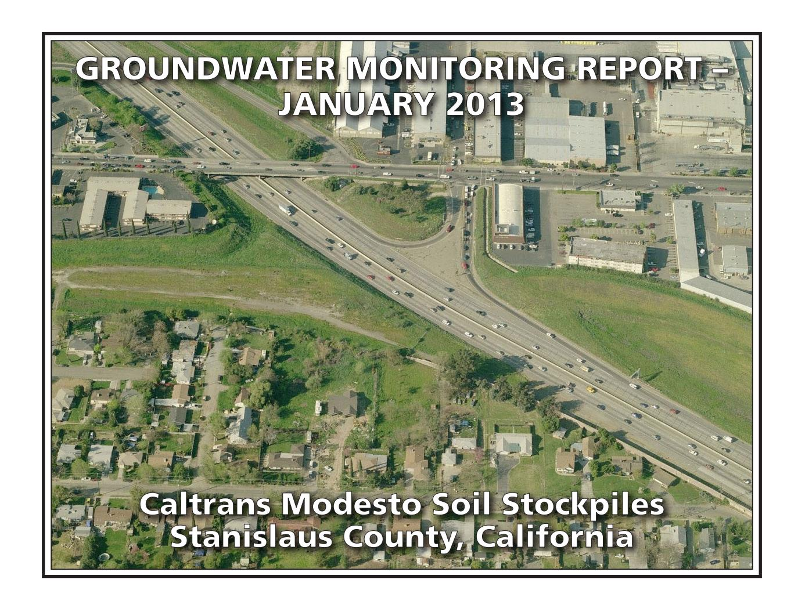
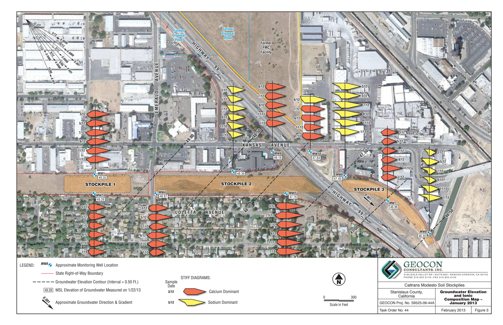
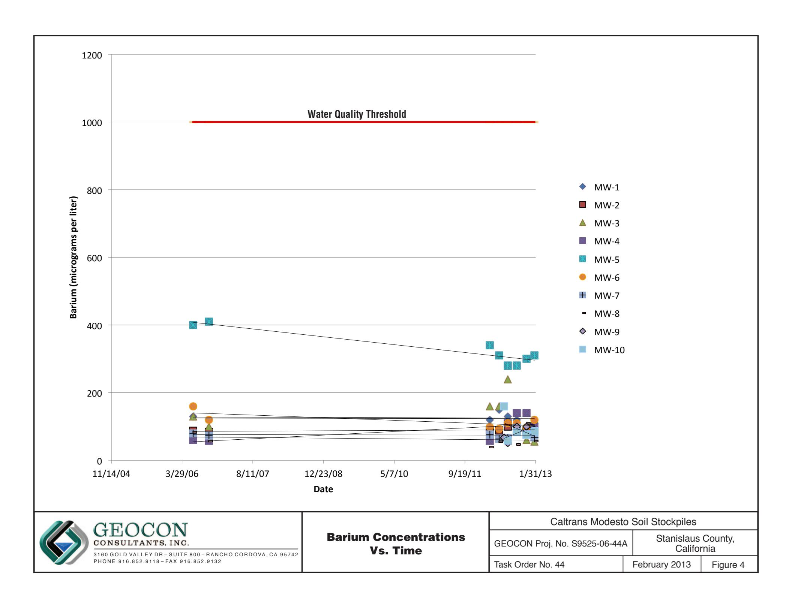
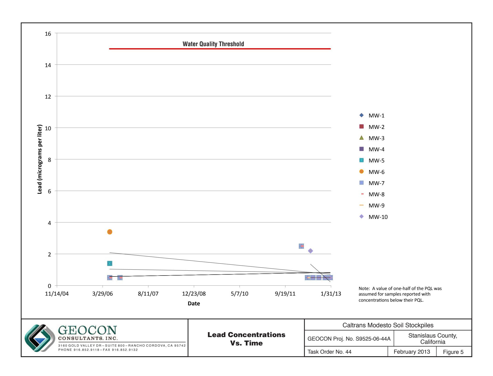
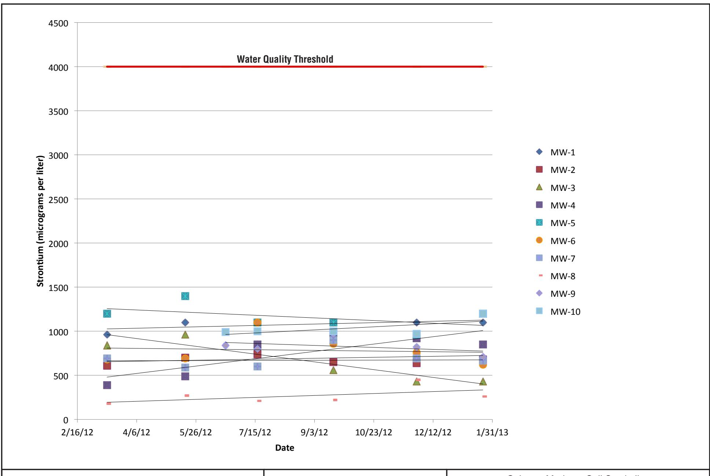
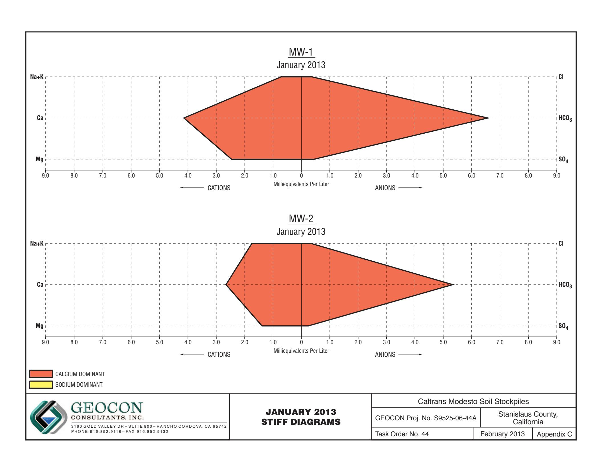
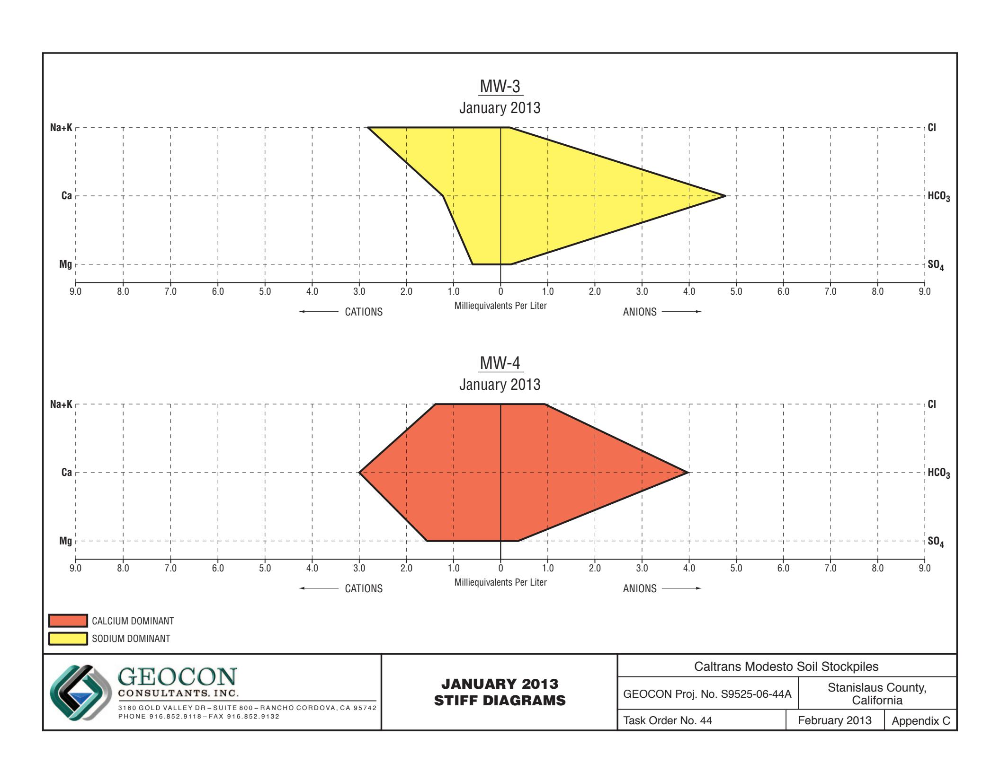
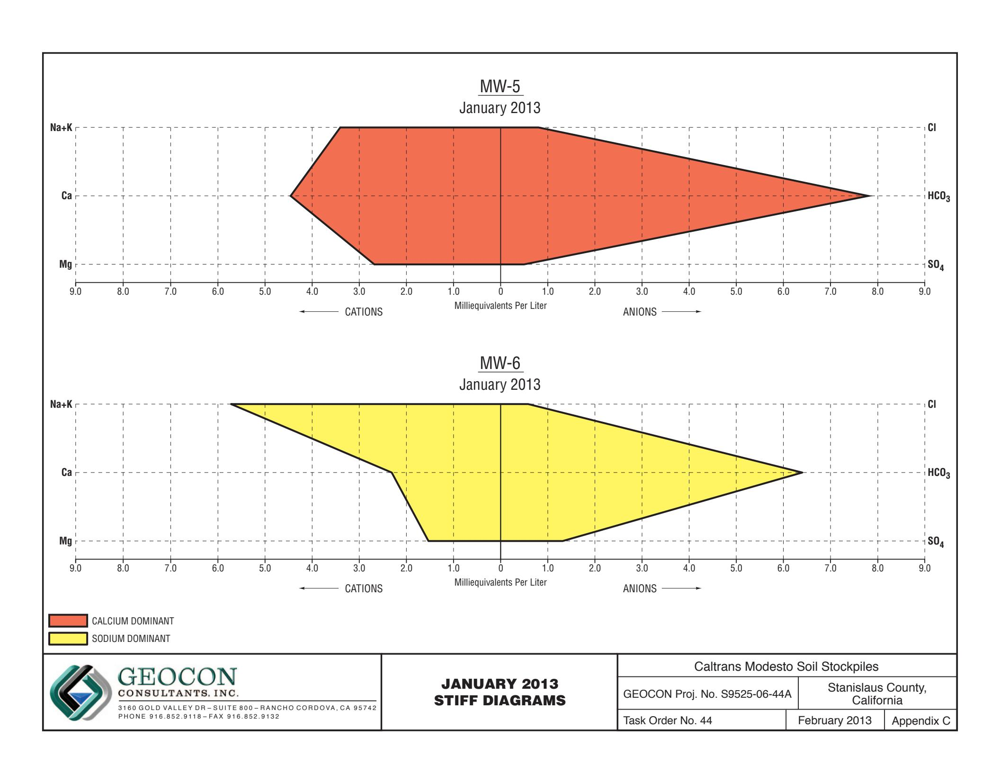
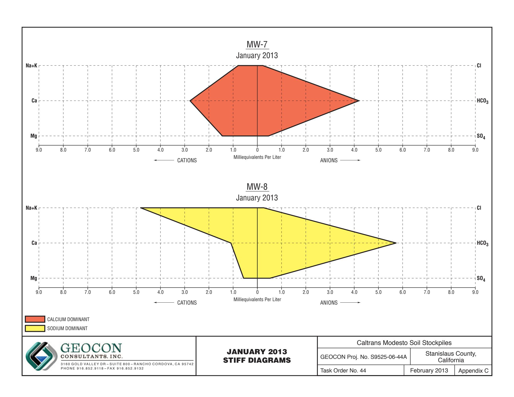
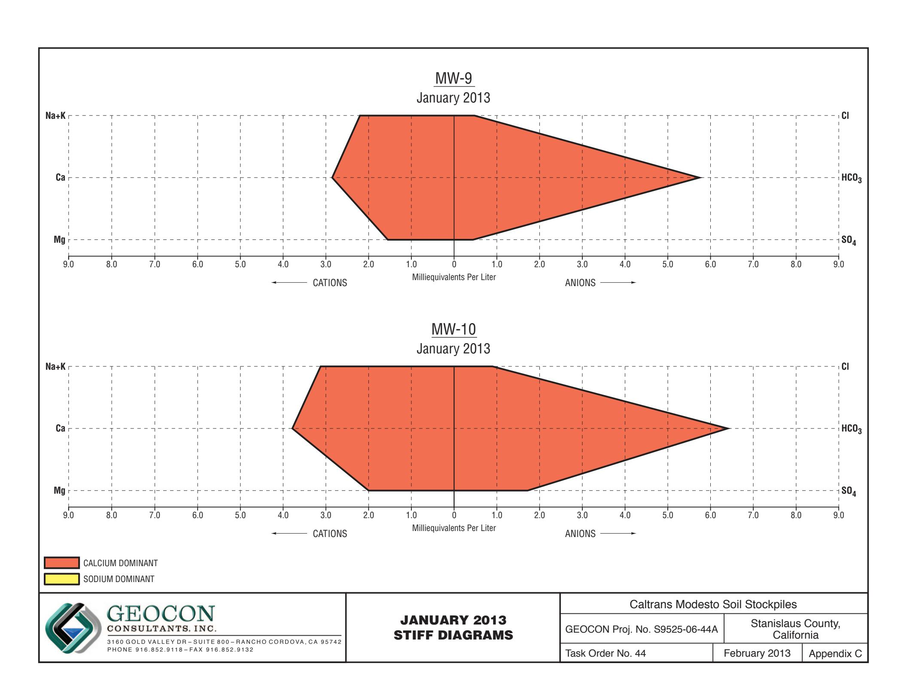

# PREPARED FOR:

CALIFORNIA DEPARTMENT OF TRANSPORTATION – DISTRICT 6
HAZARDOUS WASTE BRANCH
855 M STREET, SUITE 200
FRESNO, CALIFORNIA 93721


# PREPARED BY:

GEOCON CONSULTANTS, INC. 3160 GOLD VALLEY DRIVE, SUITE 800 RANCHO CORDOVA, CALIFORNIA 95742


**GEOCON PROJECT NO. S9525-06-44A TASK ORDER NO. 44, EA 10-403500 CONTRACT NO 06A1580** 


Project No. S9525-06-44A February 28, 2013

Mr. Richard Stewart, PG California Department of Transportation - District 6 Hazardous Waste Branch 855 M Street, Suite 200 Fresno. California 93721

Subject: GROUNDWATER MONITORING REPORT – JANUARY 2013

CALTRANS MODESTO SOIL STOCKPILES STANISLAUS COUNTY, CALIFORNIA

CONTRACT NO. 06A1580, TASK ORDER NO. 44, EA NO. 10-403500

Dear Mr. Stewart:

In accordance with California Department of Transportation (Caltrans) Contract No. 06A1580, Task Order (TO) No. 44, Geocon performed groundwater monitoring activities at the Caltrans Modesto Soil Stockpiles (Site) located southerly of the intersection of State Route (SR) 99 and Kansas Avenue in Stanislaus County, California. We are currently performing sampling at the Site every other month. This report presents the results of the January 2013 sampling event. The approximate site location is depicted on the attached Vicinity Map, Figure 1. The approximate site boundaries and Stockpiles 1 through 3 are shown on the Site Plan, Figure 2.

The objective of TO No. 44 is to perform groundwater sampling and analysis at the Site in accordance with protocols approved by the California Environmental Protection Agency Department of Toxic Substances Control (DTSC) as established in the *Final Work Plan, Groundwater Assessment* prepared by Shaw Environmental, Inc., and dated January 2006. The scope of services reported herein included depth to groundwater measurements, groundwater sample collection from ten groundwater monitoring wells, analysis of the water samples by a California-certified laboratory, and preparation of this report.

# BACKGROUND

## Project Description and History

Stockpiles 1 through 3 were generated during construction of SR 99 through Modesto around 1961 when Caltrans excavated soil from property purchased from Food Machinery and Chemical Corporation (FMC) that contained an evaporation pond. The stockpiles were placed in their present location in anticipation of construction of the State Route 132 West Freeway/Expressway project.

During the 1930s, Barium Products Ltd. occupied property at 1200 Barium Road (now Graphics Drive) in Modesto just east of SR 99 between Woodland and Kansas Avenues. Barium Products Ltd. was a chemical manufacturing company processing a variety of ores and minerals including barite (barium sulfate) and celestite (strontium sulfate). Materials produced included barium and strontium compounds; these were used in greases, lubricating oil and pigment blanks. Sodium sulfide generated as a by-product of barite processing was sold as a caustic and used as a reagent in the mining industry.

In 1943, Barium Products Ltd. was purchased by Westvaco Chlorine Products Corporation which subsequently merged with FMC in 1948. From the 1950s to the 1970s, a liquid residue from the processing operations was discharged to unlined evaporation ponds along the western portion of the FMC Site. The approximate boundaries of the former evaporation/disposal ponds are shown on Figure 2.

In 1961, a 4.3–acre parcel at the southwestern corner of the FMC site was purchased by the State of California for highway right-of-way needed to construct SR 99. An aerial photograph from 1957 shows that a portion of the southernmost pond on the FMC property was within the area purchased for right-of-way.

Soil in and around the pond was excavated during construction of SR 99 and stockpiled within the current Caltrans right-of-way at the location of the future State Route 132 West Freeway/Expressway project. Three distinct stockpiles are present at the Site:

- Stockpile 1, located south of Kansas Avenue and west of North Emerald Avenue,
- Stockpile 2, located south of Kansas Avenue, between North Emerald Avenue and SR 99, and
- Stockpile 3, located south of Kansas Avenue and east of SR 99.

In 2006, Caltrans arranged for the installation of monitoring wells MW-1 through MW-8 at locations adjacent to the three stockpiles as shown on Figure 2. General groundwater chemistry analytical results from June and October 2006 groundwater events suggested that two distinct groundwater types are present beneath the Site. A survey of groundwater wells within a one-mile radius of the Site identified 43 existing or former wells; however, there were no active supply wells identified in the general (southeast) flow direction from the Site.

Groundwater monitoring was resumed for the Site with the March 2012 sampling of wells MW-1 through MW-8. Representatives from the DTSC observed the sample collection procedures and collected split samples which were submitted to an alternate laboratory. No notable differences in the concentrations for each reported analyte were evident.

In June 2012, Geocon arranged for the installation of monitoring wells MW-9 and MW-10 at locations that are both upgradient and adjacent to the three stockpiles as shown on Figure 2.

Geocon compared the analytical results from the six recent groundwater sampling events (March, May, June, July, September and November 2012) to the following water quality threshold values:

- Primary Maximum Contaminant Levels (MCLs) promulgated by the California Department of Public Health (CDPH); and
- Secondary MCLs promulgated by the CDPH.

The results of the previous 2012 groundwater sampling events show that both dissolved metals and general minerals have predominantly been reported at concentrations less than their respective numeric water quality threshold values. Only nitrates (expressed as nitrogen) in MW-1, MW-5, and MW-6 and total dissolved solids (TDS) in wells MW-5, MW-6, and MW-10 have been consistently reported at concentrations that exceed their respective primary or secondary MCLs of 10 and 500 milligrams per liter (mg/l). Based on the lack of polycyclic aromatic hydrocarbons (PAHs) reported for each of the

samples analyzed, we requested discontinuation of analysis for PAHs. PAH analysis was discontinued after the November 2012 sampling event with concurrence from the DTSC.

# Hydrogeologic Characterization

The hydrogeology of the adjacent FMC site has been characterized by numerous studies since the early 1980s. The GeoTrans January 2005 report *Addendum to Comprehensive Remedial Investigations Report, FMC Corporation, 1200 Graphics Drive, Modesto, Stanislaus County, California* (GeoTrans, 2005) provides a description of the FMC site hydrogeology. This description follows:

"The site is underlain by laterally discontinuous and unconsolidated sand and silty sand associated with the Modesto and Riverbank Formations. First encountered groundwater is approximately 30 feet below ground surface (bgs) under confined to semi-confined conditions. A deeper aquifer is present at a depth of 165 feet bgs and separated from the upper zone by a blue clay aquitard. The upper water bearing unit has been divided into two zones: a shallow zone from first encountered groundwater to 120 feet bgs and a deeper zone from 140 feet bgs to the top of the aquitard. Groundwater flow within the upper zone is toward the southeast under a gradient of 0.002 ft/ft."

Monitoring wells MW-1 through MW-10 were installed into the unconsolidated sand, silty sand and silt layers within the Modesto Formation underlying the Site. The wells were completed within the shallow zone of the upper aquifer (shallow zone).

The lithology encountered in the borings for the wells includes interbedded (laterally discontinuous) sands, silts, and clays. In the areas investigated, the unsaturated (vadose) zone was dominated by silty soils. The shallow zone groundwater beneath the stockpiles was encountered at approximately 35 feet (elevation approximately 50 feet) under unconfined to semi-confined conditions. Based on historical depth to water measurements from the Site, the groundwater flow direction in the shallow upper aquifer is generally toward the southeast with hydraulic gradients varying from 0.0006 to 0.001. The shallow aquifer conditions beneath the Site and the adjacent FMC site appear similar and representative of conditions in the local area.

## JANUARY 2013 FIELD ACTIVITIES

This section describes the field activities performed for the January 2013 monitoring event.

## Depth to Groundwater Measurements

On January 22, 2013, prior to opening the wells, Geocon observed each of the ten well boxes for signs of potential tampering. No signs of tampering were observed. The security well boxes and casing caps were noted to be properly sealed and locked. Geocon measured the depth to groundwater and the dissolved oxygen (DO) levels and oxygen-reduction potential (ORP) in monitoring wells MW-1 through MW-10 using a battery-operated water level meter, a Hanna Model No. 9143 DO meter, and an Oakton ORP meter. Depth to water measurements were obtained from a surveyed reference point at the top of the well casings (TOC).

In January 2013, depth to groundwater at the Site ranged from 31.04 (MW-1) to 40.02 (MW-5) feet below TOC. Based on the groundwater elevation data, the groundwater flow is toward the southeast at an average gradient of 0.001, which is consistent with historical flow. A gradient rose diagram depicting historical flow direction and gradient is included on Figure 3. A summary of the TOC

elevations, depth to groundwater measurements and groundwater elevations is on Table 1. Groundwater elevation contours, flow direction and gradient are depicted on Figure 3, Groundwater Elevation and Ionic Composition Map – January 2013.

## Well Purging and Sampling

On January 22 and 23, 2013, Geocon purged approximately three well volumes of water (2 to 6.5 gallons) from groundwater monitoring wells MW-1 through MW-4 and MW-7 through MW-10 using a submersible pump. Wells MW-5 and MW-6 went dry after purging 1 gallon and 1.5 gallons, respectively. Geocon allowed both wells to recover, purged an additional 2 gallons from well MW-6, allowed the well to recover a second time, and then collected groundwater samples. The pump was decontaminated before and after each use by washing in an Alconox<sup>TM</sup> solution followed by fresh and distilled water rinses. During the well purging activities, the groundwater was monitored for pH, electrical conductivity, temperature and turbidity. This information is included on the Monitoring Well Sampling Data sheets in Appendix A.

Following well purging, groundwater samples were collected from each of the wells using disposable bailers and decanted through slow emptying devices into laboratory-provided sample containers. The groundwater samples collected for dissolved metals analysis were filtered using a hand-pressure pump through a 0.45-micron filter while filling the container. The samples were sealed, labeled, placed in a chilled cooler and subsequently transported to the laboratory using chain-of-custody protocol.

Purged groundwater was placed into one Department of Transportation-approved, 17-H, 55-gallon drum and transported offsite to Geocon's Rancho Cordova office pending receipt of analytical results and subsequent disposal at Inviro-tec Disposal facility in Lincoln, California, on January 30, 2013.

## ANALYTICAL METHODS AND RESULTS

### Laboratory Analysis

The groundwater samples were delivered to Advanced Technology Laboratories (ATL) for the following analyses under chain-of-custody protocol:

- Title 22 dissolved metals (including strontium) following United States Environmental Protection Agency (EPA) Test Methods 6020/7470;
- Dissolved calcium, magnesium, potassium and sodium by EPA Test Method 6020;
- Chloride, nitrate as nitrogen and sulfate by EPA Test Method 300.0;
- Sulfide by Standard Method (SM) 4500;
- TDS by SM 2540C; and
- Total alkalinity, bicarbonate alkalinity, carbonate alkalinity by SM 2320B.

Groundwater analytical results for this monitoring event are summarized on Tables 2 and 3. The laboratory reports and chain-of-custody documentation are in Appendix B.

### Analytical Results

#### Dissolved Metals

Analytical results for dissolved metals along with their associated numeric water quality thresholds are summarized on Table 2. Plots of barium, lead and strontium concentrations vs. time are presented as Figures 4 through 6.

DTSC has identified barium, lead and strontium as the primary chemicals of concern in groundwater for the Site. For the January 2013 groundwater samples, barium and strontium were reported for each of the ten groundwater samples. Lead was not reported at concentrations equal to or greater than the practical quantitation limits (PQL) of 1.0 micrograms per liter ( $\mu$ g/l) in each of the groundwater samples. The ranges of barium and strontium concentrations reported for the January sampling event are on the following table:

|                                    | Barium (μg/l)   | Strontium (µg/l)    |
|------------------------------------|-----------------|---------------------|
| High Concentration                 | 310 (MW-5)      | 1,200 (MW-5, MW-10) |
| Low Concentration                  | 55 (MW-3)       | 260 (MW-8)          |
| Numeric Water Quality<br>Threshold | 1,000(1)/700(2) | 4,000(2)            |

<sup>(1) =</sup> California Department of Public Health Primary MCL for Drinking Water

Antimony, beryllium, cadmium, silver, thallium and mercury were not reported at concentrations equal to or greater than their respective PQLs in samples from each well. As shown on the following table, the dissolved metals arsenic, chromium and vanadium were reported for each of the samples collected with the following ranges:

|                                    | Arsenic<br>(μg/l) | Chromium<br>(µg/l) | Vanadium<br>(μg/l) |
|------------------------------------|-------------------|--------------------|--------------------|
| High Concentration                 | 5.5<br>(MW-3)     | 9.5<br>(MW-6)      | 41<br>(MW-6)       |
| Low Concentration                  | 1.7<br>(MW-5)     | 0.92<br>(MW-10)    | 15<br>(MW-4)       |
| Numeric Water<br>Quality Threshold | 10(1)             | 50(1)              | 50(3)              |

<sup>(1) =</sup> California Department of Public Health Primary Maximum Contaminant Level for Drinking Water

Although concentrations of arsenic, barium, chromium, strontium and vanadium were reported for the samples collected from each well, none of the reported concentrations exceed their respective numeric water quality thresholds for drinking water.

<sup>(2) =</sup> EPA Drinking Water Health Advisory

<sup>(2) =</sup> EPA Drinking Water Health Advisory

<sup>(3) =</sup> California Department of Public Health Notification Level for Drinking Water

Nickel and molybdenum were reported for seven of the ten samples collected. Selenium was detected in five of the ten samples collected. Zinc was detected in three of the ten samples collected. Manganese was detected in two of the ten samples collected. Cobalt and copper were detected in the sample from MW-6. The following table summarizes the dissolved cobalt, copper, manganese, molybdenum, nickel, selenium and zinc concentrations reported for the listed samples:

|                                 | Cobalt<br>(µg/l) | Copper<br>(µg/l)        | Manganese<br>(µg/l) | Molybdenum<br>(µg/l) | Nickel<br>(µg/l) | Selenium<br>(µg/l) | Zinc<br>(µg/l)          |
|---------------------------------|------------------|-------------------------|---------------------|----------------------|------------------|--------------------|-------------------------|
| High Concentration              | 1.9<br>(MW-6)    | 3.2<br>(MW-6)           | 100<br>(MW-6)       | 5.2<br>(MW-6)        | 4.0<br>(MW-6)    | 3.7<br>(MW-10)     | 29<br>(MW-3)            |
| Low Concentration               | 1.9<br>(MW-6)    | 3.2<br>(MW-6)           | 12<br>(MW-1)        | 0.63<br>(MW-1)       | 1.7<br>(MW-7)    | 0.59<br>(MW-4)     | 16<br>(MW-6)            |
| Numeric Water Quality Threshold | --               | 1,300 (1)<br>/1,000 (2) | 50(1)               | --                   | 100 (1)          | 50(1)              | 5,000 (2)<br>/2,000 (3) |

 $<sup>^{(1)}</sup>$  = California Department of Public Health Primary Maximum Contaminant Level for Drinking Water

Although concentrations of cobalt, copper, manganese, molybdenum, nickel, selenium and zinc were reported for the samples collected from site monitoring wells, none of the reported concentrations exceed their respective numeric water quality thresholds for drinking water with the exception of the sample from MW-6 for manganese.

### General Minerals/Stiff Diagrams

To further characterize the geochemistry of the groundwater, general minerals analyses were conducted and included the following constituents:

- dissolved calcium
- dissolved magnesium
- chloride
- nitrate as nitrogen
- sulfate
- dissolved potassium
- dissolved sodium
- sulfide
- total alkalinity
- TDS

General groundwater chemistry provides information regarding the origin and geochemical nature of the groundwater sampled. The analytical results for the major cation (dissolved sodium, potassium, calcium and magnesium) and anion species (chloride, bicarbonate alkalinity reported as calcium carbonate, and sulfate) were used to create Stiff diagrams. Stiff diagrams provide a graphical display of ionic content and can be used to characterize and evaluate the relative composition of groundwater and its consistency or variability. Groundwater with different cation/anion concentrations will result in Stiff diagrams of different shapes and sizes. Stiff diagrams can also help to illustrate mixing of water with different compositions or origins. The presence of more than one water type can be an indication of influences due to hydrogeologic variation or from other sources including man-made impacts.

<sup>&</sup>lt;sup>(2)</sup>= California Department of Public Health Secondary Maximum Contaminant Level (taste and odor)

<sup>(3) =</sup> EPA Drinking Water Health Advisory

Appendix C contains Stiff diagrams constructed using site groundwater data for January 2013. The diagrams show that groundwater sampled in each monitoring well is bicarbonate (HCO<sub>3</sub>) dominant. However, variations in the sodium and potassium (Na+K) and calcium composition are readily apparent. The variations are seen primarily in the sodium content with the potassium concentrations being less variable. In January 2013, the samples from wells MW-1, MW-2, MW-4, MW-5, MW-7, MW-9 and MW-10 had a calcium-dominant composition while the samples from wells MW-3, MW-6 and MW-8 were sodium-dominant

Nitrate as nitrogen and TDS were both reported for each of the groundwater samples, with nitrate as nitrogen concentrations ranging from 2.9 (MW-3) to 30 mg/l (MW-5) and TDS concentrations ranging from 310 (MW-7) to 680 mg/l (MW-5). The reported nitrate concentrations for samples from MW-1, MW-5, MW-6 and MW-10 exceed the primary MCL for nitrate of 10 mg/l, and the reported TDS concentrations for samples from MW-5, MW-6 and MW-10 exceed the secondary MCL for TDS of 500 mg/l. Noteworthy is that MW-1 is an upgradient monitoring well; thus, the reported nitrate and TDS concentrations of 12 and 460 mg/l, respectively, may be indicative of natural background nitrate and TDS concentrations for the shallow groundwater in the vicinity of the Site. Sulfide was reported for each of the ten samples with concentrations ranging from 0.014 (MW-8) to 0.52 mg/l (MW-1).

The analytical results for general minerals are summarized on Table 3.

## Field and Laboratory Quality Assurance/Quality Control

The field quality assurance/quality control (QA/QC) implemented for the January 2013 groundwater monitoring at the Site included the collection of an equipment blank analyzed for dissolved metals. The blank was collected by pouring distilled water over a decontaminated pump and allowing the water to collect into the laboratory-provided sample container. Dissolved metals were not reported at concentrations equal to or greater than their respective PQLs for the equipment blank, with the exception of chromium at  $1.2~\mu g/l$ . The chromium concentrations reported for the samples appeared similar to those previously reported for each of the wells; therefore, it does not appear that the presence of chromium in the equipment blank has significantly influenced the sample results.

Geocon also reviewed the analytical laboratory QA/QC provided with the laboratory report. These data show that that the method blank surrogate recoveries are acceptable and that concentrations of selected analytes were not reported at concentrations equal to or greater than their respective PQLs for each method blank for each analysis. Appropriate recoveries were noted for each laboratory control sample for each analysis. Several matrix spike/matrix spike duplicate (MS/MSD) analytes had recoveries or relative percent differences outside of laboratory control limits; however, the sample results were validated by the laboratory control samples. No qualification of the data is necessary, and the data are considered of sufficient quality for the purposes of this report.

### GeoTracker Submittal

The laboratory prepared electronic data files for submittal to the State Water Resources Control Board GeoTracker database. The GeoTracker database is accessible via the GeoTracker website at <a href="http://geotracker.waterboards.ca.gov">http://geotracker.waterboards.ca.gov</a>. The electronic data was uploaded to GeoTracker on February 28, 2013. The confirmation numbers are 3290851652, 9592878222 and 7184525966.

# CONCLUSIONS AND RECOMMENDATIONS

With the exception of manganese detected in the sample from MW-6, none of the reported dissolved metals concentrations for the groundwater samples collected in January 2013 exceeded their respective numeric water quality threshold values.

With the exception of nitrate, none of the reported general minerals for the groundwater samples collected in January 2013 exceeded their respective California primary MCLs. TDS was reported at concentrations exceeding the secondary MCL of 500 mg/l for the samples collected from wells MW-5, MW-6 and MW-10.

Barium and strontium were reported for the January 2013 groundwater samples at concentrations similar to historical levels and remained significantly less than their numeric water quality thresholds. The remaining dissolved metals were also reported at concentrations similar to historical levels. Lead was not reported at concentrations equal to or greater than the PQL of 1.0 µg/l in each of the groundwater samples.

Stiff diagrams for the 2012 and January 2013 groundwater sampling events show that very slight changes in ionic content have occurred since groundwater sampling resumed at the Site in March 2012. Water samples from wells MW-1, MW-2, MW-4, MW-5, MW-7 and MW-9 have consistently been reported as calcium-dominant, and those from wells MW-3, MW-6 and MW-8 as sodium-dominant. The ionic content reported for well MW-10 was sodium-dominant in June 2012, calcium-dominant in July 2012, and remained calcium-dominant for the September and November 2012 and January 2013 monitoring events.

The next monitoring event is scheduled for March 2013. Following the March sampling event, we will change the sampling frequency to quarterly.

We appreciate the opportunity to provide our services on this project. Please contact us if you have any questions concerning the contents of this Report or if we may be of further service.

Sincerely,

GEOCON CONSULTANTS, INC.

Rebecca L. Silva Project Manager

- (1) Addressee
- (1) Caltrans, Sam Haack
- (1) DTSC, Randy Adams
- (1) CVRWQCB, Steve Meeks

Attachments:

Figure 1, Vicinity Map

Figure 2, Site Plan

Figure 3, Groundwater Elevation and Ionic Composition Map – January 2013

Figure 4, Barium Concentrations vs. Time

Figure 5, Lead Concentrations vs. Time

Figure 6, Strontium Concentrations vs. Time

Table 1, Groundwater Elevation Data

Table 2, Summary of Groundwater Analytical Results – Title 22 Metals (Dissolved)

John E. Juhrend, PE, CEG

Principal/Senior Engineer

Table 3, Summary of Groundwater Analytical Results – General Minerals and PAHs

Table 4, Well Construction Details

Appendix A, Monitoring Well Development and Sampling Data Sheets Appendix B, Laboratory Reports and Chain-of-custody Documentation Appendix C, Stiff Diagrams


MW8 Approximate Monitoring Well Location

Approximate Monitoring Well Location

— State Right-of-Way Boundary


Scale in Feet

GEOCON CONSULTANTS, INC.

3160 GOLD VALLEY DR - SUITE 800 - RANCHO CORDOVA, CA 95742 PHONE 916.852.9118 - FAX 916.852.9132

### Caltrans Modesto Soil Stockpiles

| Stanislaus County, |
|--------------------|
| California         |

**SITE PLAN** 

GEOCON Proj. No. S9525-06-44A Task Order No. 44

February 2013

February 2013

Figure 2










Strontium Concentrations Vs. Time

| Caltrans Modesto Soil Stockpiles |                                  |          |
|----------------------------------|----------------------------------|----------|
| GEOCON Proj. No. S9525-06-44A    | Stanislaus County,<br>California |          |
| Task Order No. 44                | February 2013                    | Figure 6 |

# TABLE 1 GROUNDWATER ELEVATION DATA CALTRANS MODESTO SOIL STOCKPILES STANISLAUS COUNTY, CALIFORNIA

| WELL ID                       | DATE       | WELL CASING<br>ELEVATION<br>(feet MSL) | DEPTH TO<br>GROUNDWATER<br>(feet below TOC) | GROUNDWATER<br>ELEVATION<br>(feet MSL) |
|-------------------------------|------------|----------------------------------------|---------------------------------------------|----------------------------------------|
| MW-1                          | 6/14/2006  | 80.26                                  | 29.82                                       | 50.44                                  |
| MW-1                          | 10/5/2006  | 80.26                                  | 32.35                                       | 47.91                                  |
| MW-1                          | 3/12/2012  | 80.26                                  | 30.12                                       | 50.14                                  |
| MW-1                          | 5/17/2012  | 80.26                                  | 29.74                                       | 50.52                                  |
| MW-1                          | 7/17/2012  | 80.39                                  | 31.34                                       | 49.05                                  |
| MW-1                          | 9/19/2012  | 80.39                                  | 32.73                                       | 47.66                                  |
| MW-1                          | 11/28/2012 | 80.39                                  | 32.28                                       | 48.11                                  |
| MW-1                          | 1/22/2013  | 80.39                                  | 31.04                                       | 49.35                                  |
| MW-2                          | 6/13/2006  | 81.10                                  | 30.72                                       | 50.38                                  |
| MW-2                          | 10/5/2006  | 81.10                                  | 33.35                                       | 47.75                                  |
| MW-2                          | 3/12/2012  | 81.10                                  | 31.04                                       | 50.06                                  |
| MW-2                          | 5/17/2012  | 81.10                                  | 30.69                                       | 50.41                                  |
| MW-2                          | 7/17/2012  | 81.25                                  | 33.28                                       | 47.97                                  |
| MW-2                          | 9/19/2012  | 81.25                                  | 33.70                                       | 47.55                                  |
| MW-2                          | 11/28/2012 | 81.25                                  | 33.22                                       | 48.03                                  |
| MW-2                          | 1/22/2013  | 81.25                                  | 31.97                                       | 49.28                                  |
| MW-3                          | 6/13/2006  | 81.76                                  | 32.38                                       | 49.38                                  |
| MW-3                          | 10/5/2006  | 81.76                                  | 34.88                                       | 46.88                                  |
| MW-3                          | 3/12/2012  | 81.76                                  | 32.35                                       | 49.41                                  |
| MW-3                          | 5/17/2012  | 81.76                                  | 31.91                                       | 49.85                                  |
| MW-3                          | 7/17/2012  | 81.82                                  | 33.45                                       | 48.37                                  |
| MW-3                          | 9/19/2012  | 81.82                                  | 34.89                                       | 46.93                                  |
| MW-3                          | 11/28/2012 | 81.82                                  | 34.69                                       | 47.13                                  |
| MW-3                          | 1/22/2013  | 81.82                                  | 33.43                                       | 48.39                                  |
| MW-4                          | 6/13/2006  | 82.36                                  | 32.39                                       | 49.97                                  |
| MW-4                          | 10/4/2006  | 82.36                                  | 35.05                                       | 47.31                                  |
| MW-4                          | 3/12/2012  | 82.36                                  | 32.60                                       | 49.76                                  |
| MW-4                          | 5/17/2012  | 82.36                                  | 32.20                                       | 50.16                                  |
| MW-4                          | 7/17/2012  | 82.47                                  | 33.86                                       | 48.61                                  |
| MW-4                          | 9/19/2012  | 82.47                                  | 35.28                                       | 47.19                                  |
| MW-4                          | 11/28/2012 | 82.47                                  | 34.84                                       | 47.63                                  |
| MW-4                          | 1/22/2013  | 82.47                                  | 33.60                                       | 48.87                                  |
| MW-5                          | 6/14/2006  | 87.73                                  | 38.79                                       | 48.94                                  |
| STANISLAUS COUNTY, CALIFORNIA |            |                                        |                                             |                                        |
| WELL ID                       | DATE       | WELL CASING<br>ELEVATION<br>(feet MSL) | DEPTH TO<br>GROUNDWATER<br>(feet below TOC) | GROUNDWATER<br>ELEVATION<br>(feet MSL) |
| MW-5                          | 10/5/2006  | 87.73                                  | 41.40                                       | 46.33                                  |
| MW-5                          | 3/12/2012  | 87.73                                  | 38.74                                       | 48.99                                  |
| MW-5                          | 5/17/2012  | 87.73                                  | 38.25                                       | 49.48                                  |
| MW-5                          | 7/17/2012  | 87.78                                  | 39.74                                       | 48.04                                  |
| MW-5                          | 9/19/2012  | 87.78                                  | 41.19                                       | 46.59                                  |
| MW-5                          | 11/28/2012 | 87.78                                  | 41.18                                       | 46.60                                  |
| MW-5                          | 1/22/2013  | 87.78                                  | 40.02                                       | 47.76                                  |
| MW-6                          | 6/14/2006  | 84.37                                  | 36.35                                       | 48.02                                  |
| MW-6                          | 10/5/2006  | 84.37                                  | 38.55                                       | 45.82                                  |
| MW-6                          | 3/12/2012  | 84.37                                  | 35.70                                       | 48.67                                  |
| MW-6                          | 5/17/2012  | 84.37                                  | 35.18                                       | 49.19                                  |
| MW-6                          | 7/17/2012  | 84.52                                  | 36.40                                       | 48.12                                  |
| MW-6                          | 9/19/2012  | 84.52                                  | 37.99                                       | 46.53                                  |
| MW-6                          | 11/28/2012 | 84.52                                  | 38.19                                       | 46.33                                  |
| MW-6                          | 1/22/2013  | 84.52                                  | 37.07                                       | 47.45                                  |
| MW-7                          | 6/14/2006  | 83.64                                  | 35.59                                       | 48.05                                  |
| MW-7                          | 10/4/2006  | 83.64                                  | 38.32                                       | 45.32                                  |
| MW-7                          | 3/12/2012  | 83.64                                  | 35.31                                       | 48.33                                  |
| MW-7                          | 5/17/2012  | 83.64                                  | 34.72                                       | 48.92                                  |
| MW-7                          | 7/17/2012  | 83.74                                  | 36.00                                       | 47.74                                  |
| MW-7                          | 9/19/2012  | 83.74                                  | 37.60                                       | 46.14                                  |
| MW-7                          | 11/28/2012 | 83.74                                  | 37.35                                       | 46.39                                  |
| MW-7                          | 1/22/2013  | 83.74                                  | 36.78                                       | 46.96                                  |
| MW-8                          | 6/14/2006  | 83.73                                  | 36.12                                       | 47.61                                  |
| MW-8                          | 10/4/2006  | 83.73                                  | 38.95                                       | 44.78                                  |
| MW-8                          | 3/12/2012  | 83.73                                  | 35.75                                       | 47.98                                  |
| MW-8                          | 5/17/2012  | 83.73                                  | 35.11                                       | 48.62                                  |
| MW-8                          | 7/17/2012  | 83.85                                  | 36.29                                       | 47.56                                  |
| MW-8                          | 9/19/2012  | 83.85                                  | 38.04                                       | 45.81                                  |
| MW-8                          | 11/28/2012 | 83.85                                  | 38.37                                       | 45.48                                  |
| MW-8                          | 1/22/2013  | 83.85                                  | 37.35                                       | 46.50                                  |
| MW-9                          | 6/18/2012  | 82.53                                  | 33.67                                       | 48.86                                  |
| WELL ID                       | DATE       | WELL CASING<br>ELEVATION<br>(feet MSL) | DEPTH TO<br>GROUNDWATER<br>(feet below TOC) | GROUNDWATER<br>ELEVATION<br>(feet MSL) |
| MW-9                          | 9/19/2012  | 82.53                                  | 35.64                                       | 46.89                                  |
| MW-9                          | 11/28/2012 | 82.53                                  | 35.65                                       | 46.88                                  |
| MW-9                          | 1/22/2013  | 82.53                                  | 34.35                                       | 48.18                                  |
| MW-10                         | 6/18/2012  | 83.97                                  | 35.18                                       | 48.79                                  |
| MW-10                         | 7/17/2012  | 83.97                                  | 35.75                                       | 48.22                                  |
| MW-10                         | 9/19/2012  | 83.97                                  | 37.18                                       | 46.79                                  |
| MW-10                         | 11/28/2012 | 83.97                                  | 37.34                                       | 46.63                                  |
| MW-10                         | 1/22/2013  | 83.97                                  | 36.13                                       | 47.84                                  |

TABLE 1
GROUNDWATER ELEVATION DATA
CALTRANS MODESTO SOIL STOCKPILES
STANISLAUS COUNTY, CALIFORNIA

# TABLE 1 GROUNDWATER ELEVATION DATA CALTRANS MODESTO SOIL STOCKPILES STANISLAUS COUNTY, CALIFORNIA

Notes:

MSL = Mean sea level

TOC = Top of well casing

Data prior to 3/12/2012 reproduced from *Site Investigation Report, Groundwater Assessment, Caltrans Modesto Soil Stockpiles State Route 99/132 Project, Stanislaus County, California,* Shaw Environmental, Inc., May 14, 2007.

Wells resurveyed by Morrow Surveying on June 18, 2012.

## TABLE 2

### SUMMARY OF GROUNDWATER ANALYTICAL RESULTS - TITLE 22 METALS (Dissolved) CALTRANS MODESTO SOIL STOCKPILES

|                                                              |                                                                                                                      |                                                                       |                                                              |                                                             |                                                                        |                                                                                 | STA                                                         | ANISLAUS                                                                       | COUNT                                                           | Y, CALIFO                                                            | ORNIA                                               |                                                                   |                                                                  |                                                                                                  |                                                                  |                                                                                 |                                                      |                                                        |                                                           |                                                                              |
|--------------------------------------------------------------|----------------------------------------------------------------------------------------------------------------------|-----------------------------------------------------------------------|--------------------------------------------------------------|-------------------------------------------------------------|------------------------------------------------------------------------|---------------------------------------------------------------------------------|-------------------------------------------------------------|--------------------------------------------------------------------------------|-----------------------------------------------------------------|----------------------------------------------------------------------|-----------------------------------------------------|-------------------------------------------------------------------|------------------------------------------------------------------|--------------------------------------------------------------------------------------------------|------------------------------------------------------------------|---------------------------------------------------------------------------------|------------------------------------------------------|--------------------------------------------------------|-----------------------------------------------------------|------------------------------------------------------------------------------|
| ANALYTE                                                      |                                                                                                                      | Antimony                                                              | Arsenic                                                      | Barium                                                      | Beryllium                                                              | Cadmium                                                                         | Chromium                                                    | Cobalt                                                                         | Copper                                                          | Lead                                                                 | Manganese                                           | Molybdenum                                                        | Nickel                                                           | Selenium                                                                                         | Silver                                                           | Thallium                                                                        | Vanadium                                             | Zinc                                                   | Strontium                                                 | Mercury                                                                      |
| SAMPLE ID                                                    | SAMPLE<br>DATE                                                                                                       |                                                                       | Results in micrograms per liter                              |                                                             |                                                                        |                                                                                 |                                                             |                                                                                |                                                                 |                                                                      |                                                     |                                                                   |                                                                  |                                                                                                  |                                                                  |                                                                                 |                                                      |                                                        |                                                           |                                                                              |
| MW-1<br>MW-1<br>MW-1<br>MW-1<br>MW-1<br>MW-1<br>MW-1         | 6/14/2006<br>10/5/2006<br>3/12/2012<br>3/12/2012 S<br>5/17/2012<br>7/16/2012<br>9/19/2012<br>11/28/2012<br>1/22/2013 | <1.0<br><1.0<br><2.5<br><10<br><0.50<br><b>0.51</b><br><0.50<br><0.50 | 2.1<br>2.2<br><5.0<br>1.6<br>2.3<br>2.2<br>2.1<br>2.2<br>2.0 | 130<br>120<br>120<br>105<br>150<br>130<br>120<br>140<br>110 | <1.0<br><1.0<br><5.0<br><5.0<br><0.50<br><0.50<br><0.50<br><0.50       | <1.0<br><1.0<br><2.5<br><b>0.6</b><br><0.50<br><0.50<br><0.50<br><0.50          | 10<br>16<br>6.4<br>6.8<br>7.0<br>7.2<br>7.0<br>5.1<br>6.0   | <1.0<br><1.0<br><2.5<br><5.0<br><b>1.0</b><br><0.50<br><0.50<br><0.50          | 1.1<br>2.0<br><5.0<br>3.4<br>2.5<br>1.4<br><1.0<br><1.0         | <1.0<br><1.0<br><5.0<br><sup>2</sup><br><1.0<br><1.0<br><1.0<br><1.0 | 34 <1.0 <50 2.0 35 <10 <10 <10 12                   | 2.9<br><2.0<br><2.5<br>1.3<br>1.3<br>0.73<br>0.53<br>0.58<br>0.63 | 2.9<br>1.5<br><5.0<br><5.0<br>4.0<br>3.7<br>2.7<br>1.9<br>3.2    | <1.0<br><1.0<br><2.5<br><20<br><b>0.62</b><br><b>0.60</b><br><b>0.56</b><br><b>0.61</b><br><0.50 | <1.0<br><1.0<br><2.5<br><5.0<br><0.50<br><0.50<br><0.50<br><0.50 | <1.0<br><1.0<br><2.5<br><20<br><0.50<br><0.50<br><0.50<br><0.50                 | 23<br>26<br>22<br>21.2<br>21<br>20<br>18<br>18       | <10 <10 <50 <b>5.6</b> <10 <10 <10 <210 <210 <23       | 960<br>1,010<br>1,100<br>1,100<br>1,100<br>1,100<br>1,100 | <0.2<br><0.2<br><b>0.41</b><br><br><0.20<br><0.20<br><0.20<br><0.20<br><0.20 |
| MW-2<br>MW-2<br>MW-2<br>MW-2<br>MW-2<br>MW-2<br>MW-2<br>MW-2 | 6/13/2006<br>10/5/2006<br>3/12/2012<br>3/12/2012 S<br>5/17/2012<br>7/16/2012<br>9/19/2012<br>11/28/2012<br>1/22/2013 | <1.0<br><1.0<br><2.5<br><10<br><0.50<br><0.50<br><0.50<br><0.50       | 2.1<br>2.6<br><5.0<br><10<br>2.6<br>3.1<br>2.5<br>2.6<br>2.7 | 87<br>84<br>88<br>89.6<br>89<br>100<br>88<br>88<br>88       | <1.0<br><1.0<br><5.0<br><5.0<br><0.50<br><0.50<br><0.50<br><0.50       | <1.0<br><1.0<br><2.5<br><b>0.4</b><br><0.50<br><0.50<br><0.50<br><0.50<br><0.50 | 8.5<br>11<br>4.7<br>6.1<br>6.6<br>5.8<br>5.5<br>4.0<br>4.5  | <1.0<br><1.0<br><2.5<br><5.0<br><0.50<br><0.50<br><0.50<br><0.50               | 1.2 U<br>1.7<br><5.0<br><5.0<br>1.5<br><1.0<br><1.0<br><1.0     | <1.0<br><1.0<br><5.0<br><sup>2</sup><br><1.0<br><1.0<br><1.0<br><1.0 | 24 <1.0 <50 1.4 <10 <10 <10 <10 <10                 | 3.3<br><2.0<br><2.5<br>1.4<br>1.2<br>1.3<br>0.95<br>1.1           | 2.0<br>1.2<br><5.0<br><5.0<br>1.9<br>3.5<br>2.1<br>1.4           | 1.3 <1.0 <2.5 <20 <0.50 <0.50 <0.50 <0.50 <0.50                                                  | <1.0<br><1.0<br><2.5<br><5.0<br><0.50<br><0.50<br><0.50<br><0.50 | <1.0<br><1.0<br><2.5<br><b>4.6</b><br><0.50<br><0.50<br><0.50<br><0.50<br><0.50 | 22<br>27<br>23<br>23.1<br>20<br>25<br>22<br>21<br>19 | <10 <10 <50 <b>3.7</b> <10 <b>49</b> <10 <10 <10       | 610<br>642<br>700<br>740<br>650<br>640<br>680             | <0.2<br><0.2<br><b>0.28</b><br><br><0.20<br><0.20<br><0.20<br><0.20<br><0.20 |
| MW-3<br>MW-3<br>MW-3<br>MW-3<br>MW-3<br>MW-3<br>MW-3<br>MW-3 | 6/13/2006<br>10/5/2006<br>3/12/2012<br>3/12/2012 S<br>5/17/2012<br>7/16/2012<br>9/19/2012<br>11/28/2012              | <1.0<br><1.0<br><2.5<br><10<br><0.50<br><0.50<br><0.50<br><0.50       | 3.0<br>3.3<br><5.0<br>2.1<br>3.8<br>2.2<br>4.6<br>4.6<br>5.5 | 60<br>58<br>58<br>58<br>44.4<br>64<br>240<br>84<br>60<br>55 | <1.0<br><1.0<br><5.0<br><b>0.1</b><br><0.50<br><0.50<br><0.50<br><0.50 | <1.0<br><1.0<br><2.5<br><b>0.3</b><br><0.50<br><0.50<br><0.50<br><0.50          | 7.1<br>7.9<br>4.4<br>4.0<br>3.7<br>6.5<br>4.7<br>3.5<br>3.5 | <1.0<br><1.0<br><2.5<br><5.0<br><0.50<br><0.50<br><b>1.3</b><br><0.50<br><0.50 | 1 U<br>1.5<br><5.0<br>1.5<br><1.0<br>5.2<br>1.9<br><1.0<br><1.0 | <1.0 <1.0 <1.0 <5.0 ² <1.0 <1.0 <1.0 <1.0                            | 4.7<br>18<br><50<br>1.8<br><10<br><10<br><10<br><10 | <2.0 2.2 <2.5 0.9 1.4 0.56 1.1 1.5 2.0                            | 1.4<br><1.0<br><5.0<br><5.0<br>1.1<br>4.3<br>2.8<br><1.0<br><1.0 | 1.4<br><1.0<br><2.5<br><20<br><0.50<br><0.50<br><0.50<br><0.50                                   | <1.0<br><1.0<br><2.5<br><5.0<br><0.50<br><0.50<br><0.50<br><0.50 | <1.0<br><1.0<br><2.5<br><20<br><0.50<br><0.50<br><0.50<br><0.50                 | 25<br>29<br>28<br>22.6<br>26<br>18<br>33<br>29<br>31 | <10 <10 <50 <b>4.5</b> <10 <b>48</b> <10 <10 <b>29</b> | 390<br>342<br>490<br>840<br>560<br>430                    | <0.2<br><0.2<br><0.20<br><br><0.20<br><0.20<br><0.20<br><0.20                |
| MW-4<br>MW-4                                                 | 6/13/2006<br>10/4/2006                                                                                               | <1.0<br><1.0                                                          | 1.8<br>2.1                                                   | 130<br>100                                                  | <1.0<br><1.0                                                           | <1.0<br><1.0                                                                    | 8.9<br>9.9                                                  | <1.0<br><1.0                                                                   | 1.6 U<br>2.1                                                    | <1.0<br><1.0                                                         | 62<br>4.1                                           | <b>2.5</b> <2.0                                                   | <b>2.4</b> <1.0                                                  | <1.0<br><1.0                                                                                     | <1.0<br><1.0                                                     | <1.0<br><1.0                                                                    | 19<br>24                                             | <10<br><10                                             |                                                           | <0.2<br><0.2                                                                 |

## TABLE 2

### SUMMARY OF GROUNDWATER ANALYTICAL RESULTS - TITLE 22 METALS (Dissolved) CALTRANS MODESTO SOIL STOCKPILES STANISLAUS COUNTY, CALIFORNIA

|                                                                |                | CALTRANS MODESTO SOIL STOCKPILES |          |         |           |           |          |          |        |        |           |            |            |          |          |          |          |          |           |           |         |  |
|----------------------------------------------------------------|----------------|----------------------------------|----------|---------|-----------|-----------|----------|----------|--------|--------|-----------|------------|------------|----------|----------|----------|----------|----------|-----------|-----------|---------|--|
|                                                                |                | STANISLAUS COUNTY, CALIFORNIA    |          |         |           |           |          |          |        |        |           |            |            |          |          |          |          |          |           |           |         |  |
| ANALYTE                                                        | SAMPLE ID      | SAMPLE DATE                      | Antimony | Arsenic | Barium    | Beryllium | Cadmium  | Chromium | Cobalt | Copper | Lead      | Manganese  | Molybdenum | Nickel   | Selenium | Silver   | Thallium | Vanadium | Zinc      | Strontium | Mercury |  |
| MW-4                                                           | MW-4           | 3/12/2012                        | <2.5     | <5.0    | 160       | <5.0      | <2.5     | 8.9      | <2.5   | <5.0   | <5.0      | 88         | <2.5       | 5.4      | <2.5     | <2.5     | 26       | <50      | 840       | 0.29      |         |  |
|                                                                | MW-4           | 3/12/2012 S                      | <10      | 1.4     | 134       | <5.0      | 0.4      | 7.7      | <5.0   | 0.9    | ...2      | 0.7        | <5.0       | <5.0     | <2.5     | <5.0     | 3.5      | 19.3     | 3.5       | 812       | --      |  |
|                                                                | MW-4           | 5/17/2012                        | <0.50    | 2.1     | 160       | <0.50     | <0.50    | 6.6      | <0.50  | <1.0   | <1.0      | <10        | <0.50      | 1.7      | 0.62     | <0.50    | <0.50    | 18       | <10       | 960       | <0.20   |  |
|                                                                | MW-4           | 7/16/2012                        | <0.50    | 6.6     | 110       | <0.50     | <0.50    | 6.6      | <0.50  | 1.1    | <1.0      | <10        | 2.4        | 3.2      | 0.55     | <0.50    | <0.50    | 42       | <10       | 850       | <0.20   |  |
|                                                                | MW-4           | 9/19/2012                        | <0.50    | 2.2     | 140       | <0.50     | <0.50    | 7.0      | <0.50  | 1.0    | <1.0      | <10        | <0.50      | 2.6      | 0.78     | <0.50    | <0.50    | 18       | <10       | 980       | <0.20   |  |
|                                                                | MW-4           | 11/28/2012                       | <0.50    | 2.1     | 140       | <0.50     | <0.50    | 5.2      | <0.50  | 1.0    | <1.0      | 11         | <0.50      | 2.3      | 0.54     | <0.50    | <0.50    | 18       | <10       | 920       | <0.20   |  |
|                                                                | MW-4           | 1/22/2013                        | <0.50    | 1.8     | 100       | <0.50     | <0.50    | 5.0      | <0.50  | 1.0    | <1.0      | <10        | <0.50      | 1.9      | 0.59     | <0.50    | <0.50    | 15       | <10       | 850       | <0.20   |  |
| MW-5                                                           | MW-5           | 6/14/2006                        | <1.0     | 1.8     | 400       | <1.0      | <1.0     | 9.6      | 2.2    | 4.8    | 1.4       | 260        | 9.9        | 7.1      | 2.0      | <1.0     | <1.0     | 23       | <10       | --        | <0.2    |  |
|                                                                | MW-5           | 10/5/2006                        | <1.0     | 2.5     | 410       | <1.0      | <1.0     | 18       | 1.9    | 1.9    | <1.0      | 120        | 14         | 3.4      | <1.0     | 2.1      | <1.0     | 24       | <10       | --        | <0.2    |  |
|                                                                | MW-5           | 3/12/2012                        | <2.5     | <5.0    | 340       | <5.0      | <2.5     | 9.2      | <2.5   | <5.0   | <5.0      | <50        | <2.5       | <5.0     | <2.5     | <2.5     | 18       | <50      | 1,200     | 0.28      |         |  |
|                                                                | MW-5           | 3/12/2012 S                      | <10      | 1.3     | 310       | <5.0      | 0.5      | 9.6      | <1.0   | 1.0    | ...2      | 4.4        | 1.5        | 1.5      | <5.0     | 1.5      | 3.6      | 17.8     | 14.5      | 1,140     | --      |  |
|                                                                | MW-5           | 5/17/2012                        | 0.59     | 2.4     | 310       | <0.50     | <0.50    | 12       | <0.50  | 1.1    | <1.0      | <10        | 1.8        | 3.1      | 2.6      | <0.50    | <0.50    | 14       | <10       | 1,400     | <0.20   |  |
|                                                                | MW-5           | 7/17/2012                        | 0.69     | 2.8     | 280       | <0.50     | <0.50    | 9.8      | <0.50  | 1.2    | <1.0      | <10        | 1.9        | 2.8      | 2.1      | <0.50    | <0.50    | 20       | <10       | 1,100     | <0.20   |  |
|                                                                | MW-5           | 9/20/2012                        | 0.55     | 2.3     | 280       | <0.50     | <0.50    | 5.7      | <0.50  | 1.0    | <1.0      | <10        | 1.4        | 2.4      | 1.3      | <0.50    | <0.50    | 18       | <10       | 1,100     | <0.20   |  |
|                                                                | MW-5           | 11/29/2012                       | <0.50    | 2.9     | 300       | <0.50     | <0.50    | 6.2      | <0.50  | 1.0    | <1.0      | <10        | 1.6        | 2.0      | 1.3      | <0.50    | <0.50    | 20       | <10       | 960       | <0.20   |  |
|                                                                | MW-5           | 1/23/2013                        | <0.50    | 1.7     | 310       | <0.50     | <0.50    | 7.3      | <0.50  | 1.0    | <1.0      | <10        | 1.4        | 2.7      | 0.90     | <0.50    | <0.50    | 17       | <10       | 1,200     | <0.20   |  |
|                                                                | MW-6           | 6/14/2006                        | <1.0     | 3.6     | 160       | <1.0      | <1.0     | 16       | 3.0    | 6.2    | 3.4       | 190        | 13         | 5.9      | 3.0      | <1.0     | <1.0     | 33       | 15        | --        | <0.2    |  |
|                                                                | MW-6           | 10/5/2006                        | <1.0     | 5.2     | 120       | <1.0      | <1.0     | 29       | 1.5    | 1.5    | 1.5       | 130        | 13         | 1.7      | <1.0     | <1.0     | <1.0     | 34       | <10       | --        | <0.2    |  |
|                                                                | MW-6           | 3/12/2012                        | <2.5     | <5.0    | 99        | <5.0      | <2.5     | 9.5      | <2.5   | <5.0   | <5.0      | <50        | 5.3        | <5.0     | <2.5     | <2.5     | 37       | <50      | 680       | 0.27      |         |  |
| MW-7                                                           | MW-6           | 3/12/2012 S                      | <10      | 2.8     | 94.2      | <5.0      | 0.4      | 9.9      | <5.0   | <5.0   | ...2      | 2.7        | 5.2        | <5.0     | <2.0     | <5.0     | 2.6      | 36.3     | 3.8       | 655       | --      |  |
|                                                                | MW-6           | 5/17/2012                        | <0.50    | 3.9     | 93        | <0.50     | <0.50    | 8.3      | <0.50  | 1.3    | <1.0      | <10        | 5.5        | 1.8      | 2.1      | <0.50    | <0.50    | 32       | <10       | 690       | <0.20   |  |
|                                                                | MW-6           | 7/17/2012                        | <0.50    | 6.3     | 110       | <0.50     | <0.50    | 14       | <0.50  | 1.2    | <1.0      | <10        | 8.2        | 3.0      | 3.1      | <0.50    | <0.50    | 51       | <10       | 1,100     | <0.20   |  |
|                                                                | MW-6           | 9/20/2012                        | <0.50    | 4.7     | 110       | <0.50     | <0.50    | 10       | <0.50  | 1.0    | <1.0      | <10        | 5.6        | 1.7      | 2.6      | <0.50    | <0.50    | 39       | <10       | 860       | <0.20   |  |
| MW-7                                                           | 6/14/2006      | <1.0                             | 2.3      | 80      | <1.0      | <1.0      | 7.0      | <1.0     | <1.0   | <1.0   | 9.0       | 2.6        | 2.2        | 1.1      | <1.0     | <1.0     | 17       | <10      | --        | <0.2      |         |  |
| MW-7                                                           | 10/4/2006      | <1.0                             | 2.7      | 73      | <1.0      | <1.0      | 10       | 1.6      | 1.6    | <1.0   | 1.1       | <2.0       | 1.4        | 1.2      | <1.0     | <1.0     | 23       | <10      | --        | <0.2      |         |  |
| MW-7                                                           | 3/12/2012      | <2.5                             | <5.0     | 76      | <5.0      | <2.5      | <2.5     | <2.5     | <5.0   | <5.0   | <50       | <2.5       | <2.5       | <2.5     | <2.5     | 24       | <50      | 690      | 0.28      |           |         |  |
| MW-7                                                           | 5/17/2012      | 0.74                             | 2.3      | 63      | <0.50     | <0.50     | 1.6      | <0.50    | 1.0    | <1.0   | 10        | 1.0        | 1.3        | 0.50     | <0.50    | <0.50    | 19       | <10      | 590       | <0.20     |         |  |
| CALTRANS MODESTO SOIL STOCKPILES STANISLAUS COUNTY, CALIFORNIA |                |                                  |          |         |           |           |          |          |        |        |           |            |            |          |          |          |          |          |           |           |         |  |
| ANALYTE                                                        | SAMPLE<br>DATE | Results in micrograms per liter  |          |         |           |           |          |          |        |        |           |            |            |          |          |          |          |          |           |           |         |  |
|                                                                |                | Antimony                         | Arsenic  | Barium  | Beryllium | Cadmium   | Chromium | Cobalt   | Copper | Lead   | Manganese | Molybdenum | Nickel     | Selenium | Silver   | Thallium | Vanadium | Zinc     | Strontium | Mercury   |         |  |
| MW-7                                                           | 7/17/2012      | 0.95                             | 2.2      | 66      | <0.50     | <0.50     | 2.2      | <0.50    | 1.1    | <1.0   | <10       | 1.0        | 2.3        | <0.50    | <0.50    | <0.50    | 17       | <10      | 600       | <0.20     |         |  |
| MW-7                                                           | 9/20/2012      | <0.50                            | 3.1      | 96      | <0.50     | <0.50     | 3.7      | <0.50    | 1.1    | <1.0   | <10       | 1.2        | 3.0        | 0.66     | <0.50    | <0.50    | 25       | <10      | 900       | <0.20     |         |  |
| MW-7                                                           | 11/29/2012     | <0.50                            | 2.5      | 77      | <0.50     | <0.50     | 2.3      | <0.50    | <1.0   | <1.0   | <10       | 1.2        | 1.3        | <0.50    | <0.50    | <0.50    | 20       | <10      | 690       | <0.20     |         |  |
| MW-7                                                           | 1/23/2013      | <0.50                            | 2.9      | 68      | <0.50     | <0.50     | 2.9      | <0.50    | <1.0   | <1.0   | <10       | 0.99       | 1.7        | <0.50    | <0.50    | <0.50    | 21       | <10      | 670       | <0.20     |         |  |
| MW-8                                                           | 6/14/2006      | <1.0                             | 2.7      | 84      | <1.0      | <1.0      | 8.8      | <1.0     | <1.0   | <1.0   | 5.8       | <2.0       | 1.2        | 1.6      | <1.0     | <1.0     | 25       | <10      | --        | <0.20     |         |  |
| MW-8                                                           | 10/4/2006      | <1.0                             | 4.0      | 57      | <1.0      | <1.0      | 9.7      | <1.0     | 1.7    | <1.0   | <1.0      | 2.0        | <1.0       | <1.0     | <1.0     | <1.0     | 32       | <10      | --        | <0.20     |         |  |
| MW-8                                                           | 3/12/2012      | <2.5                             | <5.0     | 39      | <5.0      | <2.5      | 4.4      | <2.5     | <5.0   | <5.0   | <50       | <2.5       | <5.0       | <2.5     | <2.5     | <2.5     | 20       | <50      | 180       | 0.23      |         |  |
| MW-8                                                           | 3/12/2012 S    | <10                              | 2.5      | 39.4    | <5.0      | 0.1       | 4.7      | <5.0     | <5.0   | --2    | 1.7       | 1.3        | <5.0       | <20      | <5.0     | <20      | 23.4     | 3.6      | 211       | --        |         |  |
| MW-8                                                           | 5/17/2012      | <0.50                            | 3.2      | 55      | <0.50     | <0.50     | 4.6      | <0.50    | <1.0   | <1.0   | <10       | 1.8        | <1.0       | 0.73     | <0.50    | <0.50    | 22       | <10      | 270       | <0.20     |         |  |
| MW-8                                                           | 7/17/2012      | <0.50                            | 3.2      | 51      | <0.50     | <0.50     | 5.6      | <0.50    | <1.0   | <1.0   | <10       | 1.7        | <1.0       | 0.74     | <0.50    | <0.50    | 23       | <10      | 210       | <0.20     |         |  |
| MW-8                                                           | 9/20/2012      | <0.50                            | 3.9      | 47      | <0.50     | <0.50     | 3.8      | <0.50    | <1.0   | <1.0   | <10       | 1.8        | <1.0       | 0.89     | <0.50    | <0.50    | 28       | <10      | 220       | <0.20     |         |  |
| MW-8                                                           | 11/29/2012     | <0.50                            | 4.0      | 110     | <0.50     | <0.50     | 6.3      | 0.94     | 2.1    | <1.0   | 160       | 2.1        | 2.3        | 1.4      | <0.50    | <0.50    | 27       | <10      | 450       | <0.20     |         |  |
| MW-8                                                           | 1/23/2013      | <0.50                            | 4.2      | 57      | <0.50     | <0.50     | 5.7      | <0.50    | <1.0   | <1.0   | <10       | 2.1        | <1.0       | <0.50    | <0.50    | <0.50    | 28       | <10      | 260       | <0.20     |         |  |
| MW-9                                                           | 6/20/2012      | <0.50                            | 2.3      | 67      | <0.50     | <0.50     | 2.5      | <0.50    | <1.0   | <1.0   | 43        | 0.76       | 2.2        | 1.8      | <0.50    | <0.50    | 15       | 15       | 840       | <0.20     |         |  |
| MW-9                                                           | 7/17/2012      | <0.50                            | 2.7      | 51      | <0.50     | <0.50     | 2.6      | <0.50    | <1.0   | <1.0   | <10       | 0.68       | 1.9        | 1.7      | <0.50    | <0.50    | 14       | <10      | 800       | <0.20     |         |  |
| MW-9                                                           | 9/19/2012      | <0.50                            | 3.1      | 100     | <0.50     | <0.50     | 3.6      | <0.50    | 2.2    | <1.0   | 73        | 0.76       | 3.4        | 2.5      | <0.50    | <0.50    | 22       | <10      | 970       | <0.20     |         |  |
| MW-9                                                           | 11/28/2012     | <0.50                            | 3.2      | 100     | <0.50     | <0.50     | 3.0      | <0.50    | 1.0    | <1.0   | 15        | 0.65       | 1.9        | 1.5      | <0.50    | <0.50    | 22       | <10      | 820       | <0.20     |         |  |
| MW-9                                                           | 1/22/2013      | <0.50                            | 2.6      | 90      | <0.50     | <0.50     | 3.1      | <1.0     | <2.0   | <1.0   | <20       | <0.50      | <2.0       | 1.1      | <0.50    | <0.50    | 19       | <10      | 710       | <0.20     |         |  |
| MW-10                                                          | 6/20/2012      | <0.50                            | 4.1      | 160     | <1.0      | <0.50     | 6.2      | 5.3      | 7.4    | 2.2    | 290       | 3.1        | 9.6        | 4.3      | <0.50    | <0.50    | 33       | 24       | 990       | <0.20     |         |  |
| MW-10                                                          | 7/17/2012      | <0.50                            | 2.8      | 59      | <0.50     | <0.50     | 1.3      | <0.50    | <1.0   | <1.0   | <10       | 1.0        | 2.4        | 4.4      | <0.50    | <0.50    | 16       | 15       | 1,000     | <0.20     |         |  |
| MW-10                                                          | 9/20/2012      | <0.50                            | 2.7      | 83      | <0.50     | <0.50     | 1.1      | <0.50    | 1.0    | <1.0   | 16        | 0.61       | 2.8        | 4.4      | <0.50    | <0.50    | 19       | 120      | 1,100     | <0.20     |         |  |
| MW-10                                                          | 11/29/2012     | <0.50                            | 3.1      | 76      | <0.50     | <0.50     | 0.60     | <0.50    | <1.0   | <1.0   | <10       | <0.50      | 1.7        | 3.0      | <0.50    | <0.50    | 18       | <10      | 970       | <0.20     |         |  |
| MW-10                                                          | 1/22/2013      | <0.50                            | 3.8      | 86      | <0.50     | <0.50     | 0.92     | <0.50    | <1.0   | <1.0   | <10       | <0.50      | 2.4        | 3.7      | <0.50    | <0.50    | 18       | <10      | 1,200     | <0.20     |         |  |
| MCLs                                                           |                | 6                                | 10       | 1,000   | 4         | 5         | --       | --       | 1,300  | 15     | 50(1)     | --         | 100        | 50       | 100(1)   | 2        | --       | 5,000(1) | --        | 2         |         |  |

## TABLE 2

### SUMMARY OF GROUNDWATER ANALYTICAL RESULTS - TITLE 22 METALS (Dissolved) CALTRANS MODESTO SOIL STOCKPILES

--- = not analyzed or not applicable Notes:

## TABLE 2 SUMMARY OF GROUNDWATER ANALYTICAL RESULTS - TITLE 22 METALS (Dissolved) CALTRANS MODESTO SOIL STOCKPILES STANISLAUS COUNTY, CALIFORNIA Manganese Molybdenum Beryllium Antimony Cadmium Chromium Vanadium Selenium Strontium Mercury Arsenic Copper Barium Cobalt Nickel Lead ANALYTE SAMPLE SAMPLE ID Results in micrograms per liter DATE

MCLs = Maximum Contaminant Levels per California Environmental Protection Agency, May 2009

**Bold** = Reported concentration exceeds laboratory reporting limit

Data prior to 3/12/2012 reproduced from Site Investigation Report, Groundwater Assessment, Caltrans Modesto Soil Stockpiles State Route 99/132 Project, Stanislaus County, California, Shaw Environmental, Inc., May 14, 2007.

<sup>&</sup>lt; = Less than laboratory reporting limits

S = Split samples submitted by Central Valley Regional Water Quality Control Board (CVRWQCB) to Excelchem Environmental Labs

U = Notation: The result was qualified as a non-detect due to equipment blank contamination

<sup>(1) =</sup> Secondary MCL

<sup>(2) =</sup> Laboratory error in sample preparation (CVRWQCB personal communication)

| SAMPLE ID                       | SAMPLE DATE | DISSOLVED CALCIUM               | DISSOLVED MAGNESIUM | CHLORIDE | NITROGEN, NITRATE (as N) | SULFATE | DISSOLVED POTASSIUM | DISSOLVED SODIUM | SULFIDE | ALKALINITY, BICARBONATE | ALKALINITY, CARBONATE | ALKALINITY, TOTAL | TOTAL DISSOLVED SOLIDS |                        | PAHs (SIM) |
|---------------------------------|-------------|---------------------------------|---------------------|----------|--------------------------|---------|---------------------|------------------|---------|-------------------------|-----------------------|-------------------|------------------------|------------------------|------------|
|                                 |             |                                 |                     |          |                          |         |                     |                  |         |                         |                       |                   |                        |                        |            |
|                                 |             | Results in milligrams per liter |                     |          |                          |         |                     |                  |         |                         |                       |                   |                        | micrograms per liter   |            |
| MW-1                            | 6/14/2006   | --                              | --                  | --       | 5.0                      | 18      | --                  | --               | < 0.1   | --                      | --                    | --                | --                     | --                     | --         |
| MW-1                            | 10/5/2006   | 88                              | 34                  | 14       | 6.8                      | 18      | 3.7                 | 22               | < 0.1   | 360                     | <1                    | 360               | 500                    | --                     |            |
| MW-1                            | 3/12/2012   | 78                              | 31                  | 13       | 12                       | 16      | 3.2                 | 21               | < 0.05  | 328                     | <5.0                  | 328               | 550                    | <0.20                  |            |
| MW-1                            | 3/12/2012 S | 84                              | 29.4                | 12       | 11.4                     | 15.6    | 3.3                 | 23.8             | 0.0637  | 342                     | <5.0                  | 342               | 453                    | --                     |            |
| MW-1                            | 5/17/2012   | 83                              | 34                  | 12       | 12                       | 16      | 3.8                 | 20               | 0.1     | 340                     | <5.0                  | 340               | 480                    | <0.20                  |            |
| MW-1                            | 7/16/2012   | 87                              | 34                  | 12       | 12                       | 20      | 2.8                 | 17               | 0.1     | 330                     | <5.0                  | 330               | 540                    | <0.20                  |            |
| MW-1                            | 9/19/2012   | 80                              | 30                  | 14       | 12                       | 25      | 2.5                 | 13               | 0.28    | 330                     | <5.0                  | 330               | 460                    | <0.20                  |            |
| MW-1                            | 11/28/2012  | 81                              | 35                  | 12       | 12                       | 19      | 2.9                 | 19               | 0.12    | 330                     | <5.0                  | 330               | 420                    | <0.20                  |            |
| MW-1                            | 1/22/2013   | 84                              | 30                  | 13       | 12                       | 20      | 2.5                 | 15               | 0.52    | 330                     | <5.0                  | 330               | 460                    | --                     |            |
| MW-2                            | 6/13/2006   | --                              | --                  | --       | 5.5                      | 21      | --                  | --               | < 0.1   | --                      | --                    | --                | --                     | --                     | --         |
| MW-2                            | 10/5/2006   | 49                              | 16                  | 23       | 6.1                      | 16      | 2.7                 | 56               | < 0.1   | 250                     | <1                    | 250               | 390                    | --                     |            |
| MW-2                            | 3/12/2012   | 52                              | 18                  | 17       | 9.0                      | 16      | 2.6                 | 40               | 0.06    | 266                     | <5.0                  | 266               | 460                    | <0.20                  |            |
| MW-2                            | 3/12/2012 S | 58.1                            | 17.2                | 15.4     | 8.77                     | 15.2    | 2.89                | 54               | 0.0497  | 270                     | <5.0                  | 270               | 382                    | --                     |            |
| MW-2                            | 5/17/2012   | 55                              | 19                  | 15       | 7.5                      | 14      | 2.9                 | 39               | 0.07    | 248                     | <5.0                  | 248               | 400                    | <0.20                  |            |
| MW-2                            | 7/16/2012   | 50                              | 16                  | 14       | 7.2                      | 13      | 2.2                 | 38               | 0.042   | 230                     | <5.0                  | 230               | 410                    | <0.20                  |            |
| MW-2                            | 9/19/2012   | 52                              | 17                  | 13       | 7.3                      | 14      | 2.2                 | 38               | 0.10    | 250                     | <5.0                  | 250               | 390                    | <0.20                  |            |
| MW-2                            | 11/28/2012  | 48                              | 17                  | 14       | 7.5                      | 14      | 2.3                 | 41               | 0.07    | 250                     | <5.0                  | 250               | 390                    | <0.20                  |            |
| MW-2                            | 1/22/2013   | 54                              | 17                  | 12       | 6.9                      | 13      | 2.0                 | 39               | 0.04    | 270                     | <5.0                  | 270               | 360                    | --                     |            |
| MW-3                            | 6/13/2006   | --                              | --                  | --       | 5.4                      | 18      | --                  | --               | < 0.1   | --                      | --                    | --                | --                     | --                     | --         |
| MW-3                            | 10/5/2006   | 42                              | 15                  | 11       | 5.0                      | 17      | 2.5                 | 43               | < 0.1   | 220                     | <1                    | 220               | 340                    | --                     |            |
| MW-3                            | 3/12/2012   | 31                              | 11                  | 7.5      | 2.9                      | 17      | 2.3                 | 66               | 0.09    | 268                     | <5.0                  | 268               | 400                    | <0.20                  |            |
| MW-3                            | 3/12/2012 S | 29.5                            | 9.19                | 5.7      | 2.24                     | 13.8    | 2.04                | 66.3             | 0.0281  | 220                     | <5.0                  | 220               | 273                    | --                     |            |
| MW-3                            | 5/17/2012   | 37                              | 12                  | 6.6      | 2.5                      | 14      | 2.4                 | 66               | 0.05    | 221                     | <5.0                  | 221               | 300                    | <0.20                  |            |
| MW-3                            | 7/16/2012   | 42                              | 14                  | 7.5      | 2.8                      | 17      | 2.3                 | 71               | 0.014   | 300                     | <5.0                  | 300               | 400                    | <0.20                  |            |
| MW-3                            | 9/19/2012   | 39                              | 14                  | 5.9      | 3.0                      | 18      | 2.4                 | 58               | <0.05   | 270                     | <5.0                  | 270               | 350                    | <0.20                  |            |
| MW-3                            | 11/28/2012  | 31                              | 11                  | 5.7      | 2.8                      | 12      | 2.2                 | 68               | 0.062   | 270                     | <5.0                  | 270               | 380                    | <0.20                  |            |
| MW-3                            | 1/22/2013   | 25                              | 7.4                 | 5.5      | 2.9                      | 9.9     | 1.7                 | 64               | 0.034   | 240                     | <5.0                  | 240               | 330                    | --                     |            |
| SAMPLE ID                       | SAMPLE DATE | DISSOLVED CALCIUM               | DISSOLVED MAGNESIUM | CHLORIDE | NITROGEN, NITRATE (as N) | SULFATE | DISSOLVED POTASSIUM | DISSOLVED SODIUM | SULFIDE | ALKALINITY, BICARBONATE | ALKALINITY, CARBONATE | ALKALINITY, TOTAL | TOTAL DISSOLVED SOLIDS | PAHs (SIM)             |            |
|                                 |             | Results in milligrams per liter |                     |          |                          |         |                     |                  |         |                         |                       |                   |                        | micrograms per liter   |            |
| MW-4                            | 6/13/2006   | ---                             | ---                 | ---      | 3.5                      | 15      | ---                 | ---              | <0.1    | ---                     | ---                   | ---               | ---                    |                        |            |
| MW-4                            | 10/4/2006   | 43                              | 13                  | 6.6      | 3.5                      | 11      | 2.6                 | 43               | <0.1    | 250                     | <1                    | 250               | 340                    |                        |            |
| MW-4                            | 3/12/2012   | 71                              | 23                  | 39       | 9.5                      | 23      | 3.7                 | 39               | 0.05    | 290                     | <5.0                  | 290               | 530                    | <0.20                  |            |
| MW-4                            | 3/12/2012 S | 74.2                            | 20.7                | 34.8     | 9.59                     | 21.8    | 3.14                | 47.4             | 0.172   | 286                     | <5.0                  | 286               | 472                    |                        |            |
| MW-4                            | 5/17/2012   | 77                              | 26                  | 35       | 10                       | 23      | 3.3                 | 45               | 0.09    | 357                     | <5.0                  | 357               | 540                    | <0.20                  |            |
| MW-4                            | 7/16/2012   | 60                              | 19                  | 30       | 8.2                      | 20      | 2.5                 | 28               | <0.010  | 260                     | <5.0                  | 260               | 430                    | <0.20                  |            |
| MW-4                            | 9/19/2012   | 83                              | 26                  | 40       | 8.2                      | 23      | 2.5                 | 41               | 0.085   | 310                     | <5.0                  | 310               | 480                    | <0.20                  |            |
| MW-4                            | 11/28/2012  | 77                              | 24                  | 42       | 8.9                      | 26      | 2.7                 | 36               | 0.06    | 280                     | <5.0                  | 280               | 500                    | <0.20                  |            |
| MW-4                            | 1/22/2013   | 61                              | 19                  | 33       | 7.2                      | 18      | 2.0                 | 31               | 0.054   | 200                     | <5.0                  | 200               | 370                    |                        |            |
| MW-5                            | 6/14/2006   | ---                             | ---                 | ---      | 8.3                      | 37      | ---                 | ---              | <0.1    | ---                     | ---                   | ---               | ---                    |                        |            |
| MW-5                            | 10/5/2006   | 100                             | 37                  | 28       | 10                       | 32      | 7.5                 | 160              | <0.1    | 540                     | <1                    | 540               | 730                    |                        |            |
| MW-5                            | 3/12/2012   | 93                              | 33                  | 29       | 27                       | 33      | 4.4                 | 77               | <0.05   | 415                     | <5.0                  | 415               | 700                    | <0.20                  |            |
| MW-5                            | 3/12/2012 S | 94.9                            | 32.7                | 24.6     | 25.4                     | 30.4    | 4.44                | 86.9             | 0.0778  | 410                     | <5.0                  | 410               | 632                    |                        |            |
| MW-5                            | 5/17/2012   | 100                             | 40                  | 26       | 26                       | 38      | 3.6                 | 48               | 0.08    | 399                     | <5.0                  | 399               | 690                    | <0.20                  |            |
| MW-5                            | 7/17/2012   | 83                              | 30                  | 22       | 20                       | 26      | 4.4                 | 51               | <0.05   | 360                     | <5.0                  | 360               | 620                    | <0.20                  |            |
| MW-5                            | 9/20/2012   | 81                              | 30                  | 25       | 22                       | 26      | 3.4                 | 75               | 0.015   | 390                     | <5.0                  | 390               | 590                    | <0.20                  |            |
| MW-5                            | 11/29/2012  | 82                              | 26                  | 25       | 24                       | 25      | 3.7                 | 79               | 0.09    | 380                     | <5.0                  | 380               | 640                    | <0.20                  |            |
| MW-5                            | 1/23/2013   | 89                              | 33                  | 29       | 30                       | 26      | 3.5                 | 77               | 0.022   | 390                     | <5.0                  | 390               | 680                    |                        |            |
| MW-6                            | 6/14/2006   | ---                             | ---                 | ---      | 12                       | 70      | ---                 | ---              | <0.1    | ---                     | ---                   | ---               | ---                    |                        |            |
| MW-6                            | 10/4/2006   | 67                              | 22                  | 21       | 15                       | 76      | 5.6                 | 160              | <0.1    | 420                     | <1                    | 420               | 700                    |                        |            |
| MW-6                            | 3/12/2012   | 54                              | 19                  | 22       | 18                       | 75      | 3.9                 | 130              | 0.05    | 357                     | <5.0                  | 357               | 680                    | <0.20                  |            |
| MW-6                            | 3/12/2012 S | 54.8                            | 16.3                | 20.2     | 17.7                     | 72.0    | 4.14                | 165              | 0.0788  | 358                     | <5.0                  | 358               | 613                    |                        |            |
| MW-6                            | 5/17/2012   | 54                              | 19                  | 20       | 18                       | 66      | 3.8                 | 140              | 0.07    | 355                     | <5.0                  | 357               | 630                    | <0.20                  |            |
| MW-6                            | 7/17/2012   | 62                              | 21                  | 19       | 19                       | 70      | 4.9                 | 130              | <0.05   | 400                     | <5.0                  | 400               | 590                    | <0.20                  |            |
| MW-6                            | 9/20/2012   | 56                              | 20                  | 18       | 18                       | 65      | 3.8                 | 130              | 0.13    | 380                     | <5.0                  | 380               | 610                    | <0.20                  |            |
| MW-6                            | 11/29/2012  | 48                              | 15                  | 21       | 18                       | 66      | 3.3                 | 120              | 0.061   | 390                     | <5.0                  | 390               | 610                    | <0.20                  |            |
| SAMPLE ID                       | SAMPLE DATE | DISSOLVED CALCIUM               | DISSOLVED MAGNESIUM | CHLORIDE | NITROGEN, NITRATE (as N) | SULFATE | DISSOLVED POTASSIUM | DISSOLVED SODIUM | SULFIDE | ALKALINITY, BICARBONATE | ALKALINITY, CARBONATE | ALKALINITY, TOTAL | TOTAL DISSOLVED SOLIDS | PAHs (SIM)             |            |
| Results in milligrams per liter |             |                                 |                     |          |                          |         |                     |                  |         |                         |                       |                   |                        | micrograms per liter   |            |
| MW-6                            | 1/23/2013   | 47                              | 19                  | 21       | 18                       | 65      | 3.6                 | 130              | 0.065   | 320                     | <5.0                  | 320               | 600                    |                        |            |
| MW-7                            | 6/14/2006   |                                 |                     |          | 3.0                      | 29      |                     |                  | <0.1    |                         |                       |                   |                        |                        |            |
| MW-7                            | 10/4/2006   | 69                              | 21                  | 7.4      | 3.1                      | 26      | 2.9                 | 16               | <0.1    | 270                     | <1                    | 270               | 370                    |                        |            |
| MW-7                            | 3/12/2012   | 60                              | 20                  | 7.9      | 3.0                      | 26      | 2.6                 | 14               | <0.05   | 228                     | <5.0                  | 228               | 360                    | <0.20                  |            |
| MW-7                            | 5/17/2012   | 54                              | 20                  | 6.3      | 2.5                      | 18      | 2.6                 | 15               | 0.1     | 194                     | <5.0                  | 194               | 280                    | <0.20                  |            |
| MW-7                            | 7/17/2012   | 51                              | 17                  | 7.6      | 3.3                      | 24      | 1.8                 | 12               | 0.07    | 220                     | <5.0                  | 220               | 300                    | <0.20                  |            |
| MW-7                            | 9/20/2012   | 58                              | 19                  | 7.4      | 3.6                      | 22      | 2.7                 | 15               | <0.10   | 220                     | <5.0                  | 220               | 320                    | <0.20                  |            |
| MW-7                            | 11/29/2012  | 57                              | 17                  | 8.2      | 3.4                      | 28      | 2.3                 | 16               | 0.069   | 330                     | <5.0                  | 330               | 340                    | <0.20                  |            |
| MW-7                            | 1/23/2013   | 56                              | 18                  | 8.1      | 3.4                      | 22      | 2.2                 | 17               | 0.017   | 210                     | <5.0                  | 210               | 310                    |                        |            |
| MW-8                            | 6/14/2006   |                                 |                     |          | 9.2                      | 26      |                     |                  | <0.1    |                         |                       |                   |                        |                        |            |
| MW-8                            | 10/4/2006   | 22                              | 6.8                 | 12       | 7.8                      | 21      | 2.4                 | 77               | <0.1    | 200                     | <1                    | 200               | 360                    |                        |            |
| MW-8                            | 3/12/2012   | 15                              | 5.1                 | 11       | 6.7                      | 25      | 1.8                 | 52               | 0.05    | 154                     | <5.0                  | 154               | 330                    | <0.20                  |            |
| MW-8                            | 3/12/2012   | 18.4                            | 5.8                 | 8.3      | 5.31                     | 25.2    | 2.06                | 73.6             | 0.0194  | 154                     | <5.0                  | 154               | 253                    |                        |            |
| MW-8                            | 5/17/2012   | 44                              | 13                  | 11       | 6.3                      | 32      | 10                  | 81               | 0.07    | 226                     | <5.0                  | 226               | 390                    | <0.20                  |            |
| MW-8                            | 7/17/2012   | 17                              | 5.7                 | 9.3      | 5.2                      | 32      | 1.9                 | 88               | 0.05    | 160                     | <5.0                  | 160               | 390                    | <0.20                  |            |
| MW-8                            | 9/20/2012   | 16                              | 5.1                 | 11       | 5.9                      | 19      | 2.0                 | 67               | 0.031   | 150                     | <5.0                  | 150               | 280                    | <0.20                  |            |
| MW-8                            | 11/29/2012  | 32                              | 9.4                 | 17       | 11                       | 32      | 3.0                 | 87               | <0.05   | 220                     | <5.0                  | 220               | 390                    | <0.20                  |            |
| MW-8                            | 1/23/2013   | 22                              | 6.9                 | 9.8      | 3.6                      | 26      | 2.2                 | 110              | 0.014   | 290                     | <5.0                  | 290               | 420                    |                        |            |
| MW-9                            | 6/20/2012   | 66                              | 26                  | 24       | 13                       | 27      | 5.1                 | 53               | 0.07    | 293                     | <5.0                  | 293               | 510                    | <0.20                  |            |
| MW-9                            | 7/17/2012   | 68                              | 25                  | 22       | 11                       | 25      | 3.3                 | 46               | 0.14    | 300                     | <5.0                  | 300               | 350                    | <0.20                  |            |
| MW-9                            | 9/19/2012   | 64                              | 22                  | 19       | 11                       | 25      | 3.4                 | 48               | <0.05   | 310                     | <5.0                  | 310               | 470                    | <0.20                  |            |
| MW-9                            | 11/28/2012  | 55                              | 20                  | 16       | 9.0                      | 22      | 2.9                 | 54               | <0.05   | 290                     | <5.0                  | 290               | 440                    | <0.20                  |            |
| MW-9                            | 1/22/2013   | 58                              | 19                  | 16       | 8.5                      | 22      | 2.4                 | 50               | 0.035   | 290                     | <5.0                  | 290               | 430                    |                        |            |
| MW-10                           | 6/20/2012   | 77                              | 32                  | 63       | 9.2                      | 120     | 9.2                 | 100              | <0.05   | 356                     | <5.0                  | 356               | 710                    | <0.20                  |            |
| SAMPLE ID                       | SAMPLE DATE | Results in milligrams per liter |                     |          |                          |         |                     |                  |         |                         |                       |                   | micrograms per liter   |                        |            |
|                                 |             | DISSOLVED CALCIUM               | DISSOLVED MAGNESIUM | CHLORIDE | NITROGEN, NITRATE (as N) | SULFATE | DISSOLVED POTASSIUM | DISSOLVED SODIUM | SULFIDE | ALKALINITY, BICARBONATE | ALKALINITY, CARBONATE | ALKALINITY, TOTAL |                        | TOTAL DISSOLVED SOLIDS |            |
| MW-10                           | 7/17/2012   | 86                              | 31                  | 39       | 9.8                      | 110     | 4.6                 | 75               | 0.18    | 330                     | <5.0                  | 330               | 710                    | <0.20                  |            |
| MW-10                           | 9/20/2012   | 85                              | 30                  | 33       | 14                       | 99      | 3.9                 | 79               | 0.011   | 330                     | <5.0                  | 330               | 630                    | <0.20                  |            |
| MW-10                           | 11/29/2012  | 78                              | 27                  | 30       | 16                       | 98      | 3.3                 | 78               | 0.089   | 300                     | <5.0                  | 300               | 640                    | <0.20                  |            |
| MW-10                           | 1/22/2013   | 76                              | 25                  | 31       | 18                       | 83      | 2.8                 | 71               | 0.022   | 320                     | <5.0                  | 320               | 610                    | --                     |            |
| MCLs                            |             | --                              | --                  | 250 (1)  | 10                       | 250 (1) | --                  | --               | --      | --                      | --                    | --                | 500 (1)                | Various                |            |

### Notes:

PAHs (SIM) = Polycyclic aromatic hydrocarbons (selective ion monitoring) by EPA Test Method 8270C for semi-volatile organic compounds

MCLs = Maximum Contaminant Levels per California Environmental Protection Agency, May 2009

Data prior to 3/12/2012 reproduced from Site Investigation Report, Groundwater Assessment, Caltrans Modesto Soil Stockpiles State Route 99/132 Project, Stanislaus County, California, Shaw Environmental, Inc., May 14, 2007.

S = Split samples submitted by the Central Valley Regional Water Quality Control Board to Excelchem Environmental Labs.

<sup>&</sup>lt; = Less than the indicated laboratory reporting limit

<sup>--- =</sup> Not analyzed or not applicable

<sup>(1) =</sup> Secondary MCL

Geocon Project No. S9525-06-44A February 28, 2013 Page 1 of 1

# TABLE 4 WELL CONSTRUCTION DETAILS CALTRANS MODESTO SOIL STOCKPILES STANISLAUS COUNTY, CALIFORNIA

| WELL ID | WELL<br>INSTALLATION<br>DATE | TOC<br>ELEVATION (1)<br>(MSL) | CASING<br>MATERIAL | TOTAL<br>BORING<br>DEPTH<br>(feet) | COMPLETED<br>WELL DEPTH<br>(feet) | BOREHOLE<br>DIAMETER<br>(inches) | CASING<br>DIAMETER<br>(inches) | SCREENED<br>INTERVAL<br>(feet) | SLOT SIZE (inches) | FILTER PACK<br>INTERVAL<br>(feet) | FILTER PACK<br>MATERIAL |
|---------|------------------------------|-------------------------------|--------------------|------------------------------------|-----------------------------------|----------------------------------|--------------------------------|--------------------------------|--------------------|-----------------------------------|-------------------------|
| MW-1    | 6/2/2006                     | 80.39                         | SCH 40 PVC         | 44                                 | 42                                | 8                                | 2                              | 32-42                          | 0.010              | 27-44                             | #2/12 Sand              |
| MW-2    | 6/2/2006                     | 81.25                         | SCH 40 PVC         | 40                                 | 39                                | 8                                | 2                              | 29-39                          | 0.010              | 27.5-40                           | #2/12 Sand              |
| MW-3    | 5/22/2006                    | 81.82                         | SCH 40 PVC         | 41                                 | 41                                | 8                                | 2                              | 31-41                          | 0.010              | 28-41                             | #2/12 Sand              |
| MW-4    | 5/8/2006                     | 82.47                         | SCH 40 PVC         | 42                                 | 40                                | 8                                | 2                              | 30-40                          | 0.010              | 26-42                             | #2/12 Sand              |
| MW-5    | 5/22/2006                    | 87.78                         | SCH 40 PVC         | 45                                 | 45                                | 8                                | 2                              | 35-45                          | 0.010              | 33.7-46.5                         | #2/12 Sand              |
| MW-6    | 5/9/2006                     | 84.52                         | SCH 40 PVC         | 46.5                               | 43                                | 8                                | 2                              | 33-43                          | 0.010              | 30-46.5                           | #2/12 Sand              |
| MW-7    | 6/6/2006                     | 83.74                         | SCH 40 PVC         | 48                                 | 45.5                              | 8                                | 2                              | 35.5-45.5                      | 0.010              | 34.5-48                           | #2/12 Sand              |
| MW-8    | 5/9/2006                     | 83.85                         | SCH 40 PVC         | 45                                 | 41                                | 8                                | 2                              | 31-41                          | 0.010              | 27-45                             | #2/12 Sand              |
| MW-9    | 5/30/2012                    | 82.53                         | SCH 40 PVC         | 40                                 | 40                                | 8                                | 2                              | 29.5-39.5                      | 0.010              | 27.5-40                           | #2/12 Sand              |
| MW-10   | 5/29/2012                    | 83.97                         | SCH 40 PVC         | 40                                 | 40                                | 8                                | 2                              | 29.5-39.5                      | 0.010              | 27.5-40                           | #2/12 Sand              |

Notes: TOC = Top of casing

MSL = Mean sea level PVC = Polyvinyl chloride

 $<sup>^{(1)}</sup>$  = Wells resurveyed by Morrow Surveying on June 18, 2012.

# APPENDIX A

| Project Name: Caltrans Modesto Soil Stockpiles | Project Number: S9525-06-44A          |
|------------------------------------------------|---------------------------------------|
| Well No.: MW-1                                 | Date: 1/22/13                         |
| Well Diameter: 2 in.                           | Field Personnel: JE/MO                |
| Casing Length: 44 feet                         | Screened Casing Length: 10 feet       |
| Well Elevation: 80.39 feet above MSL           | Water Elevation: 49.35 feet above MSL |

| PURGE CHARACTERISTICS                     |                                             |
|-------------------------------------------|---------------------------------------------|
| Water Depth Before Purging: 31.04 ft.     | 2 in. = .1632 gal/ft. 4 in. = .6528 gal/ft. |
| Calculated Water Column Volume: 2.12 gal. | Volumes Purged: 3.1                         |
| Start Purging Time: 0924                  | End Purging Time: 0927                      |
| Total Time: 3 min.                        | Flow Measurement: 5-gal bucket              |
| Total Volume Purged: 6.5 gal.             | Avg. Flow Rate: 2.2 gpm                     |
| Dissolved Oxygen: 5.08 mg/l               | Free Product: (N); Thickness: inches        |

| SAMPLING CHARACTERISTICS                                         |                  |                                    |      |                |
|------------------------------------------------------------------|------------------|------------------------------------|------|----------------|
| Purging Method: Submersible Pump                                 |                  | Sampling Method: Disposable Bailer |      |                |
| Laboratory Analysis: General Minerals, Title 22 Dissolved Metals |                  |                                    |      |                |
| TIME                                                             | TEMPERATURE (°C) | CONDUCTIVITY (µmhos/cm)            | pH   | Gallons Purged |
| 0925                                                             | 15.7             | 712                                | 6.80 | 2              |
| 0926                                                             | 16.7             | 688                                | 6.70 | 4              |
| 0927                                                             | 16.9             | 689                                | 6.66 | 6.5            |
|                                                                  |                  |                                    |      |                |
| 0935                                                             |                  |                                    |      | Sample         |

| Comments: Turbid first 2 gallons, water cleared. No odor.                   |
|-----------------------------------------------------------------------------|
| ORP = 56 millivolts, Turbidity = 562 ntu at start of purge, 102 ntu at end. |

| Project Name: Caltrans Modesto Soil Stockpiles | Project Number: S9525-06-44A          |
|------------------------------------------------|---------------------------------------|
| Well No.: MW-2                                 | Date: 1/22/13                         |
| Well Diameter: 2 in.                           | Field Personnel: JE/MO                |
| Casing Length: 40 feet                         | Screened Casing Length: 10 feet       |
| Well Elevation: 81.25 feet above MSL           | Water Elevation: 49.28 feet above MSL |

| PURGE CHARACTERISTICS                     |                                             |
|-------------------------------------------|---------------------------------------------|
| Water Depth Before Purging: 31.97 ft.     | 2 in. = .1632 gal/ft. 4 in. = .6528 gal/ft. |
| Calculated Water Column Volume: 1.31 gal. | Volumes Purged: 3.1                         |
| Start Purging Time: 0902                  | End Purging Time: 0905                      |
| Total Time: 3 min.                        | Flow Measurement: 5-gal bucket              |
| Total Volume Purged: 4 gal.               | Avg. Flow Rate: 1.3 gpm                     |
| Dissolved Oxygen: 5.94 mg/l               | Free Product: (N); Thickness: inches        |

| SAMPLING CHARACTERISTICS                                         |                     |                                    |      |                |
|------------------------------------------------------------------|---------------------|------------------------------------|------|----------------|
| Purging Method: Submersible Pump                                 |                     | Sampling Method: Disposable Bailer |      |                |
| Laboratory Analysis: General Minerals, Title 22 Dissolved Metals |                     |                                    |      |                |
| TIME                                                             | TEMPERATURE<br>(°C) | CONDUCTIVITY<br>(µmhos/cm)         | pH   | Gallons Purged |
| 0903                                                             | 11.6                | 462                                | 7.40 | 2              |
| 0904                                                             | 14.9                | 526                                | 6.35 | 3              |
| 0905                                                             | 16.6                | 535                                | 6.44 | 4              |
|                                                                  |                     |                                    |      |                |
| 0915                                                             |                     |                                    |      | Sample         |

Comments: First 2 gallons silty, light brown. Water changed to clear after 2 gallons. No odors.

ORP = 38 millivolts, Turbidity = 450 ntu at start of purge, 17 ntu at end.

| Project Name: Caltrans Modesto Soil Stockpiles | Project Number: S9525-06-44A          |
|------------------------------------------------|---------------------------------------|
| Well No.: MW-3                                 | Date: 1/22/13                         |
| Well Diameter: 2 in.                           | Field Personnel: JE/MO                |
| Casing Length: 41 feet                         | Screened Casing Length: 10 feet       |
| Well Elevation: 81.82 feet above MSL           | Water Elevation: 48.39 feet above MSL |

| PURGE CHARACTERISTICS                     |                                             |
|-------------------------------------------|---------------------------------------------|
| Water Depth Before Purging: 33.43ft.      | 2 in. = .1632 gal/ft. 4 in. = .6528 gal/ft. |
| Calculated Water Column Volume: 1.24 gal. | Volumes Purged: 3.2                         |
| Start Purging Time: 1023                  | End Purging Time: 1026                      |
| Total Time: 3 min.                        | Flow Measurement: 5-gal bucket              |
| Total Volume Purged: 4 gal.               | Avg. Flow Rate: 1.3 gpm                     |
| Dissolved Oxygen: 7.23 mg/l               | Free Product: (N); Thickness: inches        |

| SAMPLING CHARACTERISTICS                                         |                     |                            |                                    |      |                |
|------------------------------------------------------------------|---------------------|----------------------------|------------------------------------|------|----------------|
| Purging Method: Submersible Pump                                 |                     |                            | Sampling Method: Disposable Bailer |      |                |
| Laboratory Analysis: General Minerals, Title 22 Dissolved Metals |                     |                            |                                    |      |                |
| TIME                                                             | TEMPERATURE<br>(°C) | CONDUCTIVITY<br>(µmhos/cm) |                                    | pH   | Gallons Purged |
| 1024                                                             | 14.7                | 408                        |                                    | 7.44 | 2              |
| 1025                                                             | 16.7                | 419                        |                                    | 7.24 | 3              |
| 1026                                                             | 18.1                | 419                        |                                    | 6.96 | 4              |
|                                                                  |                     |                            |                                    |      |                |
| 1035                                                             |                     |                            |                                    |      | Sample         |

| Comments:                                                                            | Clear, no odor |
|--------------------------------------------------------------------------------------|----------------|
| ORP = 86 millivolts, Turbidity = 50 ntu at start of purge, 3.52 ntu at end of purge. |                |

| Project Name: Caltrans Modesto Soil Stockpiles | Project Number: S9525-06-44A          |
|------------------------------------------------|---------------------------------------|
| Well No.: MW-4                                 | Date: 1/22/13                         |
| Well Diameter: 2 in.                           | Field Personnel: JE/MO                |
| Casing Length: 42 feet                         | Screened Casing Length: 10 feet       |
| Well Elevation: 82.47 feet above MSL           | Water Elevation: 48.87 feet above MSL |

| PURGE CHARACTERISTICS                     |                                             |
|-------------------------------------------|---------------------------------------------|
| Water Depth Before Purging: 33.60 ft.     | 2 in. = .1632 gal/ft. 4 in. = .6528 gal/ft. |
| Calculated Water Column Volume: 1.37 gal. | Volumes Purged: 3.3                         |
| Start Purging Time: 0952                  | End Purging Time: 0955                      |
| Total Time: 3 min.                        | Flow Measurement: 5-gal bucket              |
| Total Volume Purged: 4.5 gal.             | Avg. Flow Rate: 1.5 gpm                     |
| Dissolved Oxygen: 4.59 mg/l               | Free Product: (N); Thickness: inches        |

| SAMPLING CHARACTERISTICS                                         |                     |                                    |      |                |
|------------------------------------------------------------------|---------------------|------------------------------------|------|----------------|
| Purging Method: Submersible Pump                                 |                     | Sampling Method: Disposable Bailer |      |                |
| Laboratory Analysis: General Minerals, Title 22 Dissolved Metals |                     |                                    |      |                |
| TIME                                                             | TEMPERATURE<br>(°C) | CONDUCTIVITY<br>(µmhos/cm)         | pH   | Gallons Purged |
| 0953                                                             | 15.2                | 641                                | 7.32 | 2              |
| 0954                                                             | 16.3                | 636                                | 7.06 | 3              |
| 0955                                                             | 17.9                | 637                                | 6.90 | 4.5            |
|                                                                  |                     |                                    |      |                |
| 1005                                                             |                     |                                    |      | Sample         |

| Comments: Clear after 3 gallons. No odor.                                 |
|---------------------------------------------------------------------------|
|                                                                           |
|                                                                           |
| ORP = 97 millivolts, Turbidity = 88 ntu at start of purge, 18 ntu at end. |

| Project Name: Caltrans Modesto Soil Stockpiles | Project Number: S9525-06-44A          |
|------------------------------------------------|---------------------------------------|
| Well No.: MW-5                                 | Date: 1/22/13-1/23/13                 |
| Well Diameter: 2 in.                           | Field Personnel: JE/MO                |
| Casing Length: 45 feet                         | Screened Casing Length: 10 feet       |
| Well Elevation: 87.78 feet above MSL           | Water Elevation: 47.76 feet above MSL |

| PURGE CHARACTERISTICS                     |                                             |  |
|-------------------------------------------|---------------------------------------------|--|
| Water Depth Before Purging: 40.02 ft.     | 2 in. = .1632 gal/ft. 4 in. = .6528 gal/ft. |  |
| Calculated Water Column Volume: 0.81 gal. | Volumes Purged: 1.2                         |  |
| Start Purging Time: 1045                  | End Purging Time: 1046                      |  |
| Total Time: 1 min.                        | Flow Measurement: 5-gal bucket              |  |
| Total Volume Purged: 1 gal.               | Avg. Flow Rate: gpm                         |  |
| Dissolved Oxygen: 3.26 mg/l               | Free Product: (N); Thickness: inches        |  |

| SAMPLING CHARACTERISTICS                                         |                     |                                    |      |                |
|------------------------------------------------------------------|---------------------|------------------------------------|------|----------------|
| Purging Method: Disposable Bailer                                |                     | Sampling Method: Disposable Bailer |      |                |
| Laboratory Analysis: General Minerals, Title 22 Dissolved Metals |                     |                                    |      |                |
| TIME                                                             | TEMPERATURE<br>(°C) | CONDUCTIVITY<br>(µmhos/cm)         | pH   | Gallons Purged |
| 1/22 1046                                                        | 17.5                | 970                                | 6.65 | 1              |
|                                                                  |                     |                                    |      |                |
|                                                                  |                     |                                    |      |                |
|                                                                  |                     |                                    |      |                |
| 1/23 1110                                                        |                     |                                    |      | Sample         |

| Comments: Water had slight silt, no odor. Well went dry at 1 gallon. Sampled at 1110 on 1/23/13. |
|--------------------------------------------------------------------------------------------------|
|--------------------------------------------------------------------------------------------------|

| ORP = 71 millivolts, Turbidity = 219 ntu |
|------------------------------------------|
|------------------------------------------|

| Project Name:   | Caltrans Modesto Soil Stockpiles | Project Number:         | S9525-06-44A         |
|-----------------|----------------------------------|-------------------------|----------------------|
| Well No.:       | MW-6                             | Date:                   | 1/23/13              |
| Well Diameter:  | 2 in.                            | Field Personnel:        | JE/MO                |
| Casing Length:  | 46.5 feet                        | Screened Casing Length: | 10 feet              |
| Well Elevation: | 84.52 feet above MSL             | Water Elevation:        | 47.45 feet above MSL |

| PURGE CHARACTERISTICS                     |                                             |  |
|-------------------------------------------|---------------------------------------------|--|
| Water Depth Before Purging: 37.07 ft.     | 2 in. = .1632 gal/ft. 4 in. = .6528 gal/ft. |  |
| Calculated Water Column Volume: 1.54 gal. | Volumes Purged: 2.3                         |  |
| Start Purging Time: 0906                  | End Purging Time: 0919                      |  |
| Total Time: 13 min.                       | Flow Measurement: 5-gal bucket              |  |
| Total Volume Purged: 3.5 gal.             | Avg. Flow Rate: gpm                         |  |
| Dissolved Oxygen: 6.60 mg/l               | Free Product: (N); Thickness: inches        |  |

| SAMPLING CHARACTERISTICS                                         |                     |                                    |      |                |
|------------------------------------------------------------------|---------------------|------------------------------------|------|----------------|
| Purging Method: Submersible Pump                                 |                     | Sampling Method: Disposable Bailer |      |                |
| Laboratory Analysis: General Minerals, Title 22 Dissolved Metals |                     |                                    |      |                |
| TIME                                                             | TEMPERATURE<br>(°C) | CONDUCTIVITY<br>(µmhos/cm)         | pH   | Gallons Purged |
| 0907                                                             | 15.0                | 714                                | 7.14 | 1.5            |
| 0913                                                             | 17.3                | 772                                | 7.12 | 2.5            |
| 0919                                                             | 18.6                | 806                                | 7.11 | 3.5            |
|                                                                  |                     |                                    |      |                |
| 0930                                                             |                     |                                    |      | Sample         |

Comments: Dry at 1.5 gallon. Turbid, no odor. Quick recharge. Dry again at 3.5 gallons, then sampled.

ORP = 169 millivolts, Turbidity = 847 ntu at start of purge, 386 ntu at end.

| Project Name: Caltrans Modesto Soil Stockpiles | Project Number: S9525-06-44A          |
|------------------------------------------------|---------------------------------------|
| Well No.: MW-7                                 | Date: 1/23/13                         |
| Well Diameter: 2 in.                           | Field Personnel: JE/MO                |
| Casing Length: 48 feet                         | Screened Casing Length: 10 feet       |
| Well Elevation: 83.74 feet above MSL           | Water Elevation: 46.96 feet above MSL |

| PURGE CHARACTERISTICS                     |                                             |
|-------------------------------------------|---------------------------------------------|
| Water Depth Before Purging: 36.78 ft.     | 2 in. = .1632 gal/ft. 4 in. = .6528 gal/ft. |
| Calculated Water Column Volume: 1.83 gal. | Volumes Purged: 3.0                         |
| Start Purging Time: 0942                  | End Purging Time: 0945                      |
| Total Time: 3 min.                        | Flow Measurement: 5-gal bucket              |
| Total Volume Purged: 5.5 gal.             | Avg. Flow Rate: 1.8 gpm                     |
| Dissolved Oxygen: 5.77 mg/l               | Free Product: (N); Thickness: inches        |

| SAMPLING CHARACTERISTICS                                         |                   |                                    |  |      |                |
|------------------------------------------------------------------|-------------------|------------------------------------|--|------|----------------|
| Purging Method: Submersible Pump                                 |                   | Sampling Method: Disposable Bailer |  |      |                |
| Laboratory Analysis: General Minerals, Title 22 Dissolved Metals |                   |                                    |  |      |                |
| TIME                                                             | • EMPERATURE (°C) | CONDUCTIVITY (µmhos/cm)            |  | pH   | Gallons Purged |
| 0943                                                             | 16.3              | 420                                |  | 7.34 | 2              |
| 0944                                                             | 18.1              | 451                                |  | 7.17 | 4              |
| 0945                                                             | 18.3              | 461                                |  | 7.07 | 5.5            |
|                                                                  |                   |                                    |  |      |                |
| 0955                                                             |                   |                                    |  |      | Sample         |

| Comments: Clear, no odor.                                                  |
|----------------------------------------------------------------------------|
| ORP = 122 millivolts, Turbidity = 872 ntu at start of purge, 13 ntu at end |

| Project Name: Caltrans Modesto Soil Stockpiles | Project Number: S9525-06-44A          |
|------------------------------------------------|---------------------------------------|
| Well No.: MW-8                                 | Date: 1/23/13                         |
| Well Diameter: 2 in.                           | Field Personnel: JE/MO                |
| Casing Length: 45 feet                         | Screened Casing Length: 10 feet       |
| Well Elevation: 83.85 feet above MSL           | Water Elevation: 46.50 feet above MSL |

| PURGE CHARACTERISTICS                     |                                             |  |
|-------------------------------------------|---------------------------------------------|--|
| Water Depth Before Purging: 37.35 ft.     | 2 in. = .1632 gal/ft. 4 in. = .6528 gal/ft. |  |
| Calculated Water Column Volume: 1.25 gal. | Volumes Purged: 3.2                         |  |
| Start Purging Time: 1007                  | End Purging Time: 1010                      |  |
| Total Time: 3 min.                        | Flow Measurement: 5-gal bucket              |  |
| Total Volume Purged: 4 gal.               | Avg. Flow Rate: 1.3 gpm                     |  |
| Dissolved Oxygen: 7.01 mg/l               | Free Product: (N); Thickness: inches        |  |

| SAMPLING CHARACTERISTICS                                         |                     |                                    |      |                |
|------------------------------------------------------------------|---------------------|------------------------------------|------|----------------|
| Purging Method: Disposable Bailer                                |                     | Sampling Method: Disposable Bailer |      |                |
| Laboratory Analysis: General Minerals, Title 22 Dissolved Metals |                     |                                    |      |                |
| TIME                                                             | TEMPERATURE<br>(°C) | CONDUCTIVITY<br>(µmhos/cm)         | pH   | Gallons Purged |
| 1008                                                             | 15.9                | 533                                | 7.55 | 1.5            |
| 1009                                                             | 16.9                | 565                                | 7.38 | 3              |
| 1010                                                             | 17.7                | 572                                | 7.19 | 4              |
|                                                                  |                     |                                    |      |                |
| 1020                                                             |                     |                                    |      | Sample         |

| Comments: Clear. No odor.                                                  |
|----------------------------------------------------------------------------|
|                                                                            |
|                                                                            |
| ORP = 129 millivolts, Turbidity = 96 ntu at start of purge, 16 ntu at end. |

| Project Name: Caltrans Modesto Soil Stockpiles | Project Number: S9525-06-44A          |
|------------------------------------------------|---------------------------------------|
| Well No.: MW-9                                 | Date: 1/22/13                         |
| Well Diameter: 2 in.                           | Field Personnel: JE/MO                |
| Casing Length: 40 feet                         | Screened Casing Length: 10 feet       |
| Well Elevation: 82.53 feet above MSL           | Water Elevation: 48.18 feet above MSL |

| PURGE CHARACTERISTICS                     |                                             |  |
|-------------------------------------------|---------------------------------------------|--|
| Water Depth Before Purging: 34.35 ft.     | 2 in. = .1632 gal/ft. 4 in. = .6528 gal/ft. |  |
| Calculated Water Column Volume: 0.92 gal. | Volumes Purged: 3.3                         |  |
| Start Purging Time: 1221                  | End Purging Time: 1224                      |  |
| Total Time: 3 min.                        | Flow Measurement: 5-gal bucket              |  |
| Total Volume Purged: 3 gal.               | Avg. Flow Rate: 1.0 gpm                     |  |
| Dissolved Oxygen: 4.39 mg/l               | Free Product: (N); Thickness: inches        |  |

| SAMPLING CHARACTERISTICS                                         |                     |                            |                                    |                |  |
|------------------------------------------------------------------|---------------------|----------------------------|------------------------------------|----------------|--|
| Purging Method: Submersible Pump                                 |                     |                            | Sampling Method: Disposable Bailer |                |  |
| Laboratory Analysis: General Minerals, Title 22 Dissolved Metals |                     |                            |                                    |                |  |
| TIME                                                             | TEMPERATURE<br>(°C) | CONDUCTIVITY<br>(µmhos/cm) | pH                                 | Gallons Purged |  |
| 1222                                                             | 16.3                | 589                        | 7.68                               | 1              |  |
| 1223                                                             | 17.9                | 578                        | 7.24                               | 2              |  |
| 1224                                                             | 18.6                | 611                        | 7.08                               | 3              |  |
|                                                                  |                     |                            |                                    |                |  |
| 1235                                                             |                     |                            |                                    | Sample         |  |

| Comments: Slightly silty, turbid, no odor.                                 |
|----------------------------------------------------------------------------|
| ORP = 125 millivolts, Turbidity = 495 ntu at start of purge, 47 ntu at end |

| Project Name: Caltrans Modesto Soil Stockpiles | Project Number: S9525-06-44A          |
|------------------------------------------------|---------------------------------------|
| Well No.: MW-10                                | Date: 1/22/13                         |
| Well Diameter: 2 in.                           | Field Personnel: JE/MO                |
| Casing Length: 40 feet                         | Screened Casing Length: 10 feet       |
| Well Elevation: 83.97 feet above MSL           | Water Elevation: 47.84 feet above MSL |

| PURGE CHARACTERISTICS                     |                                             |
|-------------------------------------------|---------------------------------------------|
| Water Depth Before Purging: 36.13 ft.     | 2 in. = .1632 gal/ft. 4 in. = .6528 gal/ft. |
| Calculated Water Column Volume: 0.63 gal. | Volumes Purged: 3.2                         |
| Start Purging Time: 1148                  | End Purging Time: 1151                      |
| Total Time: 3 min.                        | Flow Measurement: 5-gal bucket              |
| Total Volume Purged: 2 gal.               | Avg. Flow Rate: 0.7 gpm                     |
| Dissolved Oxygen: 3.72 mg/l               | Free Product: (N); Thickness: inches        |

| SAMPLING CHARACTERISTICS                                         |                     |                            |                                    |                |  |  |  |  |
|------------------------------------------------------------------|---------------------|----------------------------|------------------------------------|----------------|--|--|--|--|
| Purging Method: Disposable Bailer                                |                     |                            | Sampling Method: Disposable Bailer |                |  |  |  |  |
| Laboratory Analysis: General Minerals, Title 22 Dissolved Metals |                     |                            |                                    |                |  |  |  |  |
| TIME                                                             | TEMPERATURE<br>(°C) | CONDUCTIVITY<br>(µmhos/cm) | pH                                 | Gallons Purged |  |  |  |  |
| 1149                                                             | 16.4                | 822                        | 7.88                               | 1              |  |  |  |  |
| 1150                                                             | 17.2                | 880                        | 7.70                               | 1.5            |  |  |  |  |
| 1151                                                             | 18.2                | 872                        | 7.12                               | 2              |  |  |  |  |
|                                                                  |                     |                            |                                    |                |  |  |  |  |
| 1200                                                             |                     |                            |                                    | Sample         |  |  |  |  |

| Comments:                   | Slightly silty. No odor. |
|-----------------------------|--------------------------|
| ORP:                        | 123 millivolts           |
| Turbidity (start of purge): | 302 ntu                  |
| Turbidity (end):            | 78 ntu                   |

# APPENDIX B


January 31, 2013

Rebecca Silva Geocon Consultants, Inc. 3160 Gold Valley Drive, Suite 800 Rancho Cordova, CA 95742

Tel: (916) 852-9118 Fax:(916) 852-9132

ELAP No.: 1838
NELAP No.: 02107CA
CSDLAC No.: 10196
ORELAP No.: CA300003
TCEQ No.: T104704502

Re: ATL Work Order Number: 1300212

Client Reference: Modesto Stockpiles, S9525-06-44A

Enclosed are the results for sample(s) received on January 23, 2013 by Advanced Technology Laboratories. The sample(s) are tested for the parameters as indicated on the enclosed chain of custody in accordance with applicable laboratory certifications. The laboratory results contained in this report specifically pertains to the sample(s) submitted.

Thank you for the opportunity to serve the needs of your company. If you have any questions, please feel free to contact me or your Project Manager.

Sincerely,

Eddie Rodriguez

Laboratory Director

The cover letter and the case narrative are an integral part of this analytical report and its absence renders the report invalid. Test results contained within this data package meet the requirements of the National Environmental Laboratory Accreditation Conference and/or applicable state-specific certification programs. The report cannot be reproduced without written permission from the client and Advanced Technology Laboratories.


Geocon Consultants, Inc. Project Number: Modesto Stockpiles, S9525-06-44A

3160 Gold Valley Drive, Suite 800 Report To: Rebecca Silva Rancho Cordova, CA 95742 Reported: 01/31/2013

### SUMMARY OF SAMPLES

| Sample ID | Laboratory ID | Matrix      | Date Sampled  | Date Received |
|-----------|---------------|-------------|---------------|---------------|
| MW-2      | 1300212-01    | Groundwater | 1/22/13 9:15  | 1/23/13 8:20  |
| MW-1      | 1300212-02    | Groundwater | 1/22/13 9:35  | 1/23/13 8:20  |
| MW-4      | 1300212-03    | Groundwater | 1/22/13 10:05 | 1/23/13 8:20  |
| MW-3      | 1300212-04    | Groundwater | 1/22/13 10:35 | 1/23/13 8:20  |
| MW-10     | 1300212-05    | Groundwater | 1/22/13 12:00 | 1/23/13 8:20  |
| MW-9      | 1300212-06    | Groundwater | 1/22/13 12:35 | 1/23/13 8:20  |


Geocon Consultants, Inc. Project Number: Modesto Stockpiles, S9525-06-44A

3160 Gold Valley Drive, Suite 800 Report To: Rebecca Silva Rancho Cordova, CA 95742 Reported: 01/31/2013

Client Sample ID MW-2 Lab ID: 1300212-01

| Anions by Ion Chromatography EPA 300.0                   |                  |               |               |          |         |            |                       |       |
|----------------------------------------------------------|------------------|---------------|---------------|----------|---------|------------|-----------------------|-------|
| Analyte                                                  | Result (mg/L)    | PQL (mg/L)    | MDL (mg/L)    | Dilution | Batch   | Prepared   | Date/Time Analyzed    | Notes |
| Chloride                                                 | 12               | 0.50          | NA            | 1        | B3A0588 | 01/24/2013 | 01/24/13 08:07        |       |
| Nitrate as N                                             | 6.9              | 0.10          | NA            | 1        | B3A0588 | 01/24/2013 | 01/24/13 08:07        |       |
| Sulfate                                                  | 13               | 1.0           | NA            | 1        | B3A0588 | 01/24/2013 | 01/24/13 08:07        |       |
| Alkalinity, Speciated by SM 2320B                        |                  |               |               |          |         |            |                       |       |
| Analyte                                                  | Result (mg/L)    | PQL (mg/L)    | MDL (mg/L)    | Dilution | Batch   | Prepared   | Date/Time Analyzed    | Notes |
| Alkalinity, Bicarbonate (as CaCO3)                       | 270              | 5.0           | NA            | 1        | B3A0746 | 01/30/2013 | 01/30/13 15:39        |       |
| Alkalinity, Carbonate (as CaCO3)                         | ND               | 5.0           | NA            | 1        | B3A0746 | 01/30/2013 | 01/30/13 15:39        |       |
| Alkalinity, Hydroxide (as CaCO3)                         | ND               | 5.0           | NA            | 1        | B3A0746 | 01/30/2013 | 01/30/13 15:39        |       |
| Alkalinity, Total (as CaCO3)                             | 270              | 5.0           | NA            | 1        | B3A0746 | 01/30/2013 | 01/30/13 15:39        |       |
| Total Dissolved Solids (Residue, Filterable) by SM 2540C |                  |               |               |          |         |            |                       |       |
| Analyte                                                  | Result (mg/L)    | PQL (mg/L)    | MDL (mg/L)    | Dilution | Batch   | Prepared   | Date/Time Analyzed    | Notes |
| Residue, Dissolved                                       | 360              | 20            | NA            | 1        | B3A0684 | 01/28/2013 | 01/28/13 17:00        |       |
| Sulfide, Total by SM 4500-S=D                            |                  |               |               |          |         |            |                       |       |
| Analyte                                                  | Result (mg/L)    | PQL (mg/L)    | MDL (mg/L)    | Dilution | Batch   | Prepared   | Date/Time Analyzed    | Notes |
| Sulfide, Total                                           | 0.040            | 0.020         | NA            | 2        | B3A0567 | 01/24/2013 | 01/24/13 08:17        | D7    |
| Cation-Anion Balance                                     |                  |               |               |          |         |            |                       |       |
| Analyte                                                  | Result (meq/L)   | PQL (meq/L)   | MDL (meq/L)   | Dilution | Batch   | Prepared   | Date/Time Analyzed    | Notes |
| Total Cation                                             | 5.9              | 0.31          |               |          | [CALC]  |            |                       |       |
| Total Anions                                             | 6.6              | 0.44          |               |          | [CALC]  |            |                       |       |
| Dissolved Metals by ICP-MS EPA 6020                      |                  |               |               |          |         |            |                       |       |
| Analyte                                                  | Result (ug/L)    | PQL (ug/L)    | MDL (ug/L)    | Dilution | Batch   | Prepared   | Date/Time Analyzed    | Notes |
| Analyte                                                  | Result<br>(ug/L) | PQL<br>(ug/L) | MDL<br>(ug/L) | Dilution | Batch   | Prepared   | Date/Time<br>Analyzed | Notes |
| Arsenic                                                  | 2.7              | 1.0           | NA            | 1        | B3A0576 | 01/24/2013 | 01/24/13 17:30        |       |
| Barium                                                   | 87               | 1.0           | NA            | 1        | B3A0576 | 01/24/2013 | 01/24/13 17:30        |       |
| Beryllium                                                | ND               | 0.50          | NA            | 1        | B3A0576 | 01/24/2013 | 01/24/13 17:30        |       |
| Cadmium                                                  | ND               | 0.50          | NA            | 1        | B3A0576 | 01/24/2013 | 01/24/13 17:30        |       |
| Chromium                                                 | 4.5              | 0.50          | NA            | 1        | B3A0576 | 01/24/2013 | 01/24/13 17:30        |       |
| Cobalt                                                   | ND               | 0.50          | NA            | 1        | B3A0576 | 01/24/2013 | 01/24/13 17:30        |       |
| Copper                                                   | ND               | 1.0           | NA            | 1        | B3A0576 | 01/24/2013 | 01/24/13 17:30        |       |
| Lead                                                     | ND               | 1.0           | NA            | 1        | B3A0576 | 01/24/2013 | 01/24/13 17:30        |       |
| Manganese                                                | ND               | 10            | NA            | 1        | B3A0576 | 01/24/2013 | 01/24/13 17:30        |       |
| Molybdenum                                               | 1.1              | 0.50          | NA            | 1        | B3A0576 | 01/24/2013 | 01/24/13 17:30        |       |
| Nickel                                                   | 1.8              | 1.0           | NA            | 1        | B3A0576 | 01/24/2013 | 01/24/13 17:30        |       |
| Selenium                                                 | ND               | 0.50          | NA            | 1        | B3A0576 | 01/24/2013 | 01/24/13 17:30        |       |
| Silver                                                   | ND               | 0.50          | NA            | 1        | B3A0576 | 01/24/2013 | 01/24/13 17:30        |       |
| Thallium                                                 | ND               | 0.50          | NA            | 1        | B3A0576 | 01/24/2013 | 01/24/13 17:30        |       |
| Vanadium                                                 | 19               | 1.0           | NA            | 1        | B3A0576 | 01/24/2013 | 01/24/13 17:30        |       |
| Zinc                                                     | ND               | 10            | NA            | 1        | B3A0576 | 01/24/2013 | 01/28/13 16:52        |       |
| Strontium                                                | 680              | 10            | NA            | 1        | B3A0576 | 01/24/2013 | 01/24/13 17:30        |       |
| Calcium                                                  | 54000            | 5000          | NA            | 100      | B3A0576 | 01/24/2013 | 01/28/13 12:04        |       |
| Magnesium                                                | 17000            | 500           | NA            | 10       | B3A0576 | 01/24/2013 | 01/28/13 13:19        |       |
| Potassium                                                | 2000             | 100           | NA            | 2        | B3A0576 | 01/24/2013 | 01/28/13 14:17        |       |
| Sodium                                                   | 39000            | 500           | NA            | 10       | B3A0576 | 01/24/2013 | 01/28/13 13:19        |       |

1

B3A0576

01/24/2013

01/24/13 17:30

NA

ND

0.50

Antimony


Geocon Consultants, Inc. Project Number: Modesto Stockpiles, S9525-06-44A

3160 Gold Valley Drive, Suite 800 Report To: Rebecca Silva Rancho Cordova, CA 95742 Reported: 01/31/2013

Client Sample ID MW-2 Lab ID: 1300212-01

### Dissolved Metals by ICP-MS EPA 6020

**Analyst: SB** 

### Dissolved Mercury by AA (Cold Vapor) by EPA 7470

Analyst: VV

| Analyte | Result<br>(ug/L) | PQL<br>(ug/L) | MDL<br>(ug/L) | Dilution | Batch   | Prepared   | Date/Time<br>Analyzed | Notes |
|---------|------------------|---------------|---------------|----------|---------|------------|-----------------------|-------|
| Mercury | ND               | 0.20          | NA            | 1        | B3A0650 | 01/28/2013 | 01/28/13 15:53        |       |


Geocon Consultants, Inc. Project Number: Modesto Stockpiles, S9525-06-44A

3160 Gold Valley Drive, Suite 800 Report To: Rebecca Silva Rancho Cordova, CA 95742 Reported: 01/31/2013

Client Sample ID MW-1 Lab ID: 1300212-02

| Anions by Ion Chromatography EPA 300.0 Analyst: L                   |                |             |             |          |         |            |                    |       |
|---------------------------------------------------------------------|----------------|-------------|-------------|----------|---------|------------|--------------------|-------|
| Analyte                                                             | Result (mg/L)  | PQL (mg/L)  | MDL (mg/L)  | Dilution | Batch   | Prepared   | Date/Time Analyzed | Notes |
| Chloride                                                            | 13             | 0.50        | NA          | 1        | B3A0588 | 01/24/2013 | 01/24/13 08:53     |       |
| Nitrate as N                                                        | 12             | 0.10        | NA          | 1        | B3A0588 | 01/24/2013 | 01/24/13 08:53     |       |
| Sulfate                                                             | 20             | 1.0         | NA          | 1        | B3A0588 | 01/24/2013 | 01/24/13 08:53     |       |
| Alkalinity, Speciated by SM 2320B Analyst: C                        |                |             |             |          |         |            |                    |       |
| Analyte                                                             | Result (mg/L)  | PQL (mg/L)  | MDL (mg/L)  | Dilution | Batch   | Prepared   | Date/Time Analyzed | Notes |
| Alkalinity, Bicarbonate (as CaCO3)                                  | 330            | 5.0         | NA          | 1        | B3A0746 | 01/30/2013 | 01/30/13 15:39     |       |
| Alkalinity, Carbonate (as CaCO3)                                    | ND             | 5.0         | NA          | 1        | B3A0746 | 01/30/2013 | 01/30/13 15:39     |       |
| Alkalinity, Hydroxide (as CaCO3)                                    | ND             | 5.0         | NA          | 1        | B3A0746 | 01/30/2013 | 01/30/13 15:39     |       |
| Alkalinity, Total (as CaCO3)                                        | 330            | 5.0         | NA          | 1        | B3A0746 | 01/30/2013 | 01/30/13 15:39     |       |
| Total Dissolved Solids (Residue, Filterable) by SM 2540C Analyst: ( |                |             |             |          |         |            |                    |       |
| Analyte                                                             | Result (mg/L)  | PQL (mg/L)  | MDL (mg/L)  | Dilution | Batch   | Prepared   | Date/Time Analyzed | Notes |
| Residue, Dissolved                                                  | 460            | 20          | NA          | 1        | B3A0684 | 01/28/2013 | 01/28/13 17:02     |       |
| Sulfide, Total by SM 4500-S=D Analyst: I                            |                |             |             |          |         |            |                    |       |
| Analyte                                                             | Result (mg/L)  | PQL (mg/L)  | MDL (mg/L)  | Dilution | Batch   | Prepared   | Date/Time Analyzed | Notes |
| Sulfide, Total                                                      | 0.52           | 0.20        | NA          | 20       | B3A0567 | 01/24/2013 | 01/24/13 08:17     | D7    |
| Cation-Anion Balance Analyst: Vario                                 |                |             |             |          |         |            |                    |       |
| Analyte                                                             | Result (meq/L) | PQL (meq/L) | MDL (meq/L) | Dilution | Batch   | Prepared   | Date/Time Analyzed | Notes |
| Total Cation                                                        | 7.3            | 0.31        |             |          | [CALC]  |            |                    |       |
| Total Anions                                                        | 8.2            | 0.44        |             |          | [CALC]  |            |                    |       |
| Dissolved Metals by ICP-MS EPA 6020 Analyst:                        |                |             |             |          |         |            |                    |       |
| Analyte                                                             | Result (ug/L)  | PQL (ug/L)  | MDL (ug/L)  | Dilution | Batch   | Prepared   | Date/Time Analyzed | Notes |
| Analyte                                                             | Result (ug/L)  | PQL (ug/L)  | MDL (ug/L)  | Dilution | Batch   | Prepared   | Date/Time Analyzed | Notes |
| Arsenic                                                             | <b>2.0</b>     | 1.0         | NA          | 1        | B3A0576 | 01/24/2013 | 01/24/13 17:39     |       |
| Barium                                                              | <b>110</b>     | 2.0         | NA          | 2        | B3A0576 | 01/24/2013 | 01/28/13 14:26     |       |
| Beryllium                                                           | ND             | 0.50        | NA          | 1        | B3A0576 | 01/24/2013 | 01/24/13 17:39     |       |
| Cadmium                                                             | ND             | 0.50        | NA          | 1        | B3A0576 | 01/24/2013 | 01/24/13 17:39     |       |
| Chromium                                                            | <b>6.0</b>     | 0.50        | NA          | 1        | B3A0576 | 01/24/2013 | 01/24/13 17:39     |       |
| Cobalt                                                              | ND             | 0.50        | NA          | 1        | B3A0576 | 01/24/2013 | 01/24/13 17:39     |       |
| Copper                                                              | <b>1.4</b>     | 1.0         | NA          | 1        | B3A0576 | 01/24/2013 | 01/24/13 17:39     |       |
| Lead                                                                | ND             | 1.0         | NA          | 1        | B3A0576 | 01/24/2013 | 01/24/13 17:39     |       |
| Manganese                                                           | <b>12</b>      | 10          | NA          | 1        | B3A0576 | 01/24/2013 | 01/24/13 17:39     |       |
| Molybdenum                                                          | <b>0.63</b>    | 0.50        | NA          | 1        | B3A0576 | 01/24/2013 | 01/24/13 17:39     |       |
| Nickel                                                              | <b>3.2</b>     | 1.0         | NA          | 1        | B3A0576 | 01/24/2013 | 01/24/13 17:39     |       |
| Selenium                                                            | ND             | 0.50        | NA          | 1        | B3A0576 | 01/24/2013 | 01/24/13 17:39     |       |
| Silver                                                              | ND             | 0.50        | NA          | 1        | B3A0576 | 01/24/2013 | 01/24/13 17:39     |       |
| Thallium                                                            | ND             | 0.50        | NA          | 1        | B3A0576 | 01/24/2013 | 01/24/13 17:39     |       |
| Vanadium                                                            | <b>17</b>      | 1.0         | NA          | 1        | B3A0576 | 01/24/2013 | 01/24/13 17:39     |       |
| Zinc                                                                | <b>23</b>      | 10          | NA          | 1        | B3A0576 | 01/24/2013 | 01/24/13 17:39     |       |
| Strontium                                                           | <b>1100</b>    | 10          | NA          | 1        | B3A0576 | 01/24/2013 | 01/24/13 17:39     |       |
| Calcium                                                             | <b>84000</b>   | 5000        | NA          | 100      | B3A0576 | 01/24/2013 | 01/28/13 12:13     |       |
| Magnesium                                                           | <b>30000</b>   | 500         | NA          | 10       | B3A0576 | 01/24/2013 | 01/28/13 13:32     |       |
| Potassium                                                           | <b>2500</b>    | 100         | NA          | 2        | B3A0576 | 01/24/2013 | 01/28/13 14:26     |       |
| Sodium                                                              | <b>15000</b>   | 500         | NA          | 10       | B3A0576 | 01/24/2013 | 01/28/13 13:32     |       |

1

B3A0576

01/24/2013

01/24/13 17:39

NA

ND

Antimony

0.50


Geocon Consultants, Inc. Project Number: Modesto Stockpiles, S9525-06-44A

3160 Gold Valley Drive, Suite 800 Report To: Rebecca Silva Rancho Cordova, CA 95742 Reported: 01/31/2013

Client Sample ID MW-1 Lab ID: 1300212-02

### Dissolved Metals by ICP-MS EPA 6020

**Analyst: SB** 

### Dissolved Mercury by AA (Cold Vapor) by EPA 7470

Analyst: VV

| Analyte | Result<br>(ug/L) | PQL<br>(ug/L) | MDL<br>(ug/L) | Dilution | Batch   | Prepared   | Date/Time<br>Analyzed | Notes |
|---------|------------------|---------------|---------------|----------|---------|------------|-----------------------|-------|
| Mercury | ND               | 0.20          | NA            | 1        | B3A0650 | 01/28/2013 | 01/28/13 16:04        |       |


Geocon Consultants, Inc. Project Number: Modesto Stockpiles, S9525-06-44A

3160 Gold Valley Drive, Suite 800 Report To: Rebecca Silva Rancho Cordova, CA 95742 Reported: 01/31/2013

Client Sample ID MW-4 Lab ID: 1300212-03

| Anions by Ion Chromatography                             |                | EPA 300.0   |             |          |         |            |                    | Analyst: L     |     |  |  |          |  |       |  |          |  |                    |  |
|----------------------------------------------------------|----------------|-------------|-------------|----------|---------|------------|--------------------|----------------|-----|--|--|----------|--|-------|--|----------|--|--------------------|--|
|                                                          |                | Result      |             |          | PQL     |            |                    |                | MDL |  |  | Dilution |  | Batch |  | Prepared |  | Date/Time Analyzed |  |
| Analyte                                                  | (mg/L)         | (mg/L)      | (mg/L)      |          |         |            |                    |                |     |  |  |          |  |       |  |          |  |                    |  |
| Chloride                                                 | 33             | 2.5         | NA          | 5        | B3A0588 | 01/24/2013 | 01/24/13 13:04     |                |     |  |  |          |  |       |  |          |  |                    |  |
| Nitrate as N                                             | 7.2            | 0.10        | NA          | 1        | B3A0588 | 01/24/2013 | 01/24/13 09:04     |                |     |  |  |          |  |       |  |          |  |                    |  |
| Sulfate                                                  | 18             | 1.0         | NA          | 1        | B3A0588 | 01/24/2013 | 01/24/13 09:04     |                |     |  |  |          |  |       |  |          |  |                    |  |
| Alkalinity, Speciated by SM 2320B                        |                |             |             |          |         |            |                    | Analyst: C     |     |  |  |          |  |       |  |          |  |                    |  |
| Analyte                                                  | Result (mg/L)  | PQL (mg/L)  | MDL (mg/L)  | Dilution | Batch   | Prepared   | Date/Time Analyzed | Notes          |     |  |  |          |  |       |  |          |  |                    |  |
| Alkalinity, Bicarbonate (as CaCO3)                       | 200            | 5.0         | NA          | 1        | B3A0746 | 01/30/2013 | 01/30/13 15:39     |                |     |  |  |          |  |       |  |          |  |                    |  |
| Alkalinity, Carbonate (as CaCO3)                         | ND             | 5.0         | NA          | 1        | B3A0746 | 01/30/2013 | 01/30/13 15:39     |                |     |  |  |          |  |       |  |          |  |                    |  |
| Alkalinity, Hydroxide (as CaCO3)                         | ND             | 5.0         | NA          | 1        | B3A0746 | 01/30/2013 | 01/30/13 15:39     |                |     |  |  |          |  |       |  |          |  |                    |  |
| Alkalinity, Total (as CaCO3)                             | 200            | 5.0         | NA          | 1        | B3A0746 | 01/30/2013 | 01/30/13 15:39     |                |     |  |  |          |  |       |  |          |  |                    |  |
| Total Dissolved Solids (Residue, Filterable) by SM 2540C |                |             |             |          |         |            |                    | Analyst: C     |     |  |  |          |  |       |  |          |  |                    |  |
| Analyte                                                  | Result (mg/L)  | PQL (mg/L)  | MDL (mg/L)  | Dilution | Batch   | Prepared   | Date/Time Analyzed | Notes          |     |  |  |          |  |       |  |          |  |                    |  |
| Residue, Dissolved                                       | 370            | 10          | NA          | 1        | B3A0684 | 01/28/2013 | 01/28/13 17:04     |                |     |  |  |          |  |       |  |          |  |                    |  |
| Sulfide, Total by SM 4500-S=D                            |                |             |             |          |         |            |                    | Analyst: L     |     |  |  |          |  |       |  |          |  |                    |  |
| Analyte                                                  | Result (mg/L)  | PQL (mg/L)  | MDL (mg/L)  | Dilution | Batch   | Prepared   | Date/Time Analyzed | Notes          |     |  |  |          |  |       |  |          |  |                    |  |
| Sulfide, Total                                           | 0.054          | 0.020       | NA          | 2        | B3A0567 | 01/24/2013 | 01/24/13 08:17     | D7             |     |  |  |          |  |       |  |          |  |                    |  |
| Cation-Anion Balance                                     |                |             |             |          |         |            |                    | Analyst: Vario |     |  |  |          |  |       |  |          |  |                    |  |
| Analyte                                                  | Result (meq/L) | PQL (meq/L) | MDL (meq/L) | Dilution | Batch   | Prepared   | Date/Time Analyzed | Notes          |     |  |  |          |  |       |  |          |  |                    |  |
| Total Cation                                             | 6.0            | 0.31        |             |          | [CALC]  |            |                    |                |     |  |  |          |  |       |  |          |  |                    |  |
| Total Anions                                             | 5.8            | 0.50        |             |          | [CALC]  |            |                    |                |     |  |  |          |  |       |  |          |  |                    |  |
| Dissolved Metals by ICP-MS EPA 6020                      |                |             |             |          |         |            |                    | Analyst: S     |     |  |  |          |  |       |  |          |  |                    |  |
| Analyte                                                  | Result (ug/L)  | PQL (ug/L)  | MDL (ug/L)  | Dilution | Batch   | Prepared   | Date/Time Analyzed | Notes          |     |  |  |          |  |       |  |          |  |                    |  |

1

B3A0576

01/24/2013

01/24/13 17:53

NA

ND

Antimony

0.50


Geocon Consultants, Inc. Project Number: Modesto Stockpiles, S9525-06-44A

3160 Gold Valley Drive, Suite 800 Report To: Rebecca Silva Rancho Cordova, CA 95742 Reported: 01/31/2013

Client Sample ID MW-4 Lab ID: 1300212-03

### Dissolved Metals by ICP-MS EPA 6020

**Analyst: SB** 

| Analyte    | Result<br>(ug/L) | PQL<br>(ug/L) | MDL<br>(ug/L) | Dilution | Batch   | Prepared   | Date/Time<br>Analyzed | Notes |
|------------|------------------|---------------|---------------|----------|---------|------------|-----------------------|-------|
| Arsenic    | 1.8              | 1.0           | NA            | 1        | B3A0576 | 01/24/2013 | 01/24/13 17:53        |       |
| Barium     | 100              | 2.0           | NA            | 2        | B3A0576 | 01/24/2013 | 01/28/13 14:39        |       |
| Beryllium  | ND               | 0.50          | NA            | 1        | B3A0576 | 01/24/2013 | 01/24/13 17:53        |       |
| Cadmium    | ND               | 0.50          | NA            | 1        | B3A0576 | 01/24/2013 | 01/24/13 17:53        |       |
| Chromium   | 5.0              | 0.50          | NA            | 1        | B3A0576 | 01/24/2013 | 01/24/13 17:53        |       |
| Cobalt     | ND               | 0.50          | NA            | 1        | B3A0576 | 01/24/2013 | 01/24/13 17:53        |       |
| Copper     | ND               | 1.0           | NA            | 1        | B3A0576 | 01/24/2013 | 01/24/13 17:53        |       |
| Lead       | ND               | 1.0           | NA            | 1        | B3A0576 | 01/24/2013 | 01/24/13 17:53        |       |
| Manganese  | ND               | 10            | NA            | 1        | B3A0576 | 01/24/2013 | 01/24/13 17:53        |       |
| Molybdenum | ND               | 0.50          | NA            | 1        | B3A0576 | 01/24/2013 | 01/24/13 17:53        |       |
| Nickel     | 1.9              | 1.0           | NA            | 1        | B3A0576 | 01/24/2013 | 01/24/13 17:53        |       |
| Selenium   | 0.59             | 0.50          | NA            | 1        | B3A0576 | 01/24/2013 | 01/24/13 17:53        |       |
| Silver     | ND               | 0.50          | NA            | 1        | B3A0576 | 01/24/2013 | 01/24/13 17:53        |       |
| Thallium   | ND               | 0.50          | NA            | 1        | B3A0576 | 01/24/2013 | 01/24/13 17:53        |       |
| Vanadium   | 15               | 1.0           | NA            | 1        | B3A0576 | 01/24/2013 | 01/24/13 17:53        |       |
| Zinc       | ND               | 10            | NA            | 1        | B3A0576 | 01/24/2013 | 01/24/13 17:53        |       |
| Strontium  | 850              | 10            | NA            | 1        | B3A0576 | 01/24/2013 | 01/24/13 17:53        |       |
| Calcium    | 61000            | 5000          | NA            | 100      | B3A0576 | 01/24/2013 | 01/28/13 12:38        |       |
| Magnesium  | 19000            | 500           | NA            | 10       | B3A0576 | 01/24/2013 | 01/28/13 13:45        |       |
| Potassium  | 2000             | 100           | NA            | 2        | B3A0576 | 01/24/2013 | 01/28/13 14:39        |       |
| Sodium     | 31000            | 500           | NA            | 10       | B3A0576 | 01/24/2013 | 01/28/13 13:45        |       |

### Dissolved Mercury by AA (Cold Vapor) by EPA 7470

Analyst: VV

| Analyte                                                  | Result<br>(ug/L) | PQL<br>(ug/L) | MDL<br>(ug/L) | Dilution | Batch   | Prepared   | Date/Time<br>Analyzed | Notes       |
|----------------------------------------------------------|------------------|---------------|---------------|----------|---------|------------|-----------------------|-------------|
| Mercury                                                  | ND               | 0.20          | NA            | 1        | B3A0650 | 01/28/2013 | 01/28/13 16:06        |             |
| Anions by Ion Chromatography                             | EPA 300.0        |               |               |          |         |            |                       | Analyst: LA |
|                                                          | Result           | PQL           | MDL           | Dilution | Batch   | Prepared   | Date/Time Analyzed    | Notes       |
| Chloride                                                 | 5.5              | 0.50          | NA            | 1        | B3A0588 | 01/24/2013 | 01/24/13 10:47        |             |
| Nitrate as N                                             | 2.9              | 0.10          | NA            | 1        | B3A0588 | 01/24/2013 | 01/24/13 10:47        | H2          |
| Sulfate                                                  | 9.9              | 1.0           | NA            | 1        | B3A0588 | 01/24/2013 | 01/24/13 10:47        |             |
| Alkalinity, Speciated by SM 2320B                        |                  |               |               |          |         |            |                       |             |
|                                                          | Result           | PQL           | MDL           | Dilution | Batch   | Prepared   | Date/Time Analyzed    | Notes       |
| Analyte                                                  | (mg/L)           | (mg/L)        | (mg/L)        |          |         |            |                       |             |
| Alkalinity, Bicarbonate (as CaCO3)                       | 240              | 5.0           | NA            | 1        | B3A0746 | 01/30/2013 | 01/30/13 15:39        |             |
| Alkalinity, Carbonate (as CaCO3)                         | ND               | 5.0           | NA            | 1        | B3A0746 | 01/30/2013 | 01/30/13 15:39        |             |
| Alkalinity, Hydroxide (as CaCO3)                         | ND               | 5.0           | NA            | 1        | B3A0746 | 01/30/2013 | 01/30/13 15:39        |             |
| Alkalinity, Total (as CaCO3)                             | 240              | 5.0           | NA            | 1        | B3A0746 | 01/30/2013 | 01/30/13 15:39        |             |
| Total Dissolved Solids (Residue, Filterable) by SM 2540C |                  |               |               |          |         |            |                       |             |
|                                                          | Result           | PQL           | MDL           | Dilution | Batch   | Prepared   | Date/Time Analyzed    | Notes       |
| Analyte                                                  | (mg/L)           | (mg/L)        | (mg/L)        |          |         |            |                       |             |
| Residue, Dissolved                                       | 330              | 10            | NA            | 1        | B3A0684 | 01/28/2013 | 01/28/13 17:06        |             |
| Sulfide, Total by SM 4500-S=D                            |                  |               |               |          |         |            |                       |             |
|                                                          | Result           | PQL           | MDL           | Dilution | Batch   | Prepared   | Date/Time Analyzed    | Notes       |
| Analyte                                                  | (mg/L)           | (mg/L)        | (mg/L)        |          |         |            |                       |             |
| Sulfide, Total                                           | 0.034            | 0.020         | NA            | 2        | B3A0567 | 01/24/2013 | 01/24/13 08:17        | D7          |
| Cation-Anion Balance                                     |                  |               |               |          |         |            |                       |             |
|                                                          | Result           | PQL           | MDL           | Dilution | Batch   | Prepared   | Date/Time Analyzed    | Notes       |
| Analyte                                                  | (meq/L)          | (meq/L)       | (meq/L)       |          |         |            |                       |             |
| Total Cation                                             | 4.7              | 0.24          |               |          | [CALC]  |            |                       |             |
| Total Anions                                             | 5.4              | 0.44          |               |          | [CALC]  |            |                       |             |
| Dissolved Metals by ICP-MS EPA 6020                      |                  |               |               |          |         |            |                       |             |
|                                                          | Result           | PQL           | MDL           | Dilution | Batch   | Prepared   | Date/Time Analyzed    | Notes       |
| Analyte                                                  | Result (ug/L)    | PQL (ug/L)    | MDL (ug/L)    | Dilution | Batch   | Prepared   | Date/Time Analyzed    | Notes       |
| Arsenic                                                  | 5.5              | 1.0           | NA            | 1        | B3A0576 | 01/24/2013 | 01/24/13 17:57        |             |
| Barium                                                   | 55               | 1.0           | NA            | 1        | B3A0576 | 01/24/2013 | 01/24/13 17:57        |             |
| Beryllium                                                | ND               | 0.50          | NA            | 1        | B3A0576 | 01/24/2013 | 01/24/13 17:57        |             |
| Cadmium                                                  | ND               | 0.50          | NA            | 1        | B3A0576 | 01/24/2013 | 01/24/13 17:57        |             |
| Chromium                                                 | 3.5              | 0.50          | NA            | 1        | B3A0576 | 01/24/2013 | 01/24/13 17:57        |             |
| Cobalt                                                   | ND               | 0.50          | NA            | 1        | B3A0576 | 01/24/2013 | 01/24/13 17:57        |             |
| Copper                                                   | ND               | 1.0           | NA            | 1        | B3A0576 | 01/24/2013 | 01/24/13 17:57        |             |
| Lead                                                     | ND               | 1.0           | NA            | 1        | B3A0576 | 01/24/2013 | 01/24/13 17:57        |             |
| Manganese                                                | ND               | 10            | NA            | 1        | B3A0576 | 01/24/2013 | 01/24/13 17:57        |             |
| Molybdenum                                               | 2.0              | 0.50          | NA            | 1        | B3A0576 | 01/24/2013 | 01/24/13 17:57        |             |
| Nickel                                                   | ND               | 1.0           | NA            | 1        | B3A0576 | 01/24/2013 | 01/24/13 17:57        |             |
| Selenium                                                 | ND               | 0.50          | NA            | 1        | B3A0576 | 01/24/2013 | 01/24/13 17:57        |             |
| Silver                                                   | ND               | 0.50          | NA            | 1        | B3A0576 | 01/24/2013 | 01/24/13 17:57        |             |
| Thallium                                                 | ND               | 0.50          | NA            | 1        | B3A0576 | 01/24/2013 | 01/24/13 17:57        |             |
| Vanadium                                                 | 31               | 1.0           | NA            | 1        | B3A0576 | 01/24/2013 | 01/24/13 17:57        |             |
| Zinc                                                     | 29               | 10            | NA            | 1        | B3A0576 | 01/24/2013 | 01/24/13 17:57        |             |
| Strontium                                                | 430              | 10            | NA            | 1        | B3A0576 | 01/24/2013 | 01/24/13 17:57        |             |
| Calcium                                                  | 25000            | 2500          | NA            | 50       | B3A0576 | 01/24/2013 | 01/28/13 12:43        |             |
| Magnesium                                                | 7400             | 100           | NA            | 2        | B3A0576 | 01/24/2013 | 01/28/13 14:44        |             |
| Potassium                                                | 1700             | 100           | NA            | 2        | B3A0576 | 01/24/2013 | 01/28/13 14:44        |             |
| Sodium                                                   | 64000            | 2500          | NA            | 50       | B3A0576 | 01/24/2013 | 01/28/13 12:43        |             |


Geocon Consultants, Inc. Project Number: Modesto Stockpiles, S9525-06-44A

3160 Gold Valley Drive, Suite 800 Report To: Rebecca Silva Rancho Cordova, CA 95742 Reported: 01/31/2013

Client Sample ID MW-3 Lab ID: 1300212-04

1

B3A0576

01/24/2013

01/24/13 17:57

NA

ND

Antimony

0.50


Geocon Consultants, Inc. Project Number: Modesto Stockpiles, S9525-06-44A

3160 Gold Valley Drive, Suite 800 Report To: Rebecca Silva Rancho Cordova, CA 95742 Reported: 01/31/2013

Client Sample ID MW-3 Lab ID: 1300212-04

### Dissolved Metals by ICP-MS EPA 6020

**Analyst: SB** 

### Dissolved Mercury by AA (Cold Vapor) by EPA 7470

Analyst: VV

| Analyte | Result<br>(ug/L) | PQL<br>(ug/L) | MDL<br>(ug/L) | Dilution | Batch   | Prepared   | Date/Time<br>Analyzed | Notes |
|---------|------------------|---------------|---------------|----------|---------|------------|-----------------------|-------|
| Mercury | ND               | 0.20          | NA            | 1        | B3A0650 | 01/28/2013 | 01/28/13 16:09        |       |


Geocon Consultants, Inc. Project Number: Modesto Stockpiles, S9525-06-44A

3160 Gold Valley Drive, Suite 800 Report To: Rebecca Silva Rancho Cordova, CA 95742 Reported: 01/31/2013

Client Sample ID MW-10 Lab ID: 1300212-05

| Anions by Ion Chromatography                             |                | EPA 300.0        |             | Analyst: LA |         |            |                       |       |
|----------------------------------------------------------|----------------|------------------|-------------|-------------|---------|------------|-----------------------|-------|
|                                                          | Result (mg/L)  | PQL (mg/L)       | MDL (mg/L)  | Dilution    | Batch   | Prepared   | Date/Time Analyzed    | Notes |
| Chloride                                                 | 31             | 2.5              | NA          | 5           | B3A0588 | 01/24/2013 | 01/24/13 13:15        |       |
| Nitrate as N                                             | 18             | 0.50             | NA          | 5           | B3A0588 | 01/24/2013 | 01/24/13 13:15        | H3    |
| Sulfate                                                  | 83             | 5.0              | NA          | 5           | B3A0588 | 01/24/2013 | 01/24/13 13:15        |       |
| Alkalinity, Speciated by SM 2320B                        |                | Analyst: C       |             |             |         |            |                       |       |
| Analyte                                                  | Result (mg/L)  | PQL (mg/L)       | MDL (mg/L)  | Dilution    | Batch   | Prepared   | Date/Time Analyzed    | Notes |
| Alkalinity, Bicarbonate (as CaCO3)                       | 320            | 5.0              | NA          | 1           | B3A0746 | 01/30/2013 | 01/30/13 15:39        |       |
| Alkalinity, Carbonate (as CaCO3)                         | ND             | 5.0              | NA          | 1           | B3A0746 | 01/30/2013 | 01/30/13 15:39        |       |
| Alkalinity, Hydroxide (as CaCO3)                         | ND             | 5.0              | NA          | 1           | B3A0746 | 01/30/2013 | 01/30/13 15:39        |       |
| Alkalinity, Total (as CaCO3)                             | 320            | 5.0              | NA          | 1           | B3A0746 | 01/30/2013 | 01/30/13 15:39        |       |
| Total Dissolved Solids (Residue, Filterable) by SM 2540C |                | Analyst: C       |             |             |         |            |                       |       |
| Analyte                                                  | Result (mg/L)  | PQL (mg/L)       | MDL (mg/L)  | Dilution    | Batch   | Prepared   | Date/Time Analyzed    | Notes |
| Residue, Dissolved                                       | 610            | 10               | NA          | 1           | B3A0684 | 01/28/2013 | 01/28/13 17:08        |       |
| Sulfide, Total by SM 4500-S=D                            |                | Analyst: L       |             |             |         |            |                       |       |
| Analyte                                                  | Result (mg/L)  | PQL (mg/L)       | MDL (mg/L)  | Dilution    | Batch   | Prepared   | Date/Time Analyzed    | Notes |
| Sulfide, Total                                           | 0.022          | 0.020            | NA          | 2           | B3A0567 | 01/24/2013 | 01/24/13 08:17        | D7    |
| Cation-Anion Balance                                     |                | Analyst: Various |             |             |         |            |                       |       |
| Analyte                                                  | Result (meq/L) | PQL (meq/L)      | MDL (meq/L) | Dilution    | Batch   | Prepared   | Date/Time Analyzed    | Notes |
| Total Cation                                             | 9.0            | 0.51             |             |             | [CALC]  |            |                       |       |
| Total Anions                                             | 10             | 0.61             |             |             | [CALC]  |            |                       |       |
| Dissolved Metals by ICP-MS EPA 6020                      |                | Analyst: S       |             |             |         |            |                       |       |
| Analyte                                                  | Result (mg/L)  | PQL (mg/L)       | MDL (mg/L)  | Dilution    | Batch   | Prepared   | Date/Time Analyzed    | Notes |
| Analyte                                                  | Result (ug/L)  | PQL<br>(ug/L)    | MDL (ug/L)  | Dilution    | Batch   | Prepared   | Date/Time<br>Analyzed | Notes |
| <b>Arsenic</b>                                           | <b>3.8</b>     | 1.0              | NA          | 1           | B3A0576 | 01/24/2013 | 01/24/13 18:01        |       |
| <b>Barium</b>                                            | <b>86</b>      | 1.0              | NA          | 1           | B3A0576 | 01/24/2013 | 01/24/13 18:01        |       |
| Beryllium                                                | ND             | 0.50             | NA          | 1           | B3A0576 | 01/24/2013 | 01/24/13 18:01        |       |
| Cadmium                                                  | ND             | 0.50             | NA          | 1           | B3A0576 | 01/24/2013 | 01/24/13 18:01        |       |
| <b>Chromium</b>                                          | <b>0.92</b>    | 0.50             | NA          | 1           | B3A0576 | 01/24/2013 | 01/24/13 18:01        |       |
| Cobalt                                                   | ND             | 0.50             | NA          | 1           | B3A0576 | 01/24/2013 | 01/24/13 18:01        |       |
| Copper                                                   | ND             | 1.0              | NA          | 1           | B3A0576 | 01/24/2013 | 01/24/13 18:01        |       |
| Lead                                                     | ND             | 1.0              | NA          | 1           | B3A0576 | 01/24/2013 | 01/24/13 18:01        |       |
| Manganese                                                | ND             | 10               | NA          | 1           | B3A0576 | 01/24/2013 | 01/24/13 18:01        |       |
| Molybdenum                                               | ND             | 0.50             | NA          | 1           | B3A0576 | 01/24/2013 | 01/24/13 18:01        |       |
| <b>Nickel</b>                                            | <b>2.4</b>     | 1.0              | NA          | 1           | B3A0576 | 01/24/2013 | 01/24/13 18:01        |       |
| <b>Selenium</b>                                          | <b>3.7</b>     | 0.50             | NA          | 1           | B3A0576 | 01/24/2013 | 01/24/13 18:01        |       |
| Silver                                                   | ND             | 0.50             | NA          | 1           | B3A0576 | 01/24/2013 | 01/24/13 18:01        |       |
| Thallium                                                 | ND             | 0.50             | NA          | 1           | B3A0576 | 01/24/2013 | 01/24/13 18:01        |       |
| <b>Vanadium</b>                                          | <b>18</b>      | 1.0              | NA          | 1           | B3A0576 | 01/24/2013 | 01/24/13 18:01        |       |
| Zinc                                                     | ND             | 10               | NA          | 1           | B3A0576 | 01/24/2013 | 01/24/13 18:01        |       |
| <b>Strontium</b>                                         | <b>1200</b>    | 10               | NA          | 1           | B3A0576 | 01/24/2013 | 01/24/13 18:01        |       |
| <b>Calcium</b>                                           | <b>76000</b>   | 5000             | NA          | 100         | B3A0576 | 01/24/2013 | 01/28/13 12:47        |       |
| <b>Magnesium</b>                                         | <b>25000</b>   | 500              | NA          | 10          | B3A0576 | 01/24/2013 | 01/28/13 14:08        |       |
| <b>Potassium</b>                                         | <b>2800</b>    | 100              | NA          | 2           | B3A0576 | 01/24/2013 | 01/28/13 14:48        |       |
| <b>Sodium</b>                                            | <b>71000</b>   | 5000             | NA          | 100         | B3A0576 | 01/24/2013 | 01/28/13 12:47        |       |

1

B3A0576

01/24/2013

01/24/13 18:01

NA

ND

Antimony

0.50


Geocon Consultants, Inc. Project Number: Modesto Stockpiles, S9525-06-44A

3160 Gold Valley Drive, Suite 800 Report To: Rebecca Silva Rancho Cordova, CA 95742 Reported: 01/31/2013

Client Sample ID MW-10 Lab ID: 1300212-05

### Dissolved Metals by ICP-MS EPA 6020

**Analyst: SB** 

### Dissolved Mercury by AA (Cold Vapor) by EPA 7470

Analyst: VV

| Analyte | Result<br>(ug/L) | PQL<br>(ug/L) | MDL<br>(ug/L) | Dilution | Batch   | Prepared   | Date/Time<br>Analyzed | Notes |
|---------|------------------|---------------|---------------|----------|---------|------------|-----------------------|-------|
| Mercury | ND               | 0.20          | NA            | 1        | B3A0650 | 01/28/2013 | 01/28/13 16:15        |       |


Geocon Consultants, Inc. Project Number: Modesto Stockpiles, S9525-06-44A

3160 Gold Valley Drive, Suite 800 Report To: Rebecca Silva Rancho Cordova, CA 95742 Reported: 01/31/2013

Client Sample ID MW-9 Lab ID: 1300212-06

| Anions by Ion Chromatography                             |  | EPA 300.0         |                |                |          |         |            |                       | Analyte   | Result (ug/L) | PQL (ug/L) | MDL (ug/L) | Dilution | Batch   | Prepared   | Date/Time Analyzed | Notes          |    |
|----------------------------------------------------------|--|-------------------|----------------|----------------|----------|---------|------------|-----------------------|-----------|---------------|------------|------------|----------|---------|------------|--------------------|----------------|----|
| Analyte                                                  |  | Result<br>(mg/L)  | PQL<br>(mg/L)  | MDL<br>(mg/L)  | Dilution | Batch   | Prepared   | Date/Time<br>Analyzed | Notes     | Arsenic       | 2.6        | 1.0        | NA       | 1       | B3A0576    | 01/24/2013         | 01/24/13 18:15 |    |
| Chloride                                                 |  | 16                | 1.0            | NA             | 2        | B3A0588 | 01/24/2013 | 01/24/13 13:26        |           | Barium        | 90         | 1.0        | NA       | 1       | B3A0576    | 01/24/2013         | 01/24/13 18:15 |    |
| Nitrate as N                                             |  | 8.5               | 0.10           | NA             | 1        | B3A0588 | 01/24/2013 | 01/24/13 10:12        |           | Beryllium     | ND         | 0.50       | NA       | 1       | B3A0576    | 01/24/2013         | 01/24/13 18:15 |    |
| Sulfate                                                  |  | 22                | 1.0            | NA             | 1        | B3A0588 | 01/24/2013 | 01/24/13 10:12        |           | Cadmium       | ND         | 0.50       | NA       | 1       | B3A0576    | 01/24/2013         | 01/24/13 18:15 |    |
| Alkalinity, Speciated by SM 2320B                        |  | Analyst: C.       |                |                |          |         |            |                       | Chromium  | 3.1           | 1.0        | NA         | 2        | B3A0576 | 01/24/2013 | 01/28/13 11:59     | D5             |    |
| Analyte                                                  |  | Result<br>(mg/L)  | PQL<br>(mg/L)  | MDL<br>(mg/L)  | Dilution | Batch   | Prepared   | Date/Time<br>Analyzed | Notes     | Cobalt        | ND         | 1.0        | NA       | 2       | B3A0576    | 01/24/2013         | 01/28/13 11:59 | D5 |
| Alkalinity, Bicarbonate (as CaCO3)                       |  | 290               | 5.0            | NA             | 1        | B3A0746 | 01/30/2013 | 01/30/13 15:39        |           | Copper        | ND         | 2.0        | NA       | 2       | B3A0576    | 01/24/2013         | 01/28/13 11:59 | D5 |
| Alkalinity, Carbonate (as CaCO3)                         |  | ND                | 5.0            | NA             | 1        | B3A0746 | 01/30/2013 | 01/30/13 15:39        |           | Lead          | ND         | 1.0        | NA       | 1       | B3A0576    | 01/24/2013         | 01/24/13 18:15 |    |
| Alkalinity, Hydroxide (as CaCO3)                         |  | ND                | 5.0            | NA             | 1        | B3A0746 | 01/30/2013 | 01/30/13 15:39        |           | Manganese     | ND         | 20         | NA       | 2       | B3A0576    | 01/24/2013         | 01/28/13 11:59 | D5 |
| Alkalinity, Total (as CaCO3)                             |  | 290               | 5.0            | NA             | 1        | B3A0746 | 01/30/2013 | 01/30/13 15:39        |           | Molybdenum    | ND         | 0.50       | NA       | 1       | B3A0576    | 01/24/2013         | 01/24/13 18:15 |    |
| Total Dissolved Solids (Residue, Filterable) by SM 2540C |  | Analyst: C.       |                |                |          |         |            |                       | Nickel    | ND            | 2.0        | NA         | 2        | B3A0576 | 01/24/2013 | 01/28/13 11:59     | D5             |    |
| Analyte                                                  |  | Result<br>(mg/L)  | PQL<br>(mg/L)  | MDL<br>(mg/L)  | Dilution | Batch   | Prepared   | Date/Time<br>Analyzed | Notes     | Selenium      | 1.1        | 0.50       | NA       | 1       | B3A0576    | 01/24/2013         | 01/24/13 18:15 |    |
| Residue, Dissolved                                       |  | 430               | 10             | NA             | 1        | B3A0684 | 01/28/2013 | 01/28/13 17:10        |           | Silver        | ND         | 0.50       | NA       | 1       | B3A0576    | 01/24/2013         | 01/24/13 18:15 |    |
| Sulfide, Total by SM 4500-S=D                            |  | Analyst: L.       |                |                |          |         |            |                       | Thallium  | ND            | 0.50       | NA         | 1        | B3A0576 | 01/24/2013 | 01/24/13 18:15     |                |    |
| Analyte                                                  |  | Result<br>(mg/L)  | PQL<br>(mg/L)  | MDL<br>(mg/L)  | Dilution | Batch   | Prepared   | Date/Time<br>Analyzed | Notes     | Vanadium      | 19         | 2.0        | NA       | 2       | B3A0576    | 01/24/2013         | 01/28/13 11:59 | D5 |
| Sulfide, Total                                           |  | 0.035             | 0.020          | NA             | 2        | B3A0567 | 01/24/2013 | 01/24/13 08:17        | D7        | Zinc          | ND         | 10         | NA       | 1       | B3A0576    | 01/24/2013         | 01/24/13 18:15 |    |
| Cation-Anion Balance                                     |  | Analyst: Vario    |                |                |          |         |            |                       | Strontium | 710           | 10         | NA         | 1        | B3A0576 | 01/24/2013 | 01/24/13 18:15     |                |    |
| Analyte                                                  |  | Result<br>(meq/L) | PQL<br>(meq/L) | MDL<br>(meq/L) | Dilution | Batch   | Prepared   | Date/Time<br>Analyzed | Notes     | Calcium       | 58000      | 5000       | NA       | 100     | B3A0576    | 01/24/2013         | 01/28/13 13:12 |    |
| Total Cation                                             |  | 6.8               | 0.38           |                |          | [CALC]  |            |                       |           | Magnesium     | 19000      | 1000       | NA       | 20      | B3A0576    | 01/24/2013         | 01/28/13 14:12 |    |
| Total Anions                                             |  | 7.3               | 0.46           |                |          | [CALC]  |            |                       |           | Potassium     | 2400       | 100        | NA       | 2       | B3A0576    | 01/24/2013         | 01/28/13 11:59 |    |
| Dissolved Metals by ICP-MS EPA 6020                      |  | Analyst: S.       |                |                |          |         |            |                       | Sodium    | 50000         | 1000       | NA         | 20       | B3A0576 | 01/24/2013 | 01/28/13 14:12     |                |    |
| Analyte                                                  |  | Result<br>(mg/L)  | PQL<br>(mg/L)  | MDL<br>(mg/L)  | Dilution | Batch   | Prepared   | Date/Time<br>Analyzed | Notes     |               |            |            |          |         |            |                    |                |    |

1

B3A0576

01/24/2013

01/24/13 18:15

NA

ND

Antimony

0.50


Geocon Consultants, Inc. Project Number: Modesto Stockpiles, S9525-06-44A

3160 Gold Valley Drive, Suite 800 Report To: Rebecca Silva Rancho Cordova, CA 95742 Reported: 01/31/2013

Client Sample ID MW-9 Lab ID: 1300212-06

### Dissolved Metals by ICP-MS EPA 6020

**Analyst: SB** 

### Dissolved Mercury by AA (Cold Vapor) by EPA 7470

Analyst: VV

| Analyte                                | Result<br>(ug/L) | PQL<br>(ug/L) | MDL<br>(ug/L) | Dilution                                                   | Batch   | Prepared     | Date/Time<br>Analyzed | Notes     |       |
|----------------------------------------|------------------|---------------|---------------|------------------------------------------------------------|---------|--------------|-----------------------|-----------|-------|
| Mercury                                | ND               | 0.20          | NA            | 1                                                          | B3A0650 | 01/28/2013   | 01/28/13 16:17        |           |       |
| Analyte                                | Result           |               | Spike Level   | Source Result                                              | % Rec   | % Rec Limits | RPD                   | RPD Limit | Notes |
|                                        | (mg/L)           | PQL (mg/L)    |               |                                                            |         |              |                       |           |       |
| <b>Batch B3A0588 - No_Prep_IC_1</b>    |                  |               |               |                                                            |         |              |                       |           |       |
| <b>Blank (B3A0588-BLK1)</b>            |                  |               |               |                                                            |         |              |                       |           |       |
|                                        |                  |               |               | Prepared: 1/24/2013 Analyzed: 1/24/2013                    | NR      |              |                       |           |       |
| Chloride                               | ND               | 0.50          |               |                                                            |         |              |                       |           |       |
| Nitrate as N                           | ND               | 0.10          |               |                                                            |         |              |                       |           |       |
| Sulfate                                | ND               | 1.0           |               |                                                            |         |              |                       |           |       |
| <b>LCS (B3A0588-BS1)</b>               |                  |               |               |                                                            |         |              |                       |           |       |
|                                        |                  |               |               | Prepared: 1/24/2013 Analyzed: 1/24/2013                    |         |              |                       |           |       |
| Chloride                               | 1.01080          | 0.50          | 1.00000       | 101                                                        |         | 90 - 110     |                       |           |       |
| Nitrate as N                           | 0.977400         | 0.10          | 1.00000       | 97.7                                                       |         | 90 - 110     |                       |           |       |
| Sulfate                                | 1.99240          | 1.0           | 2.00000       | 99.6                                                       |         | 90 - 110     |                       |           |       |
| <b>Duplicate (B3A0588-DUP1)</b>        |                  |               |               |                                                            |         |              |                       |           |       |
|                                        |                  |               |               | Source: 1300212-01 Prepared: 1/24/2013 Analyzed: 1/24/2013 |         |              |                       |           |       |
| Chloride                               | 12.3798          | 0.50          |               | 12.3676                                                    | NR      | 0.0986       | 20                    |           |       |
| Nitrate as N                           | 6.91120          | 0.10          |               | 6.90610                                                    | NR      | 0.0738       | 20                    |           |       |
| Sulfate                                | 12.9657          | 1.0           |               | 12.9259                                                    | NR      | 0.307        | 20                    |           |       |
| <b>Duplicate (B3A0588-DUP2)</b>        |                  |               |               |                                                            |         |              |                       |           |       |
|                                        |                  |               |               | Source: 1300237-01 Prepared: 1/24/2013 Analyzed: 1/24/2013 |         |              |                       |           |       |
| Chloride                               | 1.66240          | 0.50          |               | 1.71250                                                    | NR      | 2.97         | 20                    |           |       |
| Nitrate as N                           | 0.174100         | 0.10          |               | 0.173500                                                   | NR      | 0.345        | 20                    |           |       |
| Sulfate                                | 1.54180          | 1.0           |               | 1.60760                                                    | NR      | 4.18         | 20                    |           |       |
| <b>Matrix Spike (B3A0588-MS1)</b>      |                  |               |               |                                                            |         |              |                       |           |       |
|                                        |                  |               |               | Source: 1300212-01 Prepared: 1/24/2013 Analyzed: 1/24/2013 |         |              |                       |           | M1    |
| Chloride                               | 15.2960          | 0.50          | 2.50000       | 12.3676                                                    | 117     | 80 - 120     |                       |           |       |
| Nitrate as N                           | 9.92550          | 0.10          | 2.50000       | 6.90610                                                    | 121     | 80 - 120     |                       |           |       |
| Sulfate                                | 20.8942          | 1.0           | 5.00000       | 12.9259                                                    | 159     | 80 - 120     |                       |           |       |
| <b>Matrix Spike (B3A0588-MS2)</b>      |                  |               |               |                                                            |         |              |                       |           |       |
|                                        |                  |               |               | Source: 1300237-01 Prepared: 1/24/2013 Analyzed: 1/24/2013 |         |              |                       |           |       |
| Chloride                               | 4.18270          | 0.50          | 2.50000       | 1.71250                                                    | 98.8    | 80 - 120     |                       |           |       |
| Nitrate as N                           | 2.63100          | 0.10          | 2.50000       | 0.173500                                                   | 98.3    | 80 - 120     |                       |           |       |
| Sulfate                                | 6.61470          | 1.0           | 5.00000       | 1.60760                                                    | 100     | 80 - 120     |                       |           |       |
| <b>Matrix Spike Dup (B3A0588-MSD1)</b> |                  |               |               |                                                            |         |              |                       |           |       |
|                                        |                  |               |               | Source: 1300212-01 Prepared: 1/24/2013 Analyzed: 1/24/2013 |         |              |                       |           | M1    |
| Chloride                               | 14.1166          | 1.0           | 2.50000       | 12.3676                                                    | 70.0    | 80 - 120     | 8.02                  | 20        |       |
| Nitrate as N                           | 9.91850          | 0.10          | 2.50000       | 6.90610                                                    | 120     | 80 - 120     | 0.0705                | 20        |       |
| Sulfate                                | 22.1900          | 1.0           | 5.00000       | 12.9259                                                    | 185     | 80 - 120     | 6.02                  | 20        |       |
| <b>Matrix Spike Dup (B3A0588-MSD2)</b> |                  |               |               |                                                            |         |              |                       |           |       |
|                                        |                  |               |               | Source: 1300237-01 Prepared: 1/24/2013 Analyzed: 1/24/2013 |         |              |                       |           |       |
| Chloride                               | 4.19410          | 0.50          | 2.50000       | 1.71250                                                    | 99.3    | 80 - 120     | 0.272                 | 20        |       |
| Nitrate as N                           | 2.62950          | 0.10          | 2.50000       | 0.173500                                                   | 98.2    | 80 - 120     | 0.0570                | 20        |       |
| Sulfate                                | 6.62240          | 1.0           | 5.00000       | 1.60760                                                    | 100     | 80 - 120     | 0.116                 | 20        |       |


Geocon Consultants, Inc. Project Number: Modesto Stockpiles, S9525-06-44A

3160 Gold Valley Drive, Suite 800 Report To: Rebecca Silva Rancho Cordova, CA 95742 Reported: 01/31/2013

## QUALITY CONTROL SECTION

### Anions by Ion Chromatography EPA 300.0 - Quality Control


Geocon Consultants, Inc. Project Number: Modesto Stockpiles, S9525-06-44A

3160 Gold Valley Drive, Suite 800 Report To: Rebecca Silva Rancho Cordova, CA 95742 Reported: 01/31/2013

### Alkalinity, Speciated by SM 2320B - Quality Control

| Analyte                             | Result                                                     |        | PQL    |         | Spike<br>Level | Source |          | % Rec  |     | RPD   |  | Notes |
|-------------------------------------|------------------------------------------------------------|--------|--------|---------|----------------|--------|----------|--------|-----|-------|--|-------|
|                                     | (mg/L)                                                     | (mg/L) | (mg/L) | (mg/L)  |                | Result | % Rec    | Limits | RPD | Limit |  |       |
| <b>Batch B3A0746 - No_Prep_WC_1</b> |                                                            |        |        |         |                |        |          |        |     |       |  |       |
| Blank (B3A0746-BLK1)                | Prepared: 1/30/2013 Analyzed: 1/30/2013                    |        |        |         |                |        |          |        |     |       |  |       |
| Alkalinity, Bicarbonate (as CaCO3)  | ND                                                         |        | 5.0    |         |                | NR     |          |        |     |       |  |       |
| Alkalinity, Carbonate (as CaCO3)    | ND                                                         |        | 5.0    |         |                | NR     |          |        |     |       |  |       |
| Alkalinity, Hydroxide (as CaCO3)    | ND                                                         |        | 5.0    |         |                | NR     |          |        |     |       |  |       |
| Alkalinity, Total (as CaCO3)        | ND                                                         |        | 5.0    |         |                | NR     |          |        |     |       |  |       |
| LCS (B3A0746-BS1)                   | Prepared: 1/30/2013 Analyzed: 1/30/2013                    |        |        |         |                |        |          |        |     |       |  |       |
| Alkalinity, Bicarbonate (as CaCO3)  | 1.30000                                                    |        | 5.0    | 0.00000 |                | NR     | 80 - 120 |        |     |       |  |       |
| Alkalinity, Carbonate (as CaCO3)    | 100.740                                                    |        | 5.0    | 99.9580 |                | 101    | 80 - 120 |        |     |       |  |       |
| Alkalinity, Hydroxide (as CaCO3)    | ND                                                         |        | 5.0    | 0.00000 |                | NR     | 80 - 120 |        |     |       |  |       |
| Alkalinity, Total (as CaCO3)        | 102.040                                                    |        | 5.0    | 99.9580 |                | 102    | 80 - 120 |        |     |       |  |       |
| Duplicate (B3A0746-DUP1)            | Source: 1300225-02 Prepared: 1/30/2013 Analyzed: 1/30/2013 |        |        |         |                |        |          |        |     |       |  |       |
| Alkalinity, Bicarbonate (as CaCO3)  | 211.150                                                    |        | 5.0    |         | 212.080        | NR     |          | 0.439  | 20  |       |  |       |
| Alkalinity, Carbonate (as CaCO3)    | ND                                                         |        | 5.0    |         | ND             | NR     |          |        | 20  |       |  |       |
| Alkalinity, Hydroxide (as CaCO3)    | ND                                                         |        | 5.0    |         | ND             | NR     |          |        | 20  |       |  |       |
| Alkalinity, Total (as CaCO3)        | 211.150                                                    |        | 5.0    |         | 212.080        | NR     |          | 0.439  | 20  |       |  |       |
| Matrix Spike (B3A0746-MS1)          | Source: 1300225-02 Prepared: 1/30/2013 Analyzed: 1/30/2013 |        |        |         |                |        |          |        |     |       |  |       |
| Alkalinity, Bicarbonate (as CaCO3)  | 239.960                                                    |        | 5.0    | 0.00000 | 212.080        | NR     | 80 - 120 |        |     |       |  |       |
| Alkalinity, Carbonate (as CaCO3)    | 219.330                                                    |        | 5.0    | 249.895 | ND             | 87.8   | 80 - 120 |        |     |       |  |       |
| Alkalinity, Hydroxide (as CaCO3)    | ND                                                         |        | 5.0    | 0.00000 | ND             | NR     | 80 - 120 |        |     |       |  |       |
| Alkalinity, Total (as CaCO3)        | 459.290                                                    |        | 5.0    | 249.895 | 212.080        | 98.9   | 80 - 120 |        |     |       |  |       |
| Matrix Spike Dup (B3A0746-MSD1)     | Source: 1300225-02 Prepared: 1/30/2013 Analyzed: 1/30/2013 |        |        |         |                |        |          |        |     |       |  |       |
| Alkalinity, Bicarbonate (as CaCO3)  | 238.850                                                    |        | 5.0    | 0.00000 | 212.080        | NR     | 80 - 120 | 0.464  | 20  |       |  |       |
| Alkalinity, Carbonate (as CaCO3)    | 219.330                                                    |        | 5.0    | 249.895 | ND             | 87.8   | 80 - 120 | 0.00   | 20  |       |  |       |
| Alkalinity, Hydroxide (as CaCO3)    | ND                                                         |        | 5.0    | 0.00000 | ND             | NR     | 80 - 120 |        | 20  |       |  |       |
| Alkalinity, Total (as CaCO3)        | 458.180                                                    |        | 5.0    | 249.895 | 212.080        | 98.5   | 80 - 120 | 0.242  | 20  |       |  |       |


Project Number: Modesto Stockpiles, S9525-06-44A Geocon Consultants, Inc.

3160 Gold Valley Drive, Suite 800 Report To: Rebecca Silva

Rancho Cordova, CA 95742 Reported: 01/31/2013

### Total Dissolved Solids (Residue, Filterable) by SM 2540C - Quality Control

| Analyte                             | Result<br>(mg/L) | PQL<br>(mg/L) | Spike<br>Level     | Source<br>Result                        | % Rec | % Rec<br>Limits | RPD  | RPD<br>Limit | Notes |
|-------------------------------------|------------------|---------------|--------------------|-----------------------------------------|-------|-----------------|------|--------------|-------|
| <b>Batch B3A0684 - No_Prep_WC_1</b> |                  |               |                    |                                         |       |                 |      |              |       |
| Blank (B3A0684-BLK1)                |                  |               |                    | Prepared: 1/28/2013 Analyzed: 1/28/2013 |       |                 |      |              |       |
| Residue, Dissolved                  | ND               | 10            |                    |                                         | NR    |                 |      |              |       |
| LCS (B3A0684-BS1)                   |                  |               |                    | Prepared: 1/28/2013 Analyzed: 1/28/2013 |       |                 |      |              |       |
| Residue, Dissolved                  | 982.000          | 10            | 970.000            |                                         | 101   | 80 - 120        |      |              |       |
| Duplicate (B3A0684-DUP1)            |                  |               | Source: 1300225-05 | Prepared: 1/28/2013 Analyzed: 1/28/2013 |       |                 |      |              |       |
| Residue, Dissolved                  | 687.000          | 10            |                    | 676.000                                 | NR    |                 | 1.61 | 10           |       |


Geocon Consultants, Inc. Project Number: Modesto Stockpiles, S9525-06-44A

3160 Gold Valley Drive, Suite 800 Report To: Rebecca Silva

Rancho Cordova , CA 95742 Reported: 01/31/2013

### Sulfide, Total by SM 4500-S=D - Quality Control

| Analyte                                | Result<br>(mg/L) | PQL<br>(mg/L) | Spike<br>Level | Source<br>Result                        | % Rec | % Rec<br>Limits | RPD  | RPD<br>Limit | Notes |
|----------------------------------------|------------------|---------------|----------------|-----------------------------------------|-------|-----------------|------|--------------|-------|
| <b>Batch B3A0567 - Prep_WC_3_W</b>     |                  |               |                |                                         |       |                 |      |              |       |
| <b>Blank (B3A0567-BLK1)</b>            |                  |               |                |                                         |       |                 |      |              |       |
| Sulfide, Total                         | ND               | 0.010         |                |                                         | NR    |                 |      |              |       |
|                                        |                  |               |                | Prepared: 1/24/2013 Analyzed: 1/24/2013 |       |                 |      |              |       |
| <b>LCS (B3A0567-BS1)</b>               |                  |               |                |                                         |       |                 |      |              |       |
| Sulfide, Total                         | 0.102100         | 0.010         | 0.100000       |                                         | 102   | 80 - 120        |      |              |       |
|                                        |                  |               |                | Prepared: 1/24/2013 Analyzed: 1/24/2013 |       |                 |      |              |       |
| <b>Matrix Spike (B3A0567-MS1)</b>      |                  |               |                | Source: 1300190-02                      |       |                 |      |              |       |
| Sulfide, Total                         | 0.102500         | 0.010         | 0.100000       | ND                                      | 102   | 70 - 120        |      |              |       |
|                                        |                  |               |                | Prepared: 1/24/2013 Analyzed: 1/24/2013 |       |                 |      |              |       |
| <b>Matrix Spike Dup (B3A0567-MSD1)</b> |                  |               |                | Source: 1300190-02                      |       |                 |      |              |       |
| Sulfide, Total                         | 0.100800         | 0.010         | 0.100000       | ND                                      | 101   | 70 - 120        | 1.67 | 20           |       |
|                                        |                  |               |                | Prepared: 1/24/2013 Analyzed: 1/24/2013 |       |                 |      |              |       |


Geocon Consultants, Inc. Project Number: Modesto Stockpiles, S9525-06-44A

PQL

3160 Gold Valley Drive, Suite 800 Report To: Rebecca Silva Rancho Cordova, CA 95742 Reported: 01/31/2013

Result

### Dissolved Metals by ICP-MS EPA 6020 - Quality Control

Spike

Source

% Rec

RPD

| Analyte                             | Result<br>(ug/L) | PQL<br>(ug/L) | Spike<br>Level                          | Source<br>Result                        | % Rec    | % Rec<br>Limits | RPD | RPD<br>Limit | Notes |
|-------------------------------------|------------------|---------------|-----------------------------------------|-----------------------------------------|----------|-----------------|-----|--------------|-------|
| <b>Batch B3A0576 - EPA 3010A MS</b> |                  |               |                                         |                                         |          |                 |     |              |       |
| <b>Blank (B3A0576-BLK1)</b>         |                  |               |                                         |                                         |          |                 |     |              |       |
|                                     |                  |               |                                         | Prepared: 1/24/2013 Analyzed: 1/24/2013 |          |                 |     |              |       |
| Antimony                            | ND               | 0.50          |                                         | NR                                      |          |                 |     |              |       |
| Arsenic                             | ND               | 1.0           |                                         | NR                                      |          |                 |     |              |       |
| Barium                              | ND               | 1.0           |                                         | NR                                      |          |                 |     |              |       |
| Beryllium                           | ND               | 0.50          |                                         | NR                                      |          |                 |     |              |       |
| Cadmium                             | ND               | 0.50          |                                         | NR                                      |          |                 |     |              |       |
| Calcium                             | ND               | 50            |                                         | NR                                      |          |                 |     |              |       |
| Chromium                            | ND               | 0.50          |                                         | NR                                      |          |                 |     |              |       |
| Cobalt                              | ND               | 0.50          |                                         | NR                                      |          |                 |     |              |       |
| Copper                              | ND               | 1.0           |                                         | NR                                      |          |                 |     |              |       |
| Lead                                | ND               | 1.0           |                                         | NR                                      |          |                 |     |              |       |
| Magnesium                           | ND               | 50            |                                         | NR                                      |          |                 |     |              |       |
| Manganese                           | ND               | 10            |                                         | NR                                      |          |                 |     |              |       |
| Molybdenum                          | ND               | 0.50          |                                         | NR                                      |          |                 |     |              |       |
| Nickel                              | ND               | 1.0           |                                         | NR                                      |          |                 |     |              |       |
| Potassium                           | ND               | 50            |                                         | NR                                      |          |                 |     |              |       |
| Selenium                            | ND               | 0.50          |                                         | NR                                      |          |                 |     |              |       |
| Silver                              | ND               | 0.50          |                                         | NR                                      |          |                 |     |              |       |
| Sodium                              | ND               | 50            |                                         | NR                                      |          |                 |     |              |       |
| Thallium                            | ND               | 0.50          |                                         | NR                                      |          |                 |     |              |       |
| Vanadium                            | ND               | 1.0           |                                         | NR                                      |          |                 |     |              |       |
| Zinc                                | ND               | 10            |                                         | NR                                      |          |                 |     |              |       |
| Strontium                           | ND               | 10            |                                         | NR                                      |          |                 |     |              |       |
| <b>LCS (B3A0576-BS1)</b>            |                  |               |                                         |                                         |          |                 |     |              |       |
|                                     |                  |               | Prepared: 1/24/2013 Analyzed: 1/24/2013 |                                         |          |                 |     |              |       |
| Antimony                            | 9.68867          | 0.50          | 10.0000                                 | 96.9                                    | 85 - 115 |                 |     |              |       |
| Arsenic                             | 9.49450          | 1.0           | 10.0000                                 | 94.9                                    | 85 - 115 |                 |     |              |       |
| Barium                              | 9.08331          | 1.0           | 10.0000                                 | 90.8                                    | 85 - 115 |                 |     |              |       |
| Beryllium                           | 8.96960          | 0.50          | 10.0000                                 | 89.7                                    | 85 - 115 |                 |     |              |       |
| Cadmium                             | 9.46798          | 0.50          | 10.0000                                 | 94.7                                    | 85 - 115 |                 |     |              |       |
| Chromium                            | 9.51713          | 0.50          | 10.0000                                 | 95.2                                    | 85 - 115 |                 |     |              |       |
| Cobalt                              | 9.50656          | 0.50          | 10.0000                                 | 95.1                                    | 85 - 115 |                 |     |              |       |
| Copper                              | 9.54634          | 1.0           | 10.0000                                 | 95.5                                    | 85 - 115 |                 |     |              |       |
| Lead                                | 9.19804          | 1.0           | 10.0000                                 | 92.0                                    | 85 - 115 |                 |     |              |       |
| Manganese                           | 95.1658          | 10            | 100.000                                 | 95.2                                    | 85 - 115 |                 |     |              |       |
| Molybdenum                          | 9.23902          | 0.50          | 10.0000                                 | 92.4                                    | 85 - 115 |                 |     |              |       |
| Nickel                              | 9.43000          | 1.0           | 10.0000                                 | 94.3                                    | 85 - 115 |                 |     |              |       |
| Selenium                            | 9.83084          | 0.50          | 10.0000                                 | 98.3                                    | 85 - 115 |                 |     |              |       |
| Silver                              | 9.47803          | 0.50          | 10.0000                                 | 94.8                                    | 85 - 115 |                 |     |              |       |
| Thallium                            | 9.10571          | 0.50          | 10.0000                                 | 91.1                                    | 85 - 115 |                 |     |              |       |
| Vanadium                            | 8.79018          | 1.0           | 10.0000                                 | 87.9                                    | 85 - 115 |                 |     |              |       |
| Zinc                                | 94.2269          | 10            | 100.000                                 | 94.2                                    | 85 - 115 |                 |     |              |       |
| Strontium                           | 96.4840          | 10            | 100.000                                 | 96.5                                    | 85 - 115 |                 |     |              |       |


Geocon Consultants, Inc. Project Number: Modesto Stockpiles, S9525-06-44A

PQL

3160 Gold Valley Drive, Suite 800 Report To: Rebecca Silva Rancho Cordova, CA 95742 Reported: 01/31/2013

Result

### Dissolved Metals by ICP-MS EPA 6020 - Quality Control (cont'd)

Spike

Source

% Rec

RPD

| Analyte                                         | Result (ug/L) | PQL (ug/L) | Spike Level | Source Result | % Rec | % Rec Limits | RPD    | RPD Limit | Notes |                       |  |                                         |  |  |  |
|-------------------------------------------------|---------------|------------|-------------|---------------|-------|--------------|--------|-----------|-------|-----------------------|--|-----------------------------------------|--|--|--|
| <b>Batch B3A0576 - EPA 3010A MS (continued)</b> |               |            |             |               |       |              |        |           |       |                       |  |                                         |  |  |  |
| <b>Duplicate (B3A0576-DUP1)</b>                 |               |            |             |               |       |              |        |           |       | Source: 1300212-01    |  | Prepared: 1/24/2013 Analyzed: 1/24/2013 |  |  |  |
| Antimony                                        | 0.268935      | 0.50       |             | 0.273452      | NR    |              | 1.67   | 20        |       |                       |  |                                         |  |  |  |
| Arsenic                                         | 2.55249       | 1.0        |             | 2.71848       | NR    |              | 6.30   | 20        |       |                       |  |                                         |  |  |  |
| Barium                                          | 83.8659       | 1.0        |             | 86.5899       | NR    |              | 3.20   | 20        |       |                       |  |                                         |  |  |  |
| Beryllium                                       | ND            | 0.50       |             | ND            | NR    |              |        | 20        |       |                       |  |                                         |  |  |  |
| Cadmium                                         | ND            | 0.50       |             | ND            | NR    |              |        | 20        |       |                       |  |                                         |  |  |  |
| Chromium                                        | 4.47375       | 0.50       |             | 4.50887       | NR    |              | 0.782  | 20        |       |                       |  |                                         |  |  |  |
| Cobalt                                          | 0.162080      | 0.50       |             | 0.170159      | NR    |              | 4.86   | 20        |       |                       |  |                                         |  |  |  |
| Copper                                          | 0.584605      | 1.0        |             | 0.602331      | NR    |              | 2.99   | 20        |       |                       |  |                                         |  |  |  |
| Lead                                            | ND            | 1.0        |             | ND            | NR    |              |        | 20        |       |                       |  |                                         |  |  |  |
| Manganese                                       | ND            | 10         |             | ND            | NR    |              |        | 20        |       |                       |  |                                         |  |  |  |
| Molybdenum                                      | 0.904165      | 0.50       |             | 1.11850       | NR    |              | 21.2   | 20        | R     |                       |  |                                         |  |  |  |
| Nickel                                          | 1.78726       | 1.0        |             | 1.78057       | NR    |              | 0.375  | 20        |       |                       |  |                                         |  |  |  |
| Selenium                                        | 0.320490      | 0.50       |             | 0.329108      | NR    |              | 2.65   | 20        |       |                       |  |                                         |  |  |  |
| Silver                                          | ND            | 0.50       |             | ND            | NR    |              |        | 20        |       |                       |  |                                         |  |  |  |
| Thallium                                        | ND            | 0.50       |             | 0.018524      | NR    |              |        | 20        |       |                       |  |                                         |  |  |  |
| Vanadium                                        | 18.7030       | 1.0        |             | 19.1579       | NR    |              | 2.40   | 20        |       |                       |  |                                         |  |  |  |
| Zinc                                            | ND            | 10         |             | 139.871       | NR    |              |        | 20        |       |                       |  |                                         |  |  |  |
| Strontium                                       | 655.314       | 10         |             | 679.127       | NR    |              | 3.57   | 20        |       |                       |  |                                         |  |  |  |
| <b>Duplicate (B3A0576-DUP2)</b>                 |               |            |             |               |       |              |        |           |       | Source: 1300212-01RE1 |  | Prepared: 1/24/2013 Analyzed: 1/28/2013 |  |  |  |
| Antimony                                        | 0.450135      | 1.0        |             | 0.303460      | NR    |              | 38.9   | 20        |       |                       |  |                                         |  |  |  |
| Arsenic                                         | 2.42406       | 2.0        |             | 2.09717       | NR    |              | 14.5   | 20        |       |                       |  |                                         |  |  |  |
| Barium                                          | 82.8614       | 2.0        |             | 82.8856       | NR    |              | 0.0292 | 20        |       |                       |  |                                         |  |  |  |
| Beryllium                                       | ND            | 1.0        |             | ND            | NR    |              |        | 20        |       |                       |  |                                         |  |  |  |
| Cadmium                                         | ND            | 1.0        |             | ND            | NR    |              |        | 20        |       |                       |  |                                         |  |  |  |
| Chromium                                        | 4.78262       | 1.0        |             | 4.58534       | NR    |              | 4.21   | 20        |       |                       |  |                                         |  |  |  |
| Cobalt                                          | ND            | 1.0        |             | ND            | NR    |              |        | 20        |       |                       |  |                                         |  |  |  |
| Copper                                          | 0.666282      | 2.0        |             | 0.743010      | NR    |              | 10.9   | 20        |       |                       |  |                                         |  |  |  |
| Lead                                            | ND            | 2.0        |             | ND            | NR    |              |        | 20        |       |                       |  |                                         |  |  |  |
| Manganese                                       | ND            | 20         |             | ND            | NR    |              |        | 20        |       |                       |  |                                         |  |  |  |
| Molybdenum                                      | 0.855225      | 1.0        |             | 0.959720      | NR    |              | 11.5   | 20        |       |                       |  |                                         |  |  |  |
| Nickel                                          | 1.71526       | 2.0        |             | 1.78728       | NR    |              | 4.11   | 20        |       |                       |  |                                         |  |  |  |
| Potassium                                       | 2052.31       | 100        |             | 2041.48       | NR    |              | 0.529  | 20        |       |                       |  |                                         |  |  |  |
| Selenium                                        | ND            | 1.0        |             | ND            | NR    |              |        | 20        |       |                       |  |                                         |  |  |  |
| Silver                                          | ND            | 1.0        |             | ND            | NR    |              |        | 20        |       |                       |  |                                         |  |  |  |
| Thallium                                        | ND            | 1.0        |             | ND            | NR    |              |        | 20        |       |                       |  |                                         |  |  |  |
| Vanadium                                        | 20.0996       | 2.0        |             | 19.7101       | NR    |              | 1.96   | 20        |       |                       |  |                                         |  |  |  |
| Zinc                                            | ND            | 20         |             | ND            | NR    |              |        | 20        |       |                       |  |                                         |  |  |  |
| Strontium                                       | 599.344       | 20         |             | 595.326       | NR    |              | 0.673  | 20        |       |                       |  |                                         |  |  |  |
| <b>Duplicate (B3A0576-DUP3)</b>                 |               |            |             |               |       |              |        |           |       | Source: 1300212-01RE2 |  | Prepared: 1/24/2013 Analyzed: 1/28/2013 |  |  |  |
| Antimony                                        | ND            | 5.0        |             | ND            | NR    |              |        | 20        |       |                       |  |                                         |  |  |  |


Zinc

Strontium

### Certificate of Analysis

Geocon Consultants, Inc. Project Number: Modesto Stockpiles, S9525-06-44A

**PQL** 

3160 Gold Valley Drive, Suite 800 Report To: Rebecca Silva Rancho Cordova, CA 95742 Reported: 01/31/2013

Result

### Dissolved Metals by ICP-MS EPA 6020 - Quality Control (cont'd)

Spike

Source

| Analyte                                         | Result<br>(ug/L) | PQL<br>(ug/L) | Spike<br>Level | Source<br>Result | % Rec | Limits | RPD    | Limit | Notes |                       |                                         |
|-------------------------------------------------|------------------|---------------|----------------|------------------|-------|--------|--------|-------|-------|-----------------------|-----------------------------------------|
| <b>Batch B3A0576 - EPA 3010A MS (continued)</b> |                  |               |                |                  |       |        |        |       |       |                       |                                         |
| <b>Duplicate (B3A0576-DUP3) - Continued</b>     |                  |               |                |                  |       |        |        |       |       | Source: 1300212-01RE2 | Prepared: 1/24/2013 Analyzed: 1/28/2013 |
| Arsenic                                         | 2.38864          | 10            |                | 2.40778          | NR    |        | 0.798  | 20    |       |                       |                                         |
| Barium                                          | 86.7266          | 10            |                | 90.2277          | NR    |        | 3.96   | 20    |       |                       |                                         |
| Beryllium                                       | ND               | 5.0           |                | ND               | NR    |        |        | 20    |       |                       |                                         |
| Cadmium                                         | ND               | 5.0           |                | ND               | NR    |        |        | 20    |       |                       |                                         |
| Chromium                                        | 5.19764          | 5.0           |                | 5.68025          | NR    |        | 8.87   | 20    |       |                       |                                         |
| Cobalt                                          | ND               | 5.0           |                | ND               | NR    |        |        | 20    |       |                       |                                         |
| Copper                                          | ND               | 10            |                | ND               | NR    |        |        | 20    |       |                       |                                         |
| Lead                                            | ND               | 10            |                | ND               | NR    |        |        | 20    |       |                       |                                         |
| Magnesium                                       | 16696.8          | 500           |                | 17199.7          | NR    |        | 2.97   | 20    |       |                       |                                         |
| Manganese                                       | ND               | 100           |                | ND               | NR    |        |        | 20    |       |                       |                                         |
| Molybdenum                                      | 0.828025         | 5.0           |                | 1.09222          | NR    |        | 27.5   | 20    |       |                       |                                         |
| Nickel                                          | 2.62408          | 10            |                | 2.80536          | NR    |        | 6.68   | 20    |       |                       |                                         |
| Selenium                                        | ND               | 5.0           |                | ND               | NR    |        |        | 20    |       |                       |                                         |
| Silver                                          | ND               | 5.0           |                | ND               | NR    |        |        | 20    |       |                       |                                         |
| Sodium                                          | 38589.8          | 500           |                | 39095.5          | NR    |        | 1.30   | 20    |       |                       |                                         |
| Thallium                                        | ND               | 5.0           |                | ND               | NR    |        |        | 20    |       |                       |                                         |
| Vanadium                                        | 22.1726          | 10            |                | 23.5607          | NR    |        | 6.07   | 20    |       |                       |                                         |
| Zinc                                            | ND               | 100           |                | ND               | NR    |        | 0.07   | 20    |       |                       |                                         |
| Strontium                                       | 608.954          | 100           |                | 625.326          | NR    |        | 2.65   | 20    |       |                       |                                         |
| <b>Duplicate (B3A0576-DUP4)</b>                 |                  |               |                |                  |       |        |        |       |       | Source: 1300212-01RE3 | Prepared: 1/24/2013 Analyzed: 1/28/2013 |
| Antimony                                        | ND               | 50            |                | ND               | NR    |        |        | 20    |       |                       |                                         |
| Arsenic                                         | ND               | 100           |                | ND               | NR    |        |        | 20    |       |                       |                                         |
| Barium                                          | 90.4119          | 100           |                | 90.4994          | NR    |        | 0.0967 | 20    |       |                       |                                         |
| Beryllium                                       | ND               | 50            |                | ND               | NR    |        |        | 20    |       |                       |                                         |
| Cadmium                                         | ND               | 50            |                | ND               | NR    |        |        | 20    |       |                       |                                         |
| Calcium                                         | 54023.2          | 5000          |                | 53883.0          | NR    |        | 0.260  | 20    |       |                       |                                         |
| Chromium                                        | ND               | 50            |                | ND               | NR    |        |        | 20    |       |                       |                                         |
| Cobalt                                          | ND               | 50            |                | ND               | NR    |        |        | 20    |       |                       |                                         |
| Copper                                          | ND               | 100           |                | ND               | NR    |        |        | 20    |       |                       |                                         |
| Lead                                            | ND               | 100           |                | ND               | NR    |        |        | 20    |       |                       |                                         |
| Manganese                                       | ND               | 1000          |                | ND               | NR    |        |        | 20    |       |                       |                                         |
| Molybdenum                                      | ND               | 50            |                | ND               | NR    |        |        | 20    |       |                       |                                         |
| Nickel                                          | ND               | 100           |                | ND               | NR    |        |        | 20    |       |                       |                                         |
| Selenium                                        | ND               | 50            |                | ND               | NR    |        |        | 20    |       |                       |                                         |
| Silver                                          | ND               | 50            |                | ND               | NR    |        |        | 20    |       |                       |                                         |
| Thallium                                        | ND               | 50            |                | ND               | NR    |        |        | 20    |       |                       |                                         |
| Vanadium                                        | ND               | 100           |                | ND               | NR    |        |        | 20    |       |                       |                                         |

**Duplicate (B3A0576-DUP5)** Source: 1300212-01RE4 Prepared: 1/24/2013 Analyzed: 1/28/2013

1000

1000

ND

632.991

20 20

1.65

RPD

% Rec

NR

NR

ND

643.539


Geocon Consultants, Inc. Project Number: Modesto Stockpiles, S9525-06-44A

3160 Gold Valley Drive, Suite 800 Report To: Rebecca Silva Rancho Cordova, CA 95742 Reported: 01/31/2013

### Dissolved Metals by ICP-MS EPA 6020 - Quality Control (cont'd)

| Analyte | Result<br>(ug/L) | PQL<br>(ug/L) | Spike<br>Level | Source<br>Result | Source<br>% Rec | % Rec<br>Limits | RPD<br>RPD | RPD<br>Limit | Notes |
|---------|------------------|---------------|----------------|------------------|-----------------|-----------------|------------|--------------|-------|
|---------|------------------|---------------|----------------|------------------|-----------------|-----------------|------------|--------------|-------|

| Batch B3A0576 - EPA 3010A MS (continued) | Duplicate (B3A0576-DUP5) - Continued |      |          | Source: 1300212-01RE4 |       | Prepared: 1/24/2013 Analyzed: 1/28/2013 |
|------------------------------------------|--------------------------------------|------|----------|-----------------------|-------|-----------------------------------------|
| Antimony                                 | 0.249211                             | 0.50 | 0.267736 | NR                    | 7.17  | 20                                      |
| Arsenic                                  | 2.21541                              | 1.0  | 2.20659  | NR                    | 0.399 | 20                                      |
| Barium                                   | 82.8311                              | 1.0  | 85.6546  | NR                    | 3.35  | 20                                      |
| Beryllium                                | ND                                   | 0.50 | ND       | NR                    |       | 20                                      |
| Cadmium                                  | ND                                   | 0.50 | ND       | NR                    |       | 20                                      |
| Chromium                                 | 4.34099                              | 0.50 | 4.42299  | NR                    | 1.87  | 20                                      |
| Cobalt                                   | 0.160340                             | 0.50 | 0.165369 | NR                    | 3.09  | 20                                      |
| Copper                                   | 0.670480                             | 1.0  | 0.641052 | NR                    | 4.49  | 20                                      |
| Lead                                     | ND                                   | 1.0  | ND       | NR                    |       | 20                                      |
| Manganese                                | ND                                   | 10   | ND       | NR                    |       | 20                                      |
| Molybdenum                               | 0.897722                             | 0.50 | 1.07636  | NR                    | 18.1  | 20                                      |
| Nickel                                   | 1.55701                              | 1.0  | 1.57915  | NR                    | 1.41  | 20                                      |
| Selenium                                 | ND                                   | 0.50 | ND       | NR                    |       | 20                                      |
| Silver                                   | ND                                   | 0.50 | ND       | NR                    |       | 20                                      |
| Thallium                                 | ND                                   | 0.50 | ND       | NR                    |       | 20                                      |
| Vanadium                                 | 18.4565                              | 1.0  | 18.8446  | NR                    | 2.08  | 20                                      |
| Zinc                                     | 7.26117                              | 10   | 7.09464  | NR                    | 2.32  | 20                                      |
| Strontium                                | 616.031                              | 10   | 634.641  | NR                    | 2.98  | 20                                      |


Geocon Consultants, Inc. Project Number: Modesto Stockpiles, S9525-06-44A

3160 Gold Valley Drive, Suite 800 Report To: Rebecca Silva Rancho Cordova, CA 95742 Reported: 01/31/2013

### Dissolved Metals by ICP-MS EPA 6020 - Quality Control (cont'd)

| Analyte | Result<br>(ug/L) | PQL<br>(ug/L) | Spike<br>Level | Source<br>Result | % Rec | % Rec<br>Limits | RPD | RPD<br>Limit | Notes |
|---------|------------------|---------------|----------------|------------------|-------|-----------------|-----|--------------|-------|
|---------|------------------|---------------|----------------|------------------|-------|-----------------|-----|--------------|-------|

| Matrix Spike (B3A0576-MS1) |         | Source: 1300212-02 |         | Prepared: 1/24/2013 Analyzed: 1/24/2013 |      |          |    |
|----------------------------|---------|--------------------|---------|-----------------------------------------|------|----------|----|
|                            |         |                    |         |                                         |      |          |    |
| Antimony                   | 9.33906 | 0.50               | 10.0000 | 0.224184                                | 91.1 | 70 - 130 |    |
| Arsenic                    | 11.4011 | 1.0                | 10.0000 | 2.00265                                 | 94.0 | 70 - 130 |    |
| Barium                     | 123.456 | 1.0                | 10.0000 | 118.502                                 | 49.5 | 70 - 130 |    |
| Beryllium                  | 7.63831 | 0.50               | 10.0000 | ND                                      | 76.4 | 70 - 130 |    |
| Cadmium                    | 8.84979 | 0.50               | 10.0000 | 0.015344                                | 88.3 | 70 - 130 |    |
| Chromium                   | 12.8825 | 0.50               | 10.0000 | 6.01690                                 | 68.7 | 70 - 130 | M1 |
| Cobalt                     | 7.36390 | 0.50               | 10.0000 | 0.389309                                | 69.7 | 70 - 130 | M1 |
| Copper                     | 7.78892 | 1.0                | 10.0000 | 1.39168                                 | 64.0 | 70 - 130 | M1 |
| Lead                       | 8.57952 | 1.0                | 10.0000 | 0.193660                                | 83.9 | 70 - 130 |    |
| Manganese                  | 85.5891 | 10                 | 100.000 | 11.7595                                 | 73.8 | 70 - 130 |    |
| Molybdenum                 | 9.92719 | 0.50               | 10.0000 | 0.625362                                | 93.0 | 70 - 130 |    |
| Nickel                     | 9.72970 | 1.0                | 10.0000 | 3.20195                                 | 65.3 | 70 - 130 | M1 |
| Selenium                   | 9.69538 | 0.50               | 10.0000 | 0.451264                                | 92.4 | 70 - 130 |    |
| Silver                     | 8.53908 | 0.50               | 10.0000 | ND                                      | 85.4 | 70 - 130 |    |
| Thallium                   | 8.39643 | 0.50               | 10.0000 | ND                                      | 84.0 | 70 - 130 |    |
| Vanadium                   | 23.4588 | 1.0                | 10.0000 | 17.0536                                 | 64.1 | 70 - 130 | M1 |
| Zinc                       | 85.2446 | 10                 | 100.000 | 23.2129                                 | 62.0 | 70 - 130 | M1 |
| Strontium                  | 1159.16 | 10                 | 100.000 | 1099.86                                 | 59.3 | 70 - 130 |    |


Geocon Consultants, Inc. Project Number: Modesto Stockpiles, S9525-06-44A

3160 Gold Valley Drive, Suite 800 Report To: Rebecca Silva Rancho Cordova, CA 95742 Reported: 01/31/2013

### Dissolved Metals by ICP-MS EPA 6020 - Quality Control (cont'd)

| Analyte | Result<br>(ug/L) | PQL<br>(ug/L) | Spike<br>Level | Source<br>Result | Source<br>% Rec | % Rec<br>Limits | RPD<br>RPD | RPD<br>Limit | Notes |
|---------|------------------|---------------|----------------|------------------|-----------------|-----------------|------------|--------------|-------|
|---------|------------------|---------------|----------------|------------------|-----------------|-----------------|------------|--------------|-------|

| Matrix Spike (B3A0576-MS2) |         |     | Source: 1300212-02RE1 | Prepared: 1/24/2013 Analyzed: 1/28/2013 |      |          |
|----------------------------|---------|-----|-----------------------|-----------------------------------------|------|----------|
|                            |         |     |                       |                                         |      |          |
| Antimony                   | 9.47747 | 1.0 | 10.0000               | ND                                      | 94.8 | 70 - 130 |
| Arsenic                    | 10.5663 | 2.0 | 10.0000               | 1.77141                                 | 87.9 | 70 - 130 |
| Barium                     | 124.007 | 2.0 | 10.0000               | 113.820                                 | 102  | 70 - 130 |
| Beryllium                  | 8.66650 | 1.0 | 10.0000               | ND                                      | 86.7 | 70 - 130 |
| Cadmium                    | 8.58899 | 1.0 | 10.0000               | ND                                      | 85.9 | 70 - 130 |
| Chromium                   | 14.5034 | 1.0 | 10.0000               | 6.35286                                 | 81.5 | 70 - 130 |
| Cobalt                     | 8.12838 | 1.0 | 10.0000               | 0.431932                                | 77.0 | 70 - 130 |
| Copper                     | 8.93078 | 2.0 | 10.0000               | 1.42927                                 | 75.0 | 70 - 130 |
| Lead                       | 8.58692 | 2.0 | 10.0000               | ND                                      | 85.9 | 70 - 130 |
| Manganese                  | 91.4710 | 20  | 100.000               | 12.0133                                 | 79.5 | 70 - 130 |
| Molybdenum                 | 9.38809 | 1.0 | 10.0000               | 0.554535                                | 88.3 | 70 - 130 |
| Nickel                     | 10.4894 | 2.0 | 10.0000               | 3.04985                                 | 74.4 | 70 - 130 |
| Potassium                  | 2916.58 | 100 | 500.000               | 2490.49                                 | 85.2 | 70 - 130 |
| Selenium                   | 8.85306 | 1.0 | 10.0000               | ND                                      | 88.5 | 70 - 130 |
| Silver                     | 8.31139 | 1.0 | 10.0000               | ND                                      | 83.1 | 70 - 130 |
| Thallium                   | 8.31373 | 1.0 | 10.0000               | ND                                      | 83.1 | 70 - 130 |
| Vanadium                   | 26.5977 | 2.0 | 10.0000               | 17.7292                                 | 88.7 | 70 - 130 |
| Zinc                       | 98.5023 | 20  | 100.000               | 13.2829                                 | 85.2 | 70 - 130 |
| Strontium                  | 1057.24 | 20  | 100.000               | 964.472                                 | 92.8 | 70 - 130 |


Geocon Consultants, Inc. Project Number: Modesto Stockpiles, S9525-06-44A

3160 Gold Valley Drive, Suite 800 Report To: Rebecca Silva Rancho Cordova, CA 95742 Reported: 01/31/2013

### Dissolved Metals by ICP-MS EPA 6020 - Quality Control (cont'd)

| Analyte | Result<br>(ug/L) | PQL<br>(ug/L) | Spike<br>Level | Source<br>Result | Source<br>% Rec | % Rec<br>Limits | RPD<br>RPD | RPD<br>Limit | Notes |
|---------|------------------|---------------|----------------|------------------|-----------------|-----------------|------------|--------------|-------|
|---------|------------------|---------------|----------------|------------------|-----------------|-----------------|------------|--------------|-------|

| Matrix Spike (B3A0576-MS3) |         | Source: 1300212-02RE2 |         | Prepared: 1/24/2013 Analyzed: 1/28/2013 |      |             |
|----------------------------|---------|-----------------------|---------|-----------------------------------------|------|-------------|
|                            |         |                       |         |                                         |      |             |
| Antimony                   | 10.1483 | 5.0                   | 10.0000 | ND                                      | 101  | 70 - 130    |
| Arsenic                    | 11.8921 | 10                    | 10.0000 | 1.92912                                 | 99.6 | 70 - 130    |
| Barium                     | 135.374 | 10                    | 10.0000 | 122.556                                 | 128  | 70 - 130    |
| Beryllium                  | 10.2732 | 5.0                   | 10.0000 | ND                                      | 103  | 70 - 130    |
| Cadmium                    | 9.31536 | 5.0                   | 10.0000 | ND                                      | 93.2 | 70 - 130    |
| Chromium                   | 17.1994 | 5.0                   | 10.0000 | 7.21718                                 | 99.8 | 70 - 130    |
| Cobalt                     | 9.58989 | 5.0                   | 10.0000 | ND                                      | 95.9 | 70 - 130    |
| Copper                     | 11.2575 | 10                    | 10.0000 | ND                                      | 113  | 70 - 130    |
| Lead                       | 9.41758 | 10                    | 10.0000 | ND                                      | 94.2 | 70 - 130    |
| Magnesium                  | 31245.0 | 500                   | 500.000 | 29622.0                                 | 325  | 70 - 130 M1 |
| Manganese                  | 107.590 | 100                   | 100.000 | 14.5690                                 | 93.0 | 70 - 130    |
| Molybdenum                 | 11.3449 | 5.0                   | 10.0000 | 0.620038                                | 107  | 70 - 130    |
| Nickel                     | 13.7267 | 10                    | 10.0000 | 4.48694                                 | 92.4 | 70 - 130    |
| Selenium                   | 9.56990 | 5.0                   | 10.0000 | ND                                      | 95.7 | 70 - 130    |
| Silver                     | 9.31538 | 5.0                   | 10.0000 | ND                                      | 93.2 | 70 - 130    |
| Sodium                     | 15829.5 | 500                   | 500.000 | 14864.3                                 | 193  | 70 - 130 M1 |
| Thallium                   | 9.27344 | 5.0                   | 10.0000 | ND                                      | 92.7 | 70 - 130    |
| Vanadium                   | 30.4203 | 10                    | 10.0000 | 19.8286                                 | 106  | 70 - 130    |
| Zinc                       | 97.9143 | 100                   | 100.000 | ND                                      | 97.9 | 70 - 130    |
| Strontium                  | 1095.84 | 100                   | 100.000 | 969.940                                 | 126  | 70 - 130    |


Geocon Consultants, Inc. Project Number: Modesto Stockpiles, S9525-06-44A

3160 Gold Valley Drive, Suite 800 Report To: Rebecca Silva Rancho Cordova, CA 95742 Reported: 01/31/2013

### Dissolved Metals by ICP-MS EPA 6020 - Quality Control (cont'd)

| Analyte | Result<br>(ug/L) | PQL<br>(ug/L) | Spike<br>Level | Source<br>Result | Source<br>% Rec | % Rec<br>Limits | RPD<br>RPD | RPD<br>Limit | Notes |
|---------|------------------|---------------|----------------|------------------|-----------------|-----------------|------------|--------------|-------|
|---------|------------------|---------------|----------------|------------------|-----------------|-----------------|------------|--------------|-------|

| Matrix Spike (B3A0576-MS4) |         | Source: 1300212-02RE3 |         | Prepared: 1/24/2013 Analyzed: 1/28/2013 |      |          |
|----------------------------|---------|-----------------------|---------|-----------------------------------------|------|----------|
|                            |         |                       |         |                                         |      |          |
| Antimony                   | 14.3825 | 50                    | 10.0000 | ND                                      | 144  | 70 - 130 |
| Arsenic                    | ND      | 100                   | 10.0000 | ND                                      | NR   | 70 - 130 |
| Barium                     | 148.812 | 100                   | 10.0000 | 132.680                                 | 161  | 70 - 130 |
| Beryllium                  | 13.1075 | 50                    | 10.0000 | ND                                      | 131  | 70 - 130 |
| Cadmium                    | 10.0656 | 50                    | 10.0000 | ND                                      | 101  | 70 - 130 |
| Chromium                   | 30.2938 | 50                    | 10.0000 | ND                                      | 303  | 70 - 130 |
| Cobalt                     | ND      | 50                    | 10.0000 | ND                                      | NR   | 70 - 130 |
| Copper                     | ND      | 100                   | 10.0000 | ND                                      | NR   | 70 - 130 |
| Lead                       | ND      | 100                   | 10.0000 | ND                                      | NR   | 70 - 130 |
| Manganese                  | 129.949 | 1000                  | 100.000 | ND                                      | 130  | 70 - 130 |
| Molybdenum                 | 14.3192 | 50                    | 10.0000 | ND                                      | 143  | 70 - 130 |
| Nickel                     | 16.2708 | 100                   | 10.0000 | 9.26338                                 | 70.1 | 70 - 130 |
| Selenium                   | ND      | 50                    | 10.0000 | ND                                      | NR   | 70 - 130 |
| Silver                     | ND      | 50                    | 10.0000 | ND                                      | NR   | 70 - 130 |
| Thallium                   | 9.72788 | 50                    | 10.0000 | ND                                      | 97.3 | 70 - 130 |
| Vanadium                   | 36.8059 | 100                   | 10.0000 | ND                                      | 368  | 70 - 130 |
| Zinc                       | ND      | 1000                  | 100.000 | ND                                      | NR   | 70 - 130 |
| Strontium                  | 1273.88 | 1000                  | 100.000 | 1044.62                                 | 229  | 70 - 130 |


Geocon Consultants, Inc. Project Number: Modesto Stockpiles, S9525-06-44A

3160 Gold Valley Drive, Suite 800 Report To: Rebecca Silva Rancho Cordova, CA 95742 Reported: 01/31/2013

### Dissolved Metals by ICP-MS EPA 6020 - Quality Control (cont'd)

| Analyte | Result<br>(ug/L) | PQL<br>(ug/L) | Spike<br>Level | Source<br>Result | % Rec<br>% Rec | % Rec<br>Limits | RPD<br>RPD | RPD<br>Limit | Notes |
|---------|------------------|---------------|----------------|------------------|----------------|-----------------|------------|--------------|-------|
|---------|------------------|---------------|----------------|------------------|----------------|-----------------|------------|--------------|-------|

|                                 |         | Source: 1300212-02 |         | Prepared: 1/24/2013 | Analyzed: 1/24/2013 |          |      |    |  |
|---------------------------------|---------|--------------------|---------|---------------------|---------------------|----------|------|----|--|
| Matrix Spike Dup (B3A0576-MSD1) | 10.8622 | 0.50               | 10.0000 | 0.224184            | 106                 | 70 - 130 | 15.1 | 20 |  |
| Antimony                        | 10.8622 | 0.50               | 10.0000 | 0.224184            | 106                 | 70 - 130 | 15.1 | 20 |  |
| Arsenic                         | 13.2691 | 1.0                | 10.0000 | 2.00265             | 113                 | 70 - 130 | 15.1 | 20 |  |
| Barium                          | 145.078 | 1.0                | 10.0000 | 118.502             | 266                 | 70 - 130 | 16.1 | 20 |  |
| Beryllium                       | 8.66814 | 0.50               | 10.0000 | ND                  | 86.7                | 70 - 130 | 12.6 | 20 |  |
| Cadmium                         | 10.1568 | 0.50               | 10.0000 | 0.015344            | 101                 | 70 - 130 | 13.8 | 20 |  |
| Chromium                        | 14.2753 | 0.50               | 10.0000 | 6.01690             | 82.6                | 70 - 130 | 10.3 | 20 |  |
| Cobalt                          | 8.06363 | 0.50               | 10.0000 | 0.389309            | 76.7                | 70 - 130 | 9.07 | 20 |  |
| Copper                          | 8.53726 | 1.0                | 10.0000 | 1.39168             | 71.5                | 70 - 130 | 9.17 | 20 |  |
| Lead                            | 9.78641 | 1.0                | 10.0000 | 0.193660            | 95.9                | 70 - 130 | 13.1 | 20 |  |
| Manganese                       | 93.2108 | 10                 | 100.000 | 11.7595             | 81.5                | 70 - 130 | 8.53 | 20 |  |
| Molybdenum                      | 11.2619 | 0.50               | 10.0000 | 0.625362            | 106                 | 70 - 130 | 12.6 | 20 |  |
| Nickel                          | 10.8828 | 1.0                | 10.0000 | 3.20195             | 76.8                | 70 - 130 | 11.2 | 20 |  |
| Selenium                        | 11.4346 | 0.50               | 10.0000 | 0.451264            | 110                 | 70 - 130 | 16.5 | 20 |  |
| Silver                          | 9.82613 | 0.50               | 10.0000 | ND                  | 98.3                | 70 - 130 | 14.0 | 20 |  |
| Thallium                        | 9.74291 | 0.50               | 10.0000 | ND                  | 97.4                | 70 - 130 | 14.8 | 20 |  |
| Vanadium                        | 26.1762 | 1.0                | 10.0000 | 17.0536             | 91.2                | 70 - 130 | 10.9 | 20 |  |
| Zinc                            | 103.038 | 10                 | 100.000 | 23.2129             | 79.8                | 70 - 130 | 18.9 | 20 |  |
| Strontium                       | 1354.22 | 10                 | 100.000 | 1099.86             | 254                 | 70 - 130 | 15.5 | 20 |  |


Geocon Consultants, Inc. Project Number: Modesto Stockpiles, S9525-06-44A

3160 Gold Valley Drive, Suite 800 Report To: Rebecca Silva Rancho Cordova, CA 95742 Reported: 01/31/2013

### Dissolved Metals by ICP-MS EPA 6020 - Quality Control (cont'd)

| Analyte | Result<br>(ug/L) | PQL<br>(ug/L) | Spike<br>Level | Source<br>Result | % Rec | % Rec<br>Limits | RPD | RPD<br>Limit | Notes |
|---------|------------------|---------------|----------------|------------------|-------|-----------------|-----|--------------|-------|
|---------|------------------|---------------|----------------|------------------|-------|-----------------|-----|--------------|-------|

| Batch B3A0576 - EPA 3010A MS (continued) |         |                       |                     |          |                     |          |       |    |    |
|------------------------------------------|---------|-----------------------|---------------------|----------|---------------------|----------|-------|----|----|
| Matrix Spike Dup (B3A0576-MSD2)          |         | Source: 1300212-02RE1 | Prepared: 1/24/2013 |          | Analyzed: 1/28/2013 |          |       |    |    |
| Antimony                                 | 9.22223 | 1.0                   | 10.0000             | ND       | 92.2                | 70 - 130 | 2.73  | 20 |    |
| Arsenic                                  | 10.3560 | 2.0                   | 10.0000             | 1.77141  | 85.8                | 70 - 130 | 2.01  | 20 |    |
| Barium                                   | 121.684 | 2.0                   | 10.0000             | 113.820  | 78.6                | 70 - 130 | 1.89  | 20 |    |
| Beryllium                                | 8.25230 | 1.0                   | 10.0000             | ND       | 82.5                | 70 - 130 | 4.90  | 20 |    |
| Cadmium                                  | 8.45698 | 1.0                   | 10.0000             | ND       | 84.6                | 70 - 130 | 1.55  | 20 |    |
| Chromium                                 | 14.3279 | 1.0                   | 10.0000             | 6.35286  | 79.8                | 70 - 130 | 1.22  | 20 |    |
| Cobalt                                   | 7.99059 | 1.0                   | 10.0000             | 0.431932 | 75.6                | 70 - 130 | 1.71  | 20 |    |
| Copper                                   | 8.70374 | 2.0                   | 10.0000             | 1.42927  | 72.7                | 70 - 130 | 2.57  | 20 |    |
| Lead                                     | 8.37633 | 2.0                   | 10.0000             | ND       | 83.8                | 70 - 130 | 2.48  | 20 |    |
| Manganese                                | 88.4836 | 20                    | 100.000             | 12.0133  | 76.5                | 70 - 130 | 3.32  | 20 |    |
| Molybdenum                               | 9.30186 | 1.0                   | 10.0000             | 0.554535 | 87.5                | 70 - 130 | 0.923 | 20 |    |
| Nickel                                   | 10.4646 | 2.0                   | 10.0000             | 3.04985  | 74.1                | 70 - 130 | 0.237 | 20 |    |
| Potassium                                | 2834.15 | 100                   | 500.000             | 2490.49  | 68.7                | 70 - 130 | 2.87  | 20 | M1 |
| Selenium                                 | 8.66910 | 1.0                   | 10.0000             | ND       | 86.7                | 70 - 130 | 2.10  | 20 |    |
| Silver                                   | 8.21145 | 1.0                   | 10.0000             | ND       | 82.1                | 70 - 130 | 1.21  | 20 |    |
| Thallium                                 | 8.27292 | 1.0                   | 10.0000             | ND       | 82.7                | 70 - 130 | 0.492 | 20 |    |
| Vanadium                                 | 25.6280 | 2.0                   | 10.0000             | 17.7292  | 79.0                | 70 - 130 | 3.71  | 20 |    |
| Zinc                                     | 90.0770 | 20                    | 100.000             | 13.2829  | 76.8                | 70 - 130 | 8.94  | 20 |    |
| Strontium                                | 1049.06 | 20                    | 100.000             | 964.472  | 84.6                | 70 - 130 | 0.777 | 20 |    |


Geocon Consultants, Inc. Project Number: Modesto Stockpiles, S9525-06-44A

3160 Gold Valley Drive, Suite 800 Report To: Rebecca Silva Rancho Cordova, CA 95742 Reported: 01/31/2013

### Dissolved Metals by ICP-MS EPA 6020 - Quality Control (cont'd)

| Analyte | Result (ug/L) | PQL (ug/L) | Spike Level | Source Result | % Rec Limits | RPD Limit | Notes |
|---------|---------------|------------|-------------|---------------|--------------|-----------|-------|
|         |               |            |             |               |              |           |       |

| Antimony   | 9.60274 | 5.0 | 10.0000 | ND       | 96.0 | 70 - 130 | 5.52 | 20    |
|------------|---------|-----|---------|----------|------|----------|------|-------|
| Arsenic    | 10.7019 | 10  | 10.0000 | 1.92912  | 87.7 | 70 - 130 | 10.5 | 20    |
| Barium     | 126.880 | 10  | 10.0000 | 122.556  | 43.2 | 70 - 130 | 6.48 | 20    |
| Beryllium  | 9.73670 | 5.0 | 10.0000 | ND       | 97.4 | 70 - 130 | 5.36 | 20    |
| Cadmium    | 8.87919 | 5.0 | 10.0000 | ND       | 88.8 | 70 - 130 | 4.79 | 20    |
| Chromium   | 16.0409 | 5.0 | 10.0000 | 7.21718  | 88.2 | 70 - 130 | 6.97 | 20    |
| Cobalt     | 9.36950 | 5.0 | 10.0000 | ND       | 93.7 | 70 - 130 | 2.32 | 20    |
| Copper     | 10.6444 | 10  | 10.0000 | ND       | 106  | 70 - 130 | 5.60 | 20    |
| Lead       | 8.78061 | 10  | 10.0000 | ND       | 87.8 | 70 - 130 | 7.00 | 20    |
| Magnesium  | 29910.0 | 500 | 500.000 | 29622.0  | 57.6 | 70 - 130 | 4.37 | 20 M1 |
| Manganese  | 103.321 | 100 | 100.000 | 14.5690  | 88.8 | 70 - 130 | 4.05 | 20    |
| Molybdenum | 9.93981 | 5.0 | 10.0000 | 0.620038 | 93.2 | 70 - 130 | 13.2 | 20    |
| Nickel     | 12.7933 | 10  | 10.0000 | 4.48694  | 83.1 | 70 - 130 | 7.04 | 20    |
| Selenium   | 8.50239 | 5.0 | 10.0000 | ND       | 85.0 | 70 - 130 | 11.8 | 20    |
| Silver     | 8.64878 | 5.0 | 10.0000 | ND       | 86.5 | 70 - 130 | 7.42 | 20    |
| Sodium     | 15116.9 | 500 | 500.000 | 14864.3  | 50.5 | 70 - 130 | 4.61 | 20 M1 |
| Thallium   | 8.54761 | 5.0 | 10.0000 | ND       | 85.5 | 70 - 130 | 8.15 | 20    |
| Vanadium   | 28.4877 | 10  | 10.0000 | 19.8286  | 86.6 | 70 - 130 | 6.56 | 20    |
| Zinc       | 100.005 | 100 | 100.000 | ND       | 100  | 70 - 130 | 2.11 | 20    |
| Strontium  | 1056.46 | 100 | 100.000 | 969.940  | 86.5 | 70 - 130 | 3.66 | 20    |


Geocon Consultants, Inc. Project Number: Modesto Stockpiles, S9525-06-44A

3160 Gold Valley Drive, Suite 800 Report To: Rebecca Silva Rancho Cordova, CA 95742 Reported: 01/31/2013

### Dissolved Metals by ICP-MS EPA 6020 - Quality Control (cont'd)

| Analyte | Result |  | PQL | Spike  |       |        | % Rec |        | RPD |       | Notes |
|---------|--------|--|-----|--------|-------|--------|-------|--------|-----|-------|-------|
|         | (ug/L) |  |     | (ug/L) | Level | Result | % Rec | Limits | RPD | Limit |       |

| Batch B3A0576 - EPA 3010A MS (continued) |         | Source: 1300212-02RE3 |         |         | Prepared: 1/24/2013 Analyzed: 1/28/2013 |          |      |    |    |
|------------------------------------------|---------|-----------------------|---------|---------|-----------------------------------------|----------|------|----|----|
| Matrix Spike Dup (B3A0576-MSD4)          |         |                       |         |         |                                         |          |      |    |    |
|                                          |         |                       |         |         |                                         |          |      |    |    |
| Antimony                                 | ND      | 50                    | 10.0000 | ND      | NR                                      | 70 - 130 |      | 20 |    |
| Arsenic                                  | ND      | 100                   | 10.0000 | ND      | NR                                      | 70 - 130 |      | 20 |    |
| Barium                                   | 134.289 | 100                   | 10.0000 | 132.680 | 16.1                                    | 70 - 130 | 10.3 | 20 |    |
| Beryllium                                | ND      | 50                    | 10.0000 | ND      | NR                                      | 70 - 130 |      | 20 |    |
| Cadmium                                  | 9.03862 | 50                    | 10.0000 | ND      | 90.4                                    | 70 - 130 | 10.8 | 20 |    |
| Calcium                                  | 80617.5 | 5000                  | 500.000 | 84206.3 | -718                                    | 70 - 130 | 14.1 | 20 | M1 |
| Chromium                                 | 18.2579 | 50                    | 10.0000 | ND      | 183                                     | 70 - 130 | 49.6 | 20 |    |
| Cobalt                                   | ND      | 50                    | 10.0000 | ND      | NR                                      | 70 - 130 |      | 20 |    |
| Copper                                   | ND      | 100                   | 10.0000 | ND      | NR                                      | 70 - 130 |      | 20 |    |
| Lead                                     | ND      | 100                   | 10.0000 | ND      | NR                                      | 70 - 130 |      | 20 |    |
| Manganese                                | ND      | 1000                  | 100.000 | ND      | NR                                      | 70 - 130 |      | 20 |    |
| Molybdenum                               | 10.9271 | 50                    | 10.0000 | ND      | 109                                     | 70 - 130 | 26.9 | 20 |    |
| Nickel                                   | 17.0515 | 100                   | 10.0000 | 9.26338 | 77.9                                    | 70 - 130 | 4.69 | 20 |    |
| Selenium                                 | ND      | 50                    | 10.0000 | ND      | NR                                      | 70 - 130 |      | 20 |    |
| Silver                                   | ND      | 50                    | 10.0000 | ND      | NR                                      | 70 - 130 |      | 20 |    |
| Thallium                                 | 8.37412 | 50                    | 10.0000 | ND      | 83.7                                    | 70 - 130 | 15.0 | 20 |    |
| Vanadium                                 | ND      | 100                   | 10.0000 | ND      | NR                                      | 70 - 130 |      | 20 |    |
| Zinc                                     | ND      | 1000                  | 100.000 | ND      | NR                                      | 70 - 130 |      | 20 |    |
| Strontium                                | 1112.68 | 1000                  | 100.000 | 1044.62 | 68.1                                    | 70 - 130 | 13.5 | 20 |    |


Geocon Consultants, Inc. Project Number: Modesto Stockpiles, S9525-06-44A

3160 Gold Valley Drive, Suite 800 Report To: Rebecca Silva Rancho Cordova, CA 95742 Reported: 01/31/2013

### Dissolved Mercury by AA (Cold Vapor) by EPA 7470 - Quality Control

| Analyte | Result<br>(ug/L) | PQL<br>(ug/L) | Spike<br>Level | Source<br>Result | Source<br>% Rec | % Rec<br>Limits | RPD | RPD<br>Limit | Notes |
|---------|------------------|---------------|----------------|------------------|-----------------|-----------------|-----|--------------|-------|
|---------|------------------|---------------|----------------|------------------|-----------------|-----------------|-----|--------------|-------|

Batch B3A0650 - EPA 245.1/7470

**Blank (B3A0650-BLK1)** Prepared: 1/28/2013 Analyzed: 1/28/2013

Mercury ND 0.20 NR


Geocon Consultants, Inc. Project Number: Modesto Stockpiles, S9525-06-44A

3160 Gold Valley Drive, Suite 800 Report To: Rebecca Silva

Rancho Cordova , CA 95742 Reported: 01/31/2013

### Dissolved Mercury by AA (Cold Vapor) by EPA 7470 - Quality Control (cont'd)

| Analyte | Result<br>(ug/L) | PQL<br>(ug/L) | Spike<br>Level | Source<br>Result | Source<br>% Rec | % Rec<br>Limits | RPD | RPD<br>Limit | Notes |
|---------|------------------|---------------|----------------|------------------|-----------------|-----------------|-----|--------------|-------|
|---------|------------------|---------------|----------------|------------------|-----------------|-----------------|-----|--------------|-------|

Batch B3A0650 - EPA 245.1/7470 (continued)

LCS (B3A0650-BS1) Prepared: 1/28/2013 Analyzed: 1/28/2013

Mercury 10.3410 0.20 10.0000 103 80 - 120


Geocon Consultants, Inc. Project Number: Modesto Stockpiles, S9525-06-44A

3160 Gold Valley Drive, Suite 800 Report To: Rebecca Silva

Rancho Cordova , CA 95742 Reported: 01/31/2013

### Dissolved Mercury by AA (Cold Vapor) by EPA 7470 - Quality Control (cont'd)

| Analyte | Result<br>(ug/L) | PQL<br>(ug/L) | Spike<br>Level | Source<br>Result | % Rec | % Rec<br>Limits | RPD | RPD<br>Limit | Notes |
|---------|------------------|---------------|----------------|------------------|-------|-----------------|-----|--------------|-------|
|---------|------------------|---------------|----------------|------------------|-------|-----------------|-----|--------------|-------|

Batch B3A0650 - EPA 245.1/7470 (continued)

**Duplicate (B3A0650-DUP1)** Source: 1300212-01 Prepared: 1/28/2013 Analyzed: 1/28/2013

Mercury ND 0.20 ND NR 20


Geocon Consultants, Inc. Project Number: Modesto Stockpiles, S9525-06-44A

3160 Gold Valley Drive, Suite 800 Report To: Rebecca Silva

Rancho Cordova , CA 95742 Reported: 01/31/2013

### Dissolved Mercury by AA (Cold Vapor) by EPA 7470 - Quality Control (cont'd)

| Analyte | Result |  | PQL    |  | Spike |        | Source |       |        | % Rec  |     | RPD   |  | Notes |
|---------|--------|--|--------|--|-------|--------|--------|-------|--------|--------|-----|-------|--|-------|
|         | (ug/L) |  | (ug/L) |  | Level | Result | Result | % Rec | Limits | Limits | RPD | Limit |  |       |
|         |        |  |        |  |       |        |        |       |        |        |     |       |  |       |

Batch B3A0650 - EPA 245.1/7470 (continued)

Matrix Spike (B3A0650-MS1) Source: 1300212-01 Prepared: 1/28/2013 Analyzed: 1/28/2013

Mercury 9.76377 0.20 10.0000 ND 97.6 70 - 130


Geocon Consultants, Inc. Project Number: Modesto Stockpiles, S9525-06-44A

3160 Gold Valley Drive, Suite 800 Report To: Rebecca Silva

Rancho Cordova , CA 95742 Reported: 01/31/2013

### Dissolved Mercury by AA (Cold Vapor) by EPA 7470 - Quality Control (cont'd)

| Analyte | Result<br>(ug/L) | PQL<br>(ug/L) | Spike<br>Level | Source<br>Result | % Rec | % Rec<br>Limits | RPD | RPD<br>Limit | Notes |
|---------|------------------|---------------|----------------|------------------|-------|-----------------|-----|--------------|-------|
|---------|------------------|---------------|----------------|------------------|-------|-----------------|-----|--------------|-------|

Batch B3A0650 - EPA 245.1/7470 (continued)

Matrix Spike (B3A0650-MS2) Source: 1300212-01 Prepared: 1/28/2013 Analyzed: 1/28/2013

Mercury 5.09268 5.00000 0.009267 102 70 - 130


Geocon Consultants, Inc. Project Number: Modesto Stockpiles, S9525-06-44A

3160 Gold Valley Drive, Suite 800 Report To: Rebecca Silva

Rancho Cordova , CA 95742 Reported: 01/31/2013

### Dissolved Mercury by AA (Cold Vapor) by EPA 7470 - Quality Control (cont'd)

| Analyte | Result | PQL   | Spike  | Source | % Rec  | RPD |       |       |
|---------|--------|-------|--------|--------|--------|-----|-------|-------|
| (ug/L)  | (ug/L) | Level | Result | % Rec  | Limits | RPD | Limit | Notes |

Batch B3A0650 - EPA 245.1/7470 (continued)

Matrix Spike Dup (B3A0650-MSD1) Source: 1300212-01 Prepared: 1/28/2013 Analyzed: 1/28/2013

Mercury 9.67409 0.20 10.0000 ND 96.7 70 - 130 0.923 20


Geocon Consultants, Inc. Project Number: Modesto Stockpiles, S9525-06-44A

3160 Gold Valley Drive, Suite 800 Report To: Rebecca Silva Rancho Cordova, CA 95742 Reported: 01/31/2013

### Notes and Definitions

R RPD value outside acceptance criteria. Calculation is based on raw values.

M1 Matrix spike recovery outside of acceptance limit. The analytical batch was validated by the laboratory control sample.

H3 Initial analysis within holding time. Reanalysis was past holding time.

H2 Holding time for preparation or analysis exceeded.

E Result value above quantitation range.

D7 A lesser amount of sample was analyzed due to matrix.

D5 Sample diluted due to failing internal standard in the original run.

ND Analyte not detected at or above reporting limit

PQL Practical Quantitation Limit

MDL Method Detection Limit

NR Not Reported

RPD Relative Percent Difference

CA1 CA-NELAP (CDPH)

CA2 CA-ELAP (CDPH)

OR1 OR-NELAP (OSPHL)

TX1 TX-NELAP (TCEQ)

### Notes:

(1) The reported MDL and PQL are based on prep ratio variation and analytical dilution.

(2) The suffix [2C] of specific analytes signifies that the reported result is taken from the instrument's second column.

かか

**CHAIN OF CUSTODY RECORD** 

|         | á                                                                          |                                                                                                |                      |                                                                                                                                                              |                          |            |                                         | FOR LAE                                 | FOR LABORATORY USE ONLY                   | E ONLY              |                               |                                                        |                |                                     |                                                 |
|---------|----------------------------------------------------------------------------|------------------------------------------------------------------------------------------------|----------------------|--------------------------------------------------------------------------------------------------------------------------------------------------------------|--------------------------|------------|-----------------------------------------|-----------------------------------------|-------------------------------------------|---------------------|-------------------------------|--------------------------------------------------------|----------------|-------------------------------------|-------------------------------------------------|
|         |                                                                            | Advanced Technology<br>Laboratories                                                            | echnology<br>tories  |                                                                                                                                                              |                          |            | Meth                                    | Method of Transport<br>Client           | oort   1. CHILLED                         | ダブ                  | Sample Condif<br>Y            | Sample Condition Upon Receipt  N                       | Ħ              | <br>                                | _<br>z                                          |
|         |                                                                            | 2275 Wolnut Axionia                                                                            | t Awanna             | P.O. #:                                                                                                                                                      |                          |            | - ATL                                   | ATL                                     |                                           | (00/0               | <u> </u>                      | OOO HOLYW S IdS BO #                                   | 000            | [<br>>                              |                                                 |
|         |                                                                            | Signal Hill, CA 90755                                                                          | r Avenue<br>CA 90755 | Logged By:                                                                                                                                                   | Date:                    |            | څ <u>د</u><br>ا                         |                                         |                                           | ACE (VOA)           | )<br>Z                        | # OF SPLS MAI                                          |                |                                     | ]                                               |
|         | Tel: (                                                                     | Tel: (562) 989-4045 • Fax: (562) 989-4040                                                      | ax: (562) 989-4      |                                                                                                                                                              |                          |            | ŏ                                       | Other:                                  | 3. CONTAIN                                | 3. CONTAINER INTACT | √ N 0 6.                      | 6. PRESERVED                                           |                | 7                                   |                                                 |
|         | Client: 6                                                                  | Client: GEOCON Consultants, Inc                                                                | nts, Inc             |                                                                                                                                                              |                          | Address: 3 | 3160 Gold Valley Drive                  | lley Drive                              |                                           |                     | :                             | Tel:                                                   | 916            | 916.852.9118                        | 18                                              |
|         | Attention: F                                                               | Attention: Rebecca Silva                                                                       |                      |                                                                                                                                                              |                          | City: R    | City: Rancho Cordova                    | ova                                     | State: CA                                 |                     | Zip Code: 95742               | T-ax/                                                  | 916            | 916.852.9132                        | 32                                              |
|         | Project Name:                                                              |                                                                                                |                      | Project #:                                                                                                                                                   |                          |            |                                         | Sampler: (Printed Name)                 | inted Name)                               |                     | V                             | (Signature)                                            |                |                                     |                                                 |
|         | 1                                                                          | Modesto Stockpiles                                                                             | SS                   | 2662                                                                                                                                                         | S9525-06-44A             |            |                                         |                                         | Mike O'Brien                              |                     |                               |                                                        |                | i de l'                             |                                                 |
|         | Relinquished (Sig                                                          | (Signature and Printed Name) Mike O'Brien                                                      | Zrien                |                                                                                                                                                              | Date: 17.7               | 71         | 1630                                    |                                         | RECEIVED by: (Signature and Printed Name) | ed Name)            |                               | Care                                                   | 2/12           | 2                                   | 120                                             |
|         | Relinquished IV: (3g)                                                      | grature and Raintee Netme)                                                                     | 5                    |                                                                                                                                                              | Date:                    |            | Time:                                   |                                         | Received by: (Signature and Printed Name) | d Name)             |                               | Dake                                                   | ر<br>-<br>ادار | Time                                | 2                                               |
|         |                                                                            |                                                                                                |                      |                                                                                                                                                              |                          |            |                                         | ر                                       | - 10 miles                                |                     | <i>Ş</i> ;                    | 1 33                                                   |                | ×<br>×                              | 9                                               |
|         | Relinquished by: (Sigr                                                     | (Signature and Printed Name)                                                                   |                      |                                                                                                                                                              | Date:                    |            | Time:                                   | Received                                | Received by: (Signatule and Printed Name) | d Name)             |                               | Date:                                                  | _              | Time:                               |                                                 |
|         | hereby authorize A                                                         | hereby authorize ATL to perform the work                                                       |                      | Send Report To:                                                                                                                                              |                          | 18         | Bill To:                                |                                         |                                           |                     | Special Instructions/Comments | ons/Comments:                                          |                |                                     |                                                 |
|         | Indicated below:<br>Project Mor /Submitter:                                | itter:                                                                                         | _                    | Attn:                                                                                                                                                        |                          |            | Attn:                                   |                                         |                                           |                     | Califans Contract 054 1550    | Califrans Contract 06A 1580<br>Rissolved CAM 17 Metals | orline Otto    | o titu                              | solumes                                         |
|         | Rebect                                                                     | va                                                                                             | 01/00                | Co: SAME AS                                                                                                                                                  | S ABOVE                  |            | ë                                       | SAN                                     | SAME AS ABOVE                             |                     | were field filtered           | Hivi II ivietais<br>ered                               | o pids said    | 6 - III                             | sailipies                                       |
|         | hill C                                                                     | int Name                                                                                       | Date                 | Addr:                                                                                                                                                        |                          |            | Addr:                                   |                                         |                                           |                     |                               |                                                        |                |                                     |                                                 |
|         | 7                                                                          | San Book                                                                                       |                      | City                                                                                                                                                         | Zin:                     |            | City.                                   |                                         | State                                     | Zin:                | Please calcul                 | Please calculate Anion/Cation Balance                  | tion Balar     | eou                                 |                                                 |
|         | Sample/Records - 4                                                         | Sample/Records - Archival & Disposal                                                           |                      |                                                                                                                                                              |                          |            | Circle or Add                           | 181                                     |                                           |                     | ds /                          | ECIEY APPROP                                           | PRIATE         | 0                                   | 0018                                            |
|         | Unless otherwise requested by clier 1 year after submittal of final report | quested by client, all s                                                                       | samples will be d    | Unless otherwise requested by client, all samples will be disposed 45 days after receipt and records will be disposed a wear after submittal of final report | nd records will be       |            | Analysis(es)                            | 1000                                    |                                           | 1000                | 5                             | MATRIX                                                 |                | N                                   | 3                                               |
|         | Storage Fees (appl                                                         | Storage Fees (applies when storage is requested):                                              | requested):          |                                                                                                                                                              |                          |            | nersenhav                               | 306                                     | X                                         | · ·                 | //                            |                                                        | _              | <u>z</u>                            | C L                                             |
|         | <ul><li>Sample :\$2.00 /</li><li>Records: \$1 /AT</li></ul>                | ■ Sample :\$2.00 / sample /mo (after 45 days) ■ Records: \$1 /ATL workorder /mo (after 1 year) | days)<br>ir 1 year)  |                                                                                                                                                              |                          |            | S Pale                                  | (S) (S) (S) (S) (S) (S) (S) (S) (S) (S) | 09) 11                                    |                     |                               |                                                        |                | > SWRCB                             | m .                                             |
|         | LAB USE ONLY:                                                              | ALY:                                                                                           |                      | Sample Description                                                                                                                                           |                          |            | OG VO                                   | , °                                     | W 100 1                                   |                     | NA C                          |                                                        | Container(s)   |                                     |                                                 |
|         | - ш                                                                        |                                                                                                |                      |                                                                                                                                                              |                          |            | 1 3 3 5 5 5 5 5 5 5 5 5 5 5 5 5 5 5 5 5 | 11111                                   |                                           | \                   |                               |                                                        |                |                                     |                                                 |
|         |                                                                            |                                                                                                | Sample ID            | Sample ID / Location                                                                                                                                         | Date                     | Time /     |                                         | ×2                                      |                                           | (OS)                | 10/V                          | / /TAT #                                               | Type           |                                     | REMARKS                                         |
|         | 136121-                                                                    |                                                                                                | MW-2                 |                                                                                                                                                              | 1/22/13                  | 915        |                                         |                                         | X                                         |                     |                               | E 1                                                    | РР             | n/c                                 |                                                 |
|         | <u></u>                                                                    |                                                                                                |                      |                                                                                                                                                              |                          | ×          |                                         |                                         |                                           |                     | ×                             | ш                                                      | Р<br>С/        | c/z/c                               |                                                 |
|         |                                                                            |                                                                                                | ->                   | •                                                                                                                                                            |                          | <b>→</b>   | ×                                       | ×                                       |                                           |                     | ×                             | E 1                                                    | L P            | c                                   |                                                 |
|         |                                                                            | 7                                                                                              | MW-1                 |                                                                                                                                                              | 7                        | 935        |                                         | ×                                       | ×                                         |                     | ×                             | E 1                                                    | р Р            | n/c                                 |                                                 |
|         |                                                                            |                                                                                                |                      |                                                                                                                                                              |                          | ×          |                                         |                                         |                                           |                     |                               | E 1                                                    | Р Р            | c/z/c                               |                                                 |
|         |                                                                            |                                                                                                | ->                   |                                                                                                                                                              |                          | <b>→</b>   | ×                                       | ×                                       |                                           |                     | ×                             | E 1                                                    | αП             | c                                   |                                                 |
|         |                                                                            | 63                                                                                             | Mw.h                 |                                                                                                                                                              |                          | 5001       |                                         | ×                                       | ×                                         |                     |                               | E 1                                                    | идд            | n/c                                 |                                                 |
| F       | <b>→</b>                                                                   |                                                                                                | -                    |                                                                                                                                                              |                          | ×          |                                         |                                         |                                           |                     | ×                             | П<br>-                                                 | Ъ Р С          | c/z/c                               |                                                 |
| age     |                                                                            |                                                                                                | ->                   |                                                                                                                                                              | <del>-3</del>            | <b>-</b>   | ×                                       | ×                                       |                                           |                     | ×                             | E 1                                                    | L P            | S                                   |                                                 |
| e 38    |                                                                            |                                                                                                |                      |                                                                                                                                                              | •                        |            |                                         |                                         |                                           |                     |                               |                                                        |                | _                                   |                                                 |
| 3 of 39 | ■ TAT starts 8AN if samples rece                                           | TAT starts 8AM the following day if samples received after 3 PM                                | TAT: A=              | = Overnight B                                                                                                                                                | = Emergency Next Workday | C          | = Critical<br>2 Workdays                | D =                                     | Urgent<br>3 Workdays                      | E = 7               | Routine<br>7 Workdays         | Preservatives:<br>H=HCl N=HNO <sub>3</sub>             |                | S=H <sub>2</sub> SO <sub>4</sub> C: | C=4°C                                           |
| 9       |                                                                            |                                                                                                | Container Types:     | T≃Tube                                                                                                                                                       | V=VOA L=Liter            | P=Pint     | J≃Jar                                   | B=Tedlar                                | G=Glass                                   | P=Plastic           | M=Metal                       | Z=Zn(AC) <sub>2</sub>                                  | O=NaOH         | T≕Na                                | T=Na <sub>2</sub> S <sub>2</sub> O <sub>3</sub> |

2,5%

**CHAIN OF CUSTODY RECORD** 

| L              |                                                                                     |                                                                                                |                                |                                                                                                                                                                          |                             |                   |                            | OB I ABO            | EOR I ABORATORY LISE ON Y                  | > INC                                                        |                                            |                                                                                                                                                                                                                                                                                                                                                                                                                                                                                                                                                                                                                                                                                                                                                                                                                                                                                                                                                                                                                                                                                                                                                                                                                                                                                                                                                                                                                                                                                                                                                                                                                                                                                                                                                                                                                                                                                                                                                                                                                                                                                                                                |                                            |                                  |                                                 |
|----------------|-------------------------------------------------------------------------------------|------------------------------------------------------------------------------------------------|--------------------------------|--------------------------------------------------------------------------------------------------------------------------------------------------------------------------|-----------------------------|-------------------|----------------------------|---------------------|--------------------------------------------|--------------------------------------------------------------|--------------------------------------------|--------------------------------------------------------------------------------------------------------------------------------------------------------------------------------------------------------------------------------------------------------------------------------------------------------------------------------------------------------------------------------------------------------------------------------------------------------------------------------------------------------------------------------------------------------------------------------------------------------------------------------------------------------------------------------------------------------------------------------------------------------------------------------------------------------------------------------------------------------------------------------------------------------------------------------------------------------------------------------------------------------------------------------------------------------------------------------------------------------------------------------------------------------------------------------------------------------------------------------------------------------------------------------------------------------------------------------------------------------------------------------------------------------------------------------------------------------------------------------------------------------------------------------------------------------------------------------------------------------------------------------------------------------------------------------------------------------------------------------------------------------------------------------------------------------------------------------------------------------------------------------------------------------------------------------------------------------------------------------------------------------------------------------------------------------------------------------------------------------------------------------|--------------------------------------------|----------------------------------|-------------------------------------------------|
|                | V                                                                                   | Advanced Technology                                                                            | chnology                       |                                                                                                                                                                          |                             |                   | Method                     | Method of Transport |                                            |                                                              | Sample Co                                  | Sample Condition Upon Receipt                                                                                                                                                                                                                                                                                                                                                                                                                                                                                                                                                                                                                                                                                                                                                                                                                                                                                                                                                                                                                                                                                                                                                                                                                                                                                                                                                                                                                                                                                                                                                                                                                                                                                                                                                                                                                                                                                                                                                                                                                                                                                                  | Seceipt                                    |                                  |                                                 |
|                | N N                                                                                 | I aboratorias                                                                                  | oriae.                         |                                                                                                                                                                          |                             |                   | Client                     |                     | 1 CHILED                                   |                                                              |                                            | 4 SFALED                                                                                                                                                                                                                                                                                                                                                                                                                                                                                                                                                                                                                                                                                                                                                                                                                                                                                                                                                                                                                                                                                                                                                                                                                                                                                                                                                                                                                                                                                                                                                                                                                                                                                                                                                                                                                                                                                                                                                                                                                                                                                                                       | L                                          | >                                | Z                                               |
|                |                                                                                     | rapola                                                                                         | 01163                          | P.O. #:                                                                                                                                                                  |                             |                   | ATL                        |                     | )<br> <br> <br> <br> <br> <br> <br> <br>   |                                                              | :<br>]                                     |                                                                                                                                                                                                                                                                                                                                                                                                                                                                                                                                                                                                                                                                                                                                                                                                                                                                                                                                                                                                                                                                                                                                                                                                                                                                                                                                                                                                                                                                                                                                                                                                                                                                                                                                                                                                                                                                                                                                                                                                                                                                                                                                |                                            |                                  |                                                 |
|                |                                                                                     | 3275 Walnut Avenue                                                                             | Avenue                         | Docead By:                                                                                                                                                               | Date:                       |                   | CA OverN                   |                     | 2. HEADSPA                                 | HEADSPACE (VOA)                                              | _ N<br>_ N                                 | 5. # OF SPLS MATCH COC                                                                                                                                                                                                                                                                                                                                                                                                                                                                                                                                                                                                                                                                                                                                                                                                                                                                                                                                                                                                                                                                                                                                                                                                                                                                                                                                                                                                                                                                                                                                                                                                                                                                                                                                                                                                                                                                                                                                                                                                                                                                                                         | MATCH                                      | □ × >0;                          | D<br>Z                                          |
|                | Tel: (56                                                                            | Tel: (562) 989-4045 • Fax: (562) 989-4040                                                      | x: (562) 989-4040              |                                                                                                                                                                          |                             |                   | Other:                     |                     | 3. CONTAIN                                 | CONTAINER INTACT                                             | Y   N                                      | 6. PRESERVED                                                                                                                                                                                                                                                                                                                                                                                                                                                                                                                                                                                                                                                                                                                                                                                                                                                                                                                                                                                                                                                                                                                                                                                                                                                                                                                                                                                                                                                                                                                                                                                                                                                                                                                                                                                                                                                                                                                                                                                                                                                                                                                   | ED                                         | \<br>\                           | N N                                             |
| <u> </u>       | Client: GE                                                                          | Client: GEOCON Consultants, Inc                                                                | ts, Inc                        |                                                                                                                                                                          | ď.                          | Address: 316      | 3160 Gold Valley Drive     | Drive               |                                            | -                                                            |                                            | \<br>-                                                                                                                                                                                                                                                                                                                                                                                                                                                                                                                                                                                                                                                                                                                                                                                                                                                                                                                                                                                                                                                                                                                                                                                                                                                                                                                                                                                                                                                                                                                                                                                                                                                                                                                                                                                                                                                                                                                                                                                                                                                                                                                         | Jel:                                       | 916.8                            | 916.852.9118                                    |
|                | Attention: Rebecca Silva                                                            | becca Silva                                                                                    |                                |                                                                                                                                                                          |                             | City: Rai         | City: Rancho Cordova       |                     | State: CA                                  |                                                              | Zip Code: 95742                            | 1-                                                                                                                                                                                                                                                                                                                                                                                                                                                                                                                                                                                                                                                                                                                                                                                                                                                                                                                                                                                                                                                                                                                                                                                                                                                                                                                                                                                                                                                                                                                                                                                                                                                                                                                                                                                                                                                                                                                                                                                                                                                                                                                             | Fax: .                                     | 916.8                            | 916.852.9132                                    |
| ă.             | Project Name:                                                                       |                                                                                                |                                | Project #:                                                                                                                                                               |                             |                   | San                        | ) bler: (           | d Name)                                    |                                                              | ٧                                          | (Sign                                                                                                                                                                                                                                                                                                                                                                                                                                                                                                                                                                                                                                                                                                                                                                                                                                                                                                                                                                                                                                                                                                                                                                                                                                                                                                                                                                                                                                                                                                                                                                                                                                                                                                                                                                                                                                                                                                                                                                                                                                                                                                                          | (Signature)                                |                                  |                                                 |
| ۷              | IM                                                                                  | Modesto Stockpiles                                                                             |                                | 7080                                                                                                                                                                     | 59525-U6-44A                |                   |                            | IMIK                | Mike O Briefi                              |                                                              |                                            |                                                                                                                                                                                                                                                                                                                                                                                                                                                                                                                                                                                                                                                                                                                                                                                                                                                                                                                                                                                                                                                                                                                                                                                                                                                                                                                                                                                                                                                                                                                                                                                                                                                                                                                                                                                                                                                                                                                                                                                                                                                                                                                                | 1                                          | i                                |                                                 |
| 쪼              | Relinquished by: (Signa                                                             | (Signature and Printed Name)  Mike O'Brien                                                     | rien                           |                                                                                                                                                                          | Date: 1221                  | <u> </u>          | Time:                      | Received by         | Received by: (Signature and Printed Name)  | nted Name)                                                   |                                            | a de la companya de la companya de la companya de la companya de la companya de la companya de la companya de la companya de la companya de la companya de la companya de la companya de la companya de la companya de la companya de la companya de la companya de la companya de la companya de la companya de la companya de la companya de la companya de la companya de la companya de la companya de la companya de la companya de la companya de la companya de la companya de la companya de la companya de la companya de la companya de la companya de la companya de la companya de la companya de la companya de la companya de la companya de la companya de la companya de la companya de la companya de la companya de la companya de la companya de la companya de la companya de la companya de la companya de la companya de la companya de la companya de la companya de la companya de la companya de la companya de la companya de la companya de la companya de la companya de la companya de la companya de la companya de la companya de la companya de la companya de la companya de la companya de la companya de la companya de la companya de la companya de la companya de la companya de la companya de la companya de la companya de la companya de la companya de la companya de la companya de la companya de la companya de la companya de la companya de la companya de la companya de la companya de la companya de la companya de la companya de la companya de la companya de la companya de la companya de la companya de la companya de la companya de la companya de la companya de la companya de la companya de la companya de la companya de la companya de la companya de la companya de la companya de la companya de la companya de la companya de la companya de la companya de la companya de la companya de la companya de la companya de la companya de la companya de la companya de la companya de la companya de la companya de la companya de la companya de la companya de la companya de la companya de la companya de la companya de la companya de la companya de l | 1/2/1                                      | ₹                                | Time: 1530                                      |
| I <sub>M</sub> | Relinquished by: (agnat                                                             | gnature and Printed Name)                                                                      |                                |                                                                                                                                                                          | Date:                       |                   | Time:                      | Received by         | Received by: (Signature and Printed        | inted Name)                                                  | 1                                          | Date:                                                                                                                                                                                                                                                                                                                                                                                                                                                                                                                                                                                                                                                                                                                                                                                                                                                                                                                                                                                                                                                                                                                                                                                                                                                                                                                                                                                                                                                                                                                                                                                                                                                                                                                                                                                                                                                                                                                                                                                                                                                                                                                          | ( ) ( ) ( ) ( ) ( ) ( ) ( ) ( ) ( ) ( )    |                                  | Time:                                           |
| R <sub>S</sub> | Relinquished by: (Signature and Printed Name)                                       | ure and Printed Name)                                                                          |                                |                                                                                                                                                                          | Date:                       | T.                | Time:                      | Received by:        | Received by: (signature and Printer) Name) | Name)                                                        | >                                          | Date:                                                                                                                                                                                                                                                                                                                                                                                                                                                                                                                                                                                                                                                                                                                                                                                                                                                                                                                                                                                                                                                                                                                                                                                                                                                                                                                                                                                                                                                                                                                                                                                                                                                                                                                                                                                                                                                                                                                                                                                                                                                                                                                          | 8                                          |                                  | O // V<br>Time:                                 |
|                |                                                                                     |                                                                                                |                                |                                                                                                                                                                          |                             | !                 |                            |                     |                                            |                                                              |                                            |                                                                                                                                                                                                                                                                                                                                                                                                                                                                                                                                                                                                                                                                                                                                                                                                                                                                                                                                                                                                                                                                                                                                                                                                                                                                                                                                                                                                                                                                                                                                                                                                                                                                                                                                                                                                                                                                                                                                                                                                                                                                                                                                | -                                          |                                  |                                                 |
| <u>۔ ج</u>     | I hereby authorize ATL indicated below:                                             | I hereby authorize ATL to perform the work indicated below:                                    |                                | Send Report To:<br>Attn:                                                                                                                                                 |                             | Bill To:<br>Attn: | l To:<br>Attn:             |                     |                                            |                                                              | Special Instri<br>Caltrans C               | Special Instructions/Comments:<br>Caltrans Contract 06A1580                                                                                                                                                                                                                                                                                                                                                                                                                                                                                                                                                                                                                                                                                                                                                                                                                                                                                                                                                                                                                                                                                                                                                                                                                                                                                                                                                                                                                                                                                                                                                                                                                                                                                                                                                                                                                                                                                                                                                                                                                                                                    | ants:<br>1580                              |                                  |                                                 |
| <u>~</u>       | Project Mgr /Submitter:                                                             | ter:                                                                                           | 9/2                            | SAME AS ABO                                                                                                                                                              | S ABOVE                     | T T               | <br> <br> <br> <br> <br>   | SAME                | SAME AS ABOVE                              |                                                              | KDissolved CAM                             | Strontium - samples                                                                                                                                                                                                                                                                                                                                                                                                                                                                                                                                                                                                                                                                                                                                                                                                                                                                                                                                                                                                                                                                                                                                                                                                                                                                                                                                                                                                                                                                                                                                                                                                                                                                                                                                                                                                                                                                                                                                                                                                                                                                                                            | etals plu                                  | s Strontii                       | ım - sampl                                      |
|                | Manuel                                                                              | garle)                                                                                         | Coate Addr.                    |                                                                                                                                                                          |                             |                   |                            |                     | 5                                          |                                                              | ב<br>ט<br>שׁ                               | ם פו                                                                                                                                                                                                                                                                                                                                                                                                                                                                                                                                                                                                                                                                                                                                                                                                                                                                                                                                                                                                                                                                                                                                                                                                                                                                                                                                                                                                                                                                                                                                                                                                                                                                                                                                                                                                                                                                                                                                                                                                                                                                                                                           |                                            |                                  |                                                 |
|                | 7                                                                                   | $\lambda$                                                                                      | Aug.                           |                                                                                                                                                                          |                             |                   | ļ                          |                     |                                            |                                                              | Please ca                                  | Please calculate Anion/Cation Balance                                                                                                                                                                                                                                                                                                                                                                                                                                                                                                                                                                                                                                                                                                                                                                                                                                                                                                                                                                                                                                                                                                                                                                                                                                                                                                                                                                                                                                                                                                                                                                                                                                                                                                                                                                                                                                                                                                                                                                                                                                                                                          | n/Cation                                   | Balance                          |                                                 |
| 11             |                                                                                     | Signature                                                                                      | City:                          | State:                                                                                                                                                                   | Zip:                        |                   | City:                      | ٣ŀ                  | State: Z                                   | Zip:                                                         |                                            |                                                                                                                                                                                                                                                                                                                                                                                                                                                                                                                                                                                                                                                                                                                                                                                                                                                                                                                                                                                                                                                                                                                                                                                                                                                                                                                                                                                                                                                                                                                                                                                                                                                                                                                                                                                                                                                                                                                                                                                                                                                                                                                                |                                            | Ì                                |                                                 |
| ij⊃            | Sample/Records - Archival & Disposal<br>Unless otherwise requested by client, all   | chivat & Disposal<br>lested by client, all sa                                                  | amples will be dispos          | Sample/Records - <u>Archivat &amp; Disposal</u><br>Unless otherwise requested by client, all samples will be disposed 45 days after receipt and records will be disposed | nd records will be dis      | Oq                | Circle or Add Analysis(es) | √8                  |                                            | <b>X</b>                                                     | \                                          | SPECIFY APPROPRIATE MATRIX                                                                                                                                                                                                                                                                                                                                                                                                                                                                                                                                                                                                                                                                                                                                                                                                                                                                                                                                                                                                                                                                                                                                                                                                                                                                                                                                                                                                                                                                                                                                                                                                                                                                                                                                                                                                                                                                                                                                                                                                                                                                                                     | PROPRIAT<br>RIX                            |                                  | QA/QC                                           |
| 7              | 1 year after submittal of final report.                                             | of final report.                                                                               | or control.                    |                                                                                                                                                                          |                             |                   | patsanba                   | 250                 | 0275<br>                                   | >>                                                           |                                            | ////                                                                                                                                                                                                                                                                                                                                                                                                                                                                                                                                                                                                                                                                                                                                                                                                                                                                                                                                                                                                                                                                                                                                                                                                                                                                                                                                                                                                                                                                                                                                                                                                                                                                                                                                                                                                                                                                                                                                                                                                                                                                                                                           |                                            | 01.                              | RTNE<br>CT                                      |
| <u> </u>       | ■ Sample :\$2.00 / st<br>■ Records: \$1 /ATL                                        | ■ Sample :\$2.00 / sample /mo (after 45 days) ■ Records: \$1 /ATL workorder /mo (after 1 year) | equested).<br>lays)<br>1 vear) |                                                                                                                                                                          |                             |                   | NAT (SE)                   |                     | 1 1 1 1 1 1 1 1 1 1 1 1 1 1 1 1 1 1 1      |                                                              |                                            |                                                                                                                                                                                                                                                                                                                                                                                                                                                                                                                                                                                                                                                                                                                                                                                                                                                                                                                                                                                                                                                                                                                                                                                                                                                                                                                                                                                                                                                                                                                                                                                                                                                                                                                                                                                                                                                                                                                                                                                                                                                                                                                                | \                                          | T A V                            |                                                 |
|                |                                                                                     | -                                                                                              |                                |                                                                                                                                                                          |                             |                   | PIEJII<br>0E06             | 737                 | 1 Wb                                       |                                                              | \\\\\\\\\\\\\\\\\\\\\\\\\\\\\\\\\\\\\\     | \ \ \ \ \ \ \ \ \ \ \ \ \ \ \ \ \ \ \                                                                                                                                                                                                                                                                                                                                                                                                                                                                                                                                                                                                                                                                                                                                                                                                                                                                                                                                                                                                                                                                                                                                                                                                                                                                                                                                                                                                                                                                                                                                                                                                                                                                                                                                                                                                                                                                                                                                                                                                                                                                                          | _                                          | <u></u> ВΞ                       | -ogcode                                         |
| r <del>-</del> | T LAB USE ONLY:                                                                     | .;<br>.;                                                                                       | S                              | Sample Description                                                                                                                                                       |                             |                   | Vole Val                   |                     | े<br>}<br>}                                |                                                              | M ON                                       | \ \ \ \ \ \ \ \ \ \ \ \ \ \ \ \ \ \ \                                                                                                                                                                                                                                                                                                                                                                                                                                                                                                                                                                                                                                                                                                                                                                                                                                                                                                                                                                                                                                                                                                                                                                                                                                                                                                                                                                                                                                                                                                                                                                                                                                                                                                                                                                                                                                                                                                                                                                                                                                                                                          | Container(s)                               |                                  | ОТНЕК                                           |
|                | E Lab No.                                                                           |                                                                                                | Sample ID / Location           | cation                                                                                                                                                                   | Date                        | Time              | Sulfa                      | 3) SO               | FILLE                                      | <b>%</b>                                                     | 18 (SP) (SP) (SP) (SP) (SP) (SP) (SP) (SP) | 7/8/ /TAT                                                                                                                                                                                                                                                                                                                                                                                                                                                                                                                                                                                                                                                                                                                                                                                                                                                                                                                                                                                                                                                                                                                                                                                                                                                                                                                                                                                                                                                                                                                                                                                                                                                                                                                                                                                                                                                                                                                                                                                                                                                                                                                      | # Type                                     | 8<br>Я Ч                         | REMARKS                                         |
|                | 12m21a-                                                                             | P                                                                                              | MW-3                           |                                                                                                                                                                          | 1/22/12/10                  | 1035              |                            |                     | ×                                          |                                                              |                                            | ш                                                                                                                                                                                                                                                                                                                                                                                                                                                                                                                                                                                                                                                                                                                                                                                                                                                                                                                                                                                                                                                                                                                                                                                                                                                                                                                                                                                                                                                                                                                                                                                                                                                                                                                                                                                                                                                                                                                                                                                                                                                                                                                              | 1<br>P                                     | D n/c                            |                                                 |
| 1              |                                                                                     |                                                                                                |                                |                                                                                                                                                                          |                             | ×                 |                            |                     |                                            |                                                              | ×                                          | Ш                                                                                                                                                                                                                                                                                                                                                                                                                                                                                                                                                                                                                                                                                                                                                                                                                                                                                                                                                                                                                                                                                                                                                                                                                                                                                                                                                                                                                                                                                                                                                                                                                                                                                                                                                                                                                                                                                                                                                                                                                                                                                                                              | 1<br>P                                     | P c/z/o                          |                                                 |
| Ц              |                                                                                     |                                                                                                | -                              |                                                                                                                                                                          |                             |                   | ×                          | ×                   |                                            |                                                              | ×                                          | Ш                                                                                                                                                                                                                                                                                                                                                                                                                                                                                                                                                                                                                                                                                                                                                                                                                                                                                                                                                                                                                                                                                                                                                                                                                                                                                                                                                                                                                                                                                                                                                                                                                                                                                                                                                                                                                                                                                                                                                                                                                                                                                                                              | 1 L                                        | РС                               |                                                 |
| L              | )                                                                                   | 9                                                                                              | Mw-10                          |                                                                                                                                                                          | 2.1                         | 200               |                            | ×                   | ×                                          |                                                              | ×                                          | Ш                                                                                                                                                                                                                                                                                                                                                                                                                                                                                                                                                                                                                                                                                                                                                                                                                                                                                                                                                                                                                                                                                                                                                                                                                                                                                                                                                                                                                                                                                                                                                                                                                                                                                                                                                                                                                                                                                                                                                                                                                                                                                                                              | 1 P                                        | Р п/с                            | 12                                              |
| <u> </u>       |                                                                                     |                                                                                                |                                |                                                                                                                                                                          |                             | ×                 |                            |                     |                                            |                                                              | ×                                          | Ш                                                                                                                                                                                                                                                                                                                                                                                                                                                                                                                                                                                                                                                                                                                                                                                                                                                                                                                                                                                                                                                                                                                                                                                                                                                                                                                                                                                                                                                                                                                                                                                                                                                                                                                                                                                                                                                                                                                                                                                                                                                                                                                              | <u>-</u>                                   | P c/z/o                          |                                                 |
| <u> </u>       |                                                                                     |                                                                                                | >                              |                                                                                                                                                                          |                             |                   | ×                          | ×                   | · e                                        |                                                              | ×                                          | Е                                                                                                                                                                                                                                                                                                                                                                                                                                                                                                                                                                                                                                                                                                                                                                                                                                                                                                                                                                                                                                                                                                                                                                                                                                                                                                                                                                                                                                                                                                                                                                                                                                                                                                                                                                                                                                                                                                                                                                                                                                                                                                                              | 1 L                                        | РС                               | :                                               |
|                | )                                                                                   | و                                                                                              | MW-9                           |                                                                                                                                                                          | 21                          | 1235              |                            | ×                   | ×                                          |                                                              | ×                                          | ш                                                                                                                                                                                                                                                                                                                                                                                                                                                                                                                                                                                                                                                                                                                                                                                                                                                                                                                                                                                                                                                                                                                                                                                                                                                                                                                                                                                                                                                                                                                                                                                                                                                                                                                                                                                                                                                                                                                                                                                                                                                                                                                              | 1<br>P                                     | P n/c                            |                                                 |
| <u> </u>       |                                                                                     |                                                                                                |                                |                                                                                                                                                                          |                             | ×                 |                            |                     |                                            |                                                              | ×                                          | E                                                                                                                                                                                                                                                                                                                                                                                                                                                                                                                                                                                                                                                                                                                                                                                                                                                                                                                                                                                                                                                                                                                                                                                                                                                                                                                                                                                                                                                                                                                                                                                                                                                                                                                                                                                                                                                                                                                                                                                                                                                                                                                              | 1 Р                                        | P c/z/o                          |                                                 |
| <u></u>        | <b>&gt;</b>                                                                         |                                                                                                | <del>-&gt;</del>               |                                                                                                                                                                          |                             | 7                 | X X X                      | ×                   |                                            |                                                              | ×                                          | Ш                                                                                                                                                                                                                                                                                                                                                                                                                                                                                                                                                                                                                                                                                                                                                                                                                                                                                                                                                                                                                                                                                                                                                                                                                                                                                                                                                                                                                                                                                                                                                                                                                                                                                                                                                                                                                                                                                                                                                                                                                                                                                                                              | 1<br>                                      | O<br>O                           |                                                 |
| ليا            |                                                                                     |                                                                                                |                                | -                                                                                                                                                                        |                             |                   |                            |                     |                                            |                                                              |                                            |                                                                                                                                                                                                                                                                                                                                                                                                                                                                                                                                                                                                                                                                                                                                                                                                                                                                                                                                                                                                                                                                                                                                                                                                                                                                                                                                                                                                                                                                                                                                                                                                                                                                                                                                                                                                                                                                                                                                                                                                                                                                                                                                |                                            |                                  |                                                 |
|                | <ul> <li>TAT starts 8AM the following daily seamples received after 3 PM</li> </ul> | TAT starts 8AM the following day if samples received after 3 PM                                | TAT: A =                       | Overnight S 24 hrs                                                                                                                                                       | = Emergency<br>Next Workday | "<br>"            | Critical<br>2 Workdays     | ]=Q                 | Urgent<br>3 Workdays                       | $\mathbf{E} = \begin{bmatrix} \mathbf{R} \\ 7 \end{bmatrix}$ | Routine<br>7 Workdays                      | Preservatives:<br>H=HCI N=HI                                                                                                                                                                                                                                                                                                                                                                                                                                                                                                                                                                                                                                                                                                                                                                                                                                                                                                                                                                                                                                                                                                                                                                                                                                                                                                                                                                                                                                                                                                                                                                                                                                                                                                                                                                                                                                                                                                                                                                                                                                                                                                   | Preservatives:<br>H=HCl N=HNO <sub>3</sub> | S=H <sub>2</sub> SO <sub>4</sub> | )4 C=4°C                                        |
|                | ii sairibies leceiv                                                                 |                                                                                                | Container Types:               | T=Tube                                                                                                                                                                   | V=VOA L=Liter               | P=Pint            | =Jar B=                    | B=Tedlar            | G=Glass                                    | P≃Plastic                                                    | M=Metal                                    | Z=Zn(AC) <sub>2</sub>                                                                                                                                                                                                                                                                                                                                                                                                                                                                                                                                                                                                                                                                                                                                                                                                                                                                                                                                                                                                                                                                                                                                                                                                                                                                                                                                                                                                                                                                                                                                                                                                                                                                                                                                                                                                                                                                                                                                                                                                                                                                                                          |                                            | O=NaOH                           | T=Na <sub>2</sub> S <sub>2</sub> O <sub>3</sub> |


February 01, 2013

Rebecca Silva Geocon Consultants, Inc. 3160 Gold Valley Drive, Suite 800 Rancho Cordova, CA 95742

Tel: (916) 852-9118 Fax:(916) 852-9132

ELAP No.: 1838
NELAP No.: 02107CA
CSDLAC No.: 10196
ORELAP No.: CA300003
TCEQ No.: T104704502

Re: ATL Work Order Number: 1300225

Client Reference: Modesto Stockpiles, S9525-06-44A

Enclosed are the results for sample(s) received on January 24, 2013 by Advanced Technology Laboratories. The sample(s) are tested for the parameters as indicated on the enclosed chain of custody in accordance with applicable laboratory certifications. The laboratory results contained in this report specifically pertains to the sample(s) submitted.

Thank you for the opportunity to serve the needs of your company. If you have any questions, please feel free to contact me or your Project Manager.

Sincerely,

Eddie Rodriguez

Laboratory Director

The cover letter and the case narrative are an integral part of this analytical report and its absence renders the report invalid. Test results contained within this data package meet the requirements of the National Environmental Laboratory Accreditation Conference and/or applicable state-specific certification programs. The report cannot be reproduced without written permission from the client and Advanced Technology Laboratories.


Geocon Consultants, Inc. Project Number: Modesto Stockpiles, S9525-06-44A

3160 Gold Valley Drive, Suite 800 Report To: Rebecca Silva Rancho Cordova, CA 95742 Reported: 02/01/2013

### SUMMARY OF SAMPLES

| Sample ID | Laboratory ID | Matrix | Date Sampled  | Date Received |
|-----------|---------------|--------|---------------|---------------|
| MW-6      | 1300225-01    | Water  | 1/23/13 9:30  | 1/24/13 8:20  |
| MW-7      | 1300225-02    | Water  | 1/23/13 9:55  | 1/24/13 8:20  |
| MW-8      | 1300225-03    | Water  | 1/23/13 10:20 | 1/24/13 8:20  |
| Eq. Blank | 1300225-04    | Water  | 1/23/13 11:20 | 1/24/13 8:20  |
| MW-5      | 1300225-05    | Water  | 1/23/13 11:10 | 1/24/13 8:20  |


Geocon Consultants, Inc. Project Number: Modesto Stockpiles, S9525-06-44A

3160 Gold Valley Drive, Suite 800 Report To: Rebecca Silva Rancho Cordova, CA 95742 Reported: 02/01/2013

Client Sample ID MW-6 Lab ID: 1300225-01

| Anions by Ion Chromatography EPA 300.0                   |               |            |            |          |         |            |                       |       |
|----------------------------------------------------------|---------------|------------|------------|----------|---------|------------|-----------------------|-------|
|                                                          | Result        | PQL        | MDL        | Dilution | Batch   | Prepared   | Date/Time Analyzed    | Notes |
| Analyte                                                  | (mg/L)        | (mg/L)     | (mg/L)     |          |         |            |                       |       |
| Chloride                                                 | 21            | 2.5        | NA         | 5        | B3A0588 | 01/24/2013 | 01/24/13 13:49        |       |
| Nitrate as N                                             | 18            | 0.50       | NA         | 5        | B3A0588 | 01/24/2013 | 01/24/13 13:49        |       |
| Sulfate                                                  | 65            | 5.0        | NA         | 5        | B3A0588 | 01/24/2013 | 01/24/13 13:49        |       |
| Alkalinity, Speciated by SM 2320B                        |               |            |            |          |         |            |                       |       |
|                                                          | Result        | PQL        | MDL        | Dilution | Batch   | Prepared   | Date/Time Analyzed    | Notes |
| Analyte                                                  | (mg/L)        | (mg/L)     | (mg/L)     |          |         |            |                       |       |
| Alkalinity, Bicarbonate (as CaCO3)                       | 320           | 5.0        | NA         | 1        | B3A0746 | 01/30/2013 | 01/30/13 15:39        |       |
| Alkalinity, Carbonate (as CaCO3)                         | ND            | 5.0        | NA         | 1        | B3A0746 | 01/30/2013 | 01/30/13 15:39        |       |
| Alkalinity, Hydroxide (as CaCO3)                         | ND            | 5.0        | NA         | 1        | B3A0746 | 01/30/2013 | 01/30/13 15:39        |       |
| Alkalinity, Total (as CaCO3)                             | 320           | 5.0        | NA         | 1        | B3A0746 | 01/30/2013 | 01/30/13 15:39        |       |
| Total Dissolved Solids (Residue, Filterable) by SM 2540C |               |            |            |          |         |            |                       |       |
|                                                          | Result        | PQL        | MDL        | Dilution | Batch   | Prepared   | Date/Time Analyzed    | Notes |
| Analyte                                                  | (mg/L)        | (mg/L)     | (mg/L)     |          |         |            |                       |       |
| Residue, Dissolved                                       | 600           | 10         | NA         | 1        | B3A0684 | 01/28/2013 | 01/28/13 17:12        |       |
| Sulfide, Total by SM 4500-S=D                            |               |            |            |          |         |            |                       |       |
|                                                          | Result        | PQL        | MDL        | Dilution | Batch   | Prepared   | Date/Time Analyzed    | Notes |
| Analyte                                                  | (mg/L)        | (mg/L)     | (mg/L)     |          |         |            |                       |       |
| Sulfide, Total                                           | 0.065         | 0.020      | NA         | 2        | B3A0749 | 01/30/2013 | 01/30/13 02:45        |       |
| Cation-Anion Balance                                     |               |            |            |          |         |            |                       |       |
|                                                          | Result        | PQL        | MDL        | Dilution | Batch   | Prepared   | Date/Time Analyzed    | Notes |
| Analyte                                                  | (meq/L)       | (meq/L)    | (meq/L)    |          |         |            |                       |       |
| Total Cation                                             | 9.6           | 0.24       |            |          | [CALC]  |            |                       |       |
| Total Anions                                             | 9.7           | 0.61       |            |          | [CALC]  |            |                       |       |
| Dissolved Metals by ICP-MS EPA 6020                      |               |            |            |          |         |            |                       |       |
|                                                          | Result        | PQL        | MDL        | Dilution | Batch   | Prepared   | Date/Time Analyzed    | Notes |
| Analyte                                                  | (ug/L)        | (ug/L)     | (ug/L)     |          |         |            |                       |       |
| Analyte                                                  | Result (ug/L) | PQL (ug/L) | MDL (ug/L) | Dilution | Batch   | Prepared   | Date/Time<br>Analyzed | Notes |
| Arsenic                                                  | 4.2           | 1.0        | NA         | 1        | B3A0614 | 01/25/2013 | 01/30/13 16:29        |       |
| Barium                                                   | 120           | 5.0        | NA         | 5        | B3A0614 | 01/25/2013 | 01/30/13 18:08        |       |
| Beryllium                                                | ND            | 0.50       | NA         | 1        | B3A0614 | 01/25/2013 | 01/30/13 16:29        |       |
| Cadmium                                                  | ND            | 0.50       | NA         | 1        | B3A0614 | 01/25/2013 | 01/30/13 16:29        |       |
| Chromium                                                 | 9.5           | 0.50       | NA         | 1        | B3A0614 | 01/25/2013 | 01/30/13 16:29        |       |
| Cobalt                                                   | 1.9           | 0.50       | NA         | 1        | B3A0614 | 01/25/2013 | 01/30/13 16:29        |       |
| Copper                                                   | 3.2           | 1.0        | NA         | 1        | B3A0614 | 01/25/2013 | 01/30/13 16:29        |       |
| Lead                                                     | ND            | 1.0        | NA         | 1        | B3A0614 | 01/25/2013 | 01/30/13 16:29        |       |
| Manganese                                                | 100           | 10         | NA         | 1        | B3A0614 | 01/25/2013 | 01/30/13 16:29        |       |
| Molybdenum                                               | 5.2           | 0.50       | NA         | 1        | B3A0614 | 01/25/2013 | 01/30/13 16:29        |       |
| Nickel                                                   | 4.0           | 1.0        | NA         | 1        | B3A0614 | 01/25/2013 | 01/30/13 16:29        |       |
| Selenium                                                 | 1.2           | 0.50       | NA         | 1        | B3A0614 | 01/25/2013 | 01/30/13 16:29        |       |
| Silver                                                   | ND            | 0.50       | NA         | 1        | B3A0614 | 01/25/2013 | 01/30/13 16:29        |       |
| Thallium                                                 | ND            | 0.50       | NA         | 1        | B3A0614 | 01/25/2013 | 01/30/13 16:29        |       |
| Vanadium                                                 | 41            | 1.0        | NA         | 1        | B3A0762 | 01/31/2013 | 01/31/13 14:25        |       |
| Zinc                                                     | 16            | 10         | NA         | 1        | B3A0614 | 01/25/2013 | 01/30/13 16:29        |       |
| Strontium                                                | 620           | 10         | NA         | 1        | B3A0614 | 01/25/2013 | 01/30/13 16:29        |       |
| Calcium                                                  | 47000         | 1000       | NA         | 20       | B3A0614 | 01/25/2013 | 01/30/13 17:18        |       |
| Magnesium                                                | 19000         | 1000       | NA         | 20       | B3A0614 | 01/25/2013 | 01/30/13 17:18        |       |
| Potassium                                                | 3600          | 50         | NA         | 1        | B3A0614 | 01/25/2013 | 01/30/13 16:29        |       |
| Sodium                                                   | 130000        | 2500       | NA         | 50       | B3A0614 | 01/25/2013 | 01/30/13 17:49        |       |

1

B3A0614

01/25/2013

01/30/13 16:29

NA

ND

0.50

Antimony


Geocon Consultants, Inc. Project Number: Modesto Stockpiles, S9525-06-44A

3160 Gold Valley Drive, Suite 800 Report To: Rebecca Silva Rancho Cordova, CA 95742 Reported: 02/01/2013

Client Sample ID MW-6 Lab ID: 1300225-01

### Dissolved Metals by ICP-MS EPA 6020

**Analyst: SB** 

### Dissolved Mercury by AA (Cold Vapor) by EPA 7470

Analyst: VV

| Analyte                                                  | Result<br>(ug/L) | PQL<br>(ug/L) | MDL<br>(ug/L) | Dilution | Batch   | Prepared   | Date/Time<br>Analyzed | Notes          |
|----------------------------------------------------------|------------------|---------------|---------------|----------|---------|------------|-----------------------|----------------|
| Mercury                                                  | ND               | 0.20          | NA            | 1        | B3A0723 | 01/30/2013 | 01/30/13 13:02        |                |
| Anions by Ion Chromatography                             |                  | EPA 300.0     |               |          |         |            |                       | Analyst: L     |
|                                                          | Result (mg/L)    | PQL (mg/L)    | MDL (mg/L)    | Dilution | Batch   | Prepared   | Date/Time Analyzed    | Notes          |
| Chloride                                                 | 8.1              | 0.50          | NA            | 1        | B3A0588 | 01/24/2013 | 01/24/13 12:29        |                |
| Nitrate as N                                             | 3.4              | 0.10          | NA            | 1        | B3A0588 | 01/24/2013 | 01/24/13 12:29        |                |
| Sulfate                                                  | 22               | 1.0           | NA            | 1        | B3A0588 | 01/24/2013 | 01/24/13 12:29        |                |
| Alkalinity, Speciated by SM 2320B                        |                  |               |               |          |         |            |                       | Analyst: C     |
|                                                          | Result (mg/L)    | PQL (mg/L)    | MDL (mg/L)    | Dilution | Batch   | Prepared   | Date/Time Analyzed    | Notes          |
| Alkalinity, Bicarbonate (as CaCO3)                       | 210              | 5.0           | NA            | 1        | B3A0746 | 01/30/2013 | 01/30/13 15:39        |                |
| Alkalinity, Carbonate (as CaCO3)                         | ND               | 5.0           | NA            | 1        | B3A0746 | 01/30/2013 | 01/30/13 15:39        |                |
| Alkalinity, Hydroxide (as CaCO3)                         | ND               | 5.0           | NA            | 1        | B3A0746 | 01/30/2013 | 01/30/13 15:39        |                |
| Alkalinity, Total (as CaCO3)                             | 210              | 5.0           | NA            | 1        | B3A0746 | 01/30/2013 | 01/30/13 15:39        |                |
| Total Dissolved Solids (Residue, Filterable) by SM 2540C |                  |               |               |          |         |            |                       | Analyst: C     |
|                                                          | Result (mg/L)    | PQL (mg/L)    | MDL (mg/L)    | Dilution | Batch   | Prepared   | Date/Time Analyzed    | Notes          |
| Residue, Dissolved                                       | 310              | 10            | NA            | 1        | B3A0684 | 01/28/2013 | 01/28/13 17:14        |                |
| Sulfide, Total by SM 4500-S=D                            |                  |               |               |          |         |            |                       | Analyst: L     |
|                                                          | Result (mg/L)    | PQL (mg/L)    | MDL (mg/L)    | Dilution | Batch   | Prepared   | Date/Time Analyzed    | Notes          |
| Sulfide, Total                                           | 0.017            | 0.010         | NA            | 1        | B3A0749 | 01/30/2013 | 01/30/13 02:45        |                |
| Cation-Anion Balance                                     |                  |               |               |          |         |            |                       | Analyst: Vario |
|                                                          | Result (meq/L)   | PQL (meq/L)   | MDL (meq/L)   | Dilution | Batch   | Prepared   | Date/Time Analyzed    | Notes          |
| Total Cation                                             | 5.0              | 0.18          |               |          | [CALC]  |            |                       |                |
| Total Anions                                             | 5.2              | 0.44          |               |          | [CALC]  |            |                       |                |
| Dissolved Metals by ICP-MS EPA 6020                      |                  |               |               |          |         |            |                       | Analyst: S     |
|                                                          | Result           | PQL           | MDL           |          |         |            | Date/Time             |                |
| Analyte                                                  | Result<br>(ug/L) | PQL (ug/L)    | MDL (ug/L)    | Dilution | Batch   | Prepared   | Date/Time<br>Analyzed | Notes          |
| Arsenic                                                  | 2.9              | 1.0           | NA            | 1        | B3A0614 | 01/25/2013 | 01/31/13 15:09        |                |
| Barium                                                   | 68               | 1.0           | NA            | 1        | B3A0614 | 01/25/2013 | 01/31/13 15:09        |                |
| Beryllium                                                | ND               | 0.50          | NA            | 1        | B3A0762 | 01/31/2013 | 01/31/13 19:40        |                |
| Cadmium                                                  | ND               | 0.50          | NA            | 1        | B3A0614 | 01/25/2013 | 01/31/13 15:09        |                |
| Chromium                                                 | 2.9              | 0.50          | NA            | 1        | B3A0614 | 01/25/2013 | 01/31/13 15:09        |                |
| Cobalt                                                   | ND               | 0.50          | NA            | 1        | B3A0614 | 01/25/2013 | 01/31/13 15:09        |                |
| Copper                                                   | ND               | 1.0           | NA            | 1        | B3A0614 | 01/25/2013 | 01/31/13 15:09        |                |
| Lead                                                     | ND               | 1.0           | NA            | 1        | B3A0614 | 01/25/2013 | 01/31/13 15:09        |                |
| Manganese                                                | ND               | 10            | NA            | 1        | B3A0614 | 01/25/2013 | 01/31/13 15:09        |                |
| Molybdenum                                               | 0.99             | 0.50          | NA            | 1        | B3A0614 | 01/25/2013 | 01/31/13 15:09        |                |
| Nickel                                                   | 1.7              | 1.0           | NA            | 1        | B3A0614 | 01/25/2013 | 01/31/13 15:09        |                |
| Selenium                                                 | ND               | 0.50          | NA            | 1        | B3A0614 | 01/25/2013 | 01/31/13 15:09        |                |
| Silver                                                   | ND               | 0.50          | NA            | 1        | B3A0614 | 01/25/2013 | 01/31/13 15:09        |                |
| Thallium                                                 | ND               | 0.50          | NA            | 1        | B3A0614 | 01/25/2013 | 01/31/13 15:09        |                |
| Vanadium                                                 | 21               | 1.0           | NA            | 1        | B3A0762 | 01/31/2013 | 01/31/13 14:34        |                |
| Zinc                                                     | ND               | 10            | NA            | 1        | B3A0614 | 01/25/2013 | 01/31/13 15:09        |                |
| Strontium                                                | 670              | 10            | NA            | 1        | B3A0614 | 01/25/2013 | 01/31/13 15:09        |                |
| Calcium                                                  | 56000            | 1000          | NA            | 20       | B3A0614 | 01/25/2013 | 01/31/13 12:42        |                |
| Magnesium                                                | 18000            | 1000          | NA            | 20       | B3A0614 | 01/25/2013 | 01/31/13 12:42        |                |
| Potassium                                                | 2200             | 50            | NA            | 1        | B3A0614 | 01/25/2013 | 01/31/13 15:09        |                |
| Sodium                                                   | 17000            | 1000          | NA            | 20       | B3A0614 | 01/25/2013 | 01/31/13 12:42        |                |


Geocon Consultants, Inc. Project Number: Modesto Stockpiles, S9525-06-44A

3160 Gold Valley Drive, Suite 800 Report To: Rebecca Silva Rancho Cordova, CA 95742 Reported: 02/01/2013

Client Sample ID MW-7 Lab ID: 1300225-02

1

B3A0614

01/25/2013

01/31/13 15:09

NA

ND

Antimony

0.50


Geocon Consultants, Inc. Project Number: Modesto Stockpiles, S9525-06-44A

3160 Gold Valley Drive, Suite 800 Report To: Rebecca Silva Rancho Cordova, CA 95742 Reported: 02/01/2013

Client Sample ID MW-7 Lab ID: 1300225-02

### Dissolved Metals by ICP-MS EPA 6020

**Analyst: SB** 

### Dissolved Mercury by AA (Cold Vapor) by EPA 7470

Analyst: VV

| Analyte | Result (ug/L) | PQL<br>(ug/L) | MDL (ug/L) | Dilution | Batch   | Prepared   | Date/Time<br>Analyzed | Notes |
|---------|---------------|---------------|------------|----------|---------|------------|-----------------------|-------|
| Mercury | ND            | 0.20          | NA         | 1        | B3A0723 | 01/30/2013 | 01/30/13 13:14        |       |


Geocon Consultants, Inc. Project Number: Modesto Stockpiles, S9525-06-44A

3160 Gold Valley Drive, Suite 800 Report To: Rebecca Silva Rancho Cordova, CA 95742 Reported: 02/01/2013

Client Sample ID MW-8 Lab ID: 1300225-03

| Anions by Ion Chromatography EPA 300.0                   |                  |               |               |          |         |            |                       |       |
|----------------------------------------------------------|------------------|---------------|---------------|----------|---------|------------|-----------------------|-------|
| Analyte                                                  | Result (mg/L)    | PQL (mg/L)    | MDL (mg/L)    | Dilution | Batch   | Prepared   | Date/Time Analyzed    | Notes |
| Chloride                                                 | 9.8              | 0.50          | NA            | 1        | B3A0588 | 01/24/2013 | 01/24/13 12:41        |       |
| Nitrate as N                                             | 3.6              | 0.10          | NA            | 1        | B3A0588 | 01/24/2013 | 01/24/13 12:41        |       |
| Sulfate                                                  | 26               | 1.0           | NA            | 1        | B3A0588 | 01/24/2013 | 01/24/13 12:41        |       |
| Alkalinity, Speciated by SM 2320B                        |                  |               |               |          |         |            |                       |       |
| Analyte                                                  | Result (mg/L)    | PQL (mg/L)    | MDL (mg/L)    | Dilution | Batch   | Prepared   | Date/Time Analyzed    | Notes |
| Alkalinity, Bicarbonate (as CaCO3)                       | 290              | 5.0           | NA            | 1        | B3A0746 | 01/30/2013 | 01/30/13 15:39        |       |
| Alkalinity, Carbonate (as CaCO3)                         | ND               | 5.0           | NA            | 1        | B3A0746 | 01/30/2013 | 01/30/13 15:39        |       |
| Alkalinity, Hydroxide (as CaCO3)                         | ND               | 5.0           | NA            | 1        | B3A0746 | 01/30/2013 | 01/30/13 15:39        |       |
| Alkalinity, Total (as CaCO3)                             | 290              | 5.0           | NA            | 1        | B3A0746 | 01/30/2013 | 01/30/13 15:39        |       |
| Total Dissolved Solids (Residue, Filterable) by SM 2540C |                  |               |               |          |         |            |                       |       |
| Analyte                                                  | Result (mg/L)    | PQL (mg/L)    | MDL (mg/L)    | Dilution | Batch   | Prepared   | Date/Time Analyzed    | Notes |
| Residue, Dissolved                                       | 420              | 10            | NA            | 1        | B3A0684 | 01/28/2013 | 01/28/13 17:16        |       |
| Sulfide, Total by SM 4500-S=D                            |                  |               |               |          |         |            |                       |       |
| Analyte                                                  | Result (mg/L)    | PQL (mg/L)    | MDL (mg/L)    | Dilution | Batch   | Prepared   | Date/Time Analyzed    | Notes |
| Sulfide, Total                                           | 0.014            | 0.010         | NA            | 1        | B3A0749 | 01/30/2013 | 01/30/13 02:45        |       |
| Cation-Anion Balance                                     |                  |               |               |          |         |            |                       |       |
| Analyte                                                  | Result (meq/L)   | PQL (meq/L)   | MDL (meq/L)   | Dilution | Batch   | Prepared   | Date/Time Analyzed    | Notes |
| Total Cation                                             | 6.5              | 0.18          |               |          | [CALC]  |            |                       |       |
| Total Anions                                             | 6.8              | 0.44          |               |          | [CALC]  |            |                       |       |
| Dissolved Metals by ICP-MS EPA 6020                      |                  |               |               |          |         |            |                       |       |
| Analyte                                                  | Result (mg/L)    | PQL (mg/L)    | MDL (mg/L)    | Dilution | Batch   | Prepared   | Date/Time Analyzed    | Notes |
| Analyte                                                  | Result<br>(ug/L) | PQL<br>(ug/L) | MDL<br>(ug/L) | Dilution | Batch   | Prepared   | Date/Time<br>Analyzed | Notes |
| Arsenic                                                  | 4.2              | 1.0           | NA            | 1        | B3A0614 | 01/25/2013 | 01/31/13 15:22        |       |
| Barium                                                   | 57               | 1.0           | NA            | 1        | B3A0614 | 01/25/2013 | 01/31/13 15:22        |       |
| Beryllium                                                | ND               | 0.50          | NA            | 1        | B3A0614 | 01/25/2013 | 01/31/13 17:09        |       |
| Cadmium                                                  | ND               | 0.50          | NA            | 1        | B3A0614 | 01/25/2013 | 01/31/13 15:22        |       |
| Chromium                                                 | 5.7              | 0.50          | NA            | 1        | B3A0614 | 01/25/2013 | 01/31/13 15:22        |       |
| Cobalt                                                   | ND               | 0.50          | NA            | 1        | B3A0614 | 01/25/2013 | 01/31/13 15:22        |       |
| Copper                                                   | ND               | 1.0           | NA            | 1        | B3A0614 | 01/25/2013 | 01/31/13 15:22        |       |
| Lead                                                     | ND               | 1.0           | NA            | 1        | B3A0614 | 01/25/2013 | 01/31/13 15:22        |       |
| Manganese                                                | ND               | 10            | NA            | 1        | B3A0614 | 01/25/2013 | 01/31/13 15:22        |       |
| Molybdenum                                               | 2.1              | 0.50          | NA            | 1        | B3A0614 | 01/25/2013 | 01/31/13 15:22        |       |
| Nickel                                                   | ND               | 1.0           | NA            | 1        | B3A0614 | 01/25/2013 | 01/31/13 15:22        |       |
| Selenium                                                 | ND               | 0.50          | NA            | 1        | B3A0614 | 01/25/2013 | 01/31/13 15:22        |       |
| Silver                                                   | ND               | 0.50          | NA            | 1        | B3A0614 | 01/25/2013 | 01/31/13 15:22        |       |
| Thallium                                                 | ND               | 0.50          | NA            | 1        | B3A0614 | 01/25/2013 | 01/31/13 15:22        |       |
| Vanadium                                                 | 28               | 1.0           | NA            | 1        | B3A0762 | 01/31/2013 | 01/31/13 14:47        |       |
| Zinc                                                     | ND               | 10            | NA            | 1        | B3A0614 | 01/25/2013 | 01/31/13 15:22        |       |
| Strontium                                                | 260              | 10            | NA            | 1        | B3A0614 | 01/25/2013 | 01/31/13 15:22        |       |
| Calcium                                                  | 22000            | 1000          | NA            | 20       | B3A0614 | 01/25/2013 | 01/31/13 12:55        |       |
| Magnesium                                                | 6900             | 1000          | NA            | 20       | B3A0614 | 01/25/2013 | 01/31/13 12:55        |       |
| Potassium                                                | 2200             | 50            | NA            | 1        | B3A0614 | 01/25/2013 | 01/31/13 15:22        |       |
| Sodium                                                   | 110000           | 1000          | NA            | 20       | B3A0614 | 01/25/2013 | 01/31/13 12:55        |       |

1

B3A0614

01/25/2013

01/31/13 15:22

NA

ND

Antimony

0.50


Geocon Consultants, Inc. Project Number: Modesto Stockpiles, S9525-06-44A

3160 Gold Valley Drive, Suite 800 Report To: Rebecca Silva Rancho Cordova, CA 95742 Reported: 02/01/2013

Client Sample ID MW-8 Lab ID: 1300225-03

### Dissolved Metals by ICP-MS EPA 6020

**Analyst: SB** 

### Dissolved Mercury by AA (Cold Vapor) by EPA 7470

Analyst: VV

| Analyte | Result<br>(ug/L) | PQL<br>(ug/L) | MDL<br>(ug/L) | Dilution | Batch   | Prepared   | Date/Time<br>Analyzed | Notes |
|---------|------------------|---------------|---------------|----------|---------|------------|-----------------------|-------|
| Mercury | ND               | 0.20          | NA            | 1        | B3A0723 | 01/30/2013 | 01/30/13 13:16        |       |


Geocon Consultants, Inc. Project Number: Modesto Stockpiles, S9525-06-44A

3160 Gold Valley Drive, Suite 800 Report To: Rebecca Silva Rancho Cordova, CA 95742 Reported: 02/01/2013

### Client Sample ID Eq. Blank Lab ID: 1300225-04

### Dissolved Metals by ICP-MS EPA 6020

**Analyst: SB** 

| Analyte    | Result<br>(ug/L) | PQL<br>(ug/L) | MDL<br>(ug/L) | Dilution | Batch   | Prepared   | Date/Time<br>Analyzed | Notes |
|------------|------------------|---------------|---------------|----------|---------|------------|-----------------------|-------|
| Antimony   | ND               | 0.50          | NA            | 1        | B3A0614 | 01/25/2013 | 01/31/13 15:27        |       |
| Arsenic    | ND               | 1.0           | NA            | 1        | B3A0614 | 01/25/2013 | 01/31/13 15:27        |       |
| Barium     | ND               | 1.0           | NA            | 1        | B3A0614 | 01/25/2013 | 01/31/13 15:27        |       |
| Beryllium  | ND               | 0.50          | NA            | 1        | B3A0614 | 01/25/2013 | 01/31/13 17:13        |       |
| Cadmium    | ND               | 0.50          | NA            | 1        | B3A0614 | 01/25/2013 | 01/31/13 15:27        |       |
| Chromium   | 1.2              | 0.50          | NA            | 1        | B3A0614 | 01/25/2013 | 01/31/13 15:27        |       |
| Cobalt     | ND               | 0.50          | NA            | 1        | B3A0614 | 01/25/2013 | 01/31/13 15:27        |       |
| Copper     | ND               | 1.0           | NA            | 1        | B3A0614 | 01/25/2013 | 01/31/13 15:27        |       |
| Lead       | ND               | 1.0           | NA            | 1        | B3A0614 | 01/25/2013 | 01/31/13 15:27        |       |
| Manganese  | ND               | 10            | NA            | 1        | B3A0614 | 01/25/2013 | 01/31/13 15:27        |       |
| Molybdenum | ND               | 0.50          | NA            | 1        | B3A0614 | 01/25/2013 | 01/31/13 15:27        |       |
| Nickel     | ND               | 1.0           | NA            | 1        | B3A0614 | 01/25/2013 | 01/31/13 15:27        |       |
| Selenium   | ND               | 0.50          | NA            | 1        | B3A0614 | 01/25/2013 | 01/31/13 15:27        |       |
| Silver     | ND               | 0.50          | NA            | 1        | B3A0614 | 01/25/2013 | 01/31/13 15:27        |       |
| Thallium   | ND               | 0.50          | NA            | 1        | B3A0614 | 01/25/2013 | 01/31/13 15:27        |       |
| Vanadium   | ND               | 1.0           | NA            | 1        | B3A0762 | 01/31/2013 | 01/31/13 14:51        |       |
| Zinc       | ND               | 10            | NA            | 1        | B3A0614 | 01/25/2013 | 01/31/13 15:27        |       |
| Strontium  | ND               | 10            | NA            | 1        | B3A0614 | 01/25/2013 | 01/31/13 15:27        |       |

### Dissolved Mercury by AA (Cold Vapor) by EPA 7470

Analyst: VV

| Analyte | Result<br>(ug/L) | PQL<br>(ug/L) | MDL<br>(ug/L) | Dilution | Batch   | Prepared   | Date/Time<br>Analyzed | Notes |
|---------|------------------|---------------|---------------|----------|---------|------------|-----------------------|-------|
| Mercury | ND               | 0.20          | NA            | 1        | B3A0723 | 01/30/2013 | 01/30/13 13:18        |       |


Geocon Consultants, Inc. Project Number: Modesto Stockpiles, S9525-06-44A

3160 Gold Valley Drive, Suite 800 Report To: Rebecca Silva Rancho Cordova, CA 95742 Reported: 02/01/2013

Client Sample ID MW-5 Lab ID: 1300225-05

| Anions by Ion Chromatography                             |                  | EPA 300.0     |               |          |         |            |                       |       | Analyst: L       |
|----------------------------------------------------------|------------------|---------------|---------------|----------|---------|------------|-----------------------|-------|------------------|
|                                                          | Result           | PQL           | MDL           | Dilution | Batch   | Prepared   | Date/Time Analyzed    | Notes |                  |
| Analyte                                                  | (mg/L)           | (mg/L)        | (mg/L)        |          |         |            |                       |       |                  |
| Chloride                                                 | 29               | 2.5           | NA            | 5        | B3A0588 | 01/24/2013 | 01/24/13 14:01        |       |                  |
| Nitrate as N                                             | 30               | 0.50          | NA            | 5        | B3A0588 | 01/24/2013 | 01/24/13 14:01        |       |                  |
| Sulfate                                                  | 26               | 1.0           | NA            | 1        | B3A0588 | 01/24/2013 | 01/24/13 12:52        |       |                  |
| Alkalinity, Speciated by SM 2320B                        |                  |               |               |          |         |            |                       |       | Analyst: C       |
|                                                          | Result           | PQL           | MDL           | Dilution | Batch   | Prepared   | Date/Time Analyzed    | Notes |                  |
| Analyte                                                  | (mg/L)           | (mg/L)        | (mg/L)        |          |         |            |                       |       |                  |
| Alkalinity, Bicarbonate (as CaCO3)                       | 390              | 5.0           | NA            | 1        | B3A0746 | 01/30/2013 | 01/30/13 15:39        |       |                  |
| Alkalinity, Carbonate (as CaCO3)                         | ND               | 5.0           | NA            | 1        | B3A0746 | 01/30/2013 | 01/30/13 15:39        |       |                  |
| Alkalinity, Hydroxide (as CaCO3)                         | ND               | 5.0           | NA            | 1        | B3A0746 | 01/30/2013 | 01/30/13 15:39        |       |                  |
| Alkalinity, Total (as CaCO3)                             | 390              | 5.0           | NA            | 1        | B3A0746 | 01/30/2013 | 01/30/13 15:39        |       |                  |
| Total Dissolved Solids (Residue, Filterable) by SM 2540C |                  |               |               |          |         |            |                       |       | Analyst: C       |
|                                                          | Result           | PQL           | MDL           | Dilution | Batch   | Prepared   | Date/Time Analyzed    | Notes |                  |
| Analyte                                                  | (mg/L)           | (mg/L)        | (mg/L)        |          |         |            |                       |       |                  |
| Residue, Dissolved                                       | 680              | 10            | NA            | 1        | B3A0684 | 01/28/2013 | 01/28/13 17:18        |       |                  |
| Sulfide, Total by SM 4500-S=D                            |                  |               |               |          |         |            |                       |       | Analyst: L       |
|                                                          | Result           | PQL           | MDL           | Dilution | Batch   | Prepared   | Date/Time Analyzed    | Notes |                  |
| Analyte                                                  | (mg/L)           | (mg/L)        | (mg/L)        |          |         |            |                       |       |                  |
| Sulfide, Total                                           | 0.022            | 0.010         | NA            | 1        | B3A0749 | 01/30/2013 | 01/30/13 02:45        |       |                  |
| Cation-Anion Balance                                     |                  |               |               |          |         |            |                       |       | Analyst: Various |
|                                                          | Result           | PQL           | MDL           | Dilution | Batch   | Prepared   | Date/Time Analyzed    | Notes |                  |
| Analyte                                                  | (meq/L)          | (meq/L)       | (meq/L)       |          |         |            |                       |       |                  |
| Total Cation                                             | 11               | 0.18          |               |          | [CALC]  |            |                       |       |                  |
| Total Anions                                             | 11               | 0.53          |               |          | [CALC]  |            |                       |       |                  |
| Dissolved Metals by ICP-MS EPA 6020                      |                  |               |               |          |         |            |                       |       | Analyst:         |
|                                                          | Result           | PQL           | MDL           | Dilution | Batch   | Prepared   | Date/Time Analyzed    | Notes |                  |
| Analyte                                                  | (ug/L)           | (ug/L)        | (ug/L)        |          |         |            |                       |       |                  |
| Analyte                                                  | Result<br>(ug/L) | PQL<br>(ug/L) | MDL<br>(ug/L) | Dilution | Batch   | Prepared   | Date/Time<br>Analyzed | Notes |                  |
| Arsenic                                                  | 1.7              | 1.0           | NA            | 1        | B3A0614 | 01/25/2013 | 01/30/13 17:00        |       |                  |
| Barium                                                   | 310              | 5.0           | NA            | 5        | B3A0614 | 01/25/2013 | 01/30/13 18:17        |       |                  |
| Beryllium                                                | ND               | 0.50          | NA            | 1        | B3A0614 | 01/25/2013 | 01/30/13 17:00        |       |                  |
| Cadmium                                                  | ND               | 0.50          | NA            | 1        | B3A0614 | 01/25/2013 | 01/30/13 17:00        |       |                  |
| Chromium                                                 | 7.3              | 0.50          | NA            | 1        | B3A0614 | 01/25/2013 | 01/30/13 17:00        |       |                  |
| Cobalt                                                   | ND               | 0.50          | NA            | 1        | B3A0614 | 01/25/2013 | 01/30/13 17:00        |       |                  |
| Copper                                                   | ND               | 1.0           | NA            | 1        | B3A0614 | 01/25/2013 | 01/30/13 17:00        |       |                  |
| Lead                                                     | ND               | 1.0           | NA            | 1        | B3A0614 | 01/25/2013 | 01/30/13 17:00        |       |                  |
| Manganese                                                | ND               | 10            | NA            | 1        | B3A0614 | 01/25/2013 | 01/30/13 17:00        |       |                  |
| Molybdenum                                               | 1.4              | 0.50          | NA            | 1        | B3A0614 | 01/25/2013 | 01/30/13 17:00        |       |                  |
| Nickel                                                   | 2.7              | 1.0           | NA            | 1        | B3A0614 | 01/25/2013 | 01/30/13 17:00        |       |                  |
| Selenium                                                 | 0.90             | 0.50          | NA            | 1        | B3A0614 | 01/25/2013 | 01/30/13 17:00        |       |                  |
| Silver                                                   | ND               | 0.50          | NA            | 1        | B3A0614 | 01/25/2013 | 01/30/13 17:00        |       |                  |
| Thallium                                                 | ND               | 0.50          | NA            | 1        | B3A0614 | 01/25/2013 | 01/30/13 17:00        |       |                  |
| Vanadium                                                 | 17               | 1.0           | NA            | 1        | B3A0762 | 01/31/2013 | 01/31/13 14:56        |       |                  |
| Zinc                                                     | ND               | 10            | NA            | 1        | B3A0614 | 01/25/2013 | 01/30/13 17:00        |       |                  |
| Strontium                                                | 1200             | 50            | NA            | 5        | B3A0614 | 01/25/2013 | 01/30/13 18:17        |       |                  |
| Calcium                                                  | 89000            | 1000          | NA            | 20       | B3A0614 | 01/25/2013 | 01/30/13 17:45        |       |                  |
| Magnesium                                                | 33000            | 1000          | NA            | 20       | B3A0614 | 01/25/2013 | 01/30/13 17:45        |       |                  |
| Potassium                                                | 3500             | 50            | NA            | 1        | B3A0614 | 01/25/2013 | 01/30/13 17:00        |       |                  |
| Sodium                                                   | 77000            | 1000          | NA            | 20       | B3A0614 | 01/25/2013 | 01/30/13 17:45        |       |                  |

1

B3A0614

01/25/2013

01/30/13 17:00

NA

ND

Antimony

0.50


Geocon Consultants, Inc. Project Number: Modesto Stockpiles, S9525-06-44A

3160 Gold Valley Drive, Suite 800 Report To: Rebecca Silva Rancho Cordova, CA 95742 Reported: 02/01/2013

Client Sample ID MW-5 Lab ID: 1300225-05

### Dissolved Metals by ICP-MS EPA 6020

**Analyst: SB** 

### Dissolved Mercury by AA (Cold Vapor) by EPA 7470

Analyst: VV

| Analyte | Result<br>(ug/L) | PQL<br>(ug/L) | MDL<br>(ug/L) | Dilution | Batch   | Prepared   | Date/Time<br>Analyzed | Notes |
|---------|------------------|---------------|---------------|----------|---------|------------|-----------------------|-------|
| Mercury | ND               | 0.20          | NA            | 1        | B3A0723 | 01/30/2013 | 01/30/13 13:25        |       |


Geocon Consultants, Inc. Project Number: Modesto Stockpiles, S9525-06-44A

3160 Gold Valley Drive, Suite 800 Report To: Rebecca Silva Rancho Cordova, CA 95742 Reported: 02/01/2013

## QUALITY CONTROL SECTION

### Anions by Ion Chromatography EPA 300.0 - Quality Control

| Analyte                                | Result              |                     | PQL (mg/L)          | Spike Level         | Source   |       | % Rec    |        | RPD Limit | Notes |
|----------------------------------------|---------------------|---------------------|---------------------|---------------------|----------|-------|----------|--------|-----------|-------|
|                                        | (mg/L)              |                     |                     |                     | Result   | % Rec | Limits   | RPD    |           |       |
|                                        |                     |                     |                     |                     |          |       |          |        |           |       |
| <b>Batch B3A0588 - No_Prep_IC_1</b>    |                     |                     |                     |                     |          |       |          |        |           |       |
| <b>Blank (B3A0588-BLK1)</b>            |                     |                     |                     |                     |          |       |          |        |           |       |
|                                        | Prepared: 1/24/2013 | Analyzed: 1/24/2013 |                     |                     | NR       |       |          |        |           |       |
| Chloride                               | ND                  |                     | 0.50                |                     |          |       |          |        |           |       |
| Nitrate as N                           | ND                  |                     | 0.10                |                     |          |       |          |        |           |       |
| Sulfate                                | ND                  |                     | 1.0                 |                     |          |       |          |        |           |       |
| <b>LCS (B3A0588-BS1)</b>               |                     |                     |                     |                     |          |       |          |        |           |       |
|                                        | Prepared: 1/24/2013 | Analyzed: 1/24/2013 |                     |                     |          |       |          |        |           |       |
| Chloride                               | 1.01080             |                     | 0.50                | 1.00000             |          | 101   | 90 - 110 |        |           |       |
| Nitrate as N                           | 0.977400            |                     | 0.10                | 1.00000             |          | 97.7  | 90 - 110 |        |           |       |
| Sulfate                                | 1.99240             |                     | 1.0                 | 2.00000             |          | 99.6  | 90 - 110 |        |           |       |
| <b>Duplicate (B3A0588-DUP1)</b>        |                     |                     |                     |                     |          |       |          |        |           |       |
|                                        | Source: 1300212-01  |                     | Prepared: 1/24/2013 | Analyzed: 1/24/2013 |          |       |          |        |           |       |
| Chloride                               | 12.3798             |                     | 0.50                |                     | 12.3676  | NR    | 0.0986   | 20     |           |       |
| Nitrate as N                           | 6.91120             |                     | 0.10                |                     | 6.90610  | NR    | 0.0738   | 20     |           |       |
| Sulfate                                | 12.9657             |                     | 1.0                 |                     | 12.9259  | NR    | 0.307    | 20     |           |       |
| <b>Duplicate (B3A0588-DUP2)</b>        |                     |                     |                     |                     |          |       |          |        |           |       |
|                                        | Source: 1300237-01  |                     | Prepared: 1/24/2013 | Analyzed: 1/24/2013 |          |       |          |        |           |       |
| Chloride                               | 1.66240             |                     | 0.50                |                     | 1.71250  | NR    | 2.97     | 20     |           |       |
| Nitrate as N                           | 0.174100            |                     | 0.10                |                     | 0.173500 | NR    | 0.345    | 20     |           |       |
| Sulfate                                | 1.54180             |                     | 1.0                 |                     | 1.60760  | NR    | 4.18     | 20     |           |       |
| <b>Matrix Spike (B3A0588-MS1)</b>      |                     |                     |                     |                     |          |       |          |        |           |       |
|                                        | Source: 1300212-01  |                     | Prepared: 1/24/2013 | Analyzed: 1/24/2013 |          |       |          |        |           |       |
| Chloride                               | 15.2960             |                     | 0.50                | 2.50000             | 12.3676  | 117   | 80 - 120 |        |           | M1    |
| Nitrate as N                           | 9.92550             |                     | 0.10                | 2.50000             | 6.90610  | 121   | 80 - 120 |        |           | M1    |
| Sulfate                                | 20.8942             |                     | 1.0                 | 5.00000             | 12.9259  | 159   | 80 - 120 |        |           | M1    |
| <b>Matrix Spike (B3A0588-MS2)</b>      |                     |                     |                     |                     |          |       |          |        |           |       |
|                                        | Source: 1300237-01  |                     | Prepared: 1/24/2013 | Analyzed: 1/24/2013 |          |       |          |        |           |       |
| Chloride                               | 4.18270             |                     | 0.50                | 2.50000             | 1.71250  | 98.8  | 80 - 120 |        |           |       |
| Nitrate as N                           | 2.63100             |                     | 0.10                | 2.50000             | 0.173500 | 98.3  | 80 - 120 |        |           |       |
| Sulfate                                | 6.61470             |                     | 1.0                 | 5.00000             | 1.60760  | 100   | 80 - 120 |        |           |       |
| <b>Matrix Spike Dup (B3A0588-MSD1)</b> |                     |                     |                     |                     |          |       |          |        |           |       |
|                                        | Source: 1300212-01  |                     | Prepared: 1/24/2013 | Analyzed: 1/24/2013 |          |       |          |        |           |       |
| Chloride                               | 14.1166             |                     | 1.0                 | 2.50000             | 12.3676  | 70.0  | 80 - 120 | 8.02   | 20        | M1    |
| Nitrate as N                           | 9.91850             |                     | 0.10                | 2.50000             | 6.90610  | 120   | 80 - 120 | 0.0705 | 20        |       |
| Sulfate                                | 22.1900             |                     | 1.0                 | 5.00000             | 12.9259  | 185   | 80 - 120 | 6.02   | 20        | M1    |
| <b>Matrix Spike Dup (B3A0588-MSD2)</b> |                     |                     |                     |                     |          |       |          |        |           |       |
|                                        | Source: 1300237-01  |                     | Prepared: 1/24/2013 | Analyzed: 1/24/2013 |          |       |          |        |           |       |
| Chloride                               | 4.19410             |                     | 0.50                | 2.50000             | 1.71250  | 99.3  | 80 - 120 | 0.272  | 20        |       |
| Nitrate as N                           | 2.62950             |                     | 0.10                | 2.50000             | 0.173500 | 98.2  | 80 - 120 | 0.0570 | 20        |       |
| Sulfate                                | 6.62240             |                     | 1.0                 | 5.00000             | 1.60760  | 100   | 80 - 120 | 0.116  | 20        |       |


Geocon Consultants, Inc. Project Number: Modesto Stockpiles, S9525-06-44A

3160 Gold Valley Drive, Suite 800 Report To: Rebecca Silva Rancho Cordova, CA 95742 Reported: 02/01/2013

### Alkalinity, Speciated by SM 2320B - Quality Control

| Analyte                                 | Result  |  | PQL                                     |  | Spike<br>Level | Source<br>Result | % Rec | Limits   | RPD   | RPD<br>Limit | Notes |
|-----------------------------------------|---------|--|-----------------------------------------|--|----------------|------------------|-------|----------|-------|--------------|-------|
|                                         | (mg/L)  |  | (mg/L)                                  |  |                |                  |       |          |       |              |       |
| Batch B3A0746 - No_Prep_WC_1            |         |  |                                         |  |                |                  |       |          |       |              |       |
| Blank (B3A0746-BLK1)                    |         |  |                                         |  |                |                  |       |          |       |              |       |
| Prepared: 1/30/2013 Analyzed: 1/30/2013 |         |  |                                         |  |                |                  |       |          |       |              |       |
| Alkalinity, Bicarbonate (as CaCO3)      | ND      |  | 5.0                                     |  |                |                  | NR    |          |       |              |       |
| Alkalinity, Carbonate (as CaCO3)        | ND      |  | 5.0                                     |  |                |                  | NR    |          |       |              |       |
| Alkalinity, Hydroxide (as CaCO3)        | ND      |  | 5.0                                     |  |                |                  | NR    |          |       |              |       |
| Alkalinity, Total (as CaCO3)            | ND      |  | 5.0                                     |  |                |                  | NR    |          |       |              |       |
| LCS (B3A0746-BS1)                       |         |  |                                         |  |                |                  |       |          |       |              |       |
| Prepared: 1/30/2013 Analyzed: 1/30/2013 |         |  |                                         |  |                |                  |       |          |       |              |       |
| Alkalinity, Bicarbonate (as CaCO3)      | 1.30000 |  | 5.0                                     |  | 0.00000        |                  | NR    | 80 - 120 |       |              |       |
| Alkalinity, Carbonate (as CaCO3)        | 100.740 |  | 5.0                                     |  | 99.9580        |                  | 101   | 80 - 120 |       |              |       |
| Alkalinity, Hydroxide (as CaCO3)        | ND      |  | 5.0                                     |  | 0.00000        |                  | NR    | 80 - 120 |       |              |       |
| Alkalinity, Total (as CaCO3)            | 102.040 |  | 5.0                                     |  | 99.9580        |                  | 102   | 80 - 120 |       |              |       |
| Duplicate (B3A0746-DUP1)                |         |  |                                         |  |                |                  |       |          |       |              |       |
| Source: 1300225-02                      |         |  | Prepared: 1/30/2013 Analyzed: 1/30/2013 |  |                |                  |       |          |       |              |       |
| Alkalinity, Bicarbonate (as CaCO3)      | 211.150 |  | 5.0                                     |  | 212.080        | NR               |       | 0.439    | 20    |              |       |
| Alkalinity, Carbonate (as CaCO3)        | ND      |  | 5.0                                     |  | ND             | NR               |       |          | 20    |              |       |
| Alkalinity, Hydroxide (as CaCO3)        | ND      |  | 5.0                                     |  | ND             | NR               |       |          | 20    |              |       |
| Alkalinity, Total (as CaCO3)            | 211.150 |  | 5.0                                     |  | 212.080        | NR               |       | 0.439    | 20    |              |       |
| Matrix Spike (B3A0746-MS1)              |         |  |                                         |  |                |                  |       |          |       |              |       |
| Source: 1300225-02                      |         |  | Prepared: 1/30/2013 Analyzed: 1/30/2013 |  |                |                  |       |          |       |              |       |
| Alkalinity, Bicarbonate (as CaCO3)      | 239.960 |  | 5.0                                     |  | 0.00000        | 212.080          | NR    | 80 - 120 |       |              |       |
| Alkalinity, Carbonate (as CaCO3)        | 219.330 |  | 5.0                                     |  | 249.895        | ND               | 87.8  | 80 - 120 |       |              |       |
| Alkalinity, Hydroxide (as CaCO3)        | ND      |  | 5.0                                     |  | 0.00000        | ND               | NR    | 80 - 120 |       |              |       |
| Alkalinity, Total (as CaCO3)            | 459.290 |  | 5.0                                     |  | 249.895        | 212.080          | 98.9  | 80 - 120 |       |              |       |
| Matrix Spike Dup (B3A0746-MSD1)         |         |  |                                         |  |                |                  |       |          |       |              |       |
| Source: 1300225-02                      |         |  | Prepared: 1/30/2013 Analyzed: 1/30/2013 |  |                |                  |       |          |       |              |       |
| Alkalinity, Bicarbonate (as CaCO3)      | 238.850 |  | 5.0                                     |  | 0.00000        | 212.080          | NR    | 80 - 120 | 0.464 | 20           |       |
| Alkalinity, Carbonate (as CaCO3)        | 219.330 |  | 5.0                                     |  | 249.895        | ND               | 87.8  | 80 - 120 | 0.00  | 20           |       |
| Alkalinity, Hydroxide (as CaCO3)        | ND      |  | 5.0                                     |  | 0.00000        | ND               | NR    | 80 - 120 |       | 20           |       |
| Alkalinity, Total (as CaCO3)            | 458.180 |  | 5.0                                     |  | 249.895        | 212.080          | 98.5  | 80 - 120 | 0.242 | 20           |       |


Project Number: Modesto Stockpiles, S9525-06-44A Geocon Consultants, Inc.

3160 Gold Valley Drive, Suite 800 Report To: Rebecca Silva Rancho Cordova, CA 95742 Reported: 02/01/2013

### Total Dissolved Solids (Residue, Filterable) by SM 2540C - Quality Control

| Analyte                                                                                          | Result (mg/L) | PQL (mg/L) | Spike Level | Source Result | % Rec | % Rec Limits | RPD  | RPD Limit | Notes |
|--------------------------------------------------------------------------------------------------|---------------|------------|-------------|---------------|-------|--------------|------|-----------|-------|
| <b>Batch B3A0684 - No_Prep_WC_1</b>                                                              |               |            |             |               |       |              |      |           |       |
| <b>Blank (B3A0684-BLK1)</b><br>Prepared: 1/28/2013 Analyzed: 1/28/2013                           |               |            |             |               |       |              |      |           |       |
| Residue, Dissolved                                                                               | ND            | 10         |             |               | NR    |              |      |           |       |
| <b>LCS (B3A0684-BS1)</b><br>Prepared: 1/28/2013 Analyzed: 1/28/2013                              |               |            |             |               |       |              |      |           |       |
| Residue, Dissolved                                                                               | 982.000       | 10         | 970.000     |               | 101   | 80 - 120     |      |           |       |
| <b>Duplicate (B3A0684-DUP1)</b><br>Source: 1300225-05<br>Prepared: 1/28/2013 Analyzed: 1/28/2013 |               |            |             |               |       |              |      |           |       |
| Residue, Dissolved                                                                               | 687.000       | 10         |             | 676.000       | NR    |              | 1.61 | 10        |       |


Geocon Consultants, Inc. Project Number: Modesto Stockpiles, S9525-06-44A

3160 Gold Valley Drive, Suite 800 Report To: Rebecca Silva

Rancho Cordova , CA 95742 Reported: 02/01/2013

### Sulfide, Total by SM 4500-S=D - Quality Control

| Analyte                         | Result   |  | PQL<br>(mg/L) | Spike<br>Level     | Source<br>Result                        | % Rec |      | RPD      | RPD<br>Limit | Notes |    |
|---------------------------------|----------|--|---------------|--------------------|-----------------------------------------|-------|------|----------|--------------|-------|----|
|                                 | (mg/L)   |  |               |                    |                                         |       |      |          |              |       |    |
| Batch B3A0749 - Prep_WC_3_W     |          |  |               |                    |                                         |       |      |          |              |       |    |
| Blank (B3A0749-BLK1)            |          |  |               |                    | Prepared: 1/30/2013 Analyzed: 1/30/2013 |       | NR   |          |              |       |    |
| Sulfide, Total                  | ND       |  | 0.010         |                    |                                         |       |      |          |              |       |    |
| LCS (B3A0749-BS1)               |          |  |               |                    | Prepared: 1/30/2013 Analyzed: 1/30/2013 |       | 103  | 80 - 120 |              |       |    |
| Sulfide, Total                  | 0.102600 |  | 0.010         | 0.100000           |                                         |       |      |          |              |       |    |
| Matrix Spike (B3A0749-MS1)      |          |  |               | Source: 1300225-05 | Prepared: 1/30/2013 Analyzed: 1/30/2013 |       | 23.0 | 70 - 120 |              | M1    |    |
| Sulfide, Total                  | 0.0452   |  | 0.010         | 0.100000           | 0.0222                                  |       |      |          |              |       |    |
| Matrix Spike Dup (B3A0749-MSD1) |          |  |               | Source: 1300225-05 | Prepared: 1/30/2013 Analyzed: 1/30/2013 |       | 21.6 | 70 - 120 | 3.15         | 20    | M1 |
| Sulfide, Total                  | 0.0438   |  | 0.010         | 0.100000           | 0.0222                                  |       |      |          |              |       |    |


Geocon Consultants, Inc. Project Number: Modesto Stockpiles, S9525-06-44A

3160 Gold Valley Drive, Suite 800 Report To: Rebecca Silva Rancho Cordova, CA 95742 Reported: 02/01/2013

### Dissolved Metals by ICP-MS EPA 6020 - Quality Control

| Analyte                                 | Result  |  | PQL    |  | Spike   |  | Source |       | % Rec    |     | RPD   |  | Notes |
|-----------------------------------------|---------|--|--------|--|---------|--|--------|-------|----------|-----|-------|--|-------|
|                                         | (ug/L)  |  | (ug/L) |  | Level   |  | Result | % Rec | Limits   | RPD | Limit |  |       |
| <b>Batch B3A0614 - EPA 3010A MS</b>     |         |  |        |  |         |  |        |       |          |     |       |  |       |
| <b>Blank (B3A0614-BLK1)</b>             |         |  |        |  |         |  |        |       |          |     |       |  |       |
| Prepared: 1/25/2013 Analyzed: 1/30/2013 |         |  |        |  |         |  |        |       |          |     |       |  |       |
| Antimony                                | ND      |  | 0.50   |  |         |  |        | NR    |          |     |       |  |       |
| Arsenic                                 | ND      |  | 1.0    |  |         |  |        | NR    |          |     |       |  |       |
| Barium                                  | ND      |  | 1.0    |  |         |  |        | NR    |          |     |       |  |       |
| Beryllium                               | ND      |  | 0.50   |  |         |  |        | NR    |          |     |       |  |       |
| Cadmium                                 | ND      |  | 0.50   |  |         |  |        | NR    |          |     |       |  |       |
| Calcium                                 | ND      |  | 50     |  |         |  |        | NR    |          |     |       |  |       |
| Chromium                                | ND      |  | 0.50   |  |         |  |        | NR    |          |     |       |  |       |
| Cobalt                                  | ND      |  | 0.50   |  |         |  |        | NR    |          |     |       |  |       |
| Copper                                  | ND      |  | 1.0    |  |         |  |        | NR    |          |     |       |  |       |
| Lead                                    | ND      |  | 1.0    |  |         |  |        | NR    |          |     |       |  |       |
| Magnesium                               | ND      |  | 50     |  |         |  |        | NR    |          |     |       |  |       |
| Manganese                               | ND      |  | 10     |  |         |  |        | NR    |          |     |       |  |       |
| Molybdenum                              | ND      |  | 0.50   |  |         |  |        | NR    |          |     |       |  |       |
| Nickel                                  | ND      |  | 1.0    |  |         |  |        | NR    |          |     |       |  |       |
| Potassium                               | ND      |  | 50     |  |         |  |        | NR    |          |     |       |  |       |
| Selenium                                | ND      |  | 0.50   |  |         |  |        | NR    |          |     |       |  |       |
| Silver                                  | ND      |  | 0.50   |  |         |  |        | NR    |          |     |       |  |       |
| Sodium                                  | ND      |  | 50     |  |         |  |        | NR    |          |     |       |  |       |
| Thallium                                | ND      |  | 0.50   |  |         |  |        | NR    |          |     |       |  |       |
| Vanadium                                | ND      |  | 1.0    |  |         |  |        | NR    |          |     |       |  |       |
| Zinc                                    | ND      |  | 10     |  |         |  |        | NR    |          |     |       |  |       |
| Strontium                               | ND      |  | 10     |  |         |  |        | NR    |          |     |       |  |       |
| <b>LCS (B3A0614-BS1)</b>                |         |  |        |  |         |  |        |       |          |     |       |  |       |
| Prepared: 1/25/2013 Analyzed: 1/30/2013 |         |  |        |  |         |  |        |       |          |     |       |  |       |
| Antimony                                | 10.5288 |  | 0.50   |  | 10.0000 |  | 105    |       | 85 - 115 |     |       |  |       |
| Arsenic                                 | 9.85170 |  | 1.0    |  | 10.0000 |  | 98.5   |       | 85 - 115 |     |       |  |       |
| Barium                                  | 9.81773 |  | 1.0    |  | 10.0000 |  | 98.2   |       | 85 - 115 |     |       |  |       |
| Beryllium                               | 9.65803 |  | 0.50   |  | 10.0000 |  | 96.6   |       | 85 - 115 |     |       |  |       |
| Cadmium                                 | 10.1286 |  | 0.50   |  | 10.0000 |  | 101    |       | 85 - 115 |     |       |  |       |
| Calcium                                 | 518.684 |  | 50     |  | 500.000 |  | 104    |       | 85 - 115 |     |       |  |       |
| Chromium                                | 10.3167 |  | 0.50   |  | 10.0000 |  | 103    |       | 85 - 115 |     |       |  |       |
| Cobalt                                  | 9.95400 |  | 0.50   |  | 10.0000 |  | 99.5   |       | 85 - 115 |     |       |  |       |
| Copper                                  | 10.1694 |  | 1.0    |  | 10.0000 |  | 102    |       | 85 - 115 |     |       |  |       |
| Lead                                    | 9.69048 |  | 1.0    |  | 10.0000 |  | 96.9   |       | 85 - 115 |     |       |  |       |
| Magnesium                               | 486.908 |  | 50     |  | 500.000 |  | 97.4   |       | 85 - 115 |     |       |  |       |
| Manganese                               | 100.644 |  | 10     |  | 100.000 |  | 101    |       | 85 - 115 |     |       |  |       |
| Molybdenum                              | 9.94377 |  | 0.50   |  | 10.0000 |  | 99.4   |       | 85 - 115 |     |       |  |       |
| Nickel                                  | 10.0510 |  | 1.0    |  | 10.0000 |  | 101    |       | 85 - 115 |     |       |  |       |
| Potassium                               | 510.531 |  | 50     |  | 500.000 |  | 102    |       | 85 - 115 |     |       |  |       |
| Selenium                                | 10.2309 |  | 0.50   |  | 10.0000 |  | 102    |       | 85 - 115 |     |       |  |       |
| Silver                                  | 10.0910 |  | 0.50   |  | 10.0000 |  | 101    |       | 85 - 115 |     |       |  |       |
| Sodium                                  | 477.167 |  | 50     |  | 500.000 |  | 95.4   |       | 85 - 115 |     |       |  |       |


Geocon Consultants, Inc. Project Number: Modesto Stockpiles, S9525-06-44A

PQL

3160 Gold Valley Drive, Suite 800 Report To: Rebecca Silva Rancho Cordova, CA 95742 Reported: 02/01/2013

Result

### Dissolved Metals by ICP-MS EPA 6020 - Quality Control (cont'd)

Spike

Source

% Rec

RPD

| Analyte                                         | Result<br>(ug/L) | PQL<br>(ug/L) | Spike<br>Level | Source<br>Result | % Rec | Limits   | RPD   | RPD<br>Limit | Notes |                       |
|-------------------------------------------------|------------------|---------------|----------------|------------------|-------|----------|-------|--------------|-------|-----------------------|
| <b>Batch B3A0614 - EPA 3010A MS (continued)</b> |                  |               |                |                  |       |          |       |              |       |                       |
| <b>LCS (B3A0614-BS1) - Continued</b>            |                  |               |                |                  |       |          |       |              |       |                       |
| Thallium                                        | 9.43094          | 0.50          | 10.0000        |                  | 94.3  | 85 - 115 |       |              |       |                       |
| Vanadium                                        | 8.44242          | 1.0           | 10.0000        |                  | 84.4  | 85 - 115 |       |              |       |                       |
| Zinc                                            | 98.0424          | 10            | 100.000        |                  | 98.0  | 85 - 115 |       |              |       |                       |
| Strontium                                       | 99.1064          | 10            | 100.000        |                  | 99.1  | 85 - 115 |       |              |       |                       |
| <b>Duplicate (B3A0614-DUP1)</b>                 |                  |               |                |                  |       |          |       |              |       | Source: 1300225-01    |
| Antimony                                        | 0.261800         | 0.50          |                | 0.315791         | NR    |          | 18.7  | 20           |       |                       |
| Arsenic                                         | 4.07910          | 1.0           |                | 4.15673          | NR    |          | 1.89  | 20           |       |                       |
| Barium                                          | 125.953          | 1.0           |                | 121.869          | NR    |          | 3.30  | 20           | E     |                       |
| Beryllium                                       | ND               | 0.50          |                | 0.096929         | NR    |          |       | 20           |       |                       |
| Cadmium                                         | 0.021772         | 0.50          |                | 0.022806         | NR    |          | 4.64  | 20           |       |                       |
| Calcium                                         | 41624.1          | 50            |                | 40119.4          | NR    |          | 3.68  | 20           | E     |                       |
| Chromium                                        | 9.80020          | 0.50          |                | 9.46800          | NR    |          | 3.45  | 20           |       |                       |
| Cobalt                                          | 1.94468          | 0.50          |                | 1.90566          | NR    |          | 2.03  | 20           |       |                       |
| Copper                                          | 3.20082          | 1.0           |                | 3.18988          | NR    |          | 0.342 | 20           |       |                       |
| Lead                                            | 0.983555         | 1.0           |                | 0.977372         | NR    |          | 0.631 | 20           |       |                       |
| Magnesium                                       | 14828.1          | 50            |                | 14186.7          | NR    |          | 4.42  | 20           | E     |                       |
| Manganese                                       | 106.900          | 10            |                | 104.803          | NR    |          | 1.98  | 20           |       |                       |
| Molybdenum                                      | 5.46808          | 0.50          |                | 5.22879          | NR    |          | 4.47  | 20           |       |                       |
| Nickel                                          | 4.03935          | 1.0           |                | 3.99428          | NR    |          | 1.12  | 20           |       |                       |
| Potassium                                       | 3784.65          | 50            |                | 3632.74          | NR    |          | 4.10  | 20           |       |                       |
| Selenium                                        | 1.42322          | 0.50          |                | 1.24922          | NR    |          | 13.0  | 20           |       |                       |
| Silver                                          | ND               | 0.50          |                | ND               | NR    |          |       | 20           |       |                       |
| Sodium                                          | ND               | 50            |                | ND               | NR    |          |       | 20           |       |                       |
| Thallium                                        | 0.061551         | 0.50          |                | 0.102170         | NR    |          | 49.6  | 20           | R     |                       |
| Vanadium                                        | 42.7113          | 1.0           |                | 41.2143          | NR    |          | 3.57  | 20           |       |                       |
| Zinc                                            | 12.5972          | 10            |                | 15.8313          | NR    |          | 22.8  | 20           | R     |                       |
| Strontium                                       | 639.203          | 10            |                | 615.716          | NR    |          | 3.74  | 20           |       |                       |
| <b>Duplicate (B3A0614-DUP2)</b>                 |                  |               |                |                  |       |          |       |              |       | Source: 1300225-01RE2 |
| Antimony                                        | ND               | 10            |                | ND               | NR    |          |       | 20           |       |                       |
| Arsenic                                         | 4.31545          | 20            |                | ND               | NR    |          |       | 20           |       |                       |
| Barium                                          | 122.340          | 20            |                | 124.064          | NR    |          | 1.40  | 20           |       |                       |
| Beryllium                                       | ND               | 10            |                | ND               | NR    |          |       | 20           |       |                       |
| Cadmium                                         | ND               | 10            |                | ND               | NR    |          |       | 20           |       |                       |
| Calcium                                         | 47023.0          | 1000          |                | 47431.9          | NR    |          | 0.866 | 20           |       |                       |
| Chromium                                        | 11.7437          | 10            |                | 12.2130          | NR    |          | 3.92  | 20           |       |                       |
| Cobalt                                          | ND               | 10            |                | ND               | NR    |          |       | 20           |       |                       |
| Copper                                          | 4.31278          | 20            |                | 6.36285          | NR    |          | 38.4  | 20           |       |                       |
| Lead                                            | ND               | 20            |                | ND               | NR    |          |       | 20           |       |                       |
| Magnesium                                       | 18329.2          | 1000          |                | 18554.9          | NR    |          | 1.22  | 20           |       |                       |
| Manganese                                       | 125.905          | 200           |                | 129.633          | NR    |          | 2.92  | 20           |       |                       |


Geocon Consultants, Inc. Project Number: Modesto Stockpiles, S9525-06-44A

PQL

3160 Gold Valley Drive, Suite 800 Report To: Rebecca Silva Rancho Cordova, CA 95742 Reported: 02/01/2013

Result

### Dissolved Metals by ICP-MS EPA 6020 - Quality Control (cont'd)

Spike

Source

% Rec

RPD

| Analyte                                         | Result (ug/L) | PQL (ug/L) | Spike Level | Source Result | % Rec | % Rec Limits | RPD    | RPD Limit | Notes |                              |                                                |  |  |
|-------------------------------------------------|---------------|------------|-------------|---------------|-------|--------------|--------|-----------|-------|------------------------------|------------------------------------------------|--|--|
| <b>Batch B3A0614 - EPA 3010A MS (continued)</b> |               |            |             |               |       |              |        |           |       |                              |                                                |  |  |
| <b>Duplicate (B3A0614-DUP2) - Continued</b>     |               |            |             |               |       |              |        |           |       | <b>Source: 1300225-01RE2</b> | <b>Prepared: 1/25/2013 Analyzed: 1/30/2013</b> |  |  |
| Molybdenum                                      | 5.54948       | 10         |             | 6.41862       | NR    |              | 14.5   | 20        |       |                              |                                                |  |  |
| Nickel                                          | 8.50862       | 20         |             | 8.38660       | NR    |              | 1.44   | 20        |       |                              |                                                |  |  |
| Potassium                                       | 4129.34       | 1000       |             | 4134.58       | NR    |              | 0.127  | 20        |       |                              |                                                |  |  |
| Selenium                                        | ND            | 10         |             | ND            | NR    |              |        | 20        |       |                              |                                                |  |  |
| Silver                                          | ND            | 10         |             | ND            | NR    |              |        | 20        |       |                              |                                                |  |  |
| Sodium                                          | 128834        | 1000       |             | 130683        | NR    |              | 1.43   | 20        | E     |                              |                                                |  |  |
| Thallium                                        | 0.386275      | 10         |             | 1.30578       | NR    |              | 109    | 20        |       |                              |                                                |  |  |
| Vanadium                                        | 46.9053       | 20         |             | 46.0418       | NR    |              | 1.86   | 20        |       |                              |                                                |  |  |
| Zinc                                            | ND            | 200        |             | ND            | NR    |              |        | 20        |       |                              |                                                |  |  |
| Strontium                                       | 633.497       | 200        |             | 651.852       | NR    |              | 2.86   | 20        |       |                              |                                                |  |  |
| <b>Duplicate (B3A0614-DUP3)</b>                 |               |            |             |               |       |              |        |           |       | <b>Source: 1300225-01RE3</b> | <b>Prepared: 1/25/2013 Analyzed: 1/30/2013</b> |  |  |
| Antimony                                        | ND            | 25         |             | ND            | NR    |              |        | 20        |       |                              |                                                |  |  |
| Arsenic                                         | ND            | 50         |             | ND            | NR    |              |        | 20        |       |                              |                                                |  |  |
| Barium                                          | 122.315       | 50         |             | 124.417       | NR    |              | 1.70   | 20        |       |                              |                                                |  |  |
| Beryllium                                       | ND            | 25         |             | ND            | NR    |              |        | 20        |       |                              |                                                |  |  |
| Cadmium                                         | ND            | 25         |             | ND            | NR    |              |        | 20        |       |                              |                                                |  |  |
| Calcium                                         | 47523.0       | 2500       |             | 48163.8       | NR    |              | 1.34   | 20        |       |                              |                                                |  |  |
| Chromium                                        | 11.3006       | 25         |             | 10.9849       | NR    |              | 2.83   | 20        |       |                              |                                                |  |  |
| Cobalt                                          | ND            | 25         |             | ND            | NR    |              |        | 20        |       |                              |                                                |  |  |
| Copper                                          | ND            | 50         |             | ND            | NR    |              |        | 20        |       |                              |                                                |  |  |
| Lead                                            | ND            | 50         |             | ND            | NR    |              |        | 20        |       |                              |                                                |  |  |
| Magnesium                                       | 18469.4       | 2500       |             | 18656.8       | NR    |              | 1.01   | 20        |       |                              |                                                |  |  |
| Manganese                                       | 128.405       | 500        |             | 130.115       | NR    |              | 1.32   | 20        |       |                              |                                                |  |  |
| Molybdenum                                      | 4.77644       | 25         |             | 5.86912       | NR    |              | 20.5   | 20        |       |                              |                                                |  |  |
| Nickel                                          | 6.56156       | 50         |             | 6.11462       | NR    |              | 7.05   | 20        |       |                              |                                                |  |  |
| Potassium                                       | 4092.66       | 2500       |             | 4267.76       | NR    |              | 4.19   | 20        |       |                              |                                                |  |  |
| Selenium                                        | ND            | 25         |             | ND            | NR    |              |        | 20        |       |                              |                                                |  |  |
| Silver                                          | ND            | 25         |             | ND            | NR    |              |        | 20        |       |                              |                                                |  |  |
| Sodium                                          | 129151        | 2500       |             | 130019        | NR    |              | 0.670  | 20        |       |                              |                                                |  |  |
| Thallium                                        | ND            | 25         |             | ND            | NR    |              |        | 20        |       |                              |                                                |  |  |
| Vanadium                                        | 48.7664       | 50         |             | 47.7430       | NR    |              | 2.12   | 20        |       |                              |                                                |  |  |
| Zinc                                            | 387.764       | 500        |             | ND            | NR    |              |        | 20        |       |                              |                                                |  |  |
| Strontium                                       | 634.396       | 500        |             | 640.004       | NR    |              | 0.880  | 20        |       |                              |                                                |  |  |
| <b>Duplicate (B3A0614-DUP4)</b>                 |               |            |             |               |       |              |        |           |       | <b>Source: 1300225-01RE4</b> | <b>Prepared: 1/25/2013 Analyzed: 1/30/2013</b> |  |  |
| Antimony                                        | ND            | 2.5        |             | ND            | NR    |              |        | 20        |       |                              |                                                |  |  |
| Arsenic                                         | 4.25460       | 5.0        |             | 4.17668       | NR    |              | 1.85   | 20        |       |                              |                                                |  |  |
| Barium                                          | 117.565       | 5.0        |             | 117.606       | NR    |              | 0.0344 | 20        |       |                              |                                                |  |  |
| Beryllium                                       | ND            | 2.5        |             | ND            | NR    |              |        | 20        |       |                              |                                                |  |  |
| Cadmium                                         | ND            | 2.5        |             | ND            | NR    |              |        | 20        |       |                              |                                                |  |  |
| Calcium                                         | 45251.1       | 250        |             | 44863.2       | NR    |              | 0.861  | 20        | E     |                              |                                                |  |  |


Geocon Consultants, Inc. Project Number: Modesto Stockpiles, S9525-06-44A

3160 Gold Valley Drive, Suite 800 Report To: Rebecca Silva Rancho Cordova, CA 95742 Reported: 02/01/2013

### Dissolved Metals by ICP-MS EPA 6020 - Quality Control (cont'd)

| Analyte                                         | Result   |  | PQL<br>(ug/L) | Spike<br>Level | Source   |       | % Rec    |        | RPD   |   | Notes |                       |                                         |  |  |  |  |  |  |  |  |  |
|-------------------------------------------------|----------|--|---------------|----------------|----------|-------|----------|--------|-------|---|-------|-----------------------|-----------------------------------------|--|--|--|--|--|--|--|--|--|
|                                                 | (ug/L)   |  |               |                | Result   | % Rec | Limits   | RPD    | Limit |   |       |                       |                                         |  |  |  |  |  |  |  |  |  |
| <b>Batch B3A0614 - EPA 3010A MS (continued)</b> |          |  |               |                |          |       |          |        |       |   |       |                       |                                         |  |  |  |  |  |  |  |  |  |
| <b>Duplicate (B3A0614-DUP4) - Continued</b>     |          |  |               |                |          |       |          |        |       |   |       | Source: 1300225-01RE4 | Prepared: 1/25/2013 Analyzed: 1/30/2013 |  |  |  |  |  |  |  |  |  |
| Chromium                                        | 10.6979  |  | 2.5           |                | 10.5597  | NR    |          | 1.30   | 20    |   |       |                       |                                         |  |  |  |  |  |  |  |  |  |
| Cobalt                                          | 2.19392  |  | 2.5           |                | 2.29571  | NR    |          | 4.53   | 20    |   |       |                       |                                         |  |  |  |  |  |  |  |  |  |
| Copper                                          | 3.73249  |  | 5.0           |                | 3.91032  | NR    |          | 4.65   | 20    |   |       |                       |                                         |  |  |  |  |  |  |  |  |  |
| Lead                                            | 0.972975 |  | 5.0           |                | 1.04206  | NR    |          | 6.86   | 20    |   |       |                       |                                         |  |  |  |  |  |  |  |  |  |
| Magnesium                                       | 18101.2  |  | 250           |                | 17949.5  | NR    |          | 0.841  | 20    |   |       |                       |                                         |  |  |  |  |  |  |  |  |  |
| Manganese                                       | 119.788  |  | 50            |                | 121.666  | NR    |          | 1.56   | 20    |   |       |                       |                                         |  |  |  |  |  |  |  |  |  |
| Molybdenum                                      | 4.82848  |  | 2.5           |                | 4.81935  | NR    |          | 0.189  | 20    |   |       |                       |                                         |  |  |  |  |  |  |  |  |  |
| Nickel                                          | 4.80538  |  | 5.0           |                | 5.84774  | NR    |          | 19.6   | 20    |   |       |                       |                                         |  |  |  |  |  |  |  |  |  |
| Potassium                                       | 4172.28  |  | 250           |                | 4106.30  | NR    |          | 1.59   | 20    |   |       |                       |                                         |  |  |  |  |  |  |  |  |  |
| Selenium                                        | ND       |  | 2.5           |                | ND       | NR    |          |        | 20    |   |       |                       |                                         |  |  |  |  |  |  |  |  |  |
| Silver                                          | ND       |  | 2.5           |                | ND       | NR    |          |        | 20    |   |       |                       |                                         |  |  |  |  |  |  |  |  |  |
| Sodium                                          | 123156   |  | 250           |                | 120683   | NR    |          | 2.03   | 20    | E |       |                       |                                         |  |  |  |  |  |  |  |  |  |
| Thallium                                        | ND       |  | 2.5           |                | ND       | NR    |          |        | 20    |   |       |                       |                                         |  |  |  |  |  |  |  |  |  |
| Vanadium                                        | 46.8063  |  | 5.0           |                | 45.7437  | NR    |          | 2.30   | 20    |   |       |                       |                                         |  |  |  |  |  |  |  |  |  |
| Zinc                                            | ND       |  | 50            |                | ND       | NR    |          |        | 20    |   |       |                       |                                         |  |  |  |  |  |  |  |  |  |
| Strontium                                       | 629.863  |  | 50            |                | 630.305  | NR    |          | 0.0701 | 20    |   |       |                       |                                         |  |  |  |  |  |  |  |  |  |
| <b>Matrix Spike (B3A0614-MS1)</b>               |          |  |               |                |          |       |          |        |       |   |       | Source: 1300225-02    | Prepared: 1/25/2013 Analyzed: 1/31/2013 |  |  |  |  |  |  |  |  |  |
| Antimony                                        | 10.2609  |  | 0.50          | 10.0000        | 0.391444 | 98.7  | 70 - 130 |        |       |   |       |                       |                                         |  |  |  |  |  |  |  |  |  |
| Arsenic                                         | 12.4598  |  | 1.0           | 10.0000        | 2.90281  | 95.6  | 70 - 130 |        |       |   |       |                       |                                         |  |  |  |  |  |  |  |  |  |
| Barium                                          | 75.8857  |  | 1.0           | 10.0000        | 67.5038  | 83.8  | 70 - 130 |        |       |   |       |                       |                                         |  |  |  |  |  |  |  |  |  |
| Beryllium                                       | 8.81211  |  | 0.50          | 10.0000        | ND       | 88.1  | 70 - 130 |        |       |   |       |                       |                                         |  |  |  |  |  |  |  |  |  |
| Cadmium                                         | 9.08726  |  | 0.50          | 10.0000        | 0.016726 | 90.7  | 70 - 130 |        |       |   |       |                       |                                         |  |  |  |  |  |  |  |  |  |
| Calcium                                         | 47166.5  |  | 50            | 500.000        | 46567.7  | 120   | 70 - 130 |        |       | E |       |                       |                                         |  |  |  |  |  |  |  |  |  |
| Chromium                                        | 11.1565  |  | 0.50          | 10.0000        | 2.94502  | 82.1  | 70 - 130 |        |       |   |       |                       |                                         |  |  |  |  |  |  |  |  |  |
| Cobalt                                          | 8.12128  |  | 0.50          | 10.0000        | ND       | 81.2  | 70 - 130 |        |       |   |       |                       |                                         |  |  |  |  |  |  |  |  |  |
| Copper                                          | 8.79610  |  | 1.0           | 10.0000        | 0.951335 | 78.4  | 70 - 130 |        |       |   |       |                       |                                         |  |  |  |  |  |  |  |  |  |
| Lead                                            | 8.83179  |  | 1.0           | 10.0000        | ND       | 88.3  | 70 - 130 |        |       |   |       |                       |                                         |  |  |  |  |  |  |  |  |  |
| Magnesium                                       | 17420.5  |  | 50            | 500.000        | 16963.0  | 91.5  | 70 - 130 |        |       | E |       |                       |                                         |  |  |  |  |  |  |  |  |  |
| Manganese                                       | 83.2282  |  | 10            | 100.000        | ND       | 83.2  | 70 - 130 |        |       |   |       |                       |                                         |  |  |  |  |  |  |  |  |  |
| Molybdenum                                      | 10.6048  |  | 0.50          | 10.0000        | 0.988714 | 96.2  | 70 - 130 |        |       |   |       |                       |                                         |  |  |  |  |  |  |  |  |  |
| Nickel                                          | 9.47546  |  | 1.0           | 10.0000        | 1.72006  | 77.6  | 70 - 130 |        |       |   |       |                       |                                         |  |  |  |  |  |  |  |  |  |
| Potassium                                       | 2620.56  |  | 50            | 500.000        | 2184.78  | 87.2  | 70 - 130 |        |       |   |       |                       |                                         |  |  |  |  |  |  |  |  |  |
| Selenium                                        | 9.56707  |  | 0.50          | 10.0000        | ND       | 95.7  | 70 - 130 |        |       |   |       |                       |                                         |  |  |  |  |  |  |  |  |  |
| Silver                                          | 8.84456  |  | 0.50          | 10.0000        | ND       | 88.4  | 70 - 130 |        |       |   |       |                       |                                         |  |  |  |  |  |  |  |  |  |
| Sodium                                          | 16367.7  |  | 50            | 500.000        | 15964.2  | 80.7  | 70 - 130 |        |       | E |       |                       |                                         |  |  |  |  |  |  |  |  |  |
| Thallium                                        | 8.65807  |  | 0.50          | 10.0000        | ND       | 86.6  | 70 - 130 |        |       |   |       |                       |                                         |  |  |  |  |  |  |  |  |  |
| Vanadium                                        | 29.7241  |  | 1.0           | 10.0000        | 21.3648  | 83.6  | 70 - 130 |        |       |   |       |                       |                                         |  |  |  |  |  |  |  |  |  |
| Zinc                                            | 92.1519  |  | 10            | 100.000        | 5.17645  | 87.0  | 70 - 130 |        |       |   |       |                       |                                         |  |  |  |  |  |  |  |  |  |
| Strontium                                       | 755.152  |  | 10            | 100.000        | 670.694  | 84.5  | 70 - 130 |        |       |   |       |                       |                                         |  |  |  |  |  |  |  |  |  |


Geocon Consultants, Inc. Project Number: Modesto Stockpiles, S9525-06-44A

3160 Gold Valley Drive, Suite 800 Report To: Rebecca Silva Rancho Cordova, CA 95742 Reported: 02/01/2013

### Dissolved Metals by ICP-MS EPA 6020 - Quality Control (cont'd)

| Analyte | Result<br>(ug/L) | PQL<br>(ug/L) | Spike<br>Level | Source<br>Result | Source<br>% Rec | % Rec<br>Limits | RPD<br>RPD | RPD<br>Limit | Notes |
|---------|------------------|---------------|----------------|------------------|-----------------|-----------------|------------|--------------|-------|
|---------|------------------|---------------|----------------|------------------|-----------------|-----------------|------------|--------------|-------|

| Matrix Spike (B3A0614-MS2) | Source: 1300225-02RE2 |      | Prepared: 1/25/2013 Analyzed: 1/31/2013 |         |       |          |    |
|----------------------------|-----------------------|------|-----------------------------------------|---------|-------|----------|----|
| Antimony                   | 11.7476               | 10   | 10.0000                                 | 4.09132 | 76.6  | 70 - 130 |    |
| Arsenic                    | 11.6900               | 20   | 10.0000                                 | ND      | 117   | 70 - 130 |    |
| Barium                     | 82.5830               | 20   | 10.0000                                 | 75.1634 | 74.2  | 70 - 130 |    |
| Beryllium                  | 8.03318               | 10   | 10.0000                                 | ND      | 80.3  | 70 - 130 |    |
| Cadmium                    | 8.82880               | 10   | 10.0000                                 | ND      | 88.3  | 70 - 130 |    |
| Calcium                    | 55485.1               | 1000 | 500.000                                 | 55587.0 | -20.4 | 70 - 130 | M1 |
| Chromium                   | 13.4118               | 10   | 10.0000                                 | 3.88140 | 95.3  | 70 - 130 |    |
| Cobalt                     | 9.60702               | 10   | 10.0000                                 | ND      | 96.1  | 70 - 130 |    |
| Copper                     | 11.1948               | 20   | 10.0000                                 | ND      | 112   | 70 - 130 |    |
| Lead                       | 9.21405               | 20   | 10.0000                                 | ND      | 92.1  | 70 - 130 |    |
| Magnesium                  | 17808.2               | 1000 | 500.000                                 | 17710.3 | 19.6  | 70 - 130 | M1 |
| Manganese                  | 97.7376               | 200  | 100.000                                 | ND      | 97.7  | 70 - 130 |    |
| Molybdenum                 | 11.9826               | 10   | 10.0000                                 | 4.21930 | 77.6  | 70 - 130 |    |
| Nickel                     | 18.4440               | 20   | 10.0000                                 | 7.93928 | 105   | 70 - 130 |    |
| Potassium                  | 2947.10               | 1000 | 500.000                                 | 2540.15 | 81.4  | 70 - 130 |    |
| Selenium                   | 9.66292               | 10   | 10.0000                                 | ND      | 96.6  | 70 - 130 |    |
| Silver                     | 9.09248               | 10   | 10.0000                                 | ND      | 90.9  | 70 - 130 |    |
| Sodium                     | 17148.5               | 1000 | 500.000                                 | 16929.1 | 43.9  | 70 - 130 | M1 |
| Thallium                   | 9.02472               | 10   | 10.0000                                 | ND      | 90.2  | 70 - 130 |    |
| Vanadium                   | 33.5471               | 20   | 10.0000                                 | 25.3114 | 82.4  | 70 - 130 |    |
| Zinc                       | 148.145               | 200  | 100.000                                 | ND      | 148   | 70 - 130 |    |
| Strontium                  | 768.861               | 200  | 100.000                                 | 684.981 | 83.9  | 70 - 130 |    |


Geocon Consultants, Inc. Project Number: Modesto Stockpiles, S9525-06-44A

3160 Gold Valley Drive, Suite 800 Report To: Rebecca Silva Rancho Cordova, CA 95742 Reported: 02/01/2013

### Dissolved Metals by ICP-MS EPA 6020 - Quality Control (cont'd)

| Analyte | Result<br>(ug/L) | PQL<br>(ug/L) | Spike<br>Level | Source<br>Result | Source<br>% Rec | % Rec<br>Limits | RPD<br>RPD | RPD<br>Limit | Notes |
|---------|------------------|---------------|----------------|------------------|-----------------|-----------------|------------|--------------|-------|
|---------|------------------|---------------|----------------|------------------|-----------------|-----------------|------------|--------------|-------|

| Matrix Spike Dup (B3A0614-MSD1) |         | Source: 1300225-02 |         | Prepared: 1/25/2013 | Analyzed: 1/31/2013 |          |        |    |   |
|---------------------------------|---------|--------------------|---------|---------------------|---------------------|----------|--------|----|---|
| Antimony                        | 10.3276 | 0.50               | 10.0000 | 0.391444            | 99.4                | 70 - 130 | 0.648  | 20 |   |
| Arsenic                         | 12.2480 | 1.0                | 10.0000 | 2.90281             | 93.5                | 70 - 130 | 1.71   | 20 |   |
| Barium                          | 75.9956 | 1.0                | 10.0000 | 67.5038             | 84.9                | 70 - 130 | 0.145  | 20 |   |
| Beryllium                       | 9.15379 | 0.50               | 10.0000 | ND                  | 91.5                | 70 - 130 | 3.80   | 20 |   |
| Cadmium                         | 9.26589 | 0.50               | 10.0000 | 0.016726            | 92.5                | 70 - 130 | 1.95   | 20 |   |
| Calcium                         | 46204.7 | 50                 | 500.000 | 46567.7             | -72.6               | 70 - 130 | 2.06   | 20 | E |
| Chromium                        | 11.1795 | 0.50               | 10.0000 | 2.94502             | 82.3                | 70 - 130 | 0.206  | 20 |   |
| Cobalt                          | 8.07961 | 0.50               | 10.0000 | ND                  | 80.8                | 70 - 130 | 0.514  | 20 |   |
| Copper                          | 8.71766 | 1.0                | 10.0000 | 0.951335            | 77.7                | 70 - 130 | 0.896  | 20 |   |
| Lead                            | 8.85112 | 1.0                | 10.0000 | ND                  | 88.5                | 70 - 130 | 0.219  | 20 |   |
| Magnesium                       | 17508.9 | 50                 | 500.000 | 16963.0             | 109                 | 70 - 130 | 0.506  | 20 | E |
| Manganese                       | 83.2164 | 10                 | 100.000 | ND                  | 83.2                | 70 - 130 | 0.0143 | 20 |   |
| Molybdenum                      | 10.7933 | 0.50               | 10.0000 | 0.988714            | 98.0                | 70 - 130 | 1.76   | 20 |   |
| Nickel                          | 9.53426 | 1.0                | 10.0000 | 1.72006             | 78.1                | 70 - 130 | 0.619  | 20 |   |
| Potassium                       | 2635.25 | 50                 | 500.000 | 2184.78             | 90.1                | 70 - 130 | 0.559  | 20 |   |
| Selenium                        | 9.48736 | 0.50               | 10.0000 | ND                  | 94.9                | 70 - 130 | 0.837  | 20 |   |
| Silver                          | 8.94142 | 0.50               | 10.0000 | ND                  | 89.4                | 70 - 130 | 1.09   | 20 |   |
| Sodium                          | 16408.8 | 50                 | 500.000 | 15964.2             | 88.9                | 70 - 130 | 0.251  | 20 | E |
| Thallium                        | 8.67566 | 0.50               | 10.0000 | ND                  | 86.8                | 70 - 130 | 0.203  | 20 |   |
| Vanadium                        | 29.3674 | 1.0                | 10.0000 | 21.3648             | 80.0                | 70 - 130 | 1.21   | 20 |   |
| Zinc                            | 94.0296 | 10                 | 100.000 | 5.17645             | 88.9                | 70 - 130 | 2.02   | 20 |   |
| Strontium                       | 764.302 | 10                 | 100.000 | 670.694             | 93.6                | 70 - 130 | 1.20   | 20 |   |


Geocon Consultants, Inc. Project Number: Modesto Stockpiles, S9525-06-44A

3160 Gold Valley Drive, Suite 800 Report To: Rebecca Silva Rancho Cordova, CA 95742 Reported: 02/01/2013

### Dissolved Metals by ICP-MS EPA 6020 - Quality Control (cont'd)

| Analyte | Result (ug/L) | PQL (ug/L) | Spike Level | Source Result | % Rec Limits | RPD Limit | Notes |
|---------|---------------|------------|-------------|---------------|--------------|-----------|-------|
|         |               |            |             |               |              |           |       |

| Batch B3A0614 - EPA 3010A MS (continued) |         |                       |         |                                         |      |          |        |    |    |  |  |
|------------------------------------------|---------|-----------------------|---------|-----------------------------------------|------|----------|--------|----|----|--|--|
| Matrix Spike Dup (B3A0614-MSD2)          |         | Source: 1300225-02RE2 |         | Prepared: 1/25/2013 Analyzed: 1/31/2013 |      |          |        |    |    |  |  |
|                                          |         |                       |         |                                         |      |          |        |    |    |  |  |
| Antimony                                 | 11.1886 | 10                    | 10.0000 | 4.09132                                 | 71.0 | 70 - 130 | 4.87   | 20 |    |  |  |
| Arsenic                                  | 11.8129 | 20                    | 10.0000 | ND                                      | 118  | 70 - 130 | 1.05   | 20 |    |  |  |
| Barium                                   | 82.2940 | 20                    | 10.0000 | 75.1634                                 | 71.3 | 70 - 130 | 0.351  | 20 |    |  |  |
| Beryllium                                | 8.22228 | 10                    | 10.0000 | ND                                      | 82.2 | 70 - 130 | 2.33   | 20 |    |  |  |
| Cadmium                                  | 8.78692 | 10                    | 10.0000 | ND                                      | 87.9 | 70 - 130 | 0.475  | 20 |    |  |  |
| Calcium                                  | 55600.2 | 1000                  | 500.000 | 55587.0                                 | 2.63 | 70 - 130 | 0.207  | 20 | M1 |  |  |
| Chromium                                 | 13.3850 | 10                    | 10.0000 | 3.88140                                 | 95.0 | 70 - 130 | 0.200  | 20 |    |  |  |
| Cobalt                                   | 9.71645 | 10                    | 10.0000 | ND                                      | 97.2 | 70 - 130 | 1.13   | 20 |    |  |  |
| Copper                                   | 11.2607 | 20                    | 10.0000 | ND                                      | 113  | 70 - 130 | 0.587  | 20 |    |  |  |
| Lead                                     | 8.98928 | 20                    | 10.0000 | ND                                      | 89.9 | 70 - 130 | 2.47   | 20 |    |  |  |
| Magnesium                                | 17933.9 | 1000                  | 500.000 | 17710.3                                 | 44.7 | 70 - 130 | 0.703  | 20 | M1 |  |  |
| Manganese                                | 98.1989 | 200                   | 100.000 | ND                                      | 98.2 | 70 - 130 | 0.471  | 20 |    |  |  |
| Molybdenum                               | 12.1030 | 10                    | 10.0000 | 4.21930                                 | 78.8 | 70 - 130 | 1.00   | 20 |    |  |  |
| Nickel                                   | 23.1900 | 20                    | 10.0000 | 7.93928                                 | 153  | 70 - 130 | 22.8   | 20 |    |  |  |
| Potassium                                | 2955.74 | 1000                  | 500.000 | 2540.15                                 | 83.1 | 70 - 130 | 0.293  | 20 |    |  |  |
| Selenium                                 | 11.1291 | 10                    | 10.0000 | ND                                      | 111  | 70 - 130 | 14.1   | 20 |    |  |  |
| Silver                                   | 9.19362 | 10                    | 10.0000 | ND                                      | 91.9 | 70 - 130 | 1.11   | 20 |    |  |  |
| Sodium                                   | 17155.5 | 1000                  | 500.000 | 16929.1                                 | 45.3 | 70 - 130 | 0.0410 | 20 | M1 |  |  |
| Thallium                                 | 9.00378 | 10                    | 10.0000 | ND                                      | 90.0 | 70 - 130 | 0.232  | 20 |    |  |  |
| Vanadium                                 | 33.4957 | 20                    | 10.0000 | 25.3114                                 | 81.8 | 70 - 130 | 0.153  | 20 |    |  |  |
| Zinc                                     | 165.991 | 200                   | 100.000 | ND                                      | 166  | 70 - 130 | 11.4   | 20 |    |  |  |
| Strontium                                | 771.059 | 200                   | 100.000 | 684.981                                 | 86.1 | 70 - 130 | 0.285  | 20 |    |  |  |


Geocon Consultants, Inc. Project Number: Modesto Stockpiles, S9525-06-44A

3160 Gold Valley Drive, Suite 800 Report To: Rebecca Silva Rancho Cordova, CA 95742 Reported: 02/01/2013

### Dissolved Metals by ICP-MS EPA 6020 - Quality Control (cont'd)

| Analyte                      | Result (ug/L) | PQL (ug/L) | Spike Level | Source Result | Source % Rec                            | % Rec Limits | RPD | RPD Limit | Notes |
|------------------------------|---------------|------------|-------------|---------------|-----------------------------------------|--------------|-----|-----------|-------|
| Analyte                      | (ug/L)        | (ug/L)     | Level       | Result        | % Rec                                   | Limits       | RPD | Limit     | Notes |
| Batch B3A0762 - EPA 3010A MS |               |            |             |               |                                         |              |     |           |       |
| Blank (B3A0762-BLK1)         |               |            |             |               | Prepared: 1/31/2013 Analyzed: 1/31/2013 |              |     |           |       |
| Antimony                     | ND            | 0.50       |             |               | NR                                      |              |     |           |       |
| Arsenic                      | ND            | 1.0        |             |               | NR                                      |              |     |           |       |
| Barium                       | ND            | 1.0        |             |               | NR                                      |              |     |           |       |
| Beryllium                    | ND            | 0.50       |             |               | NR                                      |              |     |           |       |
| Cadmium                      | ND            | 0.50       |             |               | NR                                      |              |     |           |       |
| Calcium                      | ND            | 50         |             |               | NR                                      |              |     |           |       |
| Chromium                     | ND            | 0.50       |             |               | NR                                      |              |     |           |       |
| Cobalt                       | ND            | 0.50       |             |               | NR                                      |              |     |           |       |
| Copper                       | ND            | 1.0        |             |               | NR                                      |              |     |           |       |
| Lead                         | ND            | 1.0        |             |               | NR                                      |              |     |           |       |
| Magnesium                    | ND            | 50         |             |               | NR                                      |              |     |           |       |
| Manganese                    | ND            | 10         |             |               | NR                                      |              |     |           |       |
| Molybdenum                   | ND            | 0.50       |             |               | NR                                      |              |     |           |       |
| Nickel                       | ND            | 1.0        |             |               | NR                                      |              |     |           |       |
| Potassium                    | ND            | 50         |             |               | NR                                      |              |     |           |       |
| Selenium                     | ND            | 0.50       |             |               | NR                                      |              |     |           |       |
| Silver                       | ND            | 0.50       |             |               | NR                                      |              |     |           |       |
| Sodium                       | ND            | 50         |             |               | NR                                      |              |     |           |       |
| Thallium                     | ND            | 0.50       |             |               | NR                                      |              |     |           |       |
| Vanadium                     | ND            | 1.0        |             |               | NR                                      |              |     |           |       |
| Zinc                         | ND            | 10         |             |               | NR                                      |              |     |           |       |
| Strontium                    | ND            | 10         |             |               | NR                                      |              |     |           |       |


Geocon Consultants, Inc. Project Number: Modesto Stockpiles, S9525-06-44A

3160 Gold Valley Drive, Suite 800 Report To: Rebecca Silva Rancho Cordova, CA 95742 Reported: 02/01/2013

### Dissolved Metals by ICP-MS EPA 6020 - Quality Control (cont'd)

| Analyte | Result<br>(ug/L) | PQL<br>(ug/L) | Spike<br>Level | Source<br>Result | % Rec<br>% Rec | % Rec<br>Limits | RPD<br>RPD | RPD<br>Limit | Notes |
|---------|------------------|---------------|----------------|------------------|----------------|-----------------|------------|--------------|-------|
|---------|------------------|---------------|----------------|------------------|----------------|-----------------|------------|--------------|-------|

| Batch B3A0762 - EPA 3010A MS (continued) |         |      |                                         |
|------------------------------------------|---------|------|-----------------------------------------|
| Blank (B3A0762-BLK2)                     |         |      | Prepared: 1/31/2013 Analyzed: 1/31/2013 |
| Antimony                                 | ND      | 0.50 | NR                                      |
| Arsenic                                  | ND      | 1.0  | NR                                      |
| Barium                                   | ND      | 1.0  | NR                                      |
| Beryllium                                | ND      | 0.50 | NR                                      |
| Cadmium                                  | ND      | 0.50 | NR                                      |
| Calcium                                  | 56.9680 | 50   | NR                                      |
| Chromium                                 | ND      | 0.50 | NR                                      |
| Cobalt                                   | ND      | 0.50 | NR                                      |
| Copper                                   | ND      | 1.0  | NR                                      |
| Lead                                     | ND      | 1.0  | NR                                      |
| Magnesium                                | ND      | 50   | NR                                      |
| Manganese                                | ND      | 10   | NR                                      |
| Molybdenum                               | ND      | 0.50 | NR                                      |
| Nickel                                   | ND      | 1.0  | NR                                      |
| Potassium                                | ND      | 50   | NR                                      |
| Selenium                                 | ND      | 0.50 | NR                                      |
| Silver                                   | ND      | 0.50 | NR                                      |
| Sodium                                   | ND      | 50   | NR                                      |
| Thallium                                 | ND      | 0.50 | NR                                      |
| Vanadium                                 | ND      | 1.0  | NR                                      |
| Zinc                                     | 11.6128 | 10   | NR                                      |
| Strontium                                | ND      | 10   | NR                                      |


Strontium

### Certificate of Analysis

Geocon Consultants, Inc. Project Number: Modesto Stockpiles, S9525-06-44A

3160 Gold Valley Drive, Suite 800 Report To: Rebecca Silva Rancho Cordova, CA 95742 Reported: 02/01/2013

93.5685

10

### Dissolved Metals by ICP-MS EPA 6020 - Quality Control (cont'd)

| Analyte                                         | Result  |  | PQL<br>(ug/L) | Spike<br>Level | Source<br>Result | % Rec |          | RPD |       | Notes |
|-------------------------------------------------|---------|--|---------------|----------------|------------------|-------|----------|-----|-------|-------|
|                                                 | (ug/L)  |  |               |                |                  |       | Limits   | RPD | Limit |       |
| <b>Batch B3A0762 - EPA 3010A MS (continued)</b> |         |  |               |                |                  |       |          |     |       |       |
| <b>LCS (B3A0762-BS1)</b>                        |         |  |               |                |                  |       |          |     |       |       |
| Prepared: 1/31/2013 Analyzed: 1/31/2013         |         |  |               |                |                  |       |          |     |       |       |
| Antimony                                        | 9.85451 |  | 0.50          | 10.0000        |                  | 98.5  | 85 - 115 |     |       |       |
| Arsenic                                         | 9.45778 |  | 1.0           | 10.0000        |                  | 94.6  | 85 - 115 |     |       |       |
| Barium                                          | 9.35875 |  | 1.0           | 10.0000        |                  | 93.6  | 85 - 115 |     |       |       |
| Beryllium                                       | 9.82523 |  | 0.50          | 10.0000        |                  | 98.3  | 85 - 115 |     |       |       |
| Cadmium                                         | 9.37394 |  | 0.50          | 10.0000        |                  | 93.7  | 85 - 115 |     |       |       |
| Calcium                                         | 510.025 |  | 50            | 500.000        |                  | 102   | 85 - 115 |     |       | B     |
| Chromium                                        | 9.79770 |  | 0.50          | 10.0000        |                  | 98.0  | 85 - 115 |     |       |       |
| Cobalt                                          | 9.42555 |  | 0.50          | 10.0000        |                  | 94.3  | 85 - 115 |     |       |       |
| Copper                                          | 9.71793 |  | 1.0           | 10.0000        |                  | 97.2  | 85 - 115 |     |       |       |
| Lead                                            | 9.22095 |  | 1.0           | 10.0000        |                  | 92.2  | 85 - 115 |     |       |       |
| Magnesium                                       | 477.996 |  | 50            | 500.000        |                  | 95.6  | 85 - 115 |     |       |       |
| Manganese                                       | 94.5789 |  | 10            | 100.000        |                  | 94.6  | 85 - 115 |     |       |       |
| Molybdenum                                      | 9.18959 |  | 0.50          | 10.0000        |                  | 91.9  | 85 - 115 |     |       |       |
| Nickel                                          | 9.42221 |  | 1.0           | 10.0000        |                  | 94.2  | 85 - 115 |     |       |       |
| Potassium                                       | 474.716 |  | 50            | 500.000        |                  | 94.9  | 85 - 115 |     |       |       |
| Selenium                                        | 9.93692 |  | 0.50          | 10.0000        |                  | 99.4  | 85 - 115 |     |       |       |
| Silver                                          | 9.35422 |  | 0.50          | 10.0000        |                  | 93.5  | 85 - 115 |     |       |       |
| Sodium                                          | 472.242 |  | 50            | 500.000        |                  | 94.4  | 85 - 115 |     |       |       |
| Thallium                                        | 9.27576 |  | 0.50          | 10.0000        |                  | 92.8  | 85 - 115 |     |       |       |
| Vanadium                                        | 8.90350 |  | 1.0           | 10.0000        |                  | 89.0  | 85 - 115 |     |       |       |
| Zinc                                            | 106.338 |  | 10            | 100.000        |                  | 106   | 85 - 115 |     |       | B     |

100.000

93.6

85 - 115


Geocon Consultants, Inc. Project Number: Modesto Stockpiles, S9525-06-44A

3160 Gold Valley Drive, Suite 800 Report To: Rebecca Silva Rancho Cordova, CA 95742 Reported: 02/01/2013

### Dissolved Metals by ICP-MS EPA 6020 - Quality Control (cont'd)

| Analyte | Result<br>(ug/L) | PQL<br>(ug/L) | Spike<br>Level | Source<br>Result | % Rec | % Rec<br>Limits | RPD | RPD<br>Limit | Notes |
|---------|------------------|---------------|----------------|------------------|-------|-----------------|-----|--------------|-------|
|---------|------------------|---------------|----------------|------------------|-------|-----------------|-----|--------------|-------|

| Batch B3A0762 - EPA 3010A MS (continued) |         | Prepared: 1/31/2013 Analyzed: 1/31/2013 |         |      |          |   |
|------------------------------------------|---------|-----------------------------------------|---------|------|----------|---|
| LCS (B3A0762-BS2)                        |         |                                         |         |      |          |   |
| Antimony                                 | 9.80830 | 0.50                                    | 10.0000 | 98.1 | 85 - 115 |   |
| Arsenic                                  | 9.65911 | 1.0                                     | 10.0000 | 96.6 | 85 - 115 |   |
| Barium                                   | 9.47626 | 1.0                                     | 10.0000 | 94.8 | 85 - 115 |   |
| Beryllium                                | 9.59028 | 0.50                                    | 10.0000 | 95.9 | 85 - 115 |   |
| Cadmium                                  | 9.50277 | 0.50                                    | 10.0000 | 95.0 | 85 - 115 |   |
| Calcium                                  | 525.341 | 50                                      | 500.000 | 105  | 85 - 115 | B |
| Chromium                                 | 9.78845 | 0.50                                    | 10.0000 | 97.9 | 85 - 115 |   |
| Cobalt                                   | 9.46187 | 0.50                                    | 10.0000 | 94.6 | 85 - 115 |   |
| Copper                                   | 9.80104 | 1.0                                     | 10.0000 | 98.0 | 85 - 115 |   |
| Lead                                     | 9.25456 | 1.0                                     | 10.0000 | 92.5 | 85 - 115 |   |
| Magnesium                                | 466.936 | 50                                      | 500.000 | 93.4 | 85 - 115 |   |
| Manganese                                | 95.3652 | 10                                      | 100.000 | 95.4 | 85 - 115 |   |
| Molybdenum                               | 9.43498 | 0.50                                    | 10.0000 | 94.3 | 85 - 115 |   |
| Nickel                                   | 9.57601 | 1.0                                     | 10.0000 | 95.8 | 85 - 115 |   |
| Potassium                                | 487.160 | 50                                      | 500.000 | 97.4 | 85 - 115 |   |
| Selenium                                 | 9.97775 | 0.50                                    | 10.0000 | 99.8 | 85 - 115 |   |
| Silver                                   | 9.57529 | 0.50                                    | 10.0000 | 95.8 | 85 - 115 |   |
| Sodium                                   | 467.533 | 50                                      | 500.000 | 93.5 | 85 - 115 |   |
| Thallium                                 | 9.17423 | 0.50                                    | 10.0000 | 91.7 | 85 - 115 |   |
| Vanadium                                 | 8.83862 | 1.0                                     | 10.0000 | 88.4 | 85 - 115 |   |
| Zinc                                     | 109.943 | 10                                      | 100.000 | 110  | 85 - 115 | B |
| Strontium                                | 95.3968 | 10                                      | 100.000 | 95.4 | 85 - 115 |   |


Geocon Consultants, Inc. Project Number: Modesto Stockpiles, S9525-06-44A

3160 Gold Valley Drive, Suite 800 Report To: Rebecca Silva Rancho Cordova, CA 95742 Reported: 02/01/2013

### Dissolved Metals by ICP-MS EPA 6020 - Quality Control (cont'd)

| Analyte | Result<br>(ug/L) | PQL<br>(ug/L) | Spike<br>Level | Source<br>Result | Source<br>% Rec | % Rec<br>Limits | RPD<br>RPD | RPD<br>Limit | Notes |
|---------|------------------|---------------|----------------|------------------|-----------------|-----------------|------------|--------------|-------|
|---------|------------------|---------------|----------------|------------------|-----------------|-----------------|------------|--------------|-------|

| Duplicate (B3A0762-DUP1) |          | Source: 1300225-01RE1 |          | Prepared: 1/31/2013 Analyzed: 1/31/2013 |       |    |      |
|--------------------------|----------|-----------------------|----------|-----------------------------------------|-------|----|------|
| Antimony                 | 0.236079 | 0.50                  | 0.274081 | NR                                      | 14.9  | 20 |      |
| Arsenic                  | 5.19812  | 1.0                   | 5.22223  | NR                                      | 0.463 | 20 |      |
| Barium                   | 119.899  | 1.0                   | 114.071  | NR                                      | 4.98  | 20 |      |
| Beryllium                | 0.092144 | 0.50                  | ND       | NR                                      |       | 20 |      |
| Cadmium                  | 0.021309 | 0.50                  | 0.021646 | NR                                      | 1.57  | 20 |      |
| Calcium                  | 40884.2  | 50                    | 39249.4  | NR                                      | 4.08  | 20 | B, E |
| Chromium                 | 9.75184  | 0.50                  | 9.34576  | NR                                      | 4.25  | 20 |      |
| Cobalt                   | 1.91055  | 0.50                  | 1.83917  | NR                                      | 3.81  | 20 |      |
| Copper                   | 3.20894  | 1.0                   | 3.16729  | NR                                      | 1.31  | 20 |      |
| Lead                     | 1.05514  | 1.0                   | 1.00768  | NR                                      | 4.60  | 20 |      |
| Magnesium                | 15923.6  | 50                    | 14997.1  | NR                                      | 5.99  | 20 | E    |
| Manganese                | 107.268  | 10                    | 103.788  | NR                                      | 3.30  | 20 |      |
| Molybdenum               | 5.32682  | 0.50                  | 4.67122  | NR                                      | 13.1  | 20 |      |
| Nickel                   | 4.17382  | 1.0                   | 4.03760  | NR                                      | 3.32  | 20 |      |
| Potassium                | ND       | 50                    | 3594.45  | NR                                      |       | 20 |      |
| Selenium                 | 2.82606  | 0.50                  | 2.75303  | NR                                      | 2.62  | 20 |      |
| Silver                   | ND       | 0.50                  | ND       | NR                                      |       | 20 |      |
| Sodium                   | ND       | 50                    | ND       | NR                                      |       | 20 |      |
| Thallium                 | 0.05282  | 0.50                  | 0.053048 | NR                                      | 0.430 | 20 |      |
| Vanadium                 | 43.0625  | 1.0                   | 40.9687  | NR                                      | 4.98  | 20 |      |
| Zinc                     | 14.4160  | 10                    | 15.3727  | NR                                      | 6.42  | 20 | B    |
| Strontium                | 629.152  | 10                    | 599.983  | NR                                      | 4.75  | 20 |      |


Geocon Consultants, Inc. Project Number: Modesto Stockpiles, S9525-06-44A

3160 Gold Valley Drive, Suite 800 Report To: Rebecca Silva Rancho Cordova, CA 95742 Reported: 02/01/2013

### Dissolved Metals by ICP-MS EPA 6020 - Quality Control (cont'd)

| Analyte | Result<br>(ug/L) | PQL<br>(ug/L) | Spike<br>Level | Source<br>Result | Source<br>% Rec | % Rec<br>Limits | RPD<br>RPD | RPD<br>Limit | Notes |
|---------|------------------|---------------|----------------|------------------|-----------------|-----------------|------------|--------------|-------|
|---------|------------------|---------------|----------------|------------------|-----------------|-----------------|------------|--------------|-------|

| Matrix Spike (B3A0762-MS1) | Source: 1300225-02RE1 |      | Prepared: 1/31/2013 | Analyzed: 1/31/2013 |       |          |      |
|----------------------------|-----------------------|------|---------------------|---------------------|-------|----------|------|
| Antimony                   | 9.96018               | 0.50 | 10.0000             | 0.305870            | 96.5  | 70 - 130 |      |
| Arsenic                    | 12.0104               | 1.0  | 10.0000             | 2.94368             | 90.7  | 70 - 130 |      |
| Barium                     | 73.4880               | 1.0  | 10.0000             | 67.7333             | 57.5  | 70 - 130 |      |
| Beryllium                  | 8.00184               | 0.50 | 10.0000             | ND                  | 80.0  | 70 - 130 |      |
| Cadmium                    | 9.00395               | 0.50 | 10.0000             | 0.015356            | 89.9  | 70 - 130 |      |
| Calcium                    | 46529.0               | 50   | 500.000             | 48379.2             | -370  | 70 - 130 | B, E |
| Chromium                   | 10.9339               | 0.50 | 10.0000             | 2.90869             | 80.3  | 70 - 130 |      |
| Cobalt                     | 8.06384               | 0.50 | 10.0000             | ND                  | 80.6  | 70 - 130 |      |
| Copper                     | 8.52740               | 1.0  | 10.0000             | 1.11007             | 74.2  | 70 - 130 |      |
| Lead                       | 8.05725               | 1.0  | 10.0000             | ND                  | 80.6  | 70 - 130 |      |
| Magnesium                  | 16364.9               | 50   | 500.000             | 16613.4             | -49.7 | 70 - 130 | E    |
| Manganese                  | 83.6369               | 10   | 100.000             | ND                  | 83.6  | 70 - 130 |      |
| Molybdenum                 | 10.4028               | 0.50 | 10.0000             | 1.15706             | 92.5  | 70 - 130 |      |
| Nickel                     | 9.65947               | 1.0  | 10.0000             | 1.68002             | 79.8  | 70 - 130 |      |
| Potassium                  | 2666.50               | 50   | 500.000             | 2299.32             | 73.4  | 70 - 130 |      |
| Selenium                   | 9.46519               | 0.50 | 10.0000             | 0.587270            | 88.8  | 70 - 130 |      |
| Silver                     | 8.72267               | 0.50 | 10.0000             | ND                  | 87.2  | 70 - 130 |      |
| Sodium                     | 15293.8               | 50   | 500.000             | 15623.6             | -66.0 | 70 - 130 | E    |
| Thallium                   | 8.12783               | 0.50 | 10.0000             | ND                  | 81.3  | 70 - 130 |      |
| Vanadium                   | 28.3869               | 1.0  | 10.0000             | 21.4188             | 69.7  | 70 - 130 | M1   |
| Zinc                       | 101.477               | 10   | 100.000             | 6.58663             | 94.9  | 70 - 130 | B    |
| Strontium                  | 745.180               | 10   |                     | 672.661             | NR    | 70 - 130 |      |


Geocon Consultants, Inc. Project Number: Modesto Stockpiles, S9525-06-44A

3160 Gold Valley Drive, Suite 800 Report To: Rebecca Silva Rancho Cordova, CA 95742 Reported: 02/01/2013

### Dissolved Metals by ICP-MS EPA 6020 - Quality Control (cont'd)

| Analyte | Result<br>(ug/L) | PQL<br>(ug/L) | Spike<br>Level | Source<br>Result | Source<br>% Rec | % Rec<br>Limits | RPD<br>RPD | RPD<br>Limit | Notes |
|---------|------------------|---------------|----------------|------------------|-----------------|-----------------|------------|--------------|-------|
|---------|------------------|---------------|----------------|------------------|-----------------|-----------------|------------|--------------|-------|

| Matrix Spike (B3A0762-MS2) |         | Source: 1300225-02RE3 |         | Prepared: 1/31/2013 Analyzed: 1/31/2013 |      |          |      |
|----------------------------|---------|-----------------------|---------|-----------------------------------------|------|----------|------|
| Antimony                   | 10.8165 | 0.50                  | 10.0000 | 0.403331                                | 104  | 70 - 130 |      |
| Arsenic                    | 12.5817 | 1.0                   | 10.0000 | 2.67382                                 | 99.1 | 70 - 130 |      |
| Barium                     | 77.7536 | 1.0                   | 10.0000 | 69.2232                                 | 85.3 | 70 - 130 |      |
| Beryllium                  | 8.52850 | 0.50                  | 10.0000 | ND                                      | 85.3 | 70 - 130 |      |
| Cadmium                    | 9.77125 | 0.50                  | 10.0000 | ND                                      | 97.7 | 70 - 130 |      |
| Calcium                    | 50073.6 | 50                    | 500.000 | 49394.3                                 | 136  | 70 - 130 | B, E |
| Chromium                   | 11.5454 | 0.50                  | 10.0000 | 2.80329                                 | 87.4 | 70 - 130 |      |
| Cobalt                     | 8.53652 | 0.50                  | 10.0000 | ND                                      | 85.4 | 70 - 130 |      |
| Copper                     | 9.04440 | 1.0                   | 10.0000 | 0.914659                                | 81.3 | 70 - 130 |      |
| Lead                       | 8.89178 | 1.0                   | 10.0000 | ND                                      | 88.9 | 70 - 130 |      |
| Magnesium                  | 16658.4 | 50                    | 500.000 | 15860.0                                 | 160  | 70 - 130 | E    |
| Manganese                  | 87.9931 | 10                    | 100.000 | ND                                      | 88.0 | 70 - 130 |      |
| Molybdenum                 | 10.7249 | 0.50                  | 10.0000 | 0.825380                                | 99.0 | 70 - 130 |      |
| Nickel                     | 9.91680 | 1.0                   | 10.0000 | 1.61831                                 | 83.0 | 70 - 130 |      |
| Potassium                  | 2941.14 | 50                    | 500.000 | 2389.83                                 | 110  | 70 - 130 |      |
| Selenium                   | 10.0351 | 0.50                  | 10.0000 | 0.581098                                | 94.5 | 70 - 130 |      |
| Silver                     | 9.09985 | 0.50                  | 10.0000 | ND                                      | 91.0 | 70 - 130 |      |
| Sodium                     | 15613.4 | 50                    | 500.000 | 14926.1                                 | 137  | 70 - 130 | E    |
| Thallium                   | 8.90903 | 0.50                  | 10.0000 | ND                                      | 89.1 | 70 - 130 |      |
| Vanadium                   | 29.7142 | 1.0                   | 10.0000 | 21.3585                                 | 83.6 | 70 - 130 |      |
| Zinc                       | 106.854 | 10                    | 100.000 | ND                                      | 107  | 70 - 130 | B    |
| Strontium                  | 769.965 | 10                    | 10.0000 | 668.602                                 | NR   | 70 - 130 |      |


Geocon Consultants, Inc. Project Number: Modesto Stockpiles, S9525-06-44A

3160 Gold Valley Drive, Suite 800 Report To: Rebecca Silva Rancho Cordova, CA 95742 Reported: 02/01/2013

### Dissolved Metals by ICP-MS EPA 6020 - Quality Control (cont'd)

| Analyte | Result (ug/L) | PQL (ug/L) | Spike Level | Source Result | % Rec Limits | RPD Limit | Notes |
|---------|---------------|------------|-------------|---------------|--------------|-----------|-------|
|         |               |            |             |               |              |           |       |

| Matrix Spike Dup (B3A0762-MSD1) |         | Source: 1300225-02RE1 |         | Prepared: 1/31/2013 |      | Analyzed: 1/31/2013 |        |    |      |
|---------------------------------|---------|-----------------------|---------|---------------------|------|---------------------|--------|----|------|
| Antimony                        | 9.87081 | 0.50                  | 10.0000 | 0.305870            | 95.6 | 70 - 130            | 0.901  | 20 |      |
| Arsenic                         | 12.0914 | 1.0                   | 10.0000 | 2.94368             | 91.5 | 70 - 130            | 0.672  | 20 |      |
| Barium                          | 77.7513 | 1.0                   | 10.0000 | 67.7333             | 100  | 70 - 130            | 5.64   | 20 |      |
| Beryllium                       | 8.00924 | 0.50                  | 10.0000 | ND                  | 80.1 | 70 - 130            | 0.0924 | 20 |      |
| Cadmium                         | 9.06102 | 0.50                  | 10.0000 | 0.015356            | 90.5 | 70 - 130            | 0.632  | 20 |      |
| Calcium                         | 49041.1 | 50                    | 500.000 | 48379.2             | 132  | 70 - 130            | 5.26   | 20 | B, E |
| Chromium                        | 10.9211 | 0.50                  | 10.0000 | 2.90869             | 80.1 | 70 - 130            | 0.118  | 20 |      |
| Cobalt                          | 7.88520 | 0.50                  | 10.0000 | ND                  | 78.9 | 70 - 130            | 2.24   | 20 |      |
| Copper                          | 8.41768 | 1.0                   | 10.0000 | 1.11007             | 73.1 | 70 - 130            | 1.29   | 20 |      |
| Lead                            | 8.11152 | 1.0                   | 10.0000 | ND                  | 81.1 | 70 - 130            | 0.671  | 20 |      |
| Magnesium                       | 17494.1 | 50                    | 500.000 | 16613.4             | 176  | 70 - 130            | 6.67   | 20 | E    |
| Manganese                       | 82.2192 | 10                    | 100.000 | ND                  | 82.2 | 70 - 130            | 1.71   | 20 |      |
| Molybdenum                      | 10.4791 | 0.50                  | 10.0000 | 1.15706             | 93.2 | 70 - 130            | 0.730  | 20 |      |
| Nickel                          | 9.33656 | 1.0                   | 10.0000 | 1.68002             | 76.6 | 70 - 130            | 3.40   | 20 |      |
| Potassium                       | 2752.77 | 50                    | 500.000 | 2299.32             | 90.7 | 70 - 130            | 3.18   | 20 |      |
| Selenium                        | 9.86784 | 0.50                  | 10.0000 | 0.587270            | 92.8 | 70 - 130            | 4.17   | 20 |      |
| Silver                          | 8.59844 | 0.50                  | 10.0000 | ND                  | 86.0 | 70 - 130            | 1.43   | 20 |      |
| Sodium                          | 16330.3 | 50                    | 500.000 | 15623.6             | 141  | 70 - 130            | 6.55   | 20 | E    |
| Thallium                        | 8.31305 | 0.50                  | 10.0000 | ND                  | 83.1 | 70 - 130            | 2.25   | 20 |      |
| Vanadium                        | 30.0148 | 1.0                   | 10.0000 | 21.4188             | 86.0 | 70 - 130            | 5.57   | 20 |      |
| Zinc                            | 91.3694 | 10                    | 100.000 | 6.58663             | 84.8 | 70 - 130            | 10.5   | 20 | B    |
| Strontium                       | 793.412 | 10                    |         | 672.661             | NR   | 70 - 130            | 6.27   | 20 |      |


Geocon Consultants, Inc. Project Number: Modesto Stockpiles, S9525-06-44A

3160 Gold Valley Drive, Suite 800 Report To: Rebecca Silva Rancho Cordova, CA 95742 Reported: 02/01/2013

### Dissolved Metals by ICP-MS EPA 6020 - Quality Control (cont'd)

| Analyte | Result (ug/L) | PQL (ug/L) | Spike Level | Source Result | % Rec Limits | RPD Limit | Notes |
|---------|---------------|------------|-------------|---------------|--------------|-----------|-------|
|         |               |            |             |               |              |           |       |

| Matrix Spike Dup (B3A0762-MSD2) |         | Source: 1300225-02RE3 | Prepared: 1/31/2013 Analyzed: 1/31/2013 |          |      |          |        |    |      |
|---------------------------------|---------|-----------------------|-----------------------------------------|----------|------|----------|--------|----|------|
|                                 |         |                       |                                         |          |      |          |        |    |      |
| Antimony                        | 10.1585 | 0.50                  | 10.0000                                 | 0.403331 | 97.6 | 70 - 130 | 6.27   | 20 |      |
| Arsenic                         | 12.0955 | 1.0                   | 10.0000                                 | 2.67382  | 94.2 | 70 - 130 | 3.94   | 20 |      |
| Barium                          | 77.8433 | 1.0                   | 10.0000                                 | 69.2232  | 86.2 | 70 - 130 | 0.115  | 20 |      |
| Beryllium                       | 7.83073 | 0.50                  | 10.0000                                 | ND       | 78.3 | 70 - 130 | 8.53   | 20 |      |
| Cadmium                         | 9.10615 | 0.50                  | 10.0000                                 | ND       | 91.1 | 70 - 130 | 7.05   | 20 |      |
| Calcium                         | 50898.4 | 50                    | 500.000                                 | 49394.3  | 301  | 70 - 130 | 1.63   | 20 | B, E |
| Chromium                        | 11.0118 | 0.50                  | 10.0000                                 | 2.80329  | 82.1 | 70 - 130 | 4.73   | 20 |      |
| Cobalt                          | 8.02955 | 0.50                  | 10.0000                                 | ND       | 80.3 | 70 - 130 | 6.12   | 20 |      |
| Copper                          | 8.56497 | 1.0                   | 10.0000                                 | 0.914659 | 76.5 | 70 - 130 | 5.45   | 20 |      |
| Lead                            | 8.54126 | 1.0                   | 10.0000                                 | ND       | 85.4 | 70 - 130 | 4.02   | 20 |      |
| Magnesium                       | 17254.7 | 50                    | 500.000                                 | 15860.0  | 279  | 70 - 130 | 3.52   | 20 | E    |
| Manganese                       | 82.8939 | 10                    | 100.000                                 | ND       | 82.9 | 70 - 130 | 5.97   | 20 |      |
| Molybdenum                      | 10.2708 | 0.50                  | 10.0000                                 | 0.825380 | 94.5 | 70 - 130 | 4.33   | 20 |      |
| Nickel                          | 9.32578 | 1.0                   | 10.0000                                 | 1.61831  | 77.1 | 70 - 130 | 6.14   | 20 |      |
| Potassium                       | 2939.78 | 50                    | 500.000                                 | 2389.83  | 110  | 70 - 130 | 0.0464 | 20 |      |
| Selenium                        | 9.80248 | 0.50                  | 10.0000                                 | 0.581098 | 92.2 | 70 - 130 | 2.34   | 20 |      |
| Silver                          | 8.70659 | 0.50                  | 10.0000                                 | ND       | 87.1 | 70 - 130 | 4.42   | 20 |      |
| Sodium                          | 16058.1 | 50                    | 500.000                                 | 14926.1  | 226  | 70 - 130 | 2.81   | 20 | E    |
| Thallium                        | 8.45935 | 0.50                  | 10.0000                                 | ND       | 84.6 | 70 - 130 | 5.18   | 20 |      |
| Vanadium                        | 29.6146 | 1.0                   | 10.0000                                 | 21.3585  | 82.6 | 70 - 130 | 0.336  | 20 |      |
| Zinc                            | 89.0200 | 10                    | 100.000                                 | ND       | 89.0 | 70 - 130 | 18.2   | 20 | B    |
| Strontium                       | 782.142 | 10                    |                                         | 668.602  | NR   | 70 - 130 | 1.57   | 20 |      |


Geocon Consultants, Inc. Project Number: Modesto Stockpiles, S9525-06-44A

3160 Gold Valley Drive, Suite 800 Report To: Rebecca Silva Rancho Cordova, CA 95742 Reported: 02/01/2013

### Dissolved Mercury by AA (Cold Vapor) by EPA 7470 - Quality Control

| Analyte | Result<br>(ug/L) | PQL<br>(ug/L) | Spike<br>Level | Source<br>Result | % Rec | % Rec<br>Limits | RPD | RPD<br>Limit | Notes |
|---------|------------------|---------------|----------------|------------------|-------|-----------------|-----|--------------|-------|
|---------|------------------|---------------|----------------|------------------|-------|-----------------|-----|--------------|-------|

Batch B3A0723 - EPA 245.1/7470

**Blank (B3A0723-BLK1)** Prepared: 1/30/2013 Analyzed: 1/30/2013

Mercury ND 0.20 NR


Geocon Consultants, Inc. Project Number: Modesto Stockpiles, S9525-06-44A

3160 Gold Valley Drive, Suite 800 Report To: Rebecca Silva Rancho Cordova, CA 95742 Reported: 02/01/2013

### Dissolved Mercury by AA (Cold Vapor) by EPA 7470 - Quality Control (cont'd)

| Analyte | Result<br>(ug/L) | PQL<br>(ug/L) | Spike<br>Level | Source<br>Result | % Rec | % Rec<br>Limits | RPD | RPD<br>Limit | Notes |
|---------|------------------|---------------|----------------|------------------|-------|-----------------|-----|--------------|-------|
|---------|------------------|---------------|----------------|------------------|-------|-----------------|-----|--------------|-------|

Batch B3A0723 - EPA 245.1/7470 (continued)

LCS (B3A0723-BS1) Prepared: 1/30/2013 Analyzed: 1/30/2013

Mercury 10.3354 0.20 10.0000 103 80 - 120


Geocon Consultants, Inc. Project Number: Modesto Stockpiles, S9525-06-44A

3160 Gold Valley Drive, Suite 800 Report To: Rebecca Silva

Rancho Cordova , CA 95742 Reported: 02/01/2013

### Dissolved Mercury by AA (Cold Vapor) by EPA 7470 - Quality Control (cont'd)

| Analyte | Result<br>(ug/L) | PQL<br>(ug/L) | Spike<br>Level | Source<br>Result | % Rec | % Rec<br>Limits | RPD | RPD<br>Limit | Notes |
|---------|------------------|---------------|----------------|------------------|-------|-----------------|-----|--------------|-------|
|---------|------------------|---------------|----------------|------------------|-------|-----------------|-----|--------------|-------|

Batch B3A0723 - EPA 245.1/7470 (continued)

**Duplicate (B3A0723-DUP1)** Source: 1300225-01 Prepared: 1/30/2013 Analyzed: 1/30/2013

Mercury ND 0.20 ND NR 20


Geocon Consultants, Inc. Project Number: Modesto Stockpiles, S9525-06-44A

3160 Gold Valley Drive, Suite 800 Report To: Rebecca Silva

Rancho Cordova , CA 95742 Reported: 02/01/2013

### Dissolved Mercury by AA (Cold Vapor) by EPA 7470 - Quality Control (cont'd)

| Analyte | Result |  | PQL    |  | Spike |        | Source |       |        | % Rec  |     | RPD   |  | Notes |
|---------|--------|--|--------|--|-------|--------|--------|-------|--------|--------|-----|-------|--|-------|
|         | (ug/L) |  | (ug/L) |  | Level | Result | Result | % Rec | Limits | Limits | RPD | Limit |  |       |
|         |        |  |        |  |       |        |        |       |        |        |     |       |  |       |

Batch B3A0723 - EPA 245.1/7470 (continued)

Matrix Spike (B3A0723-MS1) Source: 1300225-01 Prepared: 1/30/2013 Analyzed: 1/30/2013

Mercury 10.3362 0.20 10.0000 ND 103 70 - 130


Geocon Consultants, Inc. Project Number: Modesto Stockpiles, S9525-06-44A

3160 Gold Valley Drive, Suite 800 Report To: Rebecca Silva

Rancho Cordova , CA 95742 Reported: 02/01/2013

### Dissolved Mercury by AA (Cold Vapor) by EPA 7470 - Quality Control (cont'd)

| Analyte | Result<br>(ug/L) | PQL<br>(ug/L) | Spike<br>Level | Source<br>Result | % Rec | % Rec<br>Limits | RPD | RPD<br>Limit | Notes |
|---------|------------------|---------------|----------------|------------------|-------|-----------------|-----|--------------|-------|
|---------|------------------|---------------|----------------|------------------|-------|-----------------|-----|--------------|-------|

Batch B3A0723 - EPA 245.1/7470 (continued)

Matrix Spike (B3A0723-MS2) Source: 1300225-01 Prepared: 1/30/2013 Analyzed: 1/30/2013

Mercury 4.88450 5.00000 -0.040854 98.5 70 - 130


Geocon Consultants, Inc. Project Number: Modesto Stockpiles, S9525-06-44A

3160 Gold Valley Drive, Suite 800 Report To: Rebecca Silva

Rancho Cordova , CA 95742 Reported: 02/01/2013

### Dissolved Mercury by AA (Cold Vapor) by EPA 7470 - Quality Control (cont'd)

| Analyte | Result<br>(ug/L) | PQL<br>(ug/L) | Spike<br>Level | Source<br>Result | Source<br>% Rec | % Rec<br>Limits | RPD | RPD<br>Limit | Notes |
|---------|------------------|---------------|----------------|------------------|-----------------|-----------------|-----|--------------|-------|
|---------|------------------|---------------|----------------|------------------|-----------------|-----------------|-----|--------------|-------|

Batch B3A0723 - EPA 245.1/7470 (continued)

Matrix Spike Dup (B3A0723-MSD1) Source: 1300225-01 Prepared: 1/30/2013 Analyzed: 1/30/2013

Mercury 10.6460 0.20 10.0000 ND 106 70 - 130 2.95 20


Geocon Consultants, Inc. Project Number: Modesto Stockpiles, S9525-06-44A

3160 Gold Valley Drive, Suite 800 Report To: Rebecca Silva Rancho Cordova, CA 95742 Reported: 02/01/2013

### Notes and Definitions

R RPD value outside acceptance criteria. Calculation is based on raw values.

M1 Matrix spike recovery outside of acceptance limit. The analytical batch was validated by the laboratory control sample.

E Result value above quantitation range.

B Analyte detected in the associated method blank.

ND Analyte not detected at or above reporting limit

PQL Practical Quantitation Limit

MDL Method Detection Limit

NR Not Reported

RPD Relative Percent Difference

CA1 CA-NELAP (CDPH)

CA2 CA-ELAP (CDPH)

OR1 OR-NELAP (OSPHL)

TX1 TX-NELAP (TCEQ)

### Notes:

(1) The reported MDL and PQL are based on prep ratio variation and analytical dilution.

 $(2) The suffix \ [2C] of specific analytes signifies that the reported result is taken from the instrument's second column.$ 

150

**CHAIN OF CUSTODY RECORD** 

| L       |                                                                                                                                                           |                      |                                                                                                                                                                                                                                                                                                                                                                                                                                                                                                                                                                                                                                                                                                                                                                                                                                                                                                                                                                                                                                                                                                                                                                                                                                                                                                                                                                                                                                                                                                                                                                                                                                                                                                                                                                                                                                                                                                                                                                                                                                                                                                                                |                      |               | <br> -<br> 2                              | JR LABORA                              | FOR LABORATORY USE ONLY                         | <br> -                 |                                                             |                                                                      |                      |                                                 |
|---------|-----------------------------------------------------------------------------------------------------------------------------------------------------------|----------------------|--------------------------------------------------------------------------------------------------------------------------------------------------------------------------------------------------------------------------------------------------------------------------------------------------------------------------------------------------------------------------------------------------------------------------------------------------------------------------------------------------------------------------------------------------------------------------------------------------------------------------------------------------------------------------------------------------------------------------------------------------------------------------------------------------------------------------------------------------------------------------------------------------------------------------------------------------------------------------------------------------------------------------------------------------------------------------------------------------------------------------------------------------------------------------------------------------------------------------------------------------------------------------------------------------------------------------------------------------------------------------------------------------------------------------------------------------------------------------------------------------------------------------------------------------------------------------------------------------------------------------------------------------------------------------------------------------------------------------------------------------------------------------------------------------------------------------------------------------------------------------------------------------------------------------------------------------------------------------------------------------------------------------------------------------------------------------------------------------------------------------------|----------------------|---------------|-------------------------------------------|----------------------------------------|-------------------------------------------------|------------------------|-------------------------------------------------------------|----------------------------------------------------------------------|----------------------|-------------------------------------------------|
|         | Advanced Technology                                                                                                                                       | hnology              |                                                                                                                                                                                                                                                                                                                                                                                                                                                                                                                                                                                                                                                                                                                                                                                                                                                                                                                                                                                                                                                                                                                                                                                                                                                                                                                                                                                                                                                                                                                                                                                                                                                                                                                                                                                                                                                                                                                                                                                                                                                                                                                                |                      |               | Method o                                  | Method of Transport                    |                                                 |                        | Sample Condition Upon Receipt                               | Upon Receipt                                                         |                      |                                                 |
|         | Laboratories                                                                                                                                              | ries                 |                                                                                                                                                                                                                                                                                                                                                                                                                                                                                                                                                                                                                                                                                                                                                                                                                                                                                                                                                                                                                                                                                                                                                                                                                                                                                                                                                                                                                                                                                                                                                                                                                                                                                                                                                                                                                                                                                                                                                                                                                                                                                                                                |                      |               | Client                                    |                                        | 1. CHILLED                                      | 3,7 √ ☑                | N 🗌 4. SE                                                   | 4. SEALED                                                            | <u>□</u><br>≻        | _<br>z                                          |
| VASSA Y | 3275 Walnut Avenue                                                                                                                                        | venue                | P.O. #:                                                                                                                                                                                                                                                                                                                                                                                                                                                                                                                                                                                                                                                                                                                                                                                                                                                                                                                                                                                                                                                                                                                                                                                                                                                                                                                                                                                                                                                                                                                                                                                                                                                                                                                                                                                                                                                                                                                                                                                                                                                                                                                        | 4                    |               | ATL<br>CA OverN                           | <br>                                   | 2. HEADSPACE (VOA)                              | 0A) Y                  | N 5.#0                                                      | 5. # OF SPLS MATCH COC                                               | □                    | _<br>z                                          |
|         | 31ghai mii, CA 20133<br>Tel: (562) 989-4045 • Fax: (562) 989-4040                                                                                         | (562) 989-4040       | Logged by.                                                                                                                                                                                                                                                                                                                                                                                                                                                                                                                                                                                                                                                                                                                                                                                                                                                                                                                                                                                                                                                                                                                                                                                                                                                                                                                                                                                                                                                                                                                                                                                                                                                                                                                                                                                                                                                                                                                                                                                                                                                                                                                     | Date                 |               | Other                                     | ]                                      | 3. CONTAINER INTACT                             | ract γ □               | N 6. PR                                                     | 6. PRESERVED                                                         | ٨                    | Z                                               |
|         | Client: GEOCON Consultants, Inc                                                                                                                           | Inc                  |                                                                                                                                                                                                                                                                                                                                                                                                                                                                                                                                                                                                                                                                                                                                                                                                                                                                                                                                                                                                                                                                                                                                                                                                                                                                                                                                                                                                                                                                                                                                                                                                                                                                                                                                                                                                                                                                                                                                                                                                                                                                                                                                |                      | Address: 3160 | 3160 Gold Valley Drive                    | Drive                                  |                                                 |                        |                                                             | Tel:                                                                 | 916.852.9118         | 9118                                            |
|         | Attention: Rebecca Silva                                                                                                                                  |                      |                                                                                                                                                                                                                                                                                                                                                                                                                                                                                                                                                                                                                                                                                                                                                                                                                                                                                                                                                                                                                                                                                                                                                                                                                                                                                                                                                                                                                                                                                                                                                                                                                                                                                                                                                                                                                                                                                                                                                                                                                                                                                                                                |                      | City: Rand    | Rancho Cordova                            |                                        | State: CA                                       | Zip Code:              | ode: 95742                                                  | Fax                                                                  | 916.852.9132         | .9132                                           |
| Pro     | Project Name: Modesto Stockpiles                                                                                                                          |                      | Project #:<br>S952                                                                                                                                                                                                                                                                                                                                                                                                                                                                                                                                                                                                                                                                                                                                                                                                                                                                                                                                                                                                                                                                                                                                                                                                                                                                                                                                                                                                                                                                                                                                                                                                                                                                                                                                                                                                                                                                                                                                                                                                                                                                                                             | S9525-06-44A         |               | Sam                                       | Sampler: (Printed Name) Mike O'Bri     | Printed Name)<br>Mike O'Brien                   |                        | 1                                                           | (Signature)                                                          | ı                    |                                                 |
| Re      | Relinquished by: (Signature and Printed Name)                                                                                                             | , C                  |                                                                                                                                                                                                                                                                                                                                                                                                                                                                                                                                                                                                                                                                                                                                                                                                                                                                                                                                                                                                                                                                                                                                                                                                                                                                                                                                                                                                                                                                                                                                                                                                                                                                                                                                                                                                                                                                                                                                                                                                                                                                                                                                | Date:                | Time          | 1530                                      | Received by: (si                       | Received by: (Signature and Printed Name)       |                        |                                                             | Date                                                                 | Time                 | 1530                                            |
| Rel     | Relinquished by: (Sonature and Printed Name)                                                                                                              |                      |                                                                                                                                                                                                                                                                                                                                                                                                                                                                                                                                                                                                                                                                                                                                                                                                                                                                                                                                                                                                                                                                                                                                                                                                                                                                                                                                                                                                                                                                                                                                                                                                                                                                                                                                                                                                                                                                                                                                                                                                                                                                                                                                | Date:                | Time:         |                                           | Received, by: (Signature and Print     | gnature and Printed Name)                       | 9                      | CAC                                                         | Date:                                                                | Time                 | Time:                                           |
| Rel     | Relinquished by: (Signature and Printed Name)                                                                                                             |                      |                                                                                                                                                                                                                                                                                                                                                                                                                                                                                                                                                                                                                                                                                                                                                                                                                                                                                                                                                                                                                                                                                                                                                                                                                                                                                                                                                                                                                                                                                                                                                                                                                                                                                                                                                                                                                                                                                                                                                                                                                                                                                                                                | Date:                | Time:         |                                           | Received by: (Signature and            | jnature and Printed Name)                       |                        |                                                             | Date:                                                                | Time:                |                                                 |
| l he    | I hereby authorize ATL to perform the work indicated below:                                                                                               | Send R               | Send Report To:                                                                                                                                                                                                                                                                                                                                                                                                                                                                                                                                                                                                                                                                                                                                                                                                                                                                                                                                                                                                                                                                                                                                                                                                                                                                                                                                                                                                                                                                                                                                                                                                                                                                                                                                                                                                                                                                                                                                                                                                                                                                                                                |                      | Bill To:      | );<br>n;                                  |                                        |                                                 | 8 5                    | Special Instructions/Comments:<br>Caltrans Contract 06A1580 | /Comments:                                                           |                      |                                                 |
| 7<br>2  | Project Mgr /Submitter:                                                                                                                                   | 8                    |                                                                                                                                                                                                                                                                                                                                                                                                                                                                                                                                                                                                                                                                                                                                                                                                                                                                                                                                                                                                                                                                                                                                                                                                                                                                                                                                                                                                                                                                                                                                                                                                                                                                                                                                                                                                                                                                                                                                                                                                                                                                                                                                | SAME AS ABOVE        | į ō           | .03.                                      | SAME A:                                | SAME AS ABOVE                                   | 2                      | Noissolved CAM ware field filtered                          | Norsolved CAM 17 Metals plus Strontium - samples were field filtered | s Strontiur          | n - samples                                     |
|         | Print/ame                                                                                                                                                 | T <sub>a</sub>       |                                                                                                                                                                                                                                                                                                                                                                                                                                                                                                                                                                                                                                                                                                                                                                                                                                                                                                                                                                                                                                                                                                                                                                                                                                                                                                                                                                                                                                                                                                                                                                                                                                                                                                                                                                                                                                                                                                                                                                                                                                                                                                                                |                      | Addr          | #:                                        |                                        |                                                 |                        |                                                             | į.                                                                   |                      |                                                 |
|         | Signature                                                                                                                                                 | City                 | State:                                                                                                                                                                                                                                                                                                                                                                                                                                                                                                                                                                                                                                                                                                                                                                                                                                                                                                                                                                                                                                                                                                                                                                                                                                                                                                                                                                                                                                                                                                                                                                                                                                                                                                                                                                                                                                                                                                                                                                                                                                                                                                                         | Zip:                 | City          |                                           | S                                      | Zip:                                            |                        | ease calculat                                               | Please calculate Anion/Cation Balance                                | Balance              |                                                 |
| Sa      | Sample/Records - Archival & Disposal Inless otherwise requested by client all samples will be disposed 45 days after receint and records will be disposed | sousib ed fliw selo  | ed 45 days after receipt a                                                                                                                                                                                                                                                                                                                                                                                                                                                                                                                                                                                                                                                                                                                                                                                                                                                                                                                                                                                                                                                                                                                                                                                                                                                                                                                                                                                                                                                                                                                                                                                                                                                                                                                                                                                                                                                                                                                                                                                                                                                                                                     | nd records will be d | 0 4           | Circle or Add                             | 1                                      | <del>                                    </del> |                        | SPE                                                         | SPECIFY APPROPRIATE                                                  |                      | QA/QC                                           |
| , t     | Omeografier submittal of final report.<br>Storage Fees (amplies when storage is requested):                                                               | nested):             |                                                                                                                                                                                                                                                                                                                                                                                                                                                                                                                                                                                                                                                                                                                                                                                                                                                                                                                                                                                                                                                                                                                                                                                                                                                                                                                                                                                                                                                                                                                                                                                                                                                                                                                                                                                                                                                                                                                                                                                                                                                                                                                                |                      |               | 3506                                      | DEE.                                   | POOLIO                                          |                        |                                                             |                                                                      | <del></del>          | RTNE                                            |
| -       | Sample :\$2.00 / sample /mo (after 45 days)                                                                                                               | rs)<br>year)         |                                                                                                                                                                                                                                                                                                                                                                                                                                                                                                                                                                                                                                                                                                                                                                                                                                                                                                                                                                                                                                                                                                                                                                                                                                                                                                                                                                                                                                                                                                                                                                                                                                                                                                                                                                                                                                                                                                                                                                                                                                                                                                                                |                      | ··· •··       | पड़ी गृहाहा<br>पड़ी गृहाहा<br>पड़ी गृहाहा | \\\\\\\\\\\\\\\\\\\\\\\\\\\\\\\\\\\\\\ | 1209) LI V                                      |                        | 181                                                         |                                                                      | TAVA<br>[ <u>@ 7</u> | SWRCB [Logcode                                  |
|         | LAB USE ONLY:                                                                                                                                             | Š                    | Sample Description                                                                                                                                                                                                                                                                                                                                                                                                                                                                                                                                                                                                                                                                                                                                                                                                                                                                                                                                                                                                                                                                                                                                                                                                                                                                                                                                                                                                                                                                                                                                                                                                                                                                                                                                                                                                                                                                                                                                                                                                                                                                                                             |                      |               | ~```\`\                                   | J. C.                                  | VVO / ČČ                                        |                        | NA ON                                                       | Container(s)                                                         | ESE                  | ОТНЕК                                           |
| ш≥      | Lab No.                                                                                                                                                   | Sample ID / Location | cation                                                                                                                                                                                                                                                                                                                                                                                                                                                                                                                                                                                                                                                                                                                                                                                                                                                                                                                                                                                                                                                                                                                                                                                                                                                                                                                                                                                                                                                                                                                                                                                                                                                                                                                                                                                                                                                                                                                                                                                                                                                                                                                         | Date                 | Time Salid    | 145<br>145                                | 300                                    | 37                                              | TIOS                   |                                                             | /TAT # Ty                                                            | Type P.              | REMARKS                                         |
| <u></u> | 1 - Stell of                                                                                                                                              | 9-MW                 |                                                                                                                                                                                                                                                                                                                                                                                                                                                                                                                                                                                                                                                                                                                                                                                                                                                                                                                                                                                                                                                                                                                                                                                                                                                                                                                                                                                                                                                                                                                                                                                                                                                                                                                                                                                                                                                                                                                                                                                                                                                                                                                                | 21/22/1              | 930           |                                           |                                        |                                                 | ×                      |                                                             | E 1                                                                  | P n/c                |                                                 |
|         |                                                                                                                                                           |                      |                                                                                                                                                                                                                                                                                                                                                                                                                                                                                                                                                                                                                                                                                                                                                                                                                                                                                                                                                                                                                                                                                                                                                                                                                                                                                                                                                                                                                                                                                                                                                                                                                                                                                                                                                                                                                                                                                                                                                                                                                                                                                                                                | ,                    | ×             |                                           |                                        |                                                 | ×                      |                                                             | П<br>1                                                               | P c/z/c              | borner of the second                            |
|         |                                                                                                                                                           | ->                   |                                                                                                                                                                                                                                                                                                                                                                                                                                                                                                                                                                                                                                                                                                                                                                                                                                                                                                                                                                                                                                                                                                                                                                                                                                                                                                                                                                                                                                                                                                                                                                                                                                                                                                                                                                                                                                                                                                                                                                                                                                                                                                                                |                      |               | ×                                         | ×                                      | -                                               | ×                      |                                                             | _                                                                    | о<br>С.              |                                                 |
|         | 7                                                                                                                                                         | MW-7                 |                                                                                                                                                                                                                                                                                                                                                                                                                                                                                                                                                                                                                                                                                                                                                                                                                                                                                                                                                                                                                                                                                                                                                                                                                                                                                                                                                                                                                                                                                                                                                                                                                                                                                                                                                                                                                                                                                                                                                                                                                                                                                                                                |                      | 955           |                                           | ×                                      |                                                 | ×                      |                                                             | -                                                                    |                      |                                                 |
|         |                                                                                                                                                           |                      |                                                                                                                                                                                                                                                                                                                                                                                                                                                                                                                                                                                                                                                                                                                                                                                                                                                                                                                                                                                                                                                                                                                                                                                                                                                                                                                                                                                                                                                                                                                                                                                                                                                                                                                                                                                                                                                                                                                                                                                                                                                                                                                                |                      | ×             | ><br>>                                    | >                                      |                                                 | × ×                    |                                                             | ш<br><br>                                                            | D C/2/0              |                                                 |
|         | 4                                                                                                                                                         | ₩.                   |                                                                                                                                                                                                                                                                                                                                                                                                                                                                                                                                                                                                                                                                                                                                                                                                                                                                                                                                                                                                                                                                                                                                                                                                                                                                                                                                                                                                                                                                                                                                                                                                                                                                                                                                                                                                                                                                                                                                                                                                                                                                                                                                |                      | 1020          |                                           | × × ×                                  |                                                 | ×                      |                                                             |                                                                      | <del></del>          |                                                 |
|         |                                                                                                                                                           | -                    | Annie, de Bronte, de de Cale de Perente Perente de Cale de Cale de Cale de Cale de Cale de Cale de Cale de Cale de Cale de Cale de Cale de Cale de Cale de Cale de Cale de Cale de Cale de Cale de Cale de Cale de Cale de Cale de Cale de Cale de Cale de Cale de Cale de Cale de Cale de Cale de Cale de Cale de Cale de Cale de Cale de Cale de Cale de Cale de Cale de Cale de Cale de Cale de Cale de Cale de Cale de Cale de Cale de Cale de Cale de Cale de Cale de Cale de Cale de Cale de Cale de Cale de Cale de Cale de Cale de Cale de Cale de Cale de Cale de Cale de Cale de Cale de Cale de Cale de Cale de Cale de Cale de Cale de Cale de Cale de Cale de Cale de Cale de Cale de Cale de Cale de Cale de Cale de Cale de Cale de Cale de Cale de Cale de Cale de Cale de Cale de Cale de Cale de Cale de Cale de Cale de Cale de Cale de Cale de Cale de Cale de Cale de Cale de Cale de Cale de Cale de Cale de Cale de Cale de Cale de Cale de Cale de Cale de Cale de Cale de Cale de Cale de Cale de Cale de Cale de Cale de Cale de Cale de Cale de Cale de Cale de Cale de Cale de Cale de Cale de Cale de Cale de Cale de Cale de Cale de Cale de Cale de Cale de Cale de Cale de Cale de Cale de Cale de Cale de Cale de Cale de Cale de Cale de Cale de Cale de Cale de Cale de Cale de Cale de Cale de Cale de Cale de Cale de Cale de Cale de Cale de Cale de Cale de Cale de Cale de Cale de Cale de Cale de Cale de Cale de Cale de Cale de Cale de Cale de Cale de Cale de Cale de Cale de Cale de Cale de Cale de Cale de Cale de Cale de Cale de Cale de Cale de Cale de Cale de Cale de Cale de Cale de Cale de Cale de Cale de Cale de Cale de Cale de Cale de Cale de Cale de Cale de Cale de Cale de Cale de Cale de Cale de Cale de Cale de Cale de Cale de Cale de Cale de Cale de Cale de Cale de Cale de Cale de Cale de Cale de Cale de Cale de Cale de Cale de Cale de Cale de Cale de Cale de Cale de Cale de Cale de Cale de Cale de Cale de Cale de Cale de Cale de Cale de Cale de Cale de Cale de Cale de Cale de Cale de Cale de Cale de Cale de Cale de Cale de Cale de Cal |                      | ×             |                                           |                                        |                                                 | ×                      |                                                             | E 1                                                                  | P c/z/c              |                                                 |
| age     |                                                                                                                                                           | -                    |                                                                                                                                                                                                                                                                                                                                                                                                                                                                                                                                                                                                                                                                                                                                                                                                                                                                                                                                                                                                                                                                                                                                                                                                                                                                                                                                                                                                                                                                                                                                                                                                                                                                                                                                                                                                                                                                                                                                                                                                                                                                                                                                | <u></u>              | ->            | ×                                         | ×                                      |                                                 | ×                      |                                                             | П<br>1                                                               | O<br>O               |                                                 |
| e 39    |                                                                                                                                                           |                      |                                                                                                                                                                                                                                                                                                                                                                                                                                                                                                                                                                                                                                                                                                                                                                                                                                                                                                                                                                                                                                                                                                                                                                                                                                                                                                                                                                                                                                                                                                                                                                                                                                                                                                                                                                                                                                                                                                                                                                                                                                                                                                                                |                      |               |                                           |                                        |                                                 | _                      |                                                             |                                                                      |                      |                                                 |
| of 40   | TAT starts 8AM the following day if samples received after 3 PM                                                                                           | TAT: A=              | Overnight B S 24 hrs B                                                                                                                                                                                                                                                                                                                                                                                                                                                                                                                                                                                                                                                                                                                                                                                                                                                                                                                                                                                                                                                                                                                                                                                                                                                                                                                                                                                                                                                                                                                                                                                                                                                                                                                                                                                                                                                                                                                                                                                                                                                                                                         | = Emerg              | = C           | Critical<br>2 Workdays                    | = Q                                    |                                                 | E = Routine 7 Workdays |                                                             | es:<br>⊩HN                                                           | S=H <sub>2</sub> SC  | 4 C=4°C                                         |
| )       |                                                                                                                                                           | Container Types:     | T=Tube                                                                                                                                                                                                                                                                                                                                                                                                                                                                                                                                                                                                                                                                                                                                                                                                                                                                                                                                                                                                                                                                                                                                                                                                                                                                                                                                                                                                                                                                                                                                                                                                                                                                                                                                                                                                                                                                                                                                                                                                                                                                                                                         | V=VOA L=Liter        | P=Pint        | J=Jar B=1                                 | B=Tedlar                               | G=Glass P=F                                     | P=Plastic N            | M=Metal Z                                                   | Z=Zn(AC) <sub>2</sub> O=                                             | O=NaOH               | T=Na <sub>2</sub> S <sub>2</sub> O <sub>3</sub> |

# CHAIN OF CUSTODY RECORD

|                 |                                                               |                                                                                                                                                                                       |                                             |                                                                                                                                                                                                                                                                                                                                                                                                                                                                                                                                                                                                                                                                                                                                                                                                                                                                                                                                                                                                                                                                                                                                                                                                                                                                                                                                                                                                                                                                                                                                                                                                                                                                                                                                                                                                                                                                                                                                                                                                                                                                                                                                |                                         |            |                                                                                                                                                                                                                                                                                                                                                                                                                                                                                                                                                                                                                                                                                                                                                                                                                                                                                                                                                                                                                                                                                                                                                                                                                                                                                                                                                                                                                                                                                                                                                                                                                                                                                                                                                                                                                                                                                                                                                                                                                                                                                                                             | FOR LABOR                         | FOR LABORATORY USE ONLY                   | SNLY         |                               |                                                                               |                                  |                                                 |
|-----------------|---------------------------------------------------------------|---------------------------------------------------------------------------------------------------------------------------------------------------------------------------------------|---------------------------------------------|--------------------------------------------------------------------------------------------------------------------------------------------------------------------------------------------------------------------------------------------------------------------------------------------------------------------------------------------------------------------------------------------------------------------------------------------------------------------------------------------------------------------------------------------------------------------------------------------------------------------------------------------------------------------------------------------------------------------------------------------------------------------------------------------------------------------------------------------------------------------------------------------------------------------------------------------------------------------------------------------------------------------------------------------------------------------------------------------------------------------------------------------------------------------------------------------------------------------------------------------------------------------------------------------------------------------------------------------------------------------------------------------------------------------------------------------------------------------------------------------------------------------------------------------------------------------------------------------------------------------------------------------------------------------------------------------------------------------------------------------------------------------------------------------------------------------------------------------------------------------------------------------------------------------------------------------------------------------------------------------------------------------------------------------------------------------------------------------------------------------------------|-----------------------------------------|------------|-----------------------------------------------------------------------------------------------------------------------------------------------------------------------------------------------------------------------------------------------------------------------------------------------------------------------------------------------------------------------------------------------------------------------------------------------------------------------------------------------------------------------------------------------------------------------------------------------------------------------------------------------------------------------------------------------------------------------------------------------------------------------------------------------------------------------------------------------------------------------------------------------------------------------------------------------------------------------------------------------------------------------------------------------------------------------------------------------------------------------------------------------------------------------------------------------------------------------------------------------------------------------------------------------------------------------------------------------------------------------------------------------------------------------------------------------------------------------------------------------------------------------------------------------------------------------------------------------------------------------------------------------------------------------------------------------------------------------------------------------------------------------------------------------------------------------------------------------------------------------------------------------------------------------------------------------------------------------------------------------------------------------------------------------------------------------------------------------------------------------------|-----------------------------------|-------------------------------------------|--------------|-------------------------------|-------------------------------------------------------------------------------|----------------------------------|-------------------------------------------------|
|                 | V                                                             | Advanced Technology                                                                                                                                                                   | 7gv                                         |                                                                                                                                                                                                                                                                                                                                                                                                                                                                                                                                                                                                                                                                                                                                                                                                                                                                                                                                                                                                                                                                                                                                                                                                                                                                                                                                                                                                                                                                                                                                                                                                                                                                                                                                                                                                                                                                                                                                                                                                                                                                                                                                | *************************************** |            | Metho                                                                                                                                                                                                                                                                                                                                                                                                                                                                                                                                                                                                                                                                                                                                                                                                                                                                                                                                                                                                                                                                                                                                                                                                                                                                                                                                                                                                                                                                                                                                                                                                                                                                                                                                                                                                                                                                                                                                                                                                                                                                                                                       | Method of Transport               |                                           |              | Sample Condit                 | Sample Condition Upon Receipt                                                 |                                  | 1                                               |
|                 |                                                               | Laboratories                                                                                                                                                                          |                                             |                                                                                                                                                                                                                                                                                                                                                                                                                                                                                                                                                                                                                                                                                                                                                                                                                                                                                                                                                                                                                                                                                                                                                                                                                                                                                                                                                                                                                                                                                                                                                                                                                                                                                                                                                                                                                                                                                                                                                                                                                                                                                                                                |                                         |            |                                                                                                                                                                                                                                                                                                                                                                                                                                                                                                                                                                                                                                                                                                                                                                                                                                                                                                                                                                                                                                                                                                                                                                                                                                                                                                                                                                                                                                                                                                                                                                                                                                                                                                                                                                                                                                                                                                                                                                                                                                                                                                                             | Client                            | 1. CHILLED                                | 2,2×B        | N 0                           | 4. SEALED                                                                     | □                                |                                                 |
| 400             |                                                               |                                                                                                                                                                                       |                                             | P.O. #;                                                                                                                                                                                                                                                                                                                                                                                                                                                                                                                                                                                                                                                                                                                                                                                                                                                                                                                                                                                                                                                                                                                                                                                                                                                                                                                                                                                                                                                                                                                                                                                                                                                                                                                                                                                                                                                                                                                                                                                                                                                                                                                        |                                         |            | ATL                                                                                                                                                                                                                                                                                                                                                                                                                                                                                                                                                                                                                                                                                                                                                                                                                                                                                                                                                                                                                                                                                                                                                                                                                                                                                                                                                                                                                                                                                                                                                                                                                                                                                                                                                                                                                                                                                                                                                                                                                                                                                                                         | ;                                 |                                           |              | [                             |                                                                               |                                  |                                                 |
| \ <b>Y</b>      |                                                               | 5275 Walnut Avenue<br>Signal Hill, CA 90755                                                                                                                                           |                                             | Logged By:                                                                                                                                                                                                                                                                                                                                                                                                                                                                                                                                                                                                                                                                                                                                                                                                                                                                                                                                                                                                                                                                                                                                                                                                                                                                                                                                                                                                                                                                                                                                                                                                                                                                                                                                                                                                                                                                                                                                                                                                                                                                                                                     | Date                                    | ***        |                                                                                                                                                                                                                                                                                                                                                                                                                                                                                                                                                                                                                                                                                                                                                                                                                                                                                                                                                                                                                                                                                                                                                                                                                                                                                                                                                                                                                                                                                                                                                                                                                                                                                                                                                                                                                                                                                                                                                                                                                                                                                                                             | CA OverN                          | 2. HEADSPACE (VOA)                        | >            |                               | 5. # OF SPLS MATCH COC                                                        | <br>}<br>}                       | ]<br>z                                          |
|                 | Tel: (50                                                      | Tel. (562) 989-4045 • Fax. (562) 989-4040                                                                                                                                             |                                             |                                                                                                                                                                                                                                                                                                                                                                                                                                                                                                                                                                                                                                                                                                                                                                                                                                                                                                                                                                                                                                                                                                                                                                                                                                                                                                                                                                                                                                                                                                                                                                                                                                                                                                                                                                                                                                                                                                                                                                                                                                                                                                                                |                                         |            | ₹                                                                                                                                                                                                                                                                                                                                                                                                                                                                                                                                                                                                                                                                                                                                                                                                                                                                                                                                                                                                                                                                                                                                                                                                                                                                                                                                                                                                                                                                                                                                                                                                                                                                                                                                                                                                                                                                                                                                                                                                                                                                                                                           | Other:                            | 3. CONTAINER INTACT                       | INTACT Y     | N 0 6.1                       | 6. PRESERVED                                                                  | ^                                | Z                                               |
|                 | Client: GE                                                    | Client: GEOCON Consultants, Inc                                                                                                                                                       |                                             |                                                                                                                                                                                                                                                                                                                                                                                                                                                                                                                                                                                                                                                                                                                                                                                                                                                                                                                                                                                                                                                                                                                                                                                                                                                                                                                                                                                                                                                                                                                                                                                                                                                                                                                                                                                                                                                                                                                                                                                                                                                                                                                                |                                         | Address: 3 | 3160 Gold Valley Drive                                                                                                                                                                                                                                                                                                                                                                                                                                                                                                                                                                                                                                                                                                                                                                                                                                                                                                                                                                                                                                                                                                                                                                                                                                                                                                                                                                                                                                                                                                                                                                                                                                                                                                                                                                                                                                                                                                                                                                                                                                                                                                      | lley Drive                        |                                           |              |                               | Tel:                                                                          | 916.852.9118                     | 9118                                            |
|                 | Attention: Re                                                 | Attention: Rebecca Silva                                                                                                                                                              |                                             |                                                                                                                                                                                                                                                                                                                                                                                                                                                                                                                                                                                                                                                                                                                                                                                                                                                                                                                                                                                                                                                                                                                                                                                                                                                                                                                                                                                                                                                                                                                                                                                                                                                                                                                                                                                                                                                                                                                                                                                                                                                                                                                                |                                         | City: R    | City: Rancho Cordova                                                                                                                                                                                                                                                                                                                                                                                                                                                                                                                                                                                                                                                                                                                                                                                                                                                                                                                                                                                                                                                                                                                                                                                                                                                                                                                                                                                                                                                                                                                                                                                                                                                                                                                                                                                                                                                                                                                                                                                                                                                                                                        |                                   | State: CA                                 | iZ           | Zip Code: 95742               | Fax:                                                                          | 916.852.9132                     | .9132                                           |
| Pro             | Project Name: Mc                                              | Modesto Stockpiles                                                                                                                                                                    |                                             | Project #:<br>S95;                                                                                                                                                                                                                                                                                                                                                                                                                                                                                                                                                                                                                                                                                                                                                                                                                                                                                                                                                                                                                                                                                                                                                                                                                                                                                                                                                                                                                                                                                                                                                                                                                                                                                                                                                                                                                                                                                                                                                                                                                                                                                                             | S9525-06-44A                            |            |                                                                                                                                                                                                                                                                                                                                                                                                                                                                                                                                                                                                                                                                                                                                                                                                                                                                                                                                                                                                                                                                                                                                                                                                                                                                                                                                                                                                                                                                                                                                                                                                                                                                                                                                                                                                                                                                                                                                                                                                                                                                                                                             | Sampler: (Printed Name) Mike O'Br | Printed Name) Mike O'Brien                |              |                               | Signature)                                                                    |                                  |                                                 |
| Reli            | Relinquisher by (Sign                                         | (Signature and Printed Name) Mike O'Brien                                                                                                                                             |                                             |                                                                                                                                                                                                                                                                                                                                                                                                                                                                                                                                                                                                                                                                                                                                                                                                                                                                                                                                                                                                                                                                                                                                                                                                                                                                                                                                                                                                                                                                                                                                                                                                                                                                                                                                                                                                                                                                                                                                                                                                                                                                                                                                | Date:                                   | 212        | Time: 1630                                                                                                                                                                                                                                                                                                                                                                                                                                                                                                                                                                                                                                                                                                                                                                                                                                                                                                                                                                                                                                                                                                                                                                                                                                                                                                                                                                                                                                                                                                                                                                                                                                                                                                                                                                                                                                                                                                                                                                                                                                                                                                                  |                                   | Received by: (Signature and Printed Name) | ame)         | 1                             | Date                                                                          | 7 Time:                          | (530                                            |
| Re              | Relinquished De (Suha                                         | ature and Printed Name)                                                                                                                                                               |                                             |                                                                                                                                                                                                                                                                                                                                                                                                                                                                                                                                                                                                                                                                                                                                                                                                                                                                                                                                                                                                                                                                                                                                                                                                                                                                                                                                                                                                                                                                                                                                                                                                                                                                                                                                                                                                                                                                                                                                                                                                                                                                                                                                | Date:                                   |            | Time:                                                                                                                                                                                                                                                                                                                                                                                                                                                                                                                                                                                                                                                                                                                                                                                                                                                                                                                                                                                                                                                                                                                                                                                                                                                                                                                                                                                                                                                                                                                                                                                                                                                                                                                                                                                                                                                                                                                                                                                                                                                                                                                       |                                   | Signature and Trinted Mame)               | )me          | 35                            | Date: 1 1.0 [7                                                                | Time                             | Time:                                           |
| Reli            | Relinquished by: (Signa                                       | (Signature and Printed Name)                                                                                                                                                          |                                             |                                                                                                                                                                                                                                                                                                                                                                                                                                                                                                                                                                                                                                                                                                                                                                                                                                                                                                                                                                                                                                                                                                                                                                                                                                                                                                                                                                                                                                                                                                                                                                                                                                                                                                                                                                                                                                                                                                                                                                                                                                                                                                                                | Date:                                   |            | Time:                                                                                                                                                                                                                                                                                                                                                                                                                                                                                                                                                                                                                                                                                                                                                                                                                                                                                                                                                                                                                                                                                                                                                                                                                                                                                                                                                                                                                                                                                                                                                                                                                                                                                                                                                                                                                                                                                                                                                                                                                                                                                                                       | Received by: (                    | Received by: (Signature and Printed Name) | ıme)         | •                             | Date:                                                                         | Time:                            |                                                 |
| <u> </u>        | reby authorize ATI                                            | hereby authorize ATL to perform the work                                                                                                                                              | Send Report To:                             | ort To:                                                                                                                                                                                                                                                                                                                                                                                                                                                                                                                                                                                                                                                                                                                                                                                                                                                                                                                                                                                                                                                                                                                                                                                                                                                                                                                                                                                                                                                                                                                                                                                                                                                                                                                                                                                                                                                                                                                                                                                                                                                                                                                        |                                         | <u>B</u>   | Bill To:                                                                                                                                                                                                                                                                                                                                                                                                                                                                                                                                                                                                                                                                                                                                                                                                                                                                                                                                                                                                                                                                                                                                                                                                                                                                                                                                                                                                                                                                                                                                                                                                                                                                                                                                                                                                                                                                                                                                                                                                                                                                                                                    |                                   |                                           |              | Special Instructions/Comments | ons/Comments:                                                                 |                                  | 1                                               |
| ₽ <u>P</u>      | Indicated below:  Project Mgr /Submitter:  Dobogo Sil         | itter: 103/13                                                                                                                                                                         | Attn:                                       | SAME,                                                                                                                                                                                                                                                                                                                                                                                                                                                                                                                                                                                                                                                                                                                                                                                                                                                                                                                                                                                                                                                                                                                                                                                                                                                                                                                                                                                                                                                                                                                                                                                                                                                                                                                                                                                                                                                                                                                                                                                                                                                                                                                          | SAME AS ABOVE                           |            | Attn:<br>Co:                                                                                                                                                                                                                                                                                                                                                                                                                                                                                                                                                                                                                                                                                                                                                                                                                                                                                                                                                                                                                                                                                                                                                                                                                                                                                                                                                                                                                                                                                                                                                                                                                                                                                                                                                                                                                                                                                                                                                                                                                                                                                                                | SAME,                             | SAME AS ABOVE                             |              | Solved C.                     | Caurans Contract USA 1300<br>Rissolved CAM 17 Metals plus Strontium - samples | ıs Strontiun                     | ı - samples                                     |
|                 | Nebecta Silva                                                 | Tayne Date                                                                                                                                                                            | $T^{\overset{d}{}}$                         |                                                                                                                                                                                                                                                                                                                                                                                                                                                                                                                                                                                                                                                                                                                                                                                                                                                                                                                                                                                                                                                                                                                                                                                                                                                                                                                                                                                                                                                                                                                                                                                                                                                                                                                                                                                                                                                                                                                                                                                                                                                                                                                                |                                         |            | Addr:                                                                                                                                                                                                                                                                                                                                                                                                                                                                                                                                                                                                                                                                                                                                                                                                                                                                                                                                                                                                                                                                                                                                                                                                                                                                                                                                                                                                                                                                                                                                                                                                                                                                                                                                                                                                                                                                                                                                                                                                                                                                                                                       |                                   |                                           |              | were field filtered           | ered                                                                          |                                  |                                                 |
|                 | A                                                             | Skinkture                                                                                                                                                                             | <br> <br> <br> <br> <br>                    | State:                                                                                                                                                                                                                                                                                                                                                                                                                                                                                                                                                                                                                                                                                                                                                                                                                                                                                                                                                                                                                                                                                                                                                                                                                                                                                                                                                                                                                                                                                                                                                                                                                                                                                                                                                                                                                                                                                                                                                                                                                                                                                                                         | Zip:                                    |            | City:                                                                                                                                                                                                                                                                                                                                                                                                                                                                                                                                                                                                                                                                                                                                                                                                                                                                                                                                                                                                                                                                                                                                                                                                                                                                                                                                                                                                                                                                                                                                                                                                                                                                                                                                                                                                                                                                                                                                                                                                                                                                                                                       | "                                 | e: Zip:                                   |              | Please calcu                  | Please calculate Anion/Cation Balance                                         | Balance                          |                                                 |
| Sar             | mple/Records - A                                              | Sample/Records - Archival & Disposal University of the disposed 45 days after receipt and records will be disposed Unless otherwise requested by client, all samples will be disposed | ill be disposed 4                           | 15 days after receipt                                                                                                                                                                                                                                                                                                                                                                                                                                                                                                                                                                                                                                                                                                                                                                                                                                                                                                                                                                                                                                                                                                                                                                                                                                                                                                                                                                                                                                                                                                                                                                                                                                                                                                                                                                                                                                                                                                                                                                                                                                                                                                          | and records will be                     |            | or A                                                                                                                                                                                                                                                                                                                                                                                                                                                                                                                                                                                                                                                                                                                                                                                                                                                                                                                                                                                                                                                                                                                                                                                                                                                                                                                                                                                                                                                                                                                                                                                                                                                                                                                                                                                                                                                                                                                                                                                                                                                                                                                        | 1                                 | <b>X</b> ////                             | <b>J</b>     | ts /                          | SPECIFY APPROPRIATE MATRIX                                                    |                                  | QA/QC                                           |
| ₩ .             | 1 year after submittal of final report.                       | l of final report.                                                                                                                                                                    |                                             |                                                                                                                                                                                                                                                                                                                                                                                                                                                                                                                                                                                                                                                                                                                                                                                                                                                                                                                                                                                                                                                                                                                                                                                                                                                                                                                                                                                                                                                                                                                                                                                                                                                                                                                                                                                                                                                                                                                                                                                                                                                                                                                                |                                         |            | Requested                                                                                                                                                                                                                                                                                                                                                                                                                                                                                                                                                                                                                                                                                                                                                                                                                                                                                                                                                                                                                                                                                                                                                                                                                                                                                                                                                                                                                                                                                                                                                                                                                                                                                                                                                                                                                                                                                                                                                                                                                                                                                                                   | 025                               | 100X                                      |              |                               | /////                                                                         | 101                              | RTNE                                            |
| St.             | orage Fees (applic<br>Sample :\$2.00 / s<br>Records: \$1 /ATL | Storage Fees (applies when storage is requested):  Sample :\$2.00 / sample /mo (after 45 days)  Records: \$1 /ATL workorder /mo (after 1 year)                                        | :(p                                         |                                                                                                                                                                                                                                                                                                                                                                                                                                                                                                                                                                                                                                                                                                                                                                                                                                                                                                                                                                                                                                                                                                                                                                                                                                                                                                                                                                                                                                                                                                                                                                                                                                                                                                                                                                                                                                                                                                                                                                                                                                                                                                                                |                                         |            | NE) POJE/0E/                                                                                                                                                                                                                                                                                                                                                                                                                                                                                                                                                                                                                                                                                                                                                                                                                                                                                                                                                                                                                                                                                                                                                                                                                                                                                                                                                                                                                                                                                                                                                                                                                                                                                                                                                                                                                                                                                                                                                                                                                                                                                                                | - 100 S                           | 0509) 21 1<br>0509 VI                     | Ì            |                               |                                                                               | تقا                              | 1 1                                             |
| - <del> -</del> | LAB USE ONLY:                                                 | ILY:                                                                                                                                                                                  | Samı                                        | Sample Description                                                                                                                                                                                                                                                                                                                                                                                                                                                                                                                                                                                                                                                                                                                                                                                                                                                                                                                                                                                                                                                                                                                                                                                                                                                                                                                                                                                                                                                                                                                                                                                                                                                                                                                                                                                                                                                                                                                                                                                                                                                                                                             |                                         |            | NIS VIS                                                                                                                                                                                                                                                                                                                                                                                                                                                                                                                                                                                                                                                                                                                                                                                                                                                                                                                                                                                                                                                                                                                                                                                                                                                                                                                                                                                                                                                                                                                                                                                                                                                                                                                                                                                                                                                                                                                                                                                                                                                                                                                     | 1                                 | WVJ ZZ                                    |              | WAY ON                        | /// Container(s)                                                              | 13SE                             | ОТНЕК                                           |
| m ≥             | Lab No.                                                       | Sam                                                                                                                                                                                   | Sample ID / Location                        | ion                                                                                                                                                                                                                                                                                                                                                                                                                                                                                                                                                                                                                                                                                                                                                                                                                                                                                                                                                                                                                                                                                                                                                                                                                                                                                                                                                                                                                                                                                                                                                                                                                                                                                                                                                                                                                                                                                                                                                                                                                                                                                                                            | Date                                    | Time       | 100   100   100   100   100   100   100   100   100   100   100   100   100   100   100   100   100   100   100   100   100   100   100   100   100   100   100   100   100   100   100   100   100   100   100   100   100   100   100   100   100   100   100   100   100   100   100   100   100   100   100   100   100   100   100   100   100   100   100   100   100   100   100   100   100   100   100   100   100   100   100   100   100   100   100   100   100   100   100   100   100   100   100   100   100   100   100   100   100   100   100   100   100   100   100   100   100   100   100   100   100   100   100   100   100   100   100   100   100   100   100   100   100   100   100   100   100   100   100   100   100   100   100   100   100   100   100   100   100   100   100   100   100   100   100   100   100   100   100   100   100   100   100   100   100   100   100   100   100   100   100   100   100   100   100   100   100   100   100   100   100   100   100   100   100   100   100   100   100   100   100   100   100   100   100   100   100   100   100   100   100   100   100   100   100   100   100   100   100   100   100   100   100   100   100   100   100   100   100   100   100   100   100   100   100   100   100   100   100   100   100   100   100   100   100   100   100   100   100   100   100   100   100   100   100   100   100   100   100   100   100   100   100   100   100   100   100   100   100   100   100   100   100   100   100   100   100   100   100   100   100   100   100   100   100   100   100   100   100   100   100   100   100   100   100   100   100   100   100   100   100   100   100   100   100   100   100   100   100   100   100   100   100   100   100   100   100   100   100   100   100   100   100   100   100   100   100   100   100   100   100   100   100   100   100   100   100   100   100   100   100   100   100   100   100   100   100   100   100   100   100   100   100   100   100   100   100   100   100   100   100   100   100   100   100   100   100   100   100   100   100 | 3)50                              | TILIE                                     | <b>//</b> 05 |                               | /TAT #                                                                        | Type                             | REMARKS                                         |
| <u> </u>        | 13 max -                                                      | 4 dependent (CG)                                                                                                                                                                      | Blant                                       | -4.a                                                                                                                                                                                                                                                                                                                                                                                                                                                                                                                                                                                                                                                                                                                                                                                                                                                                                                                                                                                                                                                                                                                                                                                                                                                                                                                                                                                                                                                                                                                                                                                                                                                                                                                                                                                                                                                                                                                                                                                                                                                                                                                           | 1/23/13                                 | 1120       |                                                                                                                                                                                                                                                                                                                                                                                                                                                                                                                                                                                                                                                                                                                                                                                                                                                                                                                                                                                                                                                                                                                                                                                                                                                                                                                                                                                                                                                                                                                                                                                                                                                                                                                                                                                                                                                                                                                                                                                                                                                                                                                             | Ļ                                 | ×                                         |              |                               | П                                                                             | DWG                              |                                                 |
|                 | ,                                                             | Z-WW-5                                                                                                                                                                                | 5                                           |                                                                                                                                                                                                                                                                                                                                                                                                                                                                                                                                                                                                                                                                                                                                                                                                                                                                                                                                                                                                                                                                                                                                                                                                                                                                                                                                                                                                                                                                                                                                                                                                                                                                                                                                                                                                                                                                                                                                                                                                                                                                                                                                |                                         | 1110       |                                                                                                                                                                                                                                                                                                                                                                                                                                                                                                                                                                                                                                                                                                                                                                                                                                                                                                                                                                                                                                                                                                                                                                                                                                                                                                                                                                                                                                                                                                                                                                                                                                                                                                                                                                                                                                                                                                                                                                                                                                                                                                                             | ^`<br>×                           | ×                                         | ×            |                               | d                                                                             | b Mc                             |                                                 |
|                 |                                                               |                                                                                                                                                                                       |                                             |                                                                                                                                                                                                                                                                                                                                                                                                                                                                                                                                                                                                                                                                                                                                                                                                                                                                                                                                                                                                                                                                                                                                                                                                                                                                                                                                                                                                                                                                                                                                                                                                                                                                                                                                                                                                                                                                                                                                                                                                                                                                                                                                |                                         | 1          | <br> <br> <br>                                                                                                                                                                                                                                                                                                                                                                                                                                                                                                                                                                                                                                                                                                                                                                                                                                                                                                                                                                                                                                                                                                                                                                                                                                                                                                                                                                                                                                                                                                                                                                                                                                                                                                                                                                                                                                                                                                                                                                                                                                                                                                              |                                   |                                           | X            |                               | d 1                                                                           |                                  |                                                 |
|                 |                                                               | ->                                                                                                                                                                                    |                                             |                                                                                                                                                                                                                                                                                                                                                                                                                                                                                                                                                                                                                                                                                                                                                                                                                                                                                                                                                                                                                                                                                                                                                                                                                                                                                                                                                                                                                                                                                                                                                                                                                                                                                                                                                                                                                                                                                                                                                                                                                                                                                                                                | ->                                      | •          | X<br>X                                                                                                                                                                                                                                                                                                                                                                                                                                                                                                                                                                                                                                                                                                                                                                                                                                                                                                                                                                                                                                                                                                                                                                                                                                                                                                                                                                                                                                                                                                                                                                                                                                                                                                                                                                                                                                                                                                                                                                                                                                                                                                                      | XXX                               |                                           | X            |                               | 1   7                                                                         | ၁<br><i>ဇ</i>                    |                                                 |
|                 |                                                               |                                                                                                                                                                                       |                                             | And the control of the control of the control of the control of the control of the control of the control of the control of the control of the control of the control of the control of the control of the control of the control of the control of the control of the control of the control of the control of the control of the control of the control of the control of the control of the control of the control of the control of the control of the control of the control of the control of the control of the control of the control of the control of the control of the control of the control of the control of the control of the control of the control of the control of the control of the control of the control of the control of the control of the control of the control of the control of the control of the control of the control of the control of the control of the control of the control of the control of the control of the control of the control of the control of the control of the control of the control of the control of the control of the control of the control of the control of the control of the control of the control of the control of the control of the control of the control of the control of the control of the control of the control of the control of the control of the control of the control of the control of the control of the control of the control of the control of the control of the control of the control of the control of the control of the control of the control of the control of the control of the control of the control of the control of the control of the control of the control of the control of the control of the control of the control of the control of the control of the control of the control of the control of the control of the control of the control of the control of the control of the control of the control of the control of the control of the control of the control of the control of the control of the control of the control of the control of the control of the control of the control of the control of th |                                         |            |                                                                                                                                                                                                                                                                                                                                                                                                                                                                                                                                                                                                                                                                                                                                                                                                                                                                                                                                                                                                                                                                                                                                                                                                                                                                                                                                                                                                                                                                                                                                                                                                                                                                                                                                                                                                                                                                                                                                                                                                                                                                                                                             |                                   |                                           |              |                               |                                                                               |                                  |                                                 |
|                 |                                                               |                                                                                                                                                                                       | entendentalismis unturbunde understande des | Companies despréssées despréssées de la communitation de l'estre                                                                                                                                                                                                                                                                                                                                                                                                                                                                                                                                                                                                                                                                                                                                                                                                                                                                                                                                                                                                                                                                                                                                                                                                                                                                                                                                                                                                                                                                                                                                                                                                                                                                                                                                                                                                                                                                                                                                                                                                                                                               |                                         |            |                                                                                                                                                                                                                                                                                                                                                                                                                                                                                                                                                                                                                                                                                                                                                                                                                                                                                                                                                                                                                                                                                                                                                                                                                                                                                                                                                                                                                                                                                                                                                                                                                                                                                                                                                                                                                                                                                                                                                                                                                                                                                                                             |                                   |                                           |              |                               |                                                                               |                                  |                                                 |
|                 |                                                               |                                                                                                                                                                                       |                                             |                                                                                                                                                                                                                                                                                                                                                                                                                                                                                                                                                                                                                                                                                                                                                                                                                                                                                                                                                                                                                                                                                                                                                                                                                                                                                                                                                                                                                                                                                                                                                                                                                                                                                                                                                                                                                                                                                                                                                                                                                                                                                                                                |                                         |            |                                                                                                                                                                                                                                                                                                                                                                                                                                                                                                                                                                                                                                                                                                                                                                                                                                                                                                                                                                                                                                                                                                                                                                                                                                                                                                                                                                                                                                                                                                                                                                                                                                                                                                                                                                                                                                                                                                                                                                                                                                                                                                                             |                                   |                                           |              |                               |                                                                               |                                  |                                                 |
| ag              |                                                               |                                                                                                                                                                                       |                                             |                                                                                                                                                                                                                                                                                                                                                                                                                                                                                                                                                                                                                                                                                                                                                                                                                                                                                                                                                                                                                                                                                                                                                                                                                                                                                                                                                                                                                                                                                                                                                                                                                                                                                                                                                                                                                                                                                                                                                                                                                                                                                                                                |                                         |            |                                                                                                                                                                                                                                                                                                                                                                                                                                                                                                                                                                                                                                                                                                                                                                                                                                                                                                                                                                                                                                                                                                                                                                                                                                                                                                                                                                                                                                                                                                                                                                                                                                                                                                                                                                                                                                                                                                                                                                                                                                                                                                                             |                                   |                                           |              |                               |                                                                               |                                  |                                                 |
| e 40            |                                                               |                                                                                                                                                                                       |                                             |                                                                                                                                                                                                                                                                                                                                                                                                                                                                                                                                                                                                                                                                                                                                                                                                                                                                                                                                                                                                                                                                                                                                                                                                                                                                                                                                                                                                                                                                                                                                                                                                                                                                                                                                                                                                                                                                                                                                                                                                                                                                                                                                |                                         |            |                                                                                                                                                                                                                                                                                                                                                                                                                                                                                                                                                                                                                                                                                                                                                                                                                                                                                                                                                                                                                                                                                                                                                                                                                                                                                                                                                                                                                                                                                                                                                                                                                                                                                                                                                                                                                                                                                                                                                                                                                                                                                                                             |                                   |                                           |              |                               |                                                                               |                                  |                                                 |
| ) of 4          |                                                               | TAT starts 8AM the following day TAT if samples received after 3 PM                                                                                                                   | TAT: A = Ove                                | Overnight s 24 hrs                                                                                                                                                                                                                                                                                                                                                                                                                                                                                                                                                                                                                                                                                                                                                                                                                                                                                                                                                                                                                                                                                                                                                                                                                                                                                                                                                                                                                                                                                                                                                                                                                                                                                                                                                                                                                                                                                                                                                                                                                                                                                                             | B = Emergency Next Workday              | y c        | Critical 2 Workdays                                                                                                                                                                                                                                                                                                                                                                                                                                                                                                                                                                                                                                                                                                                                                                                                                                                                                                                                                                                                                                                                                                                                                                                                                                                                                                                                                                                                                                                                                                                                                                                                                                                                                                                                                                                                                                                                                                                                                                                                                                                                                                         | = O                               | Urgent<br>3 Workdays                      | E = Rot      | Routine<br>7 Workdays         | Preservatives:<br>H=HCI N=HNO <sub>3</sub>                                    | S=H <sub>2</sub> SO <sub>4</sub> | C=4°C                                           |
| 0               |                                                               |                                                                                                                                                                                       | Container Types:                            | T=Tube                                                                                                                                                                                                                                                                                                                                                                                                                                                                                                                                                                                                                                                                                                                                                                                                                                                                                                                                                                                                                                                                                                                                                                                                                                                                                                                                                                                                                                                                                                                                                                                                                                                                                                                                                                                                                                                                                                                                                                                                                                                                                                                         | V=VOA L=Liter                           | r P=Pint   | J=Jar                                                                                                                                                                                                                                                                                                                                                                                                                                                                                                                                                                                                                                                                                                                                                                                                                                                                                                                                                                                                                                                                                                                                                                                                                                                                                                                                                                                                                                                                                                                                                                                                                                                                                                                                                                                                                                                                                                                                                                                                                                                                                                                       | B=Tedlar                          | G=Glass                                   | P=Plastic    | M=Metal                       | Z=Zn(AC) <sub>2</sub> O                                                       | O=NaOH                           | F=Na <sub>2</sub> S <sub>2</sub> O <sub>3</sub> |

# APPENDIX C









