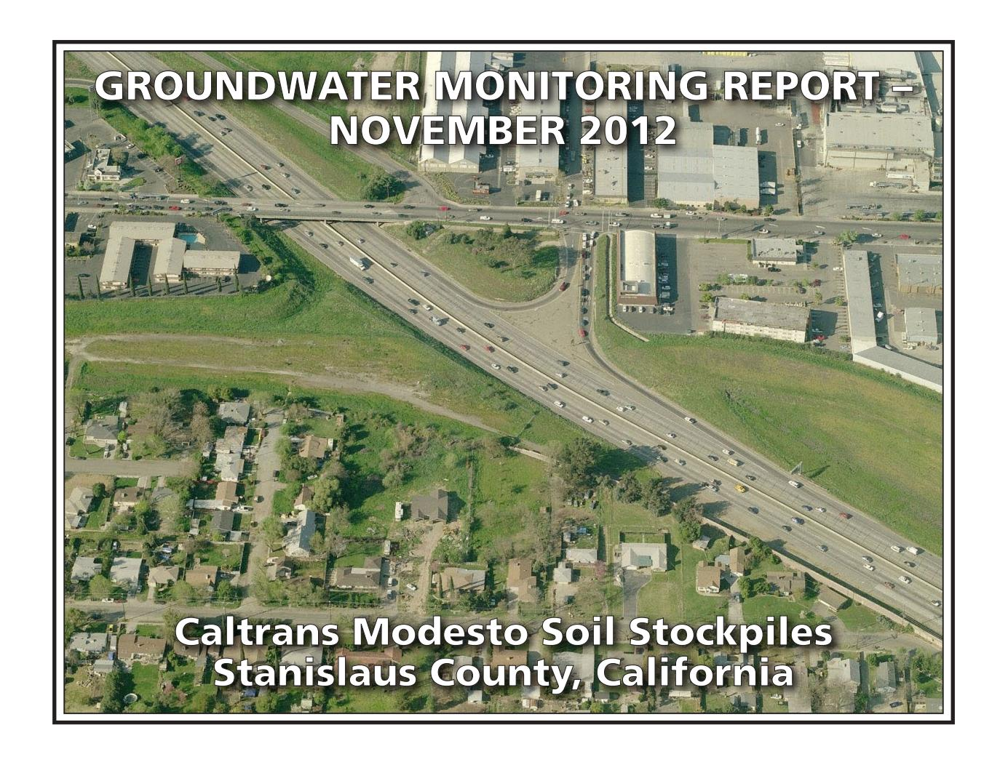

### PREPARED FOR:

CALIFORNIA DEPARTMENT OF TRANSPORTATION – DISTRICT 6
HAZARDOUS WASTE BRANCH
855 M STREET, SUITE 200
FRESNO, CALIFORNIA 93721

### PREPARED BY:

GEOCON CONSULTANTS, INC. 3160 GOLD VALLEY DRIVE, SUITE 800 RANCHO CORDOVA, CALIFORNIA 95742

**GEOCON PROJECT NO. S9525-06-44A TASK ORDER NO. 44, EA 10-403500 CONTRACT NO 06A1580** 

Project No. S9525-06-44A February 6, 2013

Mr. Richard Stewart, PG California Department of Transportation - District 6 Hazardous Waste Branch 855 M Street, Suite 200 Fresno. California 93721

Subject: GROUNDWATER MONITORING REPORT – NOVEMBER 2012

CALTRANS MODESTO SOIL STOCKPILES STANISLAUS COUNTY, CALIFORNIA

CONTRACT NO. 06A1580, TASK ORDER NO. 44, EA NO. 10-403500

Dear Mr. Stewart:

In accordance with California Department of Transportation (Caltrans) Contract No. 06A1580, Task Order (TO) No. 44, Geocon performed groundwater monitoring activities at the Caltrans Modesto Soil Stockpiles (Site) located southerly of the intersection of State Route (SR) 99 and Kansas Avenue in Stanislaus County, California. We are currently performing sampling at the Site every other month. This report presents the results of the November 2012 sampling event. The approximate site location is depicted on the attached Vicinity Map, Figure 1. The approximate site boundaries and Stockpiles 1 through 3 are shown on the Site Plan, Figure 2.

The objective of TO No. 44 is to perform groundwater sampling and analysis at the Site in accordance with protocols approved by the California Environmental Protection Agency Department of Toxic Substances Control (DTSC) as established in the *Final Work Plan, Groundwater Assessment* prepared by Shaw Environmental, Inc. and dated January 2006. The scope of services reported herein included depth to groundwater measurements, groundwater sample collection from ten groundwater monitoring wells, analysis of the water samples by a California-certified laboratory, and preparation of this report.

### BACKGROUND

## Project Description and History

Stockpiles 1 through 3 were generated during construction of SR 99 through Modesto around 1961 when Caltrans excavated property purchased from Food Machinery and Chemical Corporation (FMC) that contained an evaporation pond. The stockpiles were placed in their present location in anticipation of construction of the State Route 132 West Freeway/Expressway project.

During the 1930s, Barium Products Ltd. occupied property at 1200 Barium Road (now Graphics Drive) in Modesto just east of SR 99 between Woodland and Kansas Avenues. Barium Products Ltd. was a chemical manufacturing company processing a variety of ores and minerals including barite (barium sulfate) and celestite (strontium sulfate). Materials produced included barium and strontium compounds; these were used in greases, lubricating oil and pigment blanks. Sodium sulfide generated as a by-product of barite processing was sold as a caustic and used as a reagent in the mining industry.

In 1943, Barium Products Ltd. was purchased by Westvaco Chlorine Products Corporation which subsequently merged with FMC in 1948. From the 1950s to the 1970s, a liquid residue from the processing operations was discharged to unlined evaporation ponds along the western portion of the FMC Site. The approximate boundaries of the former evaporation/disposal ponds are shown on Figure 2.

In 1961, a 4.3–acre parcel at the southwest corner of the FMC site was purchased by the State of California for highway right-of-way needed to construct SR 99. An aerial photograph from 1957 shows that a portion of the southernmost pond on the FMC property was within the area purchased for right-of-way.

Soil in and around the pond was excavated during construction of SR 99 and, according to provisions of the construction contract, stockpiled within the current Caltrans right-of-way at the location of the future State Route 132 West Freeway/Expressway project. Three distinct stockpiles are present at the Site:

- Stockpile 1, located south of Kansas Avenue and west of North Emerald Avenue,
- Stockpile 2, located south of Kansas Avenue, between North Emerald Avenue and SR 99, and
- Stockpile 3, located south of Kansas Avenue and east of SR 99.

In 2006, Caltrans arranged for the installation of monitoring wells MW-1 through MW-8 at locations adjacent to the three stockpiles as shown on Figure 2. General groundwater chemistry analytical results from June and October 2006 groundwater events suggested that two distinct groundwater types are present beneath the Site. A survey of groundwater wells within a one-mile radius of the Site identified 43 existing or former wells; however, there were no active supply wells identified in the general (southeast) flow direction from the Site.

Groundwater monitoring was resumed for the Site with the March 2012 sampling of wells MW-1 through MW-8. Representatives from the DTSC observed the sample collection procedures and collected split samples which were submitted to an alternate laboratory. No notable differences in the concentrations for each reported analyte were evident.

In June 2012, Geocon arranged for the installation of monitoring wells MW-9 and MW-10 at locations that are both upgradient and adjacent to the three stockpiles as shown on Figure 2.

Geocon compared the analytical results from the five recent groundwater sampling events (March, May, June, July and September 2012) to the following water quality threshold values:

- Primary Maximum Contaminant Levels (MCLs) promulgated by the California Department of Public Health (CDPH); and
- Secondary MCLs promulgated by the CDPH.

The results of the previous 2012 groundwater sampling events show that both dissolved metals and general minerals have predominantly been reported at concentrations less than their respective numeric water quality threshold values. Only nitrates (expressed as nitrogen) in MW-1, MW-5, and MW-6 and total dissolved solids (TDS) in wells MW-5, MW-6, and MW-10 have been consistently reported at concentrations that exceed their respective primary or secondary MCLs of 10 and 500 milligrams per liter (mg/l). Based on the lack of polycyclic aromatic hydrocarbons (PAHs) reported for each of the

samples analyzed, we requested discontinuation of analysis for PAHs. The DTSC approved our request in November 2012. We analyzed PAHs for this sampling event, but PAH analysis will be discontinued for future events.

## Hydrogeologic Characterization

The hydrogeology of the adjacent FMC site has been characterized by numerous studies since the early 1980s. The GeoTrans January 2005 report *Addendum to Comprehensive Remedial Investigations Report, FMC Corporation, 1200 Graphics Drive, Modesto, Stanislaus County, California* (GeoTrans, 2005) provides a description of the FMC site hydrogeology. This description follows:

"The site is underlain by laterally discontinuous and unconsolidated sand and silty sand associated with the Modesto and Riverbank Formations. First encountered groundwater is approximately 30 feet below ground surface (bgs) under confined to semi-confined conditions. A deeper aquifer is present at a depth of 165 feet bgs and separated from the upper zone by a blue clay aquitard. The upper water bearing unit has been divided into two zones: a shallow zone from first encountered groundwater to 120 feet bgs and a deeper zone from 140 feet bgs to the top of the aquitard. Groundwater flow within the upper zone is toward the southeast under a gradient of 0.002 ft/ft."

Monitoring wells MW-1 through MW-10 were installed into the unconsolidated sand, silty sand and silt layers within the Modesto Formation underlying the Site. The wells were completed within the shallow zone of the upper aquifer (shallow zone).

The lithology encountered in the borings for the wells includes interbedded (laterally discontinuous) sands, silts, and clays. In the areas investigated, the unsaturated (vadose) zone was dominated by silty soils. The shallow zone groundwater beneath the stockpiles was encountered at approximately 35 feet (elevation approximately 50 feet) under unconfined to semi-confined conditions. Based on historical depth to water measurements from the Site, the groundwater flow direction in the shallow upper aquifer is generally toward the southeast with hydraulic gradients varying from 0.0006 to 0.001. The shallow aquifer conditions beneath the Site and the adjacent FMC site appear similar and representative of conditions in the local area.

### NOVEMBER 2012 FIELD ACTIVITIES

This section describes the field activities performed for the November 2012 monitoring event.

### Depth to Groundwater Measurements

On November 28, 2012, prior to opening the wells, Geocon observed each of the ten well boxes for signs of potential tampering. No signs of tampering were observed. The security well boxes and casing caps were noted to be properly sealed and locked. Geocon measured the depth to groundwater and the dissolved oxygen (DO) levels and oxygen-reduction potential (ORP) in monitoring wells MW-1 through MW-10 using a battery-operated water level meter, a Hanna Model No. 9143 DO meter, and an Oakton ORP meter. Depth to water measurements were obtained from a surveyed reference point at the top of the well casings (TOC).

In November 2012, depth to groundwater at the Site ranged from 32.28 (MW-1) to 41.18 (MW-5) feet below TOC. Based on the groundwater elevation data, the groundwater flow is toward the southeast at an average gradient of 0.0008, which is consistent with historical flow. A gradient rose diagram depicting historical flow direction and gradient is included on Figure 3. A summary of the TOC elevations, depth to groundwater measurements and groundwater elevations is on Table 1. Groundwater elevation contours, flow direction and gradient are depicted on Figure 3, Groundwater Elevation and Ionic Composition Map – November 2012.

### Well Purging and Sampling

On November 28 and 29, 2012, Geocon purged approximately three well volumes of water (1.5 to 6 gallons) from groundwater monitoring wells MW-1 through MW-4 and MW-7 through MW-10 using a submersible pump. Wells MW-5 and MW-6 went dry after purging 0.75 gallon and 1 gallon, respectively. Geocon allowed both wells to recover, purged an additional 1.5 gallon from well MW-6, allowed the well to recover a second time, and then collected groundwater samples. The pump was decontaminated before and after each use by washing in an AlconoxTM solution followed by fresh and distilled water rinses. During the well purging activities, the groundwater was monitored for pH, electrical conductivity, temperature and turbidity. This information is included on the Monitoring Well Sampling Data sheets in Appendix A.

Following well purging, groundwater samples were collected from each of the wells using disposable bailers and decanted through slow emptying devices into laboratory-provided sample containers. The groundwater samples collected for dissolved metals analysis were filtered using a hand-pressure pump through a 0.45-micron filter while filling the container. The samples were sealed, labeled, placed in a chilled cooler and subsequently transported to the laboratory using chain-of-custody protocol.

Purged groundwater was placed into one Department of Transportation-approved, 17-H, 55-gallon drum and transported offsite to Geocon's Rancho Cordova office pending receipt of analytical results and subsequent disposal at Inviro-tec Disposal facility in Lincoln, California, on December 11, 2012.

### ANALYTICAL METHODS AND RESULTS

### Laboratory Analysis

The groundwater samples were delivered to Advanced Technology Laboratories (ATL) for the following analyses under chain-of-custody protocol:

- Title 22 dissolved metals (including strontium) following EPA Test Methods 6020/7470;
- Dissolved calcium, magnesium, potassium and sodium by EPA Test Method 6020;
- Chloride, nitrate as nitrogen and sulfate by EPA Test Method 300.0;
- Sulfide by Standard Method (SM) 4500;
- TDS by SM 2540C;
- Total alkalinity, bicarbonate alkalinity, carbonate alkalinity by SM 2320B; and
- PAHs by EPA Test Method 8270-SIM.

Groundwater analytical results for this monitoring event are summarized on Tables 2 and 3. The laboratory reports and chain-of-custody documentation are in Appendix B.

### Analytical Results

### PAHs

The PAH results are summarized on Table 3. No PAHs were reported at concentrations equal to or greater than their respective practical quantitation limits (PQLs) for each of the groundwater samples collected during this monitoring event.

### Dissolved Metals

Analytical results for dissolved metals along with their associated numeric water quality thresholds are summarized on Table 2. Plots of barium, lead and strontium concentrations vs. time are presented as Figures 4 through 6.

DTSC has identified barium, lead and strontium as the primary chemicals of concern in groundwater for the Site. For the November 2012 groundwater samples, barium and strontium were reported for all ten groundwater samples. Lead was not reported at concentrations equal to or greater than the PQL of  $1.0~\mu g/l$  in each of the groundwater samples. The ranges of barium and strontium concentrations reported for the November sampling event are on the following table:

|                                    | Barium (µg/l)    | Strontium (µg/l) |
|------------------------------------|------------------|------------------|
| High Concentration                 | 300 (MW-5)       | 1,100 (MW-1)     |
| Low Concentration                  | 60 (MW-3)        | 430 (MW-3)       |
| Numeric Water Quality Threshold | 1,000(1) /700(2) | 4,000(2)         |

μg/l = micrograms per liter

Antimony, beryllium, cadmium, silver, thallium, zinc and mercury were not reported at concentrations equal to or greater than their respective PQLs in samples from each well. As shown on the following table, the dissolved metals arsenic, chromium and vanadium were reported for each of the samples collected with the following ranges:

(1) = California Department of Public Health Primary MCL for Drinking Water

(2) = EPA Drinking Water Health Advisory

|                                 | Arsenic (μg/l) | Chromium (μg/l) | Vanadium (μg/l)        |
|---------------------------------|-------------------|--------------------|---------------------------|
| High Concentration              | 5.1 (MW-6)     | 8.0 (MW-6)      | 38 (MW-6)              |
| Low Concentration               | 2.1 (MW-4)     | 0.60 (MW-10)    | 18 (MW-1, MW-4, MW-10) |
| Numeric Water Quality Threshold | 10(1)             | 50(1)              | 50(3)                     |

μg/l = micrograms per liter

Although concentrations of arsenic, barium, chromium, strontium and vanadium were reported for the samples collected from each well, none of the reported concentrations exceed their respective numeric water quality thresholds for drinking water.

Nickel was reported for each sample except MW-3. Molybdenum was reported for each sample except MW-4 and MW-10. Selenium was detected in seven of the ten samples collected. Copper and manganese were detected in three of the ten samples collected. Cobalt was detected in the sample from MW-8. The following table summarizes the dissolved cobalt, copper, manganese, molybdenum, nickel and selenium concentrations reported for the listed samples:

|                                       | Cobalt (µg/l) | Copper (µg/l)       | Manganese (µg/l) | Molybdenum (µg/l) | Nickel (µg/l)          | Selenium (µg/l) |
|---------------------------------------|------------------|------------------------|---------------------|----------------------|---------------------------|--------------------|
| High Concentration                 | 0.94 (MW-8)   | 2.1 (MW-8)          | 160 (MW-8)       | 6.0 (MW-6)        | 2.3 (MW-4 and MW-8) | 3.0 (MW-10)     |
| Low Concentration                  | 0.94 (MW-8)   | 1.0 (MW-4 and MW-9) | 11 (MW-4)        | 0.58 (MW-1)       | 1.3 (MW-7)             | 0.54 (MW-4)     |
| Numeric Water Quality Threshold | ---              | 1,300(1) /1,000(2)     | 50(1)               | ---                  | 100(1)                    | 50(1)              |

 $\mu g/l = micrograms per liter$ 

Although concentrations of cobalt, copper, manganese, molybdenum, nickel and selenium were reported for the samples collected from site monitoring wells, none of the reported concentrations exceed their respective numeric water quality thresholds for drinking water with the exception of the sample from MW-8 for manganese.

(1) = California Department of Public Health Primary Maximum Contaminant Level for Drinking Water

(2) = EPA Drinking Water Health Advisory

(3) = California Department of Public Health Notification Level for Drinking Water

(1) = California Department of Public Health Primary Maximum Contaminant Level for Drinking Water

&lt;sup>(2)= California Department of Public Health Secondary Maximum Contaminant Level (taste and odor)

(3) = EPA Drinking Water Health Advisory

### General Minerals/Stiff Diagrams

To further characterize the geochemistry of the groundwater, general minerals analyses were conducted and included the following constituents:

- dissolved calcium
- dissolved magnesium
- chloride
- nitrate as nitrogen
- sulfate
- dissolved potassium
- dissolved sodium
- sulfide
- total alkalinity
- TDS

General groundwater chemistry provides information regarding the origin and geochemical nature of the groundwater sampled. The analytical results for the major cation (dissolved sodium, potassium, calcium and magnesium) and anion species (chloride, bicarbonate alkalinity reported as calcium carbonate, and sulfate) were used to create Stiff diagrams. Stiff diagrams provide a graphical display of ionic content and can be used to characterize and evaluate the relative composition of groundwater and its consistency or variability. Groundwater with different cation/anion concentrations will result in Stiff diagrams of different shapes and sizes. Stiff diagrams can also help to illustrate mixing of water with different compositions or origins. The presence of more than one water type can be an indication of influences due to hydrogeologic variation or from other sources including man-made impacts.

Appendix C contains Stiff diagrams constructed using site groundwater data for November 2012. The diagrams show that groundwater sampled in each monitoring well is bicarbonate (HCO3) dominant. However, variations in the sodium and potassium (Na+K) and calcium composition are readily apparent. The variations are seen primarily in the sodium content with the potassium concentrations being less variable. In November 2012, the samples from wells MW-1, MW-2, MW-4, MW-5, MW-7, MW-9 and MW-10 had a calcium-dominant composition while the samples from wells MW-3, MW-6 and MW-8 were sodium-dominant.

Nitrate as nitrogen and TDS were both reported for each of the groundwater samples, with nitrate as nitrogen concentrations ranging from 2.8 (MW-3) to 24 mg/l (MW-5) and TDS concentrations ranging from 340 (MW-7) to 640 mg/l (MW-5 and MW-10). The reported nitrate concentrations for MW-1, MW-5, MW-6, MW-8 and MW-10 exceed the primary MCL for nitrate of 10 mg/l, and the reported TDS concentrations for MW-4, MW-5, MW-6 and MW-10 meet or exceed the secondary MCL for TDS of 500 mg/l. Noteworthy is that MW-1 is an upgradient monitoring well; thus, the reported nitrate and TDS concentrations of 12 and 420 mg/l, respectively, may be indicative of natural background nitrate and TDS concentrations for the shallow groundwater in the vicinity of the Site. Sulfide was reported for eight of the ten samples with concentrations ranging from 0.06 (MW-4) to 0.12 mg/l (MW-1).

The analytical results for general minerals are summarized on Table 3.

### Field and Laboratory Quality Assurance/Quality Control

The field quality assurance/quality control (QA/QC) implemented for the November 2012 groundwater monitoring at the Site included the collection of an equipment blank analyzed for dissolved metals. The blank was collected by pouring distilled water over a decontaminated pump and allowing the water to collect into the laboratory-provided sample container. Dissolved metals were not reported at concentrations equal to or greater than their respective PQLs for the equipment blank with the exception of sodium at 64  $\mu$ g/l. The sodium concentrations reported for the samples appeared similar to those previously reported for each of the wells; therefore, it does not appear that the presence of sodium in the equipment blank has significantly influenced the sample results.

Geocon also reviewed the analytical laboratory QA/QC provided with the laboratory report. These data show that that the method blank surrogate recoveries are acceptable and that concentrations of selected analytes were not reported at concentrations equal to or greater than their respective PQLs for each method blank for each analysis. Appropriate recoveries were noted for each laboratory control sample for each analysis. Several matrix spike/matrix spike duplicate (MS/MSD) analytes had recoveries or relative percent differences outside of laboratory control limits, however, the sample results were validated by the laboratory control samples. No qualification of the data is necessary and the data are considered of sufficient quality for the purposes of this report.

### GeoTracker Submittal

The laboratory prepared electronic data files for submittal to the State Water Resources Control Board GeoTracker database. The GeoTracker database is accessible via the GeoTracker website at <a href="http://geotracker.waterboards.ca.gov">http://geotracker.waterboards.ca.gov</a>. The electronic data was uploaded to GeoTracker on February 6, 2013. The confirmation numbers are 8529407560, 1558390319, 3671110033 and 4926208436.

### CONCLUSIONS AND RECOMMENDATIONS

With the exception of manganese detected in the sample from MW-8, none of the reported dissolved metals concentrations for the groundwater samples collected in November 2012 exceeded their respective numeric water quality threshold values.

With the exception of nitrate, none of the reported general minerals for the groundwater samples collected in November 2012 exceeded their respective California primary MCLs. TDS was reported at concentrations exceeding the secondary MCL of 500 mg/l for the samples collected from wells MW-5, MW-6 and MW-10.

Barium and strontium were reported for the November 2012 groundwater samples at concentrations similar to historical levels and remained significantly less than their numeric water quality thresholds. The remaining dissolved metals were also reported at concentrations similar to historical levels. Lead was not reported at concentrations equal to or greater than the PQL of  $1.0 \,\mu\text{g/l}$  in each of the groundwater samples.

Stiff diagrams for the 2012 groundwater sampling events show that very slight changes in ionic content have occurred since groundwater sampling resumed at the Site in March 2012. Water samples from wells MW-1, MW-2, MW-4, MW-5, MW-7 and MW-9 have consistently been reported as calcium-dominant, and those from wells MW-3, MW-6 and MW-8 as sodium-dominant. The ionic content reported for well MW-10 was sodium-dominant in June 2012, calcium-dominant in July 2012, and remained calcium-dominant for the September and November 2012 monitoring events.

We appreciate the opportunity to provide our services on this project. Please contact us if you have any questions concerning the contents of this Report or if we may be of further service.

Sincerely,

GEOCON CONSULTANTS, INC.

Rebecca L. Silva Project Manager

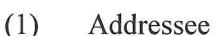

- (1) Caltrans, Sam Haack
- (1) DTSC, Randy Adams
- (1) CVRWQCB, Steve Meeks

Attachments:

Figure 1, Vicinity Map

Figure 2, Site Plan

Figure 3, Groundwater Elevation and Ionic Composition Map – November 2012

John E. Juhrend, PE, CEG

Principal/Senior Engineer

Figure 4, Barium Concentrations vs. Time

Figure 5, Lead Concentrations vs. Time

Figure 6, Strontium Concentrations vs. Time

Table 1. Groundwater Elevation Data

Table 2, Summary of Groundwater Analytical Results – Title 22 Metals (Dissolved)

Table 3, Summary of Groundwater Analytical Results – General Minerals and PAHs

Table 4. Well Construction Details

Appendix A, Monitoring Well Development and Sampling Data Sheets

Appendix B, Laboratory Reports and Chain-of-custody Documentation

Appendix C, Stiff Diagrams

No. 46681

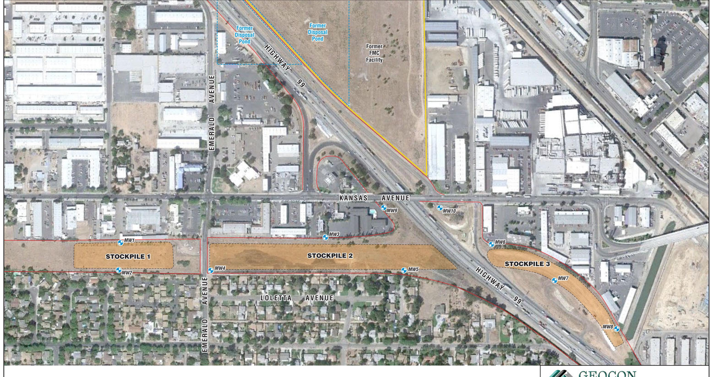

MW8 Approximate Monitoring Well Location

Approximate Monitoring Well Location

— State Right-of-Way Boundary

Scale in Feet

GEOCON CONSULTANTS, INC.

3160 GOLD VALLEY DR - SUITE 800 - RANCHO CORDOVA, CA 95742 PHONE 916.852.9118 - FAX 916.852.9132

# Caltrans Modesto Soil Stockpiles

| Stanislaus County, |
|--------------------|
| California         |

**SITE PLAN** 

GEOCON Proj. No. S9525-06-44A Task Order No. 44

February 2013

February 2013

Figure 2

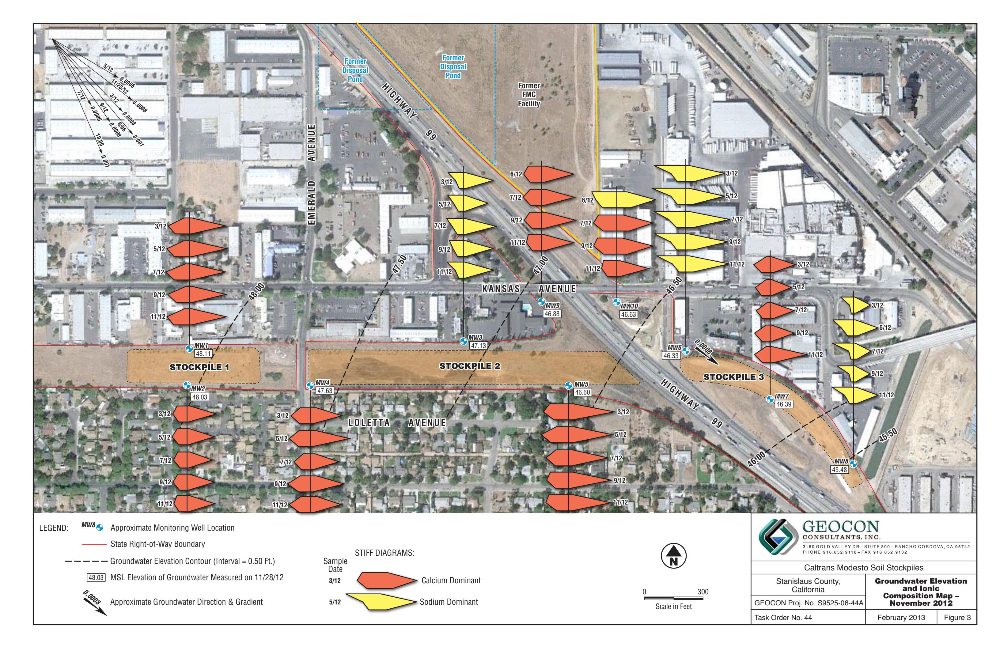

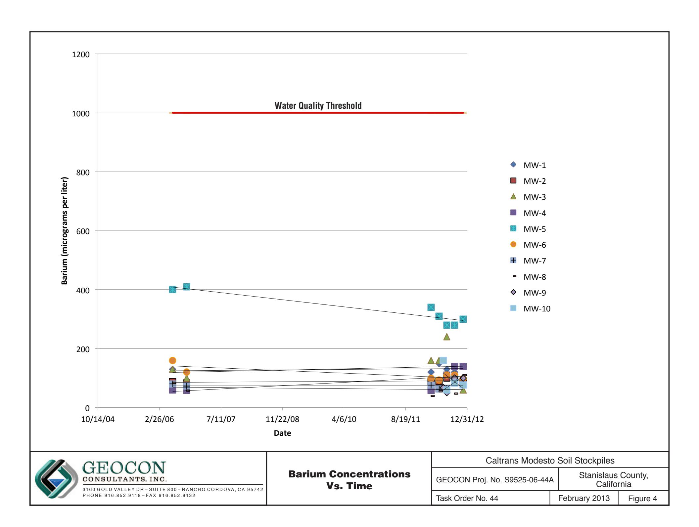

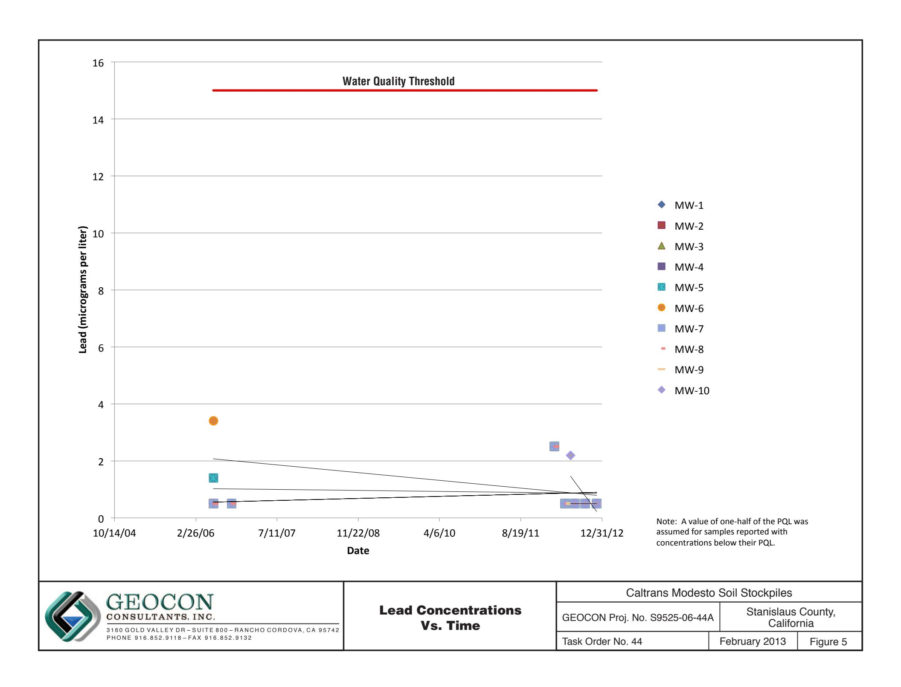

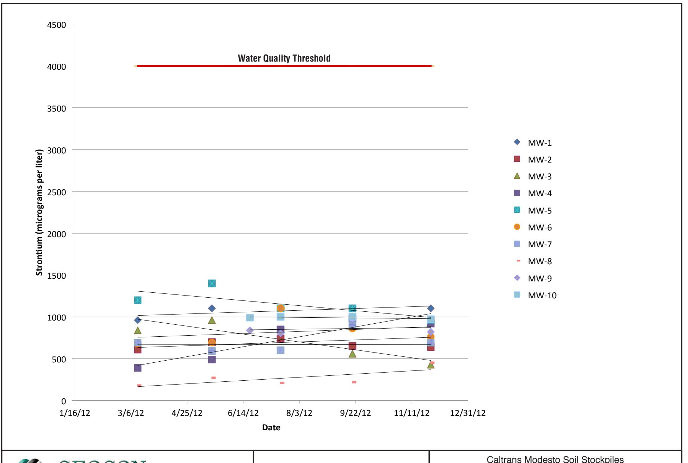

Strontium Concentrations Vs. Time

| Caltrans Modesto Soil Stockpiles |                                  |          |
|----------------------------------|----------------------------------|----------|
| GEOCON Proj. No. S9525-06-44A    | Stanislaus County, California |          |
| Task Order No. 44                | February 2013                    | Figure 6 |

TABLE 1 GROUNDWATER ELEVATION DATA CALTRANS MODESTO SOIL STOCKPILES STANISLAUS COUNTY, CALIFORNIA

| WELL ID | DATE       | WELL CASING ELEVATION (feet MSL) | DEPTH TO GROUNDWATER (feet below TOC) | GROUNDWATER ELEVATION (feet MSL) |
|---------|------------|----------------------------------------|---------------------------------------------|----------------------------------------|
| MW-1    | 6/14/2006  | 80.26                                  | 29.82                                       | 50.44                                  |
| MW-1    | 10/5/2006  | 80.26                                  | 32.35                                       | 47.91                                  |
| MW-1    | 3/12/2012  | 80.26                                  | 30.12                                       | 50.14                                  |
| MW-1    | 5/17/2012  | 80.26                                  | 29.74                                       | 50.52                                  |
| MW-1    | 7/17/2012  | 80.39                                  | 31.34                                       | 49.05                                  |
| MW-1    | 9/19/2012  | 80.39                                  | 32.73                                       | 47.66                                  |
| MW-1    | 11/28/2012 | 80.39                                  | 32.28                                       | 48.11                                  |
| MW-2    | 6/13/2006  | 81.10                                  | 30.72                                       | 50.38                                  |
| MW-2    | 10/5/2006  | 81.10                                  | 33.35                                       | 47.75                                  |
| MW-2    | 3/12/2012  | 81.10                                  | 31.04                                       | 50.06                                  |
| MW-2    | 5/17/2012  | 81.10                                  | 30.69                                       | 50.41                                  |
| MW-2    | 7/17/2012  | 81.25                                  | 33.28                                       | 47.97                                  |
| MW-2    | 9/19/2012  | 81.25                                  | 33.70                                       | 47.55                                  |
| MW-2    | 11/28/2012 | 81.25                                  | 33.22                                       | 48.03                                  |
| MW-3    | 6/13/2006  | 81.76                                  | 32.38                                       | 49.38                                  |
| MW-3    | 10/5/2006  | 81.76                                  | 34.88                                       | 46.88                                  |
| MW-3    | 3/12/2012  | 81.76                                  | 32.35                                       | 49.41                                  |
| MW-3    | 5/17/2012  | 81.76                                  | 31.91                                       | 49.85                                  |
| MW-3    | 7/17/2012  | 81.82                                  | 33.45                                       | 48.37                                  |
| MW-3    | 9/19/2012  | 81.82                                  | 34.89                                       | 46.93                                  |
| MW-3    | 11/28/2012 | 81.82                                  | 34.69                                       | 47.13                                  |
| MW-4    | 6/13/2006  | 82.36                                  | 32.39                                       | 49.97                                  |
| MW-4    | 10/4/2006  | 82.36                                  | 35.05                                       | 47.31                                  |
| MW-4    | 3/12/2012  | 82.36                                  | 32.60                                       | 49.76                                  |
| MW-4    | 5/17/2012  | 82.36                                  | 32.20                                       | 50.16                                  |
| MW-4    | 7/17/2012  | 82.47                                  | 33.86                                       | 48.61                                  |
| MW-4    | 9/19/2012  | 82.47                                  | 35.28                                       | 47.19                                  |
| MW-4    | 11/28/2012 | 82.47                                  | 34.84                                       | 47.63                                  |
| MW-5    | 6/14/2006  | 87.73                                  | 38.79                                       | 48.94                                  |
| MW-5    | 10/5/2006  | 87.73                                  | 41.40                                       | 46.33                                  |
| MW-5    | 3/12/2012  | 87.73                                  | 38.74                                       | 48.99                                  |
| MW-5    | 5/17/2012  | 87.73                                  | 38.25                                       | 49.48                                  |
| MW-5    | 7/17/2012  | 87.78                                  | 39.74                                       | 48.04                                  |
| WELL ID | DATE       | WELL CASING ELEVATION (feet MSL) | DEPTH TO GROUNDWATER (feet below TOC) | GROUNDWATER ELEVATION (feet MSL) |
| MW-5    | 9/19/2012  | 87.78                                  | 41.19                                       | 46.59                                  |
| MW-5    | 11/28/2012 | 87.78                                  | 41.18                                       | 46.60                                  |
| MW-6    | 6/14/2006  | 84.37                                  | 36.35                                       | 48.02                                  |
| MW-6    | 10/5/2006  | 84.37                                  | 38.55                                       | 45.82                                  |
| MW-6    | 3/12/2012  | 84.37                                  | 35.70                                       | 48.67                                  |
| MW-6    | 5/17/2012  | 84.37                                  | 35.18                                       | 49.19                                  |
| MW-6    | 7/17/2012  | 84.52                                  | 36.40                                       | 48.12                                  |
| MW-6    | 9/19/2012  | 84.52                                  | 37.99                                       | 46.53                                  |
| MW-6    | 11/28/2012 | 84.52                                  | 38.19                                       | 46.33                                  |
| MW-7    | 6/14/2006  | 83.64                                  | 35.59                                       | 48.05                                  |
| MW-7    | 10/4/2006  | 83.64                                  | 38.32                                       | 45.32                                  |
| MW-7    | 3/12/2012  | 83.64                                  | 35.31                                       | 48.33                                  |
| MW-7    | 5/17/2012  | 83.64                                  | 34.72                                       | 48.92                                  |
| MW-7    | 7/17/2012  | 83.74                                  | 36.00                                       | 47.74                                  |
| MW-7    | 9/19/2012  | 83.74                                  | 37.60                                       | 46.14                                  |
| MW-7    | 11/28/2012 | 83.74                                  | 37.35                                       | 46.39                                  |
| MW-8    | 6/14/2006  | 83.73                                  | 36.12                                       | 47.61                                  |
| MW-8    | 10/4/2006  | 83.73                                  | 38.95                                       | 44.78                                  |
| MW-8    | 3/12/2012  | 83.73                                  | 35.75                                       | 47.98                                  |
| MW-8    | 5/17/2012  | 83.73                                  | 35.11                                       | 48.62                                  |
| MW-8    | 7/17/2012  | 83.85                                  | 36.29                                       | 47.56                                  |
| MW-8    | 9/19/2012  | 83.85                                  | 38.04                                       | 45.81                                  |
| MW-8    | 11/28/2012 | 83.85                                  | 38.37                                       | 45.48                                  |
| MW-9    | 6/18/2012  | 82.53                                  | 33.67                                       | 48.86                                  |
| MW-9    | 7/17/2012  | 82.53                                  | 34.22                                       | 48.31                                  |
| MW-9    | 9/19/2012  | 82.53                                  | 35.64                                       | 46.89                                  |
| MW-9    | 11/28/2012 | 82.53                                  | 35.65                                       | 46.88                                  |
| MW-10   | 6/18/2012  | 83.97                                  | 35.18                                       | 48.79                                  |
| MW-10   | 7/17/2012  | 83.97                                  | 35.75                                       | 48.22                                  |
| MW-10   | 9/19/2012  | 83.97                                  | 37.18                                       | 46.79                                  |
| MW-10   | 11/28/2012 | 83.97                                  | 37.34                                       | 46.63                                  |

TABLE 1 GROUNDWATER ELEVATION DATA CALTRANS MODESTO SOIL STOCKPILES STANISLAUS COUNTY, CALIFORNIA

### GROUNDWATER ELEVATION DATA

### CALTRANS MODESTO SOIL STOCKPILES

### STANISLAUS COUNTY, CALIFORNIA

WELL ID DATE WELL CASING DEPTH TO GROUNDWATER ELEVATION (feet MSL) (feet below TOC) (feet MSL)

Notes:

MSL = Mean sea level

TOC = Top of well casing

Data prior to 3/12/2012 reproduced from *Site Investigation Report, Groundwater Assessment, Caltrans Modesto Soil Stockpiles State Route 99/132 Project, Stanislaus County, California,* Shaw Environmental, Inc., May 14, 2007.

Wells resurveyed by Morrow Surveying on June 18, 2012.

# SUMMARY OF GROUNDWATER ANALYTICAL RESULTS - TITLE 22 METALS (Dissolved) CALTRANS MODESTO SOIL STOCKPILES STANISLAUS COUNTY, CALIFORNIA

|                                  |              | STANISLAUS COUNTY, CALIFORNIA |                                 |              |          |            |             |             |              |            |               |             |            |             |                |          |             |                  |              |             |         |
|----------------------------------|--------------|-------------------------------|---------------------------------|--------------|----------|------------|-------------|-------------|--------------|------------|---------------|-------------|------------|-------------|----------------|----------|-------------|------------------|--------------|-------------|---------|
| ANALYTE                          | SAMPLE ID | SAMPLE DATE                | Results in micrograms per liter |              |          |            |             |             |              |            |               |             |            |             |                |          |             |                  |              |             |         |
|                                  |              |                               | Antimony                        | Arsenic      | Barium   | Beryllium  | Cadmium     | Chromium    | Cobalt       | Copper     | Lead          | Manganese   | Molybdenum | Nickel      | Selenium       | Silver   | Thallium    | Vanadium         | Zinc         | Strontium   | Mercury |
| MW-1                             | 6/14/2006    | <1.0                          | 2.1                             | 130          | <1.0     | <1.0       | 10          | <1.0        | 1.1          | <1.0       | 34            | 2.9         | 2.9        | <1.0        | <1.0           | <1.0     | 23          | <10              | --           | <0.2        |         |
| MW-1                             | 10/5/2006    | <1.0                          | 2.2                             | 120          | <1.0     | <1.0       | 16          | <1.0        | 2.0          | <1.0       | <1.0          | 2.0         | 1.5        | <1.0        | <1.0           | <1.0     | 26          | <10              | --           | <0.2        |         |
| MW-1                             | 3/12/2012    | <2.5                          | <5.0                            | 120          | <5.0     | <2.5       | 6.4         | <2.5        | <5.0         | <5.0       | <50           | <2.5        | <5.0       | <2.5        | <2.5           | <2.5     | 22          | <50              | 960          | 0.41        |         |
| MW-1                             | 3/12/2012 S  | <10                           | 1.6                             | 105          | <5.0     | 0.6        | 6.8         | <5.0        | 3.4          | 2          | 2.0           | 1.3         | <5.0       | <20         | <5.0           | <20      | 21.2        | 5.6              | 1,010        | --          |         |
| MW-1                             | 5/17/2012    | <0.50                         | 2.3                             | 150          | <0.50    | <0.50      | 7.0         | 1.0         | 2.5          | <1.0       | 35            | 1.3         | 4.0        | 0.62        | <0.50          | <0.50    | 21          | <10              | 1,100        | <0.20       |         |
| MW-1                             | 7/16/2012    | 0.51                          | 2.2                             | 130          | <0.50    | <0.50      | 7.2         | <0.50       | 1.4          | <1.0       | <10           | 0.73        | 3.7        | 0.60        | <0.50          | <0.50    | 20          | <10              | 1,100        | <0.20       |         |
| MW-1                             | 9/19/2012    | <0.50                         | 2.1                             | 120          | <0.50    | <0.50      | 7.0         | <0.50       | <1.0         | <1.0       | <10           | 0.53        | 2.7        | 0.56        | <0.50          | <0.50    | 18          | <10              | 1,100        | <0.20       |         |
| MW-1                             | 11/28/2012   | <0.50                         | 2.2                             | 140          | <0.50    | <0.50      | 5.1         | <0.50       | <1.0         | <1.0       | <10           | 0.58        | 1.9        | 0.61        | <0.50          | <0.50    | 18          | <10              | 1,100        | <0.20       |         |
| MW-2                             | 6/13/2006    | <1.0                          | 2.1                             | 87           | <1.0     | <1.0       | 8.5         | <1.0        | 1.2 U        | <1.0       | 24            | 3.3         | 2.0        | 1.3         | <1.0           | <1.0     | 22          | <10              | --           | <0.2        |         |
| MW-2                             | 10/5/2006    | <1.0                          | 2.6                             | 84           | <1.0     | <1.0       | 11          | <1.0        | 1.7          | <1.0       | <1.0          | <2.0        | 1.2        | <1.0        | <1.0           | <1.0     | 27          | <10              | --           | <0.2        |         |
| MW-2                             | 3/12/2012    | <2.5                          | <5.0                            | 88           | <5.0     | <2.5       | 4.7         | <2.5        | <5.0         | <5.0       | <50           | <2.5        | <5.0       | <2.5        | <2.5           | <2.5     | 23          | <50              | 610          | 0.28        |         |
| MW-2                             | 3/12/2012 S  | <10                           | <10                             | 89.6         | <5.0     | 0.4        | 6.1         | <5.0        | <5.0         | 2          | 1.4           | 1.4         | <5.0       | <20         | <5.0           | 4.6      | 23.1        | 3.7              | 642          | --          |         |
| MW-2                             | 5/17/2012    | <0.50                         | 2.6                             | 89           | <0.50    | <0.50      | 6.6         | <0.50       | 1.5          | <1.0       | <10           | 1.2         | 1.9        | <0.50       | <0.50          | <0.50    | 20          | <10              | 700          | <0.20       |         |
| MW-2                             | 7/16/2012    | <0.50                         | 3.1                             | 100          | <0.50    | <0.50      | 5.8         | <0.50       | <1.0         | <1.0       | <10           | 1.2         | 3.5        | <0.50       | <0.50          | <0.50    | 25          | 49               | 740          | <0.20       |         |
| MW-2                             | 9/19/2012    | <0.50                         | 2.5                             | 88           | <0.50    | <0.50      | 5.5         | <0.50       | <1.0         | <1.0       | <10           | 1.3         | 2.1        | <0.50       | <0.50          | <0.50    | 22          | <10              | 650          | <0.20       |         |
| MW-2                             | 11/28/2012   | <0.50                         | 2.6                             | 88           | <0.50    | <0.50      | 4.0         | <0.50       | <1.0         | <1.0       | <10           | 0.95        | 1.4        | <0.50       | <0.50          | <0.50    | 21          | <10              | 640          | <0.20       |         |
| MW-3                             | 6/13/2006    | <1.0                          | 3.0                             | 60           | <1.0     | <1.0       | 7.1         | <1.0        | 1 U          | <1.0       | 4.7           | <2.0        | 1.4        | 1.4         | <1.0           | <1.0     | 25          | <10              | --           | <0.2        |         |
| MW-3                             | 10/5/2006    | <1.0                          | 3.3                             | 58           | <1.0     | <1.0       | 7.9         | <1.0        | 1.5          | <1.0       | 18            | 2.2         | <1.0       | <1.0        | <1.0           | <1.0     | 29          | <10              | --           | <0.2        |         |
| MW-3                             | 3/12/2012    | <2.5                          | <5.0                            | 58           | <5.0     | <2.5       | 4.4         | <2.5        | <5.0         | <5.0       | <50           | <2.5        | <5.0       | <2.5        | <2.5           | <2.5     | 28          | <50              | 390          | <0.20       |         |
| MW-3                             | 3/12/2012 S  | <10                           | 2.1                             | 44.4         | 0.1      | 0.3        | 4.0         | <5.0        | 1.5          | 2          | 1.8           | 0.9         | <5.0       | <20         | <5.0           | <20      | 22.6        | 4.5              | 342          | --          |         |
| MW-3                             | 5/17/2012    | <0.50                         | 3.8                             | 64           | <0.50    | <0.50      | 3.7         | <0.50       | <1.0         | <1.0       | <10           | 1.4         | 1.1        | <0.50       | <0.50          | <0.50    | 26          | <10              | 490          | <0.20       |         |
| MW-3                             | 7/16/2012    | <0.50                         | 2.2                             | 240          | <0.50    | <0.50      | 6.5         | <0.50       | 5.2          | <1.0       | <10           | 0.56        | 4.3        | <0.50       | <0.50          | <0.50    | 18          | 48               | 840          | <0.20       |         |
| MW-3                             | 9/19/2012    | <0.50                         | 4.6                             | 84           | <0.50    | <0.50      | 4.7         | 1.3         | 1.9          | <1.0       | 74            | 1.1         | 2.8        | <0.50       | <0.50          | <0.50    | 33          | <10              | 560          | <0.20       |         |
| MW-3                             | 11/28/2012   | <0.50                         | 4.6                             | 60           | <0.50    | <0.50      | 3.5         | <0.50       | <1.0         | <1.0       | <10           | 1.5         | <1.0       | <0.50       | <0.50          | <0.50    | 29          | <10              | 430          | <0.20       |         |
| MW-4                             | 6/13/2006    | <1.0                          | 1.8                             | 130          | <1.0     | <1.0       | 8.9         | <1.0        | 1.6 U        | <1.0       | 62            | 2.5         | 2.4        | <1.0        | <1.0           | <1.0     | 19          | <10              | --           | <0.2        |         |
| MW-4                             | 10/4/2006    | <1.0                          | 2.1                             | 100          | <1.0     | <1.0       | 9.9         | <1.0        | 2.1          | <1.0       | 4.1           | <2.0        | <1.0       | <1.0        | <1.0           | <1.0     | 24          | <10              | 0.40         | <0.2        |         |
| MW-4                             | 3/12/2012    | <2.5                          | <5.0                            | 160          | <5.0     | <2.5       | 8.9         | <2.5        | <5.0         | <5.0       | 88            | <2.5        | 5.4        | <2.5        | <2.5           | <2.5     | 26          | <50              | 840          | 0.29        |         |
| MW-4                             | 3/12/2012 S  | <10                           | 1.4                             | 134          | <5.0     | 0.4        | 7.7         | <5.0        | 0.9          | 2          | 0.7           | <5.0        | <5.0       | <20         | <5.0           | 3.5      | 19.3        | 3.5              | 812          | --          |         |
| MW-4                             | 5/17/2012    | <0.50                         | 2.1                             | 160          | <0.50    | <0.50      | 6.6         | <0.50       | <1.0         | <1.0       | <10           | <0.50       | 1.7        | 0.62        | <0.50          | <0.50    | 18          | <10              | 960          | <0.20       |         |
| CALTRANS MODESTO SOIL STOCKPILES |              | STANISLAUS COUNTY, CALIFORNIA |                                 |              |          |            |             |             |              |            |               |             |            |             |                |          |             |                  |              |             |         |
| ANALYTE                          | SAMPLE ID    | SAMPLE DATE                | Antimony                        | Arsenic      | Barium   | Beryllium  | Cadmium     | Chromium    | Cobalt       | Copper     | Lead          | Manganese   | Molybdenum | Nickel      | Selenium       | Silver   | Thallium    | Vanadium         | Zinc         | Strontium   | Mercury |
| Results in micrograms per liter  |              |                               |                                 |              |          |            |             |             |              |            |               |             |            |             |                |          |             |                  |              |             |         |
| MW-4                             | 7/16/2012    | <0.50                         | 6.6                             | 110          | <0.50    | <0.50      | 6.6         | <0.50       | 1.1          | <1.0       | <10           | 2.4         | 3.2        | 0.55        | <0.50          | <0.50    | 42          | <10              | 850          | <0.20       |         |
| MW-4                             | 9/19/2012    | <0.50                         | 2.2                             | 140          | <0.50    | <0.50      | 7.0         | <0.50       | <1.0         | <1.0       | <10           | <0.50       | 2.6        | 0.78        | <0.50          | <0.50    | 18          | <10              | 980          | <0.20       |         |
| MW-4                             | 11/28/2012   | <0.50                         | 2.1                             | 140          | <0.50    | <0.50      | 5.2         | <0.50       | 1.0          | <1.0       | 11            | <0.50       | 2.3        | 0.54        | <0.50          | <0.50    | 18          | <10              | 920          | <0.20       |         |
| MW-5                             | 6/14/2006    | <1.0                          | 1.8                             | 400          | <1.0     | <1.0       | 9.6         | 2.2         | 4.8          | 1.4        | 260           | 9.9         | 7.1        | 2.0         | <1.0           | <1.0     | 23          | <10              | --           | <0.2        |         |
| MW-5                             | 10/5/2006    | <1.0                          | 2.5                             | 410          | <1.0     | <1.0       | 18          | <1.0        | 1.9          | <1.0       | 120           | 14          | 3.4        | <1.0        | 2.1            | <1.0     | 24          | <10              | --           | <0.2        |         |
| MW-5                             | 3/12/2012    | <2.5                          | <5.0                            | 340          | <5.0     | <2.5       | 9.2         | <2.5        | <5.0         | <1.0       | <50           | <2.5        | <5.0       | <2.5        | <2.5           | <2.5     | 18          | <50              | 1,200        | 0.28        |         |
| MW-5                             | 3/12/2012 S  | <10                           | 1.3                             | 310          | <5.0     | 0.5        | 9.6         | <5.0        | 1.0          | <1.0       | 4.4           | 1.5         | <5.0       | 1.5         | <5.0           | 3.6      | 17.8        | 14.5             | 1,140        | --          |         |
| MW-5                             | 5/17/2012    | 0.59                          | 2.4                             | 310          | <0.50    | <0.50      | 12          | <0.50       | 1.1          | <1.0       | <10           | 1.8         | 3.1        | 2.6         | <0.50          | <0.50    | 14          | <10              | 1,400        | 0.20        |         |
| MW-5                             | 7/17/2012    | 0.69                          | 2.8                             | 280          | <0.50    | <0.50      | 9.8         | <0.50       | 1.2          | <1.0       | <10           | 1.9         | 2.8        | 2.1         | <0.50          | <0.50    | 20          | <10              | 1,100        | 0.20        |         |
| MW-5                             | 9/20/2012    | 0.55                          | 2.3                             | 280          | <0.50    | <0.50      | 5.7         | <0.50       | 1.0          | <1.0       | <10           | 1.4         | 2.4        | 1.3         | <0.50          | <0.50    | 18          | <10              | 1,100        | 0.20        |         |
| MW-5                             | 11/29/2012   | <0.50                         | 2.9                             | 300          | <0.50    | <0.50      | 6.2         | <0.50       | 1.0          | <1.0       | <10           | 1.6         | 2.0        | 1.3         | <0.50          | <0.50    | 20          | <10              | 960          | 0.20        |         |
| MW-6                             | 6/14/2006    | <1.0                          | 3.6                             | 160          | <1.0     | <1.0       | 16          | 3.0         | 6.2          | 3.4        | 190           | 13          | 5.9        | 3.0         | <1.0           | <1.0     | 33          | 15               | --           | <0.2        |         |
| MW-6                             | 10/5/2006    | <1.0                          | 5.2                             | 120          | <1.0     | <1.0       | 29          | <1.0        | 1.5          | <1.0       | 130           | 13          | 1.7        | <1.0        | <1.0           | <1.0     | 34          | <10              | --           | <0.2        |         |
| MW-6                             | 3/12/2012    | <2.5                          | <5.0                            | 99           | <5.0     | <2.5       | 9.5         | <2.5        | <5.0         | <1.0       | <50           | 5.3         | <5.0       | <2.5        | <2.5           | <2.5     | 37          | <50              | 680          | 0.27        |         |
| MW-6                             | 3/12/2012 S  | <10                           | 2.8                             | 94.2         | <5.0     | 0.4        | 9.9         | <5.0        | <5.0         | <1.0       | 2.7           | 5.2         | <5.0       | 2.6         | <5.0           | 2.6      | 36.3        | 3.8              | 655          | --          |         |
| MW-6                             | 5/17/2012    | <0.50                         | 3.9                             | 93           | <0.50    | <0.50      | 8.3         | <0.50       | 1.3          | <1.0       | <10           | 5.5         | 1.8        | 2.1         | <0.50          | <0.50    | 32          | <10              | 690          | --          |         |
| MW-6                             | 7/17/2012    | <0.50                         | 6.3                             | 110          | <0.50    | <0.50      | 14          | <0.50       | 1.2          | <1.0       | <10           | 8.2         | 3.0        | 3.1         | <0.50          | <0.50    | 51          | <10              | 1,100        | 0.20        |         |
| MW-6                             | 9/20/2012    | <0.50                         | 4.7                             | 110          | <0.50    | <0.50      | 10          | <0.50       | 1.0          | <1.0       | <10           | 5.6         | 1.7        | 2.6         | <0.50          | <0.50    | 39          | <10              | 860          | 0.20        |         |
| MW-6                             | 11/29/2012   | <0.50                         | 5.1                             | 98           | <0.50    | <0.50      | 8.0         | <0.50       | 1.0          | <1.0       | <10           | 6.0         | 1.6        | 2.6         | <0.50          | <0.50    | 38          | <10              | 760          | 0.20        |         |
| MW-7                             | 6/14/2006    | <1.0                          | 2.3                             | 80           | <1.0     | <1.0       | 7.0         | <1.0        | <1.0         | <1.0       | 9.0           | 2.6         | 2.2        | 1.1         | <1.0           | <1.0     | 17          | <10              | --           | <0.2        |         |
| MW-7                             | 10/4/2006    | <1.0                          | 2.7                             | 73           | <1.0     | <1.0       | 10          | <1.0        | 1.6          | <1.0       | 1.1           | <2.0        | 1.4        | 1.2         | <1.0           | <1.0     | 23          | <10              | --           | <0.2        |         |
| MW-7                             | 3/12/2012    | <2.5                          | <5.0                            | 76           | <5.0     | <2.5       | <2.5        | <2.5        | <5.0         | <1.0       | <50           | <2.5        | <2.5       | <2.5        | <2.5           | <2.5     | 24          | <50              | 690          | 0.28        |         |
| MW-7                             | 5/17/2012    | 0.74                          | 2.3                             | 63           | <0.50    | <0.50      | 1.6         | <0.50       | <1.0         | <1.0       | <10           | 1.0         | 1.3        | <0.50       | <0.50          | <0.50    | 19          | <10              | 590          | 0.20        |         |
| MW-7                             | 7/17/2012    | 0.95                          | 2.2                             | 66           | <0.50    | <0.50      | 2.2         | <0.50       | 1.1          | <1.0       | <10           | 1.0         | 2.3        | 0.66        | <0.50          | <0.50    | 17          | <10              | 600          | 0.20        |         |
| MW-7                             | 9/20/2012    | <0.50                         | 3.1                             | 96           | <0.50    | <0.50      | 3.7         | <0.50       | 1.1          | <1.0       | <10           | 1.2         | 3.0        | 0.66        | <0.50          | <0.50    | 25          | <10              | 900          | 0.20        |         |
| MW-7                             | 11/29/2012   | <0.50                         | 2.5                             | 77           | <0.50    | <0.50      | 2.3         | <0.50       | 1.0          | <1.0       | <10           | 1.2         | 1.3        | <0.50       | <0.50          | <0.50    | 20          | <10              | 690          | 0.20        |         |
| MW-8                             | 6/14/2006    | <1.0                          | 2.7                             | 84           | <1.0     | <1.0       | 8.8         | <1.0        | <1.0         | <1.0       | 5.8           | <2.0        | 1.2        | 1.6         | <1.0           | <1.0     | 25          | <10              | --           | <0.2        |         |
| MW-8                             | 10/4/2006    | <1.0                          | 4.0                             | 57           | <1.0     | <1.0       | 9.7         | <1.0        | 1.7          | <1.0       | <1.0          | 2.0         | 1.0        | <1.0        | <1.0           | <1.0     | 32          | <10              | --           | <0.2        |         |
| ANALYTE                          | SAMPLE ID    | SAMPLE DATE                | Results in micrograms per liter |              |          |            |             |             |              |            |               |             |            |             |                |          |             |                  |              |             |         |
|                                  |              |                               | Antimony                        | Arsenic      | Barium   | Beryllium  | Cadmium     | Chromium    | Cobalt       | Copper     | Lead          | Manganese   | Molybdenum | Nickel      | Selenium       | Silver   | Thallium    | Vanadium         | Zinc         | Strontium   | Mercury |
| MW-8                             | 3/12/2012    | <2.5                          | <5.0                            | <b>39</b>    | <5.0     | <2.5       | <b>4.4</b>  | <2.5        | <5.0         | <5.0       | <50           | <2.5        | <5.0       | <2.5        | <2.5           | <2.5     | <b>20</b>   | <50              | <b>180</b>   | <b>0.23</b> |         |
| MW-8                             | 3/12/2012 S  | <10                           | <b>2.5</b>                      | <b>39.4</b>  | <5.0     | <b>0.1</b> | <b>4.7</b>  | <5.0        | <5.0         | 2          | <b>1.7</b>    | <b>1.3</b>  | <5.0       | <20         | <5.0           | <20      | <b>23.4</b> | <b>3.6</b>       | <b>211</b>   | ---         |         |
| MW-8                             | 5/17/2012    | <0.50                         | <b>3.2</b>                      | <b>55</b>    | <0.50    | <0.50      | <b>4.6</b>  | <0.50       | <1.0         | <1.0       | <10           | <b>1.8</b>  | <1.0       | <b>0.73</b> | <0.50          | <0.50    | <b>22</b>   | <10              | <b>270</b>   | <0.20       |         |
| MW-8                             | 7/17/2012    | <0.50                         | <b>3.2</b>                      | <b>51</b>    | <0.50    | <0.50      | <b>5.6</b>  | <0.50       | <1.0         | <1.0       | <10           | <b>1.7</b>  | <1.0       | <b>0.74</b> | <0.50          | <0.50    | <b>23</b>   | <10              | <b>210</b>   | <0.20       |         |
| MW-8                             | 9/20/2012    | <0.50                         | <b>3.9</b>                      | <b>47</b>    | <0.50    | <0.50      | <b>3.8</b>  | <0.50       | <1.0         | <1.0       | <10           | <b>1.8</b>  | <1.0       | <b>0.89</b> | <0.50          | <0.50    | <b>28</b>   | <10              | <b>220</b>   | <0.20       |         |
| MW-8                             | 11/29/2012   | <0.50                         | <b>4.0</b>                      | <b>110</b>   | <0.50    | <0.50      | <b>6.3</b>  | <b>0.94</b> | <b>2.1</b>   | <1.0       | <b>160</b>    | <b>2.1</b>  | <b>2.3</b> | <b>1.4</b>  | <0.50          | <0.50    | <b>27</b>   | <10              | <b>450</b>   | <0.20       |         |
| MW-9                             | 6/20/2012    | <0.50                         | <b>2.3</b>                      | <b>67</b>    | <0.50    | <0.50      | <b>2.5</b>  | <0.50       | <1.0         | <1.0       | <b>43</b>     | <b>0.76</b> | <b>2.2</b> | <b>1.8</b>  | <0.50          | <0.50    | <b>15</b>   | <b>15</b>        | <b>840</b>   | <0.20       |         |
| MW-9                             | 7/17/2012    | <0.50                         | <b>2.7</b>                      | <b>51</b>    | <0.50    | <0.50      | <b>2.6</b>  | <0.50       | <1.0         | <1.0       | <10           | <b>0.68</b> | <b>1.9</b> | <b>1.7</b>  | <0.50          | <0.50    | <b>14</b>   | <10              | <b>800</b>   | <0.20       |         |
| MW-9                             | 9/19/2012    | <0.50                         | <b>3.1</b>                      | <b>100</b>   | <0.50    | <0.50      | <b>3.6</b>  | <0.50       | <b>2.2</b>   | <1.0       | <b>73</b>     | <b>0.76</b> | <b>3.4</b> | <b>2.5</b>  | <0.50          | <0.50    | <b>22</b>   | <10              | <b>970</b>   | <0.20       |         |
| MW-9                             | 11/28/2012   | <0.50                         | <b>3.2</b>                      | <b>100</b>   | <0.50    | <0.50      | <b>3.0</b>  | <0.50       | <b>1.0</b>   | <1.0       | <b>15</b>     | <b>0.65</b> | <b>1.9</b> | <b>1.5</b>  | <0.50          | <0.50    | <b>22</b>   | <10              | <b>820</b>   | <0.20       |         |
| MW-10                            | 6/20/2012    | <0.50                         | <b>4.1</b>                      | <b>160</b>   | <1.0     | <0.50      | <b>6.2</b>  | <b>5.3</b>  | <b>7.4</b>   | <b>2.2</b> | <b>290</b>    | <b>3.1</b>  | <b>9.6</b> | <b>4.3</b>  | <0.50          | <0.50    | <b>33</b>   | <b>24</b>        | <b>990</b>   | <0.20       |         |
| MW-10                            | 7/17/2012    | <0.50                         | <b>2.8</b>                      | <b>59</b>    | <0.50    | <0.50      | <b>1.3</b>  | <0.50       | <1.0         | <1.0       | <10           | <b>1.0</b>  | <b>2.4</b> | <b>4.4</b>  | <0.50          | <0.50    | <b>16</b>   | <b>15</b>        | <b>1,000</b> | <0.20       |         |
| MW-10                            | 9/20/2012    | <0.50                         | <b>2.7</b>                      | <b>83</b>    | <0.50    | <0.50      | <b>1.1</b>  | <0.50       | <b>1.0</b>   | <1.0       | <b>16</b>     | <b>0.61</b> | <b>2.8</b> | <b>4.4</b>  | <0.50          | <0.50    | <b>19</b>   | <b>120</b>       | <b>1,100</b> | <0.20       |         |
| MW-10                            | 11/29/2012   | <0.50                         | <b>3.1</b>                      | <b>76</b>    | <0.50    | <0.50      | <b>0.60</b> | <0.50       | <1.0         | <1.0       | <10           | <0.50       | <b>1.7</b> | <b>3.0</b>  | <0.50          | <0.50    | <b>18</b>   | <10              | <b>970</b>   | <0.20       |         |
| MCLs                             |              | <b>6</b>                      | <b>10</b>                       | <b>1,000</b> | <b>4</b> | <b>5</b>   | <b>50</b>   | ---         | <b>1,300</b> | <b>15</b>  | <b>50</b> (1) | ---         | <b>100</b> | <b>50</b>   | <b>100</b> (1) | <b>2</b> | ---         | <b>5,000</b> (1) | ---          | <b>2</b>    |         |

# SUMMARY OF GROUNDWATER ANALYTICAL RESULTS - TITLE 22 METALS (Dissolved) CALTRANS MODESTO SOIL STOCKPILES

### STANISLAUS COUNTY, CALIFORNIA

# SUMMARY OF GROUNDWATER ANALYTICAL RESULTS - TITLE 22 METALS (Dissolved) CALTRANS MODESTO SOIL STOCKPILES STANISLAUS COUNTY, CALIFORNIA

Notes:

- --- = not analyzed or not applicable
- < = Less than laboratory reporting limits
- S = Split samples submitted by Central Valley Regional Water Quality Control Board (CVRWQCB) to Excelchem Environmental Labs
- U = Notation: The result was qualified as a non-detect due to equipment blank contamination

MCLs = Maximum Contaminant Levels per California Environmental Protection Agency, May 2009

**Bold** = Reported concentration exceeds laboratory reporting limit

Data prior to 3/12/2012 reproduced from Site Investigation Report, Groundwater Assessment, Caltrans Modesto Soil Stockpiles State Route 99/132 Project, Stanislaus County, California, Shaw Environmental, Inc., May 14, 2007.

(1) = Secondary MCL

(2) = Laboratory error in sample preparation (CVRWQCB personal communication)

# TABLE 3 SUMMARY OF GROUNDWATER ANALYTICAL RESULTS - GENERAL MINERALS AND PAHS CALTRANS MODESTO SOIL STOCKPILES STANISLAUS COUNTY, CALIFORNIA

| SAMPLE ID                       | SAMPLE DATE | DISSOLVED CALCIUM               | DISSOLVED MAGNESIUM | CHLORIDE | NITROGEN, NITRATE (as N) | SULFATE | DISSOLVED POTASSIUM | DISSOLVED SODIUM | SULFIDE | ALKALINITY, BICARBONATE | ALKALINITY, CARBONATE | ALKALINITY, TOTAL    | TOTAL DISSOLVED SOLIDS | PAHs (SIM)           |
|---------------------------------|-------------|---------------------------------|---------------------|----------|--------------------------|---------|---------------------|------------------|---------|-------------------------|-----------------------|----------------------|------------------------|----------------------|
| Results in milligrams per liter |             |                                 |                     |          |                          |         |                     |                  |         |                         |                       |                      |                        | micrograms per liter |
| MW-1                            | 6/14/2006   | --                              | --                  | --       | 5.0                      | 18      | --                  | --               | <0.1    | --                      | --                    | --                   | --                     | --                   |
| MW-1                            | 10/5/2006   | 88                              | 34                  | 14       | 6.8                      | 18      | 3.7                 | 22               | <0.1    | 360                     | <1                    | 360                  | 500                    | --                   |
| MW-1                            | 3/12/2012   | 78                              | 31                  | 13       | 12                       | 16      | 3.2                 | 21               | <0.05   | 328                     | <5.0                  | 328                  | 550                    | <0.20                |
| MW-1                            | 3/12/2012 S | 84                              | 29.4                | 12       | 11.4                     | 15.6    | 3.3                 | 23.8             | 0.0637  | 342                     | <5.0                  | 342                  | 453                    | --                   |
| MW-1                            | 5/17/2012   | 83                              | 34                  | 12       | 12                       | 16      | 3.8                 | 20               | 0.1     | 340                     | <5.0                  | 340                  | 480                    | <0.20                |
| MW-1                            | 7/16/2012   | 87                              | 34                  | 12       | 12                       | 20      | 2.8                 | 17               | 0.1     | 330                     | <5.0                  | 330                  | 540                    | <0.20                |
| MW-1                            | 9/19/2012   | 80                              | 30                  | 14       | 12                       | 25      | 2.5                 | 13               | 0.28    | 330                     | <5.0                  | 330                  | 460                    | <0.20                |
| MW-1                            | 11/28/2012  | 81                              | 35                  | 12       | 12                       | 19      | 2.9                 | 19               | 0.12    | 330                     | <5.0                  | 330                  | 420                    | <0.20                |
| MW-2                            | 6/13/2006   | --                              | --                  | --       | 5.5                      | 21      | --                  | --               | <0.1    | --                      | --                    | --                   | --                     | --                   |
| MW-2                            | 10/5/2006   | 49                              | 16                  | 23       | 6.1                      | 16      | 2.7                 | 56               | <0.1    | 250                     | <1                    | 250                  | 390                    | --                   |
| MW-2                            | 3/12/2012   | 52                              | 18                  | 17       | 9.0                      | 16      | 2.6                 | 40               | 0.06    | 266                     | <5.0                  | 266                  | 460                    | <0.20                |
| MW-2                            | 3/12/2012 S | 58.1                            | 17.2                | 15.4     | 8.77                     | 15.2    | 2.89                | 54               | 0.0497  | 270                     | <5.0                  | 270                  | 382                    | --                   |
| MW-2                            | 5/17/2012   | 55                              | 19                  | 15       | 7.5                      | 14      | 2.9                 | 39               | 0.07    | 248                     | <5.0                  | 248                  | 400                    | <0.20                |
| MW-2                            | 7/16/2012   | 50                              | 16                  | 14       | 7.2                      | 13      | 2.2                 | 38               | 0.042   | 230                     | <5.0                  | 230                  | 410                    | <0.20                |
| MW-2                            | 9/19/2012   | 52                              | 17                  | 13       | 7.3                      | 14      | 2.2                 | 38               | 0.10    | 250                     | <5.0                  | 250                  | 390                    | <0.20                |
| MW-2                            | 11/28/2012  | 48                              | 17                  | 14       | 7.5                      | 14      | 2.3                 | 41               | 0.07    | 250                     | <5.0                  | 250                  | 390                    | <0.20                |
| MW-3                            | 6/13/2006   | --                              | --                  | --       | 5.4                      | 18      | --                  | --               | <0.1    | --                      | --                    | --                   | --                     | --                   |
| MW-3                            | 10/5/2006   | 42                              | 15                  | 11       | 5.0                      | 17      | 2.5                 | 43               | <0.1    | 220                     | <1                    | 220                  | 340                    | --                   |
| MW-3                            | 3/12/2012   | 31                              | 11                  | 7.5      | 2.9                      | 17      | 2.3                 | 66               | 0.09    | 268                     | <5.0                  | 268                  | 400                    | <0.20                |
| MW-3                            | 3/12/2012 S | 29.5                            | 9.19                | 5.7      | 2.24                     | 13.8    | 2.04                | 66.3             | 0.0281  | 220                     | <5.0                  | 220                  | 273                    | --                   |
| MW-3                            | 5/17/2012   | 37                              | 12                  | 6.6      | 2.5                      | 14      | 2.4                 | 66               | 0.05    | 221                     | <5.0                  | 221                  | 300                    | <0.20                |
| MW-3                            | 7/16/2012   | 42                              | 14                  | 7.5      | 2.8                      | 17      | 2.3                 | 71               | 0.014   | 300                     | <5.0                  | 300                  | 400                    | <0.20                |
| MW-3                            | 9/19/2012   | 39                              | 14                  | 5.9      | 3.0                      | 18      | 2.4                 | 58               | <0.05   | 270                     | <5.0                  | 270                  | 350                    | <0.20                |
| MW-3                            | 11/28/2012  | 31                              | 11                  | 5.7      | 2.8                      | 12      | 2.2                 | 68               | 0.062   | 270                     | <5.0                  | 270                  | 380                    | <0.20                |
| MW-4                            | 6/13/2006   | --                              | --                  | --       | 3.5                      | 15      | --                  | --               | <0.1    | --                      | --                    | --                   | --                     | --                   |
| MW-4                            | 10/4/2006   | 43                              | 13                  | 6.6      | 3.5                      | 11      | 2.6                 | 43               | <0.1    | 250                     | <1                    | 250                  | 340                    | --                   |
| SAMPLE ID                       | SAMPLE DATE | Results in milligrams per liter |                     |          |                          |         |                     |                  |         |                         |                       |                      | micrograms per liter   |                      |
|                                 |             | DISSOLVED CALCIUM               | DISSOLVED MAGNESIUM | CHLORIDE | NITROGEN, NITRATE (as N) | SULFATE | DISSOLVED POTASSIUM | DISSOLVED SODIUM | SULFIDE | ALKALINITY, BICARBONATE | ALKALINITY, CARBONATE | ALKALINITY, TOTAL    |                        |                      |
| MW-4                            | 3/12/2012   | 71                              | 23                  | 39       | 9.5                      | 23      | 3.7                 | 39               | 0.05    | 290                     | < 5.0                 | 290                  | 530                    | < 0.20               |
| MW-4                            | 3/12/2012 S | 74.2                            | 20.7                | 34.8     | 9.59                     | 21.8    | 3.14                | 47.4             | 0.172   | 286                     | < 5.0                 | 286                  | 472                    |                      |
| MW-4                            | 5/17/2012   | 77                              | 26                  | 35       | 10                       | 23      | 3.3                 | 45               | 0.09    | 357                     | < 5.0                 | 357                  | 540                    | < 0.20               |
| MW-4                            | 7/16/2012   | 60                              | 19                  | 30       | 8.2                      | 20      | 2.5                 | 28               | < 0.010 | 260                     | < 5.0                 | 260                  | 430                    | < 0.20               |
| MW-4                            | 9/19/2012   | 83                              | 26                  | 40       | 8.2                      | 23      | 2.5                 | 41               | 0.085   | 310                     | < 5.0                 | 310                  | 480                    | < 0.20               |
| MW-4                            | 11/28/2012  | 77                              | 24                  | 42       | 8.9                      | 26      | 2.7                 | 36               | 0.06    | 280                     | < 5.0                 | 280                  | 500                    | < 0.20               |
| MW-5                            | 6/14/2006   |                                 |                     |          | 8.3                      | 37      |                     |                  | < 0.1   |                         |                       |                      |                        |                      |
| MW-5                            | 10/5/2006   | 100                             | 37                  | 28       | 10                       | 32      | 7.5                 | 160              | < 0.1   | 540                     | <1                    | 540                  | 730                    |                      |
| MW-5                            | 3/12/2012   | 93                              | 33                  | 29       | 27                       | 33      | 4.4                 | 77               | < 0.05  | 415                     | < 5.0                 | 415                  | 700                    | < 0.20               |
| MW-5                            | 3/12/2012 S | 94.9                            | 32.7                | 24.6     | 25.4                     | 30.4    | 4.44                | 86.9             | 0.0778  | 410                     | < 5.0                 | 410                  | 632                    |                      |
| MW-5                            | 5/17/2012   | 100                             | 40                  | 26       | 26                       | 38      | 3.6                 | 48               | 0.08    | 399                     | < 5.0                 | 399                  | 690                    | < 0.20               |
| MW-5                            | 7/17/2012   | 83                              | 30                  | 22       | 20                       | 26      | 4.4                 | 51               | < 0.05  | 360                     | < 5.0                 | 360                  | 620                    | < 0.20               |
| MW-5                            | 9/20/2012   | 81                              | 30                  | 25       | 22                       | 26      | 3.4                 | 75               | 0.015   | 390                     | < 5.0                 | 390                  | 590                    | < 0.20               |
| MW-5                            | 11/29/2012  | 82                              | 26                  | 25       | 24                       | 25      | 3.7                 | 79               | 0.09    | 380                     | < 5.0                 | 380                  | 640                    | < 0.20               |
| MW-6                            | 6/14/2006   |                                 |                     |          | 12                       | 70      |                     |                  | < 0.1   |                         |                       |                      |                        |                      |
| MW-6                            | 10/4/2006   | 67                              | 22                  | 21       | 15                       | 76      | 5.6                 | 160              | < 0.1   | 420                     | <1                    | 420                  | 700                    |                      |
| MW-6                            | 3/12/2012   | 54                              | 19                  | 22       | 18                       | 75      | 3.9                 | 130              | 0.05    | 357                     | < 5.0                 | 357                  | 680                    | < 0.20               |
| MW-6                            | 3/12/2012 S | 54.8                            | 16.3                | 20.2     | 17.7                     | 72.0    | 4.14                | 165              | 0.0788  | 358                     | < 5.0                 | 358                  | 613                    |                      |
| MW-6                            | 5/17/2012   | 54                              | 19                  | 20       | 18                       | 66      | 3.8                 | 140              | 0.07    | 355                     | < 5.0                 | 357                  | 630                    | < 0.20               |
| MW-6                            | 7/17/2012   | 62                              | 21                  | 19       | 19                       | 70      | 4.9                 | 130              | < 0.05  | 400                     | < 5.0                 | 400                  | 590                    | < 0.20               |
| MW-6                            | 9/20/2012   | 56                              | 20                  | 18       | 18                       | 65      | 3.8                 | 130              | 0.13    | 380                     | < 5.0                 | 380                  | 610                    | < 0.20               |
| MW-6                            | 11/29/2012  | 48                              | 15                  | 21       | 18                       | 66      | 3.3                 | 120              | 0.061   | 390                     | < 5.0                 | 390                  | 610                    | < 0.20               |
| MW-7                            | 6/14/2006   |                                 |                     |          | 3.0                      | 29      |                     |                  | < 0.1   |                         |                       |                      |                        |                      |
| MW-7                            | 10/4/2006   | 69                              | 21                  | 7.4      | 3.1                      | 26      | 2.9                 | 16               | <0.1    | 270                     | <1                    | 270                  | 370                    |                      |
| MW-7                            | 3/12/2012   | 60                              | 20                  | 7.9      | 3.0                      | 26      | 2.6                 | 14               | < 0.05  | 228                     | <5.0                  | 228                  | 360                    | < 0.20               |
| MW-7                            | 5/17/2012   | 54                              | 20                  | 6.3      | 2.5                      | 18      | 2.6                 | 15               | 0.1     | 194                     | <5.0                  | 194                  | 280                    | < 0.20               |
| SAMPLE ID                       | SAMPLE DATE | Results in milligrams per liter |                     |          |                          |         |                     |                  |         |                         |                       |                      |                        | micrograms per liter |
|                                 |             | DISSOLVED CALCIUM               | DISSOLVED MAGNESIUM | CHLORIDE | NITROGEN, NITRATE (as N) | SULFATE | DISSOLVED POTASSIUM | DISSOLVED SODIUM | SULFIDE | ALKALINITY, BICARBONATE | ALKALINITY, CARBONATE | ALKALINITY, TOTAL    | TOTAL DISSOLVED SOLIDS | PAHs (SIM)           |
| MW-7                            | 7/17/2012   | 51                              | 17                  | 7.6      | 3.3                      | 24      | 1.8                 | 12               | 0.07    | 220                     | <5.0                  | 220                  | 300                    | <0.20                |
| MW-7                            | 9/20/2012   | 58                              | 19                  | 7.4      | 3.6                      | 22      | 2.7                 | 15               | <0.10   | 220                     | <5.0                  | 220                  | 320                    | <0.20                |
| MW-7                            | 11/29/2012  | 57                              | 17                  | 8.2      | 3.4                      | 28      | 2.3                 | 16               | 0.069   | 330                     | <5.0                  | 330                  | 340                    | <0.20                |
| MW-8                            | 6/14/2006   | --                              | --                  | --       | 9.2                      | 26      | --                  | --               | <0.1    | --                      | --                    | --                   | --                     | --                   |
| MW-8                            | 10/4/2006   | 22                              | 6.8                 | 12       | 7.8                      | 21      | 2.4                 | 77               | <0.1    | 200                     | <1                    | 200                  | 360                    | --                   |
| MW-8                            | 3/12/2012   | 15                              | 5.1                 | 11       | 6.7                      | 25      | 1.8                 | 52               | 0.05    | 154                     | <5.0                  | 154                  | 330                    | <0.20                |
| MW-8                            | 3/12/2012 S | 18.4                            | 5.8                 | 8.3      | 5.31                     | 25.2    | 2.06                | 73.6             | 0.0194  | 154                     | <5.0                  | 154                  | 253                    | --                   |
| MW-8                            | 5/17/2012   | 44                              | 13                  | 11       | 6.3                      | 32      | 10                  | 81               | 0.07    | 226                     | <5.0                  | 226                  | 390                    | <0.20                |
| MW-8                            | 7/17/2012   | 17                              | 5.7                 | 9.3      | 5.2                      | 32      | 1.9                 | 88               | 0.05    | 160                     | <5.0                  | 160                  | 390                    | <0.20                |
| MW-8                            | 9/20/2012   | 16                              | 5.1                 | 11       | 5.9                      | 19      | 2.0                 | 67               | 0.031   | 150                     | <5.0                  | 150                  | 280                    | <0.20                |
| MW-8                            | 11/29/2012  | 32                              | 9.4                 | 17       | 11                       | 32      | 3.0                 | 87               | <0.05   | 220                     | <5.0                  | 220                  | 390                    | <0.20                |
| MW-9                            | 6/20/2012   | 66                              | 26                  | 24       | 13                       | 27      | 5.1                 | 53               | 0.07    | 293                     | <5.0                  | 293                  | 510                    | <0.20                |
| MW-9                            | 7/17/2012   | 68                              | 25                  | 22       | 11                       | 25      | 3.3                 | 46               | 0.14    | 300                     | <5.0                  | 300                  | 350                    | <0.20                |
| MW-9                            | 9/19/2012   | 64                              | 22                  | 19       | 11                       | 25      | 3.4                 | 48               | <0.05   | 310                     | <5.0                  | 310                  | 470                    | <0.20                |
| MW-9                            | 11/28/2012  | 55                              | 20                  | 16       | 9.0                      | 22      | 2.9                 | 54               | <0.05   | 290                     | <5.0                  | 290                  | 440                    | <0.20                |
| MW-10                           | 6/20/2012   | 77                              | 32                  | 63       | 9.2                      | 120     | 9.2                 | 100              | <0.05   | 356                     | <5.0                  | 356                  | 710                    | <0.20                |
| MW-10                           | 7/17/2012   | 86                              | 31                  | 39       | 9.8                      | 110     | 4.6                 | 75               | 0.18    | 330                     | <5.0                  | 330                  | 710                    | <0.20                |
| MW-10                           | 9/20/2012   | 85                              | 30                  | 33       | 14                       | 99      | 3.9                 | 79               | 0.011   | 330                     | <5.0                  | 330                  | 630                    | <0.20                |
| MW-10                           | 11/29/2012  | 78                              | 27                  | 30       | 16                       | 98      | 3.3                 | 78               | 0.089   | 300                     | <5.0                  | 300                  | 640                    | <0.20                |
| MCLs                            | --          | --                              | --                  | 250(1)   | 10                       | 250(1)  | --                  | --               | --      | --                      | --                    | --                   | 500(1)                 | Various              |
| SAMPLE ID                       | SAMPLE DATE | Results in milligrams per liter |                     |          |                          |         |                     |                  |         |                         |                       | micrograms per liter |                        |                      |
|                                 |             | DISSOLVED CALCIUM               | DISSOLVED MAGNESIUM | CHLORIDE | NITROGEN, NITRATE (as N) | SULFATE | DISSOLVED POTASSIUM | DISSOLVED SODIUM | SULFIDE | ALKALINITY, BICARBONATE | ALKALINITY, CARBONATE | ALKALINITY, TOTAL    | TOTAL DISSOLVED SOLIDS | PAHs (SIM)           |
|                                 |             |                                 |                     |          |                          |         |                     |                  |         |                         |                       |                      |                        |                      |

# TABLE 3 SUMMARY OF GROUNDWATER ANALYTICAL RESULTS - GENERAL MINERALS AND PAHS CALTRANS MODESTO SOIL STOCKPILES STANISLAUS COUNTY, CALIFORNIA

# TABLE 3 SUMMARY OF GROUNDWATER ANALYTICAL RESULTS - GENERAL MINERALS AND PAHS CALTRANS MODESTO SOIL STOCKPILES STANISLAUS COUNTY, CALIFORNIA

### SUMMARY OF GROUNDWATER ANALYTICAL RESULTS - GENERAL MINERALS AND PAHS

### CALTRANS MODESTO SOIL STOCKPILES

### STANISLAUS COUNTY, CALIFORNIA

### Notes:

PAHs (SIM) = Polycyclic aromatic hydrocarbons (selective ion monitoring) by EPA Test Method 8270C for semi-volatile organic compounds

S = Split samples submitted by the Central Valley Regional Water Quality Control Board to Excelchem Environmental Labs.

- < = Less than the indicated laboratory reporting limit
- --- = Not analyzed or not applicable

MCLs = Maximum Contaminant Levels per California Environmental Protection Agency, May 2009

Data prior to 3/12/2012 reproduced from Site Investigation Report, Groundwater Assessment, Caltrans Modesto Soil Stockpiles State Route 99/132 Project, Stanislaus County, California, Shaw Environmental, Inc., May 14, 2007.

(1) = Secondary MCL

Geocon Project No. S9525-06-44A February 6, 2013 Page 1 of 1

# TABLE 4 WELL CONSTRUCTION DETAILS CALTRANS MODESTO SOIL STOCKPILES STANISLAUS COUNTY, CALIFORNIA

| WELL ID | WELL INSTALLATION DATE | TOC ELEVATION (1) (MSL) | CASING MATERIAL | TOTAL BORING DEPTH (feet) | COMPLETED WELL DEPTH (feet) | BOREHOLE DIAMETER (inches) | CASING DIAMETER (inches) | SCREENED INTERVAL (feet) | SLOT SIZE (inches) | FILTER PACK INTERVAL (feet) | FILTER PACK MATERIAL |
|---------|------------------------------|-------------------------------|--------------------|------------------------------------|-----------------------------------|----------------------------------|--------------------------------|--------------------------------|--------------------|-----------------------------------|-------------------------|
| MW-1    | 6/2/2006                     | 80.39                         | SCH 40 PVC         | 44                                 | 42                                | 8                                | 2                              | 32-42                          | 0.010              | 27-44                             | #2/12 Sand              |
| MW-2    | 6/2/2006                     | 81.25                         | SCH 40 PVC         | 40                                 | 39                                | 8                                | 2                              | 29-39                          | 0.010              | 27.5-40                           | #2/12 Sand              |
| MW-3    | 5/22/2006                    | 81.82                         | SCH 40 PVC         | 41                                 | 41                                | 8                                | 2                              | 31-41                          | 0.010              | 28-41                             | #2/12 Sand              |
| MW-4    | 5/8/2006                     | 82.47                         | SCH 40 PVC         | 42                                 | 40                                | 8                                | 2                              | 30-40                          | 0.010              | 26-42                             | #2/12 Sand              |
| MW-5    | 5/22/2006                    | 87.78                         | SCH 40 PVC         | 45                                 | 45                                | 8                                | 2                              | 35-45                          | 0.010              | 33.7-46.5                         | #2/12 Sand              |
| MW-6    | 5/9/2006                     | 84.52                         | SCH 40 PVC         | 46.5                               | 43                                | 8                                | 2                              | 33-43                          | 0.010              | 30-46.5                           | #2/12 Sand              |
| MW-7    | 6/6/2006                     | 83.74                         | SCH 40 PVC         | 48                                 | 45.5                              | 8                                | 2                              | 35.5-45.5                      | 0.010              | 34.5-48                           | #2/12 Sand              |
| MW-8    | 5/9/2006                     | 83.85                         | SCH 40 PVC         | 45                                 | 41                                | 8                                | 2                              | 31-41                          | 0.010              | 27-45                             | #2/12 Sand              |
| MW-9    | 5/30/2012                    | 82.53                         | SCH 40 PVC         | 40                                 | 40                                | 8                                | 2                              | 29.5-39.5                      | 0.010              | 27.5-40                           | #2/12 Sand              |
| MW-10   | 5/29/2012                    | 83.97                         | SCH 40 PVC         | 40                                 | 40                                | 8                                | 2                              | 29.5-39.5                      | 0.010              | 27.5-40                           | #2/12 Sand              |

Notes: TOC = Top of casing

MSL = Mean sea level PVC = Polyvinyl chloride

 $^{(1)}$  = Wells resurveyed by Morrow Surveying on June 18, 2012.

# APPENDIX A

| Project Name: Caltrans Modesto Soil Stockpiles | Project Number: S9525-06-44A          |
|------------------------------------------------|---------------------------------------|
| Well No.: MW-1                                 | Date: 11/28/12                        |
| Well Diameter: 2 in.                           | Field Personnel: JE/MO                |
| Casing Length: 44 feet                         | Screened Casing Length: 10 feet       |
| Well Elevation: 80.39 feet above MSL           | Water Elevation: 47.66 feet above MSL |

| PURGE CHARACTERISTICS                     |                                             |
|-------------------------------------------|---------------------------------------------|
| Water Depth Before Purging: 32.28 ft.     | 2 in. = .1632 gal/ft. 4 in. = .6528 gal/ft. |
| Calculated Water Column Volume: 1.91 gal. | Volumes Purged: 3.1                         |
| Start Purging Time: 0940                  | End Purging Time: 0944                      |
| Total Time: 4 min.                        | Flow Measurement: 5-gal bucket              |
| Total Volume Purged: 6 gal.               | Avg. Flow Rate: 1.5 gpm                     |
| Dissolved Oxygen: 4.42 mg/l               | Free Product: (N); Thickness: inches        |

| SAMPLING CHARACTERISTICS                                               |                     |                                    |      |                |
|------------------------------------------------------------------------|---------------------|------------------------------------|------|----------------|
| Purging Method: Submersible Pump                                       |                     | Sampling Method: Disposable Bailer |      |                |
| Laboratory Analysis: General Minerals, Title 22 Dissolved Metals, PAHs |                     |                                    |      |                |
| TIME                                                                   | TEMPERATURE (°C) | CONDUCTIVITY (µmhos/cm)         | pH   | Gallons Purged |
| 0941                                                                   | 16.6                | 767                                | 6.83 | 2              |
| 0942                                                                   | 18.3                | 721                                | 6.82 | 4              |
| 0944                                                                   | 18.1                | 728                                | 6.85 | 6              |
|                                                                        |                     |                                    |      |                |
| 0955                                                                   |                     |                                    |      | Sample         |

| Comments: Turbid first 3 gallons, water cleared. No odor.                    |  |  |  |  |
|------------------------------------------------------------------------------|--|--|--|--|
|                                                                              |  |  |  |  |
|                                                                              |  |  |  |  |
| ORP = 161 millivolts, Turbidity = 764 ntu at start of purge, 288 ntu at end. |  |  |  |  |

| Project Name: Caltrans Modesto Soil Stockpiles | Project Number: S9525-06-44A          |
|------------------------------------------------|---------------------------------------|
| Well No.: MW-2                                 | Date: 11/28/12                        |
| Well Diameter: 2 in.                           | Field Personnel: JE/MO                |
| Casing Length: 40 feet                         | Screened Casing Length: 10 feet       |
| Well Elevation: 81.25 feet above MSL           | Water Elevation: 47.55 feet above MSL |

| PURGE CHARACTERISTICS                     |                                             |
|-------------------------------------------|---------------------------------------------|
| Water Depth Before Purging: 33.22 ft.     | 2 in. = .1632 gal/ft. 4 in. = .6528 gal/ft. |
| Calculated Water Column Volume: 1.11 gal. | Volumes Purged: 3.2                         |
| Start Purging Time: 0910                  | End Purging Time: 0913                      |
| Total Time: 3 min.                        | Flow Measurement: 5-gal bucket              |
| Total Volume Purged: 3.5 gal.             | Avg. Flow Rate: 1.2 gpm                     |
| Dissolved Oxygen: 5.85 mg/l               | Free Product: (N); Thickness: inches        |

| SAMPLING CHARACTERISTICS                                               |                     |                            |                                    |      |                |  |  |
|------------------------------------------------------------------------|---------------------|----------------------------|------------------------------------|------|----------------|--|--|
| Purging Method: Submersible Pump                                       |                     |                            | Sampling Method: Disposable Bailer |      |                |  |  |
| Laboratory Analysis: General Minerals, Title 22 Dissolved Metals, PAHs |                     |                            |                                    |      |                |  |  |
| TIME                                                                   | TEMPERATURE (°C) | CONDUCTIVITY (µmhos/cm) |                                    | pH   | Gallons Purged |  |  |
| 0911                                                                   | 13.7                | 496                        |                                    | 7.73 | 1              |  |  |
| 0912                                                                   | 15.7                | 589                        |                                    | 6.47 | 2              |  |  |
| 0913                                                                   | 17.2                | 592                        |                                    | 6.98 | 3.5            |  |  |
|                                                                        |                     |                            |                                    |      |                |  |  |
| 0925                                                                   |                     |                            |                                    |      | Sample         |  |  |

| Comments: First 3 gallons silty, light brown. Water changed to slightly turbid after 3 gallons. |
|-------------------------------------------------------------------------------------------------|
| No odors.                                                                                       |
|                                                                                                 |
| ORP = 117 millivolts, Turbidity = 525 ntu at start of purge, 27 ntu at end.                     |

| Project Name: Caltrans Modesto Soil Stockpiles | Project Number: S9525-06-44A          |
|------------------------------------------------|---------------------------------------|
| Well No.: MW-3                                 | Date: 11/28/12                        |
| Well Diameter: 2 in.                           | Field Personnel: JE/MO                |
| Casing Length: 41 feet                         | Screened Casing Length: 10 feet       |
| Well Elevation: 81.82 feet above MSL           | Water Elevation: 46.93 feet above MSL |

| PURGE CHARACTERISTICS                     |                                             |
|-------------------------------------------|---------------------------------------------|
| Water Depth Before Purging: 34.69 ft.     | 2 in. = .1632 gal/ft. 4 in. = .6528 gal/ft. |
| Calculated Water Column Volume: 1.03 gal. | Volumes Purged: 3.4                         |
| Start Purging Time: 1100                  | End Purging Time: 1103                      |
| Total Time: 3 min.                        | Flow Measurement: 5-gal bucket              |
| Total Volume Purged: 3.5 gal.             | Avg. Flow Rate: 1.2 gpm                     |
| Dissolved Oxygen: 7.93 mg/l               | Free Product: (N); Thickness: inches        |

| SAMPLING CHARACTERISTICS                                               |                     |                                    |      |                |
|------------------------------------------------------------------------|---------------------|------------------------------------|------|----------------|
| Purging Method: Submersible Pump                                       |                     | Sampling Method: Disposable Bailer |      |                |
| Laboratory Analysis: General Minerals, Title 22 Dissolved Metals, PAHs |                     |                                    |      |                |
| TIME                                                                   | TEMPERATURE (°C) | CONDUCTIVITY (µmhos/cm)         | pH   | Gallons Purged |
| 1101                                                                   | 17.2                | 539                                | 7.23 | 1              |
| 1102                                                                   | 18.0                | 539                                | 7.05 | 2              |
| 1103                                                                   | 18.9                | 538                                | 7.00 | 3.5            |
|                                                                        |                     |                                    |      |                |
| 1120                                                                   |                     |                                    |      | Sample         |

| Comments: Clear, no odor                                                            |
|-------------------------------------------------------------------------------------|
| ORP = 191 millivolts, Turbidity = 58 ntu at start of purge, 28 ntu at end of purge. |

| Project Name: Caltrans Modesto Soil Stockpiles | Project Number: S9525-06-44A          |
|------------------------------------------------|---------------------------------------|
| Well No.: MW-4                                 | Date: 11/28/12                        |
| Well Diameter: 2 in.                           | Field Personnel: JE/MO                |
| Casing Length: 42 feet                         | Screened Casing Length: 10 feet       |
| Well Elevation: 82.47 feet above MSL           | Water Elevation: 47.19 feet above MSL |

| PURGE CHARACTERISTICS                     |                                             |  |
|-------------------------------------------|---------------------------------------------|--|
| Water Depth Before Purging: 34.84 ft.     | 2 in. = .1632 gal/ft. 4 in. = .6528 gal/ft. |  |
| Calculated Water Column Volume: 1.17 gal. | Volumes Purged: 3.4                         |  |
| Start Purging Time: 1020                  | End Purging Time: 1023                      |  |
| Total Time: 3 min.                        | Flow Measurement: 5-gal bucket              |  |
| Total Volume Purged: 4 gal.               | Avg. Flow Rate: 1.3 gpm                     |  |
| Dissolved Oxygen: 5.97 mg/l               | Free Product: (N); Thickness: inches        |  |

| SAMPLING CHARACTERISTICS                                               |                     |                            |                                    |      |                |
|------------------------------------------------------------------------|---------------------|----------------------------|------------------------------------|------|----------------|
| Purging Method: Submersible Pump                                       |                     |                            | Sampling Method: Disposable Bailer |      |                |
| Laboratory Analysis: General Minerals, Title 22 Dissolved Metals, PAHs |                     |                            |                                    |      |                |
| TIME                                                                   | TEMPERATURE (°C) | CONDUCTIVITY (µmhos/cm) |                                    | pH   | Gallons Purged |
| 1021                                                                   | 15.6                | 677                        |                                    | 6.90 | 2              |
| 1022                                                                   | 17.4                | 734                        |                                    | 6.76 | 3              |
| 1023                                                                   | 18.6                | 755                        |                                    | 6.72 | 4              |
|                                                                        |                     |                            |                                    |      |                |
| 1035                                                                   |                     |                            |                                    |      | Sample         |

| Comments:      | Clear after 4 gallons. No odor.                                            |
|----------------|----------------------------------------------------------------------------|
| ORP/Turbidity: | ORP = 183 millivolts, Turbidity = 88 ntu at start of purge, 10 ntu at end. |

| Project Name: Caltrans Modesto Soil Stockpiles | Project Number: S9525-06-44A          |
|------------------------------------------------|---------------------------------------|
| Well No.: MW-5                                 | Date: 11/28/12-11/29/12               |
| Well Diameter: 2 in.                           | Field Personnel: JE/MO                |
| Casing Length: 45 feet                         | Screened Casing Length: 10 feet       |
| Well Elevation: 87.78 feet above MSL           | Water Elevation: 46.59 feet above MSL |

| PURGE CHARACTERISTICS                     |                                             |
|-------------------------------------------|---------------------------------------------|
| Water Depth Before Purging: 41.18 ft.     | 2 in. = .1632 gal/ft. 4 in. = .6528 gal/ft. |
| Calculated Water Column Volume: 0.62 gal. | Volumes Purged: 1.2                         |
| Start Purging Time: 1130                  | End Purging Time: 1134                      |
| Total Time: 4 min.                        | Flow Measurement: 5-gal bucket              |
| Total Volume Purged: 0.75 gal.            | Avg. Flow Rate: gpm                         |
| Dissolved Oxygen: 4.36 mg/l               | Free Product: (N); Thickness: inches        |

| SAMPLING CHARACTERISTICS                                               |                     |                                    |      |                |
|------------------------------------------------------------------------|---------------------|------------------------------------|------|----------------|
| Purging Method: Submersible Pump                                       |                     | Sampling Method: Disposable Bailer |      |                |
| Laboratory Analysis: General Minerals, Title 22 Dissolved Metals, PAHs |                     |                                    |      |                |
| TIME                                                                   | TEMPERATURE (°C) | CONDUCTIVITY (µmhos/cm)         | pH   | Gallons Purged |
| 11/28 1134                                                             | 16.4                | 954                                | 7.11 | 0.75           |
|                                                                        |                     |                                    |      |                |
|                                                                        |                     |                                    |      |                |
|                                                                        |                     |                                    |      |                |
| 11/29 0840                                                             |                     |                                    |      | Sample         |

Comments: Water had slight silt, no odor. Well went dry at 0.75 gallon.

Not enough water in well to sample all bottles at 0840. Had to come back at 1120 to sample remainder.

ORP = 207 millivolts, Turbidity = 511 ntu

| Project Name: Caltrans Modesto Soil Stockpiles | Project Number: S9525-06-44A          |
|------------------------------------------------|---------------------------------------|
| Well No.: MW-6                                 | Date: 11/29/12                        |
| Well Diameter: 2 in.                           | Field Personnel: JE/MO                |
| Casing Length: 46.5 feet                       | Screened Casing Length: 10 feet       |
| Well Elevation: 84.52 feet above MSL           | Water Elevation: 46.53 feet above MSL |

| PURGE CHARACTERISTICS                     |                                             |  |
|-------------------------------------------|---------------------------------------------|--|
| Water Depth Before Purging: 38.19 ft.     | 2 in. = .1632 gal/ft. 4 in. = .6528 gal/ft. |  |
| Calculated Water Column Volume: 1.36 gal. | Volumes Purged: 1.8                         |  |
| Start Purging Time: 0910                  | End Purging Time: 0920                      |  |
| Total Time: 10 min.                       | Flow Measurement: 5-gal bucket              |  |
| Total Volume Purged: 2.5 gal.             | Avg. Flow Rate: gpm                         |  |
| Dissolved Oxygen: 6.53 mg/l               | Free Product: (N); Thickness: inches        |  |

| SAMPLING CHARACTERISTICS                                               |                  |                         |                                    |                |  |
|------------------------------------------------------------------------|------------------|-------------------------|------------------------------------|----------------|--|
| Purging Method: Disposable Bailer                                      |                  |                         | Sampling Method: Disposable Bailer |                |  |
| Laboratory Analysis: General Minerals, Title 22 Dissolved Metals, PAHs |                  |                         |                                    |                |  |
| TIME                                                                   | TEMPERATURE (°C) | CONDUCTIVITY (µmhos/cm) | pH                                 | Gallons Purged |  |
| 0912                                                                   | 18.3             | 896                     | 6.90                               | 1              |  |
| 0914                                                                   | 19.0             | 934                     | 7.04                               | 2              |  |
| 0920                                                                   | 19.1             | 926                     | 7.23                               | 2.5            |  |
|                                                                        |                  |                         |                                    |                |  |
| 0925                                                                   |                  |                         |                                    | Sample         |  |

| Comments: Dry at 1 gallon. Turbid, no odor. Quick recharge. Dry again at 2.5 gallons, |
|---------------------------------------------------------------------------------------|
| then sampled.                                                                         |
|                                                                                       |
| ORP = 173 millivolts, Turbidity = 729 ntu at start of purge, 362 ntu at end.          |

| Project Name: Caltrans Modesto Soil Stockpiles | Project Number: S9525-06-44A          |
|------------------------------------------------|---------------------------------------|
| Well No.: MW-7                                 | Date: 11/29/12                        |
| Well Diameter: 2 in.                           | Field Personnel: JE/MO                |
| Casing Length: 48 feet                         | Screened Casing Length: 10 feet       |
| Well Elevation: 83.74 feet above MSL           | Water Elevation: 46.14 feet above MSL |

| PURGE CHARACTERISTICS                     |                                             |
|-------------------------------------------|---------------------------------------------|
| Water Depth Before Purging: 37.35 ft.     | 2 in. = .1632 gal/ft. 4 in. = .6528 gal/ft. |
| Calculated Water Column Volume: 1.74 gal. | Volumes Purged: 3.2                         |
| Start Purging Time: 0943                  | End Purging Time: 0946                      |
| Total Time: 3 min.                        | Flow Measurement: 5-gal bucket              |
| Total Volume Purged: 5.5 gal.             | Avg. Flow Rate: 1.8 gpm                     |
| Dissolved Oxygen: 6.70 mg/l               | Free Product: (N); Thickness: inches        |

| SAMPLING CHARACTERISTICS                                               |                     |                            |                                    |                |
|------------------------------------------------------------------------|---------------------|----------------------------|------------------------------------|----------------|
| Purging Method: Submersible Pump                                       |                     |                            | Sampling Method: Disposable Bailer |                |
| Laboratory Analysis: General Minerals, Title 22 Dissolved Metals, PAHs |                     |                            |                                    |                |
| TIME                                                                   | TEMPERATURE (°C) | CONDUCTIVITY (µmhos/cm) | pH                                 | Gallons Purged |
| 0944                                                                   | 18.1                | 534                        | 7.04                               | 2              |
| 0945                                                                   | 18.5                | 517                        | 7.02                               | 4              |
| 0946                                                                   | 18.1                | 518                        | 7.00                               | 5.5            |
|                                                                        |                     |                            |                                    |                |
| 0955                                                                   |                     |                            |                                    | Sample         |

| Comments:                                                                  | Clear, no odor. |
|----------------------------------------------------------------------------|-----------------|
| ORP = 182 millivolts, Turbidity = 877 ntu at start of purge, 29 ntu at end |                 |

| Project Name: Caltrans Modesto Soil Stockpiles | Project Number: S9525-06-44A          |
|------------------------------------------------|---------------------------------------|
| Well No.: MW-8                                 | Date: 11/29/12                        |
| Well Diameter: 2 in.                           | Field Personnel: JE/MO                |
| Casing Length: 45 feet                         | Screened Casing Length: 10 feet       |
| Well Elevation: 83.85 feet above MSL           | Water Elevation: 45.81 feet above MSL |

| PURGE CHARACTERISTICS                     |                                             |
|-------------------------------------------|---------------------------------------------|
| Water Depth Before Purging: 38.37 ft.     | 2 in. = .1632 gal/ft. 4 in. = .6528 gal/ft. |
| Calculated Water Column Volume: 1.08 gal. | Volumes Purged: 3.2                         |
| Start Purging Time: 1015                  | End Purging Time: 1021                      |
| Total Time: 6 min.                        | Flow Measurement: 5-gal bucket              |
| Total Volume Purged: 3.5 gal.             | Avg. Flow Rate: gpm                         |
| Dissolved Oxygen: 5.88 mg/l               | Free Product: (N); Thickness: inches        |

| SAMPLING CHARACTERISTICS                                               |                     |                            |                                    |      |                |
|------------------------------------------------------------------------|---------------------|----------------------------|------------------------------------|------|----------------|
| Purging Method: Disposable Bailer                                      |                     |                            | Sampling Method: Disposable Bailer |      |                |
| Laboratory Analysis: General Minerals, Title 22 Dissolved Metals, PAHs |                     |                            |                                    |      |                |
| TIME                                                                   | TEMPERATURE (°C) | CONDUCTIVITY (µmhos/cm) |                                    | pH   | Gallons Purged |
| 1017                                                                   | 17.9                | 646                        |                                    | 6.97 | 1              |
| 1019                                                                   | 18.3                | 652                        |                                    | 6.90 | 2              |
| 1021                                                                   | 18.2                | 646                        |                                    | 6.96 | 3.5            |
|                                                                        |                     |                            |                                    |      |                |
| 1030                                                                   |                     |                            |                                    |      | Sample         |

| Comments: Clear. No odor. |
|---------------------------|
|---------------------------|

| ORP = 215 millivolts, Turbidity = 123 ntu at start of purge, 21 ntu at end. |
|-----------------------------------------------------------------------------|
|-----------------------------------------------------------------------------|

| Project Name: Caltrans Modesto Soil Stockpiles | Project Number: S9525-06-44A          |
|------------------------------------------------|---------------------------------------|
| Well No.: MW-9                                 | Date: 11/28/12                        |
| Well Diameter: 2 in.                           | Field Personnel: JE/MO                |
| Casing Length: 40 feet                         | Screened Casing Length: 10 feet       |
| Well Elevation: 82.53 feet above MSL           | Water Elevation: 46.89 feet above MSL |

| PURGE CHARACTERISTICS                     |                                             |
|-------------------------------------------|---------------------------------------------|
| Water Depth Before Purging: 35.65 ft.     | 2 in. = .1632 gal/ft. 4 in. = .6528 gal/ft. |
| Calculated Water Column Volume: 0.71 gal. | Volumes Purged: 3.5                         |
| Start Purging Time: 1200                  | End Purging Time: 1203                      |
| Total Time: 3 min.                        | Flow Measurement: 5-gal bucket              |
| Total Volume Purged: 2.5 gal.             | Avg. Flow Rate: 0.8 gpm                     |
| Dissolved Oxygen: 3.97 mg/l               | Free Product: (N); Thickness: inches        |

| SAMPLING CHARACTERISTICS                                               |                     |                            |  |                                    |                |  |  |  |
|------------------------------------------------------------------------|---------------------|----------------------------|--|------------------------------------|----------------|--|--|--|
| Purging Method: Submersible Pump                                       |                     |                            |  | Sampling Method: Disposable Bailer |                |  |  |  |
| Laboratory Analysis: General Minerals, Title 22 Dissolved Metals, PAHs |                     |                            |  |                                    |                |  |  |  |
| TIME                                                                   | TEMPERATURE (°C) | CONDUCTIVITY (µmhos/cm) |  | pH                                 | Gallons Purged |  |  |  |
| 1201                                                                   | 17.3                | 662                        |  | 7.27                               | 1              |  |  |  |
| 1202                                                                   | 18.3                | 674                        |  | 7.07                               | 2              |  |  |  |
| 1203                                                                   | 19.3                | 693                        |  | 6.93                               | 2.5            |  |  |  |
|                                                                        |                     |                            |  |                                    |                |  |  |  |
| 1215                                                                   |                     |                            |  |                                    | Sample         |  |  |  |

| Comments: Slightly silty, turbid, no odor.                                 |
|----------------------------------------------------------------------------|
| ORP = 212 millivolts, Turbidity = 392 ntu at start of purge, 41 ntu at end |

| Project Name: Caltrans Modesto Soil Stockpiles | Project Number: S9525-06-44A          |
|------------------------------------------------|---------------------------------------|
| Well No.: MW-10                                | Date: 11/29/12                        |
| Well Diameter: 2 in.                           | Field Personnel: JE/MO                |
| Casing Length: 40 feet                         | Screened Casing Length: 10 feet       |
| Well Elevation: 83.97 feet above MSL           | Water Elevation: 46.79 feet above MSL |

| PURGE CHARACTERISTICS                     |                                             |
|-------------------------------------------|---------------------------------------------|
| Water Depth Before Purging: 37.34 ft.     | 2 in. = .1632 gal/ft. 4 in. = .6528 gal/ft. |
| Calculated Water Column Volume: 0.43 gal. | Volumes Purged: 3.5                         |
| Start Purging Time: 1051                  | End Purging Time: 1057                      |
| Total Time: 6 min.                        | Flow Measurement: 5-gal bucket              |
| Total Volume Purged: 1.5 gal.             | Avg. Flow Rate: gpm                         |
| Dissolved Oxygen: 5.07 mg/l               | Free Product: (N); Thickness: inches        |

| SAMPLING CHARACTERISTICS                                               |                     |                                    |      |                |
|------------------------------------------------------------------------|---------------------|------------------------------------|------|----------------|
| Purging Method: Disposable Bailer                                      |                     | Sampling Method: Disposable Bailer |      |                |
| Laboratory Analysis: General Minerals, Title 22 Dissolved Metals, PAHs |                     |                                    |      |                |
| TIME                                                                   | TEMPERATURE (°C) | CONDUCTIVITY (µmhos/cm)         | pH   | Gallons Purged |
| 1053                                                                   | 18.6                | 967                                | 6.71 | 0.5            |
| 1055                                                                   | 19.4                | 964                                | 6.77 | 1              |
| 1057                                                                   | 19.0                | 947                                | 6.62 | 1.5            |
|                                                                        |                     |                                    |      |                |
| 1110                                                                   |                     |                                    |      | Sample         |

| Comments: Clear. No odor.                                                   |
|-----------------------------------------------------------------------------|
|                                                                             |
|                                                                             |
| ORP = 217 millivolts, Turbidity = 317 ntu at start of purge, 81 ntu at end. |

# APPENDIX B

December 11, 2012

Rebecca Silva Geocon Consultants, Inc. 3160 Gold Valley Drive, Suite 800 Rancho Cordova, CA 95742

Tel: (916) 852-9118 Fax:(916) 852-9132

ELAP No.: 1838 NELAP No.: 02107CA CSDLAC No.: 10196 ORELAP No.: CA300003 TCEQ No.: T104704502

Re: ATL Work Order Number: 1204187

Client Reference: Modesto Stockpiles, S9525-06-44A

Enclosed are the results for sample(s) received on November 29, 2012 by Advanced Technology Laboratories. The sample(s) are tested for the parameters as indicated on the enclosed chain of custody in accordance with applicable laboratory certifications. The laboratory results contained in this report specifically pertains to the sample(s) submitted.

Thank you for the opportunity to serve the needs of your company. If you have any questions, please feel free to contact me or your Project Manager.

Sincerely,

Eddie Rodriguez

Laboratory Director

The cover letter and the case narrative are an integral part of this analytical report and its absence renders the report invalid. Test results contained within this data package meet the requirements of the National Environmental Laboratory Accreditation Conference and/or applicable state-specific certification programs. The report cannot be reproduced without written permission from the client and Advanced Technology Laboratories.

Geocon Consultants, Inc. Project Number: Modesto Stockpiles, S9525-06-44A

3160 Gold Valley Drive, Suite 800 Report To: Rebecca Silva Rancho Cordova, CA 95742 Reported: 12/11/2012

### SUMMARY OF SAMPLES

| Sample ID | Laboratory ID | Matrix | Date Sampled   | Date Received |
|-----------|---------------|--------|----------------|---------------|
| MW-2      | 1204187-01    | Water  | 11/28/12 9:25  | 11/29/12 8:56 |
| MW-1      | 1204187-02    | Water  | 11/28/12 9:55  | 11/29/12 8:56 |
| MW-4      | 1204187-03    | Water  | 11/28/12 10:35 | 11/29/12 8:56 |
| MW-3      | 1204187-04    | Water  | 11/28/12 11:20 | 11/29/12 8:56 |
| MW-9      | 1204187-05    | Water  | 11/28/12 12:15 | 11/29/12 8:56 |

Geocon Consultants, Inc. Project Number: Modesto Stockpiles, S9525-06-44A

3160 Gold Valley Drive, Suite 800 Report To: Rebecca Silva Rancho Cordova, CA 95742 Reported: 12/11/2012

Client Sample ID MW-2 Lab ID: 1204187-01

| Anions by Ion Chromatography EPA 300.0                   |                |               |             |          |         |            |                       |       |
|----------------------------------------------------------|----------------|---------------|-------------|----------|---------|------------|-----------------------|-------|
| Analyte                                                  | Result (mg/L)  | PQL (mg/L)    | MDL (mg/L)  | Dilution | Batch   | Prepared   | Date/Time Analyzed    | Notes |
| Chloride                                                 | 14             | 0.50          | NA          | 1        | B2K0708 | 11/29/2012 | 11/29/12 12:36        |       |
| Nitrate as N                                             | 7.5            | 0.10          | NA          | 1        | B2K0708 | 11/29/2012 | 11/29/12 12:36        |       |
| Sulfate                                                  | 14             | 1.0           | NA          | 1        | B2K0708 | 11/29/2012 | 11/29/12 12:36        |       |
| Alkalinity, Speciated by SM 2320B                        |                |               |             |          |         |            |                       |       |
| Analyte                                                  | Result (mg/L)  | PQL (mg/L)    | MDL (mg/L)  | Dilution | Batch   | Prepared   | Date/Time Analyzed    | Notes |
| Alkalinity, Bicarbonate (as CaCO3)                       | 250            | 5.0           | NA          | 1        | B2L0227 | 12/07/2012 | 12/07/12 16:00        |       |
| Alkalinity, Carbonate (as CaCO3)                         | ND             | 5.0           | NA          | 1        | B2L0227 | 12/07/2012 | 12/07/12 16:00        |       |
| Alkalinity, Hydroxide (as CaCO3)                         | ND             | 5.0           | NA          | 1        | B2L0227 | 12/07/2012 | 12/07/12 16:00        |       |
| Alkalinity, Total (as CaCO3)                             | 250            | 5.0           | NA          | 1        | B2L0227 | 12/07/2012 | 12/07/12 16:00        |       |
| Total Dissolved Solids (Residue, Filterable) by SM 2540C |                |               |             |          |         |            |                       |       |
| Analyte                                                  | Result (mg/L)  | PQL (mg/L)    | MDL (mg/L)  | Dilution | Batch   | Prepared   | Date/Time Analyzed    | Notes |
| Residue, Dissolved                                       | 390            | 10            | NA          | 1        | B2L0121 | 11/30/2012 | 11/30/12 09:46        |       |
| Sulfide, Total by SM 4500-S=D                            |                |               |             |          |         |            |                       |       |
| Analyte                                                  | Result (mg/L)  | PQL (mg/L)    | MDL (mg/L)  | Dilution | Batch   | Prepared   | Date/Time Analyzed    | Notes |
| Sulfide, Total                                           | 0.070          | 0.050         | NA          | 5        | B2L0067 | 12/04/2012 | 12/04/12 01:53        |       |
| Cation-Anion Balance                                     |                |               |             |          |         |            |                       |       |
| Analyte                                                  | Result (meq/L) | PQL (meq/L)   | MDL (meq/L) | Dilution | Batch   | Prepared   | Date/Time Analyzed    | Notes |
| Total Cation                                             | 5.6            | 0.26          |             |          | [CALC]  |            |                       |       |
| Total Anions                                             | 6.3            | 0.44          |             |          | [CALC]  |            |                       |       |
| Dissolved Metals by ICP-MS EPA 6020                      |                |               |             |          |         |            |                       |       |
| Analyte                                                  | Result (mg/L)  | PQL (mg/L)    | MDL (mg/L)  | Dilution | Batch   | Prepared   | Date/Time Analyzed    | Notes |
| Dissolved Metals by ICP-MS EPA 6020                      |                |               |             |          |         |            |                       |       |
| Analyst: S                                               |                |               |             |          |         |            |                       |       |
| Analyte                                                  | Result (ug/L)  | PQL (ug/L) | MDL (ug/L)  | Dilution | Batch   | Prepared   | Date/Time Analyzed | Notes |
| Arsenic                                                  | 2.6            | 1.0           | NA          | 1        | B2L0020 | 12/03/2012 | 12/03/12 18:17        |       |
| Barium                                                   | 88             | 1.0           | NA          | 1        | B2L0020 | 12/03/2012 | 12/03/12 18:17        |       |
| Beryllium                                                | ND             | 0.50          | NA          | 1        | B2L0020 | 12/03/2012 | 12/03/12 18:17        |       |
| Cadmium                                                  | ND             | 0.50          | NA          | 1        | B2L0020 | 12/03/2012 | 12/03/12 18:17        |       |
| Calcium                                                  | 48000          | 2500          | NA          | 50       | B2L0020 | 12/03/2012 | 12/04/12 11:47        | D6    |
| Chromium                                                 | 4.0            | 0.50          | NA          | 1        | B2L0020 | 12/03/2012 | 12/03/12 18:17        |       |
| Cobalt                                                   | ND             | 0.50          | NA          | 1        | B2L0020 | 12/03/2012 | 12/03/12 18:17        |       |
| Copper                                                   | ND             | 1.0           | NA          | 1        | B2L0020 | 12/03/2012 | 12/03/12 18:17        |       |
| Lead                                                     | ND             | 1.0           | NA          | 1        | B2L0020 | 12/03/2012 | 12/03/12 18:17        |       |
| Magnesium                                                | 17000          | 250           | NA          | 5        | B2L0020 | 12/03/2012 | 12/04/12 12:59        | D6    |
| Manganese                                                | ND             | 10            | NA          | 1        | B2L0020 | 12/03/2012 | 12/03/12 18:17        |       |
| Molybdenum                                               | 0.95           | 0.50          | NA          | 1        | B2L0020 | 12/03/2012 | 12/03/12 18:17        |       |
| Nickel                                                   | 1.4            | 1.0           | NA          | 1        | B2L0020 | 12/03/2012 | 12/03/12 18:17        |       |
| Potassium                                                | 2300           | 250           | NA          | 5        | B2L0020 | 12/03/2012 | 12/04/12 12:59        | D6    |
| Selenium                                                 | ND             | 0.50          | NA          | 1        | B2L0020 | 12/03/2012 | 12/03/12 18:17        |       |
| Silver                                                   | ND             | 0.50          | NA          | 1        | B2L0020 | 12/03/2012 | 12/03/12 18:17        |       |
| Sodium                                                   | 41000          | 2500          | NA          | 50       | B2L0020 | 12/03/2012 | 12/04/12 11:47        | D6    |
| Thallium                                                 | ND             | 0.50          | NA          | 1        | B2L0020 | 12/03/2012 | 12/03/12 18:17        |       |
| Vanadium                                                 | 21             | 1.0           | NA          | 1        | B2L0020 | 12/03/2012 | 12/03/12 18:17        |       |
| Zinc                                                     | ND             | 10            | NA          | 1        | B2L0020 | 12/03/2012 | 12/03/12 18:17        |       |
| Strontium                                                | 640            | 10            | NA          | 1        | B2L0020 | 12/03/2012 | 12/03/12 18:17        |       |
| Calcium                                                  | 48000          | 2500          | NA          | 50       | B2L0020 | 12/03/2012 | 12/04/12 11:47        | D6    |
| Magnesium                                                | 17000          | 250           | NA          | 5        | B2L0020 | 12/03/2012 | 12/04/12 12:59        | D6    |
| Potassium                                                | 2300           | 250           | NA          | 5        | B2L0020 | 12/03/2012 | 12/04/12 12:59        | D6    |
| Sodium                                                   | 41000          | 2500          | NA          | 50       | B2L0020 | 12/03/2012 | 12/04/12 11:47        | D6    |
|                                                          |                |               |             |          |         |            |                       |       |

1

B2L0020

12/03/2012

12/03/12 18:17

NA

ND

0.50

Antimony

Geocon Consultants, Inc. Project Number: Modesto Stockpiles, S9525-06-44A

3160 Gold Valley Drive, Suite 800 Report To: Rebecca Silva Rancho Cordova, CA 95742 Reported: 12/11/2012

Client Sample ID MW-2 Lab ID: 1204187-01

### Dissolved Metals by ICP-MS EPA 6020

Geocon Consultants, Inc. Project Number: Modesto Stockpiles, S9525-06-44A

3160 Gold Valley Drive, Suite 800 Report To: Rebecca Silva Rancho Cordova, CA 95742 Reported: 12/11/2012

Client Sample ID MW-2 Lab ID: 1204187-01

### Dissolved Mercury by AA (Cold Vapor) by EPA 7470

Analyst: VV

| Analyte | Result (ug/L) | PQL (ug/L) | MDL (ug/L) | Dilution | Batch   | Prepared   | Date/Time Analyzed | Notes |
|---------|------------------|---------------|---------------|----------|---------|------------|-----------------------|-------|
| Mercury | ND               | 0.20          | NA            | 1        | B2L0098 | 12/06/2012 | 12/06/12 15:25        |       |

Geocon Consultants, Inc. Project Number: Modesto Stockpiles, S9525-06-44A

3160 Gold Valley Drive, Suite 800 Report To: Rebecca Silva Rancho Cordova, CA 95742 Reported: 12/11/2012

Client Sample ID MW-1 Lab ID: 1204187-02

| Anions by Ion Chromatography EPA 300.0                   |                |             |             |          |         |            |                       |       | Analyst: A     |
|----------------------------------------------------------|----------------|-------------|-------------|----------|---------|------------|-----------------------|-------|----------------|
| Analyte                                                  | Result (mg/L)  | PQL (mg/L)  | MDL (mg/L)  | Dilution | Batch   | Prepared   | Date/Time Analyzed    | Notes |                |
| Chloride                                                 | 12             | 0.50        | NA          | 1        | B2K0708 | 11/29/2012 | 11/29/12 12:59        |       |                |
| Nitrate as N                                             | 12             | 0.10        | NA          | 1        | B2K0708 | 11/29/2012 | 11/29/12 12:59        |       |                |
| Sulfate                                                  | 19             | 1.0         | NA          | 1        | B2K0708 | 11/29/2012 | 11/29/12 12:59        |       |                |
| Alkalinity, Speciated by SM 2320B                        |                |             |             |          |         |            |                       |       | Analyst: A     |
| Analyte                                                  | Result (mg/L)  | PQL (mg/L)  | MDL (mg/L)  | Dilution | Batch   | Prepared   | Date/Time Analyzed    | Notes |                |
| Alkalinity, Bicarbonate (as CaCO3)                       | 330            | 5.0         | NA          | 1        | B2L0227 | 12/07/2012 | 12/07/12 16:00        |       |                |
| Alkalinity, Carbonate (as CaCO3)                         | ND             | 5.0         | NA          | 1        | B2L0227 | 12/07/2012 | 12/07/12 16:00        |       |                |
| Alkalinity, Hydroxide (as CaCO3)                         | ND             | 5.0         | NA          | 1        | B2L0227 | 12/07/2012 | 12/07/12 16:00        |       |                |
| Alkalinity, Total (as CaCO3)                             | 330            | 5.0         | NA          | 1        | B2L0227 | 12/07/2012 | 12/07/12 16:00        |       |                |
| Total Dissolved Solids (Residue, Filterable) by SM 2540C |                |             |             |          |         |            |                       |       | Analyst: A     |
| Analyte                                                  | Result (mg/L)  | PQL (mg/L)  | MDL (mg/L)  | Dilution | Batch   | Prepared   | Date/Time Analyzed    | Notes |                |
| Residue, Dissolved                                       | 420            | 40          | NA          | 1        | B2L0121 | 11/30/2012 | 11/30/12 09:48        |       |                |
| Sulfide, Total by SM 4500-S=D                            |                |             |             |          |         |            |                       |       | Analyst: I     |
| Analyte                                                  | Result (mg/L)  | PQL (mg/L)  | MDL (mg/L)  | Dilution | Batch   | Prepared   | Date/Time Analyzed    | Notes |                |
| Sulfide, Total                                           | 0.12           | 0.10        | NA          | 10       | B2L0067 | 12/04/2012 | 12/04/12 01:53        |       |                |
| Cation-Anion Balance                                     |                |             |             |          |         |            |                       |       | Analyst: Vario |
| Analyte                                                  | Result (meq/L) | PQL (meq/L) | MDL (meq/L) | Dilution | Batch   | Prepared   | Date/Time Analyzed    | Notes |                |
| Total Cation                                             | 7.8            | 0.33        |             |          | [CALC]  |            |                       |       |                |
| Total Anions                                             | 8.2            | 0.44        |             |          | [CALC]  |            |                       |       |                |
| Dissolved Metals by ICP-MS EPA 6020                      |                |             |             |          |         |            |                       |       | Analyst:       |
| Analyte                                                  | Result (ug/L)  | PQL (ug/L)  | MDL (ug/L)  | Dilution | Batch   | Prepared   | Date/Time Analyzed    | Notes |                |
| Analyte                                                  | Result (ug/L)  | PQL (ug/L)  | MDL (ug/L)  | Dilution | Batch   | Prepared   | Date/Time Analyzed | Notes |                |
| Arsenic                                                  | <b>2.2</b>     | 1.0         | NA          | 1        | B2L0020 | 12/03/2012 | 12/03/12 18:21        |       |                |
| Barium                                                   | <b>140</b>     | 10          | NA          | 10       | B2L0020 | 12/03/2012 | 12/04/12 13:04        | D6    |                |
| Beryllium                                                | ND             | 0.50        | NA          | 1        | B2L0020 | 12/03/2012 | 12/03/12 18:21        |       |                |
| Cadmium                                                  | ND             | 0.50        | NA          | 1        | B2L0020 | 12/03/2012 | 12/03/12 18:21        |       |                |
| Calcium                                                  | <b>81000</b>   | 5000        | NA          | 100      | B2L0020 | 12/03/2012 | 12/04/12 11:51        | D6    |                |
| Chromium                                                 | <b>5.1</b>     | 0.50        | NA          | 1        | B2L0020 | 12/03/2012 | 12/03/12 18:21        |       |                |
| Cobalt                                                   | ND             | 0.50        | NA          | 1        | B2L0020 | 12/03/2012 | 12/03/12 18:21        |       |                |
| Copper                                                   | ND             | 1.0         | NA          | 1        | B2L0020 | 12/03/2012 | 12/03/12 18:21        |       |                |
| Lead                                                     | ND             | 1.0         | NA          | 1        | B2L0020 | 12/03/2012 | 12/03/12 18:21        |       |                |
| Magnesium                                                | <b>35000</b>   | 500         | NA          | 10       | B2L0020 | 12/03/2012 | 12/04/12 13:04        | D6    |                |
| Manganese                                                | ND             | 10          | NA          | 1        | B2L0020 | 12/03/2012 | 12/03/12 18:21        |       |                |
| Molybdenum                                               | 0.58           | 0.50        | NA          | 1        | B2L0020 | 12/03/2012 | 12/03/12 18:21        |       |                |
| Nickel                                                   | <b>1.9</b>     | 1.0         | NA          | 1        | B2L0020 | 12/03/2012 | 12/03/12 18:21        |       |                |
| Potassium                                                | <b>2900</b>    | 500         | NA          | 10       | B2L0020 | 12/03/2012 | 12/04/12 13:04        | D6    |                |
| Selenium                                                 | 0.61           | 0.50        | NA          | 1        | B2L0020 | 12/03/2012 | 12/03/12 18:21        |       |                |
| Silver                                                   | ND             | 0.50        | NA          | 1        | B2L0020 | 12/03/2012 | 12/03/12 18:21        |       |                |
| Sodium                                                   | <b>19000</b>   | 500         | NA          | 10       | B2L0020 | 12/03/2012 | 12/04/12 13:04        | D6    |                |
| Thallium                                                 | ND             | 0.50        | NA          | 1        | B2L0020 | 12/03/2012 | 12/03/12 18:21        |       |                |
| Vanadium                                                 | 18             | 1.0         | NA          | 1        | B2L0020 | 12/03/2012 | 12/03/12 18:21        |       |                |
| Zinc                                                     | ND             | 10          | NA          | 1        | B2L0020 | 12/03/2012 | 12/03/12 18:21        |       |                |
| Strontium                                                | 1100           | 10          | NA          | 1        | B2L0020 | 12/03/2012 | 12/03/12 18:21        |       |                |
| Calcium                                                  | <b>81000</b>   | 5000        | NA          | 100      | B2L0020 | 12/03/2012 | 12/04/12 11:51        | D6    |                |
| Magnesium                                                | <b>35000</b>   | 500         | NA          | 10       | B2L0020 | 12/03/2012 | 12/04/12 13:04        | D6    |                |
| Potassium                                                | <b>2900</b>    | 500         | NA          | 10       | B2L0020 | 12/03/2012 | 12/04/12 13:04        | D6    |                |
| Sodium                                                   | <b>19000</b>   | 500         | NA          | 10       | B2L0020 | 12/03/2012 | 12/04/12 13:04        | D6    |                |

B2L0020

12/03/2012

12/03/12 18:21

NA

ND

Antimony

0.50

Geocon Consultants, Inc. Project Number: Modesto Stockpiles, S9525-06-44A

3160 Gold Valley Drive, Suite 800 Report To: Rebecca Silva Rancho Cordova, CA 95742 Reported: 12/11/2012

Client Sample ID MW-1 Lab ID: 1204187-02

### Dissolved Metals by ICP-MS EPA 6020

Geocon Consultants, Inc. Project Number: Modesto Stockpiles, S9525-06-44A

3160 Gold Valley Drive, Suite 800 Report To: Rebecca Silva Rancho Cordova, CA 95742 Reported: 12/11/2012

Client Sample ID MW-1 Lab ID: 1204187-02

### Dissolved Mercury by AA (Cold Vapor) by EPA 7470

Analyst: VV

| Analyte | Result (ug/L) | PQL (ug/L) | MDL (ug/L) | Dilution | Batch   | Prepared   | Date/Time Analyzed | Notes |
|---------|------------------|---------------|---------------|----------|---------|------------|-----------------------|-------|
| Mercury | ND               | 0.20          | NA            | 1        | B2L0098 | 12/06/2012 | 12/06/12 15:36        |       |

Geocon Consultants, Inc. Project Number: Modesto Stockpiles, S9525-06-44A

3160 Gold Valley Drive, Suite 800 Report To: Rebecca Silva Rancho Cordova, CA 95742 Reported: 12/11/2012

Client Sample ID MW-4 Lab ID: 1204187-03

| Anions by Ion Chromatography EPA 300.0                   |                  |               |             |          |         |            |                       |       | Analyst: A.C.    |
|----------------------------------------------------------|------------------|---------------|-------------|----------|---------|------------|-----------------------|-------|------------------|
| Analyte                                                  | Result (mg/L)    | PQL (mg/L)    | MDL (mg/L)  | Dilution | Batch   | Prepared   | Date/Time Analyzed    | Notes |                  |
| Chloride                                                 | 42               | 2.5           | NA          | 5        | B2K0708 | 11/29/2012 | 11/29/12 19:50        |       |                  |
| Nitrate as N                                             | 8.9              | 0.10          | NA          | 1        | B2K0708 | 11/29/2012 | 11/29/12 13:10        |       |                  |
| Sulfate                                                  | 26               | 5.0           | NA          | 5        | B2K0708 | 11/29/2012 | 11/29/12 19:50        |       |                  |
| Alkalinity, Speciated by SM 2320B                        |                  |               |             |          |         |            |                       |       | Analyst: A.C.    |
| Analyte                                                  | Result (mg/L)    | PQL (mg/L)    | MDL (mg/L)  | Dilution | Batch   | Prepared   | Date/Time Analyzed    | Notes |                  |
| Alkalinity, Bicarbonate (as CaCO3)                       | 280              | 5.0           | NA          | 1        | B2L0227 | 12/07/2012 | 12/07/12 16:00        |       |                  |
| Alkalinity, Carbonate (as CaCO3)                         | ND               | 5.0           | NA          | 1        | B2L0227 | 12/07/2012 | 12/07/12 16:00        |       |                  |
| Alkalinity, Hydroxide (as CaCO3)                         | ND               | 5.0           | NA          | 1        | B2L0227 | 12/07/2012 | 12/07/12 16:00        |       |                  |
| Alkalinity, Total (as CaCO3)                             | 280              | 5.0           | NA          | 1        | B2L0227 | 12/07/2012 | 12/07/12 16:00        |       |                  |
| Total Dissolved Solids (Residue, Filterable) by SM 2540C |                  |               |             |          |         |            |                       |       | Analyst: A.L.    |
| Analyte                                                  | Result (mg/L)    | PQL (mg/L)    | MDL (mg/L)  | Dilution | Batch   | Prepared   | Date/Time Analyzed    | Notes |                  |
| Residue, Dissolved                                       | 500              | 20            | NA          | 1        | B2L0146 | 12/05/2012 | 12/05/12 14:45        |       |                  |
| Sulfide, Total by SM 4500-S=D                            |                  |               |             |          |         |            |                       |       | Analyst: L.A.    |
| Analyte                                                  | Result (mg/L)    | PQL (mg/L)    | MDL (mg/L)  | Dilution | Batch   | Prepared   | Date/Time Analyzed    | Notes |                  |
| Sulfide, Total                                           | 0.060            | 0.050         | NA          | 5        | B2L0067 | 12/04/2012 | 12/04/12 01:53        |       |                  |
| Cation-Anion Balance                                     |                  |               |             |          |         |            |                       |       | Analyst: Various |
| Analyte                                                  | Result (meq/L)   | PQL (meq/L)   | MDL (meq/L) | Dilution | Batch   | Prepared   | Date/Time Analyzed    | Notes |                  |
| Total Cation                                             | 7.4              | 0.33          |             |          | [CALC]  |            |                       |       |                  |
| Total Anions                                             | 8.0              | 0.58          |             |          | [CALC]  |            |                       |       |                  |
| Dissolved Metals by ICP-MS EPA 6020                      |                  |               |             |          |         |            |                       |       | Analyst: S.      |
| Analyte                                                  | Result (mg/L)    | PQL (mg/L)    | MDL (mg/L)  | Dilution | Batch   | Prepared   | Date/Time Analyzed    | Notes |                  |
| Analyte                                                  | Result (ug/L) | PQL (ug/L) | MDL (ug/L)  | Dilution | Batch   | Prepared   | Date/Time Analyzed | Notes |                  |
| Arsenic                                                  | 2.1              | 1.0           | NA          | 1        | B2L0020 | 12/03/2012 | 12/03/12 18:40        |       |                  |
| Barium                                                   | 140              | 10            | NA          | 10       | B2L0020 | 12/03/2012 | 12/04/12 13:32        | D6    |                  |
| Beryllium                                                | ND               | 0.50          | NA          | 1        | B2L0020 | 12/03/2012 | 12/03/12 18:40        |       |                  |
| Cadmium                                                  | ND               | 0.50          | NA          | 1        | B2L0020 | 12/03/2012 | 12/03/12 18:40        |       |                  |
| Calcium                                                  | 77000            | 5000          | NA          | 100      | B2L0020 | 12/03/2012 | 12/04/12 12:10        | D6    |                  |
| Chromium                                                 | 5.2              | 0.50          | NA          | 1        | B2L0020 | 12/03/2012 | 12/03/12 18:40        |       |                  |
| Cobalt                                                   | ND               | 0.50          | NA          | 1        | B2L0020 | 12/03/2012 | 12/03/12 18:40        |       |                  |
| Copper                                                   | 1.0              | 1.0           | NA          | 1        | B2L0020 | 12/03/2012 | 12/03/12 18:40        |       |                  |
| Lead                                                     | ND               | 1.0           | NA          | 1        | B2L0020 | 12/03/2012 | 12/03/12 18:40        |       |                  |
| Magnesium                                                | 24000            | 500           | NA          | 10       | B2L0020 | 12/03/2012 | 12/04/12 13:32        | D6    |                  |
| Manganese                                                | 11               | 10            | NA          | 1        | B2L0020 | 12/03/2012 | 12/03/12 18:40        |       |                  |
| Molybdenum                                               | ND               | 0.50          | NA          | 1        | B2L0020 | 12/03/2012 | 12/03/12 18:40        |       |                  |
| Nickel                                                   | 2.3              | 1.0           | NA          | 1        | B2L0020 | 12/03/2012 | 12/03/12 18:40        |       |                  |
| Potassium                                                | 2700             | 500           | NA          | 10       | B2L0020 | 12/03/2012 | 12/04/12 13:32        | D6    |                  |
| Selenium                                                 | 0.54             | 0.50          | NA          | 1        | B2L0020 | 12/03/2012 | 12/03/12 18:40        |       |                  |
| Silver                                                   | ND               | 0.50          | NA          | 1        | B2L0020 | 12/03/2012 | 12/03/12 18:40        |       |                  |
| Sodium                                                   | 36000            | 500           | NA          | 10       | B2L0020 | 12/03/2012 | 12/04/12 13:32        | D6    |                  |
| Thallium                                                 | ND               | 0.50          | NA          | 1        | B2L0020 | 12/03/2012 | 12/03/12 18:40        |       |                  |
| Vanadium                                                 | 18               | 1.0           | NA          | 1        | B2L0020 | 12/03/2012 | 12/03/12 18:40        |       |                  |
| Zinc                                                     | ND               | 10            | NA          | 1        | B2L0020 | 12/03/2012 | 12/03/12 18:40        |       |                  |
| Strontium                                                | 920              | 10            | NA          | 1        | B2L0020 | 12/03/2012 | 12/03/12 18:40        |       |                  |
| Calcium                                                  | 77000            | 5000          | NA          | 100      | B2L0020 | 12/03/2012 | 12/04/12 12:10        | D6    |                  |
| Magnesium                                                | 24000            | 500           | NA          | 10       | B2L0020 | 12/03/2012 | 12/04/12 13:32        | D6    |                  |
| Potassium                                                | 2700             | 500           | NA          | 10       | B2L0020 | 12/03/2012 | 12/04/12 13:32        | D6    |                  |
| Sodium                                                   | 36000            | 500           | NA          | 10       | B2L0020 | 12/03/2012 | 12/04/12 13:32        | D6    |                  |

1

B2L0020

12/03/2012

12/03/12 18:40

NA

ND

Antimony

0.50

Geocon Consultants, Inc. Project Number: Modesto Stockpiles, S9525-06-44A

3160 Gold Valley Drive, Suite 800 Report To: Rebecca Silva Rancho Cordova, CA 95742 Reported: 12/11/2012

Client Sample ID MW-4 Lab ID: 1204187-03

### Dissolved Metals by ICP-MS EPA 6020

Geocon Consultants, Inc. Project Number: Modesto Stockpiles, S9525-06-44A

3160 Gold Valley Drive, Suite 800 Report To: Rebecca Silva Rancho Cordova, CA 95742 Reported: 12/11/2012

Client Sample ID MW-4 Lab ID: 1204187-03

Dissolved Mercury by AA (Cold Vapor) by EPA 7470

Analyst: VV

| Analyte | Result (ug/L) | PQL (ug/L) | MDL (ug/L) | Dilution | Batch   | Prepared   | Date/Time Analyzed | Notes |
|---------|---------------|------------|------------|----------|---------|------------|-----------------------|-------|
| Mercury | ND            | 0.20       | NA         | 1        | B2L0098 | 12/06/2012 | 12/06/12 15:38        |       |

Geocon Consultants, Inc. Project Number: Modesto Stockpiles, S9525-06-44A

3160 Gold Valley Drive, Suite 800 Report To: Rebecca Silva Rancho Cordova, CA 95742 Reported: 12/11/2012

Client Sample ID MW-3 Lab ID: 1204187-04

| Anions by Ion Chromatography EPA 300.0 Analyst: A                   |                |             |             |          |         |            |                    |       |
|---------------------------------------------------------------------|----------------|-------------|-------------|----------|---------|------------|--------------------|-------|
| Analyte                                                             | Result (mg/L)  | PQL (mg/L)  | MDL (mg/L)  | Dilution | Batch   | Prepared   | Date/Time Analyzed | Notes |
| Chloride                                                            | 5.7            | 0.50        | NA          | 1        | B2K0708 | 11/29/2012 | 11/29/12 13:22     |       |
| Nitrate as N                                                        | 2.8            | 0.10        | NA          | 1        | B2K0708 | 11/29/2012 | 11/29/12 13:22     |       |
| Sulfate                                                             | 12             | 1.0         | NA          | 1        | B2K0708 | 11/29/2012 | 11/29/12 13:22     |       |
| Alkalinity, Speciated by SM 2320B Analyst: A                        |                |             |             |          |         |            |                    |       |
| Analyte                                                             | Result (mg/L)  | PQL (mg/L)  | MDL (mg/L)  | Dilution | Batch   | Prepared   | Date/Time Analyzed | Notes |
| Alkalinity, Bicarbonate (as CaCO3)                                  | 270            | 5.0         | NA          | 1        | B2L0227 | 12/07/2012 | 12/07/12 16:00     |       |
| Alkalinity, Carbonate (as CaCO3)                                    | ND             | 5.0         | NA          | 1        | B2L0227 | 12/07/2012 | 12/07/12 16:00     |       |
| Alkalinity, Hydroxide (as CaCO3)                                    | ND             | 5.0         | NA          | 1        | B2L0227 | 12/07/2012 | 12/07/12 16:00     |       |
| Alkalinity, Total (as CaCO3)                                        | 270            | 5.0         | NA          | 1        | B2L0227 | 12/07/2012 | 12/07/12 16:00     |       |
| Total Dissolved Solids (Residue, Filterable) by SM 2540C Analyst: A |                |             |             |          |         |            |                    |       |
| Analyte                                                             | Result (mg/L)  | PQL (mg/L)  | MDL (mg/L)  | Dilution | Batch   | Prepared   | Date/Time Analyzed | Notes |
| Residue, Dissolved                                                  | 380            | 10          | NA          | 1        | B2L0146 | 12/05/2012 | 12/05/12 14:45     |       |
| Sulfide, Total by SM 4500-S=D Analyst: I                            |                |             |             |          |         |            |                    |       |
| Analyte                                                             | Result (mg/L)  | PQL (mg/L)  | MDL (mg/L)  | Dilution | Batch   | Prepared   | Date/Time Analyzed | Notes |
| Sulfide, Total                                                      | 0.062          | 0.050       | NA          | 5        | B2L0067 | 12/04/2012 | 12/04/12 01:53     |       |
| Cation-Anion Balance Analyst: Vario                                 |                |             |             |          |         |            |                    |       |
| Analyte                                                             | Result (meq/L) | PQL (meq/L) | MDL (meq/L) | Dilution | Batch   | Prepared   | Date/Time Analyzed | Notes |
| Total Cation                                                        | 5.4            | 0.26        |             |          | [CALC]  |            |                    |       |
| Total Anions                                                        | 6.0            | 0.44        |             |          | [CALC]  |            |                    |       |
| Dissolved Metals by ICP-MS EPA 6020 Analyst:                        |                |             |             |          |         |            |                    |       |
| Analyte                                                             | Result (mg/L)  | PQL (mg/L)  | MDL (mg/L)  | Dilution | Batch   | Prepared   | Date/Time Analyzed | Notes |
|                                                                     |                |             |             |          |         |            |                    |       |
| Analyte                                                             | Result (ug/L)  | PQL (ug/L)  | MDL (ug/L)  | Dilution | Batch   | Prepared   | Date/Time Analyzed | Notes |
| Arsenic                                                             | 4.6            | 1.0         | NA          | 1        | B2L0020 | 12/03/2012 | 12/03/12 18:45     |       |
| Barium                                                              | 60             | 1.0         | NA          | 1        | B2L0020 | 12/03/2012 | 12/03/12 18:45     |       |
| Beryllium                                                           | ND             | 0.50        | NA          | 1        | B2L0020 | 12/03/2012 | 12/03/12 18:45     |       |
| Cadmium                                                             | ND             | 0.50        | NA          | 1        | B2L0020 | 12/03/2012 | 12/03/12 18:45     |       |
| Calcium                                                             | 31000          | 2500        | NA          | 50       | B2L0020 | 12/03/2012 | 12/04/12 12:15     | D6    |
| Chromium                                                            | 3.5            | 0.50        | NA          | 1        | B2L0020 | 12/03/2012 | 12/03/12 18:45     |       |
| Cobalt                                                              | ND             | 0.50        | NA          | 1        | B2L0020 | 12/03/2012 | 12/03/12 18:45     |       |
| Copper                                                              | ND             | 1.0         | NA          | 1        | B2L0020 | 12/03/2012 | 12/03/12 18:45     |       |
| Lead                                                                | ND             | 1.0         | NA          | 1        | B2L0020 | 12/03/2012 | 12/03/12 18:45     |       |
| Magnesium                                                           | 11000          | 250         | NA          | 5        | B2L0020 | 12/03/2012 | 12/04/12 13:36     | D6    |
| Manganese                                                           | ND             | 10          | NA          | 1        | B2L0020 | 12/03/2012 | 12/03/12 18:45     |       |
| Molybdenum                                                          | 1.5            | 0.50        | NA          | 1        | B2L0020 | 12/03/2012 | 12/03/12 18:45     |       |
| Nickel                                                              | ND             | 1.0         | NA          | 1        | B2L0020 | 12/03/2012 | 12/03/12 18:45     |       |
| Potassium                                                           | 2200           | 250         | NA          | 5        | B2L0020 | 12/03/2012 | 12/04/12 13:36     | D6    |
| Selenium                                                            | ND             | 0.50        | NA          | 1        | B2L0020 | 12/03/2012 | 12/03/12 18:45     |       |
| Silver                                                              | ND             | 0.50        | NA          | 1        | B2L0020 | 12/03/2012 | 12/03/12 18:45     |       |
| Sodium                                                              | 68000          | 2500        | NA          | 50       | B2L0020 | 12/03/2012 | 12/04/12 12:15     | D6    |
| Thallium                                                            | ND             | 0.50        | NA          | 1        | B2L0020 | 12/03/2012 | 12/03/12 18:45     |       |
| Vanadium                                                            | 29             | 1.0         | NA          | 1        | B2L0020 | 12/03/2012 | 12/03/12 18:45     |       |
| Zinc                                                                | ND             | 10          | NA          | 1        | B2L0020 | 12/03/2012 | 12/03/12 18:45     |       |
| Strontium                                                           | 430            | 10          | NA          | 1        | B2L0020 | 12/03/2012 | 12/03/12 18:45     |       |
| Calcium                                                             | 31000          | 2500        | NA          | 50       | B2L0020 | 12/03/2012 | 12/04/12 12:15     | D6    |
| Magnesium                                                           | 11000          | 250         | NA          | 5        | B2L0020 | 12/03/2012 | 12/04/12 13:36     | D6    |
| Potassium                                                           | 2200           | 250         | NA          | 5        | B2L0020 | 12/03/2012 | 12/04/12 13:36     | D6    |
| Sodium                                                              | 68000          | 2500        | NA          | 50       | B2L0020 | 12/03/2012 | 12/04/12 12:15     | D6    |

1

B2L0020

12/03/2012

12/03/12 18:45

NA

ND

Antimony

0.50

Geocon Consultants, Inc. Project Number: Modesto Stockpiles, S9525-06-44A

3160 Gold Valley Drive, Suite 800 Report To: Rebecca Silva Rancho Cordova, CA 95742 Reported: 12/11/2012

Client Sample ID MW-3 Lab ID: 1204187-04

### Dissolved Metals by ICP-MS EPA 6020

Geocon Consultants, Inc. Project Number: Modesto Stockpiles, S9525-06-44A

3160 Gold Valley Drive, Suite 800 Report To: Rebecca Silva Rancho Cordova, CA 95742 Reported: 12/11/2012

Client Sample ID MW-3 Lab ID: 1204187-04

### Dissolved Mercury by AA (Cold Vapor) by EPA 7470

Analyst: VV

| Analyte | Result (ug/L) | PQL (ug/L) | MDL (ug/L) | Dilution | Batch   | Prepared   | Date/Time Analyzed | Notes |
|---------|------------------|---------------|---------------|----------|---------|------------|-----------------------|-------|
| Mercury | ND               | 0.20          | NA            | 1        | B2L0098 | 12/06/2012 | 12/06/12 15:40        |       |

Geocon Consultants, Inc. Project Number: Modesto Stockpiles, S9525-06-44A

3160 Gold Valley Drive, Suite 800 Report To: Rebecca Silva Rancho Cordova, CA 95742 Reported: 12/11/2012

Client Sample ID MW-9 Lab ID: 1204187-05

### Dissolved Mercury by AA (Cold Vapor) by EPA 7470

1

B2L0020

12/03/2012

12/03/12 18:59

NA

ND

Antimony

0.50

Geocon Consultants, Inc. Project Number: Modesto Stockpiles, S9525-06-44A

3160 Gold Valley Drive, Suite 800 Report To: Rebecca Silva Rancho Cordova, CA 95742 Reported: 12/11/2012

Client Sample ID MW-9 Lab ID: 1204187-05

### Dissolved Metals by ICP-MS EPA 6020

Geocon Consultants, Inc. Project Number: Modesto Stockpiles, S9525-06-44A

3160 Gold Valley Drive, Suite 800 Report To: Rebecca Silva Rancho Cordova, CA 95742 Reported: 12/11/2012

Client Sample ID MW-9 Lab ID: 1204187-05

### Dissolved Mercury by AA (Cold Vapor) by EPA 7470

Analyst: VV

| Analyte | Result (ug/L) | PQL (ug/L) | MDL (ug/L) | Dilution | Batch   | Prepared   | Date/Time Analyzed | Notes |
|---------|------------------|---------------|---------------|----------|---------|------------|-----------------------|-------|
| Mercury | ND               | 0.20          | NA            | 1        | B2L0098 | 12/06/2012 | 12/06/12 15:47        |       |

Geocon Consultants, Inc. Project Number: Modesto Stockpiles, S9525-06-44A

3160 Gold Valley Drive, Suite 800 Report To: Rebecca Silva Rancho Cordova, CA 95742 Reported: 12/11/2012

### QUALITY CONTROL SECTION

### Anions by Ion Chromatography EPA 300.0 - Quality Control

| Analyte                         | Result   | PQL          | Spike Level | Source Result | % Rec        | % Rec Limits | RPD     | RPD Limit | Notes |
|---------------------------------|----------|--------------|----------------|------------------|--------------|-----------------|---------|--------------|-------|
| Analyte                         | (mg/L)   | (mg/L)       | Level          | Resuit           | ₹6 Kec       | Limits          | KPD     | LIIIII       | Notes |
| Batch B2K0708 - No_Prep_IC_1    |          |              |                |                  |              |                 |         |              |       |
| Blank (B2K0708-BLK1)            |          |              |                | Prepared         | : 11/29/2012 | Analyzed: 11/2  | 29/2012 |              |       |
| Chloride                        | ND       | 0.50         |                |                  | NR           |                 |         |              |       |
| Nitrate as N                    | ND       | 0.10         |                |                  | NR           |                 |         |              |       |
| Sulfate                         | ND       | 1.0          |                |                  | NR           |                 |         |              |       |
| LCS (B2K0708-BS1)               |          |              |                | Prepared         | : 11/29/2012 | Analyzed: 11/2  | 29/2012 |              |       |
| Chloride                        | 0.965800 | 0.50         | 1.00000        |                  | 96.6         | 90 - 110        |         |              |       |
| Nitrate as N                    | 0.951300 | 0.10         | 1.00000        |                  | 95.1         | 90 - 110        |         |              |       |
| Sulfate                         | 2.06720  | 1.0          | 2.00000        |                  | 103          | 90 - 110        |         |              |       |
| Duplicate (B2K0708-DUP1)        |          | Source: 1204 | 186-01         | Prepared         | : 11/29/2012 | Analyzed: 11/2  | 29/2012 |              |       |
| Chloride                        | 343.590  | 25           |                | 342.340          | NR           |                 | 0.364   | 20           |       |
| Nitrate as N                    | ND       | 0.10         |                | ND               | NR           |                 |         | 20           |       |
| Sulfate                         | 1.21720  | 1.0          |                | 1.21640          | NR           |                 | 0.0657  | 20           |       |
| Matrix Spike (B2K0708-MS1)      |          | Source: 1204 | 186-01         | Prepared         | : 11/29/2012 | Analyzed: 11/2  | 29/2012 |              |       |
| Chloride                        | 342.105  | 25           | 2.50000        | 342.340          | -9.40        | 80 - 120        |         |              | M3    |
| Nitrate as N                    | 2.36770  | 0.10         | 2.50000        | ND               | 94.7         | 80 - 120        |         |              |       |
| Sulfate                         | 6.25110  | 1.0          | 5.00000        | 1.21640          | 101          | 80 - 120        |         |              |       |
| Matrix Spike (B2K0708-MS2)      |          | Source: 1204 | 187-01         | Prepared         | : 11/29/2012 | Analyzed: 11/2  | 29/2012 |              |       |
| Chloride                        | 15.6846  | 1.0          | 2.50000        | 14.0638          | 64.8         | 80 - 120        |         |              | M2    |
| Nitrate as N                    | 9.96340  | 0.10         | 2.50000        | 7.52440          | 97.6         | 80 - 120        |         |              |       |
| Sulfate                         | 19.0808  | 1.0          | 5.00000        | 14.1182          | 99.3         | 80 - 120        |         |              |       |
| Matrix Spike Dup (B2K0708-MSD1) |          | Source: 1204 | 186-01         | Prepared         | : 11/29/2012 | Analyzed: 11/2  | 29/2012 |              |       |
| Chloride                        | 345.585  | 25           | 2.50000        | 342.340          | 130          | 80 - 120        | 1.01    | 20           | M3    |
| Nitrate as N                    | 2.37380  | 0.10         | 2.50000        | ND               | 95.0         | 80 - 120        | 0.257   | 20           |       |
| Sulfate                         | 6.28100  | 1.0          | 5.00000        | 1.21640          | 101          | 80 - 120        | 0.477   | 20           |       |
|                                 |          |              |                |                  |              |                 |         |              |       |

Geocon Consultants, Inc. Project Number: Modesto Stockpiles, S9525-06-44A

3160 Gold Valley Drive, Suite 800 Report To: Rebecca Silva Rancho Cordova, CA 95742 Reported: 12/11/2012

### Alkalinity, Speciated by SM 2320B - Quality Control

| Analyte                                 |  | Result (mg/L)                        | PQL (mg/L) | Spike Level | Source Result |      | % Rec    |        | RPD Limit | Notes |
|-----------------------------------------|--|-----------------------------------------|---------------|----------------|------------------|------|----------|--------|--------------|-------|
| Batch B2L0227 - Prep_WC_1_W             |  |                                         |               |                |                  |      |          |        |              |       |
| Blank (B2L0227-BLK1)                    |  |                                         |               |                |                  |      |          |        |              |       |
| Prepared: 12/7/2012 Analyzed: 12/7/2012 |  |                                         |               |                |                  |      |          |        |              |       |
| Alkalinity, Bicarbonate (as CaCO3)      |  | ND                                      | 5.0           |                |                  | NR   |          |        |              |       |
| Alkalinity, Carbonate (as CaCO3)        |  | ND                                      | 5.0           |                |                  | NR   |          |        |              |       |
| Alkalinity, Hydroxide (as CaCO3)        |  | ND                                      | 5.0           |                |                  | NR   |          |        |              |       |
| Alkalinity, Total (as CaCO3)            |  | ND                                      | 5.0           |                |                  | NR   |          |        |              |       |
| LCS (B2L0227-BS1)                       |  |                                         |               |                |                  |      |          |        |              |       |
| Prepared: 12/7/2012 Analyzed: 12/7/2012 |  |                                         |               |                |                  |      |          |        |              |       |
| Alkalinity, Bicarbonate (as CaCO3)      |  | 2.82000                                 | 5.0           | 0.00000        |                  | NR   | 80 - 120 |        |              |       |
| Alkalinity, Carbonate (as CaCO3)        |  | 97.8200                                 | 5.0           | 99.9580        |                  | 97.9 | 80 - 120 |        |              |       |
| Alkalinity, Hydroxide (as CaCO3)        |  | ND                                      | 5.0           | 0.00000        |                  | NR   | 80 - 120 |        |              |       |
| Alkalinity, Total (as CaCO3)            |  | 100.640                                 | 5.0           | 99.9580        |                  | 101  | 80 - 120 |        |              |       |
| Matrix Spike (B2L0227-MS1)              |  |                                         |               |                |                  |      |          |        |              |       |
| Source: 1204187-01                      |  | Prepared: 12/7/2012 Analyzed: 12/7/2012 |               |                |                  |      |          |        |              |       |
| Alkalinity, Bicarbonate (as CaCO3)      |  | 303.240                                 | 5.0           | 0.00000        | 253.760          | NR   | 80 - 120 |        |              |       |
| Alkalinity, Carbonate (as CaCO3)        |  | 56.0600                                 | 5.0           | 99.9580        | ND               | 56.1 | 80 - 120 |        |              | M2    |
| Alkalinity, Hydroxide (as CaCO3)        |  | ND                                      | 5.0           | 0.00000        | ND               | NR   | 80 - 120 |        |              |       |
| Alkalinity, Total (as CaCO3)            |  | 359.290                                 | 5.0           | 99.9580        | 253.760          | 106  | 80 - 120 |        |              |       |
| Matrix Spike Dup (B2L0227-MSD1)         |  |                                         |               |                |                  |      |          |        |              |       |
| Source: 1204187-01                      |  | Prepared: 12/7/2012 Analyzed: 12/7/2012 |               |                |                  |      |          |        |              |       |
| Alkalinity, Bicarbonate (as CaCO3)      |  | 303.050                                 | 5.0           | 0.00000        | 253.760          | NR   | 80 - 120 | 0.0627 | 20           |       |
| Alkalinity, Carbonate (as CaCO3)        |  | 55.3000                                 | 5.0           | 99.9580        | ND               | 55.3 | 80 - 120 | 1.36   | 20           | M2    |
| Alkalinity, Hydroxide (as CaCO3)        |  | ND                                      | 5.0           | 0.00000        | ND               | NR   | 80 - 120 |        | 20           |       |
| Alkalinity, Total (as CaCO3)            |  | 358.350                                 | 5.0           | 99.9580        | 253.760          | 105  | 80 - 120 | 0.262  | 20           |       |

Geocon Consultants, Inc. Project Number: Modesto Stockpiles, S9525-06-44A

3160 Gold Valley Drive, Suite 800 Report To: Rebecca Silva

Rancho Cordova , CA 95742 Reported : 12/11/2012

### Total Dissolved Solids (Residue, Filterable) by SM 2540C - Quality Control

| Analyte                      | Result (mg/L) | PQL (mg/L) | Spike Level | Source Result                          | % Rec | % Rec Limits | RPD      | RPD Limit | Notes |
|------------------------------|------------------|---------------|----------------|-------------------------------------------|-------|-----------------|----------|--------------|-------|
| Batch B2L0121 - No_Prep_WC_1 |                  |               |                |                                           |       |                 |          |              |       |
| Blank (B2L0121-BLK1)         |                  |               |                | Prepared: 11/30/2012 Analyzed: 11/30/2012 |       | NR              |          |              |       |
| Residue, Dissolved           | ND               | 10            |                |                                           |       |                 |          |              |       |
| LCS (B2L0121-BS1)            |                  |               |                | Prepared: 11/30/2012 Analyzed: 11/30/2012 |       | 102             | 80 - 120 |              |       |
| Residue, Dissolved           | 986.000          | 10            | 970.000        |                                           |       |                 |          |              |       |
| Duplicate (B2L0121-DUP1)     |                  |               |                | Source: 1204162-04                        |       |                 |          |              |       |
| Residue, Dissolved           | 499.000          | 10            |                | 498.000                                   | NR    |                 | 0.201    | 10           |       |
| Batch B2L0146 - No_Prep_WC_1 |                  |               |                |                                           |       |                 |          |              |       |
| Blank (B2L0146-BLK1)         |                  |               |                | Prepared: 12/5/2012 Analyzed: 12/5/2012   |       | NR              |          |              |       |
| Residue, Dissolved           | ND               | 10            |                |                                           |       |                 |          |              |       |
| LCS (B2L0146-BS1)            |                  |               |                | Prepared: 12/5/2012 Analyzed: 12/5/2012   |       | 101             | 80 - 120 |              |       |
| Residue, Dissolved           | 976.000          | 10            | 970.000        |                                           |       |                 |          |              |       |
| Duplicate (B2L0146-DUP1)     |                  |               |                | Source: 1204245-01                        |       |                 |          |              |       |
| Residue, Dissolved           | 617.000          | 10            |                | 605.000                                   | NR    |                 | 1.96     | 10           |       |

Geocon Consultants, Inc. Project Number: Modesto Stockpiles, S9525-06-44A

3160 Gold Valley Drive, Suite 800 Report To: Rebecca Silva

Rancho Cordova , CA 95742 Reported: 12/11/2012

### Sulfide, Total by SM 4500-S=D - Quality Control

| Analyte                                | Result   |                    | PQL (mg/L) | Spike Level | Source Result | % Rec                                   |          | RPD  | RPD Limit | Notes |
|----------------------------------------|----------|--------------------|---------------|----------------|------------------|-----------------------------------------|----------|------|--------------|-------|
|                                        | (mg/L)   |                    |               |                |                  |                                         |          |      |              |       |
| <b>Batch B2L0067 - Prep_WC_3_W</b>     |          |                    |               |                |                  |                                         |          |      |              |       |
| <b>Blank (B2L0067-BLK1)</b>            |          |                    |               |                |                  | Prepared: 12/4/2012 Analyzed: 12/4/2012 |          |      |              |       |
| Sulfide, Total                         | ND       |                    | 0.010         |                |                  | NR                                      |          |      |              |       |
| <b>LCS (B2L0067-BS1)</b>               |          |                    |               |                |                  | Prepared: 12/4/2012 Analyzed: 12/4/2012 |          |      |              |       |
| Sulfide, Total                         | 0.101100 |                    | 0.010         | 0.100000       |                  | 101                                     | 80 - 120 |      |              |       |
| <b>Matrix Spike (B2L0067-MS1)</b>      |          | Source: 1204212-05 |               |                |                  | Prepared: 12/4/2012 Analyzed: 12/4/2012 |          |      |              |       |
| Sulfide, Total                         | 0.186000 |                    | 0.050         | 0.100000       | 0.089            | 97.0                                    | 70 - 120 |      |              | M2    |
| <b>Matrix Spike Dup (B2L0067-MSD1)</b> |          | Source: 1204212-05 |               |                |                  | Prepared: 12/4/2012 Analyzed: 12/4/2012 |          |      |              |       |
| Sulfide, Total                         | 0.175500 |                    | 0.050         | 0.100000       | 0.089            | 86.5                                    | 70 - 120 | 5.81 | 20           | M2    |

Geocon Consultants, Inc. Project Number: Modesto Stockpiles, S9525-06-44A

3160 Gold Valley Drive, Suite 800 Report To: Rebecca Silva Rancho Cordova, CA 95742 Reported: 12/11/2012

### Dissolved Metals by ICP-MS EPA 6020 - Quality Control

| Analyte                      | Result (ug/L) | PQL (ug/L) | Spike Level         | Source Result       | % Rec | % Rec Limits | RPD | RPD Limit | Notes |
|------------------------------|---------------|------------|---------------------|---------------------|-------|--------------|-----|-----------|-------|
| Batch B2L0020 - EPA 3010A MS |               |            |                     |                     |       |              |     |           |       |
| Blank (B2L0020-BLK1)         |               |            |                     |                     |       |              |     |           |       |
|                              |               |            | Prepared: 12/3/2012 | Analyzed: 12/3/2012 |       |              |     |           |       |
| Antimony                     | ND            | 0.50       |                     | NR                  | NR    |              |     |           |       |
| Arsenic                      | ND            | 1.0        |                     | NR                  | NR    |              |     |           |       |
| Barium                       | ND            | 1.0        |                     | NR                  | NR    |              |     |           |       |
| Beryllium                    | ND            | 0.50       |                     | NR                  | NR    |              |     |           |       |
| Cadmium                      | ND            | 0.50       |                     | NR                  | NR    |              |     |           |       |
| Calcium                      | ND            | 50         |                     | NR                  | NR    |              |     |           |       |
| Chromium                     | ND            | 0.50       |                     | NR                  | NR    |              |     |           |       |
| Cobalt                       | ND            | 0.50       |                     | NR                  | NR    |              |     |           |       |
| Copper                       | ND            | 1.0        |                     | NR                  | NR    |              |     |           |       |
| Lead                         | ND            | 1.0        |                     | NR                  | NR    |              |     |           |       |
| Magnesium                    | ND            | 50         |                     | NR                  | NR    |              |     |           |       |
| Magnesium                    | ND            | 50         |                     | NR                  | NR    |              |     |           |       |
| Manganese                    | ND            | 10         |                     | NR                  | NR    |              |     |           |       |
| Molybdenum                   | ND            | 0.50       |                     | NR                  | NR    |              |     |           |       |
| Nickel                       | ND            | 1.0        |                     | NR                  | NR    |              |     |           |       |
| Potassium                    | ND            | 50         |                     | NR                  | NR    |              |     |           |       |
| Potassium                    | ND            | 50         |                     | NR                  | NR    |              |     |           |       |
| Selenium                     | ND            | 0.50       |                     | NR                  | NR    |              |     |           |       |
| Silver                       | ND            | 0.50       |                     | NR                  | NR    |              |     |           |       |
| Sodium                       | ND            | 50         |                     | NR                  | NR    |              |     |           |       |
| Sodium                       | ND            | 50         |                     | NR                  | NR    |              |     |           |       |
| Thallium                     | ND            | 0.50       |                     | NR                  | NR    |              |     |           |       |
| Vanadium                     | ND            | 1.0        |                     | NR                  | NR    |              |     |           |       |
| Zinc                         | ND            | 10         |                     | NR                  | NR    |              |     |           |       |
| Strontium                    | ND            | 10         |                     | NR                  | NR    |              |     |           |       |
| Blank (B2L0020-BLK2)         |               |            |                     |                     |       |              |     |           |       |
|                              |               |            | Prepared: 12/3/2012 | Analyzed: 12/4/2012 |       |              |     |           |       |
| Antimony                     | ND            | 0.50       |                     | NR                  | NR    |              |     |           |       |
| Arsenic                      | ND            | 1.0        |                     | NR                  | NR    |              |     |           |       |
| Barium                       | ND            | 1.0        |                     | NR                  | NR    |              |     |           |       |
| Beryllium                    | ND            | 0.50       |                     | NR                  | NR    |              |     |           |       |
| Cadmium                      | ND            | 0.50       |                     | NR                  | NR    |              |     |           |       |
| Calcium                      | ND            | 50         |                     | NR                  | NR    |              |     |           |       |
| Calcium                      | ND            | 50         |                     | NR                  | NR    |              |     |           |       |
| Chromium                     | ND            | 0.50       |                     | NR                  | NR    |              |     |           |       |
| Cobalt                       | ND            | 0.50       |                     | NR                  | NR    |              |     |           |       |
| Copper                       | ND            | 1.0        |                     | NR                  | NR    |              |     |           |       |
| Lead                         | ND            | 1.0        |                     | NR                  | NR    |              |     |           |       |
| Magnesium                    | ND            | 50         |                     | NR                  | NR    |              |     |           |       |
| Manganese                    | ND            | 10         |                     | NR                  | NR    |              |     |           |       |
| Molybdenum                   | ND            | 0.50       |                     | NR                  | NR    |              |     |           |       |
| Nickel                       | ND            | 1.0        |                     | NR                  | NR    |              |     |           |       |

Geocon Consultants, Inc. Project Number: Modesto Stockpiles, S9525-06-44A

3160 Gold Valley Drive, Suite 800 Report To: Rebecca Silva Rancho Cordova, CA 95742 Reported: 12/11/2012

### Dissolved Metals by ICP-MS EPA 6020 - Quality Control (cont'd)

| Analyte                                  | Result  |  | PQL (ug/L) | Spike Level | Source                                  |       | % Rec    |     | RPD   |  | Notes |
|------------------------------------------|---------|--|---------------|----------------|-----------------------------------------|-------|----------|-----|-------|--|-------|
|                                          | (ug/L)  |  |               |                | Result                                  | % Rec | Limits   | RPD | Limit |  |       |
| Batch B2L0020 - EPA 3010A MS (continued) |         |  |               |                |                                         |       |          |     |       |  |       |
| Blank (B2L0020-BLK2) - Continued         |         |  |               |                | Prepared: 12/3/2012 Analyzed: 12/4/2012 |       |          |     |       |  |       |
| Potassium                                | ND      |  | 50            |                |                                         | NR    |          |     |       |  |       |
| Selenium                                 | ND      |  | 0.50          |                |                                         | NR    |          |     |       |  |       |
| Silver                                   | ND      |  | 0.50          |                |                                         | NR    |          |     |       |  |       |
| Sodium                                   | ND      |  | 50            |                |                                         | NR    |          |     |       |  |       |
| Thallium                                 | ND      |  | 0.50          |                |                                         | NR    |          |     |       |  |       |
| Vanadium                                 | ND      |  | 1.0           |                |                                         | NR    |          |     |       |  |       |
| Zinc                                     | ND      |  | 10            |                |                                         | NR    |          |     |       |  |       |
| Strontium                                | ND      |  | 10            |                |                                         | NR    |          |     |       |  |       |
| LCS (B2L0020-BS1)                        |         |  |               |                | Prepared: 12/3/2012 Analyzed: 12/3/2012 |       |          |     |       |  |       |
| Antimony                                 | 9.30543 |  | 0.50          | 10.0000        |                                         | 93.1  | 85 - 115 |     |       |  |       |
| Arsenic                                  | 9.66578 |  | 1.0           | 10.0000        |                                         | 96.7  | 85 - 115 |     |       |  |       |
| Barium                                   | 9.37359 |  | 1.0           | 10.0000        |                                         | 93.7  | 85 - 115 |     |       |  |       |
| Beryllium                                | 9.95482 |  | 0.50          | 10.0000        |                                         | 99.5  | 85 - 115 |     |       |  |       |
| Cadmium                                  | 9.54907 |  | 0.50          | 10.0000        |                                         | 95.5  | 85 - 115 |     |       |  |       |
| Calcium                                  | 474.108 |  | 50            | 500.000        |                                         | 94.8  | 85 - 115 |     |       |  |       |
| Chromium                                 | 9.33230 |  | 0.50          | 10.0000        |                                         | 93.3  | 85 - 115 |     |       |  |       |
| Cobalt                                   | 9.31412 |  | 0.50          | 10.0000        |                                         | 93.1  | 85 - 115 |     |       |  |       |
| Copper                                   | 9.57267 |  | 1.0           | 10.0000        |                                         | 95.7  | 85 - 115 |     |       |  |       |
| Lead                                     | 9.68388 |  | 1.0           | 10.0000        |                                         | 96.8  | 85 - 115 |     |       |  |       |
| Magnesium                                | 475.962 |  | 50            | 500.000        |                                         | 95.2  | 85 - 115 |     |       |  |       |
| Manganese                                | 90.1654 |  | 10            | 100.000        |                                         | 90.2  | 85 - 115 |     |       |  |       |
| Molybdenum                               | 9.40812 |  | 0.50          | 10.0000        |                                         | 94.1  | 85 - 115 |     |       |  |       |
| Nickel                                   | 9.32288 |  | 1.0           | 10.0000        |                                         | 93.2  | 85 - 115 |     |       |  |       |
| Potassium                                | 451.926 |  | 50            | 500.000        |                                         | 90.4  | 85 - 115 |     |       |  |       |
| Selenium                                 | 9.46364 |  | 0.50          | 10.0000        |                                         | 94.6  | 85 - 115 |     |       |  |       |
| Silver                                   | 9.23004 |  | 0.50          | 10.0000        |                                         | 92.3  | 85 - 115 |     |       |  |       |
| Sodium                                   | 448.632 |  | 50            | 500.000        |                                         | 89.7  | 85 - 115 |     |       |  |       |
| Thallium                                 | 9.62449 |  | 0.50          | 10.0000        |                                         | 96.2  | 85 - 115 |     |       |  |       |
| Vanadium                                 | 9.40197 |  | 1.0           | 10.0000        |                                         | 94.0  | 85 - 115 |     |       |  |       |
| Zinc                                     | 94.2365 |  | 10            | 100.000        |                                         | 94.2  | 85 - 115 |     |       |  |       |
| Strontium                                | 88.3038 |  | 10            |                |                                         | NR    | 85 - 115 |     |       |  |       |
| LCS (B2L0020-BS2)                        |         |  |               |                | Prepared: 12/3/2012 Analyzed: 12/4/2012 |       |          |     |       |  |       |
| Antimony                                 | 9.49104 |  | 0.50          | 10.0000        |                                         | 94.9  | 85 - 115 |     |       |  |       |
| Arsenic                                  | 9.44733 |  | 1.0           | 10.0000        |                                         | 94.5  | 85 - 115 |     |       |  |       |
| Barium                                   | 9.40623 |  | 1.0           | 10.0000        |                                         | 94.1  | 85 - 115 |     |       |  |       |
| Beryllium                                | 9.51030 |  | 0.50          | 10.0000        |                                         | 95.1  | 85 - 115 |     |       |  |       |
| Cadmium                                  | 9.48581 |  | 0.50          | 10.0000        |                                         | 94.9  | 85 - 115 |     |       |  |       |
| Calcium                                  | 456.004 |  | 50            | 500.000        |                                         | 91.2  | 85 - 115 |     |       |  |       |

Geocon Consultants, Inc. Project Number: Modesto Stockpiles, S9525-06-44A

PQL

3160 Gold Valley Drive, Suite 800 Report To: Rebecca Silva Rancho Cordova, CA 95742 Reported: 12/11/2012

Result

### Dissolved Metals by ICP-MS EPA 6020 - Quality Control (cont'd)

Spike

Source

% Rec

RPD

| Analyte                                         | Result (ug/L) | PQL (ug/L) | Spike Level | Source Result                        | % Rec | % Rec Limits | RPD  | RPD Limit | Notes |                       |                                         |  |  |  |
|-------------------------------------------------|------------------|---------------|----------------|-----------------------------------------|-------|-----------------|------|--------------|-------|-----------------------|-----------------------------------------|--|--|--|
| <b>Batch B2L0020 - EPA 3010A MS (continued)</b> |                  |               |                |                                         |       |                 |      |              |       |                       |                                         |  |  |  |
| <b>LCS (B2L0020-BS2) - Continued</b>            |                  |               |                |                                         |       |                 |      |              |       |                       |                                         |  |  |  |
|                                                 |                  |               |                | Prepared: 12/3/2012 Analyzed: 12/4/2012 |       |                 |      |              |       |                       |                                         |  |  |  |
| Cobalt                                          | 9.72542          | 0.50          | 10.0000        |                                         | 97.3  | 85 - 115        |      |              |       |                       |                                         |  |  |  |
| Copper                                          | 9.77758          | 1.0           | 10.0000        |                                         | 97.8  | 85 - 115        |      |              |       |                       |                                         |  |  |  |
| Lead                                            | 9.48936          | 1.0           | 10.0000        |                                         | 94.9  | 85 - 115        |      |              |       |                       |                                         |  |  |  |
| Magnesium                                       | 479.503          | 50            | 500.000        |                                         | 95.9  | 85 - 115        |      |              |       |                       |                                         |  |  |  |
| Manganese                                       | 90.8989          | 10            | 100.000        |                                         | 90.9  | 85 - 115        |      |              |       |                       |                                         |  |  |  |
| Molybdenum                                      | 9.64542          | 0.50          | 10.0000        |                                         | 96.5  | 85 - 115        |      |              |       |                       |                                         |  |  |  |
| Nickel                                          | 9.71430          | 1.0           | 10.0000        |                                         | 97.1  | 85 - 115        |      |              |       |                       |                                         |  |  |  |
| Potassium                                       | 455.280          | 50            | 500.000        |                                         | 91.1  | 85 - 115        |      |              |       |                       |                                         |  |  |  |
| Selenium                                        | 9.54988          | 0.50          | 10.0000        |                                         | 95.5  | 85 - 115        |      |              |       |                       |                                         |  |  |  |
| Silver                                          | 9.68806          | 0.50          | 10.0000        |                                         | 96.9  | 85 - 115        |      |              |       |                       |                                         |  |  |  |
| Sodium                                          | 439.812          | 50            | 500.000        |                                         | 88.0  | 85 - 115        |      |              |       |                       |                                         |  |  |  |
| Thallium                                        | 9.41607          | 0.50          | 10.0000        |                                         | 94.2  | 85 - 115        |      |              |       |                       |                                         |  |  |  |
| Vanadium                                        | 9.60468          | 1.0           | 10.0000        |                                         | 96.0  | 85 - 115        |      |              |       |                       |                                         |  |  |  |
| Zinc                                            | 96.5949          | 10            | 100.000        |                                         | 96.6  | 85 - 115        |      |              |       |                       |                                         |  |  |  |
| Strontium                                       | 90.5239          | 10            |                |                                         | NR    | 85 - 115        |      |              |       |                       |                                         |  |  |  |
| <b>Duplicate (B2L0020-DUP1)</b>                 |                  |               |                |                                         |       |                 |      |              |       | Source: 1204187-02    | Prepared: 12/3/2012 Analyzed: 12/3/2012 |  |  |  |
| Antimony                                        | 0.144600         | 0.50          |                | 0.158470                                | NR    | 9.15            | 20   |              |       |                       |                                         |  |  |  |
| Arsenic                                         | 2.11309          | 1.0           |                | 2.16472                                 | NR    | 2.41            | 20   |              |       |                       |                                         |  |  |  |
| Barium                                          | 122.515          | 1.0           |                | 125.037                                 | NR    | 2.04            | 20   |              |       |                       |                                         |  |  |  |
| Beryllium                                       | ND               | 0.50          |                | ND                                      | NR    |                 | 2.01 | 20           |       |                       |                                         |  |  |  |
| Cadmium                                         | ND               | 0.50          |                | ND                                      | NR    |                 |      | 20           |       |                       |                                         |  |  |  |
| Calcium                                         | 68971.7          | 50            |                | 67068.8                                 | NR    | 2.80            | 20   | E            |       |                       |                                         |  |  |  |
| Chromium                                        | 5.16754          | 0.50          |                | 5.06163                                 | NR    | 2.07            | 20   |              |       |                       |                                         |  |  |  |
| Cobalt                                          | ND               | 0.50          |                | ND                                      | NR    |                 | 2.07 | 20           |       |                       |                                         |  |  |  |
| Copper                                          | 0.513742         | 1.0           |                | 0.434791                                | NR    | 16.6            | 20   |              |       |                       |                                         |  |  |  |
| Lead                                            | 0.366419         | 1.0           |                | 0.332415                                | NR    | 9.73            | 20   |              |       |                       |                                         |  |  |  |
| Magnesium                                       | 28900.6          | 50            |                | 27837.3                                 | NR    | 3.75            | 20   | E            |       |                       |                                         |  |  |  |
| Manganese                                       | 2.40762          | 10            |                | 2.13083                                 | NR    | 12.2            | 20   |              |       |                       |                                         |  |  |  |
| Molybdenum                                      | ND               | 0.50          |                | 0.578249                                | NR    |                 | 12.2 | 20           |       |                       |                                         |  |  |  |
| Nickel                                          | 1.68697          | 1.0           |                | 1.88466                                 | NR    | 11.1            | 20   |              |       |                       |                                         |  |  |  |
| Potassium                                       | 2465.04          | 50            |                | 2370.93                                 | NR    | 3.89            | 20   |              |       |                       |                                         |  |  |  |
| Selenium                                        | 0.598075         | 0.50          |                | 0.614408                                | NR    | 2.69            | 20   |              |       |                       |                                         |  |  |  |
| Silver                                          | ND               | 0.50          |                | ND                                      | NR    |                 | 2.07 | 20           |       |                       |                                         |  |  |  |
| Sodium                                          | 14472.4          | 50            |                | 13816.6                                 | NR    | 4.64            | 20   | E            |       |                       |                                         |  |  |  |
| Thallium                                        | ND               | 0.50          |                | ND                                      | NR    |                 | 7.07 | 20           |       |                       |                                         |  |  |  |
| Vanadium                                        | 18.6309          | 1.0           |                | 18.2738                                 | NR    | 1.93            | 20   |              |       |                       |                                         |  |  |  |
| Zinc                                            | ND               | 1.0           |                | ND                                      | NR    |                 | 1.73 | 20           |       |                       |                                         |  |  |  |
| Strontium                                       | 1066.87          | 10            |                | 1101.53                                 | NR    | 3.20            | 20   |              |       |                       |                                         |  |  |  |
| <b>Duplicate (B2L0020-DUP2)</b>                 |                  |               |                |                                         |       |                 |      |              |       | Source: 1204187-02RE1 | Prepared: 12/3/2012 Analyzed: 12/4/2012 |  |  |  |
| Antimony                                        | ND               | 50            |                | ND                                      | NR    |                 |      | 20           |       |                       |                                         |  |  |  |

Geocon Consultants, Inc. Project Number: Modesto Stockpiles, S9525-06-44A

3160 Gold Valley Drive, Suite 800 Report To: Rebecca Silva Rancho Cordova, CA 95742 Reported: 12/11/2012

### Dissolved Metals by ICP-MS EPA 6020 - Quality Control (cont'd)

| Analyte | Result (ug/L) | PQL (ug/L) | Spike Level | Source Result | % Rec | Limits | RPD | Limit | Notes |
|---------|------------------|---------------|----------------|------------------|-------|--------|-----|-------|-------|
|---------|------------------|---------------|----------------|------------------|-------|--------|-----|-------|-------|

| Duplicate (B2L0020-DUP2) - Continued |         | Source: 1204187-02RE1 | Prepared: 12/3/2012 Analyzed: 12/4/2012 |    |       |    |    |
|--------------------------------------|---------|-----------------------|-----------------------------------------|----|-------|----|----|
| Arsenic                              | ND      | 100                   | ND                                      | NR |       | 20 |    |
| Barium                               | 129.862 | 100                   | 128.571                                 | NR | 0.999 | 20 |    |
| Beryllium                            | ND      | 50                    | ND                                      | NR |       | 20 |    |
| Cadmium                              | ND      | 50                    | ND                                      | NR |       | 20 |    |
| Calcium                              | 80301.1 | 5000                  | 80529.2                                 | NR | 0.284 | 20 | D6 |
| Calcium                              | 80301.1 | 5000                  | 80529.2                                 | NR | 0.284 | 20 | D6 |
| Chromium                             | ND      | 50                    | ND                                      | NR |       | 20 |    |
| Cobalt                               | ND      | 50                    | ND                                      | NR |       | 20 |    |
| Copper                               | ND      | 100                   | ND                                      | NR |       | 20 |    |
| Lead                                 | ND      | 100                   | ND                                      | NR |       | 20 |    |
| Magnesium                            | 33784.1 | 5000                  | 33977.6                                 | NR | 0.571 | 20 |    |
| Manganese                            | ND      | 1000                  | ND                                      | NR |       | 20 |    |
| Molybdenum                           | ND      | 50                    | ND                                      | NR |       | 20 |    |
| Nickel                               | 14.9632 | 100                   | 13.2996                                 | NR | 11.8  | 20 |    |
| Potassium                            | 2484.69 | 5000                  | 2706.28                                 | NR | 8.54  | 20 |    |
| Selenium                             | ND      | 50                    | ND                                      | NR |       | 20 |    |
| Silver                               | ND      | 50                    | ND                                      | NR |       | 20 |    |
| Sodium                               | 15899.8 | 5000                  | 16128.8                                 | NR | 1.43  | 20 |    |
| Thallium                             | ND      | 50                    | ND                                      | NR |       | 20 |    |
| Vanadium                             | ND      | 100                   | ND                                      | NR |       | 20 |    |
| Zinc                                 | ND      | 1000                  | ND                                      | NR |       | 20 |    |
| Strontium                            | 991.970 | 1000                  | 1013.98                                 | NR | 2.20  | 20 |    |

Geocon Consultants, Inc. Project Number: Modesto Stockpiles, S9525-06-44A

3160 Gold Valley Drive, Suite 800 Report To: Rebecca Silva Rancho Cordova, CA 95742 Reported: 12/11/2012

### Dissolved Metals by ICP-MS EPA 6020 - Quality Control (cont'd)

| Analyte | Result | PQL    | Spike | Source | % Rec  | RPD   |
|---------|--------|--------|-------|--------|--------|-------|
|         | (ug/L) | (ug/L) | Level | Result | Limits | Limit |
|         |        |        |       | % Rec  |        | Notes |

| Duplicate (B2L0020-DUP3) |          | Source: 1204187-02RE2 | Prepared: 12/3/2012 Analyzed: 12/4/2012 |    |      |    |    |
|--------------------------|----------|-----------------------|-----------------------------------------|----|------|----|----|
|                          |          |                       |                                         |    |      |    |    |
| Antimony                 | ND       | 5.0                   | ND                                      | NR |      | 20 |    |
| Arsenic                  | 1.99240  | 10                    | 2.03568                                 | NR | 2.15 | 20 |    |
| Barium                   | 121.221  | 10                    | 136.647                                 | NR | 12.0 | 20 | D6 |
| Beryllium                | ND       | 5.0                   | ND                                      | NR |      | 20 |    |
| Cadmium                  | ND       | 5.0                   | ND                                      | NR |      | 20 |    |
| Calcium                  | 74608.6  | 500                   | 82423.5                                 | NR | 9.95 | 20 | E  |
| Chromium                 | 6.08835  | 5.0                   | 7.23376                                 | NR | 17.2 | 20 |    |
| Cobalt                   | ND       | 5.0                   | ND                                      | NR |      | 20 |    |
| Copper                   | ND       | 10                    | ND                                      | NR |      | 20 |    |
| Lead                     | ND       | 10                    | ND                                      | NR |      | 20 |    |
| Magnesium                | 31569.0  | 500                   | 34843.7                                 | NR | 9.86 | 20 | D6 |
| Magnesium                | 31569.0  | 500                   | 34843.7                                 | NR | 9.86 | 20 | D6 |
| Manganese                | ND       | 100                   | ND                                      | NR |      | 20 |    |
| Molybdenum               | 0.620800 | 5.0                   | 0.708125                                | NR | 13.1 | 20 |    |
| Nickel                   | 3.11350  | 10                    | 2.96610                                 | NR | 4.85 | 20 |    |
| Potassium                | 2576.37  | 500                   | 2873.68                                 | NR | 10.9 | 20 | D6 |
| Potassium                | 2576.37  | 500                   | 2873.68                                 | NR | 10.9 | 20 | D6 |
| Selenium                 | ND       | 5.0                   | ND                                      | NR |      | 20 |    |
| Silver                   | ND       | 5.0                   | ND                                      | NR |      | 20 |    |
| Sodium                   | 17001.8  | 500                   | 18806.4                                 | NR | 10.1 | 20 | D6 |
| Sodium                   | 17001.8  | 500                   | 18806.4                                 | NR | 10.1 | 20 | D6 |
| Thallium                 | ND       | 5.0                   | ND                                      | NR |      | 20 |    |
| Vanadium                 | 22.4042  | 10                    | 24.8589                                 | NR | 10.4 | 20 |    |
| Zinc                     | ND       | 100                   | ND                                      | NR |      | 20 |    |
| Strontium                | 963.614  | 100                   | 1076.25                                 | NR | 11.0 | 20 |    |

Geocon Consultants, Inc. Project Number: Modesto Stockpiles, S9525-06-44A

3160 Gold Valley Drive, Suite 800 Report To: Rebecca Silva Rancho Cordova, CA 95742 Reported: 12/11/2012

### Dissolved Metals by ICP-MS EPA 6020 - Quality Control (cont'd)

| Analyte | Result (ug/L) | PQL (ug/L) | Spike Level | Source Result | Source % Rec | % Rec Limits | RPD RPD | RPD Limit | Notes |
|---------|------------------|---------------|----------------|------------------|-----------------|-----------------|------------|--------------|-------|
|---------|------------------|---------------|----------------|------------------|-----------------|-----------------|------------|--------------|-------|

| Matrix Spike (B2L0020-MS1) |         | Source: 1204187-02 | Prepared: 12/3/2012 | Analyzed: 12/3/2012 |      |          |   |
|----------------------------|---------|--------------------|---------------------|---------------------|------|----------|---|
| Antimony                   | 10.4395 | 0.50               | 10.0000             | 0.158470            | 103  | 70 - 130 |   |
| Arsenic                    | 11.5972 | 1.0                | 10.0000             | 2.16472             | 94.3 | 70 - 130 |   |
| Barium                     | 133.238 | 1.0                | 10.0000             | 125.037             | 82.0 | 70 - 130 | E |
| Beryllium                  | 9.24687 | 0.50               | 10.0000             | ND                  | 92.5 | 70 - 130 |   |
| Cadmium                    | 9.48313 | 0.50               | 10.0000             | ND                  | 94.8 | 70 - 130 |   |
| Calcium                    | 66480.7 | 50                 | 500.000             | 67068.8             | -118 | 70 - 130 | E |
| Chromium                   | 12.6751 | 0.50               | 10.0000             | 5.06163             | 76.1 | 70 - 130 |   |
| Cobalt                     | 7.50432 | 0.50               | 10.0000             | ND                  | 75.0 | 70 - 130 |   |
| Copper                     | 7.66575 | 1.0                | 10.0000             | 0.434791            | 72.3 | 70 - 130 |   |
| Lead                       | 9.40768 | 1.0                | 10.0000             | 0.332415            | 90.8 | 70 - 130 |   |
| Magnesium                  | 28145.8 | 50                 | 500.000             | 27837.3             | 61.7 | 70 - 130 | E |
| Manganese                  | 75.1219 | 10                 | 100.000             | 2.13083             | 73.0 | 70 - 130 |   |
| Molybdenum                 | 10.6013 | 0.50               | 10.0000             | 0.578249            | 100  | 70 - 130 |   |
| Nickel                     | 9.08969 | 1.0                | 10.0000             | 1.88466             | 72.1 | 70 - 130 |   |
| Potassium                  | 2722.33 | 50                 | 500.000             | 2370.93             | 70.3 | 70 - 130 |   |
| Selenium                   | 10.2267 | 0.50               | 10.0000             | 0.614408            | 96.1 | 70 - 130 |   |
| Silver                     | 8.97302 | 0.50               | 10.0000             | ND                  | 89.7 | 70 - 130 |   |
| Sodium                     | 14002.6 | 50                 | 500.000             | 13816.6             | 37.2 | 70 - 130 | E |
| Thallium                   | 9.17680 | 0.50               | 10.0000             | ND                  | 91.8 | 70 - 130 |   |
| Vanadium                   | 26.1167 | 1.0                | 10.0000             | 18.2738             | 78.4 | 70 - 130 |   |
| Zinc                       | 88.1351 | 10                 | 100.000             | ND                  | 88.1 | 70 - 130 |   |
| Strontium                  | 1181.85 | 10                 | 100.000             | 1101.53             | 80.3 | 70 - 130 |   |

Geocon Consultants, Inc. Project Number: Modesto Stockpiles, S9525-06-44A

3160 Gold Valley Drive, Suite 800 Report To: Rebecca Silva Rancho Cordova, CA 95742 Reported: 12/11/2012

### Dissolved Metals by ICP-MS EPA 6020 - Quality Control (cont'd)

| Analyte | Result (ug/L) | PQL (ug/L) | Spike Level | Source Result | Source % Rec | % Rec Limits | RPD RPD | RPD Limit | Notes |
|---------|------------------|---------------|----------------|------------------|-----------------|-----------------|------------|--------------|-------|
|---------|------------------|---------------|----------------|------------------|-----------------|-----------------|------------|--------------|-------|

| Matrix Spike (B2L0020-MS2) |         | Source: 1204187-02RE1 |         | Prepared: 12/3/2012 Analyzed: 12/4/2012 |       |          |        |
|----------------------------|---------|-----------------------|---------|-----------------------------------------|-------|----------|--------|
|                            |         |                       |         |                                         |       |          |        |
| Antimony                   | 14.3518 | 50                    | 10.0000 | ND                                      | 144   | 70 - 130 |        |
| Arsenic                    | ND      | 100                   | 10.0000 | ND                                      | NR    | 70 - 130 |        |
| Barium                     | 137.449 | 100                   | 10.0000 | 128.571                                 | 88.8  | 70 - 130 |        |
| Beryllium                  | ND      | 50                    | 10.0000 | ND                                      | NR    | 70 - 130 |        |
| Cadmium                    | 9.29988 | 50                    | 10.0000 | ND                                      | 93.0  | 70 - 130 |        |
| Calcium                    | 80430.2 | 5000                  | 500.000 | 80529.2                                 | -19.8 | 70 - 130 | D6, M1 |
| Calcium                    | 80430.2 | 5000                  | 500.000 | 80529.2                                 | -19.8 | 70 - 130 | D6, M1 |
| Chromium                   | ND      | 50                    | 10.0000 | ND                                      | NR    | 70 - 130 |        |
| Cobalt                     | ND      | 50                    | 10.0000 | ND                                      | NR    | 70 - 130 |        |
| Copper                     | ND      | 100                   | 10.0000 | ND                                      | NR    | 70 - 130 |        |
| Lead                       | ND      | 100                   | 10.0000 | ND                                      | NR    | 70 - 130 |        |
| Magnesium                  | 34434.1 | 5000                  | 500.000 | 33977.6                                 | 91.3  | 70 - 130 |        |
| Manganese                  | ND      | 1000                  | 100.000 | ND                                      | NR    | 70 - 130 |        |
| Molybdenum                 | 12.4311 | 50                    | 10.0000 | ND                                      | 124   | 70 - 130 |        |
| Nickel                     | 23.4192 | 100                   | 10.0000 | 13.2996                                 | 101   | 70 - 130 |        |
| Potassium                  | 2814.20 | 5000                  | 500.000 | 2706.28                                 | 21.6  | 70 - 130 |        |
| Selenium                   | ND      | 50                    | 10.0000 | ND                                      | NR    | 70 - 130 |        |
| Silver                     | ND      | 50                    | 10.0000 | ND                                      | NR    | 70 - 130 |        |
| Sodium                     | 16541.2 | 5000                  | 500.000 | 16128.8                                 | 82.5  | 70 - 130 |        |
| Thallium                   | 9.86562 | 50                    | 10.0000 | ND                                      | 98.7  | 70 - 130 |        |
| Vanadium                   | 33.2474 | 100                   | 10.0000 | ND                                      | 332   | 70 - 130 |        |
| Zinc                       | ND      | 1000                  | 100.000 | ND                                      | NR    | 70 - 130 |        |
| Strontium                  | 1106.11 | 1000                  | 100.000 | 1013.98                                 | 92.1  | 70 - 130 |        |

Geocon Consultants, Inc. Project Number: Modesto Stockpiles, S9525-06-44A

3160 Gold Valley Drive, Suite 800 Report To: Rebecca Silva Rancho Cordova, CA 95742 Reported: 12/11/2012

### Dissolved Metals by ICP-MS EPA 6020 - Quality Control (cont'd)

| Analyte | Result (ug/L) | PQL (ug/L) | Spike Level | Source Result | Source % Rec | % Rec Limits | RPD RPD | RPD Limit | Notes |
|---------|------------------|---------------|----------------|------------------|-----------------|-----------------|------------|--------------|-------|
|---------|------------------|---------------|----------------|------------------|-----------------|-----------------|------------|--------------|-------|

| Batch B2L0020 - EPA 3010A MS (continued) |         |                       |         |                     |                     |          |        |
|------------------------------------------|---------|-----------------------|---------|---------------------|---------------------|----------|--------|
| Matrix Spike (B2L0020-MS3)               |         |                       |         |                     |                     |          |        |
|                                          |         | Source: 1204187-02RE2 |         | Prepared: 12/3/2012 | Analyzed: 12/4/2012 |          |        |
| Antimony                                 | 9.82786 | 5.0                   | 10.0000 | ND                  | 98.3                | 70 - 130 |        |
| Arsenic                                  | 11.2084 | 10                    | 10.0000 | 2.03568             | 91.7                | 70 - 130 |        |
| Barium                                   | 130.919 | 10                    | 10.0000 | 136.647             | -57.3               | 70 - 130 | D6, M1 |
| Beryllium                                | 8.94801 | 5.0                   | 10.0000 | ND                  | 89.5                | 70 - 130 |        |
| Cadmium                                  | 9.06922 | 5.0                   | 10.0000 | ND                  | 90.7                | 70 - 130 |        |
| Calcium                                  | 74414.0 | 500                   | 500.000 | 82423.5             | -1600               | 70 - 130 | E      |
| Chromium                                 | 15.1732 | 5.0                   | 10.0000 | 7.23376             | 79.4                | 70 - 130 |        |
| Cobalt                                   | 9.44929 | 5.0                   | 10.0000 | ND                  | 94.5                | 70 - 130 |        |
| Copper                                   | 10.2784 | 10                    | 10.0000 | ND                  | 103                 | 70 - 130 |        |
| Lead                                     | 9.64781 | 10                    | 10.0000 | ND                  | 96.5                | 70 - 130 |        |
| Magnesium                                | 32044.9 | 500                   | 500.000 | 34843.7             | -560                | 70 - 130 | D6, M1 |
| Magnesium                                | 32044.9 | 500                   | 500.000 | 34843.7             | -560                | 70 - 130 | D6, M1 |
| Manganese                                | 90.9050 | 100                   | 100.000 | ND                  | 90.9                | 70 - 130 |        |
| Molybdenum                               | 10.2888 | 5.0                   | 10.0000 | 0.708125            | 95.8                | 70 - 130 |        |
| Nickel                                   | 11.8738 | 10                    | 10.0000 | 2.96610             | 89.1                | 70 - 130 |        |
| Potassium                                | 3218.91 | 500                   | 500.000 | 2873.68             | 69.0                | 70 - 130 | D6, M1 |
| Potassium                                | 3218.91 | 500                   | 500.000 | 2873.68             | 69.0                | 70 - 130 | D6, M1 |
| Selenium                                 | 10.1927 | 5.0                   | 10.0000 | ND                  | 102                 | 70 - 130 |        |
| Silver                                   | 9.34839 | 5.0                   | 10.0000 | ND                  | 93.5                | 70 - 130 |        |
| Sodium                                   | 17426.3 | 500                   | 500.000 | 18806.4             | -276                | 70 - 130 | D6, M1 |
| Sodium                                   | 17426.3 | 500                   | 500.000 | 18806.4             | -276                | 70 - 130 | D6, M1 |
| Thallium                                 | 9.16396 | 5.0                   | 10.0000 | ND                  | 91.6                | 70 - 130 |        |
| Vanadium                                 | 31.6696 | 10                    | 10.0000 | 24.8589             | 68.1                | 70 - 130 |        |
| Zinc                                     | 88.9984 | 100                   | 100.000 | ND                  | 89.0                | 70 - 130 |        |
| Strontium                                | 1065.70 | 100                   | 100.000 | 1076.25             | -10.6               | 70 - 130 | D6, M1 |

Geocon Consultants, Inc. Project Number: Modesto Stockpiles, S9525-06-44A

3160 Gold Valley Drive, Suite 800 Report To: Rebecca Silva Rancho Cordova, CA 95742 Reported: 12/11/2012

### Dissolved Metals by ICP-MS EPA 6020 - Quality Control (cont'd)

| Analyte | Result (ug/L) | PQL (ug/L) | Spike Level | Source Result | Source % Rec | % Rec Limits | RPD RPD | RPD Limit | Notes |
|---------|------------------|---------------|----------------|------------------|-----------------|-----------------|------------|--------------|-------|
|---------|------------------|---------------|----------------|------------------|-----------------|-----------------|------------|--------------|-------|

| Matrix Spike Dup (B2L0020-MSD1) |         | Source: 1204187-02 |         | Prepared: 12/3/2012 Analyzed: 12/3/2012 |      |          |       |    |       |
|---------------------------------|---------|--------------------|---------|-----------------------------------------|------|----------|-------|----|-------|
| Antimony                        | 8.25228 | 0.50               | 10.0000 | 0.158470                                | 80.9 | 70 - 130 | 23.4  | 20 | R     |
| Arsenic                         | 9.81223 | 1.0                | 10.0000 | 2.16472                                 | 76.5 | 70 - 130 | 16.7  | 20 | R     |
| Barium                          | 126.526 | 1.0                | 10.0000 | 125.037                                 | 14.9 | 70 - 130 | 5.17  | 20 | E, M1 |
| Beryllium                       | 7.29557 | 0.50               | 10.0000 | ND                                      | 73.0 | 70 - 130 | 23.6  | 20 | R     |
| Cadmium                         | 7.56308 | 0.50               | 10.0000 | ND                                      | 75.6 | 70 - 130 | 22.5  | 20 | R     |
| Calcium                         | 67517.8 | 50                 | 500.000 | 67068.8                                 | 89.8 | 70 - 130 | 1.55  | 20 | E     |
| Chromium                        | 11.1782 | 0.50               | 10.0000 | 5.06163                                 | 61.2 | 70 - 130 | 12.6  | 20 | M1    |
| Cobalt                          | 6.12132 | 0.50               | 10.0000 | ND                                      | 61.2 | 70 - 130 | 20.3  | 20 | R     |
| Copper                          | 6.33804 | 1.0                | 10.0000 | 0.434791                                | 59.0 | 70 - 130 | 19.0  | 20 | M1    |
| Lead                            | 7.41433 | 1.0                | 10.0000 | 0.332415                                | 70.8 | 70 - 130 | 23.7  | 20 | R     |
| Magnesium                       | 27983.8 | 50                 | 500.000 | 27837.3                                 | 29.3 | 70 - 130 | 0.577 | 20 | E     |
| Manganese                       | 60.8513 | 10                 | 100.000 | 2.13083                                 | 58.7 | 70 - 130 | 21.0  | 20 | R     |
| Molybdenum                      | 8.35380 | 0.50               | 10.0000 | 0.578249                                | 77.8 | 70 - 130 | 23.7  | 20 | R     |
| Nickel                          | 7.67156 | 1.0                | 10.0000 | 1.88466                                 | 57.9 | 70 - 130 | 16.9  | 20 | M1    |
| Potassium                       | 2704.68 | 50                 | 500.000 | 2370.93                                 | 66.8 | 70 - 130 | 0.650 | 20 | R     |
| Selenium                        | 7.98688 | 0.50               | 10.0000 | 0.614408                                | 73.7 | 70 - 130 | 24.6  | 20 | R     |
| Silver                          | 7.07086 | 0.50               | 10.0000 | ND                                      | 70.7 | 70 - 130 | 23.7  | 20 | R     |
| Sodium                          | 13968.2 | 50                 | 500.000 | 13816.6                                 | 30.3 | 70 - 130 | 0.246 | 20 | E     |
| Thallium                        | 7.17110 | 0.50               | 10.0000 | ND                                      | 71.7 | 70 - 130 | 24.5  | 20 | R     |
| Vanadium                        | 24.5919 | 1.0                | 10.0000 | 18.2738                                 | 63.2 | 70 - 130 | 6.01  | 20 | M1    |
| Zinc                            | 68.9145 | 10                 | 100.000 | ND                                      | 68.9 | 70 - 130 | 24.5  | 20 | R     |
| Strontium                       | 1120.28 | 10                 | 100.000 | 1101.53                                 | 18.8 | 70 - 130 | 5.35  | 20 | R     |

Geocon Consultants, Inc. Project Number: Modesto Stockpiles, S9525-06-44A

3160 Gold Valley Drive, Suite 800 Report To: Rebecca Silva Rancho Cordova, CA 95742 Reported: 12/11/2012

### Dissolved Metals by ICP-MS EPA 6020 - Quality Control (cont'd)

| Analyte | Result (ug/L) | PQL (ug/L) | Spike Level | Source Result | Source % Rec | % Rec Limits | RPD RPD | RPD Limit | Notes |
|---------|------------------|---------------|----------------|------------------|-----------------|-----------------|------------|--------------|-------|
|---------|------------------|---------------|----------------|------------------|-----------------|-----------------|------------|--------------|-------|

| Matrix Spike Dup (B2L0020-MSD2) |         | Source: 1204187-02RE1 |         |         | Prepared: 12/3/2012 |          | Analyzed: 12/4/2012 |    |        |
|---------------------------------|---------|-----------------------|---------|---------|---------------------|----------|---------------------|----|--------|
| Antimony                        | ND      | 50                    | 10.0000 | ND      | NR                  | 70 - 130 |                     | 20 |        |
| Arsenic                         | ND      | 100                   | 10.0000 | ND      | NR                  | 70 - 130 |                     | 20 |        |
| Barium                          | 137.347 | 100                   | 10.0000 | 128.571 | 87.8                | 70 - 130 | 0.0740              | 20 |        |
| Beryllium                       | ND      | 50                    | 10.0000 | ND      | NR                  | 70 - 130 |                     | 20 |        |
| Cadmium                         | 7.12638 | 50                    | 10.0000 | ND      | 71.3                | 70 - 130 | 26.5                | 20 |        |
| Calcium                         | 79438.6 | 5000                  | 500.000 | 80529.2 | -218                | 70 - 130 | 1.24                | 20 | D6, M1 |
| Calcium                         | 79438.6 | 5000                  | 500.000 | 80529.2 | -218                | 70 - 130 | 1.24                | 20 | D6, M1 |
| Chromium                        | ND      | 50                    | 10.0000 | ND      | NR                  | 70 - 130 |                     | 20 |        |
| Cobalt                          | ND      | 50                    | 10.0000 | ND      | NR                  | 70 - 130 |                     | 20 |        |
| Copper                          | ND      | 100                   | 10.0000 | ND      | NR                  | 70 - 130 |                     | 20 |        |
| Lead                            | ND      | 100                   | 10.0000 | ND      | NR                  | 70 - 130 |                     | 20 |        |
| Magnesium                       | 33752.4 | 5000                  | 500.000 | 33977.6 | -45.0               | 70 - 130 | 2.00                | 20 |        |
| Manganese                       | ND      | 1000                  | 100.000 | ND      | NR                  | 70 - 130 |                     | 20 |        |
| Molybdenum                      | 10.6069 | 50                    | 10.0000 | ND      | 106                 | 70 - 130 | 15.8                | 20 |        |
| Nickel                          | 20.2316 | 100                   | 10.0000 | 13.2996 | 69.3                | 70 - 130 | 14.6                | 20 |        |
| Potassium                       | 2643.86 | 5000                  | 500.000 | 2706.28 | -12.5               | 70 - 130 | 6.24                | 20 |        |
| Selenium                        | ND      | 50                    | 10.0000 | ND      | NR                  | 70 - 130 |                     | 20 |        |
| Silver                          | ND      | 50                    | 10.0000 | ND      | NR                  | 70 - 130 |                     | 20 |        |
| Sodium                          | 16015.2 | 5000                  | 500.000 | 16128.8 | -22.7               | 70 - 130 | 3.23                | 20 |        |
| Thallium                        | 7.78538 | 50                    | 10.0000 | ND      | 77.9                | 70 - 130 | 23.6                | 20 |        |
| Vanadium                        | 32.0311 | 100                   | 10.0000 | ND      | 320                 | 70 - 130 | 3.73                | 20 |        |
| Zinc                            | ND      | 1000                  | 100.000 | ND      | NR                  | 70 - 130 |                     | 20 |        |
| Strontium                       | 1077.35 | 1000                  | 100.000 | 1013.98 | 63.4                | 70 - 130 | 2.63                | 20 |        |

Geocon Consultants, Inc. Project Number: Modesto Stockpiles, S9525-06-44A

3160 Gold Valley Drive, Suite 800 Report To: Rebecca Silva Rancho Cordova, CA 95742 Reported: 12/11/2012

### Dissolved Metals by ICP-MS EPA 6020 - Quality Control (cont'd)

| Analyte | Result | PQL    | Spike | Source | % Rec | RPD    |     |       |       |
|---------|--------|--------|-------|--------|-------|--------|-----|-------|-------|
|         | (ug/L) | (ug/L) | Level | Result | % Rec | Limits | RPD | Limit | Notes |

| Batch B2L0020 - EPA 3010A MS (continued) |         | Source: 1204187-02RE2 |         |          | Prepared: 12/3/2012 Analyzed: 12/4/2012 |          |       |           |
|------------------------------------------|---------|-----------------------|---------|----------|-----------------------------------------|----------|-------|-----------|
|                                          |         |                       |         |          |                                         |          |       |           |
| Element                                  | 8.13060 | 5.0                   | 10.0000 | ND       | 81.3                                    | 70 - 130 | 18.9  | 20        |
| Antimony                                 | 9.71998 | 10                    | 10.0000 | 2.03568  | 76.8                                    | 70 - 130 | 14.2  | 20        |
| Arsenic                                  | 131.776 | 10                    | 10.0000 | 136.647  | -48.7                                   | 70 - 130 | 0.652 | 20 D6, M1 |
| Barium                                   | 7.50206 | 5.0                   | 10.0000 | ND       | 75.0                                    | 70 - 130 | 17.6  | 20        |
| Beryllium                                | 7.54088 | 5.0                   | 10.0000 | ND       | 75.4                                    | 70 - 130 | 18.4  | 20        |
| Cadmium                                  | 76597.5 | 500                   | 500.000 | 82423.5  | -1170                                   | 70 - 130 | 2.89  | 20 E      |
| Calcium                                  | 14.1221 | 5.0                   | 10.0000 | 7.23376  | 68.9                                    | 70 - 130 | 7.18  | 20        |
| Chromium                                 | 7.96629 | 5.0                   | 10.0000 | ND       | 79.7                                    | 70 - 130 | 17.0  | 20        |
| Cobalt                                   | 8.40765 | 10                    | 10.0000 | ND       | 84.1                                    | 70 - 130 | 20.0  | 20        |
| Copper                                   | 7.93321 | 10                    | 10.0000 | ND       | 79.3                                    | 70 - 130 | 19.5  | 20        |
| Lead                                     | 32244.5 | 500                   | 500.000 | 34843.7  | -520                                    | 70 - 130 | 0.621 | 20 D6, M1 |
| Magnesium                                | 32244.5 | 500                   | 500.000 | 34843.7  | -520                                    | 70 - 130 | 0.621 | 20 D6, M1 |
| Magnesium                                | 76.0510 | 100                   | 100.000 | ND       | 76.1                                    | 70 - 130 | 17.8  | 20        |
| Manganese                                | 3.29974 | 5.0                   | 10.0000 | 0.708125 | 25.9                                    | 70 - 130 | 103   | 20        |
| Molybdenum                               | 10.6034 | 10                    | 10.0000 | 2.96610  | 76.4                                    | 70 - 130 | 11.3  | 20        |
| Nickel                                   | 3268.70 | 500                   | 500.000 | 2873.68  | 79.0                                    | 70 - 130 | 1.53  | 20 D6     |
| Potassium                                | 3268.70 | 500                   | 500.000 | 2873.68  | 79.0                                    | 70 - 130 | 1.53  | 20        |
| Potassium                                | 7.34615 | 5.0                   | 10.0000 | ND       | 73.5                                    | 70 - 130 | 32.5  | 20        |
| Selenium                                 | 7.81434 | 5.0                   | 10.0000 | ND       | 78.1                                    | 70 - 130 | 17.9  | 20        |
| Silver                                   | 17605.5 | 500                   | 500.000 | 18806.4  | -240                                    | 70 - 130 | 1.02  | 20 D6, M1 |
| Sodium                                   | 17605.5 | 500                   | 500.000 | 18806.4  | -240                                    | 70 - 130 | 1.02  | 20 D6, M1 |
| Sodium                                   | 7.66435 | 5.0                   | 10.0000 | ND       | 76.6                                    | 70 - 130 | 17.8  | 20        |
| Thallium                                 | 30.6016 | 10                    | 10.0000 | 24.8589  | 57.4                                    | 70 - 130 | 3.43  | 20        |
| Vanadium                                 | 75.0820 | 100                   | 100.000 | ND       | 75.1                                    | 70 - 130 | 17.0  | 20        |
| Zinc                                     | 1056.88 | 100                   | 100.000 | 1076.25  | -19.4                                   | 70 - 130 | 0.831 | 20 D6, M1 |
| Strontium                                |         |                       |         |          |                                         |          |       |           |

Geocon Consultants, Inc. Project Number: Modesto Stockpiles, S9525-06-44A

3160 Gold Valley Drive, Suite 800 Report To: Rebecca Silva Rancho Cordova, CA 95742 Reported: 12/11/2012

Dissolved Mercury by AA (Cold Vapor) by EPA 7470 - Quality Control

| Analyte | Result (ug/L) | PQL (ug/L) | Spike Level | Source Result | % Rec | % Rec Limits | RPD | RPD Limit | Notes |
|---------|------------------|---------------|----------------|------------------|-------|-----------------|-----|--------------|-------|
|---------|------------------|---------------|----------------|------------------|-------|-----------------|-----|--------------|-------|

Batch B2L0098 - EPA 245.1/7470

Blank (B2L0098-BLK1) Prepared: 12/6/2012 Analyzed: 12/6/2012

Mercury ND 0.20 NR

Geocon Consultants, Inc. Project Number: Modesto Stockpiles, S9525-06-44A

3160 Gold Valley Drive, Suite 800 Report To: Rebecca Silva

Rancho Cordova , CA 95742 Reported : 12/11/2012

### Dissolved Mercury by AA (Cold Vapor) by EPA 7470 - Quality Control (cont'd)

| Analyte | Result |  | PQL    |  | Spike |        | Source |       |        | % Rec  |     | RPD   |  | Notes |
|---------|--------|--|--------|--|-------|--------|--------|-------|--------|--------|-----|-------|--|-------|
|         | (ug/L) |  | (ug/L) |  | Level | Result | Result | % Rec | Limits | Limits | RPD | Limit |  |       |
|         |        |  |        |  |       |        |        |       |        |        |     |       |  |       |

Batch B2L0098 - EPA 245.1/7470 (continued)

LCS (B2L0098-BS1) Prepared: 12/6/2012 Analyzed: 12/6/2012

Mercury 9.94779 0.20 10.0000 99.5 85 - 115

Geocon Consultants, Inc. Project Number: Modesto Stockpiles, S9525-06-44A

3160 Gold Valley Drive, Suite 800 Report To: Rebecca Silva

Rancho Cordova , CA 95742 Reported: 12/11/2012

### Dissolved Mercury by AA (Cold Vapor) by EPA 7470 - Quality Control (cont'd)

| Analyte | Result (ug/L) | PQL (ug/L) | Spike Level | Source Result | Source % Rec | % Rec Limits | RPD | RPD Limit | Notes |
|---------|------------------|---------------|----------------|------------------|-----------------|-----------------|-----|--------------|-------|
|---------|------------------|---------------|----------------|------------------|-----------------|-----------------|-----|--------------|-------|

Batch B2L0098 - EPA 245.1/7470 (continued)

**Duplicate (B2L0098-DUP1)** Source: 1204187-01 Prepared: 12/6/2012 Analyzed: 12/6/2012

Mercury ND 0.20 ND NR 20

Geocon Consultants, Inc. Project Number: Modesto Stockpiles, S9525-06-44A

3160 Gold Valley Drive, Suite 800 Report To: Rebecca Silva

Rancho Cordova , CA 95742 Reported: 12/11/2012

### Dissolved Mercury by AA (Cold Vapor) by EPA 7470 - Quality Control (cont'd)

| Analyte | Result (ug/L) | PQL (ug/L) | Spike Level | Source Result | % Rec | % Rec Limits | RPD | RPD Limit | Notes |
|---------|------------------|---------------|----------------|------------------|-------|-----------------|-----|--------------|-------|
|---------|------------------|---------------|----------------|------------------|-------|-----------------|-----|--------------|-------|

Batch B2L0098 - EPA 245.1/7470 (continued)

Matrix Spike (B2L0098-MS1) Source: 1204187-01 Prepared: 12/6/2012 Analyzed: 12/6/2012

Mercury 9.44463 0.20 10.0000 ND 94.4 70 - 130

Geocon Consultants, Inc. Project Number: Modesto Stockpiles, S9525-06-44A

3160 Gold Valley Drive, Suite 800 Report To: Rebecca Silva

Rancho Cordova , CA 95742 Reported: 12/11/2012

### Dissolved Mercury by AA (Cold Vapor) by EPA 7470 - Quality Control (cont'd)

| Analyte | Result (ug/L) | PQL (ug/L) | Spike Level | Source Result | % Rec | % Rec Limits | RPD | RPD Limit | Notes |
|---------|------------------|---------------|----------------|------------------|-------|-----------------|-----|--------------|-------|
|---------|------------------|---------------|----------------|------------------|-------|-----------------|-----|--------------|-------|

Batch B2L0098 - EPA 245.1/7470 (continued)

Matrix Spike (B2L0098-MS2) Source: 1204187-01 Prepared: 12/6/2012 Analyzed: 12/6/2012

Mercury 4.96708 5.00000 0.009085 99.2 70 - 130

Geocon Consultants, Inc. Project Number: Modesto Stockpiles, S9525-06-44A

3160 Gold Valley Drive, Suite 800 Report To: Rebecca Silva

Rancho Cordova , CA 95742 Reported : 12/11/2012

### Dissolved Mercury by AA (Cold Vapor) by EPA 7470 - Quality Control (cont'd)

| Analyte | Result | PQL   | Spike  | Source | % Rec  | RPD |       |       |
|---------|--------|-------|--------|--------|--------|-----|-------|-------|
| (ug/L)  | (ug/L) | Level | Result | % Rec  | Limits | RPD | Limit | Notes |

Batch B2L0098 - EPA 245.1/7470 (continued)

Matrix Spike Dup (B2L0098-MSD1) Source: 1204187-01 Prepared: 12/6/2012 Analyzed: 12/6/2012

Mercury 9.85196 0.20 10.0000 ND 98.5 70 - 130 4.22 20

Geocon Consultants, Inc. Project Number: Modesto Stockpiles, S9525-06-44A

3160 Gold Valley Drive, Suite 800 Report To: Rebecca Silva Rancho Cordova, CA 95742 Reported: 12/11/2012

### Notes and Definitions

R RPD value outside acceptance criteria. Calculation is based on raw values.

M3 Matrix spike recovery outside of acceptance limit due to disproportionate concentration of the analyte to spike level. The analytical batch

was validated by the laboratory control sample.

M2 Matrix spike recovery outside of acceptance limit due to possible matrix interference. The analytical batch was validated by the laboratory

control sample.

M1 Matrix spike recovery outside of acceptance limit. The analytical batch was validated by the laboratory control sample.

E Result value above quantitation range.

D6 Sample required dilution due to high concentration of target analyte.

ND Analyte not detected at or above reporting limit

PQL Practical Quantitation Limit

MDL Method Detection Limit

NR Not Reported

RPD Relative Percent Difference

CA1 CA-NELAP (CDPH)

CA2 CA-ELAP (CDPH)

OR1 OR-NELAP (OSPHL)

TX1 TX-NELAP (TCEQ)

### Notes:

(1) The reported MDL and PQL are based on prep ratio variation and analytical dilution.

(2) The suffix [2C] of specific analytes signifies that the reported result is taken from the instrument's second column.

子へ

| _                    | 17                                                                                                                                       |                                             |                        |               |                      | FOR                             | LABORAT                                            | FOR LABORATORY USE ONLY                    |                               |                                                                        |                                            |                     |                                                 |                |
|----------------------|------------------------------------------------------------------------------------------------------------------------------------------|---------------------------------------------|------------------------|---------------|----------------------|---------------------------------|----------------------------------------------------|--------------------------------------------|-------------------------------|------------------------------------------------------------------------|--------------------------------------------|---------------------|-------------------------------------------------|----------------|
|                      | Advanced                                                                                                                                 | Advanced Technology                         |                        |               |                      | Method of Transport             |                                                    | ×                                          | , E                        | <u>e</u>                                                               | Jpon Receipt                               |                     |                                                 | [              |
| ****                 | Labor                                                                                                                                    | Laboratories                                | P.O. #:                |               |                      | CIIEII. ATL                  | <u>-</u>                                           | 1. CHILLEU                                 |                               | 4. SEALED                                                              | 3                                          |                     |                                                 |                |
| nosta e 7 | 3275 Waln Signal Hill                                                                                                                 | 3275 Walnut Avenue Signal Hill, CA 90755 | Loaged Bv:             | Date:         |                      | overN Sx                     | 2. H                                               | 2. HEADSPACE (VOA)                         | _ z _ >              |                                                                        | 5. # OF SPLS MATCH COC                     | 202                 | 2                                            | [] z        |
|                      | Tel: (562) 989-4045 • Fax: (562) 989-4040                                                                                                |                                             |                        |               |                      |                                 | ı                                                  | 3. CONTAINER INTACT                        | _ Y N _                       | 6. PRESERVED                                                           | RVED                                       |                     | \                                            | U Z         |
| <u> </u>             | Client: GEOCON Consultants, Inc                                                                                                          | ants, Inc                                   |                        | Ad            | Address: 3160 (      | 3160 Gold Valley Drive          |                                                    |                                            |                               |                                                                        | Tel:                                       | 916.8               | 916.852.9118                                    |                |
|                      | Attention: Rebecca Silva                                                                                                                 |                                             |                        |               | City: Rancho Cordova | o Cordova                       | State: CA                                          | SA.                                        | Zip Code: 95742               | 5742                                                                   | Fax:                                       | 916.8               | 916.852.9132                                    |                |
| Ę                    | Project Name: Modesto Stockpiles                                                                                                      | Sel                                         | Project #: S94      | S9525-06-44A  |                      | Sampler: (                      | (Printed Name)                                     | 140                                        |                               | 1                                                                      | Signature)                                 | 1                   |                                                 |                |
| S.                   | Relinquished by: (Rignature and Printed Name)                                                                                            | 17.503.7                                    |                        |               | Time:                | N530                            | d by: (Signakure)                                  | Received by: (Signafure and Printed Name)  |                               | Dat                                                                    | 2                                          | 6                   | Time:                                           | 12             |
| Re                   | Relinquished by: (Signathee and Printed Name)                                                                                            |                                             |                        | Date:         | Time:                | 1                               | d by: (Signature                                   | Received by: (Signature and Printed Name)  |                               | Date:                                                                  | 7.5                                        | ) } } }    | Time:                                           | }\_            |
| S e       | Relinquished by: (Signature and Printed Name)                                                                                            |                                             |                        | Date:         | Time:                | Receive                         | d by: (Signature                                   | Received by: (Signature and Printed Narhe) |                               | Date:                                                                  | te:                                        |                     | Time:                                           |                |
| , p                  | I hereby authorize ATL to perform the work                                                                                               | ork Send Report To                          | port To:               |               | Bill To:             |                                 |                                                    |                                            | Special Ins *Dissolve      | Special Instructions/Comments: *Dissolved CAM 17 metals plus Strontium | nments: netals plus S                   | Strontium - 8       | - samples were field                            | ere fie        |
| <u> </u>             | Project Mgr /Submitter:                                                                                                                  | 1 3 6                                       | SAME                   | SAME AS ABOVE | ë                 | <i>t</i> S                      | SAME AS ABOVE                                      | OVE                                        | filtered. Caltrans 06A1580 | 06A1580                                                                |                                            |                     |                                                 |                |
| L                    | - Red Name                                                                                                                               | Date Addr.                                  |                        |               | Addr.                |                                 |                                                    |                                            | Please ca                     | Please calculate Anion/Cation Balance                                  | n/Cation Ba                                | alance              |                                                 |                |
|                      | Signature                                                                                                                                | City:                                       | State:                 | e: Zip:       | City:                |                                 | State:                                             | Zip:                                       |                               |                                                                        |                                            |                     |                                                 |                |
| <b>%</b>  5          | Sample/Recordss-Archival & Disposal Unless otherwise requested by client, all samples will be disposed 45 days after receipt and records | al samples will be disposed              | 145 days after receipt |               |                      | Circle or Add Sold Analysis(es) | 87,055   \\ \\ \\ \\ \\ \\ \\ \\ \\ \\ \\ \\ \\ | / <u>§</u> /                               |                               | SPECIFY /                                                              | SPECIFY APPROPRIATE MATRIX                 |                     | QA/Q                                            | 0 O/           |
| € 6.                 | 1 year after submittal of final report. Storage Eees (applies when storage is requested):                                             | s requested):                               |                        |               | Requ                 | VVIS 9506                    | 2                                                  | 70X 70                                     |                               |                                                                        |                                            |                     | RTNE                                            | <u>∠</u> ш  |
| 5 <b></b>            | Sample :\$2.00 / sample /mo (after 45 days)  Records: \$1 /ATL workorder /mo (after 1 year)                                              | 5 days) ter 1 year)                      |                        |               |                      | S) Pajejo                       | (ED)                                               | 109) ZI W                                  |                               |                                                                        |                                            | ГАVЯ                | SWRCB Logcode                                |                |
| <u> </u>             | I LAB USE ONLY:                                                                                                                          | San                                         | Sample Description     |               |                      | POSI A                          | N Q                                                |                                            | M ON                          | INO NO.                                                                | Container(s)                               |                     | OTHER                                           |                |
| ш≥                   | E Lab No.                                                                                                                                | Sample ID / Location                        | ation                  | Date          | Time (SE)            | ONONO                           | `                                                  |                                            |                               |                                                                        | / TAT # Ty                              | Type P              | REM                                             | REMARKS        |
| <u> </u>             | 12.04187 - 1                                                                                                                             | MW-2                                        |                        | 11/29/12/97   | 925                  | ×                               |                                                    |                                            | ×                             |                                                                        | E 1 P                                      | P n&c               |                                                 | field filtered |
|                      | -                                                                                                                                        | •                                           |                        | , ) ,         | ×                    |                                 |                                                    |                                            | ×                             | н                                                                      | E 1 P                                      | P c,z&o             | 0                                               |                |
| <u> </u>             |                                                                                                                                          |                                             |                        |               | ×                    | × × ×                     |                                                    |                                            | ×                             | Ш                                                                      | E 1                                        | С                   |                                                 |                |
|                      |                                                                                                                                          | <del> </del>                                |                        | <b>A</b>      |                      | X                               |                                                    |                                            | X                             | D. D. D. D. D. D. D. D. D. D. D. D. D. D                               | - <del>-</del>                             | 9                   | )                                               |                |
|                      | 7                                                                                                                                        | Mw-1                                        |                        | 11/20/12 95   | 955                  | ×                               | ×                                                  |                                            | ×                             |                                                                        | 1 1                                     | P n&c               |                                                 | field filtered |
|                      |                                                                                                                                          |                                             |                        |               | ×                    |                                 |                                                    |                                            | ×                             |                                                                        | E 1                                        | P c,z&o             | 0                                               |                |
|                      |                                                                                                                                          |                                             |                        |               | ×                    | ×                               |                                                    |                                            | ×                             |                                                                        | E 1                                        | <u>о</u>            |                                                 |                |
| Dog                  |                                                                                                                                          | 7                                           |                        | <u>}</u>      |                      | *                               |                                                    |                                            | *                             |                                                                        | E 4                                        | 9                   | 2                                               | द्ध            |
| <u> </u>             | 7                                                                                                                                        |                                             |                        |               |                      |                                 |                                                    |                                            |                               |                                                                        | =                                          | _                   | _                                               |                |
|                      | <ul> <li>TAT starts 8AM the following day if samples received after 3 PM</li> </ul>                                                  | TAT: A=                                     | night hrs           | Rex E         | " "               | Critical 2 Workdays D        | = Urge                                             | Ш                                          | <u>i</u>  ≷ g                 | Preserva H=HCI                                                      | Preservatives: H=HCl N=HNO 3 | S=H 2 SC | , C=4°C                                         |                |
| <u></u>              |                                                                                                                                          | Container Types:                            | T=Tube                 | V=VOA L=Liter | P=Pint J=            | J=Jar B=Tedlar                  | Ψ.                                                 | G=Glass P=Plastic                          | ic M=Metal                    | Z=Zn(AC) 2                                                  | -                                          | O=NaOH              | T=Na 2 S 2 O 3 | <u></u>        |

2°f 3

| L        |                                                                             |                                                                                                                                                |                               |                          |                               |                                                                                                                                                                                                                                                                                                                                                                                                                                                                                                                                                                                                                                                                                                                                                                                                                                                                                                                                                                                                                                                                                                                                                                                                                                                                                                                                                                                                                                                                                                                                                                                                                                                                                                                                                                                                                                                                                                                                                                                                                                                                                                                                |                            | EOB I                   | ARORAT            | FOR I ARORATORY LISE ONLY                   |                                                                                                                                                                                                                                                                                                                                                                                                                                                                                                                                                                                                                                                                                                                                                                                                                                                                                                                                                                                                                                                                                                                                                                                                                                                                                                                                                                                                                                                                                                                                                                                                                                                                                                                                                                                                                                                                                                                                                                                                                                                                                                                                |                                       |                            |               |                  |                                                 |
|----------|-----------------------------------------------------------------------------|------------------------------------------------------------------------------------------------------------------------------------------------|-------------------------------|--------------------------|-------------------------------|--------------------------------------------------------------------------------------------------------------------------------------------------------------------------------------------------------------------------------------------------------------------------------------------------------------------------------------------------------------------------------------------------------------------------------------------------------------------------------------------------------------------------------------------------------------------------------------------------------------------------------------------------------------------------------------------------------------------------------------------------------------------------------------------------------------------------------------------------------------------------------------------------------------------------------------------------------------------------------------------------------------------------------------------------------------------------------------------------------------------------------------------------------------------------------------------------------------------------------------------------------------------------------------------------------------------------------------------------------------------------------------------------------------------------------------------------------------------------------------------------------------------------------------------------------------------------------------------------------------------------------------------------------------------------------------------------------------------------------------------------------------------------------------------------------------------------------------------------------------------------------------------------------------------------------------------------------------------------------------------------------------------------------------------------------------------------------------------------------------------------------|----------------------------|-------------------------|-------------------|---------------------------------------------|--------------------------------------------------------------------------------------------------------------------------------------------------------------------------------------------------------------------------------------------------------------------------------------------------------------------------------------------------------------------------------------------------------------------------------------------------------------------------------------------------------------------------------------------------------------------------------------------------------------------------------------------------------------------------------------------------------------------------------------------------------------------------------------------------------------------------------------------------------------------------------------------------------------------------------------------------------------------------------------------------------------------------------------------------------------------------------------------------------------------------------------------------------------------------------------------------------------------------------------------------------------------------------------------------------------------------------------------------------------------------------------------------------------------------------------------------------------------------------------------------------------------------------------------------------------------------------------------------------------------------------------------------------------------------------------------------------------------------------------------------------------------------------------------------------------------------------------------------------------------------------------------------------------------------------------------------------------------------------------------------------------------------------------------------------------------------------------------------------------------------------|---------------------------------------|----------------------------|---------------|------------------|-------------------------------------------------|
|          | 4                                                                           | Advanced Technology                                                                                                                            | chnology                      |                          |                               |                                                                                                                                                                                                                                                                                                                                                                                                                                                                                                                                                                                                                                                                                                                                                                                                                                                                                                                                                                                                                                                                                                                                                                                                                                                                                                                                                                                                                                                                                                                                                                                                                                                                                                                                                                                                                                                                                                                                                                                                                                                                                                                                | Me                         | Method of Transport     | 100               | מונו ממד מונו                               |                                                                                                                                                                                                                                                                                                                                                                                                                                                                                                                                                                                                                                                                                                                                                                                                                                                                                                                                                                                                                                                                                                                                                                                                                                                                                                                                                                                                                                                                                                                                                                                                                                                                                                                                                                                                                                                                                                                                                                                                                                                                                                                                | Sample Condition Upon Receipt         | ion Upon Re                | ceipt         |                  |                                                 |
|          |                                                                             | Takonet.                                                                                                                                       | cuitos suitos                 |                          |                               |                                                                                                                                                                                                                                                                                                                                                                                                                                                                                                                                                                                                                                                                                                                                                                                                                                                                                                                                                                                                                                                                                                                                                                                                                                                                                                                                                                                                                                                                                                                                                                                                                                                                                                                                                                                                                                                                                                                                                                                                                                                                                                                                |                            | Client                  |                   | 1. CHILLED Y                                | \\\\\\\\\\\\\\\\\\\\\\\\\\\\\\\\\\\\\                                                                                                                                                                                                                                                                                                                                                                                                                                                                                                                                                                                                                                                                                                                                                                                                                                                                                                                                                                                                                                                                                                                                                                                                                                                                                                                                                                                                                                                                                                                                                                                                                                                                                                                                                                                                                                                                                                                                                                                                                                                                                          | N 4. SE                               | 4. SEALED                  | <u>.</u>      | <b>□</b>         | _ z                                          |
|          |                                                                             | Laboratories                                                                                                                                   | ories                         | P.O. #:                  |                               |                                                                                                                                                                                                                                                                                                                                                                                                                                                                                                                                                                                                                                                                                                                                                                                                                                                                                                                                                                                                                                                                                                                                                                                                                                                                                                                                                                                                                                                                                                                                                                                                                                                                                                                                                                                                                                                                                                                                                                                                                                                                                                                                |                            |                         |                   |                                             | ]                                                                                                                                                                                                                                                                                                                                                                                                                                                                                                                                                                                                                                                                                                                                                                                                                                                                                                                                                                                                                                                                                                                                                                                                                                                                                                                                                                                                                                                                                                                                                                                                                                                                                                                                                                                                                                                                                                                                                                                                                                                                                                                              |                                       |                            |               |                  |                                                 |
|          |                                                                             | 3275 Walnut Avenue                                                                                                                             | Avenue                        | Donor L                  |                               | note.                                                                                                                                                                                                                                                                                                                                                                                                                                                                                                                                                                                                                                                                                                                                                                                                                                                                                                                                                                                                                                                                                                                                                                                                                                                                                                                                                                                                                                                                                                                                                                                                                                                                                                                                                                                                                                                                                                                                                                                                                                                                                                                          |                            | CA OverN E              |                   | 2. HEADSPACE (VOA)                          | □ ≻                                                                                                                                                                                                                                                                                                                                                                                                                                                                                                                                                                                                                                                                                                                                                                                                                                                                                                                                                                                                                                                                                                                                                                                                                                                                                                                                                                                                                                                                                                                                                                                                                                                                                                                                                                                                                                                                                                                                                                                                                                                                                                                         | N □ 5.#0                              | 5.# OF SPLS MATCH COC      | тсн сос       | <u> </u>         | _ z                                          |
|          | Tel: (                                                                      | Signal IIII., CA 90733 Tel: (562) 989-4045 ● Fax: (562) 989-4040                                                                            | :: (562) 989-4040             |                          | 5                       | arc.                                                                                                                                                                                                                                                                                                                                                                                                                                                                                                                                                                                                                                                                                                                                                                                                                                                                                                                                                                                                                                                                                                                                                                                                                                                                                                                                                                                                                                                                                                                                                                                                                                                                                                                                                                                                                                                                                                                                                                                                                                                                                                                           | -                    |                         |                   | 3. CONTAINER INTACT                         | □ Y 1:                                                                                                                                                                                                                                                                                                                                                                                                                                                                                                                                                                                                                                                                                                                                                                                                                                                                                                                                                                                                                                                                                                                                                                                                                                                                                                                                                                                                                                                                                                                                                                                                                                                                                                                                                                                                                                                                                                                                                                                                                                                                                                                         | N 0 6. PR                             | 6. PRESERVED               |               | ^                | _ z                                          |
|          | Client: 0                                                                   | Client: GEOCON Consultants, Inc                                                                                                                | s, Inc                        |                          |                               | Address:                                                                                                                                                                                                                                                                                                                                                                                                                                                                                                                                                                                                                                                                                                                                                                                                                                                                                                                                                                                                                                                                                                                                                                                                                                                                                                                                                                                                                                                                                                                                                                                                                                                                                                                                                                                                                                                                                                                                                                                                                                                                                                                       | 3160 Gold Valley Drive     | alley Drive             |                   |                                             |                                                                                                                                                                                                                                                                                                                                                                                                                                                                                                                                                                                                                                                                                                                                                                                                                                                                                                                                                                                                                                                                                                                                                                                                                                                                                                                                                                                                                                                                                                                                                                                                                                                                                                                                                                                                                                                                                                                                                                                                                                                                                                                                |                                       | Tel:                       |               | 916.852.9118     | 118                                             |
|          | Attention: I                                                                | Attention: Rebecca Silva                                                                                                                       |                               |                          |                               | City:                                                                                                                                                                                                                                                                                                                                                                                                                                                                                                                                                                                                                                                                                                                                                                                                                                                                                                                                                                                                                                                                                                                                                                                                                                                                                                                                                                                                                                                                                                                                                                                                                                                                                                                                                                                                                                                                                                                                                                                                                                                                                                                          | City: Rancho Cordova       | dova                    | State: CA         | S.                                          | Zip Coc                                                                                                                                                                                                                                                                                                                                                                                                                                                                                                                                                                                                                                                                                                                                                                                                                                                                                                                                                                                                                                                                                                                                                                                                                                                                                                                                                                                                                                                                                                                                                                                                                                                                                                                                                                                                                                                                                                                                                                                                                                                                                                                        | Zip Code: 95742                       | Fax                        |               | 916.852.9132     | 132                                             |
| <u>,</u> | Project Name:                                                               | Modern Otockelle                                                                                                                               |                               | Project #:               | S0525_06_44A                  |                                                                                                                                                                                                                                                                                                                                                                                                                                                                                                                                                                                                                                                                                                                                                                                                                                                                                                                                                                                                                                                                                                                                                                                                                                                                                                                                                                                                                                                                                                                                                                                                                                                                                                                                                                                                                                                                                                                                                                                                                                                                                                                                |                            | Sampler: (Printed Name) | ninted Name)      | lame)                                       |                                                                                                                                                                                                                                                                                                                                                                                                                                                                                                                                                                                                                                                                                                                                                                                                                                                                                                                                                                                                                                                                                                                                                                                                                                                                                                                                                                                                                                                                                                                                                                                                                                                                                                                                                                                                                                                                                                                                                                                                                                                                                                                                |                                       | (Signature)                | <u> </u>      |                  |                                                 |
| 144      | Relinquished by                                                             | ignative and Printed Name)                                                                                                                     | 17                            | a Air S                  | . =                           | 28/12                                                                                                                                                                                                                                                                                                                                                                                                                                                                                                                                                                                                                                                                                                                                                                                                                                                                                                                                                                                                                                                                                                                                                                                                                                                                                                                                                                                                                                                                                                                                                                                                                                                                                                                                                                                                                                                                                                                                                                                                                                                                                                                          | Time: 1530                 | Received by:            |                   | (Signature and Printed Name)                |                                                                                                                                                                                                                                                                                                                                                                                                                                                                                                                                                                                                                                                                                                                                                                                                                                                                                                                                                                                                                                                                                                                                                                                                                                                                                                                                                                                                                                                                                                                                                                                                                                                                                                                                                                                                                                                                                                                                                                                                                                                                                                                                |                                       | parte:                     | 2/15          | Time:            | 15 20                                           |
| <u> </u> | Relinquished by: (Signa                                                     | ignature and Printed Name)                                                                                                                     | <b>)</b>                      | 79.10                    | Date:                         | -                                                                                                                                                                                                                                                                                                                                                                                                                                                                                                                                                                                                                                                                                                                                                                                                                                                                                                                                                                                                                                                                                                                                                                                                                                                                                                                                                                                                                                                                                                                                                                                                                                                                                                                                                                                                                                                                                                                                                                                                                                                                                                                              | Time:                      |                         | by: (Signature    | Received by: (Signature and Printed Name)   |                                                                                                                                                                                                                                                                                                                                                                                                                                                                                                                                                                                                                                                                                                                                                                                                                                                                                                                                                                                                                                                                                                                                                                                                                                                                                                                                                                                                                                                                                                                                                                                                                                                                                                                                                                                                                                                                                                                                                                                                                                                                                                                                | 35                                    | pate: [                    | <u> </u>      | Time:            | Jh8                                             |
| ,        | Relinquished by: (Si                                                        | Relinquished by: (Signature and Printed Name)                                                                                                  |                               |                          | Date:                         |                                                                                                                                                                                                                                                                                                                                                                                                                                                                                                                                                                                                                                                                                                                                                                                                                                                                                                                                                                                                                                                                                                                                                                                                                                                                                                                                                                                                                                                                                                                                                                                                                                                                                                                                                                                                                                                                                                                                                                                                                                                                                                                                | Time:                      | Received                | by: (Signature    | Received by: (Signature and Printed Narrie) |                                                                                                                                                                                                                                                                                                                                                                                                                                                                                                                                                                                                                                                                                                                                                                                                                                                                                                                                                                                                                                                                                                                                                                                                                                                                                                                                                                                                                                                                                                                                                                                                                                                                                                                                                                                                                                                                                                                                                                                                                                                                                                                                |                                       | Date:                      | ï             | Time:            |                                                 |
| 1 ***    | hereby authorize A                                                          | hereby authorize ATL to perform the work                                                                                                       |                               | Send Report To:          |                               |                                                                                                                                                                                                                                                                                                                                                                                                                                                                                                                                                                                                                                                                                                                                                                                                                                                                                                                                                                                                                                                                                                                                                                                                                                                                                                                                                                                                                                                                                                                                                                                                                                                                                                                                                                                                                                                                                                                                                                                                                                                                                                                                | Bill To:                   | 3                       |                   |                                             | Spec                                                                                                                                                                                                                                                                                                                                                                                                                                                                                                                                                                                                                                                                                                                                                                                                                                                                                                                                                                                                                                                                                                                                                                                                                                                                                                                                                                                                                                                                                                                                                                                                                                                                                                                                                                                                                                                                                                                                                                                                                                                                                                                           | Special Instructions/Comments:        | /Comments:                 | lire Stronfin | James - mi       | . samnles were field                            |
|          | indicated below: Project Mgr /Submitter: Rebecca Si                   | Na Na                                                                                                                                       | OO CO                         |                          | SAME AS ABOVE                 |                                                                                                                                                                                                                                                                                                                                                                                                                                                                                                                                                                                                                                                                                                                                                                                                                                                                                                                                                                                                                                                                                                                                                                                                                                                                                                                                                                                                                                                                                                                                                                                                                                                                                                                                                                                                                                                                                                                                                                                                                                                                                                                                | So:                        | SAI                     | SAME AS ABOVE     | SOVE                                        | filtered                                                                                                                                                                                                                                                                                                                                                                                                                                                                                                                                                                                                                                                                                                                                                                                                                                                                                                                                                                                                                                                                                                                                                                                                                                                                                                                                                                                                                                                                                                                                                                                                                                                                                                                                                                                                                                                                                                                                                                                                                                                                                                                       | filtered. Caltrans 06A1580         | (                          |               | }                |                                                 |
| .!       |                                                                             |                                                                                                                                                | Date Addr.                    |                          |                               |                                                                                                                                                                                                                                                                                                                                                                                                                                                                                                                                                                                                                                                                                                                                                                                                                                                                                                                                                                                                                                                                                                                                                                                                                                                                                                                                                                                                                                                                                                                                                                                                                                                                                                                                                                                                                                                                                                                                                                                                                                                                                                                                | Addr:                      |                         |                   |                                             | Plea                                                                                                                                                                                                                                                                                                                                                                                                                                                                                                                                                                                                                                                                                                                                                                                                                                                                                                                                                                                                                                                                                                                                                                                                                                                                                                                                                                                                                                                                                                                                                                                                                                                                                                                                                                                                                                                                                                                                                                                                                                                                                                                           | Please calculate Anion/Cation Balance | Anion/Catio                | on Balance    |                  |                                                 |
|          | 4                                                                           | Sintains                                                                                                                                       | City                          | State:                   | ate: Zip:                     |                                                                                                                                                                                                                                                                                                                                                                                                                                                                                                                                                                                                                                                                                                                                                                                                                                                                                                                                                                                                                                                                                                                                                                                                                                                                                                                                                                                                                                                                                                                                                                                                                                                                                                                                                                                                                                                                                                                                                                                                                                                                                                                                | City:                      |                         | State:            | Zip:                                        |                                                                                                                                                                                                                                                                                                                                                                                                                                                                                                                                                                                                                                                                                                                                                                                                                                                                                                                                                                                                                                                                                                                                                                                                                                                                                                                                                                                                                                                                                                                                                                                                                                                                                                                                                                                                                                                                                                                                                                                                                                                                                                                                |                                       |                            |               |                  |                                                 |
|          | Sample/Records -                                                            | Sample/Records - Archival & Disposal                                                                                                           | Complete of line colons       | of AE dono after receipt | t pad records will            | be of special part of the part of the part of the part of the part of the part of the part of the part of the part of the part of the part of the part of the part of the part of the part of the part of the part of the part of the part of the part of the part of the part of the part of the part of the part of the part of the part of the part of the part of the part of the part of the part of the part of the part of the part of the part of the part of the part of the part of the part of the part of the part of the part of the part of the part of the part of the part of the part of the part of the part of the part of the part of the part of the part of the part of the part of the part of the part of the part of the part of the part of the part of the part of the part of the part of the part of the part of the part of the part of the part of the part of the part of the part of the part of the part of the part of the part of the part of the part of the part of the part of the part of the part of the part of the part of the part of the part of the part of the part of the part of the part of the part of the part of the part of the part of the part of the part of the part of the part of the part of the part of the part of the part of the part of the part of the part of the part of the part of the part of the part of the part of the part of the part of the part of the part of the part of the part of the part of the part of the part of the part of the part of the part of the part of the part of the part of the part of the part of the part of the part of the part of the part of the part of the part of the part of the part of the part of the part of the part of the part of the part of the part of the part of the part of the part of the part of the part of the part of the part of the part of the part of the part of the part of the part of the part of the part of the part of the part of the part of the part of the part of the part of the part of the part of the part of the part of the part of the part of the part of the part | Circle or Add              | 000                     |                   | [ ] [ ]                                     |                                                                                                                                                                                                                                                                                                                                                                                                                                                                                                                                                                                                                                                                                                                                                                                                                                                                                                                                                                                                                                                                                                                                                                                                                                                                                                                                                                                                                                                                                                                                                                                                                                                                                                                                                                                                                                                                                                                                                                                                                                                                                                                                | SPEC                                  | SPECIFY APPROPRIATE        | PRIATE        |                  | QA/QC                                           |
|          | Unless otherwise requested by cirel 1 year after submittal of final report. | equested by crient, all sa Ital of final report.                                                                                            | illiples will be dispos       | sed 43 days allel levely |                               |                                                                                                                                                                                                                                                                                                                                                                                                                                                                                                                                                                                                                                                                                                                                                                                                                                                                                                                                                                                                                                                                                                                                                                                                                                                                                                                                                                                                                                                                                                                                                                                                                                                                                                                                                                                                                                                                                                                                                                                                                                                                                                                                | Requested                  | (VIS                    |                   | DOOL 10                                     |                                                                                                                                                                                                                                                                                                                                                                                                                                                                                                                                                                                                                                                                                                                                                                                                                                                                                                                                                                                                                                                                                                                                                                                                                                                                                                                                                                                                                                                                                                                                                                                                                                                                                                                                                                                                                                                                                                                                                                                                                                                                                                                                |                                       |                            |               |                  | RTNE C F                                     |
|          | Storage Fees (ap) Sample:\$2.00 Records: \$1/A                              | Storage rees (applies when storage is requested);  Sample :\$2.00 / sample /mo (after 45 days)  Records: \$1 /ATL workorder /mo (after 1 year) | equested): ays) 1 year) |                          |                               |                                                                                                                                                                                                                                                                                                                                                                                                                                                                                                                                                                                                                                                                                                                                                                                                                                                                                                                                                                                                                                                                                                                                                                                                                                                                                                                                                                                                                                                                                                                                                                                                                                                                                                                                                                                                                                                                                                                                                                                                                                                                                                                                | OLE OEC                    | O Z B V                 | 100               | 000 11 1                                    |                                                                                                                                                                                                                                                                                                                                                                                                                                                                                                                                                                                                                                                                                                                                                                                                                                                                                                                                                                                                                                                                                                                                                                                                                                                                                                                                                                                                                                                                                                                                                                                                                                                                                                                                                                                                                                                                                                                                                                                                                                                                                                                                |                                       |                            |               | TAVЯ <b>Ş</b> |                                                 |
| •        | LAB USE ONLY:                                                               | ONLY:                                                                                                                                          | S                             | Sample Description       |                               |                                                                                                                                                                                                                                                                                                                                                                                                                                                                                                                                                                                                                                                                                                                                                                                                                                                                                                                                                                                                                                                                                                                                                                                                                                                                                                                                                                                                                                                                                                                                                                                                                                                                                                                                                                                                                                                                                                                                                                                                                                                                                                                                | NN PUE                     |                         | N 0               | V                                           |                                                                                                                                                                                                                                                                                                                                                                                                                                                                                                                                                                                                                                                                                                                                                                                                                                                                                                                                                                                                                                                                                                                                                                                                                                                                                                                                                                                                                                                                                                                                                                                                                                                                                                                                                                                                                                                                                                                                                                                                                                                                                                                                | STAN OV STAN                       | <u>*</u>                   | Container(s)  |                  | ОТНЕК                                           |
|          | E Lab No.                                                                   | o o                                                                                                                                            | Sample ID / Location          | ocation                  | Date                          | Time                                                                                                                                                                                                                                                                                                                                                                                                                                                                                                                                                                                                                                                                                                                                                                                                                                                                                                                                                                                                                                                                                                                                                                                                                                                                                                                                                                                                                                                                                                                                                                                                                                                                                                                                                                                                                                                                                                                                                                                                                                                                                                                           | SPINE SOURCE               | ONONO Chloride       |                   | `                                           | 100 MA 100 MA 100 MA 100 MA 100 MA 100 MA 100 MA 100 MA 100 MA 100 MA 100 MA 100 MA 100 MA 100 MA 100 MA 100 MA 100 MA 100 MA 100 MA 100 MA 100 MA 100 MA 100 MA 100 MA 100 MA 100 MA 100 MA 100 MA 100 MA 100 MA 100 MA 100 MA 100 MA 100 MA 100 MA 100 MA 100 MA 100 MA 100 MA 100 MA 100 MA 100 MA 100 MA 100 MA 100 MA 100 MA 100 MA 100 MA 100 MA 100 MA 100 MA 100 MA 100 MA 100 MA 100 MA 100 MA 100 MA 100 MA 100 MA 100 MA 100 MA 100 MA 100 MA 100 MA 100 MA 100 MA 100 MA 100 MA 100 MA 100 MA 100 MA 100 MA 100 MA 100 MA 100 MA 100 MA 100 MA 100 MA 100 MA 100 MA 100 MA 100 MA 100 MA 100 MA 100 MA 100 MA 100 MA 100 MA 100 MA 100 MA 100 MA 100 MA 100 MA 100 MA 100 MA 100 MA 100 MA 100 MA 100 MA 100 MA 100 MA 100 MA 100 MA 100 MA 100 MA 100 MA 100 MA 100 MA 100 MA 100 MA 100 MA 100 MA 100 MA 100 MA 100 MA 100 MA 100 MA 100 MA 100 MA 100 MA 100 MA 100 MA 100 MA 100 MA 100 MA 100 MA 100 MA 100 MA 100 MA 100 MA 100 MA 100 MA 100 MA 100 MA 100 MA 100 MA 100 MA 100 MA 100 MA 100 MA 100 MA 100 MA 100 MA 100 MA 100 MA 100 MA 100 MA 100 MA 100 MA 100 MA 100 MA 100 MA 100 MA 100 MA 100 MA 100 MA 100 MA 100 MA 100 MA 100 MA 100 MA 100 MA 100 MA 100 MA 100 MA 100 MA 100 MA 100 MA 100 MA 100 MA 100 MA 100 MA 100 MA 100 MA 100 MA 100 MA 100 MA 100 MA 100 MA 100 MA 100 MA 100 MA 100 MA 100 MA 100 MA 100 MA 100 MA 100 MA 100 MA 100 MA 100 MA 100 MA 100 MA 100 MA 100 MA 100 MA 100 MA 100 MA 100 MA 100 MA 100 MA 100 MA 100 MA 100 MA 100 MA 100 MA 100 MA 100 MA 100 MA 100 MA 100 MA 100 MA 100 MA 100 MA 100 MA 100 MA 100 MA 100 MA 100 MA 100 MA 100 MA 100 MA 100 MA 100 MA 100 MA 100 MA 100 MA 100 MA 100 MA 100 MA 100 MA 100 MA 100 MA 100 MA 100 MA 100 MA 100 MA 100 MA 100 MA 100 MA 100 MA 100 MA 100 MA 100 MA 100 MA 100 MA 100 MA 100 MA 100 MA 100 MA 100 MA 100 MA 100 MA 100 MA 100 MA 100 MA 100 MA 100 MA 100 MA 100 MA 100 MA 100 MA 100 MA 100 MA 100 MA 100 MA 100 MA 100 MA 100 MA 100 MA 100 MA 100 MA 100 MA 100 MA 100 MA 100 MA 100 MA 100 MA 100 MA 100 MA 100 MA 100 MA 100 MA 100 MA 100 MA 100 MA 100 MA 100 MA 100 MA 100 MA 100 MA 100 MA 10 |                                       | /TAT #                     | Type          |                  | REMARKS                                         |
| •        | 1900197                                                                     | د ۴                                                                                                                                            | MM-H                          |                          | 21/82/11                      | 1035                                                                                                                                                                                                                                                                                                                                                                                                                                                                                                                                                                                                                                                                                                                                                                                                                                                                                                                                                                                                                                                                                                                                                                                                                                                                                                                                                                                                                                                                                                                                                                                                                                                                                                                                                                                                                                                                                                                                                                                                                                                                                                                           |                            | ×                       |                   | H                                           | ×                                                                                                                                                                                                                                                                                                                                                                                                                                                                                                                                                                                                                                                                                                                                                                                                                                                                                                                                                                                                                                                                                                                                                                                                                                                                                                                                                                                                                                                                                                                                                                                                                                                                                                                                                                                                                                                                                                                                                                                                                                                                                                                              |                                       | E 1                        | РР            | n&c              | field filtered                                  |
|          | 2                                                                           |                                                                                                                                                |                               |                          | ļ                          |                                                                                                                                                                                                                                                                                                                                                                                                                                                                                                                                                                                                                                                                                                                                                                                                                                                                                                                                                                                                                                                                                                                                                                                                                                                                                                                                                                                                                                                                                                                                                                                                                                                                                                                                                                                                                                                                                                                                                                                                                                                                                                                                | ×                          |                         |                   |                                             | ×                                                                                                                                                                                                                                                                                                                                                                                                                                                                                                                                                                                                                                                                                                                                                                                                                                                                                                                                                                                                                                                                                                                                                                                                                                                                                                                                                                                                                                                                                                                                                                                                                                                                                                                                                                                                                                                                                                                                                                                                                                                                                                                              |                                       | E 1                        | ЬР            | c,z&o            |                                                 |
| •        |                                                                             |                                                                                                                                                |                               |                          |                               |                                                                                                                                                                                                                                                                                                                                                                                                                                                                                                                                                                                                                                                                                                                                                                                                                                                                                                                                                                                                                                                                                                                                                                                                                                                                                                                                                                                                                                                                                                                                                                                                                                                                                                                                                                                                                                                                                                                                                                                                                                                                                                                                | ×                          | ×                       |                   |                                             | ×                                                                                                                                                                                                                                                                                                                                                                                                                                                                                                                                                                                                                                                                                                                                                                                                                                                                                                                                                                                                                                                                                                                                                                                                                                                                                                                                                                                                                                                                                                                                                                                                                                                                                                                                                                                                                                                                                                                                                                                                                                                                                                                              |                                       | H 1                        | РР            | υ                |                                                 |
|          |                                                                             |                                                                                                                                                | <b>&gt;</b>                   |                          | <del> </del>                  | <b>-</b>                                                                                                                                                                                                                                                                                                                                                                                                                                                                                                                                                                                                                                                                                                                                                                                                                                                                                                                                                                                                                                                                                                                                                                                                                                                                                                                                                                                                                                                                                                                                                                                                                                                                                                                                                                                                                                                                                                                                                                                                                                                                                                                       | X                          |                         | ORDER PRODUCTION  | NAC                                         | XX                                                                                                                                                                                                                                                                                                                                                                                                                                                                                                                                                                                                                                                                                                                                                                                                                                                                                                                                                                                                                                                                                                                                                                                                                                                                                                                                                                                                                                                                                                                                                                                                                                                                                                                                                                                                                                                                                                                                                                                                                                                                                                                             |                                       | 14 14                   | 9-7           |                  | 4                                               |
|          |                                                                             |                                                                                                                                                |                               |                          | -                             |                                                                                                                                                                                                                                                                                                                                                                                                                                                                                                                                                                                                                                                                                                                                                                                                                                                                                                                                                                                                                                                                                                                                                                                                                                                                                                                                                                                                                                                                                                                                                                                                                                                                                                                                                                                                                                                                                                                                                                                                                                                                                                                                |                            |                         |                   |                                             |                                                                                                                                                                                                                                                                                                                                                                                                                                                                                                                                                                                                                                                                                                                                                                                                                                                                                                                                                                                                                                                                                                                                                                                                                                                                                                                                                                                                                                                                                                                                                                                                                                                                                                                                                                                                                                                                                                                                                                                                                                                                                                                                |                                       |                            |               |                  | <b>S</b>                                        |
|          |                                                                             | ) -                                                                                                                                         | MW-3                          |                          | 11/28/12                      | 1120                                                                                                                                                                                                                                                                                                                                                                                                                                                                                                                                                                                                                                                                                                                                                                                                                                                                                                                                                                                                                                                                                                                                                                                                                                                                                                                                                                                                                                                                                                                                                                                                                                                                                                                                                                                                                                                                                                                                                                                                                                                                                                                           |                            | ×                       | ×                 |                                             | ×                                                                                                                                                                                                                                                                                                                                                                                                                                                                                                                                                                                                                                                                                                                                                                                                                                                                                                                                                                                                                                                                                                                                                                                                                                                                                                                                                                                                                                                                                                                                                                                                                                                                                                                                                                                                                                                                                                                                                                                                                                                                                                                              |                                       | ш                          | а. С.      | n&c              | field filtered                                  |
|          |                                                                             |                                                                                                                                                |                               |                          | _                             |                                                                                                                                                                                                                                                                                                                                                                                                                                                                                                                                                                                                                                                                                                                                                                                                                                                                                                                                                                                                                                                                                                                                                                                                                                                                                                                                                                                                                                                                                                                                                                                                                                                                                                                                                                                                                                                                                                                                                                                                                                                                                                                                | ×                          |                         |                   |                                             | ×                                                                                                                                                                                                                                                                                                                                                                                                                                                                                                                                                                                                                                                                                                                                                                                                                                                                                                                                                                                                                                                                                                                                                                                                                                                                                                                                                                                                                                                                                                                                                                                                                                                                                                                                                                                                                                                                                                                                                                                                                                                                                                                              |                                       | ш                          | Ь             | c,z&o            |                                                 |
|          |                                                                             |                                                                                                                                                |                               |                          |                               |                                                                                                                                                                                                                                                                                                                                                                                                                                                                                                                                                                                                                                                                                                                                                                                                                                                                                                                                                                                                                                                                                                                                                                                                                                                                                                                                                                                                                                                                                                                                                                                                                                                                                                                                                                                                                                                                                                                                                                                                                                                                                                                                | ×                          | ×                       |                   |                                             | ×                                                                                                                                                                                                                                                                                                                                                                                                                                                                                                                                                                                                                                                                                                                                                                                                                                                                                                                                                                                                                                                                                                                                                                                                                                                                                                                                                                                                                                                                                                                                                                                                                                                                                                                                                                                                                                                                                                                                                                                                                                                                                                                              |                                       | П                          | Ь             | υ                |                                                 |
| Pac      |                                                                             |                                                                                                                                                | R                             |                          |                               | <b>-&gt;</b>                                                                                                                                                                                                                                                                                                                                                                                                                                                                                                                                                                                                                                                                                                                                                                                                                                                                                                                                                                                                                                                                                                                                                                                                                                                                                                                                                                                                                                                                                                                                                                                                                                                                                                                                                                                                                                                                                                                                                                                                                                                                                                                   | X                          |                         |                   |                                             | *                                                                                                                                                                                                                                                                                                                                                                                                                                                                                                                                                                                                                                                                                                                                                                                                                                                                                                                                                                                                                                                                                                                                                                                                                                                                                                                                                                                                                                                                                                                                                                                                                                                                                                                                                                                                                                                                                                                                                                                                                                                                                                                              |                                       | - E- 4-                    | 9             | -0               | =                                               |
| 10 /     | ∌                                                                           |                                                                                                                                                |                               |                          |                               |                                                                                                                                                                                                                                                                                                                                                                                                                                                                                                                                                                                                                                                                                                                                                                                                                                                                                                                                                                                                                                                                                                                                                                                                                                                                                                                                                                                                                                                                                                                                                                                                                                                                                                                                                                                                                                                                                                                                                                                                                                                                                                                                |                            |                         |                   |                                             |                                                                                                                                                                                                                                                                                                                                                                                                                                                                                                                                                                                                                                                                                                                                                                                                                                                                                                                                                                                                                                                                                                                                                                                                                                                                                                                                                                                                                                                                                                                                                                                                                                                                                                                                                                                                                                                                                                                                                                                                                                                                                                                                | -                                     |                            |               |                  |                                                 |
| 1 of 4   | ■ TAT starts 8A                                                             | TAT starts 8AM the following day if samples received after 3 PM                                                                                | TAT: A=                       | Overnight ≤ 24 hrs    | B = Emergency Next Workday |                                                                                                                                                                                                                                                                                                                                                                                                                                                                                                                                                                                                                                                                                                                                                                                                                                                                                                                                                                                                                                                                                                                                                                                                                                                                                                                                                                                                                                                                                                                                                                                                                                                                                                                                                                                                                                                                                                                                                                                                                                                                                                                                | C = Critical 2 Workdays |                         | Urgent 3 Workdays | lays E=                                     | Routine 7 Workdays                                                                                                                                                                                                                                                                                                                                                                                                                                                                                                                                                                                                                                                                                                                                                                                                                                                                                                                                                                                                                                                                                                                                                                                                                                                                                                                                                                                                                                                                                                                                                                                                                                                                                                                                                                                                                                                                                                                                                                                                                                                                                                          |                                       | Preservatives H=HCl N=H | SON           | SSC              | C=4°C                                           |
| 12       |                                                                             |                                                                                                                                                | Container Types:              | T=Tube                   | V=VOA L=Liter                 | er P=Pint                                                                                                                                                                                                                                                                                                                                                                                                                                                                                                                                                                                                                                                                                                                                                                                                                                                                                                                                                                                                                                                                                                                                                                                                                                                                                                                                                                                                                                                                                                                                                                                                                                                                                                                                                                                                                                                                                                                                                                                                                                                                                                                      | t J=Jar                    | B=Tedlar                | Ö                 | G=Glass P=Plastic                           | - 1                                                                                                                                                                                                                                                                                                                                                                                                                                                                                                                                                                                                                                                                                                                                                                                                                                                                                                                                                                                                                                                                                                                                                                                                                                                                                                                                                                                                                                                                                                                                                                                                                                                                                                                                                                                                                                                                                                                                                                                                                                                                                                                            | M=Metal Z                             | Z=Zn(AC) 2      | 0=NaOH        |                  | T=Na 2 S 2 O 3 |

3°£3

|                                                                                                                                                               |                                  |                          |                               |                             | FOR LABOR                                | FOR LABORATORY USE ONLY                                                                                                                                                                                                                                                                                                                                                                                                                                                                                                                                                                                                                                                                                                                                                                                                                                                                                                                                                                                                                                                                                                                                                                                                                                                                                                                                                                                                                                                                                                                                                                                                                                                                                                                                                                                                                                                                                                                                                                                                                                                                                                        | Υ.                                     |                                                                                                    |               |                                                 |
|---------------------------------------------------------------------------------------------------------------------------------------------------------------|----------------------------------|--------------------------|-------------------------------|-----------------------------|------------------------------------------|--------------------------------------------------------------------------------------------------------------------------------------------------------------------------------------------------------------------------------------------------------------------------------------------------------------------------------------------------------------------------------------------------------------------------------------------------------------------------------------------------------------------------------------------------------------------------------------------------------------------------------------------------------------------------------------------------------------------------------------------------------------------------------------------------------------------------------------------------------------------------------------------------------------------------------------------------------------------------------------------------------------------------------------------------------------------------------------------------------------------------------------------------------------------------------------------------------------------------------------------------------------------------------------------------------------------------------------------------------------------------------------------------------------------------------------------------------------------------------------------------------------------------------------------------------------------------------------------------------------------------------------------------------------------------------------------------------------------------------------------------------------------------------------------------------------------------------------------------------------------------------------------------------------------------------------------------------------------------------------------------------------------------------------------------------------------------------------------------------------------------------|----------------------------------------|----------------------------------------------------------------------------------------------------|---------------|-------------------------------------------------|
| Advanced Technology                                                                                                                                           | Technology                       |                          |                               | Method                      | Method of Transport                      | 1 CHILED "                                                                                                                                                                                                                                                                                                                                                                                                                                                                                                                                                                                                                                                                                                                                                                                                                                                                                                                                                                                                                                                                                                                                                                                                                                                                                                                                                                                                                                                                                                                                                                                                                                                                                                                                                                                                                                                                                                                                                                                                                                                                                                                     | Sample Conc                            | Sample Condition Upon Receipt                                                                      | >             |                                                 |
| Laboratories                                                                                                                                                  | atories                          | P.O.#:                   |                               | ATL                         |                                          |                                                                                                                                                                                                                                                                                                                                                                                                                                                                                                                                                                                                                                                                                                                                                                                                                                                                                                                                                                                                                                                                                                                                                                                                                                                                                                                                                                                                                                                                                                                                                                                                                                                                                                                                                                                                                                                                                                                                                                                                                                                                                                                                | ] : ]                            |                                                                                                    |               |                                                 |
| 3275 Walnut Avenue                                                                                                                                            | ut Avenue                        |                          | Cope                          | CA Ove                      | CA OverN                                 | 2. HEADSPACE (VOA)                                                                                                                                                                                                                                                                                                                                                                                                                                                                                                                                                                                                                                                                                                                                                                                                                                                                                                                                                                                                                                                                                                                                                                                                                                                                                                                                                                                                                                                                                                                                                                                                                                                                                                                                                                                                                                                                                                                                                                                                                                                                                                             | □ z □ ≻                       | 5. # OF SPLS MATCH COC                                                                             |               | □ v                                             |
| Signal Hill, CA 90755 Tel: (562) 989-4045 ● Fax: (562) 989-4040                                                                                            | , CA 90/55 ax: (562) 989-4040 | Logged By:               | Cale                          | Other:                      |                                          | 3. CONTAINER INTACT                                                                                                                                                                                                                                                                                                                                                                                                                                                                                                                                                                                                                                                                                                                                                                                                                                                                                                                                                                                                                                                                                                                                                                                                                                                                                                                                                                                                                                                                                                                                                                                                                                                                                                                                                                                                                                                                                                                                                                                                                                                                                                            | Y □ N □ 6.                             | PRESERVED                                                                                          | >             | _ N □ Y                                         |
| Client: GEOCON Consultants. Inc                                                                                                                               | ints. Inc                        |                          | Address:                      | 3160 Gold                   | y Drive                                  |                                                                                                                                                                                                                                                                                                                                                                                                                                                                                                                                                                                                                                                                                                                                                                                                                                                                                                                                                                                                                                                                                                                                                                                                                                                                                                                                                                                                                                                                                                                                                                                                                                                                                                                                                                                                                                                                                                                                                                                                                                                                                                                                |                                        | Tel:                                                                                               | 916.852.9118  | .9118                                           |
| Attention: Repecca Silva                                                                                                                                      |                                  |                          | įπ                            | City: Rancho Cordova        |                                          | State: CA                                                                                                                                                                                                                                                                                                                                                                                                                                                                                                                                                                                                                                                                                                                                                                                                                                                                                                                                                                                                                                                                                                                                                                                                                                                                                                                                                                                                                                                                                                                                                                                                                                                                                                                                                                                                                                                                                                                                                                                                                                                                                                                      | Zip Code: 95742                        | Fax:                                                                                               | 916.852.9132  | 9132                                            |
| Project Name:                                                                                                                                                 |                                  | Project #:               |                               | Sa                          | Sampler: (Printed Name)                  | тме)                                                                                                                                                                                                                                                                                                                                                                                                                                                                                                                                                                                                                                                                                                                                                                                                                                                                                                                                                                                                                                                                                                                                                                                                                                                                                                                                                                                                                                                                                                                                                                                                                                                                                                                                                                                                                                                                                                                                                                                                                                                                                                                           |                                        | (Signature)                                                                                        |               |                                                 |
| Modesto Stockpiles                                                                                                                                            | es                               | 895                      | S9525-06-44A                  |                             | o nul positione                          | Comments of the second                                                                                                                                                                                                                                                                                                                                                                                                                                                                                                                                                                                                                                                                                                                                                                                                                                                                                                                                                                                                                                                                                                                                                                                                                                                                                                                                                                                                                                                                                                                                                                                                                                                                                                                                                                                                                                                                                                                                                                                                                                                                                                         |                                        | Date:                                                                                              |               | Time.                                           |
| Relinquished by Sanature and Printed Name)                                                                                                                    | J. Esquivp                       |                          | Date: 1/26/12                 | 15 30                       | Received by. (Sig                        | Received by Cagnature and Printed Name)                                                                                                                                                                                                                                                                                                                                                                                                                                                                                                                                                                                                                                                                                                                                                                                                                                                                                                                                                                                                                                                                                                                                                                                                                                                                                                                                                                                                                                                                                                                                                                                                                                                                                                                                                                                                                                                                                                                                                                                                                                                                                        |                                        | 11 <b>38</b>                                                                                       | 7             | 1530                                            |
| Relinquished by: (stylante and Primed trans)                                                                                                                  | <u> </u>                         |                          | Date:                         | Time:                       | Received by: (Sign                       | Received by: (Signature and Printed Name)                                                                                                                                                                                                                                                                                                                                                                                                                                                                                                                                                                                                                                                                                                                                                                                                                                                                                                                                                                                                                                                                                                                                                                                                                                                                                                                                                                                                                                                                                                                                                                                                                                                                                                                                                                                                                                                                                                                                                                                                                                                                                      |                                        | Date:                                                                                              |               | Time: Self                                      |
| Relinquished by: (Signatule and Printed Name)                                                                                                                 |                                  |                          | Date:                         | Time:                       | Received by: (sig                        | nature and Printed Name)                                                                                                                                                                                                                                                                                                                                                                                                                                                                                                                                                                                                                                                                                                                                                                                                                                                                                                                                                                                                                                                                                                                                                                                                                                                                                                                                                                                                                                                                                                                                                                                                                                                                                                                                                                                                                                                                                                                                                                                                                                                                                                       |                                        | Date:                                                                                              |               | Time:                                           |
| I hereby authorize ATL to perform the work                                                                                                                    |                                  | Send Report To:          |                               | Bill To: Attn:           |                                          |                                                                                                                                                                                                                                                                                                                                                                                                                                                                                                                                                                                                                                                                                                                                                                                                                                                                                                                                                                                                                                                                                                                                                                                                                                                                                                                                                                                                                                                                                                                                                                                                                                                                                                                                                                                                                                                                                                                                                                                                                                                                                                                                | Special Instruction *Dissolved CAM     | Special Instructions/Comments: *Dissolved CAM 17 metals <u>plus Strontium</u> - samples were field | ontium - sar  | nples were field                                |
| Project Mgr /Submitter:  Rebecca Silva W 7-2                                                                                                                  | 7                                |                          | SAME AS ABOVE                 | ö                           | SAME AS ABOVE                            | S ABOVE                                                                                                                                                                                                                                                                                                                                                                                                                                                                                                                                                                                                                                                                                                                                                                                                                                                                                                                                                                                                                                                                                                                                                                                                                                                                                                                                                                                                                                                                                                                                                                                                                                                                                                                                                                                                                                                                                                                                                                                                                                                                                                                        | filtered. Caltrans 06A1580          | 80                                                                                                 |               |                                                 |
|                                                                                                                                                               | Date Addr.                       |                          |                               | Addr                        |                                          |                                                                                                                                                                                                                                                                                                                                                                                                                                                                                                                                                                                                                                                                                                                                                                                                                                                                                                                                                                                                                                                                                                                                                                                                                                                                                                                                                                                                                                                                                                                                                                                                                                                                                                                                                                                                                                                                                                                                                                                                                                                                                                                                | Please calculate                       | Please calculate Anion/Cation Balance                                                              | nce           |                                                 |
| Simultion                                                                                                                                                     |                                  | State:                   | Zio:                          | City:                       | State:                                   | Zip:                                                                                                                                                                                                                                                                                                                                                                                                                                                                                                                                                                                                                                                                                                                                                                                                                                                                                                                                                                                                                                                                                                                                                                                                                                                                                                                                                                                                                                                                                                                                                                                                                                                                                                                                                                                                                                                                                                                                                                                                                                                                                                                           |                                        |                                                                                                    |               |                                                 |
| Sample/Records - Archival & Disposal                                                                                                                          |                                  |                          |                               | Circle or Add               |                                          | 15/1/05/                                                                                                                                                                                                                                                                                                                                                                                                                                                                                                                                                                                                                                                                                                                                                                                                                                                                                                                                                                                                                                                                                                                                                                                                                                                                                                                                                                                                                                                                                                                                                                                                                                                                                                                                                                                                                                                                                                                                                                                                                                                                                                                       | SPE                                    | SPECIFY APPROPRIATE                                                                                |               | QA/QC                                           |
| Unless otherwise requested by client, all samples will be disposed 45 days after receipt and records will be disposed 1 year after submittal of final report. | l samples will be dispos         | ed 45 days after receipt | and records will be dispose   | Analysis(es) / Requested | 802E                                     | 0002                                                                                                                                                                                                                                                                                                                                                                                                                                                                                                                                                                                                                                                                                                                                                                                                                                                                                                                                                                                                                                                                                                                                                                                                                                                                                                                                                                                                                                                                                                                                                                                                                                                                                                                                                                                                                                                                                                                                                                                                                                                                                                                           |                                        | MAIRIX                                                                                             | T-            | RTNE F                                          |
| Storage Fees (applies when storage is requested):  Sample :\$2.00 / sample /mo (after 45 days)                                                                | s requested): 5 days)         |                          |                               |                             | VI VI VI VI VI VI VI VI VI VI VI VI VI V | (0109)                                                                                                                                                                                                                                                                                                                                                                                                                                                                                                                                                                                                                                                                                                                                                                                                                                                                                                                                                                                                                                                                                                                                                                                                                                                                                                                                                                                                                                                                                                                                                                                                                                                                                                                                                                                                                                                                                                                                                                                                                                                                                                                         |                                        |                                                                                                    | ΤΑγ           |                                                 |
| ■ Records: \$1 /ATL workorder /mo (aft                                                                                                                        | ter 1 year)                      | ,                        |                               |                             | (d3) (00E) (e)e);                  | XI W                                                                                                                                                                                                                                                                                                                                                                                                                                                                                                                                                                                                                                                                                                                                                                                                                                                                                                                                                                                                                                                                                                                                                                                                                                                                                                                                                                                                                                                                                                                                                                                                                                                                                                                                                                                                                                                                                                                                                                                                                                                                                                                           | \\\\\\\\\\\\\\\\\\\\\\\\\\\\\\\\\\\\\\ |                                                                                                    | ٧ Я :         | Logcode                                         |
| 1 LAB USE ONLY:                                                                                                                                               | Š                                | Sample Description       |                               |                             |                                          | \$0\Z                                                                                                                                                                                                                                                                                                                                                                                                                                                                                                                                                                                                                                                                                                                                                                                                                                                                                                                                                                                                                                                                                                                                                                                                                                                                                                                                                                                                                                                                                                                                                                                                                                                                                                                                                                                                                                                                                                                                                                                                                                                                                                                          | M ON                                   | Container(s)                                                                                       | E Z E         | ОТНЕК                                           |
| E Lab No.                                                                                                                                                     | Sample ID / Location             | cation                   | Date Time                     | SHAD BEILDS                 | TOO VIES                                 | `                                                                                                                                                                                                                                                                                                                                                                                                                                                                                                                                                                                                                                                                                                                                                                                                                                                                                                                                                                                                                                                                                                                                                                                                                                                                                                                                                                                                                                                                                                                                                                                                                                                                                                                                                                                                                                                                                                                                                                                                                                                                                                                              |                                        | / /TAT  #   Type                                                                                   |               | REMARKS                                         |
| 1204187 V                                                                                                                                                     | MW                               |                          | 11/28/12 1215                 |                             | ×                                        |                                                                                                                                                                                                                                                                                                                                                                                                                                                                                                                                                                                                                                                                                                                                                                                                                                                                                                                                                                                                                                                                                                                                                                                                                                                                                                                                                                                                                                                                                                                                                                                                                                                                                                                                                                                                                                                                                                                                                                                                                                                                                                                                | ×                                      | -                                                                                                  | P n&c         | field filtered                                  |
|                                                                                                                                                               |                                  |                          | -                             | ×                           |                                          |                                                                                                                                                                                                                                                                                                                                                                                                                                                                                                                                                                                                                                                                                                                                                                                                                                                                                                                                                                                                                                                                                                                                                                                                                                                                                                                                                                                                                                                                                                                                                                                                                                                                                                                                                                                                                                                                                                                                                                                                                                                                                                                                | ×                                      | E 1 P                                                                                              | P c,z&o       |                                                 |
|                                                                                                                                                               |                                  |                          |                               | × ×                      | ×                                        |                                                                                                                                                                                                                                                                                                                                                                                                                                                                                                                                                                                                                                                                                                                                                                                                                                                                                                                                                                                                                                                                                                                                                                                                                                                                                                                                                                                                                                                                                                                                                                                                                                                                                                                                                                                                                                                                                                                                                                                                                                                                                                                                | ×                                      | E 1 P                                                                                              | С             |                                                 |
|                                                                                                                                                               |                                  |                          | 7                             | X                           |                                          | MAX. MILLIAM PRINCES AND A COMMISSION OF THE PRINCES OF THE PRINCES OF THE PRINCES OF THE PRINCES OF THE PRINCES OF THE PRINCES OF THE PRINCES OF THE PRINCES OF THE PRINCES OF THE PRINCES OF THE PRINCES OF THE PRINCES OF THE PRINCES OF THE PRINCES OF THE PRINCES OF THE PRINCES OF THE PRINCES OF THE PRINCES OF THE PRINCES OF THE PRINCES OF THE PRINCES OF THE PRINCES OF THE PRINCES OF THE PRINCES OF THE PRINCES OF THE PRINCES OF THE PRINCES OF THE PRINCES OF THE PRINCES OF THE PRINCES OF THE PRINCES OF THE PRINCES OF THE PRINCES OF THE PRINCES OF THE PRINCES OF THE PRINCES OF THE PRINCES OF THE PRINCES OF THE PRINCES OF THE PRINCES OF THE PRINCES OF THE PRINCES OF THE PRINCES OF THE PRINCES OF THE PRINCES OF THE PRINCES OF THE PRINCES OF THE PRINCES OF THE PRINCES OF THE PRINCES OF THE PRINCES OF THE PRINCES OF THE PRINCES OF THE PRINCES OF THE PRINCES OF THE PRINCES OF THE PRINCES OF THE PRINCES OF THE PRINCES OF THE PRINCES OF THE PRINCES OF THE PRINCES OF THE PRINCES OF THE PRINCES OF THE PRINCES OF THE PRINCES OF THE PRINCES OF THE PRINCES OF THE PRINCES OF THE PRINCES OF THE PRINCES OF THE PRINCES OF THE PRINCES OF THE PRINCES OF THE PRINCES OF THE PRINCES OF THE PRINCES OF THE PRINCES OF THE PRINCES OF THE PRINCES OF THE PRINCES OF THE PRINCES OF THE PRINCES OF THE PRINCES OF THE PRINCES OF THE PRINCES OF THE PRINCES OF THE PRINCES OF THE PRINCES OF THE PRINCES OF THE PRINCES OF THE PRINCES OF THE PRINCES OF THE PRINCES OF THE PRINCES OF THE PRINCES OF THE PRINCES OF THE PRINCES OF THE PRINCES OF THE PRINCES OF THE PRINCES OF THE PRINCES OF THE PRINCES OF THE PRINCES OF THE PRINCES OF THE PRINCES OF THE PRINCES OF THE PRINCES OF THE PRINCES OF THE PRINCES OF THE PRINCES OF THE PRINCES OF THE PRINCES OF THE PRINCES OF THE PRINCES OF THE PRINCES OF THE PRINCES OF THE PRINCES OF THE PRINCES OF THE PRINCES OF THE PRINCES OF THE PRINCES OF THE PRINCES OF THE PRINCES OF THE PRINCES OF THE PRINCES OF THE PRINCES OF THE PRINCES OF THE PRINCES OF THE PRINCES OF THE PRINCES OF THE PRINCES OF THE PRINCES OF THE PRINCE |                                        |                                                                                                    |               | -EC 11/23                                       |
|                                                                                                                                                               | À                                |                          |                               |                             |                                          |                                                                                                                                                                                                                                                                                                                                                                                                                                                                                                                                                                                                                                                                                                                                                                                                                                                                                                                                                                                                                                                                                                                                                                                                                                                                                                                                                                                                                                                                                                                                                                                                                                                                                                                                                                                                                                                                                                                                                                                                                                                                                                                                |                                        |                                                                                                    |               | <u> </u>                                        |
|                                                                                                                                                               |                                  |                          |                               | 1                           | ×                                        |                                                                                                                                                                                                                                                                                                                                                                                                                                                                                                                                                                                                                                                                                                                                                                                                                                                                                                                                                                                                                                                                                                                                                                                                                                                                                                                                                                                                                                                                                                                                                                                                                                                                                                                                                                                                                                                                                                                                                                                                                                                                                                                                | ×                                      | E 1 P                                                                                              | P n&c         | field filtered                                  |
|                                                                                                                                                               |                                  |                          |                               | ×                           |                                          |                                                                                                                                                                                                                                                                                                                                                                                                                                                                                                                                                                                                                                                                                                                                                                                                                                                                                                                                                                                                                                                                                                                                                                                                                                                                                                                                                                                                                                                                                                                                                                                                                                                                                                                                                                                                                                                                                                                                                                                                                                                                                                                                | ×                                      | E 1 P                                                                                              | P c,z&o       |                                                 |
|                                                                                                                                                               |                                  |                          |                               | × × ×                       | ×                                        | 7                                                                                                                                                                                                                                                                                                                                                                                                                                                                                                                                                                                                                                                                                                                                                                                                                                                                                                                                                                                                                                                                                                                                                                                                                                                                                                                                                                                                                                                                                                                                                                                                                                                                                                                                                                                                                                                                                                                                                                                                                                                                                                                              | ×                                      | н -                                                                                             | О             |                                                 |
|                                                                                                                                                               |                                  |                          |                               | ×                           |                                          |                                                                                                                                                                                                                                                                                                                                                                                                                                                                                                                                                                                                                                                                                                                                                                                                                                                                                                                                                                                                                                                                                                                                                                                                                                                                                                                                                                                                                                                                                                                                                                                                                                                                                                                                                                                                                                                                                                                                                                                                                                                                                                                                | ×                                      | E 1 L                                                                                              | ၁ ၅        |                                                 |
|                                                                                                                                                               |                                  |                          |                               |                             |                                          |                                                                                                                                                                                                                                                                                                                                                                                                                                                                                                                                                                                                                                                                                                                                                                                                                                                                                                                                                                                                                                                                                                                                                                                                                                                                                                                                                                                                                                                                                                                                                                                                                                                                                                                                                                                                                                                                                                                                                                                                                                                                                                                                |                                        |                                                                                                    | 1             |                                                 |
| ■ TAT starts 8AM the following day                                                                                                                            | TAT: A=                          | Overnight s 24 hrs       | B = Emergency Next Workday | C = Critical                | 0                                        | Urgent 3 Workdays                                                                                                                                                                                                                                                                                                                                                                                                                                                                                                                                                                                                                                                                                                                                                                                                                                                                                                                                                                                                                                                                                                                                                                                                                                                                                                                                                                                                                                                                                                                                                                                                                                                                                                                                                                                                                                                                                                                                                                                                                                                                                                           | Routine 7 Workdays                  | Preservatives: H=HCI N=HNO 3                                                         | $S_{\lambda}$ | C=4°C                                           |
| if samples received after 3 PM                                                                                                                                | Container Types:                 | T=Tube                   | V=VOA L=Liter P=              | P=Pint J=Jar B              | B=Tedlar                                 | G=Glass P=Plastic                                                                                                                                                                                                                                                                                                                                                                                                                                                                                                                                                                                                                                                                                                                                                                                                                                                                                                                                                                                                                                                                                                                                                                                                                                                                                                                                                                                                                                                                                                                                                                                                                                                                                                                                                                                                                                                                                                                                                                                                                                                                                                              | M=Metal                                | Z=Zn(AC) 2 O=N                                                                          | O=NaOH T=     | T=Na 2 S 2 O 3 |
|                                                                                                                                                               |                                  |                          |                               |                             |                                          |                                                                                                                                                                                                                                                                                                                                                                                                                                                                                                                                                                                                                                                                                                                                                                                                                                                                                                                                                                                                                                                                                                                                                                                                                                                                                                                                                                                                                                                                                                                                                                                                                                                                                                                                                                                                                                                                                                                                                                                                                                                                                                                                |                                        |                                                                                                    |               |                                                 |

December 11, 2012

Rebecca Silva Geocon Consultants, Inc. 3160 Gold Valley Drive, Suite 800 Rancho Cordova, CA 95742

Tel: (916) 852-9118 Fax:(916) 852-9132

ELAP No.: 1838 NELAP No.: 02107CA CSDLAC No.: 10196 ORELAP No.: CA300003 TCEQ No.: T104704502

Re: ATL Work Order Number: 1204212

Client Reference: Modesto Stockpiles, S9525-06-44A

Enclosed are the results for sample(s) received on November 30, 2012 by Advanced Technology Laboratories. The sample(s) are tested for the parameters as indicated on the enclosed chain of custody in accordance with applicable laboratory certifications. The laboratory results contained in this report specifically pertains to the sample(s) submitted.

Thank you for the opportunity to serve the needs of your company. If you have any questions, please feel free to contact me or your Project Manager.

Sincerely,

Eddie Rodriguez

Laboratory Director

The cover letter and the case narrative are an integral part of this analytical report and its absence renders the report invalid. Test results contained within this data package meet the requirements of the National Environmental Laboratory Accreditation Conference and/or applicable state-specific certification programs. The report cannot be reproduced without written permission from the client and Advanced Technology Laboratories.

Geocon Consultants, Inc. Project Number: Modesto Stockpiles, S9525-06-44A

3160 Gold Valley Drive, Suite 800 Report To: Rebecca Silva Rancho Cordova, CA 95742 Reported: 12/11/2012

### SUMMARY OF SAMPLES

| Sample ID | Laboratory ID | Matrix      | Date Sampled   | Date Received |
|-----------|---------------|-------------|----------------|---------------|
| MW-5      | 1204212-01    | Groundwater | 11/29/12 8:40  | 11/30/12 9:28 |
| MW-6      | 1204212-02    | Groundwater | 11/29/12 9:25  | 11/30/12 9:28 |
| MW-7      | 1204212-03    | Groundwater | 11/29/12 9:55  | 11/30/12 9:28 |
| MW-8      | 1204212-04    | Groundwater | 11/29/12 10:30 | 11/30/12 9:28 |
| MW-10     | 1204212-05    | Groundwater | 11/29/12 11:10 | 11/30/12 9:28 |
| Eq. Blank | 1204212-06    | Water       | 11/29/12 12:00 | 11/30/12 9:28 |

Geocon Consultants, Inc. Project Number: Modesto Stockpiles, S9525-06-44A

3160 Gold Valley Drive, Suite 800 Report To: Rebecca Silva Rancho Cordova, CA 95742 Reported: 12/11/2012

Client Sample ID MW-5 Lab ID: 1204212-01

| Anions by Ion Chromatography EPA 300.0                   |                |             |             |          |         |            |                       |       |
|----------------------------------------------------------|----------------|-------------|-------------|----------|---------|------------|-----------------------|-------|
|                                                          | Result (mg/L)  | PQL (mg/L)  | MDL (mg/L)  | Dilution | Batch   | Prepared   | Date/Time Analyzed    | Notes |
| Chloride                                                 | 25             | 2.5         | NA          | 5        | B2L0029 | 11/30/2012 | 11/30/12 12:29        |       |
| Nitrate as N                                             | 24             | 0.50        | NA          | 5        | B2L0029 | 11/30/2012 | 11/30/12 12:29        |       |
| Sulfate                                                  | 25             | 1.0         | NA          | 1        | B2L0029 | 11/30/2012 | 11/30/12 11:26        |       |
| Analyst: A                                               |                |             |             |          |         |            |                       |       |
| Alkalinity, Speciated by SM 2320B                        |                |             |             |          |         |            |                       |       |
|                                                          | Result (mg/L)  | PQL (mg/L)  | MDL (mg/L)  | Dilution | Batch   | Prepared   | Date/Time Analyzed    | Notes |
| Alkalinity, Bicarbonate (as CaCO3)                       | 380            | 5.0         | NA          | 1        | B2L0227 | 12/07/2012 | 12/07/12 16:00        |       |
| Alkalinity, Carbonate (as CaCO3)                         | ND             | 5.0         | NA          | 1        | B2L0227 | 12/07/2012 | 12/07/12 16:00        |       |
| Alkalinity, Hydroxide (as CaCO3)                         | ND             | 5.0         | NA          | 1        | B2L0227 | 12/07/2012 | 12/07/12 16:00        |       |
| Alkalinity, Total (as CaCO3)                             | 380            | 5.0         | NA          | 1        | B2L0227 | 12/07/2012 | 12/07/12 16:00        |       |
| Analyst: AC                                              |                |             |             |          |         |            |                       |       |
| Total Dissolved Solids (Residue, Filterable) by SM 2540C |                |             |             |          |         |            |                       |       |
|                                                          | Result (mg/L)  | PQL (mg/L)  | MDL (mg/L)  | Dilution | Batch   | Prepared   | Date/Time Analyzed    | Notes |
| Residue, Dissolved                                       | 640            | 10          | NA          | 1        | B2L0146 | 12/05/2012 | 12/05/12 14:45        |       |
| Analyst: A0                                              |                |             |             |          |         |            |                       |       |
| Sulfide, Total by SM 4500-S=D                            |                |             |             |          |         |            |                       |       |
|                                                          | Result (mg/L)  | PQL (mg/L)  | MDL (mg/L)  | Dilution | Batch   | Prepared   | Date/Time Analyzed    | Notes |
| Sulfide, Total                                           | 0.090          | 0.050       | NA          | 5        | B2L0067 | 12/04/2012 | 12/04/12 01:53        |       |
| Analyst: L                                               |                |             |             |          |         |            |                       |       |
| Cation-Anion Balance                                     |                |             |             |          |         |            |                       |       |
|                                                          | Result (meq/L) | PQL (meq/L) | MDL (meq/L) | Dilution | Batch   | Prepared   | Date/Time Analyzed    | Notes |
| Total Cation                                             | 9.8            | 0.52        |             |          | [CALC]  |            |                       |       |
| Total Anions                                             | 11             | 0.53        |             |          | [CALC]  |            |                       |       |
| Analyst: Various                                         |                |             |             |          |         |            |                       |       |
| Dissolved Metals by ICP-MS EPA 6020                      |                |             |             |          |         |            |                       |       |
|                                                          | Result         | PQL         | MDL         |          |         |            | Date/Time             |       |
|                                                          |                |             |             |          |         |            | Analyzed              |       |
| Analyst: S                                               |                |             |             |          |         |            |                       |       |
| Dissolved Metals by ICP-MS EPA 6020                      |                |             |             |          |         |            |                       |       |
| Analyst: S                                               |                |             |             |          |         |            |                       |       |
| Analyte                                                  | Result (ug/L)  | PQL (ug/L)  | MDL (ug/L)  | Dilution | Batch   | Prepared   | Date/Time Analyzed | Notes |
| Arsenic                                                  | 2.9            | 1.0         | NA          | 1        | B2L0020 | 12/03/2012 | 12/03/12 19:04        |       |
| Barium                                                   | 300            | 10          | NA          | 10       | B2L0020 | 12/03/2012 | 12/04/12 13:46        | D6    |
| Beryllium                                                | ND             | 0.50        | NA          | 1        | B2L0020 | 12/03/2012 | 12/03/12 19:04        |       |
| Cadmium                                                  | ND             | 0.50        | NA          | 1        | B2L0020 | 12/03/2012 | 12/03/12 19:04        |       |
| Calcium                                                  | 82000          | 5000        | NA          | 100      | B2L0020 | 12/03/2012 | 12/05/12 11:38        | D6    |
| Chromium                                                 | 6.2            | 0.50        | NA          | 1        | B2L0020 | 12/03/2012 | 12/03/12 19:04        |       |
| Cobalt                                                   | ND             | 0.50        | NA          | 1        | B2L0020 | 12/03/2012 | 12/03/12 19:04        |       |
| Copper                                                   | ND             | 1.0         | NA          | 1        | B2L0020 | 12/03/2012 | 12/03/12 19:04        |       |
| Lead                                                     | ND             | 1.0         | NA          | 1        | B2L0020 | 12/03/2012 | 12/03/12 19:04        |       |
| Magnesium                                                | 26000          | 500         | NA          | 10       | B2L0020 | 12/03/2012 | 12/04/12 13:46        | D6    |
| Manganese                                                | ND             | 10          | NA          | 1        | B2L0020 | 12/03/2012 | 12/03/12 19:04        |       |
| Molybdenum                                               | 1.6            | 0.50        | NA          | 1        | B2L0020 | 12/03/2012 | 12/03/12 19:04        |       |
| Nickel                                                   | 2.0            | 1.0         | NA          | 1        | B2L0020 | 12/03/2012 | 12/03/12 19:04        |       |
| Potassium                                                | 3700           | 500         | NA          | 10       | B2L0020 | 12/03/2012 | 12/04/12 13:46        | D6    |
| Selenium                                                 | 1.3            | 0.50        | NA          | 1        | B2L0020 | 12/03/2012 | 12/03/12 19:04        |       |
| Silver                                                   | ND             | 0.50        | NA          | 1        | B2L0020 | 12/03/2012 | 12/03/12 19:04        |       |
| Sodium                                                   | 79000          | 5000        | NA          | 100      | B2L0020 | 12/03/2012 | 12/05/12 11:38        | D6    |
| Thallium                                                 | ND             | 0.50        | NA          | 1        | B2L0020 | 12/03/2012 | 12/03/12 19:04        |       |
| Vanadium                                                 | 20             | 1.0         | NA          | 1        | B2L0020 | 12/03/2012 | 12/03/12 19:04        |       |
| Zinc                                                     | ND             | 10          | NA          | 1        | B2L0020 | 12/03/2012 | 12/03/12 19:04        |       |
| Strontium                                                | 960            | 100         | NA          | 10       | B2L0020 | 12/03/2012 | 12/04/12 13:46        | D6    |
| Calcium                                                  | 82000          | 5000        | NA          | 100      | B2L0020 | 12/03/2012 | 12/05/12 11:38        | D6    |
| Magnesium                                                | 26000          | 500         | NA          | 10       | B2L0020 | 12/03/2012 | 12/04/12 13:46        | D6    |
| Potassium                                                | 3700           | 500         | NA          | 10       | B2L0020 | 12/03/2012 | 12/04/12 13:46        | D6    |
| Sodium                                                   | 79000          | 5000        | NA          | 100      | B2L0020 | 12/03/2012 | 12/05/12 11:38        | D6    |

1

B2L0020

12/03/2012

12/03/12 19:04

NA

ND

0.50

Antimony

Geocon Consultants, Inc. Project Number: Modesto Stockpiles, S9525-06-44A

3160 Gold Valley Drive, Suite 800 Report To: Rebecca Silva Rancho Cordova, CA 95742 Reported: 12/11/2012

Client Sample ID MW-5 Lab ID: 1204212-01

### Dissolved Metals by ICP-MS EPA 6020

Geocon Consultants, Inc. Project Number: Modesto Stockpiles, S9525-06-44A

3160 Gold Valley Drive, Suite 800 Report To: Rebecca Silva Rancho Cordova, CA 95742 Reported: 12/11/2012

Client Sample ID MW-5 Lab ID: 1204212-01

### Dissolved Mercury by AA (Cold Vapor) by EPA 7470

Analyst: VV

| Analyte | Result (ug/L) | PQL (ug/L) | MDL (ug/L) | Dilution | Batch   | Prepared   | Date/Time Analyzed | Notes |
|---------|------------------|---------------|---------------|----------|---------|------------|-----------------------|-------|
| Mercury | ND               | 0.20          | NA            | 1        | B2L0133 | 12/06/2012 | 12/06/12 17:32        |       |

Geocon Consultants, Inc. Project Number: Modesto Stockpiles, S9525-06-44A

3160 Gold Valley Drive, Suite 800 Report To: Rebecca Silva Rancho Cordova, CA 95742 Reported: 12/11/2012

Client Sample ID MW-6 Lab ID: 1204212-02

| Anions by Ion Chromatography EPA 300.0                   |                  |               |               |          |         |            |                       |       | Analyst: A     |
|----------------------------------------------------------|------------------|---------------|---------------|----------|---------|------------|-----------------------|-------|----------------|
| Analyte                                                  | Result (mg/L)    | PQL (mg/L)    | MDL (mg/L)    | Dilution | Batch   | Prepared   | Date/Time Analyzed    | Notes |                |
| Chloride                                                 | 21               | 2.5           | NA            | 5        | B2L0029 | 11/30/2012 | 11/30/12 12:40        |       |                |
| Nitrate as N                                             | 18               | 0.50          | NA            | 5        | B2L0029 | 11/30/2012 | 11/30/12 12:40        |       |                |
| Sulfate                                                  | 66               | 5.0           | NA            | 5        | B2L0029 | 11/30/2012 | 11/30/12 12:40        |       |                |
| Alkalinity, Speciated by SM 2320B                        |                  |               |               |          |         |            |                       |       | Analyst: A     |
| Analyte                                                  | Result (mg/L)    | PQL (mg/L)    | MDL (mg/L)    | Dilution | Batch   | Prepared   | Date/Time Analyzed    | Notes |                |
| Alkalinity, Bicarbonate (as CaCO3)                       | 390              | 5.0           | NA            | 1        | B2L0227 | 12/07/2012 | 12/07/12 16:00        |       |                |
| Alkalinity, Carbonate (as CaCO3)                         | ND               | 5.0           | NA            | 1        | B2L0227 | 12/07/2012 | 12/07/12 16:00        |       |                |
| Alkalinity, Hydroxide (as CaCO3)                         | ND               | 5.0           | NA            | 1        | B2L0227 | 12/07/2012 | 12/07/12 16:00        |       |                |
| Alkalinity, Total (as CaCO3)                             | 390              | 5.0           | NA            | 1        | B2L0227 | 12/07/2012 | 12/07/12 16:00        |       |                |
| Total Dissolved Solids (Residue, Filterable) by SM 2540C |                  |               |               |          |         |            |                       |       | Analyst: A     |
| Analyte                                                  | Result (mg/L)    | PQL (mg/L)    | MDL (mg/L)    | Dilution | Batch   | Prepared   | Date/Time Analyzed    | Notes |                |
| Residue, Dissolved                                       | 610              | 10            | NA            | 1        | B2L0146 | 12/05/2012 | 12/05/12 14:45        |       |                |
| Sulfide, Total by SM 4500-S=D                            |                  |               |               |          |         |            |                       |       | Analyst: L     |
| Analyte                                                  | Result (mg/L)    | PQL (mg/L)    | MDL (mg/L)    | Dilution | Batch   | Prepared   | Date/Time Analyzed    | Notes |                |
| Sulfide, Total                                           | 0.061            | 0.050         | NA            | 5        | B2L0067 | 12/04/2012 | 12/04/12 01:53        |       |                |
| Cation-Anion Balance                                     |                  |               |               |          |         |            |                       |       | Analyst: Vario |
| Analyte                                                  | Result (meq/L)   | PQL (meq/L)   | MDL (meq/L)   | Dilution | Batch   | Prepared   | Date/Time Analyzed    | Notes |                |
| Total Cation                                             | 9.1              | 0.49          |               |          | [CALC]  |            |                       |       |                |
| Total Anions                                             | 11               | 0.61          |               |          | [CALC]  |            |                       |       |                |
| Dissolved Metals by ICP-MS EPA 6020                      |                  |               |               |          |         |            |                       |       | Analyst: S     |
| Analyte                                                  | Result           | PQL           | MDL           |          |         |            | Date/Time Analyzed    | Notes |                |
| Analyte                                                  | Result (ug/L) | PQL (ug/L) | MDL (ug/L) | Dilution | Batch   | Prepared   | Date/Time Analyzed | Notes |                |
| Arsenic                                                  | 5.1              | 1.0           | NA            | 1        | B2L0020 | 12/03/2012 | 12/03/12 19:09        |       |                |
| Barium                                                   | 98               | 1.0           | NA            | 1        | B2L0020 | 12/03/2012 | 12/03/12 19:09        |       |                |
| Beryllium                                                | ND               | 0.50          | NA            | 1        | B2L0020 | 12/03/2012 | 12/03/12 19:09        |       |                |
| Cadmium                                                  | ND               | 0.50          | NA            | 1        | B2L0020 | 12/03/2012 | 12/03/12 19:09        |       |                |
| Calcium                                                  | 48000            | 5000          | NA            | 100      | B2L0020 | 12/03/2012 | 12/05/12 11:43        | D6    |                |
| Chromium                                                 | 8.0              | 0.50          | NA            | 1        | B2L0020 | 12/03/2012 | 12/03/12 19:09        |       |                |
| Cobalt                                                   | ND               | 0.50          | NA            | 1        | B2L0020 | 12/03/2012 | 12/03/12 19:09        |       |                |
| Copper                                                   | ND               | 1.0           | NA            | 1        | B2L0020 | 12/03/2012 | 12/03/12 19:09        |       |                |
| Lead                                                     | ND               | 1.0           | NA            | 1        | B2L0020 | 12/03/2012 | 12/03/12 19:09        |       |                |
| Magnesium                                                | 15000            | 250           | NA            | 5        | B2L0020 | 12/03/2012 | 12/04/12 13:50        | D6    |                |
| Manganese                                                | ND               | 10            | NA            | 1        | B2L0020 | 12/03/2012 | 12/03/12 19:09        |       |                |
| Molybdenum                                               | 6.0              | 0.50          | NA            | 1        | B2L0020 | 12/03/2012 | 12/03/12 19:09        |       |                |
| Nickel                                                   | 1.6              | 1.0           | NA            | 1        | B2L0020 | 12/03/2012 | 12/03/12 19:09        |       |                |
| Potassium                                                | 3300             | 250           | NA            | 5        | B2L0020 | 12/03/2012 | 12/04/12 13:50        | D6    |                |
| Selenium                                                 | 2.6              | 0.50          | NA            | 1        | B2L0020 | 12/03/2012 | 12/03/12 19:09        |       |                |
| Silver                                                   | ND               | 0.50          | NA            | 1        | B2L0020 | 12/03/2012 | 12/03/12 19:09        |       |                |
| Sodium                                                   | 120000           | 5000          | NA            | 100      | B2L0020 | 12/03/2012 | 12/04/12 12:41        | D6    |                |
| Thallium                                                 | ND               | 0.50          | NA            | 1        | B2L0020 | 12/03/2012 | 12/03/12 19:09        |       |                |
| Vanadium                                                 | 38               | 1.0           | NA            | 1        | B2L0020 | 12/03/2012 | 12/03/12 19:09        |       |                |
| Zinc                                                     | ND               | 10            | NA            | 1        | B2L0020 | 12/03/2012 | 12/03/12 19:09        |       |                |
| Strontium                                                | 760              | 10            | NA            | 1        | B2L0020 | 12/03/2012 | 12/03/12 19:09        |       |                |
| Calcium                                                  | 48000            | 5000          | NA            | 100      | B2L0020 | 12/03/2012 | 12/05/12 11:43        | D6    |                |
| Magnesium                                                | 15000            | 250           | NA            | 5        | B2L0020 | 12/03/2012 | 12/04/12 13:50        | D6    |                |
| Potassium                                                | 3300             | 250           | NA            | 5        | B2L0020 | 12/03/2012 | 12/04/12 13:50        | D6    |                |
| Sodium                                                   | 120000           | 5000          | NA            | 100      | B2L0020 | 12/03/2012 | 12/04/12 12:41        | D6    |                |

1

B2L0020

12/03/2012

12/03/12 19:09

NA

ND

Antimony

0.50

Geocon Consultants, Inc. Project Number: Modesto Stockpiles, S9525-06-44A

3160 Gold Valley Drive, Suite 800 Report To: Rebecca Silva Rancho Cordova, CA 95742 Reported: 12/11/2012

Client Sample ID MW-6 Lab ID: 1204212-02

### Dissolved Metals by ICP-MS EPA 6020

Geocon Consultants, Inc. Project Number: Modesto Stockpiles, S9525-06-44A

3160 Gold Valley Drive, Suite 800 Report To: Rebecca Silva Rancho Cordova, CA 95742 Reported: 12/11/2012

Client Sample ID MW-6 Lab ID: 1204212-02

Dissolved Mercury by AA (Cold Vapor) by EPA 7470

Analyst: VV

| Analyte | Result (ug/L) | PQL (ug/L) | MDL (ug/L) | Dilution | Batch   | Prepared   | Date/Time Analyzed | Notes |
|---------|------------------|---------------|---------------|----------|---------|------------|-----------------------|-------|
| Mercury | ND               | 0.20          | NA            | 1        | B2L0133 | 12/06/2012 | 12/06/12 17:43        |       |

Geocon Consultants, Inc. Project Number: Modesto Stockpiles, S9525-06-44A

3160 Gold Valley Drive, Suite 800 Report To: Rebecca Silva Rancho Cordova, CA 95742 Reported: 12/11/2012

Client Sample ID MW-7 Lab ID: 1204212-03

| Anions by Ion Chromatography                             |                | EPA 300.0   |                | Analyst: A |         |            |                       |       |
|----------------------------------------------------------|----------------|-------------|----------------|------------|---------|------------|-----------------------|-------|
|                                                          | Result (mg/L)  | PQL (mg/L)  | MDL (mg/L)     | Dilution   | Batch   | Prepared   | Date/Time Analyzed    | Notes |
| Chloride                                                 | 8.2            | 0.50        | NA             | 1          | B2L0029 | 11/30/2012 | 11/30/12 11:49        |       |
| Nitrate as N                                             | 3.4            | 0.10        | NA             | 1          | B2L0029 | 11/30/2012 | 11/30/12 11:49        |       |
| Sulfate                                                  | 28             | 1.0         | NA             | 1          | B2L0029 | 11/30/2012 | 11/30/12 11:49        |       |
| Alkalinity, Speciated by SM 2320B                        |                |             |                | Analyst: A |         |            |                       |       |
|                                                          | Result (mg/L)  | PQL (mg/L)  | MDL (mg/L)     | Dilution   | Batch   | Prepared   | Date/Time Analyzed    | Notes |
| Alkalinity, Bicarbonate (as CaCO3)                       | 330            | 5.0         | NA             | 1          | B2L0227 | 12/07/2012 | 12/07/12 16:00        |       |
| Alkalinity, Carbonate (as CaCO3)                         | ND             | 5.0         | NA             | 1          | B2L0227 | 12/07/2012 | 12/07/12 16:00        |       |
| Alkalinity, Hydroxide (as CaCO3)                         | ND             | 5.0         | NA             | 1          | B2L0227 | 12/07/2012 | 12/07/12 16:00        |       |
| Alkalinity, Total (as CaCO3)                             | 330            | 5.0         | NA             | 1          | B2L0227 | 12/07/2012 | 12/07/12 16:00        |       |
| Total Dissolved Solids (Residue, Filterable) by SM 2540C |                |             | Analyst: A     |            |         |            |                       |       |
|                                                          | Result (mg/L)  | PQL (mg/L)  | MDL (mg/L)     | Dilution   | Batch   | Prepared   | Date/Time Analyzed    | Notes |
| Residue, Dissolved                                       | 340            | 20          | NA             | 1          | B2L0146 | 12/05/2012 | 12/05/12 14:45        |       |
| Sulfide, Total by SM 4500-S=D                            |                |             |                | Analyst: L |         |            |                       |       |
|                                                          | Result (mg/L)  | PQL (mg/L)  | MDL (mg/L)     | Dilution   | Batch   | Prepared   | Date/Time Analyzed    | Notes |
| Sulfide, Total                                           | 0.069          | 0.050       | NA             | 5          | B2L0067 | 12/04/2012 | 12/04/12 01:53        |       |
| Cation-Anion Balance                                     |                |             | Analyst: Vario |            |         |            |                       |       |
|                                                          | Result (meq/L) | PQL (meq/L) | MDL (meq/L)    | Dilution   | Batch   | Prepared   | Date/Time Analyzed    | Notes |
| Total Cation                                             | 4.9            | 0.16        |                |            | [CALC]  |            |                       |       |
| Total Anions                                             | 7.6            | 0.44        |                |            | [CALC]  |            |                       |       |
| Dissolved Metals by ICP-MS EPA 6020                      |                |             |                | Analyst:   |         |            |                       |       |
|                                                          | Result         | PQL         | MDL            | Dilution   | Batch   | Prepared   | Date/Time Analyzed    | Notes |
| Analyte                                                  | Result (ug/L)  | PQL (ug/L)  | MDL (ug/L)     | Dilution   | Batch   | Prepared   | Date/Time Analyzed | Notes |
| Arsenic                                                  | 2.5            | 1.0         | NA             | 1          | B2L0020 | 12/03/2012 | 12/03/12 19:13        |       |
| Barium                                                   | 77             | 1.0         | NA             | 1          | B2L0020 | 12/03/2012 | 12/03/12 19:13        |       |
| Beryllium                                                | ND             | 0.50        | NA             | 1          | B2L0020 | 12/03/2012 | 12/03/12 19:13        |       |
| Cadmium                                                  | ND             | 0.50        | NA             | 1          | B2L0020 | 12/03/2012 | 12/03/12 19:13        |       |
| Calcium                                                  | 57000          | 2500        | NA             | 50         | B2L0020 | 12/03/2012 | 12/05/12 11:47        | D6    |
| Chromium                                                 | 2.3            | 0.50        | NA             | 1          | B2L0020 | 12/03/2012 | 12/03/12 19:13        |       |
| Cobalt                                                   | ND             | 0.50        | NA             | 1          | B2L0020 | 12/03/2012 | 12/03/12 19:13        |       |
| Copper                                                   | ND             | 1.0         | NA             | 1          | B2L0020 | 12/03/2012 | 12/03/12 19:13        |       |
| Lead                                                     | ND             | 1.0         | NA             | 1          | B2L0020 | 12/03/2012 | 12/03/12 19:13        |       |
| Magnesium                                                | 17000          | 250         | NA             | 5          | B2L0020 | 12/03/2012 | 12/04/12 13:55        | D6    |
| Manganese                                                | ND             | 10          | NA             | 1          | B2L0020 | 12/03/2012 | 12/03/12 19:13        |       |
| Molybdenum                                               | 1.2            | 0.50        | NA             | 1          | B2L0020 | 12/03/2012 | 12/03/12 19:13        |       |
| Nickel                                                   | 1.3            | 1.0         | NA             | 1          | B2L0020 | 12/03/2012 | 12/03/12 19:13        |       |
| Potassium                                                | 2300           | 250         | NA             | 5          | B2L0020 | 12/03/2012 | 12/04/12 13:55        | D6    |
| Selenium                                                 | ND             | 0.50        | NA             | 1          | B2L0020 | 12/03/2012 | 12/03/12 19:13        |       |
| Silver                                                   | ND             | 0.50        | NA             | 1          | B2L0020 | 12/03/2012 | 12/03/12 19:13        |       |
| Sodium                                                   | 16000          | 250         | NA             | 5          | B2L0020 | 12/03/2012 | 12/04/12 13:55        | D6    |
| Thallium                                                 | ND             | 0.50        | NA             | 1          | B2L0020 | 12/03/2012 | 12/03/12 19:13        |       |
| Vanadium                                                 | 20             | 1.0         | NA             | 1          | B2L0020 | 12/03/2012 | 12/03/12 19:13        |       |
| Zinc                                                     | ND             | 10          | NA             | 1          | B2L0020 | 12/03/2012 | 12/03/12 19:13        |       |
| Strontium                                                | 690            | 10          | NA             | 1          | B2L0020 | 12/03/2012 | 12/03/12 19:13        |       |
| Calcium                                                  | 57000          | 2500        | NA             | 50         | B2L0020 | 12/03/2012 | 12/05/12 11:47        | D6    |
| Magnesium                                                | 17000          | 250         | NA             | 5          | B2L0020 | 12/03/2012 | 12/04/12 13:55        | D6    |
| Potassium                                                | 2300           | 250         | NA             | 5          | B2L0020 | 12/03/2012 | 12/04/12 13:55        | D6    |
| Sodium                                                   | 16000          | 250         | NA             | 5          | B2L0020 | 12/03/2012 | 12/04/12 13:55        | D6    |

1

B2L0020

12/03/2012

12/03/12 19:13

NA

ND

Antimony

0.50

Geocon Consultants, Inc. Project Number: Modesto Stockpiles, S9525-06-44A

3160 Gold Valley Drive, Suite 800 Report To: Rebecca Silva Rancho Cordova, CA 95742 Reported: 12/11/2012

Client Sample ID MW-7 Lab ID: 1204212-03

### Dissolved Metals by ICP-MS EPA 6020

Geocon Consultants, Inc. Project Number: Modesto Stockpiles, S9525-06-44A

3160 Gold Valley Drive, Suite 800 Report To: Rebecca Silva Rancho Cordova, CA 95742 Reported: 12/11/2012

Client Sample ID MW-7 Lab ID: 1204212-03

### Dissolved Mercury by AA (Cold Vapor) by EPA 7470

Analyst: VV

| Analyte |                  |               |               | Dilution | Batch   | Prepared   | Date/Time      |  | Notes |
|---------|------------------|---------------|---------------|----------|---------|------------|----------------|--|-------|
|         | Result (ug/L) | PQL (ug/L) | MDL (ug/L) |          |         |            | Analyzed       |  |       |
| Mercury | ND               | 0.20          | NA            | 1        | B2L0133 | 12/06/2012 | 12/06/12 17:45 |  |       |

Geocon Consultants, Inc. Project Number: Modesto Stockpiles, S9525-06-44A

3160 Gold Valley Drive, Suite 800 Report To: Rebecca Silva Rancho Cordova, CA 95742 Reported: 12/11/2012

Client Sample ID MW-8 Lab ID: 1204212-04

| Anions by Ion Chromatography                             |               | EPA 300.0  |            |          |         |            |                    | Analyst: A     |
|----------------------------------------------------------|---------------|------------|------------|----------|---------|------------|--------------------|----------------|
|                                                          | Result        | PQL        | MDL        | Dilution | Batch   | Prepared   | Date/Time Analyzed | Notes          |
| Analyte                                                  | (mg/L)        | (mg/L)     | (mg/L)     |          |         |            |                    |                |
| Chloride                                                 | 17            | 1.0        | NA         | 2        | B2L0029 | 11/30/2012 | 11/30/12 12:52     |                |
| Nitrate as N                                             | 11            | 0.10       | NA         | 1        | B2L0029 | 11/30/2012 | 11/30/12 12:00     |                |
| Sulfate                                                  | 32            | 2.0        | NA         | 2        | B2L0029 | 11/30/2012 | 11/30/12 12:52     |                |
| Alkalinity, Speciated by SM 2320B                        |               |            |            |          |         |            |                    | Analyst: A     |
|                                                          | Result        | PQL        | MDL        | Dilution | Batch   | Prepared   | Date/Time Analyzed | Notes          |
| Analyte                                                  | (mg/L)        | (mg/L)     | (mg/L)     |          |         |            |                    |                |
| Alkalinity, Bicarbonate (as CaCO3)                       | 220           | 5.0        | NA         | 1        | B2L0227 | 12/07/2012 | 12/07/12 16:00     |                |
| Alkalinity, Carbonate (as CaCO3)                         | ND            | 5.0        | NA         | 1        | B2L0227 | 12/07/2012 | 12/07/12 16:00     |                |
| Alkalinity, Hydroxide (as CaCO3)                         | ND            | 5.0        | NA         | 1        | B2L0227 | 12/07/2012 | 12/07/12 16:00     |                |
| Alkalinity, Total (as CaCO3)                             | 220           | 5.0        | NA         | 1        | B2L0227 | 12/07/2012 | 12/07/12 16:00     |                |
| Total Dissolved Solids (Residue, Filterable) by SM 2540C |               |            |            |          |         |            |                    | Analyst: A     |
|                                                          | Result        | PQL        | MDL        | Dilution | Batch   | Prepared   | Date/Time Analyzed | Notes          |
| Analyte                                                  | (mg/L)        | (mg/L)     | (mg/L)     |          |         |            |                    |                |
| Residue, Dissolved                                       | 390           | 20         | NA         | 1        | B2L0146 | 12/05/2012 | 12/05/12 14:45     |                |
| Sulfide, Total by SM 4500-S=D                            |               |            |            |          |         |            |                    | Analyst: L     |
|                                                          | Result        | PQL        | MDL        | Dilution | Batch   | Prepared   | Date/Time Analyzed | Notes          |
| Analyte                                                  | (mg/L)        | (mg/L)     | (mg/L)     |          |         |            |                    |                |
| Sulfide, Total                                           | ND            | 0.050      | NA         | 5        | B2L0067 | 12/04/2012 | 12/04/12 01:53     |                |
| Cation-Anion Balance                                     |               |            |            |          |         |            |                    | Analyst: Vario |
|                                                          | Result        | PQL        | MDL        | Dilution | Batch   | Prepared   | Date/Time Analyzed | Notes          |
| Analyte                                                  | (meq/L)       | (meq/L)    | (meq/L)    |          |         |            |                    |                |
| Total Cation                                             | 6.2           | 0.26       |            |          | [CALC]  |            |                    |                |
| Total Anions                                             | 6.2           | 0.48       |            |          | [CALC]  |            |                    |                |
| Dissolved Metals by ICP-MS EPA 6020                      |               |            |            |          |         |            |                    | Analyst: S     |
|                                                          | Result        | PQL        | MDL        | Dilution | Batch   | Prepared   | Date/Time Analyzed | Notes          |
| Analyte                                                  | (ug/L)        | (ug/L)     | (ug/L)     |          |         |            |                    |                |
| Dissolved Metals by ICP-MS EPA 6020                      |               |            |            |          |         |            |                    |                |
| Analyst: SB                                              |               |            |            |          |         |            |                    |                |
| Analyte                                                  | Result (ug/L) | PQL (ug/L) | MDL (ug/L) | Dilution | Batch   | Prepared   | Date/Time Analyzed | Notes          |
| Arsenic                                                  | 4.0           | 1.0        | NA         | 1        | B2L0020 | 12/03/2012 | 12/03/12 19:18     |                |
| Barium                                                   | 110           | 5.0        | NA         | 5        | B2L0020 | 12/03/2012 | 12/04/12 14:00     | D6             |
| Beryllium                                                | ND            | 0.50       | NA         | 1        | B2L0020 | 12/03/2012 | 12/03/12 19:18     |                |
| Cadmium                                                  | ND            | 0.50       | NA         | 1        | B2L0020 | 12/03/2012 | 12/03/12 19:18     |                |
| Calcium                                                  | 32000         | 2500       | NA         | 50       | B2L0020 | 12/03/2012 | 12/05/12 11:52     | D6             |
| Chromium                                                 | 6.3           | 0.50       | NA         | 1        | B2L0020 | 12/03/2012 | 12/03/12 19:18     |                |
| Cobalt                                                   | 0.94          | 0.50       | NA         | 1        | B2L0020 | 12/03/2012 | 12/03/12 19:18     |                |
| Copper                                                   | 2.1           | 1.0        | NA         | 1        | B2L0020 | 12/03/2012 | 12/03/12 19:18     |                |
| Lead                                                     | ND            | 1.0        | NA         | 1        | B2L0020 | 12/03/2012 | 12/03/12 19:18     |                |
| Magnesium                                                | 9400          | 250        | NA         | 5        | B2L0020 | 12/03/2012 | 12/04/12 14:00     | D6             |
| Manganese                                                | 160           | 10         | NA         | 1        | B2L0020 | 12/03/2012 | 12/03/12 19:18     |                |
| Molybdenum                                               | 2.1           | 0.50       | NA         | 1        | B2L0020 | 12/03/2012 | 12/03/12 19:18     |                |
| Nickel                                                   | 2.3           | 1.0        | NA         | 1        | B2L0020 | 12/03/2012 | 12/03/12 19:18     |                |
| Potassium                                                | 3000          | 250        | NA         | 5        | B2L0020 | 12/03/2012 | 12/04/12 14:00     | D6             |
| Selenium                                                 | 1.4           | 0.50       | NA         | 1        | B2L0020 | 12/03/2012 | 12/03/12 19:18     |                |
| Silver                                                   | ND            | 0.50       | NA         | 1        | B2L0020 | 12/03/2012 | 12/03/12 19:18     |                |
| Sodium                                                   | 87000         | 2500       | NA         | 50       | B2L0020 | 12/03/2012 | 12/04/12 12:50     | D6             |
| Thallium                                                 | ND            | 0.50       | NA         | 1        | B2L0020 | 12/03/2012 | 12/03/12 19:18     |                |
| Vanadium                                                 | 27            | 1.0        | NA         | 1        | B2L0020 | 12/03/2012 | 12/03/12 19:18     |                |
| Zinc                                                     | ND            | 10         | NA         | 1        | B2L0020 | 12/03/2012 | 12/03/12 19:18     |                |
| Strontium                                                | 450           | 10         | NA         | 1        | B2L0020 | 12/03/2012 | 12/03/12 19:18     |                |
| Calcium                                                  | 32000         | 2500       | NA         | 50       | B2L0020 | 12/03/2012 | 12/05/12 11:52     | D6             |
| Magnesium                                                | 9400          | 250        | NA         | 5        | B2L0020 | 12/03/2012 | 12/04/12 14:00     | D6             |
| Potassium                                                | 3000          | 250        | NA         | 5        | B2L0020 | 12/03/2012 | 12/04/12 14:00     | D6             |
| Sodium                                                   | 87000         | 2500       | NA         | 50       | B2L0020 | 12/03/2012 | 12/04/12 12:50     | D6             |

B2L0020

12/03/2012

12/03/12 19:18

NA

ND

Antimony

0.50

Geocon Consultants, Inc. Project Number: Modesto Stockpiles, S9525-06-44A

3160 Gold Valley Drive, Suite 800 Report To: Rebecca Silva Rancho Cordova, CA 95742 Reported: 12/11/2012

Client Sample ID MW-8 Lab ID: 1204212-04

### Dissolved Metals by ICP-MS EPA 6020

Geocon Consultants, Inc. Project Number: Modesto Stockpiles, S9525-06-44A

3160 Gold Valley Drive, Suite 800 Report To: Rebecca Silva Rancho Cordova, CA 95742 Reported: 12/11/2012

Client Sample ID MW-8 Lab ID: 1204212-04

### Dissolved Mercury by AA (Cold Vapor) by EPA 7470

Analyst: VV

| Analyte | Result (ug/L) | PQL (ug/L) | MDL (ug/L) | Dilution | Batch   | Prepared   | Date/Time Analyzed | Notes |
|---------|------------------|---------------|---------------|----------|---------|------------|-----------------------|-------|
| Mercury | ND               | 0.20          | NA            | 1        | B2L0133 | 12/06/2012 | 12/06/12 17:52        |       |

Geocon Consultants, Inc. Project Number: Modesto Stockpiles, S9525-06-44A

3160 Gold Valley Drive, Suite 800 Report To: Rebecca Silva Rancho Cordova, CA 95742 Reported: 12/11/2012

Client Sample ID MW-10 Lab ID: 1204212-05

### Dissolved Mercury by AA (Cold Vapor) by EPA 7470

1

B2L0020

12/03/2012

12/03/12 19:23

NA

ND

Antimony

0.50

Geocon Consultants, Inc. Project Number: Modesto Stockpiles, S9525-06-44A

3160 Gold Valley Drive, Suite 800 Report To: Rebecca Silva Rancho Cordova, CA 95742 Reported: 12/11/2012

Client Sample ID MW-10 Lab ID: 1204212-05

### Dissolved Metals by ICP-MS EPA 6020

Geocon Consultants, Inc. Project Number: Modesto Stockpiles, S9525-06-44A

3160 Gold Valley Drive, Suite 800 Report To: Rebecca Silva Rancho Cordova, CA 95742 Reported: 12/11/2012

Client Sample ID MW-10 Lab ID: 1204212-05

### Dissolved Mercury by AA (Cold Vapor) by EPA 7470

Analyst: VV

| Analyte | Result (ug/L) | PQL (ug/L) | MDL (ug/L) | Dilution | Batch   | Prepared   | Date/Time Analyzed | Notes |
|---------|------------------|---------------|---------------|----------|---------|------------|-----------------------|-------|
| Mercury | ND               | 0.20          | NA            | 1        | B2L0133 | 12/06/2012 | 12/06/12 17:54        |       |

Geocon Consultants, Inc. Project Number: Modesto Stockpiles, S9525-06-44A

3160 Gold Valley Drive, Suite 800 Report To: Rebecca Silva Rancho Cordova, CA 95742 Reported: 12/11/2012

### Client Sample ID Eq. Blank Lab ID: 1204212-06

### Dissolved Metals by ICP-MS EPA 6020

**Analyst: SB** 

| Analyte       | Result (ug/L) | PQL (ug/L) | MDL (ug/L) | Dilution | Batch   | Prepared   | Date/Time Analyzed | Notes |
|---------------|------------------|---------------|---------------|----------|---------|------------|-----------------------|-------|
| Antimony      | ND               | 0.50          | NA            | 1        | B2L0020 | 12/03/2012 | 12/03/12 19:27        |       |
| Arsenic       | ND               | 1.0           | NA            | 1        | B2L0020 | 12/03/2012 | 12/03/12 19:27        |       |
| Barium        | ND               | 1.0           | NA            | 1        | B2L0020 | 12/03/2012 | 12/03/12 19:27        |       |
| Beryllium     | ND               | 0.50          | NA            | 1        | B2L0020 | 12/03/2012 | 12/04/12 14:09        |       |
| Cadmium       | ND               | 0.50          | NA            | 1        | B2L0020 | 12/03/2012 | 12/03/12 19:27        |       |
| Calcium       | ND               | 50            | NA            | 1        | B2L0020 | 12/03/2012 | 12/03/12 19:27        |       |
| Chromium      | ND               | 0.50          | NA            | 1        | B2L0020 | 12/03/2012 | 12/03/12 19:27        |       |
| Cobalt        | ND               | 0.50          | NA            | 1        | B2L0020 | 12/03/2012 | 12/03/12 19:27        |       |
| Copper        | ND               | 1.0           | NA            | 1        | B2L0020 | 12/03/2012 | 12/03/12 19:27        |       |
| Lead          | ND               | 1.0           | NA            | 1        | B2L0020 | 12/03/2012 | 12/03/12 19:27        |       |
| Magnesium     | ND               | 50            | NA            | 1        | B2L0020 | 12/03/2012 | 12/03/12 19:27        |       |
| Manganese     | ND               | 10            | NA            | 1        | B2L0020 | 12/03/2012 | 12/03/12 19:27        |       |
| Molybdenum    | ND               | 0.50          | NA            | 1        | B2L0020 | 12/03/2012 | 12/03/12 19:27        |       |
| Nickel        | ND               | 1.0           | NA            | 1        | B2L0020 | 12/03/2012 | 12/03/12 19:27        |       |
| Potassium     | ND               | 50            | NA            | 1        | B2L0020 | 12/03/2012 | 12/03/12 19:27        |       |
| Selenium      | ND               | 0.50          | NA            | 1        | B2L0020 | 12/03/2012 | 12/03/12 19:27        |       |
| Silver        | ND               | 0.50          | NA            | 1        | B2L0020 | 12/03/2012 | 12/03/12 19:27        |       |
| <b>Sodium</b> | <b>64</b>        | 50            | NA            | 1        | B2L0020 | 12/03/2012 | 12/03/12 19:27        |       |
| Thallium      | ND               | 0.50          | NA            | 1        | B2L0020 | 12/03/2012 | 12/03/12 19:27        |       |
| Vanadium      | ND               | 1.0           | NA            | 1        | B2L0020 | 12/03/2012 | 12/03/12 19:27        |       |
| Zinc          | ND               | 10            | NA            | 1        | B2L0020 | 12/03/2012 | 12/03/12 19:27        |       |
| Strontium     | ND               | 10            | NA            | 1        | B2L0020 | 12/03/2012 | 12/03/12 19:27        |       |

### Dissolved Mercury by AA (Cold Vapor) by EPA 7470

Analyst: VV

| Analyte | Result (ug/L) | PQL (ug/L) | MDL (ug/L) | Dilution | Batch   | Prepared   | Date/Time Analyzed | Notes |
|---------|---------------|------------|------------|----------|---------|------------|-----------------------|-------|
| Mercury | ND            | 0.20       | NA         | 1        | B2L0133 | 12/06/2012 | 12/06/12 17:56        |       |

Geocon Consultants, Inc. Project Number: Modesto Stockpiles, S9525-06-44A

3160 Gold Valley Drive, Suite 800 Report To: Rebecca Silva Rancho Cordova, CA 95742 Reported: 12/11/2012

### QUALITY CONTROL SECTION

### Anions by Ion Chromatography EPA 300.0 - Quality Control

| Analyte                                | Result (mg/L) | PQL (mg/L)      | Spike Level | Source Result                          | % Rec | % Rec Limits | RPD     | RPD Limit | Notes |
|----------------------------------------|------------------|--------------------|----------------|-------------------------------------------|-------|-----------------|---------|--------------|-------|
| <b>Batch B2L0029 - No_Prep_IC_1</b>    |                  |                    |                |                                           |       |                 |         |              |       |
| <b>Blank (B2L0029-BLK1)</b>            |                  |                    |                |                                           |       |                 |         |              |       |
|                                        |                  |                    |                | Prepared: 11/30/2012 Analyzed: 11/30/2012 |       |                 |         |              |       |
| Chloride                               | ND               | 0.50               |                |                                           | NR    |                 |         |              |       |
| Nitrate as N                           | ND               | 0.10               |                |                                           | NR    |                 |         |              |       |
| Sulfate                                | ND               | 1.0                |                |                                           | NR    |                 |         |              |       |
| <b>LCS (B2L0029-BS1)</b>               |                  |                    |                |                                           |       |                 |         |              |       |
|                                        |                  |                    |                | Prepared: 11/30/2012 Analyzed: 11/30/2012 |       |                 |         |              |       |
| Chloride                               | 0.940200         | 0.50               | 1.00000        |                                           | 94.0  | 90 - 110        |         |              |       |
| Nitrate as N                           | 0.937000         | 0.10               | 1.00000        |                                           | 93.7  | 90 - 110        |         |              |       |
| Sulfate                                | 2.00270          | 1.0                | 2.00000        |                                           | 100   | 90 - 110        |         |              |       |
| <b>Duplicate (B2L0029-DUP1)</b>        |                  |                    |                |                                           |       |                 |         |              |       |
|                                        |                  | Source: 1204204-01 |                | Prepared: 11/30/2012 Analyzed: 11/30/2012 |       |                 |         |              |       |
| Chloride                               | 287.215          | 25                 |                | 285.255                                   | NR    |                 | 0.685   | 20           |       |
| Nitrate as N                           | 0.332300         | 0.10               |                | 0.333500                                  | NR    |                 | 0.360   | 20           |       |
| Sulfate                                | 1.63380          | 1.0                |                | 1.52720                                   | NR    |                 | 6.74    | 20           |       |
| <b>Matrix Spike (B2L0029-MS1)</b>      |                  |                    |                |                                           |       |                 |         |              |       |
|                                        |                  | Source: 1204204-01 |                | Prepared: 11/30/2012 Analyzed: 11/30/2012 |       |                 |         |              |       |
| Chloride                               | 290.725          | 25                 | 2.50000        | 285.255                                   | 219   | 80 - 120        |         |              | M3    |
| Nitrate as N                           | 2.80140          | 0.10               | 2.50000        | 0.333500                                  | 98.7  | 80 - 120        |         |              | M3    |
| Sulfate                                | 6.69180          | 1.0                | 5.00000        | 1.52720                                   | 103   | 80 - 120        |         |              | M3    |
| <b>Matrix Spike Dup (B2L0029-MSD1)</b> |                  |                    |                |                                           |       |                 |         |              |       |
|                                        |                  | Source: 1204204-01 |                | Prepared: 11/30/2012 Analyzed: 11/30/2012 |       |                 |         |              |       |
| Chloride                               | 290.705          | 25                 | 2.50000        | 285.255                                   | 218   | 80 - 120        | 0.00689 | 20           | M3    |

Geocon Consultants, Inc. Project Number: Modesto Stockpiles, S9525-06-44A

3160 Gold Valley Drive, Suite 800 Report To: Rebecca Silva Rancho Cordova, CA 95742 Reported: 12/11/2012

### Alkalinity, Speciated by SM 2320B - Quality Control

| Analyte                                 |  | Result (mg/L)                        | PQL (mg/L) | Spike Level | Source Result |      | % Rec    |        | RPD Limit | Notes |
|-----------------------------------------|--|-----------------------------------------|---------------|----------------|------------------|------|----------|--------|--------------|-------|
| Batch B2L0227 - Prep_WC_1_W             |  |                                         |               |                |                  |      |          |        |              |       |
| Blank (B2L0227-BLK1)                    |  |                                         |               |                |                  |      |          |        |              |       |
| Prepared: 12/7/2012 Analyzed: 12/7/2012 |  |                                         |               |                |                  |      |          |        |              |       |
| Alkalinity, Bicarbonate (as CaCO3)      |  | ND                                      | 5.0           |                |                  | NR   |          |        |              |       |
| Alkalinity, Carbonate (as CaCO3)        |  | ND                                      | 5.0           |                |                  | NR   |          |        |              |       |
| Alkalinity, Hydroxide (as CaCO3)        |  | ND                                      | 5.0           |                |                  | NR   |          |        |              |       |
| Alkalinity, Total (as CaCO3)            |  | ND                                      | 5.0           |                |                  | NR   |          |        |              |       |
| LCS (B2L0227-BS1)                       |  |                                         |               |                |                  |      |          |        |              |       |
| Prepared: 12/7/2012 Analyzed: 12/7/2012 |  |                                         |               |                |                  |      |          |        |              |       |
| Alkalinity, Bicarbonate (as CaCO3)      |  | 2.82000                                 | 5.0           | 0.00000        |                  | NR   | 80 - 120 |        |              |       |
| Alkalinity, Carbonate (as CaCO3)        |  | 97.8200                                 | 5.0           | 99.9580        |                  | 97.9 | 80 - 120 |        |              |       |
| Alkalinity, Hydroxide (as CaCO3)        |  | ND                                      | 5.0           | 0.00000        |                  | NR   | 80 - 120 |        |              |       |
| Alkalinity, Total (as CaCO3)            |  | 100.640                                 | 5.0           | 99.9580        |                  | 101  | 80 - 120 |        |              |       |
| Matrix Spike (B2L0227-MS1)              |  |                                         |               |                |                  |      |          |        |              |       |
| Source: 1204187-01                      |  | Prepared: 12/7/2012 Analyzed: 12/7/2012 |               |                |                  |      |          |        |              |       |
| Alkalinity, Bicarbonate (as CaCO3)      |  | 303.240                                 | 5.0           | 0.00000        | 253.760          | NR   | 80 - 120 |        |              |       |
| Alkalinity, Carbonate (as CaCO3)        |  | 56.0600                                 | 5.0           | 99.9580        | ND               | 56.1 | 80 - 120 |        |              | M2    |
| Alkalinity, Hydroxide (as CaCO3)        |  | ND                                      | 5.0           | 0.00000        | ND               | NR   | 80 - 120 |        |              |       |
| Alkalinity, Total (as CaCO3)            |  | 359.290                                 | 5.0           | 99.9580        | 253.760          | 106  | 80 - 120 |        |              |       |
| Matrix Spike Dup (B2L0227-MSD1)         |  |                                         |               |                |                  |      |          |        |              |       |
| Source: 1204187-01                      |  | Prepared: 12/7/2012 Analyzed: 12/7/2012 |               |                |                  |      |          |        |              |       |
| Alkalinity, Bicarbonate (as CaCO3)      |  | 303.050                                 | 5.0           | 0.00000        | 253.760          | NR   | 80 - 120 | 0.0627 | 20           |       |
| Alkalinity, Carbonate (as CaCO3)        |  | 55.3000                                 | 5.0           | 99.9580        | ND               | 55.3 | 80 - 120 | 1.36   | 20           | M2    |
| Alkalinity, Hydroxide (as CaCO3)        |  | ND                                      | 5.0           | 0.00000        | ND               | NR   | 80 - 120 |        | 20           |       |
| Alkalinity, Total (as CaCO3)            |  | 358.350                                 | 5.0           | 99.9580        | 253.760          | 105  | 80 - 120 | 0.262  | 20           |       |

Geocon Consultants, Inc. Project Number: Modesto Stockpiles, S9525-06-44A

3160 Gold Valley Drive, Suite 800 Report To: Rebecca Silva Rancho Cordova, CA 95742 Reported: 12/11/2012

### Total Dissolved Solids (Residue, Filterable) by SM 2540C - Quality Control

| Analyte                                 | Result (mg/L) | PQL (mg/L) | Spike Level | Source Result | % Rec | % Rec Limits | RPD  | RPD Limit | Notes |
|-----------------------------------------|------------------|---------------|----------------|------------------|-------|-----------------|------|--------------|-------|
| <b>Batch B2L0146 - No_Prep_WC_1</b>     |                  |               |                |                  |       |                 |      |              |       |
| <b>Blank (B2L0146-BLK1)</b>             |                  |               |                |                  |       |                 |      |              |       |
| Residue, Dissolved                      | ND               | 10            |                |                  | NR    |                 |      |              |       |
| Prepared: 12/5/2012 Analyzed: 12/5/2012 |                  |               |                |                  |       |                 |      |              |       |
| <b>LCS (B2L0146-BS1)</b>                |                  |               |                |                  |       |                 |      |              |       |
| Residue, Dissolved                      | 976.000          | 10            | 970.000        |                  | 101   | 80 - 120        |      |              |       |
| Prepared: 12/5/2012 Analyzed: 12/5/2012 |                  |               |                |                  |       |                 |      |              |       |
| <b>Duplicate (B2L0146-DUP1)</b>         |                  |               |                |                  |       |                 |      |              |       |
| Residue, Dissolved                      | 617.000          | 10            |                | 605.000          | NR    |                 | 1.96 | 10           |       |
| Source: 1204245-01                      |                  |               |                |                  |       |                 |      |              |       |
| Prepared: 12/5/2012 Analyzed: 12/5/2012 |                  |               |                |                  |       |                 |      |              |       |

Geocon Consultants, Inc. Project Number: Modesto Stockpiles, S9525-06-44A

3160 Gold Valley Drive, Suite 800 Report To: Rebecca Silva

Rancho Cordova , CA 95742 Reported: 12/11/2012

### Sulfide, Total by SM 4500-S=D - Quality Control

| Analyte                                  | Result (mg/L)    | PQL (mg/L)    | Spike Level                             | Source Result                                              | % Rec           | % Rec Limits    | RPD        | RPD Limit    | Notes |       |
|------------------------------------------|------------------|---------------|-----------------------------------------|------------------------------------------------------------|-----------------|-----------------|------------|--------------|-------|-------|
| Batch B2L0067 - Prep_WC_3_W              |                  |               |                                         |                                                            |                 |                 |            |              |       |       |
| Blank (B2L0067-BLK1)                     |                  |               |                                         | Prepared: 12/4/2012 Analyzed: 12/4/2012                    |                 |                 |            |              |       |       |
| Sulfide, Total                           | ND               | 0.010         |                                         |                                                            | NR              |                 |            |              |       |       |
| LCS (B2L0067-BS1)                        |                  |               |                                         | Prepared: 12/4/2012 Analyzed: 12/4/2012                    |                 |                 |            |              |       |       |
| Sulfide, Total                           | 0.101100         | 0.010         | 0.100000                                |                                                            | 101             | 80 - 120        |            |              |       |       |
| Matrix Spike (B2L0067-MS1)               |                  |               |                                         | Source: 1204212-05 Prepared: 12/4/2012 Analyzed: 12/4/2012 |                 |                 |            |              |       |       |
| Sulfide, Total                           | 0.186000         | 0.050         | 0.100000                                | 0.089                                                      | 97.0            | 70 - 120        |            |              | M2    |       |
| Matrix Spike Dup (B2L0067-MSD1)          |                  |               |                                         | Source: 1204212-05 Prepared: 12/4/2012 Analyzed: 12/4/2012 |                 |                 |            |              |       |       |
| Sulfide, Total                           | 0.175500         | 0.050         | 0.100000                                | 0.089                                                      | 86.5            | 70 - 120        | 5.81       | 20           | M2    |       |
| Analyte                                  | Result (ug/L)    | PQL (ug/L)    | Spike Level                             | Source                                                     |                 | % Rec           |            | RPD          |       | Notes |
|                                          |                  |               |                                         | Result                                                     | % Rec           | Limits          | RPD        | Limit        |       |       |
| Batch B2L0020 - EPA 3010A MS             |                  |               |                                         |                                                            |                 |                 |            |              |       |       |
| Blank (B2L0020-BLK1)                     |                  |               |                                         |                                                            |                 |                 |            |              |       |       |
|                                          |                  |               | Prepared: 12/3/2012 Analyzed: 12/3/2012 |                                                            |                 |                 |            |              |       |       |
| Antimony                                 | ND               | 0.50          |                                         |                                                            | NR              |                 |            |              |       |       |
| Arsenic                                  | ND               | 1.0           |                                         |                                                            | NR              |                 |            |              |       |       |
| Barium                                   | ND               | 1.0           |                                         |                                                            | NR              |                 |            |              |       |       |
| Beryllium                                | ND               | 0.50          |                                         |                                                            | NR              |                 |            |              |       |       |
| Cadmium                                  | ND               | 0.50          |                                         |                                                            | NR              |                 |            |              |       |       |
| Calcium                                  | ND               | 50            |                                         |                                                            | NR              |                 |            |              |       |       |
| Chromium                                 | ND               | 0.50          |                                         |                                                            | NR              |                 |            |              |       |       |
| Cobalt                                   | ND               | 0.50          |                                         |                                                            | NR              |                 |            |              |       |       |
| Copper                                   | ND               | 1.0           |                                         |                                                            | NR              |                 |            |              |       |       |
| Lead                                     | ND               | 1.0           |                                         |                                                            | NR              |                 |            |              |       |       |
| Magnesium                                | ND               | 50            |                                         |                                                            | NR              |                 |            |              |       |       |
| Magnesium                                | ND               | 50            |                                         |                                                            | NR              |                 |            |              |       |       |
| Manganese                                | ND               | 10            |                                         |                                                            | NR              |                 |            |              |       |       |
| Molybdenum                               | ND               | 0.50          |                                         |                                                            | NR              |                 |            |              |       |       |
| Nickel                                   | ND               | 1.0           |                                         |                                                            | NR              |                 |            |              |       |       |
| Potassium                                | ND               | 50            |                                         |                                                            | NR              |                 |            |              |       |       |
| Potassium                                | ND               | 50            |                                         |                                                            | NR              |                 |            |              |       |       |
| Selenium                                 | ND               | 0.50          |                                         |                                                            | NR              |                 |            |              |       |       |
| Silver                                   | ND               | 0.50          |                                         |                                                            | NR              |                 |            |              |       |       |
| Sodium                                   | ND               | 50            |                                         |                                                            | NR              |                 |            |              |       |       |
| Sodium                                   | ND               | 50            |                                         |                                                            | NR              |                 |            |              |       |       |
| Thallium                                 | ND               | 0.50          |                                         |                                                            | NR              |                 |            |              |       |       |
| Vanadium                                 | ND               | 1.0           |                                         |                                                            | NR              |                 |            |              |       |       |
| Zinc                                     | ND               | 10            |                                         |                                                            | NR              |                 |            |              |       |       |
| Strontium                                | ND               | 10            |                                         |                                                            | NR              |                 |            |              |       |       |
| Blank (B2L0020-BLK2)                     |                  |               |                                         |                                                            |                 |                 |            |              |       |       |
|                                          |                  |               | Prepared: 12/3/2012 Analyzed: 12/4/2012 |                                                            |                 |                 |            |              |       |       |
| Antimony                                 | ND               | 0.50          |                                         |                                                            | NR              |                 |            |              |       |       |
| Arsenic                                  | ND               | 1.0           |                                         |                                                            | NR              |                 |            |              |       |       |
| Barium                                   | ND               | 1.0           |                                         |                                                            | NR              |                 |            |              |       |       |
| Beryllium                                | ND               | 0.50          |                                         |                                                            | NR              |                 |            |              |       |       |
| Cadmium                                  | ND               | 0.50          |                                         |                                                            | NR              |                 |            |              |       |       |
| Calcium                                  | ND               | 50            |                                         |                                                            | NR              |                 |            |              |       |       |
| Calcium                                  | ND               | 50            |                                         |                                                            | NR              |                 |            |              |       |       |
| Chromium                                 | ND               | 0.50          |                                         |                                                            | NR              |                 |            |              |       |       |
| Cobalt                                   | ND               | 0.50          |                                         |                                                            | NR              |                 |            |              |       |       |
| Copper                                   | ND               | 1.0           |                                         |                                                            | NR              |                 |            |              |       |       |
| Lead                                     | ND               | 1.0           |                                         |                                                            | NR              |                 |            |              |       |       |
| Magnesium                                | ND               | 50            |                                         |                                                            | NR              |                 |            |              |       |       |
| Manganese                                | ND               | 10            |                                         |                                                            | NR              |                 |            |              |       |       |
| Molybdenum                               | ND               | 0.50          |                                         |                                                            | NR              |                 |            |              |       |       |
| Nickel                                   | ND               | 1.0           |                                         |                                                            | NR              |                 |            |              |       |       |
| Analyte                                  | Result (ug/L) | PQL (ug/L) | Spike Level                          | Source Result                                           | Source % Rec | % Rec Limits | RPD RPD | RPD Limit | Notes |       |
| Batch B2L0020 - EPA 3010A MS (continued) |                  |               |                                         |                                                            |                 |                 |            |              |       |       |
| Blank (B2L0020-BLK2) - Continued         |                  |               |                                         |                                                            |                 |                 |            |              |       |       |
| Prepared: 12/3/2012 Analyzed: 12/4/2012  |                  |               |                                         |                                                            |                 |                 |            |              |       |       |
| Potassium                                | ND               | 50            |                                         |                                                            | NR              |                 |            |              |       |       |
| Selenium                                 | ND               | 0.50          |                                         |                                                            | NR              |                 |            |              |       |       |
| Silver                                   | ND               | 0.50          |                                         |                                                            | NR              |                 |            |              |       |       |
| Sodium                                   | ND               | 50            |                                         |                                                            | NR              |                 |            |              |       |       |
| Thallium                                 | ND               | 0.50          |                                         |                                                            | NR              |                 |            |              |       |       |
| Vanadium                                 | ND               | 1.0           |                                         |                                                            | NR              |                 |            |              |       |       |
| Zinc                                     | ND               | 10            |                                         |                                                            | NR              |                 |            |              |       |       |
| Strontium                                | ND               | 10            |                                         |                                                            | NR              |                 |            |              |       |       |
| LCS (B2L0020-BS1)                        |                  |               |                                         |                                                            |                 |                 |            |              |       |       |
| Prepared: 12/3/2012 Analyzed: 12/3/2012  |                  |               |                                         |                                                            |                 |                 |            |              |       |       |
| Antimony                                 | 9.30543          | 0.50          | 10.0000                                 |                                                            | 93.1            | 85 - 115        |            |              |       |       |
| Arsenic                                  | 9.66578          | 1.0           | 10.0000                                 |                                                            | 96.7            | 85 - 115        |            |              |       |       |
| Barium                                   | 9.37359          | 1.0           | 10.0000                                 |                                                            | 93.7            | 85 - 115        |            |              |       |       |
| Beryllium                                | 9.95482          | 0.50          | 10.0000                                 |                                                            | 99.5            | 85 - 115        |            |              |       |       |
| Cadmium                                  | 9.54907          | 0.50          | 10.0000                                 |                                                            | 95.5            | 85 - 115        |            |              |       |       |
| Calcium                                  | 474.108          | 50            | 500.000                                 |                                                            | 94.8            | 85 - 115        |            |              |       |       |
| Chromium                                 | 9.33230          | 0.50          | 10.0000                                 |                                                            | 93.3            | 85 - 115        |            |              |       |       |
| Cobalt                                   | 9.31412          | 0.50          | 10.0000                                 |                                                            | 93.1            | 85 - 115        |            |              |       |       |
| Copper                                   | 9.57267          | 1.0           | 10.0000                                 |                                                            | 95.7            | 85 - 115        |            |              |       |       |
| Lead                                     | 9.68388          | 1.0           | 10.0000                                 |                                                            | 96.8            | 85 - 115        |            |              |       |       |
| Magnesium                                | 475.962          | 50            | 500.000                                 |                                                            | 95.2            | 85 - 115        |            |              |       |       |
| Manganese                                | 90.1654          | 10            | 100.000                                 |                                                            | 90.2            | 85 - 115        |            |              |       |       |
| Molybdenum                               | 9.40812          | 0.50          | 10.0000                                 |                                                            | 94.1            | 85 - 115        |            |              |       |       |
| Nickel                                   | 9.32288          | 1.0           | 10.0000                                 |                                                            | 93.2            | 85 - 115        |            |              |       |       |
| Potassium                                | 451.926          | 50            | 500.000                                 |                                                            | 90.4            | 85 - 115        |            |              |       |       |
| Selenium                                 | 9.46364          | 0.50          | 10.0000                                 |                                                            | 94.6            | 85 - 115        |            |              |       |       |
| Silver                                   | 9.23004          | 0.50          | 10.0000                                 |                                                            | 92.3            | 85 - 115        |            |              |       |       |
| Sodium                                   | 448.632          | 50            | 500.000                                 |                                                            | 89.7            | 85 - 115        |            |              |       |       |
| Thallium                                 | 9.62449          | 0.50          | 10.0000                                 |                                                            | 96.2            | 85 - 115        |            |              |       |       |
| Vanadium                                 | 9.40197          | 1.0           | 10.0000                                 |                                                            | 94.0            | 85 - 115        |            |              |       |       |
| Zinc                                     | 94.2365          | 10            | 100.000                                 |                                                            | 94.2            | 85 - 115        |            |              |       |       |
| Strontium                                | 88.3038          | 10            | 100.000                                 |                                                            | NR              | 85 - 115        |            |              |       |       |
| LCS (B2L0020-BS2)                        |                  |               |                                         |                                                            |                 |                 |            |              |       |       |
| Prepared: 12/3/2012 Analyzed: 12/4/2012  |                  |               |                                         |                                                            |                 |                 |            |              |       |       |
| Antimony                                 | 9.49104          | 0.50          | 10.0000                                 |                                                            | 94.9            | 85 - 115        |            |              |       |       |
| Arsenic                                  | 9.44733          | 1.0           | 10.0000                                 |                                                            | 94.5            | 85 - 115        |            |              |       |       |
| Barium                                   | 9.40623          | 1.0           | 10.0000                                 |                                                            | 94.1            | 85 - 115        |            |              |       |       |
| Beryllium                                | 9.51030          | 0.50          | 10.0000                                 |                                                            | 95.1            | 85 - 115        |            |              |       |       |
| Cadmium                                  | 9.48581          | 0.50          | 10.0000                                 |                                                            | 94.9            | 85 - 115        |            |              |       |       |
| Calcium                                  | 456.004          | 50            | 500.000                                 |                                                            | 91.2            | 85 - 115        |            |              |       |       |
| Calcium                                  | 456.004          | 50            | 500.000                                 |                                                            | 91.2            | 85 - 115        |            |              |       |       |
| Chromium                                 | 9.62466          | 0.50          | 10.0000                                 |                                                            | 96.2            | 85 - 115        |            |              |       |       |
|                                          | 7.02-100         | 0.50          | 10.000                                  |                                                            | 70.2            | 00-110          |            |              |       |       |

Geocon Consultants, Inc. Project Number: Modesto Stockpiles, S9525-06-44A

3160 Gold Valley Drive, Suite 800 Report To: Rebecca Silva Rancho Cordova, CA 95742 Reported: 12/11/2012

### Dissolved Metals by ICP-MS EPA 6020 - Quality Control

Geocon Consultants, Inc. Project Number: Modesto Stockpiles, S9525-06-44A

3160 Gold Valley Drive, Suite 800 Report To: Rebecca Silva Rancho Cordova, CA 95742 Reported: 12/11/2012

### Dissolved Metals by ICP-MS EPA 6020 - Quality Control (cont'd)

Geocon Consultants, Inc. Project Number: Modesto Stockpiles, S9525-06-44A

PQL

3160 Gold Valley Drive, Suite 800 Report To: Rebecca Silva Rancho Cordova, CA 95742 Reported: 12/11/2012

Result

### Dissolved Metals by ICP-MS EPA 6020 - Quality Control (cont'd)

Spike

Source

% Rec

RPD

| Analyte                                         | Result (ug/L) | PQL (ug/L) | Spike Level | Source Result                        | % Rec | % Rec Limits | RPD  | RPD Limit | Notes |                       |                                         |  |  |  |
|-------------------------------------------------|------------------|---------------|----------------|-----------------------------------------|-------|-----------------|------|--------------|-------|-----------------------|-----------------------------------------|--|--|--|
| <b>Batch B2L0020 - EPA 3010A MS (continued)</b> |                  |               |                |                                         |       |                 |      |              |       |                       |                                         |  |  |  |
| <b>LCS (B2L0020-BS2) - Continued</b>            |                  |               |                |                                         |       |                 |      |              |       |                       |                                         |  |  |  |
|                                                 |                  |               |                | Prepared: 12/3/2012 Analyzed: 12/4/2012 |       |                 |      |              |       |                       |                                         |  |  |  |
| Cobalt                                          | 9.72542          | 0.50          | 10.0000        |                                         | 97.3  | 85 - 115        |      |              |       |                       |                                         |  |  |  |
| Copper                                          | 9.77758          | 1.0           | 10.0000        |                                         | 97.8  | 85 - 115        |      |              |       |                       |                                         |  |  |  |
| Lead                                            | 9.48936          | 1.0           | 10.0000        |                                         | 94.9  | 85 - 115        |      |              |       |                       |                                         |  |  |  |
| Magnesium                                       | 479.503          | 50            | 500.000        |                                         | 95.9  | 85 - 115        |      |              |       |                       |                                         |  |  |  |
| Manganese                                       | 90.8989          | 10            | 100.000        |                                         | 90.9  | 85 - 115        |      |              |       |                       |                                         |  |  |  |
| Molybdenum                                      | 9.64542          | 0.50          | 10.0000        |                                         | 96.5  | 85 - 115        |      |              |       |                       |                                         |  |  |  |
| Nickel                                          | 9.71430          | 1.0           | 10.0000        |                                         | 97.1  | 85 - 115        |      |              |       |                       |                                         |  |  |  |
| Potassium                                       | 455.280          | 50            | 500.000        |                                         | 91.1  | 85 - 115        |      |              |       |                       |                                         |  |  |  |
| Selenium                                        | 9.54988          | 0.50          | 10.0000        |                                         | 95.5  | 85 - 115        |      |              |       |                       |                                         |  |  |  |
| Silver                                          | 9.68806          | 0.50          | 10.0000        |                                         | 96.9  | 85 - 115        |      |              |       |                       |                                         |  |  |  |
| Sodium                                          | 439.812          | 50            | 500.000        |                                         | 88.0  | 85 - 115        |      |              |       |                       |                                         |  |  |  |
| Thallium                                        | 9.41607          | 0.50          | 10.0000        |                                         | 94.2  | 85 - 115        |      |              |       |                       |                                         |  |  |  |
| Vanadium                                        | 9.60468          | 1.0           | 10.0000        |                                         | 96.0  | 85 - 115        |      |              |       |                       |                                         |  |  |  |
| Zinc                                            | 96.5949          | 10            | 100.000        |                                         | 96.6  | 85 - 115        |      |              |       |                       |                                         |  |  |  |
| Strontium                                       | 90.5239          | 10            |                |                                         | NR    | 85 - 115        |      |              |       |                       |                                         |  |  |  |
| <b>Duplicate (B2L0020-DUP1)</b>                 |                  |               |                |                                         |       |                 |      |              |       | Source: 1204187-02    | Prepared: 12/3/2012 Analyzed: 12/3/2012 |  |  |  |
| Antimony                                        | 0.144600         | 0.50          |                | 0.158470                                | NR    | 9.15            | 20   |              |       |                       |                                         |  |  |  |
| Arsenic                                         | 2.11309          | 1.0           |                | 2.16472                                 | NR    | 2.41            | 20   |              |       |                       |                                         |  |  |  |
| Barium                                          | 122.515          | 1.0           |                | 125.037                                 | NR    | 2.04            | 20   |              |       |                       |                                         |  |  |  |
| Beryllium                                       | ND               | 0.50          |                | ND                                      | NR    |                 | 2.01 | 20           |       |                       |                                         |  |  |  |
| Cadmium                                         | ND               | 0.50          |                | ND                                      | NR    |                 |      | 20           |       |                       |                                         |  |  |  |
| Calcium                                         | 68971.7          | 50            |                | 67068.8                                 | NR    | 2.80            | 20   | E            |       |                       |                                         |  |  |  |
| Chromium                                        | 5.16754          | 0.50          |                | 5.06163                                 | NR    | 2.07            | 20   |              |       |                       |                                         |  |  |  |
| Cobalt                                          | ND               | 0.50          |                | ND                                      | NR    |                 | 2.07 | 20           |       |                       |                                         |  |  |  |
| Copper                                          | 0.513742         | 1.0           |                | 0.434791                                | NR    | 16.6            | 20   |              |       |                       |                                         |  |  |  |
| Lead                                            | 0.366419         | 1.0           |                | 0.332415                                | NR    | 9.73            | 20   |              |       |                       |                                         |  |  |  |
| Magnesium                                       | 28900.6          | 50            |                | 27837.3                                 | NR    | 3.75            | 20   | E            |       |                       |                                         |  |  |  |
| Manganese                                       | 2.40762          | 10            |                | 2.13083                                 | NR    | 12.2            | 20   |              |       |                       |                                         |  |  |  |
| Molybdenum                                      | ND               | 0.50          |                | 0.578249                                | NR    |                 | 12.2 | 20           |       |                       |                                         |  |  |  |
| Nickel                                          | 1.68697          | 1.0           |                | 1.88466                                 | NR    | 11.1            | 20   |              |       |                       |                                         |  |  |  |
| Potassium                                       | 2465.04          | 50            |                | 2370.93                                 | NR    | 3.89            | 20   |              |       |                       |                                         |  |  |  |
| Selenium                                        | 0.598075         | 0.50          |                | 0.614408                                | NR    | 2.69            | 20   |              |       |                       |                                         |  |  |  |
| Silver                                          | ND               | 0.50          |                | ND                                      | NR    |                 | 2.07 | 20           |       |                       |                                         |  |  |  |
| Sodium                                          | 14472.4          | 50            |                | 13816.6                                 | NR    | 4.64            | 20   | E            |       |                       |                                         |  |  |  |
| Thallium                                        | ND               | 0.50          |                | ND                                      | NR    |                 | 7.07 | 20           |       |                       |                                         |  |  |  |
| Vanadium                                        | 18.6309          | 1.0           |                | 18.2738                                 | NR    | 1.93            | 20   |              |       |                       |                                         |  |  |  |
| Zinc                                            | ND               | 1.0           |                | ND                                      | NR    |                 | 1.73 | 20           |       |                       |                                         |  |  |  |
| Strontium                                       | 1066.87          | 10            |                | 1101.53                                 | NR    | 3.20            | 20   |              |       |                       |                                         |  |  |  |
| <b>Duplicate (B2L0020-DUP2)</b>                 |                  |               |                |                                         |       |                 |      |              |       | Source: 1204187-02RE1 | Prepared: 12/3/2012 Analyzed: 12/4/2012 |  |  |  |
| Antimony                                        | ND               | 50            |                | ND                                      | NR    |                 |      | 20           |       |                       |                                         |  |  |  |

Selenium

# **Certificate of Analysis**

Geocon Consultants, Inc. Project Number: Modesto Stockpiles, S9525-06-44A

3160 Gold Valley Drive, Suite 800 Report To: Rebecca Silva Rancho Cordova, CA 95742 Reported: 12/11/2012

### Dissolved Metals by ICP-MS EPA 6020 - Quality Control (cont'd)

| Analyte                                         | Result (ug/L) | PQL (ug/L) | Spike Level   | Source Result  | % Rec            | % Rec Limits | RPD  | RPD Limit | Notes  |                       |                       |                                         |
|-------------------------------------------------|---------------|------------|---------------|----------------|------------------|--------------|------|-----------|--------|-----------------------|-----------------------|-----------------------------------------|
| <b>Batch B2L0020 - EPA 3010A MS (continued)</b> |               |            |               |                |                  |              |      |           |        |                       |                       |                                         |
| <b>Duplicate (B2L0020-DUP2) - Continued</b>     |               |            |               |                |                  |              |      |           |        | Source: 1204187-02RE1 | Prepared: 12/3/2012   | Analyzed: 12/4/2012                     |
| Arsenic                                         | ND            | 100        |               | ND             | NR               |              |      | 20        |        |                       |                       |                                         |
| Barium                                          | 129.862       | 100        |               | 128.571        | NR               | 0.999        |      | 20        |        |                       |                       |                                         |
| Beryllium                                       | ND            | 50         |               | ND             | NR               |              |      | 20        |        |                       |                       |                                         |
| Cadmium                                         | ND            | 50         |               | ND             | NR               |              |      | 20        |        |                       |                       |                                         |
| Calcium                                         | 80301.1       | 5000       |               | 80529.2        | NR               | 0.284        |      | 20        | D6     |                       |                       |                                         |
| Calcium                                         | 80301.1       | 5000       |               | 80529.2        | NR               | 0.284        |      | 20        | D6     |                       |                       |                                         |
| Chromium                                        | ND            | 50         |               | ND             | NR               |              |      | 20        |        |                       |                       |                                         |
| Cobalt                                          | ND            | 50         |               | ND             | NR               |              |      | 20        |        |                       |                       |                                         |
| Copper                                          | ND            | 100        |               | ND             | NR               |              |      | 20        |        |                       |                       |                                         |
| Lead                                            | ND            | 100        |               | ND             | NR               |              |      | 20        |        |                       |                       |                                         |
| Magnesium                                       | 33784.1       | 5000       |               | 33977.6        | NR               | 0.571        |      | 20        |        |                       |                       |                                         |
| Manganese                                       | ND            | 1000       |               | ND             | NR               |              |      | 20        |        |                       |                       |                                         |
| Molybdenum                                      | ND            | 50         |               | ND             | NR               |              |      | 20        |        |                       |                       |                                         |
| Nickel                                          | 14.9632       | 100        |               | 13.2996        | NR               | 11.8         |      | 20        |        |                       |                       |                                         |
| Potassium                                       | 2484.69       | 5000       |               | 2706.28        | NR               | 8.54         |      | 20        |        |                       |                       |                                         |
| Selenium                                        | ND            | 50         |               | ND             | NR               |              |      | 20        |        |                       |                       |                                         |
| Silver                                          | ND            | 50         |               | ND             | NR               |              |      | 20        |        |                       |                       |                                         |
| Sodium                                          | 15899.8       | 5000       |               | 16128.8        | NR               | 1.43         |      | 20        |        |                       |                       |                                         |
| Thallium                                        | ND            | 50         |               | ND             | NR               |              |      | 20        |        |                       |                       |                                         |
| Vanadium                                        | ND            | 100        |               | ND             | NR               |              |      | 20        |        |                       |                       |                                         |
| Zinc                                            | ND            | 1000       |               | ND             | NR               |              |      | 20        |        |                       |                       |                                         |
| Strontium                                       | 991.970       | 1000       |               | 1013.98        | NR               | 2.20         |      | 20        |        |                       |                       |                                         |
| <b>Duplicate (B2L0020-DUP3)</b>                 |               |            |               |                |                  |              |      |           |        | Source: 1204187-02RE2 | Prepared: 12/3/2012   | Analyzed: 12/4/2012                     |
| Antimony                                        | ND            | 5.0        |               | ND             | NR               |              |      | 20        |        |                       |                       |                                         |
| Arsenic                                         | 1.99240       | 10         |               | 2.03568        | NR               | 2.15         |      | 20        |        |                       |                       |                                         |
| Barium                                          | 121.221       | 10         |               | 136.647        | NR               | 12.0         |      | 20        | D6     |                       |                       |                                         |
| Beryllium                                       | ND            | 5.0        |               | ND             | NR               |              |      | 20        |        |                       |                       |                                         |
| Cadmium                                         | ND            | 5.0        |               | ND             | NR               |              |      | 20        |        |                       |                       |                                         |
| Calcium                                         | 74608.6       | 500        |               | 82423.5        | NR               | 9.95         |      | 20        | E      |                       |                       |                                         |
| Chromium                                        | 6.08835       | 5.0        |               | 7.23376        | NR               | 17.2         |      | 20        |        |                       |                       |                                         |
| Cobalt                                          | ND            | 5.0        |               | ND             | NR               |              |      | 20        |        |                       |                       |                                         |
| Copper                                          | ND            | 10         |               | ND             | NR               |              |      | 20        |        |                       |                       |                                         |
| Lead                                            | ND            | 10         |               | ND             | NR               |              |      | 20        |        |                       |                       |                                         |
| Magnesium                                       | 31569.0       | 500        |               | 34843.7        | NR               | 9.86         |      | 20        | D6     |                       |                       |                                         |
| Magnesium                                       | 31569.0       | 500        |               | 34843.7        | NR               | 9.86         |      | 20        | D6     |                       |                       |                                         |
| Manganese                                       | ND            | 100        |               | ND             | NR               |              |      | 20        |        |                       |                       |                                         |
| Molybdenum                                      | 0.620800      | 5.0        |               | 0.708125       | NR               | 13.1         |      | 20        |        |                       |                       |                                         |
| Nickel                                          | 3.11350       | 10         |               | 2.96610        | NR               | 4.85         |      | 20        |        |                       |                       |                                         |
| Potassium                                       | 2576.37       | 500        |               | 2873.68        | NR               | 10.9         |      | 20        | D6     |                       |                       |                                         |
| Potassium                                       | 2576.37       | 500        |               | 2873.68        | NR               | 10.9         |      | 20        | D6     |                       |                       |                                         |
| Analyte                                         | Result        |            | PQL (ug/L) | Spike Level | Source Result | % Rec        |      | RPD       |        | Notes                 |                       |                                         |
|                                                 | (ug/L)        |            |               |                |                  | Limits       | RPD  | Limit     |        |                       |                       |                                         |
| <b>Batch B2L0020 - EPA 3010A MS (continued)</b> |               |            |               |                |                  |              |      |           |        |                       |                       |                                         |
| <b>Duplicate (B2L0020-DUP3) - Continued</b>     |               |            |               |                |                  |              |      |           |        |                       | Source: 1204187-02RE2 | Prepared: 12/3/2012 Analyzed: 12/4/2012 |
| Silver                                          | ND            | 5.0        |               | ND             | NR               |              |      | 20        |        |                       |                       |                                         |
| Sodium                                          | 17001.8       | 500        |               | 18806.4        | NR               |              | 10.1 | 20        | D6     |                       |                       |                                         |
| Sodium                                          | 17001.8       | 500        |               | 18806.4        | NR               |              | 10.1 | 20        | D6     |                       |                       |                                         |
| Thallium                                        | ND            | 5.0        |               | ND             | NR               |              |      | 20        |        |                       |                       |                                         |
| Vanadium                                        | 22.4042       | 10         |               | 24.8589        | NR               |              | 10.4 | 20        |        |                       |                       |                                         |
| Zinc                                            | ND            | 100        |               | ND             | NR               |              |      | 20        |        |                       |                       |                                         |
| Strontium                                       | 963.614       | 100        |               | 1076.25        | NR               |              | 11.0 | 20        |        |                       |                       |                                         |
| <b>Matrix Spike (B2L0020-MS1)</b>               |               |            |               |                |                  |              |      |           |        |                       | Source: 1204187-02    | Prepared: 12/3/2012 Analyzed: 12/3/2012 |
| Antimony                                        | 10.4395       | 0.50       | 10.0000       | 0.158470       | 103              | 70 - 130     |      |           |        |                       |                       |                                         |
| Arsenic                                         | 11.5972       | 1.0        | 10.0000       | 2.16472        | 94.3             | 70 - 130     |      |           |        |                       |                       |                                         |
| Barium                                          | 133.238       | 1.0        | 10.0000       | 125.037        | 82.0             | 70 - 130     |      |           | E      |                       |                       |                                         |
| Beryllium                                       | 9.24687       | 0.50       | 10.0000       | ND             | 92.5             | 70 - 130     |      |           |        |                       |                       |                                         |
| Cadmium                                         | 9.48313       | 0.50       | 10.0000       | ND             | 94.8             | 70 - 130     |      |           |        |                       |                       |                                         |
| Calcium                                         | 66480.7       | 50         | 500.000       | 67068.8        | -118             | 70 - 130     |      |           | E      |                       |                       |                                         |
| Chromium                                        | 12.6751       | 0.50       | 10.0000       | 5.06163        | 76.1             | 70 - 130     |      |           |        |                       |                       |                                         |
| Cobalt                                          | 7.50432       | 0.50       | 10.0000       | ND             | 75.0             | 70 - 130     |      |           |        |                       |                       |                                         |
| Copper                                          | 7.66575       | 1.0        | 10.0000       | 0.434791       | 72.3             | 70 - 130     |      |           |        |                       |                       |                                         |
| Lead                                            | 9.40768       | 1.0        | 10.0000       | 0.332415       | 90.8             | 70 - 130     |      |           |        |                       |                       |                                         |
| Magnesium                                       | 28145.8       | 50         | 500.000       | 27837.3        | 61.7             | 70 - 130     |      |           | E      |                       |                       |                                         |
| Manganese                                       | 75.1219       | 10         | 100.000       | 2.13083        | 73.0             | 70 - 130     |      |           |        |                       |                       |                                         |
| Molybdenum                                      | 10.6013       | 0.50       | 10.0000       | 0.578249       | 100              | 70 - 130     |      |           |        |                       |                       |                                         |
| Nickel                                          | 9.08969       | 1.0        | 10.0000       | 1.88466        | 72.1             | 70 - 130     |      |           |        |                       |                       |                                         |
| Potassium                                       | 2722.33       | 50         | 500.000       | 2370.93        | 70.3             | 70 - 130     |      |           |        |                       |                       |                                         |
| Selenium                                        | 10.2267       | 0.50       | 10.0000       | 0.614408       | 96.1             | 70 - 130     |      |           |        |                       |                       |                                         |
| Silver                                          | 8.97302       | 0.50       | 10.0000       | ND             | 89.7             | 70 - 130     |      |           |        |                       |                       |                                         |
| Sodium                                          | 14002.6       | 50         | 500.000       | 13816.6        | 37.2             | 70 - 130     |      |           | E      |                       |                       |                                         |
| Thallium                                        | 9.17680       | 0.50       | 10.0000       | ND             | 91.8             | 70 - 130     |      |           |        |                       |                       |                                         |
| Vanadium                                        | 26.1167       | 1.0        | 10.0000       | 18.2738        | 78.4             | 70 - 130     |      |           |        |                       |                       |                                         |
| Zinc                                            | 88.1351       | 10         | 100.000       | ND             | 88.1             | 70 - 130     |      |           |        |                       |                       |                                         |
| Strontium                                       | 1181.85       | 10         | 100.000       | 1101.53        | 80.3             | 70 - 130     |      |           |        |                       |                       |                                         |
| <b>Matrix Spike (B2L0020-MS2)</b>               |               |            |               |                |                  |              |      |           |        |                       | Source: 1204187-02RE1 | Prepared: 12/3/2012 Analyzed: 12/4/2012 |
| Antimony                                        | 14.3518       | 50         | 10.0000       | ND             | 144              | 70 - 130     |      |           |        |                       |                       |                                         |
| Arsenic                                         | ND            | 100        | 10.0000       | ND             | NR               | 70 - 130     |      |           |        |                       |                       |                                         |
| Barium                                          | 137.449       | 100        | 10.0000       | 128.571        | 88.8             | 70 - 130     |      |           |        |                       |                       |                                         |
| Beryllium                                       | ND            | 50         | 10.0000       | ND             | NR               | 70 - 130     |      |           |        |                       |                       |                                         |
| Cadmium                                         | 9.29988       | 50         | 10.0000       | ND             | 93.0             | 70 - 130     |      |           |        |                       |                       |                                         |
| Calcium                                         | 80430.2       | 5000       | 500.000       | 80529.2        | -19.8            | 70 - 130     |      |           | D6, M1 |                       |                       |                                         |
| Calcium                                         | 80430.2       | 5000       | 500.000       | 80529.2        | -19.8            | 70 - 130     |      |           | D6, M1 |                       |                       |                                         |
| Chromium                                        | ND            | 50         | 10.0000       | ND             | NR               | 70 - 130     |      |           |        |                       |                       |                                         |
| Cobalt                                          | ND            | 50         | 10.0000       | ND             | NR               | 70 - 130     |      |           |        |                       |                       |                                         |

20

ND

NR

5.0

ND

Geocon Consultants, Inc. Project Number: Modesto Stockpiles, S9525-06-44A

PQL

3160 Gold Valley Drive, Suite 800 Report To: Rebecca Silva Rancho Cordova, CA 95742 Reported: 12/11/2012

Result

### Dissolved Metals by ICP-MS EPA 6020 - Quality Control (cont'd)

Spike

Source

% Rec

RPD

Batch B2L0020 - EPA 3010A MS (continued)

Matrix Spike (B2L0020-MS2) - Continued

Silver

Sodium

Sodium

Thallium

Vanadium

Strontium

Zinc

# **Certificate of Analysis**

Geocon Consultants, Inc. Project Number: Modesto Stockpiles, S9525-06-44A

3160 Gold Valley Drive, Suite 800 Report To: Rebecca Silva Rancho Cordova, CA 95742 Reported: 12/11/2012

### Dissolved Metals by ICP-MS EPA 6020 - Quality Control (cont'd)

| Analyte | Result (ug/L) | PQL (ug/L) | Spike Level | Source Result | Source % Rec | % Rec Limits | RPD | RPD Limit | Notes |
|---------|------------------|---------------|----------------|------------------|-----------------|-----------------|-----|--------------|-------|
|---------|------------------|---------------|----------------|------------------|-----------------|-----------------|-----|--------------|-------|

Prepared: 12/3/2012 Analyzed: 12/4/2012

Source: 1204187-02RE1

|                            | ND      | 100                   | 10.0000 | ND                  | NR    | 70 - 130            |        |
|----------------------------|---------|-----------------------|---------|---------------------|-------|---------------------|--------|
| Copper                     | ND      | 100                   | 10.0000 | ND                  | NR    | 70 - 130            |        |
| Lead                       | ND      | 100                   | 10.0000 | ND                  | NR    | 70 - 130            |        |
| Magnesium                  | 34434.1 | 5000                  | 500.000 | 33977.6             | 91.3  | 70 - 130            |        |
| Manganese                  | ND      | 1000                  | 100.000 | ND                  | NR    | 70 - 130            |        |
| Molybdenum                 | 12.4311 | 50                    | 10.0000 | ND                  | 124   | 70 - 130            |        |
| Nickel                     | 23.4192 | 100                   | 10.0000 | 13.2996             | 101   | 70 - 130            |        |
| Potassium                  | 2814.20 | 5000                  | 500.000 | 2706.28             | 21.6  | 70 - 130            |        |
| Selenium                   | ND      | 50                    | 10.0000 | ND                  | NR    | 70 - 130            |        |
| Silver                     | ND      | 50                    | 10.0000 | ND                  | NR    | 70 - 130            |        |
| Sodium                     | 16541.2 | 5000                  | 500.000 | 16128.8             | 82.5  | 70 - 130            |        |
| Thallium                   | 9.86562 | 50                    | 10.0000 | ND                  | 98.7  | 70 - 130            |        |
| Vanadium                   | 33.2474 | 100                   | 10.0000 | ND                  | 332   | 70 - 130            |        |
| Zinc                       | ND      | 1000                  | 100.000 | ND                  | NR    | 70 - 130            |        |
| Strontium                  | 1106.11 | 1000                  | 100.000 | 1013.98             | 92.1  | 70 - 130            |        |
| Matrix Spike (B2L0020-MS3) |         | Source: 1204187-02RE2 |         | Prepared: 12/3/2012 |       | Analyzed: 12/4/2012 |        |
| Antimony                   | 9.82786 | 5.0                   | 10.0000 | ND                  | 98.3  | 70 - 130            |        |
| Arsenic                    | 11.2084 | 10                    | 10.0000 | 2.03568             | 91.7  | 70 - 130            |        |
| Barium                     | 130.919 | 10                    | 10.0000 | 136.647             | -57.3 | 70 - 130            | D6, M1 |
| Beryllium                  | 8.94801 | 5.0                   | 10.0000 | ND                  | 89.5  | 70 - 130            |        |
| Cadmium                    | 9.06922 | 5.0                   | 10.0000 | ND                  | 90.7  | 70 - 130            |        |
| Calcium                    | 74414.0 | 500                   | 500.000 | 82423.5             | -1600 | 70 - 130            | E      |
| Chromium                   | 15.1732 | 5.0                   | 10.0000 | 7.23376             | 79.4  | 70 - 130            |        |
| Cobalt                     | 9.44929 | 5.0                   | 10.0000 | ND                  | 94.5  | 70 - 130            |        |
| Copper                     | 10.2784 | 10                    | 10.0000 | ND                  | 103   | 70 - 130            |        |
| Lead                       | 9.64781 | 10                    | 10.0000 | ND                  | 96.5  | 70 - 130            |        |
| Magnesium                  | 32044.9 | 500                   | 500.000 | 34843.7             | -560  | 70 - 130            | D6, M1 |
| Magnesium                  | 32044.9 | 500                   | 500.000 | 34843.7             | -560  | 70 - 130            | D6, M1 |
| Manganese                  | 90.9050 | 100                   | 100.000 | ND                  | 90.9  | 70 - 130            |        |
| Molybdenum                 | 10.2888 | 5.0                   | 10.0000 | 0.708125            | 95.8  | 70 - 130            |        |
| Nickel                     | 11.8738 | 10                    | 10.0000 | 2.96610             | 89.1  | 70 - 130            |        |
| Potassium                  | 3218.91 | 500                   | 500.000 | 2873.68             | 69.0  | 70 - 130            | D6, M1 |
| Potassium                  | 3218.91 | 500                   | 500.000 | 2873.68             | 69.0  | 70 - 130            | D6, M1 |
| Selenium                   | 10.1927 | 5.0                   | 10.0000 | ND                  | 102   | 70 - 130            |        |

D6, M1

D6, M1

D6, M1

10.0000

500.000

500.000

10.0000

10.0000

100.000

100.000

ND

18806.4

18806.4

ND

24.8589

ND

1076.25

93.5

-276

-276

91.6

68.1

89.0

-10.6

70 - 130

70 - 130

70 - 130

70 - 130

70 - 130

70 - 130

70 - 130

9.34839

17426.3

17426.3

9.16396

31.6696

88.9984

1065.70

5.0

500

500

5.0

10

100

100

Geocon Consultants, Inc. Project Number: Modesto Stockpiles, S9525-06-44A

3160 Gold Valley Drive, Suite 800 Report To: Rebecca Silva Rancho Cordova, CA 95742 Reported: 12/11/2012

### Dissolved Metals by ICP-MS EPA 6020 - Quality Control (cont'd)

| Analyte                                  |  | Result (ug/L)   | PQL (ug/L)                           | Spike Level | Source Result | % Rec | % Rec Limits | RPD   | RPD Limit | Notes |
|------------------------------------------|--|--------------------|-----------------------------------------|----------------|------------------|-------|-----------------|-------|--------------|-------|
| Batch B2L0020 - EPA 3010A MS (continued) |  |                    |                                         |                |                  |       |                 |       |              |       |
| Matrix Spike Dup (B2L0020-MSD1)          |  |                    |                                         |                |                  |       |                 |       |              |       |
|                                          |  | Source: 1204187-02 | Prepared: 12/3/2012 Analyzed: 12/3/2012 |                |                  |       |                 |       |              |       |
| Antimony                                 |  | 8.25228            | 0.50                                    | 10.0000        | 0.158470         | 80.9  | 70 - 130        | 23.4  | 20           | R     |
| Arsenic                                  |  | 9.81223            | 1.0                                     | 10.0000        | 2.16472          | 76.5  | 70 - 130        | 16.7  | 20           | R     |
| Barium                                   |  | 126.526            | 1.0                                     | 10.0000        | 125.037          | 14.9  | 70 - 130        | 5.17  | 20           | E, M1 |
| Beryllium                                |  | 7.29557            | 0.50                                    | 10.0000        | ND               | 73.0  | 70 - 130        | 23.6  | 20           | R     |
| Cadmium                                  |  | 7.56308            | 0.50                                    | 10.0000        | ND               | 75.6  | 70 - 130        | 22.5  | 20           | R     |
| Calcium                                  |  | 67517.8            | 50                                      | 500.000        | 67068.8          | 89.8  | 70 - 130        | 1.55  | 20           | E     |
| Chromium                                 |  | 11.1782            | 0.50                                    | 10.0000        | 5.06163          | 61.2  | 70 - 130        | 12.6  | 20           | M1    |
| Cobalt                                   |  | 6.12132            | 0.50                                    | 10.0000        | ND               | 61.2  | 70 - 130        | 20.3  | 20           | R     |
| Copper                                   |  | 6.33804            | 1.0                                     | 10.0000        | 0.434791         | 59.0  | 70 - 130        | 19.0  | 20           | M1    |
| Lead                                     |  | 7.41433            | 1.0                                     | 10.0000        | 0.332415         | 70.8  | 70 - 130        | 23.7  | 20           | R     |
| Magnesium                                |  | 27983.8            | 50                                      | 500.000        | 27837.3          | 29.3  | 70 - 130        | 0.577 | 20           | E     |
| Manganese                                |  | 60.8513            | 10                                      | 100.000        | 2.13083          | 58.7  | 70 - 130        | 21.0  | 20           | R     |
| Molybdenum                               |  | 8.35380            | 0.50                                    | 10.0000        | 0.578249         | 77.8  | 70 - 130        | 23.7  | 20           | R     |
| Nickel                                   |  | 7.67156            | 1.0                                     | 10.0000        | 1.88466          | 57.9  | 70 - 130        | 16.9  | 20           | M1    |
| Potassium                                |  | 2704.68            | 50                                      | 500.000        | 2370.93          | 66.8  | 70 - 130        | 0.650 | 20           |       |
| Selenium                                 |  | 7.98688            | 0.50                                    | 10.0000        | 0.614408         | 73.7  | 70 - 130        | 24.6  | 20           | R     |
| Silver                                   |  | 7.07086            | 0.50                                    | 10.0000        | ND               | 70.7  | 70 - 130        | 23.7  | 20           | R     |
| Sodium                                   |  | 13968.2            | 50                                      | 500.000        | 13816.6          | 30.3  | 70 - 130        | 0.246 | 20           | E     |
| Thallium                                 |  | 7.17110            | 0.50                                    | 10.0000        | ND               | 71.7  | 70 - 130        | 24.5  | 20           | R     |
| Vanadium                                 |  | 24.5919            | 1.0                                     | 10.0000        | 18.2738          | 63.2  | 70 - 130        | 6.01  | 20           | M1    |
| Zinc                                     |  | 68.9145            | 10                                      | 100.000        | ND               | 68.9  | 70 - 130        | 24.5  | 20           | R     |
| Strontium                                |  | 1120.28            | 10                                      | 100.000        | 1101.53          | 18.8  | 70 - 130        | 5.35  | 20           |       |

Geocon Consultants, Inc. Project Number: Modesto Stockpiles, S9525-06-44A

3160 Gold Valley Drive, Suite 800 Report To: Rebecca Silva Rancho Cordova, CA 95742 Reported: 12/11/2012

### Dissolved Metals by ICP-MS EPA 6020 - Quality Control (cont'd)

| Analyte | Result (ug/L) | PQL (ug/L) | Spike Level | Source Result | Source % Rec | % Rec Limits | RPD RPD | RPD Limit | Notes |
|---------|------------------|---------------|----------------|------------------|-----------------|-----------------|------------|--------------|-------|
|---------|------------------|---------------|----------------|------------------|-----------------|-----------------|------------|--------------|-------|

| Matrix Spike Dup (B2L0020-MSD2) |         | Source: 1204187-02RE1 |         |         | Prepared: 12/3/2012 |          | Analyzed: 12/4/2012 |    |        |
|---------------------------------|---------|-----------------------|---------|---------|---------------------|----------|---------------------|----|--------|
| Antimony                        | ND      | 50                    | 10.0000 | ND      | NR                  | 70 - 130 |                     | 20 |        |
| Arsenic                         | ND      | 100                   | 10.0000 | ND      | NR                  | 70 - 130 |                     | 20 |        |
| Barium                          | 137.347 | 100                   | 10.0000 | 128.571 | 87.8                | 70 - 130 | 0.0740              | 20 |        |
| Beryllium                       | ND      | 50                    | 10.0000 | ND      | NR                  | 70 - 130 |                     | 20 |        |
| Cadmium                         | 7.12638 | 50                    | 10.0000 | ND      | 71.3                | 70 - 130 | 26.5                | 20 |        |
| Calcium                         | 79438.6 | 5000                  | 500.000 | 80529.2 | -218                | 70 - 130 | 1.24                | 20 | D6, M1 |
| Calcium                         | 79438.6 | 5000                  | 500.000 | 80529.2 | -218                | 70 - 130 | 1.24                | 20 | D6, M1 |
| Chromium                        | ND      | 50                    | 10.0000 | ND      | NR                  | 70 - 130 |                     | 20 |        |
| Cobalt                          | ND      | 50                    | 10.0000 | ND      | NR                  | 70 - 130 |                     | 20 |        |
| Copper                          | ND      | 100                   | 10.0000 | ND      | NR                  | 70 - 130 |                     | 20 |        |
| Lead                            | ND      | 100                   | 10.0000 | ND      | NR                  | 70 - 130 |                     | 20 |        |
| Magnesium                       | 33752.4 | 5000                  | 500.000 | 33977.6 | -45.0               | 70 - 130 | 2.00                | 20 |        |
| Manganese                       | ND      | 1000                  | 100.000 | ND      | NR                  | 70 - 130 |                     | 20 |        |
| Molybdenum                      | 10.6069 | 50                    | 10.0000 | ND      | 106                 | 70 - 130 | 15.8                | 20 |        |
| Nickel                          | 20.2316 | 100                   | 10.0000 | 13.2996 | 69.3                | 70 - 130 | 14.6                | 20 |        |
| Potassium                       | 2643.86 | 5000                  | 500.000 | 2706.28 | -12.5               | 70 - 130 | 6.24                | 20 |        |
| Selenium                        | ND      | 50                    | 10.0000 | ND      | NR                  | 70 - 130 |                     | 20 |        |
| Silver                          | ND      | 50                    | 10.0000 | ND      | NR                  | 70 - 130 |                     | 20 |        |
| Sodium                          | 16015.2 | 5000                  | 500.000 | 16128.8 | -22.7               | 70 - 130 | 3.23                | 20 |        |
| Thallium                        | 7.78538 | 50                    | 10.0000 | ND      | 77.9                | 70 - 130 | 23.6                | 20 |        |
| Vanadium                        | 32.0311 | 100                   | 10.0000 | ND      | 320                 | 70 - 130 | 3.73                | 20 |        |
| Zinc                            | ND      | 1000                  | 100.000 | ND      | NR                  | 70 - 130 |                     | 20 |        |
| Strontium                       | 1077.35 | 1000                  | 100.000 | 1013.98 | 63.4                | 70 - 130 | 2.63                | 20 |        |

Geocon Consultants, Inc. Project Number: Modesto Stockpiles, S9525-06-44A

3160 Gold Valley Drive, Suite 800 Report To: Rebecca Silva Rancho Cordova, CA 95742 Reported: 12/11/2012

### Dissolved Metals by ICP-MS EPA 6020 - Quality Control (cont'd)

| Analyte | Result (ug/L) | PQL (ug/L) | Spike Level | Source Result | % Rec Limits | RPD Limit | Notes |
|---------|---------------|------------|-------------|---------------|--------------|-----------|-------|
|         |               |            |             |               |              |           |       |

| Batch B2L0020 - EPA 3010A MS (continued) |         |                       |         |                     |       |                     |       |    |        |
|------------------------------------------|---------|-----------------------|---------|---------------------|-------|---------------------|-------|----|--------|
| Matrix Spike Dup (B2L0020-MSD3)          |         | Source: 1204187-02RE2 |         | Prepared: 12/3/2012 |       | Analyzed: 12/4/2012 |       |    |        |
| Antimony                                 | 8.13060 | 5.0                   | 10.0000 | ND                  | 81.3  | 70 - 130            | 18.9  | 20 |        |
| Arsenic                                  | 9.71998 | 10                    | 10.0000 | 2.03568             | 76.8  | 70 - 130            | 14.2  | 20 |        |
| Barium                                   | 131.776 | 10                    | 10.0000 | 136.647             | -48.7 | 70 - 130            | 0.652 | 20 | D6, M1 |
| Beryllium                                | 7.50206 | 5.0                   | 10.0000 | ND                  | 75.0  | 70 - 130            | 17.6  | 20 |        |
| Cadmium                                  | 7.54088 | 5.0                   | 10.0000 | ND                  | 75.4  | 70 - 130            | 18.4  | 20 |        |
| Calcium                                  | 76597.5 | 500                   | 500.000 | 82423.5             | -1170 | 70 - 130            | 2.89  | 20 | E      |
| Chromium                                 | 14.1221 | 5.0                   | 10.0000 | 7.23376             | 68.9  | 70 - 130            | 7.18  | 20 |        |
| Cobalt                                   | 7.96629 | 5.0                   | 10.0000 | ND                  | 79.7  | 70 - 130            | 17.0  | 20 |        |
| Copper                                   | 8.40765 | 10                    | 10.0000 | ND                  | 84.1  | 70 - 130            | 20.0  | 20 |        |
| Lead                                     | 7.93321 | 10                    | 10.0000 | ND                  | 79.3  | 70 - 130            | 19.5  | 20 |        |
| Magnesium                                | 32244.5 | 500                   | 500.000 | 34843.7             | -520  | 70 - 130            | 0.621 | 20 | D6, M1 |
| Magnesium                                | 32244.5 | 500                   | 500.000 | 34843.7             | -520  | 70 - 130            | 0.621 | 20 | D6, M1 |
| Manganese                                | 76.0510 | 100                   | 100.000 | ND                  | 76.1  | 70 - 130            | 17.8  | 20 |        |
| Molybdenum                               | 3.29974 | 5.0                   | 10.0000 | 0.708125            | 25.9  | 70 - 130            | 103   | 20 |        |
| Nickel                                   | 10.6034 | 10                    | 10.0000 | 2.96610             | 76.4  | 70 - 130            | 11.3  | 20 |        |
| Potassium                                | 3268.70 | 500                   | 500.000 | 2873.68             | 79.0  | 70 - 130            | 1.53  | 20 | D6     |
| Potassium                                | 3268.70 | 500                   | 500.000 | 2873.68             | 79.0  | 70 - 130            | 1.53  | 20 |        |
| Selenium                                 | 7.34615 | 5.0                   | 10.0000 | ND                  | 73.5  | 70 - 130            | 32.5  | 20 |        |
| Silver                                   | 7.81434 | 5.0                   | 10.0000 | ND                  | 78.1  | 70 - 130            | 17.9  | 20 |        |
| Sodium                                   | 17605.5 | 500                   | 500.000 | 18806.4             | -240  | 70 - 130            | 1.02  | 20 | D6, M1 |
| Sodium                                   | 17605.5 | 500                   | 500.000 | 18806.4             | -240  | 70 - 130            | 1.02  | 20 | D6, M1 |
| Thallium                                 | 7.66435 | 5.0                   | 10.0000 | ND                  | 76.6  | 70 - 130            | 17.8  | 20 |        |
| Vanadium                                 | 30.6016 | 10                    | 10.0000 | 24.8589             | 57.4  | 70 - 130            | 3.43  | 20 |        |
| Zinc                                     | 75.0820 | 100                   | 100.000 | ND                  | 75.1  | 70 - 130            | 17.0  | 20 |        |
| Strontium                                | 1056.88 | 100                   | 100.000 | 1076.25             | -19.4 | 70 - 130            | 0.831 | 20 | D6, M1 |

Geocon Consultants, Inc. Project Number: Modesto Stockpiles, S9525-06-44A

3160 Gold Valley Drive, Suite 800 Report To: Rebecca Silva Rancho Cordova, CA 95742 Reported: 12/11/2012

Dissolved Mercury by AA (Cold Vapor) by EPA 7470 - Quality Control

| Analyte | Result | PQL    | Spike | Source |       | % Rec  |     | RPD   |       |  |
|---------|--------|--------|-------|--------|-------|--------|-----|-------|-------|--|
|         | (ug/L) | (ug/L) | Level | Result | % Rec | Limits | RPD | Limit | Notes |  |

Batch B2L0133 - EPA 245.1/7470

Blank (B2L0133-BLK1) Prepared: 12/6/2012 Analyzed: 12/6/2012

Mercury ND 0.20 NR

Geocon Consultants, Inc. Project Number: Modesto Stockpiles, S9525-06-44A

3160 Gold Valley Drive, Suite 800 Report To: Rebecca Silva Rancho Cordova, CA 95742 Reported: 12/11/2012

Dissolved Mercury by AA (Cold Vapor) by EPA 7470 - Quality Control (cont'd)

| Analyte | Result (ug/L) | PQL (ug/L) | Spike Level | Source Result | Source % Rec | % Rec Limits | RPD | RPD Limit | Notes |
|---------|------------------|---------------|----------------|------------------|-----------------|-----------------|-----|--------------|-------|
|---------|------------------|---------------|----------------|------------------|-----------------|-----------------|-----|--------------|-------|

Batch B2L0133 - EPA 245.1/7470 (continued)

LCS (B2L0133-BS1) Prepared: 12/6/2012 Analyzed: 12/6/2012

Mercury 9.71874 0.20 10.0000 97.2 85 - 115

Geocon Consultants, Inc. Project Number: Modesto Stockpiles, S9525-06-44A

3160 Gold Valley Drive, Suite 800 Report To: Rebecca Silva

Rancho Cordova , CA 95742 Reported: 12/11/2012

### Dissolved Mercury by AA (Cold Vapor) by EPA 7470 - Quality Control (cont'd)

| Analyte | Result (ug/L) | PQL (ug/L) | Spike Level | Source Result | Source % Rec | % Rec Limits | RPD | RPD Limit | Notes |
|---------|------------------|---------------|----------------|------------------|-----------------|-----------------|-----|--------------|-------|
|---------|------------------|---------------|----------------|------------------|-----------------|-----------------|-----|--------------|-------|

Batch B2L0133 - EPA 245.1/7470 (continued)

**Duplicate (B2L0133-DUP1)** Source: 1204212-01 Prepared: 12/6/2012 Analyzed: 12/6/2012

Mercury ND 0.20 ND NR 20

Geocon Consultants, Inc. Project Number: Modesto Stockpiles, S9525-06-44A

3160 Gold Valley Drive, Suite 800 Report To: Rebecca Silva

Rancho Cordova , CA 95742 Reported: 12/11/2012

### Dissolved Mercury by AA (Cold Vapor) by EPA 7470 - Quality Control (cont'd)

| Analyte | Result (ug/L) | PQL (ug/L) | Spike Level | Source Result | Source % Rec | % Rec Limits | RPD RPD | RPD Limit | Notes |
|---------|------------------|---------------|----------------|------------------|-----------------|-----------------|------------|--------------|-------|
|---------|------------------|---------------|----------------|------------------|-----------------|-----------------|------------|--------------|-------|

Batch B2L0133 - EPA 245.1/7470 (continued)

Matrix Spike (B2L0133-MS1) Source: 1204212-01 Prepared: 12/6/2012 Analyzed: 12/6/2012

Mercury 9.88026 0.20 10.0000 ND 98.8 70 - 130

Geocon Consultants, Inc. Project Number: Modesto Stockpiles, S9525-06-44A

3160 Gold Valley Drive, Suite 800 Report To: Rebecca Silva

Rancho Cordova , CA 95742 Reported: 12/11/2012

### Dissolved Mercury by AA (Cold Vapor) by EPA 7470 - Quality Control (cont'd)

| Analyte | Result (ug/L) | PQL (ug/L) | Spike Level | Source Result | % Rec | % Rec Limits | RPD | RPD Limit | Notes |
|---------|------------------|---------------|----------------|------------------|-------|-----------------|-----|--------------|-------|
|---------|------------------|---------------|----------------|------------------|-------|-----------------|-----|--------------|-------|

Batch B2L0133 - EPA 245.1/7470 (continued)

Matrix Spike (B2L0133-MS2) Source: 1204212-01 Prepared: 12/6/2012 Analyzed: 12/6/2012

Mercury 4.86942 5.00000 0.004575 97.3 70 - 130

Geocon Consultants, Inc. Project Number: Modesto Stockpiles, S9525-06-44A

3160 Gold Valley Drive, Suite 800 Report To: Rebecca Silva

Rancho Cordova , CA 95742 Reported: 12/11/2012

### Dissolved Mercury by AA (Cold Vapor) by EPA 7470 - Quality Control (cont'd)

| Analyte | Result (ug/L) | PQL (ug/L) | Spike Level | Source Result | Source % Rec | % Rec Limits | RPD | RPD Limit | Notes |
|---------|------------------|---------------|----------------|------------------|-----------------|-----------------|-----|--------------|-------|
|---------|------------------|---------------|----------------|------------------|-----------------|-----------------|-----|--------------|-------|

Batch B2L0133 - EPA 245.1/7470 (continued)

Matrix Spike Dup (B2L0133-MSD1) Source: 1204212-01 Prepared: 12/6/2012 Analyzed: 12/6/2012

Mercury 9.73396 0.20 10.0000 ND 97.3 70 - 130 1.49 20

Geocon Consultants, Inc. Project Number: Modesto Stockpiles, S9525-06-44A

3160 Gold Valley Drive, Suite 800 Report To: Rebecca Silva Rancho Cordova, CA 95742 Reported: 12/11/2012

### Notes and Definitions

R RPD value outside acceptance criteria. Calculation is based on raw values.

M3 Matrix spike recovery outside of acceptance limit due to disproportionate concentration of the analyte to spike level. The analytical batch

was validated by the laboratory control sample.

M2 Matrix spike recovery outside of acceptance limit due to possible matrix interference. The analytical batch was validated by the laboratory

control sample.

M1 Matrix spike recovery outside of acceptance limit. The analytical batch was validated by the laboratory control sample.

E Result value above quantitation range.

D6 Sample required dilution due to high concentration of target analyte.

ND Analyte not detected at or above reporting limit

PQL Practical Quantitation Limit

MDL Method Detection Limit

NR Not Reported

RPD Relative Percent Difference

CA1 CA-NELAP (CDPH)

CA2 CA-ELAP (CDPH)

OR1 OR-NELAP (OSPHL)

TX1 TX-NELAP (TCEQ)

### Notes:

(1) The reported MDL and PQL are based on prep ratio variation and analytical dilution.

(2) The suffix [2C] of specific analytes signifies that the reported result is taken from the instrument's second column.

10f H

---
---
---
---
---
---
---
---
---
---
---
---
---
---
---
---
---
---
---
---
---
---
---
|              | WOODCOME TO THE PROPERTY OF THE PROPERTY OF THE PROPERTY OF THE PROPERTY OF THE PROPERTY OF THE PROPERTY OF THE PROPERTY OF THE PROPERTY OF THE PROPERTY OF THE PROPERTY OF THE PROPERTY OF THE PROPERTY OF THE PROPERTY OF THE PROPERTY OF THE PROPERTY OF THE PROPERTY OF THE PROPERTY OF THE PROPERTY OF THE PROPERTY OF THE PROPERTY OF THE PROPERTY OF THE PROPERTY OF THE PROPERTY OF THE PROPERTY OF THE PROPERTY OF THE PROPERTY OF THE PROPERTY OF THE PROPERTY OF THE PROPERTY OF THE PROPERTY OF THE PROPERTY OF THE PROPERTY OF THE PROPERTY OF THE PROPERTY OF THE PROPERTY OF THE PROPERTY OF THE PROPERTY OF THE PROPERTY OF THE PROPERTY OF THE PROPERTY OF THE PROPERTY OF THE PROPERTY OF THE PROPERTY OF THE PROPERTY OF THE PROPERTY OF THE PROPERTY OF THE PROPERTY OF THE PROPERTY OF THE PROPERTY OF THE PROPERTY OF THE PROPERTY OF THE PROPERTY OF THE PROPERTY OF THE PROPERTY OF THE PROPERTY OF THE PROPERTY OF THE PROPERTY OF THE PROPERTY OF THE PROPERTY OF THE PROPERTY OF THE PROPERTY OF THE PROPERTY OF THE PROPERTY OF THE PROPERTY OF THE PROPERTY OF THE PROPERTY OF THE PROPERTY OF THE PROPERTY OF THE PROPERTY OF THE PROPERTY OF THE PROPERTY OF THE PROPERTY OF THE PROPERTY OF THE PROPERTY OF THE PROPERTY OF THE PROPERTY OF THE PROPERTY OF THE PROPERTY OF THE PROPERTY OF THE PROPERTY OF THE PROPERTY OF THE PROPERTY OF THE PROPERTY OF THE PROPERTY OF THE PROPERTY OF THE PROPERTY OF THE PROPERTY OF THE PROPERTY OF THE PROPERTY OF THE PROPERTY OF THE PROPERTY OF THE PROPERTY OF THE PROPERTY OF THE PROPERTY OF THE PROPERTY OF THE PROPERTY OF THE PROPERTY OF THE PROPERTY OF THE PROPERTY OF THE PROPERTY OF THE PROPERTY OF THE PROPERTY OF THE PROPERTY OF THE PROPERTY OF THE PROPERTY OF THE PROPERTY OF THE PROPERTY OF THE PROPERTY OF THE PROPERTY OF THE PROPERTY OF THE PROPERTY OF THE PROPERTY OF THE PROPERTY OF THE PROPERTY OF THE PROPERTY OF THE PROPERTY OF THE PROPERTY OF THE PROPERTY OF THE PROPERTY OF THE PROPERTY OF THE PROPERTY OF THE PROPERTY OF THE PROPERTY OF THE PROPERTY OF THE PROPERTY OF THE PROPERTY OF THE PROPERTY OF TH |                                   |                                                         | A TOTAL TOTAL CONTROLLED TO THE TOTAL CONTROLLED TO THE TOTAL CONTROLLED TO THE TOTAL CONTROLLED TO THE TOTAL CONTROLLED TO THE TOTAL CONTROLLED TO THE TOTAL CONTROLLED TO THE TOTAL CONTROLLED TO THE TOTAL CONTROLLED TO THE TOTAL CONTROLLED TO THE TOTAL CONTROLLED TO THE TOTAL CONTROLLED TO THE TOTAL CONTROLLED TO THE TOTAL CONTROLLED TO THE TOTAL CONTROLLED TO THE TOTAL CONTROLLED TO THE TOTAL CONTROLLED TO THE TOTAL CONTROLLED TO THE TOTAL CONTROLLED TO THE TOTAL CONTROLLED TO THE TOTAL CONTROLLED TO THE TOTAL CONTROLLED TO THE TOTAL CONTROLLED TO THE TOTAL CONTROLLED TO THE TOTAL CONTROLLED TO THE TOTAL CONTROLLED TO THE TOTAL CONTROLLED TO THE TOTAL CONTROLLED TO THE TOTAL CONTROLLED TO THE TOTAL CONTROLLED TO THE TOTAL CONTROLLED TO THE TOTAL CONTROLLED TO THE TOTAL CONTROLLED TO THE TOTAL CONTROLLED TO THE TOTAL CONTROLLED TO THE TOTAL CONTROLLED TO THE TOTAL CONTROLLED TO THE TOTAL CONTROLLED TO THE TOTAL CONTROLLED TO THE TOTAL CONTROLLED TO THE TOTAL CONTROLLED TO THE TOTAL CONTROLLED TO THE TOTAL CONTROLLED TO THE TOTAL CONTROLLED TO THE TOTAL CONTROLLED TO THE TOTAL CONTROLLED TO THE TOTAL CONTROLLED TO THE TOTAL CONTROLLED TO THE TOTAL CONTROLLED TO THE TOTAL CONTROLLED TO THE TOTAL CONTROLLED TO THE TOTAL CONTROLLED TO THE TOTAL CONTROLLED TO THE TOTAL CONTROLLED TO THE TOTAL CONTROLLED TO THE TOTAL CONTROLLED TO THE TOTAL CONTROLLED TO THE TOTAL CONTROLLED TO THE TOTAL CONTROLLED TO THE TOTAL CONTROLLED TO THE TOTAL CONTROLLED TO THE TOTAL CONTROLLED TO THE TOTAL CONTROLLED TO THE TOTAL CONTROLLED TO THE TOTAL CONTROLLED TO THE TOTAL CONTROLLED TO THE TOTAL CONTROLLED TO THE TOTAL CONTROLLED TO THE TOTAL CONTROLLED TO THE TOTAL CONTROLLED TO THE TOTAL CONTROLLED TO THE TOTAL CONTROLLED TO THE TOTAL CONTROLLED TO THE TOTAL CONTROLLED TO THE TOTAL CONTROLLED TO THE TOTAL CONTROLLED TO THE TOTAL CONTROLLED TO THE TOTAL CONTROLLED TO THE TOTAL CONTROLLED TO THE TOTAL CONTROLLED TO THE TOTAL CONTROLLED TO THE TOTAL CONTROLLED TO THE TOTAL CONTROLLED TO THE TOTAL CONTROLLED TO THE TOTAL CONTROLLED TO TH | Accessed united in the control of the control of the control of the control of the control of the control of the control of the control of the control of the control of the control of the control of the control of the control of the control of the control of the control of the control of the control of the control of the control of the control of the control of the control of the control of the control of the control of the control of the control of the control of the control of the control of the control of the control of the control of the control of the control of the control of the control of the control of the control of the control of the control of the control of the control of the control of the control of the control of the control of the control of the control of the control of the control of the control of the control of the control of the control of the control of the control of the control of the control of the control of the control of the control of the control of the control of the control of the control of the control of the control of the control of the control of the control of the control of the control of the control of the control of the control of the control of the control of the control of the control of the control of the control of the control of the control of the control of the control of the control of the control of the control of the control of the control of the control of the control of the control of the control of the control of the control of the control of the control of the control of the control of the control of the control of the control of the control of the control of the control of the control of the control of the control of the control of the control of the control of the control of the control of the control of the control of the control of the control of the control of the control of the control of the control of the control of the control of the control of the control of the control of the control of the control of the control of the control of the control of th | na reck riften (continuous l'autorime) sobrinos 30. | Per canality of the canality of the canality of the canality of the canality of the canality of the canality of the canality of the canality of the canality of the canality of the canality of the canality of the canality of the canality of the canality of the canality of the canality of the canality of the canality of the canality of the canality of the canality of the canality of the canality of the canality of the canality of the canality of the canality of the canality of the canality of the canality of the canality of the canality of the canality of the canality of the canality of the canality of the canality of the canality of the canality of the canality of the canality of the canality of the canality of the canality of the canality of the canality of the canality of the canality of the canality of the canality of the canality of the canality of the canality of the canality of the canality of the canality of the canality of the canality of the canality of the canality of the canality of the canality of the canality of the canality of the canality of the canality of the canality of the canality of the canality of the canality of the canality of the canality of the canality of the canality of the canality of the canality of the canality of the canality of the canality of the canality of the canality of the canality of the canality of the canality of the canality of the canality of the canality of the canality of the canality of the canality of the canality of the canality of the canality of the canality of the canality of the canality of the canality of the canality of the canality of the canality of the canality of the canality of the canality of the canality of the canality of the canality of the canality of the canality of the canality of the canality of the canality of the canality of the canality of the canality of the canality of the canality of the canality of the canality of the canality of the canality of the canality of the canality of the canality of the canality of the canality of the canality o | ACTION CONTINUES AND CONTINUES ASSESSED.                                                                                                                                                                                                                                                                                                                                                                                                                                                                                                                                                                                                                                                                                                                                                                                                                                                                                                                                                                                                                                                                                                                                                                                                                                                                                                                                                                                                                                                                                                                                                                                                                                                                                                                                                                                                                                                                                                                                                                                                                                                                                       | однасти подказания выподкази   | CONTRACTOR CONTRACTOR CONTRACTOR CONTRACTOR CONTRACTOR CONTRACTOR CONTRACTOR CONTRACTOR CONTRACTOR CONTRACTOR CONTRACTOR CONTRACTOR CONTRACTOR CONTRACTOR CONTRACTOR CONTRACTOR CONTRACTOR CONTRACTOR CONTRACTOR CONTRACTOR CONTRACTOR CONTRACTOR CONTRACTOR CONTRACTOR CONTRACTOR CONTRACTOR CONTRACTOR CONTRACTOR CONTRACTOR CONTRACTOR CONTRACTOR CONTRACTOR CONTRACTOR CONTRACTOR CONTRACTOR CONTRACTOR CONTRACTOR CONTRACTOR CONTRACTOR CONTRACTOR CONTRACTOR CONTRACTOR CONTRACTOR CONTRACTOR CONTRACTOR CONTRACTOR CONTRACTOR CONTRACTOR CONTRACTOR CONTRACTOR CONTRACTOR CONTRACTOR CONTRACTOR CONTRACTOR CONTRACTOR CONTRACTOR CONTRACTOR CONTRACTOR CONTRACTOR CONTRACTOR CONTRACTOR CONTRACTOR CONTRACTOR CONTRACTOR CONTRACTOR CONTRACTOR CONTRACTOR CONTRACTOR CONTRACTOR CONTRACTOR CONTRACTOR CONTRACTOR CONTRACTOR CONTRACTOR CONTRACTOR CONTRACTOR CONTRACTOR CONTRACTOR CONTRACTOR CONTRACTOR CONTRACTOR CONTRACTOR CONTRACTOR CONTRACTOR CONTRACTOR CONTRACTOR CONTRACTOR CONTRACTOR CONTRACTOR CONTRACTOR CONTRACTOR CONTRACTOR CONTRACTOR CONTRACTOR CONTRACTOR CONTRACTOR CONTRACTOR CONTRACTOR CONTRACTOR CONTRACTOR CONTRACTOR CONTRACTOR CONTRACTOR CONTRACTOR CONTRACTOR CONTRACTOR CONTRACTOR CONTRACTOR CONTRACTOR CONTRACTOR CONTRACTOR CONTRACTOR CONTRACTOR CONTRACTOR CONTRACTOR CONTRACTOR CONTRACTOR CONTRACTOR CONTRACTOR CONTRACTOR CONTRACTOR CONTRACTOR CONTRACTOR CONTRACTOR CONTRACTOR CONTRACTOR CONTRACTOR CONTRACTOR CONTRACTOR CONTRACTOR CONTRACTOR CONTRACTOR CONTRACTOR CONTRACTOR CONTRACTOR CONTRACTOR CONTRACTOR CONTRACTOR CONTRACTOR CONTRACTOR CONTRACTOR CONTRACTOR CONTRACTOR CONTRACTOR CONTRACTOR CONTRACTOR CONTRACTOR CONTRACTOR CONTRACTOR CONTRACTOR CONTRACTOR CONTRACTOR CONTRACTOR CONTRACTOR CONTRACTOR CONTRACTOR CONTRACTOR CONTRACTOR CONTRACTOR CONTRACTOR CONTRACTOR CONTRACTOR CONTRACTOR CONTRACTOR CONTRACTOR CONTRACTOR CONTRACTOR CONTRACTOR CONTRACTOR CONTRACTOR CONTRACTOR CONTRACTOR CONTRACTOR CONTRACTOR CONTRACTOR CONTRACTOR CONTRACTOR CONTRACTOR CONTRACTOR CONTRACTOR CONTRACTOR CONTRACTOR CONTRACTOR CONTRACTOR CONTRACTOR CONTRACTOR  | 9                                                                                                  | 9                                                                                             | Mach S           |
---
---
---
| Pa           | PROFESSION OF THE PROFESSION OF THE PROFESSION OF THE PROFESSION OF THE PROFESSION OF THE PROFESSION OF THE PROFESSION OF THE PROFESSION OF THE PROFESSION OF THE PROFESSION OF THE PROFESSION OF THE PROFESSION OF THE PROFESSION OF THE PROFESSION OF THE PROFESSION OF THE PROFESSION OF THE PROFESSION OF THE PROFESSION OF THE PROFESSION OF THE PROFESSION OF THE PROFESSION OF THE PROFESSION OF THE PROFESSION OF THE PROFESSION OF THE PROFESSION OF THE PROFESSION OF THE PROFESSION OF THE PROFESSION OF THE PROFESSION OF THE PROFESSION OF THE PROFESSION OF THE PROFESSION OF THE PROFESSION OF THE PROFESSION OF THE PROFESSION OF THE PROFESSION OF THE PROFESSION OF THE PROFESSION OF THE PROFESSION OF THE PROFESSION OF THE PROFESSION OF THE PROFESSION OF THE PROFESSION OF THE PROFESSION OF THE PROFESSION OF THE PROFESSION OF THE PROFESSION OF THE PROFESSION OF THE PROFESSION OF THE PROFESSION OF THE PROFESSION OF THE PROFESSION OF THE PROFESSION OF THE PROFESSION OF THE PROFESSION OF THE PROFESSION OF THE PROFESSION OF THE PROFESSION OF THE PROFESSION OF THE PROFESSION OF THE PROFESSION OF THE PROFESSION OF THE PROFESSION OF THE PROFESSION OF THE PROFESSION OF THE PROFESSION OF THE PROFESSION OF THE PROFESSION OF THE PROFESSION OF THE PROFESSION OF THE PROFESSION OF THE PROFESSION OF THE PROFESSION OF THE PROFESSION OF THE PROFESSION OF THE PROFESSION OF THE PROFESSION OF THE PROFESSION OF THE PROFESSION OF THE PROFESSION OF THE PROFESSION OF THE PROFESSION OF THE PROFESSION OF THE PROFESSION OF THE PROFESSION OF THE PROFESSION OF THE PROFESSION OF THE PROFESSION OF THE PROFESSION OF THE PROFESSION OF THE PROFESSION OF THE PROFESSION OF THE PROFESSION OF THE PROFESSION OF THE PROFESSION OF THE PROFESSION OF THE PROFESSION OF THE PROFESSION OF THE PROFESSION OF THE PROFESSION OF THE PROFESSION OF THE PROFESSION OF THE PROFESSION OF THE PROFESSION OF THE PROFESSION OF THE PROFESSION OF THE PROFESSION OF THE PROFESSION OF THE PROFESSION OF THE PROFESSION OF THE PROFESSION OF THE PROFESSION OF THE PROFESSION OF THE PROFESSION O |                                   | SHEVELDEZE SELEKEÑENSKENSTREOFTRWOKTONNER SPOKESKENSKEN | Actualistic Industrial And Steel Section 1                                                                                                                                                                                                                                                                                                                                                                                                                                                                                                                                                                                                                                                                                                                                                                                                                                                                                                                                                                                                                                                                                                                                                                                                                                                                                                                                                                                                                                                                                                                                                                                                                                                                                                                                                                                                                                                                                                                                                                                                                                                                                     | Versional research services                                                                                                                                                                                                                                                                                                                                                                                                                                                                                                                                                                                                                                                                                                                                                                                                                                                                                                                                                                                                                                                                                                                                                                                                                                                                                                                                                                                                                                                                                                                                                                                                                                                                                                                                                                                                                                                                                                                                                                                                                                                                                                    | W AND DESCRIPTION OF THE PARTY AND                  | tity manufactures consequently relatives per                                                                                                                                                                                                                                                                                                                                                                                                                                                                                                                                                                                                                                                                                                                                                                                                                                                                                                                                                                                                                                                                                                                                                                                                                                                                                                                                                                                                                                                                                                                                                                                                                                                                                                                                                                                                                                                                                                                                                                                                                                                                                   | OFFICE AND SECOND SECOND SECOND SECOND SECOND SECOND SECOND SECOND SECOND SECOND SECOND SECOND SECOND SECOND SECOND SECOND SECOND SECOND SECOND SECOND SECOND SECOND SECOND SECOND SECOND SECOND SECOND SECOND SECOND SECOND SECOND SECOND SECOND SECOND SECOND SECOND SECOND SECOND SECOND SECOND SECOND SECOND SECOND SECOND SECOND SECOND SECOND SECOND SECOND SECOND SECOND SECOND SECOND SECOND SECOND SECOND SECOND SECOND SECOND SECOND SECOND SECOND SECOND SECOND SECOND SECOND SECOND SECOND SECOND SECOND SECOND SECOND SECOND SECOND SECOND SECOND SECOND SECOND SECOND SECOND SECOND SECOND SECOND SECOND SECOND SECOND SECOND SECOND SECOND SECOND SECOND SECOND SECOND SECOND SECOND SECOND SECOND SECOND SECOND SECOND SECOND SECOND SECOND SECOND SECOND SECOND SECOND SECOND SECOND SECOND SECOND SECOND SECOND SECOND SECOND SECOND SECOND SECOND SECOND SECOND SECOND SECOND SECOND SECOND SECOND SECOND SECOND SECOND SECOND SECOND SECOND SECOND SECOND SECOND SECOND SECOND SECOND SECOND SECOND SECOND SECOND SECOND SECOND SECOND SECOND SECOND SECOND SECOND SECOND SECOND SECOND SECOND SECOND SECOND SECOND SECOND SECOND SECOND SECOND SECOND SECOND SECOND SECOND SECOND SECOND SECOND SECOND SECOND SECOND SECOND SECOND SECOND SECOND SECOND SECOND SECOND SECOND SECOND SECOND SECOND SECOND SECOND SECOND SECOND SECOND SECOND SECOND SECOND SECOND SECOND SECOND SECOND SECOND SECOND SECOND SECOND SECOND SECOND SECOND SECOND SECOND SECOND SECOND SECOND SECOND SECOND SECOND SECOND SECOND SECOND SECOND SECOND SECOND SECOND SECOND SECOND SECOND SECOND SECOND SECOND SECOND SECOND SECOND SECOND SECOND SECOND SECOND SECOND SECOND SECOND SECOND SECOND SECOND SECOND SECOND SECOND SECOND SECOND SECOND SECOND SECOND SECOND SECOND SECOND SECOND SECOND SECOND SECOND SECOND SECOND SECOND SECOND SECOND SECOND SECOND SECOND SECOND SECOND SECOND SECOND SECOND SECOND SECOND SECOND SECOND SECOND SECOND SECOND SECOND SECOND SECOND SECOND SECOND SECOND SECOND SECOND SECOND SECOND SECOND SECOND SECOND SECOND SECOND SECOND SECOND SECOND SECOND SECOND SECOND SECOND SECON | enorma no Xm estato ortica     | THEORY SECURITION OF THE PERSONS SECURITIONS SECURITIONS SECURITIONS SECURITIONS SECURITIONS SECURITIONS SECURITIONS SECURITIONS SECURITIONS SECURITIONS SECURITIONS SECURITIONS SECURITIONS SECURITIONS SECURITIONS SECURITIONS SECURITIONS SECURITIONS SECURITIONS SECURITIONS SECURITIONS SECURITIONS SECURITIONS SECURITIONS SECURITIONS SECURITIONS SECURITIONS SECURITIONS SECURITIONS SECURITIONS SECURITIONS SECURITIONS SECURITIONS SECURITIONS SECURITIONS SECURITIONS SECURITIONS SECURITIONS SECURITIONS SECURITIONS SECURITIONS SECURITIONS SECURITIONS SECURITIONS SECURITIONS SECURITIONS SECURITIONS SECURITIONS SECURITIONS SECURITIONS SECURITIONS SECURITIONS SECURITIONS SECURITIONS SECURITIONS SECURITIONS SECURITIONS SECURITIONS SECURITIONS SECURITIONS SECURITIONS SECURITIONS SECURITIONS SECURITIONS SECURITIONS SECURITIONS SECURITIONS SECURITIONS SECURITIONS SECURITIONS SECURITIONS SECURITIONS SECURITIONS SECURITIONS SECURITIONS SECURITIONS SECURITIONS SECURITIONS SECURITIONS SECURITIONS SECURITIONS SECURITIONS SECURITIONS SECURITIONS SECURITIONS SECURITIONS SECURITIONS SECURITIONS SECURITIONS SECURITIONS SECURITIONS SECURITIONS SECURITIONS SECURITIONS SECURITIONS SECURITIONS SECURITIONS SECURITIONS SECURITIONS SECURITIONS SECURITIONS SECURITIONS SECURITIONS SECURITIONS SECURITIONS SECURITIONS SECURITIONS SECURITIONS SECURITIONS SECURITIONS SECURITIONS SECURITIONS SECURITIONS SECURITIONS SECURITIONS SECURITIONS SECURITIONS SECURITIONS SECURITIONS SECURITIONS SECURITIONS SECURITIONS SECURITIONS SECURITIONS SECURITIONS SECURITIONS SECURITIONS SECURITIONS SECURITIONS SECURITIONS SECURITIONS SECURITIONS SECURITIONS SECURITIONS SECURITIONS SECURITIONS SECURITIONS SECURITIONS SECURITIONS SECURITIONS SECURITIONS SECURITIONS SECURITIONS SECURITIONS SECURITIONS SECURITIONS SECURITIONS SECURITIONS SECURITIONS SECURITIONS SECURITIONS SECURITIONS SECURITIONS SECURITIONS SECURITIONS SECURITIONS SECURITIONS SECURITIONS SECURITIONS SECURITIONS SECURITIONS SECURITIONS SECURITIONS SECURITIONS SECURITIONS SECURITIONS SECURITIONS SECURITIO | and so less bearing the Green                                                                      | G. man                                                                                        | F 11/20          |
---
---
---

2 of 4

---
---
---
---
---
---
---
---
---
---
---
---
---
---
---
---
---
---
---
---
---
---
| A Oxidan and Citata and Oxida and Oxida and Oxida and Oxida and Oxida and Oxida and Oxida and Oxida and Oxida and Oxida and Oxida and Oxida and Oxida and Oxida and Oxida and Oxida and Oxida and Oxida and Oxida and Oxida and Oxida and Oxida and Oxida and Oxida and Oxida and Oxida and Oxida and Oxida and Oxida and Oxida and Oxida and Oxida and Oxida and Oxida and Oxida and Oxida and Oxida and Oxida and Oxida and Oxida and Oxida and Oxida and Oxida and Oxida and Oxida and Oxida and Oxida and Oxida and Oxida and Oxida and Oxida and Oxida and Oxida and Oxida and Oxida and Oxida and Oxida and Oxida and Oxida and Oxida and Oxida and Oxida and Oxida and Oxida and Oxida and Oxida and Oxida and Oxida and Oxida and Oxida and Oxida and Oxida and Oxida and Oxida and Oxida and Oxida and Oxida and Oxida and Oxida and Oxida and Oxida and Oxida and Oxida and Oxida and Oxida and Oxida and Oxida and Oxida and Oxida and Oxida and Oxida and Oxida and Oxida and Oxida and Oxida and Oxida and Oxida and Oxida and Oxida and Oxida and Oxida and Oxida and Oxida and Oxida and Oxida and Oxida and Oxida and Oxida and Oxida and Oxida and Oxida and Oxida and Oxida and Oxida and Oxida and Oxida and Oxida and Oxida and Oxida and Oxida and Oxida and Oxida and Oxida and Oxida and Oxida and Oxida and Oxida and Oxida and Oxida and Oxida and Oxida and Oxida and Oxida and Oxida and Oxida and Oxida and Oxida and Oxida and Oxida and Oxida and Oxida and Oxida and Oxida and Oxida and Oxida and Oxida and Oxida and Oxida and Oxida and Oxida and Oxida and Oxida and Oxida and Oxida and Oxida and Oxida and Oxida and Oxida and Oxida and Oxida and Oxida and Oxida and Oxida and Oxida and Oxida and Oxida and Oxida and Oxida and Oxida and Oxida and Oxida and Oxida and Oxida and Oxida and Oxida and Oxida and Oxida and Oxida and Oxida and Oxida and Oxida and Oxida and Oxida and Oxida and Oxida and Oxida and Oxida and Oxida and Oxida and Oxida and Oxida and Oxida and Oxida and Oxida and Oxida and Oxida and Oxida and Oxida and Oxida and Oxida and Oxida and Oxida and Ox |                                                                                                                                                                                                                                                                                                                                                                                                                                                                                                                                                                                                                                                                                                                                                                                                                                                                                                                                                                                                                                                                                                                                                                                                                                                                                                                                                                                                                                                                                                                                                                                                                                                                                                                                                                                                                                                                                                                                                                                                                                                                                                                                | AND THE RESIDENCE AND ADDRESS OF THE PROPERTY OF THE PROPERTY OF THE PROPERTY OF THE PROPERTY OF THE PROPERTY OF THE PROPERTY OF THE PROPERTY OF THE PROPERTY OF THE PROPERTY OF THE PROPERTY OF THE PROPERTY OF THE PROPERTY OF THE PROPERTY OF THE PROPERTY OF THE PROPERTY OF THE PROPERTY OF THE PROPERTY OF THE PROPERTY OF THE PROPERTY OF THE PROPERTY OF THE PROPERTY OF THE PROPERTY OF THE PROPERTY OF THE PROPERTY OF THE PROPERTY OF THE PROPERTY OF THE PROPERTY OF THE PROPERTY OF THE PROPERTY OF THE PROPERTY OF THE PROPERTY OF THE PROPERTY OF THE PROPERTY OF THE PROPERTY OF THE PROPERTY OF THE PROPERTY OF THE PROPERTY OF THE PROPERTY OF THE PROPERTY OF THE PROPERTY OF THE PROPERTY OF THE PROPERTY OF THE PROPERTY OF THE PROPERTY OF THE PROPERTY OF THE PROPERTY OF THE PROPERTY OF THE PROPERTY OF THE PROPERTY OF THE PROPERTY OF THE PROPERTY OF THE PROPERTY OF THE PROPERTY OF THE PROPERTY OF THE PROPERTY OF THE PROPERTY OF THE PROPERTY OF THE PROPERTY OF THE PROPERTY OF THE PROPERTY OF THE PROPERTY OF THE PROPERTY OF THE PROPERTY OF THE PROPERTY OF THE PROPERTY OF THE PROPERTY OF THE PROPERTY OF THE PROPERTY OF THE PROPERTY OF THE PROPERTY OF THE PROPERTY OF THE PROPERTY OF THE PROPERTY OF THE PROPERTY OF THE PROPERTY OF THE PROPERTY OF THE PROPERTY OF THE PROPERTY OF THE PROPERTY OF THE PROPERTY OF THE PROPERTY OF THE PROPERTY OF THE PROPERTY OF THE PROPERTY OF THE PROPERTY OF THE PROPERTY OF THE PROPERTY OF THE PROPERTY OF THE PROPERTY OF THE PROPERTY OF THE PROPERTY OF THE PROPERTY OF THE PROPERTY OF THE PROPERTY OF THE PROPERTY OF THE PROPERTY OF THE PROPERTY OF THE PROPERTY OF THE PROPERTY OF THE PROPERTY OF THE PROPERTY OF THE PROPERTY OF THE PROPERTY OF THE PROPERTY OF THE PROPERTY OF THE PROPERTY OF THE PROPERTY OF THE PROPERTY OF THE PROPERTY OF THE PROPERTY OF THE PROPERTY OF THE PROPERTY OF THE PROPERTY OF THE PROPERTY OF THE PROPERTY OF THE PROPERTY OF THE PROPERTY OF THE PROPERTY OF THE PROPERTY OF THE PROPERTY OF THE PROPERTY OF THE PROPERTY OF THE PROPERTY OF THE PROPERTY OF THE PROPERTY OF THE PROPERTY | X                                                   |                                                                                                                                                                                                                                                                                                                                                                                                                                                                                                                                                                                                                                                                                                                                                                                                                                                                                                                                                                                                                                                                                                                                                                                                                                                                                                                                                                                                                                                                                                                                                                                     | e and the little of the second of the second of the second of the second of the second of the second of the second of the second of the second of the second of the second of the second of the second of the second of the second of the second of the second of the second of the second of the second of the second of the second of the second of the second of the second of the second of the second of the second of the second of the second of the second of the second of the second of the second of the second of the second of the second of the second of the second of the second of the second of the second of the second of the second of the second of the second of the second of the second of the second of the second of the second of the second of the second of the second of the second of the second of the second of the second of the second of the second of the second of the second of the second of the second of the second of the second of the second of the second of the second of the second of the second of the second of the second of the second of the second of the second of the second of the second of the second of the second of the second of the second of the second of the second of the second of the second of the second of the second of the second of the second of the second of the second of the second of the second of the second of the second of the second of the second of the second of the second of the second of the second of the second of the second of the second of the second of the second of the second of the second of the second of the second of the second of the second of the second of the second of the second of the second of the second of the second of the second of the second of the second of the second of the second of the second of the second of the second of the second of the second of the second of the second of the second of the second of the second of the second of the second of the second of the second of the second of the second of the second of the second of the second of the second of the second | en d'acomentation de l'acometé de l'acometé de l'acometé de l'acometé de l'acometé de l'acometé de l'acometé d |                                                                               |                                     | K(11/20)             |
---
---
---
---
| AND THE PROPERTY OF THE PROPERTY OF THE PROPERTY OF THE PROPERTY OF THE PROPERTY OF THE PROPERTY OF THE PROPERTY OF THE PROPERTY OF THE PROPERTY OF THE PROPERTY OF THE PROPERTY OF THE PROPERTY OF THE PROPERTY OF THE PROPERTY OF THE PROPERTY OF THE PROPERTY OF THE PROPERTY OF THE PROPERTY OF THE PROPERTY OF THE PROPERTY OF THE PROPERTY OF THE PROPERTY OF THE PROPERTY OF THE PROPERTY OF THE PROPERTY OF THE PROPERTY OF THE PROPERTY OF THE PROPERTY OF THE PROPERTY OF THE PROPERTY OF THE PROPERTY OF THE PROPERTY OF THE PROPERTY OF THE PROPERTY OF THE PROPERTY OF THE PROPERTY OF THE PROPERTY OF THE PROPERTY OF THE PROPERTY OF THE PROPERTY OF THE PROPERTY OF THE PROPERTY OF THE PROPERTY OF THE PROPERTY OF THE PROPERTY OF THE PROPERTY OF THE PROPERTY OF THE PROPERTY OF THE PROPERTY OF THE PROPERTY OF THE PROPERTY OF THE PROPERTY OF THE PROPERTY OF THE PROPERTY OF THE PROPERTY OF THE PROPERTY OF THE PROPERTY OF THE PROPERTY OF THE PROPERTY OF THE PROPERTY OF THE PROPERTY OF THE PROPERTY OF THE PROPERTY OF THE PROPERTY OF THE PROPERTY OF THE PROPERTY OF THE PROPERTY OF THE PROPERTY OF THE PROPERTY OF THE PROPERTY OF THE PROPERTY OF THE PROPERTY OF THE PROPERTY OF THE PROPERTY OF THE PROPERTY OF THE PROPERTY OF THE PROPERTY OF THE PROPERTY OF THE PROPERTY OF THE PROPERTY OF THE PROPERTY OF THE PROPERTY OF THE PROPERTY OF THE PROPERTY OF THE PROPERTY OF THE PROPERTY OF THE PROPERTY OF THE PROPERTY OF THE PROPERTY OF THE PROPERTY OF THE PROPERTY OF THE PROPERTY OF THE PROPERTY OF THE PROPERTY OF THE PROPERTY OF THE PROPERTY OF THE PROPERTY OF THE PROPERTY OF THE PROPERTY OF THE PROPERTY OF THE PROPERTY OF THE PROPERTY OF THE PROPERTY OF THE PROPERTY OF THE PROPERTY OF THE PROPERTY OF THE PROPERTY OF THE PROPERTY OF THE PROPERTY OF THE PROPERTY OF THE PROPERTY OF THE PROPERTY OF THE PROPERTY OF THE PROPERTY OF THE PROPERTY OF THE PROPERTY OF THE PROPERTY OF THE PROPERTY OF THE PROPERTY OF THE PROPERTY OF THE PROPERTY OF THE PROPERTY OF THE PROPERTY OF THE PROPERTY OF THE PROPERTY OF THE PROPERTY OF THE PROPERTY OF THE PROPER | TO LOOK THANKS IN THE TAXABLE PARKETS SHOWN THE TAXABLE PROPERTY AND THE TAXABLE PARKETS AND THE TAXABLE PARKETS AND THE TAXABLE PARKETS AND THE TAXABLE PARKETS AND THE TAXABLE PARKETS AND THE TAXABLE PARKETS AND THE TAXABLE PARKETS AND THE TAXABLE PARKETS AND THE TAXABLE PARKETS AND THE TAXABLE PARKETS AND THE TAXABLE PARKETS AND THE TAXABLE PARKETS AND THE TAXABLE PARKETS AND THE TAXABLE PARKETS AND THE TAXABLE PARKETS AND THE TAXABLE PARKETS AND THE TAXABLE PARKETS AND THE TAXABLE PARKETS AND THE TAXABLE PARKETS AND THE TAXABLE PARKETS AND THE TAXABLE PARKETS AND THE TAXABLE PARKETS AND THE TAXABLE PARKETS AND THE TAXABLE PARKETS AND THE TAXABLE PARKETS AND THE TAXABLE PARKETS AND THE TAXABLE PARKETS AND THE TAXABLE PARKETS AND THE TAXABLE PARKETS AND THE TAXABLE PARKETS AND THE TAXABLE PARKETS AND THE TAXABLE PARKETS AND THE TAXABLE PARKETS AND THE TAXABLE PARKETS AND THE TAXABLE PARKETS AND THE TAXABLE PARKETS AND THE TAXABLE PARKETS AND THE TAXABLE PARKETS AND THE TAXABLE PARKETS AND THE TAXABLE PARKETS AND THE TAXABLE PARKETS AND THE TAXABLE PARKETS AND THE TAXABLE PARKETS AND THE TAXABLE PARKETS AND THE TAXABLE PARKETS AND THE TAXABLE PARKETS AND THE TAXABLE PARKETS AND THE TAXABLE PARKETS AND THE TAXABLE PARKETS AND THE TAXABLE PARKETS AND THE TAXABLE PARKETS AND THE TAXABLE PARKETS AND THE TAXABLE PARKETS AND THE TAXABLE PARKETS AND THE TAXABLE PARKETS AND THE TAXABLE PARKETS AND THE TAXABLE PARKETS AND THE TAXABLE PARKETS AND THE TAXABLE PARKETS AND THE TAXABLE PARKETS AND THE TAXABLE PARKETS AND THE TAXABLE PARKETS AND THE TAXABLE PARKETS AND THE TAXABLE PARKETS AND THE TAXABLE PARKETS AND THE TAXABLE PARKETS AND THE TAXABLE PARKETS AND THE TAXABLE PARKETS AND THE TAXABLE PARKETS AND THE TAXABLE PARKETS AND THE TAXABLE PARKETS AND THE TAXABLE PARKETS AND THE TAXABLE PARKETS AND THE TAXABLE PARKETS AND THE TAXABLE PARKETS AND THE TAXABLE PARKETS AND THE TAXABLE PARKETS AND THE TAXABLE PARKETS AND THE TAXABLE PARKETS AND THE TAXABLE PARKETS AND THE TAXABLE PARKETS AND THE TAXABLE PARKETS AND THE TAXAB | Cinquid Schoolship (USCID) Schoolship (Understanding Cinquid Schoolship)                                                                                                                                                                                                                                                                                                                                                                                                                                                                                                                                                                                                                                                                                                                                                                                                                                                                                                                                                                                                                                                                                                                                                                                                                                                                                                                                                                                                                                                                                                                                                                                                                                                                                                                                                                                                                                                                                                                                                                                                                                                      | Been furtional partition for X the footeness become | COS DEPENDED SANDARD CONTRACTOR DESCRIPTION OF THE COST OF THE COST OF THE COST OF THE COST OF THE COST OF THE COST OF THE COST OF THE COST OF THE COST OF THE COST OF THE COST OF THE COST OF THE COST OF THE COST OF THE COST OF THE COST OF THE COST OF THE COST OF THE COST OF THE COST OF THE COST OF THE COST OF THE COST OF THE COST OF THE COST OF THE COST OF THE COST OF THE COST OF THE COST OF THE COST OF THE COST OF THE COST OF THE COST OF THE COST OF THE COST OF THE COST OF THE COST OF THE COST OF THE COST OF THE COST OF THE COST OF THE COST OF THE COST OF THE COST OF THE COST OF THE COST OF THE COST OF THE COST OF THE COST OF THE COST OF THE COST OF THE COST OF THE COST OF THE COST OF THE COST OF THE COST OF THE COST OF THE COST OF THE COST OF THE COST OF THE COST OF THE COST OF THE COST OF THE COST OF THE COST OF THE COST OF THE COST OF THE COST OF THE COST OF THE COST OF THE COST OF THE COST OF THE COST OF THE COST OF THE COST OF THE COST OF THE COST OF THE COST OF THE COST OF THE COST OF THE COST OF THE COST OF THE COST OF THE COST OF THE COST OF THE COST OF THE COST OF THE COST OF THE COST OF THE COST OF THE COST OF THE COST OF THE COST OF THE COST OF THE COST OF THE COST OF THE COST OF THE COST OF THE COST OF THE COST OF THE COST OF THE COST OF THE COST OF THE COST OF THE COST OF THE COST OF THE COST OF THE COST OST OF THE COST OF THE COST OF THE COST OF THE COST OF THE COST OST OF THE COST OF THE COST OF THE COST OF THE COST OST OF THE COST OST OF THE COST OST OST OST OST OST OST OST OST OST |                                                                                                                                                                                                                                                                                                                                                                                                                                                                                                                                                                                                                                                                                                                                                                                                                                                                                                                                                                                                                                                                                                                                                                                                                                                                                                                                                                                                                                                                                                                                                                                                                                                                                                                                                                                                                                                                                                                                                                                                                                                                                                                                | A SALESTAN AND AND AND AND AND AND AND AND AND A                                                               | weess — we Encount on the law town and                                        | 3                                   | 70 " Jesty           |
---
---
---

30f4

|            |                                                                                                                                                   |                                                                       |                                                                                                                                                                                                                                                                                                                                                                                                                                                                                                                                                                                                                                                                                                                                                                                                                                                                                                                                                                                                                                                                                                                                                                                                                                                                                                                                                                                                                                                                                                                                                                                                                                                                                                                                                                                                                                                                                                                                                                                                                                                                                                                                |                                      |                                                                                                                                                                                                                                                                                                                                                                                                                                                                                                                                                                                                                                                                                                                                                                                                                                                                                                                                                                                                                                                                                                                                                                                                                                                                                                                                                                                                                                                                                                                                                                                                                                                                                                                                                                                                                                                                                                                                                                                                                                                                                                                                | FOR LABO                                                                                                                                                                                                                                                                                                                                                                                                                                                                                                                                                                                                                                                                                                                                                                                                                                                                                                                                                                                                                                                                                                                                                                                                                                                                                                                                                                                                                                                                                                                                                                                                                                                                                                                                                                                                                                                                                                                                                                                                                                                                                                                       | FOR LABORATORY USE ONLY                                                                                                                                                                                                                                                                                                                                                                                                                                                                                                                                                                                                                                                                                                                                                                                                                                                                                                                                                                                                                                                                                                                                                                                                                                                                                                                                                                                                                                                                                                                                                                                                                                                                                                                                                                                                                                                                                                                                                                                                                                                                                                        | NLY              |                                                                                             |                                                             |                                                 |                |
|------------|---------------------------------------------------------------------------------------------------------------------------------------------------|-----------------------------------------------------------------------|--------------------------------------------------------------------------------------------------------------------------------------------------------------------------------------------------------------------------------------------------------------------------------------------------------------------------------------------------------------------------------------------------------------------------------------------------------------------------------------------------------------------------------------------------------------------------------------------------------------------------------------------------------------------------------------------------------------------------------------------------------------------------------------------------------------------------------------------------------------------------------------------------------------------------------------------------------------------------------------------------------------------------------------------------------------------------------------------------------------------------------------------------------------------------------------------------------------------------------------------------------------------------------------------------------------------------------------------------------------------------------------------------------------------------------------------------------------------------------------------------------------------------------------------------------------------------------------------------------------------------------------------------------------------------------------------------------------------------------------------------------------------------------------------------------------------------------------------------------------------------------------------------------------------------------------------------------------------------------------------------------------------------------------------------------------------------------------------------------------------------------|--------------------------------------|--------------------------------------------------------------------------------------------------------------------------------------------------------------------------------------------------------------------------------------------------------------------------------------------------------------------------------------------------------------------------------------------------------------------------------------------------------------------------------------------------------------------------------------------------------------------------------------------------------------------------------------------------------------------------------------------------------------------------------------------------------------------------------------------------------------------------------------------------------------------------------------------------------------------------------------------------------------------------------------------------------------------------------------------------------------------------------------------------------------------------------------------------------------------------------------------------------------------------------------------------------------------------------------------------------------------------------------------------------------------------------------------------------------------------------------------------------------------------------------------------------------------------------------------------------------------------------------------------------------------------------------------------------------------------------------------------------------------------------------------------------------------------------------------------------------------------------------------------------------------------------------------------------------------------------------------------------------------------------------------------------------------------------------------------------------------------------------------------------------------------------|--------------------------------------------------------------------------------------------------------------------------------------------------------------------------------------------------------------------------------------------------------------------------------------------------------------------------------------------------------------------------------------------------------------------------------------------------------------------------------------------------------------------------------------------------------------------------------------------------------------------------------------------------------------------------------------------------------------------------------------------------------------------------------------------------------------------------------------------------------------------------------------------------------------------------------------------------------------------------------------------------------------------------------------------------------------------------------------------------------------------------------------------------------------------------------------------------------------------------------------------------------------------------------------------------------------------------------------------------------------------------------------------------------------------------------------------------------------------------------------------------------------------------------------------------------------------------------------------------------------------------------------------------------------------------------------------------------------------------------------------------------------------------------------------------------------------------------------------------------------------------------------------------------------------------------------------------------------------------------------------------------------------------------------------------------------------------------------------------------------------------------|--------------------------------------------------------------------------------------------------------------------------------------------------------------------------------------------------------------------------------------------------------------------------------------------------------------------------------------------------------------------------------------------------------------------------------------------------------------------------------------------------------------------------------------------------------------------------------------------------------------------------------------------------------------------------------------------------------------------------------------------------------------------------------------------------------------------------------------------------------------------------------------------------------------------------------------------------------------------------------------------------------------------------------------------------------------------------------------------------------------------------------------------------------------------------------------------------------------------------------------------------------------------------------------------------------------------------------------------------------------------------------------------------------------------------------------------------------------------------------------------------------------------------------------------------------------------------------------------------------------------------------------------------------------------------------------------------------------------------------------------------------------------------------------------------------------------------------------------------------------------------------------------------------------------------------------------------------------------------------------------------------------------------------------------------------------------------------------------------------------------------------|------------------|---------------------------------------------------------------------------------------------|-------------------------------------------------------------|-------------------------------------------------|----------------|
|            | Adw                                                                                                                                               | Advanced Technology                                                   |                                                                                                                                                                                                                                                                                                                                                                                                                                                                                                                                                                                                                                                                                                                                                                                                                                                                                                                                                                                                                                                                                                                                                                                                                                                                                                                                                                                                                                                                                                                                                                                                                                                                                                                                                                                                                                                                                                                                                                                                                                                                                                                                |                                      | Me                                                                                                                                                                                                                                                                                                                                                                                                                                                                                                                                                                                                                                                                                                                                                                                                                                                                                                                                                                                                                                                                                                                                                                                                                                                                                                                                                                                                                                                                                                                                                                                                                                                                                                                                                                                                                                                                                                                                                                                                                                                                                                                             | 1 ^                                                                                                                                                                                                                                                                                                                                                                                                                                                                                                                                                                                                                                                                                                                                                                                                                                                                                                                                                                                                                                                                                                                                                                                                                                                                                                                                                                                                                                                                                                                                                                                                                                                                                                                                                                                                                                                                                                                                                                                                                                                                                                                            |                                                                                                                                                                                                                                                                                                                                                                                                                                                                                                                                                                                                                                                                                                                                                                                                                                                                                                                                                                                                                                                                                                                                                                                                                                                                                                                                                                                                                                                                                                                                                                                                                                                                                                                                                                                                                                                                                                                                                                                                                                                                                                                                | ָן :          | 1 00                                                                                        | Receipt                                                     | [                                               |                |
| *          |                                                                                                                                                   | Laboratories                                                          | ‡ C 0                                                                                                                                                                                                                                                                                                                                                                                                                                                                                                                                                                                                                                                                                                                                                                                                                                                                                                                                                                                                                                                                                                                                                                                                                                                                                                                                                                                                                                                                                                                                                                                                                                                                                                                                                                                                                                                                                                                                                                                                                                                                                                                    |                                      |                                                                                                                                                                                                                                                                                                                                                                                                                                                                                                                                                                                                                                                                                                                                                                                                                                                                                                                                                                                                                                                                                                                                                                                                                                                                                                                                                                                                                                                                                                                                                                                                                                                                                                                                                                                                                                                                                                                                                                                                                                                                                                                                | Client  ATI                                                                                                                                                                                                                                                                                                                                                                                                                                                                                                                                                                                                                                                                                                                                                                                                                                                                                                                                                                                                                                                                                                                                                                                                                                                                                                                                                                                                                                                                                                                                                                                                                                                                                                                                                                                                                                                                                                                                                                                                                                                                                                                    | 1. CHILLED                                                                                                                                                                                                                                                                                                                                                                                                                                                                                                                                                                                                                                                                                                                                                                                                                                                                                                                                                                                                                                                                                                                                                                                                                                                                                                                                                                                                                                                                                                                                                                                                                                                                                                                                                                                                                                                                                                                                                                                                                                                                                                                     | ] z >      | . 4. SEALED                                                                                 |                                                             | ]                                               | ]              |
|            | 32                                                                                                                                                | 3275 Walnut Avenue                                                    | # : :                                                                                                                                                                                                                                                                                                                                                                                                                                                                                                                                                                                                                                                                                                                                                                                                                                                                                                                                                                                                                                                                                                                                                                                                                                                                                                                                                                                                                                                                                                                                                                                                                                                                                                                                                                                                                                                                                                                                                                                                                                                                                                                    |                                      |                                                                                                                                                                                                                                                                                                                                                                                                                                                                                                                                                                                                                                                                                                                                                                                                                                                                                                                                                                                                                                                                                                                                                                                                                                                                                                                                                                                                                                                                                                                                                                                                                                                                                                                                                                                                                                                                                                                                                                                                                                                                                                                                | CA OverN                                                                                                                                                                                                                                                                                                                                                                                                                                                                                                                                                                                                                                                                                                                                                                                                                                                                                                                                                                                                                                                                                                                                                                                                                                                                                                                                                                                                                                                                                                                                                                                                                                                                                                                                                                                                                                                                                                                                                                                                                                                                                                                       | 2. HEADSPACE (VOA)                                                                                                                                                                                                                                                                                                                                                                                                                                                                                                                                                                                                                                                                                                                                                                                                                                                                                                                                                                                                                                                                                                                                                                                                                                                                                                                                                                                                                                                                                                                                                                                                                                                                                                                                                                                                                                                                                                                                                                                                                                                                                                             | Z □ ≻      | ☐ 5.# OF SPLS MATCH COC                                                                     | ATCH COC                                                    | □                                               | _ z         |
|            | Sig Tel: (562) 989⊸                                                                                                                            | Signal Hill, CA 90755 Tel: (562) 989-4045 ● Fax: (562) 989-4040    | -4040 Logged By:                                                                                                                                                                                                                                                                                                                                                                                                                                                                                                                                                                                                                                                                                                                                                                                                                                                                                                                                                                                                                                                                                                                                                                                                                                                                                                                                                                                                                                                                                                                                                                                                                                                                                                                                                                                                                                                                                                                                                                                                                                                                                                               | Date:                                |                                                                                                                                                                                                                                                                                                                                                                                                                                                                                                                                                                                                                                                                                                                                                                                                                                                                                                                                                                                                                                                                                                                                                                                                                                                                                                                                                                                                                                                                                                                                                                                                                                                                                                                                                                                                                                                                                                                                                                                                                                                                                                                                | redex                                                                                                                                                                                                                                                                                                                                                                                                                                                                                                                                                                                                                                                                                                                                                                                                                                                                                                                                                                                                                                                                                                                                                                                                                                                                                                                                                                                                                                                                                                                                                                                                                                                                                                                                                                                                                                                                                                                                                                                                                                                                                                                          | 3. CONTAINER INTACT                                                                                                                                                                                                                                                                                                                                                                                                                                                                                                                                                                                                                                                                                                                                                                                                                                                                                                                                                                                                                                                                                                                                                                                                                                                                                                                                                                                                                                                                                                                                                                                                                                                                                                                                                                                                                                                                                                                                                                                                                                                                                                            | N □              | ☐ 6. PRESERVED                                                                              |                                                             | ۲                                               |                |
|            | Client: GEOCON Consultants, Inc                                                                                                                   | Consultants, Inc                                                      |                                                                                                                                                                                                                                                                                                                                                                                                                                                                                                                                                                                                                                                                                                                                                                                                                                                                                                                                                                                                                                                                                                                                                                                                                                                                                                                                                                                                                                                                                                                                                                                                                                                                                                                                                                                                                                                                                                                                                                                                                                                                                                                                | Add                                  | Address: 3160 Gold \                                                                                                                                                                                                                                                                                                                                                                                                                                                                                                                                                                                                                                                                                                                                                                                                                                                                                                                                                                                                                                                                                                                                                                                                                                                                                                                                                                                                                                                                                                                                                                                                                                                                                                                                                                                                                                                                                                                                                                                                                                                                                                           | Gold Valley Drive                                                                                                                                                                                                                                                                                                                                                                                                                                                                                                                                                                                                                                                                                                                                                                                                                                                                                                                                                                                                                                                                                                                                                                                                                                                                                                                                                                                                                                                                                                                                                                                                                                                                                                                                                                                                                                                                                                                                                                                                                                                                                                              |                                                                                                                                                                                                                                                                                                                                                                                                                                                                                                                                                                                                                                                                                                                                                                                                                                                                                                                                                                                                                                                                                                                                                                                                                                                                                                                                                                                                                                                                                                                                                                                                                                                                                                                                                                                                                                                                                                                                                                                                                                                                                                                                |                  | 7.                                                                                          | Tel: 916                                                    | 916.852.9118                                    | 8              |
|            | Attention: Rebecca Silva                                                                                                                          | Silva                                                                 |                                                                                                                                                                                                                                                                                                                                                                                                                                                                                                                                                                                                                                                                                                                                                                                                                                                                                                                                                                                                                                                                                                                                                                                                                                                                                                                                                                                                                                                                                                                                                                                                                                                                                                                                                                                                                                                                                                                                                                                                                                                                                                                                |                                      | City: Rancho Cordova                                                                                                                                                                                                                                                                                                                                                                                                                                                                                                                                                                                                                                                                                                                                                                                                                                                                                                                                                                                                                                                                                                                                                                                                                                                                                                                                                                                                                                                                                                                                                                                                                                                                                                                                                                                                                                                                                                                                                                                                                                                                                                           | rdova                                                                                                                                                                                                                                                                                                                                                                                                                                                                                                                                                                                                                                                                                                                                                                                                                                                                                                                                                                                                                                                                                                                                                                                                                                                                                                                                                                                                                                                                                                                                                                                                                                                                                                                                                                                                                                                                                                                                                                                                                                                                                                                          | State: CA                                                                                                                                                                                                                                                                                                                                                                                                                                                                                                                                                                                                                                                                                                                                                                                                                                                                                                                                                                                                                                                                                                                                                                                                                                                                                                                                                                                                                                                                                                                                                                                                                                                                                                                                                                                                                                                                                                                                                                                                                                                                                                                      | Zip Code: 95742  | $\forall$                                                                                   |                                                             | 916.852.9132                                    | 2              |
| Pro        | Project Name:                                                                                                                                     | Modesto Stocknijes                                                    | Project #                                                                                                                                                                                                                                                                                                                                                                                                                                                                                                                                                                                                                                                                                                                                                                                                                                                                                                                                                                                                                                                                                                                                                                                                                                                                                                                                                                                                                                                                                                                                                                                                                                                                                                                                                                                                                                                                                                                                                                                                                                                                                                                      | ‡: S9525-06-44A                   |                                                                                                                                                                                                                                                                                                                                                                                                                                                                                                                                                                                                                                                                                                                                                                                                                                                                                                                                                                                                                                                                                                                                                                                                                                                                                                                                                                                                                                                                                                                                                                                                                                                                                                                                                                                                                                                                                                                                                                                                                                                                                                                                | Sampler: (Printed Name)                                                                                                                                                                                                                                                                                                                                                                                                                                                                                                                                                                                                                                                                                                                                                                                                                                                                                                                                                                                                                                                                                                                                                                                                                                                                                                                                                                                                                                                                                                                                                                                                                                                                                                                                                                                                                                                                                                                                                                                                                                                                                                        | (Name)                                                                                                                                                                                                                                                                                                                                                                                                                                                                                                                                                                                                                                                                                                                                                                                                                                                                                                                                                                                                                                                                                                                                                                                                                                                                                                                                                                                                                                                                                                                                                                                                                                                                                                                                                                                                                                                                                                                                                                                                                                                                                                                         |                  | (Signature)                                                                                 | ure)                                                        |                                                 |                |
| Reli       | Relinquished by: Signature and Pri                                                                                                                | 1 1                                                                   | T. Kanairo                                                                                                                                                                                                                                                                                                                                                                                                                                                                                                                                                                                                                                                                                                                                                                                                                                                                                                                                                                                                                                                                                                                                                                                                                                                                                                                                                                                                                                                                                                                                                                                                                                                                                                                                                                                                                                                                                                                                                                                                                                                                                                                     | Date: 129                            | Time: 153                                                                                                                                                                                                                                                                                                                                                                                                                                                                                                                                                                                                                                                                                                                                                                                                                                                                                                                                                                                                                                                                                                                                                                                                                                                                                                                                                                                                                                                                                                                                                                                                                                                                                                                                                                                                                                                                                                                                                                                                                                                                                                                      | Received by:                                                                                                                                                                                                                                                                                                                                                                                                                                                                                                                                                                                                                                                                                                                                                                                                                                                                                                                                                                                                                                                                                                                                                                                                                                                                                                                                                                                                                                                                                                                                                                                                                                                                                                                                                                                                                                                                                                                                                                                                                                                                                                                   | Received by: (Sighature and Printed Name)                                                                                                                                                                                                                                                                                                                                                                                                                                                                                                                                                                                                                                                                                                                                                                                                                                                                                                                                                                                                                                                                                                                                                                                                                                                                                                                                                                                                                                                                                                                                                                                                                                                                                                                                                                                                                                                                                                                                                                                                                                                                                      | (6               | // Dafe: // 11                                                                           | 124/12                                                      | Time:                                           | 1530           |
| Relii      | Relinquished by: (Signature and Prin                                                                                                              | nd Printed Name)                                                      | 2                                                                                                                                                                                                                                                                                                                                                                                                                                                                                                                                                                                                                                                                                                                                                                                                                                                                                                                                                                                                                                                                                                                                                                                                                                                                                                                                                                                                                                                                                                                                                                                                                                                                                                                                                                                                                                                                                                                                                                                                                                                                                                                              | Date:                                | Time:                                                                                                                                                                                                                                                                                                                                                                                                                                                                                                                                                                                                                                                                                                                                                                                                                                                                                                                                                                                                                                                                                                                                                                                                                                                                                                                                                                                                                                                                                                                                                                                                                                                                                                                                                                                                                                                                                                                                                                                                                                                                                                                          |                                                                                                                                                                                                                                                                                                                                                                                                                                                                                                                                                                                                                                                                                                                                                                                                                                                                                                                                                                                                                                                                                                                                                                                                                                                                                                                                                                                                                                                                                                                                                                                                                                                                                                                                                                                                                                                                                                                                                                                                                                                                                                                                | Received by: (Signature and Printed Name)                                                                                                                                                                                                                                                                                                                                                                                                                                                                                                                                                                                                                                                                                                                                                                                                                                                                                                                                                                                                                                                                                                                                                                                                                                                                                                                                                                                                                                                                                                                                                                                                                                                                                                                                                                                                                                                                                                                                                                                                                                                                                      | 7                | (N Pate:                                                                                    | 1/2×2/1                                                     | . ` `                                           | W              |
| Reli       | Relinquished by: (Signatur and Prir                                                                                                               | and Printed Name)                                                     |                                                                                                                                                                                                                                                                                                                                                                                                                                                                                                                                                                                                                                                                                                                                                                                                                                                                                                                                                                                                                                                                                                                                                                                                                                                                                                                                                                                                                                                                                                                                                                                                                                                                                                                                                                                                                                                                                                                                                                                                                                                                                                                                | Date:                                | Time:                                                                                                                                                                                                                                                                                                                                                                                                                                                                                                                                                                                                                                                                                                                                                                                                                                                                                                                                                                                                                                                                                                                                                                                                                                                                                                                                                                                                                                                                                                                                                                                                                                                                                                                                                                                                                                                                                                                                                                                                                                                                                                                          | Received by:                                                                                                                                                                                                                                                                                                                                                                                                                                                                                                                                                                                                                                                                                                                                                                                                                                                                                                                                                                                                                                                                                                                                                                                                                                                                                                                                                                                                                                                                                                                                                                                                                                                                                                                                                                                                                                                                                                                                                                                                                                                                                                                   | Received by: (Signature and Printed Name)                                                                                                                                                                                                                                                                                                                                                                                                                                                                                                                                                                                                                                                                                                                                                                                                                                                                                                                                                                                                                                                                                                                                                                                                                                                                                                                                                                                                                                                                                                                                                                                                                                                                                                                                                                                                                                                                                                                                                                                                                                                                                      | 0,0              | Date:                                                                                       |                                                             | Time:                                           |                |
| - he       | hereby authorize ATL to perform the work                                                                                                          | orm the work                                                          | Send Report To:                                                                                                                                                                                                                                                                                                                                                                                                                                                                                                                                                                                                                                                                                                                                                                                                                                                                                                                                                                                                                                                                                                                                                                                                                                                                                                                                                                                                                                                                                                                                                                                                                                                                                                                                                                                                                                                                                                                                                                                                                                                                                                                |                                      | Bill To:                                                                                                                                                                                                                                                                                                                                                                                                                                                                                                                                                                                                                                                                                                                                                                                                                                                                                                                                                                                                                                                                                                                                                                                                                                                                                                                                                                                                                                                                                                                                                                                                                                                                                                                                                                                                                                                                                                                                                                                                                                                                                                                       |                                                                                                                                                                                                                                                                                                                                                                                                                                                                                                                                                                                                                                                                                                                                                                                                                                                                                                                                                                                                                                                                                                                                                                                                                                                                                                                                                                                                                                                                                                                                                                                                                                                                                                                                                                                                                                                                                                                                                                                                                                                                                                                                |                                                                                                                                                                                                                                                                                                                                                                                                                                                                                                                                                                                                                                                                                                                                                                                                                                                                                                                                                                                                                                                                                                                                                                                                                                                                                                                                                                                                                                                                                                                                                                                                                                                                                                                                                                                                                                                                                                                                                                                                                                                                                                                                | Special *Dissolv | Special Instructions/Comments: *Dissolved CAM 17 metals plus Strontium - samples were field | ts: plus Strontium -                                     | - samples                                       | were field     |
| P. O.      | ndicated below: Project Mgr /Submitter: Reberra Silva                                                                                       | دالمدا                                                                |                                                                                                                                                                                                                                                                                                                                                                                                                                                                                                                                                                                                                                                                                                                                                                                                                                                                                                                                                                                                                                                                                                                                                                                                                                                                                                                                                                                                                                                                                                                                                                                                                                                                                                                                                                                                                                                                                                                                                                                                                                                                                                                                | SAME AS ABOVE                        | S S                                                                                                                                                                                                                                                                                                                                                                                                                                                                                                                                                                                                                                                                                                                                                                                                                                                                                                                                                                                                                                                                                                                                                                                                                                                                                                                                                                                                                                                                                                                                                                                                                                                                                                                                                                                                                                                                                                                                                                                                                                                                                                                         | SAME                                                                                                                                                                                                                                                                                                                                                                                                                                                                                                                                                                                                                                                                                                                                                                                                                                                                                                                                                                                                                                                                                                                                                                                                                                                                                                                                                                                                                                                                                                                                                                                                                                                                                                                                                                                                                                                                                                                                                                                                                                                                                                                           | SAME AS ABOVE                                                                                                                                                                                                                                                                                                                                                                                                                                                                                                                                                                                                                                                                                                                                                                                                                                                                                                                                                                                                                                                                                                                                                                                                                                                                                                                                                                                                                                                                                                                                                                                                                                                                                                                                                                                                                                                                                                                                                                                                                                                                                                                  | filtered.        | filtered. Caltrans 06A1580                                                               |                                                             |                                                 |                |
|            | Print Name                                                                                                                                        | Date                                                                  | Addr                                                                                                                                                                                                                                                                                                                                                                                                                                                                                                                                                                                                                                                                                                                                                                                                                                                                                                                                                                                                                                                                                                                                                                                                                                                                                                                                                                                                                                                                                                                                                                                                                                                                                                                                                                                                                                                                                                                                                                                                                                                                                                                           |                                      | Addr.                                                                                                                                                                                                                                                                                                                                                                                                                                                                                                                                                                                                                                                                                                                                                                                                                                                                                                                                                                                                                                                                                                                                                                                                                                                                                                                                                                                                                                                                                                                                                                                                                                                                                                                                                                                                                                                                                                                                                                                                                                                                                                                          |                                                                                                                                                                                                                                                                                                                                                                                                                                                                                                                                                                                                                                                                                                                                                                                                                                                                                                                                                                                                                                                                                                                                                                                                                                                                                                                                                                                                                                                                                                                                                                                                                                                                                                                                                                                                                                                                                                                                                                                                                                                                                                                                |                                                                                                                                                                                                                                                                                                                                                                                                                                                                                                                                                                                                                                                                                                                                                                                                                                                                                                                                                                                                                                                                                                                                                                                                                                                                                                                                                                                                                                                                                                                                                                                                                                                                                                                                                                                                                                                                                                                                                                                                                                                                                                                                | Please           | Please calculate Anion/Cation Balance                                                       | tion Balance                                                |                                                 |                |
|            | Sintificial                                                                                                                                       |                                                                       | Cit                                                                                                                                                                                                                                                                                                                                                                                                                                                                                                                                                                                                                                                                                                                                                                                                                                                                                                                                                                                                                                                                                                                                                                                                                                                                                                                                                                                                                                                                                                                                                                                                                                                                                                                                                                                                                                                                                                                                                                                                                                                                                                                            | State: Zip:                          | City:                                                                                                                                                                                                                                                                                                                                                                                                                                                                                                                                                                                                                                                                                                                                                                                                                                                                                                                                                                                                                                                                                                                                                                                                                                                                                                                                                                                                                                                                                                                                                                                                                                                                                                                                                                                                                                                                                                                                                                                                                                                                                                                          | State                                                                                                                                                                                                                                                                                                                                                                                                                                                                                                                                                                                                                                                                                                                                                                                                                                                                                                                                                                                                                                                                                                                                                                                                                                                                                                                                                                                                                                                                                                                                                                                                                                                                                                                                                                                                                                                                                                                                                                                                                                                                                                                          | te: Zip:                                                                                                                                                                                                                                                                                                                                                                                                                                                                                                                                                                                                                                                                                                                                                                                                                                                                                                                                                                                                                                                                                                                                                                                                                                                                                                                                                                                                                                                                                                                                                                                                                                                                                                                                                                                                                                                                                                                                                                                                                                                                                                                       |                  |                                                                                             |                                                             |                                                 |                |
| Sar        | Sample/Records - Archival & Disposal                                                                                                              | Disposal                                                              |                                                                                                                                                                                                                                                                                                                                                                                                                                                                                                                                                                                                                                                                                                                                                                                                                                                                                                                                                                                                                                                                                                                                                                                                                                                                                                                                                                                                                                                                                                                                                                                                                                                                                                                                                                                                                                                                                                                                                                                                                                                                                                                                |                                      | <u> </u>                                                                                                                                                                                                                                                                                                                                                                                                                                                                                                                                                                                                                                                                                                                                                                                                                                                                                                                                                                                                                                                                                                                                                                                                                                                                                                                                                                                                                                                                                                                                                                                                                                                                                                                                                                                                                                                                                                                                                                                                                                                                                                                       | 1/8/                                                                                                                                                                                                                                                                                                                                                                                                                                                                                                                                                                                                                                                                                                                                                                                                                                                                                                                                                                                                                                                                                                                                                                                                                                                                                                                                                                                                                                                                                                                                                                                                                                                                                                                                                                                                                                                                                                                                                                                                                                                                                                                           | 17/1/80                                                                                                                                                                                                                                                                                                                                                                                                                                                                                                                                                                                                                                                                                                                                                                                                                                                                                                                                                                                                                                                                                                                                                                                                                                                                                                                                                                                                                                                                                                                                                                                                                                                                                                                                                                                                                                                                                                                                                                                                                                                                                                                        |                  | SPECIFY APPROPRIATE                                                                         |                                                             |                                                 | QA/QC          |
| ᅙᅕ         | Unless otherwise requested by client, all samples will be disposed 45 days after receipt and records will 1 year after submittal of final report. | <i>y</i> client, all samples will b eport.                         | e disposed 45 days after                                                                                                                                                                                                                                                                                                                                                                                                                                                                                                                                                                                                                                                                                                                                                                                                                                                                                                                                                                                                                                                                                                                                                                                                                                                                                                                                                                                                                                                                                                                                                                                                                                                                                                                                                                                                                                                                                                                                                                                                                                                                                                       | receipt and records will be disposed | osed Analysis(es) Requested                                                                                                                                                                                                                                                                                                                                                                                                                                                                                                                                                                                                                                                                                                                                                                                                                                                                                                                                                                                                                                                                                                                                                                                                                                                                                                                                                                                                                                                                                                                                                                                                                                                                                                                                                                                                                                                                                                                                                                                                                                                                                                    | 802E2  WIS  10 950E                                                                                                                                                                                                                                                                                                                                                                                                                                                                                                                                                                                                                                                                                                                                                                                                                                                                                                                                                                                                                                                                                                                                                                                                                                                                                                                                                                                                                                                                                                                                                                                                                                                                                                                                                                                                                                                                                                                                                                                                                                                                                                      | 0001                                                                                                                                                                                                                                                                                                                                                                                                                                                                                                                                                                                                                                                                                                                                                                                                                                                                                                                                                                                                                                                                                                                                                                                                                                                                                                                                                                                                                                                                                                                                                                                                                                                                                                                                                                                                                                                                                                                                                                                                                                                                                                         | 1                | MAIK                                                                                        | <u> </u>                                                    |                                                 | RTNE CT        |
| Stc        | Storage Fees (applies when storage is requested):  Sample :\$2.00 / sample /mo (after 45 days)  Records: \$1 /ATL workorder /mo (after 1 year)    | storage is requested): no (after 45 days) er /mo (after 1 year) |                                                                                                                                                                                                                                                                                                                                                                                                                                                                                                                                                                                                                                                                                                                                                                                                                                                                                                                                                                                                                                                                                                                                                                                                                                                                                                                                                                                                                                                                                                                                                                                                                                                                                                                                                                                                                                                                                                                                                                                                                                                                                                                                |                                      | (QLE/C                                                                                                                                                                                                                                                                                                                                                                                                                                                                                                                                                                                                                                                                                                                                                                                                                                                                                                                                                                                                                                                                                                                                                                                                                                                                                                                                                                                                                                                                                                                                                                                                                                                                                                                                                                                                                                                                                                                                                                                                                                                                                                                         | WS) PB 16 V 27 PB 16 V 27 PB 16 V 27 PB 16 V 27 PB 16 V 27 PB 16 V 27 PB 16 V 27 PB 16 V 27 PB 16 V 27 PB 16 V 27 PB 16 V 27 PB 16 V 27 PB 16 V 27 PB 16 V 27 PB 16 V 27 PB 16 V 27 PB 16 V 27 PB 16 V 27 PB 16 V 27 PB 16 V 27 PB 16 V 27 PB 16 V 27 PB 16 V 27 PB 16 V 27 PB 16 V 27 PB 16 V 27 PB 16 V 27 PB 16 V 27 PB 16 V 27 PB 16 V 27 PB 16 V 27 PB 16 V 27 PB 16 V 27 PB 16 V 27 PB 16 V 27 PB 16 V 27 PB 16 V 27 PB 16 V 27 PB 16 V 27 PB 16 V 27 PB 16 V 27 PB 16 V 27 PB 16 V 27 PB 16 V 27 PB 16 V 27 PB 16 V 27 PB 16 V 27 PB 16 V 27 PB 16 V 27 PB 16 V 27 PB 16 V 27 PB 16 V 27 PB 16 V 27 PB 16 V 27 PB 16 V 27 PB 16 V 27 PB 16 V 27 PB 16 V 27 PB 16 V 27 PB 16 V 27 PB 16 V 27 PB 16 V 27 PB 16 V 27 PB 16 V 27 PB 16 V 27 PB 16 V 27 PB 16 V 27 PB 16 V 27 PB 16 V 27 PB 16 V 27 PB 16 V 27 PB 16 V 27 PB 16 V 27 PB 16 V 27 PB 16 V 27 PB 16 V 27 PB 16 V 27 PB 16 V 27 PB 16 V 27 PB 16 V 27 PB 16 V 27 PB 16 V 27 PB 16 V 27 PB 16 V 27 PB 16 V 27 PB 16 V 27 PB 16 V 27 PB 16 V 27 PB 16 V 27 PB 16 V 27 PB 16 V 27 PB 16 V 27 PB 16 V 27 PB 16 V 27 PB 16 V 27 PB 16 V 27 PB 16 V 27 PB 16 V 27 PB 16 V 27 PB 16 V 27 PB 16 V 27 PB 16 V 27 PB 16 V 27 PB 16 V 27 PB 16 V 27 PB 16 V 27 PB 16 V 27 PB 16 V 27 PB 16 V 27 PB 16 V 27 PB 16 V 27 PB 16 V 27 PB 16 V 27 PB 16 V 27 PB 16 V 27 PB 16 V 27 PB 16 V 27 PB 16 V 27 PB 16 V 27 PB 16 V 27 PB 16 V 27 PB 16 V 27 PB 16 V 27 PB 16 V 27 PB 16 V 27 PB 16 V 27 PB 16 V 27 PB 16 V 27 PB 16 V 27 PB 16 V 27 PB 16 V 27 PB 16 V 27 PB 16 V 27 PB 16 V 27 PB 16 V 27 PB 16 V 27 PB 16 V 27 PB 16 V 27 PB 16 V 27 PB 16 V 27 PB 16 V 27 PB 16 V 27 PB 16 V 27 PB 16 V 27 PB 16 V 27 PB 16 V 27 PB 16 V 27 PB 16 V 27 PB 16 V 27 PB 16 V 27 PB 16 V 27 PB 16 V 27 PB 16 V 27 PB 16 V 27 PB 16 V 27 PB 16 V 27 PB 16 V 27 PB 16 V 27 PB 16 V 27 PB 16 V 27 PB 16 V 27 PB 16 V 27 PB 16 V 27 PB 16 V 27 PB 16 V 27 PB 16 V 27 PB 16 V 27 PB 16 V 27 PB 16 V 27 PB 16 V 27 PB 16 V 27 PB 16 V 27 PB 16 V 27 PB 16 V 27 PB 16 V 27 PB 16 V 27 PB 16 V 27 PB 16 V 27 PB 16 V 27 PB 16 V 27 PB 16 V 27 PB 16 V 27 PB 16 V 27 PB 16 V 27 PB 16 V 27 PB 16 V | 0209 21                                                                                                                                                                                                                                                                                                                                                                                                                                                                                                                                                                                                                                                                                                                                                                                                                                                                                                                                                                                                                                                                                                                                                                                                                                                                                                                                                                                                                                                                                                                                                                                                                                                                                                                                                                                                                                                                                                                                                                                                                                                                                                                        |                  |                                                                                             | TAV                                                         | SWR                                             |                |
|            |                                                                                                                                                   |                                                                       |                                                                                                                                                                                                                                                                                                                                                                                                                                                                                                                                                                                                                                                                                                                                                                                                                                                                                                                                                                                                                                                                                                                                                                                                                                                                                                                                                                                                                                                                                                                                                                                                                                                                                                                                                                                                                                                                                                                                                                                                                                                                                                                                |                                      | \$ \( \text{\forall} \)                                                                                                                                                                                                                                                                                                                                                                                                                                                                                                                                                                                                                                                                                                                                                                                                                                                                                                                                                                                                                                                                                                                                                                                                                                                                                                                                                                                                                                                                                                                                                                                                                                                                                                                                                                                                                                                                                                                                                                                                                                                                                                        | 1) x 2 x 3 x 3 x 4 x 6 x 3 x 4 x 6 x 3 x 3 x 4 x 6 x 3 x 3 x 6 x 3 x 3 x 3 x 3 x 3 x 3                                                                                                                                                                                                                                                                                                                                                                                                                                                                                                                                                                                                                                                                                                                                                                                                                                                                                                                                                                                                                                                                                                                                                                                                                                                                                                                                                                                                                                                                                                                                                                                                                                                                                                                                                                                                                                                                                                                                                                                                                                         | CAM                                                                                                                                                                                                                                                                                                                                                                                                                                                                                                                                                                                                                                                                                                                                                                                                                                                                                                                                                                                                                                                                                                                                                                                                                                                                                                                                                                                                                                                                                                                                                                                                                                                                                                                                                                                                                                                                                                                                                                                                                                                                                                                            |                  |                                                                                             | II (a)radiotro)                                             | _                                               |                |
| - 1-       | LAB USE ONLY:                                                                                                                                     |                                                                       | Sample Description                                                                                                                                                                                                                                                                                                                                                                                                                                                                                                                                                                                                                                                                                                                                                                                                                                                                                                                                                                                                                                                                                                                                                                                                                                                                                                                                                                                                                                                                                                                                                                                                                                                                                                                                                                                                                                                                                                                                                                                                                                                                                                             | tion                                 | 0000                                                                                                                                                                                                                                                                                                                                                                                                                                                                                                                                                                                                                                                                                                                                                                                                                                                                                                                                                                                                                                                                                                                                                                                                                                                                                                                                                                                                                                                                                                                                                                                                                                                                                                                                                                                                                                                                                                                                                                                                                                                                                                                           | A                                                                                                                                                                                                                                                                                                                                                                                                                                                                                                                                                                                                                                                                                                                                                                                                                                                                                                                                                                                                                                                                                                                                                                                                                                                                                                                                                                                                                                                                                                                                                                                                                                                                                                                                                                                                                                                                                                                                                                                                                                                                                                                              | \\\\\\\\\\\\\\\\\\\\\\\\\\\\\\\\\\\\\\                                                                                                                                                                                                                                                                                                                                                                                                                                                                                                                                                                                                                                                                                                                                                                                                                                                                                                                                                                                                                                                                                                                                                                                                                                                                                                                                                                                                                                                                                                                                                                                                                                                                                                                                                                                                                                                                                                                                                                                                                                                                                         | 183              | ///                                                                                         |                                                             | Z = Z                                           | EX             |
| ш <b>∑</b> | Lab No.                                                                                                                                           | Sample                                                                | Sample ID / Location                                                                                                                                                                                                                                                                                                                                                                                                                                                                                                                                                                                                                                                                                                                                                                                                                                                                                                                                                                                                                                                                                                                                                                                                                                                                                                                                                                                                                                                                                                                                                                                                                                                                                                                                                                                                                                                                                                                                                                                                                                                                                                           | Date                                 | Time / 3/3/24/48                                                                                                                                                                                                                                                                                                                                                                                                                                                                                                                                                                                                                                                                                                                                                                                                                                                                                                                                                                                                                                                                                                                                                                                                                                                                                                                                                                                                                                                                                                                                                                                                                                                                                                                                                                                                                                                                                                                                                                                                                                                                                                               | \\\\\\\\\\\\\\\\\\\\\\\\\\\\\\\\\\\\\                                                                                                                                                                                                                                                                                                                                                                                                                                                                                                                                                                                                                                                                                                                                                                                                                                                                                                                                                                                                                                                                                                                                                                                                                                                                                                                                                                                                                                                                                                                                                                                                                                                                                                                                                                                                                                                                                                                                                                                                                                                                                          | TITE                                                                                                                                                                                                                                                                                                                                                                                                                                                                                                                                                                                                                                                                                                                                                                                                                                                                                                                                                                                                                                                                                                                                                                                                                                                                                                                                                                                                                                                                                                                                                                                                                                                                                                                                                                                                                                                                                                                                                                                                                                                                                                                           |                  | / /TAT                                                                                      | # Type 0                                                    |                                                 | REMARKS        |
|            | 1/2/1/1/ / K                                                                                                                                      | MW-10                                                                 |                                                                                                                                                                                                                                                                                                                                                                                                                                                                                                                                                                                                                                                                                                                                                                                                                                                                                                                                                                                                                                                                                                                                                                                                                                                                                                                                                                                                                                                                                                                                                                                                                                                                                                                                                                                                                                                                                                                                                                                                                                                                                                                                | 11/29/12 1110                        |                                                                                                                                                                                                                                                                                                                                                                                                                                                                                                                                                                                                                                                                                                                                                                                                                                                                                                                                                                                                                                                                                                                                                                                                                                                                                                                                                                                                                                                                                                                                                                                                                                                                                                                                                                                                                                                                                                                                                                                                                                                                                                                                | ×                                                                                                                                                                                                                                                                                                                                                                                                                                                                                                                                                                                                                                                                                                                                                                                                                                                                                                                                                                                                                                                                                                                                                                                                                                                                                                                                                                                                                                                                                                                                                                                                                                                                                                                                                                                                                                                                                                                                                                                                                                                                                                                              | ×                                                                                                                                                                                                                                                                                                                                                                                                                                                                                                                                                                                                                                                                                                                                                                                                                                                                                                                                                                                                                                                                                                                                                                                                                                                                                                                                                                                                                                                                                                                                                                                                                                                                                                                                                                                                                                                                                                                                                                                                                                                                                                                              | ×                | Ш                                                                                           | 1 P P n                                                     | n&c fie                                         | field filtered |
|            |                                                                                                                                                   |                                                                       |                                                                                                                                                                                                                                                                                                                                                                                                                                                                                                                                                                                                                                                                                                                                                                                                                                                                                                                                                                                                                                                                                                                                                                                                                                                                                                                                                                                                                                                                                                                                                                                                                                                                                                                                                                                                                                                                                                                                                                                                                                                                                                                                |                                      | ×                                                                                                                                                                                                                                                                                                                                                                                                                                                                                                                                                                                                                                                                                                                                                                                                                                                                                                                                                                                                                                                                                                                                                                                                                                                                                                                                                                                                                                                                                                                                                                                                                                                                                                                                                                                                                                                                                                                                                                                                                                                                                                                              |                                                                                                                                                                                                                                                                                                                                                                                                                                                                                                                                                                                                                                                                                                                                                                                                                                                                                                                                                                                                                                                                                                                                                                                                                                                                                                                                                                                                                                                                                                                                                                                                                                                                                                                                                                                                                                                                                                                                                                                                                                                                                                                                |                                                                                                                                                                                                                                                                                                                                                                                                                                                                                                                                                                                                                                                                                                                                                                                                                                                                                                                                                                                                                                                                                                                                                                                                                                                                                                                                                                                                                                                                                                                                                                                                                                                                                                                                                                                                                                                                                                                                                                                                                                                                                                                                | ×                | Э                                                                                           | 1 P P C,2                                                   | c,z&o                                           |                |
|            |                                                                                                                                                   |                                                                       |                                                                                                                                                                                                                                                                                                                                                                                                                                                                                                                                                                                                                                                                                                                                                                                                                                                                                                                                                                                                                                                                                                                                                                                                                                                                                                                                                                                                                                                                                                                                                                                                                                                                                                                                                                                                                                                                                                                                                                                                                                                                                                                                |                                      | ×                                                                                                                                                                                                                                                                                                                                                                                                                                                                                                                                                                                                                                                                                                                                                                                                                                                                                                                                                                                                                                                                                                                                                                                                                                                                                                                                                                                                                                                                                                                                                                                                                                                                                                                                                                                                                                                                                                                                                                                                                                                                                                                              | × × ×                                                                                                                                                                                                                                                                                                                                                                                                                                                                                                                                                                                                                                                                                                                                                                                                                                                                                                                                                                                                                                                                                                                                                                                                                                                                                                                                                                                                                                                                                                                                                                                                                                                                                                                                                                                                                                                                                                                                                                                                                                                                                                                    |                                                                                                                                                                                                                                                                                                                                                                                                                                                                                                                                                                                                                                                                                                                                                                                                                                                                                                                                                                                                                                                                                                                                                                                                                                                                                                                                                                                                                                                                                                                                                                                                                                                                                                                                                                                                                                                                                                                                                                                                                                                                                                                                | ×                | ш                                                                                           | 1 P                                                      | ၀                                               |                |
|            |                                                                                                                                                   |                                                                       | AND THE PROPERTY OF THE PROPERTY OF THE PROPERTY OF THE PROPERTY OF THE PROPERTY OF THE PROPERTY OF THE PROPERTY OF THE PROPERTY OF THE PROPERTY OF THE PROPERTY OF THE PROPERTY OF THE PROPERTY OF THE PROPERTY OF THE PROPERTY OF THE PROPERTY OF THE PROPERTY OF THE PROPERTY OF THE PROPERTY OF THE PROPERTY OF THE PROPERTY OF THE PROPERTY OF THE PROPERTY OF THE PROPERTY OF THE PROPERTY OF THE PROPERTY OF THE PROPERTY OF THE PROPERTY OF THE PROPERTY OF THE PROPERTY OF THE PROPERTY OF THE PROPERTY OF THE PROPERTY OF THE PROPERTY OF THE PROPERTY OF THE PROPERTY OF THE PROPERTY OF THE PROPERTY OF THE PROPERTY OF THE PROPERTY OF THE PROPERTY OF THE PROPERTY OF THE PROPERTY OF THE PROPERTY OF THE PROPERTY OF THE PROPERTY OF THE PROPERTY OF THE PROPERTY OF THE PROPERTY OF THE PROPERTY OF THE PROPERTY OF THE PROPERTY OF THE PROPERTY OF THE PROPERTY OF THE PROPERTY OF THE PROPERTY OF THE PROPERTY OF THE PROPERTY OF THE PROPERTY OF THE PROPERTY OF THE PROPERTY OF THE PROPERTY OF THE PROPERTY OF THE PROPERTY OF THE PROPERTY OF THE PROPERTY OF THE PROPERTY OF THE PROPERTY OF THE PROPERTY OF THE PROPERTY OF THE PROPERTY OF THE PROPERTY OF THE PROPERTY OF THE PROPERTY OF THE PROPERTY OF THE PROPERTY OF THE PROPERTY OF THE PROPERTY OF THE PROPERTY OF THE PROPERTY OF THE PROPERTY OF THE PROPERTY OF THE PROPERTY OF THE PROPERTY OF THE PROPERTY OF THE PROPERTY OF THE PROPERTY OF THE PROPERTY OF THE PROPERTY OF THE PROPERTY OF THE PROPERTY OF THE PROPERTY OF THE PROPERTY OF THE PROPERTY OF THE PROPERTY OF THE PROPERTY OF THE PROPERTY OF THE PROPERTY OF THE PROPERTY OF THE PROPERTY OF THE PROPERTY OF THE PROPERTY OF THE PROPERTY OF THE PROPERTY OF THE PROPERTY OF THE PROPERTY OF THE PROPERTY OF THE PROPERTY OF THE PROPERTY OF THE PROPERTY OF THE PROPERTY OF THE PROPERTY OF THE PROPERTY OF THE PROPERTY OF THE PROPERTY OF THE PROPERTY OF THE PROPERTY OF THE PROPERTY OF THE PROPERTY OF THE PROPERTY OF THE PROPERTY OF THE PROPERTY OF THE PROPERTY OF THE PROPERTY OF THE PROPERTY OF THE PROPERTY OF THE PROPERTY OF THE PROPERTY OF THE PROPER |                                      | A PERSONAL PROPERTY AND PROPERTY AND PROPERTY AND PROPERTY AND PROPERTY AND PROPERTY AND PROPERTY AND PROPERTY AND PROPERTY AND PROPERTY AND PROPERTY AND PROPERTY AND PROPERTY AND PROPERTY AND PROPERTY AND PROPERTY AND PROPERTY AND PROPERTY AND PROPERTY AND PROPERTY AND PROPERTY AND PROPERTY AND PROPERTY AND PROPERTY AND PROPERTY AND PROPERTY AND PROPERTY AND PROPERTY AND PROPERTY AND PROPERTY AND PROPERTY AND PROPERTY AND PROPERTY AND PROPERTY AND PROPERTY AND PROPERTY AND PROPERTY AND PROPERTY AND PROPERTY AND PROPERTY AND PROPERTY AND PROPERTY AND PROPERTY AND PROPERTY AND PROPERTY AND PROPERTY AND PROPERTY AND PROPERTY AND PROPERTY AND PROPERTY AND PROPERTY AND PROPERTY AND PROPERTY AND PROPERTY AND PROPERTY AND PROPERTY AND PROPERTY AND PROPERTY AND PROPERTY AND PROPERTY AND PROPERTY AND PROPERTY AND PROPERTY AND PROPERTY AND PROPERTY AND PROPERTY AND PROPERTY AND PROPERTY AND PROPERTY AND PROPERTY AND PROPERTY AND PROPERTY AND PROPERTY AND PROPERTY AND PROPERTY AND PROPERTY AND PROPERTY AND PROPERTY AND PROPERTY AND PROPERTY AND PROPERTY AND PROPERTY AND PROPERTY AND PROPERTY AND PROPERTY AND PROPERTY AND PROPERTY AND PROPERTY AND PROPERTY AND PROPERTY AND PROPERTY AND PROPERTY AND PROPERTY AND PROPERTY AND PROPERTY AND PROPERTY AND PROPERTY AND PROPERTY AND PROPERTY AND PROPERTY AND PROPERTY AND PROPERTY AND PROPERTY AND PROPERTY AND PROPERTY AND PROPERTY AND PROPERTY AND PROPERTY AND PROPERTY AND PROPERTY AND PROPERTY AND PROPERTY AND PROPERTY AND PROPERTY AND PROPERTY AND PROPERTY AND PROPERTY AND PROPERTY AND PROPERTY AND PROPERTY AND PROPERTY AND PROPERTY AND PROPERTY AND PROPERTY AND PROPERTY AND PROPERTY AND PROPERTY AND PROPERTY AND PROPERTY AND PROPERTY AND PROPERTY AND PROPERTY AND PROPERTY AND PROPERTY AND PROPERTY AND PROPERTY AND PROPERTY AND PROPERTY AND PROPERTY AND PROPERTY AND PROPERTY AND PROPERTY AND PROPERTY AND PROPERTY AND PROPERTY AND PROPERTY AND PROPERTY AND PROPERTY AND PROPERTY AND PROPERTY AND PROPERTY AND PROPERTY AND PROPERTY AND PROPERTY AND PROPERTY AND PROPERTY AND PROPERT | A STATE OF THE STATE OF THE STATE OF THE STATE OF THE STATE OF THE STATE OF THE STATE OF THE STATE OF THE STATE OF THE STATE OF THE STATE OF THE STATE OF THE STATE OF THE STATE OF THE STATE OF THE STATE OF THE STATE OF THE STATE OF THE STATE OF THE STATE OF THE STATE OF THE STATE OF THE STATE OF THE STATE OF THE STATE OF THE STATE OF THE STATE OF THE STATE OF THE STATE OF THE STATE OF THE STATE OF THE STATE OF THE STATE OF THE STATE OF THE STATE OF THE STATE OF THE STATE OF THE STATE OF THE STATE OF THE STATE OF THE STATE OF THE STATE OF THE STATE OF THE STATE OF THE STATE OF THE STATE OF THE STATE OF THE STATE OF THE STATE OF THE STATE OF THE STATE OF THE STATE OF THE STATE OF THE STATE OF THE STATE OF THE STATE OF THE STATE OF THE STATE OF THE STATE OF THE STATE OF THE STATE OF THE STATE OF THE STATE OF THE STATE OF THE STATE OF THE STATE OF THE STATE OF THE STATE OF THE STATE OF THE STATE OF THE STATE OF THE STATE OF THE STATE OF THE STATE OF THE STATE OF THE STATE OF THE STATE OF THE STATE OF THE STATE OF THE STATE OF THE STATE OF THE STATE OF THE STATE OF THE STATE OF THE STATE OF THE STATE OF THE STATE OF THE STATE OF THE STATE OF THE STATE OF THE STATE OF THE STATE OF THE STATE OF THE STATE OF THE STATE OF THE STATE OF THE STATE OF THE STATE OF THE STATE OF THE STATE OF THE STATE OF THE STATE OF THE STATE OF THE STATE OF THE STATE OF THE STATE OF THE STATE OF THE STATE OF THE STATE OF THE STATE OF THE STATE OF THE STATE OF THE STATE OF THE STATE OF THE STATE OF THE STATE OF THE STATE OF THE STATE OF THE STATE OF THE STATE OF THE STATE OF THE STATE OF THE STATE OF THE STATE OF THE STATE OF THE STATE OF THE STATE OF THE STATE OF THE STATE OF THE STATE OF THE STATE OF THE STATE OF THE STATE OF THE STATE OF THE STATE OF THE STATE OF THE STATE OF THE STATE OF THE STATE OF THE STATE OF THE STATE OF THE STATE OF THE STATE OF THE STATE OF THE STATE OF THE STATE OF THE STATE OF THE STATE OF THE STATE OF THE STATE OF THE STATE OF THE STATE OF THE STATE OF THE STATE OF THE STATE OF THE STATE OF THE STATE OF THE STA | management of the company of the company of the company of the company of the company of the company of the company of the company of the company of the company of the company of the company of the company of the company of the company of the company of the company of the company of the company of the company of the company of the company of the company of the company of the company of the company of the company of the company of the company of the company of the company of the company of the company of the company of the company of the company of the company of the company of the company of the company of the company of the company of the company of the company of the company of the company of the company of the company of the company of the company of the company of the company of the company of the company of the company of the company of the company of the company of the company of the company of the company of the company of the company of the company of the company of the company of the company of the company of the company of the company of the company of the company of the company of the company of the company of the company of the company of the company of the company of the company of the company of the company of the company of the company of the company of the company of the company of the company of the company of the company of the company of the company of the company of the company of the company of the company of the company of the company of the company of the company of the company of the company of the company of the company of the company of the company of the company of the company of the company of the company of the company of the company of the company of the company of the company of the company of the company of the company of the company of the company of the company of the company of the company of the company of the company of the company of the company of the company of the company of the company of the company of the company of the company of the company of the company of the com | X                | e janguar de de de de de de de de de de de de de                                            | and column beautiful Grant and                              | 0                                               | F 11 PM        |
|            |                                                                                                                                                   |                                                                       |                                                                                                                                                                                                                                                                                                                                                                                                                                                                                                                                                                                                                                                                                                                                                                                                                                                                                                                                                                                                                                                                                                                                                                                                                                                                                                                                                                                                                                                                                                                                                                                                                                                                                                                                                                                                                                                                                                                                                                                                                                                                                                                                |                                      |                                                                                                                                                                                                                                                                                                                                                                                                                                                                                                                                                                                                                                                                                                                                                                                                                                                                                                                                                                                                                                                                                                                                                                                                                                                                                                                                                                                                                                                                                                                                                                                                                                                                                                                                                                                                                                                                                                                                                                                                                                                                                                                                |                                                                                                                                                                                                                                                                                                                                                                                                                                                                                                                                                                                                                                                                                                                                                                                                                                                                                                                                                                                                                                                                                                                                                                                                                                                                                                                                                                                                                                                                                                                                                                                                                                                                                                                                                                                                                                                                                                                                                                                                                                                                                                                                |                                                                                                                                                                                                                                                                                                                                                                                                                                                                                                                                                                                                                                                                                                                                                                                                                                                                                                                                                                                                                                                                                                                                                                                                                                                                                                                                                                                                                                                                                                                                                                                                                                                                                                                                                                                                                                                                                                                                                                                                                                                                                                                                |                  |                                                                                             |                                                             |                                                 | \              |
|            |                                                                                                                                                   |                                                                       |                                                                                                                                                                                                                                                                                                                                                                                                                                                                                                                                                                                                                                                                                                                                                                                                                                                                                                                                                                                                                                                                                                                                                                                                                                                                                                                                                                                                                                                                                                                                                                                                                                                                                                                                                                                                                                                                                                                                                                                                                                                                                                                                |                                      | /                                                                                                                                                                                                                                                                                                                                                                                                                                                                                                                                                                                                                                                                                                                                                                                                                                                                                                                                                                                                                                                                                                                                                                                                                                                                                                                                                                                                                                                                                                                                                                                                                                                                                                                                                                                                                                                                                                                                                                                                                                                                                                                              | ×                                                                                                                                                                                                                                                                                                                                                                                                                                                                                                                                                                                                                                                                                                                                                                                                                                                                                                                                                                                                                                                                                                                                                                                                                                                                                                                                                                                                                                                                                                                                                                                                                                                                                                                                                                                                                                                                                                                                                                                                                                                                                                                              | ×                                                                                                                                                                                                                                                                                                                                                                                                                                                                                                                                                                                                                                                                                                                                                                                                                                                                                                                                                                                                                                                                                                                                                                                                                                                                                                                                                                                                                                                                                                                                                                                                                                                                                                                                                                                                                                                                                                                                                                                                                                                                                                                              | ×                | 3                                                                                           | 1 P P r                                                     | n&c fie                                         | field filtered |
|            |                                                                                                                                                   |                                                                       |                                                                                                                                                                                                                                                                                                                                                                                                                                                                                                                                                                                                                                                                                                                                                                                                                                                                                                                                                                                                                                                                                                                                                                                                                                                                                                                                                                                                                                                                                                                                                                                                                                                                                                                                                                                                                                                                                                                                                                                                                                                                                                                                |                                      | ×                                                                                                                                                                                                                                                                                                                                                                                                                                                                                                                                                                                                                                                                                                                                                                                                                                                                                                                                                                                                                                                                                                                                                                                                                                                                                                                                                                                                                                                                                                                                                                                                                                                                                                                                                                                                                                                                                                                                                                                                                                                                                                                              |                                                                                                                                                                                                                                                                                                                                                                                                                                                                                                                                                                                                                                                                                                                                                                                                                                                                                                                                                                                                                                                                                                                                                                                                                                                                                                                                                                                                                                                                                                                                                                                                                                                                                                                                                                                                                                                                                                                                                                                                                                                                                                                                | 797                                                                                                                                                                                                                                                                                                                                                                                                                                                                                                                                                                                                                                                                                                                                                                                                                                                                                                                                                                                                                                                                                                                                                                                                                                                                                                                                                                                                                                                                                                                                                                                                                                                                                                                                                                                                                                                                                                                                                                                                                                                                                                                            | ×                | Ш                                                                                           | 1 P P C,                                                    | c,z&o                                           |                |
| 4          |                                                                                                                                                   |                                                                       |                                                                                                                                                                                                                                                                                                                                                                                                                                                                                                                                                                                                                                                                                                                                                                                                                                                                                                                                                                                                                                                                                                                                                                                                                                                                                                                                                                                                                                                                                                                                                                                                                                                                                                                                                                                                                                                                                                                                                                                                                                                                                                                                |                                      | ×                                                                                                                                                                                                                                                                                                                                                                                                                                                                                                                                                                                                                                                                                                                                                                                                                                                                                                                                                                                                                                                                                                                                                                                                                                                                                                                                                                                                                                                                                                                                                                                                                                                                                                                                                                                                                                                                                                                                                                                                                                                                                                                              | ×                                                                                                                                                                                                                                                                                                                                                                                                                                                                                                                                                                                                                                                                                                                                                                                                                                                                                                                                                                                                                                                                                                                                                                                                                                                                                                                                                                                                                                                                                                                                                                                                                                                                                                                                                                                                                                                                                                                                                                                                                                                                                                                              |                                                                                                                                                                                                                                                                                                                                                                                                                                                                                                                                                                                                                                                                                                                                                                                                                                                                                                                                                                                                                                                                                                                                                                                                                                                                                                                                                                                                                                                                                                                                                                                                                                                                                                                                                                                                                                                                                                                                                                                                                                                                                                                                | ×                | ш                                                                                           | 1 P                                                      | U                                               |                |
| Pa         |                                                                                                                                                   |                                                                       |                                                                                                                                                                                                                                                                                                                                                                                                                                                                                                                                                                                                                                                                                                                                                                                                                                                                                                                                                                                                                                                                                                                                                                                                                                                                                                                                                                                                                                                                                                                                                                                                                                                                                                                                                                                                                                                                                                                                                                                                                                                                                                                                |                                      | ×                                                                                                                                                                                                                                                                                                                                                                                                                                                                                                                                                                                                                                                                                                                                                                                                                                                                                                                                                                                                                                                                                                                                                                                                                                                                                                                                                                                                                                                                                                                                                                                                                                                                                                                                                                                                                                                                                                                                                                                                                                                                                                                              |                                                                                                                                                                                                                                                                                                                                                                                                                                                                                                                                                                                                                                                                                                                                                                                                                                                                                                                                                                                                                                                                                                                                                                                                                                                                                                                                                                                                                                                                                                                                                                                                                                                                                                                                                                                                                                                                                                                                                                                                                                                                                                                                |                                                                                                                                                                                                                                                                                                                                                                                                                                                                                                                                                                                                                                                                                                                                                                                                                                                                                                                                                                                                                                                                                                                                                                                                                                                                                                                                                                                                                                                                                                                                                                                                                                                                                                                                                                                                                                                                                                                                                                                                                                                                                                                                | × .              | 7                                                                                           | 1 L G                                                       | U                                               |                |
| ige        |                                                                                                                                                   |                                                                       |                                                                                                                                                                                                                                                                                                                                                                                                                                                                                                                                                                                                                                                                                                                                                                                                                                                                                                                                                                                                                                                                                                                                                                                                                                                                                                                                                                                                                                                                                                                                                                                                                                                                                                                                                                                                                                                                                                                                                                                                                                                                                                                                |                                      |                                                                                                                                                                                                                                                                                                                                                                                                                                                                                                                                                                                                                                                                                                                                                                                                                                                                                                                                                                                                                                                                                                                                                                                                                                                                                                                                                                                                                                                                                                                                                                                                                                                                                                                                                                                                                                                                                                                                                                                                                                                                                                                                |                                                                                                                                                                                                                                                                                                                                                                                                                                                                                                                                                                                                                                                                                                                                                                                                                                                                                                                                                                                                                                                                                                                                                                                                                                                                                                                                                                                                                                                                                                                                                                                                                                                                                                                                                                                                                                                                                                                                                                                                                                                                                                                                |                                                                                                                                                                                                                                                                                                                                                                                                                                                                                                                                                                                                                                                                                                                                                                                                                                                                                                                                                                                                                                                                                                                                                                                                                                                                                                                                                                                                                                                                                                                                                                                                                                                                                                                                                                                                                                                                                                                                                                                                                                                                                                                                |                  |                                                                                             | #                                                           |                                                 |                |
| 41 of      | TAT starts 8AM the following day if samples received after 3 PM                                                                                   | owing day TAT: A                                                      | A = Overnight ≤ 24 hrs                                                                                                                                                                                                                                                                                                                                                                                                                                                                                                                                                                                                                                                                                                                                                                                                                                                                                                                                                                                                                                                                                                                                                                                                                                                                                                                                                                                                                                                                                                                                                                                                                                                                                                                                                                                                                                                                                                                                                                                                                                                                                                         | Emerge Next W                     | <u> </u>                                                                                                                                                                                                                                                                                                                                                                                                                                                                                                                                                                                                                                                                                                                                                                                                                                                                                                                                                                                                                                                                                                                                                                                                                                                                                                                                                                                                                                                                                                                                                                                                                                                                                                                                                                                                                                                                                                                                                                                                                                                                                                                       | al orkdays D =                                                                                                                                                                                                                                                                                                                                                                                                                                                                                                                                                                                                                                                                                                                                                                                                                                                                                                                                                                                                                                                                                                                                                                                                                                                                                                                                                                                                                                                                                                                                                                                                                                                                                                                                                                                                                                                                                                                                                                                                                                                                                                              |                                                                                                                                                                                                                                                                                                                                                                                                                                                                                                                                                                                                                                                                                                                                                                                                                                                                                                                                                                                                                                                                                                                                                                                                                                                                                                                                                                                                                                                                                                                                                                                                                                                                                                                                                                                                                                                                                                                                                                                                                                                                                                                                | # S S            |                                                                                             | ves: J=HNO 3 S=H 2 SO 4 | SO 4 C=4°C                           | ပွဲ (          |
| 42         |                                                                                                                                                   | _                                                                     | Container Types: T=Tube                                                                                                                                                                                                                                                                                                                                                                                                                                                                                                                                                                                                                                                                                                                                                                                                                                                                                                                                                                                                                                                                                                                                                                                                                                                                                                                                                                                                                                                                                                                                                                                                                                                                                                                                                                                                                                                                                                                                                                                                                                                                                                        | e V=VOA L=Liter                      | P=Pint J=Jar                                                                                                                                                                                                                                                                                                                                                                                                                                                                                                                                                                                                                                                                                                                                                                                                                                                                                                                                                                                                                                                                                                                                                                                                                                                                                                                                                                                                                                                                                                                                                                                                                                                                                                                                                                                                                                                                                                                                                                                                                                                                                                                   | B=Tedlar                                                                                                                                                                                                                                                                                                                                                                                                                                                                                                                                                                                                                                                                                                                                                                                                                                                                                                                                                                                                                                                                                                                                                                                                                                                                                                                                                                                                                                                                                                                                                                                                                                                                                                                                                                                                                                                                                                                                                                                                                                                                                                                       | G=Glass F                                                                                                                                                                                                                                                                                                                                                                                                                                                                                                                                                                                                                                                                                                                                                                                                                                                                                                                                                                                                                                                                                                                                                                                                                                                                                                                                                                                                                                                                                                                                                                                                                                                                                                                                                                                                                                                                                                                                                                                                                                                                                                                      | P=Plastic M=Meta | etal   Z=Zn(AC) 2                                                                | 2 O=NaOH                                                    | 1=Na 2 S 2 O 3 | 203            |

| L          |                                                                                |                                                                                                                                                |                           |                                     |                |                        |             |                                          | FOR                     | ARORA.                                 | FOR I ABORATORY HISE ONLY                 |                                |                                                           |                                                       |                                         |                      |                                                                                             |
|------------|--------------------------------------------------------------------------------|------------------------------------------------------------------------------------------------------------------------------------------------|---------------------------|-------------------------------------|----------------|------------------------|-------------|------------------------------------------|-------------------------|----------------------------------------|-------------------------------------------|--------------------------------|-----------------------------------------------------------|-------------------------------------------------------|-----------------------------------------|----------------------|---------------------------------------------------------------------------------------------|
|            | A T                                                                            | Advanced Technology                                                                                                                            | 'nnology                  |                                     |                |                        |             | Meth                                     | Method of Transport     | port                                   |                                           |                                | ple Condition                                             | Sample Condition Upon Receipt                         | Į.                                      |                      |                                                                                             |
|            |                                                                                | Laboratories                                                                                                                                   | ies                       |                                     |                |                        |             |                                          | <b>+</b>                |                                        | 1. CHILLED                                | □ Z                         | J 4. SEALED                                               | <u> </u>                                              |                                         | □ ≻               | O z                                                                                      |
| A TERM     |                                                                                | 3275 Walnut Avenue                                                                                                                             | venue                     | P.O. #:                             |                |                        |             |                                          | Z.                      | <u>'</u>                               | 2. HEADSPACE (VOA)                        |                                | □ 5.#OF                                                   | 5. # OF SPLS MATCH COC                                | н сос                                   | □                    | _ z                                                                                      |
|            | Tel: (562)                                                                     | Signal Hill, CA 90755 Tel: (562) 989-4045 • Fax: (562) 989-4040                                                                             | , 90755 (562) 989-404  | Logged By:                          |                | Date                   |             | ₫ <b>8</b>                               | FedEx L Other:       |                                     | 3. CONTAINER INTACT                       | Y 🗆                            | ☐ 6. PRES                                                 | 6. PRESERVED                                          |                                         |                      | □ z                                                                                      |
|            | Client: GEO                                                                    | Client: GEOCON Consultants, Inc                                                                                                                | lnc                       |                                     |                |                        | Address: 3  | 3160 Gold Valley Drive                   | lley Drive              |                                        |                                           |                                |                                                           | Tel:                                                  | 91                                      | 916.852.9118         | 118                                                                                         |
|            | Attention: Rebecca Silva                                                       | sca Silva                                                                                                                                      |                           |                                     |                |                        | City: F     | City: Rancho Cordova                     | ova                     | State                                  | State: CA                                 | Zip Code: 9                    | 95742                                                     | Fax:                                                  | 91                                      | 916.852.9132         | 132                                                                                         |
| Pro        | Project Name:                                                                  | Modesto Stocknijes                                                                                                                             |                           | Project #:                          | S9525-06-44A   | ,44A                   |             |                                          | Sampler: (Printed Name) | Printed Nami                           | Name)                                     |                                | V                                                         | Campus                                                |                                         |                      |                                                                                             |
| Reli       | Relinquished by (Signatur                                                      | (Signature and Printed Name)                                                                                                                   | 1 TY2.                    | 10.00                               |                | Date:                  | 2           | Time:                                    | Received                | d by: (Signa                           | Received by: (Signature and Printed Name) |                                |                                                           | date:                                                 | 29/12                                   | Time:                | 15.30                                                                                       |
| Reli       | Relinquished by: (Benjatur                                                     | and Printed Name)                                                                                                                              | 7                         | 100                                 |                | Date:                  | 7           | Time:                                    | Received                | d by: (Signati                         | Received by: (Signature and Printed Name) |                                | 2                                                         | Date                                                  | 1 1 1 1 1 1 1 1 1 1 1 1 1 1 1 1 1 1 1 1 | Time:                |                                                                                             |
| Reli       | Relinquished by: (Signature and Printed Name)                                  | e and Printed Name)                                                                                                                            |                           |                                     |                | Date:                  |             | Time:                                    | Received                | d by: (Signatu                         | Received by: (Signature and Printed Name) |                                |                                                           | Date:                                                 |                                         | Time:                |                                                                                             |
| i he       | I hereby authorize ATL to perform the work                                     | o perform the work                                                                                                                             | Ser                       | Send Report To:                     |                |                        | -           | Bill To:                                 |                         |                                        |                                           | Special It                     | Special Instructions/Comments: *Pissolved CAM 17 metals p | omments:                                              | Strontiun                               | n - sample           | Special Instructions/Comments: *Dissolved CAM 17 metals plus Strontium - samples were field |
| Pro Pro | indicated below: Project Mgr /Submitter:                                       | : :                                                                                                                                         | ¥ (                       | Attn: SA SA                         | SAME AS ABOVE  | BOVE                   |             | S Silli                                  | As                      | SAME AS ABOVE                          | ABOVE                                     | filtered. Caltrans          | filtered. Caltrans 06A1580                             |                                                       |                                         | -                    |                                                                                             |
| <u> </u>   | PrinkName                                                                      | Jilva (1/c                                                                                                                                     | Date                      | Addr                                |                |                        |             | Addr.                                    |                         |                                        |                                           | Please                         | calculate Ar                                              | Please calculate Anion/Cation Balance                 | Balance                                 |                      |                                                                                             |
|            | 4                                                                              | Sometime                                                                                                                                       |                           | Ojtv.                               | State:         | Zip:                   |             | City:                                    |                         | State:                                 | Zip:                                      |                                |                                                           | ,                                                     |                                         |                      |                                                                                             |
| Sar        | mple/Records - Arch                                                            | hival & Disposal                                                                                                                               | oje od limoolo            | Sample/Records - Archivals Bisposal | or paid        | ad Ilim about          |             | Circle or Add                            | 1 8                     | \\\\\\\\\\\\\\\\\\\\\\\\\\\\\\\\\\\\\\ | 100                                       |                                | SPECIF                                                    | SPECIFY APPROPRIATE                                   | RIATE                                   |                      | QA/QC                                                                                       |
| 5 ~        | Unless otherwise requested by clier 1 year after submittal of final report. | sted by client, all sarr. final report.                                                                                                     | iples will be dis         | sposed 43 days altel le             | scelpt allu re | ecords will be         | nasodsin an | Analysis(es) Requested                | SS / WW 990             | 19/0 - ( 10/-                       |                                           |                                |                                                           |                                                       |                                         |                      | RTNE CT                                                                                     |
| St.        | orage Fees (applies Sample :\$2.00 / san Records: \$1 /ATL w             | Storage Fees (applies when storage is requested):  Sample :\$2.00 / sample /mo (after 45 days)  Records: \$1 /ATL workorder /mo (after 1 year) | quested): ys) year) |                                     |                |                        |             | 9 E 10 E 10 E 10 E 10 E 10 E 10 E 10 E 1 | 6 P 6                   | V~/->                                  | 01001211                                  |                                | \\\\\\\\\\\\\\\\\\\\\\\\\\\\\\\\\\\\\\                    |                                                       |                                         | TAVR E <b>©</b> ∃ |                                                                                             |
|            | LAB USE ONLY:                                                                  | Ų.                                                                                                                                             |                           | Sample Description                  | - L            |                        |             | (3) N/S (13) N/S (13) N/S (13)           |                         |                                        | V S COV                                   | STANS ON S                     | SI PAN ON ON                                              | Cont                                                  | Container(s)                            | ı                    | отнек                                                                                       |
| ШΣ         | Lab No.                                                                        |                                                                                                                                                | Sample ID / Location      | / Location                          |                | Date                   | Time        | SURAL SURAL                              | TUIN                    | •                                      |                                           | IN NA                          | I SUN SUN SUN SUN SUN SUN SUN SUN SUN SUN                 | /TAT #                                                | Type                                    | ਮ ਰ                  | REMARKS                                                                                     |
|            | While B. C.                                                                    | Eq. Blank                                                                                                                                      |                           |                                     | E              | 11/0/11                | 17.00       |                                          | '                       | 1                                      |                                           |                                |                                                           | П -                                                | ЬР                                      | n&c                  |                                                                                             |
|            |                                                                                |                                                                                                                                                |                           |                                     |                | $\top$                 | 227         |                                          |                         |                                        |                                           |                                |                                                           |                                                       |                                         |                      |                                                                                             |
| <u> </u>   |                                                                                |                                                                                                                                                |                           |                                     |                |                        |             |                                          |                         |                                        |                                           |                                |                                                           |                                                       |                                         |                      |                                                                                             |
| <u>L</u>   |                                                                                |                                                                                                                                                |                           |                                     |                |                        |             |                                          |                         |                                        |                                           |                                |                                                           |                                                       |                                         |                      |                                                                                             |
|            |                                                                                |                                                                                                                                                |                           |                                     |                |                        |             |                                          |                         |                                        |                                           |                                |                                                           |                                                       |                                         |                      |                                                                                             |
| <u> </u>   |                                                                                |                                                                                                                                                |                           |                                     |                |                        |             |                                          |                         |                                        |                                           |                                |                                                           |                                                       |                                         |                      |                                                                                             |
| <u> </u>   |                                                                                |                                                                                                                                                |                           |                                     |                |                        |             |                                          |                         |                                        |                                           |                                |                                                           |                                                       |                                         |                      |                                                                                             |
| 4          |                                                                                |                                                                                                                                                |                           |                                     |                |                        |             |                                          |                         |                                        |                                           |                                |                                                           |                                                       |                                         |                      |                                                                                             |
| Pa         |                                                                                |                                                                                                                                                |                           |                                     |                |                        |             |                                          |                         |                                        |                                           |                                |                                                           |                                                       |                                         |                      |                                                                                             |
| ge         |                                                                                |                                                                                                                                                |                           |                                     |                |                        |             |                                          |                         |                                        |                                           |                                |                                                           |                                                       |                                         |                      |                                                                                             |
| 42 of 4    | ■ TAT starts 8AM the following day if samples received after 3 PM              | ne following day                                                                                                                               | TAT: A = Over             | Overnight <pre>&lt;24 hrs</pre>     | B = [          | Emergency Next Workday | day C       | C = Critical 2 Workdays               | lays D                  | = 3 Wc                                 | Urgent 3 Workdays G=Glass P=Plastic       | Routine 7 Workdays tic M=Metal |                                                           | Preservatives: H=HCI N=HNO 3 Z=Zn(AC), O=I | ヺ                                       | SSC                  | 74 C=4°C T=Na 2 S 2 O 3                                 |
| 2          |                                                                                |                                                                                                                                                | Colligation               | ı                                   |                |                        |             |                                          |                         |                                        |                                           |                                | 1                                                         | 4                                                     |                                         |                      |                                                                                             |

December 11, 2012

Rebecca Silva Geocon Consultants, Inc. 3160 Gold Valley Drive, Suite 800 Rancho Cordova, CA 95742

Tel: (916) 852-9118 Fax:(916) 852-9132

ELAP No.: 1838
NELAP No.: 02107CA
CSDLAC No.: 10196
ORELAP No.: CA300003
TCEQ No.: T104704502

Re: ATL Work Order Number: 1204263

Client Reference: Modesto Stockpiles, S9525-06-44A

Enclosed are the results for sample(s) received on December 04, 2012 by Advanced Technology Laboratories. The sample(s) are tested for the parameters as indicated on the enclosed chain of custody in accordance with applicable laboratory certifications. The laboratory results contained in this report specifically pertains to the sample(s) submitted.

Thank you for the opportunity to serve the needs of your company. If you have any questions, please feel free to contact me or your Project Manager.

Sincerely,

Eddie Rodriguez

Laboratory Director

The cover letter and the case narrative are an integral part of this analytical report and its absence renders the report invalid. Test results contained within this data package meet the requirements of the National Environmental Laboratory Accreditation Conference and/or applicable state-specific certification programs. The report cannot be reproduced without written permission from the client and Advanced Technology Laboratories.

Geocon Consultants, Inc. Project Number: Modesto Stockpiles, S9525-06-44A

3160 Gold Valley Drive, Suite 800 Report To: Rebecca Silva Rancho Cordova, CA 95742 Reported: 12/11/2012

### SUMMARY OF SAMPLES

| Sample ID | Laboratory ID | Matrix      | Date Sampled   | Date Received |
|-----------|---------------|-------------|----------------|---------------|
| MW-1      | 1204263-01    | Groundwater | 11/28/12 9:55  | 12/04/12 8:30 |
| MW-2      | 1204263-02    | Groundwater | 11/28/12 9:25  | 12/04/12 8:30 |
| MW-3      | 1204263-03    | Groundwater | 11/28/12 11:20 | 12/04/12 8:30 |
| MW-4      | 1204263-04    | Groundwater | 11/28/12 10:35 | 12/04/12 8:30 |
| MW-5      | 1204263-05    | Groundwater | 11/29/12 8:40  | 12/04/12 8:30 |
| MW-6      | 1204263-06    | Groundwater | 11/29/12 9:25  | 12/04/12 8:30 |
| MW-7      | 1204263-07    | Groundwater | 11/29/12 9:55  | 12/04/12 8:30 |
| MW-8      | 1204263-08    | Groundwater | 11/29/12 10:30 | 12/04/12 8:30 |
| MW-9      | 1204263-09    | Groundwater | 11/28/12 12:15 | 12/04/12 8:30 |
| MW-10     | 1204263-10    | Groundwater | 11/29/12 11:10 | 12/04/12 8:30 |

Geocon Consultants, Inc. Project Number: Modesto Stockpiles, S9525-06-44A

3160 Gold Valley Drive, Suite 800 Report To: Rebecca Silva Rancho Cordova, CA 95742 Reported: 12/11/2012

Client Sample ID MW-1 Lab ID: 1204263-01

### Semivolatile Organic Compounds by EPA 8270/SIM

| Analyte                           | Result (ug/L) | PQL (ug/L) | MDL (ug/L) | Dilution | Batch   | Prepared   | Date/Time Analyzed | Notes |
|-----------------------------------|---------------|---------------|------------|----------|---------|------------|-----------------------|-------|
| 2-Methylnaphthalene               | ND            | 0.20          | NA         | 1        | B2L0071 | 12/04/2012 | 12/05/12 19:23        |       |
| Acenaphthene                      | ND            | 0.20          | NA         | 1        | B2L0071 | 12/04/2012 | 12/05/12 19:23        |       |
| Acenaphthylene                    | ND            | 0.20          | NA         | 1        | B2L0071 | 12/04/2012 | 12/05/12 19:23        |       |
| Anthracene                        | ND            | 0.20          | NA         | 1        | B2L0071 | 12/04/2012 | 12/05/12 19:23        |       |
| Benzo(a)anthracene                | ND            | 0.20          | NA         | 1        | B2L0071 | 12/04/2012 | 12/05/12 19:23        |       |
| Benzo(a)pyrene                    | ND            | 0.20          | NA         | 1        | B2L0071 | 12/04/2012 | 12/05/12 19:23        |       |
| Benzo(b)fluoranthene              | ND            | 0.20          | NA         | 1        | B2L0071 | 12/04/2012 | 12/05/12 19:23        |       |
| Benzo(g,h,i)perylene              | ND            | 0.20          | NA         | 1        | B2L0071 | 12/04/2012 | 12/05/12 19:23        |       |
| Benzo(k)fluoranthene              | ND            | 0.20          | NA         | 1        | B2L0071 | 12/04/2012 | 12/05/12 19:23        |       |
| Chrysene                          | ND            | 0.20          | NA         | 1        | B2L0071 | 12/04/2012 | 12/05/12 19:23        |       |
| Dibenz(a,h)anthracene             | ND            | 0.20          | NA         | 1        | B2L0071 | 12/04/2012 | 12/05/12 19:23        |       |
| Fluoranthene                      | ND            | 0.20          | NA         | 1        | B2L0071 | 12/04/2012 | 12/05/12 19:23        |       |
| Fluorene                          | ND            | 0.20          | NA         | 1        | B2L0071 | 12/04/2012 | 12/05/12 19:23        |       |
| Indeno(1,2,3-cd)pyrene            | ND            | 0.20          | NA         | 1        | B2L0071 | 12/04/2012 | 12/05/12 19:23        |       |
| Naphthalene                       | ND            | 0.20          | NA         | 1        | B2L0071 | 12/04/2012 | 12/05/12 19:23        |       |
| Phenanthrene                      | ND            | 0.20          | NA         | 1        | B2L0071 | 12/04/2012 | 12/05/12 19:23        |       |
| Pyrene                            | ND            | 0.20          | NA         | 1        | B2L0071 | 12/04/2012 | 12/05/12 19:23        |       |
| Surrogate: 1,2-Dichlorobenzene-d4 | 87.6 %        | 36 - 107      |            |          | B2L0071 | 12/04/2012 | 12/05/12 19:23        |       |
| Surrogate: 2-Fluorobiphenyl       | 87.1 %        | 42 - 120      |            |          | B2L0071 | 12/04/2012 | 12/05/12 19:23        |       |
| Surrogate: Nitrobenzene-d5        | 96.0 %        | 36 - 130      |            |          | B2L0071 | 12/04/2012 | 12/05/12 19:23        |       |
| Surrogate: 4-Terphenyl-d14        | 94.4 %        | 67 - 142      |            |          | B2L0071 | 12/04/2012 | 12/05/12 19:23        |       |

Geocon Consultants, Inc. Project Number: Modesto Stockpiles, S9525-06-44A

3160 Gold Valley Drive, Suite 800 Report To: Rebecca Silva Rancho Cordova, CA 95742 Reported: 12/11/2012

Client Sample ID MW-2 Lab ID: 1204263-02

### Semivolatile Organic Compounds by EPA 8270/SIM

| Analyte                           | Result (ug/L) | PQL (ug/L) | MDL (ug/L) | Dilution | Batch   | Prepared   | Date/Time Analyzed | Notes |
|-----------------------------------|------------------|---------------|---------------|----------|---------|------------|-----------------------|-------|
| 2-Methylnaphthalene               | ND               | 0.20          | NA            | 1        | B2L0071 | 12/04/2012 | 12/05/12 19:49        |       |
| Acenaphthene                      | ND               | 0.20          | NA            | 1        | B2L0071 | 12/04/2012 | 12/05/12 19:49        |       |
| Acenaphthylene                    | ND               | 0.20          | NA            | 1        | B2L0071 | 12/04/2012 | 12/05/12 19:49        |       |
| Anthracene                        | ND               | 0.20          | NA            | 1        | B2L0071 | 12/04/2012 | 12/05/12 19:49        |       |
| Benzo(a)anthracene                | ND               | 0.20          | NA            | 1        | B2L0071 | 12/04/2012 | 12/05/12 19:49        |       |
| Benzo(a)pyrene                    | ND               | 0.20          | NA            | 1        | B2L0071 | 12/04/2012 | 12/05/12 19:49        |       |
| Benzo(b)fluoranthene              | ND               | 0.20          | NA            | 1        | B2L0071 | 12/04/2012 | 12/05/12 19:49        |       |
| Benzo(g,h,i)perylene              | ND               | 0.20          | NA            | 1        | B2L0071 | 12/04/2012 | 12/05/12 19:49        |       |
| Benzo(k)fluoranthene              | ND               | 0.20          | NA            | 1        | B2L0071 | 12/04/2012 | 12/05/12 19:49        |       |
| Chrysene                          | ND               | 0.20          | NA            | 1        | B2L0071 | 12/04/2012 | 12/05/12 19:49        |       |
| Dibenz(a,h)anthracene             | ND               | 0.20          | NA            | 1        | B2L0071 | 12/04/2012 | 12/05/12 19:49        |       |
| Fluoranthene                      | ND               | 0.20          | NA            | 1        | B2L0071 | 12/04/2012 | 12/05/12 19:49        |       |
| Fluorene                          | ND               | 0.20          | NA            | 1        | B2L0071 | 12/04/2012 | 12/05/12 19:49        |       |
| Indeno(1,2,3-cd)pyrene            | ND               | 0.20          | NA            | 1        | B2L0071 | 12/04/2012 | 12/05/12 19:49        |       |
| Naphthalene                       | ND               | 0.20          | NA            | 1        | B2L0071 | 12/04/2012 | 12/05/12 19:49        |       |
| Phenanthrene                      | ND               | 0.20          | NA            | 1        | B2L0071 | 12/04/2012 | 12/05/12 19:49        |       |
| Pyrene                            | ND               | 0.20          | NA            | 1        | B2L0071 | 12/04/2012 | 12/05/12 19:49        |       |
| Surrogate: 1,2-Dichlorobenzene-d4 | 67.6 %           | 36 - 107      |               |          | B2L0071 | 12/04/2012 | 12/05/12 19:49        |       |
| Surrogate: 2-Fluorobiphenyl       | 70.3 %           | 42 - 120      |               |          | B2L0071 | 12/04/2012 | 12/05/12 19:49        |       |
| Surrogate: Nitrobenzene-d5        | 76.1 %           | 36 - 130      |               |          | B2L0071 | 12/04/2012 | 12/05/12 19:49        |       |
| Surrogate: 4-Terphenyl-d14        | 93.5 %           | 67 - 142      |               |          | B2L0071 | 12/04/2012 | 12/05/12 19:49        |       |

Geocon Consultants, Inc. Project Number: Modesto Stockpiles, S9525-06-44A

3160 Gold Valley Drive, Suite 800 Report To: Rebecca Silva Rancho Cordova, CA 95742 Reported: 12/11/2012

Client Sample ID MW-3 Lab ID: 1204263-03

### Semivolatile Organic Compounds by EPA 8270/SIM

| Analyte                           | Result (ug/L) | PQL (ug/L) | MDL (ug/L) | Dilution | Batch   | Prepared   | Date/Time Analyzed | Notes |
|-----------------------------------|------------------|---------------|---------------|----------|---------|------------|-----------------------|-------|
| 2-Methylnaphthalene               | ND               | 0.20          | NA            | 1        | B2L0071 | 12/04/2012 | 12/05/12 20:14        |       |
| Acenaphthene                      | ND               | 0.20          | NA            | 1        | B2L0071 | 12/04/2012 | 12/05/12 20:14        |       |
| Acenaphthylene                    | ND               | 0.20          | NA            | 1        | B2L0071 | 12/04/2012 | 12/05/12 20:14        |       |
| Anthracene                        | ND               | 0.20          | NA            | 1        | B2L0071 | 12/04/2012 | 12/05/12 20:14        |       |
| Benzo(a)anthracene                | ND               | 0.20          | NA            | 1        | B2L0071 | 12/04/2012 | 12/05/12 20:14        |       |
| Benzo(a)pyrene                    | ND               | 0.20          | NA            | 1        | B2L0071 | 12/04/2012 | 12/05/12 20:14        |       |
| Benzo(b)fluoranthene              | ND               | 0.20          | NA            | 1        | B2L0071 | 12/04/2012 | 12/05/12 20:14        |       |
| Benzo(g,h,i)perylene              | ND               | 0.20          | NA            | 1        | B2L0071 | 12/04/2012 | 12/05/12 20:14        |       |
| Benzo(k)fluoranthene              | ND               | 0.20          | NA            | 1        | B2L0071 | 12/04/2012 | 12/05/12 20:14        |       |
| Chrysene                          | ND               | 0.20          | NA            | 1        | B2L0071 | 12/04/2012 | 12/05/12 20:14        |       |
| Dibenz(a,h)anthracene             | ND               | 0.20          | NA            | 1        | B2L0071 | 12/04/2012 | 12/05/12 20:14        |       |
| Fluoranthene                      | ND               | 0.20          | NA            | 1        | B2L0071 | 12/04/2012 | 12/05/12 20:14        |       |
| Fluorene                          | ND               | 0.20          | NA            | 1        | B2L0071 | 12/04/2012 | 12/05/12 20:14        |       |
| Indeno(1,2,3-cd)pyrene            | ND               | 0.20          | NA            | 1        | B2L0071 | 12/04/2012 | 12/05/12 20:14        |       |
| Naphthalene                       | ND               | 0.20          | NA            | 1        | B2L0071 | 12/04/2012 | 12/05/12 20:14        |       |
| Phenanthrene                      | ND               | 0.20          | NA            | 1        | B2L0071 | 12/04/2012 | 12/05/12 20:14        |       |
| Pyrene                            | ND               | 0.20          | NA            | 1        | B2L0071 | 12/04/2012 | 12/05/12 20:14        |       |
| Surrogate: 1,2-Dichlorobenzene-d4 | 92.8 %           | 36 - 107      |               |          | B2L0071 | 12/04/2012 | 12/05/12 20:14        |       |
| Surrogate: 2-Fluorobiphenyl       | 88.0 %           | 42 - 120      |               |          | B2L0071 | 12/04/2012 | 12/05/12 20:14        |       |
| Surrogate: Nitrobenzene-d5        | 102 %            | 36 - 130      |               |          | B2L0071 | 12/04/2012 | 12/05/12 20:14        |       |
| Surrogate: 4-Terphenyl-d14        | 101 %            | 67 - 142      |               |          | B2L0071 | 12/04/2012 | 12/05/12 20:14        |       |

Geocon Consultants, Inc. Project Number: Modesto Stockpiles, S9525-06-44A

3160 Gold Valley Drive, Suite 800 Report To: Rebecca Silva Rancho Cordova, CA 95742 Reported: 12/11/2012

Client Sample ID MW-4 Lab ID: 1204263-04

### Semivolatile Organic Compounds by EPA 8270/SIM

| Analyte                           | Result (ug/L) | PQL (ug/L) | MDL (ug/L) | Dilution | Batch   | Prepared   | Date/Time Analyzed | Notes |
|-----------------------------------|---------------|---------------|---------------|----------|---------|------------|-----------------------|-------|
| 2-Methylnaphthalene               | ND            | 0.20          | NA            | 1        | B2L0071 | 12/04/2012 | 12/05/12 20:40        |       |
| Acenaphthene                      | ND            | 0.20          | NA            | 1        | B2L0071 | 12/04/2012 | 12/05/12 20:40        |       |
| Acenaphthylene                    | ND            | 0.20          | NA            | 1        | B2L0071 | 12/04/2012 | 12/05/12 20:40        |       |
| Anthracene                        | ND            | 0.20          | NA            | 1        | B2L0071 | 12/04/2012 | 12/05/12 20:40        |       |
| Benzo(a)anthracene                | ND            | 0.20          | NA            | 1        | B2L0071 | 12/04/2012 | 12/05/12 20:40        |       |
| Benzo(a)pyrene                    | ND            | 0.20          | NA            | 1        | B2L0071 | 12/04/2012 | 12/05/12 20:40        |       |
| Benzo(b)fluoranthene              | ND            | 0.20          | NA            | 1        | B2L0071 | 12/04/2012 | 12/05/12 20:40        |       |
| Benzo(g,h,i)perylene              | ND            | 0.20          | NA            | 1        | B2L0071 | 12/04/2012 | 12/05/12 20:40        |       |
| Benzo(k)fluoranthene              | ND            | 0.20          | NA            | 1        | B2L0071 | 12/04/2012 | 12/05/12 20:40        |       |
| Chrysene                          | ND            | 0.20          | NA            | 1        | B2L0071 | 12/04/2012 | 12/05/12 20:40        |       |
| Dibenz(a,h)anthracene             | ND            | 0.20          | NA            | 1        | B2L0071 | 12/04/2012 | 12/05/12 20:40        |       |
| Fluoranthene                      | ND            | 0.20          | NA            | 1        | B2L0071 | 12/04/2012 | 12/05/12 20:40        |       |
| Fluorene                          | ND            | 0.20          | NA            | 1        | B2L0071 | 12/04/2012 | 12/05/12 20:40        |       |
| Indeno(1,2,3-cd)pyrene            | ND            | 0.20          | NA            | 1        | B2L0071 | 12/04/2012 | 12/05/12 20:40        |       |
| Naphthalene                       | ND            | 0.20          | NA            | 1        | B2L0071 | 12/04/2012 | 12/05/12 20:40        |       |
| Phenanthrene                      | ND            | 0.20          | NA            | 1        | B2L0071 | 12/04/2012 | 12/05/12 20:40        |       |
| Pyrene                            | ND            | 0.20          | NA            | 1        | B2L0071 | 12/04/2012 | 12/05/12 20:40        |       |
| Surrogate: 1,2-Dichlorobenzene-d4 | 93.6 %        | 36 - 107      |               |          | B2L0071 | 12/04/2012 | 12/05/12 20:40        |       |
| Surrogate: 2-Fluorobiphenyl       | 84.4 %        | 42 - 120      |               |          | B2L0071 | 12/04/2012 | 12/05/12 20:40        |       |
| Surrogate: Nitrobenzene-d5        | 95.3 %        | 36 - 130      |               |          | B2L0071 | 12/04/2012 | 12/05/12 20:40        |       |
| Surrogate: 4-Terphenyl-d14        | 94.8 %        | 67 - 142      |               |          | B2L0071 | 12/04/2012 | 12/05/12 20:40        |       |

Geocon Consultants, Inc. Project Number: Modesto Stockpiles, S9525-06-44A

3160 Gold Valley Drive, Suite 800 Report To: Rebecca Silva Rancho Cordova, CA 95742 Reported: 12/11/2012

Client Sample ID MW-5 Lab ID: 1204263-05

### Semivolatile Organic Compounds by EPA 8270/SIM

| Analyte                           | Result (ug/L) | PQL (ug/L) | MDL (ug/L) | Dilution | Batch   | Prepared   | Date/Time Analyzed | Notes |
|-----------------------------------|---------------|------------|------------|----------|---------|------------|-----------------------|-------|
| 2-Methylnaphthalene               | ND            | 0.20       | NA         | 1        | B2L0071 | 12/04/2012 | 12/05/12 21:06        |       |
| Acenaphthene                      | ND            | 0.20       | NA         | 1        | B2L0071 | 12/04/2012 | 12/05/12 21:06        |       |
| Acenaphthylene                    | ND            | 0.20       | NA         | 1        | B2L0071 | 12/04/2012 | 12/05/12 21:06        |       |
| Anthracene                        | ND            | 0.20       | NA         | 1        | B2L0071 | 12/04/2012 | 12/05/12 21:06        |       |
| Benzo(a)anthracene                | ND            | 0.20       | NA         | 1        | B2L0071 | 12/04/2012 | 12/05/12 21:06        |       |
| Benzo(a)pyrene                    | ND            | 0.20       | NA         | 1        | B2L0071 | 12/04/2012 | 12/05/12 21:06        |       |
| Benzo(b)fluoranthene              | ND            | 0.20       | NA         | 1        | B2L0071 | 12/04/2012 | 12/05/12 21:06        |       |
| Benzo(g,h,i)perylene              | ND            | 0.20       | NA         | 1        | B2L0071 | 12/04/2012 | 12/05/12 21:06        |       |
| Benzo(k)fluoranthene              | ND            | 0.20       | NA         | 1        | B2L0071 | 12/04/2012 | 12/05/12 21:06        |       |
| Chrysene                          | ND            | 0.20       | NA         | 1        | B2L0071 | 12/04/2012 | 12/05/12 21:06        |       |
| Dibenz(a,h)anthracene             | ND            | 0.20       | NA         | 1        | B2L0071 | 12/04/2012 | 12/05/12 21:06        |       |
| Fluoranthene                      | ND            | 0.20       | NA         | 1        | B2L0071 | 12/04/2012 | 12/05/12 21:06        |       |
| Fluorene                          | ND            | 0.20       | NA         | 1        | B2L0071 | 12/04/2012 | 12/05/12 21:06        |       |
| Indeno(1,2,3-cd)pyrene            | ND            | 0.20       | NA         | 1        | B2L0071 | 12/04/2012 | 12/05/12 21:06        |       |
| Naphthalene                       | ND            | 0.20       | NA         | 1        | B2L0071 | 12/04/2012 | 12/05/12 21:06        |       |
| Phenanthrene                      | ND            | 0.20       | NA         | 1        | B2L0071 | 12/04/2012 | 12/05/12 21:06        |       |
| Pyrene                            | ND            | 0.20       | NA         | 1        | B2L0071 | 12/04/2012 | 12/05/12 21:06        |       |
| Surrogate: 1,2-Dichlorobenzene-d4 | 82.0 %        | 36 - 107   |            |          | B2L0071 | 12/04/2012 | 12/05/12 21:06        |       |
| Surrogate: 2-Fluorobiphenyl       | 83.1 %        | 42 - 120   |            |          | B2L0071 | 12/04/2012 | 12/05/12 21:06        |       |
| Surrogate: Nitrobenzene-d5        | 92.6 %        | 36 - 130   |            |          | B2L0071 | 12/04/2012 | 12/05/12 21:06        |       |
| Surrogate: 4-Terphenyl-d14        | 89.5 %        | 67 - 142   |            |          | B2L0071 | 12/04/2012 | 12/05/12 21:06        |       |

Geocon Consultants, Inc. Project Number: Modesto Stockpiles, S9525-06-44A

3160 Gold Valley Drive, Suite 800 Report To: Rebecca Silva Rancho Cordova, CA 95742 Reported: 12/11/2012

Client Sample ID MW-6 Lab ID: 1204263-06

### Semivolatile Organic Compounds by EPA 8270/SIM

| Analyte                           | Result (ug/L) | PQL (ug/L) | MDL (ug/L) | Dilution | Batch   | Prepared   | Date/Time Analyzed | Notes |
|-----------------------------------|---------------|---------------|---------------|----------|---------|------------|-----------------------|-------|
| 2-Methylnaphthalene               | ND            | 0.20          | NA            | 1        | B2L0071 | 12/04/2012 | 12/05/12 21:32        |       |
| Acenaphthene                      | ND            | 0.20          | NA            | 1        | B2L0071 | 12/04/2012 | 12/05/12 21:32        |       |
| Acenaphthylene                    | ND            | 0.20          | NA            | 1        | B2L0071 | 12/04/2012 | 12/05/12 21:32        |       |
| Anthracene                        | ND            | 0.20          | NA            | 1        | B2L0071 | 12/04/2012 | 12/05/12 21:32        |       |
| Benzo(a)anthracene                | ND            | 0.20          | NA            | 1        | B2L0071 | 12/04/2012 | 12/05/12 21:32        |       |
| Benzo(a)pyrene                    | ND            | 0.20          | NA            | 1        | B2L0071 | 12/04/2012 | 12/05/12 21:32        |       |
| Benzo(b)fluoranthene              | ND            | 0.20          | NA            | 1        | B2L0071 | 12/04/2012 | 12/05/12 21:32        |       |
| Benzo(g,h,i)perylene              | ND            | 0.20          | NA            | 1        | B2L0071 | 12/04/2012 | 12/05/12 21:32        |       |
| Benzo(k)fluoranthene              | ND            | 0.20          | NA            | 1        | B2L0071 | 12/04/2012 | 12/05/12 21:32        |       |
| Chrysene                          | ND            | 0.20          | NA            | 1        | B2L0071 | 12/04/2012 | 12/05/12 21:32        |       |
| Dibenz(a,h)anthracene             | ND            | 0.20          | NA            | 1        | B2L0071 | 12/04/2012 | 12/05/12 21:32        |       |
| Fluoranthene                      | ND            | 0.20          | NA            | 1        | B2L0071 | 12/04/2012 | 12/05/12 21:32        |       |
| Fluorene                          | ND            | 0.20          | NA            | 1        | B2L0071 | 12/04/2012 | 12/05/12 21:32        |       |
| Indeno(1,2,3-cd)pyrene            | ND            | 0.20          | NA            | 1        | B2L0071 | 12/04/2012 | 12/05/12 21:32        |       |
| Naphthalene                       | ND            | 0.20          | NA            | 1        | B2L0071 | 12/04/2012 | 12/05/12 21:32        |       |
| Phenanthrene                      | ND            | 0.20          | NA            | 1        | B2L0071 | 12/04/2012 | 12/05/12 21:32        |       |
| Pyrene                            | ND            | 0.20          | NA            | 1        | B2L0071 | 12/04/2012 | 12/05/12 21:32        |       |
| Surrogate: 1,2-Dichlorobenzene-d4 | 102 %         | 36 - 107      |               |          | B2L0071 | 12/04/2012 | 12/05/12 21:32        |       |
| Surrogate: 2-Fluorobiphenyl       | 95.7 %        | 42 - 120      |               |          | B2L0071 | 12/04/2012 | 12/05/12 21:32        |       |
| Surrogate: Nitrobenzene-d5        | 115 %         | 36 - 130      |               |          | B2L0071 | 12/04/2012 | 12/05/12 21:32        |       |
| Surrogate: 4-Terphenyl-d14        | 109 %         | 67 - 142      |               |          | B2L0071 | 12/04/2012 | 12/05/12 21:32        |       |

Geocon Consultants, Inc. Project Number: Modesto Stockpiles, S9525-06-44A

3160 Gold Valley Drive, Suite 800 Report To: Rebecca Silva Rancho Cordova, CA 95742 Reported: 12/11/2012

Client Sample ID MW-7 Lab ID: 1204263-07

### Semivolatile Organic Compounds by EPA 8270/SIM

| Analyte                           | Result (ug/L) | PQL (ug/L) | MDL (ug/L) | Dilution | Batch   | Prepared   | Date/Time Analyzed | Notes |
|-----------------------------------|---------------|---------------|---------------|----------|---------|------------|-----------------------|-------|
| 2-Methylnaphthalene               | ND            | 0.20          | NA            | 1        | B2L0071 | 12/04/2012 | 12/05/12 21:58        |       |
| Acenaphthene                      | ND            | 0.20          | NA            | 1        | B2L0071 | 12/04/2012 | 12/05/12 21:58        |       |
| Acenaphthylene                    | ND            | 0.20          | NA            | 1        | B2L0071 | 12/04/2012 | 12/05/12 21:58        |       |
| Anthracene                        | ND            | 0.20          | NA            | 1        | B2L0071 | 12/04/2012 | 12/05/12 21:58        |       |
| Benzo(a)anthracene                | ND            | 0.20          | NA            | 1        | B2L0071 | 12/04/2012 | 12/05/12 21:58        |       |
| Benzo(a)pyrene                    | ND            | 0.20          | NA            | 1        | B2L0071 | 12/04/2012 | 12/05/12 21:58        |       |
| Benzo(b)fluoranthene              | ND            | 0.20          | NA            | 1        | B2L0071 | 12/04/2012 | 12/05/12 21:58        |       |
| Benzo(g,h,i)perylene              | ND            | 0.20          | NA            | 1        | B2L0071 | 12/04/2012 | 12/05/12 21:58        |       |
| Benzo(k)fluoranthene              | ND            | 0.20          | NA            | 1        | B2L0071 | 12/04/2012 | 12/05/12 21:58        |       |
| Chrysene                          | ND            | 0.20          | NA            | 1        | B2L0071 | 12/04/2012 | 12/05/12 21:58        |       |
| Dibenz(a,h)anthracene             | ND            | 0.20          | NA            | 1        | B2L0071 | 12/04/2012 | 12/05/12 21:58        |       |
| Fluoranthene                      | ND            | 0.20          | NA            | 1        | B2L0071 | 12/04/2012 | 12/05/12 21:58        |       |
| Fluorene                          | ND            | 0.20          | NA            | 1        | B2L0071 | 12/04/2012 | 12/05/12 21:58        |       |
| Indeno(1,2,3-cd)pyrene            | ND            | 0.20          | NA            | 1        | B2L0071 | 12/04/2012 | 12/05/12 21:58        |       |
| Naphthalene                       | ND            | 0.20          | NA            | 1        | B2L0071 | 12/04/2012 | 12/05/12 21:58        |       |
| Phenanthrene                      | ND            | 0.20          | NA            | 1        | B2L0071 | 12/04/2012 | 12/05/12 21:58        |       |
| Pyrene                            | ND            | 0.20          | NA            | 1        | B2L0071 | 12/04/2012 | 12/05/12 21:58        |       |
| Surrogate: 1,2-Dichlorobenzene-d4 | 101 %         | 36 - 107      |               |          | B2L0071 | 12/04/2012 | 12/05/12 21:58        |       |
| Surrogate: 2-Fluorobiphenyl       | 91.7 %        | 42 - 120      |               |          | B2L0071 | 12/04/2012 | 12/05/12 21:58        |       |
| Surrogate: Nitrobenzene-d5        | 115 %         | 36 - 130      |               |          | B2L0071 | 12/04/2012 | 12/05/12 21:58        |       |
| Surrogate: 4-Terphenyl-d14        | 105 %         | 67 - 142      |               |          | B2L0071 | 12/04/2012 | 12/05/12 21:58        |       |

Geocon Consultants, Inc. Project Number: Modesto Stockpiles, S9525-06-44A

3160 Gold Valley Drive, Suite 800 Report To: Rebecca Silva Rancho Cordova, CA 95742 Reported: 12/11/2012

Client Sample ID MW-8 Lab ID: 1204263-08

### Semivolatile Organic Compounds by EPA 8270/SIM

| Analyte                           | Result (ug/L) | PQL (ug/L) | MDL (ug/L) | Dilution | Batch   | Prepared   | Date/Time Analyzed | Notes |
|-----------------------------------|---------------|------------|------------|----------|---------|------------|--------------------|-------|
| 2-Methylnaphthalene               | ND            | 0.20       | NA         | 1        | B2L0071 | 12/04/2012 | 12/05/12 22:25     |       |
| Acenaphthene                      | ND            | 0.20       | NA         | 1        | B2L0071 | 12/04/2012 | 12/05/12 22:25     |       |
| Acenaphthylene                    | ND            | 0.20       | NA         | 1        | B2L0071 | 12/04/2012 | 12/05/12 22:25     |       |
| Anthracene                        | ND            | 0.20       | NA         | 1        | B2L0071 | 12/04/2012 | 12/05/12 22:25     |       |
| Benzo(a)anthracene                | ND            | 0.20       | NA         | 1        | B2L0071 | 12/04/2012 | 12/05/12 22:25     |       |
| Benzo(a)pyrene                    | ND            | 0.20       | NA         | 1        | B2L0071 | 12/04/2012 | 12/05/12 22:25     |       |
| Benzo(b)fluoranthene              | ND            | 0.20       | NA         | 1        | B2L0071 | 12/04/2012 | 12/05/12 22:25     |       |
| Benzo(g,h,i)perylene              | ND            | 0.20       | NA         | 1        | B2L0071 | 12/04/2012 | 12/05/12 22:25     |       |
| Benzo(k)fluoranthene              | ND            | 0.20       | NA         | 1        | B2L0071 | 12/04/2012 | 12/05/12 22:25     |       |
| Chrysene                          | ND            | 0.20       | NA         | 1        | B2L0071 | 12/04/2012 | 12/05/12 22:25     |       |
| Dibenz(a,h)anthracene             | ND            | 0.20       | NA         | 1        | B2L0071 | 12/04/2012 | 12/05/12 22:25     |       |
| Fluoranthene                      | ND            | 0.20       | NA         | 1        | B2L0071 | 12/04/2012 | 12/05/12 22:25     |       |
| Fluorene                          | ND            | 0.20       | NA         | 1        | B2L0071 | 12/04/2012 | 12/05/12 22:25     |       |
| Indeno(1,2,3-cd)pyrene            | ND            | 0.20       | NA         | 1        | B2L0071 | 12/04/2012 | 12/05/12 22:25     |       |
| Naphthalene                       | ND            | 0.20       | NA         | 1        | B2L0071 | 12/04/2012 | 12/05/12 22:25     |       |
| Phenanthrene                      | ND            | 0.20       | NA         | 1        | B2L0071 | 12/04/2012 | 12/05/12 22:25     |       |
| Pyrene                            | ND            | 0.20       | NA         | 1        | B2L0071 | 12/04/2012 | 12/05/12 22:25     |       |
| Surrogate: 1,2-Dichlorobenzene-d4 | 99.1 %        | 36 - 107   |            |          | B2L0071 | 12/04/2012 | 12/05/12 22:25     |       |
| Surrogate: 2-Fluorobiphenyl       | 88.6 %        | 42 - 120   |            |          | B2L0071 | 12/04/2012 | 12/05/12 22:25     |       |
| Surrogate: Nitrobenzene-d5        | 109 %         | 36 - 130   |            |          | B2L0071 | 12/04/2012 | 12/05/12 22:25     |       |
| Surrogate: 4-Terphenyl-d14        | 103 %         | 67 - 142   |            |          | B2L0071 | 12/04/2012 | 12/05/12 22:25     |       |

Geocon Consultants, Inc. Project Number: Modesto Stockpiles, S9525-06-44A

3160 Gold Valley Drive, Suite 800 Report To: Rebecca Silva Rancho Cordova, CA 95742 Reported: 12/11/2012

Client Sample ID MW-9 Lab ID: 1204263-09

### Semivolatile Organic Compounds by EPA 8270/SIM

| Analyte                           | Result (ug/L) | PQL (ug/L) | MDL (ug/L) | Dilution | Batch   | Prepared   | Date/Time Analyzed | Notes |
|-----------------------------------|---------------|---------------|---------------|----------|---------|------------|-----------------------|-------|
| 2-Methylnaphthalene               | ND            | 0.20          | NA            | 1        | B2L0071 | 12/04/2012 | 12/05/12 22:52        |       |
| Acenaphthene                      | ND            | 0.20          | NA            | 1        | B2L0071 | 12/04/2012 | 12/05/12 22:52        |       |
| Acenaphthylene                    | ND            | 0.20          | NA            | 1        | B2L0071 | 12/04/2012 | 12/05/12 22:52        |       |
| Anthracene                        | ND            | 0.20          | NA            | 1        | B2L0071 | 12/04/2012 | 12/05/12 22:52        |       |
| Benzo(a)anthracene                | ND            | 0.20          | NA            | 1        | B2L0071 | 12/04/2012 | 12/05/12 22:52        |       |
| Benzo(a)pyrene                    | ND            | 0.20          | NA            | 1        | B2L0071 | 12/04/2012 | 12/05/12 22:52        |       |
| Benzo(b)fluoranthene              | ND            | 0.20          | NA            | 1        | B2L0071 | 12/04/2012 | 12/05/12 22:52        |       |
| Benzo(g,h,i)perylene              | ND            | 0.20          | NA            | 1        | B2L0071 | 12/04/2012 | 12/05/12 22:52        |       |
| Benzo(k)fluoranthene              | ND            | 0.20          | NA            | 1        | B2L0071 | 12/04/2012 | 12/05/12 22:52        |       |
| Chrysene                          | ND            | 0.20          | NA            | 1        | B2L0071 | 12/04/2012 | 12/05/12 22:52        |       |
| Dibenz(a,h)anthracene             | ND            | 0.20          | NA            | 1        | B2L0071 | 12/04/2012 | 12/05/12 22:52        |       |
| Fluoranthene                      | ND            | 0.20          | NA            | 1        | B2L0071 | 12/04/2012 | 12/05/12 22:52        |       |
| Fluorene                          | ND            | 0.20          | NA            | 1        | B2L0071 | 12/04/2012 | 12/05/12 22:52        |       |
| Indeno(1,2,3-cd)pyrene            | ND            | 0.20          | NA            | 1        | B2L0071 | 12/04/2012 | 12/05/12 22:52        |       |
| Naphthalene                       | ND            | 0.20          | NA            | 1        | B2L0071 | 12/04/2012 | 12/05/12 22:52        |       |
| Phenanthrene                      | ND            | 0.20          | NA            | 1        | B2L0071 | 12/04/2012 | 12/05/12 22:52        |       |
| Pyrene                            | ND            | 0.20          | NA            | 1        | B2L0071 | 12/04/2012 | 12/05/12 22:52        |       |
| Surrogate: 1,2-Dichlorobenzene-d4 | 99.8 %        | 36 - 107      |               | 1        | B2L0071 | 12/04/2012 | 12/05/12 22:52        |       |
| Surrogate: 2-Fluorobiphenyl       | 91.6 %        | 42 - 120      |               | 1        | B2L0071 | 12/04/2012 | 12/05/12 22:52        |       |
| Surrogate: Nitrobenzene-d5        | 105 %         | 36 - 130      |               | 1        | B2L0071 | 12/04/2012 | 12/05/12 22:52        |       |
| Surrogate: 4-Terphenyl-d14        | 100 %         | 67 - 142      |               | 1        | B2L0071 | 12/04/2012 | 12/05/12 22:52        |       |

Geocon Consultants, Inc. Project Number: Modesto Stockpiles, S9525-06-44A

3160 Gold Valley Drive, Suite 800 Report To: Rebecca Silva Rancho Cordova, CA 95742 Reported: 12/11/2012

Client Sample ID MW-10 Lab ID: 1204263-10

### Semivolatile Organic Compounds by EPA 8270/SIM

| Analyte                                 | Result (ug/L)    | PQL (ug/L) | MDL (ug/L)  | Dilution         | Batch   | Prepared        | Date/Time Analyzed | Notes        |      |
|-----------------------------------------|------------------|---------------|----------------|------------------|---------|-----------------|-----------------------|--------------|------|
| 2-Methylnaphthalene                     | ND               | 0.20          | NA             | 1                | B2L0071 | 12/04/2012      | 12/05/12 23:18        |              |      |
| Acenaphthene                            | ND               | 0.20          | NA             | 1                | B2L0071 | 12/04/2012      | 12/05/12 23:18        |              |      |
| Acenaphthylene                          | ND               | 0.20          | NA             | 1                | B2L0071 | 12/04/2012      | 12/05/12 23:18        |              |      |
| Anthracene                              | ND               | 0.20          | NA             | 1                | B2L0071 | 12/04/2012      | 12/05/12 23:18        |              |      |
| Benzo(a)anthracene                      | ND               | 0.20          | NA             | 1                | B2L0071 | 12/04/2012      | 12/05/12 23:18        |              |      |
| Benzo(a)pyrene                          | ND               | 0.20          | NA             | 1                | B2L0071 | 12/04/2012      | 12/05/12 23:18        |              |      |
| Benzo(b)fluoranthene                    | ND               | 0.20          | NA             | 1                | B2L0071 | 12/04/2012      | 12/05/12 23:18        |              |      |
| Benzo(g,h,i)perylene                    | ND               | 0.20          | NA             | 1                | B2L0071 | 12/04/2012      | 12/05/12 23:18        |              |      |
| Benzo(k)fluoranthene                    | ND               | 0.20          | NA             | 1                | B2L0071 | 12/04/2012      | 12/05/12 23:18        |              |      |
| Chrysene                                | ND               | 0.20          | NA             | 1                | B2L0071 | 12/04/2012      | 12/05/12 23:18        |              |      |
| Dibenz(a,h)anthracene                   | ND               | 0.20          | NA             | 1                | B2L0071 | 12/04/2012      | 12/05/12 23:18        |              |      |
| Fluoranthene                            | ND               | 0.20          | NA             | 1                | B2L0071 | 12/04/2012      | 12/05/12 23:18        |              |      |
| Fluorene                                | ND               | 0.20          | NA             | 1                | B2L0071 | 12/04/2012      | 12/05/12 23:18        |              |      |
| Indeno(1,2,3-cd)pyrene                  | ND               | 0.20          | NA             | 1                | B2L0071 | 12/04/2012      | 12/05/12 23:18        |              |      |
| Naphthalene                             | ND               | 0.20          | NA             | 1                | B2L0071 | 12/04/2012      | 12/05/12 23:18        |              |      |
| Phenanthrene                            | ND               | 0.20          | NA             | 1                | B2L0071 | 12/04/2012      | 12/05/12 23:18        |              |      |
| Pyrene                                  | ND               | 0.20          | NA             | 1                | B2L0071 | 12/04/2012      | 12/05/12 23:18        |              |      |
| Surrogate: 1,2-Dichlorobenzene-d4       | 95.6 %           | 36 - 107      |                |                  | B2L0071 | 12/04/2012      | 12/05/12 23:18        |              |      |
| Surrogate: 2-Fluorobiphenyl             | 85.9 %           | 42 - 120      |                |                  | B2L0071 | 12/04/2012      | 12/05/12 23:18        |              |      |
| Surrogate: Nitrobenzene-d5              | 105 %            | 36 - 130      |                |                  | B2L0071 | 12/04/2012      | 12/05/12 23:18        |              |      |
| Surrogate: 4-Terphenyl-d14              | 100 %            | 67 - 142      |                |                  | B2L0071 | 12/04/2012      | 12/05/12 23:18        |              |      |
| Analyte                                 | Result (ug/L) | PQL (ug/L) | Spike Level | Source Result | % Rec   | % Rec Limits | RPD                   | RPD Limit | Note |
| Batch B2L0071 - MSSEMI_ISOTOPEDILN      |                  |               |                |                  |         |                 |                       |              |      |
| Blank (B2L0071-BLK1)                    |                  |               |                |                  |         |                 |                       |              |      |
| Prepared: 12/4/2012 Analyzed: 12/5/2012 |                  |               |                |                  |         |                 |                       |              |      |
| 2-Methylnaphthalene                     | ND               | 0.20          |                |                  | NR      |                 |                       |              |      |
| Acenaphthene                            | ND               | 0.20          |                |                  | NR      |                 |                       |              |      |
| Acenaphthylene                          | ND               | 0.20          |                |                  | NR      |                 |                       |              |      |
| Anthracene                              | ND               | 0.20          |                |                  | NR      |                 |                       |              |      |
| Benzo(a)anthracene                      | ND               | 0.20          |                |                  | NR      |                 |                       |              |      |
| Benzo(a)pyrene                          | ND               | 0.20          |                |                  | NR      |                 |                       |              |      |
| Benzo(b)fluoranthene                    | ND               | 0.20          |                |                  | NR      |                 |                       |              |      |
| Benzo(g,h,i)perylene                    | ND               | 0.20          |                |                  | NR      |                 |                       |              |      |
| Benzo(k)fluoranthene                    | ND               | 0.20          |                |                  | NR      |                 |                       |              |      |
| Chrysene                                | ND               | 0.20          |                |                  | NR      |                 |                       |              |      |
| Dibenz(a,h)anthracene                   | ND               | 0.20          |                |                  | NR      |                 |                       |              |      |
| Fluoranthene                            | ND               | 0.20          |                |                  | NR      |                 |                       |              |      |
| Fluorene                                | ND               | 0.20          |                |                  | NR      |                 |                       |              |      |
| Indeno(1,2,3-cd)pyrene                  | ND               | 0.20          |                |                  | NR      |                 |                       |              |      |
| Naphthalene                             | ND               | 0.20          |                |                  | NR      |                 |                       |              |      |
| Phenanthrene                            | ND               | 0.20          |                |                  | NR      |                 |                       |              |      |
| Pyrene                                  | ND               | 0.20          |                |                  | NR      |                 |                       |              |      |
| Surrogate: 1,2-Dichlorobenzene-d4       | 0.8682           |               | 1.00000        |                  | 86.8    | 36 - 107        |                       |              |      |
| Surrogate: 2-Fluorobiphenyl             | 0.9517           |               | 1.00000        |                  | 95.2    | 42 - 120        |                       |              |      |
| Surrogate: Nitrobenzene-d5              | 1.049            |               | 1.00000        |                  | 105     | 36 - 130        |                       |              |      |
| Surrogate: 4-Terphenyl-d14              | 0.9144           |               | 1.00000        |                  | 91.4    | 67 - 142        |                       |              |      |
| LCS (B2L0071-BS1)                       |                  |               |                |                  |         |                 |                       |              |      |
| Prepared: 12/4/2012 Analyzed: 12/5/2012 |                  |               |                |                  |         |                 |                       |              |      |
| Acenaphthene                            | 0.815150         | 0.20          | 1.00000        |                  | 81.5    | 58 - 108        |                       |              |      |
| Phenanthrene                            | 0.851060         | 0.20          | 1.00000        |                  | 85.1    | 63 - 111        |                       |              |      |
| Pyrene                                  | 0.874800         | 0.20          | 1.00000        |                  | 87.5    | 71 - 117        |                       |              |      |
| Surrogate: 1,2-Dichlorobenzene-d4       | 0.6506           |               | 1.00000        |                  | 65.1    | 36 - 107        |                       |              |      |
| Surrogate: 2-Fluorobiphenyl             | 0.8982           |               | 1.00000        |                  | 89.8    | 42 - 120        |                       |              |      |
| Surrogate: Nitrobenzene-d5              | 0.8403           |               | 1.00000        |                  | 84.0    | 36 - 130        |                       |              |      |
| Surrogate: 4-Terphenyl-d14              | 0.9008           |               | 1.00000        |                  | 90.1    | 67 - 142        |                       |              |      |
| LCS Dup (B2L0071-BSD1)                  |                  |               |                |                  |         |                 |                       |              |      |
| Prepared: 12/4/2012 Analyzed: 12/5/2012 |                  |               |                |                  |         |                 |                       |              |      |
| Acenaphthene                            | 0.803090         | 0.20          | 1.00000        |                  | 80.3    | 58 - 108        | 1.49                  | 20           |      |
| Phenanthrene                            | 0.868400         | 0.20          | 1.00000        |                  | 86.8    | 63 - 111        | 2.02                  | 20           |      |
| Pyrene                                  | 0.895510         | 0.20          | 1.00000        |                  | 89.6    | 71 - 117        | 2.34                  | 20           |      |
| Surrogate: 1,2-Dichlorobenzene-d4       | 0.6750           |               | 1.00000        |                  | 67.5    | 36 - 107        |                       |              |      |
| Surrogate: 2-Fluorobiphenyl             | 0.8887           |               | 1.00000        |                  | 88.9    | 42 - 120        |                       |              |      |
| Surrogate: Nitrobenzene-d5              | 0.8443           |               | 1.00000        |                  | 84.4    | 36 - 130        |                       |              |      |
| Surrogate: 4-Terphenyl-d14              | 0.9099           |               | 1.00000        |                  | 91.0    | 67 - 142        |                       |              |      |

Geocon Consultants, Inc. Project Number: Modesto Stockpiles, S9525-06-44A

PQL

3160 Gold Valley Drive, Suite 800 Report To: Rebecca Silva Rancho Cordova, CA 95742 Reported: 12/11/2012

Result

### QUALITY CONTROL SECTION

### Semivolatile Organic Compounds by EPA 8270/SIM - Quality Control

Spike

Source

RPD

% Rec

Geocon Consultants, Inc. Project Number: Modesto Stockpiles, S9525-06-44A

3160 Gold Valley Drive, Suite 800 Report To: Rebecca Silva Rancho Cordova, CA 95742 Reported: 12/11/2012

### Notes and Definitions

L1 Laboratory control sample outside of acceptance limit for non-target analyte.

ND Analyte not detected at or above reporting limit

PQL Practical Quantitation Limit

MDL Method Detection Limit

NR Not Reported

RPD Relative Percent Difference

CA1 CA-NELAP (CDPH)

CA2 CA-ELAP (CDPH)

OR1 OR-NELAP (OSPHL)

TX1 TX-NELAP (TCEQ)

### Notes:

(1) The reported MDL and PQL are based on prep ratio variation and analytical dilution.

(2) The suffix [2C] of specific analytes signifies that the reported result is taken from the instrument's second column.

| FOR LABORATORY USE ONLY |
|-------------------------|
|-------------------------|

| Method of Transport                                                                                                                                              |                         |                    |                            |                         |                       |                        |           |                                                                                                     |           |        |           |  |  |  |
|------------------------------------------------------------------------------------------------------------------------------------------------------------------|-------------------------|--------------------|----------------------------|-------------------------|-----------------------|------------------------|-----------|-----------------------------------------------------------------------------------------------------|-----------|--------|-----------|--|--|--|
| Client                                                                                                                                                           |                         |                    |                            |                         |                       | 1. CHILLED             |           |                                                                                                     |           |        |           |  |  |  |
| ATL                                                                                                                                                              |                         |                    |                            |                         |                       | 2. HEADSPACE (VOA)     |           |                                                                                                     |           |        |           |  |  |  |
| CA OverN                                                                                                                                                         |                         |                    |                            |                         |                       | 3. CONTAINER INTACT    |           |                                                                                                     |           |        |           |  |  |  |
| FedEx                                                                                                                                                            |                         |                    |                            |                         |                       |                        |           |                                                                                                     |           |        |           |  |  |  |
| Other:                                                                                                                                                           |                         |                    |                            |                         |                       |                        |           |                                                                                                     |           |        |           |  |  |  |
| Address:                                                                                                                                                         | 3160 Gold Valley Drive  |                    |                            |                         |                       |                        |           |                                                                                                     |           |        |           |  |  |  |
| City:                                                                                                                                                            | Rancho Cordova          | State: CA          | Zip Code:                  | 95742                   |                       |                        |           |                                                                                                     |           |        |           |  |  |  |
| Project #:                                                                                                                                                       | S9525-06-44A            |                    |                            |                         |                       |                        |           |                                                                                                     |           |        |           |  |  |  |
| Project Name:                                                                                                                                                    | Modesto Stockpiles      |                    |                            | Sampler: (Printed Name) |                       |                        |           |                                                                                                     |           |        |           |  |  |  |
| Relinquished by: (Signature and Printed Name)                                                                                                                    |                         |                    |                            | Date:                   | 12/3/12               | Time:                  | 1100      | Received by: (Signature and Printed Name)                                                           | MTRC      |        |           |  |  |  |
| Relinquished by: (Signature and Printed Name)                                                                                                                    |                         |                    |                            | Date:                   | 12/4/12               | Time:                  | 830       | Received by: (Signature and Printed Name)                                                           |           |        |           |  |  |  |
| Relinquished by: (Signature and Printed Name)                                                                                                                    |                         |                    |                            | Date:                   |                       | Time:                  |           | Received by: (Signature and Printed Name)                                                           |           |        |           |  |  |  |
| I hereby authorize ATL to perform the work indicated below:                                                                                                      |                         |                    |                            |                         |                       |                        |           |                                                                                                     |           |        |           |  |  |  |
| Send Report To:                                                                                                                                                  |                         |                    |                            | Bill To:                |                       |                        |           | Special Instructions/Comments:                                                                      |           |        |           |  |  |  |
| Attn:                                                                                                                                                            |                         |                    |                            | Attn:                   |                       |                        |           | Caltrans Contract 06A1580                                                                           |           |        |           |  |  |  |
| Co:                                                                                                                                                              |                         |                    |                            | Co:                     |                       |                        |           |                                                                                                     |           |        |           |  |  |  |
| Addr:                                                                                                                                                            |                         |                    |                            | Addr:                   |                       |                        |           |                                                                                                     |           |        |           |  |  |  |
| City:                                                                                                                                                            |                         |                    |                            | City:                   |                       |                        |           |                                                                                                     |           |        |           |  |  |  |
| State:                                                                                                                                                           |                         |                    |                            | State:                  |                       |                        |           |                                                                                                     |           |        |           |  |  |  |
| Zip:                                                                                                                                                             |                         |                    |                            | Zip:                    |                       |                        |           |                                                                                                     |           |        |           |  |  |  |
| Project Mgr /Submitter:                                                                                                                                          | Rebecca Silva           |                    |                            |                         |                       |                        |           | Additional samples shipped last week. Dates and times for samples available on previously submitted |           |        |           |  |  |  |
| Print (Name)                                                                                                                                                     |                         |                    |                            |                         |                       |                        |           | coqs.                                                                                               |           |        |           |  |  |  |
|                                                                                                                                                                  |                         | Signature          |                            |                         |                       |                        |           | Sleep watch hold trives                                                                             |           |        |           |  |  |  |
|                                                                                                                                                                  |                         |                    |                            |                         |                       |                        |           | SPECIFY APPROPRIATE MATRIX                                                                          |           |        |           |  |  |  |
| Sample/Records - Archival & Disposal                                                                                                                             |                         |                    |                            |                         |                       |                        |           |                                                                                                     |           |        |           |  |  |  |
| Unless otherwise requested by client, all samples will be disposed 45 days after receipt and records will be disposed of 1 year after submittal of final report. |                         |                    |                            |                         |                       |                        |           |                                                                                                     |           |        |           |  |  |  |
| Storage Fees (applies when storage is requested):                                                                                                                |                         |                    |                            |                         |                       |                        |           |                                                                                                     |           |        |           |  |  |  |
| Sample :\$2.00 / sample /mo (after 45 days)                                                                                                                      |                         |                    |                            |                         |                       |                        |           |                                                                                                     |           |        |           |  |  |  |
| Records: \$1 /ATL workorder /mo (after 1 year)                                                                                                                   |                         |                    |                            |                         |                       |                        |           |                                                                                                     |           |        |           |  |  |  |
| LAB USE ONLY:                                                                                                                                                    |                         |                    |                            |                         |                       |                        |           |                                                                                                     |           |        |           |  |  |  |
|                                                                                                                                                                  | Lab No.                 | Sample Description | Sample ID / Location       | Date                    | Time                  |                        |           |                                                                                                     |           |        |           |  |  |  |
|                                                                                                                                                                  | 1                       | MW-1               |                            |                         |                       |                        |           |                                                                                                     |           |        |           |  |  |  |
|                                                                                                                                                                  | 2                       | MW-2               |                            |                         |                       |                        |           |                                                                                                     |           |        |           |  |  |  |
|                                                                                                                                                                  | 3                       | MW-3               |                            |                         |                       |                        |           |                                                                                                     |           |        |           |  |  |  |
|                                                                                                                                                                  | 4                       | MW-4               |                            |                         |                       |                        |           |                                                                                                     |           |        |           |  |  |  |
|                                                                                                                                                                  | 5                       | MW-5               |                            |                         |                       |                        |           |                                                                                                     |           |        |           |  |  |  |
|                                                                                                                                                                  | 6                       | MW-6               |                            |                         |                       |                        |           |                                                                                                     |           |        |           |  |  |  |
|                                                                                                                                                                  | 7                       | MW-7               |                            |                         |                       |                        |           |                                                                                                     |           |        |           |  |  |  |
|                                                                                                                                                                  | 8                       | MW-8               |                            |                         |                       |                        |           |                                                                                                     |           |        |           |  |  |  |
|                                                                                                                                                                  | 9                       | MW-9               |                            |                         |                       |                        |           |                                                                                                     |           |        |           |  |  |  |
|                                                                                                                                                                  | 10                      | MW-10              |                            |                         |                       |                        |           |                                                                                                     |           |        |           |  |  |  |
| TAT starts 8AM the following day if samples received after 3 PM                                                                                                  | TAT: A =                | Overnight ≤ 24 hrs | B = Emergency Next Workday | C = Critical 2 Workdays | D = Urgent 3 Workdays | E = Routine 7 Workdays |           | Preservatives: H=HCl N=HNO₃ S=H₂SO₄ C=4°C                                                           |           |        |           |  |  |  |
|                                                                                                                                                                  | Container Types: T=Tube | V=VOA L=Liter      | P=Pint                     | J=Jar                   | B=Tedlar              | G=Glass                | P=Plastic | M=Metal                                                                                             | Z=Zn(AC)₂ | O=NaOH | T=Na₂S₂O₃ |  |  |  |

# APPENDIX C

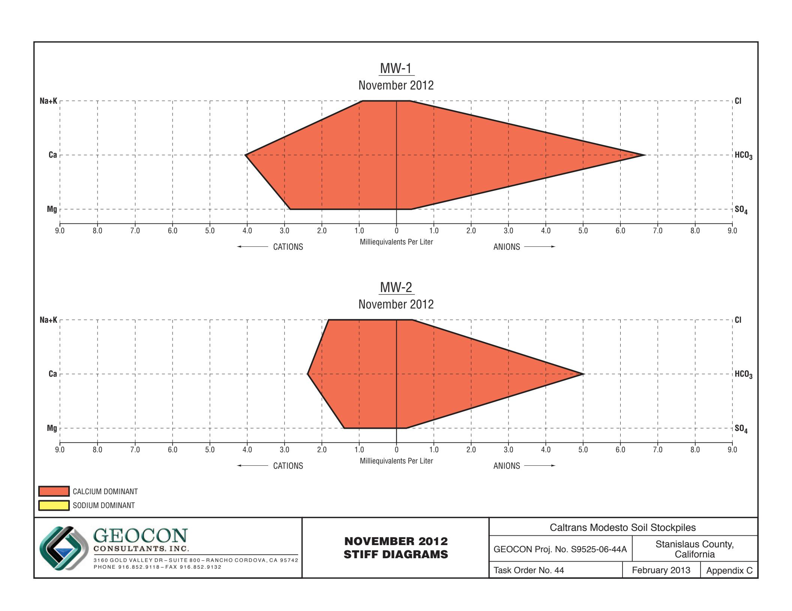

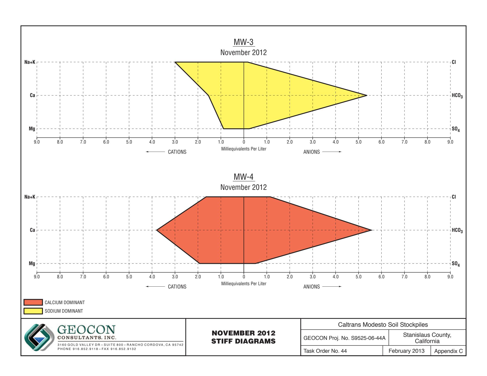

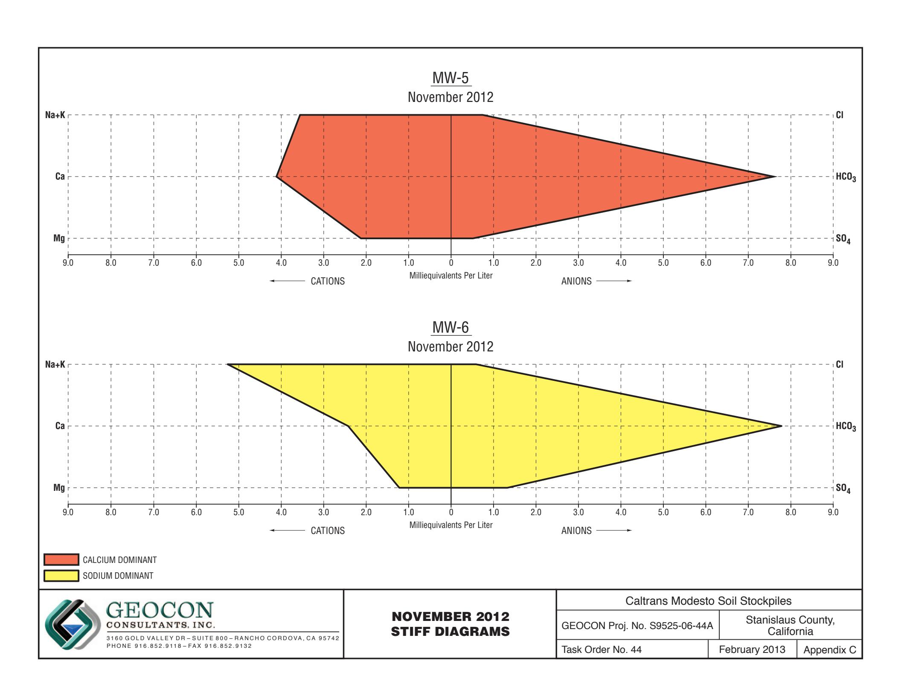

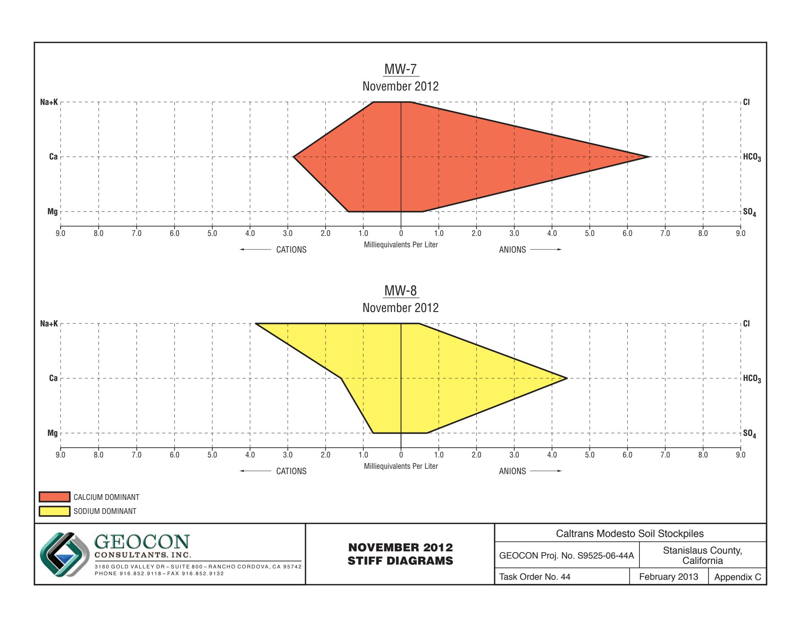

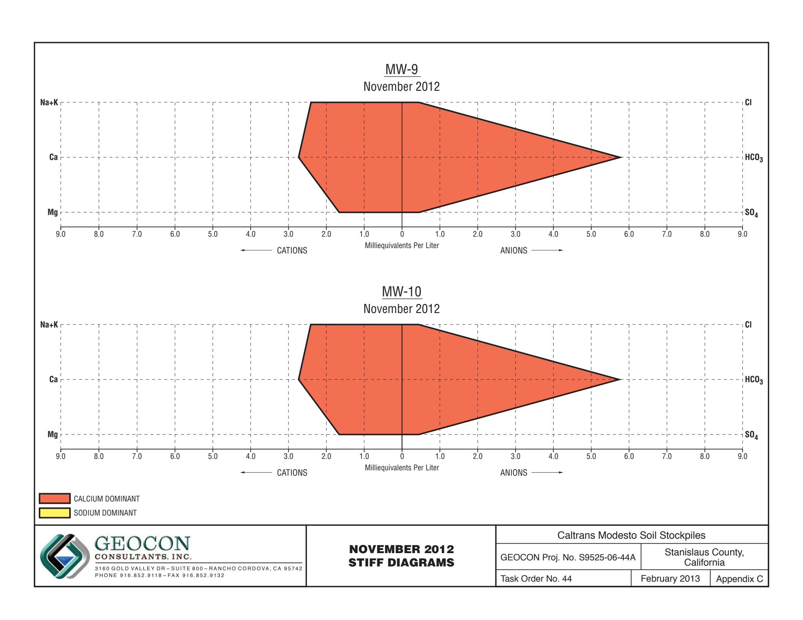