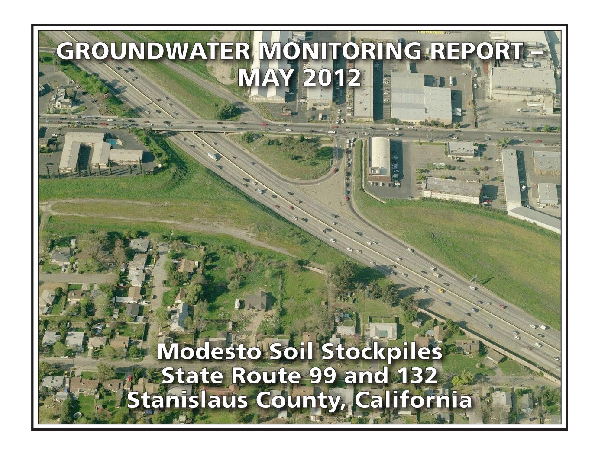

# PREPARED FOR:

CALIFORNIA DEPARTMENT OF TRANSPORTATION – DISTRICT 6
HAZARDOUS WASTE BRANCH
855 M STREET, SUITE 200
FRESNO, CALIFORNIA 93721

# PREPARED BY:

GEOCON CONSULTANTS, INC. 3160 GOLD VALLEY DRIVE, SUITE 800 RANCHO CORDOVA, CALIFORNIA 95742

**GEOCON PROJECT NO. S9525-06-44 TASK ORDER NO. 44, EA 10-403500 CONTRACT NO 06A1580** 

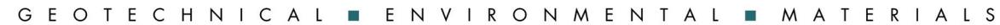

Project No. S9525-06-44A November 28, 2012

Mr. Richard Stewart, PG California Department of Transportation - District 6 Hazardous Waste Branch 855 M Street, Suite 200 Fresno, California 93721

Subject: GROUNDWATER MONITORING REPORT – MAY 2012

MODESTO SOIL STOCKPILES

STATE ROUTE 99 AND 132, STANISLAUS COUNTY, CALIFORNIA CONTRACT NO. 06A1580, TASK ORDER NO. 44, EA NO. 10-403500

Dear Mr. Stewart:

In accordance with California Department of Transportation (Caltrans) Contract No. 06A1580, Task Order No. 44, Geocon has performed groundwater monitoring activities at the Caltrans Modesto Soil Stockpiles (Site) located southerly of the intersection of State Route (SR) 99 and Kansas Avenue in Stanislaus County, California. The approximate site location is depicted on the attached Vicinity Map, Figure 1. The approximate site boundaries and soil stockpiles 1 through 3 are shown on the Site Plan, Figure 2.

The purpose of Task Order No. 44 was to initiate groundwater sampling and analysis at the Site in accordance with protocols approved by the California Environmental Protection Agency Department of Toxic Substances Control (DTSC) as established in the *Final Work Plan, Groundwater Assessment* prepared by Shaw and dated January 2006. The scope of services reported herein included depth to groundwater measurements, the sampling of eight groundwater monitoring wells, submittal of the water samples to a California-certified laboratory for analytical testing, and preparation of this report.

# BACKGROUND

# Project Description and History

Stockpiles 1 through 3 were generated during construction of SR 99 through Modesto around 1961 when Caltrans excavated property purchased from Food Machinery and Chemical Corporation (FMC) that contained an evaporation pond. The stockpiles were placed in their present location in anticipation of construction of the Route 132 West Expressway project.

During the 1930s, Barium Products Ltd. occupied property at 1200 Barium Road (now Graphics Drive) in Modesto just east of SR 99 between Woodland and Kansas Avenues. Barium Products Ltd. was a chemical manufacturing company processing a variety of ores and minerals including barite (barium sulfate) and celestite (strontium sulfate). Materials produced included barium and strontium compounds; these were used in greases, lubricating oil and pigment blanks. Sodium sulfide generated as a by-product of barite processing was sold as a caustic and used as a reagent in the mining industry.

In 1943, Barium Products Ltd. was purchased by Westvaco Chlorine Products Corporation which subsequently merged with FMC in 1948. From the 1950s to the 1970s, a liquid residue from the processing operations was discharged to unlined evaporation ponds along the western portion of the FMC Site. The approximate boundaries of the former evaporation/disposal ponds are shown on Figure 2.

In 1961, a 4.3–acre parcel at the southwest corner of the FMC site was purchased by the State of California for highway right-of-way needed to construct SR 99. An aerial photograph from 1957 shows that a portion of the southernmost pond on the FMC property was within the area purchased for right-of-way.

Soil in and around the holding pond was excavated during construction of SR 99 and, according to provisions of the construction contract, stockpiled within the current Caltrans right-of-way at the location of the future Route 132 Expressway project. Three distinct stockpiles are present at the Site:

- Stockpile 1, located south of Kansas Avenue and west of North Emerald Avenue,
- Stockpile 2, south of Kansas Avenue, between North Emerald Avenue and SR 99, and
- Stockpile 3, south of Kansas Avenue and east of SR 99.

In 2006, Caltrans arranged for the installation of monitoring wells MW-1 through MW-8 at locations adjacent to the three stockpiles as shown on Figure 2. General groundwater chemistry analytical results from June and October 2006 groundwater events suggested that two distinct groundwater types are present beneath the Site. A survey of groundwater wells within a one-mile radius of the Site identified 43 existing or former wells; however, there were no active supply wells identified in the general (southeast) flow direction from the Site.

In March 2012, Geocon collected groundwater samples from wells MW-1 through MW-8. Representatives from the DTSC observed the sample collection procedures and collected spilt samples which were sent to an alternate laboratory. No notable differences in the concentrations for each reported analyte were evident.

Geocon compared the analytical results from the March 2012 sampling activities to the water quality threshold values referenced below:

- Primary Maximum Contaminant Levels (MCLs) promulgated by the California Department of Environmental Health;
- Secondary MCLs promulgated by the California Department of Environmental Health;
- Public Health Goals for drinking water promulgated by the California Department of Public Health;
- Integrated Risk Information System Reference Dose promulgated by the United States Environmental Protection Agency (EPA);
- Notification Level for Drinking Water promulgated by the California Department of Environmental Health; and
- Water Quality for Agriculture (Ayers & Westcott).

With the exception of manganese that was reported at greater than the secondary MCL of 50 micrograms per liter ( $\mu$ g/l) for the sample collected from MW-4, none of the reported dissolved metals concentrations for the groundwater samples exceeded their respective numeric water quality threshold values.

With the exception of nitrate, none of the reported general minerals for the groundwater samples collected in March 2012 exceeded their respective California primary MCLs. Total dissolved solids (TDS) was reported at greater than the secondary MCL of 500 milligrams per liter (mg/l) for the samples collected from wells MW-1, MW-4, MW-5 and MW-6.

# Hydrogeologic Characterization

The hydrogeology of the adjacent FMC site has been characterized by numerous studies since the early 1980s. The GeoTrans January 2005 report *Addendum to Comprehensive Remedial Investigations Report, FMC Corporation, 1200 Graphics Drive, Modesto, Stanislaus County, California* (GeoTrans, 2005) provides a description of the FMC site hydrogeology. This description follows:

"The site is underlain by laterally discontinuous and unconsolidated sand and silty sand associated with the Modesto and Riverbank Formations. First encountered groundwater is approximately 30 feet below ground surface (bgs) under confined to semi-confined conditions. A deeper aquifer is present at a depth of 165 feet bgs and separated from the upper zone by a blue clay aquitard. The upper water bearing unit has been divided into two zones: a shallow zone from first encountered groundwater to 120 feet bgs and a deeper zone from 140 feet bgs to the top of the aquitard. Groundwater flow within the upper zone is toward the southeast under a gradient of 0.002 ft/ft."

Monitoring wells MW-1 through MW-8 were each installed into the unconsolidated sand, silty sand and silt layers within the Modesto Formation underlying the Site. The wells were completed within the shallow zone of the upper aquifer (shallow zone).

The lithology encountered in the borings for the wells includes interbedded (laterally discontinuous) sands, silts, and clays. In the areas investigated, the unsaturated (vadose) zone was dominated by silty soils. The shallow zone groundwater beneath the stockpiles was encountered at approximately 35 feet (elevation approximately 50 feet) under unconfined to semi-confined conditions flowing southeast at a gradient of approximately 0.001. The shallow aquifer conditions beneath the Site and the adjacent FMC site appear similar and representative of the local area.

Based on historical depth to water measurements from the Site, the groundwater flow direction in the shallow upper aquifer is generally towards the southeast with hydraulic gradients varying from 0.001 to 0.0008.

# MAY 2012 FIELD ACTIVITIES

# Depth to Groundwater Measurements

On May 17, 2012, Geocon measured the depth to groundwater and recorded the dissolved oxygen (DO) level and oxygen-reduction potential (ORP) in monitoring wells MW-1 through MW-8 using a battery-operated water level meter, a Hanna Model No. 9143 DO meter, and an Oakton ORP meter. Measurements were obtained from a surveyed reference point at the top of the well casings (TOC).

In May 2012, depth to groundwater at the Site ranged from 29.74 (MW-1) to 38.25 (MW-5) feet below TOC. Based on the groundwater elevation data, the groundwater flow is toward the southeast at an average gradient of 0.0006. A summary of the TOC elevations, depth to groundwater measurements and groundwater elevations is on Table 1. Groundwater elevation contours, flow direction and gradient are depicted on Figure 3.

# Well Purging and Sampling

On May 17, 2012, Geocon purged approximately three well volumes of water (4.5 to 7 gallons) from groundwater monitoring wells MW-1 through MW-4 and MW-6 through MW-8 using a submersible pump. Well MW-5 went dry after purging 1 gallon, was allowed to recover, purged of an additional 0.25 gallon, was allowed to recover a second time, and then sampled. The pump was decontaminated before and after each use by washing in an AlconoxTM solution followed by fresh and distilled water rinses. During the well purging activities, the groundwater was monitored for pH, electrical conductivity, temperature and turbidity. This information is included on the Monitoring Well Sampling Data sheets in Appendix A.

Following well purging, groundwater samples were collected from each of the wells using disposable bailers and decanted through low-flow sample release tubes into laboratory-provided sample containers. The groundwater samples collected for dissolved metals analyses were filtered through a 0.45-micron filter while filling the container. The samples were sealed, labeled, placed in a chilled cooler and subsequently transported to the laboratory using chain-of-custody protocol.

Purged groundwater was placed into one Department of Transportation-approved, 17-H, 55-gallon drum and temporarily stored near MW-8 pending receipt of analytical results. The contents of the drum were subsequently placed on the ground surface.

# ANALYTICAL METHODS AND RESULTS

# Laboratory Analysis

The groundwater samples were delivered to Advanced Technology Laboratories (ATL), a California-certified analytical laboratory, for the following analyses under chain-of-custody protocol:

- Title 22 dissolved metals (including strontium) following the EPA Test Methods 6020/7470;
- Dissolved calcium, magnesium, potassium and sodium by EPA Test Method 6020;
- Chloride, nitrate as nitrogen and sulfate by EPA Test Method 300.0;
- Sulfide by Standard Method (SM) 4500;
- TDS by SM 2540C;
- Total alkalinity, bicarbonate alkalinity, carbonate alkalinity by SM 2320B; and
- Polycyclic aromatic hydrocarbons (PAHs) by EPA Test Method 8270-SIM.

Groundwater analytical results for this monitoring event are summarized on Tables 2 and 3. The laboratory report and chain-of-custody documentation are in Appendix B.

# Analytical Results

# PAHs

The PAH results are summarized on Table 3. No PAHs were reported at concentrations equal to or greater than their respective practical quantitation limits (PQLs) for each of the groundwater samples collected during this monitoring event.

# Dissolved Metals

Analytical results for dissolved metals along with their associated numeric water quality thresholds are summarized on Table 2.

The DTSC has identified barium, lead and strontium as the primary chemicals of concern for the Site. For the May 2012 groundwater samples, barium and strontium were reported in all eight groundwater samples. Lead was not reported at concentrations above the PQL of 1.0 µg/l in any of the groundwater samples. The ranges of barium and strontium concentrations reported are on the following table:

|                                    | Barium (μg/l)    | Strontium (µg/l) |
|------------------------------------|------------------|------------------|
| High Concentration                 | 310 (MW-5)       | 1,400 (MW-5)     |
| Low Concentration                  | 55 (MW-8)        | 270 (MW-8)       |
| Numeric Water Quality Threshold | 1,000(1) /700(2) | 4,000(2)         |

Beryllium, cadmium, silver, thallium, zinc and mercury were also each not reported above their respective PQLs in samples from each well. As shown in the following table, the dissolved metals arsenic, chromium, and vanadium were reported for each of the samples collected with the following ranges:

|                                    | Arsenic (μg/l) | Chromium (µg/l) | Vanadium (μg/l) |
|------------------------------------|----------------|-----------------|-----------------|
| High Concentration                 | 3.9 (MW-6)     | 12 (MW-5)       | 32 (MW-6)       |
| Low Concentration                  | 2.1 (MW-4)     | 1.6 (MW-7)      | 14 (MW-5)       |
| Numeric Water Quality Threshold | 10(1)          | 50(1)           | 50(2)           |

 $\mu g/l = micrograms per liter$ 

Although concentrations of arsenic, barium, chromium, vanadium and strontium were reported for the samples collected from each well, none of the reported concentrations exceed their respective numeric water quality thresholds for drinking water.

 $\mu g/l =$  micrograms per liter (1) = California Department of Public Health Primary MCL for Drinking Water

(2) = EPA Drinking Water Health Advisory

(1) = California Department of Public Health Primary MCL for Drinking Water

(2) = California Department of Public Health Notification Level for Drinking Water

Molybdenum and nickel were reported for each sample except MW-4 and MW-8, respectively. Antimony was reported for the samples collected from MW-5 and MW-7. Copper was reported for the samples collected from four of the eight groundwater samples. Selenium was reported for the samples collected from five of the eight groundwater samples. Cobalt and manganese were reported from the sample collected from MW-1. The following table summarizes the dissolved antimony, cobalt, copper, manganese, molybdenum, nickel and selenium concentrations reported for each of the samples collected:

|                                       | Antimony (µg/l) | Cobalt (µg/l)  | Copper (µg/l)        | Manganese (µg/l) | Molybdenum (µg/l) | Nickel (µg/l) | Selenium (µg/l)            |
|---------------------------------------|--------------------|-------------------|-------------------------|---------------------|----------------------|------------------|-------------------------------|
| High Concentration                 | 0.74 (MW-7)     | 1.0 (1) (MW-1) | 2.5 (MW-1)           | 35(1) (MW-1)     | 5.5 (MW-6)        | 4.0 (MW-1)    | 2.6 (MW-5)                 |
| Low Concentration                  | 0.59 (MW-5)     | 1.0 (1) (MW-1) | 1.1 (MW-5)           | 35(1) (MW-1)     | 1.0 (MW-7)        | 1.1 (MW-3)    | 0.62 (MW-1 and MW-4) |
| Numeric Water Quality Threshold | 6 (2)              | 50 (3)            | 1,300 (2) /1,000 (4) | 50 (2)              | 40 (5)               | 100 (2)          | 50 (2)                        |

\$\mu\$g/l = micrograms per liter

Although concentrations of antimony, chromium, cobalt, copper, manganese, molybdenum, nickel and selenium were reported for the samples collected from site monitoring wells, none of the reported concentrations exceed their respective numeric water quality thresholds for drinking water.

# General Minerals/Stiff Diagrams

To further characterize the geochemistry of the groundwater, general minerals analyses were conducted and included the following constituents:

- Calcium
- Magnesium
- Chloride
- Nitrate as nitrogen
- Sulfate
- Potassium
- Sodium
- Sulfide
- Total alkalinity
- TDS

 $\mu$ g/l = micrograms per liter (1) = Analyte was detected above the PQL within only one sample so the high and low concentrations are the same

(2) = California Department of Public Health Primary MCL for Drinking Water

(3) = Ayers & Westcott Water Quality for Agriculture.

(4) = California Department of Public Health Secondary MCL (taste and odor)

(5) = EPA Drinking Water Health Advisory

General groundwater chemistry provides information regarding the origin and geochemical nature of the groundwater sampled. The analytical results for the major cation (dissolved sodium, potassium, calcium and magnesium) and anion species (chloride, bicarbonate alkalinity reported as calcium carbonate, and sulfate) were used to create Stiff diagrams. Stiff diagrams provide a pictorial or graphical display of ionic content and can be used to characterize and evaluate the relative composition of groundwater and its consistency or variability. Groundwater exhibiting different cation/anion concentrations will result in Stiff diagrams of different shapes and sizes. Stiff diagrams can also help to illustrate mixing of water with different compositions or origins. The presence of more than one water type can be an indication of influences due to hydrogeologic variation or from other sources including man-made impacts.

Appendix C contains Stiff diagrams constructed using site groundwater data for May 2012. The diagrams show that each groundwater monitoring well contains bicarbonate (HCO3) dominant water. However, variations in the sodium and potassium (Na+K) and calcium composition are readily apparent in the site groundwater data between individual wells. The variations are related primarily to the groundwater's sodium content with the potassium concentrations being less variable between the individual wells. Groundwater geochemistry and Stiff diagrams of the May 2012 groundwater samples are discussed below.

In May 2012, the samples from wells MW-1, MW-2, MW-4, MW-5 and MW-7 had a calcium-dominant composition, while the samples from wells MW-3, MW-6 and MW-8 were sodium-dominant.

The geochemical evidence supports that groundwater upgradient (MW-1) and beneath Stockpile 1 and Stockpile 2 (MW-2, MW-4 and MW-5) is calcium-dominant and that the sodium-dominant water is found at locations upgradient to the stockpiles that further coincide with locations downgradient to the FMC facility (MW-3 and MW-6). Sodium-dominant water is also evident at MW-8 (the furthest downgradient well).

Nitrate as nitrogen was also reported for each of the groundwater samples ranging from 2.5 mg/l in MW-3 and MW-7 to 26 mg/l in MW-5. The reported nitrate concentrations for MW-1 (12 mg/l), MW-4 (10 mg/l), MW-5, and MW-6 (18 mg/l) each meet or exceed the primary MCL of 10 mg/l established for nitrate. Noteworthy is that MW-1 is an upgradient monitoring well; thus, the reported nitrate concentration of 12 mg/l for this location may be indicative of natural background nitrate concentrations for the shallow groundwater in the vicinity of the Site.

The analytical results for general minerals are summarized on Table 3. The Stiff diagrams are in Appendix C.

# Field and Laboratory Quality Assurance/Quality Control

The field quality assurance/quality control (QA/QC) implemented for the May 2012 groundwater monitoring at the Site included the collection of an equipment blank analyzed for dissolved metals. The blank was collected by pouring distilled water over a decontaminated pump and allowing the water to collect into the laboratory-provided sample container. Antimony, barium, calcium, magnesium and sodium were each reported for the equipment blank at respective concentrations of 1.3, 1.4, 200, 72 and 610  $\mu$ g/l. Antimony was reported at a similar concentration in two of eight samples, and barium, calcium, magnesium and sodium were reported for each of the samples. Based on the presence of antimony, barium, calcium, magnesium and sodium in the equipment blank, the concentrations for each of these constituents reported herein must be qualified as estimated with the potential to be less than the reported values.

Geocon also reviewed the analytical laboratory QA/QC provided with the laboratory report. These data show that that the method blank surrogate recoveries are acceptable and that concentrations of selected analytes were not reported at concentrations equal to or greater than their respective PQLs for each method blank for each analysis. Appropriate recoveries were noted for each laboratory control sample for each analysis. Several matrix spike (MS) and matrix spike duplicate (MSD) analytes had recoveries or relative percent differences outside of laboratory control limits including: a May 24, 2012, MS for arsenic, chromium, thallium, zinc and strontium that had recoveries that exceeded 130%; a May 24, 2012, MS that had barium and strontium recoveries of less than 70%; a March 24, 2012, MSD for barium, nickel, and strontium that had recoveries of less than 70%; a March 24, 2012, MSD for barium, chromium and strontium that had recoveries that exceeded 130%; and, a June 4, 2012, MS for zinc that had a recovery that exceeded 130%. Since none of the dissolved metals concentrations were close to exceeding their respective water quality thresholds, no additional qualification of the data is necessary, and the data are considered of sufficient quality for the purposes of this report.

# GeoTracker Submittal

The laboratory prepared electronic data files for submittal to the State Water Resources Control Board GeoTracker database. The GeoTracker database is accessible via the GeoTracker website at <a href="http://geotracker.waterboards.ca.gov">http://geotracker.waterboards.ca.gov</a>. The electronic data was uploaded to GeoTracker on November 21, 2012. The confirmation numbers are 3018645524 and 1831125915.

# CONCLUSIONS AND RECOMMENDATIONS

With the exception of nitrate, none of the reported general minerals for the groundwater samples collected in May 2012 exceeded their respective California primary MCLs. TDS was reported at concentrations greater than the secondary MCL of 500 mg/l for the samples collected from wells MW-4, MW-5 and MW-6

As shown on Figures 4 through 6, barium, lead and strontium were reported for the May 2012 groundwater samples at concentrations similar to historical levels and remained significantly below their water quality thresholds. The remaining dissolved metals were also reported at concentrations similar to their March 2012 levels. None of the reported dissolved metals concentrations for the groundwater samples collected in March 2012 exceeded their water quality threshold values.

As shown on Figure 3, Stiff diagrams prepared using the May 2012 analytical data show minimal change in ionic content since March 2012. The dominant cation for each well in March 2012 remains dominant in May, with wells MW-1, MW-2, MW-4, MW-5 and MW-7 remaining calcium dominant and wells MW-3, MW-6 and MW-8 remaining sodium dominant.

Please contact us if you have any questions concerning the contents of this Report or if we may be of further service.

Sincerely,

GEOCON CONSULTANTS, INC.

Josh Ewert

Senior Staff Geologist

Rebecca L. Silva Project Manager

John E. Juhrend, PE, CEG Principal

- (3) Addressee
- (1) Caltrans, Sam Haack
- (1) DTSC, Randy Adams
- (1) CVRWQCB, Steve Meeks

Attachments:

Figure 1, Vicinity Map

Figure 2, Site Plan

Figure 3, Groundwater Elevation and Ionic Composition Map – May 2012

Figure 4, Barium Concentrations Vs. Time

Figure 5, Lead Concentrations Vs. Time

Figure 6, Strontium Concentrations Vs. Time

No. 46681

Table 1, Groundwater Elevation Data

Table 2, Summary of Groundwater Analytical Results – Title 22 Metals (Dissolved)

Table 3, Summary of Groundwater Analytical Results – General Minerals and PAHs

Table 4, Well Construction Details

Appendix A, Monitoring Well Development and Sampling Data Sheets

Appendix B, Laboratory Reports and Chain-of-custody Documentation

Appendix C, Stiff Diagrams

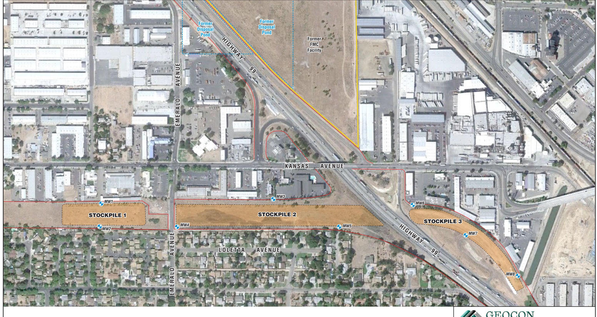

MW8 Approximate Monitoring Well Location

— State Right-of-Way Boundary

Scale in Feet

# GEOCON CONSULTANTS, INC.

3160 GOLD VALLEY DR - SUITE 800 - RANCHO CORDOVA, CA 95742 PHONE 916.852.9118 - FAX 916.852.9132

| Modesto | ) Soil | Stock | крі | les |
|---------|--------|-------|-----|-----|
|---------|--------|-------|-----|-----|

| Stanislaus County, California |  |
|----------------------------------|--|
|                                  |  |

**SITE PLAN** 

GEOCON Proj. No. S9525-06-44 Task Order No. 44

November 2012

vember 2012

Figure 2

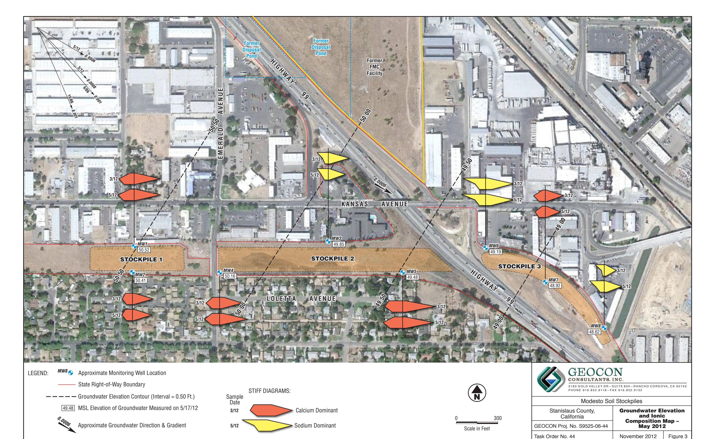

Figure 3

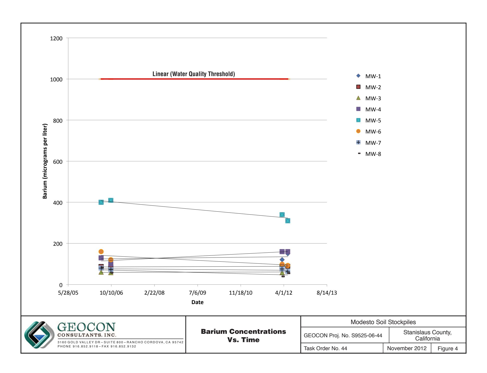

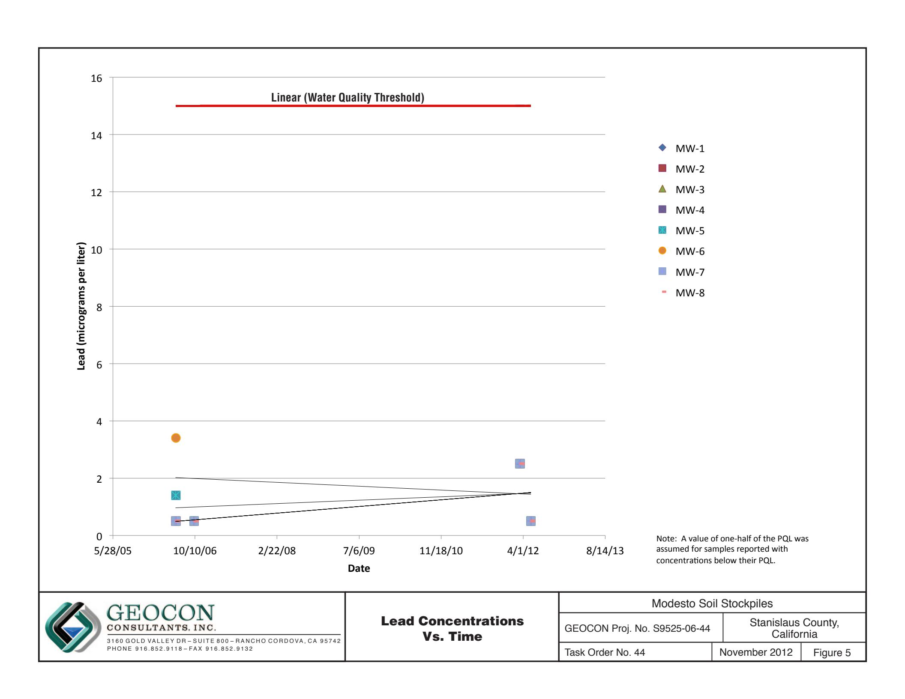

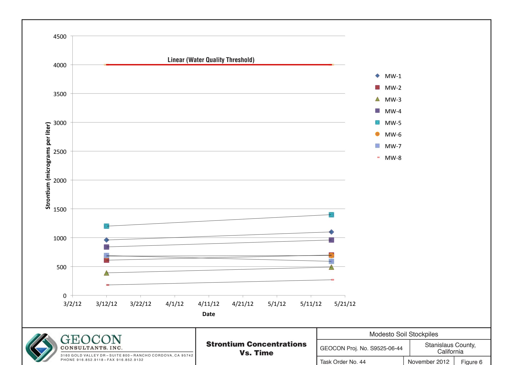

# TABLE 1 GROUNDWATER ELEVATION DATA STATE ROUTE 99/132 MODESTO SOIL STOCKPILES STANISLAUS COUNTY, CALIFORNIA

| STANISLAUS COUNTY, CALIFORNIA |           |                                        |                                             |                                        |
|-------------------------------|-----------|----------------------------------------|---------------------------------------------|----------------------------------------|
| WELL ID                       | DATE      | WELL CASING ELEVATION (feet MSL) | DEPTH TO GROUNDWATER (feet below TOC) | GROUNDWATER ELEVATION (feet MSL) |
| MW-1                          | 6/14/2006 | 80.26                                  | 29.82                                       | 50.44                                  |
| MW-1                          | 10/5/2006 | 80.26                                  | 32.35                                       | 47.91                                  |
| MW-1                          | 3/12/2012 | 80.26                                  | 30.12                                       | 50.14                                  |
| MW-1                          | 5/17/2012 | 80.26                                  | 29.74                                       | 50.52                                  |
| MW-2                          | 6/13/2006 | 81.10                                  | 30.72                                       | 50.38                                  |
| MW-2                          | 10/5/2006 | 81.10                                  | 33.35                                       | 47.75                                  |
| MW-2                          | 3/12/2012 | 81.10                                  | 31.04                                       | 50.06                                  |
| MW-2                          | 5/17/2012 | 81.10                                  | 30.69                                       | 50.41                                  |
| MW-3                          | 6/13/2006 | 81.76                                  | 32.38                                       | 49.38                                  |
| MW-3                          | 10/5/2006 | 81.76                                  | 34.88                                       | 46.88                                  |
| MW-3                          | 3/12/2012 | 81.76                                  | 32.35                                       | 49.41                                  |
| MW-3                          | 5/17/2012 | 81.76                                  | 31.91                                       | 49.85                                  |
| MW-4                          | 6/13/2006 | 82.36                                  | 32.39                                       | 49.97                                  |
| MW-4                          | 10/4/2006 | 82.36                                  | 35.05                                       | 47.31                                  |
| MW-4                          | 3/12/2012 | 82.36                                  | 32.60                                       | 49.76                                  |
| MW-4                          | 5/17/2012 | 82.36                                  | 32.20                                       | 50.16                                  |
| MW-5                          | 6/14/2006 | 87.73                                  | 38.79                                       | 48.94                                  |
| MW-5                          | 10/5/2006 | 87.73                                  | 41.40                                       | 46.33                                  |
| MW-5                          | 3/12/2012 | 87.73                                  | 38.74                                       | 48.99                                  |
| MW-5                          | 5/17/2012 | 87.73                                  | 38.25                                       | 49.48                                  |
| MW-6                          | 6/14/2006 | 84.37                                  | 36.35                                       | 48.02                                  |
| MW-6                          | 10/5/2006 | 84.37                                  | 38.55                                       | 45.82                                  |
| MW-6                          | 3/12/2012 | 84.37                                  | 35.70                                       | 48.67                                  |
| MW-6                          | 5/17/2012 | 84.37                                  | 35.18                                       | 49.19                                  |
| MW-7                          | 6/14/2006 | 83.64                                  | 35.59                                       | 48.05                                  |
| MW-7                          | 10/4/2006 | 83.64                                  | 38.32                                       | 45.32                                  |
| MW-7                          | 3/12/2012 | 83.64                                  | 35.31                                       | 48.33                                  |
| MW-7                          | 5/17/2012 | 83.64                                  | 34.72                                       | 48.92                                  |
| MW-8                          | 6/14/2006 | 83.73                                  | 36.12                                       | 47.61                                  |
| MW-8                          | 10/4/2006 | 83.73                                  | 38.95                                       | 44.78                                  |
| WELL ID                       | DATE      | WELL CASING ELEVATION (feet MSL) | DEPTH TO GROUNDWATER (feet below TOC) | GROUNDWATER ELEVATION (feet MSL) |
| MW-8                          | 3/12/2012 | 83.73                                  | 35.75                                       | 47.98                                  |

## TABLE 1

## GROUNDWATER ELEVATION DATA

## STATE ROUTE 99/132 MODESTO SOIL STOCKPILES

## STANISLAUS COUNTY, CALIFORNIA

Notes:

MSL = Mean sea level

TOC = Top of well casing

Data prior to 3/12/2012 reproduced from Site Investigation Report, Groundwater Assessment, Caltrans Modesto Soil Stockpiles State Route 99/132 Project, Stanislaus County, California, Shaw Environmental, Inc., May 14, 2007.

Wells resurveyed by Morrow Surveying on June 18, 2012.

# TABLE 2 SUMMARY OF GROUNDWATER ANALYTICAL RESULTS - TITLE 22 METALS (Dissolved) STATE ROUTE 99/132 MODESTO SOIL STOCKPILES

STANISLAUS COUNTY, CALIFORNIA

|                                      |                                                                 | Results in micrograms per liter      |                                  |                              |                                       |                                             |                                 |                                       |                                    |                                      |                                  |                                   |                                    |                                    |                                       |                                      |                              |                                 |                               |                                            |         |
|--------------------------------------|-----------------------------------------------------------------|--------------------------------------|----------------------------------|------------------------------|---------------------------------------|---------------------------------------------|---------------------------------|---------------------------------------|------------------------------------|--------------------------------------|----------------------------------|-----------------------------------|------------------------------------|------------------------------------|---------------------------------------|--------------------------------------|------------------------------|---------------------------------|-------------------------------|--------------------------------------------|---------|
| ANALYTE                              | SAMPLE ID                                                       | SAMPLE DATE                          | Antimony                         | Arsenic                      | Barium                                | Beryllium                                   | Cadmium                         | Chromium                              | Cobalt                             | Copper                               | Lead                             | Manganese                         | Molybdenum                         | Nickel                             | Selenium                              | Silver                               | Thallium                     | Vanadium                        | Zinc                          | Strontium                                  | Mercury |
| MW-1                                 | 6/14/2006 10/5/2006 3/12/2012 3/12/2012 S 5/17/2012 | <1.0                                 | 2.1                              | 130                          | <1.0                                  | <1.0                                        | 10                              | <1.0                                  | 1.1                                | <1.0                                 | 34                               | 2.9                               | 2.9                                | <1.0                               | <1.0                                  | <1.0                                 | 23                           | <10                             | --                            | <0.2                                       |         |
|                                      |                                                                 | <1.0                                 | 2.2                              | 120                          | <1.0                                  | <1.0                                        | 16                              | <1.0                                  | 2.0                                | <1.0                                 | <1.0                             | <2.0                              | 1.5                                | <1.0                               | <1.0                                  | <1.0                                 | 26                           | <10                             | 960                           | 0.41                                       |         |
|                                      |                                                                 | <2.5                                 | <5.0                             | 120                          | <5.0                                  | 6.4                                         | <2.5                            | <5.0                                  | <5.0                               | <50                                  | <2.5                             | <2.5                              | <2.5                               | <2.5                               | 22                                    | <50                                  | --                           | --                              |                               |                                            |         |
|                                      |                                                                 | <10                                  | 1.6                              | 105                          | <5.0                                  | 0.6                                         | 6.8                             | <5.0                                  | 3.4                                | 2                                    | 2.0                              | 1.3                               | <5.0                               | <20                                | <5.0                                  | 21.2                                 | 5.6                          | 1,010                           | --                            |                                            |         |
|                                      |                                                                 | <0.50                                | 2.3                              | 150                          | <0.50                                 | 7.0                                         | 1.0                             | 2.5                                   | <1.0                               | 35                                   | 1.3                              | 4.0                               | 0.62                               | <0.50                              | <0.50                                 | 21                                   | <10                          | 1,100                           | <0.20                         |                                            |         |
| MW-2                                 | 6/13/2006 10/5/2006 3/12/2012 3/12/2012 S 5/17/2012 | <1.0                                 | 2.1                              | 87                           | <1.0                                  | <1.0                                        | 8.5                             | <1.0                                  | 1.2 U                              | <1.0                                 | 24                               | 3.3                               | 2.0                                | 1.3                                | <1.0                                  | <1.0                                 | 22                           | <10                             | --                            | <0.2                                       |         |
|                                      |                                                                 | <1.0                                 | 2.6                              | 84                           | <1.0                                  | <1.0                                        | 11                              | <1.0                                  | 1.7                                | <1.0                                 | <1.0                             | <2.0                              | 1.2                                | <1.0                               | <1.0                                  | <1.0                                 | 27                           | <10                             | --                            | <0.2                                       |         |
|                                      |                                                                 | <2.5                                 | <5.0                             | 88                           | <5.0                                  | <2.5                                        | 4.7                             | <2.5                                  | <5.0                               | <50                                  | <2.5                             | <2.5                              | <2.5                               | <2.5                               | 23                                    | <50                                  | 610                          | 0.28                            |                               |                                            |         |
|                                      |                                                                 | <10                                  | <10                              | 89.6                         | <5.0                                  | 0.4                                         | 6.1                             | <5.0                                  | <5.0                               | 2                                    | 1.4                              | 1.4                               | <5.0                               | <20                                | <5.0                                  | 23.1                                 | 3.7                          | 642                             | --                            |                                            |         |
|                                      |                                                                 | <0.50                                | 2.6                              | 89                           | <0.50                                 | 6.6                                         | <0.50                           | 1.5                                   | <1.0                               | 10                                   | 1.2                              | 1.9                               | <0.50                              | <0.50                              | <0.50                                 | 20                                   | <10                          | 700                             | <0.20                         |                                            |         |
| MW-3                                 | 6/13/2006 10/5/2006 3/12/2012 3/12/2012 S 5/17/2012 | <1.0                                 | 3.0                              | 60                           | <1.0                                  | <1.0                                        | 7.1                             | <1.0                                  | 1 U                                | <1.0                                 | 4.7                              | <2.0                              | 1.4                                | 1.4                                | <1.0                                  | <1.0                                 | 25                           | <10                             | --                            | <0.2                                       |         |
|                                      |                                                                 | <1.0                                 | 3.3                              | 58                           | <1.0                                  | <1.0                                        | 7.9                             | <1.0                                  | 1.5                                | <1.0                                 | 18                               | 2.2                               | <1.0                               | <1.0                               | <1.0                                  | 29                                   | <10                          | --                              | <0.2                          |                                            |         |
|                                      |                                                                 | <2.5                                 | <5.0                             | 58                           | <5.0                                  | <2.5                                        | 4.4                             | <2.5                                  | <5.0                               | <50                                  | <2.5                             | <2.5                              | <2.5                               | <2.5                               | 28                                    | <50                                  | 390                          | 0.20                            |                               |                                            |         |
|                                      |                                                                 | <10                                  | 2.1                              | 44.4                         | 0.1                                   | 0.3                                         | 4.0                             | <5.0                                  | 1.5                                | 2                                    | 1.8                              | 0.9                               | <5.0                               | <20                                | <5.0                                  | 22.6                                 | 4.5                          | 342                             | --                            |                                            |         |
|                                      |                                                                 | <0.50                                | 3.8                              | 64                           | <0.50                                 | 3.7                                         | <0.50                           | <1.0                                  | <1.0                               | 10                                   | 1.4                              | 1.1                               | <0.50                              | <0.50                              | <0.50                                 | 26                                   | <10                          | 490                             | <0.20                         |                                            |         |
| MW-4                                 | 6/13/2006 10/4/2006 3/12/2012 3/12/2012 S 5/17/2012 | <1.0                                 | 1.8                              | 130                          | <1.0                                  | <1.0                                        | 8.9                             | <1.0                                  | 1.6 U                              | <1.0                                 | 62                               | 2.5                               | 2.4                                | <1.0                               | <1.0                                  | <1.0                                 | 19                           | <10                             | --                            | <0.2                                       |         |
|                                      |                                                                 | <1.0                                 | 2.1                              | 100                          | <1.0                                  | <1.0                                        | 9.9                             | <1.0                                  | 2.1                                | <1.0                                 | 4.1                              | <2.0                              | <1.0                               | <1.0                               | <1.0                                  | 24                                   | <10                          | --                              | <0.2                          |                                            |         |
|                                      |                                                                 | <2.5                                 | <5.0                             | 160                          | <5.0                                  | <2.5                                        | 8.9                             | <2.5                                  | <5.0                               | <50                                  | 88                               | <2.5                              | 5.4                                | <2.5                               | <2.5                                  | 26                                   | <50                          | 840                             | 0.29                          |                                            |         |
|                                      |                                                                 | <10                                  | 1.4                              | 134                          | <5.0                                  | 0.4                                         | 7.7                             | <5.0                                  | 0.9                                | 2                                    | 0.7                              | <5.0                              | <5.0                               | <20                                | <5.0                                  | 19.3                                 | 3.5                          | 812                             | --                            |                                            |         |
|                                      |                                                                 | <0.50                                | 2.1                              | 160                          | <0.50                                 | 6.6                                         | <0.50                           | <1.0                                  | <1.0                               | 10                                   | <0.50                            | 1.7                               | 0.62                               | <0.50                              | <0.50                                 | 18                                   | <10                          | 960                             | <0.20                         |                                            |         |
| MW-5                                 | 6/14/2006 10/5/2006 3/12/2012                             | <1.0                                 | 1.8                              | 400                          | <1.0                                  | <1.0                                        | 9.6                             | 2.2                                   | 4.8                                | 1.4                                  | 260                              | 9.9                               | 7.1                                | 2.0                                | <1.0                                  | <1.0                                 | 23                           | <10                             | --                            | <0.2                                       |         |
|                                      |                                                                 | <1.0                                 | 2.5                              | 410                          | <1.0                                  | <1.0                                        | 18                              | <1.0                                  | 1.9                                | <1.0                                 | 120                              | 14                                | 3.4                                | <1.0                               | 2.1                                   | <1.0                                 | 24                           | <10                             | --                            | <0.2                                       |         |
|                                      |                                                                 | <2.5                                 | <5.0                             | 340                          | <5.0                                  | <2.5                                        | 9.2                             | <2.5                                  | <5.0                               | <50                                  | <2.5                             | <2.5                              | <2.5                               | <2.5                               | 18                                    | <50                                  | 1,200                        | 0.28                            |                               |                                            |         |
| ANALYTE                              | SAMPLE ID                                                       | SAMPLE DATE                       | Results in micrograms per liter  |                              |                                       |                                             |                                 |                                       |                                    |                                      |                                  |                                   |                                    |                                    |                                       |                                      |                              |                                 |                               |                                            |         |
|                                      |                                                                 |                                      | Antimony                         | Arsenic                      | Barium                                | Beryllium                                   | Cadmium                         | Chromium                              | Cobalt                             | Copper                               | Lead                             | Manganese                         | Molybdenum                         | Nickel                             | Selenium                              | Silver                               | Thallium                     | Vanadium                        | Zinc                          | Strontium                                  | Mercury |
| MW-5 MW-5                         | 3/12/2012 S 5/17/2012                                        | <10 <b>0.59</b>                   | 1.3 <b>2.4</b>                | 310 310                   | <5.0 <0.50                         | <b>0.5</b> <0.50                         | 9.6 12                       | <5.0 <0.50                         | 1.0 1.1                         | ...2 <1.0                         | 4.4 <10                       | 1.5 1.8                        | <5.0 <b>3.1</b>                 | 1.5 2.6                         | <5.0 <0.50                         | <b>3.6</b> <0.50                  | 17.8 14                   | <b>14.5</b> <10              | 1,140 <b>1,400</b>         | <0.20                                      |         |
| MW-6 MW-6                         | 6/14/2006 10/5/2006                                          | <1.0 <1.0                         | 3.6 5.2                       | 160 120                   | <1.0 <1.0                          | <1.0 <1.0                                | 16 29                        | <b>3.0</b> <1.0                    | 6.2 1.5                         | 3.4 <1.0                          | 190 130                       | 13 13                          | 5.9 1.7                         | 3.0 <1.0                        | <1.0 <1.0                          | <1.0 <1.0                         | 33 34                     | 15 <10                       | -- --                      | <0.2 <0.2                               |         |
| MW-6 MW-6 MW-6                 | 3/12/2012 3/12/2012 S 5/17/2012                           | <2.5 <10 <0.50                 | <5.0 2.8 3.9               | 99 94.2 93             | <5.0 <5.0 <0.50                 | <2.5 <b>0.4</b> <0.50                 | 9.5 9.9 8.3               | <2.5 <5.0 <0.50                 | <5.0 <5.0 <b>1.3</b>         | <5.0 ...2 <1.0                 | <50 2.7 <10                | 5.3 5.2 5.5                 | <5.0 <5.0 <b>1.8</b>         | <2.5 <20 2.1                 | <2.5 <5.0 <0.50                 | <2.5 2.6 <0.50                 | 37 36.3 32             | <50 <b>3.8</b> <10        | 680 655 690             | <b>0.27</b> -- <0.20                 |         |
| MW-7 MW-7 MW-7                 | 6/14/2006 10/4/2006 3/12/2012                             | <1.0 <1.0 <2.5                 | 2.3 2.7 <5.0               | 80 73 76               | <1.0 <1.0 <5.0                  | <1.0 <1.0 <2.5                        | 7.0 10 <2.5               | <1.0 <1.0 <2.5                  | <1.0 1.6 <5.0                | <1.0 <1.0 <5.0                 | 9.0 1.1 <50                | 2.6 2.0 <2.5                | 2.2 1.4 <5.0                 | 1.1 1.2 <2.5                 | <1.0 <1.0 <2.5                  | <1.0 <1.0 <2.5                 | 17 23 24               | <10 <10 <50               | -- -- 690               | <0.2 <0.2 <b>0.28</b>                |         |
| MW-7                                 | 5/17/2012                                                       | <b>0.74</b>                          | <b>2.3</b>                       | <b>63</b>                    | <0.50                                 | <0.50                                       | <b>1.6</b>                      | <0.50                                 | <1.0                               | <1.0                                 | <10                              | 1.0                               | 1.3                                | <0.50                              | <0.50                                 | <0.50                                | 19                           | <10                             | 590                           | <0.20                                      |         |
| MW-8 MW-8 MW-8 MW-8 MW-8 | 6/14/2006 10/4/2006 3/12/2012 3/12/2012 S 5/17/2012 | <1.0 <1.0 <2.5 <10 <0.50 | 2.7 4.0 <5.0 2.5 3.2 | 84 57 39 39.4 55 | <1.0 <1.0 <5.0 <5.0 <0.50 | <1.0 <1.0 <2.5 <b>0.1</b> <0.50 | 8.8 9.7 4.4 4.7 4.6 | <1.0 <1.0 <2.5 <5.0 <0.50 | <1.0 1.7 <5.0 <5.0 1.0 | <1.0 <1.0 <5.0 ...2 <1.0 | 5.8 <1.0 <50 1.7 <10 | <2.0 2.0 <2.5 1.3 1.8 | 1.2 <1.0 <5.0 <5.0 1.0 | 1.6 <1.0 <2.5 <20 0.73 | <1.0 <1.0 <2.5 <5.0 <0.50 | <1.0 <1.0 <2.5 <20 <0.50 | 25 32 20 23.4 22 | <10 <10 <50 3.6 <10 | -- -- 180 211 270 | <0.2 <0.2 <b>0.23</b> -- <0.20 |         |
| MCLs                                 |                                                                 | 6                                    | 10                               | 1,000                        | 4                                     | 5                                           | 50                              | --                                    | 1,300                              | 15                                   | 50(1)                            | --                                | 100                                | 50                                 | 100(1)                                | 2                                    | --                           | 5,000(1)                        | --                            | 2                                          |         |

# TABLE 2 SUMMARY OF GROUNDWATER ANALYTICAL RESULTS - TITLE 22 METALS (Dissolved) STATE ROUTE 99/132 MODESTO SOIL STOCKPILES STANISLAUS COUNTY, CALIFORNIA

Notes:

Data prior to 3/12/2012 reproduced from Site Investigation Report, Groundwater Assessment, Caltrans Modesto Soil Stockpiles State Route 99/132 Project, Stanislaus County, California, S haw Environmental, Inc., May 14, 2007.

--- = not analyzed or not applicable

&lt; = Less than laboratory reporting limits

S = Split samples submitted by Central Valley Regional Water Quality Control Board (CVRWQCB) to Excelchem Environmental Labs

U = Notation: The result was qualified as a non-detect due to equipment blank contamination

MCLs = Maximum Contaminant Levels per California Environmental Protection Agency, May 2009

**Bold** = Reported concentration exceeds laboratory reporting limit

(1) = Secondary MCL

(2) = Laboratory error in sample preparation (CVRWQCB personal communication)

# TABLE 3 SUMMARY OF GROUNDWATER ANALYTICAL RESULTS - GENERAL MINERALS AND PAHS STATE ROUTE 99/132 MODESTO SOIL STOCKPILES STANISLAUS COUNTY, CALIFORNIA

| SAMPLE ID      | SAMPLE DATE | Results in milligrams per liter |                     |          |                          |         |                     |                  |         |                         |                       |                   |                        | micrograms per liter |
|----------------|-------------|---------------------------------|---------------------|----------|--------------------------|---------|---------------------|------------------|---------|-------------------------|-----------------------|-------------------|------------------------|----------------------|
|                |             | DISSOLVED CALCIUM               | DISSOLVED MAGNESIUM | CHLORIDE | NITROGEN, NITRATE (as N) | SULFATE | DISSOLVED POTASSIUM | DISSOLVED SODIUM | SULFIDE | ALKALINITY, BICARBONATE | ALKALINITY, CARBONATE | ALKALINITY, TOTAL | TOTAL DISSOLVED SOLIDS |                      |
| MW-1           | 6/14/2006   | 88                              | 34                  | 14       | 5.0                      | 18      | 3.7                 | 22               | <0.1    | 360                     | <1                    | 360               | 500                    | --                   |
| MW-1           | 10/5/2006   | --                              | --                  | --       | 6.8                      | 18      | 3.7                 | 22               | <0.1    | 360                     | --                    | 360               | 500                    | --                   |
| MW-1           | 3/12/2012   | 78                              | 31                  | 13       | 12                       | 16      | 3.2                 | 21               | <0.05   | 328                     | <5.0                  | 328               | 550                    | <0.20                |
| MW-1           | 3/12/2012 S | 84                              | 29.4                | 12       | 11.4                     | 15.6    | 3.3                 | 23.8             | 0.0637  | 342                     | <5.0                  | 342               | 453                    | --                   |
| MW-1           | 5/17/2012   | 83                              | 34                  | 12       | 12                       | 16      | 3.8                 | 20               | 0.1     | 340                     | <5.0                  | 340               | 480                    | <0.20                |
| MW-2           | 6/13/2006   | --                              | --                  | --       | 5.5                      | 21      | --                  | --               | <0.1    | 250                     | --                    | 250               | 390                    | --                   |
| MW-2           | 10/5/2006   | 49                              | 16                  | 23       | 6.1                      | 16      | 2.7                 | 56               | <0.1    | 250                     | <1                    | 250               | 390                    | --                   |
| MW-2           | 3/12/2012   | 52                              | 18                  | 17       | 9.0                      | 16      | 2.6                 | 40               | 0.06    | 266                     | <5.0                  | 266               | 460                    | <0.20                |
| MW-2           | 3/12/2012 S | 58.1                            | 17.2                | 15.4     | 8.77                     | 15.2    | 2.89                | 54               | 0.0497  | 270                     | <5.0                  | 270               | 382                    | --                   |
| MW-2           | 5/17/2012   | 55                              | 19                  | 15       | 7.5                      | 14      | 2.9                 | 39               | 0.07    | 248                     | <5.0                  | 248               | 400                    | <0.20                |
| MW-3           | 6/13/2006   | --                              | --                  | --       | 5.4                      | 18      | --                  | --               | <0.1    | --                      | --                    | --                | --                     | --                   |
| MW-3           | 10/5/2006   | 42                              | 15                  | 11       | 5.0                      | 17      | 2.5                 | 43               | <0.1    | 220                     | <1                    | 220               | 340                    | --                   |
| MW-3           | 3/12/2012   | 31                              | 11                  | 7.5      | 2.9                      | 17      | 2.3                 | 66               | 0.09    | 268                     | <5.0                  | 268               | 400                    | <0.20                |
| MW-3           | 3/12/2012 S | 29.5                            | 9.19                | 5.7      | 2.24                     | 13.8    | 2.04                | 66.3             | 0.0281  | 220                     | <5.0                  | 220               | 273                    | --                   |
| MW-3           | 5/17/2012   | 37                              | 12                  | 6.6      | 2.5                      | 14      | 2.4                 | 66               | 0.05    | 221                     | <5.0                  | 221               | 300                    | <0.20                |
| MW-4           | 6/13/2006   | --                              | --                  | --       | 3.5                      | 15      | --                  | --               | <0.1    | --                      | --                    | --                | --                     | --                   |
| MW-4           | 10/4/2006   | 43                              | 13                  | 6.6      | 3.5                      | 11      | 2.6                 | 43               | <0.1    | 250                     | <1                    | 250               | 340                    | --                   |
| MW-4           | 3/12/2012   | 71                              | 23                  | 39       | 9.5                      | 23      | 3.7                 | 39               | 0.05    | 290                     | <5.0                  | 290               | 530                    | <0.20                |
| MW-4           | 3/12/2012 S | 74.2                            | 20.7                | 34.8     | 9.59                     | 21.8    | 3.14                | 47.4             | 0.172   | 286                     | <5.0                  | 286               | 472                    | --                   |
| SAMPLE ID      | SAMPLE DATE | DISSOLVED CALCIUM               | DISSOLVED MAGNESIUM | CHLORIDE | NITROGEN, NITRATE (as N) | SULFATE | DISSOLVED POTASSIUM | DISSOLVED SODIUM | SULFIDE | ALKALINITY, BICARBONATE | ALKALINITY, CARBONATE | ALKALINITY, TOTAL | TOTAL DISSOLVED SOLIDS | PAHs (SIM)           |
| MW-4           | 5/17/2012   | 77                              | 26                  | 35       | 10                       | 23      | 3.3                 | 45               | 0.09    | 357                     | <5.0                  | 357               | 540                    | <0.20                |
| MW-5           | 6/14/2006   | ---                             | ---                 | ---      | 8.3                      | 37      | ---                 | ---              | <0.1    | ---                     | ---                   | ---               | ---                    | ---                  |
| MW-5           | 10/5/2006   | 100                             | 37                  | 28       | 10                       | 32      | 7.5                 | 160              | <0.1    | 540                     | <1                    | 540               | 730                    | ---                  |
| MW-5           | 3/12/2012   | 93                              | 33                  | 29       | 27                       | 33      | 4.4                 | 77               | <0.05   | 415                     | <5.0                  | 415               | 700                    | <0.20                |
| MW-5           | 3/12/2012 S | 94.9                            | 32.7                | 24.6     | 25.4                     | 30.4    | 4.44                | 86.9             | 0.0778  | 410                     | <5.0                  | 410               | 632                    | ---                  |
| MW-5           | 5/17/2012   | 100                             | 40                  | 26       | 26                       | 38      | 3.6                 | 48               | 0.08    | 399                     | <5.0                  | 399               | 690                    | <0.20                |
| MW-6           | 6/14/2006   | ---                             | ---                 | ---      | 12                       | 70      | ---                 | ---              | <0.1    | ---                     | ---                   | ---               | ---                    | ---                  |
| MW-6           | 10/4/2006   | 67                              | 22                  | 21       | 15                       | 76      | 5.6                 | 160              | <0.1    | 420                     | <1                    | 420               | 700                    | ---                  |
| MW-6           | 3/12/2012   | 54                              | 19                  | 22       | 18                       | 75      | 3.9                 | 130              | 0.05    | 357                     | <5.0                  | 357               | 680                    | <0.20                |
| MW-6           | 3/12/2012 S | 54.8                            | 16.3                | 20.2     | 17.7                     | 72.0    | 4.14                | 165              | 0.0788  | 358                     | <5.0                  | 358               | 613                    | ---                  |
| MW-6           | 5/17/2012   | 54                              | 19                  | 20       | 18                       | 66      | 3.8                 | 140              | 0.07    | 355                     | <5.0                  | 357               | 630                    | <0.20                |
| MW-7           | 6/14/2006   | ---                             | ---                 | ---      | 3.0                      | 29      | ---                 | ---              | <0.1    | ---                     | ---                   | ---               | ---                    | ---                  |
| MW-7           | 10/4/2006   | 69                              | 21                  | 7.4      | 3.1                      | 26      | 2.9                 | 16               | <0.1    | 270                     | <1                    | 270               | 370                    | ---                  |
| MW-7           | 3/12/2012   | 60                              | 20                  | 7.9      | 3.0                      | 26      | 2.6                 | 14               | <0.05   | 228                     | <5.0                  | 228               | 360                    | <0.20                |
| MW-7           | 5/17/2012   | 54                              | 20                  | 6.3      | 2.5                      | 18      | 2.6                 | 15               | 0.1     | 194                     | <5.0                  | 194               | 280                    | <0.20                |
| MW-8           | 6/14/2006   | ---                             | ---                 | ---      | 9.2                      | 26      | ---                 | ---              | <0.1    | ---                     | ---                   | ---               | ---                    | ---                  |
| MW-8           | 10/4/2006   | 22                              | 6.8                 | 12       | 7.8                      | 21      | 2.4                 | 77               | <0.1    | 200                     | <1                    | 200               | 360                    | ---                  |
| SAMPLE ID      | SAMPLE DATE | DISSOLVED CALCIUM               | DISSOLVED MAGNESIUM | CHLORIDE | NITROGEN, NITRATE (as N) | SULFATE | DISSOLVED POTASSIUM | DISSOLVED SODIUM | SULFIDE | ALKALINITY, BICARBONATE | ALKALINITY, CARBONATE | ALKALINITY, TOTAL | TOTAL DISSOLVED SOLIDS | PAHs (SIM)           |
| MW-8           | 3/12/2012   | 15                              | 5.1                 | 11       | 6.7                      | 25      | 1.8                 | 52               | 0.05    | 154                     | <5.0                  | 154               | 330                    | <0.20                |
| MW-8           | 3/12/2012 S | 18.4                            | 5.8                 | 8.3      | 5.31                     | 25.2    | 2.06                | 73.6             | 0.0194  | 154                     | <5.0                  | 154               | 253                    | ...                  |
| MW-8           | 5/17/2012   | 44                              | 13                  | 11       | 6.3                      | 32      | 10                  | 81               | 0.07    | 226                     | <5.0                  | 226               | 390                    | <0.20                |
| Surface Sample | 5/17/2012   | 16                              | 2.4                 | 10       | <0.10                    | 2.2     | 2.1                 | 12               | ...     | 63.0                    | <5.0                  | 63.0              | 140                    | ...                  |
| MCLs           |             | ...                             | ...                 | 250(1)   | 10                       | 250(1)  | ...                 | ...              | ...     | ...                     | ...                   | ...               | 500(1)                 | Various              |

# TABLE 3 SUMMARY OF GROUNDWATER ANALYTICAL RESULTS - GENERAL MINERALS AND PAHS STATE ROUTE 99/132 MODESTO SOIL STOCKPILES STANISLAUS COUNTY, CALIFORNIA

# TABLE 3 $SUMMARY \ OF \ GROUNDWATER \ ANALYTICAL \ RESULTS \ -GENERAL \ MINERALS \ AND \ PAHS$ $STATE \ ROUTE \ 99/132 \ MODESTO \ SOIL \ STOCKPILES$ $STANISLAUS \ COUNTY, \ CALIFORNIA$

#### Notes:

PAHs (SIM) = Polycyclic aromatic hydrocarbons (selective ion monitoring) by EPA Test Method 8270C for semi-volatile organic compounds

MCLs = Maximum Contaminant Levels per California Environmental Protection Agency, May 2009

Data prior to 3/12/2012 reproduced from Site Investigation Report, Groundwater Assessment, Caltrans Modesto Soil Stockpiles State Route 99/132 Project, Stanislaus County, California, Shaw Environmental, Inc., May 14, 2007.

S = Split samples submitted by the Central Valley Regional Water Quality Control Board to Excelchem Environmental Labs.

&lt; = Less than the indicated laboratory reporting limit

--- = Not analyzed or not applicable

(1) = Secondary MCL

# TABLE 4 WELL CONSTRUCTION DETAILS STATE ROUTE 99/132 MODESTO SOIL STOCKPILES STANISLAUS COUNTY, CALIFORNIA

| WELL ID | WELL INSTALLATION DATE | TOC ELEVATION(1) (MSL) | CASING MATERIAL | TOTAL BORING DEPTH (feet) | COMPLETED WELL DEPTH (feet) | BOREHOLE DIAMETER (inches) | CASING DIAMETER (inches) | SCREENED INTERVAL (feet) | SLOT SIZE (inches) | FILTER PACK INTERVAL (feet) | FILTER PACK MATERIAL |
|---------|------------------------------|------------------------------|--------------------|------------------------------------|-----------------------------------|----------------------------------|--------------------------------|--------------------------------|-----------------------|-----------------------------------|-------------------------|
| MW-1    | 6/2/2006                     | 80.39                        | SCH 40 PVC         | 44                                 | 42                                | 8                                | 2                              | 32-42                          | 0.010                 | 27-44                             | #2/12 Sand              |
| MW-2    | 6/2/2006                     | 81.25                        | SCH 40 PVC         | 40                                 | 39                                | 8                                | 2                              | 29-39                          | 0.010                 | 27.5-40                           | #2/12 Sand              |
| MW-3    | 5/22/2006                    | 81.82                        | SCH 40 PVC         | 41                                 | 41                                | 8                                | 2                              | 31-41                          | 0.010                 | 28-41                             | #2/12 Sand              |
| MW-4    | 5/8/2006                     | 82.47                        | SCH 40 PVC         | 42                                 | 40                                | 8                                | 2                              | 30-40                          | 0.010                 | 26-42                             | #2/12 Sand              |
| MW-5    | 5/22/2006                    | 87.78                        | SCH 40 PVC         | 45                                 | 45                                | 8                                | 2                              | 35-45                          | 0.010                 | 33.7-46.5                         | #2/12 Sand              |
| MW-6    | 5/9/2006                     | 84.52                        | SCH 40 PVC         | 46.5                               | 43                                | 8                                | 2                              | 33-43                          | 0.010                 | 30-46.5                           | #2/12 Sand              |
| MW-7    | 6/6/2006                     | 83.74                        | SCH 40 PVC         | 48                                 | 45.5                              | 8                                | 2                              | 35.5-45.5                      | 0.010                 | 34.5-48                           | #2/12 Sand              |
| MW-8    | 5/9/2006                     | 83.85                        | SCH 40 PVC         | 45                                 | 41                                | 8                                | 2                              | 31-41                          | 0.010                 | 27-45                             | #2/12 Sand              |

Notes: TOC = Top of casing

MSL = Mean sea level PVC = Polyvinyl chloride

(1) = Well survey performed by Morrow Surveying in June 2012

# APPENDIX A

| Project Name: Modesto Stockpiles     | Project Number: S9525-06-44           |
|--------------------------------------|---------------------------------------|
| Well No.: MW-1                       | Date: 5/17/12                         |
| Well Diameter: 2 in.                 | Field Personnel: JAE/MO               |
| Casing Length: 44 feet               | Screened Casing Length: 10 feet       |
| Well Elevation: 80.26 feet above MSL | Water Elevation: 50.52 feet above MSL |

| PURGE CHARACTERISTICS                     |                                             |
|-------------------------------------------|---------------------------------------------|
| Water Depth Before Purging: 29.74 ft.     | 2 in. = .1632 gal/ft. 4 in. = .6528 gal/ft. |
| Calculated Water Column Volume: 2.33 gal. | Volumes Purged: 3.0                         |
| Start Purging Time: 1045                  | End Purging Time: 1050                      |
| Total Time: 5 min.                        | Flow Measurement: 5-gal bucket              |
| Total Volume Purged: 7 gal.               | Avg. Flow Rate: 1.4 gpm                     |
| Dissolved Oxygen: 5.21 mg/l               | Free Product: (N); Thickness: inches        |

| SAMPLING CHARACTERISTICS                                               |                  |                         |                                    |                |  |
|------------------------------------------------------------------------|------------------|-------------------------|------------------------------------|----------------|--|
| Purging Method: Submersible Pump                                       |                  |                         | Sampling Method: Disposable Bailer |                |  |
| Laboratory Analysis: General Minerals, Title 22 Dissolved Metals, PAHs |                  |                         |                                    |                |  |
| TIME                                                                   | TEMPERATURE (°C) | CONDUCTIVITY (μmhos/cm) | pH                                 | Gallons Purged |  |
| 1046                                                                   | 23.2             | 722                     | 7.28                               | 2              |  |
| 1048                                                                   | 22.6             | 698                     | 7.19                               | 5              |  |
| 1050                                                                   | 21.8             | 719                     | 7.24                               | 7              |  |
|                                                                        |                  |                         |                                    |                |  |
| 1100                                                                   |                  |                         |                                    | Sample         |  |

| Comments:                                                                   |
|-----------------------------------------------------------------------------|
| ORP = 186 millivolts, Turbidity = 671 ntu at start of purge, 61 ntu at end. |

| Project Name: Modesto Stockpiles     | Project Number: S9525-06-44           |
|--------------------------------------|---------------------------------------|
| Well No.: MW-2                       | Date: 5/17/12                         |
| Well Diameter: 2 in.                 | Field Personnel: JAE/MO               |
| Casing Length: 40 feet               | Screened Casing Length: 10 feet       |
| Well Elevation: 81.10 feet above MSL | Water Elevation: 50.41 feet above MSL |

| PURGE CHARACTERISTICS                     |                                             |
|-------------------------------------------|---------------------------------------------|
| Water Depth Before Purging: 30.69 ft.     | 2 in. = .1632 gal/ft. 4 in. = .6528 gal/ft. |
| Calculated Water Column Volume: 1.52 gal. | Volumes Purged: 3.3                         |
| Start Purging Time: 0933                  | End Purging Time: 0936                      |
| Total Time: 3 min.                        | Flow Measurement: 5-gal bucket              |
| Total Volume Purged: 5 gal.               | Avg. Flow Rate: 1.7 gpm                     |
| Dissolved Oxygen: 3.58 mg/l               | Free Product: (N); Thickness: inches        |

| SAMPLING CHARACTERISTICS                |                       |                              |            |                                    |                |  |
|-----------------------------------------|-----------------------|------------------------------|------------|------------------------------------|----------------|--|
| Purging Method: Submersible Pump Sampli |                       |                              |            | Sampling Method: Disposable Bailer |                |  |
| Laboratory Analysi                      | is: General Minerals, | Title 22 Di                  | ssolved Me | etals, PAHs                        |                |  |
| TIME                                    | TEMPERATURE (°C)   | TURE CONDUCTIVITY (μmhos/cm) |            | рН                                 | Gallons Purged |  |
| 0934                                    | 26.1                  | 530                          |            | 6.76                               | 2              |  |
| 0935                                    | 24.6                  | 517                          |            | 6.80                               | 3              |  |
| 0936                                    | 24.1                  |                              |            |                                    | 5              |  |
|                                         |                       |                              |            |                                    |                |  |
| 0945                                    |                       |                              |            |                                    | Sample         |  |

Comments: First 3 gallons silty, light brown. Water changed to slightly turbid after 3 gallons. No odors.

Replaced well cap and lock

ORP = 130 millivolts, Turbidity = 588 ntu at start of purge, 189 ntu at end.

| Project Name: Modesto Stockpiles     | Project Number: S9525-06-44           |
|--------------------------------------|---------------------------------------|
| Well No.: MW-3                       | Date: 5/17/12                         |
| Well Diameter: 2 in.                 | Field Personnel: JAE/MO               |
| Casing Length: 41 feet               | Screened Casing Length: 10 feet       |
| Well Elevation: 81.76 feet above MSL | Water Elevation: 49.85 feet above MSL |

| PURGE CHARACTERISTICS                     |                                             |
|-------------------------------------------|---------------------------------------------|
| Water Depth Before Purging: 31.91 ft.     | 2 in. = .1632 gal/ft. 4 in. = .6528 gal/ft. |
| Calculated Water Column Volume: 1.48 gal. | Volumes Purged: 3.0                         |
| Start Purging Time: 1140                  | End Purging Time: 1144                      |
| Total Time: 4 min.                        | Flow Measurement: 5-gal bucket              |
| Total Volume Purged: 4.5 gal.             | Avg. Flow Rate: 1.1 gpm                     |
| Dissolved Oxygen: 6.03 mg//l              | Free Product: (N); Thickness: inches        |

| SAMPLING CHARACTERISTICS                                               |                     |                            |                                    |                |  |
|------------------------------------------------------------------------|---------------------|----------------------------|------------------------------------|----------------|--|
| Purging Method: Submersible Pump                                       |                     |                            | Sampling Method: Disposable Bailer |                |  |
| Laboratory Analysis: General Minerals, Title 22 Dissolved Metals, PAHs |                     |                            |                                    |                |  |
| TIME                                                                   | TEMPERATURE (°C) | CONDUCTIVITY (µmhos/cm) | pH                                 | Gallons Purged |  |
| 1141                                                                   | 24.8                | 566                        | 7.39                               | 2              |  |
| 1142                                                                   | 23.8                | 547                        | 7.29                               | 3              |  |
| 1144                                                                   | 22.6                | 550                        | 7.25                               | 4.5            |  |
|                                                                        |                     |                            |                                    |                |  |
| 1155                                                                   |                     |                            |                                    | Sample         |  |

| Comments: Clear, no odor |
|--------------------------|
|--------------------------|

| ORP       | 125 millivolts            |
|-----------|---------------------------|
| Turbidity | 52 ntu at start of purge. |

| Project Name: Modesto Stockpiles     | Project Number: S9525-06-44           |
|--------------------------------------|---------------------------------------|
| Well No.: MW-4                       | Date: 5/17/12                         |
| Well Diameter: 2 in.                 | Field Personnel: JAE/MO               |
| Casing Length: 42 feet               | Screened Casing Length: 10 feet       |
| Well Elevation: 82.36 feet above MSL | Water Elevation: 50.16 feet above MSL |

| PURGE CHARACTERISTICS                     |                                             |  |
|-------------------------------------------|---------------------------------------------|--|
| Water Depth Before Purging: 32.20 ft.     | 2 in. = .1632 gal/ft. 4 in. = .6528 gal/ft. |  |
| Calculated Water Column Volume: 1.60 gal. | Volumes Purged: 3.1                         |  |
| Start Purging Time: 1108                  | End Purging Time: 1113                      |  |
| Total Time: 5 min.                        | Flow Measurement: 5-gal bucket              |  |
| Total Volume Purged: 5 gal.               | Avg. Flow Rate: 1.0 gpm                     |  |
| Dissolved Oxygen: 5.25 mg/l               | Free Product: (N); Thickness: inches        |  |

| SAMPLING CHARACTERISTICS                                               |                     |                                    |      |                |
|------------------------------------------------------------------------|---------------------|------------------------------------|------|----------------|
| Purging Method: Submersible Pump                                       |                     | Sampling Method: Disposable Bailer |      |                |
| Laboratory Analysis: General Minerals, Title 22 Dissolved Metals, PAHs |                     |                                    |      |                |
| TIME                                                                   | TEMPERATURE (°C) | CONDUCTIVITY (µmhos/cm)         | pH   | Gallons Purged |
| 1109                                                                   | 22.9                | 793                                | 7.56 | 2              |
| 1110                                                                   | 22.2                | 731                                | 7.12 | 3              |
| 1113                                                                   | 21.7                | 731                                | 6.90 | 5              |
|                                                                        |                     |                                    |      |                |
| 1125                                                                   |                     |                                    |      | Sample         |

| Comments:                                                                   |
|-----------------------------------------------------------------------------|
|                                                                             |
|                                                                             |
| ORP = 169 millivolts, Turbidity = 527 ntu at start of purge, 106 ntu at end |

| Project Name: Modesto Stockpiles     | Project Number: S9525-06-44           |
|--------------------------------------|---------------------------------------|
| Well No.: MW-5                       | Date: 5/17/12                         |
| Well Diameter: 2 in.                 | Field Personnel: JAE/MO               |
| Casing Length: 45 feet               | Screened Casing Length: 10 feet       |
| Well Elevation: 87.73 feet above MSL | Water Elevation: 49.48 feet above MSL |

| PURGE CHARACTERISTICS                     |                                             |  |
|-------------------------------------------|---------------------------------------------|--|
| Water Depth Before Purging: 38.25 ft.     | 2 in. = .1632 gal/ft. 4 in. = .6528 gal/ft. |  |
| Calculated Water Column Volume: 1.10 gal. | Volumes Purged: 1.1                         |  |
| Start Purging Time: 1209                  | End Purging Time: 1210                      |  |
| Total Time: 1 min.                        | Flow Measurement: 5-gal bucket              |  |
| Total Volume Purged: 1.25 gal.            | Avg. Flow Rate: gpm                         |  |
| Dissolved Oxygen: 3.60 mg/l               | Free Product: (N); Thickness: inches        |  |

| SAMPLING CHARACTERISTICS                                               |                     |                            |                                    |      |                |
|------------------------------------------------------------------------|---------------------|----------------------------|------------------------------------|------|----------------|
| Purging Method: Submersible Pump                                       |                     |                            | Sampling Method: Disposable Bailer |      |                |
| Laboratory Analysis: General Minerals, Title 22 Dissolved Metals, PAHs |                     |                            |                                    |      |                |
| TIME                                                                   | TEMPERATURE (°C) | CONDUCTIVITY (µmhos/cm) |                                    | pH   | Gallons Purged |
| 1210                                                                   | 24.7                | 1,097                      |                                    | 7.00 | 1              |
|                                                                        | 24.5                | 911                        |                                    | 6.91 | 1.25           |
|                                                                        |                     |                            |                                    |      |                |
|                                                                        |                     |                            |                                    |      |                |
| 1455                                                                   |                     |                            |                                    |      | Sample         |

Comments: Water had slight silt, no odor. Well went dry at 1.0 gallon. Purged additional 0.25 gallon,

Waited for recovery. Slow recharge.

Equipment blank 1410. Surface sample 1405.

ORP = 180 millivolts, Turbidity = 465 ntu.

| Project Name: Modesto Stockpiles     | Project Number: S9525-06-44           |
|--------------------------------------|---------------------------------------|
| Well No.: MW-6                       | Date: 5/17/12                         |
| Well Diameter: 2 in.                 | Field Personnel: JAE/MO               |
| Casing Length: 46.5 feet             | Screened Casing Length: 10 feet       |
| Well Elevation: 84.37 feet above MSL | Water Elevation: 49.19 feet above MSL |

| PURGE CHARACTERISTICS                     |                                             |
|-------------------------------------------|---------------------------------------------|
| Water Depth Before Purging: 35.18 ft.     | 2 in. = .1632 gal/ft. 4 in. = .6528 gal/ft. |
| Calculated Water Column Volume: 1.85 gal. | Volumes Purged: 3.2                         |
| Start Purging Time: 1238                  | End Purging Time: 1243                      |
| Total Time: 5 min.                        | Flow Measurement: 5-gal bucket              |
| Total Volume Purged: 6 gal.               | Avg. Flow Rate: 1.2 gpm                     |
| Dissolved Oxygen: 6.42 mg/l               | Free Product: (N); Thickness: inches        |

| SAMPLING CHARACTERISTICS                                               |                     |                            |                                    |                |        |
|------------------------------------------------------------------------|---------------------|----------------------------|------------------------------------|----------------|--------|
| Purging Method: Submersible Pump                                       |                     |                            | Sampling Method: Disposable Bailer |                |        |
| Laboratory Analysis: General Minerals, Title 22 Dissolved Metals, PAHs |                     |                            |                                    |                |        |
| TIME                                                                   | TEMPERATURE (°C) | CONDUCTIVITY (µmhos/cm) | pH                                 | Gallons Purged |        |
| 1239                                                                   | 26.5                | 864                        | 7.75                               | 2              |        |
| 1241                                                                   | 24.0                | 894                        | 7.30                               | 4              |        |
| 1243                                                                   | 23.2                | 938                        | 7.26                               | 6              |        |
|                                                                        |                     |                            |                                    |                |        |
| 1255                                                                   |                     |                            |                                    |                | Sample |

| Comments: |
|-----------|
|-----------|

ORP = 154 millivolts, Turbidity = 620 ntu at start of purge, 217 ntu at end.

| Project Name: Modesto Stockpiles     | Project Number: S9525-06-44           |
|--------------------------------------|---------------------------------------|
| Well No.: MW-7                       | Date: 5/17/12                         |
| Well Diameter: 2 in.                 | Field Personnel: JAE/MO               |
| Casing Length: 48 feet               | Screened Casing Length: 10 feet       |
| Well Elevation: 83.64 feet above MSL | Water Elevation: 48.92 feet above MSL |

| PURGE CHARACTERISTICS                     |                                             |
|-------------------------------------------|---------------------------------------------|
| Water Depth Before Purging: 34.72 ft.     | 2 in. = .1632 gal/ft. 4 in. = .6528 gal/ft. |
| Calculated Water Column Volume: 2.17 gal. | Volumes Purged: 3.2                         |
| Start Purging Time: 1314                  | End Purging Time: 1318                      |
| Total Time: 4 min.                        | Flow Measurement: 5-gal bucket              |
| Total Volume Purged: 7 gal.               | Avg. Flow Rate: 1.8 gpm                     |
| Dissolved Oxygen: 8.23 mg/l               | Free Product: (N); Thickness: inches        |

| SAMPLING CHARACTERISTICS                                               |                     |                                    |      |                |
|------------------------------------------------------------------------|---------------------|------------------------------------|------|----------------|
| Purging Method: Submersible Pump                                       |                     | Sampling Method: Disposable Bailer |      |                |
| Laboratory Analysis: General Minerals, Title 22 Dissolved Metals, PAHs |                     |                                    |      |                |
| TIME                                                                   | TEMPERATURE (°C) | CONDUCTIVITY (µmhos/cm)         | pH   | Gallons Purged |
| 1315                                                                   | 22.0                | 485                                | 7.06 | 2              |
| 1316                                                                   | 21.6                | 480                                | 6.89 | 5              |
| 1318                                                                   | 21.4                | 481                                | 694  | 7              |
|                                                                        |                     |                                    |      |                |
| 1330                                                                   |                     |                                    |      | Sample         |

| Comments: Clear, no odor.                                   |
|-------------------------------------------------------------|
|                                                             |
|                                                             |
| ORP = 198 millivolts, Turbidity = 670 ntu at start of purge |

| Project Name: Modesto Stockpiles     | Project Number: S9525-06-44           |
|--------------------------------------|---------------------------------------|
| Well No.: MW-8                       | Date: 5/17/12                         |
| Well Diameter: 2 in.                 | Field Personnel: JAE/MO               |
| Casing Length: 45 feet               | Screened Casing Length: 10 feet       |
| Well Elevation: 83.73 feet above MSL | Water Elevation: 48.62 feet above MSL |

| PURGE CHARACTERISTICS                     |                                             |
|-------------------------------------------|---------------------------------------------|
| Water Depth Before Purging: 35.11 ft.     | 2 in. = .1632 gal/ft. 4 in. = .6528 gal/ft. |
| Calculated Water Column Volume: 1.61 gal. | Volumes Purged: 3.1                         |
| Start Purging Time: 1338                  | End Purging Time: 1341                      |
| Total Time: 3 min.                        | Flow Measurement: 5-gal bucket              |
| Total Volume Purged: 5 gal.               | Avg. Flow Rate: 1.7 gpm                     |
| Dissolved Oxygen: 6.91 mg/l               | Free Product: (N); Thickness: inches        |

| SAMPLING CHARACTERISTICS                                               |                     |                                    |      |                |
|------------------------------------------------------------------------|---------------------|------------------------------------|------|----------------|
| Purging Method: Submersible Pump                                       |                     | Sampling Method: Disposable Bailer |      |                |
| Laboratory Analysis: General Minerals, Title 22 Dissolved Metals, PAHs |                     |                                    |      |                |
| TIME                                                                   | TEMPERATURE (°C) | CONDUCTIVITY (µmhos/cm)         | pH   | Gallons Purged |
| 1339                                                                   | 23.3                | 508                                | 7.93 | 2              |
| 1346                                                                   | 21.2                | 481                                | 7.02 | 3              |
| 1341                                                                   | 21.1                | 477                                | 6.84 | 5              |
|                                                                        |                     |                                    |      |                |
| 1355                                                                   |                     |                                    |      | Sample         |

| Comments:.                                                   |
|--------------------------------------------------------------|
|                                                              |
|                                                              |
| ORP = 190 millivolts, Turbidity = 108 ntu at start of purge. |

# APPENDIX B

June 07, 2012

Rebecca Silva Geocon Consultants, Inc. 3160 Gold Valley Drive, Suite 800 Rancho Cordova, CA 95742

Tel: (916) 852-9118 Fax:(916) 852-9132

Re: ATL Work Order Number: 1201882

Client Reference: Modesto Stockpiles, S9525-06-44

Enclosed are the results for sample(s) received on May 19, 2012 by Advanced Technology Laboratories. The sample(s) are tested for the parameters as indicated on the enclosed chain of custody in accordance with applicable laboratory certifications. The laboratory results contained in this report specifically pertains to the sample(s) submitted.

Thank you for the opportunity to serve the needs of your company. If you have any questions, please feel free to contact me or your Project Manager.

Sincerely,

Eddie Rodriguez

Laboratory Director

The cover letter and the case narrative are an integral part of this analytical report and its absence renders the report invalid. The report cannot be reproduced without written permission from the client and Advanced Technology Laboratories.

NELAP No.: 02107CA

ORELAP No.: CA300003

CSDLAC No.: 10196

3160 Gold Valley Drive, Suite 800 Report To: Rebecca Silva Rancho Cordova, CA 95742 Reported: 06/07/2012

# SUMMARY OF SAMPLES

| Sample ID       | Laboratory ID | Matrix      | Date Sampled  | Date Received |
|-----------------|---------------|-------------|---------------|---------------|
| MW-2            | 1201882-01    | Groundwater | 5/17/12 9:45  | 5/19/12 11:55 |
| MW-1            | 1201882-02    | Groundwater | 5/17/12 11:00 | 5/19/12 11:55 |
| MW-4            | 1201882-03    | Groundwater | 5/17/12 11:25 | 5/19/12 11:55 |
| MW-3            | 1201882-04    | Groundwater | 5/17/12 11:55 | 5/19/12 11:55 |
| MW-6            | 1201882-05    | Groundwater | 5/17/12 12:55 | 5/19/12 11:55 |
| MW-7            | 1201882-06    | Groundwater | 5/17/12 13:30 | 5/19/12 11:55 |
| MW-8            | 1201882-07    | Groundwater | 5/17/12 13:55 | 5/19/12 11:55 |
| MW-5            | 1201882-08    | Groundwater | 5/17/12 14:55 | 5/19/12 11:55 |
| Surface Sample  | 1201882-09    | Groundwater | 5/17/12 14:05 | 5/19/12 11:55 |
| Equipment Blank | 1201882-10    | Groundwater | 5/17/12 14:10 | 5/19/12 11:55 |

# CASE NARRATIVE

Sample Receiving / General Comments

Samples MW-1, MW-2, MW-3 and MW-4 were received beyond hold time for Nitrate analysis. The client was notified and instructed the lab to proceed with the analysis.

Sulfide, Total

Geocon Consultants, Inc. Project Number: Modesto Stockpiles, S9525-06-44

3160 Gold Valley Drive, Suite 800 Report To: Rebecca Silva Rancho Cordova, CA 95742 Reported: 06/07/2012

## Client Sample ID MW-2 Lab ID: 1201882-01

| Anions by Ion Chromatography                             |                   | EPA 300.0        |                |               |          |            |                       |                       | Analyst: CB |
|----------------------------------------------------------|-------------------|------------------|----------------|---------------|----------|------------|-----------------------|-----------------------|-------------|
|                                                          |                   | Result (mg/L) | PQL (mg/L)  | MDL (mg/L) | Dilution | Batch      | Prepared              | Date/Time Analyzed | Notes       |
| Chloride                                                 | 15                | 0.50             | NA             | 1             | B2E0837  | 05/19/2012 | 05/19/12 14:03        |                       |             |
| Nitrate as N                                             | 7.5               | 0.10             | NA             | 1             | B2E0837  | 05/19/2012 | 05/19/12 14:03        | H1                    |             |
| Sulfate                                                  | 14                | 1.0              | NA             | 1             | B2E0837  | 05/19/2012 | 05/19/12 14:03        |                       |             |
| Alkalinity, Speciated by SM 2320B                        |                   |                  |                |               |          |            |                       |                       | Analyst: KK |
|                                                          |                   | Result (mg/L) | PQL (mg/L)  | MDL (mg/L) | Dilution | Batch      | Prepared              | Date/Time Analyzed | Notes       |
| Alkalinity, Bicarbonate (as CaCO3)                       | 248               | 5.0              | NA             | 1             | B2E0749  | 05/24/2012 | 05/24/12 07:52        |                       |             |
| Alkalinity, Carbonate (as CaCO3)                         | ND                | 5.0              | NA             | 1             | B2E0749  | 05/24/2012 | 05/24/12 07:52        |                       |             |
| Alkalinity, Total (as CaCO3)                             | 248               | 5.0              | NA             | 1             | B2E0749  | 05/24/2012 | 05/24/12 07:52        |                       |             |
| Alkalinity, Bicarbonate (as CaCO3)                       | 248               | 5.0              | NA             | 1             | B2E0749  | 05/24/2012 | 05/24/12 07:52        |                       |             |
| Alkalinity, Carbonate (as CaCO3)                         | ND                | 5.0              | NA             | 1             | B2E0749  | 05/24/2012 | 05/24/12 07:52        |                       |             |
| Alkalinity, Hydroxide (as CaCO3)                         | ND                | 5.0              | NA             | 1             | B2E0749  | 05/24/2012 | 05/24/12 07:52        |                       |             |
| Alkalinity, Total (as CaCO3)                             | 248               | 5.0              | NA             | 1             | B2E0749  | 05/24/2012 | 05/24/12 07:52        |                       |             |
| Total Dissolved Solids (Residue, Filterable) by SM 2540C |                   |                  |                |               |          |            |                       |                       | Analyst: AG |
|                                                          |                   | Result (mg/L) | PQL (mg/L)  | MDL (mg/L) | Dilution | Batch      | Prepared              | Date/Time Analyzed | Notes       |
| Residue, Dissolved                                       | 400               | 25               | 25             | 1             | B2E0781  | 05/22/2012 | 05/23/12 07:10        |                       |             |
| Total Metals by ICP-MS EPA 6020                          |                   |                  |                |               |          |            |                       |                       | Analyst: SB |
|                                                          |                   | Result (ug/L) | PQL (ug/L)  | MDL (ug/L) | Dilution | Batch      | Prepared              | Date/Time Analyzed | Notes       |
| Calcium                                                  | 50000             | 5000             | NA             | 100           | B2E0730  | 05/23/2012 | 05/24/12 19:51        | D6                    |             |
| Magnesium                                                | 28000             | 1000             | NA             | 20            | B2E0730  | 05/23/2012 | 05/24/12 18:48        | D6                    |             |
| Potassium                                                | 10000             | 1000             | NA             | 20            | B2E0730  | 05/23/2012 | 05/24/12 18:48        | D6                    |             |
| Sodium                                                   | 41000             | 5000             | NA             | 100           | B2E0730  | 05/23/2012 | 05/24/12 19:51        | D6                    |             |
| Sulfide, Total by SM 4500-S=D                            |                   |                  |                |               |          |            |                       |                       | Analyst: AG |
|                                                          |                   | Result (mg/L) | PQL (mg/L)  | MDL (mg/L) | Dilution | Batch      | Prepared              | Date/Time Analyzed | Notes       |
| Analyte                                                  | Result (meq/L) | PQL (meq/L)   | MDL (meq/L) | Dilution      | Batch    | Prepared   | Date/Time Analyzed | Notes                 |             |
| Total Cation                                             | 6.1               |                  |                |               | [CALC]   |            |                       |                       |             |
| Total Anions                                             | 6.2               |                  |                |               | [CALC]   |            |                       |                       |             |

D1

5

B2E0657

05/21/2012

05/21/12 13:40

NA

0.05

0.07

3160 Gold Valley Drive, Suite 800 Report To: Rebecca Silva Rancho Cordova, CA 95742 Reported: 06/07/2012

## Client Sample ID MW-2 Lab ID: 1201882-01

Cation-Anion Balance Analyst: Various

### Dissolved Metals by ICP-MS EPA 6020

Analyst: SB

| Analyte    | Result (ug/L) | PQL (ug/L) | MDL (ug/L) | Dilution | Batch   | Prepared   | Date/Time Analyzed | Notes |
|------------|------------------|---------------|---------------|----------|---------|------------|-----------------------|-------|
| Antimony   | ND               | 0.50          | NA            | 1        | B2E0729 | 05/23/2012 | 05/24/12 13:52        |       |
| Arsenic    | 2.6              | 1.0           | NA            | 1        | B2E0729 | 05/23/2012 | 05/24/12 13:52        |       |
| Barium     | 89               | 1.0           | NA            | 1        | B2E0729 | 05/23/2012 | 05/24/12 13:52        |       |
| Beryllium  | ND               | 0.50          | NA            | 1        | B2E0729 | 05/23/2012 | 05/24/12 13:52        |       |
| Cadmium    | ND               | 0.50          | NA            | 1        | B2E0729 | 05/23/2012 | 05/24/12 13:52        |       |
| Calcium    | 55000            | 2500          | NA            | 50       | B2E0729 | 05/23/2012 | 05/24/12 16:37        | D6    |
| Chromium   | 6.6              | 0.50          | NA            | 1        | B2E0729 | 05/23/2012 | 05/24/12 13:52        |       |
| Cobalt     | ND               | 0.50          | NA            | 1        | B2E0729 | 05/23/2012 | 05/24/12 13:52        |       |
| Copper     | 1.5              | 1.0           | NA            | 1        | B2E0729 | 05/23/2012 | 05/24/12 13:52        |       |
| Lead       | ND               | 1.0           | NA            | 1        | B2E0729 | 05/23/2012 | 05/24/12 13:52        |       |
| Magnesium  | 19000            | 500           | NA            | 10       | B2E0729 | 05/23/2012 | 05/24/12 14:53        | D6    |
| Manganese  | ND               | 10            | NA            | 1        | B2E0729 | 05/23/2012 | 05/24/12 13:52        |       |
| Molybdenum | 1.2              | 0.50          | NA            | 1        | B2E0729 | 05/23/2012 | 05/24/12 13:52        |       |
| Nickel     | 1.9              | 1.0           | NA            | 1        | B2E0729 | 05/23/2012 | 05/24/12 13:52        |       |
| Potassium  | 2900             | 500           | NA            | 10       | B2E0729 | 05/23/2012 | 05/24/12 14:53        | D6    |
| Selenium   | ND               | 0.50          | NA            | 1        | B2E0729 | 05/23/2012 | 05/24/12 13:52        |       |
| Silver     | ND               | 0.50          | NA            | 1        | B2E0729 | 05/23/2012 | 05/24/12 13:52        |       |
| Sodium     | 39000            | 2500          | NA            | 50       | B2E0729 | 05/23/2012 | 05/24/12 16:37        | D6    |
| Thallium   | ND               | 0.50          | NA            | 1        | B2E0729 | 05/23/2012 | 05/24/12 13:52        |       |
| Vanadium   | 20               | 1.0           | NA            | 1        | B2E0729 | 05/23/2012 | 05/24/12 13:52        |       |
| Zinc       | ND               | 10            | NA            | 1        | B2E0729 | 05/23/2012 | 05/24/12 13:52        |       |
| Strontium  | 700              | 10            | NA            | 1        | B2E0729 | 05/23/2012 | 05/24/12 13:52        |       |
| Calcium    | 55000            | 2500          | NA            | 50       | B2E0729 | 05/23/2012 | 05/24/12 16:37        | D6    |
| Magnesium  | 19000            | 500           | NA            | 10       | B2E0729 | 05/23/2012 | 05/24/12 14:53        | D6    |
| Potassium  | 2900             | 500           | NA            | 10       | B2E0729 | 05/23/2012 | 05/24/12 14:53        | D6    |
| Sodium     | 39000            | 2500          | NA            | 50       | B2E0729 | 05/23/2012 | 05/24/12 16:37        | D6    |

3160 Gold Valley Drive, Suite 800 Report To: Rebecca Silva Rancho Cordova, CA 95742 Reported: 06/07/2012

## Client Sample ID MW-2 Lab ID: 1201882-01

### Dissolved Mercury by AA (Cold Vapor) by EPA 7470

Analyst: VV

| Analyte | Result (ug/L) | PQL (ug/L) | MDL (ug/L) | Dilution | Batch   | Prepared   | Date/Time Analyzed | Notes |
|---------|------------------|---------------|---------------|----------|---------|------------|-----------------------|-------|
| Mercury | ND               | 0.20          | NA            | 1        | B2E0765 | 05/24/2012 | 05/24/12 16:54        |       |

### Semivolatile Organic Compounds by EPA 8270/SIM

**Analyst: MFR** 

| Analyte                           | Result (ug/L) | PQL (ug/L) | MDL (ug/L) | Dilution | Batch   | Prepared   | Date/Time Analyzed | Notes |
|-----------------------------------|---------------|------------|------------|----------|---------|------------|--------------------|-------|
| 2-Methylnaphthalene               | ND            | 0.20       | NA         | 1        | B2E0767 | 05/24/2012 | 05/25/12 11:03     |       |
| Acenaphthene                      | ND            | 0.20       | NA         | 1        | B2E0767 | 05/24/2012 | 05/25/12 11:03     |       |
| Acenaphthylene                    | ND            | 0.20       | NA         | 1        | B2E0767 | 05/24/2012 | 05/25/12 11:03     |       |
| Anthracene                        | ND            | 0.20       | NA         | 1        | B2E0767 | 05/24/2012 | 05/25/12 11:03     |       |
| Benzo(a)anthracene                | ND            | 0.20       | NA         | 1        | B2E0767 | 05/24/2012 | 05/25/12 11:03     |       |
| Benzo(a)pyrene                    | ND            | 0.20       | NA         | 1        | B2E0767 | 05/24/2012 | 05/25/12 11:03     |       |
| Benzo(b)fluoranthene              | ND            | 0.20       | NA         | 1        | B2E0767 | 05/24/2012 | 05/25/12 11:03     |       |
| Benzo(g,h,i)perylene              | ND            | 0.20       | NA         | 1        | B2E0767 | 05/24/2012 | 05/25/12 11:03     |       |
| Benzo(k)fluoranthene              | ND            | 0.20       | NA         | 1        | B2E0767 | 05/24/2012 | 05/25/12 11:03     |       |
| Chrysene                          | ND            | 0.20       | NA         | 1        | B2E0767 | 05/24/2012 | 05/25/12 11:03     |       |
| Dibenz(a,h)anthracene             | ND            | 0.20       | NA         | 1        | B2E0767 | 05/24/2012 | 05/25/12 11:03     |       |
| Fluoranthene                      | ND            | 0.20       | NA         | 1        | B2E0767 | 05/24/2012 | 05/25/12 11:03     |       |
| Fluorene                          | ND            | 0.20       | NA         | 1        | B2E0767 | 05/24/2012 | 05/25/12 11:03     |       |
| Indeno(1,2,3-cd)pyrene            | ND            | 0.20       | NA         | 1        | B2E0767 | 05/24/2012 | 05/25/12 11:03     |       |
| Naphthalene                       | ND            | 0.20       | NA         | 1        | B2E0767 | 05/24/2012 | 05/25/12 11:03     |       |
| Phenanthrene                      | ND            | 0.20       | NA         | 1        | B2E0767 | 05/24/2012 | 05/25/12 11:03     |       |
| Pyrene                            | ND            | 0.20       | NA         | 1        | B2E0767 | 05/24/2012 | 05/25/12 11:03     |       |
| Surrogate: 1,2-Dichlorobenzene-d4 | 111 %         | 36 - 107   |            |          | B2E0767 | 05/24/2012 | 05/25/12 11:03     | S1    |
| Surrogate: 2-Fluorobiphenyl       | 84.4 %        | 42 - 120   |            |          | B2E0767 | 05/24/2012 | 05/25/12 11:03     |       |
| Surrogate: Nitrobenzene-d5        | 103 %         | 36 - 130   |            |          | B2E0767 | 05/24/2012 | 05/25/12 11:03     |       |
| Surrogate: 4-Terphenyl-d14        | 104 %         | 67 - 142   |            |          | B2E0767 | 05/24/2012 | 05/25/12 11:03     |       |

Sulfide, Total

Geocon Consultants, Inc. Project Number: Modesto Stockpiles, S9525-06-44

3160 Gold Valley Drive, Suite 800 Report To: Rebecca Silva Rancho Cordova, CA 95742 Reported: 06/07/2012

## Client Sample ID MW-1 Lab ID: 1201882-02

|                                                                                                   | EPA 300.0                                     |                                   |                                  |                     |                               |                                                          |                                                                                            | Analyst: CB                    |
|---------------------------------------------------------------------------------------------------|-----------------------------------------------|-----------------------------------|----------------------------------|---------------------|-------------------------------|----------------------------------------------------------|--------------------------------------------------------------------------------------------|--------------------------------|
|                                                                                                   | Result                                        | PQL                               | MDL                              |                     |                               |                                                          | Date/Time                                                                                  |                                |
| Analyte                                                                                           | (mg/L)                                        | (mg/L)                            | (mg/L)                           | Dilution            | Batch                         | Prepared                                                 | Analyzed                                                                                   | Notes                          |
| Chloride                                                                                          | 12                                            | 0.50                              | NA                               | 1                   | B2E0837                       | 05/19/2012                                               | 05/19/12 14:14                                                                             |                                |
| Nitrate as N                                                                                      | 12                                            | 0.10                              | NA                               | 1                   | B2E0837                       | 05/19/2012                                               | 05/19/12 14:14                                                                             | H1                             |
| Sulfate                                                                                           | 16                                            | 1.0                               | NA                               | 1                   | B2E0837                       | 05/19/2012                                               | 05/19/12 14:14                                                                             |                                |
| Alkalinity, Speciated by SM 2320                                                                  | 0B                                            |                                   |                                  |                     |                               |                                                          |                                                                                            | Analyst: KK                    |
|                                                                                                   | Result                                        | PQL                               | MDL                              |                     |                               |                                                          | Date/Time                                                                                  |                                |
| Analyte                                                                                           | (mg/L)                                        | (mg/L)                            | (mg/L)                           | Dilution            | Batch                         | Prepared                                                 | Analyzed                                                                                   | Notes                          |
| Alkalinity, Bicarbonate (as CaCO3)                                                                | 340                                           | 5.0                               | NA                               | 1                   | B2E0749                       | 05/24/2012                                               | 05/24/12 07:52                                                                             |                                |
| Alkalinity, Carbonate (as CaCO3)                                                                  | ND                                            | 5.0                               | NA                               | 1                   | B2E0749                       | 05/24/2012                                               | 05/24/12 07:52                                                                             |                                |
| Alkalinity, Total (as CaCO3)                                                                      | 340                                           | 5.0                               | NA                               | 1                   | B2E0749                       | 05/24/2012                                               | 05/24/12 07:52                                                                             |                                |
| Alkalinity, Bicarbonate (as CaCO3)                                                                | 340                                           | 5.0                               | NA                               | 1                   | B2E0749                       | 05/24/2012                                               | 05/24/12 07:52                                                                             |                                |
| Alkalinity, Carbonate (as CaCO3)                                                                  | ND                                            | 5.0                               | NA                               | 1                   | B2E0749                       | 05/24/2012                                               | 05/24/12 07:52                                                                             |                                |
| Alkalinity, Hydroxide (as CaCO3)                                                                  | ND                                            | 5.0                               | NA                               | 1                   | B2E0749                       | 05/24/2012                                               | 05/24/12 07:52                                                                             |                                |
| Alkalinity, Total (as CaCO3)                                                                      | 340                                           | 5.0                               | NA                               | 1                   | B2E0749                       | 05/24/2012                                               | 05/24/12 07:52                                                                             |                                |
| Total Dissolved Solids (Residue,                                                                  | Filterable) ł                                 | oy SM 25400                       | C                                |                     |                               |                                                          |                                                                                            | Analyst: AG                    |
|                                                                                                   |                                               |                                   |                                  |                     |                               |                                                          | D . / //                                                                                   |                                |
|                                                                                                   | Result                                        | PQL                               | MDL                              |                     |                               |                                                          | Date/Time                                                                                  |                                |
| Analyte                                                                                           | Result (mg/L)                                 | PQL (mg/L)                     | MDL (mg/L)                       | Dilution            | Batch                         | Prepared                                                 | Date/Time Analyzed                                                                      | Notes                          |
| Analyte  Residue, Dissolved                                                                       |                                               |                                   |                                  | Dilution            | Batch B2E0781              | Prepared 05/22/2012                                      |                                                                                            | Notes                          |
|                                                                                                   | (mg/L) 480                                    | (mg/L)                            | (mg/L)                           |                     |                               | •                                                        | Analyzed                                                                                   | Notes  Analyst: SB             |
| Residue, Dissolved                                                                                | (mg/L) 480                                    | (mg/L)                            | (mg/L)                           |                     |                               | •                                                        | Analyzed                                                                                   |                                |
| Residue, Dissolved                                                                                | (mg/L) 480 20                           | (mg/L) 25                         | (mg/L)                           |                     |                               | •                                                        | Analyzed 05/23/12 07:12                                                                    |                                |
| Residue, Dissolved  Fotal Metals by ICP-MS EPA 60                                                 | (mg/L) 480 20 Result                          | (mg/L) 25 PQL                     | (mg/L) 25  MDL (ug/L) NA         | Dilution            | B2E0781  Batch  B2E0730       | 05/22/2012  Prepared  05/23/2012                         | Analyzed 05/23/12 07:12  Date/Time                                                         | Analyst: SB                    |
| Residue, Dissolved  Fotal Metals by ICP-MS EPA 60  Analyte                                        | (mg/L) 480 20  Result (ug/L) 89000 59000      | (mg/L)  25  PQL (ug/L)  5000 1000 | (mg/L) 25  MDL (ug/L)  NA NA     | Dilution 100 20     | Batch B2E0730 B2E0730         | 05/22/2012  Prepared  05/23/2012  05/23/2012             | Analyzed  05/23/12 07:12  Date/Time Analyzed  05/24/12 19:59 05/24/12 18:56                | Analyst: SB  Notes  D6  D6     |
| Residue, Dissolved  Fotal Metals by ICP-MS EPA 60  Analyte  Calcium  Magnesium  Potassium         | (mg/L)  480  Result (ug/L)  89000 59000 19000 | PQL (ug/L)  5000 1000             | (mg/L)  25  MDL (ug/L)  NA NA NA | Dilution  100 20 20 | Batch B2E0730 B2E0730 B2E0730 | 05/22/2012  Prepared  05/23/2012  05/23/2012  05/23/2012 | Analyzed  05/23/12 07:12  Date/Time Analyzed  05/24/12 19:59 05/24/12 18:56 05/24/12 18:56 | Analyst: SB  Notes  D6  D6  D6 |
| Residue, Dissolved  Fotal Metals by ICP-MS EPA 60  Analyte  Calcium  Magnesium                    | (mg/L) 480 20  Result (ug/L) 89000 59000      | (mg/L)  25  PQL (ug/L)  5000 1000 | (mg/L) 25  MDL (ug/L)  NA NA     | Dilution 100 20     | Batch B2E0730 B2E0730         | 05/22/2012  Prepared  05/23/2012  05/23/2012             | Analyzed  05/23/12 07:12  Date/Time Analyzed  05/24/12 19:59 05/24/12 18:56                | Analyst: SB  Notes  D6  D6     |
| Residue, Dissolved  Fotal Metals by ICP-MS EPA 60  Analyte  Calcium  Magnesium  Potassium         | (mg/L)  480  Result (ug/L)  89000 59000 19000 | PQL (ug/L)  5000 1000             | (mg/L)  25  MDL (ug/L)  NA NA NA | Dilution  100 20 20 | Batch B2E0730 B2E0730 B2E0730 | 05/22/2012  Prepared  05/23/2012  05/23/2012  05/23/2012 | Analyzed  05/23/12 07:12  Date/Time Analyzed  05/24/12 19:59 05/24/12 18:56 05/24/12 18:56 | Notes  D6 D6 D6 D6 D6          |
| Residue, Dissolved  Fotal Metals by ICP-MS EPA 60  Analyte  Calcium  Magnesium  Potassium  Sodium | (mg/L)  480  Result (ug/L)  89000 59000 19000 | PQL (ug/L)  5000 1000             | (mg/L)  25  MDL (ug/L)  NA NA NA | Dilution  100 20 20 | Batch B2E0730 B2E0730 B2E0730 | 05/22/2012  Prepared  05/23/2012  05/23/2012  05/23/2012 | Analyzed  05/23/12 07:12  Date/Time Analyzed  05/24/12 19:59 05/24/12 18:56 05/24/12 18:56 | Analyst: SB  Notes  D6  D6  D6 |
| Analyte                                                                                           | Result (meq/L)                             | PQL (meq/L)                    | MDL (meq/L)                   | Dilution            | Batch                         | Prepared                                                 | Date/Time Analyzed                                                                      | Notes                          |
| Total Cation                                                                                      | 7.9                                           |                                   |                                  |                     | [CALC]                        |                                                          |                                                                                            |                                |
| Total Anions                                                                                      | 8.3                                           |                                   |                                  |                     | [CALC]                        |                                                          |                                                                                            |                                |

D1

5

05/21/2012

05/21/12 13:40

B2E0657

NA

0.1

0.05

3160 Gold Valley Drive, Suite 800 Report To: Rebecca Silva Rancho Cordova, CA 95742 Reported: 06/07/2012

# Client Sample ID MW-1 Lab ID: 1201882-02

Cation-Anion Balance Analyst: Various

### Dissolved Metals by ICP-MS EPA 6020

**Analyst: SB** 

| Analyte    | Result (ug/L) | PQL (ug/L) | MDL (ug/L) | Dilution | Batch   | Prepared   | Date/Time Analyzed | Notes |
|------------|---------------|---------------|------------|----------|---------|------------|-----------------------|-------|
| Antimony   | ND            | 0.50          | NA         | 1        | B2E0729 | 05/23/2012 | 05/24/12 14:00        |       |
| Arsenic    | 2.3           | 1.0           | NA         | 1        | B2E0729 | 05/23/2012 | 05/24/12 14:00        |       |
| Barium     | 150           | 5.0           | NA         | 5        | B2E0729 | 05/23/2012 | 05/24/12 16:49        | D6    |
| Beryllium  | ND            | 0.50          | NA         | 1        | B2E0729 | 05/23/2012 | 05/24/12 14:00        |       |
| Cadmium    | ND            | 0.50          | NA         | 1        | B2E0729 | 05/23/2012 | 05/24/12 14:00        |       |
| Calcium    | 83000         | 5000          | NA         | 100      | B2E0729 | 05/23/2012 | 05/24/12 16:45        | D6    |
| Chromium   | 7.0           | 0.50          | NA         | 1        | B2E0729 | 05/23/2012 | 05/24/12 14:00        |       |
| Cobalt     | 1.0           | 0.50          | NA         | 1        | B2E0729 | 05/23/2012 | 05/24/12 14:00        |       |
| Copper     | 2.5           | 1.0           | NA         | 1        | B2E0729 | 05/23/2012 | 05/24/12 14:00        |       |
| Lead       | ND            | 1.0           | NA         | 1        | B2E0729 | 05/23/2012 | 05/24/12 14:00        |       |
| Magnesium  | 34000         | 5000          | NA         | 100      | B2E0729 | 05/23/2012 | 05/24/12 16:45        | D6    |
| Manganese  | 35            | 10            | NA         | 1        | B2E0729 | 05/23/2012 | 05/24/12 14:00        |       |
| Molybdenum | 1.3           | 0.50          | NA         | 1        | B2E0729 | 05/23/2012 | 05/24/12 14:00        |       |
| Nickel     | 4.0           | 1.0           | NA         | 1        | B2E0729 | 05/23/2012 | 05/24/12 14:00        |       |
| Potassium  | 3800          | 250           | NA         | 5        | B2E0729 | 05/23/2012 | 05/24/12 16:49        | D6    |
| Selenium   | 0.62          | 0.50          | NA         | 1        | B2E0729 | 05/23/2012 | 05/24/12 14:00        |       |
| Silver     | ND            | 0.50          | NA         | 1        | B2E0729 | 05/23/2012 | 05/24/12 14:00        |       |
| Sodium     | 20000         | 5000          | NA         | 100      | B2E0729 | 05/23/2012 | 05/24/12 16:45        | D6    |
| Thallium   | ND            | 0.50          | NA         | 1        | B2E0729 | 05/23/2012 | 05/24/12 14:00        |       |
| Vanadium   | 21            | 1.0           | NA         | 1        | B2E0729 | 05/23/2012 | 05/24/12 14:00        |       |
| Zinc       | ND            | 10            | NA         | 1        | B2E0729 | 05/23/2012 | 05/24/12 14:00        |       |
| Strontium  | 1100          | 10            | NA         | 1        | B2E0729 | 05/23/2012 | 05/24/12 14:00        |       |
| Calcium    | 83000         | 5000          | NA         | 100      | B2E0729 | 05/23/2012 | 05/24/12 16:45        | D6    |
| Magnesium  | 34000         | 5000          | NA         | 100      | B2E0729 | 05/23/2012 | 05/24/12 16:45        | D6    |
| Potassium  | 3800          | 250           | NA         | 5        | B2E0729 | 05/23/2012 | 05/24/12 16:49        | D6    |
| Sodium     | 20000         | 5000          | NA         | 100      | B2E0729 | 05/23/2012 | 05/24/12 16:45        | D6    |

3160 Gold Valley Drive, Suite 800 Report To: Rebecca Silva Rancho Cordova, CA 95742 Reported: 06/07/2012

## Client Sample ID MW-1 Lab ID: 1201882-02

### Dissolved Mercury by AA (Cold Vapor) by EPA 7470

Analyst: VV

| Analyte | Result (ug/L) | PQL (ug/L) | MDL (ug/L) | Dilution | Batch   | Prepared   | Date/Time Analyzed | Notes |
|---------|------------------|---------------|---------------|----------|---------|------------|-----------------------|-------|
| Mercury | ND               | 0.20          | NA            | 1        | B2E0765 | 05/24/2012 | 05/24/12 16:59        |       |

### Semivolatile Organic Compounds by EPA 8270/SIM

**Analyst: MFR** 

| Analyte                                                  | Result (ug/L)     | PQL (ug/L)    | MDL (ug/L)     | Dilution      | Batch    | Prepared   | Date/Time Analyzed | Notes                 |             |
|----------------------------------------------------------|-------------------|------------------|----------------|---------------|----------|------------|-----------------------|-----------------------|-------------|
| 2-Methylnaphthalene                                      | ND                | 0.20             | NA             | 1             | B2E0767  | 05/24/2012 | 05/25/12 11:33        |                       |             |
| Acenaphthene                                             | ND                | 0.20             | NA             | 1             | B2E0767  | 05/24/2012 | 05/25/12 11:33        |                       |             |
| Acenaphthylene                                           | ND                | 0.20             | NA             | 1             | B2E0767  | 05/24/2012 | 05/25/12 11:33        |                       |             |
| Anthracene                                               | ND                | 0.20             | NA             | 1             | B2E0767  | 05/24/2012 | 05/25/12 11:33        |                       |             |
| Benzo(a)anthracene                                       | ND                | 0.20             | NA             | 1             | B2E0767  | 05/24/2012 | 05/25/12 11:33        |                       |             |
| Benzo(a)pyrene                                           | ND                | 0.20             | NA             | 1             | B2E0767  | 05/24/2012 | 05/25/12 11:33        |                       |             |
| Benzo(b)fluoranthene                                     | ND                | 0.20             | NA             | 1             | B2E0767  | 05/24/2012 | 05/25/12 11:33        |                       |             |
| Benzo(g,h,i)perylene                                     | ND                | 0.20             | NA             | 1             | B2E0767  | 05/24/2012 | 05/25/12 11:33        |                       |             |
| Benzo(k)fluoranthene                                     | ND                | 0.20             | NA             | 1             | B2E0767  | 05/24/2012 | 05/25/12 11:33        |                       |             |
| Chrysene                                                 | ND                | 0.20             | NA             | 1             | B2E0767  | 05/24/2012 | 05/25/12 11:33        |                       |             |
| Dibenz(a,h)anthracene                                    | ND                | 0.20             | NA             | 1             | B2E0767  | 05/24/2012 | 05/25/12 11:33        |                       |             |
| Fluoranthene                                             | ND                | 0.20             | NA             | 1             | B2E0767  | 05/24/2012 | 05/25/12 11:33        |                       |             |
| Fluorene                                                 | ND                | 0.20             | NA             | 1             | B2E0767  | 05/24/2012 | 05/25/12 11:33        |                       |             |
| Indeno(1,2,3-cd)pyrene                                   | ND                | 0.20             | NA             | 1             | B2E0767  | 05/24/2012 | 05/25/12 11:33        |                       |             |
| Naphthalene                                              | ND                | 0.20             | NA             | 1             | B2E0767  | 05/24/2012 | 05/25/12 11:33        |                       |             |
| Phenanthrene                                             | ND                | 0.20             | NA             | 1             | B2E0767  | 05/24/2012 | 05/25/12 11:33        |                       |             |
| Pyrene                                                   | ND                | 0.20             | NA             | 1             | B2E0767  | 05/24/2012 | 05/25/12 11:33        |                       |             |
| Surrogate: 1,2-Dichlorobenzene-d4                        | 117 %             | 36               | - 107          |               | B2E0767  | 05/24/2012 | 05/25/12 11:33        | S1                    |             |
| Surrogate: 2-Fluorobiphenyl                              | 87.4 %            | 42               | - 120          |               | B2E0767  | 05/24/2012 | 05/25/12 11:33        |                       |             |
| Surrogate: Nitrobenzene-d5                               | 108 %             | 36               | - 130          |               | B2E0767  | 05/24/2012 | 05/25/12 11:33        |                       |             |
| Surrogate: 4-Terphenyl-d14                               | 108 %             | 67               | - 142          |               | B2E0767  | 05/24/2012 | 05/25/12 11:33        |                       |             |
| Anions by Ion Chromatography                             |                   | EPA 300.0        |                |               |          |            |                       |                       | Analyst: CB |
|                                                          |                   | Result (mg/L) | PQL (mg/L)  | MDL (mg/L) | Dilution | Batch      | Prepared              | Date/Time Analyzed | Notes       |
| Chloride                                                 |                   | 35               | 2.5            | NA            | 5        | B2E0837    | 05/19/2012            | 05/19/12 16:40        |             |
| Nitrate as N                                             |                   | 10               | 0.10           | NA            | 1        | B2E0837    | 05/19/2012            | 05/19/12 14:26        | H1          |
| Sulfate                                                  |                   | 23               | 1.0            | NA            | 1        | B2E0837    | 05/19/2012            | 05/19/12 14:26        |             |
| Alkalinity, Speciated by SM 2320B                        |                   |                  |                |               |          |            |                       |                       | Analyst: KK |
| Analyte                                                  |                   | Result (mg/L) | PQL (mg/L)  | MDL (mg/L) | Dilution | Batch      | Prepared              | Date/Time Analyzed | Notes       |
| Alkalinity, Bicarbonate (as CaCO3)                       |                   | 357              | 5.0            | NA            | 1        | B2E0749    | 05/24/2012            | 05/24/12 07:52        |             |
| Alkalinity, Carbonate (as CaCO3)                         |                   | ND               | 5.0            | NA            | 1        | B2E0749    | 05/24/2012            | 05/24/12 07:52        |             |
| Alkalinity, Total (as CaCO3)                             |                   | 357              | 5.0            | NA            | 1        | B2E0749    | 05/24/2012            | 05/24/12 07:52        |             |
| Alkalinity, Bicarbonate (as CaCO3)                       |                   | 357              | 5.0            | NA            | 1        | B2E0749    | 05/24/2012            | 05/24/12 07:52        |             |
| Alkalinity, Carbonate (as CaCO3)                         |                   | ND               | 5.0            | NA            | 1        | B2E0749    | 05/24/2012            | 05/24/12 07:52        |             |
| Alkalinity, Hydroxide (as CaCO3)                         |                   | ND               | 5.0            | NA            | 1        | B2E0749    | 05/24/2012            | 05/24/12 07:52        |             |
| Alkalinity, Total (as CaCO3)                             |                   | 357              | 5.0            | NA            | 1        | B2E0749    | 05/24/2012            | 05/24/12 07:52        |             |
| Total Dissolved Solids (Residue, Filterable) by SM 2540C |                   |                  |                |               |          |            |                       |                       | Analyst: AG |
| Analyte                                                  |                   | Result (mg/L) | PQL (mg/L)  | MDL (mg/L) | Dilution | Batch      | Prepared              | Date/Time Analyzed | Notes       |
| Residue, Dissolved                                       |                   | 540              | 25             | 25            | 1        | B2E0781    | 05/22/2012            | 05/23/12 07:14        |             |
| Total Metals by ICP-MS EPA 6020                          |                   |                  |                |               |          |            |                       |                       | Analyst: SB |
| Analyte                                                  |                   | Result (ug/L) | PQL (ug/L)  | MDL (ug/L) | Dilution | Batch      | Prepared              | Date/Time Analyzed | Notes       |
| Calcium                                                  |                   | 90000            | 10000          | NA            | 200      | B2E0730    | 05/23/2012            | 05/24/12 20:12        | D6          |
| Magnesium                                                |                   | 53000            | 1000           | NA            | 20       | B2E0730    | 05/23/2012            | 05/24/12 19:00        | D6          |
| Potassium                                                |                   | 16000            | 1000           | NA            | 20       | B2E0730    | 05/23/2012            | 05/24/12 19:00        | D6          |
| Sodium                                                   |                   | 40000            | 10000          | NA            | 200      | B2E0730    | 05/23/2012            | 05/24/12 20:12        | D6          |
| Sulfide, Total by SM 4500-S=D                            |                   |                  |                |               |          |            |                       |                       | Analyst: AG |
| Analyte                                                  |                   | Result (mg/L) | PQL (mg/L)  | MDL (mg/L) | Dilution | Batch      | Prepared              | Date/Time Analyzed | Notes       |
| Analyte                                                  | Result (meq/L) | PQL (meq/L)   | MDL (meq/L) | Dilution      | Batch    | Prepared   | Date/Time Analyzed | Notes                 |             |
| Total Cation                                             | 8.1               |                  |                |               | [CALC]   |            |                       |                       |             |
| Total Anions                                             | 9.3               |                  |                |               | [CALC]   |            |                       |                       |             |

Sulfide, Total

Geocon Consultants, Inc. Project Number: Modesto Stockpiles, S9525-06-44

3160 Gold Valley Drive, Suite 800 Report To: Rebecca Silva Rancho Cordova, CA 95742 Reported: 06/07/2012

# Client Sample ID MW-4 Lab ID: 1201882-03

D1

5

B2E0657

05/21/2012

05/21/12 13:40

NA

0.05

0.09

3160 Gold Valley Drive, Suite 800 Report To: Rebecca Silva Rancho Cordova, CA 95742 Reported: 06/07/2012

# Client Sample ID MW-4 Lab ID: 1201882-03

Cation-Anion Balance Analyst: Various

### Dissolved Metals by ICP-MS EPA 6020

**Analyst: SB** 

| Dissolved Metals by ICP-MS EPA 6020 |                  |               |               |          |         |            |                       |       |
|-------------------------------------|------------------|---------------|---------------|----------|---------|------------|-----------------------|-------|
| Analyte                             | Result (ug/L) | PQL (ug/L) | MDL (ug/L) | Dilution | Batch   | Prepared   | Date/Time Analyzed | Notes |
| Antimony                            | ND               | 0.50          | NA            | 1        | B2E0729 | 05/23/2012 | 05/24/12 14:05        |       |
| Arsenic                             | 2.1              | 1.0           | NA            | 1        | B2E0729 | 05/23/2012 | 05/24/12 14:05        |       |
| Barium                              | 160              | 5.0           | NA            | 5        | B2E0729 | 05/23/2012 | 05/24/12 17:15        | D6    |
| Beryllium                           | ND               | 0.50          | NA            | 1        | B2E0729 | 05/23/2012 | 05/24/12 14:05        |       |
| Cadmium                             | ND               | 0.50          | NA            | 1        | B2E0729 | 05/23/2012 | 05/24/12 14:05        |       |
| Calcium                             | 77000            | 5000          | NA            | 100      | B2E0729 | 05/23/2012 | 05/24/12 16:54        | D6    |
| Chromium                            | 6.6              | 0.50          | NA            | 1        | B2E0729 | 05/23/2012 | 05/24/12 14:05        |       |
| Cobalt                              | ND               | 0.50          | NA            | 1        | B2E0729 | 05/23/2012 | 05/24/12 14:05        |       |
| Copper                              | ND               | 1.0           | NA            | 1        | B2E0729 | 05/23/2012 | 05/24/12 14:05        |       |
| Lead                                | ND               | 1.0           | NA            | 1        | B2E0729 | 05/23/2012 | 05/24/12 14:05        |       |
| Magnesium                           | 26000            | 250           | NA            | 5        | B2E0729 | 05/23/2012 | 05/24/12 17:15        | D6    |
| Manganese                           | ND               | 10            | NA            | 1        | B2E0729 | 05/23/2012 | 05/24/12 14:05        |       |
| Molybdenum                          | ND               | 0.50          | NA            | 1        | B2E0729 | 05/23/2012 | 05/24/12 14:05        |       |
| Nickel                              | 1.7              | 1.0           | NA            | 1        | B2E0729 | 05/23/2012 | 05/24/12 14:05        |       |
| Potassium                           | 3300             | 250           | NA            | 5        | B2E0729 | 05/23/2012 | 05/24/12 17:15        | D6    |
| Selenium                            | 0.62             | 0.50          | NA            | 1        | B2E0729 | 05/23/2012 | 05/24/12 14:05        |       |
| Silver                              | ND               | 0.50          | NA            | 1        | B2E0729 | 05/23/2012 | 05/24/12 14:05        |       |
| Sodium                              | 45000            | 5000          | NA            | 100      | B2E0729 | 05/23/2012 | 05/24/12 16:54        | D6    |
| Thallium                            | ND               | 0.50          | NA            | 1        | B2E0729 | 05/23/2012 | 05/24/12 14:05        |       |
| Vanadium                            | 18               | 1.0           | NA            | 1        | B2E0729 | 05/23/2012 | 05/24/12 14:05        |       |
| Zinc                                | ND               | 10            | NA            | 1        | B2E0729 | 05/23/2012 | 05/24/12 14:05        |       |
| Strontium                           | 960              | 10            | NA            | 1        | B2E0729 | 05/23/2012 | 05/24/12 14:05        |       |
| Calcium                             | 77000            | 5000          | NA            | 100      | B2E0729 | 05/23/2012 | 05/24/12 16:54        | D6    |
| Magnesium                           | 26000            | 250           | NA            | 5        | B2E0729 | 05/23/2012 | 05/24/12 17:15        | D6    |
| Potassium                           | 3300             | 250           | NA            | 5        | B2E0729 | 05/23/2012 | 05/24/12 17:15        | D6    |
| Sodium                              | 45000            | 5000          | NA            | 100      | B2E0729 | 05/23/2012 | 05/24/12 16:54        | D6    |

3160 Gold Valley Drive, Suite 800 Report To: Rebecca Silva Rancho Cordova, CA 95742 Reported: 06/07/2012

# Client Sample ID MW-4 Lab ID: 1201882-03

### Dissolved Mercury by AA (Cold Vapor) by EPA 7470

Analyst: VV

|         | Result | PQL    | MDL    | Dilution | Batch   | Prepared   | Date/Time      | Analyzed | Notes |
|---------|--------|--------|--------|----------|---------|------------|----------------|----------|-------|
| Analyte | (ug/L) | (ug/L) | (ug/L) |          |         |            |                |          |       |
| Mercury | ND     | 0.20   | NA     | 1        | B2E0765 | 05/24/2012 | 05/24/12 17:01 |          |       |

### Semivolatile Organic Compounds by EPA 8270/SIM

**Analyst: MFR** 

| Semivolatile Organic Compounds by EPA 8270/SIM |               |            |            |          |         |            | Analyst:              |       |
|------------------------------------------------|---------------|------------|------------|----------|---------|------------|-----------------------|-------|
| Analyte                                        | Result (ug/L) | PQL (ug/L) | MDL (ug/L) | Dilution | Batch   | Prepared   | Date/Time Analyzed | Notes |
| 2-Methylnaphthalene                            | ND            | 0.20       | NA         | 1        | B2E0767 | 05/24/2012 | 05/25/12 12:04        |       |
| Acenaphthene                                   | ND            | 0.20       | NA         | 1        | B2E0767 | 05/24/2012 | 05/25/12 12:04        |       |
| Acenaphthylene                                 | ND            | 0.20       | NA         | 1        | B2E0767 | 05/24/2012 | 05/25/12 12:04        |       |
| Anthracene                                     | ND            | 0.20       | NA         | 1        | B2E0767 | 05/24/2012 | 05/25/12 12:04        |       |
| Benzo(a)anthracene                             | ND            | 0.20       | NA         | 1        | B2E0767 | 05/24/2012 | 05/25/12 12:04        |       |
| Benzo(a)pyrene                                 | ND            | 0.20       | NA         | 1        | B2E0767 | 05/24/2012 | 05/25/12 12:04        |       |
| Benzo(b)fluoranthene                           | ND            | 0.20       | NA         | 1        | B2E0767 | 05/24/2012 | 05/25/12 12:04        |       |
| Benzo(g,h,i)perylene                           | ND            | 0.20       | NA         | 1        | B2E0767 | 05/24/2012 | 05/25/12 12:04        |       |
| Benzo(k)fluoranthene                           | ND            | 0.20       | NA         | 1        | B2E0767 | 05/24/2012 | 05/25/12 12:04        |       |
| Chrysene                                       | ND            | 0.20       | NA         | 1        | B2E0767 | 05/24/2012 | 05/25/12 12:04        |       |
| Dibenz(a,h)anthracene                          | ND            | 0.20       | NA         | 1        | B2E0767 | 05/24/2012 | 05/25/12 12:04        |       |
| Fluoranthene                                   | ND            | 0.20       | NA         | 1        | B2E0767 | 05/24/2012 | 05/25/12 12:04        |       |
| Fluorene                                       | ND            | 0.20       | NA         | 1        | B2E0767 | 05/24/2012 | 05/25/12 12:04        |       |
| Indeno(1,2,3-cd)pyrene                         | ND            | 0.20       | NA         | 1        | B2E0767 | 05/24/2012 | 05/25/12 12:04        |       |
| Naphthalene                                    | ND            | 0.20       | NA         | 1        | B2E0767 | 05/24/2012 | 05/25/12 12:04        |       |
| Phenanthrene                                   | ND            | 0.20       | NA         | 1        | B2E0767 | 05/24/2012 | 05/25/12 12:04        |       |
| Pyrene                                         | ND            | 0.20       | NA         | 1        | B2E0767 | 05/24/2012 | 05/25/12 12:04        |       |
| Surrogate: 1,2-Dichlorobenzene-d4              | 123 %         | 36 - 107   |            |          | B2E0767 | 05/24/2012 | 05/25/12 12:04        | S1    |
| Surrogate: 2-Fluorobiphenyl                    | 86.2 %        | 42 - 120   |            |          | B2E0767 | 05/24/2012 | 05/25/12 12:04        |       |
| Surrogate: Nitrobenzene-d5                     | 108 %         | 36 - 130   |            |          | B2E0767 | 05/24/2012 | 05/25/12 12:04        |       |
| Surrogate: 4-Terphenyl-d14                     | 106 %         | 67 - 142   |            |          | B2E0767 | 05/24/2012 | 05/25/12 12:04        |       |

Sulfide, Total

Geocon Consultants, Inc. Project Number: Modesto Stockpiles, S9525-06-44

3160 Gold Valley Drive, Suite 800 Report To: Rebecca Silva Rancho Cordova, CA 95742 Reported: 06/07/2012

## Client Sample ID MW-3 Lab ID: 1201882-04

| Anions by Ion Chromatography                             |  | EPA 300.0 |        |        |          |         |            | Analyst: CB    |       |  |           |  |
|----------------------------------------------------------|--|-----------|--------|--------|----------|---------|------------|----------------|-------|--|-----------|--|
|                                                          |  | Result    | PQL    | MDL    |          |         | Date/Time  |                |       |  |           |  |
| Analyte                                                  |  | (mg/L)    | (mg/L) | (mg/L) | Dilution | Batch   | Prepared   | Analyzed       | Notes |  |           |  |
| Chloride                                                 |  | 6.6       | 0.50   | NA     | 1        | B2E0837 | 05/19/2012 | 05/19/12 14:37 |       |  |           |  |
| Nitrate as N                                             |  | 2.5       | 0.10   | NA     | 1        | B2E0837 | 05/19/2012 | 05/19/12 14:37 | H1    |  |           |  |
| Sulfate                                                  |  | 14        | 1.0    | NA     | 1        | B2E0837 | 05/19/2012 | 05/19/12 14:37 |       |  |           |  |
| Alkalinity, Speciated by SM 2320B                        |  |           |        |        |          |         |            | Analyst: KK    |       |  |           |  |
|                                                          |  |           |        |        | Result   | PQL     | MDL        |                |       |  | Date/Time |  |
| Analyte                                                  |  | (mg/L)    | (mg/L) | (mg/L) | Dilution | Batch   | Prepared   | Analyzed       | Notes |  |           |  |
| Alkalinity, Bicarbonate (as CaCO3)                       |  | 221       | 5.0    | NA     | 1        | B2E0749 | 05/24/2012 | 05/24/12 07:52 |       |  |           |  |
| Alkalinity, Carbonate (as CaCO3)                         |  | ND        | 5.0    | NA     | 1        | B2E0749 | 05/24/2012 | 05/24/12 07:52 |       |  |           |  |
| Alkalinity, Total (as CaCO3)                             |  | 221       | 5.0    | NA     | 1        | B2E0749 | 05/24/2012 | 05/24/12 07:52 |       |  |           |  |
| Alkalinity, Bicarbonate (as CaCO3)                       |  | 221       | 5.0    | NA     | 1        | B2E0749 | 05/24/2012 | 05/24/12 07:52 |       |  |           |  |
| Alkalinity, Carbonate (as CaCO3)                         |  | ND        | 5.0    | NA     | 1        | B2E0749 | 05/24/2012 | 05/24/12 07:52 |       |  |           |  |
| Alkalinity, Hydroxide (as CaCO3)                         |  | ND        | 5.0    | NA     | 1        | B2E0749 | 05/24/2012 | 05/24/12 07:52 |       |  |           |  |
| Alkalinity, Total (as CaCO3)                             |  | 221       | 5.0    | NA     | 1        | B2E0749 | 05/24/2012 | 05/24/12 07:52 |       |  |           |  |
| Total Dissolved Solids (Residue, Filterable) by SM 2540C |  |           |        |        |          |         |            | Analyst: AG    |       |  |           |  |
|                                                          |  |           |        |        | Result   | PQL     | MDL        |                |       |  | Date/Time |  |
| Analyte                                                  |  | (mg/L)    | (mg/L) | (mg/L) | Dilution | Batch   | Prepared   | Analyzed       | Notes |  |           |  |
| Residue, Dissolved                                       |  | 300       | 13     | 13     | 1        | B2E0781 | 05/22/2012 | 05/23/12 07:16 |       |  |           |  |
| Total Metals by ICP-MS EPA 6020                          |  |           |        |        |          |         |            | Analyst: SB    |       |  |           |  |
|                                                          |  |           |        |        | Result   | PQL     | MDL        |                |       |  | Date/Time |  |
| Analyte                                                  |  | (ug/L)    | (ug/L) | (ug/L) | Dilution | Batch   | Prepared   | Analyzed       | Notes |  |           |  |
| Calcium                                                  |  | 41000     | 5000   | NA     | 100      | B2E0730 | 05/23/2012 | 05/24/12 20:25 | D6    |  |           |  |
| Magnesium                                                |  | 19000     | 1000   | NA     | 20       | B2E0730 | 05/23/2012 | 05/24/12 19:47 | D6    |  |           |  |
| Potassium                                                |  | 6900      | 1000   | NA     | 20       | B2E0730 | 05/23/2012 | 05/24/12 19:47 | D6    |  |           |  |
| Sodium                                                   |  | 63000     | 5000   | NA     | 100      | B2E0730 | 05/23/2012 | 05/24/12 20:25 | D6    |  |           |  |
| Sulfide, Total by SM 4500-S=D                            |  |           |        |        |          |         |            | Analyst: AG    |       |  |           |  |
|                                                          |  |           |        |        | Result   | PQL     | MDL        |                |       |  | Date/Time |  |
| Analyte                                                  |  |           |        |        |          |         |            |                |       |  |           |  |

D1

5

B2E0657

05/21/2012

05/21/12 13:40

NA

0.05

0.05

3160 Gold Valley Drive, Suite 800 Report To: Rebecca Silva Rancho Cordova, CA 95742 Reported: 06/07/2012

# Client Sample ID MW-3 Lab ID: 1201882-04

Cation-Anion Balance Analyst: Various

| Analyte      | Result (meq/L) | PQL (meq/L) | MDL (meq/L) | Dilution | Batch  | Prepared | Date/Time Analyzed | Notes |
|--------------|-------------------|----------------|----------------|----------|--------|----------|-----------------------|-------|
| Total Cation | 5.8               |                |                |          | [CALC] |          |                       |       |
| Total Anions | 5.1               |                |                |          | [CALC] |          |                       |       |

### Dissolved Metals by ICP-MS EPA 6020

**Analyst: SB** 

| _          | Result | PQL    | MDL    |          |         |            | Date/Time      |       |
|------------|--------|--------|--------|----------|---------|------------|----------------|-------|
| Analyte    | (ug/L) | (ug/L) | (ug/L) | Dilution | Batch   | Prepared   | Analyzed       | Notes |
| Antimony   | ND     | 0.50   | NA     | 1        | B2E0729 | 05/23/2012 | 05/24/12 14:17 |       |
| Arsenic    | 3.8    | 1.0    | NA     | 1        | B2E0729 | 05/23/2012 | 05/24/12 14:17 |       |
| Barium     | 64     | 1.0    | NA     | 1        | B2E0729 | 05/23/2012 | 05/24/12 14:17 |       |
| Beryllium  | ND     | 0.50   | NA     | 1        | B2E0729 | 05/23/2012 | 05/24/12 14:17 |       |
| Cadmium    | ND     | 0.50   | NA     | 1        | B2E0729 | 05/23/2012 | 05/24/12 14:17 |       |
| Calcium    | 37000  | 5000   | NA     | 100      | B2E0729 | 05/23/2012 | 05/24/12 17:27 | D6    |
| Chromium   | 3.7    | 0.50   | NA     | 1        | B2E0729 | 05/23/2012 | 05/24/12 14:17 |       |
| Cobalt     | ND     | 0.50   | NA     | 1        | B2E0729 | 05/23/2012 | 05/24/12 14:17 |       |
| Copper     | ND     | 1.0    | NA     | 1        | B2E0729 | 05/23/2012 | 05/24/12 14:17 |       |
| Lead       | ND     | 1.0    | NA     | 1        | B2E0729 | 05/23/2012 | 05/24/12 14:17 |       |
| Magnesium  | 12000  | 250    | NA     | 5        | B2E0729 | 05/23/2012 | 05/24/12 17:32 | D6    |
| Manganese  | ND     | 10     | NA     | 1        | B2E0729 | 05/23/2012 | 05/24/12 14:17 |       |
| Molybdenum | 1.4    | 0.50   | NA     | 1        | B2E0729 | 05/23/2012 | 05/24/12 14:17 |       |
| Nickel     | 1.1    | 1.0    | NA     | 1        | B2E0729 | 05/23/2012 | 05/24/12 14:17 |       |
| Potassium  | 2400   | 250    | NA     | 5        | B2E0729 | 05/23/2012 | 05/24/12 17:32 | D6    |
| Selenium   | ND     | 0.50   | NA     | 1        | B2E0729 | 05/23/2012 | 05/24/12 14:17 |       |
| Silver     | ND     | 0.50   | NA     | 1        | B2E0729 | 05/23/2012 | 05/24/12 14:17 |       |
| Sodium     | 66000  | 5000   | NA     | 100      | B2E0729 | 05/23/2012 | 05/24/12 17:27 | D6    |
| Thallium   | ND     | 0.50   | NA     | 1        | B2E0729 | 05/23/2012 | 05/24/12 14:17 |       |
| Vanadium   | 26     | 1.0    | NA     | 1        | B2E0729 | 05/23/2012 | 05/24/12 14:17 |       |
| Zinc       | ND     | 10     | NA     | 1        | B2E0729 | 05/23/2012 | 05/24/12 14:17 |       |
| Strontium  | 490    | 10     | NA     | 1        | B2E0729 | 05/23/2012 | 05/24/12 14:17 |       |
| Calcium    | 37000  | 5000   | NA     | 100      | B2E0729 | 05/23/2012 | 05/24/12 17:27 | D6    |
| Magnesium  | 12000  | 250    | NA     | 5        | B2E0729 | 05/23/2012 | 05/24/12 17:32 | D6    |
| Potassium  | 2400   | 250    | NA     | 5        | B2E0729 | 05/23/2012 | 05/24/12 17:32 | D6    |
| Sodium     | 66000  | 5000   | NA     | 100      | B2E0729 | 05/23/2012 | 05/24/12 17:27 | D6    |

3160 Gold Valley Drive, Suite 800 Report To: Rebecca Silva Rancho Cordova, CA 95742 Reported: 06/07/2012

## Client Sample ID MW-3 Lab ID: 1201882-04

### Dissolved Mercury by AA (Cold Vapor) by EPA 7470

Analyst: VV

| Analyte | Result (ug/L) | PQL (ug/L) | MDL (ug/L) | Dilution | Batch   | Prepared   | Date/Time Analyzed | Notes |
|---------|------------------|---------------|---------------|----------|---------|------------|-----------------------|-------|
| Mercury | ND               | 0.20          | NA            | 1        | B2E0765 | 05/24/2012 | 05/24/12 17:03        |       |

### Semivolatile Organic Compounds by EPA 8270/SIM

**Analyst: MFR** 

| Analyte                           | Result (ug/L) | PQL (ug/L) | MDL (ug/L) | Dilution | Batch   | Prepared   | Date/Time Analyzed | Notes |
|-----------------------------------|------------------|---------------|---------------|----------|---------|------------|-----------------------|-------|
| 2-Methylnaphthalene               | ND               | 0.20          | NA            | 1        | B2E0767 | 05/24/2012 | 05/25/12 12:34        |       |
| Acenaphthene                      | ND               | 0.20          | NA            | 1        | B2E0767 | 05/24/2012 | 05/25/12 12:34        |       |
| Acenaphthylene                    | ND               | 0.20          | NA            | 1        | B2E0767 | 05/24/2012 | 05/25/12 12:34        |       |
| Anthracene                        | ND               | 0.20          | NA            | 1        | B2E0767 | 05/24/2012 | 05/25/12 12:34        |       |
| Benzo(a)anthracene                | ND               | 0.20          | NA            | 1        | B2E0767 | 05/24/2012 | 05/25/12 12:34        |       |
| Benzo(a)pyrene                    | ND               | 0.20          | NA            | 1        | B2E0767 | 05/24/2012 | 05/25/12 12:34        |       |
| Benzo(b)fluoranthene              | ND               | 0.20          | NA            | 1        | B2E0767 | 05/24/2012 | 05/25/12 12:34        |       |
| Benzo(g,h,i)perylene              | ND               | 0.20          | NA            | 1        | B2E0767 | 05/24/2012 | 05/25/12 12:34        |       |
| Benzo(k)fluoranthene              | ND               | 0.20          | NA            | 1        | B2E0767 | 05/24/2012 | 05/25/12 12:34        |       |
| Chrysene                          | ND               | 0.20          | NA            | 1        | B2E0767 | 05/24/2012 | 05/25/12 12:34        |       |
| Dibenz(a,h)anthracene             | ND               | 0.20          | NA            | 1        | B2E0767 | 05/24/2012 | 05/25/12 12:34        |       |
| Fluoranthene                      | ND               | 0.20          | NA            | 1        | B2E0767 | 05/24/2012 | 05/25/12 12:34        |       |
| Fluorene                          | ND               | 0.20          | NA            | 1        | B2E0767 | 05/24/2012 | 05/25/12 12:34        |       |
| Indeno(1,2,3-cd)pyrene            | ND               | 0.20          | NA            | 1        | B2E0767 | 05/24/2012 | 05/25/12 12:34        |       |
| Naphthalene                       | ND               | 0.20          | NA            | 1        | B2E0767 | 05/24/2012 | 05/25/12 12:34        |       |
| Phenanthrene                      | ND               | 0.20          | NA            | 1        | B2E0767 | 05/24/2012 | 05/25/12 12:34        |       |
| Pyrene                            | ND               | 0.20          | NA            | 1        | B2E0767 | 05/24/2012 | 05/25/12 12:34        |       |
| Surrogate: 1,2-Dichlorobenzene-d4 | 114 %            | 36 - 107      |               |          | B2E0767 | 05/24/2012 | 05/25/12 12:34        | S1    |
| Surrogate: 2-Fluorobiphenyl       | 93.4 %           | 42 - 120      |               |          | B2E0767 | 05/24/2012 | 05/25/12 12:34        |       |
| Surrogate: Nitrobenzene-d5        | 111 %            | 36 - 130      |               |          | B2E0767 | 05/24/2012 | 05/25/12 12:34        |       |
| Surrogate: 4-Terphenyl-d14        | 111 %            | 67 - 142      |               |          | B2E0767 | 05/24/2012 | 05/25/12 12:34        |       |

Sulfide, Total

Geocon Consultants, Inc. Project Number: Modesto Stockpiles, S9525-06-44

3160 Gold Valley Drive, Suite 800 Report To: Rebecca Silva Rancho Cordova, CA 95742 Reported: 06/07/2012

# Client Sample ID MW-6 Lab ID: 1201882-05

| Anions by Ion Chromatography                             |                  | EPA 300.0     |               |          |          |            |                       |                    | Analyst: CB |
|----------------------------------------------------------|------------------|---------------|---------------|----------|----------|------------|-----------------------|--------------------|-------------|
|                                                          |                  | Result        | PQL           | MDL      | Dilution | Batch      | Prepared              | Date/Time Analyzed | Notes       |
| Analyte                                                  |                  | (mg/L)        | (mg/L)        | (mg/L)   |          |            |                       |                    |             |
| Chloride                                                 |                  | 20            | 2.5           | NA       | 5        | B2E0837    | 05/19/2012            | 05/19/12 16:06     |             |
| Nitrate as N                                             |                  | 18            | 0.50          | NA       | 5        | B2E0837    | 05/19/2012            | 05/19/12 16:06     | H1          |
| Sulfate                                                  |                  | 66            | 5.0           | NA       | 5        | B2E0837    | 05/19/2012            | 05/19/12 16:06     |             |
| Alkalinity, Speciated by SM 2320B                        |                  |               |               |          |          |            |                       |                    | Analyst: KL |
|                                                          |                  | Result        | PQL           | MDL      | Dilution | Batch      | Prepared              | Date/Time Analyzed | Notes       |
| Analyte                                                  |                  | (mg/L)        | (mg/L)        | (mg/L)   |          |            |                       |                    |             |
| Alkalinity, Bicarbonate (as CaCO3)                       |                  | 355           | 5.0           | NA       | 1        | B2E0749    | 05/24/2012            | 05/24/12 07:52     |             |
| Alkalinity, Carbonate (as CaCO3)                         |                  | ND            | 5.0           | NA       | 1        | B2E0749    | 05/24/2012            | 05/24/12 07:52     |             |
| Alkalinity, Total (as CaCO3)                             |                  | 357           | 5.0           | NA       | 1        | B2E0749    | 05/24/2012            | 05/24/12 07:52     |             |
| Alkalinity, Bicarbonate (as CaCO3)                       |                  | 355           | 5.0           | NA       | 1        | B2E0749    | 05/24/2012            | 05/24/12 07:52     |             |
| Alkalinity, Carbonate (as CaCO3)                         |                  | ND            | 5.0           | NA       | 1        | B2E0749    | 05/24/2012            | 05/24/12 07:52     |             |
| Alkalinity, Hydroxide (as CaCO3)                         |                  | ND            | 5.0           | NA       | 1        | B2E0749    | 05/24/2012            | 05/24/12 07:52     |             |
| Alkalinity, Total (as CaCO3)                             |                  | 357           | 5.0           | NA       | 1        | B2E0749    | 05/24/2012            | 05/24/12 07:52     |             |
| Total Dissolved Solids (Residue, Filterable) by SM 2540C |                  |               |               |          |          |            |                       |                    | Analyst: AG |
|                                                          |                  | Result        | PQL           | MDL      | Dilution | Batch      | Prepared              | Date/Time Analyzed | Notes       |
| Analyte                                                  |                  | (mg/L)        | (mg/L)        | (mg/L)   |          |            |                       |                    |             |
| Residue, Dissolved                                       |                  | 630           | 13            | 13       | 1        | B2E0781    | 05/22/2012            | 05/23/12 07:18     |             |
| Total Metals by ICP-MS EPA 6020                          |                  |               |               |          |          |            |                       |                    | Analyst: SB |
|                                                          |                  | Result        | PQL           | MDL      | Dilution | Batch      | Prepared              | Date/Time Analyzed | Notes       |
| Analyte                                                  |                  | (ug/L)        | (ug/L)        | (ug/L)   |          |            |                       |                    |             |
| Calcium                                                  |                  | 63000         | 5000          | NA       | 100      | B2E0730    | 05/23/2012            | 05/24/12 20:29     | D6          |
| Magnesium                                                |                  | 59000         | 1000          | NA       | 20       | B2E0730    | 05/23/2012            | 05/24/12 19:25     | D6          |
| Potassium                                                |                  | 21000         | 1000          | NA       | 20       | B2E0730    | 05/23/2012            | 05/24/12 19:25     | D6          |
| Sodium                                                   |                  | 130000        | 10000         | NA       | 200      | B2E0730    | 05/23/2012            | 05/24/12 20:53     | D6          |
| Sulfide, Total by SM 4500-S=D                            |                  |               |               |          |          |            |                       |                    | Analyst: AG |
|                                                          |                  | Result        | PQL           | MDL      | Dilution | Batch      | Prepared              | Date/Time Analyzed | Notes       |
| Analyte                                                  |                  | (mg/L)        | (mg/L)        | (mg/L)   |          |            |                       |                    |             |
| Analyte                                                  | Result (ug/L) | PQL (ug/L) | MDL (ug/L) | Dilution | Batch    | Prepared   | Date/Time Analyzed | Notes              |             |
| Antimony                                                 | ND               | 0.50          | NA            | 1        | B2E0729  | 05/23/2012 | 05/24/12 14:30        |                    |             |
| Arsenic                                                  | 3.9              | 1.0           | NA            | 1        | B2E0729  | 05/23/2012 | 05/24/12 14:30        |                    |             |
| Barium                                                   | 93               | 1.0           | NA            | 1        | B2E0729  | 05/23/2012 | 05/24/12 14:30        |                    |             |
| Beryllium                                                | ND               | 0.50          | NA            | 1        | B2E0729  | 05/23/2012 | 05/24/12 14:30        |                    |             |
| Cadmium                                                  | ND               | 0.50          | NA            | 1        | B2E0729  | 05/23/2012 | 05/24/12 14:30        |                    |             |
| Calcium                                                  | 54000            | 5000          | NA            | 100      | B2E0729  | 05/23/2012 | 05/24/12 17:36        | D6                 |             |
| Chromium                                                 | 8.3              | 0.50          | NA            | 1        | B2E0729  | 05/23/2012 | 05/24/12 14:30        |                    |             |
| Cobalt                                                   | ND               | 0.50          | NA            | 1        | B2E0729  | 05/23/2012 | 05/24/12 14:30        |                    |             |
| Copper                                                   | 1.3              | 1.0           | NA            | 1        | B2E0729  | 05/23/2012 | 05/24/12 14:30        |                    |             |
| Lead                                                     | ND               | 1.0           | NA            | 1        | B2E0729  | 05/23/2012 | 05/24/12 14:30        |                    |             |
| Magnesium                                                | 19000            | 250           | NA            | 5        | B2E0729  | 05/23/2012 | 05/24/12 17:40        | D6                 |             |
| Manganese                                                | ND               | 10            | NA            | 1        | B2E0729  | 05/23/2012 | 05/24/12 14:30        |                    |             |
| Molybdenum                                               | 5.5              | 0.50          | NA            | 1        | B2E0729  | 05/23/2012 | 05/24/12 14:30        |                    |             |
| Nickel                                                   | 1.8              | 1.0           | NA            | 1        | B2E0729  | 05/23/2012 | 05/24/12 14:30        |                    |             |
| Potassium                                                | 3800             | 250           | NA            | 5        | B2E0729  | 05/23/2012 | 05/24/12 17:40        | D6                 |             |
| Selenium                                                 | 2.1              | 0.50          | NA            | 1        | B2E0729  | 05/23/2012 | 05/24/12 14:30        |                    |             |
| Silver                                                   | ND               | 0.50          | NA            | 1        | B2E0729  | 05/23/2012 | 05/24/12 14:30        |                    |             |
| Sodium                                                   | 140000           | 10000         | NA            | 200      | B2E0729  | 05/23/2012 | 05/24/12 18:22        | D6                 |             |
| Thallium                                                 | ND               | 0.50          | NA            | 1        | B2E0729  | 05/23/2012 | 05/24/12 14:30        |                    |             |
| Vanadium                                                 | 32               | 1.0           | NA            | 1        | B2E0729  | 05/23/2012 | 05/24/12 14:30        |                    |             |
| Zinc                                                     | ND               | 10            | NA            | 1        | B2E0729  | 05/23/2012 | 05/24/12 14:30        |                    |             |
| Strontium                                                | 690              | 10            | NA            | 1        | B2E0729  | 05/23/2012 | 05/24/12 14:30        |                    |             |

D1

5

B2E0657

05/21/2012

05/21/12 13:40

NA

0.05

0.07

3160 Gold Valley Drive, Suite 800 Report To: Rebecca Silva Rancho Cordova, CA 95742 Reported: 06/07/2012

## Client Sample ID MW-6 Lab ID: 1201882-05

**Cation-Anion Balance** 

**Analyst: Various** PQL MDL Result Date/Time Analyte (meq/L) (meq/L) (meq/L) Dilution Batch Prepared Analyzed Notes **Total Cation** 10.0 [CALC] **Total Anions** 10.0 [CALC]

### Dissolved Metals by ICP-MS EPA 6020

**Analyst: SB** 

3160 Gold Valley Drive, Suite 800 Report To: Rebecca Silva Rancho Cordova, CA 95742 Reported: 06/07/2012

# Client Sample ID MW-6 Lab ID: 1201882-05

### Dissolved Mercury by AA (Cold Vapor) by EPA 7470

Analyst: VV

| Analyte | Result (ug/L) | PQL (ug/L) | MDL (ug/L) | Dilution | Batch   | Prepared   | Date/Time Analyzed | Notes |
|---------|------------------|---------------|---------------|----------|---------|------------|-----------------------|-------|
| Mercury | ND               | 0.20          | NA            | 1        | B2E0765 | 05/24/2012 | 05/24/12 17:05        |       |

### Semivolatile Organic Compounds by EPA 8270/SIM

**Analyst: MFR** 

| Semivolatile Organic Compounds by EPA 8270/SIM |                  |               |               |          |         |            |                       |       |
|------------------------------------------------|------------------|---------------|---------------|----------|---------|------------|-----------------------|-------|
| Analyst: N                                     |                  |               |               |          |         |            |                       |       |
| Analyte                                        | Result (ug/L) | PQL (ug/L) | MDL (ug/L) | Dilution | Batch   | Prepared   | Date/Time Analyzed | Notes |
| 2-Methylnaphthalene                            | ND               | 0.20          | NA            | 1        | B2E0767 | 05/24/2012 | 05/25/12 13:02        |       |
| Acenaphthene                                   | ND               | 0.20          | NA            | 1        | B2E0767 | 05/24/2012 | 05/25/12 13:02        |       |
| Acenaphthylene                                 | ND               | 0.20          | NA            | 1        | B2E0767 | 05/24/2012 | 05/25/12 13:02        |       |
| Anthracene                                     | ND               | 0.20          | NA            | 1        | B2E0767 | 05/24/2012 | 05/25/12 13:02        |       |
| Benzo(a)anthracene                             | ND               | 0.20          | NA            | 1        | B2E0767 | 05/24/2012 | 05/25/12 13:02        |       |
| Benzo(a)pyrene                                 | ND               | 0.20          | NA            | 1        | B2E0767 | 05/24/2012 | 05/25/12 13:02        |       |
| Benzo(b)fluoranthene                           | ND               | 0.20          | NA            | 1        | B2E0767 | 05/24/2012 | 05/25/12 13:02        |       |
| Benzo(g,h,i)perylene                           | ND               | 0.20          | NA            | 1        | B2E0767 | 05/24/2012 | 05/25/12 13:02        |       |
| Benzo(k)fluoranthene                           | ND               | 0.20          | NA            | 1        | B2E0767 | 05/24/2012 | 05/25/12 13:02        |       |
| Chrysene                                       | ND               | 0.20          | NA            | 1        | B2E0767 | 05/24/2012 | 05/25/12 13:02        |       |
| Dibenz(a,h)anthracene                          | ND               | 0.20          | NA            | 1        | B2E0767 | 05/24/2012 | 05/25/12 13:02        |       |
| Fluoranthene                                   | ND               | 0.20          | NA            | 1        | B2E0767 | 05/24/2012 | 05/25/12 13:02        |       |
| Fluorene                                       | ND               | 0.20          | NA            | 1        | B2E0767 | 05/24/2012 | 05/25/12 13:02        |       |
| Indeno(1,2,3-cd)pyrene                         | ND               | 0.20          | NA            | 1        | B2E0767 | 05/24/2012 | 05/25/12 13:02        |       |
| Naphthalene                                    | ND               | 0.20          | NA            | 1        | B2E0767 | 05/24/2012 | 05/25/12 13:02        |       |
| Phenanthrene                                   | ND               | 0.20          | NA            | 1        | B2E0767 | 05/24/2012 | 05/25/12 13:02        |       |
| Pyrene                                         | ND               | 0.20          | NA            | 1        | B2E0767 | 05/24/2012 | 05/25/12 13:02        |       |
| Surrogate: 1,2-Dichlorobenzene-d4              | 119 %            | 36 - 107      |               |          | B2E0767 | 05/24/2012 | 05/25/12 13:02        | S1    |
| Surrogate: 2-Fluorobiphenyl                    | 87.5 %           | 42 - 120      |               |          | B2E0767 | 05/24/2012 | 05/25/12 13:02        |       |
| Surrogate: Nitrobenzene-d5                     | 104 %            | 36 - 130      |               |          | B2E0767 | 05/24/2012 | 05/25/12 13:02        |       |
| Surrogate: 4-Terphenyl-d14                     | 106 %            | 67 - 142      |               |          | B2E0767 | 05/24/2012 | 05/25/12 13:02        |       |

Sulfide, Total

Geocon Consultants, Inc. Project Number: Modesto Stockpiles, S9525-06-44

3160 Gold Valley Drive, Suite 800 Report To: Rebecca Silva Rancho Cordova, CA 95742 Reported: 06/07/2012

## Client Sample ID MW-7 Lab ID: 1201882-06

| Anions by Ion Chromatography EPA 300.0                   |                   | Analyst: CB    |                |          |         |            |                       |       |
|----------------------------------------------------------|-------------------|----------------|----------------|----------|---------|------------|-----------------------|-------|
| Analyte                                                  | Result (mg/L)     | PQL (mg/L)     | MDL (mg/L)     | Dilution | Batch   | Prepared   | Date/Time Analyzed    | Notes |
| Chloride                                                 | 6.3               | 0.50           | NA             | 1        | B2E0837 | 05/19/2012 | 05/19/12 13:17        |       |
| Nitrate as N                                             | 2.5               | 0.10           | NA             | 1        | B2E0837 | 05/19/2012 | 05/19/12 13:17        |       |
| Sulfate                                                  | 18                | 1.0            | NA             | 1        | B2E0837 | 05/19/2012 | 05/19/12 13:17        |       |
| Alkalinity, Speciated by SM 2320B                        |                   | Analyst: KK    |                |          |         |            |                       |       |
| Analyte                                                  | Result (mg/L)     | PQL (mg/L)     | MDL (mg/L)     | Dilution | Batch   | Prepared   | Date/Time Analyzed    | Notes |
| Alkalinity, Bicarbonate (as CaCO3)                       | 194               | 5.0            | NA             | 1        | B2E0749 | 05/24/2012 | 05/24/12 07:52        |       |
| Alkalinity, Carbonate (as CaCO3)                         | ND                | 5.0            | NA             | 1        | B2E0749 | 05/24/2012 | 05/24/12 07:52        |       |
| Alkalinity, Total (as CaCO3)                             | 194               | 5.0            | NA             | 1        | B2E0749 | 05/24/2012 | 05/24/12 07:52        |       |
| Alkalinity, Bicarbonate (as CaCO3)                       | 194               | 5.0            | NA             | 1        | B2E0749 | 05/24/2012 | 05/24/12 07:52        |       |
| Alkalinity, Carbonate (as CaCO3)                         | ND                | 5.0            | NA             | 1        | B2E0749 | 05/24/2012 | 05/24/12 07:52        |       |
| Alkalinity, Hydroxide (as CaCO3)                         | ND                | 5.0            | NA             | 1        | B2E0749 | 05/24/2012 | 05/24/12 07:52        |       |
| Alkalinity, Total (as CaCO3)                             | 194               | 5.0            | NA             | 1        | B2E0749 | 05/24/2012 | 05/24/12 07:52        |       |
| Total Dissolved Solids (Residue, Filterable) by SM 2540C |                   | Analyst: AG    |                |          |         |            |                       |       |
| Analyte                                                  | Result (mg/L)     | PQL (mg/L)     | MDL (mg/L)     | Dilution | Batch   | Prepared   | Date/Time Analyzed    | Notes |
| Residue, Dissolved                                       | 280               | 25             | 25             | 1        | B2E0781 | 05/22/2012 | 05/23/12 07:20        |       |
| Total Metals by ICP-MS EPA 6020                          |                   | Analyst: SB    |                |          |         |            |                       |       |
| Analyte                                                  | Result (ug/L)     | PQL (ug/L)     | MDL (ug/L)     | Dilution | Batch   | Prepared   | Date/Time Analyzed    | Notes |
| Calcium                                                  | 65000             | 5000           | NA             | 100      | B2E0730 | 05/23/2012 | 05/24/12 20:33        | D6    |
| Magnesium                                                | 33000             | 1000           | NA             | 20       | B2E0730 | 05/23/2012 | 05/24/12 19:30        | D6    |
| Potassium                                                | 11000             | 1000           | NA             | 20       | B2E0730 | 05/23/2012 | 05/24/12 19:30        | D6    |
| Sodium                                                   | 17000             | 1000           | NA             | 20       | B2E0730 | 05/23/2012 | 05/24/12 19:30        | D6    |
| Sulfide, Total by SM 4500-S=D                            |                   | Analyst: AG    |                |          |         |            |                       |       |
| Analyte                                                  | Result            | PQL            | MDL            |          |         |            | Date/Time             |       |
| Analyte                                                  | Result (meq/L) | PQL (meq/L) | MDL (meq/L) | Dilution | Batch   | Prepared   | Date/Time Analyzed | Notes |
| Total Cation                                             | 5.0               |                |                |          | [CALC]  |            |                       |       |
| Total Anions                                             | 4.6               |                |                |          | [CALC]  |            |                       |       |

D1

NA

0.1

0.05

5

B2E0657

05/21/2012

05/21/12 13:40

3160 Gold Valley Drive, Suite 800 Report To: Rebecca Silva Rancho Cordova, CA 95742 Reported: 06/07/2012

# Client Sample ID MW-7 Lab ID: 1201882-06

Cation-Anion Balance Analyst: Various

### Dissolved Metals by ICP-MS EPA 6020

Analyst: SB

| Analyte    | Result (ug/L) | PQL (ug/L) | MDL (ug/L) | Dilution | Batch   | Prepared   | Date/Time Analyzed | Notes |
|------------|---------------|------------|------------|----------|---------|------------|--------------------|-------|
| Antimony   | 0.74          | 0.50       | NA         | 1        | B2E0729 | 05/23/2012 | 05/24/12 14:34     |       |
| Arsenic    | 2.3           | 1.0        | NA         | 1        | B2E0729 | 05/23/2012 | 05/24/12 14:34     |       |
| Barium     | 63            | 1.0        | NA         | 1        | B2E0729 | 05/23/2012 | 05/24/12 14:34     |       |
| Beryllium  | ND            | 0.50       | NA         | 1        | B2E0729 | 05/23/2012 | 05/24/12 14:34     |       |
| Cadmium    | ND            | 0.50       | NA         | 1        | B2E0729 | 05/23/2012 | 05/24/12 14:34     |       |
| Calcium    | 54000         | 5000       | NA         | 100      | B2E0729 | 05/23/2012 | 05/24/12 17:44     | D6    |
| Chromium   | 1.6           | 0.50       | NA         | 1        | B2E0729 | 05/23/2012 | 05/24/12 14:34     |       |
| Cobalt     | ND            | 0.50       | NA         | 1        | B2E0729 | 05/23/2012 | 05/24/12 14:34     |       |
| Copper     | ND            | 1.0        | NA         | 1        | B2E0729 | 05/23/2012 | 05/24/12 14:34     |       |
| Lead       | ND            | 1.0        | NA         | 1        | B2E0729 | 05/23/2012 | 05/24/12 14:34     |       |
| Magnesium  | 20000         | 250        | NA         | 5        | B2E0729 | 05/23/2012 | 05/24/12 17:48     | D6    |
| Manganese  | ND            | 10         | NA         | 1        | B2E0729 | 05/23/2012 | 05/24/12 14:34     |       |
| Molybdenum | 1.0           | 0.50       | NA         | 1        | B2E0729 | 05/23/2012 | 05/24/12 14:34     |       |
| Nickel     | 1.3           | 1.0        | NA         | 1        | B2E0729 | 05/23/2012 | 05/24/12 14:34     |       |
| Potassium  | 2600          | 250        | NA         | 5        | B2E0729 | 05/23/2012 | 05/24/12 17:48     | D6    |
| Selenium   | ND            | 0.50       | NA         | 1        | B2E0729 | 05/23/2012 | 05/24/12 14:34     |       |
| Silver     | ND            | 0.50       | NA         | 1        | B2E0729 | 05/23/2012 | 05/24/12 14:34     |       |
| Sodium     | 15000         | 5000       | NA         | 100      | B2E0729 | 05/23/2012 | 05/24/12 17:44     | D6    |
| Thallium   | ND            | 0.50       | NA         | 1        | B2E0729 | 05/23/2012 | 05/24/12 14:34     |       |
| Vanadium   | 19            | 1.0        | NA         | 1        | B2E0729 | 05/23/2012 | 05/24/12 14:34     |       |
| Zinc       | ND            | 10         | NA         | 1        | B2E0729 | 05/23/2012 | 05/24/12 14:34     |       |
| Strontium  | 590           | 10         | NA         | 1        | B2E0729 | 05/23/2012 | 05/24/12 14:34     |       |
| Calcium    | 54000         | 5000       | NA         | 100      | B2E0729 | 05/23/2012 | 05/24/12 17:44     | D6    |
| Magnesium  | 20000         | 250        | NA         | 5        | B2E0729 | 05/23/2012 | 05/24/12 17:48     | D6    |
| Potassium  | 2600          | 250        | NA         | 5        | B2E0729 | 05/23/2012 | 05/24/12 17:48     | D6    |
| Sodium     | 15000         | 5000       | NA         | 100      | B2E0729 | 05/23/2012 | 05/24/12 17:44     | D6    |

3160 Gold Valley Drive, Suite 800 Report To: Rebecca Silva Rancho Cordova, CA 95742 Reported: 06/07/2012

# Client Sample ID MW-7 Lab ID: 1201882-06

### Dissolved Mercury by AA (Cold Vapor) by EPA 7470

Analyst: VV

| Analyte | Result (ug/L) | PQL (ug/L) | MDL (ug/L) | Dilution | Batch   | Prepared   | Date/Time Analyzed | Notes |
|---------|------------------|---------------|---------------|----------|---------|------------|-----------------------|-------|
| Mercury | ND               | 0.20          | NA            | 1        | B2E0765 | 05/24/2012 | 05/24/12 17:08        |       |

### Semivolatile Organic Compounds by EPA 8270/SIM

**Analyst: MFR** 

| Analyte                           | Result (ug/L) | PQL (ug/L) | MDL (ug/L) | Dilution | Batch   | Prepared   | Date/Time Analyzed | Notes |
|-----------------------------------|---------------|---------------|------------|----------|---------|------------|-----------------------|-------|
| 2-Methylnaphthalene               | ND            | 0.20          | NA         | 1        | B2E0767 | 05/24/2012 | 05/25/12 13:31        |       |
| Acenaphthene                      | ND            | 0.20          | NA         | 1        | B2E0767 | 05/24/2012 | 05/25/12 13:31        |       |
| Acenaphthylene                    | ND            | 0.20          | NA         | 1        | B2E0767 | 05/24/2012 | 05/25/12 13:31        |       |
| Anthracene                        | ND            | 0.20          | NA         | 1        | B2E0767 | 05/24/2012 | 05/25/12 13:31        |       |
| Benzo(a)anthracene                | ND            | 0.20          | NA         | 1        | B2E0767 | 05/24/2012 | 05/25/12 13:31        |       |
| Benzo(a)pyrene                    | ND            | 0.20          | NA         | 1        | B2E0767 | 05/24/2012 | 05/25/12 13:31        |       |
| Benzo(b)fluoranthene              | ND            | 0.20          | NA         | 1        | B2E0767 | 05/24/2012 | 05/25/12 13:31        |       |
| Benzo(g,h,i)perylene              | ND            | 0.20          | NA         | 1        | B2E0767 | 05/24/2012 | 05/25/12 13:31        |       |
| Benzo(k)fluoranthene              | ND            | 0.20          | NA         | 1        | B2E0767 | 05/24/2012 | 05/25/12 13:31        |       |
| Chrysene                          | ND            | 0.20          | NA         | 1        | B2E0767 | 05/24/2012 | 05/25/12 13:31        |       |
| Dibenz(a,h)anthracene             | ND            | 0.20          | NA         | 1        | B2E0767 | 05/24/2012 | 05/25/12 13:31        |       |
| Fluoranthene                      | ND            | 0.20          | NA         | 1        | B2E0767 | 05/24/2012 | 05/25/12 13:31        |       |
| Fluorene                          | ND            | 0.20          | NA         | 1        | B2E0767 | 05/24/2012 | 05/25/12 13:31        |       |
| Indeno(1,2,3-cd)pyrene            | ND            | 0.20          | NA         | 1        | B2E0767 | 05/24/2012 | 05/25/12 13:31        |       |
| Naphthalene                       | ND            | 0.20          | NA         | 1        | B2E0767 | 05/24/2012 | 05/25/12 13:31        |       |
| Phenanthrene                      | ND            | 0.20          | NA         | 1        | B2E0767 | 05/24/2012 | 05/25/12 13:31        |       |
| Pyrene                            | ND            | 0.20          | NA         | 1        | B2E0767 | 05/24/2012 | 05/25/12 13:31        |       |
| Surrogate: 1,2-Dichlorobenzene-d4 | 105 %         | 36 - 107      | NA         |          | B2E0767 | 05/24/2012 | 05/25/12 13:31        |       |
| Surrogate: 2-Fluorobiphenyl       | 86.5 %        | 42 - 120      | NA         |          | B2E0767 | 05/24/2012 | 05/25/12 13:31        |       |
| Surrogate: Nitrobenzene-d5        | 102 %         | 36 - 130      | NA         |          | B2E0767 | 05/24/2012 | 05/25/12 13:31        |       |
| Surrogate: 4-Terphenyl-d14        | 107 %         | 67 - 142      | NA         |          | B2E0767 | 05/24/2012 | 05/25/12 13:31        |       |

Sulfide, Total

Geocon Consultants, Inc. Project Number: Modesto Stockpiles, S9525-06-44

3160 Gold Valley Drive, Suite 800 Report To: Rebecca Silva Rancho Cordova, CA 95742 Reported: 06/07/2012

# Client Sample ID MW-8 Lab ID: 1201882-07

| Anions by Ion Chromatography                             |                   | EPA 300.0      |                |          |          |            |                       |                | Analyst: CB |
|----------------------------------------------------------|-------------------|----------------|----------------|----------|----------|------------|-----------------------|----------------|-------------|
|                                                          |                   | Result         |                |          | MDL      |            | Date/Time             |                |             |
| Analyte                                                  |                   | PQL            |                |          | Dilution | Batch      | Prepared              | Analyzed       | Notes       |
| Chloride                                                 |                   | 11             | 0.50           | NA       | 1        | B2E0837    | 05/19/2012            | 05/19/12 13:29 |             |
| Nitrate as N                                             |                   | 6.3            | 0.10           | NA       | 1        | B2E0837    | 05/19/2012            | 05/19/12 13:29 |             |
| Sulfate                                                  |                   | 32             | 2.0            | NA       | 2        | B2E0837    | 05/19/2012            | 05/19/12 16:17 |             |
| Alkalinity, Speciated by SM 2320B                        |                   |                |                |          |          |            |                       |                | Analyst: KK |
|                                                          | Result (mg/L)     | PQL (mg/L)     | MDL (mg/L)     | Dilution | Batch    | Prepared   | Date/Time Analyzed    | Notes          |             |
| Alkalinity, Bicarbonate (as CaCO3)                       | 226               | 5.0            | NA             | 1        | B2E0749  | 05/24/2012 | 05/24/12 07:52        |                |             |
| Alkalinity, Carbonate (as CaCO3)                         | ND                | 5.0            | NA             | 1        | B2E0749  | 05/24/2012 | 05/24/12 07:52        |                |             |
| Alkalinity, Total (as CaCO3)                             | 226               | 5.0            | NA             | 1        | B2E0749  | 05/24/2012 | 05/24/12 07:52        |                |             |
| Alkalinity, Bicarbonate (as CaCO3)                       | 226               | 5.0            | NA             | 1        | B2E0749  | 05/24/2012 | 05/24/12 07:52        |                |             |
| Alkalinity, Carbonate (as CaCO3)                         | ND                | 5.0            | NA             | 1        | B2E0749  | 05/24/2012 | 05/24/12 07:52        |                |             |
| Alkalinity, Hydroxide (as CaCO3)                         | ND                | 5.0            | NA             | 1        | B2E0749  | 05/24/2012 | 05/24/12 07:52        |                |             |
| Alkalinity, Total (as CaCO3)                             | 226               | 5.0            | NA             | 1        | B2E0749  | 05/24/2012 | 05/24/12 07:52        |                |             |
| Total Dissolved Solids (Residue, Filterable) by SM 2540C |                   |                |                |          |          |            |                       |                | Analyst: AG |
| Analyte                                                  | Result (mg/L)     | PQL (mg/L)     | MDL (mg/L)     | Dilution | Batch    | Prepared   | Date/Time Analyzed    | Notes          |             |
| Residue, Dissolved                                       | 390               | 13             | 13             | 1        | B2E0781  | 05/22/2012 | 05/23/12 07:22        |                |             |
| Total Metals by ICP-MS EPA 6020                          |                   |                |                |          |          |            |                       |                | Analyst: SB |
| Analyte                                                  | Result (ug/L)     | PQL (ug/L)     | MDL (ug/L)     | Dilution | Batch    | Prepared   | Date/Time Analyzed    | Notes          |             |
| Calcium                                                  | 27000             | 5000           | NA             | 100      | B2E0730  | 05/23/2012 | 05/24/12 20:37        | D6             |             |
| Magnesium                                                | 15000             | 1000           | NA             | 20       | B2E0730  | 05/23/2012 | 05/24/12 19:34        | D6             |             |
| Potassium                                                | 7900              | 1000           | NA             | 20       | B2E0730  | 05/23/2012 | 05/24/12 19:34        | D6             |             |
| Sodium                                                   | 87000             | 5000           | NA             | 100      | B2E0730  | 05/23/2012 | 05/24/12 20:37        | D6             |             |
| Analyte                                                  | Result (meq/L) | PQL (meq/L) | MDL (meq/L) | Dilution | Batch    | Prepared   | Date/Time Analyzed | Notes          |             |
| Total Cation                                             | 7.1               |                |                |          | [CALC]   |            |                       |                |             |
| Total Anions                                             | 5.9               |                |                |          | [CALC]   |            |                       |                |             |

D1

5

B2E0657

05/21/2012

05/21/12 13:40

NA

0.05

0.07

3160 Gold Valley Drive, Suite 800 Report To: Rebecca Silva Rancho Cordova, CA 95742 Reported: 06/07/2012

# Client Sample ID MW-8 Lab ID: 1201882-07

Cation-Anion Balance Analyst: Various

### Dissolved Metals by ICP-MS EPA 6020

**Analyst: SB** 

| Analyte    | Result (ug/L) | PQL (ug/L) | MDL (ug/L) | Dilution | Batch   | Prepared   | Date/Time Analyzed | Notes |
|------------|------------------|---------------|---------------|----------|---------|------------|-----------------------|-------|
| Antimony   | ND               | 0.50          | NA            | 1        | B2E0729 | 05/23/2012 | 05/24/12 14:38        |       |
| Arsenic    | 3.2              | 1.0           | NA            | 1        | B2E0729 | 05/23/2012 | 05/24/12 14:38        |       |
| Barium     | 55               | 1.0           | NA            | 1        | B2E0729 | 05/23/2012 | 05/24/12 14:38        |       |
| Beryllium  | ND               | 0.50          | NA            | 1        | B2E0729 | 05/23/2012 | 05/24/12 14:38        |       |
| Cadmium    | ND               | 0.50          | NA            | 1        | B2E0729 | 05/23/2012 | 05/24/12 14:38        |       |
| Calcium    | 44000            | 5000          | NA            | 100      | B2E0729 | 05/23/2012 | 05/24/12 17:53        | D6    |
| Chromium   | 4.6              | 0.50          | NA            | 1        | B2E0729 | 05/23/2012 | 05/24/12 14:38        |       |
| Cobalt     | ND               | 0.50          | NA            | 1        | B2E0729 | 05/23/2012 | 05/24/12 14:38        |       |
| Copper     | ND               | 1.0           | NA            | 1        | B2E0729 | 05/23/2012 | 05/24/12 14:38        |       |
| Lead       | ND               | 1.0           | NA            | 1        | B2E0729 | 05/23/2012 | 05/24/12 14:38        |       |
| Magnesium  | 13000            | 5000          | NA            | 100      | B2E0729 | 05/23/2012 | 05/24/12 17:53        | D6    |
| Manganese  | ND               | 10            | NA            | 1        | B2E0729 | 05/23/2012 | 05/24/12 14:38        |       |
| Molybdenum | 1.8              | 0.50          | NA            | 1        | B2E0729 | 05/23/2012 | 05/24/12 14:38        |       |
| Nickel     | ND               | 1.0           | NA            | 1        | B2E0729 | 05/23/2012 | 05/24/12 14:38        |       |
| Potassium  | 10000            | 5000          | NA            | 100      | B2E0729 | 05/23/2012 | 05/24/12 17:53        | D6    |
| Selenium   | 0.73             | 0.50          | NA            | 1        | B2E0729 | 05/23/2012 | 05/24/12 14:38        |       |
| Silver     | ND               | 0.50          | NA            | 1        | B2E0729 | 05/23/2012 | 05/24/12 14:38        |       |
| Sodium     | 81000            | 10000         | NA            | 200      | B2E0729 | 05/23/2012 | 05/24/12 18:27        | D6    |
| Thallium   | ND               | 0.50          | NA            | 1        | B2E0729 | 05/23/2012 | 05/24/12 14:38        |       |
| Vanadium   | 22               | 1.0           | NA            | 1        | B2E0729 | 05/23/2012 | 05/24/12 14:38        |       |
| Zinc       | ND               | 10            | NA            | 1        | B2E0729 | 05/23/2012 | 05/24/12 14:38        |       |
| Strontium  | 270              | 10            | NA            | 1        | B2E0729 | 05/23/2012 | 05/24/12 14:38        |       |
| Calcium    | 44000            | 5000          | NA            | 100      | B2E0729 | 05/23/2012 | 05/24/12 17:53        | D6    |
| Magnesium  | 13000            | 5000          | NA            | 100      | B2E0729 | 05/23/2012 | 05/24/12 17:53        | D6    |
| Potassium  | 10000            | 5000          | NA            | 100      | B2E0729 | 05/23/2012 | 05/24/12 17:53        | D6    |
| Sodium     | 81000            | 10000         | NA            | 200      | B2E0729 | 05/23/2012 | 05/24/12 18:27        | D6    |

3160 Gold Valley Drive, Suite 800 Report To: Rebecca Silva Rancho Cordova, CA 95742 Reported: 06/07/2012

# Client Sample ID MW-8 Lab ID: 1201882-07

### Dissolved Mercury by AA (Cold Vapor) by EPA 7470

Analyst: VV

| Analyte | Result (ug/L) | PQL (ug/L) | MDL (ug/L) | Dilution | Batch   | Prepared   | Date/Time Analyzed | Notes |
|---------|------------------|---------------|---------------|----------|---------|------------|-----------------------|-------|
| Mercury | ND               | 0.20          | NA            | 1        | B2E0765 | 05/24/2012 | 05/24/12 17:10        |       |

### Semivolatile Organic Compounds by EPA 8270/SIM

**Analyst: MFR** 

| Analyte                           | Result (ug/L) | PQL (ug/L) | MDL (ug/L) | Dilution | Batch   | Prepared   | Date/Time Analyzed | Notes |
|-----------------------------------|---------------|---------------|------------|----------|---------|------------|-----------------------|-------|
| 2-Methylnaphthalene               | ND            | 0.20          | NA         | 1        | B2E0767 | 05/24/2012 | 05/25/12 14:01        |       |
| Acenaphthene                      | ND            | 0.20          | NA         | 1        | B2E0767 | 05/24/2012 | 05/25/12 14:01        |       |
| Acenaphthylene                    | ND            | 0.20          | NA         | 1        | B2E0767 | 05/24/2012 | 05/25/12 14:01        |       |
| Anthracene                        | ND            | 0.20          | NA         | 1        | B2E0767 | 05/24/2012 | 05/25/12 14:01        |       |
| Benzo(a)anthracene                | ND            | 0.20          | NA         | 1        | B2E0767 | 05/24/2012 | 05/25/12 14:01        |       |
| Benzo(a)pyrene                    | ND            | 0.20          | NA         | 1        | B2E0767 | 05/24/2012 | 05/25/12 14:01        |       |
| Benzo(b)fluoranthene              | ND            | 0.20          | NA         | 1        | B2E0767 | 05/24/2012 | 05/25/12 14:01        |       |
| Benzo(g,h,i)perylene              | ND            | 0.20          | NA         | 1        | B2E0767 | 05/24/2012 | 05/25/12 14:01        |       |
| Benzo(k)fluoranthene              | ND            | 0.20          | NA         | 1        | B2E0767 | 05/24/2012 | 05/25/12 14:01        |       |
| Chrysene                          | ND            | 0.20          | NA         | 1        | B2E0767 | 05/24/2012 | 05/25/12 14:01        |       |
| Dibenz(a,h)anthracene             | ND            | 0.20          | NA         | 1        | B2E0767 | 05/24/2012 | 05/25/12 14:01        |       |
| Fluoranthene                      | ND            | 0.20          | NA         | 1        | B2E0767 | 05/24/2012 | 05/25/12 14:01        |       |
| Fluorene                          | ND            | 0.20          | NA         | 1        | B2E0767 | 05/24/2012 | 05/25/12 14:01        |       |
| Indeno(1,2,3-cd)pyrene            | ND            | 0.20          | NA         | 1        | B2E0767 | 05/24/2012 | 05/25/12 14:01        |       |
| Naphthalene                       | ND            | 0.20          | NA         | 1        | B2E0767 | 05/24/2012 | 05/25/12 14:01        |       |
| Phenanthrene                      | ND            | 0.20          | NA         | 1        | B2E0767 | 05/24/2012 | 05/25/12 14:01        |       |
| Pyrene                            | ND            | 0.20          | NA         | 1        | B2E0767 | 05/24/2012 | 05/25/12 14:01        |       |
| Surrogate: 1,2-Dichlorobenzene-d4 | 115 %         | 36 - 107      |            |          | B2E0767 | 05/24/2012 | 05/25/12 14:01        | S1    |
| Surrogate: 2-Fluorobiphenyl       | 85.5 %        | 42 - 120      |            |          | B2E0767 | 05/24/2012 | 05/25/12 14:01        |       |
| Surrogate: Nitrobenzene-d5        | 108 %         | 36 - 130      |            |          | B2E0767 | 05/24/2012 | 05/25/12 14:01        |       |
| Surrogate: 4-Terphenyl-d14        | 105 %         | 67 - 142      |            |          | B2E0767 | 05/24/2012 | 05/25/12 14:01        |       |

Sulfide, Total

Geocon Consultants, Inc. Project Number: Modesto Stockpiles, S9525-06-44

3160 Gold Valley Drive, Suite 800 Report To: Rebecca Silva Rancho Cordova, CA 95742 Reported: 06/07/2012

# Client Sample ID MW-5 Lab ID: 1201882-08

| Anions by Ion Chromatography                             |                   | EPA 300.0      |                |            |          |          |                       |                    | Analyst: CB |
|----------------------------------------------------------|-------------------|----------------|----------------|------------|----------|----------|-----------------------|--------------------|-------------|
|                                                          |                   | Result (mg/L)  | PQL (mg/L)     | MDL (mg/L) | Dilution | Batch    | Prepared              | Date/Time Analyzed | Notes       |
| Analyte                                                  |                   |                |                |            |          |          |                       |                    |             |
| Chloride                                                 |                   | 26             | 1.0            | NA         | 2        | B2E0837  | 05/19/2012            | 05/19/12 16:29     |             |
| Nitrate as N                                             |                   | 26             | 0.20           | NA         | 2        | B2E0837  | 05/19/2012            | 05/19/12 16:29     | H3          |
| Sulfate                                                  |                   | 38             | 2.0            | NA         | 2        | B2E0837  | 05/19/2012            | 05/19/12 16:29     |             |
| Alkalinity, Speciated by SM 2320B                        |                   |                |                |            |          |          |                       |                    | Analyst: KK |
| Analyte                                                  |                   | Result (mg/L)  | PQL (mg/L)     | MDL (mg/L) | Dilution | Batch    | Prepared              | Date/Time Analyzed | Notes       |
| Alkalinity, Bicarbonate (as CaCO3)                       |                   | 399            | 5.0            | NA         | 1        | B2E0749  | 05/24/2012            | 05/24/12 07:52     |             |
| Alkalinity, Carbonate (as CaCO3)                         |                   | ND             | 5.0            | NA         | 1        | B2E0749  | 05/24/2012            | 05/24/12 07:52     |             |
| Alkalinity, Total (as CaCO3)                             |                   | 399            | 5.0            | NA         | 1        | B2E0749  | 05/24/2012            | 05/24/12 07:52     |             |
| Alkalinity, Bicarbonate (as CaCO3)                       |                   | 399            | 5.0            | NA         | 1        | B2E0749  | 05/24/2012            | 05/24/12 07:52     |             |
| Alkalinity, Carbonate (as CaCO3)                         |                   | ND             | 5.0            | NA         | 1        | B2E0749  | 05/24/2012            | 05/24/12 07:52     |             |
| Alkalinity, Hydroxide (as CaCO3)                         |                   | ND             | 5.0            | NA         | 1        | B2E0749  | 05/24/2012            | 05/24/12 07:52     |             |
| Alkalinity, Total (as CaCO3)                             |                   | 399            | 5.0            | NA         | 1        | B2E0749  | 05/24/2012            | 05/24/12 07:52     |             |
| Total Dissolved Solids (Residue, Filterable) by SM 2540C |                   |                |                |            |          |          |                       |                    | Analyst: AG |
| Analyte                                                  |                   | Result (mg/L)  | PQL (mg/L)     | MDL (mg/L) | Dilution | Batch    | Prepared              | Date/Time Analyzed | Notes       |
| Residue, Dissolved                                       |                   | 690            | 13             | 13         | 1        | B2E0781  | 05/22/2012            | 05/23/12 07:24     |             |
| Total Metals by ICP-MS EPA 6020                          |                   |                |                |            |          |          |                       |                    | Analyst: SB |
| Analyte                                                  |                   | Result (ug/L)  | PQL (ug/L)     | MDL (ug/L) | Dilution | Batch    | Prepared              | Date/Time Analyzed | Notes       |
| Calcium                                                  |                   | 110000         | 5000           | NA         | 100      | B2E0730  | 05/23/2012            | 05/24/12 20:41     | D6          |
| Magnesium                                                |                   | 46000          | 1000           | NA         | 20       | B2E0730  | 05/23/2012            | 05/24/12 19:38     | D6          |
| Potassium                                                |                   | 8200           | 1000           | NA         | 20       | B2E0730  | 05/23/2012            | 05/24/12 19:38     | D6          |
| Sodium                                                   |                   | 46000          | 5000           | NA         | 100      | B2E0730  | 05/23/2012            | 05/24/12 20:41     | D6          |
| Cation-Anion Balance                                     |                   |                |                |            |          |          | Analyst: Various      |                    |             |
| Analyte                                                  | Result (meq/L) | PQL (meq/L) | MDL (meq/L) | Dilution   | Batch    | Prepared | Date/Time Analyzed | Notes              |             |
| Total Cation                                             | 11.0              |                |                |            | [CALC]   |          |                       |                    |             |
| Total Anions                                             | 11.0              |                |                |            | [CALC]   |          |                       |                    |             |

D1

B2E0657

05/21/2012

05/21/12 13:40

NA

0.05

0.08

3160 Gold Valley Drive, Suite 800 Report To: Rebecca Silva Rancho Cordova, CA 95742 Reported: 06/07/2012

## Client Sample ID MW-5 Lab ID: 1201882-08

**Cation-Anion Balance** 

### Dissolved Metals by ICP-MS EPA 6020

**Analyst: SB** 

| Analyte    | Result (ug/L) | PQL (ug/L) | MDL (ug/L) | Dilution | Batch   | Prepared   | Date/Time Analyzed | Notes |
|------------|------------------|---------------|---------------|----------|---------|------------|-----------------------|-------|
| Antimony   | 0.59             | 0.50          | NA            | 1        | B2F0074 | 06/04/2012 | 06/04/12 13:35        |       |
| Arsenic    | 2.4              | 1.0           | NA            | 1        | B2F0074 | 06/04/2012 | 06/04/12 13:35        |       |
| Barium     | 310              | 10            | NA            | 10       | B2F0074 | 06/04/2012 | 06/04/12 14:24        |       |
| Beryllium  | ND               | 0.50          | NA            | 1        | B2F0074 | 06/04/2012 | 06/04/12 13:35        |       |
| Cadmium    | ND               | 0.50          | NA            | 1        | B2F0074 | 06/04/2012 | 06/04/12 13:35        |       |
| Calcium    | 100000           | 1000          | NA            | 20       | B2F0074 | 06/04/2012 | 06/04/12 14:07        |       |
| Chromium   | 12               | 0.50          | NA            | 1        | B2F0074 | 06/04/2012 | 06/04/12 13:35        |       |
| Cobalt     | ND               | 0.50          | NA            | 1        | B2F0074 | 06/04/2012 | 06/04/12 13:35        |       |
| Copper     | 1.1              | 1.0           | NA            | 1        | B2F0074 | 06/04/2012 | 06/04/12 13:35        |       |
| Lead       | ND               | 1.0           | NA            | 1        | B2F0074 | 06/04/2012 | 06/04/12 13:35        |       |
| Magnesium  | 40000            | 500           | NA            | 10       | B2F0074 | 06/04/2012 | 06/04/12 14:24        |       |
| Manganese  | ND               | 10            | NA            | 1        | B2F0074 | 06/04/2012 | 06/04/12 13:35        |       |
| Molybdenum | 1.8              | 0.50          | NA            | 1        | B2F0074 | 06/04/2012 | 06/04/12 13:35        |       |
| Nickel     | 3.1              | 1.0           | NA            | 1        | B2F0074 | 06/04/2012 | 06/04/12 13:35        |       |
| Potassium  | 3600             | 50            | NA            | 1        | B2F0074 | 06/04/2012 | 06/04/12 13:35        |       |
| Selenium   | 2.6              | 0.50          | NA            | 1        | B2F0074 | 06/04/2012 | 06/04/12 13:35        |       |
| Silver     | ND               | 0.50          | NA            | 1        | B2F0074 | 06/04/2012 | 06/04/12 13:35        |       |
| Sodium     | 48000            | 500           | NA            | 10       | B2F0074 | 06/04/2012 | 06/04/12 14:24        |       |
| Thallium   | ND               | 0.50          | NA            | 1        | B2F0074 | 06/04/2012 | 06/04/12 13:35        |       |
| Vanadium   | 14               | 1.0           | NA            | 1        | B2F0074 | 06/04/2012 | 06/04/12 13:35        |       |
| Zinc       | ND               | 10            | NA            | 1        | B2F0074 | 06/04/2012 | 06/04/12 13:35        |       |
| Strontium  | 1400             | 100           | NA            | 10       | B2F0074 | 06/04/2012 | 06/04/12 14:24        |       |
| Calcium    | 100000           | 1000          | NA            | 20       | B2F0074 | 06/04/2012 | 06/04/12 14:07        |       |
| Magnesium  | 40000            | 500           | NA            | 10       | B2F0074 | 06/04/2012 | 06/04/12 14:24        |       |
| Potassium  | 3600             | 50            | NA            | 1        | B2F0074 | 06/04/2012 | 06/04/12 13:35        |       |
| Sodium     | 48000            | 500           | NA            | 10       | B2F0074 | 06/04/2012 | 06/04/12 14:24        |       |

3160 Gold Valley Drive, Suite 800 Report To: Rebecca Silva Rancho Cordova, CA 95742 Reported: 06/07/2012

# Client Sample ID MW-5 Lab ID: 1201882-08

### Dissolved Mercury by AA (Cold Vapor) by EPA 7470

Analyst: VV

| Analyte | Result (ug/L) | PQL (ug/L) | MDL (ug/L) | Dilution | Batch   | Prepared   | Date/Time Analyzed | Notes |
|---------|------------------|---------------|---------------|----------|---------|------------|-----------------------|-------|
| Mercury | ND               | 0.20          | NA            | 1        | B2E0765 | 05/24/2012 | 05/24/12 17:12        |       |

### Semivolatile Organic Compounds by EPA 8270/SIM

**Analyst: MFR** 

| Semivolatile Organic Compounds by EPA 8270/SIM           |                  |               |               |          |         |            | Analyst: M.V.         |       |
|----------------------------------------------------------|------------------|---------------|---------------|----------|---------|------------|-----------------------|-------|
| Analyte                                                  | Result (ug/L) | PQL (ug/L) | MDL (ug/L) | Dilution | Batch   | Prepared   | Date/Time Analyzed | Notes |
| 2-Methylnaphthalene                                      | ND               | 0.20          | NA            | 1        | B2E0767 | 05/24/2012 | 05/25/12 14:31        |       |
| Acenaphthene                                             | ND               | 0.20          | NA            | 1        | B2E0767 | 05/24/2012 | 05/25/12 14:31        |       |
| Acenaphthylene                                           | ND               | 0.20          | NA            | 1        | B2E0767 | 05/24/2012 | 05/25/12 14:31        |       |
| Anthracene                                               | ND               | 0.20          | NA            | 1        | B2E0767 | 05/24/2012 | 05/25/12 14:31        |       |
| Benzo(a)anthracene                                       | ND               | 0.20          | NA            | 1        | B2E0767 | 05/24/2012 | 05/25/12 14:31        |       |
| Benzo(a)pyrene                                           | ND               | 0.20          | NA            | 1        | B2E0767 | 05/24/2012 | 05/25/12 14:31        |       |
| Benzo(b)fluoranthene                                     | ND               | 0.20          | NA            | 1        | B2E0767 | 05/24/2012 | 05/25/12 14:31        |       |
| Benzo(g,h,i)perylene                                     | ND               | 0.20          | NA            | 1        | B2E0767 | 05/24/2012 | 05/25/12 14:31        |       |
| Benzo(k)fluoranthene                                     | ND               | 0.20          | NA            | 1        | B2E0767 | 05/24/2012 | 05/25/12 14:31        |       |
| Chrysene                                                 | ND               | 0.20          | NA            | 1        | B2E0767 | 05/24/2012 | 05/25/12 14:31        |       |
| Dibenz(a,h)anthracene                                    | ND               | 0.20          | NA            | 1        | B2E0767 | 05/24/2012 | 05/25/12 14:31        |       |
| Fluoranthene                                             | ND               | 0.20          | NA            | 1        | B2E0767 | 05/24/2012 | 05/25/12 14:31        |       |
| Fluorene                                                 | ND               | 0.20          | NA            | 1        | B2E0767 | 05/24/2012 | 05/25/12 14:31        |       |
| Indeno(1,2,3-cd)pyrene                                   | ND               | 0.20          | NA            | 1        | B2E0767 | 05/24/2012 | 05/25/12 14:31        |       |
| Naphthalene                                              | ND               | 0.20          | NA            | 1        | B2E0767 | 05/24/2012 | 05/25/12 14:31        |       |
| Phenanthrene                                             | ND               | 0.20          | NA            | 1        | B2E0767 | 05/24/2012 | 05/25/12 14:31        |       |
| Pyrene                                                   | ND               | 0.20          | NA            | 1        | B2E0767 | 05/24/2012 | 05/25/12 14:31        |       |
| Surrogate: 1,2-Dichlorobenzene-d4                        | 112 %            | 36 - 107      |               |          | B2E0767 | 05/24/2012 | 05/25/12 14:31        | S1    |
| Surrogate: 2-Fluorobiphenyl                              | 89.8 %           | 42 - 120      |               |          | B2E0767 | 05/24/2012 | 05/25/12 14:31        |       |
| Surrogate: Nitrobenzene-d5                               | 109 %            | 36 - 130      |               |          | B2E0767 | 05/24/2012 | 05/25/12 14:31        |       |
| Surrogate: 4-Terphenyl-d14                               | 109 %            | 67 - 142      |               |          | B2E0767 | 05/24/2012 | 05/25/12 14:31        |       |
| Analyte                                                  | Result (mg/L)    | PQL (mg/L)    | MDL (mg/L)    | Dilution | Batch   | Prepared   | Date/Time Analyzed    | Notes |
| Chloride                                                 | 10               | 0.50          | NA            | 1        | B2E0837 | 05/19/2012 | 05/19/12 13:40        |       |
| Nitrate as N                                             | ND               | 0.10          | NA            | 1        | B2E0837 | 05/19/2012 | 05/19/12 13:40        |       |
| Sulfate                                                  | 2.2              | 1.0           | NA            | 1        | B2E0837 | 05/19/2012 | 05/19/12 13:40        |       |
| Alkalinity, Speciated by SM 2320B                        |                  |               |               |          |         |            |                       |       |
| Analyte                                                  | Result (mg/L)    | PQL (mg/L)    | MDL (mg/L)    | Dilution | Batch   | Prepared   | Date/Time Analyzed    | Notes |
| Alkalinity, Bicarbonate (as CaCO3)                       | 63.0             | 5.0           | NA            | 1        | B2E0749 | 05/24/2012 | 05/24/12 07:52        |       |
| Alkalinity, Carbonate (as CaCO3)                         | ND               | 5.0           | NA            | 1        | B2E0749 | 05/24/2012 | 05/24/12 07:52        |       |
| Alkalinity, Total (as CaCO3)                             | 63.0             | 5.0           | NA            | 1        | B2E0749 | 05/24/2012 | 05/24/12 07:52        |       |
| Alkalinity, Bicarbonate (as CaCO3)                       | 63.0             | 5.0           | NA            | 1        | B2E0749 | 05/24/2012 | 05/24/12 07:52        |       |
| Alkalinity, Carbonate (as CaCO3)                         | ND               | 5.0           | NA            | 1        | B2E0749 | 05/24/2012 | 05/24/12 07:52        |       |
| Alkalinity, Hydroxide (as CaCO3)                         | ND               | 5.0           | NA            | 1        | B2E0749 | 05/24/2012 | 05/24/12 07:52        |       |
| Alkalinity, Total (as CaCO3)                             | 63.0             | 5.0           | NA            | 1        | B2E0749 | 05/24/2012 | 05/24/12 07:52        |       |
| Total Dissolved Solids (Residue, Filterable) by SM 2540C |                  |               |               |          |         |            |                       |       |
| Analyte                                                  | Result (mg/L)    | PQL (mg/L)    | MDL (mg/L)    | Dilution | Batch   | Prepared   | Date/Time Analyzed    | Notes |
| Residue, Dissolved                                       | 140              | 10            | 10            | 1        | B2E0781 | 05/22/2012 | 05/23/12 07:26        |       |
| Total Metals by ICP-MS EPA 6020                          |                  |               |               |          |         |            |                       |       |
| Analyte                                                  | Result (ug/L)    | PQL (ug/L)    | MDL (ug/L)    | Dilution | Batch   | Prepared   | Date/Time Analyzed    | Notes |
| Calcium                                                  | 15000            | 1000          | NA            | 20       | B2E0730 | 05/23/2012 | 05/24/12 19:42        | D6    |
| Magnesium                                                | 2600             | 1000          | NA            | 20       | B2E0730 | 05/23/2012 | 05/24/12 19:42        | D6    |
| Potassium                                                | 2100             | 1000          | NA            | 20       | B2E0730 | 05/23/2012 | 05/24/12 19:42        | D6    |
| Sodium                                                   | 12000            | 1000          | NA            | 20       | B2E0730 | 05/23/2012 | 05/24/12 19:42        | D6    |
| Cation-Anion Balance                                     |                  |               |               |          |         |            |                       |       |
| Analyte                                                  | Result (ug/L) | PQL (ug/L) | MDL (ug/L) | Dilution | Batch   | Prepared   | Date/Time Analyzed | Notes |
| Calcium                                                  | 16000            | 1000          | NA            | 20       | B2E0893 | 05/30/2012 | 05/31/12 14:33        | D6    |
| Magnesium                                                | 2400             | 50            | NA            | 1        | B2E0893 | 05/30/2012 | 05/31/12 14:16        |       |
| Potassium                                                | 2100             | 50            | NA            | 1        | B2E0893 | 05/30/2012 | 05/31/12 14:16        |       |
| Sodium                                                   | 12000            | 1000          | NA            | 20       | B2E0893 | 05/30/2012 | 05/31/12 14:33        | D6    |

3160 Gold Valley Drive, Suite 800 Report To: Rebecca Silva Rancho Cordova, CA 95742 Reported: 06/07/2012

## Client Sample ID Surface Sample Lab ID: 1201882-09

[CALC]

1.6

**Total Anions** 

3160 Gold Valley Drive, Suite 800 Report To: Rebecca Silva Rancho Cordova, CA 95742 Reported: 06/07/2012

## Client Sample ID Surface Sample Lab ID: 1201882-09

### Dissolved Metals by ICP-MS EPA 6020

**Analyst: SB** 

3160 Gold Valley Drive, Suite 800 Report To: Rebecca Silva Rancho Cordova, CA 95742 Reported: 06/07/2012

### Client Sample ID Equipment Blank Lab ID: 1201882-10

### Dissolved Metals by ICP-MS EPA 6020

**Analyst: SB** 

| Dissolved Metals by ICP-MS EPA 6020 |                  |               |               |          |         |            |                       |       |
|-------------------------------------|------------------|---------------|---------------|----------|---------|------------|-----------------------|-------|
| Analyst: SB                         |                  |               |               |          |         |            |                       |       |
| Analyte                             | Result (ug/L) | PQL (ug/L) | MDL (ug/L) | Dilution | Batch   | Prepared   | Date/Time Analyzed | Notes |
| Antimony                            | 1.3              | 0.50          | NA            | 1        | B2F0074 | 06/04/2012 | 06/04/12 13:43        |       |
| Arsenic                             | ND               | 1.0           | NA            | 1        | B2F0074 | 06/04/2012 | 06/04/12 13:43        |       |
| Barium                              | 1.4              | 1.0           | NA            | 1        | B2F0074 | 06/04/2012 | 06/04/12 13:43        |       |
| Beryllium                           | ND               | 0.50          | NA            | 1        | B2F0074 | 06/04/2012 | 06/04/12 13:43        |       |
| Cadmium                             | ND               | 0.50          | NA            | 1        | B2F0074 | 06/04/2012 | 06/04/12 13:43        |       |
| Calcium                             | 200              | 50            | NA            | 1        | B2F0074 | 06/04/2012 | 06/04/12 13:43        |       |
| Chromium                            | ND               | 0.50          | NA            | 1        | B2F0074 | 06/04/2012 | 06/04/12 13:43        |       |
| Cobalt                              | ND               | 0.50          | NA            | 1        | B2F0074 | 06/04/2012 | 06/04/12 13:43        |       |
| Copper                              | ND               | 1.0           | NA            | 1        | B2F0074 | 06/04/2012 | 06/04/12 13:43        |       |
| Lead                                | ND               | 1.0           | NA            | 1        | B2F0074 | 06/04/2012 | 06/04/12 13:43        |       |
| Magnesium                           | 72               | 50            | NA            | 1        | B2F0074 | 06/04/2012 | 06/04/12 13:43        |       |
| Manganese                           | ND               | 10            | NA            | 1        | B2F0074 | 06/04/2012 | 06/04/12 13:43        |       |
| Molybdenum                          | ND               | 0.50          | NA            | 1        | B2F0074 | 06/04/2012 | 06/04/12 13:43        |       |
| Nickel                              | ND               | 1.0           | NA            | 1        | B2F0074 | 06/04/2012 | 06/04/12 13:43        |       |
| Potassium                           | ND               | 50            | NA            | 1        | B2F0074 | 06/04/2012 | 06/04/12 13:43        |       |
| Selenium                            | ND               | 0.50          | NA            | 1        | B2F0074 | 06/04/2012 | 06/04/12 13:43        |       |
| Silver                              | ND               | 0.50          | NA            | 1        | B2F0074 | 06/04/2012 | 06/04/12 13:43        |       |
| Sodium                              | 610              | 50            | NA            | 1        | B2F0074 | 06/04/2012 | 06/04/12 13:43        |       |
| Thallium                            | ND               | 0.50          | NA            | 1        | B2F0074 | 06/04/2012 | 06/04/12 13:43        |       |
| Vanadium                            | ND               | 1.0           | NA            | 1        | B2F0074 | 06/04/2012 | 06/04/12 13:43        |       |
| Zinc                                | ND               | 10            | NA            | 1        | B2F0074 | 06/04/2012 | 06/04/12 13:43        |       |
| Strontium                           | ND               | 10            | NA            | 1        | B2F0074 | 06/04/2012 | 06/04/12 13:43        |       |

### Dissolved Mercury by AA (Cold Vapor) by EPA 7470

Analyst: VV

| Analyte | Result (ug/L) | PQL (ug/L) | MDL (ug/L) | Dilution | Batch   | Prepared   | Date/Time Analyzed | Notes |
|---------|------------------|---------------|---------------|----------|---------|------------|-----------------------|-------|
| Mercury | ND               | 0.20          | NA            | 1        | B2E0765 | 05/24/2012 | 05/24/12 17:14        |       |

3160 Gold Valley Drive, Suite 800 Report To: Rebecca Silva Rancho Cordova, CA 95742 Reported: 06/07/2012

### QUALITY CONTROL SECTION

### Anions by Ion Chromatography EPA 300.0 - Quality Control

| Analyte                                                                                                 | Result (mg/L) | PQL (mg/L) | Spike Level | Source Result | % Rec | % Rec Limits | RPD | RPD Limit | Notes |
|---------------------------------------------------------------------------------------------------------|------------------|---------------|----------------|------------------|-------|-----------------|-----|--------------|-------|
| <b>Batch B2E0837 - No_Prep_IC_1</b>                                                                     |                  |               |                |                  |       |                 |     |              |       |
| <b>Blank (B2E0837-BLK1)</b> Prepared: 5/19/2012 Analyzed: 5/19/2012                                  |                  |               |                |                  |       |                 |     |              |       |
| Chloride                                                                                                | ND               | 0.50          |                |                  | NR    |                 |     |              |       |
| Nitrate as N                                                                                            | ND               | 0.10          |                |                  | NR    |                 |     |              |       |
| Sulfate                                                                                                 | ND               | 1.0           |                |                  | NR    |                 |     |              |       |
| <b>LCS (B2E0837-BS1)</b> Prepared: 5/19/2012 Analyzed: 5/19/2012                                     |                  |               |                |                  |       |                 |     |              |       |
| Chloride                                                                                                | 2.0              | 0.50          | 2.00           |                  | 99    | 90 - 110        |     |              |       |
| Nitrate as N                                                                                            | 2.0              | 0.10          | 2.00           |                  | 100   | 90 - 110        |     |              |       |
| Sulfate                                                                                                 | 3.0              | 1.0           | 3.00           |                  | 98    | 90 - 110        |     |              |       |
| <b>Duplicate (B2E0837-DUP1)</b> Source: 1201882-04 Prepared: 5/19/2012 Analyzed: 5/19/2012        |                  |               |                |                  |       |                 |     |              |       |
| Chloride                                                                                                | 6.5              | 0.50          |                | 6.6              | NR    |                 | 0.3 | 20           |       |
| Nitrate as N                                                                                            | 2.5              | 0.10          |                | 2.5              | NR    |                 | 0.4 | 20           |       |
| Sulfate                                                                                                 | 14               | 1.0           |                | 14               | NR    |                 | 0.1 | 20           |       |
| <b>Matrix Spike (B2E0837-MS1)</b> Source: 1201882-04 Prepared: 5/19/2012 Analyzed: 5/19/2012      |                  |               |                |                  |       |                 |     |              |       |
| Chloride                                                                                                | 9.0              | 0.50          | 2.50           | 6.6              | 97    | 80 - 120        |     |              |       |
| Nitrate as N                                                                                            | 4.7              | 0.10          | 2.50           | 2.5              | 92    | 80 - 120        |     |              |       |
| Sulfate                                                                                                 | 19               | 1.0           | 5.00           | 14               | 110   | 80 - 120        |     |              |       |
| <b>Matrix Spike Dup (B2E0837-MSD1)</b> Source: 1201882-04 Prepared: 5/19/2012 Analyzed: 5/19/2012 |                  |               |                |                  |       |                 |     |              |       |
| Chloride                                                                                                | 9.0              | 0.50          | 2.50           | 6.6              | 98    | 80 - 120        | 0.7 | 20           |       |
| Nitrate as N                                                                                            | 4.8              | 0.10          | 2.50           | 2.5              | 93    | 80 - 120        | 2   | 20           |       |
| Sulfate                                                                                                 | 19               | 1.0           | 5.00           | 14               | 112   | 80 - 120        | 1   | 20           |       |

3160 Gold Valley Drive, Suite 800 Report To: Rebecca Silva Rancho Cordova, CA 95742 Reported: 06/07/2012

### Alkalinity, Speciated by SM 2320B - Quality Control

| Analyte                            | Result |                    | PQL    |  | Spike Level                             | Source |          | % Rec  |     | RPD   |  | Notes |
|------------------------------------|--------|--------------------|--------|--|-----------------------------------------|--------|----------|--------|-----|-------|--|-------|
|                                    | (mg/L) |                    | (mg/L) |  |                                         | Result | % Rec    | Limits | RPD | Limit |  |       |
| Batch B2E0749 - No_Prep_WC_1       |        |                    |        |  |                                         |        |          |        |     |       |  |       |
| Blank (B2E0749-BLK1)               |        |                    |        |  | Prepared: 5/24/2012 Analyzed: 5/24/2012 |        |          |        |     |       |  |       |
| Alkalinity, Bicarbonate (as CaCO3) | ND     |                    | 5.0    |  |                                         | NR     |          |        |     |       |  |       |
| Alkalinity, Bicarbonate (as CaCO3) | ND     |                    | 5.0    |  |                                         | NR     |          |        |     |       |  |       |
| Alkalinity, Carbonate (as CaCO3)   | ND     |                    | 5.0    |  |                                         | NR     |          |        |     |       |  |       |
| Alkalinity, Carbonate (as CaCO3)   | ND     |                    | 5.0    |  |                                         | NR     |          |        |     |       |  |       |
| Alkalinity, Hydroxide (as CaCO3)   | ND     |                    | 5.0    |  |                                         | NR     |          |        |     |       |  |       |
| Alkalinity, Hydroxide (as CaCO3)   | ND     |                    | 5.0    |  |                                         | NR     |          |        |     |       |  |       |
| Alkalinity, Total (as CaCO3)       | ND     |                    | 5.0    |  |                                         | NR     |          |        |     |       |  |       |
| Alkalinity, Total (as CaCO3)       | ND     |                    | 5.0    |  |                                         | NR     |          |        |     |       |  |       |
| LCS (B2E0749-BS1)                  |        |                    |        |  | Prepared: 5/24/2012 Analyzed: 5/24/2012 |        |          |        |     |       |  |       |
| Alkalinity, Bicarbonate (as CaCO3) | 7.4    |                    | 5.0    |  |                                         | NR     | 80 - 120 |        |     |       |  |       |
| Alkalinity, Bicarbonate (as CaCO3) | 7.4    |                    | 5.0    |  |                                         | NR     | 80 - 120 |        |     |       |  |       |
| Alkalinity, Carbonate (as CaCO3)   | 94.5   |                    | 5.0    |  |                                         | NR     | 80 - 120 |        |     |       |  |       |
| Alkalinity, Carbonate (as CaCO3)   | 94.5   |                    | 5.0    |  |                                         | NR     | 80 - 120 |        |     |       |  |       |
| Alkalinity, Hydroxide (as CaCO3)   | ND     |                    | 5.0    |  |                                         | NR     | 80 - 120 |        |     |       |  |       |
| Alkalinity, Hydroxide (as CaCO3)   | ND     |                    | 5.0    |  |                                         | NR     | 80 - 120 |        |     |       |  |       |
| Alkalinity, Total (as CaCO3)       | 102    |                    | 5.0    |  |                                         | NR     | 80 - 120 |        |     |       |  |       |
| Alkalinity, Total (as CaCO3)       | 102    |                    | 5.0    |  |                                         | NR     | 80 - 120 |        |     |       |  |       |
| Duplicate (B2E0749-DUP1)           |        | Source: 1201882-04 |        |  | Prepared: 5/24/2012 Analyzed: 5/24/2012 |        |          |        |     |       |  |       |
| Alkalinity, Bicarbonate (as CaCO3) | 210.1  |                    | 5.0    |  | 220.6                                   | NR     |          | 5      | 20  |       |  |       |
| Alkalinity, Bicarbonate (as CaCO3) | 210.1  |                    | 5.0    |  | 220.6                                   | NR     |          | 5      | 20  |       |  |       |
| Alkalinity, Carbonate (as CaCO3)   | ND     |                    | 5.0    |  | ND                                      | NR     |          |        | 20  |       |  |       |
| Alkalinity, Carbonate (as CaCO3)   | ND     |                    | 5.0    |  | ND                                      | NR     |          |        | 20  |       |  |       |
| Alkalinity, Hydroxide (as CaCO3)   | ND     |                    | 5.0    |  | ND                                      | NR     |          |        | 20  |       |  |       |
| Alkalinity, Hydroxide (as CaCO3)   | ND     |                    | 5.0    |  | ND                                      | NR     |          |        | 20  |       |  |       |
| Alkalinity, Total (as CaCO3)       | 210.1  |                    | 5.0    |  | 220.6                                   | NR     |          | 5      | 20  |       |  |       |
| Alkalinity, Total (as CaCO3)       | 210.1  |                    | 5.0    |  | 220.6                                   | NR     |          | 5      | 20  |       |  |       |
| Matrix Spike (B2E0749-MS1)         |        | Source: 1201756-02 |        |  | Prepared: 5/24/2012 Analyzed: 5/24/2012 |        |          |        |     |       |  |       |
| Alkalinity, Bicarbonate (as CaCO3) | 345    |                    | 5.0    |  | ND                                      | NR     | 80 - 120 |        |     |       |  |       |
| Alkalinity, Bicarbonate (as CaCO3) | 345    |                    | 5.0    |  | 197                                     | NR     | 80 - 120 |        |     |       |  |       |
| Alkalinity, Carbonate (as CaCO3)   | 50.4   |                    | 5.0    |  | ND                                      | NR     | 80 - 120 |        |     |       |  |       |
| Alkalinity, Carbonate (as CaCO3)   | 50.4   |                    | 5.0    |  | ND                                      | NR     | 80 - 120 |        |     |       |  |       |
| Alkalinity, Hydroxide (as CaCO3)   | ND     |                    | 5.0    |  | ND                                      | NR     | 80 - 120 |        |     |       |  |       |
| Alkalinity, Hydroxide (as CaCO3)   | ND     |                    | 5.0    |  | ND                                      | NR     | 80 - 120 |        |     |       |  |       |
| Alkalinity, Total (as CaCO3)       | 395    |                    | 5.0    |  | ND                                      | NR     | 80 - 120 |        |     |       |  |       |
| Alkalinity, Total (as CaCO3)       | 395    |                    | 5.0    |  | 197                                     | NR     | 80 - 120 |        |     |       |  |       |
| Matrix Spike Dup (B2E0749-MSD1)    |        | Source: 1201756-02 |        |  | Prepared: 5/24/2012 Analyzed: 5/24/2012 |        |          |        |     |       |  |       |
| Alkalinity, Bicarbonate (as CaCO3) | 345    |                    | 5.0    |  | ND                                      | NR     | 80 - 120 | 0      | 20  |       |  |       |
| Alkalinity, Bicarbonate (as CaCO3) | 545    |                    | 0.0    |  | 112                                     | NR     | 80 - 120 | 0.0    | 20  |       |  |       |

Project Number: Modesto Stockpiles, S9525-06-44

3160 Gold Valley Drive, Suite 800

Report To: Rebecca Silva

Rancho Cordova, CA 95742

Alkalinity, Hydroxide (as CaCO3)

Alkalinity, Hydroxide (as CaCO3)

Alkalinity, Total (as CaCO3)

Alkalinity, Total (as CaCO3)

Reported: 06/07/2012

ND

ND

197

ND

NR

NR

NR

NR

80 - 120

80 - 120

80 - 120

80 - 120

20

20

20

20

1

### Alkalinity, Speciated by SM 2320B - Quality Control (cont'd)

| Analyte                                                                                                                                                                                              | Result (mg/L) | PQL (mg/L) | Spike Level | Source Result | % Rec | % Rec Limits | RPD | RPD Limit | Notes |
|------------------------------------------------------------------------------------------------------------------------------------------------------------------------------------------------------|------------------|---------------|----------------|------------------|-------|-----------------|-----|--------------|-------|
| <b>Batch B2E0749 - No_Prep_WC_1 (continued)</b>                                                                                                                                                      |                  |               |                |                  |       |                 |     |              |       |
| <b>Matrix Spike Dup (B2E0749-MSD1) - Continued</b> Source: 1201756-02 Prepared: 5/24/2012 Analyzed: 5/24/2012 |                  |               |                |                  |       |                 |     |              |       |
| Alkalinity, Carbonate (as CaCO3)                                                                                                                                                                     | 54.6             | 5.0           |                | ND               | NR    | 80 - 120        | 8   | 20           |       |
| Alkalinity, Carbonate (as CaCO3)                                                                                                                                                                     | 54.6             | 5.0           |                | ND               | NR    | 80 - 120        | 8   | 20           |       |

ND

ND

399

399

5.0

5.0

5.0

5.0

Project Number: Modesto Stockpiles, S9525-06-44

3160 Gold Valley Drive, Suite 800

Report To: Rebecca Silva

Rancho Cordova, CA 95742

Reported: 06/07/2012

### Total Dissolved Solids (Residue, Filterable) by SM 2540C - Quality Control

| Analyte                             | Result (mg/L)                        | PQL (mg/L) | Spike Level     | Source Result | % Rec | % Rec Limits | RPD | RPD Limit | Notes |
|-------------------------------------|-----------------------------------------|---------------|--------------------|------------------|-------|-----------------|-----|--------------|-------|
| <b>Batch B2E0781 - No_Prep_WC_1</b> |                                         |               |                    |                  |       |                 |     |              |       |
| Blank (B2E0781-BLK1)                |                                         |               |                    |                  | NR    |                 |     |              |       |
| Residue, Dissolved                  | ND                                      | 10            |                    |                  |       |                 |     |              |       |
|                                     | Prepared: 5/22/2012 Analyzed: 5/23/2012 |               |                    |                  |       |                 |     |              |       |
| LCS (B2E0781-BS1)                   |                                         |               |                    |                  | 100   | 80 - 120        |     |              |       |
| Residue, Dissolved                  | 970                                     | 10            | 970                |                  |       |                 |     |              |       |
|                                     | Prepared: 5/22/2012 Analyzed: 5/23/2012 |               |                    |                  |       |                 |     |              |       |
| Duplicate (B2E0781-DUP1)            |                                         |               | Source: 1201882-09 |                  | NR    |                 | 0   | 10           |       |
| Residue, Dissolved                  | 140                                     | 10            |                    | 140              |       |                 |     |              |       |
|                                     | Prepared: 5/22/2012 Analyzed: 5/23/2012 |               |                    |                  |       |                 |     |              |       |

3160 Gold Valley Drive, Suite 800 Report To: Rebecca Silva

Rancho Cordova , CA 95742 Reported: 06/07/2012

### Total Metals by ICP-MS EPA 6020 - Quality Control

| Analyte                             | Result |        | Spike Level | Source Result                                                 | % Rec | Limits   | RPD  | RPD Limit | Notes |
|-------------------------------------|--------|--------|-------------|---------------------------------------------------------------|-------|----------|------|-----------|-------|
|                                     | (ug/L) | (ug/L) |             |                                                               |       |          |      |           |       |
| <b>Batch B2E0730 - EPA 3010A MS</b> |        |        |             |                                                               |       |          |      |           |       |
| Blank (B2E0730-BLK1)                |        |        |             | Prepared: 5/23/2012 Analyzed: 5/24/2012                       |       |          |      |           |       |
| Calcium                             | ND     | 50     |             |                                                               | NR    |          |      |           |       |
| Magnesium                           | ND     | 50     |             |                                                               | NR    |          |      |           |       |
| Potassium                           | ND     | 50     |             |                                                               | NR    |          |      |           |       |
| Sodium                              | ND     | 50     |             |                                                               | NR    |          |      |           |       |
| LCS (B2E0730-BS1)                   |        |        |             | Prepared: 5/23/2012 Analyzed: 5/24/2012                       |       |          |      |           |       |
| Calcium                             | 460    | 50     | 500         |                                                               | 91.9  | 85 - 115 |      |           |       |
| Magnesium                           | 490    | 50     | 500         |                                                               | 98.2  | 85 - 115 |      |           |       |
| Potassium                           | 490    | 50     | 500         |                                                               | 97.5  | 85 - 115 |      |           |       |
| Sodium                              | 500    | 50     | 500         |                                                               | 99.4  | 85 - 115 |      |           |       |
| Matrix Spike (B2E0730-MS1)          |        |        |             | Source: 1201882-03 Prepared: 5/23/2012 Analyzed: 5/24/2012    |       |          |      |           |       |
| Calcium                             | 200000 | 1000   | 500         | 130000                                                        | 13500 | 70 - 130 |      |           | E     |
| Magnesium                           | 80000  | 1000   | 500         | 53000                                                         | 5430  | 70 - 130 |      |           | M1    |
| Potassium                           | 25000  | 1000   | 500         | 16000                                                         | 1740  | 70 - 130 |      |           | M1    |
| Sodium                              | 95000  | 1000   | 500         | 63000                                                         | 6410  | 70 - 130 |      |           |       |
| Matrix Spike (B2E0730-MS2)          |        |        |             | Source: 1201882-03RE1 Prepared: 5/23/2012 Analyzed: 5/24/2012 |       |          |      |           |       |
| Calcium                             | 92000  | 10000  | 500         | 90000                                                         | 435   | 70 - 130 |      |           | M1    |
| Magnesium                           | 37000  | 10000  | 500         | 36000                                                         | 270   | 70 - 130 |      |           |       |
| Potassium                           | 9300   | 10000  | 500         | 7300                                                          | 399   | 70 - 130 |      |           |       |
| Sodium                              | 42000  | 10000  | 500         | 40000                                                         | 327   | 70 - 130 |      |           | M1    |
| Matrix Spike Dup (B2E0730-MSD1)     |        |        |             | Source: 1201882-03 Prepared: 5/23/2012 Analyzed: 5/24/2012    |       |          |      |           |       |
| Calcium                             | 170000 | 1000   | 500         | 130000                                                        | 6850  | 70 - 130 | 65.4 | 20        | E     |
| Magnesium                           | 67000  | 1000   | 500         | 53000                                                         | 2800  | 70 - 130 | 63.8 | 20        | M1    |
| Potassium                           | 21000  | 1000   | 500         | 16000                                                         | 949   | 70 - 130 | 58.7 | 20        | M1    |
| Sodium                              | 79000  | 1000   | 500         | 63000                                                         | 3260  | 70 - 130 | 65.2 | 20        |       |
| Matrix Spike Dup (B2E0730-MSD2)     |        |        |             | Source: 1201882-03RE1 Prepared: 5/23/2012 Analyzed: 5/24/2012 |       |          |      |           |       |
| Calcium                             | 89000  | 10000  | 500         | 90000                                                         | -241  | 70 - 130 | NR   | 20        | M1    |
| Magnesium                           | 37000  | 10000  | 500         | 36000                                                         | 262   | 70 - 130 | 2.71 | 20        |       |
| Potassium                           | 8200   | 10000  | 500         | 7300                                                          | 171   | 70 - 130 | 80.2 | 20        |       |
| Sodium                              | 42000  | 10000  | 500         | 40000                                                         | 303   | 70 - 130 | 7.44 | 20        | M1    |

Project Number: Modesto Stockpiles, S9525-06-44

3160 Gold Valley Drive, Suite 800

Report To: Rebecca Silva

Rancho Cordova, CA 95742

Reported: 06/07/2012

### Sulfide, Total by SM 4500-S=D - Quality Control

| Analyte                                         | Result (mg/L) | PQL (mg/L)      | Spike Level     | Source Result                           | % Rec  | % Rec Limits | RPD      | RPD Limit | Notes |    |       |
|-------------------------------------------------|------------------|--------------------|--------------------|--------------------------------------------|--------|-----------------|----------|--------------|-------|----|-------|
| <b>Batch B2E0657 - Prep_WC_3_W</b>              |                  |                    |                    |                                            |        |                 |          |              |       |    |       |
| Blank (B2E0657-BLK1)                            |                  |                    |                    | Prepared: 5/21/2012 Analyzed: 5/21/2012 |        | NR              |          |              |       |    |       |
| Sulfide, Total                                  | ND               | 0.01               |                    |                                            |        |                 |          |              |       |    |       |
| LCS (B2E0657-BS1)                               |                  |                    |                    | Prepared: 5/21/2012 Analyzed: 5/21/2012 |        | 103             | 80 - 120 |              |       |    |       |
| Sulfide, Total                                  | 0.1              | 0.01               | 0.100              |                                            |        |                 |          |              |       |    |       |
| Matrix Spike (B2E0657-MS1)                      |                  |                    | Source: 1201882-04 | Prepared: 5/21/2012 Analyzed: 5/21/2012 | 0.05   | 26              | 70 - 120 |              | M1    |    |       |
| Sulfide, Total                                  | 0.07             | 0.05               | 0.100              |                                            |        |                 |          |              |       |    |       |
| Matrix Spike Dup (B2E0657-MSD1)                 |                  |                    | Source: 1201882-04 | Prepared: 5/21/2012 Analyzed: 5/21/2012 | 0.05   | 38              | 70 - 120 | 41           | 20    | M1 |       |
| Sulfide, Total                                  | 0.09             | 0.05               | 0.100              |                                            |        |                 |          |              |       |    |       |
| Analyte                                         | Result (ug/L) | PQL (ug/L)      | Spike Level     | Source Result                           | % Rec  | % Rec Limits | RPD      | RPD Limit | Notes |    |       |
| <b>Batch B2E0729 - EPA 3010A MS</b>             |                  |                    |                    |                                            |        |                 |          |              |       |    |       |
| <b>Blank (B2E0729-BLK1)</b>                     |                  |                    |                    |                                            |        |                 |          |              |       |    |       |
|                                                 |                  |                    |                    | Prepared: 5/23/2012 Analyzed: 5/24/2012    |        |                 |          |              |       |    |       |
| Antimony                                        | ND               | 0.50               |                    |                                            | NR     |                 |          |              |       |    |       |
| Arsenic                                         | ND               | 1.0                |                    |                                            | NR     |                 |          |              |       |    |       |
| Barium                                          | ND               | 1.0                |                    |                                            | NR     |                 |          |              |       |    |       |
| Beryllium                                       | ND               | 0.50               |                    |                                            | NR     |                 |          |              |       |    |       |
| Cadmium                                         | ND               | 0.50               |                    |                                            | NR     |                 |          |              |       |    |       |
| Calcium                                         | ND               | 50                 |                    |                                            | NR     |                 |          |              |       |    |       |
| Chromium                                        | ND               | 0.50               |                    |                                            | NR     |                 |          |              |       |    |       |
| Cobalt                                          | ND               | 0.50               |                    |                                            | NR     |                 |          |              |       |    |       |
| Copper                                          | ND               | 1.0                |                    |                                            | NR     |                 |          |              |       |    |       |
| Lead                                            | ND               | 1.0                |                    |                                            | NR     |                 |          |              |       |    |       |
| Magnesium                                       | ND               | 50                 |                    |                                            | NR     |                 |          |              |       |    |       |
| Manganese                                       | ND               | 10                 |                    |                                            | NR     |                 |          |              |       |    |       |
| Molybdenum                                      | ND               | 0.50               |                    |                                            | NR     |                 |          |              |       |    |       |
| Nickel                                          | ND               | 1.0                |                    |                                            | NR     |                 |          |              |       |    |       |
| Potassium                                       | ND               | 50                 |                    |                                            | NR     |                 |          |              |       |    |       |
| Selenium                                        | ND               | 0.50               |                    |                                            | NR     |                 |          |              |       |    |       |
| Silver                                          | ND               | 0.50               |                    |                                            | NR     |                 |          |              |       |    |       |
| Sodium                                          | ND               | 50                 |                    |                                            | NR     |                 |          |              |       |    |       |
| Thallium                                        | ND               | 0.50               |                    |                                            | NR     |                 |          |              |       |    |       |
| Vanadium                                        | ND               | 1.0                |                    |                                            | NR     |                 |          |              |       |    |       |
| Zinc                                            | ND               | 10                 |                    |                                            | NR     |                 |          |              |       |    |       |
| Strontium                                       | ND               | 10                 |                    |                                            | NR     |                 |          |              |       |    |       |
| <b>LCS (B2E0729-BS1)</b>                        |                  |                    |                    |                                            |        |                 |          |              |       |    |       |
|                                                 |                  |                    |                    | Prepared: 5/23/2012 Analyzed: 5/24/2012    |        |                 |          |              |       |    |       |
| Antimony                                        | 8.6              | 0.50               | 10.0               | 85.7                                       | 85.7   | 85 - 115        |          |              |       |    |       |
| Arsenic                                         | 9.8              | 1.0                | 10.0               | 97.6                                       | 97.6   | 85 - 115        |          |              |       |    |       |
| Barium                                          | 9.1              | 1.0                | 10.0               | 91.1                                       | 91.1   | 85 - 115        |          |              |       |    |       |
| Beryllium                                       | 10               | 0.50               | 10.0               | 99.5                                       | 99.5   | 85 - 115        |          |              |       |    |       |
| Cadmium                                         | 9.8              | 0.50               | 10.0               | 98.4                                       | 98.4   | 85 - 115        |          |              |       |    |       |
| Calcium                                         | 460              | 50                 | 500                | 92.2                                       | 92.2   | 85 - 115        |          |              |       |    |       |
| Chromium                                        | 10               | 0.50               | 10.0               | 101                                        | 101    | 85 - 115        |          |              |       |    |       |
| Cobalt                                          | 10               | 0.50               | 10.0               | 100                                        | 100    | 85 - 115        |          |              |       |    |       |
| Copper                                          | 10               | 1.0                | 10.0               | 104                                        | 104    | 85 - 115        |          |              |       |    |       |
| Lead                                            | 10               | 1.0                | 10.0               | 99.8                                       | 99.8   | 85 - 115        |          |              |       |    |       |
| Magnesium                                       | 450              | 50                 | 500                | 90.2                                       | 90.2   | 85 - 115        |          |              |       |    |       |
| Manganese                                       | 99               | 10                 | 100                | 99.5                                       | 99.5   | 85 - 115        |          |              |       |    |       |
| Molybdenum                                      | 9.4              | 0.50               | 10.0               | 94.0                                       | 94.0   | 85 - 115        |          |              |       |    |       |
| Nickel                                          | 10               | 1.0                | 10.0               | 100                                        | 100    | 85 - 115        |          |              |       |    |       |
| Potassium                                       | 440              | 50                 | 500                | 87.2                                       | 87.2   | 85 - 115        |          |              |       |    |       |
| Selenium                                        | 10               | 0.50               | 10.0               | 102                                        | 102    | 85 - 115        |          |              |       |    |       |
| Silver                                          | 9.3              | 0.50               | 10.0               | 92.6                                       | 92.6   | 85 - 115        |          |              |       |    |       |
| Sodium                                          | 440              | 50                 | 500                | 88.9                                       | 88.9   | 85 - 115        |          |              |       |    |       |
| Analyte                                         | Result           |                    | PQL (ug/L)      | Spike Level                             | Source |                 | % Rec    |              | RPD   |    | Notes |
|                                                 | (ug/L)           |                    |                    |                                            | Result | % Rec           | Limits   | RPD          | Limit |    |       |
|                                                 |                  |                    |                    |                                            |        |                 |          |              |       |    |       |
| <b>Batch B2E0729 - EPA 3010A MS (continued)</b> |                  |                    |                    |                                            |        |                 |          |              |       |    |       |
| LCS (B2E0729-BS1) - Continued                   |                  |                    |                    |                                            |        |                 |          |              |       |    |       |
|                                                 |                  |                    |                    | Prepared: 5/23/2012 Analyzed: 5/24/2012    |        |                 |          |              |       |    |       |
| Thallium                                        | 9.9              |                    | 0.50               | 10.0                                       |        | 99.2            | 85 - 115 |              |       |    |       |
| Vanadium                                        | 9.9              |                    | 1.0                | 10.0                                       |        | 99.1            | 85 - 115 |              |       |    |       |
| Zinc                                            | 99               |                    | 10                 | 100                                        |        | 98.6            | 85 - 115 |              |       |    |       |
| Strontium                                       | 98               |                    | 10                 | 100                                        |        | 98.4            | 85 - 115 |              |       |    |       |
| Duplicate (B2E0729-DUP1)                        |                  |                    |                    |                                            |        |                 |          |              |       |    |       |
|                                                 |                  | Source: 1201882-01 |                    | Prepared: 5/23/2012 Analyzed: 5/24/2012    |        |                 |          |              |       |    |       |
| Antimony                                        | 0.23             |                    | 0.50               |                                            | 0.42   | NR              | 59.8     | 20           | R     |    |       |
| Arsenic                                         | 2.6              |                    | 1.0                |                                            | 2.6    | NR              | 0.792    | 20           |       |    |       |
| Barium                                          | 88               |                    | 1.0                |                                            | 89     | NR              | 0.642    | 20           |       |    |       |
| Beryllium                                       | ND               |                    | 0.50               |                                            | ND     | NR              |          | 20           |       |    |       |
| Cadmium                                         | 0.07             |                    | 0.50               |                                            | 0.07   | NR              | 1.67     | 20           |       |    |       |
| Calcium                                         | 46000            |                    | 50                 |                                            | 46000  | NR              | 0.0891   | 20           | E     |    |       |
| Chromium                                        | 6.4              |                    | 0.50               |                                            | 6.6    | NR              | 2.06     | 20           |       |    |       |
| Cobalt                                          | 0.20             |                    | 0.50               |                                            | 0.20   | NR              | 1.89     | 20           |       |    |       |
| Copper                                          | 1.5              |                    | 1.0                |                                            | 1.5    | NR              | 0.0768   | 20           |       |    |       |
| Lead                                            | ND               |                    | 1.0                |                                            | ND     | NR              |          | 20           |       |    |       |
| Magnesium                                       | 15000            |                    | 50                 |                                            | 15000  | NR              | 1.04     | 20           | E     |    |       |
| Manganese                                       | ND               |                    | 10                 |                                            | ND     | NR              |          | 20           |       |    |       |
| Molybdenum                                      | 1.1              |                    | 0.50               |                                            | 1.2    | NR              | 10.1     | 20           |       |    |       |
| Nickel                                          | 1.8              |                    | 1.0                |                                            | 1.9    | NR              | 4.64     | 20           |       |    |       |
| Potassium                                       | 2200             |                    | 50                 |                                            | 2200   | NR              | 1.19     | 20           |       |    |       |
| Selenium                                        | 0.44             |                    | 0.50               |                                            | 0.44   | NR              | 0.651    | 20           |       |    |       |
| Silver                                          | ND               |                    | 0.50               |                                            | 0.03   | NR              |          | 20           |       |    |       |
| Sodium                                          | 30000            |                    | 50                 |                                            | 30000  | NR              | 0.192    | 20           | E     |    |       |
| Thallium                                        | 0.07             |                    | 0.50               |                                            | 0.31   | NR              | 129      | 20           | R     |    |       |
| Vanadium                                        | 20               |                    | 1.0                |                                            | 20     | NR              | 1.00     | 20           |       |    |       |
| Zinc                                            | 4.1              |                    | 10                 |                                            | 5.1    | NR              | 20.8     | 20           | R     |    |       |
| Strontium                                       | 690              |                    | 10                 |                                            | 700    | NR              | 1.75     | 20           |       |    |       |

PQL

3160 Gold Valley Drive, Suite 800 Report To: Rebecca Silva

Rancho Cordova, CA 95742 Reported: 06/07/2012

Result

### Dissolved Metals by ICP-MS EPA 6020 - Quality Control

Spike

Source

RPD

% Rec

3160 Gold Valley Drive, Suite 800 Report To: Rebecca Silva

Rancho Cordova, CA 95742 Reported: 06/07/2012

### Dissolved Metals by ICP-MS EPA 6020 - Quality Control (cont'd)

3160 Gold Valley Drive, Suite 800 Report To: Rebecca Silva

Rancho Cordova , CA 95742 Reported: 06/07/2012

### Dissolved Metals by ICP-MS EPA 6020 - Quality Control (cont'd)

| Analyte | Result (ug/L) | PQL (ug/L) | Spike Level | Source Result | Source % Rec | % Rec Limits | RPD | RPD Limit | Notes |
|---------|------------------|---------------|----------------|------------------|-----------------|-----------------|-----|--------------|-------|
|---------|------------------|---------------|----------------|------------------|-----------------|-----------------|-----|--------------|-------|

| Duplicate (B2E0729-DUP2) |       | Source: 1201882-01RE1 | Prepared: 5/23/2012 Analyzed: 5/24/2012 |    |       |    |
|--------------------------|-------|-----------------------|-----------------------------------------|----|-------|----|
| Antimony                 | ND    | 5.0                   | ND                                      | NR |       | 20 |
| Arsenic                  | 2.3   | 10                    | 2.4                                     | NR | 4.76  | 20 |
| Barium                   | 94    | 10                    | 93                                      | NR | 0.486 | 20 |
| Beryllium                | ND    | 5.0                   | ND                                      | NR |       | 20 |
| Cadmium                  | ND    | 5.0                   | ND                                      | NR |       | 20 |
| Calcium                  | 54000 | 500                   | 54000                                   | NR | 0.340 | 20 |
| Chromium                 | 7.0   | 5.0                   | 7.1                                     | NR | 1.40  | 20 |
| Cobalt                   | ND    | 5.0                   | ND                                      | NR |       | 20 |
| Copper                   | 1.8   | 10                    | 2.3                                     | NR | 22.3  | 20 |
| Lead                     | ND    | 10                    | ND                                      | NR |       | 20 |
| Magnesium                | 19000 | 500                   | 19000                                   | NR | 1.02  | 20 |
| Manganese                | ND    | 100                   | ND                                      | NR |       | 20 |
| Molybdenum               | 0.90  | 5.0                   | 1.1                                     | NR | 22.5  | 20 |
| Nickel                   | ND    | 10                    | ND                                      | NR |       | 20 |
| Potassium                | 2800  | 500                   | 2900                                    | NR | 1.93  | 20 |
| Selenium                 | ND    | 5.0                   | ND                                      | NR |       | 20 |
| Silver                   | ND    | 5.0                   | ND                                      | NR |       | 20 |
| Sodium                   | 38000 | 500                   | 39000                                   | NR | 2.42  | 20 |
| Thallium                 | 0.56  | 5.0                   | ND                                      | NR |       | 20 |
| Vanadium                 | 21    | 10                    | 21                                      | NR | 0.444 | 20 |
| Zinc                     | ND    | 100                   | ND                                      | NR |       | 20 |
| Strontium                | 630   | 100                   | 620                                     | NR | 1.28  | 20 |

Project Number: Modesto Stockpiles, S9525-06-44

3160 Gold Valley Drive, Suite 800

Report To: Rebecca Silva

Rancho Cordova , CA 95742

Reported: 06/07/2012

### Dissolved Metals by ICP-MS EPA 6020 - Quality Control (cont'd)

| Analyte | Result (ug/L) | PQL (ug/L) | Spike Level | Source Result | % Rec | % Rec Limits | RPD | RPD Limit | Notes |
|---------|------------------|---------------|----------------|------------------|-------|-----------------|-----|--------------|-------|
|         |                  |               |                |                  |       |                 |     |              |       |

| Duplicate (B2E0729-DUP3) |       | Source: 1201882-01RE2 | Prepared: 5/23/2012 Analyzed: 5/24/2012 |    |       |    |
|--------------------------|-------|-----------------------|-----------------------------------------|----|-------|----|
| Antimony                 | ND    | 25                    | ND                                      | NR |       | 20 |
| Arsenic                  | ND    | 50                    | ND                                      | NR |       | 20 |
| Barium                   | 95    | 50                    | 94                                      | NR | 1.69  | 20 |
| Beryllium                | ND    | 25                    | ND                                      | NR |       | 20 |
| Cadmium                  | ND    | 25                    | ND                                      | NR |       | 20 |
| Calcium                  | 55000 | 2500                  | 55000                                   | NR | 0.503 | 20 |
| Chromium                 | 5.7   | 25                    | 5.9                                     | NR | 4.01  | 20 |
| Cobalt                   | 7.1   | 25                    | ND                                      | NR |       | 20 |
| Copper                   | ND    | 50                    | ND                                      | NR |       | 20 |
| Lead                     | ND    | 50                    | ND                                      | NR |       | 20 |
| Magnesium                | 19000 | 2500                  | 19000                                   | NR | 1.19  | 20 |
| Manganese                | ND    | 500                   | ND                                      | NR |       | 20 |
| Molybdenum               | ND    | 25                    | ND                                      | NR |       | 20 |
| Nickel                   | ND    | 50                    | ND                                      | NR |       | 20 |
| Potassium                | 3100  | 2500                  | 3000                                    | NR | 3.34  | 20 |
| Selenium                 | ND    | 25                    | ND                                      | NR |       | 20 |
| Silver                   | ND    | 25                    | ND                                      | NR |       | 20 |
| Sodium                   | 39000 | 2500                  | 39000                                   | NR | 1.49  | 20 |
| Thallium                 | ND    | 25                    | ND                                      | NR |       | 20 |
| Vanadium                 | 16    | 50                    | 18                                      | NR | 7.50  | 20 |
| Zinc                     | ND    | 500                   | ND                                      | NR |       | 20 |
| Strontium                | 630   | 500                   | 630                                     | NR | 1.04  | 20 |

3160 Gold Valley Drive, Suite 800 Report To: Rebecca Silva

Rancho Cordova , CA 95742 Reported: 06/07/2012

### Dissolved Metals by ICP-MS EPA 6020 - Quality Control (cont'd)

| Analyte | Result (ug/L) | PQL (ug/L) | Spike Level | Source Result | % Rec | % Rec Limits | RPD | RPD Limit | Notes |
|---------|------------------|---------------|----------------|------------------|-------|-----------------|-----|--------------|-------|
|         |                  |               |                |                  |       |                 |     |              |       |

| Matrix Spike (B2E0729-MS1) |       | Source: 1201882-03 |      | Prepared: 5/23/2012 Analyzed: 5/24/2012 |      |          |   |
|----------------------------|-------|--------------------|------|-----------------------------------------|------|----------|---|
|                            | 10    | 0.50               | 10.0 | 0.17                                    | 103  | 70 - 130 |   |
| Antimony                   | 10    | 0.50               | 10.0 | 0.17                                    | 103  | 70 - 130 |   |
| Arsenic                    | 12    | 1.0                | 10.0 | 2.1                                     | 98.7 | 70 - 130 |   |
| Barium                     | 150   | 1.0                | 10.0 | 140                                     | 117  | 70 - 130 | E |
| Beryllium                  | 8.9   | 0.50               | 10.0 | ND                                      | 89.1 | 70 - 130 |   |
| Cadmium                    | 9.4   | 0.50               | 10.0 | ND                                      | 94.1 | 70 - 130 |   |
| Calcium                    | 61000 | 50                 | 500  | 59000                                   | 261  | 70 - 130 | E |
| Chromium                   | 15    | 0.50               | 10.0 | 6.6                                     | 79.7 | 70 - 130 |   |
| Cobalt                     | 8.0   | 0.50               | 10.0 | 0.12                                    | 79.3 | 70 - 130 |   |
| Copper                     | 8.3   | 1.0                | 10.0 | 0.49                                    | 77.7 | 70 - 130 |   |
| Lead                       | 9.6   | 1.0                | 10.0 | ND                                      | 96.3 | 70 - 130 |   |
| Magnesium                  | 20000 | 50                 | 500  | 19000                                   | 170  | 70 - 130 | E |
| Manganese                  | 79    | 10                 | 100  | ND                                      | 78.7 | 70 - 130 |   |
| Molybdenum                 | 10    | 0.50               | 10.0 | 0.46                                    | 97.6 | 70 - 130 |   |
| Nickel                     | 9.4   | 1.0                | 10.0 | 1.7                                     | 77.2 | 70 - 130 |   |
| Potassium                  | 2900  | 50                 | 500  | 2400                                    | 86.5 | 70 - 130 |   |
| Selenium                   | 9.7   | 0.50               | 10.0 | 0.62                                    | 90.7 | 70 - 130 |   |
| Silver                     | 8.9   | 0.50               | 10.0 | ND                                      | 88.7 | 70 - 130 |   |
| Sodium                     | 33000 | 50                 | 500  | 32000                                   | 252  | 70 - 130 | E |
| Thallium                   | 9.7   | 0.50               | 10.0 | 0.04                                    | 97.0 | 70 - 130 |   |
| Vanadium                   | 27    | 1.0                | 10.0 | 18                                      | 85.1 | 70 - 130 |   |
| Zinc                       | 89    | 10                 | 100  | 2.5                                     | 86.8 | 70 - 130 |   |
| Strontium                  | 1100  | 10                 | 100  | 960                                     | 96.4 | 70 - 130 |   |

3160 Gold Valley Drive, Suite 800 Report To: Rebecca Silva

Rancho Cordova , CA 95742 Reported: 06/07/2012

### Dissolved Metals by ICP-MS EPA 6020 - Quality Control (cont'd)

| Analyte | Result (ug/L) | PQL (ug/L) | Spike Level | Source Result | % Rec | % Rec Limits | RPD | RPD Limit | Notes |
|---------|------------------|---------------|----------------|------------------|-------|-----------------|-----|--------------|-------|
|         |                  |               |                |                  |       |                 |     |              |       |

| Matrix Spike (B2E0729-MS2) |       |      |      | Source: 1201882-03RE1 |      | Prepared: 5/23/2012 Analyzed: 5/24/2012 |    |
|----------------------------|-------|------|------|-----------------------|------|-----------------------------------------|----|
|                            |       |      |      |                       |      |                                         |    |
| Antimony                   | ND    | 50   | 10.0 | ND                    | NR   | 70 - 130                                |    |
| Arsenic                    | 13    | 100  | 10.0 | ND                    | 132  | 70 - 130                                |    |
| Barium                     | 180   | 100  | 10.0 | 150                   | 300  | 70 - 130                                |    |
| Beryllium                  | ND    | 50   | 10.0 | ND                    | NR   | 70 - 130                                |    |
| Cadmium                    | 10    | 50   | 10.0 | ND                    | 105  | 70 - 130                                |    |
| Calcium                    | 83000 | 5000 | 500  | 77000                 | 1220 | 70 - 130                                | M1 |
| Chromium                   | 21    | 50   | 10.0 | ND                    | 213  | 70 - 130                                |    |
| Cobalt                     | 13    | 50   | 10.0 | ND                    | 127  | 70 - 130                                |    |
| Copper                     | ND    | 100  | 10.0 | ND                    | NR   | 70 - 130                                |    |
| Lead                       | ND    | 100  | 10.0 | ND                    | NR   | 70 - 130                                |    |
| Magnesium                  | 28000 | 5000 | 500  | 26000                 | 474  | 70 - 130                                |    |
| Manganese                  | ND    | 1000 | 100  | ND                    | NR   | 70 - 130                                |    |
| Molybdenum                 | 9.7   | 50   | 10.0 | ND                    | 97.2 | 70 - 130                                |    |
| Nickel                     | ND    | 100  | 10.0 | ND                    | NR   | 70 - 130                                |    |
| Potassium                  | 7500  | 5000 | 500  | 3600                  | 779  | 70 - 130                                |    |
| Selenium                   | ND    | 50   | 10.0 | ND                    | NR   | 70 - 130                                |    |
| Silver                     | 9.3   | 50   | 10.0 | ND                    | 93.1 | 70 - 130                                |    |
| Sodium                     | 49000 | 5000 | 500  | 45000                 | 715  | 70 - 130                                | M1 |
| Thallium                   | 10    | 50   | 10.0 | ND                    | 102  | 70 - 130                                |    |
| Vanadium                   | 23    | 100  | 10.0 | 9.5                   | 132  | 70 - 130                                |    |
| Zinc                       | 190   | 1000 | 100  | ND                    | 192  | 70 - 130                                |    |
| Strontium                  | 1100  | 1000 | 100  | 890                   | 175  | 70 - 130                                |    |

3160 Gold Valley Drive, Suite 800 Report To: Rebecca Silva

Rancho Cordova , CA 95742 Reported: 06/07/2012

### Dissolved Metals by ICP-MS EPA 6020 - Quality Control (cont'd)

| Analyte | Result (ug/L) | PQL (ug/L) | Spike Level | Source Result | Source % Rec | % Rec Limits | RPD RPD | RPD Limit | Notes |
|---------|------------------|---------------|----------------|------------------|-----------------|-----------------|------------|--------------|-------|
|         |                  |               |                |                  |                 |                 |            |              |       |

| Matrix Spike (B2E0729-MS3) | Source: 1201882-03RE2 |     |      | Prepared: 5/23/2012 |      | Analyzed: 5/24/2012 |    |
|----------------------------|-----------------------|-----|------|---------------------|------|---------------------|----|
| Antimony                   | 10                    | 2.5 | 10.0 | 0.60                | 96.7 | 70 - 130            |    |
| Arsenic                    | 12                    | 5.0 | 10.0 | 2.2                 | 94.7 | 70 - 130            |    |
| Barium                     | 160                   | 5.0 | 10.0 | 160                 | 13.8 | 70 - 130            |    |
| Beryllium                  | 9.4                   | 2.5 | 10.0 | ND                  | 93.9 | 70 - 130            |    |
| Cadmium                    | 9.5                   | 2.5 | 10.0 | ND                  | 94.6 | 70 - 130            |    |
| Calcium                    | 72000                 | 250 | 500  | 75000               | -604 | 70 - 130            | E  |
| Chromium                   | 17                    | 2.5 | 10.0 | 7.9                 | 87.3 | 70 - 130            |    |
| Cobalt                     | 9.6                   | 2.5 | 10.0 | ND                  | 95.5 | 70 - 130            |    |
| Copper                     | 9.8                   | 5.0 | 10.0 | ND                  | 97.8 | 70 - 130            |    |
| Lead                       | 9.1                   | 5.0 | 10.0 | ND                  | 91.1 | 70 - 130            |    |
| Magnesium                  | 26000                 | 250 | 500  | 26000               | -174 | 70 - 130            | M1 |
| Manganese                  | 84                    | 50  | 100  | ND                  | 83.9 | 70 - 130            |    |
| Molybdenum                 | 10                    | 2.5 | 10.0 | 0.48                | 95.7 | 70 - 130            |    |
| Nickel                     | 11                    | 5.0 | 10.0 | 2.1                 | 88.1 | 70 - 130            |    |
| Potassium                  | 3700                  | 250 | 500  | 3300                | 70.6 | 70 - 130            |    |
| Selenium                   | 9.3                   | 2.5 | 10.0 | ND                  | 92.7 | 70 - 130            |    |
| Silver                     | 9.3                   | 2.5 | 10.0 | 0.08                | 92.0 | 70 - 130            |    |
| Sodium                     | 43000                 | 250 | 500  | 45000               | -319 | 70 - 130            | E  |
| Thallium                   | 9.2                   | 2.5 | 10.0 | 0.43                | 87.7 | 70 - 130            |    |
| Vanadium                   | 30                    | 5.0 | 10.0 | 22                  | 83.9 | 70 - 130            |    |
| Zinc                       | 88                    | 50  | 100  | ND                  | 87.7 | 70 - 130            |    |
| Strontium                  | 1000                  | 50  | 100  | 950                 | 55.9 | 70 - 130            |    |

3160 Gold Valley Drive, Suite 800 Report To: Rebecca Silva

Rancho Cordova , CA 95742 Reported: 06/07/2012

### Dissolved Metals by ICP-MS EPA 6020 - Quality Control (cont'd)

| Analyte | Result (ug/L) | PQL (ug/L) | Spike Level | Source Result | Source % Rec | % Rec Limits | RPD | RPD Limit | Notes |
|---------|------------------|---------------|----------------|------------------|-----------------|-----------------|-----|--------------|-------|
|---------|------------------|---------------|----------------|------------------|-----------------|-----------------|-----|--------------|-------|

| Matrix Spike Dup (B2E0729-MSD1) |       | Source: 1201882-03 |      | Prepared: 5/23/2012 Analyzed: 5/24/2012 |       |          |      |    |       |
|---------------------------------|-------|--------------------|------|-----------------------------------------|-------|----------|------|----|-------|
|                                 |       |                    |      |                                         |       |          |      |    |       |
| Antimony                        | 9.8   | 0.50               | 10.0 | 0.17                                    | 96.6  | 70 - 130 | 6.25 | 20 |       |
| Arsenic                         | 11    | 1.0                | 10.0 | 2.1                                     | 90.6  | 70 - 130 | 6.92 | 20 |       |
| Barium                          | 140   | 1.0                | 10.0 | 140                                     | 27.7  | 70 - 130 | 6.04 | 20 | E, M1 |
| Beryllium                       | 8.2   | 0.50               | 10.0 | ND                                      | 82.4  | 70 - 130 | 7.81 | 20 |       |
| Cadmium                         | 8.8   | 0.50               | 10.0 | ND                                      | 87.6  | 70 - 130 | 7.08 | 20 |       |
| Calcium                         | 58000 | 50                 | 500  | 59000                                   | -315  | 70 - 130 | 4.86 | 20 | E     |
| Chromium                        | 14    | 0.50               | 10.0 | 6.6                                     | 71.9  | 70 - 130 | 5.48 | 20 |       |
| Cobalt                          | 7.5   | 0.50               | 10.0 | 0.12                                    | 73.5  | 70 - 130 | 7.45 | 20 |       |
| Copper                          | 7.6   | 1.0                | 10.0 | 0.49                                    | 71.1  | 70 - 130 | 8.26 | 20 |       |
| Lead                            | 8.9   | 1.0                | 10.0 | ND                                      | 88.7  | 70 - 130 | 8.23 | 20 |       |
| Magnesium                       | 19000 | 50                 | 500  | 19000                                   | -26.3 | 70 - 130 | 5.07 | 20 | E     |
| Manganese                       | 73    | 10                 | 100  | ND                                      | 73.1  | 70 - 130 | 7.36 | 20 |       |
| Molybdenum                      | 9.5   | 0.50               | 10.0 | 0.46                                    | 90.2  | 70 - 130 | 7.56 | 20 |       |
| Nickel                          | 8.7   | 1.0                | 10.0 | 1.7                                     | 69.8  | 70 - 130 | 8.07 | 20 | M1    |
| Potassium                       | 2700  | 50                 | 500  | 2400                                    | 57.6  | 70 - 130 | 5.17 | 20 |       |
| Selenium                        | 9.4   | 0.50               | 10.0 | 0.62                                    | 87.8  | 70 - 130 | 3.08 | 20 |       |
| Silver                          | 8.3   | 0.50               | 10.0 | ND                                      | 83.1  | 70 - 130 | 6.52 | 20 |       |
| Sodium                          | 31000 | 50                 | 500  | 32000                                   | -142  | 70 - 130 | 6.12 | 20 | E     |
| Thallium                        | 8.8   | 0.50               | 10.0 | 0.04                                    | 88.0  | 70 - 130 | 9.67 | 20 |       |
| Vanadium                        | 25    | 1.0                | 10.0 | 18                                      | 70.5  | 70 - 130 | 5.60 | 20 |       |
| Zinc                            | 84    | 10                 | 100  | 2.5                                     | 81.0  | 70 - 130 | 6.73 | 20 |       |
| Strontium                       | 1000  | 10                 | 100  | 960                                     | 38.0  | 70 - 130 | 5.66 | 20 | M1    |

3160 Gold Valley Drive, Suite 800 Report To: Rebecca Silva

Rancho Cordova , CA 95742 Reported: 06/07/2012

### Dissolved Metals by ICP-MS EPA 6020 - Quality Control (cont'd)

| Analyte | Result (ug/L) | PQL (ug/L) | Spike Level | Source Result | % Rec | % Rec Limits | RPD | RPD Limit | Notes |
|---------|------------------|---------------|----------------|------------------|-------|-----------------|-----|--------------|-------|
|---------|------------------|---------------|----------------|------------------|-------|-----------------|-----|--------------|-------|

| Matrix Spike Dup (B2E0729-MSD2) | Source: 1201882-03RE1 |      |      | Prepared: 5/23/2012 Analyzed: 5/24/2012 |      |          |      |    |    |
|---------------------------------|-----------------------|------|------|-----------------------------------------|------|----------|------|----|----|
| Antimony                        | ND                    | 50   | 10.0 | ND                                      | NR   | 70 - 130 | 20   |    |    |
| Arsenic                         | 12                    | 100  | 10.0 | ND                                      | 119  | 70 - 130 | 10.7 | 20 |    |
| Barium                          | 170                   | 100  | 10.0 | 150                                     | 190  | 70 - 130 | 6.29 | 20 |    |
| Beryllium                       | ND                    | 50   | 10.0 | ND                                      | NR   | 70 - 130 | 20   |    |    |
| Cadmium                         | 9.4                   | 50   | 10.0 | ND                                      | 93.9 | 70 - 130 | 10.7 | 20 |    |
| Calcium                         | 79000                 | 5000 | 500  | 77000                                   | 456  | 70 - 130 | 4.67 | 20 | M1 |
| Chromium                        | 20                    | 50   | 10.0 | ND                                      | 200  | 70 - 130 | 6.45 | 20 |    |
| Cobalt                          | 11                    | 50   | 10.0 | ND                                      | 112  | 70 - 130 | 12.3 | 20 |    |
| Copper                          | ND                    | 100  | 10.0 | ND                                      | NR   | 70 - 130 | 20   |    |    |
| Lead                            | ND                    | 100  | 10.0 | ND                                      | NR   | 70 - 130 | 20   |    |    |
| Magnesium                       | 27000                 | 5000 | 500  | 26000                                   | 278  | 70 - 130 | 3.57 | 20 |    |
| Manganese                       | ND                    | 1000 | 100  | ND                                      | NR   | 70 - 130 | 20   |    |    |
| Molybdenum                      | 10                    | 50   | 10.0 | ND                                      | 101  | 70 - 130 | 4.34 | 20 |    |
| Nickel                          | ND                    | 100  | 10.0 | ND                                      | NR   | 70 - 130 | 20   |    |    |
| Potassium                       | 5100                  | 5000 | 500  | 3600                                    | 299  | 70 - 130 | 38.4 | 20 | M1 |
| Selenium                        | ND                    | 50   | 10.0 | ND                                      | NR   | 70 - 130 | 20   |    |    |
| Silver                          | 9.2                   | 50   | 10.0 | ND                                      | 91.9 | 70 - 130 | 1.29 | 20 |    |
| Sodium                          | 48000                 | 5000 | 500  | 45000                                   | 438  | 70 - 130 | 2.86 | 20 |    |
| Thallium                        | 9.7                   | 50   | 10.0 | ND                                      | 96.7 | 70 - 130 | 4.92 | 20 |    |
| Vanadium                        | 22                    | 100  | 10.0 | 9.5                                     | 126  | 70 - 130 | 2.73 | 20 |    |
| Zinc                            | ND                    | 1000 | 100  | ND                                      | NR   | 70 - 130 | 20   |    |    |
| Strontium                       | 1000                  | 1000 | 100  | 890                                     | 132  | 70 - 130 | 4.17 | 20 |    |

3160 Gold Valley Drive, Suite 800 Report To: Rebecca Silva

Rancho Cordova , CA 95742 Reported: 06/07/2012

### Dissolved Metals by ICP-MS EPA 6020 - Quality Control (cont'd)

| Analyte | Result (ug/L) | PQL (ug/L) | Spike Level | Source Result | % Rec | % Rec Limits | RPD | RPD Limit | Notes |
|---------|------------------|---------------|----------------|------------------|-------|-----------------|-----|--------------|-------|
|---------|------------------|---------------|----------------|------------------|-------|-----------------|-----|--------------|-------|

| Matrix Spike Dup (B2E0729-MSD3) |       | Source: 1201882-03RE2 |      |       | Prepared: 5/23/2012 |          | Analyzed: 5/24/2012 |    |    |
|---------------------------------|-------|-----------------------|------|-------|---------------------|----------|---------------------|----|----|
| Antimony                        | 11    | 2.5                   | 10.0 | 0.60  | 99.9                | 70 - 130 | 3.08                | 20 |    |
| Arsenic                         | 12    | 5.0                   | 10.0 | 2.2   | 101                 | 70 - 130 | 4.97                | 20 |    |
| Barium                          | 170   | 5.0                   | 10.0 | 160   | 90.3                | 70 - 130 | 4.69                | 20 |    |
| Beryllium                       | 9.9   | 2.5                   | 10.0 | ND    | 98.9                | 70 - 130 | 5.24                | 20 |    |
| Cadmium                         | 9.7   | 2.5                   | 10.0 | ND    | 97.2                | 70 - 130 | 2.76                | 20 |    |
| Calcium                         | 77000 | 250                   | 500  | 75000 | 361                 | 70 - 130 | 6.48                | 20 | E  |
| Chromium                        | 18    | 2.5                   | 10.0 | 7.9   | 98.0                | 70 - 130 | 6.21                | 20 |    |
| Cobalt                          | 9.5   | 2.5                   | 10.0 | ND    | 95.4                | 70 - 130 | 0.121               | 20 |    |
| Copper                          | 10    | 5.0                   | 10.0 | ND    | 100                 | 70 - 130 | 2.29                | 20 |    |
| Lead                            | 9.3   | 5.0                   | 10.0 | ND    | 93.2                | 70 - 130 | 2.35                | 20 |    |
| Magnesium                       | 27000 | 250                   | 500  | 26000 | 172                 | 70 - 130 | 6.53                | 20 | M1 |
| Manganese                       | 87    | 50                    | 100  | ND    | 87.0                | 70 - 130 | 3.64                | 20 |    |
| Molybdenum                      | 11    | 2.5                   | 10.0 | 0.48  | 100                 | 70 - 130 | 4.36                | 20 |    |
| Nickel                          | 11    | 5.0                   | 10.0 | 2.1   | 90.5                | 70 - 130 | 2.21                | 20 |    |
| Potassium                       | 3900  | 250                   | 500  | 3300  | 117                 | 70 - 130 | 6.15                | 20 |    |
| Selenium                        | 9.7   | 2.5                   | 10.0 | ND    | 97.0                | 70 - 130 | 4.54                | 20 |    |
| Silver                          | 9.7   | 2.5                   | 10.0 | 0.08  | 95.8                | 70 - 130 | 4.10                | 20 |    |
| Sodium                          | 46000 | 250                   | 500  | 45000 | 222                 | 70 - 130 | 6.10                | 20 | E  |
| Thallium                        | 9.5   | 2.5                   | 10.0 | 0.43  | 90.8                | 70 - 130 | 3.37                | 20 |    |
| Vanadium                        | 31    | 5.0                   | 10.0 | 22    | 99.0                | 70 - 130 | 4.92                | 20 |    |
| Zinc                            | 92    | 50                    | 100  | ND    | 92.4                | 70 - 130 | 5.23                | 20 |    |
| Strontium                       | 1100  | 50                    | 100  | 950   | 101                 | 70 - 130 | 4.34                | 20 |    |

Project Number: Modesto Stockpiles, S9525-06-44

3160 Gold Valley Drive, Suite 800

Report To: Rebecca Silva

Rancho Cordova, CA 95742

Reported: 06/07/2012

### Dissolved Metals by ICP-MS EPA 6020 - Quality Control (cont'd)

| Analyte                                                                | Result (ug/L) | PQL (ug/L) | Spike Level | Source Result | % Rec | % Rec Limits | RPD | RPD Limit | Notes |
|------------------------------------------------------------------------|------------------|---------------|----------------|------------------|-------|-----------------|-----|--------------|-------|
| <b>Batch B2E0893 - EPA 3010A MS</b>                                    |                  |               |                |                  |       |                 |     |              |       |
| <b>Blank (B2E0893-BLK1)</b> Prepared: 5/30/2012 Analyzed: 5/31/2012 |                  |               |                |                  |       |                 |     |              |       |
| Calcium                                                                | ND               | 50            |                |                  | NR    |                 |     |              |       |
| Magnesium                                                              | ND               | 50            |                |                  | NR    |                 |     |              |       |
| Potassium                                                              | ND               | 50            |                |                  | NR    |                 |     |              |       |
| Sodium                                                                 | ND               | 50            |                |                  | NR    |                 |     |              |       |

Project Number: Modesto Stockpiles, S9525-06-44

3160 Gold Valley Drive, Suite 800

Report To: Rebecca Silva

Rancho Cordova, CA 95742

Reported: 06/07/2012

### Dissolved Metals by ICP-MS EPA 6020 - Quality Control (cont'd)

| Analyte                                  | Result (ug/L) | PQL (ug/L) | Spike Level | Source Result | Source % Rec | % Rec Limits | RPD | RPD Limit | Notes |
|------------------------------------------|------------------|---------------|----------------|------------------|-----------------|-----------------|-----|--------------|-------|
| Batch B2E0893 - EPA 3010A MS (continued) |                  |               |                |                  |                 |                 |     |              |       |

| LCS (B2E0893-BS1) | Prepared: 5/30/2012 Analyzed: 5/31/2012 |    |     |      |          |
|-------------------|-----------------------------------------|----|-----|------|----------|
| Calcium           | 450                                     | 50 | 500 | 90.5 | 85 - 115 |
| Magnesium         | 470                                     | 50 | 500 | 93.3 | 85 - 115 |
| Potassium         | 450                                     | 50 | 500 | 90.5 | 85 - 115 |
| Sodium            | 450                                     | 50 | 500 | 89.7 | 85 - 115 |

Project Number: Modesto Stockpiles, S9525-06-44

3160 Gold Valley Drive, Suite 800

Report To: Rebecca Silva

Rancho Cordova, CA 95742

Reported: 06/07/2012

### Dissolved Metals by ICP-MS EPA 6020 - Quality Control (cont'd)

| Analyte | Result (ug/L) | PQL (ug/L) | Spike Level | Source Result | % Rec | % Rec Limits | RPD | RPD Limit | Notes |
|---------|------------------|---------------|----------------|------------------|-------|-----------------|-----|--------------|-------|
|---------|------------------|---------------|----------------|------------------|-------|-----------------|-----|--------------|-------|

| Duplicate (B2E0893-DUP1) |      | Source: 1201882-09 | Prepared: 5/30/2012 Analyzed: 5/31/2012 |    |       |    |
|--------------------------|------|--------------------|-----------------------------------------|----|-------|----|
| Magnesium                | 2300 | 50                 | 2400                                    | NR | 0.211 | 20 |
| Potassium                | 2200 | 50                 | 2100                                    | NR | 1.09  | 20 |

Project Number: Modesto Stockpiles, S9525-06-44

3160 Gold Valley Drive, Suite 800

Report To: Rebecca Silva

Rancho Cordova, CA 95742

Reported: 06/07/2012

### Dissolved Metals by ICP-MS EPA 6020 - Quality Control (cont'd)

| Analyte | Result (ug/L) | PQL (ug/L) | Spike Level | Source Result | Source % Rec | % Rec Limits | RPD | RPD Limit | Notes |
|---------|------------------|---------------|----------------|------------------|-----------------|-----------------|-----|--------------|-------|
|---------|------------------|---------------|----------------|------------------|-----------------|-----------------|-----|--------------|-------|

| Duplicate (B2E0893-DUP2) |       | Source: 1201882-09RE1 | Prepared: 5/30/2012 Analyzed: 5/31/2012 |    |      |    |    |
|--------------------------|-------|-----------------------|-----------------------------------------|----|------|----|----|
| Calcium                  | 15000 | 1000                  | 16000                                   | NR | 3.60 | 20 | D6 |
| Sodium                   | 12000 | 1000                  | 12000                                   | NR | 2.77 | 20 | D6 |

Project Number: Modesto Stockpiles, S9525-06-44

3160 Gold Valley Drive, Suite 800

Report To: Rebecca Silva

Rancho Cordova, CA 95742

Reported: 06/07/2012

### Dissolved Metals by ICP-MS EPA 6020 - Quality Control (cont'd)

| Analyte | Result (ug/L) | PQL (ug/L) | Spike Level | Source Result | % Rec | % Rec Limits | RPD | RPD Limit | Notes |
|---------|------------------|---------------|----------------|------------------|-------|-----------------|-----|--------------|-------|
|         |                  |               |                |                  |       |                 |     |              |       |

| Matrix Spike (B2E0893-MS1) | Source: 1201882-09 |    | Prepared: 5/30/2012 Analyzed: 5/31/2012 |      |      |          |
|----------------------------|--------------------|----|-----------------------------------------|------|------|----------|
|                            |                    |    |                                         |      |      |          |
| Magnesium                  | 2900               | 50 | 500                                     | 2400 | 119  | 70 - 130 |
| Potassium                  | 2600               | 50 | 500                                     | 2100 | 89.8 | 70 - 130 |

Project Number: Modesto Stockpiles, S9525-06-44

3160 Gold Valley Drive, Suite 800

Report To: Rebecca Silva

Rancho Cordova, CA 95742

Reported: 06/07/2012

### Dissolved Metals by ICP-MS EPA 6020 - Quality Control (cont'd)

| Analyte | Result (ug/L) | PQL (ug/L) | Spike Level | Source Result | Source % Rec | % Rec Limits | RPD | RPD Limit | Notes |
|---------|------------------|---------------|----------------|------------------|-----------------|-----------------|-----|--------------|-------|
|---------|------------------|---------------|----------------|------------------|-----------------|-----------------|-----|--------------|-------|

| Matrix Spike (B2E0893-MS2) | Source: 1201882-09RE1 | Prepared: 5/30/2012 Analyzed: 5/31/2012 |
|----------------------------|-----------------------|-----------------------------------------|
|----------------------------|-----------------------|-----------------------------------------|

| Calcium | 15000 | 1000 | 500 | 16000 | -119  | 70 - 130 | D6, M1 |
|---------|-------|------|-----|-------|-------|----------|--------|
| Sodium  | 12000 | 1000 | 500 | 12000 | 0.630 | 70 - 130 | D6, M1 |

Project Number: Modesto Stockpiles, S9525-06-44

3160 Gold Valley Drive, Suite 800

Report To: Rebecca Silva

Rancho Cordova, CA 95742

Reported: 06/07/2012

### Dissolved Metals by ICP-MS EPA 6020 - Quality Control (cont'd)

| Analyte | Result (ug/L) | PQL (ug/L) | Spike Level | Source Result | % Rec | % Rec Limits | RPD | RPD Limit | Notes |
|---------|------------------|---------------|----------------|------------------|-------|-----------------|-----|--------------|-------|
|---------|------------------|---------------|----------------|------------------|-------|-----------------|-----|--------------|-------|

| Matrix Spike Dup (B2E0893-MSD1) |      | Source: 1201882-09 |     | Prepared: 5/30/2012 Analyzed: 5/31/2012 |      |          |       |    |
|---------------------------------|------|--------------------|-----|-----------------------------------------|------|----------|-------|----|
|                                 |      |                    |     |                                         |      |          |       |    |
| Magnesium                       | 3000 | 50                 | 500 | 2400                                    | 122  | 70 - 130 | 0.494 | 20 |
| Potassium                       | 2600 | 50                 | 500 | 2100                                    | 86.8 | 70 - 130 | 0.578 | 20 |

Project Number: Modesto Stockpiles, S9525-06-44

3160 Gold Valley Drive, Suite 800

Report To: Rebecca Silva

Rancho Cordova, CA 95742

Reported: 06/07/2012

### Dissolved Metals by ICP-MS EPA 6020 - Quality Control (cont'd)

| Analyte | Result (ug/L) | PQL (ug/L) | Spike Level | Source Result | Source % Rec | % Rec Limits | RPD | RPD Limit | Notes |
|---------|------------------|---------------|----------------|------------------|-----------------|-----------------|-----|--------------|-------|
|---------|------------------|---------------|----------------|------------------|-----------------|-----------------|-----|--------------|-------|

| Matrix Spike Dup (B2E0893-MSD2) |       | Source: 1201882-09RE1 |     | Prepared: 5/30/2012 Analyzed: 5/31/2012 |       |          |       |    |        |
|---------------------------------|-------|-----------------------|-----|-----------------------------------------|-------|----------|-------|----|--------|
| Calcium                         | 16000 | 1000                  | 500 | 16000                                   | -79.7 | 70 - 130 | 1.26  | 20 | D6, M1 |
| Sodium                          | 12000 | 1000                  | 500 | 12000                                   | -22.2 | 70 - 130 | 0.949 | 20 | D6, M1 |

Batch B2F0074 - EPA 3010A MS

Geocon Consultants, Inc.

Project Number: Modesto Stockpiles, S9525-06-44

3160 Gold Valley Drive, Suite 800 Report To: Rebecca Silva

Rancho Cordova , CA 95742 Reported: 06/07/2012

### Dissolved Metals by ICP-MS EPA 6020 - Quality Control (cont'd)

| Analyte | Result (ug/L) | PQL (ug/L) | Spike Level | Source Result | Source % Rec | % Rec Limits | RPD | RPD Limit | Notes |
|---------|------------------|---------------|----------------|------------------|-----------------|-----------------|-----|--------------|-------|
|---------|------------------|---------------|----------------|------------------|-----------------|-----------------|-----|--------------|-------|

| <b>Blank (B2F0074-BLK1)</b> |    | Prepared: 6/4/2012 Analyzed: 6/4/2012 |    |
|-----------------------------|----|---------------------------------------|----|
| Antimony                    | ND | 0.50                                  | NR |
| Antimony                    | ND | 0.50                                  | NR |
| Arsenic                     | ND | 1.0                                   | NR |
| Barium                      | ND | 1.0                                   | NR |
| Beryllium                   | ND | 0.50                                  | NR |
| Cadmium                     | ND | 0.50                                  | NR |
| Calcium                     | ND | 50                                    | NR |
| Calcium                     | ND | 50                                    | NR |
| Chromium                    | ND | 0.50                                  | NR |
| Cobalt                      | ND | 0.50                                  | NR |
| Copper                      | ND | 1.0                                   | NR |
| Lead                        | ND | 1.0                                   | NR |
| Magnesium                   | ND | 50                                    | NR |
| Magnesium                   | ND | 50                                    | NR |
| Manganese                   | ND | 10                                    | NR |
| Molybdenum                  | ND | 0.50                                  | NR |
| Nickel                      | ND | 1.0                                   | NR |
| Potassium                   | ND | 50                                    | NR |
| Potassium                   | ND | 50                                    | NR |
| Selenium                    | ND | 0.50                                  | NR |
| Silver                      | ND | 0.50                                  | NR |
| Sodium                      | ND | 50                                    | NR |
| Sodium                      | ND | 50                                    | NR |
| Thallium                    | ND | 0.50                                  | NR |
| Vanadium                    | ND | 1.0                                   | NR |
| Zinc                        | ND | 10                                    | NR |
| Strontium                   | ND | 10                                    | NR |

3160 Gold Valley Drive, Suite 800 Report To: Rebecca Silva

Rancho Cordova , CA 95742 Reported: 06/07/2012

### Dissolved Metals by ICP-MS EPA 6020 - Quality Control (cont'd)

| Analyte | Result (ug/L) | PQL (ug/L) | Spike Level | Source Result | % Rec | % Rec Limits | RPD | RPD Limit | Notes |
|---------|------------------|---------------|----------------|------------------|-------|-----------------|-----|--------------|-------|
|---------|------------------|---------------|----------------|------------------|-------|-----------------|-----|--------------|-------|

| LCS (B2F0074-BS1) |     |      |      | Prepared: 6/4/2012 Analyzed: 6/4/2012 |          |
|-------------------|-----|------|------|---------------------------------------|----------|
| Antimony          | 8.6 | 0.50 | 10.0 | 85.9                                  | 85 - 115 |
| Arsenic           | 9.5 | 1.0  | 10.0 | 95.2                                  | 85 - 115 |
| Barium            | 9.3 | 1.0  | 10.0 | 92.6                                  | 85 - 115 |
| Beryllium         | 9.5 | 0.50 | 10.0 | 95.1                                  | 85 - 115 |
| Cadmium           | 9.7 | 0.50 | 10.0 | 96.9                                  | 85 - 115 |
| Calcium           | 470 | 50   | 500  | 94.5                                  | 85 - 115 |
| Chromium          | 9.6 | 0.50 | 10.0 | 96.4                                  | 85 - 115 |
| Cobalt            | 9.6 | 0.50 | 10.0 | 96.3                                  | 85 - 115 |
| Copper            | 9.7 | 1.0  | 10.0 | 97.4                                  | 85 - 115 |
| Lead              | 10  | 1.0  | 10.0 | 99.7                                  | 85 - 115 |
| Magnesium         | 490 | 50   | 500  | 97.4                                  | 85 - 115 |
| Manganese         | 97  | 10   | 100  | 97.0                                  | 85 - 115 |
| Molybdenum        | 9.2 | 0.50 | 10.0 | 91.7                                  | 85 - 115 |
| Nickel            | 9.6 | 1.0  | 10.0 | 96.0                                  | 85 - 115 |
| Potassium         | 470 | 50   | 500  | 94.8                                  | 85 - 115 |
| Selenium          | 9.9 | 0.50 | 10.0 | 98.6                                  | 85 - 115 |
| Silver            | 9.2 | 0.50 | 10.0 | 92.4                                  | 85 - 115 |
| Sodium            | 500 | 50   | 500  | 99.2                                  | 85 - 115 |
| Thallium          | 9.8 | 0.50 | 10.0 | 98.0                                  | 85 - 115 |
| Vanadium          | 9.6 | 1.0  | 10.0 | 95.5                                  | 85 - 115 |
| Zinc              | 100 | 10   | 100  | 100                                   | 85 - 115 |
| Strontium         | 97  | 10   | 100  | 96.9                                  | 85 - 115 |

3160 Gold Valley Drive, Suite 800 Report To: Rebecca Silva

Rancho Cordova , CA 95742 Reported: 06/07/2012

### Dissolved Metals by ICP-MS EPA 6020 - Quality Control (cont'd)

| Analyte | Result (ug/L) | PQL (ug/L) | Spike Level | Source Result | % Rec | % Rec Limits | RPD | RPD Limit | Notes |
|---------|------------------|---------------|----------------|------------------|-------|-----------------|-----|--------------|-------|
|         |                  |               |                |                  |       |                 |     |              |       |

| Duplicate (B2F0074-DUP1) | Source: 1201882-08RE1 | Prepared: 6/4/2012 Analyzed: 6/4/2012 |       |    |       |    |   |
|--------------------------|-----------------------|---------------------------------------|-------|----|-------|----|---|
| Antimony                 | 0.41                  | 0.50                                  | 0.59  | NR | 35.8  | 20 | R |
| Arsenic                  | 2.3                   | 1.0                                   | 2.4   | NR | 0.795 | 20 |   |
| Barium                   | 300                   | 1.0                                   | 310   | NR | 2.87  | 20 | E |
| Beryllium                | ND                    | 0.50                                  | ND    | NR |       | 20 |   |
| Cadmium                  | ND                    | 0.50                                  | ND    | NR |       | 20 |   |
| Calcium                  | 84000                 | 50                                    | 85000 | NR | 1.25  | 20 | E |
| Chromium                 | 13                    | 0.50                                  | 12    | NR | 4.40  | 20 |   |
| Cobalt                   | 0.35                  | 0.50                                  | 0.36  | NR | 2.41  | 20 |   |
| Copper                   | 1.1                   | 1.0                                   | 1.1   | NR | 2.05  | 20 |   |
| Lead                     | 0.16                  | 1.0                                   | 0.16  | NR | 1.95  | 20 |   |
| Magnesium                | 31000                 | 50                                    | 31000 | NR | 0.184 | 20 | E |
| Manganese                | 9.1                   | 10                                    | 9.5   | NR | 4.38  | 20 |   |
| Molybdenum               | 1.7                   | 0.50                                  | 1.8   | NR | 5.53  | 20 |   |
| Nickel                   | 3.1                   | 1.0                                   | 3.1   | NR | 0.814 | 20 |   |
| Potassium                | 3600                  | 50                                    | 3600  | NR | 1.25  | 20 |   |
| Potassium                | 3600                  | 50                                    | 3600  | NR | 1.25  | 20 |   |
| Selenium                 | 2.6                   | 0.50                                  | 2.6   | NR | 0.149 | 20 |   |
| Silver                   | 0.02                  | 0.50                                  | 0.05  | NR | 73.4  | 20 | R |
| Sodium                   | 39000                 | 50                                    | 38000 | NR | 0.718 | 20 | E |
| Thallium                 | ND                    | 0.50                                  | ND    | NR |       | 20 |   |
| Vanadium                 | 14                    | 1.0                                   | 14    | NR | 0.462 | 20 |   |
| Zinc                     | 4.1                   | 10                                    | 3.3   | NR | 19.3  | 20 |   |
| Strontium                | 1500                  | 10                                    | 1500  | NR | 0.512 | 20 |   |

3160 Gold Valley Drive, Suite 800 Report To: Rebecca Silva

Rancho Cordova , CA 95742 Reported: 06/07/2012

### Dissolved Metals by ICP-MS EPA 6020 - Quality Control (cont'd)

| Analyte | Result (ug/L) | PQL (ug/L) | Spike Level | Source Result | % Rec | % Rec Limits | RPD | RPD Limit | Notes |
|---------|------------------|---------------|----------------|------------------|-------|-----------------|-----|--------------|-------|
|         |                  |               |                |                  |       |                 |     |              |       |

| Duplicate (B2F0074-DUP2) |        | Source: 1201882-08RE2 | Prepared: 6/4/2012 Analyzed: 6/4/2012 |    |       |    |
|--------------------------|--------|-----------------------|---------------------------------------|----|-------|----|
| Antimony                 | ND     | 10                    | ND                                    | NR | 20    |    |
| Arsenic                  | 2.1    | 20                    | 2.1                                   | NR | 1.44  | 20 |
| Barium                   | 300    | 20                    | 310                                   | NR | 2.03  | 20 |
| Beryllium                | ND     | 10                    | ND                                    | NR |       | 20 |
| Cadmium                  | ND     | 10                    | ND                                    | NR |       | 20 |
| Calcium                  | 100000 | 1000                  | 100000                                | NR | 1.38  | 20 |
| Calcium                  | 100000 | 1000                  | 100000                                | NR | 1.38  | 20 |
| Chromium                 | 15     | 10                    | 15                                    | NR | 0.910 | 20 |
| Cobalt                   | ND     | 10                    | ND                                    | NR |       | 20 |
| Copper                   | ND     | 20                    | ND                                    | NR |       | 20 |
| Lead                     | ND     | 20                    | ND                                    | NR |       | 20 |
| Magnesium                | 39000  | 1000                  | 39000                                 | NR | 0.462 | 20 |
| Manganese                | 11     | 200                   | 12                                    | NR | 4.49  | 20 |
| Molybdenum               | 2.0    | 10                    | 1.9                                   | NR | 4.62  | 20 |
| Nickel                   | 7.2    | 20                    | ND                                    | NR |       | 20 |
| Potassium                | 4200   | 1000                  | 4300                                  | NR | 1.14  | 20 |
| Selenium                 | ND     | 10                    | ND                                    | NR |       | 20 |
| Silver                   | ND     | 10                    | ND                                    | NR |       | 20 |
| Sodium                   | 48000  | 1000                  | 49000                                 | NR | 1.15  | 20 |
| Thallium                 | ND     | 10                    | ND                                    | NR |       | 20 |
| Vanadium                 | 16     | 20                    | 16                                    | NR | 4.61  | 20 |
| Zinc                     | ND     | 200                   | ND                                    | NR |       | 20 |
| Strontium                | 1400   | 200                   | 1400                                  | NR | 1.52  | 20 |

3160 Gold Valley Drive, Suite 800 Report To: Rebecca Silva

Rancho Cordova , CA 95742 Reported: 06/07/2012

### Dissolved Metals by ICP-MS EPA 6020 - Quality Control (cont'd)

| Analyte | Result (ug/L) | PQL (ug/L) | Spike Level | Source Result | Source % Rec | % Rec Limits | RPD RPD | RPD Limit | Notes |
|---------|------------------|---------------|----------------|------------------|-----------------|-----------------|------------|--------------|-------|
|         |                  |               |                |                  |                 |                 |            |              |       |

| Duplicate (B2F0074-DUP3) |        | Source: 1201882-08RE3 | Prepared: 6/4/2012 Analyzed: 6/4/2012 |    |       |    |   |
|--------------------------|--------|-----------------------|---------------------------------------|----|-------|----|---|
| Antimony                 | 0.94   | 5.0                   | 2.1                                   | NR | 75.6  | 20 |   |
| Arsenic                  | 2.3    | 10                    | 2.2                                   | NR | 4.19  | 20 |   |
| Barium                   | 300    | 10                    | 310                                   | NR | 2.24  | 20 |   |
| Beryllium                | ND     | 5.0                   | ND                                    | NR |       | 20 |   |
| Cadmium                  | ND     | 5.0                   | ND                                    | NR |       | 20 |   |
| Calcium                  | 100000 | 500                   | 100000                                | NR | 1.13  | 20 | E |
| Chromium                 | 15     | 5.0                   | 15                                    | NR | 0.749 | 20 |   |
| Cobalt                   | ND     | 5.0                   | ND                                    | NR |       | 20 |   |
| Copper                   | 1.4    | 10                    | 1.8                                   | NR | 21.9  | 20 |   |
| Lead                     | ND     | 10                    | ND                                    | NR |       | 20 |   |
| Magnesium                | 40000  | 500                   | 40000                                 | NR | 0.959 | 20 |   |
| Magnesium                | 40000  | 500                   | 40000                                 | NR | 0.959 | 20 |   |
| Manganese                | 11     | 100                   | 11                                    | NR | 0.969 | 20 |   |
| Molybdenum               | 1.8    | 5.0                   | 1.9                                   | NR | 4.92  | 20 |   |
| Nickel                   | 4.2    | 10                    | 4.4                                   | NR | 3.64  | 20 |   |
| Potassium                | 4300   | 500                   | 4300                                  | NR | 0.235 | 20 |   |
| Potassium                | 4300   | 500                   | 4300                                  | NR | 0.235 | 20 |   |
| Selenium                 | ND     | 5.0                   | 3.0                                   | NR |       | 20 |   |
| Silver                   | ND     | 5.0                   | ND                                    | NR |       | 20 |   |
| Sodium                   | 48000  | 500                   | 48000                                 | NR | 0.409 | 20 |   |
| Thallium                 | ND     | 5.0                   | ND                                    | NR |       | 20 |   |
| Vanadium                 | 16     | 10                    | 17                                    | NR | 2.50  | 20 |   |
| Zinc                     | ND     | 100                   | 78                                    | NR |       | 20 |   |
| Strontium                | 1400   | 100                   | 1400                                  | NR | 0.928 | 20 |   |

3160 Gold Valley Drive, Suite 800 Report To: Rebecca Silva

Rancho Cordova , CA 95742 Reported: 06/07/2012

### Dissolved Metals by ICP-MS EPA 6020 - Quality Control (cont'd)

| Analyte | Result (ug/L) | PQL (ug/L) | Spike Level | Source Result | Source % Rec | % Rec Limits | RPD | RPD Limit | Notes |
|---------|------------------|---------------|----------------|------------------|-----------------|-----------------|-----|--------------|-------|
|---------|------------------|---------------|----------------|------------------|-----------------|-----------------|-----|--------------|-------|

| Matrix Spike (B2F0074-MS1) |      |      | Source: 1201882-10RE3 |      | Prepared: 6/4/2012 Analyzed: 6/4/2012 |          |
|----------------------------|------|------|-----------------------|------|---------------------------------------|----------|
|                            |      |      |                       |      |                                       |          |
| Antimony                   | 11   | 0.50 | 10.0                  | 1.3  | 94.0                                  | 70 - 130 |
| Arsenic                    | 9.8  | 1.0  | 10.0                  | 0.07 | 97.3                                  | 70 - 130 |
| Barium                     | 11   | 1.0  | 10.0                  | 1.4  | 92.6                                  | 70 - 130 |
| Beryllium                  | 9.5  | 0.50 | 10.0                  | ND   | 95.4                                  | 70 - 130 |
| Cadmium                    | 9.5  | 0.50 | 10.0                  | ND   | 95.5                                  | 70 - 130 |
| Calcium                    | 790  | 50   | 500                   | 200  | 117                                   | 70 - 130 |
| Calcium                    | 790  | 50   | 500                   | 200  | 117                                   | 70 - 130 |
| Chromium                   | 10   | 0.50 | 10.0                  | 0.26 | 97.2                                  | 70 - 130 |
| Cobalt                     | 9.9  | 0.50 | 10.0                  | ND   | 99.2                                  | 70 - 130 |
| Copper                     | 11   | 1.0  | 10.0                  | 0.82 | 102                                   | 70 - 130 |
| Lead                       | 10   | 1.0  | 10.0                  | 0.14 | 102                                   | 70 - 130 |
| Magnesium                  | 560  | 50   | 500                   | 72   | 97.3                                  | 70 - 130 |
| Magnesium                  | 560  | 50   | 500                   | 72   | 97.3                                  | 70 - 130 |
| Manganese                  | 100  | 10   | 100                   | 5.7  | 98.3                                  | 70 - 130 |
| Molybdenum                 | 9.4  | 0.50 | 10.0                  | 0.07 | 92.9                                  | 70 - 130 |
| Nickel                     | 11   | 1.0  | 10.0                  | 0.44 | 101                                   | 70 - 130 |
| Potassium                  | 520  | 50   | 500                   | 23   | 99.7                                  | 70 - 130 |
| Potassium                  | 520  | 50   | 500                   | 23   | 99.7                                  | 70 - 130 |
| Selenium                   | 9.5  | 0.50 | 10.0                  | ND   | 94.9                                  | 70 - 130 |
| Silver                     | 9.3  | 0.50 | 10.0                  | ND   | 93.1                                  | 70 - 130 |
| Sodium                     | 1100 | 50   | 500                   | 610  | 101                                   | 70 - 130 |
| Sodium                     | 1100 | 50   | 500                   | 610  | 101                                   | 70 - 130 |
| Thallium                   | 10   | 0.50 | 10.0                  | ND   | 99.5                                  | 70 - 130 |
| Vanadium                   | 10   | 1.0  | 10.0                  | 0.33 | 96.9                                  | 70 - 130 |
| Zinc                       | 200  | 10   | 100                   | 2.3  | 200                                   | 70 - 130 |
| Strontium                  | 100  | 10   | 100                   | 1.9  | 99.9                                  | 70 - 130 |

3160 Gold Valley Drive, Suite 800 Report To: Rebecca Silva

Rancho Cordova , CA 95742 Reported: 06/07/2012

### Dissolved Metals by ICP-MS EPA 6020 - Quality Control (cont'd)

| Analyte | Result (ug/L) | PQL (ug/L) | Spike Level | Source Result | % Rec | % Rec Limits | RPD | RPD Limit | Notes |
|---------|------------------|---------------|----------------|------------------|-------|-----------------|-----|--------------|-------|
|---------|------------------|---------------|----------------|------------------|-------|-----------------|-----|--------------|-------|

| Matrix Spike Dup (B2F0074-MSD1) |      | Source: 1201882-10RE3 |      |      | Prepared: 6/4/2012 Analyzed: 6/4/2012 |          |      |    |  |
|---------------------------------|------|-----------------------|------|------|---------------------------------------|----------|------|----|--|
|                                 |      |                       |      |      |                                       |          |      |    |  |
| Antimony                        | 11   | 0.50                  | 10.0 | 1.3  | 92.8                                  | 70 - 130 | 1.20 | 20 |  |
| Arsenic                         | 9.5  | 1.0                   | 10.0 | 0.07 | 94.7                                  | 70 - 130 | 2.70 | 20 |  |
| Barium                          | 10   | 1.0                   | 10.0 | 1.4  | 90.5                                  | 70 - 130 | 1.97 | 20 |  |
| Beryllium                       | 9.3  | 0.50                  | 10.0 | ND   | 92.6                                  | 70 - 130 | 2.94 | 20 |  |
| Cadmium                         | 9.4  | 0.50                  | 10.0 | ND   | 93.8                                  | 70 - 130 | 1.81 | 20 |  |
| Calcium                         | 760  | 50                    | 500  | 200  | 111                                   | 70 - 130 | 3.53 | 20 |  |
| Calcium                         | 760  | 50                    | 500  | 200  | 111                                   | 70 - 130 | 3.53 | 20 |  |
| Chromium                        | 9.7  | 0.50                  | 10.0 | 0.26 | 94.9                                  | 70 - 130 | 2.31 | 20 |  |
| Cobalt                          | 9.8  | 0.50                  | 10.0 | ND   | 98.1                                  | 70 - 130 | 1.14 | 20 |  |
| Copper                          | 10   | 1.0                   | 10.0 | 0.82 | 95.9                                  | 70 - 130 | 6.10 | 20 |  |
| Lead                            | 10   | 1.0                   | 10.0 | 0.14 | 99.2                                  | 70 - 130 | 3.16 | 20 |  |
| Magnesium                       | 540  | 50                    | 500  | 72   | 92.6                                  | 70 - 130 | 4.31 | 20 |  |
| Magnesium                       | 540  | 50                    | 500  | 72   | 92.6                                  | 70 - 130 | 4.31 | 20 |  |
| Manganese                       | 100  | 10                    | 100  | 5.7  | 95.6                                  | 70 - 130 | 2.61 | 20 |  |
| Molybdenum                      | 9.2  | 0.50                  | 10.0 | 0.07 | 91.3                                  | 70 - 130 | 1.73 | 20 |  |
| Nickel                          | 10   | 1.0                   | 10.0 | 0.44 | 95.7                                  | 70 - 130 | 5.53 | 20 |  |
| Potassium                       | 510  | 50                    | 500  | 23   | 97.5                                  | 70 - 130 | 2.12 | 20 |  |
| Potassium                       | 510  | 50                    | 500  | 23   | 97.5                                  | 70 - 130 | 2.12 | 20 |  |
| Selenium                        | 9.3  | 0.50                  | 10.0 | ND   | 93.4                                  | 70 - 130 | 1.66 | 20 |  |
| Silver                          | 9.2  | 0.50                  | 10.0 | ND   | 91.7                                  | 70 - 130 | 1.50 | 20 |  |
| Sodium                          | 1100 | 50                    | 500  | 610  | 92.5                                  | 70 - 130 | 3.80 | 20 |  |
| Sodium                          | 1100 | 50                    | 500  | 610  | 92.5                                  | 70 - 130 | 3.80 | 20 |  |
| Thallium                        | 9.7  | 0.50                  | 10.0 | ND   | 97.1                                  | 70 - 130 | 2.47 | 20 |  |
| Vanadium                        | 9.7  | 1.0                   | 10.0 | 0.33 | 94.1                                  | 70 - 130 | 2.86 | 20 |  |
| Zinc                            | 100  | 10                    | 100  | 2.3  | 100                                   | 70 - 130 | 65.5 | 20 |  |
| Strontium                       | 98   | 10                    | 100  | 1.9  | 96.4                                  | 70 - 130 | 3.51 | 20 |  |

Project Number: Modesto Stockpiles, S9525-06-44

3160 Gold Valley Drive, Suite 800

Report To: Rebecca Silva

Rancho Cordova, CA 95742

Reported: 06/07/2012

### Dissolved Mercury by AA (Cold Vapor) by EPA 7470 - Quality Control

| Analyte |  | Result (ug/L) | PQL (ug/L) | Spike Level | Source Result | Source % Rec | % Rec Limits | RPD RPD | RPD Limit | Notes |
|---------|--|------------------|---------------|----------------|------------------|-----------------|-----------------|------------|--------------|-------|
|         |  |                  |               |                |                  |                 |                 |            |              |       |

Batch B2E0765 - EPA 245.1/7470

Blank (B2E0765-BLK1) Prepared: 5/24/2012 Analyzed: 5/24/2012

Mercury ND 0.20 NR

Project Number: Modesto Stockpiles, S9525-06-44

3160 Gold Valley Drive, Suite 800

Report To: Rebecca Silva

Rancho Cordova, CA 95742

Reported: 06/07/2012

### Dissolved Mercury by AA (Cold Vapor) by EPA 7470 - Quality Control (cont'd)

| Analyte | Result (ug/L) | PQL (ug/L) | Spike Level | Source Result | Source % Rec | % Rec Limits | RPD | RPD Limit | Notes |
|---------|------------------|---------------|----------------|------------------|-----------------|-----------------|-----|--------------|-------|
|---------|------------------|---------------|----------------|------------------|-----------------|-----------------|-----|--------------|-------|

Batch B2E0765 - EPA 245.1/7470 (continued)

LCS (B2E0765-BS1) Prepared: 5/24/2012 Analyzed: 5/24/2012

Mercury 10 0.20 10.0 100 85 - 115

Project Number: Modesto Stockpiles, S9525-06-44

3160 Gold Valley Drive, Suite 800

Report To: Rebecca Silva

Rancho Cordova, CA 95742

Reported: 06/07/2012

### Dissolved Mercury by AA (Cold Vapor) by EPA 7470 - Quality Control (cont'd)

| Analyte | Result (ug/L) | PQL (ug/L) | Spike Level | Source Result | % Rec | % Rec Limits | RPD | RPD Limit | Notes |
|---------|------------------|---------------|----------------|------------------|-------|-----------------|-----|--------------|-------|
|---------|------------------|---------------|----------------|------------------|-------|-----------------|-----|--------------|-------|

Batch B2E0765 - EPA 245.1/7470 (continued)

**Duplicate (B2E0765-DUP1)** Source: 1201882-01 Prepared: 5/24/2012 Analyzed: 5/24/2012

Mercury 0.06 0.20 0.06 NR 2.22 20

Project Number: Modesto Stockpiles, S9525-06-44

3160 Gold Valley Drive, Suite 800

Report To: Rebecca Silva

Rancho Cordova, CA 95742

Reported: 06/07/2012

### Dissolved Mercury by AA (Cold Vapor) by EPA 7470 - Quality Control (cont'd)

| Analyte | Result (ug/L) | PQL (ug/L) | Spike Level | Source Result | % Rec | % Rec Limits | RPD | RPD Limit | Notes |
|---------|------------------|---------------|----------------|------------------|-------|-----------------|-----|--------------|-------|
|---------|------------------|---------------|----------------|------------------|-------|-----------------|-----|--------------|-------|

Batch B2E0765 - EPA 245.1/7470 (continued)

 Matrix Spike (B2E0765-MS1)
 Source: 1201882-01
 Prepared: 5/24/2012 Analyzed: 5/24/2012

 Mercury
 9.9
 0.20
 10.0
 0.06
 98.2
 70 - 130

Project Number: Modesto Stockpiles, S9525-06-44

3160 Gold Valley Drive, Suite 800

Report To: Rebecca Silva

Rancho Cordova, CA 95742

Reported: 06/07/2012

### Dissolved Mercury by AA (Cold Vapor) by EPA 7470 - Quality Control (cont'd)

| Analyte | Result (ug/L) | PQL (ug/L) | Spike Level | Source Result | % Rec | % Rec Limits | RPD | RPD Limit | Notes |
|---------|------------------|---------------|----------------|------------------|-------|-----------------|-----|--------------|-------|
|---------|------------------|---------------|----------------|------------------|-------|-----------------|-----|--------------|-------|

Batch B2E0765 - EPA 245.1/7470 (continued)

**Matrix Spike (B2E0765-MS2)** Source: 1201882-10 Prepared: 5/24/2012 Analyzed: 5/24/2012

Mercury 5.2 0.20 5.00 0.06 103 70 - 130

Project Number: Modesto Stockpiles, S9525-06-44

3160 Gold Valley Drive, Suite 800

Report To: Rebecca Silva

Rancho Cordova, CA 95742

Reported: 06/07/2012

### Dissolved Mercury by AA (Cold Vapor) by EPA 7470 - Quality Control (cont'd)

| Analyte | Result (ug/L) | PQL (ug/L) | Spike Level | Source Result | Source % Rec | % Rec Limits | RPD | RPD Limit | Notes |
|---------|------------------|---------------|----------------|------------------|-----------------|-----------------|-----|--------------|-------|
|---------|------------------|---------------|----------------|------------------|-----------------|-----------------|-----|--------------|-------|

Batch B2E0765 - EPA 245.1/7470 (continued)

Matrix Spike Dup (B2E0765-MSD1) Source: 1201882-01 Prepared: 5/24/2012 Analyzed: 5/24/2012

Mercury 9.8 0.20 10.0 0.06 97.0 70 - 130 1.26 20

3160 Gold Valley Drive, Suite 800 Report To: Rebecca Silva

Rancho Cordova , CA 95742 Reported: 06/07/2012

### Semivolatile Organic Compounds by EPA 8270/SIM - Quality Control

| Analyte                                 | Result |  | PQL    |  | Spike Level | Source Result | % Rec    |        | RPD |       | Notes |
|-----------------------------------------|--------|--|--------|--|-------------|---------------|----------|--------|-----|-------|-------|
|                                         | (ug/L) |  | (ug/L) |  |             |               |          | Limits |     | Limit |       |
| <b>Batch B2E0767 - MSSEMI</b>           |        |  |        |  |             |               |          |        |     |       |       |
| <b>Blank (B2E0767-BLK1)</b>             |        |  |        |  |             |               |          |        |     |       |       |
| Prepared: 5/24/2012 Analyzed: 5/25/2012 |        |  |        |  |             |               |          |        |     |       |       |
| 2-Methylnaphthalene                     | ND     |  | 0.20   |  |             | NR            |          |        |     |       |       |
| Acenaphthene                            | ND     |  | 0.20   |  |             | NR            |          |        |     |       |       |
| Acenaphthylene                          | ND     |  | 0.20   |  |             | NR            |          |        |     |       |       |
| Anthracene                              | ND     |  | 0.20   |  |             | NR            |          |        |     |       |       |
| Benzo(a)anthracene                      | ND     |  | 0.20   |  |             | NR            |          |        |     |       |       |
| Benzo(a)pyrene                          | ND     |  | 0.20   |  |             | NR            |          |        |     |       |       |
| Benzo(b)fluoranthene                    | ND     |  | 0.20   |  |             | NR            |          |        |     |       |       |
| Benzo(g,h,i)perylene                    | ND     |  | 0.20   |  |             | NR            |          |        |     |       |       |
| Benzo(k)fluoranthene                    | ND     |  | 0.20   |  |             | NR            |          |        |     |       |       |
| Chrysene                                | ND     |  | 0.20   |  |             | NR            |          |        |     |       |       |
| Dibenz(a,h)anthracene                   | ND     |  | 0.20   |  |             | NR            |          |        |     |       |       |
| Fluoranthene                            | ND     |  | 0.20   |  |             | NR            |          |        |     |       |       |
| Fluorene                                | ND     |  | 0.20   |  |             | NR            |          |        |     |       |       |
| Indeno(1,2,3-cd)pyrene                  | ND     |  | 0.20   |  |             | NR            |          |        |     |       |       |
| Naphthalene                             | ND     |  | 0.20   |  |             | NR            |          |        |     |       |       |
| Phenanthrene                            | ND     |  | 0.20   |  |             | NR            |          |        |     |       |       |
| Pyrene                                  | ND     |  | 0.20   |  |             | NR            |          |        |     |       |       |
| Surrogate: 1,2-Dichlorobenzene-d4       | 1.2    |  |        |  | 1.00        | 123           | 36 - 107 |        |     | S1    |       |
| Surrogate: 2-Fluorobiphenyl             | 0.91   |  |        |  | 1.00        | 90.6          | 42 - 120 |        |     |       |       |
| Surrogate: Nitrobenzene-d5              | 1.1    |  |        |  | 1.00        | 106           | 36 - 130 |        |     |       |       |
| Surrogate: 4-Terphenyl-d14              | 1.1    |  |        |  | 1.00        | 114           | 67 - 142 |        |     |       |       |

Project Number: Modesto Stockpiles, S9525-06-44

3160 Gold Valley Drive, Suite 800

Report To: Rebecca Silva

Rancho Cordova, CA 95742

Reported: 06/07/2012

### Semivolatile Organic Compounds by EPA 8270/SIM - Quality Control (cont'd)

| Analyte                                   | Result |  | PQL (ug/L) | Spike Level | Source Result | % Rec               |                     | RPD | RPD Limit | Notes |
|-------------------------------------------|--------|--|---------------|----------------|------------------|---------------------|---------------------|-----|--------------|-------|
|                                           | (ug/L) |  |               |                |                  |                     |                     |     |              |       |
| <b>Batch B2E0767 - MSSEMI (continued)</b> |        |  |               |                |                  |                     |                     |     |              |       |
| LCS (B2E0767-BS1)                         |        |  |               |                |                  | Prepared: 5/24/2012 | Analyzed: 5/25/2012 |     |              |       |
| Acenaphthene                              | 0.97   |  | 0.20          | 1.00           |                  | 97.0                | 58 - 108            |     |              |       |
| Phenanthrene                              | 0.88   |  | 0.20          | 1.00           |                  | 88.0                | 63 - 111            |     |              |       |
| Pyrene                                    | 0.87   |  | 0.20          | 1.00           |                  | 87.4                | 71 - 117            |     |              |       |
| Surrogate: 1,2-Dichlorobenzene-d4         | 1.1    |  |               | 1.00           |                  | 109                 | 36 - 107            |     |              | S8    |
| Surrogate: 2-Fluorobiphenyl               | 0.91   |  |               | 1.00           |                  | 90.6                | 42 - 120            |     |              |       |
| Surrogate: Nitrobenzene-d5                | 1.1    |  |               | 1.00           |                  | 106                 | 36 - 130            |     |              |       |
| Surrogate: 4-Terphenyl-d14                | 0.96   |  |               | 1.00           |                  | 96.0                | 67 - 142            |     |              |       |

Project Number: Modesto Stockpiles, S9525-06-44

3160 Gold Valley Drive, Suite 800

Report To: Rebecca Silva

Rancho Cordova, CA 95742

Reported: 06/07/2012

### Semivolatile Organic Compounds by EPA 8270/SIM - Quality Control (cont'd)

| Analyte                                                        | Result |  | PQL (ug/L) | Spike Level | Source Result | % Rec |          | RPD  |       | Notes |
|----------------------------------------------------------------|--------|--|---------------|----------------|------------------|-------|----------|------|-------|-------|
|                                                                | (ug/L) |  |               |                |                  | % Rec | Limits   | RPD  | Limit |       |
| Batch B2E0767 - MSSEMI (continued)                             |        |  |               |                |                  |       |          |      |       |       |
| LCS Dup (B2E0767-BSD1) Prepared: 5/24/2012 Analyzed: 5/25/2012 |        |  |               |                |                  |       |          |      |       |       |
| Acenaphthene                                                   | 0.89   |  | 0.20          | 1.00           |                  | 89.4  | 58 - 108 | 8.18 | 20    | 20    |
| Phenanthrene                                                   | 0.84   |  | 0.20          | 1.00           |                  | 84.2  | 63 - 111 | 4.46 | 20    | 20    |
| Pyrene                                                         | 0.85   |  | 0.20          | 1.00           |                  | 84.8  | 71 - 117 | 3.11 | 20    | 20    |
| Surrogate: 1,2-Dichlorobenzene-d4                              | 1.0    |  |               | 1.00           |                  | 103   | 36 - 107 |      |       |       |
| Surrogate: 2-Fluorobiphenyl                                    | 0.82   |  |               | 1.00           |                  | 82.0  | 42 - 120 |      |       |       |
| Surrogate: Nitrobenzene-d5                                     | 0.98   |  |               | 1.00           |                  | 98.0  | 36 - 130 |      |       |       |
| Surrogate: 4-Terphenyl-d14                                     | 0.91   |  |               | 1.00           |                  | 91.4  | 67 - 142 |      |       |       |

3160 Gold Valley Drive, Suite 800 Report To: Rebecca Silva

Rancho Cordova, CA 95742 Reported: 06/07/2012

### Notes and Definitions

S8 Surrogate recovery was above laboratory acceptance limit. See CAR for details.

S1 Surrogate recovery was above laboratory acceptance limit. No target analyte was detected in the sample.

R RPD value outside acceptance criteria. Calculation is based on raw values.

M1 Matrix spike recovery outside of acceptance limit. The analytical batch was validated by the laboratory control sample.

H3 Initial analysis within holding time. Reanalysis was past holding time.

H1 Sample was received past holding time.

E Result value above quantitation range.

D6 Sample required dilution due to high concentration of target analyte.

D1 Sample required dilution due to possible matrix interference.

ND Analyte not detected at or above reporting limit

PQL Practical Quantitation Limit

MDL Method Detection Limit

NR Not Reported

RPD Relative Percent Difference

CA1 CA-NELAP (CDPH)

CA2 CA-ELAP (CDPH)

OR1 OR-NELAP (OSPHL)

TX1 TX-NELAP (TCEQ)

1075

| L             |                                                                                                |                                                  |                           |                               | FOR LAE                                                                                          | FOR LABORATORY USE ONLY                                | 1LY                    |                                                             |                                                   |
|---------------|------------------------------------------------------------------------------------------------|--------------------------------------------------|---------------------------|-------------------------------|--------------------------------------------------------------------------------------------------|--------------------------------------------------------|------------------------|-------------------------------------------------------------|---------------------------------------------------|
|               | A                                                                                              | Advanced Technology                              |                           |                               | of Trans                                                                                         |                                                        | }                      | Sample Condition Upon Receipt                               | ;                                                 |
|               |                                                                                                | Laboratories                                     | P.O. #                    |                               | Client C                                                                                         | 1. CHILLED 4.2,3,7                                     | ] z -            | 4. SEALED                                                   |                                                   |
|               |                                                                                                | 3275 Walnut Avenue                               | London Rv.                | Date                          | verN                                                                                             | Z HEADSPACE (VOA)                                      | □ z - -       | 5. # OF SPLS MATCH COC                                      | _ z                                            |
|               | Tel: (562) 9                                                                                   | Tel: (562) 989-4045 • Fax: (562) 989-4040        |                           |                               |                                                                                                  | 3. CONTAINER INTACT                                    | □ N □            | 6. PRESERVED                                                | \                                        |
| L             | Client: GEOC                                                                                   | Client: GEOCON Consultants, Inc                  |                           | Address                       | Address: 3160 Gold Valley Drive                                                                  |                                                        |                        | Tel: 9                                                      | 916.852.9118                                      |
|               | Attention: Rebecca Silva                                                                       | sa Silva                                         |                           | City:                         | Rancho Cordova                                                                                   | State: CA                                              | Zip Code: 95742        | Бак                                                         | 916.852.9132                                      |
| L             | Project Name: Modes                                                                            | Modesto Stockpiles                               | Project #: S95         | S9525-06-44                   | Sampler:                                                                                         | Printegaleme)                                          |                        | (Sgnature)                                                  |                                                   |
| J <del></del> | Relinquished by Signatures                                                                     | and Printed Name)                                | 70                        | Date: 5 17 12                 | Time: Received (700)                                                                             | Received by: (Signatule and Printed Name)              | S. Fringe              | S/17/12                                                     | S Time:                                           |
|               | Relinquished by: (Signature an                                                                 | d Printed Name)                                  | 4                         | Date: 5/18/12                 | $\lceil \alpha \rceil$                                                                           | Received by: (Signature and Printed Name)              | ر محرن              | Date.                                                       |                                                   |
| <u></u>       | (Signature                                                                                     | and Printed Name)                                |                           | Date:                         | Time: Received                                                                                   | Received by: (Signature and Printed Name)              | 7                      | Date: //ら//シ                                                | Time: // 5.5                                      |
|               | I hereby authorize ATL to perform the work                                                     |                                                  | Send Report To:           |                               | Bill To: Attri                                                                                |                                                        | Special Instruct       | Special Instructions/Comments: Caltrans Contract 06A1580 |                                                   |
|               | Project Mgr /Submitter:                                                                        | (A)                                              | SAME AS                   | AS ABOVE                      |                                                                                                  | SAME AS ABOVE                                          | *Dissolved CAM         | *Dissolved CAM 17 Metals plus Strontium - samples           | rontium - sample                                  |
|               | Printition                                                                                     | Date Addr.                                       |                           |                               | Addr.                                                                                            |                                                        |                        |                                                             |                                                   |
|               |                                                                                                | Sonature                                         | State:                    | te: Zip:                      | City:                                                                                            | State: Zip:                                            | Please calc            | Please calculate Anion/Cation Balance                       | ance                                              |
|               | Sample/Records Archiv                                                                          | Disposal                                         | sed 45 days after receipt | and records will be disposed  | Circle or Add                                                                                    |                                                        | s                      | SPECIFY APPROPRIATE MATRIX                                  | QA/QC                                             |
|               | 1 year after submittal of final report. Storage Fees (anniles when storage is requested):   | al report.                                       |                           |                               | Requested 150/55                                                                                 | 00170                                                  |                        | /////                                                       | RTNE                                              |
|               | ■ Sample :\$2.00 / sample /mo (after 45 days) ■ Records: \$1 /ATL workorder /mo (after 1 year) | e/mo (after 15 days) order /mo (after 1 year) |                           |                               | (S) Paleic 20758 P                                                                            | 20 00 11 (80 20) 00 00 00 00 00 00 00 00 00 00 00 00 0 | 6                      |                                                             | A SWRCB Code Logcode                              |
|               | 1 T LAB USE ONLY:                                                                           |                                                  | Sample Description        |                               | VJJ) a als A                                                                                  | N - W :                                                | NOW ON                 | Container(s)                                                | S OTHER                                           |
|               | E M Lab No.                                                                                 | Sample ID / Location                             | ocation                   | Date Time                     | ONONO SANOTO                                                                                  | `                                                      |                        | //TAT # Type                                                | C REMARKS                                         |
|               | 1201882-6/                                                                                     | 7-MM                                             |                           | SHP 51118                     | ×                                                                                                |                                                        |                        | E 2 P P                                                     | c/n                                               |
| -             |                                                                                                |                                                  |                           |                               | ×                                                                                                |                                                        | ×                      | E 1 P P                                                     | c/z/c                                             |
| ·—-           |                                                                                                |                                                  |                           |                               | × × × × ×                                                                                        |                                                        | ×                      | <u> </u>                                                    | O                                                 |
|               |                                                                                                | ->                                               |                           | → →                        | ×                                                                                                |                                                        | ×                      | E 1 L G                                                     | 0                                                 |
|               |                                                                                                |                                                  |                           |                               |                                                                                                  |                                                        |                        |                                                             |                                                   |
|               | ,                                                                                              | 1-WM                                             |                           | 5/1/12 1100                   | ×                                                                                                | ×                                                      | ×                      | E 2                                                         | c/n                                               |
| T             |                                                                                                |                                                  |                           | <b> </b>                      | ×                                                                                                |                                                        | ×                      | Е 1 Р                                                    | c/z/c                                             |
| Pag           |                                                                                                |                                                  |                           |                               | × × ×                                                                                      |                                                        | ×                      | E 1                                                         | S                                                 |
| ne 7          |                                                                                                | 7                                                |                           | <del>*</del>                  | ×                                                                                                |                                                        | ×                      | E 1 L G                                                     | 0                                                 |
| '1 of         | ■ TAT starts 8AM the following day                                                             | TAT: A=                                          | Overnight s 24 hrs        | B = Emergency Next Workday | $\mathbf{C} = \begin{bmatrix} \text{Critical} \\ 2 \text{ Workdays} \end{bmatrix}  \mathbf{D} =$ | Urgent 3 Workdays                                      | E = Routine 7 Workdays | Preservatives: H=HCI N=HNO 3 S=               | S=H 2 SO 4 C=4°C            |
| 75            | il samples received s                                                                          | Container Types:                                 | T=Tube                    | V=VOA L=Liter P=Pint          | oint J=Jar B=Tedlar                                                                              | G=Glass P=                                             | P=Plastic M=Metal      | Z=Zn(AC) 2 O=NaOH                                | H T≐Na 2 S 2 O 3 |

5,45

# CHAIN OF CUSTODY RECORD

| L             |                                                                                                                        |                                                                                                                                                                                                                                                                                                                                                                                                                                                                                                                                                                                                                                                                                                                                                                                                                                                                                                                                                                                                                                                                                                                                                                                                                                                                                                                                                                                                                                                                                                                                                                                                                                                                                                                                                                                                                                                                                                                                                                                                                                                                                                                                |                      |                              |                               |                     |                                                                                                                                                                                                                                                                                                                                                                                                                                                                                                                                                                                                                                                                                                                                                                                                                                                                                                                                                                                                                                                                                                                                                                                                                                                                                                                                                                                                                                                                                                                                                                                                                                                                                                                                                                                                                                                                                                                                                                                                                                                                                                                                | FOR L               | ABORAT                                                 | FOR LABORATORY USE ONLY                   | _                    |                                                             |                              |                               |                                  |                                                 |
|---------------|------------------------------------------------------------------------------------------------------------------------|--------------------------------------------------------------------------------------------------------------------------------------------------------------------------------------------------------------------------------------------------------------------------------------------------------------------------------------------------------------------------------------------------------------------------------------------------------------------------------------------------------------------------------------------------------------------------------------------------------------------------------------------------------------------------------------------------------------------------------------------------------------------------------------------------------------------------------------------------------------------------------------------------------------------------------------------------------------------------------------------------------------------------------------------------------------------------------------------------------------------------------------------------------------------------------------------------------------------------------------------------------------------------------------------------------------------------------------------------------------------------------------------------------------------------------------------------------------------------------------------------------------------------------------------------------------------------------------------------------------------------------------------------------------------------------------------------------------------------------------------------------------------------------------------------------------------------------------------------------------------------------------------------------------------------------------------------------------------------------------------------------------------------------------------------------------------------------------------------------------------------------|----------------------|------------------------------|-------------------------------|---------------------|--------------------------------------------------------------------------------------------------------------------------------------------------------------------------------------------------------------------------------------------------------------------------------------------------------------------------------------------------------------------------------------------------------------------------------------------------------------------------------------------------------------------------------------------------------------------------------------------------------------------------------------------------------------------------------------------------------------------------------------------------------------------------------------------------------------------------------------------------------------------------------------------------------------------------------------------------------------------------------------------------------------------------------------------------------------------------------------------------------------------------------------------------------------------------------------------------------------------------------------------------------------------------------------------------------------------------------------------------------------------------------------------------------------------------------------------------------------------------------------------------------------------------------------------------------------------------------------------------------------------------------------------------------------------------------------------------------------------------------------------------------------------------------------------------------------------------------------------------------------------------------------------------------------------------------------------------------------------------------------------------------------------------------------------------------------------------------------------------------------------------------|---------------------|--------------------------------------------------------|-------------------------------------------|----------------------|-------------------------------------------------------------|------------------------------|-------------------------------|----------------------------------|-------------------------------------------------|
| _             | A                                                                                                                      | Advanced Technology                                                                                                                                                                                                                                                                                                                                                                                                                                                                                                                                                                                                                                                                                                                                                                                                                                                                                                                                                                                                                                                                                                                                                                                                                                                                                                                                                                                                                                                                                                                                                                                                                                                                                                                                                                                                                                                                                                                                                                                                                                                                                                            | ology                | ,                            |                               |                     | Me                                                                                                                                                                                                                                                                                                                                                                                                                                                                                                                                                                                                                                                                                                                                                                                                                                                                                                                                                                                                                                                                                                                                                                                                                                                                                                                                                                                                                                                                                                                                                                                                                                                                                                                                                                                                                                                                                                                                                                                                                                                                                                                             | Method of Transport |                                                        | :                                         | ĺ                    | ō                                                           | on Upon Rec                  | ceipt                         |                                  |                                                 |
|               |                                                                                                                        | Laboratories                                                                                                                                                                                                                                                                                                                                                                                                                                                                                                                                                                                                                                                                                                                                                                                                                                                                                                                                                                                                                                                                                                                                                                                                                                                                                                                                                                                                                                                                                                                                                                                                                                                                                                                                                                                                                                                                                                                                                                                                                                                                                                                   | S                    | ÷ C                       |                               |                     |                                                                                                                                                                                                                                                                                                                                                                                                                                                                                                                                                                                                                                                                                                                                                                                                                                                                                                                                                                                                                                                                                                                                                                                                                                                                                                                                                                                                                                                                                                                                                                                                                                                                                                                                                                                                                                                                                                                                                                                                                                                                                                                                | Client ∆Tı       | <u>-</u>                                               | 1. CHILLED                                | <b>□</b> ≻        | N .4.                                                       | 4. SEALED                    |                               | <u> </u>                         | z                                               |
|               |                                                                                                                        | 3275 Walnut Avenue                                                                                                                                                                                                                                                                                                                                                                                                                                                                                                                                                                                                                                                                                                                                                                                                                                                                                                                                                                                                                                                                                                                                                                                                                                                                                                                                                                                                                                                                                                                                                                                                                                                                                                                                                                                                                                                                                                                                                                                                                                                                                                             | nne                  | ±                         |                               |                     | —                                                                                                                                                                                                                                                                                                                                                                                                                                                                                                                                                                                                                                                                                                                                                                                                                                                                                                                                                                                                                                                                                                                                                                                                                                                                                                                                                                                                                                                                                                                                                                                                                                                                                                                                                                                                                                                                                                                                                                                                                                                                                                                           | CA OverN            | \                                                      | 2. HEADSPACE (VOA)                        | □ ≻ (₹         | N .5. #                                                     | 5. # OF SPLS MATCH COC       | латсн со                      | C \                              | _ z                                          |
|               | ) H                                                                                                                    | Signal Hill, CA 90755                                                                                                                                                                                                                                                                                                                                                                                                                                                                                                                                                                                                                                                                                                                                                                                                                                                                                                                                                                                                                                                                                                                                                                                                                                                                                                                                                                                                                                                                                                                                                                                                                                                                                                                                                                                                                                                                                                                                                                                                                                                                                                          | 0755                 | Logged By:                   | Date:                         |                     |                                                                                                                                                                                                                                                                                                                                                                                                                                                                                                                                                                                                                                                                                                                                                                                                                                                                                                                                                                                                                                                                                                                                                                                                                                                                                                                                                                                                                                                                                                                                                                                                                                                                                                                                                                                                                                                                                                                                                                                                                                                                                                                                | FedEx               | <del>``</del>                                          | S CONTAINED INTACT                        | ; >               | <u> </u>                                                    | C DPESEBVEN                  |                               | >                                | [ 2                                          |
|               | 1el: (362) %                                                                                                           | 161: (302) 989-4043 • Fax: (302) 389-4040                                                                                                                                                                                                                                                                                                                                                                                                                                                                                                                                                                                                                                                                                                                                                                                                                                                                                                                                                                                                                                                                                                                                                                                                                                                                                                                                                                                                                                                                                                                                                                                                                                                                                                                                                                                                                                                                                                                                                                                                                                                                                      | 02) 909-404(         |                              |                               | Address:            | 3160 Gold Valley Drive                                                                                                                                                                                                                                                                                                                                                                                                                                                                                                                                                                                                                                                                                                                                                                                                                                                                                                                                                                                                                                                                                                                                                                                                                                                                                                                                                                                                                                                                                                                                                                                                                                                                                                                                                                                                                                                                                                                                                                                                                                                                                                         | /allev Drive        |                                                        |                                           | -                    | ]                                                           | F                            | Tel:                          | 916.852.9118                     | 9118                                            |
|               |                                                                                                                        | ON COURDINATINS, III                                                                                                                                                                                                                                                                                                                                                                                                                                                                                                                                                                                                                                                                                                                                                                                                                                                                                                                                                                                                                                                                                                                                                                                                                                                                                                                                                                                                                                                                                                                                                                                                                                                                                                                                                                                                                                                                                                                                                                                                                                                                                                           | <b>.</b>             |                              | _1                            | 1                   | Cian Dopolo Cordona                                                                                                                                                                                                                                                                                                                                                                                                                                                                                                                                                                                                                                                                                                                                                                                                                                                                                                                                                                                                                                                                                                                                                                                                                                                                                                                                                                                                                                                                                                                                                                                                                                                                                                                                                                                                                                                                                                                                                                                                                                                                                                            | Const.              |                                                        | ٥                                         | Zin Code             | do: 95742                                                   | 1                            | ) La                       | 916 852 9132                     | 9132                                            |
|               | Attention: Repecca Silva                                                                                               | a Silva                                                                                                                                                                                                                                                                                                                                                                                                                                                                                                                                                                                                                                                                                                                                                                                                                                                                                                                                                                                                                                                                                                                                                                                                                                                                                                                                                                                                                                                                                                                                                                                                                                                                                                                                                                                                                                                                                                                                                                                                                                                                                                                        |                      | 7                            |                               | Sis                 | אוכווס כסו                                                                                                                                                                                                                                                                                                                                                                                                                                                                                                                                                                                                                                                                                                                                                                                                                                                                                                                                                                                                                                                                                                                                                                                                                                                                                                                                                                                                                                                                                                                                                                                                                                                                                                                                                                                                                                                                                                                                                                                                                                                                                                                     | Some                | Seattle Name                                           | 5                                         | 2 di 2               | JC 001 12                                                   | (Signature                   | ure)                          | 20.010                           | 1010                                            |
| -             | Project Name: Modest                                                                                                | Modesto Stockpiles                                                                                                                                                                                                                                                                                                                                                                                                                                                                                                                                                                                                                                                                                                                                                                                                                                                                                                                                                                                                                                                                                                                                                                                                                                                                                                                                                                                                                                                                                                                                                                                                                                                                                                                                                                                                                                                                                                                                                                                                                                                                                                             |                      | Project#: S952            | S9525-06-44                   | -                   |                                                                                                                                                                                                                                                                                                                                                                                                                                                                                                                                                                                                                                                                                                                                                                                                                                                                                                                                                                                                                                                                                                                                                                                                                                                                                                                                                                                                                                                                                                                                                                                                                                                                                                                                                                                                                                                                                                                                                                                                                                                                                                                                | Sample              |                                                        | ) D                                    |                      | ワ                                                           | Esgulve.                     | در                            |                                  |                                                 |
| 14            | Relinquished by: Signiture an                                                                                          | lure and Printed Name)                                                                                                                                                                                                                                                                                                                                                                                                                                                                                                                                                                                                                                                                                                                                                                                                                                                                                                                                                                                                                                                                                                                                                                                                                                                                                                                                                                                                                                                                                                                                                                                                                                                                                                                                                                                                                                                                                                                                                                                                                                                                                                         | 1 D                  | 100                          | Date:   S                     | 7)(2                | Time: (7.60)                                                                                                                                                                                                                                                                                                                                                                                                                                                                                                                                                                                                                                                                                                                                                                                                                                                                                                                                                                                                                                                                                                                                                                                                                                                                                                                                                                                                                                                                                                                                                                                                                                                                                                                                                                                                                                                                                                                                                                                                                                                                                                                   | Received            | γ (q ρə                                                | And anti-miled trame)                     | 75.7                 | 0                                                           | Date:                        | 5/11/6                        | نسe: <b>د</b> م               | 1700                                            |
| 14            | Relinquished by: (signature and                                                                                        | Springer value of the control of the control of the control of the control of the control of the control of the control of the control of the control of the control of the control of the control of the control of the control of the control of the control of the control of the control of the control of the control of the control of the control of the control of the control of the control of the control of the control of the control of the control of the control of the control of the control of the control of the control of the control of the control of the control of the control of the control of the control of the control of the control of the control of the control of the control of the control of the control of the control of the control of the control of the control of the control of the control of the control of the control of the control of the control of the control of the control of the control of the control of the control of the control of the control of the control of the control of the control of the control of the control of the control of the control of the control of the control of the control of the control of the control of the control of the control of the control of the control of the control of the control of the control of the control of the control of the control of the control of the control of the control of the control of the control of the control of the control of the control of the control of the control of the control of the control of the control of the control of the control of the control of the control of the control of the control of the control of the control of the control of the control of the control of the control of the control of the control of the control of the control of the control of the control of the control of the control of the control of the control of the control of the control of the control of the control of the control of the control of the control of the control of the control of the control of the control of the control of the control of the control of the |                      | 1/2/S                        | Date:                         |                     | Time:                                                                                                                                                                                                                                                                                                                                                                                                                                                                                                                                                                                                                                                                                                                                                                                                                                                                                                                                                                                                                                                                                                                                                                                                                                                                                                                                                                                                                                                                                                                                                                                                                                                                                                                                                                                                                                                                                                                                                                                                                                                                                                                          | _ ا                 | ed by: (Signa                                          | Received by: (Signature and Printed Name) |                      | •                                                           | Date:                        | 1/8/                          | Time:                            | 8                                               |
| 14            | Relinquished by: (Signature and Printed Name)                                                                          | d Printed Name)                                                                                                                                                                                                                                                                                                                                                                                                                                                                                                                                                                                                                                                                                                                                                                                                                                                                                                                                                                                                                                                                                                                                                                                                                                                                                                                                                                                                                                                                                                                                                                                                                                                                                                                                                                                                                                                                                                                                                                                                                                                                                                                |                      |                              | Date:                         |                     | Time:                                                                                                                                                                                                                                                                                                                                                                                                                                                                                                                                                                                                                                                                                                                                                                                                                                                                                                                                                                                                                                                                                                                                                                                                                                                                                                                                                                                                                                                                                                                                                                                                                                                                                                                                                                                                                                                                                                                                                                                                                                                                                                                          | Receiv              | ed by: (Signa                                          | Received by: (Signature and Printed Name) | 1                    |                                                             | Date:                        | 11/5/                         | Time:                            | 55                                              |
| 1             | hereby authorize ATL to perform the work                                                                               | erform the work                                                                                                                                                                                                                                                                                                                                                                                                                                                                                                                                                                                                                                                                                                                                                                                                                                                                                                                                                                                                                                                                                                                                                                                                                                                                                                                                                                                                                                                                                                                                                                                                                                                                                                                                                                                                                                                                                                                                                                                                                                                                                                                | Send R               | Send Report To:              |                               |                     | Bill To:                                                                                                                                                                                                                                                                                                                                                                                                                                                                                                                                                                                                                                                                                                                                                                                                                                                                                                                                                                                                                                                                                                                                                                                                                                                                                                                                                                                                                                                                                                                                                                                                                                                                                                                                                                                                                                                                                                                                                                                                                                                                                                                       |                     |                                                        |                                           | Spe                  | Special Instructions/Comments: Caltrans Contract 06A1580 | ract 06A1                    | ts: 580                    |                                  |                                                 |
| _=_           |                                                                                                                        |                                                                                                                                                                                                                                                                                                                                                                                                                                                                                                                                                                                                                                                                                                                                                                                                                                                                                                                                                                                                                                                                                                                                                                                                                                                                                                                                                                                                                                                                                                                                                                                                                                                                                                                                                                                                                                                                                                                                                                                                                                                                                                                                |                      |                              | SAME AS ABOVE                 |                     | ් පී                                                                                                                                                                                                                                                                                                                                                                                                                                                                                                                                                                                                                                                                                                                                                                                                                                                                                                                                                                                                                                                                                                                                                                                                                                                                                                                                                                                                                                                                                                                                                                                                                                                                                                                                                                                                                                                                                                                                                                                                                                                                                                                           |                     | SAME AS ABOVE                                          | ABOVE                                     |                      | *Dissolved CAM 17 Metals plus Strontium - samples           | M 17 Met                     | als plus                      | Strontiun                        | - sample։                                       |
|               | Point Name                                                                                                             |                                                                                                                                                                                                                                                                                                                                                                                                                                                                                                                                                                                                                                                                                                                                                                                                                                                                                                                                                                                                                                                                                                                                                                                                                                                                                                                                                                                                                                                                                                                                                                                                                                                                                                                                                                                                                                                                                                                                                                                                                                                                                                                                | <u></u>              |                              |                               |                     | Addr:                                                                                                                                                                                                                                                                                                                                                                                                                                                                                                                                                                                                                                                                                                                                                                                                                                                                                                                                                                                                                                                                                                                                                                                                                                                                                                                                                                                                                                                                                                                                                                                                                                                                                                                                                                                                                                                                                                                                                                                                                                                                                                                          |                     |                                                        |                                           | ) =            |                                                             | 3                            |                               |                                  |                                                 |
|               |                                                                                                                        | Signature                                                                                                                                                                                                                                                                                                                                                                                                                                                                                                                                                                                                                                                                                                                                                                                                                                                                                                                                                                                                                                                                                                                                                                                                                                                                                                                                                                                                                                                                                                                                                                                                                                                                                                                                                                                                                                                                                                                                                                                                                                                                                                                      | <u>}</u>             | State                        | Zin                           |                     |                                                                                                                                                                                                                                                                                                                                                                                                                                                                                                                                                                                                                                                                                                                                                                                                                                                                                                                                                                                                                                                                                                                                                                                                                                                                                                                                                                                                                                                                                                                                                                                                                                                                                                                                                                                                                                                                                                                                                                                                                                                                                                                                |                     | State:                                                 | Zip:                                      | - Pie                | Please calculate Anion/Cation Balance                       | ate Anion/(                  | Cation B                      | alance                           |                                                 |
|               | Sample/Reconstructed & Disposal Lebos attended by client all camples will be dismosed 45 days after reveint and recons | al & Disposal                                                                                                                                                                                                                                                                                                                                                                                                                                                                                                                                                                                                                                                                                                                                                                                                                                                                                                                                                                                                                                                                                                                                                                                                                                                                                                                                                                                                                                                                                                                                                                                                                                                                                                                                                                                                                                                                                                                                                                                                                                                                                                                  | or or ill be diend   | osed 45 days after receipt a | and records will be           | besonsible disposed | Circle or Add                                                                                                                                                                                                                                                                                                                                                                                                                                                                                                                                                                                                                                                                                                                                                                                                                                                                                                                                                                                                                                                                                                                                                                                                                                                                                                                                                                                                                                                                                                                                                                                                                                                                                                                                                                                                                                                                                                                                                                                                                                                                                                                  |                     |                                                        |                                           |                      | ads                                                         | SPECIFY APPROPRIATE          | ROPRIATE                      | 1                                | QA/QC                                           |
|               | Offices office represented by chart, an earliers min 1 year after submittal of final report.                           | al report.                                                                                                                                                                                                                                                                                                                                                                                                                                                                                                                                                                                                                                                                                                                                                                                                                                                                                                                                                                                                                                                                                                                                                                                                                                                                                                                                                                                                                                                                                                                                                                                                                                                                                                                                                                                                                                                                                                                                                                                                                                                                                                                     | sted!                |                              |                               |                     | Requested                                                                                                                                                                                                                                                                                                                                                                                                                                                                                                                                                                                                                                                                                                                                                                                                                                                                                                                                                                                                                                                                                                                                                                                                                                                                                                                                                                                                                                                                                                                                                                                                                                                                                                                                                                                                                                                                                                                                                                                                                                                                                                                      | 306                 | TOZEZ                                                  | 1002/0                                    |                      |                                                             |                              |                               | 101                              | RTNE CT                                         |
|               | Sample :\$2.00 / sample /mo (after 45 days)  Records: \$1 /ATL workorder /mo (after 1 year)                            | e /mo (after 45 days) order /mo (after 1 ye                                                                                                                                                                                                                                                                                                                                                                                                                                                                                                                                                                                                                                                                                                                                                                                                                                                                                                                                                                                                                                                                                                                                                                                                                                                                                                                                                                                                                                                                                                                                                                                                                                                                                                                                                                                                                                                                                                                                                                                                                                                                                 | ar)                  |                              |                               |                     | (9/E/0E(                                                                                                                                                                                                                                                                                                                                                                                                                                                                                                                                                                                                                                                                                                                                                                                                                                                                                                                                                                                                                                                                                                                                                                                                                                                                                                                                                                                                                                                                                                                                                                                                                                                                                                                                                                                                                                                                                                                                                                                                                                                                                                                       | P 6                 | (1) (1) (2) (3) (4) (4) (4) (4) (4) (4) (4) (4) (4) (4 | 209/11/0                                  | `                    | 187                                                         |                              |                               |                                  | SWRCB Logcode                                |
|               | LAB USE ONLY:                                                                                                          |                                                                                                                                                                                                                                                                                                                                                                                                                                                                                                                                                                                                                                                                                                                                                                                                                                                                                                                                                                                                                                                                                                                                                                                                                                                                                                                                                                                                                                                                                                                                                                                                                                                                                                                                                                                                                                                                                                                                                                                                                                                                                                                                |                      | Sample Description           |                               |                     | NN PUE                                                                                                                                                                                                                                                                                                                                                                                                                                                                                                                                                                                                                                                                                                                                                                                                                                                                                                                                                                                                                                                                                                                                                                                                                                                                                                                                                                                                                                                                                                                                                                                                                                                                                                                                                                                                                                                                                                                                                                                                                                                                                                                         | 735 A               | 091 40                                                 | V50/0                                     |                      | N ON                                                        |                              | Container(s)                  | BSE                              | ОТНЕК                                           |
|               | E Lab No.                                                                                                              |                                                                                                                                                                                                                                                                                                                                                                                                                                                                                                                                                                                                                                                                                                                                                                                                                                                                                                                                                                                                                                                                                                                                                                                                                                                                                                                                                                                                                                                                                                                                                                                                                                                                                                                                                                                                                                                                                                                                                                                                                                                                                                                                | Sample ID / Location | ocation                      | Date                          | Time                | SURIAL SURIAL SURIAL SURIAL SURIAL SURIAL SURIAL SURIAL SURIAL SURIAL SURIAL SURIAL SURIAL SURIAL SURIAL SURIAL SURIAL SURIAL SURIAL SURIAL SURIAL SURIAL SURIAL SURIAL SURIAL SURIAL SURIAL SURIAL SURIAL SURIAL SURIAL SURIAL SURIAL SURIAL SURIAL SURIAL SURIAL SURIAL SURIAL SURIAL SURIAL SURIAL SURIAL SURIAL SURIAL SURIAL SURIAL SURIAL SURIAL SURIAL SURIAL SURIAL SURIAL SURIAL SURIAL SURIAL SURIAL SURIAL SURIAL SURIAL SURIAL SURIAL SURIAL SURIAL SURIAL SURIAL SURIAL SURIAL SURIAL SURIAL SURIAL SURIAL SURIAL SURIAL SURIAL SURIAL SURIAL SURIAL SURIAL SURIAL SURIAL SURIAL SURIAL SURIAL SURIAL SURIAL SURIAL SURIAL SURIAL SURIAL SURIAL SURIAL SURIAL SURIAL SURIAL SURIAL SURIAL SURIAL SURIAL SURIAL SURIAL SURIAL SURIAL SURIAL SURIAL SURIAL SURIAL SURIAL SURIAL SURIAL SURIAL SURIAL SURIAL SURIAL SURIAL SURIAL SURIAL SURIAL SURIAL SURIAL SURIAL SURIAL SURIAL SURIAL SURIAL SURIAL SURIAL SURIAL SURIAL SURIAL SURIAL SURIAL SURIAL SURIAL SURIAL SURIAL SURIAL SURIAL SURIAL SURIAL SURIAL SURIAL SURIAL SURIAL SURIAL SURIAL SURIAL SURIAL SURIAL SURIAL SURIAL SURIAL SURIAL SURIAL SURIAL SURIAL SURIAL SURIAL SURIAL SURIAL SURIAL SURIAL SURIAL SURIAL SURIAL SURIAL SURIAL SURIAL SURIAL SURIAL SURIAL SURIAL SURIAL SURIAL SURIAL SURIAL SURIAL SURIAL SURIAL SURIAL SURIAL SURIAL SURIAL SURIAL SURIAL SURIAL SURIAL SURIAL SURIAL SURIAL SURIAL SURIAL SURIAL SURIAL SURIAL SURIAL SURIAL SURIAL SURIAL SURIAL SURIAL SURIAL SURIAL SURIAL SURIAL SURIAL SURIAL SURIAL SURIAL SURIAL SURIAL SURIAL SURIAL SURIAL SURIAL SURIAL SURIAL SURIAL SURIAL SURIAL SURIAL SURIAL SURIAL SURIAL SURIAL SURIAL SURIAL SURIAL SURIAL SURIAL SURIAL SURIAL SURIAL SURIAL SURIAL SURIAL SURIAL SURIAL SURIAL SURIAL SURIAL SURIAL SURIAL SURIAL SURIAL SURIAL SURIAL SURIAL SURIAL SURIAL SURIAL SURIAL SURIAL SURIAL SURIAL SURIAL SURIAL SURIAL SURIAL SURIAL SURIAL SURIAL SURIAL SURIAL SURIAL SURIAL SURIAL SURIAL SURIAL SURIAL SURIAL SURIAL SURIAL SURIAL SURIAL SURIAL SURIAL SURIAL SURIAL SURIAL SURIAL SURIAL SURIAL SURIAL SURIAL SURIAL SURIAL SURIAL SURIAL SURIAL SURIAL SURIAL SU | 145                 | 3177 3177                                           |                                           |                      | [8] \S \S \S \S \S \S \S \S \S \S \S \S \S                  | //TAT                        | # Type                        | 임리                               | REMARKS                                         |
|               | 120/872 - 163                                                                                                          | >                                                                                                                                                                                                                                                                                                                                                                                                                                                                                                                                                                                                                                                                                                                                                                                                                                                                                                                                                                                                                                                                                                                                                                                                                                                                                                                                                                                                                                                                                                                                                                                                                                                                                                                                                                                                                                                                                                                                                                                                                                                                                                                              | Mw-H                 |                              | 2/17/12                       | 1125                |                                                                                                                                                                                                                                                                                                                                                                                                                                                                                                                                                                                                                                                                                                                                                                                                                                                                                                                                                                                                                                                                                                                                                                                                                                                                                                                                                                                                                                                                                                                                                                                                                                                                                                                                                                                                                                                                                                                                                                                                                                                                                                                                |                     | ×                                                      |                                           |                      |                                                             | Ш                            | 2 P                           | P c/n                            |                                                 |
|               | 1                                                                                                                      |                                                                                                                                                                                                                                                                                                                                                                                                                                                                                                                                                                                                                                                                                                                                                                                                                                                                                                                                                                                                                                                                                                                                                                                                                                                                                                                                                                                                                                                                                                                                                                                                                                                                                                                                                                                                                                                                                                                                                                                                                                                                                                                                |                      |                              |                               |                     | ×                                                                                                                                                                                                                                                                                                                                                                                                                                                                                                                                                                                                                                                                                                                                                                                                                                                                                                                                                                                                                                                                                                                                                                                                                                                                                                                                                                                                                                                                                                                                                                                                                                                                                                                                                                                                                                                                                                                                                                                                                                                                                                                              |                     |                                                        |                                           | ×                    |                                                             | Е                            | <u>С</u>                      | P c/z/c                          |                                                 |
| <del></del> - |                                                                                                                        |                                                                                                                                                                                                                                                                                                                                                                                                                                                                                                                                                                                                                                                                                                                                                                                                                                                                                                                                                                                                                                                                                                                                                                                                                                                                                                                                                                                                                                                                                                                                                                                                                                                                                                                                                                                                                                                                                                                                                                                                                                                                                                                                |                      |                              |                               |                     | ×                                                                                                                                                                                                                                                                                                                                                                                                                                                                                                                                                                                                                                                                                                                                                                                                                                                                                                                                                                                                                                                                                                                                                                                                                                                                                                                                                                                                                                                                                                                                                                                                                                                                                                                                                                                                                                                                                                                                                                                                                                                                                                                              | ×                   |                                                        |                                           | ×                    |                                                             | Ш                            | - - -                   | υ Ω.                          | -                                               |
|               | ,                                                                                                                      |                                                                                                                                                                                                                                                                                                                                                                                                                                                                                                                                                                                                                                                                                                                                                                                                                                                                                                                                                                                                                                                                                                                                                                                                                                                                                                                                                                                                                                                                                                                                                                                                                                                                                                                                                                                                                                                                                                                                                                                                                                                                                                                                | <b>&gt;</b>          |                              | جـ                            | ->                  | ×                                                                                                                                                                                                                                                                                                                                                                                                                                                                                                                                                                                                                                                                                                                                                                                                                                                                                                                                                                                                                                                                                                                                                                                                                                                                                                                                                                                                                                                                                                                                                                                                                                                                                                                                                                                                                                                                                                                                                                                                                                                                                                                              |                     |                                                        |                                           | ×                    |                                                             | Ш                            |                               | ပ ပ                           | į                                               |
|               |                                                                                                                        |                                                                                                                                                                                                                                                                                                                                                                                                                                                                                                                                                                                                                                                                                                                                                                                                                                                                                                                                                                                                                                                                                                                                                                                                                                                                                                                                                                                                                                                                                                                                                                                                                                                                                                                                                                                                                                                                                                                                                                                                                                                                                                                                | •                    |                              |                               |                     |                                                                                                                                                                                                                                                                                                                                                                                                                                                                                                                                                                                                                                                                                                                                                                                                                                                                                                                                                                                                                                                                                                                                                                                                                                                                                                                                                                                                                                                                                                                                                                                                                                                                                                                                                                                                                                                                                                                                                                                                                                                                                                                                |                     |                                                        |                                           |                      |                                                             |                              |                               |                                  |                                                 |
|               |                                                                                                                        |                                                                                                                                                                                                                                                                                                                                                                                                                                                                                                                                                                                                                                                                                                                                                                                                                                                                                                                                                                                                                                                                                                                                                                                                                                                                                                                                                                                                                                                                                                                                                                                                                                                                                                                                                                                                                                                                                                                                                                                                                                                                                                                                |                      |                              |                               | 1                   |                                                                                                                                                                                                                                                                                                                                                                                                                                                                                                                                                                                                                                                                                                                                                                                                                                                                                                                                                                                                                                                                                                                                                                                                                                                                                                                                                                                                                                                                                                                                                                                                                                                                                                                                                                                                                                                                                                                                                                                                                                                                                                                                |                     | ;                                                      |                                           | ;                    |                                                             | L                            |                               | -                                | į                                               |
|               | 7.00                                                                                                                   |                                                                                                                                                                                                                                                                                                                                                                                                                                                                                                                                                                                                                                                                                                                                                                                                                                                                                                                                                                                                                                                                                                                                                                                                                                                                                                                                                                                                                                                                                                                                                                                                                                                                                                                                                                                                                                                                                                                                                                                                                                                                                                                                | MW-X                 |                              | 21/11/5                       | 1155                |                                                                                                                                                                                                                                                                                                                                                                                                                                                                                                                                                                                                                                                                                                                                                                                                                                                                                                                                                                                                                                                                                                                                                                                                                                                                                                                                                                                                                                                                                                                                                                                                                                                                                                                                                                                                                                                                                                                                                                                                                                                                                                                                | ×                   | ×                                                      |                                           | ×                    |                                                             | П                            | 7 L                           | r, o'n                        |                                                 |
|               |                                                                                                                        |                                                                                                                                                                                                                                                                                                                                                                                                                                                                                                                                                                                                                                                                                                                                                                                                                                                                                                                                                                                                                                                                                                                                                                                                                                                                                                                                                                                                                                                                                                                                                                                                                                                                                                                                                                                                                                                                                                                                                                                                                                                                                                                                |                      |                              |                               |                     | ×                                                                                                                                                                                                                                                                                                                                                                                                                                                                                                                                                                                                                                                                                                                                                                                                                                                                                                                                                                                                                                                                                                                                                                                                                                                                                                                                                                                                                                                                                                                                                                                                                                                                                                                                                                                                                                                                                                                                                                                                                                                                                                                              |                     |                                                        |                                           | ×                    |                                                             | ш                            | <u>-</u>                      | P c/z/c                          |                                                 |
| Doc           |                                                                                                                        |                                                                                                                                                                                                                                                                                                                                                                                                                                                                                                                                                                                                                                                                                                                                                                                                                                                                                                                                                                                                                                                                                                                                                                                                                                                                                                                                                                                                                                                                                                                                                                                                                                                                                                                                                                                                                                                                                                                                                                                                                                                                                                                                |                      |                              |                               |                     | ×                                                                                                                                                                                                                                                                                                                                                                                                                                                                                                                                                                                                                                                                                                                                                                                                                                                                                                                                                                                                                                                                                                                                                                                                                                                                                                                                                                                                                                                                                                                                                                                                                                                                                                                                                                                                                                                                                                                                                                                                                                                                                                                              | ×                   |                                                        |                                           | ×                    |                                                             | Ш                            | 1                             | O.                               |                                                 |
| . 7           |                                                                                                                        |                                                                                                                                                                                                                                                                                                                                                                                                                                                                                                                                                                                                                                                                                                                                                                                                                                                                                                                                                                                                                                                                                                                                                                                                                                                                                                                                                                                                                                                                                                                                                                                                                                                                                                                                                                                                                                                                                                                                                                                                                                                                                                                                | ج-                   |                              | _                             |                     | ×                                                                                                                                                                                                                                                                                                                                                                                                                                                                                                                                                                                                                                                                                                                                                                                                                                                                                                                                                                                                                                                                                                                                                                                                                                                                                                                                                                                                                                                                                                                                                                                                                                                                                                                                                                                                                                                                                                                                                                                                                                                                                                                              |                     |                                                        |                                           | ×                    |                                                             | Ш                            | 7                             | ပ ၅                           |                                                 |
| 2 of 7        | ■ TAT starts 8AM the following day                                                                                     | ollowing day                                                                                                                                                                                                                                                                                                                                                                                                                                                                                                                                                                                                                                                                                                                                                                                                                                                                                                                                                                                                                                                                                                                                                                                                                                                                                                                                                                                                                                                                                                                                                                                                                                                                                                                                                                                                                                                                                                                                                                                                                                                                                                                   | TAT: A =             | Overnight ≤ 24 hrs           | B = Emergency Next Workday | day                 | C = Critical 2 Workdays                                                                                                                                                                                                                                                                                                                                                                                                                                                                                                                                                                                                                                                                                                                                                                                                                                                                                                                                                                                                                                                                                                                                                                                                                                                                                                                                                                                                                                                                                                                                                                                                                                                                                                                                                                                                                                                                                                                                                                                                                                                                                                     |                     | D = Urge                                               | Urgent 3 Workdays                      | = Routine 7 Workdays |                                                             | Preservatives: H=HCI N=HI | atives: N=HNO 3 | S=H 2 SO 4 | C=4°C                                           |
|  7_        | וו samples ופכפועפט מ                                                                                                  | alter o riw                                                                                                                                                                                                                                                                                                                                                                                                                                                                                                                                                                                                                                                                                                                                                                                                                                                                                                                                                                                                                                                                                                                                                                                                                                                                                                                                                                                                                                                                                                                                                                                                                                                                                                                                                                                                                                                                                                                                                                                                                                                                                                                    | Container Types:     | T≕Tube                       | V=VOA L=Liter                 | r P=Pint            | ıt J≂Jar                                                                                                                                                                                                                                                                                                                                                                                                                                                                                                                                                                                                                                                                                                                                                                                                                                                                                                                                                                                                                                                                                                                                                                                                                                                                                                                                                                                                                                                                                                                                                                                                                                                                                                                                                                                                                                                                                                                                                                                                                                                                                                                       | B=Tedlar            |                                                        | G=Glass P=P                               | P=Plastic M          | M=Metal                                                     | Z=Zn(AC) 2        | O=NaOH                        |                                  | T=Na 2 S 2 O 3 |

Page 72 of 75

3.f.5

| 1215 Walnut Avvenue   P.O.#   Address: 3160 Gold Valley Drive   Signal Hill. CA 90755                                                                                                                                                                                                                                                                                                                                                                                                                                                                                                                                                                                                                                                                                                                                                                                                                                                                                                                                                                                                                                                                                                                                                                                                                                                                                                                                                                                                                                                                                                                                                                                                                                                                                                                                                                                                                                                                                                                                                                                                                                          | > >                    | □ N □ 5. # OF SPLS MATCH COC Y □ N □  Tel: 916.852.9118  Code: 95742                                                                                                                                                                                                                                                                                                                                                                                                                                                                                                                                                                                                                                                                                                                                                                                                                                                                                                                                                                                                                                                                                                                                                                                                                                                                                                                                                                                                                                                                                                                                                                                                                                                                                                                                                                                                                                                                                                                                                                                                                                                         |
|--------------------------------------------------------------------------------------------------------------------------------------------------------------------------------------------------------------------------------------------------------------------------------------------------------------------------------------------------------------------------------------------------------------------------------------------------------------------------------------------------------------------------------------------------------------------------------------------------------------------------------------------------------------------------------------------------------------------------------------------------------------------------------------------------------------------------------------------------------------------------------------------------------------------------------------------------------------------------------------------------------------------------------------------------------------------------------------------------------------------------------------------------------------------------------------------------------------------------------------------------------------------------------------------------------------------------------------------------------------------------------------------------------------------------------------------------------------------------------------------------------------------------------------------------------------------------------------------------------------------------------------------------------------------------------------------------------------------------------------------------------------------------------------------------------------------------------------------------------------------------------------------------------------------------------------------------------------------------------------------------------------------------------------------------------------------------------------------------------------------------------|------------------------|------------------------------------------------------------------------------------------------------------------------------------------------------------------------------------------------------------------------------------------------------------------------------------------------------------------------------------------------------------------------------------------------------------------------------------------------------------------------------------------------------------------------------------------------------------------------------------------------------------------------------------------------------------------------------------------------------------------------------------------------------------------------------------------------------------------------------------------------------------------------------------------------------------------------------------------------------------------------------------------------------------------------------------------------------------------------------------------------------------------------------------------------------------------------------------------------------------------------------------------------------------------------------------------------------------------------------------------------------------------------------------------------------------------------------------------------------------------------------------------------------------------------------------------------------------------------------------------------------------------------------------------------------------------------------------------------------------------------------------------------------------------------------------------------------------------------------------------------------------------------------------------------------------------------------------------------------------------------------------------------------------------------------------------------------------------------------------------------------------------------------|
| CECOON Cooulitants, Inc.   CECOON Cooulitants, Inc.   CECOON Cooulitants, Inc.   CECOON Cooulitants, Inc.   CECOON Cooulitants, Inc.   Project #:   Sampler, Cecoolitants, Inc.   Sampler, Cecoolitants, Inc.   Cooperation   Cooperation   Cooperation   Cecoolitants, Inc.   Cecoolitants, Inc.   Cecoolitants, Inc.   Cecoolitants, Inc.   Cecoolitants, Inc.   Cecoolitants, Inc.   Cecoolitants, Inc.   Cecoolitants, Inc.   Cecoolitants, Inc.   Cecoolitants, Inc.   Cecoolitants, Inc.   Cecoolitants, Inc.   Cecoolitants, Inc.   Cecoolitants, Inc.   Cecoolitants, Inc.   Cecoolitants, Inc.   Cecoolitants, Inc.   Cecoolitants, Inc.   Cecoolitants, Inc.   Cecoolitants, Inc.   Cecoolitants, Inc.   Cecoolitants, Inc.   Cecoolitants, Inc.   Cecoolitants, Inc.   Cecoolitants, Inc.   Cecoolitants, Inc.   Cecoolitants, Inc.   Cecoolitants, Inc.   Cecoolitants, Inc.   Cecoolitants, Inc.   Cecoolitants, Inc.   Cecoolitants, Inc.   Cecoolitants, Inc.   Cecoolitants, Inc.   Cecoolitants, Inc.   Cecoolitants, Inc.   Cecoolitants, Inc.   Cecoolitants, Inc.   Cecoolitants, Inc.   Cecoolitants, Inc.   Cecoolitants, Inc.   Cecoolitants, Inc.   Cecoolitants, Inc.   Cecoolitants, Inc.   Cecoolitants, Inc.   Cecoolitants, Inc.   Cecoolitants, Inc.   Cecoolitants, Inc.   Cecoolitants, Inc.   Cecoolitants, Inc.   Cecoolitants, Inc.   Cecoolitants, Inc.   Cecoolitants, Inc.   Cecoolitants, Inc.   Cecoolitants, Inc.   Cecoolitants, Inc.   Cecoolitants, Inc.   Cecoolitants, Inc.   Cecoolitants, Inc.   Cecoolitants, Inc.   Cecoolitants, Inc.   Cecoolitants, Inc.   Cecoolitants, Inc.   Cecoolitants, Inc.   Cecoolitants, Inc.   Cecoolitants, Inc.   Cecoolitants, Inc.   Cecoolitants, Inc.   Cecoolitants, Inc.   Cecoolitants, Inc.   Cecoolitants, Inc.   Cecoolitants, Inc.   Cecoolitants, Inc.   Cecoolitants, Inc.   Cecoolitants, Inc.   Cecoolitants, Inc.   Cecoolitants, Inc.   Cecoolitants, Inc.   Cecoolitants, Inc.   Cecoolitants, Inc.   Cecoolitants, Inc.   Cecoolitants, Inc.   Cecoolitants, Inc.   Cecoolitants, Inc.   Cecoolitants, Inc.   Cecoolita   | TAGT 7                 | SERVED   V   N   N     Tel: 916.852.9118     Eax: 916.852.9132     Shature                                                                                                                                                                                                                                                                                                                                                                                                                                                                                                                                                                                                                                                                                                                                                                                                                                                                                                                                                                                                                                                                                                                                                                                                                                                                                                                                                                                                                                                                                                                                                                                                                                                                                                                                                                                                                                                                                                                                                                                                                                                   |
| The Rebecca Silva  In: Rebecca Silva  In: Rebecca Silva  Modesto Stockpiles  Modesto Stockpiles  Modesto Stockpiles  Modesto Stockpiles  Project #: San  Modesto Stockpiles  Project #: San  Modesto Stockpiles  Project #: San  Modesto Stockpiles  Serial Mines Printed Name)  Serial Report To: Date: Time: Inme: Inme: Inme: Inme: Inme: Inme: Inme: Inme: Inme: Inme: Inme: Inme: Inme: Inme: Inme: Inme: Inme: Inme: Inme: Inme: Inme: Inme: Inme: Inme: Inme: Inme: Inme: Inme: Inme: Inme: Inme: Inme: Inme: Inme: Inme: Inme: Inme: Inme: Inme: Inme: Inme: Inme: Inme: Inme: Inme: Inme: Inme: Inme: Inme: Inme: Inme: Inme: Inme: Inme: Inme: Inme: Inme: Inme: Inme: Inme: Inme: Inme: Inme: Inme: Inme: Inme: Inme: Inme: Inme: Inme: Inme: Inme: Inme: Inme: Inme: Inme: Inme: Inme: Inme: Inme: Inme: Inme: Inme: Inme: Inme: Inme: Inme: Inme: Inme: Inme: Inme: Inme: Inme: Inme: Inme: Inme: Inme: Inme: Inme: Inme: Inme: Inme: Inme: Inme: Inme: Inme: Inme: Inme: Inme: Inme: Inme: Inme: Inme: Inme: Inme: Inme: Inme: Inme: Inme: Inme: Inme: Inme: Inme: Inme: Inme: Inme: Inme: Inme: Inme: Inme: Inme: Inme: Inme: Inme: Inme: Inme: Inme: Inme: Inme: Inme: Inme: Inme: Inme: Inme: Inme: Inme: Inme: Inme: Inme: Inme: Inme: Inme: Inme: Inme: Inme: Inme: Inme: Inme: Inme: Inme: Inme: Inme: Inme: Inme: Inme: Inme: Inme: Inme: Inme: Inme: Inme: Inme: Inme: Inme: Inme: Inme: Inme: Inme: Inme: Inme: Inme: Inme: Inme: Inme: Inme: Inme: Inme: Inme: Inme: Inme: Inme: Inme: Inme: Inme: Inme: Inme: Inme: Inme: Inme: Inme: Inme: Inme: Inme: Inme: Inme: Inme: Inme: Inme: Inme: Inme: Inme: Inme: Inme: Inme: Inme: Inme: Inme: Inme: Inme: Inme: Inme: Inme: Inme: Inme: Inme: Inme: Inme: Inme: Inme: Inme: Inme: Inme: Inme: Inme: Inme: Inme: Inme: Inme: Inme: Inme: Inme: Inme: Inme: Inme: Inme: Inme: Inme: Inme: Inme: Inme: Inme: Inme: Inme: Inme: Inme: Inme: Inme: Inme: Inme: Inme: Inme: Inme: Inme: Inme: Inme: Inme: Inme: Inme: Inme: Inme: Inme: Inme: Inme: Inme: Inme: Inme: Inme: Inme: Inme: Inme: Inme: Inme: Inme: Inme: Inme: Inme: Inme: Inme: Inme: Inme: Inm |                        | Eax: 916.852.9118  Eax: 916.852.9132  (Strature)  Date: 7/7/2   7/7  Comments: 7/7/2   7/7  Time: 7/7/2   7/7  Time: 7/7  Tomments: 1.06A1580  17 Metals plus Strontium - sam                                                                                                                                                                                                                                                                                                                                                                                                                                                                                                                                                                                                                                                                                                                                                                                                                                                                                                                                                                                                                                                                                                                                                                                                                                                                                                                                                                                                                                                                                                                                                                                                                                                                                                                                                                                                                                                                                                                                                |
| Nodesto Stockpiles  Modesto Stockpiles  Modesto Stockpiles  Project #:  San Modesto Stockpiles  Project #:  San Modesto Stockpiles  San Modesto Stockpiles  San Modesto Stockpiles  San Modesto Stockpiles  San Modesto Stockpiles  San Modesto Stockpiles  San Modesto Stockpiles  San Modesto Stockpiles  San Modesto Stockpiles  San Modesto Stockpiles  San Modesto Stockpiles  San Modesto Stockpiles  San Modesto Stockpiles  San Modesto Stockpiles  San Modesto Stockpiles  San Modesto Stockpiles  San Modesto Stockpiles  San Modesto Stockpiles  San Modesto Stockpiles  San Modesto Stockpiles  San Modesto Stockpiles  San Modesto Stockpiles  San Modesto Stockpiles  San Modesto Stockpiles  San Modesto Stockpiles  San Modesto Stockpiles  San Modesto Stockpiles  San Modesto Stockpiles  San Modesto Stockpiles  San Modesto Stockpiles  San Modesto Stockpiles  San Modesto Stockpiles  San Modesto Stockpiles  San Modesto Stockpiles  San Modesto Stockpiles  San Modesto Stockpiles  San Modesto Stockpiles  San Modesto Stockpiles  San Modesto Stockpiles  San Modesto Stockpiles  San Modesto Stockpiles  San Modesto Stockpiles  San Modesto Stockpiles  San Modesto Stockpiles  San Modesto Stockpiles  San Modesto Stockpiles  San Modesto Stockpiles  San Modesto Stockpiles  San Modesto Stockpiles  San Modesto Stockpiles  San Modesto Stockpiles  San Modesto Stockpiles  San Modesto Stockpiles  San Modesto Stockpiles  San Modesto Stockpiles  San Modesto Stockpiles  San Modesto Stockpiles  San Modesto Stockpiles  San Modesto Stockpiles  San Modesto Stockpiles  San Modesto Stockpiles  San Modesto Stockpiles  San Modesto Stockpiles  San Modesto Stockpiles  San Modesto Stockpiles  San Modesto Stockpiles  San Modesto Stockpiles  San Modesto Stockpiles  San Modesto Stockpiles  San Modesto Stockpiles  San Modesto Stockpiles  San Modesto Stockpiles  San Modesto Stockpiles  San Modesto Stockpiles  San Modesto Stockpiles  San Modesto Stockpiles  San Modesto Stockpiles  San Modesto Stockpiles  San Modesto Stockpiles  San Modesto Stockpiles  San Modesto Stockp |                        | Shature   Shature   Shature   Shature   Shature   Shature   Shature   Shature   Shature   Shature   Shature   Shature   Shature   Shature   Shature   Shature   Shature   Shature   Shature   Shature   Shature   Shature   Shature   Shature   Shature   Shature   Shature   Shature   Shature   Shature   Shature   Shature   Shature   Shature   Shature   Shature   Shature   Shature   Shature   Shature   Shature   Shature   Shature   Shature   Shature   Shature   Shature   Shature   Shature   Shature   Shature   Shature   Shature   Shature   Shature   Shature   Shature   Shature   Shature   Shature   Shature   Shature   Shature   Shature   Shature   Shature   Shature   Shature   Shature   Shature   Shature   Shature   Shature   Shature   Shature   Shature   Shature   Shature   Shature   Shature   Shature   Shature   Shature   Shature   Shature   Shature   Shature   Shature   Shature   Shature   Shature   Shature   Shature   Shature   Shature   Shature   Shature   Shature   Shature   Shature   Shature   Shature   Shature   Shature   Shature   Shature   Shature   Shature   Shature   Shature   Shature   Shature   Shature   Shature   Shature   Shature   Shature   Shature   Shature   Shature   Shature   Shature   Shature   Shature   Shature   Shature   Shature   Shature   Shature   Shature   Shature   Shature   Shature   Shature   Shature   Shature   Shature   Shature   Shature   Shature   Shature   Shature   Shature   Shature   Shature   Shature   Shature   Shature   Shature   Shature   Shature   Shature   Shature   Shature   Shature   Shature   Shature   Shature   Shature   Shature   Shature   Shature   Shature   Shature   Shature   Shature   Shature   Shature   Shature   Shature   Shature   Shature   Shature   Shature   Shature   Shature   Shature   Shature   Shature   Shature   Shature   Shature   Shature   Shature   Shature   Shature   Shature   Shature   Shature   Shature   Shature   Shature   Shature   Shature   Shature   Shature   Shature   Shature   Shature   Shature   Shature   Shature   Shature   Shature   Shat |
| Modesto Stockpiles  Modesto Stockpiles  Modesto Stockpiles  Modesto Stockpiles  Modesto Stockpiles  Particle Manual Annual Manual Manual Manual Manual Manual Manual Manual Manual Manual Manual Manual Manual Manual Manual Manual Manual Manual Manual Manual Manual Manual Manual Manual Manual Manual Manual Manual Manual Manual Manual Manual Manual Manual Manual Manual Manual Manual Manual Manual Manual Manual Manual Manual Manual Manual Manual Manual Manual Manual Manual Manual Manual Manual Manual Manual Manual Manual Manual Manual Manual Manual Manual Manual Manual Manual Manual Manual Manual Manual Manual Manual Manual Manual Manual Manual Manual Manual Manual Manual Manual Manual Manual Manual Manual Manual Manual Manual Manual Manual Manual Manual Manual Manual Manual Manual Manual Manual Manual Manual Manual Manual Manual Manual Manual Manual Manual Manual Manual Manual Manual Manual Manual Manual Manual Manual Manual Manual Manual Manual Manual Manual Manual Manual Manual Manual Manual Manual Manual Manual Manual Manual Manual Manual Manual Manual Manual Manual Manual Manual Manual Manual Manual Manual Manual Manual Manual Manual Manual Manual Manual Manual Manual Manual Manual Manual Manual Manual Manual Manual Manual Manual Manual Manual Manual Manual Manual Manual Manual Manual Manual Manual Manual Manual Manual Manual Manual Manual Manual Manual Manual Manual Manual Manual Manual Manual Manual Manual Manual Manual Manual Manual Manual Manual Manual Manual Manual Manual Manual Manual Manual Manual Manual Manual Manual Manual Manual Manual Manual Manual Manual Manual Manual Manual Manual Manual Manual Manual Manual Manual Manual Manual Manual Manual Manual Manual Manual Manual Manual Manual Manual Manual Manual Manual Manual Manual Manual Manual Manual Manual Manual Manual Manual Manual Manual Manual Manual Manual Manual Manual Manual Manual Manual Manual Manual Manual Manual Manual Manual Manual Manual Manual Manual Manual Manual Manual Manual Manual Manual Manual Manual Manual Manual Manual Manual Manua | 3                      | Strature                                                                                                                                                                                                                                                                                                                                                                                                                                                                                                                                                                                                                                                                                                                                                                                                                                                                                                                                                                                                                                                                                                                                                                                                                                                                                                                                                                                                                                                                                                                                                                                                                                                                                                                                                                                                                                                                                                                                                                                                                                                                                                                     |
| Color   Color   Color   Color   Color   Color   Color   Color   Color   Color   Color   Color   Color   Color   Color   Color   Color   Color   Color   Color   Color   Color   Color   Color   Color   Color   Color   Color   Color   Color   Color   Color   Color   Color   Color   Color   Color   Color   Color   Color   Color   Color   Color   Color   Color   Color   Color   Color   Color   Color   Color   Color   Color   Color   Color   Color   Color   Color   Color   Color   Color   Color   Color   Color   Color   Color   Color   Color   Color   Color   Color   Color   Color   Color   Color   Color   Color   Color   Color   Color   Color   Color   Color   Color   Color   Color   Color   Color   Color   Color   Color   Color   Color   Color   Color   Color   Color   Color   Color   Color   Color   Color   Color   Color   Color   Color   Color   Color   Color   Color   Color   Color   Color   Color   Color   Color   Color   Color   Color   Color   Color   Color   Color   Color   Color   Color   Color   Color   Color   Color   Color   Color   Color   Color   Color   Color   Color   Color   Color   Color   Color   Color   Color   Color   Color   Color   Color   Color   Color   Color   Color   Color   Color   Color   Color   Color   Color   Color   Color   Color   Color   Color   Color   Color   Color   Color   Color   Color   Color   Color   Color   Color   Color   Color   Color   Color   Color   Color   Color   Color   Color   Color   Color   Color   Color   Color   Color   Color   Color   Color   Color   Color   Color   Color   Color   Color   Color   Color   Color   Color   Color   Color   Color   Color   Color   Color   Color   Color   Color   Color   Color   Color   Color   Color   Color   Color   Color   Color   Color   Color   Color   Color   Color   Color   Color   Color   Color   Color   Color   Color   Color   Color   Color   Color   Color   Color   Color   Color   Color   Color   Color   Color   Color   Color   Color   Color   Color   Color   Color   Color   Color   Color   Color   Color   Color   Colo   | 3                      | Date:                                                                                                                                                                                                                                                                                                                                                                                                                                                                                                                                                                                                                                                                                                                                                                                                                                                                                                                                                                                                                                                                                                                                                                                                                                                                                                                                                                                                                                                                                                                                                                                                                                                                                                                                                                                                                                                                                                                                                                                                                                                                                                                        |
| Time:  Send Report To: Send Report To: Send Report To: State: Signature Signature Signature Signature Signature Signature Signature Signature Signature Signature Signature Signature Signature Signature Signature Signature Signature Signature Signature Signature Signature Signature Signature Signature Signature Signature Signature Signature Signature Signature Signature Signature Signature Signature Signature Signature Signature Signature Signature Signature Signature Signature Signature Signature Signature Signature Signature Signature Signature Signature Signature Signature Signature Signature Signature Signature Signature Signature Signature Signature Signature Signature Signature Signature Signature Signature Signature Signature Signature Signature Signature Signature Signature Signature Signature Signature Signature Signature Signature Signature Signature Signature Signature Signature Signature Signature Signature Signature Signature Signature Signature Signature Signature Signature Signature Signature Signature Signature Signature Signature Signature Signature Signature Signature Signature Signature Signature Signature Signature Signature Signature Signature Signature Signature Signature Signature Signature Signature Signature Signature Signature Signature Signature Signature Signature Signature Signature Signature Signature Signature Signature Signature Signature Signature Signature Signature Signature Signature Signature Signature Signature Signature Signature Signature Signature Signature Signature Signature Signature Signature Signature Signature Signature Signature Signature Signature Signature Signature Signature Signature Signature Signature Signature Signature Signature Signature Signature Signature Signature Signature Signature Signature Signature Signature Signature Signature Signature Signature Signature Signature Signature Signature Signature Signature Signature Signature Signature Signature Signature Signature Signature Signature Signature Signature Signature Signature Signature Signature Sign | 5 1 3                  | Date:     Time.     Time.                                                                                                                                                                                                                                                                                                                                                                                                                                                                                                                                                                                                                                                                                                                                                                                                                                                                                                                                                                                                                                                                                                                                                                                                                                                                                                                                                                                                                                                                                                                                                                                                                                                                                                                                                                                                                                                                                                                                                                                                                                                                                                    |
| Send Report To:   Send Report To:   Send Report To:   Send Report To:   Send Report To:   Send Report To:   Send Report To:   Send Report To:   Send Report To:   Send Report To:   Send Report To:   Send Report To:   Send Report To:   Send Report To:   Send Report To:   Send Report To:   Send Report To:   Send Report To:   Send Report To:   Send Report To:   Send Report To:   Send Report To:   Send Report To:   Send Report To:   Send Report To:   Send Report To:   Send Report To:   Send Report To:   Send Report To:   Send Report To:   Send Report To:   Send Report To:   Send Report To:   Send Report To:   Send Report To:   Send Report To:   Send Report To:   Send Report To:   Send Report To:   Send Report To:   Send Report To:   Send Report To:   Send Report To:   Send Report To:   Send Report To:   Send Report To:   Send Report To:   Send Report To:   Send Report To:   Send Report To:   Send Report To:   Send Report To:   Send Report To:   Send Report To:   Send Report To:   Send Report To:   Send Report To:   Send Report To:   Send Report To:   Send Report To:   Send Report To:   Send Report To:   Send Report To:   Send Report To:   Send Report To:   Send Report To:   Send Report To:   Send Report To:   Send Report To:   Send Report To:   Send Report To:   Send Report To:   Send Report To:   Send Report To:   Send Report To:   Send Report To:   Send Report To:   Send Report To:   Send Report To:   Send Report To:   Send Report To:   Send Report To:   Send Report To:   Send Report To:   Send Report To:   Send Report To:   Send Report To:   Send Report To:   Send Report To:   Send Report To:   Send Report To:   Send Report To:   Send Report To:   Send Report To:   Send Report To:   Send Report To:   Send Report To:   Send Report To:   Send Report To:   Send Report To:   Send Report To:   Send Report To:   Send Report To:   Send Report To:   Send Report To:   Send Report To:   Send Report To:   Send Report To:   Send Report To:   Send Report To:   Send Report To:   Send Report To:   Send Report To:   Send Repor   | 3                      | Date: // c// L Time: // r // c// c// c// c// c// c// c// c//                                                                                                                                                                                                                                                                                                                                                                                                                                                                                                                                                                                                                                                                                                                                                                                                                                                                                                                                                                                                                                                                                                                                                                                                                                                                                                                                                                                                                                                                                                                                                                                                                                                                                                                                                                                                                                                                                                                                                                                                                                                                 |
| Submitter: Submitter: Submitter: Submitter: Submitter: Submitter: Submitter: Submitter: Submitter: Submitter: Submitter: Submitter: Submitter: Submitter: Submitter: Submitter: Submitter: Submitter: Submitter: Submitter: Submitter: Submitter: Submitter: Submitter: Submitter: Submitter: Submitter: Submitter: Submitter: Submitter: Submitter: Submitter: Submitter: Submitter: Submitter: Submitter: Submitter: Submitter: Submitter: Submitter: Submitter: Submitter: Submitter: Submitter: Submitter: Submitter: Submitter: Submitter: Submitter: Submitter: Submitter: Submitter: Submitter: Submitter: Submitter: Submitter: Submitter: Submitter: Submitter: Submitter: Submitter: Submitter: Submitter: Submitter: Submitter: Submitter: Submitter: Submitter: Submitter: Submitter: Submitter: Submitter: Submitter: Submitter: Submitter: Submitter: Submitter: Submitter: Submitter: Submitter: Submitter: Submitter: Submitter: Submitter: Submitter: Submitter: Submitter: Submitter: Submitter: Submitter: Submitter: Submitter: Submitter: Submitter: Submitter: Submitter: Submitter: Submitter: Submitter: Submitter: Submitter: Submitter: Submitter: Submitter: Submitter: Submitter: Submitter: Submitter: Submitter: Submitter: Submitter: Submitter: Submitter: Submitter: Submitter: Submitter: Submitter: Submitter: Submitter: Submitter: Submitter: Submitter: Submitter: Submitter: Submitter: Submitter: Submitter: Submitter: Submitter: Submitter: Submitter: Submitter: Submitter: Submitter: Submitter: Submitter: Submitter: Submitter: Submitter: Submitter: Submitter: Submitter: Submitter: Submitter: Submitter: Submitter: Submitter: Submitter: Submitter: Submitter: Submitter: Submitter: Submitter: Submitter: Submitter: Submitter: Submitter: Submitter: Submitter: Submitter: Submitter: Submitter: Submitter: Submitter: Submitter: Submitter: Submitter: Submitter: Submitter: Submitter: Submitter: Submitter: Submitter: Submitter: Submitter: Submitter: Submitter: Submitter: Submitter: Submitter: Submitter: Submitter: Submitter: Submitter: Submitter: Submitter:  | 7 Zip.                 | omments: t 06A1580 17 Metals plus Strontium - sam                                                                                                                                                                                                                                                                                                                                                                                                                                                                                                                                                                                                                                                                                                                                                                                                                                                                                                                                                                                                                                                                                                                                                                                                                                                                                                                                                                                                                                                                                                                                                                                                                                                                                                                                                                                                                                                                                                                                                                                                                                                                      |
| Signature Addr.  Signature Addr.  Signature Addr.  Signature Addr.  Signature Addr.  Signature Addr.  Signature Addr.  Signature Addr.  Signature Addr.  Signature Addr.  Signature Addr.  Signature Addr.  Signature Addr.  Signature Addr.  Signature Addr.  Signature Addr.  City: State: Zip: City: State: Signature Addr.  City: State: Zip: City: Signature Addr.  City: State: Zip: City: Signature Addr.  City: Signature Addr.  City: Signature Addr.  City: Signature Addr.  City: Signature Addr.  City: Signature Addr.  City: Signature Addr.  City: Signature Addr.  City: Signature Addr.  City: Signature Addr.  City: Signature Addr.  City: Signature Addr.  City: Signature Addr.  City: Signature Addr.  City: Signature Addr.  City: Signature Addr.  City: Signature Addr.  City: Signature Addr.  City: Signature Addr.  City: Signature Addr.  City: Signature Addr.  City: Signature Addr.  City: Signature Addr.  City: Signature Addr.  City: Signature Addr.  City: Signature Addr.  City: Signature Addr.  City: Signature Addr.  City: Signature Addr.  City: Signature Addr.  City: Signature Addr.  City: Signature Addr.  City: Signature Addr.  City: Signature Addr.  City: Signature Addr.  City: Signature Addr.  City: Signature Addr.  City: Signature Addr.  City: Signature Addr.  City: Signature Addr.  City: Signature Addr.  City: Signature Addr.  City: Signature Addr.  City: Signature Addr.  City: Signature Addr.  City: Signature Addr.  City: Signature Addr.  City: Signature Addr.  City: Signature Addr.  City: Signature Addr.  City: Signature Addr.  City: Signature Addr.  City: Signature Addr.  City: Signature Addr.  City: Signature Addr.  City: Signature Addr.  City: Signature Addr.  City: Signature Addr.  City: Signature Addr.  City: Signature Addr.  City: Signature Addr.  City: Signature Addr.  City: Signature Addr.  City: Signature Addr.  City: Signature Addr.  City: Signature Addr.  City: Signature Addr.  City: Signature Addr.  City: Signature Addr.  City: Signature Addr.  City: Signature Addr.  City: Signature Addr.  City: Signa | :diz                   | 17 Metals plus Strontium - sam                                                                                                                                                                                                                                                                                                                                                                                                                                                                                                                                                                                                                                                                                                                                                                                                                                                                                                                                                                                                                                                                                                                                                                                                                                                                                                                                                                                                                                                                                                                                                                                                                                                                                                                                                                                                                                                                                                                                                                                                                                                                                               |
| Zip:   City:   S   City:   S   City:   S   City:   S   City:   S   City:   S   City:   S   City:   S   City:   S   City:   S   City:   S   City:   S   City:   City:   City:   City:   City:   City:   City:   City:   City:   City:   City:   City:   City:   City:   City:   City:   City:   City:   City:   City:   City:   City:   City:   City:   City:   City:   City:   City:   City:   City:   City:   City:   City:   City:   City:   City:   City:   City:   City:   City:   City:   City:   City:   City:   City:   City:   City:   City:   City:   City:   City:   City:   City:   City:   City:   City:   City:   City:   City:   City:   City:   City:   City:   City:   City:   City:   City:   City:   City:   City:   City:   City:   City:   City:   City:   City:   City:   City:   City:   City:   City:   City:   City:   City:   City:   City:   City:   City:   City:   City:   City:   City:   City:   City:   City:   City:   City:   City:   City:   City:   City:   City:   City:   City:   City:   City:   City:   City:   City:   City:   City:   City:   City:   City:   City:   City:   City:   City:   City:   City:   City:   City:   City:   City:   City:   City:   City:   City:   City:   City:   City:   City:   City:   City:   City:   City:   City:   City:   City:   City:   City:   City:   City:   City:   City:   City:   City:   City:   City:   City:   City:   City:   City:   City:   City:   City:   City:   City:   City:   City:   City:   City:   City:   City:   City:   City:   City:   City:   City:   City:   City:   City:   City:   City:   City:   City:   City:   City:   City:   City:   City:   City:   City:   City:   City:   City:   City:   City:   City:   City:   City:   City:   City:   City:   City:   City:   City:   City:   City:   City:   City:   City:   City:   City:   City:   City:   City:   City:   City:   City:   City:   City:   City:   City:   City:   City:   City:   City:   City:   City:   City:   City:   City:   City:   City:   City:   City:   City:   City:   City:   City:   City:   City:   City:   City:   City:   City:   |                        |                                                                                                                                                                                                                                                                                                                                                                                                                                                                                                                                                                                                                                                                                                                                                                                                                                                                                                                                                                                                                                                                                                                                                                                                                                                                                                                                                                                                                                                                                                                                                                                                                                                                                                                                                                                                                                                                                                                                                                                                                                                                                                                              |
| Sequested   Sequested   Sequested   Sequested   Sequested   Sequested   Sequested   Sequested   Sequested   Sequested   Sequested   Sequested   Sequested   Sequested   Sequested   Sequested   Sequested   Sequested   Sequested   Sequested   Sequested   Sequested   Sequested   Sequested   Sequested   Sequested   Sequested   Sequested   Sequested   Sequested   Sequested   Sequested   Sequested   Sequested   Sequested   Sequested   Sequested   Sequested   Sequested   Sequested   Sequested   Sequested   Sequested   Sequested   Sequested   Sequested   Sequested   Sequested   Sequested   Sequested   Sequested   Sequested   Sequested   Sequested   Sequested   Sequested   Sequested   Sequested   Sequested   Sequested   Sequested   Sequested   Sequested   Sequested   Sequested   Sequested   Sequested   Sequested   Sequested   Sequested   Sequested   Sequested   Sequested   Sequested   Sequested   Sequested   Sequested   Sequested   Sequested   Sequested   Sequested   Sequested   Sequested   Sequested   Sequested   Sequested   Sequested   Sequested   Sequested   Sequested   Sequested   Sequested   Sequested   Sequested   Sequested   Sequested   Sequested   Sequested   Sequested   Sequested   Sequested   Sequested   Sequested   Sequested   Sequested   Sequested   Sequested   Sequested   Sequested   Sequested   Sequested   Sequested   Sequested   Sequested   Sequested   Sequested   Sequested   Sequested   Sequested   Sequested   Sequested   Sequested   Sequested   Sequested   Sequested   Sequested   Sequested   Sequested   Sequested   Sequested   Sequested   Sequested   Sequested   Sequested   Sequested   Sequested   Sequested   Sequested   Sequested   Sequested   Sequested   Sequested   Sequested   Sequested   Sequested   Sequested   Sequested   Sequested   Sequested   Sequested   Sequested   Sequested   Sequested   Sequested   Sequested   Sequested   Sequested   Sequested   Sequested   Sequested   Sequested   Sequested   Sequested   Sequested   Sequested   Sequested   Sequested   Sequested   Sequested   Sequested   Sequ   |                        |                                                                                                                                                                                                                                                                                                                                                                                                                                                                                                                                                                                                                                                                                                                                                                                                                                                                                                                                                                                                                                                                                                                                                                                                                                                                                                                                                                                                                                                                                                                                                                                                                                                                                                                                                                                                                                                                                                                                                                                                                                                                                                                              |
| Sequested   Analysis(es)   Analysis(es)   Analysis(es)   Analysis(es)   Analysis(es)   Analysis(es)   Analysis(es)   Analysis(es)   Analysis(es)   Analysis(es)   Analysis(es)   Analysis(es)   Analysis(es)   Analysis(es)   Analysis(es)   Analysis(es)   Analysis(es)   Analysis(es)   Analysis(es)   Analysis(es)   Analysis(es)   Analysis(es)   Analysis(es)   Analysis(es)   Analysis(es)   Analysis(es)   Analysis(es)   Analysis(es)   Analysis(es)   Analysis(es)   Analysis(es)   Analysis(es)   Analysis(es)   Analysis(es)   Analysis(es)   Analysis(es)   Analysis(es)   Analysis(es)   Analysis(es)   Analysis(es)   Analysis(es)   Analysis(es)   Analysis(es)   Analysis(es)   Analysis(es)   Analysis(es)   Analysis(es)   Analysis(es)   Analysis(es)   Analysis(es)   Analysis(es)   Analysis(es)   Analysis(es)   Analysis(es)   Analysis(es)   Analysis(es)   Analysis(es)   Analysis(es)   Analysis(es)   Analysis(es)   Analysis(es)   Analysis(es)   Analysis(es)   Analysis(es)   Analysis(es)   Analysis(es)   Analysis(es)   Analysis(es)   Analysis(es)   Analysis(es)   Analysis(es)   Analysis(es)   Analysis(es)   Analysis(es)   Analysis(es)   Analysis(es)   Analysis(es)   Analysis(es)   Analysis(es)   Analysis(es)   Analysis(es)   Analysis(es)   Analysis(es)   Analysis(es)   Analysis(es)   Analysis(es)   Analysis(es)   Analysis(es)   Analysis(es)   Analysis(es)   Analysis(es)   Analysis(es)   Analysis(es)   Analysis(es)   Analysis(es)   Analysis(es)   Analysis(es)   Analysis(es)   Analysis(es)   Analysis(es)   Analysis(es)   Analysis(es)   Analysis(es)   Analysis(es)   Analysis(es)   Analysis(es)   Analysis(es)   Analysis(es)   Analysis(es)   Analysis(es)   Analysis(es)   Analysis(es)   Analysis(es)   Analysis(es)   Analysis(es)   Analysis(es)   Analysis(es)   Analysis(es)   Analysis(es)   Analysis(es)   Analysis(es)   Analysis(es)   Analysis(es)   Analysis(es)   Analysis(es)   Analysis(es)   Analysis(es)   Analysis(es)   Analysis(es)   Analysis(es)   Analysis(es)   Analysis(es)   Analysis(es)   Analysis(es)   Analysis(es)   Analysi   |                        | Please calculate Anion/Cation.Balance                                                                                                                                                                                                                                                                                                                                                                                                                                                                                                                                                                                                                                                                                                                                                                                                                                                                                                                                                                                                                                                                                                                                                                                                                                                                                                                                                                                                                                                                                                                                                                                                                                                                                                                                                                                                                                                                                                                                                                                                                                                                                        |
| ge is requested):  Icr 45 days)  O (after 1 year)  Sample Description  Sample ID / Location  Date  Time  Aud- h  All 11 1 1 1 2 2 2 2 2 2 2 2 2 2 2 2 2 2                                                                                                                                                                                                                                                                                                                                                                                                                                                                                                                                                                                                                                                                                                                                                                                                                                                                                                                                                                                                                                                                                                                                                                                                                                                                                                                                                                                                                                                                                                                                                                                                                                                                                                                                                                                                                                                                                                                                                                      |                        | SPECIFY APPROPRIATE Z QA/Q                                                                                                                                                                                                                                                                                                                                                                                                                                                                                                                                                                                                                                                                                                                                                                                                                                                                                                                                                                                                                                                                                                                                                                                                                                                                                                                                                                                                                                                                                                                                                                                                                                                                                                                                                                                                                                                                                                                                                                                                                                                                                                   |
| Sample Description                                                                                                                                                                                                                                                                                                                                                                                                                                                                                                                                                                                                                                                                                                                                                                                                                                                                                                                                                                                                                                                                                                                                                                                                                                                                                                                                                                                                                                                                                                                                                                                                                                                                                                                                                                                                                                                                                                                                                                                                                                                                                                             |                        | CT CT SWRCB                                                                                                                                                                                                                                                                                                                                                                                                                                                                                                                                                                                                                                                                                                                                                                                                                                                                                                                                                                                                                                                                                                                                                                                                                                                                                                                                                                                                                                                                                                                                                                                                                                                                                                                                                                                                                                                                                                                                                                                                                                                                                                                  |
| Sample ID / Location Date Time (19/19/19/19/19/19/19/19/19/19/19/19/19/1                                                                                                                                                                                                                                                                                                                                                                                                                                                                                                                                                                                                                                                                                                                                                                                                                                                                                                                                                                                                                                                                                                                                                                                                                                                                                                                                                                                                                                                                                                                                                                                                                                                                                                                                                                                                                                                                                                                                                                                                                                                       | NON/6                  | Container(s) © OTHER                                                                                                                                                                                                                                                                                                                                                                                                                                                                                                                                                                                                                                                                                                                                                                                                                                                                                                                                                                                                                                                                                                                                                                                                                                                                                                                                                                                                                                                                                                                                                                                                                                                                                                                                                                                                                                                                                                                                                                                                                                                                                                         |
| × 5 201 7117 12 X                                                                                                                                                                                                                                                                                                                                                                                                                                                                                                                                                                                                                                                                                                                                                                                                                                                                                                                                                                                                                                                                                                                                                                                                                                                                                                                                                                                                                                                                                                                                                                                                                                                                                                                                                                                                                                                                                                                                                                                                                                                                                                              |                        | $\int_{TAT} \# \left[ \begin{array}{c c} \mathbf{r} & \mathbf{r} \\ \mathbf{r} \end{array} \right] = \mathbf{r} $                                                                                                                                                                                                                                                                                                                                                                                                                                                                                                                                                                                                                                                                                                                                                                                                                                                                                                                                                                                                                                                                                                                                                                                                                                                                                                                                                                                                                                                                                                                                                                                                                                                                                                                                                                                                                                                                                                                                                                                                            |
|                                                                                                                                                                                                                                                                                                                                                                                                                                                                                                                                                                                                                                                                                                                                                                                                                                                                                                                                                                                                                                                                                                                                                                                                                                                                                                                                                                                                                                                                                                                                                                                                                                                                                                                                                                                                                                                                                                                                                                                                                                                                                                                                | ×                      | E 2 P P c/n                                                                                                                                                                                                                                                                                                                                                                                                                                                                                                                                                                                                                                                                                                                                                                                                                                                                                                                                                                                                                                                                                                                                                                                                                                                                                                                                                                                                                                                                                                                                                                                                                                                                                                                                                                                                                                                                                                                                                                                                                                                                                                                  |
| X                                                                                                                                                                                                                                                                                                                                                                                                                                                                                                                                                                                                                                                                                                                                                                                                                                                                                                                                                                                                                                                                                                                                                                                                                                                                                                                                                                                                                                                                                                                                                                                                                                                                                                                                                                                                                                                                                                                                                                                                                                                                                                                              | ×                      | E 1 P P c/2/c                                                                                                                                                                                                                                                                                                                                                                                                                                                                                                                                                                                                                                                                                                                                                                                                                                                                                                                                                                                                                                                                                                                                                                                                                                                                                                                                                                                                                                                                                                                                                                                                                                                                                                                                                                                                                                                                                                                                                                                                                                                                                                                |
| × × × × ×                                                                                                                                                                                                                                                                                                                                                                                                                                                                                                                                                                                                                                                                                                                                                                                                                                                                                                                                                                                                                                                                                                                                                                                                                                                                                                                                                                                                                                                                                                                                                                                                                                                                                                                                                                                                                                                                                                                                                                                                                                                                                                                      | ×                      | 1 L P c                                                                                                                                                                                                                                                                                                                                                                                                                                                                                                                                                                                                                                                                                                                                                                                                                                                                                                                                                                                                                                                                                                                                                                                                                                                                                                                                                                                                                                                                                                                                                                                                                                                                                                                                                                                                                                                                                                                                                                                                                                                                                                                      |
| × ->                                                                                                                                                                                                                                                                                                                                                                                                                                                                                                                                                                                                                                                                                                                                                                                                                                                                                                                                                                                                                                                                                                                                                                                                                                                                                                                                                                                                                                                                                                                                                                                                                                                                                                                                                                                                                                                                                                                                                                                                                                                                                                                           | ×                      | 1 C C C                                                                                                                                                                                                                                                                                                                                                                                                                                                                                                                                                                                                                                                                                                                                                                                                                                                                                                                                                                                                                                                                                                                                                                                                                                                                                                                                                                                                                                                                                                                                                                                                                                                                                                                                                                                                                                                                                                                                                                                                                                                                                                                      |
|                                                                                                                                                                                                                                                                                                                                                                                                                                                                                                                                                                                                                                                                                                                                                                                                                                                                                                                                                                                                                                                                                                                                                                                                                                                                                                                                                                                                                                                                                                                                                                                                                                                                                                                                                                                                                                                                                                                                                                                                                                                                                                                                |                        |                                                                                                                                                                                                                                                                                                                                                                                                                                                                                                                                                                                                                                                                                                                                                                                                                                                                                                                                                                                                                                                                                                                                                                                                                                                                                                                                                                                                                                                                                                                                                                                                                                                                                                                                                                                                                                                                                                                                                                                                                                                                                                                              |
| X X X X X X X X X X X X X X X X X X X                                                                                                                                                                                                                                                                                                                                                                                                                                                                                                                                                                                                                                                                                                                                                                                                                                                                                                                                                                                                                                                                                                                                                                                                                                                                                                                                                                                                                                                                                                                                                                                                                                                                                                                                                                                                                                                                                                                                                                                                                                                                                          | ×                      | E 2 P c/n                                                                                                                                                                                                                                                                                                                                                                                                                                                                                                                                                                                                                                                                                                                                                                                                                                                                                                                                                                                                                                                                                                                                                                                                                                                                                                                                                                                                                                                                                                                                                                                                                                                                                                                                                                                                                                                                                                                                                                                                                                                                                                                    |
| ×                                                                                                                                                                                                                                                                                                                                                                                                                                                                                                                                                                                                                                                                                                                                                                                                                                                                                                                                                                                                                                                                                                                                                                                                                                                                                                                                                                                                                                                                                                                                                                                                                                                                                                                                                                                                                                                                                                                                                                                                                                                                                                                              | ×                      | +                                                                                                                                                                                                                                                                                                                                                                                                                                                                                                                                                                                                                                                                                                                                                                                                                                                                                                                                                                                                                                                                                                                                                                                                                                                                                                                                                                                                                                                                                                                                                                                                                                                                                                                                                                                                                                                                                                                                                                                                                                                                                                                            |
| ×                                                                                                                                                                                                                                                                                                                                                                                                                                                                                                                                                                                                                                                                                                                                                                                                                                                                                                                                                                                                                                                                                                                                                                                                                                                                                                                                                                                                                                                                                                                                                                                                                                                                                                                                                                                                                                                                                                                                                                                                                                                                                                                              | X                      | E 1 L P c                                                                                                                                                                                                                                                                                                                                                                                                                                                                                                                                                                                                                                                                                                                                                                                                                                                                                                                                                                                                                                                                                                                                                                                                                                                                                                                                                                                                                                                                                                                                                                                                                                                                                                                                                                                                                                                                                                                                                                                                                                                                                                                    |
| X                                                                                                                                                                                                                                                                                                                                                                                                                                                                                                                                                                                                                                                                                                                                                                                                                                                                                                                                                                                                                                                                                                                                                                                                                                                                                                                                                                                                                                                                                                                                                                                                                                                                                                                                                                                                                                                                                                                                                                                                                                                                                                                              | ×                      | E 1 L G c                                                                                                                                                                                                                                                                                                                                                                                                                                                                                                                                                                                                                                                                                                                                                                                                                                                                                                                                                                                                                                                                                                                                                                                                                                                                                                                                                                                                                                                                                                                                                                                                                                                                                                                                                                                                                                                                                                                                                                                                                                                                                                                    |
| TAT starts 8AM the following day TAT: A = Overnight B = Emergency C = Critical D = Urgent Samples received after 3 PM                                                                                                                                                                                                                                                                                                                                                                                                                                                                                                                                                                                                                                                                                                                                                                                                                                                                                                                                                                                                                                                                                                                                                                                                                                                                                                                                                                                                                                                                                                                                                                                                                                                                                                                                                                                                                                                                                                                                                                                                          | E = Routine 7 Workdays | Preservatives: H=HCI N=HNO 3 S=H 2 SO 4 C=4°C                                                                                                                                                                                                                                                                                                                                                                                                                                                                                                                                                                                                                                                                                                                                                                                                                                                                                                                                                                                                                                                                                                                                                                                                                                                                                                                                                                                                                                                                                                                                                                                                                                                                                                                                                                                                                                                                                                                                                                                                                                            |
| Container Types: T=Tube V=VOA L=Liter P=Pint J=Jar B=Tedlar G=Glass                                                                                                                                                                                                                                                                                                                                                                                                                                                                                                                                                                                                                                                                                                                                                                                                                                                                                                                                                                                                                                                                                                                                                                                                                                                                                                                                                                                                                                                                                                                                                                                                                                                                                                                                                                                                                                                                                                                                                                                                                                                            | P=Plastic M=Metal      | Z=Zn(AC) 2 O=NaOH T=Na 2 S 2 O 3                                                                                                                                                                                                                                                                                                                                                                                                                                                                                                                                                                                                                                                                                                                                                                                                                                                                                                                                                                                                                                                                                                                                                                                                                                                                                                                                                                                                                                                                                                                                                                                                                                                                                                                                                                                                                                                                                                                                                                                                                                                 |

4045

| P.O. #.   Methoo                                                                                                                                                                                                                                                                                                                                                                                                                                                                                                                                                                                                                                                                                                                                                                                                                                                                                                                                                                                                                                                                                                                                                                                                                                                                                                                                                                                                                                                                                                                                                                                                                | RATORY USE ONLY | Sample Condition Upon Receipt | □ N □ 4. SEALEU     | 2. HEADSPACE (VOA) Y \( \Bigcup  \Bigcup \Bigcup \Bigcup \Bigcup \Bigcup \Bigcup \Bigcup \Bigcup \Bigcup \Bigcup \Bigcup \Bigcup \Bigcup \Bigcup \Bigcup \Bigcup \Bigcup \Bigcup \Bigcup \Bigcup \Bigcup \Bigcup \Bigcup \Bigcup \Bigcup \Bigcup \Bigcup \Bigcup \Bigcup \Bigcup \Bigcup \Bigcup \Bigcup \Bigcup \Bigcup \Bigcup \Bigcup \Bigcup \Bigcup \Bigcup \Bigcup \Bigcup \Bigcup \Bigcup \Bigcup \Bigcup \Bigcup \Bigcup \Bigcup \Bigcup \Bigcup \Bigcup \Bigcup \Bigcup \Bigcup \Bigcup \Bigcup \Bigcup \Bigcup \Bigcup \Bigcup \Bigcup \Bigcup \Bigcup \Bigcup \Bigcup \Bigcup \Bigcup \Bigcup \Bigcup \Bigcup \Bigcup \Bigcup \Bigcup \Bigcup \Bigcup \Bigcup \Bigcup \Bigcup \Bigcup \Bigcup \Bigcup \Bigcup \Bigcup \Bigcup \Bigcup \Bigcup \Bigcup \Bigcup \Bigcup \Bigcup \Bigcup \Bigcup \Bigcup \Bigcup \Bigcup \Bigcup \Bigcup \Bigcup \Bigcup \Bigcup \Bigcup \Bigcup \Bigcup \Bigcup \Bigcup \Bigcup \Bigcup \Bigcup \Bigcup \Bigcup \Bigcup \Bigcup \Bigcup \Bigcup \Bigcup \Bigcup \Bigcup \Bigcup \Bigcup \Bigcup \Bigcup \Bigcup \Bigcup \Bigcup \Bigcup \Bigcup \Bigcup \Bigcup \Bigcup \Bigcup \Bigcup \Bigcup \Bigcup \Bigcup \Bigcup \Bigcup \Bigcup \Bigcup \Bigcup \Bigcup \Bigcup \Bigcup \Bigcup \Bigcup \Bigcup \Bigcup \Bigcup \Bigcup \Bigcup \Bigcup \Bigcup \Bigcup \Bigcup \Bigcup \Bigcup \Bigcup \Bigcup \Bigcup \Bigcup \Bigcup \Bigcup \Bigcup \Bigcup \Bigcup \Bigcup \Bigcup \Bigcup \Bigcup \Bigcup \Bigcup \Bigcup \Bigcup \Bigcup \Bigcup \Bigcup \Bigcup \Bigcup \Bigcup \Bigcup \Bigcup \Bigcup \Bigcup \Bigcup \Bigcup \Bigcup \Bigcup \Bigcup \Bigcup \Bigcup \Bigcup \Bigcup \Bigcup \Bigcup \Bigcup \Bigcup \Bigcup \Bigcup \Bigcup \Bigcup \Bigcup \Bigcup \Bigcup \Bigcup \Bigcup \Bigcup \Bigcup \Bigcup \Bigcup \Bigcup \Bigcup \Bigcup \Bigcup \Bigcup \Bigcup \Bigcup \Bigcup \Bigcup \Bigcup \Bigcup \Bigcup \Bigcup \Bigcup \Bigcup \Bigcup \Bigcup \Bigcup \Bigcup \Bigcup \Bigcup \Bigcup \Bigcup \Bigcup \Bigcup \Bigcup \Bigcup \Bigcup \Bigcup \Bigcup \Bigcup \Bigcup \Bigcup \Bigcup \Bigcup \Bigcup \Bigcup \Bigcup \Bigcup \Bigcup \Bigcup \Bigcup | 3. CONTAINER INTACT Y □ N □ 6. PRESERVED Y □ N □ | Tel: 916.852.9118               | State: CA Zip Code: 95742 Fax: 916.852.9132 | (Sprature)          | J. Dele       | Arac /        | Date:                    | Special Instructions/Comments: | SAME AS ABOVE **Dissolved CAM 17 Metals plus Strontium - samples | Mere lield lillered | ate: Zip: Please calculate Anion/Cation Balance | SPECIFY APPROPRIATE QAIQ                                                                                                                 | 001                    | 12 (6020) 11 (12 (6020) 11 (12 (6020) 11 (12 (6020) 11 (12 (6020) 11 (12 (6020) 11 (12 (6020) 11 (12 (6020) 11 (12 (6020) 11 (12 (6020) 11 (12 (6020) 11 (12 (6020) 11 (12 (6020) 11 (12 (6020) 11 (12 (6020) 11 (12 (6020) 11 (12 (6020) 11 (12 (6020) 11 (12 (6020) 11 (12 (6020) 11 (12 (6020) 11 (12 (6020) 11 (12 (6020) 11 (12 (6020) 11 (12 (6020) 11 (12 (6020) 11 (12 (6020) 11 (12 (6020) 11 (12 (6020) 11 (12 (6020) 11 (12 (6020) 11 (12 (6020) 11 (12 (6020) 11 (12 (6020) 11 (12 (6020) 11 (12 (6020) 11 (12 (6020) 11 (12 (6020) 11 (12 (6020) 11 (12 (6020) 11 (12 (6020) 11 (12 (6020) 11 (12 (6020) 11 (12 (6020) 11 (12 (6020) 11 (12 (6020) 11 (12 (6020) 11 (12 (6020) 11 (12 (6020) 11 (12 (6020) 11 (12 (6020) 11 (12 (6020) 11 (12 (6020) 11 (12 (6020) 11 (12 (6020) 11 (12 (6020) 11 (12 (6020) 11 (12 (6020) 11 (12 (6020) 11 (12 (6020) 11 (12 (6020) 11 (12 (6020) 11 (12 (6020) 11 (12 (6020) 11 (12 (6020) 11 (12 (6020) 11 (12 (6020) 11 (12 (6020) 11 (12 (6020) 11 (12 (6020) 11 (12 (6020) 11 (12 (6020) 11 (12 (6020) 11 (12 (6020) 11 (12 (6020) 11 (12 (6020) 11 (12 (6020) 11 (12 (6020) 11 (12 (6020) 11 (12 (6020) 11 (12 (6020) 11 (12 (6020) 11 (12 (6020) 11 (12 (6020) 11 (12 (6020) 11 (12 (6020) 11 (12 (6020) 11 (12 (6020) 11 (12 (6020) 11 (12 (6020) 11 (12 (6020) 11 (12 (6020) 11 (12 (6020) 11 (12 (6020) 11 (12 (6020) 11 (12 (6020) 11 (12 (6020) 11 (12 (6020) 11 (12 (6020) 11 (12 (6020) 11 (12 (6020) 11 (12 (6020) 11 (12 (6020) 11 (12 (6020) 11 (12 (6020) 11 (12 (6020) 11 (12 (6020) 11 (12 (6020) 11 (12 (6020) 11 (12 (6020) 11 (12 (6020) 11 (12 (6020) 11 (12 (6020) 11 (12 (6020) 11 (12 (6020) 11 (12 (6020) 11 (12 (6020) 11 (12 (6020) 11 (12 (6020) 11 (12 (6020) 11 (12 (6020) 11 (12 (6020) 11 (12 (6020) 11 (12 (6020) 11 (12 (6020) 11 (12 (6020) 11 (12 (6020) 11 (12 (6020) 11 (12 (6020) 11 (12 (6020) 11 (12 (6020) 11 (12 (6020) 11 (12 (6020) 11 (12 (6020) 11 (12 (6020) 11 (12 (6020) 11 (12 (6020) 11 (12 (6020) 11 (12 (6020) 11 (12 (6020) 11 (12 (6020) 11 (12 (6020) 11 (12 (6020) 11 (12 (6020) 11 (12 (6020) 11 (12 (6020) 11 (12 | SO SON TELL Container(s)                                                                                                                                                                                                                                                                                                                                                                                                                                                                                                                                                                                                                                                                                                                                                                                                                                                                                                                                                                                                                                                                                                                                                                                                                                                                                                                                                                                                                                                                                                                                                                                                                                                                                                                                                                                                                                                                                                                                                                                                                                                                                                      | \(\int\g\z\\\\\\\\\\\\\\\\\\\\\\\\\\\\\\\\\\    | X E 5 | X E 1 P P c/z/c | X | X        |   |  | X X X | X X X U U U U U U U U U U U U U U U U U | X X X                                 | X X X X X X X X X X X X X X X X X X X | X    | X    |
|---------------------------------------------------------------------------------------------------------------------------------------------------------------------------------------------------------------------------------------------------------------------------------------------------------------------------------------------------------------------------------------------------------------------------------------------------------------------------------------------------------------------------------------------------------------------------------------------------------------------------------------------------------------------------------------------------------------------------------------------------------------------------------------------------------------------------------------------------------------------------------------------------------------------------------------------------------------------------------------------------------------------------------------------------------------------------------------------------------------------------------------------------------------------------------------------------------------------------------------------------------------------------------------------------------------------------------------------------------------------------------------------------------------------------------------------------------------------------------------------------------------------------------------------------------------------------------------------------------------------------------|-----------------|-------------------------------|---------------------|--------------------------------------------------------------------------------------------------------------------------------------------------------------------------------------------------------------------------------------------------------------------------------------------------------------------------------------------------------------------------------------------------------------------------------------------------------------------------------------------------------------------------------------------------------------------------------------------------------------------------------------------------------------------------------------------------------------------------------------------------------------------------------------------------------------------------------------------------------------------------------------------------------------------------------------------------------------------------------------------------------------------------------------------------------------------------------------------------------------------------------------------------------------------------------------------------------------------------------------------------------------------------------------------------------------------------------------------------------------------------------------------------------------------------------------------------------------------------------------------------------------------------------------------------------------------------------------------------------------------------------------------------------------------------------------------------------------------------------------------------------------------------------------------------------------------------------------------------------------------------------------------------------------------------------------------------------------------------------------------------------------------------------------------------------------------------------------------------------------------------|--------------------------------------------------|---------------------------------|---------------------------------------------|---------------------|---------------|---------------|--------------------------|--------------------------------|------------------------------------------------------------------|---------------------|-------------------------------------------------|------------------------------------------------------------------------------------------------------------------------------------------|------------------------|--------------------------------------------------------------------------------------------------------------------------------------------------------------------------------------------------------------------------------------------------------------------------------------------------------------------------------------------------------------------------------------------------------------------------------------------------------------------------------------------------------------------------------------------------------------------------------------------------------------------------------------------------------------------------------------------------------------------------------------------------------------------------------------------------------------------------------------------------------------------------------------------------------------------------------------------------------------------------------------------------------------------------------------------------------------------------------------------------------------------------------------------------------------------------------------------------------------------------------------------------------------------------------------------------------------------------------------------------------------------------------------------------------------------------------------------------------------------------------------------------------------------------------------------------------------------------------------------------------------------------------------------------------------------------------------------------------------------------------------------------------------------------------------------------------------------------------------------------------------------------------------------------------------------------------------------------------------------------------------------------------------------------------------------------------------------------------------------------------------------------------|-------------------------------------------------------------------------------------------------------------------------------------------------------------------------------------------------------------------------------------------------------------------------------------------------------------------------------------------------------------------------------------------------------------------------------------------------------------------------------------------------------------------------------------------------------------------------------------------------------------------------------------------------------------------------------------------------------------------------------------------------------------------------------------------------------------------------------------------------------------------------------------------------------------------------------------------------------------------------------------------------------------------------------------------------------------------------------------------------------------------------------------------------------------------------------------------------------------------------------------------------------------------------------------------------------------------------------------------------------------------------------------------------------------------------------------------------------------------------------------------------------------------------------------------------------------------------------------------------------------------------------------------------------------------------------------------------------------------------------------------------------------------------------------------------------------------------------------------------------------------------------------------------------------------------------------------------------------------------------------------------------------------------------------------------------------------------------------------------------------------------------|-------------------------------------------------|-------|-----------------|---|----------|---|--|-------|-----------------------------------------|---------------------------------------|---------------------------------------|------|------|
| P.O.#: Logged By:   P.O.#:   P.O.#:   P.O.#:   P.O.#:   P.O.#:   P.O.#:   P.O.#:   Section   P.O.#:   Section   P.O.#:   Section   Sample Description   Sample ID / Location   Sample ID / Location   M.W&                                                                                                                                                                                                                                                                                                                                                                                                                                                                                                                                                                                                                                                                                                                                                                                                                                                                                                                                                                                                                                                                                                                                                                                                                                                                                                                                                                                                                      | FOR LABORAT     | of Transport                  |                     | CA OverN                                                                                                                                                                                                                                                                                                                                                                                                                                                                                                                                                                                                                                                                                                                                                                                                                                                                                                                                                                                                                                                                                                                                                                                                                                                                                                                                                                                                                                                                                                                                                                                                                                                                                                                                                                                                                                                                                                                                                                                                                                                                                                                 | Other:                                           |                                 |                                             | Sampler: (Printed N | 5/7/2 Time:   | 5/18/12 1000  | Time:                    | Bill To:                       | /E Co:                                                           | The desire of the   | Zip:                                            | Circle or Add (30)                                                                                                                       | Requested / 150/50/50/ | (0.00E) Poleis                                                                                                                                                                                                                                                                                                                                                                                                                                                                                                                                                                                                                                                                                                                                                                                                                                                                                                                                                                                                                                                                                                                                                                                                                                                                                                                                                                                                                                                                                                                                                                                                                                                                                                                                                                                                                                                                                                                                                                                                                                                                                                                 | 12   Spel   St.   Spel   Spel   Spel   Spel   Spel   Spel   Spel   Spel   Spel   Spel   Spel   Spel   Spel   Spel   Spel   Spel   Spel   Spel   Spel   Spel   Spel   Spel   Spel   Spel   Spel   Spel   Spel   Spel   Spel   Spel   Spel   Spel   Spel   Spel   Spel   Spel   Spel   Spel   Spel   Spel   Spel   Spel   Spel   Spel   Spel   Spel   Spel   Spel   Spel   Spel   Spel   Spel   Spel   Spel   Spel   Spel   Spel   Spel   Spel   Spel   Spel   Spel   Spel   Spel   Spel   Spel   Spel   Spel   Spel   Spel   Spel   Spel   Spel   Spel   Spel   Spel   Spel   Spel   Spel   Spel   Spel   Spel   Spel   Spel   Spel   Spel   Spel   Spel   Spel   Spel   Spel   Spel   Spel   Spel   Spel   Spel   Spel   Spel   Spel   Spel   Spel   Spel   Spel   Spel   Spel   Spel   Spel   Spel   Spel   Spel   Spel   Spel   Spel   Spel   Spel   Spel   Spel   Spel   Spel   Spel   Spel   Spel   Spel   Spel   Spel   Spel   Spel   Spel   Spel   Spel   Spel   Spel   Spel   Spel   Spel   Spel   Spel   Spel   Spel   Spel   Spel   Spel   Spel   Spel   Spel   Spel   Spel   Spel   Spel   Spel   Spel   Spel   Spel   Spel   Spel   Spel   Spel   Spel   Spel   Spel   Spel   Spel   Spel   Spel   Spel   Spel   Spel   Spel   Spel   Spel   Spel   Spel   Spel   Spel   Spel   Spel   Spel   Spel   Spel   Spel   Spel   Spel   Spel   Spel   Spel   Spel   Spel   Spel   Spel   Spel   Spel   Spel   Spel   Spel   Spel   Spel   Spel   Spel   Spel   Spel   Spel   Spel   Spel   Spel   Spel   Spel   Spel   Spel   Spel   Spel   Spel   Spel   Spel   Spel   Spel   Spel   Spel   Spel   Spel   Spel   Spel   Spel   Spel   Spel   Spel   Spel   Spel   Spel   Spel   Spel   Spel   Spel   Spel   Spel   Spel   Spel   Spel   Spel   Spel   Spel   Spel   Spel   Spel   Spel   Spel   Spel   Spel   Spel   Spel   Spel   Spel   Spel   Spel   Spel   Spel   Spel   Spel   Spel   Spel   Spel   Spel   Spel   Spel   Spel   Spel   Spel   Spel   Spel   Spel   Spel   Spel   Spel   Spel   Spel   Spel   Spel   Spel   Spel   Spel   Spel   Spel   Spel   Spel   Spel   Spel   Spel   Spel   Spel   Spel   Spel | Time / 19/1/19/19/19/19/19/19/19/19/19/19/19/19 | ×     | × ( , 1,        | × | ×        |   |  |       | x x x 1 x 1 x 1 x 1 x 1 x 1 x 1 x 1 x 1 | × × × × × × × × × × × × × × × × × × × | × × × × × × × × × × × × × × × × × × × | 1455 |      |
| Advanced Technolog  Laboratories  Signal Hill, CA 90755  Tel: (562) 989-4045 • Fax: (562) 9  Client: GEOCON Consultants, Inc  Attention: Rebecca Silva  Project Name:  Modesto Stockpiles  Relinquished by: (Signature and Printed Name)  Relinquished by: (Signature and Printed Name)  Relinquished by: (Signature and Printed Name)  Relinquished by: (Signature and Printed Name)  Hereby authorize ATL to perform the work indicated below:  Project Mgr (Submitter:  Signature  Frint Name  Signature and Printed Name)  Relinquished by: (Signature and Printed Name)  Relinquished by: (Signature and Printed Name)  Relinquished by: (Signature and Printed Name)  Relinquished by: (Signature and Printed Name)  Relinquished by: (Signature and Printed Name)  Relinquished by: (Signature and Printed Name)  Relinquished by: (Signature and Printed Name)  Relinquished by: (Signature and Printed Name)  Relinquished by: (Signature and Printed Name)  Signature and Printed Name)  Signature and Printed Name)  Signature and Printed Name)  Signature and Printed Name)  Signature and Printed Name)  Signature and Printed Name)  Signature and Printed Name)  Mample: (Signature and Printed Name)  Records: 51 /ATL workorder /mo (after 45 days)  Records: 51 /ATL workorder /mo (after 1 year)  Records: 51 /ATL workorder /mo (after 1 year)  ALAB USE ONLY:  Records: 51 /ATL workorder /mo (after 1 year)  ALAB USE ONLY:  Records: 51 /ATL workorder /mo (after 1 year)  ALAB USE ONLY:  Records: 51 /ATL workorder /mo (after 1 year)  ALAB USE ONLY:  Records: 51 /ATL workorder /mo (after 1 year) |                 | Advanced Technology           | Laboratories P.O.#: |                                                                                                                                                                                                                                                                                                                                                                                                                                                                                                                                                                                                                                                                                                                                                                                                                                                                                                                                                                                                                                                                                                                                                                                                                                                                                                                                                                                                                                                                                                                                                                                                                                                                                                                                                                                                                                                                                                                                                                                                                                                                                                                          | 89-4040                                          | Client: GEOCON Consultants, Inc | tebecca Silva                               | Project #:          | 1. R.S. 1. 1. | XA SOUTH TIES | nature and Printed Name) |                                | Attn:                                                            |                     | City                                            | Archival & Disposal samples will be disposed 45 days after receipt utested by client, all samples will be disposed 45 days after receipt | il of final report.    | Storage Fees (applies when storage is requested):  Sample :\$2.00 / sample /mo (after 45 days)  Records: \$1 /ATL workorder /mo (after 1 year)                                                                                                                                                                                                                                                                                                                                                                                                                                                                                                                                                                                                                                                                                                                                                                                                                                                                                                                                                                                                                                                                                                                                                                                                                                                                                                                                                                                                                                                                                                                                                                                                                                                                                                                                                                                                                                                                                                                                                                                 |                                                                                                                                                                                                                                                                                                                                                                                                                                                                                                                                                                                                                                                                                                                                                                                                                                                                                                                                                                                                                                                                                                                                                                                                                                                                                                                                                                                                                                                                                                                                                                                                                                                                                                                                                                                                                                                                                                                                                                                                                                                                                                                               |                                                 | 2     |                 |   | <b>A</b> | • |  | MW-5  | 1 1                                     |                                       | \(\lambda\)                           | ay   | MW-5 |

5.fs

|                         | Sample Condition Upon Receipt Y □ N □ 4. SEALED Y □ N □ | Y 🗌 N 📗 5.# OF SPLS MATCH COC Y 📗 N 📋   | Y□ N□ 6. PRESERVED Y□ N□                                                                                                                                                                                                                                                                                                                                                                                                                                                                                                                                                                                                                                                                                                                                                                                                                                                                                                                                                                                                                                                                                                                                                                                                                                                                                                                                                                                                                                                                                                                                                                                                                                                                                                                                                                                                                                                                                                                                                                                                                                                                                                       | Tel: 916.852.9118               | Zip Code: 95742 Fax. 916,852.9132 | ::(Santaline)                                  | Date: July Time:                             | Date: Time: 5/8/19 14 00                  |                                                                                       | Special Instructions/Comments: Caltrans Contract 06A1580     | *Dissolved CAM 17 Metals plus Strontium - samples were field filtered | Please calculate Anion/Cation Balance | SPECIFY APPROPRIATE O A I Q C                            | RTNE C                                                                                       | SWRCB F                                                                                                                 | SO SO SO SO SO SO SO SO SO SO SO SO SO S | $\left \frac{ \mathcal{L} }{ \mathcal{S} } \left  \frac{ \mathcal{S} }{ \mathcal{S} } \left  \frac{ \mathcal{L} }{ \mathcal{A} } \right  + 1$ Type $\left  \frac{\alpha}{\alpha} \right $ REMARKS |                        | #        | - |  | Preservatives: H=HCI N=HNO 3 S=H 2 SO       | M=Metal $Z=Zn(AC)_2$ O=NaOH I=Na 2 S 2 O 3 |
|-------------------------|---------------------------------------------------------|-----------------------------------------|--------------------------------------------------------------------------------------------------------------------------------------------------------------------------------------------------------------------------------------------------------------------------------------------------------------------------------------------------------------------------------------------------------------------------------------------------------------------------------------------------------------------------------------------------------------------------------------------------------------------------------------------------------------------------------------------------------------------------------------------------------------------------------------------------------------------------------------------------------------------------------------------------------------------------------------------------------------------------------------------------------------------------------------------------------------------------------------------------------------------------------------------------------------------------------------------------------------------------------------------------------------------------------------------------------------------------------------------------------------------------------------------------------------------------------------------------------------------------------------------------------------------------------------------------------------------------------------------------------------------------------------------------------------------------------------------------------------------------------------------------------------------------------------------------------------------------------------------------------------------------------------------------------------------------------------------------------------------------------------------------------------------------------------------------------------------------------------------------------------------------------|---------------------------------|-----------------------------------|------------------------------------------------|----------------------------------------------|-------------------------------------------|---------------------------------------------------------------------------------------|-----------------------------------------------------------------|--------------------------------------------------------------------------|---------------------------------------|----------------------------------------------------------|----------------------------------------------------------------------------------------------|-------------------------------------------------------------------------------------------------------------------------|------------------------------------------|---------------------------------------------------------------------------------------------------------------------------------------------------------------------------------------------------|------------------------|-------------|---|--|-------------------------------------------------------------------|-----------------------------------------------------------------------------|
| FOR LABORATORY USE ONLY | 1. CHILLED                                              | OverN Z 2. HEADSPACE (VOA)              | 3. CONTAINER INTACT                                                                                                                                                                                                                                                                                                                                                                                                                                                                                                                                                                                                                                                                                                                                                                                                                                                                                                                                                                                                                                                                                                                                                                                                                                                                                                                                                                                                                                                                                                                                                                                                                                                                                                                                                                                                                                                                                                                                                                                                                                                                                                            | 3160 Gold Valley Drive          | State: CA                         | Sampler: (Printed Name)                        | Received t                                   | Received by: (Signature and Printed Na    | Time: Received by: (Signature and Printed Name)  ↑↑ ↑ ↑ ↑ ↑ ↑ ↑ ↑ ↑ ↑ ↑ ↑ ↑ ↑ ↑ ↑ ↑ ↑ | Bill To:                                                        | Co: SAME AS ABOVE                                                        | AddrState: Zip:                       | (a) /(Si) /                                              | 0252 W. 9906 \$                                                                              | 100 V3 00 00 00 00 00 00 00 00 00 00 00 00 00                                                                           | 198 188 189 189 189 189 189 189 189 189  |                                                                                                                                                                                                   | ×××                    | >           | E |  | Critical D= Urgent E=                                             | nt J=Jar B=Tedlar G=Glass P=Plastic                                         |
|                         | ÷ ( )                                                   | r.O. #.                                 | - Canada - Canada - Canada - Canada - Canada - Canada - Canada - Canada - Canada - Canada - Canada - Canada - Canada - Canada - Canada - Canada - Canada - Canada - Canada - Canada - Canada - Canada - Canada - Canada - Canada - Canada - Canada - Canada - Canada - Canada - Canada - Canada - Canada - Canada - Canada - Canada - Canada - Canada - Canada - Canada - Canada - Canada - Canada - Canada - Canada - Canada - Canada - Canada - Canada - Canada - Canada - Canada - Canada - Canada - Canada - Canada - Canada - Canada - Canada - Canada - Canada - Canada - Canada - Canada - Canada - Canada - Canada - Canada - Canada - Canada - Canada - Canada - Canada - Canada - Canada - Canada - Canada - Canada - Canada - Canada - Canada - Canada - Canada - Canada - Canada - Canada - Canada - Canada - Canada - Canada - Canada - Canada - Canada - Canada - Canada - Canada - Canada - Canada - Canada - Canada - Canada - Canada - Canada - Canada - Canada - Canada - Canada - Canada - Canada - Canada - Canada - Canada - Canada - Canada - Canada - Canada - Canada - Canada - Canada - Canada - Canada - Canada - Canada - Canada - Canada - Canada - Canada - Canada - Canada - Canada - Canada - Canada - Canada - Canada - Canada - Canada - Canada - Canada - Canada - Canada - Canada - Canada - Canada - Canada - Canada - Canada - Canada - Canada - Canada - Canada - Canada - Canada - Canada - Canada - Canada - Canada - Canada - Canada - Canada - Canada - Canada - Canada - Canada - Canada - Canada - Canada - Canada - Canada - Canada - Canada - Canada - Canada - Canada - Canada - Canada - Canada - Canada - Canada - Canada - Canada - Canada - Canada - Canada - Canada - Canada - Canada - Canada - Canada - Canada - Canada - Canada - Canada - Canada - Canada - Canada - Canada - Canada - Canada - Canada - Canada - Canada - Canada - Canada - Canada - Canada - Canada - Canada - Canada - Canada - Canada - Canada - Canada - Canada - Canada - Canada - Canada - Canada - Canada - Canada - Canada - Canada - Canada - Canada - Canada - Canada - Canada - Canada - C | Address:                        |                                   | Project #: S9525-06-44                      | 594320 Jate /17/12                           |                                           | O Date:                                                                               | Send Report To:                                                 | Co: SAME AS ABOVE                                                        | Addr. State: Zio:                     | posed 45 days after receipt and records will be disposed |                                                                                              |                                                                                                                         | Sample Description                       | Date Time                                                                                                                                                                                         | 50H1 21/L1/5           | R. L. Clerk |   |  | night B = Emergency hrs                                           | lypes:  = ube V=V()A L=Liter P=Pint                                         |
| ***                     | Advanced Technology  Laboratories                       | 3275 Walnut Avenue Signal Hill CA 90755 | Tel: (562) 989-4045 • Fax: (562) 989-4040                                                                                                                                                                                                                                                                                                                                                                                                                                                                                                                                                                                                                                                                                                                                                                                                                                                                                                                                                                                                                                                                                                                                                                                                                                                                                                                                                                                                                                                                                                                                                                                                                                                                                                                                                                                                                                                                                                                                                                                                                                                                                      | Client: GEOCON Consultants, Inc | Attention: Rebecca Silva          | Project Name: \(\text{Modesto Stockpiles}\) | Relinquished by: Signature and Printed Name) | Relinquished by: (Signa and Printed Name) | Relinquished by: (Signature and Printed Name)                                         | I hereby authorize ATL to perform the work Sen indicated below: | SIMA SINI                                                                | Signature Ci                          | Disposal client, all samples will be o                | 1 year after submittal of final report. Storage Fees (applies when storage is requested): | <ul> <li>Sample :\$2.00 / sample /mo (after 45 days)</li> <li>Records: \$1 /ATL workorder /mo (after 1 year)</li> </ul> | 1 LAB USE ONLY:                          | E Lab No. Sample ID / Location                                                                                                                                                                    | roller-9 surace sample | 5.5         |   |  | ■ TAT starts 8AM the following day if samples received after 3 PM | Container Lypes:                                                            |

# APPENDIX C

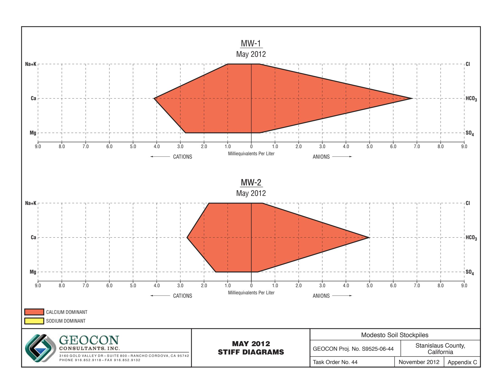

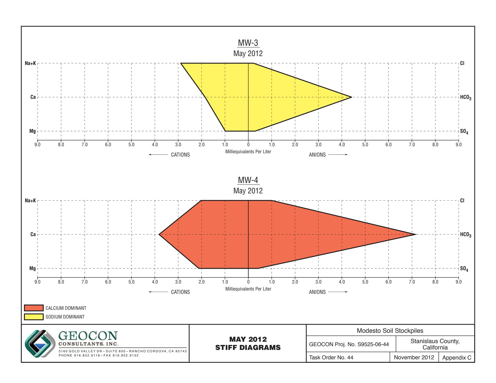

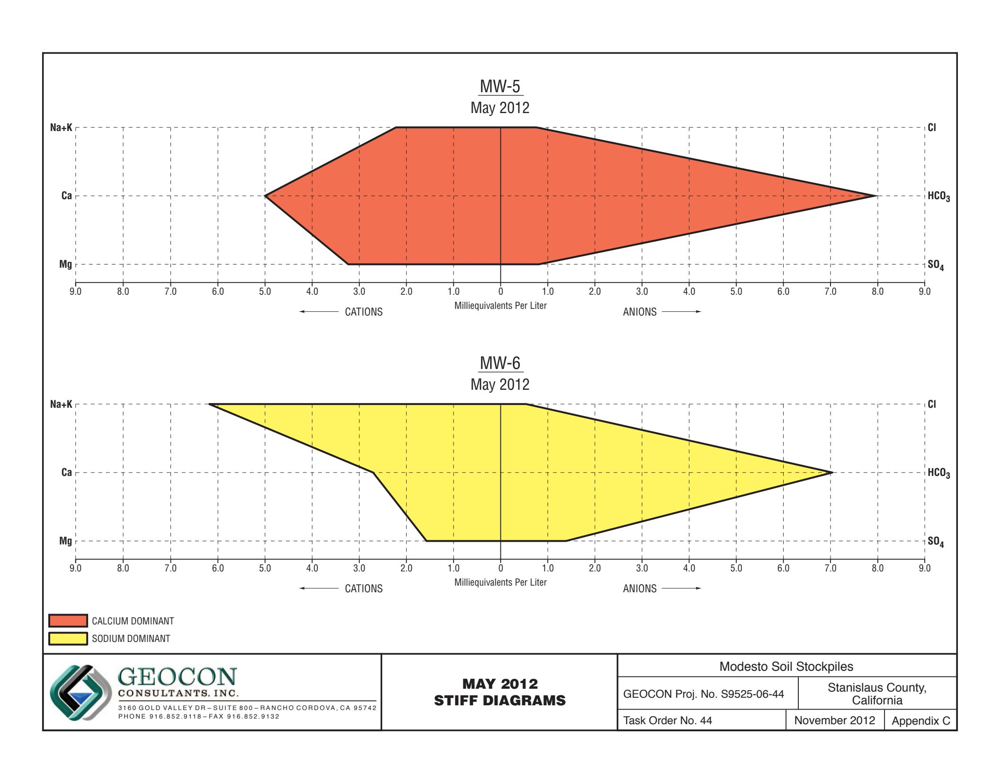

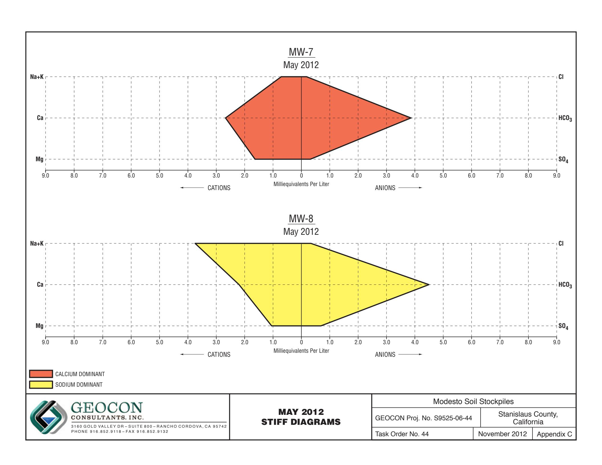