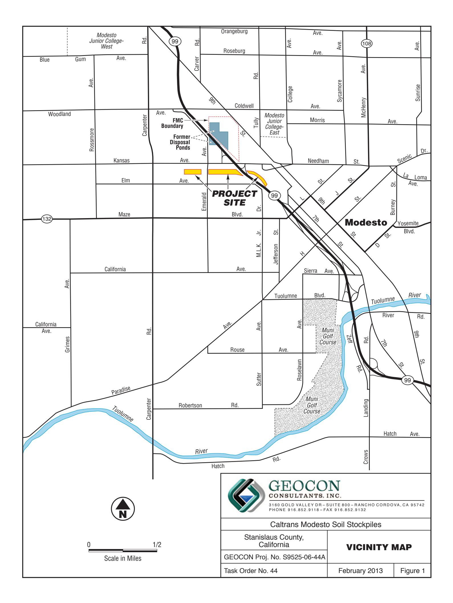
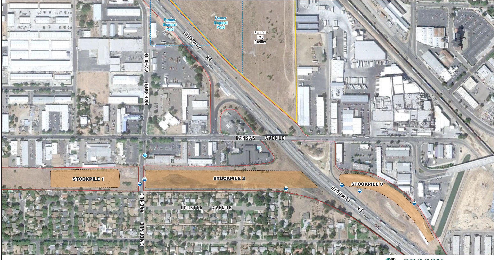

Project No. S9525-06-44A February 20, 2013

Mr. Richard Stewart, PG California Department of Transportation - District 6 Hazardous Waste Branch 855 M Street, Suite 200 Fresno. California 93721

Subject: ADDENDUM TO SURFACE WATER SAMPLING AND ANALYSIS PLAN

CALTRANS MODESTO SOIL STOCKPILES STANISLAUS COUNTY, CALIFORNIA

CONTRACT NO. 06A1580, TASK ORDER NO. 44, EA NO. 10-403500

ref: Final Surface Water Sampling and Analysis Plan, Shaw Environmental, Inc.,

January 25, 2006

Dear Mr. Stewart:

In accordance with California Department of Transportation (Caltrans) Contract No. 06A1580, Task Order (TO) No. 44, Geocon prepared this *Addendum to Surface Water Sampling and Analysis Plan* (SAP) to outline the proposed surface water sampling activities associated with the Caltrans Modesto Soil Stockpiles (Site) located southerly of the intersection of State Route (SR) 99 and Kansas Avenue in Stanislaus County, California. The approximate site location is depicted on the attached Vicinity Map, Figure 1. The approximate site boundaries and Stockpiles 1 through 3 are shown on the Site Plan, Figure 2.

The purpose of the sampling described in this addendum is to evaluate whether or not surface water runoff from the Site is migrating beyond Caltrans' right-of-way, and if so, whether the storm water has been impacted by chemicals of potential concern in the stockpiles. The surface water sampling will be performed in accordance with protocols approved by the California Environmental Protection Agency, Department of Toxic Substances Control (DTSC) as established in the *Final Surface Water Sampling and Analysis Plan*, prepared by Shaw Environmental, Inc. and dated January 2006. The proposed scope of services includes surface water sampling, analysis of the water samples by a California-certified laboratory, and preparation of a summary report detailing the sampling activities.

## **BACKGROUND**

## **Project Description and History**

Stockpiles 1 through 3 were generated during construction of SR 99 through Modesto around 1961 when Caltrans excavated soil from property purchased from Food Machinery and Chemical Corporation (FMC) that contained an evaporation pond. The stockpiles were placed in their present location in anticipation of construction of the State Route 132 West Freeway/Expressway project.

During the 1930s, Barium Products Ltd. occupied property at 1200 Barium Road (now Graphics Drive) in Modesto just east of SR 99 between Woodland and Kansas Avenues. Barium Products Ltd. was a chemical manufacturing company processing a variety of ores and minerals including barite (barium sulfate) and celestite (strontium sulfate). Materials produced included barium and strontium compounds; these were used in greases, lubricating oil and pigment blanks. Sodium sulfide generated as a by-product of barite processing was sold as a caustic and used as a reagent in the mining industry.

In 1943, Barium Products Ltd. was purchased by Westvaco Chlorine Products Corporation which subsequently merged with FMC in 1948. From the 1950s to the 1970s, a liquid residue from the processing operations was discharged to unlined evaporation ponds along the western portion of the FMC Site. The approximate boundaries of the former evaporation/disposal ponds are shown on Figure 2.

In 1961, a 4.3–acre parcel at the southwestern corner of the FMC site was purchased by the State of California for highway right-of-way needed to construct SR 99. An aerial photograph from 1957 shows that a portion of the southernmost pond on the FMC property was within the area purchased for right-of-way.

Soil in and around the pond was excavated during construction of SR 99 and stockpiled within the current Caltrans right-of-way at the location of the future State Route 132 West Freeway/Expressway project. Three distinct stockpiles are present at the Site:

- Stockpile 1, located south of Kansas Avenue and west of North Emerald Avenue,
- Stockpile 2, located south of Kansas Avenue, between North Emerald Avenue and SR 99, and
- Stockpile 3, located south of Kansas Avenue and east of SR 99.

## **Previous Surface Water Sampling Activities**

Shaw completed a stormwater sampling event at the soil stockpiles in March 2006 in general accordance with their January 2006 SAP. They collected seven runoff samples from constructed impoundments during a qualifying rain event (visible runoff and 72 hours of prior dry weather). Shaw did not observe runoff migrating away from the Caltrans right-of-way. The samples were analyzed for dissolved metals, polycyclic aromatic hydrocarbons (PAHs), nitrate, sulfate and sulfide.

With the sole exception of an elevated barium concentration reported for the sample collected from the northwestern side of Stockpile 3 (sample SW03), the surface water samples did not contain target analytes exceeding California Maximum Contaminant Levels (MCLs) or determined site background levels. Barium was reported at a concentration of 2,000 micrograms per liter ( $\mu$ g/l) in sample SW03 exceeding the MCL of 1,000  $\mu$ g/l. Barium in the remaining six samples ranged from 16 to 190  $\mu$ g/l. Shaw concluded that the elevated barium reported for sample SW03 was isolated and runoff in the area was confined to Caltrans right-of-way.

# **PROJECT SCOPE**

Outlined below is a summary of the scope of services requested by Caltrans.

#### **Field Activities**

Field activities will include the collection of up to five samples of surface water that has migrated beyond the right-of-way boundary occupied by the stockpiles. If necessary, samples will be collected during up to four separate rainfall events. Although possibly not the result of direct surface water runoff from Stockpile 2, samples will be collected from puddles of rain water that pool along the east and west shoulders of Emerald Avenue between Stockpiles 1 and 2. Stormwater at this location may come into contact with soil from Stockpile 2 that has migrated to the Emerald Avenue shoulder.

At least one background sample of rain water along Emerald Avenue, north or south of Stockpiles 1 and 2, will be collected. The approximate sampling locations are depicted on Figure 2.

Samples will be collected using a pre-cleaned scoop and transferred into laboratory-provided containers. Samples to be analyzed for dissolved metals will be filtered in the filed by passing the sample through a 0.45-micron filter. The samples will be capped, labeled, chilled and transported to Advanced Technology Laboratories (ATL) utilizing standard chain-of-custody procedures. During the sampling activities, the samples will be monitored for pH, electrical conductivity, temperature and turbidity. If runoff is observed flowing from the soil stockpiles and leaving the Caltrans right-of-way during our surface sampling events, additional samples may be collected at those locations.

Quality Assurance/Quality Control (QA/QC) procedures will be followed during the field sampling activities including the use of disposable sampling scoops and providing chain-of-custody documentation for each water sample transferred to the laboratory.

## **Laboratory Analyses**

Surface water samples will be delivered to ATL for the following analyses under chain-of-custody protocol:

- Title 22 total and dissolved metals, including strontium, following the United States Environmental Protection Agency (EPA) Test Method 6020/7470;
- Nitrate as nitrogen and sulfate by EPA Test Method 300.0;
- Sulfide by Standard Method (SM) 4500; and
- Total suspended solids (TSS) by SM 2540D.

QA/QC procedures will be performed for each method of analysis with specificity for each analyte listed in the test method's QA/QC. QA/QC measures will include the following:

- One method blank for every ten samples, batch of samples or type of matrix, whichever is more frequent.
- One sample analyzed in duplicate for every ten samples, batch of samples or type of matrix, whichever is more frequent.
- One spiked sample for every ten samples, batch of samples or type of matrix, whichever is more frequent, with the spike made at ten times the detection limit or at the analyte level.

#### **Report Preparation**

A report will be prepared to transmit our field observations, laboratory data, and data evaluation. The report will include (but not be limited to) the following:

- Background summary
- Scope of services performed
- Observations during the field activities
- Results of laboratory analysis

- Observations during the field activities
- Results of laboratory analysis
- Conclusions and recommendations
- Vicinity Maps and Site Plans indicating sampling locations
- Tabular summaries of analytical data
- Photographs depicting site conditions and sampling locations
- Appendices including laboratory reports and chain-of-custody documentation.

We will provide Caltrans with a draft report, and upon receipt and incorporation of Caltrans' comments, we will provide three hard copies and one electronic (CD) copy of the finalized report.

We appreciate the opportunity to provide our services on this project. Please contact us if you have any questions concerning the contents of this Addendum SAP or if we may be of further service.

Jim Brake, PG

Senior Geologist/Associate

Sincerely,

GEOCON CONSULTANTS, INC.

Rebecca L. Silva Project Manager

(1) Addressee

(1) Caltrans, Sam Haack

(1) DTSC, Randy Adams

(1) CVRWQCB, Steve Meeks

Attachments:

Figure 1, Vicinity Map

Figure 2, Site Plan

LEGEND:

State Right-of-Way Boundary

Proposed Surface Water Sample Location

Proposed Surface Water Sample Location (Background)

Scale in Feet

# GEOCON CONSULTANTS, INC.

3160 GOLD VALLEY DR - SUITE 800 - RANCHO CORDOVA, CA 95742 PHONE 916.852.9118 - FAX 916.852.9132

Caltrans Modesto Soil Stockpiles

| Stanislaus County, |
|--------------------|
| California         |

**SITE PLAN** 

GEOCON Proj. No. S9525-06-44A Task Order No. 44

February 2013

February 2013

Figure 2