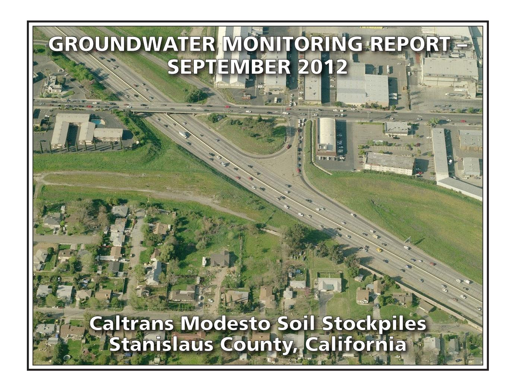

#### **PREPARED FOR:**

CALIFORNIA DEPARTMENT OF TRANSPORTATION – DISTRICT 6
HAZARDOUS WASTE BRANCH
855 M STREET, SUITE 200
FRESNO, CALIFORNIA 93721

#### PREPARED BY:

GEOCON CONSULTANTS, INC. 3160 GOLD VALLEY DRIVE, SUITE 800 RANCHO CORDOVA, CALIFORNIA 95742

**GEOCON PROJECT NO. S9525-06-44A TASK ORDER NO. 44, EA 10-403500 CONTRACT NO 06A1580** 

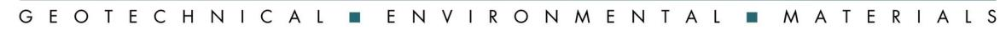

Project No. S9525-06-44A December 19, 2012

Mr. Richard Stewart, PG California Department of Transportation - District 6 Hazardous Waste Branch 855 M Street, Suite 200 Fresno, California 93721

Subject: GROUNDWATER MONITORING REPORT – SEPTEMBER 2012

CALTRANS MODESTO SOIL STOCKPILES STANISLAUS COUNTY, CALIFORNIA

CONTRACT NO. 06A1580, TASK ORDER NO. 44, EA NO. 10-403500

Dear Mr. Stewart:

In accordance with California Department of Transportation (Caltrans) Contract No. 06A1580, Task Order (TO) No. 44, Geocon performed groundwater monitoring activities at the Caltrans Modesto Soil Stockpiles (Site) located southerly of the intersection of State Route (SR) 99 and Kansas Avenue in Stanislaus County, California. We are currently performing sampling at the Site every other month. This report presents the results of the September 2012 sampling event. The approximate site location is depicted on the attached Vicinity Map, Figure 1. The approximate site boundaries and soil stockpiles 1 through 3 are shown on the Site Plan, Figure 2.

The objective of TO No. 44 is to perform groundwater sampling and analysis at the Site in accordance with protocols approved by the California Environmental Protection Agency Department of Toxic Substances Control (DTSC) as established in the *Final Work Plan, Groundwater Assessment* prepared by Shaw Environmental, Inc. and dated January 2006. The scope of services reported herein included depth to groundwater measurements, groundwater sample collection from ten groundwater monitoring wells, analysis of the water samples by a California-certified laboratory, and preparation of this report.

#### **BACKGROUND**

#### **Project Description and History**

Stockpiles 1 through 3 were generated during construction of SR 99 through Modesto around 1961 when Caltrans excavated property purchased from Food Machinery and Chemical Corporation (FMC) that contained an evaporation pond. The stockpiles were placed in their present location in anticipation of construction of the State Route 132 West Freeway/Expressway project.

During the 1930s, Barium Products Ltd. occupied property at 1200 Barium Road (now Graphics Drive) in Modesto just east of SR 99 between Woodland and Kansas Avenues. Barium Products Ltd. was a chemical manufacturing company processing a variety of ores and minerals including barite (barium sulfate) and celestite (strontium sulfate). Materials produced included barium and strontium compounds; these were used in greases, lubricating oil and pigment blanks. Sodium sulfide generated as a by-product of barite processing was sold as a caustic and used as a reagent in the mining industry.

In 1943, Barium Products Ltd. was purchased by Westvaco Chlorine Products Corporation which subsequently merged with FMC in 1948. From the 1950s to the 1970s, a liquid residue from the processing operations was discharged to unlined evaporation ponds along the western portion of the FMC Site. The approximate boundaries of the former evaporation/disposal ponds are shown on Figure 2.

In 1961, a 4.3–acre parcel at the southwest corner of the FMC site was purchased by the State of California for highway right-of-way needed to construct SR 99. An aerial photograph from 1957 shows that a portion of the southernmost pond on the FMC property was within the area purchased for right-of-way.

Soil in and around the pond was excavated during construction of SR 99 and, according to provisions of the construction contract, stockpiled within the current Caltrans right-of-way at the location of the future State Route 132 West Freeway/Expressway project. Three distinct stockpiles are present at the Site:

- Stockpile 1, located south of Kansas Avenue and west of North Emerald Avenue,
- Stockpile 2, south of Kansas Avenue, between North Emerald Avenue and SR 99, and
- Stockpile 3, south of Kansas Avenue and east of SR 99.

In 2006, Caltrans arranged for the installation of monitoring wells MW-1 through MW-8 at locations adjacent to the three stockpiles as shown on Figure 2. General groundwater chemistry analytical results from June and October 2006 groundwater events suggested that two distinct groundwater types are present beneath the Site. A survey of groundwater wells within a one-mile radius of the Site identified 43 existing or former wells; however, there were no active supply wells identified in the general (southeast) flow direction from the Site.

Groundwater monitoring was resumed for the Site with the March 2012 groundwater sampling of wells MW-1 through MW-8. Representatives from the DTSC observed the sample collection procedures and collected split samples which were submitted to an alternate laboratory. No notable differences in the concentrations for each reported analyte were evident.

In June 2012, Geocon arranged for the installation of monitoring wells MW-9 and MW-10 at locations that are both upgradient and adjacent to the three stockpiles as shown on Figure 2.

Geocon compared the analytical results from the four recent groundwater sampling events (March, May, June and July 2012) to the following water quality threshold values:

- Primary Maximum Contaminant Levels (MCLs) promulgated by the California Department of Public Health (CDPH);
- Secondary MCLs promulgated by the CDPH;
- Public Health Goals for drinking water promulgated by the CDPH;
- Integrated Risk Information System Reference Dose promulgated by the United States Environmental Protection Agency (EPA);
- Notification Level for Drinking Water promulgated by the CDPH; and
- Water Quality for Agriculture (Ayers & Westcott).

The results of the four previous 2012 groundwater sampling events show that both dissolved metals and general minerals have predominantly been reported at concentrations less than their respective numeric water quality threshold values. Only nitrates (expressed as nitrogen) in MW-1, MW-5, and MW-6 and total dissolved solids (TDS) in wells MW-5, MW-6, and MW-10 have been consistently reported at concentrations that exceed their respective primary or secondary MCLs of 10 and 500 milligrams per liter (mg/l).

#### **Hydrogeologic Characterization**

The hydrogeology of the adjacent FMC site has been characterized by numerous studies since the early 1980s. The GeoTrans January 2005 report *Addendum to Comprehensive Remedial Investigations Report, FMC Corporation, 1200 Graphics Drive, Modesto, Stanislaus County, California* (GeoTrans, 2005) provides a description of the FMC site hydrogeology. This description follows:

"The site is underlain by laterally discontinuous and unconsolidated sand and silty sand associated with the Modesto and Riverbank Formations. First encountered groundwater is approximately 30 feet below ground surface (bgs) under confined to semi-confined conditions. A deeper aquifer is present at a depth of 165 feet bgs and separated from the upper zone by a blue clay aquitard. The upper water bearing unit has been divided into two zones: a shallow zone from first encountered groundwater to 120 feet bgs and a deeper zone from 140 feet bgs to the top of the aquitard. Groundwater flow within the upper zone is toward the southeast under a gradient of 0.002 ft/ft."

Monitoring wells MW-1 through MW-10 were installed into the unconsolidated sand, silty sand and silt layers within the Modesto Formation underlying the Site. The wells were completed within the shallow zone of the upper aquifer (shallow zone).

The lithology encountered in the borings for the wells includes interbedded (laterally discontinuous) sands, silts, and clays. In the areas investigated, the unsaturated (vadose) zone was dominated by silty soils. The shallow zone groundwater beneath the stockpiles was encountered at approximately 35 feet (elevation approximately 50 feet) under unconfined to semi-confined conditions. Based on historical depth to water measurements from the Site, the groundwater flow direction in the shallow upper aquifer is generally toward the southeast with hydraulic gradients varying from 0.0006 to 0.001. The shallow aquifer conditions beneath the Site and the adjacent FMC site appear similar and representative of conditions in the local area.

#### **SEPTEMBER 2012 FIELD ACTIVITIES**

This section describes the field activities performed for the September 2012 monitoring event.

#### **Depth to Groundwater Measurements**

On September 19, 2012, prior to opening the wells, Geocon observed each of the ten well boxes for signs of potential tampering. No signs of tampering were observed. The security well boxes and casing caps were noted to be properly sealed and locked. Geocon measured the depth to groundwater and the dissolved oxygen (DO) levels and oxygen-reduction potential (ORP) in monitoring wells MW-1 through MW-10 using a battery-operated water level meter, a Hanna Model No. 9143 DO meter, and an Oakton ORP meter. Depth to water measurements were obtained from a surveyed reference point at the top of the well casings (TOC).

In September 2012, depth to groundwater at the Site ranged from 32.73 (MW-1) to 41.19 (MW-5) feet below TOC. Based on the groundwater elevation data, the groundwater flow is toward the southeast at an average gradient of 0.0008, which is consistent with historical flow. A gradient rose diagram depicting historical flow direction and gradient is included on Figure 3. A summary of the TOC elevations, depth to groundwater measurements and groundwater elevations is on Table 1. Groundwater elevation contours, flow direction and gradient are depicted on Figure 3, Groundwater Elevation and Ionic Composition Map - September 2012.

#### Well Purging and Sampling

On September 19 and 20, 2012, Geocon purged approximately three well volumes of water (1.5 to 6 gallons) from groundwater monitoring wells MW-1 through MW-4 and MW-7 through MW-10 using a submersible pump. Wells MW-5 and MW-6 went dry after purging 0.65 gallon and 1.5 gallons, respectively. Geocon allowed both wells to recover, purged an additional gallon from well MW-6, allowed the well to recover a second time, and then collected groundwater samples. The pump was decontaminated before and after each use by washing in an AlconoxTM solution followed by fresh and distilled water rinses. During the well purging activities, the groundwater was monitored for pH, electrical conductivity, temperature and turbidity. This information is included on the Monitoring Well Sampling Data sheets in Appendix A.

Following well purging, groundwater samples were collected from each of the wells using disposable bailers and decanted through slow emptying devices into laboratory-provided sample containers. The groundwater samples collected for dissolved metals analysis were filtered using a hand-pressure pump through a 0.45-micron filter while filling the container. The samples were sealed, labeled, placed in a chilled cooler and subsequently transported to the laboratory using chain-of-custody protocol.

Purged groundwater was placed into one Department of Transportation-approved, 17-H, 55-gallon drum and transported offsite to Geocon's Rancho Cordova office pending receipt of analytical results and subsequent disposal at Inviro-tec Disposal facility in Lincoln, California.

#### **ANALYTICAL METHODS AND RESULTS**

#### **Laboratory Analysis**

The groundwater samples were delivered to Advanced Technology Laboratories (ATL) for the following analyses under chain-of-custody protocol:

- Title 22 dissolved metals (including strontium) following EPA Test Methods 6020/7470;
- Dissolved calcium, magnesium, potassium and sodium by EPA Test Method 6020;
- Chloride, nitrate as nitrogen and sulfate by EPA Test Method 300.0;
- Sulfide by Standard Method (SM) 4500;
- TDS by SM 2540C:
- Total alkalinity, bicarbonate alkalinity, carbonate alkalinity by SM 2320B; and
- Polycyclic aromatic hydrocarbons (PAHs) by EPA Test Method 8270-SIM.

Groundwater analytical results for this monitoring event are summarized on Tables 2 and 3. The laboratory reports and chain-of-custody documentation are in Appendix B.

#### **Analytical Results**

#### **PAHs**

The PAH results are summarized on Table 3. No PAHs were reported at concentrations equal to or greater than their respective practical quantitation limits (PQLs) for each of the groundwater samples collected during this monitoring event.

#### **Dissolved Metals**

Analytical results for dissolved metals along with their associated numeric water quality thresholds are summarized on Table 2. Plots of barium, lead and strontium concentrations vs. time are presented as Figures 4 through 6.

DTSC has identified barium, lead and strontium as the primary chemicals of concern in groundwater for the Site. For the September 2012 groundwater samples, barium and strontium were reported for all ten groundwater samples. Lead was not reported at concentrations equal to or greater than the PQL of  $1.0~\mu g/l$  in each of the groundwater samples. The ranges of barium and strontium concentrations reported for the September sampling event are on the following table:

|                                    | Barium (μg/l)    | Strontium (µg/l)          |
|------------------------------------|------------------|---------------------------|
| High Concentration                 | 280 (MW-5)       | 1,100 (MW-1, MW-5, MW-10) |
| Low Concentration                  | 47 (MW-8)        | 220 (MW-8)                |
| Numeric Water Quality Threshold | 1,000(1) /700(2) | 4,000(2)                  |

 $\mu$ g/l = micrograms per liter

Beryllium, cadmium, silver, thallium and mercury were not reported at concentrations equal to or greater than their respective PQLs in samples from each well. As shown on the following table, the dissolved metals arsenic, chromium and vanadium were reported for each of the samples collected with the following ranges:

|                                 | Arsenic (μg/l) | Chromium (μg/l) | Vanadium (μg/l)       |
|---------------------------------|-------------------|--------------------|--------------------------|
| High Concentration              | 4.7 (MW-6)     | 10 (MW-6)       | 39 (MW-6)             |
| Low Concentration               | 2.1 (MW-1)     | 1.1 (MW-10)     | 18 (MW-1, MW-4, MW-5) |
| Numeric Water Quality Threshold | 10(1)             | 50(1)              | 50(3)                    |

 $\mu g/l = \overline{micrograms per liter}$ 

(1) = California Department of Public Health Primary MCL for Drinking Water

(2) = EPA Drinking Water Health Advisory

(1) = California Department of Public Health Primary Maximum Contaminant Level for Drinking Water

(2) = EPA Drinking Water Health Advisory

(3) = California Department of Public Health Notification Level for Drinking Water

Although concentrations of arsenic, barium, chromium, strontium and vanadium were reported for the samples collected from each well, none of the reported concentrations exceed their respective numeric water quality thresholds for drinking water.

Nickel was reported for each sample except MW-8. Molybdenum was reported for each sample except MW-4. Selenium was detected in eight of the ten samples collected. Copper was detected in five of the ten samples collected. Manganese was reported for the samples from MW-3, MW-9 and MW-10. Antimony was reported for the sample collected from MW-5. Cobalt was detected in the sample from MW-3. Zinc was reported for the sample collected from MW-10. The following table summarizes the dissolved antimony, cobalt, copper, manganese, molybdenum, nickel, selenium and zinc concentrations reported for the listed samples:

|                                       | Antimony (μg/l) | Cobalt (µg/l) | Copper (µg/l)               | Manganese (μg/l) | Molybdenum (μg/l) | Nickel (µg/l) | Selenium (µg/l) | Zinc (µg/l)          |
|---------------------------------------|--------------------|------------------|--------------------------------|---------------------|----------------------|------------------|--------------------|-------------------------|
| High Concentration                 | 0.55 (MW-5)     | 1.3 (MW-3)    | 2.2 (MW-9)                  | 74 (MW-3)        | 5.6 (MW-6)        | 3.4 (MW-9)    | 4.4 (MW-10)     | 120 (MW-10)          |
| Low Concentration                  | 0.55 (MW-5)     | 1.3 (MW-3)    | 1.0 (MW-5 and MW- 10) | 16 (MW-10)       | 0.53 (MW-1)       | 1.7 (MW-6)    | 0.56 (MW-1)     | 120 (MW-10)          |
| Numeric Water Quality Threshold | 6 (1)              | --               | 1,300 (1) /1,000 (2)        | 50(1)               | --                   | 100(1)           | 50(1)              | 5,000 (2) /2,000 (3) |

 $\mu g/l = micrograms per liter$ 

Although concentrations of antimony, cobalt, copper, manganese, molybdenum, nickel, selenium and zinc were reported for the samples collected from site monitoring wells, none of the reported concentrations exceed their respective numeric water quality thresholds for drinking water with the exception of the samples from MW-3 and MW-9 for manganese.

#### **General Minerals/Stiff Diagrams**

To further characterize the geochemistry of the groundwater, general minerals analyses were conducted and included the following constituents:

- Calcium
- Magnesium
- Chloride
- Nitrate as nitrogen
- Sulfate
- Potassium
- Sodium
- Sulfide
- Total alkalinity
- TDS

(1) = California Department of Public Health Primary Maximum Contaminant Level for Drinking Water

(2) = California Department of Public Health Secondary Maximum Contaminant Level (taste and odor)

(3) = EPA Drinking Water Health Advisory

General groundwater chemistry provides information regarding the origin and geochemical nature of the groundwater sampled. The analytical results for the major cation (dissolved sodium, potassium, calcium and magnesium) and anion species (chloride, bicarbonate alkalinity reported as calcium carbonate, and sulfate) were used to create Stiff diagrams. Stiff diagrams provide a graphical display of ionic content and can be used to characterize and evaluate the relative composition of groundwater and its consistency or variability. Groundwater with different cation/anion concentrations will result in Stiff diagrams of different shapes and sizes. Stiff diagrams can also help to illustrate mixing of water with different compositions or origins. The presence of more than one water type can be an indication of influences due to hydrogeologic variation or from other sources including man-made impacts.

Appendix C contains Stiff diagrams constructed using site groundwater data for September 2012. The diagrams show that groundwater sampled in each monitoring well is bicarbonate (HCO3) dominant. However, variations in the sodium and potassium (Na+K) and calcium composition are readily apparent. The variations are seen primarily in the sodium content with the potassium concentrations being less variable. In September 2012, the samples from wells MW-1, MW-2, MW-4, MW-5, MW-7, MW-9 and MW-10 had a calcium-dominant composition while the samples from wells MW-3, MW-6 and MW-8 were sodium-dominant.

Nitrate as nitrogen and TDS were both reported for each of the groundwater samples, with nitrate as nitrogen concentrations ranging from 3.0 (MW-3) to 22 mg/l (MW-5) and TDS concentrations ranging from 280 (MW-8) to 630 mg/l (MW-10). The reported nitrate concentrations for MW-1, MW-5, MW-6, MW-9 and MW-10 exceed the primary MCL for nitrate of 10 mg/l, and the reported TDS concentrations for MW-5, MW-6 and MW-10 exceed the secondary MCL for TDS of 500 mg/l. Noteworthy is that MW-1 is an upgradient monitoring well; thus, the reported nitrate and TDS concentrations of 12 and 460 mg/l, respectively, may be indicative of natural background nitrate and TDS concentrations for the shallow groundwater in the vicinity of the Site. Sulfide was reported for seven of the ten samples with concentrations ranging from 0.011 (MW-10) to 0.28 mg/l (MW-1).

The analytical results for general minerals are summarized on Table 3. Stiff diagrams are in Appendix C.

#### Field and Laboratory Quality Assurance/Quality Control

The field quality assurance/quality control (QA/QC) implemented for the September 2012 groundwater monitoring at the Site included the collection of an equipment blank analyzed for dissolved metals. The blank was collected by pouring distilled water over a decontaminated pump and allowing the water to collect into the laboratory-provided sample container. Dissolved metals were not reported at concentrations equal to or greater than their respective PQLs for the equipment blank.

Geocon also reviewed the analytical laboratory QA/QC provided with the laboratory report. These data show that that the method blank surrogate recoveries are acceptable and that concentrations of selected analytes were not reported at concentrations equal to or greater than their respective PQLs for each method blank for each analysis. Appropriate recoveries were noted for each laboratory control sample for each analysis. Several matrix spike/matrix spike duplicate (MS/MSD) analytes had recoveries or relative percent differences outside of laboratory control limits, however, the sample results were validated by the laboratory control samples. No qualification of the data is necessary and the data are considered of sufficient quality for the purposes of this report.

#### GeoTracker Submittal

The laboratory prepared electronic data files for submittal to the State Water Resources Control Board GeoTracker database. The GeoTracker database is accessible via the GeoTracker website at <a href="http://geotracker.waterboards.ca.gov">http://geotracker.waterboards.ca.gov</a>. The electronic data was uploaded to GeoTracker on October 9, 2012. The confirmation numbers are 6610502123, 8514968156 and 1595204174.

#### **CONCLUSIONS AND RECOMMENDATIONS**

With the exception of manganese detected in the samples from MW-3 and MW-9, none of the reported dissolved metals concentrations for the groundwater samples collected in September 2012 exceeded their respective numeric water quality threshold values.

With the exception of nitrate, none of the reported general minerals for the groundwater samples collected in September 2012 exceeded their respective California primary MCLs. TDS was reported at concentrations exceeding the secondary MCL of 500 mg/l for the samples collected from wells MW-5, MW-6 and MW-10.

Barium, lead and strontium were reported for the September 2012 groundwater samples at concentrations similar to historical levels and remained significantly less than their numeric water quality thresholds. The remaining dissolved metals were also reported at concentrations similar to historical levels.

Stiff diagrams for the four most recent groundwater sampling events show that very slight changes in ionic content have occurred since groundwater sampling resumed at the Site in March 2012. Water samples from wells MW-1, MW-2, MW-4, MW-5, MW-7 and MW-9 have consistently been reported as calcium-dominant, and those from wells MW-3, MW-6 and MW-8 as sodium-dominant. The ionic content reported for well MW-10 was sodium-dominant in June 2012, calcium-dominant in July 2012, and remained calcium-dominant for the September 2012 monitoring event.

We appreciate the opportunity to provide our services on this project. Please contact us if you have any questions concerning the contents of this Report or if we may be of further service.

Sincerely,

GEOCON CONSULTANTS, INC.

Josh Ewert

Senior Staff Geologist

Rebecca L. Silva Project Manager

John E. Juhrend, PE, CEG Principal

- (1) Addressee
- (1) Caltrans, Sam Haack
- (1) DTSC, Randy Adams
- (1) CVRWQCB, Steve Meeks

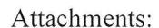

Figure 1, Vicinity Map

Figure 2, Site Plan

Figure 3, Groundwater Elevation and Ionic Composition Map – September 2012

Figure 4, Barium Concentrations vs. Time

Figure 5, Lead Concentrations vs. Time

Figure 6, Strontium Concentrations vs. Time

No. 46681

Table 1, Groundwater Elevation Data

Table 2, Summary of Groundwater Analytical Results – Title 22 Metals

(Dissolved)

Table 3, Summary of Groundwater Analytical Results - General Minerals and

**PAHs** 

Table 4, Well Construction Details

Appendix A, Monitoring Well Development and Sampling Data Sheets

Appendix B, Laboratory Reports and Chain-of-custody Documentation

Appendix C, Stiff Diagrams

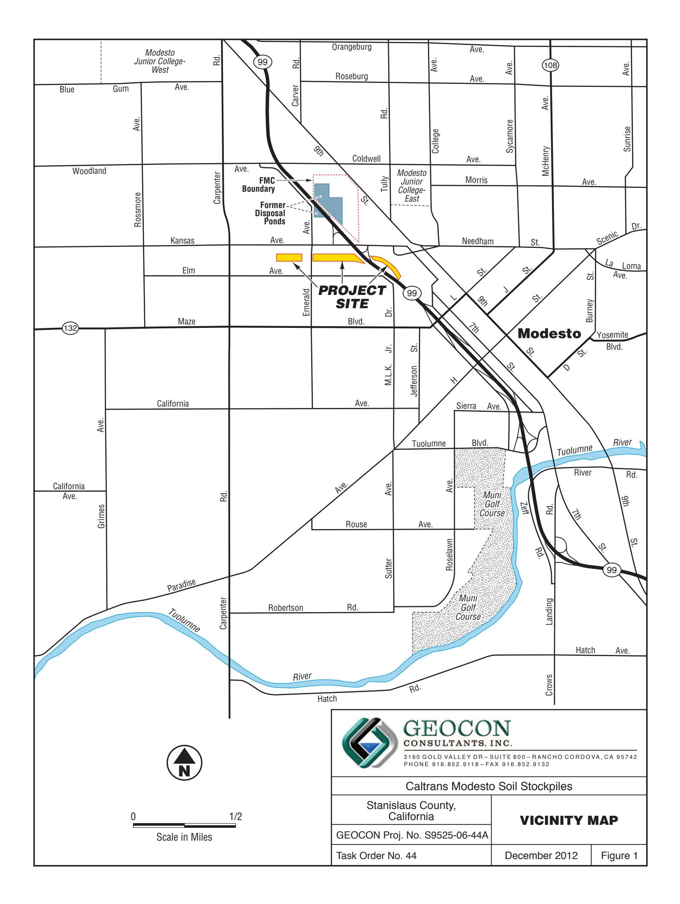

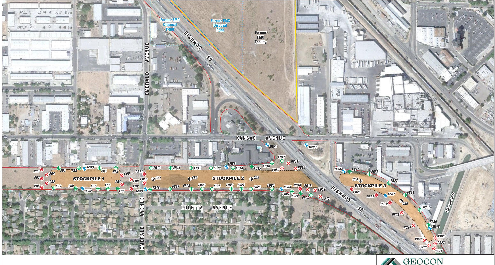

**MW8**

MW8 Approximate Monitoring Well Location

State Right-of-Way Boundary

MID Modesto Irrigation District

Approximate Fenceline Boring Location

**⊗** Approximate Perimeter Boring Location

Approximate Cadmium Boring Location

Scale in Feet

# GEOCON CONSULTANTS, INC.

3160 GOLD VALLEY DR - SUITE 800 - RANCHO CORDOVA, CA 95742 PHONE 916.852.9118 - FAX 916.852.9132

#### Caltrans Modesto Soil Stockpiles

| Stanislaus County, |
|--------------------|
| California         |

**SITE PLAN** 

GEOCON Proj. No. S9525-06-44A

Task Order No. 44

December 2012

December 2012 | F

ber 2012 | Fig

Figure 2

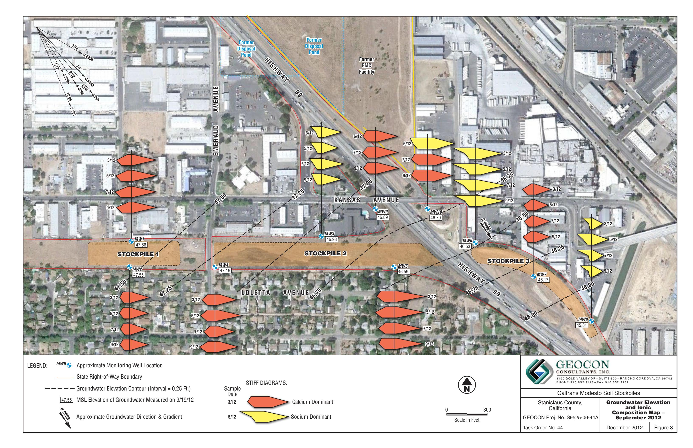

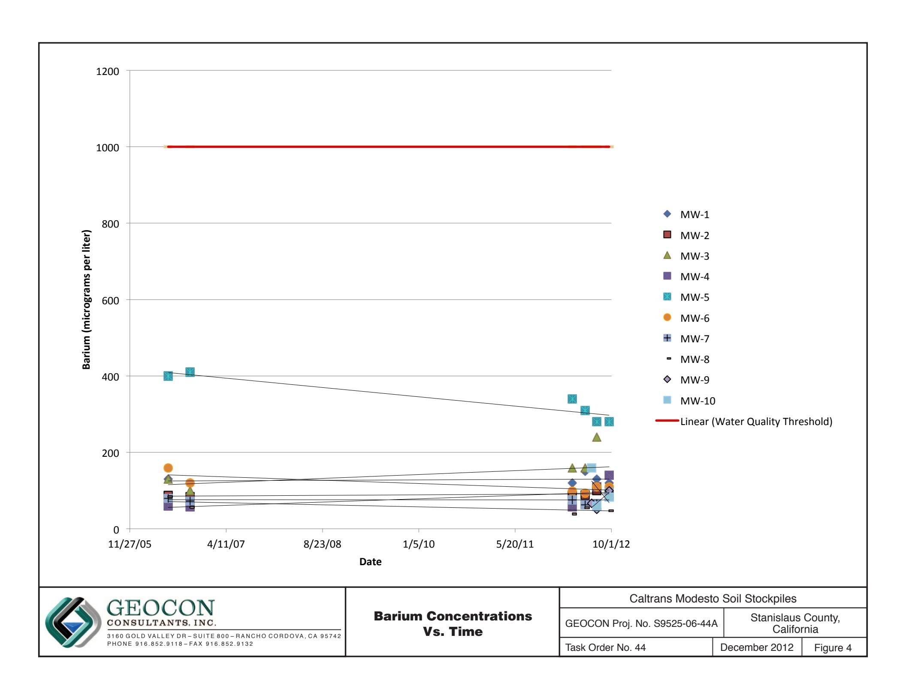

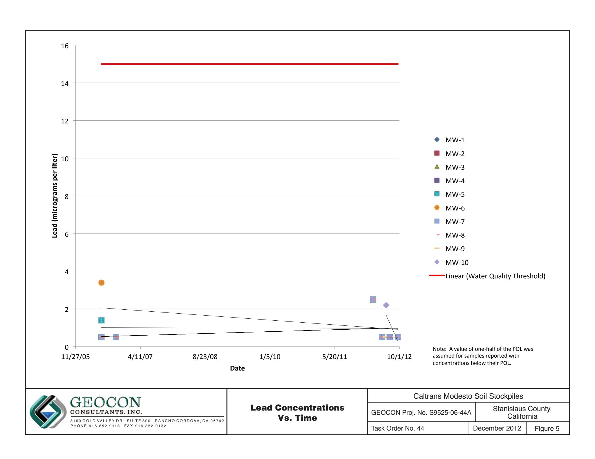

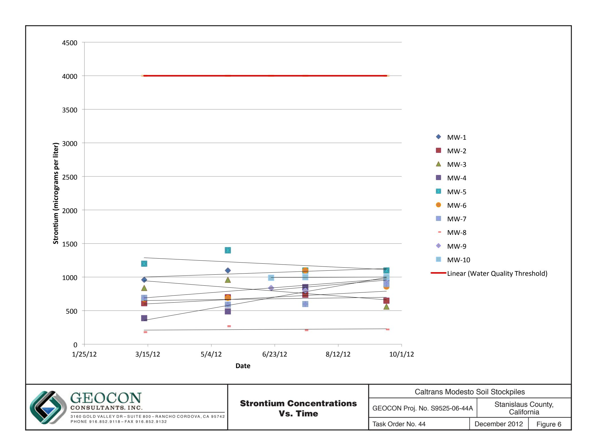

TABLE 1 GROUNDWATER ELEVATION DATA CALTRANS MODESTO SOIL STOCKPILES STANISLAUS COUNTY, CALIFORNIA

|         |           | WELL CASING ELEVATION (feet MSL)    | DEPTH TO GROUNDWATER (feet below TOC)    | GROUNDWATER ELEVATION (feet MSL)    |
|---------|-----------|----------------------------------------|---------------------------------------------|----------------------------------------|
| WELL ID | DATE      |                                        |                                             |                                        |
| MW-1    | 6/14/2006 | 80.26                                  | 29.82                                       | 50.44                                  |
| MW-1    | 10/5/2006 | 80.26                                  | 32.35                                       | 47.91                                  |
| MW-1    | 3/12/2012 | 80.26                                  | 30.12                                       | 50.14                                  |
| MW-1    | 5/17/2012 | 80.26                                  | 29.74                                       | 50.52                                  |
| MW-1    | 7/17/2012 | 80.39                                  | 31.34                                       | 49.05                                  |
| MW-1    | 9/19/2012 | 80.39                                  | 32.73                                       | 47.66                                  |
| MW-2    | 6/13/2006 | 81.10                                  | 30.72                                       | 50.38                                  |
| MW-2    | 10/5/2006 | 81.10                                  | 33.35                                       | 47.75                                  |
| MW-2    | 3/12/2012 | 81.10                                  | 31.04                                       | 50.06                                  |
| MW-2    | 5/17/2012 | 81.10                                  | 30.69                                       | 50.41                                  |
| MW-2    | 7/17/2012 | 81.25                                  | 33.28                                       | 47.97                                  |
| MW-2    | 9/19/2012 | 81.25                                  | 33.70                                       | 47.55                                  |
| MW-3    | 6/13/2006 | 81.76                                  | 32.38                                       | 49.38                                  |
| MW-3    | 10/5/2006 | 81.76                                  | 34.88                                       | 46.88                                  |
| MW-3    | 3/12/2012 | 81.76                                  | 32.35                                       | 49.41                                  |
| MW-3    | 5/17/2012 | 81.76                                  | 31.91                                       | 49.85                                  |
| MW-3    | 7/17/2012 | 81.82                                  | 33.45                                       | 48.37                                  |
| MW-3    | 9/19/2012 | 81.82                                  | 34.89                                       | 46.93                                  |
| MW-4    | 6/13/2006 | 82.36                                  | 32.39                                       | 49.97                                  |
| MW-4    | 10/4/2006 | 82.36                                  | 35.05                                       | 47.31                                  |
| MW-4    | 3/12/2012 | 82.36                                  | 32.60                                       | 49.76                                  |
| MW-4    | 5/17/2012 | 82.36                                  | 32.20                                       | 50.16                                  |
| MW-4    | 7/17/2012 | 82.47                                  | 33.86                                       | 48.61                                  |
| MW-4    | 9/19/2012 | 82.47                                  | 35.28                                       | 47.19                                  |
| MW-5    | 6/14/2006 | 87.73                                  | 38.79                                       | 48.94                                  |
| MW-5    | 10/5/2006 | 87.73                                  | 41.40                                       | 46.33                                  |
| MW-5    | 3/12/2012 | 87.73                                  | 38.74                                       | 48.99                                  |
| MW-5    | 5/17/2012 | 87.73                                  | 38.25                                       | 49.48                                  |
| MW-5    | 7/17/2012 | 87.78                                  | 39.74                                       | 48.04                                  |
| MW-5    | 9/19/2012 | 87.78                                  | 41.19                                       | 46.59                                  |
| MW-6    | 6/14/2006 | 84.37                                  | 36.35                                       | 48.02                                  |
| MW-6    | 10/5/2006 | 84.37                                  | 38.55                                       | 45.82                                  |
| WELL ID | DATE      | WELL CASING ELEVATION (feet MSL) | DEPTH TO GROUNDWATER (feet below TOC) | GROUNDWATER ELEVATION (feet MSL) |
|         |           |                                        |                                             |                                        |
| MW-6    | 3/12/2012 | 84.37                                  | 35.70                                       | 48.67                                  |
| MW-6    | 5/17/2012 | 84.37                                  | 35.18                                       | 49.19                                  |
| MW-6    | 7/17/2012 | 84.52                                  | 36.40                                       | 48.12                                  |
| MW-6    | 9/19/2012 | 84.52                                  | 37.99                                       | 46.53                                  |
|         |           |                                        |                                             |                                        |
| MW-7    | 6/14/2006 | 83.64                                  | 35.59                                       | 48.05                                  |
| MW-7    | 10/4/2006 | 83.64                                  | 38.32                                       | 45.32                                  |
| MW-7    | 3/12/2012 | 83.64                                  | 35.31                                       | 48.33                                  |
| MW-7    | 5/17/2012 | 83.64                                  | 34.72                                       | 48.92                                  |
| MW-7    | 7/17/2012 | 83.74                                  | 36.00                                       | 47.74                                  |
| MW-7    | 9/19/2012 | 83.74                                  | 37.60                                       | 46.14                                  |
|         |           |                                        |                                             |                                        |
| MW-8    | 6/14/2006 | 83.73                                  | 36.12                                       | 47.61                                  |
| MW-8    | 10/4/2006 | 83.73                                  | 38.95                                       | 44.78                                  |
| MW-8    | 3/12/2012 | 83.73                                  | 35.75                                       | 47.98                                  |
| MW-8    | 5/17/2012 | 83.73                                  | 35.11                                       | 48.62                                  |
| MW-8    | 7/17/2012 | 83.85                                  | 36.29                                       | 47.56                                  |
| MW-8    | 9/19/2012 | 83.85                                  | 38.04                                       | 45.81                                  |
|         |           |                                        |                                             |                                        |
| MW-9    | 6/18/2012 | 82.53                                  | 33.67                                       | 48.86                                  |
| MW-9    | 7/17/2012 | 82.53                                  | 34.22                                       | 48.31                                  |
| MW-9    | 9/19/2012 | 82.53                                  | 35.64                                       | 46.89                                  |
|         |           |                                        |                                             |                                        |
| MW-10   | 6/18/2012 | 83.97                                  | 35.18                                       | 48.79                                  |
| MW-10   | 7/17/2012 | 83.97                                  | 35.75                                       | 48.22                                  |
| MW-10   | 9/19/2012 | 83.97                                  | 37.18                                       | 46.79                                  |

TABLE 1
GROUNDWATER ELEVATION DATA
CALTRANS MODESTO SOIL STOCKPILES
STANISLAUS COUNTY, CALIFORNIA

Notes:

MSL = Mean sea level

TOC = Top of well casing

Data prior to 3/12/2012 reproduced from *Site Investigation Report, Groundwater Assessment, Caltrans Modesto Soil Stockpiles State Route 99/132 Project, Stanislaus County, California,* Shaw Environmental, Inc., May 14, 2007.

Wells resurveyed by Morrow Surveying on June 18, 2012.

#### TABLE 2

# SUMMARY OF GROUNDWATER ANALYTICAL RESULTS - TITLE 22 METALS (Dissolved) CALTRANS MODESTO SOIL STOCKPILES STANISLAUS COUNTY, CALIFORNIA

|                                                                                                                                                                    |                                                                                           | STANISLAUS COUNTY, CALIFORNIA |                                 |                |          |           |         |           |         |          |        |           |            |           |            |         |          |          |           |           |         |           |
|--------------------------------------------------------------------------------------------------------------------------------------------------------------------|-------------------------------------------------------------------------------------------|-------------------------------|---------------------------------|----------------|----------|-----------|---------|-----------|---------|----------|--------|-----------|------------|-----------|------------|---------|----------|----------|-----------|-----------|---------|-----------|
|                                                                                                                                                                    |                                                                                           | ANALYTE                       | SAMPLE ID                       | SAMPLE DATE | Antimony | Arsenic   | Barium  | Beryllium | Cadmium | Chromium | Cobalt | Copper    | Lead       | Manganese | Molybdenum | Nickel  | Selenium | Silver   | Thallium  | Vanadium  | Zinc    | Strontium |
| MW-1                                                                                                                                                               | 6/14/2006 10/5/2006 3/12/2012 3/12/2012 S 5/17/2012 7/16/2012 9/19/2012 | <1.0                          | 2.1                             | 130            | <1.0     | <1.0      | 10      | <1.0      | 1.1     | <1.0     | 34     | 2.9       | 2.9        | <1.0      | <1.0       | <1.0    | 23       | <10      | ---       | <0.2      |         |           |
|                                                                                                                                                                    |                                                                                           | <1.0                          | 2.2                             | 120            | <1.0     | <1.0      | 16      | 2.0       | <1.0    | <1.0     | <1.0   | 2.9       | 1.5        | <1.0      | <1.0       | <1.0    | 26       | <10      | 960       | 0.41      |         |           |
|                                                                                                                                                                    |                                                                                           | <2.5                          | <5.0                            | 120            | <5.0     | <2.5      | 6.4     | <2.5      | <5.0    | <1.0     | <50    | <2.5      | <5.0       | <2.5      | <2.5       | <2.5    | 22       | <50      | 960       | 0.41      |         |           |
|                                                                                                                                                                    |                                                                                           | <10                           | 1.6                             | 105            | <5.0     | 0.6       | 6.8     | <5.0      | 3.4     | ---2     | 2.0    | 1.3       | <5.0       | <20       | <5.0       | 21.2    | 5.6      | 1,010    | ---       |           |         |           |
|                                                                                                                                                                    |                                                                                           | <0.50                         | 2.3                             | 150            | <0.50    | <0.50     | 7.0     | 1.0       | 2.5     | <1.0     | 35     | 1.3       | 4.0        | 0.62      | <0.50      | <0.50   | 21       | <10      | 1,100     | <0.20     |         |           |
|                                                                                                                                                                    |                                                                                           | 0.51                          | 2.2                             | 130            | <0.50    | <0.50     | 7.2     | <0.50     | 1.4     | <1.0     | <10    | 0.73      | 3.7        | 0.60      | <0.50      | <0.50   | 20       | <10      | 1,100     | <0.20     |         |           |
|                                                                                                                                                                    |                                                                                           | <0.50                         | 2.1                             | 120            | <0.50    | <0.50     | 7.0     | <0.50     | 1.0     | <1.0     | <10    | 0.53      | 2.7        | 0.56      | <0.50      | <0.50   | 18       | <10      | 1,100     | <0.20     |         |           |
| MW-2                                                                                                                                                               | 6/13/2006 10/5/2006 3/12/2012 3/12/2012 S 5/17/2012 7/16/2012 9/19/2012 | <1.0                          | 2.1                             | 87             | <1.0     | <1.0      | 10      | <1.0      | 1.2 U   | <1.0     | 24     | 3.3       | 2.0        | 1.3       | <1.0       | <1.0    | 22       | <10      | ---       | <0.2      |         |           |
|                                                                                                                                                                    |                                                                                           | <1.0                          | 2.6                             | 84             | <1.0     | <1.0      | 11      | <1.0      | 1.7     | <1.0     | <1.0   | <2.0      | 1.2        | <1.0      | <1.0       | <1.0    | 27       | <10      | 610       | 0.28      |         |           |
|                                                                                                                                                                    |                                                                                           | <2.5                          | <5.0                            | 88             | <5.0     | <2.5      | 4.7     | <2.5      | <5.0    | <1.0     | <50    | <2.5      | <5.0       | <2.5      | <2.5       | <2.5    | 23       | <50      | 610       | 0.28      |         |           |
|                                                                                                                                                                    |                                                                                           | <10                           | <10                             | 89.6           | <5.0     | 0.4       | 6.1     | <5.0      | ---2    | 1.4      | 1.4    | <5.0      | <20        | <5.0      | 4.6        | 23.1    | 3.7      | 642      | ---       |           |         |           |
|                                                                                                                                                                    |                                                                                           | <0.50                         | 2.6                             | 89             | <0.50    | <0.50     | 6.6     | <0.50     | 1.5     | <1.0     | <10    | 1.2       | 1.9        | <0.50     | <0.50      | <0.50   | 20       | <10      | 700       | <0.20     |         |           |
|                                                                                                                                                                    |                                                                                           | <0.50                         | 3.1                             | 100            | <0.50    | <0.50     | 5.8     | <0.50     | 1.0     | <1.0     | <10    | 1.2       | 3.5        | <0.50     | <0.50      | <0.50   | 25       | 49       | 740       | <0.20     |         |           |
|                                                                                                                                                                    |                                                                                           | <0.50                         | 2.5                             | 88             | <0.50    | <0.50     | 5.5     | <0.50     | 1.0     | <1.0     | <10    | 1.3       | 2.1        | <0.50     | <0.50      | <0.50   | 22       | <10      | 650       | <0.20     |         |           |
| MW-3                                                                                                                                                               | 6/13/2006 10/5/2006 3/12/2012 3/12/2012 S 5/17/2012 7/16/2012 9/19/2012 | <1.0                          | 3.0                             | 60             | <1.0     | <1.0      | 7.1     | <1.0      | 1 U     | <1.0     | 4.7    | <2.0      | 1.4        | <1.0      | <1.0       | <1.0    | 25       | <10      | ---       | <0.2      |         |           |
|                                                                                                                                                                    |                                                                                           | <1.0                          | 3.3                             | 58             | <1.0     | <1.0      | 7.9     | <1.0      | 1.5     | <1.0     | 18     | 2.2       | <1.0       | <1.0      | <1.0       | <1.0    | 29       | <10      | ---       | <0.2      |         |           |
|                                                                                                                                                                    |                                                                                           | <2.5                          | <5.0                            | 58             | <5.0     | <2.5      | 4.4     | <2.5      | <5.0    | <1.0     | <50    | <2.5      | <2.5       | <2.5      | <2.5       | <2.5    | 28       | <50      | 390       | <0.20     |         |           |
|                                                                                                                                                                    |                                                                                           | <10                           | 2.1                             | 44.4           | 0.1      | 0.3       | 4.0     | <5.0      | 1.5     | ---2     | 1.8    | 0.9       | <5.0       | <20       | <5.0       | 22.6    | 4.5      | 342      | <0.20     |           |         |           |
|                                                                                                                                                                    |                                                                                           | <0.50                         | 3.8                             | 64             | <0.50    | <0.50     | 3.7     | <0.50     | 1.0     | <1.0     | <10    | 1.4       | 1.1        | <0.50     | <0.50      | <0.50   | 26       | <10      | 490       | <0.20     |         |           |
|                                                                                                                                                                    |                                                                                           | <0.50                         | 2.2                             | 240            | <0.50    | <0.50     | 6.5     | <0.50     | 5.2     | <1.0     | <10    | 0.56      | 4.3        | <0.50     | <0.50      | <0.50   | 18       | 48       | 840       | <0.20     |         |           |
| MW-49/19/2012 6/13/2006 10/4/2006 3/12/2012 S 5/17/2012 7/16/2012 9/19/2012<0.504.684<0.50<0.504.71.31.9<1.0741.12.8<0.50<0.50<0.5033<10560<0.20 |                                                                                           |                               |                                 |                |          |           |         |           |         |          |        |           |            |           |            |         |          |          |           |           |         |           |
| <1.0                                                                                                                                                               |                                                                                           |                               | 1.8                             | 130            | <1.0     | <1.0      | 8.9     | <1.0      | 1.6 U   | <1.0     | 62     | 2.5       | 2.4        | <1.0      | <1.0       | <1.0    | 19       | <10      | ---       | <0.2      |         |           |
| <1.0                                                                                                                                                               |                                                                                           |                               | 2.1                             | 100            | <1.0     | <1.0      | 9.9     | <1.0      | 2.1     | <1.0     | 4.1    | <2.0      | <1.0       | <1.0      | <1.0       | <1.0    | 24       | <10      | ---       | <0.2      |         |           |
| <2.5                                                                                                                                                               |                                                                                           |                               | <5.0                            | 160            | <5.0     | <2.5      | 8.9     | <2.5      | <5.0    | <1.0     | 88     | <2.5      | 5.4        | <2.5      | <2.5       | <2.5    | 26       | <50      | 840       | 0.29      |         |           |
| 3/12/2012 S 5/17/2012 7/16/2012 9/19/2012<101.4134<5.00.47.7<5.00.9---20.7<5.0<5.0<5.0<5.019.33.5812<0.20                                                 |                                                                                           |                               |                                 |                |          |           |         |           |         |          |        |           |            |           |            |         |          |          |           |           |         |           |
| <0.50                                                                                                                                                              |                                                                                           |                               | 2.1                             | 160            | <0.50    | <0.50     | 6.6     | <0.50     | 1.0     | <1.0     | <10    | <0.50     | 1.7        | 0.62      | <0.50      | <0.50   | 18       | <10      | 960       | <0.20     |         |           |
| <0.50                                                                                                                                                              |                                                                                           |                               | 6.6                             | 110            | <0.50    | <0.50     | 6.6     | <0.50     | 1.1     | <1.0     | <10    | 2.4       | 3.2        | 0.55      | <0.50      | <0.50   | 42       | <10      | 850       | <0.20     |         |           |
|                                                                                                                                                                    | 9/19/2012                                                                                 | <0.50                         | 2.2                             | 140            | <0.50    | <0.50     | 7.0     | <0.50     | 1.0     | <1.0     | <10    | 2.6       | 0.78       | <0.50     | <0.50      | 18      | <10      | 980      | <0.20     |           |         |           |
| STANISLAUS COUNTY, CALIFORNIA                                                                                                                                      |                                                                                           |                               |                                 |                |          |           |         |           |         |          |        |           |            |           |            |         |          |          |           |           |         |           |
| ANALYTE                                                                                                                                                            | SAMPLE ID                                                                                 | SAMPLE DATE                | Antimony                        | Arsenic        | Barium   | Beryllium | Cadmium | Chromium  | Cobalt  | Copper   | Lead   | Manganese | Molybdenum | Nickel    | Selenium   | Silver  | Thallium | Vanadium | Zinc      | Strontium | Mercury |           |
| MW-5                                                                                                                                                               | 6/14/2006                                                                                 | <1.0                          | 1.8                             | 400            | <1.0     | <1.0      | 9.6     | 2.2       | 4.8     | 1.4      | 260    | 9.9       | 7.1        | 2.0       | <1.0       | <1.0    | 23       | <10      | ---       | <0.2      |         |           |
| MW-5                                                                                                                                                               | 10/5/2006                                                                                 | <1.0                          | 2.5                             | 410            | <1.0     | <1.0      | 18      | <1.0      | 1.9     | <1.0     | 120    | 14        | 3.4        | <1.0      | 2.1        | <1.0    | 24       | <10      | ---       | <0.2      |         |           |
| MW-5                                                                                                                                                               | 3/12/2012                                                                                 | <2.5                          | <5.0                            | 340            | <5.0     | <2.5      | 9.2     | <2.5      | <5.0    | <5.0     | <50    | <2.5      | <5.0       | <2.5      | <2.5       | <2.5    | 18       | <50      | 1,200     | 0.28      |         |           |
| MW-5                                                                                                                                                               | 3/12/2012 S                                                                               | <10                           | 1.3                             | 310            | <5.0     | 0.5       | 9.6     | <5.0      | 1.0     | $2$      | 4.4    | 1.5       | <5.0       | 1.5       | <5.0       | 3.6     | 17.8     | 14.5     | 1,140     | ---       |         |           |
| MW-5                                                                                                                                                               | 5/17/2012                                                                                 | 0.59                          | 2.4                             | 310            | <0.50    | <0.50     | 12      | <0.50     | 1.1     | <1.0     | <10    | 1.8       | 3.1        | 2.6       | <0.50      | <0.50   | 14       | <10      | 1,400     | <0.20     |         |           |
| MW-5                                                                                                                                                               | 7/17/2012                                                                                 | 0.69                          | 2.8                             | 280            | <0.50    | <0.50     | 9.8     | <0.50     | 1.2     | <1.0     | <10    | 1.9       | 2.8        | 2.1       | <0.50      | <0.50   | 20       | <10      | 1,100     | <0.20     |         |           |
| MW-5                                                                                                                                                               | 9/20/2012                                                                                 | 0.55                          | 2.3                             | 280            | <0.50    | <0.50     | 5.7     | <0.50     | 1.0     | <1.0     | <10    | 1.4       | 2.4        | 1.3       | <0.50      | <0.50   | 18       | <10      | 1,100     | <0.20     |         |           |
| MW-6                                                                                                                                                               | 6/14/2006                                                                                 | <1.0                          | 3.6                             | 160            | <1.0     | <1.0      | 16      | 3.0       | 6.2     | 3.4      | 190    | 13        | 5.9        | 3.0       | <1.0       | <1.0    | 33       | 15       | ---       | <0.2      |         |           |
| MW-6                                                                                                                                                               | 10/5/2006                                                                                 | <1.0                          | 5.2                             | 120            | <1.0     | <1.0      | 29      | <1.0      | 1.5     | <1.0     | 130    | 13        | 1.7        | <1.0      | <1.0       | <1.0    | 34       | <10      | ---       | <0.2      |         |           |
| MW-6                                                                                                                                                               | 3/12/2012                                                                                 | <2.5                          | <5.0                            | 99             | <5.0     | <2.5      | 9.5     | <2.5      | <5.0    | <5.0     | <50    | 5.3       | <5.0       | <2.5      | <2.5       | <2.5    | 37       | <50      | 680       | 0.27      |         |           |
| MW-6                                                                                                                                                               | 3/12/2012 S                                                                               | <10                           | 2.8                             | 94.2           | <5.0     | 0.4       | 9.9     | <5.0      | <5.0    | $2$      | 2.7    | 5.2       | <5.0       | <20       | <5.0       | 2.6     | 36.3     | 3.8      | 655       | ---       |         |           |
| MW-6                                                                                                                                                               | 5/17/2012                                                                                 | <0.50                         | 3.9                             | 93             | <0.50    | <0.50     | 8.3     | <0.50     | 1.3     | <1.0     | <10    | 5.5       | 1.8        | 2.1       | <0.50      | <0.50   | 32       | <10      | 690       | <0.20     |         |           |
| MW-6                                                                                                                                                               | 7/17/2012                                                                                 | <0.50                         | 6.3                             | 110            | <0.50    | <0.50     | 14      | <0.50     | 1.2     | <1.0     | <10    | 8.2       | 3.0        | 3.1       | <0.50      | <0.50   | 51       | <10      | 1,100     | <0.20     |         |           |
| MW-6                                                                                                                                                               | 9/20/2012                                                                                 | <0.50                         | 4.7                             | 110            | <0.50    | <0.50     | 10      | <0.50     | <1.0    | <1.0     | <10    | 5.6       | 1.7        | 2.6       | <0.50      | <0.50   | 39       | <10      | 860       | <0.20     |         |           |
| MW-7                                                                                                                                                               | 6/14/2006                                                                                 | <1.0                          | 2.3                             | 80             | <1.0     | <1.0      | 7.0     | <1.0      | <1.0    | <1.0     | 9.0    | 2.6       | 2.2        | 1.1       | <1.0       | <1.0    | 17       | <10      | ---       | <0.2      |         |           |
| MW-7                                                                                                                                                               | 10/4/2006                                                                                 | <1.0                          | 2.7                             | 73             | <1.0     | <1.0      | 10      | <1.0      | 1.6     | <1.0     | <1.0   | <2.0      | 1.4        | 1.2       | <1.0       | <1.0    | 23       | <10      | ---       | <0.2      |         |           |
| MW-7                                                                                                                                                               | 3/12/2012                                                                                 | <2.5                          | <5.0                            | 76             | <5.0     | <2.5      | <2.5    | <2.5      | <5.0    | <5.0     | <50    | <2.5      | <5.0       | <2.5      | <2.5       | <2.5    | 24       | <50      | 690       | 0.28      |         |           |
| MW-7                                                                                                                                                               | 5/17/2012                                                                                 | 0.74                          | 2.3                             | 63             | <0.50    | <0.50     | 1.6     | <0.50     | <1.0    | <1.0     | <10    | 1.0       | 1.3        | <0.50     | <0.50      | <0.50   | 19       | <10      | 590       | <0.20     |         |           |
| MW-7                                                                                                                                                               | 7/17/2012                                                                                 | 0.95                          | 2.2                             | 66             | <0.50    | <0.50     | 2.2     | <0.50     | 1.1     | <1.0     | <10    | 1.0       | 2.3        | <0.50     | <0.50      | <0.50   | 17       | <10      | 600       | <0.20     |         |           |
| MW-7                                                                                                                                                               | 9/20/2012                                                                                 | <0.50                         | 3.1                             | 96             | <0.50    | <0.50     | 3.7     | <0.50     | 1.1     | <1.0     | <10    | 1.2       | 3.0        | 0.66      | <0.50      | <0.50   | 25       | <10      | 900       | <0.20     |         |           |
| MW-8                                                                                                                                                               | 6/14/2006                                                                                 | <1.0                          | 2.7                             | 84             | <1.0     | <1.0      | 8.8     | <1.0      | <1.0    | <1.0     | 5.8    | <2.0      | 1.2        | 1.6       | <1.0       | <1.0    | 25       | <10      | ---       | <0.2      |         |           |
| MW-8                                                                                                                                                               | 10/4/2006                                                                                 | <1.0                          | 4.0                             | 57             | <1.0     | <1.0      | 9.7     | <1.0      | 1.7     | <1.0     | <1.0   | 2.0       | <1.0       | <1.0      | <1.0       | <1.0    | 32       | <10      | ---       | <0.2      |         |           |
| MW-8                                                                                                                                                               | 3/12/2012                                                                                 | <2.5                          | <5.0                            | 39             | <5.0     | <2.5      | 4.4     | <2.5      | <5.0    | <5.0     | <50    | <2.5      | <5.0       | <2.5      | <2.5       | <2.5    | 20       | <50      | 180       | 0.23      |         |           |
| MW-8                                                                                                                                                               | 3/12/2012 S                                                                               | <10                           | 2.5                             | 39.4           | <5.0     | 0.1       | 4.7     | <5.0      | <5.0    | $2$      | 1.7    | 1.3       | <5.0       | <20       | <5.0       | 2.6     | 23.4     | 3.6      | 211       | ---       |         |           |
| MW-8                                                                                                                                                               | 5/17/2012                                                                                 | <0.50                         | 3.2                             | 55             | <0.50    | <0.50     | 4.6     | <0.50     | <1.0    | <1.0     | <10    | 1.8       | <1.0       | 0.73      | <0.50      | <0.50   | 22       | <10      | 270       | <0.20     |         |           |
| MW-8                                                                                                                                                               | 7/17/2012                                                                                 | <0.50                         | 3.2                             | 51             | <0.50    | <0.50     | 5.6     | <0.50     | <1.0    | <1.0     | <10    | 1.7       | <1.0       | 0.74      | <0.50      | <0.50   | 23       | <10      | 210       | <0.20     |         |           |
| MW-8                                                                                                                                                               | 9/20/2012                                                                                 | <0.50                         | 3.9                             | 47             | <0.50    | <0.50     | 3.8     | <0.50     | <1.0    | <1.0     | <10    | 1.8       | <1.0       | 0.89      | <0.50      | <0.50   | 28       | <10      | 220       | <0.20     |         |           |
| ANALYTE                                                                                                                                                            | SAMPLE ID                                                                                 | SAMPLE DATE                | Results in micrograms per liter |                |          |           |         |           |         |          |        |           |            |           |            |         |          |          |           |           |         |           |
|                                                                                                                                                                    |                                                                                           |                               | Antimony                        | Arsenic        | Barium   | Beryllium | Cadmium | Chromium  | Cobalt  | Copper   | Lead   | Manganese | Molybdenum | Nickel    | Selenium   | Silver  | Thallium | Vanadium | Zinc      | Strontium | Mercury |           |
| MW-9                                                                                                                                                               | 6/20/2012                                                                                 | <0.50                         | 2.3                             | 67             | <0.50    | <0.50     | 2.5     | <0.50     | <1.0    | <1.0     | 43     | 0.76      | 2.2        | 1.8       | <0.50      | <0.50   | 15       | 15       | 840       | <0.20     |         |           |
| MW-9                                                                                                                                                               | 7/17/2012                                                                                 | <0.50                         | 2.7                             | 51             | <0.50    | <0.50     | 2.6     | <0.50     | <1.0    | <1.0     | <10    | 0.68      | 1.9        | 1.7       | <0.50      | <0.50   | 14       | <10      | 800       | <0.20     |         |           |
| MW-9                                                                                                                                                               | 9/19/2012                                                                                 | <0.50                         | 3.1                             | 100            | <0.50    | <0.50     | 3.6     | <0.50     | 2.2     | <1.0     | 73     | 0.76      | 3.4        | 2.5       | <0.50      | <0.50   | 22       | <10      | 970       | <0.20     |         |           |
| MW-10                                                                                                                                                              | 6/20/2012                                                                                 | <0.50                         | 4.1                             | 160            | <1.0     | <0.50     | 6.2     | 5.3       | 7.4     | 2.2      | 290    | 3.1       | 9.6        | 4.3       | <0.50      | <0.50   | 33       | 24       | 990       | <0.20     |         |           |
| MW-10                                                                                                                                                              | 7/17/2012                                                                                 | <0.50                         | 2.8                             | 59             | <0.50    | <0.50     | 1.3     | <0.50     | <1.0    | <1.0     | <10    | 1.0       | 2.4        | 4.4       | <0.50      | <0.50   | 16       | 15       | 1,000     | <0.20     |         |           |
| MW-10                                                                                                                                                              | 9/20/2012                                                                                 | <0.50                         | 2.7                             | 83             | <0.50    | <0.50     | 1.1     | <0.50     | 1.0     | <1.0     | 16     | 0.61      | 2.8        | 4.4       | <0.50      | <0.50   | 19       | 120      | 1,100     | <0.20     |         |           |
| MCLs                                                                                                                                                               |                                                                                           |                               | 6                               | 10             | 1,000    | 4         | 5       | 50        |         | 1,300    | 15     | 50 (1)    |            | 100       | 50         | 100 (1) | 2        |          | 5,000 (1) |           | 2       |           |

#### TABLE 2

# SUMMARY OF GROUNDWATER ANALYTICAL RESULTS - TITLE 22 METALS (Dissolved) CALTRANS MODESTO SOIL STOCKPILES STANISLAUS COUNTY CALIFORNIA

# TABLE 2 SUMMARY OF GROUNDWATER ANALYTICAL RESULTS - TITLE 22 METALS (Dissolved) CALTRANS MODESTO SOIL STOCKPILES STANISLAUS COUNTY, CALIFORNIA

Notes: --- = not analyzed or not applicable

**Bold** = Reported concentration exceeds laboratory reporting limit

Data prior to 3/12/2012 reproduced from Site Investigation Report, Groundwater Assessment, Caltrans Modesto Soil Stockpiles State Route 99/132 Project, Stanislaus County, California, Shaw Environmental, Inc., May 14, 2007.

&lt; = Less than laboratory reporting limits

S = Split samples submitted by Central Valley Regional Water Quality Control Board (CVRWQCB) to Excelchem Environmental Labs

U = Notation: The result was qualified as a non-detect due to equipment blank contamination

MCLs = Maximum Contaminant Levels per California Environmental Protection Agency, May 2009

(1) = Secondary MCL

(2) = Laboratory error in sample preparation (CVRWQCB personal communication)

# TABLE 3 SUMMARY OF GROUNDWATER ANALYTICAL RESULTS - GENERAL MINERALS AND PAHS CALTRANS MODESTO SOIL STOCKPILES STANISLAUS COUNTY, CALIFORNIA

| SAMPLE ID                       | SAMPLE DATE              | DISSOLVED CALCIUM | DISSOLVED MAGNESIUM    | CHLORIDE   | NITROGEN, NITRATE (as N)    | SULFATE  | DISSOLVED POTASSIUM | DISSOLVED SODIUM    | SULFIDE         | ALKALINITY, BICARBONATE    | ALKALINITY, CARBONATE    | ALKALINITY, TOTAL    | TOTAL DISSOLVED SOLIDS       | PAHs (SIM)           |
|---------------------------------|--------------------------|-------------------|------------------------|------------|-----------------------------|----------|---------------------|---------------------|-----------------|----------------------------|--------------------------|----------------------|------------------------------|----------------------|
| Results in milligrams per liter |                          |                   |                        |            |                             |          |                     |                     |                 |                            |                          |                      |                              | micrograms per liter |
| MW-1                            | 6/14/2006                | --                | --                     | --         | 5.0                         | 18       | --                  | --                  | <0.1            | --                         | --                       | --                   | --                           | --                   |
| MW-1                            | 10/5/2006                | 88                | 34                     | 14         | 6.8                         | 18       | 3.7                 | 22                  | <0.1            | 360                        | <1                       | 360                  | 500                          | --                   |
| MW-1                            | 3/12/2012                | 78                | 31                     | 13         | 12                          | 16       | 3.2                 | 21                  | <0.05           | 328                        | <5.0                     | 328                  | 550                          | <0.20                |
| MW-1                            | 3/12/2012 S              | 84                | 29.4                   | 12         | 11.4                        | 15.6     | 3.3                 | 23.8                | 0.0637          | 342                        | <5.0                     | 342                  | 453                          | --                   |
| MW-1                            | 5/17/2012                | 83                | 34                     | 12         | 12                          | 16       | 3.8                 | 20                  | 0.1             | 340                        | <5.0                     | 340                  | 480                          | <0.20                |
| MW-1                            | 7/16/2012                | 87                | 34                     | 12         | 12                          | 20       | 2.8                 | 17                  | 0.1             | 330                        | <5.0                     | 330                  | 540                          | <0.20                |
| MW-1                            | 9/19/2012                | 80                | 30                     | 14         | 12                          | 25       | 2.5                 | 13                  | 0.28            | 330                        | <5.0                     | 330                  | 460                          | <0.20                |
| MW-2                            | 6/13/2006                | --                | --                     | --         | 5.5                         | 21       | --                  | --                  | <0.1            | --                         | --                       | --                   | --                           | --                   |
| MW-2                            | 10/5/2006                | 49                | 16                     | 23         | 6.1                         | 16       | 2.7                 | 56                  | <0.1            | 250                        | <1                       | 250                  | 390                          | --                   |
| MW-2                            | 3/12/2012                | 52                | 18                     | 17         | 9.0                         | 16       | 2.6                 | 40                  | 0.06            | 266                        | <5.0                     | 266                  | 460                          | <0.20                |
| MW-2                            | 3/12/2012 S              | 58.1              | 17.2                   | 15.4       | 8.77                        | 15.2     | 2.89                | 54                  | 0.0497          | 270                        | <5.0                     | 270                  | 382                          | --                   |
| MW-2                            | 5/17/2012                | 55                | 19                     | 15         | 7.5                         | 14       | 2.9                 | 39                  | 0.07            | 248                        | <5.0                     | 248                  | 400                          | <0.20                |
| MW-2                            | 7/16/2012                | 50                | 16                     | 14         | 7.2                         | 13       | 2.2                 | 38                  | 0.042           | 230                        | <5.0                     | 230                  | 410                          | <0.20                |
| MW-2                            | 9/19/2012                | 52                | 17                     | 13         | 7.3                         | 14       | 2.2                 | 38                  | 0.10            | 250                        | <5.0                     | 250                  | 390                          | <0.20                |
| MW-3                            | 6/13/2006                | --                | --                     | --         | 5.4                         | 18       | --                  | --                  | <0.1            | --                         | --                       | --                   | --                           | --                   |
| MW-3                            | 10/5/2006                | 42                | 15                     | 11         | 5.0                         | 17       | 2.5                 | 43                  | <0.1            | 220                        | <1                       | 220                  | 340                          | --                   |
| MW-3                            | 3/12/2012                | 31                | 11                     | 7.5        | 2.9                         | 17       | 2.3                 | 66                  | 0.09            | 268                        | <5.0                     | 268                  | 400                          | <0.20                |
| MW-3                            | 3/12/2012 S              | 29.5              | 9.19                   | 5.7        | 2.24                        | 13.8     | 2.04                | 66.3                | 0.0281          | 220                        | <5.0                     | 220                  | 273                          | --                   |
| MW-3                            | 5/17/2012                | 37                | 12                     | 6.6        | 2.5                         | 14       | 2.4                 | 66                  | 0.05            | 221                        | <5.0                     | 221                  | 300                          | <0.20                |
| MW-3                            | 7/16/2012                | 42                | 14                     | 7.5        | 2.8                         | 17       | 2.3                 | 71                  | 0.014           | 300                        | <5.0                     | 300                  | 400                          | <0.20                |
| MW-3                            | 9/19/2012                | 39                | 14                     | 5.9        | 3.0                         | 18       | 2.4                 | 58                  | <0.05           | 270                        | <5.0                     | 270                  | 350                          | <0.20                |
| MW-4                            | 6/13/2006                | --                | --                     | --         | 3.5                         | 15       | --                  | --                  | <0.1            | --                         | --                       | --                   | --                           | --                   |
| MW-4                            | 10/4/2006                | 43                | 13                     | 6.6        | 3.5                         | 11       | 2.6                 | 43                  | <0.1            | 250                        | <1                       | 250                  | 340                          | --                   |
| MW-4                            | 3/12/2012                | 71                | 23                     | 39         | 9.5                         | 23       | 3.7                 | 39                  | 0.05            | 290                        | <5.0                     | 290                  | 530                          | <0.20                |
| MW-4                            | 3/12/2012 S              | 74.2              | 20.7                   | 34.8       | 9.59                        | 21.8     | 3.14                | 47.4                | 0.172           | 286                        | <5.0                     | 286                  | 472                          | --                   |
| MW-4                            | 5/17/2012                | 77                | 26                     | 35         | 10                          | 23       | 3.3                 | 45                  | 0.09            | 357                        | <5.0                     | 357                  | 540                          | <0.20                |
|                                 |                          | DISSOLVED         | DISSOLVED MAGNESIUM | CHLORIDE   | NITROGEN, NITRATE (as N) | SULFATE  | DISSOLVED POTASSIUM | DISSOLVED           | SULFIDE         | ALKALINITY, BICARBONATE | ALKALINITY, CARBONATE | ALKALINITY, TOTAL | TOTAL DISSOLVED SOLIDS | PAHs (SIM)           |
| SAMPLE ID                       | SAMPLE DATE              |                   |                        |            |                             | Re       | sults in mill       | igrams per          | liter           |                            |                          |                      |                              | micrograms per liter |
| MW-4 MW-4                    | 7/16/2012 9/19/2012   | 60 83          | 19 26               | 30 40   | 8.2 8.2                  | 20 23 | 2.5 2.5          | 28 41            | <0.010 0.085 | 260 310                 | <5.0 <5.0             | 260 310           | 430 480                   | <0.20 <0.20       |
| IVI VV -4                       | 9/19/2012                | 83                | 20                     | 40         | 8.2                         | 23       | 2.3                 | 41                  | 0.083           | 310                        | <3.0                     | 310                  | 480                          | <0.20                |
| MW-5 MW-5                    | 6/14/2006 10/5/2006   | 100               |                        |  28     | 8.3 10                   | 37 32 | 7.5                 |  160             | <0.1 <0.1    |  540                    |                          |  540              | 730                          |                      |
| MW-5                            | 3/12/2012                | 93                | 37 33               | 28 29   | 27                          | 33       | 7.3 4.4          |                     |                 |                            | <1                       |                      | 700                          |  <0.20            |
| MW-5                            | 3/12/2012 3/12/2012 S | 93 94.9        | 33.7                   | 29 24.6 | 25.4                        | 30.4     | 4.4 4.44         | 77 86.9          | <0.05 0.0778 | 415 410                 | <5.0 <5.0             | 415 410           | 632                          | <0.20                |
| MW-5                            | 5/17/2012 5              | 100               | 40                     | 24.0 26 | 25.4                        | 38       | 3.6                 | 48                  | 0.0778          | 399                        | <5.0 <5.0             | 399                  | 690                          | <0.20                |
| MW-5                            | 7/17/2012                | 83                | 30                     | 20         | 20                          | 36 26 | 3.0 4.4          | 51                  | < 0.05          | 360                        | <5.0 <5.0             | 360                  | 620                          | <0.20                |
| MW-5                            | 9/20/2012                | 81                | 30                     | 25         | 20                          | 26       | 3.4                 | 75                  | 0.015           | 390                        | <5.0                     | 390                  | 590                          | <0.20                |
| IVI VV -3                       | 9/20/2012                | 01                | 30                     | 23         | 22                          | 20       | 3.4                 | 13                  | 0.013           | 390                        | <3.0                     | 390                  | 390                          | ₹0.20                |
| MW-6                            | 6/14/2006                |                   |                        |            | 12                          | 70       |                     |                     | < 0.1           |                            |                          |                      |                              |                      |
| MW-6                            | 10/4/2006                | 67                | 22                     | 21         | 15                          | 76       | 5.6                 | 160                 | < 0.1           | 420                        | <1                       | 420                  | 700                          |                      |
| MW-6                            | 3/12/2012                | 54                | 19                     | 22         | 18                          | 75       | 3.9                 | 130                 | 0.05            | 357                        | < 5.0                    | 357                  | 680                          | < 0.20               |
| MW-6                            | 3/12/2012 S              | 54.8              | 16.3                   | 20.2       | 17.7                        | 72.0     | 4.14                | 165                 | 0.0788          | 358                        | < 5.0                    | 358                  | 613                          |                      |
| MW-6                            | 5/17/2012                | 54                | 19                     | 20         | 18                          | 66       | 3.8                 | 140                 | 0.07            | 355                        | < 5.0                    | 357                  | 630                          | < 0.20               |
| MW-6                            | 7/17/2012                | 62                | 21                     | 19         | 19                          | 70       | 4.9                 | 130                 | < 0.05          | 400                        | < 5.0                    | 400                  | 590                          | < 0.20               |
| MW-6                            | 9/20/2012                | 56                | 20                     | 18         | 18                          | 65       | 3.8                 | 130                 | 0.13            | 380                        | < 5.0                    | 380                  | 610                          | < 0.20               |
| MW-7                            | 6/14/2006                |                   |                        |            | 3.0                         | 29       |                     |                     | < 0.1           |                            |                          |                      |                              |                      |
| MW-7                            | 10/4/2006                | 69                | 21                     | 7.4        | 3.1                         | 26       | 2.9                 | 16                  | < 0.1           | 270                        | <1                       | 270                  | 370                          |                      |
| MW-7                            | 3/12/2012                | 60                | 20                     | 7.9        | 3.0                         | 26       | 2.6                 | 14                  | < 0.05          | 228                        | < 5.0                    | 228                  | 360                          | < 0.20               |
| MW-7                            | 5/17/2012                | 54                | 20                     | 6.3        | 2.5                         | 18       | 2.6                 | 15                  | 0.1             | 194                        | < 5.0                    | 194                  | 280                          | < 0.20               |
| MW-7                            | 7/17/2012                | 51                | 17                     | 7.6        | 3.3                         | 24       | 1.8                 | 12                  | 0.07            | 220                        | < 5.0                    | 220                  | 300                          | < 0.20               |
| MW-7                            | 9/20/2012                | 58                | 19                     | 7.4        | 3.6                         | 22       | 2.7                 | 15                  | < 0.10          | 220                        | < 5.0                    | 220                  | 320                          | < 0.20               |
| MW-8                            | 6/14/2006                |                   |                        |            | 9.2                         | 26       |                     |                     | <0.1            |                            |                          |                      |                              |                      |
|                                 |                          | DISSOLVED         | DISSOLVED MAGNESIUM | CHLORIDE   | NITROGEN, NITRATE (as N) | SULFATE  | DISSOLVED POTASSIUM | DISSOLVED SODIUM | SULFIDE         | ALKALINITY, BICARBONATE | ALKALINITY, CARBONATE | ALKALINITY, TOTAL | TOTAL DISSOLVED SOLIDS | PAHs (SIM)           |
| SAMPLE ID                       | SAMPLE DATE              |                   |                        |            |                             | Res      | sults in mil        | igrams per          | liter           |                            |                          |                      |                              | micrograms per liter |
|                                 |                          |                   |                        |            |                             |          |                     |                     |                 |                            |                          |                      |                              |                      |
| MW-8                            | 10/4/2006                | 22                | 6.8                    | 12         | 7.8                         | 21       | 2.4                 | 77                  | < 0.1           | 200                        | <1                       | 200                  | 360                          |                      |
| MW-8                            | 3/12/2012                | 15                | 5.1                    | 11         | 6.7                         | 25       | 1.8                 | 52                  | 0.05            | 154                        | < 5.0                    | 154                  | 330                          | < 0.20               |
| MW-8                            | 3/12/2012 S              | 18.4              | 5.8                    | 8.3        | 5.31                        | 25.2     | 2.06                | 73.6                | 0.0194          | 154                        | < 5.0                    | 154                  | 253                          |                      |
| MW-8                            | 5/17/2012                | 44                | 13                     | 11         | 6.3                         | 32       | 10                  | 81                  | 0.07            | 226                        | < 5.0                    | 226                  | 390                          | < 0.20               |
| MW-8                            | 7/17/2012                | 17                | 5.7                    | 9.3        | 5.2                         | 32       | 1.9                 | 88                  | 0.05            | 160                        | < 5.0                    | 160                  | 390                          | < 0.20               |
| MW-8                            | 9/20/2012                | 16                | 5.1                    | 11         | 5.9                         | 19       | 2.0                 | 67                  | 0.031           | 150                        | < 5.0                    | 150                  | 280                          | < 0.20               |
| MW-9                            | 6/20/2012                | 66                | 26                     | 24         | 13                          | 27       | 5.1                 | 53                  | 0.07            | 293                        | <5.0                     | 293                  | 510                          | < 0.20               |
| MW-9                            | 7/17/2012                | 68                | 25                     | 22         | 11                          | 25       | 3.3                 | 46                  | 0.14            | 300                        | < 5.0                    | 300                  | 350                          | < 0.20               |
| MW-9                            | 9/19/2012                | 64                | 22                     | 19         | 11                          | 25       | 3.4                 | 48                  | < 0.05          | 310                        | < 5.0                    | 310                  | 470                          | < 0.20               |
| MW-10                           | 6/20/2012                | 77                | 32                     | 63         | 9.2                         | 120      | 9.2                 | 100                 | < 0.05          | 356                        | <5.0                     | 356                  | 710                          | < 0.20               |
| MW-10                           | 7/17/2012                | 86                | 31                     | 39         | 9.8                         | 110      | 4.6                 | 75                  | 0.18            | 330                        | < 5.0                    | 330                  | 710                          | < 0.20               |
| MW-10                           | 9/20/2012                | 85                | 30                     | 33         | 14                          | 99       | 3.9                 | 79                  | 0.011           | 330                        | <5.0                     | 330                  | 630                          | < 0.20               |
| MCLs                            |                          |                   |                        | 250 (1)    | 10                          | 250 (1)  |                     |                     |                 |                            |                          |                      | 500 (1)                      | Various              |

# TABLE 3 SUMMARY OF GROUNDWATER ANALYTICAL RESULTS - GENERAL MINERALS AND PAHS CALTRANS MODESTO SOIL STOCKPILES STANISLAUS COUNTY, CALIFORNIA

# TABLE 3 SUMMARY OF GROUNDWATER ANALYTICAL RESULTS - GENERAL MINERALS AND PAHS CALTRANS MODESTO SOIL STOCKPILES STANISLAUS COUNTY, CALIFORNIA

Notes:

PAHs (SIM) = Polycyclic aromatic hydrocarbons (selective ion monitoring) by EPA Test Method 8270C for semi-volatile organic compounds

MCLs = Maximum Contaminant Levels per California Environmental Protection Agency, May 2009

Data prior to 3/12/2012 reproduced from Site Investigation Report, Groundwater Assessment, Caltrans Modesto Soil Stockpiles State Route 99/132 Project, Stanislaus County, California, Shaw Environmental, Inc., May 14, 2007.

S = Split samples submitted by the Central Valley Regional Water Quality Control Board to Excelchem Environmental Labs.

&lt; = Less than the indicated laboratory reporting limit

--- = Not analyzed or not applicable

(1) = Secondary MCL

# TABLE 4 WELL CONSTRUCTION DETAILS CALTRANS MODESTO SOIL STOCKPILES STANISLAUS COUNTY, CALIFORNIA

| WELL ID | WELL INSTALLATION DATE | TOC ELEVATION (1) (MSL) | CASING MATERIAL | TOTAL BORING DEPTH (feet) | COMPLETED WELL DEPTH (feet) | BOREHOLE DIAMETER (inches) | CASING DIAMETER (inches) | SCREENED INTERVAL (feet) | SLOT SIZE (inches) | FILTER PACK INTERVAL (feet) | FILTER PACK MATERIAL |
|---------|------------------------------|-------------------------------|--------------------|------------------------------------|-----------------------------------|----------------------------------|--------------------------------|--------------------------------|--------------------|-----------------------------------|-------------------------|
| MW-1    | 6/2/2006                     | 80.39                         | SCH 40 PVC         | 44                                 | 42                                | 8                                | 2                              | 32-42                          | 0.010              | 27-44                             | #2/12 Sand              |
| MW-2    | 6/2/2006                     | 81.25                         | SCH 40 PVC         | 40                                 | 39                                | 8                                | 2                              | 29-39                          | 0.010              | 27.5-40                           | #2/12 Sand              |
| MW-3    | 5/22/2006                    | 81.82                         | SCH 40 PVC         | 41                                 | 41                                | 8                                | 2                              | 31-41                          | 0.010              | 28-41                             | #2/12 Sand              |
| MW-4    | 5/8/2006                     | 82.47                         | SCH 40 PVC         | 42                                 | 40                                | 8                                | 2                              | 30-40                          | 0.010              | 26-42                             | #2/12 Sand              |
| MW-5    | 5/22/2006                    | 87.78                         | SCH 40 PVC         | 45                                 | 45                                | 8                                | 2                              | 35-45                          | 0.010              | 33.7-46.5                         | #2/12 Sand              |
| MW-6    | 5/9/2006                     | 84.52                         | SCH 40 PVC         | 46.5                               | 43                                | 8                                | 2                              | 33-43                          | 0.010              | 30-46.5                           | #2/12 Sand              |
| MW-7    | 6/6/2006                     | 83.74                         | SCH 40 PVC         | 48                                 | 45.5                              | 8                                | 2                              | 35.5-45.5                      | 0.010              | 34.5-48                           | #2/12 Sand              |
| MW-8    | 5/9/2006                     | 83.85                         | SCH 40 PVC         | 45                                 | 41                                | 8                                | 2                              | 31-41                          | 0.010              | 27-45                             | #2/12 Sand              |
| MW-9    | 5/30/2012                    | 82.53                         | SCH 40 PVC         | 40                                 | 40                                | 8                                | 2                              | 29.5-39.5                      | 0.010              | 27.5-40                           | #2/12 Sand              |
| MW-10   | 5/29/2012                    | 83.97                         | SCH 40 PVC         | 40                                 | 40                                | 8                                | 2                              | 29.5-39.5                      | 0.010              | 27.5-40                           | #2/12 Sand              |

Notes: TOC = Top of casing

MSL = Mean sea level PVC = Polyvinyl chloride

(1) = Wells resurveyed by Morrow Surveying on June 18, 2012.

# APPENDIX A

| Project Name: Caltrans Modesto Soil Stockpiles | Project Number: S9525-06-44A          |
|------------------------------------------------|---------------------------------------|
| Well No.: MW-1                                 | Date: 9/20/12                         |
| Well Diameter: 2 in.                           | Field Personnel: JAE/JJE              |
| Casing Length: 44 feet                         | Screened Casing Length: 10 feet       |
| Well Elevation: 80.39 feet above MSL           | Water Elevation: 47.66 feet above MSL |

| PURGE CHARACTERISTICS                     |                                             |
|-------------------------------------------|---------------------------------------------|
| Water Depth Before Purging: 32.73 ft.     | 2 in. = .1632 gal/ft. 4 in. = .6528 gal/ft. |
| Calculated Water Column Volume: 1.84 gal. | Volumes Purged: 3.3                         |
| Start Purging Time: 1000                  | End Purging Time: 1004                      |
| Total Time: 4 min.                        | Flow Measurement: 5-gal bucket              |
| Total Volume Purged: 6 gal.               | Avg. Flow Rate: 1.5 gpm                     |
| Dissolved Oxygen: 6.10 mg/l               | Free Product: (N); Thickness: inches        |

| SAMPLING CHARACTERISTICS                                               |                  |                         |                                    |                |
|------------------------------------------------------------------------|------------------|-------------------------|------------------------------------|----------------|
| Purging Method: Submersible Pump                                       |                  |                         | Sampling Method: Disposable Bailer |                |
| Laboratory Analysis: General Minerals, Title 22 Dissolved Metals, PAHs |                  |                         |                                    |                |
| TIME                                                                   | TEMPERATURE (°C) | CONDUCTIVITY (µmhos/cm) | pH                                 | Gallons Purged |
| 1001                                                                   | 23.2             | 755                     | 7.32                               | 2              |
| 1002                                                                   | 21.6             | 786                     | 7.16                               | 4              |
| 1004                                                                   | 21.1             | 804                     | 7.02                               | 6              |
|                                                                        |                  |                         |                                    |                |
| 1015                                                                   |                  |                         |                                    | Sample         |

| Comments:                   | Turbid first 3 gallons, water cleared. No odor. |
|-----------------------------|-------------------------------------------------|
| ORP                         | 153 millivolts                                  |
| Turbidity at start of purge | 869 ntu                                         |
| Turbidity at end            | 243 ntu                                         |

| Project Name: Caltrans Modesto Soil Stockpiles | Project Number: S9525-06-44A          |
|------------------------------------------------|---------------------------------------|
| Well No.: MW-2                                 | Date: 9/20/12                         |
| Well Diameter: 2 in.                           | Field Personnel: JAE/JJE              |
| Casing Length: 40 feet                         | Screened Casing Length: 10 feet       |
| Well Elevation: 81.25 feet above MSL           | Water Elevation: 47.55 feet above MSL |

| PURGE CHARACTERISTICS                     |                                             |
|-------------------------------------------|---------------------------------------------|
| Water Depth Before Purging: 33.70 ft.     | 2 in. = .1632 gal/ft. 4 in. = .6528 gal/ft. |
| Calculated Water Column Volume: 1.03 gal. | Volumes Purged: 3.4                         |
| Start Purging Time: 0927                  | End Purging Time: 0930                      |
| Total Time: 3 min.                        | Flow Measurement: 5-gal bucket              |
| Total Volume Purged: 3.5 gal.             | Avg. Flow Rate: 1.2 gpm                     |
| Dissolved Oxygen: 6.01 mg/l               | Free Product: (N); Thickness: inches        |

| SAMPLING CHARACTERISTICS                                               |                                    |                         |      |                |
|------------------------------------------------------------------------|------------------------------------|-------------------------|------|----------------|
| Purging Method: Submersible Pump                                       | Sampling Method: Disposable Bailer |                         |      |                |
| Laboratory Analysis: General Minerals, Title 22 Dissolved Metals, PAHs |                                    |                         |      |                |
| TIME                                                                   | TEMPERATURE (°C)                   | CONDUCTIVITY (µmhos/cm) | pH   | Gallons Purged |
| 0928                                                                   | 19.5                               | 747                     | 7.13 | 1              |
| 0929                                                                   | 19.5                               | 625                     | 7.19 | 2              |
| 0930                                                                   | 19.6                               | 606                     | 7.23 | 3.5            |
|                                                                        |                                    |                         |      |                |
| 0940                                                                   |                                    |                         |      | Sample         |

| Comments: First 3 gallons silty, light brown. Water changed to slightly turbid after 3 gallons. |
|-------------------------------------------------------------------------------------------------|
| No odors.                                                                                       |
|                                                                                                 |
| ORP = 129 millivolts, Turbidity = 860 ntu at start of purge, 11 ntu at end.                     |

| Project Name: Caltrans Modesto Soil Stockpiles | Project Number: S9525-06-44A          |
|------------------------------------------------|---------------------------------------|
| Well No.: MW-3                                 | Date: 9/20/12                         |
| Well Diameter: 2 in.                           | Field Personnel: JAE/JJE              |
| Casing Length: 41 feet                         | Screened Casing Length: 10 feet       |
| Well Elevation: 81.82 feet above MSL           | Water Elevation: 46.93 feet above MSL |

| PURGE CHARACTERISTICS                                                  |                                             |                                    |      |                |
|------------------------------------------------------------------------|---------------------------------------------|------------------------------------|------|----------------|
| Water Depth Before Purging: 34.89 ft.                                  | 2 in. = .1632 gal/ft. 4 in. = .6528 gal/ft. |                                    |      |                |
| Calculated Water Column Volume: 1.00 gal.                              | Volumes Purged: 3.0                         |                                    |      |                |
| Start Purging Time: 1108                                               | End Purging Time: 1111                      |                                    |      |                |
| Total Time: 3 min.                                                     | Flow Measurement: 5-gal bucket              |                                    |      |                |
| Total Volume Purged: 3 gal.                                            | Avg. Flow Rate: 1.0 gpm                     |                                    |      |                |
| Dissolved Oxygen: 7.34 mg//l                                           | Free Product: (N); Thickness: inches        |                                    |      |                |
| SAMPLING CHARACTERISTICS                                               |                                             |                                    |      |                |
| Purging Method: Submersible Pump                                       |                                             | Sampling Method: Disposable Bailer |      |                |
| Laboratory Analysis: General Minerals, Title 22 Dissolved Metals, PAHs |                                             |                                    |      |                |
| TIME                                                                   | TEMPERATURE (°C)                            | CONDUCTIVITY (µmhos/cm)            | pH   | Gallons Purged |
| 1109                                                                   | 24.9                                        | 545                                | 8.01 | 1              |
| 1110                                                                   | 22.9                                        | 567                                | 7.51 | 2              |
| 1111                                                                   | 22.1                                        | 565                                | 7.56 | 3              |
|                                                                        |                                             |                                    |      |                |
| 1125                                                                   |                                             |                                    |      | Sample         |

| Comments: Clear, no odor                                                           |
|------------------------------------------------------------------------------------|
| ORP = 200 millivolts, Turbidity = 47 ntu at start of purge, 3 ntu at end of purge. |

| Project Name: Caltrans Modesto Soil Stockpiles | Project Number: S9525-06-44A          |
|------------------------------------------------|---------------------------------------|
| Well No.: MW-4                                 | Date: 9/20/12                         |
| Well Diameter: 2 in.                           | Field Personnel: JAE/JJE              |
| Casing Length: 42 feet                         | Screened Casing Length: 10 feet       |
| Well Elevation: 82.47 feet above MSL           | Water Elevation: 47.19 feet above MSL |

| PURGE CHARACTERISTICS                     |                                             |  |
|-------------------------------------------|---------------------------------------------|--|
| Water Depth Before Purging: 35.28 ft.     | 2 in. = .1632 gal/ft. 4 in. = .6528 gal/ft. |  |
| Calculated Water Column Volume: 1.10 gal. | Volumes Purged: 3.2                         |  |
| Start Purging Time: 1030                  | End Purging Time: 1033                      |  |
| Total Time: 3 min.                        | Flow Measurement: 5-gal bucket              |  |
| Total Volume Purged: 3.5 gal.             | Avg. Flow Rate: 1.2 gpm                     |  |
| Dissolved Oxygen: 5.23 mg/l               | Free Product: (N); Thickness: inches        |  |

| SAMPLING CHARACTERISTICS                                               |                     |                                    |      |                |
|------------------------------------------------------------------------|---------------------|------------------------------------|------|----------------|
| Purging Method: Submersible Pump                                       |                     | Sampling Method: Disposable Bailer |      |                |
| Laboratory Analysis: General Minerals, Title 22 Dissolved Metals, PAHs |                     |                                    |      |                |
| TIME                                                                   | TEMPERATURE (°C) | CONDUCTIVITY (µmhos/cm)         | pH   | Gallons Purged |
| 1031                                                                   | 22.1                | 7.85                               | 7.35 | 1              |
| 1032                                                                   | 21.6                | 7.85                               | 7.09 | 2              |
| 1033                                                                   | 21.4                | 7.86                               | 6.89 | 3.5            |
|                                                                        |                     |                                    |      |                |
| 1050                                                                   |                     |                                    |      | Sample         |

| Comments: Clear after 2 gallons. No odor.                                  |
|----------------------------------------------------------------------------|
| ORP = 189 millivolts, Turbidity = 50 ntu at start of purge, 12 ntu at end. |

| Project Name: Caltrans Modesto Soil Stockpiles | Project Number: S9525-06-44A          |
|------------------------------------------------|---------------------------------------|
| Well No.: MW-5                                 | Date: 9/19-12 -9/20/12                |
| Well Diameter: 2 in.                           | Field Personnel: JAE/JJE              |
| Casing Length: 45 feet                         | Screened Casing Length: 10 feet       |
| Well Elevation: 87.78 feet above MSL           | Water Elevation: 46.59 feet above MSL |

| PURGE CHARACTERISTICS                     |                                             |
|-------------------------------------------|---------------------------------------------|
| Water Depth Before Purging: 41.19 ft.     | 2 in. = .1632 gal/ft. 4 in. = .6528 gal/ft. |
| Calculated Water Column Volume: 0.62 gal. | Volumes Purged: 1.0                         |
| Start Purging Time: 1149                  | End Purging Time: 1150                      |
| Total Time: 1 min.                        | Flow Measurement: 5-gal bucket              |
| Total Volume Purged: 0.65 gal.            | Avg. Flow Rate: gpm                         |
| Dissolved Oxygen: 4.72 mg/l               | Free Product: (N); Thickness: inches        |

| SAMPLING CHARACTERISTICS                                               |                     |                                    |      |                |
|------------------------------------------------------------------------|---------------------|------------------------------------|------|----------------|
| Purging Method: Submersible Pump                                       |                     | Sampling Method: Disposable Bailer |      |                |
| Laboratory Analysis: General Minerals, Title 22 Dissolved Metals, PAHs |                     |                                    |      |                |
| TIME                                                                   | TEMPERATURE (°C) | CONDUCTIVITY (µmhos/cm)         | pH   | Gallons Purged |
| 09/19 1150                                                             | 25.1                | 968                                | 6.95 | 0.65           |
|                                                                        |                     |                                    |      |                |
|                                                                        |                     |                                    |      |                |
|                                                                        |                     |                                    |      |                |
| 09/20 0835                                                             |                     |                                    |      | Sample         |

Comments: Water had slight silt, no odor. Well went dry at 0.65 gallon. Sampled on 9/20/12

Not enough water in well to sample all bottles. Had to come back at 11am to sample remainder.

Equipment Blank collected at 1105.

ORP = 183 millivolts, Turbidity = 601 ntu

| Project Name: Caltrans Modesto Soil Stockpiles | Project Number: S9525-06-44A          |
|------------------------------------------------|---------------------------------------|
| Well No.: MW-6                                 | Date: 9/20/12                         |
| Well Diameter: 2 in.                           | Field Personnel: JAE/JJE              |
| Casing Length: 46.5 feet                       | Screened Casing Length: 10 feet       |
| Well Elevation: 84.52 feet above MSL           | Water Elevation: 46.53 feet above MSL |

| PURGE CHARACTERISTICS                     |                                             |  |
|-------------------------------------------|---------------------------------------------|--|
| Water Depth Before Purging: 37.99 ft.     | 2 in. = .1632 gal/ft. 4 in. = .6528 gal/ft. |  |
| Calculated Water Column Volume: 1.39 gal. | Volumes Purged: 1.8                         |  |
| Start Purging Time: 0945                  | End Purging Time: 0958                      |  |
| Total Time: 13 min.                       | Flow Measurement: 5-gal bucket              |  |
| Total Volume Purged: 2.5 gal.             | Avg. Flow Rate: gpm                         |  |
| Dissolved Oxygen: 7.51 mg/l               | Free Product: (N); Thickness: inches        |  |

| SAMPLING CHARACTERISTICS                                               |                     |                                    |      |                |
|------------------------------------------------------------------------|---------------------|------------------------------------|------|----------------|
| Purging Method: Submersible Pump                                       |                     | Sampling Method: Disposable Bailer |      |                |
| Laboratory Analysis: General Minerals, Title 22 Dissolved Metals, PAHs |                     |                                    |      |                |
| TIME                                                                   | TEMPERATURE (°C) | CONDUCTIVITY (µmhos/cm)         | pH   | Gallons Purged |
| 0946                                                                   | 19.6                | 889                                | 7.41 | 1              |
| 0947                                                                   | 20.3                | 946                                | 7.50 | 1.5            |
| 0958                                                                   | 20.2                | 951                                | 7.51 | 2.5            |
|                                                                        |                     |                                    |      |                |
| 1000                                                                   |                     |                                    |      | Sample         |

| Comments: Dry at 1.5 gallons Turbid, no odor. Quick recharge. Dry again at 2.5 gallons, |
|-----------------------------------------------------------------------------------------|
| then sampled.                                                                           |
|                                                                                         |
| ORP = 147 millivolts, Turbidity = 830 ntu at start of purge, 402 ntu at end.            |

| Project Name: Caltrans Modesto Soil Stockpiles | Project Number: S9525-06-44A          |
|------------------------------------------------|---------------------------------------|
| Well No.: MW-7                                 | Date: 9/20/12                         |
| Well Diameter: 2 in.                           | Field Personnel: JAE/JJE              |
| Casing Length: 48 feet                         | Screened Casing Length: 10 feet       |
| Well Elevation: 83.74 feet above MSL           | Water Elevation: 46.14 feet above MSL |

| PURGE CHARACTERISTICS                     |                                             |  |
|-------------------------------------------|---------------------------------------------|--|
| Water Depth Before Purging: 37.60 ft.     | 2 in. = .1632 gal/ft. 4 in. = .6528 gal/ft. |  |
| Calculated Water Column Volume: 1.70 gal. | Volumes Purged: 3.2                         |  |
| Start Purging Time: 0924                  | End Purging Time: 0927                      |  |
| Total Time: 3 min.                        | Flow Measurement: 5-gal bucket              |  |
| Total Volume Purged: 5.5 gal.             | Avg. Flow Rate: 1.8 gpm                     |  |
| Dissolved Oxygen: 7.59 mg/l               | Free Product: (N); Thickness: inches        |  |

| SAMPLING CHARACTERISTICS                                               |                  |                         |                                    |                |
|------------------------------------------------------------------------|------------------|-------------------------|------------------------------------|----------------|
| Purging Method: Submersible Pump                                       |                  |                         | Sampling Method: Disposable Bailer |                |
| Laboratory Analysis: General Minerals, Title 22 Dissolved Metals, PAHs |                  |                         |                                    |                |
| TIME                                                                   | TEMPERATURE (°C) | CONDUCTIVITY (μmhos/cm) | pH                                 | Gallons Purged |
| 0925                                                                   | 20.2             | 503                     | 7.32                               | 2              |
| 0926                                                                   | 19.7             | 470                     | 7.38                               | 4              |
| 0927                                                                   | 20.0             | 470                     | 7.30                               | 5.5            |
|                                                                        |                  |                         |                                    |                |
| 0940                                                                   |                  |                         |                                    | Sample         |

Comments: Clear, no odor.

ORP = 141 millivolts, Turbidity = 942 ntu at start of purge, 17 ntu at end

| Project Name: Caltrans Modesto Soil Stockpiles | Project Number: S9525-06-44A          |
|------------------------------------------------|---------------------------------------|
| Well No.: MW-8                                 | Date: 9/20/12                         |
| Well Diameter: 2 in.                           | Field Personnel: JAE/JJE              |
| Casing Length: 45 feet                         | Screened Casing Length: 10 feet       |
| Well Elevation: 83.85 feet above MSL           | Water Elevation: 45.81 feet above MSL |

| PURGE CHARACTERISTICS                     |                                             |
|-------------------------------------------|---------------------------------------------|
| Water Depth Before Purging: 38.04 ft.     | 2 in. = .1632 gal/ft. 4 in. = .6528 gal/ft. |
| Calculated Water Column Volume: 1.14 gal. | Volumes Purged: 3.1                         |
| Start Purging Time: 0905                  | End Purging Time: 0908                      |
| Total Time: 3 min.                        | Flow Measurement: 5-gal bucket              |
| Total Volume Purged: 3.5 gal.             | Avg. Flow Rate: 1.2 gpm                     |
| Dissolved Oxygen: 8.29 mg/l               | Free Product: (N); Thickness: inches        |

| SAMPLING CHARACTERISTICS                                               |                                    |                         |      |                |
|------------------------------------------------------------------------|------------------------------------|-------------------------|------|----------------|
| Purging Method: Submersible Pump                                       | Sampling Method: Disposable Bailer |                         |      |                |
| Laboratory Analysis: General Minerals, Title 22 Dissolved Metals, PAHs |                                    |                         |      |                |
| TIME                                                                   | TEMPERATURE (°C)                   | CONDUCTIVITY (μmhos/cm) | pH   | Gallons Purged |
| 0906                                                                   | 20.0                               | 377                     | 7.77 | 1              |
| 0907                                                                   | 19.4                               | 384                     | 7.65 | 2              |
| 0908                                                                   | 19.5                               | 396                     | 7.27 | 3.5            |
|                                                                        |                                    |                         |      |                |
| 0920                                                                   |                                    |                         |      | Sample         |

| Comments: | Clear. No odor. |
|-----------|-----------------|
|-----------|-----------------|

| ORP       | 115 millivolts                            |
|-----------|-------------------------------------------|
| Turbidity | 111 ntu at start of purge, 18 ntu at end. |

| Project Name: Caltrans Modesto Soil Stockpiles | Project Number: S9525-06-44A          |
|------------------------------------------------|---------------------------------------|
| Well No.: MW-9                                 | Date: 9/19/12                         |
| Well Diameter: 2 in.                           | Field Personnel: JAE/JJE              |
| Casing Length: 40 feet                         | Screened Casing Length: 10 feet       |
| Well Elevation: 82.53 feet above MSL           | Water Elevation: 46.89 feet above MSL |

| PURGE CHARACTERISTICS                     |                                             |
|-------------------------------------------|---------------------------------------------|
| Water Depth Before Purging: 35.64 ft.     | 2 in. = .1632 gal/ft. 4 in. = .6528 gal/ft. |
| Calculated Water Column Volume: 0.71 gal. | Volumes Purged: 3.5                         |
| Start Purging Time: 1230                  | End Purging Time: 1233                      |
| Total Time: 3 min.                        | Flow Measurement: 5-gal bucket              |
| Total Volume Purged: 2.5 gal.             | Avg. Flow Rate: 0.8 gpm                     |
| Dissolved Oxygen: 4.57 mg/l               | Free Product: (N); Thickness: inches        |

| SAMPLING CHARACTERISTICS                                               |                                    |                         |      |                |
|------------------------------------------------------------------------|------------------------------------|-------------------------|------|----------------|
| Purging Method: Submersible Pump                                       | Sampling Method: Disposable Bailer |                         |      |                |
| Laboratory Analysis: General Minerals, Title 22 Dissolved Metals, PAHs |                                    |                         |      |                |
| TIME                                                                   | TEMPERATURE (°C)                   | CONDUCTIVITY (µmhos/cm) | pH   | Gallons Purged |
| 1231                                                                   | 24.8                               | 714                     | 7.54 | 1              |
| 1232                                                                   | 23.8                               | 728                     | 7.08 | 2              |
| 1233                                                                   | 22.8                               | 735                     | 6.99 | 2.5            |
|                                                                        |                                    |                         |      |                |
| 1250                                                                   |                                    |                         |      | Sample         |

| Comments: Slightly silty, turbid, no odor.                                 |
|----------------------------------------------------------------------------|
| ORP = 191 millivolts, Turbidity = 454 ntu at start of purge, 54 ntu at end |

| Project Name: Caltrans Modesto Soil Stockpiles | Project Number: S9525-06-44A          |
|------------------------------------------------|---------------------------------------|
| Well No.: MW-10                                | Date: 9/20/12                         |
| Well Diameter: 2 in.                           | Field Personnel: JAE/JJE              |
| Casing Length: 40 feet                         | Screened Casing Length: 10 feet       |
| Well Elevation: 83.97 feet above MSL           | Water Elevation: 46.79 feet above MSL |

| PURGE CHARACTERISTICS                     |                                             |
|-------------------------------------------|---------------------------------------------|
| Water Depth Before Purging: 37.18 ft.     | 2 in. = .1632 gal/ft. 4 in. = .6528 gal/ft. |
| Calculated Water Column Volume: 0.46 gal. | Volumes Purged: 3.3                         |
| Start Purging Time: 1026                  | End Purging Time: 1029                      |
| Total Time: 3 min.                        | Flow Measurement: 5-gal bucket              |
| Total Volume Purged: 1.5 gal.             | Avg. Flow Rate: 0.5 gpm                     |
| Dissolved Oxygen:                         | Free Product: (N); Thickness: inches        |

| SAMPLING CHARACTERISTICS                                               |                     |                                    |      |                |
|------------------------------------------------------------------------|---------------------|------------------------------------|------|----------------|
| Purging Method: Submersible Pump                                       |                     | Sampling Method: Disposable Bailer |      |                |
| Laboratory Analysis: General Minerals, Title 22 Dissolved Metals, PAHs |                     |                                    |      |                |
| TIME                                                                   | TEMPERATURE (°C) | CONDUCTIVITY (µmhos/cm)         | pH   | Gallons Purged |
| 1027                                                                   | 21.6                | 919                                | 7.70 | 0.5            |
| 1028                                                                   | 20.8                | 963                                | 7.61 | 1.0            |
| 1029                                                                   | 21.2                | 959                                | 6.92 | 1.5            |
|                                                                        |                     |                                    |      |                |
| 1045                                                                   |                     |                                    |      | Sample         |

| Comments:                                                                   | Slightly silty. No odor. |
|-----------------------------------------------------------------------------|--------------------------|
| ORP = 168 millivolts, Turbidity = 286 ntu at start of purge, 92 ntu at end. |                          |

# APPENDIX B

October 04, 2012

Rebecca Silva Geocon Consultants, Inc. 3160 Gold Valley Drive, Suite 800 Rancho Cordova, CA 95742

Tel: (916) 852-9118 Fax:(916) 852-9132

ELAP No.: 1838 NELAP No.: 02107CA CSDLAC No.: 10196 ORELAP No.: CA300003 TCEQ No.: T104704502

Re: ATL Work Order Number: 1203303

Client Reference: Modesto Stockpiles, S9525-06-44

Enclosed are the results for sample(s) received on September 20, 2012 by Advanced Technology Laboratories. The sample(s) are tested for the parameters as indicated on the enclosed chain of custody in accordance with applicable laboratory certifications. The laboratory results contained in this report specifically pertains to the sample(s) submitted.

Thank you for the opportunity to serve the needs of your company. If you have any questions, please feel free to contact me or your Project Manager.

Sincerely,

Eddie Rodriguez

Laboratory Director

The cover letter and the case narrative are an integral part of this analytical report and its absence renders the report invalid. Test results contained within this data package meet the requirements of the National Environmental Laboratory Accreditation Conference and/or applicable state-specific certification programs. The report cannot be reproduced without written permission from the client and Advanced Technology Laboratories.

Geocon Consultants, Inc. Project Number: Modesto Stockpiles, S9525-06-44

3160 Gold Valley Drive, Suite 800 Report To: Rebecca Silva Rancho Cordova, CA 95742 Reported: 10/04/2012

#### **SUMMARY OF SAMPLES**

| Sample ID | Laboratory ID | Matrix | Date Sampled  | Date Received |
|-----------|---------------|--------|---------------|---------------|
| MW-2      | 1203303-01    | Water  | 9/19/12 9:40  | 9/20/12 8:25  |
| MW-1      | 1203303-02    | Water  | 9/19/12 10:15 | 9/20/12 8:25  |
| MW-4      | 1203303-03    | Water  | 9/19/12 10:50 | 9/20/12 8:25  |
| MW-3      | 1203303-04    | Water  | 9/19/12 11:25 | 9/20/12 8:25  |
| MW-9      | 1203303-05    | Water  | 9/19/12 12:50 | 9/20/12 8:25  |

Geocon Consultants, Inc. Project Number: Modesto Stockpiles, S9525-06-44

3160 Gold Valley Drive, Suite 800 Report To: Rebecca Silva Rancho Cordova, CA 95742 Reported: 10/04/2012

Client Sample ID MW-2 Lab ID: 1203303-01

| Anions | by | Ion | Chromatography | EPA 300.0 |
|--------|----|-----|----------------|-----------|
| Anions | by | Ion | Chromatography | EPA 300.0 |

**Analyst: AG** 

| Analyte      | Result (mg/L) | PQL (mg/L) | MDL (mg/L) | Dilution | Batch   | Prepared   | Date/Time Analyzed | Notes |
|--------------|------------------|---------------|---------------|----------|---------|------------|-----------------------|-------|
| Chloride     | 13               | 0.50          | NA            | 1        | B2I0436 | 09/20/2012 | 09/20/12 11:05        |       |
| Nitrate as N | 7.3              | 0.10          | NA            | 1        | B2I0436 | 09/20/2012 | 09/20/12 11:05        |       |
| Sulfate      | 14               | 1.0           | NA            | 1        | B2I0436 | 09/20/2012 | 09/20/12 11:05        |       |

#### Alkalinity, Speciated by SM 2320B

Analyst: AG

| Analyte                            | Result (mg/L) | PQL (mg/L) | MDL (mg/L) | Dilution | Batch   | Prepared   | Date/Time Analyzed | Notes |
|------------------------------------|------------------|---------------|---------------|----------|---------|------------|-----------------------|-------|
| Alkalinity, Bicarbonate (as CaCO3) | <b>250</b>       | 5.0           | NA            | 1        | B2I0574 | 09/26/2012 | 09/26/12 13:54        |       |
| Alkalinity, Carbonate (as CaCO3)   | ND               | 5.0           | NA            | 1        | B2I0574 | 09/26/2012 | 09/26/12 13:54        |       |
| Alkalinity, Hydroxide (as CaCO3)   | ND               | 5.0           | NA            | 1        | B2I0574 | 09/26/2012 | 09/26/12 13:54        |       |
| Alkalinity, Total (as CaCO3)       | <b>250</b>       | 5.0           | NA            | 1        | B2I0574 | 09/26/2012 | 09/26/12 13:54        |       |

#### Total Dissolved Solids (Residue, Filterable) by SM 2540C

Analyst: AG

| Analyte            | Result (mg/L) | PQL (mg/L) | MDL (mg/L) | Dilution | Batch   | Prepared   | Date/Time Analyzed | Notes |
|--------------------|------------------|---------------|---------------|----------|---------|------------|-----------------------|-------|
| Residue, Dissolved | 390              | 20            | NA            | 1        | B2I0559 | 09/25/2012 | 09/25/12 14:00        |       |

#### **Total Metals by ICP-MS EPA 6020**

**Analyst: SB** 

| Analyte   | Result (ug/L) | PQL (ug/L) | MDL (ug/L) | Dilution | Batch   | Prepared   | Date/Time Analyzed | Notes |
|-----------|------------------|---------------|---------------|----------|---------|------------|-----------------------|-------|
| Calcium   | <b>57000</b>     | 1000          | NA            | 20       | B2I0473 | 09/26/2012 | 09/28/12 17:58        | D6    |
| Magnesium | <b>24000</b>     | 1000          | NA            | 20       | B2I0473 | 09/26/2012 | 09/28/12 17:58        | D6    |
| Potassium | <b>7900</b>      | 1000          | NA            | 20       | B2I0473 | 09/26/2012 | 09/28/12 17:58        | D6    |
| Sodium    | <b>39000</b>     | 1000          | NA            | 20       | B2I0473 | 09/26/2012 | 09/28/12 17:58        | D6    |

#### Sulfide, Total by SM 4500-S=D

Analyst: LA

| Analyte        | Result (mg/L) | PQL (mg/L) | MDL (mg/L) | Dilution | Batch   | Prepared   | Date/Time Analyzed | Notes |
|----------------|------------------|---------------|---------------|----------|---------|------------|-----------------------|-------|
| Sulfide, Total | 0.10             | 0.050         | NA            | 5        | B2I0507 | 09/24/2012 | 09/24/12 09:14        |       |

Geocon Consultants, Inc. Project Number: Modesto Stockpiles, S9525-06-44

3160 Gold Valley Drive, Suite 800 Report To: Rebecca Silva Rancho Cordova, CA 95742 Reported: 10/04/2012

# Client Sample ID MW-2 Lab ID: 1203303-01

Cation-Anion Balance Analyst: Various

| Analyte      | Result (meq/L) | PQL (meq/L) | MDL (meq/L) | Dilution | Batch  | Prepared | Date/Time Analyzed | Notes |
|--------------|-------------------|----------------|----------------|----------|--------|----------|-----------------------|-------|
| Total Cation | <b>5.7</b>        | 0.09           |                |          | [CALC] |          |                       |       |
| Total Anions | <b>6.2</b>        | 0.44           |                |          | [CALC] |          |                       |       |

#### **Dissolved Metals by ICP-MS EPA 6020**

Analyst: SB

| Dissolved Metals by ICP-MS EPA 6020 |                  |               |               |          |         |            |                       |             |
|-------------------------------------|------------------|---------------|---------------|----------|---------|------------|-----------------------|-------------|
|                                     |                  |               |               |          |         |            |                       | Analyst: SI |
| Analyte                             | Result (ug/L) | PQL (ug/L) | MDL (ug/L) | Dilution | Batch   | Prepared   | Date/Time Analyzed | Notes       |
| Antimony                            | ND               | 0.50          | NA            | 1        | B2I0472 | 09/26/2012 | 09/28/12 14:05        |             |
| Arsenic                             | 2.5              | 1.0           | NA            | 1        | B2I0472 | 09/26/2012 | 09/28/12 14:05        |             |
| Barium                              | 88               | 1.0           | NA            | 1        | B2I0472 | 09/26/2012 | 09/28/12 14:05        |             |
| Beryllium                           | ND               | 0.50          | NA            | 1        | B2I0472 | 09/26/2012 | 09/28/12 14:05        |             |
| Cadmium                             | ND               | 0.50          | NA            | 1        | B2I0472 | 09/26/2012 | 09/28/12 14:05        |             |
| Chromium                            | 5.5              | 0.50          | NA            | 1        | B2I0472 | 09/26/2012 | 09/28/12 14:05        |             |
| Cobalt                              | ND               | 0.50          | NA            | 1        | B2I0472 | 09/26/2012 | 09/28/12 14:05        |             |
| Copper                              | ND               | 1.0           | NA            | 1        | B2I0472 | 09/26/2012 | 09/28/12 14:05        |             |
| Lead                                | ND               | 1.0           | NA            | 1        | B2I0472 | 09/26/2012 | 09/28/12 14:05        |             |
| Manganese                           | ND               | 10            | NA            | 1        | B2I0472 | 09/26/2012 | 09/28/12 14:05        |             |
| Molybdenum                          | 1.3              | 0.50          | NA            | 1        | B2I0472 | 09/26/2012 | 09/28/12 14:05        | B           |
| Nickel                              | 2.1              | 1.0           | NA            | 1        | B2I0472 | 09/26/2012 | 09/28/12 14:05        |             |
| Selenium                            | ND               | 0.50          | NA            | 1        | B2I0472 | 09/26/2012 | 09/28/12 14:05        |             |
| Silver                              | ND               | 0.50          | NA            | 1        | B2I0472 | 09/26/2012 | 09/28/12 14:05        |             |
| Thallium                            | ND               | 0.50          | NA            | 1        | B2I0472 | 09/26/2012 | 09/28/12 14:05        |             |
| Vanadium                            | 22               | 1.0           | NA            | 1        | B2I0472 | 09/26/2012 | 09/28/12 14:05        |             |
| Zinc                                | ND               | 10            | NA            | 1        | B2I0472 | 09/26/2012 | 09/28/12 14:05        |             |
| Strontium                           | 650              | 10            | NA            | 1        | B2I0472 | 09/26/2012 | 09/28/12 14:05        |             |
| Calcium                             | 52000            | 500           | NA            | 10       | B2I0472 | 09/26/2012 | 09/28/12 17:00        | D6          |
| Magnesium                           | 17000            | 500           | NA            | 10       | B2I0472 | 09/26/2012 | 09/28/12 17:00        | D6          |
| Potassium                           | 2200             | 50            | NA            | 1        | B2I0472 | 09/26/2012 | 09/28/12 14:05        |             |
| Sodium                              | 38000            | 500           | NA            | 10       | B2I0472 | 09/26/2012 | 09/28/12 17:00        | D6          |

Geocon Consultants, Inc. Project Number: Modesto Stockpiles, S9525-06-44

3160 Gold Valley Drive, Suite 800 Report To: Rebecca Silva Rancho Cordova, CA 95742 Reported: 10/04/2012

Client Sample ID MW-2 Lab ID: 1203303-01

#### Dissolved Mercury by AA (Cold Vapor) by EPA 7470

Analyst: VV

| Analyte |                  |               |               | Dilution | Batch   | Prepared   | Date/Time      |  | Notes |
|---------|------------------|---------------|---------------|----------|---------|------------|----------------|--|-------|
|         | Result (ug/L) | PQL (ug/L) | MDL (ug/L) |          |         |            | Analyzed       |  |       |
| Mercury | ND               | 0.20          | NA            | 1        | B2I0552 | 09/25/2012 | 09/26/12 12:35 |  |       |

#### Semivolatile Organic Compounds by EPA 8270/SIM

**Analyst: MFR** 

| Analyte                           | Result (ug/L) | PQL (ug/L) | MDL (ug/L) | Dilution | Batch   | Prepared   | Date/Time Analyzed | Notes |
|-----------------------------------|---------------|------------|------------|----------|---------|------------|-----------------------|-------|
| 2-Methylnaphthalene               | ND            | 0.20       | NA         | 1        | B2I0475 | 09/21/2012 | 09/25/12 17:21        |       |
| Acenaphthene                      | ND            | 0.20       | NA         | 1        | B2I0475 | 09/21/2012 | 09/25/12 17:21        |       |
| Acenaphthylene                    | ND            | 0.20       | NA         | 1        | B2I0475 | 09/21/2012 | 09/25/12 17:21        |       |
| Anthracene                        | ND            | 0.20       | NA         | 1        | B2I0475 | 09/21/2012 | 09/25/12 17:21        |       |
| Benzo(a)anthracene                | ND            | 0.20       | NA         | 1        | B2I0475 | 09/21/2012 | 09/25/12 17:21        |       |
| Benzo(a)pyrene                    | ND            | 0.20       | NA         | 1        | B2I0475 | 09/21/2012 | 09/25/12 17:21        |       |
| Benzo(b)fluoranthene              | ND            | 0.20       | NA         | 1        | B2I0475 | 09/21/2012 | 09/25/12 17:21        |       |
| Benzo(g,h,i)perylene              | ND            | 0.20       | NA         | 1        | B2I0475 | 09/21/2012 | 09/25/12 17:21        |       |
| Benzo(k)fluoranthene              | ND            | 0.20       | NA         | 1        | B2I0475 | 09/21/2012 | 09/25/12 17:21        |       |
| Chrysene                          | ND            | 0.20       | NA         | 1        | B2I0475 | 09/21/2012 | 09/25/12 17:21        |       |
| Dibenz(a,h)anthracene             | ND            | 0.20       | NA         | 1        | B2I0475 | 09/21/2012 | 09/25/12 17:21        |       |
| Fluoranthene                      | ND            | 0.20       | NA         | 1        | B2I0475 | 09/21/2012 | 09/25/12 17:21        |       |
| Fluorene                          | ND            | 0.20       | NA         | 1        | B2I0475 | 09/21/2012 | 09/25/12 17:21        |       |
| Indeno(1,2,3-cd)pyrene            | ND            | 0.20       | NA         | 1        | B2I0475 | 09/21/2012 | 09/25/12 17:21        |       |
| Naphthalene                       | ND            | 0.20       | NA         | 1        | B2I0475 | 09/21/2012 | 09/25/12 17:21        |       |
| Phenanthrene                      | ND            | 0.20       | NA         | 1        | B2I0475 | 09/21/2012 | 09/25/12 17:21        |       |
| Pyrene                            | ND            | 0.20       | NA         | 1        | B2I0475 | 09/21/2012 | 09/25/12 17:21        |       |
| Surrogate: 1,2-Dichlorobenzene-d4 | 82.1 %        | 36 - 107   | NA         | -        | B2I0475 | 09/21/2012 | 09/25/12 17:21        |       |
| Surrogate: 2-Fluorobiphenyl       | 84.2 %        | 42 - 120   | NA         | -        | B2I0475 | 09/21/2012 | 09/25/12 17:21        |       |
| Surrogate: Nitrobenzene-d5        | 68.6 %        | 36 - 130   | NA         | -        | B2I0475 | 09/21/2012 | 09/25/12 17:21        |       |
| Surrogate: 4-Terphenyl-d14        | 96.3 %        | 67 - 142   | NA         | -        | B2I0475 | 09/21/2012 | 09/25/12 17:21        |       |

Geocon Consultants, Inc. Project Number: Modesto Stockpiles, S9525-06-44

3160 Gold Valley Drive, Suite 800 Report To: Rebecca Silva Rancho Cordova, CA 95742 Reported: 10/04/2012

Client Sample ID MW-1 Lab ID: 1203303-02

| <b>Anions</b> | by | Ion | Chromatography | EPA 300.0 |
|---------------|----|-----|----------------|-----------|
|---------------|----|-----|----------------|-----------|

Analyst: AG

| Analyte      | Result (mg/L) | PQL (mg/L) | MDL (mg/L) | Dilution | Batch   | Prepared   | Date/Time Analyzed | Notes |
|--------------|---------------|---------------|------------|----------|---------|------------|-----------------------|-------|
| Chloride     | 14            | 0.50          | NA         | 1        | B2I0436 | 09/20/2012 | 09/20/12 11:16        |       |
| Nitrate as N | 12            | 0.10          | NA         | 1        | B2I0436 | 09/20/2012 | 09/20/12 11:16        |       |
| Sulfate      | 25            | 1.0           | NA         | 1        | B2I0436 | 09/20/2012 | 09/20/12 11:16        |       |

#### Alkalinity, Speciated by SM 2320B

Analyst: AG

| Analyte                            | Result (mg/L) | PQL (mg/L) | MDL (mg/L) | Dilution | Batch   | Prepared   | Date/Time Analyzed | Notes |
|------------------------------------|------------------|---------------|---------------|----------|---------|------------|-----------------------|-------|
| Alkalinity, Bicarbonate (as CaCO3) | <b>330</b>       | 5.0           | NA            | 1        | B2I0574 | 09/26/2012 | 09/26/12 13:54        |       |
| Alkalinity, Carbonate (as CaCO3)   | ND               | 5.0           | NA            | 1        | B2I0574 | 09/26/2012 | 09/26/12 13:54        |       |
| Alkalinity, Hydroxide (as CaCO3)   | ND               | 5.0           | NA            | 1        | B2I0574 | 09/26/2012 | 09/26/12 13:54        |       |
| Alkalinity, Total (as CaCO3)       | <b>330</b>       | 5.0           | NA            | 1        | B2I0574 | 09/26/2012 | 09/26/12 13:54        |       |

#### Total Dissolved Solids (Residue, Filterable) by SM 2540C

Analyst: AG

| Analyte            | Result (mg/L) | PQL (mg/L) | MDL (mg/L) | Dilution | Batch   | Prepared   | Date/Time Analyzed | Notes |
|--------------------|------------------|---------------|---------------|----------|---------|------------|-----------------------|-------|
| Residue, Dissolved | 460              | 33            | NA            | 1        | B2I0559 | 09/25/2012 | 09/25/12 14:02        |       |

#### **Total Metals by ICP-MS EPA 6020**

**Analyst: SB** 

| Analyte   | Result (ug/L) | PQL (ug/L) | MDL (ug/L) | Dilution | Batch   | Prepared   | Date/Time Analyzed | Notes |
|-----------|---------------|---------------|------------|----------|---------|------------|-----------------------|-------|
| Calcium   | 110000        | 2500          | NA         | 50       | B2I0473 | 09/26/2012 | 10/01/12 10:42        | D6    |
| Magnesium | 65000         | 1000          | NA         | 20       | B2I0473 | 09/26/2012 | 09/28/12 18:03        | D6    |
| Potassium | 23000         | 1000          | NA         | 20       | B2I0473 | 09/26/2012 | 09/28/12 18:03        | D6    |
| Sodium    | 22000         | 1000          | NA         | 20       | B2I0473 | 09/26/2012 | 09/28/12 18:03        | D6    |

#### Sulfide, Total by SM 4500-S=D

Analyst: LA

| Analyte        | Result (mg/L) | PQL (mg/L) | MDL (mg/L) | Dilution | Batch   | Prepared   | Date/Time Analyzed | Notes |
|----------------|---------------|---------------|------------|----------|---------|------------|-----------------------|-------|
| Sulfide, Total | 0.28          | 0.10          | NA         | 10       | B2I0507 | 09/24/2012 | 09/24/12 09:14        |       |

Geocon Consultants, Inc. Project Number: Modesto Stockpiles, S9525-06-44

3160 Gold Valley Drive, Suite 800 Report To: Rebecca Silva Rancho Cordova, CA 95742 Reported: 10/04/2012

## Client Sample ID MW-1 Lab ID: 1203303-02

Cation-Anion Balance Analyst: Various

| Analyte      | Result (meq/L) | PQL (meq/L) | MDL (meq/L) | Dilution | Batch  | Prepared | Date/Time Analyzed | Notes |
|--------------|-------------------|----------------|----------------|----------|--------|----------|-----------------------|-------|
| Total Cation | 7.1               | 0.18           |                |          | [CALC] |          |                       |       |
| Total Anions | 8.4               | 0.44           |                |          | [CALC] |          |                       |       |

#### **Dissolved Metals by ICP-MS EPA 6020**

Analyst: SB

| Dissolved Metals by 101 | WIS E111 0020    |               |            |          |         |            |                       | Analyst. Si |
|-------------------------|------------------|---------------|------------|----------|---------|------------|-----------------------|-------------|
| Analyte                 | Result (ug/L) | PQL (ug/L) | MDL (ug/L) | Dilution | Batch   | Prepared   | Date/Time Analyzed | Notes       |
| Antimony                | ND               | 0.50          | NA         | 1        | B2I0472 | 09/26/2012 | 09/28/12 14:10        |             |
| Arsenic                 | 2.1              | 1.0           | NA         | 1        | B2I0472 | 09/26/2012 | 09/28/12 14:10        |             |
| Barium                  | 120              | 2.0           | NA         | 2        | B2I0472 | 09/26/2012 | 09/28/12 15:12        | D6          |
| Beryllium               | ND               | 0.50          | NA         | 1        | B2I0472 | 09/26/2012 | 09/28/12 14:10        |             |
| Cadmium                 | ND               | 0.50          | NA         | 1        | B2I0472 | 09/26/2012 | 09/28/12 14:10        |             |
| Chromium                | 7.0              | 0.50          | NA         | 1        | B2I0472 | 09/26/2012 | 09/28/12 14:10        |             |
| Cobalt                  | ND               | 0.50          | NA         | 1        | B2I0472 | 09/26/2012 | 09/28/12 14:10        |             |
| Copper                  | ND               | 1.0           | NA         | 1        | B2I0472 | 09/26/2012 | 09/28/12 14:10        |             |
| Lead                    | ND               | 1.0           | NA         | 1        | B2I0472 | 09/26/2012 | 09/28/12 14:10        |             |
| Manganese               | ND               | 10            | NA         | 1        | B2I0472 | 09/26/2012 | 09/28/12 14:10        |             |
| Molybdenum              | 0.53             | 0.50          | NA         | 1        | B2I0472 | 09/26/2012 | 09/28/12 14:10        | В           |
| Nickel                  | 2.7              | 1.0           | NA         | 1        | B2I0472 | 09/26/2012 | 09/28/12 14:10        |             |
| Selenium                | 0.56             | 0.50          | NA         | 1        | B2I0472 | 09/26/2012 | 09/28/12 14:10        |             |
| Silver                  | ND               | 0.50          | NA         | 1        | B2I0472 | 09/26/2012 | 09/28/12 14:10        |             |
| Thallium                | ND               | 0.50          | NA         | 1        | B2I0472 | 09/26/2012 | 09/28/12 14:10        |             |
| Vanadium                | 18               | 1.0           | NA         | 1        | B2I0472 | 09/26/2012 | 09/28/12 14:10        |             |
| Zinc                    | ND               | 10            | NA         | 1        | B2I0472 | 09/26/2012 | 09/28/12 14:10        |             |
| Strontium               | 1100             | 10            | NA         | 1        | B2I0472 | 09/26/2012 | 09/28/12 14:10        |             |
| Calcium                 | 80000            | 1000          | NA         | 20       | B2I0472 | 09/26/2012 | 09/28/12 17:04        | D6          |
| Magnesium               | 30000            | 1000          | NA         | 20       | B2I0472 | 09/26/2012 | 09/28/12 17:04        | D6          |
| Potassium               | 2500             | 50            | NA         | 1        | B2I0472 | 09/26/2012 | 09/28/12 14:10        |             |
| Sodium                  | 13000            | 1000          | NA         | 20       | B2I0472 | 09/26/2012 | 09/28/12 17:04        | D6          |
|                         |                  |               |            |          |         |            |                       |             |

Geocon Consultants, Inc. Project Number: Modesto Stockpiles, S9525-06-44

3160 Gold Valley Drive, Suite 800 Report To: Rebecca Silva Rancho Cordova, CA 95742 Reported: 10/04/2012

Client Sample ID MW-1 Lab ID: 1203303-02

#### Dissolved Mercury by AA (Cold Vapor) by EPA 7470

**Analyst: VV** 

| Analyte | Result (ug/L) | PQL (ug/L) | MDL (ug/L) | Dilution | Batch   | Prepared   | Date/Time Analyzed | Notes |
|---------|------------------|---------------|---------------|----------|---------|------------|-----------------------|-------|
| Mercury | ND               | 0.20          | NA            | 1        | B2I0552 | 09/25/2012 | 09/26/12 12:50        |       |

#### Semivolatile Organic Compounds by EPA 8270/SIM

**Analyst: MFR** 

| Analyte                           | Result (ug/L) | PQL (ug/L) | MDL (ug/L) | Dilution | Batch   | Prepared   | Date/Time Analyzed | Notes |
|-----------------------------------|------------------|---------------|---------------|----------|---------|------------|-----------------------|-------|
| 2-Methylnaphthalene               | ND               | 0.20          | NA            | 1        | B2I0475 | 09/21/2012 | 09/25/12 17:50        |       |
| Acenaphthene                      | ND               | 0.20          | NA            | 1        | B2I0475 | 09/21/2012 | 09/25/12 17:50        |       |
| Acenaphthylene                    | ND               | 0.20          | NA            | 1        | B2I0475 | 09/21/2012 | 09/25/12 17:50        |       |
| Anthracene                        | ND               | 0.20          | NA            | 1        | B2I0475 | 09/21/2012 | 09/25/12 17:50        |       |
| Benzo(a)anthracene                | ND               | 0.20          | NA            | 1        | B2I0475 | 09/21/2012 | 09/25/12 17:50        |       |
| Benzo(a)pyrene                    | ND               | 0.20          | NA            | 1        | B2I0475 | 09/21/2012 | 09/25/12 17:50        |       |
| Benzo(b)fluoranthene              | ND               | 0.20          | NA            | 1        | B2I0475 | 09/21/2012 | 09/25/12 17:50        |       |
| Benzo(g,h,i)perylene              | ND               | 0.20          | NA            | 1        | B2I0475 | 09/21/2012 | 09/25/12 17:50        |       |
| Benzo(k)fluoranthene              | ND               | 0.20          | NA            | 1        | B2I0475 | 09/21/2012 | 09/25/12 17:50        |       |
| Chrysene                          | ND               | 0.20          | NA            | 1        | B2I0475 | 09/21/2012 | 09/25/12 17:50        |       |
| Dibenz(a,h)anthracene             | ND               | 0.20          | NA            | 1        | B2I0475 | 09/21/2012 | 09/25/12 17:50        |       |
| Fluoranthene                      | ND               | 0.20          | NA            | 1        | B2I0475 | 09/21/2012 | 09/25/12 17:50        |       |
| Fluorene                          | ND               | 0.20          | NA            | 1        | B2I0475 | 09/21/2012 | 09/25/12 17:50        |       |
| Indeno(1,2,3-cd)pyrene            | ND               | 0.20          | NA            | 1        | B2I0475 | 09/21/2012 | 09/25/12 17:50        |       |
| Naphthalene                       | ND               | 0.20          | NA            | 1        | B2I0475 | 09/21/2012 | 09/25/12 17:50        |       |
| Phenanthrene                      | ND               | 0.20          | NA            | 1        | B2I0475 | 09/21/2012 | 09/25/12 17:50        |       |
| Pyrene                            | ND               | 0.20          | NA            | 1        | B2I0475 | 09/21/2012 | 09/25/12 17:50        |       |
| Surrogate: 1,2-Dichlorobenzene-d4 | 84.3 %           | 36 - 107      |               |          | B2I0475 | 09/21/2012 | 09/25/12 17:50        |       |
| Surrogate: 2-Fluorobiphenyl       | 87.1 %           | 42 - 120      |               |          | B2I0475 | 09/21/2012 | 09/25/12 17:50        |       |
| Surrogate: Nitrobenzene-d5        | 66.8 %           | 36 - 130      |               |          | B2I0475 | 09/21/2012 | 09/25/12 17:50        |       |
| Surrogate: 4-Terphenyl-d14        | 94.9 %           | 67 - 142      |               |          | B2I0475 | 09/21/2012 | 09/25/12 17:50        |       |

Geocon Consultants, Inc. Project Number: Modesto Stockpiles, S9525-06-44

3160 Gold Valley Drive, Suite 800 Report To: Rebecca Silva Rancho Cordova, CA 95742 Reported: 10/04/2012

Client Sample ID MW-4 Lab ID: 1203303-03

| Amons by ton Chromatography - F.F.A. 500. | Anions by | v Ion | Chromatography | EPA 300.0 |
|-------------------------------------------|-----------|-------|----------------|-----------|
|-------------------------------------------|-----------|-------|----------------|-----------|

**Analyst: AG** 

| Analyte      | Result (mg/L) | PQL (mg/L) | MDL (mg/L) | Dilution | Batch   | Prepared   | Date/Time Analyzed | Notes |
|--------------|------------------|---------------|---------------|----------|---------|------------|-----------------------|-------|
| Chloride     | 40               | 2.5           | NA            | 5        | B2I0436 | 09/20/2012 | 09/20/12 13:10        |       |
| Nitrate as N | 8.2              | 0.10          | NA            | 1        | B2I0436 | 09/20/2012 | 09/20/12 11:27        |       |
| Sulfate      | 23               | 1.0           | NA            | 1        | B2I0436 | 09/20/2012 | 09/20/12 11:27        |       |

#### Alkalinity, Speciated by SM 2320B

Analyst: AG

| Analyte                            | Result (mg/L) | PQL (mg/L) | MDL (mg/L) | Dilution | Batch   | Prepared   | Date/Time Analyzed | Notes |
|------------------------------------|------------------|---------------|---------------|----------|---------|------------|-----------------------|-------|
| Alkalinity, Bicarbonate (as CaCO3) | <b>310</b>       | 5.0           | NA            | 1        | B2I0574 | 09/26/2012 | 09/26/12 13:54        |       |
| Alkalinity, Carbonate (as CaCO3)   | ND               | 5.0           | NA            | 1        | B2I0574 | 09/26/2012 | 09/26/12 13:54        |       |
| Alkalinity, Hydroxide (as CaCO3)   | ND               | 5.0           | NA            | 1        | B2I0574 | 09/26/2012 | 09/26/12 13:54        |       |
| Alkalinity, Total (as CaCO3)       | <b>310</b>       | 5.0           | NA            | 1        | B2I0574 | 09/26/2012 | 09/26/12 13:54        |       |

#### Total Dissolved Solids (Residue, Filterable) by SM 2540C

Analyst: AG

| Analyte            | Result (mg/L) | PQL (mg/L) | MDL (mg/L) | Dilution | Batch   | Prepared   | Date/Time Analyzed | Notes |
|--------------------|------------------|---------------|---------------|----------|---------|------------|-----------------------|-------|
| Residue, Dissolved | 480              | 20            | NA            | 1        | B2I0559 | 09/25/2012 | 09/25/12 14:04        |       |

#### **Total Metals by ICP-MS EPA 6020**

Analyst: SB

| Analyte   | Result (ug/L) | PQL (ug/L) | MDL (ug/L) | Dilution | Batch   | Prepared   | Date/Time Analyzed | Notes |
|-----------|---------------|---------------|------------|----------|---------|------------|-----------------------|-------|
| Calcium   | 86000         | 1000          | NA         | 20       | B2I0473 | 09/26/2012 | 09/28/12 18:07        | D6    |
| Magnesium | 29000         | 1000          | NA         | 20       | B2I0473 | 09/26/2012 | 09/28/12 18:07        | D6    |
| Potassium | 6300          | 1000          | NA         | 20       | B2I0473 | 09/26/2012 | 09/28/12 18:07        | D6    |
| Sodium    | 41000         | 1000          | NA         | 20       | B2I0473 | 09/26/2012 | 09/28/12 18:07        | D6    |

#### Sulfide, Total by SM 4500-S=D

Analyst: LA

| Analyte        | Result (mg/L) | PQL (mg/L) | MDL (mg/L) | Dilution | Batch   | Prepared   | Date/Time Analyzed | Notes |
|----------------|---------------|------------|------------|----------|---------|------------|-----------------------|-------|
| Sulfide, Total | 0.085         | 0.020      | NA         | 2        | B2I0507 | 09/24/2012 | 09/24/12 09:14        |       |

Geocon Consultants, Inc. Project Number: Modesto Stockpiles, S9525-06-44

3160 Gold Valley Drive, Suite 800 Report To: Rebecca Silva Rancho Cordova, CA 95742 Reported: 10/04/2012

# Client Sample ID MW-4 Lab ID: 1203303-03

Cation-Anion Balance Analyst: Various

| Analyte      | Result (meq/L) | PQL (meq/L) | MDL (meq/L) | Dilution | Batch  | Prepared | Date/Time Analyzed | Notes |
|--------------|-------------------|----------------|----------------|----------|--------|----------|-----------------------|-------|
| Total Cation | 8.1               | 0.18           |                |          | [CALC] |          |                       |       |
| Total Anions | 8.3               | 0.50           |                |          | [CALC] |          |                       |       |

#### **Dissolved Metals by ICP-MS EPA 6020**

Analyst: SB

| Dissolved ivictals by Tel | 1 -1VIS E171 0020 |               |            |          |         |            |                       | Allalyst. SD |
|---------------------------|-------------------|---------------|------------|----------|---------|------------|-----------------------|--------------|
| Analyte                   | Result (ug/L)  | PQL (ug/L) | MDL (ug/L) | Dilution | Batch   | Prepared   | Date/Time Analyzed | Notes        |
| Antimony                  | ND                | 0.50          | NA         | 1        | B2I0472 | 09/26/2012 | 09/28/12 14:14        |              |
| Arsenic                   | 2.2               | 1.0           | NA         | 1        | B2I0472 | 09/26/2012 | 09/28/12 14:14        |              |
| Barium                    | 140               | 2.0           | NA         | 2        | B2I0472 | 09/26/2012 | 09/28/12 15:16        | D6           |
| Beryllium                 | ND                | 0.50          | NA         | 1        | B2I0472 | 09/26/2012 | 09/28/12 14:14        |              |
| Cadmium                   | ND                | 0.50          | NA         | 1        | B2I0472 | 09/26/2012 | 09/28/12 14:14        |              |
| Chromium                  | 7.0               | 0.50          | NA         | 1        | B2I0472 | 09/26/2012 | 09/28/12 14:14        |              |
| Cobalt                    | ND                | 0.50          | NA         | 1        | B2I0472 | 09/26/2012 | 09/28/12 14:14        |              |
| Copper                    | ND                | 1.0           | NA         | 1        | B2I0472 | 09/26/2012 | 09/28/12 14:14        |              |
| Lead                      | ND                | 1.0           | NA         | 1        | B2I0472 | 09/26/2012 | 09/28/12 14:14        |              |
| Manganese                 | ND                | 10            | NA         | 1        | B2I0472 | 09/26/2012 | 09/28/12 14:14        |              |
| Molybdenum                | ND                | 0.50          | NA         | 1        | B2I0472 | 09/26/2012 | 09/28/12 14:14        |              |
| Nickel                    | 2.6               | 1.0           | NA         | 1        | B2I0472 | 09/26/2012 | 09/28/12 14:14        |              |
| Selenium                  | 0.78              | 0.50          | NA         | 1        | B2I0472 | 09/26/2012 | 09/28/12 14:14        |              |
| Silver                    | ND                | 0.50          | NA         | 1        | B2I0472 | 09/26/2012 | 09/28/12 14:14        |              |
| Thallium                  | ND                | 0.50          | NA         | 1        | B2I0472 | 09/26/2012 | 09/28/12 14:14        |              |
| Vanadium                  | 18                | 1.0           | NA         | 1        | B2I0472 | 09/26/2012 | 09/28/12 14:14        |              |
| Zinc                      | ND                | 10            | NA         | 1        | B2I0472 | 09/26/2012 | 09/28/12 14:14        |              |
| Strontium                 | 980               | 10            | NA         | 1        | B2I0472 | 09/26/2012 | 09/28/12 14:14        |              |
| Calcium                   | 83000             | 1000          | NA         | 20       | B2I0472 | 09/26/2012 | 09/28/12 17:08        | D6           |
| Magnesium                 | 26000             | 1000          | NA         | 20       | B2I0472 | 09/26/2012 | 09/28/12 17:08        | D6           |
| Potassium                 | 2500              | 50            | NA         | 1        | B2I0472 | 09/26/2012 | 09/28/12 14:14        |              |
| Sodium                    | 41000             | 1000          | NA         | 20       | B2I0472 | 09/26/2012 | 09/28/12 17:08        | D6           |
|                           |                   |               |            |          |         |            |                       |              |

Geocon Consultants, Inc. Project Number: Modesto Stockpiles, S9525-06-44

3160 Gold Valley Drive, Suite 800 Report To: Rebecca Silva Rancho Cordova, CA 95742 Reported: 10/04/2012

Client Sample ID MW-4 Lab ID: 1203303-03

#### Dissolved Mercury by AA (Cold Vapor) by EPA 7470

Analyst: VV

|         | Result | PQL    | MDL    |          |         |            | Date/Time      |       |
|---------|--------|--------|--------|----------|---------|------------|----------------|-------|
| Analyte | (ug/L) | (ug/L) | (ug/L) | Dilution | Batch   | Prepared   | Analyzed       | Notes |
| Mercury | ND     | 0.20   | NA     | 1        | B2I0552 | 09/25/2012 | 09/26/12 12:52 |       |

#### Semivolatile Organic Compounds by EPA 8270/SIM

**Analyst: MFR** 

| Analyte                           | Result (ug/L) | PQL (ug/L) | MDL (ug/L) | Dilution | Batch   | Prepared   | Date/Time Analyzed | Notes |
|-----------------------------------|------------------|---------------|---------------|----------|---------|------------|-----------------------|-------|
| 2-Methylnaphthalene               | ND               | 0.20          | NA            | 1        | B2I0475 | 09/21/2012 | 09/25/12 18:18        |       |
| Acenaphthene                      | ND               | 0.20          | NA            | 1        | B2I0475 | 09/21/2012 | 09/25/12 18:18        |       |
| Acenaphthylene                    | ND               | 0.20          | NA            | 1        | B2I0475 | 09/21/2012 | 09/25/12 18:18        |       |
| Anthracene                        | ND               | 0.20          | NA            | 1        | B2I0475 | 09/21/2012 | 09/25/12 18:18        |       |
| Benzo(a)anthracene                | ND               | 0.20          | NA            | 1        | B2I0475 | 09/21/2012 | 09/25/12 18:18        |       |
| Benzo(a)pyrene                    | ND               | 0.20          | NA            | 1        | B2I0475 | 09/21/2012 | 09/25/12 18:18        |       |
| Benzo(b)fluoranthene              | ND               | 0.20          | NA            | 1        | B2I0475 | 09/21/2012 | 09/25/12 18:18        |       |
| Benzo(g,h,i)perylene              | ND               | 0.20          | NA            | 1        | B2I0475 | 09/21/2012 | 09/25/12 18:18        |       |
| Benzo(k)fluoranthene              | ND               | 0.20          | NA            | 1        | B2I0475 | 09/21/2012 | 09/25/12 18:18        |       |
| Chrysene                          | ND               | 0.20          | NA            | 1        | B2I0475 | 09/21/2012 | 09/25/12 18:18        |       |
| Dibenz(a,h)anthracene             | ND               | 0.20          | NA            | 1        | B2I0475 | 09/21/2012 | 09/25/12 18:18        |       |
| Fluoranthene                      | ND               | 0.20          | NA            | 1        | B2I0475 | 09/21/2012 | 09/25/12 18:18        |       |
| Fluorene                          | ND               | 0.20          | NA            | 1        | B2I0475 | 09/21/2012 | 09/25/12 18:18        |       |
| Indeno(1,2,3-cd)pyrene            | ND               | 0.20          | NA            | 1        | B2I0475 | 09/21/2012 | 09/25/12 18:18        |       |
| Naphthalene                       | ND               | 0.20          | NA            | 1        | B2I0475 | 09/21/2012 | 09/25/12 18:18        |       |
| Phenanthrene                      | ND               | 0.20          | NA            | 1        | B2I0475 | 09/21/2012 | 09/25/12 18:18        |       |
| Pyrene                            | ND               | 0.20          | NA            | 1        | B2I0475 | 09/21/2012 | 09/25/12 18:18        |       |
| Surrogate: 1,2-Dichlorobenzene-d4 | 86.8 %           | 36 - 107      |               |          | B2I0475 | 09/21/2012 | 09/25/12 18:18        |       |
| Surrogate: 2-Fluorobiphenyl       | 87.1 %           | 42 - 120      |               |          | B2I0475 | 09/21/2012 | 09/25/12 18:18        |       |
| Surrogate: Nitrobenzene-d5        | 66.7 %           | 36 - 130      |               |          | B2I0475 | 09/21/2012 | 09/25/12 18:18        |       |
| Surrogate: 4-Terphenyl-d14        | 97.7 %           | 67 - 142      |               |          | B2I0475 | 09/21/2012 | 09/25/12 18:18        |       |

Geocon Consultants, Inc. Project Number: Modesto Stockpiles, S9525-06-44

3160 Gold Valley Drive, Suite 800 Report To: Rebecca Silva Rancho Cordova, CA 95742 Reported: 10/04/2012

Client Sample ID MW-3 Lab ID: 1203303-04

| <b>Anions</b> | by | Ion | Chromatography | EPA 300.0 |
|---------------|----|-----|----------------|-----------|
|---------------|----|-----|----------------|-----------|

Analyst: AG

| Analyte      | Result (mg/L) | PQL (mg/L) | MDL (mg/L) | Dilution | Batch   | Prepared   | Date/Time Analyzed | Notes |
|--------------|---------------|---------------|------------|----------|---------|------------|-----------------------|-------|
| Chloride     | 5.9           | 0.50          | NA         | 1        | B2I0436 | 09/20/2012 | 09/20/12 11:39        |       |
| Nitrate as N | 3.0           | 0.10          | NA         | 1        | B2I0436 | 09/20/2012 | 09/20/12 11:39        |       |
| Sulfate      | 18            | 1.0           | NA         | 1        | B2I0436 | 09/20/2012 | 09/20/12 11:39        |       |

#### Alkalinity, Speciated by SM 2320B

Analyst: AG

| Analyte                            | Result (mg/L) | PQL (mg/L) | MDL (mg/L) | Dilution | Batch   | Prepared   | Date/Time Analyzed | Notes |
|------------------------------------|---------------|------------|------------|----------|---------|------------|-----------------------|-------|
| Alkalinity, Bicarbonate (as CaCO3) | <b>270</b>    | 5.0        | NA         | 1        | B2I0574 | 09/26/2012 | 09/26/12 13:54        |       |
| Alkalinity, Carbonate (as CaCO3)   | <b>ND</b>     | 5.0        | NA         | 1        | B2I0574 | 09/26/2012 | 09/26/12 13:54        |       |
| Alkalinity, Hydroxide (as CaCO3)   | <b>ND</b>     | 5.0        | NA         | 1        | B2I0574 | 09/26/2012 | 09/26/12 13:54        |       |
| Alkalinity, Total (as CaCO3)       | <b>270</b>    | 5.0        | NA         | 1        | B2I0574 | 09/26/2012 | 09/26/12 13:54        |       |

#### Total Dissolved Solids (Residue, Filterable) by SM 2540C

Analyst: AG

| Analyte            | Result (mg/L) | PQL (mg/L) | MDL (mg/L) | Dilution | Batch   | Prepared   | Date/Time Analyzed | Notes |
|--------------------|---------------|------------|------------|----------|---------|------------|-----------------------|-------|
| Residue, Dissolved | 350           | 20         | NA         | 1        | B2I0559 | 09/25/2012 | 09/25/12 14:06        |       |

#### **Total Metals by ICP-MS EPA 6020**

Analyst: SB

| Analyte   | Result (ug/L) | PQL (ug/L) | MDL (ug/L) | Dilution | Batch   | Prepared   | Date/Time Analyzed | Notes |
|-----------|------------------|---------------|---------------|----------|---------|------------|-----------------------|-------|
| Calcium   | 48000            | 1000          | NA            | 20       | B2I0473 | 09/26/2012 | 09/28/12 18:11        | D6    |
| Magnesium | 20000            | 1000          | NA            | 20       | B2I0473 | 09/26/2012 | 09/28/12 18:11        | D6    |
| Potassium | 7100             | 1000          | NA            | 20       | B2I0473 | 09/26/2012 | 09/28/12 18:11        | D6    |
| Sodium    | 63000            | 1000          | NA            | 20       | B2I0473 | 09/26/2012 | 09/28/12 18:11        | D6    |

#### Sulfide, Total by SM 4500-S=D

Analyst: LA

| Analyte        | Result (mg/L) | PQL (mg/L) | MDL (mg/L) | Dilution | Batch   | Prepared   | Date/Time Analyzed | Notes |
|----------------|------------------|---------------|---------------|----------|---------|------------|-----------------------|-------|
| Sulfide, Total | ND               | 0.050         | NA            | 5        | B2I0507 | 09/24/2012 | 09/24/12 09:14        | D1    |

Geocon Consultants, Inc. Project Number: Modesto Stockpiles, S9525-06-44

3160 Gold Valley Drive, Suite 800 Report To: Rebecca Silva Rancho Cordova, CA 95742 Reported: 10/04/2012

# Client Sample ID MW-3 Lab ID: 1203303-04

Cation-Anion Balance Analyst: Various

| Analyte      | Result (meq/L) | PQL (meq/L) | MDL (meq/L) | Dilution | Batch  | Prepared | Date/Time Analyzed | Notes |
|--------------|-------------------|----------------|----------------|----------|--------|----------|-----------------------|-------|
| Total Cation | <b>5.6</b>        | 0.18           |                |          | [CALC] |          |                       |       |
| Total Anions | <b>6.1</b>        | 0.44           |                |          | [CALC] |          |                       |       |

#### **Dissolved Metals by ICP-MS EPA 6020**

**Analyst: SB** 

| Analyte           | Result (ug/L) | PQL (ug/L) | MDL (ug/L) | Dilution | Batch   | Prepared   | Date/Time Analyzed | Notes |
|-------------------|---------------|---------------|---------------|----------|---------|------------|-----------------------|-------|
| <b>Antimony</b>   | ND            | 0.50          | NA            | 1        | B2I0472 | 09/26/2012 | 09/28/12 14:18        |       |
| <b>Arsenic</b>    | 4.6           | 1.0           | NA            | 1        | B2I0472 | 09/26/2012 | 09/28/12 14:18        |       |
| <b>Barium</b>     | 84            | 1.0           | NA            | 1        | B2I0472 | 09/26/2012 | 09/28/12 14:18        |       |
| <b>Beryllium</b>  | ND            | 0.50          | NA            | 1        | B2I0472 | 09/26/2012 | 09/28/12 14:18        |       |
| <b>Cadmium</b>    | ND            | 0.50          | NA            | 1        | B2I0472 | 09/26/2012 | 09/28/12 14:18        |       |
| <b>Chromium</b>   | 4.7           | 0.50          | NA            | 1        | B2I0472 | 09/26/2012 | 09/28/12 14:18        |       |
| <b>Cobalt</b>     | 1.3           | 0.50          | NA            | 1        | B2I0472 | 09/26/2012 | 09/28/12 14:18        |       |
| <b>Copper</b>     | 1.9           | 1.0           | NA            | 1        | B2I0472 | 09/26/2012 | 09/28/12 14:18        |       |
| <b>Lead</b>       | ND            | 1.0           | NA            | 1        | B2I0472 | 09/26/2012 | 09/28/12 14:18        |       |
| <b>Manganese</b>  | 74            | 10            | NA            | 1        | B2I0472 | 09/26/2012 | 09/28/12 14:18        |       |
| <b>Molybdenum</b> | 1.1           | 0.50          | NA            | 1        | B2I0472 | 09/26/2012 | 09/28/12 14:18        | B     |
| <b>Nickel</b>     | 2.8           | 1.0           | NA            | 1        | B2I0472 | 09/26/2012 | 09/28/12 14:18        |       |
| <b>Selenium</b>   | ND            | 0.50          | NA            | 1        | B2I0472 | 09/26/2012 | 09/28/12 14:18        |       |
| <b>Silver</b>     | ND            | 0.50          | NA            | 1        | B2I0472 | 09/26/2012 | 09/28/12 14:18        |       |
| <b>Thallium</b>   | ND            | 0.50          | NA            | 1        | B2I0472 | 09/26/2012 | 09/28/12 14:18        |       |
| <b>Vanadium</b>   | 33            | 1.0           | NA            | 1        | B2I0472 | 09/26/2012 | 09/28/12 14:18        |       |
| <b>Zinc</b>       | ND            | 10            | NA            | 1        | B2I0472 | 09/26/2012 | 09/28/12 14:18        |       |
| <b>Strontium</b>  | 560           | 10            | NA            | 1        | B2I0472 | 09/26/2012 | 09/28/12 14:18        |       |
| <b>Calcium</b>    | 39000         | 1000          | NA            | 20       | B2I0472 | 09/26/2012 | 09/28/12 17:12        | D6    |
| <b>Magnesium</b>  | 14000         | 1000          | NA            | 20       | B2I0472 | 09/26/2012 | 09/28/12 17:12        | D6    |
| <b>Potassium</b>  | 2400          | 50            | NA            | 1        | B2I0472 | 09/26/2012 | 09/28/12 14:18        |       |
| <b>Sodium</b>     | 58000         | 1000          | NA            | 20       | B2I0472 | 09/26/2012 | 09/28/12 17:12        | D6    |

Geocon Consultants, Inc. Project Number: Modesto Stockpiles, S9525-06-44

3160 Gold Valley Drive, Suite 800 Report To: Rebecca Silva Rancho Cordova, CA 95742 Reported: 10/04/2012

Client Sample ID MW-3 Lab ID: 1203303-04

#### Dissolved Mercury by AA (Cold Vapor) by EPA 7470

Analyst: VV

| Analyte | Result (ug/L) | PQL (ug/L) | MDL (ug/L) | Dilution | Batch   | Prepared   | Date/Time Analyzed | Notes |
|---------|------------------|---------------|---------------|----------|---------|------------|-----------------------|-------|
| Mercury | ND               | 0.20          | NA            | 1        | B2I0552 | 09/25/2012 | 09/26/12 12:55        |       |

#### Semivolatile Organic Compounds by EPA 8270/SIM

**Analyst: MFR** 

| Analyte                           | Result (ug/L) | PQL (ug/L) | MDL (ug/L) | Dilution | Batch   | Prepared   | Date/Time Analyzed | Notes |
|-----------------------------------|---------------|---------------|---------------|----------|---------|------------|-----------------------|-------|
| 2-Methylnaphthalene               | ND            | 0.20          | NA            | 1        | B2I0475 | 09/21/2012 | 09/25/12 18:48        |       |
| Acenaphthene                      | ND            | 0.20          | NA            | 1        | B2I0475 | 09/21/2012 | 09/25/12 18:48        |       |
| Acenaphthylene                    | ND            | 0.20          | NA            | 1        | B2I0475 | 09/21/2012 | 09/25/12 18:48        |       |
| Anthracene                        | ND            | 0.20          | NA            | 1        | B2I0475 | 09/21/2012 | 09/25/12 18:48        |       |
| Benzo(a)anthracene                | ND            | 0.20          | NA            | 1        | B2I0475 | 09/21/2012 | 09/25/12 18:48        |       |
| Benzo(a)pyrene                    | ND            | 0.20          | NA            | 1        | B2I0475 | 09/21/2012 | 09/25/12 18:48        |       |
| Benzo(b)fluoranthene              | ND            | 0.20          | NA            | 1        | B2I0475 | 09/21/2012 | 09/25/12 18:48        |       |
| Benzo(g,h,i)perylene              | ND            | 0.20          | NA            | 1        | B2I0475 | 09/21/2012 | 09/25/12 18:48        |       |
| Benzo(k)fluoranthene              | ND            | 0.20          | NA            | 1        | B2I0475 | 09/21/2012 | 09/25/12 18:48        |       |
| Chrysene                          | ND            | 0.20          | NA            | 1        | B2I0475 | 09/21/2012 | 09/25/12 18:48        |       |
| Dibenz(a,h)anthracene             | ND            | 0.20          | NA            | 1        | B2I0475 | 09/21/2012 | 09/25/12 18:48        |       |
| Fluoranthene                      | ND            | 0.20          | NA            | 1        | B2I0475 | 09/21/2012 | 09/25/12 18:48        |       |
| Fluorene                          | ND            | 0.20          | NA            | 1        | B2I0475 | 09/21/2012 | 09/25/12 18:48        |       |
| Indeno(1,2,3-cd)pyrene            | ND            | 0.20          | NA            | 1        | B2I0475 | 09/21/2012 | 09/25/12 18:48        |       |
| Naphthalene                       | ND            | 0.20          | NA            | 1        | B2I0475 | 09/21/2012 | 09/25/12 18:48        |       |
| Phenanthrene                      | ND            | 0.20          | NA            | 1        | B2I0475 | 09/21/2012 | 09/25/12 18:48        |       |
| Pyrene                            | ND            | 0.20          | NA            | 1        | B2I0475 | 09/21/2012 | 09/25/12 18:48        |       |
| Surrogate: 1,2-Dichlorobenzene-d4 | 85.8 %        | 36 - 107      | NA            |          | B2I0475 | 09/21/2012 | 09/25/12 18:48        |       |
| Surrogate: 2-Fluorobiphenyl       | 86.6 %        | 42 - 120      | NA            |          | B2I0475 | 09/21/2012 | 09/25/12 18:48        |       |
| Surrogate: Nitrobenzene-d5        | 67.8 %        | 36 - 130      | NA            |          | B2I0475 | 09/21/2012 | 09/25/12 18:48        |       |
| Surrogate: 4-Terphenyl-d14        | 97.7 %        | 67 - 142      | NA            |          | B2I0475 | 09/21/2012 | 09/25/12 18:48        |       |

Geocon Consultants, Inc. Project Number: Modesto Stockpiles, S9525-06-44

3160 Gold Valley Drive, Suite 800 Report To: Rebecca Silva Rancho Cordova, CA 95742 Reported: 10/04/2012

Client Sample ID MW-9 Lab ID: 1203303-05

| Anions | hv | Ion | Chromatograph | v EPA 300.0 |
|--------|----|-----|---------------|-------------|
|        |    |     |               |             |

**Analyst: AG** 

| Analyte      | Result (mg/L) | PQL (mg/L) | MDL (mg/L) | Dilution | Batch   | Prepared   | Date/Time Analyzed | Notes |
|--------------|------------------|---------------|---------------|----------|---------|------------|-----------------------|-------|
| Chloride     | 19               | 1.0           | NA            | 2        | B2I0436 | 09/20/2012 | 09/20/12 13:21        |       |
| Nitrate as N | 11               | 0.10          | NA            | 1        | B2I0436 | 09/20/2012 | 09/20/12 11:50        |       |
| Sulfate      | 25               | 1.0           | NA            | 1        | B2I0436 | 09/20/2012 | 09/20/12 11:50        |       |

#### Alkalinity, Speciated by SM 2320B

Analyst: AG

| Analyte                            | Result (mg/L) | PQL (mg/L) | MDL (mg/L) | Dilution | Batch   | Prepared   | Date/Time Analyzed | Notes |
|------------------------------------|------------------|---------------|---------------|----------|---------|------------|-----------------------|-------|
| Alkalinity, Bicarbonate (as CaCO3) | <b>310</b>       | 5.0           | NA            | 1        | B2I0574 | 09/26/2012 | 09/26/12 13:54        |       |
| Alkalinity, Carbonate (as CaCO3)   | ND               | 5.0           | NA            | 1        | B2I0574 | 09/26/2012 | 09/26/12 13:54        |       |
| Alkalinity, Hydroxide (as CaCO3)   | ND               | 5.0           | NA            | 1        | B2I0574 | 09/26/2012 | 09/26/12 13:54        |       |
| Alkalinity, Total (as CaCO3)       | <b>310</b>       | 5.0           | NA            | 1        | B2I0574 | 09/26/2012 | 09/26/12 13:54        |       |

#### Total Dissolved Solids (Residue, Filterable) by SM 2540C

Analyst: AG

| Analyte            | Result (mg/L) | PQL (mg/L) | MDL (mg/L) | Dilution | Batch   | Prepared   | Date/Time Analyzed | Notes |
|--------------------|------------------|---------------|---------------|----------|---------|------------|-----------------------|-------|
| Residue, Dissolved | 470              | 20            | NA            | 1        | B2I0559 | 09/25/2012 | 09/25/12 14:08        |       |

#### **Total Metals by ICP-MS EPA 6020**

Analyst: SB

| Analyte   | Result (ug/L) | PQL (ug/L) | MDL (ug/L) | Dilution | Batch   | Prepared   | Date/Time Analyzed | Notes |
|-----------|------------------|---------------|---------------|----------|---------|------------|-----------------------|-------|
| Calcium   | <b>74000</b>     | 1000          | NA            | 20       | B2I0473 | 09/26/2012 | 10/01/12 10:46        | D6    |
| Magnesium | <b>39000</b>     | 1000          | NA            | 20       | B2I0473 | 09/26/2012 | 10/01/12 10:46        | D6    |
| Potassium | <b>15000</b>     | 1000          | NA            | 20       | B2I0473 | 09/26/2012 | 10/01/12 10:46        | D6    |
| Sodium    | <b>55000</b>     | 1000          | NA            | 20       | B2I0473 | 09/26/2012 | 10/01/12 10:46        | D6    |

#### Sulfide, Total by SM 4500-S=D

Analyst: LA

| Analyte        | Result (mg/L) | PQL (mg/L) | MDL (mg/L) | Dilution | Batch   | Prepared   | Date/Time Analyzed | Notes |
|----------------|------------------|---------------|---------------|----------|---------|------------|-----------------------|-------|
| Sulfide, Total | ND               | 0.050         | NA            | 5        | B2I0507 | 09/24/2012 | 09/24/12 09:14        |       |

Geocon Consultants, Inc. Project Number: Modesto Stockpiles, S9525-06-44

3160 Gold Valley Drive, Suite 800 Report To: Rebecca Silva Rancho Cordova, CA 95742 Reported: 10/04/2012

# Client Sample ID MW-9 Lab ID: 1203303-05

Cation-Anion Balance Analyst: Various

| Analyte      | Result (meq/L) | PQL (meq/L) | MDL (meq/L) | Dilution | Batch  | Prepared | Date/Time Analyzed | Notes |
|--------------|-------------------|----------------|----------------|----------|--------|----------|-----------------------|-------|
| Total Cation | 7.2               | 0.18           |                |          | [CALC] |          |                       |       |
| Total Anions | 8.1               | 0.46           |                |          | [CALC] |          |                       |       |

#### **Dissolved Metals by ICP-MS EPA 6020**

**Analyst: SB** 

| Analyte    | Result (ug/L) | PQL (ug/L) | MDL (ug/L) | Dilution | Batch   | Prepared   | Date/Time Analyzed | Notes |
|------------|------------------|---------------|---------------|----------|---------|------------|-----------------------|-------|
| Antimony   | ND               | 0.50          | NA            | 1        | B2I0472 | 09/26/2012 | 09/28/12 14:26        |       |
| Arsenic    | 3.1              | 1.0           | NA            | 1        | B2I0472 | 09/26/2012 | 09/28/12 14:26        |       |
| Barium     | 100              | 1.0           | NA            | 1        | B2I0472 | 09/26/2012 | 09/28/12 14:26        |       |
| Beryllium  | ND               | 0.50          | NA            | 1        | B2I0472 | 09/26/2012 | 09/28/12 14:26        |       |
| Cadmium    | ND               | 0.50          | NA            | 1        | B2I0472 | 09/26/2012 | 09/28/12 14:26        |       |
| Chromium   | 3.6              | 0.50          | NA            | 1        | B2I0472 | 09/26/2012 | 09/28/12 14:26        |       |
| Cobalt     | ND               | 0.50          | NA            | 1        | B2I0472 | 09/26/2012 | 09/28/12 14:26        |       |
| Copper     | 2.2              | 1.0           | NA            | 1        | B2I0472 | 09/26/2012 | 09/28/12 14:26        |       |
| Lead       | ND               | 1.0           | NA            | 1        | B2I0472 | 09/26/2012 | 09/28/12 14:26        |       |
| Manganese  | 73               | 10            | NA            | 1        | B2I0472 | 09/26/2012 | 09/28/12 14:26        |       |
| Molybdenum | 0.76             | 0.50          | NA            | 1        | B2I0472 | 09/26/2012 | 09/28/12 14:26        | B     |
| Nickel     | 3.4              | 1.0           | NA            | 1        | B2I0472 | 09/26/2012 | 09/28/12 14:26        |       |
| Selenium   | 2.5              | 0.50          | NA            | 1        | B2I0472 | 09/26/2012 | 09/28/12 14:26        |       |
| Silver     | ND               | 0.50          | NA            | 1        | B2I0472 | 09/26/2012 | 09/28/12 14:26        |       |
| Thallium   | ND               | 0.50          | NA            | 1        | B2I0472 | 09/26/2012 | 09/28/12 14:26        |       |
| Vanadium   | 22               | 1.0           | NA            | 1        | B2I0472 | 09/26/2012 | 09/28/12 14:26        |       |
| Zinc       | ND               | 10            | NA            | 1        | B2I0472 | 09/26/2012 | 09/28/12 14:26        |       |
| Strontium  | 970              | 10            | NA            | 1        | B2I0472 | 09/26/2012 | 09/28/12 14:26        |       |
| Calcium    | 64000            | 1000          | NA            | 20       | B2I0472 | 09/26/2012 | 09/28/12 17:21        | D6    |
| Magnesium  | 22000            | 1000          | NA            | 20       | B2I0472 | 09/26/2012 | 09/28/12 17:21        | D6    |
| Potassium  | 3400             | 50            | NA            | 1        | B2I0472 | 09/26/2012 | 09/28/12 14:26        |       |
| Sodium     | 48000            | 1000          | NA            | 20       | B2I0472 | 09/26/2012 | 09/28/12 17:21        | D6    |

Geocon Consultants, Inc. Project Number: Modesto Stockpiles, S9525-06-44

3160 Gold Valley Drive, Suite 800 Report To: Rebecca Silva Rancho Cordova, CA 95742 Reported: 10/04/2012

Client Sample ID MW-9 Lab ID: 1203303-05

#### Dissolved Mercury by AA (Cold Vapor) by EPA 7470

Analyst: VV

| Analyte | Result (ug/L) | PQL (ug/L) | MDL (ug/L) | Dilution | Batch   | Prepared   | Date/Time Analyzed | Notes |
|---------|------------------|---------------|---------------|----------|---------|------------|-----------------------|-------|
| Mercury | ND               | 0.20          | NA            | 1        | B2I0552 | 09/25/2012 | 09/26/12 12:57        |       |

#### Semivolatile Organic Compounds by EPA 8270/SIM

**Analyst: MFR** 

| Analyte                           | Result (ug/L) | PQL (ug/L) | MDL (ug/L) | Dilution | Batch   | Prepared   | Date/Time Analyzed | Notes |
|-----------------------------------|------------------|---------------|---------------|----------|---------|------------|-----------------------|-------|
| 2-Methylnaphthalene               | ND               | 0.20          | NA            | 1        | B2I0475 | 09/21/2012 | 09/25/12 19:18        |       |
| Acenaphthene                      | ND               | 0.20          | NA            | 1        | B2I0475 | 09/21/2012 | 09/25/12 19:18        |       |
| Acenaphthylene                    | ND               | 0.20          | NA            | 1        | B2I0475 | 09/21/2012 | 09/25/12 19:18        |       |
| Anthracene                        | ND               | 0.20          | NA            | 1        | B2I0475 | 09/21/2012 | 09/25/12 19:18        |       |
| Benzo(a)anthracene                | ND               | 0.20          | NA            | 1        | B2I0475 | 09/21/2012 | 09/25/12 19:18        |       |
| Benzo(a)pyrene                    | ND               | 0.20          | NA            | 1        | B2I0475 | 09/21/2012 | 09/25/12 19:18        |       |
| Benzo(b)fluoranthene              | ND               | 0.20          | NA            | 1        | B2I0475 | 09/21/2012 | 09/25/12 19:18        |       |
| Benzo(g,h,i)perylene              | ND               | 0.20          | NA            | 1        | B2I0475 | 09/21/2012 | 09/25/12 19:18        |       |
| Benzo(k)fluoranthene              | ND               | 0.20          | NA            | 1        | B2I0475 | 09/21/2012 | 09/25/12 19:18        |       |
| Chrysene                          | ND               | 0.20          | NA            | 1        | B2I0475 | 09/21/2012 | 09/25/12 19:18        |       |
| Dibenz(a,h)anthracene             | ND               | 0.20          | NA            | 1        | B2I0475 | 09/21/2012 | 09/25/12 19:18        |       |
| Fluoranthene                      | ND               | 0.20          | NA            | 1        | B2I0475 | 09/21/2012 | 09/25/12 19:18        |       |
| Fluorene                          | ND               | 0.20          | NA            | 1        | B2I0475 | 09/21/2012 | 09/25/12 19:18        |       |
| Indeno(1,2,3-cd)pyrene            | ND               | 0.20          | NA            | 1        | B2I0475 | 09/21/2012 | 09/25/12 19:18        |       |
| Naphthalene                       | ND               | 0.20          | NA            | 1        | B2I0475 | 09/21/2012 | 09/25/12 19:18        |       |
| Phenanthrene                      | ND               | 0.20          | NA            | 1        | B2I0475 | 09/21/2012 | 09/25/12 19:18        |       |
| Pyrene                            | ND               | 0.20          | NA            | 1        | B2I0475 | 09/21/2012 | 09/25/12 19:18        |       |
| Surrogate: 1,2-Dichlorobenzene-d4 | 89.1 %           | 36 - 107      |               |          | B2I0475 | 09/21/2012 | 09/25/12 19:18        |       |
| Surrogate: 2-Fluorobiphenyl       | 90.4 %           | 42 - 120      |               |          | B2I0475 | 09/21/2012 | 09/25/12 19:18        |       |
| Surrogate: Nitrobenzene-d5        | 70.2 %           | 36 - 130      |               |          | B2I0475 | 09/21/2012 | 09/25/12 19:18        |       |
| Surrogate: 4-Terphenyl-d14        | 98.1 %           | 67 - 142      |               |          | B2I0475 | 09/21/2012 | 09/25/12 19:18        |       |

Geocon Consultants, Inc. Project Number: Modesto Stockpiles, S9525-06-44

3160 Gold Valley Drive, Suite 800 Report To: Rebecca Silva Rancho Cordova, CA 95742 Reported: 10/04/2012

#### **QUALITY CONTROL SECTION**

#### Anions by Ion Chromatography EPA 300.0 - Quality Control

|                                 | Result   | PQL          | Spike   | Source   |             | % Rec           |       | RPD   |       |
|---------------------------------|----------|--------------|---------|----------|-------------|-----------------|-------|-------|-------|
| Analyte                         | (mg/L)   | (mg/L)       | Level   | Result   | % Rec       | Limits          | RPD   | Limit | Notes |
|                                 |          |              |         |          |             |                 |       |       |       |
| Batch B2I0436 - No_Prep_IC_1    |          |              |         |          |             |                 |       |       |       |
| Blank (B2I0436-BLK1)            |          |              |         | Prepared | : 9/20/2012 | Analyzed: 9/20/ | 2012  |       |       |
| Chloride                        | ND       | 0.50         |         |          | NR          |                 |       |       |       |
| Nitrate as N                    | ND       | 0.10         |         |          | NR          |                 |       |       |       |
| Sulfate                         | ND       | 1.0          |         |          | NR          |                 |       |       |       |
| LCS (B2I0436-BS1)               |          |              |         | Prepared | : 9/20/2012 | Analyzed: 9/20/ | 2012  |       |       |
| Chloride                        | 0.936200 | 0.50         | 1.00000 |          | 93.6        | 90 - 110        |       |       |       |
| Nitrate as N                    | 0.987400 | 0.10         | 1.00000 |          | 98.7        | 90 - 110        |       |       |       |
| Sulfate                         | 2.06440  | 1.0          | 2.00000 |          | 103         | 90 - 110        |       |       |       |
| Duplicate (B2I0436-DUP1)        |          | Source: 1203 | 3303-04 | Prepared | : 9/20/2012 | Analyzed: 9/20/ | 2012  |       |       |
| Chloride                        | 6.06880  | 0.50         |         | 5.92920  | NR          |                 | 2.33  | 20    |       |
| Nitrate as N                    | 2.96720  | 0.10         |         | 2.96160  | NR          |                 | 0.189 | 20    |       |
| Sulfate                         | 17.8068  | 1.0          |         | 17.6737  | NR          |                 | 0.750 | 20    |       |
| Matrix Spike (B2I0436-MS1)      |          | Source: 1203 | 3303-04 | Prepared | : 9/20/2012 | Analyzed: 9/20/ | 2012  |       |       |
| Chloride                        | 8.22350  | 0.50         | 2.50000 | 5.92920  | 91.8        | 80 - 120        |       |       |       |
| Nitrate as N                    | 5.29770  | 0.10         | 2.50000 | 2.96160  | 93.4        | 80 - 120        |       |       |       |
| Sulfate                         | 23.2854  | 1.0          | 5.00000 | 17.6737  | 112         | 80 - 120        |       |       |       |
| Matrix Spike Dup (B2I0436-MSD1) |          | Source: 1203 | 3303-04 | Prepared | : 9/20/2012 | Analyzed: 9/20/ | 2012  |       |       |
| Chloride                        | 8.31950  | 0.50         | 2.50000 | 5.92920  | 95.6        | 80 - 120        | 1.16  | 20    |       |
| Nitrate as N                    | 5.37300  | 0.10         | 2.50000 | 2.96160  | 96.5        | 80 - 120        | 1.41  | 20    |       |
| Sulfate                         | 23.3348  | 1.0          | 5.00000 | 17.6737  | 113         | 80 - 120        | 0.212 | 20    |       |

Geocon Consultants, Inc. Project Number: Modesto Stockpiles, S9525-06-44

3160 Gold Valley Drive, Suite 800 Report To: Rebecca Silva Rancho Cordova, CA 95742 Reported: 10/04/2012

#### Alkalinity, Speciated by SM 2320B - Quality Control

|                                    | Result  | PQL          | Spike   | Source   |             | % Rec          |        | RPD   |       |
|------------------------------------|---------|--------------|---------|----------|-------------|----------------|--------|-------|-------|
| Analyte                            | (mg/L)  | (mg/L)       | Level   | Result   | % Rec       | Limits         | RPD    | Limit | Notes |
| Batch B2I0574 - No_Prep_WC_1       |         |              |         |          |             |                |        |       |       |
| Blank (B2I0574-BLK1)               |         |              |         | Prepared | : 9/26/2012 | Analyzed: 9/26 | /2012  |       |       |
| Alkalinity, Bicarbonate (as CaCO3) | ND      | 5.0          |         |          | NR          |                |        |       |       |
| Alkalinity, Carbonate (as CaCO3)   | ND      | 5.0          |         |          | NR          |                |        |       |       |
| Alkalinity, Hydroxide (as CaCO3)   | ND      | 5.0          |         |          | NR          |                |        |       |       |
| Alkalinity, Total (as CaCO3)       | ND      | 5.0          |         |          | NR          |                |        |       |       |
| LCS (B2I0574-BS1)                  |         |              |         | Prepared | : 9/26/2012 | Analyzed: 9/26 | /2012  |       |       |
| Alkalinity, Bicarbonate (as CaCO3) | ND      | 5.0          | 0.00000 |          | NR          | 80 - 120       |        |       |       |
| Alkalinity, Carbonate (as CaCO3)   | 89.9600 | 5.0          | 99.9580 |          | 90.0        | 80 - 120       |        |       |       |
| Alkalinity, Hydroxide (as CaCO3)   | 8.55000 | 5.0          | 0.00000 |          | NR          | 80 - 120       |        |       |       |
| Alkalinity, Total (as CaCO3)       | 98.5100 | 5.0          | 99.9580 |          | 98.6        | 80 - 120       |        |       |       |
| Duplicate (B2I0574-DUP1)           |         | Source: 1203 | 3303-01 | Prepared | : 9/26/2012 | Analyzed: 9/26 | /2012  |       |       |
| Alkalinity, Bicarbonate (as CaCO3) | 252.600 | 5.0          |         | 250.740  | NR          |                | 0.739  | 20    |       |
| Alkalinity, Carbonate (as CaCO3)   | ND      | 5.0          |         | ND       | NR          |                |        | 20    |       |
| Alkalinity, Hydroxide (as CaCO3)   | ND      | 5.0          |         | ND       | NR          |                |        | 20    |       |
| Alkalinity, Total (as CaCO3)       | 252.600 | 5.0          |         | 250.740  | NR          |                | 0.739  | 20    |       |
| Matrix Spike (B2I0574-MS1)         |         | Source: 1203 | 3303-01 | Prepared | : 9/26/2012 | Analyzed: 9/26 | /2012  |       |       |
| Alkalinity, Bicarbonate (as CaCO3) | 325.460 | 5.0          | 0.00000 | 250.740  | NR          | 80 - 120       |        |       |       |
| Alkalinity, Carbonate (as CaCO3)   | 29.7400 | 5.0          | 99.9580 | ND       | 29.8        | 80 - 120       |        |       | M2    |
| Alkalinity, Hydroxide (as CaCO3)   | ND      | 5.0          | 0.00000 | ND       | NR          | 80 - 120       |        |       |       |
| Alkalinity, Total (as CaCO3)       | 355.200 | 5.0          | 99.9580 | 250.740  | 105         | 80 - 120       |        |       |       |
| Matrix Spike Dup (B2I0574-MSD1)    |         | Source: 1203 | 3303-01 | Prepared | : 9/26/2012 | Analyzed: 9/26 | /2012  |       |       |
| Alkalinity, Bicarbonate (as CaCO3) | 328.250 | 5.0          | 0.00000 | 250.740  | NR          | 80 - 120       | 0.854  | 20    |       |
| Alkalinity, Carbonate (as CaCO3)   | 26.7700 | 5.0          | 99.9580 | ND       | 26.8        | 80 - 120       | 10.5   | 20    | M2    |
| Alkalinity, Hydroxide (as CaCO3)   | ND      | 5.0          | 0.00000 | ND       | NR          | 80 - 120       |        | 20    |       |
| Alkalinity, Total (as CaCO3)       | 355.020 | 5.0          | 99.9580 | 250.740  | 104         | 80 - 120       | 0.0507 | 20    |       |

Geocon Consultants, Inc. Project Number: Modesto Stockpiles, S9525-06-44

3160 Gold Valley Drive, Suite 800 Report To: Rebecca Silva

Rancho Cordova , CA 95742 Reported: 10/04/2012

#### Total Dissolved Solids (Residue, Filterable) by SM 2540C - Quality Control

|                              | Result  | PQL          | Spike   | Source   |             | % Rec          |       | RPD   |       |
|------------------------------|---------|--------------|---------|----------|-------------|----------------|-------|-------|-------|
| Analyte                      | (mg/L)  | (mg/L)       | Level   | Result   | % Rec       | Limits         | RPD   | Limit | Notes |
|                              |         |              |         |          |             |                |       |       |       |
| Batch B2I0559 - No_Prep_WC_1 |         |              |         |          |             |                |       |       |       |
| Blank (B2I0559-BLK1)         |         |              |         | Prepared | : 9/25/2012 | Analyzed: 9/25 | /2012 |       |       |
| Residue, Dissolved           | ND      | 10           |         |          | NR          |                |       |       |       |
| LCS (B2I0559-BS1)            |         |              |         | Prepared | : 9/25/2012 | Analyzed: 9/25 | /2012 |       |       |
| Residue, Dissolved           | 985.000 | 10           | 970.000 |          | 102         | 80 - 120       |       |       |       |
| Duplicate (B2I0559-DUP1)     |         | Source: 1203 | 316-02  | Prepared | : 9/25/2012 | Analyzed: 9/25 | /2012 |       |       |
| Residue, Dissolved           | 282.000 | 20           |         | 282.000  | NR          |                | 0.00  | 10    |       |

Geocon Consultants, Inc. Project Number: Modesto Stockpiles, S9525-06-44

3160 Gold Valley Drive, Suite 800 Report To: Rebecca Silva Rancho Cordova, CA 95742 Reported: 10/04/2012

#### **Total Metals by ICP-MS EPA 6020 - Quality Control**

| Analyte                                                    | Result  |            | Spike Level | Source Result | % Rec | % Rec Limits | RPD  | RPD Limit | Notes  |
|------------------------------------------------------------|---------|------------|-------------|---------------|-------|--------------|------|-----------|--------|
|                                                            | (ug/L)  | PQL (ug/L) |             |               |       |              |      |           |        |
| <b>Batch B2I0473 - EPA 3010A MS</b>                        |         |            |             |               |       |              |      |           |        |
| <b>Blank (B2I0473-BLK1)</b>                                |         |            |             |               |       |              |      |           |        |
| Prepared: 9/26/2012 Analyzed: 9/28/2012                    |         |            |             |               |       |              |      |           |        |
| Calcium                                                    | ND      | 50         |             |               | NR    |              |      |           |        |
| Magnesium                                                  | ND      | 50         |             |               | NR    |              |      |           |        |
| Potassium                                                  | ND      | 50         |             |               | NR    |              |      |           |        |
| Sodium                                                     | ND      | 50         |             |               | NR    |              |      |           |        |
| <b>LCS (B2I0473-BS1)</b>                                   |         |            |             |               |       |              |      |           |        |
| Prepared: 9/26/2012 Analyzed: 9/28/2012                    |         |            |             |               |       |              |      |           |        |
| Calcium                                                    | 494.692 | 50         | 500.000     |               | 98.9  | 85 - 115     |      |           |        |
| Magnesium                                                  | 452.743 | 50         | 500.000     |               | 90.5  | 85 - 115     |      |           |        |
| Potassium                                                  | 478.460 | 50         | 500.000     |               | 95.7  | 85 - 115     |      |           |        |
| Sodium                                                     | 443.707 | 50         | 500.000     |               | 88.7  | 85 - 115     |      |           |        |
| <b>Duplicate (B2I0473-DUP1)</b>                            |         |            |             |               |       |              |      |           |        |
| Source: 1203303-04 Prepared: 9/26/2012 Analyzed: 9/28/2012 |         |            |             |               |       |              |      |           |        |
| Calcium                                                    | 49132.4 | 1000       |             | 48074.7       | NR    | 2.18         | 20   | D6        |        |
| Magnesium                                                  | 21363.9 | 1000       |             | 20007.5       | NR    | 6.56         | 20   | D6        |        |
| Potassium                                                  | 7668.84 | 1000       |             | 7070.54       | NR    | 8.12         | 20   | D6        |        |
| Sodium                                                     | 65310.0 | 1000       |             | 62683.5       | NR    | 4.10         | 20   | D6        |        |
| <b>Matrix Spike (B2I0473-MS1)</b>                          |         |            |             |               |       |              |      |           |        |
| Source: 1203303-05 Prepared: 9/26/2012 Analyzed: 10/1/2012 |         |            |             |               |       |              |      |           |        |
| Calcium                                                    | 73875.4 | 1000       | 500.000     | 73770.2       | 21.0  | 70 - 130     |      | D6, M1    |        |
| Magnesium                                                  | 39674.9 | 1000       | 500.000     | 39424.8       | 50.0  | 70 - 130     |      | D6, M1    |        |
| Potassium                                                  | 15541.6 | 1000       | 500.000     | 14997.1       | 109   | 70 - 130     |      | D6        |        |
| Sodium                                                     | 56516.3 | 1000       | 500.000     | 55398.2       | 224   | 70 - 130     |      | D6, M1    |        |
| <b>Matrix Spike Dup (B2I0473-MSD1)</b>                     |         |            |             |               |       |              |      |           |        |
| Source: 1203303-05 Prepared: 9/26/2012 Analyzed: 10/1/2012 |         |            |             |               |       |              |      |           |        |
| Calcium                                                    | 72292.7 | 1000       | 500.000     | 73770.2       | -295  | 70 - 130     | 2.17 | 20        | D6, M1 |
| Magnesium                                                  | 37480.4 | 1000       | 500.000     | 39424.8       | -389  | 70 - 130     | 5.69 | 20        | D6, M1 |
| Potassium                                                  | 14430.9 | 1000       | 500.000     | 14997.1       | -113  | 70 - 130     | 7.41 | 20        | D6, M1 |
| Sodium                                                     | 54366.6 | 1000       | 500.000     | 55398.2       | -206  | 70 - 130     | 3.88 | 20        | D6, M1 |

Geocon Consultants, Inc. Project Number: Modesto Stockpiles, S9525-06-44

3160 Gold Valley Drive, Suite 800 Report To: Rebecca Silva

Rancho Cordova , CA 95742 Reported: 10/04/2012

#### Sulfide, Total by SM 4500-S=D - Quality Control

| Analyte                                 | Result   |                    | PQL    |          | Spike Level | Source                                  |          | % Rec  |     | RPD   | RPD Limit | Notes |
|-----------------------------------------|----------|--------------------|--------|----------|----------------|-----------------------------------------|----------|--------|-----|-------|--------------|-------|
|                                         | (mg/L)   |                    | (mg/L) |          |                | Result                                  | % Rec    | Limits |     |       |              |       |
| <b>Batch B2I0507 - Prep_WC_3_W</b>      |          |                    |        |          |                |                                         |          |        |     |       |              |       |
| <b>Blank (B2I0507-BLK1)</b>             |          |                    |        |          |                |                                         |          |        |     |       |              |       |
| Sulfide, Total                          | ND       |                    | 0.010  |          |                | NR                                      |          |        |     |       |              |       |
| Prepared: 9/24/2012 Analyzed: 9/24/2012 |          |                    |        |          |                |                                         |          |        |     |       |              |       |
| <b>LCS (B2I0507-BS1)</b>                |          |                    |        |          |                |                                         |          |        |     |       |              |       |
| Sulfide, Total                          | 0.101600 |                    | 0.010  | 0.100000 |                | 102                                     | 80 - 120 |        |     |       |              |       |
| Prepared: 9/24/2012 Analyzed: 9/24/2012 |          |                    |        |          |                |                                         |          |        |     |       |              |       |
| <b>Matrix Spike (B2I0507-MS1)</b>       |          | Source: 1203322-02 |        |          |                |                                         |          |        |     |       |              |       |
| Sulfide, Total                          | 0.0761   |                    | 0.010  | 0.100000 | 0.0483         | 27.8                                    | 70 - 120 |        |     |       |              | M2    |
| Prepared: 9/24/2012 Analyzed: 9/24/2012 |          |                    |        |          |                |                                         |          |        |     |       |              |       |
| <b>Matrix Spike Dup (B2I0507-MSD1)</b>  |          | Source: 1203322-02 |        |          |                |                                         |          |        |     |       |              |       |
| Sulfide, Total                          | 0.0757   |                    | 0.010  | 0.100000 | 0.0483         | 27.4                                    | 70 - 120 | 0.527  | 20  | M2    |              |       |
| Analyte                                 | Result   |                    | PQL    |          | Spike Level    | Source Result                           | % Rec    |        | RPD |       | Notes        |       |
|                                         | (ug/L)   |                    | (ug/L) |          |                |                                         |          | Limits |     | Limit |              |       |
| Batch B2I0472 - EPA 3010A MS            |          |                    |        |          |                |                                         |          |        |     |       |              |       |
| Blank (B2I0472-BLK1)                    |          |                    |        |          |                | Prepared: 9/26/2012 Analyzed: 9/28/2012 |          |        |     |       |              |       |
| Antimony                                | ND       |                    | 0.50   |          |                | NR                                      |          |        |     |       |              |       |
| Arsenic                                 | ND       |                    | 1.0    |          |                | NR                                      |          |        |     |       |              |       |
| Barium                                  | ND       |                    | 1.0    |          |                | NR                                      |          |        |     |       |              |       |
| Beryllium                               | ND       |                    | 0.50   |          |                | NR                                      |          |        |     |       |              |       |
| Cadmium                                 | ND       |                    | 0.50   |          |                | NR                                      |          |        |     |       |              |       |
| Calcium                                 | 60.8446  |                    | 50     |          |                | NR                                      |          |        |     |       |              |       |
| Chromium                                | ND       |                    | 0.50   |          |                | NR                                      |          |        |     |       |              |       |
| Cobalt                                  | ND       |                    | 0.50   |          |                | NR                                      |          |        |     |       |              |       |
| Copper                                  | ND       |                    | 1.0    |          |                | NR                                      |          |        |     |       |              |       |
| Lead                                    | ND       |                    | 1.0    |          |                | NR                                      |          |        |     |       |              |       |
| Magnesium                               | ND       |                    | 50     |          |                | NR                                      |          |        |     |       |              |       |
| Manganese                               | ND       |                    | 10     |          |                | NR                                      |          |        |     |       |              |       |
| Molybdenum                              | ND       |                    | 0.50   |          |                | NR                                      |          |        |     |       |              |       |
| Nickel                                  | ND       |                    | 1.0    |          |                | NR                                      |          |        |     |       |              |       |
| Potassium                               | ND       |                    | 50     |          |                | NR                                      |          |        |     |       |              |       |
| Selenium                                | ND       |                    | 0.50   |          |                | NR                                      |          |        |     |       |              |       |
| Silver                                  | ND       |                    | 0.50   |          |                | NR                                      |          |        |     |       |              |       |
| Sodium                                  | ND       |                    | 50     |          |                | NR                                      |          |        |     |       |              |       |
| Thallium                                | ND       |                    | 0.50   |          |                | NR                                      |          |        |     |       |              |       |
| Vanadium                                | ND       |                    | 1.0    |          |                | NR                                      |          |        |     |       |              |       |
| Zinc                                    | ND       |                    | 10     |          |                | NR                                      |          |        |     |       |              |       |
| Strontium                               | ND       |                    | 10     |          |                | NR                                      |          |        |     |       |              |       |
| Blank (B2I0472-BLK2)                    |          |                    |        |          |                | Prepared: 9/26/2012 Analyzed: 9/28/2012 |          |        |     |       |              |       |
| Antimony                                | ND       |                    | 0.50   |          |                | NR                                      |          |        |     |       |              |       |
| Arsenic                                 | ND       |                    | 1.0    |          |                | NR                                      |          |        |     |       |              |       |
| Barium                                  | ND       |                    | 1.0    |          |                | NR                                      |          |        |     |       |              |       |
| Beryllium                               | ND       |                    | 0.50   |          |                | NR                                      |          |        |     |       |              |       |
| Cadmium                                 | ND       |                    | 0.50   |          |                | NR                                      |          |        |     |       |              |       |
| Calcium                                 | ND       |                    | 50     |          |                | NR                                      |          |        |     |       |              |       |
| Chromium                                | ND       |                    | 0.50   |          |                | NR                                      |          |        |     |       |              |       |
| Cobalt                                  | ND       |                    | 0.50   |          |                | NR                                      |          |        |     |       |              |       |
| Copper                                  | ND       |                    | 1.0    |          |                | NR                                      |          |        |     |       |              |       |
| Lead                                    | ND       |                    | 1.0    |          |                | NR                                      |          |        |     |       |              |       |
| Magnesium                               | ND       |                    | 50     |          |                | NR                                      |          |        |     |       |              |       |
| Manganese                               | ND       |                    | 10     |          |                | NR                                      |          |        |     |       |              |       |
| Molybdenum                              | 0.625964 |                    | 0.50   |          |                | NR                                      |          |        |     |       |              |       |
| Nickel                                  | ND       |                    | 1.0    |          |                | NR                                      |          |        |     |       |              |       |
| Potassium                               | ND       |                    | 50     |          |                | NR                                      |          |        |     |       |              |       |
| Selenium                                | ND       |                    | 0.50   |          |                | NR                                      |          |        |     |       |              |       |
| Silver                                  | ND       |                    | 0.50   |          |                | NR                                      |          |        |     |       |              |       |
| Sodium                                  | ND       |                    | 50     |          |                | NR                                      |          |        |     |       |              |       |

Geocon Consultants, Inc. Project Number: Modesto Stockpiles, S9525-06-44

PQL

3160 Gold Valley Drive, Suite 800 Report To: Rebecca Silva Rancho Cordova, CA 95742 Reported: 10/04/2012

Result

#### Dissolved Metals by ICP-MS EPA 6020 - Quality Control

Spike

Source

% Rec

RPD

Geocon Consultants, Inc. Project Number: Modesto Stockpiles, S9525-06-44

PQL

3160 Gold Valley Drive, Suite 800 Report To: Rebecca Silva Rancho Cordova, CA 95742 Reported: 10/04/2012

Result

#### Dissolved Metals by ICP-MS EPA 6020 - Quality Control (cont'd)

Spike

Source

% Rec

RPD

| Analyte                                         | PQL (ug/L) | PQL (ug/L) | Spike Level | Source Result | % Rec          | % Rec Limits | RPD   | RPD Limit | Notes |
|-------------------------------------------------|---------------|---------------|----------------|------------------|----------------|-----------------|-------|--------------|-------|
| <b>Batch B2I0472 - EPA 3010A MS (continued)</b> |               |               |                |                  |                |                 |       |              |       |
| <b>Blank (B2I0472-BLK2) - Continued</b>         |               |               |                |                  |                |                 |       |              |       |
| Prepared: 9/26/2012 Analyzed: 9/28/2012         |               |               |                |                  |                |                 |       |              |       |
| Thallium                                        | ND            | 0.50          |                |                  | NR             |                 |       |              |       |
| Vanadium                                        | ND            | 1.0           |                |                  | NR             |                 |       |              |       |
| Zinc                                            | ND            | 10            |                |                  | NR             |                 |       |              |       |
| Strontium                                       | ND            | 10            |                |                  | NR             |                 |       |              |       |
| <b>LCS (B2I0472-BS1)</b>                        |               |               |                |                  |                |                 |       |              |       |
| Prepared: 9/26/2012 Analyzed: 9/28/2012         |               |               |                |                  |                |                 |       |              |       |
| Antimony                                        | 9.29208       | 0.50          | 10.0000        |                  | 92.9           | 85 - 115        |       |              |       |
| Arsenic                                         | 9.43550       | 1.0           | 10.0000        |                  | 94.4           | 85 - 115        |       |              |       |
| Barium                                          | 9.11817       | 1.0           | 10.0000        |                  | 91.2           | 85 - 115        |       |              |       |
| Beryllium                                       | 10.0650       | 0.50          | 10.0000        |                  | 101            | 85 - 115        |       |              |       |
| Cadmium                                         | 9.44330       | 0.50          | 10.0000        |                  | 94.4           | 85 - 115        |       |              |       |
| Calcium                                         | 502.325       | 50            | 500.000        |                  | 100            | 85 - 115        |       |              | B     |
| Chromium                                        | 10.0301       | 0.50          | 10.0000        |                  | 100            | 85 - 115        |       |              |       |
| Cobalt                                          | 10.1333       | 0.50          | 10.0000        |                  | 101            | 85 - 115        |       |              |       |
| Copper                                          | 10.6118       | 1.0           | 10.0000        |                  | 106            | 85 - 115        |       |              |       |
| Lead                                            | 9.45472       | 1.0           | 10.0000        |                  | 94.5           | 85 - 115        |       |              |       |
| Magnesium                                       | 412.919       | 50            | 500.000        |                  | 82.6           | 85 - 115        |       |              |       |
| Manganese                                       | 101.061       | 10            | 100.000        |                  | 101            | 85 - 115        |       |              |       |
| Molybdenum                                      | 8.96786       | 0.50          | 10.0000        |                  | 89.7           | 85 - 115        |       |              | B     |
| Nickel                                          | 10.2728       | 1.0           | 10.0000        |                  | 103            | 85 - 115        |       |              |       |
| Potassium                                       | 435.949       | 50            | 500.000        |                  | 87.2           | 85 - 115        |       |              |       |
| Selenium                                        | 9.70734       | 0.50          | 10.0000        |                  | 97.1           | 85 - 115        |       |              |       |
| Silver                                          | 9.02091       | 0.50          | 10.0000        |                  | 90.2           | 85 - 115        |       |              |       |
| Sodium                                          | 414.155       | 50            | 500.000        |                  | 82.8           | 85 - 115        |       |              |       |
| Thallium                                        | 9.35894       | 0.50          | 10.0000        |                  | 93.6           | 85 - 115        |       |              |       |
| Vanadium                                        | 9.76838       | 1.0           | 10.0000        |                  | 97.7           | 85 - 115        |       |              |       |
| Zinc                                            | 96.8081       | 10            | 100.000        |                  | 96.8           | 85 - 115        |       |              |       |
| Strontium                                       | 100.713       | 10            |                |                  | NR             | 85 - 115        |       |              |       |
| <b>LCS (B2I0472-BS2)</b>                        |               |               |                |                  |                |                 |       |              |       |
| Prepared: 9/26/2012 Analyzed: 9/28/2012         |               |               |                |                  |                |                 |       |              |       |
| Antimony                                        | 9.38546       | 0.50          | 10.0000        |                  | 93.9           | 85 - 115        |       |              |       |
| Arsenic                                         | 9.52707       | 1.0           | 10.0000        |                  | 95.3           | 85 - 115        |       |              |       |
| Barium                                          | 9.40011       | 1.0           | 10.0000        |                  | 94.0           | 85 - 115        |       |              |       |
| Beryllium                                       | 9.74079       | 0.50          | 10.0000        |                  | 97.4           | 85 - 115        |       |              |       |
| Cadmium                                         | 9.35294       | 0.50          | 10.0000        |                  | 93.5           | 85 - 115        |       |              |       |
| Calcium                                         | 494.898       | 50            | 500.000        |                  | 99.0           | 85 - 115        |       |              | B     |
| Chromium                                        | 9.77725       | 0.50          | 10.0000        |                  | 97.8           | 85 - 115        |       |              |       |
| Cobalt                                          | 9.88653       | 0.50          | 10.0000        |                  | 98.9           | 85 - 115        |       |              |       |
| Copper                                          | 10.2015       | 1.0           | 10.0000        |                  | 102            | 85 - 115        |       |              |       |
| Lead                                            | 9.51394       | 1.0           | 10.0000        |                  | 95.1           | 85 - 115        |       |              |       |
| Magnesium                                       | 459.332       | 50            | 500.000        |                  | 91.9           | 85 - 115        |       |              |       |
| Manganese                                       | 98.4109       | 10            | 100.000        |                  | 98.4           | 85 - 115        |       |              |       |
|                                                 | Result        | PQL           | Spike          | Source           |                | % Rec           |       | RPD          |       |
| Analyte                                         | (ug/L)        | (ug/L)        | Level          | Result           | % Rec          | Limits          | RPD   | Limit        | Notes |
|                                                 |               |               |                |                  |                |                 |       |              |       |
| Batch B2I0472 - EPA 3010A MS (contin            | ued)          |               |                |                  |                |                 |       |              |       |
| LCS (B2I0472-BS2) - Continued                   |               |               |                | Prepared         | d: 9/26/2012 A | Analyzed: 9/28/ | /2012 |              |       |
| Molybdenum                                      | 9.33538       | 0.50          | 10.0000        |                  | 93.4           | 85 - 115        |       |              | В     |
| Nickel                                          | 9.85186       | 1.0           | 10.0000        |                  | 98.5           | 85 - 115        |       |              |       |
| Potassium                                       | 468.751       | 50            | 500.000        |                  | 93.8           | 85 - 115        |       |              |       |
| Selenium                                        | 9.66340       | 0.50          | 10.0000        |                  | 96.6           | 85 - 115        |       |              |       |
| Silver                                          | 9.31251       | 0.50          | 10.0000        |                  | 93.1           | 85 - 115        |       |              |       |
| Sodium                                          | 464.639       | 50            | 500.000        |                  | 92.9           | 85 - 115        |       |              |       |
| Thallium                                        | 9.58703       | 0.50          | 10.0000        |                  | 95.9           | 85 - 115        |       |              |       |
| Vanadium                                        | 9.68400       | 1.0           | 10.0000        |                  | 96.8           | 85 - 115        |       |              |       |
| Zinc                                            | 96.4803       | 10            | 100.000        |                  | 96.5           | 85 - 115        |       |              |       |
| Strontium                                       | 95.9214       | 10            |                |                  | NR             | 85 - 115        |       |              |       |

Geocon Consultants, Inc. Project Number: Modesto Stockpiles, S9525-06-44

3160 Gold Valley Drive, Suite 800 Report To: Rebecca Silva Rancho Cordova, CA 95742 Reported: 10/04/2012

#### Dissolved Metals by ICP-MS EPA 6020 - Quality Control (cont'd)

Geocon Consultants, Inc. Project Number: Modesto Stockpiles, S9525-06-44

3160 Gold Valley Drive, Suite 800 Report To: Rebecca Silva Rancho Cordova, CA 95742 Reported: 10/04/2012

#### Dissolved Metals by ICP-MS EPA 6020 - Quality Control (cont'd)

| Analyte | Result (ug/L) | PQL (ug/L) | Spike Level | Source Result | % Rec | % Rec Limits | RPD | RPD Limit | Notes |
|---------|------------------|---------------|----------------|------------------|-------|-----------------|-----|--------------|-------|
|---------|------------------|---------------|----------------|------------------|-------|-----------------|-----|--------------|-------|

| Duplicate (B2I0472-DUP1) | Source: 1203303-04 |      | Prepared: 9/26/2012 Analyzed: 9/28/2012 |    |      |    |      |
|--------------------------|--------------------|------|-----------------------------------------|----|------|----|------|
|                          |                    |      |                                         |    |      |    |      |
| Antimony                 | 0.179398           | 0.50 | 0.162239                                | NR | 10.0 | 20 |      |
| Arsenic                  | 4.87451            | 1.0  | 4.55290                                 | NR | 6.82 | 20 |      |
| Barium                   | 90.8813            | 1.0  | 83.8126                                 | NR | 8.09 | 20 |      |
| Beryllium                | ND                 | 0.50 | ND                                      | NR |      | 20 |      |
| Cadmium                  | 0.019539           | 0.50 | 0.016089                                | NR | 19.4 | 20 |      |
| Calcium                  | 39003.2            | 50   | 35926.9                                 | NR | 8.21 | 20 | B, E |
| Chromium                 | 5.20667            | 0.50 | 4.66222                                 | NR | 11.0 | 20 |      |
| Cobalt                   | 1.50759            | 0.50 | 1.29350                                 | NR | 15.3 | 20 |      |
| Copper                   | 2.18882            | 1.0  | 1.94214                                 | NR | 11.9 | 20 |      |
| Lead                     | 0.514425           | 1.0  | 0.489024                                | NR | 5.06 | 20 |      |
| Magnesium                | 13235.2            | 50   | 12276.4                                 | NR | 7.52 | 20 | E    |
| Manganese                | 85.4687            | 10   | 73.9980                                 | NR | 14.4 | 20 |      |
| Molybdenum               | 1.40455            | 0.50 | 1.09827                                 | NR | 24.5 | 20 | B, R |
| Nickel                   | 3.07189            | 1.0  | 2.76226                                 | NR | 10.6 | 20 |      |
| Potassium                | 2640.96            | 50   | 2356.90                                 | NR | 11.4 | 20 |      |
| Selenium                 | 0.423745           | 0.50 | 0.434118                                | NR | 2.42 | 20 |      |
| Silver                   | ND                 | 0.50 | ND                                      | NR |      | 20 |      |
| Sodium                   | 54495.2            | 50   | 50246.3                                 | NR | 8.11 | 20 | E    |
| Thallium                 | 0.02429            | 0.50 | 0.01924                                 | NR | 23.2 | 20 | R    |
| Vanadium                 | 36.0187            | 1.0  | 32.5312                                 | NR | 10.2 | 20 |      |
| Zinc                     | 8.64159            | 10   | 6.59002                                 | NR | 26.9 | 20 | R    |
| Strontium                | 579.323            | 10   | 562.656                                 | NR | 2.92 | 20 |      |

Geocon Consultants, Inc. Project Number: Modesto Stockpiles, S9525-06-44

3160 Gold Valley Drive, Suite 800 Report To: Rebecca Silva Rancho Cordova, CA 95742 Reported: 10/04/2012

#### Dissolved Metals by ICP-MS EPA 6020 - Quality Control (cont'd)

|         | Result | PQL    | Spike | Source |       | % Rec  |     | RPD   |       |
|---------|--------|--------|-------|--------|-------|--------|-----|-------|-------|
| Analyte | (ug/L) | (ug/L) | Level | Result | % Rec | Limits | RPD | Limit | Notes |

| Duplicate (B2I0472-DUP2) |         | Source: 1203303-04RE1 |         | Prepared: 9/26/2012 Analyzed: 9/28/2012 |         |         |       |
|--------------------------|---------|-----------------------|---------|-----------------------------------------|---------|---------|-------|
| Element                  | Value 1 | Value 2               | Value 3 | Value 4                                 | Value 5 | Value 6 | Notes |
| Antimony                 | ND      | 10                    | ND      | NR                                      |         | 20      |       |
| Arsenic                  | 4.22772 | 20                    | 4.17908 | NR                                      | 1.16    | 20      |       |
| Barium                   | 84.7122 | 20                    | 80.3262 | NR                                      | 5.32    | 20      |       |
| Beryllium                | ND      | 10                    | ND      | NR                                      |         | 20      |       |
| Cadmium                  | ND      | 10                    | ND      | NR                                      |         | 20      |       |
| Calcium                  | 40992.5 | 1000                  | 39222.5 | NR                                      | 4.41    | 20      | B, D6 |
| Chromium                 | 5.67730 | 10                    | 5.33955 | NR                                      | 6.13    | 20      |       |
| Cobalt                   | ND      | 10                    | ND      | NR                                      |         | 20      |       |
| Copper                   | ND      | 20                    | ND      | NR                                      |         | 20      |       |
| Lead                     | ND      | 20                    | ND      | NR                                      |         | 20      |       |
| Magnesium                | 14330.4 | 1000                  | 13620.8 | NR                                      | 5.08    | 20      | D6    |
| Manganese                | 90.7368 | 200                   | 82.3010 | NR                                      | 9.75    | 20      |       |
| Molybdenum               | ND      | 10                    | ND      | NR                                      |         | 20      |       |
| Nickel                   | 4.54875 | 20                    | 4.33372 | NR                                      | 4.84    | 20      |       |
| Potassium                | 2945.50 | 1000                  | 2705.00 | NR                                      | 8.51    | 20      |       |
| Selenium                 | ND      | 10                    | ND      | NR                                      |         | 20      |       |
| Silver                   | ND      | 10                    | ND      | NR                                      |         | 20      |       |
| Sodium                   | 60358.1 | 1000                  | 57667.1 | NR                                      | 4.56    | 20      | D6    |
| Thallium                 | ND      | 10                    | ND      | NR                                      |         | 20      |       |
| Vanadium                 | 35.2316 | 20                    | 34.1870 | NR                                      | 3.01    | 20      |       |
| Zinc                     | ND      | 200                   | ND      | NR                                      |         | 20      |       |
| Strontium                | 511.892 | 200                   | 505.301 | NR                                      | 1.30    | 20      |       |

Geocon Consultants, Inc. Project Number: Modesto Stockpiles, S9525-06-44

3160 Gold Valley Drive, Suite 800 Report To: Rebecca Silva Rancho Cordova, CA 95742 Reported: 10/04/2012

#### Dissolved Metals by ICP-MS EPA 6020 - Quality Control (cont'd)

| Analyte | Result (ug/L) | PQL (ug/L) | Spike Level | Source Result | % Rec | % Rec Limits | RPD | RPD Limit | Notes |
|---------|------------------|---------------|----------------|------------------|-------|-----------------|-----|--------------|-------|
|---------|------------------|---------------|----------------|------------------|-------|-----------------|-----|--------------|-------|

| Matrix Spike (B2I0472-MS1) |         | Source: 1203303-05 |         | Prepared: 9/26/2012 Analyzed: 9/28/2012 |       |          |      |
|----------------------------|---------|--------------------|---------|-----------------------------------------|-------|----------|------|
|                            |         |                    |         |                                         |       |          |      |
| Antimony                   | 10.1091 | 0.50               | 10.0000 | 0.138544                                | 99.7  | 70 - 130 |      |
| Arsenic                    | 12.2402 | 1.0                | 10.0000 | 3.07661                                 | 91.6  | 70 - 130 |      |
| Barium                     | 93.2901 | 1.0                | 10.0000 | 100.540                                 | -72.5 | 70 - 130 | M1   |
| Beryllium                  | 8.70965 | 0.50               | 10.0000 | ND                                      | 87.1  | 70 - 130 |      |
| Cadmium                    | 9.17580 | 0.50               | 10.0000 | 0.030128                                | 91.5  | 70 - 130 |      |
| Calcium                    | 57109.9 | 50                 | 500.000 | 66853.0                                 | -1950 | 70 - 130 | B, E |
| Chromium                   | 10.9076 | 0.50               | 10.0000 | 3.64939                                 | 72.6  | 70 - 130 |      |
| Cobalt                     | 8.01656 | 0.50               | 10.0000 | 0.207558                                | 78.1  | 70 - 130 |      |
| Copper                     | 8.40346 | 1.0                | 10.0000 | 2.16624                                 | 62.4  | 70 - 130 | M1   |
| Lead                       | 8.86081 | 1.0                | 10.0000 | ND                                      | 88.6  | 70 - 130 |      |
| Magnesium                  | 20261.2 | 50                 | 500.000 | 22496.8                                 | -447  | 70 - 130 | E    |
| Manganese                  | 145.511 | 10                 | 100.000 | 72.5815                                 | 72.9  | 70 - 130 |      |
| Molybdenum                 | 9.91108 | 0.50               | 10.0000 | 0.758848                                | 91.5  | 70 - 130 | B    |
| Nickel                     | 10.6362 | 1.0                | 10.0000 | 3.37896                                 | 72.6  | 70 - 130 |      |
| Potassium                  | 3355.77 | 50                 | 500.000 | 3416.82                                 | -12.2 | 70 - 130 | M1   |
| Selenium                   | 11.7590 | 0.50               | 10.0000 | 2.45492                                 | 93.0  | 70 - 130 |      |
| Silver                     | 8.47882 | 0.50               | 10.0000 | ND                                      | 84.8  | 70 - 130 |      |
| Sodium                     | 43916.9 | 50                 | 500.000 | 48186.3                                 | -854  | 70 - 130 | E    |
| Thallium                   | 8.88394 | 0.50               | 10.0000 | ND                                      | 88.8  | 70 - 130 |      |
| Vanadium                   | 26.4135 | 1.0                | 10.0000 | 21.7642                                 | 46.5  | 70 - 130 | M1   |
| Zinc                       | 90.4509 | 10                 | 100.000 | ND                                      | 90.5  | 70 - 130 |      |
| Strontium                  | 916.302 | 10                 | 100.000 | 967.906                                 | NR    | 70 - 130 |      |

Geocon Consultants, Inc. Project Number: Modesto Stockpiles, S9525-06-44

3160 Gold Valley Drive, Suite 800 Report To: Rebecca Silva Rancho Cordova, CA 95742 Reported: 10/04/2012

#### Dissolved Metals by ICP-MS EPA 6020 - Quality Control (cont'd)

| Analyte | Result (ug/L) | PQL (ug/L) | Spike Level | Source Result | Source % Rec | % Rec Limits | RPD RPD | RPD Limit | Notes |
|---------|------------------|---------------|----------------|------------------|-----------------|-----------------|------------|--------------|-------|
|---------|------------------|---------------|----------------|------------------|-----------------|-----------------|------------|--------------|-------|

| Matrix Spike (B2I0472-MS2) |         | Source: 1203303-05 |         | Prepared: 9/26/2012 Analyzed: 9/28/2012 |       |          |      |
|----------------------------|---------|--------------------|---------|-----------------------------------------|-------|----------|------|
| Antimony                   | 10.4535 | 1.0                | 10.0000 | 0.138544                                | 103   | 70 - 130 |      |
| Arsenic                    | 11.6245 | 2.0                | 10.0000 | 3.07661                                 | 85.5  | 70 - 130 |      |
| Barium                     | 89.7702 | 2.0                | 10.0000 | 100.540                                 | -108  | 70 - 130 |      |
| Beryllium                  | 8.65507 | 1.0                | 10.0000 | ND                                      | 86.6  | 70 - 130 |      |
| Cadmium                    | 8.99505 | 1.0                | 10.0000 | 0.030128                                | 89.6  | 70 - 130 |      |
| Calcium                    | 60162.2 | 100                | 500.000 | 66853.0                                 | -1340 | 70 - 130 | B, E |
| Chromium                   | 11.7064 | 1.0                | 10.0000 | 3.64939                                 | 80.6  | 70 - 130 |      |
| Cobalt                     | 8.77439 | 1.0                | 10.0000 | 0.207558                                | 85.7  | 70 - 130 |      |
| Copper                     | 9.21993 | 2.0                | 10.0000 | 2.16624                                 | 70.5  | 70 - 130 |      |
| Lead                       | 9.18308 | 2.0                | 10.0000 | ND                                      | 91.8  | 70 - 130 |      |
| Magnesium                  | 21873.5 | 100                | 500.000 | 22496.8                                 | -125  | 70 - 130 | E    |
| Manganese                  | 150.918 | 20                 | 100.000 | 72.5815                                 | 78.3  | 70 - 130 |      |
| Molybdenum                 | 10.1313 | 1.0                | 10.0000 | 0.758848                                | 93.7  | 70 - 130 | B    |
| Nickel                     | 11.6879 | 2.0                | 10.0000 | 3.37896                                 | 83.1  | 70 - 130 |      |
| Potassium                  | 3456.74 | 100                | 500.000 | 3416.82                                 | 7.98  | 70 - 130 | M1   |
| Selenium                   | 10.9072 | 1.0                | 10.0000 | 2.45492                                 | 84.5  | 70 - 130 |      |
| Silver                     | 8.75020 | 1.0                | 10.0000 | ND                                      | 87.5  | 70 - 130 |      |
| Sodium                     | 47062.4 | 100                | 500.000 | 48186.3                                 | -225  | 70 - 130 | E    |
| Thallium                   | 9.11908 | 1.0                | 10.0000 | ND                                      | 91.2  | 70 - 130 |      |
| Vanadium                   | 28.1692 | 2.0                | 10.0000 | 21.7642                                 | 64.1  | 70 - 130 | M1   |
| Zinc                       | 92.5032 | 20                 | 100.000 | ND                                      | 92.5  | 70 - 130 |      |
| Strontium                  | 879.078 | 20                 |         | 967.906                                 | NR    | 70 - 130 |      |

Geocon Consultants, Inc. Project Number: Modesto Stockpiles, S9525-06-44

3160 Gold Valley Drive, Suite 800 Report To: Rebecca Silva Rancho Cordova, CA 95742 Reported: 10/04/2012

#### Dissolved Metals by ICP-MS EPA 6020 - Quality Control (cont'd)

| Analyte | Result (ug/L) | PQL (ug/L) | Spike Level | Source Result | % Rec | % Rec Limits | RPD | RPD Limit | Notes |
|---------|------------------|---------------|----------------|------------------|-------|-----------------|-----|--------------|-------|
|---------|------------------|---------------|----------------|------------------|-------|-----------------|-----|--------------|-------|

| Matrix Spike (B2I0472-MS3) | Source: 1203303-05RE1 | Prepared: 9/26/2012 Analyzed: 9/28/2012 |         |         |      |          |           |
|----------------------------|-----------------------|-----------------------------------------|---------|---------|------|----------|-----------|
| Antimony                   | 13.4478               | 10                                      | 10.0000 | ND      | 134  | 70 - 130 |           |
| Arsenic                    | 11.3396               | 20                                      | 10.0000 | ND      | 113  | 70 - 130 |           |
| Barium                     | 91.2437               | 20                                      | 10.0000 | 84.6163 | 66.3 | 70 - 130 |           |
| Beryllium                  | 8.74235               | 10                                      | 10.0000 | ND      | 87.4 | 70 - 130 |           |
| Cadmium                    | 9.01138               | 10                                      | 10.0000 | ND      | 90.1 | 70 - 130 |           |
| Calcium                    | 65336.1               | 1000                                    | 500.000 | 63912.6 | 285  | 70 - 130 | B, D6, M1 |
| Chromium                   | 13.2523               | 10                                      | 10.0000 | 3.96280 | 92.9 | 70 - 130 |           |
| Cobalt                     | 10.1064               | 10                                      | 10.0000 | ND      | 101  | 70 - 130 |           |
| Copper                     | 11.2108               | 20                                      | 10.0000 | ND      | 112  | 70 - 130 |           |
| Lead                       | 9.79092               | 20                                      | 10.0000 | ND      | 97.9 | 70 - 130 |           |
| Magnesium                  | 22470.9               | 1000                                    | 500.000 | 22117.2 | 70.8 | 70 - 130 | D6        |
| Manganese                  | 168.101               | 200                                     | 100.000 | 73.0711 | 95.0 | 70 - 130 |           |
| Molybdenum                 | 7.03830               | 10                                      | 10.0000 | ND      | 70.4 | 70 - 130 | B         |
| Nickel                     | 13.1473               | 20                                      | 10.0000 | 6.11470 | 70.3 | 70 - 130 |           |
| Potassium                  | 3759.49               | 1000                                    | 500.000 | 3358.92 | 80.1 | 70 - 130 |           |
| Selenium                   | 12.5036               | 10                                      | 10.0000 | ND      | 125  | 70 - 130 |           |
| Silver                     | 9.05532               | 10                                      | 10.0000 | ND      | 90.6 | 70 - 130 |           |
| Sodium                     | 48824.0               | 1000                                    | 500.000 | 47610.7 | 243  | 70 - 130 | D6, M1    |
| Thallium                   | 9.57410               | 10                                      | 10.0000 | ND      | 95.7 | 70 - 130 |           |
| Vanadium                   | 29.4321               | 20                                      | 10.0000 | 20.0227 | 94.1 | 70 - 130 |           |
| Zinc                       | 110.239               | 200                                     | 100.000 | ND      | 110  | 70 - 130 |           |
| Strontium                  | 878.622               | 200                                     |         | 800.256 | NR   | 70 - 130 |           |

Geocon Consultants, Inc. Project Number: Modesto Stockpiles, S9525-06-44

3160 Gold Valley Drive, Suite 800 Report To: Rebecca Silva Rancho Cordova, CA 95742 Reported: 10/04/2012

#### Dissolved Metals by ICP-MS EPA 6020 - Quality Control (cont'd)

| Analyte | Result (ug/L) | PQL (ug/L) | Spike Level | Source Result | % Rec | % Rec Limits | RPD | RPD Limit | Notes |
|---------|------------------|---------------|----------------|------------------|-------|-----------------|-----|--------------|-------|
|---------|------------------|---------------|----------------|------------------|-------|-----------------|-----|--------------|-------|

| Matrix Spike Dup (B2I0472-MSD1) |         | Source: 1203303-05 | Prepared: 9/26/2012 | Analyzed: 9/28/2012 |       |          |        |    |      |
|---------------------------------|---------|--------------------|---------------------|---------------------|-------|----------|--------|----|------|
| Antimony                        | 10.0729 | 0.50               | 10.0000             | 0.138544            | 99.3  | 70 - 130 | 0.359  | 20 |      |
| Arsenic                         | 12.1316 | 1.0                | 10.0000             | 3.07661             | 90.6  | 70 - 130 | 0.891  | 20 |      |
| Barium                          | 93.8194 | 1.0                | 10.0000             | 100.540             | -67.2 | 70 - 130 | 0.566  | 20 | M1   |
| Beryllium                       | 8.63369 | 0.50               | 10.0000             | ND                  | 86.3  | 70 - 130 | 0.876  | 20 |      |
| Cadmium                         | 9.12240 | 0.50               | 10.0000             | 0.030128            | 90.9  | 70 - 130 | 0.584  | 20 |      |
| Calcium                         | 56686.2 | 50                 | 500.000             | 66853.0             | -2030 | 70 - 130 | 0.745  | 20 | B, E |
| Chromium                        | 10.7666 | 0.50               | 10.0000             | 3.64939             | 71.2  | 70 - 130 | 1.30   | 20 |      |
| Cobalt                          | 7.89241 | 0.50               | 10.0000             | 0.207558            | 76.8  | 70 - 130 | 1.56   | 20 |      |
| Copper                          | 8.27006 | 1.0                | 10.0000             | 2.16624             | 61.0  | 70 - 130 | 1.60   | 20 | M1   |
| Lead                            | 8.77169 | 1.0                | 10.0000             | ND                  | 87.7  | 70 - 130 | 1.01   | 20 |      |
| Magnesium                       | 20249.0 | 50                 | 500.000             | 22496.8             | -450  | 70 - 130 | 0.0604 | 20 | E    |
| Manganese                       | 144.815 | 10                 | 100.000             | 72.5815             | 72.2  | 70 - 130 | 0.479  | 20 |      |
| Molybdenum                      | 9.84605 | 0.50               | 10.0000             | 0.758848            | 90.9  | 70 - 130 | 0.658  | 20 | B    |
| Nickel                          | 10.5993 | 1.0                | 10.0000             | 3.37896             | 72.2  | 70 - 130 | 0.347  | 20 |      |
| Potassium                       | 3356.84 | 50                 | 500.000             | 3416.82             | -12.0 | 70 - 130 | 0.0319 | 20 | M1   |
| Selenium                        | 11.4682 | 0.50               | 10.0000             | 2.45492             | 90.1  | 70 - 130 | 2.50   | 20 |      |
| Silver                          | 8.45509 | 0.50               | 10.0000             | ND                  | 84.6  | 70 - 130 | 0.280  | 20 |      |
| Sodium                          | 44392.4 | 50                 | 500.000             | 48186.3             | -759  | 70 - 130 | 1.08   | 20 | E    |
| Thallium                        | 8.82922 | 0.50               | 10.0000             | ND                  | 88.3  | 70 - 130 | 0.618  | 20 |      |
| Vanadium                        | 26.1419 | 1.0                | 10.0000             | 21.7642             | 43.8  | 70 - 130 | 1.03   | 20 | M1   |
| Zinc                            | 87.7111 | 10                 | 100.000             | ND                  | 87.7  | 70 - 130 | 3.08   | 20 |      |
| Strontium                       | 905.301 | 10                 | 10.0000             | 967.906             | NR    | 70 - 130 | 1.21   | 20 |      |

Geocon Consultants, Inc. Project Number: Modesto Stockpiles, S9525-06-44

3160 Gold Valley Drive, Suite 800 Report To: Rebecca Silva Rancho Cordova, CA 95742 Reported: 10/04/2012

#### Dissolved Metals by ICP-MS EPA 6020 - Quality Control (cont'd)

| Analyte | Result |  | PQL | Spike  |       |        | % Rec |        | RPD |       | Notes |
|---------|--------|--|-----|--------|-------|--------|-------|--------|-----|-------|-------|
|         | (ug/L) |  |     | (ug/L) | Level | Result | % Rec | Limits | RPD | Limit |       |

| Matrix Spike Dup (B2I0472-MSD2) | Source: 1203303-05 |     |         | Prepared: 9/26/2012 Analyzed: 9/28/2012 |       |          |       |    |      |
|---------------------------------|--------------------|-----|---------|-----------------------------------------|-------|----------|-------|----|------|
| Antimony                        | 10.0005            | 1.0 | 10.0000 | 0.138544                                | 98.6  | 70 - 130 | 4.43  | 20 |      |
| Arsenic                         | 11.5614            | 2.0 | 10.0000 | 3.07661                                 | 84.8  | 70 - 130 | 0.544 | 20 |      |
| Barium                          | 88.8258            | 2.0 | 10.0000 | 100.540                                 | -117  | 70 - 130 | 1.06  | 20 |      |
| Beryllium                       | 8.82131            | 1.0 | 10.0000 | ND                                      | 88.2  | 70 - 130 | 1.90  | 20 |      |
| Cadmium                         | 8.86456            | 1.0 | 10.0000 | 0.030128                                | 88.3  | 70 - 130 | 1.46  | 20 |      |
| Calcium                         | 59937.2            | 100 | 500.000 | 66853.0                                 | -1380 | 70 - 130 | 0.375 | 20 | B, E |
| Chromium                        | 11.7656            | 1.0 | 10.0000 | 3.64939                                 | 81.2  | 70 - 130 | 0.505 | 20 |      |
| Cobalt                          | 8.74512            | 1.0 | 10.0000 | 0.207558                                | 85.4  | 70 - 130 | 0.334 | 20 |      |
| Copper                          | 9.25488            | 2.0 | 10.0000 | 2.16624                                 | 70.9  | 70 - 130 | 0.378 | 20 |      |
| Lead                            | 9.20936            | 2.0 | 10.0000 | ND                                      | 92.1  | 70 - 130 | 0.286 | 20 |      |
| Magnesium                       | 21341.3            | 100 | 500.000 | 22496.8                                 | -231  | 70 - 130 | 2.46  | 20 | E    |
| Manganese                       | 150.703            | 20  | 100.000 | 72.5815                                 | 78.1  | 70 - 130 | 0.142 | 20 |      |
| Molybdenum                      | 9.71495            | 1.0 | 10.0000 | 0.758848                                | 89.6  | 70 - 130 | 4.20  | 20 | B    |
| Nickel                          | 11.5894            | 2.0 | 10.0000 | 3.37896                                 | 82.1  | 70 - 130 | 0.847 | 20 |      |
| Potassium                       | 3451.47            | 100 | 500.000 | 3416.82                                 | 6.93  | 70 - 130 | 0.153 | 20 | M1   |
| Selenium                        | 10.6876            | 1.0 | 10.0000 | 2.45492                                 | 82.3  | 70 - 130 | 2.03  | 20 |      |
| Silver                          | 8.73696            | 1.0 | 10.0000 | ND                                      | 87.4  | 70 - 130 | 0.152 | 20 |      |
| Sodium                          | 45377.9            | 100 | 500.000 | 48186.3                                 | -562  | 70 - 130 | 3.64  | 20 | E    |
| Thallium                        | 9.22055            | 1.0 | 10.0000 | ND                                      | 92.2  | 70 - 130 | 1.11  | 20 |      |
| Vanadium                        | 28.0417            | 2.0 | 10.0000 | 21.7642                                 | 62.8  | 70 - 130 | 0.454 | 20 | M1   |
| Zinc                            | 89.6221            | 20  | 100.000 | ND                                      | 89.6  | 70 - 130 | 3.16  | 20 |      |
| Strontium                       | 872.735            | 20  |         | 967.906                                 | NR    | 70 - 130 | 0.724 | 20 |      |

Geocon Consultants, Inc. Project Number: Modesto Stockpiles, S9525-06-44

3160 Gold Valley Drive, Suite 800 Report To: Rebecca Silva Rancho Cordova, CA 95742 Reported: 10/04/2012

#### Dissolved Metals by ICP-MS EPA 6020 - Quality Control (cont'd)

| Analyte | Result (ug/L) | PQL (ug/L) | Spike Level | Source Result | Source % Rec | % Rec Limits | RPD | RPD Limit | Notes |
|---------|------------------|---------------|----------------|------------------|-----------------|-----------------|-----|--------------|-------|
|---------|------------------|---------------|----------------|------------------|-----------------|-----------------|-----|--------------|-------|

| Batch B2I0472 - EPA 3010A MS (contin | nued)   |             |            |           |           |                |        |    |           |
|--------------------------------------|---------|-------------|------------|-----------|-----------|----------------|--------|----|-----------|
| Matrix Spike Dup (B2I0472-MSD3)      |         | Source: 120 | 3303-05RE1 | Prepared: | 9/26/2012 | Analyzed: 9/28 | /2012  |    |           |
| Antimony                             | 11.1632 | 10          | 10.0000    | ND        | 112       | 70 - 130       | 18.6   | 20 |           |
| Arsenic                              | 11.4834 | 20          | 10.0000    | ND        | 115       | 70 - 130       | 1.26   | 20 |           |
| Barium                               | 90.4231 | 20          | 10.0000    | 84.6163   | 58.1      | 70 - 130       | 0.903  | 20 |           |
| Beryllium                            | 9.89618 | 10          | 10.0000    | ND        | 99.0      | 70 - 130       | 12.4   | 20 |           |
| Cadmium                              | 8.82308 | 10          | 10.0000    | ND        | 88.2      | 70 - 130       | 2.11   | 20 |           |
| Calcium                              | 64247.5 | 1000        | 500.000    | 63912.6   | 67.0      | 70 - 130       | 1.68   | 20 | B, D6, M1 |
| Chromium                             | 13.1472 | 10          | 10.0000    | 3.96280   | 91.8      | 70 - 130       | 0.796  | 20 |           |
| Cobalt                               | 9.92930 | 10          | 10.0000    | ND        | 99.3      | 70 - 130       | 1.77   | 20 |           |
| Copper                               | 10.8524 | 20          | 10.0000    | ND        | 109       | 70 - 130       | 3.25   | 20 |           |
| Lead                                 | 10.6989 | 20          | 10.0000    | ND        | 107       | 70 - 130       | 8.86   | 20 |           |
| Magnesium                            | 22402.8 | 1000        | 500.000    | 22117.2   | 57.1      | 70 - 130       | 0.304  | 20 | D6, M1    |
| Manganese                            | 165.969 | 200         | 100.000    | 73.0711   | 92.9      | 70 - 130       | 1.28   | 20 |           |
| Molybdenum                           | 6.74482 | 10          | 10.0000    | ND        | 67.4      | 70 - 130       | 4.26   | 20 | В         |
| Nickel                               | 13.0059 | 20          | 10.0000    | 6.11470   | 68.9      | 70 - 130       | 1.08   | 20 |           |
| Potassium                            | 3776.63 | 1000        | 500.000    | 3358.92   | 83.5      | 70 - 130       | 0.455  | 20 |           |
| Selenium                             | 11.4447 | 10          | 10.0000    | ND        | 114       | 70 - 130       | 8.84   | 20 |           |
| Silver                               | 8.92185 | 10          | 10.0000    | ND        | 89.2      | 70 - 130       | 1.48   | 20 |           |
| Sodium                               | 48791.7 | 1000        | 500.000    | 47610.7   | 236       | 70 - 130       | 0.0662 | 20 | D6, M1    |
| Thallium                             | 9.29000 | 10          | 10.0000    | ND        | 92.9      | 70 - 130       | 3.01   | 20 |           |
| Vanadium                             | 28.9346 | 20          | 10.0000    | 20.0227   | 89.1      | 70 - 130       | 1.70   | 20 |           |
| Zinc                                 | 108.789 | 200         | 100.000    | ND        | 109       | 70 - 130       | 1.32   | 20 |           |
| Strontium                            | 876.554 | 200         |            | 800.256   | NR        | 70 - 130       | 0.236  | 20 |           |

Geocon Consultants, Inc. Project Number: Modesto Stockpiles, S9525-06-44

3160 Gold Valley Drive, Suite 800 Report To: Rebecca Silva

Rancho Cordova , CA 95742 Reported: 10/04/2012

#### Dissolved Mercury by AA (Cold Vapor) by EPA 7470 - Quality Control

| Analyte | Result (ug/L) | PQL (ug/L) | Spike Level | Source Result | % Rec | % Rec Limits | RPD | RPD Limit | Notes |
|---------|------------------|---------------|----------------|------------------|-------|-----------------|-----|--------------|-------|
|---------|------------------|---------------|----------------|------------------|-------|-----------------|-----|--------------|-------|

Batch B2I0552 - EPA 245.1/7470

Blank (B210552-BLK1) Prepared: 9/25/2012 Analyzed: 9/26/2012

Mercury ND 0.20 NR

Geocon Consultants, Inc. Project Number: Modesto Stockpiles, S9525-06-44

3160 Gold Valley Drive, Suite 800 Report To: Rebecca Silva

Rancho Cordova , CA 95742 Reported: 10/04/2012

#### Dissolved Mercury by AA (Cold Vapor) by EPA 7470 - Quality Control (cont'd)

| Analyte | Result (ug/L) | PQL (ug/L) | Spike Level | Source Result | Source % Rec | % Rec Limits | RPD | RPD Limit | Notes |
|---------|------------------|---------------|----------------|------------------|-----------------|-----------------|-----|--------------|-------|
|---------|------------------|---------------|----------------|------------------|-----------------|-----------------|-----|--------------|-------|

Batch B2I0552 - EPA 245.1/7470 (continued)

LCS (B210552-BS1) Prepared: 9/25/2012 Analyzed: 9/26/2012

Mercury 9.70367 0.20 10.0000 97.0 85 - 115

Geocon Consultants, Inc. Project Number: Modesto Stockpiles, S9525-06-44

3160 Gold Valley Drive, Suite 800 Report To: Rebecca Silva

Rancho Cordova , CA 95742 Reported: 10/04/2012

#### Dissolved Mercury by AA (Cold Vapor) by EPA 7470 - Quality Control (cont'd)

| Analyte | Result (ug/L) | PQL (ug/L) | Spike Level | Source Result | Source % Rec | % Rec Limits | RPD | RPD Limit | Notes |
|---------|------------------|---------------|----------------|------------------|-----------------|-----------------|-----|--------------|-------|
|---------|------------------|---------------|----------------|------------------|-----------------|-----------------|-----|--------------|-------|

Batch B2I0552 - EPA 245.1/7470 (continued)

**Duplicate (B2I0552-DUP1)** Source: 1203303-01 Prepared: 9/25/2012 Analyzed: 9/26/2012

Mercury ND 0.20 ND NR 20

Geocon Consultants, Inc. Project Number: Modesto Stockpiles, S9525-06-44

3160 Gold Valley Drive, Suite 800 Report To: Rebecca Silva

Rancho Cordova , CA 95742 Reported: 10/04/2012

#### Dissolved Mercury by AA (Cold Vapor) by EPA 7470 - Quality Control (cont'd)

| Analyte | Result |  | PQL    |  | Spike |        | Source |       |        | % Rec  |     | RPD   |  | Notes |
|---------|--------|--|--------|--|-------|--------|--------|-------|--------|--------|-----|-------|--|-------|
|         | (ug/L) |  | (ug/L) |  | Level | Result | Result | % Rec | Limits | Limits | RPD | Limit |  |       |
|         |        |  |        |  |       |        |        |       |        |        |     |       |  |       |

Batch B2I0552 - EPA 245.1/7470 (continued)

Matrix Spike (B2I0552-MS1) Source: 1203303-01 Prepared: 9/25/2012 Analyzed: 9/26/2012

Mercury 9.73142 0.20 10.0000 ND 97.3 70 - 130

Geocon Consultants, Inc. Project Number: Modesto Stockpiles, S9525-06-44

3160 Gold Valley Drive, Suite 800 Report To: Rebecca Silva

Rancho Cordova , CA 95742 Reported: 10/04/2012

#### Dissolved Mercury by AA (Cold Vapor) by EPA 7470 - Quality Control (cont'd)

| Analyte | Result (ug/L) | PQL (ug/L) | Spike Level | Source Result | % Rec | % Rec Limits | RPD | RPD Limit | Notes |
|---------|------------------|---------------|----------------|------------------|-------|-----------------|-----|--------------|-------|
|---------|------------------|---------------|----------------|------------------|-------|-----------------|-----|--------------|-------|

Batch B2I0552 - EPA 245.1/7470 (continued)

Matrix Spike (B2I0552-MS2) Source: 1203303-01 Prepared: 9/25/2012 Analyzed: 9/26/2012

Mercury 4.82134 5.00000 -0.014114 96.7 70 - 130

Geocon Consultants, Inc. Project Number: Modesto Stockpiles, S9525-06-44

3160 Gold Valley Drive, Suite 800 Report To: Rebecca Silva

Rancho Cordova , CA 95742 Reported: 10/04/2012

#### Dissolved Mercury by AA (Cold Vapor) by EPA 7470 - Quality Control (cont'd)

| Analyte | Result (ug/L) | PQL (ug/L) | Spike Level | Source Result | % Rec (% Rec) | % Rec Limits | RPD (RPD) | RPD Limit | Notes |
|---------|------------------|---------------|----------------|------------------|------------------|-----------------|--------------|--------------|-------|
|         |                  |               |                |                  |                  |                 |              |              |       |

Batch B2I0552 - EPA 245.1/7470 (continued)

Matrix Spike Dup (B210552-MSD1) Source: 1203303-01 Prepared: 9/25/2012 Analyzed: 9/26/2012

Mercury 10.2030 0.20 10.0000 ND 102 70 - 130 4.73 20

Geocon Consultants, Inc. Project Number: Modesto Stockpiles, S9525-06-44

3160 Gold Valley Drive, Suite 800 Report To: Rebecca Silva Rancho Cordova, CA 95742 Reported: 10/04/2012

#### Semivolatile Organic Compounds by EPA 8270/SIM - Quality Control

| Analyte                                 | Result (ug/L) | PQL (ug/L) | Spike Level | Source Result | % Rec | % Rec Limits | RPD | RPD Limit | Notes |
|-----------------------------------------|---------------|------------|-------------|---------------|-------|--------------|-----|-----------|-------|
| Batch B2I0475 - MSSEMI                  |               |            |             |               |       |              |     |           |       |
| Blank (B2I0475-BLK1)                    |               |            |             |               |       |              |     |           |       |
| Prepared: 9/21/2012 Analyzed: 9/25/2012 |               |            |             |               |       |              |     |           |       |
| 2-Methylnaphthalene                     | ND            | 0.20       |             |               | NR    |              |     |           |       |
| Acenaphthene                            | ND            | 0.20       |             |               | NR    |              |     |           |       |
| Acenaphthylene                          | ND            | 0.20       |             |               | NR    |              |     |           |       |
| Anthracene                              | ND            | 0.20       |             |               | NR    |              |     |           |       |
| Benzo(a)anthracene                      | ND            | 0.20       |             |               | NR    |              |     |           |       |
| Benzo(a)pyrene                          | ND            | 0.20       |             |               | NR    |              |     |           |       |
| Benzo(b)fluoranthene                    | ND            | 0.20       |             |               | NR    |              |     |           |       |
| Benzo(g,h,i)perylene                    | ND            | 0.20       |             |               | NR    |              |     |           |       |
| Benzo(k)fluoranthene                    | ND            | 0.20       |             |               | NR    |              |     |           |       |
| Chrysene                                | ND            | 0.20       |             |               | NR    |              |     |           |       |
| Dibenz(a,h)anthracene                   | ND            | 0.20       |             |               | NR    |              |     |           |       |
| Fluoranthene                            | ND            | 0.20       |             |               | NR    |              |     |           |       |
| Fluorene                                | ND            | 0.20       |             |               | NR    |              |     |           |       |
| Indeno(1,2,3-cd)pyrene                  | ND            | 0.20       |             |               | NR    |              |     |           |       |
| Naphthalene                             | ND            | 0.20       |             |               | NR    |              |     |           |       |
| Phenanthrene                            | ND            | 0.20       |             |               | NR    |              |     |           |       |
| Pyrene                                  | ND            | 0.20       |             |               | NR    |              |     |           |       |
| Surrogate: 1,2-Dichlorobenzene-d4       | 0.8363        |            | 1.00000     | 83.6          | 83.6  | 36 - 107     |     |           |       |
| Surrogate: 2-Fluorobiphenyl             | 0.8722        |            | 1.00000     | 87.2          | 87.2  | 42 - 120     |     |           |       |
| Surrogate: Nitrobenzene-d5              | 0.6985        |            | 1.00000     | 69.8          | 69.8  | 36 - 130     |     |           |       |
| Surrogate: 4-Terphenyl-d14              | 0.9197        |            | 1.00000     | 92.0          | 92.0  | 67 - 142     |     |           |       |

Geocon Consultants, Inc. Project Number: Modesto Stockpiles, S9525-06-44

3160 Gold Valley Drive, Suite 800 Report To: Rebecca Silva Rancho Cordova, CA 95742 Reported: 10/04/2012

#### Semivolatile Organic Compounds by EPA 8270/SIM - Quality Control (cont'd)

| Analyte                                                   | Result (ug/L) | PQL (ug/L) | Spike Level | Source Result | % Rec | % Rec Limits | RPD | RPD Limit | Notes |
|-----------------------------------------------------------|------------------|---------------|----------------|------------------|-------|-----------------|-----|--------------|-------|
| Batch B2I0475 - MSSEMI (continued)                        |                  |               |                |                  |       |                 |     |              |       |
| LCS (B2I0475-BS1) Prepared: 9/21/2012 Analyzed: 9/25/2012 |                  |               |                |                  |       |                 |     |              |       |
| Acenaphthene                                              | 0.819660         | 0.20          | 1.00000        |                  | 82.0  | 58 - 108        |     |              |       |
| Phenanthrene                                              | 0.744470         | 0.20          | 1.00000        |                  | 74.4  | 63 - 111        |     |              |       |
| Pyrene                                                    | 0.770430         | 0.20          | 1.00000        |                  | 77.0  | 71 - 117        |     |              |       |
| Surrogate: 1,2-Dichlorobenzene-d4                         | 0.8592           |               | 1.00000        |                  | 85.9  | 36 - 107        |     |              |       |
| Surrogate: 2-Fluorobiphenyl                               | 0.9054           |               | 1.00000        |                  | 90.5  | 42 - 120        |     |              |       |
| Surrogate: Nitrobenzene-d5                                | 0.6802           |               | 1.00000        |                  | 68.0  | 36 - 130        |     |              |       |
| Surrogate: 4-Terphenyl-d14                                | 0.9214           |               | 1.00000        |                  | 92.1  | 67 - 142        |     |              |       |

Geocon Consultants, Inc. Project Number: Modesto Stockpiles, S9525-06-44

3160 Gold Valley Drive, Suite 800 Report To: Rebecca Silva Rancho Cordova, CA 95742 Reported: 10/04/2012

#### Semivolatile Organic Compounds by EPA 8270/SIM - Quality Control (cont'd)

| Analyte                                                        | Result   |  | PQL (ug/L) | Spike Level | Source |       | % Rec    |      | RPD Limit | Notes |
|----------------------------------------------------------------|----------|--|---------------|----------------|--------|-------|----------|------|--------------|-------|
|                                                                | (ug/L)   |  |               |                | Result | % Rec | Limits   | RPD  |              |       |
| Batch B2I0475 - MSSEMI (continued)                             |          |  |               |                |        |       |          |      |              |       |
| LCS Dup (B2I0475-BSD1) Prepared: 9/21/2012 Analyzed: 9/25/2012 |          |  |               |                |        |       |          |      |              |       |
| Acenaphthene                                                   | 0.866390 |  | 0.20          | 1.00000        |        | 86.6  | 58 - 108 | 5.54 | 20           |       |
| Phenanthrene                                                   | 0.795690 |  | 0.20          | 1.00000        |        | 79.6  | 63 - 111 | 6.65 | 20           |       |
| Pyrene                                                         | 0.855500 |  | 0.20          | 1.00000        |        | 85.6  | 71 - 117 | 10.5 | 20           |       |
| Surrogate: 1,2-Dichlorobenzene-d4                              | 0.9105   |  |               | 1.00000        |        | 91.0  | 36 - 107 |      |              |       |
| Surrogate: 2-Fluorobiphenyl                                    | 0.9158   |  |               | 1.00000        |        | 91.6  | 42 - 120 |      |              |       |
| Surrogate: Nitrobenzene-d5                                     | 0.7218   |  |               | 1.00000        |        | 72.2  | 36 - 130 |      |              |       |
| Surrogate: 4-Terphenyl-d14                                     | 0.9338   |  |               | 1.00000        |        | 93.4  | 67 - 142 |      |              |       |

Geocon Consultants, Inc. Project Number: Modesto Stockpiles, S9525-06-44

3160 Gold Valley Drive, Suite 800 Report To: Rebecca Silva Rancho Cordova, CA 95742 Reported: 10/04/2012

#### **Notes and Definitions**

R RPD value outside acceptance criteria. Calculation is based on raw values.

M2 Matrix spike recovery outside of acceptance limit due to possible matrix interference. The analytical batch was validated by the laboratory

control sample.

M1 Matrix spike recovery outside of acceptance limit. The analytical batch was validated by the laboratory control sample.

E Result value above quantitation range.

D6 Sample required dilution due to high concentration of target analyte.

D1 Sample required dilution due to possible matrix interference.

B Analyte detected in the associated method blank.

ND Analyte not detected at or above reporting limit

PQL Practical Quantitation Limit

MDL Method Detection Limit

NR Not Reported

RPD Relative Percent Difference

CA1 CA-NELAP (CDPH)

CA2 CA-ELAP (CDPH)

OR1 OR-NELAP (OSPHL)

TX1 TX-NELAP (TCEQ)

M

1-

3

| _     |                                                                                                |                                                     |                                    |                                        | ц.                                                                                                                                                                                                                                                                                                                                                                                                                                                                                                                                                                                                                                                                                                                                                                                                                                                                                                                                                                                                                                                                                                                                                                                                                                                                                                                                                                                                                                                                                                                                                                                                                                                                                                                                                                                                                                                                                                                                                                                                                                                                                                                             | FOR LABORATORY USE                            | USE ONLY            |                                |                                                   |                                  |                                                 |
|-------|------------------------------------------------------------------------------------------------|-----------------------------------------------------|------------------------------------|----------------------------------------|--------------------------------------------------------------------------------------------------------------------------------------------------------------------------------------------------------------------------------------------------------------------------------------------------------------------------------------------------------------------------------------------------------------------------------------------------------------------------------------------------------------------------------------------------------------------------------------------------------------------------------------------------------------------------------------------------------------------------------------------------------------------------------------------------------------------------------------------------------------------------------------------------------------------------------------------------------------------------------------------------------------------------------------------------------------------------------------------------------------------------------------------------------------------------------------------------------------------------------------------------------------------------------------------------------------------------------------------------------------------------------------------------------------------------------------------------------------------------------------------------------------------------------------------------------------------------------------------------------------------------------------------------------------------------------------------------------------------------------------------------------------------------------------------------------------------------------------------------------------------------------------------------------------------------------------------------------------------------------------------------------------------------------------------------------------------------------------------------------------------------------|-----------------------------------------------|---------------------|--------------------------------|---------------------------------------------------|----------------------------------|-------------------------------------------------|
|       | <b>₩</b>                                                                                       | Advanced Technology                                 |                                    |                                        | Method                                                                                                                                                                                                                                                                                                                                                                                                                                                                                                                                                                                                                                                                                                                                                                                                                                                                                                                                                                                                                                                                                                                                                                                                                                                                                                                                                                                                                                                                                                                                                                                                                                                                                                                                                                                                                                                                                                                                                                                                                                                                                                                         | Method of Transport                           | 4.7                 | Sample Condition Upon Receipt  | Upon Receipt                                      | □ <b>≻</b>                    | Z                                               |
|       |                                                                                                | Laboratories                                        | # C a                        |                                        | Cilent                                                                                                                                                                                                                                                                                                                                                                                                                                                                                                                                                                                                                                                                                                                                                                                                                                                                                                                                                                                                                                                                                                                                                                                                                                                                                                                                                                                                                                                                                                                                                                                                                                                                                                                                                                                                                                                                                                                                                                                                                                                                                                                         |                                               |                     | ]                              | j                                                 |                                  |                                                 |
|       |                                                                                                | 3275 Walnut Avenue                                  |                                    |                                        | CA OverN                                                                                                                                                                                                                                                                                                                                                                                                                                                                                                                                                                                                                                                                                                                                                                                                                                                                                                                                                                                                                                                                                                                                                                                                                                                                                                                                                                                                                                                                                                                                                                                                                                                                                                                                                                                                                                                                                                                                                                                                                                                                                                                       | Z C                                           | 2. HEADSPACE (VOA)  | √ N S.#O                       | 5. # OF SPLS MATCH COC                            | □ ≻ %                      | D z                                          |
|       | Tol. (562) 0                                                                                   | Signal Hill, CA 90755                               | Logged By: 0_4040               | Date:                                  | Other:                                                                                                                                                                                                                                                                                                                                                                                                                                                                                                                                                                                                                                                                                                                                                                                                                                                                                                                                                                                                                                                                                                                                                                                                                                                                                                                                                                                                                                                                                                                                                                                                                                                                                                                                                                                                                                                                                                                                                                                                                                                                                                                         | ]                                             | 3. CONTAINER INTACT | Y N G. PRE                     | 6. PRESERVED                                      | >                                |                                                 |
|       | 161. (302) 3                                                                                   | Clint: CEOCON Consultants Inc.                      | 0101                               | Address                                | 3160 Gold                                                                                                                                                                                                                                                                                                                                                                                                                                                                                                                                                                                                                                                                                                                                                                                                                                                                                                                                                                                                                                                                                                                                                                                                                                                                                                                                                                                                                                                                                                                                                                                                                                                                                                                                                                                                                                                                                                                                                                                                                                                                                                                      |                                               |                     |                                | Tel:                                              | 916.852.9118                     | 9118                                            |
|       | Client: GEOC                                                                                   | ON Collisuitailis, ilic                             |                                    |                                        | City: Pancho Cordova                                                                                                                                                                                                                                                                                                                                                                                                                                                                                                                                                                                                                                                                                                                                                                                                                                                                                                                                                                                                                                                                                                                                                                                                                                                                                                                                                                                                                                                                                                                                                                                                                                                                                                                                                                                                                                                                                                                                                                                                                                                                                                           | State: CA                                     |                     | Zip Code: 95742                | Fax:                                              | 916.852.9132                     | 9132                                            |
|       | Attention: Rebecca Silva                                                                       | ca Silva                                            | # Project                          |                                        | Sal                                                                                                                                                                                                                                                                                                                                                                                                                                                                                                                                                                                                                                                                                                                                                                                                                                                                                                                                                                                                                                                                                                                                                                                                                                                                                                                                                                                                                                                                                                                                                                                                                                                                                                                                                                                                                                                                                                                                                                                                                                                                                                                            | poler: (Printed                               |                     |                                | (Signature)                                       |                                  |                                                 |
|       | Project Name: Modes                                                                         | Modesto Stockniles                                  | 200                                | #. S9525-06-44                      |                                                                                                                                                                                                                                                                                                                                                                                                                                                                                                                                                                                                                                                                                                                                                                                                                                                                                                                                                                                                                                                                                                                                                                                                                                                                                                                                                                                                                                                                                                                                                                                                                                                                                                                                                                                                                                                                                                                                                                                                                                                                                                                                |                                               | -                   |                                | A SALLAN                                          |                                  |                                                 |
|       | Dolinking had hy. (Signature and Printed Name)                                                 | and Printed Name)                                   |                                    | Date:                                  | Time:                                                                                                                                                                                                                                                                                                                                                                                                                                                                                                                                                                                                                                                                                                                                                                                                                                                                                                                                                                                                                                                                                                                                                                                                                                                                                                                                                                                                                                                                                                                                                                                                                                                                                                                                                                                                                                                                                                                                                                                                                                                                                                                          | Received by: (Signature and Printed Name)     | d Printed Name)     |                                | Date:                                             | Time:                            |                                                 |
| V     | Keilingulsred by. (aginature a                                                                 | Josh Ewert                                          |                                    | 21/61/2                                | 1600                                                                                                                                                                                                                                                                                                                                                                                                                                                                                                                                                                                                                                                                                                                                                                                                                                                                                                                                                                                                                                                                                                                                                                                                                                                                                                                                                                                                                                                                                                                                                                                                                                                                                                                                                                                                                                                                                                                                                                                                                                                                                                                           | Ovrtra                                        | - 7                 |                                | 1010                                              | 12                               | PO:0                                            |
|       | palisinbu                                                                                      | िडांगुतवा <u>धार</u> ुवाम्नमातास्य Name)            |                                    | Date: \                                | Time:                                                                                                                                                                                                                                                                                                                                                                                                                                                                                                                                                                                                                                                                                                                                                                                                                                                                                                                                                                                                                                                                                                                                                                                                                                                                                                                                                                                                                                                                                                                                                                                                                                                                                                                                                                                                                                                                                                                                                                                                                                                                                                                          | Received by: (Signature and Prinyed           | Printed Abriles.    |                                | Jare: 9/10/1                                      |                                  | 8.73                                            |
|       | Relinquished by (Signature and Printed Name)                                                   | nd Printed Name)                                    |                                    | Date:                                  | Time:                                                                                                                                                                                                                                                                                                                                                                                                                                                                                                                                                                                                                                                                                                                                                                                                                                                                                                                                                                                                                                                                                                                                                                                                                                                                                                                                                                                                                                                                                                                                                                                                                                                                                                                                                                                                                                                                                                                                                                                                                                                                                                                          | Received by/, Signature and Printed Name)     | Printed Name)       |                                | Date:                                             | Time:                            |                                                 |
|       | I hereby authorize ATL to perform the work                                                     | berform the work                                    | Send Report To:                    |                                        | Bill To:                                                                                                                                                                                                                                                                                                                                                                                                                                                                                                                                                                                                                                                                                                                                                                                                                                                                                                                                                                                                                                                                                                                                                                                                                                                                                                                                                                                                                                                                                                                                                                                                                                                                                                                                                                                                                                                                                                                                                                                                                                                                                                                       |                                               |                     | Special Instructions/Comments: | /Comments:                                        |                                  |                                                 |
|       | indicated below: Project Mar /Submitter:                                                    |                                                     | Attn:                              |                                        | Attn:                                                                                                                                                                                                                                                                                                                                                                                                                                                                                                                                                                                                                                                                                                                                                                                                                                                                                                                                                                                                                                                                                                                                                                                                                                                                                                                                                                                                                                                                                                                                                                                                                                                                                                                                                                                                                                                                                                                                                                                                                                                                                                                          |                                               | Ļ                   | *Dissolved CAN                 | *Dissolved CAM 17 Metals plus Strontium - samples | Strontium                        | - sample                                        |
|       | Rebecca Silva                                                                                  |                                                     | ö                                  | SAME AS ABOVE                          | ë                                                                                                                                                                                                                                                                                                                                                                                                                                                                                                                                                                                                                                                                                                                                                                                                                                                                                                                                                                                                                                                                                                                                                                                                                                                                                                                                                                                                                                                                                                                                                                                                                                                                                                                                                                                                                                                                                                                                                                                                                                                                                                                              | SAIVIE AS ABOVE                               | מו                  | were field filtered            | ֿס                                                |                                  |                                                 |
|       | Print Name                                                                                     | Date                                                | Addr:                              |                                        | Addr:                                                                                                                                                                                                                                                                                                                                                                                                                                                                                                                                                                                                                                                                                                                                                                                                                                                                                                                                                                                                                                                                                                                                                                                                                                                                                                                                                                                                                                                                                                                                                                                                                                                                                                                                                                                                                                                                                                                                                                                                                                                                                                                          |                                               |                     | Please calculate               | Please calculate Anion/Cation Balance             | Balance                          | ı                                               |
|       | S. S.                                                                                          | Signature                                           | City:                              | State: Zip:                            | City:                                                                                                                                                                                                                                                                                                                                                                                                                                                                                                                                                                                                                                                                                                                                                                                                                                                                                                                                                                                                                                                                                                                                                                                                                                                                                                                                                                                                                                                                                                                                                                                                                                                                                                                                                                                                                                                                                                                                                                                                                                                                                                                          | State:                                        | Zip:                |                                |                                                   |                                  |                                                 |
|       | Sample/Records - Archiv                                                                        | zal & Disposal                                      |                                    | 1                                      | Circle                                                                                                                                                                                                                                                                                                                                                                                                                                                                                                                                                                                                                                                                                                                                                                                                                                                                                                                                                                                                                                                                                                                                                                                                                                                                                                                                                                                                                                                                                                                                                                                                                                                                                                                                                                                                                                                                                                                                                                                                                                                                                                                         |                                               | /¥//                | SPEC                           | SPECIFY APPROPRIATE MATRIX                        | ο O                           | A/QC                                            |
|       | Unless otherwise requested by clier a vear after submittal of final report.                    | ed by client, all samples will b nal report.     | ie disposed 45 days afte           | r receipt and records will be disposed | Analy Requ                                                                                                                                                                                                                                                                                                                                                                                                                                                                                                                                                                                                                                                                                                                                                                                                                                                                                                                                                                                                                                                                                                                                                                                                                                                                                                                                                                                                                                                                                                                                                                                                                                                                                                                                                                                                                                                                                                                                                                                                                                                                                                                  | 80>                                           | 000Z                |                                | ////                                              | 101                              | RTNE                                            |
|       | Storage Fees (applies wh                                                                       | Storage Fees (applies when storage is requested):   |                                    |                                        | 06 00                                                                                                                                                                                                                                                                                                                                                                                                                                                                                                                                                                                                                                                                                                                                                                                                                                                                                                                                                                                                                                                                                                                                                                                                                                                                                                                                                                                                                                                                                                                                                                                                                                                                                                                                                                                                                                                                                                                                                                                                                                                                                                                          | _                                             | 020                 |                                | ///                                               | L                                | - 1                                             |
|       | ■ Sample :\$2.00 / sample /mo (after 45 days) ■ Records: \$1 /ATL workorder /mo (after 1 year) | le /mo (after 45 days) korder /mo (after 1 year) |                                    |                                        | A 3) SE DE LA SE DE LA SE DE LA SE DE LA SE DE LA SE DE LA SE DE LA SE DE LA SE DE LA SE DE LA SE DE LA SE DE LA SE DE LA SE DE LA SE DE LA SE DE LA SE DE LA SE DE LA SE DE LA SE DE LA SE DE LA SE DE LA SE DE LA SE DE LA SE DE LA SE DE LA SE DE LA SE DE LA SE DE LA SE DE LA SE DE LA SE DE LA SE DE LA SE DE LA SE DE LA SE DE LA SE DE LA SE DE LA SE DE LA SE DE LA SE DE LA SE DE LA SE DE LA SE DE LA SE DE LA SE DE LA SE DE LA SE DE LA SE DE LA SE DE LA SE DE LA SE DE LA SE DE LA SE DE LA SE DE LA SE DE LA SE DE LA SE DE LA SE DE LA SE DE LA SE DE LA SE DE LA SE DE LA SE DE LA SE DE LA SE DE LA SE DE LA SE DE LA SE DE LA SE DE LA SE DE LA SE DE LA SE DE LA SE DE LA SE DE LA SE DE LA SE DE LA SE DE LA SE DE LA SE DE LA SE DE LA SE DE LA SE DE LA SE DE LA SE DE LA SE DE LA SE DE LA SE DE LA SE DE LA SE DE LA SE DE LA SE DE LA SE DE LA SE DE LA SE DE LA SE DE LA SE DE LA SE DE LA SE DE LA SE DE LA SE DE LA SE DE LA SE DE LA SE DE LA SE DE LA SE DE LA SE DE LA SE DE LA SE DE LA SE DE LA SE DE LA SE DE LA SE DE LA SE DE LA SE DE LA SE DE LA SE DE LA SE DE LA SE DE LA SE DE LA SE DE LA SE DE LA SE DE LA SE DE LA SE DE LA SE DE LA SE DE LA SE DE LA SE DE LA SE DE LA SE DE LA SE DE LA SE DE LA SE DE LA SE DE LA SE DE LA SE DE LA SE DE LA SE DE LA SE DE LA SE DE LA SE DE LA SE DE LA SE DE LA SE DE LA SE DE LA SE DE LA SE DE LA SE DE LA SE DE LA SE DE LA SE DE LA SE DE LA SE DE LA SE DE LA SE DE LA SE DE LA SE DE LA SE DE LA SE DE LA SE DE LA SE DE LA SE DE LA SE DE LA SE DE LA SE DE LA SE DE LA SE DE LA SE DE LA SE DE LA SE DE LA SE DE LA SE DE LA SE DE LA SE DE LA SE DE LA SE DE LA SE DE LA SE DE LA SE DE LA SE DE LA SE DE LA SE DE LA SE DE LA SE DE LA SE DE LA SE DE LA SE DE LA SE DE LA SE DE LA SE DE LA SE DE LA SE DE LA SE DE LA SE DE LA SE DE LA SE DE LA SE DE LA SE DESE DE LA SE DE LA SE DE LA SE DE LA SE DE LA SE DE LA SE DE LA SE DE LA SE DE LA SE DE LA SE DE LA SE DE LA SE DE LA SE DE LA SE DE LA SE DE LA SE DE LA SE DE LA SE DE LA SE DE LA SE DE LA SE DE LA SE DE LA SE DE LA SE DE LA SE DE LA SE DE LA SE DE LA SE | 25 627 60 00 60 00 00 00 00 00 00 00 00 00 00 | 9                   |                                |                                                   | Fog SW                           | SWRCB Logcode                                |
|       | - INC TOTAL                                                                                    |                                                     | Sample Description                 | tion                                   | ANN DO PAGE                                                                                                                                                                                                                                                                                                                                                                                                                                                                                                                                                                                                                                                                                                                                                                                                                                                                                                                                                                                                                                                                                                                                                                                                                                                                                                                                                                                                                                                                                                                                                                                                                                                                                                                                                                                                                                                                                                                                                                                                                                                                                                                    | <b>&gt;</b>                                   |                     | YM Q                           | Container(s)                                      | 3 S E                            | OTHER                                           |
|       | T C C C C C C C C C C C C C C C C C C C                                                        |                                                     |                                    |                                        | MILLS /8 98 / 90 / 1                                                                                                                                                                                                                                                                                                                                                                                                                                                                                                                                                                                                                                                                                                                                                                                                                                                                                                                                                                                                                                                                                                                                                                                                                                                                                                                                                                                                                                                                                                                                                                                                                                                                                                                                                                                                                                                                                                                                                                                                                                                                                                           | (ED                                           |                     | PS (                           |                                                   | 1 1 1 1                 |                                                 |
|       | M Lab No.                                                                                      | Sample                                              | Sample ID / Location               | Date Time                              | 15/5/5/5/5/                                                                                                                                                                                                                                                                                                                                                                                                                                                                                                                                                                                                                                                                                                                                                                                                                                                                                                                                                                                                                                                                                                                                                                                                                                                                                                                                                                                                                                                                                                                                                                                                                                                                                                                                                                                                                                                                                                                                                                                                                                                                                                                    | 2                                             | 05                  | 12/06/12/12                    | #                                                 | d -                           | REMARKS                                         |
|       | 12520261                                                                                       | Circh                                               |                                    | 0460 12 10 16 1                        |                                                                                                                                                                                                                                                                                                                                                                                                                                                                                                                                                                                                                                                                                                                                                                                                                                                                                                                                                                                                                                                                                                                                                                                                                                                                                                                                                                                                                                                                                                                                                                                                                                                                                                                                                                                                                                                                                                                                                                                                                                                                                                                                |                                               |                     | ×                              | E 2 P                                             | D n/c                            |                                                 |
|       |                                                                                                |                                                     |                                    |                                        | ×                                                                                                                                                                                                                                                                                                                                                                                                                                                                                                                                                                                                                                                                                                                                                                                                                                                                                                                                                                                                                                                                                                                                                                                                                                                                                                                                                                                                                                                                                                                                                                                                                                                                                                                                                                                                                                                                                                                                                                                                                                                                                                                              |                                               |                     | ×                              | П _                                               | P c/z/o                          |                                                 |
|       |                                                                                                |                                                     |                                    |                                        | ×                                                                                                                                                                                                                                                                                                                                                                                                                                                                                                                                                                                                                                                                                                                                                                                                                                                                                                                                                                                                                                                                                                                                                                                                                                                                                                                                                                                                                                                                                                                                                                                                                                                                                                                                                                                                                                                                                                                                                                                                                                                                                                                              | ×                                             |                     | ×                              | ш -                                            | O O                           |                                                 |
|       |                                                                                                |                                                     |                                    | جـــــــــــــــــــــــــــــــــــــ | ×                                                                                                                                                                                                                                                                                                                                                                                                                                                                                                                                                                                                                                                                                                                                                                                                                                                                                                                                                                                                                                                                                                                                                                                                                                                                                                                                                                                                                                                                                                                                                                                                                                                                                                                                                                                                                                                                                                                                                                                                                                                                                                                              |                                               |                     | ×                              | П -                                            | ပ ၅                           |                                                 |
|       |                                                                                                |                                                     |                                    |                                        |                                                                                                                                                                                                                                                                                                                                                                                                                                                                                                                                                                                                                                                                                                                                                                                                                                                                                                                                                                                                                                                                                                                                                                                                                                                                                                                                                                                                                                                                                                                                                                                                                                                                                                                                                                                                                                                                                                                                                                                                                                                                                                                                |                                               |                     |                                |                                                   |                                  |                                                 |
|       | <u> </u>                                                                                       |                                                     |                                    |                                        |                                                                                                                                                                                                                                                                                                                                                                                                                                                                                                                                                                                                                                                                                                                                                                                                                                                                                                                                                                                                                                                                                                                                                                                                                                                                                                                                                                                                                                                                                                                                                                                                                                                                                                                                                                                                                                                                                                                                                                                                                                                                                                                                |                                               |                     |                                |                                                   |                                  |                                                 |
|       | 4                                                                                              | Muss                                                | -                                  | 2101 11018                             |                                                                                                                                                                                                                                                                                                                                                                                                                                                                                                                                                                                                                                                                                                                                                                                                                                                                                                                                                                                                                                                                                                                                                                                                                                                                                                                                                                                                                                                                                                                                                                                                                                                                                                                                                                                                                                                                                                                                                                                                                                                                                                                                | ×                                             |                     | ×                              | E 2 P                                             | P n/c                            |                                                 |
|       |                                                                                                |                                                     |                                    | 1                                      | ×                                                                                                                                                                                                                                                                                                                                                                                                                                                                                                                                                                                                                                                                                                                                                                                                                                                                                                                                                                                                                                                                                                                                                                                                                                                                                                                                                                                                                                                                                                                                                                                                                                                                                                                                                                                                                                                                                                                                                                                                                                                                                                                              |                                               |                     | ×                              | E 1                                               | P c/z/o                          |                                                 |
| Pa    |                                                                                                |                                                     |                                    |                                        | ×                                                                                                                                                                                                                                                                                                                                                                                                                                                                                                                                                                                                                                                                                                                                                                                                                                                                                                                                                                                                                                                                                                                                                                                                                                                                                                                                                                                                                                                                                                                                                                                                                                                                                                                                                                                                                                                                                                                                                                                                                                                                                                                              | ×                                             |                     | ×                              | 1 P                                            | О                                |                                                 |
| ge 4  |                                                                                                |                                                     |                                    | 3                                      | ×                                                                                                                                                                                                                                                                                                                                                                                                                                                                                                                                                                                                                                                                                                                                                                                                                                                                                                                                                                                                                                                                                                                                                                                                                                                                                                                                                                                                                                                                                                                                                                                                                                                                                                                                                                                                                                                                                                                                                                                                                                                                                                                              |                                               |                     | ×                              | E 1                                               | ပ ပ                           |                                                 |
| 14 of | TAT starts 8AM the                                                                             | following day TAT: A =                              | A = Overnight <pre>\$ 24 hrs</pre> | B = Emergency Next Workday.            | C = Critical 2 Workdays                                                                                                                                                                                                                                                                                                                                                                                                                                                                                                                                                                                                                                                                                                                                                                                                                                                                                                                                                                                                                                                                                                                                                                                                                                                                                                                                                                                                                                                                                                                                                                                                                                                                                                                                                                                                                                                                                                                                                                                                                                                                                                     | D = Urgent 3 Workdays                      | Ш                   | Routine 7 Workdays             | Preservatives: H=HCI N=HNO 3        | S=H 2 SO 4 | C=4°C                                           |
| 46    | if samples received after 3 PM                                                                 |                                                     | Container Types: T=Tube            | V=VOA L=Liter                          | P=Pint J=Jar B                                                                                                                                                                                                                                                                                                                                                                                                                                                                                                                                                                                                                                                                                                                                                                                                                                                                                                                                                                                                                                                                                                                                                                                                                                                                                                                                                                                                                                                                                                                                                                                                                                                                                                                                                                                                                                                                                                                                                                                                                                                                                                                 | B=Tedlar G=Glass                              | lass P=Plastic      | M=Metal                        | Z=Zn(AC) 2 O=N                         | O=NaOH T                         | T=Na 2 S 2 O 3 |
|       |                                                                                                |                                                     | Ì                                  |                                        |                                                                                                                                                                                                                                                                                                                                                                                                                                                                                                                                                                                                                                                                                                                                                                                                                                                                                                                                                                                                                                                                                                                                                                                                                                                                                                                                                                                                                                                                                                                                                                                                                                                                                                                                                                                                                                                                                                                                                                                                                                                                                                                                |                                               |                     |                                |                                                   |                                  |                                                 |

2 of 3

|                                                                                                                                                                  |                      |                             |                            |                                                  | FOR LABOR                                                                                                                                                                                                                                                                                                                                                                                                                                                                                                                                                                                                                                                                                                                                                                                                                                                                                                                                                                                                                                                                                                                                                                                                                                                                                                                                                                                                                                                                                                                                                                                                                                                                                                                                                                                                                                                                                                                                                                                                                                                                                                                   | FOR LABORATORY USE ONLY                                                                                                                                                                                                                                                                                                                                                                                                                                                                                                                                                                                                                                                                                                                                                                                                                                                                                                                                                                                                                                                                                                                                                                                                                                                                                                                                                                                                                                                                                                                                                                                                                                                                                                                                                                                                                                                                                                                                                                                                                                                                                                        | ΓY                                   |                                                              |              |                                                 |
|------------------------------------------------------------------------------------------------------------------------------------------------------------------|----------------------|-----------------------------|----------------------------|--------------------------------------------------|-----------------------------------------------------------------------------------------------------------------------------------------------------------------------------------------------------------------------------------------------------------------------------------------------------------------------------------------------------------------------------------------------------------------------------------------------------------------------------------------------------------------------------------------------------------------------------------------------------------------------------------------------------------------------------------------------------------------------------------------------------------------------------------------------------------------------------------------------------------------------------------------------------------------------------------------------------------------------------------------------------------------------------------------------------------------------------------------------------------------------------------------------------------------------------------------------------------------------------------------------------------------------------------------------------------------------------------------------------------------------------------------------------------------------------------------------------------------------------------------------------------------------------------------------------------------------------------------------------------------------------------------------------------------------------------------------------------------------------------------------------------------------------------------------------------------------------------------------------------------------------------------------------------------------------------------------------------------------------------------------------------------------------------------------------------------------------------------------------------------------------|--------------------------------------------------------------------------------------------------------------------------------------------------------------------------------------------------------------------------------------------------------------------------------------------------------------------------------------------------------------------------------------------------------------------------------------------------------------------------------------------------------------------------------------------------------------------------------------------------------------------------------------------------------------------------------------------------------------------------------------------------------------------------------------------------------------------------------------------------------------------------------------------------------------------------------------------------------------------------------------------------------------------------------------------------------------------------------------------------------------------------------------------------------------------------------------------------------------------------------------------------------------------------------------------------------------------------------------------------------------------------------------------------------------------------------------------------------------------------------------------------------------------------------------------------------------------------------------------------------------------------------------------------------------------------------------------------------------------------------------------------------------------------------------------------------------------------------------------------------------------------------------------------------------------------------------------------------------------------------------------------------------------------------------------------------------------------------------------------------------------------------|--------------------------------------|--------------------------------------------------------------|--------------|-------------------------------------------------|
| Advanced Technology                                                                                                                                              | hnology              |                             |                            | Mei                                              | Method of Transport                                                                                                                                                                                                                                                                                                                                                                                                                                                                                                                                                                                                                                                                                                                                                                                                                                                                                                                                                                                                                                                                                                                                                                                                                                                                                                                                                                                                                                                                                                                                                                                                                                                                                                                                                                                                                                                                                                                                                                                                                                                                                                         |                                                                                                                                                                                                                                                                                                                                                                                                                                                                                                                                                                                                                                                                                                                                                                                                                                                                                                                                                                                                                                                                                                                                                                                                                                                                                                                                                                                                                                                                                                                                                                                                                                                                                                                                                                                                                                                                                                                                                                                                                                                                                                                                |                                      | Ō                                                            |              | :                                               |
| Laboratories                                                                                                                                                     | ries                 |                             |                            |                                                  | <b>+</b> =                                                                                                                                                                                                                                                                                                                                                                                                                                                                                                                                                                                                                                                                                                                                                                                                                                                                                                                                                                                                                                                                                                                                                                                                                                                                                                                                                                                                                                                                                                                                                                                                                                                                                                                                                                                                                                                                                                                                                                                                                                                                                                                  | 1. CHILLED                                                                                                                                                                                                                                                                                                                                                                                                                                                                                                                                                                                                                                                                                                                                                                                                                                                                                                                                                                                                                                                                                                                                                                                                                                                                                                                                                                                                                                                                                                                                                                                                                                                                                                                                                                                                                                                                                                                                                                                                                                                                                                                     | □ z □ ≻                     | ☐ 4. SEALED                                                  | >-           |                                                 |
| 3275 Walnut Avenue                                                                                                                                               | Avenue               | P.O. #:                     |                            |                                                  | A I L                                                                                                                                                                                                                                                                                                                                                                                                                                                                                                                                                                                                                                                                                                                                                                                                                                                                                                                                                                                                                                                                                                                                                                                                                                                                                                                                                                                                                                                                                                                                                                                                                                                                                                                                                                                                                                                                                                                                                                                                                                                                                                                       | 2. HEADSPACE (VOA)                                                                                                                                                                                                                                                                                                                                                                                                                                                                                                                                                                                                                                                                                                                                                                                                                                                                                                                                                                                                                                                                                                                                                                                                                                                                                                                                                                                                                                                                                                                                                                                                                                                                                                                                                                                                                                                                                                                                                                                                                                                                                                             | VOA) Y [] N []                       | ☐ 5.# OF SPLS MATCH COC                                      |              | _ z                                             |
| Signal Hill, CA 90755                                                                                                                                            | 4.90755              | Logged By:                  | Date:                      |                                                  | FedEx                                                                                                                                                                                                                                                                                                                                                                                                                                                                                                                                                                                                                                                                                                                                                                                                                                                                                                                                                                                                                                                                                                                                                                                                                                                                                                                                                                                                                                                                                                                                                                                                                                                                                                                                                                                                                                                                                                                                                                                                                                                                                                                       | 3 CONTAINER INTACT                                                                                                                                                                                                                                                                                                                                                                                                                                                                                                                                                                                                                                                                                                                                                                                                                                                                                                                                                                                                                                                                                                                                                                                                                                                                                                                                                                                                                                                                                                                                                                                                                                                                                                                                                                                                                                                                                                                                                                                                                                                                                                             | Z                                 | ☐ 6. PRESERVED                                               |              | _ z                                       |
| Clipat: GEOCON Consultants Inc                                                                                                                                   | Inc                  |                             | Address:                   | 3160 Gold                                        | allev Drive                                                                                                                                                                                                                                                                                                                                                                                                                                                                                                                                                                                                                                                                                                                                                                                                                                                                                                                                                                                                                                                                                                                                                                                                                                                                                                                                                                                                                                                                                                                                                                                                                                                                                                                                                                                                                                                                                                                                                                                                                                                                                                                 |                                                                                                                                                                                                                                                                                                                                                                                                                                                                                                                                                                                                                                                                                                                                                                                                                                                                                                                                                                                                                                                                                                                                                                                                                                                                                                                                                                                                                                                                                                                                                                                                                                                                                                                                                                                                                                                                                                                                                                                                                                                                                                                                |                                      | ł                                                            | 916          | 916.852.9118                                    |
| Attention: Debotto Oliva                                                                                                                                         | 2                    |                             | Ö                          | City: Rancho Cordova                             | dova                                                                                                                                                                                                                                                                                                                                                                                                                                                                                                                                                                                                                                                                                                                                                                                                                                                                                                                                                                                                                                                                                                                                                                                                                                                                                                                                                                                                                                                                                                                                                                                                                                                                                                                                                                                                                                                                                                                                                                                                                                                                                                                        | State: CA                                                                                                                                                                                                                                                                                                                                                                                                                                                                                                                                                                                                                                                                                                                                                                                                                                                                                                                                                                                                                                                                                                                                                                                                                                                                                                                                                                                                                                                                                                                                                                                                                                                                                                                                                                                                                                                                                                                                                                                                                                                                                                                      | Zip Code:                            | 95742 Fax:                                                   | 916          | 916.852.9132                                    |
| Attention, repecta Silva                                                                                                                                         |                      | Droioct #                   |                            | i). I di con con con con con con con con con con | Sampler (Printed Name)                                                                                                                                                                                                                                                                                                                                                                                                                                                                                                                                                                                                                                                                                                                                                                                                                                                                                                                                                                                                                                                                                                                                                                                                                                                                                                                                                                                                                                                                                                                                                                                                                                                                                                                                                                                                                                                                                                                                                                                                                                                                                                      | Name)                                                                                                                                                                                                                                                                                                                                                                                                                                                                                                                                                                                                                                                                                                                                                                                                                                                                                                                                                                                                                                                                                                                                                                                                                                                                                                                                                                                                                                                                                                                                                                                                                                                                                                                                                                                                                                                                                                                                                                                                                                                                                                                          | ่า                                   | (Sign                                                        |              |                                                 |
| Project warne:  Modesto Stockpiles                                                                                                                               |                      |                             | S9525-06-44                |                                                  | Jost                                                                                                                                                                                                                                                                                                                                                                                                                                                                                                                                                                                                                                                                                                                                                                                                                                                                                                                                                                                                                                                                                                                                                                                                                                                                                                                                                                                                                                                                                                                                                                                                                                                                                                                                                                                                                                                                                                                                                                                                                                                                                                                        | Josh Ewert                                                                                                                                                                                                                                                                                                                                                                                                                                                                                                                                                                                                                                                                                                                                                                                                                                                                                                                                                                                                                                                                                                                                                                                                                                                                                                                                                                                                                                                                                                                                                                                                                                                                                                                                                                                                                                                                                                                                                                                                                                                                                                                     | 7                                    | 1                                                            |              |                                                 |
| Relinguished by: (Signature and Printed Name)                                                                                                                    |                      |                             | Date:                      | Time:                                            | Received by:                                                                                                                                                                                                                                                                                                                                                                                                                                                                                                                                                                                                                                                                                                                                                                                                                                                                                                                                                                                                                                                                                                                                                                                                                                                                                                                                                                                                                                                                                                                                                                                                                                                                                                                                                                                                                                                                                                                                                                                                                                                                                                                | Received by: (Signature and Printed Name)                                                                                                                                                                                                                                                                                                                                                                                                                                                                                                                                                                                                                                                                                                                                                                                                                                                                                                                                                                                                                                                                                                                                                                                                                                                                                                                                                                                                                                                                                                                                                                                                                                                                                                                                                                                                                                                                                                                                                                                                                                                                                      | (6                                   | Date:                                                        |              | Time:                                           |
| 1/2                                                                                                                                                              | <b>.</b>             |                             | - 1                        | 1600                                             |                                                                                                                                                                                                                                                                                                                                                                                                                                                                                                                                                                                                                                                                                                                                                                                                                                                                                                                                                                                                                                                                                                                                                                                                                                                                                                                                                                                                                                                                                                                                                                                                                                                                                                                                                                                                                                                                                                                                                                                                                                                                                                                             | つぎたなり                                                                                                                                                                                                                                                                                                                                                                                                                                                                                                                                                                                                                                                                                                                                                                                                                                                                                                                                                                                                                                                                                                                                                                                                                                                                                                                                                                                                                                                                                                                                                                                                                                                                                                                                                                                                                                                                                                                                                                                                                                                                                                                          |                                      |                                                              | 7            | _                                               |
| Relinquished by (Signature and Printed Name)                                                                                                                     |                      |                             | Date:                      | Time:                                            | Received by:                                                                                                                                                                                                                                                                                                                                                                                                                                                                                                                                                                                                                                                                                                                                                                                                                                                                                                                                                                                                                                                                                                                                                                                                                                                                                                                                                                                                                                                                                                                                                                                                                                                                                                                                                                                                                                                                                                                                                                                                                                                                                                                | Received by: (Signature and Printed Name)                                                                                                                                                                                                                                                                                                                                                                                                                                                                                                                                                                                                                                                                                                                                                                                                                                                                                                                                                                                                                                                                                                                                                                                                                                                                                                                                                                                                                                                                                                                                                                                                                                                                                                                                                                                                                                                                                                                                                                                                                                                                                      | J.                                   | Date: 9/20/                                                  | N/w          | 11111e. \$75                                 |
| Relinquished by. (Signature and Printed Name)                                                                                                                    |                      |                             | Date:                      | Time:                                            | Received/by:                                                                                                                                                                                                                                                                                                                                                                                                                                                                                                                                                                                                                                                                                                                                                                                                                                                                                                                                                                                                                                                                                                                                                                                                                                                                                                                                                                                                                                                                                                                                                                                                                                                                                                                                                                                                                                                                                                                                                                                                                                                                                                                | Received/by: (Signature) and Printed Name)                                                                                                                                                                                                                                                                                                                                                                                                                                                                                                                                                                                                                                                                                                                                                                                                                                                                                                                                                                                                                                                                                                                                                                                                                                                                                                                                                                                                                                                                                                                                                                                                                                                                                                                                                                                                                                                                                                                                                                                                                                                                                     | /                                    | Date:                                                        |              | Time:                                           |
| I hereby authorize ATL to perform the work                                                                                                                       | Send                 | Send Report To:             |                            | Bill To:                                         |                                                                                                                                                                                                                                                                                                                                                                                                                                                                                                                                                                                                                                                                                                                                                                                                                                                                                                                                                                                                                                                                                                                                                                                                                                                                                                                                                                                                                                                                                                                                                                                                                                                                                                                                                                                                                                                                                                                                                                                                                                                                                                                             |                                                                                                                                                                                                                                                                                                                                                                                                                                                                                                                                                                                                                                                                                                                                                                                                                                                                                                                                                                                                                                                                                                                                                                                                                                                                                                                                                                                                                                                                                                                                                                                                                                                                                                                                                                                                                                                                                                                                                                                                                                                                                                                                | Special                              | Special Instructions/Comments:                               |              |                                                 |
| indicated below:                                                                                                                                                 | Attn:                |                             |                            | Attu:                                            |                                                                                                                                                                                                                                                                                                                                                                                                                                                                                                                                                                                                                                                                                                                                                                                                                                                                                                                                                                                                                                                                                                                                                                                                                                                                                                                                                                                                                                                                                                                                                                                                                                                                                                                                                                                                                                                                                                                                                                                                                                                                                                                             |                                                                                                                                                                                                                                                                                                                                                                                                                                                                                                                                                                                                                                                                                                                                                                                                                                                                                                                                                                                                                                                                                                                                                                                                                                                                                                                                                                                                                                                                                                                                                                                                                                                                                                                                                                                                                                                                                                                                                                                                                                                                                                                                | Caltrar                              | Caltrans Contract 06A1580                                    |              | 1                                               |
| Project Mgr /Submitter: Reherca Silva                                                                                                                         | S                    |                             | SAME AS ABOVE              | S                                                | SAME                                                                                                                                                                                                                                                                                                                                                                                                                                                                                                                                                                                                                                                                                                                                                                                                                                                                                                                                                                                                                                                                                                                                                                                                                                                                                                                                                                                                                                                                                                                                                                                                                                                                                                                                                                                                                                                                                                                                                                                                                                                                                                                        | SAME AS ABOVE                                                                                                                                                                                                                                                                                                                                                                                                                                                                                                                                                                                                                                                                                                                                                                                                                                                                                                                                                                                                                                                                                                                                                                                                                                                                                                                                                                                                                                                                                                                                                                                                                                                                                                                                                                                                                                                                                                                                                                                                                                                                                                                  | were fi                              | "Dissolved CAM 17 Metals plus Stromum were field filtered | bius suoi    | tium - sample                                   |
| Print Name                                                                                                                                                       | Date                 |                             |                            | Addr                                             |                                                                                                                                                                                                                                                                                                                                                                                                                                                                                                                                                                                                                                                                                                                                                                                                                                                                                                                                                                                                                                                                                                                                                                                                                                                                                                                                                                                                                                                                                                                                                                                                                                                                                                                                                                                                                                                                                                                                                                                                                                                                                                                             |                                                                                                                                                                                                                                                                                                                                                                                                                                                                                                                                                                                                                                                                                                                                                                                                                                                                                                                                                                                                                                                                                                                                                                                                                                                                                                                                                                                                                                                                                                                                                                                                                                                                                                                                                                                                                                                                                                                                                                                                                                                                                                                                | : ) ;                          |                                                              |              |                                                 |
|                                                                                                                                                                  |                      |                             |                            |                                            | Ö                                                                                                                                                                                                                                                                                                                                                                                                                                                                                                                                                                                                                                                                                                                                                                                                                                                                                                                                                                                                                                                                                                                                                                                                                                                                                                                                                                                                                                                                                                                                                                                                                                                                                                                                                                                                                                                                                                                                                                                                                                                                                                                           |                                                                                                                                                                                                                                                                                                                                                                                                                                                                                                                                                                                                                                                                                                                                                                                                                                                                                                                                                                                                                                                                                                                                                                                                                                                                                                                                                                                                                                                                                                                                                                                                                                                                                                                                                                                                                                                                                                                                                                                                                                                                                                                                | Please                               | Please calculate Anion/Cation Balance                        | ion Balan    | ø                                               |
| Signature                                                                                                                                                        | City:                | State:                      | Zip:                       | City:                                            | S                                                                                                                                                                                                                                                                                                                                                                                                                                                                                                                                                                                                                                                                                                                                                                                                                                                                                                                                                                                                                                                                                                                                                                                                                                                                                                                                                                                                                                                                                                                                                                                                                                                                                                                                                                                                                                                                                                                                                                                                                                                                                                                           | te: 2lp:                                                                                                                                                                                                                                                                                                                                                                                                                                                                                                                                                                                                                                                                                                                                                                                                                                                                                                                                                                                                                                                                                                                                                                                                                                                                                                                                                                                                                                                                                                                                                                                                                                                                                                                                                                                                                                                                                                                                                                                                                                                                                                                       |                                      |                                                              |              |                                                 |
| Sample/Records - Archival & Disposal Injury of the disposed 45 days after receipt and records will be disposed Injury after receipt and records will be disposed | noles will be dispos | sed 45 davs after receipt a | nd records will be dispose | υ <b>«</b>                                       | \\\\\\\\\\\\\\\\\\\\\\\\\\\\\\\\\\\\\\                                                                                                                                                                                                                                                                                                                                                                                                                                                                                                                                                                                                                                                                                                                                                                                                                                                                                                                                                                                                                                                                                                                                                                                                                                                                                                                                                                                                                                                                                                                                                                                                                                                                                                                                                                                                                                                                                                                                                                                                                                                                                      | \\\\\\\\\\\\\\\\\\\\\\\\\\\\\\\\\\\\\\                                                                                                                                                                                                                                                                                                                                                                                                                                                                                                                                                                                                                                                                                                                                                                                                                                                                                                                                                                                                                                                                                                                                                                                                                                                                                                                                                                                                                                                                                                                                                                                                                                                                                                                                                                                                                                                                                                                                                                                                                                                                                         |                                      | SPECIFY APPROPRIATE MATRIX                                |              | QA/QC                                           |
| 1 year after submittal of final report.                                                                                                                          |                      |                             |                            | `                                                | 102 E C   WI S   0 9 S C                                                                                                                                                                                                                                                                                                                                                                                                                                                                                                                                                                                                                                                                                                                                                                                                                                                                                                                                                                                                                                                                                                                                                                                                                                                                                                                                                                                                                                                                                                                                                                                                                                                                                                                                                                                                                                                                                                                                                                                                                                                                                              |                                                                                                                                                                                                                                                                                                                                                                                                                                                                                                                                                                                                                                                                                                                                                                                                                                                                                                                                                                                                                                                                                                                                                                                                                                                                                                                                                                                                                                                                                                                                                                                                                                                                                                                                                                                                                                                                                                                                                                                                                                                                                                                                | _                                    | //////                                                       | i            | RTNE                                            |
| Storage Fees (applies when storage is req                                                                                                                        | quested):            |                             |                            | _                                                | VS /50/26 VS                                                                                                                                                                                                                                                                                                                                                                                                                                                                                                                                                                                                                                                                                                                                                                                                                                                                                                                                                                                                                                                                                                                                                                                                                                                                                                                                                                                                                                                                                                                                                                                                                                                                                                                                                                                                                                                                                                                                                                                                                                                                                                                | \[ \langle \( \columbia \) \[ \langle \( \columbia \) \[ \columbia \) \[ \columbia \) \[ \columbia \) \[ \columbia \) \[ \columbia \) \[ \columbia \) \[ \columbia \) \[ \columbia \) \[ \columbia \) \[ \columbia \) \[ \columbia \) \[ \columbia \) \[ \columbia \) \[ \columbia \) \[ \columbia \) \[ \columbia \) \[ \columbia \) \[ \columbia \) \[ \columbia \) \[ \columbia \) \[ \columbia \) \[ \columbia \) \[ \columbia \) \[ \columbia \) \[ \columbia \) \[ \columbia \) \[ \columbia \) \[ \columbia \) \[ \columbia \) \[ \columbia \) \[ \columbia \) \[ \columbia \) \[ \columbia \) \[ \columbia \) \[ \columbia \) \[ \columbia \) \[ \columbia \) \[ \columbia \) \[ \columbia \) \[ \columbia \) \[ \columbia \) \[ \columbia \) \[ \columbia \) \[ \columbia \) \[ \columbia \) \[ \columbia \) \[ \columbia \) \[ \columbia \) \[ \columbia \) \[ \columbia \) \[ \columbia \) \[ \columbia \) \[ \columbia \) \[ \columbia \) \[ \columbia \) \[ \columbia \) \[ \columbia \) \[ \columbia \) \[ \columbia \) \[ \columbia \) \[ \columbia \) \[ \columbia \) \[ \columbia \) \[ \columbia \) \[ \columbia \) \[ \columbia \) \[ \columbia \) \[ \columbia \) \[ \columbia \) \[ \columbia \) \[ \columbia \) \[ \columbia \) \[ \columbia \) \[ \columbia \) \[ \columbia \) \[ \columbia \) \[ \columbia \) \[ \columbia \) \[ \columbia \) \[ \columbia \) \[ \columbia \) \[ \columbia \) \[ \columbia \) \[ \columbia \) \[ \columbia \) \[ \columbia \) \[ \columbia \) \[ \columbia \) \[ \columbia \) \[ \columbia \) \[ \columbia \) \[ \columbia \) \[ \columbia \) \[ \columbia \) \[ \columbia \) \[ \columbia \) \[ \columbia \) \[ \columbia \) \[ \columbia \) \[ \columbia \) \[ \columbia \) \[ \columbia \) \[ \columbia \) \[ \columbia \) \[ \columbia \) \[ \columbia \) \[ \columbia \) \[ \columbia \) \[ \columbia \) \[ \columbia \) \[ \columbia \) \[ \columbia \) \[ \columbia \) \[ \columbia \) \[ \columbia \) \[ \columbia \) \[ \columbia \) \[ \columbia \) \[ \columbia \) \[ \columbia \) \[ \columbia \) \[ \columbia \) \[ \columbia \] \[ \columbia \] \[ \colu | \                                    | /////                                                        |              | 5                                               |
| <ul> <li>Sample :\$2.00 / sample /mo (after 45 days)</li> <li>Records: \$7 / ATL workorder /mo (after 1 year)</li> </ul>                                         | ys) year)         |                             |                            | DIE/OE                                           | 000   000   000   000   000   000   000   000   000   000   000   000   000   000   000   000   000   000   000   000   000   000   000   000   000   000   000   000   000   000   000   000   000   000   000   000   000   000   000   000   000   000   000   000   000   000   000   000   000   000   000   000   000   000   000   000   000   000   000   000   000   000   000   000   000   000   000   000   000   000   000   000   000   000   000   000   000   000   000   000   000   000   000   000   000   000   000   000   000   000   000   000   000   000   000   000   000   000   000   000   000   000   000   000   000   000   000   000   000   000   000   000   000   000   000   000   000   000   000   000   000   000   000   000   000   000   000   000   000   000   000   000   000   000   000   000   000   000   000   000   000   000   000   000   000   000   000   000   000   000   000   000   000   000   000   000   000   000   000   000   000   000   000   000   000   000   000   000   000   000   000   000   000   000   000   000   000   000   000   000   000   000   000   000   000   000   000   000   000   000   000   000   000   000   000   000   000   000   000   000   000   000   000   000   000   000   000   000   000   000   000   000   000   000   000   000   000   000   000   000   000   000   000   000   000   000   000   000   000   000   000   000   000   000   000   000   000   000   000   000   000   000   000   000   000   000   000   000   000   000   000   000   000   000   000   000   000   000   000   000   000   000   000   000   000   000   000   000   000   000   000   000   000   000   000   000   000   000   000   000   000   000   000   000   000   000   000   000   000   000   000   000   000   000   000   000   000   000   000   000   000   000   000   000   000   000   000   000   000   000   000   000   000   000   000   000   000   000   000   000   000   000   000   000   000   000   000   000   000   000   000   000   000   000   000   000   000   000   000   000   000 |                                                                                                                                                                                                                                                                                                                                                                                                                                                                                                                                                                                                                                                                                                                                                                                                                                                                                                                                                                                                                                                                                                                                                                                                                                                                                                                                                                                                                                                                                                                                                                                                                                                                                                                                                                                                                                                                                                                                                                                                                                                                                                                                |                                      |                                                              |              | SWRCB                                           |
| LAB USE ONLY:                                                                                                                                                    |                      | Sample Description          |                            | NIS PUE                                          |                                                                                                                                                                                                                                                                                                                                                                                                                                                                                                                                                                                                                                                                                                                                                                                                                                                                                                                                                                                                                                                                                                                                                                                                                                                                                                                                                                                                                                                                                                                                                                                                                                                                                                                                                                                                                                                                                                                                                                                                                                                                                                                             | VVO/20                                                                                                                                                                                                                                                                                                                                                                                                                                                                                                                                                                                                                                                                                                                                                                                                                                                                                                                                                                                                                                                                                                                                                                                                                                                                                                                                                                                                                                                                                                                                                                                                                                                                                                                                                                                                                                                                                                                                                                                                                                                                                                                         | AN ON ON                             | \\\\\\\\\\\\\\\\\\\\\\\\\\\\\\\\\\\\\\                       | Container(s) | S OTHER                                         |
| E Lab No.                                                                                                                                                        | Sample ID / Location | ocation                     | Date Time                  |                                                  | JOION SECTIONS                                                                                                                                                                                                                                                                                                                                                                                                                                                                                                                                                                                                                                                                                                                                                                                                                                                                                                                                                                                                                                                                                                                                                                                                                                                                                                                                                                                                                                                                                                                                                                                                                                                                                                                                                                                                                                                                                                                                                                                                                                                                                                              | FILLE                                                                                                                                                                                                                                                                                                                                                                                                                                                                                                                                                                                                                                                                                                                                                                                                                                                                                                                                                                                                                                                                                                                                                                                                                                                                                                                                                                                                                                                                                                                                                                                                                                                                                                                                                                                                                                                                                                                                                                                                                                                                                                                          | 1002 1008 1008 1008 1008 | 2 (2) / TAT #                                                | Type         | C REMARKS                                       |
| c Christa                                                                                                                                                        |                      |                             | 3                          | 4                                                | ×                                                                                                                                                                                                                                                                                                                                                                                                                                                                                                                                                                                                                                                                                                                                                                                                                                                                                                                                                                                                                                                                                                                                                                                                                                                                                                                                                                                                                                                                                                                                                                                                                                                                                                                                                                                                                                                                                                                                                                                                                                                                                                                           | ×                                                                                                                                                                                                                                                                                                                                                                                                                                                                                                                                                                                                                                                                                                                                                                                                                                                                                                                                                                                                                                                                                                                                                                                                                                                                                                                                                                                                                                                                                                                                                                                                                                                                                                                                                                                                                                                                                                                                                                                                                                                                                                                              |                                      | Ш                                                            | Р Р п/с      |                                                 |
| 2                                                                                                                                                                | 1000 H               |                             | 411711                     | ×                                                |                                                                                                                                                                                                                                                                                                                                                                                                                                                                                                                                                                                                                                                                                                                                                                                                                                                                                                                                                                                                                                                                                                                                                                                                                                                                                                                                                                                                                                                                                                                                                                                                                                                                                                                                                                                                                                                                                                                                                                                                                                                                                                                             |                                                                                                                                                                                                                                                                                                                                                                                                                                                                                                                                                                                                                                                                                                                                                                                                                                                                                                                                                                                                                                                                                                                                                                                                                                                                                                                                                                                                                                                                                                                                                                                                                                                                                                                                                                                                                                                                                                                                                                                                                                                                                                                                | ×                                    | Ш                                                            | P P c/z/c    | .0                                              |
|                                                                                                                                                                  |                      |                             |                            | ×                                                | ×                                                                                                                                                                                                                                                                                                                                                                                                                                                                                                                                                                                                                                                                                                                                                                                                                                                                                                                                                                                                                                                                                                                                                                                                                                                                                                                                                                                                                                                                                                                                                                                                                                                                                                                                                                                                                                                                                                                                                                                                                                                                                                                           |                                                                                                                                                                                                                                                                                                                                                                                                                                                                                                                                                                                                                                                                                                                                                                                                                                                                                                                                                                                                                                                                                                                                                                                                                                                                                                                                                                                                                                                                                                                                                                                                                                                                                                                                                                                                                                                                                                                                                                                                                                                                                                                                | ×                                    | Ш                                                            | L P          |                                                 |
|                                                                                                                                                                  |                      |                             | ->                         | ×                                                |                                                                                                                                                                                                                                                                                                                                                                                                                                                                                                                                                                                                                                                                                                                                                                                                                                                                                                                                                                                                                                                                                                                                                                                                                                                                                                                                                                                                                                                                                                                                                                                                                                                                                                                                                                                                                                                                                                                                                                                                                                                                                                                             |                                                                                                                                                                                                                                                                                                                                                                                                                                                                                                                                                                                                                                                                                                                                                                                                                                                                                                                                                                                                                                                                                                                                                                                                                                                                                                                                                                                                                                                                                                                                                                                                                                                                                                                                                                                                                                                                                                                                                                                                                                                                                                                                | ×                                    | Ш                                                            | 0 0 7        |                                                 |
|                                                                                                                                                                  |                      |                             | nd.                        |                                                  |                                                                                                                                                                                                                                                                                                                                                                                                                                                                                                                                                                                                                                                                                                                                                                                                                                                                                                                                                                                                                                                                                                                                                                                                                                                                                                                                                                                                                                                                                                                                                                                                                                                                                                                                                                                                                                                                                                                                                                                                                                                                                                                             |                                                                                                                                                                                                                                                                                                                                                                                                                                                                                                                                                                                                                                                                                                                                                                                                                                                                                                                                                                                                                                                                                                                                                                                                                                                                                                                                                                                                                                                                                                                                                                                                                                                                                                                                                                                                                                                                                                                                                                                                                                                                                                                                |                                      |                                                              |              |                                                 |
|                                                                                                                                                                  |                      |                             |                            |                                                  |                                                                                                                                                                                                                                                                                                                                                                                                                                                                                                                                                                                                                                                                                                                                                                                                                                                                                                                                                                                                                                                                                                                                                                                                                                                                                                                                                                                                                                                                                                                                                                                                                                                                                                                                                                                                                                                                                                                                                                                                                                                                                                                             |                                                                                                                                                                                                                                                                                                                                                                                                                                                                                                                                                                                                                                                                                                                                                                                                                                                                                                                                                                                                                                                                                                                                                                                                                                                                                                                                                                                                                                                                                                                                                                                                                                                                                                                                                                                                                                                                                                                                                                                                                                                                                                                                |                                      |                                                              |              |                                                 |
| 2                                                                                                                                                                | MW-2                 |                             | 2011 5/10/19               |                                                  | ×                                                                                                                                                                                                                                                                                                                                                                                                                                                                                                                                                                                                                                                                                                                                                                                                                                                                                                                                                                                                                                                                                                                                                                                                                                                                                                                                                                                                                                                                                                                                                                                                                                                                                                                                                                                                                                                                                                                                                                                                                                                                                                                           | ×                                                                                                                                                                                                                                                                                                                                                                                                                                                                                                                                                                                                                                                                                                                                                                                                                                                                                                                                                                                                                                                                                                                                                                                                                                                                                                                                                                                                                                                                                                                                                                                                                                                                                                                                                                                                                                                                                                                                                                                                                                                                                                                              | ×                                    | E 2                                                          | Р Р п/с      |                                                 |
|                                                                                                                                                                  | -                    |                             |                            | ×                                                |                                                                                                                                                                                                                                                                                                                                                                                                                                                                                                                                                                                                                                                                                                                                                                                                                                                                                                                                                                                                                                                                                                                                                                                                                                                                                                                                                                                                                                                                                                                                                                                                                                                                                                                                                                                                                                                                                                                                                                                                                                                                                                                             |                                                                                                                                                                                                                                                                                                                                                                                                                                                                                                                                                                                                                                                                                                                                                                                                                                                                                                                                                                                                                                                                                                                                                                                                                                                                                                                                                                                                                                                                                                                                                                                                                                                                                                                                                                                                                                                                                                                                                                                                                                                                                                                                | ×                                    | E -                                                          | Р Р с/z/с    | - <u>o</u> -                                    |
|                                                                                                                                                                  |                      |                             |                            | ×                                                | ×                                                                                                                                                                                                                                                                                                                                                                                                                                                                                                                                                                                                                                                                                                                                                                                                                                                                                                                                                                                                                                                                                                                                                                                                                                                                                                                                                                                                                                                                                                                                                                                                                                                                                                                                                                                                                                                                                                                                                                                                                                                                                                                           |                                                                                                                                                                                                                                                                                                                                                                                                                                                                                                                                                                                                                                                                                                                                                                                                                                                                                                                                                                                                                                                                                                                                                                                                                                                                                                                                                                                                                                                                                                                                                                                                                                                                                                                                                                                                                                                                                                                                                                                                                                                                                                                                | ×                                    | Ш                                                            | РРС          |                                                 |
|                                                                                                                                                                  | -3                   |                             | <b>→</b>                   | ×                                                |                                                                                                                                                                                                                                                                                                                                                                                                                                                                                                                                                                                                                                                                                                                                                                                                                                                                                                                                                                                                                                                                                                                                                                                                                                                                                                                                                                                                                                                                                                                                                                                                                                                                                                                                                                                                                                                                                                                                                                                                                                                                                                                             |                                                                                                                                                                                                                                                                                                                                                                                                                                                                                                                                                                                                                                                                                                                                                                                                                                                                                                                                                                                                                                                                                                                                                                                                                                                                                                                                                                                                                                                                                                                                                                                                                                                                                                                                                                                                                                                                                                                                                                                                                                                                                                                                | ×                                    | П                                                            | L G c        |                                                 |
| TAT starts 8AM the following day                                                                                                                                 | TAT: A =             | Overnight B                 | Emergency Next Workday     | C = Critical                                     |                                                                                                                                                                                                                                                                                                                                                                                                                                                                                                                                                                                                                                                                                                                                                                                                                                                                                                                                                                                                                                                                                                                                                                                                                                                                                                                                                                                                                                                                                                                                                                                                                                                                                                                                                                                                                                                                                                                                                                                                                                                                                                                             | Urgent 3 Workdays                                                                                                                                                                                                                                                                                                                                                                                                                                                                                                                                                                                                                                                                                                                                                                                                                                                                                                                                                                                                                                                                                                                                                                                                                                                                                                                                                                                                                                                                                                                                                                                                                                                                                                                                                                                                                                                                                                                                                                                                                                                                                                           | E = Routine 7 Workdays               | Preservatives: H=HCI N=HNO 3                      | 1O₃ S=H₂SO₄  | SO 4 C=4°C                           |
| if samples received after 3 PM                                                                                                                                   | Container Types:     | T≕Tube                      | V=VOA L=Liter P=           | P=Pint J=Jar                                     | B=Tedlar                                                                                                                                                                                                                                                                                                                                                                                                                                                                                                                                                                                                                                                                                                                                                                                                                                                                                                                                                                                                                                                                                                                                                                                                                                                                                                                                                                                                                                                                                                                                                                                                                                                                                                                                                                                                                                                                                                                                                                                                                                                                                                                    | G=Glass P=                                                                                                                                                                                                                                                                                                                                                                                                                                                                                                                                                                                                                                                                                                                                                                                                                                                                                                                                                                                                                                                                                                                                                                                                                                                                                                                                                                                                                                                                                                                                                                                                                                                                                                                                                                                                                                                                                                                                                                                                                                                                                                                     | P=Plastic M=Metal                    |                                                              | žΙ           | T=Na 2 S 2 O 3 |
|                                                                                                                                                                  | i                    |                             |                            |                                                  |                                                                                                                                                                                                                                                                                                                                                                                                                                                                                                                                                                                                                                                                                                                                                                                                                                                                                                                                                                                                                                                                                                                                                                                                                                                                                                                                                                                                                                                                                                                                                                                                                                                                                                                                                                                                                                                                                                                                                                                                                                                                                                                             |                                                                                                                                                                                                                                                                                                                                                                                                                                                                                                                                                                                                                                                                                                                                                                                                                                                                                                                                                                                                                                                                                                                                                                                                                                                                                                                                                                                                                                                                                                                                                                                                                                                                                                                                                                                                                                                                                                                                                                                                                                                                                                                                |                                      |                                                              |              |                                                 |

3.f3

|                                                                                                                                                               |                       |                        |                      |                                           |                        | FOR LABORATORY USE ONLY |                                                                                                                                      |                            |                        |                                       |                    |                                                                             |        |                                                 |
|---------------------------------------------------------------------------------------------------------------------------------------------------------------|-----------------------|------------------------|----------------------|-------------------------------------------|------------------------|-------------------------|--------------------------------------------------------------------------------------------------------------------------------------|----------------------------|------------------------|---------------------------------------|--------------------|-----------------------------------------------------------------------------|--------|-------------------------------------------------|
|                                                                                                                                                               | Advanced Technology   | Laboratories           |                      |                                           | Method of Transport    |                         | Sample Condition Upon Receipt                                                                                                        |                            |                        |                                       |                    |                                                                             |        |                                                 |
|                                                                                                                                                               | 3275 Walnut Avenue    |                        |                      |                                           | Client ATL          |                         | 1. CHILLED                                                                                                                           | Y □ N □                    | 4. SEALED              |                                       |                    |                                                                             |        |                                                 |
|                                                                                                                                                               | Signal Hill, CA 90755 |                        |                      |                                           | CA OverN               |                         | 2. HEADSPACE (VOA)                                                                                                                   | Y □ N □                    | 5. # OF SPLS MATCH COC | Y □ N □                               |                    |                                                                             |        |                                                 |
| Tel: (562) 989-4045                                                                                                                                           | Fax: (562) 989-4040   |                        | Logged By:           | Date:                                     |                        | Other:                  |                                                                                                                                      | 3. CONTAINER INTACT        | Y □ N □                | 6. PRESERVED                          | Y □ N □            |                                                                             |        |                                                 |
| Client: GEOCON Consultants, Inc                                                                                                                               |                       |                        |                      | Address: 3160 Gold Valley Drive           |                        |                         | Tel:                                                                                                                                 | 916.852.9118               |                        |                                       |                    |                                                                             |        |                                                 |
| Attention: Rebecca Silva                                                                                                                                      |                       |                        |                      | City: Rancho Cordova                      | State: CA              | Zip Code: 95742         | Fax:                                                                                                                                 | 916.852.9132               |                        |                                       |                    |                                                                             |        |                                                 |
| Project Name: Modesto Stockpiles                                                                                                                              |                       | Project #: S9525-06-44 |                      | Sampler: (Printed Name) Josh Ewert        | (Signature)            |                         |                                                                                                                                      |                            |                        |                                       |                    |                                                                             |        |                                                 |
| Relinquished by: (Signature and Printed Name)                                                                                                                 |                       | Date: 9/19/12          | Time: 1600           | Received by: (Signature and Printed Name) | Date: 9/19/12          | Time: 9:25              |                                                                                                                                      |                            |                        |                                       |                    |                                                                             |        |                                                 |
| Relinquished by: (Signature and Printed Name)                                                                                                                 |                       | Date:                  | Time:                | Received by: (Signature and Printed Name) | Date:                  | Time:                   |                                                                                                                                      |                            |                        |                                       |                    |                                                                             |        |                                                 |
| Relinquished by: (Signature and Printed Name)                                                                                                                 |                       | Date:                  | Time:                | Received by: (Signature and Printed Name) | Date:                  | Time:                   |                                                                                                                                      |                            |                        |                                       |                    |                                                                             |        |                                                 |
| I hereby authorize ATL to perform the work indicated below.                                                                                                   |                       | Send Report To:        |                      | Bill To: Attn:                         |                        |                         | Special Instructions/Comments: Caltrans Contract 06A1580 *Dissolved CAM 17 Metals plus Strontium - samples were field filtered |                            | QA/QC                  |                                       |                    |                                                                             |        |                                                 |
| Project Mgr /Submitter:                                                                                                                                       |                       |                        |                      | Co:                                       |                        | Addr:                   |                                                                                                                                      | State:                     | Zip:                   | Please calculate Anion/Cation Balance |                    |                                                                             |        |                                                 |
| Rebecca Silva                                                                                                                                                 |                       |                        |                      | City:                                     | State:                 | Zip:                    |                                                                                                                                      |                            |                        |                                       |                    |                                                                             |        |                                                 |
| Print Name                                                                                                                                                    | Date                  |                        |                      |                                           |                        |                         |                                                                                                                                      |                            |                        |                                       |                    |                                                                             |        |                                                 |
| Sample/Records - Archival & Disposal                                                                                                                          |                       |                        |                      |                                           |                        |                         |                                                                                                                                      |                            |                        |                                       |                    |                                                                             |        |                                                 |
| Unless otherwise requested by client, all samples will be disposed 45 days after receipt and records will be disposed 1 year after submittal of final report. |                       |                        |                      |                                           |                        |                         |                                                                                                                                      | SPECIFY APPROPRIATE MATRIX |                        | RTNE CT                               |                    |                                                                             |        |                                                 |
| Storage Fees (applies when storage is requested): Sample :\$2.00 / sample /mo (after 45 days) Records: \$1 /ATL workorder /mo (after 1 year)            |                       |                        |                      |                                           |                        |                         |                                                                                                                                      |                            | Q A / Q C              |                                       |                    |                                                                             |        |                                                 |
| LAB USE ONLY:                                                                                                                                                 |                       |                        |                      |                                           |                        |                         |                                                                                                                                      |                            |                        |                                       |                    |                                                                             |        |                                                 |
| E                                                                                                                                                             | Lab No.               | Sample Description     | Sample ID / Location | Date                                      | Time                   | TAT                     | # Type                                                                                                                               | Container(s)               |                        | REMARKS                               |                    |                                                                             |        |                                                 |
| T                                                                                                                                                             | 1203713-5             |                        | MW-9                 | 9/19/12                                   | 1250                   | E                       | 2                                                                                                                                    | P                          |                        |                                       |                    |                                                                             |        |                                                 |
| M                                                                                                                                                             |                       |                        |                      |                                           |                        | E                       | 1                                                                                                                                    | P                          | c/z/c                  |                                       |                    |                                                                             |        |                                                 |
|                                                                                                                                                               |                       |                        |                      |                                           |                        | E                       | 1                                                                                                                                    | L                          | P                      | c                                     |                    |                                                                             |        |                                                 |
|                                                                                                                                                               |                       |                        |                      |                                           |                        | E                       | 1                                                                                                                                    | L                          | G                      | c                                     |                    |                                                                             |        |                                                 |
|                                                                                                                                                               |                       |                        |                      |                                           |                        | E                       | 2                                                                                                                                    | P                          | p                      | c/z/c                                 |                    |                                                                             |        |                                                 |
|                                                                                                                                                               |                       |                        |                      |                                           |                        | E                       | 1                                                                                                                                    | P                          | p                      | c                                     |                    |                                                                             |        |                                                 |
|                                                                                                                                                               |                       |                        |                      |                                           |                        | E                       | 1                                                                                                                                    | P                          | p                      | c                                     |                    |                                                                             |        |                                                 |
|                                                                                                                                                               |                       |                        |                      |                                           |                        | E                       | 1                                                                                                                                    | L                          | G                      | c                                     |                    |                                                                             |        |                                                 |
| ■ TAT starts 8AM the following day if samples received after 3 PM                                                                                             |                       | TAT: A =               | Overnight ≤ 24 hrs   | B =                                       | Emergency Next Workday | C =                     | Critical 2 Workdays                                                                                                                  | D =                        | Urgent 3 Workdays      | E =                                   | Routine 7 Workdays | Preservatives: H=HCl N=HNO 3 S=H 2 SO 4 | C=4°C  |                                                 |
|                                                                                                                                                               |                       | Container Types:       | T=Tube               | V=VOA                                     | L=Liter                | P=Pint                  | J=Jar                                                                                                                                | B=Tedlar                   | G=Glass                | P=Plastic                             | M=Metal            | Z=Zn(AC) 2                                                       | O=NaOH | T=Na 2 S 2 O 3 |

October 04, 2012

Rebecca Silva Geocon Consultants, Inc. 3160 Gold Valley Drive, Suite 800 Rancho Cordova, CA 95742

Tel: (916) 852-9118 Fax:(916) 852-9132

ELAP No.: 1838
NELAP No.: 02107CA
CSDLAC No.: 10196
ORELAP No.: CA300003
TCEQ No.: T104704502

Re: ATL Work Order Number: 1203316

Client Reference: Modesto Stockpiles, S9525-06-44

Enclosed are the results for sample(s) received on September 21, 2012 by Advanced Technology Laboratories. The sample(s) are tested for the parameters as indicated on the enclosed chain of custody in accordance with applicable laboratory certifications. The laboratory results contained in this report specifically pertains to the sample(s) submitted.

Thank you for the opportunity to serve the needs of your company. If you have any questions, please feel free to contact me or your Project Manager.

Sincerely,

Eddie Rodriguez

Laboratory Director

The cover letter and the case narrative are an integral part of this analytical report and its absence renders the report invalid. Test results contained within this data package meet the requirements of the National Environmental Laboratory Accreditation Conference and/or applicable state-specific certification programs. The report cannot be reproduced without written permission from the client and Advanced Technology Laboratories.

Geocon Consultants, Inc. Project Number: Modesto Stockpiles, S9525-06-44

3160 Gold Valley Drive, Suite 800 Report To: Rebecca Silva Rancho Cordova, CA 95742 Reported: 10/04/2012

#### **SUMMARY OF SAMPLES**

| Sample ID | Laboratory ID | Matrix | Date Sampled  | Date Received |
|-----------|---------------|--------|---------------|---------------|
| MW-5      | 1203316-01    | Water  | 9/20/12 8:35  | 9/21/12 8:16  |
| MW-8      | 1203316-02    | Water  | 9/20/12 9:20  | 9/21/12 8:16  |
| MW-7      | 1203316-03    | Water  | 9/20/12 9:40  | 9/21/12 8:16  |
| MW-6      | 1203316-04    | Water  | 9/20/12 10:00 | 9/21/12 8:16  |
| MW-10     | 1203316-05    | Water  | 9/20/12 10:45 | 9/21/12 8:16  |
| Eq. Blank | 1203316-06    | Water  | 9/20/12 11:05 | 9/21/12 8:16  |

Geocon Consultants, Inc. Project Number: Modesto Stockpiles, S9525-06-44

3160 Gold Valley Drive, Suite 800 Report To: Rebecca Silva Rancho Cordova, CA 95742 Reported: 10/04/2012

Client Sample ID MW-5 Lab ID: 1203316-01

| Anions | by | Ion | Chromatography | EPA 300.0 |
|--------|----|-----|----------------|-----------|
| Anions | by | Ion | Chromatography | EPA 300.0 |

Analyst: AG

| Analyte      | Result (mg/L) | PQL (mg/L) | MDL (mg/L) | Dilution | Batch   | Prepared   | Date/Time Analyzed | Notes |
|--------------|---------------|---------------|------------|----------|---------|------------|-----------------------|-------|
| Chloride     | 25            | 2.5           | NA         | 5        | B2I0470 | 09/21/2012 | 09/21/12 13:13        |       |
| Nitrate as N | 22            | 0.50          | NA         | 5        | B2I0470 | 09/21/2012 | 09/21/12 13:13        |       |
| Sulfate      | 26            | 1.0           | NA         | 1        | B2I0470 | 09/21/2012 | 09/21/12 10:22        |       |

#### Alkalinity, Speciated by SM 2320B

Analyst: AG

| Analyte                            | Result (mg/L) | PQL (mg/L) | MDL (mg/L) | Dilution | Batch   | Prepared   | Date/Time Analyzed | Notes |
|------------------------------------|------------------|---------------|---------------|----------|---------|------------|-----------------------|-------|
| Alkalinity, Bicarbonate (as CaCO3) | 390              | 5.0           | NA            | 1        | B2I0574 | 09/26/2012 | 09/26/12 13:54        |       |
| Alkalinity, Carbonate (as CaCO3)   | ND               | 5.0           | NA            | 1        | B2I0574 | 09/26/2012 | 09/26/12 13:54        |       |
| Alkalinity, Hydroxide (as CaCO3)   | ND               | 5.0           | NA            | 1        | B2I0574 | 09/26/2012 | 09/26/12 13:54        |       |
| Alkalinity, Total (as CaCO3)       | 390              | 5.0           | NA            | 1        | B2I0574 | 09/26/2012 | 09/26/12 13:54        |       |

#### Total Dissolved Solids (Residue, Filterable) by SM 2540C

Analyst: AG

| Analyte            | Result (mg/L) | PQL (mg/L) | MDL (mg/L) | Dilution | Batch   | Prepared   | Date/Time Analyzed | Notes |
|--------------------|------------------|---------------|---------------|----------|---------|------------|-----------------------|-------|
| Residue, Dissolved | 590              | 20            | NA            | 1        | B2I0559 | 09/25/2012 | 09/25/12 14:10        |       |

#### **Total Metals by ICP-MS EPA 6020**

**Analyst: SB** 

| Analyte   | Result (ug/L) | PQL (ug/L) | MDL (ug/L) | Dilution | Batch   | Prepared   | Date/Time Analyzed | Notes |
|-----------|------------------|---------------|---------------|----------|---------|------------|-----------------------|-------|
| Calcium   | 84000            | 1000          | NA            | 20       | B2I0558 | 09/25/2012 | 09/28/12 19:52        | D6    |
| Magnesium | 31000            | 1000          | NA            | 20       | B2I0558 | 09/25/2012 | 09/28/12 19:52        | D6    |
| Potassium | 4400             | 1000          | NA            | 20       | B2I0558 | 09/25/2012 | 09/28/12 19:52        | D6    |
| Sodium    | 85000            | 1000          | NA            | 20       | B2I0558 | 09/25/2012 | 09/28/12 19:52        | D6    |

#### Sulfide, Total by SM 4500-S=D

Analyst: LA

| Analyte        | Result (mg/L) | PQL (mg/L) | MDL (mg/L) | Dilution | Batch   | Prepared   | Date/Time Analyzed | Notes |
|----------------|---------------|------------|------------|----------|---------|------------|-----------------------|-------|
| Sulfide, Total | 0.015         | 0.010      | NA         | 1        | B2I0507 | 09/24/2012 | 09/24/12 09:14        |       |

Geocon Consultants, Inc. Project Number: Modesto Stockpiles, S9525-06-44

3160 Gold Valley Drive, Suite 800 Report To: Rebecca Silva Rancho Cordova, CA 95742 Reported: 10/04/2012

# Client Sample ID MW-5 Lab ID: 1203316-01

Cation-Anion Balance Analyst: Various

| Analyte      | Result (meq/L) | PQL (meq/L) | MDL (meq/L) | Dilution | Batch  | Prepared | Date/Time Analyzed | Notes |
|--------------|-------------------|----------------|----------------|----------|--------|----------|-----------------------|-------|
| Total Cation | 9.9               | 0.18           |                |          | [CALC] |          |                       |       |
| Total Anions | 11                | 0.53           |                |          | [CALC] |          |                       |       |

#### **Dissolved Metals by ICP-MS EPA 6020**

Analyst: SB

| Dissolved Metals by ICP-MS EPA 6020 |                  |               | Analyst: Si   |          |         |            |                       |       |
|-------------------------------------|------------------|---------------|---------------|----------|---------|------------|-----------------------|-------|
| Analyte                             | Result (ug/L) | PQL (ug/L) | MDL (ug/L) | Dilution | Batch   | Prepared   | Date/Time Analyzed | Notes |
| Antimony                            | <b>0.55</b>      | 0.50          | NA            | 1        | B2I0557 | 09/25/2012 | 09/28/12 18:49        |       |
| Arsenic                             | <b>2.3</b>       | 1.0           | NA            | 1        | B2I0557 | 09/25/2012 | 09/28/12 18:49        |       |
| Barium                              | <b>280</b>       | 5.0           | NA            | 5        | B2I0557 | 09/25/2012 | 10/01/12 11:17        | D6    |
| Beryllium                           | ND               | 0.50          | NA            | 1        | B2I0557 | 09/25/2012 | 09/28/12 18:49        |       |
| Cadmium                             | ND               | 0.50          | NA            | 1        | B2I0557 | 09/25/2012 | 09/28/12 18:49        |       |
| Chromium                            | <b>5.7</b>       | 0.50          | NA            | 1        | B2I0557 | 09/25/2012 | 09/28/12 18:49        |       |
| Cobalt                              | ND               | 0.50          | NA            | 1        | B2I0557 | 09/25/2012 | 09/28/12 18:49        |       |
| Copper                              | <b>1.0</b>       | 1.0           | NA            | 1        | B2I0557 | 09/25/2012 | 09/28/12 18:49        |       |
| Lead                                | ND               | 1.0           | NA            | 1        | B2I0557 | 09/25/2012 | 09/28/12 18:49        |       |
| Manganese                           | ND               | 10            | NA            | 1        | B2I0557 | 09/25/2012 | 09/28/12 18:49        |       |
| Molybdenum                          | <b>1.4</b>       | 0.50          | NA            | 1        | B2I0557 | 09/25/2012 | 09/28/12 18:49        |       |
| Nickel                              | <b>2.4</b>       | 1.0           | NA            | 1        | B2I0557 | 09/25/2012 | 09/28/12 18:49        |       |
| Selenium                            | <b>1.3</b>       | 0.50          | NA            | 1        | B2I0557 | 09/25/2012 | 09/28/12 18:49        |       |
| Silver                              | ND               | 0.50          | NA            | 1        | B2I0557 | 09/25/2012 | 09/28/12 18:49        |       |
| Thallium                            | ND               | 0.50          | NA            | 1        | B2I0557 | 09/25/2012 | 09/28/12 18:49        |       |
| Vanadium                            | <b>18</b>        | 1.0           | NA            | 1        | B2I0557 | 09/25/2012 | 09/28/12 18:49        |       |
| Zinc                                | ND               | 10            | NA            | 1        | B2I0557 | 09/25/2012 | 09/28/12 18:49        |       |
| Strontium                           | <b>1100</b>      | 50            | NA            | 5        | B2I0557 | 09/25/2012 | 10/01/12 11:17        | D6    |
| Calcium                             | <b>81000</b>     | 1000          | NA            | 20       | B2I0557 | 09/25/2012 | 10/01/12 11:29        | D6    |
| Magnesium                           | <b>30000</b>     | 1000          | NA            | 20       | B2I0557 | 09/25/2012 | 10/01/12 11:29        | D6    |
| Potassium                           | <b>3400</b>      | 50            | NA            | 1        | B2I0557 | 09/25/2012 | 09/28/12 18:49        |       |
| Sodium                              | <b>75000</b>     | 1000          | NA            | 20       | B2I0557 | 09/25/2012 | 10/01/12 11:29        | D6    |

Geocon Consultants, Inc. Project Number: Modesto Stockpiles, S9525-06-44

3160 Gold Valley Drive, Suite 800 Report To: Rebecca Silva Rancho Cordova, CA 95742 Reported: 10/04/2012

## Client Sample ID MW-5 Lab ID: 1203316-01

#### Dissolved Mercury by AA (Cold Vapor) by EPA 7470

**Analyst: VV** 

| Analyte | Result (ug/L) | PQL (ug/L) | MDL (ug/L) | Dilution | Batch   | Prepared   | Date/Time Analyzed | Notes |
|---------|------------------|---------------|---------------|----------|---------|------------|-----------------------|-------|
| Mercury | ND               | 0.20          | NA            | 1        | B2I0550 | 09/25/2012 | 09/26/12 12:03        |       |

#### Semivolatile Organic Compounds by EPA 8270/SIM

**Analyst: MFR** 

| Analyte                           | Result (ug/L) | PQL (ug/L) | MDL (ug/L) | Dilution | Batch   | Prepared   | Date/Time Analyzed | Notes |
|-----------------------------------|------------------|---------------|---------------|----------|---------|------------|-----------------------|-------|
| 2-Methylnaphthalene               | ND               | 0.20          | NA            | 1        | B2I0475 | 09/21/2012 | 09/25/12 19:48        |       |
| Acenaphthene                      | ND               | 0.20          | NA            | 1        | B2I0475 | 09/21/2012 | 09/25/12 19:48        |       |
| Acenaphthylene                    | ND               | 0.20          | NA            | 1        | B2I0475 | 09/21/2012 | 09/25/12 19:48        |       |
| Anthracene                        | ND               | 0.20          | NA            | 1        | B2I0475 | 09/21/2012 | 09/25/12 19:48        |       |
| Benzo(a)anthracene                | ND               | 0.20          | NA            | 1        | B2I0475 | 09/21/2012 | 09/25/12 19:48        |       |
| Benzo(a)pyrene                    | ND               | 0.20          | NA            | 1        | B2I0475 | 09/21/2012 | 09/25/12 19:48        |       |
| Benzo(b)fluoranthene              | ND               | 0.20          | NA            | 1        | B2I0475 | 09/21/2012 | 09/25/12 19:48        |       |
| Benzo(g,h,i)perylene              | ND               | 0.20          | NA            | 1        | B2I0475 | 09/21/2012 | 09/25/12 19:48        |       |
| Benzo(k)fluoranthene              | ND               | 0.20          | NA            | 1        | B2I0475 | 09/21/2012 | 09/25/12 19:48        |       |
| Chrysene                          | ND               | 0.20          | NA            | 1        | B2I0475 | 09/21/2012 | 09/25/12 19:48        |       |
| Dibenz(a,h)anthracene             | ND               | 0.20          | NA            | 1        | B2I0475 | 09/21/2012 | 09/25/12 19:48        |       |
| Fluoranthene                      | ND               | 0.20          | NA            | 1        | B2I0475 | 09/21/2012 | 09/25/12 19:48        |       |
| Fluorene                          | ND               | 0.20          | NA            | 1        | B2I0475 | 09/21/2012 | 09/25/12 19:48        |       |
| Indeno(1,2,3-cd)pyrene            | ND               | 0.20          | NA            | 1        | B2I0475 | 09/21/2012 | 09/25/12 19:48        |       |
| Naphthalene                       | ND               | 0.20          | NA            | 1        | B2I0475 | 09/21/2012 | 09/25/12 19:48        |       |
| Phenanthrene                      | ND               | 0.20          | NA            | 1        | B2I0475 | 09/21/2012 | 09/25/12 19:48        |       |
| Pyrene                            | ND               | 0.20          | NA            | 1        | B2I0475 | 09/21/2012 | 09/25/12 19:48        |       |
| Surrogate: 1,2-Dichlorobenzene-d4 | 88.3 %           | 36 - 107      |               |          | B2I0475 | 09/21/2012 | 09/25/12 19:48        | -     |
| Surrogate: 2-Fluorobiphenyl       | 88.9 %           | 42 - 120      |               |          | B2I0475 | 09/21/2012 | 09/25/12 19:48        |       |
| Surrogate: Nitrobenzene-d5        | 69.2 %           | 36 - 130      |               |          | B2I0475 | 09/21/2012 | 09/25/12 19:48        |       |
| Surrogate: 4-Terphenyl-d14        | 96.4 %           | 67 - 142      |               |          | B2I0475 | 09/21/2012 | 09/25/12 19:48        |       |

Geocon Consultants, Inc. Project Number: Modesto Stockpiles, S9525-06-44

3160 Gold Valley Drive, Suite 800 Report To: Rebecca Silva Rancho Cordova, CA 95742 Reported: 10/04/2012

Client Sample ID MW-8 Lab ID: 1203316-02

| Anions by Ion Chromatography | EPA 300.0 |
|------------------------------|-----------|
|------------------------------|-----------|

Analyst: AG

| Analyte      | Result (mg/L) | PQL (mg/L) | MDL (mg/L) | Dilution | Batch   | Prepared   | Date/Time Analyzed | Notes |
|--------------|---------------|---------------|------------|----------|---------|------------|-----------------------|-------|
| Chloride     | 11            | 0.50          | NA         | 1        | B2I0470 | 09/21/2012 | 09/21/12 10:33        |       |
| Nitrate as N | 5.9           | 0.10          | NA         | 1        | B2I0470 | 09/21/2012 | 09/21/12 10:33        |       |
| Sulfate      | 19            | 1.0           | NA         | 1        | B2I0470 | 09/21/2012 | 09/21/12 10:33        |       |

#### Alkalinity, Speciated by SM 2320B

Analyst: AG

| Analyte                            | Result (mg/L) | PQL (mg/L) | MDL (mg/L) | Dilution | Batch   | Prepared   | Date/Time Analyzed | Notes |
|------------------------------------|------------------|---------------|---------------|----------|---------|------------|-----------------------|-------|
| Alkalinity, Bicarbonate (as CaCO3) | <b>150</b>       | 5.0           | NA            | 1        | B2I0574 | 09/26/2012 | 09/26/12 13:54        |       |
| Alkalinity, Carbonate (as CaCO3)   | ND               | 5.0           | NA            | 1        | B2I0574 | 09/26/2012 | 09/26/12 13:54        |       |
| Alkalinity, Hydroxide (as CaCO3)   | ND               | 5.0           | NA            | 1        | B2I0574 | 09/26/2012 | 09/26/12 13:54        |       |
| Alkalinity, Total (as CaCO3)       | <b>150</b>       | 5.0           | NA            | 1        | B2I0574 | 09/26/2012 | 09/26/12 13:54        |       |

#### Total Dissolved Solids (Residue, Filterable) by SM 2540C

Analyst: AG

| Analyte            | Result (mg/L) | PQL (mg/L) | MDL (mg/L) | Dilution | Batch   | Prepared   | Date/Time Analyzed | Notes |
|--------------------|------------------|---------------|---------------|----------|---------|------------|-----------------------|-------|
| Residue, Dissolved | 280              | 20            | NA            | 1        | B2I0559 | 09/25/2012 | 09/25/12 14:12        |       |

#### **Total Metals by ICP-MS EPA 6020**

Analyst: SB

| Analyte   | Result (ug/L) | PQL (ug/L) | MDL (ug/L) | Dilution | Batch   | Prepared   | Date/Time Analyzed | Notes |
|-----------|------------------|---------------|---------------|----------|---------|------------|-----------------------|-------|
| Calcium   | 24000            | 1000          | NA            | 20       | B2I0558 | 09/25/2012 | 09/28/12 20:04        | D6    |
| Magnesium | 15000            | 1000          | NA            | 20       | B2I0558 | 09/25/2012 | 09/28/12 20:04        | D6    |
| Potassium | 8800             | 1000          | NA            | 20       | B2I0558 | 09/25/2012 | 09/28/12 20:04        | D6    |
| Sodium    | 64000            | 1000          | NA            | 20       | B2I0558 | 09/25/2012 | 09/28/12 20:04        | D6    |

#### Sulfide, Total by SM 4500-S=D

Analyst: LA

| Analyte        | Result (mg/L) | PQL (mg/L) | MDL (mg/L) | Dilution | Batch   | Prepared   | Date/Time Analyzed | Notes |
|----------------|---------------|---------------|------------|----------|---------|------------|-----------------------|-------|
| Sulfide, Total | 0.031         | 0.020         | NA         | 2        | B2I0507 | 09/24/2012 | 09/24/12 09:14        |       |

Geocon Consultants, Inc. Project Number: Modesto Stockpiles, S9525-06-44

3160 Gold Valley Drive, Suite 800 Report To: Rebecca Silva Rancho Cordova, CA 95742 Reported: 10/04/2012

# Client Sample ID MW-8 Lab ID: 1203316-02

Cation-Anion Balance Analyst: Various

| Analyte      | Result (meq/L) | PQL (meq/L) | MDL (meq/L) | Dilution | Batch  | Prepared | Date/Time Analyzed | Notes |
|--------------|----------------|-------------|-------------|----------|--------|----------|-----------------------|-------|
| Total Cation | 4.2            | 0.10        |             |          | [CALC] |          |                       |       |
| Total Anions | 4.2            | 0.44        |             |          | [CALC] |          |                       |       |

#### **Dissolved Metals by ICP-MS EPA 6020**

**Analyst: SB** 

|            |               |            |            |          |         |            | Analyst: Si        |       |
|------------|---------------|------------|------------|----------|---------|------------|--------------------|-------|
| Analyte    | Result (ug/L) | PQL (ug/L) | MDL (ug/L) | Dilution | Batch   | Prepared   | Date/Time Analyzed | Notes |
| Antimony   | ND            | 0.50       | NA         | 1        | B2I0557 | 09/25/2012 | 09/28/12 19:01     |       |
| Arsenic    | <b>3.9</b>    | 1.0        | NA         | 1        | B2I0557 | 09/25/2012 | 09/28/12 19:01     |       |
| Barium     | <b>47</b>     | 1.0        | NA         | 1        | B2I0557 | 09/25/2012 | 09/28/12 19:01     |       |
| Beryllium  | ND            | 0.50       | NA         | 1        | B2I0557 | 09/25/2012 | 09/28/12 19:01     |       |
| Cadmium    | ND            | 0.50       | NA         | 1        | B2I0557 | 09/25/2012 | 09/28/12 19:01     |       |
| Chromium   | <b>3.8</b>    | 0.50       | NA         | 1        | B2I0557 | 09/25/2012 | 09/28/12 19:01     |       |
| Cobalt     | ND            | 0.50       | NA         | 1        | B2I0557 | 09/25/2012 | 09/28/12 19:01     |       |
| Copper     | ND            | 1.0        | NA         | 1        | B2I0557 | 09/25/2012 | 09/28/12 19:01     |       |
| Lead       | ND            | 1.0        | NA         | 1        | B2I0557 | 09/25/2012 | 09/28/12 19:01     |       |
| Manganese  | ND            | 10         | NA         | 1        | B2I0557 | 09/25/2012 | 09/28/12 19:01     |       |
| Molybdenum | <b>1.8</b>    | 0.50       | NA         | 1        | B2I0557 | 09/25/2012 | 09/28/12 19:01     |       |
| Nickel     | ND            | 1.0        | NA         | 1        | B2I0557 | 09/25/2012 | 09/28/12 19:01     |       |
| Selenium   | <b>0.89</b>   | 0.50       | NA         | 1        | B2I0557 | 09/25/2012 | 09/28/12 19:01     |       |
| Silver     | ND            | 0.50       | NA         | 1        | B2I0557 | 09/25/2012 | 09/28/12 19:01     |       |
| Thallium   | ND            | 0.50       | NA         | 1        | B2I0557 | 09/25/2012 | 09/28/12 19:01     |       |
| Vanadium   | <b>28</b>     | 1.0        | NA         | 1        | B2I0557 | 09/25/2012 | 09/28/12 19:01     |       |
| Zinc       | ND            | 10         | NA         | 1        | B2I0557 | 09/25/2012 | 09/28/12 19:01     |       |
| Strontium  | <b>220</b>    | 10         | NA         | 1        | B2I0557 | 09/25/2012 | 09/28/12 19:01     |       |
| Calcium    | <b>16000</b>  | 1000       | NA         | 20       | B2I0557 | 09/25/2012 | 10/01/12 11:42     | D6    |
| Magnesium  | <b>5100</b>   | 50         | NA         | 1        | B2I0557 | 09/25/2012 | 09/28/12 19:01     |       |
| Magnesium  | <b>5400</b>   | 1000       | NA         | 20       | B2I0557 | 09/25/2012 | 10/01/12 11:42     | D6    |
| Potassium  | <b>2000</b>   | 50         | NA         | 1        | B2I0557 | 09/25/2012 | 09/28/12 19:01     |       |
| Sodium     | <b>67000</b>  | 1000       | NA         | 20       | B2I0557 | 09/25/2012 | 10/01/12 11:42     | D6    |

Geocon Consultants, Inc. Project Number: Modesto Stockpiles, S9525-06-44

3160 Gold Valley Drive, Suite 800 Report To: Rebecca Silva Rancho Cordova, CA 95742 Reported: 10/04/2012

## Client Sample ID MW-8 Lab ID: 1203316-02

#### Dissolved Mercury by AA (Cold Vapor) by EPA 7470

Analyst: VV

| Analyte | Result |               |               | Dilution | Batch   | Prepared   | Date/Time      |  | Notes |
|---------|--------|---------------|---------------|----------|---------|------------|----------------|--|-------|
|         | (ug/L) | PQL (ug/L) | MDL (ug/L) |          |         |            | Analyzed       |  |       |
| Mercury | ND     | 0.20          | NA            | 1        | B2I0550 | 09/25/2012 | 09/26/12 12:14 |  |       |

#### Semivolatile Organic Compounds by EPA 8270/SIM

**Analyst: MFR** 

| Analyte                           | Result (ug/L) | PQL (ug/L) | MDL (ug/L) | Dilution | Batch   | Prepared   | Date/Time Analyzed | Notes |
|-----------------------------------|------------------|---------------|---------------|----------|---------|------------|-----------------------|-------|
| 2-Methylnaphthalene               | ND               | 0.20          | NA            | 1        | B2I0475 | 09/21/2012 | 09/25/12 20:16        |       |
| Acenaphthene                      | ND               | 0.20          | NA            | 1        | B2I0475 | 09/21/2012 | 09/25/12 20:16        |       |
| Acenaphthylene                    | ND               | 0.20          | NA            | 1        | B2I0475 | 09/21/2012 | 09/25/12 20:16        |       |
| Anthracene                        | ND               | 0.20          | NA            | 1        | B2I0475 | 09/21/2012 | 09/25/12 20:16        |       |
| Benzo(a)anthracene                | ND               | 0.20          | NA            | 1        | B2I0475 | 09/21/2012 | 09/25/12 20:16        |       |
| Benzo(a)pyrene                    | ND               | 0.20          | NA            | 1        | B2I0475 | 09/21/2012 | 09/25/12 20:16        |       |
| Benzo(b)fluoranthene              | ND               | 0.20          | NA            | 1        | B2I0475 | 09/21/2012 | 09/25/12 20:16        |       |
| Benzo(g,h,i)perylene              | ND               | 0.20          | NA            | 1        | B2I0475 | 09/21/2012 | 09/25/12 20:16        |       |
| Benzo(k)fluoranthene              | ND               | 0.20          | NA            | 1        | B2I0475 | 09/21/2012 | 09/25/12 20:16        |       |
| Chrysene                          | ND               | 0.20          | NA            | 1        | B2I0475 | 09/21/2012 | 09/25/12 20:16        |       |
| Dibenz(a,h)anthracene             | ND               | 0.20          | NA            | 1        | B2I0475 | 09/21/2012 | 09/25/12 20:16        |       |
| Fluoranthene                      | ND               | 0.20          | NA            | 1        | B2I0475 | 09/21/2012 | 09/25/12 20:16        |       |
| Fluorene                          | ND               | 0.20          | NA            | 1        | B2I0475 | 09/21/2012 | 09/25/12 20:16        |       |
| Indeno(1,2,3-cd)pyrene            | ND               | 0.20          | NA            | 1        | B2I0475 | 09/21/2012 | 09/25/12 20:16        |       |
| Naphthalene                       | ND               | 0.20          | NA            | 1        | B2I0475 | 09/21/2012 | 09/25/12 20:16        |       |
| Phenanthrene                      | ND               | 0.20          | NA            | 1        | B2I0475 | 09/21/2012 | 09/25/12 20:16        |       |
| Pyrene                            | ND               | 0.20          | NA            | 1        | B2I0475 | 09/21/2012 | 09/25/12 20:16        |       |
| Surrogate: 1,2-Dichlorobenzene-d4 | 79.1 %           | 36 - 107      | -             |          | B2I0475 | 09/21/2012 | 09/25/12 20:16        |       |
| Surrogate: 2-Fluorobiphenyl       | 78.0 %           | 42 - 120      |               |          | B2I0475 | 09/21/2012 | 09/25/12 20:16        |       |
| Surrogate: Nitrobenzene-d5        | 60.1 %           | 36 - 130      |               |          | B2I0475 | 09/21/2012 | 09/25/12 20:16        |       |
| Surrogate: 4-Terphenyl-d14        | 86.2 %           | 67 - 142      |               |          | B2I0475 | 09/21/2012 | 09/25/12 20:16        |       |

Geocon Consultants, Inc. Project Number: Modesto Stockpiles, S9525-06-44

3160 Gold Valley Drive, Suite 800 Report To: Rebecca Silva Rancho Cordova, CA 95742 Reported: 10/04/2012

Client Sample ID MW-7 Lab ID: 1203316-03

| Anions by Ion Chromatography | EPA 300.0 |
|------------------------------|-----------|
|------------------------------|-----------|

Analyst: AG

| Analyte      | Result (mg/L) | PQL (mg/L) | MDL (mg/L) | Dilution | Batch   | Prepared   | Date/Time Analyzed | Notes |
|--------------|---------------|---------------|------------|----------|---------|------------|-----------------------|-------|
| Chloride     | 7.4           | 0.50          | NA         | 1        | B2I0470 | 09/21/2012 | 09/21/12 10:44        |       |
| Nitrate as N | 3.6           | 0.10          | NA         | 1        | B2I0470 | 09/21/2012 | 09/21/12 10:44        |       |
| Sulfate      | 22            | 1.0           | NA         | 1        | B2I0470 | 09/21/2012 | 09/21/12 10:44        |       |

#### Alkalinity, Speciated by SM 2320B

Analyst: AG

| Analyte                            | Result (mg/L) | PQL (mg/L) | MDL (mg/L) | Dilution | Batch   | Prepared   | Date/Time Analyzed | Notes |
|------------------------------------|---------------|---------------|---------------|----------|---------|------------|-----------------------|-------|
| Alkalinity, Bicarbonate (as CaCO3) | 220           | 5.0           | NA            | 1        | B2I0574 | 09/26/2012 | 09/26/12 13:54        |       |
| Alkalinity, Carbonate (as CaCO3)   | ND            | 5.0           | NA            | 1        | B2I0574 | 09/26/2012 | 09/26/12 13:54        |       |
| Alkalinity, Hydroxide (as CaCO3)   | ND            | 5.0           | NA            | 1        | B2I0574 | 09/26/2012 | 09/26/12 13:54        |       |
| Alkalinity, Total (as CaCO3)       | 220           | 5.0           | NA            | 1        | B2I0574 | 09/26/2012 | 09/26/12 13:54        |       |

#### Total Dissolved Solids (Residue, Filterable) by SM 2540C

Analyst: AG

| Analyte            | Result (mg/L) | PQL (mg/L) | MDL (mg/L) | Dilution | Batch   | Prepared   | Date/Time Analyzed | Notes |
|--------------------|------------------|---------------|---------------|----------|---------|------------|-----------------------|-------|
| Residue, Dissolved | 320              | 20            | NA            | 1        | B2I0559 | 09/25/2012 | 09/25/12 14:14        |       |

#### **Total Metals by ICP-MS EPA 6020**

**Analyst: SB** 

| Analyte   | Result (ug/L) | PQL (ug/L) | MDL (ug/L) | Dilution | Batch   | Prepared   | Date/Time Analyzed | Notes |
|-----------|------------------|------------|------------|----------|---------|------------|-----------------------|-------|
| Calcium   | 73000            | 1000       | NA         | 20       | B2I0558 | 09/25/2012 | 09/28/12 20:13        | D6    |
| Magnesium | 37000            | 1000       | NA         | 20       | B2I0558 | 09/25/2012 | 09/28/12 20:13        | D6    |
| Potassium | 11000            | 1000       | NA         | 20       | B2I0558 | 09/25/2012 | 09/28/12 20:13        | D6    |
| Sodium    | 18000            | 1000       | NA         | 20       | B2I0558 | 09/25/2012 | 09/28/12 20:13        | D6    |

#### Sulfide, Total by SM 4500-S=D

Analyst: LA

| Analyte        | Result (mg/L) | PQL (mg/L) | MDL (mg/L) | Dilution | Batch   | Prepared   | Date/Time Analyzed | Notes |
|----------------|------------------|---------------|---------------|----------|---------|------------|-----------------------|-------|
| Sulfide, Total | ND               | 0.10          | NA            | 10       | B2I0507 | 09/24/2012 | 09/24/12 09:14        | D1    |

Geocon Consultants, Inc. Project Number: Modesto Stockpiles, S9525-06-44

3160 Gold Valley Drive, Suite 800 Report To: Rebecca Silva Rancho Cordova, CA 95742 Reported: 10/04/2012

# Client Sample ID MW-7 Lab ID: 1203316-03

Cation-Anion Balance Analyst: Various

| Analyte      | Result (meq/L) | PQL (meq/L) | MDL (meq/L) | Dilution | Batch  | Prepared | Date/Time Analyzed | Notes |
|--------------|----------------|-------------|-------------|----------|--------|----------|--------------------|-------|
| Total Cation | 5.2            | 0.18        |             |          | [CALC] |          |                    |       |
| Total Anions | 5.4            | 0.44        |             |          | [CALC] |          |                    |       |

#### **Dissolved Metals by ICP-MS EPA 6020**

Analyst: SB

| Dissolved Metals by ICP-MS EPA 6020 |                  |               |               |          |         |            |                       |       |
|-------------------------------------|------------------|---------------|---------------|----------|---------|------------|-----------------------|-------|
| Analyte                             | Result (ug/L) | PQL (ug/L) | MDL (ug/L) | Dilution | Batch   | Prepared   | Date/Time Analyzed | Notes |
| Antimony                            | ND               | 0.50          | NA            | 1        | B2I0557 | 09/25/2012 | 09/28/12 19:10        |       |
| Arsenic                             | 3.1              | 1.0           | NA            | 1        | B2I0557 | 09/25/2012 | 09/28/12 19:10        |       |
| Barium                              | 96               | 1.0           | NA            | 1        | B2I0557 | 09/25/2012 | 09/28/12 19:10        |       |
| Beryllium                           | ND               | 0.50          | NA            | 1        | B2I0557 | 09/25/2012 | 09/28/12 19:10        |       |
| Cadmium                             | ND               | 0.50          | NA            | 1        | B2I0557 | 09/25/2012 | 09/28/12 19:10        |       |
| Chromium                            | 3.7              | 0.50          | NA            | 1        | B2I0557 | 09/25/2012 | 09/28/12 19:10        |       |
| Cobalt                              | ND               | 0.50          | NA            | 1        | B2I0557 | 09/25/2012 | 09/28/12 19:10        |       |
| Copper                              | 1.1              | 1.0           | NA            | 1        | B2I0557 | 09/25/2012 | 09/28/12 19:10        |       |
| Lead                                | ND               | 1.0           | NA            | 1        | B2I0557 | 09/25/2012 | 09/28/12 19:10        |       |
| Manganese                           | ND               | 10            | NA            | 1        | B2I0557 | 09/25/2012 | 09/28/12 19:10        |       |
| Molybdenum                          | 1.2              | 0.50          | NA            | 1        | B2I0557 | 09/25/2012 | 09/28/12 19:10        |       |
| Nickel                              | 3.0              | 1.0           | NA            | 1        | B2I0557 | 09/25/2012 | 09/28/12 19:10        |       |
| Selenium                            | 0.66             | 0.50          | NA            | 1        | B2I0557 | 09/25/2012 | 09/28/12 19:10        |       |
| Silver                              | ND               | 0.50          | NA            | 1        | B2I0557 | 09/25/2012 | 09/28/12 19:10        |       |
| Thallium                            | ND               | 0.50          | NA            | 1        | B2I0557 | 09/25/2012 | 09/28/12 19:10        |       |
| Vanadium                            | 25               | 1.0           | NA            | 1        | B2I0557 | 09/25/2012 | 09/28/12 19:10        |       |
| Zinc                                | ND               | 10            | NA            | 1        | B2I0557 | 09/25/2012 | 09/28/12 19:10        |       |
| Strontium                           | 900              | 10            | NA            | 1        | B2I0557 | 09/25/2012 | 09/28/12 19:10        |       |
| Calcium                             | 58000            | 1000          | NA            | 20       | B2I0557 | 09/25/2012 | 10/01/12 13:42        | D6    |
| Magnesium                           | 19000            | 1000          | NA            | 20       | B2I0557 | 09/25/2012 | 10/01/12 13:42        | D6    |
| Potassium                           | 2700             | 50            | NA            | 1        | B2I0557 | 09/25/2012 | 09/28/12 19:10        |       |
| Sodium                              | 15000            | 1000          | NA            | 20       | B2I0557 | 09/25/2012 | 10/01/12 13:42        | D6    |

Geocon Consultants, Inc. Project Number: Modesto Stockpiles, S9525-06-44

3160 Gold Valley Drive, Suite 800 Report To: Rebecca Silva Rancho Cordova, CA 95742 Reported: 10/04/2012

Client Sample ID MW-7 Lab ID: 1203316-03

#### Dissolved Mercury by AA (Cold Vapor) by EPA 7470

Analyst: VV

| Analyte | Result (ug/L) | PQL (ug/L) | MDL (ug/L) | Dilution | Batch   | Prepared   | Date/Time Analyzed | Notes |
|---------|------------------|---------------|---------------|----------|---------|------------|-----------------------|-------|
| Mercury | ND               | 0.20          | NA            | 1        | B2I0550 | 09/25/2012 | 09/26/12 12:21        |       |

#### Semivolatile Organic Compounds by EPA 8270/SIM

**Analyst: MFR** 

| Analyte                           | Result (ug/L) | PQL (ug/L) | MDL (ug/L) | Dilution | Batch   | Prepared   | Date/Time Analyzed | Notes |
|-----------------------------------|---------------|---------------|---------------|----------|---------|------------|-----------------------|-------|
| 2-Methylnaphthalene               | ND            | 0.20          | NA            | 1        | B2I0475 | 09/21/2012 | 09/25/12 20:45        |       |
| Acenaphthene                      | ND            | 0.20          | NA            | 1        | B2I0475 | 09/21/2012 | 09/25/12 20:45        |       |
| Acenaphthylene                    | ND            | 0.20          | NA            | 1        | B2I0475 | 09/21/2012 | 09/25/12 20:45        |       |
| Anthracene                        | ND            | 0.20          | NA            | 1        | B2I0475 | 09/21/2012 | 09/25/12 20:45        |       |
| Benzo(a)anthracene                | ND            | 0.20          | NA            | 1        | B2I0475 | 09/21/2012 | 09/25/12 20:45        |       |
| Benzo(a)pyrene                    | ND            | 0.20          | NA            | 1        | B2I0475 | 09/21/2012 | 09/25/12 20:45        |       |
| Benzo(b)fluoranthene              | ND            | 0.20          | NA            | 1        | B2I0475 | 09/21/2012 | 09/25/12 20:45        |       |
| Benzo(g,h,i)perylene              | ND            | 0.20          | NA            | 1        | B2I0475 | 09/21/2012 | 09/25/12 20:45        |       |
| Benzo(k)fluoranthene              | ND            | 0.20          | NA            | 1        | B2I0475 | 09/21/2012 | 09/25/12 20:45        |       |
| Chrysene                          | ND            | 0.20          | NA            | 1        | B2I0475 | 09/21/2012 | 09/25/12 20:45        |       |
| Dibenz(a,h)anthracene             | ND            | 0.20          | NA            | 1        | B2I0475 | 09/21/2012 | 09/25/12 20:45        |       |
| Fluoranthene                      | ND            | 0.20          | NA            | 1        | B2I0475 | 09/21/2012 | 09/25/12 20:45        |       |
| Fluorene                          | ND            | 0.20          | NA            | 1        | B2I0475 | 09/21/2012 | 09/25/12 20:45        |       |
| Indeno(1,2,3-cd)pyrene            | ND            | 0.20          | NA            | 1        | B2I0475 | 09/21/2012 | 09/25/12 20:45        |       |
| Naphthalene                       | ND            | 0.20          | NA            | 1        | B2I0475 | 09/21/2012 | 09/25/12 20:45        |       |
| Phenanthrene                      | ND            | 0.20          | NA            | 1        | B2I0475 | 09/21/2012 | 09/25/12 20:45        |       |
| Pyrene                            | ND            | 0.20          | NA            | 1        | B2I0475 | 09/21/2012 | 09/25/12 20:45        |       |
| Surrogate: 1,2-Dichlorobenzene-d4 | 90.9 %        | 36 - 107      |               |          | B2I0475 | 09/21/2012 | 09/25/12 20:45        |       |
| Surrogate: 2-Fluorobiphenyl       | 87.1 %        | 42 - 120      |               |          | B2I0475 | 09/21/2012 | 09/25/12 20:45        |       |
| Surrogate: Nitrobenzene-d5        | 69.4 %        | 36 - 130      |               |          | B2I0475 | 09/21/2012 | 09/25/12 20:45        |       |
| Surrogate: 4-Terphenyl-d14        | 96.9 %        | 67 - 142      |               |          | B2I0475 | 09/21/2012 | 09/25/12 20:45        |       |

Geocon Consultants, Inc. Project Number: Modesto Stockpiles, S9525-06-44

3160 Gold Valley Drive, Suite 800 Report To: Rebecca Silva Rancho Cordova, CA 95742 Reported: 10/04/2012

Client Sample ID MW-6 Lab ID: 1203316-04

| Anions by Ion Chromatography EPA 300.0 |
|----------------------------------------|
|----------------------------------------|

Analyst: AG

| Analyte      | Result (mg/L) | PQL (mg/L) | MDL (mg/L) | Dilution | Batch   | Prepared   | Date/Time Analyzed | Notes |
|--------------|------------------|---------------|---------------|----------|---------|------------|-----------------------|-------|
| Chloride     | 18               | 2.5           | NA            | 5        | B2I0470 | 09/21/2012 | 09/21/12 13:24        |       |
| Nitrate as N | 18               | 0.50          | NA            | 5        | B2I0470 | 09/21/2012 | 09/21/12 13:24        |       |
| Sulfate      | 65               | 5.0           | NA            | 5        | B2I0470 | 09/21/2012 | 09/21/12 13:24        |       |

#### Alkalinity, Speciated by SM 2320B

Analyst: AG

| Analyte                                   | Result (mg/L) | PQL (mg/L) | MDL (mg/L) | Dilution | Batch   | Prepared   | Date/Time Analyzed | Notes |
|-------------------------------------------|------------------|---------------|---------------|----------|---------|------------|-----------------------|-------|
| <b>Alkalinity, Bicarbonate (as CaCO3)</b> | <b>380</b>       | 5.0           | NA            | 1        | B2I0574 | 09/26/2012 | 09/26/12 13:54        |       |
| <b>Alkalinity, Carbonate (as CaCO3)</b>   | <b>ND</b>        | 5.0           | NA            | 1        | B2I0574 | 09/26/2012 | 09/26/12 13:54        |       |
| <b>Alkalinity, Hydroxide (as CaCO3)</b>   | <b>ND</b>        | 5.0           | NA            | 1        | B2I0574 | 09/26/2012 | 09/26/12 13:54        |       |
| <b>Alkalinity, Total (as CaCO3)</b>       | <b>380</b>       | 5.0           | NA            | 1        | B2I0574 | 09/26/2012 | 09/26/12 13:54        |       |

#### Total Dissolved Solids (Residue, Filterable) by SM 2540C

**Analyst: AG** 

| Analyte            | Result (mg/L) | PQL (mg/L) | MDL (mg/L) | Dilution | Batch   | Prepared   | Date/Time Analyzed | Notes |
|--------------------|------------------|---------------|---------------|----------|---------|------------|-----------------------|-------|
| Residue, Dissolved | 610              | 20            | NA            | 1        | B2I0559 | 09/25/2012 | 09/25/12 14:16        |       |

#### **Total Metals by ICP-MS EPA 6020**

Analyst: SB

| Analyte   | Result (ug/L) | PQL (ug/L) | MDL (ug/L) | Dilution | Batch   | Prepared   | Date/Time Analyzed | Notes |
|-----------|------------------|---------------|---------------|----------|---------|------------|-----------------------|-------|
| Calcium   | 69000            | 1000          | NA            | 20       | B2I0558 | 09/25/2012 | 09/28/12 20:17        | D6    |
| Magnesium | 36000            | 1000          | NA            | 20       | B2I0558 | 09/25/2012 | 09/28/12 20:17        | D6    |
| Potassium | 12000            | 1000          | NA            | 20       | B2I0558 | 09/25/2012 | 09/28/12 20:17        | D6    |
| Sodium    | 130000           | 2500          | NA            | 50       | B2I0558 | 09/25/2012 | 10/01/12 13:59        | D6    |

#### Sulfide, Total by SM 4500-S=D

Analyst: LA

| Analyte        | Result (mg/L) | PQL (mg/L) | MDL (mg/L) | Dilution | Batch   | Prepared   | Date/Time Analyzed | Notes |
|----------------|---------------|------------|------------|----------|---------|------------|-----------------------|-------|
| Sulfide, Total | 0.13          | 0.050      | NA         | 5        | B2I0511 | 09/24/2012 | 09/24/12 09:14        |       |

Geocon Consultants, Inc. Project Number: Modesto Stockpiles, S9525-06-44

3160 Gold Valley Drive, Suite 800 Report To: Rebecca Silva Rancho Cordova, CA 95742 Reported: 10/04/2012

# Client Sample ID MW-6 Lab ID: 1203316-04

Cation-Anion Balance Analyst: Various

| Analyte      | Result (meq/L) | PQL (meq/L) | MDL (meq/L) | Dilution | Batch  | Prepared | Date/Time Analyzed | Notes |
|--------------|----------------|-------------|-------------|----------|--------|----------|-----------------------|-------|
| Total Cation | 10             | 0.24        |             |          | [CALC] |          |                       |       |
| Total Anions | 11             | 0.61        |             |          | [CALC] |          |                       |       |

#### **Dissolved Metals by ICP-MS EPA 6020**

Analyst: SB

| Dissolved Metals by ICP-MS EPA 6020 |                  |               |               |          |         |            |                       | Analyst: SH |
|-------------------------------------|------------------|---------------|---------------|----------|---------|------------|-----------------------|-------------|
| Analyte                             | Result (ug/L) | PQL (ug/L) | MDL (ug/L) | Dilution | Batch   | Prepared   | Date/Time Analyzed | Notes       |
| Antimony                            | ND               | 0.50          | NA            | 1        | B2I0557 | 09/25/2012 | 09/28/12 19:14        |             |
| Arsenic                             | 4.7              | 1.0           | NA            | 1        | B2I0557 | 09/25/2012 | 09/28/12 19:14        |             |
| Barium                              | 110              | 1.0           | NA            | 1        | B2I0557 | 09/25/2012 | 09/28/12 19:14        |             |
| Beryllium                           | ND               | 0.50          | NA            | 1        | B2I0557 | 09/25/2012 | 09/28/12 19:14        |             |
| Cadmium                             | ND               | 0.50          | NA            | 1        | B2I0557 | 09/25/2012 | 09/28/12 19:14        |             |
| Chromium                            | 10               | 0.50          | NA            | 1        | B2I0557 | 09/25/2012 | 09/28/12 19:14        |             |
| Cobalt                              | ND               | 0.50          | NA            | 1        | B2I0557 | 09/25/2012 | 09/28/12 19:14        |             |
| Copper                              | ND               | 1.0           | NA            | 1        | B2I0557 | 09/25/2012 | 09/28/12 19:14        |             |
| Lead                                | ND               | 1.0           | NA            | 1        | B2I0557 | 09/25/2012 | 09/28/12 19:14        |             |
| Manganese                           | ND               | 10            | NA            | 1        | B2I0557 | 09/25/2012 | 09/28/12 19:14        |             |
| Molybdenum                          | 5.6              | 0.50          | NA            | 1        | B2I0557 | 09/25/2012 | 09/28/12 19:14        |             |
| Nickel                              | 1.7              | 1.0           | NA            | 1        | B2I0557 | 09/25/2012 | 09/28/12 19:14        |             |
| Selenium                            | 2.6              | 0.50          | NA            | 1        | B2I0557 | 09/25/2012 | 09/28/12 19:14        |             |
| Silver                              | ND               | 0.50          | NA            | 1        | B2I0557 | 09/25/2012 | 09/28/12 19:14        |             |
| Thallium                            | ND               | 0.50          | NA            | 1        | B2I0557 | 09/25/2012 | 09/28/12 19:14        |             |
| Vanadium                            | 39               | 1.0           | NA            | 1        | B2I0557 | 09/25/2012 | 09/28/12 19:14        |             |
| Zinc                                | ND               | 10            | NA            | 1        | B2I0557 | 09/25/2012 | 09/28/12 19:14        |             |
| Strontium                           | 860              | 10            | NA            | 1        | B2I0557 | 09/25/2012 | 09/28/12 19:14        |             |
| Calcium                             | 56000            | 1000          | NA            | 20       | B2I0557 | 09/25/2012 | 10/01/12 13:46        | D6          |
| Magnesium                           | 20000            | 1000          | NA            | 20       | B2I0557 | 09/25/2012 | 10/01/12 13:46        | D6          |
| Potassium                           | 3800             | 50            | NA            | 1        | B2I0557 | 09/25/2012 | 09/28/12 19:14        |             |
| Sodium                              | 130000           | 2500          | NA            | 50       | B2I0557 | 09/25/2012 | 10/01/12 14:20        | D6          |

Geocon Consultants, Inc. Project Number: Modesto Stockpiles, S9525-06-44

3160 Gold Valley Drive, Suite 800 Report To: Rebecca Silva Rancho Cordova, CA 95742 Reported: 10/04/2012

### Client Sample ID MW-6 Lab ID: 1203316-04

#### Dissolved Mercury by AA (Cold Vapor) by EPA 7470

Analyst: VV

| Analyte | Result (ug/L) | PQL (ug/L) | MDL (ug/L) | Dilution | Batch   | Prepared   | Date/Time Analyzed | Notes |
|---------|---------------|------------|------------|----------|---------|------------|--------------------|-------|
| Mercury | ND            | 0.20       | NA         | 1        | B2I0550 | 09/25/2012 | 09/26/12 12:23     |       |

#### Semivolatile Organic Compounds by EPA 8270/SIM

**Analyst: MFR** 

| Analyte                           | Result (ug/L) | PQL (ug/L) | MDL (ug/L) | Dilution | Batch              | Prepared   | Date/Time Analyzed | Notes |
|-----------------------------------|---------------|---------------|---------------|----------|--------------------|------------|-----------------------|-------|
| 2-Methylnaphthalene               | ND            | 0.20          | NA            | 1        | B2I0475            | 09/21/2012 | 09/25/12 21:15        |       |
| Acenaphthene                      | ND            | 0.20          | NA            | 1        | B2I0475            | 09/21/2012 | 09/25/12 21:15        |       |
| Acenaphthylene                    | ND            | 0.20          | NA NA      | 1        | B2I0475            | 09/21/2012 | 09/25/12 21:15        |       |
| Anthracene                        | ND ND      |               | NA NA      | 1        | B2I0475 B2I0475 | 09/21/2012 | 09/25/12 21:15        |       |
|                                   |               | 0.20          |               | -        |                    |            |                       |       |
| Benzo(a)anthracene                | ND            | 0.20          | NA            | 1        | B2I0475            | 09/21/2012 | 09/25/12 21:15        |       |
| Benzo(a)pyrene                    | ND            | 0.20          | NA            | 1        | B2I0475            | 09/21/2012 | 09/25/12 21:15        |       |
| Benzo(b)fluoranthene              | ND            | 0.20          | NA            | 1        | B2I0475            | 09/21/2012 | 09/25/12 21:15        |       |
| Benzo(g,h,i)perylene              | ND            | 0.20          | NA            | 1        | B2I0475            | 09/21/2012 | 09/25/12 21:15        |       |
| Benzo(k)fluoranthene              | ND            | 0.20          | NA            | 1        | B2I0475            | 09/21/2012 | 09/25/12 21:15        |       |
| Chrysene                          | ND            | 0.20          | NA            | 1        | B2I0475            | 09/21/2012 | 09/25/12 21:15        |       |
| Dibenz(a,h)anthracene             | ND            | 0.20          | NA            | 1        | B2I0475            | 09/21/2012 | 09/25/12 21:15        |       |
| Fluoranthene                      | ND            | 0.20          | NA            | 1        | B2I0475            | 09/21/2012 | 09/25/12 21:15        |       |
| Fluorene                          | ND            | 0.20          | NA            | 1        | B2I0475            | 09/21/2012 | 09/25/12 21:15        |       |
| Indeno(1,2,3-cd)pyrene            | ND            | 0.20          | NA            | 1        | B2I0475            | 09/21/2012 | 09/25/12 21:15        |       |
| Naphthalene                       | ND            | 0.20          | NA            | 1        | B2I0475            | 09/21/2012 | 09/25/12 21:15        |       |
| Phenanthrene                      | ND            | 0.20          | NA            | 1        | B2I0475            | 09/21/2012 | 09/25/12 21:15        |       |
| Pyrene                            | ND            | 0.20          | NA            | 1        | B2I0475            | 09/21/2012 | 09/25/12 21:15        |       |
| Surrogate: 1,2-Dichlorobenzene-d4 | 83.0 %        | 36            | - 107         | -        | B2I0475            | 09/21/2012 | 09/25/12 21:15        |       |
| Surrogate: 2-Fluorobiphenyl       | 79.5 %        | 42            | - 120         |          | B2I0475            | 09/21/2012 | 09/25/12 21:15        |       |
| Surrogate: Nitrobenzene-d5        | 60.6 %        | 36            | - 130         |          | B2I0475            | 09/21/2012 | 09/25/12 21:15        |       |
| Surrogate: 4-Terphenyl-d14        | 96.3 %        | 67            | - 142         |          | B2I0475            | 09/21/2012 | 09/25/12 21:15        |       |

Geocon Consultants, Inc. Project Number: Modesto Stockpiles, S9525-06-44

3160 Gold Valley Drive, Suite 800 Report To: Rebecca Silva Rancho Cordova, CA 95742 Reported: 10/04/2012

Client Sample ID MW-10 Lab ID: 1203316-05

| <b>Anions</b> | by | Ion | Chromatography | EPA 300.0 |
|---------------|----|-----|----------------|-----------|
|---------------|----|-----|----------------|-----------|

Analyst: AG

| Analyte      | Result (mg/L) | PQL (mg/L) | MDL (mg/L) | Dilution | Batch   | Prepared   | Date/Time Analyzed | Notes |
|--------------|---------------|---------------|------------|----------|---------|------------|-----------------------|-------|
| Chloride     | 33            | 2.5           | NA         | 5        | B2I0470 | 09/21/2012 | 09/21/12 13:35        |       |
| Nitrate as N | 14            | 0.10          | NA         | 1        | B2I0470 | 09/21/2012 | 09/21/12 11:07        |       |
| Sulfate      | 99            | 5.0           | NA         | 5        | B2I0470 | 09/21/2012 | 09/21/12 13:35        |       |

#### Alkalinity, Speciated by SM 2320B

Analyst: AG

| Analyte                            | Result (mg/L) | PQL (mg/L) | MDL (mg/L) | Dilution | Batch   | Prepared   | Date/Time Analyzed | Notes |
|------------------------------------|------------------|---------------|---------------|----------|---------|------------|-----------------------|-------|
| Alkalinity, Bicarbonate (as CaCO3) | <b>330</b>       | 5.0           | NA            | 1        | B2I0574 | 09/26/2012 | 09/26/12 13:54        |       |
| Alkalinity, Carbonate (as CaCO3)   | ND               | 5.0           | NA            | 1        | B2I0574 | 09/26/2012 | 09/26/12 13:54        |       |
| Alkalinity, Hydroxide (as CaCO3)   | ND               | 5.0           | NA            | 1        | B2I0574 | 09/26/2012 | 09/26/12 13:54        |       |
| Alkalinity, Total (as CaCO3)       | <b>330</b>       | 5.0           | NA            | 1        | B2I0574 | 09/26/2012 | 09/26/12 13:54        |       |

#### Total Dissolved Solids (Residue, Filterable) by SM 2540C

Analyst: AG

| Analyte            | Result (mg/L) | PQL (mg/L) | MDL (mg/L) | Dilution | Batch   | Prepared   | Date/Time Analyzed | Notes |
|--------------------|------------------|---------------|---------------|----------|---------|------------|-----------------------|-------|
| Residue, Dissolved | 630              | 33            | NA            | 1        | B2I0559 | 09/25/2012 | 09/25/12 14:18        |       |

#### **Total Metals by ICP-MS EPA 6020**

Analyst: SB

| Analyte   | Result (ug/L) | PQL (ug/L) | MDL (ug/L) | Dilution | Batch   | Prepared   | Date/Time Analyzed | Notes |
|-----------|------------------|---------------|---------------|----------|---------|------------|-----------------------|-------|
| Calcium   | 110000           | 1000          | NA            | 20       | B2I0558 | 09/25/2012 | 09/28/12 20:21        | D6    |
| Magnesium | 54000            | 1000          | NA            | 20       | B2I0558 | 09/25/2012 | 09/28/12 20:21        | D6    |
| Potassium | 20000            | 1000          | NA            | 20       | B2I0558 | 09/25/2012 | 09/28/12 20:21        | D6    |
| Sodium    | 79000            | 1000          | NA            | 20       | B2I0558 | 09/25/2012 | 09/28/12 20:21        | D6    |

#### Sulfide, Total by SM 4500-S=D

Analyst: LA

| Analyte        | Result (mg/L) | PQL (mg/L) | MDL (mg/L) | Dilution | Batch   | Prepared   | Date/Time Analyzed | Notes |
|----------------|------------------|---------------|---------------|----------|---------|------------|-----------------------|-------|
| Sulfide, Total | 0.011            | 0.010         | NA            | 1        | B2I0511 | 09/24/2012 | 09/24/12 09:14        |       |

Geocon Consultants, Inc. Project Number: Modesto Stockpiles, S9525-06-44

3160 Gold Valley Drive, Suite 800 Report To: Rebecca Silva Rancho Cordova, CA 95742 Reported: 10/04/2012

### Client Sample ID MW-10 Lab ID: 1203316-05

Cation-Anion Balance Analyst: Various

| Analyte      | Result (meq/L) | PQL (meq/L) | MDL (meq/L) | Dilution | Batch  | Prepared | Date/Time Analyzed | Notes |
|--------------|----------------|-------------|-------------|----------|--------|----------|-----------------------|-------|
| Total Cation | 10             | 0.18        |             |          | [CALC] |          |                       |       |
| Total Anions | 11             | 0.58        |             |          | [CALC] |          |                       |       |

#### Dissolved Metals by ICP-MS EPA 6020

Analyst: SB

| Dissolved Metals by ICI | -WIS E171 0020   |            |            |          |         |            |                       | Allalyst. SD |
|-------------------------|------------------|------------|------------|----------|---------|------------|-----------------------|--------------|
| Analyte                 | Result (ug/L) | PQL (ug/L) | MDL (ug/L) | Dilution | Batch   | Prepared   | Date/Time Analyzed | Notes        |
| Antimony                | ND               | 0.50       | NA         | 1        | B2I0557 | 09/25/2012 | 09/28/12 19:18        |              |
| Arsenic                 | 2.7              | 1.0        | NA         | 1        | B2I0557 | 09/25/2012 | 09/28/12 19:18        |              |
| Barium                  | 83               | 1.0        | NA         | 1        | B2I0557 | 09/25/2012 | 09/28/12 19:18        |              |
| Beryllium               | ND               | 0.50       | NA         | 1        | B2I0557 | 09/25/2012 | 09/28/12 19:18        |              |
| Cadmium                 | ND               | 0.50       | NA         | 1        | B2I0557 | 09/25/2012 | 09/28/12 19:18        |              |
| Chromium                | 1.1              | 0.50       | NA         | 1        | B2I0557 | 09/25/2012 | 09/28/12 19:18        |              |
| Cobalt                  | ND               | 0.50       | NA         | 1        | B2I0557 | 09/25/2012 | 09/28/12 19:18        |              |
| Copper                  | 1.0              | 1.0        | NA         | 1        | B2I0557 | 09/25/2012 | 09/28/12 19:18        |              |
| Lead                    | ND               | 1.0        | NA         | 1        | B2I0557 | 09/25/2012 | 09/28/12 19:18        |              |
| Manganese               | 16               | 10         | NA         | 1        | B2I0557 | 09/25/2012 | 09/28/12 19:18        |              |
| Molybdenum              | 0.61             | 0.50       | NA         | 1        | B2I0557 | 09/25/2012 | 09/28/12 19:18        |              |
| Nickel                  | 2.8              | 1.0        | NA         | 1        | B2I0557 | 09/25/2012 | 09/28/12 19:18        |              |
| Selenium                | 4.4              | 0.50       | NA         | 1        | B2I0557 | 09/25/2012 | 09/28/12 19:18        |              |
| Silver                  | ND               | 0.50       | NA         | 1        | B2I0557 | 09/25/2012 | 09/28/12 19:18        |              |
| Thallium                | ND               | 0.50       | NA         | 1        | B2I0557 | 09/25/2012 | 09/28/12 19:18        |              |
| Vanadium                | 19               | 1.0        | NA         | 1        | B2I0557 | 09/25/2012 | 09/28/12 19:18        |              |
| Zinc                    | 120              | 10         | NA         | 1        | B2I0557 | 09/25/2012 | 09/28/12 19:18        |              |
| Strontium               | 1100             | 10         | NA         | 1        | B2I0557 | 09/25/2012 | 09/28/12 19:18        |              |
| Calcium                 | 85000            | 1000       | NA         | 20       | B2I0557 | 09/25/2012 | 10/01/12 13:50        | D6           |
| Magnesium               | 30000            | 1000       | NA         | 20       | B2I0557 | 09/25/2012 | 10/01/12 13:50        | D6           |
| Potassium               | 3900             | 50         | NA         | 1        | B2I0557 | 09/25/2012 | 09/28/12 19:18        |              |
| Sodium                  | 79000            | 1000       | NA         | 20       | B2I0557 | 09/25/2012 | 10/01/12 13:50        | D6           |
|                         |                  |            |            |          |         |            |                       |              |

Geocon Consultants, Inc. Project Number: Modesto Stockpiles, S9525-06-44

3160 Gold Valley Drive, Suite 800 Report To: Rebecca Silva Rancho Cordova, CA 95742 Reported: 10/04/2012

Client Sample ID MW-10 Lab ID: 1203316-05

#### Dissolved Mercury by AA (Cold Vapor) by EPA 7470

Analyst: VV

| Analyte | Result (ug/L) | PQL (ug/L) | MDL (ug/L) | Dilution | Batch   | Prepared   | Date/Time Analyzed | Notes |
|---------|------------------|---------------|---------------|----------|---------|------------|-----------------------|-------|
| Mercury | ND               | 0.20          | NA            | 1        | B2I0550 | 09/25/2012 | 09/26/12 12:26        |       |

#### Semivolatile Organic Compounds by EPA 8270/SIM

**Analyst: MFR** 

| Analyte                           | Result (ug/L) | PQL (ug/L) | MDL (ug/L) | Dilution | Batch   | Prepared   | Date/Time Analyzed | Notes |
|-----------------------------------|---------------|---------------|---------------|----------|---------|------------|-----------------------|-------|
| 2-Methylnaphthalene               | ND            | 0.20          | NA            | 1        | B2I0475 | 09/21/2012 | 09/25/12 21:46        |       |
| Acenaphthene                      | ND            | 0.20          | NA            | 1        | B2I0475 | 09/21/2012 | 09/25/12 21:46        |       |
| Acenaphthylene                    | ND            | 0.20          | NA            | 1        | B2I0475 | 09/21/2012 | 09/25/12 21:46        |       |
| Anthracene                        | ND            | 0.20          | NA            | 1        | B2I0475 | 09/21/2012 | 09/25/12 21:46        |       |
| Benzo(a)anthracene                | ND            | 0.20          | NA            | 1        | B2I0475 | 09/21/2012 | 09/25/12 21:46        |       |
| Benzo(a)pyrene                    | ND            | 0.20          | NA            | 1        | B2I0475 | 09/21/2012 | 09/25/12 21:46        |       |
| Benzo(b)fluoranthene              | ND            | 0.20          | NA            | 1        | B2I0475 | 09/21/2012 | 09/25/12 21:46        |       |
| Benzo(g,h,i)perylene              | ND            | 0.20          | NA            | 1        | B2I0475 | 09/21/2012 | 09/25/12 21:46        |       |
| Benzo(k)fluoranthene              | ND            | 0.20          | NA            | 1        | B2I0475 | 09/21/2012 | 09/25/12 21:46        |       |
| Chrysene                          | ND            | 0.20          | NA            | 1        | B2I0475 | 09/21/2012 | 09/25/12 21:46        |       |
| Dibenz(a,h)anthracene             | ND            | 0.20          | NA            | 1        | B2I0475 | 09/21/2012 | 09/25/12 21:46        |       |
| Fluoranthene                      | ND            | 0.20          | NA            | 1        | B2I0475 | 09/21/2012 | 09/25/12 21:46        |       |
| Fluorene                          | ND            | 0.20          | NA            | 1        | B2I0475 | 09/21/2012 | 09/25/12 21:46        |       |
| Indeno(1,2,3-cd)pyrene            | ND            | 0.20          | NA            | 1        | B2I0475 | 09/21/2012 | 09/25/12 21:46        |       |
| Naphthalene                       | ND            | 0.20          | NA            | 1        | B2I0475 | 09/21/2012 | 09/25/12 21:46        |       |
| Phenanthrene                      | ND            | 0.20          | NA            | 1        | B2I0475 | 09/21/2012 | 09/25/12 21:46        |       |
| Pyrene                            | ND            | 0.20          | NA            | 1        | B2I0475 | 09/21/2012 | 09/25/12 21:46        |       |
| Surrogate: 1,2-Dichlorobenzene-d4 | 90.5 %        | 36 - 107      |               |          | B2I0475 | 09/21/2012 | 09/25/12 21:46        |       |
| Surrogate: 2-Fluorobiphenyl       | 90.6 %        | 42 - 120      |               |          | B2I0475 | 09/21/2012 | 09/25/12 21:46        |       |
| Surrogate: Nitrobenzene-d5        | 68.2 %        | 36 - 130      |               |          | B2I0475 | 09/21/2012 | 09/25/12 21:46        |       |
| Surrogate: 4-Terphenyl-d14        | 98.8 %        | 67 - 142      |               |          | B2I0475 | 09/21/2012 | 09/25/12 21:46        |       |

Geocon Consultants, Inc. Project Number: Modesto Stockpiles, S9525-06-44

3160 Gold Valley Drive, Suite 800 Report To: Rebecca Silva Rancho Cordova, CA 95742 Reported: 10/04/2012

### Client Sample ID Eq. Blank Lab ID: 1203316-06

#### **Dissolved Metals by ICP-MS EPA 6020**

**Analyst: SB** 

| Analyte    | Result (ug/L) | PQL (ug/L) | MDL (ug/L) | Dilution | Batch   | Prepared   | Date/Time Analyzed | Notes |
|------------|---------------|---------------|------------|----------|---------|------------|-----------------------|-------|
| Antimony   | ND            | 0.50          | NA         | 1        | B2I0557 | 09/25/2012 | 09/28/12 19:31        |       |
| Arsenic    | ND            | 1.0           | NA         | 1        | B2I0557 | 09/25/2012 | 09/28/12 19:31        |       |
| Barium     | ND            | 1.0           | NA         | 1        | B2I0557 | 09/25/2012 | 09/28/12 19:31        |       |
| Beryllium  | ND            | 0.50          | NA         | 1        | B2I0557 | 09/25/2012 | 09/28/12 19:31        |       |
| Cadmium    | ND            | 0.50          | NA         | 1        | B2I0557 | 09/25/2012 | 09/28/12 19:31        |       |
| Chromium   | ND            | 0.50          | NA         | 1        | B2I0557 | 09/25/2012 | 09/28/12 19:31        |       |
| Cobalt     | ND            | 0.50          | NA         | 1        | B2I0557 | 09/25/2012 | 09/28/12 19:31        |       |
| Copper     | ND            | 1.0           | NA         | 1        | B2I0557 | 09/25/2012 | 09/28/12 19:31        |       |
| Lead       | ND            | 1.0           | NA         | 1        | B2I0557 | 09/25/2012 | 09/28/12 19:31        |       |
| Manganese  | ND            | 10            | NA         | 1        | B2I0557 | 09/25/2012 | 09/28/12 19:31        |       |
| Molybdenum | ND            | 0.50          | NA         | 1        | B2I0557 | 09/25/2012 | 09/28/12 19:31        |       |
| Nickel     | ND            | 1.0           | NA         | 1        | B2I0557 | 09/25/2012 | 09/28/12 19:31        |       |
| Selenium   | ND            | 0.50          | NA         | 1        | B2I0557 | 09/25/2012 | 09/28/12 19:31        |       |
| Silver     | ND            | 0.50          | NA         | 1        | B2I0557 | 09/25/2012 | 09/28/12 19:31        |       |
| Thallium   | ND            | 0.50          | NA         | 1        | B2I0557 | 09/25/2012 | 09/28/12 19:31        |       |
| Vanadium   | ND            | 1.0           | NA         | 1        | B2I0557 | 09/25/2012 | 09/28/12 19:31        |       |
| Zinc       | ND            | 10            | NA         | 1        | B2I0557 | 09/25/2012 | 09/28/12 19:31        |       |
| Strontium  | ND            | 10            | NA         | 1        | B2I0557 | 09/25/2012 | 09/28/12 19:31        |       |

#### Dissolved Mercury by AA (Cold Vapor) by EPA 7470

Analyst: VV

| Analyte | Result (ug/L) | PQL (ug/L) | MDL (ug/L) | Dilution | Batch   | Prepared   | Date/Time Analyzed | Notes |
|---------|------------------|---------------|---------------|----------|---------|------------|-----------------------|-------|
| Mercury | ND               | 0.20          | NA            | 1        | B2I0550 | 09/25/2012 | 09/26/12 12:28        |       |

Geocon Consultants, Inc. Project Number: Modesto Stockpiles, S9525-06-44

3160 Gold Valley Drive, Suite 800 Report To: Rebecca Silva Rancho Cordova, CA 95742 Reported: 10/04/2012

#### **QUALITY CONTROL SECTION**

#### Anions by Ion Chromatography EPA 300.0 - Quality Control

|                                                                                                                          | Result                                              | PQL                                                        | Spike                         | Source                                                                                 |                                                       | % Rec                                                                  |                                 | RPD      |       |
|--------------------------------------------------------------------------------------------------------------------------|-----------------------------------------------------|------------------------------------------------------------|-------------------------------|----------------------------------------------------------------------------------------|-------------------------------------------------------|------------------------------------------------------------------------|---------------------------------|----------|-------|
| Analyte                                                                                                                  | (mg/L)                                              | (mg/L)                                                     | Level                         | Result                                                                                 | % Rec                                                 | Limits                                                                 | RPD                             | Limit    | Notes |
| Batch B2I0470 - No Prep IC 1                                                                                             |                                                     |                                                            |                               |                                                                                        |                                                       |                                                                        |                                 |          |       |
| Daten D2104/0 - 110_11cp_1C_1                                                                                            |                                                     |                                                            |                               |                                                                                        |                                                       |                                                                        |                                 |          |       |
| Blank (B2I0470-BLK1)                                                                                                     |                                                     |                                                            |                               | Prepared                                                                               | 9/21/2012                                             | Analyzed: 9/21                                                         | /2012                           |          |       |
| Chloride                                                                                                                 | ND                                                  | 0.50                                                       |                               |                                                                                        | NR                                                    |                                                                        |                                 |          |       |
| Nitrate as N                                                                                                             | ND                                                  | 0.10                                                       |                               |                                                                                        | NR                                                    |                                                                        |                                 |          |       |
| Sulfate                                                                                                                  | ND                                                  | 1.0                                                        |                               |                                                                                        | NR                                                    |                                                                        |                                 |          |       |
| LCS (B2I0470-BS1)                                                                                                        |                                                     |                                                            |                               | Prepared                                                                               | 9/21/2012                                             | Analyzed: 9/21                                                         | /2012                           |          |       |
| Chloride                                                                                                                 | 0.961500                                            | 0.50                                                       | 1.00000                       |                                                                                        | 96.2                                                  | 90 - 110                                                               |                                 |          |       |
| Nitrate as N                                                                                                             | 0.999800                                            | 0.10                                                       | 1.00000                       |                                                                                        | 100                                                   | 90 - 110                                                               |                                 |          |       |
| Sulfate                                                                                                                  | 1.99440                                             | 1.0                                                        | 2.00000                       |                                                                                        | 99.7                                                  | 90 - 110                                                               |                                 |          |       |
|                                                                                                                          |                                                     |                                                            |                               |                                                                                        |                                                       |                                                                        |                                 |          |       |
| Duplicate (B2I0470-DUP1)                                                                                                 |                                                     | Source: 1203                                               | 3316-03                       | Prepared                                                                               | : 9/21/2012 .                                         | Analyzed: 9/21                                                         | /2012                           |          |       |
| Duplicate (B210470-DUP1) Chloride                                                                                        | 7.36860                                             | Source: 1203 0.50                                       | 316-03                        | Prepared: 7.35910                                                                      | : 9/21/2012 . NR                                   | Analyzed: 9/21/                                                        | 0.129                           | 20       |       |
| • ` '                                                                                                                    | 7.36860 3.64600                                  |                                                            | 3316-03                       |                                                                                        |                                                       | Analyzed: 9/21                                                         |                                 | 20 20 |       |
| Chloride                                                                                                                 |                                                     | 0.50                                                       | 316-03                        | 7.35910                                                                                | NR                                                    | Analyzed: 9/21/                                                        | 0.129                           |          |       |
| Chloride Nitrate as N                                                                                                 | 3.64600                                             | 0.50 0.10                                               |                               | 7.35910 3.59760 22.2469                                                          | NR NR NR                                        | Analyzed: 9/21/ Analyzed: 9/21/                                     | 0.129 1.34 0.965          | 20       |       |
| Chloride Nitrate as N Sulfate                                                                                      | 3.64600                                             | 0.50 0.10 1.0                                        |                               | 7.35910 3.59760 22.2469                                                          | NR NR NR                                        | ,                                                                      | 0.129 1.34 0.965          | 20       |       |
| Chloride Nitrate as N Sulfate  Matrix Spike (B2I0470-MS1)                                                                | 3.64600 22.4626                                  | 0.50 0.10 1.0 Source: 1203                        | 3316-03                       | 7.35910 3.59760 22.2469 Prepared                                              | NR NR NR : 9/21/2012                         | Analyzed: 9/21/                                                        | 0.129 1.34 0.965          | 20       |       |
| Chloride Nitrate as N Sulfate  Matrix Spike (B2I0470-MS1) Chloride                                                       | 3.64600 22.4626 9.81360                       | 0.50 0.10 1.0 Source: 1203 0.50                | 3316-03 2.50000            | 7.35910 3.59760 22.2469 Prepared 7.35910                                   | NR NR NR : 9/21/2012                         | Analyzed: 9/21/ 80 - 120                                            | 0.129 1.34 0.965          | 20       |       |
| Chloride Nitrate as N Sulfate  Matrix Spike (B2I0470-MS1) Chloride Nitrate as N                                          | 3.64600 22.4626 9.81360 6.18120            | 0.50 0.10 1.0 Source: 1203 0.50 0.10        | 2.50000 2.50000 5.00000 | 7.35910 3.59760 22.2469 Prepared 7.35910 3.59760 22.2469             | NR NR NR : 9/21/2012 . 98.2 103 120 | Analyzed: 9/21/ 80 - 120 80 - 120                                | 0.129 1.34 0.965 /2012 | 20       |       |
| Chloride Nitrate as N Sulfate  Matrix Spike (B2I0470-MS1) Chloride Nitrate as N Sulfate                                  | 3.64600 22.4626 9.81360 6.18120            | 0.50 0.10 1.0 Source: 1203 0.50 0.10 1.0 | 2.50000 2.50000 5.00000 | 7.35910 3.59760 22.2469 Prepared 7.35910 3.59760 22.2469             | NR NR NR : 9/21/2012 . 98.2 103 120 | Analyzed: 9/21/ 80 - 120 80 - 120 80 - 120                    | 0.129 1.34 0.965 /2012 | 20       |       |
| Chloride Nitrate as N Sulfate  Matrix Spike (B2I0470-MS1) Chloride Nitrate as N Sulfate  Matrix Spike Dup (B2I0470-MSD1) | 3.64600 22.4626 9.81360 6.18120 28.2436 | 0.50 0.10 1.0 Source: 1203 0.50 0.10 1.0 | 2.50000 2.50000 5.00000 | 7.35910 3.59760 22.2469 Prepared 7.35910 3.59760 22.2469 Prepared | NR NR NR : 9/21/2012 . 98.2 103 120 | Analyzed: 9/21/ 80 - 120 80 - 120 80 - 120 Analyzed: 9/21/ | 0.129 1.34 0.965 /2012 | 20 20 |       |

Geocon Consultants, Inc. Project Number: Modesto Stockpiles, S9525-06-44

3160 Gold Valley Drive, Suite 800 Report To: Rebecca Silva Rancho Cordova, CA 95742 Reported: 10/04/2012

#### Alkalinity, Speciated by SM 2320B - Quality Control

| Analyte                                                    | Result  |  | PQL (mg/L) | Spike Level | Source  |       | % Rec    |        | RPD Limit | Notes |
|------------------------------------------------------------|---------|--|------------|-------------|---------|-------|----------|--------|-----------|-------|
|                                                            | (mg/L)  |  |            |             | Result  | % Rec | Limits   | RPD    |           |       |
| Batch B2I0574 - No_Prep_WC_1                               |         |  |            |             |         |       |          |        |           |       |
| Blank (B2I0574-BLK1)                                       |         |  |            |             |         |       |          |        |           |       |
| Prepared: 9/26/2012 Analyzed: 9/26/2012                    |         |  |            |             |         |       |          |        |           |       |
| Alkalinity, Bicarbonate (as CaCO3)                         | ND      |  | 5.0        |             |         | NR    |          |        |           |       |
| Alkalinity, Carbonate (as CaCO3)                           | ND      |  | 5.0        |             |         | NR    |          |        |           |       |
| Alkalinity, Hydroxide (as CaCO3)                           | ND      |  | 5.0        |             |         | NR    |          |        |           |       |
| Alkalinity, Total (as CaCO3)                               | ND      |  | 5.0        |             |         | NR    |          |        |           |       |
| LCS (B2I0574-BS1)                                          |         |  |            |             |         |       |          |        |           |       |
| Prepared: 9/26/2012 Analyzed: 9/26/2012                    |         |  |            |             |         |       |          |        |           |       |
| Alkalinity, Bicarbonate (as CaCO3)                         | ND      |  | 5.0        | 0.00000     |         | NR    | 80 - 120 |        |           |       |
| Alkalinity, Carbonate (as CaCO3)                           | 89.9600 |  | 5.0        | 99.9580     |         | 90.0  | 80 - 120 |        |           |       |
| Alkalinity, Hydroxide (as CaCO3)                           | 8.55000 |  | 5.0        | 0.00000     |         | NR    | 80 - 120 |        |           |       |
| Alkalinity, Total (as CaCO3)                               | 98.5100 |  | 5.0        | 99.9580     |         | 98.6  | 80 - 120 |        |           |       |
| Duplicate (B2I0574-DUP1)                                   |         |  |            |             |         |       |          |        |           |       |
| Source: 1203303-01 Prepared: 9/26/2012 Analyzed: 9/26/2012 |         |  |            |             |         |       |          |        |           |       |
| Alkalinity, Bicarbonate (as CaCO3)                         | 252.600 |  | 5.0        |             | 250.740 | NR    |          | 0.739  | 20        |       |
| Alkalinity, Carbonate (as CaCO3)                           | ND      |  | 5.0        |             | ND      | NR    |          |        | 20        |       |
| Alkalinity, Hydroxide (as CaCO3)                           | ND      |  | 5.0        |             | ND      | NR    |          |        | 20        |       |
| Alkalinity, Total (as CaCO3)                               | 252.600 |  | 5.0        |             | 250.740 | NR    |          | 0.739  | 20        |       |
| Matrix Spike (B2I0574-MS1)                                 |         |  |            |             |         |       |          |        |           |       |
| Source: 1203303-01 Prepared: 9/26/2012 Analyzed: 9/26/2012 |         |  |            |             |         |       |          |        |           |       |
| Alkalinity, Bicarbonate (as CaCO3)                         | 325.460 |  | 5.0        | 0.00000     | 250.740 | NR    | 80 - 120 |        |           |       |
| Alkalinity, Carbonate (as CaCO3)                           | 29.7400 |  | 5.0        | 99.9580     | ND      | 29.8  | 80 - 120 |        |           | M2    |
| Alkalinity, Hydroxide (as CaCO3)                           | ND      |  | 5.0        | 0.00000     | ND      | NR    | 80 - 120 |        |           |       |
| Alkalinity, Total (as CaCO3)                               | 355.200 |  | 5.0        | 99.9580     | 250.740 | 105   | 80 - 120 |        |           |       |
| Matrix Spike Dup (B2I0574-MSD1)                            |         |  |            |             |         |       |          |        |           |       |
| Source: 1203303-01 Prepared: 9/26/2012 Analyzed: 9/26/2012 |         |  |            |             |         |       |          |        |           |       |
| Alkalinity, Bicarbonate (as CaCO3)                         | 328.250 |  | 5.0        | 0.00000     | 250.740 | NR    | 80 - 120 | 0.854  | 20        |       |
| Alkalinity, Carbonate (as CaCO3)                           | 26.7700 |  | 5.0        | 99.9580     | ND      | 26.8  | 80 - 120 | 10.5   | 20        | M2    |
| Alkalinity, Hydroxide (as CaCO3)                           | ND      |  | 5.0        | 0.00000     | ND      | NR    | 80 - 120 |        | 20        |       |
| Alkalinity, Total (as CaCO3)                               | 355.020 |  | 5.0        | 99.9580     | 250.740 | 104   | 80 - 120 | 0.0507 | 20        |       |

Geocon Consultants, Inc. Project Number: Modesto Stockpiles, S9525-06-44

3160 Gold Valley Drive, Suite 800 Report To: Rebecca Silva Rancho Cordova, CA 95742 Reported: 10/04/2012

Total Dissolved Solids (Residue, Filterable) by SM 2540C - Quality Control

| Analyte                             | Result (mg/L) | PQL (mg/L) | Spike Level        | Source Result                           | % Rec | % Rec Limits | RPD      | RPD Limit | Notes |
|-------------------------------------|---------------|------------|--------------------|-----------------------------------------|-------|--------------|----------|-----------|-------|
| <b>Batch B2I0559 - No_Prep_WC_1</b> |               |            |                    |                                         |       |              |          |           |       |
| <b>Blank (B2I0559-BLK1)</b>         |               |            |                    | Prepared: 9/25/2012 Analyzed: 9/25/2012 |       | NR           |          |           |       |
| Residue, Dissolved                  | ND            | 10         |                    |                                         |       |              |          |           |       |
| <b>LCS (B2I0559-BS1)</b>            |               |            |                    | Prepared: 9/25/2012 Analyzed: 9/25/2012 |       | 102          | 80 - 120 |           |       |
| Residue, Dissolved                  | 985.000       | 10         | 970.000            |                                         |       |              |          |           |       |
| <b>Duplicate (B2I0559-DUP1)</b>     |               |            | Source: 1203316-02 | Prepared: 9/25/2012 Analyzed: 9/25/2012 |       | NR           | 0.00     | 10        |       |
| Residue, Dissolved                  | 282.000       | 20         |                    | 282.000                                 |       |              |          |           |       |

Geocon Consultants, Inc. Project Number: Modesto Stockpiles, S9525-06-44

3160 Gold Valley Drive, Suite 800 Report To: Rebecca Silva Rancho Cordova, CA 95742 Reported: 10/04/2012

#### **Total Metals by ICP-MS EPA 6020 - Quality Control**

| Analyte                                 | Result (ug/L) | PQL (ug/L) | Spike Level | Source Result | % Rec | Limits   | RPD   | RPD Limit | Notes  |
|-----------------------------------------|------------------|---------------|----------------|------------------|-------|----------|-------|--------------|--------|
| <b>Batch B2I0558 - EPA 3010A MS</b>     |                  |               |                |                  |       |          |       |              |        |
| <b>Blank (B2I0558-BLK1)</b>             |                  |               |                |                  |       |          |       |              |        |
| Prepared: 9/25/2012 Analyzed: 9/28/2012 |                  |               |                |                  |       |          |       |              |        |
| Calcium                                 | ND               | 50            |                |                  | NR    |          |       |              |        |
| Magnesium                               | ND               | 50            |                |                  | NR    |          |       |              |        |
| Potassium                               | ND               | 50            |                |                  | NR    |          |       |              |        |
| Sodium                                  | ND               | 50            |                |                  | NR    |          |       |              |        |
| <b>LCS (B2I0558-BS1)</b>                |                  |               |                |                  |       |          |       |              |        |
| Prepared: 9/25/2012 Analyzed: 9/28/2012 |                  |               |                |                  |       |          |       |              |        |
| Calcium                                 | 463.280          | 50            | 500.000        | 92.7             | 92.7  | 85 - 115 |       |              |        |
| Magnesium                               | 498.266          | 50            | 500.000        | 99.7             | 99.7  | 85 - 115 |       |              |        |
| Potassium                               | 485.759          | 50            | 500.000        | 97.2             | 97.2  | 85 - 115 |       |              |        |
| Sodium                                  | 514.812          | 50            | 500.000        | 103              | 103   | 85 - 115 |       |              |        |
| <b>Duplicate (B2I0558-DUP1)</b>         |                  |               |                |                  |       |          |       |              |        |
| Source: 1203316-02                      |                  |               |                |                  |       |          |       |              |        |
| Prepared: 9/25/2012 Analyzed: 9/28/2012 |                  |               |                |                  |       |          |       |              |        |
| Calcium                                 | 24392.9          | 1000          |                | 23848.9          | NR    |          | 2.26  | 20           | D6     |
| Magnesium                               | 14734.8          | 1000          |                | 15293.9          | NR    |          | 3.72  | 20           | D6     |
| Potassium                               | 8539.40          | 1000          |                | 8781.24          | NR    |          | 2.79  | 20           | D6     |
| Sodium                                  | 64867.7          | 1000          |                | 64366.4          | NR    |          | 0.776 | 20           | D6     |
| <b>Matrix Spike (B2I0558-MS1)</b>       |                  |               |                |                  |       |          |       |              |        |
| Source: 1203316-01                      |                  |               |                |                  |       |          |       |              |        |
| Prepared: 9/25/2012 Analyzed: 9/28/2012 |                  |               |                |                  |       |          |       |              |        |
| Calcium                                 | 85463.8          | 1000          | 500.000        | 84177.0          | 257   | 70 - 130 |       |              | D6, M1 |
| Magnesium                               | 31682.8          | 1000          | 500.000        | 30998.0          | 137   | 70 - 130 |       |              | D6, M1 |
| Potassium                               | 4934.51          | 1000          | 500.000        | 4406.43          | 106   | 70 - 130 |       |              | D6, M1 |
| Sodium                                  | 85302.8          | 1000          | 500.000        | 84782.0          | 104   | 70 - 130 |       |              | D6     |
| <b>Matrix Spike Dup (B2I0558-MSD1)</b>  |                  |               |                |                  |       |          |       |              |        |
| Source: 1203316-01                      |                  |               |                |                  |       |          |       |              |        |
| Prepared: 9/25/2012 Analyzed: 9/28/2012 |                  |               |                |                  |       |          |       |              |        |
| Calcium                                 | 85371.6          | 1000          | 500.000        | 84177.0          | 239   | 70 - 130 | 0.108 | 20           | D6, M1 |
| Magnesium                               | 31069.6          | 1000          | 500.000        | 30998.0          | 14.3  | 70 - 130 | 1.95  | 20           | D6, M1 |
| Potassium                               | 4816.19          | 1000          | 500.000        | 4406.43          | 82.0  | 70 - 130 | 2.43  | 20           | M1, D6 |
| Sodium                                  | 83344.4          | 1000          | 500.000        | 84782.0          | -288  | 70 - 130 | 2.32  | 20           | M1     |

Geocon Consultants, Inc. Project Number: Modesto Stockpiles, S9525-06-44

3160 Gold Valley Drive, Suite 800 Report To: Rebecca Silva

Rancho Cordova , CA 95742 Reported: 10/04/2012

#### Sulfide, Total by SM 4500-S=D - Quality Control

| Analyte                         | Result (mg/L) | PQL (mg/L) | Spike Level | Source Result                                              | % Rec | % Rec Limits | RPD      | RPD Limit | Notes |
|---------------------------------|---------------|------------|-------------|------------------------------------------------------------|-------|--------------|----------|-----------|-------|
| Batch B2I0507 - Prep_WC_3_W     |               |            |             |                                                            |       |              |          |           |       |
| Blank (B2I0507-BLK1)            |               |            |             | Prepared: 9/24/2012 Analyzed: 9/24/2012                    |       | NR           |          |           |       |
| Sulfide, Total                  | ND            | 0.010      |             |                                                            |       |              |          |           |       |
| LCS (B2I0507-BS1)               |               |            |             | Prepared: 9/24/2012 Analyzed: 9/24/2012                    |       | 102          | 80 - 120 |           |       |
| Sulfide, Total                  | 0.101600      | 0.010      | 0.100000    |                                                            |       |              |          |           |       |
| Matrix Spike (B2I0507-MS1)      |               |            |             | Source: 1203322-02 Prepared: 9/24/2012 Analyzed: 9/24/2012 |       |              |          |           |       |
| Sulfide, Total                  | 0.0761        | 0.010      | 0.100000    | 0.0483                                                     | 27.8  | 70 - 120     |          |           | M2    |
| Matrix Spike Dup (B2I0507-MSD1) |               |            |             | Source: 1203322-02 Prepared: 9/24/2012 Analyzed: 9/24/2012 |       |              |          |           |       |
| Sulfide, Total                  | 0.0757        | 0.010      | 0.100000    | 0.0483                                                     | 27.4  | 70 - 120     | 0.527    | 20        | M2    |
| Batch B2I0511 - Prep_WC_3_W     |               |            |             |                                                            |       |              |          |           |       |
| Blank (B2I0511-BLK1)            |               |            |             | Prepared: 9/24/2012 Analyzed: 9/24/2012                    |       | NR           |          |           |       |
| Sulfide, Total                  | ND            | 0.010      |             |                                                            |       |              |          |           |       |
| LCS (B2I0511-BS1)               |               |            |             | Prepared: 9/24/2012 Analyzed: 9/24/2012                    |       | 97.6         | 80 - 120 |           |       |
| Sulfide, Total                  | 0.0976        | 0.010      | 0.100000    |                                                            |       |              |          |           |       |
| Matrix Spike (B2I0511-MS1)      |               |            |             | Source: 1203316-05 Prepared: 9/24/2012 Analyzed: 9/24/2012 |       |              |          |           |       |
| Sulfide, Total                  | 0.0489        | 0.010      | 0.100000    | 0.0113                                                     | 37.6  | 70 - 120     |          |           | M2    |
| Matrix Spike Dup (B2I0511-MSD1) |               |            |             | Source: 1203316-05 Prepared: 9/24/2012 Analyzed: 9/24/2012 |       |              |          |           |       |
| Sulfide, Total                  | 0.0488        | 0.010      | 0.100000    | 0.0113                                                     | 37.5  | 70 - 120     | 0.205    | 20        | M2    |

Strontium

#### **Certificate of Analysis**

Geocon Consultants, Inc. Project Number: Modesto Stockpiles, S9525-06-44

3160 Gold Valley Drive, Suite 800 Report To: Rebecca Silva

Rancho Cordova , CA 95742 Reported: 10/04/2012

ND

10

#### Dissolved Metals by ICP-MS EPA 6020 - Quality Control

| Analyte                                 | Result (ug/L) | PQL (ug/L) | Spike Level | Source Result | % Rec | % Rec Limits | RPD | RPD Limit | Note |
|-----------------------------------------|------------------|---------------|----------------|------------------|-------|-----------------|-----|--------------|------|
| Batch B2I0557 - EPA 3010A MS            |                  |               |                |                  |       |                 |     |              |      |
| Blank (B2I0557-BLK1)                    |                  |               |                |                  |       |                 |     |              |      |
| Prepared: 9/25/2012 Analyzed: 9/28/2012 |                  |               |                |                  |       |                 |     |              |      |
| Antimony                                | ND               | 0.50          |                |                  | NR    |                 |     |              |      |
| Arsenic                                 | ND               | 1.0           |                |                  | NR    |                 |     |              |      |
| Barium                                  | ND               | 1.0           |                |                  | NR    |                 |     |              |      |
| Beryllium                               | ND               | 0.50          |                |                  | NR    |                 |     |              |      |
| Cadmium                                 | ND               | 0.50          |                |                  | NR    |                 |     |              |      |
| Calcium                                 | ND               | 50            |                |                  | NR    |                 |     |              |      |
| Chromium                                | ND               | 0.50          |                |                  | NR    |                 |     |              |      |
| Cobalt                                  | ND               | 0.50          |                |                  | NR    |                 |     |              |      |
| Copper                                  | ND               | 1.0           |                |                  | NR    |                 |     |              |      |
| Lead                                    | ND               | 1.0           |                |                  | NR    |                 |     |              |      |
| Magnesium                               | ND               | 50            |                |                  | NR    |                 |     |              |      |
| Manganese                               | ND               | 10            |                |                  | NR    |                 |     |              |      |
| Molybdenum                              | ND               | 0.50          |                |                  | NR    |                 |     |              |      |
| Nickel                                  | ND               | 1.0           |                |                  | NR    |                 |     |              |      |
| Potassium                               | ND               | 50            |                |                  | NR    |                 |     |              |      |
| Selenium                                | ND               | 0.50          |                |                  | NR    |                 |     |              |      |
| Silver                                  | ND               | 0.50          |                |                  | NR    |                 |     |              |      |
| Sodium                                  | ND               | 50            |                |                  | NR    |                 |     |              |      |
| Thallium                                | ND               | 0.50          |                |                  | NR    |                 |     |              |      |
| Vanadium                                | ND               | 1.0           |                |                  | NR    |                 |     |              |      |
| Zinc                                    | ND               | 10            |                |                  | NR    |                 |     |              |      |

NR

Geocon Consultants, Inc. Project Number: Modesto Stockpiles, S9525-06-44

3160 Gold Valley Drive, Suite 800 Report To: Rebecca Silva Rancho Cordova, CA 95742 Reported: 10/04/2012

#### Dissolved Metals by ICP-MS EPA 6020 - Quality Control (cont'd)

| Analyte | Result (ug/L) | PQL (ug/L) | Spike Level | Source Result | Source % Rec | % Rec Limits | RPD | RPD Limit | Notes |
|---------|------------------|---------------|----------------|------------------|-----------------|-----------------|-----|--------------|-------|
|---------|------------------|---------------|----------------|------------------|-----------------|-----------------|-----|--------------|-------|

| Blank (B210557-BLK2) |    | Prepared: 9/25/2012 Analyzed: 10/1/2012 |    |
|----------------------|----|-----------------------------------------|----|
| Antimony             | ND | 0.50                                    | NR |
| Arsenic              | ND | 1.0                                     | NR |
| Barium               | ND | 1.0                                     | NR |
| Beryllium            | ND | 0.50                                    | NR |
| Cadmium              | ND | 0.50                                    | NR |
| Calcium              | ND | 50                                      | NR |
| Chromium             | ND | 0.50                                    | NR |
| Cobalt               | ND | 0.50                                    | NR |
| Copper               | ND | 1.0                                     | NR |
| Lead                 | ND | 1.0                                     | NR |
| Magnesium            | ND | 50                                      | NR |
| Manganese            | ND | 10                                      | NR |
| Molybdenum           | ND | 0.50                                    | NR |
| Nickel               | ND | 1.0                                     | NR |
| Potassium            | ND | 50                                      | NR |
| Selenium             | ND | 0.50                                    | NR |
| Silver               | ND | 0.50                                    | NR |
| Sodium               | ND | 50                                      | NR |
| Thallium             | ND | 0.50                                    | NR |
| Vanadium             | ND | 1.0                                     | NR |
| Zinc                 | ND | 10                                      | NR |
| Strontium            | ND | 10                                      | NR |

Geocon Consultants, Inc. Project Number: Modesto Stockpiles, S9525-06-44

3160 Gold Valley Drive, Suite 800 Report To: Rebecca Silva Rancho Cordova, CA 95742 Reported: 10/04/2012

#### Dissolved Metals by ICP-MS EPA 6020 - Quality Control (cont'd)

| Analyte | Result | PQL    | Spike | Source | % Rec | RPD    |     |       |       |
|---------|--------|--------|-------|--------|-------|--------|-----|-------|-------|
|         | (ug/L) | (ug/L) | Level | Result | % Rec | Limits | RPD | Limit | Notes |

| Batch B210557 - EPA 3010A MS (continued) |         |      |         | Prepared: 9/25/2012 Analyzed: 9/28/2012 |          |
|------------------------------------------|---------|------|---------|-----------------------------------------|----------|
| LCS (B210557-BS1)                        |         |      |         |                                         |          |
| Antimony                                 | 9.34959 | 0.50 | 10.0000 | 93.5                                    | 85 - 115 |
| Arsenic                                  | 9.55512 | 1.0  | 10.0000 | 95.6                                    | 85 - 115 |
| Barium                                   | 9.38015 | 1.0  | 10.0000 | 93.8                                    | 85 - 115 |
| Beryllium                                | 9.62752 | 0.50 | 10.0000 | 96.3                                    | 85 - 115 |
| Cadmium                                  | 9.35294 | 0.50 | 10.0000 | 93.5                                    | 85 - 115 |
| Calcium                                  | 479.858 | 50   | 500.000 | 96.0                                    | 85 - 115 |
| Chromium                                 | 9.66262 | 0.50 | 10.0000 | 96.6                                    | 85 - 115 |
| Cobalt                                   | 10.0231 | 0.50 | 10.0000 | 100                                     | 85 - 115 |
| Copper                                   | 10.2751 | 1.0  | 10.0000 | 103                                     | 85 - 115 |
| Lead                                     | 9.47740 | 1.0  | 10.0000 | 94.8                                    | 85 - 115 |
| Magnesium                                | 429.094 | 50   | 500.000 | 85.8                                    | 85 - 115 |
| Manganese                                | 98.1021 | 10   | 100.000 | 98.1                                    | 85 - 115 |
| Molybdenum                               | 9.34647 | 0.50 | 10.0000 | 93.5                                    | 85 - 115 |
| Nickel                                   | 10.0253 | 1.0  | 10.0000 | 100                                     | 85 - 115 |
| Potassium                                | 462.553 | 50   | 500.000 | 92.5                                    | 85 - 115 |
| Selenium                                 | 9.75553 | 0.50 | 10.0000 | 97.6                                    | 85 - 115 |
| Silver                                   | 9.32808 | 0.50 | 10.0000 | 93.3                                    | 85 - 115 |
| Sodium                                   | 421.345 | 50   | 500.000 | 84.3                                    | 85 - 115 |
| Thallium                                 | 9.50852 | 0.50 | 10.0000 | 95.1                                    | 85 - 115 |
| Vanadium                                 | 9.46118 | 1.0  | 10.0000 | 94.6                                    | 85 - 115 |
| Zinc                                     | 94.4092 | 10   | 100.000 | 94.4                                    | 85 - 115 |
| Strontium                                | 98.5924 | 10   |         | NR                                      | 85 - 115 |

Geocon Consultants, Inc. Project Number: Modesto Stockpiles, S9525-06-44

3160 Gold Valley Drive, Suite 800 Report To: Rebecca Silva Rancho Cordova, CA 95742 Reported: 10/04/2012

#### Dissolved Metals by ICP-MS EPA 6020 - Quality Control (cont'd)

| Analyte | Result | PQL    | Spike | Source | % Rec | RPD    |     |       |       |
|---------|--------|--------|-------|--------|-------|--------|-----|-------|-------|
|         | (ug/L) | (ug/L) | Level | Result | % Rec | Limits | RPD | Limit | Notes |

| LCS (B2I0557-BS2) |         |      |         | Prepared: 9/25/2012 Analyzed: 10/1/2012 |
|-------------------|---------|------|---------|-----------------------------------------|
| Antimony          | 9.68269 | 0.50 | 10.0000 | 96.8 85 - 115                           |
| Arsenic           | 9.69950 | 1.0  | 10.0000 | 97.0 85 - 115                           |
| Barium            | 9.09523 | 1.0  | 10.0000 | 91.0 85 - 115                           |
| Beryllium         | 10.2534 | 0.50 | 10.0000 | 103 85 - 115                            |
| Cadmium           | 9.80648 | 0.50 | 10.0000 | 98.1 85 - 115                           |
| Calcium           | 480.967 | 50   | 500.000 | 96.2 85 - 115                           |
| Chromium          | 9.81994 | 0.50 | 10.0000 | 98.2 85 - 115                           |
| Cobalt            | 9.85617 | 0.50 | 10.0000 | 98.6 85 - 115                           |
| Copper            | 9.90724 | 1.0  | 10.0000 | 99.1 85 - 115                           |
| Lead              | 9.61547 | 1.0  | 10.0000 | 96.2 85 - 115                           |
| Magnesium         | 488.228 | 50   | 500.000 | 97.6 85 - 115                           |
| Manganese         | 97.5362 | 10   | 100.000 | 97.5 85 - 115                           |
| Molybdenum        | 9.24995 | 0.50 | 10.0000 | 92.5 85 - 115                           |
| Nickel            | 9.88544 | 1.0  | 10.0000 | 98.9 85 - 115                           |
| Potassium         | 483.732 | 50   | 500.000 | 96.7 85 - 115                           |
| Selenium          | 10.0531 | 0.50 | 10.0000 | 101 85 - 115                            |
| Silver            | 9.44334 | 0.50 | 10.0000 | 94.4 85 - 115                           |
| Sodium            | 478.084 | 50   | 500.000 | 95.6 85 - 115                           |
| Thallium          | 9.64940 | 0.50 | 10.0000 | 96.5 85 - 115                           |
| Vanadium          | 9.72405 | 1.0  | 10.0000 | 97.2 85 - 115                           |
| Zinc              | 99.1765 | 10   | 100.000 | 99.2 85 - 115                           |
| Strontium         | 99.3124 | 10   |         | NR 85 - 115                             |

Geocon Consultants, Inc. Project Number: Modesto Stockpiles, S9525-06-44

3160 Gold Valley Drive, Suite 800 Report To: Rebecca Silva Rancho Cordova, CA 95742 Reported: 10/04/2012

#### Dissolved Metals by ICP-MS EPA 6020 - Quality Control (cont'd)

| Analyte | Result (ug/L) | PQL (ug/L) | Spike Level | Source Result | Source % Rec | % Rec Limits | RPD RPD | RPD Limit | Notes |
|---------|------------------|---------------|----------------|------------------|-----------------|-----------------|------------|--------------|-------|
|---------|------------------|---------------|----------------|------------------|-----------------|-----------------|------------|--------------|-------|

| Duplicate (B2I0557-DUP1) |          |      | Source: 1203316-02 |    | Prepared: 9/25/2012 Analyzed: 9/28/2012 |    |   |
|--------------------------|----------|------|--------------------|----|-----------------------------------------|----|---|
|                          |          |      |                    |    |                                         |    |   |
| Antimony                 | 0.332942 | 0.50 | 0.374942           | NR | 11.9                                    | 20 |   |
| Arsenic                  | 4.64200  | 1.0  | 3.94889            | NR | 16.1                                    | 20 |   |
| Barium                   | 55.5051  | 1.0  | 46.7325            | NR | 17.2                                    | 20 |   |
| Beryllium                | ND       | 0.50 | ND                 | NR |                                         | 20 |   |
| Cadmium                  | ND       | 0.50 | ND                 | NR |                                         | 20 |   |
| Calcium                  | 18467.1  | 50   | 15856.5            | NR | 15.2                                    | 20 | E |
| Chromium                 | 4.56516  | 0.50 | 3.79976            | NR | 18.3                                    | 20 |   |
| Cobalt                   | ND       | 0.50 | ND                 | NR |                                         | 20 |   |
| Copper                   | 0.813591 | 1.0  | 0.694502           | NR | 15.8                                    | 20 |   |
| Lead                     | ND       | 1.0  | ND                 | NR |                                         | 20 |   |
| Magnesium                | 6168.72  | 50   | 5061.81            | NR | 19.7                                    | 20 |   |
| Manganese                | 12.1613  | 10   | 9.19294            | NR | 27.8                                    | 20 | R |
| Molybdenum               | 2.07020  | 0.50 | 1.79430            | NR | 14.3                                    | 20 |   |
| Nickel                   | 1.10750  | 1.0  | 0.926180           | NR | 17.8                                    | 20 |   |
| Potassium                | 2324.92  | 50   | 1958.01            | NR | 17.1                                    | 20 |   |
| Selenium                 | 1.11123  | 0.50 | 0.890141           | NR | 22.1                                    | 20 | R |
| Silver                   | ND       | 0.50 | ND                 | NR |                                         | 20 |   |
| Sodium                   | 74856.8  | 50   | ND                 | NR |                                         | 20 | E |
| Thallium                 | ND       | 0.50 | ND                 | NR |                                         | 20 |   |
| Vanadium                 | 33.0394  | 1.0  | 28.1339            | NR | 16.0                                    | 20 |   |
| Zinc                     | ND       | 10   | ND                 | NR |                                         | 20 |   |
| Strontium                | 263.755  | 10   | 221.219            | NR | 17.5                                    | 20 |   |

Geocon Consultants, Inc. Project Number: Modesto Stockpiles, S9525-06-44

3160 Gold Valley Drive, Suite 800 Report To: Rebecca Silva Rancho Cordova, CA 95742 Reported: 10/04/2012

#### Dissolved Metals by ICP-MS EPA 6020 - Quality Control (cont'd)

| Analyte | Result (ug/L) | PQL (ug/L) | Spike Level | Source Result | Source % Rec | % Rec Limits | RPD RPD | RPD Limit | Notes |
|---------|------------------|---------------|----------------|------------------|-----------------|-----------------|------------|--------------|-------|
|---------|------------------|---------------|----------------|------------------|-----------------|-----------------|------------|--------------|-------|

| Duplicate (B2I0557-DUP2) |         | Source: 1203316-02RE1 |         | Prepared: 9/25/2012 Analyzed: 10/1/2012 |        |    |    |
|--------------------------|---------|-----------------------|---------|-----------------------------------------|--------|----|----|
|                          |         |                       |         |                                         |        |    |    |
| Antimony                 | ND      | 10                    | ND      | NR                                      |        | 20 |    |
| Arsenic                  | 3.26238 | 20                    | 3.47178 | NR                                      | 6.22   | 20 |    |
| Barium                   | 40.4520 | 20                    | 41.0860 | NR                                      | 1.55   | 20 |    |
| Beryllium                | ND      | 10                    | ND      | NR                                      |        | 20 |    |
| Cadmium                  | ND      | 10                    | ND      | NR                                      |        | 20 |    |
| Calcium                  | 16135.8 | 1000                  | 16035.4 | NR                                      | 0.624  | 20 | D6 |
| Chromium                 | 4.68720 | 10                    | 4.67155 | NR                                      | 0.334  | 20 |    |
| Cobalt                   | ND      | 10                    | ND      | NR                                      |        | 20 |    |
| Copper                   | ND      | 20                    | ND      | NR                                      |        | 20 |    |
| Lead                     | ND      | 20                    | ND      | NR                                      |        | 20 |    |
| Magnesium                | 5475.26 | 1000                  | 5430.91 | NR                                      | 0.813  | 20 | D6 |
| Manganese                | ND      | 200                   | ND      | NR                                      |        | 20 |    |
| Molybdenum               | 2.01208 | 10                    | 2.13732 | NR                                      | 6.04   | 20 |    |
| Nickel                   | 9.74040 | 20                    | 9.57515 | NR                                      | 1.71   | 20 |    |
| Potassium                | 2052.70 | 1000                  | 2055.50 | NR                                      | 0.137  | 20 |    |
| Selenium                 | ND      | 10                    | ND      | NR                                      |        | 20 |    |
| Silver                   | ND      | 10                    | ND      | NR                                      |        | 20 |    |
| Sodium                   | 66436.4 | 1000                  | 67315.9 | NR                                      | 1.32   | 20 | D6 |
| Thallium                 | ND      | 10                    | ND      | NR                                      |        | 20 |    |
| Vanadium                 | 29.2227 | 20                    | 28.8560 | NR                                      | 1.26   | 20 |    |
| Zinc                     | ND      | 200                   | ND      | NR                                      |        | 20 |    |
| Strontium                | 202.208 | 200                   | 202.037 | NR                                      | 0.0847 | 20 |    |

Geocon Consultants, Inc. Project Number: Modesto Stockpiles, S9525-06-44

3160 Gold Valley Drive, Suite 800 Report To: Rebecca Silva Rancho Cordova, CA 95742 Reported: 10/04/2012

#### Dissolved Metals by ICP-MS EPA 6020 - Quality Control (cont'd)

| Analyte | Result (ug/L) | PQL (ug/L) | Spike Level | Source Result | Source % Rec | % Rec Limits | RPD RPD | RPD Limit | Notes |
|---------|------------------|---------------|----------------|------------------|-----------------|-----------------|------------|--------------|-------|
|---------|------------------|---------------|----------------|------------------|-----------------|-----------------|------------|--------------|-------|

| Matrix Spike (B2I0557-MS1) | Source: 1203316-01 | Prepared: 9/25/2012 Analyzed: 9/28/2012 |         |          |        |          |   |
|----------------------------|--------------------|-----------------------------------------|---------|----------|--------|----------|---|
| Antimony                   | 10.4186            | 0.50                                    | 10.0000 | 0.552519 | 98.7   | 70 - 130 |   |
| Arsenic                    | 12.0653            | 1.0                                     | 10.0000 | 2.32410  | 97.4   | 70 - 130 |   |
| Barium                     | 314.975            | 1.0                                     | 10.0000 | 294.310  | 207    | 70 - 130 | E |
| Beryllium                  | 8.49833            | 0.50                                    | 10.0000 | ND       | 85.0   | 70 - 130 |   |
| Cadmium                    | 8.95387            | 0.50                                    | 10.0000 | 0.01811  | 89.4   | 70 - 130 |   |
| Calcium                    | 76664.4            | 50                                      | 500.000 | 75009.8  | 331    | 70 - 130 | E |
| Chromium                   | 14.8215            | 0.50                                    | 10.0000 | 5.74580  | 90.8   | 70 - 130 |   |
| Cobalt                     | 8.39522            | 0.50                                    | 10.0000 | ND       | 84.0   | 70 - 130 |   |
| Copper                     | 8.94970            | 1.0                                     | 10.0000 | 1.03406  | 79.2   | 70 - 130 |   |
| Lead                       | 9.21360            | 1.0                                     | 10.0000 | ND       | 92.1   | 70 - 130 |   |
| Magnesium                  | 27526.0            | 50                                      | 500.000 | 25132.6  | 479    | 70 - 130 | E |
| Manganese                  | 84.8086            | 10                                      | 100.000 | ND       | 84.8   | 70 - 130 |   |
| Molybdenum                 | 11.3208            | 0.50                                    | 10.0000 | 1.36117  | 99.6   | 70 - 130 |   |
| Nickel                     | 10.5136            | 1.0                                     | 10.0000 | 2.38700  | 81.3   | 70 - 130 |   |
| Potassium                  | 3968.70            | 50                                      | 500.000 | 3393.80  | 115    | 70 - 130 |   |
| Selenium                   | 10.7969            | 0.50                                    | 10.0000 | 1.25917  | 95.4   | 70 - 130 |   |
| Silver                     | 8.78829            | 0.50                                    | 10.0000 | ND       | 87.9   | 70 - 130 |   |
| Sodium                     | ND                 | 50                                      | 500.000 | 61401.6  | -12300 | 70 - 130 |   |
| Thallium                   | 9.20372            | 0.50                                    | 10.0000 | ND       | 92.0   | 70 - 130 |   |
| Vanadium                   | 26.9759            | 1.0                                     | 10.0000 | 17.9243  | 90.5   | 70 - 130 |   |
| Zinc                       | 90.2212            | 10                                      | 100.000 | ND       | 90.2   | 70 - 130 |   |
| Strontium                  | 1275.85            | 10                                      | 10.0000 | 1132.10  | NR     | 70 - 130 |   |

Geocon Consultants, Inc. Project Number: Modesto Stockpiles, S9525-06-44

3160 Gold Valley Drive, Suite 800 Report To: Rebecca Silva Rancho Cordova, CA 95742 Reported: 10/04/2012

#### Dissolved Metals by ICP-MS EPA 6020 - Quality Control (cont'd)

| Analyte | Result (ug/L) | PQL (ug/L) | Spike Level | Source Result | Source % Rec | % Rec Limits | RPD RPD | RPD Limit | Notes |
|---------|------------------|---------------|----------------|------------------|-----------------|-----------------|------------|--------------|-------|
|---------|------------------|---------------|----------------|------------------|-----------------|-----------------|------------|--------------|-------|

| Matrix Spike (B2I0557-MS2) |         | Source: 1203316-01RE1 |         | Prepared: 9/25/2012 Analyzed: 10/1/2012 |      |          |        |
|----------------------------|---------|-----------------------|---------|-----------------------------------------|------|----------|--------|
|                            | 10.7070 | 2.5                   | 10.0000 | 1.94026                                 | 87.7 | 70 - 130 |        |
| Antimony                   | 10.7070 | 2.5                   | 10.0000 | 1.94026                                 | 87.7 | 70 - 130 |        |
| Arsenic                    | 11.6561 | 5.0                   | 10.0000 | 2.36168                                 | 92.9 | 70 - 130 |        |
| Barium                     | 294.572 | 5.0                   | 10.0000 | 278.073                                 | 165  | 70 - 130 | D6, M1 |
| Beryllium                  | 9.67965 | 2.5                   | 10.0000 | ND                                      | 96.8 | 70 - 130 |        |
| Cadmium                    | 9.22679 | 2.5                   | 10.0000 | ND                                      | 92.3 | 70 - 130 |        |
| Calcium                    | 86515.5 | 250                   | 500.000 | 80969.3                                 | 1110 | 70 - 130 | E      |
| Chromium                   | 16.8769 | 2.5                   | 10.0000 | 6.55162                                 | 103  | 70 - 130 |        |
| Cobalt                     | 9.45586 | 2.5                   | 10.0000 | ND                                      | 94.6 | 70 - 130 |        |
| Copper                     | 10.1260 | 5.0                   | 10.0000 | 1.23489                                 | 88.9 | 70 - 130 |        |
| Lead                       | 9.08472 | 5.0                   | 10.0000 | ND                                      | 90.8 | 70 - 130 |        |
| Magnesium                  | 32623.0 | 250                   | 500.000 | 30100.1                                 | 505  | 70 - 130 | E      |
| Manganese                  | 94.4923 | 50                    | 100.000 | ND                                      | 94.5 | 70 - 130 |        |
| Molybdenum                 | 11.0390 | 2.5                   | 10.0000 | 1.72335                                 | 93.2 | 70 - 130 |        |
| Nickel                     | 14.1749 | 5.0                   | 10.0000 | 5.20436                                 | 89.7 | 70 - 130 |        |
| Potassium                  | 4496.99 | 250                   | 500.000 | 3849.41                                 | 130  | 70 - 130 |        |
| Selenium                   | 10.8181 | 2.5                   | 10.0000 | 1.61611                                 | 92.0 | 70 - 130 |        |
| Silver                     | 9.06192 | 2.5                   | 10.0000 | ND                                      | 90.6 | 70 - 130 |        |
| Sodium                     | 76101.8 | 250                   | 500.000 | 71684.8                                 | 883  | 70 - 130 | E      |
| Thallium                   | 9.18917 | 2.5                   | 10.0000 | ND                                      | 91.9 | 70 - 130 |        |
| Vanadium                   | 30.1601 | 5.0                   | 10.0000 | 19.3827                                 | 108  | 70 - 130 |        |
| Zinc                       | 93.6578 | 50                    | 100.000 | ND                                      | 93.7 | 70 - 130 |        |
| Strontium                  | 1269.76 | 50                    | 100.000 | 1102.82                                 | NR   | 70 - 130 | D6     |

Geocon Consultants, Inc. Project Number: Modesto Stockpiles, S9525-06-44

3160 Gold Valley Drive, Suite 800 Report To: Rebecca Silva Rancho Cordova, CA 95742 Reported: 10/04/2012

#### Dissolved Metals by ICP-MS EPA 6020 - Quality Control (cont'd)

| Analyte | Result (ug/L) | PQL (ug/L) | Spike Level | Source Result | % Rec | % Rec Limits | RPD | RPD Limit | Notes |
|---------|------------------|---------------|----------------|------------------|-------|-----------------|-----|--------------|-------|
|---------|------------------|---------------|----------------|------------------|-------|-----------------|-----|--------------|-------|

| Matrix Spike (B2I0557-MS3) | Source: 1203316-01RE2 |      | Prepared: 9/25/2012 Analyzed: 10/1/2012 |         |      |          |        |
|----------------------------|-----------------------|------|-----------------------------------------|---------|------|----------|--------|
|                            |                       |      |                                         |         |      |          |        |
| Antimony                   | 10.7735               | 10   | 10.0000                                 | ND      | 108  | 70 - 130 |        |
| Arsenic                    | 11.7474               | 20   | 10.0000                                 | ND      | 117  | 70 - 130 |        |
| Barium                     | 292.566               | 20   | 10.0000                                 | 272.992 | 196  | 70 - 130 |        |
| Beryllium                  | 9.29900               | 10   | 10.0000                                 | ND      | 93.0 | 70 - 130 |        |
| Cadmium                    | 9.38240               | 10   | 10.0000                                 | ND      | 93.8 | 70 - 130 |        |
| Calcium                    | 85594.8               | 1000 | 500.000                                 | 81245.6 | 870  | 70 - 130 | D6, M1 |
| Chromium                   | 18.2666               | 10   | 10.0000                                 | 7.52160 | 107  | 70 - 130 |        |
| Cobalt                     | 9.68745               | 10   | 10.0000                                 | ND      | 96.9 | 70 - 130 |        |
| Copper                     | 10.8328               | 20   | 10.0000                                 | ND      | 108  | 70 - 130 |        |
| Lead                       | 9.38508               | 20   | 10.0000                                 | ND      | 93.9 | 70 - 130 |        |
| Magnesium                  | 32477.3               | 1000 | 500.000                                 | 29967.6 | 502  | 70 - 130 | D6, M1 |
| Manganese                  | 97.6984               | 200  | 100.000                                 | ND      | 97.7 | 70 - 130 |        |
| Molybdenum                 | 11.4392               | 10   | 10.0000                                 | 1.90865 | 95.3 | 70 - 130 |        |
| Nickel                     | 23.1134               | 20   | 10.0000                                 | 11.8780 | 112  | 70 - 130 |        |
| Potassium                  | 4720.78               | 1000 | 500.000                                 | 3770.95 | 190  | 70 - 130 |        |
| Selenium                   | 10.3573               | 10   | 10.0000                                 | ND      | 104  | 70 - 130 |        |
| Silver                     | 9.14998               | 10   | 10.0000                                 | ND      | 91.5 | 70 - 130 |        |
| Sodium                     | 80935.8               | 1000 | 500.000                                 | 74710.4 | 1250 | 70 - 130 | D6, M1 |
| Thallium                   | 9.33310               | 10   | 10.0000                                 | ND      | 93.3 | 70 - 130 |        |
| Vanadium                   | 30.3094               | 20   | 10.0000                                 | 19.8781 | 104  | 70 - 130 |        |
| Zinc                       | 107.409               | 200  | 100.000                                 | ND      | 107  | 70 - 130 |        |
| Strontium                  | 1250.61               | 200  |                                         | 1098.60 | NR   | 70 - 130 |        |

Geocon Consultants, Inc. Project Number: Modesto Stockpiles, S9525-06-44

3160 Gold Valley Drive, Suite 800 Report To: Rebecca Silva Rancho Cordova, CA 95742 Reported: 10/04/2012

#### Dissolved Metals by ICP-MS EPA 6020 - Quality Control (cont'd)

| Analyte | Result (ug/L) | PQL (ug/L) | Spike Level | Source Result | Source % Rec | % Rec Limits | RPD RPD | RPD Limit | Notes |
|---------|------------------|---------------|----------------|------------------|-----------------|-----------------|------------|--------------|-------|
|---------|------------------|---------------|----------------|------------------|-----------------|-----------------|------------|--------------|-------|

| Matrix Spike Dup (B2I0557-MSD1) |         | Source: 1203316-01 |         |          | Prepared: 9/25/2012 Analyzed: 9/28/2012 |          |       |    |   |
|---------------------------------|---------|--------------------|---------|----------|-----------------------------------------|----------|-------|----|---|
| Antimony                        | 10.2113 | 0.50               | 10.0000 | 0.552519 | 96.6                                    | 70 - 130 | 2.01  | 20 |   |
| Arsenic                         | 11.6380 | 1.0                | 10.0000 | 2.32410  | 93.1                                    | 70 - 130 | 3.61  | 20 |   |
| Barium                          | 306.422 | 1.0                | 10.0000 | 294.310  | 121                                     | 70 - 130 | 2.75  | 20 | E |
| Beryllium                       | 8.43031 | 0.50               | 10.0000 | ND       | 84.3                                    | 70 - 130 | 0.804 | 20 |   |
| Cadmium                         | 8.93348 | 0.50               | 10.0000 | 0.01811  | 89.2                                    | 70 - 130 | 0.228 | 20 |   |
| Calcium                         | 76243.0 | 50                 | 500.000 | 75009.8  | 247                                     | 70 - 130 | 0.551 | 20 | E |
| Chromium                        | 14.0521 | 0.50               | 10.0000 | 5.74580  | 83.1                                    | 70 - 130 | 5.33  | 20 |   |
| Cobalt                          | 8.27495 | 0.50               | 10.0000 | ND       | 82.7                                    | 70 - 130 | 1.44  | 20 |   |
| Copper                          | 8.85300 | 1.0                | 10.0000 | 1.03406  | 78.2                                    | 70 - 130 | 1.09  | 20 |   |
| Lead                            | 9.05588 | 1.0                | 10.0000 | ND       | 90.6                                    | 70 - 130 | 1.73  | 20 |   |
| Magnesium                       | 26536.4 | 50                 | 500.000 | 25132.6  | 281                                     | 70 - 130 | 3.66  | 20 | E |
| Manganese                       | 82.9749 | 10                 | 100.000 | ND       | 83.0                                    | 70 - 130 | 2.19  | 20 |   |
| Molybdenum                      | 11.0781 | 0.50               | 10.0000 | 1.36117  | 97.2                                    | 70 - 130 | 2.17  | 20 |   |
| Nickel                          | 10.0620 | 1.0                | 10.0000 | 2.38700  | 76.8                                    | 70 - 130 | 4.39  | 20 |   |
| Potassium                       | 3997.53 | 50                 | 500.000 | 3393.80  | 121                                     | 70 - 130 | 0.724 | 20 |   |
| Selenium                        | 10.4448 | 0.50               | 10.0000 | 1.25917  | 91.9                                    | 70 - 130 | 3.31  | 20 |   |
| Silver                          | 8.70962 | 0.50               | 10.0000 | ND       | 87.1                                    | 70 - 130 | 0.899 | 20 |   |
| Sodium                          | 64881.6 | 50                 | 500.000 | 61401.6  | 696                                     | 70 - 130 |       | 20 | E |
| Thallium                        | 9.07199 | 0.50               | 10.0000 | ND       | 90.7                                    | 70 - 130 | 1.44  | 20 |   |
| Vanadium                        | 26.3316 | 1.0                | 10.0000 | 17.9243  | 84.1                                    | 70 - 130 | 2.42  | 20 |   |
| Zinc                            | 88.0832 | 10                 | 100.000 | ND       | 88.1                                    | 70 - 130 | 2.40  | 20 |   |
| Strontium                       | 1226.91 | 10                 |         | 1132.10  | NR                                      | 70 - 130 | 3.91  | 20 |   |

Geocon Consultants, Inc. Project Number: Modesto Stockpiles, S9525-06-44

3160 Gold Valley Drive, Suite 800 Report To: Rebecca Silva Rancho Cordova, CA 95742 Reported: 10/04/2012

#### Dissolved Metals by ICP-MS EPA 6020 - Quality Control (cont'd)

| Analyte | Result | PQL    | Spike | Source | % Rec  | RPD   |
|---------|--------|--------|-------|--------|--------|-------|
|         | (ug/L) | (ug/L) | Level | Result | Limits | Limit |
|         |        |        |       | % Rec  |        | Notes |

| Matrix Spike Dup (B2I0557-MSD2) | Source: 1203316-01RE1 |     |         | Prepared: 9/25/2012 |      | Analyzed: 10/1/2012 |      |    |    |
|---------------------------------|-----------------------|-----|---------|---------------------|------|---------------------|------|----|----|
|                                 |                       |     |         |                     |      |                     |      |    |    |
| Antimony                        | 10.3840               | 2.5 | 10.0000 | 1.94026             | 84.4 | 70 - 130            | 3.06 | 20 |    |
| Arsenic                         | 11.5198               | 5.0 | 10.0000 | 2.36168             | 91.6 | 70 - 130            | 1.18 | 20 |    |
| Barium                          | 287.538               | 5.0 | 10.0000 | 278.073             | 94.7 | 70 - 130            | 2.42 | 20 | D6 |
| Beryllium                       | 9.55930               | 2.5 | 10.0000 | ND                  | 95.6 | 70 - 130            | 1.25 | 20 |    |
| Cadmium                         | 9.11012               | 2.5 | 10.0000 | ND                  | 91.1 | 70 - 130            | 1.27 | 20 |    |
| Calcium                         | 84614.6               | 250 | 500.000 | 80969.3             | 729  | 70 - 130            | 2.22 | 20 | E  |
| Chromium                        | 15.6774               | 2.5 | 10.0000 | 6.55162             | 91.3 | 70 - 130            | 7.37 | 20 |    |
| Cobalt                          | 9.14922               | 2.5 | 10.0000 | ND                  | 91.5 | 70 - 130            | 3.30 | 20 |    |
| Copper                          | 9.80793               | 5.0 | 10.0000 | 1.23489             | 85.7 | 70 - 130            | 3.19 | 20 |    |
| Lead                            | 8.93525               | 5.0 | 10.0000 | ND                  | 89.4 | 70 - 130            | 1.66 | 20 |    |
| Magnesium                       | 31978.1               | 250 | 500.000 | 30100.1             | 376  | 70 - 130            | 2.00 | 20 | E  |
| Manganese                       | 92.2366               | 50  | 100.000 | ND                  | 92.2 | 70 - 130            | 2.42 | 20 |    |
| Molybdenum                      | 10.8061               | 2.5 | 10.0000 | 1.72335             | 90.8 | 70 - 130            | 2.13 | 20 |    |
| Nickel                          | 13.6186               | 5.0 | 10.0000 | 5.20436             | 84.1 | 70 - 130            | 4.00 | 20 |    |
| Potassium                       | 4429.58               | 250 | 500.000 | 3849.41             | 116  | 70 - 130            | 1.51 | 20 |    |
| Selenium                        | 9.99331               | 2.5 | 10.0000 | 1.61611             | 83.8 | 70 - 130            | 7.93 | 20 |    |
| Silver                          | 8.92263               | 2.5 | 10.0000 | ND                  | 89.2 | 70 - 130            | 1.55 | 20 |    |
| Sodium                          | 75319.4               | 250 | 500.000 | 71684.8             | 727  | 70 - 130            | 1.03 | 20 | E  |
| Thallium                        | 9.04117               | 2.5 | 10.0000 | ND                  | 90.4 | 70 - 130            | 1.62 | 20 |    |
| Vanadium                        | 29.3267               | 5.0 | 10.0000 | 19.3827             | 99.4 | 70 - 130            | 2.80 | 20 |    |
| Zinc                            | 91.7288               | 50  | 100.000 | ND                  | 91.7 | 70 - 130            | 2.08 | 20 |    |
| Strontium                       | 1247.29               | 50  |         | 1102.82             | 91.7 | 70 - 130            | 1.79 | 20 |    |

Geocon Consultants, Inc. Project Number: Modesto Stockpiles, S9525-06-44

3160 Gold Valley Drive, Suite 800 Report To: Rebecca Silva Rancho Cordova, CA 95742 Reported: 10/04/2012

#### Dissolved Metals by ICP-MS EPA 6020 - Quality Control (cont'd)

| Analyte | Result (ug/L) | PQL (ug/L) | Spike Level | Source Result | % Rec Limits | RPD Limit | Notes |
|---------|---------------|------------|-------------|---------------|--------------|-----------|-------|
|         |               |            |             |               |              |           |       |

| Batch B2I0557 - EPA 3010A MS (continued) |         |                       |         |                     |      |                     |       |    |        |
|------------------------------------------|---------|-----------------------|---------|---------------------|------|---------------------|-------|----|--------|
| Matrix Spike Dup (B2I0557-MSD3)          |         | Source: 1203316-01RE2 |         | Prepared: 9/25/2012 |      | Analyzed: 10/1/2012 |       |    |        |
|                                          |         |                       |         |                     |      |                     |       |    |        |
| Antimony                                 | 10.8350 | 10                    | 10.0000 | ND                  | 108  | 70 - 130            | 0.569 | 20 |        |
| Arsenic                                  | 11.6130 | 20                    | 10.0000 | ND                  | 116  | 70 - 130            | 1.15  | 20 |        |
| Barium                                   | 294.222 | 20                    | 10.0000 | 272.992             | 212  | 70 - 130            | 0.565 | 20 |        |
| Beryllium                                | 8.81780 | 10                    | 10.0000 | ND                  | 88.2 | 70 - 130            | 5.31  | 20 |        |
| Cadmium                                  | 8.94088 | 10                    | 10.0000 | ND                  | 89.4 | 70 - 130            | 4.82  | 20 |        |
| Calcium                                  | 84203.8 | 1000                  | 500.000 | 81245.6             | 592  | 70 - 130            | 1.64  | 20 | D6, M1 |
| Chromium                                 | 16.8378 | 10                    | 10.0000 | 7.52160             | 93.2 | 70 - 130            | 8.14  | 20 |        |
| Cobalt                                   | 9.50230 | 10                    | 10.0000 | ND                  | 95.0 | 70 - 130            | 1.93  | 20 |        |
| Copper                                   | 10.5274 | 20                    | 10.0000 | ND                  | 105  | 70 - 130            | 2.86  | 20 |        |
| Lead                                     | 9.36958 | 20                    | 10.0000 | ND                  | 93.7 | 70 - 130            | 0.165 | 20 |        |
| Magnesium                                | 30895.7 | 1000                  | 500.000 | 29967.6             | 186  | 70 - 130            | 4.99  | 20 | D6, M1 |
| Manganese                                | 95.8462 | 200                   | 100.000 | ND                  | 95.8 | 70 - 130            | 1.91  | 20 |        |
| Molybdenum                               | 11.3916 | 10                    | 10.0000 | 1.90865             | 94.8 | 70 - 130            | 0.417 | 20 |        |
| Nickel                                   | 20.3474 | 20                    | 10.0000 | 11.8780             | 84.7 | 70 - 130            | 12.7  | 20 |        |
| Potassium                                | 4620.70 | 1000                  | 500.000 | 3770.95             | 170  | 70 - 130            | 2.14  | 20 |        |
| Selenium                                 | 10.6582 | 10                    | 10.0000 | ND                  | 107  | 70 - 130            | 2.86  | 20 |        |
| Silver                                   | 8.98150 | 10                    | 10.0000 | ND                  | 89.8 | 70 - 130            | 1.86  | 20 |        |
| Sodium                                   | 76187.1 | 1000                  | 500.000 | 74710.4             | 295  | 70 - 130            | 6.04  | 20 | D6, M1 |
| Thallium                                 | 9.14905 | 10                    | 10.0000 | ND                  | 91.5 | 70 - 130            | 1.99  | 20 |        |
| Vanadium                                 | 30.2758 | 20                    | 10.0000 | 19.8781             | 104  | 70 - 130            | 0.111 | 20 |        |
| Zinc                                     | 104.396 | 200                   | 100.000 | ND                  | 104  | 70 - 130            | 2.84  | 20 |        |
| Strontium                                | 1217.33 | 200                   |         | 1098.60             | NR   | 70 - 130            | 2.70  | 20 |        |

Geocon Consultants, Inc. Project Number: Modesto Stockpiles, S9525-06-44

3160 Gold Valley Drive, Suite 800 Report To: Rebecca Silva

Rancho Cordova , CA 95742 Reported: 10/04/2012

#### Dissolved Mercury by AA (Cold Vapor) by EPA 7470 - Quality Control

|         | Result | PQL    | Spike | Source |       | % Rec  |     | RPD   |       |
|---------|--------|--------|-------|--------|-------|--------|-----|-------|-------|
| Analyte | (ug/L) | (ug/L) | Level | Result | % Rec | Limits | RPD | Limit | Notes |

Batch B2I0550 - EPA 245.1/7470

Blank (B210550-BLK1) Prepared: 9/25/2012 Analyzed: 9/26/2012

Mercury ND 0.20 NR

Geocon Consultants, Inc. Project Number: Modesto Stockpiles, S9525-06-44

3160 Gold Valley Drive, Suite 800 Report To: Rebecca Silva

Rancho Cordova , CA 95742 Reported: 10/04/2012

#### Dissolved Mercury by AA (Cold Vapor) by EPA 7470 - Quality Control (cont'd)

| Analyte | Result (ug/L) | PQL (ug/L) | Spike Level | Source Result | % Rec | % Rec Limits | RPD | RPD Limit | Notes |
|---------|------------------|---------------|----------------|------------------|-------|-----------------|-----|--------------|-------|
|---------|------------------|---------------|----------------|------------------|-------|-----------------|-----|--------------|-------|

Batch B2I0550 - EPA 245.1/7470 (continued)

LCS (B210550-BS1) Prepared: 9/25/2012 Analyzed: 9/26/2012

Mercury 9.50467 0.20 10.0000 95.0 85 - 115

Geocon Consultants, Inc. Project Number: Modesto Stockpiles, S9525-06-44

3160 Gold Valley Drive, Suite 800 Report To: Rebecca Silva

Rancho Cordova , CA 95742 Reported: 10/04/2012

#### Dissolved Mercury by AA (Cold Vapor) by EPA 7470 - Quality Control (cont'd)

| Analyte | Result (ug/L) | PQL (ug/L) | Spike Level | Source Result | Source % Rec | % Rec Limits | RPD | RPD Limit | Notes |
|---------|------------------|---------------|----------------|------------------|-----------------|-----------------|-----|--------------|-------|
|---------|------------------|---------------|----------------|------------------|-----------------|-----------------|-----|--------------|-------|

Batch B2I0550 - EPA 245.1/7470 (continued)

**Duplicate (B2I0550-DUP1)** Source: 1203316-01 Prepared: 9/25/2012 Analyzed: 9/26/2012

Mercury ND 0.20 ND NR 20

Geocon Consultants, Inc. Project Number: Modesto Stockpiles, S9525-06-44

3160 Gold Valley Drive, Suite 800 Report To: Rebecca Silva

Rancho Cordova , CA 95742 Reported: 10/04/2012

#### Dissolved Mercury by AA (Cold Vapor) by EPA 7470 - Quality Control (cont'd)

|         | Result | PQL    | Spike | Source |       | % Rec  |     | RPD   |       |
|---------|--------|--------|-------|--------|-------|--------|-----|-------|-------|
| Analyte | (ug/L) | (ug/L) | Level | Result | % Rec | Limits | RPD | Limit | Notes |

Batch B2I0550 - EPA 245.1/7470 (continued)

Matrix Spike (B2I0550-MS1) Source: 1203316-01 Prepared: 9/25/2012 Analyzed: 9/26/2012

Mercury 9.44930 0.20 10.0000 ND 94.5 70 - 130

Geocon Consultants, Inc. Project Number: Modesto Stockpiles, S9525-06-44

3160 Gold Valley Drive, Suite 800 Report To: Rebecca Silva

Rancho Cordova , CA 95742 Reported: 10/04/2012

#### Dissolved Mercury by AA (Cold Vapor) by EPA 7470 - Quality Control (cont'd)

| Analyte | Result |  | PQL    |  | Spike |        | Source |       |        | % Rec  |     | RPD   |  | Notes |
|---------|--------|--|--------|--|-------|--------|--------|-------|--------|--------|-----|-------|--|-------|
|         | (ug/L) |  | (ug/L) |  | Level | Result | Result | % Rec | Limits | Limits | RPD | Limit |  |       |
|         |        |  |        |  |       |        |        |       |        |        |     |       |  |       |

Batch B2I0550 - EPA 245.1/7470 (continued)

Matrix Spike (B2I0550-MS2) Source: 1203316-01 Prepared: 9/25/2012 Analyzed: 9/26/2012

Mercury 4.71116 5.00000 -0.009677 94.4 70 - 130

Geocon Consultants, Inc. Project Number: Modesto Stockpiles, S9525-06-44

3160 Gold Valley Drive, Suite 800 Report To: Rebecca Silva

Rancho Cordova , CA 95742 Reported: 10/04/2012

#### Dissolved Mercury by AA (Cold Vapor) by EPA 7470 - Quality Control (cont'd)

| Analyte | Result (ug/L) | PQL (ug/L) | Spike Level | Source Result | Source % Rec | % Rec Limits | RPD | RPD Limit | Notes |
|---------|------------------|---------------|----------------|------------------|-----------------|-----------------|-----|--------------|-------|
|---------|------------------|---------------|----------------|------------------|-----------------|-----------------|-----|--------------|-------|

Batch B2I0550 - EPA 245.1/7470 (continued)

Matrix Spike Dup (B210550-MSD1) Source: 1203316-01 Prepared: 9/25/2012 Analyzed: 9/26/2012

Mercury 9.54958 0.20 10.0000 ND 95.5 70 - 130 1.06 20

Geocon Consultants, Inc. Project Number: Modesto Stockpiles, S9525-06-44

3160 Gold Valley Drive, Suite 800 Report To: Rebecca Silva Rancho Cordova, CA 95742 Reported: 10/04/2012

#### Semivolatile Organic Compounds by EPA 8270/SIM - Quality Control

| Analyte                           | Result |  | PQL (ug/L) | Spike Level | Source              |                     | % Rec    |     | RPD   |  | Notes |
|-----------------------------------|--------|--|---------------|----------------|---------------------|---------------------|----------|-----|-------|--|-------|
|                                   | (ug/L) |  |               |                | Result              | % Rec               | Limits   | RPD | Limit |  |       |
| Batch B2I0475 - MSSEMI            |        |  |               |                |                     |                     |          |     |       |  |       |
| Blank (B2I0475-BLK1)              |        |  |               |                | Prepared: 9/21/2012 | Analyzed: 9/25/2012 |          |     |       |  |       |
| 2-Methylnaphthalene               | ND     |  | 0.20          |                |                     | NR                  |          |     |       |  |       |
| Acenaphthene                      | ND     |  | 0.20          |                |                     | NR                  |          |     |       |  |       |
| Acenaphthylene                    | ND     |  | 0.20          |                |                     | NR                  |          |     |       |  |       |
| Anthracene                        | ND     |  | 0.20          |                |                     | NR                  |          |     |       |  |       |
| Benzo(a)anthracene                | ND     |  | 0.20          |                |                     | NR                  |          |     |       |  |       |
| Benzo(a)pyrene                    | ND     |  | 0.20          |                |                     | NR                  |          |     |       |  |       |
| Benzo(b)fluoranthene              | ND     |  | 0.20          |                |                     | NR                  |          |     |       |  |       |
| Benzo(g,h,i)perylene              | ND     |  | 0.20          |                |                     | NR                  |          |     |       |  |       |
| Benzo(k)fluoranthene              | ND     |  | 0.20          |                |                     | NR                  |          |     |       |  |       |
| Chrysene                          | ND     |  | 0.20          |                |                     | NR                  |          |     |       |  |       |
| Dibenz(a,h)anthracene             | ND     |  | 0.20          |                |                     | NR                  |          |     |       |  |       |
| Fluoranthene                      | ND     |  | 0.20          |                |                     | NR                  |          |     |       |  |       |
| Fluorene                          | ND     |  | 0.20          |                |                     | NR                  |          |     |       |  |       |
| Indeno(1,2,3-cd)pyrene            | ND     |  | 0.20          |                |                     | NR                  |          |     |       |  |       |
| Naphthalene                       | ND     |  | 0.20          |                |                     | NR                  |          |     |       |  |       |
| Phenanthrene                      | ND     |  | 0.20          |                |                     | NR                  |          |     |       |  |       |
| Pyrene                            | ND     |  | 0.20          |                |                     | NR                  |          |     |       |  |       |
| Surrogate: 1,2-Dichlorobenzene-d4 | 0.8363 |  |               | 1.00000        |                     | 83.6                | 36 - 107 |     |       |  |       |
| Surrogate: 2-Fluorobiphenyl       | 0.8722 |  |               | 1.00000        |                     | 87.2                | 42 - 120 |     |       |  |       |
| Surrogate: Nitrobenzene-d5        | 0.6985 |  |               | 1.00000        |                     | 69.8                | 36 - 130 |     |       |  |       |
| Surrogate: 4-Terphenyl-d14        | 0.9197 |  |               | 1.00000        |                     | 92.0                | 67 - 142 |     |       |  |       |

Geocon Consultants, Inc. Project Number: Modesto Stockpiles, S9525-06-44

3160 Gold Valley Drive, Suite 800 Report To: Rebecca Silva Rancho Cordova, CA 95742 Reported: 10/04/2012

#### Semivolatile Organic Compounds by EPA 8270/SIM - Quality Control (cont'd)

| Analyte                                                   | Result (ug/L) | PQL (ug/L) | Spike Level | Source Result | % Rec | % Rec Limits | RPD | RPD Limit | Notes |
|-----------------------------------------------------------|------------------|---------------|----------------|------------------|-------|-----------------|-----|--------------|-------|
| Batch B2I0475 - MSSEMI (continued)                        |                  |               |                |                  |       |                 |     |              |       |
| LCS (B2I0475-BS1) Prepared: 9/21/2012 Analyzed: 9/25/2012 |                  |               |                |                  |       |                 |     |              |       |
| Acenaphthene                                              | 0.819660         | 0.20          | 1.00000        |                  | 82.0  | 58 - 108        |     |              |       |
| Phenanthrene                                              | 0.744470         | 0.20          | 1.00000        |                  | 74.4  | 63 - 111        |     |              |       |
| Pyrene                                                    | 0.770430         | 0.20          | 1.00000        |                  | 77.0  | 71 - 117        |     |              |       |
| Surrogate: 1,2-Dichlorobenzene-d4                         | 0.8592           |               | 1.00000        |                  | 85.9  | 36 - 107        |     |              |       |
| Surrogate: 2-Fluorobiphenyl                               | 0.9054           |               | 1.00000        |                  | 90.5  | 42 - 120        |     |              |       |
| Surrogate: Nitrobenzene-d5                                | 0.6802           |               | 1.00000        |                  | 68.0  | 36 - 130        |     |              |       |
| Surrogate: 4-Terphenyl-d14                                | 0.9214           |               | 1.00000        |                  | 92.1  | 67 - 142        |     |              |       |

Geocon Consultants, Inc. Project Number: Modesto Stockpiles, S9525-06-44

3160 Gold Valley Drive, Suite 800 Report To: Rebecca Silva Rancho Cordova, CA 95742 Reported: 10/04/2012

#### Semivolatile Organic Compounds by EPA 8270/SIM - Quality Control (cont'd)

| Analyte                            | Result   |  | PQL (ug/L)                           | Spike Level | Source |       | % Rec    | Limits | RPD | RPD Limit | Notes |
|------------------------------------|----------|--|-----------------------------------------|----------------|--------|-------|----------|--------|-----|--------------|-------|
|                                    | (ug/L)   |  |                                         |                | Result | % Rec |          |        |     |              |       |
|                                    |          |  |                                         |                |        |       |          |        |     |              |       |
| Batch B2I0475 - MSSEMI (continued) |          |  |                                         |                |        |       |          |        |     |              |       |
| LCS Dup (B2I0475-BSD1)             |          |  |                                         |                |        |       |          |        |     |              |       |
|                                    |          |  | Prepared: 9/21/2012 Analyzed: 9/25/2012 |                |        |       |          |        |     |              |       |
| Acenaphthene                       | 0.866390 |  | 0.20                                    | 1.00000        |        | 86.6  | 58 - 108 | 5.54   | 20  |              |       |
| Phenanthrene                       | 0.795690 |  | 0.20                                    | 1.00000        |        | 79.6  | 63 - 111 | 6.65   | 20  |              |       |
| Pyrene                             | 0.855500 |  | 0.20                                    | 1.00000        |        | 85.6  | 71 - 117 | 10.5   | 20  |              |       |
| Surrogate: 1,2-Dichlorobenzene-d4  | 0.9105   |  |                                         | 1.00000        |        | 91.0  | 36 - 107 |        |     |              |       |
| Surrogate: 2-Fluorobiphenyl        | 0.9158   |  |                                         | 1.00000        |        | 91.6  | 42 - 120 |        |     |              |       |
| Surrogate: Nitrobenzene-d5         | 0.7218   |  |                                         | 1.00000        |        | 72.2  | 36 - 130 |        |     |              |       |
| Surrogate: 4-Terphenyl-d14         | 0.9338   |  |                                         | 1.00000        |        | 93.4  | 67 - 142 |        |     |              |       |

Geocon Consultants, Inc. Project Number: Modesto Stockpiles, S9525-06-44

3160 Gold Valley Drive, Suite 800 Report To: Rebecca Silva Rancho Cordova, CA 95742 Reported: 10/04/2012

#### **Notes and Definitions**

R RPD value outside acceptance criteria. Calculation is based on raw values.

Matrix spike recovery outside of acceptance limit due to possible matrix interference. The analytical batch was validated by the laboratory

control sample.

M1 Matrix spike recovery outside of acceptance limit. The analytical batch was validated by the laboratory control sample.

E Result value above quantitation range.

D6 Sample required dilution due to high concentration of target analyte.

D1 Sample required dilution due to possible matrix interference.

ND Analyte not detected at or above reporting limit

PQL Practical Quantitation Limit

MDL Method Detection Limit

NR Not Reported

RPD Relative Percent Difference

CA1 CA-NELAP (CDPH)

CA2 CA-ELAP (CDPH)

OR1 OR-NELAP (OSPHL)

TX1 TX-NELAP (TCEQ)

\*Dissolved CAM 17 Metals plus Strontium - samples REMARKS QA/QC > 1600 T=Na2S2O3 \_ z 2/12 \_ z □ z S=H2SO4 C=4°C 916.852.9118 916.852.9132 RTNE င္ပ SWRCB CT CT CT CT CT CT CT CT CT CT CT CT CT SWRCB OTHER Time: Time: Time: **□** Please calculate Anion/Cation Balance 2 c/z/c 2 c/z/c ပ ပ ပ ပ O=NaOH ග 5. # OF SPLS MATCH COC ۵ Ω. ග Д. <u>م</u> م ۵. Container(s) ۵ SPECIFY APPROPRIATE MATRIX H=HCI N=HNO3 200 ۵. Δ Ω, ۵ Sample Condition Upon Receipt Caltrans Contract 06A1580 Preservatives: (Signature) <u>-1</u> Fax: # 2 ~ Special Instructions/Comments 6. PRESERVED Z=Zn(AC)2 M ш ш ш ш ш ш ш ш N 4. SEALED were field filtered MASTEWATER TANGET EN NOBY Zip Code: 95742 ABITAN UNUORO \_ z \_ z M=Metal Routine 7 Workdays **□** ≻ 3. CONTAINER INTACT Y □ × × × × × × × P=Plastic 2. HEADSPACE (VOA) Ш **USE ONLY** e Received by: (Signature and Printed Name) -10001 02000 II WWO 1 25 37111 Received by: (Signature and Printed-Nyme) Received by: (signature and Printed Name) ONtrac 1. CHILLED G=Glass SAME AS ABOVE Urgent 3 Workdays State: CA FOR LABORATORY Josh Ewert Sampler: (Printed Name) CHAIN OF CUSTODY RECORD × Ŷ Method of Transport 11 Address: 3160 Gold Valley Drive × × B=Tedlar CA OverN × FedEx Client Other: city: Rancho Cordova Critical 2 Workdays × × ATL 003 Circle or Add Analysis(es) Requested × × J=Jar × ö Addr: Time: Bill To: × × Attn: Time: Ċ. II × × P=Pint 5 Unless otherwise requested by client, all samples will be disposed 45 days after receipt and records will be disposed 1 year after submittal of final report. 920 Time 17071 a Emergency Next Workday Date: L=Liter 2/2/2 Q Ċ SAME AS ABOVE Date Ŝ Date: S9525-06-44 Date: V=VOA ō II B State: Sample Description Project #: T=Tube Logged By: Overnight ≤ 24 hrs Send Report To: P.O. #: Sample ID / Location Container Types: Tel: (562) 989-4045 • Fax: (562) 989-4040 Addr: City: 8 5 3 M TAT: A ≈ ひったる Advanced Technology Storage Fees (applies when storage is requested): Signal Hill, CA 90755 3275 Walnut Avenue Date Sample :\$2.00 / sample /mo (after 45 days)
 Records: \$1 /ATL workorder /mo (after 1 year) Laboratories Client: GEOCON Consultants, Inc Josh Ewert Modesto Stockpiles hereby authorize ATL to perform the work Sample/Records - Archival & Disposal TAT starts 8AM the following day if samples received after 3 PM (Signature and Printed Name) ature and Printed Name) Relinquished by: (Sighature and Printed Name) Attention: Rebecca Silva Rebecca Silva indicated below: Project Mgr /Submitter: LAB USE ONLY: 103210-01 Lab No. Project Name: elinquishe - ⊬ w ≥

\*Dissolved CAM 17 Metals plus Strontium - samples RTNE CT TO REMARKS QAIQC \_ z \_ z O Z 600 1/2 916.852.9132 916.852.9118 SWRCB OTHER -ogcode Time: \_\_ \_ \_ Please calculate Anion/Cation Balance NOITAVA383A9 2 c/z/c 2 ပ ပ Ы 5. # OF SPLS MATCH COC П ۵. တ ۵. Container(s) Type SPECIFY APPROPRIATE ۵. Sample Condition Upon Receipt Caltrans Contract 06A1580 # 0 ä ē Fax: <del>--</del> Special Instructions/Comments 6. PRESERVED Date: TAT Date: ш ш ш ш ш Y \( \text{N} \) \( \text{N} \) \( \text{SEALED} \) were field filtered NOBYNO WASTEWATER Zip Code: 95742 [] z 3. CONTAINER INTACT Y | N □ ≻ × × × × 2. HEADSPACE (VOA) FOR LABORATORY USE ONLY Received by: (Signature and Printed Name) Received by: (Signature and Printed Name) Received by: (Signature and Printed Name) -10001/0200/1 MAD/ んせいのこ 1. CHILLED SAME AS ABOVE State: CA Josh Ewert Sampler: (Printed Name) CHAIN OF CUSTODY RECORD × Method of Transport Address: 3160 Gold Valley Drive  $\overline{\times}$ CA OverN × × FedEx Other: City: Rancho Cordova Client ATL × 600 × Circle or Add Analysis(es) Requested × Addr: City: ဒ္ပ Time: Attn: × Bill To: × Unless otherwise requested by client, all samples will be disposed 45 days after receipt and records will be disposed 1000 Time のエロ Date: 21/07/ SAME AS ABOVE Date Date: 02 S9525-06-44 5 State: Sample Description Project # Logged By: Send Report To: P.O. #: Sample ID / Location ö Addr: Tel: (562) 989-4045 • Fax: (562) 989-4040 S MW-L Advanced Technology MK. Signal Hill, CA 90755 Storage Fees (applies when storage is requested): 3275 Walnut Avenue Date ■ Records: \$1 /ATL workorder /mo (after 1 year) Client: GEOCON Consultants, Inc Laboratories Sample :\$2.00 / sample /mo (after 45 days) Josh Ewert Modesto Stockpiles hereby authorize ATL to perform the work indicated below: Sample/Records - Archival & Disposal ignature and Printed Name) alure and Printed Name) Relinquished by: (Signature and Printed Name) 1 year after submittal of final report. Attention: Rebecca Silva

Rebecca Silva

LAB USE ONLY:

Lab No.

- ⊢ w ≥

P

2033/6

Project Mgr /Submitter:

roject Name:

Relinquished

elinquishe

7

T=Na2S2O3

O=NaOH

Z=Zn(AC)2

M≃Metal

P≂Plastic

G=Glass

B≂Tedlar

J=Jar

P≂Pint

L=Liter

V=VOA

T=Tube

Container Types:

H=HCI N=HNO3 S=H2SO4 C=4°C

Preservatives:

Routine 7 Workdays

II W

Urgent 3 Workdays

<u>=</u> 0

Critical 2 Workdays

5

Emergency Next Workday

н Ω

Overnight s 24 hrs

TAT: A=

 $\overline{\times}$ 

×

×

×

×

×

ပ

L G

ш

ပ

ш

c/z/c

<u>а</u> Д.

ш

× × × 30f 4

| <u></u>  | 47                                                                          |                                                                                                |                                                                                                                                                                                                                                                                                                                                                                                                                                                                                                                                                                                                                                                                                                                                                                                                                                                                                                                                                                                                                                                                                                                                                                                                                                                                                                                                                                                                                                                                                                                                                                                                                                                                                                                                                                                                                                                                                                                                                                                                                                                                                                                               |                             | FO                                    | R LABORA                | FOR LABORATORY USE ONLY                   |                                |                                                                                  |                                  |                                                 |
|----------|-----------------------------------------------------------------------------|------------------------------------------------------------------------------------------------|-------------------------------------------------------------------------------------------------------------------------------------------------------------------------------------------------------------------------------------------------------------------------------------------------------------------------------------------------------------------------------------------------------------------------------------------------------------------------------------------------------------------------------------------------------------------------------------------------------------------------------------------------------------------------------------------------------------------------------------------------------------------------------------------------------------------------------------------------------------------------------------------------------------------------------------------------------------------------------------------------------------------------------------------------------------------------------------------------------------------------------------------------------------------------------------------------------------------------------------------------------------------------------------------------------------------------------------------------------------------------------------------------------------------------------------------------------------------------------------------------------------------------------------------------------------------------------------------------------------------------------------------------------------------------------------------------------------------------------------------------------------------------------------------------------------------------------------------------------------------------------------------------------------------------------------------------------------------------------------------------------------------------------------------------------------------------------------------------------------------------------|-----------------------------|---------------------------------------|-------------------------|-------------------------------------------|--------------------------------|----------------------------------------------------------------------------------|----------------------------------|-------------------------------------------------|
|          | 4                                                                           | Advanced Technology                                                                            |                                                                                                                                                                                                                                                                                                                                                                                                                                                                                                                                                                                                                                                                                                                                                                                                                                                                                                                                                                                                                                                                                                                                                                                                                                                                                                                                                                                                                                                                                                                                                                                                                                                                                                                                                                                                                                                                                                                                                                                                                                                                                                                               |                             | Method of Transport                   |                         |                                           | L                              | Sample Condition Upon Receipt                                                    |                                  | -                                               |
| -71      |                                                                             | Laboratories                                                                                   | Э.О.                                                                                                                                                                                                                                                                                                                                                                                                                                                                                                                                                                                                                                                                                                                                                                                                                                                                                                                                                                                                                                                                                                                                                                                                                                                                                                                                                                                                                                                                                                                                                                                                                                                                                                                                                                                                                                                                                                                                                                                                                                                                                                                          |                             | Client                                |                         | 1. CAILLED                                | >- S                  | 4. SEALED                                                                        | <u> </u>                         | z                                               |
|          |                                                                             | 3275 Walnut Avenue                                                                             | Dance L                                                                                                                                                                                                                                                                                                                                                                                                                                                                                                                                                                                                                                                                                                                                                                                                                                                                                                                                                                                                                                                                                                                                                                                                                                                                                                                                                                                                                                                                                                                                                                                                                                                                                                                                                                                                                                                                                                                                                                                                                                                                                                                       | G stc                    | CA OverN                              |                         | 2. HEADSPACE (VOA)                        | √ N D >                        | 5. # OF SPLS MATCH COC                                                           | □                                | _ z                                          |
|          | Tel: (562) 9,                                                               | Jeli (562) 989-4045 ◆ Fax: (562) 989-4040                                                      | 40 Logged by.                                                                                                                                                                                                                                                                                                                                                                                                                                                                                                                                                                                                                                                                                                                                                                                                                                                                                                                                                                                                                                                                                                                                                                                                                                                                                                                                                                                                                                                                                                                                                                                                                                                                                                                                                                                                                                                                                                                                                                                                                                                                                                                 | Cate.                       | Other:                                | ]                       | 3. CONTAINER INTACT                       | Y □ N □ 6.                     | 6. PRESERVED                                                                     | >                                | N                                               |
| <u> </u> | Client: GEOCC                                                               | Client: GEOCON Consultants, Inc                                                                |                                                                                                                                                                                                                                                                                                                                                                                                                                                                                                                                                                                                                                                                                                                                                                                                                                                                                                                                                                                                                                                                                                                                                                                                                                                                                                                                                                                                                                                                                                                                                                                                                                                                                                                                                                                                                                                                                                                                                                                                                                                                                                                               | Address:                    | 3160 Gold Valley Drive                | Drive                   |                                           |                                | Tel:                                                                             | 916.852                          | 2.9118                                          |
|          | Attention: Rebecca Silva                                                    | ca Silva                                                                                       |                                                                                                                                                                                                                                                                                                                                                                                                                                                                                                                                                                                                                                                                                                                                                                                                                                                                                                                                                                                                                                                                                                                                                                                                                                                                                                                                                                                                                                                                                                                                                                                                                                                                                                                                                                                                                                                                                                                                                                                                                                                                                                                               | City:                       | City: Rancho Cordova                  | State:                  | te: CA                                    | Zip Code: 95742                | Fax:                                                                             | 916.8                            | 916.852.9132                                    |
| <u>a</u> | Project Name:                                                               | Modesto Stockniles                                                                             | Project #:                                                                                                                                                                                                                                                                                                                                                                                                                                                                                                                                                                                                                                                                                                                                                                                                                                                                                                                                                                                                                                                                                                                                                                                                                                                                                                                                                                                                                                                                                                                                                                                                                                                                                                                                                                                                                                                                                                                                                                                                                                                                                                                    | S9525-06-44                 | Sam                                   | Sampler: (Printed Name) | me) Wert                               |                                | (Signature)                                                                      | ^                                |                                                 |
| Ĭ ĸ      | Relinquished by: (Signature ar                                              | (Signature and Printed Name)                                                                   |                                                                                                                                                                                                                                                                                                                                                                                                                                                                                                                                                                                                                                                                                                                                                                                                                                                                                                                                                                                                                                                                                                                                                                                                                                                                                                                                                                                                                                                                                                                                                                                                                                                                                                                                                                                                                                                                                                                                                                                                                                                                                                                               | -                           | Time: R                               | eceived by: (Sign       | Received by: (Signature and Printed Name) |                                | <i>,</i> –                                                                       | ļĒ,                              | Time:                                           |
|          |                                                                             | Josh Ewert                                                                                     |                                                                                                                                                                                                                                                                                                                                                                                                                                                                                                                                                                                                                                                                                                                                                                                                                                                                                                                                                                                                                                                                                                                                                                                                                                                                                                                                                                                                                                                                                                                                                                                                                                                                                                                                                                                                                                                                                                                                                                                                                                                                                                                               | 2/107/16                    | 1600                                  |                         | Ortrac                                    |                                | 02/6                                                                             | ۲                                | 1600                                            |
| ř        | Relinquished by: Legande au                                                 | Action of Printed Name)                                                                        |                                                                                                                                                                                                                                                                                                                                                                                                                                                                                                                                                                                                                                                                                                                                                                                                                                                                                                                                                                                                                                                                                                                                                                                                                                                                                                                                                                                                                                                                                                                                                                                                                                                                                                                                                                                                                                                                                                                                                                                                                                                                                                                               | Date:                       | Time: R                               | eceived by (sign        | Received by (Signature and Printed Name)  |                                | Date: 9/21//                                                                     | Tir Z                         | Time: 8/6                                    |
| ΙŒ       | Relinquished by: (Signature and Printed Name)                               | id Printed Name)                                                                               |                                                                                                                                                                                                                                                                                                                                                                                                                                                                                                                                                                                                                                                                                                                                                                                                                                                                                                                                                                                                                                                                                                                                                                                                                                                                                                                                                                                                                                                                                                                                                                                                                                                                                                                                                                                                                                                                                                                                                                                                                                                                                                                               | Date:                       | Time: R                               | eceived by: (sign       | Received by: (Signafule and Printed Name) |                                | Date:                                                                            | Ē                                | Time:                                           |
| 1=       | hereby authorize ATL to perform the work                                    |                                                                                                | Send Report To:                                                                                                                                                                                                                                                                                                                                                                                                                                                                                                                                                                                                                                                                                                                                                                                                                                                                                                                                                                                                                                                                                                                                                                                                                                                                                                                                                                                                                                                                                                                                                                                                                                                                                                                                                                                                                                                                                                                                                                                                                                                                                                               |                             | Bill To:                              |                         |                                           | Special Instructions/Comments: | Special Instructions/Comments:                                                   |                                  |                                                 |
| .⊆ 0.    | indicated below: Project Mar /Submitter:                                 | ¥                                                                                              | Attn:                                                                                                                                                                                                                                                                                                                                                                                                                                                                                                                                                                                                                                                                                                                                                                                                                                                                                                                                                                                                                                                                                                                                                                                                                                                                                                                                                                                                                                                                                                                                                                                                                                                                                                                                                                                                                                                                                                                                                                                                                                                                                                                         |                             | Attn:                                 |                         |                                           | *Dissolved C                   | valitaris contract coA 1350 *Dissolved CAM 17 Metals plus Strontium - sample: | is Strontii                      | ım - samole                                     |
|          | Rebecca Silva                                                               |                                                                                                | Co: SAME AS ABO                                                                                                                                                                                                                                                                                                                                                                                                                                                                                                                                                                                                                                                                                                                                                                                                                                                                                                                                                                                                                                                                                                                                                                                                                                                                                                                                                                                                                                                                                                                                                                                                                                                                                                                                                                                                                                                                                                                                                                                                                                                                                                               | AS ABOVE                    | Ö                                     | SAME AS ABOVE           | ABOVE                                     | were field filtered            | ered                                                                             |                                  | _                                               |
| L        | Print Name                                                                  | Date                                                                                           | Addr.                                                                                                                                                                                                                                                                                                                                                                                                                                                                                                                                                                                                                                                                                                                                                                                                                                                                                                                                                                                                                                                                                                                                                                                                                                                                                                                                                                                                                                                                                                                                                                                                                                                                                                                                                                                                                                                                                                                                                                                                                                                                                                                         |                             | Addr                                  |                         |                                           | i                              |                                                                                  |                                  |                                                 |
|          | Sign                                                                        | Signature                                                                                      | City: State:                                                                                                                                                                                                                                                                                                                                                                                                                                                                                                                                                                                                                                                                                                                                                                                                                                                                                                                                                                                                                                                                                                                                                                                                                                                                                                                                                                                                                                                                                                                                                                                                                                                                                                                                                                                                                                                                                                                                                                                                                                                                                                                  | Zip:                        | City:                                 | State:                  | Zip:                                      | Please calcul                  | Please calculate Anion/Cation Balance                                            | Balance                          |                                                 |
| w :      | ample/Records - Archiv                                                      | Disposal                                                                                       | o period of the period of the period of the period of the period of the period of the period of the period of the period of the period of the period of the period of the period of the period of the period of the period of the period of the period of the period of the period of the period of the period of the period of the period of the period of the period of the period of the period of the period of the period of the period of the period of the period of the period of the period of the period of the period of the period of the period of the period of the period of the period of the period of the period of the period of the period of the period of the period of the period of the period of the period of the period of the period of the period of the period of the period of the period of the period of the period of the period of the period of the period of the period of the period of the period of the period of the period of the period of the period of the period of the period of the period of the period of the period of the period of the period of the period of the period of the period of the period of the period of the period of the period of the period of the period of the period of the period of the period of the period of the period of the period of the period of the period of the period of the period of the period of the period of the period of the period of the period of the period of the period of the period of the period of the period of the period of the period of the period of the period of the period of the period of the period of the period of the period of the period of the period of the period of the period of the period of the period of the period of the period of the period of the period of the period of the period of the period of the period of the period of the period of the period of the period of the period of the period of the period of the period of the period of the period of the period of the period of the period of the period of the period of the period of the period of the period of the |                             | Circle or Add                         |                         | 17///                                     | S                              | SPECIFY APPROPRIATE                                                              | -                                | QA/QC                                           |
| o ←      | Unless otnerwise requested by cited 1 year after submittal of final report. | d by client, all samples will be distal report.                                                | poseu 43 uays altel lecelpt a                                                                                                                                                                                                                                                                                                                                                                                                                                                                                                                                                                                                                                                                                                                                                                                                                                                                                                                                                                                                                                                                                                                                                                                                                                                                                                                                                                                                                                                                                                                                                                                                                                                                                                                                                                                                                                                                                                                                                                                                                                                                                                 | na recolds will be disposed | Requested (%)                         | 80 25        | 0002                                      |                                | INIT INIT                                                                        | 10                               | RTNE                                            |
| S        | Storage Fees (applies wh ■ Sample :\$2.00 / sample                       | Storage Fees (applies when storage is requested):  Sample :\$2.00 / sample /mo (affer 45 days) |                                                                                                                                                                                                                                                                                                                                                                                                                                                                                                                                                                                                                                                                                                                                                                                                                                                                                                                                                                                                                                                                                                                                                                                                                                                                                                                                                                                                                                                                                                                                                                                                                                                                                                                                                                                                                                                                                                                                                                                                                                                                                                                               |                             | 06 NA 3/07                            |                         | \\\\\\\\\\\\\\\\\\\\\\\\\\\\\\\\\\\\\\    |                                |                                                                                  |                                  |                                                 |
|          | ■ Records: \$1 /ATL workorder /mo (after 1 year)                            | order /mo (after 1 year)                                                                       |                                                                                                                                                                                                                                                                                                                                                                                                                                                                                                                                                                                                                                                                                                                                                                                                                                                                                                                                                                                                                                                                                                                                                                                                                                                                                                                                                                                                                                                                                                                                                                                                                                                                                                                                                                                                                                                                                                                                                                                                                                                                                                                               |                             | S   S   S   S   S   S   S   S   S   S | (S)                     | ZIW                                       |                                | //                                                                               |                                  | Logcode                                         |
|          | LAB USE ONLY:                                                               |                                                                                                | Sample Description                                                                                                                                                                                                                                                                                                                                                                                                                                                                                                                                                                                                                                                                                                                                                                                                                                                                                                                                                                                                                                                                                                                                                                                                                                                                                                                                                                                                                                                                                                                                                                                                                                                                                                                                                                                                                                                                                                                                                                                                                                                                                                            |                             | OS AN WIS VOID                        | 1. Ca                   | VO/20                                     | CM ON                          | /// Container(s)                                                                 | ERE                              | ОТНЕК                                           |
|          | E Lab No.                                                                   | Sample ID / Location                                                                           | Location                                                                                                                                                                                                                                                                                                                                                                                                                                                                                                                                                                                                                                                                                                                                                                                                                                                                                                                                                                                                                                                                                                                                                                                                                                                                                                                                                                                                                                                                                                                                                                                                                                                                                                                                                                                                                                                                                                                                                                                                                                                                                                                      | Date Time                   |                                       | 3)SS                    |                                           |                                | //TAT #                                                                          | Type o                           | REMARKS                                         |
|          | S - 4/240C1                                                                 | Alh: 10                                                                                        |                                                                                                                                                                                                                                                                                                                                                                                                                                                                                                                                                                                                                                                                                                                                                                                                                                                                                                                                                                                                                                                                                                                                                                                                                                                                                                                                                                                                                                                                                                                                                                                                                                                                                                                                                                                                                                                                                                                                                                                                                                                                                                                               | 2401 21/04/6                |                                       |                         |                                           |                                | E 2 P                                                                            | D n/c                            |                                                 |
|          |                                                                             |                                                                                                |                                                                                                                                                                                                                                                                                                                                                                                                                                                                                                                                                                                                                                                                                                                                                                                                                                                                                                                                                                                                                                                                                                                                                                                                                                                                                                                                                                                                                                                                                                                                                                                                                                                                                                                                                                                                                                                                                                                                                                                                                                                                                                                               |                             | ×                                     |                         |                                           | ×                              | Е 1                                                                           | P c/z/o                          |                                                 |
| <u></u>  |                                                                             |                                                                                                |                                                                                                                                                                                                                                                                                                                                                                                                                                                                                                                                                                                                                                                                                                                                                                                                                                                                                                                                                                                                                                                                                                                                                                                                                                                                                                                                                                                                                                                                                                                                                                                                                                                                                                                                                                                                                                                                                                                                                                                                                                                                                                                               |                             | ×                                     | ×                       |                                           | X                              | E   1   L                                                                        | O C                           |                                                 |
| <u></u>  |                                                                             | 3                                                                                              |                                                                                                                                                                                                                                                                                                                                                                                                                                                                                                                                                                                                                                                                                                                                                                                                                                                                                                                                                                                                                                                                                                                                                                                                                                                                                                                                                                                                                                                                                                                                                                                                                                                                                                                                                                                                                                                                                                                                                                                                                                                                                                                               | <del>-)</del>               | ×                                     |                         |                                           | ×                              | E 1 L                                                                            | ပ ၅                           |                                                 |
|          |                                                                             | /                                                                                              |                                                                                                                                                                                                                                                                                                                                                                                                                                                                                                                                                                                                                                                                                                                                                                                                                                                                                                                                                                                                                                                                                                                                                                                                                                                                                                                                                                                                                                                                                                                                                                                                                                                                                                                                                                                                                                                                                                                                                                                                                                                                                                                               |                             |                                       |                         |                                           |                                |                                                                                  |                                  |                                                 |
| <u> </u> |                                                                             |                                                                                                |                                                                                                                                                                                                                                                                                                                                                                                                                                                                                                                                                                                                                                                                                                                                                                                                                                                                                                                                                                                                                                                                                                                                                                                                                                                                                                                                                                                                                                                                                                                                                                                                                                                                                                                                                                                                                                                                                                                                                                                                                                                                                                                               |                             |                                       |                         |                                           |                                |                                                                                  |                                  | :                                               |
|          |                                                                             |                                                                                                |                                                                                                                                                                                                                                                                                                                                                                                                                                                                                                                                                                                                                                                                                                                                                                                                                                                                                                                                                                                                                                                                                                                                                                                                                                                                                                                                                                                                                                                                                                                                                                                                                                                                                                                                                                                                                                                                                                                                                                                                                                                                                                                               |                             |                                       | ×                       |                                           | ×                              | E 2                                                                              | P n/c                            | ,                                               |
| <u> </u> |                                                                             |                                                                                                |                                                                                                                                                                                                                                                                                                                                                                                                                                                                                                                                                                                                                                                                                                                                                                                                                                                                                                                                                                                                                                                                                                                                                                                                                                                                                                                                                                                                                                                                                                                                                                                                                                                                                                                                                                                                                                                                                                                                                                                                                                                                                                                               |                             |                                       |                         |                                           | ×                              | П                                                                             | P c/z/o                          |                                                 |
| <u></u>  |                                                                             |                                                                                                |                                                                                                                                                                                                                                                                                                                                                                                                                                                                                                                                                                                                                                                                                                                                                                                                                                                                                                                                                                                                                                                                                                                                                                                                                                                                                                                                                                                                                                                                                                                                                                                                                                                                                                                                                                                                                                                                                                                                                                                                                                                                                                                               |                             | × ×                                   | ×                       |                                           | ×                              | E 1                                                                              | ပ <u>၀</u>                    |                                                 |
| 46       |                                                                             |                                                                                                |                                                                                                                                                                                                                                                                                                                                                                                                                                                                                                                                                                                                                                                                                                                                                                                                                                                                                                                                                                                                                                                                                                                                                                                                                                                                                                                                                                                                                                                                                                                                                                                                                                                                                                                                                                                                                                                                                                                                                                                                                                                                                                                               |                             | ×                                     |                         |                                           | /-                          |                                                                                  | ၁ ၅                           |                                                 |
| of 40    | ■ TAT starts 8AM the following day                                          | ollowing day TAT: A =                                                                          | Overnight S 24 hrs                                                                                                                                                                                                                                                                                                                                                                                                                                                                                                                                                                                                                                                                                                                                                                                                                                                                                                                                                                                                                                                                                                                                                                                                                                                                                                                                                                                                                                                                                                                                                                                                                                                                                                                                                                                                                                                                                                                                                                                                                                                                                                            | Emergency Next Workday   | C = Critical 2 Workdays            | D = O                   | Urgent E =                                | Routine 7 Workdays          | Preservatives: H=HCl N=HNO 3                                       | S=H 2 SO 4 | )4 C=4°C                                        |
| =        | וו אמווולוופט ופרפוגפת כ                                                    | Container Types:                                                                               | T=Tube                                                                                                                                                                                                                                                                                                                                                                                                                                                                                                                                                                                                                                                                                                                                                                                                                                                                                                                                                                                                                                                                                                                                                                                                                                                                                                                                                                                                                                                                                                                                                                                                                                                                                                                                                                                                                                                                                                                                                                                                                                                                                                                        | V=VOA L=Liter P=Pint        | J=Jar                                 | B=Tedlar                | G=Glass P=Plastic                         | c M=Metal                      | Z=Zn(AC) 2 O=                                                         | O=NaOH                           | T=Na 2 S 2 O 3 |

| <u> </u>                               | á                                                                                                                                                             |                                           |                             |                                 |                                                                                                                                                                                                                                                                                                                                                                                                                                                                                                                                                                                                                                                                                                                                                                                                                                                                                                                                                                                                                                                                                                                                                                                                                                                                                                                                                                                                                                                                                                                                                                                                                                                                                                                                                                                                                                                                                                                                                                                                                                                                                                                                | -OR LABOR/                             | FOR LABORATORY USE ONLY                   | ,                                                                     |                                            | •                                |                                                 |
|----------------------------------------|---------------------------------------------------------------------------------------------------------------------------------------------------------------|-------------------------------------------|-----------------------------|---------------------------------|--------------------------------------------------------------------------------------------------------------------------------------------------------------------------------------------------------------------------------------------------------------------------------------------------------------------------------------------------------------------------------------------------------------------------------------------------------------------------------------------------------------------------------------------------------------------------------------------------------------------------------------------------------------------------------------------------------------------------------------------------------------------------------------------------------------------------------------------------------------------------------------------------------------------------------------------------------------------------------------------------------------------------------------------------------------------------------------------------------------------------------------------------------------------------------------------------------------------------------------------------------------------------------------------------------------------------------------------------------------------------------------------------------------------------------------------------------------------------------------------------------------------------------------------------------------------------------------------------------------------------------------------------------------------------------------------------------------------------------------------------------------------------------------------------------------------------------------------------------------------------------------------------------------------------------------------------------------------------------------------------------------------------------------------------------------------------------------------------------------------------------|----------------------------------------|-------------------------------------------|-----------------------------------------------------------------------|--------------------------------------------|----------------------------------|-------------------------------------------------|
|                                        | Advi                                                                                                                                                          | Advanced Technology                       |                             |                                 | Method o                                                                                                                                                                                                                                                                                                                                                                                                                                                                                                                                                                                                                                                                                                                                                                                                                                                                                                                                                                                                                                                                                                                                                                                                                                                                                                                                                                                                                                                                                                                                                                                                                                                                                                                                                                                                                                                                                                                                                                                                                                                                                                                       | Method of Transport                    | CHI I                                     | Sample Cond                                                           | Sample Condition Upon Receipt              | >                                | Z                                               |
|                                        |                                                                                                                                                               | ravor ator tes                            | P.O.#:                      |                                 | ATL ATL                                                                                                                                                                                                                                                                                                                                                                                                                                                                                                                                                                                                                                                                                                                                                                                                                                                                                                                                                                                                                                                                                                                                                                                                                                                                                                                                                                                                                                                                                                                                                                                                                                                                                                                                                                                                                                                                                                                                                                                                                                                                                                                        |                                        |                                           | ] :                                                                |                                            | ]                                |                                                 |
|                                        | 32;                                                                                                                                                           | 3275 Walnut Avenue                        |                             |                                 | - CAO                                                                                                                                                                                                                                                                                                                                                                                                                                                                                                                                                                                                                                                                                                                                                                                                                                                                                                                                                                                                                                                                                                                                                                                                                                                                                                                                                                                                                                                                                                                                                                                                                                                                                                                                                                                                                                                                                                                                                                                                                                                                                                                          | Z.                                     | 2. HEADSPACE (VOA)                        | □ ¤ □ ≻                                                      | 5. # OF SPLS MATCH COC                     | )c \                             | Z                                               |
|                                        | giS                                                                                                                                                           | Signal Hill, CA 90755                     | Logged By:                  | Date:                           | FedEx                                                                                                                                                                                                                                                                                                                                                                                                                                                                                                                                                                                                                                                                                                                                                                                                                                                                                                                                                                                                                                                                                                                                                                                                                                                                                                                                                                                                                                                                                                                                                                                                                                                                                                                                                                                                                                                                                                                                                                                                                                                                                                                          | □ .×.                               |                                           | [                                                                     | 1                                          | Į                                | [                                               |
|                                        | Tel: (562) 989-                                                                                                                                               | Tel: (562) 989-4045 • Fax: (562) 989-4040 | 040                         |                                 | - 1                                                                                                                                                                                                                                                                                                                                                                                                                                                                                                                                                                                                                                                                                                                                                                                                                                                                                                                                                                                                                                                                                                                                                                                                                                                                                                                                                                                                                                                                                                                                                                                                                                                                                                                                                                                                                                                                                                                                                                                                                                                                                                                            | :                                      | 3. CONTAINER INTACT                       | N N                                                                | 6. PRESERVED                               | \ \                        | z                                               |
|                                        | Client: GEOCON Consultants, Inc                                                                                                                               | Consultants, Inc                          |                             | Address:                        | 3160 Gold Valley Drive                                                                                                                                                                                                                                                                                                                                                                                                                                                                                                                                                                                                                                                                                                                                                                                                                                                                                                                                                                                                                                                                                                                                                                                                                                                                                                                                                                                                                                                                                                                                                                                                                                                                                                                                                                                                                                                                                                                                                                                                                                                                                                         | y Drive                                |                                           |                                                                       | Tel:                                       | 916.852.                         | .9118                                           |
|                                        | Attention: Rebecca Silva                                                                                                                                      | ilva                                      |                             | City:                           | : Rancho Cordova                                                                                                                                                                                                                                                                                                                                                                                                                                                                                                                                                                                                                                                                                                                                                                                                                                                                                                                                                                                                                                                                                                                                                                                                                                                                                                                                                                                                                                                                                                                                                                                                                                                                                                                                                                                                                                                                                                                                                                                                                                                                                                               |                                        | State: CA                                 | Zip Code: 95742                                                       |                                            | 916.852.9132                     | .9132                                           |
| Д.                                     | Project Name:                                                                                                                                                 |                                           | Project #:                  |                                 | Sa                                                                                                                                                                                                                                                                                                                                                                                                                                                                                                                                                                                                                                                                                                                                                                                                                                                                                                                                                                                                                                                                                                                                                                                                                                                                                                                                                                                                                                                                                                                                                                                                                                                                                                                                                                                                                                                                                                                                                                                                                                                                                                                             | Sampler: (Printed Name)                | Name)                                     | \                                                                     | (Signature)                                |                                  |                                                 |
|                                        | Modesto Stockpiles                                                                                                                                            | Stockpiles                                | 6S                          | S9525-06-44                     |                                                                                                                                                                                                                                                                                                                                                                                                                                                                                                                                                                                                                                                                                                                                                                                                                                                                                                                                                                                                                                                                                                                                                                                                                                                                                                                                                                                                                                                                                                                                                                                                                                                                                                                                                                                                                                                                                                                                                                                                                                                                                                                                | Josh                                   | Josh Ewert                                |                                                                       | - Carly                                    |                                  |                                                 |
| ΩŽ                                     | Relinquished by Signature and Printed Name)                                                                                                                   | nted Name)                                |                             |                                 | Time:                                                                                                                                                                                                                                                                                                                                                                                                                                                                                                                                                                                                                                                                                                                                                                                                                                                                                                                                                                                                                                                                                                                                                                                                                                                                                                                                                                                                                                                                                                                                                                                                                                                                                                                                                                                                                                                                                                                                                                                                                                                                                                                          | Received by: (s                        | Received by: (Signature and Printed Name) |                                                                       | _                                          | Time:                            |                                                 |
|                                        | - NAT                                                                                                                                                         | Josh Ewert                                |                             | y 120112                        | 009                                                                                                                                                                                                                                                                                                                                                                                                                                                                                                                                                                                                                                                                                                                                                                                                                                                                                                                                                                                                                                                                                                                                                                                                                                                                                                                                                                                                                                                                                                                                                                                                                                                                                                                                                                                                                                                                                                                                                                                                                                                                                                                            |                                        | Untrac                                    |                                                                       | 1 07 15                                    | 4                                | 009                                             |
| œ                                      | Relinquished by: Signature and Printed Name)                                                                                                                  | ted Name)                                 |                             | Date: \ \                       | Time:                                                                                                                                                                                                                                                                                                                                                                                                                                                                                                                                                                                                                                                                                                                                                                                                                                                                                                                                                                                                                                                                                                                                                                                                                                                                                                                                                                                                                                                                                                                                                                                                                                                                                                                                                                                                                                                                                                                                                                                                                                                                                                                          | Received by: (si                       | Received by: (Signature and Printed Name) |                                                                       | Date: 11                                   | Time:                            | 8/6                                             |
| l C                         | Relinquished by: (Signature and Printed Name)                                                                                                                 | ted Name)                                 |                             | Date:                           | Time:                                                                                                                                                                                                                                                                                                                                                                                                                                                                                                                                                                                                                                                                                                                                                                                                                                                                                                                                                                                                                                                                                                                                                                                                                                                                                                                                                                                                                                                                                                                                                                                                                                                                                                                                                                                                                                                                                                                                                                                                                                                                                                                          | Received by: (Si                       | Received by: (Signature and Printed Name) |                                                                       | Date:                                      | Time:                            | ioi                                             |
| ΙΞ                                     | hereby authorize ATL to perform the work                                                                                                                      |                                           | Send Report To:             |                                 | Bill To:                                                                                                                                                                                                                                                                                                                                                                                                                                                                                                                                                                                                                                                                                                                                                                                                                                                                                                                                                                                                                                                                                                                                                                                                                                                                                                                                                                                                                                                                                                                                                                                                                                                                                                                                                                                                                                                                                                                                                                                                                                                                                                                       |                                        |                                           | Special Instruct                                                      | Special Instructions/Comments:             |                                  |                                                 |
| .⊑ Ω                                   | indicated below: Project Mor /Submitter                                                                                                                    |                                           | Attn:                       |                                 | Attn:                                                                                                                                                                                                                                                                                                                                                                                                                                                                                                                                                                                                                                                                                                                                                                                                                                                                                                                                                                                                                                                                                                                                                                                                                                                                                                                                                                                                                                                                                                                                                                                                                                                                                                                                                                                                                                                                                                                                                                                                                                                                                                                          |                                        |                                           | Caltrans Cor                                                          | Caltrans Contract 06A1580                  | Otrophi                          | o d                                             |
| -                                      | Rebecca Silva                                                                                                                                                 | *                                         | Co: SAME                    | SAME AS ABOVE                   | ë                                                                                                                                                                                                                                                                                                                                                                                                                                                                                                                                                                                                                                                                                                                                                                                                                                                                                                                                                                                                                                                                                                                                                                                                                                                                                                                                                                                                                                                                                                                                                                                                                                                                                                                                                                                                                                                                                                                                                                                                                                                                                                                              | SAMEA                                  | SAME AS ABOVE                             | were field filtered                                                   | Alvi i i ivietais pius ered             | Stroning                         | - sallipië                                      |
|                                        | Print Name                                                                                                                                                    | Date                                      | Addr:                       |                                 | Addr:                                                                                                                                                                                                                                                                                                                                                                                                                                                                                                                                                                                                                                                                                                                                                                                                                                                                                                                                                                                                                                                                                                                                                                                                                                                                                                                                                                                                                                                                                                                                                                                                                                                                                                                                                                                                                                                                                                                                                                                                                                                                                                                          |                                        |                                           |                                                                       |                                            |                                  |                                                 |
|                                        | Signature                                                                                                                                                     |                                           | City: State:                | rte: Zip:                       | į į                                                                                                                                                                                                                                                                                                                                                                                                                                                                                                                                                                                                                                                                                                                                                                                                                                                                                                                                                                                                                                                                                                                                                                                                                                                                                                                                                                                                                                                                                                                                                                                                                                                                                                                                                                                                                                                                                                                                                                                                                                                                                                                         | State:                                 | Zip:                                      | Please calcu                                                          | Please calculate Anion/Cation Balance      | 3alance                          |                                                 |
| S                                      | Sample/Records - Archival &                                                                                                                                   | Disposal                                  |                             |                                 | Circle or A                                                                                                                                                                                                                                                                                                                                                                                                                                                                                                                                                                                                                                                                                                                                                                                                                                                                                                                                                                                                                                                                                                                                                                                                                                                                                                                                                                                                                                                                                                                                                                                                                                                                                                                                                                                                                                                                                                                                                                                                                                                                                                                    | <u>`</u>                               | /////                                     | 8                                                                     | PECIFY APPROPRIATE                         |                                  | 0 4 / 0 C                                       |
| <u>۰</u>                               | Unless otherwise requested by client, all samples will be disposed 45 days after receipt and records will be disposed a vear after submittal of final report. | client, all samples will be dis           | sposed 45 days after receip | of and records will be disposed | Analysis(e                                                                                                                                                                                                                                                                                                                                                                                                                                                                                                                                                                                                                                                                                                                                                                                                                                                                                                                                                                                                                                                                                                                                                                                                                                                                                                                                                                                                                                                                                                                                                                                                                                                                                                                                                                                                                                                                                                                                                                                                                                                                                                                     | 802                                    |                                  |                                                                       | MATRIX                                     | N C                              | D JANE                                          |
| · 0                                    | Storage Fees (applies when storage is requested):                                                                                                             | torage is requested):                     |                             |                                 |                                                                                                                                                                                                                                                                                                                                                                                                                                                                                                                                                                                                                                                                                                                                                                                                                                                                                                                                                                                                                                                                                                                                                                                                                                                                                                                                                                                                                                                                                                                                                                                                                                                                                                                                                                                                                                                                                                                                                                                                                                                                                                                                | ·                                      | \\\\\\\\\\\\\\\\\\\\\\\\\\\\\\\\\\\\\\    |                                                                       | ////                                       | DIT                              | . <u> </u> ≥                                    |
|                                        | <ul><li>Sample :\$2.00 / sample /mo (after 45 days)</li><li>Records: \$1 /ATL workorder /mo (after 1 year)</li></ul>                                          | o (after 45 days) r /mo (after 1 year) |                             |                                 | OSELOE SAID OF                                                                                                                                                                                                                                                                                                                                                                                                                                                                                                                                                                                                                                                                                                                                                                                                                                                                                                                                                                                                                                                                                                                                                                                                                                                                                                                                                                                                                                                                                                                                                                                                                                                                                                                                                                                                                                                                                                                                                                                                                                                                                                              | \\\\\\\\\\\\\\\\\\\\\\\\\\\\\\\\\\\\\\ | 09/11                                     | 133                                                                   |                                            |                                  | SWRCB Logcode                                   |
| ــــــــــــــــــــــــــــــــــــــ | LAB USE ONLY:                                                                                                                                                 |                                           | Sample Description          |                                 | SAN DE SAN DE SAN DE SAN DE SAN DE SAN DE SAN DE SAN DE SAN DE SAN DE SAN DE SAN DE SAN DE SAN DE SAN DE SAN DE SAN DE SAN DE SAN DE SAN DE SAN DE SAN DE SAN DE SAN DE SAN DE SAN DE SAN DE SAN DE SAN DE SAN DE SAN DE SAN DE SAN DE SAN DE SAN DE SAN DE SAN DE SAN DE SAN DE SAN DE SAN DE SAN DE SAN DE SAN DE SAN DE SAN DE SAN DE SAN DE SAN DE SAN DE SAN DE SAN DE SAN DE SAN DE SAN DE SAN DE SAN DE SAN DE SAN DE SAN DE SAN DE SAN DE SAN DE SAN DE SAN DE SAN DE SAN DE SAN DE SAN DE SAN DE SAN DE SAN DE SAN DE SAN DE SAN DE SAN DE SAN DE SAN DE SAN DE SAN DE SAN DE SAN DE SAN DE SAN DE SAN DE SAN DE SAN DE SAN DE SAN DE SAN DE SAN DE SAN DE SAN DE SAN DE SAN DE SAN DE SAN DE SAN DE SAN DE SAN DE SAN DE SAN DE SAN DE SAN DE SAN DE SAN DE SAN DE SAN DE SAN DE SAN DE SAN DE SAN DE SAN DE SAN DE SAN DE SAN DE SAN DE SAN DE SAN DE SAN DE SAN DE SAN DE SAN DE SAN DE SAN DE SAN DE SAN DE SAN DE SAN DE SAN DE SAN DE SAN DE SAN DE SAN DE SAN DE SAN DE SAN DE SAN DE SAN DE SAN DE SAN DE SAN DE SAN DE SAN DE SAN DE SAN DE SAN DE SAN DE SAN DE SAN DE SAN DE SAN DE SAN DE SAN DE SAN DE SAN DE SAN DE SAN DE SAN DE SAN DE SAN DE SAN DE SAN DE SAN DE SAN DE SAN DE SAN DE SAN DE SAN DE SAN DE SAN DE SAN DE SAN DE SAN DE SAN DE SAN DE SAN DE SAN DE SAN DE SAN DE SAN DE SAN DE SAN DE SAN DE SAN DE SAN DE SAN DE SAN DE SAN DE SAN DE SAN DE SAN DE SAN DE SAN DE SAN DE SAN DE SAN DE SAN DE SAN DE SAN DE SAN DE SAN DE SAN DE SAN DE SAN DE SAN DE SAN DE SAN DE SAN DE SAN DE SAN DE SAN DE SAN DE SAN DE SAN DE SAN DE SAN DE SAN DE SAN DE SAN DE SAN DE SAN DE SAN DE SAN DE SAN DE SAN DE SAN DE SAN DE SAN DE SAN DE SAN DE SAN DE SAN DE SAN DE SAN DE SAN DE SAN DE SAN DE SAN DE SAN DE SAN DE SAN DE SAN DE SAN DE SAN DE SAN DE SAN DE SAN DE SAN DE SAN DE SAN DE SAN DE SAN DE SAN DE SAN DE SAN DE SAN DE SAN DE SAN DE SAN DE SAN DE SAN DE SAN DE SAN DE SAN DE SAN DE SAN DE SAN DE SAN DE SAN DE SAN DE SAN DE SAN DE SAN DE SAN DE SAN DE SAN DE SAN DE SAN DE SAN DE SAN DE SAN DE SAN DE SAN DE SAN DE SAN DE SAN DE SAN DE SAN DE SAN DE SAN DE SAN DE SA | 77 %                                   | 100 J. C.                                 | M O                                                                   | Container(s)                               | SEL                              | ОТНЕК                                           |
|                                        | M Lab No.                                                                                                                                                     | Sample ID / Location                      | / Location                  | Date                            | Julien Sty                                                                                                                                                                                                                                                                                                                                                                                                                                                                                                                                                                                                                                                                                                                                                                                                                                                                                                                                                                                                                                                                                                                                                                                                                                                                                                                                                                                                                                                                                                                                                                                                                                                                                                                                                                                                                                                                                                                                                                                                                                                                                                                     | 300                                    |                                           | 02/12/05/12/06/12/06/05/12/06/05/05/05/05/05/05/05/05/05/05/05/05/05/ | *                                          | <del></del>                      | DEMANDIVO                                       |
|                                        | _                                                                                                                                                             |                                           |                             |                                 | 15/5/5/5/                                                                                                                                                                                                                                                                                                                                                                                                                                                                                                                                                                                                                                                                                                                                                                                                                                                                                                                                                                                                                                                                                                                                                                                                                                                                                                                                                                                                                                                                                                                                                                                                                                                                                                                                                                                                                                                                                                                                                                                                                                                                                                                      | J                                      | )                                         | 10/10/10                                                              | / IAI # IAD                                | 4                                | スロIVIAR NO                                      |
|                                        | 1203316 J C Eq.                                                                                                                                               | Eq. Blank                                 |                             | 105 1105                        |                                                                                                                                                                                                                                                                                                                                                                                                                                                                                                                                                                                                                                                                                                                                                                                                                                                                                                                                                                                                                                                                                                                                                                                                                                                                                                                                                                                                                                                                                                                                                                                                                                                                                                                                                                                                                                                                                                                                                                                                                                                                                                                                |                                        |                                           |                                                                       | Е 1                                        | ာ <b>d</b>                    |                                                 |
| L                                      |                                                                                                                                                               |                                           |                             |                                 |                                                                                                                                                                                                                                                                                                                                                                                                                                                                                                                                                                                                                                                                                                                                                                                                                                                                                                                                                                                                                                                                                                                                                                                                                                                                                                                                                                                                                                                                                                                                                                                                                                                                                                                                                                                                                                                                                                                                                                                                                                                                                                                                |                                        |                                           |                                                                       |                                            |                                  |                                                 |
| L                                      |                                                                                                                                                               |                                           |                             | <u> </u>                        |                                                                                                                                                                                                                                                                                                                                                                                                                                                                                                                                                                                                                                                                                                                                                                                                                                                                                                                                                                                                                                                                                                                                                                                                                                                                                                                                                                                                                                                                                                                                                                                                                                                                                                                                                                                                                                                                                                                                                                                                                                                                                                                                |                                        |                                           |                                                                       |                                            |                                  |                                                 |
|                                        |                                                                                                                                                               |                                           | :                           |                                 |                                                                                                                                                                                                                                                                                                                                                                                                                                                                                                                                                                                                                                                                                                                                                                                                                                                                                                                                                                                                                                                                                                                                                                                                                                                                                                                                                                                                                                                                                                                                                                                                                                                                                                                                                                                                                                                                                                                                                                                                                                                                                                                                |                                        |                                           |                                                                       |                                            |                                  |                                                 |
| L                                      |                                                                                                                                                               |                                           |                             |                                 |                                                                                                                                                                                                                                                                                                                                                                                                                                                                                                                                                                                                                                                                                                                                                                                                                                                                                                                                                                                                                                                                                                                                                                                                                                                                                                                                                                                                                                                                                                                                                                                                                                                                                                                                                                                                                                                                                                                                                                                                                                                                                                                                |                                        |                                           |                                                                       |                                            |                                  |                                                 |
|                                        |                                                                                                                                                               |                                           |                             |                                 |                                                                                                                                                                                                                                                                                                                                                                                                                                                                                                                                                                                                                                                                                                                                                                                                                                                                                                                                                                                                                                                                                                                                                                                                                                                                                                                                                                                                                                                                                                                                                                                                                                                                                                                                                                                                                                                                                                                                                                                                                                                                                                                                |                                        |                                           |                                                                       |                                            |                                  |                                                 |
|                                        |                                                                                                                                                               |                                           |                             |                                 |                                                                                                                                                                                                                                                                                                                                                                                                                                                                                                                                                                                                                                                                                                                                                                                                                                                                                                                                                                                                                                                                                                                                                                                                                                                                                                                                                                                                                                                                                                                                                                                                                                                                                                                                                                                                                                                                                                                                                                                                                                                                                                                                |                                        |                                           |                                                                       |                                            |                                  |                                                 |
| _                                      |                                                                                                                                                               |                                           |                             |                                 |                                                                                                                                                                                                                                                                                                                                                                                                                                                                                                                                                                                                                                                                                                                                                                                                                                                                                                                                                                                                                                                                                                                                                                                                                                                                                                                                                                                                                                                                                                                                                                                                                                                                                                                                                                                                                                                                                                                                                                                                                                                                                                                                |                                        |                                           |                                                                       |                                            |                                  |                                                 |
| <u>_</u>                               |                                                                                                                                                               |                                           |                             |                                 |                                                                                                                                                                                                                                                                                                                                                                                                                                                                                                                                                                                                                                                                                                                                                                                                                                                                                                                                                                                                                                                                                                                                                                                                                                                                                                                                                                                                                                                                                                                                                                                                                                                                                                                                                                                                                                                                                                                                                                                                                                                                                                                                |                                        |                                           |                                                                       |                                            |                                  |                                                 |
| 40                                     |                                                                                                                                                               | -                                         |                             |                                 |                                                                                                                                                                                                                                                                                                                                                                                                                                                                                                                                                                                                                                                                                                                                                                                                                                                                                                                                                                                                                                                                                                                                                                                                                                                                                                                                                                                                                                                                                                                                                                                                                                                                                                                                                                                                                                                                                                                                                                                                                                                                                                                                |                                        |                                           |                                                                       |                                            |                                  |                                                 |
| of 40                                  | ■ TAT starts 8AM the following day                                                                                                                            | ving day TAT: A =                         | Overnight s 24 hrs          | B = Emergency Next Workday   | C = Critical 2 Workdays                                                                                                                                                                                                                                                                                                                                                                                                                                                                                                                                                                                                                                                                                                                                                                                                                                                                                                                                                                                                                                                                                                                                                                                                                                                                                                                                                                                                                                                                                                                                                                                                                                                                                                                                                                                                                                                                                                                                                                                                                                                                                                     | ]= Q                                   | Urgent 3 Workdays E =                  | Routine 7 Workdays                                                 | Preservatives: H=HCI N=HNO 3 | S=H 2 SO 4 | C=4°C                                           |
| _                                      | ii sairipies leceived aitei                                                                                                                                   | Container Types:                          | T=Tube                      | V=VOA L=Liter P=Pint            | J=Jar                                                                                                                                                                                                                                                                                                                                                                                                                                                                                                                                                                                                                                                                                                                                                                                                                                                                                                                                                                                                                                                                                                                                                                                                                                                                                                                                                                                                                                                                                                                                                                                                                                                                                                                                                                                                                                                                                                                                                                                                                                                                                                                          | B=Tedlar                               | G=Glass P=Plastic                         | stic M=Metal                                                          | Z=Zn(AC) 2 O=NaOH               |                                  | T=Na 2 S 2 O 3 |

# APPENDIX C

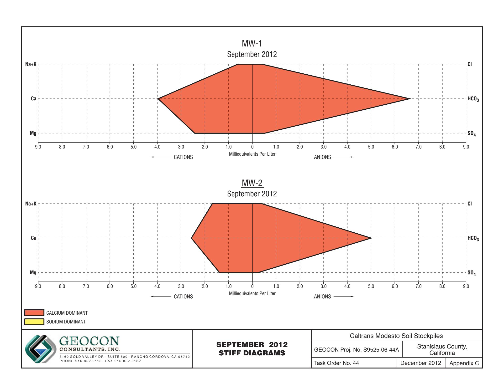

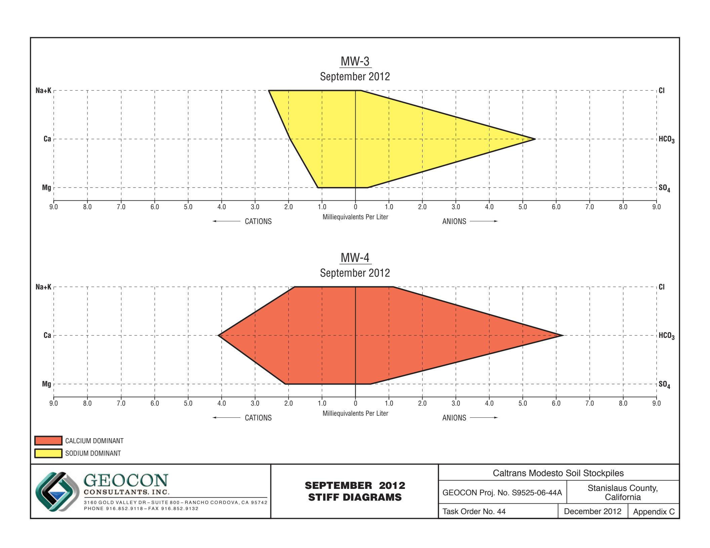

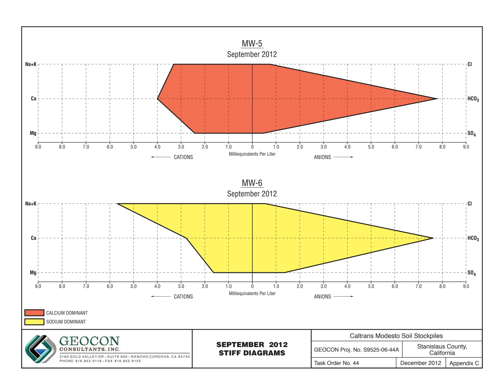

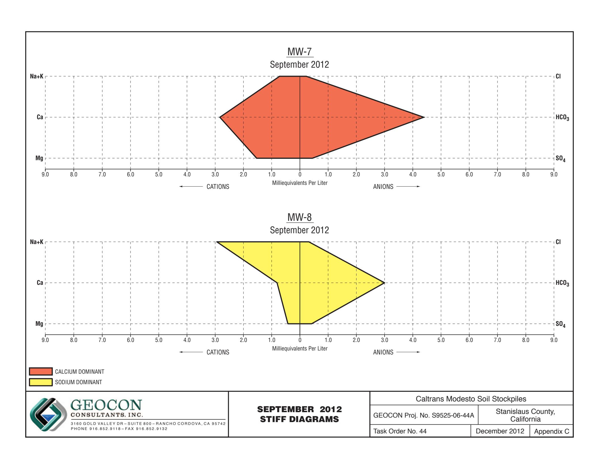

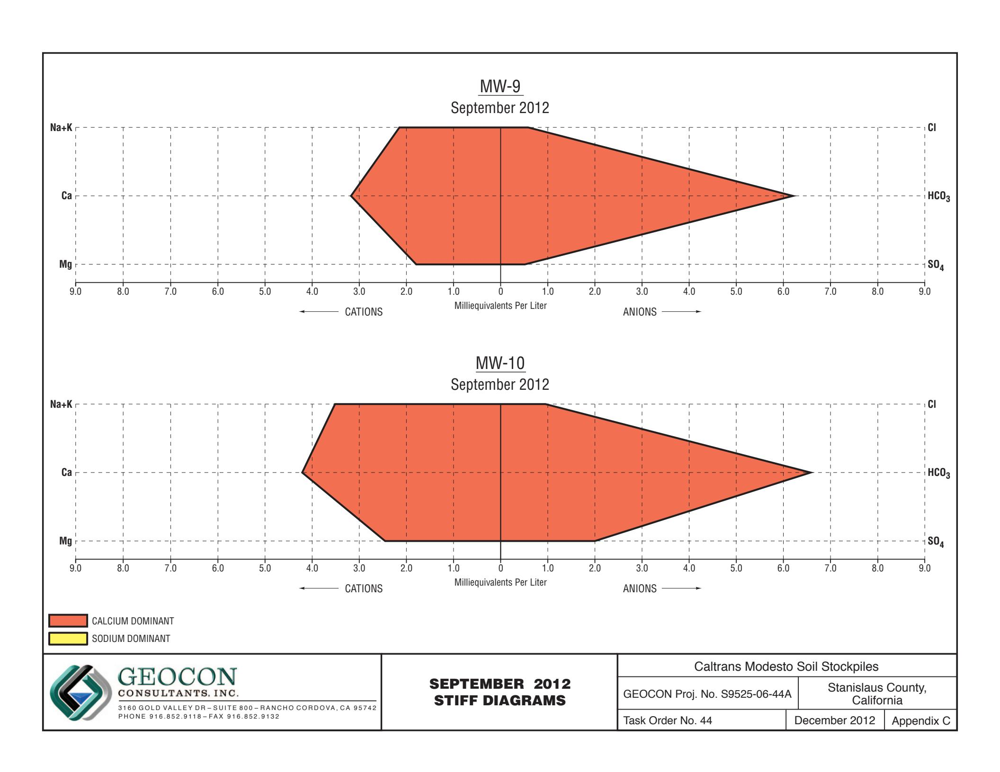