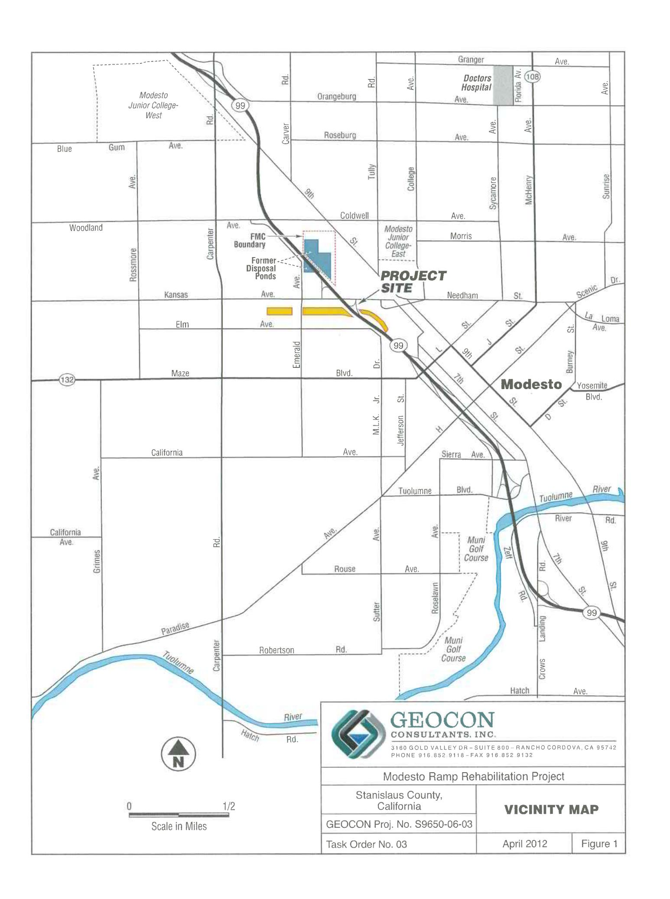
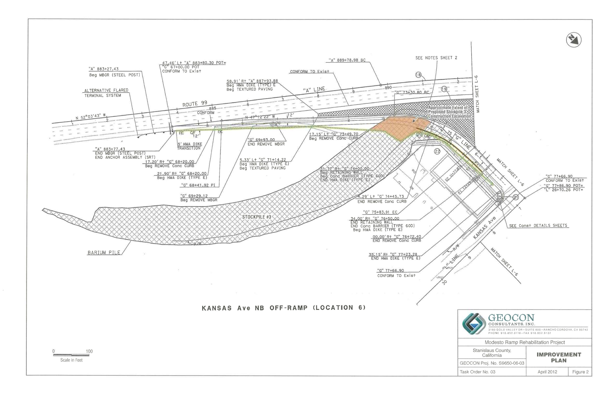
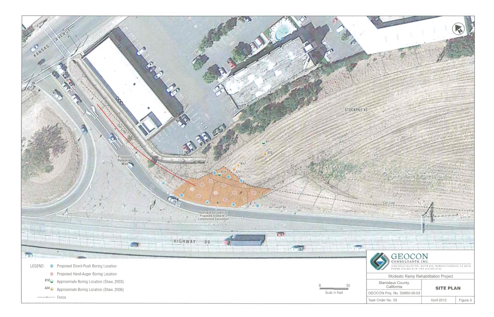
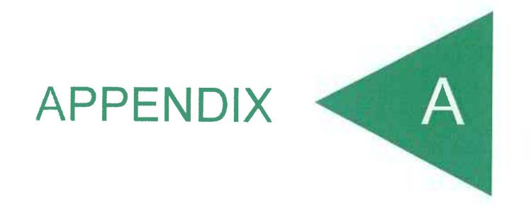
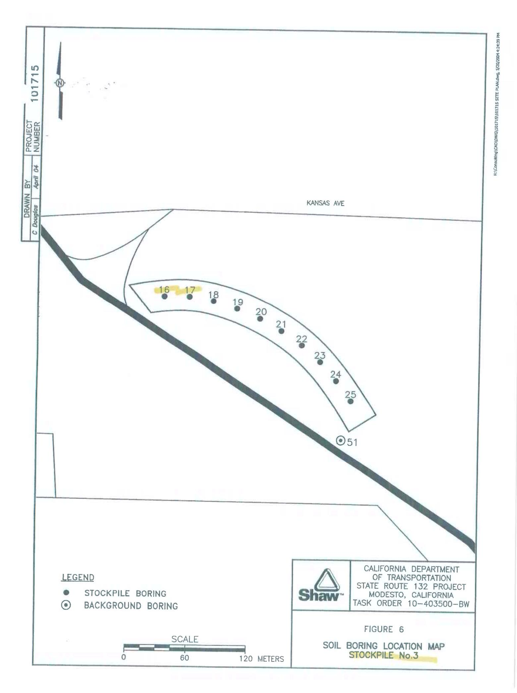
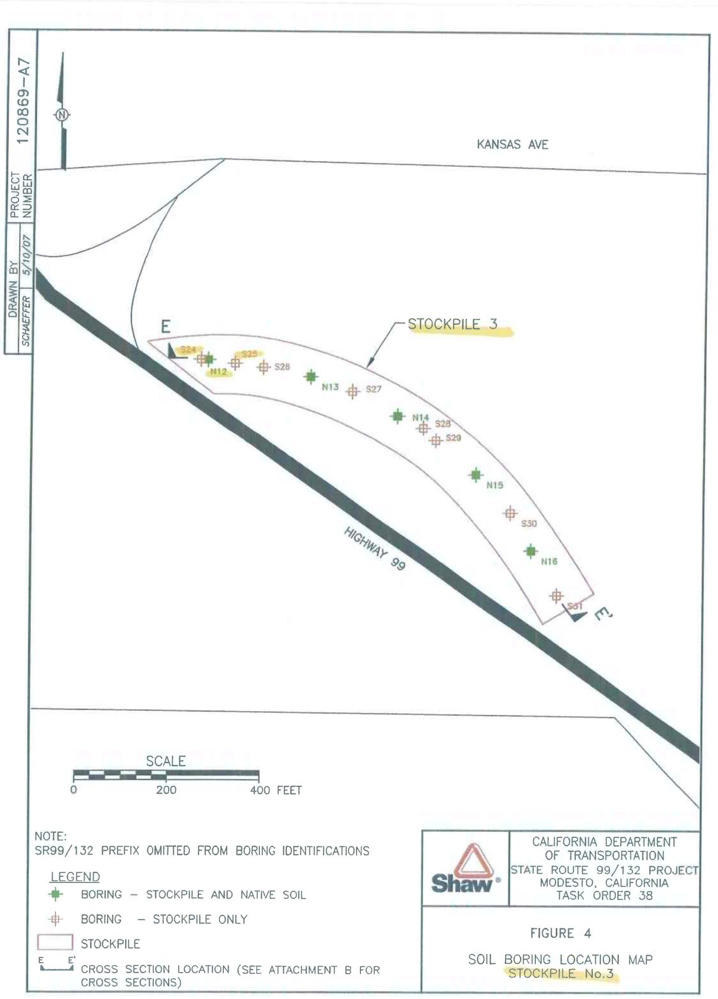
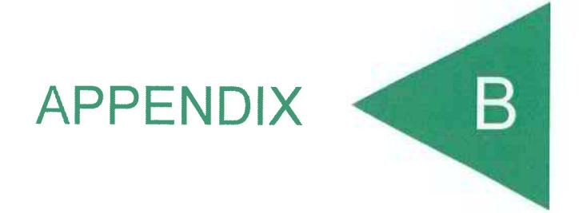
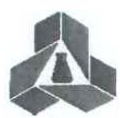

### GEOTECHNICAL . ENVIRONMENTAL . MATERIAL

Project No. S9650-06-03 April 13, 2012

### VIA ELECTRONIC MAIL

Mr. Richard Stewart, PG California Department of Transportation - District 6 855 M Street, Suite 200 Fresno, California 93721

Subject:

SITE INVESTIGATION WORKPLAN

MODESTO RAMP REHABILITATION PROJECT

STATE ROUTE 99 KANSAS AVENUE NORTHBOUND OFF-RAMP

MODESTO, CALIFORNIA

CONTRACT NO. 06A1634, EA NO. 10-0A671

Dear Mr. Stewart:

In accordance with the California Department of Transportation (Caltrans) Contract No. 06A1634 and Work Request EA No. 10-0A671, we are submitting this Workplan for a site investigation to be conducted at the State Route 99 (SR99) Kansas Avenue Off-ramp (the Project) in Modesto, California. This Workplan describes the scope of services requested by Caltrans and outlines the procedures and methods we will employ to complete the project.

### PROJECT LOCATION AND PROPOSED IMPROVEMENTS

The project location consists of the northbound SR99 off-ramp to Kansas Avenue as depicted on the attached Vicinity Map, Figure 1. Caltrans proposes to upgrade the ramp to meet current design standards. Planned improvements include widening the ramp shoulder areas and associated drainage improvements. Shoulder widening on the east side of the ramp will require construction of a retaining wall against the existing fill embankment (Stockpile 3) as depicted on the attached Improvement Plan, Figure 2. Caltrans estimates that approximately 3,539 cubic yards of Stockpile 3 soil embankment will be excavated during retaining wall construction and placed and stabilized within a designated area of Stockpile 3 in Caltrans right-of-way (ROW).

### BACKGROUND

In the 1930s to 1970s, property beneath and northeast of the SR99 and Kansas Avenue Interchange was occupied by a chemical processing operation. Ores and minerals including barite (barium sulfate) and celestite (strontium sulfate) were processed for use in greases, lubricating oil and pigment blanks. Sodium sulfide was generated as a by-product and sold as a caustic and reagent.

From the 1950s to the 1970s, a liquid residue generated by Food Machinery and Chemical Corporation (FMC Corporation) at this facility was discharged to unlined evaporation ponds. In 1961, a 4.3-acre parcel at the southwest corner of the FMC facility, including a portion of the ponds, was purchased by the State for the construction of SR99 through Modesto. Native soil and pond tailings were removed from this parcel and placed in lifts to form bridge abutments and embankment fills for the future SR99/Highway 132 interchange south of FMC. Soil in and around the impoundments was excavated during construction and stockpiled in the following three distinct locations within existing Caltrans ROW.

3160 Gold Valley Drive, Suite 800 Rancho Cordova, CA 95742-7515 Telephone 916.852.9118 Fax 916.852.9132

- Stockpile 1 located south of Kansas Avenue and west of North Emerald Avenue.
- Stockpile 2 located south of Kansas Avenue, between North Emerald Avenue and SR99, and
- Stockpile 3 located south of Kansas Avenue and east of SR99, a portion of which is located within the Modesto Ramp Rehabilitation Project boundaries.

An Initial Site Assessment (ISA) was conducted for Caltrans in 2003. The ISA identified a potential for the soil stockpiles within the SR99/Highway 132 right-of-way to contain residual chemicals associated with the former FMC impoundments. A Preliminary Site Investigation (PSI) was conducted by Shaw Environmental, Inc. in 2004 to characterize the stockpiles. The PSI consisted of drilling 50 borings from which soil samples were collected and analyzed for heavy metals, polycyclic aromatic hydrocarbons (PAHs), nitrate and pH. The analytical results indicated elevated barium concentrations in Stockpiles 2 and 3.

A supplemental site investigation was conducted by Shaw in 2006 to further characterize the soil stockpiles and compare their chemical contents relative to background conditions and established health goals as well as to assess groundwater quality. Shaw prepared a Human Health Risk Assessment (HHRA) in 2007 for chemicals of potential concern (COPCs) in the stockpiles and groundwater using multiple exposure scenarios. None of the COPCs were deemed to be potential health risks or hazards to current or future construction workers, offsite residents, or trespassers.

In response to the HHRA, the California Department of Toxic Substances Control (DTSC) issued an August 2007 letter that requested additional toxicological and site information prior to a final determination regarding risk or hazard posed by the stockpile material. Shaw prepared a Final Preliminary Endangerment Assessment (PEA) and a Response to Comments document in 2009 to summarize the findings of previous reports prepared for the soil stockpiles and to provide the additional information requested in DTSC's August 2007 letter. In writing dated December 17, 2009, the DTSC responded to the Final PEA stating that the "DTSC finds that the stockpiles as currently managed by Caltrans on Caltrans property do not pose a risk to human health for: 1) Caltrans workers who access the fenced site ..., 2) trespassers; and 3) residents adjacent to the stockpiles." The letter further directed Caltrans to continue to manage the stockpiles until such time that the SR99/Highway 132 Interchange is constructed and to maintain the existing groundwater monitoring system.

### STOCKPILE 3 DATA

The results of previous investigations indicate that the Stockpile 3 is primarily comprised of layered, poorly graded sand and silty sand similar to underlying native alluvial deposits. The maximum fill thickness at the northern end of Stockpile 3 is approximately 18 feet. Groundwater is present at a depth of approximately 36 feet below natural grade.

Shaw identified metals (notably barium) and PAHs as the primary COPCs in the soil stockpiles. The presence of distinctly colored, grayish material layers in the stockpiles has been frequently associated with elevated barium levels but is not an absolute correlation.

Borings B16 and B17 were performed by Shaw on the northern end of Stockpile 3 within and near the project boundaries during the 2004 PSI. Barium was detected at concentrations ranging from 31 to 44,300 milligrams per kilogram (mg/kg). The highest barium level detected in sample B17-4.5 does not

exceed the commercial/industrial California Human Health Screening Level (CHHSL) for barium of 63,000 mg/kg. PAHs were not detected for each sample analyzed from borings B16 and B17.

Borings S24, S25 and N12 were performed by Shaw on the northern end of Stockpile 3 near the project boundaries in 2006. Barium levels in stockpile samples ranged from 64 to 230 mg/kg (boring S24), 38 to 93 mg/kg (boring S25) and 35 to 178 mg/kg (boring N12). These barium concentrations are generally within the range (or of similar magnitude) of the Stockpile 3 specific background barium levels between 31 and 150 mg/kg. Nitrate was detected in stockpile samples obtained from borings S24 and N12 at concentrations of 0.7 and 0.5 mg/kg, respectively. Sulfate was further detected in samples obtained from borings S24 and N12 at concentrations of 42 and 2.4 mg/kg, respectively. Sulfide was not detected in the samples obtained from borings S24, S25 and N12 above the laboratory method reporting limit. The reported nitrate, sulfate and sulfide concentrations are within the range of site-specific background levels.

The approximate 2003 and 2006 Shaw boring locations that are within or in close proximity to the project boundaries are shown on Figure 3. The Shaw boring location maps, boring logs (S24, S25 and N12) and analytical data tables are in Appendix A.

### PURPOSE AND PROJECT SCOPE

The purpose of the scope of services outlined herein is to provide stockpile and native soil characterization data within planned construction excavation areas at Stockpile 3 within the project boundaries. The soil analytical data will be utilized for construction worker and public health and safety planning, and onsite soil management evaluation purposes. The soil analytical data will further be incorporated into an Interim Remedial Action Workplan (IRAW) as required by the DTSC and Central Valley Regional Water Quality Control Board (CVRWQCB) prior to receiving project approval.

### PROJECT SCOPE

This following presents our proposed scope of services in accordance with Caltrans Work Request EA No. 10-0A671.

### **Pre-field Activities**

Activities to be completed prior to implementation of field work are summarized below:

- Perform a site visit to identify and observe the project location, access and field conditions, and mark the investigation area boundaries in white paint for subsequent Underground Service Alert (USA) 48-hour notification.
- Prepare a health and safety plan (HSP) to provide guidelines on the use of personal protective equipment and the health/safety procedures to be implemented during field activities. The HSP will be reviewed and approved by a Certified Industrial Hygienist (CIH).
- Retain Advanced Technologies Laboratories (ATL) to conduct soil sample chemical analyses in accordance with requirements specified in this Workplan.
- Caltrans will provide advance field work notification to representatives of DTSC and CVRWQCB.

Modesto Ramp Rehabilitation Project

Caltrans Contract No. 06A1634, EA No. 10-0A671

Geocon Project No. S9650-06-03

- 3 
April 13, 2012

### **Field Activities**

Geocon will provide shoulder closure traffic control during field activities in close proximity to the active travel lanes utilizing advance warning signs (including a changeable message sign) and traffic cones.

Nineteen soil borings are proposed in the vicinity of planned construction excavations on the northern end of Stockpile 3 as depicted on Figure 3. The proposed boring locations include:

- Three 21-foot-deep direct-push borings along the top of existing slope.
- Eleven 3-foot-deep hand-auger borings within the slope face.
- Five 3-foot-deep direct-push borings along the toe of slope.

The proposed boring locations may require field adjustment based on field conditions, utilities and buried structures, and access. The direct-push borings along the top and toe of slope will be performed to a depth sufficient to penetrate and sample native soil deposits which may require modification of proposed depths.

The direct-push borings will be advanced using Geocon's Geoprobe rig. Continuous soil samples will be collected in 3-foot-long new acetate sleeves. A minimum of one discrete 6-inch-long soil sample will be cut from the top end of each core and at where indications of potential contamination (e.g. soil discoloration) are observed. A minimum of two soil samples will be obtained directly from the handauger borings at depth intervals of 0.0 to 0.5 foot and 2.5 to 3.0 feet. These soil samples will be placed in new 6-inch-long stainless steel sleeves.

The ends of each sample tube will be sealed with Teflon sheets and plastic end caps. The sample tubes will be labeled with the sample number, date/time of collection, etc., and placed into a chilled ice chest for storage and subsequent transport to the analytical laboratory. Samples will be handled and transported in accordance with chain-of-custody protocol.

The direct-push borings will be logged by a Geocon Professional Geologist using the Unified Soil Classification System (USCS) descriptions. A hand-held Global Positioning System (GPS) receiver will be used to determine the latitude/longitude coordinates of each boring location. Pertinent information will be documented in field logs.

Used disposable sampling/screening supplies will be stored in plastic bags for subsequent disposal. Non-disposable boring equipment that comes in contact with soil will be decontaminated prior to use by a wash-and-double-rinse process using a non-phosphate detergent solution (e.g., Alconox®), deionized or distilled water, and tapwater. Excess soil sample and decontamination water generated will be containerized and appropriately disposed of.

The direct-push borings will be backfilled with bentonite slurry. Hand-auger borings will be backfilled with the soil cuttings. Boring and sampling activities will not materially impact the physical condition of the project location.

Quality assurance/quality control (QA/QC) procedures will be adhered to during field activities to aid in verifying that the data collected are of the type and quality required to evaluate site conditions and meet project objectives. These procedures will include (but not necessarily be limited to)

Modesto Ramp Rehabilitation Project Geocon Project No. S9650-06-03

Caltrans Contract No. 06A1634, EA No. 10-0A671

- 4 -

April 13, 2012

boring/sampling equipment decontamination prior to and between each boring location and providing chain-of-custody documentation for each sample submitted to the laboratory.

### **Laboratory Analyses**

Soil samples collected during the field activities will be submitted to and analyzed by ATL, a California Department of Health Services-certified laboratory. Soil samples will be analyzed under expedited 24-hour turnaround time.

Selected discrete and laboratory composited soil samples will be analyzed for the following:

- Title 22 metals and strontium following Environmental Protection Agency (EPA) Test Method 6010B and 7471 (mercury).
- Soluble metal analysis using the Waste Extraction Test with deionized water extractant (DI-WET) on selected samples with elevated metal concentrations.

Additional analyses could include:

- PAHs following EPA Test Method 8270C-SIM.
- Sulfate and nitrate following EPA Test Method 9056.
- Sulfide following EPA Test Method 9030B/9034.
- pH by EPA Test Method 9045.

Example laboratory reporting formats for the specified analyses including laboratory method detection limits are in Appendix B.

The soil samples will be selected for analysis based on field observations (stockpile and native soil), soil screening results (e.g., soil discoloration), sample locations/depths, and the experience and judgment of supervisory field personnel and technical support personnel. Not all samples from each boring will be analyzed. We will maintain close contact with the Caltrans Contract Manager during the sampling activities and will obtain concurrence from the Caltrans Contract Manager with respect to the discrete and composite sample analyses conducted. Following receipt of the initial analysis, selected soil samples may be assigned for further DI-WET soluble analysis.

Laboratory QA/QC procedures will be performed for each method of analysis with specificity for each analyte listed in the test method's QA/QC. QA/QC measures as applicable will include the following:

- One method blank for every ten samples, batch of samples or type of matrix, whichever is more frequent.
- One sample analyzed in duplicate for every ten samples, batch of samples or type of matrix, whichever is more frequent.
- One spiked sample for every ten samples, batch of samples or type of matrix, whichever is more frequent, with the spike made at ten times the detection limit or at the analyte level.

The laboratory will be instructed to homogenize the soil samples tested for metals in accordance with Contract 06A 1634 requirements.

Modesto Ramp Rehabilitation Project Geocon Project No. S9650-06-03

Caltrans Contract No. 06A1634, EA No. 10-0A671

- 5 -

April 1

April 13, 2012

### **IRAW Preparation**

We will prepare an IRAW to present our findings and conclusions. The IRAW will summarize (but not be limited to) the following:

- Project background
- Nature, source and extent of contaminants
- Human health risk evaluation
- Engineering evaluation/cost analysis
- Applicable or relevant and appropriate requirements
- Mitigation measures
- Remedial action implementation
- Tabulated soil sample analytical data
- Vicinity map and site plans depicting boring and sample locations
- Site photographs
- Appendices including health and safety plan, borings logs, laboratory reports and chain-ofcustody documentation, and investigation-derived waste disposal manifests

We will provide a draft IRAW to Caltrans for review and comment. Following receipt of Caltrans' comments, we will appropriately amend the report and submit one hard copy and a pdf copy (via email) of the draft final IRAW to DTSC and the CVRWQCB. Copies of the draft final IRAW will further be uploaded to EnviroStor and Caltrans project websites and placed in designated public repositories as required by DTSC.

We will further participate in any planned public outreach activities that could include a public meeting and distribution of a project fact sheet.

### PROJECT SCHEDULE

The anticipated project schedule is presented below. Delays due to site access, regulatory permitting, inclement weather, supplemental lab testing, client and regulatory review, or other factors beyond our reasonable control and expectation may result in changes to the anticipated schedule.

| Task                           | Completion Date             |
|--------------------------------|-----------------------------|
| Field Work                     | April 16, 2012              |
| Submit Initial Analytical Data | April 20, 2012              |
| Submit Additional Soluble Data | April 25, 2012              |
| Meeting with DTSC and CVRWQCB  | April 26, 2012              |
| Submit Draft IRAW to Caltrans  | May 4, 2012                 |
| Submit Final Draft IRAW        | May 11, 2012                |
| Public Comment Period          | May 11 through June 8, 2012 |
| Response to Comments           | June 15, 2012               |
| Final DTSC IRAW Approval       | June 22, 2012               |

Please contact us if you have any questions or comments concerning this Workplan or if we may be of further service.

Sincerely,

GEOCON CONSULTANTS, INC.

Project Manager

Attachments: Figure 1, Vicinity Map

Figure 2, Improvement Plan

Figure 3, Site Plan

Appendix A, Shaw 2004 and 2006 Analytical Data Appendix B, ATL Example Laboratory Reports

# Summary of GPS and Soil Analtyical Data State Route 132 Modesto, Stanislaus County, California Task Order 10-403500-BW

| 9045                 | 표                       | =        | ī                               | .                               | 000          | 2 .          | Ι.           | ,             | 1.                              | Ι.           | P 6          |              | l,          |                            | 2 2                   | ,            | Ι.                    | 9            | 7.6                   | 2 ,          | Ι.                    | 2            |
|----------------------|-------------------------|----------|---------------------------------|---------------------------------|--------------|--------------|--------------|---------------|---------------------------------|--------------|--------------|--------------|-------------|----------------------------|-----------------------|--------------|-----------------------|--------------|-----------------------|--------------|-----------------------|--------------|
| $\vdash$             | ate                     | H        | +                               | -                               | -            | +            |              |               |                                 |              | +            | +            | Ì           |                            | t                     | -            |                       | +            | +                     | +            | -                     | H            |
| 300.1                | Nitrate                 | l/bm     |                                 | .,                              | < 0.05       |              |              |               | Ľ                               |              | < 0.05       | 5 '          |             | L                          | 41                    |              | ľ                     | < 0.05       | < 0.05                | ,            | Ľ                     | 35           |
| 8100                 | PAHs                    | ma/ka    |                                 | S                               | 2            |              | 1            |               | S                               |              | S            | 2            | GN.         |                            | Q.                    | 2            | S                     | S            | 2                     | 9            | 2                     | :01          |
|                      | Total Strontium      | ma/ka    | 0                               | 44                              | 24           | 38           | 38           | 105           | 13                              | 22           | 38           | 397          |             |                            | 29                    | 28           | 150                   | 100          | 21                    | 1,8          | 36                    | 126          |
|                      | Total                   | ma/ka    | 9                               | 13.900                          | 12,600       | 15,900       | 14,700       | 14,600        | 0.600                           | 13.800       | 16.400       | 3.810        | 13,600      |                            | 19,300                | 12,300       | 10,500                | 11,600       | 10,300                | 13,500       | 11,800                | 9.980        |
|                      | Total Chromium       | ma/ka    |                                 | 12                              | 5.6          | 13           | 7.8          | 9             | 2.9                             | 7.6          | 7.9          | 7.6          |             |                            | 18                    | 8.5          | 6.5                   | 8.2          | 7.1                   | 9.5          | 8.8                   | 5.1          |
|                      | TCLP Barium          | ma/L     |                                 | ,                               |              | ï            |              |               | 1                               |              | ā            | 5,940        |             |                            | ,                     |              | ě                     |              | e                     | ٠,           | 9.                    | ,            |
| <b>EPA 6010 ICAP</b> | WET Barium (STLC) | mg/L     |                                 |                                 | 45           | 12           | 200          |               |                                 |              | ×            | 1,230        |             |                            | ¥                     | ×            | ı                     | 10           |                       |              |                       |              |
| EPA 6                | Total Barium ROAR | mg/kg    |                                 | 258                             | E            | ŧ            | 285          | 134           |                                 | *            | -            | 124,000      |             |                            | 1                     | 242          | 1                     | 76           | ı                     | 65           | ı                     | 88           |
|                      | Total Barium         | mg/kg    |                                 | 62                              | 65           | 602          | 54           | 90            | 31                              | 57           | 81           | 44,300       | TAA         |                            | 152                   | 119          | 888                   | 9/           | 176                   | 62           | 298                   | 22           |
|                      | WET Arsenic          | mg/L     |                                 | 0)                              | 1            |              |              |               | (6)                             | į.           |              | ,            |             |                            | ň                     | ń            |                       |              | ,                     |              |                       | 6            |
|                      | Total Arsenic        | mg/kg    |                                 | < 8.0                           | < 8.0        | < 8.0        | < 8.0        | < 8.6         | < 8.0                           | < 8.0        | < 8.0        | 13           |             |                            | < 8.0                 | < 8.0        | < 8.0                 | < 8.0        | < 8.0                 | < 8.0        | < 8.0                 | < 8.0        |
|                      | Total Antimony       | mg/kg    |                                 | < 6.0                           | < 6.0        | 0.9 >        | < 6.0        | 0.03          | < 6.0                           | < 6.0        | 0.9 >        | 0.9 >        | <0.00       |                            | < 6.0                 | < 6.0        | < 6.0                 | < 6.0        | < 6.0                 | < 6.0        | < 6.0                 | < 6.0        |
|                      | Mean Sea Level       | (meters) |                                 | 30.37                           |              |              |              |               | 29.70                           |              |              |              | *           |                            | 27.29                 |              | 23.69                 |              | 24.59                 |              | 24.04                 |              |
|                      | Longitude               |          |                                 | Stockpile 37.644937 -121.014345 |              |              |              |               | Stockpile 37.644952 -121.013975 |              |              |              |             |                            | -121.011727           |              | 121.015159            |              | -121.021529           |              | 121.024410            |              |
|                      | Latitude                |          | 5-25)                           | 37.644937                       |              |              |              |               | 37.644952                       |              |              |              |             | 1)                         | 37.643261 -121.011727 |              | 37.644456 -121.015159 |              | 37.644771 -121.021529 |              | 37.644862 -121.024410 |              |
|                      | Soil                    |          | 3orings 16                      | Stockpile                       | Stockpile    | Stockpile    | Stockpile    | Nuttree       | Stockpile                       | Stockpile    | Stockpile    | Stockpile    | Native      | ings 51-54                 | Native                | Native       | Native                | Native       | Native                | Native       | Native                | Native       |
|                      | Sample Designation   |          | Stockpile No. 3 (Borings 16-25) | SR132-16-0.15                   | SR132-16-1.5 | SR132-16-3.0 | SR132-16-4.5 | 513132-16-6.0 | SR132-17-0.15                   | SR132-17-1.5 | SR132-17-3.0 | SR132-17-4.5 | SR102-12-60 | Background (Borings 51-54) | SR132-51-0.15         | SR132-51-1.5 | SR132-52-0.15         | SR132-52-1.5 | SR132-53-0.15         | SR132-53-1.5 | SR132-54-0.15         | SR132-54-1.5 |

NOTES

Bold results exceed ten-times the STLC

1. **Detection Limit**

   The detection limit is the lowest concentration of a substance that can be reliably distinguished from the absence of that substance with a specified level of confidence. It is often expressed as a concentration (e.g., parts per million, milligrams per liter).
2. **Quantification Limit**

   The quantification limit (or quantitation limit) is the lowest concentration of a substance that can be measured with acceptable precision and accuracy. It is typically higher than the detection limit.
3. **Method Detection Limit (MDL)**

   The MDL is the minimum concentration of a substance that can be identified, measured, and reported with 99% confidence that the analyte concentration is greater than zero. It is determined from the analysis of samples with known concentrations of the analyte at values close to the expected MDL.
4. **Instrument Detection Limit (IDL)**

   The IDL is the lowest concentration that an instrument can detect. It is determined by analyzing a blank sample and calculating the standard deviation of the measurements. The IDL is typically three times the standard deviation of the blank.
5. **Practical Quantitation Limit (PQL)**

   The PQL is the lowest concentration that can be reliably determined with routine laboratory operating conditions within specified limits of precision and accuracy. It is often set at 10 times the MDL or a similar multiple of the standard deviation of the blank.
6. **Limit of Reporting (LOR)**

   The LOR is the lowest concentration that can be reliably reported with a specified level of confidence. It is often similar to the PQL or a slightly higher value.
7. **Blank Correction**

   Blank correction is a process used to account for the presence of an analyte in a blank sample. This is important for accurate quantification, especially at low concentrations.
8. **Spiked Sample**

   A spiked sample is a sample to which a known amount of the analyte of interest has been added. This is used to assess the accuracy and recovery of the analytical method.
9. **Matrix Effect**

   A matrix effect is an alteration in the analytical signal of an analyte caused by the presence of other components in the sample matrix. This can affect the accuracy of the measurement.
10. **Calibration Curve**

    A calibration curve is a graph that plots the response of an analytical instrument to known concentrations of an analyte. It is used to determine the concentration of the analyte in unknown samples.
11. **Quality Control (QC) Samples**

    QC samples are samples with known concentrations of analytes that are analyzed along with unknown samples to assess the quality of the analytical data. This includes blanks, spiked samples, and certified reference materials.
12. **Standard Deviation**

    The standard deviation is a measure of the dispersion or spread of a set of data. It is calculated as the square root of the variance.
13. **Relative Standard Deviation (RSD)**

    The RSD is the standard deviation expressed as a percentage of the mean. It is a measure of the precision of a set of data.
14. **Percent Recovery**

    Percent recovery is a measure of the accuracy of an analytical method. It is calculated as the ratio of the measured concentration to the true concentration, expressed as a percentage.
15. **Analyte**

    An analyte is a substance that is being measured or detected in a sample.
16. **Matrix**

    The matrix is the medium in which the analyte is present. For example, in water analysis, the matrix is water; in soil analysis, the matrix is soil.
17. **Sensitivity**

    Sensitivity refers to the ability of an analytical method to detect small amounts of an analyte. It is often related to the detection limit.
18. **Specificity**

    Specificity refers to the ability of an analytical method to measure only the analyte of interest and not other substances that may be present in the sample.
19. **Robustness**

    Robustness refers to the ability of an analytical method to remain unaffected by small, deliberate variations in method parameters. It indicates the reliability of the method under normal testing conditions.
20. **Limit of Detection (LOD)**

    The LOD is the lowest amount of analyte in a sample that can be detected but not necessarily quantitated as to its exact value. It is often used interchangeably with the detection limit.

NOTES:
Bold results exceed ten-times the STLC.
Highlighted results have soluble barium concentrations greater than the STLC or TCLP
95% UCL = Upper 95% Confidence Limit on the Mean Concentration. The calculation was conducted assuming any result reported as below detection occurred at a concentration equal to one-half the sample detection limit.

PRG = Preliminary remediation goal established by the EPA, Region 9 (2002), Residential soil PRG listed. PRG for arsenic is for the cancer non-cancer endpoint. For chromium, the PRG is the California-modified value.

mg/Rg = milligrams per liter

NA = Not Applicable.

ND = No analytes were detected above the laboratory reporting limit.

< = Less than the laboratory reporting limit.

WET = West extraction Test.

DIWET = West extraction Test.

TCLP = Toxicity Characteristic Leaching Procedure.

TCLP = Toxicity Characteristic Leaching Procedure.

TTLC = Soluble Threshold Limit Concentration.

STLC = Soluble Threshold Limit Concentration.

The PRG is the California modified variable for chromium, the endpoint for cancer-carcinogen. The PRG is the California modified variable for chromium, the endpoint for cancer-carcinogen.

g/kg - milligrams per kilogram

g/kg/day, Not Applicable
NA = Not Applicable

ND = No analytes were detected.
Not applicable.

Macro Extraction Test,
WET using a deionized

TCLP = Toxicity Characteristic Leaching Procedure

TCLP = Toxicity Characteristic Leaching Procedure

TTCL = Total T. Phenol, T. Phos, S. Cyanide

STLC - Soluble Threshold Limit Concentration

Page 1

| DADTMENT                                             |  |  |
|------------------------------------------------------|--|--|
| PARTMENT RTATION 32 PROJECT IFORNIA R 38 |  |  |
| R 38                                                 |  |  |
| MAP                                                  |  |  |
|                                                      |  |  |
|                                                      |  |  |

### **Drilling Log**

Soil Borin

| Boring | S24 |
|--------|-----|
|        | -   |

| Project       | Task Order 38               | Owner               | Caltrans      | Page: 1 of 1 |             |          |             |
|---------------|-----------------------------|---------------------|---------------|--------------|-------------|----------|-------------|
| Location      | Modesto, California         | Proj. No.           | 120869        |              |             |          |             |
| Surface Elev. | 98.3 ft.                    | Total Hole Depth    | 12.0 ft.      | North        | 2057702.793 | East     | 6412776.291 |
| Top of Casing | NA                          | Water Level Initial | NA            | Static       | NA          | Diameter |             |
| Screen: Dia   | NA                          | Length              | NA            | Type/Size    | NA          |          |             |
| Casing: Dia   | NA                          | Length              | NA            | Type         | NA          |          |             |
| Fill Material |                             | Rig/Core            | GH-40         |              |             |          |             |
| Drill Co.     | ResonantSonic International | Method              | Direct Push   |              |             |          |             |
| Driller       | Gilberto Ambriz             | Log By              | Alex Naughton | Date         | 5/19/06     | Permit # | NA          |
| Checked By    | Tim Ault                    | License No.         | PG 7608       |              |             |          |             |

COMMENTS

| Driller Gilberto Ambriz |              | Log By Alex Naughton    |                        | Date 5/19/06   | Permit # NA |                                                                                            |
|-------------------------|--------------|-------------------------|------------------------|----------------|-------------|--------------------------------------------------------------------------------------------|
| Checked By Tim Ault     |              | License No. PG 7608     |                        |                |             |                                                                                            |
| Depth (ft.)          | PID (ppm) | Sample ID % Recovery | Blow Count Recovery | Graphic Log | USCS Class. | Description (Color, Texture, Structure) Geologic Descriptions are Based on the USCS. |
| 0                       |              | S24-0.5                 |                        |                | SP          | POORLY GRADED SAND; light gray brown; all fine sand; loose; dry                            |
| 2                       |              |                         |                        |                |             | SILTY SAND; brown; fine sand; medium dense; slight moist                                   |
| 4                       |              | S24-5                   |                        |                |             | Becomes orange brown and moist at 5 feet. Few 1/4-inch clay nodules.                       |
| 6                       |              |                         |                        |                | SM          | Becomes brown with orange mineral staining and slightly moist at 6 feet.                   |
| 8                       |              |                         |                        |                |             |                                                                                            |
| 10                      |              | S24-10                  |                        |                |             |                                                                                            |
| 12                      |              |                         |                        |                | SP          | POORLY GRADED SAND; orange brown; all fine sand; medium dense; slightly moist              |
|                         |              |                         |                        |                |             | Boring terminated at 12 feet.                                                              |
| 14                      |              |                         |                        |                |             |                                                                                            |

# Shaw

### **Drilling Log**

Soil Boring **S25** 

| APPART MATE  |                |                      |                        |            |             |                                                                                                                                                                                                                                                                                                                                                                                                                                                                                                                                                                                                                                                                                                                                                                                                                                                                                                                                                                                                                                                                                                                                                                                                                                                                                                                                                                                                                                                                                                                                                                                                                                                                                                                                                                                                                                                                                                                                                                                                                                                                                                                                | Page: 1 of 1             |
|--------------|----------------|----------------------|------------------------|------------|-------------|--------------------------------------------------------------------------------------------------------------------------------------------------------------------------------------------------------------------------------------------------------------------------------------------------------------------------------------------------------------------------------------------------------------------------------------------------------------------------------------------------------------------------------------------------------------------------------------------------------------------------------------------------------------------------------------------------------------------------------------------------------------------------------------------------------------------------------------------------------------------------------------------------------------------------------------------------------------------------------------------------------------------------------------------------------------------------------------------------------------------------------------------------------------------------------------------------------------------------------------------------------------------------------------------------------------------------------------------------------------------------------------------------------------------------------------------------------------------------------------------------------------------------------------------------------------------------------------------------------------------------------------------------------------------------------------------------------------------------------------------------------------------------------------------------------------------------------------------------------------------------------------------------------------------------------------------------------------------------------------------------------------------------------------------------------------------------------------------------------------------------------|--------------------------|
| Project      | Task Ord       | der 38               |                        |            |             | Owner Caltrans                                                                                                                                                                                                                                                                                                                                                                                                                                                                                                                                                                                                                                                                                                                                                                                                                                                                                                                                                                                                                                                                                                                                                                                                                                                                                                                                                                                                                                                                                                                                                                                                                                                                                                                                                                                                                                                                                                                                                                                                                                                                                                                 | COMMENTS                 |
| Location     | Modesi         | to, Califor          | nia                    |            |             | Proj. No. <u>120869</u>                                                                                                                                                                                                                                                                                                                                                                                                                                                                                                                                                                                                                                                                                                                                                                                                                                                                                                                                                                                                                                                                                                                                                                                                                                                                                                                                                                                                                                                                                                                                                                                                                                                                                                                                                                                                                                                                                                                                                                                                                                                                                                        |                          |
| Surface Ele  |                |                      |                        | tal Hole D | epth        | 12.0 ft. North 2057693,962 East 6412848.841                                                                                                                                                                                                                                                                                                                                                                                                                                                                                                                                                                                                                                                                                                                                                                                                                                                                                                                                                                                                                                                                                                                                                                                                                                                                                                                                                                                                                                                                                                                                                                                                                                                                                                                                                                                                                                                                                                                                                                                                                                                                                    |                          |
| Top of Cas   |                |                      |                        | ater Leve  |             |                                                                                                                                                                                                                                                                                                                                                                                                                                                                                                                                                                                                                                                                                                                                                                                                                                                                                                                                                                                                                                                                                                                                                                                                                                                                                                                                                                                                                                                                                                                                                                                                                                                                                                                                                                                                                                                                                                                                                                                                                                                                                                                                |                          |
| Screen: Dia  |                |                      |                        | ngth N     |             | Type/Size NA                                                                                                                                                                                                                                                                                                                                                                                                                                                                                                                                                                                                                                                                                                                                                                                                                                                                                                                                                                                                                                                                                                                                                                                                                                                                                                                                                                                                                                                                                                                                                                                                                                                                                                                                                                                                                                                                                                                                                                                                                                                                                                                   |                          |
| Casing: Dia  |                |                      |                        | ngth N     |             | Type NA                                                                                                                                                                                                                                                                                                                                                                                                                                                                                                                                                                                                                                                                                                                                                                                                                                                                                                                                                                                                                                                                                                                                                                                                                                                                                                                                                                                                                                                                                                                                                                                                                                                                                                                                                                                                                                                                                                                                                                                                                                                                                                                        |                          |
|              |                |                      | Lei                    | igin       |             |                                                                                                                                                                                                                                                                                                                                                                                                                                                                                                                                                                                                                                                                                                                                                                                                                                                                                                                                                                                                                                                                                                                                                                                                                                                                                                                                                                                                                                                                                                                                                                                                                                                                                                                                                                                                                                                                                                                                                                                                                                                                                                                                |                          |
| Fill Materia |                | ntConic l            | ntamat                 | Hanal .    | J.V.        | 1113.0010                                                                                                                                                                                                                                                                                                                                                                                                                                                                                                                                                                                                                                                                                                                                                                                                                                                                                                                                                                                                                                                                                                                                                                                                                                                                                                                                                                                                                                                                                                                                                                                                                                                                                                                                                                                                                                                                                                                                                                                                                                                                                                                      |                          |
| 0            |                |                      |                        |            |             | Direct Push                                                                                                                                                                                                                                                                                                                                                                                                                                                                                                                                                                                                                                                                                                                                                                                                                                                                                                                                                                                                                                                                                                                                                                                                                                                                                                                                                                                                                                                                                                                                                                                                                                                                                                                                                                                                                                                                                                                                                                                                                                                                                                                    |                          |
| INT OF ST    | ilberto A      |                      | _ Log                  | By Al      |             | ughlon Date 5/19/06 Permit # NA                                                                                                                                                                                                                                                                                                                                                                                                                                                                                                                                                                                                                                                                                                                                                                                                                                                                                                                                                                                                                                                                                                                                                                                                                                                                                                                                                                                                                                                                                                                                                                                                                                                                                                                                                                                                                                                                                                                                                                                                                                                                                                |                          |
| Checked B    | y <u>11111</u> | AUIT                 |                        | ryramics   | L           | icense NoPG 7608                                                                                                                                                                                                                                                                                                                                                                                                                                                                                                                                                                                                                                                                                                                                                                                                                                                                                                                                                                                                                                                                                                                                                                                                                                                                                                                                                                                                                                                                                                                                                                                                                                                                                                                                                                                                                                                                                                                                                                                                                                                                                                               |                          |
| 4            | 9              | Sample ID % Recovery | Blow Count Recovery | iic        | USCS Class. | Description                                                                                                                                                                                                                                                                                                                                                                                                                                                                                                                                                                                                                                                                                                                                                                                                                                                                                                                                                                                                                                                                                                                                                                                                                                                                                                                                                                                                                                                                                                                                                                                                                                                                                                                                                                                                                                                                                                                                                                                                                                                                                                                    |                          |
| Depth (ft.)  | PID (ppm)   | nple eco          | CON                    | Graphic    | S           | (Color, Texture, Structure)                                                                                                                                                                                                                                                                                                                                                                                                                                                                                                                                                                                                                                                                                                                                                                                                                                                                                                                                                                                                                                                                                                                                                                                                                                                                                                                                                                                                                                                                                                                                                                                                                                                                                                                                                                                                                                                                                                                                                                                                                                                                                                    |                          |
| ()           | 9              | Sar R             | Blox                   | Ö          | JSC         | Geologic Descriptions are Based on the U                                                                                                                                                                                                                                                                                                                                                                                                                                                                                                                                                                                                                                                                                                                                                                                                                                                                                                                                                                                                                                                                                                                                                                                                                                                                                                                                                                                                                                                                                                                                                                                                                                                                                                                                                                                                                                                                                                                                                                                                                                                                                       | ere                      |
|              |                |                      |                        |            | -           | Geologic pescriptions are pased of the O                                                                                                                                                                                                                                                                                                                                                                                                                                                                                                                                                                                                                                                                                                                                                                                                                                                                                                                                                                                                                                                                                                                                                                                                                                                                                                                                                                                                                                                                                                                                                                                                                                                                                                                                                                                                                                                                                                                                                                                                                                                                                       | 303                      |
|              |                |                      |                        | EH         |             |                                                                                                                                                                                                                                                                                                                                                                                                                                                                                                                                                                                                                                                                                                                                                                                                                                                                                                                                                                                                                                                                                                                                                                                                                                                                                                                                                                                                                                                                                                                                                                                                                                                                                                                                                                                                                                                                                                                                                                                                                                                                                                                                |                          |
|              |                |                      |                        |            |             | Bare Ground                                                                                                                                                                                                                                                                                                                                                                                                                                                                                                                                                                                                                                                                                                                                                                                                                                                                                                                                                                                                                                                                                                                                                                                                                                                                                                                                                                                                                                                                                                                                                                                                                                                                                                                                                                                                                                                                                                                                                                                                                                                                                                                    |                          |
| - 0 -        |                |                      |                        |            |             | POORLY GRADED SAND; gray; all fine sand; loose; a                                                                                                                                                                                                                                                                                                                                                                                                                                                                                                                                                                                                                                                                                                                                                                                                                                                                                                                                                                                                                                                                                                                                                                                                                                                                                                                                                                                                                                                                                                                                                                                                                                                                                                                                                                                                                                                                                                                                                                                                                                                                              | dry                      |
|              |                | S25-0.5              |                        |            |             |                                                                                                                                                                                                                                                                                                                                                                                                                                                                                                                                                                                                                                                                                                                                                                                                                                                                                                                                                                                                                                                                                                                                                                                                                                                                                                                                                                                                                                                                                                                                                                                                                                                                                                                                                                                                                                                                                                                                                                                                                                                                                                                                |                          |
|              |                |                      |                        |            | SP          |                                                                                                                                                                                                                                                                                                                                                                                                                                                                                                                                                                                                                                                                                                                                                                                                                                                                                                                                                                                                                                                                                                                                                                                                                                                                                                                                                                                                                                                                                                                                                                                                                                                                                                                                                                                                                                                                                                                                                                                                                                                                                                                                |                          |
|              |                |                      | - 1                    |            |             |                                                                                                                                                                                                                                                                                                                                                                                                                                                                                                                                                                                                                                                                                                                                                                                                                                                                                                                                                                                                                                                                                                                                                                                                                                                                                                                                                                                                                                                                                                                                                                                                                                                                                                                                                                                                                                                                                                                                                                                                                                                                                                                                |                          |
| - 2 -        |                |                      |                        |            |             |                                                                                                                                                                                                                                                                                                                                                                                                                                                                                                                                                                                                                                                                                                                                                                                                                                                                                                                                                                                                                                                                                                                                                                                                                                                                                                                                                                                                                                                                                                                                                                                                                                                                                                                                                                                                                                                                                                                                                                                                                                                                                                                                |                          |
|              |                |                      |                        |            |             | SILTY SAND; orange brown; fine sand; medium dense                                                                                                                                                                                                                                                                                                                                                                                                                                                                                                                                                                                                                                                                                                                                                                                                                                                                                                                                                                                                                                                                                                                                                                                                                                                                                                                                                                                                                                                                                                                                                                                                                                                                                                                                                                                                                                                                                                                                                                                                                                                                              | e; slightly moist        |
|              |                |                      |                        | Art Es     | 044         |                                                                                                                                                                                                                                                                                                                                                                                                                                                                                                                                                                                                                                                                                                                                                                                                                                                                                                                                                                                                                                                                                                                                                                                                                                                                                                                                                                                                                                                                                                                                                                                                                                                                                                                                                                                                                                                                                                                                                                                                                                                                                                                                |                          |
|              |                | H                    |                        |            | SM          |                                                                                                                                                                                                                                                                                                                                                                                                                                                                                                                                                                                                                                                                                                                                                                                                                                                                                                                                                                                                                                                                                                                                                                                                                                                                                                                                                                                                                                                                                                                                                                                                                                                                                                                                                                                                                                                                                                                                                                                                                                                                                                                                |                          |
|              |                |                      |                        |            |             |                                                                                                                                                                                                                                                                                                                                                                                                                                                                                                                                                                                                                                                                                                                                                                                                                                                                                                                                                                                                                                                                                                                                                                                                                                                                                                                                                                                                                                                                                                                                                                                                                                                                                                                                                                                                                                                                                                                                                                                                                                                                                                                                |                          |
| - 4 -        |                |                      |                        | 10/21      |             | POORLY GRADED SAND; gray to brown; all fine sand                                                                                                                                                                                                                                                                                                                                                                                                                                                                                                                                                                                                                                                                                                                                                                                                                                                                                                                                                                                                                                                                                                                                                                                                                                                                                                                                                                                                                                                                                                                                                                                                                                                                                                                                                                                                                                                                                                                                                                                                                                                                               | t loose slightly moist   |
|              |                |                      | - 11                   |            |             | gray to brown, an into sain                                                                                                                                                                                                                                                                                                                                                                                                                                                                                                                                                                                                                                                                                                                                                                                                                                                                                                                                                                                                                                                                                                                                                                                                                                                                                                                                                                                                                                                                                                                                                                                                                                                                                                                                                                                                                                                                                                                                                                                                                                                                                                    | a, roode, digitaly motor |
| -            |                | \$25-5               |                        |            |             |                                                                                                                                                                                                                                                                                                                                                                                                                                                                                                                                                                                                                                                                                                                                                                                                                                                                                                                                                                                                                                                                                                                                                                                                                                                                                                                                                                                                                                                                                                                                                                                                                                                                                                                                                                                                                                                                                                                                                                                                                                                                                                                                |                          |
|              |                |                      |                        |            |             |                                                                                                                                                                                                                                                                                                                                                                                                                                                                                                                                                                                                                                                                                                                                                                                                                                                                                                                                                                                                                                                                                                                                                                                                                                                                                                                                                                                                                                                                                                                                                                                                                                                                                                                                                                                                                                                                                                                                                                                                                                                                                                                                |                          |
| - 6 -        |                |                      |                        |            |             |                                                                                                                                                                                                                                                                                                                                                                                                                                                                                                                                                                                                                                                                                                                                                                                                                                                                                                                                                                                                                                                                                                                                                                                                                                                                                                                                                                                                                                                                                                                                                                                                                                                                                                                                                                                                                                                                                                                                                                                                                                                                                                                                |                          |
| 0            | - 1            |                      |                        |            | SP          | Becomes olive green with orange mineral stains, dense                                                                                                                                                                                                                                                                                                                                                                                                                                                                                                                                                                                                                                                                                                                                                                                                                                                                                                                                                                                                                                                                                                                                                                                                                                                                                                                                                                                                                                                                                                                                                                                                                                                                                                                                                                                                                                                                                                                                                                                                                                                                          | e, and moist at 6 feet.  |
|              |                |                      |                        |            |             |                                                                                                                                                                                                                                                                                                                                                                                                                                                                                                                                                                                                                                                                                                                                                                                                                                                                                                                                                                                                                                                                                                                                                                                                                                                                                                                                                                                                                                                                                                                                                                                                                                                                                                                                                                                                                                                                                                                                                                                                                                                                                                                                |                          |
|              |                |                      |                        |            |             |                                                                                                                                                                                                                                                                                                                                                                                                                                                                                                                                                                                                                                                                                                                                                                                                                                                                                                                                                                                                                                                                                                                                                                                                                                                                                                                                                                                                                                                                                                                                                                                                                                                                                                                                                                                                                                                                                                                                                                                                                                                                                                                                |                          |
|              | 4 7            |                      | - 8                    |            |             | Becomes light orange gray and slightly moist at 7.5 fee                                                                                                                                                                                                                                                                                                                                                                                                                                                                                                                                                                                                                                                                                                                                                                                                                                                                                                                                                                                                                                                                                                                                                                                                                                                                                                                                                                                                                                                                                                                                                                                                                                                                                                                                                                                                                                                                                                                                                                                                                                                                        | 4                        |
| - 8 -        |                |                      |                        |            |             | and the second of the second of the second of the second of the second of the second of the second of the second of the second of the second of the second of the second of the second of the second of the second of the second of the second of the second of the second of the second of the second of the second of the second of the second of the second of the second of the second of the second of the second of the second of the second of the second of the second of the second of the second of the second of the second of the second of the second of the second of the second of the second of the second of the second of the second of the second of the second of the second of the second of the second of the second of the second of the second of the second of the second of the second of the second of the second of the second of the second of the second of the second of the second of the second of the second of the second of the second of the second of the second of the second of the second of the second of the second of the second of the second of the second of the second of the second of the second of the second of the second of the second of the second of the second of the second of the second of the second of the second of the second of the second of the second of the second of the second of the second of the second of the second of the second of the second of the second of the second of the second of the second of the second of the second of the second of the second of the second of the second of the second of the second of the second of the second of the second of the second of the second of the second of the second of the second of the second of the second of the second of the second of the second of the second of the second of the second of the second of the second of the second of the second of the second of the second of the second of the second of the second of the second of the second of the second of the second of the second of the second of the second of the second of the second of the second of the second o |                          |
|              | - 1            |                      |                        | 1201000    |             | CILTY CAND, all to an any fire point, design and a                                                                                                                                                                                                                                                                                                                                                                                                                                                                                                                                                                                                                                                                                                                                                                                                                                                                                                                                                                                                                                                                                                                                                                                                                                                                                                                                                                                                                                                                                                                                                                                                                                                                                                                                                                                                                                                                                                                                                                                                                                                                             |                          |
|              |                |                      |                        |            |             | SILTY SAND; olive green; fine sand; dense; moist                                                                                                                                                                                                                                                                                                                                                                                                                                                                                                                                                                                                                                                                                                                                                                                                                                                                                                                                                                                                                                                                                                                                                                                                                                                                                                                                                                                                                                                                                                                                                                                                                                                                                                                                                                                                                                                                                                                                                                                                                                                                               |                          |
| 4            |                |                      |                        |            |             |                                                                                                                                                                                                                                                                                                                                                                                                                                                                                                                                                                                                                                                                                                                                                                                                                                                                                                                                                                                                                                                                                                                                                                                                                                                                                                                                                                                                                                                                                                                                                                                                                                                                                                                                                                                                                                                                                                                                                                                                                                                                                                                                |                          |
| - 10         |                | mnm 40               |                        |            |             |                                                                                                                                                                                                                                                                                                                                                                                                                                                                                                                                                                                                                                                                                                                                                                                                                                                                                                                                                                                                                                                                                                                                                                                                                                                                                                                                                                                                                                                                                                                                                                                                                                                                                                                                                                                                                                                                                                                                                                                                                                                                                                                                |                          |
| - 10 -       |                | S25-10               |                        |            | SM          |                                                                                                                                                                                                                                                                                                                                                                                                                                                                                                                                                                                                                                                                                                                                                                                                                                                                                                                                                                                                                                                                                                                                                                                                                                                                                                                                                                                                                                                                                                                                                                                                                                                                                                                                                                                                                                                                                                                                                                                                                                                                                                                                |                          |
|              |                |                      |                        |            |             |                                                                                                                                                                                                                                                                                                                                                                                                                                                                                                                                                                                                                                                                                                                                                                                                                                                                                                                                                                                                                                                                                                                                                                                                                                                                                                                                                                                                                                                                                                                                                                                                                                                                                                                                                                                                                                                                                                                                                                                                                                                                                                                                |                          |
| -            |                |                      |                        |            |             |                                                                                                                                                                                                                                                                                                                                                                                                                                                                                                                                                                                                                                                                                                                                                                                                                                                                                                                                                                                                                                                                                                                                                                                                                                                                                                                                                                                                                                                                                                                                                                                                                                                                                                                                                                                                                                                                                                                                                                                                                                                                                                                                |                          |
|              |                |                      |                        |            | -           | POORLY GRADED SAND; orange brown; fine sand;                                                                                                                                                                                                                                                                                                                                                                                                                                                                                                                                                                                                                                                                                                                                                                                                                                                                                                                                                                                                                                                                                                                                                                                                                                                                                                                                                                                                                                                                                                                                                                                                                                                                                                                                                                                                                                                                                                                                                                                                                                                                                   | modium donos to          |
| - 12 -       |                |                      |                        |            | SP          | dense; slightly moist                                                                                                                                                                                                                                                                                                                                                                                                                                                                                                                                                                                                                                                                                                                                                                                                                                                                                                                                                                                                                                                                                                                                                                                                                                                                                                                                                                                                                                                                                                                                                                                                                                                                                                                                                                                                                                                                                                                                                                                                                                                                                                          | nedium delise to         |
|              |                |                      |                        |            |             | A STATE OF THE STATE OF THE STATE OF THE STATE OF THE STATE OF THE STATE OF THE STATE OF THE STATE OF THE STATE OF THE STATE OF THE STATE OF THE STATE OF THE STATE OF THE STATE OF THE STATE OF THE STATE OF THE STATE OF THE STATE OF THE STATE OF THE STATE OF THE STATE OF THE STATE OF THE STATE OF THE STATE OF THE STATE OF THE STATE OF THE STATE OF THE STATE OF THE STATE OF THE STATE OF THE STATE OF THE STATE OF THE STATE OF THE STATE OF THE STATE OF THE STATE OF THE STATE OF THE STATE OF THE STATE OF THE STATE OF THE STATE OF THE STATE OF THE STATE OF THE STATE OF THE STATE OF THE STATE OF THE STATE OF THE STATE OF THE STATE OF THE STATE OF THE STATE OF THE STATE OF THE STATE OF THE STATE OF THE STATE OF THE STATE OF THE STATE OF THE STATE OF THE STATE OF THE STATE OF THE STATE OF THE STATE OF THE STATE OF THE STATE OF THE STATE OF THE STATE OF THE STATE OF THE STATE OF THE STATE OF THE STATE OF THE STATE OF THE STATE OF THE STATE OF THE STATE OF THE STATE OF THE STATE OF THE STATE OF THE STATE OF THE STATE OF THE STATE OF THE STATE OF THE STATE OF THE STATE OF THE STATE OF THE STATE OF THE STATE OF THE STATE OF THE STATE OF THE STATE OF THE STATE OF THE STATE OF THE STATE OF THE STATE OF THE STATE OF THE STATE OF THE STATE OF THE STATE OF THE STATE OF THE STATE OF THE STATE OF THE STATE OF THE STATE OF THE STATE OF THE STATE OF THE STATE OF THE STATE OF THE STATE OF THE STATE OF THE STATE OF THE STATE OF THE STATE OF THE STATE OF THE STATE OF THE STATE OF THE STATE OF THE STATE OF THE STATE OF THE STATE OF THE STATE OF THE STATE OF THE STATE OF THE STATE OF THE STATE OF THE STATE OF THE STATE OF THE STATE OF THE STATE OF THE STATE OF THE STATE OF THE STATE OF THE STATE OF THE STATE OF THE STATE OF THE STATE OF THE STATE OF THE STATE OF THE STATE OF THE STATE OF THE STATE OF THE STATE OF THE STATE OF THE STATE OF THE STATE OF THE STATE OF THE STATE OF THE STATE OF THE STATE OF THE STATE OF THE STATE OF THE STATE OF THE STATE OF THE STATE OF THE STATE OF THE STATE OF THE STATE OF THE STATE OF THE STATE OF THE STA |                          |
| Fuel         |                |                      |                        |            |             | Boring terminated at 12 feet.                                                                                                                                                                                                                                                                                                                                                                                                                                                                                                                                                                                                                                                                                                                                                                                                                                                                                                                                                                                                                                                                                                                                                                                                                                                                                                                                                                                                                                                                                                                                                                                                                                                                                                                                                                                                                                                                                                                                                                                                                                                                                                  |                          |
|              |                |                      |                        | E          |             |                                                                                                                                                                                                                                                                                                                                                                                                                                                                                                                                                                                                                                                                                                                                                                                                                                                                                                                                                                                                                                                                                                                                                                                                                                                                                                                                                                                                                                                                                                                                                                                                                                                                                                                                                                                                                                                                                                                                                                                                                                                                                                                                |                          |
|              |                |                      |                        |            |             |                                                                                                                                                                                                                                                                                                                                                                                                                                                                                                                                                                                                                                                                                                                                                                                                                                                                                                                                                                                                                                                                                                                                                                                                                                                                                                                                                                                                                                                                                                                                                                                                                                                                                                                                                                                                                                                                                                                                                                                                                                                                                                                                |                          |
| - 14 -       |                |                      |                        |            |             |                                                                                                                                                                                                                                                                                                                                                                                                                                                                                                                                                                                                                                                                                                                                                                                                                                                                                                                                                                                                                                                                                                                                                                                                                                                                                                                                                                                                                                                                                                                                                                                                                                                                                                                                                                                                                                                                                                                                                                                                                                                                                                                                |                          |
|              |                |                      |                        |            |             |                                                                                                                                                                                                                                                                                                                                                                                                                                                                                                                                                                                                                                                                                                                                                                                                                                                                                                                                                                                                                                                                                                                                                                                                                                                                                                                                                                                                                                                                                                                                                                                                                                                                                                                                                                                                                                                                                                                                                                                                                                                                                                                                |                          |
|              |                |                      |                        |            |             |                                                                                                                                                                                                                                                                                                                                                                                                                                                                                                                                                                                                                                                                                                                                                                                                                                                                                                                                                                                                                                                                                                                                                                                                                                                                                                                                                                                                                                                                                                                                                                                                                                                                                                                                                                                                                                                                                                                                                                                                                                                                                                                                |                          |
| A            |                |                      |                        |            |             |                                                                                                                                                                                                                                                                                                                                                                                                                                                                                                                                                                                                                                                                                                                                                                                                                                                                                                                                                                                                                                                                                                                                                                                                                                                                                                                                                                                                                                                                                                                                                                                                                                                                                                                                                                                                                                                                                                                                                                                                                                                                                                                                |                          |

- 24 -

N12-24

Continued Next Page

|                                                      |                                                         | Drilling Log                                                                                                                                                                                                                                                                                                                                      |
|------------------------------------------------------|---------------------------------------------------------|---------------------------------------------------------------------------------------------------------------------------------------------------------------------------------------------------------------------------------------------------------------------------------------------------------------------------------------------------|
| Shaw                                                 |                                                         | Soil Boring N12 Page: 1 of 2                                                                                                                                                                                                                                                                                                                      |
| Project _Task Order 38                               |                                                         | Owner Caltrans COMMENTS Four-foot sample core.                                                                                                                                                                                                                                                                                                    |
| Location Modesto, Califo                             | rnia                                                    | Proj. No. 120869                                                                                                                                                                                                                                                                                                                                  |
|                                                      |                                                         | 32.0 ft. North 2057702.045 East 6412791.421                                                                                                                                                                                                                                                                                                       |
|                                                      |                                                         | NA Static NA Diameter                                                                                                                                                                                                                                                                                                                             |
| Screen: Dia NA                                       | Length IVA                                              | Type/Size NA Type NA                                                                                                                                                                                                                                                                                                                              |
|                                                      |                                                         | Rig/Core Rig/Core                                                                                                                                                                                                                                                                                                                                 |
| nill Co.                                             | Mathor                                                  | Direct Push                                                                                                                                                                                                                                                                                                                                       |
| Driller                                              | Log By Danielle                                         | Delgado Date 5/19/06 Permit # NA                                                                                                                                                                                                                                                                                                                  |
| Checked By Tim Ault                                  |                                                         | icense No. PG 7608                                                                                                                                                                                                                                                                                                                                |
|                                                      |                                                         |                                                                                                                                                                                                                                                                                                                                                   |
| Depth (ff.) (PID (ppm)) Sample ID % Recovery         | Blow Count Recovery Graphic Log USCS Class. | Description                                                                                                                                                                                                                                                                                                                                       |
| (ft.) (ppm) (ppm) (ppm)                              | Graphic Log SCS Clas                              | (Color, Texture, Structure)                                                                                                                                                                                                                                                                                                                       |
| (i) 20                                               | S S                                                     | Geologic Descriptions are Based on the USCS.                                                                                                                                                                                                                                                                                                      |
| - 0 - N12-0.5 - 2 - N12-0.5 - 4 - N12-5 - 6 - N12-10 | SP                                                      | POORLY GRADED SAND WITH SILT; light olive brown (2.5Y 5/3); 65% fine sand, 15% medium sand, 5% coarse sand; 15% silt; soft; medium dense; damp  SANDY SILT; dark grayish brown (2.5Y 4/2); 65% silt; 35% fine sand; soft; damp; fine sand increases and silt decreases with depth  POORLY GRADED SAND WITH SILT; dark yellowish brown (10YR 3/2); |
| - 12 <del>-</del>                                    | SP                                                      | 65% fine sand, 25% medium sand; 10% silt; loose; damp                                                                                                                                                                                                                                                                                             |
| - 14 :-                                              |                                                         | SANDY SILT (NATIVE SOIL INTERFACE); dark grayish brown (10YR 3/2);                                                                                                                                                                                                                                                                                |
|                                                      | 3000                                                    | 55% silt; 45% fine sand; soft; platy structure; damp                                                                                                                                                                                                                                                                                              |
| - 16 -                                               |                                                         |                                                                                                                                                                                                                                                                                                                                                   |
| 10                                                   |                                                         |                                                                                                                                                                                                                                                                                                                                                   |
|                                                      |                                                         |                                                                                                                                                                                                                                                                                                                                                   |
| - 18 -                                               |                                                         | Becomes grayish brown (2.5Y 5/2) with mottling throughout at 18 feet.                                                                                                                                                                                                                                                                             |
| - N12-19                                             | 0.000                                                   |                                                                                                                                                                                                                                                                                                                                                   |
| - 20 -                                               | Total.                                                  | Interchanges similar to lamallaes, a couple of inches of higher concentrations of silt, very platy, then higher concentrations of sand, single grain, down to 32 feet.                                                                                                                                                                            |
| - 22 -                                               | 1000                                                    | Trace clay at 21.5 feet.                                                                                                                                                                                                                                                                                                                          |

### **Drilling Log**

Soil Boring N12

N12

| Project | Task Order 38 |
|---------|---------------|
|---------|---------------|

Owner Caltrans

100000

| Project Task Order 38 |                     | Owner Caltrans          |                        | Proj. No. 120869 |             | Boring                                                             | Sample Depth (ft)          | Sample Source Description |                                                                                            |          |         |        |           |         |          |        |        |      |         |            |        |          |        |          |          |      |  |
|-----------------------|---------------------|-------------------------|------------------------|------------------|-------------|--------------------------------------------------------------------|----------------------------|---------------------------|--------------------------------------------------------------------------------------------|----------|---------|--------|-----------|---------|----------|--------|--------|------|---------|------------|--------|----------|--------|----------|----------|------|--|
| Location              | Modesto, California |                         |                        |                  |             |                                                                    |                            |                           | Description (Color, Texture, Structure) Geologic Descriptions are Based on the USCS. | Antimony | Arsenic | Barium | Beryllium | Cadmium | Chromium | Cobalt | Copper | Lead | Mercury | Molybdenum | Nickel | Selenium | Silver | Thallium | Vanadium | Zinc |  |
| Depth (ft)         | PID (ppm)        | Sample ID % Recovery | Blow Count Recovery | Graphic Log   | USCS Class. |                                                                    | OEHHA 2005 Residential (1) | 30                        | Stockpile                                                                                  | ND       | 0.5     | 78     | ND        | ND      | ND       | ND     | ND     | 2.7  | ND      | ND         | ND     | ND       | ND     | ND       | 25       |      |  |
| 26                    |                     | N12-29                  |                        |                  | ML          | Continued  Becomes brown Silt with Sand and Clay at 30 feet. | OEHHA 2005 Commercial (2)  | 380                       | Stockpile                                                                                  | ND       | 0.5     | 53     | ND        | ND      | ND       | ND     | ND     | 1.7  | ND      | ND         | ND     | ND       | ND     | ND       | 22       |      |  |
| 28                    |                     |                         |                        |                  |             |                                                                    | Soil Background Value      | 0.2                       | Stockpile                                                                                  | ND       | 0.5     | 35     | ND        | ND      | ND       | ND     | ND     | 1.8  | ND      | ND         | ND     | ND       | ND     | ND       | 16       |      |  |
| 30                    |                     |                         |                        |                  |             | Boring terminated at 32 feet.                                      | Reporting Limit            | 0.4                       | Native                                                                                     | ND       | 1.9     | 61     | ND        | ND      | ND       | ND     | ND     | 1.6  | 1       | ND         | ND     | ND       | ND     | ND       | 38       |      |  |
| 32                    |                     |                         |                        |                  |             |                                                                    | Units                      | 0.4                       | Native                                                                                     | ND       | 0.5     | 94     | ND        | ND      | ND       | ND     | ND     | 1.9  | ND      | ND         | ND     | ND       | ND     | ND       | 25       |      |  |
| 34                    |                     |                         |                        |                  |             |                                                                    |                            | 0.5                       | Native                                                                                     | ND       | ND      | 50     | ND        | ND      | ND       | ND     | ND     | 4.7  | ND      | ND         | ND     | ND       | ND     | ND       | 30       |      |  |
| 36                    |                     |                         |                        |                  |             |                                                                    |                            | 5                         | Stockpile                                                                                  | ND       | 0.6     | 38     | ND        | ND      | ND       | ND     | ND     | 2.8  | ND      | ND         | ND     | ND       | ND     | ND       | 15       |      |  |
| 38                    |                     |                         |                        |                  |             |                                                                    |                            | 10                        | Stockpile                                                                                  | ND       | 0.5     | 71     | ND        | ND      | ND       | ND     | ND     | 3.8  | ND      | ND         | ND     | ND       | ND     | ND       | 17       |      |  |
| 40                    |                     |                         |                        |                  |             |                                                                    |                            | 20.5                      | Stockpile                                                                                  | ND       | 0.4     | 54     | ND        | ND      | ND       | ND     | ND     | 2.4  | ND      | ND         | ND     | ND       | ND     | ND       | 26       |      |  |
| 42                    |                     |                         |                        |                  |             |                                                                    |                            | 25.5                      | Native                                                                                     | ND       | 0.7     | 55     | ND        | ND      | ND       | ND     | ND     | 2.6  | ND      | ND         | ND     | ND       | ND     | ND       | 20       |      |  |
| 44                    |                     |                         |                        |                  |             |                                                                    |                            | 30.5                      | Native                                                                                     | ND       | 0.6     | 81     | ND        | ND      | ND       | ND     | ND     | 12   | 2.8     | ND         | ND     | ND       | ND     | ND       | 47       | 46   |  |
| 46                    |                     |                         |                        |                  |             |                                                                    |                            | 0.5                       | Stockpile                                                                                  | ND       | 0.6     | 130    | ND        | ND      | ND       | ND     | ND     | 23   | 10      | 15         | 5.9    | ND       | ND     | ND       | 60       | 36   |  |
| 48                    |                     |                         |                        |                  |             |                                                                    |                            | 5                         | Stockpile                                                                                  | ND       | 0.5     | 77     | ND        | ND      | ND       | ND     | ND     | 7.4  | 4.2     | ND         | 3.1    | ND       | 4.8    | ND       | 32       | 28   |  |
| 50                    |                     |                         |                        |                  |             |                                                                    |                            | 10                        | Stockpile                                                                                  | ND       | 1.2     | 1200   | ND        | ND      | ND       | ND     | ND     | ND   | ND      | ND         | 5.6    | ND       | ND     | 27       | 27       |      |  |
| 52                    |                     |                         |                        |                  |             |                                                                    |                            | 16.5                      | Native                                                                                     | ND       | 1.2     | 31     | ND        | ND      | ND       | ND     | ND     | ND   | ND      | ND         | 7.7    | ND       | ND     | 23       | 92       |      |  |
| 54                    |                     |                         |                        |                  |             |                                                                    |                            | 21.5                      | Native                                                                                     | ND       | 1.2     | 120    | ND        | ND      | ND       | ND     | ND     | ND   | ND      | ND         | 1.9    | ND       | ND     | 19       | 13       |      |  |
| 56                    |                     |                         |                        |                  |             |                                                                    |                            | 26.5                      | Native                                                                                     | ND       | 0.7     | 96     | ND        | ND      | ND       | ND     | ND     | ND   | ND      | ND         | 5.8    | ND       | ND     | 47       | 37       |      |  |
| 58                    |                     |                         |                        |                  |             |                                                                    |                            |                           |                                                                                            |          |         |        |           |         |          |        |        |      |         |            |        |          |        |          |          |      |  |

Summary of Heavy Metals Soil Results - Stockpile Soil Samples
Caltrans Modesto Soil Stockpiles, State Route 99/132
Stanislaus County, California
Task Order No. 38

Los Angeles County, California
Task Order No. 38

ndb - SR99/132 #2 rpt U::CALTRANS/Databa: Table2 - Stockpiles

- TRANS\Databases\CalTr
- Stockpiles

Page 11 of 13

Revised: 3/5/2007, Printed: 5/10/2007

Table 2b
Summary of Heavy Metals Soil Results - Stockpile Soil Samples
Caltrans Modesto Soil Stockpiles, State Route 99/132
Stanislaus County, California
Task Order No. 38

Postly Order No. 38

Causaus, California

| DEHHA 2005 Residential (1)   30   0.07   5.200   150   1.7   100,000   660   3.200   1.7                                                                                                                                                                                                                                                                                                                                                                                                                                                                                                                                                                                                                                                                                                                                                                                                                                                                                                                                                                                                                                                                                                                                                                                                                                                                                                                                                                                                                                                                                                                                                                                                                                                                                                                                                                                                                                                                                                                                                                                                                                     | Opper.        | Jercury                                 | արչ թվերություն | lastoi | muinəl | AGA   | muille | muiban           | oi      | Sample Group | Boring       | Sample Depth (ft) | Sample Source Description | ug/kg for all PAHs  |                |            |                    |                |                      |                      |                      |          |                       |              |          |                        |             |              |        | 2-Methylnaphthalene    |                              | 10        | ND         | ND    | ND              | ND        | ND        | ND        | ND        | ND        |
|------------------------------------------------------------------------------------------------------------------------------------------------------------------------------------------------------------------------------------------------------------------------------------------------------------------------------------------------------------------------------------------------------------------------------------------------------------------------------------------------------------------------------------------------------------------------------------------------------------------------------------------------------------------------------------------------------------------------------------------------------------------------------------------------------------------------------------------------------------------------------------------------------------------------------------------------------------------------------------------------------------------------------------------------------------------------------------------------------------------------------------------------------------------------------------------------------------------------------------------------------------------------------------------------------------------------------------------------------------------------------------------------------------------------------------------------------------------------------------------------------------------------------------------------------------------------------------------------------------------------------------------------------------------------------------------------------------------------------------------------------------------------------------------------------------------------------------------------------------------------------------------------------------------------------------------------------------------------------------------------------------------------------------------------------------------------------------------------------------------------------|---------------|-----------------------------------------|-----------------|--------|--------|-------|--------|------------------|---------|--------------|--------------|-------------------|---------------------------|---------------------|----------------|------------|--------------------|----------------|----------------------|----------------------|----------------------|----------|-----------------------|--------------|----------|------------------------|-------------|--------------|--------|------------------------|------------------------------|-----------|------------|-------|-----------------|-----------|-----------|-----------|-----------|-----------|
| Solicy   Solicy   Solicy   Solicy   Solicy   Solicy   Solicy   Solicy   Solicy   Solicy   Solicy   Solicy   Solicy   Solicy   Solicy   Solicy   Solicy   Solicy   Solicy   Solicy   Solicy   Solicy   Solicy   Solicy   Solicy   Solicy   Solicy   Solicy   Solicy   Solicy   Solicy   Solicy   Solicy   Solicy   Solicy   Solicy   Solicy   Solicy   Solicy   Solicy   Solicy   Solicy   Solicy   Solicy   Solicy   Solicy   Solicy   Solicy   Solicy   Solicy   Solicy   Solicy   Solicy   Solicy   Solicy   Solicy   Solicy   Solicy   Solicy   Solicy   Solicy   Solicy   Solicy   Solicy   Solicy   Solicy   Solicy   Solicy   Solicy   Solicy   Solicy   Solicy   Solicy   Solicy   Solicy   Solicy   Solicy   Solicy   Solicy   Solicy   Solicy   Solicy   Solicy   Solicy   Solicy   Solicy   Solicy   Solicy   Solicy   Solicy   Solicy   Solicy   Solicy   Solicy   Solicy   Solicy   Solicy   Solicy   Solicy   Solicy   Solicy   Solicy   Solicy   Solicy   Solicy   Solicy   Solicy   Solicy   Solicy   Solicy   Solicy   Solicy   Solicy   Solicy   Solicy   Solicy   Solicy   Solicy   Solicy   Solicy   Solicy   Solicy   Solicy   Solicy   Solicy   Solicy   Solicy   Solicy   Solicy   Solicy   Solicy   Solicy   Solicy   Solicy   Solicy   Solicy   Solicy   Solicy   Solicy   Solicy   Solicy   Solicy   Solicy   Solicy   Solicy   Solicy   Solicy   Solicy   Solicy   Solicy   Solicy   Solicy   Solicy   Solicy   Solicy   Solicy   Solicy   Solicy   Solicy   Solicy   Solicy   Solicy   Solicy   Solicy   Solicy   Solicy   Solicy   Solicy   Solicy   Solicy   Solicy   Solicy   Solicy   Solicy   Solicy   Solicy   Solicy   Solicy   Solicy   Solicy   Solicy   Solicy   Solicy   Solicy   Solicy   Solicy   Solicy   Solicy   Solicy   Solicy   Solicy   Solicy   Solicy   Solicy   Solicy   Solicy   Solicy   Solicy   Solicy   Solicy   Solicy   Solicy   Solicy   Solicy   Solicy   Solicy   Solicy   Solicy   Solicy   Solicy   Solicy   Solicy   Solicy   Solicy   Solicy   Solicy   Solicy   Solicy   Solicy   Solicy   Solicy   Solicy   Solicy   Solicy   Solicy   Solicy   Solicy   S |               | - = = = = = = = = = = = = = = = = = = = | 762 1002     | N      | 9S 8   | us ;  | II.    | r V s | niX     |              |              |                   |                           | 2-Methylnaphthalene | Acenaphthylene | Anthracene | Benzo(a)anthracene | Benzo(a)pyrene | Benzo(b)fluoranthene | Benzo(g,h,i)perylene | Benzo(k)fluoranthene | Chrysene | Dibenz(a,h)anthracene | Fluoranthene | Fluorene | Indeno(1,2,3-cd)pyrene | Naphthalene | Phenanthrene | Pyrene | Acenaphthylene         |                              | 10        | ND         | ND    | ND              | ND        | ND        | ND        | ND        | ND        |
| Soil Background Value         0.2         1.2         72.8         0.2         0.2         7.1         4.4           Reporting Limit         0.4         0.4         0.4         0.4         0.4         0.4         0.4         0.4         0.4         0.4         0.4         0.4         0.4         0.4         0.4         0.4         0.4         0.4         0.4         0.4         0.4         0.4         0.4         0.4         0.4         0.4         0.4         0.4         0.4         0.4         0.4         0.4         0.4         0.4         0.4         0.4         0.4         0.4         0.4         0.4         0.4         0.4         0.4         0.4         0.4         0.4         0.4         0.4         0.4         0.4         0.4         0.4         0.4         0.4         0.4         0.4         0.4         0.4         0.4         0.4         0.4         0.4         0.4         0.4         0.4         0.4         0.4         0.4         0.4         0.4         0.4         0.4         0.4         0.4         0.4         0.4         0.4         0.4         0.4         0.4         0.4         0.4         0.4         0.4         0.4                                                                                                                                                                                                                                                                                                                                                                                                                                                                                                                                                                                                                                                                                                                                                                                                                                                                                                                             |               |                                         | 2000            | 1,000  | 380    | 380   | ro.    | 530              | 23,000  |              |              | Units             | Reporting Limit           | 10                  | 10             | 10         | 10                 | 10             | 10                   | 10                   | 10                   | 10       | 10                    | 10           | 10       | 10                     | 10          | 10           | 10     | Acenaphthene           |                              | 10        | ND         | ND    | ND              | ND        | ND        | ND        | ND        | ND        |
| Proporting Limit   0.4   0.4   0.4   0.4   0.4   0.4   0.4   0.4   0.4   0.4   0.4   0.4   0.4   0.4   0.4   0.4   0.4   0.4   0.4   0.4   0.4   0.4   0.4   0.4   0.4   0.4   0.4   0.4   0.4   0.4   0.4   0.4   0.4   0.4   0.4   0.4   0.4   0.4   0.4   0.4   0.4   0.4   0.4   0.4   0.4   0.4   0.4   0.4   0.4   0.4   0.4   0.4   0.4   0.4   0.4   0.4   0.4   0.4   0.4   0.4   0.4   0.4   0.4   0.4   0.4   0.4   0.4   0.4   0.4   0.4   0.4   0.4   0.4   0.4   0.4   0.4   0.4   0.4   0.4   0.4   0.4   0.4   0.4   0.4   0.4   0.4   0.4   0.4   0.4   0.4   0.4   0.4   0.4   0.4   0.4   0.4   0.4   0.4   0.4   0.4   0.4   0.4   0.4   0.4   0.4   0.4   0.4   0.4   0.4   0.4   0.4   0.4   0.4   0.4   0.4   0.4   0.4   0.4   0.4   0.4   0.4   0.4   0.4   0.4   0.4   0.4   0.4   0.4   0.4   0.4   0.4   0.4   0.4   0.4   0.4   0.4   0.4   0.4   0.4   0.4   0.4   0.4   0.4   0.4   0.4   0.4   0.4   0.4   0.4   0.4   0.4   0.4   0.4   0.4   0.4   0.4   0.4   0.4   0.4   0.4   0.4   0.4   0.4   0.4   0.4   0.4   0.4   0.4   0.4   0.4   0.4   0.4   0.4   0.4   0.4   0.4   0.4   0.4   0.4   0.4   0.4   0.4   0.4   0.4   0.4   0.4   0.4   0.4   0.4   0.4   0.4   0.4   0.4   0.4   0.4   0.4   0.4   0.4   0.4   0.4   0.4   0.4   0.4   0.4   0.4   0.4   0.4   0.4   0.4   0.4   0.4   0.4   0.4   0.4   0.4   0.4   0.4   0.4   0.4   0.4   0.4   0.4   0.4   0.4   0.4   0.4   0.4   0.4   0.4   0.4   0.4   0.4   0.4   0.4   0.4   0.4   0.4   0.4   0.4   0.4   0.4   0.4   0.4   0.4   0.4   0.4   0.4   0.4   0.4   0.4   0.4   0.4   0.4   0.4   0.4   0.4   0.4   0.4   0.4   0.4   0.4   0.4   0.4   0.4   0.4   0.4   0.4   0.4   0.4   0.4   0.4   0.4   0.4   0.4   0.4   0.4   0.4   0.4   0.4   0.4   0.4   0.4   0.4   0.4   0.4   0.4   0.4   0.4   0.4   0.4   0.4   0.4   0.4   0.4   0.4   0.4   0.4   0.4   0.4   0.4   0.4   0.4   0.4   0.4   0.4   0.4   0.4   0.4   0.4   0.4   0.4   0.4   0.4   0.4   0.4   0.4   0.4   0.4   0.4   0.4   0.4   0.4   0.4   0.4   0.4   0.4   0.4   0.4   0.4   0.4   0.4   0.4   0.4   0.4   0.4   0.4   0.4   0.4 |               |                                         | 4,800           | 16,000 | 4,800  | 4,800 | 63     | 6,700            | 100,000 | Stockpile #2 | SR99/132-S09 | 20                | Native                    | ND                  | ND             | ND         | ND                 | ND             | ND                   | ND                   | ND                   | ND       | ND                    | ND           | ND       | ND                     | ND          | ND           | ND     | Anthracene             |                              | 10        | ND         | ND    | ND              | ND        | ND        | ND        | ND        | ND        |
| Units         ND         0.6         97         ND         ND         3.9         3.4           5         Stockpile         ND         0.6         97         ND         ND         6.7         3.9           5         10         Stockpile         ND         0.6         97         ND         ND         6.7         3.4           5         10         Stockpile         ND         ND         ND         ND         ND         6.7         4.3           5         2.1         Native         ND         ND         ND         ND         ND         ND         6.1         3.4           6         0.5         Stockpile         ND         ND         ND         ND         ND         ND         6.1         3.3           6         13.25         Native         ND         0.5         75         ND         ND         6.1         3.6           6         18.25         Native         ND         0.6         61         ND         ND         7.3         3.9         7.8           6         18.25         Native         ND         0.6         61         ND         ND         7.4         3.9 <td></td> <td>0.02</td> <td>0.23</td> <td>5.3</td> <td>0.25</td> <td>0.2</td> <td>0.2</td> <td>31.3</td> <td>26.3</td> <td>Stockpile #2</td> <td>SR99/132-S10</td> <td>5</td> <td>Stockpile</td> <td>ND</td> <td>ND</td> <td>ND</td> <td>ND</td> <td>ND</td> <td>ND</td> <td>ND</td> <td>ND</td> <td>ND</td> <td>ND</td> <td>ND</td> <td>ND</td> <td>ND</td> <td>ND</td> <td>ND</td> <td>ND</td> <th>Benz(a)anthracene</th> <td></td> <td>10</td> <td>ND</td> <td>ND</td> <td>ND</td> <td>ND</td> <td>ND</td> <td>ND</td> <td>ND</td> <td>ND</td>                                                                                                                                                                                                                                                                                                                                                                                                                                                           |               | 0.02                                    | 0.23            | 5.3    | 0.25   | 0.2   | 0.2    | 31.3             | 26.3    | Stockpile #2 | SR99/132-S10 | 5                 | Stockpile                 | ND                  | ND             | ND         | ND                 | ND             | ND                   | ND                   | ND                   | ND       | ND                    | ND           | ND       | ND                     | ND          | ND           | ND     | Benz(a)anthracene      |                              | 10        | ND         | ND    | ND              | ND        | ND        | ND        | ND        | ND        |
| 5         5.5         Stockpile         ND         0.6         97         ND         ND         6.7         3.9           5         5         Stockpile         ND         ND         90         ND         ND         8.9         3.4           5         10         Stockpile         ND         3.1         72000         ND         ND         6.7         4.3           5         21         Native         ND         ND         78         ND         ND         6.7         4.5           6         2.5         Native         ND         ND         48         ND         ND         6.7         4.5           6         5         Stockpile         ND         1.2         78         ND         ND         6.1         3.6           6         5         Stockpile         ND         0.5         61         ND         ND         6.1         3.3         4.3         4.3           6         18.25         Native         ND         0.5         42         ND         ND         6.4         4.3         3.9           6         18.25         Native         ND         0.5         47         ND                                                                                                                                                                                                                                                                                                                                                                                                                                                                                                                                                                                                                                                                                                                                                                                                                                                                                                                                                                                                             | 0.4           | 0.04                                    | 6.4             | 0.4    | 0.5    | 0.4   | 0.4    | 9.4              | 4       | Stockpile #2 | SR99/132-S11 | 10                | Stockpile                 | ND                  | ND             | ND         | ND                 | ND             | ND                   | ND                   | ND                   | ND       | ND                    | ND           | ND       | ND                     | ND          | ND           | ND     | Benzo(a)pyrene         |                              | 10        | ND         | ND    | ND              | ND        | ND        | ND        | ND        | 11        |
| 5         Stockpile         ND         ND         90         ND         ND         6.7         3.9           5         10         Stockpile         ND         3.1         72000         ND         ND         6.7         4.3           5         16         Native         ND         ND         78         ND         ND         6.7         4.5           5         24         Native         ND         ND         48         ND         ND         6.7         4.5           6         0.5         Stockpile         ND         ND         48         ND         ND         6.7         4.5           6         0.5         Stockpile         ND         ND         48         ND         ND         6.1         3.6           6         13.25         Native         ND         0.9         42         ND         ND         6.1         3.6           6         18.25         Native         ND         0.9         42         ND         ND         4.4         3           5         Stockpile         ND         ND         0.9         47         ND         ND         4.4         3           6                                                                                                                                                                                                                                                                                                                                                                                                                                                                                                                                                                                                                                                                                                                                                                                                                                                                                                                                                                                                                | mg/kg for all | metals                                  |                 |        |        |       |        |                  |         | Stockpile #2 | SR99/132-S12 | 15                | Stockpile                 | ND                  | ND             | ND         | ND                 | ND             | ND                   | ND                   | ND                   | ND       | ND                    | ND           | ND       | ND                     | ND          | ND           | ND     | Benzo(b)fluoranthene   |                              | 10        | ND         | ND    | ND              | ND        | ND        | ND        | ND        | ND        |
| 5         10         Stockpille         ND         3.1         72000         ND         ND         8.9         3.4           5         16         Native         ND         3.1         72000         ND         ND         6.7         4.3           5         26         Native         ND         ND         78         ND         ND         6.7         4.5           6          Stockpille         ND         1.2         78         ND         ND         6.1         3.6           6          Stockpille         ND         0.5         75         ND         ND         6.1         3.6           6         13.25         Native         ND         0.6         6.1         ND         ND         6.1         3.6           6         13.25         Native         ND         0.6         6.1         ND         ND         6.1         3.6           6         18.25         Native         ND         0.6         4.7         ND         ND         4.4         3           6         18.25         Native         ND         0.6         4.7         ND         ND         4.4         3 <td>_</td> <td>N</td> <td>S</td> <td>4.3</td> <td>QN</td> <td>QN</td> <td>ND</td> <td>28</td> <td>27</td> <td>Stockpile #2</td> <td>SR99/132-S13</td> <td>20</td> <td>Native</td> <td>ND</td> <td>ND</td> <td>ND</td> <td>ND</td> <td>ND</td> <td>ND</td> <td>ND</td> <td>ND</td> <td>ND</td> <td>ND</td> <td>ND</td> <td>ND</td> <td>ND</td> <td>ND</td> <td>ND</td> <td>ND</td> <th>Benzo(g,h,i)perylene</th> <td></td> <td>10</td> <td>ND</td> <td>ND</td> <td>ND</td> <td>ND</td> <td>ND</td> <td>ND</td> <td>ND</td> <td>ND</td>                                                                                                                                                                                                                                                                                                                                                                                                                                                                                   | _             | N                                       | S               | 4.3    | QN     | QN    | ND     | 28               | 27      | Stockpile #2 | SR99/132-S13 | 20                | Native                    | ND                  | ND             | ND         | ND                 | ND             | ND                   | ND                   | ND                   | ND       | ND                    | ND           | ND       | ND                     | ND          | ND           | ND     | Benzo(g,h,i)perylene   |                              | 10        | ND         | ND    | ND              | ND        | ND        | ND        | ND        | ND        |
| 5         16         Native         ND         ND         78         ND         ND         67         4.5           5         26         Native         ND         ND         80         ND         ND         6.7         4.5           6         0.5         Stockpile         ND         1.2         78         ND         ND         5.6         2.6           6         13.25         Native         ND         0.5         75         ND         ND         7.7         3.3           6         18.25         Native         ND         0.6         61         ND         ND         8.3         4.3           6         18.25         Native         ND         0.6         61         ND         ND         8.3         4.3           6         18.25         Native         ND         0.9         42         ND         ND         4.4         3           6         18.25         Native         ND         0.9         42         ND         ND         4.4         3           7         23.25         ND         ND         0.9         42         ND         ND         4.3         ND                                                                                                                                                                                                                                                                                                                                                                                                                                                                                                                                                                                                                                                                                                                                                                                                                                                                                                                                                                                                                        |               | 2                                       | ND              | 5.7    | Q      | ND    | Q      | 23               | 39      | Stockpile #2 | SR99/132-S14 | 20                | Native                    | ND                  | ND             | ND         | ND                 | ND             | ND                   | ND                   | ND                   | ND       | ND                    | ND           | ND       | ND                     | ND          | ND           | ND     | Benzo(k)fluoranthene   |                              | 10        | ND         | ND    | ND              | ND        | ND        | ND        | ND        | ND        |
| 5         24         Native         ND         ND         80         ND         ND         6.7         4.5           6         0.5         Stockpile         ND         1.2         78         ND         ND         5.6           6         0.5         Stockpile         ND         0.5         77         ND         ND         3.3           6         13.25         Native         ND         0.6         61         ND         ND         7.7         3.3           5         18.25         Native         ND         0.6         61         ND         ND         8.3         4.3           6         18.25         Native         ND         0.6         61         ND         ND         8.3         4.3           5         23.25         Native         ND         0.9         42         ND         ND         4.4         3           6         18.25         Native         ND         0.5         47         ND         ND         4.4         3           7         23.25         Native         ND         ND         ND         ND         6.1         ND         ND         6.1         3.3                                                                                                                                                                                                                                                                                                                                                                                                                                                                                                                                                                                                                                                                                                                                                                                                                                                                                                                                                                                                               |               | QN                                      |                 | 130    | NO     | Q.    | QN     | 180              | 36      | Stockpile #2 | SR99/132-S15 | 0.5               | Stockpile                 | ND                  | ND             | ND         | ND                 | ND             | ND                   | ND                   | ND                   | ND       | ND                    | ND           | ND       | ND                     | ND          | ND           | ND     | Chrysene               |                              | 10        | ND         | ND    | ND              | ND        | ND        | ND        | ND        | ND        |
| 5         26         Native         ND         ND         48         ND         ND         5         2.6           6         5         Stockpile         ND         1.2         78         ND         ND         6.1         3.6           6         5         Stockpile         ND         0.5         75         ND         ND         7.7         3.3           6         13.25         Native         ND         0.6         61         ND         ND         7.7         3.3           5         13.25         Native         ND         0.9         42         ND         ND         7.3         3.9           6         13.25         Native         ND         0.9         42         ND         ND         4.4         3           7         23.2.5         Native         ND         0.5         47         ND         ND         4.4         3           9.5         Stockpile         ND         ND         64         ND         ND         64         A.9         7.1         4.3           1.0         Stockpile         ND         ND         78         ND         ND         7.9         7.7 <t< td=""><td></td><td>Q</td><td>S</td><td>3.6</td><td>ND</td><td>ND</td><td>QN</td><td>21</td><td>16</td><td>Stockpile #2</td><td>SR99/132-S16</td><td>0.5</td><td>Stockpile</td><td>ND</td><td>ND</td><td>ND</td><td>ND</td><td>ND</td><td>ND</td><td>ND</td><td>ND</td><td>ND</td><td>ND</td><td>ND</td><td>ND</td><td>ND</td><td>ND</td><td>ND</td><td>ND</td><th>Dibenz(a,h)anthracene</th><td></td><td>10</td><td>ND</td><td>ND</td><td>ND</td><td>ND</td><td>ND</td><td>ND</td><td>ND</td><td>ND</td></t<>                                                                                                                                                                                                                                                                                                                                                                                                                                                                                             |               | Q                                       | S               | 3.6    | ND     | ND    | QN     | 21               | 16      | Stockpile #2 | SR99/132-S16 | 0.5               | Stockpile                 | ND                  | ND             | ND         | ND                 | ND             | ND                   | ND                   | ND                   | ND       | ND                    | ND           | ND       | ND                     | ND          | ND           | ND     | Dibenz(a,h)anthracene  |                              | 10        | ND         | ND    | ND              | ND        | ND        | ND        | ND        | ND        |
| 6         0.5         Stockpile         ND         1.2         78         ND         ND         5.0           6         5         Stockpile         ND         0.5         75         ND         ND         6.1         3.6           6         13.25         Native         ND         0.6         61         ND         ND         7.7         3.3           5         23.25         Native         ND         0.9         42         ND         ND         4.4         3           6         18.25         Native         ND         0.9         42         ND         ND         4.4         3           6         18.25         Native         ND         0.9         47         ND         ND         4.4         3           6         23.25         Native         ND         1         140         ND         ND         10         10         4.4         3           10         Stockpile         ND         ND         0.5         ND         ND         0.1         3.1         5           10         Stockpile         ND         ND         0.5         93         ND         ND         4.9                                                                                                                                                                                                                                                                                                                                                                                                                                                                                                                                                                                                                                                                                                                                                                                                                                                                                                                                                                                                                 |               | Q                                       | S               | 3.7    | Q      | ND    | Q      | 28               | 28      | Stockpile #2 | SR99/132-S17 | 15                | Native                    | ND                  | ND             | ND         | ND                 | ND             | ND                   | ND                   | ND                   | ND       | ND                    | ND           | ND       | ND                     | ND          | ND           | ND     | Fluoranthene           |                              | 10        | ND         | ND    | ND              | ND        | ND        | ND        | ND        | 15        |
| 6         5         Stockpile         ND         0.5         75         ND         ND         3.3           6         13.25         Native         ND         0.6         61         ND         ND         7.7         3.3           5         18.25         Native         ND         0.9         42         ND         ND         5.8         2.8           6         23.25         Native         ND         0.9         47         ND         ND         4.4         3           9         23.25         Native         ND         1         140         ND         7.3         3.9         7.8           10         Stockpile         ND         ND         64         ND         6.1         3.5           10         Stockpile         ND         ND         78         ND         ND         6.1         3.5           10         Stockpile         ND         0.6         38         ND         ND         4.9         2.7           5         Stockpile         ND         0.6         38         ND         ND         4.9         3.1         5           0.5         Stockpile         ND         ND                                                                                                                                                                                                                                                                                                                                                                                                                                                                                                                                                                                                                                                                                                                                                                                                                                                                                                                                                                                                            |               | 2                                       | Q.              | 6      | QN     | Q     | QN     | 20               | 100     | Stockpile #2 | SR99/132-S18 | 10                | Stockpile                 | ND                  | ND             | ND         | ND                 | ND             | ND                   | ND                   | ND                   | ND       | ND                    | ND           | ND       | ND                     | ND          | ND           | ND     | Fluorene               |                              | 10        | ND         | ND    | ND              | ND        | ND        | ND        | ND        | ND        |
| 6         13.25         Native         ND         0.6         61         ND         ND         8.3         4.3           5         23.25         Native         ND         0.9         42         ND         ND         5.8         2.8           6         23.25         Native         ND         0.5         47         ND         ND         4.4         3           9.5         Stockpile         ND         1         140         ND         ND         4.4         3           10         Stockpile         ND         ND         64         ND         ND         64         4.3           10         Stockpile         ND         ND         78         ND         ND         6.1         3.5           10         Stockpile         ND         ND         78         ND         ND         6.1         3.1           5         Stockpile         ND         0.6         38         ND         ND         6.2         3.1           0.5         Stockpile         ND         ND         7.0         ND         4.9         3.1           5         Stockpile         ND         ND         ND         4.9 <td>0.4</td> <td>Q !</td> <td>QN QN</td> <td>4</td> <td>Q</td> <td>ND</td> <td>Q</td> <td>27</td> <td>25</td> <td>Stockpile #2</td> <td>SR99/132-S19</td> <td>5</td> <td>Stockpile</td> <td>ND</td> <td>ND</td> <td>ND</td> <td>ND</td> <td>ND</td> <td>ND</td> <td>ND</td> <td>ND</td> <td>ND</td> <td>ND</td> <td>ND</td> <td>ND</td> <td>ND</td> <td>ND</td> <td>ND</td> <td>ND</td> <th>Indeno(1,2,3-cd)pyrene</th> <td></td> <td>10</td> <td>ND</td> <td>ND</td> <td>ND</td> <td>ND</td> <td>ND</td> <td>ND</td> <td>ND</td> <td>ND</td>                                                                                                                                                                                                                                                                                                                                                                                                                                                         | 0.4           | Q !                                     | QN QN        | 4      | Q      | ND    | Q      | 27               | 25      | Stockpile #2 | SR99/132-S19 | 5                 | Stockpile                 | ND                  | ND             | ND         | ND                 | ND             | ND                   | ND                   | ND                   | ND       | ND                    | ND           | ND       | ND                     | ND          | ND           | ND     | Indeno(1,2,3-cd)pyrene |                              | 10        | ND         | ND    | ND              | ND        | ND        | ND        | ND        | ND        |
| 5         18.25         Native         ND         0.9         42         ND         ND         5.5         2.8           5         23.25         Native         ND         0.5         47         ND         ND         4.4         3           1         0.5         Stockpile         ND         1         140         ND         7.3         3.9           10         Stockpile         ND         ND         64         ND         6.1         3.5           0.5         Stockpile         ND         ND         78         ND         ND         6.1         3.5           10         Stockpile         ND         0.6         38         ND         ND         4.9         2.7           0.5         Stockpile         ND         0.5         93         ND         ND         6.2         3.1         9           0.5         Stockpile         ND         ND         67         ND         4.9         3.1         4           5         Stockpile         ND         ND         67         ND         4.9         3.1           5         Stockpile         ND         ND         4.9         3.1         4.4                                                                                                                                                                                                                                                                                                                                                                                                                                                                                                                                                                                                                                                                                                                                                                                                                                                                                                                                                                                                       |               | Q !                                     | Ž               | 5.6    | Q.     | QN    | 2 Z | 22               | 27      | Stockpile #2 | SR99/132-S20 | 5                 | Stockpile                 | ND                  | ND             | ND         | ND                 | ND             | ND                   | ND                   | ND                   | ND       | ND                    | ND           | ND       | ND                     | ND          | ND           | ND     | Naphthalene            |                              | 10        | ND         | ND    | ND              | ND        | ND        | ND        | ND        | ND        |
| 5         23.25         Native         ND         0.5         47         ND         ND         44         3           0.5         Stockpile         ND         1         140         ND         ND         4.4         3           1         5         Stockpile         ND         ND         64         A.3         3.9           0.5         Stockpile         ND         ND         78         ND         6.1         3.5           10         Stockpile         ND         0.6         38         ND         ND         4.9         2.7           10         Stockpile         ND         0.5         93         ND         ND         6.2         3.1           0.5         Stockpile         ND         ND         67         ND         ND         4.9         3.1           0.5         Stockpile         ND         ND         7.0         ND         4.9         3.1           5         Stockpile         ND         ND         67         ND         4.9         3.1           6.5         Stockpile         ND         ND         7.0         ND         4.4         7                                                                                                                                                                                                                                                                                                                                                                                                                                                                                                                                                                                                                                                                                                                                                                                                                                                                                                                                                                                                                                         |               | 2                                       | 2               | 6.4    | S      | ND    | QZ.    | 24               | 22      | Stockpile #2 | SR99/132-S21 | 0.5               | Stockpile                 | ND                  | ND             | ND         | ND                 | ND             | ND                   | ND                   | ND                   | ND       | ND                    | ND           | ND       | ND                     | ND          | ND           | ND     | Phenanthrene           |                              | 10        | ND         | ND    | ND              | ND        | ND        | ND        | ND        | ND        |
| 0.5         Stockpile         ND         1         140         ND         7.3         3.9           10         Stockpile         ND         ND         64         ND         6.4         4.3           10         Stockpile         ND         ND         78         ND         6.1         3.5           5         Stockpile         ND         0.6         38         ND         ND         4.9         2.7           10         Stockpile         ND         0.5         93         ND         ND         6.2         3.1           0.5         Stockpile         ND         ND         70         4.9         3.1           5         Stockpile         ND         ND         67         ND         4.9         3.1           0.5         Stockpile         ND         ND         70         ND         4.9         3.1           5         Stockpile         ND         ND         70         ND         4.9         3.1           5         Stockpile         ND         ND         70         ND         4.4         4.4                                                                                                                                                                                                                                                                                                                                                                                                                                                                                                                                                                                                                                                                                                                                                                                                                                                                                                                                                                                                                                                                                              |               | CN I                                    | S S             | 3.00   | ND     | Q     | Q      | 22               | 17      | Stockpile #2 | SR99/132-S22 | 20                | Native                    | ND                  | ND             | ND         | ND                 | ND             | ND                   | ND                   | ND                   | ND       | ND                    | ND           | ND       | ND                     | ND          | ND           | ND     |                        | ug/kg for all PAHs           |           |            |       |                 |           |           |           |           |           |
| 5         Stockpile         ND         ND         64         ND         ND         64         4.3           10         Stockpile         ND         ND         78         ND         ND         6.1         3.5           5         Stockpile         ND         0.6         38         ND         ND         4.9         2.7           10         Stockpile         ND         0.5         93         ND         ND         6.2         3.1           0.5         Stockpile         ND         ND         67         ND         4.9         3.1           5         Stockpile         ND         ND         70         ND         4.9         3.1           5         Stockpile         ND         ND         70         ND         4.9         3.1                                                                                                                                                                                                                                                                                                                                                                                                                                                                                                                                                                                                                                                                                                                                                                                                                                                                                                                                                                                                                                                                                                                                                                                                                                                                                                                                                                         |               | 9                                       | 2               | 2.8    | QN     | ND    | QN     | 19               | 00      | Stockpile #2 | SR99/132-S23 | 10                | Native                    | ND                  | ND             | ND         | ND                 | ND             | ND                   | ND                   | ND                   | ND       | ND                    | ND           | ND       | ND                     | ND          | ND           | ND     | Sample Group           | Sample Source Description | Boring    | Depth (ft) | Units | Reporting Limit | Stockpile | Stockpile | Stockpile | Stockpile | Stockpile |
| 10         Stockpile         ND         ND         230         ND         ND         6.1         3.5           5         Stockpile         ND         0.6         38         ND         ND         4.9         2.7           10         Stockpile         ND         0.5         93         ND         ND         6.2         3.1           0.5         Stockpile         ND         ND         67         ND         ND         4.9         3.1           5         Stockpile         ND         ND         7.0         ND         7.1         4.4                                                                                                                                                                                                                                                                                                                                                                                                                                                                                                                                                                                                                                                                                                                                                                                                                                                                                                                                                                                                                                                                                                                                                                                                                                                                                                                                                                                                                                                                                                                                                                          | 7.3 5.1       | Q ;                                     | 2               | 5.1    | Q.     |       | S      | 26               | 24      | Stockpile #2 | SR99/132-S33 | 10                | Stockpile                 | ND                  | ND             | ND         | ND                 | ND             | ND                   | ND                   | ND                   | ND       | ND                    | ND           | ND       | ND                     | ND          | ND           | ND     | Stockpile #3           | SR99/132-N15                 | Stockpile | 10         |       |                 |           |           |           |           |           |
| 0.5         Stockpile         ND         ND         78         ND         ND         8.8         4.5           10         Stockpile         ND         0.6         38         ND         ND         4.9         2.7           0.5         Stockpile         ND         0.5         93         ND         ND         6.2         3.1           0.5         Stockpile         ND         ND         67         ND         ND         4.9         3.1           5         Stockpile         ND         ND         7.0         ND         7.1         4.4                                                                                                                                                                                                                                                                                                                                                                                                                                                                                                                                                                                                                                                                                                                                                                                                                                                                                                                                                                                                                                                                                                                                                                                                                                                                                                                                                                                                                                                                                                                                                                        |               | 2 2                                     | 2 2             | 4.6    | Q S    |       | Q.     | 26               | 26      | Stockpile #2 | SR99/132-S34 | 0.5               | Stockpile                 | ND                  | ND             | ND         | ND                 | ND             | ND                   | ND                   | ND                   | ND       | ND                    | ND           | ND       | ND                     | ND          | ND           | ND     | Stockpile #3           | SR99/132-N16                 | Stockpile | 5          |       |                 |           |           |           |           |           |
| 5         Stockpile         ND         0.6         38         ND         ND         4.9         2.7           10         Stockpile         ND         0.5         93         ND         ND         6.2         3.1           0.5         Stockpile         ND         ND         67         ND         ND         4.9         3.1           5         Stockpile         ND         ND         70         ND         7.1         4.4                                                                                                                                                                                                                                                                                                                                                                                                                                                                                                                                                                                                                                                                                                                                                                                                                                                                                                                                                                                                                                                                                                                                                                                                                                                                                                                                                                                                                                                                                                                                                                                                                                                                                          | 7.8 2.7       | QX                                      | S               | 6.3    | 9 9    |       |        | 24               | 23      | Stockpile #2 | SR99/132-S35 | 5                 | Stockpile                 | ND                  | ND             | ND         | ND                 | ND             | ND                   | ND                   | ND                   | ND       | ND                    | ND           | ND       | ND                     | ND          | ND           | ND     | Stockpile #3           | SR99/132-S24                 | Stockpile | 5          |       |                 |           |           |           |           |           |
| 10         Stockpile         ND         0.5         93         ND         ND         6.2         3.1           0.5         Stockpile         ND         ND         67         ND         ND         4.9         3.1           5         Stockpile         ND         ND         70         ND         7.1         4.4                                                                                                                                                                                                                                                                                                                                                                                                                                                                                                                                                                                                                                                                                                                                                                                                                                                                                                                                                                                                                                                                                                                                                                                                                                                                                                                                                                                                                                                                                                                                                                                                                                                                                                                                                                                                        | 4.8           | Ę,                                      | 2               |        |        |       | 2      | 28               | 24      | Stockpile #3 | SR99/132-N12 | 19                | Native                    | ND                  | ND             | ND         | ND                 | ND             | ND                   | ND                   | ND                   | ND       | ND                    | ND           | ND       | ND                     | ND          | ND           | ND     | Stockpile #3           | SR99/132-S25                 | Stockpile | 0.5        |       |                 |           |           |           |           |           |
| 0.5 Stockpile ND ND 67 ND ND 4,9 3.1 5 Stockpile ND ND 70 ND ND 7.1 4,4                                                                                                                                                                                                                                                                                                                                                                                                                                                                                                                                                                                                                                                                                                                                                                                                                                                                                                                                                                                                                                                                                                                                                                                                                                                                                                                                                                                                                                                                                                                                                                                                                                                                                                                                                                                                                                                                                                                                                                                                                                                   |               | 2 2                                     | 2 4             | , i    | OZ.    |       | S      | <u>\$</u>        | 17      | Stockpile #3 | SR99/132-N13 | 16.5              | Native                    | ND                  | ND             | ND         | ND                 | ND             | ND                   | ND                   | ND                   | ND       | ND                    | ND           | ND       | ND                     | ND          | ND           | ND     | Stockpile #3           | SR99/132-S26                 | Stockpile | 10         |       |                 |           |           |           |           |           |
| 5 Stockpile ND ND 70 ND ND 7.1 4.4                                                                                                                                                                                                                                                                                                                                                                                                                                                                                                                                                                                                                                                                                                                                                                                                                                                                                                                                                                                                                                                                                                                                                                                                                                                                                                                                                                                                                                                                                                                                                                                                                                                                                                                                                                                                                                                                                                                                                                                                                                                                                           |               | 3                                       | ON SE           | 4      | Q      |       | Q.     | 21               | 20      | Stockpile #3 | SR99/132-S27 | Stockpile         | 0.5                       |                     |                |            |                    |                |                      |                      |                      |          |                       |              |          |                        |             |              |        |                        |                              |           |            |       |                 |           |           |           |           |           |
|                                                                                                                                                                                                                                                                                                                                                                                                                                                                                                                                                                                                                                                                                                                                                                                                                                                                                                                                                                                                                                                                                                                                                                                                                                                                                                                                                                                                                                                                                                                                                                                                                                                                                                                                                                                                                                                                                                                                                                                                                                                                                                                              |               |                                         | 2 5             | 3.9    | 2      |       | QN     | 21               | 19      | Stockpile #3 | SR99/132-S29 | Stockpile         | 10                        |                     |                |            |                    |                |                      |                      |                      |          |                       |              |          |                        |             |              |        |                        |                              |           |            |       |                 |           |           |           |           |           |
| SR99/132-526 10 Stockpile ND 0.4 65 ND ND 6.8 3.1 5.7                                                                                                                                                                                                                                                                                                                                                                                                                                                                                                                                                                                                                                                                                                                                                                                                                                                                                                                                                                                                                                                                                                                                                                                                                                                                                                                                                                                                                                                                                                                                                                                                                                                                                                                                                                                                                                                                                                                                                                                                                                                                        |               | 2 6                                     | 2 2             | F. (   | 0      | OZ.   | ND     | 30               | 59      | Stockpile #3 | SR99/132-S30 | Stockpile         | 5                         |                     |                |            |                    |                |                      |                      |                      |          |                       |              |          |                        |             |              |        |                        |                              |           |            |       |                 |           |           |           |           |           |

es/CaTrans Reports.mdb - SR99/132 #2 rpt U:ICALTRANS:Databas Table2 - Stockpiles

Page 12 of 13

Revised: 3/5/2007, Primed: 5/10/2007

Summary of Polycyclic Aromatic Hydrocarbons Soil Results - Stockpile Soil Samples
Caltrans Modesto Soil Stockpiles, State Route 99/132
Stanislaus County, California
Task Order No. 38 Table 3b

Stanislaus County, California
Task Order No. 28

Task Order No. 38

# Summary of Polycyclic Aromatic Hydrocarbons Soil Results - Stockpile Soil Samples Caltrans Modesto Soil Stockpiles, State Route 99/132 Stanislaus County, California Task Order No. 38

Task Order No. 38

91 GN GN GN GN GN GN 61

Pyrene

The following are the results of the experiment:

| <strong>Labels</strong> | <strong>Values</strong> |
|-------------------------|-------------------------|
| Experiment ID           | 12345                   |
| Date                    | 2023-10-27              |
| Result                  | Success                 |

Further analysis is required to understand the implications of these findings.

Reporting Limit for sample SR99/132-S01-0.5 is 50 ug/kg due to sample dilution. ND = Not detected ug/kg = micrograms per kilogram Office of Environmental Health Hazard Assessment (OEHHA) soil screening value

Reporting Limit for Sample
ND = Not detected

NO=DN
DETECTION

ial (130 ug/kg). ulable for Benzo(a)pyrene only: Residential (38 ug/kg); Co ent (OEHHA) soil screening values

ndb - SR99/132 #2 rpt U::CALTRANS/Datab: Table3 - Stockpiles

The following are the results of the experiment:

**Experiment Results**

| <strong>Parameter</strong> | <strong>Value</strong> |
|----------------------------|------------------------|
| Temperature                | 25°C                   |
| Pressure                   | 1 atm                  |
| Time                       | 60 minutes             |

**Observations**

- The solution turned blue.
- A precipitate formed at the bottom of the beaker.

**Conclusion**

The experiment was successful. The results indicate that the reaction proceeded as expected. Further analysis is required to determine the exact composition of the precipitate.

Page 3 of 3

Revised: 7/18/2006, Printed: 3/22/2007

### Table 4b

### Summary of Nitrate, Sulfate, and Sulfide Soil Results - Stockpile Soil Samples Caltrans Modesto Soil Stockpiles, State Route 99/132

### Stanislaus County, California Task Order No. 38

| Task Order No. 38 |              |                      |                              |                  |                  |                  |
|-------------------|--------------|----------------------|------------------------------|------------------|------------------|------------------|
| Sample Group   | Boring       | Sample Depth (ft) | Sample Source Description | Nitrate mg/kg | Sulfate mg/kg | Sulfide mg/kg |
|                   |              |                      | Reporting Limit              | 0.2              | 2                | 1                |
| Stockpile #1      | SR99/132-N01 | 5                    | Native                       | 2.4              | 3.8              | ND               |
| Stockpile #1      | SR99/132-N01 | 19.5                 | Native                       | 3                | 5.5              | ND               |
| Stockpile #1      | SR99/132-N02 | 10                   | Native                       | ND               | 74               | ND               |
| Stockpile #1      | SR99/132-N03 | 0.5                  | Stockpile                    | 1.9              | 2.2              | ND               |
| Stockpile #1      | SR99/132-N03 | 24                   | Native                       | 2.8              | 3.4              | ND               |
| Stockpile #2      | SR99/132-N04 | 5                    | Stockpile                    | ND               | 35               | ND               |
| Stockpile #2      | SR99/132-N04 | 26                   | Native                       | 7.8              | 240              | ND               |
| Stockpile #2      | SR99/132-N05 | 5                    | Stockpile                    | 9.1              | 34               | ND               |
| Stockpile #2      | SR99/132-N05 | 24.5                 | Native                       | 35               | 26               | ND               |
| Stockpile #2      | SR99/132-N06 | 0.5                  | Stockpile                    | ND               | 14               | ND               |
| Stockpile #2      | SR99/132-N06 | 24                   | Native                       | 3.3              | 10               | ND               |
| Stockpile #2      | SR99/132-N07 | 0.5                  | Stockpile                    | 0.5              | 12               | ND               |
| Stockpile #2      | SR99/132-N07 | 22                   | Native                       | 6.7              | 40               | ND               |
| Stockpile #2      | SR99/132-N08 | 14                   | Stockpile                    | 11               | 4000             | 2.4              |
| Stockpile #2      | SR99/132-N09 | 0.5                  | Stockpile                    | 30               | 220              | ND               |
| Stockpile #2      | SR99/132-N09 | 23                   | Native                       | 1.1              | ND               | ND               |
| Stockpile #2      | SR99/132-N10 | 13                   | Stockpile                    | 7.1              | ND               | ND               |
| Stockpile #2      | SR99/132-N11 | 0.5                  | Stockpile                    | ND               | 28               | ND               |
| Stockpile #2      | SR99/132-N11 | 23                   | Native                       | 140              | 210              | ND               |
| Stockpile #3      | SR99/132-N12 | 10                   | Stockpile                    | 0.5              | 2.4              | ND               |
| Stockpile #3      | SR99/132-N13 | 20.5                 | Native                       | 1.4              | 7.2              | ND               |
| Stockpile #3      | SR99/132-N14 | 10                   | Stockpile                    | 8.1              | 310              | ND               |
| Stockpile #3      | SR99/132-N14 | 26.5                 | Native                       | 7.1              | 19               | ND               |
| Stockpile #3      | SR99/132-N15 | 10                   | Stockpile                    | 21               | 6300             | ND               |
| Stockpile #3      | SR99/132-N16 | 13.25                | Native                       | 16               | 62               | ND               |
| Stockpile #1      | SR99/132-S02 | 0.5                  | Stockpile                    | ND               | 15               | ND               |
| Stockpile #2      | SR99/132-S03 | 0.5                  | Stockpile                    | 0.3              | ND               | ND               |
| Stockpile #2      | SR99/132-S03 | 20                   | Native                       | 33               | 140              | ND               |
| Stockpile #2      | SR99/132-S04 | 5                    | Stockpile                    | 1.2              | 24               | ND               |
| Stockpile #2      | SR99/132-S05 | 10                   | Stockpile                    | 1.6              | 5.4              | ND               |
| Stockpile #2      | SR99/132-S06 | 15                   | Stockpile                    | 5.9              | 4000             | ND               |
| Stockpile #2      | SR99/132-S07 | 5                    | Stockpile                    | 2.1              | 17               | ND               |
| Stockpile #2      | SR99/132-S08 | 0.5                  | Stockpile                    | 2.8              | 40               | ND               |
| Stockpile #2      | SR99/132-S08 | 15                   | Stockpile                    | 5.4              | 76               | ND               |
| Stockpile #2      | SR99/132-S10 | 10                   | Stockpile                    | 27               | 1800             | ND               |
| Sample Group   | Boring       | Sample Depth (ft) | Sample Source Description | Units            |                  |                  |
|                   |              |                      |                              | Nitrate mg/kg | Sulfate mg/kg | Sulfide mg/kg |
| Stockpile #2      | SR99/132-S11 | 0.5                  | Stockpile                    | 0.2              | 2                | 1                |
| Stockpile #2      | SR99/132-S11 | 20                   | Native                       | 0.4              | 89               | ND               |
| Stockpile #2      | SR99/132-S12 | 5                    | Stockpile                    | 4.5              | 150              | ND               |
| Stockpile #2      | SR99/132-S13 | 15                   | Native                       | 7                | 3.3              | ND               |
| Stockpile #2      | SR99/132-S14 | 0.5                  | Stockpile                    | ND               | 37               | ND               |
| Stockpile #2      | SR99/132-S14 | 20                   | Native                       | 36               | 20               | ND               |
| Stockpile #2      | SR99/132-S15 | 15                   | Native                       | 8.7              | 2.4              | ND               |
| Stockpile #2      | SR99/132-S16 | 5                    | Stockpile                    | 11               | 8600             | ND               |
| Stockpile #2      | SR99/132-S17 | 5                    | Stockpile                    | 2.5              | 730              | ND               |
| Stockpile #2      | SR99/132-S18 | 5                    | Stockpile                    | 7.7              | 690              | ND               |
| Stockpile #2      | SR99/132-S19 | 0.5                  | Stockpile                    | 3.3              | 95               | ND               |
| Stockpile #2      | SR99/132-S19 | 15                   | Native                       | 14               | 3.5              | ND               |
| Stockpile #2      | SR99/132-S20 | 0.5                  | Stockpile                    | 0.7              | 80               | ND               |
| Stockpile #2      | SR99/132-S20 | 15                   | Native                       | 3.1              | 4.3              | ND               |
| Stockpile #2      | SR99/132-S21 | 5                    | Stockpile                    | 3.2              | 120              | ND               |
| Stockpile #2      | SR99/132-S22 | 10                   | Native                       | 5.6              | 32               | ND               |
| Stockpile #2      | SR99/132-S23 | 15                   | Native                       | 30               | 6.5              | ND               |
| Stockpile #3      | SR99/132-S24 | 10                   | Stockpile                    | 0.7              | 42               | ND               |
| Stockpile #3      | SR99/132-S25 | 5                    | Stockpile                    | ND               | ND               | ND               |
| Stockpile #3      | SR99/132-S26 | 0.5                  | Stockpile                    | ND               | ND               | ND               |
| Stockpile #3      | SR99/132-S28 | 5                    | Stockpile                    | 1.3              | 2.7              | ND               |
| Stockpile #3      | SR99/132-S29 | 5                    | Stockpile                    | 4.7              | 9.3              | ND               |
| Stockpile #3      | SR99/132-S31 | 5                    | Stockpile                    | 2.3              | 3.6              | ND               |
| Stockpile #2      | SR99/132-S32 | 20                   | Native                       | 9                | 48               | ND               |
| Stockpile #2      | SR99/132-S33 | 0.5                  | Stockpile                    | ND               | ND               | ND               |
| Stockpile #2      | SR99/132-S33 | 20                   | Native                       | 17               | 12               | ND               |
| Stockpile #2      | SR99/132-S34 | 5                    | Stockpile                    | 2.8              | 15               | ND               |
| Stockpile #2      | SR99/132-S35 | 10                   | Stockpile                    | 4.7              | 69               | ND               |

U:\CALTRANS\Databases\CalTrans\Reports.mdb - SR99/132\#2\text{rpt}\Table4 - Stockpiles

Page 1 of 2

Revised: 7/19/2006, Printed: 3/26/2007

### Table 4b

# Summary of Nitrate, Sulfate, and Sulfide Soil Results - Stockpile Soil Samples Caltrans Modesto Soil Stockpiles, State Route 99/132

# Stanislaus County, California Task Order No. 38

Notes:

ND = Not detected mg/kg = milligrams per kilogram ft = feet

U:\CALTRANS\Databases\CalTrans Reports.mdb - SR99/132 #2 rpt Table4 - Stockpiles

Page 2 of 2

Revised: 7/19/2006, Printed: 3/26/2007

Table 7 Inorganic Constituent Ranges for Background and Stockpile Soils Caltrans Soil Stockpiles, Caltrans Soil Stockpiles, State Route 99/132 Stanislaus County, California Task Order No. 38

| Stanislaus County, California |               | Task Order No. 38           |                     |                     |                     |
|-------------------------------|---------------|-----------------------------|---------------------|---------------------|---------------------|
| Analyte(1)                    | Soil Category | Background Location (mg/kg) | Stockpile 1 (mg/kg) | Stockpile 2 (mg/kg) | Stockpile 3 (mg/kg) |
| Arsenic                       | Stockpile     | NA(2)                       | <0.4 – 1.1          | <0.4 - 5.5          | <0.4 – 3.1          |
|                               | Native        | <0.4 – 4.1                  | 0.7 – 3.0           | 0.4 – 2.7           | <0.4 – 1.9          |
| Barium                        | Stockpile     | NA                          | 37 – 130            | 49 – 64,000         | 35 – 72,000         |
|                               | Native        | 17 – 120                    | 39 – 140            | 28 – 780            | 31 – 150            |
| Beryllium                     | Stockpile     | NA                          | <0.4 – 0.4          | <0.4                | <0.4                |
|                               | Native        | <0.4                        | <0.4                | <0.4 – 0.4          | <0.4 – 6.0          |
| Cadmium                       | Stockpile     | NA                          | <0.4                | <0.4                | <0.4 – 0.9          |
|                               | Native        | <0.4                        | <0.4                | <0.4                | <0.4                |
| Chromium                      | Stockpile     | NA                          | 5.1 – 16            | 5.1 – 27            | 4.4 – 10            |
|                               | Native        | 3.5 – 10                    | 5 – 29              | 3.5 – 17            | 3.5 – 23            |
| Cobalt                        | Stockpile     | NA                          | 2.8 – 7.3           | 2.6 – 6.3           | 2.6 – 4.9           |
|                               | Native        | 2.1 – 6.3                   | 2.7 – 6.7           | 2 – 7.4             | 1.9 – 10            |
| Copper                        | Stockpile     | NA                          | 4.7 – 13            | 5 – 29              | 4.5 – 23            |
|                               | Native        | 3.6 – 11                    | 4.8 – 13            | 3.9 – 13            | 3.3 – 15            |
| Lead                          | Stockpile     | NA                          | 1.5 – 12            | 1.4 – 20: (150)(3)  | 1.2 – 16: (1500)(3) |
|                               | Native        | 0.8 – 3.8                   | 0.9 – 13            | 0.9 – 4.6           | 0.9 – 5.9           |
| Mercury                       | Stockpile     | NA                          | <0.04 – 0.08        | <0.04 – 0.1         | <0.04               |
|                               | Native        | <0.04                       | <0.04               | <0.04               | <0.04               |
| Molybdenum                    | Stockpile     | NA                          | <0.4                | <0.04               | <0.04 – 1.1         |
|                               | Native        | 0.4 – 0.6                   | <0.4 – 3.7          | 0.4 – 1.1           | <0.4 – 1            |
| Nickel                        | Stockpile     | NA                          | 3.7 – 15            | 3.4 – 160           | 2.7 – 130           |
|                               | Native        | 1.8 – 8.7                   | 2.5 – 17            | 2.4 – 12            | 2 – 14              |
| Nitrate                       | Stockpile     | NA                          | <0.2– 2.8           | <0.2– 30            | <0.2-21             |
|                               | Native        | <0.2–34                     | <0.2– 3             | 1.1-140             | 1.4 – 16            |
| Sulfate                       | Stockpile     | NA                          | 2.2–74              | <2–8600             | <2-6300             |
|                               | Native        | 4.5–21                      | 3.8 – 15            | <2–240              | 7.2 – 62            |
| Thallium                      | Stockpile     | NA                          | <0.4                | <0.4                | <0.4                |
|                               | Native        | <0.4                        | <0.4 – 0.5          | <0.4                | <0.4                |
| Vanadium                      | Stockpile     | NA                          | 15 – 40             | 20 – 230            | 18 – 180            |
|                               | Native        | 16 – 58                     | 18 – 49             | 17 – 49             | 15-60               |
| Zinc                          | Stockpile     | NA                          | 16 – 36             | 14 – 110            | 16 - 92             |
|                               | Native        | 12 – 44                     | 15 – 56             | 12 – 55             | 13 - 25.5           |
| NOTES:                        |               |                             |                     |                     |                     |

NOTES:

NOTES:

1. Antimony, selenium, and silver were not detected in any samples and therefore, are omitted from Table 7.

2. NA=no stockpile samples collected at the location. 3. Anomalous result: much greater than other detections.

### Table 8 95th UCL and Mean Values for Inorganic Constituents in Background and Stockpile Soils Caltrans Soil Stockpiles, State Route 99/132 Stanislaus County, California Task Order No. 38

| Constituents (mg/kg) | OEHHA(1)     | Background(2) | Stockpile 1(3) | Stockpile 2(3) | Stockpile 3(3) | All Piles(3) |
|-------------------------|--------------|---------------|----------------|----------------|----------------|--------------|
| Antimony                | 30/380       | NC(4)/0.2     | NC(4)/0.2      | NC(4)/0.2      | NC(4)/0.2      | NC(4)/0.2    |
| Arsenic                 | 0.07/0.24    | 1.2/0.97      | 0.95(5)/0.85   | 1.55/1.4       | 0.80/0.62      | 1.3/1.19     |
| Barium                  | 5200/63000   | 72.8/63.5     | 98.1/81.6      | 7384.8/5440    | 8645.4/4310    | 6552.2/4862  |
| Beryllium               | 150/1700     | NC(4)/0.2     | 0.25(5)/0.22   | NC(4)/0.2      | NC(4)/0.2      | 0.20(5)/0.2  |
| Cadmium                 | 1.7/7.5      | NC(4)/0.2     | NC(4)/0.2      | NC(4)/0.2      | 0.25(5)/0.22   | 0.21(5)/0.20 |
| Chromium(6)             | 10,000/1x105 | 7.1/6.4       | 12.6/10.8      | 10.4/9.9       | 7.4/7.0        | 9.7/9.3      |
| Cobalt                  | 660/3200     | 4.4/4.1       | 5.9/5.1        | 4.6/4.5        | 3.7/3.6        | 4.4/4.3      |
| Copper                  | 3000/3.8x104 | 7.5/6.8       | 10.9/9.6       | 10.9/10.2      | 8.7/7.6        | 10.2/9.6     |
| Lead                    | 150/3.5x103  | 2.0/1.8       | 8.4/6.8        | 7.98/5.9       | 108.4/44.9     | 29.2/14.7    |
| Mercury                 | 18/180       | NC(4)/0.02    | 0.035(5)/0.026 | 0.022(5)/0.02  | NC(4)/0.02     | 0.02(5)/0.02 |
| Molybdenum              | 380/4800     | 0.26(5)/0.23  | NC(4)/0.2      | 0.4/0.35       | 0.35/0.29      | 0.36/0.33    |
| Nickel                  | 1600/1.6x104 | 5.3/4.6       | 11.0/9.3       | 28.3/22.6      | 19.1/11.7      | 23.8/19.4    |
| Nitrate                 | NA/NA        | 14.5/6.2      | NC(5)/1.0      | 7.37/5.2       | 7.8/4.3        | 6.6/4.8      |
| Selenium                | 380/4800     | NC(4)/0.25    | NC(4)/0.25     | NC(4)/0.25     | NC(4)/0.25     | NC(4)/0.25   |
| Silver                  | 380/4800     | NC(4)/0.2     | NC(4)/0.2      | NC(4)/0.2      | NC(4)/0.2      | NC(4)/0.2    |
| Sulfate                 | NA/NA        | 15.4/10.9     | NC(5)/8.6      | 1334.1/749.4   | 1834.0/741     | 1188.4/709   |
| Thallium                | 5/63         | NC(4)/0.2     | NC(4)/0.2      | NC(4)/0.2      | NC(4)/0.2      | NC(4)/0.2    |
| Vanadium                | 530/6700     | 31.3/28.4     | 31.8/28.1      | 57.4/50.0      | 42.0/32.8      | 50.6/44.8    |
| Zinc                    | 23,000/1x105 | 26.3/23.9     | 29.9/26        | 31.2/29.6      | 30.0/26.7      | 30.1/28.8    |

NOTES: \*Posted values represent the "95th upper confidence level/arithmetic mean" derived using bootstrap method. Values posted in Bold represent best estimator of average.

- (1). 2005, Office of Environmental Health and Hazard Assessment Residential screening /Commercial-industrial scenarios screening concentrations (OEEHA, 2005).
- (2). Background metals data set included 24 samples taken at depths ranging from 5-15 feet. Sulfate, nitrate and sulfide analyzed in 6 samples.
- (3). Stockpile soil samples included 278 samples from Stockpiles 1, 2 &3. Thirty-nine sulfate, nitrate and sulfide analyses were conducted. Native soil samples excluded from statistical analysis of stockpile samples.
- (4). NC = No statistic calculated, non-detected values only or too few detections. One-half the detection limit posted for non-detect only cases. NA=no OEHHA standard available.
- (5). Insufficient number of detections to derive an accurate bootstrap estimate. Arithmetic Mean applied as average.
- (6) OEHHA values for Chromium III

April 11, 2012

John Juhrend Geocon Consultants, Inc. 3160 Gold Valley Drive, Suite 800 Rancho Cordova, CA 95742 Tel: (916) 852-9118 Fax:(916) 852-9132 ELAP No.: 1838 NELAP No.: 02107CA CSDLAC No.: 10196 ORELAP No.: CA300003

Re: ATL Work Order Number:

Client Reference:

Enclosed are the results for sample(s) received on December 10, 2011 by Advanced Technology Laboratories. The sample(s) are tested for the parameters as indicated on the enclosed chain of custody in accordance with applicable laboratory certifications. The laboratory results contained in this report specifically pertains to the sample(s) submitted.

Thank you for the opportunity to serve the needs of your company. If you have any questions, please feel free to contact me or your Project Manager.

Sincerely,

Eddie Rodriguez

Laboratory Director

The cover letter and the case narrative are an integral part of this analytical report and its absence renders the report invalid. The report cannot be reproduced without written permission from the client and Advanced Technology Laboratories.

| Project Number: |  |
|-----------------|--|
| Report To:      |  |
| Reported:       |  |

# Client Sample ID Lab ID:

Total Metals by ICP-AES EPA 6010B

Analyst: KK

| Analyte   | Result (mg/kg) | PQL (mg/kg) | MDL (mg/kg) | Dilution | Batch   | Prepared   | Date/Time Analyzed | Notes |
|-----------|-------------------|----------------|----------------|----------|---------|------------|-----------------------|-------|
| Strontium | 24                | 0.50           | 0.056          | 1        | B2B0558 | 02/21/2012 | 02/22/12 11:07        |       |

Project Number:

Report To

Reported:

# Client Sample ID Lab ID:

Total Metals by ICP-MS EPA 6020

Analyst: SB

| Analyte    | Result (ug/kg) | PQL (ug/kg) | MDL (ug/kg) | Dilution | Batch   | Prepared   | Date/Time Analyzed | Notes |
|------------|-------------------|----------------|----------------|----------|---------|------------|-----------------------|-------|
| Antimony   | 150               | 250            | 47             | 5        | B1L0083 | 12/02/2011 | 12/02/11 17:08        | J     |
| Arsenic    | 930               | 250            | 14             | 5        | B1L0083 | 12/02/2011 | 12/02/11 17:08        |       |
| Barium     | 50000             | 1200           | 170            | 25       | B1L0083 | 12/02/2011 | 12/02/11 17:23        |       |
| Beryllium  | 150               | 1200           | 150            | 25       | B1L0083 | 12/02/2011 | 12/02/11 17:23        | J     |
| Cadmium    | 580               | 250            | 13             | 5        | B1L0083 | 12/02/2011 | 12/02/11 17:08        |       |
| Chromium   | 4900              | 250            | 120            | 5        | B1L0083 | 12/02/2011 | 12/05/11 12:33        | B     |
| Cobalt     | 1700              | 250            | 14             | 5        | B1L0083 | 12/02/2011 | 12/02/11 17:08        |       |
| Copper     | 3800              | 250            | 41             | 5        | B1L0083 | 12/02/2011 | 12/02/11 17:08        |       |
| Lead       | 2200              | 250            | 26             | 5        | B1L0083 | 12/02/2011 | 12/02/11 17:08        |       |
| Molybdenum | 390               | 250            | 43             | 5        | B1L0083 | 12/02/2011 | 12/02/11 17:08        |       |
| Nickel     | 7600              | 250            | 25             | 5        | B1L0083 | 12/02/2011 | 12/02/11 17:08        |       |
| Selenium   | 120               | 250            | 48             | 5        | B1L0083 | 12/02/2011 | 12/02/11 17:08        | J     |
| Silver     | 210               | 250            | 14             | 5        | B1L0083 | 12/02/2011 | 12/02/11 17:08        | J     |
| Thallium   | ND                | 250            | 40             | 5        | B1L0083 | 12/02/2011 | 12/02/11 17:08        |       |
| Vanadium   | 8100              | 250            | 35             | 5        | B1L0083 | 12/02/2011 | 12/02/11 17:08        |       |
| Zinc       | 15000             | 500            | 180            | 5        | B1L0083 | 12/02/2011 | 12/02/11 17:08        |       |

Mercury by AA (Cold Vapor) EPA 7471

Analyst: VV

| Analyte | Result (mg/kg) | PQL (mg/kg) | MDL (mg/kg) | Dilution | Batch   | Prepared   | Date/Time Analyzed | Notes |
|---------|-------------------|----------------|----------------|----------|---------|------------|-----------------------|-------|
| Mercury | 0.09              | 0,10           | 0,003          | 1        | B1L0074 | 12/02/2011 | 12/05/11 14:52        | J     |

Semivolatile Organic Compounds by EPA 8270/SIM

Analyst: JD

| Analyte              | Result (ug/kg) | PQL (ug/kg) | MDL (ug/kg) | Dilution | Batch   | Prepared   | Date/Time Analyzed | Notes |
|----------------------|-------------------|----------------|----------------|----------|---------|------------|-----------------------|-------|
| 2-Methylnaphthalene  | 400               | 50             | 26             | 10       | B1K0612 | 11/29/2011 | 11/30/11 12:15        |       |
| Acenaphthene         | ND                | 50             | 24             | 10       | B1K0612 | 11/29/2011 | 11/30/11 12:15        |       |
| Acenaphthylene       | ND                | 50             | 28             | 10       | B1K0612 | 11/29/2011 | 11/30/11 12:15        |       |
| Anthracene           | ND                | 50             | 22             | 10       | B1K0612 | 11/29/2011 | 11/30/11 12:15        |       |
| Benzo(a)anthracene   | ND                | 50             | 19             | 10       | B1K0612 | 11/29/2011 | 11/30/11 12:15        |       |
| Benzo(a)pyrene       | ND                | 50             | 19             | 10       | B1K0612 | 11/29/2011 | 11/30/11 12:15        |       |
| Benzo(b)fluoranthene | ND                | 50             | 18             | 10       | B1K0612 | 11/29/2011 | 11/30/11 12:15        |       |
| Benzo(g,h,i)perylene | ND                | 50             | 21             | 10       | B1K0612 | 11/29/2011 | 11/30/11 12:15        |       |
| Benzo(k)fluoranthene | ND                | 50             | 31             | 10       | B1K0612 | 11/29/2011 | 11/30/11 12:15        |       |
| Chrysene             | ND                | 50             | 17             | 10       | B1K0612 | 11/29/2011 | 11/30/11 12:15        |       |

| Project Number |
|----------------|
|----------------|

Report To:

Reported:

# Client Sample ID Lab ID:

Semivolatile Organic Compounds by EPA 8270/SIM

Analyst: JD

|                                   |                   |                |                | THE RESERVE OF THE PARTY OF THE PARTY OF THE PARTY OF THE PARTY OF THE PARTY OF THE PARTY OF THE PARTY OF THE PARTY OF THE PARTY OF THE PARTY OF THE PARTY OF THE PARTY OF THE PARTY OF THE PARTY OF THE PARTY OF THE PARTY OF THE PARTY OF THE PARTY OF THE PARTY OF THE PARTY OF THE PARTY OF THE PARTY OF THE PARTY OF THE PARTY OF THE PARTY OF THE PARTY OF THE PARTY OF THE PARTY OF THE PARTY OF THE PARTY OF THE PARTY OF THE PARTY OF THE PARTY OF THE PARTY OF THE PARTY OF THE PARTY OF THE PARTY OF THE PARTY OF THE PARTY OF THE PARTY OF THE PARTY OF THE PARTY OF THE PARTY OF THE PARTY OF THE PARTY OF THE PARTY OF THE PARTY OF THE PARTY OF THE PARTY OF THE PARTY OF THE PARTY OF THE PARTY OF THE PARTY OF THE PARTY OF THE PARTY OF THE PARTY OF THE PARTY OF THE PARTY OF THE PARTY OF THE PARTY OF THE PARTY OF THE PARTY OF THE PARTY OF THE PARTY OF THE PARTY OF THE PARTY OF THE PARTY OF THE PARTY OF THE PARTY OF THE PARTY OF THE PARTY OF THE PARTY OF THE PARTY OF THE PARTY OF THE PARTY OF THE PARTY OF THE PARTY OF THE PARTY OF THE PARTY OF THE PARTY OF THE PARTY OF THE PARTY OF THE PARTY OF THE PARTY OF THE PARTY OF THE PARTY OF THE PARTY OF THE PARTY OF THE PARTY OF THE PARTY OF THE PARTY OF THE PARTY OF THE PARTY OF THE PARTY OF THE PARTY OF THE PARTY OF THE PARTY OF THE PARTY OF THE PARTY OF THE PARTY OF THE PARTY OF THE PARTY OF THE PARTY OF THE PARTY OF THE PARTY OF THE PARTY OF THE PARTY OF THE PARTY OF THE PARTY OF THE PARTY OF THE PARTY OF THE PARTY OF THE PARTY OF THE PARTY OF THE PARTY OF THE PARTY OF THE PARTY OF THE PARTY OF THE PARTY OF THE PARTY OF THE PARTY OF THE PARTY OF THE PARTY OF THE PARTY OF THE PARTY OF THE PARTY OF THE PARTY OF THE PARTY OF THE PARTY OF THE PARTY OF THE PARTY OF THE PARTY OF THE PARTY OF THE PARTY OF THE PARTY OF THE PARTY OF THE PARTY OF THE PARTY OF THE PARTY OF THE PARTY OF THE PARTY OF THE PARTY OF THE PARTY OF THE PARTY OF THE PARTY OF THE PARTY OF THE PARTY OF THE PARTY OF THE PARTY OF THE PARTY OF THE PARTY OF THE PARTY OF THE PARTY OF THE PARTY OF THE PARTY OF THE PARTY OF THE | -       |            |                       |       |
|-----------------------------------|-------------------|----------------|----------------|--------------------------------------------------------------------------------------------------------------------------------------------------------------------------------------------------------------------------------------------------------------------------------------------------------------------------------------------------------------------------------------------------------------------------------------------------------------------------------------------------------------------------------------------------------------------------------------------------------------------------------------------------------------------------------------------------------------------------------------------------------------------------------------------------------------------------------------------------------------------------------------------------------------------------------------------------------------------------------------------------------------------------------------------------------------------------------------------------------------------------------------------------------------------------------------------------------------------------------------------------------------------------------------------------------------------------------------------------------------------------------------------------------------------------------------------------------------------------------------------------------------------------------------------------------------------------------------------------------------------------------------------------------------------------------------------------------------------------------------------------------------------------------------------------------------------------------------------------------------------------------------------------------------------------------------------------------------------------------------------------------------------------------------------------------------------------------------------------------------------------------|---------|------------|-----------------------|-------|
| Analyte                           | Result (ug/kg) | PQL (ug/kg) | MDL (ug/kg) | Dilution                                                                                                                                                                                                                                                                                                                                                                                                                                                                                                                                                                                                                                                                                                                                                                                                                                                                                                                                                                                                                                                                                                                                                                                                                                                                                                                                                                                                                                                                                                                                                                                                                                                                                                                                                                                                                                                                                                                                                                                                                                                                                                                       | Batch   | Prepared   | Date/Time Analyzed | Notes |
| Dibenz(a,h)anthracene             | ND                | 50             | 22             | 10                                                                                                                                                                                                                                                                                                                                                                                                                                                                                                                                                                                                                                                                                                                                                                                                                                                                                                                                                                                                                                                                                                                                                                                                                                                                                                                                                                                                                                                                                                                                                                                                                                                                                                                                                                                                                                                                                                                                                                                                                                                                                                                             | B1K0612 | 11/29/2011 | 11/30/11 12:15        |       |
| Fluoranthene                      | ND                | 50             | 25             | 10                                                                                                                                                                                                                                                                                                                                                                                                                                                                                                                                                                                                                                                                                                                                                                                                                                                                                                                                                                                                                                                                                                                                                                                                                                                                                                                                                                                                                                                                                                                                                                                                                                                                                                                                                                                                                                                                                                                                                                                                                                                                                                                             | B1K0612 | 11/29/2011 | 11/30/11 12:15        |       |
| Fluorene                          | 270               | 50             | 27             | 10                                                                                                                                                                                                                                                                                                                                                                                                                                                                                                                                                                                                                                                                                                                                                                                                                                                                                                                                                                                                                                                                                                                                                                                                                                                                                                                                                                                                                                                                                                                                                                                                                                                                                                                                                                                                                                                                                                                                                                                                                                                                                                                             | B1K0612 | 11/29/2011 | 11/30/11 12:15        |       |
| Indeno(1,2,3-cd)pyrene            | ND                | 50             | 20             | 10                                                                                                                                                                                                                                                                                                                                                                                                                                                                                                                                                                                                                                                                                                                                                                                                                                                                                                                                                                                                                                                                                                                                                                                                                                                                                                                                                                                                                                                                                                                                                                                                                                                                                                                                                                                                                                                                                                                                                                                                                                                                                                                             | B1K0612 | 11/29/2011 | 11/30/11 12:15        |       |
| Naphthalene                       | 96                | 50             | 26             | 10                                                                                                                                                                                                                                                                                                                                                                                                                                                                                                                                                                                                                                                                                                                                                                                                                                                                                                                                                                                                                                                                                                                                                                                                                                                                                                                                                                                                                                                                                                                                                                                                                                                                                                                                                                                                                                                                                                                                                                                                                                                                                                                             | B1K0612 | 11/29/2011 | 11/30/11 12:15        |       |
| Phenanthrene                      | 480               | 50             | 25             | 10                                                                                                                                                                                                                                                                                                                                                                                                                                                                                                                                                                                                                                                                                                                                                                                                                                                                                                                                                                                                                                                                                                                                                                                                                                                                                                                                                                                                                                                                                                                                                                                                                                                                                                                                                                                                                                                                                                                                                                                                                                                                                                                             | B1K0612 | 11/29/2011 | 11/30/11 12:15        |       |
| Pyrene                            | ND                | 50             | 22             | 10                                                                                                                                                                                                                                                                                                                                                                                                                                                                                                                                                                                                                                                                                                                                                                                                                                                                                                                                                                                                                                                                                                                                                                                                                                                                                                                                                                                                                                                                                                                                                                                                                                                                                                                                                                                                                                                                                                                                                                                                                                                                                                                             | B1K0612 | 11/29/2011 | 11/30/11 12:15        |       |
| Surrogate: 1,2-Dichlorobenzene-d4 | 82.2 %            | 31             | - 130          |                                                                                                                                                                                                                                                                                                                                                                                                                                                                                                                                                                                                                                                                                                                                                                                                                                                                                                                                                                                                                                                                                                                                                                                                                                                                                                                                                                                                                                                                                                                                                                                                                                                                                                                                                                                                                                                                                                                                                                                                                                                                                                                                | B1K0612 | 11/29/2011 | 11/30/11 12:15        |       |
| Surrogate: 2-Fluorobiphenyl       | 95.1%             | 34             | - 143          |                                                                                                                                                                                                                                                                                                                                                                                                                                                                                                                                                                                                                                                                                                                                                                                                                                                                                                                                                                                                                                                                                                                                                                                                                                                                                                                                                                                                                                                                                                                                                                                                                                                                                                                                                                                                                                                                                                                                                                                                                                                                                                                                | B1K0612 | 11/29/2011 | 11/30/11 12:15        |       |
| Surrogate: Nitrobenzene-d5        | 193 %             | 28             | - 146          |                                                                                                                                                                                                                                                                                                                                                                                                                                                                                                                                                                                                                                                                                                                                                                                                                                                                                                                                                                                                                                                                                                                                                                                                                                                                                                                                                                                                                                                                                                                                                                                                                                                                                                                                                                                                                                                                                                                                                                                                                                                                                                                                | B1K0612 | 11/29/2011 | 11/30/11 12:15        | S7    |
| Surrogate: 4-Terphenyl-d14        | 108 %             | 45             | - 163          |                                                                                                                                                                                                                                                                                                                                                                                                                                                                                                                                                                                                                                                                                                                                                                                                                                                                                                                                                                                                                                                                                                                                                                                                                                                                                                                                                                                                                                                                                                                                                                                                                                                                                                                                                                                                                                                                                                                                                                                                                                                                                                                                | B1K0612 | 11/29/2011 | 11/30/11 12:15        | 37    |
|                                   |                   |                |                |                                                                                                                                                                                                                                                                                                                                                                                                                                                                                                                                                                                                                                                                                                                                                                                                                                                                                                                                                                                                                                                                                                                                                                                                                                                                                                                                                                                                                                                                                                                                                                                                                                                                                                                                                                                                                                                                                                                                                                                                                                                                                                                                |         |            |                       |       |

pH by EPA 9045C

Analyst: LA

| Analyte | Result (pH Units) | PQL (pH Units) | MDL (pH Units) | Dilution | Batch   | Prepared   | Date/Time Analyzed | Notes |
|---------|----------------------|-------------------|-------------------|----------|---------|------------|-----------------------|-------|
| pH      | 11                   | 0.10              | 0.10              | 1        | B1K0624 | 11/29/2011 | 11/29/11 13:36        |       |

| Project Number | 21 |
|----------------|----|
|----------------|----|

Report To :

Reported:

### Client Sample ID

Lab ID:

STLC Metals by ICP-AES by EPA 6010B

Analyst: KK

| Analyte    | Result (mg/L) | PQL (mg/L) | MDL (mg/L) | Dilution | Batch   | Prepared   | Date/Time Analyzed | Notes |
|------------|------------------|---------------|---------------|----------|---------|------------|-----------------------|-------|
| Antimony   | ND               | 2.0           | 0.02          | 20       | B1L0375 | 12/13/2011 | 01/24/12 12:25        |       |
| Arsenic    | 0.08             | 1.0           | 0.01          | 20       | B1L0375 | 12/13/2011 | 01/24/12 12:25        | J     |
| Barium     | 0.36             | 1.0           | 0.002         | 20       | B1L0375 | 12/13/2011 | 01/24/12 12:25        | J     |
| Beryllium  | ND               | 1.0           | 0.001         | 20       | B1L0375 | 12/13/2011 | 01/24/12 12:25        |       |
| Cadmium    | ND               | 1.0           | 0.003         | 20       | B1L0375 | 12/13/2011 | 01/24/12 12:25        |       |
| Chromium   | 1.1              | 1.0           | 0.001         | 20       | B1L0375 | 12/13/2011 | 01/24/12 12:25        |       |
| Cobalt     | 0.03             | 1.0           | 0.002         | 20       | B1L0375 | 12/13/2011 | 01/24/12 12:25        | J     |
| Copper     | 0.06             | 1.0           | 0.004         | 20       | B1L0375 | 12/13/2011 | 01/24/12 12:25        | J     |
| Lead       | ND               | 1.0           | 0.02          | 20       | B1L0375 | 12/13/2011 | 01/24/12 12:25        |       |
| Molybdenum | 0.14             | 1.0           | 0.007         | 20       | B1L0375 | 12/13/2011 | 01/24/12 12:25        | J     |
| Nickel     | 2.5              | 1.0           | 0.005         | 20       | B1L0375 | 12/13/2011 | 01/24/12 12:25        |       |
| Selenium   | ND               | 1.0           | 0.03          | 20       | B1L0375 | 12/13/2011 | 01/24/12 12:25        |       |
| Silver     | ND               | 1.0           | 0.006         | 20       | B1L0375 | 12/13/2011 | 01/24/12 12:25        |       |
| Thallium   | ND               | 1.0           | 0.01          | 20       | B1L0375 | 12/13/2011 | 01/24/12 12:25        |       |
| Vanadium   | 0.27             | 1.0           | 0.01          | 20       | B1L0375 | 12/13/2011 | 01/24/12 12:25        | J     |
| Zinc       | 0.61             | 1.0           | 0.01          | 20       | B1L0375 | 12/13/2011 | 01/24/12 12:25        | J     |

3275 Walnut Avenue, Signal Hill, CA 90755 • Tel: 562-989-4045 • Fax: 562-989-4040 • www.atlglobal.com

| Project Number : |  |
|------------------|--|
| Report To :      |  |
| Reported :       |  |

# Client Sample ID Lab ID:

STDI Metals by ICP-AES by EPA 6010B

Analyst: KK

| Analyte    | Result (mg/L) | PQL (mg/L) | MDL (mg/L) | Dilution | Batch   | Prepared   | Date/Time Analyzed | Notes |
|------------|------------------|---------------|---------------|----------|---------|------------|-----------------------|-------|
| Antimony   | ND               | 2.0           | 0.02          | 20       | B2A0548 | 01/23/2012 | 01/25/12 18:19        |       |
| Arsenic    | 0.04             | 1.0           | 0.01          | 20       | B2A0548 | 01/23/2012 | 01/25/12 18:19        | J     |
| Barium     | 0.22             | 1.0           | 0.002         | 20       | B2A0548 | 01/23/2012 | 01/25/12 18:19        | J     |
| Beryllium  | ND               | 1.0           | 0.001         | 20       | B2A0548 | 01/23/2012 | 01/25/12 18:18        |       |
| Cadmium    | ND               | 1.0           | 0.003         | 20       | B2A0548 | 01/23/2012 | 01/25/12 18:19        |       |
| Chromium   | ND               | 1.0           | 0.001         | 20       | B2A0548 | 01/23/2012 | 01/25/12 18:19        |       |
| Cobalt     | 0.01             | 1.0           | 0.002         | 20       | B2A0548 | 01/23/2012 | 01/25/12 18:19        | J     |
| Copper     | 0.03             | 1.0           | 0.004         | 20       | B2A0548 | 01/23/2012 | 01/25/12 18:19        | J     |
| Lead       | ND               | 1.0           | 0.02          | 20       | B2A0548 | 01/23/2012 | 01/25/12 18:19        |       |
| Molybdenum | ND               | 1.0           | 0.007         | 20       | B2A0548 | 01/23/2012 | 01/25/12 18:19        |       |
| Nickel     | 0.06             | 1.0           | 0.005         | 20       | B2A0548 | 01/23/2012 | 01/25/12 18:19        | J     |
| Selenium   | ND               | 1.0           | 0.03          | 20       | B2A0548 | 01/23/2012 | 01/25/12 18:19        |       |
| Silver     | ND               | 1.0           | 0.006         | 20       | B2A0548 | 01/23/2012 | 01/25/12 18:18        |       |
| Thallium   | 0.02             | 1.0           | 0.01          | 20       | B2A0548 | 01/23/2012 | 01/25/12 18:19        | J     |
| Vanadium   | ND               | 1.0           | 0.01          | 20       | B2A0548 | 01/23/2012 | 01/25/12 18:19        |       |
| Zinc       | 0.64             | 1.0           | 0.01          | 20       | B2A0548 | 01/23/2012 | 01/25/12 18:19        | J     |

| • |                  |  |
|---|------------------|--|
|   | Project Number : |  |
|   | Report To :      |  |
|   | Reported :       |  |
|   |                  |  |

### Client Sample ID

Lab ID:

### Anions by Ion Chromatography EPA 9056

Analyst: Phali

| Analyte      | Result (mg/kg) | PQL (mg/kg) | MDL (mg/kg) | Dilution | Batch   | Prepared   | Date/Time Analyzed | Notes |
|--------------|-------------------|----------------|----------------|----------|---------|------------|-----------------------|-------|
| Nitrate as N | ND                | 1.0            | 0.3            | 1        | B2B0259 | 02/09/2012 | 02/09/12 14:15        |       |
| Sulfate      | 14.3              | 10.0           | 2.6            | 1        | B2B0259 | 02/09/2012 | 02/09/12 14:15        |       |

...

| Project Number: |  |
|-----------------|--|
| Report To:      |  |
| Reported:       |  |

# Client Sample ID Lab ID:

Sulfide, Total by EPA 9030B

Analyst: AG

| Analyte        | Result (mg/kg) | PQL (mg/kg) | MDL (mg/kg) | Dilution | Batch   | Prepared   | Date/Time Analyzed | Notes |
|----------------|-------------------|----------------|----------------|----------|---------|------------|-----------------------|-------|
| Sulfide, Total | ND                | 0.5            | 0.3            | 1        | B2B0310 | 02/13/2012 | 02/13/12 18:14        |       |