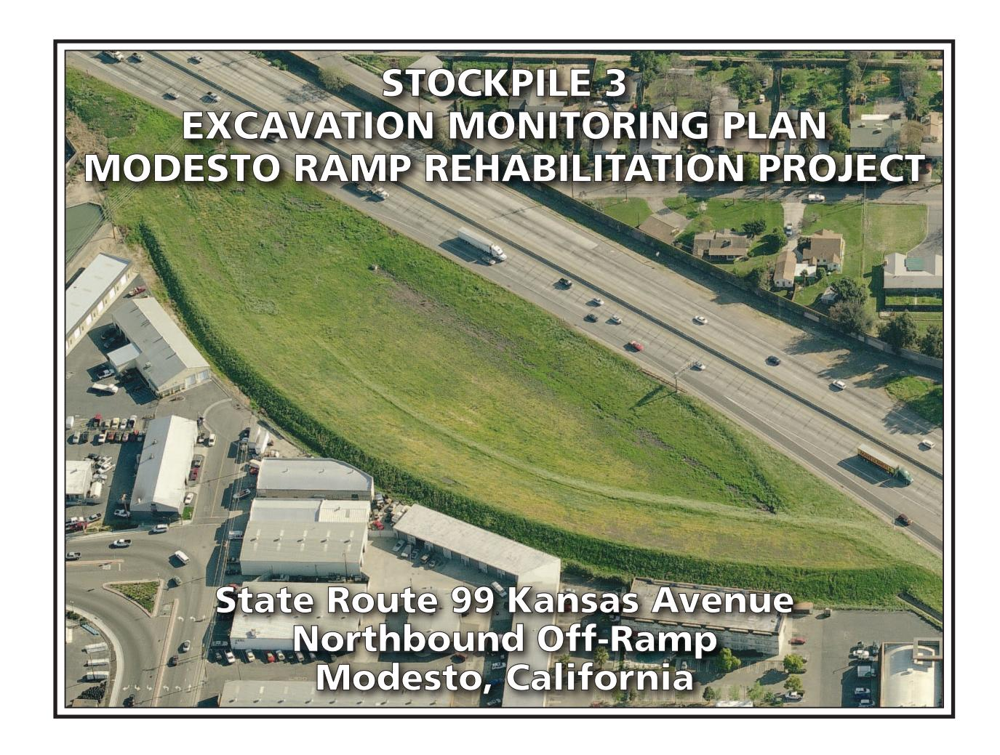
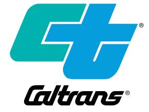
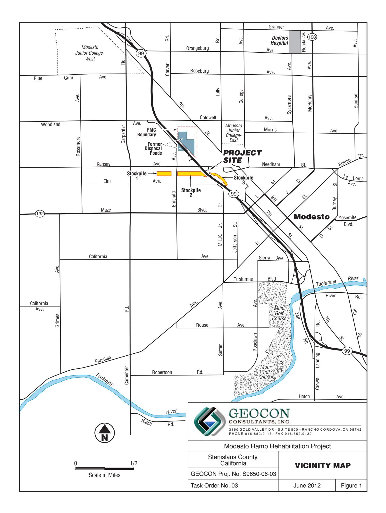
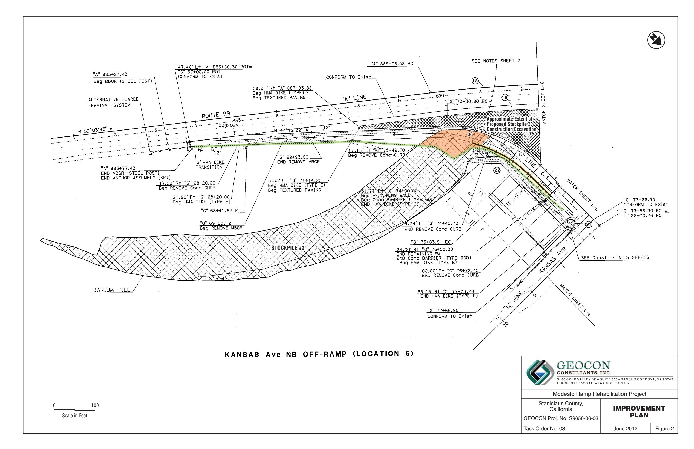
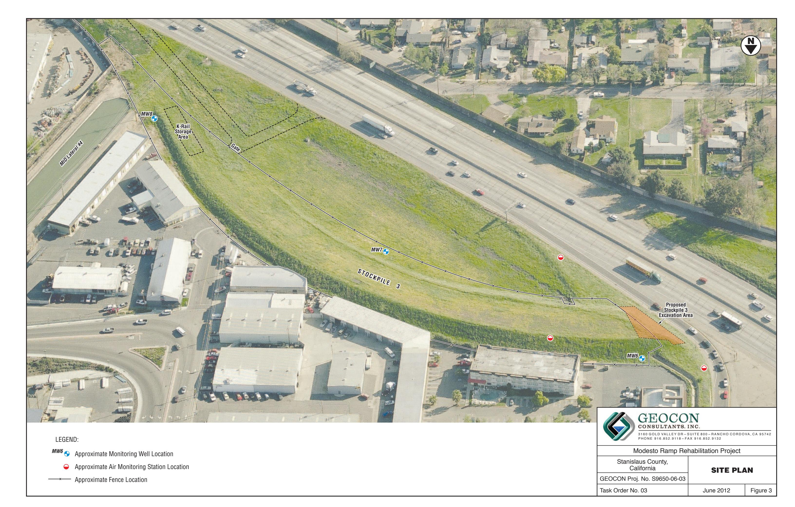

#### **PREPARED FOR:**

CALIFORNIA DEPARTMENT OF TRANSPORTATION – DISTRICT 6 855 M STREET, SUITE 200 FRESNO, CALIFORNIA 93721

### PREPARED BY:

GEOCON CONSULTANTS, INC. 3160 GOLD VALLEY DRIVE, SUITE 800 RANCHO CORDOVA, CALIFORNIA 95742

**GEOCON PROJECT NO. S9650-06-03 CONTRACT NO. 06A1634, EA 10-0A671** 

**JUNE 2012** 

#### GEOTECHNICAL • ENVIRONMENTAL • MATERIALS

2123 CP

Project No. S9650-06-03 June 13, 2012

Mr. Richard Stewart, PG California Department of Transportation - District 6 855 M Street, Suite 200 Fresno, California 93721

Subject:

STOCKPILE 3 EXCAVATION MONITORING PLAN MODESTO RAMP REHABILITATION PROJECT

STATE ROUTE 99 KANSAS AVENUE NORTHBOUND OFF-RAMP

MODESTO, CALIFORNIA

CONTRACT NO. 06A1634, EA NO. 10-0A671

Dear Mr. Stewart:

In accordance with California Department of Transportation (Caltrans) Contract No. 06A1634 and Work Request EA No. 10-0A671, we are pleased to submit this Stockpile 3 Excavation Monitoring Plan for the State Route 99 Kansas Avenue Off-ramp Project in Modesto, California.

The Stockpile 3 Excavation Monitoring Plan summarizes the results of previous and recent site investigations, provides a summary of health risk associated with the identified contaminants (notably barium) in Stockpile 3, and describes the procedures to perform air monitoring and verification of completed excavations within Stockpile 3 during construction of planned off-ramp traffic safety and widening improvements.

Please contact us should you have any questions regarding this document or if we may be of further service.

Sincerely,

GEOCON CONSULTANTS, INC.

John E. Juhrend, PE, CEG

Project Manager

Douglas S. Krause, CIH Certified Industrial Hygenist

# TABLE OF CONTENTS

| STO                    | CKPILE 3 EXCAVATION MONITORING PLAN                         | PAGE        |
|------------------------|-------------------------------------------------------------|-------------|
| 1.0                    | INTRODUCTION                                                | 1           |
| 2.0                    | Geocon SITE investigation data                              | 4           |
| 3.0                    | SUMMARY OF HUMAN HEALTH RISK ASSESSMENT                     | 5           |
| 4.0                    | stockpile 3 excavation monitoring plan  4.1 Scoping Meeting | 6 7 7 |
| 5.0                    | REPORT OF COMPLETION                                        | 10          |
| 6.0                    | LIMITATIONS                                                 | 11          |
| FIGU 1. 2. 3. | URES Vicinity Map Improvement Plan Site Plan                |             |

# APPENDICES

- A.
- Geocon April 2012 Site Investigation Data Example Chain-of-custody and Project Perimeter Air Monitoring Worksheet B.

### STOCKPILE 3 EXCAVATION MONITORING PLAN

#### 1.0 INTRODUCTION

Geocon Consultants, Inc. has prepared this Stockpile 3 Excavation Monitoring Plan (the Plan) on behalf of the California Department of Transportation (Caltrans) to assist with planned highway safety improvement construction excavations adjacent to the existing State Route 99 (SR99) Kansas Avenue Off-ramp (the Project) in Modesto, California.

Caltrans and the California Department of Toxic Substances Control (DTSC), in cooperation with the Central Valley Regional Water Quality Control Board (RWQCB), have entered into an Interagency Agreement to address the presence of approximately 121,000 cubic yards of fill embankment (Stockpiles 1 through 3) located within Caltrans right-of-way (ROW) west and east of SR99 immediately south of the Kansas Avenue interchange. The soil stockpiles were placed in the early 1960s for a future highway alignment and were partially generated from excavations in evaporation ponds containing elevated metals (notably barium) and other chemicals of potential concern (COPCs).

## 1.1 Project Description

The project location consists of the northbound SR99 off-ramp to Kansas Avenue as depicted on the attached Vicinity Map, Figure 1. Caltrans proposes to upgrade the off-ramp to improve traffic safety and meet current design standards. Planned improvements include widening the off-ramp shoulder areas and construction of associated drainage features. Shoulder widening on the east side of the off-ramp will require construction of a retaining wall against a portion of the existing fill embankment (Stockpile 3) and laying back the embankment slope as depicted on the attached Improvement Plan, Figure 2. It is estimated that approximately 2,800 cubic yards of Stockpile 3 soil embankment will be excavated during the planned construction activities. Excavation of underlying native soils will further be required to complete the planned improvements.

Crescent-shaped Stockpile 3 occupies approximately 2.5 acres on the eastern side of SR99 south of Kansas Avenue. Commercial and industrial development borders the east side of Stockpile 3. A Modesto Irrigation District canal (Lateral No. 4) crosses beneath the southern portion of Stockpile 3. Other existing features at the grass-covered Stockpile 3 include three groundwater monitoring wells (MW6, MW7 and MW8), perimeter security fencing and stacked K-rail as depicted on the Site Plan, Figure 3.

This Plan summarizes the results of previous site characterization presented in the Final Preliminary Endangerment Assessment (PEA) for the Caltrans Modesto Soil Stockpiles prepared by Shaw in 2009 and the results of additional site characterization completed by Geocon in April 2012 for the planned Stockpile 3 off-ramp construction area. The purpose of the PEA was to evaluate the nature and extent

of COPCs and to assess the potential risk to human health and the environment from Stockpiles 1, 2 and 3 that were placed in the early 1960s for the future SR99/Highway 132 interchange project. The soil stockpiles were generated by Caltrans from excavation of evaporation ponds containing elevated barium and other COPCs located on property purchased from Food Machinery and Chemical Corporation (FMC). We performed 19 soil borings on April 16, 2012, within the Stockpile 3 off-ramp excavation area to provide supplemental project-specific data as summarized in Section 2.0.

## 1.2 Background

In the 1930s to 1970s, property beneath and northeast of the SR99 and Kansas Avenue Interchange was occupied by a chemical processing operation. Ores and minerals including barite (barium sulfate) and celestite (strontium sulfate) were processed for use in greases, lubricating oil and pigment blanks. Sodium sulfide was generated as a by-product and sold as a caustic and reagent.

From the 1950s to the 1970s, a liquid residue generated by FMC at this facility was discharged to unlined evaporation ponds. In 1961, a 4.3-acre parcel at the southwest corner of the FMC facility, including a portion of the ponds, was purchased by the State for the construction of SR99 through Modesto. Native soil and pond tailings were removed from this parcel and placed in lifts to form bridge abutments and embankment fills for the future SR99/Highway 132 interchange south of FMC. Soil in and around the impoundments was excavated during construction and stockpiled in the following three distinct locations within existing Caltrans ROW.

- Stockpile 1 located south of Kansas Avenue and west of North Emerald Avenue,
- Stockpile 2 located south of Kansas Avenue, between North Emerald Avenue and SR99, and
- Stockpile 3 located south of Kansas Avenue and east of SR99, a portion of which is located within the Modesto Ramp Rehabilitation Project boundaries.

An Initial Site Assessment (ISA) was conducted for Caltrans in 2003. The ISA identified a potential for the soil stockpiles within the SR99/Highway 132 ROW to contain residual chemicals associated with the former FMC impoundments. A Preliminary Site Investigation (PSI) was conducted by Shaw Environmental, Inc. in 2004 to characterize the stockpiles. The PSI consisted of drilling 50 borings from which soil samples were collected and analyzed for heavy metals, polycyclic aromatic hydrocarbons (PAHs), nitrate and pH. The analytical results indicated elevated barium concentrations in Stockpiles 2 and 3.

The project area is underlain by the Modesto Formation, a low angle alluvial fan deposit composed of laterally discontinuous layers of silts, silty sands and sand intermixed at depth with clay and silt clay units. The results of previous investigations indicate that the Stockpile 3 is primarily comprised of layered, poorly graded sand and silty sand similar to the underlying native alluvial deposits. The maximum fill thickness at the northern end of Stockpile 3 is approximately 17 feet. Groundwater is present at a depth of approximately 36 feet below natural grade.

A supplemental site investigation was conducted by Shaw in 2006 to further characterize the soil stockpiles and compare their chemical contents relative to background conditions and established health goals as well as to assess groundwater quality. Shaw prepared a Human Health Risk Assessment (HHRA) in 2007 for the COPCs in the stockpiles and groundwater using multiple exposure scenarios. None of the COPCs were deemed to be potential health risks or hazards to current or future construction workers, offsite residents, or trespassers.

In response to the HHRA, DTSC issued an August 2007 letter that requested additional toxicological and site information prior to a final determination regarding risk or hazard posed by the stockpile material. Shaw prepared a Final PEA and a Response to Comments document in 2009 to summarize the findings of previous reports prepared for the soil stockpiles and to provide the additional information requested in DTSC's August 2007 letter. In writing dated December 17, 2009, the DTSC responded to the Final PEA stating that the "DTSC finds that the stockpiles as currently managed by Caltrans on Caltrans property do not pose a risk to human health for: 1) Caltrans workers who access the fenced site ..., 2) trespassers; and 3) residents adjacent to the stockpiles." The letter further directed Caltrans to continue to manage the stockpiles until such time that the SR99/Highway 132 Interchange is constructed and to maintain the existing groundwater monitoring system.

Shaw identified metals (notably barium) and PAHs as the primary COPCs in the soil stockpiles. The presence of distinctly colored, grayish material layers in the stockpiles has been associated with elevated barium levels but is not an absolute correlation.

Borings B16 and B17 were performed by Shaw on the northern end of Stockpile 3 within and near the project boundaries during the 2004 PSI. Barium was detected at concentrations ranging from 31 to 44,300 milligrams per kilogram (mg/kg). The highest barium level detected in sample B17-4.5 does not exceed the commercial/industrial California Human Health Screening Level (CHHSL) for barium of 63,000 mg/kg. PAHs were not detected for each sample analyzed from borings B16 and B17 nor in any soil samples obtained from Stockpile 3.

Borings S24, S25 and N12 were performed by Shaw on the northern end of Stockpile 3 near the project boundaries in 2006. Barium levels in soil stockpile samples collected from these borings ranged from 64 to 230 mg/kg (boring S24), 38 to 93 mg/kg (boring S25) and 35 to 178 mg/kg (boring N12). The reported barium concentrations are generally within the range (or of similar magnitude) of the Stockpile 3-specific background barium levels of between 31 and 150 mg/kg. Nitrate was detected in stockpile samples obtained from borings S24 and N12 at concentrations of 0.7 and 0.5 mg/kg, respectively. Sulfate was further detected in samples obtained from borings S24 and N12 at concentrations of 42 and 2.4 mg/kg, respectively. Sulfide was not detected in the samples obtained from borings S24, S25 and N12 above the laboratory method reporting limit. The reported nitrate, sulfate and sulfide concentrations are within the range of Stockpile 3-specific background levels.

#### 2.0 GEOCON SITE INVESTIGATION DATA

We completed eight direct-push borings and eleven hand-auger borings within the project area (northern end of Stockpile 3) on April 16, 2012. The borings were performed at the following locations:

- Direct-push borings DP1 through DP3 along the top of Stockpile 3 to depths between 19 and 32 feet.
- Direct-push borings DP4 through DP8 along the toe of existing slope to a depth of 4 feet.
- Hand-auger borings HA1 through HA-11 within the slope face to depths between 1 and 6 feet.

The direct-push borings were logged by a Geocon Professional Geologist using the Unified Soil Classification System (USCS). The soil conditions encountered in the borings were similar to those described in the PEA consisting primarily of silty and clayey sand and sandy silt. Other than an approximate 1-inch-thick darkened layer encountered in boring DP1 at a depth of 14.5 feet, debris, staining, odors or other indicators of potential contamination were not observed in the soil cores. The stockpile/native interface was encountered in borings DP1 through DP3 at depths between 13.5 and 17 feet. Native soil was further encountered at shallow depth in borings DP4 through DP8 and HA7 through HA9.

A total of 59 soil samples collected during the field activities were submitted to Advanced Technology Laboratories (ATL), a California Department of Public Health Services-certified laboratory. The soil samples were analyzed under expedited 24-hour turnaround time for Title 22 metals, aluminum, iron, manganese and strontium following Environmental Protection Agency (EPA) Test Method 6010B and 7471 (mercury).

With the exception of arsenic, none of the metals were reported at concentrations at or above respective commercial/industrial CHHSLs. Arsenic was reported at concentrations ranging from less than laboratory practical quantitation limit of 1.0 mg/kg to 3.2 mg/kg, within the range of site-specific background (95% UCL of 1.2 mg/kg and mean of 0.97 mg/kg). Barium was reported in each sample at concentrations ranging from 34 to 1,600 mg/kg, less than the residential and commercial/industrial CHHSLs for barium of 5,200 and 63,000 mg/kg, respectively.

None of the soil samples contained total metal concentrations at or higher than the California hazardous waste Total Threshold Limit Concentration (TTLC). With the exception of barium and lead, none of the soil samples contained total metal concentrations at or higher than ten times the California hazardous waste Soluble Threshold Limit Concentration (STLC), the level at which soluble testing using the waste extraction Test (WET) may be required for characterizing a waste stream. One of 59 soil samples contained barium (1,600 mg/kg in sample DP1-14.5) at a concentration at or higher than ten times the STLC for barium (equal to 1,000 mg/kg). Five soil samples contained total lead at concentrations at or higher than ten times the STLC for lead (equal to 50 mg/kg). The maximum lead concentration was reported in sample HA9-0 at 190 mg/kg.

Calculated 95% UCLs for barium and lead are significantly less than ten times the respective STLC values and therefore WET soluble testing was not performed. Soil materials excavated from the investigation area would not require management or disposal as a hazardous waste.

The results of the analytical testing indicated the presence of elevated metal concentrations above site-specific background levels but below residential and commercial/industrial CHHSLs. Based on the current site investigation data and the prior soil data presented in the PEA, and consultation with DTSC and RWQCB representatives, the excavated Stockpile 3 soil materials should be suitable for offsite disposal as non-hazardous soil to an accepting facility following disclosure and review of the site characterization data.

Further details are presented in our Transmittal of Site Investigation Data in Appendix A.

#### 3.0 SUMMARY OF HUMAN HEALTH RISK ASSESSMENT

The 2007 Shaw HHRA evaluated the three stockpiles separately and collectively to estimate the potential chronic health risks and hazards to nearby residents, trespassers and future construction workers directly or indirectly exposed to the stockpile soil materials. The HHRA further presents a conservative risk assessment for hypothetical residential groundwater users even though shallow groundwater is not currently used as a potable source.

Potential stockpile soil exposure routes evaluated included incidental ingestion, inhalation of dust, and dermal contact. The identified COPCs in soil for Stockpile 3 included ten metals with detectable concentrations above the laboratory reporting limit (RL). PAHs were not detected and therefore not selected as a COPC. The maximum detected concentration (MDC) was used for each metal as the exposure-point concentration (EPC) with the exception of lead where the 95% UCL was used.

The results of the HHRA specific to the offsite resident/trespasser at Stockpile 3 indicated a noncancer estimated hazard quotient of 0.02, well below the threshold of 1.0. Potential exposure to lead in surface soil was determined not to pose an unacceptable risk. None of the identified Stockpile 3 COPCs are considered to be carcinogens and therefore no excess cancer risk was presented.

The results of the HHRA specific to future construction worker and associated offsite residents exposures determined respective cumulative excess lifetime cancer risks of 9.2E-7 and 6E-10, each below the generally recognized 1E-06 cancer risk criterion. The cumulative respective noncancer hazard quotients of 0.4 and 0.017 do not exceed the threshold of 1.0. Lead in soil was determined not to pose an unacceptable hazard to construction workers and associated offsite residents.

The HHRA further determined no unacceptable hazards for hypothetical future shallow groundwater users.

#### 4.0 STOCKPILE 3 EXCAVATION MONITORING PLAN

This section presents a summary of planned monitoring activities associated with excavation of the northern portion of Stockpile 3 during construction of the SR99 Kansas Avenue off-ramp traffic safety improvements.

### 4.1 Scoping Meeting

Prior to starting construction of planned site improvements, a scoping meeting will be held to discuss the stockpile excavation activities, dust mitigation, health and safety, and project scheduling. Attendees at the scoping meeting will include representatives of Caltrans, Geocon, the highway contractor (Teichert Construction) and designated subcontractors involved with the grading work.

Key project contacts include:

- Caltrans Environmental, Richard Stewart, 559.445.6378
- Geocon Consultants, Inc., John Juhrend, 916.852.9118
- Teichert Construction, Raul Ortiz, 209.983.2300

# 4.2 Stockpile 3 Excavation Monitoring

Teichert intends to conduct excavation of the northern portion of Stockpile 3 during daytime off-ramp closures over an estimated period of five working days. The excavated Stockpile 3 fill materials will be loaded into trucks for disposal as non-hazardous waste to the Fink Road Sanitary Landfill located in Crows Landing, Stanislaus County, California. Construction excavations within underlying native soil materials will not require special soil handling, excavation or air monitoring.

The Stockpile 3 excavation activities will be overseen by a Geocon California Professional Geologist (PG) or a field geologist/engineer working under the direct supervision of a PG. Our field representative will provide a determination when the planned construction excavation limits within the Stockpile 3 fill materials has been completed. The individual performing the oversight will also be responsible for preparing and maintaining daily field logs that, at minimum, document the personnel onsite, activities performed, where air monitoring is taking place, whether visible dust is observed, description of active soil excavation, record quantities of materials excavated, and confirmation of excavation limits within Stockpile 3 (confirm native soil conditions). Written daily field reports will be supplemented by photographs as applicable. The individual performing the oversight may also collect soil samples and prepare accompanying chain-of-custody documentation.

## 4.3 Air Monitoring

We will provide ambient perimeter air monitoring during Stockpile 3 excavation and loading activities to document total airborne particulate concentrations. Results of the air monitoring will also be used to assess the effectiveness of the contractor's dust control measures. Air monitoring tasks include:

- Monitoring daily meteorological forecast to anticipate on site environmental conditions such as wind direction and speed;
- Notifying the contractor in the event a downwind real-time particulate counter exceeds a preset Fence Line Total Dust Action Level alarm above up-wind background dust levels so corrective action can be implemented, if necessary; and,
- In addition to the data logging programmed in the real-time monitors, check each real-time air monitor instrument hourly to ensure proper operation, battery capacity, etc., and record the averaged dust reading the readings will be recorded in a daily log.

### 4.3.1 Action Level Determination

The risk of worker exposure to barium or inorganic lead impacted soils during excavation operations is considered low while performing earthwork using dust control methods in compliance with Caltrans' *Standard Specifications*. As long as dust control is provided, airborne concentrations of barium and inorganic lead are anticipated to remain well below the California Division of Occupational Safety and Health (Cal/OSHA) 8-hour time-weighted average Permissible Exposure Limit (PEL-TWA) of 10 milligrams per cubic meter of air (mg/m³) of air for barium published in Title 8 California Code of Regulations (T8 CCR) §5155 Table AC-1, or the Action Level of 0.03 (mg/m³) as well as the PEL-TWA of 0.05 (mg/m³) for inorganic lead published in T8 CCR §1532.1.

Since workplace (Cal/OSHA) exposure standards are neither established, nor intended to be used in evaluating risk to public health, it is not appropriate to use either the PEL for barium or inorganic lead in evaluating potential airborne exposures to the public for perimeter air monitoring for this project. Although the Cal/OSHA PELs for barium and inorganic lead are not intended to assess exposure risk to the public, they can be used as a relative indicator potential hazard, i.e., the lower the published PEL concentration the higher the potential exposure risk. Relative to their respective PEL-TWAs, barium at 10 mg/m³ represents less of a potential exposure hazard than inorganic lead at 0.05 (mg/m³). Therefore, real-time air monitoring will primarily focus on measurement of inorganic lead to document the effectiveness of engineering controls (wet methods) to suppress airborne dust.

The California Air Resources Board (ARB), in consultation with the Office of Environmental Health Hazard Assessment (OEHHA) has published a 30-day average ambient lead standard of  $1.5 \mu g/m^3$  as a public health standard. Using the highest reported lead level of 190 mg/kg as a potential worst case exposure risk for fugitive dust during this soil excavation project, ambient air monitoring will be conducted using one upwind and two downwind monitoring locations at the perimeters of the project site.

Based on the ARB-OEHHA airborne unit risk of  $1.5 \mu g/m^3$ , using the following formula and 190 mg/kg of inorganic lead reported in the analysis of the soil sample referenced above:

Total Dust 
$$mg/m^3 = \frac{\text{(ARB-OEHHA unit risk for lead of } 0.0015 \text{ mg/m}^3\text{) x } (1,000,000 \text{ mg/kg})}{\text{(Highest total lead concentration in soil sample of } 190 \text{ mg/kg})}$$

The calculated Fence Line Action Level for total dust above (upwind) background levels is 8 mg/m3. Since this level is close to the Cal/OSHA 8-hour time-weighted average (8-Hr TWA) PEL of 10 mg/m3 for total particulates, and assuming a safety factor 0.5, a downwind "Total Dust Trigger" concentration of 4 mg/m3 above up-wind background dust levels will be used for ambient real-time air monitoring.

### 4.3.2 Perimeter Air Monitoring Plan

Using the maximum total lead concentration of approximately 190 mg/kg reported in the analytical testing for soil samples collected on April 16, 2012, the calculated "trigger" Fence Line Action Level for a total airborne dust concentration above background (upwind) levels measured at the downwind perimeters of the excavation site(s) is 4 mg/m³; as noted above the calculated Total Dust Trigger concentration includes a safety factor of 0.5.

This Fence Line Action Level will be compared to real-time direct reading instruments to ensure that the "wet methods" utilized during excavation activities at the site are effective in controlling the offsite migration of dust.

Perimeter monitoring conducted during the project shall include one representative upwind (background) sample and two representative downwind (offsite) sampling locations. Air monitoring will be collected over either an 8-hour period, or the duration of the excavation, and soil handling and sampling tasks; whichever is shorter in duration.

Ambient air monitoring will be performed using MIE pDR-1200 real-time direct reading particulate counter with a PM-10 inlet and active sampling attachment for 37 mm filter cassette using a personal sampling pump calibrated at 2.0 to 3.0 liters per minute (lpm). Pre-weighed 5 micron polyvinyl chloride filters ( $5\mu$  PVC) attached to the pDR-1200 particulate counters will be analyzed for inorganic lead and barium compounds, and total mass. The use of pre-weighed  $5\mu$  PVC filters allows for both total particulate gravimetric and inorganic lead and barium analysis.

The monitoring samples will be analyzed by Bureau Veritas North America, Inc. who are accredited by the American Industrial Hygiene Association (AIHA) Industrial Hygiene Laboratory Accreditation Program (IHLAP). Air sampling and analysis will be performed in accordance with NIOSH 7300 ICP-Mass Spectrometry (7300-MS) or equivalent method using pre-weighed 5 micron polyvinyl chloride filters (5µ PVC).

The pre-weighed  $5\mu$  PVC filters collected on the first day of monitoring will be submitted to the laboratory for analysis of inorganic lead and barium under 24-hour turnaround time. Assuming reported levels of inorganic lead are below the ARB-OEHHA unit risk for lead of  $0.0015 \text{ mg/m}^3$  ( $1.5 \mu\text{g/m}^3$ ), and the Fence Line Action Level of  $4 \text{ mg/m}^3$  for a total airborne dust concentrations above background are not exceeded, all other filter samples will be held until the Stockpile 3 excavation operations are completed and then submitted to the laboratory for routine analytical turnaround time of from 5 to 7 business days.

The pDR-1200 real-time monitors will be calibrated according to the manufacturer's instructions and programmed to log total dust levels every 5 minutes. In addition, the audible alarm on the monitor located downwind of excavation, and soil handling and sampling activities will be set to the highest "Total Dust" level established by the total dust level measured on the ambient upwind monitor. Example laboratory chain-of-custody and air monitoring worksheet are in Appendix B.

### 5.0 REPORT OF COMPLETION

A draft Excavation Monitoring Report (Completion Report) will be prepared and submitted to Caltrans approximately 30 days following the completion of the Stockpile 3 excavation monitoring activities. The Completion Report shall contain the following information:

- Observed site conditions;
- Results of excavation monitoring activities;
- Results of air monitoring activities;
- Observations, findings, and conclusions;
- Site photographs; and
- Stockpile disposal manifests.

The Completion Report will be finalized upon receipt of Caltrans' comments.

#### 6.0 LIMITATIONS

This Plan has been prepared solely for Caltrans, the site owner, in consideration of their requirements. Other parties may rely on the findings and conclusions of the Plan for informational purposes only. However, the owner and other parties who may rely on the findings and conclusions of the Plan should recognize that this Plan does not constitute a complete set of construction plans or specifications and should not be construed as such. The recommendations as presented in this Plan are predicated on the results of the limited sampling and laboratory testing performed.

The information contained herein is only valid as of the date of the Plan and would require an update to reflect additional site activities. Therefore, the Plan should only be deemed conclusive with respect to the information presented. No guarantee of the results of the study used to generate the Plan is implied within the intent of this Plan or any subsequent report, correspondence or consultation, either express or implied. The services performed were conducted in accordance with the local standard of care in the geographic region at the time the services were rendered.

