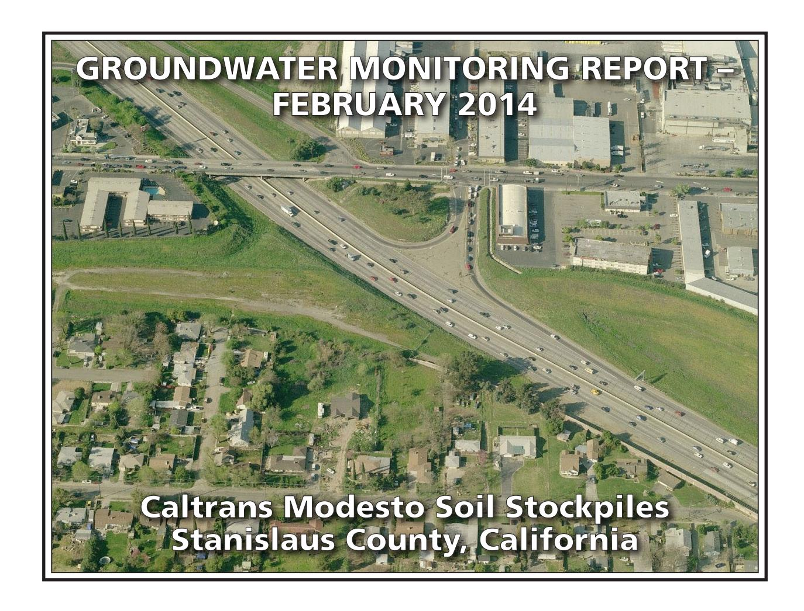

#### **PREPARED FOR:**

CALIFORNIA DEPARTMENT OF TRANSPORTATION – DISTRICT 6
HAZARDOUS WASTE BRANCH
855 M STREET, SUITE 200
FRESNO, CALIFORNIA 93721

#### PREPARED BY:

GEOCON CONSULTANTS, INC. 3160 GOLD VALLEY DRIVE, SUITE 800 RANCHO CORDOVA, CALIFORNIA 95742

**GEOCON PROJECT NO. S9800-01-17 TASK ORDER NO. 17, EA 10-0X2700 CONTRACT NO 06A1895** 

Project No. S9800-01-17 April 25, 2014

Mr. Richard Stewart, PG California Department of Transportation - District 6 Hazardous Waste Branch 855 M Street, Suite 200 Fresno. California 93721

Subject: GROUNDWATER MONITORING REPORT – FEBRUARY 2014

CALTRANS MODESTO SOIL STOCKPILES STANISLAUS COUNTY, CALIFORNIA

CONTRACT NO. 06A1895, TASK ORDER NO. 17, EA NO. 10-0X2700

Dear Mr. Stewart:

In accordance with California Department of Transportation (Caltrans) Contract No. 06A1895, Task Order (TO) No. 17, Geocon performed groundwater monitoring activities at the Caltrans Modesto Soil Stockpiles (Site) located southerly of the intersection of State Route (SR) 99 and Kansas Avenue in Stanislaus County, California. This report presents the results of the February 2014 sampling event. The approximate site location is depicted on the attached Vicinity Map, Figure 1. The approximate site boundaries and Stockpiles 1 through 3 are shown on the Site Plan, Figure 2.

The scope of TO No. 17 includes the performance of groundwater sampling and analysis at the Site in accordance with protocols approved by the California Environmental Protection Agency Department of Toxic Substances Control (DTSC) as established in the *Final Work Plan, Groundwater Assessment* prepared by Shaw Environmental, Inc., and dated January 2006. The scope of services reported herein included depth to groundwater measurements, groundwater sample collection from ten groundwater monitoring wells, analysis of the water samples by a California-certified laboratory, and preparation of this report.

#### **BACKGROUND**

#### **Project Description and History**

Stockpiles 1 through 3 were generated during construction of SR 99 through Modesto around 1961 when Caltrans excavated soil from property purchased from Food Machinery and Chemical Corporation (FMC) that contained an evaporation pond. The stockpiles were placed in their present location in anticipation of construction of the State Route 132 West Freeway/Expressway project.

During the 1930s, Barium Products Ltd. occupied property at 1200 Barium Road (now Graphics Drive) in Modesto just east of SR 99 between Woodland and Kansas Avenues. Barium Products Ltd. was a chemical manufacturing company processing a variety of ores and minerals including barite (barium sulfate) and celestite (strontium sulfate). Materials produced included barium and strontium compounds; these were used in greases, lubricating oil and pigment blanks. Sodium sulfide generated as a by-product of barite processing was sold as a caustic and used as a reagent in the mining industry.

In 1943, Barium Products Ltd. was purchased by Westvaco Chlorine Products Corporation which subsequently merged with FMC in 1948. From the 1950s to the 1970s, a liquid residue from the processing operations was discharged to unlined evaporation ponds along the western portion of the FMC Site. The approximate boundaries of the former evaporation/disposal ponds are shown on Figure 2.

In 1961, a 4.3-acre parcel at the southwestern corner of the FMC site was purchased by the State of California for highway right-of-way needed to construct SR 99. An aerial photograph from 1957 shows that a portion of the southernmost pond on the FMC property was within the area purchased for right-of-way.

Soil in and around the pond was excavated during construction of SR 99 and stockpiled within the current Caltrans right-of-way at the location of the future State Route 132 West Freeway/Expressway project. Three distinct stockpiles are present at the Site:

- Stockpile 1, located south of Kansas Avenue and west of North Emerald Avenue,
- Stockpile 2, located south of Kansas Avenue, between North Emerald Avenue and SR 99, and
- Stockpile 3, located south of Kansas Avenue and east of SR 99.

In 2006, Caltrans arranged for the installation of monitoring wells MW-1 through MW-8 at locations adjacent to the three stockpiles as shown on Figure 2. General groundwater chemistry analytical results from June and October 2006 groundwater events suggested that two distinct groundwater types are present beneath the Site. A survey of groundwater wells within a one-mile radius of the Site identified 43 existing or former wells; however, there were no active supply wells identified in the general (southeast) flow direction from the Site.

Groundwater monitoring was resumed for the Site with the March 2012 sampling of wells MW-1 through MW-8. Representatives from the DTSC observed the sample collection procedures and collected split samples which were submitted to an alternate laboratory. No notable differences in the concentrations for each reported analyte were evident.

In June 2012, Geocon arranged for the installation of monitoring wells MW-9 and MW-10 at locations that are both upgradient and adjacent to the three stockpiles as shown on Figure 2.

Geocon compared the analytical results from the ten recent groundwater sampling events (March, May, June, July, September and November 2012 and January, March, June, September, and December 2013) to the following water quality threshold values:

- Primary Maximum Contaminant Levels (MCLs) promulgated by the California Department of Public Health (CDPH); and
- Secondary MCLs promulgated by the CDPH.

The results of the groundwater sampling events show that both dissolved metals and general minerals have predominantly been reported at concentrations less than their respective numeric water quality threshold values. Only nitrates (expressed as nitrogen) in MW-1, MW-5, MW-6, and MW-10 and total dissolved solids (TDS) in wells MW-5, MW-6, and MW-10 have been consistently reported at concentrations that exceed their respective primary or secondary MCLs of 10 and 500 milligrams per liter (mg/l). Manganese has been sporadically reported for various wells at concentrations exceeding the secondary MCL; however, the concentrations have not been consistently elevated for any one well. Based on the lack of polycyclic aromatic hydrocarbons (PAHs) reported for each of the samples analyzed, we requested discontinuation of analysis for PAHs. PAH analysis was discontinued after the November 2012 sampling event with concurrence from the DTSC.

#### Hydrogeologic Characterization

The hydrogeology of the adjacent FMC site has been characterized by numerous studies since the early 1980s. The GeoTrans January 2005 report Addendum to Comprehensive Remedial Investigations Report, FMC Corporation, 1200 Graphics Drive, Modesto, Stanislaus County, California (GeoTrans, 2005) provides a description of the FMC site hydrogeology. This description follows:

"The site is underlain by laterally discontinuous and unconsolidated sand and silty sand associated with the Modesto and Riverbank Formations. First encountered groundwater is approximately 30 feet below ground surface (bgs) under confined to semi-confined conditions. A deeper aquifer is present at a depth of 165 feet bgs and separated from the upper zone by a blue clay aquitard. The upper water bearing unit has been divided into two zones: a shallow zone from first encountered groundwater to 120 feet bgs and a deeper zone from 140 feet bgs to the top of the aguitard. Groundwater flow within the upper zone is toward the southeast under a gradient of 0.002 ft/ft."

Monitoring wells MW-1 through MW-10 were installed into the unconsolidated sand, silty sand and silt layers within the Modesto Formation underlying the Site. The wells were completed within the shallow zone of the upper aquifer (shallow zone).

The lithology encountered in the borings for the wells includes interbedded (laterally discontinuous) sands, silts, and clays. In the areas investigated, the unsaturated (vadose) zone was dominated by silty soils. The shallow zone groundwater beneath the stockpiles was encountered at approximately 35 feet (elevation approximately 50 feet) under unconfined to semi-confined conditions, Based on historical depth to water measurements from the Site, the groundwater flow direction in the shallow upper aquifer is generally toward the southeast with hydraulic gradients varying from 0.0006 to 0.001. The shallow aquifer conditions beneath the Site and the adjacent FMC site appear similar and representative of conditions in the local area.

#### **FEBRUARY 2014 FIELD ACTIVITIES**

This section describes the field activities performed for the February 2014 monitoring event.

#### **Depth to Groundwater Measurements**

On February 25, 2014, prior to opening the wells, Geocon observed each of the ten well boxes for signs of potential tampering or required maintenance. No signs of tampering were observed nor was maintenance of the well boxes required. We measured the depth to groundwater and the dissolved oxygen (DO) levels and oxygen-reduction potential (ORP) in monitoring wells MW-1 through MW-10 using a battery-operated water level meter, a Hanna Model No. 9143 DO meter, and an Oakton ORP meter. Depth to water measurements were obtained from a surveyed reference point at the top of the well casings (TOC).

In February 2014, depth to groundwater at the Site ranged from 33.40 (MW-1) to 42.04 (MW-5) feet below TOC. Based on the groundwater elevation data, the groundwater flow is toward the southeast at an average gradient of 0.0008, which is generally consistent with historical flow. A summary of the TOC elevations, depth to groundwater measurements and groundwater elevations is on Table 1. Groundwater elevation contours, flow direction and gradient are depicted on Figure 3, Groundwater Elevation and Ionic Composition Map – February 2014. A gradient rose diagram depicting historical flow direction and gradient is included on Figure 3.

#### Well Purging and Sampling

On February 25 and 26, 2014, Geocon purged approximately two to three well volumes of water (1 to 5.5 gallons) from groundwater monitoring wells MW-1 through MW-10 using a submersible pump or disposable bailer. The pump was decontaminated before and after each use by washing in an AlconoxTM solution followed by fresh and distilled water rinses. During the well purging activities, the groundwater was monitored for pH, electrical conductivity, temperature and turbidity. This information is included on the Monitoring Well Sampling Data sheets in Appendix A.

Following well purging, groundwater samples were collected from each of the wells using disposable bailers and decanted through slow emptying devices into laboratory-provided sample containers. The groundwater samples collected for dissolved metals analysis were filtered using a hand-pressure pump through a 0.45-micron filter while filling the container. The samples were sealed, labeled, placed in a chilled cooler and subsequently transported to the laboratory using chain-of-custody protocol.

Purged groundwater was placed into one Department of Transportation-approved, 17-H, 55-gallon drum and transported offsite to Geocon's Rancho Cordova office pending receipt of analytical results. The purge water was then disposed of at Inviro-Tec Disposal in Lincoln, California, on February 27, 2014.

#### ANALYTICAL METHODS AND RESULTS

#### **Laboratory Analysis**

The groundwater samples were delivered to Advanced Technology Laboratories (ATL) for the following analyses under chain-of-custody protocol:

- Title 22 dissolved metals (including strontium) following United States Environmental Protection Agency (EPA) Test Methods 6020/7470;
- Dissolved calcium, magnesium, potassium and sodium by EPA Test Method 6020;
- Chloride, nitrate as nitrogen and sulfate by EPA Test Method 300.0;
- Sulfide by Standard Method (SM) 4500;
- TDS by SM 2540C; and
- Total alkalinity, bicarbonate alkalinity, carbonate alkalinity by SM 2320B.

Groundwater analytical results for this monitoring event are summarized on Tables 2 and 3. The laboratory reports and chain-of-custody documentation are in Appendix B.

#### **Analytical Results**

#### **Dissolved Metals**

Analytical results for dissolved metals along with their associated numeric water quality thresholds are summarized on Table 2. Plots of barium, lead and strontium concentrations vs. time are presented as Figures 4 through 6.

DTSC has identified barium, lead and strontium as the primary chemicals of concern in groundwater for the Site. For the February 2014 groundwater samples, barium and strontium were reported for each of the ten groundwater samples. Lead was not reported at concentrations equal to or greater than the respective practical quantitation limit (PQL) in samples from each well. The ranges of barium and strontium concentrations reported for the February sampling event are in the following table:

| Dissolved Metal  | High Concentration | Low Concentration | Numeric Water Quality Threshold |
|------------------|--------------------|-------------------|---------------------------------|
| Barium (µg/l)    | 310 (MW-5)      | 48 (MW-3)      | 1,000 (1) / 700 (2)             |
| Strontium (µg/l) | 970 (MW-10)     | 260 (MW-8)     | 4,000 (2)                       |

(1) = California Department of Public Health Primary MCL for Drinking Water

Antimony, beryllium, cadmium, silver, thallium, zinc, and mercury were not reported at concentrations equal to or greater than their respective PQLs in samples from each well. As shown in the following table, the dissolved metals arsenic, chromium, nickel, and vanadium were reported for each of the samples collected with the following ranges:

| Dissolved Metal | High Concentration    | Low Concentration      | Numeric Water Quality Threshold |
|-----------------|--------------------------|---------------------------|------------------------------------|
| Arsenic (μg/l)  | 5.1 (MW-3)            | 1.9 (MW-1 and MW-4) | 10 (1)                             |
| Chromium (μg/l) | 8.2 (MW-5)            | 2.3 (MW-10)            | 50 (1)                             |
| Nickel (μg/l)   | 5.8 (MW-10)           | 1.5 (MW-2 and MW-8) | 100 (1)                            |
| Vanadium (μg/l) | 33 (MW-3 and MW-6) | 18 (MW-1 and MW-4)  | 50 (2)                  |

(1) = California Department of Public Health Primary Maximum Contaminant Level for Drinking Water

(2) = EPA Drinking Water Health Advisory

(3) = California Department of Public Health Regulatory Action Level

 $\mu g/l = Micrograms per liter$ 

(2) = California Department of Public Health Notification Level for Drinking Water

Although concentrations of arsenic, barium, chromium, nickel, strontium and vanadium were reported for the samples collected from each well, none of the reported concentrations exceed their respective numeric water quality thresholds for drinking water.

Molybdenum was reported for eight of the ten samples collected, copper was reported for seven of the ten samples collected, selenium was reported for three of the ten samples collected, and cobalt and manganese were reported for one of the samples collected. The following table summarizes the dissolved cobalt, copper, manganese, molybdenum, and selenium concentrations reported for the listed samples:

| Dissolved Metal  | High Concentration | Low Concentration | Numeric Water Quality Threshold |
|------------------|-----------------------|----------------------|------------------------------------|
| Cobalt (µg/l)    | 1.7 (MW-10)        | 1.7 (MW-10)       | ---                                |
| Copper (µg/l)    | 3.2 (MW-10)        | 1.1 (MW-5)        | 1,000(2)/1,300(4)                  |
| Manganese (µg/l) | 73 (MW-10)         | 73 (MW-10)        | 50(2)                              |
| Molybdenum(µg/l) | 4.8 (MW-6)         | 0.61 (MW-1)       | ---                                |
| Selenium (µg/l)  | 1.1 (MW-10)        | 0.62 (MW-5)       | 50(1)                              |

(1) = California Department of Public Health Primary Maximum Contaminant Level for Drinking Water

Although concentrations of cobalt, copper, manganese, molybdenum, and selenium were reported for the samples collected from site monitoring wells, none of the reported concentrations exceed their respective numeric water quality thresholds for drinking water with the exception of the sample from MW-10 for manganese.

#### **General Minerals/Stiff Diagrams**

To further characterize the geochemistry of the groundwater, general minerals analyses were conducted and included the following constituents:

- dissolved calcium
- dissolved magnesium
- chloride
- nitrate as nitrogen
- sulfate
- dissolved potassium
- dissolved sodium
- sulfide
- total alkalinity
- TDS

(2) = California Department of Public Health Secondary Maximum Contaminant Level (taste and odor)

(3) = EPA Drinking Water Health Advisory

(4) = California Department of Public Health Regulatory Action Level

General groundwater chemistry provides information regarding the origin and geochemical nature of the groundwater sampled. The analytical results for the major cation (dissolved sodium, potassium, calcium and magnesium) and anion species (chloride, bicarbonate alkalinity reported as calcium carbonate, and sulfate) were used to create Stiff diagrams. Stiff diagrams provide a graphical display of ionic content and can be used to characterize and evaluate the relative composition of groundwater and its consistency or variability. Groundwater with different cation/anion concentrations will result in Stiff diagrams of different shapes

and sizes. Stiff diagrams can also help to illustrate mixing of water with different compositions or origins. The presence of more than one water type can be an indication of influences due to hydrogeologic variation or from other sources including man-made impacts.

Appendix C contains Stiff diagrams constructed using site groundwater data for February 2014. The diagrams show that groundwater sampled in each monitoring well is bicarbonate (HCO3) dominant. However, variations in the sodium and potassium (Na+K) and calcium composition are readily apparent. The variations are seen primarily in the sodium content with the potassium concentrations being less variable. In February 2014, the samples from wells MW-1, MW-2, MW-4, MW-7, MW-9, and MW-10 had a calcium-dominant composition while the samples from wells MW-3, MW-5, MW-6, and MW-8 were sodium-dominant.

Nitrate as nitrogen and TDS were both reported for each of the groundwater samples, with nitrate as nitrogen concentrations ranging from 2.8 (MW-3) to 34 mg/l (MW-5) and TDS concentrations ranging from 340 (MW-3 and MW-7) to 750 mg/l (MW-5). The reported nitrate concentrations for samples from MW-1, MW-5, MW-6, and MW-10 equal or exceed the primary MCL for nitrate of 10 mg/l, and the reported TDS concentrations for samples from MW-5, MW-6, and MW-10 equal or exceed the secondary MCL for TDS of 500 mg/l. Noteworthy is that MW-1 is an upgradient monitoring well; thus, the reported nitrate of 10 mg/l may be indicative of natural background nitrate concentrations for the shallow groundwater in the vicinity of the Site. Sulfide was not reported at concentrations equal to or greater than the PQL in samples from each well.

The analytical results for general minerals are summarized on Table 3.

#### **Laboratory Quality Assurance/Quality Control**

Geocon reviewed the analytical laboratory quality assurance/quality control (QA/QC) provided with the laboratory report. The laboratory data show that the method blank surrogate recoveries are acceptable and that concentrations of selected analytes were not reported at concentrations equal to or greater than their respective PQLs for each method blank for each analysis. Appropriate recoveries were noted for each laboratory control sample for each analysis. Several matrix spike/matrix spike duplicate (MS/MSD) analytes had recoveries or relative percent differences outside of laboratory control limits; however, the sample results were validated by the laboratory control samples. No qualification of the data is necessary, and the data are considered of sufficient quality for the purposes of this report.

#### GeoTracker Submittal

The laboratory prepared electronic data files for submittal to the State Water Resources Control Board GeoTracker database. The GeoTracker database is accessible via the GeoTracker website at <a href="http://geotracker.waterboards.ca.gov">http://geotracker.waterboards.ca.gov</a>. The electronic data was uploaded to GeoTracker on April 8, 2014. The confirmation numbers are 3304460644, 1442300021 and 8015052139.

#### CONCLUSIONS AND RECOMMENDATIONS

With the exception of manganese in the groundwater sample collected from well MW-10, none of the reported dissolved metals concentrations for the groundwater samples collected in February 2014 exceeded their respective numeric water quality threshold values.

With the exception of nitrate in the samples collected from wells MW-1, MW-5, MW-6, and MW-10, none of the reported general minerals for the groundwater samples collected in February 2014 equaled or exceeded their respective California primary MCLs. TDS was reported at concentrations exceeding the secondary MCL of 500 mg/l for the samples collected from wells MW-5, MW-6, and MW-10.

Barium and strontium were reported for the February 2014 groundwater samples at concentrations similar to historical levels and remained significantly less than their numeric water quality thresholds. The remaining dissolved metals were also reported at concentrations similar to historical levels.

Stiff diagrams for the 2012 through February 2014 groundwater sampling events show that very slight changes in ionic content have occurred since groundwater sampling resumed at the Site in March 2012. Water samples from wells MW-1, MW-2, MW-4, MW-7, MW-9, and MW-10 have consistently been reported as calcium-dominant, and those from wells MW-3, MW-5, MW-6, and MW-8 as sodium-dominant. Water samples from well MW-5 switched from calcium-dominant to sodium-dominant in 2013. This may be indicative of a mixing of different water types at this location. Groundwater monitoring is currently performed quarterly, with the next monitoring event scheduled for May 2014.

We appreciate the opportunity to provide our services on this project. Please contact us if you have any questions concerning the contents of this Report or if we may be of further service.

Sincerely,

GEOCON CONSULTANTS, INC.

Rebecca L. Silva Project Manager

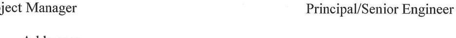

- (1) Addressee
- (1) Caltrans, Sam Haack
- (1) DTSC, Randy Adams
- (1) CVRWQCB, Steve Meeks

Attachments:

Figure 1, Vicinity Map

Figure 2, Site Plan

Figure 3, Groundwater Elevation and Ionic Composition Map – February 2014

Figure 4, Barium Concentrations vs. Time

Figure 5, Lead Concentrations vs. Time

Figure 6, Strontium Concentrations vs. Time

Table 1, Groundwater Elevation Data

Table 2, Summary of Groundwater Analytical Results – Title 22 Metals (Dissolved)

Table 3, Summary of Groundwater Analytical Results – General Minerals and PAHs

Table 4, Well Construction Details

Appendix A, Monitoring Well Sampling Data Sheets

Appendix B, Laboratory Reports and Chain-of-custody Documentation

Appendix C, Stiff Diagrams

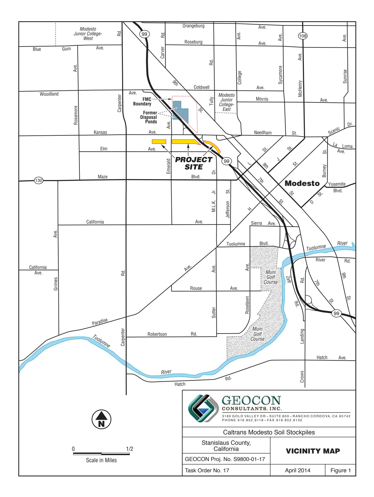

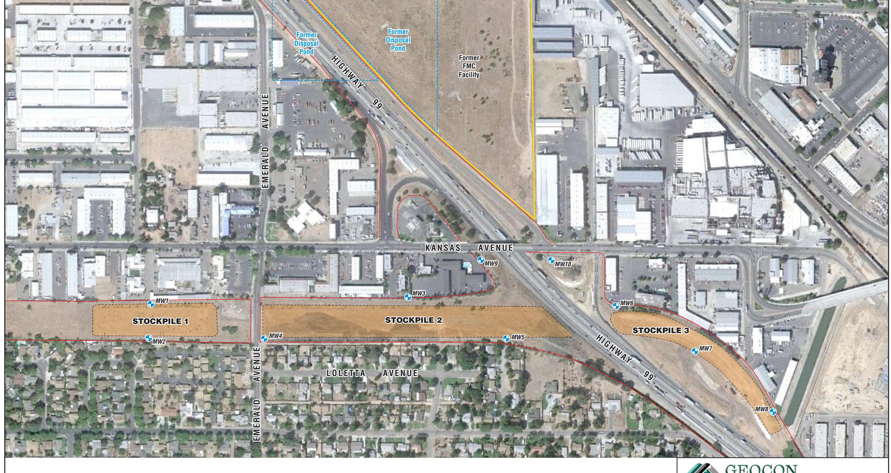

MW8 Approximate Monitoring Well Location

— State Right-of-Way Boundary

Scale in Feet

GEOCON CONSULTANTS, INC.

3160 GOLD VALLEY DR - SUITE 800 - RANCHO CORDOVA, CA 95742 PHONE 916.852.9118 - FAX 916.852.9132

#### Caltrans Modesto Soil Stockpiles

Stanislaus County, California

**SITE PLAN** 

GEOCON Proj. No. S9800-01-17

Task Order No. 17 April 2014

pril 2014

Figure 2

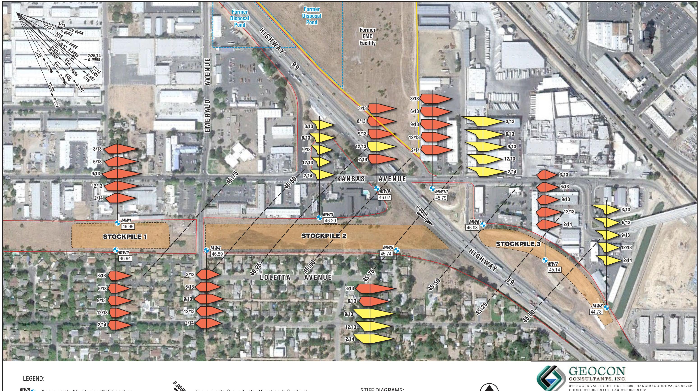

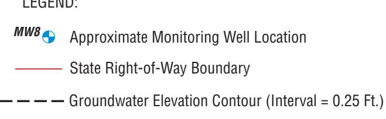

46.99 MSL Elevation of Groundwater Measured on 2/25/14

Approximate Groundwater Direction & Gradient \* MW-6 Not Used to Calculate Gradient

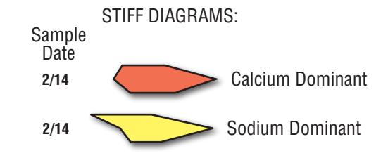

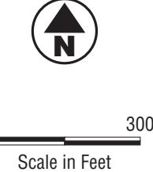

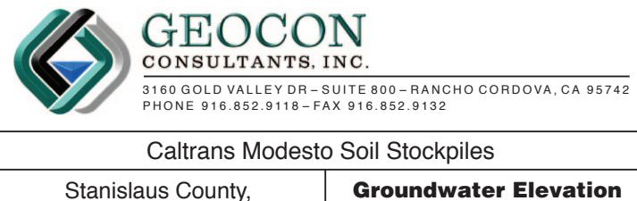

| Stanislaus County, California | Groundwater Elevation and Ionic Composition Map – February 2014 |          |
|----------------------------------|--------------------------------------------------------------------------|----------|
|                                  | April 2014                                                               | Figure 3 |
| GEOCON Proj. No. S9800-01-17     |                                                                          |          |
| Task Order No. 17                |                                                                          |          |

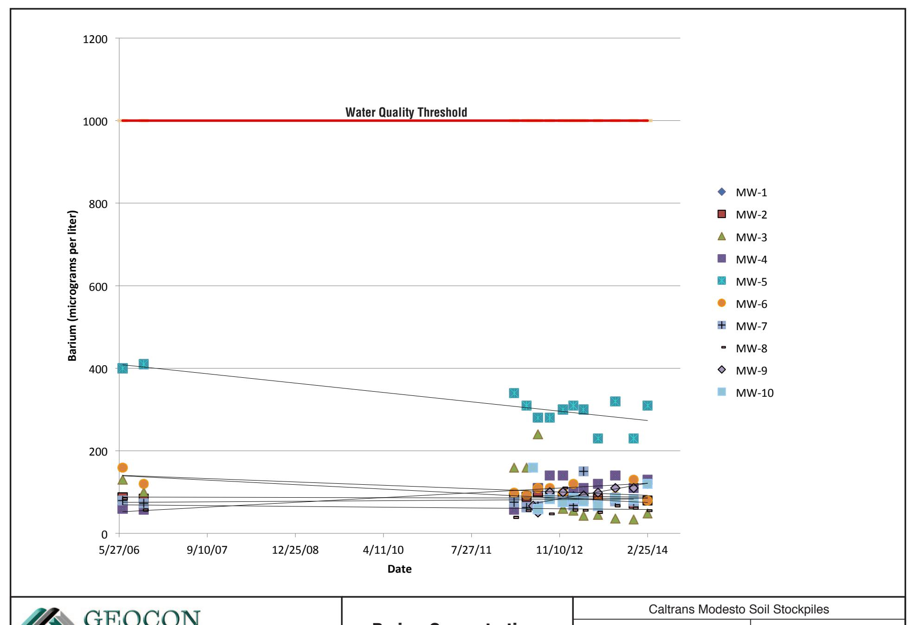

**Barium Concentrations Vs. Time** 

| Caltrans Modesto Soil Stockpiles |                                  |          |  |  |  |  |  |  |
|----------------------------------|----------------------------------|----------|--|--|--|--|--|--|
| GEOCON Proj. No. S9800-01-17     | Stanislaus County, California |          |  |  |  |  |  |  |
| Task Order No. 17                | April 2014                       | Figure 4 |  |  |  |  |  |  |

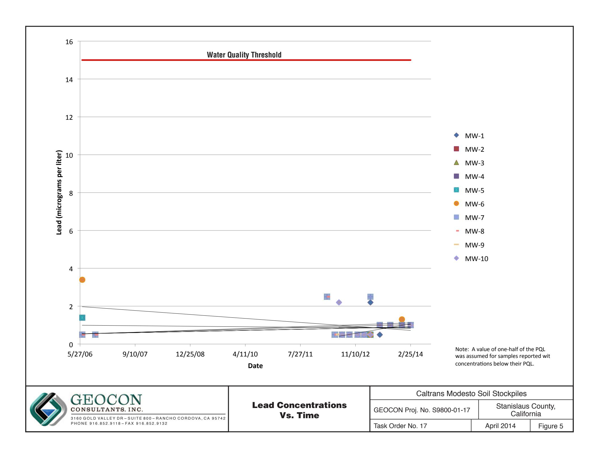

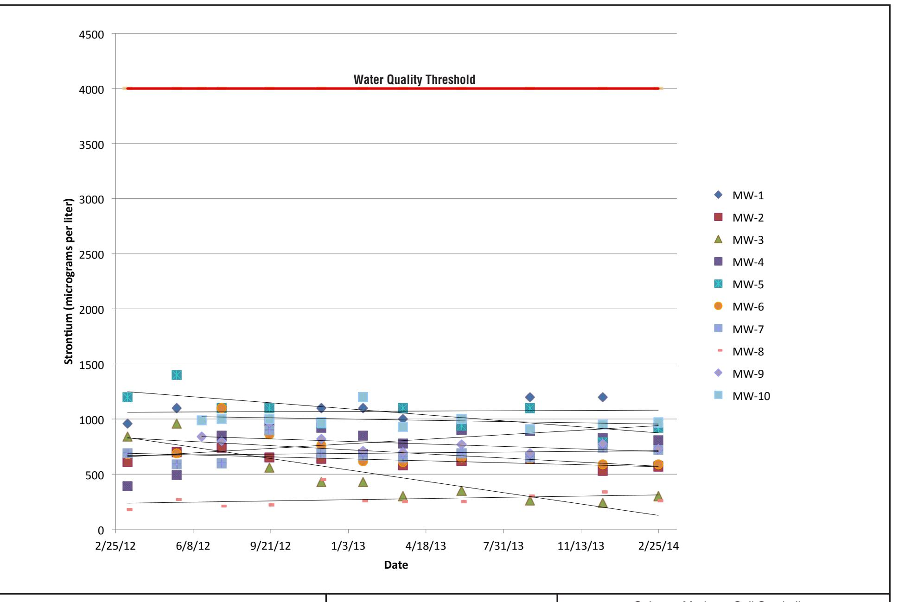

Strontium Concentrations Vs. Time

| Caltrans Modesto Soil Stockpiles |                                  |  |  |  |  |            |  |  |
|----------------------------------|----------------------------------|--|--|--|--|------------|--|--|
| GEOCON Proj. No. S9800-01-17     | Stanislaus County, California |  |  |  |  | April 2014 |  |  |
|                                  |                                  |  |  |  |  | Figure 6   |  |  |
| Task Order No. 17                |                                  |  |  |  |  |            |  |  |

| WELL ID                       | DATE       | WELL CASING ELEVATION (feet MSL) | DEPTH TO GROUNDWATER (feet below TOC) | GROUNDWATER ELEVATION (feet MSL) |
|-------------------------------|------------|----------------------------------------|---------------------------------------------|----------------------------------------|
| MW-1                          | 6/14/2006  | 80.26                                  | 29.82                                       | 50.44                                  |
| MW-1                          | 10/5/2006  | 80.26                                  | 32.35                                       | 47.91                                  |
| MW-1                          | 3/12/2012  | 80.26                                  | 30.12                                       | 50.14                                  |
| MW-1                          | 5/17/2012  | 80.26                                  | 29.74                                       | 50.52                                  |
| MW-1                          | 7/17/2012  | 80.39                                  | 31.34                                       | 49.05                                  |
| MW-1                          | 9/19/2012  | 80.39                                  | 32.73                                       | 47.66                                  |
| MW-1                          | 11/28/2012 | 80.39                                  | 32.28                                       | 48.11                                  |
| MW-1                          | 1/22/2013  | 80.39                                  | 31.04                                       | 49.35                                  |
| MW-1                          | 3/18/2013  | 80.39                                  | 31.15                                       | 49.24                                  |
| MW-1                          | 6/5/2013   | 80.39                                  | 31.73                                       | 48.66                                  |
| MW-1                          | 9/4/2013   | 80.39                                  | 33.74                                       | 46.65                                  |
| MW-1                          | 12/11/2013 | 80.39                                  | 33.46                                       | 46.93                                  |
| MW-1                          | 2/25/2014  | 80.39                                  | 33.40                                       | 46.99                                  |
| MW-2                          | 6/13/2006  | 81.10                                  | 30.72                                       | 50.38                                  |
| MW-2                          | 10/5/2006  | 81.10                                  | 33.35                                       | 47.75                                  |
| MW-2                          | 3/12/2012  | 81.10                                  | 31.04                                       | 50.06                                  |
| MW-2                          | 5/17/2012  | 81.10                                  | 30.69                                       | 50.41                                  |
| MW-2                          | 7/17/2012  | 81.25                                  | 33.28                                       | 47.97                                  |
| MW-2                          | 9/19/2012  | 81.25                                  | 33.70                                       | 47.55                                  |
| MW-2                          | 11/28/2012 | 81.25                                  | 33.22                                       | 48.03                                  |
| MW-2                          | 1/22/2013  | 81.25                                  | 31.97                                       | 49.28                                  |
| MW-2                          | 3/18/2013  | 81.25                                  | 32.07                                       | 49.18                                  |
| MW-2                          | 6/5/2013   | 81.25                                  | 32.67                                       | 48.58                                  |
| MW-2                          | 9/4/2013   | 81.25                                  | 34.71                                       | 46.54                                  |
| MW-2                          | 12/11/2013 | 81.25                                  | 34.37                                       | 46.88                                  |
| MW-2                          | 2/25/2014  | 81.25                                  | 34.31                                       | 46.94                                  |
| MW-3                          | 6/13/2006  | 81.76                                  | 32.38                                       | 49.38                                  |
| MW-3                          | 10/5/2006  | 81.76                                  | 34.88                                       | 46.88                                  |
| MW-3                          | 3/12/2012  | 81.76                                  | 32.35                                       | 49.41                                  |
| MW-3                          | 5/17/2012  | 81.76                                  | 31.91                                       | 49.85                                  |
| MW-3                          | 7/17/2012  | 81.82                                  | 33.45                                       | 48.37                                  |
| MW-3                          | 9/19/2012  | 81.82                                  | 34.89                                       | 46.93                                  |
| MW-3                          | 11/28/2012 | 81.82                                  | 34.69                                       | 47.13                                  |
| MW-3                          | 1/22/2013  | 81.82                                  | 33.43                                       | 48.39                                  |
| MW-3                          | 3/18/2013  | 81.82                                  | 33.42                                       | 48.40                                  |
| WELL ID                       | DATE       | WELL CASING ELEVATION (feet MSL) | DEPTH TO GROUNDWATER (feet below TOC) | GROUNDWATER ELEVATION (feet MSL) |
| MW-3                          | 6/5/2013   | 81.82                                  | 33.83                                       | 47.99                                  |
| MW-3                          | 9/4/2013   | 81.82                                  | 35.77                                       | 46.05                                  |
| MW-3                          | 12/11/2013 | 81.82                                  | 35.93                                       | 45.89                                  |
| MW-3                          | 2/25/2014  | 81.82                                  | 35.62                                       | 46.20                                  |
| MW-4                          | 6/13/2006  | 82.36                                  | 32.39                                       | 49.97                                  |
| MW-4                          | 10/4/2006  | 82.36                                  | 35.05                                       | 47.31                                  |
| MW-4                          | 3/12/2012  | 82.36                                  | 32.60                                       | 49.76                                  |
| MW-4                          | 5/17/2012  | 82.36                                  | 32.20                                       | 50.16                                  |
| MW-4                          | 7/17/2012  | 82.47                                  | 33.86                                       | 48.61                                  |
| MW-4                          | 9/19/2012  | 82.47                                  | 35.28                                       | 47.19                                  |
| MW-4                          | 11/28/2012 | 82.47                                  | 34.84                                       | 47.63                                  |
| MW-4                          | 1/22/2013  | 82.47                                  | 33.60                                       | 48.87                                  |
| MW-4                          | 3/18/2013  | 82.47                                  | 33.65                                       | 48.82                                  |
| MW-4                          | 6/5/2013   | 82.47                                  | 34.20                                       | 48.27                                  |
| MW-4                          | 9/4/2013   | 82.47                                  | 36.23                                       | 46.24                                  |
| MW-4                          | 12/11/2013 | 82.47                                  | 36.05                                       | 46.42                                  |
| MW-4                          | 2/25/2014  | 82.47                                  | 35.88                                       | 46.59                                  |
| MW-5                          | 6/14/2006  | 87.73                                  | 38.79                                       | 48.94                                  |
| MW-5                          | 10/5/2006  | 87.73                                  | 41.40                                       | 46.33                                  |
| MW-5                          | 3/12/2012  | 87.73                                  | 38.74                                       | 48.99                                  |
| MW-5                          | 5/17/2012  | 87.73                                  | 38.25                                       | 49.48                                  |
| MW-5                          | 7/17/2012  | 87.78                                  | 39.74                                       | 48.04                                  |
| MW-5                          | 9/19/2012  | 87.78                                  | 41.19                                       | 46.59                                  |
| MW-5                          | 11/28/2012 | 87.78                                  | 41.18                                       | 46.60                                  |
| MW-5                          | 1/22/2013  | 87.78                                  | 40.02                                       | 47.76                                  |
| MW-5                          | 3/18/2013  | 87.78                                  | 39.62                                       | 48.16                                  |
| MW-5                          | 6/5/2013   | 87.78                                  | 40.11                                       | 47.67                                  |
| MW-5                          | 9/4/2013   | 87.78                                  | 42.05                                       | 45.73                                  |
| MW-5                          | 12/11/2013 | 87.78                                  | 42.46                                       | 45.32                                  |
| MW-5                          | 2/25/2014  | 87.78                                  | 42.04                                       | 45.74                                  |
| MW-6                          | 6/14/2006  | 84.37                                  | 36.35                                       | 48.02                                  |
| MW-6                          | 10/5/2006  | 84.37                                  | 38.55                                       | 45.82                                  |
| MW-6                          | 3/12/2012  | 84.37                                  | 35.70                                       | 48.67                                  |
| MW-6                          | 5/17/2012  | 84.37                                  | 35.18                                       | 49.19                                  |
| STANISLAUS COUNTY, CALIFORNIA |            |                                        |                                             |                                        |
| WELL ID                       | DATE       | WELL CASING ELEVATION (feet MSL) | DEPTH TO GROUNDWATER (feet below TOC) | GROUNDWATER ELEVATION (feet MSL) |
| MW-6                          | 7/17/2012  | 84.52                                  | 36.40                                       | 48.12                                  |
| MW-6                          | 9/19/2012  | 84.52                                  | 37.99                                       | 46.53                                  |
| MW-6                          | 11/28/2012 | 84.52                                  | 38.19                                       | 46.33                                  |
| MW-6                          | 1/22/2013  | 84.52                                  | 37.07                                       | 47.45                                  |
| MW-6                          | 3/18/2013  | 84.52                                  | 36.78                                       | 47.74                                  |
| MW-6                          | 6/5/2013   | 84.52                                  | 36.94                                       | 47.58                                  |
| MW-6                          | 9/4/2013   | 84.52                                  | 38.86                                       | 45.66                                  |
| MW-6                          | 12/11/2013 | 84.52                                  | 39.01                                       | 45.51                                  |
| MW-6                          | 2/25/2014  | 84.52                                  | 38.49                                       | 46.03                                  |
| MW-7                          | 6/14/2006  | 83.64                                  | 35.59                                       | 48.05                                  |
| MW-7                          | 10/4/2006  | 83.64                                  | 38.32                                       | 45.32                                  |
| MW-7                          | 3/12/2012  | 83.64                                  | 35.31                                       | 48.33                                  |
| MW-7                          | 5/17/2012  | 83.64                                  | 34.72                                       | 48.92                                  |
| MW-7                          | 7/17/2012  | 83.74                                  | 36.00                                       | 47.74                                  |
| MW-7                          | 9/19/2012  | 83.74                                  | 37.60                                       | 46.14                                  |
| MW-7                          | 11/28/2012 | 83.74                                  | 37.35                                       | 46.39                                  |
| MW-7                          | 1/22/2013  | 83.74                                  | 36.78                                       | 46.96                                  |
| MW-7                          | 3/18/2013  | 83.74                                  | 36.42                                       | 47.32                                  |
| MW-7                          | 6/5/2013   | 83.74                                  | 36.49                                       | 47.25                                  |
| MW-7                          | 9/4/2013   | 83.74                                  | 38.53                                       | 45.21                                  |
| MW-7                          | 12/11/2013 | 83.74                                  | 39.21                                       | 44.53                                  |
| MW-7                          | 2/25/2014  | 83.74                                  | 38.60                                       | 45.14                                  |
| MW-8                          | 6/14/2006  | 83.73                                  | 36.12                                       | 47.61                                  |
| MW-8                          | 10/4/2006  | 83.73                                  | 38.95                                       | 44.78                                  |
| MW-8                          | 3/12/2012  | 83.73                                  | 35.75                                       | 47.98                                  |
| MW-8                          | 5/17/2012  | 83.73                                  | 35.11                                       | 48.62                                  |
| MW-8                          | 7/17/2012  | 83.85                                  | 36.29                                       | 47.56                                  |
| MW-8                          | 9/19/2012  | 83.85                                  | 38.04                                       | 45.81                                  |
| MW-8                          | 11/28/2012 | 83.85                                  | 38.37                                       | 45.48                                  |
| MW-8                          | 1/22/2013  | 83.85                                  | 37.35                                       | 46.50                                  |
| MW-8                          | 3/18/2013  | 83.85                                  | 36.90                                       | 46.95                                  |
| MW-8                          | 6/5/2013   | 83.85                                  | 36.85                                       | 47.00                                  |
| MW-8                          | 9/4/2013   | 83.85                                  | 39.08                                       | 44.77                                  |
| MW-8                          | 12/11/2013 | 83.85                                  | 39.77                                       | 44.08                                  |
| MW-8                          | 2/25/2014  | 83.85                                  | 39.07                                       | 44.78                                  |
| GROUNDWATER ELEVATION DATA    |            |                                        |                                             |                                        |
| WELL ID                       | DATE       | WELL CASING ELEVATION (feet MSL) | DEPTH TO GROUNDWATER (feet below TOC) | GROUNDWATER ELEVATION (feet MSL) |
| MW-9                          | 6/18/2012  | 82.53                                  | 33.67                                       | 48.86                                  |
| MW-9                          | 7/17/2012  | 82.53                                  | 34.22                                       | 48.31                                  |
| MW-9                          | 9/19/2012  | 82.53                                  | 35.64                                       | 46.89                                  |
| MW-9                          | 11/28/2012 | 82.53                                  | 35.65                                       | 46.88                                  |
| MW-9                          | 1/22/2013  | 82.53                                  | 34.35                                       | 48.18                                  |
| MW-9                          | 3/18/2013  | 82.53                                  | 34.29                                       | 48.24                                  |
| MW-9                          | 6/5/2013   | 82.53                                  | 34.62                                       | 47.91                                  |
| MW-9                          | 9/4/2013   | 82.53                                  | 36.48                                       | 46.05                                  |
| MW-9                          | 12/11/2013 | 82.53                                  | 36.90                                       | 45.63                                  |
| MW-9                          | 2/25/2014  | 82.53                                  | 36.51                                       | 46.02                                  |
| MW-10                         | 6/18/2012  | 83.97                                  | 35.18                                       | 48.79                                  |
| MW-10                         | 7/17/2012  | 83.97                                  | 35.75                                       | 48.22                                  |
| MW-10                         | 9/19/2012  | 83.97                                  | 37.18                                       | 46.79                                  |
| MW-10                         | 11/28/2012 | 83.97                                  | 37.34                                       | 46.63                                  |
| MW-10                         | 1/22/2013  | 83.97                                  | 36.13                                       | 47.84                                  |
| MW-10                         | 3/18/2013  | 83.97                                  | 35.97                                       | 48.00                                  |
| MW-10                         | 6/5/2013   | 83.97                                  | 36.17                                       | 47.80                                  |
| MW-10                         | 9/4/2013   | 83.97                                  | 38.00                                       | 45.97                                  |
| MW-10                         | 12/11/2013 | 83.97                                  | 38.64                                       | 45.33                                  |
| MW-10                         | 2/25/2014  | 83.97                                  | 38.18                                       | 45.79                                  |

Notes:

MSL = Mean sea level

TOC = Top of well casing

Data prior to 3/12/2012 reproduced from Site Investigation Report, Groundwater Assessment, Caltrans Modesto Soil Stockpiles State Route 99/132 Project, Stanislaus County, California, Shaw Environmental, Inc., May 14, 2007.

Wells resurveyed by Morrow Surveying on June 18, 2012.

## SUMMARY OF GROUNDWATER ANALYTICAL RESULTS - TITLE 22 METALS (DISSOLVED) CALTRANS MODESTO SOIL STOCKPILES

#### STANISLAUS COUNTY, CALIFORNIA

|                                 |             | STANISLAUS COUNTY, CALIFORNIA |          |         |        |           |         |          |        |        |       |           |            |        |          |        |          |          |       |           |         |  |
|---------------------------------|-------------|-------------------------------|----------|---------|--------|-----------|---------|----------|--------|--------|-------|-----------|------------|--------|----------|--------|----------|----------|-------|-----------|---------|--|
| ANALYTE                         | SAMPLE ID   | SAMPLE DATE                   | Antimony | Arsenic | Barium | Beryllium | Cadmium | Chromium | Cobalt | Copper | Lead  | Manganese | Molybdenum | Nickel | Selenium | Silver | Thallium | Vanadium | Zinc  | Strontium | Mercury |  |
| MW-1                            | MW-1        | 6/14/2006                     | <1.0     | 2.1     | 130    | <1.0      | <1.0    | 10       | <1.0   | 1.1    | <1.0  | 34        | 2.9        | 2.9    | <1.0     | <1.0   | 23       | <10      | ---   | <0.2      |         |  |
|                                 | MW-1        | 10/5/2006                     | <1.0     | 2.2     | 120    | <1.0      | <1.0    | 16       | <1.0   | 2.0    | <1.0  | 34        | 2.9        | 1.5    | <1.0     | <1.0   | 26       | <10      | ---   | <0.2      |         |  |
|                                 | MW-1        | 3/12/2012                     | <2.5     | <5.0    | 120    | <5.0      | <2.5    | 6.4      | <2.5   | <5.0   | <1.0  | <50       | <2.5       | <5.0   | <2.5     | <2.5   | 22       | <50      | 960   | 0.41      |         |  |
|                                 | MW-1        | 3/12/2012 S                   | <10      | 1.6     | 105    | <5.0      | 0.6     | 6.8      | <5.0   | 3.4    | ...2  | 2.0       | 1.3        | <5.0   | <20      | <20    | 21.2     | 5.6      | 1,010 | ---       |         |  |
|                                 | MW-1        | 5/17/2012                     | <0.50    | 2.3     | 150    | <0.50     | <0.50   | 7.0      | 1.0    | 2.5    | <1.0  | 35        | 1.3        | 4.0    | 0.62     | <0.50  | 21       | <10      | 1,100 | <0.20     |         |  |
|                                 | MW-1        | 7/16/2012                     | 0.51     | 2.2     | 130    | <0.50     | <0.50   | 7.2      | <0.50  | 1.4    | <1.0  | <10       | 0.73       | 0.53   | 0.56     | <0.50  | 20       | <10      | 1,100 | <0.20     |         |  |
|                                 | MW-1        | 9/19/2012                     | <0.50    | 2.1     | 120    | <0.50     | <0.50   | 7.0      | <0.50  | 1.0    | <1.0  | <10       | 0.53       | 0.53   | 0.56     | <0.50  | 18       | <10      | 1,100 | <0.20     |         |  |
|                                 | MW-1        | 11/28/2012                    | <0.50    | 2.2     | 140    | <0.50     | <0.50   | 5.1      | <0.50  | 1.0    | <1.0  | <10       | 0.58       | 0.58   | 0.61     | <0.50  | 18       | <10      | 1,100 | <0.20     |         |  |
|                                 | MW-1        | 1/22/2013                     | <0.50    | 2.0     | 110    | <0.50     | <0.50   | 6.0      | <0.50  | 1.4    | <1.0  | 12        | 0.63       | 0.63   | 0.50     | <0.50  | 17       | 23       | 1,100 | <0.20     |         |  |
|                                 | MW-1        | 3/18/2013                     | <0.50    | 3.3     | 190    | <2.5      | <0.50   | 12       | 3.9    | 6.7    | 2.2   | 160       | 0.89       | 0.89   | <0.50    | <0.50  | 34       | 77       | 1,000 | <0.20     |         |  |
|                                 | MW-1        | 6/5/2013                      | <0.50    | 2.2     | 110    | <0.50     | <0.50   | 7.3      | <0.50  | <1.0   | <1.0  | <10       | 0.60       | 0.60   | 0.50     | <0.50  | 20       | <10      | 1,000 | <0.20     |         |  |
|                                 | MW-1        | 9/4/2013                      | <0.50    | 2.4     | 130    | <0.50     | <0.50   | 5.7      | <0.50  | <1.0   | <1.0  | <10       | 0.53       | 0.53   | 0.50     | <0.50  | 19       | 13       | 1,200 | <0.20     |         |  |
|                                 | MW-1        | 12/11/2013                    | <0.50    | 1.8     | 120    | <0.50     | <0.50   | 5.7      | <0.50  | <1.0   | <1.0  | <10       | 0.59       | 0.59   | <0.50    | <0.50  | 18       | <10      | 1,200 | <0.20     |         |  |
| MW-1                            | 2/25/2014   | <0.50                         | 1.9      | 110     | <1.0   | <0.50     | 5.2     | <0.50    | <1.0   | <1.0   | <10   | 0.61      | 0.61       | <0.50  | <0.50    | 18     | <10      | 920      | <0.20 |           |         |  |
| MW-2                            | MW-2        | 6/13/2006                     | <1.0     | 2.1     | 87     | <1.0      | <1.0    | 8.5      | <1.0   | 1.2 U  | <1.0  | 24        | 3.3        | 2.0    | 1.3      | <1.0   | 22       | <10      | ---   | <0.2      |         |  |
|                                 | MW-2        | 10/5/2006                     | <1.0     | 2.6     | 84     | <1.0      | <1.0    | 11       | <1.0   | 1.7    | <1.0  | <1.0      | <2.0       | 1.2    | <1.0     | <1.0   | 27       | <10      | ---   | <0.2      |         |  |
|                                 | MW-2        | 3/12/2012                     | <2.5     | <5.0    | 88     | <5.0      | <2.5    | 4.7      | <2.5   | <5.0   | <1.0  | <50       | <2.5       | <2.5   | <2.5     | <2.5   | 23       | <50      | 610   | 0.28      |         |  |
|                                 | MW-2        | 3/12/2012 S                   | <10      | <10     | 89.6   | <5.0      | 0.4     | 6.1      | <5.0   | ...2   | <1.0  | 1.4       | 1.4        | <5.0   | <20      | <5.0   | 4.6      | 23.1     | 3.7   | 642       | ---     |  |
|                                 | MW-2        | 5/17/2012                     | <0.50    | 2.6     | 89     | <0.50     | <0.50   | 6.6      | <0.50  | 1.5    | <1.0  | <10       | 1.2        | 1.9    | <0.50    | <0.50  | 20       | <10      | 700   | <0.20     |         |  |
|                                 | MW-2        | 7/16/2012                     | <0.50    | 3.1     | 100    | <0.50     | <0.50   | 5.8      | <0.50  | <1.0   | <1.0  | <10       | 1.2        | 3.5    | <0.50    | <0.50  | 25       | 49       | 740   | <0.20     |         |  |
|                                 | MW-2        | 9/19/2012                     | <0.50    | 2.5     | 88     | <0.50     | <0.50   | 5.5      | <0.50  | <1.0   | <1.0  | <10       | 1.3        | 2.1    | <0.50    | <0.50  | 22       | <10      | 650   | <0.20     |         |  |
|                                 | MW-2        | 11/28/2012                    | <0.50    | 2.6     | 88     | <0.50     | <0.50   | 4.0      | <0.50  | <1.0   | <1.0  | <10       | 0.95       | 1.4    | <0.50    | <0.50  | 21       | <10      | 640   | <0.20     |         |  |
|                                 | MW-2        | 1/22/2013                     | <0.50    | 2.7     | 87     | <0.50     | <0.50   | 4.5      | <0.50  | <1.0   | <1.0  | <10       | 1.1        | 1.8    | <0.50    | <0.50  | 19       | <10      | 680   | <0.20     |         |  |
|                                 | MW-2        | 3/18/2013                     | <0.50    | 2.6     | 83     | <0.50     | <0.50   | 5.7      | <0.50  | <1.0   | <1.0  | <10       | 0.86       | 2.0    | <0.50    | <0.50  | 21       | <10      | 580   | <0.20     |         |  |
|                                 | MW-2        | 6/5/2013                      | <0.50    | 2.5     | 84     | <0.50     | <0.50   | 5.4      | 0.56   | 1.5    | <1.0  | 17        | 0.95       | 3.6    | 0.56     | <0.50  | 22       | <10      | 620   | <0.20     |         |  |
|                                 | MW-2        | 9/4/2013                      | <0.50    | 3.2     | 85     | <0.50     | <0.50   | 5.4      | <0.50  | <1.0   | <1.0  | <10       | 0.98       | 2.5    | <0.50    | <0.50  | 23       | <10      | 640   | <0.20     |         |  |
| MW-2                            | 12/11/2013  | <0.50                         | 2.2      | 72      | <0.50  | <0.50     | 4.4     | <1.0     | <2.0   | <1.0   | <20   | 0.90      | 3.0        | <0.50  | <0.50    | 22     | <10      | 530      | <0.20 |           |         |  |
| MW-2                            | 2/25/2014   | <0.50                         | 2.5      | 80      | <1.0   | <0.50     | 4.2     | <1.0     | 1.3    | <1.0   | 10    | 1.0       | 1.5        | <0.50  | <0.50    | 22     | <10      | 570      | <0.20 |           |         |  |
| MW-3                            | MW-3        | 6/13/2006                     | <1.0     | 3.0     | 60     | <1.0      | <1.0    | 7.1      | <1.0   | 1 U    | <1.0  | 4.7       | <2.0       | 1.4    | 1.4      | <1.0   | 25       | <10      | ---   | <0.2      |         |  |
|                                 | MW-3        | 10/5/2006                     | <1.0     | 3.3     | 58     | <1.0      | <1.0    | 7.9      | <1.0   | 1.5    | <1.0  | 18        | 2.2        | 1.0    | 1.0      | <1.0   | 29       | <10      | ---   | <0.2      |         |  |
| STANISLAUS COUNTY, CALIFORNIA   |             |                               |          |         |        |           |         |          |        |        |       |           |            |        |          |        |          |          |       |           |         |  |
| ANALYTE                         | SAMPLE ID   | SAMPLE DATE                   | Antimony | Arsenic | Barium | Beryllium | Cadmium | Chromium | Cobalt | Copper | Lead  | Manganese | Molybdenum | Nickel | Selenium | Silver | Thallium | Vanadium | Zinc  | Strontium | Mercury |  |
| MW-3                            | 3/12/2012   | <2.5                          | <5.0     | 58      | <5.0   | <2.5      | 4.4     | <2.5     | <5.0   | <5.0   | <50   | <2.5      | <5.0       | <2.5   | <2.5     | 28     | <50      | 390      | <0.20 |           |         |  |
|                                 | 3/12/2012 S | <10                           | 2.1      | 44.4    | 0.1    | 0.3       | 4.0     | <5.0     | 1.52   | 1.8    | 0.9   | <5.0      | <20        | <5.0   | 22.6     | 4.5    | 342      |          |       |           |         |  |
|                                 | 5/17/2012   | <0.50                         | 3.8      | 64      | <0.50  | <0.50     | 3.7     | <0.50    | <1.0   | <1.0   | 1.4   | 1.1       | <0.50      | <0.50  | <0.50    | 26     | <10      | 490      | <0.20 |           |         |  |
|                                 | 7/16/2012   | <0.50                         | 2.2      | 240     | <0.50  | <0.50     | 6.5     | <0.50    | 5.2    | <1.0   | 0.6   | 4.3       | <0.50      | <0.50  | <0.50    | 18     | 48       | 840      | <0.20 |           |         |  |
| MW-4                            | 9/19/2012   | <0.50                         | 4.6      | 84      | <0.50  | <0.50     | 4.7     | 1.3      | 1.9    | <1.0   | 74    | 1.1       | 2.8        | <0.50  | <0.50    | <0.50  | 33       | <10      | 560   | <0.20     |         |  |
|                                 | 11/28/2012  | <0.50                         | 4.6      | 60      | <0.50  | <0.50     | 3.5     | <0.50    | <1.0   | <1.0   | 1.5   | <1.0      | <0.50      | <0.50  | <0.50    | 29     | <10      | 430      | <0.20 |           |         |  |
|                                 | 1/22/2013   | <0.50                         | 5.5      | 55      | <0.50  | <0.50     | 3.5     | <0.50    | <1.0   | <1.0   | 2.0   | <1.0      | <0.50      | <0.50  | <0.50    | 31     | 29       | 430      | <0.20 |           |         |  |
|                                 | 3/18/2013   | <0.50                         | 5.2      | 43      | <1.0   | <0.50     | 3.8     | <0.50    | <1.0   | <1.0   | 1.8   | <1.0      | <0.50      | <0.50  | <0.50    | 33     | <10      | 300      | <0.20 |           |         |  |
|                                 | 6/6/2013    | <0.50                         | 4.8      | 45      | <0.50  | <0.50     | 3.6     | <0.50    | <1.0   | <1.0   | 1.9   | 2.3       | <0.50      | <0.50  | <0.50    | 33     | 350      | <0.20    |       |           |         |  |
|                                 | 9/4/2013    | <0.50                         | 5.8      | 36      | <0.50  | <0.50     | 3.4     | <0.50    | <1.0   | <1.0   | 1.7   | <1.0      | <0.50      | <0.50  | <0.50    | 34     | 260      | <0.20    |       |           |         |  |
|                                 | 12/11/2013  | <0.50                         | 5.4      | 34      | <0.50  | <0.50     | 2.9     | <0.50    | <1.0   | <1.0   | 1.8   | <1.0      | <0.50      | <0.50  | <0.50    | 33     | 240      | <0.20    |       |           |         |  |
|                                 | 2/25/2014   | <0.50                         | 5.1      | 48      | <1.0   | <0.50     | 3.4     | <0.50    | 1.2    | <1.0   | 1.6   | 2.8       | <0.50      | <0.50  | <0.50    | 33     | 300      | <0.20    |       |           |         |  |
| MW-5                            | 6/13/2006   | <1.0                          | 1.8      | 130     | <1.0   | <1.0      | 8.9     | <1.0     | 1.6 U  | <1.0   | 62    | 2.5       | 2.4        | <1.0   | <1.0     | <1.0   | 19       | <10      |       | <0.2      |         |  |
|                                 | 10/4/2006   | <1.0                          | 2.1      | 100     | <1.0   | <1.0      | 9.9     | <1.0     | 2.1    | <1.0   | 4.1   | 2.0       | <1.0       | <1.0   | <1.0     | <1.0   | 24       | <10      |       | <0.2      |         |  |
|                                 | 3/12/2012   | <2.5                          | <5.0     | 160     | <5.0   | <2.5      | 8.9     | <2.5     | <5.0   | <5.0   | 88    | <2.5      | 5.4        | <2.5   | <2.5     | <2.5   | 26       | <50      | 840   | 0.29      |         |  |
|                                 | 3/12/2012 S | <10                           | 1.4      | 134     | <5.0   | 0.4       | 7.7     | <5.0     | 0.9 2  | 0.7    | <5.0  | <5.0      | <20        | <5.0   | 3.5      | 19.3   | 3.5      | 812      |       |           |         |  |
|                                 | 5/17/2012   | <0.50                         | 2.1      | 160     | <0.50  | <0.50     | 6.6     | <0.50    | <1.0   | <1.0   | <10   | <0.50     | 1.7        | 0.62   | <0.50    | <0.50  | 18       | <10      | 960   | <0.20     |         |  |
|                                 | 7/16/2012   | <0.50                         | 6.6      | 110     | <0.50  | <0.50     | 6.6     | <0.50    | 1.1    | <1.0   | <10   | 2.4       | 3.2        | 0.55   | <0.50    | <0.50  | 42       | <10      | 850   | <0.20     |         |  |
|                                 | 9/19/2012   | <0.50                         | 2.2      | 140     | <0.50  | <0.50     | 7.0     | <0.50    | <1.0   | <1.0   | <10   | 0.50      | 2.6        | 0.78   | <0.50    | <0.50  | 18       | <10      | 980   | <0.20     |         |  |
|                                 | 11/28/2012  | <0.50                         | 2.1      | 140     | <0.50  | <0.50     | 5.2     | <0.50    | 1.0    | <1.0   | <10   | <0.50     | 2.3        | 0.54   | <0.50    | <0.50  | 18       | <10      | 920   | <0.20     |         |  |
|                                 | 1/22/2013   | <0.50                         | 1.8      | 100     | <0.50  | <0.50     | 5.0     | <0.50    | 1.0    | <1.0   | <10   | <0.50     | 1.9        | 0.59   | <0.50    | <0.50  | 15       | <10      | 850   | <0.20     |         |  |
|                                 | 3/18/2013   | <0.50                         | 2.0      | 110     | <0.50  | <0.50     | 5.7     | <0.50    | <1.0   | <1.0   | <10   | <0.50     | 2.3        | 0.53   | <0.50    | <0.50  | 17       | <10      | 780   | <0.20     |         |  |
|                                 | 6/5/2013    | <0.50                         | 2.0      | 120     | <0.50  | <0.50     | 5.7     | <0.50    | 1.1    | <1.0   | <10   | <0.50     | 3.5        | 0.53   | <0.50    | <0.50  | 19       | <10      | 900   | <0.20     |         |  |
|                                 | 9/4/2013    | <0.50                         | 2.7      | 140     | <0.50  | <0.50     | 6.0     | <0.50    | <1.0   | <1.0   | <10   | <0.50     | 2.3        | <0.50  | <0.50    | <0.50  | 19       | <10      | 890   | <0.20     |         |  |
|                                 | 12/11/2013  | <0.50                         | 1.8      | 110     | <0.50  | <0.50     | 5.4     | <0.50    | <1.0   | <1.0   | <10   | <0.50     | 2.1        | <0.50  | <0.50    | <0.50  | 17       | <10      | 830   | <0.20     |         |  |
| 2/25/2014                       | <0.50       | 1.9                           | 130      | <1.0    | <0.50  | 5.0       | <0.50   | 1.3      | <1.0   | <10    | <0.50 | 3.2       | <0.50      | <0.50  | <0.50    | 18     | <10      | 810      | <0.20 |           |         |  |
| MW-5                            | 6/14/2006   | <1.0                          | 1.8      | 400     | <1.0   | <1.0      | 9.6     | 2.2      | 4.8    | 1.4    | 260   | 9.9       | 7.1        | 2.0    | <1.0     | <1.0   | 23       | <10      |       | <0.2      |         |  |
|                                 | 10/5/2006   | <1.0                          | 2.5      | 410     | <1.0   | <1.0      | 18      | <1.0     | 1.9    | <1.0   | 120   | 14        | 3.4        | <1.0   | 2.1      | <1.0   | 24       | <10      |       | <0.2      |         |  |
|                                 | 3/12/2012   | <2.5                          | <5.0     | 340     | <5.0   | <2.5      | 9.2     | <2.5     | <5.0   | <5.0   | <50   | <2.5      | <5.0       | <2.5   | <2.5     | <2.5   | 18       | <50      | 1,200 | 0.28      |         |  |
|                                 | 3/12/2012 S | <10                           | 1.3      | 310     | <5.0   | 0.5       | 9.6     | <5.0     | 1.0    | 4.4    | 1.5   | 5.0       | 1.5        | <5.0   | 3.6      | 17.8   | 14.5     | 1,140    |       |           |         |  |
|                                 |             | STANISLAUS COUNTY, CALIFORNIA |          |         |        |           |         |          |        |        |       |           |            |        |          |        |          |          |       |           |         |  |
| ANALYTE                         | SAMPLE ID   | SAMPLE DATE                | Antimony | Arsenic | Barium | Beryllium | Cadmium | Chromium | Cobalt | Copper | Lead  | Manganese | Molybdenum | Nickel | Selenium | Silver | Thallium | Vanadium | Zinc  | Strontium | Mercury |  |
| Results in micrograms per liter |             |                               |          |         |        |           |         |          |        |        |       |           |            |        |          |        |          |          |       |           |         |  |
| MW-5                            | 5/17/2012   | 0.59                          | 2.4      | 310     | <0.50  | <0.50     | 12      | <0.50    | 1.1    | <1.0   | <10   | 1.8       | 3.1        | 2.6    | <0.50    | <0.50  | 14       | <10      | 1,400 | <0.20     |         |  |
| MW-5                            | 7/17/2012   | 0.69                          | 2.8      | 280     | <0.50  | <0.50     | 9.8     | <0.50    | 1.2    | <1.0   | <10   | 1.9       | 2.8        | 2.1    | <0.50    | <0.50  | 20       | <10      | 1,100 | <0.20     |         |  |
| MW-5                            | 9/20/2012   | 0.55                          | 2.3      | 280     | <0.50  | <0.50     | 5.7     | <0.50    | 1.0    | <1.0   | <10   | 1.4       | 2.4        | 1.3    | <0.50    | <0.50  | 18       | <10      | 1,100 | <0.20     |         |  |
| MW-5                            | 11/29/2012  | <0.50                         | 2.9      | 300     | <0.50  | <0.50     | 6.2     | <0.50    | <1.0   | <1.0   | <10   | 1.6       | 2.0        | 1.3    | <0.50    | <0.50  | 20       | <10      | 960   | <0.20     |         |  |
| MW-5                            | 1/23/2013   | <0.50                         | 1.7      | 310     | <0.50  | <0.50     | 7.3     | <0.50    | <1.0   | <1.0   | <10   | 1.4       | 2.7        | 0.90   | <0.50    | <0.50  | 17       | <10      | 1,200 | <0.20     |         |  |
| MW-5                            | 3/18/2013   | 0.72                          | 2.3      | 300     | <1.0   | <0.50     | 7.2     | <0.50    | 1.1    | <1.0   | <10   | 1.4       | 3.1        | 1.1    | <0.50    | <0.50  | 17       | <10      | 1,100 | <0.20     |         |  |
| MW-5                            | 6/6/2013    | 0.61                          | 2.2      | 230     | <0.50  | <0.50     | 5.0     | <0.50    | 1.6    | <1.0   | <10   | 1.4       | 3.5        | 1.2    | <0.50    | <0.50  | 17       | <10      | 940   | <0.20     |         |  |
| MW-5                            | 9/5/2013    | <0.50                         | 1.7      | 320     | <0.50  | <0.50     | 8.8     | <0.50    | <1.0   | <1.0   | <10   | 1.1       | 1.8        | 0.77   | <0.50    | <0.50  | 22       | <10      | 1100  | <0.20     |         |  |
| MW-5                            | 12/12/2013  | <0.50                         | 2.2      | 230     | <0.50  | <0.50     | 5.1     | <1.0     | <2.0   | <1.0   | <20   | 1.2       | 3.7        | <0.50  | <0.50    | <0.50  | 22       | <10      | 790   | <0.20     |         |  |
| MW-5                            | 2/25/2014   | <0.50                         | 2.4      | 310     | <1.0   | <0.50     | 8.2     | <0.50    | 1.1    | <1.0   | <10   | 1.0       | 3.5        | 0.62   | <0.50    | <0.50  | 20       | <10      | 920   | <0.20     |         |  |
| MW-6                            | 6/14/2006   | <1.0                          | 3.6      | 160     | <1.0   | <1.0      | 16      | 3.0      | 6.2    | 3.4    | 190   | 13        | 5.9        | 3.0    | <1.0     | <1.0   | 33       | 15       | --    | <0.2      |         |  |
| MW-6                            | 10/5/2006   | <1.0                          | 5.2      | 120     | <1.0   | <1.0      | 29      | <1.0     | 1.5    | <1.0   | 130   | 13        | 1.7        | <1.0   | <1.0     | <1.0   | 34       | <10      | --    | <0.2      |         |  |
| MW-6                            | 3/12/2012   | <2.5                          | <5.0     | 99      | <5.0   | <2.5      | 9.5     | <2.5     | <5.0   | <5.0   | <50   | 5.3       | <5.0       | <2.5   | <2.5     | <2.5   | 37       | <50      | 680   | 0.27      |         |  |
| MW-6                            | 3/12/2012 S | <10                           | 2.8      | 94.2    | <5.0   | 0.4       | 9.9     | <5.0     | <5.0   | 2      | 2.7   | 5.2       | <5.0       | <20    | <5.0     | 2.6    | 36.3     | 3.8      | 655   |           |         |  |
| MW-6                            | 5/17/2012   | <0.50                         | 3.9      | 93      | <0.50  | <0.50     | 8.3     | <0.50    | 1.3    | <1.0   | <10   | 5.5       | 1.8        | 2.1    | <0.50    | <0.50  | 32       | <10      | 690   | <0.20     |         |  |
| MW-6                            | 7/17/2012   | <0.50                         | 6.3      | 110     | <0.50  | <0.50     | 14      | <0.50    | 1.2    | <1.0   | <10   | 8.2       | 3.0        | 3.1    | <0.50    | <0.50  | 51       | <10      | 1,100 | <0.20     |         |  |
| MW-6                            | 9/20/2012   | <0.50                         | 4.7      | 110     | <0.50  | <0.50     | 10      | <0.50    | <1.0   | <1.0   | <10   | 5.6       | 1.7        | 2.6    | <0.50    | <0.50  | 39       | <10      | 860   | <0.20     |         |  |
| MW-6                            | 11/29/2012  | <0.50                         | 5.1      | 98      | <0.50  | <0.50     | 8.0     | <0.50    | <1.0   | <1.0   | <10   | 6.0       | 1.6        | 2.6    | <0.50    | <0.50  | 38       | <10      | 760   | <0.20     |         |  |
| MW-6                            | 1/23/2013   | <0.50                         | 4.2      | 120     | <0.50  | <0.50     | 9.5     | 1.9      | 3.2    | <1.0   | 100   | 5.2       | 4.0        | 1.2    | <0.50    | <0.50  | 41       | 16       | 620   | <0.20     |         |  |
| MW-6                            | 3/18/2013   | <0.50                         | 4.6      | 79      | <0.50  | <0.50     | 8.0     | <0.50    | <1.0   | <1.0   | <10   | 5.1       | 1.9        | 1.8    | <0.50    | <0.50  | 34       | <10      | 610   | <0.20     |         |  |
| MW-6                            | 6/6/2013    | <0.50                         | 4.3      | 76      | <0.50  | <0.50     | 7.5     | <0.50    | <1.0   | <1.0   | <10   | 5.0       | 1.1        | 2.0    | <0.50    | <0.50  | 35       | <10      | 650   | <0.20     |         |  |
| MW-6                            | 9/5/2013    | <0.50                         | 3.3      | 90      | <0.50  | <0.50     | 9.4     | <0.50    | <1.0   | <1.0   | <10   | 5.0       | <1.0       | 0.88   | <0.50    | <0.50  | 38       | <10      | 640   | <0.20     |         |  |
| MW-6                            | 12/12/2013  | <0.50                         | 4.4      | 130     | <1.0   | <0.50     | 10      | 2.7      | 6.3    | 1.3    | 140   | 5.1       | 6.9        | 0.66   | <0.50    | <0.50  | 47       | 19       | 590   | <0.20     |         |  |
| MW-6                            | 2/26/2014   | <0.50                         | 4.1      | 80      | <0.50  | <0.50     | 7.9     | <0.5     | 2.4    | <1.0   | <10   | 4.8       | 2.6        | 0.77   | <0.50    | <0.50  | 33       | <10      | 590   | <0.20     |         |  |
| MW-7                            | 6/14/2006   | <1.0                          | 2.3      | 80      | <1.0   | <1.0      | 7.0     | <1.0     | <1.0   | <1.0   | 9.0   | 2.6       | 2.2        | 1.1    | <1.0     | <1.0   | 17       | <10      | --    | <0.2      |         |  |
| MW-7                            | 10/4/2006   | <1.0                          | 2.7      | 73      | <1.0   | <1.0      | 10      | <1.0     | 1.6    | <1.0   | 1.1   | <2.0      | 1.4        | 1.2    | <1.0     | <1.0   | 23       | <10      | --    | <0.2      |         |  |
| MW-7                            | 3/12/2012   | <2.5                          | <5.0     | 76      | <5.0   | <2.5      | <2.5    | <2.5     | <5.0   | <5.0   | <50   | <2.5      | <5.0       | <2.5   | <2.5     | <2.5   | 24       | <50      | 690   | 0.28      |         |  |
| MW-7                            | 5/17/2012   | 0.74                          | 2.3      | 63      | <0.50  | <0.50     | 1.6     | <0.50    | <1.0   | <1.0   | <10   | 1.0       | 1.3        | <0.50  | <0.50    | <0.50  | 19       | <10      | 590   | <0.20     |         |  |
| MW-7                            | 7/17/2012   | 0.95                          | 2.2      | 66      | <0.50  | <0.50     | 2.2     | <0.50    | 1.1    | <1.0   | <10   | 1.0       | 2.3        | <0.50  | <0.50    | <0.50  | 17       | <10      | 600   | <0.20     |         |  |
| MW-7                            | 9/20/2012   | <0.50                         | 3.1      | 96      | <0.50  | <0.50     | 3.7     | <0.50    | 1.1    | <1.0   | <10   | 1.2       | 3.0        | 0.66   | <0.50    | <0.50  | 25       | <10      | 900   | <0.20     |         |  |

## SUMMARY OF GROUNDWATER ANALYTICAL RESULTS - TITLE 22 METALS (DISSOLVED) CALTRANS MODESTO SOIL STOCKPILES

#### STANISLAUS COUNTY CALIFORNIA

## SUMMARY OF GROUNDWATER ANALYTICAL RESULTS - TITLE 22 METALS (DISSOLVED) CALTRANS MODESTO SOIL STOCKPILES

#### STANISLAUS COUNTY CALIFORNIA

## SUMMARY OF GROUNDWATER ANALYTICAL RESULTS - TITLE 22 METALS (DISSOLVED) CALTRANS MODESTO SOIL STOCKPILES

#### STANISLAUS COUNTY, CALIFORNIA Molybdenum Manganese Antimony Beryllium Chromium Selenium Vanadium Cadmium **Thallium** Strontium Arsenic Barium Mercury Cobalt Copper Nickel Silver Lead Zinc ANALYTE SAMPLE SAMPLE ID Results in micrograms per liter DATE MW-7 11/29/2012 < 0.50 < 0.50 < 0.50 < 0.50 2.5 77 2.3 < 1.0 < 1.0 <10 1.2 1.3 < 0.50 < 0.50 < 0.50 20 <10 690 < 0.20 MW-7 1/23/2013 < 0.50 2.9 68 < 0.50 < 0.50 2.9 < 0.50 <1.0 < 1.0 <10 0.99 1.7 < 0.50 < 0.50 < 0.50 21 <10 670 < 0.20 MW-7 3/18/2013 0.78 4.0 150 6.4 6.5 2.5 260 1.6 8.0 < 0.50 < 0.50 < 0.50 35 29 650 < 0.20 < 0.50 < 0.50 3.9 MW-7 6/6/2013 0.56 2.7 < 0.50 < 0.50 2.2 < 0.50 1.3 < 0.50 < 0.50 22 66 <1.0 < 1.0 <10 1.3 0.61 <10 690 < 0.20 3.9 22 MW-7 9/5/2013 < 0.50 1.4 **78** < 0.50 < 0.50 < 0.50 1.2 < 1.0 <10 1.1 3.1 < 0.50 < 0.50 < 0.50 <10 650 < 0.20 MW-7 12/12/2013 **78** < 0.50 1.2 2.1 22 < 0.50 2.2 < 0.50 4.2 < 1.0 < 2.0 < 1.0 < 20 < 0.50 < 0.50 < 0.50 740 < 0.20 <10 MW-7 2/26/2014 < 0.50 2.9 79 < 0.50 < 0.50 4.2 < 0.50 1.2 < 1.0 <10 1.3 3.6 < 0.50 < 0.50 < 0.50 21 < 10 720 < 0.20 MW-8 6/14/2006 < 1.0 2.7 84 <1.0 <1.0 8.8 <1.0 <1.0 5.8 < 2.0 1.2 1.6 <1.0 25 < 0.2 < 1.0 < 1.0 <10 ---MW-8 10/4/2006 < 1.0 57 32 4.0 < 1.0 < 1.0 9.7 < 1.0 1.7 < 1.0 < 1.0 2.0 < 1.0 <1.0 <1.0 < 1.0 <10 ---< 0.2 MW-8 3/12/2012 < 2.5 < 5.0 39 < 2.5 4.4 < 2.5 < 2.5 < 2.5 20 180 0.23 < 5.0 < 5.0 < 5.0 < 50 < 2.5 < 5.0 < 2.5 < 50 \_\_\_ 2 MW-8 3/12/2012 S <10 39.4 2.5 < 5.0 0.1 4.7 < 5.0 < 5.0 1.7 1.3 < 5.0 < 20 < 5.0 < 20 23.4 211 3.6 MW-8 5/17/2012 < 0.50 3.2 55 < 0.50 < 0.50 4.6 < 0.50 <1.0 < 1.0 1.8 < 1.0 0.73 < 0.50 < 0.50 22 270 < 0.20 <10 <10 7/17/2012 MW-8 < 0.50 3.2 51 5.6 < 0.50 <1.0 <1.0 <10 1.7 < 1.0 0.74 < 0.50 < 0.50 23 210 < 0.20 < 0.50 < 0.50 <10 9/20/2012 3.9 47 28 MW-8 < 0.50 3.8 <10 1.8 < 1.0 0.89 < 0.50 < 0.50 220 < 0.20 < 0.50 < 0.50 < 0.50 < 1.0 < 1.0 < 10 MW-8 11/29/2012 < 0.50 4.0 110 < 0.50 < 0.50 6.3 0.94 2.1 < 1.0 160 2.1 2.3 1.4 < 0.50 < 0.50 27 <10 450 < 0.20 MW-8 1/23/2013 < 0.50 4.2 57 < 0.50 < 0.50 5.7 < 0.50 < 1.0 < 1.0 <10 2.1 < 1.0 < 0.50 < 0.50 < 0.50 28 < 10 260 < 0.20 MW-8 3/18/2013 < 0.50 4.0 56 < 0.50 < 0.50 5.4 < 0.50 < 1.0 < 1.0 <10 1.9 < 1.0 < 0.50 < 0.50 < 0.50 26 <10 250 < 0.20 MW-8 6/6/2013 28 < 0.50 3.8 51 < 0.50 < 0.50 3.8 < 0.50 < 1.0 < 1.0 <10 2.0 < 1.0 0.76 < 0.50 < 0.50 <10 250 < 0.20 MW-8 9/5/2013 < 0.50 2.5 67 < 0.50 < 0.50 5.7 < 0.50 <10 1.4 < 1.0 < 0.50 < 0.50 < 0.50 24 300 < 1.0 < 1.0 <10 < 0.20 MW-8 12/12/2013 3.2 23 < 0.50 2.8 61 < 0.50 < 0.50 <1.0 < 2.0 <1.0 < 20 1.3 3.1 < 0.50 < 0.50 < 0.50 <10 340 < 0.20 MW-8 2/26/2014 < 0.50 4.0 55 < 0.50 < 0.50 3.8 < 0.50 < 1.0 <10 1.6 1.5 < 0.50 < 0.50 < 0.50 24 <10 < 0.20 < 1.0 260 MW-9 6/20/2012 < 0.50 2.3 67 < 0.50 < 0.50 2.5 < 0.50 < 1.0 < 1.0 43 0.76 2.2 1.8 < 0.50 < 0.50 15 15 840 < 0.20 MW-9 7/17/2012 < 0.50 2.7 51 < 0.50 < 0.50 2.6 < 0.50 < 1.0 < 1.0 <10 0.68 1.9 1.7 < 0.50 < 0.50 14 <10 800 < 0.20 MW-9 9/19/2012 < 0.50 22 3.1 100 < 0.50 < 0.50 3.6 < 0.50 2.2 < 1.0 73 0.76 3.4 2.5 < 0.50 < 0.50 <10 970 < 0.20 MW-9 11/28/2012 < 0.50 3.2 100 < 0.50 < 0.50 3.0 < 0.50 1.0 < 1.0 15 0.65 1.9 1.5 < 0.50 < 0.50 22 <10 820 < 0.20 1/22/2013 < 2.0 19 MW-9 < 0.50 2.6 90 3.1 < 2.0< 20 < 0.50 1.1 < 0.50 < 0.50 <10 710 < 0.20 < 0.50 < 0.50 <1.0 <1.0 MW-9 3/18/2013 < 0.50 3.1 92 < 1.0 < 0.50 3.5 < 0.50 1.1 < 1.0 <10 < 0.50 2.2 1.1 < 0.50 < 0.50 20 <10 700 < 0.20 6/6/2013 99 3.1 20 MW-9 < 0.50 2.8 < 0.50 < 0.50 < 0.50 < 0.50 1.7 1.8 < 0.50 < 0.50 770 < 0.20 <1.0 < 1.0 <10 <10 MW-9 9/5/2013 < 0.50 2.3 110 < 0.50 < 0.50 4.2 < 0.50 1.1 < 1.0 <10 0.58 1.4 < 0.50 < 0.50 < 0.50 24 <10 690 < 0.20 MW-9 12/12/2013 < 0.50 2.4 110 < 0.50 < 0.50 3.6 <1.0 < 2.0 <1.0 < 20 < 0.50 2.3 0.80 < 0.50 < 0.50 21 <10 780 < 0.20

## SUMMARY OF GROUNDWATER ANALYTICAL RESULTS - TITLE 22 METALS (DISSOLVED) CALTRANS MODESTO SOIL STOCKPILES STANISLAUS COUNTY, CALIFORNIA

| ANALYTE | SAMPLE ID  | SAMPLE DATE | Results in micrograms per liter |             |        |           |         |          |        |        |      |           |            |                   |          |        |          |          |       |           |         |
|---------|------------|----------------|---------------------------------|-------------|--------|-----------|---------|----------|--------|--------|------|-----------|------------|-------------------|----------|--------|----------|----------|-------|-----------|---------|
|         |            |                | Antimony                        | Arsenic     | Barium | Beryllium | Cadmium | Chromium | Cobalt | Copper | Lead | Manganese | Molybdenum | Nickel            | Selenium | Silver | Thallium | Vanadium | Zinc  | Strontium | Mercury |
| MW-9    | 2/26/2014  | <0.50          | 3.3                             | 120         | <0.50  | <0.50     | 3.1     | <0.50    | <1.0   | <1.0   | <10  | <0.50     | 2.7        | <0.50             | <0.50    | 21     | <10      | 730      | <0.20 |           |         |
| MW-10   | 6/20/2012  | <0.50          | 4.1                             | 160         | <1.0   | <0.50     | 6.2     | 5.3      | 7.4    | 2.2    | 290  | 3.1       | 9.6        | 4.3               | <0.50    | <0.50  | 33       | 24       | 990   | <0.20     |         |
| MW-10   | 7/17/2012  | <0.50          | 2.8                             | 59          | <0.50  | <0.50     | 1.3     | <0.50    | <1.0   | <1.0   | <10  | 1.0       | 2.4        | 4.4               | <0.50    | <0.50  | 16       | 15       | 1,000 | <0.20     |         |
| MW-10   | 9/20/2012  | <0.50          | 2.7                             | 83          | <0.50  | <0.50     | 1.1     | <0.50    | 1.0    | <1.0   | 16   | 0.61      | 2.8        | 4.4               | <0.50    | <0.50  | 19       | 120      | 1,100 | <0.20     |         |
| MW-10   | 11/29/2012 | <0.50          | 3.1                             | 76          | <0.50  | <0.50     | 0.60    | <0.50    | <1.0   | <1.0   | <10  | <0.50     | 1.7        | 3.0               | <0.50    | <0.50  | 18       | <10      | 970   | <0.20     |         |
| MW-10   | 1/22/2013  | <0.50          | 3.8                             | 86          | <0.50  | <0.50     | 0.92    | <0.50    | <1.0   | <1.0   | <10  | <0.50     | 2.4        | 3.7               | <0.50    | <0.50  | 18       | <10      | 1,200 | <0.20     |         |
| MW-10   | 3/18/2013  | <0.50          | 3.5                             | 78          | <0.50  | <0.50     | 1.5     | 0.58     | 1.5    | <1.0   | 14   | <0.50     | 3.1        | 3.0               | <0.50    | <0.50  | 19       | <10      | 930   | <0.20     |         |
| MW-10   | 6/6/2013   | <0.50          | 3.1                             | 68          | <0.50  | <0.50     | 0.77    | <0.50    | <1.0   | <1.0   | <10  | <0.50     | 1.9        | 3.8               | <0.50    | <0.50  | 18       | <10      | 1,000 | <0.20     |         |
| MW-10   | 9/5/2013   | <0.50          | 1.8                             | 86          | <0.50  | <0.50     | 1.2     | <0.50    | 1.1    | <1.0   | <10  | <0.50     | 1.6        | 0.64              | <0.50    | <0.50  | 21       | <10      | 910   | <0.20     |         |
| MW-10   | 12/12/2013 | <0.50          | 2.8                             | 83          | <0.50  | <0.50     | <2.5    | <2.5     | <5.0   | <1.0   | <50  | 0.54      | <5.0       | 1.0               | <0.50    | <0.50  | 22       | <10      | 950   | <0.20     |         |
| MW-10   | 2/26/2014  | <0.50          | 3.4                             | 120         | <0.50  | <0.50     | 2.3     | 1.7      | 3.2    | <1.0   | 73   | 0.85      | 5.8        | 1.1               | <0.50    | <0.50  | 25       | <10      | 970   | <0.20     |         |
| MCLs    |            | 6              | 10                              | 1000/700(4) | 4      | 5         | 50      | 1,300(3) | 15(3)  | 50(1)  |      | 100       | 50         | 5,000(1)/2,000(4) | 4,000(4) | 2      |          |          |       |           |         |

Notes: --- = not analyzed or not applicable

MCLs = Maximum Contaminant Levels per California Environmental Protection Agency (EPA), May 2009

**Bold** = Reported concentration exceeds laboratory reporting limit

Data prior to 3/12/2012 reproduced from Site Investigation Report, Groundwater Assessment, Caltrans Modesto Soil Stockpiles State Route 99/132 Project, Stanislaus County, California, Shaw Environmental, Inc., May 14, 2007.

&lt; = Less than laboratory reporting limits

S = Split samples submitted by Central Valley Regional Water Quality Control Board (CVRWQCB) to Excelchem Environmental Labs

U = Notation: The result was qualified as a non-detect due to equipment blank contamination

(1) = Secondary MCL

(2) = Laboratory error in sample preparation (CVRWQCB personal communication)

(3) = California Department of Public Health Regulatory Action Level

(4) = EPA Drinking Water Health Advisory

(5) = California Department of Public Health Notification Level for Drinking Water

| SAMPLE ID                       | SAMPLE DATE | DISSOLVED CALCIUM    | DISSOLVED MAGNESIUM    | CHLORIDE | NITROGEN, NITRATE (as N)    | SULFATE | DISSOLVED POTASSIUM    | DISSOLVED SODIUM    | SULFIDE | ALKALINITY, BICARBONATE    | ALKALINITY, CARBONATE    | ALKALINITY, TOTAL    | TOTAL DISSOLVED SOLIDS       | PAHs (SIM)           |
|---------------------------------|-------------|----------------------|------------------------|----------|-----------------------------|---------|------------------------|---------------------|---------|----------------------------|--------------------------|----------------------|------------------------------|----------------------|
| MW-1                            | 6/14/2006   | ---                  | ---                    | ---      | 5.0                         | 18      | ---                    | ---                 | <0.1    | ---                        | ---                      | ---                  | ---                          | ---                  |
| MW-1                            | 10/5/2006   | 88                   | 34                     | 14       | 6.8                         | 18      | 3.7                    | 22                  | <0.1    | 360                        | <1                       | 360                  | 500                          | ---                  |
| MW-1                            | 3/12/2012   | 78                   | 31                     | 13       | 12                          | 16      | 3.2                    | 21                  | <0.05   | 328                        | <5.0                     | 328                  | 550                          | <0.20                |
| MW-1                            | 3/12/2012 S | 84                   | 29.4                   | 12       | 11.4                        | 15.6    | 3.3                    | 23.8                | 0.0637  | 342                        | <5.0                     | 342                  | 453                          | ---                  |
| MW-1                            | 5/17/2012   | 83                   | 34                     | 12       | 12                          | 16      | 3.8                    | 20                  | 0.1     | 340                        | <5.0                     | 340                  | 480                          | <0.20                |
| MW-1                            | 7/16/2012   | 87                   | 34                     | 12       | 12                          | 20      | 2.8                    | 17                  | 0.1     | 330                        | <5.0                     | 330                  | 540                          | <0.20                |
| MW-1                            | 9/19/2012   | 80                   | 30                     | 14       | 12                          | 25      | 2.5                    | 13                  | 0.28    | 330                        | <5.0                     | 330                  | 460                          | <0.20                |
| MW-1                            | 11/28/2012  | 81                   | 35                     | 12       | 12                          | 19      | 2.9                    | 19                  | 0.12    | 330                        | <5.0                     | 330                  | 420                          | <0.20                |
| MW-1                            | 1/22/2013   | 84                   | 30                     | 13       | 12                          | 20      | 2.5                    | 15                  | 0.52    | 330                        | <5.0                     | 330                  | 460                          | ---                  |
| MW-1                            | 3/18/2013   | 87                   | 35                     | 13       | 13                          | 18      | 4.7                    | 17                  | 0.18    | 320                        | <5.0                     | 320                  | 500                          | ---                  |
| MW-1                            | 6/5/2013    | 82                   | 34                     | 12       | 12                          | 18      | 2.9                    | 16                  | <0.05   | 320                        | <5.0                     | 320                  | 520                          | ---                  |
| MW-1                            | 9/4/2013    | 99                   | 37                     | 19       | 12                          | 29      | 2.9                    | 15                  | 0.28    | 370                        | <5.0                     | 370                  | 590                          | ---                  |
| MW-1                            | 12/11/2013  | 85                   | 36                     | 15       | 13                          | 28      | 2.4                    | 16                  | <0.05   | 330                        | <5.0                     | 330                  | 500                          | ---                  |
| MW-1                            | 2/25/2014   | 76                   | 30                     | 13       | 10                          | 24      | 2.7                    | 16                  | <0.010  | 290                        | <5.0                     | 290                  | 460                          | ---                  |
| MW-2                            | 6/13/2006   | ---                  | ---                    | ---      | 5.5                         | 21      | ---                    | ---                 | <0.1    | ---                        | ---                      | ---                  | ---                          | ---                  |
| MW-2                            | 10/5/2006   | 49                   | 16                     | 23       | 6.1                         | 16      | 2.7                    | 56                  | <0.1    | 250                        | <1                       | 250                  | 390                          | ---                  |
| MW-2                            | 3/12/2012   | 52                   | 18                     | 17       | 9.0                         | 16      | 2.6                    | 40                  | 0.06    | 266                        | <5.0                     | 266                  | 460                          | <0.20                |
| MW-2                            | 3/12/2012 S | 58.1                 | 17.2                   | 15.4     | 8.77                        | 15.2    | 2.89                   | 54                  | 0.0497  | 270                        | <5.0                     | 270                  | 382                          | ---                  |
| MW-2                            | 5/17/2012   | 55                   | 19                     | 15       | 7.5                         | 14      | 2.9                    | 39                  | 0.07    | 248                        | <5.0                     | 248                  | 400                          | <0.20                |
| MW-2                            | 7/16/2012   | 50                   | 16                     | 14       | 7.2                         | 13      | 2.2                    | 38                  | 0.042   | 230                        | <5.0                     | 230                  | 410                          | <0.20                |
| MW-2                            | 9/19/2012   | 52                   | 17                     | 13       | 7.3                         | 14      | 2.2                    | 38                  | 0.10    | 250                        | <5.0                     | 250                  | 390                          | <0.20                |
| MW-2                            | 11/28/2012  | 48                   | 17                     | 14       | 7.5                         | 14      | 2.3                    | 41                  | 0.07    | 250                        | <5.0                     | 250                  | 390                          | <0.20                |
| MW-2                            | 1/22/2013   | 54                   | 17                     | 12       | 6.9                         | 13      | 2.0                    | 39                  | 0.04    | 270                        | <5.0                     | 270                  | 360                          | ---                  |
| MW-2                            | 3/18/2013   | 48                   | 17                     | 11       | 6.2                         | 11      | 2.5                    | 38                  | <0.020  | 250                        | <5.0                     | 250                  | 390                          | ---                  |
| MW-2                            | 6/5/2013    | 48                   | 18                     | 11       | 6.1                         | 11      | 2.3                    | 38                  | 0.073   | 230                        | <5.0                     | 230                  | 350                          | ---                  |
| MW-2                            | 9/4/2013    | 50                   | 18                     | 15       | 9.0                         | 15      | 2.3                    | 42                  | <0.020  | 260                        | <5.0                     | 260                  | 400                          | ---                  |
| MW-2                            | 12/11/2013  | 41                   | 15                     | 14       | 8.9                         | 16      | 2.1                    | 38                  | 0.033   | 240                        | <5.0                     | 240                  | 380                          | ---                  |
| MW-2                            | 2/25/2014   | 49                   | 17                     | 12       | 7.4                         | 13      | 2.5                    | 40                  | <0.010  | 250                        | <5.0                     | 250                  | 390                          | ---                  |
|                                 |             | DISSOLVED CALCIUM | DISSOLVED MAGNESIUM | CHLORIDE | NITROGEN, NITRATE (as N) | SULFATE | DISSOLVED POTASSIUM | DISSOLVED SODIUM | SULFIDE | ALKALINITY, BICARBONATE | ALKALINITY, CARBONATE | ALKALINITY, TOTAL | TOTAL DISSOLVED SOLIDS | PAHs (SIM)           |
| SAMPLE ID                       | SAMPLE DATE |                      |                        |          |                             | Re      | sults in mil           | ligrams per         | liter   |                            |                          |                      |                              | micrograms per liter |
| •                               |             |                      |                        |          |                             |         |                        |                     |         |                            |                          |                      |                              |                      |
| MW-3                            | 6/13/2006   |                      |                        |          | 5.4                         | 18      |                        |                     | < 0.1   |                            |                          |                      |                              |                      |
| MW-3                            | 10/5/2006   | 42                   | 15                     | 11       | 5.0                         | 17      | 2.5                    | 43                  | < 0.1   | 220                        | <1                       | 220                  | 340                          |                      |
| MW-3                            | 3/12/2012   | 31                   | 11                     | 7.5      | 2.9                         | 17      | 2.3                    | 66                  | 0.09    | 268                        | < 5.0                    | 268                  | 400                          | < 0.20               |
| MW-3                            | 3/12/2012 S | 29.5                 | 9.19                   | 5.7      | 2.24                        | 13.8    | 2.04                   | 66.3                | 0.0281  | 220                        | < 5.0                    | 220                  | 273                          | 0.20                 |
| MW-3                            | 5/17/2012   | 37                   | 12                     | 6.6      | 2.5                         | 14      | 2.4                    | 66                  | 0.05    | 221                        | <5.0                     | 221                  | 300                          | <0.20                |
| MW-3                            | 7/16/2012   | 42                   | 14                     | 7.5      | 2.8                         | 17      | 2.3                    | 71                  | 0.014   | 300                        | < 5.0                    | 300                  | 400                          | <0.20                |
| MW-3                            | 9/19/2012   | 39                   | 14                     | 5.9      | 3.0                         | 18      | 2.4                    | 58                  | < 0.05  | 270                        | < 5.0                    | 270                  | 350                          | <0.20                |
| MW-3                            | 11/28/2012  | 31                   | 11                     | 5.7      | 2.8                         | 12      | 2.2                    | 68                  | 0.062   | 270                        | <5.0                     | 270                  | 380                          | < 0.20               |
| MW-3                            | 1/22/2013   | 25                   | 7.4                    | 5.5      | 2.9                         | 9.9     | 1.7                    | 64                  | 0.034   | 240                        | <5.0                     | 240                  | 330                          |                      |
| MW-3                            | 3/18/2013   | 23                   | 8.1                    | 5.3      | 2.7                         | 9.4     | 2.1                    | 64                  | < 0.010 | 230                        | < 5.0                    | 230                  | 340                          | ===                  |
| MW-3                            | 6/6/2013    | 32                   | 12                     | 5.8      | 3.3                         | 9.6     | 2.1                    | 75                  | < 0.010 | 250                        | < 5.0                    | 250                  | 360                          |                      |
| MW-3                            | 9/4/2013    | 20                   | 6.6                    | 4.1      | 2.5                         | 6.4     | 1.7                    | 60                  | 0.011   | 210                        | < 5.0                    | 210                  | 300                          |                      |
| MW-3                            | 12/11/2013  | 17                   | 6.4                    | 4.2      | 2.4                         | 7.1     | 1.4                    | 57                  | < 0.020 | 180                        | < 5.0                    | 180                  | 270                          |                      |
| MW-3                            | 2/25/2014   | 24                   | 8.9                    | 5.6      | 2.8                         | 9.1     | 1.9                    | 68                  | < 0.010 | 240                        | < 5.0                    | 240                  | 340                          |                      |
| MW-4                            | 6/13/2006   |                      |                        |          | 3.5                         | 15      |                        |                     | < 0.1   |                            |                          |                      |                              |                      |
| MW-4                            | 10/4/2006   | 43                   | 13                     | 6.6      | 3.5                         | 11      | 2.6                    | 43                  | <0.1    | 250                        | <1                       | 250                  | 340                          |                      |
| MW-4                            | 3/12/2012   | 71                   | 23                     | 39       | 9.5                         | 23      | 3.7                    | 39                  | 0.05    | 290                        | < 5.0                    | 290                  | 530                          | < 0.20               |
| MW-4                            | 3/12/2012 S | 74.2                 | 20.7                   | 34.8     | 9.59                        | 21.8    | 3.14                   | 47.4                | 0.172   | 286                        | < 5.0                    | 286                  | 472                          |                      |
| MW-4                            | 5/17/2012   | 77                   | 26                     | 35       | 10                          | 23      | 3.3                    | 45                  | 0.09    | 357                        | < 5.0                    | 357                  | 540                          | < 0.20               |
| MW-4                            | 7/16/2012   | 60                   | 19                     | 30       | 8.2                         | 20      | 2.5                    | 28                  | < 0.010 | 260                        | < 5.0                    | 260                  | 430                          | <0.20                |
| MW-4                            | 9/19/2012   | 83                   | 26                     | 40       | 8.2                         | 23      | 2.5                    | 41                  | 0.085   | 310                        | <5.0                     | 310                  | 480                          | < 0.20               |
| MW-4                            | 11/28/2012  | 77                   | 24                     | 42       | 8.9                         | 26      | 2.7                    | 36                  | 0.06    | 280                        | <5.0                     | 280                  | 500                          | <0.20                |
| MW-4                            | 1/22/2013   | 61                   | 19                     | 33       | 7.2                         | 18      | 2.0                    | 31                  | 0.054   | 200                        | <5.0                     | 200                  | 370                          |                      |
| MW-4                            | 3/18/2013   | 64                   | 21                     | 32       | 7.1                         | 18      | 2.6                    | 34                  | 0.022   | 210                        | <5.0                     | 210                  | 380                          |                      |
| MW-4                            | 6/5/2013    | 70                   | 24                     | 34       | 7.1                         | 19      | 2.8                    | 39                  | 0.045   | 230                        | <5.0                     | 230                  | 420                          |                      |
| MW-4                            | 9/4/2013    | 78                   | 22                     | 57       | 10                          | 26      | 2.8                    | 46                  | 0.019   | 270                        | <5.0                     | 270                  | 510                          |                      |
| MW-4                            | 12/11/2013  | 64                   | 22                     | 53       | 9.6                         | 26      | 2.4                    | 42                  | 0.040   | 270                        | <5.0                     | 270                  | 510                          |                      |
| MW-4                            | 2/25/2014   | 70                   | 21                     | 53       | 9.5                         | 26      | 2.7                    | 39                  | < 0.010 | 240                        | <5.0                     | 240                  | 490                          |                      |
| SAMPLE ID                       | SAMPLE DATE | DISSOLVED CALCIUM    | DISSOLVED MAGNESIUM    | CHLORIDE | NITROGEN, NITRATE (as N)    | SULFATE | DISSOLVED POTASSIUM    | DISSOLVED SODIUM    | SULFIDE | ALKALINITY, BICARBONATE    | ALKALINITY, CARBONATE    | ALKALINITY, TOTAL    | TOTAL DISSOLVED SOLIDS       | PAHs (SIM)           |
| Results in milligrams per liter |             |                      |                        |          |                             |         |                        |                     |         |                            |                          |                      |                              | micrograms per liter |
| MW-5                            | 6/14/2006   | ---                  | ---                    | ---      | 8.3                         | 37      | ---                    | ---                 | <0.1    | ---                        | ---                      | ---                  | 730                          | ---                  |
| MW-5                            | 10/5/2006   | 100                  | 37                     | 28       | 10                          | 32      | 7.5                    | 160                 | <0.1    | 540                        | <1                       | 540                  | 730                          | ---                  |
| MW-5                            | 3/12/2012   | 93                   | 33                     | 29       | 27                          | 33      | 4.4                    | 77                  | <0.05   | 415                        | <5.0                     | 415                  | 700                          | <0.20                |
| MW-5                            | 3/12/2012 S | 94.9                 | 32.7                   | 24.6     | 25.4                        | 30.4    | 4.44                   | 86.9                | 0.0778  | 410                        | <5.0                     | 410                  | 632                          | ---                  |
| MW-5                            | 5/17/2012   | 100                  | 40                     | 26       | 26                          | 38      | 3.6                    | 48                  | 0.08    | 399                        | <5.0                     | 399                  | 690                          | <0.20                |
| MW-5                            | 7/17/2012   | 83                   | 30                     | 22       | 20                          | 26      | 4.4                    | 51                  | <0.05   | 360                        | <5.0                     | 360                  | 620                          | <0.20                |
| MW-5                            | 9/20/2012   | 81                   | 30                     | 25       | 22                          | 26      | 3.4                    | 75                  | 0.015   | 390                        | <5.0                     | 390                  | 590                          | <0.20                |
| MW-5                            | 11/29/2012  | 82                   | 26                     | 25       | 24                          | 25      | 3.7                    | 79                  | 0.09    | 380                        | <5.0                     | 380                  | 640                          | <0.20                |
| MW-5                            | 1/23/2013   | 89                   | 33                     | 29       | 30                          | 26      | 3.5                    | 77                  | 0.022   | 390                        | <5.0                     | 390                  | 680                          | ---                  |
| MW-5                            | 3/18/2013   | 91                   | 33                     | 30       | 30                          | 26      | 3.8                    | 73                  | <0.010  | 400                        | <5.0                     | 400                  | 700                          | ---                  |
| MW-5                            | 6/6/2013    | 70                   | 25                     | 20       | 17                          | 20      | 3.1                    | 60                  | <0.020  | 310                        | <5.0                     | 310                  | 530                          | ---                  |
| MW-5                            | 9/5/2013    | 80                   | 28                     | 37       | 36                          | 28      | 3.9                    | 120                 | 0.012   | 390                        | <5.0                     | 390                  | 750                          | ---                  |
| MW-5                            | 12/12/2013  | 58                   | 22                     | 26       | 25                          | 26      | 3.4                    | 100                 | 0.011   | 340                        | 8.8                      | 350                  | 630                          | ---                  |
| MW-5                            | 2/25/2014   | 80                   | 25                     | 41       | 34                          | 27      | 3.5                    | 120                 | <0.010  | 370                        | <5.0                     | 370                  | 750                          | ---                  |
| MW-6                            | 6/14/2006   | ---                  | ---                    | ---      | 12                          | 70      | ---                    | ---                 | <0.1    | ---                        | ---                      | ---                  | ---                          | ---                  |
| MW-6                            | 10/4/2006   | 67                   | 22                     | 21       | 15                          | 76      | 5.6                    | 160                 | <0.1    | 420                        | <1                       | 420                  | 700                          | ---                  |
| MW-6                            | 3/12/2012   | 54                   | 19                     | 22       | 18                          | 75      | 3.9                    | 130                 | 0.05    | 357                        | <5.0                     | 357                  | 680                          | <0.20                |
| MW-6                            | 3/12/2012 S | 54.8                 | 16.3                   | 20.2     | 17.7                        | 72.0    | 4.14                   | 165                 | 0.0788  | 358                        | <5.0                     | 358                  | 613                          | ---                  |
| MW-6                            | 5/17/2012   | 54                   | 19                     | 20       | 18                          | 66      | 3.8                    | 140                 | 0.07    | 355                        | <5.0                     | 357                  | 630                          | <0.20                |
| MW-6                            | 7/17/2012   | 62                   | 21                     | 19       | 19                          | 70      | 4.9                    | 130                 | <0.05   | 400                        | <5.0                     | 400                  | 590                          | <0.20                |
| MW-6                            | 9/20/2012   | 56                   | 20                     | 18       | 18                          | 65      | 3.8                    | 130                 | 0.13    | 380                        | <5.0                     | 380                  | 610                          | <0.20                |
| MW-6                            | 11/29/2012  | 48                   | 15                     | 21       | 18                          | 66      | 3.3                    | 120                 | 0.061   | 390                        | <5.0                     | 390                  | 610                          | <0.20                |
| MW-6                            | 1/23/2013   | 47                   | 19                     | 21       | 18                          | 65      | 3.6                    | 130                 | 0.065   | 320                        | <5.0                     | 320                  | 600                          | ---                  |
| MW-6                            | 3/18/2013   | 59                   | 21                     | 21       | 17                          | 62      | 3.2                    | 150                 | 0.082   | 330                        | <5.0                     | 330                  | 600                          | ---                  |
| MW-6                            | 6/6/2013    | 48                   | 17                     | 23       | 20                          | 67      | 3.0                    | 130                 | 0.020   | 330                        | <5.0                     | 330                  | 620                          | ---                  |
| MW-6                            | 9/5/2013    | 48                   | 17                     | 17       | 16                          | 61      | 3.5                    | 130                 | 0.062   | 350                        | <5.0                     | 350                  | 620                          | ---                  |
| MW-6                            | 12/12/2013  | 43                   | 17                     | 19       | 16                          | 56      | 4.1                    | 110                 | 0.11    | 300                        | <5.0                     | 300                  | 580                          | ---                  |
| MW-6                            | 2/26/2014   | 42                   | 15                     | 16       | 15                          | 56      | 3.1                    | 120                 | <0.010  | 360                        | <5.0                     | 360                  | 570                          | ---                  |

|           |             | DISSOLVED CALCIUM | DISSOLVED MAGNESIUM | CHLORIDE | NITROGEN, NITRATE (as N) | SULFATE | DISSOLVED POTASSIUM | DISSOLVED SODIUM | SULFIDE | ALKALINITY, BICARBONATE | ALKALINITY, CARBONATE | ALKALINITY, TOTAL | TOTAL DISSOLVED SOLIDS | PAHs (SIM)           |
|-----------|-------------|----------------------|------------------------|----------|-----------------------------|---------|------------------------|---------------------|---------|----------------------------|--------------------------|----------------------|------------------------------|----------------------|
| SAMPLE ID | SAMPLE DATE |                      |                        |          |                             | Re      | sults in mil           | ligrams per         | liter   |                            |                          |                      |                              | micrograms per liter |
|           |             |                      |                        |          |                             |         |                        |                     |         |                            |                          |                      |                              |                      |
| MW-7      | 6/14/2006   |                      |                        |          | 3.0                         | 29      |                        |                     | < 0.1   |                            |                          |                      |                              |                      |
| MW-7      | 10/4/2006   | 69                   | 21                     | 7.4      | 3.1                         | 26      | 2.9                    | 16                  | <0.1    | 270                        | <1                       | 270                  | 370                          |                      |
| MW-7      | 3/12/2012   | 60                   | 20                     | 7.4      | 3.0                         | 26      | 2.6                    | 14                  | <0.05   | 228                        | <5.0                     | 228                  | 360                          | < 0.20               |
| MW-7      | 5/17/2012   | 54                   | 20                     | 6.3      | 2.5                         | 18      | 2.6                    | 15                  | 0.1     | 194                        | <5.0                     | 194                  | 280                          | < 0.20               |
| MW-7      | 7/17/2012   | 51                   | 17                     | 7.6      | 3.3                         | 24      | 1.8                    | 12                  | 0.07    | 220                        | < 5.0                    | 220                  | 300                          | < 0.20               |
| MW-7      | 9/20/2012   | 58                   | 19                     | 7.4      | 3.6                         | 22      | 2.7                    | 15                  | < 0.10  | 220                        | < 5.0                    | 220                  | 320                          | < 0.20               |
| MW-7      | 11/29/2012  | 57                   | 17                     | 8.2      | 3.4                         | 28      | 2.3                    | 16                  | 0.069   | 330                        | < 5.0                    | 330                  | 340                          | < 0.20               |
| MW-7      | 1/23/2013   | 56                   | 18                     | 8.1      | 3.4                         | 22      | 2.2                    | 17                  | 0.017   | 210                        | < 5.0                    | 210                  | 310                          |                      |
| MW-7      | 3/18/2013   | 52                   | 19                     | 7.2      | 3.0                         | 20      | 3.2                    | 16                  | 0.033   | 190                        | < 5.0                    | 190                  | 290                          |                      |
| MW-7      | 6/6/2013    | 54                   | 20                     | 8.6      | 3.9                         | 22      | 2.2                    | 19                  | 0.022   | 220                        | < 5.0                    | 220                  | 340                          |                      |
| MW-7      | 9/5/2013    | 52                   | 18                     | 7.9      | 4.1                         | 22      | 2.4                    | 18                  | < 0.010 | 220                        | < 5.0                    | 220                  | 350                          |                      |
| MW-7      | 12/12/2013  | 57                   | 22                     | 8.9      | 4.2                         | 31      | 2.5                    | 22                  | < 0.020 | 260                        | < 5.0                    | 260                  | 410                          |                      |
| MW-7      | 2/26/2014   | 54                   | 18                     | 8.9      | 4.2                         | 25      | 2.3                    | 20                  | < 0.010 | 250                        | < 5.0                    | 250                  | 340                          |                      |
| MW-8      | 6/14/2006   |                      |                        |          | 9.2                         | 26      |                        |                     | < 0.1   |                            |                          |                      |                              |                      |
| MW-8      | 10/4/2006   | 22                   | 6.8                    | 12       | 7.8                         | 21      | 2.4                    | 77                  | < 0.1   | 200                        | <1                       | 200                  | 360                          |                      |
| MW-8      | 3/12/2012   | 15                   | 5.1                    | 11       | 6.7                         | 25      | 1.8                    | 52                  | 0.05    | 154                        | < 5.0                    | 154                  | 330                          | < 0.20               |
| MW-8      | 3/12/2012 S | 18.4                 | 5.8                    | 8.3      | 5.31                        | 25.2    | 2.06                   | 73.6                | 0.0194  | 154                        | < 5.0                    | 154                  | 253                          |                      |
| MW-8      | 5/17/2012   | 44                   | 13                     | 11       | 6.3                         | 32      | 10                     | 81                  | 0.07    | 226                        | < 5.0                    | 226                  | 390                          | < 0.20               |
| MW-8      | 7/17/2012   | 17                   | 5.7                    | 9.3      | 5.2                         | 32      | 1.9                    | 88                  | 0.05    | 160                        | < 5.0                    | 160                  | 390                          | < 0.20               |
| MW-8      | 9/20/2012   | 16                   | 5.1                    | 11       | 5.9                         | 19      | 2.0                    | 67                  | 0.031   | 150                        | < 5.0                    | 150                  | 280                          | < 0.20               |
| MW-8      | 11/29/2012  | 32                   | 9.4                    | 17       | 11                          | 32      | 3.0                    | 87                  | < 0.05  | 220                        | < 5.0                    | 220                  | 390                          | < 0.20               |
| MW-8      | 1/23/2013   | 22                   | 6.9                    | 9.8      | 3.6                         | 26      | 2.2                    | 110                 | 0.014   | 290                        | < 5.0                    | 290                  | 420                          |                      |
| MW-8      | 3/18/2013   | 20                   | 6.4                    | 10       | 4.2                         | 22      | 2.1                    | 110                 | 0.010   | 210                        | < 5.0                    | 210                  | 340                          |                      |
| MW-8      | 6/6/2013    | 19                   | 6.8                    | 11       | 4.8                         | 35      | 2.1                    | 95                  | 0.023   | 210                        | < 5.0                    | 220                  | 380                          |                      |
| MW-8      | 9/5/2013    | 25                   | 8.7                    | 14       | 7.1                         | 21      | 2.4                    | 77                  | < 0.010 | 210                        | <5.0                     | 210                  | 370                          |                      |
| MW-8      | 12/12/2013  | 27                   | 8.6                    | 11       | 4.3                         | 16      | 2.3                    | 62                  | <0.020  | 210                        | 8.8                      | 220                  | 370                          |                      |

|           |             | DISSOLVED CALCIUM | DISSOLVED MAGNESIUM | CHLORIDE | NITROGEN, NITRATE (as N) | SULFATE | DISSOL VED POTASSIUM | DISSOLVED SODIUM | SULFIDE | ALKALINITY, BICARBONATE | ALKALINITY, CARBONATE | ALKALINITY, TOTAL | TOTAL DISSOLVED SOLIDS | PAHs (SIM)           |
|-----------|-------------|----------------------|------------------------|----------|-----------------------------|---------|-------------------------|---------------------|---------|----------------------------|--------------------------|----------------------|------------------------------|----------------------|
| SAMPLE ID | SAMPLE DATE |                      |                        |          |                             | Res     | ults in mill            | igrams per          | liter   |                            |                          |                      |                              | micrograms per liter |
|           |             |                      |                        |          |                             |         |                         |                     |         |                            |                          |                      |                              |                      |
| MW-8      | 2/26/2014   | 20                   | 6.5                    | 9.3      | 3.6                         | 21      | 2.1                     | 72                  | < 0.010 | 240                        | < 5.0                    | 240                  | 350                          |                      |
| MW-9      | 6/20/2012   | 66                   | 26                     | 24       | 13                          | 27      | 5.1                     | 53                  | 0.07    | 293                        | < 5.0                    | 293                  | 510                          | < 0.20               |
| MW-9      | 7/17/2012   | 68                   | 25                     | 22       | 11                          | 25      | 3.3                     | 46                  | 0.14    | 300                        | < 5.0                    | 300                  | 350                          | < 0.20               |
| MW-9      | 9/19/2012   | 64                   | 22                     | 19       | 11                          | 25      | 3.4                     | 48                  | < 0.05  | 310                        | < 5.0                    | 310                  | 470                          | < 0.20               |
| MW-9      | 11/28/2012  | 55                   | 20                     | 16       | 9.0                         | 22      | 2.9                     | 54                  | < 0.05  | 290                        | < 5.0                    | 290                  | 440                          | < 0.20               |
| MW-9      | 1/22/2013   | 58                   | 19                     | 16       | 8.5                         | 22      | 2.4                     | 50                  | 0.035   | 290                        | < 5.0                    | 290                  | 430                          |                      |
| MW-9      | 3/18/2013   | 56                   | 21                     | 17       | 8.8                         | 22      | 2.7                     | 52                  | 0.015   | 300                        | < 5.0                    | 300                  | 450                          |                      |
| MW-9      | 6/6/2013    | 61                   | 24                     | 19       | 12                          | 23      | 2.9                     | 55                  | < 0.010 | 300                        | < 5.0                    | 300                  | 490                          |                      |
| MW-9      | 9/5/2013    | 53                   | 20                     | 14       | 7.0                         | 22      | 3.1                     | 58                  | < 0.010 | 300                        | < 5.0                    | 300                  | 450                          |                      |
| MW-9      | 12/12/2013  | 56                   | 23                     | 19       | 11                          | 26      | 3.1                     | 63                  | 0.021   | 300                        | 18                       | 310                  | 520                          |                      |
| MW-9      | 2/26/2014   | 53                   | 20                     | 13       | 7.7                         | 19      | 2.7                     | 55                  | < 0.010 | 330                        | < 5.0                    | 330                  | 460                          |                      |
| MW-10     | 6/20/2012   | 77                   | 32                     | 63       | 9.2                         | 120     | 9.2                     | 100                 | < 0.05  | 356                        | < 5.0                    | 356                  | 710                          | < 0.20               |
| MW-10     | 7/17/2012   | 86                   | 31                     | 39       | 9.8                         | 110     | 4.6                     | 75                  | 0.18    | 330                        | <5.0                     | 330                  | 710                          | <0.20                |
| MW-10     | 9/20/2012   | 85                   | 30                     | 33       | 14                          | 99      | 3.9                     | 79                  | 0.011   | 330                        | <5.0                     | 330                  | 630                          | < 0.20               |
| MW-10     | 11/29/2012  | 78                   | 27                     | 30       | 16                          | 98      | 3.3                     | 78                  | 0.011   | 300                        | <5.0                     | 300                  | 640                          | < 0.20               |
| MW-10     | 1/22/2013   | 76                   | 25                     | 31       | 18                          | 83      | 2.8                     | 71                  | 0.022   | 320                        | < 5.0                    | 320                  | 610                          |                      |
| MW-10     | 3/18/2013   | 78                   | 27                     | 30       | 17                          | 77      | 3.2                     | 72                  | 0.027   | 310                        | <5.0                     | 310                  | 620                          |                      |
| MW-10     | 6/6/2013    | 75                   | 28                     | 31       | 20                          | 83      | 3.1                     | 73                  | 0.35    | 300                        | <5.0                     | 300                  | 620                          |                      |
| MW-10     | 9/5/2013    | 73                   | 27                     | 29       | 17                          | 75      | 3.4                     | 73                  | 0.015   | 300                        | <5.0                     | 300                  | 610                          |                      |
| MW-10     | 12/12/2013  | 70                   | 24                     | 29       | 18                          | 70      | 3.2                     | 67                  | 0.19    | 290                        | <5.0                     | 290                  | 610                          |                      |
| MW-10     | 2/26/2014   | 71                   | 26                     | 30       | 18                          | 68      | 3.2                     | 68                  | < 0.010 | 320                        | <5.0                     | 320                  | 630                          |                      |
|           |             |                      |                        |          |                             |         |                         |                     |         |                            |                          |                      |                              |                      |
| MCLs      |             |                      |                        | 250 (1)  | 10                          | 250 (1) |                         |                     |         |                            |                          |                      | 500 (1)                      | Various              |

#### SUMMARY OF GROUNDWATER ANALYTICAL RESULTS - GENERAL MINERALS AND PAHS

#### CALTRANS MODESTO SOIL STOCKPILES

#### STANISLAUS COUNTY, CALIFORNIA

| SAMPLE ID | SAMPLE DATE | DISSOLVED CALCIUM               | DISSOLVED MAGNESIUM | CHLORIDE | NITROGEN, NITRATE (as N) | SULFATE | DISSOLVED POTASSIUM | DISSOLVED SODIUM | SULFIDE | ALKALINITY, BICARBONATE | ALKALINITY, CARBONATE | ALKALINITY, TOTAL | TOTAL DISSOLVED SOLIDS | PAHs (SIM) |
|-----------|-------------|---------------------------------|---------------------|----------|--------------------------|---------|---------------------|------------------|---------|-------------------------|-----------------------|-------------------|------------------------|------------|
|           |             | Results in milligrams per liter |                     |          |                          |         |                     |                  |         |                         |                       |                   |                        |            |

Notes:

PAHs (SIM) = Polycyclic aromatic hydrocarbons (selective ion monitoring) by EPA Test Method 8270C for semi-volatile organic compounds

- S = Split samples submitted by the Central Valley Regional Water Quality Control Board to Excelchem Environmental Labs.
- < = Less than the indicated laboratory reporting limit
- --- = Not analyzed or not applicable

MCLs = Maximum Contaminant Levels per California Environmental Protection Agency, May 2009

Data prior to 3/12/2012 reproduced from *Site Investigation Report, Groundwater Assessment, Caltrans Modesto Soil Stockpiles State Route 99/132 Project, Stanislaus County, California,* Shaw Environmental, Inc., May 14, 2007.

(1) = Secondary MCL

Geocon Project No. S9800-01-17 April 25, 2014 Page 1 of 1

## TABLE 4 WELL CONSTRUCTION DETAILS CALTRANS MODESTO SOIL STOCKPILES STANISLAUS COUNTY, CALIFORNIA

| WELL ID | WELL INSTALLATION DATE | TOC ELEVATION (1) (MSL) | CASING MATERIAL | TOTAL BORING DEPTH (feet) | COMPLETED WELL DEPTH (feet) | BOREHOLE DIAMETER (inches) | CASING DIAMETER (inches) | SCREENED INTERVAL (feet) | SLOT SIZE (inches) | FILTER PACK INTERVAL (feet) | FILTER PACK MATERIAL |
|---------|------------------------------|-------------------------------|--------------------|------------------------------------|-----------------------------------|----------------------------------|--------------------------------|--------------------------------|-----------------------|-----------------------------------|-------------------------|
| MW-1    | 6/2/2006                     | 80.39                         | SCH 40 PVC         | 44                                 | 42                                | 8                                | 2                              | 32-42                          | 0.010                 | 27-44                             | #2/12 Sand              |
| MW-2    | 6/2/2006                     | 81.25                         | SCH 40 PVC         | 40                                 | 39                                | 8                                | 2                              | 29-39                          | 0.010                 | 27.5-40                           | #2/12 Sand              |
| MW-3    | 5/22/2006                    | 81.82                         | SCH 40 PVC         | 41                                 | 41                                | 8                                | 2                              | 31-41                          | 0.010                 | 28-41                             | #2/12 Sand              |
| MW-4    | 5/8/2006                     | 82.47                         | SCH 40 PVC         | 42                                 | 40                                | 8                                | 2                              | 30-40                          | 0.010                 | 26-42                             | #2/12 Sand              |
| MW-5    | 5/22/2006                    | 87.78                         | SCH 40 PVC         | 45                                 | 45                                | 8                                | 2                              | 35-45                          | 0.010                 | 33.7-46.5                         | #2/12 Sand              |
| MW-6    | 5/9/2006                     | 84.52                         | SCH 40 PVC         | 46.5                               | 43                                | 8                                | 2                              | 33-43                          | 0.010                 | 30-46.5                           | #2/12 Sand              |
| MW-7    | 6/6/2006                     | 83.74                         | SCH 40 PVC         | 48                                 | 45.5                              | 8                                | 2                              | 35.5-45.5                      | 0.010                 | 34.5-48                           | #2/12 Sand              |
| MW-8    | 5/9/2006                     | 83.85                         | SCH 40 PVC         | 45                                 | 41                                | 8                                | 2                              | 31-41                          | 0.010                 | 27-45                             | #2/12 Sand              |
| MW-9    | 5/30/2012                    | 82.53                         | SCH 40 PVC         | 40                                 | 40                                | 8                                | 2                              | 29.5-39.5                      | 0.010                 | 27.5-40                           | #2/12 Sand              |
| MW-10   | 5/29/2012                    | 83.97                         | SCH 40 PVC         | 40                                 | 40                                | 8                                | 2                              | 29.5-39.5                      | 0.010                 | 27.5-40                           | #2/12 Sand              |

Notes: TOC = Top of casing

MSL = Mean sea level PVC = Polyvinyl chloride

 $^{(1)}$  = Wells resurveyed by Morrow Surveying on June 18, 2012.

# APPENDIX A

| Project Name: Caltrans Modesto Soil Stockpiles | Project Number: S9800-01-17           |
|------------------------------------------------|---------------------------------------|
| Well No.: MW-1                                 | Date: 2/25/14                         |
| Well Diameter: 2 in.                           | Field Personnel: JE/MO                |
| Casing Length: 44 feet                         | Screened Casing Length: 10 feet       |
| Well Elevation: 80.39 feet above MSL           | Water Elevation: 48.66 feet above MSL |

| PURGE CHARACTERISTICS                     |                                             |
|-------------------------------------------|---------------------------------------------|
| Water Depth Before Purging: 33.40 ft.     | 2 in. = .1632 gal/ft. 4 in. = .6528 gal/ft. |
| Calculated Water Column Volume: 1.73 gal. | Volumes Purged: 3.2                         |
| Start Purging Time: 0957                  | End Purging Time: 1000                      |
| Total Time: 3 min.                        | Flow Measurement: 5-gal bucket              |
| Total Volume Purged: 5.5 gal.             | Avg. Flow Rate: 1.8 gpm                     |
| Dissolved Oxygen: 5.13 mg/l               | Free Product: (N); Thickness: inches        |

| SAMPLING CHARACTERISTICS                                         |                  |                                    |      |                |
|------------------------------------------------------------------|------------------|------------------------------------|------|----------------|
| Purging Method: Submersible Pump                                 |                  | Sampling Method: Disposable Bailer |      |                |
| Laboratory Analysis: General Minerals, Title 22 Dissolved Metals |                  |                                    |      |                |
| TIME                                                             | TEMPERATURE (°C) | CONDUCTIVITY (μmhos/cm)            | pH   | Gallons Purged |
| 0958                                                             | 18.4             | 689                                | 7.33 | 2              |
| 0959                                                             | 19.1             | 677                                | 7.18 | 4              |
| 1000                                                             | 19.4             | 666                                | 7.05 | 5.5            |
|                                                                  |                  |                                    |      |                |
| 1010                                                             |                  |                                    |      | Sample         |

| Comments: Turbid first 2 gallons, water cleared. No odor.                  |
|----------------------------------------------------------------------------|
|                                                                            |
|                                                                            |
| ORP = 75 millivolts, Turbidity = 678 ntu at start of purge, 63 ntu at end. |

| Project Name: Caltrans Modesto Soil Stockpiles | Project Number: S9800-01-17           |
|------------------------------------------------|---------------------------------------|
| Well No.: MW-2                                 | Date: 2/25/14                         |
| Well Diameter: 2 in.                           | Field Personnel: JE/MO                |
| Casing Length: 40 feet                         | Screened Casing Length: 10 feet       |
| Well Elevation: 81.25 feet above MSL           | Water Elevation: 48.58 feet above MSL |

| PURGE CHARACTERISTICS                     |                                             |
|-------------------------------------------|---------------------------------------------|
| Water Depth Before Purging: 34.31 ft.     | 2 in. = .1632 gal/ft. 4 in. = .6528 gal/ft. |
| Calculated Water Column Volume: 0.93 gal. | Volumes Purged: 3.2                         |
| Start Purging Time: 0925                  | End Purging Time: 0928                      |
| Total Time: 3 min.                        | Flow Measurement: 5-gal bucket              |
| Total Volume Purged: 3 gal.               | Avg. Flow Rate: 1.0 gpm                     |
| Dissolved Oxygen: 6.55 mg/l               | Free Product: (N); Thickness: inches        |

| SAMPLING CHARACTERISTICS                                         |                  |                                    |      |                |
|------------------------------------------------------------------|------------------|------------------------------------|------|----------------|
| Purging Method: Submersible Pump                                 |                  | Sampling Method: Disposable Bailer |      |                |
| Laboratory Analysis: General Minerals, Title 22 Dissolved Metals |                  |                                    |      |                |
| TIME                                                             | TEMPERATURE (°C) | CONDUCTIVITY (μmhos/cm)            | pH   | Gallons Purged |
| 0926                                                             | 17.5             | 622                                | 6.51 | 1              |
| 0927                                                             | 18.0             | 548                                | 7.02 | 2              |
| 0928                                                             | 19.2             | 520                                | 6.91 | 3              |
|                                                                  |                  |                                    |      |                |
| 0940                                                             |                  |                                    |      | Sample         |

Comments: First 2 gallons silty, light brown. Water changed to clear after 2 gallons. No odors.

ORP = 94 millivolts, Turbidity = 111 ntu at start of purge, 19 ntu at end.

| Project Name: Caltrans Modesto Soil Stockpiles | Project Number: S9800-01-17           |
|------------------------------------------------|---------------------------------------|
| Well No.: MW-3                                 | Date: 2/25/14                         |
| Well Diameter: 2 in.                           | Field Personnel: JE/MO                |
| Casing Length: 41 feet                         | Screened Casing Length: 10 feet       |
| Well Elevation: 81.82 feet above MSL           | Water Elevation: 47.99 feet above MSL |

| PURGE CHARACTERISTICS                     |                                             |
|-------------------------------------------|---------------------------------------------|
| Water Depth Before Purging: 35.62 ft.     | 2 in. = .1632 gal/ft. 4 in. = .6528 gal/ft. |
| Calculated Water Column Volume: 0.88 gal. | Volumes Purged: 3.4                         |
| Start Purging Time: 1128                  | End Purging Time: 1131                      |
| Total Time: 3 min.                        | Flow Measurement: 5-gal bucket              |
| Total Volume Purged: 3 gal.               | Avg. Flow Rate: 1.0 gpm                     |
| Dissolved Oxygen: 6.24 mg/l               | Free Product: (N); Thickness: inches        |

| SAMPLING CHARACTERISTICS                                         |                  |                                    |      |                |
|------------------------------------------------------------------|------------------|------------------------------------|------|----------------|
| Purging Method: Submersible Pump                                 |                  | Sampling Method: Disposable Bailer |      |                |
| Laboratory Analysis: General Minerals, Title 22 Dissolved Metals |                  |                                    |      |                |
| TIME                                                             | TEMPERATURE (°C) | CONDUCTIVITY (μmhos/cm)            | pH   | Gallons Purged |
| 1129                                                             | 22.5             | 477                                | 8.50 | 1              |
| 1130                                                             | 22.1             | 463                                | 8.34 | 2              |
| 1131                                                             | 21.9             | 463                                | 8.12 | 3              |
|                                                                  |                  |                                    |      |                |
| 1140                                                             |                  |                                    |      | Sample         |

| Comments:                                                                          | Clear, no odor |
|------------------------------------------------------------------------------------|----------------|
| ORP = 73 millivolts, Turbidity = 79 ntu at start of purge, 17 ntu at end of purge. |                |

| Project Name: Caltrans Modesto Soil Stockpiles | Project Number: S9800-01-17           |
|------------------------------------------------|---------------------------------------|
| Well No.: MW-4                                 | Date: 2/25/14                         |
| Well Diameter: 2 in.                           | Field Personnel: JE/MO                |
| Casing Length: 42 feet                         | Screened Casing Length: 10 feet       |
| Well Elevation: 82.47 feet above MSL           | Water Elevation: 48.27 feet above MSL |

| PURGE CHARACTERISTICS                     |                                             |  |
|-------------------------------------------|---------------------------------------------|--|
| Water Depth Before Purging: 35.88 ft.     | 2 in. = .1632 gal/ft. 4 in. = .6528 gal/ft. |  |
| Calculated Water Column Volume: 1.00 gal. | Volumes Purged: 3.0                         |  |
| Start Purging Time: 1025                  | End Purging Time: 1028                      |  |
| Total Time: 3 min.                        | Flow Measurement: 5-gal bucket              |  |
| Total Volume Purged: 3 gal.               | Avg. Flow Rate: 1.0 gpm                     |  |
| Dissolved Oxygen: 5.92 mg/l               | Free Product: (N); Thickness: inches        |  |

| SAMPLING CHARACTERISTICS                                         |                  |                                    |      |                |
|------------------------------------------------------------------|------------------|------------------------------------|------|----------------|
| Purging Method: Submersible Pump                                 |                  | Sampling Method: Disposable Bailer |      |                |
| Laboratory Analysis: General Minerals, Title 22 Dissolved Metals |                  |                                    |      |                |
| TIME                                                             | TEMPERATURE (°C) | CONDUCTIVITY (μmhos/cm)            | pH   | Gallons Purged |
| 1026                                                             | 20.0             | 574                                | 7.91 | 1              |
| 1027                                                             | 20.7             | 684                                | 7.63 | 2              |
| 1028                                                             | 20.9             | 691                                | 7.36 | 3              |
|                                                                  |                  |                                    |      |                |
| 1040                                                             |                  |                                    |      | Sample         |

| Comments: Clear after 3 gallons. No odor.                                  |
|----------------------------------------------------------------------------|
| ORP = 86 millivolts, Turbidity = 142 ntu at start of purge, 18 ntu at end. |

| Project Name: Caltrans Modesto Soil Stockpiles | Project Number: S9800-01-17           |
|------------------------------------------------|---------------------------------------|
| Well No.: MW-5                                 | Date: 2/25/14                         |
| Well Diameter: 2 in.                           | Field Personnel: JE/MO                |
| Casing Length: 45 feet                         | Screened Casing Length: 10 feet       |
| Well Elevation: 87.78 feet above MSL           | Water Elevation: 47.67 feet above MSL |

| PURGE CHARACTERISTICS                     |                                             |
|-------------------------------------------|---------------------------------------------|
| Water Depth Before Purging: 42.04 ft.     | 2 in. = .1632 gal/ft. 4 in. = .6528 gal/ft. |
| Calculated Water Column Volume: 0.48 gal. | Volumes Purged: 3.1                         |
| Start Purging Time: 1102                  | End Purging Time: 1108                      |
| Total Time: 6 min.                        | Flow Measurement: 5-gal bucket              |
| Total Volume Purged: 1.25 gal.            | Avg. Flow Rate: gpm                         |
| Dissolved Oxygen: 3.38 mg/l               | Free Product: (N); Thickness: inches        |

| SAMPLING CHARACTERISTICS                                         |                     |                                    |      |                |
|------------------------------------------------------------------|---------------------|------------------------------------|------|----------------|
| Purging Method: Disposable Bailer                                |                     | Sampling Method: Disposable Bailer |      |                |
| Laboratory Analysis: General Minerals, Title 22 Dissolved Metals |                     |                                    |      |                |
| TIME                                                             | TEMPERATURE (°C) | CONDUCTIVITY (μmhos/cm)         | pH   | Gallons Purged |
| 1104                                                             | 20.0                | 1109                               | 7.07 | 0.5            |
| 1106                                                             | 20.0                | 1033                               | 7.13 | 1              |
| 1108                                                             | 20.0                | 1031                               | 7.16 | 1.5            |
|                                                                  |                     |                                    |      |                |
| 1200                                                             |                     |                                    |      | Sample         |

| Comments: Water had slight silt, no odor. Well went dry at 1.5 gallons (three volumes). |  |  |
|-----------------------------------------------------------------------------------------|--|--|
| Allowed well to recharge and sampled                                                    |  |  |
|                                                                                         |  |  |
| ORP = 122 millivolts, Turbidity = 183 ntu                                               |  |  |

| Project Name: Caltrans Modesto Soil Stockpiles | Project Number: S9800-01-17           |
|------------------------------------------------|---------------------------------------|
| Well No.: MW-6                                 | Date: 2/26/14                         |
| Well Diameter: 2 in.                           | Field Personnel: JE/MO                |
| Casing Length: 46.5 feet                       | Screened Casing Length: 10 feet       |
| Well Elevation: 84.52 feet above MSL           | Water Elevation: 47.58 feet above MSL |

| PURGE CHARACTERISTICS                     |                                             |  |
|-------------------------------------------|---------------------------------------------|--|
| Water Depth Before Purging: 38.49 ft.     | 2 in. = .1632 gal/ft. 4 in. = .6528 gal/ft. |  |
| Calculated Water Column Volume: 1.31 gal. | Volumes Purged: 1.5                         |  |
| Start Purging Time: 0901                  | End Purging Time: 0926                      |  |
| Total Time: 25 min.                       | Flow Measurement: 5-gal bucket              |  |
| Total Volume Purged: 2 gal.               | Avg. Flow Rate: gpm                         |  |
| Dissolved Oxygen: 5.61 mg/l               | Free Product: (N); Thickness: inches        |  |

| SAMPLING CHARACTERISTICS                                         |                  |                                    |      |                |
|------------------------------------------------------------------|------------------|------------------------------------|------|----------------|
| Purging Method: Submersible Pump                                 |                  | Sampling Method: Disposable Bailer |      |                |
| Laboratory Analysis: General Minerals, Title 22 Dissolved Metals |                  |                                    |      |                |
| TIME                                                             | TEMPERATURE (°C) | CONDUCTIVITY (μmhos/cm)            | pH   | Gallons Purged |
| 0902                                                             | 16.6             | 779                                | 7.44 | 1              |
| 0914                                                             | 17.0             | 706                                | 7.26 | 1.5            |
| 0926                                                             | 18.1             | 722                                | 7.03 | 2              |
|                                                                  |                  |                                    |      |                |
| 1030                                                             |                  |                                    |      | Sample         |

Comments: Turbid, no odor. Dry at 1 gallon. Waited for recharge. Dry again at 1.5 gallons. Waited for recharge. Dry again at 2 gallons, waited for recharge then sampled.

ORP = 124 millivolts, Turbidity = 690 ntu at start of purge, 321 ntu at end.

| Project Name: Caltrans Modesto Soil Stockpiles | Project Number: S9800-01-17           |
|------------------------------------------------|---------------------------------------|
| Well No.: MW-7                                 | Date: 2/26/14                         |
| Well Diameter: 2 in.                           | Field Personnel: JE/MO                |
| Casing Length: 48 feet                         | Screened Casing Length: 10 feet       |
| Well Elevation: 83.74 feet above MSL           | Water Elevation: 47.25 feet above MSL |

| PURGE CHARACTERISTICS                     |                                             |  |
|-------------------------------------------|---------------------------------------------|--|
| Water Depth Before Purging:38.60 ft.      | 2 in. = .1632 gal/ft. 4 in. = .6528 gal/ft. |  |
| Calculated Water Column Volume: 1.53 gal. | Volumes Purged: 3.3                         |  |
| Start Purging Time: 0929                  | End Purging Time: 0933                      |  |
| Total Time: 4 min.                        | Flow Measurement: 5-gal bucket              |  |
| Total Volume Purged: 5 gal.               | Avg. Flow Rate: 1.3 gpm                     |  |
| Dissolved Oxygen: 6.32 mg/l               | Free Product: (N); Thickness: inches        |  |

| SAMPLING CHARACTERISTICS         |                       |                                    |            |       |                |
|----------------------------------|-----------------------|------------------------------------|------------|-------|----------------|
| Purging Method: Submersible Pump |                       | Sampling Method: Disposable Bailer |            |       |                |
| Laboratory Analysi               | is: General Minerals, | Title 22 Dis                       | ssolved Me | etals |                |
| TIME                             | TEMPERATURE (°C)   | CONDUCTIVITY (µmhos/cm)            |            | рН    | Gallons Purged |
| 0930                             | 16.9                  | 501                                |            | 7.16  | 2              |
| 0931                             | 17.6                  | 496                                |            | 7.05  | 3              |
| 0933                             | 18.1                  | 505                                |            | 6.96  | 5              |
|                                  |                       |                                    |            |       |                |
| 0940                             |                       |                                    |            |       | Sample         |

| Comments: Clear, no odor.                                                  |
|----------------------------------------------------------------------------|
|                                                                            |
|                                                                            |
| ORP = 126 millivolts, Turbidity = 454 ntu at start of purge, 41 ntu at end |

| Project Name: Caltrans Modesto Soil Stockpiles | Project Number: S9800-01-17           |
|------------------------------------------------|---------------------------------------|
| Well No.: MW-8                                 | Date: 2/26/14                         |
| Well Diameter: 2 in.                           | Field Personnel: JE/MO                |
| Casing Length: 45 feet                         | Screened Casing Length: 10 feet       |
| Well Elevation: 83.85 feet above MSL           | Water Elevation: 47.00 feet above MSL |

| PURGE CHARACTERISTICS                     |                                             |
|-------------------------------------------|---------------------------------------------|
| Water Depth Before Purging: 39.07 ft.     | 2 in. = .1632 gal/ft. 4 in. = .6528 gal/ft. |
| Calculated Water Column Volume: 0.97 gal. | Volumes Purged: 3.1                         |
| Start Purging Time: 0944                  | End Purging Time: 0947                      |
| Total Time: 3 min.                        | Flow Measurement: 5-gal bucket              |
| Total Volume Purged: 3 gal.               | Avg. Flow Rate: 1.0 gpm                     |
| Dissolved Oxygen: 6.28 mg/l               | Free Product: (N); Thickness: inches        |

| SAMPLING CHARACTERISTICS                                         |                  |                         |                                    |                |  |
|------------------------------------------------------------------|------------------|-------------------------|------------------------------------|----------------|--|
| Purging Method: Submersible Pump                                 |                  |                         | Sampling Method: Disposable Bailer |                |  |
| Laboratory Analysis: General Minerals, Title 22 Dissolved Metals |                  |                         |                                    |                |  |
| TIME                                                             | TEMPERATURE (°C) | CONDUCTIVITY (µmhos/cm) | pH                                 | Gallons Purged |  |
| 0945                                                             | 15.9             | 374                     | 7.19                               | 1              |  |
| 0946                                                             | 16.9             | 474                     | 6.95                               | 2              |  |
| 0947                                                             | 17.9             | 489                     | 6.82                               | 3              |  |
|                                                                  |                  |                         |                                    |                |  |
| 0955                                                             |                  |                         |                                    | Sample         |  |

| Comments: Clear. No odor.                                                   |
|-----------------------------------------------------------------------------|
| ORP = 137 millivolts, Turbidity = 123 ntu at start of purge, 23 ntu at end. |

| Project Name: Caltrans Modesto Soil Stockpiles | Project Number: S9800-01-17           |
|------------------------------------------------|---------------------------------------|
| Well No.: MW-9                                 | Date: 2/26/14                         |
| Well Diameter: 2 in.                           | Field Personnel: JE/MO                |
| Casing Length: 40 feet                         | Screened Casing Length: 10 feet       |
| Well Elevation: 82.53 feet above MSL           | Water Elevation: 47.91 feet above MSL |

| PURGE CHARACTERISTICS                     |                                             |  |  |
|-------------------------------------------|---------------------------------------------|--|--|
| Water Depth Before Purging: 36.51 ft.     | 2 in. = .1632 gal/ft. 4 in. = .6528 gal/ft. |  |  |
| Calculated Water Column Volume: 0.57 gal. | Volumes Purged: 3.5                         |  |  |
| Start Purging Time: 1031                  | End Purging Time: 1034                      |  |  |
| Total Time: 3 min.                        | Flow Measurement: 5-gal bucket              |  |  |
| Total Volume Purged: 2 gal.               | Avg. Flow Rate: 0.7 gpm                     |  |  |
| Dissolved Oxygen: 4.03 mg/l               | Free Product: (N); Thickness: inches        |  |  |

| SAMPLING CHARACTERISTICS                                         |                  |                         |                                    |                |  |
|------------------------------------------------------------------|------------------|-------------------------|------------------------------------|----------------|--|
| Purging Method: Submersible Pump                                 |                  |                         | Sampling Method: Disposable Bailer |                |  |
| Laboratory Analysis: General Minerals, Title 22 Dissolved Metals |                  |                         |                                    |                |  |
| TIME                                                             | TEMPERATURE (°C) | CONDUCTIVITY (µmhos/cm) | pH                                 | Gallons Purged |  |
| 1032                                                             | 16.3             | 545                     | 6.98                               | 0.5            |  |
| 1033                                                             | 17.0             | 650                     | 6.90                               | 1              |  |
| 1034                                                             | 17.9             | 667                     | 6.81                               | 2              |  |
|                                                                  |                  |                         |                                    |                |  |
| 1045                                                             |                  |                         |                                    | Sample         |  |

| Comments: Slightly silty, turbid, no odor.                                   |
|------------------------------------------------------------------------------|
|                                                                              |
|                                                                              |
| ORP = 152 millivolts, Turbidity = 367 ntu at start of purge, 126 ntu at end. |

| Project Name: Caltrans Modesto Soil Stockpiles | Project Number: S9800-01-17           |
|------------------------------------------------|---------------------------------------|
| Well No.: MW-10                                | Date: 2/26/14                         |
| Well Diameter: 2 in.                           | Field Personnel: JE/MO                |
| Casing Length: 40 feet                         | Screened Casing Length: 10 feet       |
| Well Elevation: 83.97 feet above MSL           | Water Elevation: 47.80 feet above MSL |

| PURGE CHARACTERISTICS                     |                                             |
|-------------------------------------------|---------------------------------------------|
| Water Depth Before Purging: 38.18 ft.     | 2 in. = .1632 gal/ft. 4 in. = .6528 gal/ft. |
| Calculated Water Column Volume: 0.30 gal. | Volumes Purged: 3.3                         |
| Start Purging Time: 1100                  | End Purging Time: 1103                      |
| Total Time: 3 min.                        | Flow Measurement: 5-gal bucket              |
| Total Volume Purged: 1 gal.               | Avg. Flow Rate: gpm                         |
| Dissolved Oxygen: 5.47 mg/l               | Free Product: (N); Thickness: inches        |

| SAMPLING CHARACTERISTICS                                         |                  |                         |                                    |                |  |
|------------------------------------------------------------------|------------------|-------------------------|------------------------------------|----------------|--|
| Purging Method: Disposable Bailer                                |                  |                         | Sampling Method: Disposable Bailer |                |  |
| Laboratory Analysis: General Minerals, Title 22 Dissolved Metals |                  |                         |                                    |                |  |
| TIME                                                             | TEMPERATURE (°C) | CONDUCTIVITY (μmhos/cm) | pH                                 | Gallons Purged |  |
| 1101                                                             | 17.0             | 771                     | 6.80                               | 0.35           |  |
| 1102                                                             | 17.5             | 794                     | 6.53                               | 0.75           |  |
| 1103                                                             | 18.3             | 811                     | 6.53                               | 1              |  |
|                                                                  |                  |                         |                                    |                |  |
| 1110                                                             |                  |                         |                                    | Sample         |  |

| Comments: | Slightly silty. No odor. |
|-----------|--------------------------|
|-----------|--------------------------|

| ORP       | 167 millivolts                            |
|-----------|-------------------------------------------|
| Turbidity | 425 ntu at start of purge, 56 ntu at end. |

# APPENDIX B

ELAP No.: 1838

CSDLAC No.: 10196 ORELAP No.: CA300003

TCEQ No.: T104704502

March 05, 2014

Rebecca Silva Geocon Consultants, Inc. 3160 Gold Valley Drive, Suite 800 Rancho Cordova, CA 95742

Tel: (916) 852-9118 Fax:(916) 852-9132

Re: ATL Work Order Number: 1400558

Client Reference: Modesto Stockpiles, S9800-01-17

Enclosed are the results for sample(s) received on February 26, 2014 by Advanced Technology Laboratories. The sample(s) are tested for the parameters as indicated on the enclosed chain of custody in accordance with applicable laboratory certifications. The laboratory results contained in this report specifically pertains to the sample(s) submitted.

Thank you for the opportunity to serve the needs of your company. If you have any questions, please feel free to contact me or your Project Manager.

Sincerely,

Eddie Rodriguez

Laboratory Director

The cover letter and the case narrative are an integral part of this analytical report and its absence renders the report invalid. Test results contained within this data package meet the requirements of applicable state-specific certification programs. The report cannot be reproduced without written permission from the client and Advanced Technology Laboratories.

Geocon Consultants, Inc. Project Number: Modesto Stockpiles, S9800-01-17

3160 Gold Valley Drive, Suite 800 Report To: Rebecca Silva Rancho Cordova, CA 95742 Reported: 03/05/2014

#### **SUMMARY OF SAMPLES**

| Sample ID | Laboratory ID | Matrix | Date Sampled  | Date Received |
|-----------|---------------|--------|---------------|---------------|
| MW-2      | 1400558-01    | Water  | 2/25/14 9:40  | 2/26/14 9:00  |
| MW-1      | 1400558-02    | Water  | 2/25/14 10:10 | 2/26/14 9:00  |
| MW-4      | 1400558-03    | Water  | 2/25/14 10:40 | 2/26/14 9:00  |
| MW-3      | 1400558-04    | Water  | 2/25/14 11:40 | 2/26/14 9:00  |
| MW-5      | 1400558-05    | Water  | 2/25/14 12:00 | 2/26/14 9:00  |

Geocon Consultants, Inc. Project Number: Modesto Stockpiles, S9800-01-17

3160 Gold Valley Drive, Suite 800 Report To: Rebecca Silva Rancho Cordova, CA 95742 Reported: 03/05/2014

Client Sample ID MW-2 Lab ID: 1400558-01

| Chloride by Ion Chromatography EPA 300                   |               |            |            |          |         |            |                    |       |
|----------------------------------------------------------|---------------|------------|------------|----------|---------|------------|--------------------|-------|
| Analyte                                                  | Result (mg/L) | PQL (mg/L) | MDL (mg/L) | Dilution | Batch   | Prepared   | Date/Time Analyzed | Notes |
| Chloride                                                 | 12            | 0.50       | NA         | 1        | B4B0432 | 02/26/2014 | 02/26/14 11:37     |       |
| Nitrate by Ion Chromatography EPA 300                    |               |            |            |          |         |            |                    |       |
| Analyte                                                  | Result (mg/L) | PQL (mg/L) | MDL (mg/L) | Dilution | Batch   | Prepared   | Date/Time Analyzed | Notes |
| Nitrate as N                                             | 7.4           | 0.10       | NA         | 1        | B4B0432 | 02/26/2014 | 02/26/14 11:37     |       |
| Sulfate by Ion Chromatography EPA 300                    |               |            |            |          |         |            |                    |       |
| Analyte                                                  | Result (mg/L) | PQL (mg/L) | MDL (mg/L) | Dilution | Batch   | Prepared   | Date/Time Analyzed | Notes |
| Sulfate                                                  | 13            | 1.0        | NA         | 1        | B4B0432 | 02/26/2014 | 02/26/14 11:37     |       |
| Alkalinity, Speciated by SM 2320B                        |               |            |            |          |         |            |                    |       |
| Analyte                                                  | Result (mg/L) | PQL (mg/L) | MDL (mg/L) | Dilution | Batch   | Prepared   | Date/Time Analyzed | Notes |
| Alkalinity, Bicarbonate (as CaCO3)                       | 250           | 5.0        | NA         | 1        | B4C0098 | 03/05/2014 | 03/05/14 16:47     |       |
| Alkalinity, Carbonate (as CaCO3)                         | ND            | 5.0        | NA         | 1        | B4C0098 | 03/05/2014 | 03/05/14 16:47     |       |
| Alkalinity, Hydroxide (as CaCO3)                         | ND            | 5.0        | NA         | 1        | B4C0098 | 03/05/2014 | 03/05/14 16:47     |       |
| Alkalinity, Total (as CaCO3)                             | 250           | 5.0        | NA         | 1        | B4C0098 | 03/05/2014 | 03/05/14 16:47     |       |
| Total Dissolved Solids (Residue, Filterable) by SM 2540C |               |            |            |          |         |            |                    |       |
| Analyte                                                  | Result (mg/L) | PQL (mg/L) | MDL (mg/L) | Dilution | Batch   | Prepared   | Date/Time Analyzed | Notes |
| Residue, Dissolved                                       | 390           | 10         | NA         | 1        | B4B0484 | 02/27/2014 | 02/28/14 10:30     |       |
| Sulfide, Total by SM 4500-S=D                            |               |            |            |          |         |            |                    |       |
| Analyte                                                  | Result (mg/L) | PQL (mg/L) | MDL (mg/L) | Dilution | Batch   | Prepared   | Date/Time Analyzed | Notes |
| Sulfide, Total                                           | ND            | 0.010      | NA         | 1        | B4B0489 | 02/28/2014 | 02/28/14 13:13     |       |

Geocon Consultants, Inc. Project Number: Modesto Stockpiles, S9800-01-17

3160 Gold Valley Drive, Suite 800 Report To: Rebecca Silva Rancho Cordova, CA 95742 Reported: 03/05/2014

PQL

(meq/L)

0.12

0.44

Result

(meq/L)

5.7

6.1

Client Sample ID MW-2 Lab ID: 1400558-01

Dilution

Batch

[CALC]

[CALC]

Prepared

MDL

(meq/L)

NA

NA

**Cation-Anion Balance** 

Analyte

**Total Cation** 

**Total Anions** 

| Analyst: Various |       |
|------------------|-------|
| Date/Time        |       |
| Analyzed         | Notes |

#### **Dissolved Metals by ICP-MS EPA 6020**

**Analyst: SB** 

| Dissolved Metals by ICP-MS EPA 6020 |                  |               |               |          |         |            |                       | Analyst: S |
|-------------------------------------|------------------|---------------|---------------|----------|---------|------------|-----------------------|------------|
| Analyte                             | Result (ug/L) | PQL (ug/L) | MDL (ug/L) | Dilution | Batch   | Prepared   | Date/Time Analyzed | Notes      |
| Antimony                            | ND               | 0.50          | NA            | 1        | B4B0472 | 02/28/2014 | 03/03/14 18:24        |            |
| Arsenic                             | 2.5              | 1.0           | NA            | 1        | B4B0472 | 02/28/2014 | 03/03/14 18:24        |            |
| Barium                              | 80               | 1.0           | NA            | 1        | B4B0472 | 02/28/2014 | 03/03/14 18:24        |            |
| Beryllium                           | ND               | 1.0           | NA            | 2        | B4B0472 | 02/28/2014 | 03/04/14 15:49        | D1         |
| Cadmium                             | ND               | 0.50          | NA            | 1        | B4B0472 | 02/28/2014 | 03/03/14 18:24        |            |
| Chromium                            | 4.2              | 0.50          | NA            | 1        | B4B0472 | 02/28/2014 | 03/03/14 18:24        |            |
| Cobalt                              | ND               | 0.50          | NA            | 1        | B4B0472 | 02/28/2014 | 03/03/14 18:24        |            |
| Copper                              | 1.3              | 1.0           | NA            | 1        | B4B0472 | 02/28/2014 | 03/03/14 18:24        |            |
| Lead                                | ND               | 1.0           | NA            | 1        | B4B0472 | 02/28/2014 | 03/03/14 18:24        |            |
| Manganese                           | ND               | 10            | NA            | 1        | B4B0472 | 02/28/2014 | 03/03/14 18:24        |            |
| Molybdenum                          | 1.0              | 0.50          | NA            | 1        | B4B0472 | 02/28/2014 | 03/03/14 18:24        |            |
| Nickel                              | 1.5              | 1.0           | NA            | 1        | B4B0472 | 02/28/2014 | 03/03/14 18:24        |            |
| Selenium                            | ND               | 0.50          | NA            | 1        | B4B0472 | 02/28/2014 | 03/03/14 18:24        |            |
| Silver                              | ND               | 0.50          | NA            | 1        | B4B0472 | 02/28/2014 | 03/03/14 18:24        |            |
| Thallium                            | ND               | 0.50          | NA            | 1        | B4B0472 | 02/28/2014 | 03/03/14 18:24        |            |
| Vanadium                            | 22               | 1.0           | NA            | 1        | B4B0472 | 02/28/2014 | 03/03/14 18:24        |            |
| Zinc                                | ND               | 10            | NA            | 1        | B4B0472 | 02/28/2014 | 03/03/14 18:24        |            |
| Strontium                           | 570              | 10            | NA            | 1        | B4B0472 | 02/28/2014 | 03/03/14 18:24        |            |
| Calcium                             | 49000            | 1000          | NA            | 20       | B4B0472 | 02/28/2014 | 03/04/14 13:37        | D6         |
| Magnesium                           | 17000            | 250           | NA            | 5        | B4B0472 | 02/28/2014 | 03/04/14 13:42        | D6         |
| Potassium                           | 2500             | 100           | NA            | 2        | B4B0472 | 02/28/2014 | 03/04/14 15:49        | D1         |
| Sodium                              | 40000            | 1000          | NA            | 20       | B4B0472 | 02/28/2014 | 03/04/14 13:37        | D6         |

Geocon Consultants, Inc. Project Number: Modesto Stockpiles, S9800-01-17

3160 Gold Valley Drive, Suite 800 Report To: Rebecca Silva Rancho Cordova, CA 95742 Reported: 03/05/2014

Client Sample ID MW-2 Lab ID: 1400558-01

#### Dissolved Mercury by AA (Cold Vapor) by EPA 7470A

**Analyst: SB** 

| Analyte | Result (ug/L) | PQL (ug/L) | MDL (ug/L) | Dilution | Batch   | Prepared   | Date/Time Analyzed | Notes |
|---------|------------------|---------------|---------------|----------|---------|------------|-----------------------|-------|
| Mercury | ND               | 0.20          | NA            | 1        | B4C0029 | 03/03/2014 | 03/04/14 12:37        |       |

Geocon Consultants, Inc. Project Number: Modesto Stockpiles, S9800-01-17

3160 Gold Valley Drive, Suite 800 Report To: Rebecca Silva Rancho Cordova, CA 95742 Reported: 03/05/2014

Client Sample ID MW-1 Lab ID: 1400558-02

| Chloride by Ion Chromatography EPA 300                   |                   |                |                |          |         |            |                       |       |
|----------------------------------------------------------|-------------------|----------------|----------------|----------|---------|------------|-----------------------|-------|
| Analyst: PT                                              |                   |                |                |          |         |            |                       |       |
| Analyte                                                  | Result (mg/L)     | PQL (mg/L)     | MDL (mg/L)     | Dilution | Batch   | Prepared   | Date/Time Analyzed    | Notes |
| Chloride                                                 | 13                | 0.50           | NA             | 1        | B4B0432 | 02/26/2014 | 02/26/14 11:48        |       |
| Nitrate by Ion Chromatography EPA 300                    |                   |                |                |          |         |            |                       |       |
| Analyst: PT                                              |                   |                |                |          |         |            |                       |       |
| Analyte                                                  | Result (mg/L)     | PQL (mg/L)     | MDL (mg/L)     | Dilution | Batch   | Prepared   | Date/Time Analyzed    | Notes |
| Nitrate as N                                             | 10                | 0.10           | NA             | 1        | B4B0432 | 02/26/2014 | 02/26/14 11:48        |       |
| Sulfate by Ion Chromatography EPA 300                    |                   |                |                |          |         |            |                       |       |
| Analyst: PT                                              |                   |                |                |          |         |            |                       |       |
| Analyte                                                  | Result (mg/L)     | PQL (mg/L)     | MDL (mg/L)     | Dilution | Batch   | Prepared   | Date/Time Analyzed    | Notes |
| Sulfate                                                  | 24                | 1.0            | NA             | 1        | B4B0432 | 02/26/2014 | 02/26/14 11:48        |       |
| Alkalinity, Speciated by SM 2320B                        |                   |                |                |          |         |            |                       |       |
| Analyst: PT                                              |                   |                |                |          |         |            |                       |       |
| Analyte                                                  | Result (mg/L)     | PQL (mg/L)     | MDL (mg/L)     | Dilution | Batch   | Prepared   | Date/Time Analyzed    | Notes |
| Alkalinity, Bicarbonate (as CaCO3)                       | 290               | 5.0            | NA             | 1        | B4C0098 | 03/05/2014 | 03/05/14 16:47        |       |
| Alkalinity, Carbonate (as CaCO3)                         | ND                | 5.0            | NA             | 1        | B4C0098 | 03/05/2014 | 03/05/14 16:47        |       |
| Alkalinity, Hydroxide (as CaCO3)                         | ND                | 5.0            | NA             | 1        | B4C0098 | 03/05/2014 | 03/05/14 16:47        |       |
| Alkalinity, Total (as CaCO3)                             | 290               | 5.0            | NA             | 1        | B4C0098 | 03/05/2014 | 03/05/14 16:47        |       |
| Total Dissolved Solids (Residue, Filterable) by SM 2540C |                   |                |                |          |         |            |                       |       |
| Analyst: PT                                              |                   |                |                |          |         |            |                       |       |
| Analyte                                                  | Result (mg/L)     | PQL (mg/L)     | MDL (mg/L)     | Dilution | Batch   | Prepared   | Date/Time Analyzed    | Notes |
| Residue, Dissolved                                       | 460               | 10             | NA             | 1        | B4B0484 | 02/27/2014 | 02/28/14 10:30        |       |
| Sulfide, Total by SM 4500-S=D                            |                   |                |                |          |         |            |                       |       |
| Analyst: LA                                              |                   |                |                |          |         |            |                       |       |
| Analyte                                                  | Result (mg/L)     | PQL (mg/L)     | MDL (mg/L)     | Dilution | Batch   | Prepared   | Date/Time Analyzed    | Notes |
|                                                          |                   |                |                |          |         |            |                       |       |
| Analyte                                                  | Result (meq/L) | PQL (meq/L) | MDL (meq/L) | Dilution | Batch   | Prepared   | Date/Time Analyzed | Notes |
| Total Cation                                             | 7.0               | 0.12           | NA             |          | [CALC]  |            |                       |       |
| Total Anions                                             | 7.3               | 0.44           | NA             |          | [CALC]  |            |                       |       |

NA

B4B0489

02/28/2014

02/28/14 13:13

ND

Sulfide, Total

0.010

Geocon Consultants, Inc. Project Number: Modesto Stockpiles, S9800-01-17

3160 Gold Valley Drive, Suite 800 Report To: Rebecca Silva Rancho Cordova, CA 95742 Reported: 03/05/2014

## Client Sample ID MW-1 Lab ID: 1400558-02

**Cation-Anion Balance** 

Analyst: Various

#### **Dissolved Metals by ICP-MS EPA 6020**

Analyst: SB

| Dissolved Metals by ICP-MS EPA 6020 |                  |               |               |          |         |            |                       |       |
|-------------------------------------|------------------|---------------|---------------|----------|---------|------------|-----------------------|-------|
| Analyst: SI                         |                  |               |               |          |         |            |                       |       |
| Analyte                             | Result (ug/L) | PQL (ug/L) | MDL (ug/L) | Dilution | Batch   | Prepared   | Date/Time Analyzed | Notes |
| Antimony                            | ND               | 0.50          | NA            | 1        | B4B0472 | 02/28/2014 | 03/03/14 18:29        |       |
| Arsenic                             | 1.9              | 1.0           | NA            | 1        | B4B0472 | 02/28/2014 | 03/03/14 18:29        |       |
| Barium                              | 110              | 2.0           | NA            | 2        | B4B0472 | 02/28/2014 | 03/03/14 19:49        | D6    |
| Beryllium                           | ND               | 1.0           | NA            | 2        | B4B0472 | 02/28/2014 | 03/04/14 15:54        | D1    |
| Cadmium                             | ND               | 0.50          | NA            | 1        | B4B0472 | 02/28/2014 | 03/03/14 18:29        |       |
| Chromium                            | 5.2              | 0.50          | NA            | 1        | B4B0472 | 02/28/2014 | 03/03/14 18:29        |       |
| Cobalt                              | ND               | 0.50          | NA            | 1        | B4B0472 | 02/28/2014 | 03/03/14 18:29        |       |
| Copper                              | ND               | 1.0           | NA            | 1        | B4B0472 | 02/28/2014 | 03/03/14 18:29        |       |
| Lead                                | ND               | 1.0           | NA            | 1        | B4B0472 | 02/28/2014 | 03/03/14 18:29        |       |
| Manganese                           | ND               | 10            | NA            | 1        | B4B0472 | 02/28/2014 | 03/03/14 18:29        |       |
| Molybdenum                          | 0.61             | 0.50          | NA            | 1        | B4B0472 | 02/28/2014 | 03/03/14 18:29        |       |
| Nickel                              | 2.4              | 1.0           | NA            | 1        | B4B0472 | 02/28/2014 | 03/03/14 18:29        |       |
| Selenium                            | ND               | 0.50          | NA            | 1        | B4B0472 | 02/28/2014 | 03/03/14 18:29        |       |
| Silver                              | ND               | 0.50          | NA            | 1        | B4B0472 | 02/28/2014 | 03/03/14 18:29        |       |
| Thallium                            | ND               | 0.50          | NA            | 1        | B4B0472 | 02/28/2014 | 03/03/14 18:29        |       |
| Vanadium                            | 18               | 1.0           | NA            | 1        | B4B0472 | 02/28/2014 | 03/03/14 18:29        |       |
| Zinc                                | ND               | 10            | NA            | 1        | B4B0472 | 02/28/2014 | 03/03/14 18:29        |       |
| Strontium                           | 920              | 20            | NA            | 2        | B4B0472 | 02/28/2014 | 03/03/14 19:49        | D6    |
| Calcium                             | 76000            | 1000          | NA            | 20       | B4B0472 | 02/28/2014 | 03/04/14 13:47        | D6    |
| Magnesium                           | 30000            | 500           | NA            | 10       | B4B0472 | 02/28/2014 | 03/04/14 14:00        | D6    |
| Potassium                           | 2700             | 100           | NA            | 2        | B4B0472 | 02/28/2014 | 03/04/14 15:54        | D1    |
| Sodium                              | 16000            | 500           | NA            | 10       | B4B0472 | 02/28/2014 | 03/04/14 14:00        | D6    |

Geocon Consultants, Inc. Project Number: Modesto Stockpiles, S9800-01-17

3160 Gold Valley Drive, Suite 800 Report To: Rebecca Silva Rancho Cordova, CA 95742 Reported: 03/05/2014

Client Sample ID MW-1 Lab ID: 1400558-02

#### Dissolved Mercury by AA (Cold Vapor) by EPA 7470A

**Analyst: SB** 

| Analyte                            | Result (ug/L) | PQL (ug/L) | MDL (ug/L) | Dilution | Batch   | Prepared   | Date/Time Analyzed | Notes |
|------------------------------------|------------------|---------------|---------------|----------|---------|------------|-----------------------|-------|
| Mercury                            | ND               | 0.20          | NA            | 1        | B4C0029 | 03/03/2014 | 03/04/14 12:48        |       |
| Analyte                            | Result (mg/L)    | PQL (mg/L)    | MDL (mg/L)    | Dilution | Batch   | Prepared   | Date/Time Analyzed    | Notes |
| Chloride                           | 53               | 2.5           | NA            | 5        | B4B0432 | 02/26/2014 | 02/26/14 13:35        |       |
| Nitrate as N                       | 9.5              | 0.10          | NA            | 1        | B4B0432 | 02/26/2014 | 02/26/14 12:00        |       |
| Sulfate                            | 26               | 1.0           | NA            | 1        | B4B0432 | 02/26/2014 | 02/26/14 12:00        |       |
| Alkalinity, Bicarbonate (as CaCO3) | 240              | 5.0           | NA            | 1        | B4C0098 | 03/05/2014 | 03/05/14 16:47        |       |
| Alkalinity, Carbonate (as CaCO3)   | ND               | 5.0           | NA            | 1        | B4C0098 | 03/05/2014 | 03/05/14 16:47        |       |
| Alkalinity, Hydroxide (as CaCO3)   | ND               | 5.0           | NA            | 1        | B4C0098 | 03/05/2014 | 03/05/14 16:47        |       |
| Alkalinity, Total (as CaCO3)       | 240              | 5.0           | NA            | 1        | B4C0098 | 03/05/2014 | 03/05/14 16:47        |       |
| Residue, Dissolved                 | 490              | 10            | NA            | 1        | B4B0484 | 02/27/2014 | 02/28/14 10:30        |       |
| Sulfide, Total                     | ND               | 0.010         | NA            | 1        | B4B0489 | 02/28/2014 | 02/28/14 13:13        |       |

Geocon Consultants, Inc. Project Number: Modesto Stockpiles, S9800-01-17

3160 Gold Valley Drive, Suite 800 Report To: Rebecca Silva Rancho Cordova, CA 95742 Reported: 03/05/2014

> **Client Sample ID MW-4** Lab ID: 1400558-03

Geocon Consultants, Inc. Project Number: Modesto Stockpiles, S9800-01-17

3160 Gold Valley Drive, Suite 800 Report To: Rebecca Silva Rancho Cordova, CA 95742 Reported: 03/05/2014

Result

Client Sample ID MW-4 Lab ID: 1400558-03

MDL

Cation-Anion Balance

Analyst: Various

Date/Time
Analyzed Notes

| Analyte             | (meq/L) | (meq/L) | (meq/L) | Dilution | Batch  | Prepared |
|---------------------|---------|---------|---------|----------|--------|----------|
| Total Cation        | 7.0     | 0.12    | NA      |          | [CALC] |          |
| <b>Total Anions</b> | 7.5     | 0.50    | NA      |          | [CALC] |          |

PQL

#### **Dissolved Metals by ICP-MS EPA 6020**

Analyst: SB

| Dissolved Metals by ICT-MS EPA 6020 |                  |               |               |          |         |            |                       |       |
|-------------------------------------|------------------|---------------|---------------|----------|---------|------------|-----------------------|-------|
| Analyst: S                          |                  |               |               |          |         |            |                       |       |
| Analyte                             | Result (ug/L) | PQL (ug/L) | MDL (ug/L) | Dilution | Batch   | Prepared   | Date/Time Analyzed | Notes |
| Antimony                            | ND               | 0.50          | NA            | 1        | B4B0472 | 02/28/2014 | 03/03/14 18:42        |       |
| <b>Arsenic</b>                      | <b>1.9</b>       | 1.0           | NA            | 1        | B4B0472 | 02/28/2014 | 03/03/14 18:42        |       |
| <b>Barium</b>                       | <b>130</b>       | 10            | NA            | 10       | B4B0472 | 02/28/2014 | 03/03/14 20:20        | D6    |
| Beryllium                           | ND               | 1.0           | NA            | 2        | B4B0472 | 02/28/2014 | 03/04/14 16:07        | D1    |
| Cadmium                             | ND               | 0.50          | NA            | 1        | B4B0472 | 02/28/2014 | 03/03/14 18:42        |       |
| <b>Chromium</b>                     | <b>5.0</b>       | 0.50          | NA            | 1        | B4B0472 | 02/28/2014 | 03/03/14 18:42        |       |
| Cobalt                              | ND               | 0.50          | NA            | 1        | B4B0472 | 02/28/2014 | 03/03/14 18:42        |       |
| <b>Copper</b>                       | <b>1.3</b>       | 1.0           | NA            | 1        | B4B0472 | 02/28/2014 | 03/03/14 18:42        |       |
| Lead                                | ND               | 1.0           | NA            | 1        | B4B0472 | 02/28/2014 | 03/03/14 18:42        |       |
| Manganese                           | ND               | 10            | NA            | 1        | B4B0472 | 02/28/2014 | 03/03/14 18:42        |       |
| Molybdenum                          | ND               | 0.50          | NA            | 1        | B4B0472 | 02/28/2014 | 03/03/14 18:42        |       |
| <b>Nickel</b>                       | <b>3.2</b>       | 1.0           | NA            | 1        | B4B0472 | 02/28/2014 | 03/03/14 18:42        |       |
| Selenium                            | ND               | 0.50          | NA            | 1        | B4B0472 | 02/28/2014 | 03/03/14 18:42        |       |
| Silver                              | ND               | 0.50          | NA            | 1        | B4B0472 | 02/28/2014 | 03/03/14 18:42        |       |
| Thallium                            | ND               | 0.50          | NA            | 1        | B4B0472 | 02/28/2014 | 03/03/14 18:42        |       |
| <b>Vanadium</b>                     | <b>18</b>        | 1.0           | NA            | 1        | B4B0472 | 02/28/2014 | 03/03/14 18:42        |       |
| Zinc                                | ND               | 10            | NA            | 1        | B4B0472 | 02/28/2014 | 03/03/14 18:42        |       |
| <b>Strontium</b>                    | <b>810</b>       | 10            | NA            | 1        | B4B0472 | 02/28/2014 | 03/03/14 18:42        |       |
| <b>Calcium</b>                      | <b>70000</b>     | 1000          | NA            | 20       | B4B0472 | 02/28/2014 | 03/04/14 14:23        | D6    |
| <b>Magnesium</b>                    | <b>21000</b>     | 500           | NA            | 10       | B4B0472 | 02/28/2014 | 03/04/14 14:32        | D6    |
| <b>Potassium</b>                    | <b>2700</b>      | 100           | NA            | 2        | B4B0472 | 02/28/2014 | 03/04/14 16:07        | D1    |
| <b>Sodium</b>                       | <b>39000</b>     | 500           | NA            | 10       | B4B0472 | 02/28/2014 | 03/04/14 14:32        | D6    |

Geocon Consultants, Inc. Project Number: Modesto Stockpiles, S9800-01-17

3160 Gold Valley Drive, Suite 800 Report To: Rebecca Silva Rancho Cordova, CA 95742 Reported: 03/05/2014

Client Sample ID MW-4 Lab ID: 1400558-03

#### Dissolved Mercury by AA (Cold Vapor) by EPA 7470A

**Analyst: SB** 

| Analyte | Result (ug/L) | PQL (ug/L) | MDL (ug/L) | Dilution | Batch   | Prepared   | Date/Time Analyzed | Notes |
|---------|------------------|---------------|---------------|----------|---------|------------|-----------------------|-------|
| Mercury | ND               | 0.20          | NA            | 1        | B4C0029 | 03/03/2014 | 03/04/14 12:51        |       |

Sulfide, Total

#### **Certificate of Analysis**

Geocon Consultants, Inc. Project Number: Modesto Stockpiles, S9800-01-17

3160 Gold Valley Drive, Suite 800 Report To: Rebecca Silva Rancho Cordova, CA 95742 Reported: 03/05/2014

Client Sample ID MW-3 Lab ID: 1400558-04

| Chloride by Ion Chromatography EPA 300                   |                |             |             |          |         |            |                       |       | Analyst: PT |
|----------------------------------------------------------|----------------|-------------|-------------|----------|---------|------------|-----------------------|-------|-------------|
| Analyte                                                  | Result (mg/L)  | PQL (mg/L)  | MDL (mg/L)  | Dilution | Batch   | Prepared   | Date/Time Analyzed    | Notes |             |
| Chloride                                                 | 5.6            | 0.50        | NA          | 1        | B4B0432 | 02/26/2014 | 02/26/14 12:11        |       |             |
| Nitrate by Ion Chromatography EPA 300                    |                |             |             |          |         |            |                       |       | Analyst: PT |
| Analyte                                                  | Result (mg/L)  | PQL (mg/L)  | MDL (mg/L)  | Dilution | Batch   | Prepared   | Date/Time Analyzed    | Notes |             |
| Nitrate as N                                             | 2.8            | 0.10        | NA          | 1        | B4B0432 | 02/26/2014 | 02/26/14 12:11        |       |             |
| Sulfate by Ion Chromatography EPA 300                    |                |             |             |          |         |            |                       |       | Analyst: PT |
| Analyte                                                  | Result (mg/L)  | PQL (mg/L)  | MDL (mg/L)  | Dilution | Batch   | Prepared   | Date/Time Analyzed    | Notes |             |
| Sulfate                                                  | 9.1            | 1.0         | NA          | 1        | B4B0432 | 02/26/2014 | 02/26/14 12:11        |       |             |
| Alkalinity, Speciated by SM 2320B                        |                |             |             |          |         |            |                       |       | Analyst: PT |
| Analyte                                                  | Result (mg/L)  | PQL (mg/L)  | MDL (mg/L)  | Dilution | Batch   | Prepared   | Date/Time Analyzed    | Notes |             |
| Alkalinity, Bicarbonate (as CaCO3)                       | 240            | 5.0         | NA          | 1        | B4C0098 | 03/05/2014 | 03/05/14 16:47        |       |             |
| Alkalinity, Carbonate (as CaCO3)                         | ND             | 5.0         | NA          | 1        | B4C0098 | 03/05/2014 | 03/05/14 16:47        |       |             |
| Alkalinity, Hydroxide (as CaCO3)                         | ND             | 5.0         | NA          | 1        | B4C0098 | 03/05/2014 | 03/05/14 16:47        |       |             |
| Alkalinity, Total (as CaCO3)                             | 240            | 5.0         | NA          | 1        | B4C0098 | 03/05/2014 | 03/05/14 16:47        |       |             |
| Total Dissolved Solids (Residue, Filterable) by SM 2540C |                |             |             |          |         |            |                       |       | Analyst: PT |
| Analyte                                                  | Result (mg/L)  | PQL (mg/L)  | MDL (mg/L)  | Dilution | Batch   | Prepared   | Date/Time Analyzed    | Notes |             |
| Residue, Dissolved                                       | 340            | 10          | NA          | 1        | B4B0484 | 02/27/2014 | 02/28/14 10:30        |       |             |
| Sulfide, Total by SM 4500-S=D                            |                |             |             |          |         |            |                       |       | Analyst: LA |
| Analyte                                                  | Result (mg/L)  | PQL (mg/L)  | MDL (mg/L)  | Dilution | Batch   | Prepared   | Date/Time Analyzed    | Notes |             |
|                                                          |                |             |             |          |         |            |                       |       |             |
| Analyte                                                  | Result (meq/L) | PQL (meq/L) | MDL (meq/L) | Dilution | Batch   | Prepared   | Date/Time Analyzed | Notes |             |
| Total Cation                                             | 4.9            | 0.08        | NA          |          | [CALC]  |            |                       |       |             |
| Total Anions                                             | 5.3            | 0.44        | NA          |          | [CALC]  |            |                       |       |             |

NA

1

B4B0489

02/28/2014

02/28/14 13:13

ND

0.010

Geocon Consultants, Inc. Project Number: Modesto Stockpiles, S9800-01-17

3160 Gold Valley Drive, Suite 800 Report To: Rebecca Silva Rancho Cordova, CA 95742 Reported: 03/05/2014

> **Client Sample ID MW-3** Lab ID: 1400558-04

**Cation-Anion Balance Analyst: Various** 

#### **Dissolved Metals by ICP-MS EPA 6020**

**Analyst: SB** 

| Analyte    | Result (ug/L) | PQL (ug/L) | MDL (ug/L) | Dilution | Batch   | Prepared   | Date/Time Analyzed | Notes |
|------------|---------------|---------------|------------|----------|---------|------------|-----------------------|-------|
| Antimony   | ND            | 0.50          | NA         | 1        | B4B0472 | 02/28/2014 | 03/03/14 18:51        |       |
| Arsenic    | 5.1           | 1.0           | NA         | 1        | B4B0472 | 02/28/2014 | 03/03/14 18:51        |       |
| Barium     | 48            | 1.0           | NA         | 1        | B4B0472 | 02/28/2014 | 03/03/14 18:51        |       |
| Beryllium  | ND            | 1.0           | NA         | 2        | B4B0472 | 02/28/2014 | 03/04/14 16:20        | D1    |
| Cadmium    | ND            | 0.50          | NA         | 1        | B4B0472 | 02/28/2014 | 03/03/14 18:51        |       |
| Chromium   | 3.4           | 0.50          | NA         | 1        | B4B0472 | 02/28/2014 | 03/03/14 18:51        |       |
| Cobalt     | ND            | 0.50          | NA         | 1        | B4B0472 | 02/28/2014 | 03/03/14 18:51        |       |
| Copper     | 1.2           | 1.0           | NA         | 1        | B4B0472 | 02/28/2014 | 03/03/14 18:51        |       |
| Lead       | ND            | 1.0           | NA         | 1        | B4B0472 | 02/28/2014 | 03/03/14 18:51        |       |
| Manganese  | ND            | 10            | NA         | 1        | B4B0472 | 02/28/2014 | 03/03/14 18:51        |       |
| Molybdenum | 1.6           | 0.50          | NA         | 1        | B4B0472 | 02/28/2014 | 03/03/14 18:51        |       |
| Nickel     | 2.8           | 1.0           | NA         | 1        | B4B0472 | 02/28/2014 | 03/03/14 18:51        |       |
| Selenium   | ND            | 0.50          | NA         | 1        | B4B0472 | 02/28/2014 | 03/03/14 18:51        |       |
| Silver     | ND            | 0.50          | NA         | 1        | B4B0472 | 02/28/2014 | 03/03/14 18:51        |       |
| Thallium   | ND            | 0.50          | NA         | 1        | B4B0472 | 02/28/2014 | 03/03/14 18:51        |       |
| Vanadium   | 33            | 1.0           | NA         | 1        | B4B0472 | 02/28/2014 | 03/03/14 18:51        |       |
| Zinc       | ND            | 10            | NA         | 1        | B4B0472 | 02/28/2014 | 03/03/14 18:51        |       |
| Strontium  | 300           | 10            | NA         | 1        | B4B0472 | 02/28/2014 | 03/03/14 18:51        |       |
| Calcium    | 24000         | 500           | NA         | 10       | B4B0472 | 02/28/2014 | 03/04/14 14:45        | D6    |
| Magnesium  | 8900          | 100           | NA         | 2        | B4B0472 | 02/28/2014 | 03/04/14 16:20        | D6    |
| Potassium  | 1900          | 100           | NA         | 2        | B4B0472 | 02/28/2014 | 03/04/14 16:20        | D1    |
| Sodium     | 68000         | 1000          | NA         | 20       | B4B0472 | 02/28/2014 | 03/04/14 14:41        | D6    |

Geocon Consultants, Inc. Project Number: Modesto Stockpiles, S9800-01-17

3160 Gold Valley Drive, Suite 800 Report To: Rebecca Silva Rancho Cordova, CA 95742 Reported: 03/05/2014

Client Sample ID MW-3 Lab ID: 1400558-04

#### Dissolved Mercury by AA (Cold Vapor) by EPA 7470A

**Analyst: SB** 

| Analyte | Result (ug/L) | PQL (ug/L) | MDL (ug/L) | Dilution | Batch   | Prepared   | Date/Time Analyzed | Notes |
|---------|------------------|---------------|---------------|----------|---------|------------|-----------------------|-------|
| Mercury | ND               | 0.20          | NA            | 1        | B4C0029 | 03/03/2014 | 03/04/14 12:53        |       |

Sulfide, Total

#### **Certificate of Analysis**

Geocon Consultants, Inc. Project Number: Modesto Stockpiles, S9800-01-17

3160 Gold Valley Drive, Suite 800 Report To: Rebecca Silva Rancho Cordova, CA 95742 Reported: 03/05/2014

Client Sample ID MW-5 Lab ID: 1400558-05

| Chloride by Ion Chromatography EPA 300                   |                |             |             |          |         |            |                       |       | Analyst: PT |
|----------------------------------------------------------|----------------|-------------|-------------|----------|---------|------------|-----------------------|-------|-------------|
| Analyte                                                  | Result (mg/L)  | PQL (mg/L)  | MDL (mg/L)  | Dilution | Batch   | Prepared   | Date/Time Analyzed    | Notes |             |
| Chloride                                                 | 41             | 2.5         | NA          | 5        | B4B0432 | 02/26/2014 | 02/26/14 13:46        |       |             |
| Nitrate by Ion Chromatography EPA 300                    |                |             |             |          |         |            |                       |       | Analyst: PT |
| Analyte                                                  | Result (mg/L)  | PQL (mg/L)  | MDL (mg/L)  | Dilution | Batch   | Prepared   | Date/Time Analyzed    | Notes |             |
| Nitrate as N                                             | 34             | 0.50        | NA          | 5        | B4B0432 | 02/26/2014 | 02/26/14 13:46        |       |             |
| Sulfate by Ion Chromatography EPA 300                    |                |             |             |          |         |            |                       |       | Analyst: PT |
| Analyte                                                  | Result (mg/L)  | PQL (mg/L)  | MDL (mg/L)  | Dilution | Batch   | Prepared   | Date/Time Analyzed    | Notes |             |
| Sulfate                                                  | 27             | 1.0         | NA          | 1        | B4B0432 | 02/26/2014 | 02/26/14 12:23        |       |             |
| Alkalinity, Speciated by SM 2320B                        |                |             |             |          |         |            |                       |       | Analyst: PT |
| Analyte                                                  | Result (mg/L)  | PQL (mg/L)  | MDL (mg/L)  | Dilution | Batch   | Prepared   | Date/Time Analyzed    | Notes |             |
| Alkalinity, Bicarbonate (as CaCO3)                       | 370            | 5.0         | NA          | 1        | B4C0098 | 03/05/2014 | 03/05/14 16:47        |       |             |
| Alkalinity, Carbonate (as CaCO3)                         | ND             | 5.0         | NA          | 1        | B4C0098 | 03/05/2014 | 03/05/14 16:47        |       |             |
| Alkalinity, Hydroxide (as CaCO3)                         | ND             | 5.0         | NA          | 1        | B4C0098 | 03/05/2014 | 03/05/14 16:47        |       |             |
| Alkalinity, Total (as CaCO3)                             | 370            | 5.0         | NA          | 1        | B4C0098 | 03/05/2014 | 03/05/14 16:47        |       |             |
| Total Dissolved Solids (Residue, Filterable) by SM 2540C |                |             |             |          |         |            |                       |       | Analyst: PT |
| Analyte                                                  | Result (mg/L)  | PQL (mg/L)  | MDL (mg/L)  | Dilution | Batch   | Prepared   | Date/Time Analyzed    | Notes |             |
| Residue, Dissolved                                       | 750            | 10          | NA          | 1        | B4B0484 | 02/27/2014 | 02/28/14 10:30        |       |             |
| Sulfide, Total by SM 4500-S=D                            |                |             |             |          |         |            |                       |       | Analyst: LA |
| Analyte                                                  | Result (mg/L)  | PQL (mg/L)  | MDL (mg/L)  | Dilution | Batch   | Prepared   | Date/Time Analyzed    | Notes |             |
|                                                          |                |             |             |          |         |            |                       |       |             |
| Analyte                                                  | Result (meq/L) | PQL (meq/L) | MDL (meq/L) | Dilution | Batch   | Prepared   | Date/Time Analyzed | Notes |             |
| Total Cation                                             | 11             | 0.28        | NA          |          | [CALC]  |            |                       |       |             |
| Total Anions                                             | 12             | 0.53        | NA          |          | [CALC]  |            |                       |       |             |

NA

1

B4B0489

02/28/2014

02/28/14 13:13

ND

0.010

Geocon Consultants, Inc. Project Number: Modesto Stockpiles, S9800-01-17

3160 Gold Valley Drive, Suite 800 Report To: Rebecca Silva Rancho Cordova, CA 95742 Reported: 03/05/2014

> **Client Sample ID MW-5** Lab ID: 1400558-05

**Cation-Anion Balance Analyst: Various** 

#### **Dissolved Metals by ICP-MS EPA 6020**

**Analyst: SB** 

| Dissolved Metals by ICP-MS EPA 6020 |                  |               |               |          |         |            |                       |       |
|-------------------------------------|------------------|---------------|---------------|----------|---------|------------|-----------------------|-------|
| Analyst: Sh                         |                  |               |               |          |         |            |                       |       |
| Analyte                             | Result (ug/L) | PQL (ug/L) | MDL (ug/L) | Dilution | Batch   | Prepared   | Date/Time Analyzed | Notes |
| Antimony                            | ND               | 0.50          | NA            | 1        | B4B0472 | 02/28/2014 | 03/03/14 18:55        |       |
| Arsenic                             | 2.4              | 1.0           | NA            | 1        | B4B0472 | 02/28/2014 | 03/03/14 18:55        |       |
| Barium                              | 310              | 10            | NA            | 10       | B4B0472 | 02/28/2014 | 03/03/14 21:00        | D6    |
| Beryllium                           | ND               | 1.0           | NA            | 2        | B4B0472 | 02/28/2014 | 03/04/14 16:24        | D1    |
| Cadmium                             | ND               | 0.50          | NA            | 1        | B4B0472 | 02/28/2014 | 03/03/14 18:55        |       |
| Chromium                            | 8.2              | 0.50          | NA            | 1        | B4B0472 | 02/28/2014 | 03/03/14 18:55        |       |
| Cobalt                              | ND               | 0.50          | NA            | 1        | B4B0472 | 02/28/2014 | 03/03/14 18:55        |       |
| Copper                              | 1.1              | 1.0           | NA            | 1        | B4B0472 | 02/28/2014 | 03/03/14 18:55        |       |
| Lead                                | ND               | 1.0           | NA            | 1        | B4B0472 | 02/28/2014 | 03/03/14 18:55        |       |
| Manganese                           | ND               | 10            | NA            | 1        | B4B0472 | 02/28/2014 | 03/03/14 18:55        |       |
| Molybdenum                          | 1.0              | 0.50          | NA            | 1        | B4B0472 | 02/28/2014 | 03/03/14 18:55        |       |
| Nickel                              | 3.5              | 1.0           | NA            | 1        | B4B0472 | 02/28/2014 | 03/03/14 18:55        |       |
| Selenium                            | 0.62             | 0.50          | NA            | 1        | B4B0472 | 02/28/2014 | 03/03/14 18:55        |       |
| Silver                              | ND               | 0.50          | NA            | 1        | B4B0472 | 02/28/2014 | 03/03/14 18:55        |       |
| Thallium                            | ND               | 0.50          | NA            | 1        | B4B0472 | 02/28/2014 | 03/03/14 18:55        |       |
| Vanadium                            | 20               | 1.0           | NA            | 1        | B4B0472 | 02/28/2014 | 03/03/14 18:55        |       |
| Zinc                                | ND               | 10            | NA            | 1        | B4B0472 | 02/28/2014 | 03/03/14 18:55        |       |
| Strontium                           | 920              | 100           | NA            | 10       | B4B0472 | 02/28/2014 | 03/03/14 21:00        | D6    |
| Calcium                             | 80000            | 2500          | NA            | 50       | B4B0472 | 02/28/2014 | 03/04/14 14:50        | D6    |
| Magnesium                           | 25000            | 500           | NA            | 10       | B4B0472 | 02/28/2014 | 03/04/14 14:54        | D6    |
| Potassium                           | 3500             | 100           | NA            | 2        | B4B0472 | 02/28/2014 | 03/04/14 16:24        | D1    |
| Sodium                              | 120000           | 2500          | NA            | 50       | B4B0472 | 02/28/2014 | 03/04/14 14:50        | D6    |

Geocon Consultants, Inc. Project Number: Modesto Stockpiles, S9800-01-17

3160 Gold Valley Drive, Suite 800 Report To: Rebecca Silva Rancho Cordova, CA 95742 Reported: 03/05/2014

Client Sample ID MW-5 Lab ID: 1400558-05

#### Dissolved Mercury by AA (Cold Vapor) by EPA 7470A

**Analyst: SB** 

| Analyte | Result (ug/L) | PQL (ug/L) | MDL (ug/L) | Dilution | Batch   | Prepared   | Date/Time Analyzed | Notes |
|---------|------------------|---------------|---------------|----------|---------|------------|-----------------------|-------|
| Mercury | ND               | 0.20          | NA            | 1        | B4C0029 | 03/03/2014 | 03/04/14 12:55        |       |

Geocon Consultants, Inc. Project Number: Modesto Stockpiles, S9800-01-17

3160 Gold Valley Drive, Suite 800 Report To: Rebecca Silva

Rancho Cordova , CA 95742 Reported: 03/05/2014

#### **QUALITY CONTROL SECTION**

#### Chloride by Ion Chromatography EPA 300 - Quality Control

| Analyte                                                    |  | Result (mg/L) | PQL (mg/L) | Spike Level | Source Result | % Rec | % Rec Limits | RPD   | RPD Limit | Notes |
|------------------------------------------------------------|--|------------------|---------------|----------------|------------------|-------|-----------------|-------|--------------|-------|
| Batch B4B0432 - No_Prep_IC_1                               |  |                  |               |                |                  |       |                 |       |              |       |
| Blank (B4B0432-BLK1)                                       |  | ND               | 0.50          |                |                  | NR    |                 |       |              |       |
| Prepared: 2/26/2014 Analyzed: 2/26/2014                    |  |                  |               |                |                  |       |                 |       |              |       |
| LCS (B4B0432-BS1)                                          |  | 1.02590          | 0.50          | 1.00000        |                  | 103   | 90 - 110        |       |              |       |
| Prepared: 2/26/2014 Analyzed: 2/26/2014                    |  |                  |               |                |                  |       |                 |       |              |       |
| Duplicate (B4B0432-DUP1)                                   |  | 41.0055          | 2.5           |                | 41.3425          | NR    |                 | 0.818 | 20           |       |
| Source: 1400558-05 Prepared: 2/26/2014 Analyzed: 2/26/2014 |  |                  |               |                |                  |       |                 |       |              |       |
| Matrix Spike (B4B0432-MS1)                                 |  | 42.9430          | 2.5           | 2.50000        | 41.3425          | 64.0  | 80 - 120        |       |              | M1    |
| Source: 1400558-05 Prepared: 2/26/2014 Analyzed: 2/26/2014 |  |                  |               |                |                  |       |                 |       |              |       |
| Matrix Spike Dup (B4B0432-MSD1)                            |  | 43.1115          | 2.5           | 2.50000        | 41.3425          | 70.8  | 80 - 120        | 0.392 | 20           | M1    |

Geocon Consultants, Inc. Project Number: Modesto Stockpiles, S9800-01-17

3160 Gold Valley Drive, Suite 800 Report To: Rebecca Silva

Rancho Cordova , CA 95742 Reported: 03/05/2014

#### Nitrate by Ion Chromatography EPA 300 - Quality Control

| Analyte                         | Result   |                    | PQL (mg/L) | Spike Level                          | Source Result | % Rec  |          | RPD   |    | Notes |
|---------------------------------|----------|--------------------|---------------|-----------------------------------------|------------------|--------|----------|-------|----|-------|
|                                 | (mg/L)   |                    |               |                                         |                  | Limits |          | Limit |    |       |
| Batch B4B0432 - No_Prep_IC_1    |          |                    |               |                                         |                  |        |          |       |    |       |
| Blank (B4B0432-BLK1)            | ND       |                    | 0.10          |                                         |                  | NR     |          |       |    |       |
|                                 |          |                    |               | Prepared: 2/26/2014 Analyzed: 2/26/2014 |                  |        |          |       |    |       |
| LCS (B4B0432-BS1)               |          |                    |               |                                         |                  |        |          |       |    |       |
| Nitrate as N                    | 0.971800 |                    | 0.10          | 1.00000                                 |                  | 97.2   | 90 - 110 |       |    |       |
|                                 |          |                    |               | Prepared: 2/26/2014 Analyzed: 2/26/2014 |                  |        |          |       |    |       |
| Duplicate (B4B0432-DUP1)        |          | Source: 1400558-05 |               |                                         |                  |        |          |       |    |       |
| Nitrate as N                    | 33.9535  |                    | 0.50          |                                         | 34.0600          | NR     |          | 0.313 | 20 |       |
|                                 |          |                    |               | Prepared: 2/26/2014 Analyzed: 2/26/2014 |                  |        |          |       |    |       |
| Matrix Spike (B4B0432-MS1)      |          | Source: 1400558-05 |               |                                         |                  |        |          |       |    |       |
| Nitrate as N                    | 36.2695  |                    | 0.50          | 2.50000                                 | 34.0600          | 88.4   | 80 - 120 |       |    |       |
|                                 |          |                    |               | Prepared: 2/26/2014 Analyzed: 2/26/2014 |                  |        |          |       |    |       |
| Matrix Spike Dup (B4B0432-MSD1) |          | Source: 1400558-05 |               |                                         |                  |        |          |       |    |       |
| Nitrate as N                    | 36.5435  |                    | 0.50          | 2.50000                                 | 34.0600          | 99.3   | 80 - 120 | 0.753 | 20 |       |

Geocon Consultants, Inc. Project Number: Modesto Stockpiles, S9800-01-17

3160 Gold Valley Drive, Suite 800 Report To: Rebecca Silva

Rancho Cordova , CA 95742 Reported: 03/05/2014

#### Sulfate by Ion Chromatography EPA 300 - Quality Control

| Analyte                         | Result  |    | PQL    |     | Spike Level | Source Result      | % Rec   |          | RPD      | RPD Limit | Notes |    |
|---------------------------------|---------|----|--------|-----|-------------|--------------------|---------|----------|----------|-----------|-------|----|
|                                 | (mg/L)  |    | (mg/L) |     |             |                    |         | Limits   |          |           |       |    |
| Batch B4B0432 - No_Prep_IC_1    |         |    |        |     |             |                    |         |          |          |           |       |    |
| Blank (B4B0432-BLK1)            |         | ND |        | 1.0 |             |                    | NR      |          |          |           |       |    |
| LCS (B4B0432-BS1)               |         |    |        |     | 2.00000     |                    | 103     | 90 - 110 |          |           |       |    |
| Duplicate (B4B0432-DUP1)        |         |    |        |     |             | Source: 1400558-05 |         | NR       | 4.86     | 20        |       |    |
| Sulfate                         | 28.6585 |    | 5.0    |     |             | 27.3000            |         |          |          |           |       |    |
| Matrix Spike (B4B0432-MS1)      |         |    |        |     | 5.00000     | Source: 1400558-05 | 27.3000 | 139      | 80 - 120 |           | M1    |    |
| Sulfate                         | 34.2350 |    | 5.0    |     |             |                    |         |          |          |           |       |    |
| Matrix Spike Dup (B4B0432-MSD1) |         |    |        |     | 5.00000     | Source: 1400558-05 | 27.3000 | 134      | 80 - 120 | 0.615     | 20    | M1 |
| Sulfate                         | 34.0250 |    | 5.0    |     |             |                    |         |          |          |           |       |    |

Geocon Consultants, Inc. Project Number: Modesto Stockpiles, S9800-01-17

3160 Gold Valley Drive, Suite 800 Report To: Rebecca Silva

Rancho Cordova, CA 95742 Reported: 03/05/2014

#### Alkalinity, Speciated by SM 2320B - Quality Control

| Analyte                            | Result  |  | PQL (mg/L) | Spike Level | Source Result | % Rec | % Rec Limits | RPD   | RPD Limit | Notes |
|------------------------------------|---------|--|---------------|----------------|------------------|-------|-----------------|-------|--------------|-------|
|                                    | (mg/L)  |  |               |                |                  |       |                 |       |              |       |
| Batch B4C0098 - No_Prep_WC_1       |         |  |               |                |                  |       |                 |       |              |       |
| Blank (B4C0098-BLK1)               |         |  |               |                |                  |       |                 |       |              |       |
| Alkalinity, Bicarbonate (as CaCO3) | ND      |  | 5.0           |                |                  | NR    |                 |       |              |       |
| Alkalinity, Carbonate (as CaCO3)   | ND      |  | 5.0           |                |                  | NR    |                 |       |              |       |
| Alkalinity, Hydroxide (as CaCO3)   | ND      |  | 5.0           |                |                  | NR    |                 |       |              |       |
| Alkalinity, Total (as CaCO3)       | ND      |  | 5.0           |                |                  | NR    |                 |       |              |       |
| LCS (B4C0098-BS1)                  |         |  |               |                |                  |       |                 |       |              |       |
| Alkalinity, Bicarbonate (as CaCO3) | 11.5500 |  | 5.0           | 0.00000        |                  | NR    | 80 - 120        |       |              |       |
| Alkalinity, Carbonate (as CaCO3)   | 92.4400 |  | 5.0           | 99.9580        |                  | 92.5  | 80 - 120        |       |              |       |
| Alkalinity, Hydroxide (as CaCO3)   | ND      |  | 5.0           | 0.00000        |                  | NR    | 80 - 120        |       |              |       |
| Alkalinity, Total (as CaCO3)       | 103.990 |  | 5.0           | 99.9580        |                  | 104   | 80 - 120        |       |              |       |
| Duplicate (B4C0098-DUP1)           |         |  |               |                |                  |       |                 |       |              |       |
| Alkalinity, Bicarbonate (as CaCO3) | 244.750 |  | 5.0           |                | 245.800          | NR    |                 | 0.428 | 20           |       |
| Alkalinity, Carbonate (as CaCO3)   | ND      |  | 5.0           |                | ND               | NR    |                 |       | 20           |       |
| Alkalinity, Hydroxide (as CaCO3)   | ND      |  | 5.0           |                | ND               | NR    |                 |       | 20           |       |
| Alkalinity, Total (as CaCO3)       | 244.750 |  | 5.0           |                | 245.800          | NR    |                 | 0.428 | 20           |       |
| Matrix Spike (B4C0098-MS1)         |         |  |               |                |                  |       |                 |       |              |       |
| Alkalinity, Bicarbonate (as CaCO3) | 310.920 |  | 5.0           | 0.00000        | 245.800          | NR    | 80 - 120        |       |              |       |
| Alkalinity, Carbonate (as CaCO3)   | 33.6100 |  | 5.0           | 99.9580        | ND               | 33.6  | 80 - 120        |       |              | M1    |
| Alkalinity, Hydroxide (as CaCO3)   | ND      |  | 5.0           | 0.00000        | ND               | NR    | 80 - 120        |       |              |       |
| Alkalinity, Total (as CaCO3)       | 344.540 |  | 5.0           | 99.9580        | 245.800          | 98.8  | 80 - 120        |       |              |       |
| Matrix Spike Dup (B4C0098-MSD1)    |         |  |               |                |                  |       |                 |       |              |       |
| Alkalinity, Bicarbonate (as CaCO3) | 311.970 |  | 5.0           | 0.00000        | 245.800          | NR    | 80 - 120        | 0.337 | 20           |       |
| Alkalinity, Carbonate (as CaCO3)   | 33.6100 |  | 5.0           | 99.9580        | ND               | 33.6  | 80 - 120        | 0.00  | 20           | M1    |
| Alkalinity, Hydroxide (as CaCO3)   | ND      |  | 5.0           | 0.00000        | ND               | NR    | 80 - 120        |       | 20           |       |
| Alkalinity, Total (as CaCO3)       | 345.590 |  | 5.0           | 99.9580        | 245.800          | 99.8  | 80 - 120        | 0.304 | 20           |       |

Geocon Consultants, Inc. Project Number: Modesto Stockpiles, S9800-01-17

3160 Gold Valley Drive, Suite 800 Report To: Rebecca Silva

Rancho Cordova , CA 95742 Reported: 03/05/2014

#### Total Dissolved Solids (Residue, Filterable) by SM 2540C - Quality Control

| Analyte                      | Result (mg/L) | PQL (mg/L) | Spike Level     | Source Result                        | % Rec | % Rec Limits | RPD   | RPD Limit | Notes |
|------------------------------|------------------|---------------|--------------------|-----------------------------------------|-------|-----------------|-------|--------------|-------|
| Batch B4B0484 - No_Prep_WC_1 |                  |               |                    |                                         |       |                 |       |              |       |
| Blank (B4B0484-BLK1)         |                  |               |                    | Prepared: 2/27/2014 Analyzed: 2/28/2014 |       |                 |       |              |       |
| Residue, Dissolved           | ND               | 10            |                    |                                         | NR    |                 |       |              |       |
| LCS (B4B0484-BS1)            |                  |               |                    | Prepared: 2/27/2014 Analyzed: 2/28/2014 |       | 80 - 120        |       |              |       |
| Residue, Dissolved           | 959.000          | 10            | 970.000            |                                         | 98.9  |                 |       |              |       |
| Duplicate (B4B0484-DUP1)     |                  |               | Source: 1400568-01 | Prepared: 2/27/2014 Analyzed: 2/28/2014 |       |                 | 0.312 | 10           |       |
| Residue, Dissolved           | 321.000          | 10            |                    | 320.000                                 | NR    |                 |       |              |       |

Geocon Consultants, Inc. Project Number: Modesto Stockpiles, S9800-01-17

3160 Gold Valley Drive, Suite 800 Report To: Rebecca Silva

Rancho Cordova , CA 95742 Reported: 03/05/2014

#### Sulfide, Total by SM 4500-S=D - Quality Control

| Analyte                            | Result (mg/L) | PQL (mg/L)         | Spike Level | Source Result                           | % Rec | % Rec Limits | RPD | RPD Limit | Notes  |
|------------------------------------|---------------|--------------------|-------------|-----------------------------------------|-------|--------------|-----|-----------|--------|
| <b>Batch B4B0489 - Prep_WC_3_W</b> |               |                    |             |                                         |       |              |     |           |        |
| <b>Blank (B4B0489-BLK1)</b>        |               |                    |             |                                         |       |              |     |           |        |
|                                    |               |                    |             | Prepared: 2/28/2014 Analyzed: 2/28/2014 |       |              |     |           |        |
| Sulfide, Total                     | ND            | 0.010              |             |                                         | NR    |              |     |           |        |
| <b>LCS (B4B0489-BS1)</b>           |               |                    |             |                                         |       |              |     |           |        |
|                                    |               |                    |             | Prepared: 2/28/2014 Analyzed: 2/28/2014 |       |              |     |           |        |
| Sulfide, Total                     | 0.102600      | 0.010              | 0.100000    |                                         | 103   | 80 - 120     |     |           |        |
| <b>Matrix Spike (B4B0489-MS1)</b>  |               |                    |             |                                         |       |              |     |           |        |
|                                    |               | Source: 1400592-01 |             | Prepared: 2/28/2014 Analyzed: 2/28/2014 |       |              |     |           |        |
| Sulfide, Total                     | 0.0085        | 0.010              | 0.100000    | ND                                      | 8.50  | 70 - 120     |     |           | M1, M2 |

Geocon Consultants, Inc. Project Number: Modesto Stockpiles, S9800-01-17

3160 Gold Valley Drive, Suite 800 Report To: Rebecca Silva

Rancho Cordova , CA 95742 Reported: 03/05/2014

#### Sulfide, Total by SM 4500-S=D - Quality Control (cont'd)

| Analyte | Result (mg/L) | PQL (mg/L) | Spike Level | Source Result | % Rec | % Rec Limits | RPD | RPD Limit | Notes |
|---------|------------------|---------------|----------------|------------------|-------|-----------------|-----|--------------|-------|
|---------|------------------|---------------|----------------|------------------|-------|-----------------|-----|--------------|-------|

Batch B4B0489 - Prep\_WC\_3\_W (continued)

Matrix Spike Dup (B4B0489-MSD1) Source: 1400592-01 Prepared: 2/28/2014 Analyzed: 2/28/2014

Sulfide, Total 0.0112 0.010 0.100000 ND 11.2 70 - 120 27.4 20 M2, M1

Geocon Consultants, Inc. Project Number: Modesto Stockpiles, S9800-01-17

3160 Gold Valley Drive, Suite 800 Report To: Rebecca Silva

Rancho Cordova, CA 95742 Reported: 03/05/2014

#### Dissolved Metals by ICP-MS EPA 6020 - Quality Control

| Analyte | Result (ug/L) | PQL (ug/L) | Spike Level | Source Result | Source % Rec | % Rec Limits | RPD RPD | RPD Limit | Notes |
|---------|------------------|---------------|----------------|------------------|-----------------|-----------------|------------|--------------|-------|
|         |                  |               |                |                  |                 |                 |            |              |       |

| Batch B4B0472 - EPA 3010A MS           |    |      |    |
|----------------------------------------|----|------|----|
| Blank (B4B0472-BLK1)                   |    |      |    |
| Prepared: 2/28/2014 Analyzed: 3/3/2014 |    |      |    |
|                                        |    |      |    |
| Antimony                               | ND | 0.50 | NR |
| Arsenic                                | ND | 1.0  | NR |
| Barium                                 | ND | 1.0  | NR |
| Beryllium                              | ND | 0.50 | NR |
| Cadmium                                | ND | 0.50 | NR |
| Calcium                                | ND | 50   | NR |
| Chromium                               | ND | 0.50 | NR |
| Cobalt                                 | ND | 0.50 | NR |
| Copper                                 | ND | 1.0  | NR |
| Lead                                   | ND | 1.0  | NR |
| Magnesium                              | ND | 50   | NR |
| Manganese                              | ND | 10   | NR |
| Molybdenum                             | ND | 0.50 | NR |
| Nickel                                 | ND | 1.0  | NR |
| Potassium                              | ND | 50   | NR |
| Selenium                               | ND | 0.50 | NR |
| Silver                                 | ND | 0.50 | NR |
| Sodium                                 | ND | 50   | NR |
| Thallium                               | ND | 0.50 | NR |
| Vanadium                               | ND | 1.0  | NR |
| Zinc                                   | ND | 10   | NR |
| Strontium                              | ND | 10   | NR |

Geocon Consultants, Inc. Project Number: Modesto Stockpiles, S9800-01-17

3160 Gold Valley Drive, Suite 800 Report To: Rebecca Silva

Rancho Cordova, CA 95742 Reported: 03/05/2014

#### Dissolved Metals by ICP-MS EPA 6020 - Quality Control (cont'd)

| Analyte | Result |  | PQL    |  | Spike |  | Source |       | % Rec  |  | RPD |       | Notes |
|---------|--------|--|--------|--|-------|--|--------|-------|--------|--|-----|-------|-------|
|         | (ug/L) |  | (ug/L) |  | Level |  | Result | % Rec | Limits |  | RPD | Limit |       |

| Batch B4B0472 - EPA 3010A MS (continued) |    | Prepared: 2/28/2014 Analyzed: 3/4/2014 |    |
|------------------------------------------|----|----------------------------------------|----|
| Blank (B4B0472-BLK2)                     |    |                                        |    |
| Antimony                                 | ND | 0.50                                   | NR |
| Arsenic                                  | ND | 1.0                                    | NR |
| Barium                                   | ND | 1.0                                    | NR |
| Beryllium                                | ND | 0.50                                   | NR |
| Cadmium                                  | ND | 0.50                                   | NR |
| Chromium                                 | ND | 0.50                                   | NR |
| Cobalt                                   | ND | 0.50                                   | NR |
| Copper                                   | ND | 1.0                                    | NR |
| Lead                                     | ND | 1.0                                    | NR |
| Manganese                                | ND | 10                                     | NR |
| Molybdenum                               | ND | 0.50                                   | NR |
| Nickel                                   | ND | 1.0                                    | NR |
| Potassium                                | ND | 50                                     | NR |
| Selenium                                 | ND | 0.50                                   | NR |
| Silver                                   | ND | 0.50                                   | NR |
| Sodium                                   | ND | 50                                     | NR |
| Thallium                                 | ND | 0.50                                   | NR |
| Vanadium                                 | ND | 1.0                                    | NR |
| Zinc                                     | ND | 10                                     | NR |
| Strontium                                | ND | 10                                     | NR |

Geocon Consultants, Inc. Project Number: Modesto Stockpiles, S9800-01-17

3160 Gold Valley Drive, Suite 800 Report To: Rebecca Silva

Rancho Cordova, CA 95742 Reported: 03/05/2014

#### Dissolved Metals by ICP-MS EPA 6020 - Quality Control (cont'd)

| Analyte | Result (ug/L) | PQL (ug/L) | Spike Level | Source Result | Source % Rec | % Rec Limits | RPD | RPD Limit | Notes |
|---------|------------------|---------------|----------------|------------------|-----------------|-----------------|-----|--------------|-------|
|---------|------------------|---------------|----------------|------------------|-----------------|-----------------|-----|--------------|-------|

| Batch B4B0472 - EPA 3010A MS (continued) |         |      |                                        |      |          |
|------------------------------------------|---------|------|----------------------------------------|------|----------|
| LCS (B4B0472-BS1)                        |         |      | Prepared: 2/28/2014 Analyzed: 3/3/2014 |      |          |
| Antimony                                 | 9.76521 | 0.50 | 10.0000                                | 97.7 | 85 - 115 |
| Arsenic                                  | 9.70480 | 1.0  | 10.0000                                | 97.0 | 85 - 115 |
| Barium                                   | 9.41194 | 1.0  | 10.0000                                | 94.1 | 85 - 115 |
| Beryllium                                | 9.60931 | 0.50 | 10.0000                                | 96.1 | 85 - 115 |
| Cadmium                                  | 9.43216 | 0.50 | 10.0000                                | 94.3 | 85 - 115 |
| Chromium                                 | 10.1985 | 0.50 | 10.0000                                | 102  | 85 - 115 |
| Cobalt                                   | 9.89176 | 0.50 | 10.0000                                | 98.9 | 85 - 115 |
| Copper                                   | 9.96949 | 1.0  | 10.0000                                | 99.7 | 85 - 115 |
| Lead                                     | 9.94358 | 1.0  | 10.0000                                | 99.4 | 85 - 115 |
| Manganese                                | 95.1265 | 10   | 100.000                                | 95.1 | 85 - 115 |
| Molybdenum                               | 9.72558 | 0.50 | 10.0000                                | 97.3 | 85 - 115 |
| Nickel                                   | 9.86243 | 1.0  | 10.0000                                | 98.6 | 85 - 115 |
| Selenium                                 | 9.81640 | 0.50 | 10.0000                                | 98.2 | 85 - 115 |
| Silver                                   | 9.70617 | 0.50 | 10.0000                                | 97.1 | 85 - 115 |
| Thallium                                 | 9.78807 | 0.50 | 10.0000                                | 97.9 | 85 - 115 |
| Vanadium                                 | 9.40658 | 1.0  | 10.0000                                | 94.1 | 85 - 115 |
| Zinc                                     | 95.1265 | 10   | 100.000                                | 95.1 | 85 - 115 |
| Strontium                                | 93.6282 | 10   | 100.000                                | 93.6 | 85 - 115 |

Geocon Consultants, Inc. Project Number: Modesto Stockpiles, S9800-01-17

3160 Gold Valley Drive, Suite 800 Report To: Rebecca Silva

Rancho Cordova, CA 95742 Reported: 03/05/2014

#### Dissolved Metals by ICP-MS EPA 6020 - Quality Control (cont'd)

| Analyte | Result (ug/L) | PQL (ug/L) | Spike Level | Source Result | Source % Rec | % Rec Limits | RPD | RPD Limit | Notes |
|---------|------------------|---------------|----------------|------------------|-----------------|-----------------|-----|--------------|-------|
|---------|------------------|---------------|----------------|------------------|-----------------|-----------------|-----|--------------|-------|

| Butter B4B0472 E171301071 Mis (continu | icu)    |      |         |                        |                   |
|----------------------------------------|---------|------|---------|------------------------|-------------------|
| LCS (B4B0472-BS2)                      |         |      |         | Prepared: 2/28/2014 Ar | nalyzed: 3/4/2014 |
| Antimony                               | 9.41380 | 0.50 | 10.0000 | 94.1                   | 85 - 115          |
| Arsenic                                | 9.22154 | 1.0  | 10.0000 | 92.2                   | 85 - 115          |
| Barium                                 | 9.49460 | 1.0  | 10.0000 | 94.9                   | 85 - 115          |
| Beryllium                              | 9.31660 | 0.50 | 10.0000 | 93.2                   | 85 - 115          |
| Cadmium                                | 9.29384 | 0.50 | 10.0000 | 92.9                   | 85 - 115          |
| Chromium                               | 9.95722 | 0.50 | 10.0000 | 99.6                   | 85 - 115          |
| Cobalt                                 | 9.67418 | 0.50 | 10.0000 | 96.7                   | 85 - 115          |
| Copper                                 | 9.72971 | 1.0  | 10.0000 | 97.3                   | 85 - 115          |
| Lead                                   | 9.65266 | 1.0  | 10.0000 | 96.5                   | 85 - 115          |
| Manganese                              | 93.5652 | 10   | 100.000 | 93.6                   | 85 - 115          |
| Molybdenum                             | 9.44426 | 0.50 | 10.0000 | 94.4                   | 85 - 115          |
| Nickel                                 | 9.52857 | 1.0  | 10.0000 | 95.3                   | 85 - 115          |
| Potassium                              | 484.580 | 50   | 500.000 | 96.9                   | 85 - 115          |
| Selenium                               | 9.20916 | 0.50 | 10.0000 | 92.1                   | 85 - 115          |
| Silver                                 | 9.28898 | 0.50 | 10.0000 | 92.9                   | 85 - 115          |
| Sodium                                 | 455.463 | 50   | 500.000 | 91.1                   | 85 - 115          |
| Thallium                               | 9.61036 | 0.50 | 10.0000 | 96.1                   | 85 - 115          |
| Vanadium                               | 8.84533 | 1.0  | 10.0000 | 88.5                   | 85 - 115          |
| Zinc                                   | 94.7029 | 10   | 100.000 | 94.7                   | 85 - 115          |
| Strontium                              | 93.2334 | 10   | 100.000 | 93.2                   | 85 - 115          |

Geocon Consultants, Inc. Project Number: Modesto Stockpiles, S9800-01-17

3160 Gold Valley Drive, Suite 800 Report To: Rebecca Silva

Rancho Cordova, CA 95742 Reported: 03/05/2014

#### Dissolved Metals by ICP-MS EPA 6020 - Quality Control (cont'd)

| Analyte | Result (ug/L) | PQL (ug/L) | Spike Level | Source Result | Source % Rec | % Rec Limits | RPD RPD | RPD Limit | Notes |
|---------|------------------|---------------|----------------|------------------|-----------------|-----------------|------------|--------------|-------|
|---------|------------------|---------------|----------------|------------------|-----------------|-----------------|------------|--------------|-------|

| Duplicate (B4B0472-DUP1) | Source: 1400558-03 |      | Prepared: 2/28/2014 Analyzed: 3/3/2014 |    |       |    |   |
|--------------------------|--------------------|------|----------------------------------------|----|-------|----|---|
| Antimony                 | 0.118720           | 0.50 | 0.127628                               | NR | 7.23  | 20 |   |
| Arsenic                  | 1.90040            | 1.0  | 1.88757                                | NR | 0.677 | 20 |   |
| Barium                   | 117.935            | 1.0  | 123.170                                | NR | 4.34  | 20 | E |
| Beryllium                | ND                 | 0.50 | ND                                     | NR |       | 20 |   |
| Cadmium                  | ND                 | 0.50 | ND                                     | NR |       | 20 |   |
| Chromium                 | 4.97282            | 0.50 | 5.00092                                | NR | 0.564 | 20 |   |
| Cobalt                   | 0.121619           | 0.50 | 0.136745                               | NR | 11.7  | 20 |   |
| Copper                   | 1.18036            | 1.0  | 1.25094                                | NR | 5.81  | 20 |   |
| Lead                     | ND                 | 1.0  | ND                                     | NR |       | 20 |   |
| Manganese                | 1.05909            | 10   | 1.12774                                | NR | 6.28  | 20 |   |
| Molybdenum               | 0.247062           | 0.50 | 0.272377                               | NR | 9.75  | 20 |   |
| Nickel                   | 3.22574            | 1.0  | 3.21616                                | NR | 0.298 | 20 |   |
| Selenium                 | ND                 | 0.50 | ND                                     | NR |       | 20 |   |
| Silver                   | ND                 | 0.50 | ND                                     | NR |       | 20 |   |
| Thallium                 | ND                 | 0.50 | ND                                     | NR |       | 20 |   |
| Vanadium                 | 16.4982            | 1.0  | 17.5128                                | NR | 5.97  | 20 |   |
| Zinc                     | ND                 | 10   | ND                                     | NR |       | 20 |   |
| Strontium                | 761653             | 10   | 811734                                 | NR | 6.37  | 20 |   |

Geocon Consultants, Inc. Project Number: Modesto Stockpiles, S9800-01-17

3160 Gold Valley Drive, Suite 800 Report To: Rebecca Silva

Rancho Cordova, CA 95742 Reported: 03/05/2014

#### Dissolved Metals by ICP-MS EPA 6020 - Quality Control (cont'd)

| Analyte | Result (ug/L) | PQL (ug/L) | Spike Level | Source Result | Source % Rec | % Rec Limits | RPD RPD | RPD Limit | Notes |
|---------|------------------|---------------|----------------|------------------|-----------------|-----------------|------------|--------------|-------|
|---------|------------------|---------------|----------------|------------------|-----------------|-----------------|------------|--------------|-------|

| Duplicate (B4B0472-DUP2) |         | Source: 1400558-03RE1 |         | Prepared: 2/28/2014 Analyzed: 3/3/2014 |       |    |    |
|--------------------------|---------|-----------------------|---------|----------------------------------------|-------|----|----|
|                          |         |                       |         |                                        |       |    |    |
| Antimony                 | ND      | 5.0                   | ND      | NR                                     |       | 20 |    |
| Arsenic                  | ND      | 10                    | ND      | NR                                     |       | 20 |    |
| Barium                   | 125.137 | 10                    | 126.087 | NR                                     | 0.756 | 20 | D6 |
| Beryllium                | ND      | 5.0                   | ND      | NR                                     |       | 20 |    |
| Cadmium                  | ND      | 5.0                   | ND      | NR                                     |       | 20 |    |
| Chromium                 | 4.68665 | 5.0                   | 4.94315 | NR                                     | 5.33  | 20 |    |
| Cobalt                   | ND      | 5.0                   | ND      | NR                                     |       | 20 |    |
| Copper                   | ND      | 10                    | ND      | NR                                     |       | 20 |    |
| Lead                     | ND      | 10                    | ND      | NR                                     |       | 20 |    |
| Manganese                | ND      | 100                   | ND      | NR                                     |       | 20 |    |
| Molybdenum               | ND      | 5.0                   | ND      | NR                                     |       | 20 |    |
| Nickel                   | 4.04312 | 10                    | 4.11367 | NR                                     | 1.73  | 20 |    |
| Selenium                 | ND      | 5.0                   | ND      | NR                                     |       | 20 |    |
| Silver                   | ND      | 5.0                   | ND      | NR                                     |       | 20 |    |
| Thallium                 | ND      | 5.0                   | ND      | NR                                     |       | 20 |    |
| Vanadium                 | 21.0582 | 10                    | 21.3637 | NR                                     | 1.44  | 20 |    |
| Zinc                     | ND      | 100                   | ND      | NR                                     |       | 20 |    |
| Strontium                | 760.070 | 100                   | 792.582 | NR                                     | 4.19  | 20 |    |

Geocon Consultants, Inc. Project Number: Modesto Stockpiles, S9800-01-17

3160 Gold Valley Drive, Suite 800 Report To: Rebecca Silva

Rancho Cordova , CA 95742 Reported: 03/05/2014

#### Dissolved Metals by ICP-MS EPA 6020 - Quality Control (cont'd)

| Analyte | Result (ug/L) | PQL (ug/L) | Spike Level | Source Result | Source % Rec | % Rec Limits | RPD RPD | RPD Limit | Notes |
|---------|------------------|---------------|----------------|------------------|-----------------|-----------------|------------|--------------|-------|
|---------|------------------|---------------|----------------|------------------|-----------------|-----------------|------------|--------------|-------|

| Duplicate (B4B0472-DUP3) |         | Source: 1400558-03RE2 |         | Prepared: 2/28/2014 Analyzed: 3/4/2014 |       |    |  |
|--------------------------|---------|-----------------------|---------|----------------------------------------|-------|----|--|
|                          |         |                       |         |                                        |       |    |  |
| Antimony                 | ND      | 10                    | ND      | NR                                     |       | 20 |  |
| Arsenic                  | ND      | 20                    | ND      | NR                                     |       | 20 |  |
| Barium                   | 118.803 | 20                    | 119.884 | NR                                     | 0.906 | 20 |  |
| Beryllium                | ND      | 10                    | ND      | NR                                     |       | 20 |  |
| Cadmium                  | ND      | 10                    | ND      | NR                                     |       | 20 |  |
| Calcium                  | 66959.5 | 1000                  | 69842.9 | NR                                     | 4.22  | 20 |  |
| Chromium                 | 5.00626 | 10                    | 5.64864 | NR                                     | 12.1  | 20 |  |
| Cobalt                   | ND      | 10                    | ND      | NR                                     |       | 20 |  |
| Copper                   | ND      | 20                    | ND      | NR                                     |       | 20 |  |
| Lead                     | ND      | 20                    | ND      | NR                                     |       | 20 |  |
| Manganese                | ND      | 200                   | ND      | NR                                     |       | 20 |  |
| Molybdenum               | ND      | 10                    | ND      | NR                                     |       | 20 |  |
| Nickel                   | 4.43856 | 20                    | 4.51082 | NR                                     | 1.61  | 20 |  |
| Selenium                 | ND      | 10                    | ND      | NR                                     |       | 20 |  |
| Silver                   | ND      | 10                    | ND      | NR                                     |       | 20 |  |
| Thallium                 | ND      | 10                    | ND      | NR                                     |       | 20 |  |
| Vanadium                 | 20.9222 | 20                    | 21.1747 | NR                                     | 1.20  | 20 |  |
| Zinc                     | ND      | 200                   | ND      | NR                                     |       | 20 |  |
| Strontium                | 765.658 | 200                   | 785.415 | NR                                     | 2.55  | 20 |  |

Geocon Consultants, Inc. Project Number: Modesto Stockpiles, S9800-01-17

3160 Gold Valley Drive, Suite 800 Report To: Rebecca Silva Rancho Cordova, CA 95742 Reported: 03/05/2014

#### Dissolved Metals by ICP-MS EPA 6020 - Quality Control (cont'd)

| Analyte | Result |  | PQL    |  | Spike |  | Source |       | % Rec  |  | RPD |       | Notes |
|---------|--------|--|--------|--|-------|--|--------|-------|--------|--|-----|-------|-------|
|         | (ug/L) |  | (ug/L) |  | Level |  | Result | % Rec | Limits |  | RPD | Limit |       |

| Duplicate (B4B0472-DUP4) |         | Source: 1400558-03RE3 |         | Prepared: 2/28/2014 Analyzed: 3/4/2014 |      |    |    |
|--------------------------|---------|-----------------------|---------|----------------------------------------|------|----|----|
|                          |         |                       |         |                                        |      |    |    |
| Antimony                 | ND      | 5.0                   | ND      | NR                                     |      | 20 |    |
| Arsenic                  | ND      | 10                    | ND      | NR                                     |      | 20 |    |
| Barium                   | 115.726 | 10                    | 119.458 | NR                                     | 3.17 | 20 |    |
| Beryllium                | ND      | 5.0                   | ND      | NR                                     |      | 20 |    |
| Cadmium                  | ND      | 5.0                   | ND      | NR                                     |      | 20 |    |
| Chromium                 | 5.53780 | 5.0                   | 5.44736 | NR                                     | 1.65 | 20 |    |
| Cobalt                   | ND      | 5.0                   | ND      | NR                                     |      | 20 |    |
| Copper                   | ND      | 10                    | ND      | NR                                     |      | 20 |    |
| Lead                     | ND      | 10                    | ND      | NR                                     |      | 20 |    |
| Magnesium                | 21425.4 | 500                   | 21174.1 | NR                                     | 1.18 | 20 | D6 |
| Manganese                | ND      | 100                   | ND      | NR                                     |      | 20 |    |
| Molybdenum               | ND      | 5.0                   | ND      | NR                                     |      | 20 |    |
| Nickel                   | 4.39580 | 10                    | 4.34722 | NR                                     | 1.11 | 20 |    |
| Selenium                 | ND      | 5.0                   | ND      | NR                                     |      | 20 |    |
| Silver                   | ND      | 5.0                   | ND      | NR                                     |      | 20 |    |
| Sodium                   | 37487.2 | 500                   | 38775.8 | NR                                     | 3.38 | 20 | D6 |
| Thallium                 | ND      | 5.0                   | ND      | NR                                     |      | 20 |    |
| Vanadium                 | 20.3965 | 10                    | 20.6476 | NR                                     | 1.22 | 20 |    |
| Zinc                     | ND      | 100                   | ND      | NR                                     |      | 20 |    |
| Strontium                | 796.942 | 100                   | 830.675 | NR                                     | 4.15 | 20 |    |

Geocon Consultants, Inc. Project Number: Modesto Stockpiles, S9800-01-17

3160 Gold Valley Drive, Suite 800 Report To: Rebecca Silva

Rancho Cordova , CA 95742 Reported: 03/05/2014

#### Dissolved Metals by ICP-MS EPA 6020 - Quality Control (cont'd)

| Analyte | Result (ug/L) | PQL (ug/L) | Spike Level | Source Result | Source % Rec | % Rec Limits | RPD RPD | RPD Limit | Notes |
|---------|------------------|---------------|----------------|------------------|-----------------|-----------------|------------|--------------|-------|
|---------|------------------|---------------|----------------|------------------|-----------------|-----------------|------------|--------------|-------|

| Duplicate (B4B0472-DUP5) | Source: 1400558-03RE4 | Prepared: 2/28/2014 |          | Analyzed: 3/4/2014 |       |    |    |
|--------------------------|-----------------------|---------------------|----------|--------------------|-------|----|----|
|                          |                       |                     |          |                    |       |    |    |
| Antimony                 | ND                    | 1.0                 | ND       | NR                 | 0.989 | 20 |    |
| Arsenic                  | 2.21313               | 2.0                 | 2.23512  | NR                 | 0.989 | 20 |    |
| Barium                   | 114.545               | 2.0                 | 118.098  | NR                 | 3.05  | 20 |    |
| Beryllium                | ND                    | 1.0                 | ND       | NR                 |       | 20 | D1 |
| Cadmium                  | ND                    | 1.0                 | ND       | NR                 |       | 20 |    |
| Chromium                 | 5.57448               | 1.0                 | 5.71527  | NR                 | 2.49  | 20 |    |
| Cobalt                   | ND                    | 1.0                 | 0.228644 | NR                 |       | 20 |    |
| Copper                   | 1.23910               | 2.0                 | 1.31750  | NR                 | 6.13  | 20 |    |
| Lead                     | ND                    | 2.0                 | ND       | NR                 |       | 20 |    |
| Manganese                | ND                    | 20                  | ND       | NR                 |       | 20 |    |
| Molybdenum               | ND                    | 1.0                 | ND       | NR                 |       | 20 |    |
| Nickel                   | 3.92291               | 2.0                 | 4.03207  | NR                 | 2.74  | 20 |    |
| Potassium                | 2638.31               | 100                 | 2728.49  | NR                 | 3.36  | 20 | D1 |
| Selenium                 | ND                    | 1.0                 | ND       | NR                 |       | 20 |    |
| Silver                   | ND                    | 1.0                 | ND       | NR                 |       | 20 |    |
| Thallium                 | ND                    | 1.0                 | ND       | NR                 |       | 20 |    |
| Vanadium                 | 18.5410               | 2.0                 | 19.1388  | NR                 | 3.17  | 20 |    |
| Zinc                     | ND                    | 20                  | ND       | NR                 |       | 20 |    |
| Strontium                | 790.861               | 20                  | 822.173  | NR                 | 3.88  | 20 |    |

Geocon Consultants, Inc. Project Number: Modesto Stockpiles, S9800-01-17

3160 Gold Valley Drive, Suite 800 Report To: Rebecca Silva

Rancho Cordova, CA 95742 Reported: 03/05/2014

#### Dissolved Metals by ICP-MS EPA 6020 - Quality Control (cont'd)

| Analyte | Result (ug/L) | PQL (ug/L) | Spike Level | Source Result | Source % Rec | % Rec Limits | RPD RPD | RPD Limit | Notes |
|---------|------------------|---------------|----------------|------------------|-----------------|-----------------|------------|--------------|-------|
|---------|------------------|---------------|----------------|------------------|-----------------|-----------------|------------|--------------|-------|

| Matrix Spike (B4B0472-MS1) |         | Source: 1400558-02 |         | Prepared: 2/28/2014 Analyzed: 3/3/2014 |      |          |
|----------------------------|---------|--------------------|---------|----------------------------------------|------|----------|
|                            |         |                    |         |                                        |      |          |
| Antimony                   | 9.63599 | 0.50               | 10.0000 | 0.252405                               | 93.8 | 70 - 130 |
| Arsenic                    | 11.0608 | 1.0                | 10.0000 | 1.89443                                | 91.7 | 70 - 130 |
| Barium                     | 114.745 | 1.0                | 10.0000 | 107.552                                | 71.9 | 70 - 130 |
| Beryllium                  | 8.47271 | 0.50               | 10.0000 | ND                                     | 84.7 | 70 - 130 |
| Cadmium                    | 8.68990 | 0.50               | 10.0000 | ND                                     | 86.9 | 70 - 130 |
| Chromium                   | 13.1055 | 0.50               | 10.0000 | 5.21205                                | 78.9 | 70 - 130 |
| Cobalt                     | 8.10427 | 0.50               | 10.0000 | 0.117988                               | 79.9 | 70 - 130 |
| Copper                     | 8.44071 | 1.0                | 10.0000 | 0.936821                               | 75.0 | 70 - 130 |
| Lead                       | 9.35274 | 1.0                | 10.0000 | ND                                     | 93.5 | 70 - 130 |
| Manganese                  | 79.4023 | 10                 | 100.000 | ND                                     | 79.4 | 70 - 130 |
| Molybdenum                 | 10.2224 | 0.50               | 10.0000 | 0.609731                               | 96.1 | 70 - 130 |
| Nickel                     | 10.2897 | 1.0                | 10.0000 | 2.44635                                | 78.4 | 70 - 130 |
| Selenium                   | 8.63833 | 0.50               | 10.0000 | ND                                     | 86.4 | 70 - 130 |
| Silver                     | 8.76326 | 0.50               | 10.0000 | ND                                     | 87.6 | 70 - 130 |
| Thallium                   | 9.27617 | 0.50               | 10.0000 | ND                                     | 92.8 | 70 - 130 |
| Vanadium                   | 25.4721 | 1.0                | 10.0000 | 17.7928                                | 76.8 | 70 - 130 |
| Zinc                       | 86.8130 | 10                 | 100.000 | 4.94432                                | 81.9 | 70 - 130 |
| Strontium                  | 966.773 | 10                 | 100.000 | 901.865                                | 64.9 | 70 - 130 |

Geocon Consultants, Inc. Project Number: Modesto Stockpiles, S9800-01-17

3160 Gold Valley Drive, Suite 800 Report To: Rebecca Silva

Rancho Cordova , CA 95742 Reported: 03/05/2014

#### Dissolved Metals by ICP-MS EPA 6020 - Quality Control (cont'd)

| Analyte | Result (ug/L) | PQL (ug/L) | Spike Level | Source Result | Source % Rec | % Rec Limits | RPD RPD | RPD Limit | Notes |
|---------|------------------|---------------|----------------|------------------|-----------------|-----------------|------------|--------------|-------|
|---------|------------------|---------------|----------------|------------------|-----------------|-----------------|------------|--------------|-------|

| Matrix Spike (B4B0472-MS2) |         |      | Source: 1400558-02RE1 Prepared: 2/28/2014 Analyzed: 3/4/2014 |         |      |                 |
|----------------------------|---------|------|--------------------------------------------------------------|---------|------|-----------------|
|                            |         |      |                                                              |         |      |                 |
| Antimony                   | 10.2474 | 10   | 10.0000                                                      | ND      | 102  | 70 - 130        |
| Arsenic                    | ND      | 20   | 10.0000                                                      | ND      | NR   | 70 - 130        |
| Barium                     | 121.940 | 20   | 10.0000                                                      | 107.460 | 145  | 70 - 130        |
| Beryllium                  | 8.99518 | 10   | 10.0000                                                      | ND      | 90.0 | 70 - 130        |
| Cadmium                    | 9.25340 | 10   | 10.0000                                                      | ND      | 92.5 | 70 - 130        |
| Calcium                    | 78665.9 | 1000 | 500.000                                                      | 75952.4 | 543  | 70 - 130 D6, M1 |
| Chromium                   | 17.0241 | 10   | 10.0000                                                      | 6.02872 | 110  | 70 - 130        |
| Cobalt                     | 10.6633 | 10   | 10.0000                                                      | ND      | 107  | 70 - 130        |
| Copper                     | 10.3736 | 20   | 10.0000                                                      | ND      | 104  | 70 - 130        |
| Lead                       | 10.2059 | 20   | 10.0000                                                      | ND      | 102  | 70 - 130        |
| Manganese                  | 101.528 | 200  | 100.000                                                      | ND      | 102  | 70 - 130        |
| Molybdenum                 | 10.6931 | 10   | 10.0000                                                      | ND      | 107  | 70 - 130        |
| Nickel                     | 13.4322 | 20   | 10.0000                                                      | 3.59888 | 98.3 | 70 - 130        |
| Selenium                   | 8.79166 | 10   | 10.0000                                                      | ND      | 87.9 | 70 - 130        |
| Silver                     | 9.46594 | 10   | 10.0000                                                      | ND      | 94.7 | 70 - 130        |
| Thallium                   | 10.6166 | 10   | 10.0000                                                      | ND      | 106  | 70 - 130        |
| Vanadium                   | 32.6562 | 20   | 10.0000                                                      | 22.2441 | 104  | 70 - 130        |
| Zinc                       | ND      | 200  | 100.000                                                      | ND      | NR   | 70 - 130        |
| Strontium                  | 986.072 | 200  | 100.000                                                      | 873.333 | 113  | 70 - 130        |

Geocon Consultants, Inc. Project Number: Modesto Stockpiles, S9800-01-17

3160 Gold Valley Drive, Suite 800 Report To: Rebecca Silva

Rancho Cordova , CA 95742 Reported: 03/05/2014

#### Dissolved Metals by ICP-MS EPA 6020 - Quality Control (cont'd)

|         | Result | PQL    | Spike | Source |       | % Rec  |     | RPD   |       |
|---------|--------|--------|-------|--------|-------|--------|-----|-------|-------|
| Analyte | (ug/L) | (ug/L) | Level | Result | % Rec | Limits | RPD | Limit | Notes |

| Matrix Spike (B4B0472-MS3) |         | Source: 1400558-02RE2 | Prepared: 2/28/2014 | Analyzed: 3/4/2014 |       |          |  |
|----------------------------|---------|-----------------------|---------------------|--------------------|-------|----------|--|
| Antimony                   | 9.35878 | 5.0                   | 10.0000             | ND                 | 93.6  | 70 - 130 |  |
| Arsenic                    | 10.1258 | 10                    | 10.0000             | ND                 | 101   | 70 - 130 |  |
| Barium                     | 109.853 | 10                    | 10.0000             | 107.454            | 24.0  | 70 - 130 |  |
| Beryllium                  | 8.52709 | 5.0                   | 10.0000             | ND                 | 85.3  | 70 - 130 |  |
| Cadmium                    | 8.90995 | 5.0                   | 10.0000             | ND                 | 89.1  | 70 - 130 |  |
| Chromium                   | 15.1968 | 5.0                   | 10.0000             | 5.90683            | 92.9  | 70 - 130 |  |
| Cobalt                     | 9.63043 | 5.0                   | 10.0000             | ND                 | 96.3  | 70 - 130 |  |
| Copper                     | 10.0365 | 10                    | 10.0000             | ND                 | 100   | 70 - 130 |  |
| Lead                       | 9.15701 | 10                    | 10.0000             | ND                 | 91.6  | 70 - 130 |  |
| Magnesium                  | 29712.0 | 500                   | 500.000             | 29643.3            | 13.8  | 70 - 130 |  |
| Manganese                  | 95.3170 | 100                   | 100.000             | ND                 | 95.3  | 70 - 130 |  |
| Molybdenum                 | 10.2529 | 5.0                   | 10.0000             | ND                 | 103   | 70 - 130 |  |
| Nickel                     | 12.6926 | 10                    | 10.0000             | 3.65341            | 90.4  | 70 - 130 |  |
| Selenium                   | 8.58999 | 5.0                   | 10.0000             | ND                 | 85.9  | 70 - 130 |  |
| Silver                     | 9.04350 | 5.0                   | 10.0000             | ND                 | 90.4  | 70 - 130 |  |
| Sodium                     | 15638.2 | 500                   | 500.000             | 15805.6            | -33.5 | 70 - 130 |  |
| Thallium                   | 9.53327 | 5.0                   | 10.0000             | ND                 | 95.3  | 70 - 130 |  |
| Vanadium                   | 29.9828 | 10                    | 10.0000             | 20.7590            | 92.2  | 70 - 130 |  |
| Zinc                       | 83.7059 | 100                   | 100.000             | ND                 | 83.7  | 70 - 130 |  |
| Strontium                  | 952.562 | 100                   | 100.000             | 915.190            | 37.4  | 70 - 130 |  |

Geocon Consultants, Inc. Project Number: Modesto Stockpiles, S9800-01-17

3160 Gold Valley Drive, Suite 800 Report To: Rebecca Silva

Rancho Cordova , CA 95742 Reported: 03/05/2014

#### Dissolved Metals by ICP-MS EPA 6020 - Quality Control (cont'd)

| Analyte | Result (ug/L) | PQL (ug/L) | Spike Level | Source Result | Source % Rec | % Rec Limits | RPD RPD | RPD Limit | Notes |
|---------|------------------|---------------|----------------|------------------|-----------------|-----------------|------------|--------------|-------|
|---------|------------------|---------------|----------------|------------------|-----------------|-----------------|------------|--------------|-------|

| Matrix Spike (B4B0472-MS4) |         | Source: 1400558-02RE3 |         | Prepared: 2/28/2014 Analyzed: 3/4/2014 |      |          |        |
|----------------------------|---------|-----------------------|---------|----------------------------------------|------|----------|--------|
|                            |         |                       |         |                                        |      |          |        |
| Antimony                   | 9.63757 | 1.0                   | 10.0000 | ND                                     | 96.4 | 70 - 130 |        |
| Arsenic                    | 10.8005 | 2.0                   | 10.0000 | 2.12571                                | 86.7 | 70 - 130 |        |
| Barium                     | 110.693 | 2.0                   | 10.0000 | 101.048                                | 96.4 | 70 - 130 |        |
| Beryllium                  | 8.39914 | 1.0                   | 10.0000 | ND                                     | 84.0 | 70 - 130 | D1     |
| Cadmium                    | 8.81936 | 1.0                   | 10.0000 | ND                                     | 88.2 | 70 - 130 |        |
| Chromium                   | 13.9634 | 1.0                   | 10.0000 | 5.59360                                | 83.7 | 70 - 130 |        |
| Cobalt                     | 8.62222 | 1.0                   | 10.0000 | ND                                     | 86.2 | 70 - 130 |        |
| Copper                     | 9.07945 | 2.0                   | 10.0000 | 0.925880                               | 81.5 | 70 - 130 |        |
| Lead                       | 8.82075 | 2.0                   | 10.0000 | ND                                     | 88.2 | 70 - 130 |        |
| Manganese                  | 84.7075 | 20                    | 100.000 | ND                                     | 84.7 | 70 - 130 |        |
| Molybdenum                 | 10.1423 | 1.0                   | 10.0000 | 0.520376                               | 96.2 | 70 - 130 |        |
| Nickel                     | 11.2881 | 2.0                   | 10.0000 | 3.07412                                | 82.1 | 70 - 130 |        |
| Potassium                  | 2981.55 | 100                   | 500.000 | 2737.65                                | 48.8 | 70 - 130 | D1, M1 |
| Selenium                   | 8.56717 | 1.0                   | 10.0000 | ND                                     | 85.7 | 70 - 130 |        |
| Silver                     | 8.82581 | 1.0                   | 10.0000 | ND                                     | 88.3 | 70 - 130 |        |
| Thallium                   | 8.96666 | 1.0                   | 10.0000 | ND                                     | 89.7 | 70 - 130 |        |
| Vanadium                   | 26.7144 | 2.0                   | 10.0000 | 18.9554                                | 77.6 | 70 - 130 |        |
| Zinc                       | 88.4369 | 20                    | 100.000 | ND                                     | 88.4 | 70 - 130 |        |
| Strontium                  | 988.594 | 20                    | 100.000 | 918.554                                | 70.0 | 70 - 130 |        |

Geocon Consultants, Inc. Project Number: Modesto Stockpiles, S9800-01-17

3160 Gold Valley Drive, Suite 800 Report To: Rebecca Silva

Rancho Cordova, CA 95742 Reported: 03/05/2014

#### Dissolved Metals by ICP-MS EPA 6020 - Quality Control (cont'd)

| Analyte | Result (ug/L) | PQL (ug/L) | Spike Level | Source Result | Source % Rec | % Rec Limits | RPD RPD | RPD Limit | Notes |
|---------|------------------|---------------|----------------|------------------|-----------------|-----------------|------------|--------------|-------|
|---------|------------------|---------------|----------------|------------------|-----------------|-----------------|------------|--------------|-------|

| Batch B4B0472 - EPA 3010A MS (continued) |         | Source: 1400558-02RE4 |         |          | Prepared: 2/28/2014 Analyzed: 3/3/2014 |          |        |
|------------------------------------------|---------|-----------------------|---------|----------|----------------------------------------|----------|--------|
| Matrix Spike (B4B0472-MS5)               |         |                       |         |          |                                        |          |        |
| Element                                  |         |                       |         |          |                                        |          |        |
| Antimony                                 | 9.40727 | 1.0                   | 10.0000 | ND       | 94.1                                   | 70 - 130 |        |
| Arsenic                                  | 11.0402 | 2.0                   | 10.0000 | ND       | 110                                    | 70 - 130 |        |
| Barium                                   | 109.034 | 2.0                   | 10.0000 | 112.646  | -36.1                                  | 70 - 130 | D6, M1 |
| Beryllium                                | 10.1234 | 1.0                   | 10.0000 | ND       | 101                                    | 70 - 130 |        |
| Cadmium                                  | 8.44059 | 1.0                   | 10.0000 | ND       | 84.4                                   | 70 - 130 |        |
| Chromium                                 | 12.8226 | 1.0                   | 10.0000 | 5.32714  | 75.0                                   | 70 - 130 |        |
| Cobalt                                   | 7.71607 | 1.0                   | 10.0000 | ND       | 77.2                                   | 70 - 130 |        |
| Copper                                   | 8.53612 | 2.0                   | 10.0000 | 0.948802 | 75.9                                   | 70 - 130 |        |
| Lead                                     | 8.13059 | 2.0                   | 10.0000 | ND       | 81.3                                   | 70 - 130 |        |
| Manganese                                | 76.9366 | 20                    | 100.000 | ND       | 76.9                                   | 70 - 130 |        |
| Molybdenum                               | 9.23442 | 1.0                   | 10.0000 | 0.536684 | 87.0                                   | 70 - 130 |        |
| Nickel                                   | 10.7243 | 2.0                   | 10.0000 | 2.53276  | 81.9                                   | 70 - 130 |        |
| Selenium                                 | 8.31725 | 1.0                   | 10.0000 | ND       | 83.2                                   | 70 - 130 |        |
| Silver                                   | 8.49875 | 1.0                   | 10.0000 | ND       | 85.0                                   | 70 - 130 |        |
| Thallium                                 | 8.24441 | 1.0                   | 10.0000 | ND       | 82.4                                   | 70 - 130 |        |
| Vanadium                                 | 25.9886 | 2.0                   | 10.0000 | 18.8558  | 71.3                                   | 70 - 130 |        |
| Zinc                                     | 85.7828 | 20                    | 100.000 | ND       | 85.8                                   | 70 - 130 |        |
| Strontium                                | 951.402 | 20                    | 100.000 | 924.039  | 27.4                                   | 70 - 130 | D6, M1 |

Geocon Consultants, Inc. Project Number: Modesto Stockpiles, S9800-01-17

3160 Gold Valley Drive, Suite 800 Report To: Rebecca Silva

Rancho Cordova, CA 95742 Reported: 03/05/2014

#### Dissolved Metals by ICP-MS EPA 6020 - Quality Control (cont'd)

| Analyte | Result (ug/L) | PQL (ug/L) | Spike Level | Source Result | Source % Rec | % Rec Limits | RPD RPD | RPD Limit | Notes |
|---------|------------------|---------------|----------------|------------------|-----------------|-----------------|------------|--------------|-------|
|---------|------------------|---------------|----------------|------------------|-----------------|-----------------|------------|--------------|-------|

| Matrix Spike Dup (B4B0472-MSD1) |         | Source: 1400558-02 |         |          | Prepared: 2/28/2014 Analyzed: 3/3/2014 |          |        |    |   |
|---------------------------------|---------|--------------------|---------|----------|----------------------------------------|----------|--------|----|---|
|                                 |         |                    |         |          |                                        |          |        |    |   |
| Antimony                        | 9.69226 | 0.50               | 10.0000 | 0.252405 | 94.4                                   | 70 - 130 | 0.582  | 20 |   |
| Arsenic                         | 10.9256 | 1.0                | 10.0000 | 1.89443  | 90.3                                   | 70 - 130 | 1.23   | 20 |   |
| Barium                          | 116.091 | 1.0                | 10.0000 | 107.552  | 85.4                                   | 70 - 130 | 1.17   | 20 | E |
| Beryllium                       | 8.19836 | 0.50               | 10.0000 | ND       | 82.0                                   | 70 - 130 | 3.29   | 20 |   |
| Cadmium                         | 8.71975 | 0.50               | 10.0000 | ND       | 87.2                                   | 70 - 130 | 0.343  | 20 |   |
| Chromium                        | 13.1014 | 0.50               | 10.0000 | 5.21205  | 78.9                                   | 70 - 130 | 0.0314 | 20 |   |
| Cobalt                          | 7.75385 | 0.50               | 10.0000 | 0.117988 | 76.4                                   | 70 - 130 | 4.42   | 20 |   |
| Copper                          | 8.31023 | 1.0                | 10.0000 | 0.936821 | 73.7                                   | 70 - 130 | 1.56   | 20 |   |
| Lead                            | 9.35691 | 1.0                | 10.0000 | ND       | 93.6                                   | 70 - 130 | 0.0445 | 20 |   |
| Manganese                       | 77.8074 | 10                 | 100.000 | ND       | 77.8                                   | 70 - 130 | 2.03   | 20 |   |
| Molybdenum                      | 10.0518 | 0.50               | 10.0000 | 0.609731 | 94.4                                   | 70 - 130 | 1.68   | 20 |   |
| Nickel                          | 9.88253 | 1.0                | 10.0000 | 2.44635  | 74.4                                   | 70 - 130 | 4.04   | 20 |   |
| Selenium                        | 8.39537 | 0.50               | 10.0000 | ND       | 84.0                                   | 70 - 130 | 2.85   | 20 |   |
| Silver                          | 8.89594 | 0.50               | 10.0000 | ND       | 89.0                                   | 70 - 130 | 1.50   | 20 |   |
| Thallium                        | 9.41129 | 0.50               | 10.0000 | ND       | 94.1                                   | 70 - 130 | 1.45   | 20 |   |
| Vanadium                        | 25.1599 | 1.0                | 10.0000 | 17.7928  | 73.7                                   | 70 - 130 | 1.23   | 20 |   |
| Zinc                            | 93.3569 | 10                 | 100.000 | 4.94432  | 88.4                                   | 70 - 130 | 7.26   | 20 |   |
| Strontium                       | 973.570 | 10                 | 100.000 | 901.865  | 71.7                                   | 70 - 130 | 0.701  | 20 |   |

Geocon Consultants, Inc. Project Number: Modesto Stockpiles, S9800-01-17

3160 Gold Valley Drive, Suite 800 Report To: Rebecca Silva

Rancho Cordova, CA 95742 Reported: 03/05/2014

#### Dissolved Metals by ICP-MS EPA 6020 - Quality Control (cont'd)

| Analyte | Result (ug/L) | PQL (ug/L) | Spike Level | Source Result | Source % Rec | % Rec Limits | RPD | RPD Limit | Notes |
|---------|------------------|---------------|----------------|------------------|-----------------|-----------------|-----|--------------|-------|
|---------|------------------|---------------|----------------|------------------|-----------------|-----------------|-----|--------------|-------|

| Matrix Spike Dup (B4B0472-MSD2) |         | Source: 1400558-02RE1 |         | Prepared: 2/28/2014 Analyzed: 3/4/2014 |      |          |       |    |        |
|---------------------------------|---------|-----------------------|---------|----------------------------------------|------|----------|-------|----|--------|
|                                 |         |                       |         |                                        |      |          |       |    |        |
| Antimony                        | 9.78132 | 10                    | 10.0000 | ND                                     | 97.8 | 70 - 130 | 4.65  | 20 |        |
| Arsenic                         | ND      | 20                    | 10.0000 | ND                                     | NR   | 70 - 130 |       | 20 |        |
| Barium                          | 117.284 | 20                    | 10.0000 | 107.460                                | 98.2 | 70 - 130 | 3.89  | 20 |        |
| Beryllium                       | 9.86928 | 10                    | 10.0000 | ND                                     | 98.7 | 70 - 130 | 9.27  | 20 |        |
| Cadmium                         | 8.99640 | 10                    | 10.0000 | ND                                     | 90.0 | 70 - 130 | 2.82  | 20 |        |
| Calcium                         | 76785.3 | 1000                  | 500.000 | 75952.4                                | 167  | 70 - 130 | 2.42  | 20 | D6, M1 |
| Chromium                        | 15.7254 | 10                    | 10.0000 | 6.02872                                | 97.0 | 70 - 130 | 7.93  | 20 |        |
| Cobalt                          | 10.4677 | 10                    | 10.0000 | ND                                     | 105  | 70 - 130 | 1.85  | 20 |        |
| Copper                          | 10.1875 | 20                    | 10.0000 | ND                                     | 102  | 70 - 130 | 1.81  | 20 |        |
| Lead                            | 9.78996 | 20                    | 10.0000 | ND                                     | 97.9 | 70 - 130 | 4.16  | 20 |        |
| Manganese                       | 100.502 | 200                   | 100.000 | ND                                     | 101  | 70 - 130 | 1.02  | 20 |        |
| Molybdenum                      | 10.3764 | 10                    | 10.0000 | ND                                     | 104  | 70 - 130 | 3.01  | 20 |        |
| Nickel                          | 13.1879 | 20                    | 10.0000 | 3.59888                                | 95.9 | 70 - 130 | 1.84  | 20 |        |
| Selenium                        | 7.59564 | 10                    | 10.0000 | ND                                     | 76.0 | 70 - 130 | 14.6  | 20 |        |
| Silver                          | 9.38376 | 10                    | 10.0000 | ND                                     | 93.8 | 70 - 130 | 0.872 | 20 |        |
| Thallium                        | 10.0897 | 10                    | 10.0000 | ND                                     | 101  | 70 - 130 | 5.09  | 20 |        |
| Vanadium                        | 31.3492 | 20                    | 10.0000 | 22.2441                                | 91.1 | 70 - 130 | 4.08  | 20 |        |
| Zinc                            | 125.259 | 200                   | 100.000 | ND                                     | 125  | 70 - 130 |       | 20 |        |
| Strontium                       | 969.669 | 200                   | 100.000 | 873.333                                | 96.3 | 70 - 130 | 1.68  | 20 |        |

Geocon Consultants, Inc. Project Number: Modesto Stockpiles, S9800-01-17

3160 Gold Valley Drive, Suite 800 Report To: Rebecca Silva

Rancho Cordova , CA 95742 Reported: 03/05/2014

#### Dissolved Metals by ICP-MS EPA 6020 - Quality Control (cont'd)

| Analyte | Result (ug/L) | PQL (ug/L) | Spike Level | Source Result | Source % Rec | % Rec Limits | RPD | RPD Limit | Notes |
|---------|------------------|---------------|----------------|------------------|-----------------|-----------------|-----|--------------|-------|
|---------|------------------|---------------|----------------|------------------|-----------------|-----------------|-----|--------------|-------|

| Batch B4B0472 - EPA 3010A MS (continued) |         | Source: 1400558-02RE2 | Prepared: 2/28/2014 Analyzed: 3/4/2014 |         |      |          |       |    |    |
|------------------------------------------|---------|-----------------------|----------------------------------------|---------|------|----------|-------|----|----|
| Matrix Spike Dup (B4B0472-MSD3)          |         |                       |                                        |         |      |          |       |    |    |
| Antimony                                 | 9.58783 | 5.0                   | 10.0000                                | ND      | 95.9 | 70 - 130 | 2.42  | 20 |    |
| Arsenic                                  | 10.3489 | 10                    | 10.0000                                | ND      | 103  | 70 - 130 | 2.18  | 20 |    |
| Barium                                   | 115.383 | 10                    | 10.0000                                | 107.454 | 79.3 | 70 - 130 | 4.91  | 20 |    |
| Beryllium                                | 8.36980 | 5.0                   | 10.0000                                | ND      | 83.7 | 70 - 130 | 1.86  | 20 |    |
| Cadmium                                  | 8.82885 | 5.0                   | 10.0000                                | ND      | 88.3 | 70 - 130 | 0.914 | 20 |    |
| Chromium                                 | 15.5883 | 5.0                   | 10.0000                                | 5.90683 | 96.8 | 70 - 130 | 2.54  | 20 |    |
| Cobalt                                   | 10.0959 | 5.0                   | 10.0000                                | ND      | 101  | 70 - 130 | 4.72  | 20 |    |
| Copper                                   | 10.1855 | 10                    | 10.0000                                | ND      | 102  | 70 - 130 | 1.47  | 20 |    |
| Lead                                     | 9.30693 | 10                    | 10.0000                                | ND      | 93.1 | 70 - 130 | 1.62  | 20 |    |
| Magnesium                                | 30259.5 | 500                   | 500.000                                | 29643.3 | 123  | 70 - 130 | 1.83  | 20 | D6 |
| Manganese                                | 97.1713 | 100                   | 100.000                                | ND      | 97.2 | 70 - 130 | 1.93  | 20 |    |
| Molybdenum                               | 10.2362 | 5.0                   | 10.0000                                | ND      | 102  | 70 - 130 | 0.163 | 20 |    |
| Nickel                                   | 13.1170 | 10                    | 10.0000                                | 3.65341 | 94.6 | 70 - 130 | 3.29  | 20 |    |
| Selenium                                 | 8.81659 | 5.0                   | 10.0000                                | ND      | 88.2 | 70 - 130 | 2.60  | 20 |    |
| Silver                                   | 9.15915 | 5.0                   | 10.0000                                | ND      | 91.6 | 70 - 130 | 1.27  | 20 |    |
| Sodium                                   | 16464.1 | 500                   | 500.000                                | 15805.6 | 132  | 70 - 130 | 5.15  | 20 | M1 |
| Thallium                                 | 9.70458 | 5.0                   | 10.0000                                | ND      | 97.0 | 70 - 130 | 1.78  | 20 |    |
| Vanadium                                 | 30.7102 | 10                    | 10.0000                                | 20.7590 | 99.5 | 70 - 130 | 2.40  | 20 |    |
| Zinc                                     | 91.1562 | 100                   | 100.000                                | ND      | 91.2 | 70 - 130 | 8.52  | 20 |    |
| Strontium                                | 994.085 | 100                   | 100.000                                | 915.190 | 78.9 | 70 - 130 | 4.27  | 20 |    |

Geocon Consultants, Inc. Project Number: Modesto Stockpiles, S9800-01-17

3160 Gold Valley Drive, Suite 800 Report To: Rebecca Silva

Rancho Cordova , CA 95742 Reported: 03/05/2014

#### Dissolved Metals by ICP-MS EPA 6020 - Quality Control (cont'd)

| Analyte | Result (ug/L) | PQL (ug/L) | Spike Level | Source Result | Source % Rec | % Rec Limits | RPD | RPD Limit | Notes |
|---------|------------------|---------------|----------------|------------------|-----------------|-----------------|-----|--------------|-------|
|---------|------------------|---------------|----------------|------------------|-----------------|-----------------|-----|--------------|-------|

| Batch B4B0472 - EPA 3010A MS (continued) |         |                       |                                        |          |      |          |        |    |        |
|------------------------------------------|---------|-----------------------|----------------------------------------|----------|------|----------|--------|----|--------|
| Matrix Spike Dup (B4B0472-MSD4)          |         | Source: 1400558-02RE3 | Prepared: 2/28/2014 Analyzed: 3/4/2014 |          |      |          |        |    |        |
| Antimony                                 | 9.70988 | 1.0                   | 10.0000                                | ND       | 97.1 | 70 - 130 | 0.748  | 20 |        |
| Arsenic                                  | 11.0595 | 2.0                   | 10.0000                                | 2.12571  | 89.3 | 70 - 130 | 2.37   | 20 |        |
| Barium                                   | 114.052 | 2.0                   | 10.0000                                | 101.048  | 130  | 70 - 130 | 2.99   | 20 |        |
| Beryllium                                | 8.54673 | 1.0                   | 10.0000                                | ND       | 85.5 | 70 - 130 | 1.74   | 20 | D1     |
| Cadmium                                  | 8.78400 | 1.0                   | 10.0000                                | ND       | 87.8 | 70 - 130 | 0.402  | 20 |        |
| Chromium                                 | 14.4282 | 1.0                   | 10.0000                                | 5.59360  | 88.3 | 70 - 130 | 3.27   | 20 |        |
| Cobalt                                   | 8.61818 | 1.0                   | 10.0000                                | ND       | 86.2 | 70 - 130 | 0.0468 | 20 |        |
| Copper                                   | 9.39174 | 2.0                   | 10.0000                                | 0.925880 | 84.7 | 70 - 130 | 3.38   | 20 |        |
| Lead                                     | 8.95461 | 2.0                   | 10.0000                                | ND       | 89.5 | 70 - 130 | 1.51   | 20 |        |
| Manganese                                | 85.3466 | 20                    | 100.000                                | ND       | 85.3 | 70 - 130 | 0.752  | 20 |        |
| Molybdenum                               | 10.0517 | 1.0                   | 10.0000                                | 0.520376 | 95.3 | 70 - 130 | 0.897  | 20 |        |
| Nickel                                   | 11.3932 | 2.0                   | 10.0000                                | 3.07412  | 83.2 | 70 - 130 | 0.927  | 20 |        |
| Potassium                                | 3056.64 | 100                   | 500.000                                | 2737.65  | 63.8 | 70 - 130 | 2.49   | 20 | D1, M1 |
| Selenium                                 | 8.67373 | 1.0                   | 10.0000                                | ND       | 86.7 | 70 - 130 | 1.24   | 20 |        |
| Silver                                   | 8.91340 | 1.0                   | 10.0000                                | ND       | 89.1 | 70 - 130 | 0.988  | 20 |        |
| Thallium                                 | 9.06067 | 1.0                   | 10.0000                                | ND       | 90.6 | 70 - 130 | 1.04   | 20 |        |
| Vanadium                                 | 27.9973 | 2.0                   | 10.0000                                | 18.9554  | 90.4 | 70 - 130 | 4.69   | 20 |        |
| Zinc                                     | 89.3760 | 20                    | 100.000                                | ND       | 89.4 | 70 - 130 | 1.06   | 20 |        |
| Strontium                                | 1009.37 | 20                    | 100.000                                | 918.554  | 90.8 | 70 - 130 | 2.08   | 20 |        |

Geocon Consultants, Inc. Project Number: Modesto Stockpiles, S9800-01-17

3160 Gold Valley Drive, Suite 800 Report To: Rebecca Silva

Rancho Cordova , CA 95742 Reported: 03/05/2014

#### Dissolved Metals by ICP-MS EPA 6020 - Quality Control (cont'd)

| Analyte | Result (ug/L) | PQL (ug/L) | Spike Level | Source Result | Source % Rec | % Rec Limits | RPD | RPD Limit | Notes |
|---------|------------------|---------------|----------------|------------------|-----------------|-----------------|-----|--------------|-------|
|---------|------------------|---------------|----------------|------------------|-----------------|-----------------|-----|--------------|-------|

| Matrix Spike Dup (B4B0472-MSD5) |         | Source: 1400558-02RE4 |         | Prepared: 2/28/2014 | Analyzed: 3/3/2014 |          |      |    |    |
|---------------------------------|---------|-----------------------|---------|---------------------|--------------------|----------|------|----|----|
| Antimony                        | 10.2265 | 1.0                   | 10.0000 | ND                  | 102                | 70 - 130 | 8.35 | 20 |    |
| Arsenic                         | 12.0141 | 2.0                   | 10.0000 | ND                  | 120                | 70 - 130 | 8.45 | 20 |    |
| Barium                          | 124.384 | 2.0                   | 10.0000 | 112.646             | 117                | 70 - 130 | 13.2 | 20 | D6 |
| Beryllium                       | 11.2232 | 1.0                   | 10.0000 | ND                  | 112                | 70 - 130 | 10.3 | 20 |    |
| Cadmium                         | 9.20749 | 1.0                   | 10.0000 | ND                  | 92.1               | 70 - 130 | 8.69 | 20 |    |
| Chromium                        | 13.9271 | 1.0                   | 10.0000 | 5.32714             | 86.0               | 70 - 130 | 8.26 | 20 |    |
| Cobalt                          | 8.41850 | 1.0                   | 10.0000 | ND                  | 84.2               | 70 - 130 | 8.71 | 20 |    |
| Copper                          | 9.14385 | 2.0                   | 10.0000 | 0.948802            | 82.0               | 70 - 130 | 6.87 | 20 |    |
| Lead                            | 9.27450 | 2.0                   | 10.0000 | ND                  | 92.7               | 70 - 130 | 13.1 | 20 |    |
| Manganese                       | 81.4487 | 20                    | 100.000 | ND                  | 81.4               | 70 - 130 | 5.70 | 20 |    |
| Molybdenum                      | 9.71459 | 1.0                   | 10.0000 | 0.536684            | 91.8               | 70 - 130 | 5.07 | 20 |    |
| Nickel                          | 10.8881 | 2.0                   | 10.0000 | 2.53276             | 83.6               | 70 - 130 | 1.52 | 20 |    |
| Selenium                        | 8.94915 | 1.0                   | 10.0000 | ND                  | 89.5               | 70 - 130 | 7.32 | 20 |    |
| Silver                          | 9.25952 | 1.0                   | 10.0000 | ND                  | 92.6               | 70 - 130 | 8.57 | 20 |    |
| Thallium                        | 9.19098 | 1.0                   | 10.0000 | ND                  | 91.9               | 70 - 130 | 10.9 | 20 |    |
| Vanadium                        | 27.7972 | 2.0                   | 10.0000 | 18.8558             | 89.4               | 70 - 130 | 6.73 | 20 |    |
| Zinc                            | 91.7468 | 20                    | 100.000 | ND                  | 91.7               | 70 - 130 | 6.72 | 20 |    |
| Strontium                       | 1031.40 | 20                    | 100.000 | 924.039             | 107                | 70 - 130 | 8.07 | 20 | D6 |

Geocon Consultants, Inc. Project Number: Modesto Stockpiles, S9800-01-17

3160 Gold Valley Drive, Suite 800 Report To: Rebecca Silva

Rancho Cordova , CA 95742 Reported: 03/05/2014

#### Dissolved Mercury by AA (Cold Vapor) by EPA 7470A - Quality Control

| Analyte | Result (ug/L) | PQL (ug/L) | Spike Level | Source Result | Source % Rec | % Rec Limits | RPD | RPD Limit | Notes |
|---------|------------------|---------------|----------------|------------------|-----------------|-----------------|-----|--------------|-------|
|---------|------------------|---------------|----------------|------------------|-----------------|-----------------|-----|--------------|-------|

Batch B4C0029 - EPA 245.1/7470

Blank (B4C0029-BLK1) Prepared: 3/3/2014 Analyzed: 3/4/2014

Mercury ND 0.20 NR

Geocon Consultants, Inc. Project Number: Modesto Stockpiles, S9800-01-17

3160 Gold Valley Drive, Suite 800 Report To: Rebecca Silva

Rancho Cordova , CA 95742 Reported: 03/05/2014

#### Dissolved Mercury by AA (Cold Vapor) by EPA 7470A - Quality Control (cont'd)

| Analyte | Result (ug/L) | PQL (ug/L) | Spike Level | Source Result | Source % Rec | % Rec Limits | RPD | RPD Limit | Notes |
|---------|------------------|---------------|----------------|------------------|-----------------|-----------------|-----|--------------|-------|
|---------|------------------|---------------|----------------|------------------|-----------------|-----------------|-----|--------------|-------|

Batch B4C0029 - EPA 245.1/7470 (continued)

LCS (B4C0029-BS1) Prepared: 3/3/2014 Analyzed: 3/4/2014

Mercury 9.81911 0.20 10.0000 98.2 80 - 120

Geocon Consultants, Inc. Project Number: Modesto Stockpiles, S9800-01-17

3160 Gold Valley Drive, Suite 800 Report To: Rebecca Silva

Rancho Cordova , CA 95742 Reported: 03/05/2014

#### Dissolved Mercury by AA (Cold Vapor) by EPA 7470A - Quality Control (cont'd)

| Analyte | Result (ug/L) | PQL (ug/L) | Spike Level | Source Result | Source % Rec | % Rec Limits | RPD | RPD Limit | Notes |
|---------|------------------|---------------|----------------|------------------|-----------------|-----------------|-----|--------------|-------|
|---------|------------------|---------------|----------------|------------------|-----------------|-----------------|-----|--------------|-------|

Batch B4C0029 - EPA 245.1/7470 (continued)

**Duplicate (B4C0029-DUP1) Source: 1400558-01** Prepared: 3/3/2014 Analyzed: 3/4/2014

Mercury ND 0.20 ND NR 20

Geocon Consultants, Inc. Project Number: Modesto Stockpiles, S9800-01-17

3160 Gold Valley Drive, Suite 800 Report To: Rebecca Silva

Rancho Cordova , CA 95742 Reported: 03/05/2014

#### Dissolved Mercury by AA (Cold Vapor) by EPA 7470A - Quality Control (cont'd)

| Analyte | Result (ug/L) | PQL (ug/L) | Spike Level | Source Result | Source % Rec | % Rec Limits | RPD RPD | RPD Limit | Notes |
|---------|------------------|---------------|----------------|------------------|-----------------|-----------------|------------|--------------|-------|
|---------|------------------|---------------|----------------|------------------|-----------------|-----------------|------------|--------------|-------|

Batch B4C0029 - EPA 245.1/7470 (continued)

 Matrix Spike (B4C0029-MS1)
 Source: 1400558-01
 Prepared: 3/3/2014 Analyzed: 3/4/2014

 Mercury
 9.69292
 0.20
 10.0000
 ND
 96.9
 70 - 130

Geocon Consultants, Inc. Project Number: Modesto Stockpiles, S9800-01-17

3160 Gold Valley Drive, Suite 800 Report To: Rebecca Silva

Rancho Cordova , CA 95742 Reported: 03/05/2014

#### Dissolved Mercury by AA (Cold Vapor) by EPA 7470A - Quality Control (cont'd)

| Analyte | Result (ug/L) | PQL (ug/L) | Spike Level | Source Result | Source % Rec | % Rec Limits | RPD | RPD Limit | Notes |
|---------|------------------|---------------|----------------|------------------|-----------------|-----------------|-----|--------------|-------|
|---------|------------------|---------------|----------------|------------------|-----------------|-----------------|-----|--------------|-------|

Batch B4C0029 - EPA 245.1/7470 (continued)

Matrix Spike Dup (B4C0029-MSD1) Source: 1400558-01 Prepared: 3/3/2014 Analyzed: 3/4/2014

Mercury 9.75483 0.20 10.0000 ND 97.5 70 - 130 0.637 20

Geocon Consultants, Inc. Project Number: Modesto Stockpiles, S9800-01-17

3160 Gold Valley Drive, Suite 800 Report To: Rebecca Silva

Rancho Cordova , CA 95742 Reported: 03/05/2014

#### Dissolved Mercury by AA (Cold Vapor) by EPA 7470A - Quality Control (cont'd)

| Analyte | Result (ug/L) | PQL (ug/L) | Spike Level | Source Result | Source % Rec | % Rec Limits | RPD RPD | RPD Limit | Notes |
|---------|------------------|---------------|----------------|------------------|-----------------|-----------------|------------|--------------|-------|
|---------|------------------|---------------|----------------|------------------|-----------------|-----------------|------------|--------------|-------|

Batch B4C0029 - EPA 245.1/7470 (continued)

**Post Spike (B4C0029-PS1)** Source: 1400558-01 Prepared: 3/3/2014 Analyzed: 3/4/2014

Mercury 4.90534 5.00000 0.009423 97.9 85 - 115

Geocon Consultants, Inc. Project Number: Modesto Stockpiles, S9800-01-17

3160 Gold Valley Drive, Suite 800 Report To: Rebecca Silva Rancho Cordova, CA 95742 Reported: 03/05/2014

#### **Notes and Definitions**

M2 Matrix spike recovery outside of acceptance limit due to possible matrix interference. The analytical batch was validated by the laboratory

control sample.

M1 Matrix spike recovery outside of acceptance limit. The analytical batch was validated by the laboratory control sample.

E Result value above quantitation range.

D6 Sample required dilution due to high concentration of target analyte.

D1 Sample required dilution due to possible matrix interference.

ND Analyte is not detected at or above the Practical Quantitation Limit (PQL). When client requests quantitation against MDL,

analyte is not detected at or above the Method Detection Limit (MDL)

PQL Practical Quantitation Limit

MDL Method Detection Limit

NR Not Reported

RPD Relative Percent Difference

CA2 CA-ELAP (CDPH)
OR1 OR-NELAP (OSPHL)

TX1 TX-NELAP (TCEQ)

#### Notes:

- (1) The reported MDL and PQL are based on prep ratio variation and analytical dilution.
- (2) The suffix [2C] of specific analytes signifies that the reported result is taken from the instrument's second column.
- (3) Results are wet unless otherwise specified.

| Advanced Technology   Laboratories   Lagoed by   Laboratories   Lagoed by   Laboratories   Lagoed by   Laboratories   Lagoed by   Laboratories   Lagoed by   Laboratories   Lagoed by   Laboratories   Lagoed by   Laboratories   Lagoed by   Laboratories   Lagoed by   Laboratories   Lagoed by   Laboratories   Lagoed by   Laboratories   Lagoed by   Laboratories   Lagoed by   Laboratories   Lagoed by   Laboratories   Lagoed by   Laboratories   Lagoed by   Laboratories   Lagoed by   Laboratories   Lagoed by   Laboratories   Lagoed by   Laboratories   Lagoed by   Laboratories   Lagoed by   Laboratories   Lagoed by   Laboratories   Lagoed by   Laboratories   Lagoed by   Laboratories   Lagoed by   Laboratories   Lagoed by   Laboratories   Lagoed by   Laboratories   Lagoed by   Laboratories   Lagoed by   Laboratories   Lagoed by   Laboratories   Lagoed by   Laboratories   Lagoed by   Laboratories   Lagoed by   Laboratories   Lagoed by   Laboratories   Lagoed by   Laboratories   Lagoed by   Laboratories   Lagoed by   Laboratories   Lagoed by   Laboratories   Lagoed by   Laboratories   Lagoed by   Laboratories   Lagoed by   Laboratories   Lagoed by   Laboratories   Lagoed by   Laboratories   Lagoed by   Laboratories   Lagoed by   Laboratories   Lagoed by   Laboratories   Lagoed by   Laboratories   Lagoed by   Laboratories   Lagoed by   Laboratories   Lagoed by   Laboratories   Lagoed by   Laboratories   Lagoed by   Laboratories   Lagoed by   Laboratories   Lagoed by   Laboratories   Lagoed by   Laboratories   Lagoed by   Laboratories   Lagoed by   Laboratories   Lagoed by   Laboratories   Lagoed by   Laboratories   Lagoed by   Laboratories   Lagoed by   Laboratories   Lagoed by   Laboratories   Lagoed by   Laboratories   Lagoed by   Laboratories   Lagoed by   Laboratories   Lagoed by   Laboratories   Lagoed by   Laboratories   Lagoed by   Laboratories   Lagoed by   Laboratories   Lagoed by   Laboratories   Lagoed by   Laboratories   Lagoed by   Laboratories   Lagoed by   Laboratories   Lagoed by   Lagoed by   Lagoed by       |                                         |                               | 1 2                         |                   |            |                |                |                       |                 |                                        |                                         |                |            |               |                                                  |                        |                                                   |                   |               |                    |                                                  |              |
|---------------------------------------------------------------------------------------------------------------------------------------------------------------------------------------------------------------------------------------------------------------------------------------------------------------------------------------------------------------------------------------------------------------------------------------------------------------------------------------------------------------------------------------------------------------------------------------------------------------------------------------------------------------------------------------------------------------------------------------------------------------------------------------------------------------------------------------------------------------------------------------------------------------------------------------------------------------------------------------------------------------------------------------------------------------------------------------------------------------------------------------------------------------------------------------------------------------------------------------------------------------------------------------------------------------------------------------------------------------------------------------------------------------------------------------------------------------------------------------------------------------------------------------------------------------------------------------------------------------------------------------------------------------------------------------------------------------------------------------------------------------------------------------------------------------------------------------------------------------------------------------------------------------------------------------------------------------------------------------------------------------------------------------------------------------------------------------------------------------------------------|-----------------------------------------|-------------------------------|-----------------------------|-------------------|------------|----------------|----------------|-----------------------|-----------------|----------------------------------------|-----------------------------------------|----------------|------------|---------------|--------------------------------------------------|------------------------|---------------------------------------------------|-------------------|---------------|--------------------|--------------------------------------------------|--------------|
| Client                                                                                                                                                                                                                                                                                                                                                                                                                                                                                                                                                                                                                                                                                                                                                                                                                                                                                                                                                                                                                                                                                                                                                                                                                                                                                                                                                                                                                                                                                                                                                                                                                                                                                                                                                                                                                                                                                                                                                                                                                                                                                                                          |                                         | duanced Technology            |                             |                   |            |                | <del></del>    |                       |                 |                                        |                                         | ORY U          |            | 1.7           |                                                  |                        |                                                   |                   |               |                    |                                                  |              |
| 2.275 Waltrust Avenue   2.2 HEADSPACE (VCA) Y   N   a. # OF SPLS MATCH COC Y   N   N   N   B. PRESERVED   V   N   B. PRESERVED   V   N   B. PRESERVED   V   N   B. PRESERVED   V   N   B. PRESERVED   V   N   B. PRESERVED   V   N   B. PRESERVED   V   N   B. PRESERVED   V   N   B. PRESERVED   V   N   B. PRESERVED   V   N   B. PRESERVED   V   N   B. PRESERVED   V   N   B. PRESERVED   V   N   B. PRESERVED   V   N   B. PRESERVED   V   N   B. PRESERVED   V   N   B. PRESERVED   V   N   B. PRESERVED   V   N   B. PRESERVED   V   N   B. PRESERVED   V   N   B. PRESERVED   V   N   B. PRESERVED   V   N   B. PRESERVED   V   N   B. PRESERVED   V   N   B. PRESERVED   V   N   B. PRESERVED   V   N   B. PRESERVED   V   N   B. PRESERVED   V   N   B. PRESERVED   V   N   B. PRESERVED   V   N   B. PRESERVED   V   N   B. PRESERVED   V   N   B. PRESERVED   V   N   B. PRESERVED   V   N   B. PRESERVED   V   N   B. PRESERVED   V   N   B. PRESERVED   V   N   B. PRESERVED   V   N   B. PRESERVED   V   N   B. PRESERVED   V   N   B. PRESERVED   V   N   B. PRESERVED   V   N   B. PRESERVED   V   N   B. PRESERVED   V   N   B. PRESERVED   V   N   B. PRESERVED   V   N   B. PRESERVED   V   N   B. PRESERVED   V   N   B. PRESERVED   V   N   B. PRESERVED   V   N   B. PRESERVED   V   N   B. PRESERVED   V   N   B. PRESERVED   V   N   B. PRESERVED   V   N   B. PRESERVED   V   N   B. PRESERVED   V   N   B. PRESERVED   V   N   B. PRESERVED   V   N   B. PRESERVED   V   N   B. PRESERVED   V   N   B. PRESERVED   V   N   B. PRESERVED   V   N   B. PRESERVED   V   N   B. PRESERVED   V   N   B. PRESERVED   V   N   B. PRESERVED   V   N   B. PRESERVED   V   N   B. PRESERVED   V   N   B. PRESERVED   V   N   B. PRESERVED   V   N   B. PRESERVED   V   N   B. PRESERVED   V   N   B. PRESERVED   V   N   B. PRESERVED   V   N   B. PRESERVED   V   N   B. PRESERVED   V   N   B. PRESERVED   V   N   B. PRESERVED   V   N   B. PRESERVED   V   N   B. PRESERVED   V   N   B. PRESERVED   V   N   B. PRESERVED   V   N   B. PRESERVED   V   N   B. PRESERVED   V   N   B. PRESERVED   V   N     |                                         |                               |                             |                   |            |                | 1 1            |                       |                 |                                        | - 1                                     | 011111         | ૂ વ        | -6 W          |                                                  |                        |                                                   |                   | eipt          |                    | . —                                              | —            |
| 3.75 Walnut Avenue   1.00   2.                                                                                                                                                                                                                                                                                                                                                                                                                                                                                                                                                                                                                                                                                                                                                                                                                                                                                                                                                                                                                                                                                                                                                                                                                                                                                                                                                                                                                                                                                                                                                                                                                                                                                                                                                                                                                                                                                                                                                                                                                                                                                                  |                                         | Lavoratories                  | PO#:                        |                   |            |                |                |                       |                 |                                        | 1                                       | . CHILLE       | ט י        | Y             | יי של                                            |                        | 4. SEALE                                          | :0                |               | ۲                  | · Ш                                              | NЦ           |
| Tel: (502) 989-1015   Face; (502) 989-1015   Face; (502) 989-1015   Face; (502) 989-1015   Face; (502) 989-1015   Face; (502) 989-1015   Face; (502) 989-1015   Face; (502) 989-1015   Face; (502) 989-1015   Face; (502) 989-1015   Face; (502) 989-1015   Face; (502) 989-1015   Face; (502) 989-1015   Face; (502) 989-1015   Face; (502) 989-1015   Face; (502) 989-1015   Face; (502) 989-1015   Face; (502) 989-1015   Face; (502) 989-1015   Face; (502) 989-1015   Face; (502) 989-1015   Face; (502) 989-1015   Face; (502) 989-1015   Face; (502) 989-1015   Face; (502) 989-1015   Face; (502) 989-1015   Face; (502) 989-1015   Face; (502) 989-1015   Face; (502) 989-1015   Face; (502) 989-1015   Face; (502) 989-1015   Face; (502) 989-1015   Face; (502) 989-1015   Face; (502) 989-1015   Face; (502) 989-1015   Face; (502) 989-1015   Face; (502) 989-1015   Face; (502) 989-1015   Face; (502) 989-1015   Face; (502) 989-1015   Face; (502) 989-1015   Face; (502) 989-1015   Face; (502) 989-1015   Face; (502) 989-1015   Face; (502) 989-1015   Face; (502) 989-1015   Face; (502) 989-1015   Face; (502) 989-1015   Face; (502) 989-1015   Face; (502) 989-1015   Face; (502) 989-1015   Face; (502) 989-1015   Face; (502) 989-1015   Face; (502) 989-1015   Face; (502) 989-1015   Face; (502) 989-1015   Face; (502) 989-1015   Face; (502) 989-1015   Face; (502) 989-1015   Face; (502) 989-1015   Face; (502) 989-1015   Face; (502) 989-1015   Face; (502) 989-1015   Face; (502) 989-1015   Face; (502) 989-1015   Face; (502) 989-1015   Face; (502) 989-1015   Face; (502) 989-1015   Face; (502) 989-1015   Face; (502) 989-1015   Face; (502) 989-1015   Face; (502) 989-1015   Face; (502) 989-1015   Face; (502) 989-1015   Face; (502) 989-1015   Face; (502) 989-1015   Face; (502) 989-1015   Face; (502) 989-1015   Face; (502) 989-1015   Face; (502) 989-1015   Face; (502) 989-1015   Face; (502) 989-1015   Face; (502) 989-1015   Face; (502) 989-1015   Face; (502) 989-1015   Face; (502) 989-1015   Face; (502) 989-1015   Face; (502) 989-1015   Face; (502) 989-1015     |                                         | 3275 Walnut Avenue            | 1.0                         |                   |            |                |                |                       |                 |                                        | ,                                       | HEADS          | PACE (V    | OA) Y         | ПМ                                               | П                      | 5 # OF S                                          | PLSM              | ATCH C        | :0C \              | <b>/</b> □                                       | ΝП           |
| Tel: (52) 998-0405 • Pax: (52) 998-0405   Pax: (52) 998-0405   Pax: (52) 998-0405   Pax: 4   Pax: 4   Pax: 4   Pax: 4   Pax: 4   Pax: 4   Pax: 4   Pax: 4   Pax: 4   Pax: 4   Pax: 4   Pax: 4   Pax: 4   Pax: 4   Pax: 4   Pax: 4   Pax: 4   Pax: 4   Pax: 4   Pax: 4   Pax: 4   Pax: 4   Pax: 4   Pax: 4   Pax: 4   Pax: 4   Pax: 4   Pax: 4   Pax: 4   Pax: 4   Pax: 4   Pax: 4   Pax: 4   Pax: 4   Pax: 4   Pax: 4   Pax: 4   Pax: 4   Pax: 4   Pax: 4   Pax: 4   Pax: 4   Pax: 4   Pax: 4   Pax: 4   Pax: 4   Pax: 4   Pax: 4   Pax: 4   Pax: 4   Pax: 4   Pax: 4   Pax: 4   Pax: 4   Pax: 4   Pax: 4   Pax: 4   Pax: 4   Pax: 4   Pax: 4   Pax: 4   Pax: 4   Pax: 4   Pax: 4   Pax: 4   Pax: 4   Pax: 4   Pax: 4   Pax: 4   Pax: 4   Pax: 4   Pax: 4   Pax: 4   Pax: 4   Pax: 4   Pax: 4   Pax: 4   Pax: 4   Pax: 4   Pax: 4   Pax: 4   Pax: 4   Pax: 4   Pax: 4   Pax: 4   Pax: 4   Pax: 4   Pax: 4   Pax: 4   Pax: 4   Pax: 4   Pax: 4   Pax: 4   Pax: 4   Pax: 4   Pax: 4   Pax: 4   Pax: 4   Pax: 4   Pax: 4   Pax: 4   Pax: 4   Pax: 4   Pax: 4   Pax: 4   Pax: 4   Pax: 4   Pax: 4   Pax: 4   Pax: 4   Pax: 4   Pax: 4   Pax: 4   Pax: 4   Pax: 4   Pax: 4   Pax: 4   Pax: 4   Pax: 4   Pax: 4   Pax: 4   Pax: 4   Pax: 4   Pax: 4   Pax: 4   Pax: 4   Pax: 4   Pax: 4   Pax: 4   Pax: 4   Pax: 4   Pax: 4   Pax: 4   Pax: 4   Pax: 4   Pax: 4   Pax: 4   Pax: 4   Pax: 4   Pax: 4   Pax: 4   Pax: 4   Pax: 4   Pax: 4   Pax: 4   Pax: 4   Pax: 4   Pax: 4   Pax: 4   Pax: 4   Pax: 4   Pax: 4   Pax: 4   Pax: 4   Pax: 4   Pax: 4   Pax: 4   Pax: 4   Pax: 4   Pax: 4   Pax: 4   Pax: 4   Pax: 4   Pax: 4   Pax: 4   Pax: 4   Pax: 4   Pax: 4   Pax: 4   Pax: 4   Pax: 4   Pax: 4   Pax: 4   Pax: 4   Pax: 4   Pax: 4   Pax: 4   Pax: 4   Pax: 4   Pax: 4   Pax: 4   Pax: 4   Pax: 4   Pax: 4   Pax: 4   Pax: 4   Pax: 4   Pax: 4   Pax: 4   Pax: 4   Pax: 4   Pax: 4   Pax: 4   Pax: 4   Pax: 4   Pax: 4   Pax: 4   Pax: 4   Pax: 4   Pax: 4   Pax: 4   Pax: 4   Pax: 4   Pax: 4   Pax: 4   Pax: 4   Pax: 4   Pax: 4   Pax: 4   Pax: 4   Pax: 4   Pax: 4   Pax: 4   Pax: 4   Pax: 4   Pax: 4   Pax: 4   Pax: 4     |                                         | Signal Hill, CA 90755         | Logged By:                  | Da                | te:        |                |                | FodE                  | =~              |                                        |                                         |                |            | <b>~</b> ., . |                                                  |                        | J. # J. J                                         | . 20              |               |                    |                                                  |              |
| Attentioner Released Silva Project Man Care Code 195742 Fax 918.852.9132 Project Man Care Code 195742 Fax 918.852.9132 Project Man Care Code 195742 Fax 918.852.9132 Project Man Care Code 195742 Fax 918.852.9132 Project Man Care Code 195742 Fax 918.852.9132 Project Man Care Code 195742 Fax 918.852.9132 Project Man Care Code 195742 Fax 918.852.9132 Project Man Care Code 195742 Fax 918.852.9132 Project Man Care Code 195742 Fax 918.852.9132 Project Man Care Code 195742 Fax 918.852.9132 Project Man Care Code 195742 Fax 918.852.9132 Project Man Care Code 195742 Fax 918.852.9132 Project Man Care Code 195742 Fax 918.852.9132 Project Man Care Code 195742 Fax 918.852.9132 Project Man Care Code 195742 Fax 918.852.9132 Project Man Care Code 195742 Fax 918.852.9132 Project Man Care Code 195742 Fax 918.852.9132 Project Man Care Code 195742 Fax 918.852.9132 Project Man Care Code 195742 Fax 918.852.9132 Project Man Care Code 195742 Fax 918.852.9132 Project Man Care Code 195742 Fax 918.852.9132 Project Man Care Code 195742 Fax 918.852.9132 Project Man Care Code 195742 Fax 918.852.9132 Project Man Care Code 195742 Fax 918.852.9132 Project Man Care Code 195742 Fax 918.852.9132 Project Man Care Code 195742 Fax 918.852.9132 Project Man Care Code 195742 Fax 918.852.9132 Project Man Care Code 195742 Fax 918.852.9132 Project Man Care Code 195742 Fax 918.852.9132 Project Man Care Code 195742 Fax 918.852.9132 Project Man Care Code 195742 Fax 918.852.9132 Project Man Care Code 195742 Fax 918.852.9132 Project Man Care Code 195742 Fax 918.852.9132 Project Man Care Code 195742 Fax 918.852.9132 Project Man Care Code 195742 Fax 918.852.9132 Project Man Care Code 195742 Fax 918.852.9132 Project Man Care Code 195742 Fax 918.852.9132 Project Man Care Code 195742 Fax 918.852.9132 Project Man Care Code 195742 Fax 918.852.9132 Project Man Care Code 195742 Fax 918.852.9132 Project Man Care Code 195742 Fax 918.852.9132 Project Man Care Code 195742 Fax 918.852.9132 Project Man Care Code 195742 Fax 918.852.9132 Project Man Care Code 195742 Fax 918.852.  | Tel: (562) 98                           | 89-4045 • Fax: (562) 989-4040 |                             |                   |            |                |                | Othe                  | эг: <u>- ()</u> | MA                                     | <u>/</u>  3                             | . CONTA        | INER INT   | ACT Y         | □ N                                              |                        | 6. PRESE                                          | RVED              |               | ١                  | <b>1</b> 🗆                                       | N□           |
| Attentioner Releases Silva Project Man.  Project Man.  Modes to Stockpiles  Project Man.  Sample: Groved Stockpiles  Stample: Groved Stockpiles  Stample: Groved Stockpiles  Stample: Groved Stockpiles  Stample: Groved Stockpiles  Stample: Groved Stockpiles  Stample: Groved Stockpiles  Stample: Groved Stockpiles  Stample: Groved Stockpiles  Stample: Groved Stockpiles  Stample: Groved Stockpiles  Stample: Groved Stockpiles  Stample: Groved Stockpiles  Stample: Groved Stockpiles  Stample: Groved Stockpiles  Stample: Groved Stockpiles  Stample: Groved Stockpiles  Stample: Groved Stockpiles  Stample: Groved Stockpiles  Stample: Groved Stockpiles  Stample: Groved Stockpiles  Stample: Groved Stockpiles  Stample: Groved Stockpiles  Stample: Groved Stockpiles  Stample: Groved Stockpiles  Stample: Groved Stockpiles  Stample: Groved Stockpiles  Stample: Groved Stockpiles  Stample: Groved Stockpiles  Stample: Groved Stockpiles  Stample: Groved Stockpiles  Stample: Groved Stockpiles  Stample: Groved Stockpiles  Stample: Groved Stockpiles  Stample: Groved Stockpiles  Stample: Groved Stockpiles  Stample: Groved Stockpiles  Stample: Groved Stockpiles  Stample: Groved Stockpiles  Stample: Groved Stockpiles  Stample: Groved Stockpiles  Stample: Groved Stockpiles  Stample: Groved Stockpiles  Stample: Groved Stockpiles  Stample: Groved Stockpiles  Stample: Groved Stockpiles  Stample: Groved Stockpiles  Stample: Groved Stockpiles  Stample: Groved Stockpiles  Stample: Groved Stockpiles  Stample: Groved Stockpiles  Stample: Groved Stockpiles  Stample: Groved Stockpiles  Stample: Groved Stockpiles  Stample: Groved Stockpiles  Stample: Groved Stockpiles  Stample: Groved Stockpiles  Stample: Groved Stockpiles  Stample: Groved Stockpiles  Stample: Groved Stockpiles  Stample: Groved Stockpiles  Stample: Groved Stockpiles  Stample: Groved Stockpiles  Stample: Groved Stockpiles  Stample: Groved Stockpiles  Stample: Groved Stockpiles  Stample: Groved Stockpiles  Stample: Groved Stockpiles  Stample: Groved Stockpiles  Stample: Groved Stockpile  | Client: GEOCC                           | ON Consultants, Inc           |                             |                   | Address    | 316            | i0 Gold        | i Valle               | ev Dr           | rive                                   |                                         |                |            |               |                                                  |                        |                                                   | Τe                |  el:       | 916                | .852.9                                           | 118          |
| Project Atmos:  Modesto Stockples  S800 01-17  Reincapitated pf Tennique and environment Modesto Stockples  S800 01-17  Time:  Date:  Location:  Date:  Date:  Date:  Date:  Date:  Date:  Date:  Date:  Date:  Date:  Date:  Date:  Date:  Date:  Date:  Date:  Date:  Date:  Date:  Date:  Date:  Date:  Date:  Date:  Date:  Date:  Date:  Date:  Date:  Date:  Date:  Date:  Date:  Date:  Date:  Date:  Date:  Date:  Date:  Date:  Date:  Date:  Date:  Date:  Date:  Date:  Date:  Date:  Date:  Date:  Date:  Date:  Date:  Date:  Date:  Date:  Date:  Date:  Date:  Date:  Date:  Date:  Date:  Date:  Date:  Date:  Date:  Date:  Date:  Date:  Date:  Date:  Date:  Date:  Date:  Date:  Date:  Date:  Date:  Date:  Date:  Date:  Date:  Date:  Date: Date: Date: Date: Date: Date: Date: Date: Date: Date: Date: Date: Date: Date: Date: Date: Date: Date: Date: Date: Date: Date: Date: Date: Date: Date: Date: Date: Date: Date: Date: Date: Date: Date: Date: Date: Date: Date: Date: Date: Date: Date: Date: Date: Date: Date: Date: Date: Date: Date: Date: Date: Date: Date: Date: Date: Date: Date: Date: Date: Date: Date: Date: Date: Date: Date: Date: Date: Date: Date: Date: Date: Date: Date: Date: Date: Date: Date: Date: Date: Date: Date: Date: Date: Date: Date: Date: Date: Date: Date: Date: Date: Date: Date: Date: Date: Date: Date: Date: Date: Date: Date: Date: Date: Date: Date: Date: Date: Date: Date: Date: Date: Date: Date: Date: Date: Date: Date: Date: Date: Date: Date: Date: Date: Date: Date: Date: Date: Date: Date: Date: Date: Date: Date: Date: Date: Date: Date: Date: Date: Date: Date: Date: Date: Date: Date: Date: Date: Date: Date: Date: Date: Date: Date: Date: Date: Date: Date: Date: Date: Date: Date: Date: Date: Date: Date: Date: Date: Date: Date: Date: Date: Date: Date: Date: Date: Date: Date: Date: Date: Date: Date: Date: Date: Date: Date: Date: Date: Date: Date: Date: Date: Date: Date: Date: Date: Date: Date: Date: Date: Date: Date: Date: Date: Date: Date: Date: Date: Date: Date: Date: Date: Date: Date: Date: Date: Date: Date: Date:  | Attention: Rebecc                       | a Silva                       |                             |                   | 1          |                |                |                       |                 |                                        | State                                   | e. CA          |            | 7             | in Code                                          | 9574                   | 12                                                |                   |               |                    |                                                  |              |
| Part   Part   Part   Part   Part   Part   Part   Part   Part   Part   Part   Part   Part   Part   Part   Part   Part   Part   Part   Part   Part   Part   Part   Part   Part   Part   Part   Part   Part   Part   Part   Part   Part   Part   Part   Part   Part   Part   Part   Part   Part   Part   Part   Part   Part   Part   Part   Part   Part   Part   Part   Part   Part   Part   Part   Part   Part   Part   Part   Part   Part   Part   Part   Part   Part   Part   Part   Part   Part   Part   Part   Part   Part   Part   Part   Part   Part   Part   Part   Part   Part   Part   Part   Part   Part   Part   Part   Part   Part   Part   Part   Part   Part   Part   Part   Part   Part   Part   Part   Part   Part   Part   Part   Part   Part   Part   Part   Part   Part   Part   Part   Part   Part   Part   Part   Part   Part   Part   Part   Part   Part   Part   Part   Part   Part   Part   Part   Part   Part   Part   Part   Part   Part   Part   Part   Part   Part   Part   Part   Part   Part   Part   Part   Part   Part   Part   Part   Part   Part   Part   Part   Part   Part   Part   Part   Part   Part   Part   Part   Part   Part   Part   Part   Part   Part   Part   Part   Part   Part   Part   Part   Part   Part   Part   Part   Part   Part   Part   Part   Part   Part   Part   Part   Part   Part   Part   Part   Part   Part   Part   Part   Part   Part   Part   Part   Part   Part   Part   Part   Part   Part   Part   Part   Part   Part   Part   Part   Part   Part   Part   Part   Part   Part   Part   Part   Part   Part   Part   Part   Part   Part   Part   Part   Part   Part   Part   Part   Part   Part   Part   Part   Part   Part   Part   Part   Part   Part   Part   Part   Part   Part   Part   Part   Part   Part   Part   Part   Part   Part   Part   Part   Part   Part   Part   Part   Part   Part   Part   Part   Part   Part   Part   Part   Part   Part   Part   Part   Part   Part   Part   Part   Part   Part   Part   Part   Part   Part   Part   Part   Part   Part   Part   Part   Part   Part   Part   Part   Part   Part   Part   Part   Part       |                                         |                               | Project #:                  |                   | 0,,,       | 1101           | 100            |                       |                 | er: (Print                             |                                         |                | 1          |               | ip oode.                                         | 001                    |                                                   |                   |               | 0,0.               | 002.0                                            | 102          |
| Part   Part   Part   Part   Part   Part   Part   Part   Part   Part   Part   Part   Part   Part   Part   Part   Part   Part   Part   Part   Part   Part   Part   Part   Part   Part   Part   Part   Part   Part   Part   Part   Part   Part   Part   Part   Part   Part   Part   Part   Part   Part   Part   Part   Part   Part   Part   Part   Part   Part   Part   Part   Part   Part   Part   Part   Part   Part   Part   Part   Part   Part   Part   Part   Part   Part   Part   Part   Part   Part   Part   Part   Part   Part   Part   Part   Part   Part   Part   Part   Part   Part   Part   Part   Part   Part   Part   Part   Part   Part   Part   Part   Part   Part   Part   Part   Part   Part   Part   Part   Part   Part   Part   Part   Part   Part   Part   Part   Part   Part   Part   Part   Part   Part   Part   Part   Part   Part   Part   Part   Part   Part   Part   Part   Part   Part   Part   Part   Part   Part   Part   Part   Part   Part   Part   Part   Part   Part   Part   Part   Part   Part   Part   Part   Part   Part   Part   Part   Part   Part   Part   Part   Part   Part   Part   Part   Part   Part   Part   Part   Part   Part   Part   Part   Part   Part   Part   Part   Part   Part   Part   Part   Part   Part   Part   Part   Part   Part   Part   Part   Part   Part   Part   Part   Part   Part   Part   Part   Part   Part   Part   Part   Part   Part   Part   Part   Part   Part   Part   Part   Part   Part   Part   Part   Part   Part   Part   Part   Part   Part   Part   Part   Part   Part   Part   Part   Part   Part   Part   Part   Part   Part   Part   Part   Part   Part   Part   Part   Part   Part   Part   Part   Part   Part   Part   Part   Part   Part   Part   Part   Part   Part   Part   Part   Part   Part   Part   Part   Part   Part   Part   Part   Part   Part   Part   Part   Part   Part   Part   Part   Part   Part   Part   Part   Part   Part   Part   Part   Part   Part   Part   Part   Part   Part   Part   Part   Part   Part   Part   Part   Part   Part   Part   Part   Part   Part   Part   Part   Part   Part   Part   Part       |                                         |                               | S980                        | 0-01-17           |            |                |                |                       | •               | J                                      | Es                                      | autol          | <u> </u>   |               |                                                  |                        | <                                                 | Ju                | $I_{a\pi}$    |                    |                                                  |              |
| Reformationable by displacement of Principle Container(s)  Reformationable by General Range)  Date: Time: Received by (Egnation per Principle Range)  Date: Time: Received by (Egnation per Principle Range)  Date: Time: Received by (Egnation per Principle Range)  Date: Time: Received by (Egnation per Principle Range)  Date: Time: Received by (Egnation per Principle Range)  Date: Time: Received by (Egnation per Principle Range)  Date: Time: Received by (Egnation per Principle Range)  Date: Time: Received by (Egnation per Principle Range)  Date: Time: Received by (Egnation per Principle Range)  Date: Time: Received by (Egnation per Principle Range)  Date: Time: Received by (Egnation per Principle Range)  Date: Time: Received by (Egnation per Principle Range)  Date: Time: Received by (Egnation per Principle Range)  Date: Time: Received by (Egnation per Principle Range)  Date: Time: Received by (Egnation per Principle Range)  Date: Time: Received by (Egnation per Principle Range)  Date: Time: Received by (Egnation per Principle Range)  Date: Time: Received by (Egnation per Principle Range)  Date: Time: Received by (Egnation per Principle Range)  Date: Time: Received by (Egnation per Principle Range)  Date: Time: Received by (Egnation per Principle Range)  Date: Time: Received by (Egnation per Principle Range)  Date: Time: Spatial per Principle Range)  Date: Time: Spatial per Principle Range)  Date: Time: Spatial per Principle Range)  Date: Time: Spatial per Principle Range)  Date: Time: Spatial per Principle Range)  Date: Time: Spatial per Principle Range)  Date: Time: Spatial per Principle Range)  Date: Time: Spatial per Principle Range)  Date: Time: Spatial per Principle Range)  Date: Time: Spatial per Principle Range)  Date: Time: Spatial per Principle Range)  Date: Time: Date: Time: Date: Time: Date: Time: Date: Time: Date: Time: Date: Time: Date: Time: Date: Time: Date: Time: Date: Time: Date: Time: Date: Time: Date: Time: Date: Time: Date: Time: Date: Time: Date: Time: Date: Time: Date: Time: Date: Time: Date:   | Relinquished by: \signature and         | d Printed Name)               | . 1                         | Date:             | <u>.l.</u> | Tin            |                |                       | Rec             |                                        | /: (Signa                               | dure and Pri   | nted Name) |               |                                                  | •                      | Da                                                | ite /             | 76            | 1                  |                                                  | )            |
| Date:   Time:   Received by: (igunate set Name)   Date:   Time:   Received by: (igunate set Name)   Date:   Time:   Received by: (igunate set Name)   Date:   Time:   Received by: (igunate set Name)   Date:   Time:   Received by: (igunate set Name)   Date:   Time:   Received by: (igunate set Name)   Date:   Time:   Received by: (igunate set Name)   Date:   Time:   Received by: (igunate set Name)   Date:   Time:   Received by: (igunate set Name)   Date:   Time:   Received by: (igunate set Name)   Date:   Time:   Received by: (igunate set Name)   Date:   Time:   Received by: (igunate set Name)   Date:   Time:   Received by: (igunate set Name)   Date:   Time:   Received by: (igunate set Name)   Date:   Time:   Received by: (igunate set Name)   Date:   Time:   Date:   Date:   Date:   Date:   Date:   Date:   Date:   Date:   Date:   Date:   Date:   Date:   Date:   Date:   Date:   Date:   Date:   Date:   Date:   Date:   Date:   Date:   Date:   Date:   Date:   Date:   Date:   Date:   Date:   Date:   Date:   Date:   Date:   Date:   Date:   Date:   Date:   Date:   Date:   Date:   Date:   Date:   Date:   Date:   Date:   Date:   Date:   Date:   Date:   Date:   Date:   Date:   Date:   Date:   Date:   Date:   Date:   Date:   Date:   Date:   Date:   Date:   Date:   Date:   Date:   Date:   Date:   Date:   Date:   Date:   Date:   Date:   Date:   Date:   Date:   Date:   Date:   Date:   Date:   Date:   Date:   Date:   Date:   Date:   Date:   Date:   Date:   Date:   Date:   Date:   Date:   Date:   Date:   Date:   Date:   Date:   Date:   Date:   Date:   Date:   Date:   Date:   Date:   Date:   Date:   Date:   Date:   Date:   Date:   Date:   Date:   Date:   Date:   Date:   Date:   Date:   Date:   Date:   Date:   Date:   Date:   Date:   Date:   Date:   Date:   Date:   Date:   Date:   Date:   Date:   Date:   Date:   Date:   Date:   Date:   Date:   Date:   Date:   Date:   Date:   Date:   Date:   Date:   Date:   Date:   Date:   Date:   Date:   Date:   Date:   Date:   Date:   Date:   Date:   Date:   Date:   Date:   Date:   Date:   Date:     | T. W.                                   | J.L                           | 3000 VE                     | 2/7               | 25/14      |                |                | 00                    |                 |                                        | <u> 0</u>                               | ntro           | ز ت        |               |                                                  |                        |                                                   | 1 //              | 2/2           | <u>5/17</u>        | <u>, ~/</u>                                      | 1500         |
| Time:   Received by: (speake electromapholished by: (speake electromapholished by: (speake electromapholished by: (speake electromapholished by: (speake electromapholished by: (speake electromapholished by: (speake electromapholished by: (speake electromapholished by: (speake electromapholished by: (speake electromapholished by: (speake electromapholished by: (speake electromapholished by: (speake electromapholished by: (speake electromapholished by: (speake electromapholished by: (speake electromapholished by: (speake electromapholished by: (speake electromapholished by: (speake electromapholished by: (speake electromapholished by: (speake electromapholished by: (speake electromapholished by: (speake electromapholished by: (speake electromapholished by: (speake electromapholished by: (speake electromapholished by: (speake electromapholished by: (speake electromapholished by: (speake electromapholished by: (speake electromapholished by: (speake electromapholished by: (speake electromapholished by: (speake electromapholished by: (speake electromapholished by: (speake electromapholished by: (speake electromapholished by: (speake electromapholished by: (speake electromapholished by: (speake electromapholished by: (speake electromapholished by: (speake electromapholished by: (speake electromapholished by: (speake electromapholished by: (speake electromapholished by: (speake electromapholished by: (speake electromapholished by: (speake electromapholished by: (speake electromapholished by: (speake electromapholished by: (speake electromapholished by: (speake electromapholished by: (speake electromapholished by: (speake electromapholished by: (speake electromapholished by: (speake electromapholished by: (speake electromapholished by: (speake electromapholished by: (speake electromapholished by: (speake electromapholished by: (speake electromapholished by: (speake electromapholished by: (speake electromapholished by: (speake electromapholished by: (speake electromapholished by: (speake electromapholished by: (speake     | Relinquished by: (signature and         | Printed Name)                 | U                           | Date: 1           | ( '        | Tin            | ne:            |                       | Rec             | eived by                               | /: (Signat                              | ture fand Prin | ted Name)  | (             | A /                                              |                        |                                                   |                   | į             | 1 "                | Time:                                            |              |
| Seed Report to:   Seed Report to:   Seed Report to:   Seed Report to:   Attr.   Collisions Debugger   Collisions Debugger   Collisions Debugger   Collisions Debugger   Collisions Debugger   Collisions Debugger   Collisions Debugger   Collisions Debugger   Collisions Debugger   Collisions Debugger   Collisions Debugger   Collisions Debugger   Collisions Debugger   Collisions Debugger   Collisions Debugger   Collisions Debugger   Collisions Debugger   Collisions Debugger   Collisions Debugger   Collisions Debugger   Collisions Debugger   Collisions Debugger   Collisions Debugger   Collisions Debugger   Collisions Debugger   Collisions Debugger   Collisions Debugger   Collisions Debugger   Collisions Debugger   Collisions Debugger   Collisions Debugger   Collisions Debugger   Collisions Debugger   Collisions Debugger   Collisions Debugger   Collisions Debugger   Collisions Debugger   Collisions Debugger   Collisions Debugger   Collisions Debugger   Collisions Debugger   Collisions Debugger   Collisions Debugger   Collisions Debugger   Collisions Debugger   Collisions Debugger   Collisions Debugger   Collisions Debugger   Collisions Debugger   Collisions Debugger   Collisions Debugger   Collisions Debugger   Collisions Debugger   Collisions Debugger   Collisions Debugger   Collisions Debugger   Collisions Debugger   Collisions Debugger   Collisions Debugger   Collisions Debugger   Collisions Debugger   Collisions Debugger   Collisions Debugger   Collisions Debugger   Collisions Debugger   Collisions Debugger   Collisions Debugger   Collisions Debugger   Collisions Debugger   Collisions Debugger   Collisions Debugger   Collisions Debugger   Collisions Debugger   Collisions Debugger   Collisions Debugger   Collisions Debugger   Collisions Debugger   Collisions Debugger   Collisions Debugger   Collisions Debugger   Collisions Debugger   Collisions Debugger   Collisions Debugger   Collisions Debugger   Collisions Debugger   Collisions Debugger   Collisions Debugger   Collisions Debugger   Collisions Debugger   Collis    | Pelinguished by: (0:                    | District Name)                |                             | Date              |            | Ŧ:-            |                |                       |                 |                                        |                                         |                |            |               | <u> </u>                                         |                        |                                                   | V                 |               |                    | -111                                             |              |
| Attn:  RebeccqSRp Project Mgr Submitter RebeccqSRp Project Mgr Submitter RebeccqSRp Project Mgr Submitter RebeccqSRp Project Mgr Submitter RebeccqSRp Poles Addr:  Sample Records Anchivid & Disposal Unless therewe requested by client, all samples will be disposed 45 days after receipt and records will be disposed Analysis(ea) Requested  Typer after submitted finding report Records, \$1 In T. workcriter into (after 1 year)  T LAB USE ONLY:  Sample Description  T LAB USE ONLY:  Sample Description  Date Time  Addr:  Co: SAME AS ABOVE  Total or Addr:  Co: SAME AS ABOVE  Total or Addr:  Co: SAME AS ABOVE  Total or Addr:  Co: SAME AS ABOVE  Total or Addr:  Co: SAME AS ABOVE  Total or Addr:  Co: SAME AS ABOVE  Total or Addr:  Co: SAME AS ABOVE  Total or Addr:  Co: SAME AS ABOVE  Total or Addr:  Co: SAME AS ABOVE  Total or Addr:  Co: SAME AS ABOVE  Total or Addr:  Co: SAME AS ABOVE  Total or Addr:  Co: SAME AS ABOVE  Total or Addr:  Co: SAME AS ABOVE  Total or Addr:  Co: SAME AS ABOVE  Total or Addr:  Co: SAME AS ABOVE  Total or Addr:  Co: SAME AS ABOVE  Total or Addr:  Co: SAME AS ABOVE  Total or Addr:  Co: SAME AS ABOVE  Total or Addr:  Co: SAME AS ABOVE  Total or Addr:  Co: SAME AS ABOVE  Total or Addr:  Co: SAME AS ABOVE  Total or Addr:  Co: SAME AS ABOVE  Total or Addr:  Co: SAME AS ABOVE  Total or Addr:  Co: SAME AS ABOVE  Total or Addr:  Co: SAME AS ABOVE  Total or Addr:  Co: SAME AS ABOVE  Total or Addr:  Co: SAME AS ABOVE  Total or Addr:  Co: SAME AS ABOVE  Total or Addr:  Co: SAME AS ABOVE  Total or Addr:  Co: SAME AS ABOVE  Total or Addr:  Co: SAME AS ABOVE  Total or Addr:  Co: SAME AS ABOVE  Total or Addr:  Co: SAME AS ABOVE  Total or Addr:  Co: SAME AS ABOVE  Total or Addr:  Co: SAME AS ABOVE  Total or Addr:  Co: SAME AS ABOVE  Total or Addr:  Co: SAME AS ABOVE  Total or Addr:  Co: SAME AS ABOVE  Total or Addr:  Co: SAME AS ABOVE  Total or Addr:  Co: SAME AS ABOVE  Total or Addr:  Co: SAME AS ABOVE  Total or Addr:  Co: SAME AS ABOVE  Total or Addr:  Co: SAME AS ABOVE  Total or Addr:  Co: SAME AS ABOVE  Total | rteiniquistied by, (signature and       | rinted Name)                  |                             | Date.             |            | 1 1/1          | ne.            |                       | Rec             | erved by                               | 7. (Signat                              | ture and Prin  | ted Name)  |               |                                                  |                        | υþ                                                | ite: j            |               |                    | i ime:                                           |              |
| Attn:  Rebeccq STips  Attn:  Co:  SAME AS ABOVE  Add::  Rebeccq Stips  Add::  Sample (Records - Anchor) is 5 sipsulous)  Sample (Records - Anchor) is 5 sipsulous)  Sample (Records - Anchor) is 5 sipsulous)  Sample (Records - Anchor) is 5 sipsulous)  Sample (Records - Anchor) is 5 sipsulous)  Sample (Records - Anchor) is 5 sipsulous)  Sample (Records - Anchor) is 5 sipsulous)  Sample (Records - Anchor) is 5 sipsulous)  Sample (Records - Anchor) is 5 sipsulous)  Sample (Records - Anchor) is 5 sipsulous)  Sample (Records - Anchor) is 5 sipsulous)  Sample (Records - Anchor) is 5 sipsulous)  Sample (Records - Anchor) is 5 sipsulous)  Sample (Records - Anchor) is 5 sipsulous)  Storage Fees (applies when storage is requested):  Sample (Records - Sipsulous)  Sample (Records - Sipsulous)  Sample (Records - Sipsulous)  Storage Fees (applies when storage is requested):  Sample (Records - Sipsulous)  Storage Fees (applies when storage is requested):  Storage Fees (applies when storage is requested):  Storage Fees (applies when storage is requested):  Storage Fees (applies when storage is requested):  Storage Fees (applies when storage is requested):  Storage Fees (applies when storage is requested):  Storage Fees (applies when storage is requested):  Storage Fees (applies when storage is requested):  Storage Fees (applies when storage is requested):  Storage Fees (applies when storage is requested):  Storage Fees (applies when storage is requested):  Storage Fees (applies when storage is requested):  Storage Fees (applies when storage is requested):  Storage Fees (applies when storage is requested):  Storage Fees (applies when storage is requested):  Storage Fees (applies when storage is requested):  Storage Fees (applies when storage is requested):  Storage Fees (applies when storage is requested):  Storage Fees (applies when storage is requested):  Storage Fees (applies when storage is requested):  Storage Fees (applies when storage is requested):  Storage Fees (applies when storage is requested):  Storage Fees (applies   | I hereby authorize ATL to pe            | rform the work Send           | Report To:                  |                   |            | Bill T         | o:             |                       |                 |                                        |                                         |                |            |               | Special                                          | Instru                 | ctions/Cor                                        | nments            | <u></u>       |                    |                                                  |              |
| Rebecord STIRP 47/19  Out On SAME AS ABOVE  Co. SAME AS ABOVE  Add:                                                                                                                                                                                                                                                                                                                                                                                                                                                                                                                                                                                                                                                                                                                                                                                                                                                                                                                                                                                                                                                                                                                                                                                                                                                                                                                                                                                                                                                                                                                                                                                                                                                                                                                                                                                                                                                                                                                                                                                                                                                             | indicated below:                        | i                             |                             |                   |            |                |                |                       |                 |                                        |                                         |                |            |               |                                                  |                        |                                                   |                   |               |                    |                                                  |              |
| Date  Addr:  City: State: Zip: City: State: Zip: City: State: Zip: City: State: Zip: City: State: Zip: City: State: Zip: City: State: Zip: City: State: Zip: City: State: Zip: City: State: Zip: City: State: Zip: City: State: Zip: City: State: Zip: City: State: Zip: City: State: Zip: City: State: Zip: City: State: Zip: City: State: Zip: City: State: Zip: City: State: Zip: City: State: Zip: City: State: Zip: City: State: Zip: City: State: Zip: City: State: Zip: City: State: Zip: City: State: Zip: City: Appropriate MATRIX    Verification in a simple with be disposed 45 days after receipt and records will be disposed A5 days after receipt and records will be disposed A5 days after receipt and records will be disposed A5 days after receipt and records will be disposed A5 days after receipt and records will be disposed A5 days after receipt and records will be disposed A5 days after receipt and records will be disposed A5 days after receipt and records will be disposed A5 days after receipt and records will be disposed A5 days after receipt and records will be disposed A5 days after receipt and records will be disposed A5 days after receipt and records will be disposed A5 days after receipt and records will be disposed A5 days after receipt and records will be disposed A5 days after receipt and records will be disposed A5 days after receipt and records will be disposed A5 days after receipt and records will be disposed A5 days after receipt and records will be disposed A5 days after receipt and records will be disposed A5 days after receipt and records will be disposed A5 days after receipt and records will be disposed A5 days after receipt and records will be disposed A5 days after receipt and records will be disposed A5 days after receipt and records will be disposed A5 days after receipt and records will be disposed A5 days after receipt and records will be disposed A5 days after receipt and records will be disposed A5 days after receipt and records will be disposed A5 days after receipt and records will be dispose  | 1 ' "                                   | 2/25/14 500                   | SAME                        | S ABOVE           |            | ] ,            | ٠٠. —       |                       |                 | SAME                                   | - A S A                                 | A BOVE         |            |               | *Disso                                           | olved                  | CAM 17                                            | 7 Meta | ıls plus      | s Stron            | itium a                                          | and          |
| Addr: Please calculate Anion/Cation Balance City: State: Zip: City: State: Zip: Please prepare EDF for GeoTracker  Sample/Records Anchival & Disposal Unless otherwise requested by client, all samples will be disposed 45 days after receipt and records will be disposed 45 days after receipt and records will be disposed 45 days after receipt and records will be disposed 46 days)  Requested  Total Piease prepare EDF for GeoTracker  SPECIFY APPROPRIATE MATRIX  Storage Fees (applies when storage is requested):  Sample SQU sample mode (after 45 days)  Records: \$1/ATL workorder /mo (after 1 year)  To Total Simulation  Sample Description  Lab No. Sample ID / Location  Date Time  ANW-2  TOT IV  SWRCED  TOT IV  SWRCED  TOT IV  SWRCED  TO THER  Container(s)  OTHER  ARMARKS  ANW-2  TOT IV  SWRCED  TO THER  CONTAINER  TO TOT IV  SWRCED  TO THER  CONTAINER  TO TOT IV  SWRCED  TO THER  CONTAINER  TO THE IT  TO TOT IV  SWRCED  TO THER  TO TOT IV  SWRCED  TO THER  CONTAINER  TO TOT IV  SWRCED  TO THER  CONTAINER  TO TOT IV  SWRCED  TO THER  TO TOT  TO THER  CONTAINER  TO TOT  TO THER  CONTAINER  TO TOT  TO THER  SWRCED  TO THER  TO TOT  TO THER  TO TOT  TO THER  TO TOT  TO THER  TO TOT  TO THER  SWRCED  TO THER  TO TOT  TO THER  TO TOT  TO THER  TO TOT  TO THER  TO TOT  TO THER  TO TOT  TO THER  TO TOT  TO THER  TO TOT  TO THER  TO TOT  TO THER  TO TOT  TO THER  TO TOT  TO THER  TO TOT  TO THER  TO TOT  TO THER  TO TOT  TO THER  TO TOT  TO THER  TO TOT  TO THER  TO TOT  TO THER  TO TOT  TO THER  TO TOT  TO TOT  TO TOT  TO TOT  TO TOT  TO TOT  TO TOT  TO TOT  TO TOT  TO TOT  TO TOT  TO TOT  TO TOT  TO TOT  TO TOT  TO TOT  TO TOT  TO TOT  TO TOT  TO TOT  TO TOT  TO TOT  TO TOT  TO TOT  TO TOT  TO TOT  TO TOT  TO TOT  TO TOT  TO TOT  TO TOT  TO TOT  TO TOT  TO TOT  TO TOT  TO TOT  TO TOT  TO TOT  TO TOT  TO TOT  TO TOT  TO TOT  TO TOT  TO TOT  TO TOT  TO TOT  TO TOT  TO TOT  TO TOT  TO TOT  TO TOT  TO TOT  TO TOT  TO TOT  TO TOT  TO TOT  TO TOT  TO TOT  TO TOT  TO TOT  TO TOT  TO TOT  TO TOT  TO TOT  TO TOT  TO TOT  TO TOT  TO TOT  | <u> </u>                                | p 17 1 1                      | O/ WIL /                    | OABOVE            |            | ┤ `            | ···-           |                       |                 | OAIVIL                                 | _ // 0 /                                | ADOVL          |            |               |                                                  |                        |                                                   |                   |               |                    |                                                  |              |
| City: State: Zip: City: State: Zip: City: State: Zip: City: State: Zip: City: State: Zip: City: State: Zip: City: State: Zip: City: State: Zip: City: State: Zip: City: State: Zip: City: State: Zip: City: State: Zip: City: State: Zip: City: State: Zip: SPECIFY APPROPRIATE MATRIX.    City: State: Zip: SPECIFY APPROPRIATE MATRIX. State: MATRIX. State: Zip: SPECIFY APPROPRIATE MATRIX. State: Zip: SPECIFY APPROPRIATE MATRIX. State: Zip: SPECIFY APPROPRIATE MATRIX. State: Zip: SPECIFY APPROPRIATE MATRIX. State: Zip: SPECIFY APPROPRIATE MATRIX. State: Zip: SPECIFY APPROPRIATE MATRIX. State: Zip: SPECIFY APPROPRIATE MATRIX. State: Zip: SPECIFY APPROPRIATE MATRIX. State: Zip: SPECIFY APPROPRIATE MATRIX. State: Zip: SPECIFY APPROPRIATE MATRIX. State: Zip: SPECIFY APPROPRIATE MATRIX. State: Zip: SPECIFY APPROPRIATE MATRIX. State: Zip: SPECIFY APPROPRIATE MATRIX. State: Zip: SPECIFY APPROPRIATE MATRIX. STATE: Zip: SPECIFY APPROPRIATE MATRIX. STATE: Zip: SPECIFY APPROPRIATE MATRIX. STATE: Zip: SPECIFY APPROPRIATE MATRIX. STATE: Zip: SPECIFY APPROPRIATE MATRIX. STATE: Zip: SPECIFY APPROPRIATE MATRIX. STATE: Zip: SPECIFY APPROPRIATE MATRIX. STATE: Zip: SPECIFY APPROPRIATE MATRIX. STATE: Zip: SPECIFY APPROPRIATE MATRIX. STATE: Zip: SPECIFY APPROPRIATE MATRIX. STATE: Zip: SPECIFY APPROPRIATE MATRIX. STATE: Zip: SPECIFY APPROPRIATE MATRIX. STATE: Zip: SPECIFY APPROPRIATE MATRIX. STATE: Zip: SPECIFY APPROPRIATE MATRIX. STATE: Zip: SPECIFY APPROPRIATE MATRIX. STATE: Zip: SPECIFY APPROPRIATE MATRIX. STATE: Zip: SPECIFY APPROPRIATE MATRIX. STATE: Zip: SPECIFY APPROPRIATE MATRIX. STATE: Zip: SPECIFY APPROPRIATE MATRIX. SPECIFY APPROPRIATE MATRIX. SPECIFY APPROPRIATE MATRIX. SPECIFY APPROPRIATE MATRIX. SPECIFY APPROPRIATE MATRIX. SPECIFY APPROPRIATE MATRIX. SPECIFY APPROPRIATE MATRIX. SPECIFY APPROPRIATE MATRIX. SPECIFY APPROPRIATE MATRIX. SPECIFY APPROPRIATE MATRIX. SPECIFY APPROPRIATE MATRIX. SPECIFY APPROPRIATE MATRIX. SPECIFY APPROPRIATE MATRIX. SPECIFY APPROPRIATE MATRIX. SPECIFY APPROPRIATE MATRIX. SPECIFY APPROPRIATE MATRIX. SP  |                                         | Addr                          |                             |                   |            | Ad             | dr:            |                       |                 |                                        |                                         |                |            |               | 4                                                |                        |                                                   |                   |               |                    | æ                                                |              |
| Sample Records - Nachivis & Disposal Unless otherwise requested by client, all samples will be disposed 45 days after receipt and records will be disposed 45 days after receipt and records will be disposed 45 days after receipt and records will be disposed 45 days after receipt and records will be disposed 45 days after receipt and records will be disposed 45 days after receipt and records will be disposed 45 days after receipt and records will be disposed 45 days after receipt and records will be disposed 45 days after receipt and records will be disposed 45 days after receipt and records will be disposed 45 days after receipt and records will be disposed 45 days after receipt and records will be disposed 45 days after receipt and records will be disposed 45 days after receipt and records will be disposed 45 days after receipt and records will be disposed 45 days after receipt and records will be disposed 45 days after receipt and records will be disposed 45 days after receipt and records will be disposed 45 days after receipt and records will be disposed 45 days after receipt and records will be disposed 45 days after receipt and records will be disposed 45 days after receipt and records will be disposed 45 days after receipt and records will be disposed 45 days after receipt and records will be disposed 45 days after receipt and records will be disposed 45 days after receipt and records will be disposed 45 days after receipt and records will be disposed 45 days after receipt and records will be disposed 45 days after receipt and records will be disposed 45 days after receipt and records will be disposed 45 days after receipt and records will be disposed 45 days after receipt and records will be disposed 45 days after receipt and records will be disposed 45 days after receipt and records will be disposed 45 days after receipt and records will be disposed 45 days after receipt and records will be disposed 45 days after receipt and records will be disposed 45 days after receipt and records will be disposed 45 d  | Sigha                                   | ature City:                   | State:                      | Zip:              |            | Ci             | ity:           |                       |                 | St                                     | ate:                                    |                | Zip:       |               | Pleas                                            | e pre                  | oare ED                                           | ror o             | ⊃e011         | acker              |                                                  |              |
| Sample   Sco   Sample   Mo (after 4 Sdays)   Sample   Description   Sample   Description   Sample   Description   Sample   Description   Sample   Description   Sample   Description   Sample   Description   Sample   Description   Sample   Description   Sample   Description   Sample   Description   Sample   Description   Sample   Description   Sample   Description   Sample   Description   Sample   Description   Sample   Description   Sample   Description   Sample   Description   Sample   Description   Sample   Description   Sample   Description   Sample   Description   Sample   Description   Sample   Description   Sample   Description   Sample   Description   Sample   Description   Sample   Description   Sample   Description   Sample   Description   Sample   Description   Sample   Description   Sample   Description   Sample   Description   Sample   Description   Sample   Description   Sample   Description   Sample   Description   Sample   Description   Sample   Description   Sample   Description   Sample   Description   Sample   Description   Sample   Description   Sample   Description   Sample   Description   Sample   Description   Sample   Description   Sample   Description   Sample   Description   Sample   Description   Sample   Description   Sample   Description   Sample   Description   Sample   Description   Sample   Description   Sample   Description   Sample   Description   Sample   Description   Sample   Description   Sample   Description   Sample   Description   Sample   Description   Sample   Description   Sample   Description   Sample   Description   Sample   Description   Sample   Description   Sample   Description   Description   Sample   Description   Description   Sample   Description   Description   Sample   Description   Description   Description   Description   Description   Description   Description   Description   Description   Description   Description   Description   Description   Description   Description   Description   Description   Description   Description   Description   Description     | Sample/Records - Archiva                | l & Disposal                  |                             |                   |            |                |                | dd /                  | /8              | 77                                     | 77.                                     | §/ /           | 7.7        |               |                                                  | 7                      | SPECIFY                                           | APPRO             | OPRIAT        | E                  |                                                  | A/QC         |
| Sample   Sco   Sample   Mo (after 4 Sdays)   Sample   Description   Sample   Description   Sample   Description   Sample   Description   Sample   Description   Sample   Description   Sample   Description   Sample   Description   Sample   Description   Sample   Description   Sample   Description   Sample   Description   Sample   Description   Sample   Description   Sample   Description   Sample   Description   Sample   Description   Sample   Description   Sample   Description   Sample   Description   Sample   Description   Sample   Description   Sample   Description   Sample   Description   Sample   Description   Sample   Description   Sample   Description   Sample   Description   Sample   Description   Sample   Description   Sample   Description   Sample   Description   Sample   Description   Sample   Description   Sample   Description   Sample   Description   Sample   Description   Sample   Description   Sample   Description   Sample   Description   Sample   Description   Sample   Description   Sample   Description   Sample   Description   Sample   Description   Sample   Description   Sample   Description   Sample   Description   Sample   Description   Sample   Description   Sample   Description   Sample   Description   Sample   Description   Sample   Description   Sample   Description   Sample   Description   Sample   Description   Sample   Description   Sample   Description   Sample   Description   Sample   Description   Sample   Description   Sample   Description   Sample   Description   Sample   Description   Sample   Description   Sample   Description   Sample   Description   Sample   Description   Sample   Description   Description   Sample   Description   Description   Sample   Description   Description   Sample   Description   Description   Description   Description   Description   Description   Description   Description   Description   Description   Description   Description   Description   Description   Description   Description   Description   Description   Description   Description   Description     |                                         |                               | sed 45 days after receipt a | nd records will b | e disposed |                |                | s) /                  | \ <u>\$</u> /   | \ <u>\$</u>                            | \ \\ \\ \\ \\ \\ \\ \\ \\ \\ \\ \\ \\ \ | )              |            |               | 1                                                | /                   |                                                   | MATRIX            | <del></del>   | _   z              | Z                                                | -            |
| Sample   Sco   Sample   Mo (after 4 Sdays)   Sample   Description   Sample   Description   Sample   Description   Sample   Description   Sample   Description   Sample   Description   Sample   Description   Sample   Description   Sample   Description   Sample   Description   Sample   Description   Sample   Description   Sample   Description   Sample   Description   Sample   Description   Sample   Description   Sample   Description   Sample   Description   Sample   Description   Sample   Description   Sample   Description   Sample   Description   Sample   Description   Sample   Description   Sample   Description   Sample   Description   Sample   Description   Sample   Description   Sample   Description   Sample   Description   Sample   Description   Sample   Description   Sample   Description   Sample   Description   Sample   Description   Sample   Description   Sample   Description   Sample   Description   Sample   Description   Sample   Description   Sample   Description   Sample   Description   Sample   Description   Sample   Description   Sample   Description   Sample   Description   Sample   Description   Sample   Description   Sample   Description   Sample   Description   Sample   Description   Sample   Description   Sample   Description   Sample   Description   Sample   Description   Sample   Description   Sample   Description   Sample   Description   Sample   Description   Sample   Description   Sample   Description   Sample   Description   Sample   Description   Sample   Description   Sample   Description   Sample   Description   Sample   Description   Sample   Description   Sample   Description   Sample   Description   Description   Sample   Description   Description   Sample   Description   Description   Sample   Description   Description   Description   Description   Description   Description   Description   Description   Description   Description   Description   Description   Description   Description   Description   Description   Description   Description   Description   Description   Description     | I '                                     | •                             |                             |                   |            | 111            | -queste        | " /š                  | §/ /            | /୬/                                    | /š//                                    | 1/3            | Y .        |               |                                                  | //                     | ///                                               | //                |               | -                  |                                                  |              |
| Tab No.   Sample Description   Sample Description   Sample Description   Sample Description   Sample Description   Sample Description   Sample Description   Sample Description   Sample Description   Sample Description   Sample Description   Sample Description   Sample Description   Sample Description   Sample Description   Sample Description   Sample Description   Sample Description   Sample Description   Sample Description   Sample Description   Sample Description   Sample Description   Sample Description   Sample Description   Sample Description   Sample Description   Sample Description   Sample Description   Sample Description   Sample Description   Sample Description   Sample Description   Sample Description   Sample Description   Sample Description   Sample Description   Sample Description   Sample Description   Sample Description   Sample Description   Sample Description   Sample Description   Sample Description   Sample Description   Sample Description   Sample Description   Sample Description   Sample Description   Sample Description   Sample Description   Sample Description   Sample Description   Sample Description   Sample Description   Sample Description   Sample Description   Sample Description   Sample Description   Sample Description   Sample Description   Sample Description   Sample Description   Sample Description   Sample Description   Sample Description   Sample Description   Sample Description   Sample Description   Sample Description   Sample Description   Sample Description   Sample Description   Sample Description   Sample Description   Sample Description   Sample Description   Sample Description   Sample Description   Sample Description   Sample Description   Sample Description   Sample Description   Sample Description   Sample Description   Sample Description   Sample Description   Sample Description   Sample Description   Sample Description   Sample Description   Sample Description   Sample Description   Sample Description   Sample Description   Sample Description   Sample Description    |                                         |                               |                             |                   | İ          |                |                | 6Y,&Y                 | / /;            | §/_/                                   | 8/ /                                    | / /ଛ̃/         | /          |               | //                                               | //.                    | ///                                               |                   | /             |                    | EMB                                              | CB [         |
| Lab No.   Sample ID / Location   Date   Time                                                                                                                                                                                                                                                                                                                                                                                                                                                                                                                                                                                                                                                                                                                                                                                                                                                                                                                                                                                                                                                                                                                                                                                                                                                                                                                                                                                                                                                                                                                                                                                                                                                                                                                                                                                                                                                                                                                                                                                                                                                                                    | Records: \$17A1E Worko                  | ider /mo (after i year)       |                             |                   |            |                |                |                       |                 | \\$\\\$\\\$\                           |                                         | [3]            |            |               | //.                                              | [2]                    | _//                                               | //                |               | >                  | > I 1                                            |              |
| Lab No.   Sample ID / Location   Date   Time                                                                                                                                                                                                                                                                                                                                                                                                                                                                                                                                                                                                                                                                                                                                                                                                                                                                                                                                                                                                                                                                                                                                                                                                                                                                                                                                                                                                                                                                                                                                                                                                                                                                                                                                                                                                                                                                                                                                                                                                                                                                                    | I AR USE ONLY                           | S                             | ample Description           |                   |            | 1.             | \z\.           | <b>&gt;/</b>          | 8/3             | 17                                     | §/ /                                    | \\$\           |            | /             | //:                                              |                        | ///                                               | ′ /\_             | ontoino       |                    | 1                                                |              |
| Mw-1                                                                                                                                                                                                                                                                                                                                                                                                                                                                                                                                                                                                                                                                                                                                                                                                                                                                                                                                                                                                                                                                                                                                                                                                                                                                                                                                                                                                                                                                                                                                                                                                                                                                                                                                                                                                                                                                                                                                                                                                                                                                                                                            | 1 1                                     |                               | ample Description           |                   |            | /              | ¥] §]          |                       | 187             | 2/2/                                   | / /չ                                    | $\mathcal{Y}$  |            | //            | /&/\&                                            |                        | <u>}</u> / /                                      | / Ľ               | Untaine       | ப                  | u                                                | ER           |
| Mw-1                                                                                                                                                                                                                                                                                                                                                                                                                                                                                                                                                                                                                                                                                                                                                                                                                                                                                                                                                                                                                                                                                                                                                                                                                                                                                                                                                                                                                                                                                                                                                                                                                                                                                                                                                                                                                                                                                                                                                                                                                                                                                                                            | 1 1 1 1 1 1 1 1 1 1 1 1 1 1 1 1 1 1 1 1 | Sample ID / Lo                | cation                      | Date              | Time       | 1              |                |                       |                 | \\ \\ \\ \\ \\ \\ \\ \\ \\ \\ \\ \\ \\ | [ž]                                     | /              |            | 18/3          | ?\ <i>\</i> }\;                                  | ?/ <i>\$</i> /         | / / /                                             |                   | .   Tur       |                    |                                                  | MADKS        |
| X   X   X   X   X   X   E   1   P   P   c/z/c                                                                                                                                                                                                                                                                                                                                                                                                                                                                                                                                                                                                                                                                                                                                                                                                                                                                                                                                                                                                                                                                                                                                                                                                                                                                                                                                                                                                                                                                                                                                                                                                                                                                                                                                                                                                                                                                                                                                                                                                                                                                                   |                                         |                               |                             | 200 113           | 04.5       | 137            | <del>"</del> 1 | <del>/ &amp;/ C</del> | 1 1             | <del>~~</del>                          |                                         | Т              | T 1        |               | 7 67 8                                           | 7 %                    | <del>-{                                    </del> |                   |               |                    | +                                                | INAINO       |
|                                                                                                                                                                                                                                                                                                                                                                                                                                                                                                                                                                                                                                                                                                                                                                                                                                                                                                                                                                                                                                                                                                                                                                                                                                                                                                                                                                                                                                                                                                                                                                                                                                                                                                                                                                                                                                                                                                                                                                                                                                                                                                                                 |                                         | MW-L                          |                             | 405/14            | 770        | $\vdash$       |                |                       | ^               |                                        | 4                                       | $\bot$         |            | $\vdash$      |                                                  |                        | <del> </del>                                      | _                 | +             |                    | <del>                                     </del> |              |
| MW-    1018   X   X   X   E   1   P   P   n/c                                                                                                                                                                                                                                                                                                                                                                                                                                                                                                                                                                                                                                                                                                                                                                                                                                                                                                                                                                                                                                                                                                                                                                                                                                                                                                                                                                                                                                                                                                                                                                                                                                                                                                                                                                                                                                                                                                                                                                                                                                                                                   |                                         |                               |                             |                   |            | X              |                |                       |                 |                                        |                                         |                |            | X             |                                                  |                        |                                                   | E   1             | P             | P c/z/             | d                                                |              |
| X                                                                                                                                                                                                                                                                                                                                                                                                                                                                                                                                                                                                                                                                                                                                                                                                                                                                                                                                                                                                                                                                                                                                                                                                                                                                                                                                                                                                                                                                                                                                                                                                                                                                                                                                                                                                                                                                                                                                                                                                                                                                                                                               |                                         | <b>.</b>                      |                             |                   | 1          |                | x              | X X                   |                 | X                                      |                                         |                |            | Х             |                                                  |                        |                                                   | E 1               | L             | P c                |                                                  |              |
| X                                                                                                                                                                                                                                                                                                                                                                                                                                                                                                                                                                                                                                                                                                                                                                                                                                                                                                                                                                                                                                                                                                                                                                                                                                                                                                                                                                                                                                                                                                                                                                                                                                                                                                                                                                                                                                                                                                                                                                                                                                                                                                                               |                                         | Marin                         |                             |                   | 1610       |                | 11             | +                     | x               | $\exists \exists$                      | x                                       |                | <u> </u>   | X             |                                                  | $\vdash$               | 11                                                | F 1               | P             | P n/c              |                                                  |              |
|                                                                                                                                                                                                                                                                                                                                                                                                                                                                                                                                                                                                                                                                                                                                                                                                                                                                                                                                                                                                                                                                                                                                                                                                                                                                                                                                                                                                                                                                                                                                                                                                                                                                                                                                                                                                                                                                                                                                                                                                                                                                                                                                 |                                         |                               |                             |                   | 1013       |                | $\dashv$       | _                     |                 | $\dashv$                               |                                         | +              |            |               |                                                  | $\vdash$               | <del></del>                                       |                   | i             |                    | +                                                |              |
| AW-4 1070 X X X E 1 P P n/c  X X X E 1 P P cz/c  X X X E 1 L P c                                                                                                                                                                                                                                                                                                                                                                                                                                                                                                                                                                                                                                                                                                                                                                                                                                                                                                                                                                                                                                                                                                                                                                                                                                                                                                                                                                                                                                                                                                                                                                                                                                                                                                                                                                                                                                                                                                                                                                                                                                                                |                                         |                               |                             |                   |            | $\vdash$       | $\perp \perp$  |                       | 1               | $\perp$                                |                                         | $\bot$         |            |               | $\boxed{\boxed}$                                 | $\sqcup \bot$          | 11                                                | <u>-   1</u>      | P             | P C/Z/             | 1                                                |              |
| X X X X X X X E 1 P P c/z/c  X X X X X X X E 1 L P C  Overnight Emergency Critical Urgett Routine Preservatives:                                                                                                                                                                                                                                                                                                                                                                                                                                                                                                                                                                                                                                                                                                                                                                                                                                                                                                                                                                                                                                                                                                                                                                                                                                                                                                                                                                                                                                                                                                                                                                                                                                                                                                                                                                                                                                                                                                                                                                                                                |                                         |                               |                             |                   | \V         |                | x              | $X \mid X$            |                 | x                                      |                                         |                |            | X             |                                                  |                        |                                                   | E   1             | L             | P c                |                                                  |              |
| X X X X X X X E 1 P P c/z/c  X X X X X X X E 1 L P C  Overnight Emergency Critical Urgett Routine Preservatives:                                                                                                                                                                                                                                                                                                                                                                                                                                                                                                                                                                                                                                                                                                                                                                                                                                                                                                                                                                                                                                                                                                                                                                                                                                                                                                                                                                                                                                                                                                                                                                                                                                                                                                                                                                                                                                                                                                                                                                                                                |                                         | MW-4                          |                             |                   | 1020       |                |                |                       | Х               |                                        | х                                       |                |            | Х             |                                                  |                        | 7 1                                               | E   1             | Р             | P n/c              | ;                                                |              |
| Overnight Emergency Critical Urgert Routine Preservatives:                                                                                                                                                                                                                                                                                                                                                                                                                                                                                                                                                                                                                                                                                                                                                                                                                                                                                                                                                                                                                                                                                                                                                                                                                                                                                                                                                                                                                                                                                                                                                                                                                                                                                                                                                                                                                                                                                                                                                                                                                                                                      |                                         | 1                             |                             |                   | 1310       | $ \mathbf{x} $ | +              | +                     | H               | +                                      |                                         | ++-            | +          |               |                                                  |                        | +                                                 | <del></del>       | <del></del> - |                    | <del></del>                                      |              |
| Overnight Emergency Critical Urgent Routine Preservatives:                                                                                                                                                                                                                                                                                                                                                                                                                                                                                                                                                                                                                                                                                                                                                                                                                                                                                                                                                                                                                                                                                                                                                                                                                                                                                                                                                                                                                                                                                                                                                                                                                                                                                                                                                                                                                                                                                                                                                                                                                                                                      |                                         |                               |                             |                   | -          | $\vdash$       | _              | +                     | $\sqcup$        | -                                      |                                         |                |            | $\vdash$      | <del>                                     </del> | $\vdash$               |                                                   |                   | <del> </del>  |                    | +                                                |              |
| Ovemight Emergency _ Critical Urgent Routine Preservatives:                                                                                                                                                                                                                                                                                                                                                                                                                                                                                                                                                                                                                                                                                                                                                                                                                                                                                                                                                                                                                                                                                                                                                                                                                                                                                                                                                                                                                                                                                                                                                                                                                                                                                                                                                                                                                                                                                                                                                                                                                                                                     |                                         | <u>\</u>                      |                             | <i>y</i>          | *          |                | <u> </u>       | X X                   |                 | <u> </u>                               |                                         | $\bot \bot$    |            | X             |                                                  | $\boxedsymbol{\boxed}$ |                                                   | E   1             | <u>  L  </u>  | P c                |                                                  |              |
| Ovemight Emergency Critical Urgent Routine Preservatives:                                                                                                                                                                                                                                                                                                                                                                                                                                                                                                                                                                                                                                                                                                                                                                                                                                                                                                                                                                                                                                                                                                                                                                                                                                                                                                                                                                                                                                                                                                                                                                                                                                                                                                                                                                                                                                                                                                                                                                                                                                                                       |                                         | •                             |                             |                   |            |                |                |                       |                 |                                        |                                         |                |            |               |                                                  |                        |                                                   |                   |               |                    |                                                  |              |
|                                                                                                                                                                                                                                                                                                                                                                                                                                                                                                                                                                                                                                                                                                                                                                                                                                                                                                                                                                                                                                                                                                                                                                                                                                                                                                                                                                                                                                                                                                                                                                                                                                                                                                                                                                                                                                                                                                                                                                                                                                                                                                                                 |                                         | TAT A [                       | Overnight                   | Emergenc          | у          |                | Critic         | ai                    | ┪               |                                        | Urgen                                   | it 1           |            | Rou           | tine                                             | ┪                      | Prese                                             | rvative           |  :S:       |                    | .1                                               |              |
| ■ TAT starts 8AM the following day if samples received after 3 PM  TAT: A = Set might Set workday  B = Next Workday  B = Next Workday  C = Chief and 3 Workdays  D = Original 3 Workdays  E = Roduline 7 Workdays  H=HCI N=HNO 3 S=H 2 SO 4 C=4°C                                                                                                                                                                                                                                                                                                                                                                                                                                                                                                                                                                                                                                                                                                                                                                                                                                                                                                                                                                                                                                                                                                                                                                                                                                                                                                                                                                                                                                                                                                                                                                                                                                                                                                                                                                                                                                              |                                         | lowing day   IAI: A =   s     | 24 hrs B                    | Next Work         | day        | Ç =            | 2 Wo           | rkdays                |                 | ן = ט                                  | 3 Wor                                   | kdays          | E:         |               |                                                  |                        | 1                                                 |                   |               | S=H 2 S | SO 4 (                                | C=4°C        |
| ii partiples received affer on the                                                                                                                                                                                                                                                                                                                                                                                                                                                                                                                                                                                                                                                                                                                                                                                                                                                                                                                                                                                                                                                                                                                                                                                                                                                                                                                                                                                                                                                                                                                                                                                                                                                                                                                                                                                                                                                                                                                                                                                                                                                                                              | ii samples received all                 | Container Typ                 | es: T=Tube V=V              | OA L=Lite         | r P=Pir    | nt             | J=Jar          | B=                    | -Tedl           | ar                                     | G                                       | G=Glass        | P≃Pl       | lastic        | M=Me                                             | tal                    | _                                                 |                   |               | NaOH               |                                                  |              |
|                                                                                                                                                                                                                                                                                                                                                                                                                                                                                                                                                                                                                                                                                                                                                                                                                                                                                                                                                                                                                                                                                                                                                                                                                                                                                                                                                                                                                                                                                                                                                                                                                                                                                                                                                                                                                                                                                                                                                                                                                                                                                                                                 | <u></u>                                 | Container Typ                 | es: T=Tube V=V              | OA L=Lite         | r P=Pir    | nt             | J=Jar          | B=                    | =TedI           | ar                                     | G                                       | S=Glass        | P≃Pl       | lastic        | M=Me                                             | tal                    | Z=Zn(                                             | AC) 2  | O=V           | 1aOH               | T=N                                              | $la_2S_2O_3$ |

### **CHAIN OF CUSTODY RECORD**

| 4.5                                                           |                                             |                                |                   |            |           |                                                  | F                            | OR       | LABC               | RATO                                   | RY USE                                           | ONLY        |                                        |                                                  |                        | ,                      |             |             |           |
|---------------------------------------------------------------|---------------------------------------------|--------------------------------|-------------------|------------|-----------|--------------------------------------------------|------------------------------|----------|--------------------|----------------------------------------|--------------------------------------------------|-------------|----------------------------------------|--------------------------------------------------|------------------------|------------------------|-------------|-------------|-----------|
|                                                               | Advanced Technology                         |                                |                   |            |           | М                                                | ethod                        | of Tr    | ranspoi            | rt                                     |                                                  |             |                                        | Sample                                           | Conditio               | on Upon Red            | eipt        |             |           |
|                                                               | Laboratories                                |                                |                   |            |           |                                                  | Client                       |          |                    | 1.                                     | CHILLED                                          |             | ΥĽ                                     | ] N [                                            | ] 4. S                 | EALED                  |             | Y 🗆         | Ν□        |
|                                                               |                                             | P.O. #:                        |                   |            |           |                                                  | ATL                          |          |                    |                                        |                                                  |             |                                        |                                                  |                        |                        |             |             |           |
|                                                               | 3275 Walnut Avenue                          |                                |                   |            |           |                                                  | CA O                         | verN     |                    | 2.                                     | HEADSPA                                          | CE (VOA)    | Y 🗀                                    | ] N [                                            | 5.#                    | OF SPLS M              | ATCH CO     | C Y 🗆       | и □       |
|                                                               | Signal Hill, CA 90755                       | Logged By:                     | Dat               | e:         |           | i                                                | FedE:                        | ĸ        |                    |                                        |                                                  |             |                                        |                                                  |                        |                        |             |             |           |
| Tel: (56                                                      | 2) 989-4045 • Fax: (562) 989-4040           |                                |                   |            |           |                                                  | Other                        |          |                    | _ 3.                                   | CONTAIN                                          | ER INTACT   | Y □                                    | ] N [                                            | 6. P                   | RESERVED               |             | Υ□          | N 🗆       |
| Client: GE                                                    | OCON Consultants, Inc                       |                                |                   | Address:   | 316       | 30 Gold                                          | Valle                        | / Dri    | ive                |                                        |                                                  |             |                                        |                                                  |                        | T                      | el:         | 916.852     | .9118     |
|                                                               | ř                                           |                                |                   |            |           | ncho Co                                          |                              |          |                    | Ctata                                  | : CA                                             |             | 7:- (                                  | Code: 9                                          | 5742                   | Fa                     |             | 916.852     |           |
| Attention: Rel Project Name:                               | becca Silva                                 | Project #:                     |                   | City:      | Rai       | icilo CC                                         |                              |          | r: /Drint          | ed Name                                |                                                  | ,           | Zip                                    | Joue: 9                                          | 3142                   | (Signatu               | 77          | 910.002     | .9102     |
| 1 -                                                           | odasta Stacknilas                           | 2                              | 0-01-17           |            |           |                                                  | Jai                          | ubici    |                    |                                        | o แห่งถึ                                         |             |                                        |                                                  |                        | 1.1                    |             |             |           |
|                                                               | odesto Stockpiles                           | 3900                           | Date: /           |            | Tie       | me:                                              |                              | Rece     |                    |                                        | ure and Printe                                   |             |                                        |                                                  |                        | Dátể:                  |             | Time        | ٠         |
| Relinquished by: (Signa                                       | 1                                           | $\cdot \cdot \cdot \cdot = -1$ | 2/2               | 26/14      | 111       |                                                  | 20                           | Nece     | cived by           | $\sim$                                 | itvia                                            | u Maine)    |                                        |                                                  |                        |                        | را مرا و    |             | 1500      |
| Relinquished by: (Signatu                                     |                                             | GIVE                           | Date:             | <u> </u>   | Tie       |                                                  |                              | Perc     | aived by           |                                        | re and Printed                                   | Mama)       |                                        |                                                  |                        | Date:                  | 425/        | 7 Time   |           |
| Kelinquished by, (signat                                      | uracano Primeo Name)                        |                                | Date.             | · ·        | 111       | IIC.                                             |                              | Nece     | sived by           | (l                                     | Amila                                            | Name)       |                                        |                                                  |                        | 2/26/14                | ' /         | 900         | · .       |
| Relinquished by: (Signat                                      | (so and Drinted Name)                       |                                | Date:             |            | Tie       | me:                                              |                              | Pecc     | aived by           |                                        | re and Printed                                   | Mama        |                                        |                                                  |                        | Date:                  |             | Time        | <u> </u>  |
| Reinquished by, (signati                                      | ure and Printed Name)                       |                                | Date.             |            |           | IIC.                                             |                              | Nece     | cived by           | . (Signatu                             | re agu Printeu                                   | Name)       |                                        |                                                  |                        | yate.                  |             | 111110      | <i>"</i>  |
| 11 1 11 1 17                                                  |                                             | Report To:                     |                   |            | Bill 7    | Fo:                                              |                              |          |                    |                                        |                                                  |             | TSI                                    | necial In                                        | struction              | s/Comment              | s·          |             |           |
| I hereby authorize ATL indicated below:                    | to perform the work  Attn:                  | ·                              |                   |            |           | ittn:                                            |                              |          |                    |                                        |                                                  |             |                                        |                                                  |                        | act 06A18              |             |             |           |
| Project Mgr /Submitt                                          |                                             |                                |                   |            | 1 ^       |                                                  |                              |          |                    |                                        | •                                                |             | _                                      |                                                  |                        | M 17 Meta              |             | Strontiun   | n and     |
| Rebecca                                                       | Silva 2/25/14   Co:                         | SAME A                         | S ABOVE           |            | '         | Co:                                              |                              |          | SAME               | AS A                                   | BOVE                                             |             | 1                                      |                                                  |                        | samples w              | •           |             |           |
| Print Na                                                      | Date Addr:                                  |                                |                   |            | Δ.        | ddr:                                             |                              |          |                    |                                        |                                                  |             |                                        |                                                  |                        | te Anion/0             |             |             |           |
| l 1/2                                                         | Audi                                        |                                |                   |            | 1         |                                                  |                              |          |                    |                                        |                                                  |             | - 1                                    |                                                  |                        | e EDF for              |             |             |           |
|                                                               | Signature City:                             | State:                         | Zip:              |            | С         | ity:                                             |                              |          | St                 | ate:                                   | Z                                                | ip:         |                                        | ,                                                |                        |                        |             |             |           |
| Sample/Records - Arc                                          |                                             |                                |                   | [          |           | cle or Add                                       | d /                          | /ઙૢૺ/    | / /                | / / 🛭                                  | §/ / /                                           | ′. /        |                                        |                                                  | SPE                    | CIFY APPR              |             | C           | A/QC      |
| Unless otherwise requi                                        | ested by client, all samples will be dispos | sed 45 days after receipt ar   | nd records will b | e disposed |           | nalysis(es) equested                          | / /                          |          |                    |                                        | / / /కై                                          | 3/          |                                        | _                                                | , ,                    | MATRI                  | ×           |             | RTNE      |
| 1 '                                                           | s when storage is requested):               |                                |                   |            | N         | equesteu/                                        | / /ś                         | ) /      | /¾/                | / <u>:</u> %/                          | //3/                                             | /           |                                        | //                                               | ///                    | ' / / /                | / /         |             | CT 🔽      |
|                                                               | imple /mo (after 45 days)                   |                                |                   |            |           | /,5                                              | 12/                          | , ,      | $\sim$ $^{\prime}$ | [8] /                                  |                                                  |             |                                        | //                                               | / /                    | ///                    |             |             |           |
| ■ Records: \$1 /ATL v                                         | workorder /mo (after 1 year)                |                                |                   |            |           | \ŝ\                                              |                              | /ڇ/      |                    | 7./                                    | /\$\forall \]                                    |             | /                                      | //                                               | / /                    | ' / / /                | /           |             | VRCB Code |
|                                                               | ——————————————————————————————————————      |                                |                   | l          | 1         | /8/3                                             | §/ /                         | §/\      | Z/Z/               | §] /                                   |                                                  |             |                                        | / /\$                                            | 12/                    | ///                    |             |             |           |
| $\left \begin{array}{c} 1\\T\end{array}\right $ LAB USE ONL   | .y:    s                                    | ample Description              |                   |            | ١,        |                                                  | / / 9                        | 7 E      |                    | Y /:                                   | 9/                                               |             | / /                                    |                                                  | Ž/_/                   | <b>/</b>               | Container(s |             | THER      |
| Ė                                                             |                                             | 1                              |                   |            |           | XX                                               |                              |          | S/4/               | \\\\\\\\\\\\\\\\\\\\\\\\\\\\\\\\\\\\\\ | 7                                                | /           |                                        | 1312                                             | <u>}</u> } }  | / / <b> </b> -         | 7           | - III -     |           |
| M Lab No.                                                     | Sample ID / Lo                              | ocation                        | Date              | Time       | 13        | ][\$] /                                          |                              | \?\      | ]2]                | [2]                                    |                                                  |             | \\\\\\\\\\\\\\\\\\\\\\\\\\\\\\\\\\\\\\ | &\&\                                             | \$/ /                  | / / TAT   : | # Type      | 1 1         | REMARKS   |
| <del>  </del>                                                 | 12:17                                       |                                | 1 -1              | 1          | 1         | <del>'                                    </del> | Y                            | χĺ       | <u> </u>           | $\frac{1}{x}$                          | ПП                                               | <del></del> | x                                      | <del>7                                    </del> | <del>Y</del> 1         | <del></del>            | 1 P F       |             |           |
|                                                               | MW-3                                        |                                | 2/25/14           | 1140       |           |                                                  |                              |          |                    |                                        |                                                  |             | —                                      | $\bot \bot$                                      | $\bot \bot$            | -                      | <del></del> | <del></del> |           |
|                                                               | 1                                           |                                | 11                |            | x         | 11                                               |                              |          |                    |                                        |                                                  |             | X                                      |                                                  |                        | E                      | 1   P   F   | c/z/q       |           |
|                                                               |                                             |                                |                   |            | H         | x                                                | хx                           |          | x                  |                                        | 1 1 1                                            |             | Х                                      | 11                                               | 11                     | E                      | 1 L F       | , c         |           |
|                                                               |                                             |                                | <del></del>       | Y          | $\vdash$  | $^{\prime}$                                      | ^ ^                          |          |                    | _                                      | <del>                                     </del> |             |                                        | +                                                | +-                     |                        | <del></del> |             |           |
|                                                               | 1 Mw-5                                      |                                | 1                 | 1200       |           |                                                  |                              | X        |                    | .X                                     |                                                  |             | X                                      |                                                  |                        | E                      | 1   P   F   | n/c         |           |
|                                                               |                                             |                                |                   | î          | x         |                                                  |                              |          |                    |                                        |                                                  |             | х                                      |                                                  |                        | Е                      | 1 P F       | c/z/c       |           |
| <del> </del>                                                  |                                             |                                |                   | +          | ╌┤        | +                                                |                              | $\dashv$ | _                  | $\vdash$                               | ++-                                              |             |                                        | ++                                               | +                      |                        | <del></del> |             |           |
|                                                               |                                             |                                | . L               | لاد        |           | X .                                              | X X                          |          | Х                  |                                        |                                                  |             | X                                      |                                                  |                        | E                      | 1 L F       | ) c         |           |
|                                                               | *                                           |                                | 3                 | •          |           |                                                  |                              | Х        |                    | х                                      |                                                  |             | Х                                      |                                                  |                        | E                      | 1 <u> </u>  | n/c         |           |
|                                                               |                                             |                                |                   |            | 1         | +++                                              | +-                           | -+       |                    |                                        | <del>                                     </del> | ++-         | -                                      |                                                  |                        | -                      | 4 5 5       | +           |           |
|                                                               |                                             |                                |                   |            | X         | ,                                                |                              |          |                    |                                        |                                                  |             | -X                                     | $\perp \perp$                                    | $\bot \bot$            | E                      | 1 P F       |             |           |
|                                                               |                                             |                                |                   |            | 7         | X                                                | $\mathbf{x} \mid \mathbf{x}$ |          | х                  |                                        |                                                  |             | X                                      |                                                  |                        | E                      | 1   L   F   | P   c       |           |
| <del>                                     </del>              |                                             |                                |                   |            |           | -                                                |                              |          | 1                  |                                        |                                                  |             | +                                      | ++                                               | ++                     | + +                    | 1-          | + +-        |           |
|                                                               | <del></del>                                 |                                |                   |            | <u>L_</u> |                                                  | <u></u> _                    | $\perp$  | L_                 |                                        |                                                  |             | an water                               | +-                                               |                        |                        |             |             |           |
|                                                               |                                             | Overnight B                    | Emergenc          |            | C =       | Critica                                          |                              |          | D =                | Urgen                                  | · 7                                              | E=          | Routin                                 |                                                  | - 1                    | reservativ             |             |             |           |
| <ul> <li>TAT starts 8AM to if samples received</li> </ul> |                                             | ≤ 24 hrs                       | Next Work         | day        | <u> </u>  | 2 Wor                                            | kdays                        | ل        | <b>-</b> [         | 3 Wor                                  | kdays                                            | [           | / Wor                                  | kdays                                            | ŀ                      | H=HCI N=               | HNO₃ ;      | S=H₂SO₄     | C=4°C     |
| ii samples receive                                            | Container Typ                               | oes: T=Tube V=V                | OA L=Lite         | r P=Pii    | nt        | J=Jar                                            | B=                           | Tedla    | ar                 | G                                      | =Glass                                           | P=Plasti    | c N                                    | /l=Meta                                          | ī Z                    | Z=Zn(AC) 2  | O=Na        | OH T        | 「=Na₂S₂O₃ |

ELAP No.: 1838

CSDLAC No.: 10196 ORELAP No.: CA300003

TCEQ No.: T104704502

March 07, 2014

Rebecca Silva Geocon Consultants, Inc. 3160 Gold Valley Drive, Suite 800 Rancho Cordova, CA 95742

Tel: (916) 852-9118 Fax:(916) 852-9132

Re: ATL Work Order Number: 1400577

Client Reference: Modesto Stockpiles, S9800-01-17

Enclosed are the results for sample(s) received on February 27, 2014 by Advanced Technology Laboratories. The sample(s) are tested for the parameters as indicated on the enclosed chain of custody in accordance with applicable laboratory certifications. The laboratory results contained in this report specifically pertains to the sample(s) submitted.

Thank you for the opportunity to serve the needs of your company. If you have any questions, please feel free to contact me or your Project Manager.

Sincerely,

Eddie Rodriguez

Laboratory Director

The cover letter and the case narrative are an integral part of this analytical report and its absence renders the report invalid. Test results contained within this data package meet the requirements of applicable state-specific certification programs. The report cannot be reproduced without written permission from the client and Advanced Technology Laboratories.

Geocon Consultants, Inc. Project Number: Modesto Stockpiles, S9800-01-17

3160 Gold Valley Drive, Suite 800 Report To: Rebecca Silva Rancho Cordova, CA 95742 Reported: 03/07/2014

#### **SUMMARY OF SAMPLES**

| Sample ID | Laboratory ID | Matrix | Date Sampled  | Date Received |
|-----------|---------------|--------|---------------|---------------|
| MW-6      | 1400577-01    | Water  | 2/26/14 10:30 | 2/27/14 8:42  |
| MW-7      | 1400577-02    | Water  | 2/26/14 9:40  | 2/27/14 8:42  |
| MW-8      | 1400577-03    | Water  | 2/26/14 9:55  | 2/27/14 8:42  |
| MW-9      | 1400577-04    | Water  | 2/26/14 10:45 | 2/27/14 8:42  |
| MW-10     | 1400577-05    | Water  | 2/26/14 11:10 | 2/27/14 8:42  |

Geocon Consultants, Inc. Project Number: Modesto Stockpiles, S9800-01-17

3160 Gold Valley Drive, Suite 800 Report To: Rebecca Silva Rancho Cordova, CA 95742 Reported: 03/07/2014

Client Sample ID MW-6 Lab ID: 1400577-01

| Chloride by Ion Chromatography EPA 300                   |                   |                |                |          |         |            |                       | Analyst: PT |
|----------------------------------------------------------|-------------------|----------------|----------------|----------|---------|------------|-----------------------|-------------|
| Analyte                                                  | Result (mg/L)     | PQL (mg/L)     | MDL (mg/L)     | Dilution | Batch   | Prepared   | Date/Time Analyzed    | Notes       |
| Chloride                                                 | 16                | 1.0            | NA             | 2        | B4B0444 | 02/27/2014 | 02/27/14 09:23        |             |
| Nitrate by Ion Chromatography EPA 300                    |                   |                |                |          |         |            |                       | Analyst: PT |
| Analyte                                                  | Result (mg/L)     | PQL (mg/L)     | MDL (mg/L)     | Dilution | Batch   | Prepared   | Date/Time Analyzed    | Notes       |
| Nitrate as N                                             | 15                | 0.20           | NA             | 2        | B4B0444 | 02/27/2014 | 02/27/14 09:23        |             |
| Sulfate by Ion Chromatography EPA 300                    |                   |                |                |          |         |            |                       | Analyst: PT |
| Analyte                                                  | Result (mg/L)     | PQL (mg/L)     | MDL (mg/L)     | Dilution | Batch   | Prepared   | Date/Time Analyzed    | Notes       |
| Sulfate                                                  | 56                | 2.0            | NA             | 2        | B4B0444 | 02/27/2014 | 02/27/14 09:23        |             |
| Alkalinity, Speciated by SM 2320B                        |                   |                |                |          |         |            |                       | Analyst: PT |
| Analyte                                                  | Result (mg/L)     | PQL (mg/L)     | MDL (mg/L)     | Dilution | Batch   | Prepared   | Date/Time Analyzed    | Notes       |
| Alkalinity, Bicarbonate (as CaCO3)                       | 360               | 5.0            | NA             | 1        | B4C0098 | 03/05/2014 | 03/05/14 16:47        |             |
| Alkalinity, Carbonate (as CaCO3)                         | ND                | 5.0            | NA             | 1        | B4C0098 | 03/05/2014 | 03/05/14 16:47        |             |
| Alkalinity, Hydroxide (as CaCO3)                         | ND                | 5.0            | NA             | 1        | B4C0098 | 03/05/2014 | 03/05/14 16:47        |             |
| Alkalinity, Total (as CaCO3)                             | 360               | 5.0            | NA             | 1        | B4C0098 | 03/05/2014 | 03/05/14 16:47        |             |
| Total Dissolved Solids (Residue, Filterable) by SM 2540C |                   |                |                |          |         |            |                       | Analyst: AG |
| Analyte                                                  | Result (mg/L)     | PQL (mg/L)     | MDL (mg/L)     | Dilution | Batch   | Prepared   | Date/Time Analyzed    | Notes       |
| Residue, Dissolved                                       | 570               | 10             | NA             | 1        | B4C0094 | 03/04/2014 | 03/05/14 09:30        |             |
| Sulfide, Total by SM 4500-S=D                            |                   |                |                |          |         |            |                       | Analyst: LA |
| Analyte                                                  | Result (mg/L)     | PQL (mg/L)     | MDL (mg/L)     | Dilution | Batch   | Prepared   | Date/Time Analyzed    | Notes       |
|                                                          |                   |                |                |          |         |            |                       |             |
| Analyte                                                  | Result (meq/L) | PQL (meq/L) | MDL (meq/L) | Dilution | Batch   | Prepared   | Date/Time Analyzed | Notes       |
| Total Cation                                             | <b>8.4</b>        | 0.18           | NA             |          | [CALC]  |            |                       |             |
| Total Anions                                             | <b>9.8</b>        | 0.48           | NA             |          | [CALC]  |            |                       |             |

Geocon Consultants, Inc. Project Number: Modesto Stockpiles, S9800-01-17

3160 Gold Valley Drive, Suite 800 Report To: Rebecca Silva Rancho Cordova, CA 95742 Reported: 03/07/2014

## Client Sample ID MW-6 Lab ID: 1400577-01

Cation-Anion Balance

#### **Dissolved Metals by ICP-MS EPA 6020**

**Analyst: SB** 

**Analyst: Various** 

| Dissolved Metals by ICP-MS EPA 6020 |               |            |            |          |         |            |                       |       |
|-------------------------------------|---------------|------------|------------|----------|---------|------------|-----------------------|-------|
| Analyst: S                          |               |            |            |          |         |            |                       |       |
| Analyte                             | Result (ug/L) | PQL (ug/L) | MDL (ug/L) | Dilution | Batch   | Prepared   | Date/Time Analyzed | Notes |
| Antimony                            | ND            | 0.50       | NA         | 1        | B4C0017 | 03/03/2014 | 03/05/14 11:57        |       |
| Arsenic                             | 4.1           | 1.0        | NA         | 1        | B4C0017 | 03/03/2014 | 03/05/14 11:57        |       |
| Barium                              | 80            | 1.0        | NA         | 1        | B4C0017 | 03/03/2014 | 03/05/14 11:57        |       |
| Beryllium                           | ND            | 0.50       | NA         | 1        | B4C0017 | 03/03/2014 | 03/05/14 11:57        |       |
| Cadmium                             | ND            | 0.50       | NA         | 1        | B4C0017 | 03/03/2014 | 03/05/14 11:57        |       |
| Chromium                            | 7.9           | 0.50       | NA         | 1        | B4C0017 | 03/03/2014 | 03/05/14 11:57        |       |
| Cobalt                              | ND            | 0.50       | NA         | 1        | B4C0017 | 03/03/2014 | 03/05/14 11:57        |       |
| Copper                              | 2.4           | 1.0        | NA         | 1        | B4C0017 | 03/03/2014 | 03/05/14 11:57        |       |
| Lead                                | ND            | 1.0        | NA         | 1        | B4C0017 | 03/03/2014 | 03/05/14 11:57        |       |
| Manganese                           | ND            | 10         | NA         | 1        | B4C0017 | 03/03/2014 | 03/05/14 11:57        |       |
| Molybdenum                          | 4.8           | 0.50       | NA         | 1        | B4C0017 | 03/03/2014 | 03/05/14 11:57        |       |
| Nickel                              | 2.6           | 1.0        | NA         | 1        | B4C0017 | 03/03/2014 | 03/05/14 11:57        |       |
| Selenium                            | 0.77          | 0.50       | NA         | 1        | B4C0017 | 03/03/2014 | 03/05/14 11:57        |       |
| Silver                              | ND            | 0.50       | NA         | 1        | B4C0017 | 03/03/2014 | 03/05/14 11:57        |       |
| Thallium                            | ND            | 0.50       | NA         | 1        | B4C0017 | 03/03/2014 | 03/05/14 11:57        |       |
| Vanadium                            | 33            | 1.0        | NA         | 1        | B4C0017 | 03/03/2014 | 03/05/14 11:57        |       |
| Zinc                                | ND            | 10         | NA         | 1        | B4C0017 | 03/03/2014 | 03/05/14 11:57        |       |
| Strontium                           | 590           | 10         | NA         | 1        | B4C0017 | 03/03/2014 | 03/05/14 11:57        |       |
| Calcium                             | 42000         | 500        | NA         | 10       | B4C0017 | 03/03/2014 | 03/05/14 13:41        | D6    |
| Magnesium                           | 15000         | 500        | NA         | 10       | B4C0017 | 03/03/2014 | 03/05/14 13:41        | D6    |
| Potassium                           | 3100          | 50         | NA         | 1        | B4C0017 | 03/03/2014 | 03/05/14 11:57        |       |
| Sodium                              | 120000        | 2500       | NA         | 50       | B4C0017 | 03/03/2014 | 03/05/14 14:58        | D6    |

Geocon Consultants, Inc. Project Number: Modesto Stockpiles, S9800-01-17

3160 Gold Valley Drive, Suite 800 Report To: Rebecca Silva Rancho Cordova, CA 95742 Reported: 03/07/2014

Client Sample ID MW-6 Lab ID: 1400577-01

#### Dissolved Mercury by AA (Cold Vapor) by EPA 7470A

**Analyst: SB** 

| Analyte                                                  | Result (ug/L)  | PQL (ug/L)  | MDL (ug/L)  | Dilution | Batch   | Prepared   | Date/Time Analyzed | Notes |
|----------------------------------------------------------|-------------------|----------------|----------------|----------|---------|------------|-----------------------|-------|
| Mercury                                                  | ND                | 0.20           | NA             | 1        | B4C0081 | 03/05/2014 | 03/05/14 18:06        |       |
| Chloride by Ion Chromatography EPA 300                   |                   |                |                |          |         |            |                       |       |
| Analyte                                                  | Result (mg/L)     | PQL (mg/L)     | MDL (mg/L)     | Dilution | Batch   | Prepared   | Date/Time Analyzed    | Notes |
| Chloride                                                 | 8.9               | 1.0            | NA             | 2        | B4B0444 | 02/27/2014 | 02/27/14 09:35        |       |
| Nitrate by Ion Chromatography EPA 300                    |                   |                |                |          |         |            |                       |       |
| Analyte                                                  | Result (mg/L)     | PQL (mg/L)     | MDL (mg/L)     | Dilution | Batch   | Prepared   | Date/Time Analyzed    | Notes |
| Nitrate as N                                             | 4.2               | 0.20           | NA             | 2        | B4B0444 | 02/27/2014 | 02/27/14 09:35        |       |
| Sulfate by Ion Chromatography EPA 300                    |                   |                |                |          |         |            |                       |       |
| Analyte                                                  | Result (mg/L)     | PQL (mg/L)     | MDL (mg/L)     | Dilution | Batch   | Prepared   | Date/Time Analyzed    | Notes |
| Sulfate                                                  | 25                | 2.0            | NA             | 2        | B4B0444 | 02/27/2014 | 02/27/14 09:35        |       |
| Alkalinity, Speciated by SM 2320B                        |                   |                |                |          |         |            |                       |       |
| Analyte                                                  | Result (mg/L)     | PQL (mg/L)     | MDL (mg/L)     | Dilution | Batch   | Prepared   | Date/Time Analyzed    | Notes |
| Alkalinity, Bicarbonate (as CaCO3)                       | 250               | 5.0            | NA             | 1        | B4C0098 | 03/05/2014 | 03/05/14 16:47        |       |
| Alkalinity, Carbonate (as CaCO3)                         | ND                | 5.0            | NA             | 1        | B4C0098 | 03/05/2014 | 03/05/14 16:47        |       |
| Alkalinity, Hydroxide (as CaCO3)                         | ND                | 5.0            | NA             | 1        | B4C0098 | 03/05/2014 | 03/05/14 16:47        |       |
| Alkalinity, Total (as CaCO3)                             | 250               | 5.0            | NA             | 1        | B4C0098 | 03/05/2014 | 03/05/14 16:47        |       |
| Total Dissolved Solids (Residue, Filterable) by SM 2540C |                   |                |                |          |         |            |                       |       |
| Analyte                                                  | Result (mg/L)     | PQL (mg/L)     | MDL (mg/L)     | Dilution | Batch   | Prepared   | Date/Time Analyzed    | Notes |
| Residue, Dissolved                                       | 340               | 10             | NA             | 1        | B4C0094 | 03/04/2014 | 03/05/14 09:30        |       |
| Sulfide, Total by SM 4500-S=D                            |                   |                |                |          |         |            |                       |       |
| Analyte                                                  | Result (mg/L)     | PQL (mg/L)     | MDL (mg/L)     | Dilution | Batch   | Prepared   | Date/Time Analyzed    | Notes |
| Sulfide, Total                                           | ND                | 0.010          | NA             | 1        | B4B0489 | 02/28/2014 | 02/28/14 13:13        |       |
| Analyte                                                  | Result (meq/L) | PQL (meq/L) | MDL (meq/L) | Dilution | Batch   | Prepared   | Date/Time Analyzed | Notes |
| Total Cation                                             | <b>5.1</b>        | 0.11           | NA             |          | [CALC]  |            |                       |       |
| Total Anions                                             | <b>6.1</b>        | 0.48           | NA             |          | [CALC]  |            |                       |       |

Geocon Consultants, Inc. Project Number: Modesto Stockpiles, S9800-01-17

3160 Gold Valley Drive, Suite 800 Report To: Rebecca Silva Rancho Cordova, CA 95742 Reported: 03/07/2014

> **Client Sample ID MW-7** Lab ID: 1400577-02

Geocon Consultants, Inc. Project Number: Modesto Stockpiles, S9800-01-17

3160 Gold Valley Drive, Suite 800 Report To: Rebecca Silva Rancho Cordova, CA 95742 Reported: 03/07/2014

Client Sample ID MW-7 Lab ID: 1400577-02

Cation-Anion Balance

#### **Dissolved Metals by ICP-MS EPA 6020**

**Analyst: SB** 

**Analyst: Various** 

|            |                  |            |               |          |         |            |                       | Tinaiyst. 5D |
|------------|------------------|------------|---------------|----------|---------|------------|-----------------------|--------------|
| Analyte    | Result (ug/L) | PQL (ug/L) | MDL (ug/L) | Dilution | Batch   | Prepared   | Date/Time Analyzed | Notes        |
| Antimony   | ND               | 0.50       | NA            | 1        | B4C0017 | 03/03/2014 | 03/05/14 12:02        |              |
| Arsenic    | 2.9              | 1.0        | NA            | 1        | B4C0017 | 03/03/2014 | 03/05/14 12:02        |              |
| Barium     | 79               | 1.0        | NA            | 1        | B4C0017 | 03/03/2014 | 03/05/14 12:02        |              |
| Beryllium  | ND               | 0.50       | NA            | 1        | B4C0017 | 03/03/2014 | 03/05/14 12:02        |              |
| Cadmium    | ND               | 0.50       | NA            | 1        | B4C0017 | 03/03/2014 | 03/05/14 12:02        |              |
| Chromium   | 4.2              | 0.50       | NA            | 1        | B4C0017 | 03/03/2014 | 03/05/14 12:02        |              |
| Cobalt     | ND               | 0.50       | NA            | 1        | B4C0017 | 03/03/2014 | 03/05/14 12:02        |              |
| Copper     | 1.2              | 1.0        | NA            | 1        | B4C0017 | 03/03/2014 | 03/05/14 12:02        |              |
| Lead       | ND               | 1.0        | NA            | 1        | B4C0017 | 03/03/2014 | 03/05/14 12:02        |              |
| Manganese  | ND               | 10         | NA            | 1        | B4C0017 | 03/03/2014 | 03/05/14 12:02        |              |
| Molybdenum | 1.3              | 0.50       | NA            | 1        | B4C0017 | 03/03/2014 | 03/05/14 12:02        |              |
| Nickel     | 3.6              | 1.0        | NA            | 1        | B4C0017 | 03/03/2014 | 03/05/14 12:02        |              |
| Selenium   | ND               | 0.50       | NA            | 1        | B4C0017 | 03/03/2014 | 03/05/14 12:02        |              |
| Silver     | ND               | 0.50       | NA            | 1        | B4C0017 | 03/03/2014 | 03/05/14 12:02        |              |
| Thallium   | ND               | 0.50       | NA            | 1        | B4C0017 | 03/03/2014 | 03/05/14 12:02        |              |
| Vanadium   | 21               | 1.0        | NA            | 1        | B4C0017 | 03/03/2014 | 03/05/14 12:02        |              |
| Zinc       | ND               | 10         | NA            | 1        | B4C0017 | 03/03/2014 | 03/05/14 12:02        |              |
| Strontium  | 720              | 10         | NA            | 1        | B4C0017 | 03/03/2014 | 03/05/14 12:02        |              |
| Calcium    | 54000            | 1000       | NA            | 20       | B4C0017 | 03/03/2014 | 03/05/14 13:46        | D6           |
| Magnesium  | 18000            | 500        | NA            | 10       | B4C0017 | 03/03/2014 | 03/05/14 13:59        | D6           |
| Potassium  | 2300             | 50         | NA            | 1        | B4C0017 | 03/03/2014 | 03/05/14 12:02        |              |
| Sodium     | 20000            | 500        | NA            | 10       | B4C0017 | 03/03/2014 | 03/05/14 13:59        | D6           |
|            |                  |            |               |          |         |            |                       |              |

Geocon Consultants, Inc. Project Number: Modesto Stockpiles, S9800-01-17

3160 Gold Valley Drive, Suite 800 Report To: Rebecca Silva Rancho Cordova, CA 95742 Reported: 03/07/2014

Client Sample ID MW-7 Lab ID: 1400577-02

#### Dissolved Mercury by AA (Cold Vapor) by EPA 7470A

**Analyst: SB** 

| Analyte | Result (ug/L) | PQL (ug/L) | MDL (ug/L) | Dilution | Batch   | Prepared   | Date/Time Analyzed | Notes |
|---------|------------------|---------------|---------------|----------|---------|------------|-----------------------|-------|
| Mercury | ND               | 0.20          | NA            | 1        | B4C0081 | 03/05/2014 | 03/05/14 18:17        |       |

Geocon Consultants, Inc. Project Number: Modesto Stockpiles, S9800-01-17

3160 Gold Valley Drive, Suite 800 Report To: Rebecca Silva Rancho Cordova, CA 95742 Reported: 03/07/2014

> **Client Sample ID MW-8** Lab ID: 1400577-03

| Chloride by Ion Chromatography EPA 300                   |               |            |            |          |         |            |                    |       |             |
|----------------------------------------------------------|---------------|------------|------------|----------|---------|------------|--------------------|-------|-------------|
| Analyte                                                  | Result (mg/L) | PQL (mg/L) | MDL (mg/L) | Dilution | Batch   | Prepared   | Date/Time Analyzed | Notes | Analyst: PT |
| Chloride                                                 | 9.3           | 1.0        | NA         | 2        | B4B0444 | 02/27/2014 | 02/27/14 09:46     |       |             |
| Nitrate by Ion Chromatography EPA 300                    |               |            |            |          |         |            |                    |       |             |
| Analyte                                                  | Result (mg/L) | PQL (mg/L) | MDL (mg/L) | Dilution | Batch   | Prepared   | Date/Time Analyzed | Notes | Analyst: PT |
| Nitrate as N                                             | 3.6           | 0.20       | NA         | 2        | B4B0444 | 02/27/2014 | 02/27/14 09:46     |       |             |
| Sulfate by Ion Chromatography EPA 300                    |               |            |            |          |         |            |                    |       |             |
| Analyte                                                  | Result (mg/L) | PQL (mg/L) | MDL (mg/L) | Dilution | Batch   | Prepared   | Date/Time Analyzed | Notes | Analyst: PT |
| Sulfate                                                  | 21            | 2.0        | NA         | 2        | B4B0444 | 02/27/2014 | 02/27/14 09:46     |       |             |
| Alkalinity, Speciated by SM 2320B                        |               |            |            |          |         |            |                    |       |             |
| Analyte                                                  | Result (mg/L) | PQL (mg/L) | MDL (mg/L) | Dilution | Batch   | Prepared   | Date/Time Analyzed | Notes | Analyst: PT |
| Alkalinity, Bicarbonate (as CaCO3)                       | 240           | 5.0        | NA         | 1        | B4C0098 | 03/05/2014 | 03/05/14 16:47     |       |             |
| Alkalinity, Carbonate (as CaCO3)                         | ND            | 5.0        | NA         | 1        | B4C0098 | 03/05/2014 | 03/05/14 16:47     |       |             |
| Alkalinity, Hydroxide (as CaCO3)                         | ND            | 5.0        | NA         | 1        | B4C0098 | 03/05/2014 | 03/05/14 16:47     |       |             |
| Alkalinity, Total (as CaCO3)                             | 240           | 5.0        | NA         | 1        | B4C0098 | 03/05/2014 | 03/05/14 16:47     |       |             |
| Total Dissolved Solids (Residue, Filterable) by SM 2540C |               |            |            |          |         |            |                    |       |             |
| Analyte                                                  | Result (mg/L) | PQL (mg/L) | MDL (mg/L) | Dilution | Batch   | Prepared   | Date/Time Analyzed | Notes | Analyst: AG |
| Residue, Dissolved                                       | 350           | 10         | NA         | 1        | B4C0094 | 03/04/2014 | 03/05/14 09:30     |       |             |
| Sulfide, Total by SM 4500-S=D                            |               |            |            |          |         |            |                    |       |             |
| Analyte                                                  | Result (mg/L) | PQL (mg/L) | MDL (mg/L) | Dilution | Batch   | Prepared   | Date/Time Analyzed | Notes | Analyst: LA |
| Sulfide, Total                                           | ND            | 0.010      | NA         | 1        | B4B0489 | 02/28/2014 | 02/28/14 13:13     |       |             |

Geocon Consultants, Inc. Project Number: Modesto Stockpiles, S9800-01-17

3160 Gold Valley Drive, Suite 800 Report To: Rebecca Silva Rancho Cordova, CA 95742 Reported: 03/07/2014

#### **Client Sample ID MW-8** Lab ID: 1400577-03

MDL

#### **Cation-Anion Balance**

| Analyst: Various |       |
|------------------|-------|
| Date/Time        |       |
| Analyzed         | Notes |

| Analyte      | (meq/L) | (meq/L) | (meq/L) | Dilution | Batch  | Prepared |
|--------------|---------|---------|---------|----------|--------|----------|
| Total Cation | 4.7     | 0.08    | NA      |          | [CALC] |          |
| Total Anions | 5.7     | 0.48    | NA      |          | [CALC] |          |

Result

POL

#### **Dissolved Metals by ICP-MS EPA 6020**

| Analyst: | SB |
|----------|----|
|----------|----|

| Dissolved Metals by ICP-MS EPA 6020 |                  |               |               |          |         |            |                       |       |
|-------------------------------------|------------------|---------------|---------------|----------|---------|------------|-----------------------|-------|
| Analyst: S                          |                  |               |               |          |         |            |                       |       |
| Analyte                             | Result (ug/L) | PQL (ug/L) | MDL (ug/L) | Dilution | Batch   | Prepared   | Date/Time Analyzed | Notes |
| Antimony                            | ND               | 0.50          | NA            | 1        | B4C0017 | 03/03/2014 | 03/05/14 12:16        |       |
| Arsenic                             | 4.0              | 1.0           | NA            | 1        | B4C0017 | 03/03/2014 | 03/05/14 12:16        |       |
| Barium                              | 55               | 1.0           | NA            | 1        | B4C0017 | 03/03/2014 | 03/05/14 12:16        |       |
| Beryllium                           | ND               | 0.50          | NA            | 1        | B4C0017 | 03/03/2014 | 03/05/14 12:16        |       |
| Cadmium                             | ND               | 0.50          | NA            | 1        | B4C0017 | 03/03/2014 | 03/05/14 12:16        |       |
| Chromium                            | 3.8              | 0.50          | NA            | 1        | B4C0017 | 03/03/2014 | 03/05/14 12:16        |       |
| Cobalt                              | ND               | 0.50          | NA            | 1        | B4C0017 | 03/03/2014 | 03/05/14 12:16        |       |
| Copper                              | ND               | 1.0           | NA            | 1        | B4C0017 | 03/03/2014 | 03/05/14 12:16        |       |
| Lead                                | ND               | 1.0           | NA            | 1        | B4C0017 | 03/03/2014 | 03/05/14 12:16        |       |
| Manganese                           | ND               | 10            | NA            | 1        | B4C0017 | 03/03/2014 | 03/05/14 12:16        |       |
| Molybdenum                          | 1.6              | 0.50          | NA            | 1        | B4C0017 | 03/03/2014 | 03/05/14 12:16        |       |
| Nickel                              | 1.5              | 1.0           | NA            | 1        | B4C0017 | 03/03/2014 | 03/05/14 12:16        |       |
| Selenium                            | ND               | 0.50          | NA            | 1        | B4C0017 | 03/03/2014 | 03/05/14 12:16        |       |
| Silver                              | ND               | 0.50          | NA            | 1        | B4C0017 | 03/03/2014 | 03/05/14 12:16        |       |
| Thallium                            | ND               | 0.50          | NA            | 1        | B4C0017 | 03/03/2014 | 03/05/14 12:16        |       |
| Vanadium                            | 24               | 1.0           | NA            | 1        | B4C0017 | 03/03/2014 | 03/05/14 12:16        |       |
| Zinc                                | ND               | 10            | NA            | 1        | B4C0017 | 03/03/2014 | 03/05/14 12:16        |       |
| Strontium                           | 260              | 10            | NA            | 1        | B4C0017 | 03/03/2014 | 03/05/14 12:16        |       |
| Calcium                             | 20000            | 250           | NA            | 5        | B4C0017 | 03/03/2014 | 03/05/14 14:31        | D6    |
| Magnesium                           | 6500             | 250           | NA            | 5        | B4C0017 | 03/03/2014 | 03/05/14 14:31        | D6    |
| Potassium                           | 2100             | 50            | NA            | 1        | B4C0017 | 03/03/2014 | 03/05/14 12:16        |       |
| Sodium                              | 72000            | 1000          | NA            | 20       | B4C0017 | 03/03/2014 | 03/05/14 14:13        | D6    |

Geocon Consultants, Inc. Project Number: Modesto Stockpiles, S9800-01-17

3160 Gold Valley Drive, Suite 800 Report To: Rebecca Silva Rancho Cordova, CA 95742 Reported: 03/07/2014

Client Sample ID MW-8 Lab ID: 1400577-03

#### Dissolved Mercury by AA (Cold Vapor) by EPA 7470A

**Analyst: SB** 

| Analyte                                                  | Result (ug/L)     | PQL (ug/L)     | MDL (ug/L)     | Dilution | Batch   | Prepared   | Date/Time Analyzed    | Notes |
|----------------------------------------------------------|-------------------|----------------|----------------|----------|---------|------------|-----------------------|-------|
| Mercury                                                  | ND                | 0.20           | NA             | 1        | B4C0081 | 03/05/2014 | 03/05/14 18:19        |       |
| Chloride by Ion Chromatography EPA 300                   |                   |                |                |          |         |            |                       |       |
| Analyst: Pl                                              |                   |                |                |          |         |            |                       |       |
| Analyte                                                  | Result (mg/L)  | PQL (mg/L)  | MDL (mg/L)  | Dilution | Batch   | Prepared   | Date/Time Analyzed | Notes |
| Chloride                                                 | 13                | 1.0            | NA             | 2        | B4B0444 | 02/27/2014 | 02/27/14 09:57        |       |
| Nitrate by Ion Chromatography EPA 300                    |                   |                |                |          |         |            |                       |       |
| Analyst: P                                               |                   |                |                |          |         |            |                       |       |
| Analyte                                                  | Result (mg/L)  | PQL (mg/L)  | MDL (mg/L)  | Dilution | Batch   | Prepared   | Date/Time Analyzed | Notes |
| Nitrate as N                                             | 7.7               | 0.20           | NA             | 2        | B4B0444 | 02/27/2014 | 02/27/14 09:57        |       |
| Sulfate by Ion Chromatography EPA 300                    |                   |                |                |          |         |            |                       |       |
| Analyst: P                                               |                   |                |                |          |         |            |                       |       |
| Analyte                                                  | Result (mg/L)  | PQL (mg/L)  | MDL (mg/L)  | Dilution | Batch   | Prepared   | Date/Time Analyzed | Notes |
| Sulfate                                                  | 19                | 2.0            | NA             | 2        | B4B0444 | 02/27/2014 | 02/27/14 09:57        |       |
| Alkalinity, Speciated by SM 2320B                        |                   |                |                |          |         |            |                       |       |
| Analyst: P                                               |                   |                |                |          |         |            |                       |       |
| Analyte                                                  | Result (mg/L)  | PQL (mg/L)  | MDL (mg/L)  | Dilution | Batch   | Prepared   | Date/Time Analyzed | Notes |
| Alkalinity, Bicarbonate (as CaCO3)                       | 330               | 5.0            | NA             | 1        | B4C0098 | 03/05/2014 | 03/05/14 16:47        |       |
| Alkalinity, Carbonate (as CaCO3)                         | ND                | 5.0            | NA             | 1        | B4C0098 | 03/05/2014 | 03/05/14 16:47        |       |
| Alkalinity, Hydroxide (as CaCO3)                         | ND                | 5.0            | NA             | 1        | B4C0098 | 03/05/2014 | 03/05/14 16:47        |       |
| Alkalinity, Total (as CaCO3)                             | 330               | 5.0            | NA             | 1        | B4C0098 | 03/05/2014 | 03/05/14 16:47        |       |
| Total Dissolved Solids (Residue, Filterable) by SM 2540C |                   |                |                |          |         |            |                       |       |
| Analyst: A                                               |                   |                |                |          |         |            |                       |       |
| Analyte                                                  | Result (mg/L)  | PQL (mg/L)  | MDL (mg/L)  | Dilution | Batch   | Prepared   | Date/Time Analyzed | Notes |
| Residue, Dissolved                                       | 460               | 10             | NA             | 1        | B4C0094 | 03/04/2014 | 03/05/14 09:30        |       |
| Sulfide, Total by SM 4500-S=D                            |                   |                |                |          |         |            |                       |       |
| Analyst: L                                               |                   |                |                |          |         |            |                       |       |
| Analyte                                                  | Result (mg/L)  | PQL (mg/L)  | MDL (mg/L)  | Dilution | Batch   | Prepared   | Date/Time Analyzed | Notes |
| Sulfide, Total                                           | ND                | 0.010          | NA             | 1        | B4B0489 | 02/28/2014 | 02/28/14 13:13        |       |
| Cation-Anion Balance                                     |                   |                |                |          |         |            | Analyst: Various      |       |
| Analyte                                                  | Result (meq/L) | PQL (meq/L) | MDL (meq/L) | Dilution | Batch   | Prepared   | Date/Time Analyzed | Notes |
| Total Cation                                             | 6.8               | 0.14           | NA             |          | [CALC]  |            |                       |       |
| Total Anions                                             | 8.0               | 0.48           | NA             |          | [CALC]  |            |                       |       |

Geocon Consultants, Inc. Project Number: Modesto Stockpiles, S9800-01-17

3160 Gold Valley Drive, Suite 800 Report To: Rebecca Silva Rancho Cordova, CA 95742 Reported: 03/07/2014

Client Sample ID MW-9 Lab ID: 1400577-04

Geocon Consultants, Inc. Project Number: Modesto Stockpiles, S9800-01-17

3160 Gold Valley Drive, Suite 800 Report To: Rebecca Silva Rancho Cordova, CA 95742 Reported: 03/07/2014

> **Client Sample ID MW-9** Lab ID: 1400577-04

#### **Dissolved Metals by ICP-MS EPA 6020**

Analyst: SB

| Dissolved Metals by ICP-MS EPA 6020 |                  |               |               |          |         |            |                       | Analyst: S |
|-------------------------------------|------------------|---------------|---------------|----------|---------|------------|-----------------------|------------|
| Analyte                             | Result (ug/L) | PQL (ug/L) | MDL (ug/L) | Dilution | Batch   | Prepared   | Date/Time Analyzed | Notes      |
| Antimony                            | ND               | 0.50          | NA            | 1        | B4C0017 | 03/03/2014 | 03/05/14 12:26        |            |
| Arsenic                             | 3.3              | 1.0           | NA            | 1        | B4C0017 | 03/03/2014 | 03/05/14 12:26        |            |
| Barium                              | 120              | 10            | NA            | 10       | B4C0017 | 03/03/2014 | 03/05/14 14:45        | D6         |
| Beryllium                           | ND               | 0.50          | NA            | 1        | B4C0017 | 03/03/2014 | 03/05/14 12:26        |            |
| Cadmium                             | ND               | 0.50          | NA            | 1        | B4C0017 | 03/03/2014 | 03/05/14 12:26        |            |
| Chromium                            | 3.1              | 0.50          | NA            | 1        | B4C0017 | 03/03/2014 | 03/05/14 12:26        |            |
| Cobalt                              | ND               | 0.50          | NA            | 1        | B4C0017 | 03/03/2014 | 03/05/14 12:26        |            |
| Copper                              | ND               | 1.0           | NA            | 1        | B4C0017 | 03/03/2014 | 03/05/14 12:26        |            |
| Lead                                | ND               | 1.0           | NA            | 1        | B4C0017 | 03/03/2014 | 03/05/14 12:26        |            |
| Manganese                           | ND               | 10            | NA            | 1        | B4C0017 | 03/03/2014 | 03/05/14 12:26        |            |
| Molybdenum                          | ND               | 0.50          | NA            | 1        | B4C0017 | 03/03/2014 | 03/05/14 12:26        |            |
| Nickel                              | 2.7              | 1.0           | NA            | 1        | B4C0017 | 03/03/2014 | 03/05/14 12:26        |            |
| Selenium                            | ND               | 0.50          | NA            | 1        | B4C0017 | 03/03/2014 | 03/05/14 12:26        |            |
| Silver                              | ND               | 0.50          | NA            | 1        | B4C0017 | 03/03/2014 | 03/05/14 12:26        |            |
| Thallium                            | ND               | 0.50          | NA            | 1        | B4C0017 | 03/03/2014 | 03/05/14 12:26        |            |
| Vanadium                            | 21               | 1.0           | NA            | 1        | B4C0017 | 03/03/2014 | 03/05/14 12:26        |            |
| Zinc                                | ND               | 10            | NA            | 1        | B4C0017 | 03/03/2014 | 03/05/14 12:26        |            |
| Strontium                           | 730              | 10            | NA            | 1        | B4C0017 | 03/03/2014 | 03/05/14 12:26        |            |
| Calcium                             | 53000            | 1000          | NA            | 20       | B4C0017 | 03/03/2014 | 03/05/14 14:40        | D6         |
| Magnesium                           | 20000            | 500           | NA            | 10       | B4C0017 | 03/03/2014 | 03/05/14 14:45        | D6         |
| Potassium                           | 2700             | 50            | NA            | 1        | B4C0017 | 03/03/2014 | 03/05/14 12:26        |            |
| Sodium                              | 55000            | 1000          | NA            | 20       | B4C0017 | 03/03/2014 | 03/05/14 14:40        | D6         |

Geocon Consultants, Inc. Project Number: Modesto Stockpiles, S9800-01-17

3160 Gold Valley Drive, Suite 800 Report To: Rebecca Silva Rancho Cordova, CA 95742 Reported: 03/07/2014

Client Sample ID MW-9 Lab ID: 1400577-04

#### Dissolved Mercury by AA (Cold Vapor) by EPA 7470A

**Analyst: SB** 

| Analyte | Result (ug/L) | PQL (ug/L) | MDL (ug/L) | Dilution | Batch   | Prepared   | Date/Time Analyzed | Notes |
|---------|------------------|---------------|---------------|----------|---------|------------|-----------------------|-------|
| Mercury | ND               | 0.20          | NA            | 1        | B4C0081 | 03/05/2014 | 03/05/14 18:22        |       |

Geocon Consultants, Inc. Project Number: Modesto Stockpiles, S9800-01-17

3160 Gold Valley Drive, Suite 800 Report To: Rebecca Silva Rancho Cordova, CA 95742 Reported: 03/07/2014

> **Client Sample ID MW-10** Lab ID: 1400577-05

| Analyte                                                  | Chloride by Ion Chromatography EPA 300 |            |            |          |         |            |                    |       |
|----------------------------------------------------------|----------------------------------------|------------|------------|----------|---------|------------|--------------------|-------|
|                                                          | Result (mg/L)                          | PQL (mg/L) | MDL (mg/L) | Dilution | Batch   | Prepared   | Date/Time Analyzed | Notes |
| Chloride                                                 | 30                                     | 1.0        | NA         | 2        | B4B0444 | 02/27/2014 | 02/27/14 10:09     |       |
| Nitrate by Ion Chromatography EPA 300                    |                                        |            |            |          |         |            |                    |       |
| Analyte                                                  | Result (mg/L)                          | PQL (mg/L) | MDL (mg/L) | Dilution | Batch   | Prepared   | Date/Time Analyzed | Notes |
| Nitrate as N                                             | 18                                     | 0.20       | NA         | 2        | B4B0444 | 02/27/2014 | 02/27/14 10:09     |       |
| Sulfate by Ion Chromatography EPA 300                    |                                        |            |            |          |         |            |                    |       |
| Analyte                                                  | Result (mg/L)                          | PQL (mg/L) | MDL (mg/L) | Dilution | Batch   | Prepared   | Date/Time Analyzed | Notes |
| Sulfate                                                  | 68                                     | 5.0        | NA         | 5        | B4B0444 | 02/27/2014 | 02/27/14 11:51     |       |
| Alkalinity, Speciated by SM 2320B                        |                                        |            |            |          |         |            |                    |       |
| Analyte                                                  | Result (mg/L)                          | PQL (mg/L) | MDL (mg/L) | Dilution | Batch   | Prepared   | Date/Time Analyzed | Notes |
| Alkalinity, Bicarbonate (as CaCO3)                       | 320                                    | 5.0        | NA         | 1        | B4C0098 | 03/05/2014 | 03/05/14 16:47     |       |
| Alkalinity, Carbonate (as CaCO3)                         | ND                                     | 5.0        | NA         | 1        | B4C0098 | 03/05/2014 | 03/05/14 16:47     |       |
| Alkalinity, Hydroxide (as CaCO3)                         | ND                                     | 5.0        | NA         | 1        | B4C0098 | 03/05/2014 | 03/05/14 16:47     |       |
| Alkalinity, Total (as CaCO3)                             | 320                                    | 5.0        | NA         | 1        | B4C0098 | 03/05/2014 | 03/05/14 16:47     |       |
| Total Dissolved Solids (Residue, Filterable) by SM 2540C |                                        |            |            |          |         |            |                    |       |
| Analyte                                                  | Result (mg/L)                          | PQL (mg/L) | MDL (mg/L) | Dilution | Batch   | Prepared   | Date/Time Analyzed | Notes |
| Residue, Dissolved                                       | 630                                    | 20         | NA         | 1        | B4C0094 | 03/04/2014 | 03/05/14 09:30     |       |
| Sulfide, Total by SM 4500-S=D                            |                                        |            |            |          |         |            |                    |       |
| Analyte                                                  | Result (mg/L)                          | PQL (mg/L) | MDL (mg/L) | Dilution | Batch   | Prepared   | Date/Time Analyzed | Notes |
| Sulfide, Total                                           | ND                                     | 0.010      | NA         | 1        | B4B0489 | 02/28/2014 | 02/28/14 13:13     |       |

Geocon Consultants, Inc. Project Number: Modesto Stockpiles, S9800-01-17

3160 Gold Valley Drive, Suite 800 Report To: Rebecca Silva Rancho Cordova, CA 95742 Reported: 03/07/2014

Client Sample ID MW-10 Lab ID: 1400577-05

**Cation-Anion Balance** 

**Analyst: Various** 

| Analyte      | Result (meq/L) | PQL (meq/L) | MDL (meq/L) | Dilution | Batch  | Prepared | Date/Time Analyzed | Notes |
|--------------|-------------------|----------------|----------------|----------|--------|----------|-----------------------|-------|
| Total Cation | <b>8.7</b>        | 0.14           | NA             |          | [CALC] |          |                       |       |
| Total Anions | <b>9.8</b>        | 0.55           | NA             |          | [CALC] |          |                       |       |

#### **Dissolved Metals by ICP-MS EPA 6020**

**Analyst: SB** 

| Analyte    | Result (ug/L) | PQL (ug/L) | MDL (ug/L) | Dilution | Batch   | Prepared   | Date/Time Analyzed | Notes |
|------------|------------------|---------------|---------------|----------|---------|------------|-----------------------|-------|
| Antimony   | ND               | 0.50          | NA            | 1        | B4C0017 | 03/03/2014 | 03/05/14 12:31        |       |
| Arsenic    | 3.4              | 1.0           | NA            | 1        | B4C0017 | 03/03/2014 | 03/05/14 12:31        |       |
| Barium     | 120              | 10            | NA            | 10       | B4C0017 | 03/03/2014 | 03/05/14 14:54        | D6    |
| Beryllium  | ND               | 0.50          | NA            | 1        | B4C0017 | 03/03/2014 | 03/05/14 12:31        |       |
| Cadmium    | ND               | 0.50          | NA            | 1        | B4C0017 | 03/03/2014 | 03/05/14 12:31        |       |
| Chromium   | 2.3              | 0.50          | NA            | 1        | B4C0017 | 03/03/2014 | 03/05/14 12:31        |       |
| Cobalt     | 1.7              | 0.50          | NA            | 1        | B4C0017 | 03/03/2014 | 03/05/14 12:31        |       |
| Copper     | 3.2              | 1.0           | NA            | 1        | B4C0017 | 03/03/2014 | 03/05/14 12:31        |       |
| Lead       | ND               | 1.0           | NA            | 1        | B4C0017 | 03/03/2014 | 03/05/14 12:31        |       |
| Manganese  | 73               | 10            | NA            | 1        | B4C0017 | 03/03/2014 | 03/05/14 12:31        |       |
| Molybdenum | 0.85             | 0.50          | NA            | 1        | B4C0017 | 03/03/2014 | 03/05/14 12:31        |       |
| Nickel     | 5.8              | 1.0           | NA            | 1        | B4C0017 | 03/03/2014 | 03/05/14 12:31        |       |
| Selenium   | 1.1              | 0.50          | NA            | 1        | B4C0017 | 03/03/2014 | 03/05/14 12:31        |       |
| Silver     | ND               | 0.50          | NA            | 1        | B4C0017 | 03/03/2014 | 03/05/14 12:31        |       |
| Thallium   | ND               | 0.50          | NA            | 1        | B4C0017 | 03/03/2014 | 03/05/14 12:31        |       |
| Vanadium   | 25               | 1.0           | NA            | 1        | B4C0017 | 03/03/2014 | 03/05/14 12:31        |       |
| Zinc       | ND               | 10            | NA            | 1        | B4C0017 | 03/03/2014 | 03/05/14 12:31        |       |
| Strontium  | 970              | 100           | NA            | 10       | B4C0017 | 03/03/2014 | 03/05/14 14:54        | D6    |
| Calcium    | 71000            | 1000          | NA            | 20       | B4C0017 | 03/03/2014 | 03/05/14 14:49        | D6    |
| Magnesium  | 26000            | 500           | NA            | 10       | B4C0017 | 03/03/2014 | 03/05/14 14:54        | D6    |
| Potassium  | 3200             | 50            | NA            | 1        | B4C0017 | 03/03/2014 | 03/05/14 12:31        |       |
| Sodium     | 68000            | 1000          | NA            | 20       | B4C0017 | 03/03/2014 | 03/05/14 14:49        | D6    |

Geocon Consultants, Inc. Project Number: Modesto Stockpiles, S9800-01-17

3160 Gold Valley Drive, Suite 800 Report To: Rebecca Silva Rancho Cordova, CA 95742 Reported: 03/07/2014

Client Sample ID MW-10 Lab ID: 1400577-05

#### Dissolved Mercury by AA (Cold Vapor) by EPA 7470A

**Analyst: SB** 

| Analyte | Result (ug/L) | PQL (ug/L) | MDL (ug/L) | Dilution | Batch   | Prepared   | Date/Time Analyzed | Notes |
|---------|------------------|---------------|---------------|----------|---------|------------|-----------------------|-------|
| Mercury | ND               | 0.20          | NA            | 1        | B4C0081 | 03/05/2014 | 03/05/14 18:28        |       |

Geocon Consultants, Inc. Project Number: Modesto Stockpiles, S9800-01-17

3160 Gold Valley Drive, Suite 800 Report To: Rebecca Silva

Rancho Cordova , CA 95742 Reported: 03/07/2014

#### **QUALITY CONTROL SECTION**

#### Chloride by Ion Chromatography EPA 300 - Quality Control

| Analyte                         | Result (mg/L) | PQL (mg/L) | Spike Level        | Source Result                           | % Rec | % Rec Limits | RPD   | RPD Limit | Notes |
|---------------------------------|---------------|------------|--------------------|-----------------------------------------|-------|--------------|-------|-----------|-------|
| Batch B4B0444 - No_Prep_IC_1    |               |            |                    |                                         |       |              |       |           |       |
| Blank (B4B0444-BLK1)            |               |            |                    | Prepared: 2/27/2014 Analyzed: 2/27/2014 | NR    |              |       |           |       |
| Chloride                        | ND            | 0.50       |                    |                                         | NR    |              |       |           |       |
| LCS (B4B0444-BS1)               |               |            |                    | Prepared: 2/27/2014 Analyzed: 2/27/2014 | 105   | 90 - 110     |       |           |       |
| Chloride                        | 1.04650       | 0.50       | 1.00000            |                                         | 105   | 90 - 110     |       |           |       |
| Duplicate (B4B0444-DUP1)        |               |            | Source: 1400568-01 | Prepared: 2/27/2014 Analyzed: 2/27/2014 |       |              |       |           |       |
| Chloride                        | 98.4750       | 5.0        |                    | 98.2730                                 | NR    |              | 0.205 | 20        |       |
| Matrix Spike (B4B0444-MS1)      |               |            | Source: 1400568-01 | Prepared: 2/27/2014 Analyzed: 2/27/2014 |       |              |       |           |       |
| Chloride                        | 99.6760       | 5.0        | 2.50000            | 98.2730                                 | 56.1  | 80 - 120     |       |           | M1    |
| Matrix Spike Dup (B4B0444-MSD1) |               |            | Source: 1400568-01 | Prepared: 2/27/2014 Analyzed: 2/27/2014 |       |              |       |           |       |
| Chloride                        | 99.5240       | 5.0        | 2.50000            | 98.2730                                 | 50.0  | 80 - 120     | 0.153 | 20        | M1    |

Geocon Consultants, Inc. Project Number: Modesto Stockpiles, S9800-01-17

3160 Gold Valley Drive, Suite 800 Report To: Rebecca Silva

Rancho Cordova , CA 95742 Reported: 03/07/2014

#### Nitrate by Ion Chromatography EPA 300 - Quality Control

| Analyte                         | Result (mg/L) | PQL (mg/L)      | Spike Level | Source Result                        | % Rec |        | RPD      |       | Notes |    |
|---------------------------------|------------------|--------------------|----------------|-----------------------------------------|-------|--------|----------|-------|-------|----|
|                                 |                  |                    |                |                                         | % Rec | Limits | RPD      | Limit |       |    |
| Batch B4B0444 - No_Prep_IC_1    |                  |                    |                |                                         |       |        |          |       |       |    |
| Blank (B4B0444-BLK1)            |                  |                    |                | Prepared: 2/27/2014 Analyzed: 2/27/2014 |       | NR     |          |       |       |    |
| Nitrate as N                    | ND               | 0.10               |                |                                         |       |        |          |       |       |    |
| LCS (B4B0444-BS1)               |                  |                    |                | Prepared: 2/27/2014 Analyzed: 2/27/2014 |       | 99.9   | 90 - 110 |       |       |    |
| Nitrate as N                    | 0.998700         | 0.10               | 1.00000        |                                         |       |        |          |       |       |    |
| Duplicate (B4B0444-DUP1)        |                  | Source: 1400568-01 |                | Prepared: 2/27/2014 Analyzed: 2/27/2014 |       | NR     | 63.5     | 20    | R     |    |
| Nitrate as N                    | 1.05900          | 1.0                |                | 0.548800                                |       |        |          |       |       |    |
| Matrix Spike (B4B0444-MS1)      |                  | Source: 1400568-01 |                | Prepared: 2/27/2014 Analyzed: 2/27/2014 |       | 120    | 80 - 120 |       |       |    |
| Nitrate as N                    | 3.54000          | 1.0                | 2.50000        | 0.548800                                |       |        |          |       |       |    |
| Matrix Spike Dup (B4B0444-MSD1) |                  | Source: 1400568-01 |                | Prepared: 2/27/2014 Analyzed: 2/27/2014 |       | 121    | 80 - 120 | 0.928 | 20    | M1 |
| Nitrate as N                    | 3.57300          | 1.0                | 2.50000        | 0.548800                                |       |        |          |       |       |    |

Geocon Consultants, Inc. Project Number: Modesto Stockpiles, S9800-01-17

3160 Gold Valley Drive, Suite 800 Report To: Rebecca Silva

Rancho Cordova , CA 95742 Reported: 03/07/2014

#### Sulfate by Ion Chromatography EPA 300 - Quality Control

| Analyte                         | Result (mg/L) | PQL (mg/L)      | Spike Level | Source Result                           | % Rec | % Rec Limits | RPD   | RPD Limit | Notes |
|---------------------------------|------------------|--------------------|----------------|--------------------------------------------|-------|-----------------|-------|--------------|-------|
| Batch B4B0444 - No_Prep_IC_1    |                  |                    |                |                                            |       |                 |       |              |       |
| Blank (B4B0444-BLK1)            |                  |                    |                | Prepared: 2/27/2014 Analyzed: 2/27/2014 | NR    |                 |       |              |       |
| Sulfate                         | ND               | 1.0                |                |                                            |       |                 |       |              |       |
| LCS (B4B0444-BS1)               |                  |                    |                | Prepared: 2/27/2014 Analyzed: 2/27/2014 |       |                 |       |              |       |
| Sulfate                         | 2.01710          | 1.0                | 2.00000        |                                            | 101   | 90 - 110        |       |              |       |
| Duplicate (B4B0444-DUP1)        |                  | Source: 1400568-01 |                | Prepared: 2/27/2014 Analyzed: 2/27/2014 |       |                 |       |              |       |
| Sulfate                         | 57.8100          | 10                 |                | 56.9670                                    | NR    |                 | 1.47  | 20           |       |
| Matrix Spike (B4B0444-MS1)      |                  | Source: 1400568-01 |                | Prepared: 2/27/2014 Analyzed: 2/27/2014 |       |                 |       |              |       |
| Sulfate                         | 61.6180          | 10                 | 5.00000        | 56.9670                                    | 93.0  | 80 - 120        |       |              |       |
| Matrix Spike Dup (B4B0444-MSD1) |                  | Source: 1400568-01 |                | Prepared: 2/27/2014 Analyzed: 2/27/2014 |       |                 |       |              |       |
| Sulfate                         | 61.9560          | 10                 | 5.00000        | 56.9670                                    | 99.8  | 80 - 120        | 0.547 | 20           |       |

Geocon Consultants, Inc. Project Number: Modesto Stockpiles, S9800-01-17

3160 Gold Valley Drive, Suite 800 Report To: Rebecca Silva

Rancho Cordova , CA 95742 Reported: 03/07/2014

#### Alkalinity, Speciated by SM 2320B - Quality Control

| Analyte                                | Result (mg/L) | PQL (mg/L)         | Spike Level | Source Result                         | % Rec | % Rec Limits | RPD   | RPD Limit | Notes |
|----------------------------------------|---------------|--------------------|-------------|---------------------------------------|-------|--------------|-------|-----------|-------|
| <b>Batch B4C0098 - No_Prep_WC_1</b>    |               |                    |             |                                       |       |              |       |           |       |
| <b>Blank (B4C0098-BLK1)</b>            |               |                    |             |                                       |       |              |       |           |       |
|                                        |               |                    |             | Prepared: 3/5/2014 Analyzed: 3/5/2014 |       |              |       |           |       |
| Alkalinity, Bicarbonate (as CaCO3)     | ND            | 5.0                |             | NR                                    |       |              |       |           |       |
| Alkalinity, Carbonate (as CaCO3)       | ND            | 5.0                |             | NR                                    |       |              |       |           |       |
| Alkalinity, Hydroxide (as CaCO3)       | ND            | 5.0                |             | NR                                    |       |              |       |           |       |
| Alkalinity, Total (as CaCO3)           | ND            | 5.0                |             | NR                                    |       |              |       |           |       |
| <b>LCS (B4C0098-BS1)</b>               |               |                    |             |                                       |       |              |       |           |       |
|                                        |               |                    |             | Prepared: 3/5/2014 Analyzed: 3/5/2014 |       |              |       |           |       |
| Alkalinity, Bicarbonate (as CaCO3)     | 11.5500       | 5.0                | 0.00000     | NR                                    |       | 80 - 120     |       |           |       |
| Alkalinity, Carbonate (as CaCO3)       | 92.4400       | 5.0                | 99.9580     | 92.5                                  |       | 80 - 120     |       |           |       |
| Alkalinity, Hydroxide (as CaCO3)       | ND            | 5.0                | 0.00000     | NR                                    |       | 80 - 120     |       |           |       |
| Alkalinity, Total (as CaCO3)           | 103.990       | 5.0                | 99.9580     | 104                                   |       | 80 - 120     |       |           |       |
| <b>Duplicate (B4C0098-DUP1)</b>        |               |                    |             |                                       |       |              |       |           |       |
|                                        |               | Source: 1400558-01 |             | Prepared: 3/5/2014 Analyzed: 3/5/2014 |       |              |       |           |       |
| Alkalinity, Bicarbonate (as CaCO3)     | 244.750       | 5.0                |             | 245.800                               | NR    |              | 0.428 | 20        |       |
| Alkalinity, Carbonate (as CaCO3)       | ND            | 5.0                |             | ND                                    | NR    |              |       | 20        |       |
| Alkalinity, Hydroxide (as CaCO3)       | ND            | 5.0                |             | ND                                    | NR    |              |       | 20        |       |
| Alkalinity, Total (as CaCO3)           | 244.750       | 5.0                |             | 245.800                               | NR    |              | 0.428 | 20        |       |
| <b>Matrix Spike (B4C0098-MS1)</b>      |               |                    |             |                                       |       |              |       |           |       |
|                                        |               | Source: 1400558-01 |             | Prepared: 3/5/2014 Analyzed: 3/5/2014 |       |              |       |           |       |
| Alkalinity, Bicarbonate (as CaCO3)     | 310.920       | 5.0                | 0.00000     | 245.800                               | NR    | 80 - 120     |       |           |       |
| Alkalinity, Carbonate (as CaCO3)       | 33.6100       | 5.0                | 99.9580     | ND                                    | 33.6  | 80 - 120     |       |           | M1    |
| Alkalinity, Hydroxide (as CaCO3)       | ND            | 5.0                | 0.00000     | ND                                    | NR    | 80 - 120     |       |           |       |
| Alkalinity, Total (as CaCO3)           | 344.540       | 5.0                | 99.9580     | 245.800                               | 98.8  | 80 - 120     |       |           |       |
| <b>Matrix Spike Dup (B4C0098-MSD1)</b> |               |                    |             |                                       |       |              |       |           |       |
|                                        |               | Source: 1400558-01 |             | Prepared: 3/5/2014 Analyzed: 3/5/2014 |       |              |       |           |       |
| Alkalinity, Bicarbonate (as CaCO3)     | 311.970       | 5.0                | 0.00000     | 245.800                               | NR    | 80 - 120     | 0.337 | 20        |       |
| Alkalinity, Carbonate (as CaCO3)       | 33.6100       | 5.0                | 99.9580     | ND                                    | 33.6  | 80 - 120     | 0.00  | 20        | M1    |
| Alkalinity, Hydroxide (as CaCO3)       | ND            | 5.0                | 0.00000     | ND                                    | NR    | 80 - 120     |       | 20        |       |
| Alkalinity, Total (as CaCO3)           | 345.590       | 5.0                | 99.9580     | 245.800                               | 99.8  | 80 - 120     | 0.304 | 20        |       |

Geocon Consultants, Inc. Project Number: Modesto Stockpiles, S9800-01-17

3160 Gold Valley Drive, Suite 800 Report To: Rebecca Silva

Rancho Cordova, CA 95742 Reported: 03/07/2014

#### Total Dissolved Solids (Residue, Filterable) by SM 2540C - Quality Control

| Analyte                             | Result (mg/L) | PQL (mg/L)      | Spike Level | Source Result                      | % Rec | % Rec Limits | RPD   | RPD Limit | Notes |
|-------------------------------------|------------------|--------------------|----------------|---------------------------------------|-------|-----------------|-------|--------------|-------|
| <b>Batch B4C0094 - No_Prep_WC_1</b> |                  |                    |                |                                       |       |                 |       |              |       |
| Blank (B4C0094-BLK1)                |                  |                    |                | Prepared: 3/4/2014 Analyzed: 3/5/2014 |       |                 |       |              |       |
| Residue, Dissolved                  | ND               | 10                 |                |                                       | NR    |                 |       |              |       |
| LCS (B4C0094-BS1)                   |                  |                    |                | Prepared: 3/4/2014 Analyzed: 3/5/2014 |       |                 |       |              |       |
| Residue, Dissolved                  | 989.000          | 10                 | 970.000        |                                       | 102   | 80 - 120        |       |              |       |
| Duplicate (B4C0094-DUP1)            |                  | Source: 1400663-01 |                | Prepared: 3/4/2014 Analyzed: 3/5/2014 |       |                 |       |              |       |
| Residue, Dissolved                  | 907.000          | 10                 |                | 909.000                               | NR    |                 | 0.220 | 10           |       |

Geocon Consultants, Inc. Project Number: Modesto Stockpiles, S9800-01-17

3160 Gold Valley Drive, Suite 800 Report To: Rebecca Silva

Rancho Cordova, CA 95742 Reported: 03/07/2014

#### Sulfide, Total by SM 4500-S=D - Quality Control

| Analyte                     | Result (mg/L) | PQL (mg/L)      | Spike Level | Source Result                        | % Rec | % Rec Limits | RPD | RPD Limit | Notes  |
|-----------------------------|------------------|--------------------|----------------|-----------------------------------------|-------|-----------------|-----|--------------|--------|
| Batch B4B0489 - Prep_WC_3_W |                  |                    |                |                                         |       |                 |     |              |        |
| Blank (B4B0489-BLK1)        |                  |                    |                | Prepared: 2/28/2014 Analyzed: 2/28/2014 |       |                 |     |              |        |
| Sulfide, Total              | ND               | 0.010              |                |                                         | NR    |                 |     |              |        |
| LCS (B4B0489-BS1)           |                  |                    |                | Prepared: 2/28/2014 Analyzed: 2/28/2014 |       |                 |     |              |        |
| Sulfide, Total              | 0.102600         | 0.010              | 0.100000       |                                         | 103   | 80 - 120        |     |              |        |
| Matrix Spike (B4B0489-MS1)  |                  | Source: 1400592-01 |                | Prepared: 2/28/2014 Analyzed: 2/28/2014 |       |                 |     |              |        |
| Sulfide, Total              | 0.0085           | 0.010              | 0.100000       | ND                                      | 8.50  | 70 - 120        |     |              | M1, M2 |

Geocon Consultants, Inc. Project Number: Modesto Stockpiles, S9800-01-17

3160 Gold Valley Drive, Suite 800 Report To: Rebecca Silva

Rancho Cordova , CA 95742 Reported: 03/07/2014

#### Sulfide, Total by SM 4500-S=D - Quality Control (cont'd)

| Analyte | Result (mg/L) | PQL (mg/L) | Spike Level | Source Result | Source % Rec | % Rec Limits | RPD | RPD Limit | Notes |
|---------|------------------|---------------|----------------|------------------|-----------------|-----------------|-----|--------------|-------|
|---------|------------------|---------------|----------------|------------------|-----------------|-----------------|-----|--------------|-------|

Batch B4B0489 - Prep\_WC\_3\_W (continued)

Matrix Spike Dup (B4B0489-MSD1) Source: 1400592-01 Prepared: 2/28/2014 Analyzed: 2/28/2014

Sulfide, Total 0.0112 0.010 0.100000 ND 11.2 70 - 120 27.4 20 M1, M2

Geocon Consultants, Inc. Project Number: Modesto Stockpiles, S9800-01-17

3160 Gold Valley Drive, Suite 800 Report To: Rebecca Silva

Rancho Cordova, CA 95742 Reported: 03/07/2014

#### Dissolved Metals by ICP-MS EPA 6020 - Quality Control

| Analyte | Result | PQL    | Spike | Source | % Rec | RPD    |     |       |       |
|---------|--------|--------|-------|--------|-------|--------|-----|-------|-------|
|         | (ug/L) | (ug/L) | Level | Result | % Rec | Limits | RPD | Limit | Notes |

| Datch D4CUUI / - EFA 3UIUA MS | , |
|-------------------------------|---|
|                               |   |

| Batch B4C0017 - EPA 3010A MS |    | Prepared: 3/3/2014 Analyzed: 3/5/2014 |    |
|------------------------------|----|---------------------------------------|----|
| Blank (B4C0017-BLK1)         |    |                                       |    |
|                              | ND | 0.50                                  | NR |
| Antimony                     | ND | 0.50                                  | NR |
| Arsenic                      | ND | 1.0                                   | NR |
| Barium                       | ND | 1.0                                   | NR |
| Beryllium                    | ND | 0.50                                  | NR |
| Cadmium                      | ND | 0.50                                  | NR |
| Calcium                      | ND | 50                                    | NR |
| Chromium                     | ND | 0.50                                  | NR |
| Cobalt                       | ND | 0.50                                  | NR |
| Copper                       | ND | 1.0                                   | NR |
| Lead                         | ND | 1.0                                   | NR |
| Magnesium                    | ND | 50                                    | NR |
| Manganese                    | ND | 10                                    | NR |
| Molybdenum                   | ND | 0.50                                  | NR |
| Nickel                       | ND | 1.0                                   | NR |
| Potassium                    | ND | 50                                    | NR |
| Selenium                     | ND | 0.50                                  | NR |
| Silver                       | ND | 0.50                                  | NR |
| Sodium                       | ND | 50                                    | NR |
| Thallium                     | ND | 0.50                                  | NR |
| Vanadium                     | ND | 1.0                                   | NR |
| Zinc                         | ND | 10                                    | NR |
| Strontium                    | ND | 10                                    | NR |

Geocon Consultants, Inc. Project Number: Modesto Stockpiles, S9800-01-17

3160 Gold Valley Drive, Suite 800 Report To: Rebecca Silva

Rancho Cordova, CA 95742 Reported: 03/07/2014

#### Dissolved Metals by ICP-MS EPA 6020 - Quality Control (cont'd)

|         | Result | PQL    | Spike | Source |       | % Rec  |     | RPD   |       |
|---------|--------|--------|-------|--------|-------|--------|-----|-------|-------|
| Analyte | (ug/L) | (ug/L) | Level | Result | % Rec | Limits | RPD | Limit | Notes |

| Batch B4C0017 - EPA 3010A MS (continued) |         |      |          | Prepared: 3/3/2014 Analyzed: 3/5/2014 |          |
|------------------------------------------|---------|------|----------|---------------------------------------|----------|
| LCS (B4C0017-BS1)                        |         |      |          |                                       |          |
| Analyte                                  | Value   | Unit | Dilution | Result                                | Range    |
| Antimony                                 | 9.61790 | 0.50 | 10.0000  | 96.2                                  | 85 - 115 |
| Arsenic                                  | 9.75295 | 1.0  | 10.0000  | 97.5                                  | 85 - 115 |
| Barium                                   | 9.38387 | 1.0  | 10.0000  | 93.8                                  | 85 - 115 |
| Beryllium                                | 9.25410 | 0.50 | 10.0000  | 92.5                                  | 85 - 115 |
| Cadmium                                  | 9.34500 | 0.50 | 10.0000  | 93.4                                  | 85 - 115 |
| Chromium                                 | 10.0316 | 0.50 | 10.0000  | 100                                   | 85 - 115 |
| Cobalt                                   | 9.66840 | 0.50 | 10.0000  | 96.7                                  | 85 - 115 |
| Copper                                   | 9.89652 | 1.0  | 10.0000  | 99.0                                  | 85 - 115 |
| Lead                                     | 9.36206 | 1.0  | 10.0000  | 93.6                                  | 85 - 115 |
| Manganese                                | 94.0447 | 10   | 100.000  | 94.0                                  | 85 - 115 |
| Molybdenum                               | 9.50001 | 0.50 | 10.0000  | 95.0                                  | 85 - 115 |
| Nickel                                   | 9.85867 | 1.0  | 10.0000  | 98.6                                  | 85 - 115 |
| Selenium                                 | 9.78637 | 0.50 | 10.0000  | 97.9                                  | 85 - 115 |
| Silver                                   | 9.48885 | 0.50 | 10.0000  | 94.9                                  | 85 - 115 |
| Thallium                                 | 9.15634 | 0.50 | 10.0000  | 91.6                                  | 85 - 115 |
| Vanadium                                 | 9.41700 | 1.0  | 10.0000  | 94.2                                  | 85 - 115 |
| Zinc                                     | 97.0416 | 10   | 100.000  | 97.0                                  | 85 - 115 |
| Strontium                                | 91.9509 | 10   | 100.000  | 92.0                                  | 85 - 115 |

Geocon Consultants, Inc. Project Number: Modesto Stockpiles, S9800-01-17

3160 Gold Valley Drive, Suite 800 Report To: Rebecca Silva

Rancho Cordova , CA 95742 Reported: 03/07/2014

#### Dissolved Metals by ICP-MS EPA 6020 - Quality Control (cont'd)

| Analyte | Result (ug/L) | PQL (ug/L) | Spike Level | Source Result | Source % Rec | % Rec Limits | RPD | RPD Limit | Notes |
|---------|------------------|---------------|----------------|------------------|-----------------|-----------------|-----|--------------|-------|
|---------|------------------|---------------|----------------|------------------|-----------------|-----------------|-----|--------------|-------|

| Duplicate (B4C0017-DUP1) | Source: 1400577-03 |      | Prepared: 3/3/2014 Analyzed: 3/5/2014 |    |       |    |
|--------------------------|--------------------|------|---------------------------------------|----|-------|----|
|                          |                    |      |                                       |    |       |    |
| Antimony                 | 0.125714           | 0.50 | 0.128829                              | NR | 2.45  | 20 |
| Arsenic                  | 3.94619            | 1.0  | 3.97918                               | NR | 0.833 | 20 |
| Barium                   | 56.3822            | 1.0  | 55.2338                               | NR | 2.06  | 20 |
| Beryllium                | ND                 | 0.50 | ND                                    | NR |       | 20 |
| Cadmium                  | ND                 | 0.50 | ND                                    | NR |       | 20 |
| Chromium                 | 3.83575            | 0.50 | 3.80763                               | NR | 0.736 | 20 |
| Cobalt                   | ND                 | 0.50 | ND                                    | NR |       | 20 |
| Copper                   | 1.00295            | 1.0  | 0.932202                              | NR | 7.31  | 20 |
| Lead                     | ND                 | 1.0  | ND                                    | NR |       | 20 |
| Manganese                | ND                 | 10   | ND                                    | NR |       | 20 |
| Molybdenum               | 1.56378            | 0.50 | 1.57213                               | NR | 0.532 | 20 |
| Nickel                   | 1.47442            | 1.0  | 1.49014                               | NR | 1.06  | 20 |
| Selenium                 | ND                 | 0.50 | ND                                    | NR |       | 20 |
| Silver                   | ND                 | 0.50 | ND                                    | NR |       | 20 |
| Thallium                 | ND                 | 0.50 | ND                                    | NR |       | 20 |
| Vanadium                 | 24.8828            | 1.0  | 24.3628                               | NR | 2.11  | 20 |
| Zinc                     | ND                 | 10   | ND                                    | NR |       | 20 |
| Strontium                | 265.548            | 10   | 264.874                               | NR | 0.254 | 20 |

Geocon Consultants, Inc. Project Number: Modesto Stockpiles, S9800-01-17

3160 Gold Valley Drive, Suite 800 Report To: Rebecca Silva

Rancho Cordova , CA 95742 Reported: 03/07/2014

#### Dissolved Metals by ICP-MS EPA 6020 - Quality Control (cont'd)

| Analyte | Result (ug/L) | PQL (ug/L) | Spike Level | Source Result | Source % Rec | % Rec Limits | RPD | RPD Limit | Notes |
|---------|---------------|------------|-------------|---------------|--------------|--------------|-----|-----------|-------|
|---------|---------------|------------|-------------|---------------|--------------|--------------|-----|-----------|-------|

| Duplicate (B4C0017-DUP2) |         | Source: 1400577-03RE1 | Prepared: | 3/3/2014 Analyz | zed: 3/5/2014 |    |
|--------------------------|---------|-----------------------|-----------|-----------------|---------------|----|
| Antimony                 | ND      | 10                    | ND        | NR              |               | 20 |
| Arsenic                  | ND      | 20                    | ND        | NR              |               | 20 |
| Barium                   | 65.5246 | 20                    | 54.0216   | NR              | 19.2          | 20 |
| Beryllium                | ND      | 10                    | ND        | NR              |               | 20 |
| Cadmium                  | ND      | 10                    | ND        | NR              |               | 20 |
| Chromium                 | ND      | 10                    | ND        | NR              |               | 20 |
| Cobalt                   | ND      | 10                    | ND        | NR              |               | 20 |
| Copper                   | ND      | 20                    | ND        | NR              |               | 20 |
| Lead                     | ND      | 20                    | ND        | NR              |               | 20 |
| Manganese                | ND      | 200                   | ND        | NR              |               | 20 |
| Molybdenum               | ND      | 10                    | ND        | NR              |               | 20 |
| Nickel                   | 2.65756 | 20                    | ND        | NR              |               | 20 |
| Selenium                 | ND      | 10                    | ND        | NR              |               | 20 |
| Silver                   | ND      | 10                    | ND        | NR              |               | 20 |
| Thallium                 | ND      | 10                    | ND        | NR              |               | 20 |
| Vanadium                 | 33.9162 | 20                    | 28.7103   | NR              | 16.6          | 20 |
| Zinc                     | ND      | 200                   | ND        | NR              |               | 20 |
| Strontium                | 296.239 | 200                   | 251.529   | NR              | 16.3          | 20 |

Geocon Consultants, Inc. Project Number: Modesto Stockpiles, S9800-01-17

3160 Gold Valley Drive, Suite 800 Report To: Rebecca Silva

Rancho Cordova , CA 95742 Reported: 03/07/2014

#### Dissolved Metals by ICP-MS EPA 6020 - Quality Control (cont'd)

|         | Result | PQL    | Spike | Source |       | % Rec  |     | RPD   |       |
|---------|--------|--------|-------|--------|-------|--------|-----|-------|-------|
| Analyte | (ug/L) | (ug/L) | Level | Result | % Rec | Limits | RPD | Limit | Notes |

| Duplicate (B4C0017-DUP3) |         | Source: 1400577-03RE2 | Prepared: | 3/3/2014 Analyze | ed: 3/5/2014 |    |
|--------------------------|---------|-----------------------|-----------|------------------|--------------|----|
| Antimony                 | ND      | 2.5                   | ND        | NR               |              | 20 |
| Arsenic                  | ND      | 5.0                   | ND        | NR               |              | 20 |
| Barium                   | 51.9380 | 5.0                   | 57.7041   | NR               | 10.5         | 20 |
| Beryllium                | ND      | 2.5                   | ND        | NR               |              | 20 |
| Cadmium                  | ND      | 2.5                   | ND        | NR               |              | 20 |
| Chromium                 | 3.21760 | 2.5                   | 3.39944   | NR               | 5.50         | 20 |
| Cobalt                   | ND      | 2.5                   | ND        | NR               |              | 20 |
| Copper                   | 1.01474 | 5.0                   | 1.02232   | NR               | 0.744        | 20 |
| Lead                     | ND      | 5.0                   | ND        | NR               |              | 20 |
| Manganese                | ND      | 50                    | ND        | NR               |              | 20 |
| Molybdenum               | 1.58933 | 2.5                   | 1.65494   | NR               | 4.04         | 20 |
| Nickel                   | 1.88082 | 5.0                   | 1.89736   | NR               | 0.876        | 20 |
| Selenium                 | ND      | 2.5                   | ND        | NR               |              | 20 |
| Silver                   | ND      | 2.5                   | ND        | NR               |              | 20 |
| Thallium                 | ND      | 2.5                   | ND        | NR               |              | 20 |
| Vanadium                 | 27.9384 | 5.0                   | 29.3545   | NR               | 4.94         | 20 |
| Zinc                     | ND      | 50                    | ND        | NR               |              | 20 |
| Strontium                | 251.805 | 50                    | 259.207   | NR               | 2.90         | 20 |

Geocon Consultants, Inc. Project Number: Modesto Stockpiles, S9800-01-17

3160 Gold Valley Drive, Suite 800 Report To: Rebecca Silva

Rancho Cordova , CA 95742 Reported: 03/07/2014

#### Dissolved Metals by ICP-MS EPA 6020 - Quality Control (cont'd)

| Analyte | Result (ug/L) | PQL (ug/L) | Spike Level | Source Result | Source % Rec | % Rec Limits | RPD RPD | RPD Limit | Notes |
|---------|------------------|---------------|----------------|------------------|-----------------|-----------------|------------|--------------|-------|
|---------|------------------|---------------|----------------|------------------|-----------------|-----------------|------------|--------------|-------|

| Matrix Spike (B4C0017-MS1) |         | Source: 140 | 0577-02 | Prepared: | 3/3/2014 | Analyzed: 3/5/2014 |
|----------------------------|---------|-------------|---------|-----------|----------|--------------------|
| Antimony                   | 9.57191 | 0.50        | 10.0000 | 0.184235  | 93.9     | 70 - 130           |
| Arsenic                    | 11.9531 | 1.0         | 10.0000 | 2.86552   | 90.9     | 70 - 130           |
| Barium                     | 86.5501 | 1.0         | 10.0000 | 78.7215   | 78.3     | 70 - 130           |
| Beryllium                  | 7.92000 | 0.50        | 10.0000 | ND        | 79.2     | 70 - 130           |
| Cadmium                    | 8.83138 | 0.50        | 10.0000 | ND        | 88.3     | 70 - 130           |
| Chromium                   | 12.2842 | 0.50        | 10.0000 | 4.20171   | 80.8     | 70 - 130           |
| Cobalt                     | 8.24468 | 0.50        | 10.0000 | 0.120969  | 81.2     | 70 - 130           |
| Copper                     | 8.89237 | 1.0         | 10.0000 | 1.20284   | 76.9     | 70 - 130           |
| Lead                       | 9.04004 | 1.0         | 10.0000 | ND        | 90.4     | 70 - 130           |
| Manganese                  | 80.6994 | 10          | 100.000 | 0.996515  | 79.7     | 70 - 130           |
| Molybdenum                 | 10.8243 | 0.50        | 10.0000 | 1.30396   | 95.2     | 70 - 130           |
| Nickel                     | 11.5605 | 1.0         | 10.0000 | 3.59760   | 79.6     | 70 - 130           |
| Selenium                   | 8.85544 | 0.50        | 10.0000 | ND        | 88.6     | 70 - 130           |
| Silver                     | 8.81035 | 0.50        | 10.0000 | ND        | 88.1     | 70 - 130           |
| Thallium                   | 8.88973 | 0.50        | 10.0000 | ND        | 88.9     | 70 - 130           |
| Vanadium                   | 29.0748 | 1.0         | 10.0000 | 21.0970   | 79.8     | 70 - 130           |
| Zinc                       | 85.1214 | 10          | 100.000 | ND        | 85.1     | 70 - 130           |
| Strontium                  | 812.843 | 10          | 100.000 | 724.957   | 87.9     | 70 - 130           |

Geocon Consultants, Inc. Project Number: Modesto Stockpiles, S9800-01-17

3160 Gold Valley Drive, Suite 800 Report To: Rebecca Silva

Rancho Cordova , CA 95742 Reported: 03/07/2014

#### Dissolved Metals by ICP-MS EPA 6020 - Quality Control (cont'd)

| Analyte | Result (ug/L) | PQL (ug/L) | Spike Level | Source Result | Source % Rec | % Rec Limits | RPD RPD | RPD Limit | Notes |
|---------|------------------|---------------|----------------|------------------|-----------------|-----------------|------------|--------------|-------|
|---------|------------------|---------------|----------------|------------------|-----------------|-----------------|------------|--------------|-------|

| Matrix Spike (B4C0017-MS2) |         | Source: 140 | 0577-02RE1 | Prepared: | 3/3/2014 | Analyzed: 3/5/2014 |
|----------------------------|---------|-------------|------------|-----------|----------|--------------------|
| Antimony                   | 9.37316 | 10          | 10.0000    | ND        | 93.7     | 70 - 130           |
| Arsenic                    | ND      | 20          | 10.0000    | ND        | NR       | 70 - 130           |
| Barium                     | 86.3748 | 20          | 10.0000    | 76.1472   | 102      | 70 - 130           |
| Beryllium                  | 8.19704 | 10          | 10.0000    | ND        | 82.0     | 70 - 130           |
| Cadmium                    | 9.22670 | 10          | 10.0000    | ND        | 92.3     | 70 - 130           |
| Chromium                   | 10.4176 | 10          | 10.0000    | ND        | 104      | 70 - 130           |
| Cobalt                     | 9.86906 | 10          | 10.0000    | ND        | 98.7     | 70 - 130           |
| Copper                     | 10.8521 | 20          | 10.0000    | ND        | 109      | 70 - 130           |
| Lead                       | 8.97484 | 20          | 10.0000    | ND        | 89.7     | 70 - 130           |
| Manganese                  | 98.1318 | 200         | 100.000    | ND        | 98.1     | 70 - 130           |
| Molybdenum                 | 11.2583 | 10          | 10.0000    | 2.07620   | 91.8     | 70 - 130           |
| Nickel                     | 14.4564 | 20          | 10.0000    | 4.94024   | 95.2     | 70 - 130           |
| Selenium                   | 7.62190 | 10          | 10.0000    | ND        | 76.2     | 70 - 130           |
| Silver                     | 9.36962 | 10          | 10.0000    | ND        | 93.7     | 70 - 130           |
| Thallium                   | 9.31356 | 10          | 10.0000    | ND        | 93.1     | 70 - 130           |
| Vanadium                   | 34.7559 | 20          | 10.0000    | 24.7403   | 100      | 70 - 130           |
| Zinc                       | ND      | 200         | 100.000    | ND        | NR       | 70 - 130           |
| Strontium                  | 791.711 | 200         | 100.000    | 697.996   | 93.7     | 70 - 130           |
|                            |         |             |            |           |          |                    |

Geocon Consultants, Inc. Project Number: Modesto Stockpiles, S9800-01-17

3160 Gold Valley Drive, Suite 800 Report To: Rebecca Silva

Rancho Cordova , CA 95742 Reported: 03/07/2014

#### Dissolved Metals by ICP-MS EPA 6020 - Quality Control (cont'd)

| Analyte | Result (ug/L) | PQL (ug/L) | Spike Level | Source Result | Source % Rec | % Rec Limits | RPD RPD | RPD Limit | Notes |
|---------|------------------|---------------|----------------|------------------|-----------------|-----------------|------------|--------------|-------|
|---------|------------------|---------------|----------------|------------------|-----------------|-----------------|------------|--------------|-------|

| Matrix Spike (B4C0017-MS3) |         | Source: 1400577-02RE2 |         | Prepared: 3/3/2014 Analyzed: 3/5/2014 |      |          |
|----------------------------|---------|-----------------------|---------|---------------------------------------|------|----------|
| Antimony                   | 9.36560 | 5.0                   | 10.0000 | ND                                    | 93.7 | 70 - 130 |
| Arsenic                    | 9.87542 | 10                    | 10.0000 | ND                                    | 98.8 | 70 - 130 |
| Barium                     | 84.6703 | 10                    | 10.0000 | 76.2534                               | 84.2 | 70 - 130 |
| Beryllium                  | 8.42768 | 5.0                   | 10.0000 | ND                                    | 84.3 | 70 - 130 |
| Cadmium                    | 9.27849 | 5.0                   | 10.0000 | ND                                    | 92.8 | 70 - 130 |
| Chromium                   | 12.5955 | 5.0                   | 10.0000 | 2.48393                               | 101  | 70 - 130 |
| Cobalt                     | 9.80878 | 5.0                   | 10.0000 | ND                                    | 98.1 | 70 - 130 |
| Copper                     | 10.9295 | 10                    | 10.0000 | ND                                    | 109  | 70 - 130 |
| Lead                       | 8.92442 | 10                    | 10.0000 | ND                                    | 89.2 | 70 - 130 |
| Manganese                  | 96.2541 | 100                   | 100.000 | ND                                    | 96.3 | 70 - 130 |
| Molybdenum                 | 10.9852 | 5.0                   | 10.0000 | 1.34952                               | 96.4 | 70 - 130 |
| Nickel                     | 14.0344 | 10                    | 10.0000 | 4.83724                               | 92.0 | 70 - 130 |
| Selenium                   | 7.82097 | 5.0                   | 10.0000 | ND                                    | 78.2 | 70 - 130 |
| Silver                     | 9.31228 | 5.0                   | 10.0000 | ND                                    | 93.1 | 70 - 130 |
| Thallium                   | 8.77140 | 5.0                   | 10.0000 | ND                                    | 87.7 | 70 - 130 |
| Vanadium                   | 34.5043 | 10                    | 10.0000 | 24.8411                               | 96.6 | 70 - 130 |
| Zinc                       | 88.3154 | 100                   | 100.000 | ND                                    | 88.3 | 70 - 130 |
| Strontium                  | 797.129 | 100                   | 100.000 | 680.908                               | 116  | 70 - 130 |

Geocon Consultants, Inc. Project Number: Modesto Stockpiles, S9800-01-17

3160 Gold Valley Drive, Suite 800 Report To: Rebecca Silva

Rancho Cordova, CA 95742 Reported: 03/07/2014

#### Dissolved Metals by ICP-MS EPA 6020 - Quality Control (cont'd)

| Analyte | Result (ug/L) | PQL (ug/L) | Spike Level | Source Result | Source % Rec | % Rec Limits | RPD | RPD Limit | Notes |
|---------|------------------|---------------|----------------|------------------|-----------------|-----------------|-----|--------------|-------|
|---------|------------------|---------------|----------------|------------------|-----------------|-----------------|-----|--------------|-------|

| Matrix Spike Dup (B4C0017-MSD1) |         | Source: 140 | 0577-02 | Prepared: | 3/3/2014 A | analyzed: 3/5/20 | 14    |    |
|---------------------------------|---------|-------------|---------|-----------|------------|------------------|-------|----|
| Antimony                        | 9.91208 | 0.50        | 10.0000 | 0.184235  | 97.3       | 70 - 130         | 3.49  | 20 |
| Arsenic                         | 12.0544 | 1.0         | 10.0000 | 2.86552   | 91.9       | 70 - 130         | 0.844 | 20 |
| Barium                          | 89.3499 | 1.0         | 10.0000 | 78.7215   | 106        | 70 - 130         | 3.18  | 20 |
| Beryllium                       | 8.16620 | 0.50        | 10.0000 | ND        | 81.7       | 70 - 130         | 3.06  | 20 |
| Cadmium                         | 9.16406 | 0.50        | 10.0000 | ND        | 91.6       | 70 - 130         | 3.70  | 20 |
| Chromium                        | 12.7779 | 0.50        | 10.0000 | 4.20171   | 85.8       | 70 - 130         | 3.94  | 20 |
| Cobalt                          | 8.31844 | 0.50        | 10.0000 | 0.120969  | 82.0       | 70 - 130         | 0.891 | 20 |
| Copper                          | 9.17634 | 1.0         | 10.0000 | 1.20284   | 79.7       | 70 - 130         | 3.14  | 20 |
| Lead                            | 9.43719 | 1.0         | 10.0000 | ND        | 94.4       | 70 - 130         | 4.30  | 20 |
| Manganese                       | 83.3377 | 10          | 100.000 | 0.996515  | 82.3       | 70 - 130         | 3.22  | 20 |
| Molybdenum                      | 11.1110 | 0.50        | 10.0000 | 1.30396   | 98.1       | 70 - 130         | 2.61  | 20 |
| Nickel                          | 11.6784 | 1.0         | 10.0000 | 3.59760   | 80.8       | 70 - 130         | 1.01  | 20 |
| Selenium                        | 8.62769 | 0.50        | 10.0000 | ND        | 86.3       | 70 - 130         | 2.61  | 20 |
| Silver                          | 9.19056 | 0.50        | 10.0000 | ND        | 91.9       | 70 - 130         | 4.22  | 20 |
| Thallium                        | 9.35001 | 0.50        | 10.0000 | ND        | 93.5       | 70 - 130         | 5.05  | 20 |
| Vanadium                        | 29.9194 | 1.0         | 10.0000 | 21.0970   | 88.2       | 70 - 130         | 2.86  | 20 |
| Zinc                            | 88.7632 | 10          | 100.000 | ND        | 88.8       | 70 - 130         | 4.19  | 20 |
| Strontium                       | 833.826 | 10          | 100.000 | 724.957   | 109        | 70 - 130         | 2.55  | 20 |

Geocon Consultants, Inc. Project Number: Modesto Stockpiles, S9800-01-17

3160 Gold Valley Drive, Suite 800 Report To: Rebecca Silva

Rancho Cordova , CA 95742 Reported: 03/07/2014

#### Dissolved Metals by ICP-MS EPA 6020 - Quality Control (cont'd)

|         | Result | PQL    | Spike | Source |       | % Rec  |     | RPD   |       |
|---------|--------|--------|-------|--------|-------|--------|-----|-------|-------|
| Analyte | (ug/L) | (ug/L) | Level | Result | % Rec | Limits | RPD | Limit | Notes |

| Matrix Spike Dup (B4C0017-MSD2) | Source: 1400577-02RE1 |     |         | Prepared: 3/3/2014 Analyzed: 3/5/2014 |      |          |        |    |
|---------------------------------|-----------------------|-----|---------|---------------------------------------|------|----------|--------|----|
|                                 |                       |     |         |                                       |      |          |        |    |
| Antimony                        | 9.44862               | 10  | 10.0000 | ND                                    | 94.5 | 70 - 130 | 0.802  | 20 |
| Arsenic                         | ND                    | 20  | 10.0000 | ND                                    | NR   | 70 - 130 |        | 20 |
| Barium                          | 87.8620               | 20  | 10.0000 | 76.1472                               | 117  | 70 - 130 | 1.71   | 20 |
| Beryllium                       | 8.99218               | 10  | 10.0000 | ND                                    | 89.9 | 70 - 130 | 9.25   | 20 |
| Cadmium                         | 9.05394               | 10  | 10.0000 | ND                                    | 90.5 | 70 - 130 | 1.89   | 20 |
| Chromium                        | 10.8424               | 10  | 10.0000 | ND                                    | 108  | 70 - 130 | 4.00   | 20 |
| Cobalt                          | 10.1029               | 10  | 10.0000 | ND                                    | 101  | 70 - 130 | 2.34   | 20 |
| Copper                          | 10.9316               | 20  | 10.0000 | ND                                    | 109  | 70 - 130 | 0.730  | 20 |
| Lead                            | 9.06510               | 20  | 10.0000 | ND                                    | 90.7 | 70 - 130 | 1.00   | 20 |
| Manganese                       | 98.8511               | 200 | 100.000 | ND                                    | 98.9 | 70 - 130 | 0.730  | 20 |
| Molybdenum                      | 11.6304               | 10  | 10.0000 | 2.07620                               | 95.5 | 70 - 130 | 3.25   | 20 |
| Nickel                          | 14.9395               | 20  | 10.0000 | 4.94024                               | 100  | 70 - 130 | 3.29   | 20 |
| Selenium                        | 9.10642               | 10  | 10.0000 | ND                                    | 91.1 | 70 - 130 | 17.7   | 20 |
| Silver                          | 9.37764               | 10  | 10.0000 | ND                                    | 93.8 | 70 - 130 | 0.0856 | 20 |
| Thallium                        | 8.86048               | 10  | 10.0000 | ND                                    | 88.6 | 70 - 130 | 4.99   | 20 |
| Vanadium                        | 34.9100               | 20  | 10.0000 | 24.7403                               | 102  | 70 - 130 | 0.442  | 20 |
| Zinc                            | ND                    | 200 | 100.000 | ND                                    | NR   | 70 - 130 |        | 20 |
| Strontium                       | 801.219               | 200 | 100.000 | 697.996                               | 103  | 70 - 130 | 1.19   | 20 |

Geocon Consultants, Inc. Project Number: Modesto Stockpiles, S9800-01-17

3160 Gold Valley Drive, Suite 800 Report To: Rebecca Silva

Rancho Cordova, CA 95742 Reported: 03/07/2014

#### Dissolved Metals by ICP-MS EPA 6020 - Quality Control (cont'd)

|         | Result | PQL    | Spike | Source |       | % Rec  |     | RPD   |       |
|---------|--------|--------|-------|--------|-------|--------|-----|-------|-------|
| Analyte | (ug/L) | (ug/L) | Level | Result | % Rec | Limits | RPD | Limit | Notes |

| Matrix Spike Dup (B4C0017-MSD3) |         | Source: 1400577-02RE2 |         | Prepared: 3/3/2014 Analyzed: 3/5/2014 |      |          |       |    |
|---------------------------------|---------|-----------------------|---------|---------------------------------------|------|----------|-------|----|
|                                 |         |                       |         |                                       |      |          |       |    |
| Antimony                        | 9.72062 | 5.0                   | 10.0000 | ND                                    | 97.2 | 70 - 130 | 3.72  | 20 |
| Arsenic                         | 10.4058 | 10                    | 10.0000 | ND                                    | 104  | 70 - 130 | 5.23  | 20 |
| Barium                          | 89.0126 | 10                    | 10.0000 | 76.2534                               | 128  | 70 - 130 | 5.00  | 20 |
| Beryllium                       | 8.60388 | 5.0                   | 10.0000 | ND                                    | 86.0 | 70 - 130 | 2.07  | 20 |
| Cadmium                         | 9.66239 | 5.0                   | 10.0000 | ND                                    | 96.6 | 70 - 130 | 4.05  | 20 |
| Chromium                        | 12.5023 | 5.0                   | 10.0000 | 2.48393                               | 100  | 70 - 130 | 0.743 | 20 |
| Cobalt                          | 9.64936 | 5.0                   | 10.0000 | ND                                    | 96.5 | 70 - 130 | 1.64  | 20 |
| Copper                          | 10.7425 | 10                    | 10.0000 | ND                                    | 107  | 70 - 130 | 1.73  | 20 |
| Lead                            | 9.03649 | 10                    | 10.0000 | ND                                    | 90.4 | 70 - 130 | 1.25  | 20 |
| Manganese                       | 97.5598 | 100                   | 100.000 | ND                                    | 97.6 | 70 - 130 | 1.35  | 20 |
| Molybdenum                      | 11.4896 | 5.0                   | 10.0000 | 1.34952                               | 101  | 70 - 130 | 4.49  | 20 |
| Nickel                          | 13.9331 | 10                    | 10.0000 | 4.83724                               | 91.0 | 70 - 130 | 0.725 | 20 |
| Selenium                        | 8.24073 | 5.0                   | 10.0000 | ND                                    | 82.4 | 70 - 130 | 5.23  | 20 |
| Silver                          | 9.55795 | 5.0                   | 10.0000 | ND                                    | 95.6 | 70 - 130 | 2.60  | 20 |
| Thallium                        | 9.12638 | 5.0                   | 10.0000 | ND                                    | 91.3 | 70 - 130 | 3.97  | 20 |
| Vanadium                        | 35.0783 | 10                    | 10.0000 | 24.8411                               | 102  | 70 - 130 | 1.65  | 20 |
| Zinc                            | 91.2370 | 100                   | 100.000 | ND                                    | 91.2 | 70 - 130 | 3.25  | 20 |
| Strontium                       | 842.293 | 100                   | 100.000 | 680.908                               | 161  | 70 - 130 | 5.51  | 20 |

Geocon Consultants, Inc. Project Number: Modesto Stockpiles, S9800-01-17

3160 Gold Valley Drive, Suite 800 Report To: Rebecca Silva

Rancho Cordova , CA 95742 Reported: 03/07/2014

#### Dissolved Mercury by AA (Cold Vapor) by EPA 7470A - Quality Control

| Analyte | Result (ug/L) | PQL (ug/L) | Spike Level | Source Result | Source % Rec | % Rec Limits | RPD | RPD Limit | Notes |
|---------|------------------|---------------|----------------|------------------|-----------------|-----------------|-----|--------------|-------|
|---------|------------------|---------------|----------------|------------------|-----------------|-----------------|-----|--------------|-------|

Batch B4C0081 - EPA 245.1/7470

Blank (B4C0081-BLK1) Prepared: 3/5/2014 Analyzed: 3/5/2014

Mercury ND 0.20 NR

Geocon Consultants, Inc. Project Number: Modesto Stockpiles, S9800-01-17

3160 Gold Valley Drive, Suite 800 Report To: Rebecca Silva

Rancho Cordova , CA 95742 Reported: 03/07/2014

#### Dissolved Mercury by AA (Cold Vapor) by EPA 7470A - Quality Control (cont'd)

| Analyte | Result (ug/L) | PQL (ug/L) | Spike Level | Source Result | Source % Rec | % Rec Limits | RPD | RPD Limit | Notes |
|---------|------------------|---------------|----------------|------------------|-----------------|-----------------|-----|--------------|-------|
|---------|------------------|---------------|----------------|------------------|-----------------|-----------------|-----|--------------|-------|

Batch B4C0081 - EPA 245.1/7470 (continued)

LCS (B4C0081-BS1) Prepared: 3/5/2014 Analyzed: 3/5/2014

Mercury 9.99886 0.20 10.0000 100 80 - 120

Geocon Consultants, Inc. Project Number: Modesto Stockpiles, S9800-01-17

3160 Gold Valley Drive, Suite 800 Report To: Rebecca Silva

Rancho Cordova , CA 95742 Reported: 03/07/2014

#### Dissolved Mercury by AA (Cold Vapor) by EPA 7470A - Quality Control (cont'd)

| Analyte | Result (ug/L) | PQL (ug/L) | Spike Level | Source Result | Source % Rec | % Rec Limits | RPD | RPD Limit | Notes |
|---------|------------------|---------------|----------------|------------------|-----------------|-----------------|-----|--------------|-------|
|---------|------------------|---------------|----------------|------------------|-----------------|-----------------|-----|--------------|-------|

Batch B4C0081 - EPA 245.1/7470 (continued)

**Duplicate (B4C0081-DUP1)** Source: 1400577-01 Prepared: 3/5/2014 Analyzed: 3/5/2014

Mercury ND 0.20 ND NR 20

Geocon Consultants, Inc. Project Number: Modesto Stockpiles, S9800-01-17

3160 Gold Valley Drive, Suite 800 Report To: Rebecca Silva

Rancho Cordova , CA 95742 Reported: 03/07/2014

#### Dissolved Mercury by AA (Cold Vapor) by EPA 7470A - Quality Control (cont'd)

| Analyte | Result (ug/L) | PQL (ug/L) | Spike Level | Source Result | Source % Rec | % Rec Limits | RPD | RPD Limit | Notes |
|---------|------------------|---------------|----------------|------------------|-----------------|-----------------|-----|--------------|-------|
|---------|------------------|---------------|----------------|------------------|-----------------|-----------------|-----|--------------|-------|

Batch B4C0081 - EPA 245.1/7470 (continued)

 Matrix Spike (B4C0081-MS1)
 Source: 1400577-01
 Prepared: 3/5/2014 Analyzed: 3/5/2014

 Mercury
 9.86807
 0.20
 10.0000
 ND
 98.7
 70 - 130

Geocon Consultants, Inc. Project Number: Modesto Stockpiles, S9800-01-17

3160 Gold Valley Drive, Suite 800 Report To: Rebecca Silva

Rancho Cordova , CA 95742 Reported: 03/07/2014

#### Dissolved Mercury by AA (Cold Vapor) by EPA 7470A - Quality Control (cont'd)

| Analyte | Result (ug/L) | PQL (ug/L) | Spike Level | Source Result | % Rec | % Rec Limits | RPD | RPD Limit | Notes |
|---------|------------------|---------------|----------------|------------------|-------|-----------------|-----|--------------|-------|
|---------|------------------|---------------|----------------|------------------|-------|-----------------|-----|--------------|-------|

Batch B4C0081 - EPA 245.1/7470 (continued)

Matrix Spike Dup (B4C0081-MSD1) Source: 1400577-01 Prepared: 3/5/2014 Analyzed: 3/5/2014

Mercury 9.78751 0.20 10.0000 ND 97.9 70 - 130 0.820 20

Geocon Consultants, Inc. Project Number: Modesto Stockpiles, S9800-01-17

3160 Gold Valley Drive, Suite 800 Report To: Rebecca Silva

Rancho Cordova , CA 95742 Reported: 03/07/2014

#### Dissolved Mercury by AA (Cold Vapor) by EPA 7470A - Quality Control (cont'd)

| Analyte | Result (ug/L) | PQL (ug/L) | Spike Level | Source Result | Source % Rec | % Rec Limits | RPD | RPD Limit | Notes |
|---------|------------------|---------------|----------------|------------------|-----------------|-----------------|-----|--------------|-------|
|---------|------------------|---------------|----------------|------------------|-----------------|-----------------|-----|--------------|-------|

Batch B4C0081 - EPA 245.1/7470 (continued)

 Post Spike (B4C0081-PS1)
 Source: 1400577-01
 Prepared: 3/5/2014 Analyzed: 3/5/2014

 Mercury
 4.99646
 5.00000
 0.002157
 99.9
 85 - 115

Geocon Consultants, Inc. Project Number: Modesto Stockpiles, S9800-01-17

3160 Gold Valley Drive, Suite 800 Report To: Rebecca Silva

Rancho Cordova, CA 95742 Reported: 03/07/2014

#### **Notes and Definitions**

R RPD value outside acceptance criteria. Calculation is based on raw values.

M2 Matrix spike recovery outside of acceptance limit due to possible matrix interference. The analytical batch was validated by the laboratory

control sample.

M1 Matrix spike recovery outside of acceptance limit. The analytical batch was validated by the laboratory control sample.

D6 Sample required dilution due to high concentration of target analyte.

ND Analyte is not detected at or above the Practical Quantitation Limit (PQL). When client requests quantitation against MDL,

analyte is not detected at or above the Method Detection Limit (MDL)

PQL Practical Quantitation Limit

MDL Method Detection Limit

NR Not Reported

RPD Relative Percent Difference

CA2 CA-ELAP (CDPH)

OR1 OR-NELAP (OSPHL)

TX1 TX-NELAP (TCEQ)

#### Notes:

(1) The reported MDL and PQL are based on prep ratio variation and analytical dilution.

(2) The suffix [2C] of specific analytes signifies that the reported result is taken from the instrument's second column.

(3) Results are wet unless otherwise specified.

### **CHAIN OF CUSTODY RECORD**

|                                                                                  |                               |                                               |                     |                              |                    |                                                              | FOR LABORATORY USE ONLY                                                                                                                                                                                                                                                                                                                                                                                                                                                                                                                                                                                                                                                                                                                                                                                                                                                                                                                                                                                                                                                                                                                                                                                                                                                                                                                                                                                                                                                                                                                                                                                                                                                                                                                                                                                                                                                                                                                                                                                                                                                                                                        |          |         |              |                |               |                    |                                              |                                       |                    |                                                                                      |         |            |             |                                                   |          |                                                |
|----------------------------------------------------------------------------------|-------------------------------|-----------------------------------------------|---------------------|------------------------------|--------------------|--------------------------------------------------------------|--------------------------------------------------------------------------------------------------------------------------------------------------------------------------------------------------------------------------------------------------------------------------------------------------------------------------------------------------------------------------------------------------------------------------------------------------------------------------------------------------------------------------------------------------------------------------------------------------------------------------------------------------------------------------------------------------------------------------------------------------------------------------------------------------------------------------------------------------------------------------------------------------------------------------------------------------------------------------------------------------------------------------------------------------------------------------------------------------------------------------------------------------------------------------------------------------------------------------------------------------------------------------------------------------------------------------------------------------------------------------------------------------------------------------------------------------------------------------------------------------------------------------------------------------------------------------------------------------------------------------------------------------------------------------------------------------------------------------------------------------------------------------------------------------------------------------------------------------------------------------------------------------------------------------------------------------------------------------------------------------------------------------------------------------------------------------------------------------------------------------------|----------|---------|--------------|----------------|---------------|--------------------|----------------------------------------------|---------------------------------------|--------------------|--------------------------------------------------------------------------------------|---------|------------|-------------|---------------------------------------------------|----------|------------------------------------------------|
|                                                                                  |                               | Advanced T                                    | <u></u>             |                              |                    |                                                              |                                                                                                                                                                                                                                                                                                                                                                                                                                                                                                                                                                                                                                                                                                                                                                                                                                                                                                                                                                                                                                                                                                                                                                                                                                                                                                                                                                                                                                                                                                                                                                                                                                                                                                                                                                                                                                                                                                                                                                                                                                                                                                                                |          | Meth    | od o         | Trans          | •             |                    |                                              | 5-0                                   |                    | mple C                                                                               | onditio | n Upon Re  | ceipt       |                                                   |          |                                                |
| 1 _                                                                              | 1                             | Labora                                        | tories              |                              |                    |                                                              |                                                                                                                                                                                                                                                                                                                                                                                                                                                                                                                                                                                                                                                                                                                                                                                                                                                                                                                                                                                                                                                                                                                                                                                                                                                                                                                                                                                                                                                                                                                                                                                                                                                                                                                                                                                                                                                                                                                                                                                                                                                                                                                                |          |         | lient        |                |               | 1. CHIL            | LED.                                         | •                                     | ΥД                 | Ν□                                                                                   | 4. SE   | EALED      |             |                                                   | Υ□       | Ν□                                             |
|                                                                                  |                               | 2275 11/-1                                    |                     | P.O. #:                      |                    |                                                              |                                                                                                                                                                                                                                                                                                                                                                                                                                                                                                                                                                                                                                                                                                                                                                                                                                                                                                                                                                                                                                                                                                                                                                                                                                                                                                                                                                                                                                                                                                                                                                                                                                                                                                                                                                                                                                                                                                                                                                                                                                                                                                                                | -        |         | TL           |                |               |                    |                                              |                                       |                    |                                                                                      |         |            |             |                                                   |          |                                                |
| 🍕                                                                                |                               | 3275 Walnu Signal Hill,                    |                     | Logged By:                   | D-4                |                                                              |                                                                                                                                                                                                                                                                                                                                                                                                                                                                                                                                                                                                                                                                                                                                                                                                                                                                                                                                                                                                                                                                                                                                                                                                                                                                                                                                                                                                                                                                                                                                                                                                                                                                                                                                                                                                                                                                                                                                                                                                                                                                                                                                |          |         | A Ove        | erN            |               | 2. HEA             | DSPAC                                        | E (VOA)                               | ΥU                 | ИП                                                                                   | 5.#0    | OF SPLS N  | MATCH       | COC                                               | Υ□       | Ν□                                             |
| 1                                                                                | Tel: (5                       |                                               |                     |                              | Dat                | .e:                                                          |                                                                                                                                                                                                                                                                                                                                                                                                                                                                                                                                                                                                                                                                                                                                                                                                                                                                                                                                                                                                                                                                                                                                                                                                                                                                                                                                                                                                                                                                                                                                                                                                                                                                                                                                                                                                                                                                                                                                                                                                                                                                                                                                | -        |         |              |                | □ •1/      | 3 CON              | ITAINEE                                      | INTACT                                | <b>∨</b> □         | мП                                                                                   | 6 PF    | SESEB//EI  | ٦           |                                                   | Υ□       | Ν□                                             |
| Tel: (562) 989-4045 ● Fax: (562) 989-4040  Client: GEOCON Consultants, Inc       |                               |                                               |                     |                              | Address            | : 21                                                         | 60.00                                                                                                                                                                                                                                                                                                                                                                                                                                                                                                                                                                                                                                                                                                                                                                                                                                                                                                                                                                                                                                                                                                                                                                                                                                                                                                                                                                                                                                                                                                                                                                                                                                                                                                                                                                                                                                                                                                                                                                                                                                                                                                                          | 14 74    | aller.  | 1.4/1        | <del>V /</del> | 13.001        | LIVINEI            | TIVIACI                                      |                                       |                    |                                                                                      |         |            |             |                                                   |          |                                                |
| <u>'</u>                                                                         |                               |                                               |                     |                              |                    |                                                              |                                                                                                                                                                                                                                                                                                                                                                                                                                                                                                                                                                                                                                                                                                                                                                                                                                                                                                                                                                                                                                                                                                                                                                                                                                                                                                                                                                                                                                                                                                                                                                                                                                                                                                                                                                                                                                                                                                                                                                                                                                                                                                                                |          | Diive   |              |                |               |                    |                                              | Tel: 916.852.9118                     |                    |                                                                                      |         |            |             |                                                   |          |                                                |
| Attention: Rebecca Silva                                                         |                               |                                               |                     |                              | City               | City: Rancho Cordova State: CA Zin Sampler: (Printed Name)   |                                                                                                                                                                                                                                                                                                                                                                                                                                                                                                                                                                                                                                                                                                                                                                                                                                                                                                                                                                                                                                                                                                                                                                                                                                                                                                                                                                                                                                                                                                                                                                                                                                                                                                                                                                                                                                                                                                                                                                                                                                                                                                                                |          |         |              |                |               |                    |                                              | Zip Cod                               | p Code: 95742      |                                                                                      |         |            |             |                                                   | .9132    |                                                |
| Project Name: Project #:                                                         |                               |                                               |                     |                              |                    |                                                              |                                                                                                                                                                                                                                                                                                                                                                                                                                                                                                                                                                                                                                                                                                                                                                                                                                                                                                                                                                                                                                                                                                                                                                                                                                                                                                                                                                                                                                                                                                                                                                                                                                                                                                                                                                                                                                                                                                                                                                                                                                                                                                                                |          | Sam     | pier: (      |                | Siv.          |                    |                                              |                                       |                    | 1                                                                                    |         | ule)       |             |                                                   |          |                                                |
| Modesto Stockpiles S9800-01-17 Relinquished by Signature and Printed Name) Date: |                               |                                               |                     |                              |                    |                                                              | ime:                                                                                                                                                                                                                                                                                                                                                                                                                                                                                                                                                                                                                                                                                                                                                                                                                                                                                                                                                                                                                                                                                                                                                                                                                                                                                                                                                                                                                                                                                                                                                                                                                                                                                                                                                                                                                                                                                                                                                                                                                                                                                                                           |          | R       | eceive       |                | ignature and  |                    | ame)                                         |                                       |                    |                                                                                      | Date:   | <u> </u>   | <del></del> | Time:                                             |          |                                                |
| 1 (Cili)                                                                         | quisiled by: 15 gill          | A - O                                         | JASON               | 1. P                         | 2                  | 2.6/14                                                       | <i>i</i>                                                                                                                                                                                                                                                                                                                                                                                                                                                                                                                                                                                                                                                                                                                                                                                                                                                                                                                                                                                                                                                                                                                                                                                                                                                                                                                                                                                                                                                                                                                                                                                                                                                                                                                                                                                                                                                                                                                                                                                                                                                                                                                       |          | Boc     |              |                | ~ ~ ,· (o     | Ont                |                                              | ao,                                   |                    |                                                                                      |         | TT -       | 2 l2 l      | []/4                                              |          | 1500                                           |
| Relin                                                                            | quished by: (signal           | ture and Printed Name)                        |                     | 50 01                        | Date:              | <del>ν ω. (</del>                                            | T                                                                                                                                                                                                                                                                                                                                                                                                                                                                                                                                                                                                                                                                                                                                                                                                                                                                                                                                                                                                                                                                                                                                                                                                                                                                                                                                                                                                                                                                                                                                                                                                                                                                                                                                                                                                                                                                                                                                                                                                                                                                                                                              | ime:     | .,,     |              | eceive         | d by: (Si     | gnatere and        | Printed Na                                   | ime) /                                |                    |                                                                                      |         | Date:      | 1           | <del>1 '                                   </del> | Time     | r . /                                          |
| 1                                                                                | /                             | )                                             |                     |                              |                    |                                                              |                                                                                                                                                                                                                                                                                                                                                                                                                                                                                                                                                                                                                                                                                                                                                                                                                                                                                                                                                                                                                                                                                                                                                                                                                                                                                                                                                                                                                                                                                                                                                                                                                                                                                                                                                                                                                                                                                                                                                                                                                                                                                                                                |          |         |              |                | ( .           | My                 | يز لا                                        | U                                     | V                  |                                                                                      |         | 212        | 714         |                                                   |          | 842                                            |
| Relin                                                                            | quished by: (Signa            | ture and Printed Name)                        |                     |                              | Date:              |                                                              | Т                                                                                                                                                                                                                                                                                                                                                                                                                                                                                                                                                                                                                                                                                                                                                                                                                                                                                                                                                                                                                                                                                                                                                                                                                                                                                                                                                                                                                                                                                                                                                                                                                                                                                                                                                                                                                                                                                                                                                                                                                                                                                                                              | ime:     |         | R            | eceive         | d by: (Si     | gnature and        |                                              | ıme)                                  |                    |                                                                                      |         | Date:      |             |                                                   | Time:    |                                                |
|                                                                                  |                               |                                               |                     |                              | <b>-</b>           |                                                              |                                                                                                                                                                                                                                                                                                                                                                                                                                                                                                                                                                                                                                                                                                                                                                                                                                                                                                                                                                                                                                                                                                                                                                                                                                                                                                                                                                                                                                                                                                                                                                                                                                                                                                                                                                                                                                                                                                                                                                                                                                                                                                                                |          |         |              |                |               | · ·                |                                              |                                       |                    |                                                                                      |         |            |             |                                                   |          |                                                |
|                                                                                  |                               | to perform the work                           | ` 1                 | I Report To:                 |                    |                                                              | 1                                                                                                                                                                                                                                                                                                                                                                                                                                                                                                                                                                                                                                                                                                                                                                                                                                                                                                                                                                                                                                                                                                                                                                                                                                                                                                                                                                                                                                                                                                                                                                                                                                                                                                                                                                                                                                                                                                                                                                                                                                                                                                                              | To:      |         |              |                |               |                    |                                              |                                       | <del></del>        |                                                                                      |         | s/Comment  |             |                                                   |          |                                                |
|                                                                                  | ated below: ect Mgr /Submi | tter:                                         | Att                 | 1:                           |                    |                                                              | ┤ '                                                                                                                                                                                                                                                                                                                                                                                                                                                                                                                                                                                                                                                                                                                                                                                                                                                                                                                                                                                                                                                                                                                                                                                                                                                                                                                                                                                                                                                                                                                                                                                                                                                                                                                                                                                                                                                                                                                                                                                                                                                                                                                            | Attn:    |         |              |                |               |                    |                                              |                                       |                    |                                                                                      |         | act 06A1   |             | ıc Ctr                                            | ontium   | ond .                                          |
| '                                                                                | Rebecç                        |                                               | 121/14 0            | o: SAME                      | AS ABOVE           |                                                              | ]                                                                                                                                                                                                                                                                                                                                                                                                                                                                                                                                                                                                                                                                                                                                                                                                                                                                                                                                                                                                                                                                                                                                                                                                                                                                                                                                                                                                                                                                                                                                                                                                                                                                                                                                                                                                                                                                                                                                                                                                                                                                                                                              | Co:      |         |              | SA             | ME A          | S ABO              | VΕ                                           |                                       | 1                  | Dissolved CAM 17 Metals plus Strontium and anganese - samples were field filtered |         |            |             |                                                   |          |                                                |
|                                                                                  | Print-A                       | ame)                                          | Date                | r·                           |                    |                                                              | _ ا                                                                                                                                                                                                                                                                                                                                                                                                                                                                                                                                                                                                                                                                                                                                                                                                                                                                                                                                                                                                                                                                                                                                                                                                                                                                                                                                                                                                                                                                                                                                                                                                                                                                                                                                                                                                                                                                                                                                                                                                                                                                                                                            | Addr.    |         |              |                |               |                    |                                              | Please calculate Anion/Cation Balance |                    |                                                                                      |         |            |             |                                                   |          |                                                |
|                                                                                  | 1                             |                                               | 7.00                | ···                          |                    |                                                              | , , , , , , , , , , , , , , , , , , , ,                                                                                                                                                                                                                                                                                                                                                                                                                                                                                                                                                                                                                                                                                                                                                                                                                                                                                                                                                                                                                                                                                                                                                                                                                                                                                                                                                                                                                                                                                                                                                                                                                                                                                                                                                                                                                                                                                                                                                                                                                                                                                        |          |         |              |                |               |                    |                                              |                                       |                    | Please prepare EDF for GeoTracker                                                    |         |            |             |                                                   |          |                                                |
|                                                                                  |                               | Signature                                     | Cit                 | y: State                     | : Zip:             |                                                              |                                                                                                                                                                                                                                                                                                                                                                                                                                                                                                                                                                                                                                                                                                                                                                                                                                                                                                                                                                                                                                                                                                                                                                                                                                                                                                                                                                                                                                                                                                                                                                                                                                                                                                                                                                                                                                                                                                                                                                                                                                                                                                                                |          |         |              |                |               |                    |                                              |                                       |                    | ,                                                                                    |         |            |             |                                                   |          |                                                |
|                                                                                  |                               | chival &)Disposal ⊮ested∗by client, all s  | amples will be disp | osed 45 days after receipt a | and records will b | e disposed                                                   | City: State: Zip:  Circle or Add Analysis(es) Requested & STATE  Imposed STATE  SPECIFY APP MATE  SPECIFY APP MATE  SPECIFY APP MATE  SPECIFY APP MATE  SPECIFY APP MATE  SPECIFY APP MATE  SPECIFY APP MATE  SPECIFY APP MATE  SPECIFY APP MATE  SPECIFY APP MATE  SPECIFY APP MATE  SPECIFY APP MATE  SPECIFY APP MATE  SPECIFY APP MATE  SPECIFY APP MATE  SPECIFY APP MATE  SPECIFY APP MATE  SPECIFY APP MATE  SPECIFY APP MATE  SPECIFY APP MATE  SPECIFY APP MATE  SPECIFY APP MATE  SPECIFY APP MATE  SPECIFY APP MATE  SPECIFY APP MATE  SPECIFY APP MATE  SPECIFY APP MATE  SPECIFY APP MATE  SPECIFY APP MATE  SPECIFY APP MATE  SPECIFY APP MATE  SPECIFY APP MATE  SPECIFY APP MATE  SPECIFY APP MATE  SPECIFY APP MATE  SPECIFY APP MATE  SPECIFY APP MATE  SPECIFY APP MATE  SPECIFY APP MATE  SPECIFY APP MATE  SPECIFY APP MATE  SPECIFY APP MATE  SPECIFY APP MATE  SPECIFY APP MATE  SPECIFY APP MATE  SPECIFY APP MATE  SPECIFY APP MATE  SPECIFY APP MATE  SPECIFY APP MATE  SPECIFY APP MATE  SPECIFY APP MATE  SPECIFY APP MATE  SPECIFY APP MATE  SPECIFY APP MATE  SPECIFY APP MATE  SPECIFY APP MATE  SPECIFY APP MATE  SPECIFY APP MATE  SPECIFY APP MATE  SPECIFY APP MATE  SPECIFY APP MATE  SPECIFY APP MATE  SPECIFY APP MATE  SPECIFY APP MATE  SPECIFY APP MATE  SPECIFY APP MATE  SPECIFY APP MATE  SPECIFY APP MATE  SPECIFY APP MATE  SPECIFY APP MATE  SPECIFY APP MATE  SPECIFY APP MATE  SPECIFY APP MATE  SPECIFY APP MATE  SPECIFY APP MATE  SPECIFY APP MATE  SPECIFY APP MATE  SPECIFY APP MATE  SPECIFY APP MATE  SPECIFY APP MATE  SPECIFY APP MATE  SPECIFY APP MATE  SPECIFY APP MATE  SPECIFY APP MATE  SPECIFY APP MATE  SPECIFY APP MATE  SPECIFY APP MATE  SPECIFY APP MATE  SPECIFY APP MATE  SPECIFY APP MATE  SPECIFY APP MATE  SPECIFY APP MATE  SPECIFY APP MATE  SPECIFY APP MATE  SPECIFY APP MATE  SPECIFY APP MATE  SPECIFY APP MATE  SPECIFY APP MATE  SPECIFY APP MATE  SPECIFY APP MATE  SPECIFY APP MATE  SPECIFY APP MATE  SPECIFY APP MATE  SPECIFY APP MATE  SPECIFY APP MATE  SPECIFY APP MATE  SPECIFY APP MATE  SPECIFY APP MATE  SPECIFY APP MATE  SPEC |          |         |              |                |               |                    |                                              |                                       | CIFY APPE MATRI |                                                                                      | TE      | _ Q        | A/QC        |                                                   |          |                                                |
|                                                                                  | ar after submittal            |                                               |                     |                              |                    | e disposed  Analysis(es)  Requested  Analysis(es)  Requested |                                                                                                                                                                                                                                                                                                                                                                                                                                                                                                                                                                                                                                                                                                                                                                                                                                                                                                                                                                                                                                                                                                                                                                                                                                                                                                                                                                                                                                                                                                                                                                                                                                                                                                                                                                                                                                                                                                                                                                                                                                                                                                                                |          |         |              |                |               |                    | ////// O RTNE                                |                                       |                    |                                                                                      |         |            |             |                                                   |          |                                                |
|                                                                                  |                               | s when storage is i                           |                     |                              | •                  |                                                              |                                                                                                                                                                                                                                                                                                                                                                                                                                                                                                                                                                                                                                                                                                                                                                                                                                                                                                                                                                                                                                                                                                                                                                                                                                                                                                                                                                                                                                                                                                                                                                                                                                                                                                                                                                                                                                                                                                                                                                                                                                                                                                                                |          | /_/     | \\$\ \\$\ |                | / /ś          | ///                |                                              |                                       | /                  | ///// = ct 🕫                                                                         |         |            |             |                                                   |          |                                                |
|                                                                                  |                               | ample /mo (after 45 o workorder /mo (after |                     |                              |                    |                                                              |                                                                                                                                                                                                                                                                                                                                                                                                                                                                                                                                                                                                                                                                                                                                                                                                                                                                                                                                                                                                                                                                                                                                                                                                                                                                                                                                                                                                                                                                                                                                                                                                                                                                                                                                                                                                                                                                                                                                                                                                                                                                                                                                |          | 8% 8 | \$/ /        |                | \\\\          | / /                | §/                                           |                                       | /_                 | / /.                                                                                 | //      | '//        |             |                                                   | Sw       | /RCB                                           |
| L,                                                                               |                               | ,                                             |                     |                              |                    |                                                              | Ļ                                                                                                                                                                                                                                                                                                                                                                                                                                                                                                                                                                                                                                                                                                                                                                                                                                                                                                                                                                                                                                                                                                                                                                                                                                                                                                                                                                                                                                                                                                                                                                                                                                                                                                                                                                                                                                                                                                                                                                                                                                                                                                                              | /8       |         | / /;         | \$\\\$\        |               |                    | /                                            |                                       | //                 |                                                                                      | 2/      | ///        | ′           |                                                   | cc   Log | gcode                                          |
|                                                                                  | LAB USE ON                    | LY:                                           |                     | Sample Description           |                    |                                                              |                                                                                                                                                                                                                                                                                                                                                                                                                                                                                                                                                                                                                                                                                                                                                                                                                                                                                                                                                                                                                                                                                                                                                                                                                                                                                                                                                                                                                                                                                                                                                                                                                                                                                                                                                                                                                                                                                                                                                                                                                                                                                                                                |          | \$      | /୬/          | 7 00 X X       | 7 <i>\$</i> [ |                    |                                              |                                       | ///                |                                                                                      | 7./     |            | Contain     | ier(s)                                            | U OT     | THER _                                         |
| E                                                                                |                               |                                               |                     |                              | T                  |                                                              | 1                                                                                                                                                                                                                                                                                                                                                                                                                                                                                                                                                                                                                                                                                                                                                                                                                                                                                                                                                                                                                                                                                                                                                                                                                                                                                                                                                                                                                                                                                                                                                                                                                                                                                                                                                                                                                                                                                                                                                                                                                                                                                                                              |          | ] ]     |              | 75/            | &7 /          | \ 2 \}/ |                                              | /                                     |                    |                                                                                      |         | / /        |             | $\dashv$                                          | ж Ш   |                                                |
| М                                                                                | Lab No.                       |                                               | Sample ID / L       | ocation.                     | Date               | Time                                                         | 1/2                                                                                                                                                                                                                                                                                                                                                                                                                                                                                                                                                                                                                                                                                                                                                                                                                                                                                                                                                                                                                                                                                                                                                                                                                                                                                                                                                                                                                                                                                                                                                                                                                                                                                                                                                                                                                                                                                                                                                                                                                                                                                                                            | \$\\}\   | /\$     |              | 3 2 3 2     | 7 /ż          | Ĭ/                 |                                              |                                       | ]\z]\&\            | \$ \\$                                                                               | / /     | / TAT      | # Ty        | уре                                               |          | REMARKS                                        |
|                                                                                  |                               |                                               | Acces               |                              | 2 26/14            | lacea                                                        |                                                                                                                                                                                                                                                                                                                                                                                                                                                                                                                                                                                                                                                                                                                                                                                                                                                                                                                                                                                                                                                                                                                                                                                                                                                                                                                                                                                                                                                                                                                                                                                                                                                                                                                                                                                                                                                                                                                                                                                                                                                                                                                                | 11       |         |              |                | X             |                    |                                              |                                       | x                  | Ť                                                                                    |         | ÍE         | _           |                                                   | n/c      |                                                |
|                                                                                  |                               |                                               | <u>MW. b</u>        |                              | 26617              | 1030                                                         | +                                                                                                                                                                                                                                                                                                                                                                                                                                                                                                                                                                                                                                                                                                                                                                                                                                                                                                                                                                                                                                                                                                                                                                                                                                                                                                                                                                                                                                                                                                                                                                                                                                                                                                                                                                                                                                                                                                                                                                                                                                                                                                                              | $\vdash$ | +       |              | +              | +^            |                    |                                              |                                       | $\rightarrow$      | +                                                                                    |         | +-+        |             | <del>!  </del>                                    |          |                                                |
| Ш                                                                                |                               |                                               |                     |                              |                    |                                                              | X                                                                                                                                                                                                                                                                                                                                                                                                                                                                                                                                                                                                                                                                                                                                                                                                                                                                                                                                                                                                                                                                                                                                                                                                                                                                                                                                                                                                                                                                                                                                                                                                                                                                                                                                                                                                                                                                                                                                                                                                                                                                                                                              |          |         |              | $\perp$        |               |                    |                                              |                                       | X                  |                                                                                      | _       | E          | 1 P         | Р                                                 | /z/d     |                                                |
|                                                                                  |                               |                                               | 1                   |                              |                    | ما.                                                          | Ì                                                                                                                                                                                                                                                                                                                                                                                                                                                                                                                                                                                                                                                                                                                                                                                                                                                                                                                                                                                                                                                                                                                                                                                                                                                                                                                                                                                                                                                                                                                                                                                                                                                                                                                                                                                                                                                                                                                                                                                                                                                                                                                              | X        | X       | Х            | X              |               |                    |                                              |                                       | x                  |                                                                                      |         | E          | 1 L         | P                                                 | С        | ,                                              |
|                                                                                  |                               |                                               | MW-7                |                              |                    | 940                                                          | Т                                                                                                                                                                                                                                                                                                                                                                                                                                                                                                                                                                                                                                                                                                                                                                                                                                                                                                                                                                                                                                                                                                                                                                                                                                                                                                                                                                                                                                                                                                                                                                                                                                                                                                                                                                                                                                                                                                                                                                                                                                                                                                                              |          | $\top$  | )            |                | X             |                    |                                              |                                       | х                  |                                                                                      |         | E          | 1 P         | Р                                                 | n/c      |                                                |
| $\vdash$                                                                         |                               |                                               | 10100               | <del> </del>                 |                    | 1.0                                                          | ╁                                                                                                                                                                                                                                                                                                                                                                                                                                                                                                                                                                                                                                                                                                                                                                                                                                                                                                                                                                                                                                                                                                                                                                                                                                                                                                                                                                                                                                                                                                                                                                                                                                                                                                                                                                                                                                                                                                                                                                                                                                                                                                                              |          | +       | +            | +              |               | 1                  |                                              |                                       |                    | +-                                                                                   |         |            | <del></del> | + +                                               |          |                                                |
| $\vdash$                                                                         | _                             |                                               |                     |                              |                    |                                                              | X                                                                                                                                                                                                                                                                                                                                                                                                                                                                                                                                                                                                                                                                                                                                                                                                                                                                                                                                                                                                                                                                                                                                                                                                                                                                                                                                                                                                                                                                                                                                                                                                                                                                                                                                                                                                                                                                                                                                                                                                                                                                                                                              | 1        | 11      |              |                |               | ļļ                 |                                              |                                       | X                  | 1                                                                                    | _       | E          | -           | Р                                                 | 12/0     |                                                |
|                                                                                  |                               |                                               | <b>L</b>            |                              |                    | 4                                                            |                                                                                                                                                                                                                                                                                                                                                                                                                                                                                                                                                                                                                                                                                                                                                                                                                                                                                                                                                                                                                                                                                                                                                                                                                                                                                                                                                                                                                                                                                                                                                                                                                                                                                                                                                                                                                                                                                                                                                                                                                                                                                                                                | X        | X       | X            | X              |               |                    |                                              |                                       | x                  |                                                                                      |         | E          | 1 L         | P                                                 | c        |                                                |
|                                                                                  |                               |                                               | NW-8                |                              |                    | 955                                                          |                                                                                                                                                                                                                                                                                                                                                                                                                                                                                                                                                                                                                                                                                                                                                                                                                                                                                                                                                                                                                                                                                                                                                                                                                                                                                                                                                                                                                                                                                                                                                                                                                                                                                                                                                                                                                                                                                                                                                                                                                                                                                                                                |          | T       | 7            | (              | Х             |                    |                                              |                                       | X                  |                                                                                      |         | Е          | 1 P         | Р                                                 | n/c      |                                                |
|                                                                                  |                               |                                               | 1000 10             |                              |                    | 122                                                          | Ι χ                                                                                                                                                                                                                                                                                                                                                                                                                                                                                                                                                                                                                                                                                                                                                                                                                                                                                                                                                                                                                                                                                                                                                                                                                                                                                                                                                                                                                                                                                                                                                                                                                                                                                                                                                                                                                                                                                                                                                                                                                                                                                                                 | $\vdash$ | 1 1     | $\dashv$     | +              |               |                    |                                              |                                       | x                  |                                                                                      | -       | E          |             | Рс                                                |          |                                                |
| $\vdash$                                                                         | <del>-</del>                  |                                               |                     |                              |                    | <del> </del>                                                 | +^                                                                                                                                                                                                                                                                                                                                                                                                                                                                                                                                                                                                                                                                                                                                                                                                                                                                                                                                                                                                                                                                                                                                                                                                                                                                                                                                                                                                                                                                                                                                                                                                                                                                                                                                                                                                                                                                                                                                                                                                                                                                                                                             |          | 1 - 1   | _            | +              |               |                    | -                                            |                                       |                    | +                                                                                    | -       |            | -           | : +                                               |          |                                                |
| $\square$                                                                        |                               |                                               | <u> </u>            |                              |                    | {4}                                                          | L                                                                                                                                                                                                                                                                                                                                                                                                                                                                                                                                                                                                                                                                                                                                                                                                                                                                                                                                                                                                                                                                                                                                                                                                                                                                                                                                                                                                                                                                                                                                                                                                                                                                                                                                                                                                                                                                                                                                                                                                                                                                                                                              | ×        | X       | X            | X              |               |                    |                                              |                                       | X                  |                                                                                      |         | E          | 1 L         | Р                                                 | С        |                                                |
|                                                                                  |                               |                                               |                     |                              |                    | •                                                            |                                                                                                                                                                                                                                                                                                                                                                                                                                                                                                                                                                                                                                                                                                                                                                                                                                                                                                                                                                                                                                                                                                                                                                                                                                                                                                                                                                                                                                                                                                                                                                                                                                                                                                                                                                                                                                                                                                                                                                                                                                                                                                                                |          |         |              |                |               |                    |                                              |                                       |                    |                                                                                      |         |            |             |                                                   |          | ĺ                                              |
|                                                                                  |                               | •                                             |                     | Overnight                    | _ Emergency        | , ]                                                          |                                                                                                                                                                                                                                                                                                                                                                                                                                                                                                                                                                                                                                                                                                                                                                                                                                                                                                                                                                                                                                                                                                                                                                                                                                                                                                                                                                                                                                                                                                                                                                                                                                                                                                                                                                                                                                                                                                                                                                                                                                                                                                                                | Crit     | ical    | =            |                | Ure           | gent               | 7                                            |                                       | Routine            | 一一                                                                                   | P       | reservativ | es:         |                                                   |          |                                                |
|                                                                                  |                               | the following day                             | TAT: A =            | ≤ 24 hrs                     | Next Work          | day                                                          | C:                                                                                                                                                                                                                                                                                                                                                                                                                                                                                                                                                                                                                                                                                                                                                                                                                                                                                                                                                                                                                                                                                                                                                                                                                                                                                                                                                                                                                                                                                                                                                                                                                                                                                                                                                                                                                                                                                                                                                                                                                                                                                                                             | = 2 V    | Vorkda  | ays          | D              | = 3 V         | Vorkdays           | <u>.                                    </u> | E = [                                 | 7 Workda           | ys                                                                                   | 1       | =HCI N     |             | S=I                                               | H₂SO₂    | C=4°C                                          |
| l '                                                                              | f samples receiv              | eu aitei 3 Pivi                               | Container Ty        | pes: T=Tube V=               | VOA L=Lite         | r P=P                                                        | int                                                                                                                                                                                                                                                                                                                                                                                                                                                                                                                                                                                                                                                                                                                                                                                                                                                                                                                                                                                                                                                                                                                                                                                                                                                                                                                                                                                                                                                                                                                                                                                                                                                                                                                                                                                                                                                                                                                                                                                                                                                                                                                            | J=Ja     | ar      | В=Те         | edlar          |               | G=Gla              | ss f                                         | P=Plasti                              | c M=N              | /letal                                                                               |         |            |             |                                                   |          | =Na 2 S 2 O 3 |

### **CHAIN OF CUSTODY RECORD**

| 4 5                                                                                                                                                                                   |                                                                                                | FOR LABORATORY USE ONLY          |                    |          |                                                                             |                                                               |                                                  |                                          |                   |                                                  |                                         |                                                   |                                                                               |                             |                                |               |                      |  |  |  |
|---------------------------------------------------------------------------------------------------------------------------------------------------------------------------------------|------------------------------------------------------------------------------------------------|----------------------------------|--------------------|----------|-----------------------------------------------------------------------------|---------------------------------------------------------------|--------------------------------------------------|------------------------------------------|-------------------|--------------------------------------------------|-----------------------------------------|---------------------------------------------------|-------------------------------------------------------------------------------|-----------------------------|--------------------------------|---------------|----------------------|--|--|--|
|                                                                                                                                                                                       | Advanced Technology                                                                            |                                  |                    |          |                                                                             | Met                                                           | hod of                                           | f Transpo                                | rt                |                                                  |                                         | Sample (                                          | Condition                                                                     | Upon Rec                    | eipt                           |               |                      |  |  |  |
|                                                                                                                                                                                       | Laboratories                                                                                   |                                  |                    |          |                                                                             | 1                                                             | Client                                           |                                          | 1.                | CHILLED                                          | `                                       | Y 🗆 N 🗆                                           | 4. SEA                                                                        | ALED                        |                                | ΥC            | □ N □                |  |  |  |
|                                                                                                                                                                                       | 2275 W. L A                                                                                    | P.O. #:                          |                    |          |                                                                             | 1                                                             | TL.                                              | 🗆                                        |                   |                                                  |                                         |                                                   |                                                                               |                             |                                | _             |                      |  |  |  |
|                                                                                                                                                                                       | 3275 Walnut Avenue                                                                             | 1                                | ъ.                 |          |                                                                             | 1                                                             | A Ove                                            |                                          | 2.                | HEADSPA                                          | CE (VOA)                                | Y D N D                                           | 5. # O                                                                        | F SPLS MA                   | ATCH CO                        | C Y E         | □ N □                |  |  |  |
| Tel: (56                                                                                                                                                                              | Signal Hill, CA 90755 (2) 989-4045 • Fax: (562) 989-4040                                    | Logged By:                       | Date               | e:       |                                                                             | 1                                                             | edEx Other:                                   |                                          |                   | CONTAINE                                         | RINTACT                                 | /                                                 | é DDI                                                                         | SCEDVED.                    |                                | Υ□            | □ N □                |  |  |  |
|                                                                                                                                                                                       |                                                                                                |                                  | I                  | Address: | 2400                                                                        |                                                               |                                                  | D-i                                      |                   | CONTAINE                                         | KINIACI                                 |                                                   | o. PRI                                                                        | [                           |                                |               |                      |  |  |  |
| 1                                                                                                                                                                                     | OCON Consultants, Inc                                                                          |                                  | ŀ                  |          |                                                                             |                                                               |                                                  | Drive                                    |                   |                                                  |                                         |                                                   |                                                                               | Те                          |                                |               | 52.9118              |  |  |  |
| Attention: Rebecca Silva Project Name: Project #:                                                                                                                                     |                                                                                                |                                  |                    |          |                                                                             | City: Rancho Cordova State: CA Zip Co Sampler: (Printed Name) |                                                  |                                          |                   |                                                  |                                         |                                                   |                                                                               | de: 95742 Fax: 916.852.9132 |                                |               |                      |  |  |  |
| Project Name: Project #:  Modesto Stockpiles S9800-01-17                                                                                                                              |                                                                                                |                                  |                    |          |                                                                             |                                                               | Sam                                              |                                          |                   |                                                  | (Signature)                             |                                                   |                                                                               |                             |                                |               |                      |  |  |  |
| Relinquished by:                                                                                                                                                                      |                                                                                                |                                  | Date: [ ]          |          | Time                                                                        |                                                               | R                                                | eceived by                               | /: (Signatu       | ure and Printed                                  | Name)                                   |                                                   |                                                                               | Date Date                   | -                              | Tir           |                      |  |  |  |
| 1                                                                                                                                                                                     | 11 Treamin                                                                                     | . 1                              | 2/28               | 14       |                                                                             | 1500                                                          | :                                                |                                          | , (o.gq.          | Onto                                             |                                         |                                                   |                                                                               | Pag 2                       | 12/11                          | 4             | IEnn                 |  |  |  |
| Relinquished by: (signal                                                                                                                                                              | yre and Printed Name)                                                                          |                                  | Date:              | • 1      | Time: Besided by a                                                          |                                                               |                                                  |                                          |                   |                                                  |                                         |                                                   |                                                                               | Date: Time: Time:           |                                |               |                      |  |  |  |
|                                                                                                                                                                                       |                                                                                                |                                  | •                  |          |                                                                             |                                                               |                                                  |                                          |                   | U. 1                                             | 3/11/6                                  | W                                                 |                                                                               | 2/2                         | 71M                            |               | 84 2                 |  |  |  |
| Relinquished by: (Signat                                                                                                                                                              | ure and Printed Name)                                                                          |                                  | Date:              |          | Time                                                                        | :                                                             | R                                                | eceived by                               | /: (Signatu       | re and Printed N                                 | lame)                                   |                                                   |                                                                               | Date:                       | 4                              | Tir           | me:                  |  |  |  |
| ,                                                                                                                                                                                     |                                                                                                |                                  |                    |          |                                                                             |                                                               |                                                  |                                          |                   |                                                  |                                         |                                                   |                                                                               |                             |                                |               |                      |  |  |  |
| I hereby authorize ATL                                                                                                                                                                | to ponoun and mont                                                                             | Report To:                       |                    |          | Bill To:                                                                    |                                                               |                                                  |                                          |                   |                                                  |                                         | Special Inst                                      |                                                                               |                             |                                |               |                      |  |  |  |
| indicated below: Project Mgr /Submit                                                                                                                                               | ter: Attn:                                                                                     |                                  |                    |          | Attn                                                                        |                                                               |                                                  |                                          |                   |                                                  |                                         | Caltrans                                          |                                                                               |                             |                                | Strontic      | ım and               |  |  |  |
| Rebeco                                                                                                                                                                                | التباميسات                                                                                     | SAME AS A                        | BOVE               |          | I Co. SAME AS ABOVE                                                         |                                                               |                                                  |                                          |                   |                                                  |                                         |                                                   |                                                                               |                             | M 17 Metals plus Strontium and |               |                      |  |  |  |
| Print M                                                                                                                                                                               | Date Addr:                                                                                     |                                  |                    |          |                                                                             |                                                               |                                                  |                                          |                   |                                                  |                                         |                                                   | manganese - samples were field filtered Please calculate Anion/Cation Balance |                             |                                |               |                      |  |  |  |
| $\mathcal{X}_{\mathcal{I}}$                                                                                                                                                           | <b>X</b>                                                                                       |                                  |                    |          |                                                                             |                                                               |                                                  |                                          |                   |                                                  |                                         |                                                   | prepare EDF for GeoTracker                                                    |                             |                                |               |                      |  |  |  |
| Sample/Records Ar                                                                                                                                                                     | Signature City:                                                                                | State:                           | Zip:               | <u></u>  | City: State Zip:                                                            |                                                               |                                                  |                                          |                   |                                                  |                                         |                                                   |                                                                               |                             |                                |               |                      |  |  |  |
|                                                                                                                                                                                       | ested by client, all samples will be dispos                                                    | ed 45 days after receipt and rec | cords will be      | disposed | isposed Analysis(es)                                                        |                                                               |                                                  |                                          |                   |                                                  |                                         |                                                   |                                                                               |                             |                                | QA/QC         |                      |  |  |  |
| 1 year after submittal of                                                                                                                                                             |                                                                                                | • ,                              |                    | .        | Circle or Add Analysis (es) Requested S S S S S S S S S S S S S S S S S S S |                                                               |                                                  |                                          |                   |                                                  |                                         |                                                   | 77                                                                            | / / / / / O RTNE            |                                |               |                      |  |  |  |
|                                                                                                                                                                                       | s when storage is requested):                                                                  |                                  |                    |          |                                                                             |                                                               | /%/                                              |                                          |                   |                                                  |                                         | _//,                                              | ///                                                                           | / / /                       |                                | F             | CT 🔽                 |  |  |  |
|                                                                                                                                                                                       | ■ Sample :\$2.00 / sample /mo (after 45 days) ■ Records: \$1 /ATL workorder /mo (after 1 year) |                                  |                    |          |                                                                             |                                                               | &/ /                                             |                                          | §/ /              | /\$/                                             |                                         | ///                                               | //                                                                            | ///                         | /                              |               | SWRCB                |  |  |  |
|                                                                                                                                                                                       |                                                                                                |                                  |                    |          |                                                                             |                                                               | / / j                                            | \$\\$\\\\                                |                   |                                                  |                                         | /                                                 | [/s/ /                                                                        | / / /                       |                                | L             | _ogcode              |  |  |  |
| T LAB USE ONL                                                                                                                                                                         | .Y:    S                                                                                       | ample Description                |                    |          |                                                                             |                                                               | /%/                                              | \$\\ \\ \\ \\ \\ \\ \\ \\ \\ \\ \\ \\ \\ |                   | <i>3</i> /                                       | /                                       |                                                   | Z/. /                                                                         | //c                         | ontainer(s                     | s) Ш          | OTHER                |  |  |  |
| E                                                                                                                                                                                     |                                                                                                |                                  |                    |          | /&/                                                                         |                                                               |                                                  | 7 T E                                    | \ \{\idot{\chi}\} | /                                                | //                                      |                                                   | \s\\ \                                                                        | ′ / ⊢                       | <del></del>                    |               |                      |  |  |  |
| M Lab No.                                                                                                                                                                             | Sample ID / Lo                                                                                 | cation                           | Date               | Time     |                                                                             | <b>}</b> / /\$                                                | \$\\ \\ \\ \\ \\ \\ \\ \\ \\ \\ \\ \\ \\         | 3/2/                                     | []                |                                                  | \\$\\\\\\\\\\\\\\\\\\\\\\\\\\\\\\\\\\\\ | \$\\$\\$\}                                        | §/ /                                                                          | / TAT   #        | # Type                         | 3 1           | REMARKS              |  |  |  |
|                                                                                                                                                                                       | MW-Q                                                                                           | 2                                | 26/14              | 1045     |                                                                             |                                                               |                                                  |                                          | x                 |                                                  | TÍX                                     |                                                   |                                                                               | E 1                         | PP                             | <del></del>   |                      |  |  |  |
|                                                                                                                                                                                       | /0/00-01                                                                                       | - 6                              | 401111             | 1075     | <del>.  </del> -                                                            |                                                               | <del>   </del>                                   | ++                                       |                   | $\vdash$                                         | +++                                     | <del>       </del>                                | $\vdash$                                                                      |                             |                                | +             |                      |  |  |  |
|                                                                                                                                                                                       |                                                                                                |                                  | 1                  |          | X                                                                           |                                                               |                                                  |                                          | <u> </u>          |                                                  | X                                       | <del>                                      </del> |                                                                               | E 1                         | PP                             | $\rightarrow$ |                      |  |  |  |
|                                                                                                                                                                                       | <u></u>                                                                                        |                                  |                    | 1        | X                                                                           | x                                                             | X                                                | X                                        |                   |                                                  |                                         | 1 1 1                                             |                                                                               | E   1                       | i L P                          | ] c           |                      |  |  |  |
|                                                                                                                                                                                       | MW-10                                                                                          |                                  |                    | 1110     |                                                                             |                                                               | )                                                |                                          | Х                 |                                                  | X                                       |                                                   |                                                                               | E 1                         | P P                            | n/c           |                      |  |  |  |
|                                                                                                                                                                                       | ,0,00 (0                                                                                       |                                  | 1                  | 1110     | x                                                                           | <del>                                     </del>              |                                                  | ++-                                      | _                 |                                                  | X                                       | <del>                                      </del> |                                                                               |                             | i P P                          | -             |                      |  |  |  |
|                                                                                                                                                                                       | <del></del>                                                                                    |                                  | <del>-   -  </del> | -        | -+-                                                                         |                                                               | $\vdash$                                         | ++                                       | <u> </u>          |                                                  |                                         | <del></del>                                       | <del>                                     </del>                              | E 1                         | <del></del>                    | -             |                      |  |  |  |
|                                                                                                                                                                                       | 4                                                                                              |                                  | 4                  | <u> </u> | X                                                                           | X                                                             | X                                                | X                                        |                   |                                                  |                                         |                                                   |                                                                               | E 1                         | i L P                          | ) c           |                      |  |  |  |
|                                                                                                                                                                                       | 4                                                                                              |                                  | '                  | ,        |                                                                             |                                                               | )                                                | $\langle   \   \  $                      | Х                 |                                                  | x                                       |                                                   |                                                                               | E 1                         | i P P                          | n/c           | -                    |  |  |  |
|                                                                                                                                                                                       |                                                                                                |                                  |                    | AL       | х                                                                           |                                                               |                                                  | ++-                                      |                   | <del>                                     </del> | x                                       | <del></del>                                       | <del>                                     </del>                              | E 1                         | I P P                          | 2 0/7/0       |                      |  |  |  |
|                                                                                                                                                                                       |                                                                                                |                                  | , .                | 7        |                                                                             |                                                               | <del>                                     </del> | +                                        |                   |                                                  | +                                       | <del>                                     </del>  | <del>                                     </del>                              |                             | <del> </del>                   |               |                      |  |  |  |
|                                                                                                                                                                                       |                                                                                                |                                  |                    |          | _ X                                                                         | X                                                             | X                                                | X                                        |                   |                                                  | <u> </u>                                | <b>-</b>                                          |                                                                               | E 1                         | I L P                          | ) c           |                      |  |  |  |
|                                                                                                                                                                                       |                                                                                                |                                  | 1                  |          |                                                                             |                                                               |                                                  |                                          |                   |                                                  |                                         |                                                   |                                                                               |                             |                                |               |                      |  |  |  |
|                                                                                                                                                                                       |                                                                                                | Overnight                        | Emergency          |          | ٦. ٦                                                                        | Critical                                                      | $\neg$                                           |                                          | Urgent            |                                                  | _ Ro                                    | utine                                             | Pre                                                                           | servative                   | s:                             | <del></del>   |                      |  |  |  |
| ■ TAT starts 8AM t                                                                                                                                                                    | he following day   IA1: A =   s                                                                | 24 hrs B =                       | Next Workd         | lay      | c = [                                                                       | 2 Workd                                                       | ays                                              | D =                                      | 3 Work            | days                                             |                                         | Vorkdays                                          | 1                                                                             |                             |                                | S≃H₂SC        | O 4 C=4°C |  |  |  |
| if samples received after 3 PM  Container Types: T=Tube V=VOA L=Liter P=Pint J=Jar B=Tedlar G=Glass P=Plastic M=Metal Z=Zn(AC) 2 O=NaOH T=Na 2 S 2 O |                                                                                                |                                  |                    |          |                                                                             |                                                               |                                                  |                                          |                   |                                                  |                                         |                                                   |                                                                               |                             |                                |               |                      |  |  |  |

# APPENDIX C

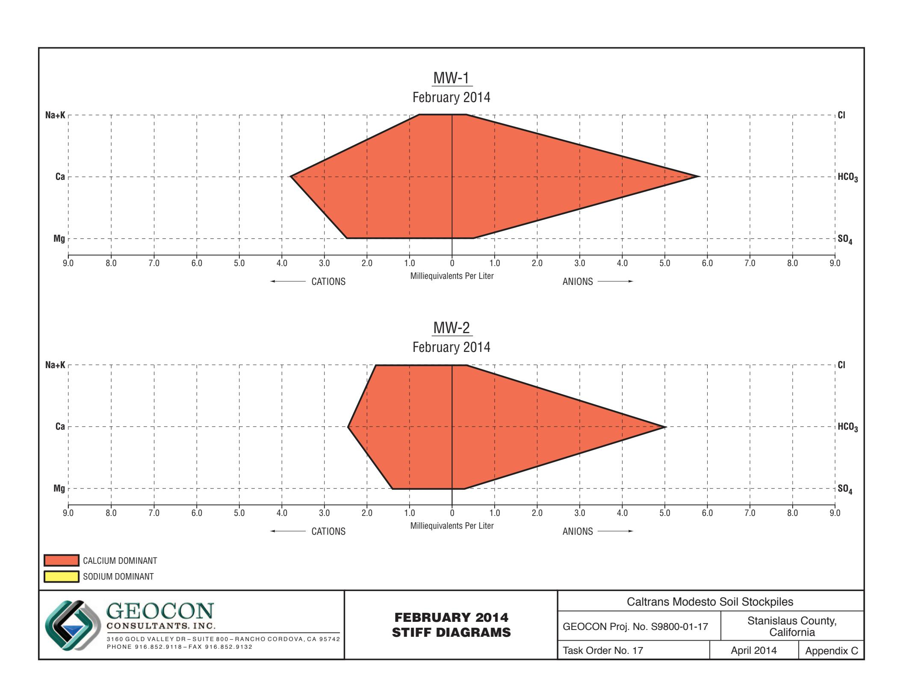

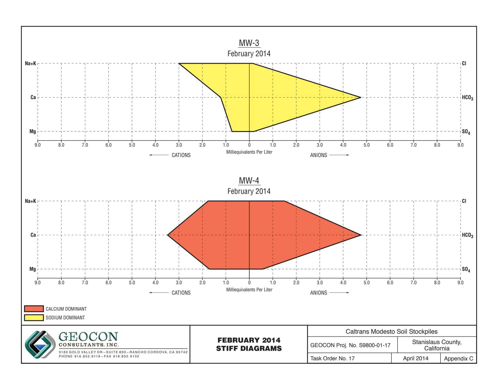

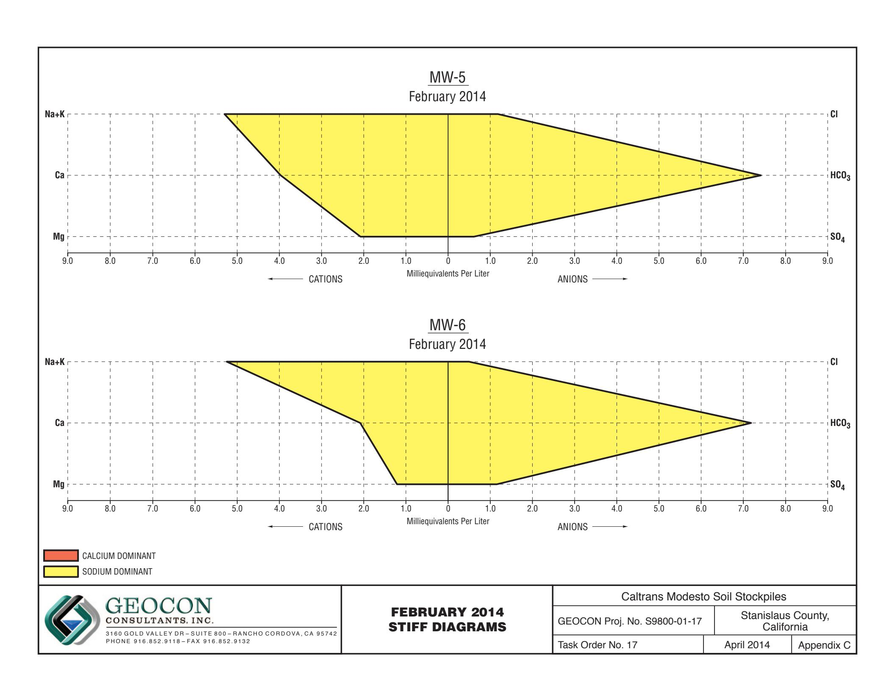

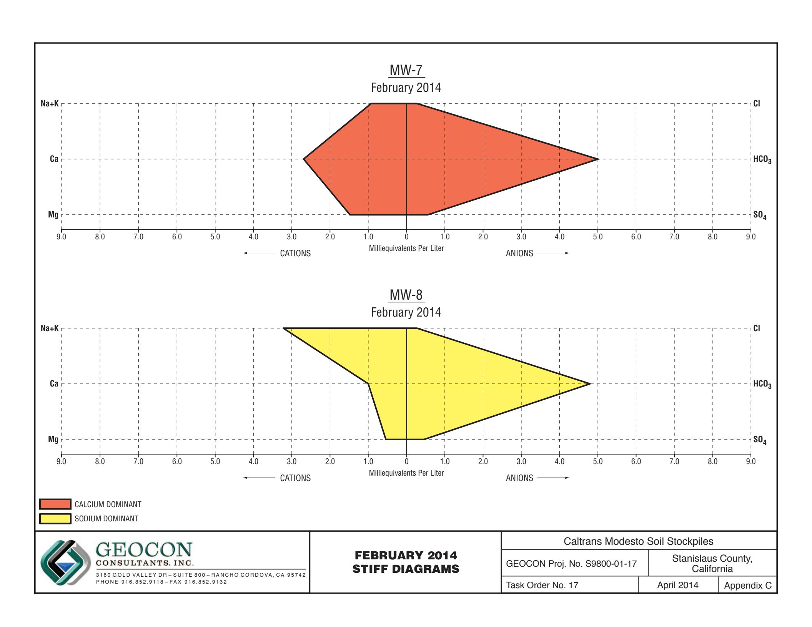

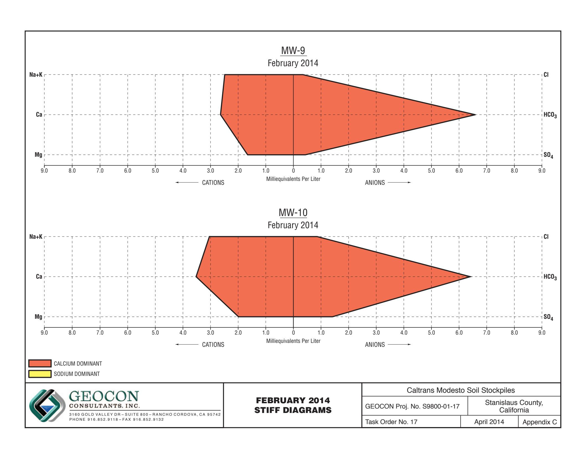