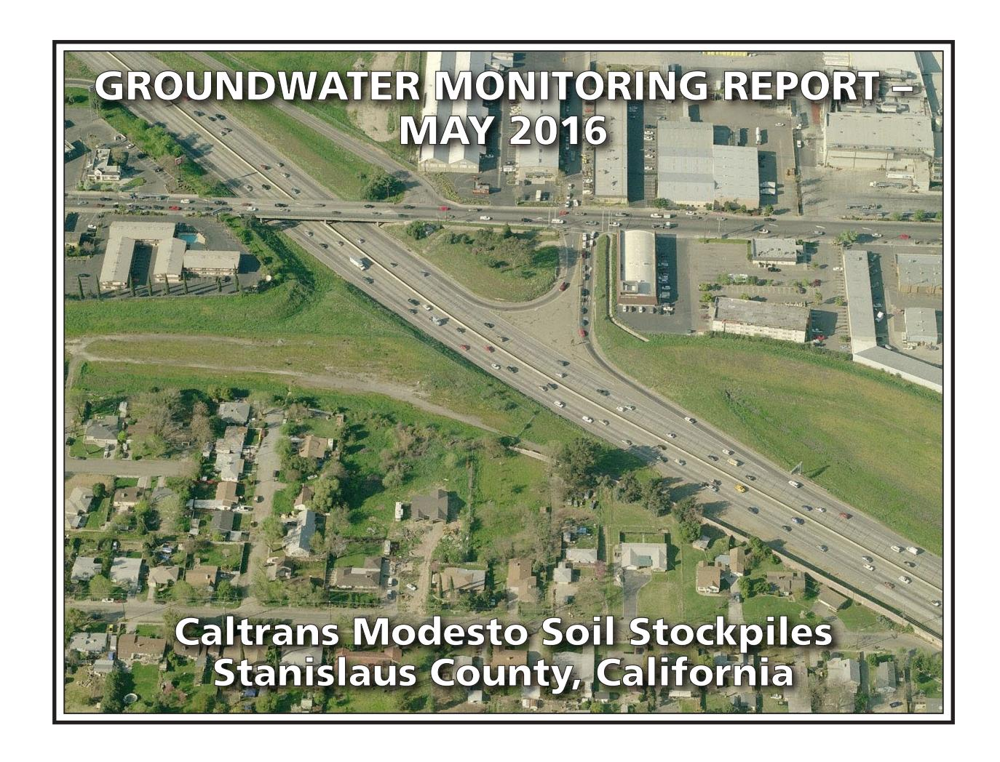
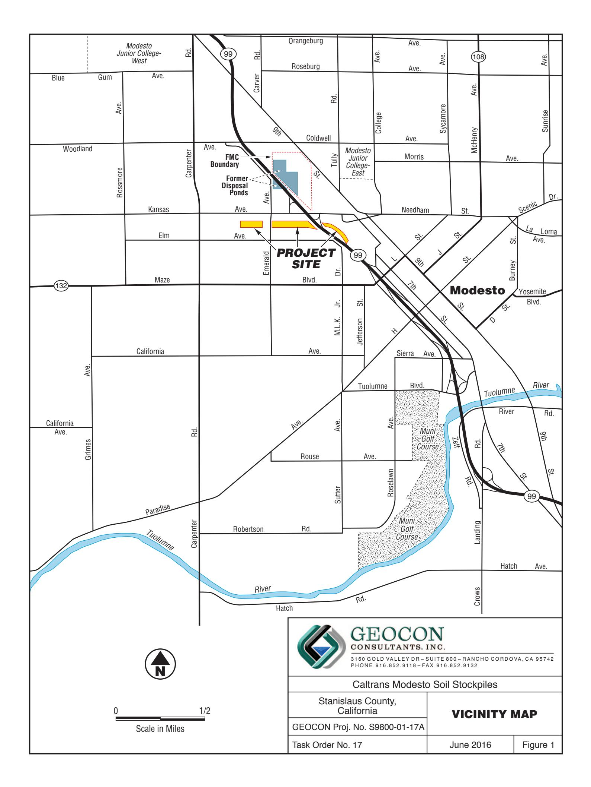
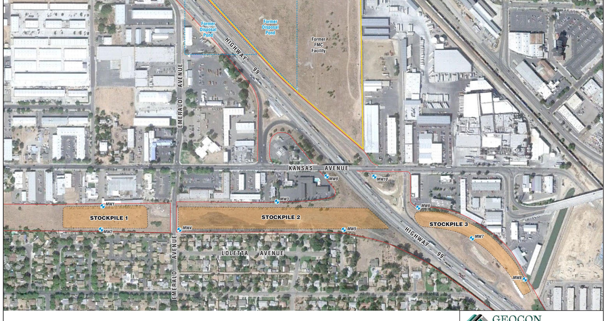
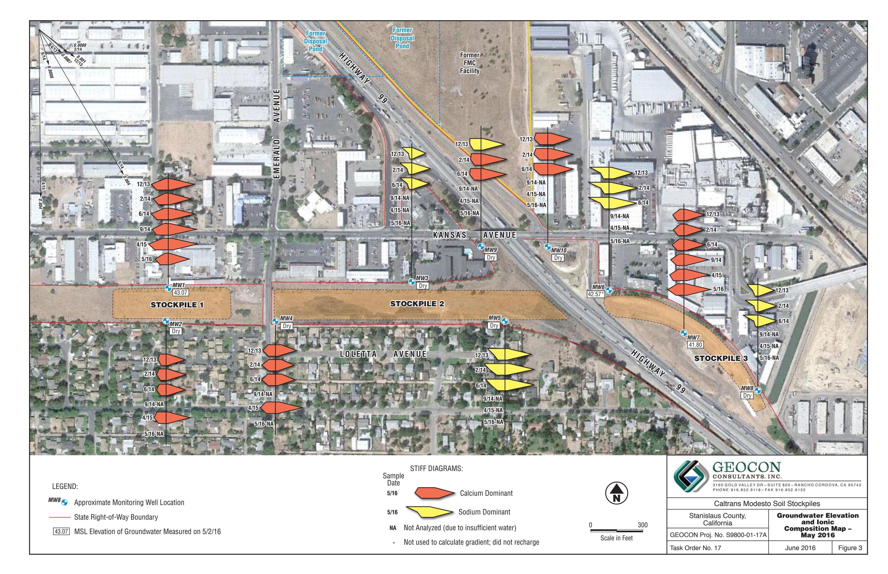
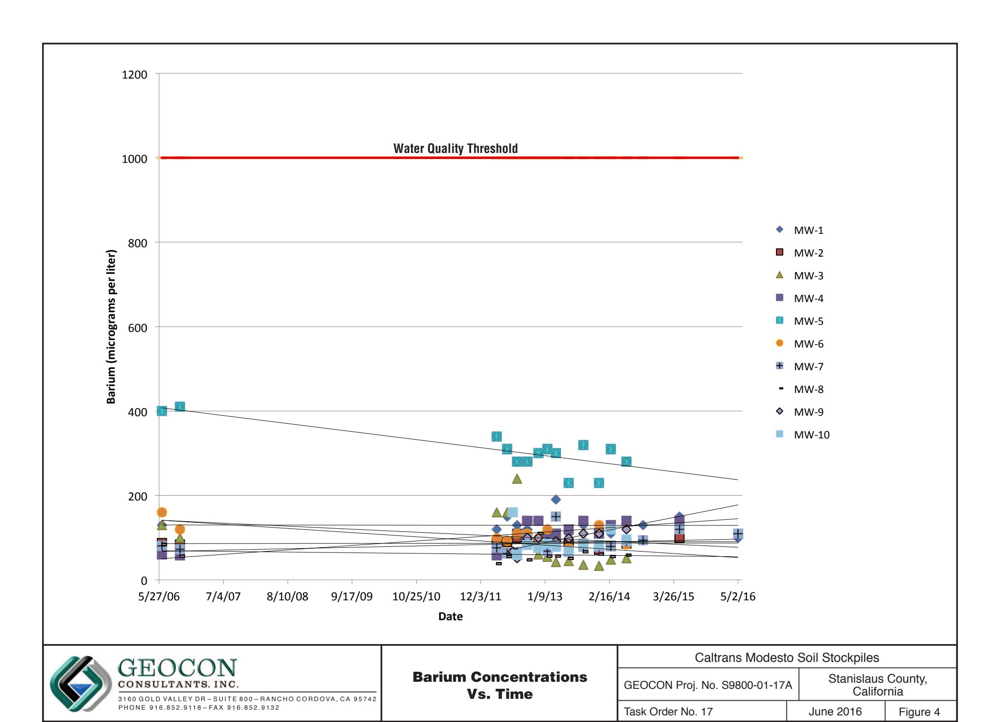
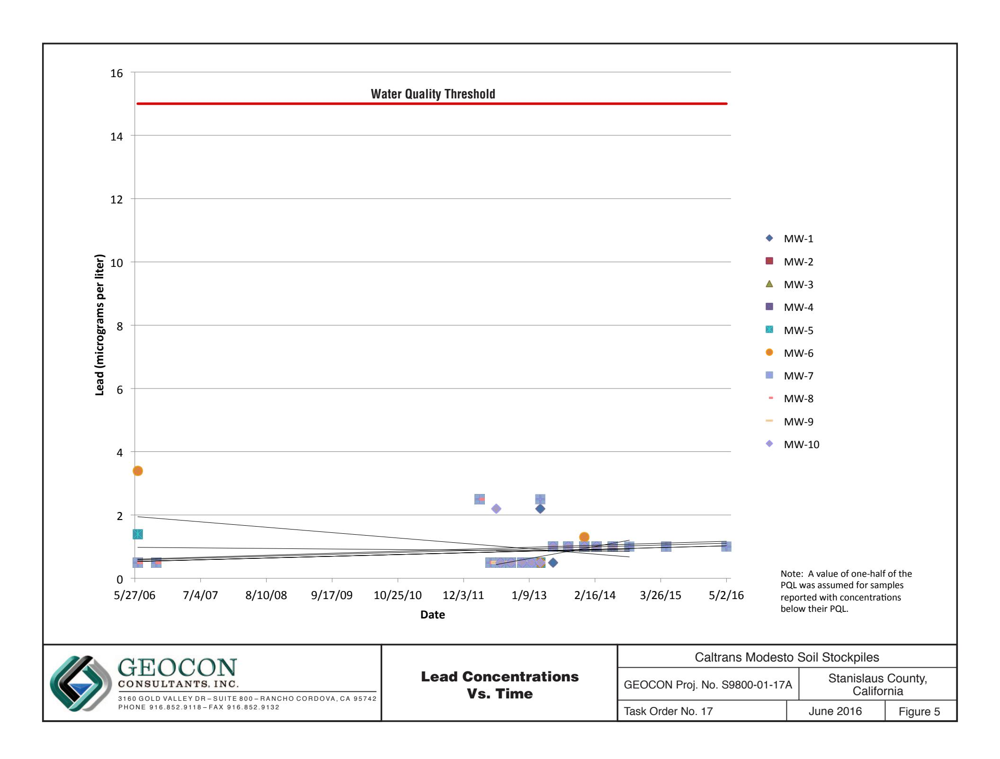
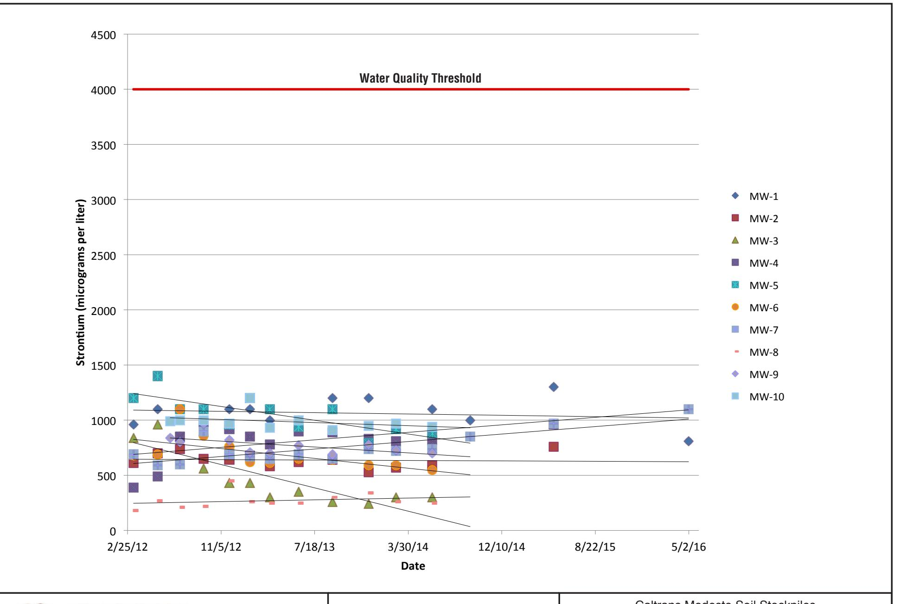
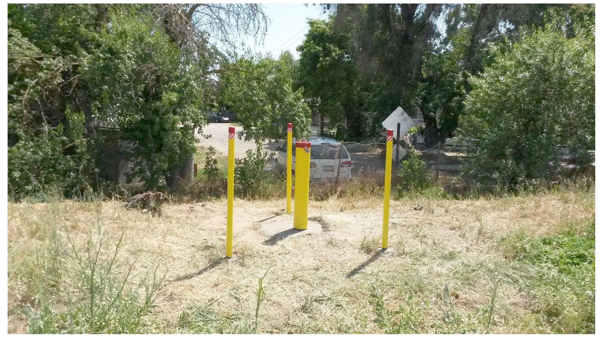
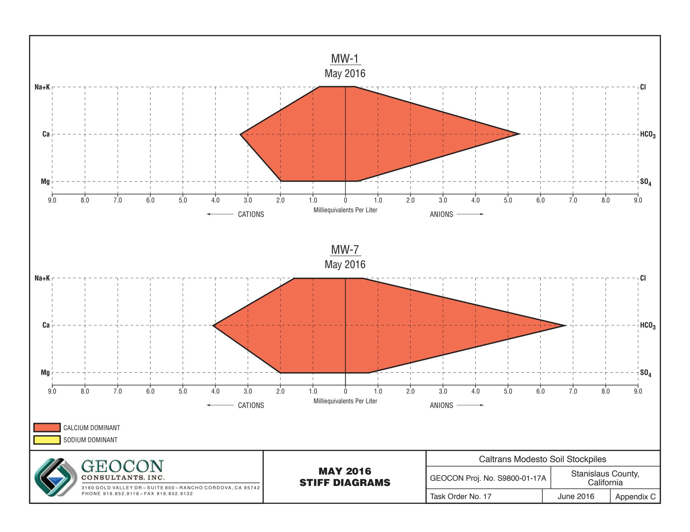

# PREPARED FOR:

CALIFORNIA DEPARTMENT OF TRANSPORTATION – DISTRICT 6
HAZARDOUS WASTE BRANCH
855 M STREET, SUITE 200
FRESNO, CALIFORNIA 93721

# PREPARED BY:

GEOCON CONSULTANTS, INC. 3160 GOLD VALLEY DRIVE, SUITE 800 RANCHO CORDOVA, CALIFORNIA 95742

**GEOCON PROJECT NO. S9800-01-17 TASK ORDER NO. 17, EA 10-0X2700 CONTRACT NO 06A1895** 

## GEOTECHNICAL . ENVIRONMENTAL . MATERIALS

Project No. S9800-01-17A June 22, 2016

Mr. Richard Stewart, PG California Department of Transportation - District 6 Hazardous Waste Branch 855 M Street, Suite 200 Fresno, California 93721

Subject: GROUNDWATER MONITORING REPORT – MAY 2016

CALTRANS MODESTO SOIL STOCKPILES STANISLAUS COUNTY, CALIFORNIA

CONTRACT NO. 06A1895, TASK ORDER NO. 17, EA NO. 10-0X2700

Dear Mr Stewart:

In accordance with California Department of Transportation (Caltrans) Contract No. 06A1895, Task Order (TO) No. 17, Geocon performed groundwater monitoring activities at the Caltrans Modesto Soil Stockpiles (Site) located southerly of the intersection of State Route (SR) 99 and Kansas Avenue in Stanislaus County, California. This report presents the results of the May 2016 sampling event. The approximate site location is depicted on the attached Vicinity Map, Figure 1. The approximate site boundaries and Stockpiles 1 through 3 are shown on the Site Plan, Figure 2.

The scope of TO No. 17 includes the performance of groundwater sampling and analysis at the Site in accordance with protocols approved by the California Environmental Protection Agency Department of Toxic Substances Control (DTSC) as established in the *Final Work Plan, Groundwater Assessment* prepared by Shaw Environmental, Inc., and dated January 2006. The scope of services reported herein included depth to groundwater measurements, groundwater sample collection from two of ten monitoring wells that contained sufficient groundwater, analysis of the water samples by a California-certified laboratory, and preparation of this report.

## BACKGROUND

## Project Description and History

Stockpiles 1 through 3 were generated during construction of SR 99 through Modesto around 1961 when Caltrans excavated soil from property purchased from Food Machinery and Chemical Corporation (FMC) that contained an evaporation pond. The stockpiles were placed in their present location in anticipation of construction of the State Route 132 West Freeway/Expressway project.

During the 1930s, Barium Products Ltd. occupied property at 1200 Barium Road (now Graphics Drive) in Modesto just east of SR 99 between Woodland and Kansas Avenues. Barium Products Ltd. was a chemical manufacturing company processing a variety of ores and minerals including barite (barium sulfate) and celestite (strontium sulfate). Materials produced included barium and strontium compounds; these were used in greases, lubricating oil and pigment blanks. Sodium sulfide generated as a by-product of barite processing was sold as a caustic and used as a reagent in the mining industry.

In 1943, Barium Products Ltd. was purchased by Westvaco Chlorine Products Corporation which subsequently merged with FMC in 1948. From the 1950s to the 1970s, a liquid residue from the processing operations was discharged to unlined evaporation ponds along the western portion of the FMC Site. The approximate boundaries of the former evaporation/disposal ponds are shown on Figure 2.

In 1961, a 4.3-acre parcel at the southwestern corner of the FMC site was purchased by the State of California for highway right-of-way needed to construct SR 99. An aerial photograph from 1957 shows that a portion of the southernmost pond on the FMC property was within the area purchased for right-of-way.

Soil in and around the pond was excavated during construction of SR 99 and stockpiled within the current Caltrans right-of-way at the location of the future State Route 132 West Freeway/Expressway project. Three distinct stockpiles are present at the Site:

- Stockpile 1, located south of Kansas Avenue and west of North Emerald Avenue,
- Stockpile 2, located south of Kansas Avenue, between North Emerald Avenue and SR 99, and
- Stockpile 3, located south of Kansas Avenue and east of SR 99.

In 2006, Caltrans arranged for the installation of monitoring wells MW-1 through MW-8 at locations adjacent to the three stockpiles as shown on Figure 2. General groundwater chemistry analytical results from June and October 2006 groundwater events suggested that two distinct groundwater types are present beneath the Site. A survey of groundwater wells within a one-mile radius of the Site identified 43 existing or former wells; however, there were no active supply wells identified in the general (southeast) flow direction from the Site.

Groundwater monitoring was resumed for the Site with the March 2012 sampling of wells MW-1 through MW-8. Representatives from the DTSC observed the sample collection procedures and collected split samples which were submitted to an alternate laboratory. No notable differences in the concentrations for each reported analyte were evident.

In June 2012, Geocon arranged for the installation of monitoring wells MW-9 and MW-10 at locations that are both upgradient and adjacent to the three stockpiles as shown on Figure 2.

Geocon compared the analytical results from the 2012 to 2014 groundwater sampling events to the following water quality threshold values:

- Primary Maximum Contaminant Levels (MCLs) promulgated by the California Department of Public Health (CDPH); and
- Secondary MCLs promulgated by the CDPH.

The results of the groundwater sampling events show that both dissolved metals and general minerals have predominantly been reported at concentrations less than their respective numeric water quality threshold values. Only nitrates (expressed as nitrogen) in MW-1, MW-5, MW-6, and MW-10 and total dissolved solids (TDS) in wells MW-5, MW-6, and MW-10 have been consistently reported at concentrations that exceed their respective primary or secondary MCLs of 10 and 500 milligrams per liter (mg/l). Manganese has been sporadically reported for various wells at concentrations exceeding the secondary MCL; however, the concentrations have not been consistently elevated for any one well. Based on the lack of polycyclic aromatic hydrocarbons (PAHs) reported for each of the samples analyzed, we requested discontinuation of analysis for PAHs. PAH analysis was discontinued after the

November 2012 sampling event with concurrence from the DTSC.

## Hydrogeologic Characterization

The hydrogeology of the adjacent FMC site has been characterized by numerous studies since the early 1980s. The GeoTrans January 2005 report Addendum to Comprehensive Remedial Investigations Report, FMC Corporation, 1200 Graphics Drive, Modesto, Stanislaus County, California (GeoTrans, 2005) provides a description of the FMC site hydrogeology. This description follows:

"The site is underlain by laterally discontinuous and unconsolidated sand and silty sand associated with the Modesto and Riverbank Formations. First encountered groundwater is approximately 30 feet below ground surface (bgs) under confined to semi-confined conditions. A deeper aquifer is present at a depth of 165 feet bgs and separated from the upper zone by a blue clay aquitard. The upper water bearing unit has been divided into two zones: a shallow zone from first encountered groundwater to 120 feet bgs and a deeper zone from 140 feet bgs to the top of the aguitard. Groundwater flow within the upper zone is toward the southeast under a gradient of 0.002 ft/ft."

Monitoring wells MW-1 through MW-10 were installed into the unconsolidated sand, silty sand and silt layers within the Modesto Formation underlying the Site. The wells were completed within the shallow zone of the upper aquifer (shallow zone).

The lithology encountered in the borings for the wells includes interbedded (laterally discontinuous) sands, silts, and clays. In the areas investigated, the unsaturated (vadose) zone was dominated by silty soils. The shallow zone groundwater beneath the stockpiles was encountered at approximately 35 feet (elevation approximately 50 feet) under unconfined to semi-confined conditions, Based on historical depth to water measurements from the Site, the groundwater flow direction in the shallow upper aquifer is generally toward the southeast with hydraulic gradients varying from 0.0006 to 0.004. The shallow aquifer conditions beneath the Site and the adjacent FMC site appear similar and representative of conditions in the local area.

## OCTOBER 2015 FIELD ACTIVITIES

## Depth to Groundwater Measurements

On October 1, 2015, prior to opening the wells, Geocon observed each of the ten well boxes for signs of potential tampering or required maintenance. We observed no signs of tampering or damage to the well boxes. We measured the depth to groundwater in each well using a battery-operated water level meter. Depth to water measurements were obtained from a surveyed reference point at the top of the well casings (TOC). Monitoring wells MW-3 through MW-6 and MW-8 through MW-10 were dry.

In October 2015, depth to groundwater in wells MW-1, MW-2, and MW-7 were measured at 40.03, 38.72, and 44.12 feet, respectively, below TOC. A summary of the TOC elevations, depth to groundwater measurements and groundwater elevations is on Table 1. A gradient rose diagram depicting historical flow direction and gradient is included on Figure 3.

## MAY 2016 FIELD ACTIVITIES

## Depth to Groundwater Measurements

On May 2, 2016, prior to opening the wells, Geocon observed each of the ten well boxes for signs of potential tampering or required maintenance. At MW-5, the cover to the well box was missing and the well box itself was damaged. The locking well cap was also missing. Although the well box was damaged and the cap was missing, we did not observe evidence of tampering with the well casing and the integrity of the well appeared to be intact. We extended the well casing and installed a stove pipe and bollards for this well on May 12, 2016 (see Photo No. 1). We observed no other signs of tampering or damage to the other well boxes. We measured the depth to groundwater in each well and oxygenreduction potential (ORP) in monitoring wells MW-1 and MW-7 using a battery-operated water level meter and an Oakton ORP meter. Depth to water measurements were obtained from a surveyed reference point at the top of the well casings (TOC). Monitoring wells MW-2 through MW-6 and MW-8 through MW-10 were dry or had insufficient water to purge and sample.

In May 2016, depth to groundwater in wells MW-1 and MW-7 were measured at 37.32 and 41.94 feet, respectively, below TOC. Historical groundwater flow has been towards the south to southeast. A summary of the TOC elevations, depth to groundwater measurements and groundwater elevations is on Table 1. Groundwater elevations are depicted on Figure 3, Groundwater Elevation and Ionic Composition Map – May 2016. A gradient rose diagram depicting historical flow direction and gradient is included on Figure 3.

## Well Purging and Sampling

On May 2, 2016, Geocon purged approximately three well volumes of water (3 to 3.5 gallons) from wells MW-1 and MW-7 using disposable bailers. We attempted to purge water from MW-6, however, there was insufficient water in the monitoring well to purge and sample. During the well purging activities, the groundwater was monitored for pH, electrical conductivity, and temperature. This information is included on the Monitoring Well Sampling Data sheets in Appendix A.

Following well purging, groundwater samples were collected from each well using disposable bailers and decanted through slow emptying devices into laboratory-provided sample containers. The groundwater samples collected for dissolved metals analysis were filtered using a hand-pressure pump through a 0.45micron filter while filling the container. The samples were sealed, labeled, placed in a chilled cooler and subsequently transported to the laboratory using chain-of-custody protocol.

Purged groundwater was placed into one Department of Transportation-approved, 17-H, 55-gallon drum and transported offsite to Geocon's Rancho Cordova office pending disposal. The purge water was disposed of at Inviro-Tec Disposal in Lincoln, California, on May 3, 2016.

## ANALYTICAL METHODS AND RESULTS

## Laboratory Analysis

The groundwater samples were delivered to Advanced Technology Laboratories (ATL) for the following analyses under chain-of-custody protocol:

• Title 22 dissolved metals (including strontium) following United States Environmental Protection Agency (EPA) Test Methods 6020/7470;

- Dissolved calcium, magnesium, potassium and sodium by EPA Test Method 6020;
- Chloride, nitrate as nitrogen and sulfate by EPA Test Method 300.0;
- Sulfide by Standard Method (SM) 4500;
- TDS by SM 2540C; and
- Total alkalinity, bicarbonate alkalinity, carbonate alkalinity by SM 2320B.

Groundwater analytical results for this monitoring event are summarized on Tables 2 and 3. The laboratory report and chain-of-custody documentation are in Appendix B.

## Analytical Results

## Dissolved Metals

Analytical results for dissolved metals along with their associated numeric water quality thresholds are summarized on Table 2. Plots of barium, lead and strontium concentrations vs. time are presented as Figures 4 through 6.

DTSC has identified barium, lead and strontium as the primary chemicals of concern in groundwater for the Site. For the May 2016 groundwater samples, barium and strontium were reported for each of the two groundwater samples analyzed. Lead was not reported at concentrations equal to or greater than the respective practical quantitation limit (PQL) in each of the two samples. Barium and strontium concentrations reported for the May sampling event are in the following table:

| Dissolved Metal  | MW-1 | MW-7  | Numeric Water Quality Threshold |
|------------------|------|-------|------------------------------------|
| Barium (µg/l)    | 100  | 110   | 1,000(1) / 700(2)                  |
| Strontium (µg/l) | 810  | 1,100 | 4,000(2)                           |

(1) = California Department of Public Health Primary MCL for Drinking Water

Antimony, beryllium, cadmium, selenium, silver, thallium, zinc, and mercury were not reported at concentrations equal to or greater than their respective PQLs in samples from each well. As shown in the following table, the dissolved metals arsenic, chromium, molybdenum, nickel, and vanadium were reported for each of the samples collected with the following concentrations:

| Dissolved Metal  | MW-1 | MW-7 | Numeric Water Quality Threshold |
|------------------|------|------|------------------------------------|
| Arsenic (μg/l)   | 1.6  | 2.2  | 10(1)                              |
| Chromium (μg/l)  | 3.5  | 6.5  | 50(1)                              |
| Molybdenum(μg/l) | 0.54 | 1.2  | 40(2)                              |

(2) = EPA Drinking Water Health Advisory

 $\mu g/l = Micrograms per liter$ 

| Dissolved Metal | MW-1 | MW-7 | Numeric Water Quality Threshold |
|-----------------|------|------|------------------------------------|
| Nickel (μg/l)   | 2.8  | 1.9  | 100(1)                             |
| Vanadium (μg/l) | 20   | 23   | 50(3)                              |

 $^{(1)}$  = California Department of Public Health Primary MCL for Drinking Water

None of the reported arsenic, chromium, molybdenum, nickel, and vanadium concentrations exceed their respective numeric water quality thresholds for drinking water.

Cobalt, copper, and manganese were reported the sample collected from MW-1. The following table summarizes the dissolved cobalt, copper, and manganese concentrations reported for the sample from MW-1:

| Dissolved Metal  | MW-1 | Numeric Water Quality Threshold |
|------------------|------|------------------------------------|
| Cobalt (μg/l)    | 0.72 | NE                                 |
| Copper (μg/l)    | 1.7  | 1,000(2)/1,300(3)                  |
| Manganese (μg/l) | 26   | 50(1)                              |

 $NE = Not \ established$ 

None of the reported concentrations of copper and manganese exceed their respective numeric water quality thresholds for drinking water. No numeric water quality threshold has been established for cobalt.

## General Minerals/Stiff Diagrams

To further characterize the geochemistry of the groundwater, general minerals analyses were conducted and included the following constituents:

- dissolved calcium
- dissolved magnesium
- chloride
- nitrate as nitrogen
- sulfate
- dissolved potassium
- dissolved sodium
- sulfide
- total alkalinity

(2) = EPA Drinking Water Health Advisory

(3) = California Department of Public Health Notification Level for Drinking Water

(1) = California Department of Public Health Primary MCL for Drinking Water

(2) = California Department of Public Health Secondary MCL (taste and odor)

(3) = California Department of Public Health Regulatory Action Level

## TDS

General groundwater chemistry provides information regarding the origin and geochemical nature of the groundwater sampled. The analytical results for the major cation (dissolved sodium, potassium, calcium and magnesium) and anion species (chloride, bicarbonate alkalinity reported as calcium carbonate, and sulfate) were used to create Stiff diagrams. Stiff diagrams provide a graphical display of ionic content and can be used to characterize and evaluate the relative composition of groundwater and its consistency or variability. Groundwater with different cation/anion concentrations will result in Stiff diagrams of different shapes and sizes. Stiff diagrams can also help to illustrate mixing of water with different compositions or origins. The presence of more than one water type can be an indication of influences due to hydrogeologic variation or from other sources including man-made impacts.

Appendix C contains Stiff diagrams constructed using site groundwater data for May 2016. The diagrams show that groundwater sampled in each monitoring well is bicarbonate (HCO3) dominant. However, variations in the sodium and potassium (Na+K) and calcium composition are readily apparent. The variations are seen primarily in the sodium content with the potassium concentrations being less variable. The samples from wells MW-1 and MW-7 had a calcium-dominant composition for the May 2016 sampling event.

The analytical results for general minerals are summarized on Table 3. Nitrate as nitrogen was reported for the groundwater samples collected from MW-1 and MW-7 at respective concentrations of 9.2 and 8.7 mg/l, which is less than its primary MCL of 10 mg/l. TDS was reported for the samples collected from MW-1 and MW-7 at respective concentrations of 420 and 510, one of which exceeds its secondary MCL of 500 mg/l. Sulfide was reported for the samples collected from MW-1 and MW-7 at respective concentrations of 0.11 and 0.036 mg/l.

The field QA/QC implemented for the May 2016 groundwater monitoring event included the collection of a duplicate groundwater sample. The groundwater sample collected from well MW-7 was duplicated and labeled as non-existent monitoring well MW-11. When comparing the results of primary sample MW-7 to the duplicate sample, dissolved metals and general minerals, with the exception of sulfide, were detected in both samples at similar concentrations. Sulfide was reported at a concentration of 0.036 mg/l for primary sample MW-7 and was reported at 0.011 mg/l for duplicate sample MW-11. The resulting relative percent difference (RPD) is 106%. Based on an RPD greater than 25%, sulfide results reported herein must be qualified as estimated with the potential to be less than or greater than the reported values.

## Laboratory Quality Assurance/Quality Control

Geocon reviewed the analytical laboratory quality assurance/quality control (QA/QC) provided with the laboratory report. The laboratory data show that the method blank surrogate recoveries are acceptable and that concentrations of selected analytes were not reported at concentrations equal to or greater than their respective PQLs for each method blank for each analysis. Appropriate recoveries were noted for each laboratory control sample for each analysis. Several matrix spike/matrix spike duplicate (MS/MSD) analytes had recoveries or RPDs outside of laboratory control limits; however, the sample results were validated by the laboratory control samples. No qualification of the data is necessary, and the data are considered of sufficient quality for the purposes of this report.

## GeoTracker Submittal

The laboratory prepared electronic data files for submittal to the State Water Resources Control Board GeoTracker database. The GeoTracker database is accessible via the GeoTracker website at http://geotracker.waterboards.ca.gov. The electronic data was uploaded to GeoTracker on June 1, 2016. The confirmation numbers are 3918809890 and 2887605667.

## CONCLUSIONS AND RECOMMENDATIONS

None of the reported dissolved metals concentrations for the groundwater samples collected in May 2016 exceeded their respective numeric water quality threshold values.

None of the reported general minerals for the groundwater samples collected in May 2016 were greater than or equal to their respective California primary MCLs. TDS was reported for the groundwater sample collected from MW-7 at 510 mg/l, a concentration that exceeds the secondary MCL of 500 mg/l.

Barium and strontium were reported for the May 2016 groundwater samples at concentrations similar to historical levels and remained significantly less than their numeric water quality thresholds. The remaining dissolved metals were also reported at concentrations similar to historical levels.

Stiff diagrams for the 2012 through May 2016 groundwater sampling events show that very slight changes in ionic content have occurred since groundwater sampling resumed at the Site in March 2012. Water samples from wells MW-1 and MW-7 have consistently been reported as calcium-dominant. Groundwater monitoring is currently performed annually, with the next monitoring event scheduled for April 2017. Depth to water measurements will be collected semi-annually, with the next event scheduled for October 2016.

We appreciate the opportunity to provide our services on this project. Please contact us if you have any questions concerning the contents of this Report or if we may be of further service.

Sincerely,

GEOCON CONSULTANTS, INC.

Rebecca L. Silva Project Manager

John E. Juhrend, PE, CEG Senior Engineer

- Caltrans, Grace Magsayo (1)
- (1) DTSC, Randy Adams
- CVRWQCB, Steve Meeks (1)

Attachments: Figure 1, Vicinity Map

Figure 2, Site Plan

Figure 3, Groundwater Elevation and Ionic Composition Map – May 2016

Figure 4, Barium Concentrations vs. Time Figure 5, Lead Concentrations vs. Time Figure 6, Strontium Concentrations vs. Time

Photo 1, MW-5 Stove Pipe and Bollards

Table 1, Groundwater Elevation Data

Table 2, Summary of Groundwater Analytical Results – Title 22 Metals (Dissolved)

Table 3, Summary of Groundwater Analytical Results - General Minerals and

Table 4. Well Construction Details

Appendix A, Monitoring Well Sampling Data Sheets Appendix B, Laboratory Report and Chain-of-custody Documentation Appendix C, Stiff Diagrams

MW8 Approximate Monitoring Well Location

— State Right-of-Way Boundary

Scale in Feet

### GEOCON CONSULTANTS, INC.

3160 GOLD VALLEY DR - SUITE 800 - RANCHO CORDOVA, CA 95742 PHONE 916.852.9118 - FAX 916.852.9132

## Caltrans Modesto Soil Stockpiles

| Stanislaus County, California |
|----------------------------------|
| GEOCON Proj. No. S9800-01-17A    |

**SITE PLAN** 

Task Order No. 17

June 2016

June 2016

Figure 2

Strontium Concentrations Vs. Time

| Caltrans Modesto Soil Stockpiles |           |                                  |          |  |
|----------------------------------|-----------|----------------------------------|----------|--|
| GEOCON Proj. No. S9800-01-17A    |           | Stanislaus County, California |          |  |
| Task Order No. 17                | June 2016 |                                  | Figure 6 |  |

Photo No. 1 MW-5 Stove Pipe and Bollards

PHOTO NO. 1

| Caltrans Modesto Soil Stockpiles |            |                                        |                                             |                                        |
|----------------------------------|------------|----------------------------------------|---------------------------------------------|----------------------------------------|
| GEOCON Proj. No. S9800-01-17A    |            | Stanislaus County, California       |                                             |                                        |
| Task Order No. 17                |            | June 2016                              |                                             |                                        |
| WELL ID                          | DATE       | WELL CASING ELEVATION (feet MSL) | DEPTH TO GROUNDWATER (feet below TOC) | GROUNDWATER ELEVATION (feet MSL) |
| MW-1                             | 6/14/2006  | 80.26                                  | 29.82                                       | 50.44                                  |
| MW-1                             | 10/5/2006  | 80.26                                  | 32.35                                       | 47.91                                  |
| MW-1                             | 3/12/2012  | 80.26                                  | 30.12                                       | 50.14                                  |
| MW-1                             | 5/17/2012  | 80.26                                  | 29.74                                       | 50.52                                  |
| MW-1                             | 7/17/2012  | 80.39                                  | 31.34                                       | 49.05                                  |
| MW-1                             | 9/19/2012  | 80.39                                  | 32.73                                       | 47.66                                  |
| MW-1                             | 11/28/2012 | 80.39                                  | 32.28                                       | 48.11                                  |
| MW-1                             | 1/22/2013  | 80.39                                  | 31.04                                       | 49.35                                  |
| MW-1                             | 3/18/2013  | 80.39                                  | 31.15                                       | 49.24                                  |
| MW-1                             | 6/5/2013   | 80.39                                  | 31.73                                       | 48.66                                  |
| MW-1                             | 9/4/2013   | 80.39                                  | 33.74                                       | 46.65                                  |
| MW-1                             | 12/11/2013 | 80.39                                  | 33.46                                       | 46.93                                  |
| MW-1                             | 2/25/2014  | 80.39                                  | 33.40                                       | 46.99                                  |
| MW-1                             | 6/4/2014   | 80.39                                  | 35.09                                       | 45.30                                  |
| MW-1                             | 9/16/2014  | 80.39                                  | 37.80                                       | 42.59                                  |
| MW-1                             | 4/30/2015  | 80.39                                  | 36.85                                       | 43.54                                  |
| MW-1                             | 5/2/2016   | 80.39                                  | 37.32                                       | 43.07                                  |
| MW-2                             | 6/13/2006  | 81.10                                  | 30.72                                       | 50.38                                  |
| MW-2                             | 10/5/2006  | 81.10                                  | 33.35                                       | 47.75                                  |
| MW-2                             | 3/12/2012  | 81.10                                  | 31.04                                       | 50.06                                  |
| MW-2                             | 5/17/2012  | 81.10                                  | 30.69                                       | 50.41                                  |
| MW-2                             | 7/17/2012  | 81.25                                  | 33.28                                       | 47.97                                  |
| MW-2                             | 9/19/2012  | 81.25                                  | 33.70                                       | 47.55                                  |
| MW-2                             | 11/28/2012 | 81.25                                  | 33.22                                       | 48.03                                  |
| MW-2                             | 1/22/2013  | 81.25                                  | 31.97                                       | 49.28                                  |
| MW-2                             | 3/18/2013  | 81.25                                  | 32.07                                       | 49.18                                  |
| MW-2                             | 6/5/2013   | 81.25                                  | 32.67                                       | 48.58                                  |
| MW-2                             | 9/4/2013   | 81.25                                  | 34.71                                       | 46.54                                  |
| MW-2                             | 12/11/2013 | 81.25                                  | 34.37                                       | 46.88                                  |
| MW-2                             | 2/25/2014  | 81.25                                  | 34.31                                       | 46.94                                  |
| MW-2                             | 6/4/2014   | 81.25                                  | 36.06                                       | 45.19                                  |
| MW-2                             | 9/16/2014  | 81.25                                  | 38.69                                       | 42.56                                  |
| MW-2                             | 4/30/2015  | 81.25                                  | 37.79                                       | 43.46                                  |
| MW-2                             | 5/2/2016   | 81.25                                  |                                             | DRY                                    |
| WELL ID                          | DATE       | WELL CASING ELEVATION (feet MSL) | DEPTH TO GROUNDWATER (feet below TOC) | GROUNDWATER ELEVATION (feet MSL) |
| MW-3                             | 6/13/2006  | 81.76                                  | 32.38                                       | 49.38                                  |
| MW-3                             | 10/5/2006  | 81.76                                  | 34.88                                       | 46.88                                  |
| MW-3                             | 3/12/2012  | 81.76                                  | 32.35                                       | 49.41                                  |
| MW-3                             | 5/17/2012  | 81.76                                  | 31.91                                       | 49.85                                  |
| MW-3                             | 7/17/2012  | 81.82                                  | 33.45                                       | 48.37                                  |
| MW-3                             | 9/19/2012  | 81.82                                  | 34.89                                       | 46.93                                  |
| MW-3                             | 11/28/2012 | 81.82                                  | 34.69                                       | 47.13                                  |
| MW-3                             | 1/22/2013  | 81.82                                  | 33.43                                       | 48.39                                  |
| MW-3                             | 3/18/2013  | 81.82                                  | 33.42                                       | 48.40                                  |
| MW-3                             | 6/5/2013   | 81.82                                  | 33.83                                       | 47.99                                  |
| MW-3                             | 9/4/2013   | 81.82                                  | 35.77                                       | 46.05                                  |
| MW-3                             | 12/11/2013 | 81.82                                  | 35.93                                       | 45.89                                  |
| MW-3                             | 2/25/2014  | 81.82                                  | 35.62                                       | 46.20                                  |
| MW-3                             | 6/4/2014   | 81.82                                  | 36.75                                       | 45.07                                  |
| MW-3                             | 9/16/2014  | 81.82                                  | DRY                                         | ---                                    |
| MW-3                             | 4/30/2015  | 81.82                                  | DRY                                         | ---                                    |
| MW-3                             | 5/2/2016   | 81.82                                  | DRY                                         | ---                                    |
| MW-4                             | 6/13/2006  | 82.36                                  | 32.39                                       | 49.97                                  |
| MW-4                             | 10/4/2006  | 82.36                                  | 35.05                                       | 47.31                                  |
| MW-4                             | 3/12/2012  | 82.36                                  | 32.60                                       | 49.76                                  |
| MW-4                             | 5/17/2012  | 82.36                                  | 32.20                                       | 50.16                                  |
| MW-4                             | 7/17/2012  | 82.47                                  | 33.86                                       | 48.61                                  |
| MW-4                             | 9/19/2012  | 82.47                                  | 35.28                                       | 47.19                                  |
| MW-4                             | 11/28/2012 | 82.47                                  | 34.84                                       | 47.63                                  |
| MW-4                             | 1/22/2013  | 82.47                                  | 33.60                                       | 48.87                                  |
| MW-4                             | 3/18/2013  | 82.47                                  | 33.65                                       | 48.82                                  |
| MW-4                             | 6/5/2013   | 82.47                                  | 34.20                                       | 48.27                                  |
| MW-4                             | 9/4/2013   | 82.47                                  | 36.23                                       | 46.24                                  |
| MW-4                             | 12/11/2013 | 82.47                                  | 36.05                                       | 46.42                                  |
| MW-4                             | 2/25/2014  | 82.47                                  | 35.88                                       | 46.59                                  |
| MW-4                             | 6/4/2014   | 82.47                                  | 37.42                                       | 45.05                                  |
| MW-4                             | 9/16/2014  | 82.47                                  | DRY                                         | ---                                    |
| MW-4                             | 4/30/2015  | 82.47                                  | 39.20                                       | 43.27                                  |
| MW-4                             | 5/2/2016   | 82.47                                  | DRY                                         | ---                                    |
| WELL ID                          | DATE       | WELL CASING ELEVATION (feet MSL) | DEPTH TO GROUNDWATER (feet below TOC) | GROUNDWATER ELEVATION (feet MSL) |
| MW-5                             | 6/14/2006  | 87.73                                  | 38.79                                       | 48.94                                  |
| MW-5                             | 10/5/2006  | 87.73                                  | 41.40                                       | 46.33                                  |
| MW-5                             | 3/12/2012  | 87.73                                  | 38.74                                       | 48.99                                  |
| MW-5                             | 5/17/2012  | 87.73                                  | 38.25                                       | 49.48                                  |
| MW-5                             | 7/17/2012  | 87.78                                  | 39.74                                       | 48.04                                  |
| MW-5                             | 9/19/2012  | 87.78                                  | 41.19                                       | 46.59                                  |
| MW-5                             | 11/28/2012 | 87.78                                  | 41.18                                       | 46.60                                  |
| MW-5                             | 1/22/2013  | 87.78                                  | 40.02                                       | 47.76                                  |
| MW-5                             | 3/18/2013  | 87.78                                  | 39.62                                       | 48.16                                  |
| MW-5                             | 6/5/2013   | 87.78                                  | 40.11                                       | 47.67                                  |
| MW-5                             | 9/4/2013   | 87.78                                  | 42.05                                       | 45.73                                  |
| MW-5                             | 12/11/2013 | 87.78                                  | 42.46                                       | 45.32                                  |
| MW-5                             | 2/25/2014  | 87.78                                  | 42.04                                       | 45.74                                  |
| MW-5                             | 6/4/2014   | 87.78                                  | 42.86                                       | 44.92                                  |
| MW-5                             | 9/16/2014  | 87.78                                  | 44.41                                       | 43.37                                  |
| MW-5                             | 4/30/2015  | 87.78                                  | DRY                                         |                                        |
| MW-5                             | 5/2/2016   | 87.78                                  | DRY                                         |                                        |
| MW-6                             | 6/14/2006  | 84.37                                  | 36.35                                       | 48.02                                  |
| MW-6                             | 10/5/2006  | 84.37                                  | 38.55                                       | 45.82                                  |
| MW-6                             | 3/12/2012  | 84.37                                  | 35.70                                       | 48.67                                  |
| MW-6                             | 5/17/2012  | 84.37                                  | 35.18                                       | 49.19                                  |
| MW-6                             | 7/17/2012  | 84.52                                  | 36.40                                       | 48.12                                  |
| MW-6                             | 9/19/2012  | 84.52                                  | 37.99                                       | 46.53                                  |
| MW-6                             | 11/28/2012 | 84.52                                  | 38.19                                       | 46.33                                  |
| MW-6                             | 1/22/2013  | 84.52                                  | 37.07                                       | 47.45                                  |
| MW-6                             | 3/18/2013  | 84.52                                  | 36.78                                       | 47.74                                  |
| MW-6                             | 6/5/2013   | 84.52                                  | 36.94                                       | 47.58                                  |
| MW-6                             | 9/4/2013   | 84.52                                  | 38.86                                       | 45.66                                  |
| MW-6                             | 12/11/2013 | 84.52                                  | 39.01                                       | 45.51                                  |
| MW-6                             | 2/25/2014  | 84.52                                  | 38.49                                       | 46.03                                  |
| MW-6                             | 6/4/2014   | 84.52                                  | 39.08                                       | 45.44                                  |
| MW-6                             | 9/16/2014  | 84.52                                  | 41.86                                       | 42.66                                  |
| MW-6                             | 4/30/2015  | 84.52                                  | 41.21                                       | 43.31                                  |
| MW-6                             | 5/2/2016   | 84.52                                  | 41.95                                       | 42.57                                  |
| WELL ID                          | DATE       | WELL CASING ELEVATION (feet MSL) | DEPTH TO GROUNDWATER (feet below TOC) | GROUNDWATER ELEVATION (feet MSL) |
| MW-7                             | 6/14/2006  | 83.64                                  | 35.59                                       | 48.05                                  |
| MW-7                             | 10/4/2006  | 83.64                                  | 38.32                                       | 45.32                                  |
| MW-7                             | 3/12/2012  | 83.64                                  | 35.31                                       | 48.33                                  |
| MW-7                             | 5/17/2012  | 83.64                                  | 34.72                                       | 48.92                                  |
| MW-7                             | 7/17/2012  | 83.74                                  | 36.00                                       | 47.74                                  |
| MW-7                             | 9/19/2012  | 83.74                                  | 37.60                                       | 46.14                                  |
| MW-7                             | 11/28/2012 | 83.74                                  | 37.35                                       | 46.39                                  |
| MW-7                             | 1/22/2013  | 83.74                                  | 36.78                                       | 46.96                                  |
| MW-7                             | 3/18/2013  | 83.74                                  | 36.42                                       | 47.32                                  |
| MW-7                             | 6/5/2013   | 83.74                                  | 36.49                                       | 47.25                                  |
| MW-7                             | 9/4/2013   | 83.74                                  | 38.53                                       | 45.21                                  |
| MW-7                             | 12/11/2013 | 83.74                                  | 39.21                                       | 44.53                                  |
| MW-7                             | 2/25/2014  | 83.74                                  | 38.60                                       | 45.14                                  |
| MW-7                             | 6/4/2014   | 83.74                                  | 39.09                                       | 44.65                                  |
| MW-7                             | 9/16/2014  | 83.74                                  | 41.94                                       | 41.80                                  |
| MW-7                             | 4/30/2015  | 83.74                                  | 41.26                                       | 42.48                                  |
| MW-7                             | 5/2/2016   | 83.74                                  | 41.94                                       | 41.80                                  |
| MW-8                             | 6/14/2006  | 83.73                                  | 36.12                                       | 47.61                                  |
| MW-8                             | 10/4/2006  | 83.73                                  | 38.95                                       | 44.78                                  |
| MW-8                             | 3/12/2012  | 83.73                                  | 35.75                                       | 47.98                                  |
| MW-8                             | 5/17/2012  | 83.73                                  | 35.11                                       | 48.62                                  |
| MW-8                             | 7/17/2012  | 83.85                                  | 36.29                                       | 47.56                                  |
| MW-8                             | 9/19/2012  | 83.85                                  | 38.04                                       | 45.81                                  |
| MW-8                             | 11/28/2012 | 83.85                                  | 38.37                                       | 45.48                                  |
| MW-8                             | 1/22/2013  | 83.85                                  | 37.35                                       | 46.50                                  |
| MW-8                             | 3/18/2013  | 83.85                                  | 36.90                                       | 46.95                                  |
| MW-8                             | 6/5/2013   | 83.85                                  | 36.85                                       | 47.00                                  |
| MW-8                             | 9/4/2013   | 83.85                                  | 39.08                                       | 44.77                                  |
| MW-8                             | 12/11/2013 | 83.85                                  | 39.77                                       | 44.08                                  |
| MW-8                             | 2/25/2014  | 83.85                                  | 39.07                                       | 44.78                                  |
| MW-8                             | 6/4/2014   | 83.85                                  | 39.41                                       | 44.44                                  |
| MW-8                             | 9/16/2014  | 83.85                                  | DRY                                         | -                                      |
| MW-8                             | 4/30/2015  | 83.85                                  | DRY                                         | -                                      |
| MW-8                             | 5/2/2016   | 83.85                                  | DRY                                         | -                                      |
| WELL ID                          | DATE       | WELL CASING ELEVATION (feet MSL) | DEPTH TO GROUNDWATER (feet below TOC) | GROUNDWATER ELEVATION (feet MSL) |
| MW-9                             | 6/18/2012  | 82.53                                  | 33.67                                       | 48.86                                  |
| MW-9                             | 7/17/2012  | 82.53                                  | 34.22                                       | 48.31                                  |
| MW-9                             | 9/19/2012  | 82.53                                  | 35.64                                       | 46.89                                  |
| MW-9                             | 11/28/2012 | 82.53                                  | 35.65                                       | 46.88                                  |
| MW-9                             | 1/22/2013  | 82.53                                  | 34.35                                       | 48.18                                  |
| MW-9                             | 3/18/2013  | 82.53                                  | 34.29                                       | 48.24                                  |
| MW-9                             | 6/5/2013   | 82.53                                  | 34.62                                       | 47.91                                  |
| MW-9                             | 9/4/2013   | 82.53                                  | 36.48                                       | 46.05                                  |
| MW-9                             | 12/11/2013 | 82.53                                  | 36.90                                       | 45.63                                  |
| MW-9                             | 2/25/2014  | 82.53                                  | 36.51                                       | 46.02                                  |
| MW-9                             | 6/4/2014   | 82.53                                  | 37.34                                       | 45.19                                  |
| MW-9                             | 9/16/2014  | 82.53                                  | 39.20                                       | 43.33                                  |
| MW-9                             | 4/30/2015  | 82.53                                  | DRY                                         | ---                                    |
| MW-9                             | 5/2/2016   | 82.53                                  | DRY                                         | ---                                    |
| MW-10                            | 6/18/2012  | 83.97                                  | 35.18                                       | 48.79                                  |
| MW-10                            | 7/17/2012  | 83.97                                  | 35.75                                       | 48.22                                  |
| MW-10                            | 9/19/2012  | 83.97                                  | 37.18                                       | 46.79                                  |
| MW-10                            | 11/28/2012 | 83.97                                  | 37.34                                       | 46.63                                  |
| MW-10                            | 1/22/2013  | 83.97                                  | 36.13                                       | 47.84                                  |
| MW-10                            | 3/18/2013  | 83.97                                  | 35.97                                       | 48.00                                  |
| MW-10                            | 6/5/2013   | 83.97                                  | 36.17                                       | 47.80                                  |
| MW-10                            | 9/4/2013   | 83.97                                  | 38.00                                       | 45.97                                  |
| MW-10                            | 12/11/2013 | 83.97                                  | 38.64                                       | 45.33                                  |
| MW-10                            | 2/25/2014  | 83.97                                  | 38.18                                       | 45.79                                  |
| MW-10                            | 6/4/2014   | 83.97                                  | 38.76                                       | 45.21                                  |
| MW-10                            | 9/16/2014  | 83.97                                  | 39.13                                       | 44.84                                  |
| MW-10                            | 4/30/2015  | 83.97                                  | DRY                                         | ---                                    |
| MW-10                            | 5/2/2016   | 83.97                                  | DRY                                         | ---                                    |

Notes:

MSL = Mean sea level

TOC = Top of well casing

Data prior to 3/12/2012 reproduced from Site Investigation Report, Groundwater Assessment, Caltrans Modesto Soil Stockpiles State Route 99/132 Project, Stanislaus County, California, Shaw Environmental, Inc., May 14, 2007.

Wells resurveyed by Morrow Surveying on June 18, 2012.

|                                                              |                                                                                                                                                                                                  |                                                                                                             |                                                                                                 |                                                                                                |                                                                                                                                                              |                                                                                                                     |                                                                                             | 2                                                                                                    | 100 0001                                                                                      | ,                                                             |                                                            |                                                                                                           |                                                               |                                                                                                                                               |                                                                                                                        |                                                                                                                       |                                                                              |                                                         |                                                                                                      |                                                                                                                                                                                                                            |         |
|--------------------------------------------------------------|--------------------------------------------------------------------------------------------------------------------------------------------------------------------------------------------------|-------------------------------------------------------------------------------------------------------------|-------------------------------------------------------------------------------------------------|------------------------------------------------------------------------------------------------|--------------------------------------------------------------------------------------------------------------------------------------------------------------|---------------------------------------------------------------------------------------------------------------------|---------------------------------------------------------------------------------------------|------------------------------------------------------------------------------------------------------|-----------------------------------------------------------------------------------------------|---------------------------------------------------------------|------------------------------------------------------------|-----------------------------------------------------------------------------------------------------------|---------------------------------------------------------------|-----------------------------------------------------------------------------------------------------------------------------------------------|------------------------------------------------------------------------------------------------------------------------|-----------------------------------------------------------------------------------------------------------------------|------------------------------------------------------------------------------|---------------------------------------------------------|------------------------------------------------------------------------------------------------------|----------------------------------------------------------------------------------------------------------------------------------------------------------------------------------------------------------------------------|---------|
| ANALYTE                                                      |                                                                                                                                                                                                  | Antimony                                                                                                    | Arsenic                                                                                         | Barium                                                                                         | Beryllium                                                                                                                                                    | Cadmium                                                                                                             | Chromium                                                                                    | Cobalt                                                                                               | Copper                                                                                        | Lead                                                          | Manganese                                                  | Molybdenum                                                                                                | Nickel                                                        | Selenium                                                                                                                                      | Silver                                                                                                                 | Thallium                                                                                                              | Vanadium                                                                     | Zinc                                                    | Strontium                                                                                            | Mercury                                                                                                                                                                                                                    |         |
| SAMPLE ID                                                    | SAMPLE DATE                                                                                                                                                                                   |                                                                                                             |                                                                                                 |                                                                                                |                                                                                                                                                              |                                                                                                                     |                                                                                             |                                                                                                      |                                                                                               | Results in 1                                                  | microgran                                                  | ns per lite                                                                                               | r                                                             |                                                                                                                                               |                                                                                                                        |                                                                                                                       |                                                                              |                                                         |                                                                                                      |                                                                                                                                                                                                                            |         |
| MW-1 MW-1 MW-1 MW-1 MW-1 MW-1 MW-1 MW-1 | 6/14/2006 10/5/2006 3/12/2012 3/12/2012 S 5/17/2012 7/16/2012 9/19/2012 11/28/2012 1/22/2013 3/18/2013 6/5/2013 9/4/2013 12/11/2013 2/25/2014 6/4/2014 | <1.0 <1.0 <1.0 <2.5 <10 <0.50 <b>0.51</b> <0.50 <0.50 <0.50 <0.50 <0.50 <0.50 <0.50 <0.50 <0.50 <0.50 <0.50 | 2.1 2.2 <5.0 1.6 2.3 2.2 2.1 2.2 2.0 3.3 2.2 2.4 1.8 1.9 | 130 120 120 105 150 130 120 140 110 190 110 130 120 110 | <1.0 <1.0 <1.0 <5.0 <5.0 <0.50 <0.50 <0.50 <0.50 <0.50 <0.50 <0.50 <1.50 <0.50 <0.50 <0.50 <0.50 <0.50 <0.50 <0.50 <0.50 <0.50 <0.50 <0.50 <0.50 <0.50 <0.50 | <1.0 <1.0 <2.5 <b>0.6</b> <0.50 <0.50 <0.50 <0.50 <0.50 <0.50 <0.50 <0.50 <0.50 | 10 16 6.4 6.8 7.0 7.2 7.0 5.1 6.0 12 6.9 7.3 5.7 5.2 | <1.0 <1.0 <1.0 <2.5 <5.0 1.0 <0.50 <0.50 <0.50 <0.50 <0.50 <0.50 <0.50 <0.50 <0.50 <0.50 <0.50 <0.50 | 1.1 2.0 <5.0 3.4 2.5 1.4 <1.0 <1.0 1.4 6.7 <1.0 <1.0 <1.0 | <1.0 <1.0 <1.0 <5.0 2 <1.0 <1.0 <1.0 <1.0 <1.0 <1.0 <1.0 <1.0 | 34 <1.0 <50 2.0 35 <10 <10 <10 <10 <10 <10 <10 <10 <10 <10 | 2.9 <2.0 <2.5 1.3 1.3 0.73 0.53 0.58 0.63 0.89 0.60 0.53 0.59 0.61 | 2.9 1.5 <5.0 <5.0 4.0 3.7 2.7 1.9 3.2 8.8 2.1 2.7 2.6 2.4 2.3 | <1.0 <1.0 <2.5 <20 <b>0.62</b> <b>0.60</b> <b>0.56</b> <b>0.61</b> <0.50 <0.50 <0.50 <0.50 <0.50 <0.50 | <1.0 <1.0 <2.5 <5.0 <0.50 <0.50 <0.50 <0.50 <0.50 <0.50 <0.50 <0.50 <0.50 <0.50 | <1.0 <1.0 <2.5 <20 <0.50 <0.50 <0.50 <0.50 <0.50 <0.50 <0.50 <0.50 <0.50 <0.50 | 23 26 22 21.2 21 20 18 18 17 34 20 19 18 | <10 <10 <50 5.6 <10 <10 <10 <10 <10 <10 <10 <10 <10 <10 | 960 1,010 1,100 1,100 1,100 1,100 1,000 1,000 1,200 1,200 920 1,100 | <0.2 <0.2 0.41 <0.20 <0.20 <0.20 <0.20 <0.20 <0.20 <0.20 <0.20 <0.20 <0.20 <0.20 <0.20 <0.20 <0.20 <0.20 <0.20 <0.20 <0.20 <0.20 <0.20 <0.20 <0.20 <0.20 <0.20 <0.20 <0.20 <0.20 <0.20 <0.20 <0.20 <0.20 <0.20 <0.20 <0.20 |         |
| MW-1 MW-1 MW-1                                         | 9/16/2014 4/30/3015 5/2/2016                                                                                                                                                               | <0.50 <0.50 <0.50                                                                                     | 1.3 <2.0 1.6                                                                              | 130 150 100                                                                              | <0.50 <0.50 <0.50                                                                                                                                      | <0.50 <0.50 <0.50                                                                                             | 4.8 5.5 3.5                                                                           | <0.50 <1.0 <b>0.72</b>                                                                         | 1.6 <2.0 1.7                                                                            | <1.0 <1.0 <1.0                                          | <10 <20 <b>26</b>                                    | 0.63 0.59 0.54                                                                                      | 3.0 3.6 2.8                                             | <0.50 <1.0 <0.50                                                                                                                        | <0.50 <0.50 <0.50                                                                                                | <0.50 <0.50 <0.50                                                                                               | 21 21 20                                                               | <10 <20 <10                                       | 1,000 1,300 810                                                                                | <0.20 <0.20 <0.20                                                                                                                                                                                                    |         |
| MW-2 MW-2 MW-2 MW-2                                 | 6/13/2006 10/5/2006 3/12/2012 3/12/2012 S                                                                                                                                               | <1.0 <1.0 <2.5 <10                                                                                 | 2.1 2.6 <5.0 <10                                                                       | 87 84 88 89.6                                                                         | <1.0 <1.0 <5.0 <5.0                                                                                                                                 | <1.0 <1.0 <2.5 <b>0.4</b>                                                                                  | 8.5 11 4.7 6.1                                                                     | <1.0 <1.0 <2.5 <5.0                                                                         | 1.2 U 1.7 <5.0 <5.0                                                                  | <1.0 <1.0 <1.0 <5.0                                  | 24 <1.0 <50 1.4                                   | 3.3 <2.0 <2.5 1.4                                                                                | 2.0 1.2 <5.0 <5.0                                    | 1.3 <1.0 <2.5 <20                                                                                                                    | <1.0 <1.0 <2.5 <5.0                                                                                           | <1.0 <1.0 <2.5 <b>4.6</b>                                                                                    | 22 27 23 23.1                                                       | <10 <10 <50 <b>3.7</b>                         |  610 642                                                                                       | <0.2 <0.2 <0.2 <b>0.28</b>                                                                                                                                                                                        |         |
| MW-2 MW-2 MW-2 MW-2 MW-2 MW-2                 | 5/17/2012 7/16/2012 9/19/2012 11/28/2012 1/22/2013 3/18/2013                                                                                                                      | <0.50 <0.50 <0.50 <0.50 <0.50 <0.50                                                          | 2.6 3.1 2.5 2.6 2.7 2.6                                                          | 89 100 88 88 87 83                                                              | <0.50 <0.50 <0.50 <0.50 <0.50 <1.0                                                                                                            | <0.50 <0.50 <0.50 <0.50 <0.50 <0.50                                                                  | 6.6 5.8 5.5 4.0 4.5 5.7                                                      | <0.50 <0.50 <0.50 <0.50 <0.50 <0.50                                                   | 1.5 <1.0 <1.0 <1.0 <1.0 <1.0                                                   | <1.0 <1.0 <1.0 <1.0 <1.0 <1.0                  | <10 <10 <10 <10 <10 <10                     | 1.2 1.3 0.95 1.1 0.86                                                                         | 1.9 3.5 2.1 1.4 1.8 2.0                        | <0.50 <0.50 <0.50 <0.50 <0.50 <0.50                                                                                            | <0.50 <0.50 <0.50 <0.50 <0.50 <0.50                                                                     | <0.50 <0.50 <0.50 <0.50 <0.50 <0.50                                                                    | 20 25 22 21 19 21                                             | <10 <b>49</b> <10 <10 <10 <10 <10                       | 700 740 650 640 680 580                                                               | <0.20 <0.20 <0.20 <0.20 <0.20 <0.20                                                                                                                                                                         |         |
| MW-2 MW-2                                                 | 6/5/2013 9/4/2013                                                                                                                                                                             | <0.50 <0.50                                                                                              | 2.5 3.2                                                                                      | 84 85                                                                                       | <0.50 <0.50                                                                                                                                               | <0.50 <0.50                                                                                                      | 5.4 5.4                                                                                  | <b>0.56</b> <0.50                                                                                    | <b>1.5</b> <1.0                                                                               | <1.0 <1.0                                                  | <b>17</b> <10                                              | 0.95 0.98                                                                                              | 3.6 2.5                                                    | <b>0.56</b> <0.50                                                                                                                             | <0.50 <0.50                                                                                                         | <0.50 <0.50                                                                                                        | 22 23                                                                     | <10 <10                                              | 620 640                                                                                           | <0.20 <0.20                                                                                                                                                                                                             |         |
| ANALYTE                                                      | SAMPLE ID                                                                                                                                                                                        | SAMPLE DATE                                                                                              | Results in micrograms per liter                                                                 |                                                                                                |                                                                                                                                                              |                                                                                                                     |                                                                                             |                                                                                                      |                                                                                               |                                                               |                                                            |                                                                                                           |                                                               |                                                                                                                                               |                                                                                                                        |                                                                                                                       |                                                                              |                                                         |                                                                                                      |                                                                                                                                                                                                                            |         |
|                                                              |                                                                                                                                                                                                  |                                                                                                             | Antimony                                                                                        | Arsenic                                                                                        | Barium                                                                                                                                                       | Beryllium                                                                                                           | Cadmium                                                                                     | Chromium                                                                                             | Cobalt                                                                                        | Copper                                                        | Lead                                                       | Manganese                                                                                                 | Molybdenum                                                    | Nickel                                                                                                                                        | Selenium                                                                                                               | Silver                                                                                                                | Thallium                                                                     | Vanadium                                                | Zinc                                                                                                 | Strontium                                                                                                                                                                                                                  | Mercury |
| MW-2                                                         | 12/11/2013                                                                                                                                                                                       | <0.50                                                                                                       | 2.2                                                                                             | 72                                                                                             | <0.50                                                                                                                                                        | <0.50                                                                                                               | 4.4                                                                                         | <1.0                                                                                                 | <2.0                                                                                          | <1.0                                                          | <20                                                        | 0.90                                                                                                      | 3.0                                                           | <0.50                                                                                                                                         | <0.50                                                                                                                  | <0.50                                                                                                                 | 22                                                                           | <10                                                     | 530                                                                                                  | <0.20                                                                                                                                                                                                                      |         |
| MW-2                                                         | 2/25/2014                                                                                                                                                                                        | <0.50                                                                                                       | 2.5                                                                                             | 80                                                                                             | <1.0                                                                                                                                                         | <0.50                                                                                                               | 4.2                                                                                         | <1.0                                                                                                 | 1.3                                                                                           | <1.0                                                          | <10                                                        | 1.0                                                                                                       | 1.5                                                           | <0.50                                                                                                                                         | <0.50                                                                                                                  | <0.50                                                                                                                 | 22                                                                           | <10                                                     | 570                                                                                                  | <0.20                                                                                                                                                                                                                      |         |
| MW-2                                                         | 6/4/2014                                                                                                                                                                                         | <0.50                                                                                                       | 1.9                                                                                             | 86                                                                                             | <0.50                                                                                                                                                        | <0.50                                                                                                               | 5.3                                                                                         | <0.50                                                                                                | <1.0                                                                                          | <1.0                                                          | <10                                                        | 1.1                                                                                                       | 1.4                                                           | <0.50                                                                                                                                         | <0.50                                                                                                                  | <0.50                                                                                                                 | 22                                                                           | <10                                                     | 590                                                                                                  | <0.20                                                                                                                                                                                                                      |         |
| MW-2                                                         | 9/16/2014                                                                                                                                                                                        |                                                                                                             |                                                                                                 |                                                                                                |                                                                                                                                                              |                                                                                                                     |                                                                                             |                                                                                                      |                                                                                               | No sample collected due to insufficient water in well.        |                                                            |                                                                                                           |                                                               |                                                                                                                                               |                                                                                                                        |                                                                                                                       |                                                                              |                                                         |                                                                                                      |                                                                                                                                                                                                                            |         |
| MW-2                                                         | 4/30/2015                                                                                                                                                                                        | <0.50                                                                                                       | 2.2                                                                                             | 100                                                                                            | <0.50                                                                                                                                                        | <0.50                                                                                                               | 6.7                                                                                         | <1.0                                                                                                 | <2.0                                                                                          | <1.0                                                          | <20                                                        | 0.75                                                                                                      | 2.9                                                           | <1.0                                                                                                                                          | <0.50                                                                                                                  | <0.50                                                                                                                 | 22                                                                           | <20                                                     | 760                                                                                                  | <0.20                                                                                                                                                                                                                      |         |
| MW-2                                                         | 5/2/2016                                                                                                                                                                                         |                                                                                                             |                                                                                                 |                                                                                                |                                                                                                                                                              |                                                                                                                     |                                                                                             |                                                                                                      |                                                                                               | No sample collected due to insufficient water in well.        |                                                            |                                                                                                           |                                                               |                                                                                                                                               |                                                                                                                        |                                                                                                                       |                                                                              |                                                         |                                                                                                      |                                                                                                                                                                                                                            |         |
| MW-3                                                         | 6/13/2006                                                                                                                                                                                        | <1.0                                                                                                        | 3.0                                                                                             | 60                                                                                             | <1.0                                                                                                                                                         | <1.0                                                                                                                | 7.1                                                                                         | <1.0                                                                                                 | 1 U                                                                                           | <1.0                                                          | 4.7                                                        | <2.0                                                                                                      | 1.4                                                           | 1.4                                                                                                                                           | <1.0                                                                                                                   | <1.0                                                                                                                  | 25                                                                           | <10                                                     |                                                                                                      | <0.2                                                                                                                                                                                                                       |         |
| MW-3                                                         | 10/5/2006                                                                                                                                                                                        | <1.0                                                                                                        | 3.3                                                                                             | 58                                                                                             | <1.0                                                                                                                                                         | <1.0                                                                                                                | 7.9                                                                                         | <1.0                                                                                                 | 1.5                                                                                           | <1.0                                                          | 18                                                         | 2.2                                                                                                       | <1.0                                                          | <1.0                                                                                                                                          | <1.0                                                                                                                   | <1.0                                                                                                                  | 29                                                                           | <10                                                     |                                                                                                      | <0.2                                                                                                                                                                                                                       |         |
| MW-3                                                         | 3/12/2012                                                                                                                                                                                        | <2.5                                                                                                        | <5.0                                                                                            | 58                                                                                             | <5.0                                                                                                                                                         | <2.5                                                                                                                | 4.4                                                                                         | <2.5                                                                                                 | <5.0                                                                                          | <5.0                                                          | <50                                                        | <2.5                                                                                                      | <5.0                                                          | <2.5                                                                                                                                          | <2.5                                                                                                                   | <2.5                                                                                                                  | 28                                                                           | <50                                                     | 390                                                                                                  | <0.20                                                                                                                                                                                                                      |         |
| MW-3                                                         | 3/12/2012 S                                                                                                                                                                                      | <10                                                                                                         | 2.1                                                                                             | 44.4                                                                                           | 0.1                                                                                                                                                          | 0.3                                                                                                                 | 4.0                                                                                         | <5.0                                                                                                 | 1.5                                                                                           | 2                                                             | 1.8                                                        | 0.9                                                                                                       | <5.0                                                          | <20                                                                                                                                           | <5.0                                                                                                                   | <20                                                                                                                   | 22.6                                                                         | 4.5                                                     | 342                                                                                                  |                                                                                                                                                                                                                            |         |
| MW-3                                                         | 5/17/2012                                                                                                                                                                                        | <0.50                                                                                                       | 3.8                                                                                             | 64                                                                                             | <0.50                                                                                                                                                        | <0.50                                                                                                               | 3.7                                                                                         | <0.50                                                                                                | <1.0                                                                                          | <1.0                                                          | <10                                                        | 1.4                                                                                                       | 1.1                                                           | <0.50                                                                                                                                         | <0.50                                                                                                                  | <0.50                                                                                                                 | 26                                                                           | <10                                                     | 490                                                                                                  | <0.20                                                                                                                                                                                                                      |         |
| MW-3                                                         | 7/16/2012                                                                                                                                                                                        | <0.50                                                                                                       | 2.2                                                                                             | 240                                                                                            | <0.50                                                                                                                                                        | <0.50                                                                                                               | 6.5                                                                                         | <0.50                                                                                                | 5.2                                                                                           | <1.0                                                          | <10                                                        | 0.6                                                                                                       | 4.3                                                           | <0.50                                                                                                                                         | <0.50                                                                                                                  | <0.50                                                                                                                 | 18                                                                           | 48                                                      | 840                                                                                                  | <0.20                                                                                                                                                                                                                      |         |
| MW-3                                                         | 9/19/2012                                                                                                                                                                                        | <0.50                                                                                                       | 4.6                                                                                             | 84                                                                                             | <0.50                                                                                                                                                        | <0.50                                                                                                               | 4.7                                                                                         | 1.3                                                                                                  | 1.9                                                                                           | <1.0                                                          | 74                                                         | 1.1                                                                                                       | 2.8                                                           | <0.50                                                                                                                                         | <0.50                                                                                                                  | <0.50                                                                                                                 | 33                                                                           | <10                                                     | 560                                                                                                  | <0.20                                                                                                                                                                                                                      |         |
| MW-3                                                         | 11/28/2012                                                                                                                                                                                       | <0.50                                                                                                       | 4.6                                                                                             | 60                                                                                             | <0.50                                                                                                                                                        | <0.50                                                                                                               | 3.5                                                                                         | <0.50                                                                                                | <1.0                                                                                          | <1.0                                                          | <10                                                        | 1.5                                                                                                       | <1.0                                                          | <0.50                                                                                                                                         | <0.50                                                                                                                  | <0.50                                                                                                                 | 29                                                                           | <10                                                     | 430                                                                                                  | <0.20                                                                                                                                                                                                                      |         |
| MW-3                                                         | 1/22/2013                                                                                                                                                                                        | <0.50                                                                                                       | 5.5                                                                                             | 55                                                                                             | <0.50                                                                                                                                                        | <0.50                                                                                                               | 3.5                                                                                         | <0.50                                                                                                | <1.0                                                                                          | <1.0                                                          | <10                                                        | 2.0                                                                                                       | <1.0                                                          | <0.50                                                                                                                                         | <0.50                                                                                                                  | <0.50                                                                                                                 | 31                                                                           | <10                                                     | 430                                                                                                  | <0.20                                                                                                                                                                                                                      |         |
| MW-3                                                         | 3/18/2013                                                                                                                                                                                        | <0.50                                                                                                       | 5.2                                                                                             | 43                                                                                             | <1.0                                                                                                                                                         | <0.50                                                                                                               | 3.8                                                                                         | <0.50                                                                                                | <1.0                                                                                          | <1.0                                                          | <10                                                        | 1.8                                                                                                       | <1.0                                                          | <0.50                                                                                                                                         | <0.50                                                                                                                  | <0.50                                                                                                                 | 33                                                                           | <10                                                     | 300                                                                                                  | <0.20                                                                                                                                                                                                                      |         |
| MW-3                                                         | 6/6/2013                                                                                                                                                                                         | <0.50                                                                                                       | 4.8                                                                                             | 45                                                                                             | <0.50                                                                                                                                                        | <0.50                                                                                                               | 3.6                                                                                         | <0.50                                                                                                | <1.0                                                                                          | <1.0                                                          | <10                                                        | 1.9                                                                                                       | 2.3                                                           | <0.50                                                                                                                                         | <0.50                                                                                                                  | <0.50                                                                                                                 | 33                                                                           | <10                                                     | 350                                                                                                  | <0.20                                                                                                                                                                                                                      |         |
| MW-3                                                         | 9/4/2013                                                                                                                                                                                         | <0.50                                                                                                       | 5.8                                                                                             | 36                                                                                             | <0.50                                                                                                                                                        | <0.50                                                                                                               | 3.4                                                                                         | <0.50                                                                                                | <1.0                                                                                          | <1.0                                                          | <10                                                        | 1.7                                                                                                       | <1.0                                                          | <0.50                                                                                                                                         | <0.50                                                                                                                  | <0.50                                                                                                                 | 34                                                                           | <10                                                     | 260                                                                                                  | <0.20                                                                                                                                                                                                                      |         |
| MW-3                                                         | 12/11/2013                                                                                                                                                                                       | <0.50                                                                                                       | 5.4                                                                                             | 34                                                                                             | <0.50                                                                                                                                                        | <0.50                                                                                                               | 2.9                                                                                         | <0.50                                                                                                | <1.0                                                                                          | <1.0                                                          | <10                                                        | 1.8                                                                                                       | <1.0                                                          | <0.50                                                                                                                                         | <0.50                                                                                                                  | <0.50                                                                                                                 | 33                                                                           | <10                                                     | 240                                                                                                  | <0.20                                                                                                                                                                                                                      |         |
| MW-3                                                         | 2/25/2014                                                                                                                                                                                        | <0.50                                                                                                       | 5.1                                                                                             | 48                                                                                             | <1.0                                                                                                                                                         | <0.50                                                                                                               | 3.4                                                                                         | <0.50                                                                                                | 1.2                                                                                           | <1.0                                                          | <10                                                        | 1.6                                                                                                       | 2.8                                                           | <0.50                                                                                                                                         | <0.50                                                                                                                  | <0.50                                                                                                                 | 33                                                                           | <10                                                     | 300                                                                                                  | <0.20                                                                                                                                                                                                                      |         |
| MW-3                                                         | 6/4/2014                                                                                                                                                                                         | <0.50                                                                                                       | 4.5                                                                                             | 51                                                                                             | <0.50                                                                                                                                                        | <0.50                                                                                                               | 3.6                                                                                         | <0.50                                                                                                | <1.0                                                                                          | <1.0                                                          | <10                                                        | 1.2                                                                                                       | <1.0                                                          | <0.50                                                                                                                                         | <0.50                                                                                                                  | <0.50                                                                                                                 | 32                                                                           | <10                                                     | 300                                                                                                  | <0.20                                                                                                                                                                                                                      |         |
| MW-3                                                         | 9/16/2014                                                                                                                                                                                        |                                                                                                             |                                                                                                 |                                                                                                |                                                                                                                                                              |                                                                                                                     |                                                                                             |                                                                                                      | No sample collected due to insufficient water in well.                                        |                                                               |                                                            |                                                                                                           |                                                               |                                                                                                                                               |                                                                                                                        |                                                                                                                       |                                                                              |                                                         |                                                                                                      |                                                                                                                                                                                                                            |         |
| MW-3                                                         | 4/30/2015                                                                                                                                                                                        |                                                                                                             |                                                                                                 |                                                                                                |                                                                                                                                                              |                                                                                                                     |                                                                                             |                                                                                                      | No sample collected due to insufficient water in well.                                        |                                                               |                                                            |                                                                                                           |                                                               |                                                                                                                                               |                                                                                                                        |                                                                                                                       |                                                                              |                                                         |                                                                                                      |                                                                                                                                                                                                                            |         |
| MW-3                                                         | 5/2/2016                                                                                                                                                                                         |                                                                                                             |                                                                                                 |                                                                                                |                                                                                                                                                              |                                                                                                                     |                                                                                             |                                                                                                      | No sample collected due to insufficient water in well.                                        |                                                               |                                                            |                                                                                                           |                                                               |                                                                                                                                               |                                                                                                                        |                                                                                                                       |                                                                              |                                                         |                                                                                                      |                                                                                                                                                                                                                            |         |
| MW-4                                                         | 6/13/2006                                                                                                                                                                                        | <1.0                                                                                                        | 1.8                                                                                             | 130                                                                                            | <1.0                                                                                                                                                         | <1.0                                                                                                                | 8.9                                                                                         | <1.0                                                                                                 | 1.6 U                                                                                         | <1.0                                                          | 62                                                         | 2.5                                                                                                       | 2.4                                                           | <1.0                                                                                                                                          | <1.0                                                                                                                   | <1.0                                                                                                                  | 19                                                                           | <10                                                     |                                                                                                      | <0.2                                                                                                                                                                                                                       |         |
| MW-4                                                         | 10/4/2006                                                                                                                                                                                        | <1.0                                                                                                        | 2.1                                                                                             | 100                                                                                            | <1.0                                                                                                                                                         | <1.0                                                                                                                | 9.9                                                                                         | <1.0                                                                                                 | 2.1                                                                                           | <1.0                                                          | 4.1                                                        | <2.0                                                                                                      | <1.0                                                          | <1.0                                                                                                                                          | <1.0                                                                                                                   | <1.0                                                                                                                  | 24                                                                           | <10                                                     |                                                                                                      | <0.2                                                                                                                                                                                                                       |         |
| MW-4                                                         | 3/12/2012                                                                                                                                                                                        | <2.5                                                                                                        | <5.0                                                                                            | 160                                                                                            | <5.0                                                                                                                                                         | <2.5                                                                                                                | 8.9                                                                                         | <2.5                                                                                                 | <5.0                                                                                          | <5.0                                                          | 88                                                         | <2.5                                                                                                      | 5.4                                                           | <2.5                                                                                                                                          | <2.5                                                                                                                   | <2.5                                                                                                                  | 26                                                                           | <50                                                     | 840                                                                                                  | 0.29                                                                                                                                                                                                                       |         |
| MW-4                                                         | 3/12/2012 S                                                                                                                                                                                      | <10                                                                                                         | 1.4                                                                                             | 134                                                                                            | <5.0                                                                                                                                                         | 0.4                                                                                                                 | 7.7                                                                                         | <5.0                                                                                                 | 0.9                                                                                           | 2                                                             | 0.7                                                        | <5.0                                                                                                      | <5.0                                                          | <20                                                                                                                                           | <5.0                                                                                                                   | 3.5                                                                                                                   | 19.3                                                                         | 3.5                                                     | 812                                                                                                  |                                                                                                                                                                                                                            |         |
| MW-4                                                         | 5/17/2012                                                                                                                                                                                        | <0.50                                                                                                       | 2.1                                                                                             | 160                                                                                            | <0.50                                                                                                                                                        | <0.50                                                                                                               | 6.6                                                                                         | <0.50                                                                                                | <1.0                                                                                          | <1.0                                                          | <10                                                        | <0.50                                                                                                     | 1.7                                                           | 0.62                                                                                                                                          | <0.50                                                                                                                  | <0.50                                                                                                                 | 18                                                                           | <10                                                     | 960                                                                                                  | <0.20                                                                                                                                                                                                                      |         |

| ANALYTE | SAMPLE ID   | SAMPLE DATE | Results in micrograms per liter |         |        |           |         |          |                                                        |        |      |           |            |        |          |        |          |          |       |           |         |  |  |  |  |  |  |  |  |
|---------|-------------|----------------|---------------------------------|---------|--------|-----------|---------|----------|--------------------------------------------------------|--------|------|-----------|------------|--------|----------|--------|----------|----------|-------|-----------|---------|--|--|--|--|--|--|--|--|
|         |             |                | Antimony                        | Arsenic | Barium | Beryllium | Cadmium | Chromium | Cobalt                                                 | Copper | Lead | Manganese | Molybdenum | Nickel | Selenium | Silver | Thallium | Vanadium | Zinc  | Strontium | Mercury |  |  |  |  |  |  |  |  |
| MW-4    | 7/16/2012   | <0.50          | 6.6                             | 110     | <0.50  | <0.50     | 6.6     | <0.50    | 1.1                                                    | <1.0   | <10  | 2.4       | 3.2        | 0.55   | <0.50    | <0.50  | 42       | <10      | 850   | <0.20     |         |  |  |  |  |  |  |  |  |
| MW-4    | 9/19/2012   | <0.50          | 2.2                             | 140     | <0.50  | <0.50     | 7.0     | <0.50    | <1.0                                                   | <1.0   | <10  | <0.50     | 2.6        | 0.78   | <0.50    | <0.50  | 18       | <10      | 980   | <0.20     |         |  |  |  |  |  |  |  |  |
| MW-4    | 11/28/2012  | <0.50          | 2.1                             | 140     | <0.50  | <0.50     | 5.2     | <0.50    | 1.0                                                    | <1.0   | 11   | <0.50     | 2.3        | 0.54   | <0.50    | <0.50  | 18       | <10      | 920   | <0.20     |         |  |  |  |  |  |  |  |  |
| MW-4    | 1/22/2013   | <0.50          | 1.8                             | 100     | <0.50  | <0.50     | 5.0     | <0.50    | <1.0                                                   | <1.0   | <10  | <0.50     | 1.9        | 0.59   | <0.50    | <0.50  | 15       | <10      | 850   | <0.20     |         |  |  |  |  |  |  |  |  |
| MW-4    | 3/18/2013   | <0.50          | 2.0                             | 110     | <0.50  | <0.50     | 5.7     | <0.50    | <1.0                                                   | <1.0   | <10  | <0.50     | 2.3        | <0.50  | <0.50    | <0.50  | 17       | <10      | 780   | <0.20     |         |  |  |  |  |  |  |  |  |
| MW-4    | 6/5/2013    | <0.50          | 2.0                             | 120     | <0.50  | <0.50     | 5.7     | <0.50    | 1.1                                                    | <1.0   | <10  | <0.50     | 3.5        | 0.53   | <0.50    | <0.50  | 19       | <10      | 900   | <0.20     |         |  |  |  |  |  |  |  |  |
| MW-4    | 9/4/2013    | <0.50          | 2.7                             | 140     | <0.50  | <0.50     | 6.0     | <0.50    | <1.0                                                   | <1.0   | <10  | <0.50     | 2.3        | <0.50  | <0.50    | <0.50  | 19       | <10      | 890   | <0.20     |         |  |  |  |  |  |  |  |  |
| MW-4    | 12/11/2013  | <0.50          | 1.8                             | 110     | <0.50  | <0.50     | 5.4     | <0.50    | <1.0                                                   | <1.0   | <10  | <0.50     | 2.1        | <0.50  | <0.50    | <0.50  | 17       | <10      | 830   | <0.20     |         |  |  |  |  |  |  |  |  |
| MW-4    | 2/25/2014   | <0.50          | 1.9                             | 130     | <1.0   | <0.50     | 5.0     | <0.50    | 1.3                                                    | <1.0   | <10  | <0.50     | 3.2        | <0.50  | <0.50    | <0.50  | 18       | <10      | 810   | <0.20     |         |  |  |  |  |  |  |  |  |
| MW-4    | 6/4/2014    | <0.50          | 1.3                             | 140     | <0.50  | <0.50     | 5.7     | <0.50    | 1.2                                                    | <1.0   | <10  | <0.50     | 1.7        | <0.50  | <0.50    | <0.50  | 19       | 90       | 820   | <0.20     |         |  |  |  |  |  |  |  |  |
| MW-4    | 9/16/2014   |                |                                 |         |        |           |         |          | No sample collected due to insufficient water in well. |        |      |           |            |        |          |        |          |          |       |           |         |  |  |  |  |  |  |  |  |
| MW-4    | 4/30/2015   | <0.50          | <2.0                            | 150     | <0.50  | <0.50     | 7.1     | <2.5     | <5.0                                                   | <1.0   | <50  | <0.50     | <5.0       | <1.0   | <0.50    | <0.50  | 23       | <20      | 960   | <0.20     |         |  |  |  |  |  |  |  |  |
| MW-4    | 5/2/2016    |                |                                 |         |        |           |         |          | No sample collected due to insufficient water in well. |        |      |           |            |        |          |        |          |          |       |           |         |  |  |  |  |  |  |  |  |
| MW-5    | 6/14/2006   | <1.0           | 1.8                             | 400     | <1.0   | <1.0      | 9.6     | 2.2      | 4.8                                                    | 1.4    | 260  | 9.9       | 7.1        | 2.0    | <1.0     | <1.0   | 23       | <10      | --    | <0.2      |         |  |  |  |  |  |  |  |  |
| MW-5    | 10/5/2006   | <1.0           | 2.5                             | 410     | <1.0   | <1.0      | 18      | <1.0     | 1.9                                                    | <1.0   | 120  | 14        | 3.4        | <1.0   | 2.1      | <1.0   | 24       | <10      |       | <0.2      |         |  |  |  |  |  |  |  |  |
| MW-5    | 3/12/2012   | <2.5           | <5.0                            | 340     | <5.0   | <2.5      | 9.2     | <2.5     | <5.0                                                   | <5.0   | <50  | <2.5      | <5.0       | <2.5   | <2.5     | <2.5   | 18       | <50      | 1,200 | 0.28      |         |  |  |  |  |  |  |  |  |
| MW-5    | 3/12/2012 S | <10            | 1.3                             | 310     | <5.0   | 0.5       | 9.6     | <5.0     | 1.0                                                    | $2$    | 4.4  | 1.5       | <5.0       | 1.5    | <5.0     | 3.6    | 17.8     | 14.5     | 1,140 |           |         |  |  |  |  |  |  |  |  |
| MW-5    | 5/17/2012   | 0.59           | 2.4                             | 310     | <0.50  | <0.50     | 12      | <0.50    | 1.1                                                    | <1.0   | <10  | 1.8       | 3.1        | 2.6    | <0.50    | <0.50  | 14       | <10      | 1,400 | <0.20     |         |  |  |  |  |  |  |  |  |
| MW-5    | 7/17/2012   | 0.69           | 2.8                             | 280     | <0.50  | <0.50     | 9.8     | <0.50    | 1.2                                                    | <1.0   | <10  | 1.9       | 2.8        | 2.1    | <0.50    | <0.50  | 20       | <10      | 1,100 | <0.20     |         |  |  |  |  |  |  |  |  |
| MW-5    | 9/20/2012   | 0.55           | 2.3                             | 280     | <0.50  | <0.50     | 5.7     | <0.50    | 1.0                                                    | <1.0   | <10  | 1.4       | 2.4        | 1.3    | <0.50    | <0.50  | 18       | <10      | 1,100 | <0.20     |         |  |  |  |  |  |  |  |  |
| MW-5    | 11/29/2012  | <0.50          | 2.9                             | 300     | <0.50  | <0.50     | 6.2     | <0.50    | <1.0                                                   | <1.0   | <10  | 1.6       | 2.0        | 1.3    | <0.50    | <0.50  | 20       | <10      | 960   | <0.20     |         |  |  |  |  |  |  |  |  |
| MW-5    | 1/23/2013   | <0.50          | 1.7                             | 310     | <0.50  | <0.50     | 7.3     | <0.50    | <1.0                                                   | <1.0   | <10  | 1.4       | 2.7        | 0.90   | <0.50    | <0.50  | 17       | <10      | 1,200 | <0.20     |         |  |  |  |  |  |  |  |  |
| MW-5    | 3/18/2013   | 0.72           | 2.3                             | 300     | <1.0   | <0.50     | 7.2     | <0.50    | 1.1                                                    | <1.0   | <10  | 1.4       | 3.1        | 1.1    | <0.50    | <0.50  | 17       | <10      | 1,100 | <0.20     |         |  |  |  |  |  |  |  |  |
| MW-5    | 6/6/2013    | 0.61           | 2.2                             | 230     | <0.50  | <0.50     | 5.0     | <0.50    | 1.6                                                    | <1.0   | <10  | 1.4       | 3.5        | 1.2    | <0.50    | <0.50  | 17       | <10      | 940   | <0.20     |         |  |  |  |  |  |  |  |  |
| MW-5    | 9/5/2013    | <0.50          | 1.7                             | 320     | <0.50  | <0.50     | 8.8     | <0.50    | <1.0                                                   | <1.0   | <10  | 1.1       | 1.8        | 0.77   | <0.50    | <0.50  | 22       | <10      | 1100  | <0.20     |         |  |  |  |  |  |  |  |  |
| MW-5    | 12/12/2013  | <0.50          | 2.2                             | 230     | <0.50  | <0.50     | 5.1     | <1.0     | <2.0                                                   | <1.0   | <20  | 1.2       | 3.7        | <0.50  | <0.50    | <0.50  | 22       | <10      | 790   | <0.20     |         |  |  |  |  |  |  |  |  |
| MW-5    | 2/25/2014   | <0.50          | 2.4                             | 310     | <1.0   | <0.50     | 8.2     | <0.50    | 1.1                                                    | <1.0   | <10  | 1.0       | 3.5        | 0.62   | <0.50    | <0.50  | 20       | <10      | 920   | <0.20     |         |  |  |  |  |  |  |  |  |
| MW-5    | 6/5/2014    | <0.50          | 2.0                             | 280     | <0.50  | <0.50     | 7.0     | <0.50    | <1.0                                                   | <1.0   | <10  | 1.2       | 1.7        | <0.50  | <0.50    | <0.50  | 19       | <10      | 880   | <0.20     |         |  |  |  |  |  |  |  |  |
| MW-5    | 9/16/2014   |                |                                 |         |        |           |         |          | No sample collected due to insufficient water in well. |        |      |           |            |        |          |        |          |          |       |           |         |  |  |  |  |  |  |  |  |
| MW-5    | 4/30/2015   |                |                                 |         |        |           |         |          | No sample collected due to insufficient water in well. |        |      |           |            |        |          |        |          |          |       |           |         |  |  |  |  |  |  |  |  |

| ANALYTE   |                | Results in micrograms per liter |         |        |           |         |          |        |                                                        |      |           |            |        |          |        |          |          |      |           |         |
|-----------|----------------|---------------------------------|---------|--------|-----------|---------|----------|--------|--------------------------------------------------------|------|-----------|------------|--------|----------|--------|----------|----------|------|-----------|---------|
|           |                | Antimony                        | Arsenic | Barium | Beryllium | Cadmium | Chromium | Cobalt | Copper                                                 | Lead | Manganese | Molybdenum | Nickel | Selenium | Silver | Thallium | Vanadium | Zinc | Strontium | Mercury |
| SAMPLE ID | SAMPLE DATE |                                 |         |        |           |         |          |        |                                                        |      |           |            |        |          |        |          |          |      |           |         |
| MW-5      | 5/2/2016       |                                 |         |        |           |         |          |        | No sample collected due to insufficient water in well. |      |           |            |        |          |        |          |          |      |           |         |
| MW-6      | 6/14/2006      | <1.0                            | 3.6     | 160    | <1.0      | <1.0    | 16       | 3.0    | 6.2                                                    | 3.4  | 190       | 13         | 5.9    | 3.0      | <1.0   | <1.0     | 33       | 15   |           | < 0.2   |
| MW-6      | 10/5/2006      | <1.0                            | 5.2     | 120    | <1.0      | <1.0    | 29       | <1.0   | 1.5                                                    | <1.0 | 130       | 13         | 1.7    | <1.0     | <1.0   | <1.0     | 34       | <10  |           | < 0.2   |
| MW-6      | 3/12/2012      | <2.5                            | <5.0    | 99     | <5.0      | <2.5    | 9.5      | <2.5   | <5.0                                                   | <5.0 | <50       | 5.3        | <5.0   | <2.5     | <2.5   | <2.5     | 37       | <50  | 680       | 0.27    |
| MW-6      | 3/12/2012 S    | <10                             | 2.8     | 94.2   | <5.0      | 0.4     | 9.9      | <5.0   | <5.0                                                   | --   | 2.7       | 5.2        | <5.0   | <20      | <5.0   | 2.6      | 36.3     | 3.8  | 655       |         |
| MW-6      | 5/17/2012      | <0.50                           | 3.9     | 93     | <0.50     | <0.50   | 8.3      | <0.50  | 1.3                                                    | <1.0 | <10       | 5.5        | 1.8    | 2.1      | <0.50  | <0.50    | 32       | <10  | 690       | <0.20   |
| MW-6      | 7/17/2012      | <0.50                           | 6.3     | 110    | <0.50     | <0.50   | 14       | <0.50  | 1.2                                                    | <1.0 | <10       | 8.2        | 3.0    | 3.1      | <0.50  | <0.50    | 51       | <10  | 1,100     | <0.20   |
| MW-6      | 9/20/2012      | <0.50                           | 4.7     | 110    | <0.50     | <0.50   | 10       | <0.50  | <1.0                                                   | <1.0 | <10       | 5.6        | 1.7    | 2.6      | <0.50  | <0.50    | 39       | <10  | 860       | <0.20   |
| MW-6      | 11/29/2012     | <0.50                           | 5.1     | 98     | <0.50     | <0.50   | 8.0      | <0.50  | <1.0                                                   | <1.0 | <10       | 6.0        | 1.6    | 2.6      | <0.50  | <0.50    | 38       | <10  | 760       | <0.20   |
| MW-6      | 1/23/2013      | <0.50                           | 4.2     | 120    | <0.50     | <0.50   | 9.5      | 1.9    | 3.2                                                    | <1.0 | 100       | 5.2        | 4.0    | 1.2      | <0.50  | <0.50    | 41       | 16   | 620       | <0.20   |
| MW-6      | 3/18/2013      | <0.50                           | 4.6     | 79     | <0.50     | <0.50   | 8.0      | <0.50  | <1.0                                                   | <1.0 | <10       | 5.1        | 1.9    | 1.8      | <0.50  | <0.50    | 34       | <10  | 610       | <0.20   |
| MW-6      | 6/6/2013       | <0.50                           | 4.3     | 76     | <0.50     | <0.50   | 7.5      | <0.50  | <1.0                                                   | <1.0 | <10       | 5.0        | 1.1    | 2.0      | <0.50  | <0.50    | 35       | <10  | 650       | <0.20   |
| MW-6      | 9/5/2013       | <0.50                           | 3.3     | 90     | <0.50     | <0.50   | 9.4      | <0.50  | <1.0                                                   | <1.0 | <10       | 5.0        | <1.0   | 0.88     | <0.50  | <0.50    | 38       | <10  | 640       | <0.20   |
| MW-6      | 12/12/2013     | <0.50                           | 4.4     | 130    | <1.0      | <0.50   | 10       | 2.7    | 6.3                                                    | 1.3  | 140       | 5.1        | 6.9    | 0.66     | <0.50  | <0.50    | 47       | 19   | 590       | <0.20   |
| MW-6      | 2/26/2014      | <0.50                           | 4.1     | 80     | <0.50     | <0.50   | 7.9      | <0.50  | 2.4                                                    | <1.0 | <10       | 4.8        | 2.6    | 0.77     | <0.50  | <0.50    | 33       | <10  | 590       | <0.20   |
| MW-6      | 6/5/2014       | <0.50                           | 3.7     | 84     | <0.50     | <0.50   | 8.3      | <0.50  | <1.0                                                   | <1.0 | <10       | 5.0        | 1.1    | 0.56     | <0.50  | <0.50    | 34       | <10  | 550       | <0.20   |
| MW-6      | 9/16/2014      |                                 |         |        |           |         |          |        | No sample collected due to insufficient water in well. |      |           |            |        |          |        |          |          |      |           |         |
| MW-6      | 4/30/2015      |                                 |         |        |           |         |          |        | No sample collected due to insufficient water in well. |      |           |            |        |          |        |          |          |      |           |         |
| MW-6      | 5/2/2016       |                                 |         |        |           |         |          |        | No sample collected due to insufficient water in well. |      |           |            |        |          |        |          |          |      |           |         |
| MW-7      | 6/14/2006      | <1.0                            | 2.3     | 80     | <1.0      | <1.0    | 7.0      | <1.0   | <1.0                                                   | <1.0 | 9.0       | 2.6        | 2.2    | 1.1      | <1.0   | <1.0     | 17       | <10  |           | <0.2    |
| MW-7      | 10/4/2006      | <1.0                            | 2.7     | 73     | <1.0      | <1.0    | 10       | <1.0   | 1.6                                                    | <1.0 | 1.1       | <2.0       | 1.4    | 1.2      | <1.0   | <1.0     | 23       | <10  |           | <0.2    |
| MW-7      | 3/12/2012      | <2.5                            | <5.0    | 76     | <5.0      | <2.5    | <2.5     | <2.5   | <5.0                                                   | <5.0 | <50       | <2.5       | <5.0   | <2.5     | <2.5   | <2.5     | 24       | <50  | 690       | 0.28    |
| MW-7      | 5/17/2012      | 0.74                            | 2.3     | 63     | <0.50     | <0.50   | 1.6      | <0.50  | <1.0                                                   | <1.0 | <10       | 1.0        | 1.3    | <0.50    | <0.50  | <0.50    | 19       | <10  | 590       | <0.20   |
| MW-7      | 7/17/2012      | 0.95                            | 2.2     | 66     | <0.50     | <0.50   | 2.2      | <0.50  | 1.1                                                    | <1.0 | <10       | 1.0        | 2.3    | <0.50    | <0.50  | <0.50    | 17       | <10  | 600       | <0.20   |
| MW-7      | 9/20/2012      | <0.50                           | 3.1     | 96     | <0.50     | <0.50   | 3.7      | <0.50  | 1.1                                                    | <1.0 | <10       | 1.2        | 3.0    | 0.66     | <0.50  | <0.50    | 25       | <10  | 900       | <0.20   |
| MW-7      | 11/29/2012     | <0.50                           | 2.5     | 77     | <0.50     | <0.50   | 2.3      | <0.50  | <1.0                                                   | <1.0 | <10       | 1.2        | 1.3    | <0.50    | <0.50  | <0.50    | 20       | <10  | 690       | <0.20   |
| MW-7      | 1/23/2013      | <0.50                           | 2.9     | 68     | <0.50     | <0.50   | 2.9      | <0.50  | <1.0                                                   | <1.0 | <10       | 0.99       | 1.7    | <0.50    | <0.50  | <0.50    | 21       | <10  | 670       | <0.20   |
| MW-7      | 3/18/2013      | 0.78                            | 4.0     | 150    | <0.50     | <0.50   | 6.4      | 3.9    | 6.5                                                    | 2.5  | 260       | 1.6        | 8.0    | <0.50    | <0.50  | <0.50    | 35       | 29   | 650       | <0.20   |
| MW-7      | 6/6/2013       | 0.56                            | 2.7     | 66     | <0.50     | <0.50   | 2.2      | <0.50  | <1.0                                                   | <1.0 | <10       | 1.3        | 1.3    | 0.61     | <0.50  | <0.50    | 22       | <10  | 690       | <0.20   |

| ANALYTE | SAMPLE ID   | SAMPLE DATE | Results in micrograms per liter |         |        |           |         |          |                                                        |        |      |           |            |        |          |        |          |          |       |           |         |  |  |  |  |  |  |
|---------|-------------|----------------|---------------------------------|---------|--------|-----------|---------|----------|--------------------------------------------------------|--------|------|-----------|------------|--------|----------|--------|----------|----------|-------|-----------|---------|--|--|--|--|--|--|
|         |             |                | Antimony                        | Arsenic | Barium | Beryllium | Cadmium | Chromium | Cobalt                                                 | Copper | Lead | Manganese | Molybdenum | Nickel | Selenium | Silver | Thallium | Vanadium | Zinc  | Strontium | Mercury |  |  |  |  |  |  |
| MW-7    | 9/5/2013    | <0.50          | 1.4                             | 78      | <0.50  | <0.50     | 3.9     | <0.50    | 1.2                                                    | <1.0   | <10  | 1.1       | 3.1        | <0.50  | <0.50    | <0.50  | 22       | <10      | 650   | <0.20     |         |  |  |  |  |  |  |
| MW-7    | 12/12/2013  | <0.50          | 2.2                             | 78      | <0.50  | <0.50     | 4.2     | <1.0     | <2.0                                                   | <1.0   | <20  | 1.2       | 2.1        | <0.50  | <0.50    | <0.50  | 22       | <10      | 740   | <0.20     |         |  |  |  |  |  |  |
| MW-7    | 2/26/2014   | <0.50          | 2.9                             | 79      | <0.50  | <0.50     | 4.2     | <0.50    | 1.2                                                    | <1.0   | <10  | 1.3       | 3.6        | <0.50  | <0.50    | <0.50  | 21       | <10      | 720   | <0.20     |         |  |  |  |  |  |  |
| MW-7    | 6/5/2014    | <0.50          | 2.2                             | 92      | <0.50  | <0.50     | 5.1     | <0.50    | 1.1                                                    | <1.0   | <10  | 1.2       | 1.5        | <0.50  | <0.50    | <0.50  | 21       | <10      | 740   | <0.20     |         |  |  |  |  |  |  |
| MW-7    | 9/16/2014   | <0.50          | 2.0                             | 94      | <0.50  | <0.50     | 5.2     | <0.50    | <1.0                                                   | <1.0   | <10  | 1.2       | 1.9        | <0.50  | <0.50    | <0.50  | 22       | <10      | 850   | <0.20     |         |  |  |  |  |  |  |
| MW-7    | 4/30/2015   | <0.50          | 2.5                             | 120     | <0.50  | <0.50     | 6.4     | <1.0     | <2.0                                                   | <1.0   | 33   | 1.1       | 3.2        | <1.0   | <0.50    | <0.50  | 25       | <20      | 970   | <0.20     |         |  |  |  |  |  |  |
| MW-7    | 5/2/2016    | <0.50          | 2.2                             | 110     | <0.50  | <0.50     | 6.5     | <0.50    | <1.0                                                   | <1.0   | <10  | 1.2       | 1.9        | <0.50  | <0.50    | <0.50  | 23       | <10      | 1,100 | <0.20     |         |  |  |  |  |  |  |
| MW-8    | 6/14/2006   | <1.0           | 2.7                             | 84      | <1.0   | <1.0      | 8.8     | <1.0     | <1.0                                                   | <1.0   | 5.8  | <2.0      | 1.2        | 1.6    | <1.0     | <1.0   | 25       | <10      |       | <0.2      |         |  |  |  |  |  |  |
| MW-8    | 10/4/2006   | <1.0           | 4.0                             | 57      | <1.0   | <1.0      | 9.7     | <1.0     | 1.7                                                    | <1.0   | <1.0 | 2.0       | <1.0       | <1.0   | <1.0     | <1.0   | 32       | <10      |       | <0.2      |         |  |  |  |  |  |  |
| MW-8    | 3/12/2012   | <2.5           | <5.0                            | 39      | <5.0   | <2.5      | 4.4     | <2.5     | <5.0                                                   | <5.0   | <50  | <2.5      | <5.0       | <2.5   | <2.5     | <2.5   | 20       | <50      | 180   | 0.23      |         |  |  |  |  |  |  |
| MW-8    | 3/12/2012 S | <10            | 2.5                             | 39.4    | <5.0   | 0.1       | 4.7     | <5.0     | <5.0                                                   | 2      | 1.7  | 1.3       | <5.0       | <20    | <5.0     | <20    | 23.4     | 3.6      | 211   |           |         |  |  |  |  |  |  |
| MW-8    | 5/17/2012   | <0.50          | 3.2                             | 55      | <0.50  | <0.50     | 4.6     | <0.50    | <1.0                                                   | <1.0   | <10  | 1.8       | <1.0       | 0.73   | <0.50    | <0.50  | 22       | <10      | 270   | <0.20     |         |  |  |  |  |  |  |
| MW-8    | 7/17/2012   | <0.50          | 3.2                             | 51      | <0.50  | <0.50     | 5.6     | <0.50    | <1.0                                                   | <1.0   | <10  | 1.7       | <1.0       | 0.74   | <0.50    | <0.50  | 23       | <10      | 210   | <0.20     |         |  |  |  |  |  |  |
| MW-8    | 9/20/2012   | <0.50          | 3.9                             | 47      | <0.50  | <0.50     | 3.8     | <0.50    | <1.0                                                   | <1.0   | <10  | 1.8       | <1.0       | 0.89   | <0.50    | <0.50  | 28       | <10      | 220   | <0.20     |         |  |  |  |  |  |  |
| MW-8    | 11/29/2012  | <0.50          | 4.0                             | 110     | <0.50  | <0.50     | 6.3     | 0.94     | 2.1                                                    | <1.0   | 160  | 2.1       | 2.3        | 1.4    | <0.50    | <0.50  | 27       | <10      | 450   | <0.20     |         |  |  |  |  |  |  |
| MW-8    | 1/23/2013   | <0.50          | 4.2                             | 57      | <0.50  | <0.50     | 5.7     | <0.50    | <1.0                                                   | <1.0   | <10  | 2.1       | <1.0       | <0.50  | <0.50    | <0.50  | 28       | <10      | 260   | <0.20     |         |  |  |  |  |  |  |
| MW-8    | 3/18/2013   | <0.50          | 4.0                             | 56      | <0.50  | <0.50     | 5.4     | <0.50    | <1.0                                                   | <1.0   | <10  | 1.9       | <1.0       | <0.50  | <0.50    | <0.50  | 26       | <10      | 250   | <0.20     |         |  |  |  |  |  |  |
| MW-8    | 6/6/2013    | <0.50          | 3.8                             | 51      | <0.50  | <0.50     | 3.8     | <0.50    | <1.0                                                   | <1.0   | <10  | 2.0       | <1.0       | 0.76   | <0.50    | <0.50  | 28       | <10      | 250   | <0.20     |         |  |  |  |  |  |  |
| MW-8    | 9/5/2013    | <0.50          | 2.5                             | 67      | <0.50  | <0.50     | 5.7     | <0.50    | <1.0                                                   | <1.0   | <10  | 1.4       | <1.0       | <0.50  | <0.50    | <0.50  | 24       | <10      | 300   | <0.20     |         |  |  |  |  |  |  |
| MW-8    | 12/12/2013  | <0.50          | 2.8                             | 61      | <0.50  | <0.50     | 3.2     | <1.0     | <2.0                                                   | <1.0   | <20  | 1.3       | 3.1        | <0.50  | <0.50    | <0.50  | 23       | <10      | 340   | <0.20     |         |  |  |  |  |  |  |
| MW-8    | 2/26/2014   | <0.50          | 4.0                             | 55      | <0.50  | <0.50     | 3.8     | <0.50    | <1.0                                                   | <1.0   | <10  | 1.6       | 1.5        | <0.50  | <0.50    | <0.50  | 24       | <10      | 260   | <0.20     |         |  |  |  |  |  |  |
| MW-8    | 6/5/2014    | <0.50          | 3.2                             | 59      | <0.50  | <0.50     | 4.1     | <0.50    | <1.0                                                   | <1.0   | <10  | 1.6       | <1.0       | <0.50  | <0.50    | <0.50  | 25       | <10      | 250   | <0.20     |         |  |  |  |  |  |  |
| MW-8    | 9/16/2014   |                |                                 |         |        |           |         |          | No sample collected due to insufficient water in well. |        |      |           |            |        |          |        |          |          |       |           |         |  |  |  |  |  |  |
| MW-8    | 4/30/2015   |                |                                 |         |        |           |         |          | No sample collected due to insufficient water in well. |        |      |           |            |        |          |        |          |          |       |           |         |  |  |  |  |  |  |
| MW-8    | 5/2/2016    |                |                                 |         |        |           |         |          | No sample collected due to insufficient water in well. |        |      |           |            |        |          |        |          |          |       |           |         |  |  |  |  |  |  |
| MW-9    | 6/20/2012   | <0.50          | 2.3                             | 67      | <0.50  | <0.50     | 2.5     | <0.50    | <1.0                                                   | <1.0   | 43   | 0.76      | 2.2        | 1.8    | <0.50    | <0.50  | 15       | 15       | 840   | <0.20     |         |  |  |  |  |  |  |
| MW-9    | 7/17/2012   | <0.50          | 2.7                             | 51      | <0.50  | <0.50     | 2.6     | <0.50    | <1.0                                                   | <1.0   | <10  | 0.68      | 1.9        | 1.7    | <0.50    | <0.50  | 14       | <10      | 800   | <0.20     |         |  |  |  |  |  |  |
| MW-9    | 9/19/2012   | <0.50          | 3.1                             | 100     | <0.50  | <0.50     | 3.6     | <0.50    | 2.2                                                    | <1.0   | 73   | 0.76      | 3.4        | 2.5    | <0.50    | <0.50  | 22       | <10      | 970   | <0.20     |         |  |  |  |  |  |  |
| MW-9    | 11/28/2012  | <0.50          | 3.2                             | 100     | <0.50  | <0.50     | 3.0     | <0.50    | 1.0                                                    | <1.0   | 15   | 0.65      | 1.9        | 1.5    | <0.50    | <0.50  | 22       | <10      | 820   | <0.20     |         |  |  |  |  |  |  |

## SUMMARY OF GROUNDWATER ANALYTICAL RESULTS - TITLE 22 METALS (DISSOLVED) CALTRANS MODESTO SOIL STOCKPILES

## STANISLAUS COUNTY, CALIFORNIA

|         |            | STANISLAUS COUNTY, CALIFORNIA                          |          |                  |        |           |         |                         |        |        |        |           |            |         |          |        |                         |           |       |           |         |  |
|---------|------------|--------------------------------------------------------|----------|------------------|--------|-----------|---------|-------------------------|--------|--------|--------|-----------|------------|---------|----------|--------|-------------------------|-----------|-------|-----------|---------|--|
| ANALYTE | SAMPLE ID  | SAMPLE DATE                                            | Antimony | Arsenic          | Barium | Beryllium | Cadmium | Chromium                | Cobalt | Copper | Lead   | Manganese | Molybdenum | Nickel  | Selenium | Silver | Thallium                | Vanadium  | Zinc  | Strontium | Mercury |  |
|         |            | Results in micrograms per liter                        |          |                  |        |           |         |                         |        |        |        |           |            |         |          |        |                         |           |       |           |         |  |
| MW-9    | 1/22/2013  | <0.50                                                  | 2.6      | 90               | <0.50  | <0.50     | 3.1     | <1.0                    | <2.0   | <1.0   | <20    | <0.50     | 2.2        | 1.1     | <0.50    | <0.50  | 19                      | <10       | 710   | <0.20     |         |  |
| MW-9    | 3/18/2013  | <0.50                                                  | 3.1      | 92               | <1.0   | <0.50     | 3.5     | <1.0                    | <1.0   | <1.0   | <10    | <0.50     | 1.7        | 1.8     | <0.50    | <0.50  | 20                      | <10       | 700   | <0.20     |         |  |
| MW-9    | 6/6/2013   | <0.50                                                  | 2.8      | 99               | <0.50  | <0.50     | 3.1     | <1.0                    | <1.0   | <1.0   | <10    | <0.50     | 1.7        | 1.8     | <0.50    | <0.50  | 20                      | <10       | 770   | <0.20     |         |  |
| MW-9    | 9/5/2013   | <0.50                                                  | 2.3      | 110              | <0.50  | <0.50     | 4.2     | <0.50                   | 1.1    | <1.0   | <10    | 0.58      | 1.4        | <0.50   | <0.50    | 24     | <10                     | 690       | <0.20 |           |         |  |
| MW-9    | 12/12/2013 | <0.50                                                  | 2.4      | 110              | <0.50  | <0.50     | 3.6     | <1.0                    | <1.0   | <1.0   | <20    | 0.58      | 1.4        | <0.50   | <0.50    | 21     | <10                     | 780       | <0.20 |           |         |  |
| MW-9    | 2/26/2014  | <0.50                                                  | 3.3      | 120              | <0.50  | <0.50     | 3.1     | <1.0                    | <1.0   | <1.0   | <10    | 0.50      | 2.7        | <0.50   | <0.50    | 21     | <10                     | 730       | <0.20 |           |         |  |
| MW-9    | 6/4/2014   | <0.50                                                  | 1.8      | 120              | <0.50  | <0.50     | 3.9     | <0.50                   | 1.2    | <1.0   | <10    | 0.50      | 1.4        | 0.53    | <0.50    | <0.50  | 21                      | <10       | 700   | <0.20     |         |  |
| MW-9    | 9/16/2014  | No sample collected due to insufficient water in well. |          |                  |        |           |         |                         |        |        |        |           |            |         |          |        |                         |           |       |           |         |  |
| MW-9    | 4/30/2015  | No sample collected due to insufficient water in well. |          |                  |        |           |         |                         |        |        |        |           |            |         |          |        |                         |           |       |           |         |  |
| MW-9    | 5/2/2016   | No sample collected due to insufficient water in well. |          |                  |        |           |         |                         |        |        |        |           |            |         |          |        |                         |           |       |           |         |  |
| MW-10   | 6/20/2012  | <0.50                                                  | 4.1      | 160              | <1.0   | <0.50     | 6.2     | 5.3                     | 7.4    | 2.2    | 290    | 3.1       | 9.6        | 4.3     | <0.50    | <0.50  | 33                      | 24        | 990   | <0.20     |         |  |
| MW-10   | 7/17/2012  | <0.50                                                  | 2.8      | 59               | <0.50  | <0.50     | 1.3     | <0.50                   | <1.0   | <1.0   | <10    | 1.0       | 2.4        | 4.4     | <0.50    | <0.50  | 16                      | 15        | 1,000 | <0.20     |         |  |
| MW-10   | 9/20/2012  | <0.50                                                  | 2.7      | 83               | <0.50  | <0.50     | 1.1     | <0.50                   | 1.0    | <1.0   | 16     | 0.61      | 2.8        | 4.4     | <0.50    | <0.50  | 19                      | 120       | 1,100 | <0.20     |         |  |
| MW-10   | 11/29/2012 | <0.50                                                  | 3.1      | 76               | <0.50  | <0.50     | 0.60    | <0.50                   | <1.0   | <1.0   | <10    | 0.50      | 1.7        | 3.0     | <0.50    | <0.50  | 18                      | <10       | 970   | <0.20     |         |  |
| MW-10   | 1/22/2013  | <0.50                                                  | 3.4      | 86               | <0.50  | <0.50     | 0.92    | <0.50                   | <1.0   | <1.0   | <10    | 0.50      | 2.4        | 3.7     | <0.50    | <0.50  | 18                      | <10       | 1,200 | <0.20     |         |  |
| MW-10   | 3/18/2013  | <0.50                                                  | 3.5      | 78               | <0.50  | <0.50     | 1.5     | 0.58                    | 1.5    | <1.0   | 14     | 0.50      | 3.1        | 3.0     | <0.50    | <0.50  | 19                      | <10       | 930   | <0.20     |         |  |
| MW-10   | 6/6/2013   | <0.50                                                  | 3.1      | 68               | <0.50  | <0.50     | 0.77    | <0.50                   | <1.0   | <1.0   | <10    | 0.50      | 1.9        | 3.8     | <0.50    | <0.50  | 18                      | <10       | 1,000 | <0.20     |         |  |
| MW-10   | 9/5/2013   | <0.50                                                  | 1.8      | 86               | <0.50  | <0.50     | 1.2     | <0.50                   | 1.1    | <1.0   | <10    | 0.50      | 1.6        | 0.64    | <0.50    | <0.50  | 21                      | <10       | 910   | <0.20     |         |  |
| MW-10   | 12/12/2013 | <0.50                                                  | 2.8      | 83               | <0.50  | <0.50     | <2.5    | <2.5                    | <5.0   | <1.0   | <50    | 0.54      | <5.0       | 1.0     | <0.50    | <0.50  | 22                      | <10       | 950   | <0.20     |         |  |
| MW-10   | 2/26/2014  | <0.50                                                  | 3.4      | 120              | <0.50  | <0.50     | 2.3     | 1.7                     | 3.2    | <1.0   | 73     | 0.85      | 5.8        | 1.1     | <0.50    | <0.50  | 25                      | <10       | 970   | <0.20     |         |  |
| MW-10   | 6/5/2014   | <0.50                                                  | 2.3      | 96               | <0.50  | <0.50     | 1.6     | <0.50                   | 1.3    | <1.0   | <10    | 0.51      | 3.6        | 0.82    | <0.50    | <0.50  | 21                      | <10       | 940   | <0.20     |         |  |
| MW-10   | 9/16/2014  | No sample collected due to insufficient water in well. |          |                  |        |           |         |                         |        |        |        |           |            |         |          |        |                         |           |       |           |         |  |
| MW-10   | 4/30/2015  | No sample collected due to insufficient water in well. |          |                  |        |           |         |                         |        |        |        |           |            |         |          |        |                         |           |       |           |         |  |
| MW-10   | 5/2/2016   | No sample collected due to insufficient water in well. |          |                  |        |           |         |                         |        |        |        |           |            |         |          |        |                         |           |       |           |         |  |
| MCLs    |            | 6                                                      | 10       | 1000/ 700 (4) | 4      | 5         | 50      | 1,000 (1)/ 1,300 (3) | 15 (3) | 50 (1) | 40 (4) | 100       | 50         | 100 (1) | 2        | 50 (5) | 5,000 (1)/ 2,000 (4) | 4,000 (4) | 2     |           |         |  |

## SUMMARY OF GROUNDWATER ANALYTICAL RESULTS - TITLE 22 METALS (DISSOLVED) CALTRANS MODESTO SOIL STOCKPILES

## STANISLAUS COUNTY, CALIFORNIA

| STANISLAUS COUNTY, CALIFORNIA |                |                                 |        |           |         |          |        |        |      |           |            |        |          |        |          |          |      |           |         |
|-------------------------------|----------------|---------------------------------|--------|-----------|---------|----------|--------|--------|------|-----------|------------|--------|----------|--------|----------|----------|------|-----------|---------|
| ANALYTE                       | Antimony       | Arsenic                         | Barium | Beryllium | Cadmium | Chromium | Cobalt | Copper | Lead | Manganese | Molybdenum | Nickel | Selenium | Silver | Thallium | Vanadium | Zinc | Strontium | Mercury |
| SAMPLE ID                     | SAMPLE DATE | Results in micrograms per liter |        |           |         |          |        |        |      |           |            |        |          |        |          |          |      |           |         |

Notes: --- = not analyzed or not applicable

< = Less than laboratory reporting limits

S = Split samples submitted by Central Valley Regional Water Quality Control Board (CVRWQCB) to Excelchem Environmental Labs

U = Notation: The result was qualified as a non-detect due to equipment blank contamination

MCLs = Maximum Contaminant Levels per California Environmental Protection Agency (EPA), dated January 2016

**Bold** = Reported concentration exceeds laboratory reporting limit

(1) = Secondary MCL

Data prior to 3/12/2012 reproduced from Site Investigation Report, Groundwater Assessment, Caltrans Modesto Soil Stockpiles State Route 99/132 Project, Stanislaus County, California, Shaw Environmental, Inc., May 14, 2007.

(2) = Laboratory error in sample preparation (CVRWQCB personal communication)

(3) = California Department of Public Health Regulatory Action Level

(4) = EPA Drinking Water Health Advisory

(5) = California Department of Public Health Notification Level for Drinking Water

|           |             | DISSOLVED CALCIUM            | DISSOLVED MAGNESIUM | CHLORIDE | NITROGEN, NITRATE (as N) | SULFATE                                                | DISSOLVED POTASSIUM                                 | DISSOLVED SODIUM | SULFIDE | ALKALINITY              |                       |                   | TOTAL DISSOLVED SOLIDS | PAHs (SIM)             |
|-----------|-------------|---------------------------------|------------------------|----------|-----------------------------|--------------------------------------------------------|--------------------------------------------------------|---------------------|---------|-------------------------|-----------------------|-------------------|------------------------------|------------------------|
|           |             |                                 |                        |          |                             |                                                        |                                                        |                     |         | BICARBONATE             | CARBONATE             | TOTAL             |                              |                        |
|           |             | Results in milligrams per liter |                        |          |                             |                                                        |                                                        |                     |         |                         |                       |                   |                              | micrograms per liter   |
| SAMPLE ID | SAMPLE DATE |                                 |                        |          |                             |                                                        |                                                        |                     |         |                         |                       |                   |                              |                        |
| MW-1      | 6/14/2006   |                                 |                        |          | 5.0                         | 18                                                     |                                                        |                     | <0.1    |                         |                       |                   |                              |                        |
| MW-1      | 10/5/2006   | 88                              | 34                     | 14       | 6.8                         | 18                                                     | 3.7                                                    | 22                  | <0.1    | 360                     | <1                    | 360               | 500                          |                        |
| MW-1      | 3/12/2012   | 78                              | 31                     | 13       | 12                          | 16                                                     | 3.2                                                    | 21                  | <0.05   | 328                     | <5.0                  | 328               | 550                          | <0.20                  |
| MW-1      | 3/12/2012 S | 84                              | 29.4                   | 12       | 11.4                        | 15.6                                                   | 3.3                                                    | 23.8                | 0.0637  | 342                     | <5.0                  | 342               | 453                          |                        |
| MW-1      | 5/17/2012   | 83                              | 34                     | 12       | 12                          | 16                                                     | 3.8                                                    | 20                  | 0.1     | 340                     | <5.0                  | 340               | 480                          | <0.20                  |
| MW-1      | 7/16/2012   | 87                              | 34                     | 12       | 12                          | 20                                                     | 2.8                                                    | 17                  | 0.1     | 330                     | <5.0                  | 330               | 540                          | <0.20                  |
| MW-1      | 9/19/2012   | 80                              | 30                     | 14       | 12                          | 25                                                     | 2.5                                                    | 13                  | 0.28    | 330                     | <5.0                  | 330               | 460                          | <0.20                  |
| MW-1      | 11/28/2012  | 81                              | 35                     | 12       | 12                          | 19                                                     | 2.9                                                    | 19                  | 0.12    | 330                     | <5.0                  | 330               | 420                          | <0.20                  |
| MW-1      | 1/22/2013   | 84                              | 30                     | 13       | 12                          | 20                                                     | 2.5                                                    | 15                  | 0.52    | 330                     | <5.0                  | 330               | 460                          |                        |
| MW-1      | 3/18/2013   | 87                              | 35                     | 13       | 13                          | 18                                                     | 4.7                                                    | 17                  | 0.18    | 320                     | <5.0                  | 320               | 500                          |                        |
| MW-1      | 6/5/2013    | 82                              | 34                     | 12       | 12                          | 18                                                     | 2.9                                                    | 16                  | <0.05   | 320                     | <5.0                  | 320               | 520                          |                        |
| MW-1      | 9/4/2013    | 99                              | 37                     | 19       | 12                          | 29                                                     | 2.9                                                    | 15                  | 0.28    | 370                     | <5.0                  | 370               | 590                          |                        |
| MW-1      | 12/11/2013  | 85                              | 36                     | 15       | 13                          | 28                                                     | 2.4                                                    | 16                  | <0.05   | 330                     | <5.0                  | 330               | 500                          |                        |
| MW-1      | 2/25/2014   | 76                              | 30                     | 13       | 10                          | 24                                                     | 2.7                                                    | 16                  | <0.010  | 290                     | <5.0                  | 290               | 460                          |                        |
| MW-1      | 6/4/2014    | 87                              | 34                     | 15       | 15                          | 39                                                     | 2.9                                                    | 19                  | 0.12    | 340                     | <5.0                  | 340               | 530                          |                        |
| MW-1      | 9/16/2014   | 83                              | 35                     | 16       | 18                          | 22                                                     | 2.7                                                    | 25                  | 0.072   | 360                     | <5.0                  | 360               | 530                          |                        |
| MW-1      | 4/30/2015   | 100                             | 41                     | 35       | 17                          | 61                                                     | 3.3                                                    | 30                  | 0.13    | 370                     | <5.0                  | 370               | 660                          |                        |
| MW-1      | 5/2/2016    | 65                              | 24                     | 11       | 9.2                         | 18                                                     | 2.4                                                    | 17                  | 0.11    | 270                     | <5.0                  | 270               | 420                          |                        |
| MW-2      | 6/13/2006   |                                 |                        |          | 5.5                         | 21                                                     |                                                        |                     | <0.1    |                         |                       |                   |                              |                        |
| MW-2      | 10/5/2006   | 49                              | 16                     | 23       | 6.1                         | 16                                                     | 2.7                                                    | 56                  | <0.1    | 250                     | <1                    | 250               | 390                          |                        |
| MW-2      | 3/12/2012   | 52                              | 18                     | 17       | 9.0                         | 16                                                     | 2.6                                                    | 40                  | 0.06    | 266                     | <5.0                  | 266               | 460                          | <0.20                  |
| MW-2      | 3/12/2012 S | 58.1                            | 17.2                   | 15.4     | 8.77                        | 15.2                                                   | 2.89                                                   | 54                  | 0.0497  | 270                     | <5.0                  | 270               | 382                          |                        |
| MW-2      | 5/17/2012   | 55                              | 19                     | 15       | 7.5                         | 14                                                     | 2.9                                                    | 39                  | 0.07    | 248                     | <5.0                  | 248               | 400                          | <0.20                  |
| MW-2      | 7/16/2012   | 50                              | 16                     | 14       | 7.2                         | 13                                                     | 2.2                                                    | 38                  | 0.042   | 230                     | <5.0                  | 230               | 410                          | <0.20                  |
| MW-2      | 9/19/2012   | 52                              | 17                     | 13       | 7.3                         | 14                                                     | 2.2                                                    | 38                  | 0.10    | 250                     | <5.0                  | 250               | 390                          | <0.20                  |
| MW-2      | 11/28/2012  | 48                              | 17                     | 14       | 7.5                         | 14                                                     | 2.3                                                    | 41                  | 0.07    | 250                     | <5.0                  | 250               | 390                          | <0.20                  |
| MW-2      | 1/22/2013   | 54                              | 17                     | 12       | 6.9                         | 13                                                     | 2.0                                                    | 39                  | 0.04    | 270                     | <5.0                  | 270               | 360                          |                        |
| MW-2      | 3/18/2013   | 48                              | 17                     | 11       | 6.2                         | 11                                                     | 2.5                                                    | 38                  | <0.020  | 250                     | <5.0                  | 250               | 390                          |                        |
| SAMPLE ID | SAMPLE DATE | DISSOLVED CALCIUM               | DISSOLVED MAGNESIUM    | CHLORIDE | NITROGEN, NITRATE (as N)    | SULFATE                                                | DISSOLVED POTASSIUM                                    | DISSOLVED SODIUM    | SULFIDE | ALKALINITY, BICARBONATE | ALKALINITY, CARBONATE | ALKALINITY, TOTAL | TOTAL DISSOLVED SOLIDS       | PAHs (SIM)             |
|           |             | Results in milligrams per liter |                        |          |                             |                                                        |                                                        |                     |         |                         |                       |                   | micrograms per liter         |                        |
| MW-2      | 6/5/2013    | 48                              | 18                     | 11       | 6.1                         | 11                                                     | 2.3                                                    | 38                  | 0.073   | 230                     | <5.0                  | 230               | 350                          |                        |
| MW-2      | 9/4/2013    | 50                              | 18                     | 15       | 9.0                         | 15                                                     | 2.3                                                    | 42                  | <0.020  | 260                     | <5.0                  | 260               | 400                          |                        |
| MW-2      | 12/11/2013  | 41                              | 15                     | 14       | 8.9                         | 16                                                     | 2.1                                                    | 38                  | 0.033   | 240                     | <5.0                  | 240               | 380                          |                        |
| MW-2      | 2/25/2014   | 49                              | 17                     | 12       | 7.4                         | 13                                                     | 2.5                                                    | 40                  | <0.010  | 250                     | <5.0                  | 250               | 390                          |                        |
| MW-2      | 6/4/2014    | 48                              | 17                     | 14       | 9.2                         | 16                                                     | 2.4                                                    | 39                  | <0.020  | 240                     | <5.0                  | 240               | 390                          |                        |
| MW-2      | 9/16/2014   |                                 |                        |          |                             | No sample collected due to insufficient water in well. |                                                        |                     |         |                         |                       |                   |                              |                        |
| MW-2      | 4/30/2015   | 61                              | 23                     | 18       | 12                          | 22                                                     | 2.7                                                    | 52                  | 0.015   | 300                     | <5.0                  | 300               | 490                          |                        |
| MW-2      | 5/2/2016    |                                 |                        |          |                             | No sample collected due to insufficient water in well. |                                                        |                     |         |                         |                       |                   |                              |                        |
| MW-3      | 6/13/2006   |                                 |                        |          | 5.4                         | 18                                                     |                                                        |                     | <0.1    |                         |                       |                   |                              |                        |
| MW-3      | 10/5/2006   | 42                              | 15                     | 11       | 5.0                         | 17                                                     | 2.5                                                    | 43                  | <0.1    | 220                     | <1                    | 220               | 340                          |                        |
| MW-3      | 3/12/2012   | 31                              | 11                     | 7.5      | 2.9                         | 17                                                     | 2.3                                                    | 66                  | 0.09    | 268                     | <5.0                  | 268               | 400                          | <0.20                  |
| MW-3      | 3/12/2012 S | 29.5                            | 9.19                   | 5.7      | 2.24                        | 13.8                                                   | 2.04                                                   | 66.3                | 0.0281  | 220                     | <5.0                  | 220               | 273                          |                        |
| MW-3      | 5/17/2012   | 37                              | 12                     | 6.6      | 2.5                         | 14                                                     | 2.4                                                    | 66                  | 0.05    | 221                     | <5.0                  | 221               | 300                          | <0.20                  |
| MW-3      | 7/16/2012   | 42                              | 14                     | 7.5      | 2.8                         | 17                                                     | 2.3                                                    | 71                  | 0.014   | 300                     | <5.0                  | 300               | 400                          | <0.20                  |
| MW-3      | 9/19/2012   | 39                              | 14                     | 5.9      | 3.0                         | 18                                                     | 2.4                                                    | 58                  | <0.05   | 270                     | <5.0                  | 270               | 350                          | <0.20                  |
| MW-3      | 11/28/2012  | 31                              | 11                     | 5.7      | 2.8                         | 12                                                     | 2.2                                                    | 68                  | 0.062   | 270                     | <5.0                  | 270               | 380                          | <0.20                  |
| MW-3      | 1/22/2013   | 25                              | 7.4                    | 5.5      | 2.9                         | 9.9                                                    | 1.7                                                    | 64                  | 0.034   | 240                     | <5.0                  | 240               | 330                          |                        |
| MW-3      | 3/18/2013   | 23                              | 8.1                    | 5.3      | 2.7                         | 9.4                                                    | 2.1                                                    | 64                  | <0.010  | 230                     | <5.0                  | 230               | 340                          |                        |
| MW-3      | 6/6/2013    | 32                              | 12                     | 5.8      | 3.3                         | 9.6                                                    | 2.1                                                    | 75                  | <0.010  | 250                     | <5.0                  | 250               | 360                          |                        |
| MW-3      | 9/4/2013    | 20                              | 6.6                    | 4.1      | 2.5                         | 6.4                                                    | 1.7                                                    | 60                  | 0.011   | 210                     | <5.0                  | 210               | 300                          |                        |
| MW-3      | 12/11/2013  | 17                              | 6.4                    | 4.2      | 2.4                         | 7.1                                                    | 1.4                                                    | 57                  | <0.020  | 180                     | <5.0                  | 180               | 270                          |                        |
| MW-3      | 2/25/2014   | 24                              | 8.9                    | 5.6      | 2.8                         | 9.1                                                    | 1.9                                                    | 68                  | <0.010  | 240                     | <5.0                  | 240               | 340                          |                        |
| MW-3      | 6/4/2014    | 23                              | 8.0                    | 4.8      | 2.6                         | 8.8                                                    | 1.9                                                    | 66                  | <0.020  | 220                     | <5.0                  | 220               | 320                          |                        |
| MW-3      | 9/16/2014   |                                 |                        |          |                             | No sample collected due to insufficient water in well. |                                                        |                     |         |                         |                       |                   |                              |                        |
| MW-3      | 4/30/2015   |                                 |                        |          |                             | No sample collected due to insufficient water in well. |                                                        |                     |         |                         |                       |                   |                              |                        |
| MW-3      | 5/2/2016    |                                 |                        |          |                             | No sample collected due to insufficient water in well. |                                                        |                     |         |                         |                       |                   |                              |                        |
| SAMPLE ID | SAMPLE DATE | DISSOLVED CALCIUM               | DISSOLVED MAGNESIUM    | CHLORIDE | NITROGEN, NITRATE (as N)    | SULFATE                                                | DISSOLVED POTASSIUM                                    | DISSOLVED SODIUM    | SULFIDE | ALKALINITY, BICARBONATE | ALKALINITY, CARBONATE | ALKALINITY, TOTAL | TOTAL DISSOLVED SOLIDS       | PAHs (SIM)             |
|           |             | Results in milligrams per liter |                        |          |                             |                                                        |                                                        |                     |         |                         |                       |                   |                              | micrograms per liter   |
| MW-4      | 6/13/2006   | --                              | --                     | --       | 3.5                         | 15                                                     | --                                                     | --                  | <0.1    | --                      | --                    | --                | --                           | --                     |
| MW-4      | 10/4/2006   | 43                              | 13                     | 6.6      | 3.5                         | 11                                                     | 2.6                                                    | 43                  | <0.1    | 250                     | <1                    | 250               | 340                          | --                     |
| MW-4      | 3/12/2012   | 71                              | 23                     | 39       | 9.5                         | 23                                                     | 3.7                                                    | 39                  | 0.05    | 290                     | <5.0                  | 290               | 530                          | <0.20                  |
| MW-4      | 3/12/2012 S | 74.2                            | 20.7                   | 34.8     | 9.59                        | 21.8                                                   | 3.14                                                   | 47.4                | 0.172   | 286                     | <5.0                  | 286               | 472                          | --                     |
| MW-4      | 5/17/2012   | 77                              | 26                     | 35       | 10                          | 23                                                     | 3.3                                                    | 45                  | 0.09    | 357                     | <5.0                  | 357               | 540                          | <0.20                  |
| MW-4      | 7/16/2012   | 60                              | 19                     | 30       | 8.2                         | 20                                                     | 2.5                                                    | 28                  | <0.010  | 260                     | <5.0                  | 260               | 430                          | <0.20                  |
| MW-4      | 9/19/2012   | 83                              | 26                     | 40       | 8.2                         | 23                                                     | 2.5                                                    | 41                  | 0.085   | 310                     | <5.0                  | 310               | 480                          | <0.20                  |
| MW-4      | 11/28/2012  | 77                              | 24                     | 42       | 8.9                         | 26                                                     | 2.7                                                    | 36                  | 0.06    | 280                     | <5.0                  | 280               | 500                          | <0.20                  |
| MW-4      | 1/22/2013   | 61                              | 19                     | 33       | 7.2                         | 18                                                     | 2.0                                                    | 31                  | 0.054   | 200                     | <5.0                  | 200               | 370                          | --                     |
| MW-4      | 3/18/2013   | 64                              | 21                     | 32       | 7.1                         | 18                                                     | 2.6                                                    | 34                  | 0.022   | 210                     | <5.0                  | 210               | 380                          | --                     |
| MW-4      | 6/5/2013    | 70                              | 24                     | 34       | 7.1                         | 19                                                     | 2.8                                                    | 39                  | 0.045   | 230                     | <5.0                  | 230               | 420                          | --                     |
| MW-4      | 9/4/2013    | 78                              | 22                     | 57       | 10                          | 26                                                     | 2.8                                                    | 46                  | 0.019   | 270                     | <5.0                  | 270               | 510                          | --                     |
| MW-4      | 12/11/2013  | 64                              | 22                     | 53       | 9.6                         | 26                                                     | 2.4                                                    | 42                  | 0.040   | 270                     | <5.0                  | 270               | 510                          | --                     |
| MW-4      | 2/25/2014   | 70                              | 21                     | 53       | 9.5                         | 26                                                     | 2.7                                                    | 39                  | <0.010  | 240                     | <5.0                  | 240               | 490                          | --                     |
| MW-4      | 6/4/2014    | 68                              | 22                     | 54       | 9.5                         | 26                                                     | 2.7                                                    | 44                  | <0.020  | 250                     | <5.0                  | 250               | 510                          | --                     |
| MW-4      | 9/16/2014   |                                 |                        |          |                             |                                                        | No sample collected due to insufficient water in well. |                     |         |                         |                       |                   |                              |                        |
| MW-4      | 4/30/2015   | 77                              | 28                     | 36       | 7.9                         | 29                                                     | 3.7                                                    | 54                  | 0.019   | 340                     | <5.0                  | 340               | 550                          | --                     |
| MW-4      | 5/2/2016    |                                 |                        |          |                             |                                                        | No sample collected due to insufficient water in well. |                     |         |                         |                       |                   |                              |                        |
| MW-5      | 6/14/2006   | --                              | --                     | --       | 8.3                         | 37                                                     | --                                                     | --                  | <0.1    | --                      | --                    | --                | --                           | --                     |
| MW-5      | 10/5/2006   | 100                             | 37                     | 28       | 10                          | 32                                                     | 7.5                                                    | 160                 | <0.1    | 540                     | <1                    | 540               | 730                          | --                     |
| MW-5      | 3/12/2012   | 93                              | 33                     | 29       | 27                          | 33                                                     | 4.4                                                    | 77                  | <0.05   | 415                     | <5.0                  | 415               | 700                          | <0.20                  |
| MW-5      | 3/12/2012 S | 94.9                            | 32.7                   | 24.6     | 25.4                        | 30.4                                                   | 4.44                                                   | 86.9                | 0.0778  | 410                     | <5.0                  | 410               | 632                          | --                     |
| MW-5      | 5/17/2012   | 100                             | 40                     | 26       | 26                          | 38                                                     | 3.6                                                    | 48                  | 0.08    | 399                     | <5.0                  | 399               | 690                          | <0.20                  |
| MW-5      | 7/17/2012   | 83                              | 30                     | 22       | 20                          | 26                                                     | 4.4                                                    | 51                  | <0.05   | 360                     | <5.0                  | 360               | 620                          | <0.20                  |
| MW-5      | 9/20/2012   | 81                              | 30                     | 25       | 22                          | 26                                                     | 3.4                                                    | 75                  | 0.015   | 390                     | <5.0                  | 390               | 590                          | <0.20                  |
| MW-5      | 11/29/2012  | 82                              | 26                     | 25       | 24                          | 25                                                     | 3.7                                                    | 79                  | 0.09    | 380                     | <5.0                  | 380               | 640                          | <0.20                  |
| SAMPLE ID | SAMPLE DATE | DISSOLVED CALCIUM               | DISSOLVED MAGNESIUM    | CHLORIDE | NITROGEN, NITRATE (as N)    | SULFATE                                                | DISSOLVED POTASSIUM                                    | DISSOLVED SODIUM    | SULFIDE | ALKALINITY, BICARBONATE | ALKALINITY, CARBONATE | ALKALINITY, TOTAL | TOTAL DISSOLVED SOLIDS       | PAHs (SIM)             |
|           |             | Results in milligrams per liter |                        |          |                             | micrograms per liter                                   |                                                        |                     |         |                         |                       |                   |                              |                        |
| MW-5      | 1/23/2013   | 89                              | 33                     | 29       | 30                          | 26                                                     | 3.5                                                    | 77                  | 0.022   | 390                     | <5.0                  | 390               | 680                          |                        |
| MW-5      | 3/18/2013   | 91                              | 33                     | 30       | 30                          | 26                                                     | 3.8                                                    | 73                  | <0.010  | 400                     | <5.0                  | 400               | 700                          |                        |
| MW-5      | 6/6/2013    | 70                              | 25                     | 20       | 17                          | 20                                                     | 3.1                                                    | 60                  | <0.020  | 310                     | <5.0                  | 310               | 530                          |                        |
| MW-5      | 9/5/2013    | 80                              | 28                     | 37       | 36                          | 28                                                     | 3.9                                                    | 120                 | 0.012   | 390                     | <5.0                  | 390               | 750                          |                        |
| MW-5      | 12/12/2013  | 58                              | 22                     | 26       | 25                          | 26                                                     | 3.4                                                    | 100                 | 0.011   | 340                     | 8.8                   | 350               | 630                          |                        |
| MW-5      | 2/25/2014   | 80                              | 25                     | 41       | 34                          | 27                                                     | 3.5                                                    | 120                 | <0.010  | 370                     | <5.0                  | 370               | 750                          |                        |
| MW-5      | 6/5/2014    | 71                              | 23                     | 34       | 29                          | 26                                                     | 3.2                                                    | 110                 | <0.020  | 370                     | <5.0                  | 370               | 680                          |                        |
| MW-5      | 9/16/2014   |                                 |                        |          |                             | No sample collected due to insufficient water in well. |                                                        |                     |         |                         |                       |                   |                              |                        |
| MW-5      | 4/30/2015   |                                 |                        |          |                             | No sample collected due to insufficient water in well. |                                                        |                     |         |                         |                       |                   |                              |                        |
| MW-5      | 5/2/2016    |                                 |                        |          |                             | No sample collected due to insufficient water in well. |                                                        |                     |         |                         |                       |                   |                              |                        |
| MW-6      | 6/14/2006   |                                 |                        |          | 12                          | 70                                                     |                                                        |                     | <0.1    |                         |                       |                   |                              |                        |
| MW-6      | 10/4/2006   | 67                              | 22                     | 21       | 15                          | 76                                                     | 5.6                                                    | 160                 | <0.1    | 420                     | <1                    | 420               | 700                          |                        |
| MW-6      | 3/12/2012   | 54                              | 19                     | 22       | 18                          | 75                                                     | 3.9                                                    | 130                 | 0.05    | 357                     | <5.0                  | 357               | 680                          | <0.20                  |
| MW-6      | 3/12/2012 S | 54.8                            | 16.3                   | 20.2     | 17.7                        | 72.0                                                   | 4.14                                                   | 165                 | 0.0788  | 358                     | <5.0                  | 358               | 613                          |                        |
| MW-6      | 5/17/2012   | 54                              | 19                     | 20       | 18                          | 66                                                     | 3.8                                                    | 140                 | 0.07    | 355                     | <5.0                  | 357               | 630                          | <0.20                  |
| MW-6      | 7/17/2012   | 62                              | 21                     | 19       | 19                          | 70                                                     | 4.9                                                    | 130                 | <0.05   | 400                     | <5.0                  | 400               | 590                          | <0.20                  |
| MW-6      | 9/20/2012   | 56                              | 20                     | 18       | 18                          | 65                                                     | 3.8                                                    | 130                 | 0.13    | 380                     | <5.0                  | 380               | 610                          | <0.20                  |
| MW-6      | 11/29/2012  | 48                              | 15                     | 21       | 18                          | 66                                                     | 3.3                                                    | 120                 | 0.061   | 390                     | <5.0                  | 390               | 610                          | <0.20                  |
| MW-6      | 1/23/2013   | 47                              | 19                     | 21       | 18                          | 65                                                     | 3.6                                                    | 130                 | 0.065   | 320                     | <5.0                  | 320               | 600                          |                        |
| MW-6      | 3/18/2013   | 59                              | 21                     | 21       | 17                          | 62                                                     | 3.2                                                    | 150                 | 0.082   | 330                     | <5.0                  | 330               | 600                          |                        |
| MW-6      | 6/6/2013    | 48                              | 17                     | 23       | 20                          | 67                                                     | 3.0                                                    | 130                 | 0.020   | 330                     | <5.0                  | 330               | 620                          |                        |
| MW-6      | 9/5/2013    | 48                              | 17                     | 17       | 16                          | 61                                                     | 3.5                                                    | 130                 | 0.062   | 350                     | <5.0                  | 350               | 620                          |                        |
| MW-6      | 12/12/2013  | 43                              | 17                     | 19       | 16                          | 56                                                     | 4.1                                                    | 110                 | 0.11    | 300                     | <5.0                  | 300               | 580                          |                        |
| MW-6      | 2/26/2014   | 42                              | 15                     | 16       | 15                          | 56                                                     | 3.1                                                    | 120                 | <0.010  | 360                     | <5.0                  | 360               | 570                          |                        |
| MW-6      | 6/5/2014    | 45                              | 15                     | 16       | 15                          | 51                                                     | 2.8                                                    | 120                 | <0.010  | 350                     | <5.0                  | 350               | 580                          |                        |
| MW-6      | 9/16/2014   |                                 |                        |          |                             | No sample collected due to insufficient water in well. |                                                        |                     |         |                         |                       |                   |                              |                        |
| MW-6      | 4/30/2015   |                                 |                        |          |                             | No sample collected due to insufficient water in well. |                                                        |                     |         |                         |                       |                   |                              |                        |
| MW-6      | 5/2/2016    |                                 |                        |          |                             | No sample collected due to insufficient water in well. |                                                        |                     |         |                         |                       |                   |                              |                        |
| SAMPLE ID | SAMPLE DATE | Results in milligrams per liter |                        |          |                             |                                                        |                                                        |                     |         |                         |                       | PAHs (SIM)        |                              |                        |
|           |             | DISSOLVED CALCIUM               | DISSOLVED MAGNESIUM    | CHLORIDE | NITROGEN, NITRATE (as N)    | SULFATE                                                | DISSOLVED POTASSIUM                                    | DISSOLVED SODIUM    | SULFIDE | ALKALINITY, BICARBONATE | ALKALINITY, CARBONATE |                   | ALKALINITY, TOTAL            | TOTAL DISSOLVED SOLIDS |
| MW-7      | 6/14/2006   | --                              | --                     | --       | 3.0                         | 29                                                     | --                                                     | --                  | <0.1    | --                      | --                    | --                | --                           | --                     |
| MW-7      | 10/4/2006   | 69                              | 21                     | 7.4      | 3.1                         | 26                                                     | 2.9                                                    | 16                  | <0.1    | 270                     | <1                    | 270               | 370                          | --                     |
| MW-7      | 3/12/2012   | 60                              | 20                     | 7.9      | 3.0                         | 26                                                     | 2.6                                                    | 14                  | <0.05   | 228                     | <5.0                  | 228               | 360                          | <0.20                  |
| MW-7      | 5/17/2012   | 54                              | 20                     | 6.3      | 2.5                         | 18                                                     | 2.6                                                    | 15                  | 0.1     | 194                     | <5.0                  | 194               | 280                          | <0.20                  |
| MW-7      | 7/17/2012   | 51                              | 17                     | 7.6      | 3.3                         | 24                                                     | 1.8                                                    | 12                  | 0.07    | 220                     | <5.0                  | 220               | 300                          | <0.20                  |
| MW-7      | 9/20/2012   | 58                              | 19                     | 7.4      | 3.6                         | 22                                                     | 2.7                                                    | 15                  | <0.10   | 220                     | <5.0                  | 220               | 320                          | <0.20                  |
| MW-7      | 11/29/2012  | 57                              | 17                     | 8.2      | 3.4                         | 28                                                     | 2.3                                                    | 16                  | 0.069   | 330                     | <5.0                  | 330               | 340                          | <0.20                  |
| MW-7      | 1/23/2013   | 56                              | 18                     | 8.1      | 3.4                         | 22                                                     | 2.2                                                    | 17                  | 0.017   | 210                     | <5.0                  | 210               | 310                          | --                     |
| MW-7      | 3/18/2013   | 52                              | 19                     | 7.2      | 3.0                         | 20                                                     | 3.2                                                    | 16                  | 0.033   | 190                     | <5.0                  | 190               | 290                          | --                     |
| MW-7      | 6/6/2013    | 54                              | 20                     | 8.6      | 3.9                         | 22                                                     | 2.2                                                    | 19                  | 0.022   | 220                     | <5.0                  | 220               | 340                          | --                     |
| MW-7      | 9/5/2013    | 52                              | 18                     | 7.9      | 4.1                         | 22                                                     | 2.4                                                    | 18                  | <0.010  | 220                     | <5.0                  | 220               | 350                          | --                     |
| MW-7      | 12/12/2013  | 57                              | 22                     | 8.9      | 4.2                         | 31                                                     | 2.5                                                    | 22                  | <0.020  | 260                     | <5.0                  | 260               | 410                          | --                     |
| MW-7      | 2/26/2014   | 54                              | 18                     | 8.9      | 4.2                         | 25                                                     | 2.3                                                    | 20                  | <0.010  | 250                     | <5.0                  | 250               | 340                          | --                     |
| MW-7      | 6/5/2014    | 61                              | 20                     | 9.9      | 5.1                         | 29                                                     | 2.4                                                    | 24                  | <0.010  | 270                     | <5.0                  | 270               | 400                          | --                     |
| MW-7      | 9/16/2014   | 67                              | 22                     | 12       | 6.3                         | 28                                                     | 2.4                                                    | 27                  | 0.076   | 310                     | <5.0                  | 310               | 440                          | --                     |
| MW-7      | 4/30/2015   | 73                              | 27                     | 16       | 7.0                         | 32                                                     | 3.0                                                    | 32                  | 0.034   | 320                     | <5.0                  | 320               | 490                          | --                     |
| MW-7      | 5/2/2016    | 82                              | 25                     | 19       | 8.7                         | 35                                                     | 2.8                                                    | 35                  | 0.036   | 340                     | <5.0                  | 340               | 510                          | --                     |
| MW-8      | 6/14/2006   | --                              | --                     | --       | 9.2                         | 26                                                     | --                                                     | --                  | <0.1    | --                      | --                    | --                | --                           | --                     |
| MW-8      | 10/4/2006   | 22                              | 6.8                    | 12       | 7.8                         | 21                                                     | 2.4                                                    | 77                  | <0.1    | 200                     | <1                    | 200               | 360                          | --                     |
| MW-8      | 3/12/2012   | 15                              | 5.1                    | 11       | 6.7                         | 25                                                     | 1.8                                                    | 52                  | 0.05    | 154                     | <5.0                  | 154               | 330                          | <0.20                  |
| MW-8      | 3/12/2012 S | 18.4                            | 5.8                    | 8.3      | 5.31                        | 25.2                                                   | 2.06                                                   | 73.6                | 0.0194  | 154                     | <5.0                  | 154               | 253                          | --                     |
| MW-8      | 5/17/2012   | 44                              | 13                     | 11       | 6.3                         | 32                                                     | 10                                                     | 81                  | 0.07    | 226                     | <5.0                  | 226               | 390                          | <0.20                  |
| MW-8      | 7/17/2012   | 17                              | 5.7                    | 9.3      | 5.2                         | 32                                                     | 1.9                                                    | 88                  | 0.05    | 160                     | <5.0                  | 160               | 390                          | <0.20                  |
| MW-8      | 9/20/2012   | 16                              | 5.1                    | 11       | 5.9                         | 19                                                     | 2.0                                                    | 67                  | 0.031   | 150                     | <5.0                  | 150               | 280                          | <0.20                  |
| MW-8      | 11/29/2012  | 32                              | 9.4                    | 17       | 11                          | 32                                                     | 3.0                                                    | 87                  | <0.05   | 220                     | <5.0                  | 220               | 390                          | <0.20                  |
| MW-8      | 1/23/2013   | 22                              | 6.9                    | 9.8      | 3.6                         | 26                                                     | 2.2                                                    | 110                 | 0.014   | 290                     | <5.0                  | 290               | 420                          | <0.20                  |

| SAMPLE ID | SAMPLE DATE | DISSOLVED CALCIUM                                      | DISSOLVED MAGNESIUM | CHLORIDE | NITROGEN, NITRATE (as N) | SULFATE                                                | DISSOLVED POTASSIUM | DISSOLVED SODIUM | SULFIDE | ALKALINITY, BICARBONATE                                | ALKALINITY, CARBONATE | ALKALINITY, TOTAL | TOTAL DISSOLVED SOLIDS | PAHs (SIM)           |                                    |  |
|-----------|-------------|--------------------------------------------------------|---------------------|----------|--------------------------|--------------------------------------------------------|---------------------|------------------|---------|--------------------------------------------------------|-----------------------|-------------------|------------------------|----------------------|------------------------------------|--|
|           |             | Results in milligrams per liter                        |                     |          |                          |                                                        |                     |                  |         |                                                        |                       |                   |                        | micrograms per liter |                                    |  |
| MW-8      | 3/18/2013   | 20                                                     | 6.4                 | 10       | 4.2                      | 22                                                     | 2.1                 | 110              | 0.010   | 210                                                    | <5.0                  | 210               | 340                    |                      |                                    |  |
| MW-8      | 6/6/2013    | 19                                                     | 6.8                 | 11       | 4.8                      | 35                                                     | 2.1                 | 95               | 0.023   | 210                                                    | <5.0                  | 220               | 380                    |                      |                                    |  |
| MW-8      | 9/5/2013    | 25                                                     | 8.7                 | 14       | 7.1                      | 21                                                     | 2.4                 | 77               | <0.010  | 210                                                    | <5.0                  | 210               | 370                    |                      |                                    |  |
| MW-8      | 12/12/2013  | 27                                                     | 8.6                 | 11       | 4.3                      | 16                                                     | 2.3                 | 62               | <0.020  | 210                                                    | 8.8                   | 220               | 370                    |                      |                                    |  |
| MW-8      | 2/26/2014   | 20                                                     | 6.5                 | 9.3      | 3.6                      | 21                                                     | 2.1                 | 72               | <0.010  | 240                                                    | <5.0                  | 240               | 350                    |                      |                                    |  |
| MW-8      | 6/5/2014    | 21                                                     | 6.8                 | 9.2      | 4.0                      | 18                                                     | 2.0                 | 84               | 0.017   | 240                                                    | <5.0                  | 240               | 370                    |                      |                                    |  |
| MW-8      | 9/16/2014   |                                                        |                     |          |                          | No sample collected due to insufficient water in well. |                     |                  |         |                                                        |                       |                   |                        |                      |                                    |  |
| MW-8      | 4/30/2015   |                                                        |                     |          |                          | No sample collected due to insufficient water in well. |                     |                  |         |                                                        |                       |                   |                        |                      |                                    |  |
| MW-8      | 5/2/2016    |                                                        |                     |          |                          | No sample collected due to insufficient water in well. |                     |                  |         |                                                        |                       |                   |                        |                      |                                    |  |
| MW-9      | 6/20/2012   | 66                                                     | 26                  | 24       | 13                       | 27                                                     | 5.1                 | 53               | 0.07    | 293                                                    | <5.0                  | 293               | 510                    | <0.20                |                                    |  |
| MW-9      | 7/17/2012   | 68                                                     | 25                  | 22       | 11                       | 25                                                     | 3.3                 | 46               | 0.14    | 300                                                    | <5.0                  | 300               | 350                    | <0.20                |                                    |  |
| MW-9      | 9/19/2012   | 64                                                     | 22                  | 19       | 11                       | 25                                                     | 3.4                 | 48               | <0.05   | 310                                                    | <5.0                  | 310               | 470                    | <0.20                |                                    |  |
| MW-9      | 11/28/2012  | 55                                                     | 20                  | 16       | 9.0                      | 22                                                     | 2.9                 | 54               | <0.05   | 290                                                    | <5.0                  | 290               | 440                    | <0.20                |                                    |  |
| MW-9      | 1/22/2013   | 58                                                     | 19                  | 16       | 8.5                      | 22                                                     | 2.4                 | 50               | 0.035   | 290                                                    | <5.0                  | 290               | 430                    |                      |                                    |  |
| MW-9      | 3/18/2013   | 56                                                     | 21                  | 17       | 8.8                      | 22                                                     | 2.7                 | 52               | 0.015   | 300                                                    | <5.0                  | 300               | 450                    |                      |                                    |  |
| MW-9      | 6/6/2013    | 61                                                     | 24                  | 19       | 12                       | 23                                                     | 2.9                 | 55               | <0.010  | 300                                                    | <5.0                  | 300               | 490                    |                      |                                    |  |
| MW-9      | 9/5/2013    | 53                                                     | 20                  | 14       | 7.0                      | 22                                                     | 3.1                 | 58               | <0.010  | 300                                                    | <5.0                  | 300               | 450                    |                      |                                    |  |
| MW-9      | 12/12/2013  | 56                                                     | 23                  | 19       | 11                       | 26                                                     | 3.1                 | 63               | 0.021   | 300                                                    | 18                    | 310               | 520                    |                      |                                    |  |
| MW-9      | 2/26/2014   | 53                                                     | 20                  | 13       | 7.7                      | 19                                                     | 2.7                 | 55               | <0.010  | 330                                                    | <5.0                  | 330               | 460                    |                      |                                    |  |
| MW-9      | 6/4/2014    | 58                                                     | 21                  | 18       | 10                       | 23                                                     | 2.9                 | 59               | <0.020  | 320                                                    | <5.0                  | 320               | 480                    |                      |                                    |  |
| MW-9      | 9/16/2014   |                                                        |                     |          |                          | No sample collected due to insufficient water in well. |                     |                  |         |                                                        |                       |                   |                        |                      |                                    |  |
| MW-9      | 4/30/2015   |                                                        |                     |          |                          | No sample collected due to insufficient water in well. |                     |                  |         |                                                        |                       |                   |                        |                      |                                    |  |
| MW-9      | 5/2/2016    |                                                        |                     |          |                          | No sample collected due to insufficient water in well. |                     |                  |         |                                                        |                       |                   |                        |                      |                                    |  |
| MW-10     | 6/20/2012   | 77                                                     | 32                  | 63       | 9.2                      | 120                                                    | 9.2                 | 100              | <0.05   | 356                                                    | <5.0                  | 356               | 710                    | <0.20                |                                    |  |
| MW-10     | 7/17/2012   | 86                                                     | 31                  | 39       | 9.8                      | 110                                                    | 4.6                 | 75               | 0.18    | 330                                                    | <5.0                  | 330               | 710                    | <0.20                |                                    |  |
| MW-10     | 9/20/2012   | 85                                                     | 30                  | 33       | 14                       | 99                                                     | 3.9                 | 79               | 0.011   | 330                                                    | <5.0                  | 330               | 630                    | <0.20                |                                    |  |
| SAMPLE ID | SAMPLE DATE | Results in milligrams per liter                        |                     |          |                          |                                                        |                     |                  |         |                                                        |                       |                   |                        |                      | PAHs (SIM) micrograms per liter |  |
|           |             | DISSOLVED CALCIUM                                      | DISSOLVED MAGNESIUM | CHLORIDE | NITROGEN, NITRATE (as N) | SULFATE                                                | DISSOLVED POTASSIUM | DISSOLVED SODIUM | SULFIDE | ALKALINITY, BICARBONATE                                | ALKALINITY, CARBONATE | ALKALINITY, TOTAL | TOTAL DISSOLVED SOLIDS |                      |                                    |  |
| MW-10     | 11/29/2012  | 78                                                     | 27                  | 30       | 16                       | 98                                                     | 3.3                 | 78               | 0.089   | 300                                                    | <5.0                  | 300               | 640                    | <0.20                |                                    |  |
| MW-10     | 1/22/2013   | 76                                                     | 25                  | 31       | 18                       | 83                                                     | 2.8                 | 71               | 0.022   | 320                                                    | <5.0                  | 320               | 610                    | --                   |                                    |  |
| MW-10     | 3/18/2013   | 78                                                     | 27                  | 30       | 17                       | 77                                                     | 3.2                 | 72               | 0.027   | 310                                                    | <5.0                  | 310               | 620                    | --                   |                                    |  |
| MW-10     | 6/6/2013    | 75                                                     | 28                  | 31       | 20                       | 83                                                     | 3.1                 | 73               | 0.35    | 300                                                    | <5.0                  | 300               | 620                    | --                   |                                    |  |
| MW-10     | 9/5/2013    | 73                                                     | 27                  | 29       | 17                       | 75                                                     | 3.4                 | 73               | 0.015   | 300                                                    | <5.0                  | 300               | 610                    | --                   |                                    |  |
| MW-10     | 12/12/2013  | 70                                                     | 24                  | 29       | 18                       | 70                                                     | 3.2                 | 67               | 0.19    | 290                                                    | <5.0                  | 290               | 610                    | --                   |                                    |  |
| MW-10     | 2/26/2014   | 71                                                     | 26                  | 30       | 18                       | 68                                                     | 3.2                 | 68               | <0.010  | 320                                                    | <5.0                  | 320               | 630                    | --                   |                                    |  |
| MW-10     | 6/5/2014    | 71                                                     | 24                  | 29       | 18                       | 66                                                     | 2.9                 | 79               | 0.023   | 320                                                    | <5.0                  | 320               | 620                    | --                   |                                    |  |
| MW-10     | 9/16/2014   |                                                        |                     |          |                          |                                                        |                     |                  |         | No sample collected due to insufficient water in well. |                       |                   |                        |                      |                                    |  |
| MW-10     | 4/30/2015   | No sample collected due to insufficient water in well. |                     |          |                          |                                                        |                     |                  |         |                                                        |                       |                   |                        |                      |                                    |  |
| MW-10     | 5/2/2016    |                                                        |                     |          |                          |                                                        |                     |                  |         | No sample collected due to insufficient water in well. |                       |                   |                        |                      |                                    |  |
| MCLs      |             |                                                        |                     | 250 (1)  | 10                       | 250 (1)                                                |                     | 20 (1)           |         |                                                        |                       |                   | 500 (1)                | Various              |                                    |  |

TABLE 3

SUMMARY OF GROUNDWATER ANALYTICAL RESULTS - GENERAL MINERALS AND PAHS

CALTRANS MODESTO SOIL STOCKPILES

STANISLAUS COUNTY, CALIFORNIA

## Notes:

PAHs (SIM) = Polycyclic aromatic hydrocarbons (selective ion monitoring) by EPA Test Method 8270C for semi-volatile organic compounds

MCLs = Maximum Contaminant Levels per California Environmental Protection Agency, dated January 2016

Data prior to 3/12/2012 reproduced from *Site Investigation Report, Groundwater Assessment, Caltrans Modesto Soil Stockpiles State Route 99/132 Project, Stanislaus County, California,* Shaw Environmental, Inc., May 14, 2007.

S = Split samples submitted by the Central Valley Regional Water Quality Control Board to Excelchem Environmental Labs.

&lt; = Less than the indicated laboratory reporting limit

--- = Not analyzed or not applicable

(1) = Secondary MCL

(2) = EPA Drinking Water Health Advisory

# TABLE 4 WELL CONSTRUCTION DETAILS CALTRANS MODESTO SOIL STOCKPILES STANISLAUS COUNTY, CALIFORNIA

| WELL ID | WELL INSTALLATION DATE | TOC ELEVATION (1) (MSL) | CASING MATERIAL | TOTAL BORING DEPTH (feet) | COMPLETED WELL DEPTH (feet) | BOREHOLE DIAMETER (inches) | CASING DIAMETER (inches) | SCREENED INTERVAL (feet) | SLOT SIZE (inches) | FILTER PACK INTERVAL (feet) | FILTER PACK MATERIAL |
|---------|------------------------------|-------------------------------|--------------------|------------------------------------|-----------------------------------|----------------------------------|--------------------------------|--------------------------------|--------------------|-----------------------------------|-------------------------|
| MW-1    | 6/2/2006                     | 80.39                         | SCH 40 PVC         | 44                                 | 42                                | 8                                | 2                              | 32-42                          | 0.010              | 27-44                             | #2/12 Sand              |
| MW-2    | 6/2/2006                     | 81.25                         | SCH 40 PVC         | 40                                 | 39                                | 8                                | 2                              | 29-39                          | 0.010              | 27.5-40                           | #2/12 Sand              |
| MW-3    | 5/22/2006                    | 81.82                         | SCH 40 PVC         | 41                                 | 41                                | 8                                | 2                              | 31-41                          | 0.010              | 28-41                             | #2/12 Sand              |
| MW-4    | 5/8/2006                     | 82.47                         | SCH 40 PVC         | 42                                 | 40                                | 8                                | 2                              | 30-40                          | 0.010              | 26-42                             | #2/12 Sand              |
| MW-5    | 5/22/2006                    |                               | SCH 40 PVC         | 45                                 | 45                                | 8                                | 2                              | 35-45                          | 0.010              | 33.7-46.5                         | #2/12 Sand              |
| MW-6    | 5/9/2006                     | 84.52                         | SCH 40 PVC         | 46.5                               | 43                                | 8                                | 2                              | 33-43                          | 0.010              | 30-46.5                           | #2/12 Sand              |
| MW-7    | 6/6/2006                     | 83.74                         | SCH 40 PVC         | 48                                 | 45.5                              | 8                                | 2                              | 35.5-45.5                      | 0.010              | 34.5-48                           | #2/12 Sand              |
| MW-8    | 5/9/2006                     | 83.85                         | SCH 40 PVC         | 45                                 | 41                                | 8                                | 2                              | 31-41                          | 0.010              | 27-45                             | #2/12 Sand              |
| MW-9    | 5/30/2012                    | 82.53                         | SCH 40 PVC         | 40                                 | 40                                | 8                                | 2                              | 29.5-39.5                      | 0.010              | 27.5-40                           | #2/12 Sand              |
| MW-10   | 5/29/2012                    | 83.97                         | SCH 40 PVC         | 40                                 | 40                                | 8                                | 2                              | 29.5-39.5                      | 0.010              | 27.5-40                           | #2/12 Sand              |

Notes: TOC = Top of casing

MSL = Mean sea level PVC = Polyvinyl chloride

(1) = Wells resurveyed by Morrow Surveying on June 18, 2012.

--- = Not available

# APPENDIX A

| Project Name: Caltrans Modesto Soil Stockpiles | Project Number: S9800-01-17A          |
|------------------------------------------------|---------------------------------------|
| Well No.: MW-1                                 | Date: 5/2/2016                        |
| Well Diameter: 2 in.                           | Field Personnel: CD/JE                |
| Casing Length: 44 feet                         | Screened Casing Length: 10 feet       |
| Well Elevation: 80.39 feet above MSL           | Water Elevation: 43.07 feet above MSL |

| PURGE CHARACTERISTICS                     |                                             |
|-------------------------------------------|---------------------------------------------|
| Water Depth Before Purging: 37.32 ft.     | 2 in. = .1632 gal/ft. 4 in. = .6528 gal/ft. |
| Calculated Water Column Volume: 1.09 gal. | Volumes Purged: 3.2                         |
| Start Purging Time: 1040                  | End Purging Time: 1055                      |
| Total Time:15 min.                        | Flow Measurement: 5-gal bucket              |
| Total Volume Purged: 3.5 gal.             | Avg. Flow Rate: gpm                         |
| Dissolved Oxygen: mg/l                    | Free Product: (N); Thickness: inches        |

| SAMPLING CHARACTERISTICS                                         |                     |                                    |      |                |
|------------------------------------------------------------------|---------------------|------------------------------------|------|----------------|
| Purging Method: Disposable Bailer                                |                     | Sampling Method: Disposable Bailer |      |                |
| Laboratory Analysis: General Minerals, Title 22 Dissolved Metals |                     |                                    |      |                |
| TIME                                                             | TEMPERATURE (°C) | CONDUCTIVITY (µmhos/cm)         | pH   | Gallons Purged |
| 1045                                                             | 24.9                | 623                                | 6.96 | 1.5            |
| 1050                                                             | 24.4                | 567                                | 7.18 | 2.5            |
| 1055                                                             | 24.5                | 567                                | 7.24 | 3.5            |
|                                                                  |                     |                                    |      |                |
| 1105                                                             |                     |                                    |      | Sample         |

| Comments: | Turbid, no odor. |
|-----------|------------------|
| ORP =     | 47 millivolts.   |

| Project Name: Caltrans Modesto Soil Stockpiles | Project Number: S9800-01-17A    |
|------------------------------------------------|---------------------------------|
| Well No.: MW-2                                 | Date: 5/2/2016                  |
| Well Diameter: 2 in.                           | Field Personnel: CD/JE          |
| Casing Length: 40 feet                         | Screened Casing Length: 10 feet |
| Well Elevation: 81.25 feet above MSL           | Water Elevation: feet above MSL |

| PURGE CHARACTERISTICS                |                                             |  |  |  |  |
|--------------------------------------|---------------------------------------------|--|--|--|--|
| Water Depth Before Purging: ft.      | 2 in. = .1632 gal/ft. 4 in. = .6528 gal/ft. |  |  |  |  |
| Calculated Water Column Volume: gal. | Volumes Purged:                             |  |  |  |  |
| Start Purging Time:                  | End Purging Time:                           |  |  |  |  |
| Total Time: min.                     | Flow Measurement: 5-gal bucket              |  |  |  |  |
| Total Volume Purged: gal.            | Avg. Flow Rate: gpm                         |  |  |  |  |
| Dissolved Oxygen: mg/l               | Free Product: (N); Thickness: inches        |  |  |  |  |

| SAMPLING CHARACTERISTICS |                     |                            |  |    |                |  |  |
|--------------------------|---------------------|----------------------------|--|----|----------------|--|--|
| Purging Method:          | Sampling Method:    |                            |  |    |                |  |  |
| Laboratory Analysis:     |                     |                            |  |    |                |  |  |
| TIME                     | TEMPERATURE (°C) | CONDUCTIVITY (µmhos/cm) |  | pH | Gallons Purged |  |  |
|                          |                     |                            |  |    |                |  |  |
|                          |                     |                            |  |    |                |  |  |
|                          |                     |                            |  |    |                |  |  |
|                          |                     |                            |  |    |                |  |  |
|                          |                     |                            |  |    | Sample         |  |  |

| Comments: | DRY |
|-----------|-----|
|           |     |
|           |     |
|           |     |

| Project Name: Caltrans Modesto Soil Stockpiles | Project Number: S9800-01-17A    |
|------------------------------------------------|---------------------------------|
| Well No.: MW-3                                 | Date: 5/2/2016                  |
| Well Diameter: 2 in.                           | Field Personnel: CD/JE          |
| Casing Length: 41 feet                         | Screened Casing Length: 10 feet |
| Well Elevation: 81.82 feet above MSL           | Water Elevation: feet above MSL |

| PURGE CHARACTERISTICS                |                                             |
|--------------------------------------|---------------------------------------------|
| Water Depth Before Purging: ft.      | 2 in. = .1632 gal/ft. 4 in. = .6528 gal/ft. |
| Calculated Water Column Volume: gal. | Volumes Purged:                             |
| Start Purging Time:                  | End Purging Time:                           |
| Total Time: min.                     | Flow Measurement: 5-gal bucket              |
| Total Volume Purged: gal.            | Avg. Flow Rate: gpm                         |
| Dissolved Oxygen: mg/l               | Free Product: (N); Thickness: inches        |

| SAMPLING CHARACTERISTICS |                     |                            |    |                |
|--------------------------|---------------------|----------------------------|----|----------------|
| Purging Method:          | Sampling Method:    |                            |    |                |
| Laboratory Analysis:     |                     |                            |    |                |
| TIME                     | TEMPERATURE (°C) | CONDUCTIVITY (µmhos/cm) | pH | Gallons Purged |
|                          |                     |                            |    |                |
|                          |                     |                            |    |                |
|                          |                     |                            |    |                |
|                          |                     |                            |    |                |
|                          |                     |                            |    | Sample         |

| Comments: DRY |  |  |
|---------------|--|--|
|               |  |  |
|               |  |  |
|               |  |  |

| Project Name: Caltrans Modesto Soil Stockpiles | Project Number: S9800-01-17A    |
|------------------------------------------------|---------------------------------|
| Well No.: MW-4                                 | Date: 5/2/2016                  |
| Well Diameter: 2 in.                           | Field Personnel: CD/JE          |
| Casing Length: 42 feet                         | Screened Casing Length: 10 feet |
| Well Elevation: 82.47 feet above MSL           | Water Elevation: feet above MSL |

| PURGE CHARACTERISTICS                |                                             |
|--------------------------------------|---------------------------------------------|
| Water Depth Before Purging: ft.      | 2 in. = .1632 gal/ft. 4 in. = .6528 gal/ft. |
| Calculated Water Column Volume: gal. | Volumes Purged:                             |
| Start Purging Time:                  | End Purging Time:                           |
| Total Time: min.                     | Flow Measurement: 5-gal bucket              |
| Total Volume Purged: gal.            | Avg. Flow Rate: gpm                         |
| Dissolved Oxygen: mg/l               | Free Product: (N); Thickness: inches        |

| SAMPLING CHARACTERISTICS |                     |                            |    |                |
|--------------------------|---------------------|----------------------------|----|----------------|
| Purging Method:          | Sampling Method:    |                            |    |                |
| Laboratory Analysis:     |                     |                            |    |                |
| TIME                     | TEMPERATURE (°C) | CONDUCTIVITY (µmhos/cm) | pH | Gallons Purged |
|                          |                     |                            |    |                |
|                          |                     |                            |    |                |
|                          |                     |                            |    |                |
|                          |                     |                            |    |                |
|                          |                     |                            |    | Sample         |

| Comments: | DRY |
|-----------|-----|
|           |     |
|           |     |
|           |     |

| Project Name: Caltrans Modesto Soil Stockpiles | Project Number: S9800-01-17A    |
|------------------------------------------------|---------------------------------|
| Well No.: MW-5                                 | Date: 5/2/2016                  |
| Well Diameter: 2 in.                           | Field Personnel: CD/JE          |
| Casing Length: 45 feet                         | Screened Casing Length: 10 feet |
| Well Elevation: 87.78 feet above MSL           | Water Elevation: feet above MSL |

| PURGE CHARACTERISTICS                |                                             |
|--------------------------------------|---------------------------------------------|
| Water Depth Before Purging: ft.      | 2 in. = .1632 gal/ft. 4 in. = .6528 gal/ft. |
| Calculated Water Column Volume: gal. | Volumes Purged:                             |
| Start Purging Time:                  | End Purging Time:                           |
| Total Time: min.                     | Flow Measurement: 5-gal bucket              |
| Total Volume Purged: gal.            | Avg. Flow Rate: gpm                         |
| Dissolved Oxygen: mg/l               | Free Product: (N); Thickness: inches        |

| SAMPLING CHARACTERISTICS |                  |                         |  |    |                |
|--------------------------|------------------|-------------------------|--|----|----------------|
| Purging Method:          |                  | Sampling Method:        |  |    |                |
| Laboratory Analysis:     |                  |                         |  |    |                |
| TIME                     | TEMPERATURE (°C) | CONDUCTIVITY (µmhos/cm) |  | pH | Gallons Purged |
|                          |                  |                         |  |    |                |
|                          |                  |                         |  |    |                |
|                          |                  |                         |  |    |                |
|                          |                  |                         |  |    |                |
|                          |                  |                         |  |    | Sample         |

| Comments: | DRY. Well box damaged and lid missing. Bolt tabs broken off of well box; well maybe damaged. Well repaired, stove pipe and bollards installed on 5/12/16. |
|-----------|-----------------------------------------------------------------------------------------------------------------------------------------------------------|
|-----------|-----------------------------------------------------------------------------------------------------------------------------------------------------------|

| Project Name: Caltrans Modesto Soil Stockpiles | Project Number: S9800-01-17A          |
|------------------------------------------------|---------------------------------------|
| Well No.: MW-6                                 | Date: 5/2/2016                        |
| Well Diameter: 2 in.                           | Field Personnel: CD/JE                |
| Casing Length: 43.44 feet                      | Screened Casing Length: 10 feet       |
| Well Elevation: 84.52 feet above MSL           | Water Elevation: 42.57 feet above MSL |

| PURGE CHARACTERISTICS                 |                                             |  |  |
|---------------------------------------|---------------------------------------------|--|--|
| Water Depth Before Purging: 41.95 ft. | 2 in. = .1632 gal/ft. 4 in. = .6528 gal/ft. |  |  |
| Calculated Water Column Volume: gal.  | Volumes Purged:                             |  |  |
| Start Purging Time:                   | End Purging Time:                           |  |  |
| Total Time: min.                      | Flow Measurement: 5-gal bucket              |  |  |
| Total Volume Purged: gal.             | Avg. Flow Rate: gpm                         |  |  |
| Dissolved Oxygen: mg/l                | Free Product: (N); Thickness: inches        |  |  |

| SAMPLING CHARACTERISTICS          |                     |                            |                  |                |
|-----------------------------------|---------------------|----------------------------|------------------|----------------|
| Purging Method: Disposable Bailer |                     |                            | Sampling Method: |                |
| Laboratory Analysis:              |                     |                            |                  |                |
| TIME                              | TEMPERATURE (°C) | CONDUCTIVITY (µmhos/cm) | pH               | Gallons Purged |
|                                   |                     |                            |                  |                |
|                                   |                     |                            |                  |                |
|                                   |                     |                            |                  |                |
|                                   |                     |                            |                  |                |
|                                   |                     |                            |                  |                |

| Comments: | Attempted to purge (0.25 gallons removed). Insufficient water in well to purge and sample. |
|-----------|--------------------------------------------------------------------------------------------|
|-----------|--------------------------------------------------------------------------------------------|

We waited approximately 2 hours then measured depth to water. Well did not recharge beyond 43.04 feet.

| Project Name: Caltrans Modesto Soil Stockpiles | Project Number: S9800-01-17A          |
|------------------------------------------------|---------------------------------------|
| Well No.: MW-7                                 | Date: 5/2/2016                        |
| Well Diameter: 2 in.                           | Field Personnel: CD/JE                |
| Casing Length: 48 feet                         | Screened Casing Length: 10 feet       |
| Well Elevation: 83.74 feet above MSL           | Water Elevation: 41.80 feet above MSL |

| PURGE CHARACTERISTICS                     |                                             |
|-------------------------------------------|---------------------------------------------|
| Water Depth Before Purging:41.94 ft.      | 2 in. = .1632 gal/ft. 4 in. = .6528 gal/ft. |
| Calculated Water Column Volume: 0.99 gal. | Volumes Purged: 3.0                         |
| Start Purging Time: 1132                  | End Purging Time: 1138                      |
| Total Time: 6 min.                        | Flow Measurement: 5-gal bucket              |
| Total Volume Purged: 3 gal.               | Avg. Flow Rate: gpm                         |
| Dissolved Oxygen: mg/l                    | Free Product: (N); Thickness: inches        |

| SAMPLING CHARACTERISTICS                                         |                  |                                    |  |      |                |
|------------------------------------------------------------------|------------------|------------------------------------|--|------|----------------|
| Purging Method: Disposable Bailer                                |                  | Sampling Method: Disposable Bailer |  |      |                |
| Laboratory Analysis: General Minerals, Title 22 Dissolved Metals |                  |                                    |  |      |                |
| TIME                                                             | TEMPERATURE (°C) | CONDUCTIVITY (µmhos/cm)            |  | pH   | Gallons Purged |
| 1134                                                             | 24.1             | 712                                |  | 7.09 | 1              |
| 1136                                                             | 22.6             | 724                                |  | 7.03 | 2              |
| 1138                                                             | 22.5             | 724                                |  | 7.12 | 3              |
|                                                                  |                  |                                    |  |      |                |
| 1150                                                             |                  |                                    |  |      | Sample         |

| Comments: Clear, no odor.          |
|------------------------------------|
|                                    |
| Duplicate MW-11 collected at 1200. |
| ORP = -2 millivolts.               |

| Project Name: Caltrans Modesto Soil Stockpiles | Project Number: S9800-01-17A    |
|------------------------------------------------|---------------------------------|
| Well No.: MW-8                                 | Date: 5/2/2016                  |
| Well Diameter: 2 in.                           | Field Personnel: CD/JE          |
| Casing Length: 45 feet                         | Screened Casing Length: 10 feet |
| Well Elevation: 83.85 feet above MSL           | Water Elevation: feet above MSL |

| PURGE CHARACTERISTICS                |                                             |
|--------------------------------------|---------------------------------------------|
| Water Depth Before Purging: ft.      | 2 in. = .1632 gal/ft. 4 in. = .6528 gal/ft. |
| Calculated Water Column Volume: gal. | Volumes Purged:                             |
| Start Purging Time:                  | End Purging Time:                           |
| Total Time: min.                     | Flow Measurement: 5-gal bucket              |
| Total Volume Purged: gal.            | Avg. Flow Rate: gpm                         |
| Dissolved Oxygen: mg/l               | Free Product: (N); Thickness: inches        |

| SAMPLING CHARACTERISTICS |                  |                 |  |    |                |
|--------------------------|------------------|-----------------|--|----|----------------|
| Purging Method:          | Sampling Method: |                 |  |    |                |
| Laboratory Analysi       | is:              |                 |  |    |                |
| TIME                     | TEMPERATURE (°C) | CONDUC (µmhc |  | рН | Gallons Purged |
|                          |                  |                 |  |    |                |
|                          |                  |                 |  |    |                |
|                          |                  |                 |  |    |                |
|                          |                  |                 |  |    |                |
|                          |                  |                 |  |    | Sample         |

| Comments: | DRY |
|-----------|-----|
|           |     |
|           |     |
|           |     |

| Project Name: Caltrans Modesto Soil Stockpiles | Project Number: S9800-01-17A    |
|------------------------------------------------|---------------------------------|
| Well No.: MW-9                                 | Date: 5/2/2016                  |
| Well Diameter: 2 in.                           | Field Personnel: CD/JE          |
| Casing Length: 40 feet                         | Screened Casing Length: 10 feet |
| Well Elevation: 82.53 feet above MSL           | Water Elevation: feet above MSL |

| PURGE CHARACTERISTICS                |                                             |
|--------------------------------------|---------------------------------------------|
| Water Depth Before Purging: ft.      | 2 in. = .1632 gal/ft. 4 in. = .6528 gal/ft. |
| Calculated Water Column Volume: gal. | Volumes Purged:                             |
| Start Purging Time:                  | End Purging Time:                           |
| Total Time: min.                     | Flow Measurement: 5-gal bucket              |
| Total Volume Purged: gal.            | Avg. Flow Rate: gpm                         |
| Dissolved Oxygen: mg/l               | Free Product: (N); Thickness: inches        |

| SAMPLING CHARACTERISTICS |                     |                            |    |                |  |  |  |
|--------------------------|---------------------|----------------------------|----|----------------|--|--|--|
| Purging Method:          | Sampling Method:    |                            |    |                |  |  |  |
| Laboratory Analysis:     |                     |                            |    |                |  |  |  |
| TIME                     | TEMPERATURE (°C) | CONDUCTIVITY (µmhos/cm) | pH | Gallons Purged |  |  |  |
|                          |                     |                            |    |                |  |  |  |
|                          |                     |                            |    |                |  |  |  |
|                          |                     |                            |    |                |  |  |  |
|                          |                     |                            |    |                |  |  |  |
|                          |                     |                            |    | Sample         |  |  |  |

| Comments: DRY. |  |
|----------------|--|
|                |  |
|                |  |
|                |  |

| Project Name: Caltrans Modesto Soil Stockpiles | Project Number: S9800-01-17A    |
|------------------------------------------------|---------------------------------|
| Well No.: MW-10                                | Date: 5/2/2016                  |
| Well Diameter: 2 in.                           | Field Personnel: CD/JE          |
| Casing Length: 40 feet                         | Screened Casing Length: 10 feet |
| Well Elevation: 83.97 feet above MSL           | Water Elevation: feet above MSL |

| PURGE CHARACTERISTICS                |                                             |
|--------------------------------------|---------------------------------------------|
| Water Depth Before Purging: ft.      | 2 in. = .1632 gal/ft. 4 in. = .6528 gal/ft. |
| Calculated Water Column Volume: gal. | Volumes Purged:                             |
| Start Purging Time:                  | End Purging Time:                           |
| Total Time: min.                     | Flow Measurement: 5-gal bucket              |
| Total Volume Purged: gal.            | Avg. Flow Rate: gpm                         |
| Dissolved Oxygen: mg/l               | Free Product: (N); Thickness: inches        |

| SAMPLING CHARACTERISTICS |                     |                            |    |                |
|--------------------------|---------------------|----------------------------|----|----------------|
| Purging Method:          |                     | Sampling Method:           |    |                |
| Laboratory Analysis:     |                     |                            |    |                |
| TIME                     | TEMPERATURE (°C) | CONDUCTIVITY (μmhos/cm) | pH | Gallons Purged |
|                          |                     |                            |    |                |
|                          |                     |                            |    |                |
|                          |                     |                            |    |                |
|                          |                     |                            |    | Sample         |

| Comments: DRY. |  |
|----------------|--|
|                |  |
|                |  |
|                |  |

# APPENDIX B

ELAP No.: 1838

CSDLAC No.: 10196 ORELAP No.: CA300003

TCEQ No.: T104704502

May 10, 2016

Rebecca Silva Geocon Consultants, Inc. 3160 Gold Valley Drive, Suite 800 Rancho Cordova, CA 95742

Tel: (916) 852-9118 Fax:(916) 852-9132

Re: ATL Work Order Number: 1601582

Client Reference: Modesto Stockpiles, S9800-01-17

Enclosed are the results for sample(s) received on May 03, 2016 by Advanced Technology Laboratories. The sample(s) are tested for the parameters as indicated on the enclosed chain of custody in accordance with applicable laboratory certifications. The laboratory results contained in this report specifically pertains to the sample(s) submitted.

Thank you for the opportunity to serve the needs of your company. If you have any questions, please feel free to contact me or your Project Manager.

Sincerely,

Eddie Rodriguez

Laboratory Director

The cover letter and the case narrative are an integral part of this analytical report and its absence renders the report invalid. Test results contained within this data package meet the requirements of applicable state-specific certification programs. The report cannot be reproduced without written permission from the client and Advanced Technology Laboratories.

Geocon Consultants, Inc. Project Number: Modesto Stockpiles, S9800-01-17

3160 Gold Valley Drive, Suite 800 Report To: Rebecca Silva Rancho Cordova, CA 95742 Reported: 05/10/2016

## SUMMARY OF SAMPLES

| Sample ID | Laboratory ID | Matrix | Date Sampled  | Date Received |
|-----------|---------------|--------|---------------|---------------|
| MW-1      | 1601582-01    | Water  | 5/02/16 11:05 | 5/03/16 11:58 |
| MW-7      | 1601582-02    | Water  | 5/02/16 11:50 | 5/03/16 11:58 |
| MW-11     | 1601582-03    | Water  | 5/02/16 12:00 | 5/03/16 11:58 |

Geocon Consultants, Inc. Project Number: Modesto Stockpiles, S9800-01-17

3160 Gold Valley Drive, Suite 800 Report To: Rebecca Silva Rancho Cordova, CA 95742 Reported: 05/10/2016

Client Sample ID MW-1 Lab ID: 1601582-01

| <b>Anions Scan b</b> | v Ion | Chromatography | EPA 300.0 |
|----------------------|-------|----------------|-----------|
|----------------------|-------|----------------|-----------|

**Analyst: PT** 

| Analyte       | Result (mg/L) | PQL (mg/L) | Dilution | Batch   | Prepared   | Date/Time Analyzed | Notes |
|---------------|------------------|---------------|----------|---------|------------|-----------------------|-------|
| Chloride      | 11               | 0.50          | 1        | B6E0189 | 05/04/2016 | 05/04/16 09:39        |       |
| Nitrate, as N | 9.2              | 0.10          | 1        | B6E0189 | 05/04/2016 | 05/04/16 09:39        |       |
| Sulfate       | 18               | 1.0           | 1        | B6E0189 | 05/04/2016 | 05/04/16 09:39        |       |

## Alkalinity, Speciated by SM 2320B

**Analyst: GO** 

| Analyte                            | Result (mg/L) | PQL (mg/L) | Dilution | Batch   | Prepared   | Date/Time Analyzed | Notes |
|------------------------------------|---------------|---------------|----------|---------|------------|-----------------------|-------|
| Alkalinity, Bicarbonate (as CaCO3) | 270           | 5.0           | 1        | B6E0140 | 05/06/2016 | 05/06/16 12:34        |       |
| Alkalinity, Carbonate (as CaCO3)   | ND            | 5.0           | 1        | B6E0140 | 05/06/2016 | 05/06/16 12:34        |       |
| Alkalinity, Hydroxide (as CaCO3)   | ND            | 5.0           | 1        | B6E0140 | 05/06/2016 | 05/06/16 12:34        |       |
| Alkalinity, Total (as CaCO3)       | 270           | 5.0           | 1        | B6E0140 | 05/06/2016 | 05/06/16 12:34        |       |

## Total Dissolved Solids (Residue, Filterable) by SM 2540C

Analyst: PT

| Analyte            | Result (mg/L) | PQL (mg/L) | Dilution | Batch   | Prepared   | Date/Time Analyzed | Notes |
|--------------------|------------------|---------------|----------|---------|------------|-----------------------|-------|
| Residue, Dissolved | 420              | 10            | 1        | B6E0177 | 05/06/2016 | 05/09/16 09:00        |       |

## Sulfide, Total by SM 4500-S=D

Analyst: LA

| Analyte        | Result (mg/L) | PQL (mg/L) | Dilution | Batch   | Prepared   | Date/Time Analyzed | Notes |
|----------------|------------------|---------------|----------|---------|------------|-----------------------|-------|
| Sulfide, Total | 0.11             | 0.010         | 1        | B6E0185 | 05/09/2016 | 05/09/16 14:34        |       |

## Cation-Anion Balance

**Analyst: Various** 

| Analyte      | Result (meq/L) | PQL (meq/L) | Dilution | Batch  | Prepared | Date/Time Analyzed | Notes |
|--------------|-------------------|----------------|----------|--------|----------|-----------------------|-------|
| Total Cation | 6.0               | 0.19           |          | [CALC] |          |                       |       |
| Total Anions | 5.4               | 0.40           |          | [CALC] |          |                       |       |

## Dissolved Metals by ICP-MS EPA 6020

| Analyte  | Result (ug/L) | PQL (ug/L) | Dilution | Batch   | Prepared   | Date/Time Analyzed | Notes |
|----------|------------------|---------------|----------|---------|------------|-----------------------|-------|
| Antimony | ND               | 0.50          | 1        | B6E0104 | 05/05/2016 | 05/06/16 11:09        |       |

Geocon Consultants, Inc. Project Number: Modesto Stockpiles, S9800-01-17

3160 Gold Valley Drive, Suite 800 Report To: Rebecca Silva Rancho Cordova, CA 95742 Reported: 05/10/2016

Client Sample ID MW-1 Lab ID: 1601582-01

## Dissolved Metals by ICP-MS EPA 6020

**Analyst: SB** 

| Analyte    | Result (ug/L) | PQL (ug/L) | Dilution | Batch   | Prepared   | Date/Time Analyzed | Notes |
|------------|------------------|---------------|----------|---------|------------|-----------------------|-------|
| Arsenic    | 1.6              | 1.0           | 1        | B6E0104 | 05/05/2016 | 05/06/16 11:09        |       |
| Barium     | 100              | 10            | 10       | B6E0104 | 05/05/2016 | 05/06/16 10:34        | D6    |
| Beryllium  | ND               | 0.50          | 1        | B6E0104 | 05/05/2016 | 05/06/16 11:09        |       |
| Cadmium    | ND               | 0.50          | 1        | B6E0104 | 05/05/2016 | 05/06/16 11:09        |       |
| Chromium   | 3.5              | 0.50          | 1        | B6E0104 | 05/05/2016 | 05/06/16 11:09        |       |
| Cobalt     | 0.72             | 0.50          | 1        | B6E0104 | 05/05/2016 | 05/06/16 11:09        |       |
| Copper     | 1.7              | 1.0           | 1        | B6E0104 | 05/05/2016 | 05/06/16 11:09        |       |
| Lead       | ND               | 1.0           | 1        | B6E0104 | 05/05/2016 | 05/06/16 11:09        |       |
| Manganese  | 26               | 10            | 1        | B6E0104 | 05/05/2016 | 05/06/16 11:09        |       |
| Molybdenum | 0.54             | 0.50          | 1        | B6E0104 | 05/05/2016 | 05/06/16 11:09        |       |
| Nickel     | 2.8              | 1.0           | 1        | B6E0104 | 05/05/2016 | 05/06/16 11:09        |       |
| Selenium   | ND               | 0.50          | 1        | B6E0104 | 05/05/2016 | 05/06/16 11:09        |       |
| Silver     | ND               | 0.50          | 1        | B6E0104 | 05/05/2016 | 05/06/16 11:09        |       |
| Thallium   | ND               | 0.50          | 1        | B6E0104 | 05/05/2016 | 05/06/16 11:09        |       |
| Vanadium   | 20               | 1.0           | 1        | B6E0104 | 05/05/2016 | 05/06/16 11:09        |       |
| Zinc       | ND               | 10            | 1        | B6E0104 | 05/05/2016 | 05/06/16 11:09        |       |
| Strontium  | 810              | 10            | 1        | B6E0104 | 05/05/2016 | 05/06/16 11:09        |       |
| Calcium    | 65000            | 2500          | 50       | B6E0104 | 05/05/2016 | 05/06/16 09:50        | D6    |
| Magnesium  | 24000            | 500           | 10       | B6E0104 | 05/05/2016 | 05/06/16 10:34        | D6    |
| Potassium  | 2400             | 50            | 1        | B6E0104 | 05/05/2016 | 05/06/16 11:09        |       |
| Sodium     | 17000            | 500           | 10       | B6E0104 | 05/05/2016 | 05/06/16 10:34        | D6    |

## Dissolved Mercury by AA (Cold Vapor) by EPA 7470A

| Analyte | Result (ug/L) | PQL (ug/L) | Dilution | Batch   | Prepared   | Date/Time Analyzed | Notes |
|---------|------------------|---------------|----------|---------|------------|-----------------------|-------|
| Mercury | ND               | 0.20          | 1        | B6E0172 | 05/09/2016 | 05/09/16 15:03        |       |

Geocon Consultants, Inc. Project Number: Modesto Stockpiles, S9800-01-17

3160 Gold Valley Drive, Suite 800 Report To: Rebecca Silva Rancho Cordova, CA 95742 Reported: 05/10/2016

Client Sample ID MW-7 Lab ID: 1601582-02

| Anions Scan | by Ion | Chromatography | EPA 300.0 |
|-------------|--------|----------------|-----------|
| Anions Scan | by Ion | Chromatography | EPA 300.0 |

**Analyst: PT** 

| Analyte       | Result (mg/L) | PQL (mg/L) | Dilution | Batch   | Prepared   | Date/Time Analyzed | Notes |
|---------------|------------------|---------------|----------|---------|------------|-----------------------|-------|
| Chloride      | 19               | 1.0           | 2        | B6E0189 | 05/04/2016 | 05/04/16 10:13        |       |
| Nitrate, as N | 8.7              | 0.10          | 1        | B6E0189 | 05/04/2016 | 05/04/16 09:50        |       |
| Sulfate       | 35               | 2.0           | 2        | B6E0189 | 05/04/2016 | 05/04/16 10:13        |       |

## Alkalinity, Speciated by SM 2320B

Analyst: GO

| Analyte                            | Result (mg/L) | PQL (mg/L) | Dilution | Batch   | Prepared   | Date/Time Analyzed | Notes |
|------------------------------------|------------------|---------------|----------|---------|------------|-----------------------|-------|
| Alkalinity, Bicarbonate (as CaCO3) | <b>340</b>       | 5.0           | 1        | B6E0140 | 05/06/2016 | 05/06/16 12:34        |       |
| Alkalinity, Carbonate (as CaCO3)   | ND               | 5.0           | 1        | B6E0140 | 05/06/2016 | 05/06/16 12:34        |       |
| Alkalinity, Hydroxide (as CaCO3)   | ND               | 5.0           | 1        | B6E0140 | 05/06/2016 | 05/06/16 12:34        |       |
| Alkalinity, Total (as CaCO3)       | <b>340</b>       | 5.0           | 1        | B6E0140 | 05/06/2016 | 05/06/16 12:34        |       |

## Total Dissolved Solids (Residue, Filterable) by SM 2540C

Analyst: PT

| Analyte            | Result (mg/L) | PQL (mg/L) | Dilution | Batch   | Prepared   | Date/Time Analyzed | Notes |
|--------------------|---------------|---------------|----------|---------|------------|-----------------------|-------|
| Residue, Dissolved | 510           | 10            | 1        | B6E0177 | 05/06/2016 | 05/09/16 09:00        |       |

## Sulfide, Total by SM 4500-S=D

**Analyst: LA** 

| Analyte        | Result (mg/L) | PQL (mg/L) | Dilution | Batch   | Prepared   | Date/Time Analyzed | Notes |
|----------------|------------------|---------------|----------|---------|------------|-----------------------|-------|
| Sulfide, Total | 0.036            | 0.010         | 1        | B6E0185 | 05/09/2016 | 05/09/16 14:34        |       |

## Cation-Anion Balance

**Analyst: Various** 

| Analyte      | Result (meq/L) | PQL (meq/L) | Dilution | Batch  | Prepared | Date/Time Analyzed | Notes |
|--------------|-------------------|----------------|----------|--------|----------|-----------------------|-------|
| Total Cation | 7.7               | 0.19           |          | [CALC] |          |                       |       |
| Total Anions | 6.8               | 0.40           |          | [CALC] |          |                       |       |

## Dissolved Metals by ICP-MS EPA 6020

| Analyte  | Result (ug/L) | PQL (ug/L) | Dilution | Batch   | Prepared   | Date/Time Analyzed | Notes |
|----------|------------------|---------------|----------|---------|------------|-----------------------|-------|
| Antimony | ND               | 0.50          | 1        | B6E0104 | 05/05/2016 | 05/06/16 11:18        |       |

Geocon Consultants, Inc. Project Number: Modesto Stockpiles, S9800-01-17

3160 Gold Valley Drive, Suite 800 Report To: Rebecca Silva Rancho Cordova, CA 95742 Reported: 05/10/2016

Client Sample ID MW-7 Lab ID: 1601582-02

## Dissolved Metals by ICP-MS EPA 6020

**Analyst: SB** 

| Analyte    | Result (ug/L) | PQL (ug/L) | Dilution | Batch   | Prepared   | Date/Time Analyzed | Notes |
|------------|---------------|---------------|----------|---------|------------|-----------------------|-------|
| Arsenic    | 2.2           | 1.0           | 1        | B6E0104 | 05/05/2016 | 05/06/16 11:18        |       |
| Barium     | 110           | 10            | 10       | B6E0104 | 05/05/2016 | 05/06/16 10:43        | D6    |
| Beryllium  | ND            | 0.50          | 1        | B6E0104 | 05/05/2016 | 05/06/16 11:18        |       |
| Cadmium    | ND            | 0.50          | 1        | B6E0104 | 05/05/2016 | 05/06/16 11:18        |       |
| Chromium   | 6.5           | 0.50          | 1        | B6E0104 | 05/05/2016 | 05/06/16 11:18        |       |
| Cobalt     | ND            | 0.50          | 1        | B6E0104 | 05/05/2016 | 05/06/16 11:18        |       |
| Copper     | ND            | 1.0           | 1        | B6E0104 | 05/05/2016 | 05/06/16 11:18        |       |
| Lead       | ND            | 1.0           | 1        | B6E0104 | 05/05/2016 | 05/06/16 11:18        |       |
| Manganese  | ND            | 10            | 1        | B6E0104 | 05/05/2016 | 05/06/16 11:18        |       |
| Molybdenum | 1.2           | 0.50          | 1        | B6E0104 | 05/05/2016 | 05/06/16 11:18        |       |
| Nickel     | 1.9           | 1.0           | 1        | B6E0104 | 05/05/2016 | 05/06/16 11:18        |       |
| Selenium   | ND            | 0.50          | 1        | B6E0104 | 05/05/2016 | 05/06/16 11:18        |       |
| Silver     | ND            | 0.50          | 1        | B6E0104 | 05/05/2016 | 05/06/16 11:18        |       |
| Thallium   | ND            | 0.50          | 1        | B6E0104 | 05/05/2016 | 05/06/16 11:18        |       |
| Vanadium   | 23            | 1.0           | 1        | B6E0104 | 05/05/2016 | 05/06/16 11:18        |       |
| Zinc       | ND            | 10            | 1        | B6E0104 | 05/05/2016 | 05/06/16 11:18        |       |
| Strontium  | 1100          | 100           | 10       | B6E0104 | 05/05/2016 | 05/06/16 10:43        | D6    |
| Calcium    | 82000         | 2500          | 50       | B6E0104 | 05/05/2016 | 05/06/16 09:59        | D6    |
| Magnesium  | 25000         | 500           | 10       | B6E0104 | 05/05/2016 | 05/06/16 10:43        | D6    |
| Potassium  | 2800          | 50            | 1        | B6E0104 | 05/05/2016 | 05/06/16 11:18        |       |
| Sodium     | 35000         | 500           | 10       | B6E0104 | 05/05/2016 | 05/06/16 10:43        | D6    |

## Dissolved Mercury by AA (Cold Vapor) by EPA 7470A

| Analyte | Result (ug/L) | PQL (ug/L) | Dilution | Batch   | Prepared   | Date/Time Analyzed | Notes |
|---------|------------------|---------------|----------|---------|------------|-----------------------|-------|
| Mercury | ND               | 0.20          | 1        | B6E0172 | 05/09/2016 | 05/09/16 15:14        |       |

Geocon Consultants, Inc. Project Number: Modesto Stockpiles, S9800-01-17

3160 Gold Valley Drive, Suite 800 Report To: Rebecca Silva Rancho Cordova, CA 95742 Reported: 05/10/2016

Client Sample ID MW-11 Lab ID: 1601582-03

| Anions Scan by Ion Chromatography EPA |
|---------------------------------------|
|---------------------------------------|

**Analyst: PT** 

| Analyte       | Result (mg/L) | PQL (mg/L) | Dilution | Batch   | Prepared   | Date/Time Analyzed | Notes |
|---------------|---------------|---------------|----------|---------|------------|-----------------------|-------|
| Chloride      | 19            | 1.0           | 2        | B6E0189 | 05/04/2016 | 05/04/16 10:59        |       |
| Nitrate, as N | 8.6           | 0.10          | 1        | B6E0189 | 05/04/2016 | 05/04/16 10:02        |       |
| Sulfate       | 34            | 2.0           | 2        | B6E0189 | 05/04/2016 | 05/04/16 10:59        |       |

## Alkalinity, Speciated by SM 2320B

**Analyst: GO** 

| Analyte                            | Result (mg/L) | PQL (mg/L) | Dilution | Batch   | Prepared   | Date/Time Analyzed | Notes |
|------------------------------------|------------------|---------------|----------|---------|------------|-----------------------|-------|
| Alkalinity, Bicarbonate (as CaCO3) | <b>350</b>       | 5.0           | 1        | B6E0140 | 05/06/2016 | 05/06/16 12:34        |       |
| Alkalinity, Carbonate (as CaCO3)   | ND               | 5.0           | 1        | B6E0140 | 05/06/2016 | 05/06/16 12:34        |       |
| Alkalinity, Hydroxide (as CaCO3)   | ND               | 5.0           | 1        | B6E0140 | 05/06/2016 | 05/06/16 12:34        |       |
| Alkalinity, Total (as CaCO3)       | <b>350</b>       | 5.0           | 1        | B6E0140 | 05/06/2016 | 05/06/16 12:34        |       |

## Total Dissolved Solids (Residue, Filterable) by SM 2540C

Analyst: PT

| Analyte            | Result (mg/L) | PQL (mg/L) | Dilution | Batch   | Prepared   | Date/Time Analyzed | Notes |
|--------------------|---------------|---------------|----------|---------|------------|-----------------------|-------|
| Residue, Dissolved | 510           | 10            | 1        | B6E0177 | 05/06/2016 | 05/09/16 09:00        |       |

## Sulfide, Total by SM 4500-S=D

**Analyst: LA** 

| Analyte        | Result (mg/L) | PQL (mg/L) | Dilution | Batch   | Prepared   | Date/Time Analyzed | Notes |
|----------------|------------------|---------------|----------|---------|------------|-----------------------|-------|
| Sulfide, Total | 0.011            | 0.010         | 1        | B6E0185 | 05/09/2016 | 05/09/16 14:34        |       |

## Cation-Anion Balance

**Analyst: Various** 

| Analyte      | Result (meq/L) | PQL (meq/L) | Dilution | Batch  | Prepared | Date/Time Analyzed | Notes |
|--------------|-------------------|----------------|----------|--------|----------|-----------------------|-------|
| Total Cation | 7.8               | 0.19           |          | [CALC] |          |                       |       |
| Total Anions | 7.0               | 0.40           |          | [CALC] |          |                       |       |

## Dissolved Metals by ICP-MS EPA 6020

| Analyte  | Result (ug/L) | PQL (ug/L) | Dilution | Batch   | Prepared   | Date/Time Analyzed | Notes |
|----------|------------------|---------------|----------|---------|------------|-----------------------|-------|
| Antimony | ND               | 0.50          | 1        | B6E0104 | 05/05/2016 | 05/06/16 11:32        |       |

Geocon Consultants, Inc. Project Number: Modesto Stockpiles, S9800-01-17

3160 Gold Valley Drive, Suite 800 Report To: Rebecca Silva Rancho Cordova, CA 95742 Reported: 05/10/2016

Client Sample ID MW-11 Lab ID: 1601582-03

## Dissolved Metals by ICP-MS EPA 6020

**Analyst: SB** 

| Analyte    | Result (ug/L) | PQL (ug/L) | Dilution | Batch   | Prepared   | Date/Time Analyzed | Notes |
|------------|------------------|---------------|----------|---------|------------|-----------------------|-------|
| Arsenic    | 2.1              | 1.0           | 1        | B6E0104 | 05/05/2016 | 05/06/16 11:32        |       |
| Barium     | 110              | 10            | 10       | B6E0104 | 05/05/2016 | 05/06/16 10:56        | D6    |
| Beryllium  | ND               | 0.50          | 1        | B6E0104 | 05/05/2016 | 05/06/16 11:32        |       |
| Cadmium    | ND               | 0.50          | 1        | B6E0104 | 05/05/2016 | 05/06/16 11:32        |       |
| Chromium   | 6.4              | 0.50          | 1        | B6E0104 | 05/05/2016 | 05/06/16 11:32        |       |
| Cobalt     | ND               | 0.50          | 1        | B6E0104 | 05/05/2016 | 05/06/16 11:32        |       |
| Copper     | ND               | 1.0           | 1        | B6E0104 | 05/05/2016 | 05/06/16 11:32        |       |
| Lead       | ND               | 1.0           | 1        | B6E0104 | 05/05/2016 | 05/06/16 11:32        |       |
| Manganese  | ND               | 10            | 1        | B6E0104 | 05/05/2016 | 05/06/16 11:32        |       |
| Molybdenum | 1.2              | 0.50          | 1        | B6E0104 | 05/05/2016 | 05/06/16 11:32        |       |
| Nickel     | 2.0              | 1.0           | 1        | B6E0104 | 05/05/2016 | 05/06/16 11:32        |       |
| Selenium   | ND               | 0.50          | 1        | B6E0104 | 05/05/2016 | 05/06/16 11:32        |       |
| Silver     | ND               | 0.50          | 1        | B6E0104 | 05/05/2016 | 05/06/16 11:32        |       |
| Thallium   | ND               | 0.50          | 1        | B6E0104 | 05/05/2016 | 05/06/16 11:32        |       |
| Vanadium   | 22               | 1.0           | 1        | B6E0104 | 05/05/2016 | 05/06/16 11:32        |       |
| Zinc       | ND               | 10            | 1        | B6E0104 | 05/05/2016 | 05/06/16 11:32        |       |
| Strontium  | 1100             | 100           | 10       | B6E0104 | 05/05/2016 | 05/06/16 10:56        | D6    |
| Calcium    | 81000            | 2500          | 50       | B6E0104 | 05/05/2016 | 05/06/16 10:21        | D6    |
| Magnesium  | 26000            | 500           | 10       | B6E0104 | 05/05/2016 | 05/06/16 10:56        | D6    |
| Potassium  | 2800             | 50            | 1        | B6E0104 | 05/05/2016 | 05/06/16 11:32        |       |
| Sodium     | 36000            | 500           | 10       | B6E0104 | 05/05/2016 | 05/06/16 10:56        | D6    |

## Dissolved Mercury by AA (Cold Vapor) by EPA 7470A

| Analyte | Result (ug/L) | PQL (ug/L) | Dilution | Batch   | Prepared   | Date/Time Analyzed | Notes |
|---------|------------------|---------------|----------|---------|------------|-----------------------|-------|
| Mercury | ND               | 0.20          | 1        | B6E0172 | 05/09/2016 | 05/09/16 15:17        |       |

Geocon Consultants, Inc. Project Number: Modesto Stockpiles, S9800-01-17

3160 Gold Valley Drive, Suite 800 Report To: Rebecca Silva

Rancho Cordova , CA 95742 Reported: 05/10/2016

## QUALITY CONTROL SECTION

## Alkalinity, Speciated by SM 2320B - Quality Control

| Analyte                                | Result                                |  | PQL (mg/L) | Spike Level                        | Source Result | % Rec | % Rec Limits | RPD  |    | Notes |
|----------------------------------------|---------------------------------------|--|---------------|---------------------------------------|------------------|-------|-----------------|------|----|-------|
|                                        | (mg/L)                                |  |               |                                       |                  |       |                 |      |    |       |
| <b>Batch B6E0140 - No_Prep_WC1_W</b>   |                                       |  |               |                                       |                  |       |                 |      |    |       |
| <b>Blank (B6E0140-BLK1)</b>            |                                       |  |               |                                       |                  |       |                 |      |    |       |
|                                        | Prepared: 5/6/2016 Analyzed: 5/6/2016 |  |               |                                       |                  |       |                 |      |    |       |
| Alkalinity, Bicarbonate (as CaCO3)     | ND                                    |  | 5.0           |                                       |                  | NR    |                 |      |    |       |
| Alkalinity, Carbonate (as CaCO3)       | ND                                    |  | 5.0           |                                       |                  | NR    |                 |      |    |       |
| Alkalinity, Hydroxide (as CaCO3)       | ND                                    |  | 5.0           |                                       |                  | NR    |                 |      |    |       |
| Alkalinity, Total (as CaCO3)           | ND                                    |  | 5.0           |                                       |                  | NR    |                 |      |    |       |
| <b>LCS (B6E0140-BS1)</b>               |                                       |  |               |                                       |                  |       |                 |      |    |       |
|                                        | Prepared: 5/6/2016 Analyzed: 5/6/2016 |  |               |                                       |                  |       |                 |      |    |       |
| Alkalinity, Total (as CaCO3)           | 100.210                               |  | 5.0           | 99.9580                               |                  | 100   | 80 - 120        |      |    |       |
| <b>Duplicate (B6E0140-DUP1)</b>        |                                       |  |               |                                       |                  |       |                 |      |    |       |
|                                        | Source: 1601608-08                    |  |               | Prepared: 5/6/2016 Analyzed: 5/6/2016 |                  |       |                 |      |    |       |
| Alkalinity, Total (as CaCO3)           | 232.070                               |  | 5.0           | 225.740                               | NR               |       | 2.77            | 20   |    |       |
| <b>Matrix Spike (B6E0140-MS1)</b>      |                                       |  |               |                                       |                  |       |                 |      |    |       |
|                                        | Source: 1601608-08                    |  |               | Prepared: 5/6/2016 Analyzed: 5/6/2016 |                  |       |                 |      |    |       |
| Alkalinity, Total (as CaCO3)           | 334.390                               |  | 5.0           | 99.9580                               | 225.740          | 109   | 80 - 120        |      |    |       |
| <b>Matrix Spike Dup (B6E0140-MSD1)</b> |                                       |  |               |                                       |                  |       |                 |      |    |       |
|                                        | Source: 1601608-08                    |  |               | Prepared: 5/6/2016 Analyzed: 5/6/2016 |                  |       |                 |      |    |       |
| Alkalinity, Total (as CaCO3)           | 325.950                               |  | 5.0           | 99.9580                               | 225.740          | 100   | 80 - 120        | 2.56 | 20 |       |

Geocon Consultants, Inc. Project Number: Modesto Stockpiles, S9800-01-17

3160 Gold Valley Drive, Suite 800 Report To: Rebecca Silva

Rancho Cordova , CA 95742 Reported: 05/10/2016

## Total Dissolved Solids (Residue, Filterable) by SM 2540C - Quality Control

| Analyte                       | Result  |        | Spike Level | Source Result                         | % Rec |          | RPD  | RPD Limit | Notes |
|-------------------------------|---------|--------|-------------|---------------------------------------|-------|----------|------|-----------|-------|
|                               | (mg/L)  | (mg/L) |             |                                       | % Rec | Limits   |      |           |       |
| Batch B6E0177 - No_Prep_WC1_W |         |        |             |                                       |       |          |      |           |       |
| Blank (B6E0177-BLK1)          |         |        |             | Prepared: 5/6/2016 Analyzed: 5/9/2016 | NR    |          |      |           |       |
| Residue, Dissolved            | ND      | 10     |             |                                       |       |          |      |           |       |
| LCS (B6E0177-BS1)             |         |        |             | Prepared: 5/6/2016 Analyzed: 5/9/2016 | 97.7  | 80 - 120 |      |           |       |
| Residue, Dissolved            | 965.000 | 10     | 988.000     |                                       |       |          |      |           |       |
| Duplicate (B6E0177-DUP1)      |         |        |             | Prepared: 5/6/2016 Analyzed: 5/9/2016 | NR    |          | 1.36 | 10        |       |
| Residue, Dissolved            | 519.000 | 10     |             | 512.000                               |       |          |      |           |       |

Geocon Consultants, Inc. Project Number: Modesto Stockpiles, S9800-01-17

3160 Gold Valley Drive, Suite 800 Report To: Rebecca Silva

Rancho Cordova , CA 95742 Reported: 05/10/2016

## Anions Scan by Ion Chromatography EPA 300.0 - Quality Control

| Analyte                         | Result   |  | PQL (mg/L)      | Spike Level                        | Source Result | % Rec    |          | RPD   |  | Notes |
|---------------------------------|----------|--|--------------------|---------------------------------------|------------------|----------|----------|-------|--|-------|
|                                 | (mg/L)   |  |                    |                                       |                  | Limits   | RPD      | Limit |  |       |
| Batch B6E0189 - No_Prep_IC1_W   |          |  |                    |                                       |                  |          |          |       |  |       |
| Blank (B6E0189-BLK1)            |          |  |                    |                                       |                  |          |          |       |  |       |
|                                 |          |  |                    | Prepared: 5/4/2016 Analyzed: 5/4/2016 |                  |          |          |       |  |       |
| Chloride                        | ND       |  | 0.50               |                                       | NR               |          |          |       |  |       |
| Nitrate, as N                   | ND       |  | 0.10               |                                       | NR               |          |          |       |  |       |
| Sulfate                         | ND       |  | 1.0                |                                       | NR               |          |          |       |  |       |
| LCS (B6E0189-BS1)               |          |  |                    |                                       |                  |          |          |       |  |       |
|                                 |          |  |                    | Prepared: 5/4/2016 Analyzed: 5/4/2016 |                  |          |          |       |  |       |
| Chloride                        | 1.05060  |  | 0.50               | 1.00000                               |                  | 105      | 90 - 110 |       |  |       |
| Nitrate, as N                   | 0.992700 |  | 0.10               | 1.00000                               |                  | 99.3     | 90 - 110 |       |  |       |
| Sulfate                         | 1.90180  |  | 1.0                | 2.00000                               |                  | 95.1     | 90 - 110 |       |  |       |
| Duplicate (B6E0189-DUP1)        |          |  |                    |                                       |                  |          |          |       |  |       |
|                                 |          |  | Source: 1601582-02 | Prepared: 5/4/2016 Analyzed: 5/4/2016 |                  |          |          |       |  |       |
| Chloride                        | 19.1832  |  | 1.0                | 19.1312                               | NR               |          | 0.271    | 20    |  |       |
| Nitrate, as N                   | 8.78560  |  | 0.20               | 8.69140                               | NR               |          | 1.08     | 20    |  |       |
| Sulfate                         | 35.2180  |  | 2.0                | 35.0264                               | NR               |          | 0.546    | 20    |  |       |
| Matrix Spike (B6E0189-MS1)      |          |  |                    |                                       |                  |          |          |       |  |       |
|                                 |          |  | Source: 1601582-02 | Prepared: 5/4/2016 Analyzed: 5/4/2016 |                  |          |          |       |  |       |
| Chloride                        | 12.1879  |  | 2.50000            | 9.56560                               | 105              | 80 - 120 |          |       |  |       |
| Nitrate, as N                   | 6.91160  |  | 2.50000            | 4.34570                               | 103              | 80 - 120 |          |       |  |       |
| Sulfate                         | 22.8216  |  | 5.00000            | 17.5132                               | 106              | 80 - 120 |          |       |  |       |
| Matrix Spike Dup (B6E0189-MSD1) |          |  |                    |                                       |                  |          |          |       |  |       |
|                                 |          |  | Source: 1601582-02 | Prepared: 5/4/2016 Analyzed: 5/4/2016 |                  |          |          |       |  |       |
| Chloride                        | 12.2069  |  | 2.50000            | 9.56560                               | 106              | 80 - 120 | 0.156    | 20    |  |       |
| Nitrate, as N                   | 6.89190  |  | 2.50000            | 4.34570                               | 102              | 80 - 120 | 0.285    | 20    |  |       |
| Sulfate                         | 22.8695  |  | 5.00000            | 17.5132                               | 107              | 80 - 120 | 0.210    | 20    |  |       |

Geocon Consultants, Inc. Project Number: Modesto Stockpiles, S9800-01-17

3160 Gold Valley Drive, Suite 800 Report To: Rebecca Silva

Rancho Cordova , CA 95742 Reported: 05/10/2016

## Sulfide, Total by SM 4500-S=D - Quality Control

| Analyte                         | Result |  | PQL (mg/L) | Spike Level     | Source                                |       | % Rec  |          | RPD   |    | Notes |
|---------------------------------|--------|--|---------------|--------------------|---------------------------------------|-------|--------|----------|-------|----|-------|
|                                 | (mg/L) |  |               |                    | Result                                | % Rec | Limits | RPD      | Limit |    |       |
| Batch B6E0185 - Prep_WC3_W      |        |  |               |                    |                                       |       |        |          |       |    |       |
| Blank (B6E0185-BLK1)            |        |  |               |                    | Prepared: 5/9/2016 Analyzed: 5/9/2016 |       | NR     |          |       |    |       |
| Sulfide, Total                  | ND     |  | 0.010         |                    |                                       |       |        |          |       |    |       |
| LCS (B6E0185-BS1)               |        |  |               |                    | Prepared: 5/9/2016 Analyzed: 5/9/2016 |       | 93.3   | 80 - 120 |       |    |       |
| Sulfide, Total                  | 0.0933 |  | 0.010         | 0.100000           |                                       |       |        |          |       |    |       |
| Matrix Spike (B6E0185-MS1)      |        |  |               | Source: 1601582-03 | Prepared: 5/9/2016 Analyzed: 5/9/2016 |       | 11.0   | 70 - 120 |       |    | M2    |
| Sulfide, Total                  | 0.0217 |  | 0.010         | 0.100000           | 0.0107                                |       |        |          |       |    |       |
| Matrix Spike Dup (B6E0185-MSD1) |        |  |               | Source: 1601582-03 | Prepared: 5/9/2016 Analyzed: 5/9/2016 |       | 17.1   | 70 - 120 | 24.6  | 20 | M2    |
| Sulfide, Total                  | 0.0278 |  | 0.010         | 0.100000           | 0.0107                                |       |        |          |       |    |       |

Geocon Consultants, Inc. Project Number: Modesto Stockpiles, S9800-01-17

PQL

3160 Gold Valley Drive, Suite 800 Report To: Rebecca Silva Rancho Cordova, CA 95742 Reported: 05/10/2016

Result

## Dissolved Metals by ICP-MS EPA 6020 - Quality Control

Spike

Source

% Rec

RPD

| Analyte                                                              | Result (ug/L) | PQL (ug/L)            | Spike Level | Source Result                         | % Rec | % Rec Limits    | RPD   | RPD Limit    | Notes |
|----------------------------------------------------------------------|---------------|-----------------------|-------------|---------------------------------------|-------|-----------------|-------|--------------|-------|
| <b>Batch B6E0104 - EPA 3010A MS_W</b>                                |               |                       |             |                                       |       |                 |       |              |       |
| <b>Blank (B6E0104-BLK1)</b> Prepared: 5/5/2016 Analyzed: 5/6/2016 |               |                       |             |                                       |       |                 |       |              |       |
| Antimony                                                             | ND            | 0.50                  |             |                                       | NR    |                 |       |              |       |
| Arsenic                                                              | ND            | 1.0                   |             |                                       | NR    |                 |       |              |       |
| Barium                                                               | ND            | 1.0                   |             |                                       | NR    |                 |       |              |       |
| Beryllium                                                            | ND            | 0.50                  |             |                                       | NR    |                 |       |              |       |
| Cadmium                                                              | ND            | 0.50                  |             |                                       | NR    |                 |       |              |       |
| Calcium                                                              | ND            | 50                    |             |                                       | NR    |                 |       |              |       |
| Chromium                                                             | ND            | 0.50                  |             |                                       | NR    |                 |       |              |       |
| Cobalt                                                               | ND            | 0.50                  |             |                                       | NR    |                 |       |              |       |
| Copper                                                               | ND            | 1.0                   |             |                                       | NR    |                 |       |              |       |
| Lead                                                                 | ND            | 1.0                   |             |                                       | NR    |                 |       |              |       |
| Magnesium                                                            | ND            | 50                    |             |                                       | NR    |                 |       |              |       |
| Manganese                                                            | ND            | 10                    |             |                                       | NR    |                 |       |              |       |
| Molybdenum                                                           | ND            | 0.50                  |             |                                       | NR    |                 |       |              |       |
| Nickel                                                               | ND            | 1.0                   |             |                                       | NR    |                 |       |              |       |
| Potassium                                                            | ND            | 50                    |             |                                       | NR    |                 |       |              |       |
| Selenium                                                             | ND            | 0.50                  |             |                                       | NR    |                 |       |              |       |
| Silver                                                               | ND            | 0.50                  |             |                                       | NR    |                 |       |              |       |
| Sodium                                                               | ND            | 50                    |             |                                       | NR    |                 |       |              |       |
| Thallium                                                             | ND            | 0.50                  |             |                                       | NR    |                 |       |              |       |
| Vanadium                                                             | ND            | 1.0                   |             |                                       | NR    |                 |       |              |       |
| Zinc                                                                 | ND            | 10                    |             |                                       | NR    |                 |       |              |       |
| Strontium                                                            | ND            | 10                    |             |                                       | NR    |                 |       |              |       |
| <b>LCS (B6E0104-BS1)</b> Prepared: 5/5/2016 Analyzed: 5/6/2016    |               |                       |             |                                       |       |                 |       |              |       |
| Antimony                                                             | 10.1602       | 0.50                  | 10.0000     |                                       | 102   | 85 - 115        |       |              |       |
| Arsenic                                                              | 9.58123       | 1.0                   | 10.0000     |                                       | 95.8  | 85 - 115        |       |              |       |
| Barium                                                               | 9.13930       | 1.0                   | 10.0000     |                                       | 91.4  | 85 - 115        |       |              |       |
| Beryllium                                                            | 9.25773       | 0.50                  | 10.0000     |                                       | 92.6  | 85 - 115        |       |              |       |
| Cadmium                                                              | 9.67607       | 0.50                  | 10.0000     |                                       | 96.8  | 85 - 115        |       |              |       |
| Calcium                                                              | 502.436       | 50                    | 500.000     |                                       | 100   | 85 - 115        |       |              |       |
| Chromium                                                             | 10.2529       | 0.50                  | 10.0000     |                                       | 103   | 85 - 115        |       |              |       |
| Cobalt                                                               | 9.90844       | 0.50                  | 10.0000     |                                       | 99.1  | 85 - 115        |       |              |       |
| Copper                                                               | 10.0264       | 1.0                   | 10.0000     |                                       | 100   | 85 - 115        |       |              |       |
| Lead                                                                 | 9.55493       | 1.0                   | 10.0000     |                                       | 95.5  | 85 - 115        |       |              |       |
| Magnesium                                                            | 487.840       | 50                    | 500.000     |                                       | 97.6  | 85 - 115        |       |              |       |
| Manganese                                                            | 104.935       | 10                    | 100.000     |                                       | 105   | 85 - 115        |       |              |       |
| Molybdenum                                                           | 10.0461       | 0.50                  | 10.0000     |                                       | 100   | 85 - 115        |       |              |       |
| Nickel                                                               | 10.0158       | 1.0                   | 10.0000     |                                       | 100   | 85 - 115        |       |              |       |
| Potassium                                                            | 485.004       | 50                    | 500.000     |                                       | 97.0  | 85 - 115        |       |              |       |
| Selenium                                                             | 9.77111       | 0.50                  | 10.0000     |                                       | 97.7  | 85 - 115        |       |              |       |
| Silver                                                               | 9.60996       | 0.50                  | 10.0000     |                                       | 96.1  | 85 - 115        |       |              |       |
| Sodium                                                               | 475.155       | 50                    | 500.000     |                                       | 95.0  | 85 - 115        |       |              |       |
| Analyte                                                              | PQL (ug/L) | PQL (ug/L)         | Level       | Source Result                      | % Rec | % Rec Limits | RPD   | RPD Limit | Notes |
| <b>Batch B6E0104 - EPA 3010A MS_W (continued)</b>                    |               |                       |             |                                       |       |                 |       |              |       |
| <b>LCS (B6E0104-BS1) - Continued</b>                                 |               |                       |             |                                       |       |                 |       |              |       |
| Prepared: 5/5/2016 Analyzed: 5/6/2016                                |               |                       |             |                                       |       |                 |       |              |       |
| Thallium                                                             | 9.54928       | 0.50                  | 10.0000     |                                       | 95.5  | 85 - 115        |       |              |       |
| Vanadium                                                             | 9.18721       | 1.0                   | 10.0000     |                                       | 91.9  | 85 - 115        |       |              |       |
| Zinc                                                                 | 95.0386       | 10                    | 100.000     |                                       | 95.0  | 85 - 115        |       |              |       |
| Strontium                                                            | 103.953       | 10                    | 100.000     |                                       | 104   | 85 - 115        |       |              |       |
| Duplicate (B6E0104-DUP1)                                             |               | Source: 1601582-01    |             | Prepared: 5/5/2016 Analyzed: 5/6/2016 |       |                 |       |              |       |
| Antimony                                                             | ND            | 25                    |             | ND                                    | NR    |                 |       | 20           |       |
| Arsenic                                                              | ND            | 50                    |             | ND                                    | NR    |                 |       | 20           |       |
| Barium                                                               | 105.881       | 50                    |             | 107.252                               | NR    |                 | 1.29  | 20           |       |
| Beryllium                                                            | ND            | 25                    |             | ND                                    | NR    |                 |       | 20           |       |
| Cadmium                                                              | ND            | 25                    |             | ND                                    | NR    |                 |       | 20           |       |
| Calcium                                                              | 62511.2       | 2500                  |             | 65118.2                               | NR    |                 | 4.09  | 20           | D6    |
| Chromium                                                             | ND            | 25                    |             | ND                                    | NR    |                 |       | 20           |       |
| Cobalt                                                               | 2.29600       | 25                    |             | 1.98025                               | NR    |                 | 14.8  | 20           |       |
| Copper                                                               | ND            | 50                    |             | ND                                    | NR    |                 |       | 20           |       |
| Lead                                                                 | ND            | 50                    |             | ND                                    | NR    |                 |       | 20           |       |
| Manganese                                                            | ND            | 500                   |             | ND                                    | NR    |                 |       | 20           |       |
| Molybdenum                                                           | ND            | 25                    |             | ND                                    | NR    |                 |       | 20           |       |
| Nickel                                                               | ND            | 50                    |             | ND                                    | NR    |                 |       | 20           |       |
| Selenium                                                             | ND            | 25                    |             | ND                                    | NR    |                 |       | 20           |       |
| Silver                                                               | ND            | 25                    |             | ND                                    | NR    |                 |       | 20           |       |
| Thallium                                                             | ND            | 25                    |             | ND                                    | NR    |                 |       | 20           |       |
| Vanadium                                                             | ND            | 50                    |             | ND                                    | NR    |                 |       | 20           |       |
| Zinc                                                                 | ND            | 500                   |             | ND                                    | NR    |                 |       | 20           |       |
| Strontium                                                            | 853.515       | 500                   |             | 860.584                               | NR    |                 | 0.825 | 20           |       |
| Duplicate (B6E0104-DUP2)                                             |               | Source: 1601582-01RE1 |             | Prepared: 5/5/2016 Analyzed: 5/6/2016 |       |                 |       |              |       |
| Antimony                                                             | ND            | 5.0                   |             | ND                                    | NR    |                 |       | 20           |       |
| Arsenic                                                              | ND            | 10                    |             | ND                                    | NR    |                 |       | 20           |       |
| Barium                                                               | 104.974       | 10                    |             | 104.557                               | NR    |                 | 0.398 | 20           | D6    |
| Beryllium                                                            | ND            | 5.0                   |             | ND                                    | NR    |                 |       | 20           |       |
| Cadmium                                                              | ND            | 5.0                   |             | ND                                    | NR    |                 |       | 20           |       |
| Chromium                                                             | 4.08203       | 5.0                   |             | 3.93241                               | NR    |                 | 3.73  | 20           |       |
| Cobalt                                                               | 1.02585       | 5.0                   |             | 0.978830                              | NR    |                 | 4.69  | 20           |       |
| Copper                                                               | 2.08410       | 10                    |             | 1.95630                               | NR    |                 | 6.33  | 20           |       |
| Lead                                                                 | ND            | 10                    |             | ND                                    | NR    |                 |       | 20           |       |
| Magnesium                                                            | 24554.4       | 500                   |             | 23907.7                               | NR    |                 | 2.67  | 20           | D6    |
| Manganese                                                            | 32.1043       | 100                   |             | 30.6473                               | NR    |                 | 4.64  | 20           |       |
| Molybdenum                                                           | ND            | 5.0                   |             | ND                                    | NR    |                 |       | 20           |       |
| Nickel                                                               | 2.89702       | 10                    |             | 2.69100                               | NR    |                 | 7.37  | 20           |       |
| Selenium                                                             | ND            | 5.0                   |             | ND                                    | NR    |                 |       | 20           |       |
| Silver                                                               | ND            | 5.0                   |             | ND                                    | NR    |                 |       | 20           |       |

Geocon Consultants, Inc. Project Number: Modesto Stockpiles, S9800-01-17

PQL

3160 Gold Valley Drive, Suite 800 Report To: Rebecca Silva Rancho Cordova, CA 95742 Reported: 05/10/2016

Result

## Dissolved Metals by ICP-MS EPA 6020 - Quality Control (cont'd)

Spike

Source

% Rec

RPD

Geocon Consultants, Inc. Project Number: Modesto Stockpiles, S9800-01-17

PQL

3160 Gold Valley Drive, Suite 800 Report To: Rebecca Silva Rancho Cordova, CA 95742 Reported: 05/10/2016

Result

## Dissolved Metals by ICP-MS EPA 6020 - Quality Control (cont'd)

Spike

Source

% Rec

RPD

| Analyte                                           | Result (ug/L) | PQL (ug/L) | Spike Level | Source Result | % Rec | % Rec Limits | RPD   | RPD Limit | Notes  |                       |                                       |  |  |
|---------------------------------------------------|------------------|---------------|----------------|------------------|-------|-----------------|-------|--------------|--------|-----------------------|---------------------------------------|--|--|
| <b>Batch B6E0104 - EPA 3010A MS_W (continued)</b> |                  |               |                |                  |       |                 |       |              |        |                       |                                       |  |  |
| <b>Duplicate (B6E0104-DUP2) - Continued</b>       |                  |               |                |                  |       |                 |       |              |        | Source: 1601582-01RE1 | Prepared: 5/5/2016 Analyzed: 5/6/2016 |  |  |
| Sodium                                            | 17306.5          | 500           |                | 17131.3          | NR    |                 | 1.02  | 20           | D6     |                       |                                       |  |  |
| Thallium                                          | ND               | 5.0           |                | ND               | NR    |                 |       | 20           |        |                       |                                       |  |  |
| Vanadium                                          | 25.7725          | 10            |                | 24.9717          | NR    |                 | 3.16  | 20           |        |                       |                                       |  |  |
| Zinc                                              | ND               | 100           |                | ND               | NR    |                 |       | 20           |        |                       |                                       |  |  |
| Strontium                                         | 839.406          | 100           |                | 828.214          | NR    |                 | 1.34  | 20           |        |                       |                                       |  |  |
| <b>Duplicate (B6E0104-DUP3)</b>                   |                  |               |                |                  |       |                 |       |              |        | Source: 1601582-01RE2 | Prepared: 5/5/2016 Analyzed: 5/6/2016 |  |  |
| Antimony                                          | 0.259271         | 0.50          |                | 0.301222         | NR    |                 | 15.0  | 20           |        |                       |                                       |  |  |
| Arsenic                                           | 1.67734          | 1.0           |                | 1.61095          | NR    |                 | 4.04  | 20           |        |                       |                                       |  |  |
| Barium                                            | 102.777          | 1.0           |                | 103.386          | NR    |                 | 0.591 | 20           | E      |                       |                                       |  |  |
| Beryllium                                         | ND               | 0.50          |                | ND               | NR    |                 |       | 20           |        |                       |                                       |  |  |
| Cadmium                                           | ND               | 0.50          |                | ND               | NR    |                 |       | 20           |        |                       |                                       |  |  |
| Chromium                                          | 3.57293          | 0.50          |                | 3.47618          | NR    |                 | 2.75  | 20           |        |                       |                                       |  |  |
| Cobalt                                            | 0.760605         | 0.50          |                | 0.720584         | NR    |                 | 5.40  | 20           |        |                       |                                       |  |  |
| Copper                                            | 1.72601          | 1.0           |                | 1.66853          | NR    |                 | 3.39  | 20           |        |                       |                                       |  |  |
| Lead                                              | 0.382862         | 1.0           |                | 0.364188         | NR    |                 | 5.00  | 20           |        |                       |                                       |  |  |
| Manganese                                         | 26.8067          | 10            |                | 25.7116          | NR    |                 | 4.17  | 20           |        |                       |                                       |  |  |
| Molybdenum                                        | 0.578553         | 0.50          |                | 0.536962         | NR    |                 | 7.46  | 20           |        |                       |                                       |  |  |
| Nickel                                            | 2.96783          | 1.0           |                | 2.83381          | NR    |                 | 4.62  | 20           |        |                       |                                       |  |  |
| Potassium                                         | 2392.59          | 50            |                | 2443.83          | NR    |                 | 2.12  | 20           |        |                       |                                       |  |  |
| Selenium                                          | ND               | 0.50          |                | 0.155143         | NR    |                 |       | 20           |        |                       |                                       |  |  |
| Silver                                            | ND               | 0.50          |                | ND               | NR    |                 |       | 20           |        |                       |                                       |  |  |
| Thallium                                          | ND               | 0.50          |                | ND               | NR    |                 |       | 20           |        |                       |                                       |  |  |
| Vanadium                                          | 20.8655          | 1.0           |                | 20.4049          | NR    |                 | 2.23  | 20           |        |                       |                                       |  |  |
| Zinc                                              | 4.75052          | 10            |                | 4.72371          | NR    |                 | 0.566 | 20           |        |                       |                                       |  |  |
| Strontium                                         | 794.594          | 10            |                | 811.526          | NR    |                 | 2.11  | 20           |        |                       |                                       |  |  |
| <b>Matrix Spike (B6E0104-MS1)</b>                 |                  |               |                |                  |       |                 |       |              |        | Source: 1601582-02    | Prepared: 5/5/2016 Analyzed: 5/6/2016 |  |  |
| Antimony                                          | 10.6181          | 25            | 10.0000        | ND               | 106   | 75 - 125        |       |              |        |                       |                                       |  |  |
| Arsenic                                           | ND               | 50            | 10.0000        | ND               | NR    | 75 - 125        |       |              |        |                       |                                       |  |  |
| Barium                                            | 130.662          | 50            | 10.0000        | 118.186          | 125   | 75 - 125        |       |              |        |                       |                                       |  |  |
| Beryllium                                         | 8.72285          | 25            | 10.0000        | ND               | 87.2  | 75 - 125        |       |              |        |                       |                                       |  |  |
| Cadmium                                           | 9.49525          | 25            | 10.0000        | ND               | 95.0  | 75 - 125        |       |              |        |                       |                                       |  |  |
| Calcium                                           | 82869.6          | 2500          | 500.000        | 81668.6          | 240   | 75 - 125        |       |              | D6, M1 |                       |                                       |  |  |
| Chromium                                          | ND               | 25            | 10.0000        | ND               | NR    | 75 - 125        |       |              |        |                       |                                       |  |  |
| Cobalt                                            | 11.5472          | 25            | 10.0000        | ND               | 115   | 75 - 125        |       |              |        |                       |                                       |  |  |
| Copper                                            | 11.5237          | 50            | 10.0000        | ND               | 115   | 75 - 125        |       |              |        |                       |                                       |  |  |
| Lead                                              | 10.7600          | 50            | 10.0000        | ND               | 108   | 75 - 125        |       |              |        |                       |                                       |  |  |
| Manganese                                         | 107.024          | 500           | 100.000        | ND               | 107   | 75 - 125        |       |              |        |                       |                                       |  |  |
| Molybdenum                                        | 13.4690          | 25            | 10.0000        | ND               | 135   | 75 - 125        |       |              |        |                       |                                       |  |  |
| Nickel                                            | 8.87135          | 50            | 10.0000        | ND               | 88.7  | 75 - 125        |       |              |        |                       |                                       |  |  |
| Selenium                                          | 8.94080          | 25            | 10.0000        | ND               | 89.4  | 75 - 125        |       |              |        |                       |                                       |  |  |

Analyte

Antimony

Arsenic

Barium

Beryllium

Cadmium

Chromium

Manganese

Molybdenum

Cobalt

Copper

Lead

Nickel

Potassium

## Certificate of Analysis

Geocon Consultants, Inc. Project Number: Modesto Stockpiles, S9800-01-17

PQL

(ug/L)

3160 Gold Valley Drive, Suite 800 Report To: Rebecca Silva Rancho Cordova, CA 95742 Reported: 05/10/2016

Result

(ug/L)

10.1377

11.5812

120.007

7.75735

9.05347

14.7988

8.11781

8.22307

9.08366

85.4600

11.4469

9.71540

3341.90

0.50

1.0

1.0

0.50

0.50

0.50

0.50

1.0

1.0

10

0.50

1.0

50

## Dissolved Metals by ICP-MS EPA 6020 - Quality Control (cont'd)

Spike

Level

Source

Result

% Rec

% Rec

Limits

RPD

Limit

Notes

RPD

| Batch B6E0104 - EPA 3010A MS_W (continued)    |         | Source: 1601582-02    |         |         | Prepared: 5/5/2016 Analyzed: 5/6/2016 |          |       |
|-----------------------------------------------|---------|-----------------------|---------|---------|---------------------------------------|----------|-------|
| <b>Matrix Spike (B6E0104-MS1) - Continued</b> |         | Source: 1601582-02    |         |         | Prepared: 5/5/2016 Analyzed: 5/6/2016 |          |       |
| Silver                                        | 9.31380 | 25                    | 10.0000 | ND      | 93.1                                  | 75 - 125 |       |
| Thallium                                      | 10.5935 | 25                    | 10.0000 | ND      | 106                                   | 75 - 125 |       |
| Vanadium                                      | 43.1477 | 50                    | 10.0000 | ND      | 431                                   | 75 - 125 |       |
| Zinc                                          | ND      | 500                   | 100.000 | ND      | NR                                    | 75 - 125 |       |
| Strontium                                     | 1198.62 | 500                   | 100.000 | 1087.76 | 111                                   | 75 - 125 |       |
| <b>Matrix Spike (B6E0104-MS2)</b>             |         | Source: 1601582-02RE1 |         |         | Prepared: 5/5/2016 Analyzed: 5/6/2016 |          |       |
| Antimony                                      | 10.0392 | 5.0                   | 10.0000 | ND      | 100                                   | 75 - 125 |       |
| Arsenic                                       | 11.1328 | 10                    | 10.0000 | ND      | 111                                   | 75 - 125 |       |
| Barium                                        | 123.367 | 10                    | 10.0000 | 113.785 | 95.8                                  | 75 - 125 | D6    |
| Beryllium                                     | 8.68225 | 5.0                   | 10.0000 | ND      | 86.8                                  | 75 - 125 |       |
| Cadmium                                       | 9.27200 | 5.0                   | 10.0000 | ND      | 92.7                                  | 75 - 125 |       |
| Chromium                                      | 17.2959 | 5.0                   | 10.0000 | 7.43764 | 98.6                                  | 75 - 125 |       |
| Cobalt                                        | 9.80879 | 5.0                   | 10.0000 | ND      | 98.1                                  | 75 - 125 |       |
| Copper                                        | 10.3724 | 10                    | 10.0000 | ND      | 104                                   | 75 - 125 |       |
| Lead                                          | 9.19600 | 10                    | 10.0000 | ND      | 92.0                                  | 75 - 125 |       |
| Magnesium                                     | 25837.9 | 500                   | 500.000 | 25439.9 | 79.6                                  | 75 - 125 | D6    |
| Manganese                                     | 103.222 | 100                   | 100.000 | ND      | 103                                   | 75 - 125 |       |
| Molybdenum                                    | 10.7700 | 5.0                   | 10.0000 | 1.34878 | 94.2                                  | 75 - 125 |       |
| Nickel                                        | 11.0864 | 10                    | 10.0000 | 1.56964 | 95.2                                  | 75 - 125 |       |
| Selenium                                      | 8.99185 | 5.0                   | 10.0000 | ND      | 89.9                                  | 75 - 125 |       |
| Silver                                        | 9.30136 | 5.0                   | 10.0000 | ND      | 93.0                                  | 75 - 125 |       |
| Sodium                                        | 35272.8 | 500                   | 500.000 | 34631.2 | 128                                   | 75 - 125 | D6, M |
| Thallium                                      | 9.18834 | 5.0                   | 10.0000 | ND      | 91.9                                  | 75 - 125 |       |
| Vanadium                                      | 36.9894 | 10                    | 10.0000 | 27.0378 | 99.5                                  | 75 - 125 |       |
| Zinc                                          | 72.2912 | 100                   | 100.000 | ND      | 72.3                                  | 75 - 125 |       |
| Strontium                                     | 1096.03 | 100                   | 100.000 | 1053.36 | 42.7                                  | 75 - 125 | D6, M |

Е

10.0000

10.0000

10.0000

10.0000

10.0000

10.0000

10.0000

10.0000

10.0000

100.000

10.0000

10.0000

500.000

0.162458

2.20244

113.754

ND

ND

6.54218

0.136811

0.662368

ND

ND

1.20310

1.91323

2838.60

99.8

93.8

62.5

77.6

90.5

82.6

79.8

75.6

90.8

85.5

102

78.0

101

75 - 125

75 - 125

75 - 125

75 - 125

75 - 125

75 - 125

75 - 125

75 - 125

75 - 125

75 - 125

75 - 125

75 - 125

75 - 125

Nickel

## Certificate of Analysis

Geocon Consultants, Inc. Project Number: Modesto Stockpiles, S9800-01-17

PQL

3160 Gold Valley Drive, Suite 800 Report To: Rebecca Silva Rancho Cordova, CA 95742 Reported: 05/10/2016

Result

## Dissolved Metals by ICP-MS EPA 6020 - Quality Control (cont'd)

Spike

Source

% Rec

RPD

| Analyte                                           | Result (ug/L) | PQL (ug/L) | Spike Level | Source | Result  | % Rec | Limits   | RPD      | RPD Limit | Notes  |                       |                                       |
|---------------------------------------------------|------------------|---------------|----------------|--------|---------|-------|----------|----------|--------------|--------|-----------------------|---------------------------------------|
| <b>Batch B6E0104 - EPA 3010A MS_W (continued)</b> |                  |               |                |        |         |       |          |          |              |        |                       |                                       |
| <b>Matrix Spike (B6E0104-MS3) - Continued</b>     |                  |               |                |        |         |       |          |          |              |        | Source: 1601582-02RE2 | Prepared: 5/5/2016 Analyzed: 5/6/2016 |
| Selenium                                          | 9.01799          | 0.50          | 10.0000        |        | ND      | 90.2  | 75 - 125 |          |              |        |                       |                                       |
| Silver                                            | 8.97082          | 0.50          | 10.0000        |        | ND      | 89.7  | 75 - 125 |          |              |        |                       |                                       |
| Thallium                                          | 9.07846          | 0.50          | 10.0000        |        | ND      | 90.8  | 75 - 125 |          |              |        |                       |                                       |
| Vanadium                                          | 30.7755          | 1.0           | 10.0000        |        | 22.9736 | 78.0  | 75 - 125 |          |              |        |                       |                                       |
| Zinc                                              | 84.5590          | 10            | 100.000        |        | ND      | 84.6  | 75 - 125 |          |              |        |                       |                                       |
| Strontium                                         | 1134.77          | 10            | 100.000        |        | 1048.57 | 86.2  | 75 - 125 |          |              |        |                       |                                       |
| <b>Matrix Spike Dup (B6E0104-MSD1)</b>            |                  |               |                |        |         |       |          |          |              |        | Source: 1601582-02    | Prepared: 5/5/2016 Analyzed: 5/6/2016 |
| Antimony                                          | 13.9535          | 25            | 10.0000        |        | ND      | 140   | 75 - 125 | 27.1     | 20           |        |                       |                                       |
| Arsenic                                           | ND               | 50            | 10.0000        |        | ND      | NR    | 75 - 125 |          | 20           |        |                       |                                       |
| Barium                                            | 127.087          | 50            | 10.0000        |        | 118.186 | 89.0  | 75 - 125 | 2.77     | 20           |        |                       |                                       |
| Beryllium                                         | 8.84645          | 25            | 10.0000        |        | ND      | 88.5  | 75 - 125 | 1.41     | 20           |        |                       |                                       |
| Cadmium                                           | 9.08350          | 25            | 10.0000        |        | ND      | 90.8  | 75 - 125 | 4.43     | 20           |        |                       |                                       |
| Calcium                                           | 81622.2          | 2500          | 500.000        |        | 81668.6 | -9.30 | 75 - 125 | 1.52     | 20           | D6, M1 |                       |                                       |
| Chromium                                          | ND               | 25            | 10.0000        |        | ND      | NR    | 75 - 125 |          | 20           |        |                       |                                       |
| Cobalt                                            | 11.1844          | 25            | 10.0000        |        | ND      | 112   | 75 - 125 | 3.19     | 20           |        |                       |                                       |
| Copper                                            | 10.6656          | 50            | 10.0000        |        | ND      | 107   | 75 - 125 | 7.73     | 20           |        |                       |                                       |
| Lead                                              | 10.6504          | 50            | 10.0000        |        | ND      | 107   | 75 - 125 | 1.02     | 20           |        |                       |                                       |
| Manganese                                         | 105.913          | 500           | 100.000        |        | ND      | 106   | 75 - 125 | 1.04     | 20           |        |                       |                                       |
| Molybdenum                                        | 14.3052          | 25            | 10.0000        |        | ND      | 143   | 75 - 125 | 6.02     | 20           |        |                       |                                       |
| Nickel                                            | 7.94365          | 50            | 10.0000        |        | ND      | 79.4  | 75 - 125 | 11.0     | 20           |        |                       |                                       |
| Selenium                                          | 8.54935          | 25            | 10.0000        |        | ND      | 85.5  | 75 - 125 | 4.48     | 20           |        |                       |                                       |
| Silver                                            | 9.56285          | 25            | 10.0000        |        | ND      | 95.6  | 75 - 125 | 2.64     | 20           |        |                       |                                       |
| Thallium                                          | 10.4942          | 25            | 10.0000        |        | ND      | 105   | 75 - 125 | 0.942    | 20           |        |                       |                                       |
| Vanadium                                          | 39.9570          | 50            | 10.0000        |        | ND      | 400   | 75 - 125 | 7.68     | 20           |        |                       |                                       |
| Zinc                                              | ND               | 500           | 100.000        |        | ND      | NR    | 75 - 125 |          | 20           |        |                       |                                       |
| Strontium                                         | 1176.60          | 500           | 100.000        |        | 1087.76 | 88.8  | 75 - 125 | 1.85     | 20           |        |                       |                                       |
| <b>Matrix Spike Dup (B6E0104-MSD2)</b>            |                  |               |                |        |         |       |          |          |              |        | Source: 1601582-02RE1 | Prepared: 5/5/2016 Analyzed: 5/6/2016 |
| Antimony                                          | 9.75660          | 5.0           | 10.0000        |        | ND      | 97.6  | 75 - 125 | 2.86     | 20           |        |                       |                                       |
| Arsenic                                           | 11.1723          | 10            | 10.0000        |        | ND      | 112   | 75 - 125 | 0.354    | 20           |        |                       |                                       |
| Barium                                            | 124.584          | 10            | 10.0000        |        | 113.785 | 108   | 75 - 125 | 0.982    | 20           | D6     |                       |                                       |
| Beryllium                                         | 8.48926          | 5.0           | 10.0000        |        | ND      | 84.9  | 75 - 125 | 2.25     | 20           |        |                       |                                       |
| Cadmium                                           | 9.06236          | 5.0           | 10.0000        |        | ND      | 90.6  | 75 - 125 | 2.29     | 20           |        |                       |                                       |
| Chromium                                          | 17.2961          | 5.0           | 10.0000        |        | 7.43764 | 98.6  | 75 - 125 | 0.000981 | 20           |        |                       |                                       |
| Cobalt                                            | 9.71729          | 5.0           | 10.0000        |        | ND      | 97.2  | 75 - 125 | 0.937    | 20           |        |                       |                                       |
| Copper                                            | 10.2156          | 10            | 10.0000        |        | ND      | 102   | 75 - 125 | 1.52     | 20           |        |                       |                                       |
| Lead                                              | 9.08206          | 10            | 10.0000        |        | ND      | 90.8  | 75 - 125 | 1.25     | 20           |        |                       |                                       |
| Magnesium                                         | 26239.5          | 500           | 500.000        |        | 25439.9 | 160   | 75 - 125 | 1.54     | 20           | D6, M1 |                       |                                       |
| Manganese                                         | 99.6989          | 100           | 100.000        |        | ND      | 99.7  | 75 - 125 | 3.47     | 20           |        |                       |                                       |
| Molybdenum                                        | 11.0820          | 5.0           | 10.0000        |        | 1.34878 | 97.3  | 75 - 125 | 2.86     | 20           |        |                       |                                       |

20

2.04

10.0000

1.56964

92.9

75 - 125

10

10.8621

Geocon Consultants, Inc. Project Number: Modesto Stockpiles, S9800-01-17

3160 Gold Valley Drive, Suite 800 Report To: Rebecca Silva Rancho Cordova, CA 95742 Reported: 05/10/2016

## Dissolved Metals by ICP-MS EPA 6020 - Quality Control (cont'd)

| Analyte                                            |                       | Result (ug/L)                      | PQL (ug/L) | Spike Level | Source Result | % Rec | % Rec Limits | RPD   | RPD Limit | Notes  |
|----------------------------------------------------|-----------------------|---------------------------------------|---------------|----------------|------------------|-------|-----------------|-------|--------------|--------|
| <b>Batch B6E0104 - EPA 3010A MS_W (continued)</b>  |                       |                                       |               |                |                  |       |                 |       |              |        |
| <b>Matrix Spike Dup (B6E0104-MSD2) - Continued</b> |                       |                                       |               |                |                  |       |                 |       |              |        |
|                                                    | Source: 1601582-02RE1 | Prepared: 5/5/2016 Analyzed: 5/6/2016 |               |                |                  |       |                 |       |              |        |
| Selenium                                           |                       | 9.03136                               | 5.0           | 10.0000        | ND               | 90.3  | 75 - 125        | 0.438 | 20           |        |
| Silver                                             |                       | 9.28096                               | 5.0           | 10.0000        | ND               | 92.8  | 75 - 125        | 0.220 | 20           |        |
| Sodium                                             |                       | 35766.3                               | 500           | 500.000        | 34631.2          | 227   | 75 - 125        | 1.39  | 20           | D6, M1 |
| Thallium                                           |                       | 9.29034                               | 5.0           | 10.0000        | ND               | 92.9  | 75 - 125        | 1.10  | 20           |        |
| Vanadium                                           |                       | 36.3998                               | 10            | 10.0000        | 27.0378          | 93.6  | 75 - 125        | 1.61  | 20           |        |
| Zinc                                               |                       | 69.7711                               | 100           | 100.000        | ND               | 69.8  | 75 - 125        | 3.55  | 20           |        |
| Strontium                                          |                       | 1125.60                               | 100           | 100.000        | 1053.36          | 72.2  | 75 - 125        | 2.66  | 20           | D6, M1 |
| <b>Matrix Spike Dup (B6E0104-MSD3)</b>             |                       |                                       |               |                |                  |       |                 |       |              |        |
|                                                    | Source: 1601582-02RE2 | Prepared: 5/5/2016 Analyzed: 5/6/2016 |               |                |                  |       |                 |       |              |        |
| Antimony                                           |                       | 9.79564                               | 0.50          | 10.0000        | 0.162458         | 96.3  | 75 - 125        | 3.43  | 20           |        |
| Arsenic                                            |                       | 11.0483                               | 1.0           | 10.0000        | 2.20244          | 88.5  | 75 - 125        | 4.71  | 20           |        |
| Barium                                             |                       | 117.242                               | 1.0           | 10.0000        | 113.754          | 34.9  | 75 - 125        | 2.33  | 20           | E      |
| Beryllium                                          |                       | 7.46905                               | 0.50          | 10.0000        | ND               | 74.7  | 75 - 125        | 3.79  | 20           | M1     |
| Cadmium                                            |                       | 8.80334                               | 0.50          | 10.0000        | ND               | 88.0  | 75 - 125        | 2.80  | 20           |        |
| Chromium                                           |                       | 14.1793                               | 0.50          | 10.0000        | 6.54218          | 76.4  | 75 - 125        | 4.28  | 20           |        |
| Cobalt                                             |                       | 7.92135                               | 0.50          | 10.0000        | 0.136811         | 77.8  | 75 - 125        | 2.45  | 20           |        |
| Copper                                             |                       | 7.87934                               | 1.0           | 10.0000        | 0.662368         | 72.2  | 75 - 125        | 4.27  | 20           | M1     |
| Lead                                               |                       | 8.77293                               | 1.0           | 10.0000        | ND               | 87.7  | 75 - 125        | 3.48  | 20           |        |
| Manganese                                          |                       | 82.7631                               | 10            | 100.000        | ND               | 82.8  | 75 - 125        | 3.21  | 20           |        |
| Molybdenum                                         |                       | 10.9886                               | 0.50          | 10.0000        | 1.20310          | 97.9  | 75 - 125        | 4.09  | 20           |        |
| Nickel                                             |                       | 9.34156                               | 1.0           | 10.0000        | 1.91323          | 74.3  | 75 - 125        | 3.92  | 20           | M1     |
| Potassium                                          |                       | 3212.72                               | 50            | 500.000        | 2838.60          | 74.8  | 75 - 125        | 3.94  | 20           | M1     |
| Selenium                                           |                       | 8.56959                               | 0.50          | 10.0000        | ND               | 85.7  | 75 - 125        | 5.10  | 20           |        |
| Silver                                             |                       | 8.57899                               | 0.50          | 10.0000        | ND               | 85.8  | 75 - 125        | 4.47  | 20           |        |
| Thallium                                           |                       | 8.80773                               | 0.50          | 10.0000        | ND               | 88.1  | 75 - 125        | 3.03  | 20           |        |
| Vanadium                                           |                       | 30.0735                               | 1.0           | 10.0000        | 22.9736          | 71.0  | 75 - 125        | 2.31  | 20           | M1     |
| Zinc                                               |                       | 81.5344                               | 10            | 100.000        | ND               | 81.5  | 75 - 125        | 3.64  | 20           |        |
| Strontium                                          |                       | 1100.11                               | 10            | 100.000        | 1048.57          | 51.5  | 75 - 125        | 3.10  | 20           |        |

Geocon Consultants, Inc. Project Number: Modesto Stockpiles, S9800-01-17

3160 Gold Valley Drive, Suite 800 Report To: Rebecca Silva

Rancho Cordova , CA 95742 Reported: 05/10/2016

## Dissolved Mercury by AA (Cold Vapor) by EPA 7470A - Quality Control

| Analyte                          | Result  |  | PQL    |  | Spike Level                                              | Source |          | % Rec    |        | RPD   |  | Notes |
|----------------------------------|---------|--|--------|--|-------------------------------------------------------------|--------|----------|----------|--------|-------|--|-------|
|                                  | (ug/L)  |  | (ug/L) |  |                                                             | Result | % Rec    | Limits   | RPD    | Limit |  |       |
| Batch B6E0172 - EPA 245.1/7470_W |         |  |        |  |                                                             |        |          |          |        |       |  |       |
| Blank (B6E0172-BLK1)             |         |  |        |  | Prepared: 5/9/2016 Analyzed: 5/9/2016                       |        |          |          |        |       |  |       |
| Mercury                          | ND      |  | 0.20   |  |                                                             | NR     |          |          |        |       |  |       |
| LCS (B6E0172-BS1)                |         |  |        |  | Prepared: 5/9/2016 Analyzed: 5/9/2016                       |        |          |          |        |       |  |       |
| Mercury                          | 10.6297 |  | 0.20   |  | 10.0000                                                     | 106    | 80 - 120 |          |        |       |  |       |
| Duplicate (B6E0172-DUP1)         |         |  |        |  | Source: 1601582-01 Prepared: 5/9/2016 Analyzed: 5/9/2016 |        |          |          |        |       |  |       |
| Mercury                          | ND      |  | 0.20   |  |                                                             | ND     | NR       |          |        | 20    |  |       |
| Matrix Spike (B6E0172-MS1)       |         |  |        |  | Source: 1601582-01 Prepared: 5/9/2016 Analyzed: 5/9/2016 |        |          |          |        |       |  |       |
| Mercury                          | 10.7895 |  | 0.20   |  | 10.0000                                                     | ND     | 108      | 70 - 130 |        |       |  |       |
| Matrix Spike Dup (B6E0172-MSD1)  |         |  |        |  | Source: 1601582-01 Prepared: 5/9/2016 Analyzed: 5/9/2016 |        |          |          |        |       |  |       |
| Mercury                          | 10.7871 |  | 0.20   |  | 10.0000                                                     | ND     | 108      | 70 - 130 | 0.0220 | 20    |  |       |
| Post Spike (B6E0172-PS1)         |         |  |        |  | Source: 1601582-01 Prepared: 5/9/2016 Analyzed: 5/9/2016 |        |          |          |        |       |  |       |
| Mercury                          | 5.49652 |  |        |  | 5.00000                                                     | ND     | 110      | 85 - 115 |        |       |  |       |

Geocon Consultants, Inc. Project Number: Modesto Stockpiles, S9800-01-17

3160 Gold Valley Drive, Suite 800 Report To: Rebecca Silva

Rancho Cordova, CA 95742 Reported: 05/10/2016

## Notes and Definitions

M2 Matrix spike recovery outside of acceptance limit due to possible matrix interference. The analytical batch was validated by the laboratory

control sample.

M1 Matrix spike recovery outside of acceptance limit. The analytical batch was validated by the laboratory control sample.

E Result value above quantitation range.

D6 Sample required dilution due to high concentration of target analyte.

ND Analyte is not detected at or above the Practical Quantitation Limit (PQL). When client requests quantitation against MDL,

analyte is not detected at or above the Method Detection Limit (MDL)

PQL Practical Quantitation Limit

MDL Method Detection Limit

NR Not Reported

RPD Relative Percent Difference

CA2 CA-ELAP (CDPH)

OR1 OR-NELAP (OSPHL)

TX1 TX-NELAP (TCEQ)

## Notes:

(1) The reported MDL and PQL are based on prep ratio variation and analytical dilution.

(2) The suffix [2C] of specific analytes signifies that the reported result is taken from the instrument's second column.

(3) Results are wet unless otherwise specified.

Page 1 021

# CHAIN OF CUSTODY RECORD

|              | N.                                                                                                                                                                                                                                                                                                                                                                                                                                                                                                                                                                                                                                                                                                                                                                                                                                                                                                                                                                                                                                                                                                                                                                                                                                                                                                                                                                                                                                                                                                                                                                                                                                                                                                                                                                                                                                                                                                                                                                                                                                                                                                                             |                                                                                                                                                                                                                                                                                                                                                                                                                                                                                                                                                                                                                                                                                                                                                                                                                                                                                                                                                                                                                                                                                                                                                                                                                                                                                                                                                                                                                                                                                                                                                                                                                                                                                                                                                                                                                                                                                                                                                                                                                                                                                                                                |                                           |                                                                                                                                                                                                                                                                                                                                                                                                                                                                                                                                                                                                                                                                                                                                                                                                                                                                                                                                                                                                                                                                                                                                                                                                                                                                                                                                                                                                                                                                                                                                                                                                                                                                                                                                                                                                                                                                                                                                                                                                                                                                                                                                |                                                                                                                | FOR LA                                                                                                                                                                                                                                                                                                                                                                                                                                                                                                                                                                                                                                                                                                                                                                                                                                                                                                                                                                                                                                                                                                                                                                                                                                                                                                                                                                                                                                                                                                                                                                                                                                                                                                                                                                                                                                                                                                                                                                                                                                                                                                                         | FOR LABORATORY USE ONLY                                                                                                                                                                                                                                                                                                                                                                                                                                                                                                                                                                                                                                                                                                                                                                                                                                                                                                                                                                                                                                                                                                                                                                                                                                                                                                                                                                                                                                                                                                                                                                                                                                                                                                                                                                                                                                                                                                                                                                                                                                                                                                        | E ONLY             | a total a second                            | die streckentein de state de seconde de seconde de seconde de seconde de seconde de seconde de seconde de seconde de seconde de seconde de seconde de seconde de seconde de seconde de seconde de seconde de seconde de seconde de seconde de seconde de seconde de seconde de seconde de seconde de seconde de seconde de seconde de seconde de seconde de seconde de seconde de seconde de seconde de seconde de seconde de seconde de seconde de seconde de seconde de seconde de seconde de seconde de seconde de seconde de seconde de seconde de seconde de seconde de seconde de seconde de seconde de seconde de seconde de seconde de seconde de seconde de seconde de seconde de seconde de seconde de seconde de seconde de seconde de seconde de seconde de seconde de seconde de seconde de seconde de seconde de seconde de seconde de seconde de seconde de seconde de seconde de seconde de seconde de seconde de seconde de seconde de seconde de seconde de seconde de seconde de seconde de seconde de seconde de seconde de seconde de seconde de seconde de seconde de seconde de seconde de seconde de seconde de seconde de seconde de seconde de seconde de seconde de seconde de seconde de seconde de seconde de seconde de seconde de seconde de seconde de seconde de seconde de seconde de seconde de seconde de seconde de seconde de seconde de seconde de seconde de seconde de seconde de seconde de seconde de seconde de seconde de seconde de seconde de seconde de seconde de seconde de seconde de seconde de seconde de seconde de seconde de seconde de seconde de seconde de seconde de seconde de seconde de seconde de seconde de seconde de seconde de seconde de seconde de seconde de seconde de seconde de seconde de seconde de seconde de seconde de seconde de seconde de seconde de seconde de seconde de seconde de seconde de seconde de seconde de seconde de seconde de seconde de seconde de seconde de seconde de seconde de seconde de seconde de seconde de seconde de seconde de seconde de seconde de seconde de seconde de seconde de seconde de seconde de seco |                                       |                                                 |
---
---
---
---
---
---
---
---
---
---
---
---
---
---
|              | TO SERVICE SERVICE SERVICE SERVICE SERVICE SERVICE SERVICE SERVICE SERVICE SERVICE SERVICE SERVICE SERVICE SERVICE SERVICE SERVICE SERVICE SERVICE SERVICE SERVICE SERVICE SERVICE SERVICE SERVICE SERVICE SERVICE SERVICE SERVICE SERVICE SERVICE SERVICE SERVICE SERVICE SERVICE SERVICE SERVICE SERVICE SERVICE SERVICE SERVICE SERVICE SERVICE SERVICE SERVICE SERVICE SERVICE SERVICE SERVICE SERVICE SERVICE SERVICE SERVICE SERVICE SERVICE SERVICE SERVICE SERVICE SERVICE SERVICE SERVICE SERVICE SERVICE SERVICE SERVICE SERVICE SERVICE SERVICE SERVICE SERVICE SERVICE SERVICE SERVICE SERVICE SERVICE SERVICE SERVICE SERVICE SERVICE SERVICE SERVICE SERVICE SERVICE SERVICE SERVICE SERVICE SERVICE SERVICE SERVICE SERVICE SERVICE SERVICE SERVICE SERVICE SERVICE SERVICE SERVICE SERVICE SERVICE SERVICE SERVICE SERVICE SERVICE SERVICE SERVICE SERVICE SERVICE SERVICE SERVICE SERVICE SERVICE SERVICE SERVICE SERVICE SERVICE SERVICE SERVICE SERVICE SERVICE SERVICE SERVICE SERVICE SERVICE SERVICE SERVICE SERVICE SERVICE SERVICE SERVICE SERVICE SERVICE SERVICE SERVICE SERVICE SERVICE SERVICE SERVICE SERVICE SERVICE SERVICE SERVICE SERVICE SERVICE SERVICE SERVICE SERVICE SERVICE SERVICE SERVICE SERVICE SERVICE SERVICE SERVICE SERVICE SERVICE SERVICE SERVICE SERVICE SERVICE SERVICE SERVICE SERVICE SERVICE SERVICE SERVICE SERVICE SERVICE SERVICE SERVICE SERVICE SERVICE SERVICE SERVICE SERVICE SERVICE SERVICE SERVICE SERVICE SERVICE SERVICE SERVICE SERVICE SERVICE SERVICE SERVICE SERVICE SERVICE SERVICE SERVICE SERVICE SERVICE SERVICE SERVICE SERVICE SERVICE SERVICE SERVICE SERVICE SERVICE SERVICE SERVICE SERVICE SERVICE SERVICE SERVICE SERVICE SERVICE SERVICE SERVICE SERVICE SERVICE SERVICE SERVICE SERVICE SERVICE SERVICE SERVICE SERVICE SERVICE SERVICE SERVICE SERVICE SERVICE SERVICE SERVICE SERVICE SERVICE SERVICE SERVICE SERVICE SERVICE SERVICE SERVICE SERVICE SERVICE SERVICE SERVICE SERVICE SERVICE SERVICE SERVICE SERVICE SERVICE SERVICE SERVICE SERVICE SERVICE SERVICE SERVICE SERVICE SERVICE SERVICE SERVICE SERVICE SERVICE SERVICE SER | anature City:                                                                                                                                                                                                                                                                                                                                                                                                                                                                                                                                                                                                                                                                                                                                                                                                                                                                                                                                                                                                                                                                                                                                                                                                                                                                                                                                                                                                                                                                                                                                                                                                                                                                                                                                                                                                                                                                                                                                                                                                                                                                                                                  | ity: State:                               | Zip:                                                                                                                                                                                                                                                                                                                                                                                                                                                                                                                                                                                                                                                                                                                                                                                                                                                                                                                                                                                                                                                                                                                                                                                                                                                                                                                                                                                                                                                                                                                                                                                                                                                                                                                                                                                                                                                                                                                                                                                                                                                                                                                           | City:                                                                                                          |                                                                                                                                                                                                                                                                                                                                                                                                                                                                                                                                                                                                                                                                                                                                                                                                                                                                                                                                                                                                                                                                                                                                                                                                                                                                                                                                                                                                                                                                                                                                                                                                                                                                                                                                                                                                                                                                                                                                                                                                                                                                                                                                | State:                                                                                                                                                                                                                                                                                                                                                                                                                                                                                                                                                                                                                                                                                                                                                                                                                                                                                                                                                                                                                                                                                                                                                                                                                                                                                                                                                                                                                                                                                                                                                                                                                                                                                                                                                                                                                                                                                                                                                                                                                                                                                                                         | Zip:               | Please prep                                 | Please prepare EDF for GeoTracker                                                                                                                                                                                                                                                                                                                                                                                                                                                                                                                                                                                                                                                                                                                                                                                                                                                                                                                                                                                                                                                                                                                                                                                                                                                                                                                                                                                                                                                                                                                                                                                                                                                                                                                                                                                                                                                                                                                                                                                                                                                                                              | acker                                 |                                                 |
---
---
---
---
---
---
---
---
---
---
---
---
---
---
| je 2         | to poster suppressed processing to consider the suppression of the suppression of the superior of the superior of the superior of the superior of the superior of the superior of the superior of the superior of the superior of the superior of the superior of the superior of the superior of the superior of the superior of the superior of the superior of the superior of the superior of the superior of the superior of the superior of the superior of the superior of the superior of the superior of the superior of the superior of the superior of the superior of the superior of the superior of the superior of the superior of the superior of the superior of the superior of the superior of the superior of the superior of the superior of the superior of the superior of the superior of the superior of the superior of the superior of the superior of the superior of the superior of the superior of the superior of the superior of the superior of the superior of the superior of the superior of the superior of the superior of the superior of the superior of the superior of the superior of the superior of the superior of the superior of the superior of the superior of the superior of the superior of the superior of the superior of the superior of the superior of the superior of the superior of the superior of the superior of the superior of the superior of the superior of the superior of the superior of the superior of the superior of the superior of the superior of the superior of the superior of the superior of the superior of the superior of the superior of the superior of the superior of the superior of the superior of the superior of the superior of the superior of the superior of the superior of the superior of the superior of the superior of the superior of the superior of the superior of the superior of the superior of the superior of the superior of the superior of the superior of the superior of the superior of the superior of the superior of the superior of the superior of the superior of the superior of the superior | тиноватрантейний этем муницинальный мененика подружений муницинальный муницинальный настанальный предоставлений предоставлений предоставлений предоставлений предоставлений предоставлений предоставлений предоставлений предоставлений предоставлений предоставлений предоставлений предоставлений предоставлений предоставлений предоставлений предоставлений предоставлений предоставлений предоставлений предоставлений предоставлений предоставлений предоставлений предоставлений предоставлений предоставлений предоставлений предоставлений предоставлений предоставлений предоставлений предоставлений предоставлений предоставлений предоставлений предоставлений предоставлений предоставлений предоставлений предоставлений предоставлений предоставлений предоставлений предоставлений предоставлений предоставлений предоставлений предоставлений предоставлений предоставлений предоставлений предоставлений предоставлений предоставлений предоставлений предоставлений предоставлений предоставлений предоставлений предоставлений предоставлений предоставлений предоставлений предоставлений предоставлений предоставлений предоставлений предоставлений предоставлений предоставлений предоставлений предоставлений предоставлений предоставлений предоставлений предоставлений предоставлений предоставлений предоставлений предоставлений предоставлений предоставлений предоставлений предоставлений предоставлений предоставлений предоставлений предоставлений предоставлений предоставлений предоставлений предоставлений предоставлений предоставлений предоставлений предоставлений предоставлений предоставлений предоставлений предоставлений предоставлений предоставлений предоставлений предоставлений предоставлений предоставлений предоставлений предоставлений предоставлений предоставлений предоставлений предоставлений предоставлений предоставлений предоставлений предоставлений предоставлений предоставлений предоставлений предоставлений предоставлений предоставлений предоставлений предоставлений предоставлений предоставлений предоставлений предоставлений предоставлений | A) SI SI SI SI SI SI SI SI SI SI SI SI SI | A STATE OF THE STATE OF THE STATE OF THE STATE OF THE STATE OF THE STATE OF THE STATE OF THE STATE OF THE STATE OF THE STATE OF THE STATE OF THE STATE OF THE STATE OF THE STATE OF THE STATE OF THE STATE OF THE STATE OF THE STATE OF THE STATE OF THE STATE OF THE STATE OF THE STATE OF THE STATE OF THE STATE OF THE STATE OF THE STATE OF THE STATE OF THE STATE OF THE STATE OF THE STATE OF THE STATE OF THE STATE OF THE STATE OF THE STATE OF THE STATE OF THE STATE OF THE STATE OF THE STATE OF THE STATE OF THE STATE OF THE STATE OF THE STATE OF THE STATE OF THE STATE OF THE STATE OF THE STATE OF THE STATE OF THE STATE OF THE STATE OF THE STATE OF THE STATE OF THE STATE OF THE STATE OF THE STATE OF THE STATE OF THE STATE OF THE STATE OF THE STATE OF THE STATE OF THE STATE OF THE STATE OF THE STATE OF THE STATE OF THE STATE OF THE STATE OF THE STATE OF THE STATE OF THE STATE OF THE STATE OF THE STATE OF THE STATE OF THE STATE OF THE STATE OF THE STATE OF THE STATE OF THE STATE OF THE STATE OF THE STATE OF THE STATE OF THE STATE OF THE STATE OF THE STATE OF THE STATE OF THE STATE OF THE STATE OF THE STATE OF THE STATE OF THE STATE OF THE STATE OF THE STATE OF THE STATE OF THE STATE OF THE STATE OF THE STATE OF THE STATE OF THE STATE OF THE STATE OF THE STATE OF THE STATE OF THE STATE OF THE STATE OF THE STATE OF THE STATE OF THE STATE OF THE STATE OF THE STATE OF THE STATE OF THE STATE OF THE STATE OF THE STATE OF THE STATE OF THE STATE OF THE STATE OF THE STATE OF THE STATE OF THE STATE OF THE STATE OF THE STATE OF THE STATE OF THE STATE OF THE STATE OF THE STATE OF THE STATE OF THE STATE OF THE STATE OF THE STATE OF THE STATE OF THE STATE OF THE STATE OF THE STATE OF THE STATE OF THE STATE OF THE STATE OF THE STATE OF THE STATE OF THE STATE OF THE STATE OF THE STATE OF THE STATE OF THE STATE OF THE STATE OF THE STATE OF THE STATE OF THE STATE OF THE STATE OF THE STATE OF THE STATE OF THE STATE OF THE STATE OF THE STATE OF THE STATE OF THE STATE OF THE STATE OF THE STATE OF THE STATE OF THE STATE OF THE STATE OF THE STA | SOCIETY SHOWEN STREET, STREET, STREET, STREET, STREET, STREET, STREET, STREET, STREET, STREET, STREET, STREET, | THE PROPERTY OF THE PROPERTY OF THE PROPERTY OF THE PROPERTY OF THE PROPERTY OF THE PROPERTY OF THE PROPERTY OF THE PROPERTY OF THE PROPERTY OF THE PROPERTY OF THE PROPERTY OF THE PROPERTY OF THE PROPERTY OF THE PROPERTY OF THE PROPERTY OF THE PROPERTY OF THE PROPERTY OF THE PROPERTY OF THE PROPERTY OF THE PROPERTY OF THE PROPERTY OF THE PROPERTY OF THE PROPERTY OF THE PROPERTY OF THE PROPERTY OF THE PROPERTY OF THE PROPERTY OF THE PROPERTY OF THE PROPERTY OF THE PROPERTY OF THE PROPERTY OF THE PROPERTY OF THE PROPERTY OF THE PROPERTY OF THE PROPERTY OF THE PROPERTY OF THE PROPERTY OF THE PROPERTY OF THE PROPERTY OF THE PROPERTY OF THE PROPERTY OF THE PROPERTY OF THE PROPERTY OF THE PROPERTY OF THE PROPERTY OF THE PROPERTY OF THE PROPERTY OF THE PROPERTY OF THE PROPERTY OF THE PROPERTY OF THE PROPERTY OF THE PROPERTY OF THE PROPERTY OF THE PROPERTY OF THE PROPERTY OF THE PROPERTY OF THE PROPERTY OF THE PROPERTY OF THE PROPERTY OF THE PROPERTY OF THE PROPERTY OF THE PROPERTY OF THE PROPERTY OF THE PROPERTY OF THE PROPERTY OF THE PROPERTY OF THE PROPERTY OF THE PROPERTY OF THE PROPERTY OF THE PROPERTY OF THE PROPERTY OF THE PROPERTY OF THE PROPERTY OF THE PROPERTY OF THE PROPERTY OF THE PROPERTY OF THE PROPERTY OF THE PROPERTY OF THE PROPERTY OF THE PROPERTY OF THE PROPERTY OF THE PROPERTY OF THE PROPERTY OF THE PROPERTY OF THE PROPERTY OF THE PROPERTY OF THE PROPERTY OF THE PROPERTY OF THE PROPERTY OF THE PROPERTY OF THE PROPERTY OF THE PROPERTY OF THE PROPERTY OF THE PROPERTY OF THE PROPERTY OF THE PROPERTY OF THE PROPERTY OF THE PROPERTY OF THE PROPERTY OF THE PROPERTY OF THE PROPERTY OF THE PROPERTY OF THE PROPERTY OF THE PROPERTY OF THE PROPERTY OF THE PROPERTY OF THE PROPERTY OF THE PROPERTY OF THE PROPERTY OF THE PROPERTY OF THE PROPERTY OF THE PROPERTY OF THE PROPERTY OF THE PROPERTY OF THE PROPERTY OF THE PROPERTY OF THE PROPERTY OF THE PROPERTY OF THE PROPERTY OF THE PROPERTY OF THE PROPERTY OF THE PROPERTY OF THE PROPERTY OF THE PROPERTY OF THE PROPERTY OF THE PROPERTY OF THE PROPERTY OF THE PROPERTY O | and the second second second second second second second second second second second second second second second second second second second second second second second second second second second second second second second second second second second second second second second second second second second second second second second second second second second second second second second second second second second second second second second second second second second second second second second second second second second second second second second second second second second second second second second second second second second second second second second second second second second second second second second second second second second second second second second second second second second second second second second second second second second second second second second second second second second second second second second second second second second second second second second second second second second second second second second second second second second second second second second second second second second second second second second second second second second second second second second second second second second second second second second second second second second second second second second second second second second second second second second second second second second second second second second second second second second second second second second second second second second second second second second second second second second second second second second second second second second second second second second second second second second second second second second second second second second second second second second second second second second second second second second second second second second second second second second second second second second second second second second second second second second second second second second second second second second s |                    | Table Designation of Control Section (1997) |                                                                                                                                                                                                                                                                                                                                                                                                                                                                                                                                                                                                                                                                                                                                                                                                                                                                                                                                                                                                                                                                                                                                                                                                                                                                                                                                                                                                                                                                                                                                                                                                                                                                                                                                                                                                                                                                                                                                                                                                                                                                                                                                | The other baselines                   | Addition to the second of the second of         |
---
---

# APPENDIX C

