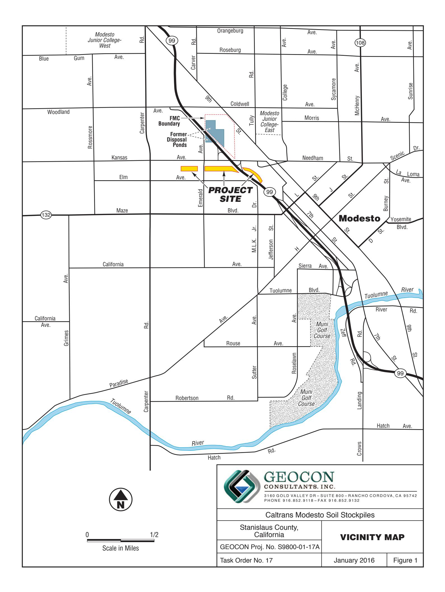
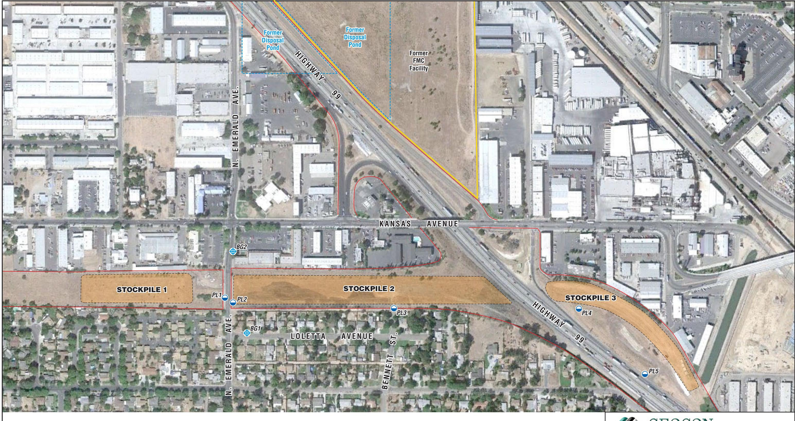
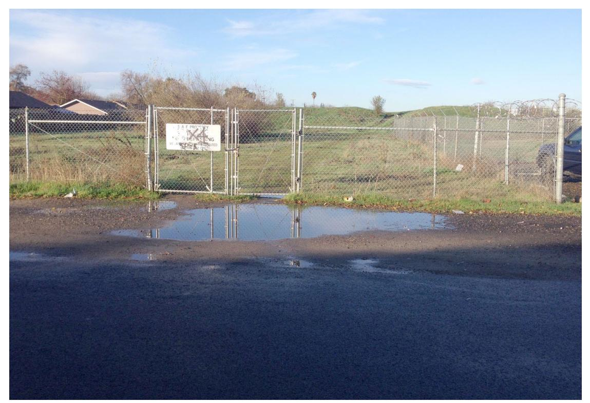
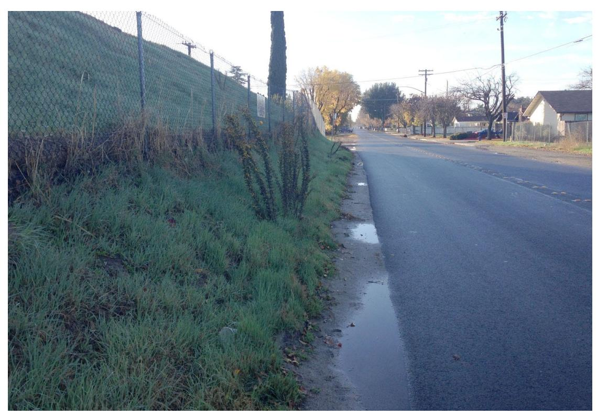
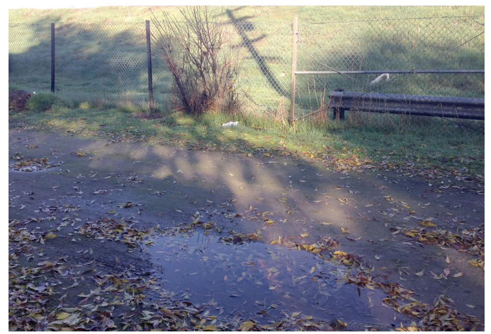
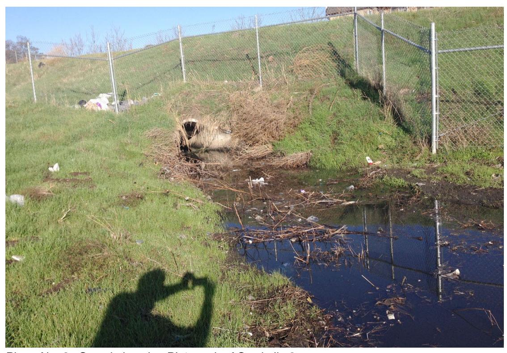
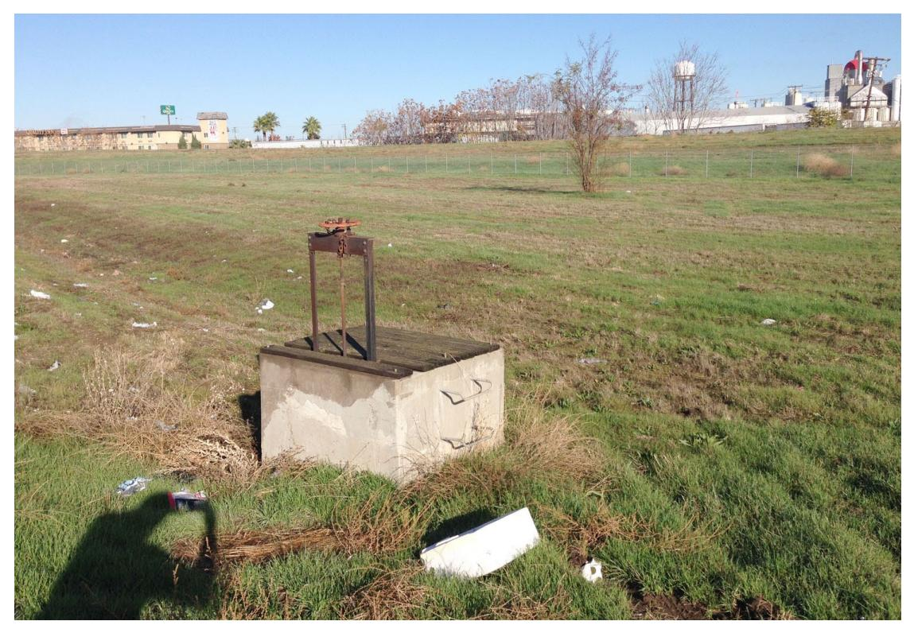
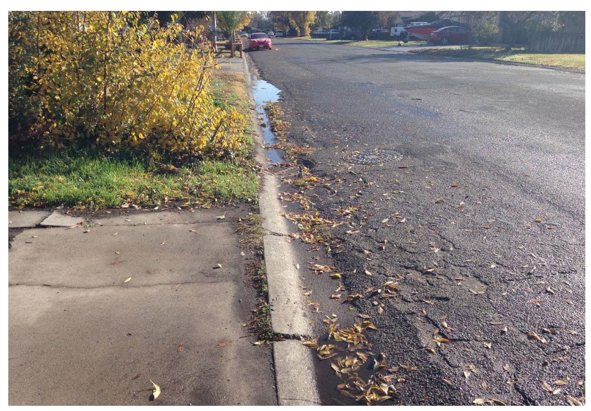
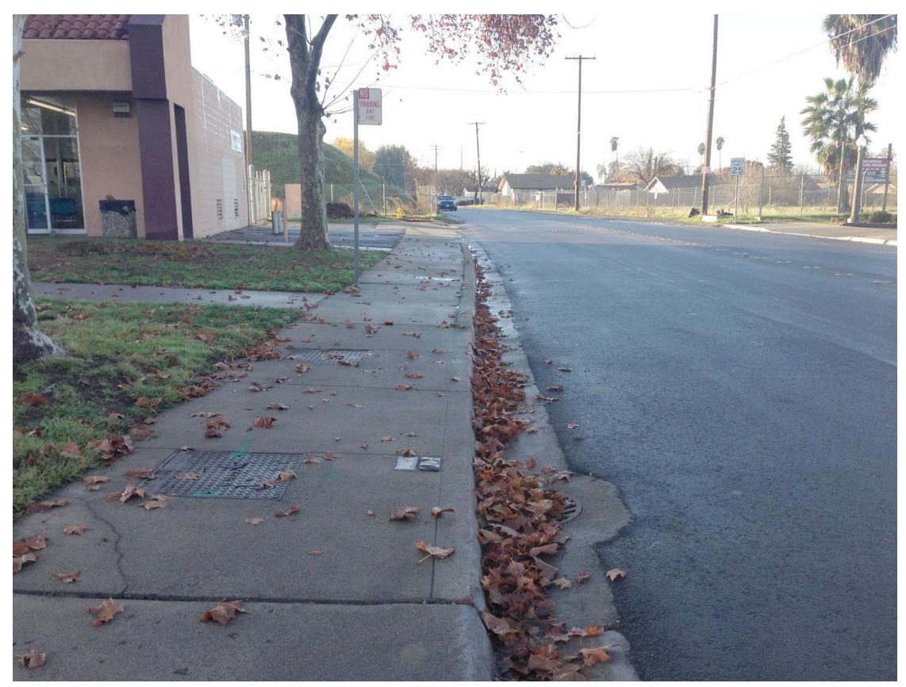

# GEOTECHNICAL • ENVIRONMENTAL • MATERIALS

Project No. S9800-01-17A January 29, 2016

Mr. Richard Stewart, PG California Department of Transportation - District 6 Hazardous Waste Branch 855 M Street, Suite 200 Fresno, California 93721

Subject: SURFACE WATER SAMPLING REPORT – DECEMBER 11, 2015

CALTRANS MODESTO SOIL STOCKPILES STANISLAUS COUNTY, CALIFORNIA

CONTRACT NO. 06A1895, TASK ORDER NO. 17, EA NO. 10-0X2700

Dear Mr. Stewart:

In accordance with California Department of Transportation (Caltrans) Contract No. 06A1895, Task Order (TO) No. 17, Geocon performed surface water sampling activities at the Caltrans Modesto Soil Stockpiles (Site) located southerly of the intersection of State Route (SR) 99 and Kansas Avenue in Stanislaus County, California. The approximate site location is depicted on the attached Vicinity Map, Figure 1. The approximate site boundaries, Stockpiles 1 through 3, and surface water sampling locations are shown on the Site Plan, Figure 2.

The surface water sampling was performed on December 11, 2015, in general accordance with protocols approved by the California Environmental Protection Agency, Department of Toxic Substances Control (DTSC) as established in the *Final Surface Water Sampling and Analysis Plan* (SAP), prepared by Shaw Environmental, Inc. and dated January 2006 and our *Addendum to Surface Water Sampling and Analysis Plan*, dated February 20, 2013. The scope of services included surface water sampling, analysis of the water samples by a California-certified laboratory, and preparation of this summary report detailing the sampling activities.

### **BACKGROUND**

### **Project Description and History**

Stockpiles 1 through 3 were generated during construction of SR 99 through Modesto around 1961 when Caltrans excavated soil from property purchased from Food Machinery and Chemical Corporation (FMC) that contained an evaporation pond. The stockpiles were placed in their present location in anticipation of construction of the State Route 132 West Freeway/Expressway project.

During the 1930s, Barium Products Ltd. occupied property at 1200 Barium Road (now Graphics Drive) in Modesto just east of SR 99 between Woodland and Kansas Avenues. Barium Products Ltd. was a chemical manufacturing company processing a variety of ores and minerals including barite (barium sulfate) and celestite (strontium sulfate). Materials produced included barium and strontium compounds; these were used in greases, lubricating oil and pigment blanks. Sodium sulfide generated as a by-product of barite processing was sold as a caustic and used as a reagent in the mining industry.

In 1943, Barium Products Ltd. was purchased by Westvaco Chlorine Products Corporation which subsequently merged with FMC in 1948. From the 1950s to the 1970s, a liquid residue from the processing operations was discharged to unlined evaporation ponds along the western portion of the FMC Site. The approximate boundaries of the former evaporation/disposal ponds are shown on Figure 2.

In 1961, a 4.3-acre parcel at the southwestern corner of the FMC site was purchased by the State of California for highway right-of-way needed to construct SR 99. An aerial photograph from 1957 shows that a portion of the southernmost pond on the FMC property was within the area purchased for right-of-way.

Soil in and around the pond was excavated during construction of SR 99 and stockpiled within the current Caltrans right-of-way at the location of the future State Route 132 West Freeway/Expressway project. Three distinct stockpiles are present at the Site:

- Stockpile 1, located south of Kansas Avenue and west of North Emerald Avenue,
- Stockpile 2, located south of Kansas Avenue, between North Emerald Avenue and SR 99, and
- Stockpile 3, located south of Kansas Avenue and east of SR 99.

### **Previous Surface Water Sampling Activities**

Shaw completed a surface water sampling event at the soil stockpiles in March 2006 in general accordance with their January 2006 SAP. In total, seven surface water samples (SW01 through SW06 and SW08) were collected during a qualifying rain event (visible runoff and 72 hours of prior dry weather). Since there was no surface water migration beyond the Caltrans right-of-way, Shaw constructed shallow depressions within the right-of-way in order to collect precipitation falling on the stockpiles. The samples were analyzed for dissolved metals, polycyclic aromatic hydrocarbons (PAHs), nitrate, sulfate and sulfide.

With the sole exception of an elevated barium concentration reported for the sample collected from the northwestern side of Stockpile 3 (sample SW03), the surface water samples did not contain elevated metals concentrations. Barium was reported at a concentration of 2,000 micrograms per liter ( $\mu$ g/l) in sample SW03. Barium in the remaining six samples ranged from 16 to 190  $\mu$ g/l. Shaw concluded that the elevated barium reported for sample SW03 was isolated and that runoff in the area was confined to Caltrans right-of-way.

We previously performed surface water sampling events at the soil stockpiles in April 2013, January 2014, twice in February 2014, and twice in December 2014. Results from these sampling events are presented on Tables 1 through 3.

Sample points PL1 and PL2 are along North Emerald Avenue. Sample point PL3 is along the southern edge of Stockpile 2. Sample points PL4 and PL5 are at the drainage basin next to Stockpile 3. PL4 is where storm water enters the drainage basin next to Stockpile 3 and PL5 is within three feet of the gate valve that would release storm water to the SR 99 collection system conveying storm water to the Tuolumne River, if opened. From information provided by Caltrans, the gate valve would only be opened if the basin neared a capacity that could jeopardize the northbound lanes of SR 99. Caltrans also states that there is no occurrence of the gate valve being opened in the recent past.

Sample points BG1 and BG2 are next to storm water inlets both south (Loletta Avenue) and north (North Emerald Avenue) of Stockpile 2.

The approximate sample locations are depicted on Figure 2. The sample locations were approved by the DTSC and Central Valley Water Quality Control Board (CVRWQCB). During the April 2013, and January, February, and December 2014, storm events, we did not observe runoff migrating away from the Caltrans right-of-way.

### SURFACE WATER SAMPLING ACTIVITIES

This section describes the field activities performed for the December 11, 2015, surface water sampling event. It was partly cloudy at the time of sample collection. The rainfall total for this event which began overnight on December 10, 2015, and ended early in the morning on December 11, 2015, was approximately 0.18 inch.

### **Field Activities**

On December 11, 2015, we collected surface water samples from designated locations PL1 through PL4. We did not sample from locations PL5, BG1, and BG2 due to insufficient surface water at these locations. Photos of the sample locations taken on December 11, 2015, are attached.

We collected samples PL1 and PL2 from puddles of water located on the west and east sides of North Emerald Avenue, respectively, between Stockpiles 1 and 2 (Photos 1 and 2). During rain events, puddles of rain water pool along the shoulders of North Emerald Avenue.

We collected sample PL3 from a puddle of water where Bennett Street intersects the alley behind Loletta Street. The sample was collected outside the Caltrans right-of-way beyond the chain-link fence that encloses the south side of Stockpile 2 (Photo 3).

We collected sample PL4 (Photo 4) at the drainage basin outfall adjacent to Stockpile 3, northeast of the SR 99 off-ramp to Kansas Avenue. From information provided by Caltrans, storm water in the basin originates exclusively from the drainage inlets located in depressed section of SR 99 north and south of Kansas Avenue.

We collected samples PL1 through PL4 into disposable bailers using a suction pump, and subsequently transferred them into laboratory-provided containers. We field filtered samples to be analyzed for dissolved metals by passing the sample through a 0.45-micron filter. We capped, labeled, chilled and transported the samples to Advanced Technology Laboratories, Inc. (ATL) utilizing chain-of-custody procedures. During the sampling activities, we monitored the samples for pH, electrical conductivity, temperature, turbidity, oxygen-reduction potential (ORP) and dissolved oxygen (DO). The measured field parameters are presented on Table 1.

We followed Quality Assurance/Quality Control (QA/QC) procedures during the field sampling activities including the use of disposable bailers, decontamination of the sample pump by washing in an AlconoxTM solution followed by fresh and purified water rinses, and providing chain-of-custody documentation for each water sample transferred to the laboratory.

### **Laboratory Analyses**

We delivered four surface water samples to ATL for the following analyses under chain-of-custody protocol:

- Dissolved metals, following the United States Environmental Protection Agency (EPA) Test Method 6020/7470A:
- Chloride, nitrate as nitrogen and sulfate by EPA Test Method 300.0;
- Sulfide by Standard Method (SM) 4500-S-D;
- Total alkalinity, bicarbonate alkalinity, carbonate alkalinity by SM 2320B;
- Total dissolved solids (TDS) by SM 2540C; and
- Total suspended solids (TSS) by SM 2540D.

Surface water analytical results for this monitoring event are summarized on Tables 2 and 3. The laboratory report and chain-of-custody documentation are in Appendix A.

### Analytical Results

### **Dissolved Metals**

Analytical results for dissolved metals are summarized on Table 2.

Antimony, barium, calcium, chromium, cobalt, copper, manganese, magnesium, molybdenum, nickel, potassium, sodium, strontium, vanadium, and zinc were reported for samples PL1 through PL4. Arsenic was reported for sample PL3. Lead was reported for sample PL4. None of the reported concentrations exceed their respective primary Maximum Contaminant Levels (MCLs). Manganese concentrations for samples PL2, PL3, and PL4 exceed the secondary (taste and odor and welfare based) MCLs. Beryllium, cadmium, mercury, selenium, silver, and thallium were not reported at concentrations equal to or greater than their respective practical quantitation limits (PQLs) for samples PL1 through PL4.

The analytical results are within the same general range of concentrations as previously reported at each sample location.

### **General Minerals**

To further characterize the geochemistry of the water, general minerals analyses were conducted. The analytical results for general minerals are summarized on Table 3. None of the reported general minerals concentrations exceed their respective primary or secondary MCLs.

The analytical results are within the same general range of concentrations as previously reported at each sample location.

### Laboratory QA/QC

We reviewed the analytical laboratory QA/QC provided with the laboratory report. The laboratory notes state that initial analysis for nitrate as nitrogen was within holding time; however the reanalysis was past holding time. In addition, matrix spike recoveries for several metals in samples PL1 through PL4 were outside their "acceptance limit due to possible matrix interference." The laboratory notes state that the "analytical batch was validated by the laboratory control sample."

### SURFACE WATER MANAGEMENT

Surface water originating from the western slope of Stockpile 2 along North Emerald Avenue will continue to be managed by maintaining the stockpile's vegetative/fiber cover and straw wattles which have been placed to intercept and redirect surface water slope flow to areas within the Caltrans right-of-way.

To intercept runoff from the access ramp located on the south side of Stockpile 2 (north end of Bennett Street), Caltrans constructed a berm at the base of the ramp in February 2014.

Caltrans plans to conduct additional surface water sampling events during the 2016 rain season.

We appreciate the opportunity to provide our services on this project. Please contact us if you have any questions concerning the contents of this Report or if we may be of further service.

Sincerely,

GEOCON CONSULTANTS, INC.

Rebecca L. Silva Project Manager

(1) Addressee

(1) DTSC, Randy Adams

(1) CVRWQCB, Steve Meeks (pdf only)

Attachments: Figure 1, Vicinity Map

Figure 2, Site Plan

Photographs -12/11/15 (1 through 7)

Table 1, Summary of Surface Water Field Parameters

Table 2, Summary of Surface Water Analytical Results – Title 22 Metals (Dissolved)

John E. Juhrend, PE, CEG

Senior Engineer

Table 3, Summary of Surface Water Analytical Results – General Minerals

Appendix A, Laboratory Report and Chain-of-custody Documentation

State Right-of-Way Boundary

Approximate Surface Water Sample Location

Approximate Surface Water Sample Location (Background)

Scale in Feet

# GEOCON CONSULTANTS, INC.

3160 GOLD VALLEY DR - SUITE 800 - RANCHO CORDOVA, CA 95742 PHONE 916.852.9118 - FAX 916.852.9132

| Caltrans N | Modesto S | Soil Stock | (piles |
|------------|-----------|------------|--------|
|------------|-----------|------------|--------|

| Stanislaus County, California |
|----------------------------------|
| GEOCON Proj. No. S9800-01-17A    |

**SITE PLAN** 

Task Order No. 17

January 2016

Figure 2

Photo No. 1 Sample location PL1 on the west side of North Emerald Avenue

Photo No. 2 Sample location PL2 on the east of North Emerald Avenue

## **PHOTOS NO. 1 & 2**

| Caltrans Modesto Soil Stockpiles |                                  |
|----------------------------------|----------------------------------|
| GEOCON Proj. No. S9800-01-17A    | Stanislaus County, California |
| Task Order No. 17                | January 2016                     |

Photo No. 3 Sample location PL3 south of Stockpile 2 at the north terminus of Bennett Street

Photo No. 2 Sample location PL4 south of Stockpile 3

## **PHOTOS NO. 3 & 4**

| Caltrans Modesto Soil Stockpiles |                                  |
|----------------------------------|----------------------------------|
| GEOCON Proj. No. S9800-01-17A    | Stanislaus County, California |
| Task Order No. 17                | January 2016                     |

Photo No. 5 Sample location PL5 (dry) at gate valve south of Stockpile 3

Photo No. 6 Background sample location BG1 (dry) on Loletta Avenue

## **PHOTOS NO. 5 & 6**

| Caltrans Modesto Soil Stockpiles |  |                                  |
|----------------------------------|--|----------------------------------|
| GEOCON Proj. No. S9800-01-17A    |  | Stanislaus County, California |
| Task Order No. 17                |  | January 2016                     |

Photo No. 7 Background sample location BG2 (dry) on Emerald Avenue

## **PHOTO NO. 7**

| Caltrans | Modesto | Soil | Stockpiles |
|----------|---------|------|------------|
|----------|---------|------|------------|

GEOCON Proj. No. S9800-01-17A

Stanislaus County, California

Task Order No. 17

January 2016

## TABLE 1 SUMMARY OF SURFACE WATER FIELD PARAMETERS CALTRANS MODESTO SOIL STOCKPILES STANISLAUS COUNTY, CALIFORNIA

| SAMPLE ID | SAMPLE DATE | pH       | CONDUCTIVITY             | TEMPERATURE       | TURBIDITY        | ORP               | DO         |  |
|-----------|-------------|----------|--------------------------|-------------------|------------------|-------------------|------------|--|
|           |             | μmhos/cm | °C                       | ntu               | millivolts       | mg/l              |            |  |
| PL1       | 4/4/2013    | 8.93     | 88                       | 14.9              | 47               | 3                 |            |  |
| PL1       | 1/30/2014   | 5.72     | 152                      | 12.3              | 120              | 86                |            |  |
| PL1       | 2/6/2014    | 5.95     | 227                      | 10.6              | 207              | 147               | 7.70       |  |
| PL1       | 2/28/2014   | 5.70     | 121                      | 13.7              | 245              | 192               | 7.70       |  |
| PL1       | 12/2/2014   | 6.71     | 73                       | 13.6              | 311              | 146               | 7.07       |  |
| PL1       | 12/12/2014  | 7.38     | 71                       | 11.2              | 83.1             | 168               | 7.31       |  |
| PL1       | 12/11/2015  | 7.74     | 160                      | 9.4               | 102              | 123               | 1.27       |  |
| PL2       | 4/4/2013    | 9.00     | 54                       | 15.1              | 208              | 28                |            |  |
| PL2       | 1/30/2014   |          |                          | No Sample - Dry   |                  |                   |            |  |
| PL2       | 2/6/2014    | 5.98     | 128                      | 11.2              | 293              | 140               |            |  |
| PL2       | 2/28/2014   | 6.29     | 99                       | 12.7              | 256              | 222               | 6.03       |  |
| PL2       | 12/2/2014   | 6.83     | 45                       | 13.5              | 217              | 156               | 7.44       |  |
| PL2       | 12/12/2014  | 7.54     | 70                       | 10.3              | 551              | 186               | 8.29       |  |
| PL2       | 12/11/2015  | 7.63     | 108                      | 11.0              | 60.4             | 132               | 2.11       |  |
| PL3       | 4/4/2013    | 7.91     | 167                      | 16.3              | 54               | 68                |            |  |
| PL3       | 1/30/2014   | 5.57     | 263                      | 12.4              | 105              | 81                |            |  |
| PL3       | 2/6/2014    | 5.85     | 153                      | 11.1              | 79               | 149               |            |  |
| PL3       | 2/28/2014   | 6.42     | 104                      | 12.9              | 37               | 234               | 5.31       |  |
| PL3       | 12/2/2014   | 6.71     | 29                       | 13.6              | 158              | 174               | 7.50       |  |
| PL3       | 12/12/2014  | 7.07     | 27                       | 10.6              | 41.2             | 179               | 6.59       |  |
| PL3       | 12/11/2015  | 7.30     | 293                      | 9.9               | 58               | 141               | 1.02       |  |
| PL4       | 4/4/2013    | 11.08    | 315                      | 16.3              | 98               | 58                |            |  |
| PL4       | 1/30/2014   | 5.95     | 128                      | 15.2              | 156              | 79                |            |  |
| PL4       | 2/6/2014    | 5.80     | 186                      | 10.9              | 215              | 154               |            |  |
| PL4       | 2/28/2014   | 6.67     | 71                       | 12.3              | 24               | 235               | 6.20       |  |
| PL4       | 12/2/2014   | 6.72     | 66                       | 14.1              | 119              | 196               | 6.90       |  |
| PL4       | 12/12/2014  | 7.15     | 26                       | 11.5              | 47.3             | 122               | 7.12       |  |
| PL4       | 12/11/2015  | 7.38     | 177                      | 14.1              | 51               | 119               | 1.62       |  |
| PL5       | 12/12/2014  | 6.99     | 32                       | 11.4              | 99.7             | 149               | 5.56       |  |
| PL5       | 12/11/2015  |          |                          | No Sample - Dry   |                  |                   |            |  |
| SAMPLE ID | SAMPLE DATE | pH       | CONDUCTIVITY μmhos/cm | TEMPERATURE °C | TURBIDITY ntu | ORP millivolts | DO mg/l |  |
| BG1       | 4/4/2013    | 8.46     | 42                       | 16.4              | 57               | 37                | --         |  |
| BG1       | 1/30/2014   | 5.73     | 157                      | 12.5              | 110              | 59                | --         |  |
| BG1       | 2/6/2014    | 5.82     | 142                      | 10.7              | 166              | 155               | --         |  |
| BG1       | 2/28/2014   | 6.37     | 78                       | 12.9              | 62               | 226               | 5.49       |  |
| BG1       | 12/2/2014   | 6.55     | 33                       | 13.8              | 121              | 171               | 6.60       |  |
| BG1       | 12/12/2014  | 7.41     | 22                       | 10.6              | 93.1             | 143               | 6.60       |  |
| BG1       | 12/11/2015  |          |                          | No Sample - Dry   |                  |                   |            |  |
| BG2       | 4/4/2013    | 9.88     | 83                       | 18.4              | 102              | 67                | --         |  |
| BG2       | 1/30/2014   | 5.91     | 189                      | 14.2              | 210              | 95                | --         |  |
| BG2       | 2/6/2014    | 5.84     | 167                      | 10.9              | 350              | 159               | --         |  |
| BG2       | 2/28/2014   | 6.05     | 73                       | 12.9              | 122              | 2.7               | 6.39       |  |
| BG2       | 12/2/2014   | 6.72     | 66                       | 14.1              | 119              | 196               | 6.90       |  |
| BG2       | 12/12/2014  | 7.63     | 37                       | 10.7              | 218              | 176               | 8.34       |  |
| BG2       | 12/11/2015  |          |                          | No Sample - Dry   |                  |                   |            |  |

## TABLE 1 SUMMARY OF SURFACE WATER FIELD PARAMETERS CALTRANS MODESTO SOIL STOCKPILES STANISLAUS COUNTY, CALIFORNIA

### Notes:

 $\mu mhos/cm = Micromhos per centimeter$ 

°C = Degress Celsius

ntu = Nephelometric turbidity unit

ORP = Oxygen-Reduction Potential

DO = Dissolved Oxygen

mg/l = Milligrams per liter

## SUMMARY OF SURFACE WATER ANALYTICAL RESULTS - TITLE 22 METALS (DISSOLVED)

### CALTRANS MODESTO SOIL STOCKPILES

#### STANISLAUS COUNTY, CALIFORNIA

| ANALYTE   | Results in micrograms per liter |         | Results in milligrams per liter |           |         |          |        |        |      |           |            |        |                   |        |          |          |      |           |         |         |           |           |        |      |
|-----------|---------------------------------|---------|---------------------------------|-----------|---------|----------|--------|--------|------|-----------|------------|--------|-------------------|--------|----------|----------|------|-----------|---------|---------|-----------|-----------|--------|------|
|           | Antimony                        | Arsenic | Barium                          | Beryllium | Cadmium | Chromium | Cobalt | Copper | Lead | Manganese | Molybdenum | Nickel | Selenium          | Silver | Thallium | Vanadium | Zinc | Strontium | Mercury | Calcium | Magnesium | Potassium | Sodium |      |
| SAMPLE ID | SAMPLE DATE                     |         |                                 |           |         |          |        |        |      |           |            |        |                   |        |          |          |      |           |         |         |           |           |        |      |
| PL1       | 4/4/2013                        | 1.0     | <1.0                            | 12        | <0.50   | <0.50    | 0.55   | <0.50  | 8.9  | <1.0      | <10        | 2.6    | 2.5               | <0.50  | <0.50    | <0.50    | 2.0  | <10       | 44      | <0.20   |           |           |        |      |
| PL1       | 1/30/2014                       | 0.98    | 1.2                             | 25        | <0.50   | <0.50    | 0.97   | 0.75   | 23   | <1.0      | 73         | 6.0    | 5.8               | <0.50  | <0.50    | <0.50    | 4.9  | 37        | 100     | <0.20   | 14        | 1.9       | 3.4    | 5.5  |
| PL1       | 2/6/2014                        | 1.5     | 1.0                             | 35        | <0.50   | <0.50    | 0.75   | 0.59   | 17   | <1.0      | <10        | 6.2    | 5.5               | <0.50  | <0.50    | <0.50    | 3.4  | <10       | 210     | <0.20   | 28        | 3.3       | 3.6    | 6.6  |
| PL1       | 2/28/2014                       | 0.53    | 1.1                             | 10        | <0.50   | <0.50    | 0.70   | <0.50  | 5.6  | <1.0      | <10        | 1.9    | 3.2               | <0.50  | <0.50    | <0.50    | 2.8  | <10       | 55      | <0.20   | 8.9       | 0.94      | 1.6    | 2.0  |
| PL1       | 12/2/2014                       | <0.5    | <1.0                            | 16        | <0.50   | <0.50    | 1.1    | <0.50  | 3.0  | <1.0      | 32         | 1.2    | 1.5               | <0.50  | <0.50    | <0.50    | 3.7  | 43        | 55      | <0.20   | 7.3       | 1.2       | 1.7    | 3.5  |
| PL1       | 12/12/2014                      | 0.82    | <1.0                            | 16        | <0.50   | <0.50    | 0.68   | <0.50  | 2.2  | <1.0      | <10        | 0.68   | <1.0              | <0.50  | <0.50    | <0.50    | 1.2  | 96        | 53      | <0.20   | 7.1       | 1.0       | 1.5    | 1.8  |
| PL1       | 12/11/2015                      | 1.2     | <1.0                            | 20        | <5.0    | <0.50    | 1.2    | 0.58   | 11   | <1.0      | 36         | 3.8    | 4.0               | <0.50  | <0.50    | <0.50    | 3.7  | 24        | 110     | <0.20   | 16        | 2.0       | 3.0    | 5.0  |
| PL2       | 4/4/2013                        | 1.2     | <1.0                            | 39        | <0.50   | <0.50    | 2.5    | <0.50  | 12   | 2.7       | 22         | 2.7    | 2.1               | <0.50  | <0.50    | <0.50    | 2.7  | 27        | 38      | <0.20   |           |           |        |      |
| PL2       | 1/30/2014                       |         |                                 |           |         |          |        |        |      |           |            |        | -No Sample - Dry- |        |          |          |      |           |         |         |           |           |        |      |
| PL2       | 2/6/2014                        | 3.5     | <1.0                            | 41        | <0.50   | <0.50    | 3.0    | 0.88   | 29   | 1.2       | 78         | 9.5    | 6.2               | <0.50  | <0.50    | <0.50    | 3.1  | 42        | 90      | <0.20   | 7.7       | 1.6       | 5.6    | 3.1  |
| PL2       | 2/28/2014                       | 2.5     | <1.0                            | 35        | <0.50   | <0.50    | 6.5    | <0.50  | 15   | 1.1       | 23         | 3.8    | 4.6               | <0.50  | <0.50    | <0.50    | 1.8  | 27        | 63      | <0.20   | 6.0       | 1.0       | 2.2    | 1.7  |
| PL2       | 12/2/2014                       | 0.53    | <1.0                            | 24        | <0.50   | <0.50    | 1.7    | 0.53   | 5.8  | 2.0       | 36         | 0.94   | 1.9               | <0.50  | <0.50    | <0.50    | 2.6  | 14        | 41      | <0.20   | 4.4       | 0.89      | 1.3    | 0.64 |
| PL2       | 12/12/2014                      | <0.5    | 1.4                             | 50        | <0.50   | <0.50    | 1.8    | 0.52   | 6.5  | 3.5       | 27         | 0.97   | 1.8               | <0.50  | <0.50    | <0.50    | 5.0  | 21        | 120     | <0.20   | 12        | 2.1       | 1.6    | 1.4  |
| PL2       | 12/11/2015                      | 1.3     | <1.0                            | 20        | <5.0    | <0.50    | 1.1    | 0.56   | 10   | <1.0      | 52         | 2.8    | 3.0               | <0.50  | <0.50    | <0.50    | 2.2  | 28        | 83      | <0.20   | 8.1       | 1.8       | 3.2    | 3.6  |
| PL3       | 4/4/2013                        | 0.55    | 1.3                             | 110       | <0.50   | <0.50    | 1.1    | 0.68   | 19   | 15        | 46         | 3.0    | 4.4               | <0.50  | <0.50    | <0.50    | 3.3  | 33        | 220     | <0.20   |           |           |        |      |
| PL3       | 1/30/2014                       | 0.70    | 1.9                             | 140       | <0.50   | <0.50    | 1.6    | 2.2    | 32   | 2.3       | 190        | 4.1    | 10                | <0.50  | <0.50    | <0.50    | 10   | 84        | 190     | <0.20   | 18        | 3.9       | 17     | 6.4  |
| PL3       | 2/6/2014                        | 0.51    | 1.2                             | 96        | <0.50   | <0.50    | 1.1    | 0.93   | 21   | <1.0      | 71         | 2.3    | 4.7               | <0.50  | <0.50    | <0.50    | 7.4  | 29        | 150     | <0.20   | 12        | 2.7       | 8.6    | 2.5  |
| PL3       | 2/28/2014                       | <0.50   | <1.0                            | 93        | <0.50   | <0.50    | 0.86   | <0.50  | 8.0  | <1.0      | 12         | 0.92   | 4.0               | <0.50  | <0.50    | <0.50    | 3.8  | 11        | 77      | <0.20   | 6.2       | 1.3       | 3.2    | 1.2  |
| PL3       | 12/2/2014                       | <0.50   | <1.0                            | 37        | <0.50   | <0.50    | 0.68   | <0.50  | 2.0  | <1.0      | <10        | <0.5   | <1.0              | <0.50  | <0.50    | <0.50    | 2.5  | <10       | 46      | <0.20   | 3.1       | 0.51      | 2.6    | 0.63 |
| PL3       | 12/12/2014                      | <0.50   | <1.0                            | 53        | <0.50   | <0.50    | 0.53   | <0.50  | 2.4  | <1.0      | 18         | <0.5   | <1.0              | <0.50  | <0.50    | <0.50    | 1.8  | <10       | 70      | <0.20   | 4.3       | 0.91      | 3.1    | 0.34 |
| PL3       | 12/11/2015                      | 0.74    | 1.2                             | 190       | <0.50   | <0.50    | 1.7    | 3.0    | 18   | <1.0      | 290        | 0.94   | 3.9               | <0.50  | <0.50    | <0.50    | 6.4  | 60        | 390     | <0.20   | 26        | 6.4       | 38     | 4.9  |

## SUMMARY OF SURFACE WATER ANALYTICAL RESULTS - TITLE 22 METALS (DISSOLVED)

### CALTRANS MODESTO SOIL STOCKPILES

#### STANISLAUS COUNTY, CALIFORNIA

| SAMPLE ID        | SAMPLE DATE | Results in micrograms per liter |         |        |           |         |          |        |        |      |           |            |        |          |        |          | Results in milligrams per liter |      |           |         |         |           |           |        |  |  |
|------------------|-------------|---------------------------------|---------|--------|-----------|---------|----------|--------|--------|------|-----------|------------|--------|----------|--------|----------|---------------------------------|------|-----------|---------|---------|-----------|-----------|--------|--|--|
|                  |             | Antimony                        | Arsenic | Barium | Beryllium | Cadmium | Chromium | Cobalt | Copper | Lead | Manganese | Molybdenum | Nickel | Selenium | Silver | Thallium | Vanadium                        | Zinc | Strontium | Mercury | Calcium | Magnesium | Potassium | Sodium |  |  |
| PL4              | 2/6/2014    | 1.2                             | <1.0    | 42     | <0.50     | <0.50   | 2.4      | 1.5    | 5.9    | <1.0 | 110       | 7.1        | 6.6    | <0.50    | <0.50  | <0.50    | 5.8                             | 26   | 180       | <0.20   | 18      | 1.7       | 5.5       | 10     |  |  |
| PL4              | 2/28/2014   | 0.64                            | 1.1     | 26     | <0.50     | <0.50   | 1.2      | <0.50  | 6.2    | <1.0 | 13        | 1.6        | 2.5    | <0.50    | <0.50  | <0.50    | 2.0                             | 26   | 75        | <0.20   | 5.0     | 0.61      | 2.5       | 2.2    |  |  |
| PL4              | 12/2/2014   | 1.1                             | <1.0    | 56     | <0.50     | <0.50   | 1.5      | 0.52   | 9.4    | 1.1  | 33        | 2.4        | 2.2    | <0.50    | <0.50  | <0.50    | 1.9                             | 37   | 100       | <0.20   | 6.0     | 0.69      | 2.1       | 2.7    |  |  |
| PL4              | 12/12/2014  | <0.50                           | <1.0    | 87     | <0.50     | <0.50   | 1.0      | <0.50  | 4.3    | <1.0 | <10       | 1.5        | <1.0   | <0.50    | <0.50  | <0.50    | 1.0                             | 25   | 85        | <0.20   | 4.8     | 0.55      | 1.5       | 1.4    |  |  |
| PL4              | 12/11/2015  | 1.9                             | <1.0    | 79     | <25       | <0.50   | 1.4      | 1.1    | 8.9    | 1.0  | 110       | 7.4        | 5.1    | <0.50    | <0.50  | <0.50    | 2.0                             | 51   | 310       | <0.20   | 16      | 1.7       | 6.1       | 10     |  |  |
| PL5              | 12/12/2014  | 0.74                            | <1.0    | 110    | <0.50     | <0.50   | 1.5      | <0.50  | 6.3    | <1.0 | 11        | 1.5        | 1.1    | <0.50    | <0.50  | <0.50    | 1.1                             | 22   | 75        | <0.20   | 4.3     | 0.56      | 1.9       | 1.4    |  |  |
| RWQCB Sample* | 12/12/2014  | <10                             | <10     | 155    | <5.0      | <5.0    | <5.0     | <5.0   | 9.8    | <5.0 | --        | <5.0       | <5.0   | <20      | <5.0   | <20      | <5.0                            | 30.3 | 81.6      | <0.20   | --      | --        | --        | --     |  |  |
| PL5              | 12/11/2015  | No Sample - Dry                 |         |        |           |         |          |        |        |      |           |            |        |          |        |          |                                 |      |           |         |         |           |           |        |  |  |
| BG1              | 4/4/2013    | <0.50                           | <1.0    | 11     | <0.50     | <0.50   | 0.84     | <0.50  | 5.9    | <1.0 | 12        | 0.93       | 2.7    | <0.50    | <0.50  | <0.50    | 1.9                             | 16   | 20        | <0.20   | --      | --        | --        | --     |  |  |
| BG1              | 1/30/2014   | 0.66                            | <1.0    | 44     | <0.50     | <0.50   | 1.2      | 0.75   | 15     | <1.0 | 39        | 1.7        | 6.2    | <0.50    | <0.50  | <0.50    | 4.4                             | 28   | 90        | <0.20   | 11      | 2.5       | 7.5       | 3.3    |  |  |
| BG1              | 2/6/2014    | 0.56                            | <1.0    | 31     | <0.50     | <0.50   | 0.92     | <0.50  | 12     | <1.0 | 15        | 1.2        | 5.0    | <0.50    | <0.50  | <0.50    | 4.7                             | 14   | 68        | <0.20   | 8.1     | 1.8       | 4.4       | 3.2    |  |  |
| BG1              | 2/28/2014   | <0.50                           | <1.0    | 22     | <0.50     | <0.50   | 0.91     | <0.50  | 7.4    | <1.0 | <10       | 0.62       | 4.1    | <0.50    | <0.50  | <0.50    | 2.8                             | 13   | 38        | <0.20   | 4.7     | 0.91      | 1.7       | 2.1    |  |  |
| BG1              | 12/2/2014   | <0.50                           | <1.0    | 13     | <0.50     | <0.50   | 0.91     | <0.50  | 5.8    | <1.0 | <10       | 0.58       | <1.0   | <0.50    | <0.50  | <0.50    | 1.9                             | <10  | 25        | <0.20   | 2.7     | 0.55      | 1.9       | 0.98   |  |  |
| BG1              | 12/12/2014  | <0.50                           | <1.0    | 13     | <0.50     | <0.50   | 0.74     | <0.50  | 3.0    | <1.0 | <10       | <0.50      | 1.1    | <0.50    | <0.50  | <0.50    | 1.1                             | <10  | 20        | <0.20   | 2.2     | 0.42      | 1.2       | 0.58   |  |  |
| BG1              | 12/11/2015  | No Sample - Dry                 |         |        |           |         |          |        |        |      |           |            |        |          |        |          |                                 |      |           |         |         |           |           |        |  |  |
| BG2              | 4/4/2013    | 1.2                             | <1.0    | 20     | <0.50     | <0.50   | 4.8      | <0.50  | 14     | 1.2  | 25        | 3.0        | 2.6    | <0.50    | <0.50  | <0.50    | <1.0                            | 66   | 24        | <0.20   | --      | --        | --        | --     |  |  |
| BG2              | 1/30/2014   | 3.5                             | 1.1     | 48     | <0.50     | <0.50   | 2.3      | 0.95   | 32     | <1.0 | 66        | 11         | 6.6    | <0.50    | <0.50  | <0.50    | 1.4                             | 110  | 120       | <0.20   | 17      | 3.1       | 9.6       | 7.4    |  |  |
| BG2              | 2/6/2014    | 2.4                             | <1.0    | 35     | <0.50     | <0.50   | 1.9      | 0.73   | 22     | <1.0 | 46        | 5.3        | 6.4    | <0.50    | <0.50  | <0.50    | 2.1                             | 110  | 87        | <0.20   | 12      | 2.4       | 5.9       | 5.0    |  |  |
| BG2              | 2/28/2014   | 3.4                             | <1.0    | 33     | <0.50     | <0.50   | 12       | <0.50  | 26     | <1.0 | 18        | 8.8        | 6.0    | <0.50    | <0.50  | <0.50    | 1.2                             | 70   | 27        | <0.20   | 3.5     | 0.62      | 2.3       | 2.2    |  |  |
| BG2              | 12/2/2014   | 2.4                             | <1.0    | 37     | <0.50     | <0.50   | 8.3      | 0.73   | 23     | 1.1  | 53        | 6.8        | 5.5    | <0.50    | <0.50  | <0.50    | 2.2                             | 85   | 57        | <0.20   | 5.0     | 1.1       | 4.0       | 2.7    |  |  |
| BG2              | 12/12/2014  | 1.3                             | <1.0    | 24     | <0.50     | <0.50   | 3.0      | <0.50  | 9.4    | <1.0 | 20        | 2.1        | 2.0    | <0.50    | <0.50  | <0.50    | <1.0                            | 28   | 37        | <0.20   | 3.6     | 0.64      | 1.6       | 1.2    |  |  |
| BG2              | 12/11/2015  | No Sample - Dry                 |         |        |           |         |          |        |        |      |           |            |        |          |        |          |                                 |      |           |         |         |           |           |        |  |  |

## SUMMARY OF SURFACE WATER ANALYTICAL RESULTS - TITLE 22 METALS (DISSOLVED)

### CALTRANS MODESTO SOIL STOCKPILES

#### STANISLAUS COUNTY, CALIFORNIA

| ANALYTE     | Results in micrograms per liter |         |        |           |         |          |        |        |      |           |            |        |          |        |          |          |         |           |         |         |           |           | Results in milligrams per liter |  |  |  |
|-------------|---------------------------------|---------|--------|-----------|---------|----------|--------|--------|------|-----------|------------|--------|----------|--------|----------|----------|---------|-----------|---------|---------|-----------|-----------|---------------------------------|--|--|--|
|             | Antimony                        | Arsenic | Barium | Beryllium | Cadmium | Chromium | Cobalt | Copper | Lead | Manganese | Molybdenum | Nickel | Selenium | Silver | Thallium | Vanadium | Zinc    | Strontium | Mercury | Calcium | Magnesium | Potassium | Sodium                          |  |  |  |
| SAMPLE ID   |                                 |         |        |           |         |          |        |        |      |           |            |        |          |        |          |          |         |           |         |         |           |           |                                 |  |  |  |
| SAMPLE DATE |                                 |         |        |           |         |          |        |        |      |           |            |        |          |        |          |          |         |           |         |         |           |           |                                 |  |  |  |
| MCLs        | 6.0                             | 10      | 1,000  | 4.0       | 5.0     | 50       | --     | --     | --   | 50**      | --         | 100    | 50       | --     | 2.0      | --       | 5,000** | --        | 2.0     | --      | --        | --        | --                              |  |  |  |

### Notes:

< = Less than laboratory reporting limits

MCLs = Maximum contaminant levels for drinking water. California Environmental Protection Agency State Water Resources Control Board - dated September 23, 2015

--- = Not analyzed

\* = Sample submitted by Central Valley Regional Water Quality Control Board to Excelchem Environmental Labs

\*\* = Secondary MCL (taste & odor or welfare-based)

## SUMMARY OF SURFACE WATER ANALYTICAL RESULTS - GENERAL MINERALS

### CALTRANS MODESTO SOIL STOCKPILES

#### STANISLAUS COUNTY, CALIFORNIA

| SAMPLE ID     | SAMPLE DATE | Results in milligrams per liter |         |         |                              |                 |                            |                          |                      |                              |
|------------------|----------------|---------------------------------|---------|---------|------------------------------|-----------------|----------------------------|--------------------------|----------------------|------------------------------|
|                  |                | NITROGEN, NITRATE (as N)     | SULFATE | SULFIDE | TOTAL SUSPENDED SOLIDS | CHLORIDE        | ALKALINITY, BICARBONATE | ALKALINITY, CARBONATE | ALKALINITY, TOTAL | TOTAL DISSOLVED SOLIDS |
| PL1              | 4/4/2013       | 0.34                            | 2.9     | <0.010  | 44                           |                 |                            |                          |                      |                              |
| PL1              | 1/30/2014      | 4.7                             | 16      | <0.010  | 32                           | 4.8             | 28                         | <5.0                     | 28                   | 110                          |
| PL1              | 2/6/2014       | 2.9                             | 25      | 0.025   | 81                           | 5.5             | 71                         | <5.0                     | 71                   | 180                          |
| PL1              | 2/28/2014      | 1.3                             | 3.3     | <0.010  | 120                          | 1.7             | 30                         | <5.0                     | 30                   | 65                           |
| PL1              | 12/2/2014      | 0.39                            | 4.3     | <0.020  | 130                          | 1.7             | 32                         | <5.0                     | 32                   | 73                           |
| PL1              | 12/12/2014     |                                 | 1.4     | <0.010  | 20                           | 0.55            | 27                         | <5.0                     | 27                   | 49                           |
| PL1              | 12/11/2015     | 0.28                            | 10      | 0.044   | 62                           | 6.3             | 45                         | <5.0                     | 45                   | 70                           |
| PL2              | 4/4/2013       | 0.26                            | 1.5     | <0.020  | 260                          |                 |                            |                          |                      |                              |
| PL2              | 1/30/2014      |                                 |         |         |                              | No Sample - Dry |                            |                          |                      |                              |
| PL2              | 2/6/2014       | 0.73                            | 6.1     | <0.050  | 310                          | 3.2             | 33                         | <5.0                     | 33                   | 190                          |
| PL2              | 2/28/2014      | 0.31                            | 3.3     | 0.20    | 390                          | 1.7             | 32                         | <5.0                     | 32                   | 100                          |
| PL2              | 12/2/2014      | 0.16                            | <1.0    | <0.020  | 170                          | 0.64            | 20                         | <5.0                     | 20                   | 43                           |
| PL2              | 12/12/2014     |                                 | 2.2     | <0.010  | 260                          | 1.1             | 170                        | <5.0                     | 170                  | 64                           |
| PL2              | 12/11/2015     | 0.23                            | 3.2     | 0.038   | 190                          | 5.4             | 31                         | <5.0                     | 31                   | 120                          |
| PL3              | 4/4/2013       | 2.7                             | 11      | 0.025   | 44                           |                 |                            |                          |                      |                              |
| PL3              | 1/30/2014      | 6.6                             | 17      | 0.023   | 66                           | 8.7             | 72                         | <5.0                     | 72                   | 240                          |
| PL3              | 2/6/2014       | 5.2                             | 8.9     | 0.040   | 89                           | 3.4             | 32                         | <5.0                     | 32                   | 140                          |
| PL3              | 2/28/2014      | 4.0                             | 3.5     | <0.010  | 62                           | 2.8             | 21                         | <5.0                     | 21                   | 82                           |
| PL3              | 12/2/2014      | 0.23                            | <1.0    | 0.021   | 70                           | <0.50           | 15                         | <5.0                     | 15                   | 37                           |
| PL3              | 12/12/2014     |                                 | 1.5     | <0.010  | 29                           | 0.87            | 20                         | <5.0                     | 20                   | 33                           |
| PL3              | 12/11/2015     | <0.20                           | 7.5     | 0.052   | 81                           | 9.5             | 99                         | <5.0                     | 99                   | 110                          |
| PL4              | 4/4/2013       | 9.9                             | 7.9     | <0.020  | 92                           |                 |                            |                          |                      |                              |
| PL4              | 1/30/2014      | 1.4                             | 9.9     | 0.011   | 16                           | 6.2             | 32                         | <5.0                     | 32                   | 79                           |
| PL4              | 2/6/2014       | 0.68                            | 10      | 0.094   | 22                           | 7.4             | 64                         | <5.0                     | 64                   | 130                          |
| PL4              | 2/28/2014      | 0.47                            | 2.5     | <0.010  | 12                           | 1.4             | 21                         | <5.0                     | 21                   | 37                           |
| PL4              | 12/2/2014      | 0.53                            | 2.6     | <0.020  | 65                           | 2.3             | 22                         | <5.0                     | 22                   | 36                           |
| PL4              | 12/12/2014     |                                 | 1.5     | <0.010  | 17                           | 0.52            | 13                         | <5.0                     | 13                   | 24                           |
| PL4              | 12/11/2015     | 0.48                            | 11      | 0.066   | 22                           | 11              | 46                         | <5.0                     | 46                   | 120                          |
| SAMPLE ID     | SAMPLE DATE | Results in milligrams per liter |         |         |                              |                 |                            |                          |                      |                              |
|                  |                | NITROGEN, NITRATE (as N)     | SULFATE | SULFIDE | TOTAL SUSPENDED SOLIDS | CHLORIDE        | ALKALINITY, BICARBONATE | ALKALINITY, CARBONATE | ALKALINITY, TOTAL | TOTAL DISSOLVED SOLIDS |
| PL5              | 12/12/2014     | --                              | <1.0    | <0.010  | 32                           | <0.50           | 20                         | <5.0                     | 20                   | 22                           |
| RWQCB Sample* | 12/12/2014     | 0.39                            | 2.0     | --      | --                           | --              | --                         | --                       | --                   | --                           |
| PL5              | 12/11/2015     |                                 |         |         |                              | No Sample - Dry |                            |                          |                      |                              |
| BG1              | 4/4/2013       | 0.35                            | 1.8     | 0.023   | 140                          | --              | --                         | --                       | --                   | --                           |
| BG1              | 1/30/2014      | 2.0                             | 8.7     | <0.020  | 48                           | 4.9             | 40                         | <5.0                     | 40                   | 100                          |
| BG1              | 2/6/2014       | 2.8                             | 11      | <0.020  | 30                           | 3.3             | 29                         | <5.0                     | 29                   | 92                           |
| BG1              | 2/28/2014      | 0.96                            | 3.5     | 0.014   | 35                           | 1.5             | 16                         | <5.0                     | 16                   | 40                           |
| BG1              | 12/2/2014      | 0.19                            | 1.5     | <0.020  | 43                           | <0.50           | 12                         | <5.0                     | 12                   | 31                           |
| BG1              | 12/12/2014     | --                              | 3.2     | <0.010  | 31                           | 1.4             | 9.8                        | <5.0                     | 9.8                  | <10                          |
| BG1              | 12/11/2015     |                                 |         |         |                              | No Sample - Dry |                            |                          |                      |                              |
| BG2              | 4/4/2013       | 0.40                            | 2.5     | <0.020  | 96                           | --              | --                         | --                       | --                   | --                           |
| BG2              | 1/30/2014      | 0.81                            | 11      | 0.10    | 200                          | 8.1             | 72                         | <5.0                     | 72                   | 240                          |
| BG2              | 2/6/2014       | 0.96                            | 10      | 0.064   | 220                          | 7.1             | 52                         | <5.0                     | 52                   | 170                          |
| BG2              | 2/28/2014      | 0.57                            | 3.1     | <0.010  | 160                          | 1.8             | 17                         | <5.0                     | 17                   | 32                           |
| BG2              | 12/2/2014      | 0.69                            | 3.6     | <0.050  | 670                          | 2.9             | 32                         | <5.0                     | 32                   | 74                           |
| BG2              | 12/12/2014     | --                              | 3.1     | <0.010  | 280                          | 1.2             | 19                         | <5.0                     | 19                   | 21                           |
| BG2              | 12/11/2015     |                                 |         |         |                              | No Sample - Dry |                            |                          |                      |                              |
|                  | MCLs           | 10                              | 250**   |         |                              | 250**           |                            |                          |                      | 500**                        |

### SUMMARY OF SURFACE WATER ANALYTICAL RESULTS - GENERAL MINERALS

#### CALTRANS MODESTO SOIL STOCKPILES

#### STANISLAUS COUNTY, CALIFORNIA

Notes:

MCLs = Maximum contaminant levels for drinking water. California Enviornmental Protection Agency State Water Resources Control Board - dated September 23, 2015

&lt; = Less than the indicated laboratory reporting limit

--- = Not analyzed

\* = Sample submitted by Central Valley Regional Water Quality Control Board to Excelchem Environmental Labs

\*\* = Secondary MCL (taste & odor or welfare-based)

# APPENDIX A

ELAP No.: 1838

CSDLAC No.: 10196 ORELAP No.: CA300003

TCEQ No.: T104704502

December 21, 2015

Rebecca Silva Geocon Consultants, Inc. 3160 Gold Valley Drive, Suite 800 Rancho Cordova, CA 95742

Tel: (916) 852-9118 Fax:(916) 852-9132

Re: ATL Work Order Number: 1504242

Client Reference: Modesto Stockpile Stormwater, S9800-01-17A

Enclosed are the results for sample(s) received on December 12, 2015 by Advanced Technology Laboratories. The sample(s) are tested for the parameters as indicated on the enclosed chain of custody in accordance with applicable laboratory certifications. The laboratory results contained in this report specifically pertains to the sample(s) submitted.

Thank you for the opportunity to serve the needs of your company. If you have any questions, please feel free to contact me or your Project Manager.

Sincerely,

Eddie Rodriguez

Laboratory Director

The cover letter and the case narrative are an integral part of this analytical report and its absence renders the report invalid. Test results contained within this data package meet the requirements of applicable state-specific certification programs. The report cannot be reproduced without written permission from the client and Advanced Technology Laboratories.

Geocon Consultants, Inc. Project Number: Modesto Stockpile Stormwater, S9800-01

3160 Gold Valley Drive, Suite 800 Report To: Rebecca Silva Rancho Cordova, CA 95742 Reported: 12/21/2015

### **SUMMARY OF SAMPLES**

| Sample ID | Laboratory ID | Matrix     | Date Sampled   | Date Received |
|-----------|---------------|------------|----------------|---------------|
| PL 1      | 1504242-01    | Stormwater | 12/11/15 8:15  | 12/12/15 9:49 |
| PL 2      | 1504242-02    | Stormwater | 12/11/15 8:45  | 12/12/15 9:49 |
| PL 3      | 1504242-03    | Stormwater | 12/11/15 9:20  | 12/12/15 9:49 |
| PL 4      | 1504242-04    | Stormwater | 12/11/15 10:25 | 12/12/15 9:49 |

Geocon Consultants, Inc. Project Number: Modesto Stockpile Stormwater, S9800-01

3160 Gold Valley Drive, Suite 800 Report To: Rebecca Silva Rancho Cordova, CA 95742 Reported: 12/21/2015

Client Sample ID PL 1 Lab ID: 1504242-01

| <b>Anions Scan b</b> | v Ion | Chromatography | EPA 300.0 |
|----------------------|-------|----------------|-----------|
|----------------------|-------|----------------|-----------|

**Analyst: PT** 

| Analyte       | Result (mg/L) | PQL (mg/L) | Dilution | Batch   | Prepared   | Date/Time Analyzed | Notes |
|---------------|------------------|---------------|----------|---------|------------|-----------------------|-------|
| Chloride      | 6.3              | 0.50          | 1        | B5L0379 | 12/14/2015 | 12/14/15 09:37        |       |
| Nitrate, as N | 0.28             | 0.10          | 1        | B5L0379 | 12/14/2015 | 12/14/15 09:37        | H3    |
| Sulfate       | 10               | 1.0           | 1        | B5L0379 | 12/14/2015 | 12/14/15 09:37        |       |

### Alkalinity, Speciated by SM 2320B

Analyst: QD

| Analyte                            | Result (mg/L) | PQL (mg/L) | Dilution | Batch   | Prepared   | Date/Time Analyzed | Notes |
|------------------------------------|------------------|---------------|----------|---------|------------|-----------------------|-------|
| Alkalinity, Bicarbonate (as CaCO3) | 45               | 5.0           | 1        | B5L0499 | 12/21/2015 | 12/21/15 14:13        |       |
| Alkalinity, Carbonate (as CaCO3)   | ND               | 5.0           | 1        | B5L0499 | 12/21/2015 | 12/21/15 14:13        |       |
| Alkalinity, Hydroxide (as CaCO3)   | ND               | 5.0           | 1        | B5L0499 | 12/21/2015 | 12/21/15 14:13        |       |
| Alkalinity, Total (as CaCO3)       | 45               | 5.0           | 1        | B5L0499 | 12/21/2015 | 12/21/15 14:13        |       |

### Total Dissolved Solids (Residue, Filterable) by SM 2540C

Analyst: PT

| Analyte            | Result (mg/L) | PQL (mg/L) | Dilution | Batch   | Prepared   | Date/Time Analyzed | Notes |
|--------------------|------------------|---------------|----------|---------|------------|-----------------------|-------|
| Residue, Dissolved | 70               | 10            | 1        | B5L0424 | 12/16/2015 | 12/17/15 08:30        |       |

### Total Suspended Solids (Residue, Non-Filtrable) by SM 2540D

**Analyst: PT** 

| Analyte            | Result (mg/L) | PQL (mg/L) | Dilution | Batch   | Prepared   | Date/Time Analyzed | Notes |
|--------------------|------------------|---------------|----------|---------|------------|-----------------------|-------|
| Residue, Suspended | 62               | 5.0           | 1        | B5L0432 | 12/15/2015 | 12/15/15 17:30        |       |

### Sulfide, Total by SM 4500-S=D

Analyst: LA

| Analyte        | Result (mg/L) | PQL (mg/L) | Dilution | Batch   | Prepared   | Date/Time Analyzed | Notes |
|----------------|------------------|---------------|----------|---------|------------|-----------------------|-------|
| Sulfide, Total | <b>0.044</b>     | 0.020         | 2        | B5L0409 | 12/17/2015 | 12/17/15 11:29        |       |

### **Dissolved Metals by ICP-MS EPA 6020**

Analyst: RR

| Analyte  | Result (ug/L) | PQL (ug/L) | Dilution | Batch   | Prepared   | Date/Time Analyzed | Notes |
|----------|------------------|---------------|----------|---------|------------|-----------------------|-------|
| Antimony | 1.2              | 0.50          | 1        | B5L0278 | 12/14/2015 | 12/16/15 12:47        |       |
| Arsenic  | ND               | 1.0           | 1        | B5L0278 | 12/14/2015 | 12/16/15 12:47        |       |

Geocon Consultants, Inc. Project Number: Modesto Stockpile Stormwater, S9800-01

3160 Gold Valley Drive, Suite 800 Report To: Rebecca Silva Rancho Cordova, CA 95742 Reported: 12/21/2015

Client Sample ID PL 1 Lab ID: 1504242-01

### Dissolved Metals by ICP-MS EPA 6020

**Analyst: RR** 

| Analyte    | Result (ug/L) | PQL (ug/L) | Dilution | Batch   | Prepared   | Date/Time Analyzed | Notes |
|------------|------------------|---------------|----------|---------|------------|-----------------------|-------|
| Barium     | 20               | 1.0           | 1        | B5L0278 | 12/14/2015 | 12/16/15 12:47        |       |
| Beryllium  | ND               | 5.0           | 10       | B5L0278 | 12/14/2015 | 12/16/15 14:33        | D5    |
| Cadmium    | ND               | 0.50          | 1        | B5L0278 | 12/14/2015 | 12/16/15 12:47        |       |
| Calcium    | 16000            | 250           | 5        | B5L0278 | 12/14/2015 | 12/16/15 13:48        | D6    |
| Chromium   | 1.2              | 0.50          | 1        | B5L0278 | 12/14/2015 | 12/16/15 12:47        |       |
| Cobalt     | 0.58             | 0.50          | 1        | B5L0278 | 12/14/2015 | 12/16/15 12:47        |       |
| Copper     | 11               | 1.0           | 1        | B5L0278 | 12/14/2015 | 12/16/15 12:47        |       |
| Lead       | ND               | 1.0           | 1        | B5L0278 | 12/14/2015 | 12/16/15 12:47        |       |
| Magnesium  | 2000             | 50            | 1        | B5L0278 | 12/14/2015 | 12/16/15 12:47        |       |
| Manganese  | 36               | 10            | 1        | B5L0278 | 12/14/2015 | 12/16/15 12:47        |       |
| Molybdenum | 3.8              | 0.50          | 1        | B5L0278 | 12/14/2015 | 12/16/15 12:47        |       |
| Nickel     | 4.0              | 1.0           | 1        | B5L0278 | 12/14/2015 | 12/16/15 12:47        |       |
| Potassium  | 3000             | 50            | 1        | B5L0278 | 12/14/2015 | 12/16/15 12:47        |       |
| Selenium   | ND               | 0.50          | 1        | B5L0278 | 12/14/2015 | 12/16/15 12:47        |       |
| Silver     | ND               | 0.50          | 1        | B5L0278 | 12/14/2015 | 12/16/15 12:47        |       |
| Sodium     | 5000             | 250           | 5        | B5L0278 | 12/14/2015 | 12/16/15 13:48        | D6    |
| Thallium   | ND               | 0.50          | 1        | B5L0278 | 12/14/2015 | 12/16/15 12:47        |       |
| Vanadium   | 3.7              | 1.0           | 1        | B5L0278 | 12/14/2015 | 12/16/15 12:47        |       |
| Zinc       | 24               | 10            | 1        | B5L0278 | 12/14/2015 | 12/16/15 12:47        |       |
| Strontium  | 110              | 10            | 1        | B5L0278 | 12/14/2015 | 12/16/15 12:47        |       |

### Dissolved Mercury by AA (Cold Vapor) by EPA 7470A

Analyst: VV

| Analyte | Result (ug/L) | PQL (ug/L) | Dilution | Batch   | Prepared   | Date/Time Analyzed | Notes |
|---------|------------------|---------------|----------|---------|------------|-----------------------|-------|
| Mercury | ND               | 0.20          | 1        | B5L0415 | 12/17/2015 | 12/18/15 12:33        |       |

Geocon Consultants, Inc. Project Number: Modesto Stockpile Stormwater, S9800-01

3160 Gold Valley Drive, Suite 800 Report To: Rebecca Silva Rancho Cordova, CA 95742 Reported: 12/21/2015

Client Sample ID PL 2 Lab ID: 1504242-02

| Anions Scan by | Ion | Chromatography | EPA 300.0 |
|----------------|-----|----------------|-----------|
| Anions Scan by | Ion | Chromatography | EPA 300.0 |

**Analyst: PT** 

| Analyte       | Result (mg/L) | PQL (mg/L) | Dilution | Batch   | Prepared   | Date/Time Analyzed | Notes |
|---------------|---------------|---------------|----------|---------|------------|-----------------------|-------|
| Chloride      | 5.4           | 0.50          | 1        | B5L0379 | 12/14/2015 | 12/14/15 10:23        |       |
| Nitrate, as N | 0.23          | 0.10          | 1        | B5L0379 | 12/14/2015 | 12/14/15 10:23        | H3    |
| Sulfate       | 3.2           | 1.0           | 1        | B5L0379 | 12/14/2015 | 12/14/15 10:23        |       |

### Alkalinity, Speciated by SM 2320B

Analyst: QD

| Analyte                            | Result (mg/L) | PQL (mg/L) | Dilution | Batch   | Prepared   | Date/Time Analyzed | Notes |
|------------------------------------|------------------|---------------|----------|---------|------------|-----------------------|-------|
| Alkalinity, Bicarbonate (as CaCO3) | <b>31</b>        | 5.0           | 1        | B5L0499 | 12/21/2015 | 12/21/15 14:13        |       |
| Alkalinity, Carbonate (as CaCO3)   | ND               | 5.0           | 1        | B5L0499 | 12/21/2015 | 12/21/15 14:13        |       |
| Alkalinity, Hydroxide (as CaCO3)   | ND               | 5.0           | 1        | B5L0499 | 12/21/2015 | 12/21/15 14:13        |       |
| Alkalinity, Total (as CaCO3)       | <b>31</b>        | 5.0           | 1        | B5L0499 | 12/21/2015 | 12/21/15 14:13        |       |

### Total Dissolved Solids (Residue, Filterable) by SM 2540C

Analyst: PT

| Analyte            | Result (mg/L) | PQL (mg/L) | Dilution | Batch   | Prepared   | Date/Time Analyzed | Notes |
|--------------------|------------------|---------------|----------|---------|------------|-----------------------|-------|
| Residue, Dissolved | 120              | 10            | 1        | B5L0424 | 12/16/2015 | 12/17/15 08:30        |       |

### Total Suspended Solids (Residue, Non-Filtrable) by SM 2540D

**Analyst: PT** 

| Analyte            | Result (mg/L) | PQL (mg/L) | Dilution | Batch   | Prepared   | Date/Time Analyzed | Notes |
|--------------------|------------------|---------------|----------|---------|------------|-----------------------|-------|
| Residue, Suspended | 190              | 5.0           | 1        | B5L0432 | 12/15/2015 | 12/15/15 17:30        |       |

### Sulfide, Total by SM 4500-S=D

Analyst: LA

| Analyte        | Result (mg/L) | PQL (mg/L) | Dilution | Batch   | Prepared   | Date/Time Analyzed | Notes |
|----------------|------------------|---------------|----------|---------|------------|-----------------------|-------|
| Sulfide, Total | 0.038            | 0.020         | 2        | B5L0409 | 12/17/2015 | 12/17/15 11:29        |       |

### **Dissolved Metals by ICP-MS EPA 6020**

**Analyst: RR** 

| Analyte         | Result (ug/L) | PQL (ug/L) | Dilution | Batch   | Prepared   | Date/Time Analyzed | Notes |
|-----------------|------------------|---------------|----------|---------|------------|-----------------------|-------|
| <b>Antimony</b> | <b>1.3</b>       | 0.50          | 1        | B5L0278 | 12/14/2015 | 12/16/15 12:51        |       |
| Arsenic         | ND               | 1.0           | 1        | B5L0278 | 12/14/2015 | 12/16/15 12:51        |       |

Geocon Consultants, Inc. Project Number: Modesto Stockpile Stormwater, S9800-01

3160 Gold Valley Drive, Suite 800 Report To: Rebecca Silva Rancho Cordova, CA 95742 Reported: 12/21/2015

Client Sample ID PL 2 Lab ID: 1504242-02

### Dissolved Metals by ICP-MS EPA 6020

**Analyst: RR** 

| Analyte    | Result (ug/L) | PQL (ug/L) | Dilution | Batch   | Prepared   | Date/Time Analyzed | Notes |
|------------|------------------|---------------|----------|---------|------------|-----------------------|-------|
| Barium     | 20               | 1.0           | 1        | B5L0278 | 12/14/2015 | 12/16/15 12:51        |       |
| Beryllium  | ND               | 5.0           | 10       | B5L0278 | 12/14/2015 | 12/16/15 14:38        | D5    |
| Cadmium    | ND               | 0.50          | 1        | B5L0278 | 12/14/2015 | 12/16/15 12:51        |       |
| Calcium    | 8100             | 250           | 5        | B5L0278 | 12/14/2015 | 12/16/15 13:53        | D6    |
| Chromium   | 1.1              | 0.50          | 1        | B5L0278 | 12/14/2015 | 12/16/15 12:51        |       |
| Cobalt     | 0.56             | 0.50          | 1        | B5L0278 | 12/14/2015 | 12/16/15 12:51        |       |
| Copper     | 10               | 1.0           | 1        | B5L0278 | 12/14/2015 | 12/16/15 12:51        |       |
| Lead       | ND               | 1.0           | 1        | B5L0278 | 12/14/2015 | 12/16/15 12:51        |       |
| Magnesium  | 1800             | 50            | 1        | B5L0278 | 12/14/2015 | 12/16/15 12:51        |       |
| Manganese  | 52               | 10            | 1        | B5L0278 | 12/14/2015 | 12/16/15 12:51        |       |
| Molybdenum | 2.8              | 0.50          | 1        | B5L0278 | 12/14/2015 | 12/16/15 12:51        |       |
| Nickel     | 3.0              | 1.0           | 1        | B5L0278 | 12/14/2015 | 12/16/15 12:51        |       |
| Potassium  | 3200             | 50            | 1        | B5L0278 | 12/14/2015 | 12/16/15 12:51        |       |
| Selenium   | ND               | 0.50          | 1        | B5L0278 | 12/14/2015 | 12/16/15 12:51        |       |
| Silver     | ND               | 0.50          | 1        | B5L0278 | 12/14/2015 | 12/16/15 12:51        |       |
| Sodium     | 3600             | 50            | 1        | B5L0278 | 12/14/2015 | 12/16/15 12:51        |       |
| Thallium   | ND               | 0.50          | 1        | B5L0278 | 12/14/2015 | 12/16/15 12:51        |       |
| Vanadium   | 2.2              | 1.0           | 1        | B5L0278 | 12/14/2015 | 12/16/15 12:51        |       |
| Zinc       | 28               | 10            | 1        | B5L0278 | 12/14/2015 | 12/16/15 12:51        |       |
| Strontium  | 83               | 10            | 1        | B5L0278 | 12/14/2015 | 12/16/15 12:51        |       |

### Dissolved Mercury by AA (Cold Vapor) by EPA 7470A

Analyst: VV

| Analyte | Result (ug/L) | PQL (ug/L) | Dilution | Batch   | Prepared   | Date/Time Analyzed | Notes |
|---------|------------------|---------------|----------|---------|------------|-----------------------|-------|
| Mercury | ND               | 0.20          | 1        | B5L0415 | 12/17/2015 | 12/18/15 12:44        |       |

Geocon Consultants, Inc. Project Number: Modesto Stockpile Stormwater, S9800-01

3160 Gold Valley Drive, Suite 800 Report To: Rebecca Silva Rancho Cordova, CA 95742 Reported: 12/21/2015

Client Sample ID PL 3 Lab ID: 1504242-03

| Anions Scan by Ion Chromatography | EPA 300.0 |
|-----------------------------------|-----------|
|-----------------------------------|-----------|

| Anal | yst: | PΤ |
|------|------|----|
|------|------|----|

| Analyte       | Result (mg/L) | PQL (mg/L) | Dilution | Batch   | Prepared   | Date/Time Analyzed | Notes  |
|---------------|---------------|---------------|----------|---------|------------|-----------------------|--------|
| Chloride      | 9.5           | 1.0           | 2        | B5L0379 | 12/14/2015 | 12/14/15 10:34        |        |
| Nitrate, as N | ND            | 0.20          | 2        | B5L0379 | 12/14/2015 | 12/14/15 10:34        | D1, H3 |
| Sulfate       | 7.5           | 2.0           | 2        | B5L0379 | 12/14/2015 | 12/14/15 10:34        |        |

### Alkalinity, Speciated by SM 2320B

##### **Analyst: QD**

| Analyte                            | Result (mg/L) | PQL (mg/L) | Dilution | Batch   | Prepared   | Date/Time Analyzed | Notes |
|------------------------------------|------------------|---------------|----------|---------|------------|-----------------------|-------|
| Alkalinity, Bicarbonate (as CaCO3) | 99               | 5.0           | 1        | B5L0499 | 12/21/2015 | 12/21/15 14:13        | _     |
| Alkalinity, Carbonate (as CaCO3)   | ND               | 5.0           | 1        | B5L0499 | 12/21/2015 | 12/21/15 14:13        |       |
| Alkalinity, Hydroxide (as CaCO3)   | ND               | 5.0           | 1        | B5L0499 | 12/21/2015 | 12/21/15 14:13        |       |
| Alkalinity, Total (as CaCO3)       | 99               | 5.0           | 1        | B5L0499 | 12/21/2015 | 12/21/15 14:13        |       |

### Total Dissolved Solids (Residue, Filterable) by SM 2540C

##### Analyst: PT

| Analyte            | Result (mg/L) | PQL (mg/L) | Dilution | Batch   | Prepared   | Date/Time Analyzed | Notes |
|--------------------|---------------|------------|----------|---------|------------|--------------------|-------|
| Residue, Dissolved | 110           | 10         | 1        | B5L0424 | 12/16/2015 | 12/17/15 08:30     |       |

### Total Suspended Solids (Residue, Non-Filtrable) by SM 2540D

##### **Analyst: PT**

| Analyte            | Result (mg/L) | PQL (mg/L) | Dilution | Batch   | Prepared   | Date/Time Analyzed | Notes |
|--------------------|------------------|---------------|----------|---------|------------|-----------------------|-------|
| Residue, Suspended | 81               | 5.9           | 1        | B5L0432 | 12/15/2015 | 12/15/15 17:30        |       |

### Sulfide, Total by SM 4500-S=D

##### Analyst: LA

| Analyte       | Result (mg/L) | PQL (mg/L) | Dilution | Batch   | Prepared   | Date/Time Analyzed | Notes |
|---------------|------------------|---------------|----------|---------|------------|-----------------------|-------|
| Sulfide Total | 0.052            | 0.020         | 2        | B5L0409 | 12/17/2015 | 12/17/15 11:29        |       |

### **Dissolved Metals by ICP-MS EPA 6020**

##### **Analyst: RR**

| Analyte  | Result (ug/L) | PQL (ug/L) | Dilution | Batch   | Prepared   | Date/Time Analyzed | Notes |
|----------|------------------|---------------|----------|---------|------------|-----------------------|-------|
| Antimony | 0.74             | 0.50          | 1        | B5L0278 | 12/14/2015 | 12/16/15 13:13        |       |
| Arsenic  | 1.2              | 1.0           | 1        | B5L0278 | 12/14/2015 | 12/16/15 13:13        |       |

Geocon Consultants, Inc. Project Number: Modesto Stockpile Stormwater, S9800-01

3160 Gold Valley Drive, Suite 800 Report To: Rebecca Silva Rancho Cordova, CA 95742 Reported: 12/21/2015

Client Sample ID PL 3 Lab ID: 1504242-03

### Dissolved Metals by ICP-MS EPA 6020

**Analyst: RR** 

| Analyte    | Result (ug/L) | PQL (ug/L) | Dilution | Batch   | Prepared   | Date/Time Analyzed | Notes |
|------------|------------------|---------------|----------|---------|------------|-----------------------|-------|
| Barium     | 190              | 5.0           | 5        | B5L0278 | 12/14/2015 | 12/16/15 14:06        | D6    |
| Beryllium  | ND               | 0.50          | 1        | B5L0278 | 12/14/2015 | 12/16/15 13:13        |       |
| Cadmium    | ND               | 0.50          | 1        | B5L0278 | 12/14/2015 | 12/16/15 13:13        |       |
| Calcium    | 26000            | 500           | 10       | B5L0278 | 12/14/2015 | 12/16/15 14:51        | D6    |
| Chromium   | 1.7              | 0.50          | 1        | B5L0278 | 12/14/2015 | 12/16/15 13:13        |       |
| Cobalt     | 3.0              | 0.50          | 1        | B5L0278 | 12/14/2015 | 12/16/15 13:13        |       |
| Copper     | 18               | 1.0           | 1        | B5L0278 | 12/14/2015 | 12/16/15 13:13        |       |
| Lead       | ND               | 1.0           | 1        | B5L0278 | 12/14/2015 | 12/16/15 13:13        |       |
| Magnesium  | 6400             | 250           | 5        | B5L0278 | 12/14/2015 | 12/16/15 14:06        | D6    |
| Manganese  | 290              | 10            | 1        | B5L0278 | 12/14/2015 | 12/16/15 13:13        |       |
| Molybdenum | 0.94             | 0.50          | 1        | B5L0278 | 12/14/2015 | 12/16/15 13:13        |       |
| Nickel     | 3.9              | 1.0           | 1        | B5L0278 | 12/14/2015 | 12/16/15 13:13        |       |
| Potassium  | 38000            | 500           | 10       | B5L0278 | 12/14/2015 | 12/16/15 14:51        | D6    |
| Selenium   | ND               | 0.50          | 1        | B5L0278 | 12/14/2015 | 12/16/15 13:13        |       |
| Silver     | ND               | 0.50          | 1        | B5L0278 | 12/14/2015 | 12/16/15 13:13        |       |
| Sodium     | 4900             | 250           | 5        | B5L0278 | 12/14/2015 | 12/16/15 14:06        | D6    |
| Thallium   | ND               | 0.50          | 1        | B5L0278 | 12/14/2015 | 12/16/15 13:13        |       |
| Vanadium   | 6.4              | 1.0           | 1        | B5L0278 | 12/14/2015 | 12/16/15 13:13        |       |
| Zinc       | 60               | 10            | 1        | B5L0278 | 12/14/2015 | 12/16/15 13:13        |       |
| Strontium  | 390              | 10            | 1        | B5L0278 | 12/14/2015 | 12/16/15 13:13        |       |

### Dissolved Mercury by AA (Cold Vapor) by EPA 7470A

Analyst: VV

| Analyte | Result (ug/L) | PQL (ug/L) | Dilution | Batch   | Prepared   | Date/Time Analyzed | Notes |
|---------|------------------|---------------|----------|---------|------------|-----------------------|-------|
| Mercury | ND               | 0.20          | 1        | B5L0415 | 12/17/2015 | 12/18/15 12:46        |       |

Geocon Consultants, Inc. Project Number: Modesto Stockpile Stormwater, S9800-01

3160 Gold Valley Drive, Suite 800 Report To: Rebecca Silva Rancho Cordova, CA 95742 Reported: 12/21/2015

Client Sample ID PL 4 Lab ID: 1504242-04

| Anions Scan by Ion Chromatography | EPA 300.0 |
|-----------------------------------|-----------|
|-----------------------------------|-----------|

| Anal | yst: | PΤ |
|------|------|----|
|------|------|----|

| Analyte       | Result (mg/L) | PQL (mg/L) | Dilution | Batch   | Prepared   | Date/Time Analyzed | Notes |
|---------------|---------------|---------------|----------|---------|------------|-----------------------|-------|
| Chloride      | 11            | 0.50          | 1        | B5L0379 | 12/14/2015 | 12/14/15 10:46        |       |
| Nitrate, as N | 0.48          | 0.10          | 1        | B5L0379 | 12/14/2015 | 12/14/15 10:46        | H3    |
| Sulfate       | 11            | 1.0           | 1        | B5L0379 | 12/14/2015 | 12/14/15 10:46        |       |

### Alkalinity, Speciated by SM 2320B

##### **Analyst: QD**

| Analyte                                   | Result (mg/L) | PQL (mg/L) | Dilution | Batch   | Prepared   | Date/Time Analyzed | Notes |
|-------------------------------------------|------------------|---------------|----------|---------|------------|-----------------------|-------|
| <b>Alkalinity, Bicarbonate (as CaCO3)</b> | <b>46</b>        | 5.0           | 1        | B5L0499 | 12/21/2015 | 12/21/15 14:13        |       |
| Alkalinity, Carbonate (as CaCO3)          | ND               | 5.0           | 1        | B5L0499 | 12/21/2015 | 12/21/15 14:13        |       |
| Alkalinity, Hydroxide (as CaCO3)          | ND               | 5.0           | 1        | B5L0499 | 12/21/2015 | 12/21/15 14:13        |       |
| <b>Alkalinity, Total (as CaCO3)</b>       | <b>46</b>        | 5.0           | 1        | B5L0499 | 12/21/2015 | 12/21/15 14:13        |       |

### Total Dissolved Solids (Residue, Filterable) by SM 2540C

##### Analyst: PT

| Analyte            | Result (mg/L) | PQL (mg/L) | Dilution | Batch   | Prepared   | Date/Time Analyzed | Notes |
|--------------------|------------------|---------------|----------|---------|------------|-----------------------|-------|
| Residue, Dissolved | 120              | 10            | 1        | B5L0424 | 12/16/2015 | 12/17/15 08:30        |       |

### Total Suspended Solids (Residue, Non-Filtrable) by SM 2540D

##### **Analyst: PT**

| Analyte            | Result (mg/L) |     | Dilution | Batch   | Prepared   | Date/Time      |  | Notes |
|--------------------|------------------|-----|----------|---------|------------|----------------|--|-------|
|                    |                  | PQL |          |         |            |                |  |       |
| Residue, Suspended | 22               | 5.0 | 1        | B5L0432 | 12/15/2015 | 12/15/15 17:30 |  |       |

### Sulfide, Total by SM 4500-S=D

##### Analyst: LA

| Analyte        | Result (mg/L) | PQL (mg/L) | Dilution | Batch   | Prepared   | Date/Time Analyzed | Notes |
|----------------|------------------|---------------|----------|---------|------------|-----------------------|-------|
| Sulfide, Total | 0.066            | 0.020         | 2        | B5L0409 | 12/17/2015 | 12/17/15 11:29        |       |

### Dissolved Metals by ICP-MS EPA 6020

##### **Analyst: RR**

| Analyte  | Result (ug/L) | PQL (ug/L) | Dilution | Batch   | Prepared   | Date/Time Analyzed | Notes |
|----------|------------------|---------------|----------|---------|------------|-----------------------|-------|
| Antimony | 1.9              | 0.50          | 1        | B5L0278 | 12/14/2015 | 12/16/15 13:22        |       |
| Arsenic  | ND               | 1.0           | 1        | B5L0278 | 12/14/2015 | 12/16/15 13:22        |       |

Geocon Consultants, Inc. Project Number: Modesto Stockpile Stormwater, S9800-01

3160 Gold Valley Drive, Suite 800 Report To: Rebecca Silva Rancho Cordova, CA 95742 Reported: 12/21/2015

Client Sample ID PL 4 Lab ID: 1504242-04

### Dissolved Metals by ICP-MS EPA 6020

**Analyst: RR** 

| Analyte    | Result (ug/L) | PQL (ug/L) | Dilution | Batch   | Prepared   | Date/Time Analyzed | Notes |
|------------|---------------|---------------|----------|---------|------------|-----------------------|-------|
|            | ("5/12)       | ("B/L)        | 2 Hutton | Saten   | Trepared   | 1 mm 1 / 200          | 1,000 |
| Barium     | 79            | 1.0           | 1        | B5L0278 | 12/14/2015 | 12/16/15 13:22        |       |
| Beryllium  | ND            | 25            | 50       | B5L0278 | 12/14/2015 | 12/16/15 15:24        | D5    |
| Cadmium    | ND            | 0.50          | 1        | B5L0278 | 12/14/2015 | 12/16/15 13:22        |       |
| Calcium    | 16000         | 250           | 5        | B5L0278 | 12/14/2015 | 12/16/15 14:15        | D6    |
| Chromium   | 1.4           | 0.50          | 1        | B5L0278 | 12/14/2015 | 12/16/15 13:22        |       |
| Cobalt     | 1.1           | 0.50          | 1        | B5L0278 | 12/14/2015 | 12/16/15 13:22        |       |
| Copper     | 8.9           | 1.0           | 1        | B5L0278 | 12/14/2015 | 12/16/15 13:22        |       |
| Lead       | 1.0           | 1.0           | 1        | B5L0278 | 12/14/2015 | 12/16/15 13:22        |       |
| Magnesium  | 1700          | 50            | 1        | B5L0278 | 12/14/2015 | 12/16/15 13:22        |       |
| Manganese  | 110           | 10            | 1        | B5L0278 | 12/14/2015 | 12/16/15 13:22        |       |
| Molybdenum | 7.4           | 0.50          | 1        | B5L0278 | 12/14/2015 | 12/16/15 13:22        |       |
| Nickel     | 5.1           | 1.0           | 1        | B5L0278 | 12/14/2015 | 12/16/15 13:22        |       |
| Potassium  | 6100          | 250           | 5        | B5L0278 | 12/14/2015 | 12/16/15 14:15        | D6    |
| Selenium   | ND            | 0.50          | 1        | B5L0278 | 12/14/2015 | 12/16/15 13:22        |       |
| Silver     | ND            | 0.50          | 1        | B5L0278 | 12/14/2015 | 12/16/15 13:22        |       |
| Sodium     | 10000         | 250           | 5        | B5L0278 | 12/14/2015 | 12/16/15 14:15        | D6    |
| Thallium   | ND            | 0.50          | 1        | B5L0278 | 12/14/2015 | 12/16/15 13:22        |       |
| Vanadium   | 2.0           | 1.0           | 1        | B5L0278 | 12/14/2015 | 12/16/15 13:22        |       |
| Zinc       | 51            | 10            | 1        | B5L0278 | 12/14/2015 | 12/16/15 13:22        |       |
| Strontium  | 310           | 10            | 1        | B5L0278 | 12/14/2015 | 12/16/15 13:22        |       |

### Dissolved Mercury by AA (Cold Vapor) by EPA 7470A

Analyst: VV

| Analyte | Result (ug/L) | PQL (ug/L) | Dilution | Batch   | Prepared   | Date/Time Analyzed | Notes |
|---------|------------------|---------------|----------|---------|------------|-----------------------|-------|
| Mercury | ND               | 0.20          | 1        | B5L0415 | 12/17/2015 | 12/18/15 12:49        |       |

Geocon Consultants, Inc. Project Number: Modesto Stockpile Stormwater, S9800-01

3160 Gold Valley Drive, Suite 800 Report To: Rebecca Silva Rancho Cordova, CA 95742 Reported: 12/21/2015

#### **QUALITY CONTROL SECTION**

#### Alkalinity, Speciated by SM 2320B - Quality Control

| Analyte                            | Result (mg/L) | PQL (mg/L)         | Spike Level | Source Result                             | % Rec | % Rec Limits | RPD  | RPD Limit | Notes |
|------------------------------------|---------------|--------------------|-------------|-------------------------------------------|-------|--------------|------|-----------|-------|
| Batch B5L0499 - No_Prep_WC1_W      |               |                    |             |                                           |       |              |      |           |       |
| Blank (B5L0499-BLK1)               |               |                    |             | Prepared: 12/21/2015 Analyzed: 12/21/2015 |       |              |      |           |       |
| Alkalinity, Bicarbonate (as CaCO3) | ND            | 5.0                |             |                                           | NR    |              |      |           |       |
| Alkalinity, Carbonate (as CaCO3)   | ND            | 5.0                |             |                                           | NR    |              |      |           |       |
| Alkalinity, Hydroxide (as CaCO3)   | ND            | 5.0                |             |                                           | NR    |              |      |           |       |
| Alkalinity, Total (as CaCO3)       | ND            | 5.0                |             |                                           | NR    |              |      |           |       |
| LCS (B5L0499-BS1)                  |               |                    |             | Prepared: 12/21/2015 Analyzed: 12/21/2015 |       |              |      |           |       |
| Alkalinity, Total (as CaCO3)       | 106.250       | 5.0                | 99.9580     |                                           | 106   | 80 - 120     |      |           |       |
| Duplicate (B5L0499-DUP1)           |               | Source: 1504242-04 |             | Prepared: 12/21/2015 Analyzed: 12/21/2015 |       |              | 2.27 | 20        |       |
| Alkalinity, Total (as CaCO3)       | 46.8800       | 5.0                |             | 45.8300                                   | NR    |              |      |           |       |
| Matrix Spike (B5L0499-MS1)         |               | Source: 1504242-04 |             | Prepared: 12/21/2015 Analyzed: 12/21/2015 |       |              |      |           |       |
| Alkalinity, Total (as CaCO3)       | 147.920       | 5.0                | 99.9580     | 45.8300                                   | 102   | 80 - 120     |      |           |       |
| Matrix Spike Dup (B5L0499-MSD1)    |               | Source: 1504242-04 |             | Prepared: 12/21/2015 Analyzed: 12/21/2015 |       |              | 1.40 | 20        |       |
| Alkalinity, Total (as CaCO3)       | 150.000       | 5.0                | 99.9580     | 45.8300                                   | 104   | 80 - 120     |      |           |       |

Geocon Consultants, Inc. Project Number: Modesto Stockpile Stormwater, S9800-01

3160 Gold Valley Drive, Suite 800 Report To: Rebecca Silva

Rancho Cordova , CA 95742 Reported: 12/21/2015

#### Total Dissolved Solids (Residue, Filterable) by SM 2540C - Quality Control

| Analyte                       | Result (mg/L) | PQL (mg/L) | Spike Level     | Source Result                          | % Rec                                     | % Rec Limits | RPD | RPD Limit | Notes |
|-------------------------------|------------------|---------------|--------------------|-------------------------------------------|-------------------------------------------|-----------------|-----|--------------|-------|
| Batch B5L0424 - No_Prep_WC1_W |                  |               |                    |                                           |                                           |                 |     |              |       |
| Blank (B5L0424-BLK1)          |                  |               |                    | Prepared: 12/16/2015 Analyzed: 12/17/2015 |                                           |                 |     |              |       |
| Residue, Dissolved            | ND               | 10            |                    |                                           | NR                                        |                 |     |              |       |
| LCS (B5L0424-BS1)             |                  |               |                    | Prepared: 12/16/2015 Analyzed: 12/17/2015 |                                           |                 |     |              |       |
| Residue, Dissolved            | 980.000          | 10            | 988.000            |                                           | 99.2                                      | 80 - 120        |     |              |       |
| Duplicate (B5L0424-DUP1)      |                  |               | Source: 1504255-01 |                                           | Prepared: 12/16/2015 Analyzed: 12/17/2015 |                 |     |              |       |
| Residue, Dissolved            | ND               | 10            |                    | ND                                        | NR                                        |                 |     | 10           |       |

Geocon Consultants, Inc. Project Number: Modesto Stockpile Stormwater, S9800-01

3160 Gold Valley Drive, Suite 800 Report To: Rebecca Silva

Rancho Cordova, CA 95742 Reported: 12/21/2015

#### Total Suspended Solids (Residue, Non-Filtrable) by SM 2540D - Quality Control

| Analyte                       | Result (mg/L) | PQL (mg/L) | Spike Level        | Source Result                             | % Rec | % Rec Limits | RPD  | RPD Limit | Notes |
|-------------------------------|---------------|------------|--------------------|-------------------------------------------|-------|--------------|------|-----------|-------|
| Batch B5L0432 - No_Prep_WC1_W |               |            |                    |                                           |       |              |      |           |       |
| Blank (B5L0432-BLK1)          |               |            |                    | Prepared: 12/15/2015 Analyzed: 12/15/2015 |       |              |      |           |       |
| Residue, Suspended            | ND            | 1.0        |                    |                                           | NR    |              |      |           |       |
| LCS (B5L0432-BS1)             |               |            |                    | Prepared: 12/15/2015 Analyzed: 12/15/2015 |       |              |      |           |       |
| Residue, Suspended            | 93.0000       | 10         | 92.1000            |                                           | 101   | 80 - 120     |      |           |       |
| Duplicate (B5L0432-DUP1)      |               |            | Source: 1504260-01 | Prepared: 12/15/2015 Analyzed: 12/15/2015 |       |              |      |           |       |
| Residue, Suspended            | 96.0000       | 10         |                    | 96.0000                                   | NR    |              | 0.00 | 10        |       |

Geocon Consultants, Inc. Project Number: Modesto Stockpile Stormwater, S9800-01

3160 Gold Valley Drive, Suite 800 Report To: Rebecca Silva Rancho Cordova, CA 95742 Reported: 12/21/2015

#### Anions Scan by Ion Chromatography EPA 300.0 - Quality Control

| Analyte                         |               | Result (mg/L) | PQL (mg/L) | Spike Level | Source Result | % Rec | % Rec Limits | RPD     | RPD Limit | Notes |
|---------------------------------|---------------|------------------|---------------|----------------|------------------|-------|-----------------|---------|--------------|-------|
| Batch B5L0379 - No_Prep_IC1_W   |               |                  |               |                |                  |       |                 |         |              |       |
| Blank (B5L0379-BLK1)            |               |                  |               |                |                  |       |                 |         |              |       |
|                                 | Chloride      | ND               | 0.50          |                |                  | NR    |                 |         |              |       |
|                                 | Nitrate, as N | ND               | 0.10          |                |                  | NR    |                 |         |              |       |
|                                 | Sulfate       | ND               | 1.0           |                |                  | NR    |                 |         |              |       |
| LCS (B5L0379-BS1)               |               |                  |               |                |                  |       |                 |         |              |       |
|                                 | Chloride      | 0.984400         | 0.50          | 1.00000        |                  | 98.4  | 90 - 110        |         |              |       |
|                                 | Nitrate, as N | 0.954000         | 0.10          | 1.00000        |                  | 95.4  | 90 - 110        |         |              |       |
|                                 | Sulfate       | 1.94150          | 1.0           | 2.00000        |                  | 97.1  | 90 - 110        |         |              |       |
| Duplicate (B5L0379-DUP1)        |               |                  |               |                |                  |       |                 |         |              |       |
|                                 | Chloride      | 6.39870          | 0.50          |                | 6.31690          | NR    |                 | 1.29    | 20           |       |
|                                 | Nitrate, as N | 0.277500         | 0.10          |                | 0.277600         | NR    |                 | 0.0360  | 20           |       |
|                                 | Sulfate       | 10.2391          | 1.0           |                | 10.2024          | NR    |                 | 0.359   | 20           |       |
| Matrix Spike (B5L0379-MS1)      |               |                  |               |                |                  |       |                 |         |              |       |
|                                 | Chloride      | 8.64610          | 0.50          | 2.50000        | 6.31690          | 93.2  | 80 - 120        |         |              |       |
|                                 | Nitrate, as N | 2.71920          | 0.10          | 2.50000        | 0.277600         | 97.7  | 80 - 120        |         |              |       |
|                                 | Sulfate       | 14.9226          | 1.0           | 5.00000        | 10.2024          | 94.4  | 80 - 120        |         |              |       |
| Matrix Spike Dup (B5L0379-MSD1) |               |                  |               |                |                  |       |                 |         |              |       |
|                                 | Chloride      | 8.64660          | 0.50          | 2.50000        | 6.31690          | 93.2  | 80 - 120        | 0.00578 | 20           |       |
|                                 | Nitrate, as N | 2.73510          | 0.10          | 2.50000        | 0.277600         | 98.3  | 80 - 120        | 0.583   | 20           |       |
|                                 | Sulfate       | 14.9386          | 1.0           | 5.00000        | 10.2024          | 94.7  | 80 - 120        | 0.107   | 20           |       |

Geocon Consultants, Inc. Project Number: Modesto Stockpile Stormwater, S9800-01

3160 Gold Valley Drive, Suite 800 Report To: Rebecca Silva

Rancho Cordova , CA 95742 Reported: 12/21/2015

#### Sulfide, Total by SM 4500-S=D - Quality Control

| Analyte                                           | Result (mg/L) | PQL (mg/L) | Spike Level                            | Source Result                          | % Rec           | % Rec Limits | RPD   | RPD Limit | Notes |
|---------------------------------------------------|------------------|---------------|-------------------------------------------|-------------------------------------------|-----------------|-----------------|-------|--------------|-------|
| <b>Batch B5L0409 - Prep_WC3_W</b>                 |                  |               |                                           |                                           |                 |                 |       |              |       |
| Blank (B5L0409-BLK1)                              |                  |               |                                           |                                           |                 |                 |       |              |       |
| Sulfide, Total                                    | ND               | 0.010         |                                           |                                           | NR              |                 |       |              |       |
| LCS (B5L0409-BS1)                                 |                  |               |                                           |                                           |                 |                 |       |              |       |
| Sulfide, Total                                    | 0.096            | 0.010         | 0.100000                                  |                                           | 96.0            | 80 - 120        |       |              |       |
| Matrix Spike (B5L0409-MS1)                        |                  |               |                                           |                                           |                 |                 |       |              |       |
| Sulfide, Total                                    | 13.8200          | 1.0           | 0.100000                                  | 13.1400                                   | 680             | 70 - 120        |       |              | M2    |
| Matrix Spike Dup (B5L0409-MSD1)                   |                  |               |                                           |                                           |                 |                 |       |              |       |
| Sulfide, Total                                    | 13.5600          | 1.0           | 0.100000                                  | 13.1400                                   | 420             | 70 - 120        | 1.90  | 20           | M2    |
| Analyte                                           | Result (ug/L) | PQL (ug/L) | Spike Level                            | Source Result                          | % Rec           | % Rec Limits | RPD   | RPD Limit | Notes |
| <b>Batch B5L0278 - EPA 3010A MS_W</b>             |                  |               |                                           |                                           |                 |                 |       |              |       |
| <b>Blank (B5L0278-BLK1)</b>                       |                  |               |                                           |                                           |                 |                 |       |              |       |
| Prepared: 12/14/2015 Analyzed: 12/16/2015         |                  |               |                                           |                                           |                 |                 |       |              |       |
| Antimony                                          | ND               | 0.50          |                                           |                                           | NR              |                 |       |              |       |
| Arsenic                                           | ND               | 1.0           |                                           |                                           | NR              |                 |       |              |       |
| Barium                                            | ND               | 1.0           |                                           |                                           | NR              |                 |       |              |       |
| Beryllium                                         | ND               | 0.50          |                                           |                                           | NR              |                 |       |              |       |
| Cadmium                                           | ND               | 0.50          |                                           |                                           | NR              |                 |       |              |       |
| Calcium                                           | ND               | 50            |                                           |                                           | NR              |                 |       |              |       |
| Chromium                                          | ND               | 0.50          |                                           |                                           | NR              |                 |       |              |       |
| Cobalt                                            | ND               | 0.50          |                                           |                                           | NR              |                 |       |              |       |
| Copper                                            | ND               | 1.0           |                                           |                                           | NR              |                 |       |              |       |
| Lead                                              | ND               | 1.0           |                                           |                                           | NR              |                 |       |              |       |
| Magnesium                                         | ND               | 50            |                                           |                                           | NR              |                 |       |              |       |
| Manganese                                         | ND               | 10            |                                           |                                           | NR              |                 |       |              |       |
| Molybdenum                                        | ND               | 0.50          |                                           |                                           | NR              |                 |       |              |       |
| Nickel                                            | ND               | 1.0           |                                           |                                           | NR              |                 |       |              |       |
| Potassium                                         | ND               | 50            |                                           |                                           | NR              |                 |       |              |       |
| Selenium                                          | ND               | 0.50          |                                           |                                           | NR              |                 |       |              |       |
| Silver                                            | ND               | 0.50          |                                           |                                           | NR              |                 |       |              |       |
| Sodium                                            | ND               | 50            |                                           |                                           | NR              |                 |       |              |       |
| Thallium                                          | ND               | 0.50          |                                           |                                           | NR              |                 |       |              |       |
| Vanadium                                          | ND               | 1.0           |                                           |                                           | NR              |                 |       |              |       |
| Zinc                                              | ND               | 10            |                                           |                                           | NR              |                 |       |              |       |
| Strontium                                         | ND               | 10            |                                           |                                           | NR              |                 |       |              |       |
| <b>LCS (B5L0278-BS1)</b>                          |                  |               |                                           |                                           |                 |                 |       |              |       |
| Prepared: 12/14/2015 Analyzed: 12/16/2015         |                  |               |                                           |                                           |                 |                 |       |              |       |
| Antimony                                          | 10.0826          | 0.50          | 10.0000                                   |                                           | 101             | 85 - 115        |       |              |       |
| Arsenic                                           | 10.0253          | 1.0           | 10.0000                                   |                                           | 100             | 85 - 115        |       |              |       |
| Barium                                            | 10.3678          | 1.0           | 10.0000                                   |                                           | 104             | 85 - 115        |       |              |       |
| Beryllium                                         | 9.57510          | 0.50          | 10.0000                                   |                                           | 95.8            | 85 - 115        |       |              |       |
| Cadmium                                           | 10.0002          | 0.50          | 10.0000                                   |                                           | 100             | 85 - 115        |       |              |       |
| Calcium                                           | 541.269          | 50            | 500.000                                   |                                           | 108             | 85 - 115        |       |              |       |
| Chromium                                          | 10.6789          | 0.50          | 10.0000                                   |                                           | 107             | 85 - 115        |       |              |       |
| Cobalt                                            | 10.3088          | 0.50          | 10.0000                                   |                                           | 103             | 85 - 115        |       |              |       |
| Copper                                            | 10.0788          | 1.0           | 10.0000                                   |                                           | 101             | 85 - 115        |       |              |       |
| Lead                                              | 10.0956          | 1.0           | 10.0000                                   |                                           | 101             | 85 - 115        |       |              |       |
| Magnesium                                         | 521.070          | 50            | 500.000                                   |                                           | 104             | 85 - 115        |       |              |       |
| Manganese                                         | 100.156          | 10            | 100.000                                   |                                           | 100             | 85 - 115        |       |              |       |
| Molybdenum                                        | 10.2626          | 0.50          | 10.0000                                   |                                           | 103             | 85 - 115        |       |              |       |
| Nickel                                            | 10.3928          | 1.0           | 10.0000                                   |                                           | 104             | 85 - 115        |       |              |       |
| Potassium                                         | 518.399          | 50            | 500.000                                   |                                           | 104             | 85 - 115        |       |              |       |
| Selenium                                          | 10.2694          | 0.50          | 10.0000                                   |                                           | 103             | 85 - 115        |       |              |       |
| Silver                                            | 10.2084          | 0.50          | 10.0000                                   |                                           | 102             | 85 - 115        |       |              |       |
| Analyte                                           | Result           |               | Spike Level                               | Source Result                             | % Rec           | % Rec Limits    | RPD   | RPD Limit    | Notes |
|                                                   | (ug/L)           | (ug/L)        |                                           |                                           |                 |                 |       |              |       |
| <b>Batch B5L0278 - EPA 3010A MS_W (continued)</b> |                  |               |                                           |                                           |                 |                 |       |              |       |
| <b>LCS (B5L0278-BS1) - Continued</b>              |                  |               |                                           |                                           |                 |                 |       |              |       |
| Prepared: 12/14/2015 Analyzed: 12/16/2015         |                  |               |                                           |                                           |                 |                 |       |              |       |
| Thallium                                          | 9.84799          | 0.50          | 10.0000                                   |                                           | 98.5            | 85 - 115        |       |              |       |
| Vanadium                                          | 9.57571          | 1.0           | 10.0000                                   |                                           | 95.8            | 85 - 115        |       |              |       |
| Zinc                                              | 102.056          | 10            | 100.000                                   |                                           | 102             | 85 - 115        |       |              |       |
| Strontium                                         | 102.722          | 10            | 100.000                                   |                                           | 103             | 85 - 115        |       |              |       |
| <b>Duplicate (B5L0278-DUP1)</b>                   |                  |               |                                           |                                           |                 |                 |       |              |       |
| Source: 1504242-03                                |                  |               | Prepared: 12/14/2015 Analyzed: 12/16/2015 |                                           |                 |                 |       |              |       |
| Antimony                                          | 0.660032         | 0.50          |                                           | 0.739745                                  | NR              | 11.4            | 20    |              |       |
| Arsenic                                           | 1.13836          | 1.0           |                                           | 1.18713                                   | NR              | 4.19            | 20    |              |       |
| Barium                                            | 172.074          | 1.0           |                                           | 170.820                                   | NR              | 0.731           | 20    | E            |       |
| Beryllium                                         | ND               | 0.50          |                                           | ND                                        | NR              |                 | 20    |              |       |
| Cadmium                                           | 0.062108         | 0.50          |                                           | 0.062744                                  | NR              | 1.02            | 20    |              |       |
| Calcium                                           | 26306.9          | 50            |                                           | 26991.9                                   | NR              | 2.57            | 20    | E            |       |
| Chromium                                          | 1.74821          | 0.50          |                                           | 1.74072                                   | NR              | 0.429           | 20    |              |       |
| Cobalt                                            | 2.97957          | 0.50          |                                           | 2.95028                                   | NR              | 0.988           | 20    |              |       |
| Copper                                            | 18.4753          | 1.0           |                                           | 18.2250                                   | NR              | 1.36            | 20    |              |       |
| Lead                                              | 0.663745         | 1.0           |                                           | 0.640732                                  | NR              | 3.53            | 20    |              |       |
| Magnesium                                         | 6556.84          | 50            |                                           | 6666.08                                   | NR              | 1.65            | 20    | E            |       |
| Manganese                                         | 284.440          | 10            |                                           | 289.124                                   | NR              | 1.63            | 20    |              |       |
| Molybdenum                                        | 0.877491         | 0.50          |                                           | 0.941982                                  | NR              | 7.09            | 20    |              |       |
| Nickel                                            | 4.16528          | 1.0           |                                           | 3.90750                                   | NR              | 6.39            | 20    |              |       |
| Potassium                                         | ND               | 50            |                                           | ND                                        | NR              |                 | 20    |              |       |
| Selenium                                          | 0.298945         | 0.50          |                                           | 0.404816                                  | NR              | 30.1            | 20    | R            |       |
| Silver                                            | ND               | 0.50          |                                           | ND                                        | NR              |                 | 20    |              |       |
| Sodium                                            | 4930.44          | 50            |                                           | 5009.27                                   | NR              | 1.59            | 20    | E            |       |
| Thallium                                          | ND               | 0.50          |                                           | ND                                        | NR              |                 | 20    |              |       |
| Vanadium                                          | 6.22627          | 1.0           |                                           | 6.44326                                   | NR              | 3.43            | 20    |              |       |
| Zinc                                              | 55.9573          | 10            |                                           | 59.7236                                   | NR              | 6.51            | 20    |              |       |
| Strontium                                         | 394.478          | 10            |                                           | 387.237                                   | NR              | 1.85            | 20    |              |       |
| <b>Duplicate (B5L0278-DUP2)</b>                   |                  |               |                                           |                                           |                 |                 |       |              |       |
| Source: 1504242-01RE1                             |                  |               | Prepared: 12/14/2015 Analyzed: 12/16/2015 |                                           |                 |                 |       |              |       |
| Antimony                                          | 0.475585         | 2.5           |                                           | 1.04562                                   | NR              | 74.9            | 20    |              |       |
| Arsenic                                           | ND               | 5.0           |                                           | ND                                        | NR              |                 | 20    |              |       |
| Barium                                            | 184.479          | 5.0           |                                           | 20.7675                                   | NR              | 160             | 20    | M1, R        |       |
| Beryllium                                         | ND               | 2.5           |                                           | ND                                        | NR              |                 | 20    |              |       |
| Cadmium                                           | ND               | 2.5           |                                           | ND                                        | NR              |                 | 20    |              |       |
| Calcium                                           | 26652.7          | 250           |                                           | 15905.8                                   | NR              | 50.5            | 20    | E            |       |
| Chromium                                          | ND               | 2.5           |                                           | ND                                        | NR              |                 | 20    |              |       |
| Cobalt                                            | 3.05758          | 2.5           |                                           | 0.589695                                  | NR              | 135             | 20    |              |       |
| Copper                                            | 19.4105          | 5.0           |                                           | 11.3150                                   | NR              | 52.7            | 20    |              |       |
| Lead                                              | 0.721275         | 5.0           |                                           | ND                                        | NR              |                 | 20    |              |       |
| Magnesium                                         | 6544.69          | 250           |                                           | 2083.28                                   | NR              | 103             | 20    | D6, R        |       |
| Manganese                                         | 280.248          | 50            |                                           | 36.9839                                   | NR              | 153             | 20    | ,            |       |
| Analyte                                           | PQL              | PQL           | Spike Level                               | Source Result                             | % Rec           | % Rec Limits    | RPD   | RPD Limit    | Notes |
| <b>Batch B5L0278 - EPA 3010A MS_W (continued)</b> |                  |               |                                           |                                           |                 |                 |       |              |       |
| <b>Duplicate (B5L0278-DUP2) - Continued</b>       |                  |               |                                           |                                           |                 |                 |       |              |       |
|                                                   |                  |               | Source: 1504242-01RE1                     | Prepared: 12/14/2015 Analyzed: 12/16/2015 |                 |                 |       |              |       |
| Molybdenum                                        | 0.835010         | 2.5           |                                           | 3.64692                                   | NR              |                 | 125   | 20           |       |
| Nickel                                            | 4.39296          | 5.0           |                                           | 4.34247                                   | NR              |                 | 1.16  | 20           |       |
| Potassium                                         | 38851.9          | 250           |                                           | 3057.07                                   | NR              |                 | 171   | 20           | E     |
| Selenium                                          | ND               | 2.5           |                                           | ND                                        | NR              |                 |       | 20           |       |
| Silver                                            | ND               | 2.5           |                                           | ND                                        | NR              |                 |       | 20           |       |
| Sodium                                            | 4813.94          | 250           |                                           | 5032.30                                   | NR              |                 | 4.44  | 20           | D6    |
| Thallium                                          | ND               | 2.5           |                                           | ND                                        | NR              |                 |       | 20           |       |
| Vanadium                                          | 7.87490          | 5.0           |                                           | 5.09126                                   | NR              |                 | 42.9  | 20           |       |
| Zinc                                              | 57.3996          | 50            |                                           | ND                                        | NR              |                 |       | 20           |       |
| Strontium                                         | 386.138          | 50            |                                           | 112.827                                   | NR              |                 | 110   | 20           |       |
| <b>Duplicate (B5L0278-DUP3)</b>                   |                  |               |                                           |                                           |                 |                 |       |              |       |
|                                                   |                  |               | Source: 1504242-03RE2                     | Prepared: 12/14/2015 Analyzed: 12/16/2015 |                 |                 |       |              |       |
| Antimony                                          | ND               | 5.0           |                                           | ND                                        | NR              |                 |       | 20           |       |
| Arsenic                                           | ND               | 10            |                                           | ND                                        | NR              |                 |       | 20           |       |
| Barium                                            | 183.556          | 10            |                                           | 184.681                                   | NR              |                 | 0.611 | 20           |       |
| Beryllium                                         | ND               | 5.0           |                                           | ND                                        | NR              |                 |       | 20           |       |
| Cadmium                                           | ND               | 5.0           |                                           | ND                                        | NR              |                 |       | 20           |       |
| Calcium                                           | 27061.5          | 500           |                                           | 25756.3                                   | NR              |                 | 4.94  | 20           | D6    |
| Chromium                                          | ND               | 5.0           |                                           | ND                                        | NR              |                 |       | 20           |       |
| Cobalt                                            | 3.12396          | 5.0           |                                           | 3.03820                                   | NR              |                 | 2.78  | 20           |       |
| Copper                                            | 19.4529          | 10            |                                           | 19.3020                                   | NR              |                 | 0.779 | 20           |       |
| Lead                                              | ND               | 10            |                                           | ND                                        | NR              |                 |       | 20           |       |
| Magnesium                                         | 6611.19          | 500           |                                           | 6352.42                                   | NR              |                 | 3.99  | 20           |       |
| Manganese                                         | 290.429          | 100           |                                           | 280.201                                   | NR              |                 | 3.58  | 20           |       |
| Molybdenum                                        | 0.680420         | 5.0           |                                           | 0.774850                                  | NR              |                 | 13.0  | 20           |       |
| Nickel                                            | 4.44240          | 10            |                                           | 3.88032                                   | NR              |                 | 13.5  | 20           |       |
| Potassium                                         | 39848.1          | 500           |                                           | 38441.2                                   | NR              |                 | 3.59  | 20           | D6    |
| Selenium                                          | ND               | 5.0           |                                           | ND                                        | NR              |                 |       | 20           |       |
| Silver                                            | ND               | 5.0           |                                           | ND                                        | NR              |                 |       | 20           |       |
| Sodium                                            | 5053.55          | 500           |                                           | 4823.10                                   | NR              |                 | 4.67  | 20           |       |
| Thallium                                          | ND               | 5.0           |                                           | ND                                        | NR              |                 |       | 20           |       |
| Vanadium                                          | 9.73409          | 10            |                                           | 9.50874                                   | NR              |                 | 2.34  | 20           |       |
| Zinc                                              | 59.3529          | 100           |                                           | 69.2382                                   | NR              |                 | 15.4  | 20           |       |
| Strontium                                         | 396.722          | 100           |                                           | 388.323                                   | NR              |                 | 2.14  | 20           |       |
| <b>Matrix Spike (B5L0278-MS1)</b>                 |                  |               |                                           |                                           |                 |                 |       |              |       |
|                                                   |                  |               | Source: 1504242-02                        | Prepared: 12/14/2015 Analyzed: 12/16/2015 |                 |                 |       |              |       |
| Antimony                                          | 11.5606          | 0.50          | 10.0000                                   | 1.27983                                   | 103             | 75 - 125        |       |              |       |
| Arsenic                                           | 10.7216          | 1.0           | 10.0000                                   | 0.745872                                  | 99.8            | 75 - 125        |       |              |       |
| Barium                                            | 30.6837          | 1.0           | 10.0000                                   | 20.0961                                   | 106             | 75 - 125        |       |              |       |
| Beryllium                                         | 9.27464          | 0.50          | 10.0000                                   | ND                                        | 92.7            | 75 - 125        |       |              |       |
| Cadmium                                           | 10.0080          | 0.50          | 10.0000                                   | 0.056357                                  | 99.5            | 75 - 125        |       |              |       |
| Calcium                                           | 8292.65          | 50            | 500.000                                   | 7850.38                                   | 88.5            | 75 - 125        |       |              | E     |
| Analyte                                           | Result (ug/L) | PQL (ug/L) | Spike Level                            | Source Result                          | Source % Rec | % Rec Limits | RPD   | RPD Limit | Notes |
|                                                   |                  |               |                                           |                                           |                 |                 |       |              |       |

Geocon Consultants, Inc. Project Number: Modesto Stockpile Stormwater, S9800-01

PQL

3160 Gold Valley Drive, Suite 800 Report To: Rebecca Silva Rancho Cordova, CA 95742 Reported: 12/21/2015

Result

#### Dissolved Metals by ICP-MS EPA 6020 - Quality Control

Spike

Source

% Rec

Geocon Consultants, Inc. Project Number: Modesto Stockpile Stormwater, S9800-01

PQL

3160 Gold Valley Drive, Suite 800 Report To: Rebecca Silva Rancho Cordova, CA 95742 Reported: 12/21/2015

Result

#### Dissolved Metals by ICP-MS EPA 6020 - Quality Control (cont'd)

Spike

Source

% Rec

Geocon Consultants, Inc. Project Number: Modesto Stockpile Stormwater, S9800-01

PQL

3160 Gold Valley Drive, Suite 800 Report To: Rebecca Silva Rancho Cordova, CA 95742 Reported: 12/21/2015

Result

#### Dissolved Metals by ICP-MS EPA 6020 - Quality Control (cont'd)

Spike

Source

% Rec

Geocon Consultants, Inc. Project Number: Modesto Stockpile Stormwater, S9800-01

Source: 1504242-02

3160 Gold Valley Drive, Suite 800 Report To: Rebecca Silva Rancho Cordova, CA 95742 Reported: 12/21/2015

#### Dissolved Metals by ICP-MS EPA 6020 - Quality Control (cont'd)

Prepared: 12/14/2015 Analyzed: 12/16/2015

##### Batch B5L0278 - EPA 3010A MS\_W (continued)

Matrix Spike (B5L0278-MS1) - Continued

| Matrix Spike (B5L0278-MS1) - Continued |         | Source: 1504242-02    |         | Prepared: 12/14/2015 | Analyzed: 12/16/2015 |          |    | Analyte                                           | Result (ug/L) | PQL (ug/L) | Spike Level | Source Result | % Rec | % Rec Limits | RPD    | RPD Limit | Notes |                       |                                           |  |
|----------------------------------------|---------|-----------------------|---------|----------------------|----------------------|----------|----|---------------------------------------------------|---------------|------------|-------------|---------------|-------|--------------|--------|-----------|-------|-----------------------|-------------------------------------------|--|
| Chromium                               | 11.3656 | 0.50                  | 10.0000 | 1.10923              | 103                  | 75 - 125 |    | <b>Batch B5L0278 - EPA 3010A MS_W (continued)</b> |               |            |             |               |       |              |        |           |       |                       |                                           |  |
| Cobalt                                 | 10.8378 | 0.50                  | 10.0000 | 0.557164             | 103                  | 75 - 125 |    | <b>Matrix Spike (B5L0278-MS3) - Continued</b>     |               |            |             |               |       |              |        |           |       | Source: 1504242-02RE2 | Prepared: 12/14/2015 Analyzed: 12/16/2015 |  |
| Copper                                 | 19.9888 | 1.0                   | 10.0000 | 10.0360              | 99.5                 | 75 - 125 |    | Antimony                                          | 11.1768       | 5.0        | 10.0000     | 1.13672       | 100   | 75 - 125     |        |           |       |                       |                                           |  |
| Lead                                   | 10.0924 | 1.0                   | 10.0000 | 0.228730             | 98.6                 | 75 - 125 |    | Arsenic                                           | 9.92769       | 10         | 10.0000     | ND            | 99.3  | 75 - 125     |        |           |       |                       |                                           |  |
| Magnesium                              | 2348.75 | 50                    | 500.000 | 1793.72              | 111                  | 75 - 125 |    | Barium                                            | 31.1440       | 10         | 10.0000     | 20.6716       | 105   | 75 - 125     |        |           |       |                       |                                           |  |
| Manganese                              | 154.143 | 10                    | 100.000 | 51.5794              | 103                  | 75 - 125 |    | Beryllium                                         | 9.13777       | 5.0        | 10.0000     | ND            | 91.4  | 75 - 125     |        |           | D5    |                       |                                           |  |
| Molybdenum                             | 13.4718 | 0.50                  | 10.0000 | 2.78885              | 107                  | 75 - 125 |    | Cadmium                                           | 9.58828       | 5.0        | 10.0000     | ND            | 95.9  | 75 - 125     |        |           |       |                       |                                           |  |
| Nickel                                 | 13.1827 | 1.0                   | 10.0000 | 2.98545              | 102                  | 75 - 125 |    | Calcium                                           | 8491.20       | 500        | 500.000     | 8015.89       | 95.1  | 75 - 125     |        |           |       |                       |                                           |  |
| Potassium                              | 3753.40 | 50                    | 500.000 | 3230.31              | 105                  | 75 - 125 |    | Chromium                                          | 9.76990       | 5.0        | 10.0000     | ND            | 97.7  | 75 - 125     |        |           |       |                       |                                           |  |
| Selenium                               | 10.3936 | 0.50                  | 10.0000 | 0.181020             | 102                  | 75 - 125 |    | Cobalt                                            | 11.0229       | 5.0        | 10.0000     | 0.627140      | 104   | 75 - 125     |        |           |       |                       |                                           |  |
| Silver                                 | 10.2954 | 0.50                  | 10.0000 | ND                   | 103                  | 75 - 125 |    | Copper                                            | 20.7548       | 10         | 10.0000     | 10.4372       | 103   | 75 - 125     |        |           |       |                       |                                           |  |
| Sodium                                 | 4127.54 | 50                    | 500.000 | 3604.86              | 105                  | 75 - 125 |    | Lead                                              | 10.2097       | 10         | 10.0000     | ND            | 102   | 75 - 125     |        |           |       |                       |                                           |  |
| Thallium                               | 9.93906 | 0.50                  | 10.0000 | ND                   | 99.4                 | 75 - 125 |    | Magnesium                                         | 2179.33       | 500        | 500.000     | 1759.72       | 83.9  | 75 - 125     |        |           |       |                       |                                           |  |
| Vanadium                               | 12.2842 | 1.0                   | 10.0000 | 2.22818              | 101                  | 75 - 125 |    | Manganese                                         | 157.847       | 100        | 100.000     | 53.7894       | 104   | 75 - 125     |        |           |       |                       |                                           |  |
| Zinc                                   | 131.346 | 10                    | 100.000 | 27.8895              | 103                  | 75 - 125 |    | Molybdenum                                        | 13.0438       | 5.0        | 10.0000     | 2.76332       | 103   | 75 - 125     |        |           |       |                       |                                           |  |
| Strontium                              | 186.627 | 10                    | 100.000 | 83.3242              | 103                  | 75 - 125 |    | Nickel                                            | 13.8219       | 10         | 10.0000     | 3.18867       | 106   | 75 - 125     |        |           |       |                       |                                           |  |
| Matrix Spike (B5L0278-MS2)             |         | Source: 1504242-02RE1 |         | Prepared: 12/14/2015 | Analyzed: 12/16/2015 |          |    | Potassium                                         | 3722.75       | 500        | 500.000     | 3322.05       | 80.1  | 75 - 125     |        |           |       |                       |                                           |  |
| Antimony                               | 11.3069 | 2.5                   | 10.0000 | 1.13847              | 102                  | 75 - 125 |    | Selenium                                          | 9.26864       | 5.0        | 10.0000     | ND            | 92.7  | 75 - 125     |        |           |       |                       |                                           |  |
| Arsenic                                | 10.2834 | 5.0                   | 10.0000 | ND                   | 103                  | 75 - 125 |    | Silver                                            | 10.0858       | 5.0        | 10.0000     | ND            | 101   | 75 - 125     |        |           |       |                       |                                           |  |
| Barium                                 | 31.2344 | 5.0                   | 10.0000 | 21.1552              | 101                  | 75 - 125 |    | Sodium                                            | 4118.11       | 500        | 500.000     | 3609.55       | 102   | 75 - 125     |        |           |       |                       |                                           |  |
| Beryllium                              | 9.58388 | 2.5                   | 10.0000 | ND                   | 95.8                 | 75 - 125 |    | Thallium                                          | 9.92916       | 5.0        | 10.0000     | ND            | 99.3  | 75 - 125     |        |           |       |                       |                                           |  |
| Cadmium                                | 10.0153 | 2.5                   | 10.0000 | ND                   | 100                  | 75 - 125 |    | Vanadium                                          | 15.2801       | 10         | 10.0000     | ND            | 153   | 75 - 125     |        |           |       |                       |                                           |  |
| Calcium                                | 8517.60 | 250                   | 500.000 | 8050.85              | 93.4                 | 75 - 125 | D6 | Zinc                                              | 301.374       | 100        | 100.000     | ND            | 301   | 75 - 125     |        |           |       |                       |                                           |  |
| Chromium                               | 10.5620 | 2.5                   | 10.0000 | ND                   | 106                  | 75 - 125 |    | Strontium                                         | 193.813       | 100        | 100.000     | 86.7002       | 107   | 75 - 125     |        |           |       |                       |                                           |  |
| Cobalt                                 | 11.1455 | 2.5                   | 10.0000 | 0.585855             | 106                  | 75 - 125 |    | <b>Matrix Spike Dup (B5L0278-MSD1)</b>            |               |            |             |               |       |              |        |           |       | Source: 1504242-02    | Prepared: 12/14/2015 Analyzed: 12/16/2015 |  |
| Copper                                 | 20.0269 | 5.0                   | 10.0000 | 10.6533              | 93.7                 | 75 - 125 |    | Antimony                                          | 11.3278       | 0.50       | 10.0000     | 1.27983       | 100   | 75 - 125     | 2.03   | 20        |       |                       |                                           |  |
| Lead                                   | 9.96350 | 5.0                   | 10.0000 | ND                   | 99.6                 | 75 - 125 |    | Arsenic                                           | 10.8598       | 1.0        | 10.0000     | 0.745872      | 101   | 75 - 125     | 1.28   | 20        |       |                       |                                           |  |
| Magnesium                              | 2241.76 | 250                   | 500.000 | 1808.33              | 86.7                 | 75 - 125 |    | Barium                                            | 29.6980       | 1.0        | 10.0000     | 20.0961       | 96.0  | 75 - 125     | 3.26   | 20        |       |                       |                                           |  |
| Manganese                              | 155.807 | 50                    | 100.000 | 54.3532              | 101                  | 75 - 125 |    | Beryllium                                         | 8.90238       | 0.50       | 10.0000     | ND            | 89.0  | 75 - 125     | 4.10   | 20        |       |                       |                                           |  |
| Molybdenum                             | 13.1228 | 2.5                   | 10.0000 | 2.37896              | 107                  | 75 - 125 |    | Cadmium                                           | 10.0024       | 0.50       | 10.0000     | 0.056357      | 99.5  | 75 - 125     | 0.0554 | 20        |       |                       |                                           |  |
| Nickel                                 | 13.6084 | 5.0                   | 10.0000 | 3.21634              | 104                  | 75 - 125 |    | Calcium                                           | 8163.12       | 50         | 500.000     | 7850.38       | 62.5  | 75 - 125     | 1.57   | 20        | E     |                       |                                           |  |
| Potassium                              | 3742.52 | 250                   | 500.000 | 3310.35              | 86.4                 | 75 - 125 |    | Chromium                                          | 11.1877       | 0.50       | 10.0000     | 1.10923       | 101   | 75 - 125     | 1.58   | 20        |       |                       |                                           |  |
| Selenium                               | 9.05276 | 2.5                   | 10.0000 | ND                   | 90.5                 | 75 - 125 |    | Cobalt                                            | 10.4952       | 0.50       | 10.0000     | 0.557164      | 99.4  | 75 - 125     | 3.21   | 20        |       |                       |                                           |  |
| Silver                                 | 10.1667 | 2.5                   | 10.0000 | ND                   | 102                  | 75 - 125 |    | Copper                                            | 19.6434       | 1.0        | 10.0000     | 10.0360       | 96.1  | 75 - 125     | 1.74   | 20        |       |                       |                                           |  |
| Sodium                                 | 4040.74 | 250                   | 500.000 | 3643.35              | 79.5                 | 75 - 125 |    | Lead                                              | 9.86389       | 1.0        | 10.0000     | 0.228730      | 96.4  | 75 - 125     | 2.29   | 20        |       |                       |                                           |  |
| Thallium                               | 9.82324 | 2.5                   | 10.0000 | ND                   | 98.2                 | 75 - 125 |    | Magnesium                                         | 2298.02       | 50         | 500.000     | 1793.72       | 101   | 75 - 125     | 2.18   | 20        |       |                       |                                           |  |
| Vanadium                               | 13.9391 | 5.0                   | 10.0000 | ND                   | 139                  | 75 - 125 |    | Manganese                                         | 153.061       | 10         | 100.000     | 51.5794       | 101   | 75 - 125     | 0.704  | 20        |       |                       |                                           |  |
| Zinc                                   | 124.678 | 50                    | 100.000 | ND                   | 125                  | 75 - 125 |    | Molybdenum                                        | 13.3521       | 0.50       | 10.0000     | 2.78885       | 106   | 75 - 125     | 0.892  | 20        |       |                       |                                           |  |
| Strontium                              | 196.257 | 50                    | 100.000 | 88.4700              | 108                  | 75 - 125 |    | Nickel                                            | 12.8988       | 1.0        | 10.0000     | 2.98545       | 99.1  | 75 - 125     | 2.18   | 20        |       |                       |                                           |  |

 Matrix Spike (B5L0278-MS3)
 Source: 1504242-02RE2
 Prepared: 12/14/2015 Analyzed: 12/16/2015

Potassium

Selenium

Silver

Sodium

# **Certificate of Analysis**

Geocon Consultants, Inc. Project Number: Modesto Stockpile Stormwater, S9800-01

PQL

3160 Gold Valley Drive, Suite 800 Report To: Rebecca Silva Rancho Cordova, CA 95742 Reported: 12/21/2015

Result

3715.17

10.1224

10.0632

4015.48

50

0.50

0.50

50

#### Dissolved Metals by ICP-MS EPA 6020 - Quality Control (cont'd)

Spike

Source

20

20

20

20

1.02

2.64

2.28

2.75

RPD

% Rec

500.000

10.0000

10.0000

500.000

3230.31

0.181020

ND

3604.86

97.0

99.4

101

82.1

75 - 125

75 - 125

75 - 125

75 - 125

Geocon Consultants, Inc. Project Number: Modesto Stockpile Stormwater, S9800-01

PQL

3160 Gold Valley Drive, Suite 800 Report To: Rebecca Silva Rancho Cordova, CA 95742 Reported: 12/21/2015

Result

#### Dissolved Metals by ICP-MS EPA 6020 - Quality Control (cont'd)

Spike

Source

% Rec

| Analyte                                     | Result (ug/L) | PQL (ug/L) | Spike Level | Source Result | % Rec | % Rec Limits | RPD   | RPD Limit | Notes |
|---------------------------------------------|---------------|------------|-------------|---------------|-------|--------------|-------|-----------|-------|
| Batch B5L0278 - EPA 3010A MS_W (continued)  |               |            |             |               |       |              |       |           |       |
| Matrix Spike Dup (B5L0278-MSD1) - Continued |               |            |             |               |       |              |       |           |       |
| Thallium                                    | 9.57522       | 0.50       | 10.0000     | ND            | 95.8  | 75 - 125     | 3.73  | 20        |       |
| Vanadium                                    | 12.2712       | 1.0        | 10.0000     | 2.22818       | 100   | 75 - 125     | 0.106 | 20        |       |
| Zinc                                        | 130.610       | 10         | 100.000     | 27.8895       | 103   | 75 - 125     | 0.562 | 20        |       |
| Strontium                                   | 188.103       | 10         | 100.000     | 83.3242       | 105   | 75 - 125     | 0.788 | 20        |       |
| Matrix Spike Dup (B5L0278-MSD2)             |               |            |             |               |       |              |       |           |       |
| Antimony                                    | 11.1559       | 2.5        | 10.0000     | 1.13847       | 100   | 75 - 125     | 1.34  | 20        |       |
| Arsenic                                     | 10.3133       | 5.0        | 10.0000     | ND            | 103   | 75 - 125     | 0.290 | 20        |       |
| Barium                                      | 30.8059       | 5.0        | 10.0000     | 21.1552       | 96.5  | 75 - 125     | 1.38  | 20        |       |
| Beryllium                                   | 9.16124       | 2.5        | 10.0000     | ND            | 91.6  | 75 - 125     | 4.51  | 20        |       |
| Cadmium                                     | 9.76752       | 2.5        | 10.0000     | ND            | 97.7  | 75 - 125     | 2.51  | 20        |       |
| Calcium                                     | 8543.92       | 250        | 500.000     | 8050.85       | 98.6  | 75 - 125     | 0.309 | 20        | D6    |
| Chromium                                    | 10.7314       | 2.5        | 10.0000     | ND            | 107   | 75 - 125     | 1.59  | 20        |       |
| Cobalt                                      | 11.2036       | 2.5        | 10.0000     | 0.585855      | 106   | 75 - 125     | 0.520 | 20        |       |
| Copper                                      | 20.2710       | 5.0        | 10.0000     | 10.6533       | 96.2  | 75 - 125     | 1.21  | 20        |       |
| Lead                                        | 10.2738       | 5.0        | 10.0000     | ND            | 103   | 75 - 125     | 3.07  | 20        |       |
| Magnesium                                   | 2288.73       | 250        | 500.000     | 1808.33       | 96.1  | 75 - 125     | 2.07  | 20        |       |
| Manganese                                   | 156.954       | 50         | 100.000     | 54.3532       | 103   | 75 - 125     | 0.733 | 20        |       |
| Molybdenum                                  | 13.1986       | 2.5        | 10.0000     | 2.37896       | 108   | 75 - 125     | 0.576 | 20        |       |
| Nickel                                      | 13.5763       | 5.0        | 10.0000     | 3.21634       | 104   | 75 - 125     | 0.236 | 20        |       |
| Potassium                                   | 3767.17       | 250        | 500.000     | 3310.35       | 91.4  | 75 - 125     | 0.657 | 20        |       |
| Selenium                                    | 8.76521       | 2.5        | 10.0000     | ND            | 87.7  | 75 - 125     | 3.23  | 20        |       |
| Silver                                      | 10.1264       | 2.5        | 10.0000     | ND            | 101   | 75 - 125     | 0.397 | 20        |       |
| Sodium                                      | 4028.76       | 250        | 500.000     | 3643.35       | 77.1  | 75 - 125     | 0.297 | 20        |       |
| Thallium                                    | 9.78435       | 2.5        | 10.0000     | ND            | 97.8  | 75 - 125     | 0.397 | 20        |       |
| Vanadium                                    | 13.7870       | 5.0        | 10.0000     | ND            | 138   | 75 - 125     | 1.10  | 20        |       |
| Zinc                                        | 121.425       | 50         | 100.000     | ND            | 121   | 75 - 125     | 2.64  | 20        |       |
| Strontium                                   | 192.431       | 50         | 100.000     | 88.4700       | 104   | 75 - 125     | 1.97  | 20        |       |
| Matrix Spike Dup (B5L0278-MSD3)             |               |            |             |               |       |              |       |           |       |
| Antimony                                    | 11.0684       | 5.0        | 10.0000     | 1.13672       | 99.3  | 75 - 125     | 0.975 | 20        |       |
| Arsenic                                     | 9.64752       | 10         | 10.0000     | ND            | 96.5  | 75 - 125     | 2.86  | 20        |       |
| Barium                                      | 31.1810       | 10         | 10.0000     | 20.6716       | 105   | 75 - 125     | 0.119 | 20        |       |
| Beryllium                                   | 9.49519       | 5.0        | 10.0000     | ND            | 95.0  | 75 - 125     | 3.84  | 20        | D5    |
| Cadmium                                     | 9.72676       | 5.0        | 10.0000     | ND            | 97.3  | 75 - 125     | 1.43  | 20        |       |
| Calcium                                     | 8254.93       | 500        | 500.000     | 8015.89       | 47.8  | 75 - 125     | 2.82  | 20        |       |
| Chromium                                    | 9.75498       | 5.0        | 10.0000     | ND            | 97.5  | 75 - 125     | 0.153 | 20        |       |
| Cobalt                                      | 10.7508       | 5.0        | 10.0000     | 0.627140      | 101   | 75 - 125     | 2.50  | 20        |       |
| Copper                                      | 19.9923       | 10         | 10.0000     | 10.4372       | 95.6  | 75 - 125     | 3.74  | 20        |       |
| Lead                                        | 9.91629       | 10         | 10.0000     | ND            | 99.2  | 75 - 125     | 2.92  | 20        |       |
| Magnesium                                   | 2218.01       | 500        | 500.000     | 1759.72       | 91.7  | 75 - 125     | 1.76  | 20        |       |
| Manganese                                   | 149.272       | 100        | 100.000     | 53.7894       | 95.5  | 75 - 125     | 5.58  | 20        |       |

Geocon Consultants, Inc. Project Number: Modesto Stockpile Stormwater, S9800-01

3160 Gold Valley Drive, Suite 800 Report To: Rebecca Silva

Rancho Cordova , CA 95742 Reported: 12/21/2015

#### Dissolved Metals by ICP-MS EPA 6020 - Quality Control (cont'd)

| Analyte | Result (ug/L) | PQL (ug/L) | Spike Level | Source Result | Source % Rec | % Rec Limits | RPD RPD | RPD Limit | Notes |
|---------|------------------|---------------|----------------|------------------|-----------------|-----------------|------------|--------------|-------|
|---------|------------------|---------------|----------------|------------------|-----------------|-----------------|------------|--------------|-------|

##### Batch B5L0278 - EPA 3010A MS\_W (continued)

| Matrix Spike Dup (B5L0278-MSD3) - Continued |         | Source: 1504242-02RE2 |         | Prepared: 12/14/2015 Analyzed: 12/16/2015 |      |          |        |    |
|---------------------------------------------|---------|-----------------------|---------|-------------------------------------------|------|----------|--------|----|
| Molybdenum                                  | 13.0690 | 5.0                   | 10.0000 | 2.76332                                   | 103  | 75 - 125 | 0.193  | 20 |
| Nickel                                      | 13.2143 | 10                    | 10.0000 | 3.18867                                   | 100  | 75 - 125 | 4.49   | 20 |
| Potassium                                   | 3651.75 | 500                   | 500.000 | 3322.05                                   | 65.9 | 75 - 125 | 1.93   | 20 |
| Selenium                                    | 10.0610 | 5.0                   | 10.0000 | ND                                        | 101  | 75 - 125 | 8.20   | 20 |
| Silver                                      | 10.0922 | 5.0                   | 10.0000 | ND                                        | 101  | 75 - 125 | 0.0627 | 20 |
| Sodium                                      | 4056.53 | 500                   | 500.000 | 3609.55                                   | 89.4 | 75 - 125 | 1.51   | 20 |
| Thallium                                    | 10.1122 | 5.0                   | 10.0000 | ND                                        | 101  | 75 - 125 | 1.83   | 20 |
| Vanadium                                    | 15.3674 | 10                    | 10.0000 | ND                                        | 154  | 75 - 125 | 0.569  | 20 |
| Zinc                                        | 130.124 | 100                   | 100.000 | ND                                        | 130  | 75 - 125 | 79.4   | 20 |
| Strontium                                   | 195.999 | 100                   | 100.000 | 86.7002                                   | 109  | 75 - 125 | 1.12   | 20 |

Geocon Consultants, Inc. Project Number: Modesto Stockpile Stormwater, S9800-01

3160 Gold Valley Drive, Suite 800 Report To: Rebecca Silva

Rancho Cordova , CA 95742 Reported: 12/21/2015

#### Dissolved Mercury by AA (Cold Vapor) by EPA 7470A - Quality Control

| Analyte                          | Result  |            | Spike Level        | Source    |                                           | % Rec    |       | RPD   |  | Notes |
|----------------------------------|---------|------------|--------------------|-----------|-------------------------------------------|----------|-------|-------|--|-------|
|                                  | (ug/L)  | PQL (ug/L) |                    | Result    | % Rec                                     | Limits   | RPD   | Limit |  |       |
| Batch B5L0415 - EPA 245.1/7470_W |         |            |                    |           |                                           |          |       |       |  |       |
| Blank (B5L0415-BLK1)             |         |            |                    |           | Prepared: 12/17/2015 Analyzed: 12/18/2015 |          |       |       |  |       |
| Mercury                          | ND      | 0.20       |                    |           | NR                                        |          |       |       |  |       |
| LCS (B5L0415-BS1)                |         |            |                    |           | Prepared: 12/17/2015 Analyzed: 12/18/2015 |          |       |       |  |       |
| Mercury                          | 10.6135 | 0.20       | 10.0000            |           | 106                                       | 80 - 120 |       |       |  |       |
| Duplicate (B5L0415-DUP1)         |         |            | Source: 1504242-01 |           | Prepared: 12/17/2015 Analyzed: 12/18/2015 |          |       |       |  |       |
| Mercury                          | ND      | 0.20       |                    | ND        | NR                                        |          |       | 20    |  |       |
| Matrix Spike (B5L0415-MS1)       |         |            | Source: 1504242-01 |           | Prepared: 12/17/2015 Analyzed: 12/18/2015 |          |       |       |  |       |
| Mercury                          | 10.3044 | 0.20       | 10.0000            | ND        | 103                                       | 70 - 130 |       |       |  |       |
| Matrix Spike Dup (B5L0415-MSD1)  |         |            | Source: 1504242-01 |           | Prepared: 12/17/2015 Analyzed: 12/18/2015 |          |       |       |  |       |
| Mercury                          | 10.2231 | 0.20       | 10.0000            | ND        | 102                                       | 70 - 130 | 0.792 | 20    |  |       |
| Post Spike (B5L0415-PS1)         |         |            | Source: 1504242-01 |           | Prepared: 12/17/2015 Analyzed: 12/18/2015 |          |       |       |  |       |
| Mercury                          | 5.57545 |            | 5.00000            | -0.016184 | 112                                       | 85 - 115 |       |       |  |       |

Geocon Consultants, Inc. Project Number: Modesto Stockpile Stormwater, S9800-01

3160 Gold Valley Drive, Suite 800 Report To: Rebecca Silva Rancho Cordova, CA 95742 Reported: 12/21/2015

## **Notes and Definitions**

| R | RPD value outside acceptance criteria. Calculation is based on raw values. |
|---|----------------------------------------------------------------------------|
|---|----------------------------------------------------------------------------|

M2 Matrix spike recovery outside of acceptance limit due to possible matrix interference. The analytical batch was validated by the laboratory

control sample.

M1 Matrix spike recovery outside of acceptance limit. The analytical batch was validated by the laboratory control sample.

H3 Initial analysis within holding time. Reanalysis was past holding time.

E Result value above quantitation range.

D6 Sample required dilution due to high concentration of target analyte.

D5 Sample diluted due to failing internal standard in the original run.

D1 Sample required dilution due to possible matrix interference.

ND Analyte is not detected at or above the Practical Quantitation Limit (PQL). When client requests quantitation against MDL,

analyte is not detected at or above the Method Detection Limit (MDL)

PQL Practical Quantitation Limit

MDL Method Detection Limit

NR Not Reported

RPD Relative Percent Difference

CA2 CA-ELAP (CDPH)

OR1 OR-NELAP (OSPHL)

TX1 TX-NELAP (TCEQ)

### Notes:

(1) The reported MDL and PQL are based on prep ratio variation and analytical dilution.

(2) The suffix [2C] of specific analytes signifies that the reported result is taken from the instrument's second column.

(3) Results are wet unless otherwise specified.

REMARKS QA/QC T=Na2S2O3 0935 H=HCI N=HNO3 S=H2SO4 C=4°C <u>z</u> Ž O z 200 RTNE OTHER 916.852.9118 916.852.9132 \*Dissolved CAM 17 Metals plus Strontium and ᇅ SWRCB \_ogcode\_ Time: Time:  $\overline{\beta}$ Ž □ manganese - samples were field filtered Please prepare EDF for GeoTracker PRESERVATION O=NaOH 5. # OF SPLS MATCH COC Container(s) 51/21/21 Type SPECIFY APPROPRIATE MATRIX Caltrans Contract 06A1895 Sample Condition Upon Receipt Preservatives: (Signature) # .7 ë Fax 6. PRESERVED Z=Zn(AC)2 TAT Date: ш Y. O N 4. SEALED WASTEWATER Zip Code: 95742 o z 3. CONTAINER INTACT Y Z N M=Metal Routine 7 Workdays 2. HEADSPACE (VOA) Y □ P=Plastic II 4.5 **-OR LABORATORY USE ONLY** Received by: (Signature and Printed Name Received by: (Signature and Printed Name Received by: (Signature and Printed Na L5010178 Intrac 1. CHILLED SAME AS ABOVE G=Glass Urgent 3 Workdays State: CA PPULLY Sampler: (Printed Name) **CHAIN OF CUSTODY RECORD** Method of Transport # 0 Address: 3160 Gold Valley Drive × B=Tedlar CA OverN FedEx City: Rancho Cordova Client Other: Critical 2 Workdays × ATL 1500 × Circle or Add Analysis(es) Requested J≕Jar Bill To: Attn: Time: Time: ö Addr: City: × [ime. ű × P=Pint Sample/Records - Archival & Disposal
Unless otherwise requested by client, all samples will be disposed 45 days after receipt and records will be disposed 1 year after submittal of final report. などん 076 5201 Time 512 Emergency Next Workday Date L=Liter SAME AS ABOVE S9800-01-17A Date Date: V=VOA Ω State: Sample Description Project #: T=Tube Logged By: Overnight ≤ 24 hrs Send Report To. P.O. #: Sample ID / Location Container Types: . So Addr: Tel: (562) 989-4045 • Fax: (562) 989-4040 Attn: City TAT: A = Modesto Stockpiles Stormwater **Advanced Technology** Signal Hill, CA 90755 Storage Fees (applies when storage is requested): 3275 Walnut Avenue I ■ Sample :\$2.00 / sample /mo (after 45 days) ■ Records: \$1 /ATL workorder /mo (after 1 year) Laboratories Client: GEOCON Consultants, Inc ā AG. hereby authorize ATL to perform the work (Signature and Printed Name) Refinquished by: (Signature and Printed Name) TAT starts 8AM the following day if samples received after 3 PM Attention: Rebecca Silva Rebecca Silva 7 Project Mgr /Submitter: LAB USE ONLY: Lab No. 7777051 Refinquished by: ndicated below: Project Name Relinquished/t - ⊢ W ≥ Page 25 of 25