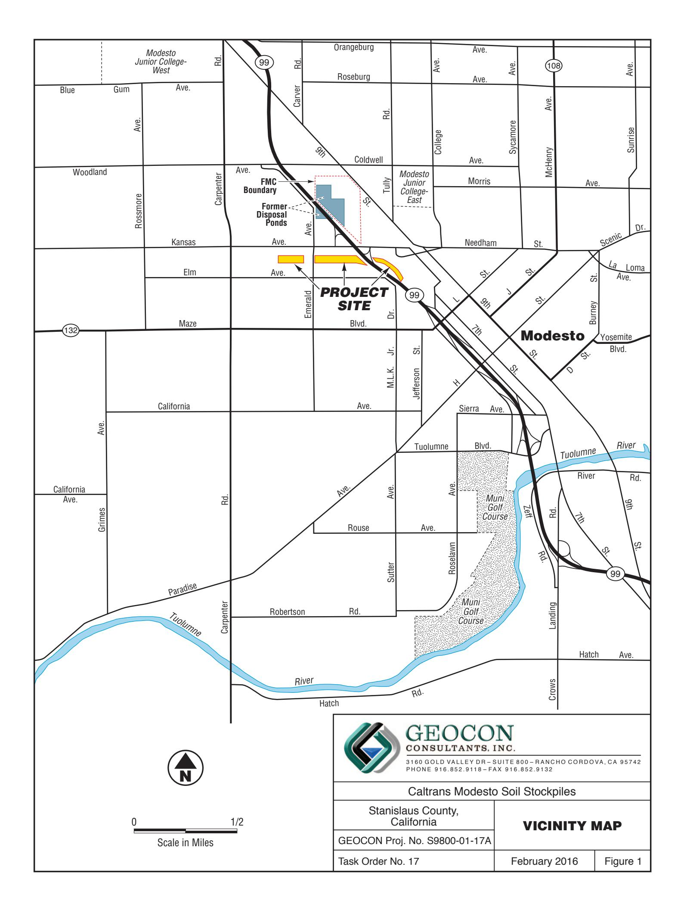
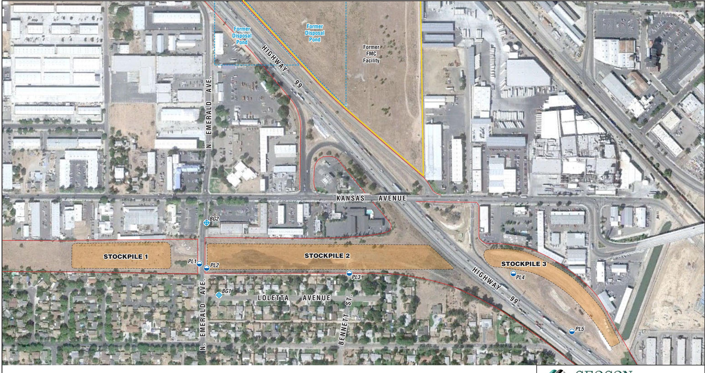
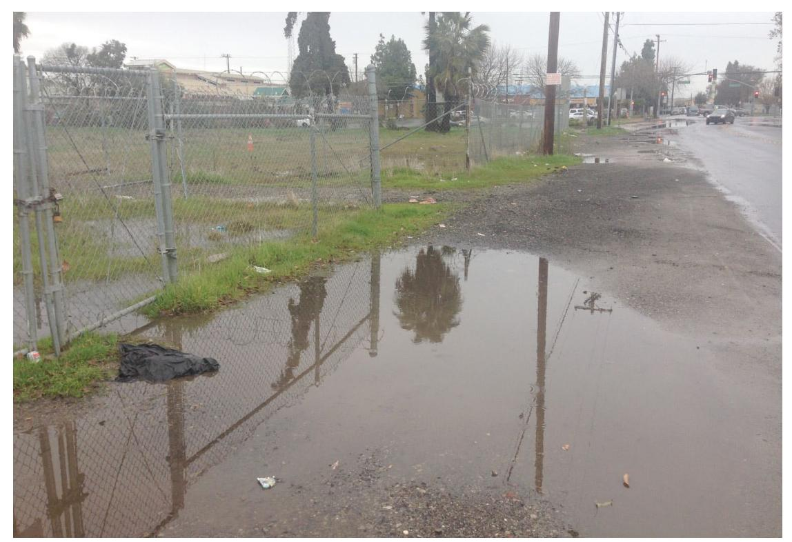
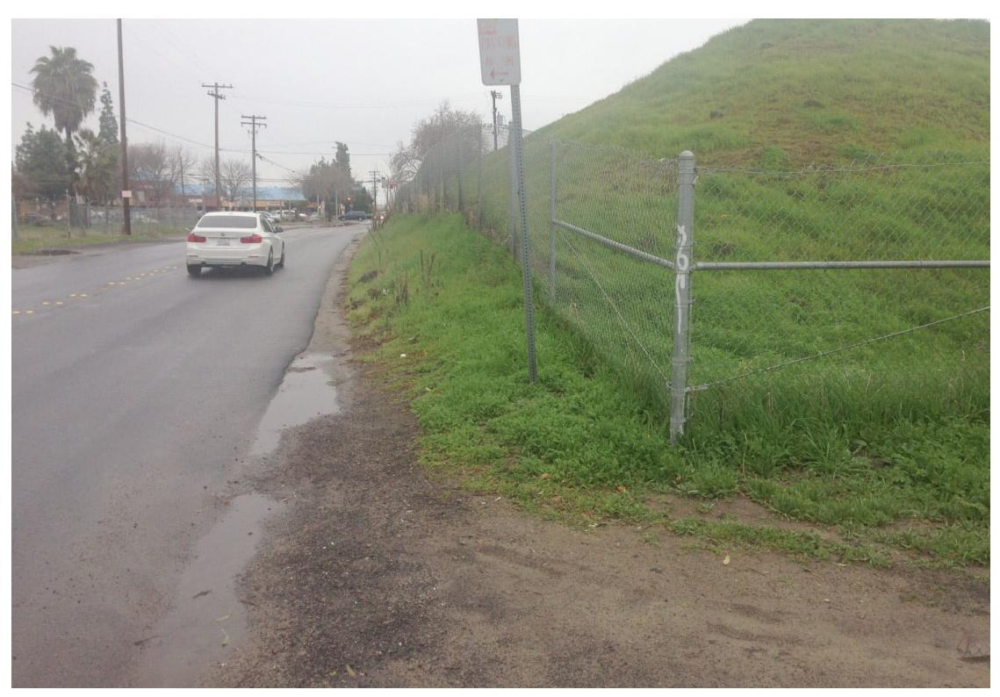
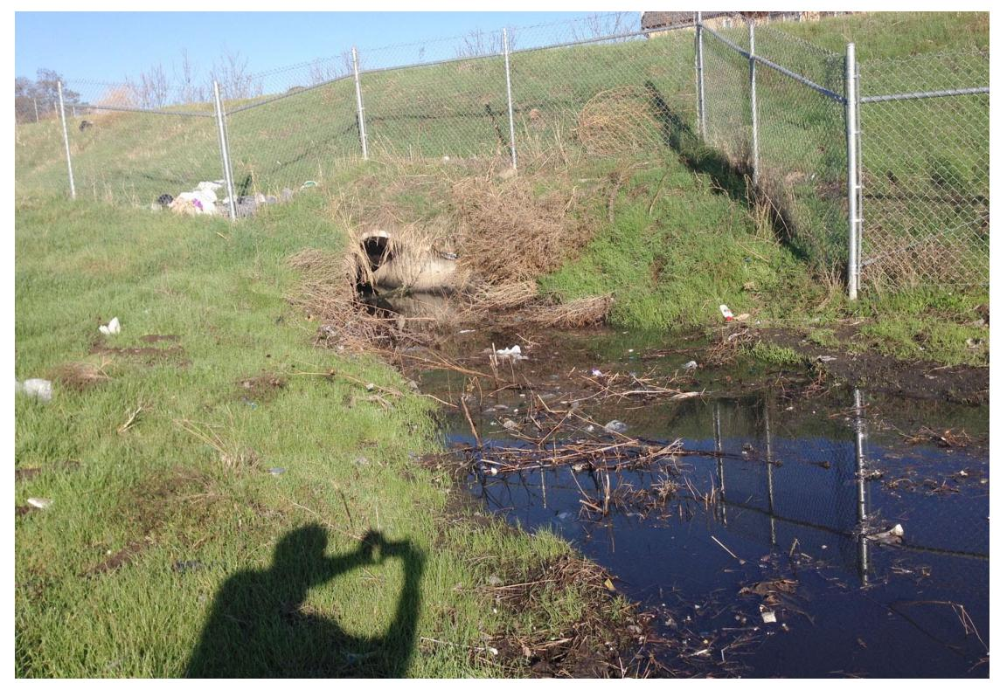
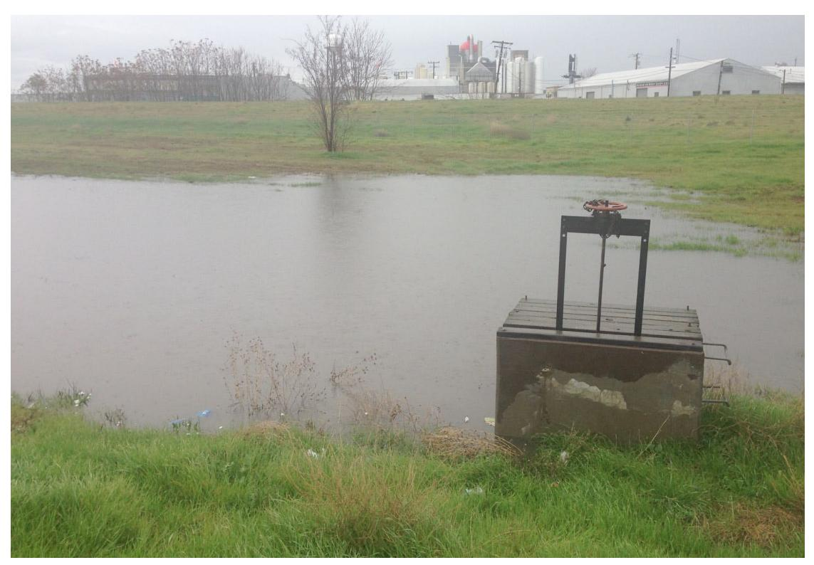
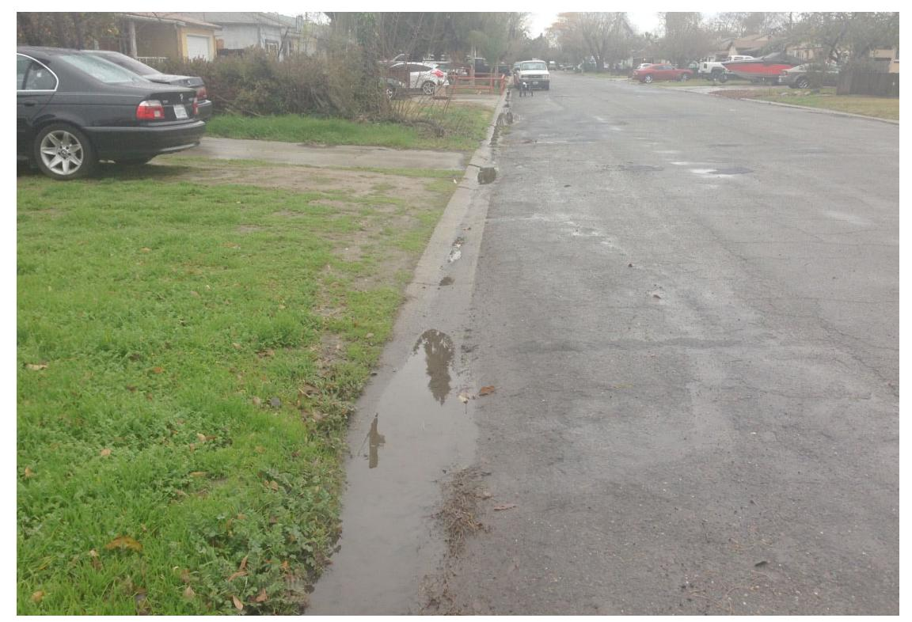
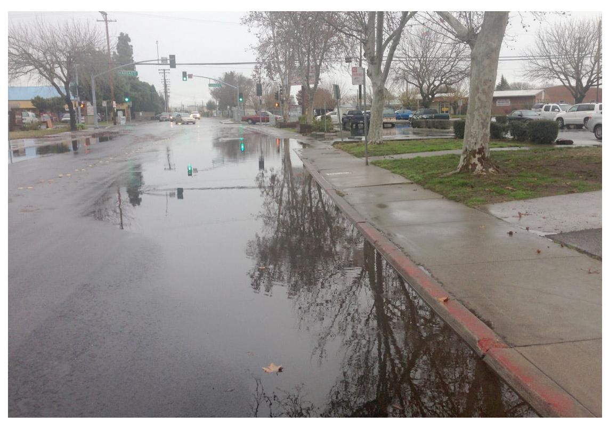
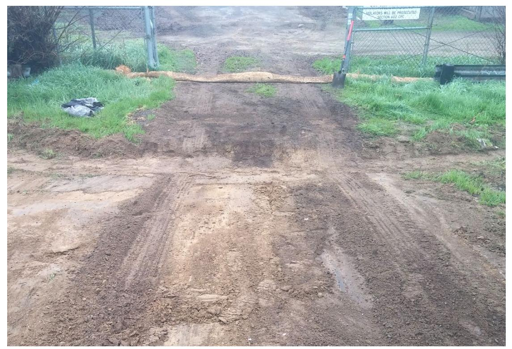
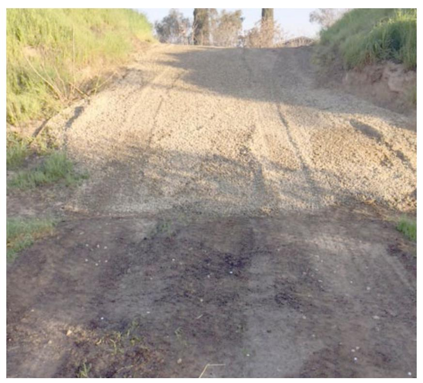

# GEOTECHNICAL . ENVIRONMENTAL . MATERIALS

Project No. S9800-01-17A February 17, 2016

Mr. Richard Stewart, PG California Department of Transportation - District 6 Hazardous Waste Branch 855 M Street, Suite 200 Fresno, California 93721

Subject: SURFACE WATER SAMPLING REPORT – JANUARY 6, 2016

CALTRANS MODESTO SOIL STOCKPILES STANISLAUS COUNTY, CALIFORNIA

CONTRACT NO. 06A1895, TASK ORDER NO. 17, EA NO. 10-0X2700

Dear Mr. Stewart:

In accordance with California Department of Transportation (Caltrans) Contract No. 06A1895, Task Order (TO) No. 17, Geocon performed surface water sampling activities at the Caltrans Modesto Soil Stockpiles (Site) located southerly of the intersection of State Route (SR) 99 and Kansas Avenue in Stanislaus County, California. The approximate site location is depicted on the attached Vicinity Map, Figure 1. The approximate site boundaries, Stockpiles 1 through 3, and surface water sampling locations are shown on the Site Plan, Figure 2.

The surface water sampling was performed on January 6, 2016, in general accordance with protocols approved by the California Environmental Protection Agency, Department of Toxic Substances Control (DTSC) as established in the *Final Surface Water Sampling and Analysis Plan (SAP)*, prepared by Shaw Environmental, Inc. dated January 2006 and our *Addendum to Surface Water Sampling and Analysis Plan*, dated February 20, 2013. The scope of services included surface water sampling, analysis of the water samples by a California-certified laboratory, and preparation of this summary report detailing the sampling activities.

#### BACKGROUND

#### **Project Description and History**

Stockpiles 1 through 3 were generated during construction of SR 99 through Modesto around 1961 when Caltrans excavated soil from property purchased from Food Machinery and Chemical Corporation (FMC) that contained an evaporation pond. The stockpiles were placed in their present location in anticipation of construction of the State Route 132 West Freeway/Expressway project.

During the 1930s, Barium Products Ltd. occupied property at 1200 Barium Road (now Graphics Drive) in Modesto just east of SR 99 between Woodland and Kansas Avenues. Barium Products Ltd. was a chemical manufacturing company processing a variety of ores and minerals including barite (barium sulfate) and celestite (strontium sulfate). Materials produced included barium and strontium compounds; these were used in greases, lubricating oil and pigment blanks. Sodium sulfide generated as a by-product of barite processing was sold as a caustic and used as a reagent in the mining industry.

In 1943, Barium Products Ltd. was purchased by Westvaco Chlorine Products Corporation which subsequently merged with FMC in 1948. From the 1950s to the 1970s, a liquid residue from the

processing operations was discharged to unlined evaporation ponds along the western portion of the FMC Site. The approximate boundaries of the former evaporation/disposal ponds are shown on Figure 2.

In 1961, a 4.3-acre parcel at the southwestern corner of the FMC site was purchased by the State of California for highway right-of-way needed to construct SR 99. An aerial photograph from 1957 shows that a portion of the southernmost pond on the FMC property was within the area purchased for right-of-way.

Soil in and around the pond was excavated during construction of SR 99 and stockpiled within the current Caltrans right-of-way at the location of the future State Route 132 West Freeway/Expressway project. Three distinct stockpiles are present at the Site:

- Stockpile 1, located south of Kansas Avenue and west of North Emerald Avenue,
- Stockpile 2, located south of Kansas Avenue, between North Emerald Avenue and SR 99, and
- Stockpile 3, located south of Kansas Avenue and east of SR 99.

#### **Previous Surface Water Sampling Activities**

Shaw completed a surface water sampling event at the soil stockpiles in March 2006 in general accordance with their January 2006 SAP. In total, seven surface water samples (SW01 through SW06 and SW08) were collected during a qualifying rain event (visible runoff and 72 hours of prior dry weather). Since there was no surface water migration beyond the Caltrans right-of-way, Shaw constructed shallow depressions within the right-of-way in order to collect precipitation falling on the stockpiles. The samples were analyzed for dissolved metals, polycyclic aromatic hydrocarbons (PAHs), nitrate, sulfate and sulfide.

With the sole exception of an elevated barium concentration reported for the sample collected from the northwestern side of Stockpile 3 (sample SW03), the surface water samples did not contain elevated metals concentrations. Barium was reported at a concentration of 2,000 micrograms per liter ( $\mu$ g/l) in sample SW03. Barium in the remaining six samples ranged from 16 to 190  $\mu$ g/l. Shaw concluded that the elevated barium reported for sample SW03 was isolated and that runoff in the area was confined to Caltrans right-of-way.

We previously performed surface water sampling events at the soil stockpiles in April 2013, January 2014, twice in February 2014, twice in December 2014, and once in December 2015. Results from these sampling events are presented on Tables 1 through 3.

Sample points PL1 and PL2 are along North Emerald Avenue. Sample point PL3 is along the southern edge of Stockpile 2. Sample points PL4 and PL5 are at the drainage basin next to Stockpile 3. PL4 is where storm water enters the drainage basin next to Stockpile 3 and PL5 is within three feet of the gate valve that would release storm water to the SR 99 collection system conveying storm water to the Tuolumne River, if opened. From information provided by Caltrans, the gate valve would only be opened if the basin nears a capacity that could jeopardize the northbound lanes of SR 99. Caltrans also states that there is no occurrence of the gate valve being opened in the recent past. Sample points BG1 and BG2 are next to storm water inlets both south (Loletta Avenue) and north (North Emerald Avenue) of Stockpile 2.

The approximate sample locations are depicted on Figure 2. The sample locations were approved by the DTSC and Central Valley Water Quality Control Board (CVRWQCB). During the April 2013, January, February, and December 2014, and December 2015 storm events, we did not observe runoff migrating away from the Caltrans right-of-way.

#### SURFACE WATER SAMPLING ACTIVITIES

This section describes the field activities performed for the January 6, 2016, surface water sampling event. It was raining at the time of sample collection. The rainfall total for this event, which began on January 4, 2016, and ended on January 6, 2016, was approximately 1.64 inches.

#### **Field Activities**

On January 6, 2016, we collected surface water samples from designated locations PL1 through PL5 and BG1 and BG2. The approximate sample locations are depicted on Figure 2. Photos of the sample locations (with the exception of sample location PL3) taken on January 6, 2016, are attached.

We collected samples PL1 and PL2 from puddles of water located on the west and east sides of North Emerald Avenue, respectively, between Stockpiles 1 and 2 (Photos 1 and 2). During rain events, puddles of rain water pool along the shoulders of North Emerald Avenue.

We collected sample PL3 from a puddle of water where Bennett Street intersects the alley behind Loletta Street. The sample was collected outside the Caltrans right-of-way beyond the chain-link fence that encloses the south side of Stockpile 2. We inadvertently did not take a photograph at this location.

We collected sample PL4 (Photo 3) at the drainage basin outfall adjacent to Stockpile 3, northeast of the SR 99 off-ramp to Kansas Avenue. From information provided by Caltrans, storm water in the basin originates exclusively from the drainage inlets located in the depressed section of SR 99 north and south of Kansas Avenue.

We collected sample PL5 from a location within 3 feet of a gate valve within the onsite drainage basin adjacent and south of Stockpile 3 (Photo 4). The gate valve is reportedly only opened if the basin nears a capacity that could jeopardize the northbound lanes of SR 99. The gate valve was not opened during this event.

We collected background sample BG1 from water flowing into a drop inlet south of Stockpile 2 on Loletta Avenue (Photo 5). We also collected background sample BG2 from water flowing into a drop inlet on North Emerald Avenue north of Stockpiles 1 and 2 (Photo 6).

We collected each surface water sample into disposable bailers using a suction pump, and subsequently transferred them into laboratory-provided containers. We field filtered samples to be analyzed for dissolved metals by passing the sample through a 0.45-micron filter. We capped, labeled, chilled and transported the samples to Advanced Technology Laboratories, Inc. (ATL) utilizing chain-of-custody procedures. During the sampling activities, we monitored the samples for pH, electrical conductivity, temperature, turbidity, oxygen-reduction potential (ORP) and dissolved oxygen (DO). The measured field parameters are presented on Table 1.

We followed Quality Assurance/Quality Control (QA/QC) procedures during the field sampling activities including the use of disposable bailers, decontamination of the sample pump by washing in an AlconoxTM solution followed by fresh and purified water rinses, and providing chain-of-custody documentation for each water sample transferred to the laboratory.

#### **Laboratory Analyses**

We delivered the surface water samples to ATL for the following analyses under chain-of-custody protocol:

- Dissolved metals, following the United States Environmental Protection Agency (EPA) Test Method 6020/7470A:
- Chloride, nitrate as nitrogen and sulfate by EPA Test Method 300.0;
- Sulfide by Standard Method (SM) 4500-S-D;
- Total alkalinity, bicarbonate alkalinity, carbonate alkalinity by SM 2320B;
- Total dissolved solids (TDS) by SM 2540C; and
- Total suspended solids (TSS) by SM 2540D.

Surface water analytical results for this monitoring event are summarized on Tables 2 and 3. The laboratory report and chain-of-custody documentation are in Appendix A.

#### **Analytical Results**

#### **Dissolved Metals**

Analytical results for dissolved metals are summarized on Table 2.

Barium, calcium, chromium, copper, magnesium, potassium, sodium, and strontium were reported for samples PL1 through PL5. Nickel and zinc were reported for samples PL1 and PL3 through PL5. Molybdenum was reported for samples PL1, PL2, PL4, and PL5. Antimony was report for samples Pl1, PL4, and PL5. Manganese was reported for samples PL3 through PL5. Vanadium was reported for samples PL2 and PL3. Lead was reported for sample PL3. None of the reported concentrations exceed their respective primary or secondary Maximum Contaminant Levels (MCLs). Arsenic, beryllium, cadmium, cobalt, mercury, selenium, silver, and thallium were not reported at concentrations equal to or greater than their respective practical quantitation limits (PQLs) for samples PL1 through PL5.

Barium, calcium, chromium, copper, magnesium, manganese, molybdenum, nickel, potassium, sodium, strontium, and zinc were reported for samples BG1 and BG2. Antimony was reported for sample BG2. Vanadium was reported for sample BG1. None of the reported concentrations exceed their respective primary or secondary MCLs. Arsenic, beryllium, cadmium, cobalt, lead, mercury, selenium, silver, and thallium were not reported at concentrations equal to or greater than their respective PQLs for samples BG1 and BG2. The analytical results are within the same general range of concentrations as previously reported at each sample location.

#### **General Minerals**

To further characterize the geochemistry of the water, general minerals analyses were conducted. The analytical results for general minerals are summarized on Table 3.

None of the reported general minerals concentrations exceed their respective primary or secondary MCLs. The analytical results are within the same general range of concentrations as previously reported at each sample location.

#### Laboratory QA/QC

We reviewed the analytical laboratory QA/QC provided with the laboratory report. The laboratory notes state samples PL1 through PL5 and BG2 "required dilution due to high concentration of target" analytes. PL1 through PL3, PL5 and BG2 were diluted for calcium. PL1 was also diluted for zinc. PL3 was diluted for barium and potassium. PL4 and PL5 were diluted for strontium. In addition, matrix spike recoveries for total sulfide and calcium were outside their "acceptance limit due to possible matrix interference." The laboratory notes state that the "analytical batch was validated by the laboratory control sample."

#### SURFACE WATER MANAGEMENT

Surface water originating from the western slope of Stockpile 2 along North Emerald Avenue will continue to be managed by maintaining the stockpile's vegetative/fiber cover and straw wattles which have been placed to intercept and redirect surface water slope flow to areas within the Caltrans right-of-way.

To intercept any runoff from the access ramp located on the south side of Stockpile 2 (north end of Bennett Street), Caltrans constructed a berm at the base of the ramp in February 2014. The berm functions to keep runoff within the State right-of-way occupied by Stockpile 2.

To further address the potential for offsite runoff from the access ramp, Caltrans reported that the interceptor berm was recently regraded and the access ramp subsequently covered with a layer of gravel to prevent soil erosion (Photos 7 and 8, provided by Caltrans).

Caltrans plans to conduct additional surface water sampling events during the 2016 rain season.

We appreciate the opportunity to provide our services on this project. Please contact us if you have any questions concerning the contents of this Report or if we may be of further service.

Sincerely,

GEOCON CONSULTANTS, INC.

Rebecca L. Silva Project Manager

(1) Addressee

(1) DTSC, Randy Adams

(1) CVRWQCB, Steve Meeks

Attachments: Figure 1, Vicinity Map

Figure 2, Site Plan Photographs 1 through 8

Table 1, Summary of Surface Water Field Parameters

Table 2, Summary of Surface Water Analytical Results – Title 22 Metals

John E. Juhrend, PE, CEG

Senior Engineer

(Dissolved)

Table 3, Summary of Surface Water Analytical Results – General Minerals Appendix A, Laboratory Report and Chain-of-Custody Documentation

— State Right-of-Way Boundary

Approximate Surface Water Sample Location

Approximate Surface Water Sample Location (Background)

Scale in Feet

# GEOCON CONSULTANTS, INC.

3160 GOLD VALLEY DR - SUITE 800 - RANCHO CORDOVA, CA 95742 PHONE 916.852.9118 - FAX 916.852.9132

| Caltrans N | Modesto S | Soil Stock | (piles |
|------------|-----------|------------|--------|
|------------|-----------|------------|--------|

| Stanislaus County, California |
|----------------------------------|
| FOCON Proj. No. S0000-01-17A     |

GEOCON Proj. No. S9800-01-17A

SITE PLAN

Task Order No. 17 February 2016

.016 Figure 2

Photo No. 1 Sample location PL1 on the west side of North Emerald Avenue

Photo No. 2 Sample location PL2 on the east of North Emerald Avenue

# PHOTOS NO. 1 & 2 - January 6, 2016

| Caltrans Modesto Soil Stockpiles |                                  |
|----------------------------------|----------------------------------|
| GEOCON Proj. No. S9800-01-17A    | Stanislaus County, California |
| Task Order No. 17                | February 2016                    |

Photo No. 3 Sample location PL4 south of Stockpile 3

Photo No. 4 Sample location PL5 at gate valve south of Stockpile 3

# PHOTOS NO. 3 & 4 - January 6, 2016

| Caltrans Modesto Soil Stockpiles |                                  |
|----------------------------------|----------------------------------|
| GEOCON Proj. No. S9800-01-17A    | Stanislaus County, California |
| Task Order No. 17                | February 2016                    |

Photo No. 5 Background sample location BG1 on Loletta Avenue

Photo No. 6 Background sample location BG2 on Emerald Avenue

# **PHOTOS NO. 5 & 6 - January 6, 2016**

| Caltrans Modesto Soil Stockpiles |                                  |
|----------------------------------|----------------------------------|
| GEOCON Proj. No. S9800-01-17A    | Stanislaus County, California |
| Task Order No. 17                | February 2016                    |

Photo No. 7 Regraded berm at the Stockpile 2 access ramp

Photo No. 8 New gravel on the Stockpile 2 access ramp

# PHOTOS NO. 7 & 8 - January 6, 2016

| Caltrans Modesto Soil Stockpiles |                                  |
|----------------------------------|----------------------------------|
| GEOCON Proj. No. S9800-01-17A    | Stanislaus County, California |
| Task Order No. 17                | February 2016                    |

TABLE 1
SUMMARY OF SURFACE WATER FIELD PARAMETERS
CALTRANS MODESTO SOIL STOCKPILES
STANISLAUS COUNTY, CALIFORNIA

|           |             | рН       | CONDUCTIVITY | TEMPERATURE     | TURBIDITY  | ORP        | DO    |
|-----------|-------------|----------|--------------|-----------------|------------|------------|-------|
|           |             |          | μmhos/cm     | °C              | ntu        | millivolts | mg/l  |
| SAMPLE ID | SAMPLE DATE |          |              |                 |            |            |       |
| PL1       | 4/4/2013    | 8.93     | 88           | 14.9            | 47         | 3          |       |
| PL1       | 1/30/2014   | 5.72     | 152          | 12.3            | 120        | 86         |       |
| PL1       | 2/6/2014    | 5.95     | 227          | 10.6            | 207        | 147        |       |
| PL1       | 2/28/2014   | 5.70     | 121          | 13.7            | 245        | 192        | 7.70  |
| PL1       | 12/2/2014   | 6.71     | 73           | 13.6            | 311        | 146        | 7.07  |
| PL1       | 12/12/2014  | 7.38     | 71           | 11.2            | 83.1       | 168        | 7.31  |
| PL1       | 12/11/2015  | 7.74     | 160          | 9.4             | 102        | 123        | 1.27  |
| PL1       | 1/6/2016    | 8.92     | 81           | 11.2            | 87.8       | 83         | 13.40 |
| PL2       | 4/4/2013    | 9.00     | 54           | 15.1            | 208        | 28         |       |
| PL2       | 1/30/2014   |          |              | No Sample       | : - Dry    |            |       |
| PL2       | 2/6/2014    | 5.98     | 128          | 11.2            | 293        | 140        |       |
| PL2       | 2/28/2014   | 6.29     | 99           | 12.7            | 256        | 222        | 6.03  |
| PL2       | 12/2/2014   | 6.83     | 45           | 13.5            | 217        | 156        | 7.44  |
| PL2       | 12/12/2014  | 7.54     | 70           | 10.3            | 551        | 186        | 8.29  |
| PL2       | 12/11/2015  | 7.63     | 108          | 11.0            | 60.4       | 132        | 2.11  |
| PL2       | 1/6/2016    | 8.15     | 75           | 10.3            | 159        | 101        | 8.09  |
| PL3       | 4/4/2013    | 7.91     | 167          | 16.3            | 54         | 68         |       |
| PL3       | 1/30/2014   | 5.57     | 263          | 12.4            | 105        | 81         |       |
| PL3       | 2/6/2014    | 5.85     | 153          | 11.1            | 79         | 149        |       |
| PL3       | 2/28/2014   | 6.42     | 104          | 12.9            | 37         | 234        | 5.31  |
| PL3       | 12/2/2014   | 6.71     | 29           | 13.6            | 158        | 174        | 7.50  |
| PL3       | 12/12/2014  | 7.07     | 27           | 10.6            | 41.2       | 179        | 6.59  |
| PL3       | 12/11/2015  | 7.30     | 293          | 9.9             | 58         | 141        | 1.02  |
| PL3       | 1/6/2016    | 7.87     | 36           | 9.6             | 58.4       | 109        | 9.21  |
| PL4       | 4/4/2013    | 11.08    | 315          | 16.3            | 98         | 58         |       |
| PL4       | 1/30/2014   | 5.95     | 128          | 15.2            | 156        | 79         |       |
| PL4       | 2/6/2014    | 5.80     | 186          | 10.9            | 215        | 154        |       |
| PL4       | 2/28/2014   | 6.67     | 71           | 12.3            | 24         | 235        | 6.20  |
| PL4       | 12/2/2014   | 6.72     | 66           | 14.1            | 119        | 196        | 6.90  |
| PL4       | 12/12/2014  | 7.15     | 26           | 11.5            | 47.3       | 122        | 7.12  |
| PL4       | 12/11/2015  | 7.38     | 177          | 14.1            | 51         | 119        | 1.62  |
| PL4       | 1/6/2016    | 7.73     | 58           | 9.9             | 161        | 128        | 9.25  |
| SAMPLE ID | SAMPLE DATE | pH       | CONDUCTIVITY | TEMPERATURE     | TURBIDITY  | ORP        | DO    |
|           |             | μmhos/cm | °C           | ntu             | millivolts | mg/l       |       |
| PL5       | 12/12/2014  | 6.99     | 32           | 11.4            | 99.7       | 149        | 5.56  |
| PL5       | 12/11/2015  |          |              | No Sample - Dry |            |            |       |
| PL5       | 1/6/2016    | 7.74     | 62           | 9.4             | 86.4       | 127        | 9.68  |
| BG1       | 4/4/2013    | 8.46     | 42           | 16.4            | 57         | 37         |       |
| BG1       | 1/30/2014   | 5.73     | 157          | 12.5            | 110        | 59         |       |
| BG1       | 2/6/2014    | 5.82     | 142          | 10.7            | 166        | 155        |       |
| BG1       | 2/28/2014   | 6.37     | 78           | 12.9            | 62         | 226        | 5.49  |
| BG1       | 12/2/2014   | 6.55     | 33           | 13.8            | 121        | 171        | 6.60  |
| BG1       | 12/12/2014  | 7.41     | 22           | 10.6            | 93.1       | 143        | 6.60  |
| BG1       | 12/11/2015  |          |              | No Sample - Dry |            |            |       |
| BG1       | 1/6/2016    | 7.72     | 77           | 10.1            | 138        | 109        | 3.74  |
| BG2       | 4/4/2013    | 9.88     | 83           | 18.4            | 102        | 67         |       |
| BG2       | 1/30/2014   | 5.91     | 189          | 14.2            | 210        | 95         |       |
| BG2       | 2/6/2014    | 5.84     | 167          | 10.9            | 350        | 159        |       |
| BG2       | 2/28/2014   | 6.05     | 73           | 12.9            | 122        | 2.7        | 6.39  |
| BG2       | 12/2/2014   | 6.72     | 66           | 14.1            | 119        | 196        | 6.90  |
| BG2       | 12/12/2014  | 7.63     | 37           | 10.7            | 218        | 176        | 8.34  |
| BG2       | 12/11/2015  |          |              | No Sample - Dry |            |            |       |
| BG2       | 1/6/2016    | 8.45     | 89           | 11.1            | 261        | 65         | 11.32 |

# TABLE 1 SUMMARY OF SURFACE WATER FIELD PARAMETERS CALTRANS MODESTO SOIL STOCKPILES STANISLAUS COUNTY, CALIFORNIA

#### Notes:

 $\mu mhos/cm = Micromhos per centimeter$ 

°C = Degrees Celsius

ntu = Nephelometric turbidity unit

ORP = Oxygen-Reduction Potential

DO = Dissolved Oxygen

mg/l = Milligrams per liter

#### TABLE 2

# SUMMARY OF SURFACE WATER ANALYTICAL RESULTS - TITLE 22 METALS (DISSOLVED)

# CALTRANS MODESTO SOIL STOCKPILES

#### STANISLAUS COUNTY, CALIFORNIA

| ANALYTE       |              |                | Results in micrograms per liter |           |         |           |         |          |        |           |            |           |                   |        |          |          |          |           |         |           |           |           |           |           |        | Results in milligrams per liter |  |  |  |  |
|---------------|--------------|----------------|---------------------------------|-----------|---------|-----------|---------|----------|--------|-----------|------------|-----------|-------------------|--------|----------|----------|----------|-----------|---------|-----------|-----------|-----------|-----------|-----------|--------|---------------------------------|--|--|--|--|
|               | SAMPLE ID | SAMPLE DATE | Antimony                        | Arsenic   | Barium  | Beryllium | Cadmium | Chromium | Cobalt | Copper    | Lead       | Manganese | Molybdenum        | Nickel | Selenium | Silver   | Thallium | Vanadium  | Zinc    | Strontium | Mercury   | Calcium   | Magnesium | Potassium | Sodium |                                 |  |  |  |  |
| PL1           | 4/4/2013     | 1.0            | <1.0                            | 12        | <0.50   | <0.50     | 0.55    | <0.50    | 8.9    | <1.0      | <10        | 2.6       | 2.5               | <0.50  | <0.50    | <0.50    | 2.0      | <10       | 100     | <0.20     | 1.4       | 1.9       | 3.4       | 5.5       |        |                                 |  |  |  |  |
| PL1           | 1/30/2014    | 0.98           | 1.2                             | 25        | <0.50   | <0.50     | 0.97    | 0.75     | 23     | <1.0      | 73         | 6.0       | 5.8               | <0.50  | <0.50    | <0.50    | 4.9      | 37        | 100     | <0.20     | 14        | 1.9       | 3.4       | 5.5       |        |                                 |  |  |  |  |
| PL1           | 2/6/2014     | 1.5            | 1.0                             | 35        | <0.50   | <0.50     | 0.75    | 0.59     | 17     | <1.0      | <10        | 6.2       | 5.5               | <0.50  | <0.50    | <0.50    | 3.4      | <10       | 210     | <0.20     | 28        | 3.3       | 3.6       | 6.6       |        |                                 |  |  |  |  |
| PL1           | 2/28/2014    | 0.53           | 1.1                             | 10        | <0.50   | <0.50     | 0.70    | <0.50    | 5.6    | <1.0      | <10        | 1.9       | 3.2               | <0.50  | <0.50    | <0.50    | 2.8      | <10       | 55      | <0.20     | 8.9       | 0.94      | 1.6       | 2.0       |        |                                 |  |  |  |  |
| PL1           | 12/2/2014    | <0.5           | <1.0                            | 16        | <0.50   | <0.50     | 1.1     | <0.50    | 3.0    | <1.0      | 32         | 1.2       | 1.5               | <0.50  | <0.50    | <0.50    | 3.7      | 43        | 55      | <0.20     | 7.3       | 1.2       | 1.7       | 3.5       |        |                                 |  |  |  |  |
| PL1           | 12/12/2014   | 0.82           | <1.0                            | 16        | <0.50   | <0.50     | 0.68    | <0.50    | 2.2    | <1.0      | <10        | 0.68      | <1.0              | <0.50  | <0.50    | <0.50    | 1.2      | 96        | 53      | <0.20     | 7.1       | 1.0       | 1.5       | 1.8       |        |                                 |  |  |  |  |
| PL1           | 12/11/2015   | 1.2            | <1.0                            | 20        | <5.0    | <0.50     | 1.2     | 0.58     | 11     | <1.0      | 36         | 3.8       | 4.0               | <0.50  | <0.50    | <0.50    | 3.7      | 24        | 110     | <0.20     | 16        | 2.0       | 3.0       | 5.0       |        |                                 |  |  |  |  |
| PL1           | 1/6/2016     | 0.73           | <1.0                            | 31        | <0.50   | <0.50     | 0.52    | <0.50    | 3.4    | <1.0      | <10        | 0.78      | 1.2               | <0.50  | <0.50    | <0.50    | <1.0     | 100       | 64      | <0.20     | 8.5       | 1.3       | 3.5       | 1.2       |        |                                 |  |  |  |  |
| PL2           | 4/4/2013     | 1.2            | <1.0                            | 39        | <0.50   | <0.50     | 2.5     | <0.50    | 12     | 2.7       | 22         | 2.7       | 2.1               | <0.50  | <0.50    | <0.50    | 2.7      | 27        | 38      | <0.20     |           |           |           |           |        |                                 |  |  |  |  |
| PL2           | 1/30/2014    |                |                                 |           |         |           |         |          |        |           |            |           | -No Sample - Dry- |        |          |          |          |           |         |           |           |           |           |           |        |                                 |  |  |  |  |
| PL2           | 2/6/2014     | 3.5            | <1.0                            | 41        | <0.50   | <0.50     | 3.0     | 0.88     | 29     | 1.2       | 78         | 9.5       | 6.2               | <0.50  | <0.50    | <0.50    | 3.1      | 42        | 90      | <0.20     | 7.7       | 1.6       | 5.6       | 3.1       |        |                                 |  |  |  |  |
| PL2           | 2/28/2014    | 2.5            | <1.0                            | 35        | <0.50   | <0.50     | 6.5     | <0.50    | 15     | 1.1       | 23         | 3.8       | 4.6               | <0.50  | <0.50    | <0.50    | 1.8      | 27        | 63      | <0.20     | 6.0       | 1.0       | 2.2       | 1.7       |        |                                 |  |  |  |  |
| PL2           | 12/2/2014    | 0.53           | <1.0                            | 24        | <0.50   | <0.50     | 1.7     | 0.53     | 5.8    | 2.0       | 36         | 0.94      | 1.9               | <0.50  | <0.50    | <0.50    | 2.6      | 14        | 41      | <0.20     | 4.4       | 0.89      | 1.3       | 0.64      |        |                                 |  |  |  |  |
| PL2           | 12/12/2014   | <0.5           | 1.4                             | 50        | <0.50   | <0.50     | 1.8     | 0.52     | 6.5    | 3.5       | 27         | 0.97      | 1.8               | <0.50  | <0.50    | <0.50    | 5.0      | 21        | 120     | <0.20     | 12        | 2.1       | 1.6       | 1.4       |        |                                 |  |  |  |  |
| PL2           | 12/11/2015   | 1.3            | <1.0                            | 20        | <5.0    | <0.50     | 1.1     | 0.56     | 10     | <1.0      | 52         | 2.8       | 3.0               | <0.50  | <0.50    | <0.50    | 2.2      | 28        | 83      | <0.20     | 8.1       | 1.8       | 3.2       | 3.6       |        |                                 |  |  |  |  |
| PL2           | 1/6/2016     | <0.50          | <1.0                            | 19        | <0.50   | <0.50     | 0.73    | <0.50    | 3.4    | <1.0      | <10        | 0.66      | <1.0              | <0.50  | <0.50    | <0.50    | 1.6      | <10       | 58      | <0.20     | 7.5       | 1.0       | 1.6       | 1.8       |        |                                 |  |  |  |  |
| PL3           | 4/4/2013     | 0.55           | 1.3                             | 110       | <0.50   | <0.50     | 1.1     | 0.68     | 19     | 15        | 46         | 3.0       | 4.4               | <0.50  | <0.50    | <0.50    | 3.3      | 33        | 220     | <0.20     |           |           |           |           |        |                                 |  |  |  |  |
| PL3           | 1/30/2014    | 0.70           | 1.9                             | 140       | <0.50   | <0.50     | 1.6     | 2.2      | 32     | 2.3       | 190        | 4.1       | 10                | <0.50  | <0.50    | <0.50    | 10       | 84        | 190     | <0.20     | 18        | 3.9       | 17        | 6.4       |        |                                 |  |  |  |  |
| PL3           | 2/6/2014     | 0.51           | 1.2                             | 96        | <0.50   | <0.50     | 1.1     | 0.93     | 21     | <1.0      | 71         | 2.3       | 4.7               | <0.50  | <0.50    | <0.50    | 7.4      | 29        | 150     | <0.20     | 12        | 2.7       | 8.6       | 2.5       |        |                                 |  |  |  |  |
| PL3           | 2/28/2014    | <0.50          | <1.0                            | 93        | <0.50   | <0.50     | 0.86    | <0.50    | 8.0    | <1.0      | 12         | 0.92      | 4.0               | <0.50  | <0.50    | <0.50    | 3.8      | 11        | 77      | <0.20     | 6.2       | 1.3       | 3.2       | 1.2       |        |                                 |  |  |  |  |
| PL3           | 12/2/2014    | <0.50          | <1.0                            | 37        | <0.50   | <0.50     | 0.68    | <0.50    | 2.0    | <1.0      | <10        | <0.5      | <1.0              | <0.50  | <0.50    | <0.50    | 2.5      | <10       | 46      | <0.20     | 3.1       | 0.51      | 2.6       | 0.63      |        |                                 |  |  |  |  |
| PL3           | 12/12/2014   | <0.50          | <1.0                            | 53        | <0.50   | <0.50     | 0.53    | <0.50    | 2.4    | <1.0      | 18         | <0.5      | <1.0              | <0.50  | <0.50    | <0.50    | 1.8      | <10       | 70      | <0.20     | 4.3       | 0.91      | 3.1       | 0.34      |        |                                 |  |  |  |  |
| PL3           | 12/11/2015   | 0.74           | 1.2                             | 190       | <0.50   | <0.50     | 1.7     | 3.0      | 18     | <1.0      | 290        | 0.94      | 3.9               | <0.50  | <0.50    | <0.50    | 6.4      | 60        | 390     | <0.20     | 26        | 6.4       | 38        | 4.9       |        |                                 |  |  |  |  |
| PL3           | 1/6/2016     | <0.50          | <1.0                            | 100       | <0.50   | <0.50     | 1.0     | <0.50    | 3.8    | 1.7       | 27         | <0.50     | 1.8               | <0.50  | <0.50    | <0.50    | 2.0      | 15        | 56      | <0.20     | 4.8       | 2.5       | 5.1       | 0.94      |        |                                 |  |  |  |  |
| ANALYTE       |              |                | Results in micrograms per liter |           |         |           |         |          |        |           |            |           |                   |        |          |          |          |           |         |           |           |           |           |           |        | Results in milligrams per liter |  |  |  |  |
|               | Antimony     | Arsenic        | Barium                          | Beryllium | Cadmium | Chromium  | Cobalt  | Copper   | Lead   | Manganese | Molybdenum | Nickel    | Selenium          | Silver | Thallium | Vanadium | Zinc     | Strontium | Mercury | Calcium   | Magnesium | Potassium | Sodium    |           |        |                                 |  |  |  |  |
| SAMPLE ID     | SAMPLE DATE  |                |                                 |           |         |           |         |          |        |           |            |           |                   |        |          |          |          |           |         |           |           |           |           |           |        |                                 |  |  |  |  |
| PL4           | 4/4/2013     | 1.2            | 1.3                             | 45        | <0.50   | <0.50     | 7.8     | 1.2      | 16     | <1.0      | <10        | 3.4       | 4.8               | <0.50  | <0.50    | <0.50    | 7.0      | 11        | 320     | <0.20     |           |           |           |           |        |                                 |  |  |  |  |
| PL4           | 1/30/2014    | 1.3            | 1.1                             | 25        | <0.50   | <0.50     | 2.0     | 1.0      | 16     | <1.0      | 38         | 6.4       | 5.5               | <0.50  | <0.50    | <0.50    | 5.7      | 53        | 110     | <0.20     | 9.8       | 0.89      | 4.5       | 7.8       |        |                                 |  |  |  |  |
| PL4           | 2/6/2014     | 1.2            | <1.0                            | 42        | <0.50   | <0.50     | 2.4     | 1.5      | 5.9    | <1.0      | 110        | 7.1       | 6.6               | <0.50  | <0.50    | <0.50    | 5.8      | 26        | 180     | <0.20     | 18        | 1.7       | 5.5       | 10        |        |                                 |  |  |  |  |
| PL4           | 2/28/2014    | 0.64           | 1.1                             | 26        | <0.50   | <0.50     | 1.2     | <0.50    | 6.2    | <1.0      | 13         | 1.6       | 2.5               | <0.50  | <0.50    | <0.50    | 2.0      | 26        | 75      | <0.20     | 5.0       | 0.61      | 2.5       | 2.2       |        |                                 |  |  |  |  |
| PL4           | 12/2/2014    | 1.1            | <1.0                            | 56        | <0.50   | <0.50     | 1.5     | 0.52     | 9.4    | 1.1       | 33         | 2.4       | 2.2               | <0.50  | <0.50    | <0.50    | 1.9      | 37        | 100     | <0.20     | 6.0       | 0.69      | 2.1       | 2.7       |        |                                 |  |  |  |  |
| PL4           | 12/12/2014   | <0.50          | <1.0                            | 87        | <0.50   | <0.50     | 1.0     | <0.50    | 4.3    | <1.0      | <10        | 1.5       | <1.0              | <0.50  | <0.50    | <0.50    | 1.0      | 25        | 85      | <0.20     | 4.8       | 0.55      | 1.5       | 1.4       |        |                                 |  |  |  |  |
| PL4           | 12/11/2015   | 1.9            | <1.0                            | 79        | <25     | <0.50     | 1.4     | 1.1      | 8.9    | 1.0       | 110        | 7.4       | 5.1               | <0.50  | <0.50    | <0.50    | 2.0      | 51        | 310     | <0.20     | 16        | 1.7       | 6.1       | 10        |        |                                 |  |  |  |  |
| PL4           | 1/6/2016     | 0.65           | <1.0                            | 80        | <0.50   | <0.50     | 1.2     | <0.50    | 5.3    | <1.0      | 12         | 1.4       | 1.2               | <0.50  | <0.50    | <0.50    | <1.0     | 23        | 120     | <0.20     | 4.5       | 0.64      | 1.7       | 2.0       |        |                                 |  |  |  |  |
| PL5           | 12/12/2014   | 0.74           | <1.0                            | 110       | <0.50   | <0.50     | 1.5     | <0.50    | 6.3    | <1.0      | 11         | 1.5       | 1.1               | <0.50  | <0.50    | <0.50    | 1.1      | 22        | 75      | <0.20     | 4.3       | 0.56      | 1.9       | 1.4       |        |                                 |  |  |  |  |
| RWQCB Sample* | 12/12/2014   | <10            | <10                             | 155       | <5.0    | <5.0      | <5.0    | <5.0     | 9.8    | <5.0      |            | <5.0      | <5.0              | <20    | <5.0     | <20      | <5.0     | 30.3      | 81.6    | <0.20     |           |           |           |           |        |                                 |  |  |  |  |
| PL5           | 12/11/2015   |                |                                 |           |         |           |         |          |        |           |            |           | No Sample - Dry   |        |          |          |          |           |         |           |           |           |           |           |        |                                 |  |  |  |  |
| PL5           | 1/6/2016     | 0.88           | <1.0                            | 64        | <0.50   | <0.50     | 1.2     | <0.50    | 6.7    | <1.0      | 11         | 2.0       | 1.8               | <0.50  | <0.50    | <0.50    | <1.0     | 28        | 100     | <0.20     | 5.4       | 0.66      | 1.6       | 2.9       |        |                                 |  |  |  |  |
| BG1           | 4/4/2013     | <0.50          | <1.0                            | 11        | <0.50   | <0.50     | 0.84    | <0.50    | 5.9    | <1.0      | 12         | 0.93      | 2.7               | <0.50  | <0.50    |          | 1.9      | 16        | 20      | <0.20     |           |           |           |           |        |                                 |  |  |  |  |
| BG1           | 1/30/2014    | 0.66           | <1.0                            | 44        | <0.50   | <0.50     | 1.2     | 0.75     | 15     | <1.0      | 39         | 1.7       | 6.2               | <0.50  | <0.50    |          | 4.4      | 28        | 90      | <0.20     | 11        | 2.5       | 7.5       | 3.3       |        |                                 |  |  |  |  |
| BG1           | 2/6/2014     | 0.56           | <1.0                            | 31        | <0.50   | <0.50     | 0.92    | <0.50    | 12     | <1.0      | 15         | 1.2       | 5.0               | <0.50  | <0.50    | <0.50    | 4.7      | 14        | 68      | <0.20     | 8.1       | 1.8       | 4.4       | 3.2       |        |                                 |  |  |  |  |
| BG1           | 2/28/2014    | <0.50          | <1.0                            | 22        | <0.50   | <0.50     | 0.91    | <0.50    | 7.4    | <1.0      | <10        | 0.62      | 4.1               | <0.50  | <0.50    | <0.50    | 2.8      | 13        | 38      | <0.20     | 4.7       | 0.91      | 1.7       | 2.1       |        |                                 |  |  |  |  |
| BG1           | 12/2/2014    | <0.50          | <1.0                            | 13        | <0.50   | <0.50     | 0.91    | <0.50    | 5.8    | <1.0      | <10        | 0.58      | <1.0              | <0.50  | <0.50    | <0.50    | 1.9      | <10       | 25      | <0.20     | 2.7       | 0.55      | 1.9       | 0.98      |        |                                 |  |  |  |  |
| BG1           | 12/12/2014   | <0.50          | <1.0                            | 13        | <0.50   | <0.50     | 0.74    | <0.50    | 3.0    | <1.0      | <10        | <0.50     | 1.1               | <0.50  | <0.50    |          | 1.1      | <10       | 20      | <0.20     | 2.2       | 0.42      | 1.2       | 0.58      |        |                                 |  |  |  |  |
| BG1           | 12/11/2015   |                |                                 |           |         |           |         |          |        |           |            |           | No Sample - Dry   |        |          |          |          |           |         |           |           |           |           |           |        |                                 |  |  |  |  |
| BG1           | 1/6/2016     | <0.50          | <1.0                            | 25        | <0.50   | <0.50     | 0.73    | <0.50    | 3.4    | <1.0      | 13         | 0.50      | 1.2               | <0.50  | <0.50    | <0.50    | 1.6      | 10        | 36      | <0.20     | 3.8       | 0.86      | 1.8       | 0.76      |        |                                 |  |  |  |  |

#### TABLE 2

# SUMMARY OF SURFACE WATER ANALYTICAL RESULTS - TITLE 22 METALS (DISSOLVED)

#### CALTRANS MODESTO SOIL STOCKPILES

#### STANISLAUS COUNTY, CALIFORNIA

#### TABLE 2

# $SUMMARY\ OF\ SURFACE\ WATER\ ANALYTICAL\ RESULTS\ -\ TITLE\ 22\ METALS\ (DISSOLVED)$

#### CALTRANS MODESTO SOIL STOCKPILES

#### STANISLAUS COUNTY, CALIFORNIA

| ANA          | ALYTE          | Antimony | Arsenic | Barium | Beryllium | Cadmium | Chromium | Cobalt | Copper | Lead      | Manganese | Molybdenum | Nickel | Selenium | Silver | Thallium | Vanadium | Zinc    | Strontium | Mercury | Calcium | Magnesium  | Potassium   | Sodium   |
|--------------|----------------|----------|---------|--------|-----------|---------|----------|--------|--------|-----------|-----------|------------|--------|----------|--------|----------|----------|---------|-----------|---------|---------|------------|-------------|----------|
| SAMPLE ID | SAMPLE DATE |          |         |        |           |         |          |        |        | Results i | n microgr | ams per l  | iter   |          |        |          |          |         |           |         | Re      | sults in m | illigrams p | er liter |
|              |                |          |         |        |           |         |          |        |        |           |           |            |        |          |        |          |          |         |           |         |         |            |             |          |
| BG2          | 4/4/2013       | 1.2      | <1.0    | 20     | < 0.50    | < 0.50  | 4.8      | < 0.50 | 14     | 1.2       | 25        | 3.0        | 2.6    | < 0.50   | < 0.50 | < 0.50   | <1.0     | 66      | 24        | < 0.20  |         |            |             |          |
| BG2          | 1/30/2014      | 3.5      | 1.1     | 48     | < 0.50    | < 0.50  | 2.3      | 0.95   | 32     | <1.0      | 66        | 11         | 6.6    | < 0.50   | < 0.50 | < 0.50   | 1.4      | 110     | 120       | < 0.20  | 17      | 3.1        | 9.6         | 7.4      |
| BG2          | 2/6/2014       | 2.4      | <1.0    | 35     | < 0.50    | < 0.50  | 1.9      | 0.73   | 22     | <1.0      | 46        | 5.3        | 6.4    | < 0.50   | < 0.50 | < 0.50   | 2.1      | 110     | 87        | < 0.20  | 12      | 2.4        | 5.9         | 5.0      |
| BG2          | 2/28/2014      | 3.4      | <1.0    | 33     | < 0.50    | < 0.50  | 12       | < 0.50 | 26     | <1.0      | 18        | 8.8        | 6.0    | < 0.50   | < 0.50 | < 0.50   | 1.2      | 70      | 27        | < 0.20  | 3.5     | 0.62       | 2.3         | 2.2      |
| BG2          | 12/2/2014      | 2.4      | <1.0    | 37     | < 0.50    | < 0.50  | 8.3      | 0.73   | 23     | 1.1       | 53        | 6.8        | 5.5    | < 0.50   | < 0.50 | < 0.50   | 2.2      | 85      | 57        | < 0.20  | 5.0     | 1.1        | 4.0         | 2.7      |
| BG2          | 12/12/2014     | 1.3      | <1.0    | 24     | < 0.50    | < 0.50  | 3.0      | < 0.50 | 9.4    | <1.0      | 20        | 2.1        | 2.0    | < 0.50   | < 0.50 | < 0.50   | <1.0     | 28      | 37        | < 0.20  | 3.6     | 0.64       | 1.6         | 1.2      |
| BG2          | 12/11/2015     |          |         | -      |           |         |          |        |        |           |           |            | No S   | ample -  | Dry    |          |          |         |           |         |         |            | -           |          |
| BG2          | 1/6/2016       | 2.2      | <1.0    | 30     | < 0.50    | < 0.50  | 14       | < 0.50 | 15     | <1.0      | 15        | 6.0        | 3.4    | < 0.50   | < 0.50 | < 0.50   | <1.0     | 54      | 42        | < 0.20  | 5.3     | 0.81       | 2.3         | 2.5      |
|              |                |          |         |        |           |         |          |        |        |           |           |            |        |          |        |          |          |         |           |         |         |            |             |          |
| М            | ICLs           | 6.0      | 10      | 1,000  | 4.0       | 5.0     | 50       |        |        |           | 50**      |            | 100    | 50       |        | 2.0      |          | 5,000** |           | 2.0     |         |            |             |          |

#### Notes:

MCLs = Maximum contaminant levels for drinking water. California Environmental Protection Agency State Water Resources Control Board - dated September 23, 2015

&lt; = Less than laboratory reporting limits

--- = Not analyzed or Not available

\* = Sample submitted by Central Valley Regional Water Quality Control Board to Excelchem Environmental Labs

\*\* = Secondary MCL (taste & odor or welfare-based)

# TABLE 3 SUMMARY OF SURFACE WATER ANALYTICAL RESULTS - GENERAL MINERALS CALTRANS MODESTO SOIL STOCKPILES STANISLAUS COUNTY, CALIFORNIA

| SAMPLE ID            | SAMPLE DATE | NITROGEN, NITRATE (as N)     | SULFATE | SULFIDE | TOTAL SUSPENDED SOLIDS | CHLORIDE                        | ALKALINITY,                |                          |                      | TOTAL DISSOLVED SOLIDS |  |
|-------------------------|----------------|---------------------------------|---------|---------|------------------------------|---------------------------------|----------------------------|--------------------------|----------------------|------------------------------|--|
|                         |                |                                 |         |         |                              |                                 | BICARBONATE                | CARBONATE                | TOTAL                |                              |  |
|                         |                |                                 |         |         |                              | Results in milligrams per liter |                            |                          |                      |                              |  |
| PL1                     | 4/4/2013       | 0.34                            | 2.9     | <0.010  | 44                           | --                              | --                         | <5.0                     | --                   | 110                          |  |
| PL1                     | 1/30/2014      | 4.7                             | 16      | <0.010  | 32                           | 4.8                             | 28                         | <5.0                     | 28                   | 180                          |  |
| PL1                     | 2/6/2014       | 2.9                             | 25      | 0.025   | 81                           | 5.5                             | 71                         | <5.0                     | 71                   | 180                          |  |
| PL1                     | 2/28/2014      | 1.3                             | 3.3     | <0.010  | 120                          | 1.7                             | 30                         | <5.0                     | 30                   | 65                           |  |
| PL1                     | 12/2/2014      | 0.39                            | 4.3     | <0.020  | 130                          | 1.7                             | 32                         | <5.0                     | 32                   | 73                           |  |
| PL1                     | 12/12/2014     |                                 | 1.4     | <0.010  | 20                           | 0.55                            | 27                         | <5.0                     | 27                   | 49                           |  |
| PL1                     | 12/11/2015     | 0.28                            | 10      | 0.044   | 62                           | 6.3                             | 45                         | <5.0                     | 45                   | 70                           |  |
| PL1                     | 1/6/2016       | <0.10                           | 2.8     | <0.020  | <10                          | 0.87                            | 29                         | <5.0                     | 29                   | 38                           |  |
| PL2                     | 4/4/2013       | 0.26                            | 1.5     | <0.020  | 260                          | --                              | --                         | <5.0                     | --                   | --                           |  |
| PL2                     | 1/30/2014      |                                 |         |         |                              | No Sample - Dry                 |                            |                          |                      |                              |  |
| PL2                     | 2/6/2014       | 0.73                            | 6.1     | <0.050  | 310                          | 3.2                             | 33                         | <5.0                     | 33                   | 190                          |  |
| PL2                     | 2/28/2014      | 0.31                            | 3.3     | 0.20    | 390                          | 1.7                             | 32                         | <5.0                     | 32                   | 100                          |  |
| PL2                     | 12/2/2014      | 0.16                            | <1.0    | <0.020  | 170                          | 0.64                            | 20                         | <5.0                     | 20                   | 43                           |  |
| PL2                     | 12/12/2014     |                                 | 2.2     | <0.010  | 260                          | 1.1                             | 170                        | <5.0                     | 170                  | 64                           |  |
| PL2                     | 12/11/2015     | 0.23                            | 3.2     | 0.038   | 190                          | 5.4                             | 31                         | <5.0                     | 31                   | 120                          |  |
| PL2                     | 1/6/2016       | 0.47                            | 1.8     | 0.061   | 180                          | 1.1                             | 25                         | <5.0                     | 25                   | 57                           |  |
| PL3                     | 4/4/2013       | 2.7                             | 11      | 0.025   | 44                           | --                              | --                         | <5.0                     | --                   | 240                          |  |
| PL3                     | 1/30/2014      | 6.6                             | 17      | 0.023   | 66                           | 8.7                             | 72                         | <5.0                     | 72                   | 240                          |  |
| PL3                     | 2/6/2014       | 5.2                             | 8.9     | 0.040   | 89                           | 3.4                             | 32                         | <5.0                     | 32                   | 140                          |  |
| PL3                     | 2/28/2014      | 4.0                             | 3.5     | <0.010  | 62                           | 2.8                             | 21                         | <5.0                     | 21                   | 82                           |  |
| PL3                     | 12/2/2014      | 0.23                            | <1.0    | 0.021   | 70                           | <0.50                           | 15                         | <5.0                     | 15                   | 37                           |  |
| PL3                     | 12/12/2014     |                                 | 1.5     | <0.010  | 29                           | 0.87                            | 20                         | <5.0                     | 20                   | 33                           |  |
| PL3                     | 12/11/2015     | <0.20                           | 7.5     | 0.052   | 81                           | 9.5                             | 99                         | <5.0                     | 99                   | 110                          |  |
| PL3                     | 1/6/2016       | 0.10                            | 1.0     | 0.029   | 180                          | 0.82                            | 25                         | <5.0                     | 25                   | 63                           |  |
| SAMPLE ID            | SAMPLE DATE | NITROGEN, NITRATE (as N)     | SULFATE | SULFIDE | TOTAL SUSPENDED SOLIDS | CHLORIDE                        | ALKALINITY, BICARBONATE | ALKALINITY, CARBONATE | ALKALINITY, TOTAL | TOTAL DISSOLVED SOLIDS |  |
|                         |                | Results in milligrams per liter |         |         |                              |                                 |                            |                          |                      |                              |  |
| PL4                     | 4/4/2013       | 9.9                             | 7.9     | <0.020  | 92                           | ---                             | 32                         | <5.0                     | 32                   | 79                           |  |
| PL4                     | 1/30/2014      | 1.4                             | 9.9     | 0.011   | 16                           | 6.2                             | 64                         | <5.0                     | 64                   | 130                          |  |
| PL4                     | 2/6/2014       | 0.68                            | 10      | 0.094   | 22                           | 7.4                             | 21                         | <5.0                     | 21                   | 37                           |  |
| PL4                     | 2/28/2014      | 0.47                            | 2.5     | <0.010  | 12                           | 1.4                             | 22                         | <5.0                     | 22                   | 36                           |  |
| PL4                     | 12/2/2014      | 0.53                            | 2.6     | <0.020  | 65                           | 2.3                             | 13                         | <5.0                     | 13                   | 24                           |  |
| PL4                     | 12/12/2014     | ---                             | 1.5     | <0.010  | 17                           | 0.52                            | 46                         | <5.0                     | 46                   | 120                          |  |
| PL4                     | 12/11/2015     | 0.48                            | 11      | 0.066   | 22                           | 11                              | 16                         | <5.0                     | 16                   | 41                           |  |
| PL4                     | 1/6/2016       | 0.37                            | 1.8     | 0.023   | 49                           | 1.8                             | 20                         | <5.0                     | 20                   | 22                           |  |
| PL5 RWQCB Sample* | 12/12/2014     | ---                             | <1.0    | <0.010  | 32                           | <0.50                           | ---                        | ---                      | ---                  | ---                          |  |
| PL5                     | 12/11/2015     | ---                             | ---     | ---     | No Sample - Dry              | ---                             | ---                        | ---                      | ---                  | ---                          |  |
| PL5                     | 1/6/2016       | 0.41                            | 2.6     | <0.020  | 50                           | 2.6                             | 18                         | <5.0                     | 18                   | 31                           |  |
| BG1                     | 4/4/2013       | 0.35                            | 1.8     | 0.023   | 140                          | ---                             | ---                        | ---                      | ---                  | ---                          |  |
| BG1                     | 1/30/2014      | 2.0                             | 8.7     | <0.020  | 48                           | 4.9                             | 40                         | <5.0                     | 40                   | 100                          |  |
| BG1                     | 2/6/2014       | 2.8                             | 11      | <0.020  | 30                           | 3.3                             | 29                         | <5.0                     | 29                   | 92                           |  |
| BG1                     | 2/28/2014      | 0.96                            | 3.5     | 0.014   | 35                           | 1.5                             | 16                         | <5.0                     | 16                   | 40                           |  |
| BG1                     | 12/2/2014      | 0.19                            | 1.5     | <0.020  | 43                           | <0.50                           | 12                         | <5.0                     | 12                   | 31                           |  |
| BG1                     | 12/12/2014     | ---                             | 3.2     | <0.010  | 31                           | 1.4                             | 9.8                        | <5.0                     | 9.8                  | <10                          |  |
| BG1                     | 12/11/2015     | ---                             | ---     | ---     | No Sample - Dry              | ---                             | ---                        | ---                      | ---                  | ---                          |  |
| BG1                     | 1/6/2016       | 0.12                            | <1.0    | 0.020   | 430                          | 0.74                            | 17                         | <5.0                     | 17                   | 15                           |  |
| SAMPLE ID               | SAMPLE DATE    | NITROGEN, NITRATE (as N)     | SULFATE | SULFIDE | TOTAL SUSPENDED SOLIDS | CHLORIDE                        | ALKALINITY, BICARBONATE | ALKALINITY, CARBONATE | ALKALINITY, TOTAL | TOTAL DISSOLVED SOLIDS |  |
|                         |                | Results in milligrams per liter |         |         |                              |                                 |                            |                          |                      |                              |  |
| BG2                     | 4/4/2013       | 0.40                            | 2.5     | <0.020  | 96                           | ---                             | ---                        | <5.0                     | 72                   | 240                          |  |
| BG2                     | 1/30/2014      | 0.81                            | 11      | 0.10    | 200                          | 8.1                             | 72                         | <5.0                     | 72                   | 170                          |  |
| BG2                     | 2/6/2014       | 0.96                            | 10      | 0.064   | 220                          |                                 | 52                         | <5.0                     | 52                   | 170                          |  |
| BG2                     | 2/28/2014      | 0.57                            | 3.1     | <0.010  | 160                          | 1.8                             | 17                         | <5.0                     | 17                   | 32                           |  |
| BG2                     | 12/2/2014      | 0.69                            | 3.6     | <0.050  | 670                          | 2.9                             | 32                         | <5.0                     | 32                   | 74                           |  |
| BG2                     | 12/12/2014     | ---                             | 3.1     | <0.010  | 280                          | 1.2                             | 19                         | <5.0                     | 19                   | 21                           |  |
| BG2                     | 12/11/2015     | ---                             | ---     | ---     | ---                          | ---                             | ---                        | ---                      | ---                  | ---                          |  |
|                         |                | No Sample - Dry                 |         |         |                              |                                 |                            |                          |                      |                              |  |
| BG2                     | 1/6/2016       | 0.40                            | 5.6     | 0.023   | 240                          | 2.5                             | 19                         | <5.0                     | 19                   | 38                           |  |
| MCLs                    |                | 10                              | 250**   | ---     | ---                          | 250**                           | ---                        | ---                      | ---                  | 500**                        |  |

# TABLE 3 SUMMARY OF SURFACE WATER ANALYTICAL RESULTS - GENERAL MINERALS CALTRANS MODESTO SOIL STOCKPILES STANISLAUS COUNTY, CALIFORNIA

# TABLE 3 SUMMARY OF SURFACE WATER ANALYTICAL RESULTS - GENERAL MINERALS CALTRANS MODESTO SOIL STOCKPILES STANISLAUS COUNTY, CALIFORNIA

# Notes:

MCLs = Maximum contaminant levels for drinking water. California Environmental Protection Agency State Water Resources Control Board - dated September 23, 2015

&lt; = Less than the indicated laboratory reporting limit

--- = Not analyzed

\* = Sample submitted by Central Valley Regional Water Quality Control Board to Excelchem Environmental Labs

\*\* = Secondary MCL (taste & odor or welfare-based)

# APPENDIX A

January 15, 2016

Rebecca Silva Geocon Consultants, Inc. 3160 Gold Valley Drive, Suite 800 Rancho Cordova, CA 95742

Tel: (916) 852-9118 Fax:(916) 852-9132

ELAP No.: 1838 CSDLAC No.: 10196 ORELAP No.: CA300003 TCEQ No.: T104704502

Re: ATL Work Order Number: 1600124

Client Reference: Modesto Stockpiles Stormwater, S9800-01-17A

Enclosed are the results for sample(s) received on January 08, 2016 by Advanced Technology Laboratories. The sample(s) are tested for the parameters as indicated on the enclosed chain of custody in accordance with applicable laboratory certifications. The laboratory results contained in this report specifically pertains to the sample(s) submitted.

Thank you for the opportunity to serve the needs of your company. If you have any questions, please feel free to contact me or your Project Manager.

Sincerely,

Eddie Rodriguez

Laboratory Director

The cover letter and the case narrative are an integral part of this analytical report and its absence renders the report invalid. Test results contained within this data package meet the requirements of applicable state-specific certification programs. The report cannot be reproduced without written permission from the client and Advanced Technology Laboratories.

Geocon Consultants, Inc.

Project Number: Modesto Stockpiles Stormwater, S9800-0

3160 Gold Valley Drive, Suite 800 Report To: Rebecca Silva Rancho Cordova, CA 95742 Reported: 01/15/2016

#### **SUMMARY OF SAMPLES**

| Sample ID | Laboratory ID | Matrix     | Date Sampled  | Date Received |
|-----------|---------------|------------|---------------|---------------|
| PL1       | 1600124-01    | Stormwater | 1/06/16 13:50 | 1/08/16 8:20  |
| PL2       | 1600124-02    | Stormwater | 1/06/16 14:20 | 1/08/16 8:20  |
| PL3       | 1600124-03    | Stormwater | 1/06/16 14:45 | 1/08/16 8:20  |
| PL4       | 1600124-04    | Stormwater | 1/06/16 15:05 | 1/08/16 8:20  |
| PL5       | 1600124-05    | Stormwater | 1/06/16 14:55 | 1/08/16 8:20  |
| BG1       | 1600124-06    | Stormwater | 1/06/16 14:35 | 1/08/16 8:20  |
| BG2       | 1600124-07    | Stormwater | 1/06/16 14:10 | 1/08/16 8:20  |

Geocon Consultants, Inc. Project Number: Modesto Stockpiles Stormwater, S9800-0

3160 Gold Valley Drive, Suite 800 Report To: Rebecca Silva Rancho Cordova, CA 95742 Reported: 01/15/2016

Client Sample ID PL1 Lab ID: 1600124-01

| Anions | Scan | hv | Inn | Chromatography | $\mathbf{FPA}$ | 300 0 |
|--------|------|----|-----|----------------|----------------|-------|

**Analyst: QD** 

| Analyte       | Result (mg/L) | PQL (mg/L) | Dilution | Batch   | Prepared   | Date/Time Analyzed | Notes |
|---------------|---------------|---------------|----------|---------|------------|-----------------------|-------|
| Chloride      | 0.87          | 0.50          | 1        | B6A0145 | 01/08/2016 | 01/08/16 10:43        |       |
| Nitrate, as N | ND            | 0.10          | 1        | B6A0145 | 01/08/2016 | 01/08/16 10:43        |       |
| Sulfate       | 2.8           | 1.0           | 1        | B6A0145 | 01/08/2016 | 01/08/16 10:43        |       |

#### Alkalinity, Speciated by SM 2320B

Analyst: QD

| Analyte                            | Result (mg/L) | PQL (mg/L) | Dilution | Batch   | Prepared   | Date/Time Analyzed | Notes |
|------------------------------------|------------------|---------------|----------|---------|------------|-----------------------|-------|
| Alkalinity, Bicarbonate (as CaCO3) | <b>29</b>        | 5.0           | 1        | B6A0266 | 01/13/2016 | 01/13/16 17:04        |       |
| Alkalinity, Carbonate (as CaCO3)   | ND               | 5.0           | 1        | B6A0266 | 01/13/2016 | 01/13/16 17:04        |       |
| Alkalinity, Hydroxide (as CaCO3)   | ND               | 5.0           | 1        | B6A0266 | 01/13/2016 | 01/13/16 17:04        |       |
| Alkalinity, Total (as CaCO3)       | <b>29</b>        | 5.0           | 1        | B6A0266 | 01/13/2016 | 01/13/16 17:04        |       |

#### Total Dissolved Solids (Residue, Filterable) by SM 2540C

Analyst: PT

| Analyte            | Result (mg/L) | PQL (mg/L) | Dilution | Batch   | Prepared   | Date/Time Analyzed | Notes |
|--------------------|------------------|---------------|----------|---------|------------|-----------------------|-------|
| Residue, Dissolved | 38               | 10            | 1        | B6A0369 | 01/12/2016 | 01/13/16 09:00        |       |

#### Total Suspended Solids (Residue, Non-Filtrable) by SM 2540D

**Analyst: PT** 

| Analyte            | Result (mg/L) | PQL (mg/L) | Dilution | Batch   | Prepared   | Date/Time Analyzed | Notes |
|--------------------|------------------|---------------|----------|---------|------------|-----------------------|-------|
| Residue, Suspended | ND               | 10            | 1        | B6A0224 | 01/11/2016 | 01/11/16 11:30        |       |

#### Sulfide, Total by SM 4500-S=D

Analyst: LA

| Analyte       | Result (mg/L) | PQL (mg/L) | Dilution | Batch   | Prepared   | Date/Time Analyzed | Notes |
|---------------|------------------|---------------|----------|---------|------------|-----------------------|-------|
| Sulfide Total | ND               | 0.020         | 2        | R6A027A | 01/13/2016 | 01/13/16 17:52        |       |

#### **Dissolved Metals by ICP-MS EPA 6020**

| Analyte  | Result (ug/L) | PQL (ug/L) | Dilution | Batch   | Prepared   | Date/Time Analyzed | Notes |
|----------|------------------|---------------|----------|---------|------------|-----------------------|-------|
| Antimony | 0.73             | 0.50          | 1        | B6A0243 | 01/13/2016 | 01/14/16 11:55        |       |
| Arsenic  | ND               | 1.0           | 1        | B6A0243 | 01/13/2016 | 01/14/16 11:55        |       |

Geocon Consultants, Inc.

Project Number: Modesto Stockpiles Stormwater, S9800-0

3160 Gold Valley Drive, Suite 800 Report To: Rebecca Silva Rancho Cordova, CA 95742 Reported: 01/15/2016

Client Sample ID PL1 Lab ID: 1600124-01

#### Dissolved Metals by ICP-MS EPA 6020

**Analyst: RR** 

| Analyte    | Result (ug/L) | PQL (ug/L) | Dilution | Batch   | Prepared   | Date/Time Analyzed | Notes |
|------------|------------------|---------------|----------|---------|------------|-----------------------|-------|
| Barium     | 31               | 1.0           | 1        | B6A0243 | 01/13/2016 | 01/14/16 11:55        |       |
| Beryllium  | ND               | 0.50          | 1        | B6A0243 | 01/13/2016 | 01/14/16 11:55        |       |
| Cadmium    | ND               | 0.50          | 1        | B6A0243 | 01/13/2016 | 01/14/16 11:55        |       |
| Calcium    | 8500             | 250           | 5        | B6A0243 | 01/13/2016 | 01/14/16 13:02        | D6    |
| Chromium   | 0.52             | 0.50          | 1        | B6A0243 | 01/13/2016 | 01/14/16 11:55        |       |
| Cobalt     | ND               | 0.50          | 1        | B6A0243 | 01/13/2016 | 01/14/16 11:55        |       |
| Copper     | 3.4              | 1.0           | 1        | B6A0243 | 01/13/2016 | 01/14/16 11:55        |       |
| Lead       | ND               | 1.0           | 1        | B6A0243 | 01/13/2016 | 01/14/16 11:55        |       |
| Magnesium  | 1300             | 50            | 1        | B6A0243 | 01/13/2016 | 01/14/16 11:55        |       |
| Manganese  | ND               | 10            | 1        | B6A0243 | 01/13/2016 | 01/14/16 11:55        |       |
| Molybdenum | 0.78             | 0.50          | 1        | B6A0243 | 01/13/2016 | 01/14/16 11:55        |       |
| Nickel     | 1.2              | 1.0           | 1        | B6A0243 | 01/13/2016 | 01/14/16 11:55        |       |
| Potassium  | 3500             | 50            | 1        | B6A0243 | 01/13/2016 | 01/14/16 11:55        |       |
| Selenium   | ND               | 0.50          | 1        | B6A0243 | 01/13/2016 | 01/14/16 11:55        |       |
| Silver     | ND               | 0.50          | 1        | B6A0243 | 01/13/2016 | 01/14/16 11:55        |       |
| Sodium     | 1200             | 50            | 1        | B6A0243 | 01/13/2016 | 01/14/16 11:55        |       |
| Thallium   | ND               | 0.50          | 1        | B6A0243 | 01/13/2016 | 01/14/16 11:55        |       |
| Vanadium   | ND               | 1.0           | 1        | B6A0243 | 01/13/2016 | 01/14/16 11:55        |       |
| Zinc       | 100              | 50            | 5        | B6A0243 | 01/13/2016 | 01/14/16 13:02        | D6    |
| Strontium  | 64               | 10            | 1        | B6A0243 | 01/13/2016 | 01/14/16 11:55        |       |

#### Dissolved Mercury by AA (Cold Vapor) by EPA 7470A

| Analyte | Result (ug/L) | PQL (ug/L) | Dilution | Batch   | Prepared   | Date/Time Analyzed | Notes |
|---------|------------------|---------------|----------|---------|------------|-----------------------|-------|
| Mercury | ND               | 0.20          | 1        | B6A0250 | 01/13/2016 | 01/14/16 12:53        |       |

Geocon Consultants, Inc. Project Number: Modesto Stockpiles Stormwater, S9800-0

3160 Gold Valley Drive, Suite 800 Report To: Rebecca Silva Rancho Cordova, CA 95742 Reported: 01/15/2016

Client Sample ID PL2 Lab ID: 1600124-02

| Allions Scali Dy Ton Chitomatography 121 A 300. | <b>Anions Scar</b> | by Ion | Chromatography | EPA 300.0 |
|-------------------------------------------------|--------------------|--------|----------------|-----------|
|-------------------------------------------------|--------------------|--------|----------------|-----------|

**Analyst: QD** 

| Analyte       | Result (mg/L) | PQL (mg/L) | Dilution | Batch   | Prepared   | Date/Time Analyzed | Notes |
|---------------|---------------|---------------|----------|---------|------------|-----------------------|-------|
| Chloride      | 1.1           | 0.50          | 1        | B6A0145 | 01/08/2016 | 01/08/16 10:54        |       |
| Nitrate, as N | 0.47          | 0.10          | 1        | B6A0145 | 01/08/2016 | 01/08/16 10:54        |       |
| Sulfate       | 1.8           | 1.0           | 1        | B6A0145 | 01/08/2016 | 01/08/16 10:54        |       |

#### Alkalinity, Speciated by SM 2320B

Analyst: QD

| Analyte                            | Result (mg/L) | PQL (mg/L) | Dilution | Batch   | Prepared   | Date/Time Analyzed | Notes |
|------------------------------------|------------------|---------------|----------|---------|------------|-----------------------|-------|
| Alkalinity, Bicarbonate (as CaCO3) | <b>25</b>        | 5.0           | 1        | B6A0266 | 01/13/2016 | 01/13/16 17:04        |       |
| Alkalinity, Carbonate (as CaCO3)   | ND               | 5.0           | 1        | B6A0266 | 01/13/2016 | 01/13/16 17:04        |       |
| Alkalinity, Hydroxide (as CaCO3)   | ND               | 5.0           | 1        | B6A0266 | 01/13/2016 | 01/13/16 17:04        |       |
| Alkalinity, Total (as CaCO3)       | <b>25</b>        | 5.0           | 1        | B6A0266 | 01/13/2016 | 01/13/16 17:04        |       |

#### Total Dissolved Solids (Residue, Filterable) by SM 2540C

Analyst: PT

| Analyte            | Result (mg/L) | PQL (mg/L) | Dilution | Batch   | Prepared   | Date/Time Analyzed | Notes |
|--------------------|---------------|------------|----------|---------|------------|--------------------|-------|
| Residue, Dissolved | 57            | 10         | 1        | B6A0369 | 01/12/2016 | 01/13/16 09:00     |       |

#### Total Suspended Solids (Residue, Non-Filtrable) by SM 2540D

**Analyst: PT** 

| Analyte            | Result (mg/L) | PQL (mg/L) | Dilution | Batch   | Prepared   | Date/Time Analyzed | Notes |
|--------------------|------------------|---------------|----------|---------|------------|-----------------------|-------|
| Residue, Suspended | 180              | 10            | 1        | B6A0224 | 01/11/2016 | 01/11/16 11:30        |       |

#### Sulfide, Total by SM 4500-S=D

Analyst: LA

|                | Result | PQL    |          |         |            | Date/Time      |       |
|----------------|--------|--------|----------|---------|------------|----------------|-------|
| Analyte        | (mg/L) | (mg/L) | Dilution | Batch   | Prepared   | Analyzed       | Notes |
| Sulfide, Total | 0.061  | 0.020  | 2        | B6A0274 | 01/13/2016 | 01/13/16 17:52 |       |

#### Dissolved Metals by ICP-MS EPA 6020

| Analyte  | Result (ug/L) | PQL (ug/L) | Dilution | Batch   | Prepared   | Date/Time Analyzed | Notes |
|----------|------------------|---------------|----------|---------|------------|-----------------------|-------|
| Antimony | ND               | 0.50          | 1        | B6A0243 | 01/13/2016 | 01/14/16 12:00        |       |
| Arsenic  | ND               | 1.0           | 1        | B6A0243 | 01/13/2016 | 01/14/16 12:00        |       |

Geocon Consultants, Inc.

Project Number: Modesto Stockpiles Stormwater, S9800-0

3160 Gold Valley Drive, Suite 800 Report To: Rebecca Silva Rancho Cordova, CA 95742 Reported: 01/15/2016

Client Sample ID PL2 Lab ID: 1600124-02

#### Dissolved Metals by ICP-MS EPA 6020

**Analyst: RR** 

| Analyte    | Result (ug/L) | PQL (ug/L) | Dilution | Batch   | Prepared   | Date/Time Analyzed | Notes |
|------------|------------------|---------------|----------|---------|------------|-----------------------|-------|
| Barium     | 19               | 1.0           | 1        | B6A0243 | 01/13/2016 | 01/14/16 12:00        |       |
| Beryllium  | ND               | 0.50          | 1        | B6A0243 | 01/13/2016 | 01/14/16 12:00        |       |
| Cadmium    | ND               | 0.50          | 1        | B6A0243 | 01/13/2016 | 01/14/16 12:00        |       |
| Calcium    | 7500             | 250           | 5        | B6A0243 | 01/13/2016 | 01/14/16 13:06        | D6    |
| Chromium   | 0.73             | 0.50          | 1        | B6A0243 | 01/13/2016 | 01/14/16 12:00        |       |
| Cobalt     | ND               | 0.50          | 1        | B6A0243 | 01/13/2016 | 01/14/16 12:00        |       |
| Copper     | 3.4              | 1.0           | 1        | B6A0243 | 01/13/2016 | 01/14/16 12:00        |       |
| Lead       | ND               | 1.0           | 1        | B6A0243 | 01/13/2016 | 01/14/16 12:00        |       |
| Magnesium  | 1000             | 50            | 1        | B6A0243 | 01/13/2016 | 01/14/16 12:00        |       |
| Manganese  | ND               | 10            | 1        | B6A0243 | 01/13/2016 | 01/14/16 12:00        |       |
| Molybdenum | 0.66             | 0.50          | 1        | B6A0243 | 01/13/2016 | 01/14/16 12:00        |       |
| Nickel     | ND               | 1.0           | 1        | B6A0243 | 01/13/2016 | 01/14/16 12:00        |       |
| Potassium  | 1600             | 50            | 1        | B6A0243 | 01/13/2016 | 01/14/16 12:00        |       |
| Selenium   | ND               | 0.50          | 1        | B6A0243 | 01/13/2016 | 01/14/16 12:00        |       |
| Silver     | ND               | 0.50          | 1        | B6A0243 | 01/13/2016 | 01/14/16 12:00        |       |
| Sodium     | 1800             | 50            | 1        | B6A0243 | 01/13/2016 | 01/14/16 12:00        |       |
| Thallium   | ND               | 0.50          | 1        | B6A0243 | 01/13/2016 | 01/14/16 12:00        |       |
| Vanadium   | 1.6              | 1.0           | 1        | B6A0243 | 01/13/2016 | 01/14/16 12:00        |       |
| Zinc       | ND               | 10            | 1        | B6A0243 | 01/13/2016 | 01/14/16 12:00        |       |
| Strontium  | 58               | 10            | 1        | B6A0243 | 01/13/2016 | 01/14/16 12:00        |       |

#### Dissolved Mercury by AA (Cold Vapor) by EPA 7470A

|         | Result | PQL    |          |         |            | Date/Time      |       |
|---------|--------|--------|----------|---------|------------|----------------|-------|
| Analyte | (ug/L) | (ug/L) | Dilution | Batch   | Prepared   | Analyzed       | Notes |
| Mercury | ND     | 0.20   | 1        | B6A0250 | 01/13/2016 | 01/14/16 13:04 |       |

Geocon Consultants, Inc. Project Number: Modesto Stockpiles Stormwater, S9800-0

3160 Gold Valley Drive, Suite 800 Report To: Rebecca Silva Rancho Cordova, CA 95742 Reported: 01/15/2016

Client Sample ID PL3 Lab ID: 1600124-03

| A:     | Caan | L T  | on Chu |          |      | EDA | 200.0        |
|--------|------|------|--------|----------|------|-----|--------------|
| Anions | ocan | DV I | on Unr | omatogra | annv | EPA | <b>300.0</b> |

**Analyst: QD** 

| Analyte       | Result (mg/L) | PQL (mg/L) | Dilution | Batch   | Prepared   | Date/Time Analyzed | Notes |
|---------------|------------------|---------------|----------|---------|------------|-----------------------|-------|
| Chloride      | 0.82             | 0.50          | 1        | B6A0145 | 01/08/2016 | 01/08/16 11:06        |       |
| Nitrate, as N | 0.10             | 0.10          | 1        | B6A0145 | 01/08/2016 | 01/08/16 11:06        |       |
| Sulfate       | 1.0              | 1.0           | 1        | B6A0145 | 01/08/2016 | 01/08/16 11:06        |       |

#### Alkalinity, Speciated by SM 2320B

Analyst: QD

| Analyte                            | Result (mg/L) | PQL (mg/L) | Dilution | Batch   | Prepared   | Date/Time Analyzed | Notes |
|------------------------------------|---------------|---------------|----------|---------|------------|-----------------------|-------|
| Alkalinity, Bicarbonate (as CaCO3) | 25            | 5.0           | 1        | B6A0266 | 01/13/2016 | 01/13/16 17:04        |       |
| Alkalinity, Carbonate (as CaCO3)   | ND            | 5.0           | 1        | B6A0266 | 01/13/2016 | 01/13/16 17:04        |       |
| Alkalinity, Hydroxide (as CaCO3)   | ND            | 5.0           | 1        | B6A0266 | 01/13/2016 | 01/13/16 17:04        |       |
| Alkalinity, Total (as CaCO3)       | 25            | 5.0           | 1        | B6A0266 | 01/13/2016 | 01/13/16 17:04        |       |

#### Total Dissolved Solids (Residue, Filterable) by SM 2540C

Analyst: PT

| Analyte            | Result (mg/L) | PQL (mg/L) | Dilution | Batch   | Prepared   | Date/Time Analyzed | Notes |
|--------------------|---------------|---------------|----------|---------|------------|-----------------------|-------|
| Residue, Dissolved | 63            | 10            | 1        | B6A0369 | 01/12/2016 | 01/13/16 09:00        |       |

#### Total Suspended Solids (Residue, Non-Filtrable) by SM 2540D

**Analyst: PT** 

| Analyte            | Result (mg/L) | PQL (mg/L) | Dilution | Batch   | Prepared   | Date/Time Analyzed | Notes |
|--------------------|------------------|---------------|----------|---------|------------|-----------------------|-------|
| Residue, Suspended | 180              | 10            | 1        | B6A0224 | 01/11/2016 | 01/11/16 11:30        |       |

#### Sulfide, Total by SM 4500-S=D

Analyst: LA

| Analyte        | Result (mg/L) | PQL (mg/L)   | Dilution | Batch   | Prepared   | Date/Time Analyzed | Notes |
|----------------|---------------|--------------|----------|---------|------------|--------------------|-------|
| Sulfide, Total | <b>0.029</b>  | <b>0.020</b> | 2        | B6A0274 | 01/13/2016 | 01/13/16 17:52     |       |

#### Dissolved Metals by ICP-MS EPA 6020

| Analyte  | Result (ug/L) | PQL (ug/L) | Dilution | Batch   | Prepared   | Date/Time Analyzed | Notes |
|----------|------------------|---------------|----------|---------|------------|-----------------------|-------|
| Antimony | ND               | 0.50          | 1        | B6A0243 | 01/13/2016 | 01/14/16 12:14        |       |
| Arsenic  | ND               | 1.0           | 1        | B6A0243 | 01/13/2016 | 01/14/16 12:14        |       |

Geocon Consultants, Inc.

Project Number: Modesto Stockpiles Stormwater, S9800-0

3160 Gold Valley Drive, Suite 800 Report To: Rebecca Silva Rancho Cordova, CA 95742 Reported: 01/15/2016

Client Sample ID PL3 Lab ID: 1600124-03

#### Dissolved Metals by ICP-MS EPA 6020

**Analyst: RR** 

| Analyte           | Result (ug/L) | PQL (ug/L) | Dilution | Batch   | Prepared   | Date/Time Analyzed | Notes |
|-------------------|------------------|---------------|----------|---------|------------|-----------------------|-------|
| <b>Barium</b>     | 100              | 5.0           | 5        | B6A0243 | 01/13/2016 | 01/14/16 13:21        | D6    |
| <b>Beryllium</b>  | ND               | 0.50          | 1        | B6A0243 | 01/13/2016 | 01/14/16 12:14        |       |
| <b>Cadmium</b>    | ND               | 0.50          | 1        | B6A0243 | 01/13/2016 | 01/14/16 12:14        |       |
| <b>Calcium</b>    | 4800             | 250           | 5        | B6A0243 | 01/13/2016 | 01/14/16 13:21        | D6    |
| <b>Chromium</b>   | 1.0              | 0.50          | 1        | B6A0243 | 01/13/2016 | 01/14/16 12:14        |       |
| <b>Cobalt</b>     | ND               | 0.50          | 1        | B6A0243 | 01/13/2016 | 01/14/16 12:14        |       |
| <b>Copper</b>     | 3.8              | 1.0           | 1        | B6A0243 | 01/13/2016 | 01/14/16 12:14        |       |
| <b>Lead</b>       | 1.7              | 1.0           | 1        | B6A0243 | 01/13/2016 | 01/14/16 12:14        |       |
| <b>Magnesium</b>  | 2500             | 50            | 1        | B6A0243 | 01/13/2016 | 01/14/16 12:14        |       |
| <b>Manganese</b>  | 27               | 10            | 1        | B6A0243 | 01/13/2016 | 01/14/16 12:14        |       |
| <b>Molybdenum</b> | ND               | 0.50          | 1        | B6A0243 | 01/13/2016 | 01/14/16 12:14        |       |
| <b>Nickel</b>     | 1.8              | 1.0           | 1        | B6A0243 | 01/13/2016 | 01/14/16 12:14        |       |
| <b>Potassium</b>  | 5100             | 250           | 5        | B6A0243 | 01/13/2016 | 01/14/16 13:21        | D6    |
| <b>Selenium</b>   | ND               | 0.50          | 1        | B6A0243 | 01/13/2016 | 01/14/16 12:14        |       |
| <b>Silver</b>     | ND               | 0.50          | 1        | B6A0243 | 01/13/2016 | 01/14/16 12:14        |       |
| <b>Sodium</b>     | 940              | 50            | 1        | B6A0243 | 01/13/2016 | 01/14/16 12:14        |       |
| <b>Thallium</b>   | ND               | 0.50          | 1        | B6A0243 | 01/13/2016 | 01/14/16 12:14        |       |
| <b>Vanadium</b>   | 2.0              | 1.0           | 1        | B6A0243 | 01/13/2016 | 01/14/16 12:14        |       |
| <b>Zinc</b>       | 15               | 10            | 1        | B6A0243 | 01/13/2016 | 01/14/16 12:14        |       |
| <b>Strontium</b>  | 56               | 10            | 1        | B6A0243 | 01/13/2016 | 01/14/16 12:14        |       |

#### Dissolved Mercury by AA (Cold Vapor) by EPA 7470A

| Analyte | Result (ug/L) | PQL (ug/L) | Dilution | Batch   | Prepared   | Date/Time Analyzed | Notes |
|---------|------------------|---------------|----------|---------|------------|-----------------------|-------|
| Mercury | ND               | 0.20          | 1        | B6A0250 | 01/13/2016 | 01/14/16 13:11        |       |

Geocon Consultants, Inc. Project Number: Modesto Stockpiles Stormwater, S9800-0

3160 Gold Valley Drive, Suite 800 Report To: Rebecca Silva Rancho Cordova, CA 95742 Reported: 01/15/2016

Client Sample ID PL4 Lab ID: 1600124-04

|        |      | _  | _   |                |     |       |
|--------|------|----|-----|----------------|-----|-------|
| Anione | Scan | hv | Inn | Chromatography | EΡΔ | 300 0 |
|        |      |    |     |                |     |       |

**Analyst: QD** 

| Analyte       | Result (mg/L) | PQL (mg/L) | Dilution | Batch   | Prepared   | Date/Time Analyzed | Notes |
|---------------|---------------|---------------|----------|---------|------------|-----------------------|-------|
| Chloride      | 1.8           | 0.50          | 1        | B6A0145 | 01/08/2016 | 01/08/16 11:17        |       |
| Nitrate, as N | 0.37          | 0.10          | 1        | B6A0145 | 01/08/2016 | 01/08/16 11:17        |       |
| Sulfate       | 1.8           | 1.0           | 1        | B6A0145 | 01/08/2016 | 01/08/16 11:17        |       |

#### Alkalinity, Speciated by SM 2320B

Analyst: QD

| Analyte                            | Result (mg/L) | PQL (mg/L) | Dilution | Batch   | Prepared   | Date/Time Analyzed | Notes |
|------------------------------------|------------------|---------------|----------|---------|------------|-----------------------|-------|
| Alkalinity, Bicarbonate (as CaCO3) | <b>16</b>        | 5.0           | 1        | B6A0266 | 01/13/2016 | 01/13/16 17:04        |       |
| Alkalinity, Carbonate (as CaCO3)   | ND               | 5.0           | 1        | B6A0266 | 01/13/2016 | 01/13/16 17:04        |       |
| Alkalinity, Hydroxide (as CaCO3)   | ND               | 5.0           | 1        | B6A0266 | 01/13/2016 | 01/13/16 17:04        |       |
| Alkalinity, Total (as CaCO3)       | <b>16</b>        | 5.0           | 1        | B6A0266 | 01/13/2016 | 01/13/16 17:04        |       |

#### Total Dissolved Solids (Residue, Filterable) by SM 2540C

Analyst: PT

| Analyte            | Result (mg/L) | PQL (mg/L) | Dilution | Batch   | Prepared   | Date/Time Analyzed | Notes |
|--------------------|------------------|---------------|----------|---------|------------|-----------------------|-------|
| Residue, Dissolved | <b>41</b>        | 10            | 1        | B6A0369 | 01/12/2016 | 01/13/16 09:00        |       |

#### Total Suspended Solids (Residue, Non-Filtrable) by SM 2540D

**Analyst: PT** 

| Analyte            | Result |               | Dilution | Batch   | Prepared   | Date/Time      |  | Notes |
|--------------------|--------|---------------|----------|---------|------------|----------------|--|-------|
|                    | (mg/L) | PQL (mg/L) |          |         |            | Analyzed       |  |       |
| Residue, Suspended | 49     | 10            | 1        | B6A0224 | 01/11/2016 | 01/11/16 11:30 |  |       |

#### Sulfide, Total by SM 4500-S=D

Analyst: LA

| Analyte        | Result (mg/L) | PQL (mg/L) | Dilution | Batch   | Prepared   | Date/Time Analyzed | Notes |
|----------------|---------------|------------|----------|---------|------------|-----------------------|-------|
| Sulfide, Total | 0.023         | 0.020      | 2        | B6A0274 | 01/13/2016 | 01/13/16 17:52        |       |

#### **Dissolved Metals by ICP-MS EPA 6020**

| Analyte  | Result (ug/L) | PQL (ug/L) | Dilution | Batch   | Prepared   | Date/Time Analyzed | Notes |
|----------|------------------|---------------|----------|---------|------------|-----------------------|-------|
| Antimony | <b>0.65</b>      | 0.50          | 1        | B6A0243 | 01/13/2016 | 01/14/16 12:23        |       |
| Arsenic  | ND               | 1.0           | 1        | B6A0243 | 01/13/2016 | 01/14/16 12:23        |       |

Geocon Consultants, Inc.

Project Number: Modesto Stockpiles Stormwater, S9800-0

3160 Gold Valley Drive, Suite 800 Report To: Rebecca Silva Rancho Cordova, CA 95742 Reported: 01/15/2016

Client Sample ID PL4 Lab ID: 1600124-04

#### Dissolved Metals by ICP-MS EPA 6020

**Analyst: RR** 

| Analyte    | Result (ug/L) | PQL (ug/L) | Dilution | Batch   | Prepared   | Date/Time Analyzed | Notes |
|------------|---------------|---------------|----------|---------|------------|-----------------------|-------|
| Barium     | 80            | 1.0           | 1        | B6A0243 | 01/13/2016 | 01/14/16 12:23        |       |
| Beryllium  | ND            | 0.50          | 1        | B6A0243 | 01/13/2016 | 01/14/16 12:23        |       |
| Cadmium    | ND            | 0.50          | 1        | B6A0243 | 01/13/2016 | 01/14/16 12:23        |       |
| Calcium    | 4500          | 50            | 1        | B6A0243 | 01/13/2016 | 01/14/16 12:23        |       |
| Chromium   | 1.2           | 0.50          | 1        | B6A0243 | 01/13/2016 | 01/14/16 12:23        |       |
| Cobalt     | ND            | 0.50          | 1        | B6A0243 | 01/13/2016 | 01/14/16 12:23        |       |
| Copper     | 5.3           | 1.0           | 1        | B6A0243 | 01/13/2016 | 01/14/16 12:23        |       |
| Lead       | ND            | 1.0           | 1        | B6A0243 | 01/13/2016 | 01/14/16 12:23        |       |
| Magnesium  | 640           | 50            | 1        | B6A0243 | 01/13/2016 | 01/14/16 12:23        |       |
| Manganese  | 12            | 10            | 1        | B6A0243 | 01/13/2016 | 01/14/16 12:23        |       |
| Molybdenum | 1.4           | 0.50          | 1        | B6A0243 | 01/13/2016 | 01/14/16 12:23        |       |
| Nickel     | 1.2           | 1.0           | 1        | B6A0243 | 01/13/2016 | 01/14/16 12:23        |       |
| Potassium  | 1700          | 50            | 1        | B6A0243 | 01/13/2016 | 01/14/16 12:23        |       |
| Selenium   | ND            | 0.50          | 1        | B6A0243 | 01/13/2016 | 01/14/16 12:23        |       |
| Silver     | ND            | 0.50          | 1        | B6A0243 | 01/13/2016 | 01/14/16 12:23        |       |
| Sodium     | 2000          | 50            | 1        | B6A0243 | 01/13/2016 | 01/14/16 12:23        |       |
| Thallium   | ND            | 0.50          | 1        | B6A0243 | 01/13/2016 | 01/14/16 12:23        |       |
| Vanadium   | ND            | 1.0           | 1        | B6A0243 | 01/13/2016 | 01/14/16 12:23        |       |
| Zinc       | 23            | 10            | 1        | B6A0243 | 01/13/2016 | 01/14/16 12:23        |       |
| Strontium  | 120           | 50            | 5        | B6A0243 | 01/13/2016 | 01/14/16 13:30        | D6    |

#### Dissolved Mercury by AA (Cold Vapor) by EPA 7470A

| Analyte | Result (ug/L) | PQL (ug/L) | Dilution | Batch   | Prepared   | Date/Time Analyzed | Notes |
|---------|---------------|---------------|----------|---------|------------|-----------------------|-------|
| Mercury | ND            | 0.20          | 1        | B6A0250 | 01/13/2016 | 01/14/16 13:14        | •     |

Geocon Consultants, Inc. Project Number: Modesto Stockpiles Stormwater, S9800-0

3160 Gold Valley Drive, Suite 800 Report To: Rebecca Silva Rancho Cordova, CA 95742 Reported: 01/15/2016

Client Sample ID PL5 Lab ID: 1600124-05

|  | Anions Scan | by Ion | Chromatography | EPA 300.0 |  |
|--|-------------|--------|----------------|-----------|--|
|--|-------------|--------|----------------|-----------|--|

| <b>Analyst:</b> | QD |
|-----------------|----|
|-----------------|----|

| Analyte       | Result (mg/L) | PQL (mg/L) | Dilution | Batch   | Prepared   | Date/Time Analyzed | Notes |
|---------------|---------------|---------------|----------|---------|------------|-----------------------|-------|
| Chloride      | 2.6           | 0.50          | 1        | B6A0145 | 01/08/2016 | 01/08/16 11:29        |       |
| Nitrate, as N | 0.41          | 0.10          | 1        | B6A0145 | 01/08/2016 | 01/08/16 11:29        |       |
| Sulfate       | 2.6           | 1.0           | 1        | B6A0145 | 01/08/2016 | 01/08/16 11:29        |       |

#### Alkalinity, Speciated by SM 2320B

#### Analyst: QD

| Analyte                            | Result (mg/L) | PQL (mg/L) | Dilution | Batch   | Prepared   | Date/Time Analyzed | Notes |
|------------------------------------|------------------|---------------|----------|---------|------------|-----------------------|-------|
| Alkalinity, Bicarbonate (as CaCO3) | <b>18</b>        | 5.0           | 1        | B6A0266 | 01/13/2016 | 01/13/16 17:04        |       |
| Alkalinity, Carbonate (as CaCO3)   | ND               | 5.0           | 1        | B6A0266 | 01/13/2016 | 01/13/16 17:04        |       |
| Alkalinity, Hydroxide (as CaCO3)   | ND               | 5.0           | 1        | B6A0266 | 01/13/2016 | 01/13/16 17:04        |       |
| Alkalinity, Total (as CaCO3)       | <b>18</b>        | 5.0           | 1        | B6A0266 | 01/13/2016 | 01/13/16 17:04        |       |

#### Total Dissolved Solids (Residue, Filterable) by SM 2540C

#### Analyst: PT

| Analyte            | Result (mg/L) | PQL (mg/L) | Dilution | Batch   | Prepared   | Date/Time Analyzed | Notes |
|--------------------|------------------|---------------|----------|---------|------------|-----------------------|-------|
| Residue, Dissolved | 31               | 10            | 1        | B6A0369 | 01/12/2016 | 01/13/16 09:00        |       |

#### Total Suspended Solids (Residue, Non-Filtrable) by SM 2540D

#### **Analyst: PT**

| Analyte            | Result (mg/L) | PQL (mg/L) | Dilution | Batch   | Prepared   | Date/Time Analyzed | Notes |
|--------------------|---------------|---------------|----------|---------|------------|-----------------------|-------|
| Residue, Suspended | 50            | 10            | 1        | B6A0224 | 01/11/2016 | 01/11/16 11:30        |       |

#### Sulfide, Total by SM 4500-S=D

#### Analyst: LA

| Analyte       | Result (mg/L) | PQL (mg/L) | Dilution | Batch   | Prepared   | Date/Time Analyzed | Notes |
|---------------|------------------|---------------|----------|---------|------------|-----------------------|-------|
| Sulfide Total | ND               | 0.020         | 2        | B6A0274 | 01/13/2016 | 01/13/16 17:52        |       |

#### Dissolved Metals by ICP-MS EPA 6020

| Analyte  | Result (ug/L) | PQL (ug/L) | Dilution | Batch   | Prepared   | Date/Time Analyzed | Notes |
|----------|------------------|---------------|----------|---------|------------|-----------------------|-------|
| Antimony | <b>0.88</b>      | 0.50          | 1        | B6A0243 | 01/13/2016 | 01/14/16 12:27        |       |
| Arsenic  | ND               | 1.0           | 1        | B6A0243 | 01/13/2016 | 01/14/16 12:27        |       |

Geocon Consultants, Inc.

Project Number: Modesto Stockpiles Stormwater, S9800-0

3160 Gold Valley Drive, Suite 800 Report To: Rebecca Silva Rancho Cordova, CA 95742 Reported: 01/15/2016

Client Sample ID PL5 Lab ID: 1600124-05

#### Dissolved Metals by ICP-MS EPA 6020

**Analyst: RR** 

| Analyte    | Result (ug/L) | PQL (ug/L) | Dilution | Batch   | Prepared   | Date/Time Analyzed | Notes |
|------------|------------------|---------------|----------|---------|------------|-----------------------|-------|
| Barium     | 64               | 1.0           | 1        | B6A0243 | 01/13/2016 | 01/14/16 12:27        |       |
| Beryllium  | ND               | 0.50          | 1        | B6A0243 | 01/13/2016 | 01/14/16 12:27        |       |
| Cadmium    | ND               | 0.50          | 1        | B6A0243 | 01/13/2016 | 01/14/16 12:27        |       |
| Calcium    | 5400             | 250           | 5        | B6A0243 | 01/13/2016 | 01/14/16 13:34        | D6    |
| Chromium   | 1.2              | 0.50          | 1        | B6A0243 | 01/13/2016 | 01/14/16 12:27        |       |
| Cobalt     | ND               | 0.50          | 1        | B6A0243 | 01/13/2016 | 01/14/16 12:27        |       |
| Copper     | 6.7              | 1.0           | 1        | B6A0243 | 01/13/2016 | 01/14/16 12:27        |       |
| Lead       | ND               | 1.0           | 1        | B6A0243 | 01/13/2016 | 01/14/16 12:27        |       |
| Magnesium  | 660              | 50            | 1        | B6A0243 | 01/13/2016 | 01/14/16 12:27        |       |
| Manganese  | 11               | 10            | 1        | B6A0243 | 01/13/2016 | 01/14/16 12:27        |       |
| Molybdenum | 2.0              | 0.50          | 1        | B6A0243 | 01/13/2016 | 01/14/16 12:27        |       |
| Nickel     | 1.8              | 1.0           | 1        | B6A0243 | 01/13/2016 | 01/14/16 12:27        |       |
| Potassium  | 1600             | 50            | 1        | B6A0243 | 01/13/2016 | 01/14/16 12:27        |       |
| Selenium   | ND               | 0.50          | 1        | B6A0243 | 01/13/2016 | 01/14/16 12:27        |       |
| Silver     | ND               | 0.50          | 1        | B6A0243 | 01/13/2016 | 01/14/16 12:27        |       |
| Sodium     | 2900             | 50            | 1        | B6A0243 | 01/13/2016 | 01/14/16 12:27        |       |
| Thallium   | ND               | 0.50          | 1        | B6A0243 | 01/13/2016 | 01/14/16 12:27        |       |
| Vanadium   | ND               | 1.0           | 1        | B6A0243 | 01/13/2016 | 01/14/16 12:27        |       |
| Zinc       | 28               | 10            | 1        | B6A0243 | 01/13/2016 | 01/14/16 12:27        |       |
| Strontium  | 100              | 50            | 5        | B6A0243 | 01/13/2016 | 01/14/16 13:34        | D6    |

#### Dissolved Mercury by AA (Cold Vapor) by EPA 7470A

| Analyte | Result (ug/L) | PQL (ug/L) | Dilution | Batch   | Prepared   | Date/Time Analyzed | Notes |
|---------|------------------|---------------|----------|---------|------------|-----------------------|-------|
| Mercury | ND               | 0.20          | 1        | B6A0250 | 01/13/2016 | 01/14/16 13:16        |       |

Geocon Consultants, Inc. Project Number: Modesto Stockpiles Stormwater, S9800-0

3160 Gold Valley Drive, Suite 800 Report To: Rebecca Silva Rancho Cordova, CA 95742 Reported: 01/15/2016

Client Sample ID BG1 Lab ID: 1600124-06

| Anions Scan by Ion Chromatography EPA |
|---------------------------------------|
|---------------------------------------|

**Analyst: QD** 

| Analyte       | Result (mg/L) | PQL (mg/L) | Dilution | Batch   | Prepared   | Date/Time Analyzed | Notes |
|---------------|---------------|---------------|----------|---------|------------|-----------------------|-------|
| Chloride      | 0.74          | 0.50          | 1        | B6A0145 | 01/08/2016 | 01/08/16 11:40        |       |
| Nitrate, as N | 0.12          | 0.10          | 1        | B6A0145 | 01/08/2016 | 01/08/16 11:40        |       |
| Sulfate       | ND            | 1.0           | 1        | B6A0145 | 01/08/2016 | 01/08/16 11:40        |       |

#### Alkalinity, Speciated by SM 2320B

**Analyst: QD** 

| Analyte                            | Result (mg/L) | PQL (mg/L) | Dilution | Batch   | Prepared   | Date/Time Analyzed | Notes |
|------------------------------------|---------------|---------------|----------|---------|------------|-----------------------|-------|
| Alkalinity, Bicarbonate (as CaCO3) | 17            | 5.0           | 1        | B6A0266 | 01/13/2016 | 01/13/16 17:04        |       |
| Alkalinity, Carbonate (as CaCO3)   | ND            | 5.0           | 1        | B6A0266 | 01/13/2016 | 01/13/16 17:04        |       |
| Alkalinity, Hydroxide (as CaCO3)   | ND            | 5.0           | 1        | B6A0266 | 01/13/2016 | 01/13/16 17:04        |       |
| Alkalinity, Total (as CaCO3)       | 17            | 5.0           | 1        | B6A0266 | 01/13/2016 | 01/13/16 17:04        |       |

#### Total Dissolved Solids (Residue, Filterable) by SM 2540C

Analyst: PT

| Analyte            | Result (mg/L) | PQL (mg/L) | Dilution | Batch   | Prepared   | Date/Time Analyzed | Notes |
|--------------------|------------------|---------------|----------|---------|------------|-----------------------|-------|
| Residue, Dissolved | 15               | 10            | 1        | B6A0369 | 01/12/2016 | 01/13/16 09:00        |       |

#### Total Suspended Solids (Residue, Non-Filtrable) by SM 2540D

**Analyst: PT** 

| Analyte            | Result (mg/L) | PQL (mg/L) | Dilution | Batch   | Prepared   | Date/Time Analyzed | Notes |
|--------------------|------------------|---------------|----------|---------|------------|-----------------------|-------|
| Residue, Suspended | 430              | 10            | 1        | B6A0224 | 01/11/2016 | 01/11/16 11:30        |       |

#### Sulfide, Total by SM 4500-S=D

Analyst: LA

| Analyte        | Result (mg/L) | PQL (mg/L) | Dilution | Batch   | Prepared   | Date/Time Analyzed | Notes |
|----------------|------------------|---------------|----------|---------|------------|-----------------------|-------|
| Sulfide, Total | 0.020            | 0.020         | 2        | B6A0274 | 01/13/2016 | 01/13/16 17:52        |       |

#### **Dissolved Metals by ICP-MS EPA 6020**

| Analyte  | Result (ug/L) | PQL (ug/L) | Dilution | Batch   | Prepared   | Date/Time Analyzed | Notes |
|----------|------------------|---------------|----------|---------|------------|-----------------------|-------|
| Antimony | ND               | 0.50          | 1        | B6A0243 | 01/13/2016 | 01/14/16 12:40        |       |
| Arsenic  | ND               | 1.0           | 1        | B6A0243 | 01/13/2016 | 01/14/16 12:40        |       |

Geocon Consultants, Inc.

Project Number: Modesto Stockpiles Stormwater, S9800-0

3160 Gold Valley Drive, Suite 800 Report To: Rebecca Silva Rancho Cordova, CA 95742 Reported: 01/15/2016

Client Sample ID BG1 Lab ID: 1600124-06

#### Dissolved Metals by ICP-MS EPA 6020

**Analyst: RR** 

| Analyte    | Result (ug/L) | PQL (ug/L) | Dilution | Batch   | Prepared   | Date/Time Analyzed | Notes |
|------------|------------------|---------------|----------|---------|------------|-----------------------|-------|
| Barium     | 25               | 1.0           | 1        | B6A0243 | 01/13/2016 | 01/14/16 12:40        |       |
| Beryllium  | ND               | 0.50          | 1        | B6A0243 | 01/13/2016 | 01/14/16 12:40        |       |
| Cadmium    | ND               | 0.50          | 1        | B6A0243 | 01/13/2016 | 01/14/16 12:40        |       |
| Calcium    | 3800             | 50            | 1        | B6A0243 | 01/13/2016 | 01/14/16 12:40        |       |
| Chromium   | 0.73             | 0.50          | 1        | B6A0243 | 01/13/2016 | 01/14/16 12:40        |       |
| Cobalt     | ND               | 0.50          | 1        | B6A0243 | 01/13/2016 | 01/14/16 12:40        |       |
| Copper     | 3.4              | 1.0           | 1        | B6A0243 | 01/13/2016 | 01/14/16 12:40        |       |
| Lead       | ND               | 1.0           | 1        | B6A0243 | 01/13/2016 | 01/14/16 12:40        |       |
| Magnesium  | 860              | 50            | 1        | B6A0243 | 01/13/2016 | 01/14/16 12:40        |       |
| Manganese  | 13               | 10            | 1        | B6A0243 | 01/13/2016 | 01/14/16 12:40        |       |
| Molybdenum | 0.50             | 0.50          | 1        | B6A0243 | 01/13/2016 | 01/14/16 12:40        |       |
| Nickel     | 1.2              | 1.0           | 1        | B6A0243 | 01/13/2016 | 01/14/16 12:40        |       |
| Potassium  | 1800             | 50            | 1        | B6A0243 | 01/13/2016 | 01/14/16 12:40        |       |
| Selenium   | ND               | 0.50          | 1        | B6A0243 | 01/13/2016 | 01/14/16 12:40        |       |
| Silver     | ND               | 0.50          | 1        | B6A0243 | 01/13/2016 | 01/14/16 12:40        |       |
| Sodium     | 760              | 50            | 1        | B6A0243 | 01/13/2016 | 01/14/16 12:40        |       |
| Thallium   | ND               | 0.50          | 1        | B6A0243 | 01/13/2016 | 01/14/16 12:40        |       |
| Vanadium   | 1.6              | 1.0           | 1        | B6A0243 | 01/13/2016 | 01/14/16 12:40        |       |
| Zinc       | 10               | 10            | 1        | B6A0243 | 01/13/2016 | 01/14/16 12:40        |       |
| Strontium  | 36               | 10            | 1        | B6A0243 | 01/13/2016 | 01/14/16 12:40        |       |

#### Dissolved Mercury by AA (Cold Vapor) by EPA 7470A

| Analyte                                                     | Result (ug/L) | PQL (ug/L) | Dilution | Batch   | Prepared   | Date/Time Analyzed | Notes |
|-------------------------------------------------------------|------------------|---------------|----------|---------|------------|-----------------------|-------|
| Mercury                                                     | ND               | 0.20          | 1        | B6A0250 | 01/13/2016 | 01/14/16 13:18        |       |
| Anions Scan by Ion Chromatography EPA 300.0                 |                  |               |          |         |            |                       |       |
| Analyte                                                     | Result (mg/L) | PQL (mg/L) | Dilution | Batch   | Prepared   | Date/Time Analyzed | Notes |
| Chloride                                                    | 2.5              | 0.50          | 1        | B6A0145 | 01/08/2016 | 01/08/16 11:51        |       |
| Nitrate, as N                                               | 0.40             | 0.10          | 1        | B6A0145 | 01/08/2016 | 01/08/16 11:51        |       |
| Sulfate                                                     | 5.6              | 1.0           | 1        | B6A0145 | 01/08/2016 | 01/08/16 11:51        |       |
| Alkalinity, Speciated by SM 2320B                           |                  |               |          |         |            |                       |       |
| Analyte                                                     | Result (mg/L) | PQL (mg/L) | Dilution | Batch   | Prepared   | Date/Time Analyzed | Notes |
| Alkalinity, Bicarbonate (as CaCO3)                          | 19               | 5.0           | 1        | B6A0266 | 01/13/2016 | 01/13/16 17:04        |       |
| Alkalinity, Carbonate (as CaCO3)                            | ND               | 5.0           | 1        | B6A0266 | 01/13/2016 | 01/13/16 17:04        |       |
| Alkalinity, Hydroxide (as CaCO3)                            | ND               | 5.0           | 1        | B6A0266 | 01/13/2016 | 01/13/16 17:04        |       |
| Alkalinity, Total (as CaCO3)                                | 19               | 5.0           | 1        | B6A0266 | 01/13/2016 | 01/13/16 17:04        |       |
| Total Dissolved Solids (Residue, Filterable) by SM 2540C    |                  |               |          |         |            |                       |       |
| Analyte                                                     | Result (mg/L) | PQL (mg/L) | Dilution | Batch   | Prepared   | Date/Time Analyzed | Notes |
| Residue, Dissolved                                          | 38               | 10            | 1        | B6A0369 | 01/12/2016 | 01/13/16 09:00        |       |
| Total Suspended Solids (Residue, Non-Filtrable) by SM 2540D |                  |               |          |         |            |                       |       |
| Analyte                                                     | Result (mg/L) | PQL (mg/L) | Dilution | Batch   | Prepared   | Date/Time Analyzed | Notes |
| Residue, Suspended                                          | 240              | 10            | 1        | B6A0224 | 01/11/2016 | 01/11/16 11:30        |       |
| Sulfide, Total by SM 4500-S=D                               |                  |               |          |         |            |                       |       |
| Analyte                                                     | Result (mg/L) | PQL (mg/L) | Dilution | Batch   | Prepared   | Date/Time Analyzed | Notes |
| Sulfide, Total                                              | 0.023            | 0.020         | 2        | B6A0274 | 01/13/2016 | 01/13/16 17:52        |       |
| Dissolved Metals by ICP-MS EPA 6020                         |                  |               |          |         |            |                       |       |
| Analyte                                                     | Result (ug/L) | PQL (ug/L) | Dilution | Batch   | Prepared   | Date/Time Analyzed | Notes |
| Antimony                                                    | 2.2              | 0.50          | 1        | B6A0243 | 01/13/2016 | 01/14/16 12:45        |       |
| Analyte                                                     | Result (ug/L) | PQL (ug/L) | Dilution | Batch   | Prepared   | Date/Time Analyzed | Notes |
| Barium                                                      | 30               | 1.0           | 1        | B6A0243 | 01/13/2016 | 01/14/16 12:45        |       |
| Beryllium                                                   | ND               | 0.50          | 1        | B6A0243 | 01/13/2016 | 01/14/16 12:45        |       |
| Cadmium                                                     | ND               | 0.50          | 1        | B6A0243 | 01/13/2016 | 01/14/16 12:45        |       |
| Calcium                                                     | 5300             | 250           | 5        | B6A0243 | 01/13/2016 | 01/14/16 13:47        | D6    |
| Chromium                                                    | 14               | 0.50          | 1        | B6A0243 | 01/13/2016 | 01/14/16 12:45        |       |
| Cobalt                                                      | ND               | 0.50          | 1        | B6A0243 | 01/13/2016 | 01/14/16 12:45        |       |
| Copper                                                      | 15               | 1.0           | 1        | B6A0243 | 01/13/2016 | 01/14/16 12:45        |       |
| Lead                                                        | ND               | 1.0           | 1        | B6A0243 | 01/13/2016 | 01/14/16 12:45        |       |
| Magnesium                                                   | 810              | 50            | 1        | B6A0243 | 01/13/2016 | 01/14/16 12:45        |       |
| Manganese                                                   | 15               | 10            | 1        | B6A0243 | 01/13/2016 | 01/14/16 12:45        |       |
| Molybdenum                                                  | 6.0              | 0.50          | 1        | B6A0243 | 01/13/2016 | 01/14/16 12:45        |       |
| Nickel                                                      | 3.4              | 1.0           | 1        | B6A0243 | 01/13/2016 | 01/14/16 12:45        |       |
| Potassium                                                   | 2300             | 50            | 1        | B6A0243 | 01/13/2016 | 01/14/16 12:45        |       |
| Selenium                                                    | ND               | 0.50          | 1        | B6A0243 | 01/13/2016 | 01/14/16 12:45        |       |
| Silver                                                      | ND               | 0.50          | 1        | B6A0243 | 01/13/2016 | 01/14/16 12:45        |       |
| Sodium                                                      | 2500             | 50            | 1        | B6A0243 | 01/13/2016 | 01/14/16 12:45        |       |
| Thallium                                                    | ND               | 0.50          | 1        | B6A0243 | 01/13/2016 | 01/14/16 12:45        |       |
| Vanadium                                                    | ND               | 1.0           | 1        | B6A0243 | 01/13/2016 | 01/14/16 12:45        |       |
| Zinc                                                        | 54               | 10            | 1        | B6A0243 | 01/13/2016 | 01/14/16 12:45        |       |
| Strontium                                                   | 42               | 10            | 1        | B6A0243 | 01/13/2016 | 01/14/16 12:45        |       |

Arsenic

# **Certificate of Analysis**

Geocon Consultants, Inc.

Project Number: Modesto Stockpiles Stormwater, S9800-0

3160 Gold Valley Drive, Suite 800 Report To: Rebecca Silva Rancho Cordova, CA 95742 Reported: 01/15/2016

Client Sample ID BG2 Lab ID: 1600124-07

1

B6A0243

01/13/2016

01/14/16 12:45

1.0

ND

Geocon Consultants, Inc.

Project Number: Modesto Stockpiles Stormwater, S9800-0

3160 Gold Valley Drive, Suite 800 Report To: Rebecca Silva Rancho Cordova, CA 95742 Reported: 01/15/2016

Client Sample ID BG2 Lab ID: 1600124-07

#### Dissolved Metals by ICP-MS EPA 6020

**Analyst: RR** 

#### Dissolved Mercury by AA (Cold Vapor) by EPA 7470A

| Analyte | Result (ug/L) | PQL (ug/L) | Dilution | Batch   | Prepared   | Date/Time Analyzed | Notes |
|---------|------------------|---------------|----------|---------|------------|-----------------------|-------|
| Mercury | ND               | 0.20          | 1        | B6A0250 | 01/13/2016 | 01/14/16 13:21        |       |

Geocon Consultants, Inc.

Project Number: Modesto Stockpiles Stormwater, S9800-0

3160 Gold Valley Drive, Suite 800 Report To: Rebecca Silva Rancho Cordova, CA 95742 Reported: 01/15/2016

#### **QUALITY CONTROL SECTION**

#### Alkalinity, Speciated by SM 2320B - Quality Control

| Analyte                              | Result (mg/L) | PQL (mg/L) | Spike Level     | Source Result                           | % Rec | % Rec Limits | RPD   | RPD Limit | Notes |
|--------------------------------------|------------------|---------------|--------------------|--------------------------------------------|-------|-----------------|-------|--------------|-------|
| <b>Batch B6A0266 - No_Prep_WC1_W</b> |                  |               |                    |                                            |       |                 |       |              |       |
| Blank (B6A0266-BLK1)                 |                  |               |                    | Prepared: 1/13/2016 Analyzed: 1/13/2016 |       |                 |       |              |       |
| Alkalinity, Bicarbonate (as CaCO3)   | ND               | 5.0           |                    |                                            | NR    |                 |       |              |       |
| Alkalinity, Carbonate (as CaCO3)     | ND               | 5.0           |                    |                                            | NR    |                 |       |              |       |
| Alkalinity, Hydroxide (as CaCO3)     | ND               | 5.0           |                    |                                            | NR    |                 |       |              |       |
| Alkalinity, Total (as CaCO3)         | ND               | 5.0           |                    |                                            | NR    |                 |       |              |       |
| LCS (B6A0266-BS1)                    |                  |               |                    | Prepared: 1/13/2016 Analyzed: 1/13/2016 |       |                 |       |              |       |
| Alkalinity, Total (as CaCO3)         | 107.290          | 5.0           | 99.9580            |                                            | 107   | 80 - 120        |       |              |       |
| Duplicate (B6A0266-DUP1)             |                  |               | Source: 1600124-01 | Prepared: 1/13/2016 Analyzed: 1/13/2016 |       |                 | 3.50  | 20           |       |
| Alkalinity, Total (as CaCO3)         | 30.2100          | 5.0           |                    | 29.1700                                    | NR    |                 |       |              |       |
| Matrix Spike (B6A0266-MS1)           |                  |               | Source: 1600124-01 | Prepared: 1/13/2016 Analyzed: 1/13/2016 |       |                 |       |              |       |
| Alkalinity, Total (as CaCO3)         | 132.290          | 5.0           | 99.9580            | 29.1700                                    | 103   | 80 - 120        |       |              |       |
| Matrix Spike Dup (B6A0266-MSD1)      |                  |               | Source: 1600124-01 | Prepared: 1/13/2016 Analyzed: 1/13/2016 |       |                 |       |              |       |
| Alkalinity, Total (as CaCO3)         | 133.330          | 5.0           | 99.9580            | 29.1700                                    | 104   | 80 - 120        | 0.783 | 20           |       |

Geocon Consultants, Inc.

Project Number: Modesto Stockpiles Stormwater, S9800-0

3160 Gold Valley Drive, Suite 800 Report To: Rebecca Silva

Rancho Cordova , CA 95742 Reported: 01/15/2016

#### Total Dissolved Solids (Residue, Filterable) by SM 2540C - Quality Control

| Analyte                       | Result  |                    | PQL | Spike Level                             | Source Result                           | % Rec |        | RPD      |       | Notes |
|-------------------------------|---------|--------------------|-----|-----------------------------------------|-----------------------------------------|-------|--------|----------|-------|-------|
|                               | (mg/L)  | (mg/L)             |     |                                         |                                         | % Rec | Limits | RPD      | Limit |       |
| Batch B6A0369 - No_Prep_WC1_W |         |                    |     |                                         |                                         |       |        |          |       |       |
| Blank (B6A0369-BLK1)          |         |                    |     |                                         | Prepared: 1/12/2016 Analyzed: 1/13/2016 |       | NR     |          |       |       |
| Residue, Dissolved            | ND      |                    | 10  |                                         |                                         |       |        |          |       |       |
| LCS (B6A0369-BS1)             |         |                    |     |                                         | Prepared: 1/12/2016 Analyzed: 1/13/2016 |       | 94.6   | 80 - 120 |       |       |
| Residue, Dissolved            | 935.000 |                    | 10  | 988.000                                 |                                         |       |        |          |       |       |
| Duplicate (B6A0369-DUP1)      |         | Source: 1600171-01 |     | Prepared: 1/12/2016 Analyzed: 1/13/2016 |                                         | NR    |        | 1.45     | 10    |       |
| Residue, Dissolved            | 975.000 |                    | 10  | 961.000                                 |                                         |       |        |          |       |       |

Geocon Consultants, Inc. Project Number: Modesto Stockpiles Stormwater, S9800-0

3160 Gold Valley Drive, Suite 800 Report To: Rebecca Silva Rancho Cordova, CA 95742

Reported: 01/15/2016

#### Total Suspended Solids (Residue, Non-Filtrable) by SM 2540D - Quality Control

| Analyte                       | Result  |                    | PQL    |  | Spike Level                             | Source Result                           | % Rec    |       | RPD    |     | Notes |
|-------------------------------|---------|--------------------|--------|--|-----------------------------------------|-----------------------------------------|----------|-------|--------|-----|-------|
|                               | (mg/L)  |                    | (mg/L) |  |                                         |                                         |          | % Rec | Limits | RPD |       |
| Batch B6A0224 - No_Prep_WC1_W |         |                    |        |  |                                         |                                         |          |       |        |     |       |
| Blank (B6A0224-BLK1)          |         |                    |        |  |                                         | Prepared: 1/11/2016 Analyzed: 1/11/2016 |          |       |        |     |       |
| Residue, Suspended            | ND      |                    | 1.0    |  |                                         | NR                                      |          |       |        |     |       |
| LCS (B6A0224-BS1)             |         |                    |        |  |                                         | Prepared: 1/11/2016 Analyzed: 1/11/2016 |          |       |        |     |       |
| Residue, Suspended            | 92.0000 |                    | 10     |  | 92.1000                                 | 99.9                                    | 80 - 120 |       |        |     |       |
| Duplicate (B6A0224-DUP1)      |         | Source: 1600111-05 |        |  | Prepared: 1/11/2016 Analyzed: 1/11/2016 |                                         |          |       |        |     |       |
| Residue, Suspended            | 66.5000 |                    | 5.0    |  | 66.0000                                 | NR                                      |          | 0.755 | 10     |     |       |

Geocon Consultants, Inc.

Project Number: Modesto Stockpiles Stormwater, S9800-0

3160 Gold Valley Drive, Suite 800 Report To: Rebecca Silva

Rancho Cordova , CA 95742 Reported: 01/15/2016

#### Anions Scan by Ion Chromatography EPA 300.0 - Quality Control

|                                 | Result   | PQL          | Spike   | Source    |              | % Rec           |       | RPD   |       |
|---------------------------------|----------|--------------|---------|-----------|--------------|-----------------|-------|-------|-------|
| Analyte                         | (mg/L)   | (mg/L)       | Level   | Result    | % Rec        | Limits          | RPD   | Limit | Notes |
| Datab DCA0145 No Door IC1 W     |          |              |         |           |              |                 |       |       |       |
| Batch B6A0145 - No_Prep_IC1_W   |          |              |         |           |              |                 |       |       |       |
| Blank (B6A0145-BLK1)            |          |              |         | Prepared: | : 1/8/2016 A | nalyzed: 1/8/20 | 16    |       |       |
| Chloride                        | ND       | 0.50         |         |           | NR           |                 |       |       |       |
| Nitrate, as N                   | ND       | 0.10         |         |           | NR           |                 |       |       |       |
| Sulfate                         | ND       | 1.0          |         |           | NR           |                 |       |       |       |
| LCS (B6A0145-BS1)               |          |              |         | Prepared: | : 1/8/2016 A | nalyzed: 1/8/20 | 16    |       |       |
| Chloride                        | 1.00240  | 0.50         | 1.00000 |           | 100          | 90 - 110        |       |       |       |
| Nitrate, as N                   | 0.949300 | 0.10         | 1.00000 |           | 94.9         | 90 - 110        |       |       |       |
| Sulfate                         | 1.92270  | 1.0          | 2.00000 |           | 96.1         | 90 - 110        |       |       |       |
| Duplicate (B6A0145-DUP1)        |          | Source: 1600 | 0124-01 | Prepared: | : 1/8/2016 A | nalyzed: 1/8/20 | 16    |       |       |
| Chloride                        | 0.823200 | 0.50         |         | 0.870700  | NR           |                 | 5.61  | 20    |       |
| Nitrate, as N                   | ND       | 0.10         |         | ND        | NR           |                 |       | 20    |       |
| Sulfate                         | 2.76280  | 1.0          |         | 2.77060   | NR           |                 | 0.282 | 20    |       |
| Matrix Spike (B6A0145-MS1)      |          | Source: 1600 | 0124-01 | Prepared: | : 1/8/2016 A | nalyzed: 1/8/20 | 16    |       |       |
| Chloride                        | 3.28450  | 0.50         | 2.50000 | 0.870700  | 96.6         | 80 - 120        |       |       |       |
| Nitrate, as N                   | 2.64700  | 0.10         | 2.50000 | ND        | 106          | 80 - 120        |       |       |       |
| Sulfate                         | 7.22810  | 1.0          | 5.00000 | 2.77060   | 89.1         | 80 - 120        |       |       |       |
| Matrix Spike Dup (B6A0145-MSD1) |          | Source: 1600 | 0124-01 | Prepared  | : 1/8/2016 A | nalyzed: 1/8/20 | 16    |       |       |
| Chloride                        | 3.30380  | 0.50         | 2.50000 | 0.870700  | 97.3         | 80 - 120        | 0.586 | 20    |       |
| Nitrate, as N                   | 2.67700  | 0.10         | 2.50000 | ND        | 107          | 80 - 120        | 1.13  | 20    |       |
| Sulfate                         | 7.39110  | 1.0          | 5.00000 | 2.77060   | 92.4         | 80 - 120        | 2.23  | 20    |       |

Geocon Consultants, Inc.

Project Number: Modesto Stockpiles Stormwater, S9800-0

3160 Gold Valley Drive, Suite 800 Report To: Rebecca Silva

Rancho Cordova , CA 95742 Reported: 01/15/2016

#### Sulfide, Total by SM 4500-S=D - Quality Control

|                                 | Result   | PQL          | Spike    | Source  |              | % Rec          |       | RPD   |       |
|---------------------------------|----------|--------------|----------|---------|--------------|----------------|-------|-------|-------|
| Analyte                         | (mg/L)   | (mg/L)       | Level    | Result  | % Rec        | Limits         | RPD   | Limit | Notes |
| Batch B6A0274 - Prep_WC3_W      |          |              |          |         |              |                |       |       |       |
| Blank (B6A0274-BLK1)            |          |              |          | Prepare | d: 1/13/2016 | Analyzed: 1/13 | /2016 |       |       |
| Sulfide, Total                  | ND       | 0.010        |          |         | NR           |                |       |       |       |
| LCS (B6A0274-BS1)               |          |              |          | Prepare | d: 1/13/2016 | Analyzed: 1/13 | /2016 |       |       |
| Sulfide, Total                  | 0.0914   | 0.010        | 0.100000 |         | 91.4         | 80 - 120       |       |       |       |
| Matrix Spike (B6A0274-MS1)      |          | Source: 1600 | 0124-01  | Prepare | d: 1/13/2016 | Analyzed: 1/13 | /2016 |       |       |
| Sulfide, Total                  | 0.202600 | 0.020        | 0.100000 | ND      | 203          | 70 - 120       |       |       | M2    |
| Matrix Spike Dup (B6A0274-MSD1) |          | Source: 1600 | 0124-01  | Prepare | d: 1/13/2016 | Analyzed: 1/13 | /2016 |       |       |
| Sulfide, Total                  | 0.200000 | 0.020        | 0.100000 | ND      | 200          | 70 - 120       | 1.29  | 20    | M2    |

Geocon Consultants, Inc.

Project Number: Modesto Stockpiles Stormwater, S9800-0

PQL

3160 Gold Valley Drive, Suite 800 Report To: Rebecca Silva Rancho Cordova, CA 95742 Reported: 01/15/2016

Result

#### Dissolved Metals by ICP-MS EPA 6020 - Quality Control

Spike

Source

% Rec

RPD

| Analyte                                 | Result  |  | PQL (ug/L) | Spike Level | Source |          | % Rec  |     | RPD |  | Limit | Notes |
|-----------------------------------------|---------|--|---------------|----------------|--------|----------|--------|-----|-----|--|-------|-------|
|                                         | (ug/L)  |  |               |                | Result | % Rec    | Limits | RPD |     |  |       |       |
| Batch B6A0243 - EPA 3010A MS_W          |         |  |               |                |        |          |        |     |     |  |       |       |
| Blank (B6A0243-BLK1)                    |         |  |               |                |        |          |        |     |     |  |       |       |
| Prepared: 1/13/2016 Analyzed: 1/14/2016 |         |  |               |                |        |          |        |     |     |  |       |       |
| Antimony                                | ND      |  | 0.50          |                |        | NR       |        |     |     |  |       |       |
| Arsenic                                 | ND      |  | 1.0           |                |        | NR       |        |     |     |  |       |       |
| Barium                                  | ND      |  | 1.0           |                |        | NR       |        |     |     |  |       |       |
| Beryllium                               | ND      |  | 0.50          |                |        | NR       |        |     |     |  |       |       |
| Cadmium                                 | ND      |  | 0.50          |                |        | NR       |        |     |     |  |       |       |
| Calcium                                 | ND      |  | 50            |                |        | NR       |        |     |     |  |       |       |
| Chromium                                | ND      |  | 0.50          |                |        | NR       |        |     |     |  |       |       |
| Cobalt                                  | ND      |  | 0.50          |                |        | NR       |        |     |     |  |       |       |
| Copper                                  | ND      |  | 1.0           |                |        | NR       |        |     |     |  |       |       |
| Lead                                    | ND      |  | 1.0           |                |        | NR       |        |     |     |  |       |       |
| Magnesium                               | ND      |  | 50            |                |        | NR       |        |     |     |  |       |       |
| Manganese                               | ND      |  | 10            |                |        | NR       |        |     |     |  |       |       |
| Molybdenum                              | ND      |  | 0.50          |                |        | NR       |        |     |     |  |       |       |
| Nickel                                  | ND      |  | 1.0           |                |        | NR       |        |     |     |  |       |       |
| Potassium                               | ND      |  | 50            |                |        | NR       |        |     |     |  |       |       |
| Selenium                                | ND      |  | 0.50          |                |        | NR       |        |     |     |  |       |       |
| Silver                                  | ND      |  | 0.50          |                |        | NR       |        |     |     |  |       |       |
| Sodium                                  | ND      |  | 50            |                |        | NR       |        |     |     |  |       |       |
| Thallium                                | ND      |  | 0.50          |                |        | NR       |        |     |     |  |       |       |
| Vanadium                                | ND      |  | 1.0           |                |        | NR       |        |     |     |  |       |       |
| Zinc                                    | ND      |  | 10            |                |        | NR       |        |     |     |  |       |       |
| Strontium                               | ND      |  | 10            |                |        | NR       |        |     |     |  |       |       |
| LCS (B6A0243-BS1)                       |         |  |               |                |        |          |        |     |     |  |       |       |
| Prepared: 1/13/2016 Analyzed: 1/14/2016 |         |  |               |                |        |          |        |     |     |  |       |       |
| Antimony                                | 10.1366 |  | 0.50          | 10.0000        | 101    | 85 - 115 |        |     |     |  |       |       |
| Arsenic                                 | 9.76979 |  | 1.0           | 10.0000        | 97.7   | 85 - 115 |        |     |     |  |       |       |
| Barium                                  | 10.2270 |  | 1.0           | 10.0000        | 102    | 85 - 115 |        |     |     |  |       |       |
| Beryllium                               | 10.7386 |  | 0.50          | 10.0000        | 107    | 85 - 115 |        |     |     |  |       |       |
| Cadmium                                 | 10.2971 |  | 0.50          | 10.0000        | 103    | 85 - 115 |        |     |     |  |       |       |
| Calcium                                 | 558.784 |  | 50            | 500.000        | 112    | 85 - 115 |        |     |     |  |       |       |
| Chromium                                | 10.7658 |  | 0.50          | 10.0000        | 108    | 85 - 115 |        |     |     |  |       |       |
| Cobalt                                  | 10.1870 |  | 0.50          | 10.0000        | 102    | 85 - 115 |        |     |     |  |       |       |
| Copper                                  | 10.0322 |  | 1.0           | 10.0000        | 100    | 85 - 115 |        |     |     |  |       |       |
| Lead                                    | 9.83543 |  | 1.0           | 10.0000        | 98.4   | 85 - 115 |        |     |     |  |       |       |
| Magnesium                               | 507.855 |  | 50            | 500.000        | 102    | 85 - 115 |        |     |     |  |       |       |
| Manganese                               | 102.712 |  | 10            | 100.000        | 103    | 85 - 115 |        |     |     |  |       |       |
| Molybdenum                              | 10.5047 |  | 0.50          | 10.0000        | 105    | 85 - 115 |        |     |     |  |       |       |
| Nickel                                  | 10.4866 |  | 1.0           | 10.0000        | 105    | 85 - 115 |        |     |     |  |       |       |
| Potassium                               | 509.741 |  | 50            | 500.000        | 102    | 85 - 115 |        |     |     |  |       |       |
| Selenium                                | 9.86572 |  | 0.50          | 10.0000        | 98.7   | 85 - 115 |        |     |     |  |       |       |
| Silver                                  | 10.1712 |  | 0.50          | 10.0000        | 102    | 85 - 115 |        |     |     |  |       |       |
| Sodium                                  | 536.978 |  | 50            | 500.000        | 107    | 85 - 115 |        |     |     |  |       |       |

Geocon Consultants, Inc.

Project Number: Modesto Stockpiles Stormwater, S9800-0

PQL

3160 Gold Valley Drive, Suite 800 Report To: Rebecca Silva Rancho Cordova, CA 95742 Reported: 01/15/2016

Result

#### Dissolved Metals by ICP-MS EPA 6020 - Quality Control (cont'd)

Spike

Source

% Rec

RPD

| Analyte                                                                                      | Result (ug/L)    | PQL (ug/L)    | Spike Level                             | Source Result    | % Rec            | % Rec Limits    | RPD             | RPD Limit    | Notes        |        |
|----------------------------------------------------------------------------------------------|------------------|---------------|-----------------------------------------|------------------|------------------|-----------------|-----------------|--------------|--------------|--------|
| Batch B6A0243 - EPA 3010A MS_W (continued)                                                   |                  |               |                                         |                  |                  |                 |                 |              |              |        |
| LCS (B6A0243-BS1) - Continued Prepared: 1/13/2016 Analyzed: 1/14/2016                     |                  |               |                                         |                  |                  |                 |                 |              |              |        |
| Thallium                                                                                     | 9.77404          | 0.50          | 10.0000                                 |                  | 97.7             | 85 - 115        |                 |              |              |        |
| Vanadium                                                                                     | 9.62911          | 1.0           | 10.0000                                 |                  | 96.3             | 85 - 115        |                 |              |              |        |
| Zinc                                                                                         | 98.8538          | 10            | 100.000                                 |                  | 98.9             | 85 - 115        |                 |              |              |        |
| Strontium                                                                                    | 97.1536          | 10            | 100.000                                 |                  | 97.2             | 85 - 115        |                 |              |              |        |
| Duplicate (B6A0243-DUP1) Source: 1600124-03 Prepared: 1/13/2016 Analyzed: 1/14/2016    |                  |               |                                         |                  |                  |                 |                 |              |              |        |
| Antimony                                                                                     | 0.181876         | 0.50          |                                         | 0.182350         | NR               |                 | 0.260           | 20           |              |        |
| Arsenic                                                                                      | 0.480967         | 1.0           |                                         | 0.552295         | NR               |                 | 13.8            | 20           |              |        |
| Barium                                                                                       | 110.681          | 1.0           |                                         | 103.841          | NR               |                 | 6.38            | 20           | E            |        |
| Beryllium                                                                                    | ND               | 0.50          |                                         | ND               | NR               |                 |                 | 20           |              |        |
| Cadmium                                                                                      | ND               | 0.50          |                                         | ND               | NR               |                 |                 | 20           |              |        |
| Calcium                                                                                      | 4811.29          | 50            |                                         | 4546.43          | NR               |                 | 5.66            | 20           | E            |        |
| Chromium                                                                                     | 1.08068          | 0.50          |                                         | 1.02647          | NR               |                 | 5.14            | 20           |              |        |
| Cobalt                                                                                       | 0.327983         | 0.50          |                                         | 0.312663         | NR               |                 | 4.78            | 20           |              |        |
| Copper                                                                                       | 4.05218          | 1.0           |                                         | 3.75987          | NR               |                 | 7.48            | 20           |              |        |
| Lead                                                                                         | 1.73636          | 1.0           |                                         | 1.66269          | NR               |                 | 4.34            | 20           |              |        |
| Magnesium                                                                                    | 2735.52          | 50            |                                         | 2490.54          | NR               |                 | 9.38            | 20           |              |        |
| Manganese                                                                                    | 28.8448          | 10            |                                         | 26.9780          | NR               |                 | 6.69            | 20           |              |        |
| Molybdenum                                                                                   | 0.336188         | 0.50          |                                         | 0.345411         | NR               |                 | 2.71            | 20           |              |        |
| Nickel                                                                                       | 1.90392          | 1.0           |                                         | 1.80262          | NR               |                 | 5.47            | 20           |              |        |
| Potassium                                                                                    | 5540.08          | 50            |                                         | 5269.06          | NR               |                 | 5.01            | 20           | E            |        |
| Selenium                                                                                     | ND               | 0.50          |                                         | ND               | NR               |                 |                 | 20           |              |        |
| Silver                                                                                       | ND               | 0.50          |                                         | ND               | NR               |                 |                 | 20           |              |        |
| Sodium                                                                                       | 1004.20          | 50            |                                         | 941.079          | NR               |                 | 6.49            | 20           |              |        |
| Thallium                                                                                     | ND               | 0.50          |                                         | ND               | NR               |                 |                 | 20           |              |        |
| Vanadium                                                                                     | 1.54478          | 1.0           |                                         | 2.00227          | NR               |                 | 25.8            | 20           | R            |        |
| Zinc                                                                                         | 14.6554          | 10            |                                         | 14.5785          | NR               |                 | 0.526           | 20           |              |        |
| Strontium                                                                                    | 59.4468          | 10            |                                         | 56.0032          | NR               |                 | 5.97            | 20           |              |        |
| Duplicate (B6A0243-DUP2) Source: 1600124-03RE1 Prepared: 1/13/2016 Analyzed: 1/14/2016 |                  |               |                                         |                  |                  |                 |                 |              |              |        |
| Antimony                                                                                     | ND               | 2.5           |                                         | ND               | NR               |                 |                 | 20           |              |        |
| Arsenic                                                                                      | ND               | 5.0           |                                         | ND               | NR               |                 |                 | 20           |              |        |
| Barium                                                                                       | 111.595          | 5.0           |                                         | 101.510          | NR               |                 | 9.47            | 20           | D6           |        |
| Beryllium                                                                                    | ND               | 2.5           |                                         | ND               | NR               |                 |                 | 20           |              |        |
| Cadmium                                                                                      | ND               | 2.5           |                                         | ND               | NR               |                 |                 | 20           |              |        |
| Calcium                                                                                      | 4896.26          | 250           |                                         | 4770.07          | NR               |                 | 2.61            | 20           | D6           |        |
| Chromium                                                                                     | ND               | 2.5           |                                         | ND               | NR               |                 |                 | 20           |              |        |
| Cobalt                                                                                       | 0.338560         | 2.5           |                                         | 0.313570         | NR               |                 | 7.66            | 20           |              |        |
| Copper                                                                                       | 4.48546          | 5.0           |                                         | 4.43714          | NR               |                 | 1.08            | 20           |              |        |
| Lead                                                                                         | 1.96064          | 5.0           |                                         | 1.86014          | NR               |                 | 5.26            | 20           |              |        |
| Magnesium                                                                                    | 2528.09          | 250           |                                         | 2404.15          | NR               |                 | 5.03            | 20           |              |        |
| Manganese                                                                                    | 28.8869          | 50            |                                         | 27.5955          | NR               |                 | 4.57            | 20           |              |        |
| Analyte                                                                                      | Result           |               | PQL (ug/L)                           | Spike Level   | Source Result | % Rec           | % Rec Limits | RPD          | RPD Limit | Notes  |
|                                                                                              | (ug/L)           |               |                                         |                  |                  |                 |                 |              |              |        |
| <b>Batch B6A0243 - EPA 3010A MS_W (continued)</b>                                            |                  |               |                                         |                  |                  |                 |                 |              |              |        |
| <b>Duplicate (B6A0243-DUP2) - Continued</b>                                                  |                  |               |                                         |                  |                  |                 |                 |              |              |        |
| Source: 1600124-03RE1                                                                        |                  |               | Prepared: 1/13/2016 Analyzed: 1/14/2016 |                  |                  |                 |                 |              |              |        |
| Molybdenum                                                                                   | ND               |               | 2.5                                     |                  | ND               | NR              |                 |              | 20           |        |
| Nickel                                                                                       | 1.79890          |               | 5.0                                     |                  | 1.82758          | NR              |                 | 1.58         | 20           |        |
| Potassium                                                                                    | 5561.67          |               | 250                                     |                  | 5068.73          | NR              |                 | 9.27         | 20           | D6     |
| Selenium                                                                                     | ND               |               | 2.5                                     |                  | ND               | NR              |                 |              | 20           |        |
| Silver                                                                                       | ND               |               | 2.5                                     |                  | ND               | NR              |                 |              | 20           |        |
| Sodium                                                                                       | 931.891          |               | 250                                     |                  | 895.495          | NR              |                 | 3.98         | 20           |        |
| Thallium                                                                                     | ND               |               | 2.5                                     |                  | ND               | NR              |                 |              | 20           |        |
| Vanadium                                                                                     | ND               |               | 5.0                                     |                  | ND               | NR              |                 |              | 20           |        |
| Zinc                                                                                         | ND               |               | 50                                      |                  | ND               | NR              |                 |              | 20           |        |
| Strontium                                                                                    | 59.7228          |               | 50                                      |                  | 55.4484          | NR              |                 | 7.42         | 20           |        |
| <b>Matrix Spike (B6A0243-MS1)</b>                                                            |                  |               |                                         |                  |                  |                 |                 |              |              |        |
| Source: 1600124-02                                                                           |                  |               | Prepared: 1/13/2016 Analyzed: 1/14/2016 |                  |                  |                 |                 |              |              |        |
| Antimony                                                                                     | 10.6105          |               | 0.50                                    | 10.0000          | 0.483274         | 101             | 75 - 125        |              |              |        |
| Arsenic                                                                                      | 10.2354          |               | 1.0                                     | 10.0000          | 0.489279         | 97.5            | 75 - 125        |              |              |        |
| Barium                                                                                       | 28.9985          |               | 1.0                                     | 10.0000          | 19.3116          | 96.9            | 75 - 125        |              |              |        |
| Beryllium                                                                                    | 10.7157          |               | 0.50                                    | 10.0000          | ND               | 107             | 75 - 125        |              |              |        |
| Cadmium                                                                                      | 10.2483          |               | 0.50                                    | 10.0000          | ND               | 102             | 75 - 125        |              |              |        |
| Calcium                                                                                      | 8144.88          |               | 50                                      | 500.000          | 7638.39          | 101             | 75 - 125        |              |              | E      |
| Chromium                                                                                     | 11.2042          |               | 0.50                                    | 10.0000          | 0.727297         | 105             | 75 - 125        |              |              |        |
| Cobalt                                                                                       | 10.2709          |               | 0.50                                    | 10.0000          | 0.153532         | 101             | 75 - 125        |              |              |        |
| Copper                                                                                       | 13.2959          |               | 1.0                                     | 10.0000          | 3.35100          | 99.4            | 75 - 125        |              |              |        |
| Lead                                                                                         | 9.78566          |               | 1.0                                     | 10.0000          | 0.105383         | 96.8            | 75 - 125        |              |              |        |
| Magnesium                                                                                    | 1542.11          |               | 50                                      | 500.000          | 1005.29          | 107             | 75 - 125        |              |              |        |
| Manganese                                                                                    | 105.949          |               | 10                                      | 100.000          | 6.42365          | 99.5            | 75 - 125        |              |              |        |
| Molybdenum                                                                                   | 11.2275          |               | 0.50                                    | 10.0000          | 0.659572         | 106             | 75 - 125        |              |              |        |
| Nickel                                                                                       | 10.9956          |               | 1.0                                     | 10.0000          | 0.996825         | 100             | 75 - 125        |              |              |        |
| Potassium                                                                                    | 2086.57          |               | 50                                      | 500.000          | 1589.87          | 99.3            | 75 - 125        |              |              |        |
| Selenium                                                                                     | 10.0235          |               | 0.50                                    | 10.0000          | ND               | 100             | 75 - 125        |              |              |        |
| Silver                                                                                       | 9.92326          |               | 0.50                                    | 10.0000          | ND               | 99.2            | 75 - 125        |              |              |        |
| Sodium                                                                                       | 2345.97          |               | 50                                      | 500.000          | 1820.60          | 105             | 75 - 125        |              |              |        |
| Thallium                                                                                     | 9.64400          |               | 0.50                                    | 10.0000          | ND               | 96.4            | 75 - 125        |              |              |        |
| Vanadium                                                                                     | 11.2414          |               | 1.0                                     | 10.0000          | 1.56064          | 96.8            | 75 - 125        |              |              |        |
| Zinc                                                                                         | 101.401          |               | 10                                      | 100.000          | ND               | 101             | 75 - 125        |              |              |        |
| Strontium                                                                                    | 158.022          |               | 10                                      | 100.000          | 58.3034          | 99.7            | 75 - 125        |              |              |        |
| <b>Matrix Spike (B6A0243-MS2)</b>                                                            |                  |               |                                         |                  |                  |                 |                 |              |              |        |
| Source: 1600124-02RE1                                                                        |                  |               | Prepared: 1/13/2016 Analyzed: 1/14/2016 |                  |                  |                 |                 |              |              |        |
| Antimony                                                                                     | 10.4990          |               | 2.5                                     | 10.0000          | 0.443595         | 101             | 75 - 125        |              |              |        |
| Arsenic                                                                                      | 9.72938          |               | 5.0                                     | 10.0000          | ND               | 97.3            | 75 - 125        |              |              |        |
| Barium                                                                                       | 28.4943          |               | 5.0                                     | 10.0000          | 18.6956          | 98.0            | 75 - 125        |              |              |        |
| Beryllium                                                                                    | 9.72354          |               | 2.5                                     | 10.0000          | ND               | 97.2            | 75 - 125        |              |              |        |
| Cadmium                                                                                      | 9.97731          |               | 2.5                                     | 10.0000          | ND               | 99.8            | 75 - 125        |              |              |        |
| Calcium                                                                                      | 8116.42          |               | 250                                     | 500.000          | 7462.90          | 131             | 75 - 125        |              |              | D6, M1 |
| Analyte                                                                                      | Result (ug/L) | PQL (ug/L) | Spike Level                          | Source Result | % Rec            | % Rec Limits | RPD             | RPD Limit | Notes        |        |
|                                                                                              |                  |               |                                         |                  |                  |                 |                 |              |              |        |

Geocon Consultants, Inc.

Project Number: Modesto Stockpiles Stormwater, S9800-0

PQL

3160 Gold Valley Drive, Suite 800 Report To: Rebecca Silva Rancho Cordova, CA 95742 Reported: 01/15/2016

Result

#### Dissolved Metals by ICP-MS EPA 6020 - Quality Control (cont'd)

Spike

Source

% Rec

RPD

Geocon Consultants, Inc.

Project Number: Modesto Stockpiles Stormwater, S9800-0

3160 Gold Valley Drive, Suite 800 Report To: Rebecca Silva Rancho Cordova, CA 95742 Reported: 01/15/2016

#### Dissolved Metals by ICP-MS EPA 6020 - Quality Control (cont'd)

Prepared: 1/13/2016 Analyzed: 1/14/2016

Source: 1600124-02RE1

#### Batch B6A0243 - EPA 3010A MS\_W (continued)

Matrix Spike (B6A0243-MS2) - Continued

| Matrix Spike (B6A0243-MS2) - Continued |         | Source: 1600124-02RE1 |         | Prepared: 1/13/2016 | Analyzed: 1/14/2016 |          |        |    |   |
|----------------------------------------|---------|-----------------------|---------|---------------------|---------------------|----------|--------|----|---|
| Chromium                               | 10.5296 | 2.5                   | 10.0000 | ND                  | 105                 | 75 - 125 |        |    |   |
| Cobalt                                 | 10.1442 | 2.5                   | 10.0000 | ND                  | 101                 | 75 - 125 |        |    |   |
| Copper                                 | 13.5744 | 5.0                   | 10.0000 | 3.88729             | 96.9                | 75 - 125 |        |    |   |
| Lead                                   | 10.1541 | 5.0                   | 10.0000 | ND                  | 102                 | 75 - 125 |        |    |   |
| Magnesium                              | 1508.43 | 250                   | 500.000 | 1025.44             | 96.6                | 75 - 125 |        |    |   |
| Manganese                              | 104.229 | 50                    | 100.000 | ND                  | 104                 | 75 - 125 |        |    |   |
| Molybdenum                             | 10.8041 | 2.5                   | 10.0000 | 0.670775            | 101                 | 75 - 125 |        |    |   |
| Nickel                                 | 10.8595 | 5.0                   | 10.0000 | 0.932245            | 99.3                | 75 - 125 |        |    |   |
| Potassium                              | 2116.91 | 250                   | 500.000 | 1564.44             | 110                 | 75 - 125 |        |    |   |
| Selenium                               | 9.17530 | 2.5                   | 10.0000 | ND                  | 91.8                | 75 - 125 |        |    |   |
| Silver                                 | 10.2805 | 2.5                   | 10.0000 | ND                  | 103                 | 75 - 125 |        |    |   |
| Sodium                                 | 2376.94 | 250                   | 500.000 | 1832.06             | 109                 | 75 - 125 |        |    |   |
| Thallium                               | 9.97982 | 2.5                   | 10.0000 | ND                  | 99.8                | 75 - 125 |        |    |   |
| Vanadium                               | 11.9283 | 5.0                   | 10.0000 | ND                  | 119                 | 75 - 125 |        |    |   |
| Zinc                                   | 101.129 | 50                    | 100.000 | ND                  | 101                 | 75 - 125 |        |    |   |
| Strontium                              | 155.220 | 50                    | 100.000 | 59.3952             | 95.8                | 75 - 125 |        |    |   |
| Matrix Spike Dup (B6A0243-MSD1)        |         | Source: 1600124-02    |         | Prepared: 1/13/2016 | Analyzed: 1/14/2016 |          |        |    |   |
| Antimony                               | 10.6211 | 0.50                  | 10.0000 | 0.483274            | 101                 | 75 - 125 | 0.0997 | 20 |   |
| Arsenic                                | 10.4845 | 1.0                   | 10.0000 | 0.489279            | 100                 | 75 - 125 | 2.40   | 20 |   |
| Barium                                 | 29.4744 | 1.0                   | 10.0000 | 19.3116             | 102                 | 75 - 125 | 1.63   | 20 |   |
| Beryllium                              | 10.3172 | 0.50                  | 10.0000 | ND                  | 103                 | 75 - 125 | 3.79   | 20 |   |
| Cadmium                                | 10.0789 | 0.50                  | 10.0000 | ND                  | 101                 | 75 - 125 | 1.67   | 20 |   |
| Calcium                                | 8220.30 | 50                    | 500.000 | 7638.39             | 116                 | 75 - 125 | 0.922  | 20 | E |
| Chromium                               | 10.9857 | 0.50                  | 10.0000 | 0.727297            | 103                 | 75 - 125 | 1.97   | 20 |   |
| Cobalt                                 | 10.0931 | 0.50                  | 10.0000 | 0.153532            | 99.4                | 75 - 125 | 1.75   | 20 |   |
| Copper                                 | 13.0422 | 1.0                   | 10.0000 | 3.35100             | 96.9                | 75 - 125 | 1.93   | 20 |   |
| Lead                                   | 9.80519 | 1.0                   | 10.0000 | 0.105383            | 97.0                | 75 - 125 | 0.199  | 20 |   |
| Magnesium                              | 1581.20 | 50                    | 500.000 | 1005.29             | 115                 | 75 - 125 | 2.50   | 20 |   |
| Manganese                              | 102.717 | 10                    | 100.000 | 6.42365             | 96.3                | 75 - 125 | 3.10   | 20 |   |
| Molybdenum                             | 11.3626 | 0.50                  | 10.0000 | 0.659572            | 107                 | 75 - 125 | 1.20   | 20 |   |
| Nickel                                 | 11.0589 | 1.0                   | 10.0000 | 0.996825            | 101                 | 75 - 125 | 0.574  | 20 |   |
| Potassium                              | 2088.76 | 50                    | 500.000 | 1589.87             | 99.8                | 75 - 125 | 0.105  | 20 |   |
| Selenium                               | 9.68421 | 0.50                  | 10.0000 | ND                  | 96.8                | 75 - 125 | 3.44   | 20 |   |
| Silver                                 | 10.2008 | 0.50                  | 10.0000 | ND                  | 102                 | 75 - 125 | 2.76   | 20 |   |
| Sodium                                 | 2310.20 | 50                    | 500.000 | 1820.60             | 97.9                | 75 - 125 | 1.54   | 20 |   |
| Thallium                               | 9.74771 | 0.50                  | 10.0000 | ND                  | 97.5                | 75 - 125 | 1.07   | 20 |   |
| Vanadium                               | 11.2684 | 1.0                   | 10.0000 | 1.56064             | 97.1                | 75 - 125 | 0.240  | 20 |   |
| Zinc                                   | 104.709 | 10                    | 100.000 | ND                  | 105                 | 75 - 125 | 3.21   | 20 |   |
| Strontium                              | 161.963 | 10                    | 100.000 | 58.3034             | 104                 | 75 - 125 | 2.46   | 20 |   |

**Matrix Spike Dup (B6A0243-MSD2)** Source: 1600124-02RE1 Prepared: 1/13/2016 Analyzed: 1/14/2016

Geocon Consultants, Inc.

Project Number: Modesto Stockpiles Stormwater, S9800-0

3160 Gold Valley Drive, Suite 800 Report To: Rebecca Silva Rancho Cordova, CA 95742 Reported: 01/15/2016

#### Dissolved Metals by ICP-MS EPA 6020 - Quality Control (cont'd)

| Analyte | Result |  | PQL    |  | Spike |  | Source |       | % Rec  |     | RPD   |  | Notes |
|---------|--------|--|--------|--|-------|--|--------|-------|--------|-----|-------|--|-------|
|         | (ug/L) |  | (ug/L) |  | Level |  | Result | % Rec | Limits | RPD | Limit |  |       |
|         |        |  |        |  |       |  |        |       |        |     |       |  |       |

#### Batch B6A0243 - EPA 3010A MS\_W (continued)

| Matrix Spike Dup (B6A0243-MSD2) - Continued |         | Source: 1600124-02RE1 |         |          | Prepared: 1/13/2016 Analyzed: 1/14/2016 |          |       |    |        |
|---------------------------------------------|---------|-----------------------|---------|----------|-----------------------------------------|----------|-------|----|--------|
|                                             |         |                       |         |          |                                         |          |       |    |        |
| Antimony                                    | 10.8831 | 2.5                   | 10.0000 | 0.443595 | 104                                     | 75 - 125 | 3.59  | 20 |        |
| Arsenic                                     | 10.3876 | 5.0                   | 10.0000 | ND       | 104                                     | 75 - 125 | 6.54  | 20 |        |
| Barium                                      | 29.9505 | 5.0                   | 10.0000 | 18.6956  | 113                                     | 75 - 125 | 4.98  | 20 |        |
| Beryllium                                   | 10.6792 | 2.5                   | 10.0000 | ND       | 107                                     | 75 - 125 | 9.37  | 20 |        |
| Cadmium                                     | 10.1709 | 2.5                   | 10.0000 | ND       | 102                                     | 75 - 125 | 1.92  | 20 |        |
| Calcium                                     | 8270.10 | 250                   | 500.000 | 7462.90  | 161                                     | 75 - 125 | 1.88  | 20 | D6, M1 |
| Chromium                                    | 11.1369 | 2.5                   | 10.0000 | ND       | 111                                     | 75 - 125 | 5.61  | 20 |        |
| Cobalt                                      | 10.7421 | 2.5                   | 10.0000 | ND       | 107                                     | 75 - 125 | 5.73  | 20 |        |
| Copper                                      | 14.2904 | 5.0                   | 10.0000 | 3.88729  | 104                                     | 75 - 125 | 5.14  | 20 |        |
| Lead                                        | 10.6188 | 5.0                   | 10.0000 | ND       | 106                                     | 75 - 125 | 4.47  | 20 |        |
| Magnesium                                   | 1617.07 | 250                   | 500.000 | 1025.44  | 118                                     | 75 - 125 | 6.95  | 20 |        |
| Manganese                                   | 110.748 | 50                    | 100.000 | ND       | 111                                     | 75 - 125 | 6.07  | 20 |        |
| Molybdenum                                  | 11.4360 | 2.5                   | 10.0000 | 0.670775 | 108                                     | 75 - 125 | 5.68  | 20 |        |
| Nickel                                      | 11.5657 | 5.0                   | 10.0000 | 0.932245 | 106                                     | 75 - 125 | 6.30  | 20 |        |
| Potassium                                   | 2173.06 | 250                   | 500.000 | 1564.44  | 122                                     | 75 - 125 | 2.62  | 20 |        |
| Selenium                                    | 8.90285 | 2.5                   | 10.0000 | ND       | 89.0                                    | 75 - 125 | 3.01  | 20 |        |
| Silver                                      | 10.1894 | 2.5                   | 10.0000 | ND       | 102                                     | 75 - 125 | 0.889 | 20 |        |
| Sodium                                      | 2494.22 | 250                   | 500.000 | 1832.06  | 132                                     | 75 - 125 | 4.82  | 20 |        |
| Thallium                                    | 10.3544 | 2.5                   | 10.0000 | ND       | 104                                     | 75 - 125 | 3.68  | 20 |        |
| Vanadium                                    | 12.3750 | 5.0                   | 10.0000 | ND       | 124                                     | 75 - 125 | 3.68  | 20 |        |
| Zinc                                        | 103.648 | 50                    | 100.000 | ND       | 104                                     | 75 - 125 | 2.46  | 20 |        |
| Strontium                                   | 157.589 | 50                    | 100.000 | 59.3952  | 98.2                                    | 75 - 125 | 1.51  | 20 |        |

Geocon Consultants, Inc.

Project Number: Modesto Stockpiles Stormwater, S9800-0

3160 Gold Valley Drive, Suite 800 Report To: Rebecca Silva

Rancho Cordova, CA 95742 Reported: 01/15/2016

#### Dissolved Mercury by AA (Cold Vapor) by EPA 7470A - Quality Control

| Analyte                          | Result (ug/L) | PQL (ug/L) | Spike Level                             | Source Result | % Rec | % Rec Limits                            | RPD  | RPD Limit | Notes |
|----------------------------------|---------------|------------|-----------------------------------------|---------------|-------|-----------------------------------------|------|-----------|-------|
| Batch B6A0250 - EPA 245.1/7470_W |               |            |                                         |               |       |                                         |      |           |       |
| Blank (B6A0250-BLK1)             |               |            |                                         |               |       |                                         |      |           |       |
| Mercury                          | ND            | 0.20       |                                         |               | NR    |                                         |      |           |       |
| LCS (B6A0250-BS1)                |               |            | Prepared: 1/13/2016 Analyzed: 1/14/2016 |               |       |                                         |      |           |       |
| Mercury                          | 10.3270       | 0.20       | 10.0000                                 |               | 103   | 80 - 120                                |      |           |       |
| Duplicate (B6A0250-DUP1)         |               |            | Source: 1600124-01                      |               |       |                                         |      |           |       |
| Mercury                          | ND            | 0.20       |                                         | ND            | NR    |                                         |      | 20        |       |
| Matrix Spike (B6A0250-MS1)       |               |            | Source: 1600124-01                      |               |       | Prepared: 1/13/2016 Analyzed: 1/14/2016 |      |           |       |
| Mercury                          | 10.0228       | 0.20       | 10.0000                                 | ND            | 100   | 70 - 130                                |      |           |       |
| Matrix Spike Dup (B6A0250-MSD1)  |               |            | Source: 1600124-01                      |               |       | Prepared: 1/13/2016 Analyzed: 1/14/2016 |      |           |       |
| Mercury                          | 9.75245       | 0.20       | 10.0000                                 | ND            | 97.5  | 70 - 130                                | 2.73 | 20        |       |
| Post Spike (B6A0250-PS1)         |               |            | Source: 1600124-01                      |               |       | Prepared: 1/13/2016 Analyzed: 1/14/2016 |      |           |       |
| Mercury                          | 5.13984       |            | 5.00000                                 | 0.009665      | 103   | 85 - 115                                |      |           |       |

Geocon Consultants, Inc. Project Number: Modesto Stockpiles Stormwater, S9800-0

3160 Gold Valley Drive, Suite 800 Report To: Rebecca Silva Rancho Cordova, CA 95742 Reported: 01/15/2016

#### **Notes and Definitions**

R RPD value outside acceptance criteria. Calculation is based on raw values.

M2 Matrix spike recovery outside of acceptance limit due to possible matrix interference. The analytical batch was validated by the laboratory

control sample.

M1 Matrix spike recovery outside of acceptance limit. The analytical batch was validated by the laboratory control sample.

E Result value above quantitation range.

D6 Sample required dilution due to high concentration of target analyte.

ND Analyte is not detected at or above the Practical Quantitation Limit (PQL). When client requests quantitation against MDL,

analyte is not detected at or above the Method Detection Limit (MDL)

PQL Practical Quantitation Limit

MDL Method Detection Limit

NR Not Reported

RPD Relative Percent Difference

CA2 CA-ELAP (CDPH)
OR1 OR-NELAP (OSPHL)

TX1 TX-NELAP (TCEQ)

#### Notes:

- (1) The reported MDL and PQL are based on prep ratio variation and analytical dilution.
- (2) The suffix [2C] of specific analytes signifies that the reported result is taken from the instrument's second column.
- (3) Results are wet unless otherwise specified.

REMARKS QA/QC > □ z \_ z \_ z RTNE 916.852.9118 916.852.9132 \*Dissolved CAM 17 Metals plus Strontium and 占 Time: SWRCB OTHER Time: 500 -ogcode Time: □ □ manganese - samples were field filtered □ PRESERVATION Please prepare EDF for GeoTracker 5. # OF SPLS MATCH COC Container(s) Type SPECIFY APPROPRIATE 2001/t Sample Condition Upon Receipt Caltrans Contract 06A1895 # MATRIX Special Instructions/Comments 6. PRESERVED TAT 5 ш 4. SEALED Zip Code: 95742 \_ z □ z Z Z × 2. HEADSPACE (VOA) Y 3. CONTAINER INTACT Y □ FOR LABORATORY USE ONLY Received by: (Signature and Printed Name) Received by (Signature and Printed Name) ature and Printed Name) 1. CHILLED SAME AS ABOVE State: CA Sampler: (Printed Name) CHAIN OF CUSTODY RECORD Received by: (sign LYNI Method of Transport Address: 3160 Gold Valley Drive CA OverN FedEx × Other: City: Rancho Cordova Client ATL Circle or Add Analysis(es) Requested Sec. S S Addr: City: × Time: Attn: Bill To: Time: 350 25 Unless otherwise requested by client, all samples will be disposed 45 days after receipt and records will be disposed 07 505 Time ME 102 Date: 2 SAME AS ABOVE S9800-01-17A Date Date: State: Sample Description Project #: Logged By: Send Report To: P.O. #: Sample ID / Location Attn: Addr: Tel: (562) 989-4045 • Fax: (562) 989-4040 C0: City: Seras Modesto Stockpiles Stormwater Advanced Technology 3275 Walnut Avenue Signal Hill, CA 90755 Storage Fees (applies when storage is requested): Laboratories Client: GEOCON Consultants, Inc ■ Sample :\$2.00 / sample /mo (after 45 days)
■ Records: \$1 /ATL workorder /mo (after 1 year) hereby authorize ATL to perform the work Sample/Records - Archival & Disposal Relinquished by: (Signature and Printed Name) year after submittal of final report. Attention: Rebecca Silva Rebecca Silva Project Mgr /Submitter: LAB USE ONLY: ant Name Lab No. Relinquished by

Relinquished by:

ndicated below:

roject Name:

T=Na2S2O3

O=NaOH

Z=Zn(AC)2

M=Metal

P=Plastic II W

G=Glass

B=Tedlar

J=Jar

P=Pint

L=Liter

V=VOA ш В

T=Tube

Container Types:

H=HCI N=HNO3 S=H2SO4 C=4°C

Preservatives:

Routine 7 Workdays

Urgent 3 Workdays

П О

Critical 2 Workdays

II O

Emergency Next Workday

Overnight ≤ 24 hrs

TAT: A =

TAT starts 8AM the following day if samples received after 3 PM

Page 29 of 29

200

-⊢ш**∑**