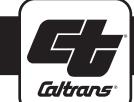
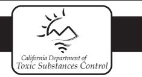
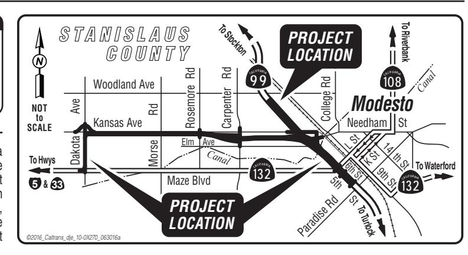

# **PUBLIC NOTICE**

# **NOTICE of AVAILABILITY** of the

Draft Environmental Impact Report/Environmental Assessment and Draft Final Remedial Action Plan

# Announcement of PUBLIC HEARING & PUBLIC COMMENT PERIOD for the

State Route 132 West Freeway/Expressway Project and Caltrans Modesto Soil Stockpiles Draft Final Remedial Action Plan

#### **PUBLIC HEARING**

DATE: February 22, 2017 TIME: 6:00 p.m. to 8:00 p.m. (Open House Format) PLACE: Mark Twain Junior High School 707 South Emerald Avenue Modesto, CA 95351

# PUBLIC COMMENT PERIOD

STARTS: January 18, 2017 ENDS: March 17, 2017

## WHAT IS PLANNED?

The California Department of Transportation (Caltrans), as the California Environmental Quality Act (CEQA) lead agency and as assigned by the Federal Highway Administration under the National Environmental Policy Act (NEPA) at the time of the signing of this environmental document, working in cooperation with the Stanislaus Council of Governments (StanCOG), proposes to construct a four-lane freeway/expressway along the adopted route of State Route (SR) 132 south of Kansas Avenue from Dakota Avenue to east of SR 99 at the Needham Street Bridge Overcrossing in the city of Modesto.

The Caltrans Modesto Stockpiles occupy three areas within state right-of-way south of Kansas Avenue: between Carpenter Avenue and Emerald Avenue, Emerald Avenue and SR 99, and east of SR 99. Caltrans proposes to cap the soil stockpiles as part of the SR 132 West Freeway/Expressway construction project. As required by state law, the California Department of Toxic Substances Control (DTSC) and the Central Valley Regional Water Quality Control Board (RWQCB) have reviewed the Draft Final Remedial Action Plan (RAP) for the stockpiles and approved it for public noticing.

The three stockpiles total approximately 160,000 cubic yards of soil containing metals (primarily barium, lead, and strontium). Caltrans prepared the Draft Final RAP under the oversight of the DTSC and RWQCB. If approved, the RAP would allow for the placement of impacted soil beneath roadway pavement, within bridge abutments, and behind retaining walls. This action would avoid potential future impacts to human health and the environment.

#### WHY THIS PUBLIC NOTICE? •)

Caltrans has studied the effects this project may have on the environment. A Draft Environmental Impact Report (Draft EIR)/Environmental Assessment (EA) and Draft Final RAP were prepared and are available for public review and comment. You have the opportunity to offer your comments or concerns, and your comments will become part of the public record. An open forum public hearing will be held to give you an opportunity to talk about certain design features of the project with Caltrans staff and discuss the Draft Final RAP for the Caltrans Modesto Soil Stockpiles with DTSC and RWQCB representatives. No formal presentation will be given, and you are welcome to attend the hearing any time between 6:00 p.m. and 8:00 p.m.

#### WHAT'S AVAILABLE? ●

The Draft EIR/EA and the Draft Final RAP will be available during the extended review period from January 18, 2017 to March 17, 2017 at the following locations:

- Caltrans District 10 office at 1976 Dr. Martin Luther King Jr. Boulevard, Stockton, CA 95206, weekdays from 8:00 a.m. to 4:00 p.m.
- StanCOG office at 1111 I Street, Suite 308, Modesto, CA 95354, weekdays from 8:00 a.m. to 5:00 p.m. (Closed alternating Fridays)
- Stanislaus County Library at 1500 I Street, Modesto, CA 95354, Monday-Thursday from 10:00 a.m. to 9:00 p.m., Saturday from 10:00 a.m. to 5:00 p.m.
- DTSC office at 8800 Cal Center Drive, Sacramento, CA 95826. To make arrangement for review of these documents, please call (916) 255-4159 or (916) 255-3578.
- Copies of the Draft Final RAP are located at the DTSC website: http://www.envirostor.dtsc.ca.gov/public/profile\_report.asp?global\_id=60001626 and http://www.envirostor.dtsc.ca.gov/public/profile\_report.asp?global\_id=50280024
- Copies of the Draft EIR/EA, Draft Final RAP, and supporting documents are located at the Caltrans website: http://www.dot.ca.gov/dist10/environmental/projects/sr132west/index.html

#### WHERE DO YOU COME IN? •)

The public hearing will be held in an open forum format. You will have an opportunity to review the design concepts, information, and displays, as well as provide written comments on the Draft EIR/EA and Draft Final RAP. Caltrans, DTSC and RWQCB staff will be available to answer your questions. Do you believe the project's potential impacts have been adequately addressed by the draft environmental document? Do you have information that should be included?

Comment cards will be available for you to fill out. A court reporter will also be available to record individual comments. If you prefer to comment on the Draft EIR/EA and/or Draft Final RAP at a later time, you must submit your written comments no later than March 17, 2017 to Caltrans, Attn: Phil Vallejo, Central Sierra Environmental Analysis Branch, 855 M Street, Suite 200, Fresno, CA 93721; or via email to phillip.vallejo@dot.ca.gov. Your written comments on the documents will be part of the public record.

After considering and replying to all written comments on the Draft EIR/EA, Caltrans will make a decision on the project. Similarly, after considering and replying to all written comments, DTSC and RWQCB will make a decision on the RAP. Comments on the Draft Final RAP should also be sent to the above Caltrans address and these comments will be forwarded to DTSC and RWQCB to review and respond to them.

#### CONTACT

For more information on the SR 132 West Freeway/Expressway project, please contact Phil Vallejo, Central Sierra Environmental Analysis Branch, at Caltrans, 855 M Street, Fresno, CA 93721, phone (559) 445-6172 or email phillip.vallejo@dot.ca.gov. For all other State Highway matters in the area, please contact the District 10 Public Information Office at district10publicaffairs@dot.ca.gov, or phone (209) 948-7977.

If you have questions about the Draft Final RAP, please contact Randy Adams, Project Manager, DTSC, by phone (916) 255-3591. You may also contact him by email at Randy.Adams@dtsc.ca.gov.

### (SPECIAL ACCOMMODATIONS •)

Under the Americans with Disabilities Act of 1990, individuals who require accommodation (American Sign Language interpreter, accessible seating, documentation in alternate formats, etc.) are requested to contact the District 10 Public Information Office at: district10publicaffairs@dot.ca.gov, or phone (209) 948-7977. TDD users may contact the California Relay Service TDD and/or Voice Line at 1-800-735-2929, or 711

©2017Caltrans\_dje\_10-0X270\_020917j-FINALv7