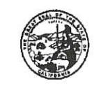

## DEPARTMENT OF TRANSPORTATION

DISTRICT 10
1976 DR. MARTIN LUTHER KING JR BLVD
STOCKTON, CA 95205
PHONE (559) 445-6172
FAX (559) 445-6236
TTY 711
www.dot.ca.gov

Serious drought. Help save water!

March 12, 2018

SCH #2010012010

## NOTICE OF AVAILABILITY

FINAL ENVIRONMENTAL IMPACT REPORT/ENVIRONMENTAL ASSESSMENT WITH FINDING OF NO SIGNIFICANT IMPACT - STATE ROUTE 132 WEST FREEWAY/EXPRESSWAY PROJECT

DRAFT FINAL REMEDIAL ACTION PLAN - CALTRANS MODESTO SOIL STOCKPILES

The Final Environmental Impact Report/Environmental Assessment (EIR/EA) with Finding of No Significant Impact along with the attached Caltrans Modesto Soil Stockpiles Draft Final Remedial Action Plan (RAP) are now available online and at the following locations:

- Caltrans District Office, District 10, 1976 Dr. Martin Luther King, Jr. Blvd., Stockton, CA 95205, weekdays from 8:00 a.m. to 4:00 p.m.
- StanCOG Office at 1111 "I" Street, Suite 308, Modesto, CA 95354, weekdays from 8:00 a.m. to 5:00 p.m. and closed alternating Fridays
- Stanislaus County Library at 1500 "I" Street, Modesto, CA 95354, Monday-Thursday from 10:00 a.m. to 8:00 p.m. and Friday and Saturday from 10:00 a.m. to 5:00 p.m.
- Department of Toxic Substances Control File Room, 8800 Cal Center Drive, Sacramento, CA 95826, To make arrangements for review of documents call (916) 255-3758.
- Online at the Caltrans website: http://www.dot.ca.gov/d10/x-project-sr132west.html
- Caltrans Modesto Soil Stockpiles information is located on the DTSC website: http://www.envirostor.dtsc.ca.gov/public/profile\_report.asp?global\_id=60001626 http://www.envirostor.dtsc.ca.gov/public/profile\_report.asp?global\_id=50280024

The Draft EIR/EA with attached Draft Final RAP was circulated for public review from January 18, 2017 through March 17, 2017. Responses to comments received are included in Appendix J – Comments and Responses. Responses to comments for the Draft Final RAP include comments responded to by the California Department of Toxic Substances Control in consultation with the Central Valley Regional Water Quality Control Board.

If you have any questions or would like a hardcopy mailed to you, please contact me at (559) 445-6172 or via email at haesun.a.lim@dot.ca.gov.

Sincerely,

HAESUN LIM

Acting Senior Environmental Planner