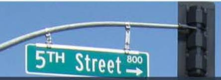

## FREEWAY/EXPRESSWAY PROJECT

DRAFT ENVIRONMENTAL IMPACT REPORT/ENVIRONMENTAL ASSESSMENT AND DRAFT FINAL REMEDIAL ACTION PLAN

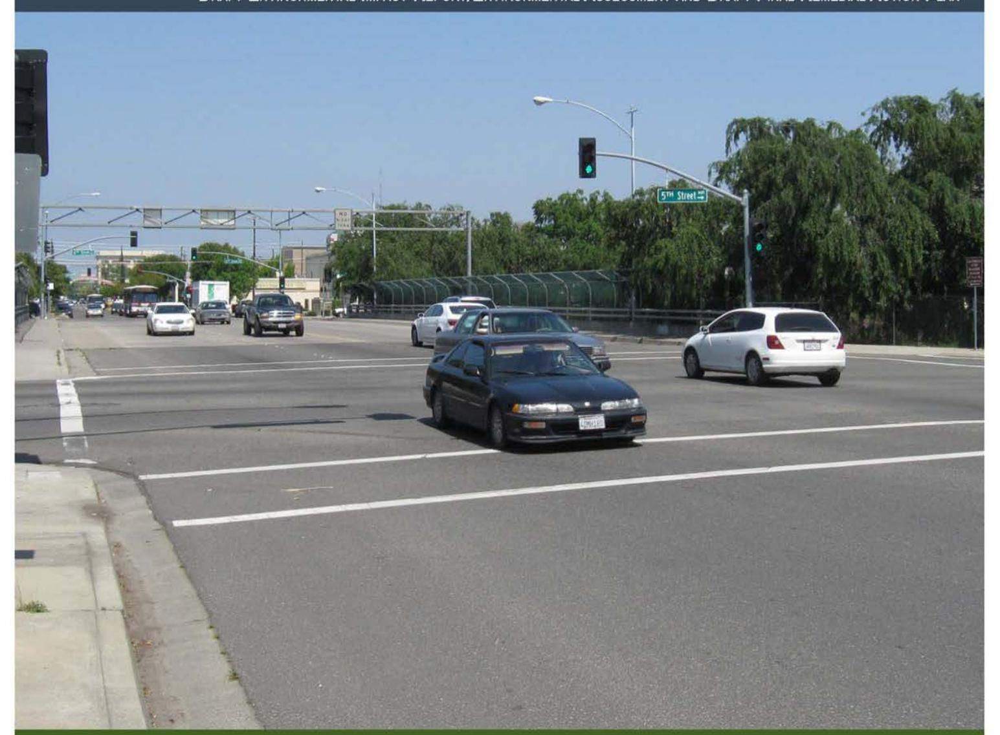

#### City of Modesto, Stanislaus County, California

State Route 132 - Dakota Avenue to east of State Route 99
State Route 99 - Kansas Avenue to I Street

DISTRICT 10 - STA - 132 (PM 11.0/15.0) DISTRICT 10 - STA - 99 (PM 15.7/17.5) EA 10-40350 Project ID 1000000424 SCH # 2010012010

**Stan**COG

Prepared by the State of California Department of Transportation

### General Information about this Document

### What's in this document:

The California Department of Transportation (Caltrans), as assigned by the Federal Highway Administration, has prepared this Environmental Impact Report/Environmental Assessment, which examines the potential environmental impacts of the alternatives being considered for the proposed project in the City of Modesto and Stanislaus County, California. Caltrans is the lead agency under the National Environmental Policy Act (NEPA) and the California Environmental Quality Act (CEQA). The document tells you why the project is being proposed, what alternatives we have considered for the project, how the existing environment could be affected by the project, the potential impacts of each of the alternatives, and the proposed avoidance, minimization, and/or mitigation measures. The California Department of Toxic Substances Control and the Central Valley Regional Water Quality Control Board are responsible agencies under CEQA for agency oversight of the Caltrans Modesto Soil Stockpiles and would approve the Final Remedial Action Plan as part of the proposed project. The Draft Final Remedial Action Plan is included as Appendix H of this document.

### What you should do:

- Please read the document.
- Additional copies of the document and the related technical studies are available for review at the Caltrans District 10 Office at 1976 East Dr. Martin Luther King Jr. Boulevard, Stockton, California 95206; Stanislaus Council of Governments at 1111 I Street, Modesto, California 95354; the Stanislaus County Library at 1500 I Street, Modesto, California 95354. This document can be downloaded at the following website: http://www.dot.ca.gov/dist10/.
- Attend the public hearing.
- We'd like to hear what you think. If you have comments regarding the proposed project, attend the public hearing, and/or send your written comments to Caltrans by the deadline.
- Submit comments on the State Route 132 West Freeway/Expressway Project and this environmental document via U.S. mail to: Philip Vallejo, Acting Chief, Central Sierra Environmental Analysis Branch, California Department of Transportation, 855 M Street, Suite 200, Fresno, California 93721.
- Submit comments on the State Route 132 West Freeway/Expressway Project and this environmental document via email to: <a href="mailto:philip.vallejo@dot.ca.gov">philip.vallejo@dot.ca.gov</a>.
- Submit comments by the deadline: March 3, 2017.

### What happens next:

After comments are received from the public and reviewing agencies, Caltrans, assigned by the Federal Highway Administration, may 1) give environmental approval to the proposed project, 2) do additional environmental studies, or 3) abandon the project. If the proposed project is given environmental approval and funding is appropriated, Caltrans could design and construct all or part of the project.

For individuals with sensory disabilities, this document can be made available in Braille, in large print, on audiocassette, or on computer disk. To obtain a copy in one of these alternate formats, please call or write to Caltrans, Attn: Philip Vallejo, Acting Chief, Central Sierra Environmental Analysis Branch, 855 M Street, Suite 200, Fresno, California 93721; 559-445-6172 (Voice), or use the California Relay Service 1-800-735-2929 (TTY), 1-800-735-2929 (Voice), or 711.

SCH# 2010012010 DISTRICT 10 - STA - 132 (PM 11.0/15.0) DISTRICT 10 - STA - 99 (PM 15.7/17.5) EA 10-40350 Project ID 1000000424

Construct a four-lane freeway/expressway along the adopted route for State Route (SR) 132 from near Dakota Avenue to SR 99 (post mile [PM] 11.0 to PM 15.0) in the City of Modesto in Stanislaus County. The proposed project includes remediation of three soil stockpiles (the Caltrans Modesto Soil Stockpiles) within Caltrans rightof-way.

### DRAFT ENVIRONMENTAL IMPACT REPORT/ **ENVIRONMENTAL ASSESSMENT and** Draft Final Remedial Action Plan for the Caltrans Modesto Soil Stockpiles

Submitted Pursuant to: (State) Division 13, California Public Resources Code and (Federal) 42 USC 4332(2)(C)

> THE STATE OF CALIFORNIA Department of Transportation and

Responsible Agencies: California Department of Toxic Substances Control and Central Valley Regional Water Quality Control Board Cooperating Agencies: Stanislaus Council of Governments, City of Modesto, and Stanislaus County

Date of Approval

Dennis T. Agar District 10 Director

California Department of Transportation

NEPA and CEQA Lead Agency -

SR 132 West Freeway/Expressway Project

The following persons may be contacted for additional information concerning this document:

Philip Vallejo Acting Chief, Central Sierra Environmental Analysis Branch California Department of Transportation 855 M Street, Suite 200 Fresno, California 93721 559-445-6172 (Voice)

The California Department of Transportation (Caltrans), working in cooperation with the Stanislaus Council of Governments (StanCOG), the City of Modesto and Stanislaus County, proposes to construct a four-lane freeway/expressway along the adopted route south of Kansas Avenue from Dakota Avenue (post mile [PM] 11.0) to east of State Route (SR) 99 at the Needham Street Bridge Overcrossing (PM 15.0). The total length of the State Route 132 West Freeway/Expressway Project (project) would be approximately 4 miles and would include connections on SR 99 from PM 15.7 to PM 17.5. Selection of either of the build alternatives would result in the containment of the Caltrans Modesto Soil Stockpiles behind retaining walls and bridge abutments and beneath highway pavements.

The purpose and need of the proposed project are to improve regional and interregional circulation within Modesto and Stanislaus County because the deficiencies of the existing highway and increases in regional and interregional traffic are anticipated to result in continued traffic congestion. Secondly, the proposed project would also relieve traffic congestion along existing SR 132 (Maze Boulevard) because the existing SR 132 (Maze Boulevard) currently experiences, and would continue to be burdened by increased traffic. Lastly, the proposed project would improve operations for the existing and proposed transportation network because the operational efficiency is reduced by the proximity and direct access to schools, churches, businesses, and residences by way of existing driveways along existing SR 132 (Maze Boulevard).

The proposed project involves the phased construction of one of the two build alternatives (Alternative 1 or Alternative 2) or the decision to implement a No-Build Alternative. Both build alternatives would include two phases (Phase 1: Expressway and Phase 2: Freeway) to construct a four-lane freeway/expressway on a new alignment. The proposed project would begin at the intersection of existing SR 132 (Maze Boulevard) and Dakota Avenue and would extend north along North Dakota Avenue for roughly half a mile. At the proposed intersection with North Dakota Avenue, the new alignment would extend east to SR 99 at the Needham Street Overcrossing Bridge. The proposed project would also involve improvements to the 5th and 6th street connections to SR 99. The major differences between Alternative 1 and Alternative 2 involve the construction of a southbound SR 99 Needham Street off-ramp (Alternative 1) compared to reconstruction of a southbound SR 99 Kansas Avenue off-ramp (Alternative 2). Section 1.3, Project Description, provides a detailed

description of the work and project phasing under both build alternatives. Under the No-Build Alternative, existing SR 132 (Maze Boulevard) would remain a two-lane, conventional highway.

Project funding comes from a combination of local, state, and federal sources. Currently, only Phase 1 has programmed funding, which was identified in fiscal years 2018/2019. Phase 1 funding sources include the Regional Improvement Program (RIP), Transportation Congestion Relief Program (TCRP), Federal Demonstration Program (DEMO), Stanislaus County's share of the Regional Surface Transportation Program (RSTP) and other local funds from the City of Modesto and Stanislaus County. As shown in the following table, Phase 1 is estimated to cost approximately \$82 million. Phase 2 is estimated to cost up to \$132 million. The project cost is estimated up to \$214 million.

### **Summary Comparison of Project Phasing and Funding**

| Criterion                  | Phase 1                         | Phase 2                        |
|----------------------------|---------------------------------|--------------------------------|
| Start of construction      | 2018                            | 2026                           |
| Completion of construction | 2020                            | 2028                           |
| Project cost by phase      | \$82 million                    | \$128 million to \$132 million |
| Total Project Cost         | \$211 million to \$214 milliona |                                |

&lt;sup>a The range represents the estimated cost of Alternative 1 (\$211 million) and the cost of Alternative 2 (\$214 million) for comparison purposes. The total project cost includes \$1.57 million for remediation (containment) of the soil stockpiles. Phase 1 value is escalated (2018 dollar value); Phase 2 values are based on 2016 dollar values).

### Route Adoption and Right-of-Way Acquisition

In 1956, the proposed freeway corridor for SR 132 was adopted by the state with resolutions of support from Stanislaus County and the City of Modesto. In 1958, the state proceeded with property acquisition. To date, 79 acres of the project area are right-of-way owned by Caltrans. Both Alternative 1 and Alternative 2 would use the adopted route to realign the segment of existing SR 132 (Maze Boulevard) between Dakota Avenue and SR 99 (see Appendix F).

### Caltrans Modesto Soil Stockpiles

The soil that comprises the Caltrans Modesto Soil Stockpiles was generated in the 1960s during excavation of industrial property acquired by Caltrans from Food Machinery and Chemical Corporation (FMC). The property was acquired for the new

alignment of the Modesto Bypass project (i.e., the construction of SR 99). Soil excavated during construction of the Modesto Bypass project, including soil from the former FMC parcel, was stockpiled within Caltrans right-of-way at three locations south of Kansas Avenue between Carpenter Avenue and SR 99, and immediately east of northbound SR 99. The three stockpiles total approximately 160,000 cubic yards and are contaminated mostly with varying concentrations of barium, strontium, and lead. The stockpiles were intended for use in the construction of the future SR 132 West Project. In either of the build alternatives, stockpile soil would be contained behind retaining walls, bridge abutments, and beneath highway pavements. The California Department of Toxic Substances Control and the Central Valley Regional Water Quality Control Board are responsible agencies under the California Environmental Quality Act (CEQA) for agency oversight and administration of regulatory requirements pertaining to contaminants in the stockpiles. The California Department of Toxic Substances Control is responsible for approving the Final Remedial Action Plan for the stockpiles as described in Section 2.2.5.1, Hazardous Waste/Materials and included as Appendix H of this document. In either of the build alternatives, stockpile soil would be contained behind retaining walls, bridge abutments and beneath highway pavements. Under the No-Build Alternative the three soil stockpiles would not be contained within a highway structure; however, Caltrans would be required to develop a separate remedial action plan for the stockpiles under the oversight of the California Department of Toxic Substances Control and the Central Valley Regional Water Quality Control Board.

### Existing Highway Description and Constraints

Existing SR 132 (Maze Boulevard) is a two-lane, undivided conventional highway, which passes through residential, commercial, and agricultural areas west of SR 99. The existing right-of-way varies from 60 to 100 feet wide and is constrained by urban development as the highway approaches the City of Modesto and SR 99 from the west.

Existing SR 132 (Maze Boulevard) is part of the regional expressway system and is the main east-west corridor in Stanislaus County. The existing highway provides interregional connection between Interstate 5 near the City of Tracy and SR 99 in Modesto. The segment of SR 132 and the existing SR 132/SR 99 connection within the project area are of particular importance to regional and interregional circulation because of the extensive farm-to-market, recreational, and other commerce-related travel that uses the highway daily.

### Public Scoping/Areas of Controversy

A Notice of Preparation was sent to numerous state and local agencies and recorded at the State Clearinghouse on January 7, 2010. The Notice of Preparation informed the recipients of Caltrans' and the StanCOG's intent to prepare an Environmental Impact Report and provided the project description, alternatives under consideration, and the environmental resources the project has the potential to affect. Recipients were also alerted to the state law requiring submittal of their comments to Caltrans no later than 30 days after receipt of the Notice of Preparation. A Scoping meeting was held on January 25, 2010. Meeting attendees were encouraged to provide written and oral comments. Comments provided at the Scoping meeting related to property values, construction impacts and cost, air quality, noise and agricultural impacts. Several attendees voiced support or need for the project and recommended that the proposed project include improvements for bicyclists and pedestrians and access to businesses near Carpenter Road (see Section 4.2, Public Participation).

### Joint CEQA/NEPA Document

The proposed project is subject to federal and state environmental review requirements because StanCOG proposes the use of federal funds from the Federal Highway Administration (FHWA). Project documentation, therefore, has been prepared in compliance with both CEQA and the National Environmental Policy Act (NEPA). Caltrans is the lead agency under CEOA and NEPA. FHWA's responsibility for environmental review, consultation, and any other action required in accordance with applicable federal laws is being, or has been, carried out by Caltrans under its assumption of responsibility pursuant to Section 6005 of the Safe, Accountable, Flexible, Efficient Transportation Equity Act: A Legacy for Users (SAFETEA-LU) codified at 23 U.S. Code 327(a)(2)(A). With NEPA Assignment, FHWA assigned and Caltrans assumed all of the U.S. Department of Transportation Secretary's responsibilities under NEPA. This assignment includes projects on the State Highway System and Local Assistance Projects off of the State Highway System within the State of California, except for certain categorical exclusions that FHWA assigned to Caltrans under the 23 U.S. Code 326 Categorical Exclusion Assignment Memorandum of Understanding, projects excluded by definition, and specific project exclusions.

Some impacts determined to be significant under CEQA may not lead to a determination of significance under NEPA. Because NEPA is concerned with the significance of the project as a whole, quite often a "lower level" document is prepared for NEPA. One of the most common joint document types is an

Environmental Impact Report/Environmental Assessment (EIR/EA), which is what this document is.

After receiving comments from the public and reviewing agencies on the Draft EIR/EA, a Final EIR/EA would be prepared. Caltrans may prepare additional environmental and/or engineering studies to address comments. The Final EIR/EA would include responses to comments received on the Draft EIR/EA and would identify the preferred alternative for the project. If the decision is made to approve the project, a Notice of Determination would be published for compliance with CEQA, and Caltrans would decide whether to issue a Finding of No Significant Impact (FONSI) or require an Environmental Impact Statement (EIS) for compliance with NEPA. A Notice of Availability of the FONSI would be sent to the affected units of federal, state, and local government, and to the State Clearinghouse in compliance with Executive Order 12372.

Similarly, as a CEQA responsible agency for implementation of the Final Remedial Action Plan, the California Department of Toxic Substances Control would make a final determination of the effect on the environment outlined in the Draft Final Remedial Action Plan. The California Department of Toxic Substances Control would certify that the project complies with CEQA and would prepare a Notice of Determination. If the final approved document does not provide a sufficient description and environmental analysis of the remedial activities, then the California Department of Toxic Substances Control would prepare an additional CEQA document, or an addendum to this CEQA document.

### Project Impacts

The following table summarizes the potential impacts that would result from construction and operation of the two proposed build alternatives. For comparison purposes, the impacts of the No-Build Alternative are also included. This table summarizes the potential impacts of the proposed project, as described throughout Chapter 2 in the Environmental Consequences sections within each resource subchapter. For a summary of significant impacts and mitigation measures in compliance with CEQA see Chapter 3.2, Discussion of Significant Impacts and Chapter 3.3, Mitigation Measures for Significant Impacts under the California Environmental Quality Act.

| Potential Impact                                                    | Alternative 1                                                                                                                                                                                                                                                                                                                                                                                                                                                                                                                                                                                                                                                                                                                                                                                                                                                                                                                                                                                                                                                                                                 | Alternative 2                                                                                                                                                                                                                                                                                                                                                                                                                                                                                                                     | No-Build Alternative                                                                                                                                                                                                                                                                                                                                                                                                                                                                                                                               |   |
|---------------------------------------------------------------------|---------------------------------------------------------------------------------------------------------------------------------------------------------------------------------------------------------------------------------------------------------------------------------------------------------------------------------------------------------------------------------------------------------------------------------------------------------------------------------------------------------------------------------------------------------------------------------------------------------------------------------------------------------------------------------------------------------------------------------------------------------------------------------------------------------------------------------------------------------------------------------------------------------------------------------------------------------------------------------------------------------------------------------------------------------------------------------------------------------------|-----------------------------------------------------------------------------------------------------------------------------------------------------------------------------------------------------------------------------------------------------------------------------------------------------------------------------------------------------------------------------------------------------------------------------------------------------------------------------------------------------------------------------------|----------------------------------------------------------------------------------------------------------------------------------------------------------------------------------------------------------------------------------------------------------------------------------------------------------------------------------------------------------------------------------------------------------------------------------------------------------------------------------------------------------------------------------------------------|---|
| Meets Purpose and Need                                              | Yes                                                                                                                                                                                                                                                                                                                                                                                                                                                                                                                                                                                                                                                                                                                                                                                                                                                                                                                                                                                                                                                                                                           | Yes                                                                                                                                                                                                                                                                                                                                                                                                                                                                                                                               | No                                                                                                                                                                                                                                                                                                                                                                                                                                                                                                                                                 |   |
| Land Use                                                            | Consistency with the Modesto General Plan                                                                                                                                                                                                                                                                                                                                                                                                                                                                                                                                                                                                                                                                                                                                                                                                                                                                                                                                                                                                                                                                     | Consistent. The proposed project is in the General Plan and would be consistent with applicable General Plan goals and policies, except for Circulation and Transportation Policy V-B.6[c] related to Traffic Demand Management measures.                                                                                                                                                                                                                                                                                         | Inconsistent. The No-Build Alternative would not result in a transportation project. Therefore, no Transportation Demand Management measures would be applied.                                                                                                                                                                                                                                                                                                                                                                                     |   |
|                                                                     | Consistency with the Stanislaus County General Plan                                                                                                                                                                                                                                                                                                                                                                                                                                                                                                                                                                                                                                                                                                                                                                                                                                                                                                                                                                                                                                                           | Consistent. The proposed project is in the General Plan and is consistent with applicable General Plan goals and policies, except for the Agricultural Element Policy 2.3 and Land Use Element Policy 2 related to conversion of agricultural land.                                                                                                                                                                                                                                                                               | Inconsistent. Increased traffic congestion and lower average traffic speeds associated with the No-Build Alternative would degrade mobility within the study area and larger region. This would have a negative impact on economic and community prosperity.                                                                                                                                                                                                                                                                                       |   |
|                                                                     | Consistency with StanCOG Regional Transportation Plan/Sustainable Communities Strategy                                                                                                                                                                                                                                                                                                                                                                                                                                                                                                                                                                                                                                                                                                                                                                                                                                                                                                                                                                                                                        | Consistent. The proposed project is in the 2016 Regional Transportation Plan/Sustainable Communities Strategy and is consistent with applicable Plan goals and policies.                                                                                                                                                                                                                                                                                                                                                          | Inconsistent. Increased traffic congestion and lower average traffic speeds associated with the No-Build Alternative would have the potential to degrade air quality and mobility within the study area and larger region. This would have a negative impact on economic and community vitality, environmental quality, mobility, and social equity.                                                                                                                                                                                               |   |
| Potential Impact                                                    | Alternative 1                                                                                                                                                                                                                                                                                                                                                                                                                                                                                                                                                                                                                                                                                                                                                                                                                                                                                                                                                                                                                                                                                                 | Alternative 2                                                                                                                                                                                                                                                                                                                                                                                                                                                                                                                     | No-Build Alternative                                                                                                                                                                                                                                                                                                                                                                                                                                                                                                                               |   |
| Parks and Recreational Facilities                                   | Temporary increases in construction noise and equipment emissions would be minor. There would be no Section 4(f) use of any park or recreational resources.                                                                                                                                                                                                                                                                                                                                                                                                                                                                                                                                                                                                                                                                                                                                                                                                                                                                                                                                                   |                                                                                                                                                                                                                                                                                                                                                                                                                                                                                                                                   | No impact                                                                                                                                                                                                                                                                                                                                                                                                                                                                                                                                          |   |
| Growth                                                              | Both build alternatives are unlikely to have a measurable effect on growth and would result in minimal growth-related impacts beyond what has already been planned.                                                                                                                                                                                                                                                                                                                                                                                                                                                                                                                                                                                                                                                                                                                                                                                                                                                                                                                                           |                                                                                                                                                                                                                                                                                                                                                                                                                                                                                                                                   | No impact                                                                                                                                                                                                                                                                                                                                                                                                                                                                                                                                          |   |
| Farmlands/Timberlands                                               | Conversion of 64.8 acres of prime and unique farmland and 3.51 acres of Williamson Act contract lands would occur. Farmland access would be maintained throughout the project.                                                                                                                                                                                                                                                                                                                                                                                                                                                                                                                                                                                                                                                                                                                                                                                                                                                                                                                                |                                                                                                                                                                                                                                                                                                                                                                                                                                                                                                                                   | No impact                                                                                                                                                                                                                                                                                                                                                                                                                                                                                                                                          |   |
| Community Character and Cohesion                                    | No impact                                                                                                                                                                                                                                                                                                                                                                                                                                                                                                                                                                                                                                                                                                                                                                                                                                                                                                                                                                                                                                                                                                     |                                                                                                                                                                                                                                                                                                                                                                                                                                                                                                                                   | No impact                                                                                                                                                                                                                                                                                                                                                                                                                                                                                                                                          |   |
| Relocations/ Property Acquisitions                                  | Business Displacements                                                                                                                                                                                                                                                                                                                                                                                                                                                                                                                                                                                                                                                                                                                                                                                                                                                                                                                                                                                                                                                                                        | 11                                                                                                                                                                                                                                                                                                                                                                                                                                                                                                                                | 10                                                                                                                                                                                                                                                                                                                                                                                                                                                                                                                                                 | 0 |
|                                                                     | Business Partial Acquisitions                                                                                                                                                                                                                                                                                                                                                                                                                                                                                                                                                                                                                                                                                                                                                                                                                                                                                                                                                                                                                                                                                 | 24                                                                                                                                                                                                                                                                                                                                                                                                                                                                                                                                | 28                                                                                                                                                                                                                                                                                                                                                                                                                                                                                                                                                 | 0 |
|                                                                     | Residential Displacements                                                                                                                                                                                                                                                                                                                                                                                                                                                                                                                                                                                                                                                                                                                                                                                                                                                                                                                                                                                                                                                                                     | 32                                                                                                                                                                                                                                                                                                                                                                                                                                                                                                                                | 32                                                                                                                                                                                                                                                                                                                                                                                                                                                                                                                                                 | 0 |
|                                                                     | Residential Partial Acquisitions                                                                                                                                                                                                                                                                                                                                                                                                                                                                                                                                                                                                                                                                                                                                                                                                                                                                                                                                                                                                                                                                              | 30                                                                                                                                                                                                                                                                                                                                                                                                                                                                                                                                | 30                                                                                                                                                                                                                                                                                                                                                                                                                                                                                                                                                 | 0 |
| Environmental Justice                                               | Noise, visual, relocation, and construction impacts would predominately occur within environmental justice populations and are considered a disproportionate adverse impact.                                                                                                                                                                                                                                                                                                                                                                                                                                                                                                                                                                                                                                                                                                                                                                                                                                                                                                                                  | Noise, relocation, and construction impacts would predominately occur within environmental justice populations and are considered a disproportionate adverse impact. However, a smaller degree of visual impacts would occur compared to Alternative 1.                                                                                                                                                                                                                                                                           | Benefits not realized under the No-Build Alternative, including traffic congestion relief and improved access to businesses, would disproportionately adversely affect environmental justice populations.                                                                                                                                                                                                                                                                                                                                          |   |
| Utilities/Emergency Services                                        | Utility service could be temporarily disrupted during construction, but no long-term or permanent impacts would occur. Local road lane closures and detours would occur during construction, but emergency service providers would benefit after completion of Phase 1 by increased mobility, reduced congestion, and improved access.                                                                                                                                                                                                                                                                                                                                                                                                                                                                                                                                                                                                                                                                                                                                                                        |                                                                                                                                                                                                                                                                                                                                                                                                                                                                                                                                   | No utility relocations or abandonments would occur. Emergency service response times may increase because of increased traffic congestion.                                                                                                                                                                                                                                                                                                                                                                                                         |   |
| Potential Impact                                                    | Alternative 1                                                                                                                                                                                                                                                                                                                                                                                                                                                                                                                                                                                                                                                                                                                                                                                                                                                                                                                                                                                                                                                                                                 | Alternative 2                                                                                                                                                                                                                                                                                                                                                                                                                                                                                                                     | No-Build Alternative                                                                                                                                                                                                                                                                                                                                                                                                                                                                                                                               |   |
| Traffic and Transportation/ Pedestrian and Bicycle Facilities | Decreased travel times, increased traffic speeds, and improved levels of service along existing SR 132 (Maze Boulevard) and for most of the major intersections would be realized. The proposed new alignment would provide another east-west travel option for motorists.                                                                                                                                                                                                                                                                                                                                                                                                                                                                                                                                                                                                                                                                                                                                                                                                                                    | Neither build alternative would directly or indirectly impact existing or planned pedestrian/bicycle facilities, except at the proposed single-point urban interchange of the new alignment with North Carpenter Road. Both build alternatives propose a 12-foot-wide pedestrian/bicycle path along the east side of North Carpenter Road within the limits of the project.                                                                                                                                                       | Limited pedestrian and bicycle facilities exist within the study area, and no facilities are located west of SR 99 within Modesto's city limits.                                                                                                                                                                                                                                                                                                                                                                                                   |   |
|                                                                     |                                                                                                                                                                                                                                                                                                                                                                                                                                                                                                                                                                                                                                                                                                                                                                                                                                                                                                                                                                                                                                                                                                               |                                                                                                                                                                                                                                                                                                                                                                                                                                                                                                                                   |                                                                                                                                                                                                                                                                                                                                                                                                                                                                                                                                                    |   |
| Visual/Aesthetics                                                   | High visual impact—Certain structures would degrade the visual quality of some residential areas, as well as new highway lighting, signs, tree removal (591 trees), and business and residential relocations.                                                                                                                                                                                                                                                                                                                                                                                                                                                                                                                                                                                                                                                                                                                                                                                                                                                                                                 | Moderately high visual impact—While fewer structures and two fewer trees would be removed, Alternative 2 would still degrade visual quality of some residential areas from highway lighting, signs, tree removal (589 trees), and business and residential relocations.                                                                                                                                                                                                                                                           | No impact                                                                                                                                                                                                                                                                                                                                                                                                                                                                                                                                          |   |
| Cultural Resources                                                  | The State Route 132 Historic Property Survey Report was completed in December 2011. Following changes in the project's area of potential effects, additional areas were evaluated, and a supplemental Historic Property Survey Report was completed in October 2014. A Finding of Effects (FOE) would be prepared after the preferred alternative is selected. The FOE would address the two eligible historic resources (416/418 I Street and 3530 Maze Boulevard) within the project area. The proposed freeway/expressway would not have a direct or indirect impact on the resources at 416/418 I Street.  Both build alternatives would require the acquisition of 0.13 acre of the northwest corner of 3530 Maze Boulevard. The potential acquisition is located outside the historic property boundary. The FOE would require concurrence from the State Historic Preservation Officer (SHPO) and would include avoidance, minimization, and mitigation measures. These would be included in the Final EIR/EA. There are no known direct impacts on or Section 4(f) uses of any known resources. |                                                                                                                                                                                                                                                                                                                                                                                                                                                                                                                                   | No impact                                                                                                                                                                                                                                                                                                                                                                                                                                                                                                                                          |   |
| Potential Impact                                                    | Alternative 1                                                                                                                                                                                                                                                                                                                                                                                                                                                                                                                                                                                                                                                                                                                                                                                                                                                                                                                                                                                                                                                                                                 | Alternative 2                                                                                                                                                                                                                                                                                                                                                                                                                                                                                                                     | No-Build Alternative                                                                                                                                                                                                                                                                                                                                                                                                                                                                                                                               |   |
| Hydrology and Floodplain                                            | Impervious surfaces would increase by 55.8 acres, which could affect the area's watershed by increasing the flow and volume of stormwater runoff entering the watershed.                                                                                                                                                                                                                                                                                                                                                                                                                                                                                                                                                                                                                                                                                                                                                                                                                                                                                                                                      | Impervious surfaces would increase by 57.5 acres, which could affect the area's watershed by increasing the flow and volume of stormwater runoff entering the watershed.                                                                                                                                                                                                                                                                                                                                                          | No impact                                                                                                                                                                                                                                                                                                                                                                                                                                                                                                                                          |   |
| Water Quality and Storm Water Runoff                             | If left untreated, the increase in stormwater flow and runoff volumes, resulting from the increased impervious surface area due to construction of the proposed freeway/expressway, could negatively affect water quality. Direct impacts may involve water contamination and excessive sedimentation, nutrients, and construction debris entering receiving water bodies. Containment of the Caltrans Modesto Soil Stockpiles would mitigate potential water quality impacts.                                                                                                                                                                                                                                                                                                                                                                                                                                                                                                                                                                                                                             |                                                                                                                                                                                                                                                                                                                                                                                                                                                                                                                                   | The soil stockpiles would not be contained within a highway structure; however, Caltrans would be required to develop a separate remedial action plan for the stockpiles under the oversight of the California Department of Toxic Substances Control and the Central Valley Regional Water Quality Control Board. Caltrans would maintain the perimeter fence, restrict access to authorized personnel, continue water quality monitoring, and maintain vegetative cover of the soil stockpiles until remediation of the stockpiles is completed. |   |
| Geology/Soils/Seismic/ Topography                                | Both build alternatives would result in minimal geologic, soil, seismic, or topographic impacts relative to geotechnical hazards associated with liquefaction, seismic settlement, and slope stability.                                                                                                                                                                                                                                                                                                                                                                                                                                                                                                                                                                                                                                                                                                                                                                                                                                                                                                       |                                                                                                                                                                                                                                                                                                                                                                                                                                                                                                                                   | No impact                                                                                                                                                                                                                                                                                                                                                                                                                                                                                                                                          |   |
| Potential Impact                                                    | Alternative 1                                                                                                                                                                                                                                                                                                                                                                                                                                                                                                                                                                                                                                                                                                                                                                                                                                                                                                                                                                                                                                                                                                 | Alternative 2                                                                                                                                                                                                                                                                                                                                                                                                                                                                                                                     | No-Build Alternative                                                                                                                                                                                                                                                                                                                                                                                                                                                                                                                            |   |
| Paleontology                                                        | The Modesto Formation occurs throughout the study area and is identified as high sensitivity for paleontological resources. Project excavation has the potential to impact paleontological resources.                                                                                                                                                                                                                                                                                                                                                                                                                                                                                                                                                                                                                                                                                                                                                                                                                                                                                                         | The Modesto Formation occurs throughout the study area and is identified as high sensitivity for paleontological resources. Project excavation for Alternative 2 has a greater potential to impact paleontological resources than Alternative 1.                                                                                                                                                                                                                                                                                  | No impact                                                                                                                                                                                                                                                                                                                                                                                                                                                                                                                                          |   |
| Agriculture                                                         | Conversion of 64.8 acres of prime and unique farmland and 3.51 acres of Williamson Act contract lands would occur.                                                                                                                                                                                                                                                                                                                                                                                                                                                                                                                                                                                                                                                                                                                                                                                                                                                                                                                                                                                            |                                                                                                                                                                                                                                                                                                                                                                                                                                                                                                                                   | No Impact                                                                                                                                                                                                                                                                                                                                                                                                                                                                                                                                          |   |
| Hazardous Waste/Materials                                           | For these alternatives, 19 parcels that would be partially or fully acquired are known to have recognized environmental conditions.  Potential impacts from the acquisition of parcels with recognized environmental conditions, presence of agricultural chemicals, aerially deposited lead, and groundwater contamination would be less than substantial with the implementation of the appropriate avoidance, minimization, and mitigation measures.  While there may be potential impacts from the presence of barium contaminants in three soil stockpiles, ongoing monitoring has indicated that no significant impacts have or would occur from airborne dispersion or migration to groundwater. Containment of the three soil stockpiles as construction fill material would mitigate these impacts.                                                                                                                                                                                                                                                                                      |                                                                                                                                                                                                                                                                                                                                                                                                                                                                                                                                   | The soil stockpiles would not be contained within a highway structure; however, Caltrans would be required to develop a separate remedial action plan for the stockpiles under the oversight of the California Department of Toxic Substances Control and the Central Valley Regional Water Quality Control Board. Caltrans would maintain the perimeter fence, restrict access to authorized personnel, continue water quality monitoring, and maintain vegetative cover of the soil stockpiles until remediation of the stockpiles is completed. |   |
| Potential Impact                                                    | Alternative 1                                                                                                                                                                                                                                                                                                                                                                                                                                                                                                                                                                                                                                                                                                                                                                                                                                                                                                                                                                                                                                                                                                 | Alternative 2                                                                                                                                                                                                                                                                                                                                                                                                                                                                                                                     | No-Build Alternative                                                                                                                                                                                                                                                                                                                                                                                                                                                                                                                               |   |
| Caltrans Modesto Soil Stockpiles                                    | Stockpile soil would be contained behind retaining walls, bridge abutments and beneath highway pavements. Monitoring of the stockpiles and stormwater runoff constituents of potential concern would continue until the project and full containment of all three soil stockpiles are complete.                                                                                                                                                                                                                                                                                                                                                                                                                                                                                                                                                                                                                                                                                                                                                                                                               | Stockpile soil would be contained behind retaining walls, bridge abutments and beneath highway pavements. Monitoring of the stockpiles and stormwater runoff constituents of potential concern would continue until the project and full containment of all three soil stockpiles are complete.                                                                                                                                                                                                                                   | A remedial action plan would be developed, as soil stockpile containment via a highway structure would not be implemented. Caltrans would maintain the perimeter fence, restrict access to authorized personnel, continue water quality monitoring, and maintain vegetative cover of the soil stockpiles until remediation of the stockpiles is completed.                                                                                                                                                                                         |   |
| Air Quality                                                         | The proposed project would not lead to new or worsened violations of national and state air quality standards for particulate matter or carbon monoxide. Operational improvements would reduce precursor and criteria pollutant emissions relative to the No-Build Alternative. A temporary increase in precursor and criteria pollutants would occur during construction.  Dust generated during stockpile excavation would be monitored by an air monitoring plan approved by the Department of Toxic Substances Control.                                                                                                                                                                                                                                                                                                                                                                                                                                                                                                                                                                             | The proposed project would not lead to new or worsened violations of national and state air quality standards for particulate matter or carbon monoxide. Operational improvements would reduce precursor and criteria pollutant emissions relative to the No-Build Alternative. A temporary increase in precursor and criteria pollutants would occur during construction.  Dust generated during stockpile excavation would be monitored by an air monitoring plan approved by the Department of Toxic Substances Control. | Higher traffic congestion and lower average traffic speeds may increase precursor and criteria pollutant emissions.  No air quality impacts from non-contained stockpiles would occur under the No-Build Alternative.                                                                                                                                                                                                                                                                                                                        |   |
| Noise                                                               | Predicted future (2048) noise levels would permanently impact 260 receivers.                                                                                                                                                                                                                                                                                                                                                                                                                                                                                                                                                                                                                                                                                                                                                                                                                                                                                                                                                                                                                                  | Predicted future (2048) noise levels would permanently impact 276 receivers.                                                                                                                                                                                                                                                                                                                                                                                                                                                      | Noise levels for 162 receivers would approach or exceed the noise abatement criteria in 2048.                                                                                                                                                                                                                                                                                                                                                                                                                                                      |   |
| Energy                                                              | The build alternatives would reduce overall fuel consumption when compared to existing conditions. Energy would be consumed during construction, but both build alternatives would not have substantial energy impacts.                                                                                                                                                                                                                                                                                                                                                                                                                                                                                                                                                                                                                                                                                                                                                                                                                                                                                       | The build alternatives would reduce overall fuel consumption when compared to existing conditions. Energy would be consumed during construction, but both build alternatives would not have substantial energy impacts.                                                                                                                                                                                                                                                                                                           | The No-Build Alternative would cause adverse impacts related to energy consumption.                                                                                                                                                                                                                                                                                                                                                                                                                                                                |   |
| Wetlands and Other Waters                                           | Potential direct and permanent impacts to 0.65 acre of non-jurisdictional wetlands (waters of the State).                                                                                                                                                                                                                                                                                                                                                                                                                                                                                                                                                                                                                                                                                                                                                                                                                                                                                                                                                                                                     |                                                                                                                                                                                                                                                                                                                                                                                                                                                                                                                                   | No impact                                                                                                                                                                                                                                                                                                                                                                                                                                                                                                                                          |   |
| Potential Impact                                                    | Alternative 1                                                                                                                                                                                                                                                                                                                                                                                                                                                                                                                                                                                                                                                                                                                                                                                                                                                                                                                                                                                                                                                                                                 | Alternative 2                                                                                                                                                                                                                                                                                                                                                                                                                                                                                                                     | No-Build Alternative                                                                                                                                                                                                                                                                                                                                                                                                                                                                                                                               |   |
| Animal Species                                                      | For this alternative, 21 acres of potential burrowing owl habitat would be impacted, and removal of 591 trees could impact migratory birds.                                                                                                                                                                                                                                                                                                                                                                                                                                                                                                                                                                                                                                                                                                                                                                                                                                                                                                                                                                   | For this alternative, 21 acres of potential burrowing owl habitat would be impacted, and removal of 589 trees could impact migratory birds.                                                                                                                                                                                                                                                                                                                                                                                       | No impact                                                                                                                                                                                                                                                                                                                                                                                                                                                                                                                                          |   |
| Threatened and Endangered Species                                   | Potential impacts to the Swainson's hawk would include removal of up to 70 acres of possible foraging habitat and up to 414 trees (with low potential to support Swainson's hawk nesting and roosting).                                                                                                                                                                                                                                                                                                                                                                                                                                                                                                                                                                                                                                                                                                                                                                                                                                                                                                       | No impact                                                                                                                                                                                                                                                                                                                                                                                                                                                                                                                         | No impact                                                                                                                                                                                                                                                                                                                                                                                                                                                                                                                                          |   |
| Invasive Species                                                    | The area may benefit from covering existing invasive species with impervious surfaces (paving) and preventing further dispersal.                                                                                                                                                                                                                                                                                                                                                                                                                                                                                                                                                                                                                                                                                                                                                                                                                                                                                                                                                                              | The area would remain predominantly covered by invasive species.                                                                                                                                                                                                                                                                                                                                                                                                                                                                  | The area would remain predominantly covered by invasive species.                                                                                                                                                                                                                                                                                                                                                                                                                                                                                   |   |
| Cumulative Impacts                                                  | A cumulative impact to agriculture could occur. Cumulative visual/aesthetics and noise impacts could occur if avoidance, minimization, or mitigation measures are not incorporated.                                                                                                                                                                                                                                                                                                                                                                                                                                                                                                                                                                                                                                                                                                                                                                                                                                                                                                                           | No impact                                                                                                                                                                                                                                                                                                                                                                                                                                                                                                                         | No impact                                                                                                                                                                                                                                                                                                                                                                                                                                                                                                                                          |   |

### **Summary of Potential Impacts from Alternatives**

### Coordination with Public and Other Agencies

The following permits, reviews, and approvals would be required for project construction.

### Permits, Reviews, and Approvals Needed

| Agency                                                       | Permit/Approval                                                                                                                                                                                  | Status                                                                                                                                                                                                                                                                                                                                                                                   |
|--------------------------------------------------------------|--------------------------------------------------------------------------------------------------------------------------------------------------------------------------------------------------|------------------------------------------------------------------------------------------------------------------------------------------------------------------------------------------------------------------------------------------------------------------------------------------------------------------------------------------------------------------------------------------|
| California Transportation Commission                   | Approval of New Public Road Connection at Needham Street                                                                                                                                      | Submittal and approval after Final EIR certification                                                                                                                                                                                                                                                                                                                                     |
| Central Valley Regional Water Quality Control Board | Section 401 Water Quality Certification                                                                                                                                                          | Submittal and approval prior to construction                                                                                                                                                                                                                                                                                                                                             |
|                                                              | Section 402 National Pollutant Discharge Elimination System/Caltrans National Pollutant Discharge Elimination System Permit CAS000003 and CAS000002 (General Construction Permit) | Construction General Permit effective July 1, 2010; Caltrans National Pollutant Discharge Elimination System Permit effective July 1, 2013                                                                                                                                                                                                                                   |
| Central Valley Regional Water Quality Control Board | Approval of the stockpile Final Remedial Action Plan, Remedial Design Implementation Plan, and other approvals deemed necessary                                                         | The Final Remedial Action Plan would be approved with certification of the Final EIR                                                                                                                                                                                                                                                                                                     |
| Agency                                                       | Permit/Approval                                                                                                                                                                                  | Status                                                                                                                                                                                                                                                                                                                                                                                   |
| State Historic Preservation Officer                       | Determinations of eligibility and effects upon cultural resources                                                                                                                                | Concurrence letters received May 16, 2012 and March 16, 2015 (National Register of Historic Places eligibility for architectural properties); a supplemental archaeological survey, geo-archaeological investigation report and the finding of effect would be submitted after selection of the preferred alternative but before approval of the Final EIR/EA |
| Various Utilities                                            | Utility modification/relocation agreements                                                                                                                                                       | Agreements would be executed prior to construction                                                                                                                                                                                                                                                                                                                                       |
| City of Modesto                                              | Street tree removal permit                                                                                                                                                                       | Submittal and approval prior to construction                                                                                                                                                                                                                                                                                                                                             |
| City of Modesto and Caltrans                                 | Cooperative Agreement for final design of Phase 1                                                                                                                                                | To be developed during the final design phase of the project                                                                                                                                                                                                                                                                                                                             |
| California Department of Toxic Substances Control   | Approval of the stockpile Final Remedial Action Plan and Remedial Design Implementation Plan                                                                                               | Approval would occur with certification of the Final EIR (after circulation of this Draft EIR/EA, which includes the Draft Final Remedial Action Plan (see Appendix H of this document))                                                                                                                                                                                  |
| San Joaquin Valley Air Pollution Control District      | Air Quality Dust Control Plans                                                                                                                                                                   | Contractor responsible to submit and obtain approval prior to construction                                                                                                                                                                                                                                                                                                               |
|                                                              | Air Impact Assessment Indirect Source Review as required (Rule 9510)                                                                                                                          | Contractor to comply with the requirements prior to construction                                                                                                                                                                                                                                                                                                                         |
| San Joaquin Valley Air Pollution Control District      | Asbestos National Emission Standards for Hazardous Air Pollutants Notification                                                                                                                   | Notification to be postmarked or delivered to the San Joaquin Valley Air Pollution Control District no later than 10 working days prior to beginning asbestos removal activities and/or demolition                                                                                                                                                                        |
| Stanislaus County Department of Public Works           | Encroachment Permit                                                                                                                                                                              | Submittal and approval prior to construction                                                                                                                                                                                                                                                                                                                                             |

### Permits, Reviews, and Approvals Needed

Page Intentionally Left Blank

### **Table of Contents**

| Summary           |                                                                | iii  |
|-------------------|----------------------------------------------------------------|------|
| Table of Contents |                                                                | xvii |
| List of Figures   |                                                                | xx   |
| List of Tables    |                                                                | xxii |
| <b>Chapter 1</b>  | Proposed Project                                               | 1    |
| 1.1               | Introduction                                                   | 1    |
| 1.2               | Purpose and Need                                               | 6    |
| 1.2.1             | Purpose                                                        | 6    |
| 1.2.2             | Need                                                           | 7    |
| 1.2.3             | Independent Utility and Logical Termini                        | 13   |
| 1.3               | Project Description                                            | 15   |
| 1.4               | Project Alternatives                                           | 28   |
| 1.4.1             | Build Alternatives                                             | 28   |
| 1.4.2             | No-Build Alternative                                           | 35   |
| 1.5               | Comparison of Alternatives                                     | 35   |
| 1.6               | Alternatives Considered but Eliminated from Further Discussion | 43   |
| 1.7               | Permits, Reviews, and Approvals Needed                         | 52   |
| <b>Chapter 2</b>  | Affected Environment, Environmental Consequences, and          |      |
|                   | Avoidance, Minimization, and/or Mitigation Measures            | 55   |
| 2.1               | Human Environment                                              | 56   |
| 2.1.1             | Land Use                                                       | 56   |
| 2.1.1.1           | Existing and Future Land Use                                   | 56   |
| 2.1.1.2           | Consistency with State, Regional and Local Plans and Programs  | 63   |
| 2.1.1.3           | Parks and Recreational Facilities                              | 71   |
| 2.1.2             | Growth                                                         | 73   |
| 2.1.3             | Farmlands                                                      | 78   |
| 2.1.4             | Community Impacts                                              | 84   |
| 2.1.4.1           | Community Character and Cohesion                               | 84   |
| 2.1.4.2           | Relocations and Real Property Acquisition                      | 94   |
| 2.1.4.3           | Environmental Justice                                          | 100  |
| 2.1.5             | Utilities/Emergency Services                                   | 108  |
| 2.1.6             | Traffic and Transportation/Pedestrian and Bicycle Facilities   | 112  |
| 2.1.7             | Visual/Aesthetics                                              | 126  |
| 2.1.8             | Cultural Resources                                             | 155  |
| 2.2               | Physical Environment                                           | 162  |
| 2.2.1             | Hydrology and Floodplain                                       | 162  |
| 2.2.2             | Water Quality and Storm Water Runoff                           | 167  |
| 2.2.3             | Geology/Soils/Seismic/Topography                               | 179  |
| 2.2.4             | Paleontology                                                   | 182  |
| 2.2.5             | Hazardous Waste/Materials                                      | 188  |
| 2.2.5.1           | Caltrans Modesto Soil Stockpiles Site                          | 209  |
| 2.2.6             | Air Quality                                                    | 220  |

#### Table of Contents

| 2.2.7      | Noise                                                                                      | 25 |
|------------|--------------------------------------------------------------------------------------------|----|
| 2.2.8      | Energy                                                                                     | 27 |
| 2.3        | Biological Environment                                                                     | 27 |
| 2.3.1      | Wetlands and Other Waters                                                                  | 27 |
| 2.3.2      | Animal Species                                                                             | 28 |
| 2.3.3      | Threatened and Endangered Species                                                          | 29 |
| 2.3.4      | Invasive Species                                                                           | 29 |
| 2.4        | Cumulative Impacts                                                                         | 29 |
| Chapter 3  | California Environmental Quality Act Evaluation                                            | 30 |
| 3.1        | Determining Significance under the California Environmental Quality Act                    | 30 |
| 3.2        | Discussion of Significant Impacts                                                          | 31 |
| 3.2.1      | No Effects from the Proposed Project                                                       | 31 |
| 3.2.2      | Less-than-Significant Effects of the Proposed Project                                      | 31 |
| 3.2.3      | Significant Environmental Effects of the Proposed Project                                  | 31 |
| 3.2.4      | Mandatory Findings of Significance                                                         | 31 |
| 3.2.5      | Unavoidable Significant Environmental Effects                                              | 31 |
| 3.2.6      | Climate Change                                                                             | 32 |
| 3.3        | Mitigation Measures for Significant Impacts under the California Environmental Quality Act | 33 |
| 3.4        | Environmentally Superior Alternative                                                       | 33 |
| Chapter 4  | Comments and Coordination                                                                  | 33 |
| 4.1        | Public Agencies Consultation and Coordination                                              | 33 |
| 4.1.1      | U.S. Environmental Protection Agency/Federal Highway Administration                        | 33 |
| 4.1.2      | Native American Heritage Commission                                                        | 33 |
| 4.1.3      | California Department of Fish and Wildlife                                                 | 33 |
| 4.1.4      | U.S. Fish and Wildlife Service                                                             | 33 |
| 4.1.5      | U.S. Army Corps of Engineers                                                               | 33 |
| 4.1.6      | California Department of Toxic Substances Control                                          | 33 |
| 4.1.7      | Central Valley Regional Water Quality Control Board                                        | 34 |
| 4.1.8      | California State Historic Preservation Officer                                             | 34 |
| 4.2        | Public Participation                                                                       | 34 |
| 4.2.1      | Notice of Preparation                                                                      | 34 |
| 4.2.2      | Scoping Meeting                                                                            | 34 |
| 4.2.3      | Plan Implementation Project Meetings                                                       | 34 |
| 4.2.4      | Public Information Meetings, Neighborhood Meetings, Open Houses                            | 34 |
| Chapter 5  | List of Preparers                                                                          | 34 |
| Chapter 6  | Distribution List                                                                          | 35 |
| Appendix A | California Environmental Quality Act Checklist                                             |    |

#### Table of Contents

**Appendix B** Resources Evaluated Relative to the Requirements of Section 4(f) Appendix C Title VI Policy Statement **Appendix D** Summary of Relocation Benefits **Appendix E** Minimization and/or Mitigation Summary Appendix F Cross-Sections and Engineering Drawings **Appendix G** Final Feasibility Study, Caltrans Modesto Soil Stockpiles, State Route 132 West Freeway/Expressway Project, Modesto, Stanislaus County, California **Appendix H** Draft Final Remedial Action Plan, Caltrans Modesto Soil Stockpiles, State Route 132 West Freeway/Expressway Project, Modesto, Stanislaus County, California Appendix I **Agency Coordination** Appendix J List of Technical Studies

### **List of Figures**

| Figure 1-1: Project Vicinity Map                                                                                                         | 4    |
|------------------------------------------------------------------------------------------------------------------------------------------|------|
| Figure 1-2: Project Location Map                                                                                                         | 5    |
| Figure 1-3: Levels of Service for Two-lane Highways, Intersections with Traffic Signals, and Two-way Stop Intersections                  | 11   |
| Figure 1-4: Project Overview Map                                                                                                         | 16   |
| Figure 1-5: Phase 1                                                                                                                      | 19   |
| Figure 1-6: Phase 2 (Alternative 1)                                                                                                      | 25   |
| Figure 1-7: Phase 2 (Alternative 2)                                                                                                      | 26   |
| Figure 1-8: Unique Features of the Build Alternatives                                                                                    | 29   |
| Figure 1-9: Alternative 5 Potential Relocations                                                                                          | 41   |
| Figure 2-1: Stanislaus County and Modesto Land Use Designations                                                                          | 59   |
| Figure 2-2: California Important Farmlands and Williamson Act Land in the Study Area                                                     | 81   |
| Figure 2-3: Community Services and Facilities in the Study Area                                                                          | 89   |
| Figure 2-4: Minority and Low-income Populations within the Study Area                                                                    | 103  |
| Figure 2-5: Existing Landscape Units                                                                                                     | 131  |
| Figure 2-6: Key Views in the Study Area                                                                                                  | 135  |
| Figure 2-7: Viewshed #1: Rosemore Avenue                                                                                                 | 138  |
| Figure 2-8: Viewshed #2: Carpenter Road                                                                                                  | 140  |
| Figure 2-9: Viewshed #3: Emerald Avenue                                                                                                  | 142  |
| Figure 2-10: Viewshed #4: SR 99                                                                                                          | 143  |
| Figure 2-11: Viewshed #5: Needham Street                                                                                                 | 146  |
| Figure 2-12: Viewshed #6: Elm Avenue                                                                                                     | 148  |
| Figure 2-13: Federal Emergency Management Agency's Flood Insurance Rate Map Index 06099C0325E                                            | 165  |
| Figure 2-14: Geologic Map of the Study Area                                                                                              | 184  |
| Figure 2-15: Recognized Environmental Conditions in the Study Area                                                                       | 203  |
| Figure 2-16: Caltrans Modesto Soil Stockpiles Locations                                                                                  | 211  |
| Figure 2-17: Phase 1 - Typical Stockpile Cross-Section                                                                                   | 216  |
| Figure 2-18: Phase 2 - Typical Stockpile Cross-Section                                                                                   | 216  |
| Figure 2-19: Carbon Monoxide Hot-Spot Analysis Intersection and Receptor Locations                                                       | 233  |
| Figure 2-20: Noise Levels of Common Activities                                                                                           | 254  |
| Figure 2-21: Noise Analysis Areas                                                                                                        | 257  |
| Figure 2-22a: Receiver and Modeled Noise Barrier Locations (Western Portion of the Study Area)                                           | 261  |
| Figure 2-22b: Receiver and Modeled Noise Barrier Locations (Central Portion of the Study Area)                                           | 262  |
| Figure 2-22c: Receiver and Modeled Noise Barrier Locations (Eastern Portion of the Study Area)                                           | 263  |
| Figure 2-23: Location of Wetland Features and "Other" Waters in the Study Area                                                           | 278  |
| Figure 2-24: Threatened, Endangered, and Other Special-status Species' Occurrences Reported within a 5-mile Radius of the Study Area     | 285  |
| Figure 2-25: Agriculture (Farmlands) Resource Study Area circa 1970                                                                      | 300  |
| Figure 2-26: Agriculture (Farmlands) Resource Study Area circa 2014                                                                      | 301  |
| Figure 2-27: Visual/Aesthetics and Noise Resource Study Area circa 1969                                                                  | 302  |
| Figure 3-1: California Greenhouse Gas Forecast                                                                                           | 325  |
| Figure 3-2: Possible Effect of Traffic Operation Strategies in Reducing On-Road Carbon Dioxide Emission                               | 326  |
| Figure 3-3: Mobility Pyramid                                                                                                             | 328  |
| Summary of Potential Impacts from Alternatives                                                                                           | viii |
| Permits, Reviews, and Approvals Needed                                                                                                   | xiv  |
| Table 1-1: Current and Projected Average Daily Traffic along Existing SR 132 and Other Local Roadways/Highways                           | 7    |
| Table 1-2: Existing and Future No-Build Level of Service SR 132 (Maze Boulevard) Segments                                                | 9    |
| Table 1-3: Existing and Future No-Build Level of Service Intersections with SR 132 (Maze Boulevard)                                      | 9    |
| Table 1-4: Summary Comparison of Project Phasing and Funding                                                                             | 28   |
| Table 1-5: Summary Comparison of Alternatives                                                                                            | 36   |
| Table 1.6: Permits, Reviews, and Approvals Needed                                                                                        | 52   |
| Table 2-1: Land Use within the Project Study Area                                                                                        | 57   |
| Table 2-2: Land Use Conversion by Build Alternative                                                                                      | 62   |
| Table 2-3: Consistency with State, Regional, and Local Plans and Programs                                                                | 66   |
| Table 2-4: Parks and Recreational Resources within the Study Area                                                                        | 71   |
| Table 2-5: Growth-related Screening Factors and Evaluation                                                                               | 75   |
| Table 2-6: Farmland Conversion by Build Alternative                                                                                      | 80   |
| Table 2-7: Area Population, Race, and Ethnicity Characteristics                                                                          | 86   |
| Table 2-8: 2012 Area Housing Characteristics                                                                                             | 86   |
| Table 2-9: 2012 Area Economic Characteristics                                                                                            | 87   |
| Table 2-10: Area Household Income and Population Below the Poverty Level                                                                 | 87   |
| Table 2-11: Residential Relocations by Build Alternative                                                                                 | 96   |
| Table 2-12: Residential Partial Acquisitions by Build Alternative                                                                        | 96   |
| Table 2-13: Business Relocations by Build Alternative                                                                                    | 97   |
| Table 2-14: Business Partial Acquisitions by Build Alternative                                                                           | 97   |
| Table 2-15: Area Minority and Poverty Status                                                                                             | 101  |
| Table 2-16: Area Population, Race, and Ethnicity Characteristics                                                                         | 101  |
| Table 2-17: Household Income and Population Below the Poverty Level for the Study Area, City of Modeso and Stanislaus County             | 101  |
| Table 2-18: Major Utilities within the Study Area                                                                                        | 109  |
| Table 2-19: Existing and Future No-Build Traffic Volumes along Existing SR 132 (Maze Boulevard)                                          | 114  |
| Table 2-20: Existing and Future No-Build Travel Times and Speeds along Existing SR 132 (Maze Boulevard)                                  | 114  |
| Table 2-21: Existing and Future No-Build Level of Service along Existing SR 132 (Maze Boulevard) and at Intersections in the Study Area  | 116  |
| Table 2-22: Existing and Future No-Build Peak Hour Level of Service and Peak Period Vehicle Hours of Delay along SR 99 in the Study Area | 117  |
| Table 2-23: No-Build and Build Travel Times and Speeds along Existing SR 132 (Maze Boulevard)                                            | 119  |
| Table 2-24: No-Build and Build Level of Service along Existing SR 132 (Maze Boulevard)                                                   | 120  |
| Table 2-25: Level of Service along the Proposed New Alignment of SR 132                                                                  | 122  |
| Table 2-26: Peak Hour Level of Service and Peak Period Vehicle Hours of Delay on SR 99 for both Future Build and No-Build Scenarios      | 125  |
| Table 2-27: Landscape Units within the Study Area                                                                                        | 129  |
| Table 2-28: Existing Visual Quality Rating for Key Views in the Study Area                                                               | 133  |
| Table 2-29: Changes in Visual Quality Ratings for the Build Alternatives                                                                 | 149  |
| Table 2-30: Visual Impacts for the Build Alternatives                                                                                    | 150  |
| Table 2-31: Tree Impacts by Build Alternative                                                                                            | 153  |
| Table 2-32: Total Cut and Fill Requirements by Build Alternative                                                                         | 185  |
| Table 2-33: Recognized Environmental Conditions within Parcels that Require Partial or Full Acquisitiona                                 | 193  |
| Table 2-34: Recognized Environmental Conditions within the Existing SR 99 or SR 132 Right-of-Waya                                        | 198  |
| Table 2-35: State and Federal Criteria Air Pollutant Standards, Effects, and Sources                                                     | 224  |
| Table 2-36: Ambient Air Quality Monitoring Data Measured at the Modesto 14th Street Monitoring Station                                   | 229  |
| Table 2-37: Modeled Carbon Monoxide Levels at Receptors for the No-Build Alternative and Two Build Alternatives (Phase 1 - 2020)         | 235  |
| Table 2-38: Modeled Carbon Monoxide Levels at Receptors for the No-Build and Build Alternatives (Phase 2 - 2028)                         | 236  |
| Table 2-39: Modeled Carbon Monoxide Levels at Receptors for the No-Build and Build Alternatives (Design Year 2048)                       | 237  |
| Table 2-40: Annual Vehicle Miles Traveled Projections for 2020, 2028, and 2048                                                           | 242  |
| Table 2-41: Operational Criteria Pollutant Emissions (tons per year)                                                                     | 243  |
| Table 2-42: Criteria Pollutant Emissions from Phase 1 (tons per year)                                                                    | 245  |
| Table 2-43: Criteria Pollutant Emissions from Phase 2 (tons per year)                                                                    | 246  |
| Table 2-44: Estimated NOx and PM10 Reductions Associated with Rule 9510 (tons per year)                                                  | 246  |
| Table 2-45: Noise Abatement Criteria                                                                                                     | 253  |
| Table 2-46: Noise Analysis Areas                                                                                                         | 259  |
| Table 2-47: Predicted Future (2048) Noise Impacts of Alternative 1                                                                       | 264  |
| Table 2-48: Predicted Future (2048) Noise Impacts of Alternative 2                                                                       | 265  |
| Table 2-49: Summary of Noise Barrier Analysis                                                                                            | 266  |
| Table 2-50: Construction Equipment Noise Levels                                                                                          | 269  |
| Table 2-51: Vehicle Hours of Travel and Delay by Alternative for the Central Modesto Areaa                                               | 272  |
| Table 2-52: Vehicle Miles of Travel by Alternative for the Central Modesto Areaa                                                         | 273  |
| Table 2-53: Impacts to Wetlands and "Other" Waters by Alternative                                                                        | 279  |
| Table 2-54: Special-Status Animal Species with Potential to Occur in the Study Area                                                      | 282  |
| Table 2-55: Threatened or Endangered Animal Species with Potential to Occur in the Study Area                                            | 292  |
| Table 2-56: Resource Study Areas Considered for the Cumulative Impact Analysis                                                           | 299  |
| Table 2-57: Project Impact Summary                                                                                                       | 303  |
| Table 3-1: Alternative 1 Noise Levels and Impacts                                                                                        | 310  |
| Table 3-2: Alternative 2 Noise Levels and Impacts                                                                                        | 31   |
| Table 3-3: Summary of Operational Greenhouse Gas Emissions (metric tons carbon dioxide per year)                                         | 32   |
| Table 3-4: Climate Change/Carbon Dioxide Reduction Strategies                                                                            | 33   |

#### List of Figures

### **List of Tables**

#### List of Tables

#### List of Tables

### **Chapter 1** Proposed Project

#### 1.1 Introduction

The California Department of Transportation (Caltrans) is the lead agency under the California Environmental Quality Act (CEQA) and the National Environmental Policy Act (NEPA). Caltrans, working in cooperation with the Stanislaus Council of Governments (StanCOG), proposes to construct a four-lane freeway/expressway in two phases along the adopted route south of Kansas Avenue from Dakota Avenue (post mile [PM] 11.0) to east of State Route (SR) 99 at the Needham Street Bridge Overcrossing (PM 15.0). The total length of the State Route 132 West Freeway/Expressway Project (project) would be approximately 4 miles and would include connections on SR 99 from PM 15.7 to PM 17.5. Figures 1-1 and 1-2 show the project vicinity and location.

As part of the project, the California Department of Toxic Substances Control and the Central Valley Regional Water Quality Control Board are responsible agencies under CEQA for agency oversight of the Caltrans Modesto Soil Stockpiles located within Caltrans right-of-way south of Kansas Avenue and within the proposed location for the project. The California Department of Toxic Substances Control and the Regional Water Quality Control Board are responsible for approving the Final Remedial Action Plan, which is discussed in the summary on page ii and further detailed in Section 2.2.5.1. The Draft Final Remedial Action Plan is included as Appendix H of this document. Implementation of the Final Remedial Action Plan is detailed in Section 1.4.1, Build Alternatives.

The proposed project involves the phased construction of one of the two build alternatives (Alternative 1 or Alternative 2) or the decision to implement the No-Build Alternative. Both build alternatives would include two phases (i.e., Phase 1: Expressway and Phase 2: Freeway) to construct a four-lane freeway/expressway on a new alignment. The proposed project would begin at the intersection of existing SR 132 (Maze Boulevard) and Dakota Avenue and extend north along North Dakota Avenue for roughly half a mile. At the proposed intersection with North Dakota Avenue, the new alignment would extend east to SR 99 at the Needham Street Overcrossing Bridge. The proposed project would also involve improvements to the 5th and 6th street connections to SR 99. Phase 1 is anticipated to begin in 2018, be completed within 12 to 15 months, and be open to traffic by 2020. Both build alternatives (Alternative 1 and Alternative 2) would be the same under Phase 1. Phase 2 is expected to begin in 2026, be completed by 2028, and would

involve the construction of either Alternative 1 or Alternative 2 (Figures 1-4, 1-5, and 1-6).

Phase 1 includes the construction of a new two-lane expressway on the southern half of proposed alignment from Dakota Avenue on the west end of the project to the Needham Street Overcrossing Bridge on the east end of the project. At the completion of Phase 1, the expressway would have full access control (no street connections) and grade separations at intersections from SR 99 to North Dakota Avenue and access from private driveways along North Dakota Avenue to Maze Boulevard. The expressway would not have a center median separating each direction of travel. At the completion of Phase 2, the proposed project would be a four-lane freeway from SR 99 to North Dakota Avenue with a center median separating the east and west direction of travel and a single-point urban interchange at North Carpenter Road. The proposed project segment under both Alternative 1 and Alternative 2 along North Dakota Avenue to Maze Boulevard would remain an expressway. Under Phase 2, the major differences between Alternative 1 and Alternative 2 would involve the construction of a southbound SR 99 Needham Street offramp (Alternative 1) compared to the reconstruction of a southbound SR 99 Kansas Avenue off-ramp (Alternative 2). Under the No-Build Alternative, existing SR 132 (Maze Boulevard) would remain a two-lane, conventional highway.

The proposed project is included in the 2015 Federal Transportation Improvement Program (project identification number 98STA0221), the fiscally constrained 2016 Regional Transportation Plan/Sustainable Communities Strategy (project identification numbers M01 for Phase 1 and RE01 for Phase 2), and the 2014 Regional Transportation Improvement Program (project identification numbers 3027 and 0944M). Project funding is based on a combination of local, state, and federal sources. Currently, funding has been identified only for Phase 1.

Phase 1 is estimated to cost approximately \$82 million for both Alternative 1 and 2 (of which \$1.57 million is for remediation of the soil stockpiles. This estimate is escalated (2018 dollar value). Phase 2 is estimated to cost \$128 million (Alternative 1) to \$132 million (Alternative 2), depending on the build alternative selected. Phase 2 values are based on 2016 dollar values. Construction of Phase 2 is anticipated to begin in 2026 and be completed in 2028. The total project cost is estimated at \$211 million (Alternative 1) to \$214 million (Alternative 2).

The proposed project would improve two vital transportation corridors within Stanislaus County, existing SR 132 (Maze Boulevard) and SR 99. Existing SR 132 (Maze

Boulevard) is part of the regional expressway system and is the main east-west corridor in Stanislaus County. The two-lane, conventional highway provides interregional connection between Interstate 5 near the City of Tracy to the west and SR 99 in Modesto to the east. The existing highway is the only east-west highway with access across the Tuolumne, San Joaquin, and Stanislaus rivers from Modesto. As such, SR 132 has increasingly served the San Joaquin Valley and has become a major truck route between Interstate 5 and SR 99.

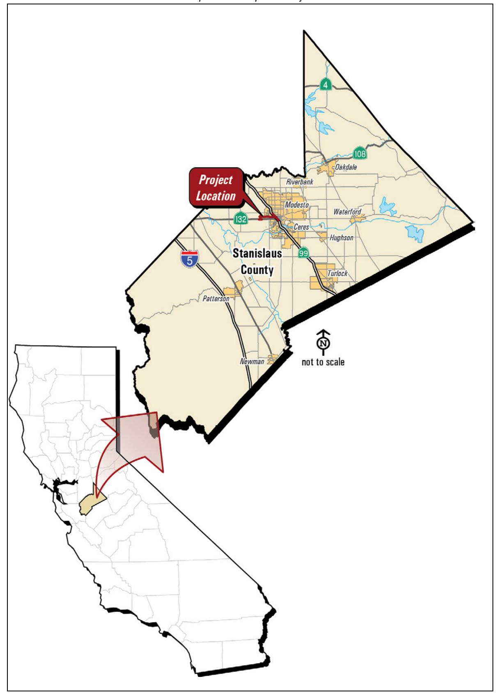

Figure 1-1: Project Vicinity Map

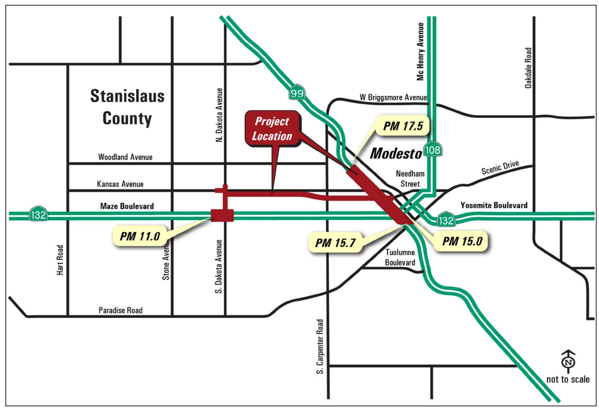

Figure 1-2: Project Location Map

In 1956, the proposed freeway corridor for SR 132 was adopted by the State of California with resolutions of support from Stanislaus County and Modesto. In 1958, the State of California proceeded with property acquisition. To date, 79 acres in the project area are right-of-way owned by Caltrans. The two build alternatives under consideration in this Environmental Impact Report/Environmental Assessment are consistent with the adopted freeway corridor. Caltrans prepared three Project Study Reports (in 1991, 1993, and 1997) to determine alternatives for consideration. From 1998 to 2003, efforts were made to achieve consensus on a buildable segment, but later in 2003, the project was placed on hold to resolve SR 132 connectivity concerns. In 2008, StanCOG identified a number of improvements for east-west connectivity through Modesto in its *Feasibility Study for SR 132 East/West Connectivity Project* (SR 132 Feasibility Study). In 2009, StanCOG completed a local Project Initiation Document for use in planning the next formal studies for the Project Approval and Environmental Document Phase.

Based on the screening criteria and comparative evaluation process, containment of the contaminated soil within the right-of-way of the proposed project was selected as the Recommended Stockpile Alternative (Containment). The alternative would be implemented by using the three stockpiles for project construction. The Containment Alternative was selected because of the effectiveness in providing long-term and overall protection of human health and the environment; technical feasibility; cost-effectiveness; and the ability to minimize the potential for contaminants to migrate to groundwater or to be eroded by stormwater runoff.

The proposed use of the soil required Caltrans to prepare two documents under the oversight of the California Department of Toxic Substances Control and the Central Valley Regional Water Quality Control Board titled 1) the *Final Feasibility Study*, *Caltrans Modesto Soil Stockpiles*, *State Route 132 West Freeway/Expressway Project, Modesto, Stanislaus County, California* (Soil Stockpiles Feasibility Study) - Appendix G and 2) the *Draft Final Remedial Action Plan, Caltrans Modesto Soil Stockpiles*, *State Route 132 West Freeway/Expressway Project, Modesto, Stanislaus County, California* - Appendix H. A detailed discussion of the stockpiles and their contaminants is located in Section 2.2.5.1, Caltrans Modesto Soil Stockpiles Site.

### 1.2 Purpose and Need

#### 1.2.1 Purpose

The purpose and objectives of the proposed project are as follows:

- Improve regional and interregional circulation within Modesto and Stanislaus County
- Relieve traffic congestion along existing SR 132 (Maze Boulevard)
- Improve operations for the existing and proposed transportation network

#### 1.2.2 Need

#### Improve Regional and Interregional Circulation

The existing highway passes through residential (including school zones), commercial, and agricultural areas west of SR 99. The existing right-of-way varies from 60 to 100 feet wide and is constrained by urban development as the highway approaches Modesto and SR 99 from the west. The segment of SR 132 and the existing SR 132/SR 99 connection within the project area are of particular importance to regional and interregional circulation because of the extensive farm-to-market, recreational, and other commerce-related travel that uses the highway daily.

Within the project area, existing SR 132 (Maze Boulevard) is a two-lane, undivided, conventional highway with shoulders and isolated left- and right-turn lanes at some intersections (see Figure 1-4). The current average daily traffic volumes within the project area range between 10,230 and 12,400 vehicles. Between Carpenter Road and Meadow Lane, trucks make up 21 percent of the total traffic. Traffic analysis of this existing segment of SR 132 (including Maze Boulevard and the SR 132/SR 99 connection) anticipates an increase in congestion because of the deficiencies of the existing highway and increases in regional traffic and interregional commuter and truck traffic. Table 1-1 lists the current and projected average daily traffic for the segments along the existing highway and other local roadways/highways in the area.

Table 1-1: Current and Projected Average Daily Traffic along Existing SR 132 and Other Local Roadways/Highways

| Area                                                                                 | 2009 a (vehicles) | 2018 b (vehicles) | 2028 b (vehicles) | 2048 b (vehicles) |
|--------------------------------------------------------------------------------------|----------------------|----------------------|----------------------|----------------------|
| Existing SR 132 (Maze Boulevard) between Grimes Avenue and Carpenter Road            | 11,500               | 15,200               | 17,700               | 19,700               |
| Existing SR 132 (Maze Boulevard) between Carpenter Road and Emerald Avenue           | 10,230               | 14,500               | 17,000               | 18,800               |
| Existing SR 132 (Maze Boulevard) between Emerald Avenue and Martin Luther King Drive | 12,400               | 15,400               | 17,700               | 18,400               |
| Carpenter Road between Elm Avenue and Hillview Drive                                 | 21,130               | 23,700               | 27,600               | 32,700               |
| Kansas Avenue between Carpenter Road and Reno Avenue                                 | 12,430               | 16,400               | 18,100               | 19,300               |
| 5th Street between J Street and K Street                                             | 9,360                | 10,600               | 11,100               | 12,400               |

Table 1-1: Current and Projected Average Daily Traffic along Existing SR 132 and Other Local Roadways/Highways

| Area                                                             | 2009 a (vehicles) | 2018 b (vehicles) | 2028 b (vehicles) | 2048 b (vehicles) |
|------------------------------------------------------------------|----------------------|----------------------|----------------------|----------------------|
| 6th Street between J Street and K Street                         | 5,740                | 7,000                | 7,400                | 9,800                |
| SR 99 between Kansas Avenue and existing SR 132 (Maze Boulevard) | 123,000              | 148,600              | 190,000              | 213,800              |
| SR 99 between existing SR 132 Maze Boulevard and K Street     | 117,000              | 140,400              | 181,500              | 205,000              |

&lt;sup>a 2009 represents the existing condition for traffic, noise, and air quality analyses.

Source: Final Traffic Operations Analysis Report (July 2012)

According to the 2010 American Community Survey, 43.3 percent of workers commute to cities outside of Stanislaus County. This high percentage of interregional commuting trips coupled with forecasted population increases throughout Stanislaus County would lead to increasingly congested interregional and regional circulation if conditions on existing SR 132 (Maze Boulevard) are not improved. Furthermore, as traffic on existing SR 132 (Maze Boulevard), identified in Table 1-1 as three segments, is expected to increase by an average of 67 percent by 2048, highway conditions throughout SR 99 in the project area are expected to worsen.

#### Relieve Traffic Congestion along Existing SR 132 (Maze Boulevard)

Congestion is often measured in terms of level of service, which is an indicator of driving conditions on a roadway segment or at an intersection. As shown in Figure 1-3, levels are defined in categories ranging from "A" to "F" for two-lane highways, intersections with traffic signals, and two-way stop intersections. A level "A" indicates free-flowing traffic with no hindrance to driving speed caused by traffic conditions. A level "F" indicates substantial congestion with slow-moving, stop-and-go traffic.

According to Modesto's General Plan, in addition to Caltrans and Federal Highway Administration standards, the level of service rating goal for a highway/local roadway similar to existing SR 132 (Maze Boulevard) is "D". Existing SR 132 (Maze Boulevard) currently operates at an acceptable level of service "D" or better between Dakota Avenue and SR 99, but is anticipated to deteriorate to unacceptable levels in the future (Table 1-2). Traffic operations would degrade over time such that by 2028 the intersection of the existing highway and Carpenter Road would operate at level "F", an unacceptable service level (Table 1-3). By 2048, the intersections of the existing highway with Rosemore Avenue, Carpenter Road, and Emerald Avenue would operate at unacceptable service level "F" (Table 1-3).

&lt;sup>b The other three years represented in the table are the average daily traffic under no-build conditions for 2018, 2028, and 2048.

Table 1-2: Existing and Future No-Build Level of Service SR 132 (Maze Boulevard) Segments

| Location                                     | 2009 |    | 2020 |    | 2028 |    | 2048 |    |
|----------------------------------------------|------|----|------|----|------|----|------|----|
|                                              | AM   | PM | AM   | PM | AM   | PM | AM   | PM |
| SR 99 to Emerald Avenue (Eastbound)          | B    | B  | B    | C  | B    | C  | B    | C  |
| SR 99 to Emerald Avenue (Westbound)          | B    | B  | B    | B  | B    | B  | C    | B  |
| Emerald Avenue to Carpenter Road (Eastbound) | B    | B  | B    | C  | B    | C  | C    | F  |
| Emerald Avenue to Carpenter Road (Westbound) | D    | C  | E    | D  | F    | D  | F    | D  |
| Carpenter Road to Dakota Avenue           | D    | D  | D    | D  | E    | E  | E    | E  |
| West of Dakota Avenue                        | C    | D  | D    | D  | D    | E  | E    | E  |

Table 1-3: Existing and Future No-Build Level of Service Intersections with SR 132 (Maze Boulevard)

| Location                                  | 2009 |    | 2020 |    | 2028 |    | 2048 |    |
|-------------------------------------------|------|----|------|----|------|----|------|----|
|                                           | AM   | PM | AM   | PM | AM   | PM | AM   | PM |
| SR 132 at Dakota Avenue                   | A    | A  | A    | B  | A    | C  | B    | D  |
| SR 132 at Rosemore Avenue                 | A    | A  | A    | B  | B    | C  | F    | F  |
| SR 132 at Carpenter Road                  | C    | C  | D    | D  | F    | F  | F    | F  |
| SR 132 at Emerald Avenue                  | B    | B  | B    | C  | B    | C  | F    | F  |
| SR 132 at Martin Luther King Jr. Drive | B    | C  | B    | D  | B    | D  | C    | D  |
| SR 132 at southbound SR 99 off-ramp       | B    | B  | C    | B  | C    | B  | D    | C  |

&lt;sup>a Existing SR 132 (Maze Boulevard) was analyzed using both the Highway Capacity Manual's urban street level of service methodology and two-lane highway level of service methodology because the highway is considered an urban roadway on its eastern end and a two-lane highway on its western end. Also see Figure 1-3 for a graphic representation of level of service.

Notes: Results in bold indicate unacceptable operations. The years represented in the table match the years for Phase 1 (2020), Phase 2 (2028), and the design year (2048). LOS = level of service. The traffic analysis for Future No-Build and Phase 1 assumed an opening year of 2018, but that is now projected to be 2020.

Source: Final Traffic Operations Analysis Report (July 2012)

As Modesto continues to grow, both locally from new area development and regionally from adjacent communities, existing SR 132 (Maze Boulevard) would continue to be burdened by increased traffic. Additional local and regional traffic, in combination with higher truck volumes, would only increase congestion and further deteriorate roadway and intersection level of service.

Page Intentionally Left Blank

## **LEVELS OF SERVICE**

for Two-Lane Highways

| Level of Service | Flow Conditions                                                 | Operating Speed (mph) | Technical Descriptions                                                                                                                                                 |
|------------------------|--------------------------------------------------------------------|-----------------------------|---------------------------------------------------------------------------------------------------------------------------------------------------------------------------|
| A                      | Image: Cars on a highway with clear lanes.                         | 55+                         | Highest quality of service. Free traffic flow with few restrictions on maneuverability or speed. No delays |
| B                      | Image: Cars on a highway with slightly less clear lanes.           | 50                          | Stable traffic flow. Speed becoming slightly restricted. Low restriction on maneuverability. No delays     |
| C                      | Image: Cars on a highway with more cars and less clear lanes.      | 45                          | Stable traffic flow, but less freedom to select speed, change lanes or pass. Minimal delays                    |
| D                      | Image: Cars on a highway with a truck, indicating some congestion. | 40                          | Traffic flow becoming unstable. Speeds subject to sudden change. Passing is difficult. Minimal delays          |
| E                      | Image: Cars and a truck in a more congested highway.               | 35                          | Unstable traffic flow. Speeds change quickly and maneuverability is low. Significant delays                         |
| F                      | Image: Heavily congested traffic with multiple cars and trucks.    |                             | Heavily congested traffic. Demand exceeds capacity and speeds vary greatly. Considerable delays                     |

Source: 2000 HCM, Exhibit 20-2, LOS Criteria for Two-Lane Highways in Class 1

## **LEVELS OF SERVICE**

for Intersections with Traffic Signals

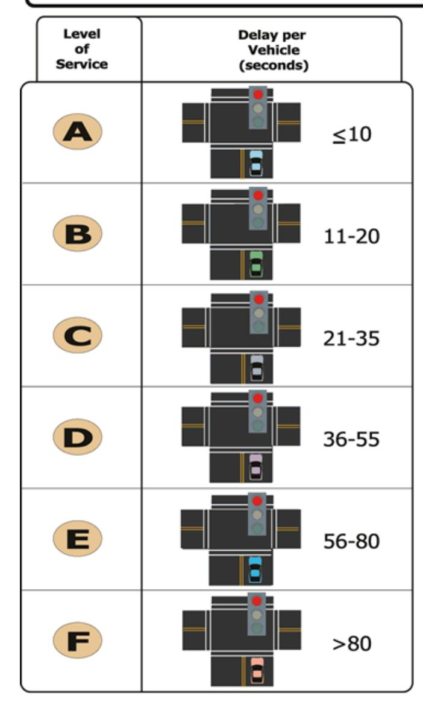

### Factors Affecting LOS of Signalized Intersections

Traffic Signal Conditions:
• Signal Coordination

- Cycle Length
- Protected left turn
- Timing
- Pre-timed or traffic activated signal
- Etc.

#### Geometric Conditions:

- Left- and right-turn lanes
   Number of lanes
- Etc.

#### Traffic Conditions:

- Percent of truck traffic
- Number of pedestrians
- Etc.

## **LEVELS OF SERVICE**

for Two-Way Stop Intersections

| Level of Service | Flow Conditions                         | Delay per Vehicle (seconds) | Technical Descriptions |
|------------------------|--------------------------------------------|-----------------------------------|---------------------------|
| A                      | Image: Flow conditions diagram for Level A | ≤10                               | Very short delays         |
| B                      | Image: Flow conditions diagram for Level B | 11-15                             | Short delays              |
| C                      | Image: Flow conditions diagram for Level C | 16-25                             | Minimal delays            |
| D                      | Image: Flow conditions diagram for Level D | 26-35                             | Minimal delays            |
| E                      | Image: Flow conditions diagram for Level E | 36-50                             | Significant delays        |
| F                      | Image: Flow conditions diagram for Level F | >50                               | Considerable delays       |

Source: 2000 HCM, Exhibit 17-2, Level of Service Criteria for TWSC Intersections

Source: 2000 HCM, Exhibit 16-2, Level of Service Criteria for Signalized Intersections

Figure 1-3: Levels of Service for Two-lane Highways, Intersections with Traffic Signals, and Two-way Stop Intersections

Chapter 1 • Proposed Project

Page Intentionally Left Blank

#### Improve Operations

No fatalities have occurred on the existing SR 132 (Maze Boulevard) in the most recent three-year period studied (2012 – 2014). The statewide average rate of accident fatalities for similar facilities is 0.016 accidents per million vehicle miles traveled. Along existing SR 132 (Maze Boulevard) most accidents (34 percent) were broadside accidents, followed by rear-end (32 percent), hit-object (15 percent), head-on (9 percent), sideswipe (6 percent), and auto/pedestrian (4 percent) accidents. The high percentage of broadside and rear-end accidents on the existing highway is associated, in part, with characteristics such as relatively high traffic volumes and speeds, a large number of conflict points, and lack of turning lanes. The data also shows a higher percentage of head-on collisions compared to the previous three-year reporting period, which reported one head-on accident (1.9 percent).

Based on the *Highway Safety Manual* published by the American Association of State Highway and Transportation Officials, there is a direct correlation between crash frequency and average daily traffic volumes. Lower traffic volumes would result in greater spacing between vehicles, allowing drivers more time to react to sudden changes in traffic flow, such as a stopped vehicle. Fewer vehicles would also result in fewer conflicts at intersections and driveways.

Operational efficiency is reduced by the proximity and direct access to schools, churches, businesses, and residences by way of existing driveways along existing SR 132 (Maze Boulevard), all of which increase the potential for conflicts between bicyclists, pedestrians, and vehicles. The existing highway averages more than nine intersections per mile in the area of the project; most of the intersections have stop signs for side streets, while the existing highway does not have stop signs or stop lights at most of the intersections between Dakota Avenue and SR 99. Along the existing SR 132 (Maze Boulevard and "L" Street) from Dakota Avenue to east of SR 99 at the SR 132/"L" Street/6th Street intersection there are twelve unsignalized, two-way stop controlled intersections, five signalized intersections, and over sixty private driveways. The signalized intersections include the following: Carpenter Road, Emerald Avenue, Martin Luther King Drive, 5th Street, and 6th Street. SR132 also has several direct access driveways to schools, churches, businesses, and residences along this section of the roadway.

#### 1.2.3 Independent Utility and Logical Termini

Federal Highway Administration regulations (23 Code of Federal Regulations 771.111 [f]) require that a proposed project:

- Have a rational beginning and ending point (i.e., logical termini) and be of sufficient length to address environmental matters on a broad scope.
- Be a functional and reasonable expenditure even if no additional transportation improvements are made in the area (i.e., independent utility).
- Not restrict consideration of alternatives for other reasonably foreseeable transportation improvements.

The proposed project's eastern end ties directly into SR 99, a major thoroughfare that serves the main population centers and rural agricultural areas in Stanislaus County and the larger San Joaquin Valley. The proposed project's western end at Dakota Avenue is where the need for improvements ends because Dakota Avenue is the last major north-south roadway from the existing SR 132 (Maze Boulevard) to the Modesto city limits and SR 99 north of the project until North Hart Road, more than 3 miles west of Dakota Avenue.

Also, future-year traffic volumes for the no-build and build scenarios west of Dakota Avenue are identical. Forecasted traffic volumes for the no-build and build scenarios are 19,900 and 27,500 in 2028 and 2048, respectively. As such, the proposed project would not have an impact on traffic volumes west of the existing SR 132 (Maze Boulevard)/Dakota Avenue intersection. This demonstrates that the need for transportation improvements does not extend further west along the existing SR 132 corridor. Therefore, ending roadway improvements near the Maze Boulevard/Dakota Avenue intersection is not anticipated to result in indirect effects west of the proposed project area. The entire 4-mile stretch of the proposed new alignment and the areas crossed by the new alignment would provide both a complete picture of the affected area and a broad discussion of environmental issues.

Project implementation would result in improvements to circulation and congestion from both a local and regional perspective along existing SR 132 (Maze Boulevard), even if no additional transportation improvements are made. This would satisfy the need for independent utility. Lastly, the proposed project would not restrict consideration of alternatives for other reasonably foreseeable transportation improvements, as the project has been designed to integrate into and improve access for the other projects noted in the 2014 Regional Transportation Plan/Sustainable Communities Strategy.

While Phase 1 and Phase 2 each show independent utility, currently only Phase 1 has identified funding, and construction of Phase 2 is anticipated to begin in 2026 and be

completed in 2028. Elements of project work and each phase are described in Section 1.3, Project Description.

#### 1.3 Project Description

This section describes the proposed action, project phasing, and the build alternatives developed to meet the proposed project's purpose and need and to avoid or minimize environmental impacts. The alternatives under evaluation are Alternative 1, Alternative 2, and the No-Build Alternative.

The proposed project lies on SR 132 in the City of Modesto in Stanislaus County and involves the ultimate construction of a four-lane freeway south of Kansas Avenue from Dakota Avenue (post mile [PM] 11.0) to east of SR 99 at Needham Street (PM 15.0). The total length of the proposed project would be approximately 4 miles with 10-foot-wide outside shoulders, 5-foot-wide inside shoulders, 12-foot-wide general-purpose lanes, and a 36-foot-wide median. In addition to constructing a new alignment for SR 132 between Dakota Avenue and Needham Street, the proposed project would include improvements on SR 99 from PM 15.7 to PM 17.5. These elements would improve system connectivity between SR 132 and SR 99 and are described later in this section under the Phase 1 and Phase 2 sections.

As shown in Figure 1-4, the freeway would cross under North Rosemore Avenue and North Carpenter Road and cross over North Emerald Avenue.

The proposed project would also include connection improvements along SR 99, as well as a direct-connector flyover ramp from northbound SR 99 to westbound SR 132. The purpose of the proposed project is to improve regional and interregional circulation, relieve traffic congestion along existing SR 132 (Maze Boulevard), and enhance operations for the existing and proposed transportation network.

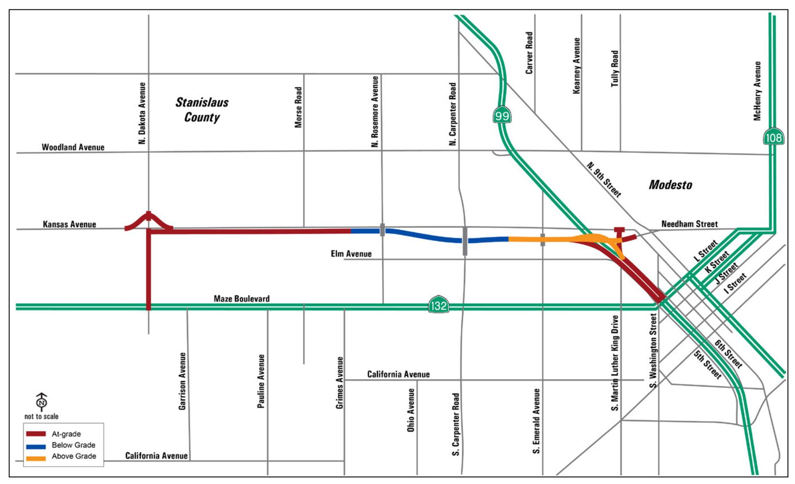

Figure 1-4: Project Overview Map

#### **Project Phasing**

The proposed project would consist of two construction phases, Phase 1 and Phase 2, described below.

#### Phase 1

Phase 1 is anticipated to begin construction in 2018, be completed within 12 to 15 months, and open to traffic by 2020. Phase 1 is planned to be fully funded with approximately \$82 million to be programmed in 2018 for right-of-way acquisition and construction. Figure 1-5 shows the improvements for Phase 1 for both build alternatives.

Both build alternatives (Alternative 1 and Alternative 2) would be the same under Phase 1 and would include construction of a two-lane expressway on the southern half of the proposed alignment from Dakota Avenue on the west end of the project to the Needham Street Overcrossing Bridge on the east end of the project. At the completion of Phase 1, the expressway would have full access control (no street connections) and grade separations at intersections from SR 99 to North Dakota Avenue and access from private driveways along North Dakota Avenue to Maze Boulevard. The expressway would not have a center median separating each direction of travel. Full standard lane and shoulder widths are proposed (i.e., 10-foot-wide shoulders and 12-foot-wide general-purpose lanes) for most of the expressway. Although each of the expressway's overcrossings and undercrossings would be built large enough to accommodate four lanes of travel for Phase 2, only two lanes of travel would be paved and striped as part of Phase 1. Appendix F shows typical cross sections and provides preliminary engineering drawings for Phase 1.

The following describes the design features for both build alternatives, which would be the same under Phase 1.

Page Intentionally Left Blank

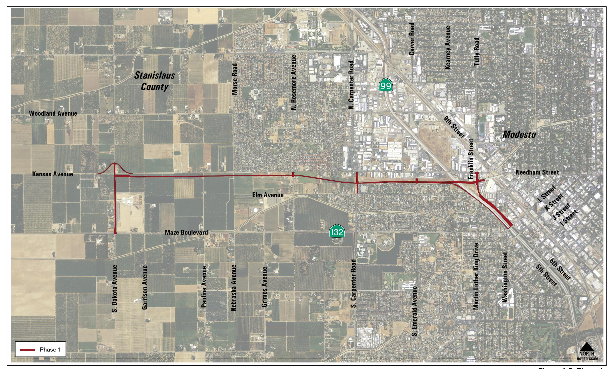

Figure 1-5: Phase 1

Chapter 1 • Proposed Project

Page Intentionally Left Blank

#### Profiles of the Grades along the New Alignment

Traveling west to east, the profiles for Phase 1 would begin at-grade from North Dakota Avenue until just east of Morse Road. The profile would then transition below grade (be depressed) west of the North Rosemore Avenue overcrossing and continue below grade past the North Carpenter Road overcrossing. East of this overcrossing, the profile would rise above grade (be elevated) to cross over the North Emerald Avenue undercrossing and would continue this way over the proposed SR 132/SR 99 interchange. Along SR 99, the profile would match the current profile of SR 99 (see Appendix F).

#### SR 99 and Other Roadway Improvements

In addition to constructing a new alignment for SR 132, Phase 1 would improve SR 132 and SR 99 system connectivity and other local street intersections at both ends of the project by adding the following:

- A northbound auxiliary lane along SR 99 from the 6th Street off-ramp to the Kansas Avenue off-ramp
- A northbound SR 99 on-ramp from 6th Street

Other area roadway improvements would include the following:

- A Needham Street overcrossing at SR 99
- A traffic signal at Dakota Avenue and existing SR 132 (Maze Boulevard)
- Realignment of the Kansas Avenue intersection with Dakota Avenue north of its existing location
- A Kansas Avenue extension to replace North Franklin Street

#### Proposed Retaining Walls

Retaining walls are proposed at the following locations to limit permanent and temporary right-of-way impacts to residences and commercial properties. (see Appendix F):

- Southerly side of the project, just east of North Carpenter Road
- Southerly side of the project, just west of North Emerald Avenue
- Between the eastbound SR 132 to southbound SR 99 direct-connector ramp and 5th Street

#### Drainage

Along the proposed new alignment, Phase 1 would introduce new paved surfaces and would increase the amount of stormwater runoff in the area. To the greatest extent possible, Phase 1 would minimize stormwater runoff from Caltrans right-of-way by implementing roadside bioswales, infiltration basins, and retention/detention basins. Because a portion of the proposed project would be depressed, a pumping plant to remove runoff from the depressed section and to discharge the runoff into a retention/detention basin would be constructed west of North Rosemore Avenue, just south of the proposed new alignment.

#### Soil Stockpiles Remediation

Three soil stockpiles are within the Caltrans right-of-way limits of the proposed project. The soil stockpiles, which have been in their present location since the 1960s, contain soil with varying, but elevated concentrations of barium and lead. Under the oversight of the California Department of Toxic Substances Control and Central Valley Regional Water Quality Control Board, the Soil Stockpiles Feasibility Study (see Appendix G) was prepared to identify remedial action objectives, general response actions, and process options for the stockpiles. In accordance with Comprehensive Environmental Response, Compensation and Liability Act guidance, including criteria that screened and comparatively analyzed the remedial technologies, the study identified four remedial alternatives: Stockpile Alternative 1 – No Action; Stockpile Alternative 2 – Institutional Controls; Stockpile Alternative 3 – Removal (excavation and offsite disposal); and Stockpile Alternative 4 – Containment. The alternatives were then evaluated based on nine additional criteria to support a decision on the most appropriate remedial option.

Following the California Department of Toxic Substances Control acceptance of the Soil Stockpiles Feasibility Study, a Draft Final Remedial Action Plan was prepared. The purpose of the Draft Final Remedial Action Plan is to 1) summarize all contaminant-impact studies at the stockpile site, 2) provide an assessment of potential risks to human health and the environment, 3) develop a remedial action alternative to reduce those risks, and 4) provide the information to the public for review and comment. The Draft Final Remedial Action Plan is provided in Appendix H of this document

In the Containment Alternative, stockpile soil would be contained behind retaining walls and bridge abutments and beneath highway pavements. Phase 1 would construct pavement over the southern portions of soil stockpiles 1 and 2 and place cover

material over the northern portions. The entirety of soil from stockpile 3 would be contained during Phase 1 where it would be consolidated within the eastern abutment of the proposed SR 132/SR 99 interchange (see Figures 2-17 and 2-18).

#### Phase 2

Phase 2 is expected to begin construction in 2026 and be completed by 2028. Phase 2 would be constructed when funding becomes available. Figures 1-6 and 1-7 show the elements of work for Phase 2 for Alternatives 1 and 2, respectively.

Phase 2 would involve the construction of the two northernmost lanes within the new alignment from North Dakota Avenue on the west end of the project to the Needham Street Overcrossing Bridge on the east end of the project. The two existing southern lanes constructed in Phase 1 would be restriped to serve as the eastbound lanes, while the two new northern lanes would serve westbound traffic. At the completion of Phase 2, the freeway would have full access control, grade separations at intersections, and a center median separating each direction of travel from SR 99 to North Dakota Avenue. The segment along North Dakota Avenue to Maze Boulevard would remain an expressway. The freeway would have 10-foot-wide outside shoulders, 5-foot-wide inside shoulders, 12-foot-wide general-purpose lanes, and a 36-foot-wide median. Appendix F provides cross sections and preliminary engineering drawings for Phase 2.

The following describes the similar design features of both build alternatives under Phase 2. Section 1.4.1, Build Alternatives, describes the unique features of Alternative 1 and Alternative 2.

#### SR 99 and Other Roadway Improvements

Phase 2 would improve SR 132 and SR 99 system connectivity by adding the following:

- A southbound auxiliary lane with ends at different locations for each alternative. The lane would be from approximately a half-mile north of Kansas Avenue to the SR 132/Needham Street off-ramp (Alternative 1) or the Central Modesto/5th Street off-ramp (Alternative 2)
- A direct-connector ramp from eastbound SR 132 to southbound SR 99
- A southbound auxiliary lane from the eastbound SR 132 to southbound SR 99 direct connector ramp to the L Street overcrossing

Other area roadway improvements would include the following:

- Removal of the northbound SR 99 on- and off-ramps at Kansas Avenue and southbound ramps at L and I streets
- Construction of the northbound SR 99 on- and off-ramps at Needham Street and a direct-connector flyover ramp between northbound SR 99 and westbound SR 132
- Construction of the eastbound SR 132 off-ramp and westbound SR 132 onramp at North Carpenter Road via a single-point urban interchange
- Reconfiguration of the on-ramp from 6th Street, so that the ramp would access SR 99 about 2,000 feet north of its current location, and an auxiliary lane would be provided for the on-ramp

Also, both build alternatives propose a 12-foot-wide pedestrian/bicycle path along the east side of North Carpenter Road within the limits of the project.

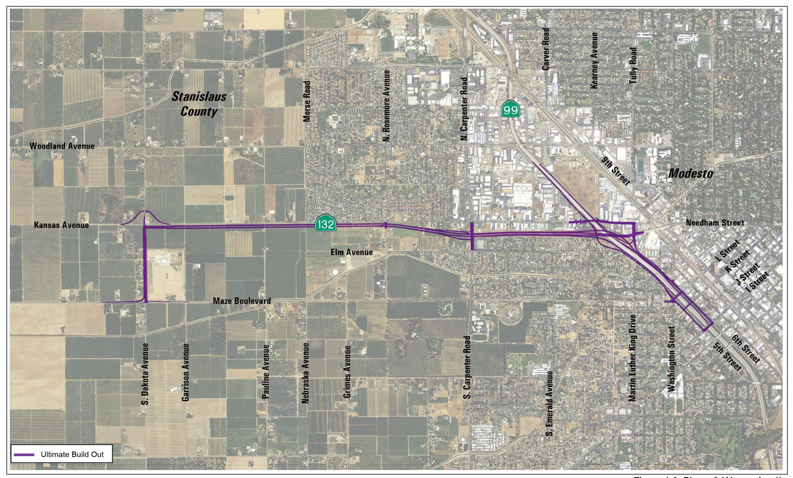

Figure 1-6: Phase 2 (Alternative 1)

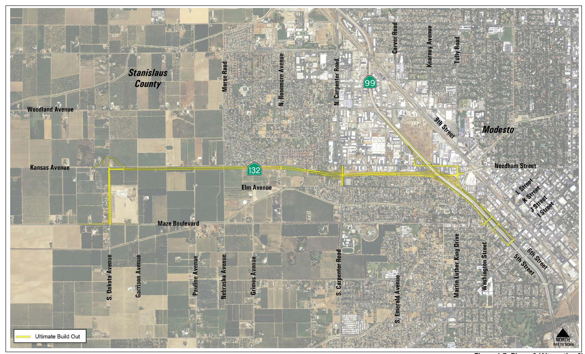

Figure 1-7: Phase 2 (Alternative 2)

#### Proposed Retaining Walls

When Phase 2 is built, additional retaining walls are proposed at the following locations (See Appendix F):

- Northerly side of the project from west of North Rosemore Avenue to North Carpenter Road
- Northerly side of the project, just west of North Emerald Avenue
- Northerly side of the project near the proposed touchdown of the northbound SR
   99 to westbound SR 132 direct-connector ramp
- Between SR 99 and the proposed northbound SR 99 to westbound SR 132 directconnector ramp
- Between the proposed northbound SR 99 to westbound SR 132 direct-connector ramp and the northbound SR 99 on-ramp from M Street
- Between the northbound SR 99 on-ramp from M Street and the SR 99 northbound SR 99 off-ramp to Needham Street

#### Drainage

Along the SR 99 alignment, Phase 2 would introduce slightly more paved surface, but the added stormwater runoff would be minimal. Similar to Phase 1, Phase 2 would incorporate bioswales and retention/detention basins to infiltrate the groundwater table with stormwater runoff. The proposed northbound SR 99 on-ramp from Needham Street would require the relocation of the existing pumping station at SR 99 and Kansas Avenue. The proposed pumping plant would be relocated approximately 150 feet east of the existing plant. The relocated plant would be constructed within the same parcel as the existing plant.

#### Soil Stockpile Remediation

Initiated in Phase 1, the stockpile Containment Alternative would pave the northern half of stockpiles 1 and 2 during Phase 2 of the proposed project. At the completion of Phase 2, all of the soil would be contained within the proposed new alignment per the Recommended Stockpile Alternative (Containment).

Table 1-4 lists construction start, duration, and completion dates and estimates the cost considerations under Phase 1 compared to Phase 2. The table also includes a cost comparison for each build alternative under Phase 2 only.

Table 1-4: Summary Comparison of Project Phasing and Funding

| Criterion                  | Phase 1                          | Phase 2                        |
|----------------------------|----------------------------------|--------------------------------|
| Start of construction      | 2018                             | 2026                           |
| Completion of construction | 2020                             | 2028                           |
| Project cost by phase      | \$82 million                     | \$128 million to \$132 million |
| Total Project Cost         | \$211 million to \$214 million a |                                |

&lt;sup>a The range represents the estimated cost of Alternative 1 (\$211 million) and the cost of Alternative 2 (\$214 million) for comparison purposes. The total project cost includes \$1.57 million for remediation (containment) of the soil stockpiles. Values reflect escalation (Phase 1 value is based on 2018 dollars; Phase 2 values are based on 2026 dollars).

#### 1.4 Project Alternatives

This section describes the alternatives under consideration and compares differences between the alternatives. This section also explains why some initial alternatives were dropped from further consideration. The two build alternatives that were developed by the Project Development Team (which consists of Caltrans, StanCOG, Stanislaus County, and City of Modesto representatives) are evaluated by how well each meets the project's purpose and need and avoids and/or minimizes environmental impacts. Criteria used to evaluate each of the alternatives were potential impacts to human and natural resources, project feasibility, ability to meet the project's purpose and need, and overall project cost.

#### 1.4.1 Build Alternatives

#### Unique Features of the Build Alternatives

#### Alternative 1

Alternative 1 would realign, lengthen, and raise the Kansas Avenue overcrossing (Bridge Number 38 0086) at SR 99 and would remove the existing southbound SR 99 off-ramp to Kansas Avenue and the southbound SR 99 loop on-ramp from Kansas Avenue. Alternative 1 would also construct a 1,900-foot off-ramp from southbound SR 99 to Needham Street, which would serve as an off-ramp from southbound SR 99 to the 5th Street connector at Needham Street. The eastbound SR 132 to southbound SR 99 direct-connector ramp would cross beneath the 5th Street connection. Figure 1-8 and Appendix F show the differences between the build alternatives.

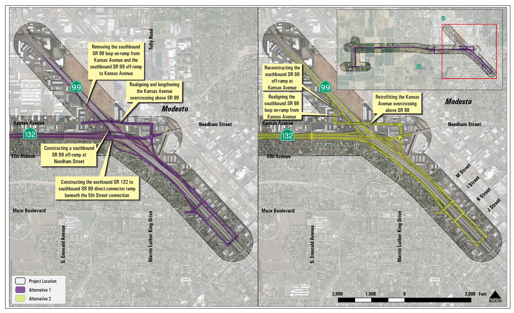

Figure 1-8: Unique Features of the Build Alternatives

Chapter 1 • Proposed Project

Page Intentionally Left Blank

Specific to Alternative 1, this build alternative would construct retaining walls to limit right-of-way acquisition at the following locations:

- Along the southerly side of the project near the divergence of the eastbound SR
   132 to southbound SR 99 direct-connector ramp
- Along the left shoulder of the southbound SR 99 off-ramp to Needham Street, wrapping around to the proposed Needham Street bridge abutment

#### Alternative 2

Instead of realigning, lengthening, and raising Kansas Avenue (as proposed under Alternative 1), Alternative 2 would retrofit and reconstruct the Kansas Avenue overpass above SR 99. The existing southbound SR 99 on- and off-ramps at Kansas Avenue would remain open with some design adjustments, but the build alternative would realign the existing southbound SR 99 loop on-ramp from Kansas Avenue. The build alternative would also realign the southbound off-ramp under Kansas Avenue to the 5th Street two-lane, collector-distributer roadway on the west side of SR 99. Figure 1-8 and Appendix F show the differences between the build alternatives.

Specific to Alternative 2, this build alternative would construct retaining walls to limit right-of-way acquisition along SR 99 at the following locations:

- Along the right shoulder of the southbound SR 99 loop on-ramp
- Along the left shoulder of the ramp from the eastbound SR 132 to southbound SR
   99 direct-connector ramp to 5th Street
- Between the eastbound SR 132 to southbound SR 99 direct-connector ramp to SR 99 and 5th Street

## Transportation Demand Management, Transportation System Management, and Mass Transit Alternatives

#### Transportation Demand Management Alternative

Transportation Demand Management strategies are designed to influence an individual's behavior by reducing the demand for single occupancy vehicle use (especially during peak commute periods) to maximize the existing transportation system. A Transportation Demand Management alternative normally focuses on *regional strategies* for reducing the number of vehicle trips and vehicle miles traveled, as well as increasing vehicle occupancy.

For the proposed project, this alternative considered how to accommodate projected traffic volumes on existing SR 132 (Maze Boulevard) by supporting regional agencies to promote ride sharing and by offering other transportation mode choices by way of improving bicycle/pedestrian facilities and transit facilities and services operated and maintained by the area's current transit providers.

Transit improvements would include improvements for transit riders (such as expanded bus service, the creation of a bus route and stations along the existing highway), as well as transit operators (such as bus turnouts), and shuttle service for the area. These improvements may include multi-modal projects, such as StanCOG's *Non-Motorized Transportation Plan* and other projects identified in StanCOG's 2014 Regional Transportation Plan/Sustainable Communities Strategy.

Traffic volumes on existing SR 132 (Maze Boulevard) are anticipated to increase substantially, despite ongoing efforts to promote ridesharing and programs to encourage more transit use and other transportation mode choices (such as bicycle/pedestrian routes). If the existing highway is not widened to accommodate future traffic volumes, severe congestion would occur that would lead to degraded operations. The Transportation Demand Management alternative also would not improve system connectivity between the existing highway and SR 99. The existing on- and off-ramp configuration would remain as currently configured and would not improve interregional and regional connectivity. Therefore, the alternative fails to meet the project's purpose and need.

#### Transportation System Management Alternative

Transportation System Management strategies aim to maximize the number of persons traveling in a corridor or on a facility. These strategies include traffic flow improvements, ramp metering, and traffic signal optimization. Transportation System Management emphasizes reducing traffic congestion by increasing the efficiency of existing transportation systems through infrastructure, technological and operational improvements.

This alternative considered implementing cost-effective, minor improvements to existing SR 132 (Maze Boulevard) to eliminate or close driveways, install a new median and signals, construct dedicated bicycle lanes, optimize signals, and restrict turning movements. The intent of the improvements would be to increase highway capacity to accommodate traffic volumes along the existing highway. The alternative would be similar to Alternative 5, described in Section 1.6, Alternatives Considered

but Eliminated from Further Discussion, as it would involve eliminating driveway access, installing median barriers, providing dedicated bicycle lanes, and optimizing signals.

Removing or reconfiguring driveway access would adversely impact residential and commercial properties along the existing highway, resulting in the relocation of adjacent properties in some locations. Even if driveway access issues could be resolved, the alternative could not sufficiently accommodate increases in traffic volumes, which would lead to severe congestion along the existing highway. Also, the alternative would not improve system connectivity between existing SR 132 (Maze Boulevard) and SR 99. The existing on- and off-ramp configuration would remain, and the increase in traffic volumes and deterioration of service levels would cause traffic to overflow onto SR 99, which is currently at capacity and projected to experience congestion under future conditions.

The Transportation System Management alternative would not meet the project's purpose and need. However, transportation system management improvements are assumed as part of the regional network, so each are incorporated into future conditions (2048) for all of the alternatives, including the No-Build Alternative. Some of StanCOG's additional and supporting Transportation System Management strategies are described below.

StanCOG's 2014 Regional Transportation Plan/Sustainable Communities Strategy details a number of Transportation System Management improvements for intersections, traffic signal installations, roadway preservation and rehabilitation, auxiliary lanes, and railroad crossings along multiple travel corridors in the vicinity of the project. The total estimated cost for all proposed roadway projects would be \$2.7 billion, with 37 percent of the total roadway budget accounting for Transportation System Management-related projects.

StanCOG completed its *Non-Motorized Transportation Master Plan* in October 2013. The plan describes the existing and proposed countywide priority bicycle and pedestrian networks, in addition to the recommended network for the unincorporated portions and each of the nine cities within the county. The plan proposed a total countywide bicycle network of 719 miles, with an estimated cost of \$234 million. Because of funding constraints, the plan identified the 10 priority projects as either Tier 1 or Tier 2 priority projects. Tier 1 projects are estimated to cost \$24.5 million for 99.7 miles, and Tier 2 would cost \$5 million for 31.5 miles. The 2014 Regional

Transportation Plan/Sustainable Communities Strategy (Amendment Number 2) has programmed \$226 million for various bicycle and pedestrian improvements, including the construction of multi-modal paths and Class IV bikeways; signage; and roadway striping. Almost half of the plan's total programmed cost (or \$122 million) would be bicycle/pedestrian improvements in Modesto. Funding sources for these improvements include Congestion Management and Air Quality Improvement Program funds, Bicycle Transportation Account funds, Safe Routes to Schools Grants, Modesto's capital facilities fees, Proposition 84 (Sustainable Community Planning grants), Community Development Block grants, local transportation funds, Regional Surface Transportation Program funds, Highway Safety Improvement Program fees, Stanislaus County public facilities fees, and development fees.

In 2009, StanCOG's Policy Board approved the *Northern San Joaquin Valley Regional Ramp Metering and High Occupancy Vehicle Lane Master Plan*, which outlined ramp metering and high occupancy vehicle lanes in San Joaquin, Stanislaus, and Merced counties. The plan would guide improvements to the region's major corridors, such as Interstate 5, Interstate 205, and SR 99. For SR 99, a number of ramp metering and high occupancy vehicle lanes were identified as medium priority projects needed in the next 10 to 20 years.

#### Mass Transit Alternative

The mass transit alternative would improve or add mass transit (for example, bus or rail) facilities to provide a broader range of transportation options to the traveling public. The alternative would require mass transit improvements on existing SR 132 (Maze Boulevard) by adding bus service routes, adding buses, and installing bus turnouts near major intersections.

Bus service is provided in the area by Modesto Area Express and Stanislaus Regional Transit. Modesto Area Express operates local and intercity bus service year-round and serves the cities of Modesto and Ceres and the communities of Salida and Empire. Stanislaus Regional Transit is operated by Stanislaus County to provide intercity and intercounty fixed route bus services to the cities of Modesto, Riverbank, Oakdale, Turlock, Patterson, Grayson, Westley, Newman, Gustine, and Merced. Currently, no bus service runs along the existing highway. The existing east-west bus routes are situated along SR 99 to either Grayson Road or West Marin Avenue/Las Palmas Avenue to serve the western areas of the county.

The mass transit alternative does not accommodate the projected volumes of truck traffic (21 percent of total traffic volumes) and regional commuters who are traveling to points outside of the study area along existing SR 132 (Maze Boulevard). Related to truck volumes, the alternative would not enhance the ability to transport goods and services. Because there are no direct connections, auxiliary lanes, and improved on-and off-ramps between the existing highway and SR 99, the mass transit alternative does not improve system connectivity. The alternative, by itself, is not consistent with local and regional land use goals and policies that have identified the project as a Tier 1 High Priority project as programmed by the 2014 Regional Transportation Plan/Sustainable Communities Strategy.

#### 1.4.2 No-Build Alternative

The No-Build Alternative does not meet the purpose and need because existing SR 132 (Maze Boulevard) would remain a two-lane, conventional highway. The No-Build Alternative would not improve regional and interregional circulation, would not relieve traffic congestion along both existing SR 132 (Maze Boulevard) and eastward to SR 99, and would not improve operations of the existing transportation network.

No soil stockpile containment via a highway structure would be implemented under the project's No-Build Alternative. Currently, the perimeter of all three soil stockpiles is enclosed with security fencing, walls, and structures, which under the No-Build Alternative would continue to be maintained by Caltrans. Caltrans would also continue water quality monitoring and maintain the vegetative cover on each stockpile. Under the No-Build Alternative and under the oversight and approval of the California Department of Toxic Substances Control and the Central Valley Regional Water Quality Control Board, Caltrans would be required to develop a separate remedial action plan for the stockpiles.

### 1.5 Comparison of Alternatives

The criteria used to evaluate each of the alternatives included the following: ability to meet the project's purpose and need, potential impacts to human and natural resources, project feasibility, and overall project cost.

As noted in Table 1-5, both build alternatives would meet the purpose and need by shifting most of the truck and commuter traffic onto the proposed new alignment, and improving regional circulation and operations on the local transportation network. The two build alternatives would have similar potential impacts to the surrounding

area. The No-Build Alternative would have limited additional impacts to the surrounding area.

Section 1.4, Project Alternatives, provides a full description of the alternatives, as shown in Figures 1-4 through 1-8. Chapter 2, Affected Environment, Environment Consequences, and Avoidance, Minimization, and/or Mitigation Measures, explains the potential impacts for each of the alternatives.

**Table 1-5: Summary Comparison of Alternatives** 

| Potential Impact                                                                       | Alternative 1                                                                                                                                                                                                                                                                                                                                                                                                                                                                                                                                                                                                                                                                                                                                                                                                                                                                                                                                                                                                                                                                                                 | Alternative 2                                                                                                                                                                                                                                                                                                                                                               | No-Build Alternative                                                                                                                                                                                                                                                                                                                                                                                                                                                                                                                               |                      |
|----------------------------------------------------------------------------------------|---------------------------------------------------------------------------------------------------------------------------------------------------------------------------------------------------------------------------------------------------------------------------------------------------------------------------------------------------------------------------------------------------------------------------------------------------------------------------------------------------------------------------------------------------------------------------------------------------------------------------------------------------------------------------------------------------------------------------------------------------------------------------------------------------------------------------------------------------------------------------------------------------------------------------------------------------------------------------------------------------------------------------------------------------------------------------------------------------------------|-----------------------------------------------------------------------------------------------------------------------------------------------------------------------------------------------------------------------------------------------------------------------------------------------------------------------------------------------------------------------------|----------------------------------------------------------------------------------------------------------------------------------------------------------------------------------------------------------------------------------------------------------------------------------------------------------------------------------------------------------------------------------------------------------------------------------------------------------------------------------------------------------------------------------------------------|----------------------|
| Meets Purpose and Need                                                                 | Yes                                                                                                                                                                                                                                                                                                                                                                                                                                                                                                                                                                                                                                                                                                                                                                                                                                                                                                                                                                                                                                                                                                           | Yes                                                                                                                                                                                                                                                                                                                                                                         | No                                                                                                                                                                                                                                                                                                                                                                                                                                                                                                                                                 |                      |
| Land Use                                                                               | Consistency with the Modesto General Plan                                                                                                                                                                                                                                                                                                                                                                                                                                                                                                                                                                                                                                                                                                                                                                                                                                                                                                                                                                                                                                                                     | Consistent. The proposed project is in the General Plan and would be consistent with applicable General Plan goals and policies, except for Circulation and Transportation Policy V-B.6[c] related to Traffic Demand Management measures.                                                                                                                                   | Inconsistent. The No-Build Alternative would not result in a transportation project. Therefore, no Transportation Demand Management measures would be applied.                                                                                                                                                                                                                                                                                                                                                                                     |                      |
|                                                                                        | Consistency with the Stanislaus County General Plan                                                                                                                                                                                                                                                                                                                                                                                                                                                                                                                                                                                                                                                                                                                                                                                                                                                                                                                                                                                                                                                           | Consistent. The proposed project is in the General Plan and is consistent with applicable General Plan goals and policies, except for the Agricultural Element Policy 2.3 and Land Use Element Policy 2 related to conversion of agricultural land.                                                                                                                         | Inconsistent. Increased traffic congestion and lower average traffic speeds associated with the No-Build Alternative would degrade mobility within the study area and larger region. This would have a negative impact on economic and community prosperity.                                                                                                                                                                                                                                                                                       |                      |
| Potential Impact                                                                       |                                                                                                                                                                                                                                                                                                                                                                                                                                                                                                                                                                                                                                                                                                                                                                                                                                                                                                                                                                                                                                                                                                               | Alternative 1                                                                                                                                                                                                                                                                                                                                                               | Alternative 2                                                                                                                                                                                                                                                                                                                                                                                                                                                                                                                                      | No-Build Alternative |
| Consistency with StanCOG Regional Transportation Plan/Sustainable Communities Strategy | Consistent. The proposed project is in the 2016 Regional Transportation Plan/Sustainable Communities Strategy and is consistent with applicable Plan goals and policies.                                                                                                                                                                                                                                                                                                                                                                                                                                                                                                                                                                                                                                                                                                                                                                                                                                                                                                                                      | Inconsistent. Increased traffic congestion and lower average traffic speeds associated with the No-Build Alternative would have the potential to degrade air quality and mobility within the study area and larger region. This would have a negative impact on economic and community vitality, environmental quality, mobility, and social equity.                        |                                                                                                                                                                                                                                                                                                                                                                                                                                                                                                                                                    |                      |
|                                                                                        | Parks and Recreational Facilities                                                                                                                                                                                                                                                                                                                                                                                                                                                                                                                                                                                                                                                                                                                                                                                                                                                                                                                                                                                                                                                                             | Temporary increases in construction noise and equipment emissions would be minor. There would be no Section 4(f) use of any park or recreational resources.                                                                                                                                                                                                                 | No impact                                                                                                                                                                                                                                                                                                                                                                                                                                                                                                                                          |                      |
| Growth                                                                                 | Both build alternatives are unlikely to have a measurable effect on growth and would result in minimal growth-related impacts beyond what has already been planned.                                                                                                                                                                                                                                                                                                                                                                                                                                                                                                                                                                                                                                                                                                                                                                                                                                                                                                                                           | No impact                                                                                                                                                                                                                                                                                                                                                                   |                                                                                                                                                                                                                                                                                                                                                                                                                                                                                                                                                    |                      |
| Farmlands/Timberlands                                                                  | Conversion of 64.8 acres of prime and unique farmland and 3.51 acres of Williamson Act contract lands would occur. Farmland access would be maintained throughout the project.                                                                                                                                                                                                                                                                                                                                                                                                                                                                                                                                                                                                                                                                                                                                                                                                                                                                                                                                | No impact                                                                                                                                                                                                                                                                                                                                                                   |                                                                                                                                                                                                                                                                                                                                                                                                                                                                                                                                                    |                      |
| Community Character and Cohesion                                                       | No impact                                                                                                                                                                                                                                                                                                                                                                                                                                                                                                                                                                                                                                                                                                                                                                                                                                                                                                                                                                                                                                                                                                     | No impact                                                                                                                                                                                                                                                                                                                                                                   |                                                                                                                                                                                                                                                                                                                                                                                                                                                                                                                                                    |                      |
| Relocations/ Property Acquisitions                                                     | Business Displacements                                                                                                                                                                                                                                                                                                                                                                                                                                                                                                                                                                                                                                                                                                                                                                                                                                                                                                                                                                                                                                                                                        | 11                                                                                                                                                                                                                                                                                                                                                                          | 10                                                                                                                                                                                                                                                                                                                                                                                                                                                                                                                                                 | 0                    |
|                                                                                        | Business Partial Acquisitions                                                                                                                                                                                                                                                                                                                                                                                                                                                                                                                                                                                                                                                                                                                                                                                                                                                                                                                                                                                                                                                                                 | 24                                                                                                                                                                                                                                                                                                                                                                          | 28                                                                                                                                                                                                                                                                                                                                                                                                                                                                                                                                                 | 0                    |
|                                                                                        | Residential Displacements                                                                                                                                                                                                                                                                                                                                                                                                                                                                                                                                                                                                                                                                                                                                                                                                                                                                                                                                                                                                                                                                                     | 32                                                                                                                                                                                                                                                                                                                                                                          | 32                                                                                                                                                                                                                                                                                                                                                                                                                                                                                                                                                 | 0                    |
|                                                                                        | Residential Partial Acquisitions                                                                                                                                                                                                                                                                                                                                                                                                                                                                                                                                                                                                                                                                                                                                                                                                                                                                                                                                                                                                                                                                              | 30                                                                                                                                                                                                                                                                                                                                                                          | 30                                                                                                                                                                                                                                                                                                                                                                                                                                                                                                                                                 | 0                    |
| Potential Impact                                                                       | Alternative 1                                                                                                                                                                                                                                                                                                                                                                                                                                                                                                                                                                                                                                                                                                                                                                                                                                                                                                                                                                                                                                                                                                 | Alternative 2                                                                                                                                                                                                                                                                                                                                                               | No-Build Alternative                                                                                                                                                                                                                                                                                                                                                                                                                                                                                                                            |                      |
| Environmental Justice                                                                  | Noise, visual, relocation, and construction impacts would predominately occur within environmental justice populations and are considered a disproportionate adverse impact.                                                                                                                                                                                                                                                                                                                                                                                                                                                                                                                                                                                                                                                                                                                                                                                                                                                                                                                                  | Noise, relocation, and construction impacts would predominately occur within environmental justice populations and are considered a disproportionate adverse impact. However, a smaller degree of visual impacts would occur compared to Alternative 1.                                                                                                                     | Benefits not realized under the No-Build Alternative, including traffic congestion relief and improved access to businesses, would disproportionately adversely affect environmental justice populations.                                                                                                                                                                                                                                                                                                                                          |                      |
| Utilities/Emergency Services                                                           | Utility service could be temporarily disrupted during construction, but no long-term or permanent impacts would occur. Local road lane closures and detours would occur during construction, but emergency service providers would benefit after completion of Phase 1 by increased mobility, reduced congestion, and improved access.                                                                                                                                                                                                                                                                                                                                                                                                                                                                                                                                                                                                                                                                                                                                                                        | No utility relocations or abandonments would occur. Emergency service response times may increase because of increased traffic congestion.                                                                                                                                                                                                       |                                                                                                                                                                                                                                                                                                                                                                                                                                                                                                                                                    |                      |
| Traffic and Transportation/ Pedestrian and Bicycle Facilities                    | Decreased travel times, increased traffic speeds, and improved levels of service along existing SR 132 (Maze Boulevard) and for most of the major intersections would be realized. The proposed new alignment would provide another east-west travel option for motorists.                                                                                                                                                                                                                                                                                                                                                                                                                                                                                                                                                                                                                                                                                                                                                                                                                                    | Neither build alternative would directly or indirectly impact existing or planned pedestrian/bicycle facilities, except at the proposed single-point urban interchange of the new alignment with North Carpenter Road. Both build alternatives propose a 12-foot-wide pedestrian/bicycle path along the east side of North Carpenter Road within the limits of the project. | Travel times would increase and level of service and vehicle speeds would degrade to unacceptable levels. Limited pedestrian and bicycle facilities exist within the study area, and no facilities are located west of SR 99 within Modesto's city limits.                                                                                                                                                                                                                                                                 |                      |
| Visual/Aesthetics                                                                      | High visual impact— Certain structures would degrade the visual quality of some residential areas, as well as new highway lighting, signs, tree removal (591 trees), and business and residential relocations.                                                                                                                                                                                                                                                                                                                                                                                                                                                                                                                                                                                                                                                                                                                                                                                                                                                                        | Moderately high visual impact—While fewer structures and two fewer trees would be removed, Alternative 2 would still degrade visual quality of some residential areas from highway lighting, signs, tree removal (589 trees), and business and residential relocations.                                                                                                     | No impact                                                                                                                                                                                                                                                                                                                                                                                                                                                                                                                                          |                      |
| Potential Impact                                                                       | Alternative 1                                                                                                                                                                                                                                                                                                                                                                                                                                                                                                                                                                                                                                                                                                                                                                                                                                                                                                                                                                                                                                                                                                 | Alternative 2                                                                                                                                                                                                                                                                                                                                                               | No-Build Alternative                                                                                                                                                                                                                                                                                                                                                                                                                                                                                                                               |                      |
| Cultural Resources                                                                     | The State Route 132 Historic Property Survey Report was completed in December 2011. Following changes in the project's area of potential effects, additional areas were evaluated, and a supplemental Historic Property Survey Report was completed in October 2014. A Finding of Effects (FOE) would be prepared after the preferred alternative is selected. The FOE would address the two eligible historic resources (416/418 I Street and 3530 Maze Boulevard) within the project area. The proposed freeway/expressway would not have a direct or indirect impact on the resources at 416/418 I Street.  Both build alternatives would require the acquisition of 0.13 acre of the northwest corner of 3530 Maze Boulevard. The potential acquisition is located outside the historic property boundary. The FOE would require concurrence from the State Historic Preservation Officer (SHPO) and would include avoidance, minimization, and mitigation measures. These would be included in the Final EIR/EA. There are no known direct impacts on or Section 4(f) uses of any known resources. | No impact                                                                                                                                                                                                                                                                                                                                                                   | No impact                                                                                                                                                                                                                                                                                                                                                                                                                                                                                                                                          |                      |
| Hydrology and Floodplain                                                               | Impervious surfaces would increase by 55.8 acres, which could affect the area's watershed by increasing the flow and volume of stormwater runoff entering the watershed.                                                                                                                                                                                                                                                                                                                                                                                                                                                                                                                                                                                                                                                                                                                                                                                                                                                                                                                                      | Impervious surfaces would increase by 57.5 acres, which could affect the area's watershed by increasing the flow and volume of stormwater runoff entering the watershed.                                                                                                                                                                                                    | No impact                                                                                                                                                                                                                                                                                                                                                                                                                                                                                                                                          |                      |
| Potential Impact                                                                       | Alternative 1                                                                                                                                                                                                                                                                                                                                                                                                                                                                                                                                                                                                                                                                                                                                                                                                                                                                                                                                                                                                                                                                                                 | Alternative 2                                                                                                                                                                                                                                                                                                                                                               | No-Build Alternative                                                                                                                                                                                                                                                                                                                                                                                                                                                                                                                               |                      |
| Water Quality and Storm Water Runoff                                                | If left untreated, the increase in stormwater flow and runoff volumes, resulting from the increased impervious surface area due to construction of the proposed freeway/expressway, could negatively affect water quality. Direct impacts may involve water contamination and excessive sedimentation, nutrients, and construction debris entering receiving water bodies.  Containment of the Caltrans Modesto Soil Stockpiles would mitigate potential water quality impacts.                                                                                                                                                                                                                                                                                                                                                                                                                                                                                                                                                                                                                         |                                                                                                                                                                                                                                                                                                                                                                             | The soil stockpiles would not be contained within a highway structure; however, Caltrans would be required to develop a separate remedial action plan for the stockpiles under the oversight of the California Department of Toxic Substances Control and the Central Valley Regional Water Quality Control Board. Caltrans would maintain the perimeter fence, restrict access to authorized personnel, continue water quality monitoring, and maintain vegetative cover of the soil stockpiles until remediation of the stockpiles is completed. |                      |
| Geology/Soils/Seismic/ Topography                                                   | Both build alternatives would result in minimal geologic, soil, seismic, or topographic impacts relative to geotechnical hazards associated with liquefaction, seismic settlement, and slope stability.                                                                                                                                                                                                                                                                                                                                                                                                                                                                                                                                                                                                                                                                                                                                                                                                                                                                                                       |                                                                                                                                                                                                                                                                                                                                                                             | No impact                                                                                                                                                                                                                                                                                                                                                                                                                                                                                                                                          |                      |
| Paleontology                                                                           | The Modesto Formation occurs throughout the study area and is identified as high sensitivity for paleontological resources. Project excavation has the potential to impact paleontological resources.                                                                                                                                                                                                                                                                                                                                                                                                                                                                                                                                                                                                                                                                                                                                                                                                                                                                                                         | The Modesto Formation occurs throughout the study area and is identified as high sensitivity for paleontological resources. Project excavation for Alternative 2 has a greater potential to impact paleontological resources than Alternative 1.                                                                                     | No impact                                                                                                                                                                                                                                                                                                                                                                                                                                                                                                                                          |                      |
| Agriculture                                                                            | Conversion of 64.8 acres of prime and unique farmland and 3.51 acres of Williamson Act contract lands would occur.                                                                                                                                                                                                                                                                                                                                                                                                                                                                                                                                                                                                                                                                                                                                                                                                                                                                                                                                                                                            |                                                                                                                                                                                                                                                                                                                                                                             | No Impact                                                                                                                                                                                                                                                                                                                                                                                                                                                                                                                                          |                      |
| Potential Impact                                                                       | Alternative 1                                                                                                                                                                                                                                                                                                                                                                                                                                                                                                                                                                                                                                                                                                                                                                                                                                                                                                                                                                                                                                                                                                 | Alternative 2                                                                                                                                                                                                                                                                                                                                                               | No-Build Alternative                                                                                                                                                                                                                                                                                                                                                                                                                                                                                                                               |                      |
| Hazardous Waste/Materials                                                              | For these alternatives, 19 parcels that would be partially or fully acquired are known to have recognized environmental conditions.                                                                                                                                                                                                                                                                                                                                                                                                                                                                                                                                                                                                                                                                                                                                                                                                                                                                                                                                                                           | Potential impacts from the acquisition of parcels with recognized environmental conditions, presence of agricultural chemicals, aerially deposited lead, and groundwater contamination would be less than substantial with the implementation of the appropriate avoidance, minimization, and mitigation measures.                                                          | The soil stockpiles would not be contained within a highway structure; however, Caltrans would be required to develop a separate remedial action plan for the stockpiles under the oversight of the California Department of Toxic Substances Control and the Central Valley Regional Water Quality Control Board. Caltrans would maintain the perimeter fence, restrict access to authorized personnel, continue water quality monitoring, and maintain vegetative cover of the soil stockpiles until remediation of the stockpiles is completed. |                      |
|                                                                                        | While there may be potential impacts from the presence of barium contaminants in three soil stockpiles, ongoing monitoring has indicated that no significant impacts have or would occur from airborne dispersion or migration to groundwater. Containment of the three soil stockpiles as construction fill material would mitigate these impacts.                                                                                                                                                                                                                                                                                                                                                                                                                                                                                                                                                                                                                                                                                                                                                           |                                                                                                                                                                                                                                                                                                                                                                             |                                                                                                                                                                                                                                                                                                                                                                                                                                                                                                                                                    |                      |
| Caltrans Modesto Soil Stockpiles                                                       | Stockpile soil would be contained behind retaining walls, bridge abutments and beneath highway pavements. Monitoring of the stockpiles and stormwater runoff constituents of potential concern would continue until the project and full containment of all three soil stockpiles are complete.                                                                                                                                                                                                                                                                                                                                                                                                                                                                                                                                                                                                                                                                                                                                                                                                               |                                                                                                                                                                                                                                                                                                                                                                             | A remedial action plan would be developed, as soil stockpile containment via a highway structure would not be implemented. Caltrans would maintain the perimeter fence, restrict access to authorized personnel, continue water quality monitoring, and maintain vegetative cover of the soil stockpiles until remediation of the stockpiles is completed.                                                                                                                                                                                         |                      |
| Potential Impact                                                                       | Alternative 1                                                                                                                                                                                                                                                                                                                                                                                                                                                                                                                                                                                                                                                                                                                                                                                                                                                                                                                                                                                                                                                                                                 | Alternative 2                                                                                                                                                                                                                                                                                                                                                               | No-Build Alternative                                                                                                                                                                                                                                                                                                                                                                                                                                                                                                                               |                      |
| Air Quality                                                                            | The proposed project would not lead to new or worsened violations of national and state air quality standards for particulate matter or carbon monoxide. Operational improvements would reduce precursor and criteria pollutant emissions relative to the No-Build Alternative. A temporary increase in precursor and criteria pollutants would occur during construction.                                                                                                                                                                                                                                                                                                                                                                                                                                                                                                                                                                                                                                                                                                                                    | The proposed project would not lead to new or worsened violations of national and state air quality standards for particulate matter or carbon monoxide. Operational improvements would reduce precursor and criteria pollutant emissions relative to the No-Build Alternative. A temporary increase in precursor and criteria pollutants would occur during construction.  | Higher traffic congestion and lower average traffic speeds may increase precursor and criteria pollutant emissions.                                                                                                                                                                                                                                                                                                                                                                                                                                |                      |
|                                                                                        | Dust generated during stockpile excavation would be monitored by an air monitoring plan approved by the Department of Toxic Substances Control.                                                                                                                                                                                                                                                                                                                                                                                                                                                                                                                                                                                                                                                                                                                                                                                                                                                                                                                                                               | Dust generated during stockpile excavation would be monitored by an air monitoring plan approved by the Department of Toxic Substances Control.                                                                                                                                                                                                                             | No air quality impacts from non-contained stockpiles would occur under the No-Build Alternative.                                                                                                                                                                                                                                                                                                                                                                                                                                                   |                      |
| Noise                                                                                  | Predicted future (2048) noise levels would permanently impact 260 receivers.                                                                                                                                                                                                                                                                                                                                                                                                                                                                                                                                                                                                                                                                                                                                                                                                                                                                                                                                                                                                                                  | Predicted future (2048) noise levels would permanently impact 276 receivers.                                                                                                                                                                                                                                                                                                | Noise levels for 162 receivers would approach or exceed the noise abatement criteria in 2048.                                                                                                                                                                                                                                                                                                                                                                                                                                                      |                      |
| Energy                                                                                 | The build alternatives would reduce overall fuel consumption when compared to existing conditions. Energy would be consumed during construction, but both build alternatives would not have substantial energy impacts.                                                                                                                                                                                                                                                                                                                                                                                                                                                                                                                                                                                                                                                                                                                                                                                                                                                                                       | The build alternatives would reduce overall fuel consumption when compared to existing conditions. Energy would be consumed during construction, but both build alternatives would not have substantial energy impacts.                                                                                                                                                     | The No-Build Alternative would cause adverse impacts related to energy consumption.                                                                                                                                                                                                                                                                                                                                                                                                                                                                |                      |
| Wetlands and Other Waters                                                              | Potential direct and permanent impacts to 0.65 acre of non-jurisdictional wetlands (Waters of the State).                                                                                                                                                                                                                                                                                                                                                                                                                                                                                                                                                                                                                                                                                                                                                                                                                                                                                                                                                                                                     | Potential direct and permanent impacts to 0.65 acre of non-jurisdictional wetlands (Waters of the State).                                                                                                                                                                                                                                                                   | No impact                                                                                                                                                                                                                                                                                                                                                                                                                                                                                                                                          |                      |
| Animal Species                                                                         | For this alternative, 21 acres of potential burrowing owl habitat would be impacted, and removal of 591 trees could impact migratory birds.                                                                                                                                                                                                                                                                                                                                                                                                                                                                                                                                                                                                                                                                                                                                                                                                                                                                                                                                                                   | For this alternative, 21 acres of potential burrowing owl habitat would be impacted, and removal of 589 trees could impact migratory birds.                                                                                                                                                                                                                                 | No impact                                                                                                                                                                                                                                                                                                                                                                                                                                                                                                                                          |                      |
| Threatened and Endangered Species                                                      | Potential impacts to the Swainson's hawk would include removal of up to 70 acres of possible foraging habitat and up to 414 trees (with low potential to support Swainson's hawk nesting and roosting).                                                                                                                                                                                                                                                                                                                                                                                                                                                                                                                                                                                                                                                                                                                                                                                                                                                                                                       | Potential impacts to the Swainson's hawk would include removal of up to 70 acres of possible foraging habitat and up to 414 trees (with low potential to support Swainson's hawk nesting and roosting).                                                                                                                                                                     | No impact                                                                                                                                                                                                                                                                                                                                                                                                                                                                                                                                          |                      |
| Invasive Species                                                                       | The area may benefit from covering existing invasive species with impervious surfaces (paving) and preventing further dispersal.                                                                                                                                                                                                                                                                                                                                                                                                                                                                                                                                                                                                                                                                                                                                                                                                                                                                                                                                                                              | The area may benefit from covering existing invasive species with impervious surfaces (paving) and preventing further dispersal.                                                                                                                                                                                                                                            | The area would remain predominantly covered by invasive species.                                                                                                                                                                                                                                                                                                                                                                                                                                                                                   |                      |
| Cumulative Impacts                                                                     | A cumulative impact to agriculture could occur. Cumulative visual/aesthetics and noise impacts could occur if avoidance, minimization, or mitigation measures are not incorporated.                                                                                                                                                                                                                                                                                                                                                                                                                                                                                                                                                                                                                                                                                                                                                                                                                                                                                                                           | A cumulative impact to agriculture could occur. Cumulative visual/aesthetics and noise impacts could occur if avoidance, minimization, or mitigation measures are not incorporated.                                                                                                                                                                                         | No impact                                                                                                                                                                                                                                                                                                                                                                                                                                                                                                                                          |                      |

**Table 1-5: Summary Comparison of Alternatives** 

**Table 1-5: Summary Comparison of Alternatives** 

**Table 1-5: Summary Comparison of Alternatives** 

**Table 1-5: Summary Comparison of Alternatives** 

**Table 1-5: Summary Comparison of Alternatives** 

**Table 1-5: Summary Comparison of Alternatives** 

After the public circulation period ends, all comments would be considered, and Caltrans would select a preferred alternative and make the final determination of the project's effect on the environment. In accordance with CEQA, Caltrans would certify that the project complies with CEQA, prepare findings for all significant impacts identified, prepare a Statement of Overriding Considerations for impacts that would not be mitigated below a level of significance, and certify that the findings and Statement of Overriding Considerations have been considered prior to project approval. Caltrans would then file a Notice of Determination with the State Clearinghouse that would identify whether the project would have significant impacts, if mitigation measures were included as conditions of project approval, that findings were made, and that a Statement of Overriding Considerations was adopted.

Similarly, as a CEQA responsible agency, the California Department of Toxic Substances Control would make a final determination regarding the Containment Alternative as recommended in the Draft Final Remedial Action Plan. The California Department of Toxic Substances Control would certify that the project complies with CEQA and would prepare a Notice of Determination. If the final approved document does not provide a sufficient description and environmental analysis of the remedial activities, then the California Department of Toxic Substances Control would prepare an additional CEQA document, or an addendum to this CEQA document.

If Caltrans, as assigned by the Federal Highway Administration, further determines that the NEPA action does not significantly impact the environment, Caltrans would issue a Finding of No Significant Impact (FONSI) in accordance with NEPA.

## 1.6 Alternatives Considered but Eliminated from Further Discussion

#### Initially Proposed Alternative 1

The initially proposed Alternative 1 would have constructed approximately 3.5 miles of new roadway from the west abutment of the Needham Street Overcrossing Bridge to North Dakota Avenue, ultimately connecting to existing SR 132 (Maze Boulevard) via a new alignment with an S-curve as initially proposed or via the Dakota Avenue alignment as refined during the preliminary design process. Construction would have also included above-grade (elevated) segments of the highway, interchange improvements, branch connectors, separated grade structures, the modification/replacement of existing roadway facilities, and at-grade intersections.

While this build alternative would have met the purpose and need, Alternative 1 would have had three distinct limitations. First, the initially proposed Alternative 1 would have caused additional environmental and community impacts beyond those that would result from the construction of either of the build alternatives, mainly due to the additional conversion of agricultural lands and farmlands. The build alternative would have converted 9.7 additional acres of Stanislaus County-designated agricultural land and 15.3 additional acres of prime farmland. Second, the S-curve design at the west end of the proposed project would not have been a feasible design solution for traffic operations and potential future expansion of the highway to the west, due to the potential realignment of SR 132 and construction of a new two-lane facility from Dakota Avenue to Gates Road, which is currently in the planning phase. Third, the initially proposed Alternative 1 would have had substantially higher costs. The costs associated with the construction of the S-curve are estimated at \$3.25 million (\$1.3 million capital costs and \$1.95 million right of way costs). As such, the cost of the initially proposed Alternative 1 is estimated at \$3.25 million above the cost estimated for either of the build alternatives. Therefore, the initially proposed Alternative 1 was eliminated from further discussion by the Project Development Team in March 2014.

#### Alternative 3

Alternative 3 would have constructed approximately 4 miles of new roadway from the west abutment of the Needham Street Overcrossing Bridge to North Dakota Avenue, ultimately connecting to existing SR 132 (Maze Boulevard) via a new alignment with an S-curve. Construction would have also included above-grade (elevated) segments of the highway, interchange improvements, branch connectors, separated grade structures, the modification/replacement of existing highway facilities, at-grade intersections, and a new public road connection.

Similar to the initially proposed Alternative 1, Alternative 3 would have met the purpose and need, but would have had three distinct limitations. First, the build alternative would have caused additional environmental and community impacts beyond those that would result from the construction of either of the build alternatives, mainly due to the additional conversion of agricultural lands and farmlands. The build alternative would have converted 9.7 additional acres of Stanislaus County-designated agricultural land and 15.6 additional acres of prime farmland. Second, the S-curve design at the west end of the proposed project would not have been a feasible design solution for traffic operations and potential future expansion of the highway to the west, due to the potential realignment of SR 132 and

construction of a new two-lane facility from Dakota Avenue to Gates Road, which is currently in the planning phase. Third, Alternative 3 would have had substantially higher costs. The costs associated with the construction of the S-curve are estimated at \$3.25 million (\$1.3 million capital costs and \$1.95 million right of way costs). As such, construction of Alternative 3 is estimated at \$3.25 million above the cost estimated for either of the build alternatives. Therefore, Alternative 3 was eliminated from further discussion by the Project Development Team in March 2014.

#### Alternative 5 (Widen the Existing SR 132 [Maze Boulevard])

Alternative 5 would have widened existing SR 132 (Maze Boulevard) from a two-lane, conventional highway to a four-lane highway. Construction would have also included a raised median, the modification or elimination of driveways, the implementation of left- and right-turn lanes, and at-grade signalized intersections at all major local roadways. Alternative 5 would not have used the existing Caltrans right-of-way within the route adopted for the project and would not have resulted in the containment of the soil stockpiles within a highway structure. As such, Caltrans would be required to develop a separate remedial action plan for the stockpiles under the oversight of the California Department of Toxic Substances Control and the Central Valley Regional Water Quality Control Board.

As described in the Project Development Procedures Manual (Chapter 8, Section 6), the early identification of significant environmental impacts, use of protected resources, and impacts on hazardous wastes is a crucial step in project development. The Project Development Team for the proposed project reviewed project design elements and potential environmental effects throughout the course of developing this environmental document, which began with the release of the Notice of Preparation on January 7, 2010.

Following the development of a preliminary design of Alternative 5, environmental and planning staff studied the design and used qualitative and quantitative analysis to determine the potential environmental effects anticipated with the construction and operation of Alternative 5. The results were presented to the Project Development Team to determine if Alternative 5 should be removed from consideration or studied further. The results of that analysis are described below in further detail. Alternative 5 would have had five distinct limitations in addition to not meeting the project's purpose and need.

First, the alternative would have substantially impacted local residents, businesses, and utilities along the existing highway. It would have impacted more than 160 properties, which would be 100 more properties than either of the two build alternatives. Also, the Alternative 5 would have required an estimated 60 residential relocations and additional businesses to accommodate an interchange with SR 99 near the intersection of Maze Boulevard and 5th Street. This would be almost twice as many relocations compared to the two build alternatives (see Figure 1-9).

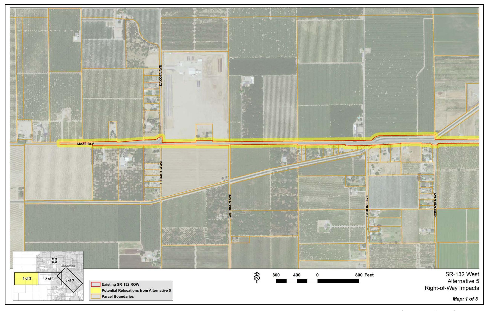

Figure 1-9: Alternative 5 Potential Relocations

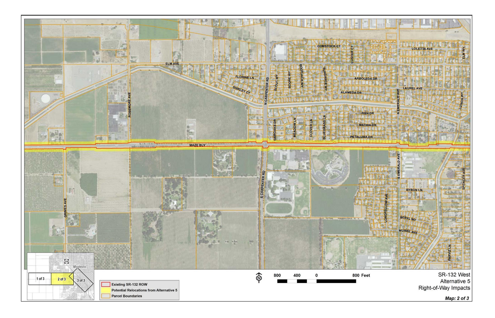

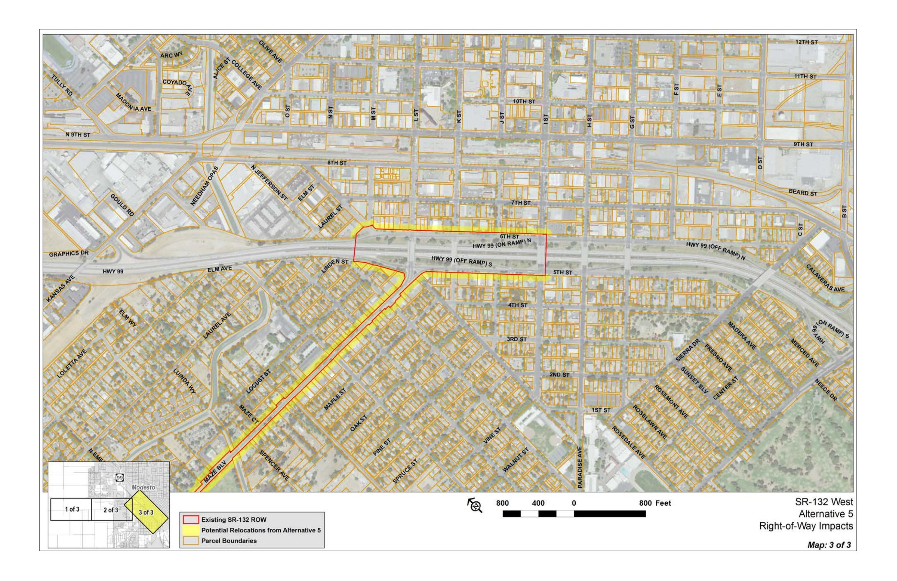

Chapter 1 • Proposed Project

Page Intentionally Left Blank

Second, Alternative 5 would not have provided system connectivity between SR 132 and SR 99 and therefore would not have improved regional and interregional travel. Constructing highway-to-highway connectors at the existing SR 132 (Maze Boulevard) connection to SR 99 in downtown Modesto would not have been feasible because of the substantial right-of-way impacts to downtown development and the conflicts with existing SR 99 ramps.

Third, Alternative 5 would not have accommodated a four-lane freeway/expressway facility with full access control, as identified in Caltrans and Stanislaus County planning reports, which is needed to relieve current and projected traffic congestion on the existing highway. Traffic on existing SR 132 (Maze Boulevard) is expected to increase 67 percent by 2048, and highway conditions throughout the region (conditions on SR 99, for example) would likely worsen. As detailed in Section 2.1.6, Traffic and Transportation/Pedestrian and Bicycle Facilities, future congestion in 2048 along the 3.3-mile stretch between Dakota Avenue and SR 99 would reduce travel speeds by 12.1 miles per hour during the morning commute and 12.3 miles per hour during the evening commute. This would increase travel times and decrease the level of service along SR 132 (Maze Boulevard) and at every area intersection studied.

Fourth, Alternative 5 would not improve operations along the existing highway. Higher traffic volumes would result in less spacing between vehicles so that drivers would have less time to react to sudden changes in traffic flow, such as a stopped vehicle on a highway with already high levels of congestion, numerous intersections, and driveways.

Fifth, Alternative 5 would convert 30.1 acres of prime and unique farmland. Although the converted acres associated with Alternative 5 would be fewer than the acres considered under Alternative 1 or Alternative 2, the soil is of much higher value than the two build alternatives. This is based on Form NRCS-CPA 106 (Farmland Conversion Impact Rating Form) submitted to Modesto Natural Resources Conservation Service that consists of impact evaluation using the following criteria: percent of a site being farmed, protection provided by state and local governments, and availability of agricultural support services nearby. The potential conversion of 64.8 acres of farmland anticipated under Alternatives 1 and 2 was assigned a farmland conversion impact rating of 160 points. Alternative 5, which would result in

a conversion of 30.1 acres of farmland, was assigned a farmland impact rating of 174. Alternative 5 is found to have a higher score relative to Alternative 1 and 2 in terms of the criteria listed above, thus warranting Alternative 5 as a greater risk to valuable existing agricultural operations and potential impacts to Williamson Act contract land. Therefore, the farmland conversion impact would be greater for Alternative 5 in comparison to the other alternatives.

Alternative 5 was eliminated from further discussion by the Project Development Team in July 2011 for the reasons stated above and the alternative's inability to meet the proposed project's purpose and need relative to the following:

- Improving regional and interregional circulation within Modesto and Stanislaus County
- Relieving traffic congestion along existing SR 132 (Maze Boulevard)
- Improving operations for the existing and proposed transportation network.

A technical memo documenting these factors was approved by the Project Development Team (see Appendix I).

### 1.7 Permits, Reviews, and Approvals Needed

The following permits, reviews, and approvals would be required for project construction.

Table 1.6: Permits, Reviews, and Approvals Needed

| Agency                                                | Permit/Approval                                                                                                                                                                                 | Status                                                                                                                                                 |
|-------------------------------------------------------|-------------------------------------------------------------------------------------------------------------------------------------------------------------------------------------------------|--------------------------------------------------------------------------------------------------------------------------------------------------------|
| California Transportation Commission               | Approval of New Public Road Connection at Needham Street                                                                                                                                     | Submittal and approval after Final EIR certification                                                                                                |
|                                                       | Section 401 Water Quality Certification                                                                                                                                                      | Submittal and approval prior to construction                                                                                                        |
| California Regional Water Quality Control Board | Section 402 National Pollutant Discharge Elimination System/Caltrans National Pollutant Discharge Elimination System Permit CAS000003 and CAS00002 (General Construction Permit) | Construction General Permit effective July 1, 2010; Caltrans National Pollutant Discharge Elimination System Permit effective July 1, 2013 |
|                                                       | Approval of the stockpile Final Remedial Action Plan, Remedial Design Implementation Plan, and other approvals deemed necessary                                                        | The Final Remedial Action Plan would be approved with certification of the Final EIR                                                             |

**Table 1.6: Permits, Reviews, and Approvals Needed** 

| Agency                                                  | Permit/Approval                                                                                                                                                         | Status                                                                                                                                                                                                                                                                                                                                                       |
|---------------------------------------------------------|-------------------------------------------------------------------------------------------------------------------------------------------------------------------------|--------------------------------------------------------------------------------------------------------------------------------------------------------------------------------------------------------------------------------------------------------------------------------------------------------------------------------------------------------------|
|                                                         | Approval and acceptance of hazardous waste investigations and remediation associated with discovery of soil or groundwater contamination discovered during construction | Work plans for hazardous waste investigations will be developed following acquisition of Right of Way acquisition. Investigations will be conducted prior to and during construction                                                                                                                                                                         |
| State Historic Preservation Officer                  | Determinations of eligibility and effects upon cultural resources                                                                                                       | Concurrence letters received May 16, 2012 and March 16, 2015 (National Register of Historic Places eligibility for architectural properties); a supplemental archaeological survey, geoarchaeological investigation report and the finding of effect would be submitted after selection of the preferred alternative but before approval of the Final EIR/EA |
| Various Utilities                                       | Utility modification/relocation agreements                                                                                                                              | Agreements would be executed prior to construction                                                                                                                                                                                                                                                                                                           |
| City of Modesto                                         | Street tree removal permit                                                                                                                                              | Submittal and approval prior to construction                                                                                                                                                                                                                                                                                                                 |
| City of Modesto and Caltrans                            | Cooperative Agreement for final design of Phase 1                                                                                                                       | To be developed during the final design phase of the project                                                                                                                                                                                                                                                                                                 |
| California Department of Toxic Substances Control | Approval of the stockpile Final Remedial Action Plan and Remedial Design Implementation Plan                                                                      | Approval would occur with certification of the Final EIR (after circulation of this Draft EIR/EA, which includes the Draft Final Remedial Action Plan (see Appendix H of this document))                                                                                                                                                                     |
| San Joaquin Valley Air Pollution Control District | Air Quality Dust Control Plans                                                                                                                                          | Contractor responsible to submit and obtain approval prior to construction                                                                                                                                                                                                                                                                                   |
| San Joaquin Valley Air Pollution Control District | Air Impact Assessment Indirect Source Review as required (Rule 9510)                                                                                              | Contractor to comply with the requirements prior to construction                                                                                                                                                                                                                                                                                             |
| San Joaquin Valley Air Pollution Control District | Asbestos National Emission Standards for Hazardous Air Pollutants Notification                                                                                    | Notification to be postmarked or delivered to the San Joaquin Valley Air Pollution Control District no later than 10 working days prior to beginning asbestos removal activities and/or demolition                                                                                                                                                           |
| Stanislaus County Department of Public Works      | Encroachment Permit                                                                                                                                                     | Submittal and approval prior to construction                                                                                                                                                                                                                                                                                                                 |

Page Intentionally Left Blank

This chapter discusses the potential environmental impacts the proposed project may have on the existing environment. Avoidance, minimization, and mitigation measures are included and are listed as abbreviations in the avoidance, minimization, and/or mitigation sections. As part of the scoping and environmental analysis done for the project, the following environmental issues were considered, but no adverse impacts were identified. Consequently, there is no further discussion of these issues in this document.

- Coastal Zones: The proposed project study area is not located near any coastal zones.
- Forested Resources (Timberlands): No timberlands are located within or near the project study area (Community Impact Assessment, July 2016).
- Mineral Resources: The proposed project would not impact any known mineral resources in the project study area (Geotechnical/Geologic Summary Report, October 2010).
- Sensitive Natural Communities: No sensitive natural communities are located within the project study area. The *State Route 132 West Freeway/Expressway Natural Environment Study* (October 2016) provides more details.
- Special-Status Plant Species: No special-status plant species were identified in the project study area. The *State Route 132 West Freeway/Expressway Natural Environment Study* (October 2016) provides more details.
- Wild and Scenic Rivers: No wild and scenic rivers are located within or near the project study area.

#### 2.1 Human Environment

#### 2.1.1 Land Use

#### 2.1.1.1 Existing and Future Land Use

#### Affected Environment

The following section is based on the *State Route 132 Community Impact Assessment Report* (July 2016).

City of Modesto and Stanislaus County Existing Land Use Patterns

Land uses within the project study area are identified in both Stanislaus County and Modesto's general plans. Stanislaus County's General Plan identifies all land west of Morse Road as Agriculture (see Figure 2-1). The land use study area also included the existing SR 132 (Maze Boulevard) corridor from Dakota Avenue to SR 99. Land uses include rural residential farmsteads, large mechanized farms, confined animal facilities, and food and fiber processing facilities. East of Morse Road, the County has designated the area south of Kansas Avenue and west of Carpenter Road as Urban Transition (a designation designed to ensure that land remains in agricultural use until urban development consistent with a city's general plan designation is approved). Pockets of Residential (low-density housing) and Industrial land uses within

Also shown in Figure 2-1, Modesto's General Plan identifies two land uses in the study area: the Redevelopment Planning District (mostly east of North Carpenter Road) and Residential (mostly north of Kansas Avenue between Morse Road and North Carpenter Road). The Redevelopment Planning District designation focuses on Modesto's economic and community development. The Residential designation includes single-family detached and attached housing, multi-family housing, and mobile homes. Compatible uses under the Residential designation may also include schools, parks, and religious or community facilities. Table 2-1 lists land use designations and acreages within the study area for Stanislaus County and Modesto.

Stanislaus County also exist within Modesto's General Plan boundary.

Table 2-1: Land Use within the Project Study Area

| Land Use Designation            | Acreage  |        |
|---------------------------------|----------|--------|
| Stanislaus County               |          |        |
| Agriculture                     | 68.60 a  |        |
| Urban Transition                | 47.78 a  |        |
| Industrial                      | 5.90     |        |
| Residential                     | 7.04     |        |
| Modesto                         |          |        |
| Redevelopment Planning District | 106.30 a |        |
| Residential                     | 2.63     |        |
|                                 | Total    | 238.25 |

&lt;sup>a Includes Caltrans right-of-way (totaling 79 acres of the total project study area). Source: Community Impact Assessment (July 2016)

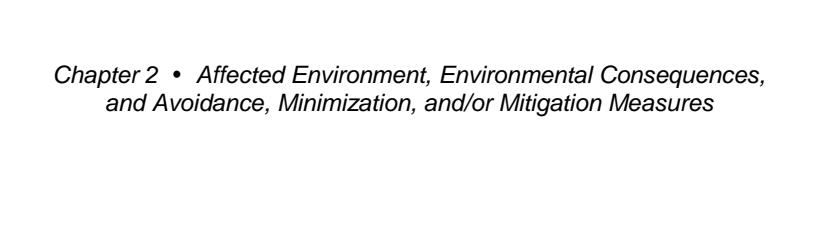

Page Intentionally Left Blank

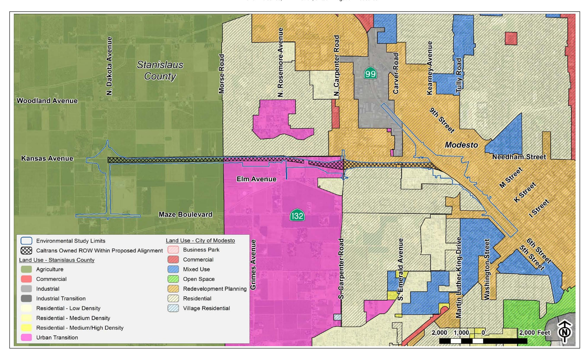

Figure 2-1: Stanislaus County and Modesto Land Use Designations

Page Intentionally Left Blank

Between North Dakota Avenue and Morse Road, Kansas Avenue crosses unincorporated Stanislaus County. This land is zoned for agricultural use on both the north and south side of Kansas Avenue. The zoning designation is intended for areas that are presently or potentially desirable for agricultural use. Land included in this designation typically possesses favorable agricultural characteristics. Residential building density normally ranges from zero to two dwellings per 40 acres in this zone. A Planned Development zone may also be consistent with this designation when it is used for agriculturally related uses or for uses of a demonstrably unique character. The portion of the project study area that is within Modesto includes areas zoned for Residential, Commercial, Industrial, and Planned Development.

#### City of Modesto and Stanislaus County Development Trends

Development trends within the study area and Modesto and Stanislaus County are based on information from both the City and County's planning departments. Additional information regarding growth trends in and around the study area is further discussed in Section 2.1.2, Growth.

According to the Stanislaus County Planning Department, there are no plans for significant urban development in the northern unincorporated areas of the county except for what is noted in the Salida Community Plan, which focuses on an area approximately 7 miles north of the project. Only two minor projects would potentially occur near the study area:

- In 2008, Stanislaus County adopted and passed a resolution approving a conservation easement for the California Department of Conservation Farmland Conservancy Program located on the Menghetti Ranch, west of Stone Avenue.
- In 2009, Stanislaus County adopted and passed a resolution approving a conservation easement for the California Department of Conservation Farmland Conservancy Program located on the Ulm Farm, east of North Dakota Avenue and near the intersection of existing SR 132 (Maze Boulevard) and Texas Avenue. The easement included two parcels and approximately 159 acres.

The only planned development within Modesto is the Kansas-Woodland Business Park, which would be just north of the study area between Kansas and Woodland avenues and along the east side of SR 99. The proposed project is currently inactive, but this remains an area for potential future development. Although Modesto's Redevelopment Planning District is designated for higher-density, mixed-use

development that stimulates economic development, no major development is planned in the area.

#### **Environmental Consequences**

#### Build Alternatives

Both build alternatives would convert existing agricultural and scattered Urban Transition uses in Stanislaus County and vacant land (designated for redevelopment planning) in Modesto to a transportation use, thus resulting in minor direct impacts. Despite the changes, neither build alternative would greatly alter the overall land use patterns. Conversion of the land would improve mobility for both regional and local traffic and provide congestion relief. Table 2-2 lists the total acreages to be converted under each build alternative.

Table 2-2: Land Use Conversion by Build Alternative

| Land Use                        | Alternative 1 (acres) | Alternative 2 (acres) |
|---------------------------------|-----------------------|-----------------------|
| Stanislaus County               |                       |                       |
| Agriculture                     | 49.96                 | 49.96                 |
| Urban Transition                | 44.56                 | 44.56                 |
| Industrial                      | 1.48                  | 1.48                  |
| Residential                     | 6.84                  | 6.84                  |
| Modesto                         |                       |                       |
| Redevelopment Planning District | 72.45                 | 71.81                 |
| Residential                     | 2.29                  | 2.29                  |
| Total                           | 177.58                | 176.94                |

Source: Community Impact Assessment (July 2016)

Impacts to land use would be similar for both build alternatives. However, Alternative 1 would result in slightly greater impacts to Redevelopment Planning District land uses. Direct project impacts for both build alternatives would include operation-related noise, air quality, and visual impacts, as well as temporary construction-related impacts to surrounding land uses. These impacts are described in the applicable sections of this document.

#### No-Build Alternative

The No-Build Alternative would not result in the construction of any of the proposed improvements and therefore would not convert any existing land use to a transportation use.

#### Avoidance, Minimization, and/or Mitigation Measures

Despite the land use changes resulting from construction of either of the build alternatives, the proposed project would not greatly alter the overall land use patterns. Benefits of the proposed project include improving regional and interregional circulation and providing congestion relief within the study area. The City of Modesto General Plan and the Stanislaus County General Plan include policies designed to improve circulation and minimize traffic congestion, and these goals cannot be accomplished without impacting some agricultural land. The analysis of farmlands impacts, addressed in Section 2.1.3, Farmlands, differs from the analysis of land use impacts, which considers land use conversion as well as consistency with applicable plans and policies for regional growth and redevelopment. Based on these factors, neither build alternative would result in adverse impacts to land use. Therefore, no avoidance, minimization, or mitigation measures are proposed.

## 2.1.1.2 Consistency with State, Regional and Local Plans and Programs

#### Affected Environment

The following section is based on the *State Route 132 Community Impact Assessment Report* (July 2016).

The proposed project study area lies within both Stanislaus County and Modesto. The County and City jurisdictions develop and manage land use policy in the area through the use of general plans and zoning. Those documents and other regional and federal transportation reports relevant to the project's development were also reviewed.

#### Stanislaus County General Plan

The Stanislaus County General Plan describes improvements to SR 132 in the Circulation Element, which details that a federal grant has been secured to study ways to connect the portion of SR 132 east of SR 99 to its new proposed alignment.

#### Modesto General Plan

The Community Services and Facilities Element of Modesto's General Plan identifies a four-lane expressway generally aligned with Kansas Avenue. The plan also notes the area surrounding existing SR 132 (Maze Boulevard) as a future 660-acre business park. On March 25, 2014, the City Council finalized the proposed changes to the Modesto Urban Area General Plan Land Use diagram. The proposed land use diagram establishes the project description for purposes of the required environmental

studies for the General Plan Amendment. Included in the amendment is an update to the transportation diagram which reflects the proposed project.

## StanCOG 2014 Regional Transportation Plan/Sustainable Communities Strategy and Regional Transportation Improvement Program

StanCOG's 2014 Regional Transportation Plan/Sustainable Communities Strategy was approved in June 2014. The proposed project is programmed into the plan within the 2014 Regional Transportation Improvement Program, which outlines StanCOG's transportation projects eligible for funding under the state's Regional Transportation Improvement Program.

#### Transportation Concept Reports for State Route 132

The 2014 Caltrans Transportation Concept Report is a system planning document that includes an analysis of the transportation corridor and establishes a 20-year planning concept. The Ultimate Transportation Corridor is the facility envisioned beyond the 20-year planning horizon and is identified to assist in the preservation of future right-of-way. The Ultimate Transportation Corridor is identified as a roadway segment (between Interstate 5 and SR 99) that should be expanded to a four-lane expressway, with the segment from Stone Avenue to SR 99 as a four-lane freeway.

#### 2015 Federal Transportation Improvement Program

StanCOG's 2015 Federal Transportation Improvement Program was prepared in cooperation with Caltrans and the Federal Highway Administration to document transportation projects that require or use federal funding or are considered regionally significant, non-federal projects. The proposed project is considered a regionally significant project and is included in the 2015 Federal Transportation Improvement Program with programmed federal funding.

#### **Environmental Consequences**

#### Build Alternatives

Both build alternatives would be consistent with most policies in the plans listed above and in Table 2-3. Both the Stanislaus County General Plan Circulation Element and the Modesto Community Services and Facilities Element identify State Route 132 in the location of the proposed project. As such, general plan amendments would not be required prior to the jurisdictions entering into a freeway agreement with Caltrans. However, the build alternatives would not be consistent with two Stanislaus County General Plan policies related to the conversion of agricultural land and Williamson Act contract land and one Modesto General Plan policy concerning

Transportation Demand Management measures. Section 2.1.3, Farmland, describes how the measures proposed to ensure the conservation of farmland and Transportation Demand Management measures, as a stand-alone alternative, were considered but eliminated from further analysis (Section 1.4, Project Alternatives). As such, the build alternatives would not have adverse impacts related to state, regional, or local plans and programs.

Table 2-3: Consistency with State, Regional, and Local Plans and Programs

| Table 2: Consistency with State, Regional, and Local Plans and Programs                                                                                                                                                                                                                                                                                                                                                                                                                                                                                                                                                                                                                                                                                                                                                                                                                                                                                                                                                                                                                                                                                                      |                                                                                                                                                                                                                                                                                                                                                                                                                                                                                                                                                                                               |                                                                                                                                                                                                                                                                                                                                                      |
|------------------------------------------------------------------------------------------------------------------------------------------------------------------------------------------------------------------------------------------------------------------------------------------------------------------------------------------------------------------------------------------------------------------------------------------------------------------------------------------------------------------------------------------------------------------------------------------------------------------------------------------------------------------------------------------------------------------------------------------------------------------------------------------------------------------------------------------------------------------------------------------------------------------------------------------------------------------------------------------------------------------------------------------------------------------------------------------------------------------------------------------------------------------------------|-----------------------------------------------------------------------------------------------------------------------------------------------------------------------------------------------------------------------------------------------------------------------------------------------------------------------------------------------------------------------------------------------------------------------------------------------------------------------------------------------------------------------------------------------------------------------------------------------|------------------------------------------------------------------------------------------------------------------------------------------------------------------------------------------------------------------------------------------------------------------------------------------------------------------------------------------------------|
| Land Use/Transportation Goal                                                                                                                                                                                                                                                                                                                                                                                                                                                                                                                                                                                                                                                                                                                                                                                                                                                                                                                                                                                                                                                                                                                                                 | Build Alternatives                                                                                                                                                                                                                                                                                                                                                                                                                                                                                                                                                                            | No-Build Alternative                                                                                                                                                                                                                                                                                                                                 |
| Stanislaus County General Plan                                                                                                                                                                                                                                                                                                                                                                                                                                                                                                                                                                                                                                                                                                                                                                                                                                                                                                                                                                                                                                                                                                                                               |                                                                                                                                                                                                                                                                                                                                                                                                                                                                                                                                                                                               |                                                                                                                                                                                                                                                                                                                                                      |
| Agricultural Element Policy 2.3: The County shall ensure all lands enrolled in the Williamson Act are devoted to agricultural and compatible uses supportive of the long-term conservation of agricultural land.                                                                                                                                                                                                                                                                                                                                                                                                                                                                                                                                                                                                                                                                                                                                                                                                                                                                                                                                                             | Inconsistent. Both build alternatives would result in the conversion of 3.51 acres of Williamson Act contract land to a transportation use.                                                                                                                                                                                                                                                                                                                                                                                                                                                   | Consistent. The No-Build Alternative would not result in the conversion of Williamson Act contract land to non-agricultural use.                                                                                                                                                                                                                     |
| Agricultural Element Policy 2.7: Proposed amendments to the General Plan Diagram (map) that would allow the conversion of agricultural land to non-agricultural uses shall be approved only if they are consistent with the County's conversion criteria.                                                                                                                                                                                                                                                                                                                                                                                                                                                                                                                                                                                                                                                                                                                                                                                                                                                                                                                    | Consistent. Both build alternatives would be consistent with all of the agricultural conversion criteria outlined in the Stanislaus County General Plan.                                                                                                                                                                                                                                                                                                                                                                                                                                      | Consistent. The No-Build Alternative would not result in the conversion of farmland to non-agricultural use.                                                                                                                                                                                                                                         |
| Agricultural Element Policy 2.11: The County recognizes the desire of cities and unincorporated communities to grow and prosper and shall not oppose reasonable requests consistent with city and county agreements to expand, provided the resulting growth minimizes impacts to adjacent agricultural land.                                                                                                                                                                                                                                                                                                                                                                                                                                                                                                                                                                                                                                                                                                                                                                                                                                                                | Consistent. Both build alternatives would relieve traffic congestion along an important regional and interregional route. Both build alternatives were designed to minimize impacts to adjacent agricultural lands, while still meeting the project's purpose and need.                                                                                                                                                                                                                                                                                                                       | Inconsistent. Increased traffic congestion and lower average traffic speeds associated with the No-Build Alternative would degrade mobility within the study area and larger region. This would have a negative impact on economic and community prosperity.                                                                                         |
| Land Use Element Policy 2: Land designated Agriculture shall be restricted to uses that are compatible with agricultural practices, including natural resources management, open space, outdoor recreation and enjoyment of scenic beauty.                                                                                                                                                                                                                                                                                                                                                                                                                                                                                                                                                                                                                                                                                                                                                                                                                                                                                                                                   | Inconsistent. Both build alternatives would result in the conversion of 64.8 acres of prime and unique farmland and 3.51 acres of Williamson Act contract land to a transportation use.                                                                                                                                                                                                                                                                                                                                                                                                       | Consistent. The No-Build Alternative would not result in the conversion of farmland to non-agricultural use.                                                                                                                                                                                                                                         |
| Circulation Element Policy 2: Circulation systems shall be designed and maintained to promote safety and minimize traffic congestion.                                                                                                                                                                                                                                                                                                                                                                                                                                                                                                                                                                                                                                                                                                                                                                                                                                                                                                                                                                                                                                        | Consistent. The purpose of both build alternatives is to enhance operations, relieve congestion, and improve regional and interregional circulation within Modesto and Stanislaus County.                                                                                                                                                                                                                                                                                                                                                                                                     | Inconsistent. Under the No-Build Alternative, travel times would increase and level of service and vehicle speeds would further degrade to unacceptable levels throughout the study area.                                                                                                                                                            |
| Circulation Element Policy 4: The circulation system shall provide for roads in all classifications (Freeway, Expressway, Major, Collector, Local, Minor and Private) as necessary to provide access to all parts of the County and shall be expanded or improved to provide acceptable levels of service based on anticipated land use.                                                                                                                                                                                                                                                                                                                                                                                                                                                                                                                                                                                                                                                                                                                                                                                                                                     | Consistent. Both build alternatives would decrease travel times, increase speeds, and improve level of service along existing SR 132 (Maze Boulevard) and for most major intersections in the study area.                                                                                                                                                                                                                                                                                                                                                                                     | Inconsistent. Under the No-Build Alternative, travel times would increase and level of service and vehicle speeds, would further degrade to unacceptable levels throughout the study area.                                                                                                                                                           |
| Land Use/Transportation Goal                                                                                                                                                                                                                                                                                                                                                                                                                                                                                                                                                                                                                                                                                                                                                                                                                                                                                                                                                                                                                                                                                                                                                 | Build Alternatives                                                                                                                                                                                                                                                                                                                                                                                                                                                                                                                                                                            | No-Build Alternative                                                                                                                                                                                                                                                                                                                                 |
| Circulation Element Policy 5: Transportation requirements of commercial and industrial development shall be considered in all planning, design, construction, and improvements.                                                                                                                                                                                                                                                                                                                                                                                                                                                                                                                                                                                                                                                                                                                                                                                                                                                                                                                                                                                              | Consistent. Both build alternatives would go through commercial and industrial areas and would be designed to relieve congestion for commercial and industrial use.                                                                                                                                                                                                                                                                                                                                                                                                                           | Inconsistent. Under the No-Build Alternative, travel times would increase and level of service and vehicle speeds would further degrade to unacceptable levels throughout the study area. This would negatively impact commercial and industrial development and transportation use.                                                                 |
| Circulation Element Policy 7: Bikeways and pedestrian facilities shall be designed to provide reasonable access from residential areas to major bicycle and pedestrian traffic destinations such as schools, recreation and transportation facilities, centers of employment, and shopping areas.                                                                                                                                                                                                                                                                                                                                                                                                                                                                                                                                                                                                                                                                                                                                                                                                                                                                            | Consistent. Both build alternatives propose a 12-foot-wide pedestrian/bicycle path along the east side of North Carpenter Road within the limits of the project.                                                                                                                                                                                                                                                                                                                                                                                                                              | Inconsistent. Limited pedestrian and bicycle facilities exist within the study area, with no facilities located west of SR 99 within Modesto's city limits. The rural nature of the western portion of the study area generally necessitates that bicyclists share the roadways with motor vehicles.                                                 |
| Circulation Element Policy 9: The County shall promote the development of inter-city and interregional transportation facilities that more efficiently moves goods and freight within and through the region.                                                                                                                                                                                                                                                                                                                                                                                                                                                                                                                                                                                                                                                                                                                                                                                                                                                                                                                                                                | Consistent. The purpose of both build alternatives is to promote intercity and interregional circulation, which would facilitate the movement of goods and freight within the study area and larger region.                                                                                                                                                                                                                                                                                                                                                                                   | Inconsistent. Under the No-Build Alternative, travel times would increase and level of service and vehicle speeds would further degrade to unacceptable levels throughout the study area. This would negatively impact regional movement of goods and freight.                                                                                       |
| Modesto General Plan                                                                                                                                                                                                                                                                                                                                                                                                                                                                                                                                                                                                                                                                                                                                                                                                                                                                                                                                                                                                                                                                                                                                                         |                                                                                                                                                                                                                                                                                                                                                                                                                                                                                                                                                                                               |                                                                                                                                                                                                                                                                                                                                                      |
| Community Growth Policy II-B.1[b]: As the City expands and vacant land becomes developed, infrastructure such as roads, sewer, water, and storm drainage is necessary to support that development. As the City directs the extension of this infrastructure, economic development opportunities within the City's limits should receive the highest priority for receiving such infrastructure. The City shall establish the timely provision of infrastructure to support the policies in Section II-B.2.                                                                                                                                                                                                                                                                                                                                                                                                                                                                                                                                                                                                                                                                   | Consistent. As identified in the General Plan Amendment, proposed land uses for land next to SR 132 within the study area would be re-designated as a Business Park land use. Both build alternatives would provide improved circulation and traffic congestion relief along existing SR 132 (Maze Boulevard).                                                                                                                                                                                                                                                                                | Inconsistent. Under the No-Build Alternative, travel times would increase and level of service and vehicle speeds would further degrade to unacceptable levels throughout the study area. This would negatively impact economic development.                                                                                                         |
| Land Use/Transportation Goal                                                                                                                                                                                                                                                                                                                                                                                                                                                                                                                                                                                                                                                                                                                                                                                                                                                                                                                                                                                                                                                                                                                                                 | Build Alternatives                                                                                                                                                                                                                                                                                                                                                                                                                                                                                                                                                                            | No-Build Alternative                                                                                                                                                                                                                                                                                                                                 |
| Community Services and Facilities: Circulation and Transportation Policy V-B.6[a]: The streets and highways system should be coordinated with Caltrans', the County's, and other jurisdictions' existing facilities and plans. The adoption of a regional expressway system by the Stanislaus Council of Governments should be supported, and the components of the regional system that lie within the City's Sphere of Influence shall be incorporated into the City's Circulation and Transportation Diagram. The expressway system shall be designed to accommodate mass transit. The City shall develop an efficient, and well-coordinated, multi-modal (rail/air/bus/bicycle/pedestrian) transportation system.                                                                                                                                                                                                                                                                                                                                                                                                                                                        | Consistent. Both build alternatives would be consistent with the Caltranssponsored Transportation Concept Report and StanCOG's 2014 Regional Transportation Plan/Sustainable Communities Strategy. Although mass transit was considered as an alternative for the project, it would not accommodate goods movement, which is a vital element of the project. Accommodations for mass transit (specifically buses) traveling through the corridor and along local streets within the area would be determined during final design.                                                             | Not applicable.                                                                                                                                                                                                                                                                                                                                      |
| Community Services and Facilities: Circulation and Transportation Policy V-B.6[b]: Transportation Control Measures shall be implemented where feasible or mandated by their agencies, to reduce vehicle miles traveled, vehicle idling, or traffic congestion. Alternatives to the drive-alone auto mode, such as mass transit, ride sharing, non-motorized transportation, and telecommuting, should be encouraged. In addition, the City shall encourage innovative means to reduce traffic congestion and enhance air quality.                                                                                                                                                                                                                                                                                                                                                                                                                                                                                                                                                                                                                                            | Consistent. Although neither of the build alternatives proposes specific transportation control measures, both build alternatives would reduce vehicle miles traveled, idling, and congestion, while not leading to new or worsened violations of national or state air quality standards. Both build alternatives would also encourage non-motorized transportation in the form of pedestrian and bicycle use in the area of North Carpenter Road.                                                                                                                                           | Inconsistent. The No-Build Alternative would lead to increased vehicle miles of travel, hours of delay, idling, and congestion, all of which could potentially increase air quality impacts and degrade mobility within the study area and larger region.                                                                                            |
| Community Services and Facilities: Circulation and Transportation Policy V-B.6[c]: Transportation Demand Management measures are encouraged to directly affect trip makers' choice of travel mode and the routes and time of day for trips. Transportation Demand Management has as its purpose the reduction in the number of vehicle trips being made on the street network. Typical types of Transportation Demand Management measures would be promotion of transit, carpooling or van pooling, non-motorized transportation, and pricing of parking to make these alternative modes of transportation more attractive and cost competitive.                                                                                                                                                                                                                                                                                                                                                                                                                                                                                                                             | Inconsistent. Neither build alternative would apply Transportation Demand Management measures. Such measures were considered as a separate alternative but they would not meet the project's purpose and need to improve system connectivity.                                                                                                                                                                                                                                                                                                                                                 | Inconsistent. The No-Build Alternative would not apply Transportation Demand Management measures.                                                                                                                                                                                                                                                    |
| Land Use/Transportation Goal                                                                                                                                                                                                                                                                                                                                                                                                                                                                                                                                                                                                                                                                                                                                                                                                                                                                                                                                                                                                                                                                                                                                                 | Build Alternatives                                                                                                                                                                                                                                                                                                                                                                                                                                                                                                                                                                            | No-Build Alternative                                                                                                                                                                                                                                                                                                                                 |
| Community Services and Facilities: Circulation and Transportation Policy V-B.6[f]: The highest possible levels of service for all transportation modes (vehicle, transit, pedestrian, and bicycle) shall be maintained on City roadways, consistent with the financial resources reasonably available to the City and without unreasonably burdening property owners or developers with excessive roadway improvement costs. On roadways where the level of service is expected to exceed level F, the City should consider mitigation measures other than road widening, such as the addition of bicycle lanes, improved pedestrian access, improved transit service, and the establishment of walkable development patterns.                                                                                                                                                                                                                                                                                                                                                                                                                                               | Consistent. Both build alternatives would decrease travel times, increase speeds, and improve level of service along existing SR 132 (Maze Boulevard) and for most major intersections in the study area. Both build alternatives propose a 12-foot-wide pedestrian/bicycle path along the east side of North Carpenter Road within the limits of the project.                                                                                                                                                                                                                                | Inconsistent. Under the No-Build Alternative, travel times would increase and level of service and vehicle speeds would further degrade to unacceptable levels throughout the study area.                                                                                                                                                            |
| Community Services and Facilities: Circulation and Transportation Policy V-B.6[o]: The City shall provide a balanced, feasible, and well-maintained system of transportation for motorized and non-motorized modes.                                                                                                                                                                                                                                                                                                                                                                                                                                                                                                                                                                                                                                                                                                                                                                                                                                                                                                                                                          | Consistent. Both build alternatives propose a 12-foot-wide pedestrian/bicycle path along the east side of North Carpenter Road within the limits of the project.                                                                                                                                                                                                                                                                                                                                                                                                                              | Inconsistent. Limited pedestrian and bicycle facilities exist within the study area, with no facilities west of SR 99 within Modesto's city limits. The rural nature of the western portion of the study area generally necessitates that bicyclists share the roadways with motor vehicles.                                                         |
| Community Services and Facilities: Circulation and Transportation Policy V-B.7[b]: The City may allow individual locations to fall below the City's level of service standards in instances where the construction of physical improvements would be infeasible, be prohibitively expensive, significantly impact adjacent properties or the environment, significantly impact non-motorized transportation systems, or have a significant adverse effect on the character of the community. To the extent feasible, the City shall strive for level of service D on all streets and intersections.                                                                                                                                                                                                                                                                                                                                                                                                                                                                                                                                                                          | Consistent. Both build alternatives would decrease travel times, increase speeds, and improve level of service along existing SR 132 (Maze Boulevard) and for most major intersections in the study area.                                                                                                                                                                                                                                                                                                                                                                                     | Inconsistent. Under the No-Build Alternative, travel times would increase and level of service and vehicle speeds would further degrade to unacceptable levels for most major intersections throughout the study area.                                                                                                                               |
| Environmental Resources and Open Space: Agricultural Resources Policy VII-D.4[d]: Where necessary to promote planned City growth, the City shall encourage development of those agricultural lands that are already compromised by adjacent urban development or contain property required for the extension of infrastructure or other public facilities, before considering urban development on agricultural lands that are not subject to such urban pressures.                                                                                                                                                                                                                                                                                                                                                                                                                                                                                                                                                                                                                                                                                                          | Consistent. Both build alternatives would use existing Caltrans right-of-way south of Kansas Avenue and land next to existing roadways and developments to minimize the impacts to agricultural lands.                                                                                                                                                                                                                                                                                                                                                                                        | Consistent. The No-Build Alternative would not result in the conversion of farmland to non-agricultural use.                                                                                                                                                                                                                                         |
| Land Use/Transportation Goal                                                                                                                                                                                                                                                                                                                                                                                                                                                                                                                                                                                                                                                                                                                                                                                                                                                                                                                                                                                                                                                                                                                                                 | Build Alternatives                                                                                                                                                                                                                                                                                                                                                                                                                                                                                                                                                                            | No-Build Alternative                                                                                                                                                                                                                                                                                                                                 |
| StanCOG 2014 Regional Transportation Plan/Sustainable Communities Strategy                                                                                                                                                                                                                                                                                                                                                                                                                                                                                                                                                                                                                                                                                                                                                                                                                                                                                                                                                                                                                                                                                                   |                                                                                                                                                                                                                                                                                                                                                                                                                                                                                                                                                                                               |                                                                                                                                                                                                                                                                                                                                                      |
| Mobility: Improve the ability of people and goods to move between desired locations; and provide a variety of transportation choices. Social Equity: Promote and provide equitable opportunities to access transportation services for all populations and ensure all populations share in the benefits of transportation improvements and provide a range of transportation and housing choices. Economic and Community Vitality: Foster job creation and business attraction, retention, and expansion by improving quality of life through new and revitalized communities. Environmental Quality: Consider the environmental impacts when making transportation investments and minimize direct and indirect impacts on clear air and the environment. Health & Safety: Operate and maintain the transportation system to ensure public safety and security; and improve the health of residents by improving air quality and providing more transportation options. System Preservation: Maintain the transportation system in a state of good repair, and protect the region's transportation investments by maximizing the use of existing facilities. | Consistent. Both build alternatives would be consistent with the goals of the Plan by providing improved mobility of people and goods and fostering economic and community vitality via improved regional and interregional circulation within Stanislaus County and Modesto. Improved circulation and enhanced transportation access would also relieve congestion for local residents, leading to improved social equity for those traveling in and around the study area. Both build alternatives would not lead to new or worsened violations of national or state air quality standards. | Inconsistent. Increased traffic congestion and lower average traffic speeds associated with the No-Build Alternative would have the potential to degrade air quality and mobility within the study area and larger region. This would have a negative impact on economic and community vitality, environmental quality, mobility, and social equity. |
| StanCOG 2015 Federal Transportation Improvement Program                                                                                                                                                                                                                                                                                                                                                                                                                                                                                                                                                                                                                                                                                                                                                                                                                                                                                                                                                                                                                                                                                                                      |                                                                                                                                                                                                                                                                                                                                                                                                                                                                                                                                                                                               |                                                                                                                                                                                                                                                                                                                                                      |
| The program is a compilation of transportation projects that require or utilize federal funding or are considered regionally-significant, non-federal projects. Non-federal projects are included in the Federal Transportation Improvement Program for federal informational and air quality analysis purposes.                                                                                                                                                                                                                                                                                                                                                                                                                                                                                                                                                                                                                                                                                                                                                                                                                                                             | Consistent. The proposed project is considered a regionally-significant project and is included in the 2015 Federal Transportation Improvement Program with programmed federal funding.                                                                                                                                                                                                                                                                                                                                                                                                       | Inconsistent. The No-Build Alternative is not included in the Federal Transportation Improvement Program.                                                                                                                                                                                                                                            |

Table 2-3: Consistency with State, Regional, and Local Plans and Programs

Table 2-3: Consistency with State, Regional, and Local Plans and Programs

Table 2-3: Consistency with State, Regional, and Local Plans and Programs

Table 2-3: Consistency with State, Regional, and Local Plans and Programs

#### Avoidance, Minimization, and/or Mitigation Measures

Although both build alternatives could result in the conversion of agricultural land, which would be inconsistent with two land use policies in the Stanislaus County General Plan, measures are proposed under Section 2.1.3, Farmlands, to avoid, minimize, and mitigate impacts. The only other inconsistency with state, regional, and local plans and programs would be not including Transportation Demand Management measures. No avoidance, minimization, and/or mitigation measures would be required.

## 2.1.1.3 Parks and Recreational Facilities Affected Environment

The following section is based on the *State Route 132 Community Impact Assessment Report* (July 2016). Parks and recreational resources are defined as any park, recreational facility, open space area, recreational bikeway, and other recreational trail in or around (within a half-mile of) the project study area.

Four parks lie within a half-mile of the project study area, as noted in Table 2-4. Two of the four parks have associated recreational facilities (a youth center, auditorium, or other recreational facility). The study area also has one Class I bike route, which is a paved path separated from a street or roadway.

Table 2-4: Parks and Recreational Resources within the Study Area

| Facility                       | Name                                               | Location                                                                  | Amenities                                                                                                                                                                                           |
|--------------------------------|----------------------------------------------------|---------------------------------------------------------------------------|-----------------------------------------------------------------------------------------------------------------------------------------------------------------------------------------------------|
| Park and Recreational Facility | Mellis Park/King- Kennedy Memorial Center | 601 South Martin Luther King Drive (2,300 feet from the project) | Approximately 9 acres with a lighted softball field, youth ball field, two basketball courts, picnic facilities, playground, and restrooms. The center has an auditorium, kitchen, and a classroom. |
|                                | Cesar E. Chavez Park/ Maddux Youth Center | 619 Sierra Drive (1,000 feet from the project)                      | Approximately 7 acres with two basketball courts, picnic facilities, playground, and restrooms. The Maddux Youth Center includes a youth boxing facility, indoor basketball court, and game room.   |
| Park                           | J.M. Pike Park                                     | 1601 Princeton Avenue (1,900 feet from the project)              | Approximately 6.5 acres. Facilities include a baseball field, two basketball half courts, picnic facilities, playground, softball and soccer fields.                                                |
|                                | Charles M. Sharp Park                           | 1900 Torrid Avenue (900 feet from the project)                      | Approximately 7 acres. Amenities include a basketball court, picnic facilities, playground, restrooms, softball field, and volleyball court.                                                        |
| Class I Trail Bike Route    | Virginia Corridor Trailway                   | College Avenue - Woodrow Avenue (1,500 feet from the project) | Not applicable                                                                                                                                                                                      |

Source: Community Impact Assessment (July 2016)

#### **Environmental Consequences**

#### **Build Alternatives**

Access to parks, recreational facilities, and trails would be maintained during construction and future operations of either build alternative. As noted in Table 2-4, each of the park facilities and the trail would be a minimum of 900 feet from the project. Therefore, construction-related activities would result in temporary increases in noise and equipment emissions as described in Section 2.2.6, Air Quality, and Section 2.2.7, Noise. Potential impacts to parks are also evaluated pursuant to Section 4(f) of the U.S. Department of Transportation Act. See Appendix B of this document for specific information about Section 4(f).

Any construction-related noise or air quality impact would be minor, however, given the distance of the project to each resource and the temporary nature of disturbance. Applying the standard rule of noise reduction when a distance is doubled, the loudest piece of construction equipment (such as the hydraulic brake ram that would produce 90 A-weighted decibels of noise at 50 feet) would result in noise levels less than 66 A-weighted decibels at 800 feet. The existing noise level in this area (at Noise Analysis Area 3) is 67 A-weighted decibels (see Section 2.2.7, Noise). Construction equipment use would be intermittent throughout the course of a normal workday. Standard best management practices for construction-related air quality and noise impacts would be implemented to reduce any temporary construction impacts as described in Section 2.2.6, Air Quality and Section 2.2.7, Noise. Operation of the proposed project would not have any impacts on parks, recreational facilities, or trails. Therefore, the build alternatives would not directly or indirectly affect parks, recreational facilities, or trails within the study area.

#### No-Build Alternative

The No-Build Alternative would not result in the construction of any of the proposed improvements and would, therefore, not have direct or indirect impacts on parks and recreational areas within the study area.

#### Avoidance, Minimization, and/or Mitigation Measures

Because neither build alternative would result in permanent adverse impacts to parks, recreational facilities, or trails, no additional avoidance, minimization, and mitigation measures are required.

#### 2.1.2 **Growth**

#### Regulatory Setting

The Council on Environmental Quality regulations, which established the steps necessary to comply with NEPA, require evaluation of the potential environmental effects of all proposed federal activities and programs. This includes a requirement to examine indirect effects, which may occur in areas beyond the immediate influence of a proposed action or at some time in the future. Council on Environmental Quality regulations (40 Code of Federal Regulations 1508.8) refer to these consequences as indirect effects. Indirect effects may include changes in land use, economic vitality, and population density, which are all elements of growth.

CEQA also requires the analysis of a project's potential to induce growth. The CEQA Guidelines (Section 15126.2[d]), require that environmental documents "...discuss the ways in which the proposed project could foster economic or population growth, or the construction of additional housing, either directly or indirectly, in the surrounding environment..."

#### Affected Environment

The following section is based on the *State Route 132 Community Impact Assessment Report* (July 2016). The proposed project would go through urban, urban fringe, and rural (agricultural) land uses through Stanislaus County and Modesto.

Stanislaus County does not have future land use designations, but the County's General Plan has several growth-related policies, most of which are connected to environmental and service constraints. Regarding proposed development, two minor projects (listed in Section 2.1.1, Land Use) could potentially occur near the study area. These two projects are conservation easements that protect farmland from future development. There are no other county projects currently planned near the study area.

Growth and future development in Modesto are guided by two policies: economic development and maintaining a sound fiscal base. Modesto also does not have future land use designations; however, the City is in the process of preparing a General Plan Amendment to identify transportation corridors that have economic development potential, are primarily mixed-use development, and can provide improved travel mode options. Most changes to the land use diagram would be within the northern portion of Modesto, which would be northeast and outside the geographic area of the

project. Changes to land uses near the project study area include land within the eastern portion of the study area that would be re-designated from a Redevelopment Planning District to an Industrial land use. Also, land west of Morse Road (outside Modesto's city limits but within the City's sphere of influence) and east of North Dakota Avenue would be re-designated to a Business Park land use. (The sphere of influence is an area that Modesto intends to annex and develop at some point in the future.) Based on the proposed General Plan Amendment, Modesto would encourage future commercial and industrial development within these areas; however, no development has been proposed at this time, as noted in Section 2.1.1, Land Use.

To ensure that Modesto is responding appropriately to growth pressures, the City regularly conducts a review of its Urban Area Growth Policy to assess Modesto's inventory of vacant and agricultural land with infrastructure for future development. As part of its review, Modesto evaluates comprehensive planning districts, which are areas identified for future analysis and considered as locations with growth potential. Two of these districts sit within the vicinity of the project study area. The College West Comprehensive Planning District is roughly 2 miles north of the project study area along the west side of SR 99 between Standiford Avenue and Briggsmore Avenue. The second district, the Highway 132 Comprehensive Planning District, includes a portion of the project study area and sits between Kansas Avenue and California Avenue (to the north and south) and Nebraska Avenue and South Carpenter Road (to the west and east).

Growth pressures and anticipated growth within Stanislaus County, while still high compared to the rest of the state, have slowed in recent years with current projections forecasting population to be 589,000 persons by 2020. The estimated population growth rate for Stanislaus County from 2010 to 2020 is projected to be 1.1 percent, whereas the population growth rate for the State of California is 0.9 percent. Previous growth projections indicated a County population of 700,000 persons by 2020. Current projections forecast the population to be 589,000 persons by 2020. Although the City of Modesto has experienced growth over the past two decades with a 14.6 percent increase in population between 1990 and 2000, growth slowed to a 6.5 percent increase between the years 2000 and 2010. Despite the slowed growth rates in Stanislaus County and the City of Modesto, they are still projected to be greater than the overall growth rate for the State. However, it is expected that incorporated cities would have higher population growth rates than Stanislaus County. According to the StanCOG's 2014 Regional Transportation Plan/Sustainable Communities Strategy, growth would be centered within existing urban areas, and StanCOG would strive to

create more mixed-use developments and increase multi-modal transportation funding.

#### **Environmental Consequences**

Growth inducement, the environmental consequence of growth, is the relationship between constructing a project and the opportunity for growth within both the project study area and the larger geographical area. This relationship can either support planned growth or lead to unplanned growth. Although a transportation project may affect the amount, location, and rate of growth in an area, market demand for new development, the availability of infrastructure (such as sewers and water), local and regional economic trends, and governmental policies would also contribute to potential growth. All of these factors are necessary when assessing the growth potential for an area.

Table 2-5 lists the first cut screening factors developed to determine the likelihood of growth-inducing impacts from the project. Based on the following assessment, it was determined that further analysis for either a No-Build or Build future development scenario was necessary (see Table 2-5).

**Table 2-5: Growth-related Screening Factors and Evaluation** 

| Screening Factor                                  | Evaluation Discussion                                                                                                                                                                                                                                                                                                                                                                                                                                                                                                                                                                                                                                                                                                                                                                                                                                                                                                                                                                                                                                                                                                     |
|------------------------------------------------------|---------------------------------------------------------------------------------------------------------------------------------------------------------------------------------------------------------------------------------------------------------------------------------------------------------------------------------------------------------------------------------------------------------------------------------------------------------------------------------------------------------------------------------------------------------------------------------------------------------------------------------------------------------------------------------------------------------------------------------------------------------------------------------------------------------------------------------------------------------------------------------------------------------------------------------------------------------------------------------------------------------------------------------------------------------------------------------------------------------------------------|
| Accessibility                                        | The proposed project would construct a new alignment on Caltrans right-of-way north of existing SR 132 (Maze Boulevard). The new alignment (with improved circulation, congestion relief, and enhanced operations) would create new access to less developed areas in the western portion of the study area and increase access efficiency throughout the study area by improving travel speeds and times and increasing the level of service for area roadways and intersections (see Section 2.1.6, Traffic and Transportation/Pedestrian and Bicycle Facilities). However, the new facility would be access controlled, thus general accessibility to, from, and within the study area would not change. Additionally, a shift in accessibility to development in the area (for example, employment and shopping centers) would not occur, and the existing highway would remain accessible under its current configuration.                                                                                                                                                                                           |
| Project type, location, and growth pressure | The proposed project type would be a new highway on new alignment. The location of the project study area consists mostly of an urban setting (built-out land use) in the eastern portion to urban/suburban fringe (undeveloped parcels next to an urban area) and a rural setting in the western portion of the study area. Transportation projects in urban areas surrounded by rural or fringe land uses generally have higher growth pressures as population and economic development generates demand to convert rural areas to developed uses.  On the eastern end of the project study area, growth pressure would be low because the urban area is already built out, and no new development is proposed in the foreseeable future (see Step 2 following the table). As for the western portion of the study area, since route adoption in 1956, the area has not experienced substantial growth. Although growth pressure is anticipated to occur with the project, land conversion restrictions within agricultural zones and on Williamson Act contract lands are expected to minimize growth pressures. |

**Table 2-5: Growth-related Screening Factors and Evaluation** 

| Screening Factor                                    | Evaluation Discussion                                                                                                                                                                                                                                                                                                                                                                                                                                                                                                                                                                                                                                                                                                                                                                                         |
|--------------------------------------------------------|---------------------------------------------------------------------------------------------------------------------------------------------------------------------------------------------------------------------------------------------------------------------------------------------------------------------------------------------------------------------------------------------------------------------------------------------------------------------------------------------------------------------------------------------------------------------------------------------------------------------------------------------------------------------------------------------------------------------------------------------------------------------------------------------------------------|
| Foreseeable growth                                  | The proposed project could induce minimal growth under either build alternative. There is limited existing and planned infrastructure in the area, regional and local population and economic projections are less than previously forecasted, and land use controls (Williamson Act contract land and agricultural development land use policies) are in place within Stanislaus County to prevent growth beyond what is already planned within the county and city. Also, only minor development is being proposed at the current time and would occur with or without the project. Under the no-build scenario (detailed following the table), increased congestion, constrained mobility, degrading level of service, and access restrictions would limit growth-induced impacts. |
| Growth and its impact on resources of concern | Growth-related impacts to surrounding resources of concern would likely involve impacts to cultural resources, farmlands, natural communities, and special-status species.                                                                                                                                                                                                                                                                                                                                                                                                                                                                                                                                                                                                                                 |

Note: The assessment of screening factors is based on the "first-cut" screening process outlined in Caltrans' *Guidance for Preparers of Growth-related, Indirect Impact Analyses.* 

Step 1: Review Previous Project Information and "Right-Size" the Analysis A qualitative analysis was completed based on both the Stanislaus County and Modesto general plans and interviews with the County and City planning departments. The qualitative analysis evaluated potential growth in and around the project study area.

Step 2: Identify the Potential for Growth for Each Alternative Two future development scenarios were analyzed for growth potential.

#### Future Development Scenario, No-Build Alternative

Under the No-Build Alternative, the eastern portion of the project study area would continue to experience low-growth potential because of its urban and developed nature. The only foreseeable change in land use would be the re-designation of land from a Redevelopment Planning District to an Industrial use. The western portion of the study area would remain mostly rural in nature, but Modesto's urban fringe would push farther into Stanislaus County's agricultural land. Land west of Morse Road and land east of North Dakota Avenue would be re-designated to a Business Park land use for development at some undefined time in the future. Modesto would continue to assess its inventory of vacant and agricultural lands for future development through its Urban Area Growth Policy, and both the College West and Highway 132 Comprehensive Planning districts would be evaluated as areas for potential economic development.

#### Future Development Scenario, Build Alternatives

Both build alternatives are analyzed together because of the similarities concerning accessibility; type, location, and growth pressure; foreseeable growth; and potential impact on resources of concern. Both build alternatives would result in changes to existing land use designations by converting current land uses to a transportation use that could potentially result in growth-related impacts on sensitive resources (such as cultural resources, farmlands, natural communities, and special-status species) within the study area and the larger geographical area of the project. Both build alternatives would improve circulation, decrease congestion, and enhance operations, which would increase access efficiency throughout the study area. Within Modesto, the build alternatives could improve access to the College West Comprehensive Planning District, the Highway 132 Comprehensive Planning District, and any future development within the Redevelopment Planning District or Business Park land uses. Through improving travel speeds and times and increasing the level of service for area roadways and intersections, improved access could lead to potential future economic growth or development (growth-related impacts) in these areas. For Stanislaus County, improved access could lead to growth pressure on the urban fringe and rural land in the western portion of the study area.

Planned land use changes as part of Modesto's General Plan Amendment in the eastern, more urbanized portion of the project study area could benefit from improved regional and interregional circulation, reduced traffic congestion, and enhanced operations under either build alternative. But, this area would likely not experience growth-related impacts because it is already fully developed. The western portion of the study area, which is mostly designated for agricultural land use and a portion of which is proposed as a Business Park land use at some undetermined time in the future, could experience an increased rate of planned growth because of the project.

However, growth-related impacts under both build alternatives would be minimal based on both Modesto's and Stanislaus County's general plans and interviews of staff at each respective planning department. For the western portion of the study area, there is limited existing infrastructure (sewer and water) that would support development, and future expansion of this infrastructure is not planned for the area. Stanislaus County also has only two foreseeable projects/developments proposed at this time—two conservation easements. Within Modesto, there are no formal development plans for the two comprehensive planning districts. Furthermore, the proposed Kansas-Woodland Business Park is currently on hold, and no developments are planned within the Redevelopment Planning District. Also, regional population

and economic projections are lower than previously forecasted, and the County has noted that urban development in the area is planned to occur in only the Community of Salida, which is outside the project's geographical area.

Lastly, the western portion of the project study area (an area more likely to experience growth pressure) is not open to development because of agricultural zoning and Williamson Act contracts. The Stanislaus County General Plan protects agricultural land (particularly prime and statewide important farmland) and allows conversion only for exceptional needs.

As such, neither build alternative is likely to have a measurable effect on growth for the foreseeable future. Therefore, both build alternatives would result in minimal growth-related impacts beyond what has already been planned within Stanislaus County and Modesto and would have no impact on the listed resources of concern in the area.

#### Avoidance, Minimization, and/or Mitigation Measures

Both build alternatives would result in minimal growth-related impacts. Therefore, no avoidance, minimization, and mitigation measures are required.

#### 2.1.3 Farmlands

#### Regulatory Setting

NEPA and the Farmland Protection Policy Act (7 U.S. Code 4201-4209; and its regulations, 7 Code of Federal Regulations 658) require federal agencies, such as the Federal Highway Administration, to coordinate with the Natural Resources Conservation Service if their activities may irreversibly convert farmland (directly or indirectly) to nonagricultural use. For purposes of the Farmland Protection Policy Act, farmland includes prime farmland, unique farmland, and land of statewide or local importance (See Appendix I, Farmland Conversion Impact Rating Form).

CEQA requires the review of projects that would convert Williamson Act contract land to non-agricultural uses. The main purposes of the Williamson Act are to preserve agricultural land and to encourage open space preservation and efficient urban growth. The Williamson Act provides incentives to landowners through reduced property taxes to discourage the early conversion of agricultural and open space lands to other uses.

#### Affected Environment

The following section is based on the *State Route 132 Community Impact Assessment Report* (July 2016). Accordingly, coordination with the Natural Resources Conservation Service was conducted throughout the planning process for the project.

The proposed project limits encompass 79.34 acres of prime farmland. Of this acreage, 14.33 acres are properties under a Williamson Act contract, which provides property tax relief to owners of farmland and open-space land in exchange for a tenyear agreement that the land would not be developed or converted to another use. Agriculture includes croplands, orchards, and pastures, and the study area is composed mostly of established and fruiting walnut and almond trees. The land also consists of silage and hay crops. Figure 2-2 shows these agricultural lands. A complete methodology for calculating acreages is included in the *State Route 132 Community Impact Assessment Report*.

Stanislaus County encompasses 1,515 square miles, or 969,600 acres of land. According to the California Department of Conservation Farmland Mapping and Monitoring Program's 2015 Farmland Conversion Report, Stanislaus County includes 346,910 acres of prime and unique farmland. According to the California Land Conservation Act's 2014 Status Report, Williamson Act contracts within Stanislaus County accounted for 683,619 acres, more than half of the land within the County.

#### **Environmental Consequences**

#### Build Alternatives

Implementation of either build alternative would result in the conversion of prime and unique farmland to non-agricultural use. Both build alternatives would also conflict with existing agricultural operations and impact Williamson Act contract land. In May 2014, Form NRCS-CPA-106 (Farmland Conversion Impact Rating Form) was submitted to the Modesto Natural Resources Conservation Service to calculate the relative impacts of each build alternative on farmlands (see Appendix I). The site assessment evaluation is based on criteria, such as the percent of a site being farmed, the protection provided by state and local governments, and the availability of agricultural support services nearby. Site assessment scores are used to estimate the value of the impacted farmland and can add up to a maximum of 260 points.

Both build alternatives would result in the conversion of 64.8 acres of prime and unique farmland, 3.51 acres of which are encumbered under Williamson Act contracts. This represents a 0.016 percent and 0.0005 percent decrease in County

wide totals of prime and unique farmland and Williamson Act contract lands, respectively. Table 2-6 lists direct acreage impacts to prime and unique farmland and Williamson Act land and compares these impacts to the total acres within Stanislaus County.

Table 2-6: Farmland Conversion by Build Alternative

| Build Alternative | Total Land Converted (acres) | Prime & Unique Farmland (acres) | Percentage of Prime & Unique Farmland | Williamson Act Contract Land (acres) | Percentage of Williamson Act Contract Lands | Farmland Conversion Impact Rating |
|----------------------|------------------------------------|------------------------------------------|------------------------------------------------|--------------------------------------------|---------------------------------------------------------|--------------------------------------------|
| Alternative 1     | 177.58                             | 64.8                                     | 0.016%                                         | 3.51                                       | 0.0005%                                                 | 160                                        |
| Alternative 2     | 176.94                             | 64.8                                     | 0.016%                                         | 3.51                                       | 0.0005%                                                 | 160                                        |

Source: Form NRCS-CPA-106 (Farmland Conversion Impact Rating for Corridor-Type Projects) (May 2014) in the State Route 132 Community Impact Assessment (July 2016).

While there are no farmlands of statewide importance in the study area, both Alternative 1 and Alternative 2 would result in a Farmland Conversion Impact Rating score of 160. The score is based on twelve criteria related to factors such as farm size, on-farm investments, availability of farm support services, distance to urban areas, percentage of land currently being farmed, state and local government protection, and other factors. The maximum score possible is 260 points. A score of 160 points is used as the minimum impact rating indicator for the Natural Resources Conservation Service and others to evaluate and consider the impacts to farmland as a result of a proposed alternative.

For scores 160 and above, there is the potential for an adverse impact. However, the measures detailed below would minimize farmland impacts in the study area.

Nine parcels under Williamson Act contracts were identified within the project limits. Both build alternatives would acquire 3.51 acres from parcels under Williamson Act contracts. The conversion of small slivers, or linear strips, of land to transportation use should not affect the Williamson Act contract status of the remainder parcels because the amount of acreage remaining on the parcel is substantial enough to avoid cancellation of the contract. One parcel located near the southwest corner of the Kansas Avenue and Dakota Avenue intersection is anticipated to require full acquisition (Appendix F, Right of Way Impacts Figure 1). Therefore, the current Williamson Act contract associated with this parcel would require termination.

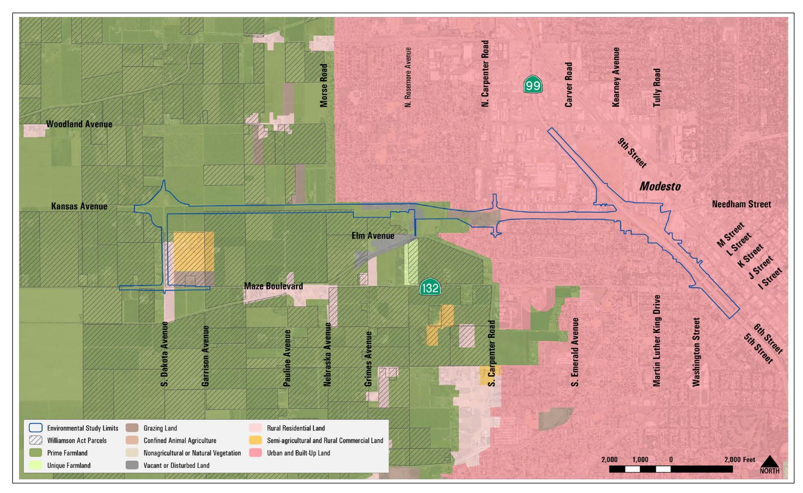

Figure 2-2: California Important Farmlands and Williamson Act Land in the Study Area

Page Intentionally Left Blank

Both build alternatives would impact irrigation ditches at some locations. The build alternatives would also split some existing agricultural operations, which may result in increased access times for farm equipment and livestock. Bisected parcels would be identified during the project's final design, and design features would be incorporated to minimize the impact and maintain access to affected properties.

#### No-Build Alternative

The No-Build Alternative would not result in the construction of any of the proposed improvements and, therefore, would not contribute to direct or indirect impacts related to prime farmland, unique farmland, farmland of statewide or local importance, or Williamson Act contract land.

#### Avoidance, Minimization, and/or Mitigation Measures

Both build alternatives would result in the conversion of 64.8 acres of prime and unique farmland, 3.51 acres of which are encumbered under Williamson Act contracts. This represents a 0.016 percent and 0.0005 percent decrease in County wide totals of prime and unique farmland and Williamson Act contract lands, respectively. Given the total acreage of prime and unique farmlands and Williamson Act contract lands and the farmland impact rating score of 160 for both build alternatives, this is a minimal impact within Stanislaus County.

During construction of the proposed project temporary impacts related to access and irrigation ditches are anticipated. Implementation of the following measures would reduce temporary impacts to farmland, which may occur during construction.

| FARM-1 | The contractor would restrict all construction materials, tools, and vehicles within the right-of-way for the project.                                                                                      |
|--------|-------------------------------------------------------------------------------------------------------------------------------------------------------------------------------------------------------------|
| FARM-2 | The contractor would re-construct irrigation ditches and install irrigation pipelines damaged during construction.                                                                                          |
| FARM-3 | During final design, the California Department of Transportation would coordinate with property owners and agricultural operators to incorporate design features to maintain property access and operation. |

FARM-4 The contractor would compensate for the loss or damage to crops resulting from construction activities.

#### 2.1.4 Community Impacts

#### 2.1.4.1 Community Character and Cohesion

#### Regulatory Setting

NEPA of 1969 as amended established that the federal government use all practicable means to ensure that all Americans have safe, healthful, productive, and aesthetically and culturally pleasing surroundings (42 U.S. Code 4331[b][2]). The Federal Highway Administration in its implementation of NEPA (23 U.S. Code 109[h]) directs that final decisions regarding projects are to be made in the best overall public interest. This requires taking into account adverse environmental impacts, such as destruction or disruption of human-made resources, community cohesion, and the availability of public facilities and services.

Per CEQA, an economic or social change by itself is not considered a significant effect on the environment. But, if a social or economic change is related to a physical change, then social or economic change may be considered in determining whether the physical change is significant. Since the proposed project would result in physical change to the environment, it is appropriate to consider changes to community character and cohesion in assessing the significance of the project's effects.

#### Affected Environment

The following section is based on the *State Route 132 Community Impact Assessment Report*, completed in July 2016. The affected environment of a community is largely based on boundaries, subdivision, demographics (population, housing, income, and economics), and community features, all of which are described further below.

#### Neighborhoods/Community

A community represents a group of people rooted in a defined geographic place and whose daily lives involve contact with and dependencies on other members of the community. Such contact and relationships may be shared at community facilities (schools, common paths of travel, and use of daily shopping and services) or by common social characteristics that help establish formal or informal organizations or activities. Community cohesion is the degree to which residents have a "sense of belonging" to their neighborhood or a strong attachment to neighbors, groups, or institutions, usually as a result of continued association over time. New transportation projects can potentially bisect and disrupt cohesive communities.

During the 1980s, residential development occurred mostly in the eastern portion of the study area, while the western portion contained mostly agricultural properties along existing SR 132 (Maze Boulevard), as it does today. Because the state had already purchased some of the land for a future realignment of SR 132, development to the east took place mostly north of Kansas Avenue where there are two residential neighborhoods from east of Morse Road to North Carpenter Road. Another neighborhood sits to the south along Elm Avenue from east of Shirley Court to SR 99 (the Elm Tract neighborhood). Though other residential developments lie in and near the study area, these three neighborhoods best represent the concept of community.

Based on addresses gathered during the four public information/neighborhood meetings/open houses for the project and data from the U.S. Census, all three neighborhoods have roughly the same number of residents, housing units (most of which are single-family structures), and households with two or more people residing in each unit, all of which can be indicators of community cohesion. Other potential indicators are the number of owner-occupied houses compared to renter-occupied houses, in addition to the number of families and ethnic characteristics of each neighborhood. About two-thirds of the homes within the Elm Tract neighborhood and the neighborhood north of Kansas Avenue and east of North Rosemore Avenue are owner-occupied. This compares to over three-fourths of the homes being owneroccupied in the neighborhood north of Kansas Avenue and west of North Rosemore Avenue. Families (two or more people in a home) make up about four out of every five households in each of the three neighborhoods, and the ethnic characteristic of each neighborhood is approximately the same as the larger study area (see Table 2-7). Based on these indicators, the three neighborhoods provide a framework for a community and a sense of place and commonality for residents. Living in close proximity, neighbors share not only roads and transportation services but also community facilities; they also have a common social character and engage in local activities together.

#### Population and Ethnicity Characteristics

Table 2-7 lists the total population, race, and ethnic characteristics of the study area in comparison to Modesto and Stanislaus County.

Table 2-7: Area Population, Race, and Ethnicity Characteristics

| Demographic                                | Study Area | Modesto | Stanislaus County |
|--------------------------------------------|------------|---------|-------------------|
| Total Population                           | 17,672     | 201,165 | 514,453           |
| White                                      | 55.4%      | 65.0%   | 65.5%             |
| Black or African American                  | 5.8%       | 4.2%    | 2.9%              |
| American Indian and Alaska Native          | 2.3%       | 1.2%    | 1.1%              |
| Asian                                      | 6.2%       | 6.7%    | 5.1%              |
| Native Hawaiian and Other Pacific Islander | 0.9%       | 1.0%    | 0.7%              |
| Some Other Race                            | 22.8%      | 15.5%   | 19.3%             |
| Two or More Races                          | 6.6%       | 6.3%    | 5.4%              |
| Total Minority                             | 44.6%      | 35.0%   | 34.5%             |
| Hispanic or Latino                         | 49.2%      | 35.5%   | 41.9%             |
| Not Hispanic or Latino                     | 50.8%      | 64.5%   | 58.1%             |

*Note*: The 2010 Census asked respondents to identify their race and ethnicity based on their own perception of their racial and ethnic identity. Ethnicity is defined as a population that shares common characteristics such as religion, traditions, culture, language, and/or tribal or national origin. As such, people who identify themselves as Hispanic or Latino can be of any race.

Source: Community Impact Assessment (July 2016)

#### Housing Characteristics

Table 2-8 defines the overall housing characteristics for Stanislaus County and Modesto.

Table 2-8: 2012 Area Housing Characteristics

| Geographic Area   | Number of Housing Units | Vacancy rate | Number of Housing Units Projected in 2023a | % of Single-family Homesb | Median Rent |
|----------------------|----------------------------|-----------------|-----------------------------------------------|---------------------------------|----------------|
| Modesto              | 73,918                     | 7.6%            | 82,711                                        | 72.9%c                          | \$997          |
| Stanislaus County | 179,176                    | 7.4%            | 205,396                                       | 78.6%                           | \$978          |

&lt;sup>a Projected housing units in 2023 are based on the 2014 to 2023 Net New Housing Units calculated by the Department of Housing and Community Development and StanCOG's Housing Needs Assessment.

The California Department of Housing and Community Development administers housing allocations for each region in California as part of a statewide mandate to address housing issues related to future growth. From January 1, 2014 to June 30, 2023, an additional 21,330 housing units would be needed to accommodate projected

&lt;sup>b This percentage includes both attached and detached single-family homes. The remainder of the total includes multi-units, mobile homes, and farm labor/migrant housing units.

&lt;sup>c Per Modesto's draft *Housing Element*, the average home price in Modesto is approximately \$140,000. *Source:* Community Impact Assessment (July 2016)

household growth within Stanislaus County. This represents a 9.6 percent increase in units for Modesto and an 11.9 percent increase in units for Stanislaus County. Stanislaus County anticipates the following housing unit distribution: 5,225 very low-income housing units, 3,350 low-income housing units, 3,670 moderate-income housing units, and 9,085 above moderate-income housing units.

#### Economic, Income, and Business Characteristics

The economy within the project area can be characterized as relating to both agriculture and professional services. While the agricultural industry dominates the unincorporated areas of the project study area, the retail (13.6 percent), education and health care (25.5 percent), manufacturing (10.8 percent), and arts, entertainment, recreation and accommodation and food service (8.8 percent) industries are most prominent in Modesto. Major manufacturing employers in the region include E&J Gallo Winery, Memorial Medical Center, Modesto City Schools, and Seneca Foods. As for other economic indicators, Table 2-9 lists the overall labor force and unemployment rates for the area.

Table 2-9: 2012 Area Economic Characteristics

| Economic Indicator | Modesto       | Stanislaus County |
|--------------------|---------------|-------------------|
| Labor Force        | 95,519        | 242,072           |
| Unemployment       | 14,738 (9.6%) | 37,836 (9.8%)     |

Source: Community Impact Assessment (July 2016)

Table 2-10 presents income information for the project study area, Modesto, and Stanislaus County.

Table 2-10: Area Household Income and Population Below the Poverty Level

| Geographic Area   | Median Household Incomea | Percent of Population Below Poverty Level |
|-------------------|--------------------------|-------------------------------------------|
| Study Area        | \$41,179                 | 23.6%                                     |
| Modesto           | \$49,205                 | 19.5%                                     |
| Stanislaus County | \$49,866                 | 19.2%                                     |

&lt;sup>a Median household income is in 2012 inflation-adjusted dollars.

Source: Community Impact Assessment (July 2016)

Established businesses in the study area are generally east of North Carpenter Road, and many of these businesses depend on freeway and roadway access. Business types are typically retail, including restaurants, automotive, and lodging. One commercial manufacturing business (Foster Farms Dairy) is next to the study area. As noted above, agricultural-related businesses make up most of the economy in the western portion of the study area.

#### Community Facilities

Numerous community facilities (schools, emergency services, and utilities) are sit within a half-mile of the study area. As shown in Figure 2-3, most of these facilities are within Modesto and the eastern portion of the study area. It should be noted that the community impacts study area also included the existing SR 132 (Maze Boulevard) corridor from Dakota Avenue to SR 99.

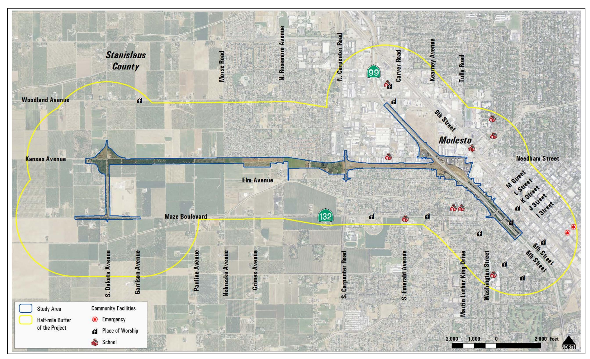

Figure 2-3: Community Services and Facilities in the Study Area

Page Intentionally Left Blank

#### **Environmental Consequences**

#### Neighborhoods/Community Impacts: Build Alternatives

Because it would sit on existing Caltrans right-of-way for most of the new alignment, neither build alternative would bisect the existing subdivisions/neighborhoods within the project study area. While both build alternatives would require the relocation and acquisition of some businesses and residences (see Section 2.1.4.2, Relocations and Real Property Acquisition), displacements and acquisitions would occur on the periphery of the neighborhoods (primarily the Elm Tract neighborhood) and within areas west of SR 99. The relocations would not introduce a geographical gap or division to existing neighborhoods.

Also, neither build alternative would separate local residents from community facilities or prevent access to community services. Local residents and the surrounding community would experience a change in (potentially enhanced) quality of life from increased circulation, congestion relief, and improved operations of the transportation network. This would, in turn, improve access to businesses, residences, and community services and facilities.

#### Neighborhoods/Community Impacts: No-Build Alternative

The No-Build Alternative would not result in the construction of any of the proposed improvements and would not create any new physical barriers to community cohesion that would divide, disrupt, or isolate neighborhoods or residents. Therefore, the No-Build Alternative would not impact community cohesion or local neighborhoods in the study area.

#### Housing Impacts: Build Alternatives

Both build alternatives would result in tenant- and owner-occupied residential relocations and partial acquisitions (see Section 2.1.4.2, Relocations and Real Property Acquisition). Because of the project's urban setting, the acquisition and removal of existing housing would not likely have an effect on the total housing stock in Modesto or its neighborhoods. Both build alternatives may result in a decrease of residential property values where partial acquisitions would occur because of the encroachment of the project's right-of-way, the reduction in property square footage, and/or the increase in traffic noise. Properties next to residences that would be acquired may also have property values affected. However, beneficial impacts to property values would result from less truck traffic on residential streets and congestion relief throughout the study area.

#### Housing Impacts: No-Build Alternative

The No-Build Alternative would not result in the construction of any of the proposed improvements and therefore would not result in additional housing needs or changes in property values other than what may result because of increased traffic congestion and decreased circulation within and near the study area.

#### Economic, Income, and Business Impacts: Build Alternatives

Implementation of either build alternative would improve east-west travel within the study area, which would enhance regional and interregional circulation and highway operations. These improvements would benefit local and regional commerce by providing faster and more efficient transportation of goods and services throughout the region. However, short-term economic and business impacts would occur from business displacements, potential loss of tax revenue, and changes to business access.

Both Alternative 1 and Alternative 2 would displace at least 10 businesses, including a Tuff Shed Business, a governmental agency, several automotive shops and commercial warehouses, a hotel, and a restaurant, all of which are further described in Section 2.1.4.2, Relocations and Real Property Acquisition. Because businesses would be relocated, whether within Modesto or the unincorporated portions of Stanislaus County, impacts to long-term employment are not anticipated.

Businesses in the project study area, both on the east and west sides of SR 99 and along Kansas Avenue, have been established with the existing freeway access ramps in mind. Phase 1 of the project involves construction of a new connection between SR 99 and SR 132 in Modesto just south of the Kansas Avenue overcrossing. The proposed project would require closure of some existing ramps, modification of some existing ramps, and construction of some new ramps, all of which may affect surrounding businesses because of the change in freeway traffic circulation patterns.

Relocation outside the immediate vicinity of the project study area would be considered if replacement property were not available because of zoning or other constraints. A decrease in local and business tax revenue could occur, potentially leading to a loss of revenue from permanent and partial acquisitions of residential and business properties. However, the loss of City or County taxes would be very small in proportion to current tax revenues. Until the relocation decisions are finalized, impacts to tax revenue as a result of businesses relocations cannot be quantified.

Access to businesses in the eastern portion of the study area has been oriented to SR 99 and the existing on- and off-ramps. The two build alternatives would require changing or closing some existing ramps and constructing new ramps. Surrounding businesses would be impacted from the change in freeway traffic circulation patterns. The northern driveway for the Harley Davidson Motorcycle dealership would be closed, but the driveway along North Carpenter Road would remain open. Access to Westamerica Bank on North Carpenter Road may also need to be closed. A design exception may be considered to allow the driveways to remain open or modified to mitigate impacts, but exceptions would not be determined until final design. The changes to existing ramps are necessary to provide acceptable freeway traffic operations and to maintain the local road access to SR 99.

#### Alternative 1

Alternative 1 would realign, lengthen, and raise the Kansas Avenue overcrossing. The build alternative would also remove the existing southbound SR 99 off-ramp to Kansas Avenue and the southbound SR 99 loop on-ramp from Kansas Avenue. Removing the SR 99 off-ramp could affect access for businesses in the vicinity. A new SR 99 access configuration at the Needham Street overcrossing would result in out-of-direction travel for patrons and employees of businesses located nearby. Businesses may also experience a potential reduction in freeway-related traffic.

Because the Kansas Avenue overpass would be replaced, the profile of Kansas Avenue would be raised several feet, which would possibly require driveways close to the bridge to be closed or moved. This could make access to the affected properties more difficult.

#### Alternative 2

Under Alternative 2, the southbound SR 99 off-ramp to Kansas Avenue would remain open, but the northbound SR 99 on- and off-ramps would be closed. Southbound freeway traffic would be affected as the existing southbound SR 99 on-ramp from Kansas Avenue would be changed with an on-ramp to a collector-distributor ramp (a type of road that parallels and connects a freeway's or highway's main travel lanes to a frontage road or on-ramp) that would become 5th Street. From 5th Street, traffic continuing onto southbound SR 99 would have to enter at the H Street on-ramp. Businesses in this location may be impacted if motorists choose to use services with more traditional freeway access rather than the new access.

#### Economic Impacts: No-Build Alternative

The No-Build Alternative would not result in the construction of any of the proposed improvements and therefore would not directly affect the local or regional economy. Indirect and long-term economic effects could result from worsening congestion, loss of mobility, and reduced access to businesses in the project study area. This would likely have an adverse impact on local and regional businesses and the overall economy in the area.

#### Community Facilities Impacts: Build Alternatives

No community facilities would be directly impacted by either build alternative. Access to community services and facilities would be maintained throughout construction. Alternative 1 and Alternative 2 would not adversely affect local residents from accessing community services and would not have any impact on the number of students attending school. Local residents and commuters would benefit from increased mobility and access improvements to businesses, residences, and community services and facilities.

#### Community Facilities Impacts: No-Build Alternative

The No-Build Alternative would not result in the construction of any of the proposed improvements and therefore would not directly impact any community facilities within the project study area.

#### Avoidance, Minimization, and/or Mitigation Measures

Implementation of measures to reduce impacts to housing and businesses is discussed in Section 2.1.4.2, Relocations and Real Property Acquisitions.

#### 2.1.4.2 Relocations and Real Property Acquisition

#### Regulatory Setting

Caltrans' Relocation Assistance Program is based on the Federal Uniform Relocation Assistance and Real Property Acquisition Policies Act of 1970 (as amended) and Title 49 Code of Federal Regulations Part 24. The purpose of the Relocation Assistance Program is to ensure that persons displaced as a result of a transportation project are treated fairly, consistently, and equitably so that such persons would not suffer disproportionate injuries as a result of projects designed for the benefit of the public as a whole. See Appendix D for a summary of the Relocation Assistance Program.

All relocation services and benefits are administered without regard to race, color, national origin, or sex in compliance with Title VI of the Civil Rights Act (42 U.S. Code 2000d, et seq.). See Appendix C for a copy of the Caltrans Title VI Policy Statement.

#### Affected Environment

The following section is based on the *State Route 132 Community Impact Assessment Report* (July 2016) and the *Draft Relocation Impact Report* (September 2014).

Property types found within the project study area (and located within Modesto's city limits) are composed of residential (mostly single-family residences) and commercial properties (e.g., warehouses, restaurants, hotel), with a small number of industrial properties and places of worship. Section 2.1.4.1, Community and Character Cohesion, describes the general family characteristics (minority, ethnic, family, and income levels) of the households being potentially relocated or partially acquired. The area just west of Modesto, which is under Stanislaus County jurisdiction, is mostly agricultural and single-family residential properties. Right-of-way acquisition would affect the Elm Tract neighborhood, businesses and residents northeast of SR 99 and west of North Washington Street, and the area south of Kansas Avenue along the proposed new alignment right-of-way.

#### **Environmental Consequences**

#### **Build Alternatives**

Relocation impacts are among the most sensitive of community-related impacts associated with transportation projects. The relocation of families from neighborhoods, or businesses from their existing locations, affects not only the relocatees, but also those who remain in the affected neighborhood and those who live in the new areas where the relocatees would live. Determination of a partial acquisition versus a full acquisition (a relocation impact) was completed by experienced right-of-way staff after evaluation of proposed project impacts on each parcel in accordance with Caltrans right-of-way manual policies.

Table 2-11 lists the proposed full residential relocations for both build alternatives. A full residential relocation is required when access to the property would be removed by the project or the proximity of the project's structures would encroach on the property's setbacks as determined by Stanislaus County and Modesto.

**Table 2-11: Residential Relocations by Build Alternative** 

| Residential Unit Type                        | Alternative 1 | Alternative 2 |
|----------------------------------------------|---------------|---------------|
| Owner occupants of single-family residences  | 14            | 14            |
| Tenant occupants of single-family residences | 11            | 11            |
| Owner occupants of multi-unit residences     | 2             | 2             |
| Owner occupants of mobile homes              | 0             | 0             |
| Tenant occupants of mobile homes             | 5             | 5             |
| Total Units                                  | 32            | 32            |

Source: Draft Relocation Impact Report (September 2014)

Table 2-12 lists the proposed partial residential acquisitions for both build alternatives. Partial acquisitions result when only a portion of a property may be needed for the project, and that portion would not be enough to close access, encroach on the property's setback, or require relocation.

**Table 2-12: Residential Partial Acquisitions by Build Alternative** 

| Residential Property Type                    | Alternative 1 | Alternative 2 |
|----------------------------------------------|---------------|---------------|
| Owner occupants of single-family residences  | 18            | 17            |
| Tenant occupants of single-family residences | 12            | 13            |
| Owner occupants of multi-unit residences     | -             | -             |
| Owner occupants of mobile homes              | 0             | 0             |
| Tenant occupants of mobile homes             | 0             | 0             |
| Total Properties                             | 30            | 30            |

Source: Draft Relocation Impact Report (September 2014)

Table 2-13 lists the proposed full business relocations for both build alternatives. Similar to residential relocations, a full business relocation is required when access to the property would be removed by the project or the proximity of the project's structures would encroach on the property's setbacks as determined by Stanislaus County and Modesto.

**Table 2-13: Business Relocations by Build Alternative** 

| Business Type         | Alternative 1 | Alternative 2 |
|-----------------------|---------------|---------------|
| Construction          | 0             | 0             |
| Manufacturing         | 1             | 1             |
| Retail                | 0             | 0             |
| Commercial/Industrial | 3             | 3             |
| Government            | 1             | 1             |
| Service               | 6             | 5             |
| Agriculture (Farms)   | 0             | 0             |
| Vacant                | 0             | 0             |
| Total                 | 11            | 10            |

Source: Draft Relocation Impact Report (September 2014)

Table 2-14 lists the proposed partial business acquisitions for both build alternatives. Similar to partial residential acquisitions, a partial business acquisition results when only a portion of a property may be needed for the project, and that portion would not be enough to close access or encroach on the property's setback.

Table 2-14: Business Partial Acquisitions by Build Alternative

| Business Type         | Alternative 1 | Alternative 2 |
|-----------------------|---------------|---------------|
| Construction          | 0             | 0             |
| Manufacturing         | 0             | 1             |
| Retail                | 3             | 3             |
| Commercial/Industrial | 6             | 5             |
| Government            | 3             | 5             |
| Service               | 6             | 9             |
| Agriculture (Farms)   | 5             | 4             |
| Vacant                | 1             | 1             |
| Total                 | 24            | 28            |

Source: Draft Relocation Impact Report (September 2014)

Concerning business relocations or acquisitions, there are numerous warehouse facilities available for rent and purchase in the greater Modesto area. But, auto body and auto repair shops may have a more difficult time finding sites for relocation because very few sites are currently listed for sale or rent in the Modesto area. Finding an appropriate relocation site for the City of Modesto storage/maintenance

facilities may also be difficult because no similar types of properties are for sale or lease in Modesto.

Because of the current real estate market, purchasing a replacement business site may be more difficult for owners that purchased property during the height of the market. For business tenants, increased rental rates may also be a hardship for businesses that have been in the same location for many years paying below-market rental rates. If the businesses are relocated far from the displacement site, employees may need to relocate with the business or find new employment.

The extent of these impacts cannot be determined at this time, but would be given due consideration once relocations are finalized. Once a preferred alternative is selected, an interview process with each of the business owners would be initiated to determine the type of business and occupancy, the size of the business, and the extent of the impacts on the business.

The proposed project would impact the housing stock in the project area. Both Alternative 1 and Alternative 2 would eliminate residential units in the study area. While this may negatively affect the housing stock in the immediate project area, there are available homes for rent in the City of Modesto outside the project area. Because many residential tenants may be required to relocate outside the study area, comparability, in terms of amenities and public utilities would need to be evaluated on an individual basis during the relocation process. While finding suitable replacement housing in the immediate area may pose a problem, rentals and homes for sales in the surrounding area are available. Relocations during Phase 1 would primarily occur along SR 132 and the remaining relocations would occur during Phase 2.

#### No-Build Alternative

The No-Build Alternative would not result in the construction of any of the proposed improvements and therefore would not result in any impacts caused by residential or business relocations or partial acquisitions.

#### Avoidance, Minimization, and/or Mitigation Measures

Implementation of the following measures would reduce impacts caused by relocations and partial acquisitions:

CI-1 For any person(s) whose real property interests may be impacted by the project, the acquisition of those property interests would comply fully with the

Uniform Relocation Assistance and Real Property Acquisition Policies Act of 1970, as amended. The act is a federally mandated program that applies to all acquisitions of real property or displacements of persons resulting from federal or federally assisted programs or projects. It was created to provide for and ensure the fair and equitable treatment of all such persons (see Appendix D).

Also, the Fifth Amendment of the U.S. Constitution provides that private property may not be taken for a public use without payment of "just compensation." All impacted owners would be provided notification of the acquiring agency's intent to acquire an interest in their property, including a written offer letter of just compensation specifically describing those property interests. A right-of-way specialist would be assigned to each property owner to assist them with this process.

- CI-2 All impacted owners would be provided notification of the acquiring agency's intent to acquire an interest in their property, including a written offer letter of just compensation specifically describing those property interests. A right-of-way specialist would be assigned to each property owner to assist them with this process.
- CI-3 Caltrans would be responsible for assisting with relocations for individuals and businesses that are undergoing a difficult transition, consistent with the requirements of the Uniform Relocation Assistance and Real Property Acquisition Policies Act of 1970. Measures would be taken to ensure that nearby adequate, comparable housing for all displaced residents would be utilized before looking beyond the existing neighborhood.
- CI-4 The Project Engineer would ensure that design refinements are incorporated in the process to minimize impacts to existing land uses related to the temporary use and/or permanent acquisition of property.
- CI-5 Prior to and during construction, the Project Engineer would ensure that the design refinements to minimize impacts to existing land uses related to temporary use and/or permanent acquisition of property are properly implemented by the contractor.

#### 2.1.4.3 Environmental Justice

#### Regulatory Setting

All projects involving a federal action (funding, permit, or land) must comply with Executive Order 12898, *Federal Actions to Address Environmental Justice in Minority Populations and Low-Income Populations*, signed by President Bill Clinton on February 11, 1994. This order directs federal agencies to take the appropriate and necessary steps to identify and address disproportionately high and adverse effects of federal projects on the health or environment of minority and low-income populations to the greatest extent practicable and permitted by law. Low income is defined based on the Department of Health and Human Services poverty guidelines. For 2012, the low-income threshold for Stanislaus County was \$19,090.

All considerations under Title VI of the Civil Rights Act of 1964 and related statutes have also been included in this project. Caltrans' commitment to upholding the mandates of Title VI is evidenced by its Title VI Policy Statement, signed by the Director, which can be found in Appendix C of this document.

#### Affected Environment

The following section is based on the State Route 132 *Community Impact Assessment Report*, which was completed in July 2016and the Draft Relocation Impact Report (September 2014).

The environmental justice analysis was conducted using 1) demographic data from the 2010 Census (at the census tract and block levels), 2) the 2008 to 2012 American Community Survey 5-year estimates (at the census tract level), and 3) general observations of the community. As listed in Table 2-15 and shown in Figure 2-4, the project study area consists of mostly minority and low-income populations. Table 2-16 present the population, race, and ethnicity characteristics in the study area. Table 2-17 presents the household income and the population below poverty for the study area, City of Modesto, and Stanislaus County.

**Table 2-15: Area Minority and Poverty Status** 

| Geographic Area   | Total % of Minority Populationa | Percent of Population Below Poverty Level |
|-------------------|---------------------------------|-------------------------------------------|
| Study Area        | 44.6%                           | 23.6%                                     |
| City of Modesto   | 35.0%                           | 19.5%                                     |
| Stanislaus County | 34.5%                           | 19.2%                                     |

&lt;sup>a Does not include Hispanic or Latino origin. People who identify themselves as Hispanic can be of any race.

Source: Community Impact Assessment (July 2016)

Table 2-16: Area Population, Race, and Ethnicity Characteristics

| Demographic                                | Study Area | Modesto | Stanislaus County |
|--------------------------------------------|------------|---------|-------------------|
| Total Population                           | 17,672     | 201,165 | 514,453           |
| White                                      | 55.4%      | 65.0%   | 65.5%             |
| Black or African American                  | 5.8%       | 4.2%    | 2.9%              |
| American Indian and Alaska Native          | 2.3%       | 1.2%    | 1.1%              |
| Asian                                      | 6.2%       | 6.7%    | 5.1%              |
| Native Hawaiian and Other Pacific Islander | 0.9%       | 1.0%    | 0.7%              |
| Some Other Race                            | 22.8%      | 15.5%   | 19.3%             |
| Two or More Races                          | 6.6%       | 6.3%    | 5.4%              |
| Total Minority                             | 44.6%      | 34.9%   | 34.5%             |
| Hispanic or Latino                         | 49.2%      | 35.5%   | 41.9%             |
| Not Hispanic or Latino                     | 50.8%      | 64.5%   | 58.1%             |

Note: The 2010 Census asked respondent to identify their race and ethnicity based on their own perception of their racial and ethnic identity. Ethnicity is defined as a population that shares common characteristics such as religion, traditions, culture, language, and/or tribal or national origin. As such, people who identify themselves as Hispanic or Latino can be of any race.

Table 2-17: Household Income and Population Below the Poverty Level for the Study Area, City of Modeso and Stanislaus County

| Geographic Area   | Median Household Incomea | Percent of Population Below Poverty Level |
|-------------------|--------------------------|----------------------------------------------|
| Study Area        | \$41,179                 | 23.6%                                        |
| City of Modesto   | \$49,205                 | 19.5%                                        |
| Stanislaus County | \$49,866                 | 19.2%                                        |

Source: U.S. Census 2012c.

&lt;sup>a Median household income is in 2012 inflation-adjusted dollars.

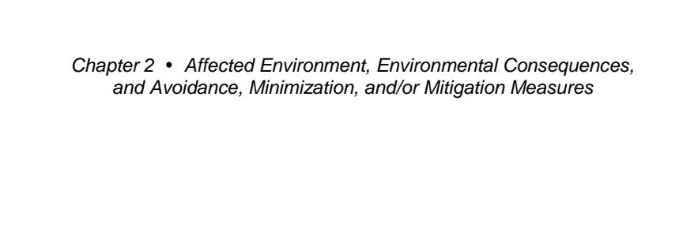

Page Intentionally Left Blank

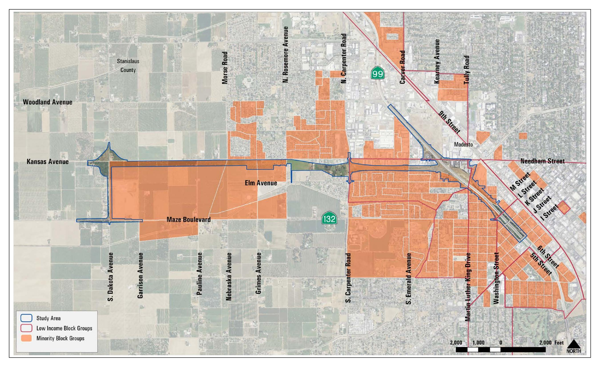

Figure 2-4: Minority and Low-income Populations within the Study Area

Page Intentionally Left Blank

Most of the census blocks with minority populations are concentrated south of Kansas Avenue and west of SR 99, mostly in the Elm Tract neighborhood. Smaller clusters of minority populations sit north of Kansas Avenue between North Rosemore Avenue and North Carpenter Road, as well as in the census blocks south of Kansas Avenue between North Dakota Avenue and Morse Road. There are no relocations or acquisitions proposed in these two areas. A large area of low-income populations exists between North Carpenter Road and SR 99, north and south of the Caltrans right-of-way for the proposed new alignment. While the proposed project study area is representative of the overall San Joaquin Valley, the study area has a meaningfully greater percentage of minority and low-income populations when compared to Stanislaus County and the City of Modesto.

#### **Environmental Consequences**

The environmental justice analysis evaluated both build alternatives to determine whether there is a potential for disproportionately high and adverse impacts to minority or low-income populations when compared to populations that are not minority or low-income. A disproportionate impact is defined by the Federal Highway Administration as one that is:

- Predominantly borne by a minority and/or low-income population, or
- Suffered by the minority and/or low-income population and is appreciably more severe or greater in magnitude than the adverse effect that would be suffered by the non-minority/non-low-income population

Both negative and beneficial impacts common to Alternatives 1 and 2, as well as impacts specific to each alternative, have been evaluated and are described below.

#### **Build Alternatives**

Both build alternatives would provide benefits for the overall community and for minority and low-income populations by improving regional and interregional circulation, relieving congestion, and enhancing traffic operations within the study area. However, prior to the implementation of avoidance, minimization and mitigation measures, both build alternatives would cause disproportionately high and adverse effects on any minority or low-income populations per Executive Order 12898 regarding environmental justice, as described in the sections below.

#### Noise

While noise impacts are anticipated to occur throughout the project study area as a result of either of the build alternatives, most noise impacts would affect receivers (locations representing land uses where frequent human activity occurs, such as residences) located in the areas next to SR 99 and north of Elm Avenue, where minority and low-income populations reside. Most noise impacted receivers for both Alternative 1 and Alternative 2 are in the area on the south side of the project, east of North Carpenter Road, west of SR 99, and north of L Street. (Section 2.2.7, Noise, further explains noise impacts caused by the build alternatives.) As a result, noise impacts in these residential areas would be borne mostly by environmental justice populations and therefore are considered a disproportionate adverse impact on minority and low-income populations.

#### Visual

The proposed new highway configuration for SR 99, the retaining walls, and the noise barriers associated with both build alternatives would generally not result in substantial or permanent visual impacts to most of the study area. In fact, adverse visual impacts to agricultural areas would not occur, and improvements would occur in industrial areas (see Section 2.1.7, Visual/Aesthetics for further details on visual impacts caused by the build alternatives). However, the two build alternatives would result in substantial permanent visual changes to residential areas, specifically near the SR 132/SR 99 connection and the Elm Tract neighborhood, a neighborhood that has mostly low-income and minority populations.

Under Alternative 1, visual degradation to some residential areas would be slightly higher than under Alternative 2 because the noise barriers would be closer to existing residences and because more homes would be removed. Under Alternative 2, visual impacts would be comparably less because of the location of the noise barriers. Alternative 2 would have greater impacts to existing trees outside Modesto, and both build alternatives would impact the same number of street trees within Modesto.

As a result, visual impacts to residents would be borne mostly by environmental justice populations and therefore are considered a disproportionate adverse impact on minority and low-income populations.

#### Relocations/Acquisitions

Residential and business relocations and partial acquisitions would also occur as a result of both build alternatives. Most impacts would be borne mostly by environmental justice populations and therefore are considered a disproportionate adverse impact on minority and low-income populations.

#### Construction

Temporary detours, out-of-direction travel, construction dust, equipment emissions, and construction-related noise would affect residents and businesses throughout the study area as described in Section 2.2.6, Air Quality, and 2.2.7, Noise, of this document. Because most construction would occur in environmental justice communities, construction-related impacts would be borne mostly by environmental justice populations and therefore are considered a disproportionate adverse impact on minority and low-income populations.

#### No-Build Alternative

Traffic congestion would worsen throughout the study area, limiting access to housing, businesses, and community facilities for both minority and low-income populations, as well as for the general public. While there would be no displacement of minority or low-income residents, businesses, or employees, both minority and low-income populations would be impacted by increased congestion and degrading traffic conditions throughout the study area. The community would not experience the benefits of improved circulation, reduced congestion, and enhanced operations. Benefits not realized under the No-Build Alternative would be borne mostly by environmental justice populations and therefore are considered a disproportionate adverse impact on minority and low-income populations.

#### Avoidance, Minimization, and/or Mitigation Measures

Implementation of the following measures would reduce the adverse noise, visual, relocation, and construction impacts borne by minority and low-income populations to levels equal to that of the general population.

#### Noise

Section 2.2.7, Noise, presents the noise abatement measures for both build alternatives. With implementation of these measures, noise impacts would not result in disproportionate adverse impacts on minority and low-income populations.

#### Visual

Implementing measures VA-1 through VA-8 in Section 2.1.7, Visual/Aesthetics, would reduce disproportionate adverse impacts on minority and low-income populations. However, with the measures implemented, minority and low-income communities (especially residents in the Elm Tract neighborhood) would still experience substantial permanent visual impacts and temporary construction-related impacts because of their proximity to the project. The substantial permanent visual impacts in the residential areas would be borne mostly by an environmental justice population and therefore are considered a disproportionate adverse impact on minority and low-income populations.

#### Relocations

Implementing measures CI-1through CI-5 in Section 2.1.4.2, Relocations and Real Property Acquisition, would reduce disproportionate adverse impacts on minority and low-income populations. After these measures are implemented, relocation impacts would not result in disproportionate adverse impacts on minority and low-income populations.

#### Construction

The implementation of standard best management practices, as described in Section 2.2.6, Air Quality, Section 2.2.7, Noise, and Section 2.1.6, Traffic and Transportation/Pedestrian and Bicycle Facilities, would reduce disproportionate adverse impacts on minority and low-income populations. With the implementation of measures CI-1 through CI-5, the build alternatives would not cause disproportionately high and adverse effects on any minority or low-income populations per Executive Order 12898 regarding environmental justice.

#### 2.1.5 Utilities/Emergency Services

#### Affected Environment

The following section is based on the *State Route 132 Community Impact Assessment Report*, completed in July 2016.

#### **Utilities**

Utilities within the study area include but are not limited to aboveground power and telephone lines, underground gas lines, and underground fiber optic communication cables. The major utility providers in the area are Bay Area Water Supply Conservation Agency, Pacific Gas and Electric, the Modesto Irrigation District, the City of Modesto, and various private cable and television providers (Comcast, Sprint,

Level 3, and AT&T/Pacific Bell communications). Table 2-18 lists the major utilities within the project study area.

Table 2-18: Major Utilities within the Study Area

| Type               | Location                                                                                                                              |
|--------------------|---------------------------------------------------------------------------------------------------------------------------------------|
| Overhead Electric  | Existing SR 132 (Maze Boulevard) near Dakota Avenue                                                                                   |
|                    | Kansas Avenue between North Dakota Avenue and 9th Street                                                                              |
|                    | East of North Carpenter Road                                                                                                          |
|                    | North Emerald Avenue                                                                                                                  |
|                    | Near the intersection of North Franklin Street and Beech Street                                                                       |
|                    | Near SR 99 and Elm Avenue                                                                                                             |
| Overhead Telephone | South of K Street and the intersection of SR 99                                                                                       |
|                    | North Dakota Avenue between existing SR 132 (Maze Boulevard) and Kansas Avenue                                                        |
|                    | Kansas Avenue between North Dakota Avenue and 9th Street                                                                              |
|                    | North Emerald Avenue                                                                                                                  |
| Water              | Southwest of SR 99 between Linden Street and South Washington Street                                                                  |
|                    | Southwest of SR 99 between Laurel Avenue and L Street                                                                                 |
|                    | Underground line west of North Dakota Avenue between existing SR 132 (Maze Boulevard) and Kansas Avenue                               |
|                    | Underground line south of Kansas Avenue near the intersection of Kansas Avenue and Morse Road                                         |
|                    | Underground line within new alignment right-of-way (vacant land) south of Kansas Avenue between North Carpenter Road and Custer Court |
|                    | Underground line along North Carpenter Road between Kansas Avenue and Elm Avenue                                                      |
|                    | Underground line along North Emerald Avenue                                                                                           |
| Natural Gas        | Underground line within new alignment right-of-way (vacant land) south of Kansas Avenue between Bennett Avenue and SR 99              |
|                    | Underground line along Kansas Avenue between North Carpenter Road and North Franklin Street                                           |
|                    | Underground line northeast of Graphics Road, north of Kansas Avenue                                                                   |
|                    | Aboveground water canal near SR 99 and Elm Avenue                                                                                     |
| Sewer              | Underground line along North Jefferson Street near the intersection of North Jefferson Street and SR 99                               |
|                    | Underground line southwest of SR 99 between Linden Street and South Washington Street                                                 |
|                    | Underground main along L Street over SR 99                                                                                            |
|                    | Underground line along Kansas Avenue between Altamont Court and 9th Street                                                            |
|                    | Underground line along North Emerald Avenue                                                                                           |
| Sewer              | Underground line along Kansas Avenue between Altamont Court and North Rosemore Avenue                                                 |
|                    | Underground line along North Emerald Avenue                                                                                           |
|                    | Underground line near the intersection of North Jefferson Street and SR 99                                                            |
|                    | Underground line west of SR 99 near Linden Street                                                                                     |
| Sewer              | Underground line along the west side of SR 99 near the intersection of Laurel Avenue and SR 99                                        |
|                    | Underground line along the east side of SR 99 between Laurel Street and North Washington Street                                       |

Source: Community Impact Assessment (July 2016)

#### **Emergency Services**

Portions of the study area within Modesto are protected by the Modesto Fire Department, which has 11 fire stations throughout the Modesto area. Fire Station No. 1, about half a mile from the project study area at 610 11th Street, provides fire and emergency service for the study area. The portions of the study area outside Modesto are protected by the Woodland Avenue Fire Protection District, which has a station at 3300 Woodland Avenue, about a quarter-mile north of the study area.

Police services for Modesto are provided by the Modesto Police Department, which has a station at 600 10th Street, about half a mile from the study area. Beyond Modesto city limits, police services are provided by the Stanislaus County Sheriff's Department. The California Highway Patrol also has jurisdiction over the state routes (SR 132 and SR 99) within the study area.

Emergency medical services are provided by Mountain-Valley Emergency Services and American Medical Response within the study area.

#### **Environmental Consequences**

#### Build Alternatives

Both build alternatives would result in construction-related impacts to utilities within the project study area. However, no long-term utility impacts would occur. All construction-related impacts (potential service disruptions) would be temporary in nature, and no utility services to the community would be permanently affected. Utilities impacted by either build alternative would be abandoned in place, protected in place, or relocated. Based on the current project design, the following impacts would likely occur, but these impacts are subject to change based on final design.

The following utilities would be abandoned:

- Sewer lines along Laurel Avenue west of SR 99 and within an industrial subdivision east of SR 99 near an alley south of Laurel Street
- Water lines near the intersection of Franklin Street and Beech Street, as well as the water lines east of SR 99 near Elm
- Sewer lines along North Emerald Avenue at the intersection of North Emerald Avenue and the study area (south of Kansas Avenue), in addition to sewer lines along North Jefferson Street at the intersection with SR 99
- Water line along L Street over SR 99

Relocation of the following utilities would be required:

- Natural gas lines along North Rosemore Avenue and Kansas Avenue near the intersection of Kansas Avenue and SR 99
- Sewer lines along SR 99 near Linden Street and Laurel Street, as well as along Kansas Avenue at the intersection with SR 99
- Water lines along North Carpenter Road and North Jefferson Street within the study area and along Kansas Avenue at the intersection of Kansas Avenue and SR 99
- All overhead power and communication lines within the study area
- All underground phone lines within the study area

While the proposed project would not create long-term access impacts for emergency vehicles, temporary, construction-related impacts would include use of local roads by construction vehicles, lane closures, and detours. The exact location and impacts of potential use of local roads, lane closures, and detours would be determined during final design of the project. Temporary impacts to emergency services would be the same for both build alternatives. As described in Section 2.1.6, Traffic and Transportation/Pedestrian and Bicycle Facilities, implementation of a traffic management plan would include advance notification for emergency service personnel of any expected delay or detour thereby minimizing temporary, construction-related impacts to emergency service providers. Despite the short-term nature of the impacts, emergency service providers (and the traveling public) would benefit from the project through increased mobility, reduced congestion, and improved access to businesses, residences, and community facilities and services.

All impacted owners and tenants would be provided notification prior to temporary interruption of utilities during Project construction.

#### No-Build Alternative

The No-Build Alternative would not result in the construction of any of the proposed improvements and, therefore, would not require any utility relocations or abandonments. Emergency service response times may increase because of increased traffic congestion that would occur under the No-Build Alternative.

#### Avoidance, Minimization, and/or Mitigation Measures

Neither build alternative would result in long-term impacts to utilities and emergency services.

#### 2.1.6 Traffic and Transportation/Pedestrian and Bicycle Facilities

#### Regulatory Setting

Caltrans, as assigned by the Federal Highway Administration, directs that full consideration should be given to the safe accommodation of pedestrians and bicyclists during the development of federal-aid highway projects (23 Code of Federal Regulations 652). It further directs that the special needs of the elderly and the disabled must be considered in all federal-aid projects that include pedestrian facilities. When current or anticipated pedestrian and/or bicycle traffic presents a potential conflict with motor vehicle traffic, every effort must be made to minimize the detrimental effects on all highway users who share the facility.

In July 1999, the U.S. Department of Transportation issued an Accessibility Policy Statement pledging a fully accessible multimodal transportation system. Accessibility in federally assisted programs is governed by U.S. Department of Transportation regulations (49 Code of Federal Regulations Part 27) implementing Section 504 of the Rehabilitation Act (29 U.S. Code 794). The Federal Highway Administration has enacted regulations for the implementation of the 1990 Americans with Disabilities Act, including a commitment to build transportation facilities that provide equal access for all persons. These regulations require application of the Americans with Disabilities Act requirements to federal-aid projects, including Transportation Enhancement Activities.

#### Affected Environment

The following section is based on the *Final Traffic Operations Analysis Report: State Route 132 West Freeway/Expressway PA/ED* (completed in July 2012), the *Final State Route 132 West Freeway/Expressway Traffic Analysis Addendum to Reflect SPUI Design at SR 132/Carpenter Road Interchange* (completed in March 2014), and the *Design Year 2048-Southbound State Route 99/I Street Off-Ramp Relocation Operation Analysis* (completed in August 2015).

The proposed project study area for the traffic analysis extends along existing SR 132 (Maze Boulevard) from SR 99 to Dakota Avenue and along SR 99 from West Briggsmore Avenue to Tuolumne Boulevard in Modesto. (Figure 1-4 shows all four

roadways in relationship to the project's location.) The study area also includes local street intersections on both the west and east sides of SR 99 within the vicinity of the project. The traffic analysis evaluated existing and future conditions with and without the project. Existing conditions represent the year 2009. Future conditions were projected for the years 2020 (Phase 1), 2028 (Phase 2), and 2048 (the design year). The No-Build Alternative is the baseline for comparing environmental impacts; the baseline represents future year (2020, 2028, and 2048) conditions if the project were not built.

As described in the *Final Traffic Operations Analysis Report*, traffic volume forecasts for the new SR 132 freeway/expressway and existing SR 132 (Maze Boulevard) were based on the StanCOG Travel Demand Model. The model was updated to account for changes in land use and the roadway network to reflect year 2009 conditions. Model demand volumes were adjusted to account for differences between base year model volumes and traffic counts conducted for this project.

#### Existing and Future Year No-Build Traffic Conditions

Four of the best indicators of existing (2009) conditions and predictors for future conditions are traffic volumes, travel times, travel speeds, and level of service along the various roadway/highway segments in the project study area. Comparison of each dataset not only establishes current traffic conditions, but it allows for a more robust evaluation of environmental consequences with and without the project.

Table 2-19 lists average daily traffic volumes and morning (AM peak period, 7:00 a.m. to 9:00 a.m.) and evening (PM peak period, 4:00 p.m. to 6:00 p.m.) peak hour volumes for the existing SR 132 (Maze Boulevard) under current and future No-Build Alternative conditions. The data in the following table are based on regional projections of land use growth and reflect future travel demand that would be expected on the existing highway if the project were not built.

Table 2-19: Existing and Future No-Build Traffic Volumes along Existing SR 132 (Maze Boulevard)

| Location                                                                                        | Existing (2009) |     |       | Future No-Build (2020) |     |       | Future No-Build (2028) |       |       | Future No-Build (2048) |       |       |
|-------------------------------------------------------------------------------------------------|-----------------|-----|-------|------------------------|-----|-------|------------------------|-------|-------|------------------------|-------|-------|
|                                                                                                 | ADT             | AMa | PMa   | ADT                    | AMa | PMa   | ADT                    | AMa   | PMa   | ADT                    | AMa   | PMa   |
| Existing SR 132/ Maze Boulevard between Grimes Avenue and Carpenter Road            | 11,500          | 696 | 949   | 15,200                 | 960 | 1,210 | 17,700                 | 1,230 | 1,300 | 19,700                 | 1,930 | 1,900 |
| Existing SR 132/ Maze Boulevard between Carpenter Road and Emerald Avenue        | 10,230          | 523 | 896   | 14,500                 | 740 | 1,170 | 17,000                 | 940   | 1,370 | 18,800                 | 1,620 | 1,890 |
| Existing SR 132/ Maze Boulevard between Emerald Avenue and Martin Luther King Drive | 12,400          | 749 | 1,091 | 15,400                 | 970 | 1,340 | 17,700                 | 1,120 | 1,480 | 18,400                 | 1,710 | 2,000 |

&lt;sup>a Peak hours represent the greatest number of vehicles using a roadway or highway in one hour during the morning peak period (7:00 a.m. to 9:00 a.m.) and evening peak period (4:00 p.m. to 6:00 p.m.). The peak of traffic usually occurs when most commuters are traveling to and from work.

Notes: Trucks represent 21 percent, 22 percent, and 14 percent of the daily morning and evening peak hour volumes, respectively, for each segment. ADT = average daily traffic. The traffic analysis for Future No-Build and Phase 1 assumed an opening year of 2018, but that is now projected to be 2020. *Source:* Final Traffic Operations Analysis Report (July 2012)

As listed in Table 2-20, travel time, which represents minutes of driving time, and travel speed, shown in miles per hour, are two sets of data that compare and predict performance on existing SR 132 (Maze Boulevard). Slower travel times and speeds often indicate greater congestion and worsening traffic conditions.

Table 2-20: Existing and Future No-Build Travel Times and Speeds along Existing SR 132 (Maze Boulevard)

| Location                                                                 | Existing (2009)         |                         | Future No-Build (2020)  |                         | Future No-Build (2028)  |                         | Future No-Build (2048)   |                        |
|--------------------------------------------------------------------------|-------------------------|-------------------------|-------------------------|-------------------------|-------------------------|-------------------------|--------------------------|------------------------|
|                                                                          | AM                      | PM                      | AM                      | PM                      | AM                      | PM                      | AM                       | PM                     |
| Eastbound SR 132 between Dakota Avenue and SR 99 (3.3 miles) | 6.2 mins. (32.2 mph) | 6.0 mins. (33.0 mph) | 6.2 mins. (32.2 mph) | 6.7 mins. (29.6 mph) | 6.4 mins. (31.2 mph) | 7.1 mins. (28.0 mph) | 7.0 mins. (28.4 mph)  | 9.6 mins (20.7 mph) |
| Westbound SR 132 between SR 99 and Dakota Avenue (3.3 miles) | 6.4 mins. (30.8 mph) | 5.9 mins. (33.4 mph) | 7.1 mins. (28.0 mph) | 6.7 mins. (29.9 mph) | 7.9 mins. (25.2 mph) | 6.8 mins. (29.2 mph) | 10.6 mins. (18.7 mph) | 7.7 mins (26.0 mph) |

Notes: Data presented includes travel time in minutes (and average speed in mph). mins. = minutes; mph = miles per hour. The traffic analysis for Future No-Build and Phase 1 assumed an opening year of 2018, but that is now projected to be 2020. *Source:* Final Traffic Operations Analysis Report (July 2012)

Level of service is a measure of traffic operating conditions that vary from level of service A (indicating free-flow traffic conditions with little or no delay) to level of service F (representing over-saturated conditions where traffic flow exceeds design capacity resulting in long queues and delays) (see Figure 1-3 for level of service of the two-lane highway). The level of service classifications represent driver perception and are an indication of comfort and convenience associated with driving.

According to Modesto's General Plan, in addition to Caltrans and Federal Highway Administration standards, the goal level of service rating for a highway/local roadway similar to existing SR 132 (Maze Boulevard) is D. Table 2-21 shows current and projected level of service ratings for a number of segments along the existing highway, as well as for applicable intersections in the area.

Existing SR 132 (Maze Boulevard) currently operates at an acceptable level of service D or better between Dakota Avenue and SR 99, but is anticipated to deteriorate to unacceptable levels in the future. All of the study intersections along the existing highway currently operate at an acceptable level of service C or better. But, traffic operations would degrade over time so that, by 2028, the intersection of the existing highway and Carpenter Road would operate at level F, an unacceptable service level, and, by 2048, the intersections of the existing highway with Rosemore Avenue, Carpenter Road, and Emerald Avenue would operate at unacceptable service level F.

A total of 30 intersections were evaluated for the proposed project, including six intersections along existing SR 132 (Maze Boulevard). Only one study intersection not along the existing highway currently operates at unacceptable levels. The intersection of Briggsmore Avenue/SR 99 southbound ramps is not represented in Table 2-21, but is included in the *Final Traffic Operations Analysis Report*. Traffic operations at the other study intersections are anticipated to degrade as traffic volumes increase so that, by 2020, there would be four intersections in the study area as a whole operating at unacceptable service levels. By 2028, there would be six intersections operating at unacceptable service levels and, by 2048, there would be 12 intersections operating at unacceptable service levels under future no-build conditions.

Table 2-21: Existing and Future No-Build Level of Service along Existing SR 132 (Maze Boulevard) and at Intersections in the Study Area

| Location                                                       | Existing (2009) LOS |    | Future No-Build (2020) LOS |    | Future No-Build (2028) LOS |    | Future No-Build (2048) LOS |    |
|----------------------------------------------------------------|---------------------|----|----------------------------|----|----------------------------|----|----------------------------|----|
|                                                                | AM                  | PM | AM                         | PM | AM                         | PM | AM                         | PM |
| Existing SR 132 (Maze Boulevard) Highway/Roadway Segmentsa     |                     |    |                            |    |                            |    |                            |    |
| Eastbound between SR 99 and Emerald Avenue                     | B                   | B  | B                          | C  | B                          | C  | B                          | C  |
| Westbound between SR 99 and Emerald Avenue                     | B                   | B  | B                          | B  | B                          | B  | C                          | B  |
| Eastbound between Emerald Avenue and Carpenter Road            | B                   | B  | B                          | C  | B                          | C  | C                          | F  |
| Westbound between Emerald Avenue and Carpenter Road            | D                   | C  | E                          | D  | F                          | D  | F                          | D  |
| Between Carpenter Road and Dakota Avenue                       | D                   | D  | D                          | D  | E                          | E  | E                          | E  |
| West of Dakota Avenue                                          | C                   | D  | D                          | D  | D                          | E  | E                          | E  |
| Area Intersections                                             |                     |    |                            |    |                            |    |                            |    |
| Existing 132 (Maze Boulevard) and Dakota Avenue                | A                   | A  | A                          | B  | A                          | C  | B                          | D  |
| Existing 132 (Maze Boulevard) and Rosemore Avenue              | A                   | A  | A                          | B  | B                          | C  | F                          | F  |
| Existing 132 (Maze Boulevard) and Carpenter Road               | C                   | C  | D                          | D  | F                          | F  | F                          | F  |
| Existing 132 (Maze Boulevard) and Emerald Avenue               | B                   | B  | B                          | C  | B                          | C  | F                          | F  |
| Existing 132 (Maze Boulevard) and Martin Luther King Jr. Drive | B                   | C  | B                          | D  | B                          | D  | C                          | D  |
| Existing 132 (Maze Boulevard) and southbound SR 99 off-ramp    | B                   | B  | C                          | B  | C                          | B  | D                          | C  |

&lt;sup>a Existing SR 132 (Maze Boulevard) was analyzed using both the Highway Capacity Manual's urban street level of service methodology and two-lane highway level of service methodology because the highway is considered an urban roadway on its eastern end and a two-lane highway on its western end. Also see Figure 1-3 for a graphic representation of level of service.

Notes: Results in bold indicate unacceptable operations. The years represented in the table match the years for Phase 1 (2020), Phase 2 (2028), and the design year (2048). LOS = level of service. The traffic analysis for Future No-Build and Phase 1 assumed an opening year of 2018, but that is now projected to be 2020.

Source: Final Traffic Operations Analysis Report (July 2012)

Table 2-22 presents the existing and future no-build, peak hour level of service and peak period vehicle hours of delay on SR 99 in the study area. Under existing conditions, SR 99 operates at level of service D or better, except in the southbound direction during the evening peak hour, where some segments operate at level of service E or F. Traffic operations on SR 99 would degrade as traffic volumes increase

so that, by 2028, most of the segments on SR 99 would operate at a level of service E or F during the morning and evening peak hours. By 2048, most of the study segments would operate at level of service F during the morning and evening peak hours. Vehicle delay is also anticipated to increase over time as traffic congestion on SR 99 worsens because of regional and local traffic increases.

Table 2-22: Existing and Future No-Build Peak Hour Level of Service and Peak Period Vehicle Hours of Delay along SR 99 in the Study Area

| Location                                                 | Existing (2009) LOS |    | Future No-Build (2020) LOS |     | Future No-Build (2028) LOS |       | Future No-Build (2048) LOS |       |  |
|----------------------------------------------------------|---------------------|----|----------------------------|-----|----------------------------|-------|----------------------------|-------|--|
|                                                          | AM                  | PM | AM                         | PM  | AM                         | PM    | AM                         | PM    |  |
| Traveling Northbound SR 99                               |                     |    |                            |     |                            |       |                            |       |  |
| Tuolumne Boulevard on-ramp to 6th Street off-ramp        | D                   | C  | D                          | F   | F                          | F     | F                          | F     |  |
| 6th Street off-ramp to I Street on-ramp                  | D                   | C  | D                          | F   | F                          | F     | F                          | F     |  |
| I Street On-Ramp to L Street (SR 132) On-Ramp            | D                   | D  | D                          | F   | F                          | F     | F                          | F     |  |
| SR 132 on-ramp to Kansas Avenue off-ramp                 | D                   | D  | E                          | E   | F                          | F     | F                          | F     |  |
| Kansas Avenue on-ramp to West Briggsmore Avenue off-ramp | C                   | D  | D                          | E   | D                          | F     | F                          | F     |  |
| Peak Period Vehicle Hours of Delay                       | 7                   | 12 | 17                         | 303 | 290                        | 1,043 | 1,502                      | 1,823 |  |
| Traveling Southbound SR 99                               |                     |    |                            |     |                            |       |                            |       |  |
| West Briggsmore Avenue on-ramp to Kansas Avenue off-ramp | C                   | D  | D                          | F   | D                          | F     | F                          | F     |  |
| Kansas Avenue on-ramp to SR 132 off-ramp                 | C                   | D  | E                          | F   | E                          | F     | F                          | F     |  |
| SR 132 off-ramp to I Street off-ramp                     | C                   | D  | D                          | F   | F                          | F     | F                          | F     |  |
| I Street off-ramp to H Street on-ramp                    | C                   | F  | D                          | F   | D                          | F     | F                          | F     |  |
| H Street on-ramp to 5th Street on-ramp                   | C                   | E  | E                          | E   | E                          | E     | E                          | E     |  |
| 5th Street on-ramp to Tuolumne Boulevard off-ramp        | B                   | D  | C                          | D   | C                          | C     | C                          | C     |  |
| Peak Period Vehicle Hours of Delay (VHD)                 | 0                   | 31 | 51                         | 421 | 142                        | 617   | 1,317                      | 1,783 |  |

Notes: See Figure 1-3 for a graphic representation of level of service. The years represented in the table match the years for Phase 1 (2020), Phase 2 (2028), and the design year (2048). LOS = level of service. The traffic analysis for Future No-Build and Phase 1 assumed an opening year of 2018, but that is now projected to be 2020. The I Street off-ramp would be closed in Phase 2.

Source: Final Traffic Operations Analysis Report (July 2012)

#### Pedestrian/Bicycle Facilities

Limited pedestrian and bicycle facilities exist within the study area, with no facilities west of SR 99 within Modesto's city limits. The study area has one Class I bike route (the Virginia Corridor Trailway), which is a paved path separated from a street or roadway. The study area also has four Class III bike routes, defined as an on-street, shared-use facility (pedestrians or motor vehicles) identified by signage. The rural nature of the western portion of the study area generally necessitates that bicyclists share the roadways with motor vehicles.

#### **Environmental Consequences**

#### **Build Alternatives**

The proposed project would consist of two construction phases. To be completed in 2020, Phase 1 would involve construction of a two-lane facility on a new alignment between North Dakota Avenue and SR 99. Both build alternatives (Alternative 1 and Alternative 2) would be the same under Phase 1.

To be completed in 2028, Phase 2 would involve construction of a four-lane facility between North Dakota Avenue and SR 99 with a single-point urban interchange at North Carpenter Road.

From a traffic operations perspective and under Phase 2, Alternative 1 and Alternative 2 are nearly identical except for the study area where the build alternatives intersect SR 99.

Traffic operations on existing SR 132 (Maze Boulevard) would be the same for both build alternatives. Table 2-23 compares future travel times and speeds along the existing highway for both the No-Build and build alternatives.

For both build alternatives, travel times would decrease and speeds would increase when compared to future no-build conditions. Therefore, both build alternatives would have a beneficial impact on travel times and speeds along existing SR 132 (Maze Boulevard).

A number of best management practices would be employed during construction as part of the proposed project. These practices include implementation of a traffic management plan; provision of advanced notification of temporary access and parking modifications to owners, residents, and businesses; and advance notification of detours to emergency service providers. These practices are described below in further detail.

- The contractor would implement a traffic management plan that would identify signage to facilitate local and through-traffic movement and the locations of potential temporary detours (if needed). The plan would support the continued access for local residences and businesses, as well as bus and emergency service vehicle access during construction. The plan would specify timeframes for temporary detours and street closures (if needed) and the process for notifying residents, businesses, emergency service providers, and the general public of the construction schedule and any required detours.
- The contractor would provide emergency service providers (i.e., law enforcement, fire protection, and ambulance services) with adequate advance notice of any street closures during the construction phases of the project.
- The contractor would coordinate construction activities to avoid blocking or limiting access to homes and businesses. Residents would be notified in advance through mail and newspaper notices about potential access or parking effects before construction activities begin.
- To the extent possible, the contractor would limit interchange, ramp, or road closures during construction to nighttime hours to reduce impacts to businesses in the area.

Table 2-23: No-Build and Build Travel Times and Speeds along Existing SR 132 (Maze Boulevard)

| Existing SR 132 (Maze Boulevard)                 |    | 2020                    |                         | 2028                    |                         | 2048                     |                         |
|--------------------------------------------------|----|-------------------------|-------------------------|-------------------------|-------------------------|--------------------------|-------------------------|
|                                                  |    | No-Build                | Build                   | No-Build                | Build                   | No-Build                 | Build                   |
| Eastbound between Dakota Avenue and SR 99        | AM | 6.2 mins. (32.2 mph) | 6.0 mins. (32.9 mph) | 6.4 mins. (31.2 mph) | 6.0 mins. (33.0 mph) | 7.0 mins. (28.4 mph)  | 6.4 mins. (30.9 mph) |
|                                                  | PM | 6.7 mins. (29.6 mph) | 6.4 mins. (30.9 mph) | 7.1 mins. (28.0 mph) | 6.2 mins. (32.0 mph) | 9.6 mins. (20.7 mph)  | 6.7 mins. (29.6 mph) |
| Westbound SR 132 between SR 99 and Dakota Avenue | AM | 7.1 mins. (28.0 mph) | 6.3 mins. (31.6 mph) | 7.9 mins. (25.2 mph) | 6.3 mins. (31.5 mph) | 10.6 mins. (18.7 mph) | 7.1 mins. (28.1 mph) |
|                                                  | PM | 6.7 mins. (29.9 mph) | 6.1 mins. (32.3 mph) | 6.8 mins. (29.2 mph) | 6.0 mins. (33.3 mph) | 7.7 mins. (26.0 mph)  | 6.4 mins. (31.3 mph) |

Notes: Data includes travel time in minutes (and average speed in miles per hour). The table represents the design year (2048) for both the No-Build and build alternatives. Both build alternatives are shown in the table as one alternative because Alternative 1 and Alternative 2 are nearly identical from a traffic operations perspective. mins. = minutes; mph = miles per hour. The traffic analysis for the Phase 1 No-Build and build alternatives assumed an opening year of 2018, but that is now projected to be 2020. Source: Final Traffic Operations Analysis Report (July 2012)

Table 2-24 expands on the future no-build conditions of Table 2-19. Both build alternatives would reduce peak hour demand volumes and improve level of service on existing SR 132 (Maze Boulevard).

Table 2-24: No-Build and Build Level of Service along Existing SR 132 (Maze Boulevard)

| Location                                                             | 2020 No-Build |    | 2020 Build |    | 2028 No-Build |    | 2028 Build |    | 2048 No-Build |    | 2048 Build |    |
|----------------------------------------------------------------------|------------------|----|---------------|----|------------------|----|---------------|----|------------------|----|---------------|----|
|                                                                      | AM               | PM | AM            | PM | AM               | PM | AM            | PM | AM               | PM | AM            | PM |
| Existing SR 132 (Maze Boulevard) Highway/Roadway Segments            |                  |    |               |    |                  |    |               |    |                  |    |               |    |
| Eastbound between SR 99 and Emerald Avenue                     | B                | C  | B             | B  | B                | C  | B             | C  | B                | C  | B             | C  |
| Westbound between SR 99 and Emerald Avenue                     | B                | B  | B             | B  | B                | B  | B             | B  | C                | B  | B             | B  |
| Eastbound between Emerald Avenue and Carpenter Road            | B                | C  | B             | C  | B                | C  | C             | C  | C                | F  | C             | C  |
| Westbound between Emerald Avenue and Carpenter Road            | E                | D  | D             | C  | F                | D  | D             | C  | F                | D  | E             | C  |
| Between Carpenter Road and Dakota Avenue                       | D                | D  | C             | D  | E                | E  | C             | C  | E                | E  | D             | D  |
| Between Dakota Avenue and Stone Avenue                         | D                | D  | D             | D  | D                | E  | D             | E  | E                | E  | E             | E  |
| Area Intersections                                                   |                  |    |               |    |                  |    |               |    |                  |    |               |    |
| Existing 132 (Maze Boulevard) and Dakota Avenue                | A                | B  | B             | B  | A                | C  | A             | A  | B                | D  | A             | B  |
| Existing 132 (Maze Boulevard) and Rosemore Avenue              | A                | B  | A             | A  | B                | C  | A             | A  | F                | F  | B             | B  |
| Existing 132 (Maze Boulevard) and Carpenter Road               | D                | D  | C             | D  | F                | F  | C             | C  | F                | F  | F             | F  |
| Existing 132 (Maze Boulevard) and Emerald Avenue               | B                | C  | B             | B  | B                | C  | B             | B  | F                | F  | D             | C  |
| Existing 132 (Maze Boulevard) and Martin Luther King Jr. Drive | B                | D  | B             | C  | B                | D  | C             | C  | C                | D  | C             | C  |
| Existing 132 (Maze Boulevard) and southbound SR 99 off-ramp | C                | B  | B             | B  | C                | B  | C             | C  | D                | C  | C             | C  |

Notes: Results in bold indicate unacceptable operations. The table represents the design year (2048) for both the No-Build and build alternatives. Both build alternatives are represented in the table as one alternative because Build Alternative 1 and Build Alternative 2 are nearly identical from a traffic operations perspective. The results presented reflect Project Alternative 4 from the traffic operations analysis report (same as Build Alternative 1). The traffic analysis for the Phase 1 No-Build and build alternatives assumed an opening year of 2018, but that is now projected to be 2020.

Source: Final Traffic Operations Analysis Report (July 2012)

As shown in Table 2-24, both build alternatives would have the most benefit in 2028 and 2048 when traffic volumes on the existing highway are expected to exceed available capacity. Notable roadway improvements include the following segments:

- Eastbound existing SR 132 (Maze Boulevard) between Emerald Avenue and Carpenter Road would improve from level of service F (2048) to C (2048) during the evening peak hour.
- Westbound existing SR 132 (Maze Boulevard) between Emerald Avenue and Carpenter Road would improve from level of service F (2028 and 2048) to D (2028) and E (2048) during the AM peak hour.
- Existing SR 132 (Maze Boulevard) between Carpenter Road and Dakota Avenue would improve from level of service E (2028 and 2048) to C (2028) and D (2048) during the morning and evening peak hours.

Notable intersection improvements would include the following:

- The intersection of existing SR 132 (Maze Boulevard) and Dakota Avenue would improve from level of service D (2048) to B (2048) during the evening peak hour.
- The intersection of existing SR 132 (Maze Boulevard) and Rosemore Avenue would improve from level of service F (2048) to B (2048) during the morning and evening peak hours.
- The intersection of existing SR 132 (Maze Boulevard) and Carpenter Road would improve from level of service F (2028) to C (2028) during morning and evening peak hours. Although this intersection would operate at level of service F in 2048 under the build alternatives, both Alternative 1 and Alternative 2 would reduce the average intersection delay by more than 40 percent.
- The intersection of existing SR 132 (Maze Boulevard) and Emerald Avenue would improve from level of service F (2048) to C/D (2048) during the morning and evening peak hours.
- The intersection of existing SR 132 (Maze Boulevard) and Martin Luther King Jr. Drive would improve from level of service D (2048) to C (2048) during the evening peak hour.
- The intersection of existing SR 132 (Maze Boulevard) and the southbound SR 99 off-ramp would improve from level of service D (2048) to C (2048) during the morning peak hour.

Despite the reduced delay and improved service levels for a number of intersections, some of the intersections would still operate at unacceptable levels in the future. However, reduced delay and improved level of service under both build alternatives would be beneficial and would not lead to direct or indirect impacts on traffic in the study area.

Table 2-25 presents the level of service for the proposed new alignment, which would operate at level of service B in 2020 and level of service A in 2028 and 2048. The single-point urban interchange would operate at level of service A in 2028 and 2048. All of the new intersections under both build alternatives are anticipated to operate at level of service C or better.

Table 2-25: Level of Service along the Proposed New Alignment of SR 132

| Location                                                              | 2020 Build |     | 2028 Build |    | 2048 Build |    |
|-----------------------------------------------------------------------|------------|-----|------------|----|------------|----|
|                                                                       | AM         | PM  | AM         | PM | AM         | PM |
| Proposed New Alignment                                                |            |     |            |    |            |    |
| Westbound SR 132 between SR 99 and North Carpenter Road               | B          | B   | A          | A  | A          | A  |
| Westbound SR 132 between North Carpenter Road and North Dakota Avenue | B          | B   | A          | A  | A          | A  |
| Eastbound SR 132 between North Dakota Avenue and North Carpenter Road | B          | B   | A          | A  | A          | A  |
| Eastbound SR 132 between North Carpenter Road and SR 99               | B          | B   | A          | A  | A          | A  |
| New Interchange                                                       |            |     |            |    |            |    |
| SR 132/North Carpenter Road Single-point Urban Interchange            | N/A        | N/A | A          | A  | A          | A  |
| New Intersections                                                     |            |     |            |    |            |    |
| New SR 132/North Dakota Avenue                                        | A          | A   | B          | A  | B          | B  |
| Proposed SR 132/SR 99 Southbound Off-Ramp (Build Alternative 1 Only)  | N/A        | N/A | C          | C  | C          | D  |

Notes: Both build alternatives are represented in the table as one alternative because Alternative 1 and Alternative 2 are nearly identical from a traffic operations perspective. N/A = not applicable. The traffic analysis for the Phase 1 build alternatives assumed an opening year of 2018, but that is now projected to be 2020.

Sources: Final Traffic Operations Analysis Report (July 2012). Supplemental Traffic Memorandum (August 2015)

All of the proposed on-ramps under either build alternative would involve ramp metering. Based on the results of the ramp metering queuing analysis, all of the onramps would provide adequate vehicle storage, and no impacts are anticipated from the ramp meters.

As discussed in Section 1.2.2, Need, one of the project's needs is to improve operations along existing SR 132 (Maze Boulevard). The existing highway has had no fatalities in the most recent period studied (November 2010 to October 2013), compared to a statewide average rate for similar facilities of 0.016 accidents per million vehicle miles traveled, and a 2 percent lower fatality/injury accident rate than the statewide average. Most accidents (34 percent) were broadside accidents, followed by rear-end (32 percent), hit-object (15 percent), head-on (9 percent), sideswipe (6 percent), and auto/pedestrian (4 percent) accidents. Based on the Highway Safety Manual published by the American Association of State Highway and Transportation Officials, there is a direct correlation between crash frequency and average daily traffic volumes. So, the number of accidents on existing SR 132 (Maze Boulevard) is anticipated to drop as a result of decreased traffic volumes under both build alternatives. Lower traffic volumes would result in greater spacing between vehicles, allowing drivers more time to react to sudden changes in traffic flow, such as a stopped vehicle. Fewer vehicles would also result in fewer conflicts at intersections and driveways.

Existing roadways that would run parallel to (for example, Kansas Avenue and the existing highway) and intersect the project (for example, North Carpenter Road) would likely be impacted during construction. Construction of either build alternative would create temporary traffic delays when work that requires detours or lane reductions is being performed on existing roadways. Because the project involves mainly construction of a new alignment, most construction work would affect only existing crossings, not existing roadways. Any construction-related impact would not be substantial because of its temporary nature and the use of construction staging, detours, and traffic management (explained below) to minimize disruption.

The proposed work on SR 99 under Phase 1 and for both build alternatives would construct auxiliary lanes to improve traffic movements (merging) and ramp access through the study area. Under Phase 1, a southbound auxiliary lane is proposed along SR 99 from the proposed new alignment's on-ramp onto SR 99 to the existing SR 132 (Maze Boulevard) off-ramp. In the northbound direction, an auxiliary lane would run from the 6th Street on-ramp to the Kansas Avenue off-ramp. Under both build alternatives, the on-ramp from 6th Street would be reconfigured in Phase 2, so that the ramp would access SR 99 about 2,000 feet north of its current location and an auxiliary lane would be provided for the on-ramp. The Phase 2 improvements would also include removal of the northbound SR 99 on- and off-ramps at Kansas Avenue and southbound ramps at L and I streets.

Table 2-26 presents the future no-build and build peak hour level of service and peak period vehicle hours of delay for SR 99 in the study area. As shown, neither of the build alternatives would increase overall traffic volumes on SR 99, but both Alternative 1 and Alternative 2 would change several locations where traffic can access SR 99. Though the build alternatives would not change the overall peak hour level of service on SR 99, both would reduce the peak period vehicle hours of delay as a result of eliminating and/or reconfiguring some ramps and by providing additional capacity through auxiliary lanes described above. The reduced vehicle hours of delay under both build alternatives would be beneficial and would not lead to direct or indirect impacts on SR 99.

Table 2-26: Peak Hour Level of Service and Peak Period Vehicle Hours of Delay on SR 99 for both Future Build and No-Build Scenarios

| Location                                               | 20 No-E                 |     |    | 20 iild | _   | 028 -Build | 202 Alterna |         |          | 28 ative 2 |       | )48 Build | 204 Alterna |        | 20 Alterna |       |
|--------------------------------------------------------|----------------------------|-----|----|------------|-----|---------------|----------------|---------|----------|---------------|-------|--------------|----------------|--------|---------------|-------|
|                                                        | AM                         | PM  | AM | PM         | AM  | PM            | АМ             | PM      | AM       | PM            | AM    | PM           | AM             | PM     | AM            | PM    |
| Traveling Northbound SR 99                             | Fraveling Northbound SR 99 |     |    |            |     |               |                |         |          |               |       |              |                |        |               |       |
| Tuolumne Boulevard on-ramp to 6th Street off-ramp      | D                          | F   | D  | F          | F   | F             | E              | F       | Е        | F             | F     | F            | F              | F      | F             | F     |
| 6th Street off-ramp to I Street on-ramp                | D                          | F   | D  | F          | F   | F             | E              | F       | Е        | F             | F     | F            | E              | F      | E             | F     |
| I Street on-ramp to SR 132 on-ramp                     | D                          | F   | D  | F          | F   | F             |                | Not App | olicable |               | F     | F            |                | Not Ap | plicable      |       |
| SR 132 on-ramp to Kansas Avenue off-ramp            | Е                          | Е   | D  | F          | F   | F             |                | Not App | olicable |               | F     | F            |                | Not Ap | plicable      |       |
| Kansas Avenue on-ramp to Briggsmore Avenue off-ramp | D                          | Е   | D  | Е          | D   | F             | E              | F       | Е        | F             | F     | F            | F              | F      | F             | F     |
| Peak Period Vehicle Hours of Delay                     | 17                         | 303 | 14 | 289        | 290 | 1,043         | 40             | 754     | 40       | 754           | 1,502 | 1,823        | 1,048          | 1,452  | 1,048         | 1,452 |
| Traveling Southbound on SR 99                          | )                          |     |    |            |     |               |                |         |          |               |       |              |                |        |               |       |
| Briggsmore Avenue on-ramp to Kansas Avenue off-ramp    | D                          | F   | D  | F          | D   | F             | D              | D       | D        | D             | F     | F            | Е              | D      | E             | F     |
| Kansas Avenue on-ramp to SR 132 off-ramp               | Е                          | F   | Е  | F          | Е   | F             |                | Not App | olicable |               | F     | F            |                | Not Ap | plicable      |       |
| SR 132 off-ramp to I Street off-ramp                   | D                          | F   | D  | F          | D   | F             | С              | F       | С        | F             | F     | F            | F              | F      | F             | F     |
| I Street off-ramp to H Street on-ramp                  | D                          | F   | D  | F          | F   | F             | С              | F       | С        | F             | F     | F            | F              | F      | F             | F     |
| H Street on-ramp to 5th Street on-ramp                 | Е                          | Е   | Е  | Е          | Е   | E             | D              | Е       | D        | Е             | Е     | Е            | Е              | Е      | E             | E     |
| 5th Street on-ramp to Tuolumne Boulevard off-ramp   | С                          | D   | С  | D          | С   | С             | D              | С       | D        | С             | С     | С            | D              | С      | D             | С     |
| Peak Period Vehicle Hours of Delay                     | 51                         | 421 | 51 | 421        | 142 | 617           | 39             | 73      | 38       | 262           | 1,317 | 1,783        | 996            | 1,268  | 1,015         | 1,576 |

Notes: See Figure 1-3 for a graphic representation of level of service. The years represented in the table are the years for Phase 1 (2020), Phase 2 (2028), and the design year (2048). The traffic analysis for the Phase 1 No-Build and build alternatives assumed an opening year of 2018, but that is now projected to be 2020. The I Street off-ramp would be closed in Phase 2.

Source: Final Traffic Operations Analysis Report (July 2012)

#### Pedestrian/Bicycle Facilities

According to Modesto's *Non-Motorized Transportation Master Plan*, Class I bicycle paths are planned along segments of existing SR 132 (Maze Boulevard), Carpenter Road, 9th Street, and Dakota Avenue within the study area. Class II bicycle lanes are planned along segments of Morse Road, Carpenter Road, and Needham Street within the study area. Neither build alternative would directly or indirectly impact existing or planned pedestrian/bicycle facilities, except at the proposed single-point urban interchange of the new alignment with North Carpenter Road. Both build alternatives propose a 12-foot-wide pedestrian/bicycle path along the east side of North Carpenter Road within the limits of the project. The pedestrian/bicycle facility would be consistent with Modesto's General Plan and comply with all Americans with Disabilities Act requirements.

Both build alternatives would reduce traffic on the existing highway, resulting in fewer potential conflicts of bicyclists and pedestrians with vehicles.

#### No-Build Alternative

The No-Build Alternative would not result in the construction of any of the proposed improvements, and the existing SR 132 (Maze Boulevard) would remain as it is presently configured. Travel times would increase, and level of service and vehicle speeds would deteriorate to unacceptable levels throughout the study area based on projected future growth. There is also a direct correlation between crash frequency and average daily traffic volumes, as noted earlier, so the number of accidents is expected to increase as average daily traffic volumes increase under the No-Build Alternative.

#### Avoidance, Minimization, and/or Mitigation Measures

There are no temporary or permanent impacts on traffic, and transportation, pedestrian and bicycle facilities, as such no avoidance, minimization, and/or mitigation measures would be required.

#### 2.1.7 Visual/Aesthetics

#### Regulatory Setting

NEPA, as amended, establishes that the federal government use all practicable means to ensure all Americans have safe, healthful, productive, and *aesthetically* (emphasis added) and culturally pleasing surroundings (42 U.S. Code 4331[b][2]). To further

emphasize this point, the Federal Highway Administration in its implementation of NEPA (23 U.S. Code 109[h]) directs that final decisions on projects are to be made in the best overall public interest, taking into account adverse environmental impacts, including among others, the destruction or disruption of aesthetic values.

The CEQA establishes that it is the policy of the state to take all action necessary to provide the people of the state "with...enjoyment of aesthetic, natural, scenic and historic environmental qualities" (CA Public Resources Code [PRC] Section 21001[b]).

#### Affected Environment

The following section is based on the *State Route 132 Visual Impact Assessment Report*, completed in November 2015.

#### Visual Setting and Scenic Resources

In the western portion of the study area, the visual setting includes elements that represent Stanislaus County's history and principal industry of agriculture and includes visual elements such as orchards, row crops, and pasturelands that represent Stanislaus County's principal industry of agriculture. In the eastern portion of the study area, agriculture transitions to an urban setting with noticeable residential and commercial-industrial uses.

Stanislaus County is an agricultural community in transition. The population growth experienced in the past decade has converted agricultural land uses to commercial and residential developments. The County's economic base is diversifying to include more office, residential, commercial and industrial employment opportunities. The landscape character found within the State Route 132 West project area reflects this diversification of land use and population growth.

There are no designated state scenic highways or vistas on Stanislaus County or Modesto city lands within the study area. However, Chapter III of the Stanislaus County General Plan notes that previous studies identified existing SR 132 (Maze Boulevard) west of Modesto to be a potential scenic route. The existing highway and other roads listed in the plan were characterized by "open, undeveloped areas, in either a natural condition or devoted to agricultural production much like the area along Interstate 5" (a state designated scenic highway).

#### Viewshed #1 Rosemore Avenue

Table 2-27 defines and Figure 2-5 shows the four landscape units identified within the study area. As described in the table, each landscape unit has a distinct visual character whose elements are characteristic of agriculture, residential, highway, and commercial/industrial. The visual quality of each landscape unit was assessed using the criteria of vividness, intactness, and unity, defined as follows:

- #### Viewshed #2 Carpenter Road
- **Intactness** is the visual integrity of the natural and human-built landscape and its freedom from encroaching elements. It can be present in well-kept urban and rural landscapes, as well as in natural settings.
- #### Viewshed #3 Emerald Avenue

While existing visual quality varies from one landscape unit to the next, as shown in Table 2-27, the Agricultural Landscape Unit exhibited moderately high visual quality while the other landscape units were moderate to moderately low and low.

Table 2-27: Landscape Units within the Study Area

#### **Environmental Consequences**

#### **Build Alternatives**

Source: Visual Impact Assessment (November 2015)

&lt;sup>b As defined, the existing visual quality of each landscape unit was evaluated based on the criteria of vividness, intactness, and unity on a scale of very low to very high.

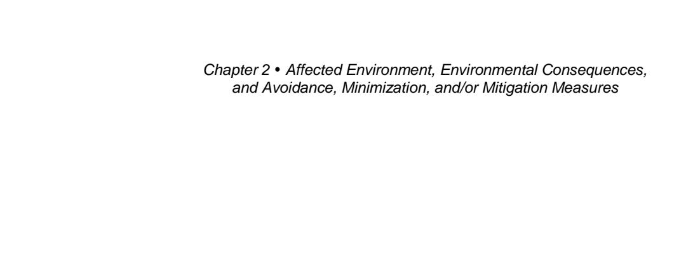

Page Intentionally Left Blank

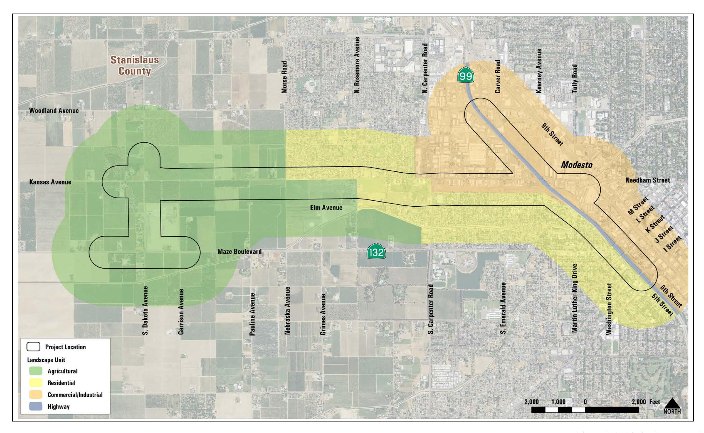

Figure 2-5: Existing Landscape Units

Page Intentionally Left Blank

#### Key Views (Viewsheds)

Figure 2-6 shows the six key views (or viewsheds) that represent the landscape units identified in the visual study area. Similar to the assessment of visual quality for each landscape unit, the existing visual quality of each viewshed was assessed based on vividness, intactness, and unity on a scale of very low to very high. Table 2-28 summarizes the visual quality evaluation for each key view.

Table 2-28: Existing Visual Quality Rating for Key Views in the Study Area

| Viewshed            | Vividness      | Intactness      | Unity           | Existing Visual Qualitya |
|---------------------|----------------|-----------------|-----------------|-----------------------------|
| #1: Rosemore Avenue | Moderate       | Moderate        | Moderate        | Moderate                    |
| #2: Carpenter Road  | Moderately low | Moderate        | Moderate        | Moderate                    |
| #3: Emerald Avenue  | Moderate       | Low             | Low             | Moderately low              |
| #4: SR 99           | Low            | Moderate        | Low             | Low                         |
| #5: Needham Street  | Low            | Moderate        | Low             | Moderately low              |
| #6: Elm Avenue      | Moderate       | Moderately high | Moderately high | Moderately high             |

&lt;sup>a The existing visual quality of each landscape unit was evaluated on a scale of very low to very high.

#### Construction

Three viewer groups were identified for the project study area:

- **Highway travelers** would view the study area from SR 99 and the new SR 132 freeway/expressway. Their sensitivity to visual changes would be lower than other viewer groups.
- Local travelers (motorists, bicyclists, and pedestrians) live or work in the residential, industrial, and commercial districts along Kansas Avenue, North Emerald Avenue, 6th Street, or Needham Street. Their sensitivity to visual changes would be higher than highway travelers.
- Local residents and employees live and work on Kansas Avenue or are residents in the Elm Tract or North Rosemore Avenue neighborhoods. This group would have the highest sensitivity to visual changes among the viewer groups.

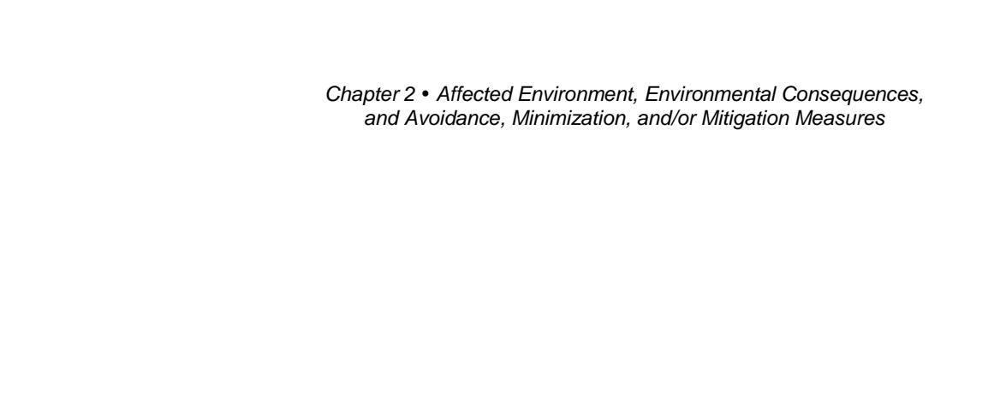

#### 2.1.8 Cultural Resources

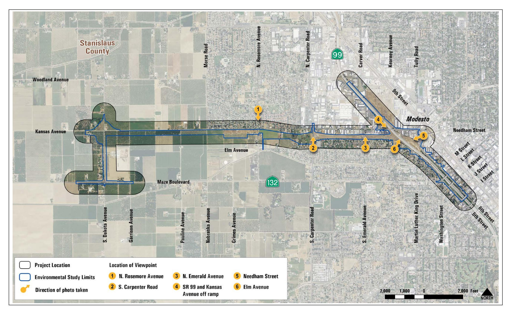

Figure 2-6: Key Views in the Study Area

Page Intentionally Left Blank

An analysis of a viewer groups' reaction to change can be predicted through understanding a community's goals and values as reflected in the land use plans, policies, and ordinances established by local governments. The Stanislaus County General Plan strives to conserve agricultural land and protect the area's agricultural heritage and principal industry, stressing the importance of preserving open space and scenic vistas wherever possible. Modesto places special value on its street trees, as evidenced by Modesto's street tree ordinance and the city being named a *Tree City USA* community every year since 1980.

#### Viewshed #1 Rosemore Avenue

#### Archaeological Resources

Overall, the visual impact of a depressed new alignment crossing under North Rosemore Avenue, would change some of the visual elements. If sound walls are required, they could have more visual impact than a see-through rail type barrier, and would be less consistent with the existing rural character of the Agricultural landscape unit. Views of open land in the middle ground would be replaced with views of an improved North Rosemore Avenue with curb and gutter, sidewalks, pavement striping, striped bicycle lane, and a see-through railing-type barrier. Views of agricultural landscape character would be replaced with urban residential street character. However, with mitigation, the changes would not be enough to change the overall visual quality and impacts would be considered less than significant. Visual quality for Viewshed #1 would remain as moderate.

Figure 2-7: Viewshed #1: Rosemore Avenue

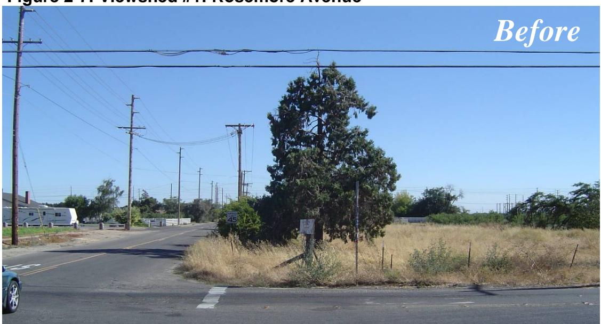

#### Historic Architectural Resources

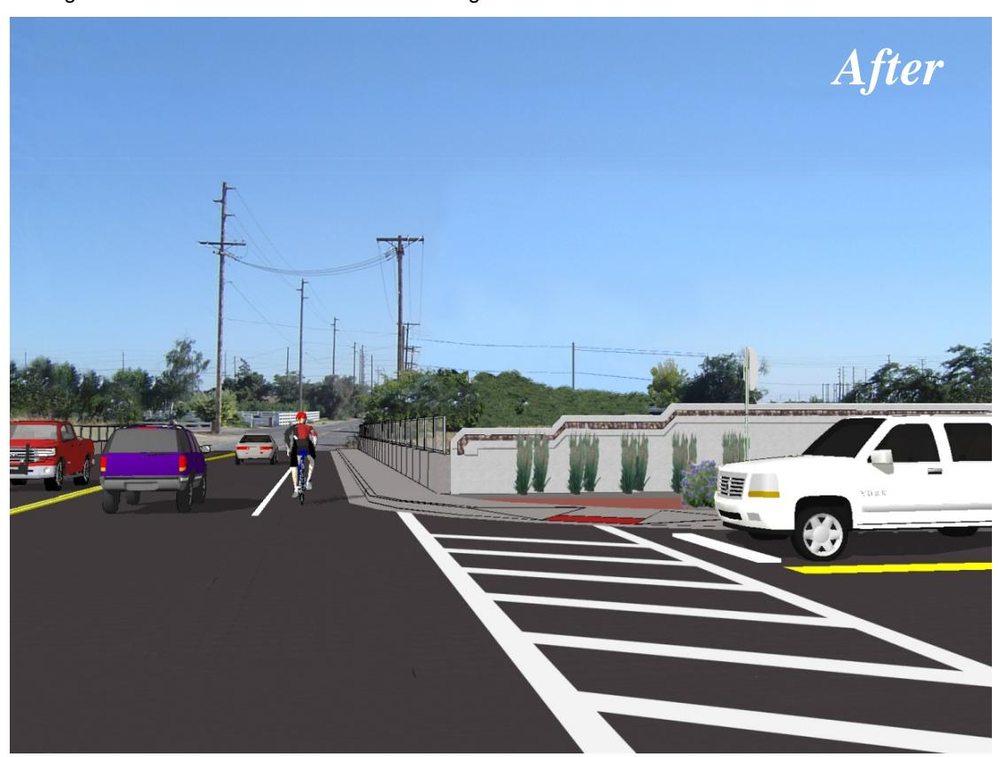

**Viewshed #1: Rosemore Avenue**. Simulated view of either build alternative at the completion of Phase 1. Note: The noise barrier on the right half of the simulation is no longer recommended; instead, there would be the same see-through railing-type barrier as shown on the overcrossing.

#### Viewshed #2 Carpenter Road

Figure 2-8 shows the proposed new alignment as depressed in this area with both build alternatives. The new alignment would pass under North Carpenter Road, and the road's on- and off-ramps would be parallel and close to the proposed new alignment. The northbound North Carpenter Road to westbound SR 132 movement would be provided from a left-turn lane and ramp. A barrier-separated bicycle lane would exist along the east side of North Carpenter Road. The existing curb and gutter on the west side of the road would be removed, and a grassy ditch would be installed for roadway runoff, which would make the roadway edge somewhat less defined. Views of the pavement area would increase slightly, but overall the arterial street elements (pavement striping, signals, no overhead power lines, and poles) help organize and unify the street scene. With a see-through railing-type barrier along the top edge of the new alignment, visual changes from these improvements would be consistent with the existing urban street setting. These modifications would not change the vividness, intactness, and unity ratings for this viewshed. Therefore, the visual quality rating for this viewshed would not change and would remain moderate.

Figure 2-8: Viewshed #2: Carpenter Road

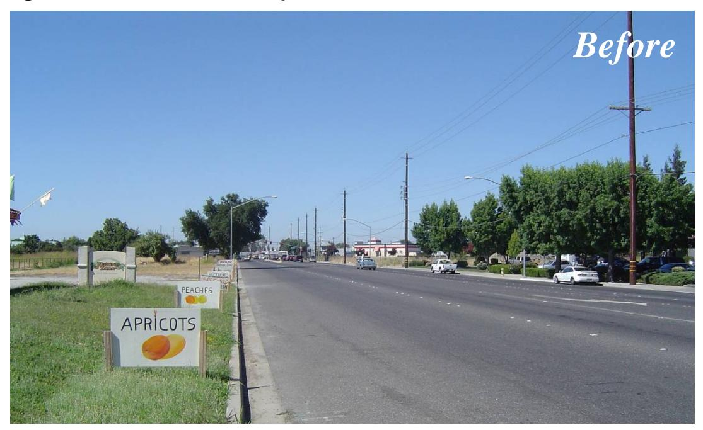

**Viewshed #2: North Carpenter Road**. Local travelers' existing view from North Carpenter Road looking north.

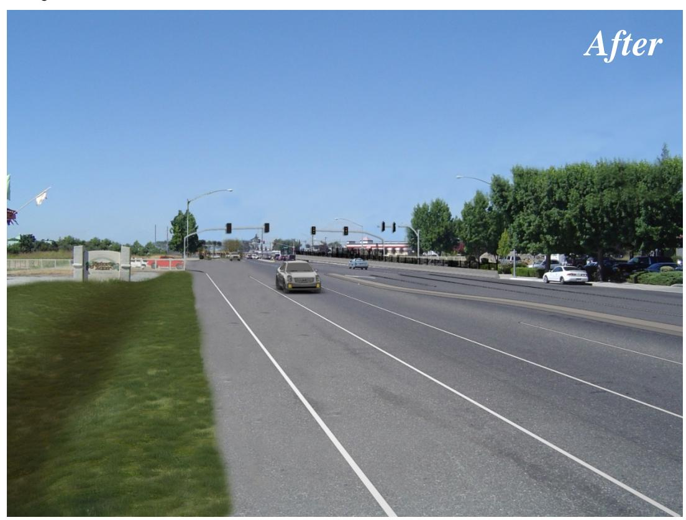

**Viewshed #2: North Carpenter Road**. Simulated view of either build alternative at the completion of Phase 1.

#### Viewshed #3 Emerald Avenue

Both build alternatives would include a bridge for the new alignment to cross over North Emerald Avenue as shown in Figure 2-9. The elevated expressway would create a visual barrier that would obstruct residents' views to Kansas Avenue, resulting in a feeling of enclosure and separation between the residential neighborhood and the commercial district. The new bridge abutment and slope pavement would enclose the existing soil stockpile on the east side of North Emerald Avenue. The new alignment's overcrossing span would be sized to allow Modesto to improve North Emerald Avenue with new sidewalks, curb and gutter, and bicycle lanes as appropriate. Figure 2-9 shows the new alignment's overcrossing as a visual portal to the Commercial/Industrial Landscape Unit north of the project.

Aesthetic treatments to the overcrossing, such as the use of textured wall treatments and compatible hardscape color scheme, would be determined after the preferred alternative is selected, during final project design and in coordination with local stakeholders.

Also, adding sidewalks, curb, and gutter would make the street more inviting for use by pedestrians and bicyclists. While the proposed project would provide new infrastructure that could bring more order to the built landscape, the improvements would be limited to the immediate study area.

Looking north along North Emerald Avenue (from viewpoint #3), the viewshed would be altered by the addition of a highway bridge and bridge abutments. Though the viewshed would be altered, the overall visual quality rating would remain moderately low and therefore would not be impacted. Aesthetic treatments on the structure could improve the vividness rating by providing visual cohesion with other State Route 132 structures. Landscaping planted on the embankments could also improve the vividness rating by softening the visual effect of the project.

#### No-Build Alternative

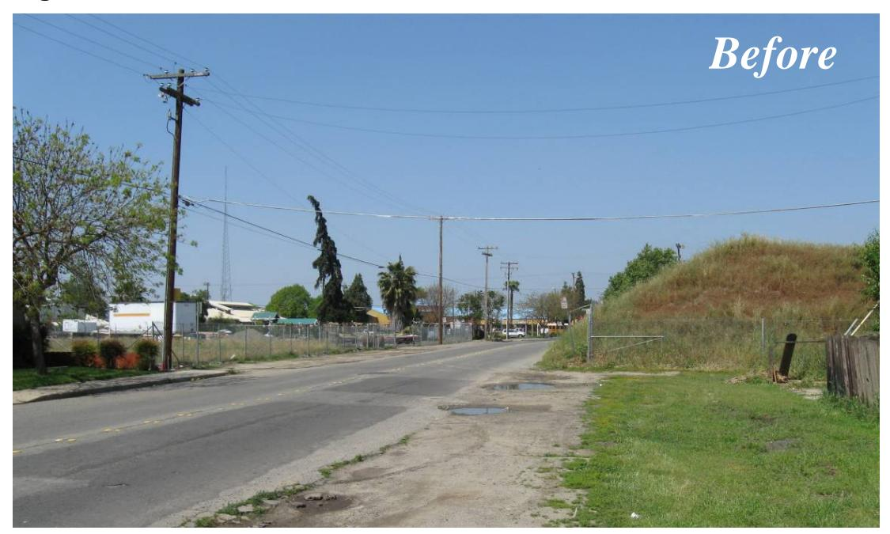

#### Avoidance, Minimization, and/or Mitigation Measures

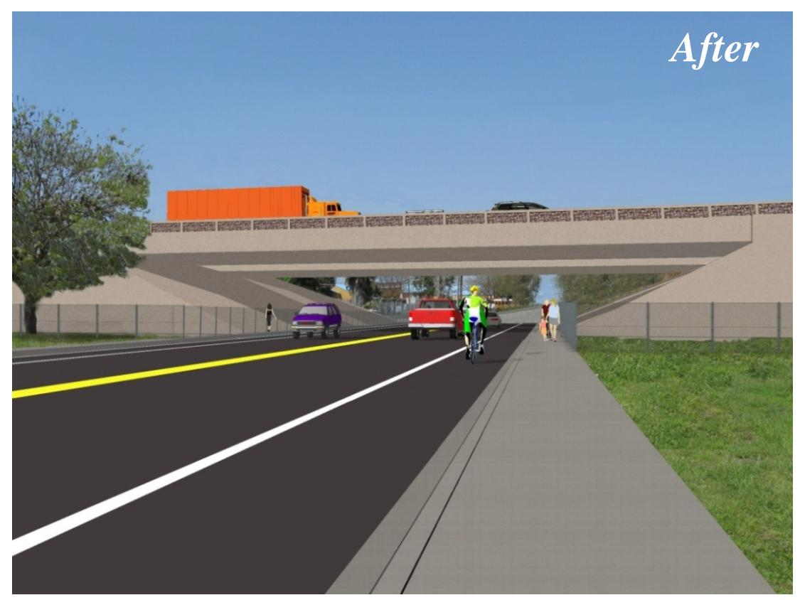

#### 2.2 Physical Environment

#### Viewshed #4 State Route 99

#### Affected Environment

The *Route 99 Corridor Enhancement Master Plan* recommends aesthetic treatment consideration for projects in urban portions of SR 99. Modesto's corridor enhancement plan for SR 99 is in progress, and final aesthetic concepts for this interchange have not been determined. However, a potential structural aesthetic treatment for the Kansas Avenue overcrossing is shown in Viewshed #4. Aesthetic treatments would be determined after the preferred alternative is selected, during final project design and in coordination with local stakeholders.

Views of grass areas would decrease and highway pavement area would increase, but overall, the highway elements (median barrier, retaining walls, noise walls, pavement, and landscaped slopes) would help organize and unify the scene. Overall, the visual quality of Viewshed #4 would improve slightly from low to moderately low.

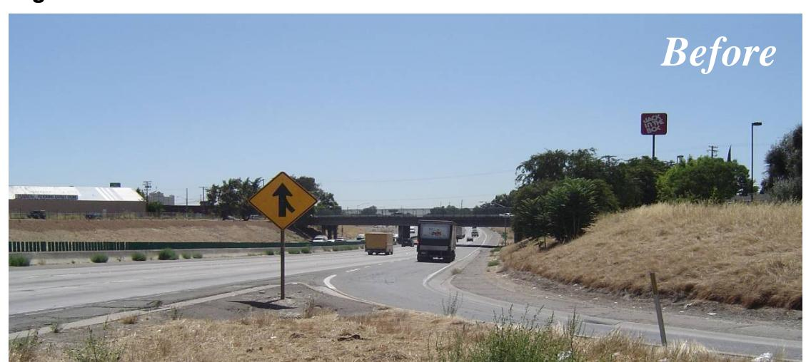

Figure 2-10: Viewshed #4: SR 99

**Viewshed #4: SR 99**. Highway travelers' existing view from SR 99 looking south toward the Kansas Avenue overpass.

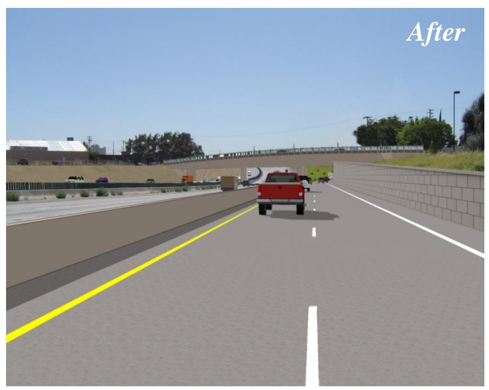

Viewshed #4: SR 99. Simulated view of Alternative 1 at the completion of Phase 2.

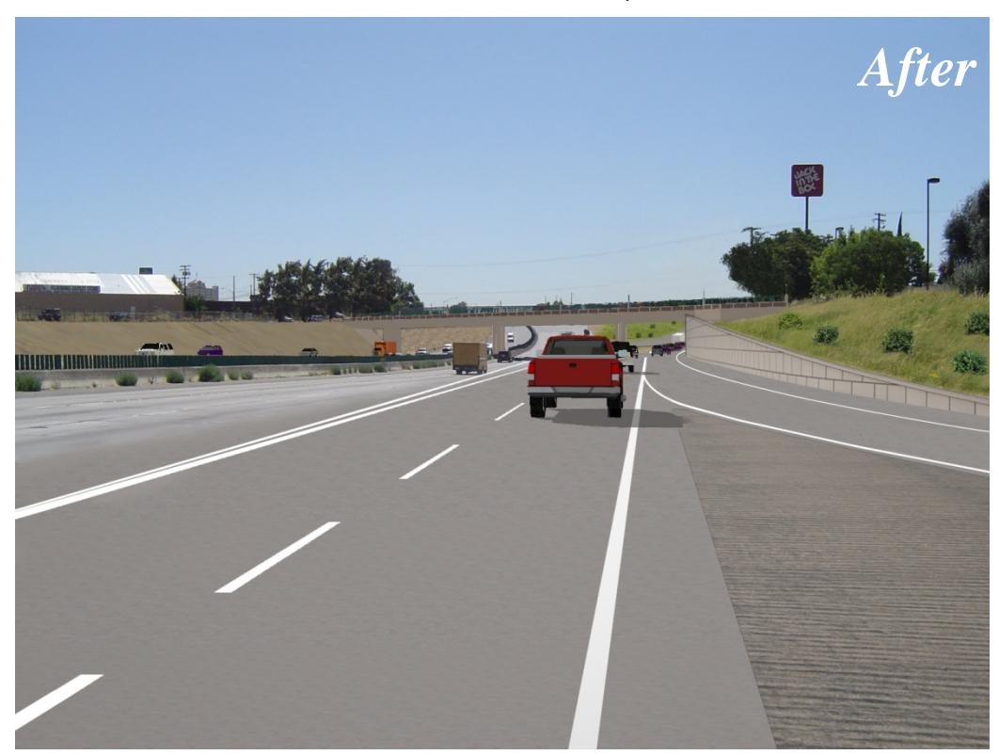

Viewshed #4: SR 99. Simulated view of Alternative 2 at the completion of Phase 2.

#### Viewshed #5 Needham Street

The visual simulation for Viewshed #5 shows views experienced by regional and local travelers on Needham Street as well as views experienced by business owners and employees in this commercial/industrial district. As shown in Figure 2-11, one or two buildings would be replaced by a new roadway connection between Needham Street and a new alignment structure over SR 99. Aesthetic treatments to the overpass are under consideration by project stakeholders, so detailed aesthetic treatments are not shown in the visual simulation for Viewshed #5. Aesthetic treatments would be determined after the preferred alternative is selected, during final project design and in coordination with local stakeholders.

The existing view is enclosed and focused on the architecture of the commercial/industrial district. The proposed project would open this enclosed view to objects in the distance, such as the highway interchange, the new alignment, and tall street trees in the Elm Tract neighborhood to improve the visual quality of Viewshed #5. Overall, the visual quality of Viewshed #5 would improve slightly from moderately-low to a solid moderate rating.

#### **Environmental Consequences**

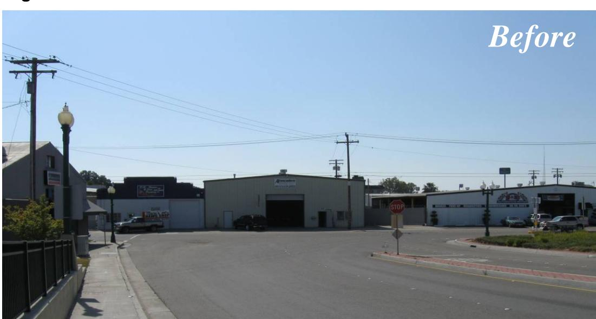

#### **Build Alternatives**

**Viewshed #5: Needham Street**. Local travelers' existing view of the intersection of Needham Street and North Franklin Street looking west.

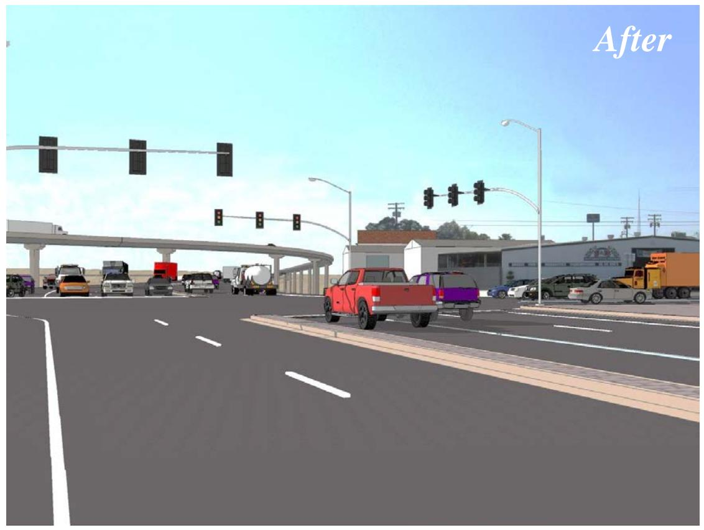

#### No-Build Alternative

#### 2.2.2 Water Quality and Storm Water Runoff

#### Regulatory Setting

The interchange design proposed under Alternative 1 would require a new overpass structure to connect the new alignment to 5th Avenue. This overpass would require the construction of approach roads on fill. The area required to construct the roadway on fill requires securing additional right-of-way, removing 5 homes and 16 large trees on the north side of Elm Avenue, and relocating the SR 99 noise barrier toward the southwest. The visual quality rating for Viewshed #6 would be degraded from moderately-high to moderately-low by Alternative 1.

For Alternative 2, the proposed realignment of the 5th Avenue connection would be constructed as an exit ramp from the SR 132 off-ramp to SR 99. Ramp construction would require a smaller area of right-of-way, and fewer homes and trees would be removed compared to Alternative 1 (3 homes instead of 6 and 15 trees instead of 16). The SR 99 noise barrier would be relocated toward the southwest, but not as far southwest as proposed under Alternative 1. The visual quality rating for Viewshed #6 would be degraded from moderately-high to moderately-low by Alternative 2.

Figure 2-12: Viewshed #6: Elm Avenue

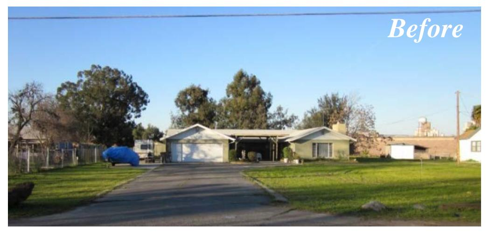

#### State Requirements: Porter-Cologne Water Quality Control Act

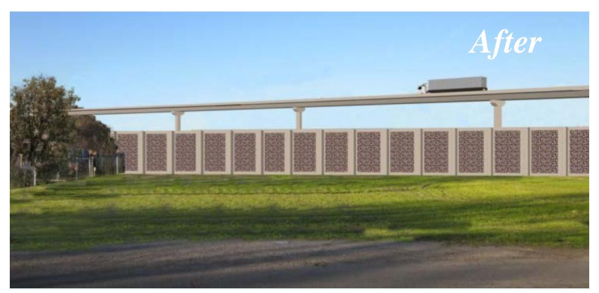

**Viewshed #6: Elm Avenue.** Simulated view of Alternative 1 at the completion of Phase 2. Note: ground-level noise barrier is shown.

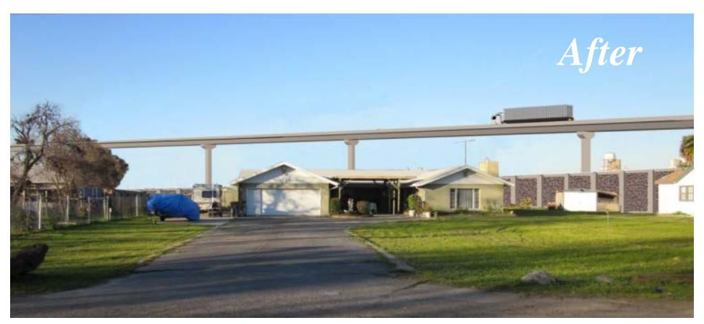

Viewshed #6: Elm Avenue. Simulated view of Alternative 2 at the completion of Phase 2.

The visual impacts described above were assessed based on both the full build-out of one of the two build alternatives and separately under Phase 1 (2020) and Phase 2 (2028). Phase 1 would construct only the elements described in Section 1.4, Project Alternatives. As a result, Phase 1 would result in a lower degree of visual changes than what would occur under Phase 2.

#### **Environmental Consequences**

#### Build Alternatives

#### State Water Resources Control Board and Regional Water Quality Control Boards

Table 2-29 summarizes potential changes to the study area's visual quality. The two build alternatives would result in similar alterations to each viewshed and landscape unit, as described further below, but differences are noted.

#### National Pollutant Discharge Elimination System Program Municipal Separate Storm Sewer Systems

| Viewshed (Landscape Unit)                             | Existing Visual Quality | Expected Visual Qualitya | Change in Visual Quality Rating                         |
|-------------------------------------------------------|-------------------------|-----------------------------|------------------------------------------------------------|
| #1: Rosemore Avenue (Residential and Agricultural) | Moderate                | Moderate                    | No change. The minor visual changes did not change rating. |
| #2: Carpenter Road (Commercial/Industrial)         | Moderate                | Moderate                    | No change. The minor visual changes did not change rating. |
| #3: Emerald Avenue (Residential)                   | Moderately low          | Moderately low              | No change. The minor visual changes did not change rating. |
| #4: SR 99 (Highway)                                   | Low                     | Moderately low              | Improved                                                   |
| #5: Needham Street (Commercial/Industrial)         | Moderately low          | Moderate                    | Improved                                                   |
| #6: Elm Avenue (Residential)                       | Moderately high         | Moderately low              | Degraded                                                   |

&lt;sup>a The expected visual quality is the anticipated visual quality of each landscape unit and key view after project construction.

Source: Visual Impact Assessment (November 2015)

Combining the change in visual quality ratings with the predicted viewer response determines the visual impacts. Table 2-30 summarizes the potential impacts.

Table 2-30: Visual Impacts for the Build Alternatives

| Viewshed (Landscape Unit)                             | Change in Visual Quality Rating (Vividness + Intactness + Unity = Visual Quality)                                                                                                                                                                                                                                                                                                                                                                                                                               | Viewer Response | Visual Impact                                               |
|----------------------------------------------------------|--------------------------------------------------------------------------------------------------------------------------------------------------------------------------------------------------------------------------------------------------------------------------------------------------------------------------------------------------------------------------------------------------------------------------------------------------------------------------------------------------------------------|--------------------|----------------------------------------------------------------|
| #1: Rosemore Avenue (Residential and Agricultural) | Vividness: Remains moderate. Intactness: Remains moderate. Unity: Remains moderate. Visual quality: Remains moderate. Minor visual changes that would occur would not change rating.                                                                                                                                                                                                                                                                                                                      | High               | Moderatea                                                      |
| #2: Carpenter Road (Commercial/ Industrial)        | Vividness: Remains moderately low. Intactness: Remains moderate. Unity: Remains moderate. Visual quality: Remains moderate. The minor visual changes that would occur would not change rating.                                                                                                                                                                                                                                                                                                            | High               | Moderatea                                                      |
| #3: Emerald Avenue (Residential)                      | Vividness: Remains moderate. Intactness: Remains low. Unity: Remains low. Visual quality: Remains moderately low. The minor visual changes that would occur would not change rating.                                                                                                                                                                                                                                                                                                                      | High               | Moderately lowa                                             |
| #4: SR 99 (Highway)                                   | Vividness: Improves from low to moderate. Intactness: Improves from moderate to moderately high. Unity: Remains low. Visual quality: Improves from low to moderately low.                                                                                                                                                                                                                                                                                                                                 | Moderately high | Moderately low                                              |
| #5: Needham Street (Commercial/ Industrial)        | Vividness: Improves from low to moderate. Intactness: Remains moderate. Unity: Improves from low to moderate. Visual quality: Improves from moderately low to moderate.                                                                                                                                                                                                                                                                                                                                   | Moderately high | Moderate                                                       |
| #6: Elm Avenue (Residential)                          | Alternative 1: Vividness: Remains moderate. Intactness: Degrades from moderately high to low. Unity: Degrades from moderately high to low. Visual quality: Degrades from moderately high to "lower" end of the moderately low rating.  Alternative 2: Vividness: Remains moderate. Intactness: Degrades from moderately high to low. Unity: Degrades from moderately high to low. Visual quality: Degrades from moderately high rating to "higher" end of the moderately low rating. | High               | Alternative 1: High Alternative 2: Moderately High |

&lt;sup>a Because the viewer response to the visual change would be high, the overall visual impact from the minor visual changes would be moderate to moderately low.

Source: Visual Impact Assessment (November 2015)

The design for both build alternatives would be the same in the western portion of the study area and would be similar in the eastern portion, so that Alternative 1 and Alternative 2 would result in very similar visual changes throughout the study area.

Both build alternatives would relocate the intersection of Kansas Avenue and North Dakota Avenue to the north. The new SR 132 intersection with North Dakota Avenue would be just south of the current Kansas Avenue/North Dakota Avenue intersection, adversely affecting views for residents facing Kansas Avenue west of the intersection. One home on the south side of Kansas Avenue, at 4104 Kansas Avenue, would lose the vegetative screen between the residence and the existing road. An access road would be constructed closer to one home, at 4054 Kansas Avenue, in the northwest

quadrant of the Kansas Avenue/North Dakota Avenue intersection, bringing roadway infrastructure closer to that home and making it more immediately visible to those residents. Replacing or preserving trees near the intersection through design modification would help preserve the visual integrity of the Agricultural Landscape Unit.

#### Affected Environment

Improvements along the new North Carpenter Road/SR 132 interchange would involve an area on the south side of SR 132 between the on- and off-ramps that would be planted with street trees. This would reduce the visual intrusion from the proposed new alignment, enhance the visual continuity of North Carpenter Road, and support Modesto's land use policy to "create safe and attractive tree-lined environments." Within the urbanized area of Modesto, both build alternatives would generally provide a more unified, cohesive human-built landscape that would be consistent with the goals and policies adopted in Modesto's General Plan.

Neither build alternative would change the following:

- The existing visual quality in the Agricultural Landscape Unit (Viewpoint #1 at North Rosemore Avenue) because the visual changes associated with both build alternatives would not be substantial enough to change the visual quality rating in this area
- The visual quality of the Residential Landscape Unit next to North Rosemore Avenue and North Emerald Avenue (Viewpoints #1 and #3) because the visual changes associated with both build alternatives would not be substantial enough to change the visual quality ratings in these areas

The visual simulations in Figure 2-7 through Figure 2-12 show changes that would result from the two build alternatives. The visual impacts from the recommended noise barriers were included in the evaluation of visual changes. The precise placement and visual treatment would be determined after the preferred alternative is selected, during final project design.

For areas that would have replacement planting, it would take time for the vegetation to grow and lessen the visual impact. Replacement planting would occur as part of Phase 2. Visual impacts would be greatest during the first 10 years after construction and after replacement planting is complete. In 10 to 20 years, newly planted trees would grow to be 50 to 70 percent of their mature size and would replace the screening, filtering, and softening functions provided by the original trees. As a result, the loss of vegetation and its function would be temporary, and any negative viewer response would be lessened over time.

Caltrans supports enrichment of the cultural and visual environment for transportation system users and local communities by using a collaborative approach to the design and selection of aesthetic treatments.

Aesthetic treatments may integrate elements that reflect a community's identity and values. StanCOG, Stanislaus County and the City of Modesto would collaborate with stakeholders through community meetings or workshops to select treatments to be applied to noise barriers, overcrossings and other structural elements of the proposed project. Following selection of the aesthetic treatments, the applicable local agency would issue a resolution or other official document recommending approval of the proposed design to Caltrans.

#### Lighting and Glare

Both build alternatives would introduce new highway lighting and illuminated signage along the length of the new alignment, at bridge overpasses and underpasses, and at the proposed SR 132/SR 99 interchange. New lighting and glare would occur in areas currently unlit, most notably west of North Carpenter Road and south of the proposed new alignment. This would be a major visual change for residents with views of the project.

#### Trees

As indicated in Table 2-31, both build alternatives would impact most of the 713 trees (including 92 Modesto street trees) identified within the project study area.

**Table 2-31: Tree Impacts by Build Alternative** 

| Build Alternative | Total Trees Impacted | Modesto Street Trees Impacted |
|----------------------|-------------------------|----------------------------------|
| Alternative 1        | 591                     | 35                               |
| Alternative 2        | 589                     | 33                               |

#### **Environmental Consequences**

#### **Build Alternatives**

Vegetation and trees would be replaced, but it would take time for the vegetation to grow and lessen the visual impact. Visual impacts would be greatest during the first ten years after construction and replacement planting is complete. In ten to twenty years, newly planted trees would grow to be 50 to 70 percent of their mature size, replacing the screening, filtering and softening functions provided by the original trees. As a result, the loss of vegetation and its function would be temporary.

# Consistency with Local Plans and Scenic Resource Impacts Both build alternatives would comply with the visual and scenic preservation policies contained in the County's and City's general plans.

#### Construction

During Phase 1, all viewer groups would experience temporary visual changes during construction, including new views of heavy equipment and vehicles (such as bulldozers, graders, scrapers, pile drivers, and trucks). The viewer groups would also see construction material stockpiling, vegetation removal within construction areas, dust, and construction signage.

Construction activities would typically occur during daytime hours, though there may be times of nighttime activity. Nighttime work may occur in and around SR 99. If nighttime work is required, viewer groups would see high-wattage lighting used to illuminate the construction site. This would result in nighttime glare and light pollution.

During Phase 2, viewers would experience similar temporary visual impacts during construction.

#### No-Build Alternative

The No-Build Alternative would not result in the construction of any of the proposed improvements and therefore would not contribute to direct or indirect impacts on visual resources.

#### Avoidance, Minimization, and/or Mitigation Measures

Implementation of the following measures would reduce visual impacts as determined during final project design and in coordination with local stakeholders:

- #### Caltrans Modesto Soil Stockpiles
- VA-2 Vegetation and trees removed by the contractor would be replaced in accordance with the California Department of Transportation's Project Development Procedures Manual, Chapter 29, which specifies policies for new highway planting, required mitigation planting, highway planting replacement, and highway planting revegetation. The policy specifies conditions under which planting is appropriate. Landscape policies developed as part of the Route 99 Corridor Enhancement Plan within Modesto city limits would also be a guide for tree replacement and new highway planting. Replacement planting and new highway planting would occur as part of Phase 2. Contractor activities would include, but not be limited to, site grading and seeding, trimming trees and shrubs lightly damaged by construction, site clean-up, and replacement of trees, shrubs, and ground cover.
- VA-3 To minimize glare from State Route 132 lighting, lamps that direct light toward the roadway would be used where required to minimize glare and light spillover. Examples of these features include light shields or low level lighting to redirect light away from motorists, homes, businesses and the sky. If night-time construction is needed, causing a temporary degradation of visual quality, procedures would be taken to direct the light inward

- toward the construction site and minimize glare for motorists and residents near the site.
- VA-4 The contractor would employ a common aesthetic theme to all proposed structures along the new alignment, as determined during final project design and in coordination with local stakeholders, to visually unify the highway's image with other Modesto structures (e.g., Needham Bridge and the proposed Pelandale Bridge) and to strengthen the landscape character of districts on either side of the highway.
- VA-5 The contractor would landscape the highway embankment to enhance homeowners' views of the proposed new alignment.
- VA-6 The contractor would replace trees near the relocated intersection of Kansas Avenue and North Dakota Avenue or modify intersection design to preserve trees in their current location.
- VA-7 The contractor would plant street trees at the property edge next to Elm Avenue and align the right-of-way fencing with the noise barriers, which would be set back from the property line.
- VA-8 The contractor would apply a corridor-wide aesthetic theme to proposed project elements (e.g., walls and structures), developed during final design, and implement a functional planting style that respects the visual context of the Agricultural Landscape Unit, which is characterized by orchards, crop fields, grass ditches, and farm buildings.
- VA-9 The contractor would install roadway lighting features that direct light downward and away from adjacent residential properties or the night sky.
- VA-10 The contractor would direct light inward toward the construction site during nighttime construction.

#### 2.1.8 Cultural Resources

#### Regulatory Setting

The term "cultural resources" as used in this document refers to all "built environment" resources (structures, bridges, railroads, water conveyance systems, etc.), culturally important resources, and archaeological resources (both prehistoric and historic), regardless of significance. Laws and regulations dealing with cultural resources include the following:

#### No-Build Alternative

Historic properties are also covered under Section 4(f) of the U.S. Department of Transportation Act, which regulates the "use" of land from historic properties. See Appendix B of this document for specific information about Section 4(f).

Historical resources are also considered under CEQA and the California Public Resources Code Section 5024.1, which established the California Register of Historical Resources. Public Resources Code Section 5024 requires state agencies to identify and protect state-owned resources that meet National Register of Historic Places listing criteria. It further specifically requires Caltrans to inventory state-owned structures in its right-of-way. Sections 5024(f) and 5024.5 require state agencies to provide notice to and consult with the State Historic Preservation Officer before altering, transferring, relocating, or demolishing state-owned historical resources that are listed on or are eligible for inclusion in the National Register of Historic Places or are registered or eligible for registration as California Historical Landmarks

#### Avoidance, Minimization, and/or Mitigation Measures

The following section is based on the *State Route 132 Archaeological Survey Report* completed in October 2011, the *State Route 132 Historic Resources Evaluation Report* completed in December 2011, and the *State Route 132 Historic Property Survey Report* completed in December 2011. Following changes in the project's area

#### 2.2.3 Geology/Soils/Seismic/Topography

#### Regulatory Setting

#### Archaeological Resources

To determine if any significant archaeological resources are present within the project study area, an archaeological area of potential effects was established to represent both build alternatives and the maximum possible area of direct impacts resulting from the project. The horizontal and vertical limits of the area of potential effects were defined according to the limits of proposed construction work. The vertical area of potential effects would vary from 3 to 5 feet for road grading to 35–40 feet below existing grade. The depressed freeway option includes constructing a new at-grade freeway from North Dakota Avenue to west of North Rosemore Avenue, a depressed roadway from west of North Rosemore Avenue to west of Emerald Avenue, and an elevated roadway from west of Emerald Avenue to SR 99. The area of potential effects also entails all existing right-of-way and those parcels from which new right-of-way would be acquired. As such, the area of potential effects encompasses 1) approximately 4 miles of the proposed new alignment, 2) the footprints for the proposed interchange locations (including the associated on- and off-ramps), and 3) any construction staging areas or locations where ground disturbance would occur.

#### Affected Environment

Two previously known historic-era archaeological resources were found within the area of potential effects. Site CA-STA-408H (Hadley Site) was originally recorded in 2000 and consists of nine features, including concrete foundations and a pile of rubble located on the south side of the site near and within the remains of a concrete fountain. The site is estimated to have been constructed after 1914. Site CA-STA-407H (Emerald Site) was also originally recorded in 2000. The site was described as residential, consisting of a concrete pad foundation, remnants of a brick wall, landscaping remnants, and modern refuse. The property was developed in the 1920s, but all structures were gone when Caltrans acquired the property in 1963. Current site conditions show that all structures have been destroyed.

Some parcels in private ownership within the archaeological area of potential effects were inaccessible for archaeological survey. These areas would be surveyed for archaeological resources after selection of the preferred alternative and access to these parcels is obtained. Geoarchaeological investigation (test excavations) of the vertical area of potential effects would also be conducted after selection of the preferred alternative. A second supplemental Historic Property Survey Report would be prepared documenting the results of the additional archaeological survey and geoarchaeological investigation. This report, along with a finding of effect, would be provided to the State Historic Preservation Officer for concurrence. This would complete the identification of archaeological resources for the project.

#### Historic Architectural Resources

The proposed project's historic architectural area of potential effects includes all existing right-of-way and those parcels from which new right-of-way would be acquired. In addition, some parcels in proximity to the proposed right-of-way are included because of potential indirect impacts (visual and noise-related impacts). The historic architectural area of potential effects extends along existing SR 132 (Maze Boulevard) just west and east of Dakota Avenue. The area of potential effects also covers the area south of Kansas Avenue from west of Dakota Avenue to east of SR 99. Lastly, the area of potential effects follows SR 99 from Lone Palm Avenue at the northern end of the project to H Street at the southern end.

The area of potential effects consists mostly of residential and agricultural buildings, but also includes industrial and commercial buildings and a segment of an irrigation canal (Modesto Irrigation District's Lateral Canal No. 4). In total, the area of potential effects has 167 properties containing built-environment resources constructed in 1969 or earlier that were formally evaluated under National Register of Historic Places and

California Register of Historic Resources criteria. The Historic Property Survey Report documented 163 properties, and the supplemental report documented an additional four properties. Of the 167 properties, 165 were found to not be eligible for the National Register of Historic Places, nor were they considered historical resources for purposes of CEQA.

Two of the properties evaluated appear to meet the criteria for listing in the National Register of Historic Places and the California Register of Historic Resources. The property at 3530 Maze Boulevard is a residential and farm complex located south of the existing highway between Dakota Avenue and Carpenter Road, on the western end of the area of potential effects. Constructed in 1918, the historic property consists of a Craftsman-style single-family residence with a garage/shed, barn, water tower, outhouse, and associated landscaping on a 15.46-acre parcel. The property appears to meet the criteria for listing in the National Register of Historic Places at the local level of significance under Criterion C in the area of architecture. Consequently, the property would also appear to be a historical resource for the purposes of CEQA.

The property at 416/418 I Street is a two-story commercial structure built between 1924 and 1925. Also known as Dania Hall, the property sits on a 0.11-acre parcel on the south side of I Street near the intersection of 5th and I streets on the eastern end of the area of potential effects. The property appears to qualify for listing in the National Register of Historic Places under Criterion A for its association with the Danish-American settlement in Stanislaus County and as an example of Danish-American fraternal organization.

#### **Environmental Consequences**

#### **Build Alternatives**

Both historic-era archaeological resources (site CA-STA-407H and CA-STA-408H) were evaluated and recommended to be not eligible for inclusion in the National Register of Historic Places or the California Register of Historic Resources. This recommendation is in concurrence with present survey results. Pending the results of the additional archaeological survey and geoarchaeological investigation discussed above, neither build alternative would have an adverse impact on any known archaeological properties eligible for the National Register of Historic Places or the California Register of Historic Resources. However, impacts could occur to the two eligible historic resources.

The proposed project would not require the temporary or permanent acquisition of any land from the 416/418 I Street parcel. No construction activities are proposed on or adjacent to the property, and there would be no temporary or permanent use of land from the parcel. Therefore, the two build alternatives would not have a direct or indirect impact on the resources at 416/418 I Street. Caltrans would submit a Section 106 finding of effect on the 416/418 I Street property to the State Historic Preservation Officer for concurrence after selection of the preferred alternative.

Since there would be no temporary or permanent use of land from the parcel, there would be no 4(f) property affected at this location and the provisions of Section 4(f) would not be triggered as described in Appendix B of this document.

Both build alternatives would require the acquisition of a portion of the northwest corner of 3530 Maze Boulevard (totaling approximately 0.13 acre of the 15.46-acre parcel) to widen the right-of-way in this area. The potential acquisition is located where a contemporary almond orchard exists outside the historic property boundary. The historic boundary containing eligible buildings and landscaping would not be affected by acquisition.

Construction activities near the Maze Boulevard property could include traffic control, temporary traffic signs during construction, installation of new permanent traffic signs along the roadside, and possibly asphalt concrete resurfacing and restriping the existing pavement. Construction-related activities east of the acquired portion of the parcel would occur within existing SR 132 (Maze Boulevard) right-of-way. The historic boundary containing the National Register of Historic Places-eligible buildings and landscaping would not be affected by use of this portion of the larger parcel. Access to the historic property from the existing highway would be maintained during construction. Caltrans would submit a Section 106 finding of effect on the 3530 Maze Boulevard property to the State Historic Preservation Officer for concurrence after selection of the preferred alternative.

As detailed in Appendix B of this document, incorporation of the 0.13 acre of land from 3530 Maze Boulevard into the transportation facility would not result in a Section 4(f) use.

A Historic Property Survey Report was submitted to the State Historic Preservation Officer on March 16, 2012 for concurrence on eligibility determinations for the sites identified in the 2011 area of potential effects. A concurrence letter was received

from the State Historic Preservation Officer dated May 16, 2012. A Supplemental Historic Property Survey Report was prepared to evaluate eligible properties within the expanded area of potential effects and submitted to the State Historic Preservation Officer on February 6, 2015. A concurrence letter was received from the State Historic Preservation Officer dated May 16, 2015. As summarized below, Caltrans received letters of concurrence on the following findings under Section 106 from the State Historic Preservation Officer (the letters are included in Appendix I):

- 2012 Area of Potential Effects: two eligible properties and 165 ineligible properties
- #### Faulting and Ground Shaking

As described above, a second supplemental Historic Property Survey Report and the Section 106 finding of effect would be submitted to the State Historic Preservation Officer after additional archaeological survey and geoarchaeological investigations are conducted for the preferred alternative that is selected. Concurrence by the State Historic Preservation Officer would complete the identification and effects determination for archaeological and historic architectural resources for the proposed undertaking.

Because there would be a potential to discover buried cultural resources, including human remains, during construction grading and excavation, best management practices would be employed during construction in the event that unknown buried cultural resources are encountered. If previously recorded cultural materials are discovered during construction, all earthmoving activity within and around the immediate discovery area would be stopped until a qualified archaeologist could assess the nature and significance of the find. If human remains are discovered, State Health and Safety Code Section 7050.5 states that further disturbances and activities must cease in any area or nearby area suspected to overlie remains and the county coroner contacted. Pursuant to Public Resources Code Section 5097.98, if the remains are thought to be Native American, the coroner would notify the Native American Heritage Commission, who would then notify the Most Likely Descendent. At this time, the person who discovered the remains would contact the California Department of Transportation's District 10 Native American Coordinator so that he or she may work with the Most Likely Descendent on the respectful treatment and disposition of the remains. Further provisions of Public Resources Code 5097.98 are to be followed as applicable.

#### No-Build Alternative

#### **Expansive Soil**

#### Avoidance, Minimization, and/or Mitigation Measures

#### No-Build Alternative

#### 2.2 Physical Environment

#### Avoidance, Minimization, and/or Mitigation Measures

#### Regulatory Setting

#### 2.2.4 Paleontology

#### Regulatory Setting

- The practicability of alternatives to any longitudinal encroachments.
- Risks of the action.
- Impacts on natural and beneficial floodplain values.
- Support of incompatible floodplain development.
- Measures to minimize floodplain impacts and to preserve/restore any beneficial floodplain values affected by the project.

The base floodplain is defined as "the area subject to flooding by the flood or tide having a one percent chance of being exceeded in any given year." An encroachment is defined as "an action within the limits of the base floodplain."

#### Affected Environment

The following section is based on the *State Route 132 Floodplain Study* (October 2015) and *Preliminary Drainage Report* (September 2014).

#### Affected Environment

The proposed project study area is also within the San Joaquin Watershed (Natural Resources Conservation Service's California Watershed Region 6), specifically the Riverbank Hydrologic Area of the San Joaquin Valley Floor Hydrologic Unit.

The proposed project study area is generally flat, with residential and commercial/industrial development in the eastern portion and agricultural fields in the western portion. There are no traditional storm drainage conveyance facilities (inlet and drain pipe systems, detention basins, or pumping plants) in the western portion of the study area, so runoff generally flows from existing roadways into adjacent shallow roadside ditches, onto the agricultural fields, and/or into drywells.

The runoff is allowed to permeate into soils suitable for infiltration and into the underlying aquifer. Most soils within the project area have very low to moderate infiltration rates (about 0.08 to 4.34 inches per hour). Some of the flow enters the Modesto Irrigation District's lateral canals (mainly Lateral Canal No. 4) and is eventually used by the Modesto Irrigation District as reclaimed water when needed for peak demand. Some runoff enters drywells and permeates into the soils within the western portion of the study area. The eastern portion of the project study area includes an inlet and drain pipe system within SR 99 and stormwater drain inlets for the residential and commercial development in the area. Stormwater collected in the depressed portion of SR 99 within the project limits is pumped to a stormwater basin just east of SR 99 and south of Kansas, where it evaporates or infiltrates the ground. If the capacity of the basin is exceeded, a valve can be opened to transmit basin-held stormwater to the median collection system, which ultimately conveys stormwater to

the Tuolumne River about half a mile to the south. Based on information provided by the Caltrans Maintenance Division, the valve has not been opened.

The proposed project study area is within the unprinted panel number 06099C0325E of the Federal Emergency Management Agency's Flood Insurance Rate Maps (Figure 2-13) dated September 26, 2008.

Encroachment on a floodplain is not expected because the proposed corridor would be in an unshaded Zone X area. Unshaded Zone X areas are defined by the Federal Emergency Management Agency as areas of minimal flood hazard, areas outside of the Special Flood Hazard Area, or areas higher in elevation than a 0.2-percent annual chance (500-year) flood elevation. The nearest mapped flood areas are next to the Stanislaus and Tuolumne rivers, north and south of the project study area, respectively.

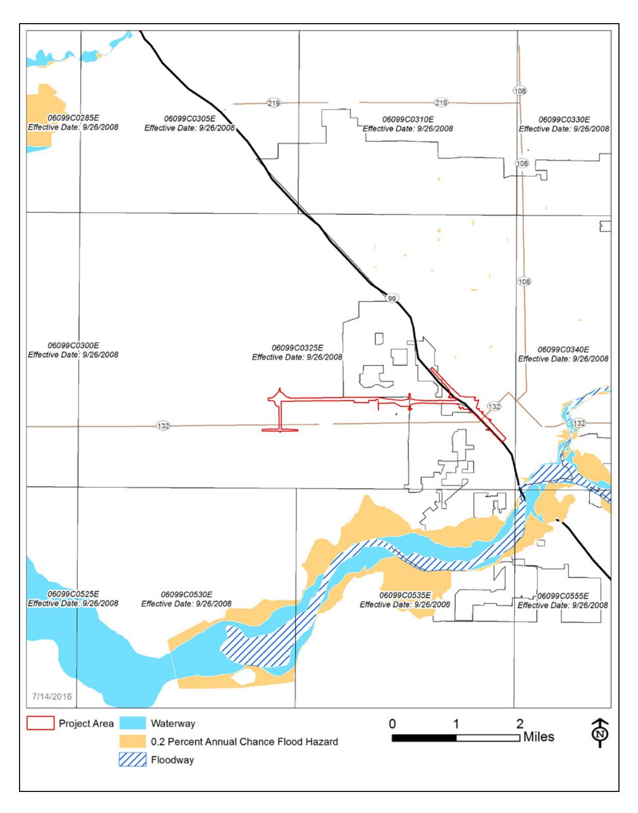

Note: MID = Modesto Irrigation District

Figure 2-13: Federal Emergency Management Agency's Flood Insurance Rate
Map Index 06099C0325E

#### No-Build Alternative

#### **Build Alternatives**

#### Avoidance, Minimization, and/or Mitigation Measures

Because the proposed project would not be within a Federal Emergency Management Agency-identified flood zone, there would be no flood zone impacts from project construction or operation. The proposed project would not encroach on a floodplain or have any direct or indirect impacts to a floodplain. Also, the chance of annual flooding in the study area would be less than 0.2 percent per year, which would not be considered substantial.

#### No-Build Alternative

The No-Build Alternative would not result in the construction of any of the proposed improvements or any additional impervious surfaces that would affect regional or local hydrology. The No-Build Alternative is not located within a Federal Emergency Management Agency-identified flood zone. Therefore, no hydrology or floodplain impacts would result from the No-Build Alternative.

#### Avoidance, Minimization, and/or Mitigation Measures

Implementation of the following measure would reduce impacts to the regional and local hydrology.

HY-1 All drainage and hydrological improvements would be detailed in the project drainage plan, which would be approved prior to the start of project construction. The plan would include drainage features, where appropriate, such as new drainage inlets, gutters, roadside ditches, pump stations, storm drain pipes, and detention basins.

#### 2.2.2 Water Quality and Storm Water Runoff

#### Regulatory Setting

Federal Requirements: Clean Water Act

In 1972, Congress amended the Federal Water Pollution Control Act, making the addition of pollutants to the waters of the U.S. from any point source 1 unlawful unless the discharge is in compliance with a National Pollutant Discharge Elimination System permit. This act and its amendments are known today as the Clean Water Act, Congress has amended it several times. In the 1987 amendments, Congress directed dischargers of stormwater from municipal and industrial/ construction point sources to comply with the National Pollutant Discharge Elimination System permit scheme. The following are important Clean Water Act sections:

- Sections 303 and 304 require states to promulgate water quality standards, criteria, and guidelines.
- Section 401 requires an applicant for a federal license or permit to conduct any activity, which may result in a discharge to waters of the U.S., to obtain certification from the State that the discharge would comply with other provisions of the act. (This is most frequently required in tandem with a Section 404 permit request. See below).
- Section 402 establishes the National Pollutant Discharge Elimination System, a
  permitting system for the discharges (except for dredge or fill material) of any
  pollutant into waters of the U.S. Regional Water Quality Control Boards
  administer this permitting program in California. Section 402(p) requires permits
  for discharges of storm water from industrial/construction and Municipal Separate
  Storm Sewer Systems.
- Section 404 establishes a permit program for the discharge of dredge or fill
  material into waters of the U.S. This permit program is administered by the U.S.
  Army Corps of Engineers.

The objective of the Clean Water Act is "to restore and maintain the chemical, physical, and biological integrity of the Nation's waters." The U.S. Army Corps of Engineers issues two types of 404 permits: General and Standard permits. For General permits, there are two types: Regional permits and Nationwide permits. Regional permits are issued for a general category of activities when they are similar

&lt;sup>1 A point source is any discrete conveyance such as a pipe or a man-made ditch.

in nature and cause minimal environmental effect. Nationwide permits are issued to authorize a variety of minor project activities with no more than minimal effects.

There are two types of Standard permits: Individual permits and Letters of Permission. Ordinarily, projects that do not meet the criteria for a Nationwide Permit may be permitted under one of U.S. Army Corps of Engineers Standard permits. For Standard permits, the decision to approve is based on compliance with the U.S. Environmental Protection Agency's Section 404 (b)(1) Guidelines (U.S. EPA CFR 40 Part 230), and whether permit approval is in the public interest. The 404(b)(1)Guidelines were developed by the U.S. Environmental Protection Agency in conjunction with the U.S. Army Corps of Engineers, and allow the discharge of dredged or fill material into the aquatic system (waters of the U.S.) only if there is no practicable alternative that would have less adverse effects. The guidelines state that the U.S. Army Corps of Engineers may not issue a permit if there is a least environmentally damaging practicable alternative, to the proposed discharge that would have less effects on waters of the U.S., and not have any other significant adverse environmental consequences. According to the guidelines, documentation is needed that a sequence of avoidance, minimization, and compensation measures have been followed, in that order. The guidelines also restrict permitting activities that violate water quality or toxic effluent2 standards, jeopardize the continued existence of listed species, violate marine sanctuary protections, or cause "significant degradation" to waters of the U.S. In addition, every permit from the U.S. Army Corps of Engineers, even if not subject to the 404(b)(1) Guidelines, must meet general requirements. See 33 Code of Federal Regulations 320.4.

#### State Requirements: Porter-Cologne Water Quality Control Act

California's Porter-Cologne Act, enacted in 1969, provides the legal basis for water quality regulation within California. This act requires a "Report of Waste Discharge" for any discharge of waste (liquid, solid, or gaseous) to land or surface waters that may impair beneficial uses for surface and/or groundwater of the state. It predates the Clean Water Act and regulates discharges to waters of the state. Waters of the state include more than just waters of the U.S., like groundwater and surface waters not considered waters of the U.S. Also, it prohibits discharges of "waste" as defined, and this definition is broader than the Clean Water Act definition of "pollutant." Discharges under the Porter-Cologne Act are permitted by Waste Discharge

&lt;sup>2 The U.S. EPA defines "effluent" as "wastewater, treated or untreated, that flows out of a treatment plant, sewer, or industrial outfall."

Requirements and may be required even when the discharge is already permitted or exempt under the Clean Water Act.

The State Water Resources Control Board and Regional Water Quality Control Boards are responsible for establishing the water quality standards (objectives and beneficial uses) required by the Clean Water Act, and regulating discharges to ensure compliance with the water quality standards. Details about water quality standards in a project area are included in the applicable Regional Water Quality Control Board Basin Plan.

In California, Regional Boards designate beneficial uses for all water body segments, and then set criteria necessary to protect these uses. As a result, the water quality standards developed for particular water segments are based on the designated use and vary depending on that use. In addition, the State Water Resources Control Board identifies waters failing to meet standards for specific pollutants. These waters are then state-listed in accordance with the Clean Water Act Section 303(d). If a state determines that waters are impaired for one or more constituents and the standards cannot be met through point source or non-point source controls (National Pollutant Discharge Elimination System permits or Waste Discharge Requirements), the Clean Water Act requires the establishment of total maximum daily loads. These loads specify allowable pollutant loads from all sources (point, non-point, and natural) for a given watershed.

## State Water Resources Control Board and Regional Water Quality Control Boards

The State Water Resources Control Board administers water rights, sets water pollution control policy, and issues water board orders on matters of statewide application, and oversees water quality functions throughout the state by approving Basin Plans, total maximum daily loads, and National Pollutant Discharge Elimination System permits. Regional Water Quality Control Boards are responsible for protecting beneficial uses of water resources within their regional jurisdiction using planning, permitting, and enforcement authorities to meet this responsibility.

## National Pollutant Discharge Elimination System Program Municipal Separate Storm Sewer Systems

Section 402(p) of the Clean Water Act requires the issuance of National Pollutant Discharge Elimination System permits for five categories of stormwater discharges, including municipal separate storm sewer systems. The U.S. Environmental

Protection Agency defines a municipal separate storm sewer system as "any conveyance or system of conveyances (roads with drainage systems, municipal streets, catch basins, curbs, gutters, ditches, human-made channels, and storm drains) owned or operated by a state, city, town, county, or other public body having jurisdiction over stormwater, that are designed or used for collecting or conveying stormwater." The State Water Resources Control Board has identified Caltrans as an owner/operator of a municipal separate storm sewer system pursuant to federal regulations. Caltrans' municipal separate storm sewer system permit covers all Caltrans rights-of-way, properties, facilities, and activities in the state. The State Water Resources Control Board or the Regional Water Quality Control Board issues National Pollutant Discharge Elimination System permits for five years, and permit requirements remain active until a new permit has been adopted.

Caltrans' Municipal Separate Storm Sewer System Permit was adopted on September 19, 2012, and became effective on July 1, 2013. The permit has three basic requirements:

- Caltrans must comply with the requirements of the Construction General Permit (see below).
- Caltrans must implement a year-round program in all parts of the state to effectively control stormwater and non-stormwater discharges.
- Caltrans stormwater discharges must meet water quality standards through implementation of permanent and temporary (construction) best management practices, to the maximum extent practicable, and other measures that the State Water Resources Control Board determines to be necessary to meet the water quality standards.

To comply with the permit, Caltrans developed the Statewide Storm Water Management Plan to address stormwater pollution controls related to highway planning, design, construction, and maintenance activities throughout California. The Statewide Storm Water Management Plan assigns responsibilities within Caltrans for implementing stormwater management procedures and practices as well as training, public education and participation, monitoring and research, program evaluation, and reporting activities. The Statewide Storm Water Management Plan describes the minimum procedures and practices Caltrans uses to reduce pollutants in stormwater and non-stormwater discharges. It outlines procedures and responsibilities for protecting water quality, including the selection and implementation of best management practices. The proposed project would be programmed to follow the

guidelines and procedures outlined in the latest Statewide Storm Water Management Plan to address stormwater runoff.

#### Affected Environment

The following section is based on the *State Route 132 Water Quality Assessment Report* (April 2016), Preliminary Drainage Report (September 2014), and the section includes technical information regarding soils and groundwater from the *State Route 132 Preliminary Geotechnical Report* (2010), *Caltrans Modesto Soils Stockpiles Groundwater Monitoring Report* (June 2015), and the *Draft Geotechnical Design Report Basin Infiltration Rates for State Route 132 West Expressway* (March 2012).

The proposed project study area sits within California's Central Valley Basin, the largest hydrologic basin in the state, draining nearly two-thirds of California and containing the state's two largest rivers—Sacramento River and San Joaquin River. As noted earlier, the San Joaquin River is approximately 16 miles west of the project. Located approximately 6 miles north and 0.5 mile south of the study area (respectively), the Stanislaus and Tuolumne rivers are two of the San Joaquin River's main tributaries. Beneficial uses for these three waters, as defined in the Central Valley Regional Water Quality Control Board's Basin Plan, include protecting water quality for municipal, domestic, and agricultural uses; water contact recreation; noncontact water recreation; warm and cold freshwater habitat; wildlife habitat, and industrial services and supplies.

As described in Section 2.2.1, Hydrology and Floodplain, no storm drainage conveyance facilities currently exist in the western portion of the project study area. However, the study area's soils do provide an opportunity for infiltration and evaporation of stormwater runoff. The Modesto Irrigation District's Lateral Canal No. 4 is the only perennial waterway within the project limits, and it eventually discharges into the Stanislaus River. The eastern portion of the study area includes an inlet and drain pipe system within SR 99 and stormwater drain inlets for the residential and commercial development in the area. The existing SR 99 roadway corridor includes a storm drainage system that features a longitudinal pipe system, starting north of Kansas Avenue and draining south to a pumping plant in the southeast quadrant of the SR 99/Kansas Avenue interchange. The pumping plant discharges into a concrete-lined channel and then into a detention/retention basin, which is east of and next to the SR 99 northbound lanes, about 800 to 1,000 feet south of Kansas Avenue. Stormwater that enters the detention/retention basin typically evaporates or infiltrates into the ground. This detention/retention basin is also equipped with a valve-

controlled drainage system. If the capacity of the basin is exceeded, the valve can be opened to transmit basin-held stormwater to the median collection system, which ultimately conveys stormwater to the Tuolumne River about 0.5 miles to the south. Based on information provided by the Caltrans Division of Maintenance, the valve has not been opened.

The Stanislaus and the Tuolumne rivers, which drain into the San Joaquin River, are both currently listed as impaired or not meeting water quality standards for various pollutants from primarily agricultural sources. Flows from the realigned portion of SR 132 west of SR 99 would enter infiltration trenches and retention basins for infiltration and evaporation.

A depressed portion of the new alignment would cross under North Carpenter Road and extend to North Rosemore Avenue. This portion of the new alignment would be greater than 10 feet above the groundwater surface. A pump station would be installed at the crossing to pump stormwater runoff out of the depressed section, which would ultimately discharge to a proposed detention basin. The pump station would pump not only runoff at the surface, but also any groundwater within 10 feet of the subgrade. Pumps would run only as necessary.

The study area is underlain by the Modesto Groundwater Sub-basin of the San Joaquin Valley Groundwater Basin. Groundwater recharge for the sub-basin is provided mostly from surface water infiltration and subsurface inflow from adjacent sub-basins. Test borings conducted in 1958 and 1959 indicated that the depth to groundwater was 47.0 and 41.0 feet mean sea level, respectively. More recent subsurface exploration conducted on July 14 and July 15, 2009 encountered static groundwater at elevations of 47.0 and 49.5 feet mean sea level, respectively (about 32 feet below the existing grade). Differences in the depth to groundwater is likely due to non-rainy versus rainy seasons, variations in creek or river levels, and/or irrigation or pumping of wells. The pattern of change in groundwater depth is expected to be unaffected by the stormwater runoff produced by the proposed new SR 132 alignment.

Stormwater runoff associated with the Caltrans Modesto soil stockpiles was most recently sampled in January 2016. Stormwater samples were collected from four locations next to the stockpiles and two background locations away from the stockpiles and analyzed for dissolved metals, chloride, nitrate as nitrogen, sulfate, sulfide, total alkalinity, bicarbonate alkalinity and carbonate alkalinity, total dissolved

solids, and total suspended solids. The results were generally consistent with background values, except for barium for a runoff sample collected next to the south side of soil stockpile 2, and strontium for all four stormwater samples. Results measured for both barium and strontium were higher than those reported for background samples. None of the concentrations in these samples exceeded their primary or secondary Maximum Containment Levels and all were within the same general range of concentrations recorded in previous sampling events.

Groundwater was most recently sampled in April 2015. None of the reported dissolved metals concentrations for the groundwater samples collected exceeded their respective numeric water quality threshold values. Except for nitrate in the samples collected from two wells, none of the reported general minerals for the groundwater samples collected equaled or exceeded their respective California primary Maximum Contaminant Levels. Barium and strontium were reported at concentrations similar to historical levels and remained significantly less than their numeric water quality thresholds. The remaining dissolved metals were also reported at concentrations similar to historical levels.

#### **Environmental Consequences**

#### **Build Alternatives**

Because the proposed project would consist mostly of constructing a new highway on a new alignment, the proposed project would result in a permanent (long-term) increase in impervious surfaces and permanent increase in runoff and the amount of pollutants in that runoff. Alternative 1 would increase impervious surfaces by an estimated 55.8 acres, while Alternative 2 would increase impervious surfaces by an estimated 57.5 acres.

The addition of impervious surfaces would affect the integrity and patterns of the local watershed by increasing stormwater peak flows and runoff volumes. This could lead to localized flooding with a potential to introduce pollutants generated as a result of the project into the environment and potentially impact surface or groundwater quality. These increases, if left untreated, could negatively affect the water quality of receiving water bodies, including the Stanislaus, Tuolumne, and San Joaquin rivers. However, the Stanislaus and San Joaquin rivers are located far enough away (16 miles) that no impacts are anticipated.

Although the Tuolumne River is closer (half a mile) to the project area, the proposed design of the SR 99 portion of the proposed project would construct a series of

detention/ retention basins designed to accommodate a 25-year storm event (the current basin was designed for a 10-year, 24-hour event). Within the recent past, the existing basin has not reached capacity, and no recent instances of stormwater are known to have collected within the SR 99 corridor and been transmitted to the Tuolumne River. Therefore, although it is possible that a large rain event could result in the release of water from the SR 99 detention/retention basins to the Tuolumne River, it is unlikely to occur. Also, the build alternatives would include best management practices as appropriate to treat runoff from the project site and reduce pollutants of concern.

#### Construction Impacts

Potential direct impacts to water quality would be similar for both build alternatives:

- **Sediment.** The increase in impervious surface, as well as the expected increase in vehicles along the project corridor, could lead to more sediment in the runoff. Excessive sedimentation degrades aquatic habitat by stunting aquatic plant productivity. Suspended sediment (particles that are carried by the water and/or accumulate on the bottom of natural water bodies) can also cause a reduction in dissolved oxygen levels, which can be fatal to aquatic species.
- **Metals.** Metals that attach to these particles (the suspended sediments) and decayed organic matter can persist in the environment for long periods. These metals can be transferred from one organism to another in aquatic species and cause contamination of water supplies.

- **Nutrients.** Project paving and landscaping activities can increase nutrients in stormwater from sources such as vehicle exhaust and fertilizers. Excessive nutrients, particularly nitrogen and phosphorous, can cause extreme algal growth that could be toxic to certain aquatic organisms. Algal blooms and subsequent die-off can cause large variations in dissolved oxygen levels and, in some cases, can kill fish.
- Storm Water Velocity and Volume. Increases in impervious surfaces may lead to increased stormwater runoff flow, velocity, and volume. The impervious area collects increased pollutant loading, and the increased velocity easily transports contaminants to waterways. Increased velocity in channelized waterways also intensifies erosion and sedimentation.
- Caltrans Modesto Stockpile Impacts. Potential impacts to water quality would be mitigated through implementation of the containment remedy identified in the Draft Final Remedial Action Plan. The containment remedy would be accomplished through a Remedial Design Implementation Plan prepared under oversight and approval of the California Department of Toxic Substances Control and Central Valley Regional Water Quality Control Board.

As part of the project, treatment best management practices would be implemented to target pollutants of concern in stormwater runoff. Design Pollution Prevention and Treatment Control best management practices would be incorporated per the requirements of Caltrans' statewide National Pollutant Discharge Elimination System Permit and in accordance with the requirements of Caltrans' Project Planning and Design Guide and Stormwater Management Plan.

Through implementation of avoidance, minimization, and mitigation measures (explained below), the proposed project would result in no adverse impacts to water quality or stormwater runoff. No indirect water quality or stormwater impacts would occur under either build alternative.

Short term construction-related impacts that could occur to water quality and from stormwater runoff may include the following elements:

• **General Construction**. Vegetation removal at construction sites can increase stormwater runoff velocity and volume, causing accelerated erosion. Construction vehicles can deposit sediment onto surrounding roadway, which can later wash into local water bodies.

• **Construction Debris**. Construction site debris, if not contained or removed regularly, can blow away in the wind and/or wash into local water bodies.

Under the General Construction National Pollutant Discharge Elimination System Permit, a Stormwater Pollution Prevention Plan and the implementation of erosion and sediment control best management practices would be required. Preparation and implementation of construction site best management practices would be in accordance with the State of California Construction General Permit (Order 2012-011-DWQ) as amended by Order WQ 2014-0006-EXEC, Order WQ 2014-0077-DWQ, and Order WQ 2015-0036-EXEC, National Pollutant Discharge Elimination System Permit Number CAS000003) and any subsequent permit related to construction activity for the project. This would include submission of the Notice of Intent to the online Storm Water Multiple Application and Report Tracking System database at least 30 days prior to project construction commencement; preparation and implementation of a Stormwater Pollution Prevention Plan, including monitoring and reporting; and submission of a Notice of Termination to the Central Valley Regional Water Quality Control Board upon completion of the project. If best management practices are properly selected and implemented, then no adverse water quality impacts are anticipated to occur during construction.

Dewatering may be necessary because the proposed project includes the construction of undercrossings at existing roadways. However, groundwater was encountered at elevations of 47.0 and 49.5 feet mean sea level. The amount of dewatering associated within construction is anticipated to be minimal, if it is required at all, and would not deplete groundwater supplies or interfere with recharge. Dewatering activities are subject to the requirements of the Central Valley Regional Water Quality Control Board and the local jurisdiction (Stanislaus County).

#### Caltrans Modesto Soil Stockpiles

Stockpile soil would be contained behind retaining walls, bridge abutments and beneath highway pavements. Phase 1 of the proposed project would consist of a two-lane roadway, which would be constructed over the southern portions of soil stockpiles 1 and 2. The northern portions of soil stockpiles 1 and 2, which would not be contained beneath the highway and behind retaining walls and bridge abutments, would be graded for drainage and capped with a minimum of a 6- to 12-inch-thick clean, vegetated soil cap.

Soil stockpile 3 would be treated differently than soil stockpiles 1 and 2, in that the stockpile would be entirely contained within the initial construction phase of the project. Much of soil stockpile 3 would be placed in the stockpile fill consolidation zone within the eastern abutment of the proposed SR 132/SR 99 interchange. The remainder of soil stockpile 3 would be placed in the stockpile fill consolidation zone of soil stockpile 2.

Monitoring of the stockpiles and stormwater runoff constituents of potential concern would continue until the project and full containment of all three soil stockpiles are complete. The frequency of groundwater monitoring would be subject to change until the California Department of Toxic Substances Control and the Central Valley Regional Water Quality Control Board indicate that monitoring is no longer required. Past and continued maintenance, in accordance with the California Department of Toxic Substances Control and Central Valley Regional Water Quality Control Board requirements, would continue and include monitoring the condition and effectiveness of the vegetative cover on the portions of the stockpiles not yet contained or capped by the project. Maintaining perimeter fencing would ensure access to each stockpile is restricted to prevent soil transport off site from Caltrans right-of-way and for the continued monitoring for potential erosion.

Containment of the soil stockpiles would eliminate direct exposure and would be protective of groundwater and surface water. Therefore, no impacts to water quality from the soil stockpiles are anticipated under either build alternative, since both alternatives would contain the soils.

None of the reported dissolved metals concentrations for the groundwater samples collected exceeded their respective numeric water quality threshold values. Barium and strontium were reported at concentrations similar to historical levels and remained significantly less than their numeric water quality thresholds. The remaining dissolved metals were also reported at concentrations similar to historical levels. Due to adsorption of heavy metals to soil, their potential to infiltrate the groundwater is very low.

Upon full containment and with implementation of the construction best management practices described in this section as well as avoidance, minimization, and mitigation measures SHAZ-1 through SHAZ-10, either build alternative would ensure no direct or indirect adverse impacts to water quality or stormwater runoff with respect to the soil stockpiles.

#### No-Build Alternative

The No-Build Alternative would not result in construction of any of the proposed improvements or any increase in impervious surfaces that would increase stormwater runoff volumes and concentration of pollutants entering the water system.

Soil stockpile containment via a highway structure would not be implemented under the project's No-Build Alternative. But, impacts to the environment posed by the continued presence of the soil stockpiles would be mitigated by a remedial action developed under oversight and approval of the California Department of Toxic Substances Control and the Central Valley Regional Water Quality Control Board. Currently, the perimeter of all three soil stockpiles is enclosed with security fencing, walls, and structures. Under the No-Build Alternative, Caltrans would continue to maintain the perimeter fence, restrict access to authorized personnel, continue water quality monitoring, and maintain each of the soil stockpile's vegetative cover until remediation of the stockpiles is completed under the oversight and approval of the California Department of Toxic Substances Control and the Central Valley Regional Water Quality Control Board.

#### Avoidance, Minimization, and/or Mitigation Measures

Project design and construction must adhere to the requirements in the National Pollutant Discharge Elimination System Permit, the Caltrans Stormwater Management Plan, the Caltrans Project Planning and Design Guide, and the best management practices outlined above. Implementation of the following measures would reduce impacts to water quality and from stormwater runoff:

- WQ-1 Because dewatering activities may be necessary, the Central Valley Regional Water Quality Control Board and Stanislaus County requirements for dewatering and discharge of non-stormwater would be followed.
- WQ-2 The contractor would conduct groundwater and stormwater monitoring on and adjacent to the soil stockpiles until the proposed project is complete or the California Department of Toxic Substances Control and the Central Valley Regional Water Quality Control Board indicate that it is no longer necessary.

#### 2.2.6 Air Quality

#### Regulatory Setting

For geologic and topographic features, the key federal law is the Historic Sites Act of 1935, which establishes a national registry of natural landmarks and protects "outstanding examples of major geological features." Topographic and geologic features are also protected under CEQA.

#### Conformity

#### Affected Environment

The following section is based on the *State Route 132 Geotechnical/Geologic Summary Report*, which was completed in October 2010. The "Geologic Hazard and Seismic Impacts" section of Modesto's General Plan was also reviewed, and the project conforms to the standards described therein.

The proposed project study area sits in the Great Valley Geomorphic Province that includes the Sacramento and San Joaquin valleys. It is generally bounded by the Sierra Nevada Mountains to the east and the Coast Ranges to the west. The site lies in the San Joaquin Valley, which is a structural trough containing the southern portion of the Great Valley.

The relatively flat surface of the San Joaquin Valley is underlain by deposits that have accumulated as the structural trough formed and the adjacent mountain ranges were elevated. The thickness of the sediments varies from thin along the valley margins to thousands of feet thick at the center (approximately 15 miles east of the project study area).

The U.S. Department of Agriculture Soil Survey of Eastern Stanislaus has not mapped the study area; however, nearby areas have been mapped. These areas consist

of clay and sandy loams. The Modesto clay loam has a high shrink-swell potential, moderate to high corrosion potential for steel, a low corrosion potential for concrete, and low permeability. (Shrink-swell is the extent to which a soil expands when wet and retracts when dry. Corrosion potential is the disintegration of an engineered material into its constituent atoms. Permeability is the rate of flow of a liquid through a porous material.) The other soil units have low shrink-swell potential, moderate corrosion potential for steel, a low corrosion potential for concrete, and are moderately permeable.

Six shallow soil borings and two deep borings (101 feet and 106.5 feet) were sampled as part of the *State Route 132 Geotechnical/ Geologic Summary Report*. In general, the borings indicated that the project study area is underlain by layers of very stiff to hard lean clay and sandy clay; medium dense to very dense, poorly graded sand and silty sand; and poorly graded sand with clay within the upper 40 to 49 feet. Underlying the near surface soil is dense to very dense, poorly graded sand to depths of 66 to 70 feet below the surface (elevations of 12 to 13 feet above mean sea level). Below the poorly graded sand, layers of hard silt, sandy silt, lean clay with sand, sandy clay, and very dense, poorly graded sand are encountered to the maximum depths explored. The soils have low to non-existent potential for landslides and slope instability, respectively.

Based on historic records, groundwater occurred at an elevation of 47 feet above mean sea level in 1958 and 41 feet above mean sea level in 1959. Subsurface exploration, conducted for the project in 2009, determined that static groundwater elevations ranged from 47 to 49.5 feet above mean sea level (about 32 feet below the existing grade).

No active faults sit in or next to the project study area, and the area does not occur within an Alquist-Priolo Earthquake Fault Zone. Field reconnaissance and review of geologic literature did not disclose the potential presence of faulting within or next to the project study area.

According to the *State Route 132 Geotechnical/Geologic Summary Report*, there are no known geologic hazards, including seismic or non-seismic hazards that would impact the project.

#### **Environmental Consequences**

#### **Build Alternatives**

The build alternatives would not affect any natural geologic landmarks and landforms. During final design, additional seismic and geotechnical studies would be conducted to address potential geotechnical hazards associated with liquefaction, seismic settlement, and slope stability. If localized geologic concerns are identified in the geotechnical investigation, requirements would be provided therein for grading and foundation design. Recommendations from the investigation would be implemented during project construction.

#### Carbon Monoxide Hot-Spot Analysis

The potential for surface rupture from faulting is considered low under both build alternatives. Ground rupture and/or fault creep is not expected to occur, but some degree of ground motion is expected from seismic activity in the region. However, risk of loss, injury, or death because of seismic activity is unlikely to occur and the proposed project is not anticipated to increase the risk to workers during construction or the traveling public during operation of the roadway.

#### PM10/PM2.5 Hot-Spot Analyses

Based on the soil profile, soils within the study area are non-liquefiable or have a very low potential for liquefaction (a condition where soil turns to a jellylike consistency). Therefore, risk of loss, injury, or death because of liquefaction is unlikely to occur and the proposed project is not anticipated to increase the risk to workers during construction or the traveling public during operation of the roadway.

According to the *State Route 132 Geotechnical/Geologic Summary Report*, the potential for seismic settlement from loose granular soil above the water table and from seismic slope instability are both considered low. However, a seismic settlement analysis and the stability of existing embankments would be addressed during final design.

#### Landslides and Slope Stability

Because of the low topographic relief throughout the study area, the potential for land sliding or failure of natural slopes would be non-existent for both build alternatives. The potential for seismic slope instability is low for properly constructed embankments because of the subsurface soil conditions and relatively low anticipated peak ground acceleration. The proposed project is not anticipated to increase the risk

to workers during construction or the traveling public during operation of the roadway.

#### **Expansive Soil**

Shallow, highly expansive clay soils were not observed for either build alternative. Therefore, near-surface soils would have a low expansion potential and the proposed project is not anticipated to increase the risk to workers during construction or the traveling public during operation of the roadway.

#### No-Build Alternative

The No-Build Alternative would not result in construction of any of the proposed improvements and therefore would not contribute to direct or indirect impacts related to geologic, soil, seismic, and topographical conditions.

#### Avoidance, Minimization, and/or Mitigation Measures

Both build alternatives would result in minimal geologic, soil, seismic, or topographic impacts. Therefore, no avoidance, minimization, or mitigation measures are required.

#### 2.2.4 Paleontology

#### Regulatory Setting

Paleontology is a natural science focused on the study of ancient animal and plant life as it is preserved in the geologic record as fossils. Several federal statutes address paleontological resources, their treatment, and funding for mitigation as a part of federally authorized projects:

- 16 U.S. Code 431-433 (the "Antiquities Act") prohibits appropriating, excavating, injuring, or destroying any object of antiquity situated on federal land without the permission of the Secretary of the Department of Government having jurisdiction over the land. Fossils are considered "objects of antiquity" by the Bureau of Land Management, the National Park Service, the Forest Service, and other federal agencies.
- 16 U.S. Code 461-467 (the National Registry of Natural Landmarks) establishes the National Natural Landmarks program. Under this program, property owners agree to protect biological and geological resources such as paleontological features. Federal agencies and their agents must consider the existence and location of designated National Natural Landmarks, and of areas found to meet the criteria for

national significance, in assessing the effects of their activities on the environment under NEPA.

• 23 U.S. Code 305 authorizes the appropriation and use of federal highway funds for paleontological salvage as necessary by the highway department of any state, in compliance with 16 U.S. Code 431-433 above and state law.

Under California law, paleontological resources are protected by CEQA.

#### Affected Environment

The following section is based on the *State Route 132 West Paleontological Identification Report*, completed in February 2011, which is an appendix to the *State Route 132 Paleontological Evaluation Report/Preliminary Paleontological Mitigation Plan*, completed in October 2015. The latter report was prepared because of the presence of a known paleontological resource that could be impacted by the project.

Stanislaus County is in the San Joaquin Valley, which is bounded by the low mountains of the Coast Ranges to the west, the San Emigdio and Tehachapi ranges to the south, and the foothills of the Sierra Nevada Mountains to the east. The area is also in the Great Valley geomorphic province of California, a flat to gently sloping alluvial plain (sediment deposited by flowing water) that is approximately 50 to 60 miles wide and 400 miles long in central California. The sediment consists of approximately 6 vertical miles of marine, fluvial, alluvial, and lacustrine deposits spanning the Jurassic period, which dates from approximately 160 million years old to recent time.

The fluvial and alluvial continental deposits of Pleistocene age present at the near-surface and surface in the eastern side of the San Joaquin Valley within the project study area belong to the Modesto Formation. Several fossil localities from this formation occur within or near the study area. These contain organisms that provide valuable information, such as stratigraphic indicators for correlation of deposits containing them, relative geologic age determination, past life forms providing information on the course of evolutionary trends of plants and animals, and evidence of changing paleo-environments (see Figure 2-14). This formation is known to contain significant paleontological resources that have included mammoth, camel, vole, wood rat, coyote, dog, fox, jackal, wolf, giant kangaroo rat, western pocket gopher, amphibian, lizard, snake, horse, tree frog, hare, and rabbit.

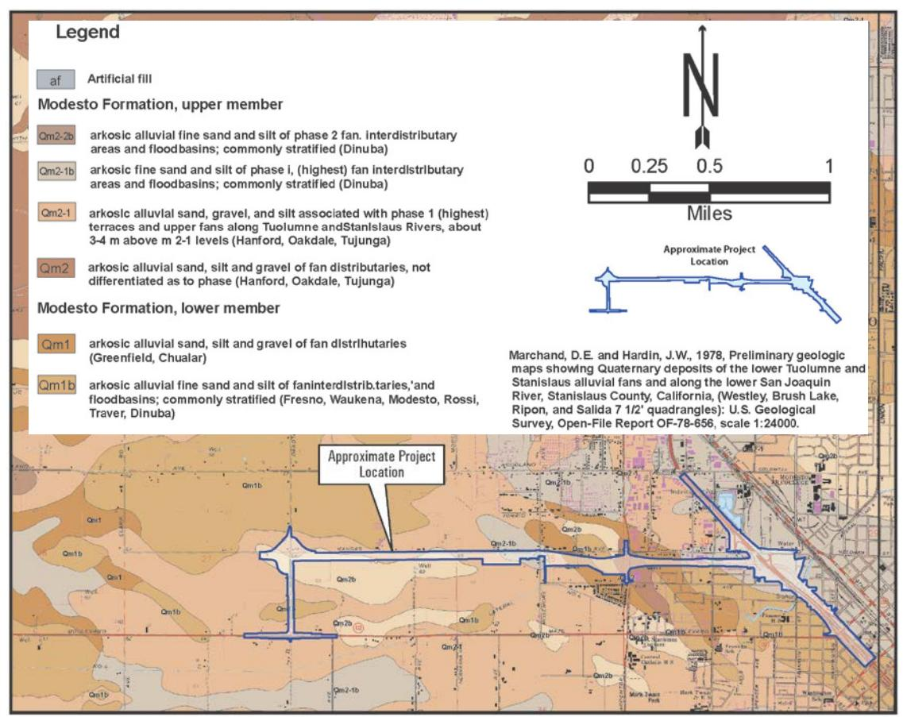

Figure 2-14: Geologic Map of the Study Area

Source: State Route 132 Paleontological Evaluation Report/Preliminary Paleontological Mitigation Plan (October 2015)

Based on Caltrans guidelines, the study area has been assigned a "High Potential (High Sensitivity)" to contain paleontological resources of national or scientific importance. Geologic deposits of similar age and in similar formations elsewhere in the San Joaquin Valley have yielded the fossil remains of Pleistocene vertebrates, invertebrates, and plants. It has also been documented that several extinct vertebrate fossil locations are within half a mile of the study area.

#### **Environmental Consequences**

#### **Build Alternatives**

The Modesto Formation, which underlies both build alternatives, would be impacted because of ground disturbance during general construction activities, excavation, and construction of retaining walls, structural foundations, and the pump station for the proposed new highway.

The primary mechanism for impacts on paleontological resources would be ground disturbance during construction. There is a potential for significant impacts in the entire project alignment, where the highly sensitive Pleistocene Modesto Formation has previously been mapped at or near the surface. Construction of the proposed project would require disturbance of large areas of soil and excavation in areas to depths between 15 and 40 feet depending on the design option selected and the element of the project being constructed. Grading would occur throughout the project footprint.

Excavation would range from 15 to 40 feet below the existing ground surface. Table 2-32 lists the total cut and fill requirements for construction of the proposed project. In general, an increased number of cubic yards of soil cut would likely increase impacts on the Modesto Formation.

Table 2-32: Total Cut and Fill Requirements by Build Alternative

| Alternative   | Total Cut           | Total Fill          | Net                 |
|---------------|---------------------|---------------------|---------------------|
| Alternative 1 | 716,000 cubic yards | 254,000 cubic yards | 462,000 cubic yards |
| Alternative 2 | 738,000 cubic yards | 246,000 cubic yards | 492,000 cubic yards |

Note: These totals are approximate based on modeling results.

Source: Draft Project Report (July 2016)

Excavation for Alternative 1 would involve less soil cut when compared to Alternative 2, and while Alternative 1 could result in impacts on paleontological resources within the study area, this build alternative is less likely to impact resources compared to Alternative 2.

Proposed grading and excavation for the proposed build alternatives would most likely encroach into the known fossiliferous Modesto Formation. If important paleontological vertebrate fossil resources are present at the project site then construction activities could cause adverse impacts under NEPA and significant impacts under CEQA, such as destruction and loss of scientifically significant paleontological vertebrate fossil resources. Implementation of the mitigation described in this report would reduce this impact to less-than-significant levels under CEQA and would ensure that adverse impacts under NEPA would not occur.

#### No-Build Alternative

The No-Build Alternative would not result in the construction of any of the proposed improvements and therefore would not directly or indirectly impact the Modesto Formation or associated paleontological resources because no construction excavation or grading would occur.

#### Avoidance, Minimization, and/or Mitigation Measures

Implementation of the following measures would reduce and/or eliminate potential project-related impacts on paleontological resources. The measures would help avoid destruction of, and mitigate other potential effects on, significant paleontological resources that may be present in Pleistocene-age deposits in the subsurface of the study area. In some instances, construction equipment may have to operate at night. Paleontological monitoring during nighttime hours is usually not productive for the collection of fossils, as the paleontological remains are not as visible as they are during daylight hours, even under artificial light. Therefore, it is recommended that no monitoring occur at night.

If grading must occur at night, it is recommended that all work be limited to those areas identified as having low sensitivity for paleontological resources, or within areas that, although identified as having high sensitivity, have been approved by the Principal Paleontologist to have reduced monitoring levels because the units are not producing scientifically significant paleontological remains. If needed, the areas that receive approval from the Principal Paleontologist to be graded at night can be surveyed by the monitors the following morning. A Preliminary Paleontological Mitigation Plan has been prepared for the proposed project. If there are no changes to the depths of excavation, the Plan would be finalized. If there are changes to the depths of excavation made during final design, the Plan would be updated. The Plan would be implemented prior to, during, and/or after construction. Measures could include, but are not limited to the following:

- PR-1 Special Provision 14-7.03 and 19-1.01A for paleontology mitigation would be included in the construction contract special provisions section to advise the construction contractor of the requirement to conduct paleontological salvage.
  - A qualified professional paleontologist would be retained to prepare and implement a final Paleontological Mitigation Plan prior to construction.
- PR-2 The professional paleontologist would designate a paleontological monitor to be present during qualifying earthmoving activities, as described in the

- Paleontological Evaluation Report and Preliminary Paleontological Mitigation Plan.
- PR-3 The professional paleontologist and paleontological monitor(s) would be notified by the Resident Engineer in advance of the start of construction activity and would attend any safety training programs for the proposed project.
- PR-4 The full-time paleontological monitor would have at least 5 years of paleontological resources construction monitoring experience.
- PR-5 The proposed project paleontologist would meet with the Resident Engineer and construction contractor at a preconstruction meeting to develop an agreed-upon communication plan and provide for worker safety. All project personnel would receive a paleontological awareness training session prior to commencement of work.
- PR-6 If paleontological resources are discovered during earthmoving activities, the construction crew would immediately cease work within a 60-foot radius of the find, and immediately notify the Resident Engineer.
- PR-7 For sediments containing microfossils (pollen, freshwater ostracods), the monitor would take bulk samples for off-site processing at a later time to recover any fossils.
- PR-8 Macro fossils (large enough to view with the unaided eye) could include tusks and other vertebrate remains. Some of these resources may be fragile and require hardening before moving, and may require encasing within a plaster jacket for later preparation and conservation in a laboratory.
- PR-9 Oriented samples must be preserved for paleomagnetic analysis. Samples of fine matrices would be obtained and stored for pollen analysis.
- PR-10 Recovered specimens would be prepared for identification (not exhibition) and stabilized.
- PR-11 Specimens would be identified by competent qualified specialists to a point of maximum specificity. Ideally, identification is of individual specimens to element, genus, and species.

- PR-12 Where appropriate, specimens would be analyzed by stratigraphic occurrence, and by size, taxa, or taphonomic conditions. The results would be presented in a faunal list, a stratigraphic distribution of taxa, or evolutionary, ecological, or depositional deductions.
- PR-13 Adequate storage in a recognized repository institution for the recovered specimens would be required. Specimens would be cataloged and a complete list would be prepared of specimens introduced into the collections or a repository by the curator of the museum or university.
- PR-14 In the event that paleontological resources are discovered, fossil specimens would be properly collected and sufficiently documented to be of scientific value.
- PR-15 A Paleontological Mitigation Report would be prepared by the project paleontologist, including a summary of the field and laboratory methods, site geology and stratigraphy, faunal list, and a brief statement of the significance and relationship of the site to similar fossil localities. Full copies of the final Paleontological Mitigation Report are deposited with the repository institution.

#### **Environmental Consequences**

#### Regulatory Setting

Hazardous materials including hazardous substances and wastes are regulated by many state and federal laws. Statutes govern the generation, treatment, storage, and disposal of hazardous materials, substances, and waste, and also the investigation and mitigation of waste releases, air and water quality, human health and land use.

The main federal laws regulating hazardous wastes/materials are the Comprehensive Environmental Response, Compensation and Liability Act of 1980 and the Resource Conservation and Recovery Act of 1976. The purpose of the Comprehensive Environmental Response, Compensation and Liability Act, often referred to as "Superfund," is to identify and clean up abandoned contaminated sites so that public health and welfare are not compromised. The Resource Conservation and Recovery Act provides for "cradle to grave" regulation of hazardous waste generated by operating entities. Other federal laws include the following:

• Community Environmental Response Facilitation Act of 1992

- Clean Water Act
- Clean Air Act
- Safe Drinking Water Act
- Occupational Safety and Health Act
- Atomic Energy Act
- Toxic Substances Control Act
- Federal Insecticide, Fungicide, and Rodenticide Act

In addition to those acts, Executive Order 12088, Federal Compliance with Pollution Control Standards, mandates that necessary actions be taken to prevent and control environmental pollution when federal activities or federal facilities are involved.

California regulates hazardous materials, waste, and substances under the authority of the California Health and Safety Code Division 20, Chapter 6.5 (Hazardous Waste Control) and Chapter 6.8 (Hazardous Substance Account) and is also authorized by the federal government to implement the Resource Conservation and Recovery Act. California law also addresses specific handling, storage, transportation, disposal, treatment, reduction, cleanup, and emergency planning of hazardous waste. The Porter-Cologne Water Quality Control Act also restricts disposal of wastes and requires cleanup of wastes that are below hazardous waste concentrations but could impact groundwater and surface water quality. California regulations that address waste management and prevention and cleanup of contamination include Title 22 Division 4.5 Environmental Health Standards for the Management of Hazardous Waste, Title 23 Waters, and Title 27 Environmental Protection.

Worker and public health and safety are key issues when addressing hazardous materials that may affect human health and the environment. Proper management and disposal of hazardous material is vital if it is found, disturbed, or generated during project construction.

#### Affected Environment

The hazardous waste/materials analysis is based on the following reports prepared for the project:

- *Initial Site Assessment, SR 132 West Expressway* (October 2010) (a second Initial Site Assessment was prepared in October 2015 due to changes in projects limits and affected parcels)
- Limited Phase II Site Assessment, SR 132 West Expressway (April 2012)
- Aerially Deposited Lead Assessment, SR 132 West Expressway (December 2012)
- Asbestos-Containing Material/Lead-Containing Paint Hazardous Material Survey Reports (May 2015)
- Aerially Deposited Lead Assessment, Maze Boulevard, SR 132 West Expressway (October 2015)
- Phase II Environmental Site Assessment, SR 132 West Freeway/Expressway Project (October 2015)

The Initial Site Assessments identified recognized environmental conditions related to potential historical and/or current contamination, storage, use, or handling of hazardous material contaminants within and/or next to the project. The Initial Site Assessments determined the risk level that each of these parcels could pose upon project schedule, human health and the environment and categorized that risk level as low, medium, or high. Some of the methods used to determine potential hazards include determining both past and present land use, review of federal, state, and county data bases for use, misuse, or storage of hazardous substances, and limited site inspections of publicly visible portions of parcels that may be impacted by the proposed project. Site inspections may also include owner interviews.

Within the proposed right-of-way, the Initial Site Assessments identified a total of 19 parcels proposed for partial or full acquisition as having a recognized environmental condition. Twelve of the parcels are characterized as high risk due to the historical, existing or suspected presence of underground storage tanks as well as agricultural chemicals, solvents and heavy metals. Four parcels have a medium risk for the presence of on-site contamination, based on the current use of petroleum or hydrocarbon-based products, solvents, or metals on-site. Three of the parcels were characterized as having a low risk due to on-site waste oil storage within a proper containment area.

The Initial Site Assessments also identified potential project wide hazardous materials conditions including aerially deposited lead, pesticides, asbestos containing material,

and lead based paint. These conditions were further evaluated as part of the Phase II Assessment process.

Phase II Environmental Site Assessments were also conducted, most recently in 2015. Assessments include screening site conditions using data collected from soil borings located at each site. Whenever possible, borings were located where future excavations is planned or expected, as well as in distinct areas of historical contamination. Soil sample were collected at varying depths below ground surface from 31 boring locations within and/or adjacent to identified parcels.

The Phase II Assessment was conducted for those parcels with a medium or high risk designation, as defined in the Initial Site Assessment. Except as described below, these parcels were generally subject to soil sampling, and analysis. Three of the identified parcels (815 Kansas Avenue, 301 North Washington Street and 524 Kansas Avenue) did not have right-of-entry access and could not be directly assessed for asbestos containing material and lead based paint. Therefore, these three sites were characterized by soil samples collected from adjacent Caltrans right-of-way.

The following four high risk level parcels were not evaluated in the Phase II Assessment (2015) because either excavation at these locations may not occur, or if excavation is to occur, would be shallow and the risk of encountering contaminants was considered minimal:

- 818 N. Carpenter Road
- 529 Kansas Avenue
- 415 Kansas Avenue
- 820 Kansas Avenue

Additionally, two medium risk level parcels also were not evaluated. 700 N. Franklin Street was a former car dealership, however, the dealership was removed for construction of the Needham Street overpass and there is no indication of unauthorized releases. There are also no indications of unauthorized releases at 127 Laurel.

In addition to the 19 parcel sites, the project area includes four sites within the existing right-of-way that were identified to have recognized environmental conditions. Location and potential risk is listed below:

• Former northeast corner of 5th Street and I Street – High

- State Route 99 off-ramp at Kansas Avenue north of gas station Medium
- State Route 99 at North Emerald Avenue Medium
- State Route 132 right-of-way (proposed alignment) south of Kansas Avenue –
   Medium

The former corner of 5th and I Streets is now part of the State Route 99 freeway and it is not expected that the proposed project would impact this area. Both the State Route 99 off-ramp at Kansas and the route north of North Emerald were included in Phase II boring analysis. The State Route 132 right-of-way is where the Caltrans Modesto Soil Stockpiles are located and these are discussed in Section 2.2.5.1.

Data generated during Phase II is used to evaluate and document current site conditions, to the extent practicable. Analytical data is compared to background conditions and/or relevant screening levels to aid in determining the need for additional assessment of the parcels, and to address potential exposure concerns during excavation and/or grading of contaminated soil that could result in exposure to on-site workers and end users.

#### **Environmental Consequences**

#### Build Alternatives

Predominant land use in the local region has historically been agricultural, including almond and walnut orchards and row crops. Agricultural practices, including the application of pesticides and machinery maintenance are potential sources of contamination. In addition, the project area includes historic industrial land uses such as the FMC facility, which occupied approximately 40 acres located north of Kansas Avenue predominantly east of SR 99, and is the subject of Section 2.2.5.1, Caltrans Modesto Soil Stockpiles Site. The proposed alignment of Alternative 1 and Alternative 2 occupy the same corridor between Dakota Avenue and State Route 99. As such, the acquisition of parcels with recognized environmental conditions is unavoidable under either alternative. The acquisition of land characterized as contaminated would be consistent with the requirements and approval process defined in Caltrans Project Delivery Directive 02.

Specific parcels with recognized environmental conditions that require partial or full acquisition are summarized in Table 2-33, and depicted in Figure 2-15. Each parcel summary includes the type of potential contamination, level/extent of contamination, and Phase II recommendations and findings. Direct and indirect impacts related to recognized environmental conditions would be the same for both build alternatives. Assessments for potential environmental conditions that may exist project wide or

include multiple acquisition parcels and/or right-of-way areas, such as aerially deposited lead, pesticides, asbestos-containing material and lead based paint are similarly summarized below.

In the event that future investigations and cleanup of these parcels or sites within the existing right-of-way are necessary, oversight from various agencies, including but not limited to, California Department of Toxic Substances Control, Central Valley Regional Water Quality Control Board, Stanislaus County, and the City of Modesto, may be required. Depending upon the extent of the contamination and the cleanup, further action may be required to comply with CEQA, which could impact Project cost and schedule.

Table 2-33: Recognized Environmental Conditions within Parcels that Require Partial or Full Acquisitiona

| Address                           | Land Use                                                          | Recognized Environmental Conditionsb                                                                                                                | Partial/Full Acquisition | Construc tion Phase When Acquired | 2015 Phase II Findings and Recommendations                                                                                                                                                                                                                                                                                                                                                                                                                                      |
|-----------------------------------|-------------------------------------------------------------------|-----------------------------------------------------------------------------------------------------------------------------------------------------------|-----------------------------|-----------------------------------------------|------------------------------------------------------------------------------------------------------------------------------------------------------------------------------------------------------------------------------------------------------------------------------------------------------------------------------------------------------------------------------------------------------------------------------------------------------------------------------------|
| 700 Rosemore Avenue         | Agricultural/ residence                                        | Underground storage tank and petroleum hydrocarbons ( <b>High</b> )                                                                           | Partial                     | Phase 1                                       | Minor total petroleum hydrocarbon (total petroleum hydrocarbons)- mo (motor oil) at shallow soil depth at one boring. Levels are below regulatory benchmarks. Results are consistent with site use as active farming operation. No further assessment is recommended.                                                                                                                                                                             |
| 800 North Carpenter Road    | Car wash                                                          | Oil/water separator ( <b>Low</b> )                                                                                                                  | Partial                     | Phase 2                                       | Not evaluated (low risk)                                                                                                                                                                                                                                                                                                                                                                                                                                                           |
| 818 North Carpenter Road    | Auto repair/gas station                                     | Underground storage tank and petroleum hydrocarbons ( <b>High</b> )                                                                           | Partial                     | Phase 2                                       | Not evaluated (excavation would be shallow with minimal risk of encountering contamination)                                                                                                                                                                                                                                                                                                                                                                            |
| 815 Kansas Avenue              | Gas station                                                       | Documented soil and groundwater contamination from leaking underground storage tank and petroleum hydrocarbons ( <b>High</b> ) | Full                        | Phase 2                                       | Three 10,000-gallon underground storage tanks remain onsite. Closure Report: Minor groundwater impacts for methyl tertbutyl ether only at one location. Soil impacts localized and attenuating. Potential for unidentified release unrelated to fuel system piping or leaking underground storage tank from 1996.                                                                                                                              |
| Address                           | Land Use                                                          | Recognized Environmental Conditionsb                                                                                                                | Partial/Full Acquisition | Construc tion Phase When Acquired | 2015 Phase II Findings and Recommendations                                                                                                                                                                                                                                                                                                                                                                                                                                      |
|                                   |                                                                   |                                                                                                                                                           |                             |                                               | Recommendation: Detailed work plan and site investigation when right-of-entry is obtained. Obtain regulatory direction on soil management.                                                                                                                                                                                                                                                                                                                                         |
| 529 Kansas Avenue              | Corporate office                                                  | Underground storage tank, petroleum hydrocarbons, and solvents ( <b>High</b> )                                                             | Partial                     | Phase 2                                       | Not evaluated (excavation would be shallow with minimal risk of encountering contamination)                                                                                                                                                                                                                                                                                                                                                                                        |
| 531 Kansas Avenue              | Cycle shop                                                        | Petroleum hydrocarbons and solvents ( <b>Low</b> )                                                                                               | Partial                     | Phase 2                                       | Not evaluated (low risk site)                                                                                                                                                                                                                                                                                                                                                                                                                                                      |
| 415 Kansas Avenue              | Foster Farms (former Borden Plant)                    | Petroleum hydrocarbons and heavy metals ( <b>High</b> )                                                                                          | Partial                     | Phase 2                                       | Not evaluated (excavation would be shallow with minimal risk of encountering contamination)                                                                                                                                                                                                                                                                                                                                                                                        |
| 820 Kansas Avenue              | Former gas station                                                | Leaking underground storage tank and petroleum hydrocarbons ( <b>High</b> )                                                                | Partial                     | Phase 2                                       | Not evaluated (excavation would be shallow with minimal risk of encountering contamination)                                                                                                                                                                                                                                                                                                                                                                                        |
| 611 North Franklin Street   | Auto and other repair shops                                       | Underground storage tank, petroleum hydrocarbons, solvents, and metals ( <b>High</b> )                                                     | Full                        | Phase 1                                       | No results above detection limits. Recommendation: No further assessment.                                                                                                                                                                                                                                                                                                                                                                                                       |
| 812 Kansas Avenue              | Car lot (former gas station)                                | Underground storage tank, volatile organic compounds and petroleum hydrocarbons ( <b>High</b> )                                         | Partial                     | Phase 2                                       | Unidentified trace amount of total petroleum hydrocarbon-d (diesel) range organic detected at one location. Results are inconclusive. Recommendation: No further assessment unless additional site acquisition occurs.                                                                                                                                                                                                                                                          |
| 524 Kansas Avenue              | Commercial supply company                                         | Waste oil (Low)                                                                                                                                           | Full                        | Phase 2                                       | Not evaluated (low risk)                                                                                                                                                                                                                                                                                                                                                                                                                                                           |
| 824 North Dakota Avenue     | Former agricultural barn                                    | Possible underground storage tank, agricultural chemicals, and petroleum                                                                                  | Partial                     | Phase 1                                       | No detectable levels of persistent pesticides. Minor total petroleum hydrocarbon-d impacts. Levels are below regulatory benchmarks;                                                                                                                                                                                                                                                                                                                                                |
| Address                           | Land Use                                                          | Recognized Environmental Conditionsb                                                                                                                      | Partial/Full Acquisition    | Construction Phase When Acquired              | 2015 Phase II Findings and Recommendations                                                                                                                                                                                                                                                                                                                                                                                                                                         |
|                                   |                                                                   | hydrocarbons (High)                                                                                                                                       |                             |                                               | likely due to minor historical releases. Recommendation: Once final excavation limits of future drainage basin are known, conduct detailed site assessment for diesel where basin footprint is defined. Potential Non-Standard Special Provisions (NSSP) for soil management.                                                                                                                                                                                                      |
| 612 North Franklin Street         | Body shop                                                         | Petroleum hydrocarbons, solvents, and metals (Medium)                                                                                                     | Full                        | Phase 1                                       | Minor traces of total petroleum hydrocarbon-mo were detected at one location. Results indicate site development as an auto body welding and maintenance shop. Recommendation: No further assessment.                                                                                                                                                                                                                                                                               |
| 309 Beech Street                  | Body shop (former bus storage yard)                               | Petroleum hydrocarbons, solvents, oil, grease and metals (Medium)                                                                                         | Full                        | Phase 1                                       | Minor total petroleum hydrocarbon-d, total petroleum hydrocarbon-mo and OG (oil and grease). Results are consistent with site development. Indication that there is a potential to encounter total petroleum hydrocarbon and OG contamination throughout the site. Recommendation: Once final excavation limits of future drainage basin are known, conduct further assessment of OG and total petroleum hydrocarbon in soils and groundwater. Potential NSSP for soil management. |
| 522 North Franklin Street         | Auto/truck repair (former truck washing station and holding pond) | Leaking underground storage tank, petroleum hydrocarbons, solvents, and metals (High)                                                                     | Full                        | Phase 1                                       | Minor traces of total petroleum hydrocarbon-d and OG detected at all locations indicate potential impacts from former truck washing/maintenance operations. Recommendation: Due to proposed use as a drainage basin, conduct                                                                                                                                                                                                                                                       |
| Address                           | Land Use                                                          | Recognized Environmental Conditionsb                                                                                                                | Partial/Full Acquisition | Construc tion Phase When Acquired | 2015 Phase II Findings and Recommendations                                                                                                                                                                                                                                                                                                                                                                                                                                      |
| 501 North Jefferson Street  | Modesto corporation yard                                    | Leaking underground storage tank, pesticides, petroleum hydrocarbons, solvents, and metals ( <b>High</b> )                           | Partial and Fullc        | Phase 1 and Phase 2c                    | Minor total petroleum hydrocarbon-d detected at three sample locations. Results are all below regulatory benchmarks. Results may be from residual impacts of former underground storage tanks, operating aboveground storage tanks or from minor releases during site history. Recommendation: After final design, conduct additional shallow soil assessment for diesel. Potential NSSP for soil management.                   |
| 301 North Washington Street | Tin manufacturer                                               | Underground storage tank, petroleum hydrocarbons, and metals (High)                                                                                 | Full                        | Phase 1                                       | Site assessment was conducted from the adjacent parcel due to denial of property access by owner. Minor total petroleum hydrocarbon-d detected at one location. Elevated total petroleum hydrocarbon levels may be present within the acquisition parcel. Recommendation: When right-of-entry is obtained, conduct soil assessment at former underground storage tank location. Potential NSSP for soil management.                |
| 127 Laurel Street              | Motorcycle shop                                                | Petroleum hydrocarbons and solvents ( <b>Medium</b> )                                                                                            | Full                        | Phase 1                                       | Records reference small quantities of petroleum hydrocarbons and solvents. Out of business. No indication of unauthorized releases.                                                                                                                                                                                                                                                                                                                                 |
| Address                           | Land Use                                                          | Recognized Environmental Conditionsb                                                                                                                | Partial/Full Acquisition | Construc tion Phase When Acquired | 2015 Phase II Findings and Recommendations                                                                                                                                                                                                                                                                                                                                                                                                                                      |
| 700 North Franklin Street d | Former car dealership                                          | Petroleum hydrocarbons and automotive fluids (Medium)                                                                                         | Full                        | Phase 1 d                                     | A car dealership was removed for construction of the Needham Street overpass. Records reference small quantities of waste. No indication of unauthorized releases.                                                                                                                                                                                                                                                                                                                 |

Table 2-33: Recognized Environmental Conditions within Parcels that Require Partial or Full Acquisitiona

Table 2-33: Recognized Environmental Conditions within Parcels that Require Partial or Full Acquisitiona

Table 2-33: Recognized Environmental Conditions within Parcels that Require Partial or Full Acquisitiona

Table 2-33: Recognized Environmental Conditions within Parcels that Require Partial or Full Acquisitiona

&lt;sup>a Both Alternative 1 and Alternative 2 would be equally affected by the listed recognized environmental conditions.

Source: Phase II Environmental Site Assessment (October 2015)

#### Soil Investigation of Existing Caltrans Right-of-Way

In addition to the 19 parcels summarized above, the project area includes four sites within the existing Caltrans right-of-way, identified to have recognized environmental conditions (Table 2-34). The first site was a historic gas and oil facility with a high potential for on-site contamination; however, the proposed project is not anticipated to impact this site. The second site at the SR 99 off-ramp at Kansas Avenue is immediately north of a gas station (Chevron) that has documented soil and groundwater contamination. The third site is the location of a former Food Machinery and Chemical Corporation (FMC) disposal pond near SR 99, with may potentially be impacted with heavy metals. The fourth site includes the three soil stockpiles, created during the construction of SR 99. The three stockpiles are referred to as the Caltrans Modesto Soil Stockpiles and are discussed further in Section 2.2.5.1, Caltrans Modesto Soil Stockpiles Site.

&lt;sup>b Potential for discovery of onsite contamination is noted in parentheses. High, medium, and low refer to the potential for discovery of onsite contamination.

&lt;sup>c There are two parcels with recognizable environmental conditions at 501 North Jefferson Street. See Figure 2-15.

&lt;sup>d The parcel at 700 North Franklin Street is owned by the City of Modesto, though it does not have an assessor's parcel number.

Table 2-34: Recognized Environmental Conditions within the Existing SR 99 or SR 132 Right-of-Waya

| Location                                                              | Land Use                                                               | Description of RECsb                                       |
|-----------------------------------------------------------------------|------------------------------------------------------------------------|------------------------------------------------------------|
| Former northeast corner of 5th Street and I Street                    | SR 99 (freeway) and a former "gas & oil" facility                      | Underground storage tank and petroleum hydrocarbons (High) |
| SR 99 off-ramp at Kansas Avenue north of a gas station             | Identified for drainage basin                                          | Adjacent underground storage tank (Medium)                 |
| SR 99 at North Emerald Avenue                                      | SR 99 (freeway) and former disposal pond for the FMCc processing plant | Soil with heavy metals (Medium)                            |
| SR 132 right-of-way (proposed alignment) south of Kansas Avenue | Historic soil stockpiles and miscellaneous debris                      | Soil with heavy metals (Medium)d                        |

&lt;sup>a Both Alternative 1 and Alternative 2 would be impacted by the listed recognized environmental conditions.

Source: Initial Site Assessment (October 2015)

Soil sampling was conducted in the following two areas within the existing Caltrans right-of-way within the project limits. The results are as follows:

#### SR 99 at Emerald Avenue

Soil samples were assessed to determine if subsurface contamination is present due to the former industrial waste pond. This assessment focuses on metals. Though the levels of barium, chromium, cobalt, copper, nickel, vanadium and zinc encountered in this assessment are elevated compared to natural background levels, they are below regulatory screening levels and do not warrant further assessment.

The tested concentrations of lead at this location are consistent with findings of the aerially deposited lead survey conducted for SR 99, described below. According to sampling results, soil in the upper six inches contains lead ranging from below the detection limit of 3.0 mg/kg to 100 mg/kg. If substantial off-site disposal is necessary it could have a significant effect on the project schedule.

Once the final excavation limits are determined, the aerially deposited lead report for SR 99, including this location, would be reviewed to determine if additional sampling would be conducted. Based on the findings of the aerially deposited lead studies, applicable regulatory disposal criteria, including preparation of non-standard special provisions and management in accordance with the statewide agreement, would be incorporated into the project plans and specifications.

&lt;sup>b Potential for discovery of onsite contamination is noted in parentheses. High, medium, and low refer to the potential for discovery of onsite contamination.

&lt;sup>c Food Machinery and Chemical Corporation, Modesto Processing Plant

&lt;sup>d See Section 2.2.5.1, Caltrans Modesto Soil Stockpiles site for a full description and analysis of this location and the recognized environmental conditions.

#### SR 99 at Kansas Avenue

Soil samples were assessed to determine if subsurface conditions due to potential releases from underground storage tanks at the adjacent Chevron station are present within the proposed improvement area. This assessment focused on petroleum hydrocarbons and volatile organic compounds, mainly the constituents benzene, toluene, ethylbenzene, and xylenes and methyl tertiary-butyl ether. Soil sample concentrations were below the detection limit for all tested constituents. No further investigation or action is required.

#### Aerially Deposited Lead within Caltrans Right-of-Way

Aerially deposited lead from the historical use of leaded gasoline, exists along roadways throughout California. There is the likely presence of soils with elevated concentrations of lead as a result of aerially deposited lead on the state highway system right of way within the limits of the project alternatives that must be managed under the July 1, 2016, Aerially Deposited Lead Agreement between Caltrans and the California Department of Toxic Substances Control. This Agreement allows such soils to be safely reused within the project limits as long as all requirements of the Agreement are met.

Surveys for aerially deposited lead in surface and shallow subsurface soils were conducted in the project limits along Maze Boulevard in 2014 and State Route 99 in 2012. Aerially deposited lead concentrations in the samples collected along Maze Boulevard are below regulatory screening levels, while samples collected along State Route 99 contained elevated concentrations of aerially deposited lead. According to sampling results, soil in the upper six inches contains lead ranging from below the detection limit of 3.0 mg/kg to 100 mg/kg. If substantial off-site disposal is necessary it could have a significant effect on the project schedule.

Once the final excavation limits are determined, the aerially deposited lead report for State Route 99 would be reviewed to determine if additional sampling would be conducted. Based on the findings of the aerially deposited lead studies, applicable regulatory disposal criteria, including preparation of non-standard special provisions and management in accordance with the July 1, 2016, Aerially Deposited Lead Agreement, would be incorporated into the project plans and specifications. Applicable cleanup levels for aerially deposited lead in commercial use and solubility levels for residential use, at the time of project construction, would apply to the proposed project.

#### Asbestos-containing Material and Lead-based Paint Survey

The Phase II Site Assessment also included an asbestos and lead-based paint survey conducted at the following sites:

#### Kansas Avenue Bridge over Highway 99

The results of the survey indicate asbestos is present in the gasket beneath the rail. The gasket material contains 80–90 percent chrysotile. The total estimated quantity of gasket material throughout the bridge structure is approximately 675 square feet. The results of the survey indicate the existing paint on the bridge structure (grey paint existing on the metal rails) does not contain detectable lead.

#### • Structures at six private parcels

Three of the identified parcels (815 Kansas Avenue, 301 North Washington Street, and 524 Kansas Avenue) did not authorize access, so they were not surveyed as part of the Phase II Assessment. The remaining three parcels authorized partial access; these sites were not evaluated in their entirety. These parcels would be assessed for asbestos-containing material and lead-based paint during final design to minimize further disruption to the property owners.

Table 2-34 summarizes and Figure 2-15 depicts recognized environmental conditions within the existing SR 99 and SR 132 right-of-way. As previously listed, these recognized environmental conditions have a medium to high risk of on-site contamination, which could adversely affect the project depending on the extent of contamination and the depth of soil disturbance. The extent of contamination is directly correlated to the cost of remediation.

In the event that final design alters the proposed right-of-way limits within the parcels identified herein as partial acquisitions, further site-specific assessments may be warranted for the affected parcels. The assessments may include updated site inspection, regulatory files review, interviews with current owners and occupants, and building material and soil sample collection and analysis.

#### General Hazardous Materials Issues

Direct and indirect impacts related to the use of agricultural chemicals (low potential for occurrence and low likelihood to adversely impact the project), aerially deposited lead (moderate potential for occurrence but less likely to adversely impact the project), and groundwater contamination (low potential for occurrence and low

likelihood to impact the project) would be the same for both build alternatives. The assessment did not include an investigation of groundwater conditions.

The assessment did not include an inventory of past and present electrical transformers in the study area. However, ground and pole-mounted transformers and power lines were observed within the proposed right-of-way. If power facilities or high-voltage power lines are to be relocated, existing transformers would be checked for the presence of polychlorinated biphenyls or other hazardous materials that would require proper remediation and disposal.

Yellow traffic stripes are present at various locations and may contain heavy metals such as lead and chromium at concentrations in excess of the hazardous waste thresholds established by the California Code of Regulations and may produce toxic fumes when heated. Consequently removal or disturbance of any yellow traffic striping within the project area would require development and implementation of an appropriate Lead Compliance Plan.

Evidence of buried distribution lines for natural gas was observed. No record of contamination resulting from these lines was discovered in this assessment; however, there is the potential for unidentified leaks along buried pipelines. Due to its explosive potential, natural gas is considered a hazardous material. Unless further information becomes available regarding the type and location of distribution lines, assessment and potential relocation of any lines would be addressed during construction.

Older commercial and residential structures in rural areas often have associated aboveground or below ground heating oil and/or motor vehicle fuel tanks. Septic tanks are also commonly associated with these types of structures. If heating oil tanks, fuel tanks, or septic tanks are (or were previously) associated with the structures, there is the potential for recognized environmental conditions to be present. Septic and fuel tanks would be addressed if discovered during construction.

Storm drainage in the Modesto area is provided by both hard-piped storm drains and dry wells. Dry wells drain directly into permeable subsurface sediments in the immediate vicinity of the well. According to the Modesto DPW there are an estimated 11,000 dry wells located in city right-of-way and an estimated additional 10,000 dry wells on private property. The dry wells are recognized by federal and state regulatory agencies as a potential source of soil and groundwater contamination.

Dry wells located on private parcels would be addressed if discovered during construction.

#### No-Build Alternative

The No-Build Alternative would not result in the construction of any of the proposed improvements and therefore would not result in direct or indirect impacts related to hazardous wastes or materials.

As discussed in the following section (2.2.5.1), impacts to the environment posed by the continued presence of the soil stockpiles would be mitigated by a remedial action developed under the oversight and approval of the California Department of Toxic Substances Control and the Central Valley Regional Water Quality Control Board.

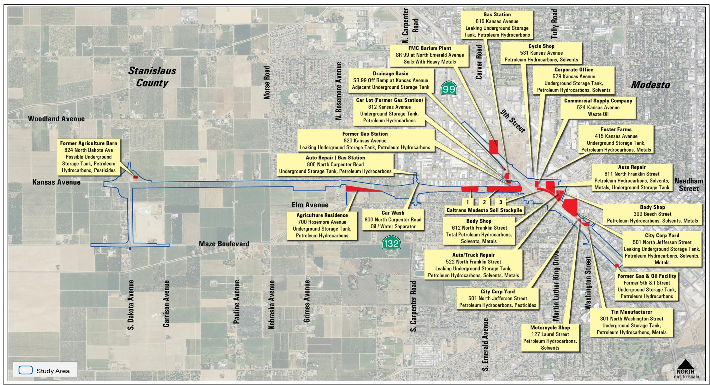

Figure 2-15: Recognized Environmental Conditions in the Study Area

Page Intentionally Left Blank

#### Construction Impacts

The risk of encountering potential recognized environmental conditions would depend on the type of construction activities and the location relative to the previously identified recognized environmental conditions in Table 2-33 and Table 2-34. In areas where significant excavation would not be expected (such as shallow utility relocations), the recognized environmental condition risk to construction personnel would be low. In areas where significant excavation would be expected (such as bridge replacement, deep subsurface utility replacement, and drilled caissons), the potential to encounter a recognized environmental condition would increase for excavated soils and any groundwater that would be displaced to the surface during construction.

Hazardous materials associated with structures that may be impacted during construction could pose a risk to residents and construction personnel. Potential lead-based paint or asbestos-containing materials may be encountered under both of the build alternatives due to the alteration and/or demolition of a bridge, buildings, guardrails, or signs. However, impacts would be reduced by implementing measures HAZ-1 through HAZ-14.

Because many of the properties identified for acquisition have the potential for elevated levels of petroleum hydrocarbons, and/or metals in soil, monitoring for adherence to the Materials Management Plan, Health and Safety Plan, and a Spill Prevention Countermeasures and Control Plan, as described in measures HAZ-5, HAZ-6 and HAZ-8, would reduce impacts related to the handling of materials or contaminated soil.

Project construction would require the use and transport of chemical agents, fuels, lubricants, solvents, paints, and other hazardous materials that could pose a risk to construction personnel and residents in the vicinity of project. Although the proposed project would use hazardous materials, the amount would be limited, and the release of any such substance would be unlikely. Therefore, associated construction-related impacts would be considered minimal and construction activities would comply with existing government regulations.

#### Avoidance, Minimization, and/or Mitigation Measures

The following avoidance and minimization measures would reduce potential impacts related to hazardous wastes and materials during construction of the project:

- HAZ-1 As soon as access is acquired, but prior to construction, any building structures that would be renovated or demolished would be investigated for asbestos, lead-based paint, and polychlorinated biphenyls by a certified consultant.
- HAZ-2 If analytical results indicate building materials contain asbestos, the contractor would prepare an Asbestos Operations and Maintenance Plan in accordance with applicable regulations. The plan would address worker training and safety measures to be taken when disturbing asbestoscontaining materials during abatement activities.
- HAZ-3 The contractor would ensure that proper removal and disposal of asbestoscontaining material is conducted by a licensed contractor registered with the California Occupational Safety and Health Administration for asbestosrelated work, or by a licensed and certified asbestos abatement contractor.
- HAZ-4 If the analytical results indicate that lead-based paint and/or polychlorinated biphenyls are present, the contractor would ensure that demolition materials are handled and disposed of in accordance with applicable regulations.
- HAZ-5 Prior to construction, the contractor would prepare a Materials Management Plan that identifies potential recognized environmental conditions, locations, extent of impact, proposed remediation work, waste management procedures, and avoidance measures, investigation measures and a contingency plan for addressing unforeseen conditions. Documentation of completed waste profiles, manifest forms, and bill-of-lading forms for proper transportation and disposal of materials offsite would be maintained by the contractor. The plan would include the following provisions:
  - Characterization and handling of contaminated soils requiring offsite disposal
  - Soils to be stockpiled for further characterization
  - Process for identifying soils with waste concentrations below regulatory thresholds that can be reused without restriction
  - Process for identifying and handling wastewater requiring offsite disposal and/or treatment
  - Procedures for handling asbestos-containing material discovered during construction activities

- HAZ-6 Prior to initiating construction activities, the contractor would prepare a site-specific Health and Safety Plan that identifies key personnel and provides a summary risk assessment for workers, the community, and the environment. The Health and Safety Plan would include an Air Monitoring Plan and Emergency Response Plan.
- HAZ-7 Prior to construction, the contractor would prepare a Sampling and Analysis Plan to identify and characterize potential recognized environmental conditions that may be encountered. The plan would provide for monitoring/screening during construction activities to provide safety controls in areas previously not identified. The plan would include:
  - Data quality objectives
  - Sample collection procedures (e.g., field screening, borehole drilling/ abatement, monitoring well construction, soil, groundwater, and decontamination)
  - Quality control
  - Quality assurance objectives (data)
- HAZ-8 Prior to construction, the contractor would prepare a Spill Prevention Control and Countermeasures Plan to ensure that construction best management practices are adequate for site conditions and to prevent discharge of any sediment or pollutants into any storm drains, receiving waters, or drywells.
- HAZ-9 Prior to construction, the contractor would inspect all utility pole-mounted and pad-mounted electrical transformers within the project limits for leaks. Leaking transformers would be considered a potential polychlorinated biphenyl hazard (unless tested) and would be handled in accordance with applicable laws and regulations.
- HAZ-10 The contractor would ensure that all wooden utility poles that are to be removed or relocated as part of the project, as well as the soils at the bases of the utility poles (unless documentation from the utility company indicates that creosote was not used), would be handled as treated wood waste in accordance with the California Department of Transportation's Standard Special Provision 14-010.

- HAZ-11 Before construction, the contractor would notify all utility companies to ensure that the locations of underground transmission lines and facilities are marked. In addition, Underground Service Alert would be contacted at least two working days before subsurface excavation.
- HAZ-12 The contractor would adhere to the requirements of San Joaquin Valley Air Pollution Control District and applicable National Emission Standards for Hazardous Air Pollutants during demolition/renovation activities. Any demolition or renovation of a building structure would require notification and submittal fees to the San Joaquin Valley Air Pollution Control District at least 10 days before proceeding with the demolition work.
- HAZ-13 The contractor would adhere to the procedures outlined in the California Department of Transportation's Unknown Hazards Procedures for Construction in the event that unknown hazardous contamination from above/below ground oil/motor vehicle fuel tanks and septic tanks is revealed or unknown hazardous waste/material is encountered during construction.
- HAZ-14 The contractor would prepare a Lead Compliance Plan to prevent or minimize worker exposure to lead from handling material containing aerially deposited lead (California Code of Regulations, Title 8, and Section 1532.1). The plan would also be required for work performed on painted structures. The contractor would prepare a written, project-specific Excavation and Transportation Plan establishing procedures the contractor would use for excavating, stockpiling, transporting, and placing (or disposing) of material containing aerially deposited lead and lead-based paint. The plan would conform to the California Department of Toxic Substances Control and California Occupational Safety and Health Administration regulations. For samples where lead levels exceed hazardous waste criteria, the excavated soil would be either managed or disposed of as a California hazardous waste or stockpiled and resampled to confirm waste classification and potential to recycle soil onsite. The appropriate Standard Special Provision would be included in the Plans, Specifications, and Estimate. Special handling, treatment, or disposal of aerially deposited lead in soils during construction activities would be consistent with the July 1, 2016, Aerially Deposited Lead Agreement between Caltrans and the California Department of Toxic Substances Control.

#### 2.2.5.1 Caltrans Modesto Soil Stockpiles Site

#### Affected Environment

The hazardous waste/materials analysis of the Caltrans Modesto Soil Stockpiles Site is based on site investigations of the three soil stockpiles, which have been completed under the oversight of the California Department of Toxic Substances Control and the Central Valley Regional Water Quality Control Board (see Appendix J for a complete lists of technical studies).

The Caltrans Modesto soil stockpiles site consists of three separate and distinct stockpiles in Modesto, totaling 160,000 cubic yards. The site is within Caltrans right-of-way, south of the SR 99/Kansas Avenue interchange. The following summarizes the configuration, orientation, size, and surrounding vicinity of each soil stockpile:

- Soil stockpile 1 occupies approximately 2.5 acres and lies south of Kansas Avenue and west of North Emerald Avenue. The stockpile is approximately 600 feet long in the east-west direction, 160 feet wide, and has an estimated volume of approximately 34,000 cubic yards. The stockpile is bounded by commercial/light industrial development to the north and single-family residential uses to the south. Undeveloped right-of-way exists both west and east of the stockpile with the eastern end bounded by North Emerald Avenue. Soil stockpile 1 is enclosed by security fence.
- Soil stockpile 2 occupies approximately 7.6 acres and lies south of Kansas Avenue, between North Emerald Avenue and SR 99. The stockpile is approximately 1,650 feet long in the east-west direction, 160 feet wide, and has an estimated volume of approximately 102,000 cubic yards. It is bounded by commercial/light industrial development to the north and single-family residential uses to the south. To the west is North Emerald Avenue and to the east is SR 99. Soil stockpile 2 is enclosed by security fence.
- Soil stockpile 3 occupies approximately 2.5 acres and lies south of Kansas Avenue and east of SR 99. The stockpile has a curvilinear shape extending northwest to southeast (concave to the southwest) with a length of approximately 1,100 feet and a width of approximately 120 feet. The stockpile has an estimated volume of approximately 24,000 cubic yards. Soil stockpile 3 is bounded by SR 99 to the south and west and commercial/light industrial development to the north and east. The concrete box culvert for the Modesto Irrigation District's Lateral Canal No. 4 extends beneath the stockpile's southeastern end. Soil stockpile 3 is enclosed by security fence.

The stockpiles were generated in the early 1960s when the 4.3-acre parcel at the southwest corner of the FMC Corporation, Modesto Processing Plant, was purchased by Caltrans to construct the SR 99 Modesto bypass. Soil in and around FMC's former disposal pond was excavated during construction and stockpiled within the eastern portion of the project study area. Figure 2-16 shows the three soil stockpiles, right-of-way boundaries, monitoring well locations, and surrounding vicinity.

FMC and its predecessors operated a chemical processing facility at this location from 1929 to approximately 1985. The facility processed barium, strontium minerals (barite and celestite), and other materials to produce a variety of industrial chemicals. From the early 1950s to the late 1970s, liquid wastes were discharged to seven unlined ponds.

Since 2004, numerous site investigations of the three soil stockpiles have been completed under the oversight of the California Department of Toxic Substances Control and the Central Valley Regional Water Quality Control Board. Investigations included stockpile characterization and a risk assessment. Regulatory involvement was solicited after preliminary investigation of the stockpiles detected contamination associated with barite and celestite processing. The preliminary studies were conducted as part of the environmental discovery process associated with re-initiation of the proposed project. The investigations and associated reports are described in the Draft Final Remedial Action Plan in Appendix H.

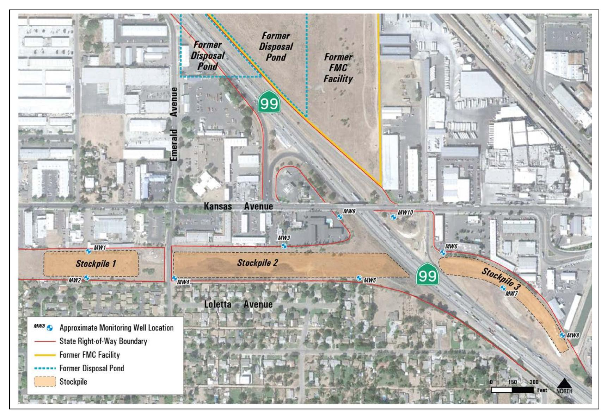

Figure 2-16: Caltrans Modesto Soil Stockpiles Locations

A 2004 preliminary site investigation was conducted to characterize each of the stockpiles. The investigation collected soil samples from 50 stockpile borings. The samples were analyzed for heavy metals, polycyclic aromatic hydrocarbons, nitrate, and pH. The analytical results indicated elevated barium concentrations in stockpile soil samples that exceed commercial/industrial California human health screening levels.

An initial site assessment was conducted in 2003 for the soil stockpiles. The assessment identified a potential for the three soil stockpiles to contain residual chemicals associated with the former FMC impoundments. A 2004 preliminary site investigation was conducted to characterize each of the stockpiles. The investigation collected soil samples from 50 stockpile borings. The samples were analyzed for heavy metals, polycyclic aromatic hydrocarbons, nitrate, and pH. The analytical results indicated elevated barium concentrations in stockpile soil samples that exceed commercial/industrial California human health screening levels. Cadmium concentrations exceeding these same commercial/industrial screening levels were also detected in soil samples collected from soil stockpiles 2 and 3.

In 2006, an additional 278 soil samples were collected for comparison to background conditions and California human health screening levels. The 2004 and 2006 investigations found that the stockpiles have an average thickness of 20 feet and are composed mostly of layered, poorly graded sand and silty sand similar to underlying native alluvial deposits of the Modesto Formation. Antimony, selenium, and silver were not detected in any of the 278 soil samples analyzed. Beryllium, cadmium, mercury, molybdenum, and thallium were detected in the stockpile soil samples at low concentrations. Arsenic, chromium, cobalt, and copper were detected in the stockpile soil samples at concentrations slightly exceeding background concentrations. Barium, lead, nickel, vanadium, and zinc were detected in the stockpile soil samples at concentrations considerably higher than background values. Barium, the primary constituent of potential concern, was detected at maximum concentrations of 130 milligrams per kilograms (mg/kg) in soil stockpile 1; 64,000 mg/kg in soil stockpile 2; and 72,000 mg/kg in soil stockpile 3. Barium concentrations reported for the background soil samples ranged from 17 to 120 mg/kg.

To assess groundwater quality next to the site, eight groundwater monitoring wells were installed in 2006. Groundwater was encountered in the vicinity of the project at depths between 30 and 40 feet (below natural grade), with flow toward the southeast.

The results of analysis of groundwater samples collected from the eight monitoring wells in June and October 2006 indicated that groundwater, which is not a source of municipal drinking water, did not exceed drinking water standards for the constituents analyzed.

In 2007, a human health risk assessment was prepared to calculate risk associated with constituents of potential concern in the soil stockpiles and groundwater using multiple exposure scenarios. Metals (notably barium) and polycyclic aromatic hydrocarbons were identified as the primary constituents of potential concern in the soil stockpiles, and metals and general minerals (for example, nitrate and total dissolved solids) were the primary constituents of potential concern in groundwater. The results of the human health risk assessment indicated that the three soil stockpiles do not pose an unacceptable risk or hazard to current or future offsite residents, trespassers, construction workers, or hypothetical future shallow groundwater users, based on current soil management practices, including vegetation maintenance and groundwater monitoring.

#### **Environmental Consequences**

#### **Build Alternatives**

Additional soil sampling was conducted in 2012 prior to preparing the Soil Stockpiles Feasibility Study and the Draft Final Remedial Action Plan. Sampling evaluated fence line migration and stockpile perimeter and confirmation testing. Results of the

sampling were used to update the 2007 Human Health Risk Assessment. Following review of the supplemental data, the California Department of Toxic Substances Control concurred with the findings of the Human Health Risk Assessment 2013 Update, which did not change the results originally determined in 2007.

#### **Environmental Consequences**

The Soil Stockpiles Feasibility Study (see Appendix G) was prepared to identify remedial action objectives, general response actions, and process options for the three soil stockpiles. The study also developed and screened remedial alternatives and presented an individual and comparative analysis of each retained remedial alternative for the three soil stockpiles. The options were then evaluated based on nine criteria to support an informed decision for the most appropriate remedy for the stockpiles.

Following California Department of Toxic Substances Control acceptance of the Soil Stockpiles Feasibility Study, a Draft Final Remedial Action Plan was prepared. The purpose of the Draft Final Remedial Action Plan is to 1) summarize in one document all of the studies that have analyzed contaminant impacts at the Caltrans Modesto Soil Stockpiles site, 2) provide an assessment of potential risks to human health and the environment associated with the impacts, 3) develop a remedial action alternative to reduce those risks, and 4) provide the information to the public for review and comment. The Draft Final Remedial Action Plan is provided in Appendix H of this document

Based on the screening of alternatives and comparative analysis, containment of the contaminated soil was selected as the Recommended Stockpile Alternative (Containment). The alternative would be implemented by using the three stockpiles for project construction, which would require a significant amount of fill for the embankments of the proposed SR 132/SR 99 interchange.

The Recommended Stockpile Alternative (Containment) was selected because of the alternative's effectiveness in providing long-term and overall protection of human health and the environment; technical feasibility; cost-effectiveness; and the ability to minimize the potential for contaminants to migrate to groundwater or to be eroded by stormwater runoff

The Draft Final Remedial Action Plan would be circulated for public review and comment with this document. Based upon receipt of public comments and, if

warranted, the Draft Final Remedial Action Plan would be modified accordingly, prior to approval by the California Department of Toxic Substances Control and the Regional Water Quality Control Board. After approval of the Final Remedial Action Plan, project construction details would be presented in a Remedial Design Implementation Plan.

#### **Build Alternatives**

Stockpile soil would be contained behind retaining walls, bridge abutments and beneath highway pavements. The proposed project's initial construction phase (Phase 1) would consist of a two-lane roadway, which would be constructed over the southern portions of soil stockpiles 1 and 2. The northern portions of soil stockpiles 1 and 2, which would not be contained beneath the highway and behind retaining walls and bridge abutments, would be graded for drainage and capped with a minimum of a 6- to 12-inch-thick clean, vegetated soil cap. Figure 2-17 shows a typical cross-section of the initial construction phase and shows the portion of the stockpiles that would be temporarily covered by the clean soil cap until the ultimate build-out is completed. Figure 2-18 shows a typical cross-section of the ultimate build-out (Phase 2) and shows the complete containment of the stockpiles within the project's retaining walls and beneath highway pavements. Also shown in Figure 2-17 is the median between the eastbound and westbound lanes, which would be covered by either pavement or a synthetic liner and clean soil layer.

Soil stockpile 3 would be treated differently than soil stockpiles 1 and 2: the stockpile would be entirely contained within the initial construction phase of the project. Much of soil stockpile 3 would be placed in the stockpile fill consolidation zone within the eastern abutment of the proposed SR 132/SR 99 interchange. The remainder of soil stockpile 3 would be placed in the stockpile fill consolidation zone of soil stockpile 2 (Figure 2-18).

Phase 1: Typical Soil Stockpile Cross-Section

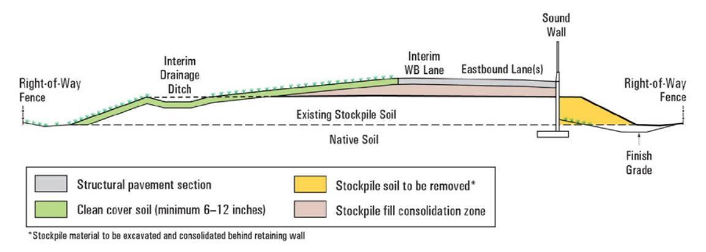

Figure 2-17: Phase 1 - Typical Stockpile Cross-Section

Phase 2: Typical Soil Stockpile Cross-Section

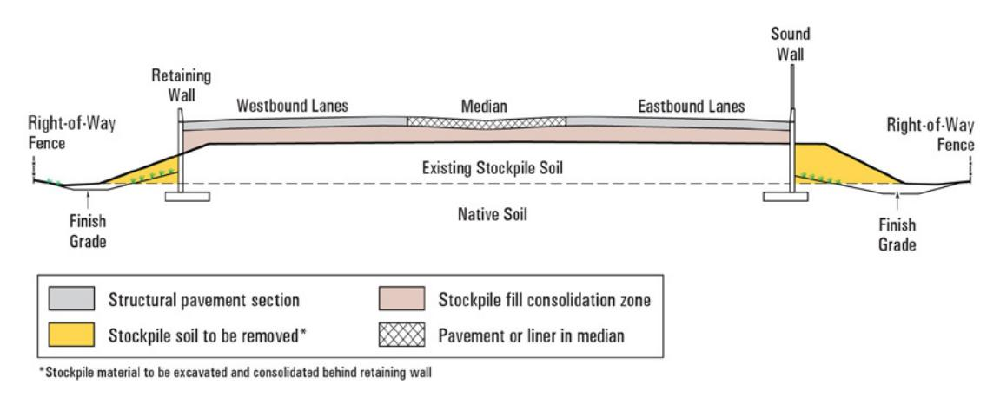

Figure 2-18: Phase 2 - Typical Stockpile Cross-Section

Monitoring of the stockpiles and stormwater runoff constituents of potential concern would continue until the project and full containment of all three soil stockpiles are complete. The frequency of groundwater monitoring would be subject to change until the California Department of Toxic Substances Control and the Central Valley Regional Water Quality Control Board indicate that monitoring is no longer required. Past and continued maintenance, in accordance with the California Department of Toxic Substances Control and Central Valley Regional Water Quality Control Board requirements, would continue and include monitoring the condition and effectiveness of the vegetative cover on the portions of the stockpiles not yet contained or capped

by the project. Maintaining perimeter fencing would ensure access is restricted to each stockpile to prevent soil transport offsite from Caltrans right-of-way and for the continued monitoring for potential erosion.

#### No-Build Alternative

Soil stockpile containment via a highway structure would not be implemented under the project's No-Build Alternative. However, impacts to the environment posed by the continued presence of the soil stockpiles would be mitigated by a remedial action developed under the oversight and approval of the California Department of Toxic Substances Control and the Central Valley Regional Water Quality Control Board. Currently, the perimeter of all three soil stockpiles is enclosed with security fencing, walls, and structures. Under the No-Build Alternative, Caltrans would continue to maintain the perimeter fence, restrict access to authorized personnel, continue water quality monitoring, and maintain each of the soil stockpile's vegetative cover until remediation of the stockpiles is completed under the oversight and approval of the California Department of Toxic Substances Control and the Central Valley Regional Water Quality Control Board.

#### Avoidance, Minimization, and/or Mitigation Measures

Following the California Department of Toxic Substances Control and Central Valley Regional Water Quality Control Board approval of the Final Remedial Action Plan, the details of project construction would be presented in a Remedial Design Implementation Plan.

The following avoidance and minimization measures would reduce potential impacts related to hazardous waste and materials in the three soil stockpiles during construction and implementation of the Final Remedial Action Plan:

SHAZ-1 Prior to any earthmoving or construction activities related to the soil stockpiles, a grading permit from the City of Modesto would be secured by the construction contractor. Additionally, prior to any earthmoving or construction activities related to the soil stockpiles, a Health and Safety Plan that addresses all hazards associated with the movement and disposition of stockpile soil related to construction of the containment features would also be prepared by the construction contractor. The hazards associated with the movement and disposition of stockpile soil to be included in the Health and Safety Plan would be identified in the Remedial Design Implementation Plan that would be submitted to the

California Department of Toxic Substances Control and the Regional Water Quality Control Board for review and approval. As described in Section 2.2.6, Air Quality, the contractor would comply with the San Joaquin Valley Air Pollution Control District's Rule 9510. As described in Section 2.2.2, Water Quality, the contractor would prepare and implement construction site best management practices in accordance with the California Department of Transportation's Stormwater Management Plan and National Pollutant Discharge Elimination System Permit (Order No. 99-06-DWQ National Pollutant Discharge Elimination System No. CAS000003).

- SHAZ-2 The contractor would remove all debris on or adjacent to the soil stockpiles prior to grading. The contractor would dispose of it accordance with regulations pertaining to the type of waste encountered.
- SHAZ-3 If any vegetation grubbing is required, the contractor would minimize dust generation consistent with standard best management practices described in Section 2.2.6, Air Quality. The contractor would implement the California Department of Transportation's Standard Specifications control measures Section 14-9.02 (Air Pollution Control) and Section 14-9.03 (Dust Control). The contractor would apply water under Section 17 and dust palliative under Section 18.
- SHAZ-4 The contractor would minimize reconfiguration of the soil stockpiles to the minimum extent possible to meet project design criteria for fill placement, thereby reducing the potential for stormwater and/or wind erosion and stormwater infiltration into the soil stockpiles.
- SHAZ-5 Perimeter air quality monitoring would occur during any earthmoving or construction activities related to the soil stockpiles, including clearing and grubbing or other site grading activities performed by the construction contractor. Perimeter air quality monitoring would occur according to an Air Monitoring Plan that would describe monitoring locations, equipment, sampling and analysis methods, hazardous exposure threshold values, etc. All elements of the Air Quality Monitoring Plan would be identified in the Remedial Design Implementation Plan that would be submitted to the California Department of Toxic Substances Control and the Regional Water Quality Control Board for review and approval. The contractor would provide monitoring results to the California Department of Toxic Substances Control for its review and approval. If the results of air

monitoring demonstrate that dust control measures are effective and that there is no exposure to constituents of potential concern in the soil stockpiles via airborne dust, then the frequency of monitoring may be decreased with the California Department of Toxic Substances Control's approval.

- SHAZ-6 The contractor would submit requests to the California Department of Toxic Substances Control for approval prior to modifying procedures for soil excavation, relocation, dust control, air monitoring, or other field activities.
- SHAZ-7 The contractor would maintain detailed records related to movement, placement, and inspection of the stockpile soil.
- SHAZ-8 As required by California Code of Regulations, Title 22, section 67391.1, the California Department of Transportation would prepare and record a land use covenant to restrict the types of land use that are allowed on the site. The land use covenant would identify that the proposed transportation land use is compatible and acceptable with respect to health risk. The land use covenant would be prepared in compliance with California Department of Toxic Substances Control policies and finalized and recorded after remedial measures are implemented and before the soil stockpile site is certified by the California Department of Toxic Substances Control as remediated.
- SHAZ-9 A groundwater and storm water quality monitoring program for the contained Caltrans Modesto Soil Stockpiles would be proposed and included in the Remedial Design Implementation Plan to be submitted to the California Department of Toxic Substances Control and the Regional Water Quality Control Board for review and approval. In addition to design specifications for construction of the containment features, the Remedial Design Implementation Plan would address water quality monitoring for the initial and final construction phases of the project. Until the groundwater and surface water quality monitoring program is approved, or if the no-build alternative is selected, groundwater and storm water quality monitoring would continue as currently conducted in accordance with the 2006 and 2012 (amendment) sampling and analysis plans approved by the California Department of Toxic Substances Control and the Regional Water Quality Control Board.

SHAZ-10 The functionality and condition of each stockpile containment feature (pavement, retaining walls, abutments, vegetated soil cover, etc.) would be evaluated in accordance with an operation and maintenance plan established in accordance with an operation and maintenance agreement between the California Department of Transportation and the California Department of Toxic Substances Control and the California Regional Water Quality Control Board. The proposed operation and maintenance plan and operation and maintenance agreement would be included in the Remedial Design Implementation Plan that would be submitted to the California Department of Toxic Substances Control and the Regional Water Quality Control Board for review and approval. The operation and maintenance plan would address containment feature assessment, management, and reporting to ensure the ongoing integrity of the containment feature for the protection of human health and the environment. The operation and maintenance plan would address containment feature assessment for the initial and final construction phases of the project. If the no-build alternative is selected, a separate Caltrans-initiated stockpile remediation project would be proposed and remedy selection document prepared under the oversight the California Department of Toxic Substances Control and the Central Valley Regional Water Quality Control Board.

#### 2.2.6 Air Quality

#### Regulatory Setting

The federal Clean Air Act, as amended, is the main federal law that governs air quality. The California Clean Air Act is its companion state law. These laws and related regulations by the U.S. Environmental Protection Agency and the California Air Resources Board, set standards for the concentration of pollutants in the air.

At the federal level, these standards are called National Ambient Air Quality Standards. National Ambient Air Quality Standards and state ambient air quality standards have been established for six transportation-related criteria pollutants that have been linked to potential health concerns: carbon monoxide, nitrogen dioxide, ozone, sulfur dioxide, and particulate matter, which is broken down for regulatory purposes into particles of 10 micrometers or smaller (PM10) and particles of 2.5 micrometers and smaller (PM2.5). In addition, national and state standards exist for

lead, and state standards exist for visibility-reducing particles, sulfates, hydrogen sulfide, and vinyl chloride.

National Ambient Air Quality Standards and state standards are set at levels that protect public health with a margin of safety and are subject to periodic review and revision. Both state and federal regulatory requirements also cover toxic air contaminants (air toxics); some criteria pollutants are also air toxics or may include certain air toxics in their general definition.

Federal air quality standards and regulations provide the basic framework for project-level air quality analysis under NEPA. In addition to this environmental analysis, a parallel "conformity" requirement under the federal Clean Air Act also applies.

#### Criteria Pollutants

The conformity requirement is based on Federal Clean Air Act Section 176(c), which prohibits the U.S. Department of Transportation and other federal agencies from funding, authorizing, or approving plans, programs, or projects that do not conform to state implementation plans for attaining National Ambient Air Quality Standards. "Transportation conformity" applies to highway and transit projects and takes place on two levels: the regional—or, planning and programming level—and the project level. The proposed project must conform at both levels to be approved.

Conformity requirements apply only in nonattainment and "maintenance" (former nonattainment) areas for National Ambient Air Quality Standards, and only for the specific National Ambient Air Quality Standards that are or were violated. U.S. Environmental Protection Agency regulations at 40 Code of Federal Regulations Part 93 govern the conformity process. Conformity requirements do not apply in unclassifiable/attainment areas for National Ambient Air Quality Standards and do not apply for state standards regardless of the status of the area.

Regional conformity is concerned with how well the regional transportation system supports plans for attaining National Ambient Air Quality Standards for carbon monoxide, nitrogen dioxide, ozone, PM10, PM2.5, and, in some areas (although not in California), sulfur dioxide. California has attainment or maintenance areas for all of these transportation-related "criteria pollutants" except sulfur dioxide, and also has a nonattainment area for lead; however, lead is not currently required by the Federal Clean Air Act to be covered in transportation conformity analysis.

Regional conformity is based on emission analysis of Regional Transportation Plans and Federal Transportation Improvement Programs that include all transportation projects planned for a region over a period of at least 20 years (for the Regional Transportation Plan) and a minimum of 4 years (for the Federal Transportation Improvement Program). Regional Transportation Plan and Federal Transportation Improvement Program conformity uses travel demand and emission models to determine whether or not the implementation of those projects would conform to emission budgets or other tests at various analysis years showing that requirements of the Clean Air Act and the state implementation plan are met. If the conformity analysis is successful, the Metropolitan Planning Organization, Federal Highway Administration, and Federal Transit Administration make the determinations that the Regional Transportation Plan and Federal Transportation Improvement Program are in conformity with the state implementation plan for achieving the goals of the Clean Air Act. Otherwise, the projects in the Regional Transportation Plan and/or Federal Transportation Improvement Program must be modified until conformity is attained. If the design concept, scope, and "open-to-traffic" schedule of a proposed transportation project are the same as described in the Regional Transportation Plan and the Transportation Improvement Program, then the proposed project meets regional conformity requirements for the purpose of project level analysis.

Conformity analysis at the project-level includes verification that the project is included in the regional conformity analysis and a "hot-spot" analysis if an area is "nonattainment" or "maintenance" for carbon monoxide and/or particulate matter (PM10 or PM2.5). A region is "nonattainment" if one or more of the monitoring stations in the region measure a violation of the relevant standard and the U.S. Environmental Protection Agency officially designates the area nonattainment. Areas that were previously designated as nonattainment areas but subsequently meet the standard may be officially redesignated to attainment by the U.S. Environmental Protection Agency, and are then called "maintenance" areas. "Hot-spot" analysis is essentially the same, for technical purposes, as carbon monoxide or particulate matter analysis performed for NEPA purposes.

Conformity does include some specific procedural and documentation standards for projects that require a "hot-spot" analysis. In general, projects must not cause the "hot-spot"-related standard to be violated and must not cause any increase in the number and severity of violations in nonattainment areas. If a known carbon monoxide or particulate matter violation is located in the project vicinity, the project must include measures to reduce or eliminate the existing violation(s) as well.

#### Affected Environment

The following section is based on the *State Route 132 Air Quality Study Report* and the *State Route 132 Air Quality Conformity Analysis*, both completed in May 2016.

The proposed project study area sits within the San Joaquin Valley Air Basin, which includes all or part of seven counties, including Stanislaus County. The San Joaquin Valley Air Pollution Control District is principally responsible for air pollution control within the basin through monitoring air quality and through planning, implementing, and enforcing programs designed to reach and maintain state and federal ambient air quality standards in the Air Pollution Control District.

The proposed project study area is in the northern portion of the San Joaquin Valley Air Basin, a basin known for an "inland Mediterranean" climate, characterized by dry summers and cool winters. Summer high temperatures often exceed 100 degrees Fahrenheit. The surrounding mountain ranges restrict air movement through and out of the basin. While prevailing wind patterns, periodic high-pressure systems, and inversion layers contain air pollutants within the area, wind speed and direction can influence how air pollutants (such as ozone precursors, PM10, and carbon monoxide) are dispersed by winds moving pollutants out of the area. Precipitation and fog, somewhat common in the basin and study area, also tend to reduce or limit pollutant concentrations. Annual precipitation in the basin decreases from north to south. Roughly 20 inches of rain falls annually in the basin's northern portion.

Existing air quality standards areas are classified as either attainment, attainment with maintenance, or nonattainment with respect to state and federal ambient air quality standards. If data are insufficient to determine whether a pollutant is violating the standard, the area is designated unclassified. Table 2-35 shows applicable standards and area attainment statuses for each relevant pollutant.

Table 2-35: State and Federal Criteria Air Pollutant Standards, Effects, and Sources

| Pollutant                  | Averaging Time                            | State 1 Standard          | Federal 1 Standard                 | Principal Health and Atmospheric Effects                                                                                                                                                                                                                                                                                   | Typical Sources                                                                                                                                                                                                                                                                                                                                                                                              | Project Area Attainment Status                                                                                                                    |
|----------------------------|----------------------------------------------|------------------------------|---------------------------------------|-------------------------------------------------------------------------------------------------------------------------------------------------------------------------------------------------------------------------------------------------------------------------------------------------------------------------------------|-----------------------------------------------------------------------------------------------------------------------------------------------------------------------------------------------------------------------------------------------------------------------------------------------------------------------------------------------------------------------------------------------------------------|------------------------------------------------------------------------------------------------------------------------------------------------------------|
| Ozone (O3)2                | 1 hour 8 hours                            | 0.09 ppm 0.070 ppm        | 0.075 ppm (4th highest in 3 years) | High concentrations irritate lungs. Long- term exposure may cause lung tissue damage and cancer. Long-term exposure damages plant materials and reduces crop productivity. Precursor organic compounds include many known toxic air contaminants. Biogenic VOC may also contribute. | Low-altitude ozone is almost entirely formed from reactive organic gases/volatile organic compounds (ROG or VOC) and nitrogen oxides (NOx) in the presence of sunlight and heat. Common precursor emitters include motor vehicles and other internal combustion engines, solvent evaporation, boilers, furnaces, and industrial processes. | Federal: Extreme nonattainme nt (8-hour) State: Nonattainme nt (8-hour) Severe nonattainme nt (1-hour)                          |
| Carbon Monoxide (CO) | 1 hour 8 hours 8 hours (Lake Tahoe) | 20 ppm 9.0 ppm 4 6 ppm | 35 ppm 9 ppm --                 | CO interferes with the transfer of oxygen to the blood and deprives sensitive tissues of oxygen. CO also is a minor precursor for photochemical ozone. Colorless, odorless.                                                                                                                              | Combustion sources, especially gasoline-powered engines and motor vehicles. CO is the traditional signature pollutant for on-road mobile sources at the local and neighborhood scale.                                                                                                                                                                                       | Federal: Moderate Maintenance (Designation applies to urbanized portions of the San Joaquin Valley)  State: Attainment |

Table 2-35: State and Federal Criteria Air Pollutant Standards, Effects, and Sources

| Pollutant                                                               | Averaging Time                                                                                                                  | State 1 Standard                                                                              | Federal 1 Standard                                                 | Principal Health and Atmospheric Effects                                                                                                                                                                                                                                                                     | Typical Sources                                                                                                                                                                                                                                                                | Project Area Attainment Status                                      |
|-------------------------------------------------------------------------|------------------------------------------------------------------------------------------------------------------------------------|-------------------------------------------------------------------------------------------------------------|----------------------------------------------------------------------------------|-----------------------------------------------------------------------------------------------------------------------------------------------------------------------------------------------------------------------------------------------------------------------------------------------------------------------|-----------------------------------------------------------------------------------------------------------------------------------------------------------------------------------------------------------------------------------------------------------------------------------|------------------------------------------------------------------------------|
| Respirable Particulate Matter (PM 10 ) 2 | 24 hours Annual                                                                                                                 | 50 μg/m 3 20 μg/m 3                                                                | 150 µg/m³²  (expected number of days above standard < or equal to 1)             | Irritates eyes and respiratory tract. Decreases lung capacity. Associated with increased cancer and mortality. Contributes to haze and reduced visibility. Includes some toxic air contaminants. Many toxic and other aerosol and solid compounds are part of PM 10 .                                      | Dust- and fume- producing\nindustrial and agricultural operations; combustion smoke & vehicle\nexhaust; atmospheric chemical reactions; construction and\nother dust- producing activities; unpaved road dust and re-\nentrained paved road dust; natural sources.                | Federal: Serious Maintenance (24-hour) State: Non- attainment |
| Fine Particulate Matter (PM 2.5 ) 2      | 24 hours Annual 24 hours (conformity process 5 ) Secondary Standard (annual; also for conformity process 5 ) |  12 μg/m³                                                                                          | 35 µg/m³ 12.0 µg/m³ 65 µg/m³ 15 µg/m³ (98 th percentile over 3 years) | Increases respiratory disease, lung damage, cancer, and premature death. Reduces visibility and produces surface soiling. Most diesel exhaust particulate matter – a toxic air contaminant – is in the PM 2.5 size range. Many toxic and other aerosol and solid compounds are part of PM 2.5 . | Combustion including motor vehicles, other mobile sources, and industrial activities; residential and agricultural burning; also formed through atmospheric chemical and photochemical reactions involving other pollutants including NOx, sulfur oxides (SOx), ammonia, and ROG. | Federal: Non- attainment State: No- nattainment (annual)      |
| Pollutant                                                               | Averaging Time                                                                                                                  | State 1 Standard                                                                              | Federal 1 Standard                                                 | Principal Health and Atmospheric Effects                                                                                                                                                                                                                                                                     | Typical Sources                                                                                                                                                                                                                                                                | Project Area Attainment Status                                      |
| Nitrogen Dioxide (NO 2 )                               | 1 hour                                                                                                                             | 0.18 ppm 0.030 ppm                                                                                       | 0.100 ppm 6 (98 th percentile over 3 years)                | Irritating to eyes and respiratory tract. Colors atmosphere reddish-brown. Contributes to acid rain and nitrate contamination of stormwater. Part of the "NOx" group of ozone precursors.                                                                                                                             | Motor vehicles and other mobile or portable engines, especially diesel; refineries; industrial operations.                                                                                                                                                   | Federal: Attainment State: Attainment                               |
| Sulfur Dioxide (SO 2 )                                 | 1 hour 3 hours                                                                                                                     | 0.25 ppm                                                                                                    | 0.075 ppm 7 (99 th percentile over 3 years)                | Irritates respiratory tract; injures lung tissue. Can yellow plant leaves. Destructive to marble, iron, steel. Contributes to acid rain. Limits visibility.                                                                                                                                                           | Fuel combustion (especially coal and high-sulfur oil), chemical plants, sulfur recovery plants, metal processing; some natural sources like active volcanoes. Limited contribution                                                                                                | Federal: Attainment State: Attainment                               |
|                                                                         | 24 hours                                                                                                                           | 0.04 ppm                                                                                                    |                                                                                  |                                                                                                                                                                                                                                                                                                                       | possible from heavy-duty diesel vehicles if ultra- low sulfur fuel not\nused.                                                                                                                                                                                                     |                                                                              |
| Lead (Pb) 9                                                  | Monthly Rolling 3- month average                                                                                          | 1.5 µg/m 3                                                                                    |  0.15 μg/m 3                                                       | Disturbs gastrointestinal system. Causes anemia, kidney disease, and neuromuscular and neurological dysfunction. Also a toxic air contaminant and water pollutant.                                                                                                                                                    | Lead-based industrial processes like battery production and smelters. Lead paint, leaded gasoline. Aerially deposited lead from older gasoline use may exist in soils along major roads.                                                                                          | Federal: Unclassified State: Attainment 11               |
| Sulfate                                                                 | 24 hours                                                                                                                           | 25 μg/m³                                                                                                    |                                                                                  | Premature mortality and respiratory effects. Contributes to acid rain. Some toxic air contaminants attach to sulfate aerosol particles.                                                                                                                                                          | Industrial processes, refineries and oil fields, mines, natural sources like volcanic areas, salt- covered dry lakes, and large sulfide rock areas.                                                                                                                               | Federal: n/a State: Attainment 11                                 |
| Pollutant                                                               | Averaging Time                                                                                                                  | State 1 Standard                                                                              | Federal 1 Standard                                                 | Principal Health and Atmospheric Effects                                                                                                                                                                                                                                                                     | Typical Sources                                                                                                                                                                                                                                                                | Project Area Attainment Status                                      |
| Hydrogen Sulfide (H 2 S)                               | 1 hour                                                                                                                             | 0.03 ppm                                                                                                    |                                                                                  | Colorless, flammable, poisonous. Respiratory irritant. Neurological damage and premature death. Headache, nausea. Strong odor.                                                                                                                                                                | Industrial processes such as: refineries and oil fields, asphalt plants, livestock operations, sewage treatment plants, and mines. Some natural sources like volcanic areas and hot springs.                                                                                      | Federal: Attainment State: Unclassified                             |
| Visibility- Reducing Particles (VRP)                           | 8 hours                                                                                                                            | Visibility of 10 miles or more (Tahoe: 30 miles) at relative humidity less than 70% |                                                                                  | Reduces visibility. Produces haze. Note: Not directly related to the Regional Haze program under the Federal Clean Air Act, which is oriented primarily toward visibility issues in National Parks and other "Class I" areas. However, some issues and measurement methods are similar.                               | See particulate matter above.  May be related more to aerosols than to solid particles.                                                                                                                                                                                           | Federal: n/a State: Unclassified                                             |
| Vinyl Chloride 9                                          | 24 hours                                                                                                                           | 0.01 ppm                                                                                                    |                                                                                  | Neurological effects, liver damage, cancer. Also considered a toxic air contaminant.                                                                                                                                                                                                                   | Industrial processes                                                                                                                                                                                                                                                              | Federal: n/a State: Attainment                                               |

Table 2-35: State and Federal Criteria Air Pollutant Standards, Effects, and Sources

Table 2-35: State and Federal Criteria Air Pollutant Standards, Effects, and Sources

Adapted from City of Bakersfield 24th Street Improvement Project Draft EIR and California ARB Air Quality Standards chart (http://www.arb.ca.gov/research/aags/aags2.pdf).

Notes: ppm = parts per million; µg/m3 = micrograms per cubic meter; ppb=parts per billion (thousand million); Greenhouse Gases and Climate Change: Greenhouse gases do not have concentration standards for that purpose. Conformity requirements do not apply to greenhouse gases.

- State standards are "not to exceed" or "not to be equaled or exceeded" unless stated otherwise.
- Federal standards are "not to exceed more than once a year" or as described above. Annual PM10 NAAQS revoked October 2006; was 50 μg/m³. 24-hr. PM2.5 NAAQS tightened October 2006; was 65 µg/m3. Annual PM2.5 NAAQS tightened from 15 µg/m3 to 12 µg/m3 December 2012 and secondary annual standard set at 15 µg/m3.
- 3 Prior to 6/2005, the 1-hour ozone NAAQS was 0.12 ppm. Emission budgets for 1-hour ozone are still in use in some areas where 8-hour ozone emission budgets have not been developed, such as the S.F. Bay Area.
- 4 Rounding to an integer value is not allowed for the State 8-hour CO standard. A violation occurs at or above 9.05 ppm.
- The 65 μg/m3 PM2.5 (24-hr) NAAQS was not revoked when the 35 μg/m3 NAAQS was promulgated in 2006. The 15 µg/m3 annual PM2.5 standard was not revoked when the 12 µg/m3 standard was promulgated in 2012. The 0.08 ppm 1997 ozone standard is revoked FOR CONFORMITY

PURPOSES ONLY when area designations for the 2008 0.75 ppm standard become effective for conformity use (7/20/2013). Conformity requirements apply for all NAAQS, including revoked NAAQS, until emission budgets for newer NAAQS are found adequate, SIP amendments for the newer NAAQS are approved with a emission budget, EPA specifically revokes conformity requirements for an older standard, or the area becomes attainment/unclassified. SIP-approved emission budgets remain in force indefinitely unless explicitly replaced or eliminated by a subsequent approved SIP amendment. During the "Interim" period prior to availability of emission budgets, conformity tests may include some combination of build vs. no build, build vs. baseline, or compliance with prior emission budgets for the same pollutant.

- 6 Final 1-hour NO2 NAAQS published in the Federal Register on 2/9/2010, effective 3/9/2010. Initial area designation for California (2012) was attainment/unclassifiable throughout. Project-level hot spot analysis requirements do not currently exist. Near-road monitoring starting in 2013 may cause redesignation to nonattainment in some areas after 2016.
- 7 EPA finalized a 1-hour SO2 standard of 75 ppb in June 2010. Nonattainment areas have not yet been designated as of 9/2012.
- 8 Secondary standard, set to protect public welfare rather than health. Conformity and environmental analysis address both primary and secondary NAAQS.
- 9 The ARB has identified vinyl chloride and the particulate matter fraction of diesel exhaust as toxic air contaminants. Diesel exhaust particulate matter is part of PM10 and, in larger proportion, PM2.5. Both the ARB and U.S. EPA have identified lead and various organic compounds that are precursors to ozone and PM2.5 as toxic air contaminants. There are no exposure criteria for adverse health effect due to toxic air contaminants, and control requirements may apply at ambient concentrations below any criteria levels specified above for these pollutants or the general categories of pollutants to which they belong.
- 10 Lead NAAQS are not considered in Transportation Conformity analysis.
- 11 Source: http://www.valleyair.org/aqinfo/attainment.htm

In accordance with the U.S. Environmental Protection Agency's 2010 guidance, a PM10 and PM2.5 hot-spot analysis is necessary to show that the project conforms to the state implementation plan and would not cause or contribute to new air quality violations, worsen existing violations, or delay timely attainment of National Ambient Air Quality Standards for the criteria pollutants. The state implementation plan is comprised of the 2007 PM10 Maintenance Plan and Request for Redesignation, adopted by the Air Pollution Control District on September 20, 2007, the 2008 PM2.5 Plan to address attainment of the PM2.5 annual standard, adopted in April 2008, and the 2012 PM2.5 Plan concerning attainment of the PM2.5 24-hour standard, adopted in December 2012. The U.S. Environmental Protection Agency approved the PM10 redesignation of the San Joaquin Air Basin portion of the Air Pollution Control District, which includes the project study area, on November 12, 2008.

The California Air Resource Board and the U.S. Environmental Protection Agency maintain and operate various monitoring stations to measure ambient air quality. The air quality monitoring station nearest the project study area is the California Air Resource Board's Modesto-14th Street monitoring station at 814 14th Street in Modesto. The station monitors for ozone, carbon monoxide, PM10, and PM2.5. Table 2-36 lists the air quality monitoring data for pollutants over the last four-year period (2011 to 2014). An asterisk notes a value where data was insufficient to determine a

value; however, a minimum of three years of complete data for each pollutant is reported over this period.

#### Project-level Conformity

| Standards                                                 | Year Monitored |       |       |       |
|-----------------------------------------------------------|----------------|-------|-------|-------|
|                                                           | 2011           | 2012  | 2013  | 2014  |
| 1-HOUR OZONE                                              |                |       |       |       |
| Maximum 1-hour concentration (ppm)                        | 0.091          | 0.104 | 0.088 | 0.103 |
| 1-hour California designation value                       | 0.090          | 0.100 | 0.100 | 0.100 |
| 1-hour expected peak day concentration                    | 0.101          | 0.098 | 0.097 | 0.096 |
| Number of Days Standard Exceededa                         |                |       |       |       |
| CAAQS 1-hour (>0.09 ppm)                                  | 0              | 2     | 0     | 1     |
| 8-Hour Ozone                                              |                |       |       |       |
| National maximum 8-hour concentration (ppm)               | 0.078          | 0.091 | 0.082 | 0.90  |
| National second-highest 8-hour concentration (ppm)        | 0.077          | 0.086 | 0.076 | 0.084 |
| National fourth-highest 8-hour concentration (ppm)        | 0.074          | 0.078 | 0.075 | 0.081 |
| California maximum 8-hour concentration (ppm)             | 0.078          | 0.091 | 0.082 | 0.091 |
| California second-highest 8-hour concentration (ppm)      | 0.078          | 0.086 | 0.077 | 0.084 |
| 8-hour National design value                              | 0.075          | 0.075 | 0.075 | 0.078 |
| 8-hour California designation value                       | 0.082          | 0.086 | 0.086 | 0.086 |
| 8-hour California expected peak day concentration         | 0.087          | 0.086 | 0.086 | 0.088 |
| Number of Days Standard Exceededa                         |                |       |       |       |
| NAAQS 8-hour (>0.075 ppm)                                 | 3              | 6     | 2     | 12    |
| CAAQS 8-hour (>0.070 ppm)                                 | 7              | 12    | 13    | 24    |
| CARBON MONOXIDE (CO)                                      |                |       |       |       |
| National maximum 1-hour concentration (ppm)               | 2.9            | 2.6   | 2.5   | 2.4   |
| National second-highest 1-hour concentration (ppm)        | 2.9            | 2.6   | 2.3   | 2.2   |
| Nationalb maximum 8-hour concentration (ppm)              | 2.71           | 2.10  | 1.9   | 1.7   |
| Nationalb second-highest 8-hour concentration (ppm)       | 2.15           | 2.07  | 1.8   | 1.6   |
| Californiac maximum 8-hour concentration (ppm)            | 2.71           | 2.10  | *     | *     |
| Californiac second-highest 8-hour concentration (ppm)     | 2.15           | 2.07  | *     | *     |
| Number of Days Standard Exceededa                         |                |       |       |       |
| NAAQS 1-hour (≥35 ppm)                                    | 0              | 0     | 0     | 0     |
| CAAQS 1-hour (≥20 ppm)                                    | 0              | 0     | 0     | 0     |
| NAAQS 8-hour (≥9 ppm)                                     | 0              | 0     | 0     | 0     |
| CAAQS 8-hour (≥9.0 ppm)                                   | 0              | 0     | 0     | 0     |
| PARTICULATE MATTER (PM10)d                                |                |       |       |       |
| National annual average concentrations (μg/m³)            | 25.5           | 25.1  | 30.4  | 29.1  |
| National 3-year average concentration (μg/m³)             | 24             | 24    | 27    | *     |
| California annual average concentration (µg/m³)e          | *              | 25.6  | 30.9  | *     |
| California 3-year annual average concentration (μg/m³)    | 27             | 26    | 31    | *     |
| Nationalb maximum 24-hour concentration (µg/m3)           | 69.4           | 74.1  | 73.0  | 122.5 |
| Nationalb second-highest 24-hour concentration (μg/m³)    | 63.1           | 59.9  | 67.2  | 94.9  |
| Californiac maximum 24-hour concentration (µg/m³)         | 73.5           | 74.6  | 77.5  | *     |
| Califoriniac second-highest 24-hour concentration (µg/m³) | 68.6           | 63.5  | 70.0  | *     |
| Year Monitored                                            |                |       |       |       |
| Standards                                                 | 2011           | 2012  | 2013  | 2014  |
| Number of Days Standard Exceededa                         |                |       |       |       |
| NAAQS 24-hour (>150 μg/m³)f                               | 0.0            | 0.0   | 0.0   | 0.0   |
| CAAQS 24-hour (>50 μg/m³)f                                | *              | 30.9  | 57.7  | *     |
| PARTICULATE MATTER (PM2.5)                                |                |       |       |       |
| National annual average concentration (μg/m³)             | 14.7           | 11.9  | 14.3  | 11.4  |
| California annual average concentration (μg/m³)e          | 14.7           | 11.9  | 14.4  | 11.4  |
| National annual design value (μg/m³)                      | 13.3           | 12.9  | 13.6  | 12.5  |
| California annual designation value (μg/m³)               | 15             | 15    | 15    | 14    |
| Nationalb maximum 24-hour concentration (μg/m³)           | 71.7           | 62.3  | 83.2  | 58.2  |
| Nationalb second-highest 24-hour concentration (μg/m3)    | 70.2           | 57.2  | 73.5  | 58.0  |
| National 3-year Average 24-hour 98th Percentile           | 54.7           | 40.8  | 56.4  | 49.5  |
| National 24-hour design value                             | 49             | 44    | 51    | 49    |
| Californiac maximum 24-hour concentration (μg/m³)         | 71.7           | 62.3  | 83.2  | 58.2  |
| Californiac second-highest 24-hour concentration (μg/m³)  | 70.2           | 57.2  | 73.5  | 58.0  |
| Number of Days Standard Exceededa                         |                |       |       |       |
| NAAQS annual (>12μg/m³)f                                  | 25             | 13    | 37    | 17    |

#### PM10/PM2.5 Hot-Spot Analyses

Notes: CAAQS = California ambient air quality standards; NAAQS = national ambient air quality standards.

Bold, italics and underlined values exceed the national, state and revoked standards, accordingly.

Sources: California Air Resources Board 2015; U.S. Environmental Protection Agency 2015.

#### **Environmental Consequences**

#### Regional Conformity

The proposed project is listed in StanCOG's financially constrained 2014 Regional Transportation Plan/Sustainable Communities Strategy, which was adopted and found to regionally conform by StanCOG via Resolution 13-46 on June 18, 2014 and by the Federal Highway Administration and the Federal Transit Administration on December 15, 2014. The proposed project is also included in StanCOG's financially constrained 2015 Federal Transportation Improvement Program, page A-14. The

\* = insufficient data available to determine the value.

&lt;sup>a = An exceedance is not necessarily a violation.

&lt;sup>b = National statistics are based on standard conditions data. Also, national statistics are based on samplers using federal reference or equivalent methods.

&lt;sup>c = State statistics are based on local conditions data, except in the South Coast Air Basin, for which statistics are based on standard conditions data. In addition, State statistics are based on California-approved samplers.

&lt;sup>d = Measurements usually are collected every 6 days.

&lt;sup>e = State criteria for ensuring that data are sufficiently complete for calculating valid annual averages are more stringent than the national criteria.

&lt;sup>f = Mathematical estimate of how many days concentrations would have been measured as higher than the level of the standard had each day been monitored. Values have been rounded.

2015 FTIP was adopted by StanCOG and a conformity determination via Resolution 13-49 was made on June 18, 2014. The Federal Highway Administration and Federal Transit Administration reviewed the StanCOG conformity determination and, after consultation with Environmental Protection Agency Region IX, made a conformity determination on December 15, 2014. The design concept and scope of the proposed project are consistent with the project description in the 2014 Regional Transportation Program/Sustainable Communities Strategy, 2015 Federal Transportation Improvement Program, and the "open to traffic" assumptions of StanCOG's regional emissions analysis.

#### Project-level Conformity

Project-level conformity is demonstrated by showing that a project would not cause or contribute to a localized exceedance of National Ambient Air Quality Standards in a nonattainment or maintenance area and that it would not interfere with "timely implementation" of transportation control measures identified in the state implementation plan.

#### Carbon Monoxide Hot-Spot Analysis

The effects of localized carbon monoxide hot spots were evaluated through carbon monoxide dispersion modeling consistent with the Transportation Project-Level Carbon Monoxide Protocol. Carbon monoxide hot spots were evaluated at intersections within the project study area for the No-Build Alternative at the completion of Phase 1 in 2020. Analysis was also done for the No-Build Alternative and two build alternatives at the completion of the ultimate build-out in 2028 and the No-Build Alternative and two build alternatives for the 2048 design year. These years were selected to evaluate the combined effect of increasing traffic volumes and improving vehicle emissions for carbon monoxide concentrations in the project study area.

Carbon monoxide modeling was conducted at the four most-congested intersections in the project study area:

- Existing SR 132 (Maze Boulevard) and Carpenter Road
- Kansas Avenue and North Carpenter Road
- North Carpenter Road and the southbound SR 99 on- and off-ramps
- North Carpenter Road and the northbound SR 99 on- and off-ramps

#### 2.3.1 Wetlands and Other Waters

#### Regulatory Setting

The proposed project is, therefore, not expected to cause or contribute to new or worsened violations of the National Ambient Air Quality Standards, and project-level carbon monoxide conformity determination requirements are satisfied. In addition, the predicted maximum concentrations are below the 1-hour (20 ppm) and 8-hour (9 ppm) California ambient air quality standards, satisfying CEQA.

#### Affected Environment

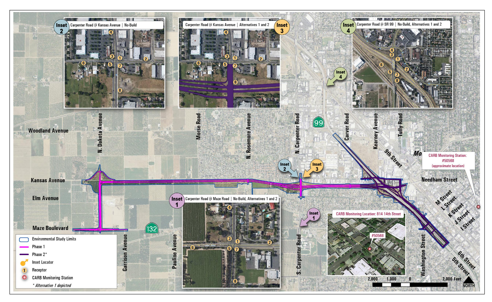

Figure 2-19: Carbon Monoxide Hot-Spot Analysis Intersection and Receptor Locations

Page Intentionally Left Blank

Table 2-37: Modeled Carbon Monoxide Levels at Receptors for the No-Build Alternative and Two Build Alternatives (Phase 1 - 2020)

| Intersection                                                              | Receptora | 2020 No-Build |         | 2020 Phase 1 |         |
|---------------------------------------------------------------------------|-----------|---------------|---------|--------------|---------|
|                                                                           |           | 1-hrb         | 8-hrb   | 1-hrb        | 8-hrb   |
| Existing SR 132 (Maze Boulevard) and Carpenter Road                 | 1         | 3.0 ppm       | 2.2 ppm | 3.2 ppm      | 2.4 ppm |
|                                                                           | 2         | 2.9 ppm       | 2.1 ppm | 3.0 ppm      | 2.2 ppm |
|                                                                           | 3         | 3.0 ppm       | 2.2 ppm | 3.2 ppm      | 2.4 ppm |
|                                                                           | 4         | 3.1 ppm       | 2.2 ppm | 3.2 ppm      | 2.4 ppm |
|                                                                           | 5         | 3.1 ppm       | 2.2 ppm | 3.2 ppm      | 2.4 ppm |
|                                                                           | 6         | 2.9 ppm       | 2.1 ppm | 3.1 ppm      | 2.3 ppm |
|                                                                           | 7         | 3.0 ppm       | 2.2 ppm | 3.2 ppm      | 2.4 ppm |
|                                                                           | 8         | 3.1 ppm       | 2.2 ppm | 3.1 ppm      | 2.3 ppm |
| Kansas Avenue and North Carpenter Road                                 | 1         | 3.0 ppm       | 2.2 ppm | 3.0 ppm      | 2.2 ppm |
|                                                                           | 2         | 3.0 ppm       | 2.2 ppm | 3.0 ppm      | 2.2 ppm |
|                                                                           | 3         | 3.2 ppm       | 2.4 ppm | 3.2 ppm      | 2.3 ppm |
|                                                                           | 4         | 3.1 ppm       | 2.3 ppm | 3.1 ppm      | 2.3 ppm |
|                                                                           | 5         | 3.1 ppm       | 2.3 ppm | 3.1 ppm      | 2.3 ppm |
|                                                                           | 6         | 3.1 ppm       | 2.3 ppm | 3.0 ppm      | 2.2 ppm |
|                                                                           | 7         | 3.2 ppm       | 2.4 ppm | 3.2 ppm      | 2.3 ppm |
|                                                                           | 8         | 3.0 ppm       | 2.2 ppm | 3.2 ppm      | 2.3 ppm |
| North Carpenter Road and the Southbound SR 99 on- and off- ramps | 1         | 4.1 ppm       | 3.0 ppm | 3.5 ppm      | 2.6 ppm |
|                                                                           | 2         | 3.7 ppm       | 2.7 ppm | 3.3 ppm      | 2.7 ppm |
|                                                                           | 3         | 3.5 ppm       | 2.6 ppm | 3.1 ppm      | 2.4 ppm |
|                                                                           | 4         | 3.6 ppm       | 2.6 ppm | 3.2 ppm      | 2.4 ppm |
|                                                                           | 5         | 4.6 ppm       | 3.3 ppm | 3.7 ppm      | 2.7 ppm |
|                                                                           | 6         | 3.6 ppm       | 2.6 ppm | 3.2 ppm      | 2.4 ppm |
|                                                                           | 7         | 3.9 ppm       | 2.8 ppm | 3.3 ppm      | 2.7 ppm |
|                                                                           | 8         | 4.0 ppm       | 2.9 ppm | 3.4 ppm      | 2.5 ppm |
| North Carpenter Road and the Northbound SR 99 on- and off- ramps | 1         | 3.4 ppm       | 2.5 ppm | 3.4 ppm      | 2.5 ppm |
|                                                                           | 2         | 3.1 ppm       | 2.3 ppm | 3.1 ppm      | 2.3 ppm |
|                                                                           | 3         | 3.1 ppm       | 2.3 ppm | 3.1 ppm      | 2.3 ppm |
|                                                                           | 4         | 3.1 ppm       | 2.3 ppm | 3.1 ppm      | 2.3 ppm |
|                                                                           | 5         | 3.4 ppm       | 2.5 ppm | 3.4 ppm      | 2.5 ppm |
|                                                                           | 6         | 3.0 ppm       | 2.2 ppm | 3.0 ppm      | 2.2 ppm |
|                                                                           | 7         | 3.2 ppm       | 2.4 ppm | 3.2 ppm      | 2.4 ppm |
|                                                                           | 8         | 3.3 ppm       | 2.4 ppm | 3.3 ppm      | 2.4 ppm |

*Notes*: For the purposes of evaluating impacts, Phase 1 represents both build alternatives for traffic conditions in 2020. ppm = parts per million.

&lt;sup>a Receptors were approx. 10 feet from the outer edge of adjacent lanes at the boundary of the mixing zone and at the estimated beginning and end of right-turn movements on each leg of the intersection. b Background concentrations of 2.7 ppm and 2.0 ppm were added to the modeling 1-hour and 8-hour results, respectively, based on the second maximum background concentration in each of the last 2 years extrapolated to the 2020 traffic year. The federal and state 1-hour standards are 35 and 20 ppm, respectively. The federal and state 8-hour standards are 9 ppm. *Source*: Air Quality Study Report (May 2016)

Table 2-38: Modeled Carbon Monoxide Levels at Receptors for the No-Build and Build Alternatives (Phase 2 - 2028)

#### Clean Water Act, Section 404

*Notes*: ppm = parts per million.

#### Porter-Cologne Water Quality Control Act

#### Clean Water Act, Section 401

&lt;sup>b Background concentrations of 1.7 ppm and 1.3 ppm were added to the modeling 1-hour and 8-hour results, respectively, based on the second maximum background concentration in each of the last 2 years extrapolated to the 2028 traffic year. The federal and state 1-hour standards are 35 and 20 ppm, respectively. The federal and state 8-hour standards are 9 ppm.

Table 2-39: Modeled Carbon Monoxide Levels at Receptors for the No-Build and Build Alternatives (Design Year 2048)

| Intersection                                                    |           | No-Build |         | Alternative 1 |         | Alternative 2 |         |
|-----------------------------------------------------------------|-----------|----------|---------|---------------|---------|---------------|---------|
|                                                                 | Receptora | 1-hrb    | 8-hrb   | 1-hrb         | 8-hrb   | 1-hrb         | 8-hrb   |
| Existing SR 132 (Maze Boulevard) and Carpenter Road             | 1         | 2.2 ppm  | 1.6 ppm | 2.1 ppm       | 1.6 ppm | 2.1 ppm       | 1.6 ppm |
|                                                                 | 2         | 2.0 ppm  | 1.5 ppm | 1.9 ppm       | 1.4 ppm | 1.9 ppm       | 1.4 ppm |
|                                                                 | 3         | 2.2 ppm  | 1.6 ppm | 2.1 ppm       | 1.6 ppm | 2.1 ppm       | 1.6 ppm |
|                                                                 | 4         | 2.1 ppm  | 1.6 ppm | 2.1 ppm       | 1.6 ppm | 2.1 ppm       | 1.6 ppm |
|                                                                 | 5         | 2.2 ppm  | 1.6 ppm | 2.1 ppm       | 1.6 ppm | 2.1 ppm       | 1.6 ppm |
|                                                                 | 6         | 2.0 ppm  | 1.5 ppm | 1.8 ppm       | 1.3 ppm | 1.9 ppm       | 1.4 ppm |
|                                                                 | 7         | 2.2 ppm  | 1.6 ppm | 2.1 ppm       | 1.6 ppm | 2.0 ppm       | 1.5 ppm |
|                                                                 | 8         | 2.2 ppm  | 1.6 ppm | 2.1 ppm       | 1.6 ppm | 2.1 ppm       | 1.6 ppm |
| Kansas Avenue and North Carpenter Road                          | 1         | 2.0 ppm  | 1.5 ppm | 2.2 ppm       | 1.6 ppm | 2.2 ppm       | 1.6 ppm |
|                                                                 | 2         | 2.0 ppm  | 1.5 ppm | 2.0 ppm       | 1.5 ppm | 2.0 ppm       | 1.5 ppm |
|                                                                 | 3         | 2.2 ppm  | 1.6 ppm | 2.1 ppm       | 1.6 ppm | 2.1 ppm       | 1.6 ppm |
|                                                                 | 4         | 2.0 ppm  | 1.5 ppm | 1.9 ppm       | 1.4 ppm | 1.9 ppm       | 1.4 ppm |
|                                                                 | 5         | 2.2 ppm  | 1.6 ppm | 2.0 ppm       | 1.5 ppm | 2.0 ppm       | 1.5 ppm |
|                                                                 | 6         | 2.1 ppm  | 1.6 ppm | 1.9 ppm       | 1.4 ppm | 1.9 ppm       | 1.4 ppm |
|                                                                 | 7         | 2.2 ppm  | 1.6 ppm | 2.2 ppm       | 1.6 ppm | 2.2 ppm       | 1.6 ppm |
|                                                                 | 8         | 2.2 ppm  | 1.6 ppm | 2.2 ppm       | 1.6 ppm | 2.2 ppm       | 1.6 ppm |
| North Carpenter Road and the Southbound SR 99 on- and off-ramps | 1         | 2.5 ppm  | 1.8 ppm | 2.5 ppm       | 1.8 ppm | 2.5 ppm       | 1.8 ppm |
|                                                                 | 2         | 2.1 ppm  | 1.6 ppm | 2.1 ppm       | 1.6 ppm | 2.1 ppm       | 1.6 ppm |
|                                                                 | 3         | 2.1 ppm  | 1.6 ppm | 2.1 ppm       | 1.6 ppm | 2.1 ppm       | 1.6 ppm |
|                                                                 | 4         | 2.1 ppm  | 1.6 ppm | 2.1 ppm       | 1.6 ppm | 2.1 ppm       | 1.6 ppm |
|                                                                 | 5         | 2.5 ppm  | 1.8 ppm | 2.5 ppm       | 1.8 ppm | 2.5 ppm       | 1.8 ppm |
|                                                                 | 6         | 2.1 ppm  | 1.6 ppm | 2.1 ppm       | 1.6 ppm | 2.1 ppm       | 1.6 ppm |
|                                                                 | 7         | 2.3 ppm  | 1.7 ppm | 2.3 ppm       | 1.7 ppm | 2.3 ppm       | 1.7 ppm |
|                                                                 | 8         | 2.4 ppm  | 1.9 ppm | 2.4 ppm       | 1.9 ppm | 2.4 ppm       | 1.9 ppm |
| North Carpenter Road and the Northbound SR 99 on- and off-ramps | 1         | 2.5 ppm  | 1.8 ppm | 2.5 ppm       | 1.8 ppm | 2.5 ppm       | 1.8 ppm |
|                                                                 | 2         | 2.1 ppm  | 1.6 ppm | 2.1 ppm       | 1.6 ppm | 2.1 ppm       | 1.6 ppm |
|                                                                 | 3         | 2.2 ppm  | 1.6 ppm | 2.2 ppm       | 1.6 ppm | 2.2 ppm       | 1.6 ppm |
|                                                                 | 4         | 2.1 ppm  | 1.6 ppm | 2.1 ppm       | 1.6 ppm | 2.1 ppm       | 1.6 ppm |
|                                                                 | 5         | 2.6 ppm  | 1.9 ppm | 2.6 ppm       | 1.9 ppm | 2.6 ppm       | 1.9 ppm |
|                                                                 | 6         | 2.2 ppm  | 1.6 ppm | 2.2 ppm       | 1.6 ppm | 2.2 ppm       | 1.6 ppm |
|                                                                 | 7         | 2.2 ppm  | 1.6 ppm | 2.2 ppm       | 1.6 ppm | 2.2 ppm       | 1.6 ppm |
|                                                                 | 8         | 2.4 ppm  | 1.9 ppm | 2.4 ppm       | 1.9 ppm | 2.4 ppm       | 1.9 ppm |

*Notes*: ppm = parts per million.

Source: Air Quality Study Report (May 2016)

&lt;sup>a Receptors were approx. 10 feet from the outer edge of adjacent lanes at the boundary of the mixing zone and at the estimated beginning and end of right-turn movements on each leg of the intersection.

&lt;sup>b Background concentrations of 1.6 ppm and 1.2 ppm were added to the modeling 1-hour and 8-hour results, respectively, based on the second maximum background concentration in each of the last 2 years extrapolated to the 2048 traffic year. The federal and state 1-hour standards are 35 and 20 ppm, respectively. The federal and state 8-hour standards are 9 ppm.

#### PM10/PM2.5 Hot-Spot Analyses

On March 10, 2006, the U.S. Environmental Protection Agency published a final rule that requires particulate matter hot-spot analyses to be performed for any project of air quality concern or any other project identified by the PM10 and/or PM2.5 state implementation plan(s) as a localized air quality concern. The Federal Highway Administration and the U.S. Environmental Protection Agency's *Transportation Conformity Guidance for Quantitative Hot-Spot Analyses in PM*2.5 and PM10 Nonattainment and Maintenance Areas further defines a project of air quality concern as certain highway and transit projects that involve significant levels of diesel traffic or any other project identified in the state implementation plan as a localized air quality concern.

The *Air Quality Study Report* presents a comparison of the traffic operations of the No-Build Alternative and the two build alternatives for Phase 1 (2020), Phase 2 (2028), and the design year (2048) under the five criteria provided in 40 Code of Federal Regulations 93.123(b)(1) for defining a project of air quality concern. The criteria are listed below.

- 1. New or expanded highway projects that have a significant number of or significant increase in diesel vehicles, such as facilities with greater than 125,000 average daily traffic, where 8% or more is diesel truck traffic;
- 2. Projects affecting intersections that are at a level of service D, E, F, with a significant number of diesel vehicles, or that that would change to level of service D, E, or F because of increased traffic volumes from a significant number of diesel vehicles related to the project;
- 3. New bus and rail terminals and transfer points that have a significant number of diesel vehicles congregating at a single location;
- #### Burrowing Owl
- 5. Projects in or affecting locations, areas, or categories of sites which are identified in the PM10 or PM2.5 implementation plan or implementation plan submission, as appropriate, as sites of possible violation.

An analysis was completed to compare the two build alternatives to the 40 CFR 93.123(b)(1) criteria for a project of air quality concern. Based on anticipated change

in traffic volumes and truck percentages from the no build condition, the two build alternatives are not considered a project of air quality concern. Categories 3 and 4, listed above, do not apply to the project. Relative to Category 5, the project site is not in or affecting an area or location identified in the San Joaquin Valley Air Pollution Control District's 2012 PM2.5 Plan, the 2008 PM2.5 Plan or the 2007 PM10 Maintenance Plan and Request for Redesignation as in violation or possible violation.

Provided below is a summary of the results of the analysis completed for the first two categories.

Diesel vehicles, including trucks, are predicted to decrease on the existing highway (Maze Boulevard) from a maximum 3,234 vehicles per day in 2020 to a minimum 2,331 vehicles per day in 2048. In addition, average daily traffic and truck traffic on SR 99 is expected to decrease under both build alternatives. These reduced truck volumes, and a reduction in overall congestion, would reduce localized PM10/PM2.5 concentrations over this period along the existing highway. The proposed projected maximum increase in diesel truck traffic on SR 132 in Phase 1 (2020) is 1,827 vehicles per day in comparison to the no-build scenario. Similarly, the maximum increase in diesel truck traffic on SR 132 in Phase 2 (2028) and the design year (2048) is 2,499 and 3,507 vehicles per day in comparison to the no-build scenario. These increases would not be considered significant per the 40 Code of Federal Regulations 93.123(b)(1) guidelines.

Implementation of the two build alternatives would reduce the number of intersections operating at an unacceptable level of service. Nineteen intersections are expected to operate at level of service D, E, or F under 2048 no-build conditions for either the AM or PM peak hour, whereas only 8 of those intersections would continue to operate at unacceptable levels of service under Alternative 2. The two build alternatives would reduce overall vehicle delay, relative to no-build conditions. Accordingly, the proposed project is not expected to cause a deterioration of future traffic conditions. Rather, it would alleviate overall congestion, including diesel vehicles, in the project area, serving to reduce localized particulate concentrations at surrounding land uses.

#### **Environmental Consequences**

show that the project conforms to the state implementation plan and would not cause or contribute to new air quality violations, worsen existing violations, or delay timely attainment of the national ambient air quality standards for these criteria pollutants. Because of its location in a designated nonattainment area and maintenance area for the federal PM2.5 and PM10 standards, respectively, a determination must be made as to whether the proposed project qualifies as a project of air quality concern.

The proposed project has undergone interagency consultation initiated through StanCOG. A technical memorandum summarizing the Air Quality Study Report findings was circulated on April 1, 2016. Concurrence was received from the U.S. Environmental Protection Agency Region 9 on April 25, 2016 and the Federal Highway Administration on April 26, 2016, concluding that the proposed project is not a project of air quality concern (see Appendix I).

#### Build Alternatives: Migratory Birds

#### Criteria Pollutants

Federal and state governments have established ambient air quality standards for six criteria pollutants: carbon monoxide (CO), ozone (O3), particulate matter, nitrogen dioxide (NO2), sulfur dioxide (SO2), and lead (Pb). Ozone and particulate matter are generally seen as regional pollutants because they or their precursors affect air quality across a region. Pollutants such as carbon monoxide, nitrogen dioxide, sulfur dioxide, and lead are local pollutants in that they tend to accumulate in the air locally. In addition to being a regional pollutant, particulate matter is also considered a local pollutant. In the area of the proposed project site, particulate matter, ozone precursors, and carbon monoxide are of particular concern.

Long-term air quality impacts of the project are those associated with motor vehicles operating on the roadway network affected by the project, mainly within the project vicinity.

Emissions of ozone precursors (reactive organic gases and nitrogen oxides), carbon monoxide,  $PM_{10}$ , and  $PM_{2.5}$  for 2020 (when Phase 1 would be completed), 2028 (when Phase 2 would be completed), and 2048 (the design year) with and without the

project were evaluated through modeling conducted using vehicle activity traffic data. Analysis of existing conditions was not performed because existing vehicle miles traveled was not available. Table 2-40 shows projections of annual vehicle miles traveled by 5 miles per hour speed increments (or speed bins). For the purposes of evaluating impacts, Phase 1 represents both build alternatives for traffic conditions in 2020.

#### No-Build Alternative

Table 2-41 lists the annual tons of emissions in 2020, 2028, and 2048 for ozone precursors (reactive organic gases and nitrogen oxides), carbon monoxide, and particulate matter under Alternative 1. Alternative 1 would result in a decrease of every pollutant relative to the No-Build Alternative except for an increase in reactive organic gases in 2020. The increase is due to emissions from vehicles operating at speeds above 30 miles per hour.

Table 2-40: Annual Vehicle Miles Traveled Projections for 2020, 2028, and 2048

| Speed Bin | 2020        |         | 2028        |               | 2048          |          |               |               |             |     |             |     |             |     |             |     |
|--------------|-------------|---------|-------------|---------------|---------------|----------|---------------|---------------|-------------|-----|-------------|-----|-------------|-----|-------------|-----|
|              | No-Build    | Phase 1 | No-Build    | Alternative 1 | Alternative 2 | No-Build | Alternative 1 | Alternative 2 |             |     |             |     |             |     |             |     |
| VMT          | %a          | VMT     | %a          | VMT           | %a            | VMT      | %a            | VMT           | %a          | VMT | %a          | VMT | %a          | VMT | %a          |     |
| 5            | 496,985     | 0       | 497,970     | 0             | 621,231       | 0        | 620,978       | 0             | 736,822     | 0   | 511,187     | 0   | 516,097     | 0   | 519,692     | 0   |
| 10           | 925,781     | 0       | 768,139     | 0             | 1,157,226     | 0        | 1,143,661     | 0             | 951,363     | 0   | 3,101,141   | 0   | 2,975,521   | 0   | 1,978,946   | 0   |
| 15           | 6,006,013   | 2       | 5,116,380   | 1             | 7,507,517     | 2        | 7,538,356     | 2             | 6,561,926   | 1   | 20,890,945  | 3   | 19,427,210  | 3   | 20,109,986  | 3   |
| 20           | 16,876,116  | 5       | 13,274,249  | 4             | 21,095,145    | 5        | 21,456,404    | 5             | 20,434,945  | 5   | 66,340,934  | 11  | 65,548,842  | 11  | 65,716,171  | 11  |
| 25           | 83,320,251  | 23      | 78,507,123  | 22            | 104,150,314   | 23       | 101,599,961   | 23            | 101,104,779 | 23  | 173,165,588 | 28  | 171,943,923 | 28  | 164,652,186 | 27  |
| 30           | 104,691,537 | 29      | 99,627,432  | 28            | 130,864,421   | 29       | 130,341,777   | 29            | 131,927,559 | 30  | 164,428,882 | 26  | 158,933,082 | 26  | 160,179,815 | 26  |
| 35           | 70,219,585  | 20      | 74,482,226  | 21            | 87,774,481    | 20       | 88,571,940    | 20            | 88,422,933  | 20  | 94,370,076  | 15  | 89,765,972  | 15  | 95,306,457  | 16  |
| 40           | 39,579,432  | 11      | 41,999,721  | 12            | 49,474,290    | 11       | 49,101,063    | 11            | 47,354,977  | 11  | 57,519,650  | 9   | 55,441,702  | 9   | 56,680,181  | 9   |
| 45           | 23,642,061  | 7       | 21,269,628  | 6             | 29,552,576    | 7        | 29,627,762    | 7             | 29,205,024  | 7   | 32,928,619  | 5   | 29,093,093  | 5   | 32,053,234  | 5   |
| 50           | 10,072,537  | 3       | 13,185,071  | 4             | 12,590,671    | 3        | 11,400,592    | 3             | 11,530,783  | 3   | 12,349,719  | 2   | 10,418,444  | 2   | 12,147,181  | 2   |
| 55           | 1,308,631   | 0       | 6,070,248   | 2             | 1,635,789     | 0        | 1,762,225     | 0             | 1,790,862   | 0   | 1,594,262   | 0   | 1,696,151   | 0   | 1,567,091   | 0   |
| 60           | 0           | 0       | 1,454,395   | 0             | 0             | 0        | 697,789       | 0             | 709,367     | 0   | 0           | 0   | 0           | 0   | 0           | 0   |
| 65           | 0           | 0       | 0           | 0             | 0             | 0        | 0             | 0             | 0           | 0   | 0           | 0   | 0           | 0   | 0           | 0   |
| 70           | 0           | 0       | 0           | 0             | 0             | 0        | 0             | 0             | 0           | 0   | 0           | 0   | 0           | 0   | 0           | 0   |
| 75           | 0           | 0       | 0           | 0             | 0             | 0        | 0             | 0             | 0           | 0   | 0           | 0   | 0           | 0   | 0           | 0   |
| Total        | 357,138,931 | 100     | 356,252,583 | 100           | 446,423,664   | 100      | 443,862,508   | 100           | 440,731,338 | 100 | 627,201,002 | 100 | 605,760,036 | 100 | 610,910,940 | 100 |

*Note*: VMT = vehicle miles traveled.

&lt;sup>a The percentile represents the percentage of vehicles traveling in the 5-miles-per-hour speed increment (or speed bin). Source: Air Quality Study Report (May 2016)

#### Affected Environment

| Scenario                                                     | ROG  | NOx   | CO    | PM10 | PM2.5 |
|--------------------------------------------------------------|------|-------|-------|------|-------|
| 2020 No-Build Alternative                                    | 34.0 | 272.7 | 553.2 | 3.8  | 3.5   |
| 2020 Phase 1                                                 | 32.4 | 265.5 | 541.3 | 3.8  | 3.5   |
| 2028 No-Build Alternative                                    | 26.9 | 184.7 | 468.2 | 4.1  | 3.8   |
| 2028 Alternative 1                                           | 26.7 | 183.2 | 465.6 | 4.1  | 3.8   |
| 2028 Alternative 2                                           | 26.4 | 181.6 | 461.9 | 4.0  | 3.7   |
| 2048 No-Build Alternative                                    | 37.4 | 250.8 | 611.7 | 6.1  | 5.6   |
| 2048 Alternative 1                                           | 36.3 | 243.6 | 586.9 | 5.9  | 5.4   |
| 2048 Alternative 2                                           | 36.2 | 242.9 | 594.7 | 5.9  | 5.5   |
| Comparison of Build Alternatives to the No-Build Alternative |      |       |       |      |       |
| 2020 Phase 1 Build to 2020 No-Build Alternative              | -1.6 | -7.2  | -11.9 | 0.0  | 0.0   |
| 2028 Alternative 1 to 2028 No-Build Alternative              | -0.2 | -1.5  | -2.6  | 0.0  | 0.0   |
| 2028 Alternative 2 to 2028 No-Build Alternative              | -0.5 | -3.1  | -6.3  | -0.1 | -0.1  |
| 2048 Alternative 1 to 2048 No-Build Alternative              | -1.1 | -7.2  | -24.8 | -0.2 | -0.2  |
| 2048 Alternative 2 to 2048 No-Build Alternative              | -1.2 | -7.9  | -17.0 | -0.2 | -0.1  |

*Notes*: CO = carbon monoxide;  $NO_x$  = nitrogen oxides;  $PM_{10}$  = particulates less than 10 micrometers in diameter or less;  $PM_{2.5}$  = particular matter that is 2.5 micrometers in diameter or less;  $PM_{2.5}$  = particular matter that is 2.5 micrometers in diameter or less;  $PM_{2.5}$  = particular matter that is 2.5 micrometers in diameter or less;  $PM_{2.5}$  = particular matter that is 2.5 micrometers in diameter or less;  $PM_{2.5}$  = particular matter that is 2.5 micrometers in diameter or less;  $PM_{2.5}$  = particular matter that is 2.5 micrometers in diameter or less;  $PM_{2.5}$  = particular matter that is 2.5 micrometers in diameter or less;  $PM_{2.5}$  = particular matter that is 2.5 micrometers in diameter or less;  $PM_{2.5}$  = particular matter that is 2.5 micrometers in diameter or less;  $PM_{2.5}$  = particular matter that is 2.5 micrometers in diameter or less;  $PM_{2.5}$  = particular matter that is 2.5 micrometers in diameter or less;  $PM_{2.5}$  = particular matter that is 2.5 micrometers in diameter or less;  $PM_{2.5}$  = particular matter that is 2.5 micrometers in diameter or less;  $PM_{2.5}$  = particular matter that is 2.5 micrometers in diameter or less;  $PM_{2.5}$  = particular matter that is 2.5 micrometers in diameter or less;  $PM_{2.5}$  = particular matter that is 2.5 micrometers in diameter or less;  $PM_{2.5}$  = particular matter that is 2.5 micrometers in diameter or less in diameter or less in diameter or less in diameter or less in diameter or less in diameter or less in diameter or less in diameter or less in diameter or less in diameter or less in diameter or less in diameter or less in diameter or less in diameter or less in diameter or less in diameter or less in diameter or less in diameter or less in diameter or less in diameter or less in diameter or less in diameter or less in diameter or less in diameter or less in diameter or less in diameter or less in diameter or less in diameter or less in diameter or less in diameter or less in diameter or less in diameter or less in dia

Source: Air Quality Study Report (May 2016)

Although operation of Alternative 1 would generate emissions of carbon monoxide, ozone precursors (reactive organic gases and nitrogen oxides) and particulates ( $PM_{10}$  and  $PM_{2.5}$ ), emissions would be less than if the project were not completed (except for reactive organic gases in 2020).

Conformity demonstrations indicate that the build alternative would not cause, contribute to, or worsen any new localized violation of the National Ambient Air Quality Standards or California ambient air quality standards for carbon monoxide and particulates (PM10 and PM2.5). In addition, California ambient air quality standards would be met for these pollutants, satisfying CEQA.

#### Alternative 2

As shown in Table 2-41, Alternative 2 would result in a decrease of every pollutant relative to the No-Build Alternative conditions except for an increase in reactive organic gases in 2020. Conformity demonstrations indicate that the build alternative would not cause, contribute to, or worsen any new localized violation of the National Ambient Air Quality Standards for carbon monoxide and particulates (PM10 and PM2.5). In addition, California ambient air quality standards would be met for these pollutants, satisfying CEQA.

#### **Construction Impacts**

Construction activities would not last for more than five years at one general location, so construction-related emissions do not need to be included in regional and project-level conformity analysis (40 CFR 93.123(c)(5)). Construction activity is a source of dust and exhaust emissions that can have substantial temporary impacts on local air quality (exceeding state air quality standards for ozone, carbon monoxide, NOx, PM10, and PM2.5). Such emissions would result from earthmoving and the use of heavy equipment, as well as land clearing, ground excavation, cut-and-fill operations, and the construction of roadways. A major portion of dust emissions for the proposed project would likely be caused by construction traffic in construction areas. Dust generated during stockpile excavation would be monitored consistent with an air monitoring plan approved by the Department of Toxic Substances Control.

The Sacramento Metropolitan Air Quality Management District's Road Construction Emissions Model (Version 7.1.2) was used to estimate emissions of reactive organic gases, nitrogen oxides, carbon monoxide, PM10, and PM2.5. The model estimates emissions for load hauling (on-road heavy-duty vehicle trips), worker commute trips, construction site fugitive dust (PM10 and PM2.5), and off-road construction vehicles. Dust estimates do not account for control measures required by the San Joaquin Air Pollution Control District. Analysis requirements for construction-related (and operations-related) pollutant emissions are outlined in the district's *Guide for Assessing and Mitigating Air Quality Impacts*.

Phase 1 is anticipated to begin in 2018 and be completed within 12 to 15 months. Phase 2 would last 21 months and be completed by 2028. The proposed project footprint for Alternative 1 would be approximately 232 acres with an estimated maximum temporary disturbance of 0.8 acre and 1,240 cubic yards of soil exported

per construction day for the entire construction period. The proposed project footprint for Alternative 2 would be approximately 233 acres with an estimated maximum temporary disturbance of 0.7 acre and 1,652 cubic yards of soil exported per construction day for the entire construction period.

**Phase 1 Impacts:** Table 2-42 shows the results of the modeled emissions estimates for Phase 1 for both build alternatives. Construction activities were divided into distinct sub-phases (Year 1: grubbing/land clearing, grading/excavation, drainage/utilities/ sub-grade; Year 2: paving) and analyzed separately with no construction overlap of the sub-phases. Phase 1 would trigger the need for mitigation offsets through the requirements of the Air Pollution Control District's Rule 9510, as estimated construction emissions of nitrogen oxides are in excess of 2 tons per year in 2018 for both build alternatives.

Phase 2 Impacts: Assuming a 21-month construction duration and the same subphasing as Phase 1, Phase 2 would also trigger the need for the Air Pollution Control District's Rule 9510 mitigation offsets, as estimated construction emissions of nitrogen oxides are in excess of 2 tons per year in 2026 for both build alternatives (see Table 2-43). Table 2-44 summarizes the estimated mitigation requirements pursuant to Rule 9510, and even after compliance with Rule 9510, nitrogen oxide emissions generated by both alternatives would still exceed the Air Pollution Control District's threshold because of Phase 2 in 2026.

Table 2-42: Criteria Pollutant Emissions from Phase 1 (tons per year)

#### **Environmental Consequences**

*Notes*: CO = carbon monoxide;  $NO_x$  = nitrogen oxides;  $PM_{10}$  = particulate matter that is 10 micrometers in diameter or less;  $PM_{2.5}$  = particular matter that is 2.5 micrometers in diameter or less;  $PM_{2.5}$  = particular matter that is 2.5 micrometers in diameter or less;  $PM_{2.5}$  = particular matter that is 2.5 micrometers in diameter or less;  $PM_{2.5}$  = particular matter that is 2.5 micrometers in diameter or less;  $PM_{2.5}$  = particular matter that is 2.5 micrometers in diameter or less;  $PM_{2.5}$  = particular matter that is 2.5 micrometers in diameter or less;  $PM_{2.5}$  = particular matter that is 2.5 micrometers in diameter or less;  $PM_{2.5}$  = particular matter that is 2.5 micrometers in diameter or less;  $PM_{2.5}$  = particular matter that is 2.5 micrometers in diameter or less;  $PM_{2.5}$  = particular matter that is 2.5 micrometers in diameter or less;  $PM_{2.5}$  = particular matter that is 2.5 micrometers in diameter or less;  $PM_{2.5}$  = particular matter that is 2.5 micrometers in diameter or less;  $PM_{2.5}$  = particular matter that is 2.5 micrometers in diameter or less;  $PM_{2.5}$  = particular matter that is 2.5 micrometers in diameter or less;  $PM_{2.5}$  = particular matter that is 2.5 micrometers in diameter or less;  $PM_{2.5}$  = particular matter that is 2.5 micrometers in diameter or less;  $PM_{2.5}$  = particular matter that is 2.5 micrometers in diameter or less;  $PM_{2.5}$  = particular matter that is 2.5 micrometers in diameter or less;  $PM_{2.5}$  = particular matter that is 2.5 micrometers in diameter or less;  $PM_{2.5}$  = particular matter that is 2.5 micrometers in diameter or less;  $PM_{2.5}$  = particular matter that is 2.5 micrometers in diameter or less;  $PM_{2.5}$  = particular matter that is 2.5 micrometers in diameter or less;  $PM_{2.5}$  = particular matter that is 2.5 micrometers in diameter or less;  $PM_{2.5}$  = particular matter that is 2.5 micrometers in diameter or less;  $PM_{2.5}$  = particular matter that is 2.5 micrometers in diameter or less;  $PM_{2.5}$  =

Source: Air Quality Study Report (May 2016)

Table 2-43: Criteria Pollutant Emissions from Phase 2 (tons per year)

| Phase          | ROG | CO  | NOx | PM10  |         |      | PM2.5 |         |      |
|----------------|-----|-----|-----|-------|---------|------|-------|---------|------|
|                |     |     |     | Total | Exhaust | Dust | Total | Exhaust | Dust |
| Phase 2 (2026) |     |     |     |       |         |      |       |         |      |
| Alternative 1  | 0.9 | 8.3 | 3.9 | 1.8   | 0.3     | 1.5  | 0.5   | 0.2     | 0.3  |
| Alternative 2  | 0.9 | 7.9 | 3.6 | 1.8   | 0.3     | 1.5  | 0.5   | 0.2     | 0.3  |
| Phase 2 (2027) |     |     |     |       |         |      |       |         |      |
| Alternative 1  | 0.2 | 1.1 | 0.9 | 0     | 0       | 0    | 0     | 0       | 0    |
| Alternative 2  | 0.2 | 1.1 | 0.9 | 0     | 0       | 0    | 0     | 0       | 0    |

#### Avoidance, Minimization, and/or Mitigation Measures

Source: Air Quality Study Report (May 2016)

Table 2-44: Estimated NOx and PM10 Reductions Associated with Rule 9510 (tons per year)

| Alternative   | Years       | Unmitigated Emissionsa |       | Required Reductionsc |       | Mitigated Emissionsa |       |
|---------------|-------------|------------------------|-------|----------------------|-------|----------------------|-------|
|               |             | NOx                    | PM10b | NOx                  | PM10b | NOx                  | PM10b |
| Phase 1       |             |                        |       |                      |       |                      |       |
| Alternative 1 | 2018 + 2019 | 9.8                    | 1.7   | 1.96                 | 0.77  | 7.84                 | 0.93  |
| Alternative 2 | 2018 + 2019 | 10.1                   | 1.7   | 2.02                 | 0.77  | 8.08                 | 0.93  |
| Phase 2       |             |                        |       |                      |       |                      |       |
| Alternative 1 | 2026 + 2027 | 4.8                    | 1.8   | 0.96                 | 0.81  | 3.84                 | 0.99  |
| Alternative 2 | 2026 + 2027 | 4.5                    | 0.3   | 0.9                  | 0.14  | 3.6                  | 0.16  |

*Notes*: NOx = nitrogen oxides;  $PM_{10}$  = particulate matter that is 10 micrometers in diameter or less.

Source: Air Quality Study Report (May 2016)

The district considers  $PM_{10}$  to be the primary pollutant of concern from construction activities, and compliance with the district's Regulation VIII constitutes sufficient mitigation to reduce  $PM_{10}$  emissions to less-than-significant levels. All construction projects must abide by Regulation VIII. Since the publication of its guidance, the district has revised some of the rules for Regulation VIII. Guidance from district staff stated that implementation of a dust control plan would satisfy all of the requirements of Regulation VIII. Although no explicit thresholds for construction-related emissions

&lt;sup>a This represents total construction emissions over the 2-year period.

&lt;sup>b PM10 exhaust.

&lt;sup>c Per the requirements of Rule 9510, nitrogen oxide emissions would be reduced by 20 percent. PM10 exhaust emissions would be reduced by 45 percent.

of ozone precursors are found in the 2002 guide, the district considers a significant impact to occur when construction emissions of nitrogen oxides exceed 2 tons per year, reactive organic gases exceed 10 tons per year, or PM10 or PM2.5 exceed 15 tons per year. The proposed project would exceed two tons per year of nitrogen dioxide, but would be below the limits for reactive organic gases and particulate matter.

In addition to compliance with Regulation VIII, the proposed project would also be subject to Rule 9510, Indirect Source Review. Rule 9510 fulfills the district's emission reduction commitments through required design features and onsite measures. Transportation or transit projects exceeding the district limits are required to reduce nitrogen oxide emissions by 20 percent and PM10 exhaust emissions by 45 percent, compared to the statewide fleet average. Compliance with Rule 9510 is separate from the CEQA process, though the control measures used to comply with the rule may be used to mitigate CEQA impacts. Standard best management practices for construction-related air quality impacts, as described below, would be implemented.

- The contractor would implement the California Department of
  Transportation's Standard Specifications control measures Section 14-9.02
  (Air Pollution Control) and Section 14-9.03 (Dust Control). The contractor would apply water under Section 17 and dust palliative under Section 18. If ordered, the contractor would apply water, dust palliative, or both to control dust caused by public traffic.
- The contractor would prepare and submit for approval a dust control plan to the San Joaquin Valley Air Pollution Control District at least 30 days prior to any earthmoving or construction activities and implement a plan to control the generation of construction-related PM10 emissions to comply with the San Joaquin Valley Air Pollution Control District's Regulation VIII. Measures that might be included in the dust control plan are listed in the *Air Quality Study Report*.
- The contractor would implement measures to reduce construction-related exhaust emissions, such as maintaining properly tuned engines, minimizing the idling time of diesel-powered construction equipment to 2 minutes, using alternative-powered construction equipment (i.e., compressed natural gas, biodiesel, electric), using add-on mitigation devices such as diesel oxidation catalysts or particulate filters, using equipment that meets the California Air Resources Board's most recent certification standard for off-road heavy-duty

diesel engines, phasing project construction, and limiting the operating hours of heavy-duty equipment.

#### Affected Environment

The No-Build Alternative would not result in the construction of any of the proposed improvements. Continued operation of existing SR 132 (Maze Boulevard) would generate carbon monoxide, ozone precursors (reactive organic gases and nitrogen oxides), and particulates (PM10 and PM2.5), which are estimated to be higher than if the project were built (except for reactive organic gases in 2020). However, conformity demonstrations indicate that the No-Build Alternative would not cause, contribute to, or worsen any new localized violation of the National Ambient Air Quality Standards or California ambient air quality standards for carbon monoxide and particulates (PM10 and PM2.5).

#### **MSAT Emissions**

#### **Environmental Consequences**

#### **Build Alternatives**

- Level 1: No analysis for projects with no potential for meaningful mobile source air toxic effects
- Level 2: Qualitative analysis for projects with low potential mobile source air toxic effects. Projects included in this category serve to improve operations of highway, transit, or freight without adding substantial new capacity.
- Level 3: Quantitative analysis for projects with higher potential mobile source air toxic effects. Projects included in this category would create or

significantly alter a major intermodal freight facility with the potential to concentrate high levels of diesel particulate matter in a single location, or significantly increase capacity of urban highways with traffic volumes where the annual average daily traffic is projected to be 140,000 or greater by the design year.

A qualitative analysis (level 2) was conducted for the proposed project, which compared the anticipated effect of the project and the no-build alternative on traffic volumes and the associated changes in mobile source air toxic emissions. On the new SR 132 freeway/expressway, the annual average daily traffic would increase for the two build alternatives compared to the No-Build Alternative. Despite these shifts in future annual average daily traffic, overall vehicle miles traveled, which are a proxy for mobile source air toxics emissions, are projected to decrease as a result of the project. Although future SR 99 traffic within the project study area would exceed the 140,000 in annual daily traffic thresholds for a project with a high potential for mobile source air toxic effects, the two build alternatives would reduce the annual average daily traffic on SR 99 compared to the No-Build Alternative. Based on Federal Highway Administration guidance, the proposed project would not generate an appreciable difference in overall mobile source air toxic emissions and is therefore considered a project with low potential for mobile source air toxic effects.

#### No-Build Alternative

The estimated vehicle miles traveled total for Alternative 1 is slightly lower than for the No-Build Alternative (see Table 2-40). The decrease relative to no-build conditions would lead to lower mobile source air toxic emissions under Alternative 1, particularly along existing SR 132 (Maze Boulevard) and SR 99. According to the U.S. Environmental Protection Agency's model, emissions of every priority mobile source air toxic decrease as speed increases. Emissions would be further reduced under Alternative 1 from decreased delay times and improved level of service.

#### Avoidance, Minimization, and/or Mitigation Measures

The proposed new alignment would have the effect of moving some traffic closer to nearby homes, schools, and businesses. Therefore, there may be localized areas where ambient concentrations of mobile source air toxics could increase from existing levels under Alternative 1. However, the magnitude and the duration of these potential increases cannot be reliably quantified because of incomplete or unavailable information in forecasting project-specific mobile source air toxic health impacts. Toxics could be lower in other locations when traffic would be shifted away from a given location.

Mobile source air toxic emissions are estimated to be lower overall than if the project were not completed and would likely be lower than present emissions as a result of the U.S. Environmental Protection Agency's national control programs. Therefore, no direct impacts would result from Alternative 1.

While mobile source air toxic emissions would occur as a result of future increases in vehicles miles traveled (Table 2-40), emissions are estimated to be lower than if the project were not completed and would likely be lower than present emissions as a result of the U.S. Environmental Protection Agency's national control programs.

#### Step 1: Identify Resources to Consider in the Impact Analysis

According to the California Department of Conservation's *A General Location Guide for Ultramafic Rock in California*, there are no geologic features normally associated with naturally occurring asbestos (serpentine rock or ultramafic rock near fault zones) in or near the project study area. So, there is no potential for impacts related to naturally occurring asbestos emissions during construction activities. However, construction activities that involve the demolition of any building or structure containing asbestos would be subject to the U.S. Environmental Protection Agency's National Emissions Standards for Hazardous Air Pollutants and the California Air Resource Board's Airborne Toxic Control Measures.

#### No-Build Alternative

While mobile source air toxic emissions would occur as a result of future increases in vehicle miles traveled on the existing highway, emissions would be reduced from present levels as a result of the U.S. Environmental Protection Agency's national control programs. Therefore, no impacts would result from the No-Build Alternative.

#### Avoidance, Minimization, and/or Mitigation Measures

No substantial air quality effects are anticipated as a result of construction and operation of the proposed project, as such no avoidance, minimization, and/or mitigation measures would be required.

#### Climate Change

## Step 3: Describe the Current Health and Historical Context for Each Resource

Because there have been more requirements set forth in California legislation and executive orders on climate change, the issue is addressed in the CEQA chapter of this document and may be used to inform the NEPA decision. The four strategies set forth by the Federal Highway Administration to lessen climate change impacts correlate with efforts that the State has undertaken and is undertaking to address transportation and climate change; the strategies include improved transportation system efficiency, cleaner fuels, cleaner vehicles, and reduction in the growth of vehicle hours traveled.

#### 2.2.7 **Noise**

#### Regulatory Setting

CEQA and NEPA provide the broad basis for analyzing and abating highway traffic noise effects. The intent of these laws is to promote the general welfare and to foster a healthy environment. The requirements for noise analysis and consideration of noise abatement and/or mitigation, however, differ between CEQA and NEPA.

#### California Environmental Quality Act

#### Visual/Aesthetics and Noise

National Environmental Policy Act and 23 Code of Federal Regulations 772 For highway transportation projects with Federal Highway Administration (and Caltrans, as assigned) involvement, the Federal-Aid Highway Act of 1970 and the associated implementing regulations (23 Code of Federal Regulations Part 772) govern the analysis and abatement of traffic noise impacts. The regulations require that potential noise impacts in areas of frequent human use be identified during the planning and design of a highway project. The regulations include noise abatement criteria that are used to determine when a noise impact would occur. The noise abatement criteria differ depending on the type of land use under analysis. For example, the noise abatement criterion for residences (67 A-weighted decibels) is lower than the noise abatement criterion for commercial areas (72 A-weighted decibels). Table 2-45 lists the noise abatement criteria for use in the NEPA 23 Code of Federal Regulations Part 772 analysis.

**Table 2-45: Noise Abatement Criteria** 

| Activity Category | Noise Abatement Criteria, Hourly A- Weighted Noise Level, Decibels Leq(h) | Description of Activities                                                                                                                                                                                                                                                                                                                                                                       |
|----------------------|------------------------------------------------------------------------------------|-------------------------------------------------------------------------------------------------------------------------------------------------------------------------------------------------------------------------------------------------------------------------------------------------------------------------------------------------------------------------------------------------|
| A                    | 57 (Exterior)                                                                      | Lands on which serenity and quiet are of extraordinary significance and serve an important public need and where the preservation of those qualities is essential if the area is to continue to serve its intended purpose.                                                                                                                                                                     |
| B1                   | 67 (Exterior)                                                                      | Residential.                                                                                                                                                                                                                                                                                                                                                                                    |
| C1                   | 67 (Exterior)                                                                      | Active sport areas, amphitheaters, auditoriums, campgrounds, cemeteries, day care centers, hospitals, libraries, medical facilities, parks, picnic areas, places of worship, playgrounds, public meeting rooms, public or nonprofit institutional structures, radio studios, recording studios, recreation areas, Section 4(f) sites, schools, television studios, trails, and trail crossings. |
| D                    | 52 (Interior)                                                                      | Auditoriums, day care centers, hospitals, libraries, medical facilities, places of worship, public meeting rooms, public or nonprofit institutional structures, radio studios, recording studios, schools, and television studios.                                                                                                                                                              |
| E1                   | 72 (Exterior)                                                                      | Hotels, motels, offices, restaurants/bars, and other developed lands, properties, or activities not included in A to D or F.                                                                                                                                                                                                                                                                    |
| F                    | No noise abatement criteria—reporting only                                         | Agriculture, airports, bus yards, emergency services, industrial, logging, maintenance facilities, manufacturing, mining, rail yards, retail facilities, shipyards, utilities (water resources, water treatment, electrical, etc.), and warehousing.                                                                                                                                            |
| G                    | No noise abatement criteria—reporting only                                         | Undeveloped lands that are not permitted.                                                                                                                                                                                                                                                                                                                                                       |

#### Step 4: Identify Direct and Indirect Impacts of the Project

Source: Noise Study Report (January 2016)

Figure 2-20 lists the noise levels of common activities to enable readers to compare the actual and predicted highway noise-levels discussed in this section with common activities.

#### Step 5: Identify Other Reasonably Foreseeable Actions

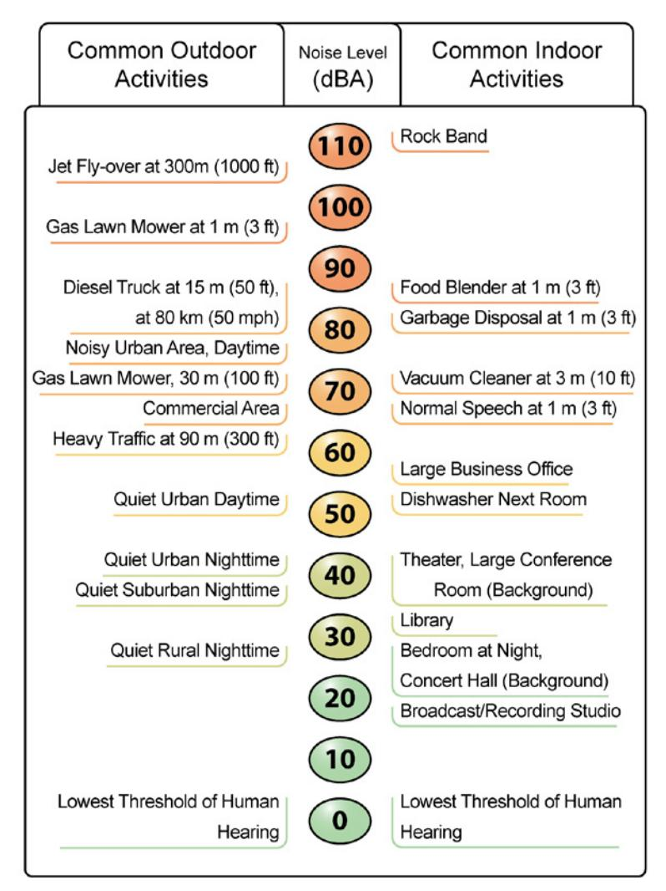

Figure 2-20: Noise Levels of Common Activities

According to Caltrans' *Traffic Noise Analysis Protocol for New Highway Construction and Reconstruction Projects, May 2011,* a noise impact occurs when the predicted future noise level with the project substantially exceeds the existing noise level (defined as an increase of 12 A-weighted decibels or more) or when the future noise level with the project approaches or exceeds the noise abatement criteria. Approaching the noise abatement criteria is defined as coming within 1 A-weighted decibel of the noise abatement criteria. (A-weighted decibels are adjusted to approximate the way humans perceive sound.)

If it is determined that the proposed project would have noise impacts, then potential abatement measures must be considered. Noise abatement measures that are determined to be reasonable and feasible at the time of final design are incorporated

into the project plans and specifications. This document discusses noise abatement measures that would likely be incorporated into the project.

Caltrans *Traffic Noise Analysis Protocol* sets forth the criteria for determining when an abatement measure is reasonable and feasible. Feasibility of noise abatement is basically an engineering concern. A minimum reduction of 7 A-weighted decibels in the future noise level must be achieved for at least one benefited receiver for an abatement measure to be considered feasible. Other considerations include topography, access requirements, other noise sources, and safety considerations. The reasonableness determination is basically a cost-benefit analysis. Factors used in determining whether a proposed noise abatement measure is reasonable include the residents' acceptance and the cost per benefited residence.

#### Affected Environment

The following section is based on the *State Route 132 Noise Study Report*, completed in January 2016, and the *State Route 132 Noise Abatement Decision Report*, completed in January 2016.

As shown in Figure 2-21, land uses in the project study area were grouped into numbered noise analysis areas. The noise analysis areas are based on land use density, with larger areas representing only a few land uses and smaller areas representing a higher number of land uses. Existing noise levels were documented through short- and long-term measurements at representative sites in the project area. Table 2-46 shows the nine noise analysis areas in terms of noise abatement criteria activity category and existing noise levels. The *State Route 132 Noise Study Report* provides more detailed information.

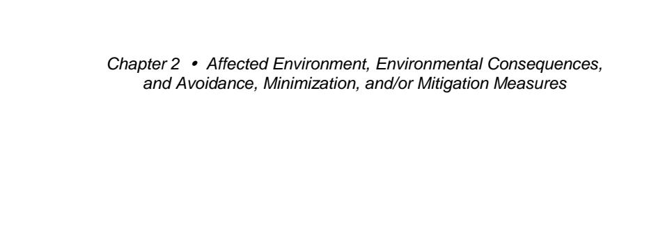

Page Intentionally Left Blank

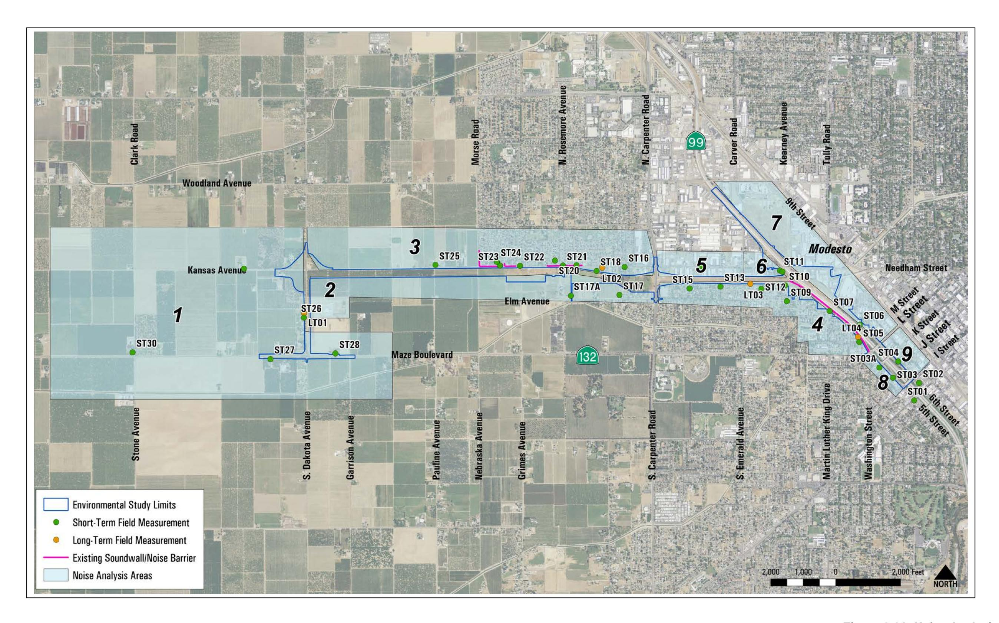

Figure 2-21: Noise Analysis Areas

Page Intentionally Left Blank

**Table 2-46: Noise Analysis Areas** 

| Noise Analysis Area | Description of Noise Abatement Criteria Activity Category (Activity Category)                                                                | Existing Noise Walls/Berms                                                                                       |
|---------------------------|----------------------------------------------------------------------------------------------------------------------------------------------------|------------------------------------------------------------------------------------------------------------------|
| Area 1                    | Single-family residences (B) and agricultural land uses (F)                                                                                        | None                                                                                                             |
| Area 2                    | Single-family residences (B) and mix of agricultural land and commercial uses (F)                                                                  | None                                                                                                             |
| Area 3                    | Single-family and multi-family residential (B) and commercial retail (F)                                                                           | Existing privacy walls approximately 6 feet in height                                                            |
| Area 4                    | High-density, single-family residential community (B) with associated schools, parks, and places of worship (C) and commercial and retail uses (F) | Existing noise barrier approximately 13 feet in height and existing earthen berm approximately 14 feet in height |
| Area 5                    | Single-family residences (B) and commercial and retail land uses (F)                                                                               | None                                                                                                             |
| Area 6                    | A hotel (E) and commercial and retail land uses (F)                                                                                                | None                                                                                                             |
| Area 7                    | Single-family residences (B), restaurants (E), and commercial and industrial land uses (F)                                                   | None                                                                                                             |
| Area 8                    | Single-family residences (B) and commercial and retail land uses (F)                                                                               | None                                                                                                             |
| Area 9                    | Single-family residences (B), playgrounds associated with schools and places of worship (C), and commercial uses (F)                               | None                                                                                                             |

Source: Noise Study Report (January 2016)

#### **Environmental Consequences**

Because the proposed project would result in a new highway on a new alignment and increase the number of through-traffic lanes, the proposed project would be considered a Type 1 project by the Federal Highway Administration. All Type 1 projects require noise impact analysis. For the proposed project, that applies to both build alternatives.

Short-term (15 minutes) and long-term (24 hours) noise measurements were conducted. Short-term monitoring was performed at 33 locations and results ranged from 45.0 Leq (equivalent sound level) to 76.1 Leq. Long-term monitoring was performed at three locations and results ranged from 49.7 to 68.2 Leq.

Traffic noise levels were modeled using Federal Highway Administration-approved Traffic Noise Model Version 2.5 software. Peak hour traffic volumes were used to model and compare baseline conditions in 2009 and design year (2048) conditions with and without the project. A traffic noise impact would occur when there is a 12 A-weighted decibel or more increase over baseline conditions or when noise levels would approach or exceed the noise abatement criteria.

Because the proposed project would be constructed on a new alignment where no highway currently exists, numerous receivers (locations representing land uses where frequent human activity occurs, such as residences) are predicted to be impacted. West of SR 99, the proposed new alignment would be close to receivers, resulting in higher traffic noise levels for nearby receivers (see Figures 2-22a through 2-22c). The *State Route 132 Noise Study Report* provides further detailed information, including results for each receiver evaluated.

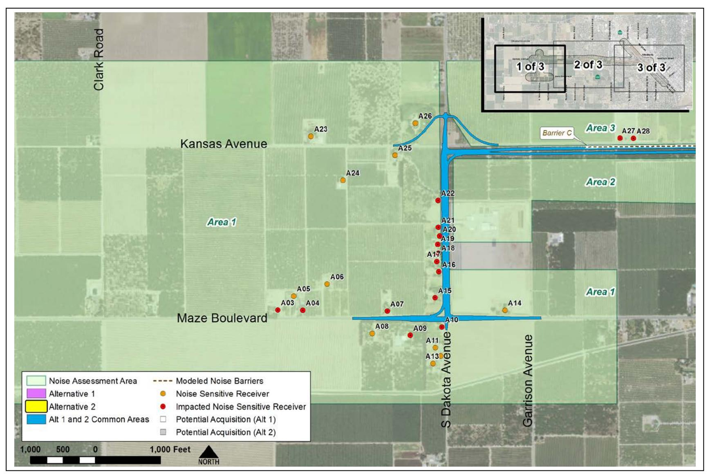

Figure 2-22a: Receiver and Modeled Noise Barrier Locations (Western Portion of the Study Area)

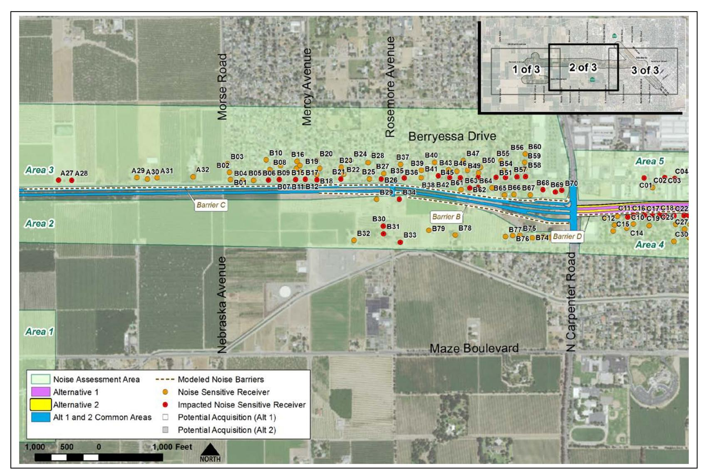

Figure 2-22b: Receiver and Modeled Noise Barrier Locations (Central Portion of the Study Area)

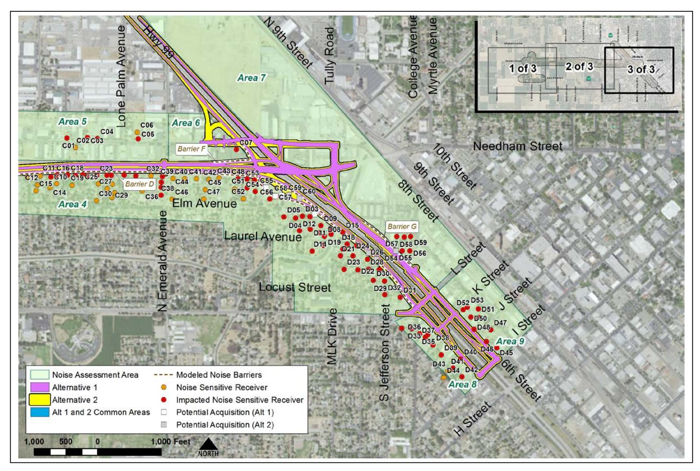

Figure 2-22c: Receiver and Modeled Noise Barrier Locations (Eastern Portion of the Study Area)

#### Alternative 1

Table 2-47 shows the modeling results with predicted design year traffic noise levels for Alternative 1, which would result in noise impacts to 260 noise-sensitive receivers. Note that the "Both" category in the table lists instances when a substantial increase would occur and when levels would approach or exceed the noise abatement criteria. If a receiver falls within this category, it is counted only in the "Both" column.

Table 2-47: Predicted Future (2048) Noise Impacts of Alternative 1

| Area                                               | Receiver Impact Counts   |       |    | Total Receivers Impacted by Area |
|----------------------------------------------------|--------------------------|-------|----|-------------------------------------|
| Approach or Exceed Noise Abatement Criteriaa | Substantial Increaseb | Bothc |    |                                     |
| 1                                                  | 10                       | 0     | 3  | 13                                  |
| 2                                                  | 2                        | 3     | 1  | 6                                   |
| 3                                                  | 49                       | 0     | 0  | 49                                  |
| 4                                                  | 91                       | 6     | 26 | 123                                 |
| 5                                                  | 9                        | 0     | 0  | 9                                   |
| 6                                                  | 1                        | 0     | 0  | 1                                   |
| 7                                                  | 8                        | 0     | 0  | 8                                   |
| 8                                                  | 36                       | 0     | 0  | 36                                  |
| 9                                                  | 15                       | 0     | 0  | 15                                  |
| Total                                              | 221                      | 9     | 30 | 260                                 |

&lt;sup>a Approaching or exceeding the noise abatement criteria is defined as exceeding or coming within 1 A-weighted decibel of the noise abatement criteria.

Source: Noise Study Report (January 2016)

#### Alternative 2

Table 2-48 shows the modeling results with predicted design year traffic noise levels for Alternative 2, which would result in noise impacts to 276 noise-sensitive receivers.

&lt;sup>b A substantial increase impact occurs when the predicted future noise level with the project substantially exceeds the existing noise level (defined as a 12 A-weighted decibel or more increase).

&lt;sup>c The "Both" category notes when a substantial increase would occur and when levels would approach or exceed the noise abatement criteria. If a receiver falls within this category, it is counted only in the "Both" column.

Table 2-48: Predicted Future (2048) Noise Impacts of Alternative 2

| Area  | Receiver Impact Counts                             |                          |       | Total Receivers Impacted by Area |
|-------|----------------------------------------------------|--------------------------|-------|-------------------------------------|
|       | Approach or Exceed Noise Abatement Criteriaa | Substantial Increaseb | Bothc |                                     |
| 1     | 10                                                 | 0                        | 3     | 13                                  |
| 2     | 2                                                  | 3                        | 1     | 6                                   |
| 3     | 49                                                 | 0                        | 0     | 49                                  |
| 4     | 103                                                | 6                        | 30    | 139                                 |
| 5     | 9                                                  | 0                        | 0     | 9                                   |
| 6     | 1                                                  | 0                        | 0     | 1                                   |
| 7     | 8                                                  | 0                        | 0     | 8                                   |
| 8     | 36                                                 | 0                        | 0     | 36                                  |
| 9     | 15                                                 | 0                        | 0     | 15                                  |
| Total | 233                                                | 9                        | 34    | 276                                 |

&lt;sup>a Approaching or exceeding the noise abatement criteria is defined as exceeding or coming within 1 A-weighted decibel of the noise abatement criteria.

Source: Noise Study Report (January 2016)

#### No-Build Alternative

The No-Build Alternative would not result in the construction of any of the proposed improvements, but there would still be noise impacts even without the project. Modeling results indicate that predicted traffic noise levels along existing SR 132 (Maze Boulevard) for the No-Build Alternative in 2048 would result in impacts to 162 noise-sensitive receivers (see the *State Route 132 Noise Study Report, Appendix B* for details). All noise impacts would be because of noise levels approaching or exceeding the noise abatement criteria.

#### Noise Abatement Considered

Noise barriers are the most common noise abatement measure. Each noise barrier considered (in this case, a soundwall) has been evaluated for feasibility based on constructability and an achievable noise reduction of at least 5 A-weighted decibels. For each noise barrier found to be acoustically feasible, the noise barriers were evaluated for reasonableness based on cost allowances and the noise reduction design goal of 7 A-weighted decibels at one or more benefitted receivers. At each location, barriers were modeled up to 16 feet tall. Table 2-49 provides the noise barrier analysis results for each build alternative.

&lt;sup>b A substantial increase impact occurs when the predicted future noise level with the project substantially exceeds the existing noise level (defined as a 12 A-weighted decibel or more increase).

&lt;sup>c The "Both" category notes when a substantial increase would occur and when levels would approach or exceed the noise abatement criteria. If a receiver falls within this category, it is counted only in the "Both" column.

**Table 2-49: Summary of Noise Barrier Analysis** 

| Barrier           | Location                                                                             | Length (feet) | Height (feet) | Acoustically Feasible? | Noise Reduction Rangea | Number of Benefited Receivers | Total Reasonable Allowance | Estimated Construction Cost | Cost Less than Allowance? |
|-------------------|--------------------------------------------------------------------------------------|------------------|------------------|------------------------|------------------------------|-------------------------------------|-------------------------------|-----------------------------------|---------------------------------|
| A (Alts 1 & 2) | Existing SR 132 (Maze Blvd) West of Garrison Ave and area West of N Dakota Ave | N/A              | N/A              | No                     | N/A                          | N/A                                 | N/A                           | N/A                               | N/A                             |
| B (Alts 1 & 2) | South of New SR 132, between N Dakota Ave and N Carpenter Road                    | 3,921            | 16               | No                     | 0.2 – 5.1                    | N/A                                 | N/A                           | N/A                               | N/A                             |
| C (Alts 1 & 2) | North of New SR 132, between N Dakota Ave and N Carpenter Rd                      | 8,591            | 16               | Yes                    | 0 – 6.1                      | N/A                                 | N/A                           | N/A                               | N/A                             |
| D (Alt 1)      | South of New SR 132, east of N Carpenter Rd, and West of SR 99, North of L St  | 6,390            | 8                | Yes                    | 0.3 - 8.1                    | 29                                  | \$1,595,000                   | \$3,711,312                       | No                              |
|                   |                                                                                      |                  | 10               | Yes                    | 0.5 – 10.2                   | 62                                  | \$3,410,000                   | \$4,639,140                       | No                              |
|                   |                                                                                      |                  | 12               | Yes                    | 0.5 – 11.4                   | 90                                  | \$4,950,000                   | \$5,566,968                       | No                              |
|                   |                                                                                      |                  | 14               | Yes                    | 0.6 – 12.7                   | 121                                 | \$6,655,000                   | \$6,494,796                       | Yesb                            |
| D (Alt 2)      | South of New SR 132, east of N Carpenter Rd, and West of SR 99, North of L St  | 7,760            | 8                | Yes                    | 0.3 – 7.5                    | 31                                  | \$1,705,000                   | \$4,882,592                       | No                              |
|                   |                                                                                      |                  | 10               | Yes                    | 0.4 – 13.2                   | 77                                  | \$4,235,000                   | \$6,103,240                       | No                              |
|                   |                                                                                      |                  | 12               | Yes                    | 0.7 – 15.6                   | 127                                 | \$6,985,000                   | \$7,323,888                       | No                              |
|                   |                                                                                      |                  | 14               | Yes                    | 0.8 – 17.2                   | 171                                 | \$9,405,000                   | \$8,544,536                       | Yesb                            |
| E (Alts 1 & 2) | North of New SR 132, between N Carpenter Rd and N Emerald Ave                     | N/A              | N/A              | No                     | N/A                          | N/A                                 | N/A                           | N/A                               | N/A                             |
| F (Alt 1)      | North of New SR 132, between N Emerald Ave and SR 99                              | 888              | 16               | No                     | 2                            | N/A                                 | N/A                           | N/A                               | N/A                             |
| F (Alt 2)      | North of New SR 132, between N Emerald Ave and SR 99                              | 595              | 16               | No                     | 0                            | N/A                                 | N/A                           | N/A                               | N/A                             |
| G (Alts 1 & 2) | East of SR 99, between northern project terminus and L St                         | 1,103            | 16               | No                     | 1.3 – 4.9                    | N/A                                 | N/A                           | N/A                               | N/A                             |

*Notes*: Alt = Alternative; N/A = not applicable as the noise barrier would not be feasible because of access requirements. **Bolded text** signifies the noise barriers considered reasonable and feasible for traffic noise abatement and, therefore, these barriers are recommended.

Source: Noise Study Report (January 2016)

&lt;sup>a The range is in A-weighted decibels.

&lt;sup>b In Phase 1, a portion of Noise Barrier D would be constructed from Carpenter Road to SR 99 under either build alternative. The other section would be constructed in Phase 2 along SR 99. There is an existing noise barrier along SR 99 that would tie into the proposed noise barrier along the new alignment in Phase 2.

In Noise Analysis Areas 1, 2, 5, 8, and 9, impacted receivers would require driveway access to local roadways. Openings in noise barriers for driveways or intersecting streets reduce the effectiveness of barriers, making the noise barriers acoustically infeasible. In addition, for Noise Analysis Areas 3, 6, 7, the noise barriers do not meet the minimum 5 dB of noise reduction. Therefore, noise barriers are not considered to be feasible noise abatement options for receivers in these areas.

Because of the configuration and location of the project, noise barriers were the only feasible measure considered. Noise barrier reasonableness was determined by comparing the estimated cost of building the noise barrier against the total reasonable allowance. The engineer's cost estimate includes costs required to construct the noise barrier, including the materials for the wall in addition to the foundation (safety barrier or piles) on which the noise barriers would be constructed. Wall construction costs were based on masonry construction, in accordance with Caltrans' standard specifications.

The design of the noise barriers presented is only preliminary and has been conducted at a level appropriate for environmental review, but not for final design of the project. The opinions expressed by affected residents during the environmental review process would be a major consideration in reaching a final decision on the reasonableness of abatement measures to be provided.

Approximately 295 receptors within Area 4 represent noise sensitive receptors located north of L Street, east of North Carpenter Road, south of the proposed SR 132 expressway alignment, and west of SR 99 in Stanislaus County. Measurements taken in Area 4 show that the existing noise levels range from 46 decibels to 67 decibels. The future noise levels in Area 4 with the project are predicted to range from 57 decibels to 80 decibels for both Alternatives 1 and 2. Because the predicted future noise level exceeds the NAC for residential uses (67decibels), approximately 123 and 139 noise sensitive receptors (out of a total of 295 receptors) represented in Area 4 would be adversely affected by noise as a result of Alternatives 1 and 2, respectively. To achieve a 5 decibels reduction and a design goal of 7 decibels for at least 1 receptor, a 14 foot noise wall would be needed. If the total cost of the wall at this location is less than the total cost allowance, then the wall would likely be incorporated into the project. The total cost allowance, calculated as directed by Caltrans Traffic Noise Analysis Protocol, is \$175,000. The current estimated cost of the wall is \$6,494,796 for Alternative 1 and \$8,544,536 for Alternative 2.Based on the studies completed to date, Caltrans intends to incorporate noise abatement in the form of a barrier (i.e., Noise Barrier D) on the south side of the proposed new alignment and east of North

Carpenter Road continuing on the west side of the frontage road along SR 99 between the proposed SR 132/SR 99 interchange and the L Street crossing (see Figures 2-22b and 2-22c).

The barrier for Alternative 1 would be approximately 6,390 feet long with an average height of 14 feet. Calculations based on preliminary design data show that the barrier would reduce noise levels by 5 to 13 decibels (7 decibels for at least one receptor) for 121 residences at a cost of \$6,494,796. The barrier for Alternative 2 would be approximately 7,760 feet long with an average height of 14 feet. Calculations based on preliminary design data show that the barrier would reduce noise levels by 5 to 17 decibels (7 decibels for at least one receptor) for 171 residences at a cost of \$8,544,536.

In Phase 1, a portion of Noise Barrier D would be constructed along the proposed new alignment under either build alternative. The other section of the proposed barrier would be constructed in Phase 2 along SR 99. There is an existing noise barrier along SR 99 that would tie into the proposed noise barrier along the new alignment in Phase 2. Therefore, the noise barriers would provide attenuation in the interim between Phase 1 and Phase 2.

If during final design conditions have substantially changed, noise abatement may not be necessary. The final decision on noise abatement would be made upon completion of the project design and the public involvement processes.

#### Construction Impacts

Noise from construction activities may be short term and temporarily dominate the noise environment in the immediate area of construction. Construction noise is regulated by Caltrans Standard Specifications Section 14-8, "Sound Control Requirements," which states that noise levels generated during construction must comply with applicable local, state, and federal regulations and that all equipment must be fitted with adequate mufflers according to the manufacturers' specifications.

Noise levels from demolition and construction activities would vary depending on the activity periods, location of activities, and the number and types of equipment used. Construction activities would generate noise from diesel-powered earthmoving equipment, such as dump trucks and bulldozers, back-up alarms on certain equipment, and pile drivers.

Table 2-50 shows the noise levels produced by construction equipment commonly used on roadway construction projects. Construction equipment is expected to generate noise levels ranging from 70 to 101 decibels at a distance of 50 feet, and noise produced by construction equipment would be reduced over distance at a rate of about 6 decibels per doubling of distance.

**Table 2-50: Construction Equipment Noise Levels** 

| Equipment            | Maximum Noise Level (A-weighted decibels at 50 feet) |
|----------------------|------------------------------------------------------|
| Scrapers             | 84                                                   |
| Bulldozers           | 82                                                   |
| Dump Truck           | 76                                                   |
| Backhoe              | 78                                                   |
| Pneumatic Tools      | 85                                                   |
| Concrete Pump Truck  | 81                                                   |
| Compactor            | 83                                                   |
| Concrete Batch Plant | 83                                                   |
| Crane                | 81                                                   |
| Excavator            | 81                                                   |
| Front End Loader     | 79                                                   |
| Jack Hammer          | 89                                                   |
| Grader               | 85                                                   |
| Hydraulic Brake Ram  | 90                                                   |
| Impact Pile Driver   | 95                                                   |
| Pile Driving         | 101                                                  |

Source: Noise Study Report (January 2016)

Construction noise at offsite receptor locations would depend on the loudest piece of equipment operating at the moment. Most noise sensitive receptors identified for the project and those most affected by construction noise sit north of the new SR 132 alignment and Kansas Avenue between Morse Road and North Carpenter Road, south of the proposed new SR 132 alignment between Carpenter Road and SR 99, and west of SR 99. However, for the receptors west of SR 99, construction noise is anticipated to be overshadowed by SR 99 traffic noise.

Construction is expected to last about 24 to 30 months. Construction activities would be temporary and occur mostly during normal daytime hours. Stanislaus County's noise ordinance exempts construction activities during the hours of 7:00 a.m. to 7:00 p.m. with a sound level threshold not to exceed 75 dB. If construction activities exceed the sound level threshold specified in the noise ordinance, coordination with the County would be required, including potential measures to reduce noise levels to maximum thresholds. Some construction activities may require limited work during nighttime hours. A variance or waiver would be required from the County before starting construction activities during nighttime hours.

Standard best management practices to be implemented during construction include:

- The contractor would ensure that all construction equipment would have soundcontrol devices that are no less effective than those provided on the original equipment. No equipment would have an un-muffled exhaust.
- The contractor would implement appropriate additional noise control measures,
  where feasible, including changing the location of stationary construction equipment
  away from noise-sensitive receivers, turning off idling equipment, scheduling
  construction activity to workday hours, notifying adjacent residents in advance of
  construction work, and installing noise blankets or other muffling devices on
  stationary construction noise sources.

The noise levels presented represent maximum noise levels adjusted for time-usage factors and would not be experienced as continuous noise emissions. Construction equipment use would be intermittent throughout a normal workday. Therefore, noise levels generated from construction equipment would not be cumulative.

No adverse noise impacts from construction are anticipated because construction would be conducted in accordance with Caltrans Standard Specifications Section 14-8 and applicable local noise standards.

#### Avoidance, Minimization, and/or Abatement Measures

No substantial noise effects are anticipated as a result of construction and operation of the proposed project, as such no avoidance, minimization, and/or mitigation measures would be required.

#### 2.2.8 Energy

#### Regulatory Setting

NEPA (42 U.S. Code 4332) requires the identification of all potentially significant impacts to the environment, including energy impacts.

CEQA Guidelines, Appendix F, Energy Conservation, state that EIRs are required to include a discussion of the potential energy impacts of proposed projects, with particular emphasis on avoiding or reducing inefficient, wasteful, and unnecessary consumption of energy.

#### Affected Environment

Establishing the affected environment for energy involves presenting general statewide energy trends and how the project study area is currently used as a transportation corridor.

In 2012, Californians consumed approximately 43 percent less energy per person than the average person in the U.S. and California's per person energy consumption is the second lowest in the country. However, while per capita consumption is low, the state's overall consumption of energy (in the form of electricity, coal, natural gas, and petroleum) is the second highest in the U.S. because of California's population and economy.

Because California is one of the top oil-producing states in the U.S., the state has historically met a large portion of its internal energy demands through its in-state sources. However, demand for resources has risen steadily over the past decades, while production capacity and extraction volume have decreased. The declining supply of in-state petroleum products, coupled with increasing demand, has resulted in an increased need for imported oil resources. According to the California Energy Commission, California's reliance on crude oil imports would increase from 405 million barrels in 2005 to between 585 million (low forecast) and 685 million (high forecast) barrels in 2025.

Within the project study area, existing SR 132 (Maze Boulevard) is part of the regional expressway system and is the main east-west corridor in Stanislaus County. The existing highway and the SR 132/SR 99 connection under evaluation are of particular importance to regional and interregional circulation because of the extensive farm-to-market, recreational, and other commerce-related travel on the highway daily. The current average daily traffic volumes for this segment of SR 132 (Maze Boulevard) range between 10,230 and 12,400 vehicles, of which 21 percent of the total traffic is trucks. (Section 2.1.6, Traffic and Transportation/Pedestrian and Bicycle Facilities, provides further information on the traffic data for the study area.)

#### **Environmental Consequences**

Impacts to energy use were evaluated based on traffic operations (such as vehicle hours of travel and vehicle hours of delay), local roadway and freeway/highway congestion, vehicle miles of travel, and construction and future maintenance activities.

#### **Build Alternatives**

The two build alternatives would improve travel conditions and reduce energy use through capacity and operational improvements in 2020 (completion of Phase 1) and 2028 (completion of Phase 2). The number of intersections projected to operate at level of service D or worse compared to the No-Build Alternative conditions would be reduced by more than half, with speeds and energy efficiency increasing during the peak periods on local roadways throughout the study area. Both build alternatives would also improve average travel speeds,

which would reduce travel times during the peak periods and increase energy efficiency on area roadways.

As shown in Table 2-51, when compared to the No-Build Alternative, the two build alternatives would cut total vehicle travel times between 450 and 640 hours, or 0.98 and 1.40 percent for the central Modesto area in 2028. By 2048 (the design year), total vehicle travel time would be reduced by 1,970 hours or 2.84 percent for both build alternatives compared to the No-Build Alternative.

Table 2-51: Vehicle Hours of Travel and Delay by Alternative for the Central Modesto Areaa

| Alternative          | Daily Vehicle Hours of Travel |        | Daily Vehicle Hours of Delay |        |
|----------------------|-------------------------------|--------|------------------------------|--------|
|                      | 2028                          | 2048   | 2028                         | 2048   |
| No-Build Alternative | 45,830                        | 69,450 | 6,370                        | 13,620 |
| Alternative 1        | 45,380                        | 67,480 | 6,210                        | 13,360 |
| Alternative 2        | 45,190                        | 67,480 | 6,220                        | 13,120 |

&lt;sup>a This section of Modesto extends from just north of Kiernan Avenue to Whitmore Avenue and from Claus Road on the east to Hart Road on the west.

Source: Final Traffic Operations Analysis Report (July 2012)

Similarly, total vehicle delay would decrease between 150 and 160 hours, or 2.35 and 2.51 percent, in 2028. By 2048, total vehicle delay would be cut by 260 to 500 hours, or 1.91 and 3.67 percent, when compared to the No-Build Alternative.

The two build alternatives would also improve traffic operations, thereby easing congestion at some of the bottleneck areas along Carpenter Road at existing SR 132 (Maze Boulevard), Kansas Avenue, and SR 99. Both build alternatives would also improve traffic operations by encouraging motorists to use the new alignment for east-west travel, leaving local roads for short trips and allowing SR 99 to accommodate long-distance travel. Improvements associated with both build alternatives would allow traffic on the regional roadway network to travel faster, thereby reducing energy consumption.

Energy in the form of fuel consumed by a vehicle is directly proportional to the number of miles a vehicle travels. Table 2-52 shows that in 2028 the total vehicle miles traveled in the study area would decrease slightly (between 9,080 and 16,270 total miles, or 0.71 and 1.28 percent) for the two build alternatives compared to the No-Build Alternative. Larger decreases (between 46,500 and 61,260 total miles per day, or 2.58 and 3.42 percent) are predicted in 2048.

Table 2-52: Vehicle Miles of Travel by Alternative for the Central Modesto Areaa

| Alternative          | Daily Vehicle Miles of Travel |           |
|----------------------|-------------------------------|-----------|
|                      | 2028                          | 2048      |
| No-Build Alternative | 1,275,500                     | 1,792,000 |
| Alternative 1        | 1,266,420                     | 1,730,740 |
| Alternative 2        | 1,259,230                     | 1,745,460 |

&lt;sup>a This section of Modesto extends from just north of Kiernan Avenue to Whitmore Avenue and from Claus Road on the east to Hart Road on the west.

Source: Final Traffic Operations Analysis Report (July 2012)

As shown, when balancing energy used against energy saved by relieving congestion and other transportation inefficiencies, neither build alternative would have substantial operational energy impacts.

Energy would also be needed for construction in the form of raw materials and equipment used to build the new highway. The build alternatives would require energy for onsite construction work, such as grading and bridge construction, and for offsite manufacturing of pavement and bridge components. Roadway maintenance (such as resurfacing and patching) would also require energy. The additional energy use would be consumed in the short term by construction equipment required to build the project and by added congestion caused by construction-related traffic delays.

Energy consumption during construction would be mainly from petroleum fuels and electricity use. Fuel would be needed for vehicles and construction equipment, as well as to run electrical generators for lighting, welding machines, and power tools. Fuel would also be consumed during the production and transport of raw materials. Therefore, construction-related activities would result in a permanent consumption of finite energy resources. However, construction would consist of temporary activities that would not result in long-term demand for energy. The following standard best management practices would be employed to minimize energy usage:

- The contractor would consolidate material delivery whenever possible to promote efficient vehicle and energy use. The contractor would schedule material deliveries during non-rush hours to minimize fuel lost during traffic congestion.
- The contractor would maintain equipment and machinery in good working condition and inspect it regularly. Inspection records would be maintained by the contractor.

- Operators would avoid leaving equipment and vehicles idling when parked or not in use.
- Equipment found operating on the project that has not been inspected or has oil leaks would be shut down and subject to citation.
- The contractor would implement, to the extent feasible, the following measures to reduce greenhouse gas emissions from construction equipment:
  - o Use alternative-fueled (e.g., biodiesel and electric) construction vehicles/equipment, comprising at least 15 percent of the fleet
  - o Use at least 10 percent local building materials during construction
  - o Recycle at least 50 percent of construction waste or demolition materials

Overall, when balancing energy used during construction against energy saved by relieving congestion and other transportation inefficiencies, neither build alternative would have substantial construction-related energy impacts.

#### No-Build Alternative

Because total vehicle hours, total vehicle delay, and total vehicle miles traveled in the Modesto area would be greater under the No-Build Alternative, there would be a direct impact on energy use as a result of future traffic operations. The excessive volume of traffic that existing SR 132 (Maze Boulevard) would not be able to accommodate would be diverted onto other local roadways, such as Kansas Avenue and Carpenter Road. This would result in unacceptable operations on those roadways and an increased use of energy due to inefficient travel. The No-Build Alternative would not result in the construction of any of the proposed improvements that would relieve congestion or other transportation inefficiencies. Therefore, there would be adverse impacts related to energy consumption under the No-Build Alternative.

#### Avoidance, Minimization, and/or Mitigation Measures

Construction and operation of the proposed project is not anticipated to result in a substantial increase in energy usage; as such no avoidance, minimization, and/or mitigation measures would be required.

#### 2.3 Biological Environment

#### 2.3.1 Wetlands and Other Waters

#### Regulatory Setting

Wetlands and other waters are protected under a number of laws and regulations. At the federal level, the Federal Water Pollution Control Act, more commonly referred to as the Clean Water Act (33 U.S. Code 1344), is the main law regulating wetlands and surface waters. One purpose of the Clean Water Act is to regulate the discharge of dredged or fill material into waters of the U.S., including wetlands. Waters of the U.S. include navigable waters, interstate waters, territorial seas and other waters that may be used in interstate or foreign commerce. To classify wetlands for the purposes of the Clean Water Act, a three-parameter approach is used that includes the presence of: hydrophytic (water-loving) vegetation, wetland hydrology, and hydric soils (soils formed during saturation/inundation). All three parameters must be present, under normal circumstances, for an area to be designated as a jurisdictional wetland under the Clean Water Act.

Section 404 of the Clean Water Act establishes a regulatory program that provides that discharge of dredged or fill material cannot be permitted if a practicable alternative exists that is less damaging to the aquatic environment or if the nation's waters would be significantly degraded. The Section 404 permit program is run by the U.S. Army Corps of Engineers with oversight by the U.S. Environmental Protection Agency.

The U.S. Army Corps of Engineers issues two types of 404 permits: General and Standard permits. There are two types of General permits: Regional permits and Nationwide permits. Regional permits are issued for a general category of activities when they are similar in nature and cause minimal environmental effect. Nationwide permits are issued to allow a variety of minor project activities with no more than minimal effects.

Ordinarily, projects that do not meet the criteria for a Nationwide Permit may be permitted under one of U.S. Army Corps of Engineers' Standard permits. There are two types of Standard permits: Individual permits and Letters of Permission. For Standard permits, the U.S. Army Corps of Engineers decision to approve is based on compliance with U.S. Environmental Protection Agency's Section 404(b)(1) Guidelines (Environmental Protection Agency 40 Code of Federal Regulations Part 230), and whether permit approval is in the public interest. The 404 (b)(1) Guidelines (guidelines) were developed by the U.S. Environmental Protection Agency in conjunction with the U.S. Army Corps of Engineers and allow the discharge of dredged or fill material into the aquatic system (waters of the U.S.) only if there is no practicable alternative that would have less adverse effects. The guidelines

state that the U.S. Army Corps of Engineers may not issue a permit if there is a least environmentally damaging practicable alternative to the proposed discharge that would have lesser effects on waters of the U.S. and not have any other significant adverse environmental consequences.

The Executive Order for the Protection of Wetlands (Executive Order 11990) also regulates the activities of federal agencies with regard to wetlands. Essentially, this order states that a federal agency, such as the Federal Highway Administration and/or Caltrans, as assigned, cannot undertake or provide assistance for new construction located in wetlands unless the head of the agency finds: 1) that there is no practicable alternative to the construction and 2) the proposed project includes all practicable measures to minimize harm.

At the state level, wetlands and waters are regulated mainly by the State Water Resources Control Board, the Regional Water Quality Control Board, and the California Department of Fish and Wildlife. In certain circumstances, the Coastal Commission (or Bay Conservation and Development Commission or the Tahoe Regional Planning Agency) may also be involved. Sections 1600-1607 of the California Fish and Game Code require any agency that proposes a project that would substantially divert or obstruct the natural flow of or substantially change the bed or bank of a river, stream, or lake to notify the California Department of Fish and Wildlife before beginning construction. If the California Department of Fish and Wildlife determines that the project may substantially and adversely affect fish or wildlife resources, a Lake or Streambed Alteration Agreement would be required. The California Department of Fish and Wildlife jurisdictional limits are usually defined by the tops of the stream or lake banks, or the outer edge of riparian vegetation, whichever is wider. Wetlands under jurisdiction of the U.S. Army Corps of Engineers may or may not be included in the area covered by a Streambed Alteration Agreement obtained from the California Department of Fish and Wildlife.

The Regional Water Quality Control Boards were established under the Porter-Cologne Water Quality Control Act to oversee water quality. Discharges under the Porter-Cologne Act are permitted by Waste Discharge Requirements and may be required even when the discharge is already permitted or exempt under the Clean Water Act. In compliance with Section 401 of the Clean Water Act, the Regional Water Quality Control Boards also issue water quality certifications for activities that may result in a discharge to waters of the U.S. This is most frequently required in tandem with a Section 404 permit request. See Section 2.2.2, Water Quality, for more details.

#### Affected Environment

The following section is based on the *State Route 132 West Freeway/Expressway Natural Environment Study*, completed in October 2016 and a Wetlands Determination and Delineation of Waters of the U.S. Report was completed in May 2011, which is included in the Natural Environment Study. A re-verification of the jurisdictional determination was issued by the US Army Corps of Engineers on May 26, 2015.

As shown in Figure 2-23, the project study area includes two wetland features (labeled as Seasonal Wetlands 1 and 2) and one irrigation canal (Modesto Irrigation District's Lateral Canal No. 4). Seasonal Wetlands 1 and 2 are wet pastures that do not meet the definition of a water of the U.S. because each is isolated, is solely supported by human-made hydrology, and/or does not contain hydric soils. However, Seasonal Wetlands 1 and 2 may be waters of the state under the jurisdiction of the Central Valley Regional Water Quality Control Board.

Seasonal Wetlands 1 and 2 have hydrology supported by flood irrigation pipes and are found in grazed pastures leased in the Caltrans right-of-way west of North Carpenter Road; they provide low-quality habitat for wildlife because each wetland is highly disturbed from flood irrigation and grazing. In sum, the seasonal wetland features total 0.65 acre.

The canal was verified as a jurisdictional water of the U.S. The canal is a 50-foot-wide, concrete-lined irrigation canal that flows mostly southwest to northeast outside of the study area. The canal bisects the study area north of the Martin Luther King Drive and Laurel Avenue intersection and extends under SR 99 for approximately 500 feet, until it reaches the eastern side of SR 99, south of the Needham Street overcrossing. The canal functions to provide irrigation water to agricultural land and eventually discharges into the Stanislaus River west of the project study area.

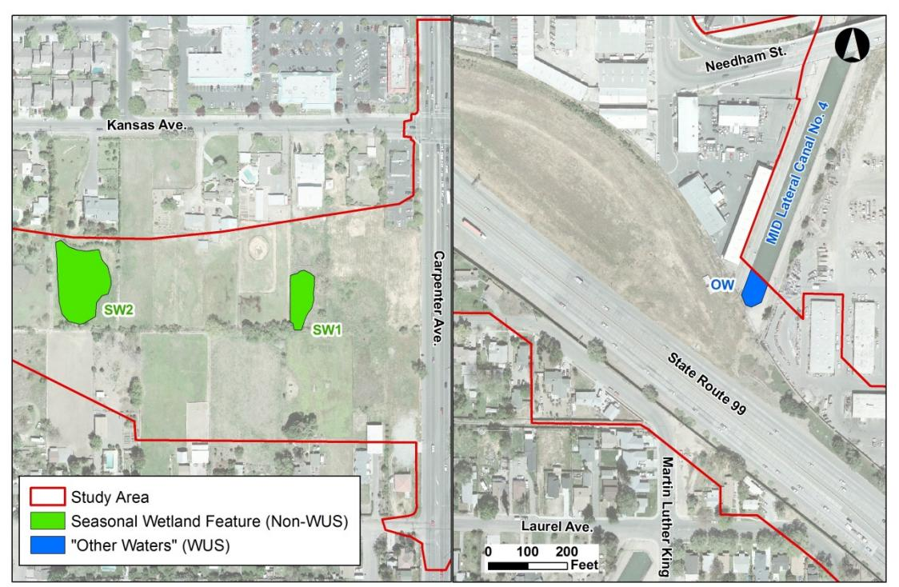

Figure 2-23: Location of Wetland Features and "Other" Waters in the Study Area

Notes: SW = season wetland; OW = "other" water; MID = Modesto Irrigation District; WUS = waters of the U.S. Non-waters of the U.S. (Seasonal Wetlands 1 and 2) are under the jurisdiction of the Regional Water Quality Control Board. "Other" Waters of the U.S. are under the jurisdiction of the U.S. Army Corps of Engineers.

#### **Environmental Consequences**

#### Build Alternatives

Construction of the proposed project would directly impact the seasonal wetlands, which may be regulated by the Central Valley Regional Water Quality Control Board, as non-waters of the U.S. This would be determined by the Central Valley Regional Water Quality Control Board during the final design and permitting phase. Both build alternatives would have the same impacts because the project's design would be the same throughout the portion of the study area where the two seasonal wetlands are located. Removal or disturbance of the wetland features is not anticipated to result in a reduction in wildlife habitat quality within the study area because of the poor condition of the wetlands. Both build alternatives would result in permanent and direct impacts to 0.65 acre of seasonal wetlands, or non-waters of the U.S.; however, no indirect or direct impacts to wetlands or "other waters", pursuant to the jurisdiction of the U.S. Army Corps of Engineers, would occur under either build alternative (Table 2-53).

No temporary or indirect impacts are anticipated to non-waters of the U.S. or waters of the U.S., as no other seasonal wetlands were identified within the study area.

Table 2-53: Impacts to Wetlands and "Other" Waters by Alternative

| Build Alternative | Wetland Feature   |                   |
|-------------------|-------------------|-------------------|
|                   | Season Wetland 1a | Season Wetland 2a |
| Alternative 1     | 0.17 acre         | 0.48 acre         |
| Alternative 2     | 0.17 acre         | 0.48 acre         |

&lt;sup>a Under the potential jurisdiction of the Regional Water Quality Control Board.

*Notes*: There are no indirect impacts to wetlands or direct impacts to "other waters" in the project study area. *Source*: Natural Environment Study (October 2016)

Neither build alternative would directly or indirectly impact the canal. The proposed project would result in the removal and replacement of an existing detention basin, which is connected to the canal. The new detention facility, which would consist of three connected basins, would be constructed northwest of the canal. The new basins would serve to retain the stormwater runoff that would infiltrate into the ground, and the basins would not discharge into the canal. No adverse impacts to the canal are anticipated as a result of the new basins. An approved jurisdictional determination was issued by the U.S. Army Corps of Engineers on July 29, 2011 (402 permit file number SPK-2010-01481), and a re-verification of the jurisdictional determination was issued on May 26, 2015 to confirm the U.S. Army Corps of Engineers' agreement with Caltrans removal of SW4X as a wetland. The feature was delineated in 2011; however, during surveys conducted in 2015, the feature was observed as regraded and filled and thus was no longer subject to Army Corps of Engineers' jurisdiction.

#### No-Build Alternative

The No-Build Alternative would not result in the construction of any of the proposed improvements and therefore would not contribute to direct or indirect impacts related to wetlands or "other" waters.

#### Agency Coordination and Permits

Caltrans staff coordinated with U.S. Army Corps of Engineers staff in January 2011 to conduct field verification in support of a jurisdictional determination. Additional data was requested by the U.S. Army Corps of Engineers and was provided on May 5, 2011 and June 21, 2011. The jurisdictional determination was verified on July 29, 2011 and again on May 26, 2015 in response to a change in field conditions in which a seasonal wetland had been

removed and was no longer present. To date, no consultation with the California Department of Fish and Wildlife has occurred.

#### Clean Water Act, Section 404

The proposed project would not result in the deposition of dredge or fill material within waters of the U.S. Therefore, no Clean Water Act Section 404 permit would be required.

#### Clean Water Act, Section 401

The proposed project would not result in the deposition of dredge or fill material within waters of the U.S. Therefore, no Clean Water Act Section 401 permit would be required.

#### Porter-Cologne Water Quality Control Act

The two seasonal wetlands may be considered waters of the state and protected under the Porter-Cologne Water Quality Control Act. If it is determined that these features are waters of the state, then a Regional Water Quality Control Board permit would be required to authorize the discharge of fill material to these seasonal wetlands.

#### Avoidance, Minimization, and/or Mitigation Measures

In order to minimize erosion and the resulting influx of fine sediments into the canal, Standard best management practices described in Section 2.2.2, Water Quality shall be implemented, which would include the preparation of a Stormwater Pollution Prevention Plan.

Implementation of the following measures would mitigate direct impacts on non-waters of the U.S. should the seasonal wetlands be determined to be waters of the State:

WET-1 Caltrans will consult with the Central Valley Regional Water Quality Board during the final design and permitting phase. If the seasonal wetland features are determined to be waters of the State, Caltrans will mitigate for their discharge and fill as directed by the Central Valley Regional Water Quality Board under the Porter Cologne Water Quality Control Act.

#### 2.3.2 Animal Species

#### Regulatory Setting

Many state and federal laws regulate impacts to wildlife. The U.S. Fish and Wildlife Service and the California Department of Fish and Wildlife are responsible for implementing these laws. This section discusses potential impacts and permit requirements associated with animals not listed or proposed for listing under the federal or state Endangered Species Act.

Species listed or proposed for listing as threatened or endangered are discussed in Section 2.3.3, Threatened and Endangered Species. All other special-status animal species are discussed here, including California Department of Fish and Wildlife fully protected species and species of special concern, and U.S. Fish and Wildlife Service candidate species.

Federal laws and regulations relevant to wildlife include the following:

- NEPA
- Migratory Bird Treaty Act
- Fish and Wildlife Coordination Act

State laws and regulations relevant to wildlife include the following:

- CEQA
- Sections 1600–1603 of the California Fish and Game Code
- Sections 4150–4152 of the California Fish and Game Code

#### Affected Environment

The following section is based on the *State Route 132 West Freeway/Expressway Natural Environment Study*, completed in October 2016.

The proposed project study area is extremely disturbed because of agricultural practices, land development, and previous construction activities. There are no remnant natural communities in the study area, and most of the study area consists of agricultural lands, residential and commercial development, and highly disturbed ruderal vegetated sites.

Although the vegetated areas in the project study area are highly disturbed and frequently manipulated, common animal and wildlife species were observed. Mammals including ground squirrels and raccoons were identified in the disturbed/ruderal areas and along the edges of the orchards in the study area. Bird species observed during the field surveys included the red-tailed hawk, Cooper's hawk, western bluebird, killdeer, house finch, robin, Audubon's warbler, western kingbird, and lesser yellow legs.

Data from the California Department of Fish and Wildlife's California Natural Diversity Database (CNDDB) were reviewed to identify all special-status animal species that occur or have the potential to occur in the study area (see Figure 2-24). Table 2-54 shows the status and general habitat requirements of the special-status animal species identified.

Table 2-54: Special-Status Animal Species with Potential to Occur in the Study

Area

| Scientific name       | Common Name   | Statusa | Habitat                                                                                                   | Habitat Present/ Absentb | Rationale                                                                                                                                                                                       |
|-----------------------|------------------|---------|-----------------------------------------------------------------------------------------------------------|--------------------------------|-------------------------------------------------------------------------------------------------------------------------------------------------------------------------------------------------|
| Athene cunicularia | Burrowing owl | SC      | Open, dry annual or perennial grasslands, deserts, and scrublands characterized by low-growing vegetation | Present                        | Marginal suitable habitat is present in the study area. Species not observed during burrow survey.                                                                                              |
| Migratory Birds       |                  | MBTA    | Various                                                                                                   | Present                        | Migratory birds were observed, including: red-tailed hawk, Cooper's hawk, western bluebird, killdeer, house finch, American robin, yellow-rumped warbler, western kingbird, lesser yellow legs. |

&lt;sup>a Status Codes: SC = State species of concern (California Department of Fish and Wildlife), MBTA = Migratory Bird Treaty Act.

Source: Natural Environment Study (October 2016)

After analysis of the identified special-status species' habitat requirements and completion of field reconnaissance surveys, it was determined that the only special-status species with a potential to occur in the study area are the burrowing owl and migratory birds.

#### Burrowing Owl

Burrowing owls (*Athene cunicularia*) are listed as a California Species of Special Concern. Burrowing owl nesting habitat consists of open areas with mammal burrows and includes dry open rolling hills, grasslands, fallow fields, sparsely vegetated desert scrub with gullies, washes, arroyos, and edges of human-disturbed lands. Burrowing owls typically inhabit golf courses, airports, cemeteries, vacant lots, and road embankments where there is noncompacted soil for a nesting burrow. Threats to burrowing owls include habitat loss and degradation from rapid urbanization of farmland, extermination of ground squirrels that create the burrows that the burrowing owls occupy, dissection of farmland, and road and ditch maintenance.

A burrowing owl habitat assessment (Phase I) and burrow survey (Phase II) were conducted within the proposed project limits on February 9 and 14, and March 30, 2011 as well as on February 12, 2014 by Misha Seguin and Phillip Peters, Environmental Scientists with Jacobs. No burrowing owl or any signs of burrowing owls (such as whitewash and feathers) were observed during the surveys, nor were any burrowing owls observed during previous biological surveys conducted in the spring, summer, and fall of 2010.

&lt;sup>b Present: Habitat is, or may be, present. The species may be present.

Because of the presence of mammal burrows in low-growing vegetated areas or in bare ground, and because one burrowing owl occurrence has been recorded within a 5-mile radius of the study area, there is potential habitat in the study area. Several mammal burrows were identified during the burrowing owl survey.

Burrows (potential habitat) were found in the following land cover types: non-native grassland, short ruderal vegetation, bare ground, agricultural access roads, levees, and crop and pasture lands. Land cover types that were considered to be unsuitable habitat and where no burrows were identified include tall disturbed ruderal vegetation, established orchards, landscaped roadsides found along SR 99, roadways, and developed areas. These land cover types were determined to be unsuitable because of the presence of dense and tall vegetation, observation of dogs and feral cats, pesticide/herbicide use, and/or the proximity to SR 99 shoulders that are actively mowed and managed.

Page Intentionally Left Blank

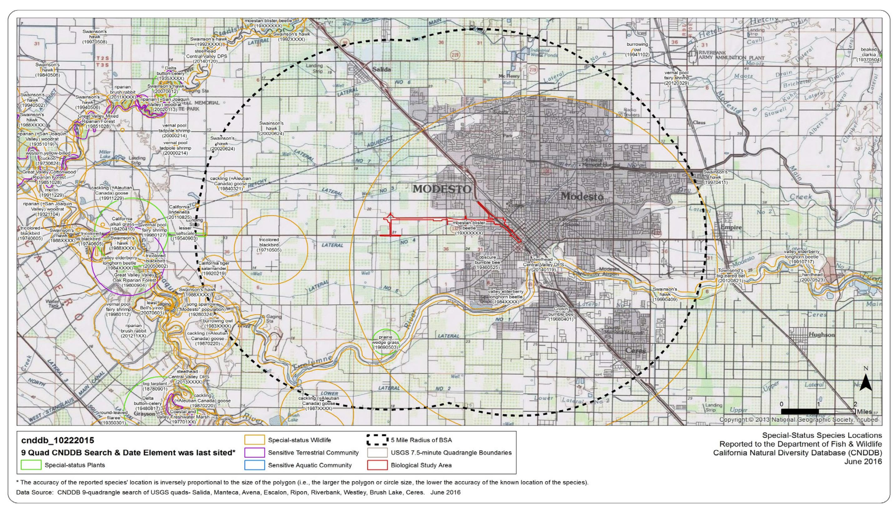

Figure 2-24: Threatened, Endangered, and Other Special-status Species' Occurrences Reported within a 5-mile Radius of the Study Area

Page Intentionally Left Blank

Potential habitat was mapped and calculated by drawing a 300-foot-radius buffer zone, equal to 6.5 acres of foraging habitat, around each identified burrow found within the study area. Burrows were mapped in the larger burrowing owl study area; however, only burrows and foraging habitat within the construction footprint were included in determining the potential habitat impacts. As a result, approximately 21.8 acres of suitable habitat were identified in the study area. The potential habitat is fragmented throughout the study area.

#### Migratory Birds

The study area contains 713 trees that may provide potential nesting habitat for birds protected under the Migratory Bird Treaty Act. The following bird species protected under the Migratory Bird Treaty Act were observed during field surveys conducted in 2010 and 2014.

- red-tailed hawk (*Buteo jamaicensis*)
- Cooper's hawk (Accipter cooperii)
- western bluebird (*Sialia mexicana*)
- killdeer (*Charadrius vociferous*)
- house finch (*Haemorhous mexicanus*)
- American robin (*Turdus migratorius*)
- yellow-rumped warbler (*Setophaga coronata*)
- western kingbird (*Tyrannus verticalis*)
- lesser yellow legs (*Tringa flavipes*)

These birds may forage and/or nest in non-native grassland or other vegetation communities within or next to the study area.

#### **Environmental Consequences**

Build Alternatives: Burrowing Owls

Both build alternatives have the potential to directly and permanently affect up to 20.8 acres and temporarily affect up to 0.2 acre of burrowing owl habitat. Construction of the proposed new alignment would include grading and ground compaction and construction-related activities (noise, disturbance, ground vibrations, and dust) that may directly affect burrowing owls because of the removal of potential nesting and foraging habitat and because of an increase in human-related disturbance in the study area. Continued human-related disturbances, including noise and an increase in traffic after construction, may indirectly affect burrowing owls as well.

Highway operations would be a permanent impact, while disruptions from construction activities would be temporary. Implementation of measure AS-1 (explained below) would minimize potential impacts to burrowing owls during construction.

Protocol-level (Phase III) burrowing owl census surveys were not conducted as part of the Natural Environment Study but will be conducted preceding the initiation of construction (i.e., the nesting and winter season before construction begins). A negative finding for burrowing owl after protocol level surveys would negate the current assumption that burrowing owl habitat is present in the biological study area. If burrowing owls are identified during surveys, the habitat area would be refined, and therefore, the total acreage of impacts to burrowing owl may change substantially. If impacts to burrows are unavoidable, a burrow exclusion plan would be prepared and submitted to CDFW per the 2012 Staff Report on Burrowing Owl Mitigation. Burrowing owls would be excluded from their burrows once owlets have fledged and per approved burrow exclusion methods. Implementation of measure AS-1 (explained below) would minimize permanent impacts to burrowing owls.

#### Build Alternatives: Migratory Birds

Removal of trees, shrubs and other vegetation, operation of the roadway, and construction-related activities (noise, disturbance, ground vibrations, and dust) may directly affect migratory birds because of the possible loss of nests and associated eggs and/or nestlings and because of an increase in human-related disturbance in the study area. Continued human-related disturbances, including noise and an increase in traffic after completion of construction, may also indirectly affect migratory birds. Tree removal and roadway operations would be a permanent impact; disruptions from construction activities would be temporary.

There are 713 trees within the project study area, of which 151 are native to California. Many were planted as landscaped ornamental plants. Trees native to the state include valley oak, coast live oak, interior live oak, Modesto ash, cottonwood, western sycamore, and coast redwood. Approximately 92 street trees are located within City of Modesto right-of-way, and some of the trees are part of orchards. Alternative 1 may impact up to 591 trees, including 35 street trees. Alternative 2 may impact up to 589 trees, including 33 street trees. However, because Modesto has approximately 110,000 street trees and numerous surrounding orchards, impacts to trees for migratory birds would be negligible.

Implementation of measures AS-2, AS-3, and AS-4 (explained below) would minimize temporary impacts to Migratory Bird Treaty Act-protected species during construction. Because of the degraded quality of the habitat, any permanent reduction of habitat or long-term increases in disturbance would not be considered substantial. This conclusion would be reconfirmed or amended after protocol surveys are completed in the year prior to construction.

#### No-Build Alternative

The No-Build Alternative would not result in the construction of any of the proposed improvements and therefore would not directly or indirectly impact potential burrowing owl or migratory bird habitat.

#### Avoidance, Minimization, and/or Mitigation Measures

Implementation of the following measures would reduce impacts on special-status animal species:

- AS-1 Burrowing owl surveys would be conducted following the guidelines outlined in the California Department of Fish and Wildlife's 2012 Staff Report on Burrowing Owl Mitigation during the year prior to the initiation of construction. If burrowing owls are detected within the biological study area, the California Department of Fish and Wildlife would be consulted to determine specific avoidance and minimization measures appropriate for the site. Likely avoidance and minimization measures may include preconstruction surveys prior to ground disturbance, establishment of no-work buffer, and/or having a qualified biologist present to monitor an active nest during construction activities to ensure that no interference with the burrowing owl breeding activities would occur. Additional avoidance and minimization for permanent impacts to burrowing owl habitat could also include the preservation of surrounding foraging habitat, passive relocations, and off-site mitigation. Mitigation of nesting burrows and associated burrowing owl habitat may involve purchasing mitigation lands adjacent to the project or purchasing burrowing owl mitigation credits at an approved conservation bank in the region.
- AS-2 Shrub and tree trimming and/or tree removal for the proposed project would be conducted outside the nesting season (generally between February 1 and August 31). If shrub and tree removal is scheduled to occur during the nesting season, a qualified wildlife biologist, familiar with the species and habitats in

- the study area, would conduct preconstruction surveys for nesting birds within suitable nesting habitat in the study area as described in AS-3.
- AS-3 Nesting bird surveys would be conducted prior to initiation of construction activities. If no active nests are detected during surveys, construction may proceed. If active nests are detected, then AS-4 would be implemented.
- AS-4 A no-work buffer would be established around nests identified during preconstruction surveys. A 100-ft buffer would be established for migratory birds and a 300-ft buffer would be established for most raptors. In the case of burrowing owl nests and Swainson's hawk see AS-1 and TES-1 respectively. The extent of the no-work buffers would be determined by a wildlife biologist in consultation with California Department of Fish and Wildlife and would depend on the level of noise or construction disturbance, line of sight between the nest and the disturbance, ambient levels of noise and other disturbances, and other topographic or artificial barriers. The purpose of the buffer is to avoid disturbance or destruction of the nest until after the breeding season, or until a wildlife biologist determines that the young have fledged.
- AS-5 The City of Modesto Street Tree Ordinance stipulates that trees removed within the City's right-of-way would be replaced in kind if appropriate. Contractor work would conform to local tree ordinances for construction projects. The ratios and location of replacement would be determined in coordination with the City of Modesto. The specific replacement would be determined during the permit review process.

#### 2.3.3 Threatened and Endangered Species

#### Regulatory Setting

The primary federal law protecting threatened and endangered species is the Federal Endangered Species Act, 16 U.S. Code Section 1531, et seq. See also 50 Code of Federal Regulations Part 402. This act and later amendments provide for the conservation of endangered and threatened species and the ecosystems upon which they depend. Under Section 7 of this act, federal agencies, such as the Federal Highway Administration, are required to consult with the U.S. Fish and Wildlife Service and the National Oceanic and Atmospheric Administration's National Marine Fisheries Service to ensure that they are not undertaking, funding, permitting, or authorizing actions likely to jeopardize the continued existence of listed species or

destroy or adversely modify designated critical habitat. Critical habitat is defined as geographic locations critical to the existence of a threatened or endangered species. The outcome of consultation under Section 7 may include a Biological Opinion with an Incidental Take statement, a Letter of Concurrence and/or documentation of a No Effect finding. Section 3 of the Federal Endangered Species Act defines take as "harass, harm, pursue, hunt, shoot, wound, kill, trap, capture or collect or any attempt at such conduct."

California has enacted a similar law at the state level, the California Endangered Species Act, California Fish and Game Code Section 2050, et seq. The California Endangered Species Act emphasizes early consultation to avoid potential impacts to rare, endangered, and threatened species and to develop appropriate planning to offset project-caused losses of listed species populations and their essential habitats. The California Department of Fish and Wildlife is the agency responsible for implementing the California Endangered Species Act. Section 2081 of the Fish and Game Code prohibits "take" of any species determined to be an endangered species or a threatened species. Take is defined in Section 86 of the Fish and Game Code as "hunt, pursue, catch, capture, or kill, or attempt to hunt, pursue, catch, capture, or kill." The California Endangered Species Act allows for take incidental to otherwise lawful development projects; for these actions, an incidental take permit is issued by the California Department of Fish and Wildlife. For species listed under both the Federal Endangered Species Act and the California Endangered Species Act requiring a Biological Opinion under Section 7 of the Federal Endangered Species Act, the California Department of Fish and Wildlife may also authorize impacts to California Endangered Species Act species by issuing a Consistency Determination under Section 2080.1 of the Fish and Game Code.

Another federal law, the Magnuson-Stevens Fishery Conservation and Management Act of 1976, was established to conserve and manage fishery resources found off the coast, as well as anadromous species and Continental Shelf fishery resources of the United States, by exercising (A) sovereign rights for the purposes of exploring, exploiting, conserving, and managing all fish within the exclusive economic zone established by Presidential Proclamation 5030, dated March 10, 1983, and (B) exclusive fishery management authority beyond the exclusive economic zone over such anadromous species, Continental Shelf fishery resources, and fishery resources in special areas.

#### Affected Environment

The following section is based on the *State Route 132 West Freeway/Expressway Natural Environment Study*, completed in October 2016.

The proposed project study area was surveyed and evaluated for the potential to support threatened and endangered plant and wildlife species. Data from the U.S. Fish and Wildlife Service, California Natural Diversity Database (CNDDB), and the California Native Plant Society were reviewed to identify threatened or endangered species that occur or have the potential to occur in the study area. Table 2-55 shows the status and general habitat requirements of the threatened or endangered animal species identified.

Table 2-55: Threatened or Endangered Animal Species with Potential to Occur in the Study Area

| Scientific Name | Common Name     | Statusa | Habitat                                                                                                                       | Habitat Present/ Absentb | Rationale                                                                                                                       |
|--------------------|--------------------|---------|-------------------------------------------------------------------------------------------------------------------------------|--------------------------------|---------------------------------------------------------------------------------------------------------------------------------|
| Buteo swainsoni    | Swainson's hawk | ST      | Breeds in grasslands with scattered trees, juniper-sage flats, riparian areas, savannahs, and agricultural or ranch habitats. | Present                        | Marginal suitable foraging and nesting habitat present in the biological study area. Species not observed during field surveys. |

&lt;sup>a Status Codes: ST = State Threatened (California Department of Fish and Wildlife).

Source: Natural Environment Study (October 2016)

After analysis of the threatened and endangered species' habitat requirements and completion of floristic and wildlife field reconnaissance surveys, it was determined that only the Swainson's hawk (a state-threatened species) has the potential to occur in the study area. No federally listed species and no other state-threatened or endangered species have a potential to occur in the study area due to the lack of suitable habitat.

#### Swainson's Hawk

The Swainson's hawk occurs throughout much of the western U.S., Canada, and northern Mexico. In California, breeding populations occur in desert, shrub-steppe, grassland, and agricultural habitats. However, most of the breeding sites are in two distinct populations. The largest population is in the midsection of the Central Valley

&lt;sup>b Present: Habitat is, or may be, present. The species may be present.

between Sacramento and Modesto and in the northern San Joaquin Valley. Most Swainson's hawks are migratory birds that arrive in the Central Valley in March to nest and breed, and then migrate south in October.

Breeding Swainson's hawks have three general habitat requirements: 1) suitable foraging habitat, 2) nest sites, and 3) isolation from disturbances that may disrupt breeding activities. Nest trees are typically found on the edges between woodland and either grass or shrubland habitat, or in isolated trees or clumps of trees in open terrain. The Swainson's hawks have also been recorded nesting in urban landscapes in the Central Valley. The birds have adapted to hunting in open grasslands and shrublands and are more abundant in areas of moderate agricultural development. Agricultural fields, such as irrigated pasture, row crops, and alfalfa fields, provide them with foraging habitat. Orchards, vineyards, rice, and cotton fields are generally not suitable foraging habitat. Habitat loss through development and incompatible agricultural crops represent the largest threat to the Swainson's hawk.

Formal surveys for this species have not yet been conducted, but would be conducted during the breeding season preceding the beginning of construction to accurately assess their presence or absence. However, the site was visited by biologists in 2010 during the spring (April 23-24), summer (August 12), and fall (October 6), and no Swainson's hawks were observed during any of the field site visits.

The study area is composed entirely of highly disturbed areas within and next to the City of Modesto. Approximately 33 percent is composed of agricultural fields, most of which consists of orchards that are not considered to be a compatible crop for foraging Swainson's hawks. Although no Swainson's hawks were observed during the field reconnaissance surveys, it was determined that the study area may contain potentially suitable nesting and foraging habitat.

#### **Environmental Consequences**

Build Alternatives: Swainson's Hawks

The proposed project would not affect any federally listed species, and no consultation under the Federal Endangered Species Act would be needed. Section 2080 of the Fish and Game Code prohibits the taking, possession, purchase, sale, and import or export of endangered, threatened, or candidate species, unless otherwise authorized by permit or in the regulations. Consultation with the California Department of Fish and Wildlife would occur prior to initiation of the project if either the nesting Swainson's hawk or western burrowing owl is observed during the

preconstruction surveys. (Section 2.3.2, Animal Species, analyzes impacts related to the burrowing owl.) No consultation with the California Department of Fish and Wildlife has occurred to date.

Removal of trees, shrubs, and other vegetation, other construction-related activities (noise, disturbance, ground vibrations, and dust), and operation of the new highway may directly impact the Swainson's hawk because of the removal of potential nesting and foraging habitat and because of an increase in human-related disturbance in the study area. Continued human-related disturbances from noise and an increase in traffic after construction may also indirectly affect the Swainson's hawk. Tree removal and highway operations would be a permanent impact; disruptions from construction activities would be temporary. Implementation of TES-1, discussed below, would minimize temporary impacts to the Swainson's hawk during construction.

Potential direct and permanent project-related impacts to Swainson's hawk habitat would be the permanent removal of up to 70 acres and temporary impacts to one acre of marginal foraging and/or poor quality nesting habitat and the removal of 414 trees with a low potential to support nests or roosting hawks. Also, the precise number of impacted trees supporting the birds would be verified by protocol surveys preceding construction.

The tree impact calculation for hawks included valley oaks, cottonwoods, willows, sycamore, walnuts, Modesto ash, eucalyptus, pines, and redwoods. The calculation did not account for other factors including location or height of trees.

Both build alternatives would result in temporary impacts of up to 1 acre of marginal foraging and/or poor quality nesting habitat. Although low in quality, the permanent removal of up to 70 acres of potential foraging habitat would cumulatively impact this species' available habitat. However, despite the relatively large amount of acreage that would be impacted, the impact is not detrimental to the species as a whole because the potential habitat is highly degraded and of poor quality. In addition, the study area is bordered by higher quality habitat that is relatively close to existing riparian corridors (of the Tuolumne, San Joaquin, and Stanislaus rivers) to the south, west, and north, respectively. The California Natural Diversity Database reported occurrences along the Tuolumne, San Joaquin, and Stanislaus rivers. Therefore, because of the degraded quality of the habitat, any permanent habitat reduction or long-term increase in disturbance is not considered substantial. This

conclusion would be confirmed or amended after protocol surveys are completed the year prior to construction.

With the implementation of TES-1, take of Swainson's hawk is not anticipated to occur.

#### No-Build Alternative

The No-Build Alternative would not result in the construction of any of the proposed improvements and therefore would not contribute to direct or indirect impacts to potential and existing Swainson's hawk habitat or any other threatened and endangered species.

#### Avoidance, Minimization, and/or Mitigation Measures

Implementation of the following measure would reduce project-related impacts to the state-threatened Swainson's hawk under the California Endangered Species Act:

TES-1 Protocol-level surveys will be conducted within a 0.5-mile radius around the biological study area preceding the initiation of construction and would follow the Swainson's Hawk Technical Advisory Committee's 2000 Recommended Timing and Methodology for Swainson's Hawk Nesting Surveys in California's Central Valley. If an active Swainson's hawk nest is detected, minimization efforts would be coordinated with the California Department of Fish and Wildlife. Potential minimization measures would include establishing a 600 foot no-work buffer zone around an active nest, and/or having a qualified biologist present to monitor an active nest during construction activities to ensure that no interference with the hawks breeding activities would occur.

#### 2.3.4 Invasive Species

#### Regulatory Setting

On February 3, 1999, President Bill Clinton signed Executive Order 13112 requiring federal agencies to combat the introduction or spread of invasive species in the U.S. The order defines invasive species as "any species, including its seeds, eggs, spores, or other biological material capable of propagating that species, that is not native to that ecosystem whose introduction does or is likely to cause economic or environmental harm or harm to human health." The Federal Highway Administration guidance issued August 10, 1999 directs the use of the State's invasive species list,

maintained by the California Invasive Species Council to define the invasive species that must be considered as part of NEPA analysis for a proposed project.

#### Affected Environment

The following section is based on the *State Route 132 West Freeway/Expressway Natural Environment Study*, completed in October 2016.

The proposed project study area is highly disturbed from agricultural practices and land development and infrastructure, and provides an environment for the spread of invasive plant species. Botanical surveys and field studies from 2007 to 2014 identified invasive plant species in the project study area. The species ranked as the highest priority are yellow starthistle (*Centaurea solstitialis*), fennel (*Foeniculum vulgare*), and English ivy (*Hedera helix*).

#### **Environmental Consequences**

#### **Build Alternatives**

Non-native invasive plant species currently impact the study area. Sections of the study area that are not used for agriculture are typically dominated entirely by invasive plant species, particularly mustards and non-native grasses, which are not currently managed to control their spread or growth. Therefore, both build alternatives have the potential to positively impact the existing cover of weeds by reducing their spread through the elimination of large areas of uncontrolled sources of their seed by converting the unmanaged land to paved roadway.

Construction-related activities and soil disturbance from both build alternatives could result in the introduction and spread of noxious weeds and other invasive plants. Invasive plant species could also be spread through inappropriate erosion control measures. Erosion control measures, such as use of straw bales and seed, could result in the inadvertent introduction of invasive plant species into the project study area. In compliance with the Executive Order 13112, Invasive Species, and subsequent guidance from the Federal Highway Administration, landscaping and erosion control elements of the proposed project would not use plant species listed on the California Invasive Species List as noxious weeds. In areas of particular sensitivity, extra precautions would be taken if invasive species are found in or adjacent to the construction areas. These include the inspection and cleaning of construction equipment and eradication strategies to be implemented should an invasive species be found. Also, the measures described below are proposed to reduce construction-

related impacts from the project regarding the introduction and spread of noxious weeds and other invasive plants.

With the incorporation of the avoidance, minimization, and mitigation measures listed below, no adverse direct impacts would occur regarding the spread of invasive weeds under either build alternative.

#### No-Build Alternative

The No-Build Alternative would not result in the construction of any of the proposed improvements, and the study area would remain undeveloped and in its current state relative to the presence of invasive plant species. Therefore, the study area would continue to have large areas that allow unrestricted growth and spread of invasive weeds.

#### Avoidance, Minimization, and/or Mitigation Measures

Implementation of the following measures would reduce impacts by invasive species:

- IS-1 To minimize the risk of introducing additional non-native species into the area, weed-free erosion control applications would be used. No dry-farmed straw would be used, and certified weed-free straw would be required where erosion control straw is to be used. In addition, hydro-seed mulch or any other erosion control application must also be certified weed-free. Any revegetation seed mix to be used would also be certified weed-free and contain native species appropriate for the project area.
- IS-2 All off-road construction equipment would be inspected and cleaned of potential noxious weed sources (e.g., mud and vegetation) before entry into the project area to prevent noxious weed introduction. The contractor would employ cleaning methods (typically with the use of a high-pressure water hose) to ensure that equipment is free of noxious weeds.

### 2.4 Cumulative Impacts

#### Regulatory Setting

Cumulative impacts are those that result from past, present, and reasonably foreseeable future actions, combined with the potential impacts of a proposed project. A cumulative effect assessment looks at the collective impacts posed by individual land use plans and projects. Cumulative impacts can result from individually minor but collectively substantial impacts taking place over a period of time.

Cumulative impacts to resources in the project area may result from residential, commercial, industrial, and highway development, as well as from agricultural development and the conversion to more intensive agricultural cultivation. These land use activities can degrade habitat and species diversity through consequences such as displacement and fragmentation of habitats and populations, alteration of hydrology, contamination, erosion, sedimentation, disruption to migration corridors, changes in water quality, and introduction or promotion of predators. Such developments can collectively contribute to potential community impacts, such as changes in community character, traffic patterns, housing availability, and employment.

CEQA Guidelines Section 15130 describes when a cumulative impact analysis is necessary and what elements are to be discussed. The definition of cumulative impacts under CEQA can be found in Section 15355 of the CEQA Guidelines. A definition of cumulative impacts, under NEPA, can be found in 40 Code of Federal Regulations Part 1508.7 of the Council on Environmental Quality regulations.

Per Caltrans guidance, a cumulative impact analysis assesses only the net impact (i.e., impact minus avoidance, minimization, and/or mitigation) on a resource. If there is no impact on a resource or if the impact is fully offset by avoidance, minimization, and/or mitigation measures, there would be no contribution to cumulative impacts. Caltrans identifies the following steps to serve as guidelines for identifying and assessing cumulative impacts:

#### Step 1: Identify Resources to Consider in the Impact Analysis

Chapter 2, Affected Environment, Environmental Consequences, and Avoidance, Minimization, and/or Mitigation Measures has evaluated project-specific impacts to human, physical, and biological resources within and around the project study area. Based on the evaluation, the following resources may be cumulatively affected by the project.

- Agriculture (Farmlands)
- Visual/Aesthetics
- Noise

#### Step 2: Define the Study Area for Each Resource

Table 2-56 defines the resource-specific study areas applied to analyze potential cumulative impacts.

Table 2-56: Resource Study Areas Considered for the Cumulative Impact Analysis

| Resource                   | Area Studied                                                                                                                                                                                                   |
|----------------------------|----------------------------------------------------------------------------------------------------------------------------------------------------------------------------------------------------------------|
| Agriculture (Farmlands) | The proposed new alignment of SR 132 extending from Modesto Irrigation District's Lateral Canal No. 3 to the north, the Tuolumne River to the south, SR 99 to the east, and the San Joaquin River to the west. |
| Visual/Aesthetics          | The proposed new alignment of SR 132 extending from West Briggsmore Avenue to the north, Tuolumne Boulevard to the south, 9th Street to the east, and Stone Avenue to the west.                                |
| Noise                      | The proposed new alignment of SR 132 extending from existing SR 132 (Maze Boulevard) and Dakota Avenue to SR 99, and SR 99 between Kansas Avenue and I Street.                                                 |

The three resource study areas were selected to analyze the health of the resource and offer a proper perspective to assess potential cumulative impacts. The agriculture resource study area represents land use patterns in the area bounded by two geographical features (two rivers) a long-established community (Modesto), and a canal that supports irrigation to the resource study area (Modesto Irrigation District's Lateral Canal No. 3). The visual/aesthetics resource study area represents the "commute shed" evaluated for the project's traffic analysis, which focuses on the more traveled and viewed areas by travelers and residents. The noise study area represents noise-sensitive receivers within the project limits, including residences, schools, playgrounds, places of worship, and public parks.

## Step 3: Describe the Current Health and Historical Context for Each Resource

Agriculture (Farmlands)

Based on historical mapping, urban development has not substantially encroached on the resource study area over the last 45 years. Figure 2-25 shows the approximate resource study area in 1970, and Figure 2-26 shows the current resource study area.

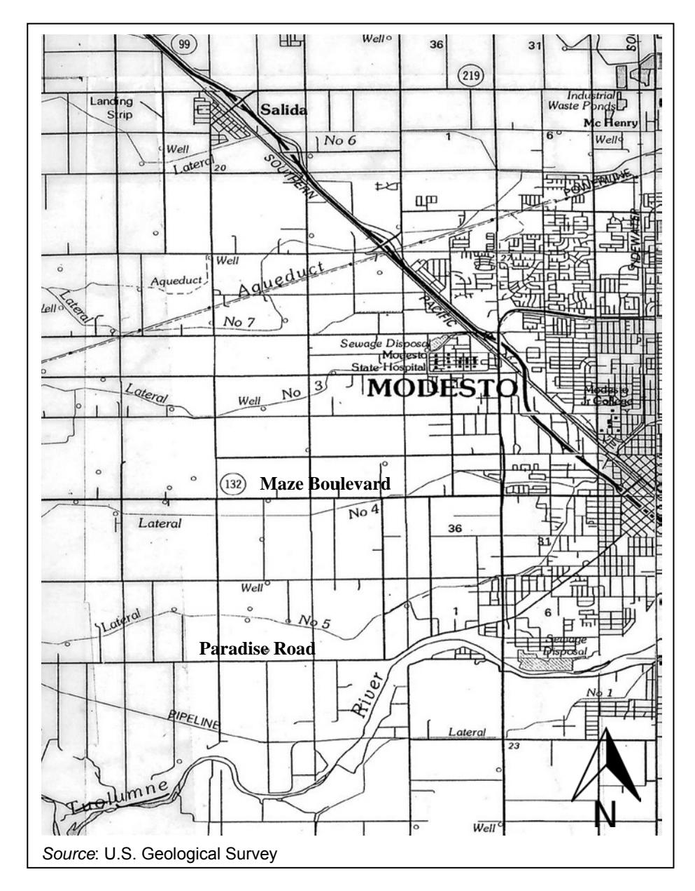

Figure 2-25: Agriculture (Farmlands) Resource Study Area circa 1970

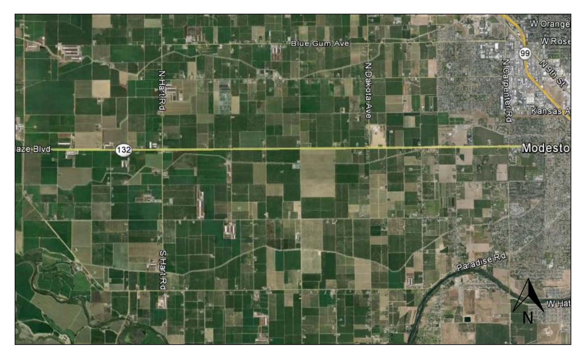

Figure 2-26: Agriculture (Farmlands) Resource Study Area circa 2014

As shown in the two figures above, residential, commercial and some industrial development has extended west of SR 99 to South Carpenter Road (south of existing SR 132 [Maze Boulevard]) and to Morse Road (north of Kansas Avenue). All of the development has occurred within Modesto's city limits and sphere of influence. However, the overall health of agriculture within the resource study area has remained relatively fixed since 1970 because of conversion restrictions within agricultural zones and on Williamson Act contract lands.

#### Visual/Aesthetics and Noise

Figure 2-27 shows an overview map of the approximate visual/aesthetics and noise resource study area in 1969.

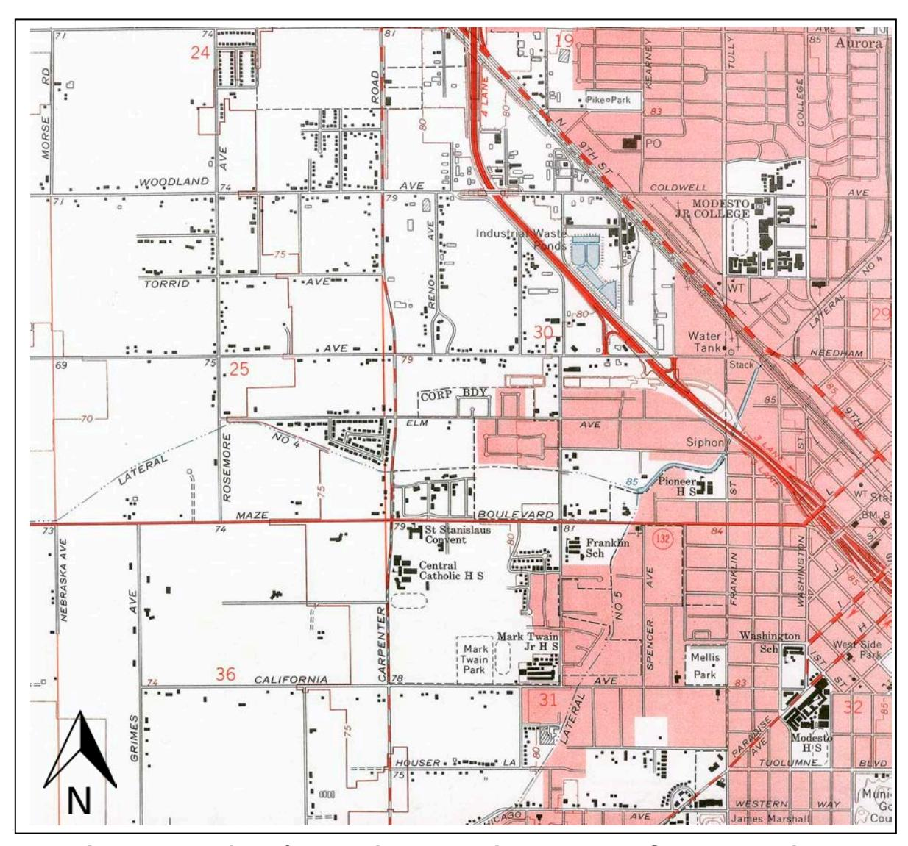

Figure 2-27: Visual/Aesthetics and Noise Resource Study Area circa 1969

Development has occurred in Modesto's city limits and sphere of influence throughout the visual/aesthetics and noise resource study area. This includes an increase in single-family residential units east of Morse Road and South Carpenter Road, an increase in the amount of commercial development along Kansas Avenue and, to a lesser extent, along existing SR 132 (Maze Boulevard), and further industrial development north of Kansas Avenue. While changes to the urban landscape on the west and east of SR 99 south of the existing highway to Tuolumne Boulevard have also occurred, the overall residential, commercial, and industrial makeup of the area has not changed much beyond what it was in 1969 (see Figure 2-27).

In all, the overall health of visual/aesthetic resources within the resource study area has slightly declined since 1969 because of increased residential and industrial development in the area. Ambient noise levels have also increased over time because of the development in the area, as well as increasing traffic volumes with expanding population and commerce, both locally and regionally.

#### Step 4: Identify Direct and Indirect Impacts of the Project

Table 2-57 shows the direct and indirect impacts of both build alternatives on both agriculture and visual/aesthetic resources.

**Table 2-57: Project Impact Summary** 

| Resource                   | Direct and Indirect Impacts                                                                                                                                                                                                                                                                                                                                                                                                                         |
|----------------------------|-----------------------------------------------------------------------------------------------------------------------------------------------------------------------------------------------------------------------------------------------------------------------------------------------------------------------------------------------------------------------------------------------------------------------------------------------------|
| Agriculture (Farmlands) | Both build alternatives would result in the direct conversion of 64.8 acres of prime and unique farmland and 3.51 acres of Williamson Act contract lands. Although existing agricultural operations may be altered from modified access for farmers and livestock, access would be maintained throughout the project.                                                                                                                               |
| Visual/Aesthetics          | Structures (notably, the proposed SR 132/SR 99 direct-connector flyover ramp) would degrade the visual quality of some residential areas to moderately low, causing a high visual impact. New highway lighting and signs would be introduced, and most trees in the project study area would be impacted.                                                                                                                                           |
| Noise                      | Because the proposed project would be constructed on a new alignment where no highway currently exists, numerous receivers (land uses where frequent human activity occurs, such as residences) would be impacted. West of SR 99, the proposed new alignment would be close to receivers, resulting in higher traffic noise levels. Up to 276 receivers would be affected by increased noise. One noise barrier (a soundwall) has been recommended. |

#### Step 5: Identify Other Reasonably Foreseeable Actions

As described in Section 2.1.2, Growth, the eastern, more urbanized portion of the project study area is already fully developed, and no reasonably foreseeable actions would alter agricultural land or the visual/aesthetic makeup of the area. As for the western portion of the study area, Stanislaus County has only two foreseeable projects/developments (two conservation easements) proposed at this time. Within Modesto, no formal development plans for either comprehensive planning district have been created; the proposed Kansas-Woodland Business Park is currently on hold, and no developments are planned within the Redevelopment Planning District.

Within the three larger resource study areas, there are seven Tier I and five Tier II actions per StanCOG's 2014 Regional Transportation Plan/Sustainable Communities Strategy. Per the plan, Tier I actions represent projects expected to be fully funded; while many Tier II actions are not funded, the projects represent the "long-term" desires within the region. The following describes the seven Tier I actions, including a reference to the applicable resource based on where the action would occur in respect to each resource study area:

- Street improvements are planned along Brink Avenue in Modesto, paralleling SR 99 (Agriculture and Visual/Aesthetics).
- Street improvements are planned along South Carpenter Road in Modesto from existing SR 132 (Maze Boulevard) to Paradise Road (Agriculture, Visual/Aesthetics, and Noise).
- Reconstruction of the interchange on SR 99 at Briggsmore Avenue is planned in Modesto (Agriculture, Visual/Aesthetics, and Noise).
- Further extension of SR 132 West as a new two-lane highway from Dakota Avenue to Gates Road is planned in Stanislaus County (Agriculture, Visual/Aesthetics, and Noise).
- Construction of Class I trails is planned along Modesto Irrigation District's Lateral Canal No. 3, No. 4, and No. 7 (Agriculture).
- The Tuolumne River Restoration Project plans to improve trails from Mitchell Road to South Carpenter Road (Agriculture).
- Construction of a Class I bicycle trail is planned to extend the Virginia Corridor Trailway west of SR 99 (Agriculture).

The following describes the five Tier II actions:

- SR 99 is planned to be widened to eight lanes from North Carpenter Road to Tuolumne Boulevard (Visual/Aesthetics and Noise).
- Blue Gum Avenue is planned to be widened to four lanes from Poust Road to North Rosemore Avenue in Modesto (Agriculture, Visual/Aesthetics, and Noise).
- Existing SR 132 (Maze Boulevard) is planned to be widened to four lanes from SR 99 to Carpenter Road in Modesto (Visual/Aesthetics and Noise).
- Paradise Road is planned to be widened to four lanes from Sutter Avenue to South Carpenter Road in Modesto (Agriculture, Visual/Aesthetics, and Noise).
- Woodland/Coldwell Avenue is planned to be widened to four lanes from Kearney Avenue to North Carpenter Road in Modesto (Agriculture, Visual/Aesthetics, and Noise).

## **Steps 6 and 7: Assess Potential Cumulative Impacts and Report Results** *Agriculture (Farmlands)*

When you compare Figure 2-25 to Figure 2-26, development has occurred since 1970, but it has not extended beyond Modesto's city limits or sphere of influence and has not encroached further onto agriculture land in the western portion of the resource study area. Since 1970, the western portion of the resource study area has remained dedicated to agricultural uses. The Stanislaus County General Plan protects agricultural land (particularly prime and statewide important farmland), only allowing conversion for exceptional needs. The only foreseeable action in an area not already developed would be the realignment of SR 132 and construction of a new two-lane facility from Dakota Avenue to Gates Road in Stanislaus County. The action would occur in a heavily farmed portion of the resource study area. Though the corridor for the realignment has not been identified, future infrastructure projects would be reviewed and managed for compliance with applicable policies concerning the conversion of farmland. Natural Resources Conservation Service coordination to determine potential impacts to prime and unique farmland would also be conducted. Based on this analysis, the build alternative would contribute to a cumulative impact to agriculture.

#### Visual/Aesthetics

Structures for the proposed new alignment (notably, the proposed SR 132/SR 99 direct-connector flyover ramp) would degrade the visual quality of Elm Street

neighborhood to moderately low, causing a high visual impact for the local residents and travelers. However, neither build alternative would alter and, in the case of two views, improve the visual quality of the other views throughout the project study area.

The proposed Kansas-Woodland Business Park would have been the only foreseeable action that could have led to further degrading of the resource study area's visual/aesthetic quality. But, the action is currently on hold, with no foreseeable start-up date. The remainder of the Tier I and Tier II actions listed above are expected to cause only minor visual changes to the resource study area because the projects would be at grade and in already developed areas or areas with an existing highway/roadway. None of the projects would construct intrusive visual structures or completely reconfigure the area's landscape units. But, incremental alterations could lead to a cumulative impact on visual/aesthetic resources if avoidance, minimization, or mitigation measures similar to those outlined in this document (VA-1 through VA-8) are not incorporated. If proposed, these measures would reduce and, in some cases, improve the visual quality for local residents and the traveling public.

#### Noise

Traffic is the main noise source affecting noise-sensitive land uses in the study area. The proposed project would have the greatest noise impacts in two areas: 1) the residential area south of Berryessa Drive and west of North Carpenter Road, and 2) the residential area on the west side of SR 99 and north of Elm Avenue. Other reasonably foreseeable actions that could lead to a cumulative impact on noise-sensitive land uses in the study area are the Tier I and Tier II arterial improvements, freeway interchange reconstruction, and the future widening of SR 99. However, depending on the location, these projects would be subject to City of Modesto, Stanislaus County or Caltrans noise control requirements for both design and construction. If best management practices relative to noise impacts similar to those outlined in this document (inclusion of noise barriers in project design and implementation of construction noise controls) are incorporated into these other projects, these measures would minimize and, in some cases, reduce noise levels experienced by local residents.

#### Step 8: Assess the Need for Mitigation

Stanislaus County has an adopted farmland mitigation program, though it is presently applicable only to the conversion of farmland to a residential use. While conversion of farmland is controlled by Stanislaus County and impacts to existing farmland can be reduced, there are no feasible measures that can fully mitigate the loss of farmland.

The replacement impacted farmland using off-site mitigation is cost prohibitive and the productivity of off-site mitigation may not be equivalent to the level provided within the project area.

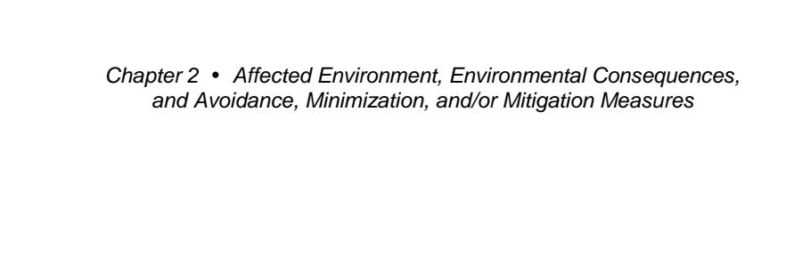

Page Intentionally Left Blank

# **Chapter 3** California Environmental Quality Act Evaluation

## 3.1 Determining Significance under the California Environmental Quality Act

The proposed project is a joint project by Caltrans and the Federal Highway Administration and is subject to state and federal environmental review requirements. Project documentation, therefore, has been prepared in compliance with both CEQA and NEPA. The Federal Highway Administration's responsibility for environmental review, consultation, and any other action required in accordance with NEPA and other applicable federal laws for the proposed project is being, or has been, carried out by Caltrans under its assumption of responsibility pursuant to 23 U.S. Code 327. Caltrans is the lead agency under CEQA and NEPA.

One of the main differences between NEPA and CEQA is the way significance is determined. Under NEPA, significance is used to determine whether an Environmental Impact Statement, or a lower level of documentation, would be required. NEPA requires that an Environmental Impact Statement (EIS) be prepared when the proposed federal action (project) as a whole has the potential to "significantly affect the quality of the human environment." The determination of significance is based on context and intensity. Some impacts determined to be significant under CEQA may not be of sufficient magnitude to be determined significant under NEPA. Under NEPA, once a decision is made regarding the need for an EIS, it is the magnitude of the impact that is evaluated and no judgment of its individual significance is deemed important for the text. NEPA does not require that a determination of significant impacts be stated in the environmental documents.

CEQA, on the other hand, does require Caltrans to identify each "significant effect on the environment" resulting from the project and ways to mitigate each significant effect. If the project may have a significant effect on any environmental resource, then an Environmental Impact Report (EIR) must be prepared. Every significant effect on the environment must be disclosed in the EIR and mitigated if feasible. In addition, the CEQA guidelines list a number of mandatory findings of significance, which also require the preparation of an EIR. There are no types of actions under NEPA that parallel the mandatory findings of significance of CEQA. This chapter discusses the effects of the project and CEQA significance. A summary of the CEQA Checklist completed for the proposed project is provided in Appendix A of this

document. The CEQA impact levels include "potentially significant impact," "less than significant impact with mitigation," "less than significant impact," and "no impact." CEQA impact findings for the proposed project are provided below in Section 3.2, Discussion of Significant Impacts.

#### 3.2 Discussion of Significant Impacts

#### 3.2.1 No Effects from the Proposed Project

As discussed at the beginning of Chapter 2, the following environmental issues were considered, but no adverse impacts were identified:

- Coastal Zones: The proposed project study area is not near any coastal zones.
- Forested Resources (Timberlands): No timberlands are in or near the project study area (Community Impacts Assessment, April 2016).
- Mineral Resources: The proposed project would not impact any known mineral resources in the project study area (Geotechnical/Geologic Summary Report, October 2010).
- Sensitive Natural Communities: No sensitive natural communities are in the project study area. The *State Route 132 West Freeway/Expressway Natural Environment Study* (October 2016) provides more details.
- Special-Status Plant Species: No special-status plant species were identified in the project study area. The *State Route 132 West Freeway/Expressway Natural Environment Study* (October 2016) provides more details.
- Wetlands: The proposed project will have no effect on federally protected wetlands (waters of the U.S.) as defined by Section 404 of the Clean Water Act (including, but not limited to, marsh, vernal pool, coastal, etc.) through direct removal, filling, hydrological interruption, or other means.
- Wild and Scenic Rivers: No wild and scenic rivers are in or near the project study area.

#### 3.2.2 Less-than-Significant Effects of the Proposed Project

Pursuant to CEQA, the following resources would be anticipated to experience less than significant impacts (Chapter 2, Affected Environment, Environmental Consequences, and Avoidance, Minimization, and/or Mitigation Measures provides further information on each of the listed resources):

- Agricultural Resources (see Section 2.1.3, Farmlands): Both build alternatives would result in the conversion of 64.8 acres of prime and unique farmland, 3.51 acres of which are encumbered under a Williamson Act contract. This represents a 0.016 percent and 0.0005 percent decrease in County wide totals of prime and unique farmland and Williamson Act contract lands, respectively. Given the total acreage of prime and unique farmlands and William Act contract lands and the farmland impact rating score of 160 for both build alternatives, this is a minimal impact within Stanislaus County.
- Air Quality (see Section 2.2.6, Air Quality): Implementation of the proposed project may result in a cumulatively considerable net increase of criteria pollutants for which the project region is in non- attainment under an applicable federal or state ambient air quality standard. A temporary increase in precursor and criteria pollutants would occur during construction; however, with the implementation of standard best management practice, as described in Section 2.2.6, Air Quality, the impact would be less than significant. These best management practices would include the submittal of a dust control plan to San Joaquin Valley Air Pollution Control District prior to earthmoving, the implementation of dust control measures, and the control of construction-related PM10 and exhaust emissions. Measures would include maintaining properly tuned engines, minimizing the idling time of diesel-powered construction equipment to 2 minutes, using alternative-powered construction equipment (i.e., compressed natural gas, biodiesel, electric), using addon mitigation devices such as diesel oxidation catalysts or particulate filters, using equipment that meets the California Air Resources Board's most recent certification standard for off-road heavy-duty diesel engines, phasing project construction, and limiting the operating hours of heavy-duty equipment.
- Cultural Resources (see Section 2.1.8, Cultural Resources): Pending the results of an additional archaeological survey of currently inaccessible parcels and geoarchaeological investigations, after the preferred alternative is selected, Caltrans would submit a Section 106 finding of effect. The finding of effect would include the 3530 Maze Boulevard property and any additional properties identified in the additional surveys conducted after the preferred alternative is selected. The Final EIR/EA would include avoidance, minimization and mitigation measures for affected properties identified in the future investigations conducted after selection of the preferred alternative. The potential discovery of buried cultural resources, including human remains, during construction grading and excavation could be considered a significant impact pursuant to CEQA; however, avoidance and

minimization measures identified in Section 2.1.8, Cultural Resources would minimize adverse impacts to unknown buried cultural resources. These measures would be employed during construction in the event that unknown buried cultural resources are encountered. If previously recorded cultural materials are discovered during construction, all earthmoving activity within and around the immediate discovery area would be stopped until a qualified archaeologist could assess the nature and significance of the find. If human remains are discovered, State Health and Safety Code Section 7050.5 states that further disturbances and activities must cease in any area or nearby area suspected to overlie remains and the county coroner contacted. Pursuant to Public Resources Code Section 5097.98, if the remains are thought to be Native American, the coroner would notify the Native American Heritage Commission, who would then notify the Most Likely Descendent. At this time, the person who discovered the remains would contact the California Department of Transportation's District 10 Native American Coordinator so that he or she may work with the Most Likely Descendent on the respectful treatment and disposition of the remains. Further provisions of Public Resources Code 5097.98 are to be followed as applicable.

- Geology and Soils (see Section 2.2.3, Geology/Soils/Seismic/Topography):
  According to geologic data for the project area, there is a low potential for strong seismic ground shaking, liquefaction and soil erosion. Also, embankments constructed for the project may have a low potential for soil instability issues, such as landslide and subsidence.
- Land Use and Planning (see Section 2.1.1, Land Use): Both build alternatives would convert existing mostly agricultural and scattered Urban Transition uses in Stanislaus County and mostly vacant land (designated for redevelopment planning) in Modesto to a transportation use. The build alternatives would not be consistent with two Stanislaus County General Plan policies related to the conversion of agricultural land and one Modesto General Plan policy concerning Transportation Demand Management measures.
- Population and Housing (see Section 2.1.4.1, Community Character and Cohesion): Both build alternatives would result in minimal growth-related impacts beyond what has already been planned in Stanislaus County and Modesto.
- Public Services (see Section 2.1.5, Utilities/Emergency Services): Impacts to emergency services would be the same for both build alternatives. While the proposed project would not create long-term access impacts for emergency vehicles,

temporary, construction-related impacts would include use of local roads by construction vehicles, lane closures, and detours.

- Transportation/Traffic (see Section 2.1.6, Traffic and Transportation/Pedestrian and Bicycle Facilities): The build alternatives would not be consistent with a Modesto General Plan Policy V-B.6(c) concerning the application of Transportation Demand Management measures, which can directly affect trip makers' choice of travel mode and the routes and time of day for trips.
- Utilities and Service Systems (see Section 2.1.5, Utilities/Emergency Services): Neither build alternative would result in long-term impacts to utilities and emergency services. But, construction-related impacts are anticipated. As described in Section 2.1.6, Traffic and Transportation/Pedestrian and Bicycle Facilities, implementation of a traffic management plan would include advance notification for emergency service personnel of any expected delay or detour thereby minimizing temporary, construction-related impacts to emergency service providers.

#### 3.2.3 Significant Environmental Effects of the Proposed Project

The proposed project could have significant effects on the following environmental resources. However, with implementation of measures identified below, these impacts would be reduced to less-than-significant levels. The determination of level of significance is based on the CEQA Checklist, provided in Appendix A of this document. Please refer to Chapter 2, Affected Environment, Environmental Consequences, and Avoidance, Minimization, and/or Mitigation Measures for further information, including a description of the mitigation measures.

- Agricultural Resources: During construction of the proposed project, temporary impacts related to access and irrigation ditches are anticipated. Implementation of mitigation measures FARM-1 through FARM-4 would compensate for temporary impacts to farmland, which may occur during construction. These measures include Caltrans' coordination with property owners and agricultural operators during final design to incorporate design features to maintain property access and operation and restricting the contractor to staging all construction materials, tools, and vehicles within the right-of-way for the project, reconstructing irrigation ditches and installing irrigation pipelines damaged during construction, compensating for the loss or damage to crops resulting from construction activities.
- Biological Resources: Both build alternatives have the potential to directly and permanently affect up to 20.8 acres and temporarily affect up to 0.2 acre of burrowing owl habitat. This conclusion would be confirmed or amended after

protocol surveys are completed the year before construction (see Section 2.3.2, Animal Species). If burrowing owls are detected within the biological study area, the California Department of Fish and Wildlife would be consulted to determine specific avoidance and minimization measures appropriate for the site. Implementation of mitigation measure AS-1 would compensate for the loss of nesting burrows and associated burrowing owl habitat and may involve purchasing mitigation lands adjacent to the project or purchasing burrowing owl mitigation credits at an approved conservation bank in the region. This measure would reduce the impacts to burrowing owl to a less than significant level.

Both build alternatives would result in a total loss of 0.65 acre of seasonal wetlands considered to be waters of the state. As described in mitigation measure WET-1, Caltrans will consult with the Central Valley Regional Water Quality Board during the final design and permitting phase. If the seasonal wetland features are determined to be waters of the State, Caltrans will mitigate for their discharge and fill as directed by the Central Valley Regional Water Quality Board under the Porter Cologne Water Quality Control Act. Implementation of mitigation measure WET-1 would reduce this impact to a less than significant level.

Also, project-related impacts to Swainson's hawk habitat would include the removal of up to 70 acres of marginal foraging and/or poor quality nesting habitat and the removal of 414 trees with a low potential to support nests or roosting hawks. Implementation of mitigation measure TES-1 would compensate for project impacts to Swainson's hawk habitat through the completion of protocol-level surveys and adherence to minimization measures coordinated with the California Department of Fish and Wildlife. Potential minimization measures would include establishing a 600 foot no-work buffer zone around an active nest, and/or having a qualified biologist present to monitor an active nest during construction activities to ensure that no interference with the hawks breeding activities would occur. Implementation of mitigation measure TES-1 would reduce this impact to a less than significant level

• Hazards and Hazardous Materials: Potential impacts from the accidental release of hazardous materials into the environment would be less than significant with implementation of mitigation measures HAZ-1 through HAZ-14, described in Section 2.2.5, Hazardous Waste/Materials. These measures include numerous routine hazardous materials management practices such as the preparation of sampling and analysis plans, materials management plans, health and safety plans, and spill prevention plans, and the proper removal and disposal of asbestos-

containing material, lead based paint, and other hazardous building materials in accordance with applicable regulations.

- Caltrans Modesto Soils Stockpiles: While there may be potential impacts from the presence of barium contaminants in three soil stockpiles, containment of the three soil stockpiles through use as construction materials for the new proposed highway, as described in the Draft Final Remedial Action Plan and in Section 2.2.5.1, and implementation of mitigation measures SHAZ-1 through SHAZ-10 would mitigate impacts to less than significant levels. These measures include the preparation of safety and management plans along with a land use covenant to restrict the types of land use allowed on the site. The plans would address containment assessment, management, and reporting to ensure the ongoing integrity of the containment feature for the protection of human health and the environment. Additional measures include the disposal of waste in accordance with applicable regulations, the minimization of soil stockpile reconfiguration, and conducting perimeter air quality monitoring and groundwater and storm water quality monitoring during construction to minimize hazardous materials impacts related to the soil stockpiles to less than significant levels.
- Hydrology and Water Quality: Alternative 1 would increase impervious surface by 55.8 acres, and Alternative 2 would increase impervious surface by 57.5 acres. The addition of impervious surface could affect the area's watershed through increasing the flow and volume of stormwater runoff entering the watershed. If left untreated, the increase in flow and runoff could negatively affect the water quality of receiving water bodies. Caltrans would create a detailed project drainage plan, identifying storm drain features to address the impact of increasing impervious surfaces areas within the project area. Caltrans would comply with applicable Central Valley Regional Water Quality Control Board and Stanislaus County requirements for dewatering and discharge of non-stormwater. In addition, the contractor would conduct groundwater and stormwater monitoring on and adjacent to the soil stockpiles until the proposed project is complete or the California Department of Toxic Substances Control and the Central Valley Regional Water Quality Control Board indicate that it is no longer necessary. Implementation of mitigation measure HY-1, as described in Section 2.2.1, Hydrology and Floodplain, and mitigation measures WQ-1 through WQ-2 in Section 2.2.2, Water Quality and Storm Water Runoff, would reduce this impact to a less than significant level.
- Noise: Construction of the proposed project would result in a substantial temporary or periodic increase in ambient noise levels in the project vicinity above

levels existing without the project; however, implementation of standard best management practices as described in Section 2.2.7, Noise would reduce this impact to a less than significant level. These practices include the use of sound-control devices on construction equipment, the requirement that all equipment include muffled exhaust systems, turning off idling equipment, scheduling construction activity to workday hours, notifying adjacent residents in advance of construction work, and moving stationary construction equipment away from noise-sensitive receivers.

Paleontological Resources: Excavation for both Alternatives 1 and 2 would impact the Modesto Formation, thereby having an impact on paleontological resources throughout the study area. Implementation of mitigation measures PR-1 through PR-15 described in Section 2.2.4, Paleontology, would reduce impacts to less than significant levels. These measures would include the preparation of a Paleontological Mitigation Plan prior to construction, the designation of a paleontological monitor to be present during qualifying earthmoving activities, as described in the Paleontological Evaluation Report and Preliminary Paleontological Mitigation Plan, and providing a paleontological awareness training session to contractors. The paleontological monitor would halt work within a 60-foot radius of paleontological resources discovered during earthmoving activities. Resources would be prepared for identification, proper documentation, collection and storage in a recognized repository institution. The paleontological monitor would also collect and analyze samples for microfossils. Lastly, a Paleontological Mitigation Report would be prepared by the project paleontologist and filed with the repository institution

#### 3.2.4 Mandatory Findings of Significance

The proposed project would not substantially degrade the environment, substantially reduce the habitat of a fish or wildlife species, cause a fish or wildlife population to drop below self-sustaining levels, threaten to eliminate a plant or animal community, substantially reduce the number or restrict the range of a rare or endangered plant or animal or eliminate important examples of the major periods of California history or prehistory.

The proposed project would cause significant cumulative impacts to agricultural (farmlands), visual resources, and noise as described in Section 2.4.

The proposed project would cause substantial adverse effects on human beings through the reduction in farmland (see Section 2.1.3), degradation of visual quality (see Section 2.1.7), and noise impacts (see Section 2.2.8).

#### 3.2.5 Unavoidable Significant Environmental Effects

The proposed project would have an unavoidable significant impact relative to the following environmental factors:

#### Noise

Significant noise impacts under CEQA are determined by comparing the predicted noise levels of baseline conditions and the build alternatives. CEQA noise analysis is completely independent of the NEPA analysis discussed in Section 2.2.7, Noise, which centers on the noise abatement criteria. Under CEQA, the noise assessment looks at the setting of the noise impact and then how large or perceptible any noise increase would be in a given area. Key considerations include the uniqueness of the setting, sensitive nature of the noise receivers, magnitude of the noise increase, number of residences affected, and absolute noise level. The noise analysis for the project was prepared in accordance with the Caltrans' *Traffic Noise Analysis Protocol for New Highway Construction and Reconstruction Projects*.

Under Alternative 1, noise levels at 251 receivers would approach or exceed 66 A-weighted decibels, and noise levels at 267 receivers would approach or exceed 66 A-weighted decibels under Alternative 2. In accordance with the *Traffic Noise Protocol*, noise levels over 65 A-weighted decibels generally interfere with normal speech. A 3 A-weighted decibel increase between existing noise levels and the build alternatives would be barely perceptible to the human ear.

Tables 3-1 and 3-2 show the range of noise levels for both existing and future conditions. The tables also list noise level increases with the project compared to baseline conditions and the number of receivers that would experience a noticeable increase or a doubling of loudness in each noise analysis area. The *State Route 132 Noise Study Report* includes a detailed summary of the noise analysis results.

**Table 3-1: Alternative 1 Noise Levels and Impacts** 

| Noise Analysis Area | Total Receivers | Existing Noise Level (dBA) | Alternative 1 Noise Level (dBA) | Increase over Existing (dBA) | Distinctly Noticeable Increasea | Doubling of Loudnessb |
|---------------------------|--------------------|----------------------------------|------------------------------------|---------------------------------|---------------------------------------|-----------------------------|
| 1                         | 26                 | 43.2 – 68.1                      | 51.6 – 73.4                        | -3.0 – 12.5                     | 7                                     | 9                           |
| 2                         | 18                 | 46.0 – 61.8                      | 54.9 – 69.4                        | 7.6 – 15.6                      | 13                                    | 5                           |
| 3                         | 238                | 45.5 – 70.6                      | 56.0 – 71.1                        | 3.0 – 11.2                      | 139                                   | 38                          |
| 4                         | 295                | 49.8 – 68.9                      | 58.0 – 79.5                        | 3.8 – 15.9                      | 217                                   | 52                          |
| 5                         | 12                 | 61.4 – 66.3                      | 65.0 – 70.2                        | 1.9 – 3.9                       | 0                                     | 0                           |
| 6                         | 1                  | 72.8                             | 75.6                               | 2.8                             | 0                                     | 0                           |
| 7                         | 10                 | 64.9 – 76.9                      | 66.1 – 74.4                        | 1.2 – 3.9                       | 0                                     | 0                           |
| 8                         | 55                 | 61.3 – 73.7                      | 64.7 – 76.4                        | 2.5 – 4.9                       | 0                                     | 0                           |
| 9                         | 15                 | 63.8 – 72.1                      | 66.3 – 75.8                        | 2.5 – 4.6                       | 0                                     | 0                           |

Notes: dBA = A-weighted decibels.

Source: Noise Study Report (January 2016)

Table 3-2: Alternative 2 Noise Levels and Impacts

| Noise Analysis Area | Total Receivers | Existing Noise Level (dBA) | Alternative 1 Noise Level (dBA) | Increase over Existing (dBA) | Distinctly Noticeable Increasea | Doubling of Loudnessb |
|---------------------------|--------------------|----------------------------------|------------------------------------|---------------------------------|---------------------------------------|-----------------------------|
| 1                         | 26                 | 43.2 – 68.1                      | 51.6 – 73.4                        | -3.0 – 12.5                     | 7                                     | 9                           |
| 2                         | 18                 | 46.0 – 61.8                      | 54.9 – 69.4                        | 7.6 – 15.6                      | 13                                    | 5                           |
| 3                         | 238                | 45.5 – 70.6                      | 56.0 – 71.1                        | 3.0 – 11.2                      | 139                                   | 38                          |
| 4                         | 295                | 49.8 – 68.9                      | 57.0 – 80.2                        | 5.8 – 15.9                      | 225                                   | 61                          |
| 5                         | 12                 | 61.4 – 66.3                      | 65.0 – 70.3                        | 1.9 – 4.0                       | 0                                     | 0                           |
| 6                         | 1                  | 72.8                             | 78.1                               | 5.3                             | 1                                     | 0                           |
| 7                         | 10                 | 64.9 – 76.9                      | 66.1 – 74.4                        | 1.2 – 3.9                       | 0                                     | 0                           |
| 8                         | 55                 | 61.3 – 73.7                      | 64.7 – 76.4                        | 2.4 – 4.8                       | 0                                     | 0                           |
| 9                         | 15                 | 63.8 – 72.1                      | 66.3 – 75.8                        | 2.5 – 4.6                       | 0                                     | 0                           |

*Notes*: dBA = A-weighted decibels.

Source: Noise Study Report (January 2016)

Of the impacted receivers, Noise Analysis Areas 3 and 4 were identified as having the largest number of absolute noise impacts (65 A-weighted decibels or more) and increases over existing noise levels (5 A-weighted decibels or more). Noise levels at a majority (50 percent or more) of the receivers in Noise Analysis Areas 3 and 4 were predicted to have a distinctly noticeable increase (5 A-weighted decibels or more)

&lt;sup>a Number of receivers with distinctly noticeable increase (5 dBA or more).

&lt;sup>b Number of receivers with doubling of loudness (increase of 10 dBA or more).

&lt;sup>a Number of receivers with distinctly noticeable increase (5 dBA or more).

&lt;sup>b Number of receivers with doubling of loudness (increase of 10 dBA or more).

over baseline conditions, while only 15 to 20 percent of the total receivers would experience a substantial (doubling of loudness) increase (10 A-weighted decibels or more) over baseline conditions.

Noise abatement was considered for all impacted receivers. But, as described in Section 2.2.7, Noise, only one noise barrier (Noise Barrier D) would be recommended in Noise Analysis Area 4. Affected residences in other areas all would require driveway access to local roadways, be partially shielded by retaining walls, or be already impacted by ambient (existing) traffic noise. Openings in noise barriers for driveways connecting or intersecting streets reduce the effectiveness of barriers. Therefore, those residences would experience a significant and unavoidable increase in noise levels from the proposed new highway.

The viewpoints of benefited receivers would be considered during the environmental review process in reaching a final decision on the reasonableness of the abatement measures. Benefited receivers are surveyed via registered mail. Property owners get one vote, while renters and owners of non-owner occupied dwellings get 10 percent of one vote and 90 percent of one vote, respectively. If more than 50 percent of the benefited receivers oppose the abatement, the abatement would not be considered reasonable and would not be constructed.

The final decision on noise abatement would be made on completion of the project design and the public involvement process. If during final design conditions have substantially changed, noise abatement may not be necessary.

Section 2.2.7, Noise, provides more information on this resource.

#### Visual/Aesthetics

Both build alternatives would remove existing trees at the North Dakota and Kansas Avenue intersection and on the north side of Elm Avenue within the Elm Tract neighborhood. While tree removal would create temporary visual impacts, the temporary impacts would be reduced to less-than-significant levels with implementation of measures VA-4 and VA-5.

For the Elm Tract neighborhood, construction of the proposed SR 132/SR 99 direct-connector flyover ramp would require removal of up to six homes and 16 additional trees from the north side of Elm Avenue. The flyover structure would be incompatible with the existing residential setting, as the structure and associated noise barriers would block residents' views of a distant water tower and would degrade the visual quality from moderately high to moderately low. Even with application of aesthetic

treatments (VA-1), the flyover structure and ground-level noise barrier would have a significant and unavoidable visual impact.

Lighting from the new alignment would produce glare and reduce sky visibility for adjacent residential neighborhoods. However, impacts would be reduced to less-than-significant levels with implementation of measures VA-7 and VA-8.

Section 2.1.7, Visual/Aesthetics, provides more information on this resource.

#### 3.2.6 Climate Change

Climate change refers to long-term changes in temperature, precipitation, wind patterns, and other elements of the earth's climate system. An ever-increasing body of scientific research attributes these climatological changes to greenhouse gas emissions, particularly those generated from the production and use of fossil fuels.

While climate change has been a concern for several decades, the establishment of the Intergovernmental Panel on Climate Change by the United Nations and World Meteorological Organization in 1988 has led to increased efforts devoted to greenhouse gas emissions reduction and climate change research and policy. These efforts are concerned mainly with the emissions of greenhouse gases generated by human activity, including carbon dioxide, methane, nitrous oxide, tetrafluoromethane, hexafluoroethane, sulfur hexafluoride, HFC-23 (fluoroform), HFC-134a (s, s, s, 2-tetrafluoroethane), and HFC-152a (difluoroethane).

In the U.S., the main source of greenhouse gas emissions is electricity generation, followed by transportation. In California, however, transportation sources (including passenger cars, light-duty trucks, other trucks, buses, and motorcycles) make up the largest source of greenhouse gas-emitting sources. The dominant greenhouse gas emitted is carbon dioxide, mostly from fossil fuel combustion.

There are two terms used when discussing the impacts of climate change: "Greenhouse Gas Mitigation" and "Adaptation." "Greenhouse Gas Mitigation" is a term for reducing greenhouse gas emissions to reduce or "mitigate" the impacts of climate change. "Adaptation" refers to the effort of planning for and adapting to impacts resulting from climate change (such as adjusting transportation design standards to withstand more intense storms and higher sea levels)3.

State Route 132 West Freeway/Expressway Draft EIR/EA • 320

&lt;sup>3 http://climatechange.transportation.org/ghg\_mitigation/

The four main strategies for reducing greenhouse gas emissions from transportation sources are: 1) improving the transportation system and operational efficiencies, 2) reducing travel activity, 3) transitioning to lower greenhouse gas-emitting fuels, and 4) improving vehicle technologies/efficiency. To be most effective, all four strategies should be pursued cooperatively.4

#### Regulatory Setting

#### State

With passage of several pieces of legislation including State Senate and Assembly bills and Executive Orders, California launched an innovative and proactive approach to dealing with greenhouse gas emissions and climate change.

Assembly Bill 1493, Pavley, Vehicular Emissions: Greenhouse Gases, 2002: This bill requires the California Air Resources Board to develop and implement regulations to reduce automobile and light truck greenhouse gas emissions. These stricter emissions standards were designed to apply to automobiles and light trucks beginning with the 2009-model year.

Executive Order S-3-05 (June 1, 2005): The goal of this order is to reduce California's greenhouse gas emissions to: 1) year 2000 levels by 2010, 2) year 1990 levels by the 2020, and 3) 80 percent below the year 1990 levels by 2050. In 2006, this goal was further reinforced with the passage of Assembly Bill 32.

Assembly Bill 32, Núñez and Pavley, The Global Warming Solutions Act of 2006: Assembly Bill 32 sets the same overall greenhouse gas emissions reduction goals as outlined in Executive Order S-3-05, while further mandating that the California Air Resources Board create a scoping plan and implement rules to achieve "real, quantifiable, cost-effective reductions of greenhouse gases."

Executive Order S-20-06 (October 18, 2006): This order establishes the responsibilities and roles of the Secretary of the California Environmental Protection Agency and state agencies with regard to climate change.

Executive Order S-01-07 (January 18, 2007): This order set forth the low carbon fuel standard for California. Under this order, the carbon intensity of California's transportation fuels is to be reduced by at least 10 percent by 2020.

&lt;sup>4 http://www.fhwa.dot.gov/environment/climate\_change/mitigation/

Senate Bill 97 Chapter 185, 2007, Greenhouse Gas Emissions: This bill required the Governor's Office of Planning and Research to develop recommended amendments to CEQA guidelines for addressing greenhouse gas emissions. The amendments became effective on March 18, 2010.

Senate Bill 375, Chapter 728, 2008, Sustainable Communities and Climate Protection: This bill requires the California Air Resources Board to set regional emissions reduction targets from passenger vehicles. The metropolitan planning organization for each region must then develop a "Sustainable Communities Strategy" that integrates transportation, land use, and housing policies to plan for the achievement of the emissions target for their region.

Senate Bill 391 Chapter 585, 2009 California Transportation Plan: This bill requires the State's long-range transportation plan to meet California's climate change goals under Assembly Bill 32.

#### Federal

Though climate change and greenhouse gas reduction are a concern at the federal level, currently no regulations or legislation have been enacted specifically addressing greenhouse gas emissions reductions and climate change at the project level. Neither the U.S. Environmental Protection Agency nor the Federal Highway Administration (FHWA) has issued explicit guidance or methods to conduct project-level greenhouse gas analysis. The FHWA supports the approach that climate change considerations should be integrated throughout the transportation decision-making process, from planning through project development and delivery. Addressing climate change mitigation and adaptation up front in the planning process would assist in decision-making and improve efficiency at the program level, and would inform the analysis and stewardship needs of project-level decision-making. Climate change considerations can be integrated into many planning factors, such as supporting economic vitality and global efficiency, increasing safety and mobility, enhancing the environment, promoting energy conservation, and improving the quality of life.

The four strategies outlined by the Federal Highway Administration to lessen climate change impacts correlate with efforts that the state is undertaking to deal with transportation and climate change; these strategies include improved transportation system efficiency, cleaner fuels, cleaner vehicles, and a reduction in travel activity.

&lt;sup>5 To date, no national standards have been established for mobile source greenhouse gases, nor has the U.S. Environmental Protection Agency established any ambient standards, criteria or thresholds for greenhouse gases resulting from mobile sources.

Climate change and its associated effects are being addressed through various efforts at the federal level to improve fuel economy and energy efficiency, such as the "National Clean Car Program" and Executive Order 13514 - Federal Leadership in Environmental, Energy, and Economic Performance.

Executive Order 13514 (October 5, 2009) is focused on reducing greenhouse gases internally in federal agency missions, programs and operations, but also directs federal agencies to participate in the Interagency Climate Change Adaptation Task Force, which is engaged in developing a national strategy for adaptation to climate change.

The U.S. Environmental Protection Agency's authority to regulate greenhouse gas emissions stems from the U.S. Supreme Court decision in Massachusetts v. EPA (2007). The Supreme Court ruled that greenhouse gases meet the definition of air pollutants under the existing Clean Air Act and must be regulated if these gases could be reasonably anticipated to endanger public health or welfare. Responding to the court's ruling, the U.S. Environmental Protection Agency finalized an endangerment finding in December 2009. Based on scientific evidence, it found that six greenhouse gases constitute a threat to public health and welfare. So, it is the Supreme Court's interpretation of the existing act and the U.S. Environmental Protection Agency's assessment of the scientific evidence that form the basis for the U.S. Environmental Protection Agency in conjunction with National Highway Traffic Safety Administration issued the first of a series of greenhouse gas emission standards for new cars and light-duty vehicles in April 2010.

The U.S. Environmental Protection Agency and the National Highway Traffic Safety Administration are taking coordinated steps to enable the production of a new generation of clean vehicles with reduced greenhouse gas emissions and improved fuel efficiency from on-road vehicles and engines. These next steps include developing the first-ever greenhouse gas regulations for heavy-duty engines and vehicles, as well as additional light-duty vehicle greenhouse gas regulations.

The final combined standards that made up the first phase of this national program apply to passenger cars, light-duty trucks, and medium-duty passenger vehicles, covering model years 2012 through 2016. The standards implemented by this program are expected to reduce greenhouse gas emissions by an estimated 960

&lt;sup>6 http://www.c2es.org/federal/executive/epa/greenhouse-gas-regulation-faq

million metric tons and 1.8 billion barrels of oil over the lifetime of the vehicles sold under the program (model years 2012-2016).

On August 28, 2012, the U.S. Environmental Protection Agency and National Highway Traffic Safety Administration issued a joint Final Rulemaking to extend the National Program for fuel economy standards to model year 2017 through 2025 passenger vehicles. Over the lifetime of the model year 2017 to 2025 standards, this program is projected to save approximately four billion barrels of oil and two billion metric tons of greenhouse gas emissions.

The complementary U.S. Environmental Protection Agency and National Highway Traffic Safety Administration standards that make up the Heavy-Duty National Program apply to combination tractors (semi-trucks), heavy-duty pickup trucks and vans, and vocational vehicles (including buses and refuse or utility trucks). Together, these standards would cut greenhouse gas emissions and domestic oil use significantly. This program responds to President Barack Obama's 2010 request to jointly establish greenhouse gas emissions and fuel efficiency standards for the medium- and heavy-duty highway vehicle sector. The agencies estimate that the combined standards would reduce carbon dioxide emissions by about 270 million metric tons and save about 530 million barrels of oil over the life of model year 2014 to 2018 heavy-duty vehicles.

#### Project Analysis

An individual project does not generate enough greenhouse gas emissions to significantly influence global climate change. Rather, global climate change is a cumulative impact. This means that a project may contribute to a potential impact through its incremental change in emissions when combined with the contributions of all other sources of greenhouse gases. In assessing cumulative impacts, it must be determined if a project's incremental effect is "cumulatively considerable" (CEQA Guidelines Sections 15064(h)(1) and 15130). For one to make this determination, the incremental impacts of the project must be compared with the effects of past, current, and probable future projects. To gather sufficient information on a global scale of all past, current, and future projects to make this determination is a difficult, if not impossible, task.

&lt;sup>7 This approach is supported by the Association of Environmental Professionals: *Recommendations by the Association of Environmental Professionals on How to Analyze GHG Emissions and Global Climate Change in CEQA Documents* (March 5, 2007), as well as the South Coast Air Quality Management District (Chapter 6: The CEQA Guide, April 2011) and the U.S. Forest Service (Climate Change Considerations in Project Level NEPA Analysis, July 13, 2009).

The Assembly Bill 32 Scoping Plan mandated by Assembly Bill 32 includes the main strategies California would use to reduce greenhouse gas emissions. As part of its supporting documentation for the Draft Scoping Plan, the California Air Resource Board released the greenhouse gas inventory for California (forecast last updated: October 28, 2010). The forecast is an estimate of the emissions expected to occur in 2020 if none of the foreseeable measures included in the Scoping Plan were implemented. The base year used for forecasting emissions is the average of statewide emissions in the greenhouse gas inventory for 2006, 2007, and 2008.

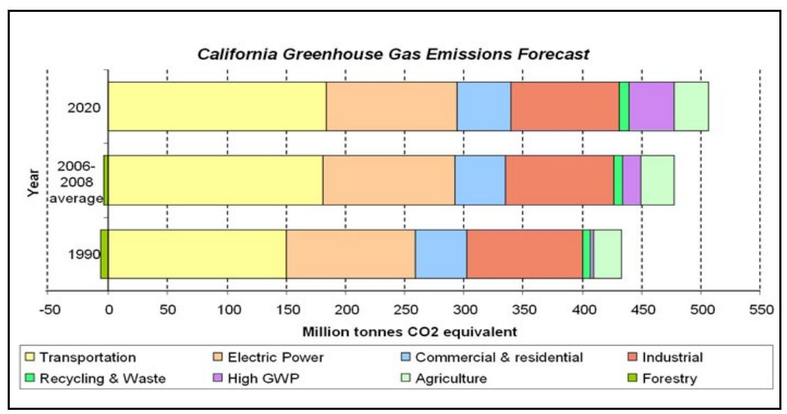

Source: http://www.arb.ca.gov/cc/inventory/data/forecast.htm.

Figure 3-1: California Greenhouse Gas Forecast

Caltrans and its parent agency, the State Transportation Agency, have taken an active role in addressing greenhouse gas emission reduction and climate change. Recognizing that 98 percent of California's greenhouse gas emissions are from the burning of fossil fuels and 40 percent of all human-made greenhouse gas emissions are from transportation, Caltrans has created and is implementing the Climate Action Program at Caltrans (published in December 2006).

#### Build Alternatives (Operational Emissions)

One of the main strategies in Caltrans' Climate Action Program to reduce greenhouse gas emissions is to make California's transportation system more efficient. The

&lt;sup>8 Caltrans Climate Action Program can be found at the following web address: <a href="http://www.dot.ca.gov/hq/tpp/offices/ogm/key">http://www.dot.ca.gov/hq/tpp/offices/ogm/key</a> reports files/State Wide Strategy/Caltrans Climate A <a href="http://crim.program.pdf">ction\_Program.pdf</a>

highest levels of carbon dioxide from mobile sources, such as automobiles, occur at stop-and-go speeds (0 to 25 miles per hour) and speeds over 55 miles per hour. The most severe emissions occur from 0 to 25 miles per hour (see Figure 3-2).

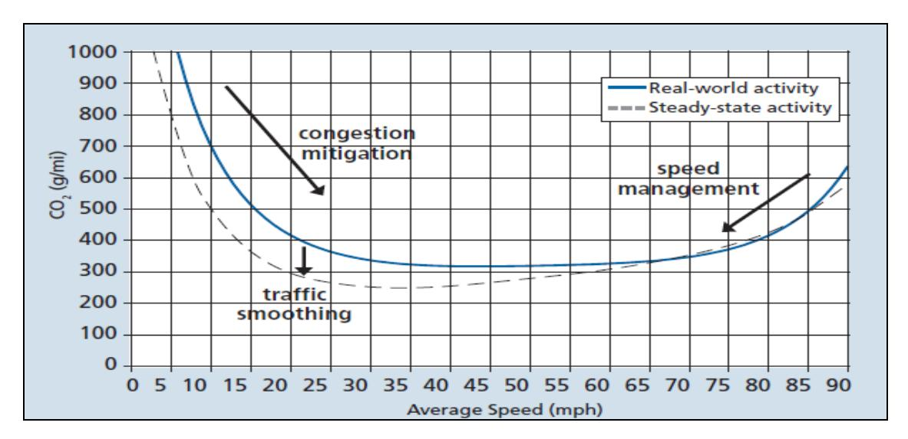

Figure 3-2: Possible Effect of Traffic Operation Strategies in Reducing On-Road Carbon Dioxide Emission9

Future-year greenhouse gas emissions associated with the two build alternatives were obtained by comparing emissions with the project in 202010 (when Phase 1 would be completed), 2028 (when Phase 2 would be completed), and 2048 (the design year) to emissions without the project; the EMFAC 2011 emissions model was used for the comparison. It is important to note that carbon dioxide emissions are useful only for a comparison between alternatives and are not necessarily an accurate reflection of what the true carbon dioxide emissions would be because carbon dioxide emissions are dependent on factors that are not part of the emissions model, such as the fuel mix, rate of acceleration, and the aerodynamics and efficiency of the vehicles. 11

Table 3-3 shows the results of the alternatives' comparison. To satisfy CEQA requirements, the No-Build Alternative scenario for the year when the Notice of Preparation was filed with the California State Clearinghouse, Office of Planning and

&lt;sup>9 Traffic Congestion and Greenhouse Gases: Matthew Barth and Kanok Boriboonsomsin (TR News 268 May-June 2010) <a href="http://onlinepubs.trb.org/onlinepubs/trnews/trnews268.pdf">http://onlinepubs.trb.org/onlinepubs/trnews/trnews268.pdf</a>>

&lt;sup>10 The traffic analysis for Phase 1 assumed an opening year of 2018, but that is now projected to be 2020.

&lt;sup>11 The EMFAC model emission rates are only for direct engine-out carbon dioxide emissions, not for a full fuel cycle. In addition, fuel cycle emission rates can vary dramatically depending on the amount of additives (e.g., ethanol) and the source of the fuel components.

Research (2010) was considered the baseline condition. Baseline emissions were estimated using the EMFAC 2011 model and annual daily traffic volumes that were extrapolated from 2020 projections from the project's traffic study and addendum.

Table 3-3: Summary of Operational Greenhouse Gas Emissions (metric tons carbon dioxide per year)

| Alternative                                              | 2010    | 2020                | 2028                | 2048                  |
|----------------------------------------------------------|---------|---------------------|---------------------|-----------------------|
| No-Build Alternative                                     | 198,932 | 246,162             | 294,513             | 424,066               |
| Phase 1                                                  | -       | 243,804             | -                   | -                     |
| Alternative 1                                            | -       | -                   | 293,002             | 410,192               |
| Alternative 2                                            | -       | -                   | 290,588             | 412,523               |
| Comparison of Build Alternatives to No-Build Alternative |         |                     |                     |                       |
| Phase 1 Build to No-Build Alternative                    | -       | -2,358 (47,230)a | -                   | -                     |
| Alternative 1 to No-Build Alternative                    | -       | -                   | -1,511 (94,070)a | -13,875 (211,260)a |
| Alternative 2 to No-Build Alternative                    | -       | -                   | -3,925 (91,656)a | -11,543 (213,591)a |

&lt;sup>a Comparison of the 2010 baseline conditions to the build alternatives. *Source*: Air Quality Study Report (May 2016)

As shown in the table, the two build alternatives would result in increased carbon dioxide emissions relative to the baseline condition and decreased carbon dioxide emissions for future conditions when compared to the No-Build Alternative. Although greenhouse gas emissions are anticipated to increase relative to the baseline condition, future congestion associated with the No-Build Alternative would contribute to potentially higher emissions than if either of the build alternatives were constructed. This shows the benefit of one of the main California Action Plan Strategies to reduce greenhouse gas emissions through transportation efficiency.

The two build alternatives would support implementation of Assembly Bill 32 through Senate Bill 375. Based on the emissions results, the two build alternatives would reduce congestion and overall greenhouse gas emissions in the project study area. StanCOG's 2014 Regional Transportation Plan/Sustainable Communities Strategy identifies the Senate Bill 375 goals for 2020 and 2035, which are a 5 percent and 10 percent reduction in per capita greenhouse gases from 2005 levels. The plan and strategy include a goal to reduce greenhouse gas emissions by 24 percent in 2020 and 21 percent in 2035.

The proposed project is included in a list of Tier I improvements identified in the plan for each transportation mode type, including roadways, transit, bicycle and pedestrian, and aviation. Improvements are intended to implement a balanced multimodal circulation system and improve air quality by reducing vehicle miles traveled and greenhouse gas emissions, while accommodating anticipated travel demand. Beyond the typical transportation system improvements (widening roadways and adding traffic signals to improve congestion and mobility), StanCOG is committed to analyzing alternative strategies, such as Transportation Systems Management, Transportation Demand Management, and intelligent transportation systems to increase system efficiencies. The alternative strategies would provide increased opportunities for non-auto travel to reduce vehicle miles traveled and improve overall air quality. These alternative strategies, including mass transit, were analyzed as part of the early planning stages for the project. These alternatives were considered and assessed as described in Section 1.6, Alternatives Considered but Eliminated from Further Discussion.

#### Construction Emissions

Greenhouse gas emissions for transportation projects can be divided into those produced during construction and those produced during operations. Construction

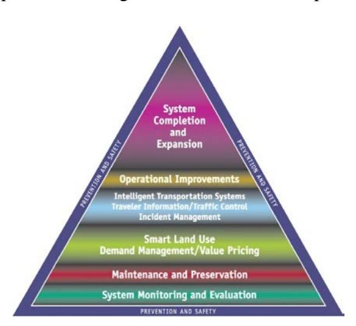

Figure 3-3: Mobility Pyramid

greenhouse gas emissions include emissions produced as a result of material processing, emissions produced by onsite construction equipment, and emissions arising from traffic delays due to construction. These emissions would be produced at different levels throughout the construction phase; their frequency and occurrence can be reduced through innovations in plans and specifications and by implementing better traffic

management during construction phases. In addition, with innovations such as longer pavement lives, improved traffic management plans, and changes in materials, the greenhouse gas emissions produced during construction can be mitigated to some degree by longer intervals between maintenance and rehabilitation events.

Caltrans continues to be involved on the Governor's Climate Action Team as the California Air Resources Board works to implement Executive Orders S-3-05 and S-01-07 and help achieve the targets set forth in Assembly Bill 32. Many of the strategies Caltrans is using to help meet the targets in Assembly Bill 32 come from then-Governor Arnold Schwarzenegger's Strategic Growth Plan for California. The Strategic Growth Plan targeted a significant decrease in traffic congestion below 2008 levels and a corresponding reduction in greenhouse gas emissions, while accommodating growth in population and the economy. The Strategic Growth Plan relies on a complete systems approach to attain carbon dioxide reduction goals: system monitoring and evaluation, maintenance and preservation, smart land use and demand management, and operational improvements as shown in Figure 3-3.

Caltrans also supports efforts to reduce vehicle miles traveled by planning and implementing smart land use strategies: job/housing proximity, developing transit-oriented communities, and high-density housing along transit corridors. Caltrans works closely with local jurisdictions on planning activities but does not have local land use planning authority. Caltrans also assists efforts to improve the energy efficiency of the transportation sector by increasing vehicle fuel economy in new cars, light- and heavy-duty trucks. Caltrans is doing this by supporting ongoing research efforts at universities, supporting legislative efforts to increase fuel economy, and participating on the Climate Action Team. It is important to note, however, that control of fuel economy standards is held by the U.S. Environmental Protection Agency and the California Air Resources Board.

Caltrans is also working toward enhancing the State's transportation planning process to respond to future challenges. Similar to requirements for regional transportation plans under Senate Bill 375 (Steinberg 2008), Senate Bill 391 (Liu 2009) requires the State's long-range transportation plan to meet California's climate change goals under Assembly Bill 32.

The California Transportation Plan is a statewide, long-range transportation plan to meet our future mobility needs and reduce greenhouse gas emissions. The plan defines performance-based goals, policies, and strategies to achieve our collective vision for California's future, statewide, integrated, multimodal transportation system. The purpose of the California Transportation Plan is to provide a common policy framework that would guide transportation investments and decisions by all levels of government, the private sector, and other transportation stakeholders. Through this policy framework, the California Transportation Plan 2040 would identify the

statewide transportation system needed to achieve maximum feasible greenhouse gas emission reductions while meeting the State's transportation needs. Table 3-4 shows Caltrans and statewide efforts that Caltrans is implementing to reduce greenhouse gas emissions. Detailed information about each strategy is included in the Climate Action Program at Caltrans (December 2006).

**Table 3-4: Climate Change/Carbon Dioxide Reduction Strategies** 

| Strategy                                                                | Program                                                                  | Partnership                                                                                                                                                          |                                                  | Method/Process                                                           | Estimated Carbon Dioxide Savings Million Metric Tons |                     |
|-------------------------------------------------------------------------|--------------------------------------------------------------------------|----------------------------------------------------------------------------------------------------------------------------------------------------------------------|--------------------------------------------------|--------------------------------------------------------------------------|------------------------------------------------------|---------------------|
|                                                                         |                                                                          | Lead                                                                                                                                                                 | Agency                                           |                                                                          | 2010                                                 | 2020                |
| Smart Land Use                                                          | Intergovernmental Review                                                 | Caltrans                                                                                                                                                             | Local governments                                | Review and seek to mitigate development proposals                        | Not Estimated                                        | Not Estimated       |
|                                                                         | Planning Grants                                                          | Caltrans                                                                                                                                                             | Local and regional agencies & other stakeholders | Competitive selection process                                            | Not Estimated                                        | Not Estimated       |
|                                                                         | Regional Plans and Blueprint Planning                                    | Regional Agencies                                                                                                                                                    | Caltrans                                         | Regional plans and application process                                   | 0.975                                                | 7.8                 |
| Operational Improvements & Intelligent Transportation System Deployment | Strategic Growth Plan                                                    | Caltrans                                                                                                                                                             | Regions                                          | State Intelligent Transportation Systems; Congestion Management Plan     | 0.07                                                 | 2.17                |
| Mainstream Energy & Greenhouse Gas into Plans and Projects              | Office of Policy Analysis & Research; Division of Environmental Analysis | Interdepartmental effort                                                                                                                                             |                                                  | Policy establishment, guidelines, technical assistance                   | Not Estimated                                        | Not Estimated       |
| Educational & Information Program                                       | Office of Policy Analysis & Research                                     | Interdepartmental, California Environmental Protection Agency, California Air Resource Board, California Energy Commission                                           |                                                  | Analytical report, data collection, publication, workshops, outreach     | Not Estimated                                        | Not Estimated       |
| Fleet Greening & Fuel Diversification                                   | Division of Equipment                                                    | Department of General Services                                                                                                                                       |                                                  | Fleet Replacement B20 B100                                               | 0.0045                                               | 0.0065 0.045 0.0225 |
| Non-vehicular Conservation Measures                                     | Energy Conservation Program                                              | Green Action Team                                                                                                                                                    |                                                  | Energy Conservation Opportunities                                        | 0.117                                                | 0.34                |
| Portland Cement                                                         | Office of Rigid Pavement                                                 | Cement and Construction Industries                                                                                                                                   |                                                  | 2.5 % limestone cement mix 25% fly ash cement mix > 50% fly ash/slag mix | 1.2 0.36                                             | 4.2 3.6             |
| Goods Movement                                                          | Office of Goods Movement                                                 | California Environmental Protection Agency, California Air Resource Board, California Business, Transportation, and Housing, and Metropolitan Planning Organizations |                                                  | Goods Movement Action Plan                                               | Not Estimated                                        | Not Estimated       |
| Total                                                                   |                                                                          |                                                                                                                                                                      |                                                  |                                                                          | 2.72                                                 | 18.18               |

Caltrans Director's Policy 30 (DP-30) Climate Change (June 22, 2012) is intended to establish Caltrans policy that would ensure coordinated efforts to incorporate climate change into Caltrans' decisions and activities.

Caltrans Activities to Address Climate Change (April 2013)12 provides a comprehensive overview of activities undertaken by Caltrans statewide to reduce greenhouse gases resulting from agency operations.

The following measures would also be included in the project to reduce the greenhouse gas emissions and potential climate change impacts from the project:

- GHG-1 The California Department of Transportation and the California Highway Patrol are working with regional agencies to implement intelligent transportation systems to help manage the efficiency of the existing highway system. Intelligent transportation systems commonly consist of electronics, communications, or information processing used singly or in combination to improve the efficiency or safety of a surface transportation system.
- GHG-2 In addition, the Stanislaus Council of Governments would provide Commute Connections, a ridesharing service, and park-and-ride facilities to help manage the growth in demand for highway capacity.
- GHG-3 Landscaping reduces surface warming, and through photosynthesis, decreases carbon dioxide. The California Department of Transportation would provide new corridor landscaping that complies with statewide drought restrictions and Modesto's tree preservation ordinance. The landscaping would help offset any potential carbon dioxide emissions increase.
- GHG-4 According to California Department of Transportation's Standard Specifications, the contractor must comply with all local air pollution control district's rules, ordinances, and regulations for air quality restrictions, including minimizing idling time for diesel construction equipment per San Joaquin Valley Air Pollution Control District Regulation VIII.

#### Adaptation Strategies

"Adaptation strategies" refer to how Caltrans and others can plan for the effects of climate change on the state's transportation infrastructure and strengthen or protect

12 http://www.dot.ca.gov/hq/tpp/offices/orip/climate\_change/projects\_and\_studies.shtml.

the facilities from damage. Climate change is expected to produce increased variability in precipitation, rising temperatures, rising sea levels, variability in storm surges and intensity, and the frequency and intensity of wildfires. These changes may affect the transportation infrastructure in various ways, such as damage to roadbeds from longer periods of intense heat; increasing storm damage from flooding and erosion; and inundation from rising sea levels. These effects would vary by location and may, in the most extreme cases, require that a facility be relocated or redesigned. There may also be economic and strategic ramifications as a result of these types of impacts to the transportation infrastructure.

At the federal level, the Climate Change Adaptation Task Force, co-chaired by the Council on Environmental Quality, the Office of Science and Technology Policy, and the National Oceanic and Atmospheric Administration, released its interagency task force progress report on October 28, 201113, outlining the federal government's progress in expanding and strengthening the U.S.'s capacity to better understand, prepare for, and respond to extreme events and other climate change impacts. The report provides an update on actions in key areas of federal adaptation, including: building resilience in local communities, safeguarding critical natural resources such as freshwater, and providing accessible climate information and tools to help decision-makers manage climate risks.

Climate change adaptation must also involve the natural environment as well. Efforts are underway on a statewide level to develop strategies to cope with impacts to habitat and biodiversity through planning and conservation. The results of these efforts would help California agencies plan and implement mitigation strategies for programs and projects.

On November 14, 2008, then-Governor Arnold Schwarzenegger signed Executive Order S-13-08, which directed a number of state agencies to address California's vulnerability to sea level rise caused by climate change. This executive order set in motion several agencies and actions to address the concern of sea level rise.

In addition to addressing projected sea level rise, the California Natural Resources Agency (Resources Agency) was directed to coordinate with local, regional, state, and federal public and private entities to develop the California Climate Adaptation Strategy (Dec 2009), 14 which summarizes the best-known science on climate change

13 http://www.whitehouse.gov/administration/eop/ceg/initiatives/adaptation

&lt;sup>14 http://www.energy.ca.gov/2009publications/CNRA-1000-2009-027/CNRA-1000-2009-027-F.PDF

impacts to California, assesses California's vulnerability to the identified impacts, and then outlines solutions that can be implemented within and across state agencies to promote resiliency.

The strategy outline is in direct response to Executive Order S-13-08 that specifically asked the Resources Agency to identify how state agencies can respond to rising temperatures, changing precipitation patterns, sea level rise, and extreme natural events. Numerous other state agencies were involved in the creation of the Adaptation Strategy document, including the California Environmental Protection Agency; Business, Transportation and Housing; Health and Human Services; and the Department of Agriculture. The document is broken down into strategies for different sectors that include: public health; biodiversity and habitat; ocean and coastal resources; water management; agriculture; forestry; and transportation and energy infrastructure. As data continues to be developed and collected, the state's adaptation strategy would be updated to reflect current findings.

The National Academy of Science was directed to prepare a Sea Level Rise Assessment Report 15 to recommend how California should plan for future sea level rise. The report was released in June 2012 and included the following:

- Relative sea level rise projections for California, Oregon, and Washington, taking into account coastal erosion rates, tidal impacts, El Niño and La Niña events, storm surge and land subsidence rates
- The range of uncertainty in selected sea level rise projections
- A synthesis of existing information on projected sea level rise impacts to state infrastructure (such as roads, public facilities and beaches), natural areas, and coastal and marine ecosystems
- A discussion of future research needs regarding sea level rise

In 2010, interim guidance was released by the Coastal Ocean Climate Action Team as well as Caltrans as a method to initiate action and discussion of potential risks to the state's infrastructure due to projected sea level rise. Subsequently, the Coastal Ocean Climate Action Team updated the Sea Level Rise guidance to include information presented in the National Academy's Study.

&lt;sup>15 Sea Level Rise for the Coasts of California, Oregon, and Washington: Past, Present, and Future (2012) is available at: <a href="http://www.nap.edu/catalog.php?record\_id=13389">http://www.nap.edu/catalog.php?record\_id=13389</a>.

All state agencies that are planning to construct projects in areas vulnerable to future sea level rise are directed to consider a range of sea level rise scenarios for the years 2050 and 2100 to assess project vulnerability and, to the extent feasible, reduce expected risks and increase resiliency to sea level rise. Sea level rise estimates should also be used in conjunction with information on local uplift and subsidence, coastal erosion rates, predicted higher high water levels, storm surge and storm wave data.

All projects that have filed a Notice of Preparation as of the date of Executive Order S-13-08, and/or are programmed for construction funding through 2013, or are routine maintenance projects may, but are not required to, consider these planning guidelines. A Notice of Preparation for the project was prepared on January 7, 2010. However, the proposed project is outside the coastal zone, and direct impacts to transportation facilities due to projected sea level rise are not expected.

Executive Order S-13-08 also directed the Business, Transportation, and Housing Agency to prepare a report to assess the vulnerability of transportation systems to sea level rise affecting the safety, maintenance, and operational improvements of the system, and the economy of the state. Caltrans continues to work on assessing the transportation system vulnerability to climate change, including the effect of sea level rise.

Currently, Caltrans is working to assess which transportation facilities are at greatest risk from climate change effects. However, without statewide planning scenarios for relative sea level rise and other climate change effects, Caltrans has not been able to determine what change, if any, may be made to its design standards for its transportation facilities. Once statewide planning scenarios become available, Caltrans would be able review its current design standards to determine what changes, if any, may be needed to protect the transportation system from sea level rise.

Climate change adaptation for transportation infrastructure involves long-term planning and risk management to address vulnerabilities in the transportation system from increased precipitation and flooding; the increased frequency and intensity of storms and wildfires; rising temperatures; and rising sea levels. Caltrans is an active participant in the efforts being conducted in response to Executive Order S-13-08 and is mobilizing to be able to respond to the National Academy of Science Sea Level Rise Assessment Report.

## **3.3 Mitigation Measures for Significant Impacts under the California Environmental Quality Act**

Chapter 3, California Environmental Quality Act Evaluation, provides a full discussion of all avoidance, minimization, and/or mitigation measures. No additional measures are needed to address impacts under CEQA.

#### 3.4 Environmentally Superior Alternative

CEQA Guidelines (Section 15126.6(e)(2)) require that an environmentally superior alternative be identified. The environmentally superior alternative is generally defined as the alternative which would result in the least adverse environmental impacts to the project area and vicinity. If the No-Build Alternative is found to be the environmentally superior alternative, the document must identify an environmentally superior alternative among the other alternatives.

The No-Build Alternative would best avoid impacts as compared to the proposed build alternatives, and is thus the environmentally superior alternative. Although the No-Build Alternative would not result in any physical impacts to the environment, it would fail to meet the purpose and need of the project and would therefore not be considered an environmentally superior alternative.

Each build alternative meets the purpose of the project. Similar potential impacts with the implementation of Alternative 1 and 2 would be anticipated in the areas of land use, growth, farmlands, wetlands, utilities, traffic and transportation, cultural resources, water quality, hazardous waste, air quality and energy.

The main differences in impacts between the alternatives would be anticipated in the areas of business displacements, visual impacts, hydrology, paleontology, and noise. Alternative 1 would result in fewer impacts to hydrology, paleontology and noise, while Alternative 2 would have fewer impacts relative to business displacements and visual resources. Alternative 2 is identified as the environmentally superior alternative.

Determination of the environmentally superior alternative does not preclude a CEQA lead agency from adopting other alternatives. The lead agency may adopt a statement of overriding considerations which describes the agency's decision to approve a project despite its significant adverse environmental impacts.

### **Chapter 4** Comments and Coordination

Early and continuing coordination with the general public and public agencies is an essential part of the environmental process. It helps planners determine the necessary scope of environmental documentation and the level of analysis required, and identify potential impacts and avoidance, minimization, and/or mitigation measures and related environmental requirements. Agency consultation and public participation for this project have been accomplished through a variety of formal and informal methods, including Project Development Team meetings, a public scoping meeting, interagency coordination meetings, stakeholder meetings, public meetings/open houses and the dissemination of project information via newsletters, fact sheets, a project website, and other project updates. This chapter summarizes the results of Caltrans' efforts to identify, address, and resolve project-related issues through early and continuing coordination.

#### 4.1 Public Agencies Consultation and Coordination

#### 4.1.1 U.S. Environmental Protection Agency/Federal Highway Administration

Concurrence of air quality conformity was provided by StanCOG's interagency consultation partners, which include the U.S. Environmental Protection Agency and Federal Highway Administration. A technical memorandum summarizing the Air Quality Study Report findings was circulated on April 1, 2016. Concurrence was received from the U.S. Environmental Protection Agency Region 9 on April 25, 2016 and the Federal Highway Administration on April 26, 2016, concluding that the proposed project is not a project of air quality concern (see Appendix I). Details of the air quality conformity analysis are included in Section 2.2.6, Air Quality, and Appendix I.

#### 4.1.2 Native American Heritage Commission

Cultural resources technical studies prepared for the project included the results of coordination with the Native American Heritage Commission. Two requests for a search of the Sacred Lands File and Native American Contacts List were submitted to the Native American Heritage Commission. The most recent request was submitted on June 26, 2014, and a response was received on August 12, 2014.

The following Native American representatives were consulted in 2014:

- Neil Peyron, Chairperson, Tule River Indian Tribe
- Kerri Vera, Environmental Department, Tule River Indian Tribe
- Joey Garfield, Tribal Archaeologist, Tule River Indian Tribe
- Katherine Erolinda Perez, Northern Valley Yokuts Tribe
- Les James, Spiritual Leader, Southern Sierra Miwuk Nation
- Lois Martin, Chairperson, Southern Sierra Miwuk Nation

An earlier request was made on June 11, 2010, and a response was received on June 16, 2010. The following Native American representatives were consulted in 2010:

- Anthony Brochini, Chairperson, Southern Sierra Miwuk Nation
- Ryan Garfield, Chairperson, Tule River Indian Tribe
- Les James, Spiritual Leader, Southern Sierra Miwuk Nation
- Jay Johnson, Spiritual Leader, Southern Sierra Miwuk Nation
- Katherine Erolinda Perez, Northern Valley Yokuts Tribe

In both responses, the Native American Heritage Commission indicated that the Sacred Lands File search was negative for the presence of Native American cultural resources in the area of potential effects. The Native American Heritage Commission provided a list of individuals representing three tribes. Letters were sent to these representatives on August 13, 2014 and June 22, 2010. In October 2010, project archaeologists attempted to contact these individuals via telephone. To date, no responses have been received.

#### 4.1.3 California Department of Fish and Wildlife

Preparation of the *State Route 132 Natural Environmental Study* required accessing the California Department of Fish and Wildlife's California Natural Diversity Database to determine the potential presence of state-listed and special-status species in the project study area. The database was accessed in June 2016, January 2016, October 2015 and October 2014. However, Caltrans has not yet coordinated directly with the California Department of Fish and Wildlife personnel.

#### 4.1.4 U.S. Fish and Wildlife Service

Preparation of the *State Route 132 West Freeway/Expressway Natural Environmental Study* included a request on June 20, 2016, October 26, 2015 and October 9, 2014 to U.S. Fish and Wildlife Service for a list of threatened and endangered species with the potential to occur in Stanislaus County (see Appendix I of this document). Caltrans also coordinated with U.S. Fish and Wildlife Service personnel in 2002 to confirm that the project area was outside the range for the federally endangered San Joaquin kit fox and therefore that species was excluded from the impact analysis.

#### 4.1.5 U.S. Army Corps of Engineers

Caltrans staff coordinated with U.S. Army Corps of Engineers staff in January 2011 to conduct field verification in support of a jurisdictional determination. Additional data was requested by the U.S. Army Corps of Engineers, and it was provided on May 5, 2011 and June 21, 2011 to complete the verification. The jurisdictional determination was verified on July 29, 2011 and again on May 26, 2015 in response to a change in field conditions in which a seasonal wetland had been removed and was no longer present. At this time, a Clean Water Act Section 404 Permit is not needed because there are no impacts to waters of the U.S.

#### 4.1.6 California Department of Toxic Substances Control

With the re-initiation of the project in 2004, Caltrans began coordination with the California Department of Toxic Substances Control regarding the three soil stockpiles within the proposed location of the project. To date, there has been ongoing coordination with and oversight by the California Department of Toxic Substances Control. Under the oversight of the California Department of Toxic Substances Control and the Central Valley Regional Water Quality Control Board, Caltrans initiated numerous site investigations that included stockpile characterization and a human health risk assessment.

Site investigations were conducted from 2004 to 2014 to characterize the nature and extent of contaminants associated with the soil stockpiles, to quantify risk to human health and the environment, and to evaluate and select the most appropriate remedial alternative that addresses the identified contaminants of concern.

The Soil Stockpiles Feasibility Study (see Appendix G) identified and evaluated applicable soil remediation options for the three soil stockpiles. Based on this study, a Draft Final Remedial Action Plan was prepared to describe the recommended

remedial alternative. The Draft Final Remedial Action Plan is included in Appendix H of this document.

California Department of Toxic Substances Control outreach activities have included interviewing and briefing representatives of the City of Modesto, Stanislaus County, and local residents at several intervals from 2011 to 2013. In addition to the public meetings described in Section 4.2, Public Participation, the following community outreach was conducted by the California Department of Toxic Substances Control:

- November 28, 2012: California Department of Toxic Substances Control staff and Caltrans staff met with five local residents and a local reporter and led them on a tour of soil stockpile 1. They also joined California Department of Toxic Substances Control to observe the contract workers as they were sampling monitoring well 2.
- April 2013: California Department of Toxic Substances Control conducted interviews with staff of the City of Modesto and Stanislaus County, as well as community members, to discuss potential site cleanup issues and receive input for the Draft Final Remedial Action Plan.

#### 4.1.7 Central Valley Regional Water Quality Control Board

Caltrans continues to coordinate with the Central Valley Regional Water Quality Control Board concerning groundwater (see Section 2.2.5, Hazardous Waste/Materials). Coordination with the Central Valley Regional Water Quality Control Board began in December 2011. This coordination effort led to the preparation of the Soil Stockpiles Feasibility Study and the Draft Final Remedial Action Plan.

A Clean Water Act Section 401 Permit would not be needed to authorize the discharge of stormwater into waters of the U.S. However, a permit would be needed if the project involves the pumping of groundwater and subsequent discharging into waters of the U.S. Also, the construction/implementation of trenches intended for stormwater infiltration and evaporation could trigger the need for a Regional Water Quality Control Board Permit if a trench is classified as a Class 5 injection well (e.g., a vertical drywell or pipe intended to allow for infiltration into the groundwater). If required, prior to construction, a Clean Water Act Section 401 Permit application would be submitted and a permit would be obtained for impacts to waters of the State from the Central Valley Regional Water Quality Control Board.

If the regional board is not required to regulate activities under Section 401, impacts to waters of the State, specifically the seasonal wetlands identified in Section 2.3.1, would be regulated under the Porter-Cologne Authority. A Water Quality Certification would be acquired prior to construction.

#### 4.1.8 California State Historic Preservation Officer

Coordination occurred with the State Historic Preservation Officer on May 16, 2012 to confirm the 2011 area of potential effects and on February 6, 2015 for the 2014 supplemental area of potential effects (see Appendix I of this document). The State Historic Preservation Officer concurred with the findings under Section 106 that two properties were eligible and 169 properties were not eligible for the National Register of Historic Places and the California Register of Historical Resources.

#### 4.2 Public Participation

Public participation methods used for the project have included a variety of approaches, including stakeholder meetings/targeted outreach, mailing lists, and public information meetings/open houses (described below). Public participation tools have included fact sheets, multilingual community flyers and announcements, focus group outreach, display boards, and a project website. Newspaper ads and meeting notifications in English and Spanish were published in *The Modesto Bee* and *Vida en el Valle*, respectively.

#### 4.2.1 Notice of Preparation

A Notice of Preparation was sent to numerous state and local agencies and recorded at the State Clearinghouse on January 7, 2010. The Notice of Preparation was also published in English in *The Modesto Bee* on January 13, 2010 and in Spanish in *Vida en el Valle* on January 20, 2010.

#### 4.2.2 Scoping Meeting

A scoping meeting was held on January 25, 2010 at the SOS Club in Modesto. The purpose of the scoping meeting/open house was to inform the public and other interested parties about the project and to provide members of the public with an opportunity to voice their comments or concerns about the project. The meeting was conducted as an open house, with members of the SR 132 Project Team available to receive comments and answer questions. Exhibits provided information about the project, schedule, right-of-way processes, and environmental process. They also explained how to comment on the project and how to stay involved.

A total of 105 members of the public signed in at the meeting. Attendees were encouraged to submit written comments via comment sheets that were supplied, in addition to drawing on or otherwise commenting on the maps. A total of 18 comment sheets were received, and a public stenographer recorded 20 comments. Oral comments and suggestions were also gathered by personnel staffing the meeting.

Attendees were concerned about impacts to their property values and impacts during construction. Pollution (especially noise and air quality) was a significant concern, but people were also concerned about the potential project impact on agriculture. The proposed project cost was stated as a concern, but several people stated that the proposed project is needed. Some people suggested that rather than a freeway/expressway being constructed, the existing roadway and intersections should be improved. Connectivity for bicyclists and pedestrians was cited as a need, and access at Carpenter Road was a concern brought up by local businesses.

#### 4.2.3 Plan Implementation Project Meetings

A stakeholder outreach group known as the Plan Implementation Project Team met between 2010 and 2014. The team was composed of representatives from Caltrans, StanCOG, the public works departments of the local jurisdictions, the Chamber of Commerce, the Manufacturers Council for the Central Valley, businesses, the general public and elected officials. Plan Implementation Project meetings were held at the StanCOG office at 1111 I Street in Modesto. Topics discussed during the meetings included funding, right-of-way, outreach, traffic control, noise, agricultural concerns, project schedule, project phasing and the scope of technical studies. Plan Implementation Project meetings were held on the following dates:

- January 19, 2010
- March 24, 2010
- September 30, 2010
- January 26, 2011

- July 27, 2011
- October 26, 2011
- February 22, 2012
- July 31, 2014

The topic of the Soil Stockpiles Feasibility Study and the Draft Final Remedial Action Plan for the Caltrans Modesto Soil Stockpiles was discussed on October 26, 2011 and at all meetings thereafter.

## **4.2.4** Public Information Meetings, Neighborhood Meetings, Open Houses

Public information meetings/open houses were conducted between the scoping meeting held in January 2010 and the public hearing that would be held when the

Draft environmental document is circulated to the public. These meetings provided project updates, addressed questions and concerns from members of the public, and receive comments on the proposed project. The meetings are summarized below.

#### May 4, 2010—Martone Elementary School (Modesto)

The purpose of this neighborhood meeting was to inform the public and other interested parties about the project and to solicit comments or concerns. The meeting was conducted as an open house and included informational display boards and project maps. A total of 37 members of the public signed in at the meeting, and 22 comment cards/letters were received regarding the new highway alignment, how the proposed project would relieve downtown traffic, noise levels, loss of property, and funding.

#### September 8, 2011—Pearson Education Center (Modesto)

The purpose of this neighborhood meeting was to solicit public comments, notably from those in the Emerald Avenue and Elm Tract neighborhood areas, about the project. The meeting was conducted as an open house and included project maps and exhibits, information on how to comment on the project, and how to stay involved. SR 132 Project Team members were present to explain the displays, answer questions, and receive public input. A total of 35 members of the public signed in at the meeting, and seven comment cards/letters were received. Attendees noted concerns about noise and air quality issues, residential relocations, and the need for SR 132 (existing Maze Boulevard) to be improved.

#### December 7, 2011—Mark Twain Junior High School (Modesto)

The purpose of this neighborhood meeting was to solicit public comments about the project. The meeting was conducted as an open house with project maps and exhibits on display. Members of the SR 132 Project Team were present to receive comments and answer questions. A total of 183 members of the public signed in at the meeting and were encouraged to submit written comments on comment cards. Fifty-nine comment cards/letters were received: 43 handwritten comment cards and 16 dictated to the public stenographer. Property owners were concerned about impacts to their property values and construction-related impacts. Numerous meeting attendees commented on potential noise and air quality impacts as well as the Caltrans Modesto Soil Stockpiles south of Kansas Avenue.

#### August 18, 2014—King-Kennedy Memorial Center (Modesto)

The purpose of this public information meeting/open house was to provide updated project information about the alternatives to be studied in this document. A total of 137 members of the public signed in at the meeting. SR 132 Project Team members were present to address comments and questions using exhibit boards and large format maps of the project. A stenographer was also present to take comments from meeting attendees. Representatives from Caltrans and StanCOG made a presentation on the project schedule, construction phasing, funding, project alternatives, and the status of the Draft Final Remedial Action Plan. Questions and comments from meeting attendees were answered by members of the SR 132 Project Team. Ten comment cards were completed, and five comments were dictated to the stenographer. Meeting attendees provided comments and posed questions on the alternatives for remediation of the soil stockpiles, proposed noise barriers, air quality impacts, connectivity to local streets, relocations, and relocation assistance.

### **Chapter 5** List of Preparers

This document was prepared by the following staff:

#### Caltrans Staff

- Jeanne Day Binning, Branch Chief/Senior Environmental Planner. Ph.D.,
  Anthropology, University of California, Riverside; B.A., Anthropology,
  California State University, Northridge; more than 40 years of cultural
  resources management experience, Great Basin and California. Contribution:
  Principal Investigator, Prehistoric Archaeology.
- Jon L. Brady, Associate Environmental Planner (Architectural History/Archaeology).

  B.A., Political Science and Anthropology, M.A., History, California State

  University, Fresno; 35 years of cultural resource experience. Contribution:

  Co-Principal, Prehistoric/Historic Archaeology and Principal Architectural

  Historian.
- Abdulrahim N. Chafi, Ph.D., P.E. Civil/Environmental Engineer. Registered Civil Engineer in the State of California. Ph.D., Environmental Engineering, California Coast University, Santa Ana; B.S., M.S., Chemistry and M.S. Civil/Environmental Engineering, California State University, Fresno; more than 15 years of environmental technical studies experience. Contribution: Air Quality and Noise oversight.
- Jaimee Cornwell, Associate Environmental Planner (Natural Science). B.A., Biology, University of Montana; 12 years of biological experience. Contribution: Biology oversight.
- Rajeev Dwivedi, Associate Engineering Geologist. Ph.D., Environmental Engineering, Oklahoma State University, Stillwater; more than 25 years of environmental technical studies experience. Contribution: Water Quality oversight.
- Robyn D. Fong, Landscape Associate. B.S., Landscape Architecture, California Polytechnic State University; 16 years of landscape architecture experience. Contribution: Visual/Aesthetics oversight.

- Dena Gonzalez, Senior Environmental Planner. B.S., Biology, California State University, Fresno: 13 years of biological experience. Contribution: Biology oversight, Senior review.
- Srikanth Gopalkrishnarao, Hydraulics Engineer. M.S., Civil Engineering; 19 years of experience. Contribution: Floodplain and Hydrology oversight.
- Shane Gunn, Associate Environmental Planner. B.A., Speech Communication, California State University, Fresno; 7 years of environmental experience. Contribution: Peer review.
- David Lanner, Associate Environmental Planner. B.F.A., Art, Utah State University; 16 years of cultural resources experience. Contribution: Lead Archaeological Surveyor.
- Jennifer Lugo, Associate Environmental Planner. M.A., History, California State University, Fresno; B.A., History, Minor Political Science, California State University, Fresno; 11 years of environmental planning experience.

  Contribution: Environmental Generalist oversight.
- Grace Magsayo, Project Manager. B.S., Civil Engineering; 18 years of experience. Contribution: Project Management.
- Kristen Merriman, Associate Environmental Planner. B.A., Anthropology, California State University, Fresno; 13 years of environmental impact assessment experience. Contribution: Quality Assurance/Quality Control Reviewer.
- Andrew Pochwatka, Transportation Engineer-Stormwater Coordinator. B.S., Civil Engineering, California State University, Sacramento; 17 years of experience. Contribution: Stormwater and National Pollutant Discharge System oversight.
- Ken J. Romero, Senior Transportation Engineer. B.S., Civil Engineering, California State University, Fresno; 9 years of environmental technical studies experience. Contribution: Senior oversight of Air Quality, Noise and Water Quality.
- Kimely Sawtell, Associate Environmental Planner. M.A., Geography, California State University, Fresno; B.S., Geography, California State University, Fresno; 16 years of environmental planning experience. Contribution: Quality Assurance/Quality Control Reviewer.

- Denesse Segura, Environmental Planner (Natural Science). M.S., Biology, California State University, Dominguez Hills; B.S., Biology, University of California, Los Angeles. Contribution: Biology oversight.
- Jane Sellers, Research Writer. B.A., Journalism, California State University, Fresno; more than 25 years of writing/editing, media, corporate communications, Request for Proposal, and public relations experience. Contribution: Quality Assurance/Quality Control Technical Editor.
- Scott Smith, Senior Environmental Planner. B.A., Economics, California State University, Fresno; 13 years of environmental planning experience. Contribution: Senior environmental oversight.
- Richard C. Stewart, Engineering Geologist, P.G. B.S., Geology, California State University, Fresno; more than 29 years of hazardous waste and water quality experience; 12 years of paleontology/geology experience. Contribution: Hazardous Waste, Paleontology, Caltrans Modesto Soil Stockpiles oversight.
- Juergen Vespermann, Senior Environmental Planner. Engineering Degree,
  Fachhochschule Muenster, Germany; more than 20 years of transportation
  planning/environmental planning. Contribution: Senior oversight of
  Hazardous Waste, Paleontology and the Caltrans Modesto Soil Stockpiles.

#### Consulting Staff

- Lauren Abom, Senior Environmental Planner/Environmental Lead. M.S.,
  Environmental Education, California State University, Hayward; B.S.,
  Environmental Resources Sciences, University of California, Davis; 16 years
  of environmental planning experience. Contribution: Consultant Project
  Manager and provided quality control on the Environmental Impact
  Report/Environmental Assessment.
- Jeff Bingham, Environmental Manager. M.S., Environmental Studies, California State University, Fullerton, B.A., Anthropology, California State University, Long Beach; 30 years of environmental planning and transportation experience. Contribution: Quality control and oversight of the Environmental Impact Report/Environmental Assessment.
- Jeremiah Johnston, Editor. B.A., Rhetoric and Communications Studies, California State University Long Beach; 12 years of editing and writing experience,

- including 4 years of environmental planning experience. Contribution: General editor of the Environmental Impact Report/Environmental Assessment
- Andrew Priest, GISP, GIS Specialist. B.S., Natural Resource Management, Colorado State University; 17 years of Geographical Information Systems experience. Contribution: Provided impact analysis and developed the graphics in the Environmental Impact Report/Environmental Assessment.
- Aliina Fowler, Environmental Planner. B.A., Political Science, B.S., Community Development and Applied Economics, University of Vermont; M.U.R.P., University of Colorado-Denver; 3 years of environmental planning experience. Contribution: Prepared land use, community impacts, farmlands, growth, and utilities sections for the Environmental Impact Report/ Environmental Assessment.
- Dana Ragusa, Environmental Planner. B.S., Liberal Studies, University of Central Florida; 15 years of noise analysis experience. Contribution: Prepared the noise section for the Environmental Impact Report/Environmental Assessment.
- Diane Yates, R.L.A., Landscape Architect. B.S., Landscape Architecture, California State Polytechnic University, San Luis Obispo; 31 years of landscape architecture experience, including 12 years of environmental planning experience. Contribution: Oversaw the preparation visual/aesthetics section for the Environmental Impact Report/Environmental Assessment.
- Eddie Barrios, Transportation Engineer. B.S., Civil, University of California at Berkeley; 17 years of transportation engineering experience. Contribution: Prepared the traffic and transportation/pedestrian and bicycle facilities section for the Environmental Impact Report/Environmental Assessment.
- Gary R. Fink, Senior CEQA/Cultural Resource Specialist. B.A., Anthropology, San Diego State University; 42 years of cultural resource experience.

  Contribution: Prepared the cultural resources and paleontology sections for the Environmental Impact Report/Environmental Assessment.
- Joe D'onofrio, Air Quality Specialist. M.A., Environmental Planning, Arizona State University; 12 years of mobile source air quality experience. Contribution:

- Prepared the air quality and energy sections for the Environmental Impact Report/Environmental Assessment.
- Jonathan Russ, Certified Hazardous Materials Manager (CHMM), Senior Environmental Scientist. B.S., Wildlife Sciences, Penn State University; 26 years of hazardous waste/materials experience. Contribution: Supported the preparation of the hazardous waste/materials section for the Environmental Impact Report/Environmental Assessment.
- Misha Seguin, Botanist and Wetland Ecologist. B.S., Environmental Science, University of Idaho; 14 years of biological resources and environmental planning experience. Contribution: Prepared the biological resource sections for the Environmental Impact Report/Environmental Assessment.
- Misty Swan, Environmental Planner. 26 years of environmental planning and engineering project support experience. Contribution: Prepared the visual/aesthetics section for the Environmental Impact Report/Environmental Assessment.
- Phill Peters, Environmental Planner. M.S., Biology, Western Michigan University, Kalamazoo; 15 years of environmental planning experience. Contribution: Prepared the water quality, hydrology and floodplain, and geology sections for the Environmental Impact Report/Environmental Assessment.

Page Intentionally Left Blank

### Chapter 6

### **Distribution List**

The Draft Environmental Impact Report/Environmental Assessment was distributed to the following agencies, elected officials, service providers, and utility companies.

#### Federal Agencies

U.S. Army Corps of Engineers Regulatory Division 1325 J Street, Room 1480 Sacramento, CA 95814

#### State Agencies

State Clearinghouse
Office of Planning and Research
1400 10th Street
Sacramento, CA 95814-5502

California Department of Toxic Substances Control 8800 Cal Center Drive Sacramento, CA 95826

California Department of Fish and Wildlife 1234 East Shaw Avenue, Suite 206 Fresno, CA 93710 ATTN: John McCamman

California Public Utilities Commission 770 L Street, Suite 1050 Sacramento, CA 95814

California Department of Parks and Recreation Office of Historic Preservation 1416 9th Street, Room 1442 Sacramento, CA 95814 U.S. Fish and Wildlife Service Sacramento Fish and Wildlife Office 2800 Cottage Way, Room W-2605 Sacramento, CA 95825-1846

California Highway Patrol Central Division 4030 Kiernan Avenue Modesto, CA 95356

Central Valley Regional Water Quality Control Board 11020 Sun Center Drive, Suite 200 Rancho Cordova, CA 95670

California Air Resources Board 1001 I Street Sacramento, CA 95814 ATTN: Mary Nichols

Native American Heritage Commission 915 Capitol Mall, Room 364 Sacramento, CA 95814

#### Local/Regional Agencies

San Joaquin Valley Air Pollution Control District: Northern Region 4800 Enterprise Way Modesto, CA 95356

Chief of Police Galen Carroll Modesto Police Department 600 10th Street Modesto, CA 95354

Sheriff-Coroner Adam Christianson Stanislaus County Sheriff's Department 939 Oakdale Road Modesto, CA 95355

Fire Chief Sean Slamon Modesto Fire Department 600 11th Street Modesto, CA 95354

#### Elected Officials

Office of Senator Anthony Cannella State Capitol, Room 5082 Sacramento, CA 95814

Office of Senator Tom Berryhill State Capitol, Room 3076 Sacramento, CA 95814

Congressman Jeff Denham 10th District Modesto Office 4701 Sisk Road, Suite 202 Modesto, CA 95356 Fire Chief Mike Peyton Modesto Fire Department: Fire

Prevention Bureau 1010 10th Street Modesto, CA 95354

Chief Gary Hinshaw

Stanislaus County Emergency Services

3705 Oakdale Road Modesto, CA 95357

Stanislaus County Environmental

Resources

Hazardous Materials Division 3800 Cornucopia Way, Suite C

Modesto, Ca 95358

Board of Supervisors

William O'Brien

Stanislaus County Supervisor Dist. 1

1010 10th Street, Suite 6500

Modesto, CA 95354

Vito Chiesa

Stanislaus County Supervisor Dist. 2

1010 10th Street, Suite 6500

Modesto, CA 95354

Modesto City Council

Mayor Ted Brandvold

1010 10th Street

Modesto, CA 95354

Mani Grewal

District 1 Councilmember

1010 10th Street

Modesto, CA 95354

Tony Madrigal

District 2 Councilmember

1010 10th Street

Modesto, CA 95354

Terry Withrow

Stanislaus County Supervisor Dist. 3

1010 10th Street, Suite 6500

Modesto, CA 95354

Dick Monteith

Stanislaus County Supervisor Dist. 4

1010 10th Street, Suite 6500

Modesto, CA 95354

Jim DeMartini

Stanislaus County Supervisor Dist. 5

1010 10th Street, Suite 6500

Modesto, CA 95354

Kristi Ah You

District 3 Councilmember

1010 10th Street

Modesto, CA 95354

Bill Zoslocki

District 4 Councilmember

1010 10th Street

Modesto, CA 95354

Jenny Kenoyer

District 5 Councilmember

1010 10th Street

Modesto, CA 95354

Douglas Ridenour

District 6 Councilmember

1010 10th Street

Modesto, CA 95354

Planning Commissioners

Modesto Planning Commission

1010 10th Street, Suite 3300

Modesto, CA 95354

Attn: Sandra Lucas

Modesto Planning Commission

1010 10th Street, Suite 3300

Modesto, CA 95354

Attn: Rosa Escutia-Braaton

Modesto Planning Commission

1010 10th Street, Suite 3300

Modesto, CA 95354

Attn: Amin Vohra

Modesto Planning Commission 1010 10th Street, Suite 3300

Modesto, CA 95354

Attn: Carmen Morad

**Modesto Planning Commission** 

1010 10th Street, Suite 3300

Modesto, CA 95354

Modesto, CA 95354

Attn: Steve Carter

Modesto Planning Commission

1010 10th Street, Suite 3300

Modesto, CA 95354 Attn: Dennis Smith

#### Libraries

Stanislaus County Library

Modesto Branch

Mr. Neil Peyron

Chairperson P.O. Box 589

1500 I Street

**Tribes** 

Modesto, CA 95354

Tule River Indian Tribe

Tule River Indian Tribe

Mr. Joey Garfield

Tribal Archaeologist

P.O. Box 589

Porterville, CA 93258

Porterville, CA 93258

Tule River Indian Tribe

Ms. Kerri Vera P.O. Box 589

Porterville, CA 93258

Southern Sierra Miwuk Nation

Ms. Lois Martin

P.O. Box 186

Mariposa, CA 95338

Southern Sierra Miwuk Nation

Mr. Les James

Spiritual Leader

P.O. Box 1200

Mariposa, CA 95338

North Valley Yokuts Tribe

Ms. Katherine Erolinda Perez

P.O. Box 717

Linden, CA 95236

#### **Utilities**

Water Service

City of Modesto

1010 10th Street, Suite 2100

Modesto, CA 95354

Modesto Irrigation District 1231 11th Street

Modesto, CA 95351

Wastewater

City of Modesto

Wastewater Division Administration

1221 Sutter Avenue

Modesto, CA 95351

Gas and Electric

Modesto Irrigation District

1231 11th Street

Modesto, CA 95351

Pacific Gas and Electric 226 East Yosemite Avenue Manteca, CA 95336

**Telecommunications** 

AT&T

3900 Sisk Road, Suite E1

Modesto, CA 95356

Comcast

3055 Comcast Place

Livermore, CA 94551

Level 3 Communications

1124 13th Street

Modesto, CA 95354

Sprint

330 Commerce, Suite 100

Irvine, CA 92606

Page Intentionally Left Blank