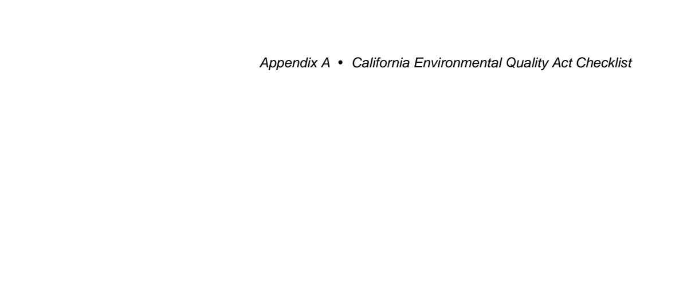

Page Intentionally Left Blank

The following checklist identifies physical, biological, social and economic factors that might be affected by the project. The CEQA impact levels include "potentially significant impact," "less than significant impact with mitigation," "less than significant impact," and "no impact."

Supporting documentation of all CEQA checklist determinations is provided in Chapters 2 and 3 of this Environmental Impact Report/Environmental Assessment. Documentation of "No Impact" determinations is provided at the beginning of Chapter 2. Discussion of all impacts, avoidance, minimization, and/or mitigation measures is under the appropriate topic headings in Chapters 2 and 3.

|                                                                                                                                                                                                                                                                                                                                                                                                                                                                                                                                                                                                                                                                                                                                                                                                                                                                                                     | Potentially<br>Significant<br>Impact | Less Than<br>Significant<br>with<br>Mitigation | Less Than<br>Significant<br>Impact  | No<br>Impact                        |
|-----------------------------------------------------------------------------------------------------------------------------------------------------------------------------------------------------------------------------------------------------------------------------------------------------------------------------------------------------------------------------------------------------------------------------------------------------------------------------------------------------------------------------------------------------------------------------------------------------------------------------------------------------------------------------------------------------------------------------------------------------------------------------------------------------------------------------------------------------------------------------------------------------|--------------------------------------|------------------------------------------------|-------------------------------------|-------------------------------------|
| I. AESTHETICS: Would the project:                                                                                                                                                                                                                                                                                                                                                                                                                                                                                                                                                                                                                                                                                                                                                                                                                                                                   |                                      |                                                |                                     |                                     |
| a) Have a substantial adverse effect on a scenic vista                                                                                                                                                                                                                                                                                                                                                                                                                                                                                                                                                                                                                                                                                                                                                                                                                                              |                                      |                                                |                                     | <input checked="" type="checkbox"/> |
| b) Substantially damage scenic resources, including, but not limited to, trees, rock outcroppings, and historic buildings within a state scenic highway                                                                                                                                                                                                                                                                                                                                                                                                                                                                                                                                                                                                                                                                                                                                             |                                      |                                                |                                     | <input checked="" type="checkbox"/> |
| c) Substantially degrade the existing visual character or quality of the site and its surroundings?                                                                                                                                                                                                                                                                                                                                                                                                                                                                                                                                                                                                                                                                                                                                                                                                 | <input checked="" type="checkbox"/>  |                                                |                                     |                                     |
| d) Create a new source of substantial light or glare which would adversely affect day or nighttime views in the area?                                                                                                                                                                                                                                                                                                                                                                                                                                                                                                                                                                                                                                                                                                                                                                               |                                      | <input checked="" type="checkbox"/>            |                                     |                                     |
| II. AGRICULTURE AND FOREST RESOURCES: In determining whether impacts to agricultural resources are significant environmental effects, lead agencies may refer to the California Agricultural Land Evaluation and Site Assessment Model (1997) prepared by the California Dept. of Conservation as an optional model to use in assessing impacts on agriculture and farmland. In determining whether impacts to forest resources, including timberland, are significant environmental effects, lead agencies may refer to information compiled by the California Department of Forestry and Fire Protection regarding the state's inventory of forest land, including the Forest and Range Assessment Project and the Forest Legacy Assessment Project; and the forest carbon measurement methodology provided in Forest Protocols adopted by the California Air Resources Board. Would the project: |                                      |                                                |                                     |                                     |
| a) Convert Prime Farmland, Unique Farmland, or Farmland of Statewide Importance (Farmland), as shown on the maps prepared pursuant to the Farmland Mapping and Monitoring Program of the California Resources Agency, to non-agricultural use?                                                                                                                                                                                                                                                                                                                                                                                                                                                                                                                                                                                                                                                      |                                      |                                                | <input checked="" type="checkbox"/> |                                     |
| b) Conflict with existing zoning for agricultural use, or a Williamson Act contract?                                                                                                                                                                                                                                                                                                                                                                                                                                                                                                                                                                                                                                                                                                                                                                                                                |                                      |                                                | <input checked="" type="checkbox"/> |                                     |

|                                                                                                                                                                                                                                                                                                                  | Potentially<br>Significant<br>Impact | Less Than<br>Significant<br>with<br>Mitigation | Less Than<br>Significant<br>Impact  | No<br>Impact                        |
|------------------------------------------------------------------------------------------------------------------------------------------------------------------------------------------------------------------------------------------------------------------------------------------------------------------|--------------------------------------|------------------------------------------------|-------------------------------------|-------------------------------------|
| c) Conflict with existing zoning for, or cause rezoning of, forest land (as defined in Public Resources Code section 12220(g)), timberland (as defined by Public Resources Code section 4526), or timberland zoned Timberland Production (as defined by Government Code section 51104(g))?                       | <input type="checkbox"/>             | <input type="checkbox"/>                       | <input type="checkbox"/>            | <input checked="" type="checkbox"/> |
| d) Result in the loss of forest land or conversion of forest land to non-forest use?                                                                                                                                                                                                                             | <input type="checkbox"/>             | <input type="checkbox"/>                       | <input type="checkbox"/>            | <input checked="" type="checkbox"/> |
| e) Involve other changes in the existing environment which, due to their location or nature, could result in conversion of Farmland, to non-agricultural use or conversion of forest land to non-forest use?                                                                                                     | <input type="checkbox"/>             | <input checked="" type="checkbox"/>            | <input type="checkbox"/>            | <input type="checkbox"/>            |
| <b>III. AIR QUALITY</b> : Where available, the significance criteria established by the applicable air quality management or air pollution control district may be relied upon to make the following determinations. Would the project:                                                                          |                                      |                                                |                                     |                                     |
| a) Conflict with or obstruct implementation of the applicable air quality plan?                                                                                                                                                                                                                                  | <input type="checkbox"/>             | <input type="checkbox"/>                       | <input type="checkbox"/>            | <input checked="" type="checkbox"/> |
| b) Violate any air quality standard or contribute substantially to an existing or projected air quality violation?                                                                                                                                                                                               | <input type="checkbox"/>             | <input type="checkbox"/>                       | <input checked="" type="checkbox"/> | <input type="checkbox"/>            |
| c) Result in a cumulatively considerable net increase of any criteria pollutant for which the project region is non- attainment under an applicable federal or state ambient air quality standard (including releasing emissions which exceed quantitative thresholds for ozone precursors)?                     | <input type="checkbox"/>             | <input type="checkbox"/>                       | <input checked="" type="checkbox"/> | <input type="checkbox"/>            |
| d) Expose sensitive receptors to substantial pollutant concentrations?                                                                                                                                                                                                                                           | <input type="checkbox"/>             | <input type="checkbox"/>                       | <input type="checkbox"/>            | <input checked="" type="checkbox"/> |
| e) Create objectionable odors affecting a substantial number of people?                                                                                                                                                                                                                                          | <input type="checkbox"/>             | <input type="checkbox"/>                       | <input type="checkbox"/>            | <input checked="" type="checkbox"/> |
| IV. BIOLOGICAL RESOURCES: Would the project:                                                                                                                                                                                                                                                                     |                                      |                                                |                                     |                                     |
| a) Have a substantial adverse effect, either directly or through habitat modifications, on any species identified as a candidate, sensitive, or special status species in local or regional plans, policies, or regulations, or by the California Department of Fish and Game or U.S. Fish and Wildlife Service? | <input type="checkbox"/>             | <input checked="" type="checkbox"/>            | <input type="checkbox"/>            | <input type="checkbox"/>            |
| b) Have a substantial adverse effect on any riparian habitat or other sensitive natural community identified in local or regional plans, policies, regulations or by the California Department of Fish and Game or US Fish and Wildlife Service?                                                                 | <input type="checkbox"/>             | <input type="checkbox"/>                       | <input type="checkbox"/>            | <input checked="" type="checkbox"/> |

|                                                                                                                                                                                                                                                                                        | Potentially<br>Significant<br>Impact | Less Than<br>Significant<br>with<br>Mitigation | Less Than<br>Significant<br>Impact  | No<br>Impact                        |
|----------------------------------------------------------------------------------------------------------------------------------------------------------------------------------------------------------------------------------------------------------------------------------------|--------------------------------------|------------------------------------------------|-------------------------------------|-------------------------------------|
| c) Have a substantial adverse effect on federally protected wetlands as defined by Section 404 of the Clean Water Act (including, but not limited to, marsh, vernal pool, coastal, etc.) through direct removal, filling, hydrological interruption, or other means?                   |                                      |                                                |                                     | <input checked="" type="checkbox"/> |
| d) Interfere substantially with the movement of any native resident or migratory fish or wildlife species or with established native resident or migratory wildlife corridors, or impede the use of native wildlife nursery sites?                                                     |                                      |                                                | <input checked="" type="checkbox"/> |                                     |
| e) Conflict with any local policies or ordinances protecting biological resources, such as a tree preservation policy or ordinance?                                                                                                                                                    |                                      |                                                | <input checked="" type="checkbox"/> |                                     |
| f) Conflict with the provisions of an adopted Habitat<br>Conservation Plan, Natural Community Conservation Plan, or<br>other approved local, regional, or state habitat conservation<br>plan?                                                                                          |                                      |                                                |                                     | <input checked="" type="checkbox"/> |
| V. CULTURAL RESOURCES: Would the project:                                                                                                                                                                                                                                              |                                      |                                                |                                     |                                     |
| a) Cause a substantial adverse change in the significance of a historical resource as defined in §15064.5?                                                                                                                                                                             |                                      |                                                | <input checked="" type="checkbox"/> |                                     |
| b) Cause a substantial adverse change in the significance of an archaeological resource pursuant to §15064.5?                                                                                                                                                                          |                                      |                                                |                                     | <input checked="" type="checkbox"/> |
| c) Directly or indirectly destroy a unique paleontological resource or site or unique geologic feature?                                                                                                                                                                                |                                      | <input checked="" type="checkbox"/>            |                                     |                                     |
| d) Disturb any human remains, including those interred outside of formal cemeteries?                                                                                                                                                                                                   |                                      |                                                |                                     | <input checked="" type="checkbox"/> |
| VI. GEOLOGY AND SOILS: Would the project:                                                                                                                                                                                                                                              |                                      |                                                |                                     |                                     |
| a) Expose people or structures to potential substantial adverse effects, including the risk of loss, injury, or death involving:                                                                                                                                                       |                                      |                                                |                                     |                                     |
| i) Rupture of a known earthquake fault, as delineated on the most recent Alquist-Priolo Earthquake Fault Zoning Map issued by the State Geologist for the area or based on other substantial evidence of a known fault? Refer to Division of Mines and Geology Special Publication 42? |                                      |                                                |                                     | <input checked="" type="checkbox"/> |
| ii) Strong seismic ground shaking?                                                                                                                                                                                                                                                     |                                      |                                                | <input checked="" type="checkbox"/> |                                     |
| iii) Seismic-related ground failure, including liquefaction?                                                                                                                                                                                                                           |                                      |                                                | <input checked="" type="checkbox"/> |                                     |

|                                                                                                                                                                                                                                                                                                                                                                                                                                                                                                                                                                                                                                                                                                                                                                                   | Potentially<br>Significant<br>Impact | Less Than<br>Significant<br>with Mitigation | Less Than<br>Significant<br>Impact  | No<br>Impact                        |
|-----------------------------------------------------------------------------------------------------------------------------------------------------------------------------------------------------------------------------------------------------------------------------------------------------------------------------------------------------------------------------------------------------------------------------------------------------------------------------------------------------------------------------------------------------------------------------------------------------------------------------------------------------------------------------------------------------------------------------------------------------------------------------------|--------------------------------------|---------------------------------------------|-------------------------------------|-------------------------------------|
| iv) Landslides?                                                                                                                                                                                                                                                                                                                                                                                                                                                                                                                                                                                                                                                                                                                                                                   |                                      |                                             |                                     |                                     |
| b) Result in substantial soil erosion or the loss of topsoil?                                                                                                                                                                                                                                                                                                                                                                                                                                                                                                                                                                                                                                                                                                                     |                                      |                                             | <input checked="" type="checkbox"/> |                                     |
| c) Be located on a geologic unit or soil that is unstable, or that would become unstable as a result of the project, and potentially result in on- or off-site landslide, lateral spreading, subsidence, liquefaction or collapse?                                                                                                                                                                                                                                                                                                                                                                                                                                                                                                                                                |                                      |                                             | <input checked="" type="checkbox"/> |                                     |
| d) Be located on expansive soil, as defined in Table 18-1-B of<br>the Uniform Building Code (1994), creating substantial risks to<br>life or property?                                                                                                                                                                                                                                                                                                                                                                                                                                                                                                                                                                                                                            |                                      |                                             |                                     | <input checked="" type="checkbox"/> |
| e) Have soils incapable of adequately supporting the use of septic tanks or alternative waste water disposal systems where sewers are not available for the disposal of waste water?                                                                                                                                                                                                                                                                                                                                                                                                                                                                                                                                                                                              |                                      |                                             |                                     | <input checked="" type="checkbox"/> |
| VII. GREENHOUSE GAS EMISSIONS: Would the project:                                                                                                                                                                                                                                                                                                                                                                                                                                                                                                                                                                                                                                                                                                                                 |                                      |                                             |                                     |                                     |
| a) Generate greenhouse gas emissions, either directly or indirectly, that may have a significant impact on the environment?                                                                                                                                                                                                                                                                                                                                                                                                                                                                                                                                                                                                                                                       |                                      |                                             |                                     |                                     |
| b) Conflict with an applicable plan, policy or regulation adopted for the purpose of reducing the emissions of greenhouse gases?                                                                                                                                                                                                                                                                                                                                                                                                                                                                                                                                                                                                                                                  |                                      |                                             |                                     |                                     |
| An assessment of the greenhouse gas emissions and climate change is included in the body of environmental document. While Caltrans has included this good faith effort in order to provide the public and decision-makers as much information as possible about the project, it is Caltrans determination that in the absence of further regulatory or scientific information related to greenhouse gas emissions and CEQA significance, it is too speculative to make a significance determination regarding the project's direct and indirect impact with respect to climate change. Caltrans does remain firmly committed to implementing measures to help reduce the potential effects of the project. These measures are outlined in the body of the environmental document. |                                      |                                             |                                     |                                     |
| VIII. HAZARDS AND HAZARDOUS MATERIALS: Would the project:                                                                                                                                                                                                                                                                                                                                                                                                                                                                                                                                                                                                                                                                                                                         |                                      |                                             |                                     |                                     |
| a) Create a significant hazard to the public or the environment through the routine transport, use, or disposal of hazardous materials?                                                                                                                                                                                                                                                                                                                                                                                                                                                                                                                                                                                                                                           |                                      |                                             |                                     | <input checked="" type="checkbox"/> |
| b) Create a significant hazard to the public or the environment through reasonably foreseeable upset and accident conditions involving the release of hazardous materials into the environment?                                                                                                                                                                                                                                                                                                                                                                                                                                                                                                                                                                                   |                                      | <input checked="" type="checkbox"/>         |                                     |                                     |
| c) Emit hazardous emissions or handle hazardous or acutely hazardous materials, substances, or waste within one-quarter mile of an existing or proposed school?                                                                                                                                                                                                                                                                                                                                                                                                                                                                                                                                                                                                                   |                                      |                                             | <input checked="" type="checkbox"/> |                                     |

|                                                                                                                                                                                                                                                                                                                                                                                               | Potentially<br>Significant<br>Impact | Less Than<br>Significant<br>with<br>Mitigation | Less Than<br>Significant<br>Impact  | No<br>Impact                        |
|-----------------------------------------------------------------------------------------------------------------------------------------------------------------------------------------------------------------------------------------------------------------------------------------------------------------------------------------------------------------------------------------------|--------------------------------------|------------------------------------------------|-------------------------------------|-------------------------------------|
| d) Be located on a site which is included on a list of hazardous materials sites compiled pursuant to Government Code Section 65962.5 and, as a result, would it create a significant hazard to the public or the environment?                                                                                                                                                                |                                      | <input checked="" type="checkbox"/>            |                                     |                                     |
| e) For a project located within an airport land use plan or, where such a plan has not been adopted, within two miles of a public airport or public use airport, would the project result in a safety hazard for people residing or working in the project area?                                                                                                                              |                                      |                                                |                                     | <input checked="" type="checkbox"/> |
| f) For a project within the vicinity of a private airstrip, would the project result in a safety hazard for people residing or working in the project area?                                                                                                                                                                                                                                   |                                      |                                                |                                     | <input checked="" type="checkbox"/> |
| g) Impair implementation of or physically interfere with an adopted emergency response plan or emergency evacuation plan?                                                                                                                                                                                                                                                                     |                                      |                                                |                                     | <input checked="" type="checkbox"/> |
| h) Expose people or structures to a significant risk of loss, injury or death involving wildland fires, including where wildlands are adjacent to urbanized areas or where residences are intermixed with wildlands?                                                                                                                                                                          |                                      |                                                |                                     | <input checked="" type="checkbox"/> |
| IX. HYDROLOGY AND WATER QUALITY: Would the project:                                                                                                                                                                                                                                                                                                                                           |                                      |                                                |                                     |                                     |
| a) Violate any water quality standards or waste discharge requirements?                                                                                                                                                                                                                                                                                                                       |                                      | <input checked="" type="checkbox"/>            |                                     |                                     |
| b) Substantially deplete groundwater supplies or interfere substantially with groundwater recharge such that there would be a net deficit in aquifer volume or a lowering of the local groundwater table level (e.g., the production rate of pre-existing nearby wells would drop to a level which would not support existing land uses or planned uses for which permits have been granted)? |                                      |                                                | <input checked="" type="checkbox"/> |                                     |
| c) Substantially alter the existing drainage pattern of the site or area, including through the alteration of the course of a stream or river, in a manner which would result in substantial erosion or siltation on- or off-site?                                                                                                                                                            |                                      |                                                | <input checked="" type="checkbox"/> |                                     |
| d) Substantially alter the existing drainage pattern of the site or area, including through the alteration of the course of a stream or river, or substantially increase the rate or amount of surface runoff in a manner which would result in flooding on- or off-site?                                                                                                                     |                                      |                                                | <input checked="" type="checkbox"/> |                                     |
| e) Create or contribute runoff water which would exceed the capacity of existing or planned stormwater drainage systems or provide substantial additional sources of polluted runoff?                                                                                                                                                                                                         |                                      | <input checked="" type="checkbox"/>            |                                     |                                     |
| f) Otherwise substantially degrade water quality?                                                                                                                                                                                                                                                                                                                                             |                                      |                                                |                                     | <input checked="" type="checkbox"/> |

|                                                                                                                                                                                                                                                                                                            | Potentially<br>Significant<br>Impact | Less Than<br>Significant<br>with<br>Mitigation | Less Than<br>Significant<br>Impact | No<br>Impact |
|------------------------------------------------------------------------------------------------------------------------------------------------------------------------------------------------------------------------------------------------------------------------------------------------------------|--------------------------------------|------------------------------------------------|------------------------------------|--------------|
| g) Place housing within a 100-year flood hazard area as mapped on a federal Flood Hazard Boundary or Flood Insurance Rate Map or other flood hazard delineation map?                                                                                                                                       |                                      |                                                |                                    |              |
| h) Place within a 100-year flood hazard area structures which would impede or redirect flood flows?                                                                                                                                                                                                        |                                      |                                                |                                    |              |
| i) Expose people or structures to a significant risk of loss, injury or death involving flooding, including flooding as a result of the failure of a levee or dam?                                                                                                                                         |                                      |                                                |                                    |              |
| j) Inundation by seiche, tsunami, or mudflow                                                                                                                                                                                                                                                               |                                      |                                                |                                    |              |
| X. LAND USE AND PLANNING: Would the project:                                                                                                                                                                                                                                                               |                                      |                                                |                                    |              |
| a) Physically divide an established community?                                                                                                                                                                                                                                                             |                                      |                                                |                                    |              |
| b)Conflict with any applicable land use plan, policy, or regulation of an agency with jurisdiction over the project (including, but not limited to the general plan, specific plan, local coastal program, or zoning ordinance) adopted for the purpose of avoiding or mitigating an environmental effect? |                                      |                                                |                                    |              |
| c) Conflict with any applicable habitat conservation plan or natural community conservation plan?                                                                                                                                                                                                          |                                      |                                                |                                    |              |
| XI. MINERAL RESOURCES: Would the project:                                                                                                                                                                                                                                                                  |                                      |                                                |                                    |              |
| a) Result in the loss of availability of a known mineral resource<br>that would be of value to the region and the residents of the<br>state?                                                                                                                                                               |                                      |                                                |                                    |              |
| b) Result in the loss of availability of a locally-important mineral resource recovery site delineated on a local general plan, specific plan or other land use plan?                                                                                                                                      |                                      |                                                |                                    |              |
| XII. NOISE: Would the project result in:                                                                                                                                                                                                                                                                   |                                      |                                                |                                    |              |
| a) Exposure of persons to or generation of noise levels in excess of standards established in the local general plan or noise ordinance, or applicable standards of other agencies?                                                                                                                        |                                      |                                                |                                    |              |
| b) Exposure of persons to or generation of excessive groundborne vibration or groundborne noise levels?                                                                                                                                                                                                    |                                      |                                                |                                    | $\boxtimes$  |
| c) A substantial permanent increase in ambient noise levels in the project vicinity above levels existing without the project?                                                                                                                                                                             |                                      |                                                |                                    |              |

|                                                                                                                                                                                                                                                                                                                                                                                                                             | Potentially<br>Significant<br>Impact | Less Than<br>Significant<br>with<br>Mitigation | Less Than<br>Significant<br>Impact  | No<br>Impact                        |
|-----------------------------------------------------------------------------------------------------------------------------------------------------------------------------------------------------------------------------------------------------------------------------------------------------------------------------------------------------------------------------------------------------------------------------|--------------------------------------|------------------------------------------------|-------------------------------------|-------------------------------------|
| d) A substantial temporary or periodic increase in ambient noise levels in the project vicinity above levels existing without the project?                                                                                                                                                                                                                                                                                  |                                      | <input checked="" type="checkbox"/>            |                                     |                                     |
| e) For a project located within an airport land use plan or, where such a plan has not been adopted, within two miles of a public airport or public use airport, would the project expose people residing or working in the project area to excessive noise levels?                                                                                                                                                         |                                      |                                                |                                     | <input checked="" type="checkbox"/> |
| f) For a project within the vicinity of a private airstrip, would the project expose people residing or working in the project area to excessive noise levels?                                                                                                                                                                                                                                                              |                                      |                                                |                                     | <input checked="" type="checkbox"/> |
| XIII. POPULATION AND HOUSING: Would the project:                                                                                                                                                                                                                                                                                                                                                                            |                                      |                                                |                                     |                                     |
| a) Induce substantial population growth in an area, either directly (for example, by proposing new homes and businesses) or indirectly (for example, through extension of roads or other infrastructure)?                                                                                                                                                                                                                   |                                      |                                                | <input checked="" type="checkbox"/> |                                     |
| b) Displace substantial numbers of existing housing, necessitating the construction of replacement housing elsewhere?                                                                                                                                                                                                                                                                                                       |                                      |                                                |                                     | <input checked="" type="checkbox"/> |
| c) Displace substantial numbers of people, necessitating the construction of replacement housing elsewhere?                                                                                                                                                                                                                                                                                                                 |                                      |                                                |                                     | <input checked="" type="checkbox"/> |
| XIV. PUBLIC SERVICES:                                                                                                                                                                                                                                                                                                                                                                                                       |                                      |                                                |                                     |                                     |
| a) Would the project result in substantial adverse physical impacts associated with the provision of new or physically altered governmental facilities, need for new or physically altered governmental facilities, the construction of which could cause significant environmental impacts, in order to maintain acceptable service ratios, response times or other performance objectives for any of the public services: |                                      |                                                |                                     |                                     |
| Fire protection?                                                                                                                                                                                                                                                                                                                                                                                                            |                                      |                                                | <input checked="" type="checkbox"/> |                                     |
| Police protection?                                                                                                                                                                                                                                                                                                                                                                                                          |                                      |                                                | <input checked="" type="checkbox"/> |                                     |
| Schools?                                                                                                                                                                                                                                                                                                                                                                                                                    |                                      |                                                | <input checked="" type="checkbox"/> |                                     |
| Parks?                                                                                                                                                                                                                                                                                                                                                                                                                      |                                      |                                                |                                     | <input checked="" type="checkbox"/> |
| Other public facilities?                                                                                                                                                                                                                                                                                                                                                                                                    |                                      |                                                |                                     | <input checked="" type="checkbox"/> |

|                                                                                                                                                                                                                                                                                                                                                                                                                               | Potentially<br>Significant<br>Impact | Less Than<br>Significant<br>with<br>Mitigation | Less Than<br>Significant<br>Impact  | No<br>Impact                        |
|-------------------------------------------------------------------------------------------------------------------------------------------------------------------------------------------------------------------------------------------------------------------------------------------------------------------------------------------------------------------------------------------------------------------------------|--------------------------------------|------------------------------------------------|-------------------------------------|-------------------------------------|
| XV. RECREATION:                                                                                                                                                                                                                                                                                                                                                                                                               |                                      |                                                |                                     |                                     |
| a) Would the project increase the use of existing neighborhood and regional parks or other recreational facilities such that substantial physical deterioration of the facility would occur or be accelerated?                                                                                                                                                                                                                | <input type="checkbox"/>             | <input type="checkbox"/>                       | <input type="checkbox"/>            | <input checked="" type="checkbox"/> |
| b) Does the project include recreational facilities or require the construction or expansion of recreational facilities which might have an adverse physical effect on the environment?                                                                                                                                                                                                                                       | <input type="checkbox"/>             | <input type="checkbox"/>                       | <input type="checkbox"/>            | <input checked="" type="checkbox"/> |
| XVI. TRANSPORTATION/TRAFFIC: Would the project:                                                                                                                                                                                                                                                                                                                                                                               |                                      |                                                |                                     |                                     |
| a) Conflict with an applicable plan, ordinance or policy establishing measures of effectiveness for the performance of the circulation system, taking into account all modes of transportation including mass transit and non-motorized travel and relevant components of the circulation system, including but not limited to intersections, streets, highways and freeways, pedestrian and bicycle paths, and mass transit? | <input type="checkbox"/>             | <input type="checkbox"/>                       | <input checked="" type="checkbox"/> | <input type="checkbox"/>            |
| b) Conflict with an applicable congestion management program, including, but not limited to level of service standards and travel demand measures, or other standards established by the county congestion management agency for designated roads or highways?                                                                                                                                                                | <input type="checkbox"/>             | <input type="checkbox"/>                       | <input type="checkbox"/>            | <input checked="" type="checkbox"/> |
| c) Result in a change in air traffic patterns, including either an increase in traffic levels or a change in location that results in substantial safety risks?                                                                                                                                                                                                                                                               | <input type="checkbox"/>             | <input type="checkbox"/>                       | <input type="checkbox"/>            | <input checked="" type="checkbox"/> |
| d) Substantially increase hazards due to a design feature (e.g., sharp curves or dangerous intersections) or incompatible uses (e.g., farm equipment)?                                                                                                                                                                                                                                                                        | <input type="checkbox"/>             | <input type="checkbox"/>                       | <input type="checkbox"/>            | <input checked="" type="checkbox"/> |
| e) Result in inadequate emergency access?                                                                                                                                                                                                                                                                                                                                                                                     | <input type="checkbox"/>             | <input type="checkbox"/>                       | <input type="checkbox"/>            | <input checked="" type="checkbox"/> |
| f) Conflict with adopted policies, plans or programs regarding public transit, bicycle, or pedestrian facilities, or otherwise decrease the performance or safety of such facilities?                                                                                                                                                                                                                                         | <input type="checkbox"/>             | <input type="checkbox"/>                       | <input type="checkbox"/>            | <input checked="" type="checkbox"/> |
| XVII. UTILITIES AND SERVICE SYSTEMS: Would the project:                                                                                                                                                                                                                                                                                                                                                                       |                                      |                                                |                                     |                                     |
| a) Exceed wastewater treatment requirements of the applicable Regional Water Quality Control Board?                                                                                                                                                                                                                                                                                                                           | <input type="checkbox"/>             | <input type="checkbox"/>                       | <input type="checkbox"/>            | <input checked="" type="checkbox"/> |
| b) Require or result in the construction of new water or wastewater treatment facilities or expansion of existing facilities, the construction of which could cause significant environmental effects?                                                                                                                                                                                                                        | <input type="checkbox"/>             | <input type="checkbox"/>                       | <input type="checkbox"/>            | <input checked="" type="checkbox"/> |

|                                                                                                                                                                                                                                                                                                                                                                                                                                                                        | Potentially<br>Significant<br>Impact | Less Than<br>Significant<br>with<br>Mitigation | Less Than<br>Significant<br>Impact  | No<br>Impact                        |
|------------------------------------------------------------------------------------------------------------------------------------------------------------------------------------------------------------------------------------------------------------------------------------------------------------------------------------------------------------------------------------------------------------------------------------------------------------------------|--------------------------------------|------------------------------------------------|-------------------------------------|-------------------------------------|
| c) Require or result in the construction of new storm water drainage facilities or expansion of existing facilities, the construction of which could cause significant environmental effects?                                                                                                                                                                                                                                                                          | <input type="checkbox"/>             | <input type="checkbox"/>                       | <input checked="" type="checkbox"/> | <input type="checkbox"/>            |
| d) Have sufficient water supplies available to serve the project from existing entitlements and resources, or are new or expanded entitlements needed?                                                                                                                                                                                                                                                                                                                 | <input type="checkbox"/>             | <input type="checkbox"/>                       | <input type="checkbox"/>            | <input checked="" type="checkbox"/> |
| e) Result in a determination by the wastewater treatment provider which serves or may serve the project that it has adequate capacity to serve the project's projected demand in addition to the provider's existing commitments?                                                                                                                                                                                                                                      | <input type="checkbox"/>             | <input type="checkbox"/>                       | <input type="checkbox"/>            | <input checked="" type="checkbox"/> |
| f) Be served by a landfill with sufficient permitted capacity to accommodate the project's solid waste disposal needs?                                                                                                                                                                                                                                                                                                                                                 | <input type="checkbox"/>             | <input type="checkbox"/>                       | <input type="checkbox"/>            | <input checked="" type="checkbox"/> |
| g) Comply with federal, state, and local statutes and regulations related to solid waste?                                                                                                                                                                                                                                                                                                                                                                              | <input type="checkbox"/>             | <input type="checkbox"/>                       | <input type="checkbox"/>            | <input checked="" type="checkbox"/> |
| XVIII. MANDATORY FINDINGS OF SIGNIFICANCE                                                                                                                                                                                                                                                                                                                                                                                                                              |                                      |                                                |                                     |                                     |
| a) Does the project have the potential to degrade the quality of the environment, substantially reduce the habitat of a fish or wildlife species, cause a fish or wildlife population to drop below self-sustaining levels, threaten to eliminate a plant or animal community, substantially reduce the number or restrict the range of a rare or endangered plant or animal or eliminate important examples of the major periods of California history or prehistory? | <input type="checkbox"/>             | <input checked="" type="checkbox"/>            | <input type="checkbox"/>            | <input type="checkbox"/>            |
| b) Does the project have impacts that are individually limited, but cumulatively considerable? ("Cumulatively considerable" means that the incremental effects of a project are considerable when viewed in connection with the effects of past projects, the effects of other current projects, and the effects of probable future projects)?                                                                                                                         | <input checked="" type="checkbox"/>  | <input type="checkbox"/>                       | <input type="checkbox"/>            | <input type="checkbox"/>            |
| c) Does the project have environmental effects which would cause substantial adverse effects on human beings, either directly or indirectly?                                                                                                                                                                                                                                                                                                                           | <input checked="" type="checkbox"/>  | <input type="checkbox"/>                       | <input type="checkbox"/>            | <input type="checkbox"/>            |

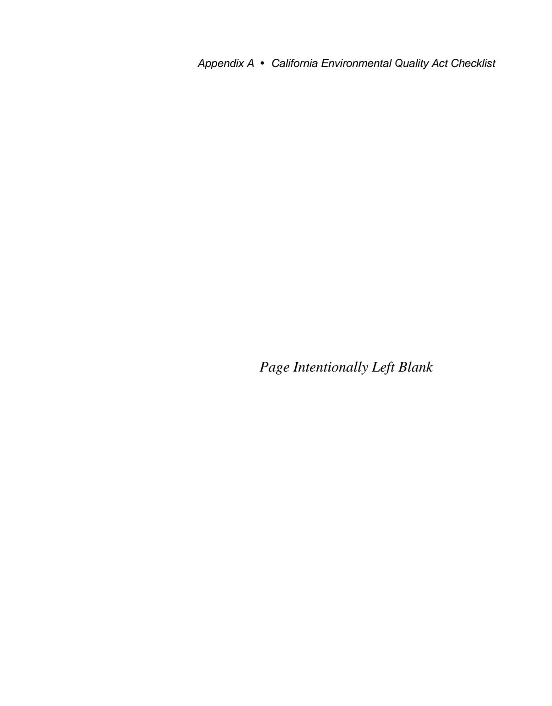

# **Appendix B** Resources Evaluated Relative to the Requirements of Section 4(f)

Page Intentionally Left Blank

# Resources Evaluated Relative to the Requirements of Section 4(f)

This section of the document discusses parks, recreational facilities, wildlife refuges and historic properties found within or next to the project area that do not trigger Section 4(f) protection because either: 1) they are not publicly owned, 2) they are not open to the public, 3) they are not eligible historic properties, 4) the project does not permanently use the property and does not hinder the preservation of the property, or 5) the proximity impacts do not result in constructive use.

Two National Register of Historic Places-eligible properties were identified in the *State Route 132 Historic Property Survey Report*, which was completed in December 2011. The report was submitted to the State Historic Preservation Officer on March 16, 2012 for concurrence on eligibility determinations for the sites identified in the 2011 area of potential effects. A concurrence letter received from the State Historic Preservation Officer, dated May 16, 2012, confirmed the following two properties are eligible for listing on the National Register of Historic Places:

- 3530 Maze Boulevard, Modesto
- 416/418 I Street, Modesto

Five recreation resources were identified within 0.5 mile of the State Route 132 West Freeway/Expressway Project (project) study area.

- Charles M. Sharp Park
- J.M. Pike Park
- Virginia Corridor Trailway
- Cesar E. Chavez Park and Maddux Youth Center
- Mellis Park

All seven resources listed above were evaluated relative to the requirements of Section 4(f). Based on the evaluation, it has been concluded that there are no Section 4(f) uses of these seven properties.

This document discusses parks, recreational facilities, wildlife refuges and historic properties found within or adjacent to the project study area that do not trigger Section 4(f) protection either because: 1) they are not publicly owned, 2) they are not open to the public, 3) they are not eligible historic properties, 4) the project does not permanently use the property and does not hinder the preservation of the property, or 5) the proximity impacts do not result in constructive use.

The Section 4(f) resources located within 0.5 mile of the project that were evaluated relative to the requirements of Section 4(f) are described below. Please note that the identification of potential Section 4(f) resources is incomplete at this time because some parcels in private ownership were inaccessible for archaeological survey. These areas would be surveyed after selection of the preferred alternative and access is obtained. Geoarchaeological investigation (test excavations) would also be conducted after selection of the preferred alternative. A second supplemental Historic Property Survey Report would be prepared documenting the results. This report, along with a Section 106 finding of effect, would be provided to the State Historic Preservation Officer for concurrence after additional archaeological survey and geoarchaeological investigations are conducted for the preferred alternative that is selected. Concurrence by the State Historic Preservation Officer would complete the identification and effects determination for archaeological and historic architectural resources for the proposed undertaking. The Finding of Effect would require concurrence from the State Historic Preservation Officer and would include avoidance, minimization, and mitigation measures. These would be included in the Final EIR/EA.

# 3530 Maze Boulevard, Modesto

The property at 3530 Maze Boulevard is a residential and farm complex located south of existing SR 132 (Maze Boulevard) between Dakota Avenue and Carpenter Road on the western end of the area of potential effects. The buildings and landscaping features associated with 3530 Maze Boulevard were determined by Caltrans and the State Historic Preservation Officer to be eligible for the National Register of Historic Places as a unique regional example of Craftsman architectural style (see Appendix I). Constructed in 1918, the property consists of a Craftsman-style, single-family residence with a garage/shed, barn, water tower, outhouse, and associated landscaping on a 15.46-acre parcel. The historic boundary associated with 3530 Maze Boulevard consists of 3.86 acres on the eastern side of the parcel. The historic boundary is bound by the existing highway on the north, a driveway and shrubbery wall on the east, Modesto Irrigation District's Lateral Canal No. 4 on the south, and the line between the old growth trees and more contemporary almond orchard on the west. The driveway is accessed from the existing highway east of the historic residence.

Properties eligible for the National Register of Historic Places are also protected under Section 4(f). The proposed project would acquire approximately 0.13 acre along existing SR 132 (Maze Boulevard) at this location. The boundary of the historic

property, as defined in the Department of Parks and Recreation Form 523, <sup>16</sup> does not include the area of the proposed project acquisition. The historic boundary containing the National Register of Historic Places-eligible buildings and landscaping would not be affected by use of this portion of the larger parcel. Access to the historic property from the existing highway would be maintained during construction. Since the planned project acquisition would not affect the historic site boundary, and there would be no temporary use of the site for construction, it appears there would be no Section 4(f) use of the historic property. Caltrans would submit a Section 106 finding of effect on the 3530 Maze Boulevard property to the State Historic Preservation Officer for concurrence after selection of the preferred alternative.

# Charles M. Sharp Park

Charles M. Sharp Park sits at 1900 Torrid Avenue in Modesto on approximately 7 acres. The park is owned and maintained by the City of Modesto and is eligible for protection under Section 4(f). Amenities at the park include a basketball court, picnic facilities, playground, restrooms, softball field, and volleyball court. <sup>17</sup> Access to the park is from Torrid or Shasta avenues.

The proposed project would not require a permanent or temporary use of parklands because the park would be located more than 0.2 mile north of the two build alternatives south of Kansas Avenue. The park is separated from the project by a residential neighborhood and Kansas Avenue. Because of the distance from the project, there would be no proximity impacts attributable to a change in access or to noise or visual effects. The park is located beyond the corridor analyzed for noise impacts for the proposed project. The nearest noise analysis area (Area 5) is located between Berryessa Avenue and the proposed Project corridor south of Kansas Avenue. Because no substantial noise increases were identified in Area 5 and because sound reduces with distance, no substantial noise increases are anticipated at Charles M. Sharp Park. Therefore, the provisions of Section 4(f) are not triggered.

# J.M. Pike Park

J.M. Pike Park sits at 1601 Princeton Avenue in Modesto on approximately 6.5 acres. The park is owned and maintained by the City of Modesto and is eligible for protection under Section 4(f). Facilities at the park include a baseball field, two

<sup>&</sup>lt;sup>16</sup> ICF International, 2011, Historic Property Survey Report, ICF 00317.10, Sacramento, CA.

<sup>&</sup>lt;sup>17</sup> City of Modesto, 2014, Parks, Recreation and Neighborhoods, Modesto Parks, Charles M. Sharp Park, website: http://www.ci.modesto.ca.us/prnd/parks/parkdetail.asp?id=10, accessed: June 6, 2014.

basketball half courts, picnic facilities, a playground, and softball and soccer fields. <sup>18</sup> Access to the park is from Kearney and Princeton avenues.

The park is located east of 9th Street, more than 0.37 mile northeast of the northern end of both build alternatives, which is south of Woodland Avenue. There would be no permanent or temporary use of parklands because of the intervening distance of the park from the project. In addition, because of the distance of the park from the project, there would be no impacts attributable to a change in access or to noise or visual effects. Therefore, the provisions of Section 4(f) are not triggered.

# Virginia Corridor Trailway

The Virginia Corridor Trailway is a paved Class I bike path owned and maintained by the City of Modesto. The bike path runs east and north along the former Tidewater Southern Railway line. The existing bike path extends from College Avenue to Bowen Avenue, a distance of roughly 2 miles. <sup>19</sup> The bike path is being constructed in phases and, upon completion, would extend from Needham Street to Bangs Avenue, a distance of 4.2 miles. Proposed facilities along the bike path include picnic areas, shade structures, barbecues, and gardens. <sup>20</sup> The Virginia Corridor Trailway is a publicly owned facility with mixed recreation and transportation use. Recreation is assumed to be the primary function of the bike path; therefore, the bike path is eligible for protection under Section 4(f).

The southernmost portion of the bike path on College Avenue is approximately 0.31 mile northeast of the project end on Needham Street. Neither build alternative would cross the existing portions of the bike path and no temporary or permanent use of the bike path would occur. Given the distance of the bike path from the project, there would be no impacts attributable to a change in access or to noise or visual effects. Therefore, the provisions of Section 4(f) are not triggered.

<sup>&</sup>lt;sup>18</sup> City of Modesto, 2014, Parks, Recreation and Neighborhoods, Modesto Parks, J. M. Pike Park, website: http://www.ci.modesto.ca.us/prnd/parks/parkdetail.asp?id=32, accessed: June 6, 2014.

<sup>&</sup>lt;sup>19</sup> City of Modesto, 2009, *City of Modesto Existing Bicycle System*, website: http://www.ci.modesto.ca.us/prnd/recreation/docs/Bikeway%20map.pdf, accessed: June 6, 2014; and Ford, Bob, 2014, Project Coordinator, City of Modesto, Parks, Recreation, and Neighborhoods Department, Modesto, California, June 9, 2014 – email conversation with Jacobs.

<sup>&</sup>lt;sup>20</sup> City of Modesto, 2014, Parks, Recreation and Neighborhoods, Community/Corporate Partnerships, Virginia Corridor Trailway, website: http://www.ci.modesto.ca.us/prnd/partners/virginia/, accessed: June 6, 2014.

A picnic area and support facilities along the Virginia Corridor Trailway were developed with grants authorized under the Land and Water Conservation Fund Act of 1965, as amended (16 U.S. Code 4601-4604 et seq.), which qualifies the trailway as a Section 6(f) resource as well as a Section 4(f) resource. As described above, property from the Virginia Corridor Trailway would not be converted to a non-recreational use, and no replacement lands would be necessary as required by Section 6(f)(3) of the Land and Water Conservation Fund Act.

# 416/418 I Street, Modesto

This property is a two-story commercial property built between 1924 and 1925. Called Dania Hall, the property sits on an 0.11-acre parcel located on the south side of I Street. This property meets the National Register of Historic Places eligibility criteria at the local level for its association with the Danish-American settlement in Stanislaus County and as an example of Danish-American fraternal organization. On March 16, 2012, Caltrans submitted the Historic Property Survey Report to the State Historic Preservation Officer, who subsequently concurred that the 416/418 I Street property is eligible for inclusion in the National Register of Historic Places (see Appendix I). Because the historic property is National Register of Historic Places-eligible, it is also protected under Section 4(f).

The property sits near the intersection of 5th and I streets, 0.02 mile west of the southern end of both build alternatives. No construction activities are proposed on or adjacent to this property and, since there is no proposed temporary or permanent use of land from the parcel, there is no anticipated Section 4(f) use. Caltrans would submit a Section 106 finding of effect on the 416/418 I Street property to the State Historic Preservation Officer for concurrence after selection of the preferred alternative.

# Cesar E. Chavez Park and Maddux Youth Center

The Cesar E. Chavez Park and Maddux Youth Center are located at 619 Sierra Drive in Modesto on approximately 7 acres. Owned and maintained by the City of Modesto, the park and youth center are eligible for protection under Section 4(f). Amenities at the park include two basketball courts, picnic facilities, a playground, and

<sup>&</sup>lt;sup>21</sup> California State Parks, 2013, Grants and Local Services, Land and Water Conservation Fund, All Funded Projects, website:

 $http://www.parks.ca.gov/pages/1008/files/ct\_lwcf\_funded\_projs\_by\_county\_3\_13.pdf \ , \ accessed: June 6, 2014.$ 

<sup>&</sup>lt;sup>22</sup> Jacobs Engineering Group, Inc., 2014, Supplemental Historic Property Survey Report.

restrooms.<sup>23</sup> The Maddux Youth Center sits south of the park at 615 Sierra Drive and can be reserved for public use. Recreational facilities at the youth center include a youth boxing facility, an indoor basketball court, and a game room.<sup>24</sup> The park can be accessed from the surrounding streets, including G Street, Sierra Drive, 3rd Street, and 4th Street. The youth center is accessed from Sierra Drive or 3rd Street.

The park and youth center are more than 0.2 mile southwest of the project's southern end at I Street. Implementation of the proposed project would not require a temporary or permanent use of parklands. Because of the distance of the park and youth center from the project, there would be no impacts attributable to a change in access or to visual or noise effects. Therefore, the provisions of Section 4(f) are not triggered.

# Mellis Park

Mellis Park sits at 601 South Martin Luther King Drive in Modesto on approximately 9 acres. Owned and maintained by the City of Modesto, the park is eligible for protection under Section 4(f). Facilities at the park include a lighted softball field, a youth ball field, two basketball courts, horseshoe pits, picnic facilities, a playground, and restrooms. <sup>25</sup> The King-Kennedy Memorial Center is on the northeastern corner of the park and has an auditorium with a stage, kitchen facilities, and a classroom. Facilities at the park and the center can be reserved for public use. <sup>26</sup> A parking area sits along the northern portion of the park. Access to the park is from Martin Luther King Drive.

The park is located 0.5 mile southwest of the project's southern end on I Street, and there would be no temporary or permanent use of parklands. Because of the distance of the park from the project, there would be no impacts attributable to a change in access or to visual or noise effects. Therefore, the provisions of Section 4(f) are not triggered.

<sup>&</sup>lt;sup>23</sup> City of Modesto, 2014, Parks, Recreation and Neighborhoods, Modesto Parks, Cesar E. Chavez Park, website: http://www.ci.modesto.ca.us/prnd/parks/parkdetail.asp?id=9, accessed: June 6, 2014.

<sup>&</sup>lt;sup>24</sup> City of Modesto, 2014, Parks, Recreation and Neighborhoods, Rental Facilities, Complete Facility Guide, website: http://www.ci.modesto.ca.us/prnd/facilities/docs/Facility%20Guide\_complete.pdf, accessed: June 6, 2014.

<sup>&</sup>lt;sup>25</sup> City of Modesto, 2014, Parks, Recreation and Neighborhoods, Modesto Parks, Mellis Park, website: http://www.ci.modesto.ca.us/prnd/parks/parkdetail.asp?id=45, accessed: June 6, 2014.

<sup>&</sup>lt;sup>26</sup> City of Modesto, 2014, Parks, Recreation and Neighborhoods, Rental Facilities, Complete Facility Guide, website: http://www.ci.modesto.ca.us/prnd/facilities/docs/Facility%20Guide\_complete.pdf, accessed: June 6, 2014.

A group picnic area at Mellis Park was developed with grants authorized under the Land and Water Conservation Fund Act, qualifying the park as a Section 6(f) resource as well as a Section 4(f) resource. <sup>27</sup> As described above, property from Mellis Park would not be converted to a non-recreational use, and no replacement lands would be necessary as required by Section 6(f)(3) of the Land and Water Conservation Fund Act.

<sup>27</sup> California State Parks, 2013, Grants and Local Services, Land and Water Conservation Fund, All Funded Projects, website:

 $http://www.parks.ca.gov/pages/1008/files/ct\_lwcf\_funded\_projs\_by\_county\_3\_13.pdf \ , \ accessed: June 6, 2014.$ 


Appendix B • Resources Evaluated Relative to the Requirements of Section 4(f)

### **Appendix C** Title VI Policy Statement

Page Intentionally Left Blank

STATE OF CALIFORNIA-BUSINESS, TRANSPORTATION AND HOUSING AGENCY

EDMUND G. BROWN Jr. Gavernor

# DEPARTMENT OF TRANSPORTATION

OFFICE OF THE DIRECTOR P.O. BOX 942873, MS-49 SACRAMENTO, CA 94273-0601 PHONE (916) 654-5266 FAX (916) 654-6608 TTY 711 www.dot.ca.gov


March 2013

### NON-DISCRIMINATION POLICY STATEMENT

The California Department of Transportation, under Title VI of the Civil Rights Act of 1964 and related statutes, ensures that no person in the State of California shall, on the grounds of race, color, national origin, sex, disability, religion, sexual orientation, or age, be excluded from participation in, be denied the benefits of, or be otherwise subjected to discrimination under any program or activity it administers.

For information or guidance on how to file a complaint based on the grounds of race, color, national origin, sex, disability, religion, sexual orientation, or age, please visit the following web page: http://www.dot.ca.gov/hq/bep/title\_vi/t6\_violated.htm.

Additionally, if you need this information in an alternate format, such as in Braille or in a language other than English, please contact the California Department of Transportation, Office of Business and Economic Opportunity, 1823 14<sup>th</sup> Street, MS-79, Sacramento, CA 95811. Telephone: (916) 324-0449, TTY: 711, or via Fax: (916) 324-1949.

MALCOLM DOUGHERTY

Director

"Calvana ingroves mobility across California"

Page Intentionally Left Blank

# **Appendix D** Summary of Relocation Benefits


Page Intentionally Left Blank

# California Department of Transportation Relocation Assistance Program

Relocation Assistance Advisory Services

"The purpose of this title is to establish a *uniform policy for fair and equitable treatment* of persons displaced as a result of federal and federally assisted programs in order that such persons *shall not suffer disproportionate injuries* as a result of programs designed for the benefit of the public as a whole."

The Fifth Amendment to the U.S. Constitution states, "No Person shall…be deprived of life, liberty, or property, without due process of law, nor shall private property be taken for public use without just compensation." The Uniform Act sets forth in statute the due process that must be followed in Real Property acquisitions involving federal funds. Supplementing the Uniform Act is the government-wide single rule for all agencies to follow, set forth in 49 Code of Federal Regulations Part 24. Displaced individuals, families, businesses, farms, and nonprofit organizations may be eligible for relocation advisory services and payments, as discussed below.

# Fair Housing

The Fair Housing Law (Title VIII of the Civil Rights Act of 1968) sets forth the policy of the U.S. to provide, within constitutional limitations, for fair housing. This act, and as amended, makes discriminatory practices in the purchase and rental of most residential units illegal. Whenever possible, minority persons shall be given reasonable opportunities to relocate to any available housing regardless of neighborhood, as long as the replacement dwellings are decent, safe, and sanitary and are within their financial means. This policy, however, does not require Caltrans to provide a person a larger payment than is necessary to enable a person to relocate to a comparable replacement dwelling.

Any persons to be displaced would be assigned to a relocation advisor, who would work closely with each displacee in order to see that all payments and benefits are fully utilized and that all regulations are observed, thereby avoiding the possibility of displacees jeopardizing or forfeiting any of their benefits or payments. At the time of the initiation of negotiations (usually the first written offer to purchase), owner-occupants are given a detailed explanation of the state's relocation services. Tenant occupants of properties to be acquired are contacted soon after the initiation of negotiations and also are given a detailed explanation of the Caltrans Relocation Assistance Program. To avoid loss of possible benefits, no individual, family,

business, farm, or nonprofit organization should commit to purchase or rent a replacement property without first contacting a Department relocation advisor.

# Relocation Assistance Advisory Services

In accordance with the Uniform Relocation Assistance and Real Property Acquisition Policies Act of 1970, as amended, Caltrans would provide relocation advisory assistance to any person, business, farm or nonprofit organization displaced as a result of the acquisition of real property for public use, so long as they are legally present in the U.S. Caltrans would assist eligible displacees in obtaining comparable replacement housing by providing current and continuing information on the availability and prices of both houses for sale and rental units that are "decent, safe and sanitary." Nonresidential displacees would receive information on comparable properties for lease or purchase (for business, farm and nonprofit organization relocation services, see below).

Residential replacement dwellings would be in a location generally not less desirable than the displacement neighborhood at prices or rents within the financial ability of the individuals and families displaced, and reasonably accessible to their places of employment. Before any displacement occurs, comparable replacement dwellings would be offered to displacees that are open to all persons regardless of race, color, religion, sex, national origin, and consistent with the requirements of Title VIII of the Civil Rights Act of 1968. This assistance would also include the supplying of information concerning federal and state assisted housing programs and any other known services being offered by public and private agencies in the area.

Persons who are eligible for relocation payments and who are legally occupying the property required for the proposed project would not be asked to move without first being given at least 90 days written notice. Residential occupants eligible for relocation payment(s) would not be required to move unless at least one comparable "decent, safe and sanitary" replacement dwelling, available on the market, is offered to them by Caltrans.

# Residential Relocation Payments

The Relocation Assistance Program would help eligible residential occupants by paying certain costs and expenses. These costs are limited to those necessary for or incidental to the purchase or rental of a replacement dwelling and actual reasonable moving expenses to a new location within 50 miles of the displacement property. Any

actual moving costs in excess of the 50 miles are the responsibility of the displacee. The Residential Relocation Assistance Program can be summarized as follows:

# Moving Costs

Any displaced person, who lawfully occupied the acquired property, regardless of the length of occupancy in the property acquired, would be eligible for reimbursement of moving costs. Displacees would receive either the actual reasonable costs involved in moving themselves and personal property up to a maximum of 50 miles, or a fixed payment based on a fixed moving cost schedule. Lawful occupants who move into the displacement property after the initiation of negotiations must wait until Caltrans obtains control of the property in order to be eligible for relocation payments.

# Purchase Differential

In addition to moving and related expense payments, fully eligible homeowners may be entitled to payments for increased costs of replacement housing.

Homeowners who have owned and occupied their property for 180 days or more prior to the date of the initiation of negotiations (usually the first written offer to purchase the property), may qualify to receive a price differential payment and may qualify to receive reimbursement for certain nonrecurring costs incidental to the purchase of the replacement property. An interest differential payment is also available if the interest rate for the loan on the replacement dwelling is higher than the loan rate on the displacement dwelling, subject to certain limitations on reimbursement based upon the replacement property interest rate. The maximum combination of these three supplemental payments that the owner-occupant can receive is \$22,500. If the total entitlement (without the moving payments) is in excess of \$22,500, the Last Resort Housing Program would be used (see the explanation of the Last Resort Housing Program below).

# Rent Differential

Tenants and certain owner-occupants (based on length of ownership) who have occupied the property to be acquired by Caltrans prior to the date of the initiation of negotiations may qualify to receive a rent differential payment. This payment is made when Caltrans determines that the cost to rent a comparable "decent, safe and sanitary" replacement dwelling would be more than the present rent of the displacement dwelling. As an alternative, the tenant may qualify for a down payment benefit designed to assist in the purchase of a replacement property and the payment of certain costs incidental to the purchase, subject to certain limitations noted under

the *Down Payment* section below. The maximum amount payable to any eligible tenant and any owner-occupant of less than 180 days, in addition to moving expenses, is \$5,250. If the total entitlement for rent supplement exceeds \$5,250, the Last Resort Housing Program would be used.

To receive any relocation benefits, the displaced person must buy or rent and occupy a "decent, safe and sanitary" replacement dwelling within one year from the date Caltrans takes legal possession of the property, or from the date the displacee vacates the displacement property, whichever is later.

# Down Payment

The down payment option has been designed to aid owner-occupants of less than 180 days and tenants in legal occupancy prior to Caltrans' initiation of negotiations. The down payment and incidental expenses cannot exceed the maximum payment of \$5,250. The one-year eligibility period in which to purchase and occupy a "decent, safe and sanitary" replacement dwelling would apply.

# Last Resort Housing

Federal regulations (49 Code of Federal Regulations 24) contain the policy and procedure for implementing the Last Resort Housing Program on federal-aid projects. Last Resort Housing benefits are, except for the amounts of payments and the methods in making them, the same as those benefits for standard residential relocation as explained above. Last Resort Housing has been designed primarily to cover situations where a displacee cannot be relocated because of lack of available comparable replacement housing, or when the anticipated replacement housing payments exceed the \$22,500 and \$5,250 limits of the standard relocation procedure, because either the displacee lacks the financial ability or other valid circumstances.

After the initiation of negotiations, Caltrans would within a reasonable length of time, personally contact the displacees to gather important information, including the following:

- Number of people to be displaced.
- Specific arrangements needed to accommodate any family member(s) with special needs.
- Financial ability to relocate into comparable replacement dwelling which would adequately house all members of the family.
- Preferences in area of relocation.

• Location of employment or school.

# Nonresidential Relocation Assistance

The Nonresidential Relocation Assistance Program provides assistance to businesses, farms and nonprofit organizations in locating suitable replacement property, and reimbursement for certain costs involved in relocation. The Relocation Advisory Assistance Program would provide current lists of properties offered for sale or rent, suitable for a particular business's specific relocation needs. The types of payments available to eligible businesses, farms and nonprofit organizations are: searching and moving expenses, and possibly reestablishment expenses; or a fixed in lieu payment instead of any moving, searching and reestablishment expenses. The payment types can be summarized as follows:

# Moving Expenses

Moving expenses may include the following actual, reasonable costs:

- The moving of inventory, machinery, equipment and similar business-related property, including: dismantling, disconnecting, crating, packing, loading, insuring, transporting, unloading, unpacking, and reconnecting of personal property. Items acquired in the right-of-way contract may not be moved under the Relocation Assistance Program. If the displacee buys an Item Pertaining to the Realty back at salvage value, the cost to move that item is borne by the displacee.
- Loss of tangible personal property provides payment for actual, direct loss of personal property that the owner is permitted not to move.
- Expenses related to searching for a new business site, up to \$2,500, for reasonable expenses actually incurred.

# Reestablishment Expenses

Reestablishment expenses related to the operation of the business at the new location, up to \$10,000 for reasonable expenses actually incurred.

# Fixed In Lieu Payment

A fixed payment in lieu of moving, searching, and reestablishment payments may be available to businesses that meet certain eligibility requirements. This payment is an amount equal to half the average annual net earnings for the last two taxable years prior to the relocation and may not be less than \$1,000 nor more than \$20,000.

# Additional Information

Reimbursement for moving costs and replacement housing payments are not considered income for the purpose of the Internal Revenue Code of 1954, or for the purpose of determining the extent of eligibility of a displacee for assistance under the Social Security Act, or any other law, *except* for any federal law providing local "Section 8" Housing Programs.

Any person, business, farm or nonprofit organization that has been refused a relocation payment by Caltrans relocation advisor or believes that the payment(s) offered by the agency are inadequate may appeal for a special hearing of the complaint. No legal assistance is required. Information about the appeal procedure is available from the relocation advisor.

California law allows for the payment for lost goodwill that arises from the displacement for a public project. A list of ineligible expenses can be obtained from Caltrans Right-of-Way. California's law and the federal regulations covering relocation assistance provide that no payment shall be duplicated by other payments being made by the displacing agency.

# Your Rights and Benefits as a Displacee Under the Uniform Relocation Assistance Program (Residential) 2007


California Department of Transportation

#### Introduction

In building a modern transportation system, the displacement of a small percentage of the population is often necessary. However, it is the policy of Caltrans that displaced persons shall not suffer unnecessarily as a result of programs designed to benefit the public as a whole.

Displaced individuals, families, businesses, farms, and nonprofit organizations may be eligible for relocation advisory services and payments.

This brochure provides information about available relocation services and payments. If you are required to move as the result of a Caltrans transportation project, a Relocation Agent will contact you. The Relocation Agent will be able to answer your specific questions and provide additional information.

# Uniform Relocation Assistance and Real Property Acquisition Policies Act of 1970 As Amended "The Uniform Act"

The purpose of this Act is to provide for uniform and equitable treatment of persons displaced from their homes, businesses, or farms by federal and federally assisted programs and to establish uniform and equitable land acquisition policies for federal and federally assisted programs.

49 Code of Federal Regulations Part 24 implements the "Uniform Act" in accordance with the following relocation assistance objective:

To ensure that persons displaced as a direct result of federal or federallyassisted projects are treated fairly, consistently and equitably so that such persons will not suffer disproportionate injuries as a result of projects designed for the benefit of the public as a whole.

While every effort has been made to assure the accuracy of this booklet, it should be understood that it does not have the force and effect of law, rule, or regulation governing the payment of benefits. Should any difference or error occur, the law will take precedence.

# Some Important Definitions...

Your relocation benefits can be better understood if you become familiar with the following terms:

Comparable Replacement: means a dwelling which is:

- (1) Decent, safe, and sanitary. (See definition below)
- (2) Functionally equivalent to the displaced dwelling.
- (3) Adequate in size to accommodate the family being relocated.
- (4) In an area not subject to unreasonable adverse environmental conditions.
- (5) In a location generally not less desirable than the location of your displacement dwelling with respect to public utilities and commercial and public facilities, and reasonably accessible to the place of-employment.
- (6) On land that is typical in size for residential development with typical improvements.

<u>Decent, Safe and Sanitary (DS&S):</u> Replacement housing must be decent, safe, and sanitary...which means it meets all of the minimum requirements established by federal regulations and conforms to applicable housing and occupancy codes. The dwelling shall:

- (1) Be structurally sound, weather tight, and in good repair.
- Contain a safe electrical wiring system adequate for lighting and other devices.

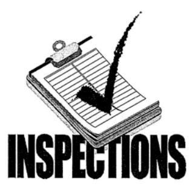

- (3) Contain a heating system capable of sustaining a healthful temperature (of approximately 70 degrees) for a displaced person, except in those areas where local climatic conditions do not require such a system.
- (4) Be adequate in size with respect to the number of rooms and area of living space needed to accommodate the displaced person. The Caltrans policy is that there will be no more than 2 persons per room unless the room is of adequate size to accommodate the normal bedroom furnishings for the occupants.
- (5) Have a separate, well-lighted and ventilated bathroom that provides privacy to the user and contains a sink, bathtub or shower stall, and a toilet, all in good working order and properly connected to appropriate sources of water and to a sewage drainage system.
  - Note: In the case of a housekeeping dwelling, there shall be a kitchen area that contains a fully usable sink, properly connected to potable hot and cold water and to a sewage drainage system, and adequate space and utility service connections for a stove and refrigerator.
- (6) Contains unobstructed egress to safe, open space at ground level. If the replacement dwelling unit is on the second story or above, with access directly from or through a common corridor, the common corridor must have at least two means of egress.
- (7) For a displaced person who is handicapped, be free of any barriers which would preclude reasonable ingress, egress, or use of the dwelling by such displaced person.

<u>Displaced Person or Displacee</u>: Any person who moves from real property or moves personal property from real property as a result of the acquisition of the real property, in whole or in part, or as the result of a written notice from the agency to vacate the real property needed for a transportation project. In the case of a partial acquisition, Caltrans shall determine if a person is displaced as a direct result of the acquisition.

Residents **not lawfully present** in the United States are not eligible to receive relocation payments and assistance

Relocation benefits will vary, depending upon the type and length of occupancy. As a residential displacee, you will be classified as either a:

- An owner occupant of a residential property (includes mobile homes)
- A tenant occupant of a residential property (includes mobile homes and sleeping rooms)

<u>Dwelling</u>: The place of permanent or customary and usual residence of a person, according to local custom or law, including a single family house; a single family unit in a two-family, multi-family, or multi-purpose property; a unit of a condominium or cooperative housing project; a non-housekeeping unit; a mobile home; or any other residential unit.

Owner: A person is considered to have met the requirement to own a dwelling if the person purchases or holds any of the following interests in real property:

- Fee title, a life estate, a land contract, a 99-year lease, oral lease including any options for extension with at least 50 years to run from the date of acquisition; or
- (2) An interest in a cooperative housing project which includes the right to occupy a dwelling; or
- (3) A contract to purchase any interests or estates; or
- (4) Any other interests, including a partial interest, which in the judgment of the agency warrants consideration as ownership.

<u>Tenant</u>: A person who has the temporary use and occupancy of real property owned by another.

# Moving Expenses

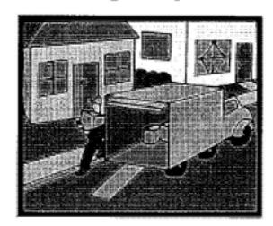

If you qualify as a displaced person, you are entitled to reimbursement of your moving costs and certain related expenses incurred in moving. The methods of moving and the various types of moving cost payments are explained. Below.

Displaced individuals and families may choose to be paid on the basis of actual, reasonable moving costs and related expenses, or according to a fixed moving cost schedule. However, to ensure your eligibility and prompt payment of moving expenses, you should contact your Relocation Agent before you move.

# You Can Choose Either:

**Actual Reasonable Moving Costs -** You may be paid for your actual reasonable moving costs and related expenses when a commercial mover performs the move. Reimbursement will be limited to a move of 50 miles or less. Related expenses <u>may</u> include:

- Transportation
- · Packing and unpacking personal property.
- · Disconnecting and reconnecting household appliances.
- · Temporary storage of personal property.
- · Insurance while property is in storage or transit.

# OR

**Fixed Moving Cost Schedule -** You may be paid on the basis of a fixed moving cost schedule. Under this option, you will not be eligible for reimbursement of related expenses listed above. The fixed schedule is designed to cover such expenses.

Examples (Year 2005 Rate):

4 Rooms - \$ 950

7 Rooms - \$1,550

If the furniture is moved with the mobile home, the amount of the fixed payment is based on Schedule B.

Examples (Year 200 Rate):

4 Rooms - \$1,175

7 Rooms - \$1,900

Under the Fixed Move Schedule for a furnished unit (e.g. you are a tenant of an apartment that is furnished by your landlord) is based on Schedule B.

Example (Year 2005 Rate):

1 Room - \$400

Under the Fixed Move Schedule, you will not receive any additional payments for temporary storage, lodging, transportation or utility hook-ups.

# Replacement Housing Payments

The type of Replacement Housing Payment (RHP) depends on whether you are an owner or a tenant, and the length of occupancy in the property being acquired.

If you are a qualified **owner occupant** of more than 180 days prior to the initiation of negotiations for the acquisition of your property, you may be entitled to a RHP that consists of:

Price Differential, and

Mortgage Differential, and

Incidental Expenses;

OR

**Rent Differential** 

If you are a qualified **owner occupant** of more than 90 days but less than 180 days, OR you are a qualified **tenant occupant** of at least 90 days, you may be entitled to a RHP as follows:

# Rent Differential

OR

# Downpayment Option

Length of occupancy simply means counting the number of days that you actually occupied a dwelling before the date of initiation of negotiations by Caltrans for the purchase of the property. The term "initiation of negotiations" means the date Caltrans makes the first personal contact with the owner of real property, or his/ her representative, to give him/her a written offer for the property to be acquired.

Note: If you have been in occupancy <u>less than 90 days</u> before the initiation of negotiations and the property is subsequently acquired, or if you move onto the property after the initiation of negotiations and you are still in occupancy on the date of acquisition, you may or may not be eligible for a Replacement Housing Payment. Check with your Relocation Agent before you make any decision to vacate your property.

# For Owner Occupants of 180 Days or More

If you qualify as a 180-day owner occupant, you may be eligible -- in addition to the fair market value of your property -- for a Replacement Housing Payment that consists of a Price Differential, Mortgage Differential and/or Incidental Expenses.

The **Price Differential** payment is the amount by which the cost of a replacement dwelling exceeds the acquisition cost of the displacement dwelling. This payment will assist you in purchasing a comparable decent, safe, and sanitary (DS&S) replacement dwelling. Caltrans will compute the maximum payment you may be eligible to receive.

In order to receive the full amount of the calculated price differential, you must spend at least the amount calculated by Caltrans on a replacement property

The **Mortgage Differential** payment will reimburse your for any increased mortgage interest costs you might incur because the interest rate on your new mortgage exceeds the interest rate on the property acquired by Caltrans The payment computation is complex as it is based on prevailing rates, your existing loan <u>and</u> your new loan. Also, a part of this payment may be prorated such as reimbursement for a portion of your loan origination fees and mortgage points.

To be eligible to receive this payment, the acquired property must have been encumbered by a bona fide mortgage which was a valid lien for at least 180 days prior to the initiation of negotiations.

You may also be reimbursed for any actual and necessary **Incidental Expenses** that you incur in relation to the purchase of your replacement property. These expenses may be those costs for title search, recording fees, credit report, appraisal report, and certain other closing costs associated with the purchase of property. You will not be reimbursed for any recurring costs such as prepaid real estate taxes and property insurance.

If the total amount of your **Replacement Housing Payment** (Price Differential, Mortgage Differential and Incidental Expenses) exceeds \$22,500, the payment must be deposited directly into an escrow account or paid directly to the mortgage company.

# EXAMPLES OF PRICE DIFFERENTIAL PAYMENT COMPUTATION:

Assume that Caltrans purchases your property for \$98,000. After a thorough study of available, decent, safe and sanitary dwellings on the open market, Caltrans determines that a comparable replacement property will cost you \$100,000. If your purchase price is \$100,000, you will receive \$2,000 (see Example A).

If your actual purchase price is more than \$100,000, you pay the difference (see *Example B*). If your purchase price is less than \$100,000, the differential payment will be based on actual costs (see *Example C*).

How much of a differential payment you receive depends on how much you actually spend on a replacement dwelling as shown in these examples:

| Caltrans' Computation                              |            |
|----------------------------------------------------|------------|
| Comparable Replacement Property and Mobile Home    | \$100,000  |
| Acquisition Price of Your Property and Mobile Home | -\$ 98,000 |
| Maximum Price Differential                         | \$ 2,000   |
| Example A                                          |            |
| Purchase Price of Replacement                      | \$100,000  |
| Comparable Replacement Property                    | \$100,000  |
| Acquisition Price of Your Property                 | -\$ 98,000 |
| Maximum Price Differential                         | \$ 2,000   |
| Example B                                          |            |
| Purchase Price of Replacement Property             | \$105,000  |
| Comparable Replacement Property                    | \$100,000  |
| Acquisition Price of Your Property                 | \$ 98,000  |
| Maximum Price Differential                         | \$ 2,000   |
| You Must Pay the Additional                        | \$ 5,000   |
| Example C                                          |            |
| Comparable Replacement Property                    | \$100,000  |
| Purchase Price of Replacement                      | \$ 99,000  |
| Acquisition Price of Your Property                 | \$ 98,000  |
| Price Differential                                 | \$ 1,000   |

In Example C you will only receive \$1,000 - not the full amount of the Caltrans "Comparable Replacement Property" because of the "Spend to Get" requirements.

# IN ORDER FOR A "180 DAY OWNER OCCUPANT" TO RECEIVE THE FULL AMOUNT OF THEIR REPLACEMENT HOUSING PAYMENT (Price Differential, Mortgage Differential and Incidental Expenses), you must:

- A) Purchase and occupy a DS&S replacement dwelling within one year after the later of:
  - (1) The date you first receive a notification of an available replacement house, **OR**
  - (2) The date that Caltrans has paid the acquisition cost of your current dwelling (usually the closing of escrow on State's acquisition),

# AND

B) Spend at least the amount of the Caltrans "Comparable Replacement Property" for a replacement property,

# AND

- C) File a claim for relocation payments within 18 months of the later:
  - (1) The date you vacate the property acquired by Caltrans, OR
  - (2) The date that Caltrans has paid the acquisition cost of your current dwelling (usually the close of escrow on State's acquisition)

You will not be eligible to receive any relocation payments until the State has actually made the first written offer to purchase the property. Also, you will also receive at least 90 days' written notice before you must move.

# For Owner Occupants and Tenants of 90 Days or More

If you qualify as a 90-day occupant (either as an owner or tenant), you may be eligible for a Replacement Housing Payment in the form of a Rent Differential.

The **Rent Differential** payment is designed to assist you in renting a comparable decent, safe and sanitary replacement dwelling. The payment is based on the difference between the base monthly Rent for the property acquired by Caltrans (including average monthly cost for utilities) and the lesser of:

- a) The monthly rent and estimated average monthly cost of utilities for a comparable replacement dwelling as determined by Caltrans, **OR**
- b) The monthly rent and estimated average monthly cost of utilities for the decent, safe and sanitary dwelling that you actually rent as a replacement dwelling.

Utility costs are those expenses you incur for heat, lights, water and sewer - regardless of the source (e.g. electricity, propane, and septic system). It does not include garbage, cable, telephone, or security. The utilities at your property are the average costs over the last 12 months. The utilities at the comparable replacement property are the estimated costs for the last 12 months for the type of dwelling and area used in the calculation.

This difference is multiplied by 42 months and may be paid to you in a lump sum payment or in periodic installments in accordance with policy and regulations.

In order to receive the full amount of the calculated Rent Differential, you must spend at least the amount calculated by Caltrans on a replacement property.

This payment may - with certain limitations - be converted to a **Downpayment Option** to assist you in purchasing a replacement property.

# Example of Rent Differential Payment Computation:

After a thorough study of comparable, decent, safe and sanitary dwellings that are available for rent, Caltrans determines that a comparable replacement property will rent for \$325.00 per month.

| Caltrans Computation                                                                                                                            | (rates are per month)       |
|-------------------------------------------------------------------------------------------------------------------------------------------------|-----------------------------|
| Rental Rate for Comparable Replacement Property                                                                                                 |                             |
| Rental Rate for Comparable Replacement Property<br>PLUS average estimated utilities costs<br>TOTAL Cost to Rent Comparable Replacement Property | \$ 325<br>+ 100<br>= \$ 425 |
| Rental Rate for Your Current Property<br>PLUS average utilities costs<br>TOTAL Cost to Rent Current Property                                    | \$ 300<br>+ 90<br>= \$ 390  |
| Comparable Replacement Property including utilities<br>Cost you pay to rent your property including utilities<br>Difference                     | \$ 425<br>+ 390<br>= \$ 35  |

Multiplied by 42 months = \$1,470 Rent Differential

# Example A:

| Rental Rate for a Replacement Property including       |        |
|--------------------------------------------------------|--------|
| Estimated average utilities costs                      | \$ 525 |
| Comparable Replacement Property including utilities    | \$ 425 |
| Cost you pay to rent your property including utilities | \$ 390 |

Since \$425 is less than \$525, the Rent Differential is based on the difference between \$390 and \$425.

# Rent Differential (\$35 x 42 months = \$1,470)

In this case you spent "at least" the amount of the Comparable Replacement Property on the replacement property and will receive the full amount.

# Example B:

| Rental Rate for a Replacement Property including       |        |
|--------------------------------------------------------|--------|
| Estimated average utilities costs                      | \$ 400 |
| Comparable Replacement Property including utilities    | \$ 425 |
| Cost you pay to rent your property including utilities | \$ 390 |

Since \$400 is less than \$525, the Rent Differential is based on the difference between \$400 and \$390.

# Rent Differential ( $$10 \times 42 \text{ months} = $420$ )

In this case you spent "less than" the amount of the Comparable Replacement Property on the replacement property and will not receive the full amount.

# IN ORDER FOR A "90 DAY OWNER OCCUPANT" TO RECEIVE THE FULL AMOUNT OF THEIR REPLACEMENT HOUSING PAYMENT (Rent Differential), you must:

- A) Rent and occupy a DS&S replacement dwelling within one year after the later of:
  - (1) The date you first receive a notification of an available replacement house,  $\mathbf{OR}$
  - (2) The day you vacate the property acquired by Caltrans.

# AND

B) Spend at least the amount of the Caltrans "Comparable Replacement Property" to rent a replacement property,

# AND

- C) File a claim for relocation payments within 18 months of the later of:
  - (1) The date you vacate the property acquired by Caltrans, OR
  - (2) The date that Caltrans has paid the acquisition cost of your current dwelling (usually the close of escrow on State's acquisition)

You will not be eligible to receive any relocation payments until the State has actually made the first written offer to purchase the property. And, you will also receive at least 90 days' written notice before you must move.

Note1: The time periods for a 90-day owner occupant are different than a 180-day owner occupant.

Note 2: If the Rent Differential is converted to a Downpayment Option, there is no "spend-to-get" requirement.

# DOWN PAYMENT OPTION

The Rent Differential payment may - with certain limitations - be converted to a **Down Payment Option** to assist you in purchasing a replacement property. The down payment option is a direct conversion of the Rent Differential payment.

If the Caltrans calculated Rent Differential is between \$0 and \$5,250, your down payment option will be \$5,250, which can be used towards the purchase of a replacement decent, safe and sanitary dwelling.

If the Rent Differential is over \$5,250, you may be able to convert the entire amount of the Rent Differential to a downpayment option.

The down payment option must be used for the acquisition of the replacement dwelling, plus any eligible incidental expenses (see "180-day Owner Occupants Incidental Expenses") related to the purchase of the property. You must work closely with your Relocation Agent to ensure you can utilize the full amount of your down payment option towards the purchase.

If any portion of the Rent Differential was used prior to the decision to convert to a down payment option, those advance payments will be deducted from the entire benefit.

# LAST RESORT HOUSING

On most projects, an adequate supply of housing will be available for sale and for rent, and the benefits provided will be sufficient to enable you to relocate to comparable housing. However, there may be projects in certain locations where the supply of available housing is insufficient to provide the necessary housing for those persons being displaced. In such cases, Caltrans will utilize a method called Last Resort Housing. Last Resort Housing allows Caltrans to construct, rehabilitate or modify housing in order to meet the needs of the people displaced from a project. Caltrans can also pay above the statutory limits of \$5,250 and \$22,500 in order to make available housing affordable.

# Relocation Advisory Assistance


Any individual, family, business or farm displaced by Caltrans shall be offered relocation advisory assistance for the purpose of locating a replacement property. Relocation services are provided by qualified personnel employed by Caltrans. It is their goal and desire to be of service to you and assist in any way possible to help you successfully relocate.

A Relocation Agent from Caltrans will contact you personally. Relocation services and payments will be explained to you in accordance with your eligibility. During the initial interview with you, your housing needs and desires will be determined as well as your need for assistance. You cannot be required to move unless at least one comparable replacement dwelling is made available to you.

You can expect to receive the following services, advice and assistance from your Relocation Agent who will:

- Explain the relocation benefits and eligibility requirements.
- · Provide the amount of the replacement housing payments in writing.
- Assure the availability of a comparable property before you move.
- Inspect possible replacement residential units for DS&S compliance.
- Provide information on counseling you can obtain to help minimize hardships in adjusting to your new location.
- Assist you in completing loan documents, rental applications or Relocation Claims Forms.

# AND provide information on:

- · Security deposits
- · Interest rates and terms
- Typical down payments
- · VA and FHA loan requirements
- · Real property taxes.
- · Consumer education literature on housing

If you desire, your Relocation Agent will give you current listings of other available replacement housing. Transportation will be provided to inspect available housing, especially if you are elderly or handicapped. Though you may use the services of a real estate broker, Caltrans cannot provide a referral.

Your Relocation Agent is familiar with the services provided by others in your community and will provide information on other federal, state, and local housing programs offering assistance to displaced persons. If you have special problems, your Relocation Agent will make every effort to secure the services of those agencies with trained personnel who have the expertise to help you.

If the highway project will require a considerable number of people to be relocated, Caltrans will establish a temporary Relocation Field Office on or near the project. Project relocation offices will be open during convenient hours and evening hours if necessary.

In addition to these services, Caltrans is required to coordinate its relocation activities with other agencies causing displacements to ensure that all persons displaced receive fair and consistent relocation benefits.

Remember - YOUR RELOCATION AGENT is there to offer advice and assistance. Do not hesitate to ask questions. And be sure you fully understand all of your rights and available benefits.


# YOUR RIGHTS AS A DISPLACEE

All eligible displacees have a <u>freedom of choice</u> in the selection of replacement housing, and Caltrans will not require any displaced person to accept a replacement dwelling provided by Caltrans. If you decide not to accept the replacement housing offered by Caltrans, you may secure a replacement dwelling of your choice, providing it meets DS&S housing standards. Caltrans will not pay more than your calculated benefits on any replacement property.

The most important thing to remember is that the replacement dwelling you select must meet the basic "decent, safe, and sanitary" standards. <u>Do not execute a purchase agreement or a rental agreement</u> until a representative from Caltrans has inspected and certified in writing that the dwelling you propose to occupy meets the basic standards. **DO NOT jeopardize** your right to receive a replacement housing payment by moving into a substandard dwelling.

It is important to remember that your relocation benefits will <u>not have an adverse</u> affect on your:

- Social Security Eligibility
- Welfare Eligibility
- Income Taxes

In addition, the <u>Title VIII of the Civil Rights Act of 1968</u> and later acts and amendments make discriminatory practices in the purchase and rental of most residential units illegal if based on race, color, religion, sex, or national origin.

Whenever possible, minority persons shall be given reasonable opportunities to relocate to decent, safe, and sanitary replacement dwellings, not located in an area of minority concentration, and that is within their financial means. This policy, however, does not require Caltrans to provide a person a larger payment than is necessary to enable a person to relocate to a comparable replacement dwelling.

Caltrans' Non-Discrimination Policy ensures that all services and/or benefits will be administered to the general public without regard to race, color, national origin, or sex in compliance with Title VI of the 1964 Civil Rights Act (42 USC 2000d. et seq.).

And you always have the <u>Right to Appeal</u> any decision by Caltrans regarding your relocation benefits and eligibility.

Your Right of Appeal is guaranteed in the "Uniform Act" which states that any person may file an appeal with the head of the responsible agency if that person believes that the agency has failed to properly determine the person's eligibility or the amount of a payment authorized by the Act.

If you indicate your dissatisfaction, either verbally or in writing, Caltrans will assist you in filing an appeal and explain the procedures to be followed. You will be given a prompt and full opportunity to be heard. You have the right to be represented by legal counsel or other representative in connection with the appeal (but solely at your own expense).

Caltrans will consider all pertinent justifications and materials submitted by you and other available information needed to ensure a fair review. Caltrans will provide you with a written determination resulting from the appeal with an explanation of the basis for the decision. If you are still dissatisfied with the relief granted, Caltrans will advise you that you may seek judicial review.

NOTES

#### Sus Derechos y Beneficios Como Una Persona Desplazada Bajo el Programa Uniforme De Asistencia Para Reubicación (Residencial)

# Introducci

En la construcción de un sistema moderno de transportación, el desplazamiento de un pequeño porcentaje de la población es a menudo necesario. Sin embargo, la política de Caltrans es que las personas desalojadas no tengan que sufrir innecesariamente como resultado de los programas diseñados para el beneficio del público en general.

Los individuos y familias desplazadas pueden ser elegibles para recibir servicios de asesoramiento y pagos de reubicación.

Este folleto provee información acerca de los servicios y pagos de reubicación disponibles. Si usted es requerido a mudarse como resultado de un proyecto de transportación, un Agente de Reubicación se comunicará con usted. El Agente de Reubicación le contestará preguntas específicas y le proveerá información adicional.

# Ley de Procedimiento Uniforme de Asistencia para Rubicación y Adquisición de Bienes Raíces de 1970, Enmendada "La Ley Uniforme"

El propósito de esta Ley es proveer tratamiento igual y uniforme para las personas que son desplazadas de sus hogares, negocios, u operaciones agrícolas por programas federales o programas que son asistidos con fondos federales y para establecer uniformidad e igualdad en la política de adquisición de tierras por programas federales y programas asistidos con fondos federales.

La ley trata de asegurar que las personas desplazadas directamente como resultado de proyectos federales o proyectos asistidos con fondos federales sean tratados con igualdad, consistencia y equidad para que esas personas no sufran

daños desproporcionados como resultado de proyectos designados para el beneficio del público en general.

Aunque se ha hecho un esfuerzo para asegurar la precisión de este folleto, debe de ser entendido que no tiene la fuerza o efectos de la ley, regla, o regulación que gobierna el pago de los beneficios. Si hay diferencias o error, la ley tomará precedencia.

# Algunas Definiciones Importantes...

Sus beneficios de reubicación pueden ser entendidos mejor si usted entiende los siguientes términos:

Vivienda de Restitución comparable: significa una propiedad que es:

- (1) Decente, segura y sanitaria. (Vea la definición abajo.)
- (2) Equivalente funcionalmente a la propiedad desplazada.
- (3) Adecuada en tamaño para acomodar a la familia que esta siendo reubicada.
- (4) En un área que no esté sujeta a condiciones irrazonablemente adversas.
- (5) En una localidad generalmente no menos deseable que la localidad de su propiedad desplazada con respecto a servicios públicos, y acceso razonable al lugar de empleo.
- (6) En una parcela de tamaño típico para el desarrollo de una residencia de tamaño normal.

**Decente, Segura y Sanitaria (DS&S):** La vivienda de restitución debe de ser decente, segura y sanitaria ... que significa que llena todos los requisítos mínimos establecidos por las regulaciones federales y conforme a los códigos de ocupación de viviendas aplicables. La propiedad será:

- Buena estructuralmente, cerrada a las condiciones climáticas y en buen estado de reparación.
- (2) Contiene un sistema eléctrico adecuado para iluminación y otros aparatos.
- (3) Contiene un sistema de calefacción capáz de mantener una temperatura saludable (de aproximadamente 70 grados) para la persona desplazada,

- con excepción en aquellas áreas donde las condiciones climáticas no requieren dicho sistema.
- (4) Debe de ser adecuada en tamaño con respecto al número de cuartos y áreas para vivir necesarias para acomodar a las personas desplazadas. Es política de Caltrans que más de dos personas no deben de estar en un solo cuarto, a menos que que el tamaño del cuarto sea suficientemente adecuado para acomodar los muebles de dormitorios necesarios de los ocupantes.
- (5) Tener un baño separado, bien iluminado y ventilado que sea privado a los usuarios y que contenga un lavamanos, una tina o regadera, y un excusado, todos en buenas condiciones y apropiadamente conectados a los sistemas de aguas negras y aguas potables.
  - **Nota:** En el caso de una propiedad residencial, debe de haber una área de cocina que contenga un lavatrastos usable, propiamente conectado a agua caliente y agua fría, y al sistema de drenaje, y con espacio adecuado para utilizar los servicios y connecciones para una estufa y un refrigerador.
- (6) Que contenga salidas sin obstrucción y seguros espacio abierto al nivel del suelo. Si la propiedad de restitución está en el segundo piso o más arriba, que tenga acceso directamente desde o a travéz de un corredor, y que éste corredor común debe de tener al menos dos salidas.
- (7) Si la persona desplazada es incapacitada físicamente, debe de ser libre de cualquier barrera que le impidan la entrada o salida, o uso razonable de la propiedad por dicha persona incapacitada.

Persona Desplazada: Cualquier individuo o familia que se mueva de una propiedad o mueva sus bienes personales de una propiedad como resultado de la adquisición de bienes raíces, en todo o en parte, o como resultado de una notificación escrita de una agencia pidiéndole que desocupe la propiedad que se necesita para un proyecto de transportación. En el caso de una adquisición parcial, Caltrans debe de determinar si la persona es desplazada directamente como resultado de esta adquisición.

Los residentes **que no están legalmente** en los Estados Unidos no son elegibles para recibir pagos y asistencia de reubicación.

Los beneficios de reubicación van a variar dependiendo del tipo y tiempo de ocupación. Como una persona desplazada de una unidad residencial usted puede ser clasificado como:

- Un dueño ocupante de una propiedad residencial (incluyendo casas movibles)
- Un inquilino ocupante de una propiedad residencial (incluyendo casas movibles y cuartos para dormir)

*Vivienda:* El lugar de permanencia o residencia regular y usual de una persona, de acuerdo a las costumbres locales o la ley, incluyendo una unidad familiar, una unidad familiar en un complejo doble o multi-familiar, o una propiedad de uso múltiple, una unidad de condominio o proyecto de vivienda en cooperativa, una unidad libre de mantenimiento doméstico, una casa movible, o cualquier otra unidad residencial.

**Dueño:** Una persona es considerada que llena los requisitos de dueño de una casa, si esta persona compra, tiene título o tiene algunos de los siguientes intereses en una propiedad:

- (1) Una escritura de propiedad, un interés de por vida en una propiedad, un contrato de renta por 99 años, un contrato oral de renta incluyendo una opción para extensión con al menos 50 años que queden después de la fecha de adquisición; o
- (2) El interés en un proyecto de vivienda en cooperativa que incluya el derecho de ocupar una vivienda; o
- (3) Un contrato de compra de interés, o bienes raíces.
- (4) Algún otro interés, incluyendo intereses parciales, qua a juicio de la agencia garanticen los pagos como dueño.

*Inquilino:* Una persona que tiene el uso y la ocupación temporal de una propiedad de la que otro es dueño.

# Gastos de Mudanza

Si usted califica como persona desplazada, usted tiene derecho a reembolso de sus gastos de mudanza y a ciertos gastos relacionados incurridos durante el traslado. Los métodos de traslado y los distintos tipos de pagos para gastos de mudanza son explicados abajo.

Los individuos y familias desplazadas pueden escoger un pago basado en los gastos reales, razonables y los gastos relacionados, o de acuerdo a una lista de costos fijos de mudanza. Sin embargo, para asegurar su elegibilidad y el pago rápido de sus gastos de mudanza, usted debe de ponerse en contacto con su Agente de Rubicación antes de mudarse.

# Usted Puede Elegir Entre:

Los Gastos Razonables de Mudanza – A usted se le puede pagar por los gastos razonables de mudanza y gastos relacionados cuando una compañia comercial de mudanza hace la mudanza. Los reembolsos deberán ser limitados a una mudanza de 50 millas o menos. Los gastos relacionados <u>pueden</u> incluir:

- Transportación.
- · Empaque y desempaque de propiedades personales.
- · Desconexión y reconexión de aparatos eléctricos.
- · Almacenaje temporal de propiedades personales.
- Seguros cuando la propiedad está almacenada o en tránsito.

Ó

**Lista de Costos Fijos de Mudanza** — A usted se le puede pagar basado en una lista de costos fijos de mudanza. Bajo esta opción, usted no puede ser elegible para reembolsos de gastos relacionados incluídos en la lista de arriba. Esta lista de gastos fijos está designada a cubrir todos esos gastos.

Por ejemplo (Tarifa para el año 2001) 4 Cuartos - \$ 950 7 Cuartos - \$1,550

Los costos fijos de mudanza para una unidad amueblada (ejemplo, usted es inquilino en un apartamento donde los muebles pertenecen al dueño de la vivienda) estan basados en la Tabla de Honorarios B.

Ejemplos (Taza en el año 2001): 4 Cuartos - \$475 7 Cuartos - \$625

Bajo la lista de Pago Fijos de Mudanza, usted no puede recibir ningun pago adicional por almacenamiento temporario, vivienda temporaria, transportación o conexiones de servicios públicos.

# Pagos Para Vivienda de Restituci

El tipo de Pago Para Vivienda de Restitución (RHP) depende de si usted es dueño o un inquilino, y en el tiempo de ocupación que tiene de la propiedad que será adquirida.

Si usted es calificado **como dueño ocupante** de más de 180 días antes de la iniciación de negociaciones para la adquisición de su propiedad, usted puede tener derecho a recibir RHP que consiste en:

Diferencia de Precio, y

Diferencia para Hipoteca, y

**Gastos Incidentales** 

0

# Diferencia Para Rentar

Si usted es calificado como **dueño ocupante** de más de 90 días, pero menos de 180 días, O si usted es calificado como **inquilino ocupante** de al menos 90 días, usted puede tener derecho a recibir RHP así:

Diferencia Para Rentar

U

# Opci para Enganche

Tiempo de ocupación simplemente significa contar el número de días que usted actualmente ocupó la vivienda antes de la fecha de iniación de negociaciones por Caltrans para la compra de la propiedad. El término "iniciación de negociaciones" significa la fecha que Caltrans hizo el primer contacto personal con el dueño de bienes raíces, o su representante, para darle a el/ella una oferta escrita para la adquisición de la propiedad.

Nota: Si usted ocupó una vivienda por **menos de 90 días** antes de la iniciación de negociaciones y la propiedad es posteriormente adquirida, o si usted se mudó a la propiedad después de la iniciación de negociaciones y usted todavía

ocupaba la propiedad a la fecha de adquisición, usted puede ser elegible para un Pago para Restitución de Vivienda, basado en una guía de elegibilidad establecida. Consulte con su Agente de Reubicación antes de que haga cualquier decisión de mudarse de su propiedad.

# Para Ocupantes de 180 D o M s

Si usted califica como dueño ocupante de 180 días, puede ser elegible – además del valor equitativo en el mercado de su propiedad – para un Pago de Restitución de Vivienda que consiste en un pago de Diferencia de Precio y/o Gastos Incidentales.

El Pago de **Diferencia de Precio** es la cantidad por la que el costo de una vivienda de restitución excede el costo de adquisición de la vivienda desplazada. Este pago le asistirá en la compra de una vivienda decente, segura, y sanitaria (DS&S). Caltrans computará el pago máximo que usted puede ser elegible para recibir. (Vea un ejemplo en la página 15.)

Para recibir la cantidad total de la diferencia de precio calculadas, usted debe de gastar al menos la cantidad calculada por Caltrans en la propiedad de restitución.

El pago de **Diferencia de Hipoteca** le será reembolsado por cualquier aumento del costo de interés en la hipoteca que usted haya incurrido porque la taza de interés en su nueva hipoteca excede la taza de interés de la propiedad adquirida por Caltrans. La computación del pago es complicada ya que está basada en las tazas típicas entre su préstamo anterior y su préstamo nuevo. También, una parte de los pagos pueden ser prorrateado como reembolso por una porción de los honorarios de su préstamo y los puntos (intereses) de la hipoteca.

Para ser elegible para recibir este pago, la propiedad adquirida debe de ser hipotecada con una hipoteca de buena fé, la cual fue un crédito válido de por lo menos 180 días antes de la iniciación de negociaciones.

Usted también puede ser reembolsado por cualquier **Gasto Incidental** actual y necesario que usted incurra en relación con la compra de su propiedad de restitución. Estos gastos pueden ser los costos por búsqueda de título, honorarios de copia en el Registro, reporte de crédito, reporte de evaluación, y ciertos otros gastos de cierre de escritura. Usted no puede ser reembolsado por ningún gasto frequente como pre-pagos de impuesto de bienes raíces y seguro de propiedad.

Si la cantidad total de su **Pago de Vivienda de Restitución** (Diferencia de Precio, Diferencia Para Hipoteca y Gastos Incidentales) excede \$22,500, el pago debe de ser depositado directamente en una cuenta fiduciaria o ser pagado directamente a la compañía financiera.

# EJEMPLO DE COMO SE CALCULA LA DIFERENCIA DE PAGO:

Suponga que Caltrans compra su propiedad por \$98,000. Después de un estudio completo de viviendas disponibles en el mercado, que sean decentes, seguras y sanitarias, Caltrans determina que la propiedad de restitución comparable en el mercado abierto le costará \$100,000. Si su precio de compra es \$100,000 usted recibirá \$2,000 (*Vea el Ejemplo A*)

Si su precio de compra es de más de \$100,000, usted paga la diferencia (vea el *Ejemplo B*). Si su precio de compra es menos de \$100,000, el pago se basará en los costos actuales (vea el *Ejemplo C*).

La cantidad que usted recibe en un pago diferencial dependerá de cuanto usted realmente gasta en una vivienda de restitución, como se muestra en estos ejemplos.

# Computaci de Caltrans

| Precio Comparable de la Propiedad de Restitución | \$100,000  |
|--------------------------------------------------|------------|
| Precio de Adquisición de su Propiedad            | -\$ 98,000 |
| Diferencia Máxima de Precio                      | \$ 2,000   |
| Ejemplo A                                        |            |
| Precio de Compra de Restitución                  | \$100,000  |
| Propiedad Comparable de Restitución              | \$100,000  |
| Precio de Adquisición de su Propiedad            | -\$ 98,000 |
| Diferencia Máxima de Precio                      | \$ 2,000   |

# Ejemplo B

| Precio de Compra de Restitución            | \$105,000  |
|--------------------------------------------|------------|
| Propiedad Comparable de Restitución        | \$100,000  |
| Precio de Adquisición de su Propiedad      | -\$ 98,000 |
| Diferencia Máxima de Precio                | \$ 2,000   |
| Usted Debe de Pagar el Precio Adicional de | \$ 5,000   |

# Ejemplo C

| Propiedad Comparable de Restitución   | \$100,000  |
|---------------------------------------|------------|
| Precio de Compra de Restitución       | \$ 99,000  |
| Precio de Adquisición de su Propiedad | -\$ 98,000 |
| Diferencia de Precio                  | \$ 1,000   |

En el ejemplo C usted solo recibirá \$1,000 – no la cantidad completa de "La propiedad Comparable de Restitución" por los requisítos de "Gastar para Obtener" de Caltrans.

PARA QUE UN "DUENO OCUPANTE DE 180 DÍAS" RECIBA LA CANTIDAD TOTAL DE SUS BENEFICIOS DE PAGOS PARA VIVIENDA (Diferencia de Precio, Diferencia de Hipoteca y Gastos Incidentales), usted debe:

- A) Comprar y ocupar una vivienda de restitución que sea DS&S dentro de al menos un año desde la fecha más tarde de:
  - (1) La fecha en que recibió la primera notificación de una casa de restitución, **O**
  - (2) La fecha que Caltrans pagó los costos de adquisición de su vivienda actual (usualmente los gastos de cierre de escritura en la adquisición del Estado.)

Y

B) Haber gastado al menos la cantidad que Caltrans estableció para "La Propiedad Comparable de Restitución" para la propiedad de restitución.

Y

- C) Reportar un reclamo para pago para reubicación dentro de los 18 meses de la fecha más tarde de:
  - (1) La fecha en que se mudó de la propiedad adquirida por Caltrans, O
  - (2) La fecha en que Caltrans le pagó los costos de adquisición de su vivienda actual (usualmente al cierre de escritura en la adquisición del Estado.)

Usted no será elegible para recibir ningún pago de reubicación hasta que el Estado haya hecho la primera oferta por escrito de la compra de la propiedad. Usted también recibirá una notificación escrita por lo menos 90 días antes de tener que mudarse.

# Para Due os Ocupantes e Inquilinos de 90 D as o M s

Si usted califica como un ocupante (ya sea como dueño o inquilino) de 90 días, usted puede ser elegible para un Pago de Vivienda de Restitución en la forma de Diferencia para Rentar.

El pago de la **Diferencia para Rentar** es designado para asistirle en la renta de una vivienda comparable que sea decente, segura y sanitaria. El pago será basado en la diferencia entre la renta básica mensual por la propiedad adquirida por Caltrans (incluyendo el promedio del costo mensual de servicios públicos) y el menor de:

- La renta mensual y el promedio del costo mensual estimado de los servicios públicos para una vivienda comparable de restitución determinada por Caltrans, O
- La renta mensual y el promedio del costo mensual estimado de los servicios públicos para una vivienda decente, segura y sanitaria que usted rente como vivienda de restitución.

Gastos de servicios públicos son esos gastos que usted incurre por calefacción, luz, agua, aguas negras y basura – sin importar quien los provea (ejemplo, electricidad, gas propano, y sistema séptico.) No incluye cable de televisión, teléfono, o seguridad. Los servicios públicos en su propiedad de restitución será el estimado del promedio de costos por los 3 últimos meses para el tipo de vivienda y área usados en los cálculos.

Esta diferencia es multiplicada por 42 meses y le puede ser pagado en una sola suma o en pagos periódicos de acuerdo con la política y regulaciones. (Vea un ejemplo en la página 21.)

Para recibir la cantidad calculada total de la diferencia para rentar, usted debe gastar al menos la cantidad calculada por Caltrans en la propiedad de restitución.

Este pago puede – con ciertas limitaciones – ser convertido en una **Opción para Enganche** para asistirle en la compra de una propiedad de restitución (Vea la página 25 para una explicación completa.)

### EJEMPLO DE LA COMPUTACI DEL PAGO DE LA DIFERENCIA PARA RENTAR:

Después de hacer un estudio completo de viviendas comparables, decentes, seguras y sanitarias que estén disponibles para rentar, Caltrans determina que una propiedad comparable de restitución podría ser rentada por \$325 al mes.

# Computaci de Caltrans

| Renta por una Propiedad Comparable de Restitución                       | \$ 325 al mes |
|-------------------------------------------------------------------------|---------------|
| MÁS: estimado de costos de servicios públicos                           | 100 al mes    |
| TOTAL Costo de renta por una Propiedad Comparable de Restitución        | \$ 425 al mes |
| Renta por su Propiedad Actual                                           | \$ 300 al mes |
| MÁS: costos de servicios públicos                                       | 90 al mes     |
| TOTAL Costo para pagar la renta de su propiedad actual                  | \$ 390 al mes |
| Propiedad Comparable de Restitución incluyendo servicios públicos       | \$ 425 al mes |
| Costo para pagar la renta de su propiedad incluyendo servicios públicos | 390 al mes    |
| Diferencia                                                              | \$ 35 al mes  |

Multiplicado por 42 meses = \$1,470 Diferencia para Rentar

# Ejemplo A:

| Renta para una Propiedad de Restitución, incluyendo los costos estimados de servicios públicos | \$ 525 al mes |
|------------------------------------------------------------------------------------------------|---------------|
| Propiedad Comparable de Restitución incluyendo servicios públicos                              | \$ 425 al mes |
| Costos de pago de la renta de su propiedad incluyendo servicios públicos                       | \$ 390 al mes |

Ya que \$425 es menos que \$525, la diferencia para rentar está basada en la diferencia entre \$390 y \$425.

Diferencia para Rentar (\$35 x 42 meses = \$1,470)

En este caso usted gasta "al menos" la cantidad de la Propiedad de Restitución Comparable en la propiedad de restitución y así recibirá la cantidad total.

# Ejemplo B:

| Renta por una Propiedad de Restitución, incluyendo los costos estimados de servicios públicos | \$ 400 al mes |
|-----------------------------------------------------------------------------------------------|---------------|
| Propiedad Comparable de Restitución incluyendo servicios públicos                             | \$ 425 al mes |
| Costos de pago de la renta de su propiedad incluyendo servicios públicos                      | \$ 390 al mes |

Ya que \$400 es menos que \$525, la diferencia para rentar está basada en la diferencia entre \$400 y \$390.

Diferencia para Rentar (\$10x 42 meses = \$420)

En este caso usted va a gastar "menos que" la cantidad de Propiedad de Restitución Comparable en la restitución de la vivienda y usted no recibirá la cantidad total.

PARA QUE UN "DUENO OCUPANTE DE 90 DÍAS" RECIBA LA CANTIDAD TOTAL DE PAGO PARA SU VIVIENDA DE RESTITUCION (Diferencia para Rentar), usted debe de:

A) Rentar y ocupar una vivienda de restitución DS&S dentro de un año después de la última fecha de:

- (1) La fecha en que usted recibió la primera notificación de una casa de restitución disponible, **O**
- (2) El día en que usted su mudó de la propiedad adquirida por Caltrans.

Υ

B) Gastar al menos la cantidad de la "Propiedad Comparable de Restitución" de Caltrans para rentar una vivienda de restitución.

Y

- C) Reportar un reclamo para pagos de reubicación dentro de los 18 meses de la fecha más tarde:
  - (1) La fecha en que usted se mudó de la propiedad adquirida por Caltrans,
  - (2) La fecha en que Caltrans le pagó los costos de adquisición de su propiedad actual (usualmente al cierre de escritura de la adquisición del Estado.)

Usted no será elegible para recibir ningún pago de reubicación hasta que haya hecho la primera oferta escrita para comprar la propiedad. Además, usted recibirá al menos una noticia por escrito 90 días antes de tener que mudarse.

# OPCI PARA ENGANCHE

El pago de Diferencia para Rentar puede – con ciertas limitaciones – ser convertido en una **Opción para Enganche** para asistirle en la compra de una propiedad de restitución. La Opción para Enganche es una conversión directa del pago de la diferencia para rentar.

Si la diferencia para rentar es calculada entre \$0 y \$5,250, su Opción Para Enganche será de \$5,250 la cual puede ser usada para la compra de una vivienda de restitución decente, segura y sanitaria.

Si la diferencia para rentar es más de \$5,250 usted podrá convertir la cantidad completa de diferencia para rentar a una Opción Para Enganche.

La Opción Para Enganche debe de ser usada para el enganche requerido, la cual usualmente es un porcentage del precio total de compra, más cualquier gasto incidental elegible (vea la página 14, "Gastos Incidentales para Dueños Ocupantes de 180 días") relacionado con la compra de la propiedad. Usted debe trabajar junto con su Agente de Reubicación para asegurarse de que puede utilizar la cantidad total de su Opción Para Enganche en su compra.

Si alguna porción de la diferencia para rentar fue usada antes de su decisión de convertirla a una Opción Para Enganche, los pagos avanzados serán deducidos de los beneficios completos.

# CASA DEL LTIMO RECURSO

En la mayoría de los proyectos de Caltrans, existe una cantidad adecuada de viviendas de venta y alquiler, y los beneficios serán suficientes para que usted pueda reubicarse a una vivienda comparable. Sin embargo, en ciertas localidades pueden haber proyectos donde el número de viviendas disponibles no son suficientes para proveer viviendas a todas las personas desplazadas. En estos casos, Caltrans utiliza un método llamado Casa del Último Recurso. La Casa del Último Recurso permite a Caltrans construir, rehabilitar, o modificar viviendas para cumplir con las necesidades de las personas desplazadas por un proyecto. Caltrans puede también pagar arriba de los límites legales de \$5,250 y \$22,500 para hacer posible viviendas con precios razonables.

### Asistencia de Consulta Para Reubicaci

A cualquier individuo, familia, negocio u operación agrícola desplazada por Caltrans deberá ofrecérsele servicios de asistencia con el propósito de localizar una propiedad de restitución. Los servicios de reubicación son proveídos por empleados calificados de Caltrans. Es la meta de ellos y el deseo de estos empleados de servirle y asistirle de cualquier manera posible para ayudarle a reubicarse exitosamente.

Un Agente de Reubicación de Caltrans se pondrá en contacto con usted personalmente. Los servicios de reubicación y pagos se le explicarán de acuerdo con su elegibilidad. Durante la entrevista inicial, sus necesidades de vivienda y deseos se determinarán así como sus necesidades de asistencia. No se le puede pedir que se mude a menos que una vivienda comparable de restitución le sea disponible.

Usted puede esperar recibir los siguientes servicios, consejos y asistencia de su Agente de Reubicación quien le:

- Explicará los beneficios de reubicación y los requesitos de elegibilidad.
- Proveerá por escrito la cantidad de pago por su vivienda de restitución.
- Asegurará la disposición de una propiedad comparable antes de que se mude.
- Inspeccionará las posibles unidades residenciales de restitución para el cumplimiento de DS&S.

- Proveerá información y aconsejará como puede obtener ayuda para minimizar las adversidades en ajustarse a su nueva localidad.
- Ayudará en completar los documentos de préstamos, aplicaciones de rentas o las Formas de Reclamo para Reubicación.

Y proveerle información de:

- · Seguro de Depósitos
- · Taza de intereses y términos
- · Pagos típicos de enganches
- Requisitos de préstamos de la Administración de Veteranos (VA) y la Administración de Vivienda Federal (FHA)
- · Impuestos sobre bienes raíces
- · Literatura de educación en viviendas para el consumidor

Si usted lo desea, el Agente de Reubicación le dará una lista actual de otras viviendas de restitución disponibles.

Se proveerá transportación para inspeccionar viviendas disponibles, especialmente si usted es mayor de edad o con impedimiento físico. Aunque usted puede utilizar los servicios de un agente de bienes raíces, Caltrans no lo podrá referir.

Su Agente de Reubicación está familiarizado con los servicios proveídos por otras agencias de su comunidad y le proveerá información de otros programas de viviendas federales, estatales y locales que ofrecen programas de asistencia para personas desplazadas. Si usted tiene algun problema especial, su Agente de Reubicación hará su mejor esfuerzo para asegurarle los servicios de esas agencias con personal capacitado y con experiencia que le ayudarán.

Si el proyecto de transportación requiere un número considerable de personas que sean reubicados, Caltrans establecerá una Oficina Temporal de Reubicación en, o cerca del proyecto. Las oficinas de proyectos de reubicación deberán de abrirse durante horas convenientes y en horas tempranas de la noche, si es necesario.

#### Appendix D Summary of Relocation Benefits

Además de estos servicios, Caltrans es requirido que coordine las actividades de otras agencias que causen desplazamientos para asegurar que todas esas personas desplazadas reciban beneficios de reubicación equitativos y consistentes.

Recuerde – SU AGENTE DE REUBICACIÓN está para aconsejarle y asistirle. No vacile en hacer preguntas, y asegúrese de que entiende completamente sus derechos y beneficios de reubicación disponibles.

# SUS DERECHOS COMO UNA PERSONA DESPLAZADA

Todas las personas elegibles como personas desplazadas tienen la <u>libertad de escoger</u> dentro de la selección de viviendas de restitución, y Caltrans no requerirá a ninguna persona que sea desplazada que acepte una vivienda de restitución proveída por Caltrans. Si usted decide no aceptar la vivienda de restitución ofrecida por Caltrans, usted puede elegir una vivienda de restitución de su propia selección, mientras que cumple con los requisítos de DS&S. Caltrans no pagará más que los beneficios calculados por una vivienda de restitución.

Lo más importante que usted debe de recordar es que la vivienda de restitución que usted seleccione debe de llenar los requisítos básicos de "decente, segura y sanitaria". No ejecute los documentos de compra o el contrato de renta hasta que un representante de Caltrans haya inspeccionado y certificado por escrito que la vivienda que usted se propone ocupar cumple con los requisítos básicos. NO ARRIESGUE su derecho de recibir los pagos de vivienda de restitución por mudarse a una vivienda que no sea "decente, segura y sanitaria."

Es importante recordar que sus beneficios de reubicación <u>no van a tener ningún</u> <u>efecto adverso</u> en su:

- · Elegibilidad para Seguro Social
- · Elegibilidad para Asistencia Social
- · Impuestos sobre ingresos

Además, el <u>Título VIII de los Derechos Civiles, Ley de 1968</u> y luego otras leyes y enmiendas hacen descriminatoria la práctica de compra y renta de unidades de vivienda si es basada ilegalmente en la raza, color, religión, sexo u origen nacional.

Cuando sea posible, a personas de minorías se les debe de dar oportunidades razonables para reubicarse a viviendas de restitución que sean decentes, seguras y sanitarias, no localizadas en áreas de concentración de minorías, y que estén dentro de sus recursos económicos. Esta política, sin embargo, no requiere que Caltrans provea a una persona pagos más grandes de lo que sean necesarios para permitir que la persona sea reubicada a una vivienda de restitución comparable.

La política No-Descriminatoria de Caltrans asegura que todos los servicios y/o los beneficios deben de ser administrados al público en general sin importar la raza, color, origen nacional, o sexo en cumplimiento con el Título VI de la Ley de Derechos Civiles de 1964 (42 USC 2000 d. et seq.)

Usted siempre tendrá el <u>Derecho de Apelar</u> cualquier decisión hecha por Caltrans relacionada a los beneficios de reubicación y elegibilidad.

Su Derecho de Apelar está garantizado en la "Ley Uniforme" la cual establece que una persona puede apelar al jefe de la agencia responsable, si ella cree que la agencia ha fallado en determinar correctamente su elegibilidad, o la cifra del pago autorizado por la Ley.

Si usted indica su disatisfacción, ya sea verbalmente o por escrito, Caltrans le asistirá en hacer su demanda de apelación y le explicará el procedimiento que debe de seguir. Usted tiene derecho de ser representado por un asesor legal u otro representante en conexión con su apelación (pero solamente por su propia cuenta.)

Caltrans considerará toda justificación y materia pertinente que usted entregue u otra información disponible, necesaria para asegurar una audiencia equitativa. Caltrans le proveerá una determinación por escrito del resultado de su apelación, con una explicación sobre la base de la decisión. Si usted aún no está satisfecho con la decisión otorgada, Caltrans le aconsejará que usted puede pedir una audiencia judicial.

Noticiero de la Ley para Americanos con Incapacidades Físicas (ADA):

Para personas con incapacidades físicas, este documento es disponible en formatos alternativos. Para Información Ilame al número (916) 654-5413 Voz, CRS: 1-800-735-2929, o escriba a Derecho de Vía, MS 37, 1120 N Street, Sacramento, CA 95814.

# NOTAS

# Your Rights and Benefits as a Displacee Under the Uniform Relocation Assistance Program (Mobile Home)

#### Introduction

In building a modern transportation system, the displacement of a small percentage of the population is often necessary. However, it is the policy of Caltrans that displaced persons shall not suffer unnecessarily as a result of programs designed to benefit the public as a whole.

Displaced individuals, families, businesses, farms, and nonprofit organizations may be eligible for relocation advisory services and payments.

This brochure provides information about available relocation services and payments. If you are required to move as the result of a Caltrans transportation project, a Relocation Agent will contact you. The Relocation Agent will be able to answer your specific questions and provide additional information.

#### Uniform Relocation Assistance and Real Property Acquisition Policies Act of 1970 As Amended "The Uniform Act"

The purpose of this Act is to provide for uniform and equitable treatment of persons displaced from their homes, businesses, or farms by federal and federally assisted programs and to establish uniform and equitable land acquisition policies for federal and federally assisted programs.

49 Code of Federal Regulations Part 24 implements the "Uniform Act" in accordance with the following relocation assistance objective:

To ensure that persons displaced as a direct result of federal or federallyassisted projects are treated fairly, consistently and equitably so that such persons will not suffer dispro-portionate injuries as a result of projects designed for the benefit of the public as a whole.

While every effort has been made to assure the accuracy of this booklet, it should be understood that it does not have the force and effect of law, rule, or regulation governing the payment of benefits. Should any difference or error occur, the law will take precedence.

# Some Important Definitions...

Your relocation benefits can be better understood if you become familiar with the following terms:

# Comparable Replacement: means a dwelling which is:

- (1) Decent, safe, and sanitary. (See definition below.)
- (2) Functionally equivalent to the displaced dwelling.
- (3) Adequate in size to accommodate the family being relocated.
- (4) In an area not subject to unreasonable adverse environmental conditions.
- (5) In a location generally not less desirable than the location of your displacement dwelling with respect to public utilities and commercial and public facilities, and reasonably accessible to the place of employment.
- (6) On land that is typical in size for residential development with typical improvements.

**Decent, Safe and Sanitary (DS&S):** Replacement housing must be decent, safe, and sanitary...which means it meets all of the minimum requirements established by federal regulations and conforms to applicable housing and occupancy codes. The dwelling shall:

- (1) Be structurally sound, weather tight, and in good repair.
- (2) Contain a safe electrical wiring system adequate for lighting and other devices.
- (3) Contain a heating system capable of sustaining a healthful temperature (of approximately 70 degrees) for a displaced person, except in those areas where local climatic conditions do not require such a system.

- (4) Be adequate in size with respect to the number of rooms and area of living space needed to accommodate the displaced person. The Caltrans policy is that there will be no more than two persons per room unless the room is of adequate size to accommodate the normal bedroom furnishings for the occupants.
- (5) Have a separate, well-lighted and ventilated bathroom that provides privacy to the user and contains a sink, bathtub or shower stall, and a toilet, all in good working order and properly connected to appropriate sources of water and to a sewage drainage system.

**Note:** In the case of a housekeeping dwelling, there shall be a kitchen area that contains a fully usable sink, properly connected to potable hot and cold water and to a sewage drainage system, and adequate space and utility service connections for a stove and refrigerator.

- (6) Contains unobstructed egress to safe, open space at ground level. If the replacement dwelling unit is on the second story or above, with access directly from or through a common corridor, the common corridor must have at least two means of egress.
- (7) For a displaced person who is handicapped, be free of any barriers which would preclude reasonable ingress, egress, or use of the P.C. dwelling by such displaced person.

**Displaced Person or Displacee:** Any person who moves from real property or moves personal property from real property as a result of the acquisition of the real property, in whole or in part, or as the result of a written notice from the agency to vacate the real property needed for a transportation project. In the case of a partial acquisition, Caltrans shall determine if a person is displaced as a direct result of the acquisition.

Residents **not lawfully present** in the United States are not eligible to receive relocation payments and assistance.

Relocation benefits will vary, depending upon the type and length of occupancy. As a residential displacee, you will be classified as either:

- An owner occupant of a residential property (includes mobile homes)
- A tenant occupant of a residential property (includes mobile homes and sleeping rooms)

**Dwelling:** The place of permanent or customary and usual residence of a person, according to local custom or law, including a single family house; a single family unit in a two-family, multi-family, or multi-purpose property; a unit of a condominium or cooperative housing project; a non-housekeeping unit; a mobile home; or any other residential unit.

**Mobile Home:** Generally refers to single, double or triple wide mobile home units. It does not include manufactured homes that are permanently affixed to the realty, as these are treated as single family dwellings. However, it can include certain trailers or recreational vehicles that are a primary residence depending on how they are permanently affixed to the real property.

**Owner:** A person is considered to have met the requirement to own a dwelling if the person purchases or holds any of the following interests in real property:

- (1) Fee title, a life estate, a land contract, a 99-year lease, oral lease including any options for extension with at least 50 years to run from the date of acquisition; or
- (2) An interest in a cooperative housing project which includes the right to occupy a dwelling; or
- (3) A contract to purchase any interests or estates; or
- (4) Any other interests, including a partial interest, which in the judgment of the agency warrants consideration as ownership.

**Tenant:** A person who has the temporary use and occupancy of real property owned by another.

# Mobile Homes

If the mobile home *is not* acquired by Caltrans, the owner (regardless of who occupies it) of a mobile home is eligible for a payment to move the mobile home to a replacement piece of land based on an actual cost basis. This includes the cost to dissemble, move and reassemble any porches, decks, skirting and/or awnings. Additional costs may be eligible for reimbursement if Caltrans determines they are "actual, reasonable and necessary." Some of these costs might be:

- · Anchoring the unit to the new pad
- Additional axles or brakes on the mobile home that are required for transportation
- Temporary protection of an extra wide mobile home unit that must be split during the move
- Utility hook-ups to the unit (e.g. water, sewer, septic, electricity, gas) if utilities
  are already available to the mobile home location (e.g. pad)
- Necessary repairs to meet local and state code
- Modifications necessary to meet Caltrans "decent, safe and sanitary" requirements
- Non-returnable entrance fee to the mobile home park with limitations

The movement of the mobile home must be performed by a qualified mover and the payment is based on the lowest of two bids obtained by the owner of the mobile home and approved by Caltrans. Caltrans cannot pay for the move of the mobile home beyond 50 miles unless there are no suitable replacement pieces of land or mobile home parks within the 50-mile radius. Approval for a move beyond 50 miles must be obtained in advance of the move.

# Moving Expenses

In addition to moving the mobile home, the occupant (regardless of who owns it) may be eligible for a payment to move their personal property – if you qualify as a "displaced person."

The methods of moving and the various types of moving cost payments are explained below. Displaced individuals and families may choose to be paid on the basis of actual, reasonable moving costs and related expenses, or according to a fixed moving cost schedule. However, to ensure your eligibility and prompt payment of moving expenses, you should contact your Relocation Agent before you move.

# You Can Choose Either:

**Actual Reasonable Moving Costs** – You may be paid for your actual reasonable moving costs and related expenses when a commercial mover performs the

move. Reimbursement will be limited to a move of 50 miles or less. Related expenses *may* include:

- Transportation
- · Packing and unpacking personal property
- · Disconnecting and reconnecting household appliances
- Temporary storage of personal property
- · Insurance while property is in storage or transit

OR

**Fixed Moving Cost Schedule** – You may be paid on the basis of a fixed moving cost schedule. Under this option, you will not be eligible for reimbursement of related expenses listed above. The fixed schedule is designed to cover such expenses.

Examples (Year 2000 Rate):

```
4 Rooms - $ 950
7 Rooms - $1,550
```

If the furniture is moved with the mobile home, the amount of the fixed payment is based on Schedule B.

Examples (Year 2001 Rate):

```
4 Rooms - $475
7 Rooms - $625
```

Normally no additional payments for temporary storage, lodging, transportation or utility hook-ups of household appliances can be paid with the fixed move schedule. However, the occupants of the mobile home who choose to move back into the same mobile home at the new location, can receive an allowance for food and lodging during the move and set-up time. Also, utility hook-ups to the mobile home unit may be eligible for reimbursement.

**Note:** Even if the mobile home is acquired by Caltrans, the occupant (regardless of who owns it) of the mobile home is still eligible for a payment to move their personal property.

# Replacement Housing Payments

The occupant of a mobile home unit may be eligible for a replacement housing payment. The type of Replacement Housing Payment (RHP) depends on whether you are an owner or a tenant of the mobile home, and the length of occupancy in the mobile home unit that is on property being acquired for a highway project.

If you are a qualified **owner occupant** of both the land and the mobile home for more than 180 days prior to the initiation of negotiations for the acquisition of your property – and the mobile home unit is acquired by Caltrans – you may be entitled to a RHP that consists of:

Price Differential, and

Mortgage Differential, and

Incidental Expenses;

OR

**Rent Differential** 

You do not have to purchase and occupy another mobile home unit in order to receive your RHP – however, the new residential unit must meet the "decent, safe and sanitary" requirements.

If the mobile home is not acquired by Caltrans, you may still be eligible for a RHP to assist you with purchasing a replacement piece of land where you can move your mobile home.

It is **important** to know that if you **do not own both** the mobile home and the property, your RHP can be limited. You must work closely with your Relocation Agent to fully understand your eligibility.

If you are a qualified **owner occupant** of the mobile home for more than 90 days but less than 180 days, OR you are a qualified **tenant occupant** of the mobile home for at least 90 days, you may be entitled to a RHP as follows:

# Rent Differential

OR

# Down Payment Option

As the occupant of a mobile home – regardless of the length of time or your status as an owner or tenant – your payment will vary depending upon the following:

- · If the mobile home unit was acquired by Caltrans
- · The owner of the mobile home
- · You will occupy the mobile home at the new location if it is moved
- You choose to occupy another type of unit such as a single family residence.

Length of occupancy simply means counting the number of days that you actually occupied the mobile home unit on the land that is being acquired by Caltrans – prior to the date of initiation of negotiations by Caltrans for the purchase of the property. The term "initiation of negotiations" means the date Caltrans makes the first personal contact with the owner of real property, or his/ her representative, to give him/her a written offer for the property to be acquired.

**Note:** If you have been in occupancy **less than 90 days** before the initiation of negotiations and the property is subsequently acquired, or if you move onto the property after the initiation of negotiations and you are still in occupancy on the date of acquisition, you may or may not be eligible for a Replacement Housing Payment, based on the established affordability guidelines. Check with your Relocation Agent before you make any decision to vacate your property.

## For Owner Occupants of 180 Days or More

If you qualify as a 180-day owner occupant, you may be eligible – in addition to the fair market value of your property – for a Replacement Housing Payment that consists of a Price Differential, Mortgage Differential and/or Incidental Expenses.

The **Price Differential** payment is the amount by which the cost of a replacement dwelling exceeds the acquisition cost of the displacement dwelling. This payment

will assist you in purchasing a comparable decent, safe, and sanitary (DS&S) replacement dwelling. Caltrans will compute the maximum payment you may be eligible to receive.

In order to receive the full amount of the calculated price differential, you must spend at least the amount calculated by Caltrans on a replacement property.

The Mortgage Differential payment will reimburse your for any increased mortgage interest costs you might incur because the interest rate on your new mortgage for the real property, or the loan obtained for just the mobile home unit, exceeds the interest rate on the property acquired by Caltrans The payment computation is complex because it is based on prevailing rates, your existing loan and your new loan. Also, a part of this payment may be prorated such as reimbursement for a portion of your loan origination fees and mortgage points.

To be eligible to receive this payment, the acquired property must have been encumbered by a *bona fide* mortgage which was a valid lien for at least 180 days prior to the initiation of negotiations.

You may also be reimbursed for any actual and necessary **Incidental Expenses** that you incur in relation to the purchase of your replacement property. These expenses may be those costs for title search, recording fees, credit report, appraisal report, and certain other closing costs associated with the purchase of property. You may also be eligible for certain costs related to the purchase of a new mobile home, such as sales tax or use tax payments, DMV title transfer fees, or building and transportation permits. You will not be reimbursed for any recurring costs such as prepaid real estate taxes and property insurance.

If the total amount of your **Replacement Housing Payment** (RHP) (Price Differential, Mortgage Differential and Incidental Expenses) exceeds \$22,500, the payment must be deposited directly into an escrow account or paid directly to the mortgage company.

EXAMPLES OF PRICE DIFFERENTIAL PAYMENT COMPUTATION:

**SCENARIO 1**: If you *owned and occupied the mobile home for at least 180 days*, and it's on *your own property,* and Caltrans *acquires your mobile home*, then you are entitled to receive a **Price Differential** based on a comparable residential property.

Assume that Caltrans purchases your property and mobile home for \$98,000. After a thorough study of available, decent, safe and sanitary dwellings on the open market, Caltrans determines that a comparable replacement property, a mobile home on a similar size lot, will cost you \$100,000. If your actual purchase price is \$100,000, you will receive \$2,000 (see Example A).

If your actual purchase price is more than \$100,000, you pay the difference (see *Example B*). If your actual purchase price is less than \$100,000, the differential payment will be based on actual costs (see *Example C*).

Remember: You do not have to purchase another mobile home as your replacement property.

How much of a differential payment you receive depends on how much you actually spend on a replacement dwelling as shown in these examples:

# Caltrans' Computation

| Comparable Replacement Property and Mobile Home:    | \$100,000 |
|-----------------------------------------------------|-----------|
| Acquisition Price of Your Property and Mobile Home: | -\$98,000 |
| Maximum Price Differential:                         | \$2,000   |

# Example A

| Purchase Price of Replacement Property and Mobile Home: | \$100,000  |
|---------------------------------------------------------|------------|
| Comparable Replacement Property and Mobile Home         | \$100,000  |
| Acquisition Price of Your Property and Mobile Home:     | -\$ 98,000 |
| Maximum Price Differential:                             | \$ 2,000   |

# Example B

| Purchase Price of Replacement Property and Mobile Home: | \$105,000  |
|---------------------------------------------------------|------------|
| Comparable Replacement Property and Mobile Home:        | \$100,000  |
| Acquisition Price of Your Property and Mobile Home:     | -\$ 98,000 |
| Maximum Price Differential:                             | \$ 2,000   |
| You Must Pay the Additional:                            | \$ 5,000   |

# Example C

Comparable Replacement Property and Mobile Home:

\$100,000

Purchase Price of Replacement

and Mobile Home:

\$ 99,000

Acquisition Price of Your

Property and Mobile Home:

-\$98,000

Price Differential:

\$ 1,000

In Example C you will only receive \$1,000 – not the full amount of the Caltrans "Comparable Replacement Property" because of the "Spend to Get" requirements.

SCENARIO 2: If you owned and occupied the mobile home for at least 180 days, and it's on your own property, and Caltrans DOES NOT acquire your mobile home, then you are entitled to receive a Price Differential based on a comparable residential property on which you can relocate your mobile home.

Assume that Caltrans purchases your land for \$48,000. After a thorough study of available locations for purchase that can accommodate the mobile home unit that you retained (which will be moved by a qualified mover), Caltrans determines that a comparable replacement piece of land will cost you \$51,000. If your actual purchase price is \$51,000, you will receive \$3,000 (see Example A).

If your actual purchase price is more than \$51,000, you pay the difference (see *Example B*). If your actual purchase price is less than \$51,000, the differential payment will be based on actual costs (see *Example C*).

Remember: You do not have to buy a replacement piece of land for your mobile home. You can sell your mobile home to a private party, and purchase a single family residence. However, your RHP will be based on the replacement value of the land.

How much of a differential payment you receive depends on how much you actually spend on a replacement dwelling as shown in these examples:

| <b>Caltrans' Computation</b>        |            |
|-------------------------------------|------------|
| Comparable Replacement Land:        | \$ 51,000  |
| Acquisition Price of Your Land :    | -\$ 48,000 |
| Maximum Price Differential:         | \$ 3,000   |
| <b>Example A</b>                    |            |
| Purchase Price of Replacement Land: | \$ 51,000  |
| Comparable Replacement Land:        | \$ 51,000  |
| Acquisition Price of Your Land:     | -\$ 48,000 |
| Maximum Price Differential          | \$ 3,000   |
| <b>Example B</b>                    |            |
| Purchase Price of Replacement Land: | \$ 55,000  |
| Comparable Replacement Land:        | \$ 51,000  |
| Acquisition Price of Your Land:     | -\$ 48,000 |
| Maximum Price Differential:         | \$ 3,000   |
| You Must Pay the Additional:        | \$ 4,000   |

In Example C you will only receive \$1,500 – not the full amount of the Caltrans "Comparable Replacement Property" because of the "Spend to Get" requirements.

**SCENARIO 3:** If you *owned and occupied the mobile home for at least 180 days*, and it's on land that you rent (e.g. a mobile home park), and Caltrans DOES NOT *acquire your mobile home*, then you may be entitled to a **Rent Differential** based on a comparable piece of land.

However, if Caltrans acquires your mobile home because it cannot be moved, it is not considered "decent, safe and sanitary," there are no comparable replacement locations, or available mobile home parks will not accept it because of its size or condition, then you may be entitled to a **Price Differential** for the mobile home plus a **Rent Differential** for the land you rent in the Mobile Home Park.

Assume that Caltrans purchases your mobile home for \$38,000 which is located in a Mobile Home Park where you pay \$400 per month for rent (which includes heat, lights, water, garbage, sewer). Caltrans conducts a thorough study of available pieces of land for rent that can accommodate a mobile home unit **AND** the purchase price of a comparable mobile home unit. An example of your entitlement might be:

| Caltra | ans' | Com | puta | tion |
|--------|------|-----|------|------|
|        |      |     |      |      |

| Comparable Replacement Land for Rent:                      | \$   | 500   |
|------------------------------------------------------------|------|-------|
| Rent you currently pay<br>at the mobile home park:         | - \$ | 400   |
| Monthly difference:                                        | \$   | 100   |
| Multiplied times 42 months –<br>Maximum Rent Differential: | - \$ | 4,200 |

if you spent at least \$500 per month at the new location.

PLUS:

Comparable Replacement

Mobile Home for purchase: \$42,000

Acquisition Price of the

Mobile Home you occupy: -\$ 38,000

Maximum Price Differential: \$ 4,000

If you pay at least \$42,000 for a new mobile home to be set up at the new mobile home park

In order for a "180 day owner occupant" to receive the full amount of their Replacement Housing Payment (Price Differential, Mortgage Differential and Incidental Expenses), you must:

- A) Purchase and occupy a DS&S replacement dwelling within one year after the later of:
  - (1) The date you first receive a notification of an available replacement residential property (e.g. mobile home on an existing location, land available for your mobile home, or another type of residential unit), **OR**
  - (2) The date that Caltrans has paid the acquisition cost of your mobile home and/or land (usually the closing of escrow on State's acquisition),

# AND

B) Spend at least the amount of the Caltrans "Comparable Replacement Property" for a replacement property,

# AND

- C) File a claim for relocation payments within 18 months of the later:
  - (1) The date you vacate the property acquired by Caltrans, OR
  - (2) The date that Caltrans has paid the acquisition cost of your current dwelling (usually the close of escrow on State's acquisition).

You will **not** be eligible to receive any relocation payments until the State has actually made the first written offer to purchase the property. Also, you will also receive at least 90 days' written notice before you must move.

# For Owner Occupants and Tenants of 90 Days or More

If you qualify as a 90-day occupant (either as an owner or tenant), you may be eligible for a Replacement Housing Payment in the form of a Rent Differential. Remember – it is your status in the mobile home unit that determines your "occupancy."

The **Rent Differential** payment is designed to assist you in renting a comparable decent, safe and sanitary replacement dwelling. The payment is based on the difference between the base monthly Rent for the property acquired by Caltrans (including average monthly cost for utilities) and the lesser of:

- a) The monthly rent and estimated average monthly cost of utilities for a comparable replacement dwelling as determined by Caltrans, **OR**
- b) The monthly rent and estimated average monthly cost of utilities for the decent, safe and sanitary dwelling that you actually rent as a replacement dwelling.

Utility costs are those expenses you incur for heat, lights, water and sewer – regardless of the source (e.g. electricity, propane, and septic system). It does not include garbage, cable, telephone, or security. The utilities at your property are the average costs over the last 12 months. The utilities at the comparable replacement property are the estimated costs for the last 12 months for the type of dwelling and area used in the calculation.

This difference is multiplied by 42 months and may be paid to you in a lump sum payment or in periodic installments in accordance with policy and regulations. (See page 23 for an example)

In order to receive the full amount of the calculated Rent Differential, you must spend at least the amount calculated by Caltrans on a replacement property.

This payment may – with certain limitations – be converted to a **Down Payment Option** to assist you in purchasing a replacement property. (See page 31 for a full explanation)

### Example of Replacement Housing Payments for 90 day occupants:

<u>Situation 1</u>: You **owned and occupied** the mobile home unit and the land for at least 90 days but not more than 180 days. You are entitled to a **Rent Differential** based on the economic rent of your home (the unit and the land) and a comparable home (the unit and the land) that is available for rent.

If you move the mobile home, then you are entitled to a **Rent Differential** based on economic rent of the mobile home site and a comparable mobile home site that is available for rent.

<u>Situation 2</u>: You *rented and occupied* the mobile home unit for at least 90 days, which was located on land you owned. You are entitled to a **Rent Differential** based on the actual rent of your mobile home plus the economic rent of the

mobile home site, and a comparable mobile home (the unit and site) that is available for rent.

<u>Situation 3</u>: You *rented and occupied* the mobile home and the land for at least 90 days. You are entitled to a **Rent Differential** based on the actual rent of the mobile home unit (including utilities) and the land, compared with a comparable home (the unit and the land) that is available for rent.

<u>Situation 4</u>: You **owned and occupied** the mobile home for at least 90 days, on land that you rented. You are entitled to a **Rent Differential** based on economic rent of the mobile home PLUS the actual rent of the mobile home site, and a comparable mobile home (the unit and site) that is available for rent.

If you move the mobile home, then you are entitled to a **Rent Differential** based on the actual or economic rent of the mobile home site and a comparable mobile home site that is available for rent.

In order for a "90 day owner occupant" to receive the full amount of their Replacement Housing Payment (Rent Differential), you must:

- A) Rent and occupy a DS&S replacement dwelling within one year after the later of:
  - (1) The date you first receive a notification of an available replacement house,  ${\bf OR}$
  - (2) The day you vacate the property acquired by Caltrans.

# AND

B) Spend at least the amount of the Caltrans "Comparable Replacement Property" to rent a replacement property,

# AND

- C) File a claim for relocation payments within 18 months of the later of:
  - (1) The date you vacate the property acquired by Caltrans, **OR**
  - (2) The date that Caltrans has paid the acquisition cost of your current dwelling (usually the close of escrow on State's acquisition).

### In order for a "90 day occupant" to receive the full amount of their Replacement Housing Payment (Rent Differential), you must:

A) Rent and occupy a DS&S replacement dwelling within one year after day you vacate the property acquired by Caltrans,

# AND

B) Spend at least the amount of the Caltrans "Comparable Replacement Property" to rent a replacement property,

# AND

C) File a claim for relocation payments within 18 months of the day you vacate the property acquired by Caltrans.

You will not be eligible to receive any relocation payments until the State has actually made the first written offer to purchase the property. Also, you will also receive at least 90 days' written notice before you must move.

# Down Payment Option

The Rent Differential payment may – with certain limitations – be converted to a **Down Payment** to assist you in purchasing a replacement property. The Down Payment is a direct conversion of the Rent Differential payment.

If the Caltrans calculated Rent Differential is between \$0 and \$5,250, your Down Payment will be \$5,250 which can be used towards the purchase of a replacement decent, safe and sanitary dwelling.

If the Rent Differential is over \$5,250, you may be able to convert the entire amount of the Rent Differential to a Down Payment option.

The Down Payment option must be used for the required Down Payment, which is usually a percentage of the entire purchase price, plus any eligible incidental expenses (see page 17 – 180-day Owner Occupants Incidental Expenses) related to the purchase of the property. You must work closely with your Relocation Agent to ensure you can utilize the full amount of your Down Payment option towards the purchase.

If any portion of the Rent Differential was used prior to the decision to convert to a Down Payment, those advance payments will be deducted from the entire benefit.

# Last Resort Housing

On most projects, an adequate supply of housing will be available for sale and for rent, and the benefits provided will be sufficient to enable you to relocate to comparable housing. However, there may be projects in certain locations where the supply of available housing is insufficient to provide the necessary housing for those persons being displaced In such cases, Caltrans will utilize a method called Last Resort Housing. Last Resort Housing allows Caltrans to construct, rehabilitate or modify housing in order to meet the needs of the people displaced from a project. Caltrans can also pay above the statutory limits of \$5,250 and \$22,500 in order to make available housing affordable.

# Relocation Advisory Assistance

Any owner or occupant of a mobile home impact by a Caltrans project shall be offered relocation advisory assistance for the purpose of locating a replacement property. Relocation services are provided by qualified personnel employed by Caltrans. It is their goal and desire to be of service to you and assist in any way possible to help you successfully relocate.

A Relocation Agent from Caltrans will contact you personally. Relocation services and payments will be explained to you in accordance with your eligibility. During the initial interview with you, your housing needs and desires will be determined as well as your need for assistance. You cannot be required to move unless at least one comparable replacement dwelling is made available to you. You can expect to receive the following services, advice and assistance from your Relocation Agent who will:

- Explain the relocation benefits and eligibility requirements.
- Provide the amount of the replacement housing payments in writing.
- · Assure the availability of a comparable property before you move.
- Inspect possible replacement residential units for DS&S compliance.
- Provide information on counseling you can obtain to help minimize hardships in adjusting to your new location.

Assist you in completing loan documents, rental applications or Relocation claims.

AND provide information on:

- · Security deposits
- · Interest rates and terms
- · Typical down payments
- · VA and FHA loan requirements
- · Real and personal property taxes
- · Qualified mobile home movers, including disassembly and reassembly
- · Mobile Home Park requirements and fees
- · Consumer education literature on housing

If you desire, your Relocation Agent will give you current listings of other available replacement housing. Transportation will be provided to inspect available housing, especially if you are elderly or handicapped. Though you may use the services of a real estate broker, Caltrans cannot provide a referral.

Your Relocation Agent is familiar with the services provided by others in your community and will provide information on other federal, state, and local housing programs offering assistance to displaced persons. If you have special problems, your Relocation Agent will make every effort to secure the services of those agencies with trained personnel who have the expertise to help you.

If the highway project will require a considerable number of people to be relocated, Caltrans will establish a temporary Relocation Field Office on or near the project. Project relocation offices will be open during convenient hours and evening hours if necessary.

In addition to these services, Caltrans is required to coordinate its relocation activities with other agencies causing displacements to ensure that all persons displaced receive fair and consistent relocation benefits.

Remember – YOUR RELOCATION AGENT is there to offer advice and assistance. Do not hesitate to ask questions. And be sure you fully understand all of your rights and available benefits.

# YOUR RIGHTS AS A DISPLACEE

All eligible displacees have a *freedom of choice* in the selection of replacement housing, and Caltrans will not require any displaced person to accept a replacement dwelling provided by Caltrans. If you decide not to accept the replacement housing offered by Caltrans, you may secure a replacement dwelling of your choice, providing it meets DS&S housing standards. Caltrans will not pay more than your calculated benefits on any replacement property.

The most important thing to remember is that the replacement dwelling you select must meet the basic "decent, safe, and sanitary" standards. *Do not execute a purchase agreement or a rental agreement* until a representative from Caltrans has inspected and certified in writing that the dwelling you propose to occupy meets the basic standards. **DO NOT jeopardize** your right to receive a replacement housing payment by moving into a substandard dwelling.

It is important to remember that your relocation benefits will **not have an adverse** affect on your:

- · Social Security Eligibility
- · Welfare Eligibility
- Income Taxes

In addition, the **Title VIII of the Civil Rights Act of 1968** and later acts and amendments make discriminatory practices in the purchase and rental of most residential units illegal if based on race, color, religion, sex, or national origin.

Whenever possible, minority persons shall be given reasonable opportunities to relocate to decent, safe, and sanitary replacement dwellings, not located in an area of minority concentration, and that is within their financial means. This policy, however, does not require Caltrans to provide a person a larger payment than is necessary to enable a person to relocate to a comparable replacement dwelling.

Caltrans' **Non-Discrimination Policy** ensures that all services and/or benefits will be administered to the general public without regard to race, color, national origin, or sex in compliance with Title VI of the 1964 Civil Rights Act (42 USC 2000d. et seq.).

And you always have the **Right to Appeal** any decision by Caltrans regarding your relocation benefits and eligibility.

Your Right of Appeal is guaranteed in the "Uniform Act" which states that any person may file an appeal with the head of the responsible agency if that person believes that the agency has failed to properly determine the person's eligibility or the amount of a payment authorized by the Act.

If you indicate your dissatisfaction, either verbally or in writing, Caltrans will assist you in filing an appeal and explain the procedures to be followed. You will be given a prompt and full opportunity to be heard. You have the right to be represented by legal counsel or other representative in connection with the appeal (but solely at your own expense).

Caltrans will consider all pertinent justifications and materials submitted by you and other available information needed to ensure a fair review. Caltrans will provide you with a written determination resulting from the appeal with an explanation of the basis for the decision. If you are still dissatisfied with the relief granted, Caltrans will advise you that you may seek judicial review.

NOTES:

# Sus Derechos y Beneficios Como una Persona Desplazada Bajo el Programa Uniforme de Asistencia Para Reubicación (Casa Movible)

#### Introducci

En la construcción de un sistema moderno de transportación, el desplazamiento de un pequeño porcentaje de la población es necesario a menudo. Sin embargo, la política de Caltrans es que las personas desalojadas no tengan que sufrir innecesariamente como resultado de los programasdiseñados para el beneficio del público en general.

Los individuos y familias desplazadas pueden ser elegibles para recibir servicios de asesoramiento y pagos de reubicación.

Este folleto provee información acerca de los servicios y pagos de reubicación disponibles. Si usted tiene que mudarse como resultado de un proyecto de transportación, un agente de reubicación estará en contacto con usted. El agente de reubicación le contestará preguntas específicas y le proveerá información adicional.

# La Ley Uniforme de Asistencia Para Reubicación y Adquisición de Bienes Raíces de 1970

#### "La Ley Uniforme"

El propósito de esta ley es proveer tratamiento igual y uniforme para las personas que son desplazadas de sus hogares, negocios u operaciones agrícolas por programas federales o programas que son asistidos con fondos federales y para establecer uniformidad e igualdad en la política de adquisición de tierras por programas federales y programas asistidos con fondos federales.

La ley trata de asegurar que las personas desplazadas directamente como resultado de proyectos federales o proyectos asistidos con fondos federales sean

tratados con igualdad, consistencia y equidad para que esas personas no sufran daños desproporcionados como resultado de proyectos diseñados para el beneficio del público en general.

Aunque se ha hecho un esfuerzo para asegurar la precisión de este folleto, debe de entenderse que no tiene la fuerza o efectos de la ley, regla o regulación que gobierna el pago de los beneficios. Si hay differencias o errores, la ley tomará precedencia.

# Algunas Definiciones Importantes...

Se puede entender sus beneficios de reubicación mejor si usted se familiariza con los siguientes términos:

Vivienda de restitución comparable significa una propiedad que sea:

- (1) Decente, segura y sanitaria. (Vea la definición abajo.)
- (2) Equivalente funcionalmente a la propiedad desplazada.
- (3) Adecauda en tamaño para acomodar a la familia que está siendo reubicado.
- (4) En un área que no tiene condiciones adversas irrazonables.
- (5) En un lugar generalmente no menos deseable que el lugar de su propiedad desplazada con respeto a servicios públicos y acceso razonable al lugar de empleo.
- (6) En un terreno de tamaño típico para una colonia de viviendas típicas.

**Decente, segura y sanitaria (D, S & S):** La vivienda de restitución debe de ser decente, segura y sanitaria que significa que cumple con todos los requisitos establecidos por las regulaciones federales y conforme a los códigos de ocupación de viviendas aplicables. La propiedad tiene que:

- Tener buena estructura, cerrada a las condiciones climáticas y en buen estado de reparación.
- Tener un sistema eléctrico adecuado para iluminación y otros aparatos.

- (3) Tener un sistema de calefacción capáz de mantener una temperatura saludable (de aproximadamente 70 grados) para la persona desplazada, con excepción de las áreas donde las condiciones climáticas no requieren dicho sistema.
- (4) Ser adecuada en tamaño con respecto al número de cuartos y áreas para vivir necesarias para acomodar a las personas desplazadas. La política de Caltrans es que no más de dos personas deben de ocupar un solo cuarto, a menos que el cuarto tenga el tamaño adecuado para acomodar los muebles de dormitorios necesarios para los ocupantes.
- (5) Tener un baño separado, bien iluminado y ventilado, que sea privado, que tenga un lavamanos, tina o regadera, un excusado, todos en buenas condiciones y conectados a los sistemas de agua potable y aguas negras.
  - **Nota:** En el caso de una propiedad residencial, debe de tener una cocina con una fregadera con agua caliente y agua fría, conectada al sistema de aguas negras, y con espacio adecuado y en los enchufes para una estufa y un refrigerador.
- (6) Tener una salida sin obstruccióon a un espacio seguro y abierto al nivel del suelo. Si la propiedad de restitución está en el primer piso o más arriba con acceso a un pasillo común, el pasillo común tiene que tener dos salidas por lo menos.
- (7) Ser libre de cualquier obstáculo que le impediría la entrada o la salida a una persona incapacitada fisicamente.

Persona desplazada: Cualquier individuo o familia que se muda de una propiedad o mueva sus bienes personales de una propiedad como resultado de la acquisición de bienes raíces, en todo o en parte, o como resultado de una notificación escrita de una agencia para desocupar la propiedad que se necesita para un proyecto de transportación. En el caso de una adquisición parcial, Caltrans determinará si la persona es desplazada directamente como resultado de la adquisición.

Los residentes que no están legalmente en los Estados Unidos no son elegibles para recibir pagos y asistencia de reubicación.

Los beneficios de reubicación varían según el tipo y tiempo de ocupación. Como una persona desplazada de un unidad residencial usted puede ser clasificado como:

- Un dueño ocupante de una propiedad residencial (incluye casas movibles)
- Un inquilino ocupante de una propiedad Residencial (incluye casas movibles y cuartos para dormir)

**Vivienda:** El lugar permanente o residencia regular y usual de una persona, de acuerdo con las costumbres locales o la ley, incluyendo una unidad familiar en un complejo doble o multi- familiar, o una propiedad de uso múltiple, una unidad de condominio o proyecto de vivienda en cooperativa, una unidad libre de mantenimiento doméstico, una casa movible, o cualquier otra unidad residencial.

**Dueño:** Una persona es considerada dueña de una casa si compra, tiene título o tiene cualquier de los siguientes intereses en una propiedad:

- (1) Una escritura de propiedad, un interés de por vida en una propiedad, un contracto de renta por 99 años, un contracto oral de renta incluyendo una opción para extensión con al menos 50 años que queden después de la fecha de adquisición.
- (2) Un interés en un proyecto de vivienda en cooperativa que incluya el derecho de ocupar una vivienda.
- (3) Un contrato para comprar cualquier interés o bienes raíces.
- (4) Cualquier otro interés, incluyendo intereses parciales, que la agencia considera como título de propiedad.

**Inquilino:** Una persona que tiene el uso y la ocupación de una propiedad que es de otro dueño.

# Casas Movibles

Si la casa movible no es adquirido por Caltrans, el dueño (no importa quien es el ocupante) de la casa movible es elegible para un pago para mudar la casa movible a otro sitio basado en el costo real de la mudanza. Esto incluye el costo

de desarmar, mover y volver a armar portales, pisos, faldones y toldos. Costos adicionales pueden ser elegibles para reembolso si Caltrans determina que son "verdaderos, razonables y necesarios." Algunos de estos costos podrían ser:

- · La instalación de la casa en el nuevo cimiento
- · Ejes o frenos extras para transportar la casa
- Protección temporal para una casa muy ancha que se tiene que dividir en dos partes durante la mudanza
- Conexión de utilidades a la casa (agua potable, aguas negras, electricidad, gas) – si las utilidades ya están disponibles en el nuevo sitio
- Modificaciones necesarias para cumplir con códigos locales y estatales
- Modificacions necesarias para cumplir con los requisitos de "decente, seguro y sanitario" de Caltrans
- Pago no-reembolsible para entrar en un parque de casas movibles con limitaciones

La mudanza de la casa movible tiene que ser desempeñada por una compañia calificada y el pago está basado en el menor de dos estimaciones obtenidos por el dueño de la casa movible y aprobados por Caltrans. Caltrans no puede pagar por la mudanza de una casa movible de más de 50 millas a menos que no haya ningún sitio adecuado dentro de 50 millas. Hay que conseguir la aprobación para una mudanza de más de 50 millas antes de la mudanza.

# Gastos de Mudanza

Además de mudar la casa movible, el ocupante (no importa quién es el dueño) puede ser elegible para un pago para mover su propiedad personal – si califaca como "una persona desplazada."

Los métodos de mudanza y los varios tipos de pagos para gastos de mudanza se explican abajo. Individuos y familias desplazadas pueden escoger pagarse basado en los costos de mudanza verdaderos y razonables, o según una lista de costos fijos. Sin embargo, para asegurar su elegibilidad y el pago pronto de los gastos de mudanza, usted debe de comunicarse con su Agente de Reubicación antes de mudarse.

# Usted Puede Elegir Entre:

Los Gastos Razonables de Mudanza – A usted se le puede pagar por los gastos razonables de mudanza y gastos relacionados cuando una compañia comercial de mudanza hace la mudanza. Los reembolsos serán limitados a una mudanza de 50 millas o menos. Los gastos relacionados <u>pueden</u> incluir:

- Transportación
- Empaque y desempaque de propiedades personales
- · Desconexión y reconexión de aparatos eléctricos
- · Almacenaje temporal de propiedades personales
- Seguros cuando la propiedad está almacenada o en tránsito

0

**Lista de Costos Fijos de Mudanza** – A usted se le puede pagar basado en una lista de costos fijos de mudanza. Bajo esta opción, usted no puede ser elegible para reembolsos de gastos relacionados incluidos en la lista de arriba. Esta lista de gastos fijos cubre todos esos gastos.

```
Por ejemplo (tarifa para el año 2001)
4 cuartos – $950
7 cuartos – $1,550
```

Si los muebles se mudan con la casa movible, la cantidad del pago fijo está basada la Lista B.

```
Por ejemplo (tarifa para el año 2001)
4 cuartos – $475
7 cuartos – $625
```

Normalmente no hay pagos adicionales para almacenaje temporal, alojamiento, transportación, o conexión de utilidades con la lista de pagos fijos. Sin embargo, los ocupantes de una casa movible que vuelven a vivir en la misma casa movible en el nuevo sitio pueden recibir un pago para comida y alojamiento durante la mudanza. La conexión de utilidades también puede ser elegible para reembolso.

**Nota:** Aún la casa movible es adquirida por Caltrans, el ocupante (no importa quien es el dueño) de la casa movible todavía es elegible para un pago para mudar su propiedad personal.

# Pagos para Vivienda de Restituci

El ocupante de una casa movible puede ser elegible para un pago para vivienda de restitución. El tipo de pago para vivienda de restitución depende de si usted es dueño o inquilino, y en el tiempo que tiene en la casa movible que está en el terreno adquirido para el proyecto.

Si usted es calificado como **dueño ocupante** del terreno y la casa movible por más de 180 días antes de la iniciación de las negociaciones para la adquisición de su propiedad – y la casa movible es adquirida por Caltrans – usted puede ser elegible para un pago para vivienda de restitución que consiste en:

Diferencia de Precio, y

Diferencia para Hipoteca, y

**Gastos Incidentales** 

O

Diferencia para Rentar

Usted no tiene que comprar y ocupar otra casa movible para recibir un pago para vivienda de restitución – pero la nueva unidad residencial tiene que ser "decente, seguro y sanitario."

Si la casa movible no es adquirida por Caltrans, usted todavía puede recibir un pago para vivienda de restitución para ayudarle a comprar un terreno donde puede poner su casa movible.

Es **importante** saber que si usted **no es dueño** de la casa movible y el terreno, el pago para vivienda de restitución puede ser limitado. Usted debe de comunicarse con su Agente de Reubicación para entender su elegibilidad.

Si usted califica como **dueño ocupante** de la casa movible por más de 90 días pero menos de 180 días, o si califica como **inquilino ocupante** de la casa movible al menos por 90 días, puede ser elegible por un pago para vivienda de restitución de la manera que sigue:

# Diferencia para Rentar

0

# Opci para Enganche

Como ocupante de una casa movible – no importa el tiempo o si es dueño o inquilino – su pago puede variar depende de lo siguiente:

- · Si la casa movible es adquirida por Caltrans
- · Quien es el dueño de la casa movible
- Si usted va a ocupar la casa movible en el nuevo sitio
- Si usted ocupa otro tipo de unidad como una casa permanente

El tiempo de ocupación significa el número de días que usted ha ocupado la casa movible en el terreno adquirido por Caltrans – antes de la fecha de la iniciación de las negociaciones para comprar la propiedad. La "iniciación de las negociaciones" significa la fecha cuando Caltrans se comunica por primera vez con el dueño del terreno para hacer una oferta escrita para la propiedad.

**Nota:** Si usted ha sido ocupante por **menos de 90 días** antes de la iniciación de las negociaciones y se adquiere la propiedad después, o si usted se muda a la propiedad después de la iniciación de las negociaciones y todavía está allí en la fecha de la adquisición, usted puede ser elegible para un pago de vivienda de restitución basado en una guía de elegibilidad establecida. Consulte con su Agente de Reubicación antes de decidir de mudarse de su propiedad.

# Para Ocupantes de 180 D as o M s

Si usted califica como dueño ocupante de 180 días, puede ser elegible – además del valor justo de su propiedad – por un pago para vivienda de restitución que consiste en un pago de diferencia de precio y/o gastos incidentales.

El pago de **Diferencia de Precio** es la cantidad por la que el costo de una vivienda de restitución excede el costo de adquisición de la vivienda desplazada. Este pago le ayuda en la compra de una vivienda decente, segura y sanitaria (D,S&S). Caltrans calcula el pago máximo que usted puede ser elegible para recibir.

Para recibir la cantidad total de la diferencia de precio calculada, usted debe de gastar al menos la cantidad calculada por Caltrans para la propiedad de restitución.

El pago de **Diferencia de Hipoteca** le será reembolsado por cualquier aumento del costo de interés en la hipoteca que usted haya incurrido porque la taza de interés de su nueva hipoteca excede la taza de interés de la propiedad adquirida por Caltrans. La computación del pago es complicada ya que está basada en las tazas típicas entre su préstamo anterior y su préstamo nuevo. También, una parte de los pagos puede ser prorrateado como reembolso por una porción de los honorarios de su préstamo y los puntos (intereses) de la hipoteca.

Para ser elegible para recibir este pago, la propiedad adquirida debe de ser hipotecada con una hipoteca de buena fé, la cual fue un crédito válido por lo menos 180 días antes de la iniciación de las negociaciones.

Usted también puede ser reembolsado por cualquier **Gasto Incidental** actual y necesario que usted Incurra en relación con la compra de su propiedad de restitución. Estos gastos pueden ser los costos por la búsqueda de título, honorarios de copia en el Registro, reporte de crédito, reporte de evaluación, y ciertos gastos de cierre de escritura. Usted no puede ser reembolsado por ningún gasto frecuente como pre-pagos de impuesto de bienes raíces y seguros de propiedad.

Si la cantidad total de su **Pago para Vivienda de Restitución** (Diferencia de Precio, Diferencia para Hipoteca y Gastos Incidentales) excede \$22,500, el pago debe de ser depositado directamente en una cuenta fiduciaria o ser pagado directamente a la compañia financiera.

EJEMPLO DE COMO SE CALCULA LA DIFERENCIA DE PAGO:

**EJEMPLO 1:** Si usted **era dueño y ocupaba la casa movible al menos por 180 días**, y **usted** es el dueño del terreno donde está la casa **movible**, y Caltrans

**adquiere su casa movible**, usted puede recibir un pago para **Diferencia de Precio** basado en una propiedad residencial comparable.

Suponga que Caltrans compra su propiedad por \$98,000. Después de un estudio completo de viviendas disponibles en el mercado, que sean decentes, seguras y sanitarias, Caltrans determina que la propiedad de restitución comparable en el mercado abierto le costará \$100,000. Si su precio de compra es \$100,000, usted recibirá \$2,000 (vea el Ejemplo A).

Si su precio de compra es de más de \$100,000, usted paga la diferencia (vea el Ejemplo B). Si su precio de compra es menos de \$100,000, el pago se basará en los costos actuales (vea el Ejemplo C).

La cantidad que usted recibe en un pago diferencial depende de cuanto usted realmente gasta en una vivienda de restitución, como se muestra en estos ejemplos.

# Computaci de Caltrans

| Precio comparable de la propiedad de restitución | \$100,000          |
|--------------------------------------------------|--------------------|
| Precio de adquisición de su propiedad            | <u>- \$ 98,000</u> |
| Diferencia máxima de precio                      | \$ 2,000           |
| Ejemplo A                                        |                    |
| Precio de compra de restitución                  | \$100,000          |
| Propiedad comparable de restitución              | \$100,000          |
| Precio de adquisición de su propiedad            | <u>-\$ 98,000</u>  |
| Diferencia máxima de precio                      | \$ 2,000           |
| Ejemplo B                                        |                    |
| Precio de compra de restitución                  | \$105,000          |
| Propiedad comparable de restitución              | \$100,000          |
| Precio de adquisición de su propiedad            | <u>-\$98,000</u>   |
| Diferencia máxima de precio                      | \$2,000            |
| Usted debe de pagar el precio adicional de       | \$5,000            |

# Ejemplo C

| Propiedad comparable de restitución   | \$100,000 |
|---------------------------------------|-----------|
| Precio de compra de restitución       | \$ 99,000 |
| Precio de adquisición de su propiedad | -\$98,000 |
| Diferencia de precio                  | \$ 1,000  |

En el ejemplo C usted solo recibirá \$1,000 – no la Cantidad completa de "La propiedad comparable de restitución" por los requisitos de "Gastar para obtener" de Caltrans.

EJEMPLO 2: Si usted era dueño y ocupaba la casa movible al menos por 180 días, y usted es el dueño del terreno donde está la casa movible, y Caltrans NO adquiere su casa movible, usted puede recibir un pago para Diferencia de Precio basado en una propiedad residencial comparable donde usted puede mudar su casa movible.

Suponga que Caltrans compra su terreno por \$48,000. Después de un estudio completo de terrenos que se venden donde hay espacio para su casa movible, Caltrans determina que un terreno comparable le costará \$51,000. Si su precio de compra es \$51,000, usted recibe \$3,000 (vea Ejemplo A).

Si su precio de compra es más de \$51,000, usted paga la diferencia (vea Ejemplo B). Si su precio de compra es menos de \$51,000, el pago se basará en los costos actuales (vea Ejemplo C).

Recuerda: Usted no tiene que comprar un terreno para su casa movible. Usted puede vender su casa movible a otra persona, y comprar una casa permanente. Pero, su Pago para Vivienda de Restitución será basado en el valor del terreno de restitución.

La cantidad que usted recibe en un pago diferencial depende de cuanto usted realmente gasta en una vivienda de restitución, como se muestra en estos ejemplos:

# Computaci de Caltrans

| Terreno de restitución comparable   | \$51,000   |
|-------------------------------------|------------|
| Precio de adquisición de su terreno | - \$48,000 |
| Diferencia de precio máxima         | \$ 3,000   |

# Ejemplo A

| Precio de terreno de restitución    | \$51,000   |
|-------------------------------------|------------|
| Terreno de restitución comparable   | \$51,000   |
| Precio de adquisición de su terreno | - \$48,000 |
| Diferencia de precio máxima         | \$ 3,000   |
| Ejemplo B                           |            |
| Precio de terreno de restitución    | \$55,000   |

\$51,000

\$3,000

\$4,000

-\$48,000

# Ejemplo C

Terreno de restitución comparable Precio de adquisición de su terreno

Diferencia de precio máxima

Usted tiene que pagar

| Propiedad de restitución comparable | \$51,000   |
|-------------------------------------|------------|
| Precio de terreno de restitución    | \$49,500   |
| Precio de adquisición de su terreno | - \$48,000 |
| Diferencia de precio                | \$1,500    |

En ejemplo C usted solamente recibe \$1,500 – no la cantidad completa de la "Propiedad de Restitución Comparable" por los requisitos de "Gastar para Obtener."

EJEMPLO 3: Si usted era dueño y ocupaba la casa movible al menos por 180 días, y usted renta el terreno (por ejemplo en un parque de casas movibles), y Caltrans NO adquiere su casa movible, usted puede recibir un pago para Diferencia para Rentar basado en un terreno comparable.

Sin embargo, si Caltrans adquiere su casa movible porque no se puede mudarla, no es "decente, segura y sanitaria", no hay sitios comparables donde mudarla, o los parques de casas movibles no la aceptan por el tamaño o la condición, usted podría recibir un pago para **Diferencia de Precio** para la casa movible más un pago para **Diferencia para Rentar** para el terreno que usted renta en el parque de casas movibles.

Suponga que Caltrans compra su casa movible por \$38,000 que está ubicado en un parque de casas movibles donde usted paga \$400 mensualmente en renta (incluyendo califacción, luz, agua y basura). Caltrans hace un estudio completo de los terrenos disponibles para rentar donde se puede poner una casa movible **Y** 

el precio de compra de una casa movible comparable. Un ejemplo de su pago podría ser:

# Computaci de Caltrans

| Renta de terreno de restitució                                                 | \$500             |
|--------------------------------------------------------------------------------|-------------------|
| Su renta actual en el parque de casas movibles                                 | <u>- \$400</u>    |
| La diferencia                                                                  | \$100             |
| Multiplicado por 42 meses –<br>Pago de diferencia para rentar máximo           | \$4,200           |
| Si usted gasta al menos \$500 por mes en el nuevo sitio.                       |                   |
| MÁS:                                                                           |                   |
| Precio de comparable casa movible de restitución                               | \$42,000          |
| Precio de adquisición de la casa movible que usted ocupa                       | <u>- \$38,000</u> |
| Pago de diferencia de precio máximo                                            | \$ 4,000          |
| Si usted gasta al menos \$42,000 por una nueva casa movible en el nuevo sitio. |                   |

Para que un dueno ocupante de 180 dias reciba la cantidad total de sus pagos para vivienda de Restitucion (Diferencia de Precio, Diferencia de Hipoteca y Gastos Incidentales), usted tiene que:

- A) Comprar y ocupar una vivienda de restitución que sea D,S&S dentro de un año desde la fecha más tarde de:
- (1) La fecha en que usted recibe la primera notificación de una vivienda de restitución disponible (una casa movible que ya está en un sitio, un terreno para su casa movible, o otro tipo de unidad residencial), O

(2) La fecha en que Caltrans le paga el costo de adquisición de su casa movible y/o el terreno (normalmente el cierre de escritura de la adquisición de Caltans),

Y

B) Gastar al menos la cantidad que Caltrans estableció para la propiedad de restitución,

Υ

- C) Entregar un reclamo para pago de reubicación dentro de 18 meses desde la fecha más tarde de:
- (1) La fecha en que usted se muda de la propiedad adquirida de Caltrans, O
- (2) La fecha en que Caltrans le paga el costo de adquisición de su vivienda actual (normalmente el cierre de escritura de la adquisición de Caltrans).

Usted **no** será elegible para recibir ningún pago de reubicación hasta que Caltrans haya hecho la primera oferta por escrito de la compra de la propiedad. Usted también recibirá una notificación escrita por lo menos 90 días antes de tener que mudarse.

### Para Due os Ocupantes e Inquilinos de 90 D as o M s

Si usted califica como un ocupante (ya sea como dueño o inquilino) de 90 días, usted puede ser elegible para un Pago de Vivienda de Restitución en la forma de Diferencia para Rentar.

El pago de la **Diferencia para Rentar** es para ayudarle en la renta de un vivienda comparable que sea decente, segura y sanitaria. El pago es basado en la diferencia entre la renta mensual por la propiedad adquirida por Caltrans (incluyendo el promedio del costo mensual de servicios públicos) y el menor de:

La renta mensual y el promedio del costo mensual estimado de los servicios públicos para una vivienda comparable de restitución determinada por Caltrans, O

b) La renta mensual y el promedio del costo mensual estimado de los servicios públicos para una vivienda decente, segura y sanitaria que usted rente como vivienda de restitución.

Gastos de servicios públicos son esos gastos que Usted incurre por calefacción, luz, agua, aguas negras y basura – sin importar quien los provea (electricidad, gas propano y sistema séptico). No incluye cable de televisión, teléfono o seguridad. Los servicios públicos en su propiedad son el promedio de los costos por los últimos 12 meses. Los servicios públicos en la propiedad de restitución comparable son los costos estimados por los últimos 12 meses por el tipo de vivienda y el área usados en los cálculos.

Esta diferencia es multiplicada por 42 meses y le puede ser pagado en una sola suma o en pagos periódicos de acuerdo con la política y regulaciones. (Vea el ejemplo en la página 23)

Para recibir la cantidad calculada total de la diferencia para rentar, usted tiene que gastar al menos la cantidad calculada por Caltrans en la propiedad de restitución.

Este pago puede – con cierts limitaciones – ser convertido en un **Enganche** para ayudarle en la compra de una propiedad de restitución (vea la página 31 para una explicación completa).

#### Ejemplo de Pagos de Vivienda de Restituci Para Ocupantes de 90 D as:

<u>Situación 1</u>: Usted era **dueño y ocupaba** la casa movible y el terreno por al menos 90 días pero no más de 180 días. Usted puede recibir un pago de **Diferencia para Rentar** basado en la renta Económica de la vivienda (la casa movible y el terreno) y una vivienda comparable (la casa movible y el terreno) que está disponible para rentar.

Si usted muda la casa movible, puede recibir un pago de **Diferencia para Rentar** basado en la renta económica del sitio de la casa movible y un sitio comparable de casa movible que está disponible para rentar.

<u>Situación 2</u>: Usted **rentaba y ocupaba** la casa movible por al menos 90 días, la cual que estaba ubicada en un terreno de que usted es el dueño. Usted puede recibir un pago de **Diferencia para Rentar** basado en la renta de la casa movible más la renta económica del sitio de la casa movible, y una casa movible comparable (la casa movible y el terreno) que está disponible para rentar.

<u>Situación 3</u>: Usted **rentaba y ocupaba** la casa movible y el terreno por al menos 90 días. Usted puede recibir un pago de **Diferencia para Rentar** basado en la renta de la casa movible (incluyendo servicios públicos) y el terreno, comparado con una vivienda comparable (la casa movible y el terreno) que está disponible para rentar.

<u>Situación 4</u>: Usted era **dueño y ocupaba** la casa movible por al menos 90 días, en un terreno que usted rentaba. Usted puede recibir un pago de **Diferencia para Rentar** basado en la renta económica de la casa movible MÁS la renta del sitio de la casa movible, y una casa movible comparable (la casa movible y el sitio) que está disponible para rentar.

Si usted mude la casa movible, puede recibir un pago de **Diferencia para Rentar** basado en la renta verdadera o económica del sitio de casa movible y un sitio de casa movible comparable que está disponible para rentar.

Para que un "dueño ocupante de 90 días" reciba la cantidad total de su Pago para **Vivienda de Restitución** (Diferencia para Rentar), **usted tiene que**:

- A) Rentar y ocupar una vivienda de restitución D,S&S dentro de un año desde la fecha más tarde de:
- La fecha en que usted recibe por primera vez una notificació de una vivienda de restitución disponible, O
- (2) El día en que usted se muda de la propiedad adquirida por Caltans.

Y

B) Gastar al menos la cantidad de la "Propiedad de Restitución Comparable" estableció por Caltrans para rentar una propiedad de restitución.

Y

- C) Entregar un reclamo por pagos de reubicación dentro de 18 meses desde la fecha más tarde de:
- La fecha en que usted se muda de la propiedad adquirida por Caltrans, O
- (2) La fecha en que Caltrans ha pagó el costo de la acquisición de su vivienda actual (normalmente el cierre de escritura de la adquisición de Caltrans).

Para que un "ocupante de 90 días" reciba la cantidad total de su Pago para Vivienda de **Restitución** (Diferencia para Rentar), **usted** tiene que:

A) Rentar y ocupar una vivienda de restitución DS&S dentro de un año después de mudarse de la propiedad adquirida por Caltrans.

V

B) Gastar al menos la cantidad estableció por Caltrans para rentar una vivienda de restitución.

Υ

C) Entregar un reclamo por pagos de reubicación dentro de 18 meses del día en que usted se muda de la propiedad adquirida por Caltrans.

Usted no será elegible para recibir ningún pago de reubicación hasta que Caltrans haya hecho la primera oferta por escrito de la compra de la propiedad. Usted también recibirá un notificación escrita por lo menos 90 días antes de tener que mudarse.

# ENGANCHE

El pago de Diferencia para Rentar puede – con ciertas limitaciones – ser convertido en un **Enganche** para ayudarle en la compra de una propiedad de restitución. El enganche es una conversión directa del pago de diferencia para rentar.

Si la diferencia para rentar es calculada entre \$0 y \$5,250, su Enganche será de \$5,250, la cual puede ser usada para la compra de una vivienda de restitución decente, segura y sanitaria.

Si la diferencia para rentar es más de \$5,250, usted puede convertir la cantidad completa de diferencia para rentar a un Enganche.

El Enganche debe de ser usada para el enganche requerido, la cual usualmente es un porcentage del precio total de compra, más cualquier gasto incidental elegible (vea la página 17 – Gastos Incidentales para Dueños Ocupantes de 180 Días) relacionado con la compra de la propiedad. Usted debe de trabajar junto con su Agente de Reubicación para asegurarse de que puede utilizar la cantidad total de su Enganche en su compra.

Si alguna porción de la diferencia para rentar fue Usada antes de su decisión de convertirla a un Enganche, los pagos avanzados serán deducidos de los beneficios completos.

# CASA DEL LTIMO RECURSO

En la mayoría de los proyectos de Caltrans, existe una cantidad adecuada de viviendas de venta y alquiler, y los beneficios serán suficientes para que usted pueda reubicarse a una vivienda comparable. Sin embargo, en ciertas localidades pueden haber proyectos donde el número de viviendas disponibles no son suficientes para proveer viviendas a todas las personas desplazadas. En estos casos, Caltrans utiliza un método llamado Casa del Último Recurso. La Casa del Último Recurso permite a Caltrans construir, rehabilitar, o modificar viviendas para cumplir con las necesidades de las personas desplazadas por un proyecto. Caltrans puede también pagar arriba de los límites legales de \$5,250 y \$22,500 para hacer posible viviendas con precios razonables.

#### Asistencia de Consulta para Reubicaci

A cualquier individuo, familia, negocio u operación agrícola desplazada por Caltrans debe de ofrecérsele servicios de asistencia con el propósito de encontrar una propiedad de restitución. Los servicios de reubicación son proveídos por empleados calificados de Caltrans. Es la meta de ellos y el deseo de estos empleados de servirle y asistirle de cualquier manera posible para ayudarle a reubicarse exitosamente.

Un Agente de Reubicación de Caltrans se pondrá en contacto con usted personalmente. Los servicios de reubicación y pagos se explicarán de acuerdo con su elegibilidad. Durante la entrevista inicial, sus necesidades de vivienda y deseos se determinarán así como sus necesidades de asistencia. No se le puede pedir que se mude a menos que una vivienda comparable de restitución le sea disponible.

Usted puede esperar recibir los siguientes servicios, consejos y asistencia de su Agente de Reubicación quien le:

- Explicará los beneficios de reubicación y los requisitos de elegibilidad.
- Proveerá por escrito la cantidad de pago por su vivienda de restitución.
- Asegurará la disposición de una propiedad comparable antes de que se mude.

- Inspeccionará las posibles unidades residenciales de restitución para cumplir con DS&S.
- Proveerá información y aconsejará como puede obtener ayuda para minimizar las adversidades en ajustarse a su nuevo lugar.
- Ayudará en completar los documentos de préstamos, aplicaciones de rentas o las formas de reclamo pare reubicación.

Y proveerle información de:

- Seguro de depósitos
- Taza de intereses y términos
- · Pagos típicos de enganches
- Requisitos de préstamos de la Administración de Veteranos (VA) y la Administración de Vivienda Federal (FHA)
- · Impuestos sobre bienes raíces
- · Literatura de educación en viviendas para el Consumidor

Si usted lo desea, el Agente de Reubicación le dará una lista actual de otras viviendas de restitución disponibles.

Se proveerá transportación para inspeccionar viviendas disponibles, especialmente se usted es mayor de edad o con impedimiento físico. Aunque usted puede utilizar los servicios de un agente de bienes raíces, Caltrans no lo puede referir.

Su Agente de Reubicación está familiarizado con los servicios proveídos por otras agencias de su comunidad y le proveeré información de otros programas de viviendas federales, estatales y locales que ofrecen programas de asistencia para personas desplazadas. Si usted tiene algún problema especial, su Agente de Reubicación hará su mejor esfuerzo para asegurarle los servicios de esas agencias con personal capacitado y con experiencia que la ayudarán.

Si el proyecto de transportación requiere un número considerable de personas que sean reubicados, Caltrans establecerá una oficina temporal de reubicación en, o cerca del proyecto. Las oficinas de proyectos de reubicación deberán de abrirse durante horas convenientes y en horas tempranas de la noche, se es necesario.

Además de estos servicios, Caltrans tiene que coordinar las actividades de otras agencias que causen desplazamientos para asegurar que todas esas personas desplazadas reciban beneficios de reubicación equitativos y consistentes.

Recuerde – SU AGENTE DE REUBICACIÓN está para aconsejarle y ayudarle. No vacile en hacer preguntas, y asegúrese de que entiende completamente sus derechos y beneficios de reubicación disponibles.

### SUS DERECHOS COMO UNA PERSONA DESPLAZADA

Todas las personas elegibles como personas desplazadas tienen la **libertad de escoger** de escoger una vivienda de restitución, y Caltrans no requerirá a ninguna persona que sea desplazada que acepte una vivienda de restitución proveída por Caltrans. Si usted decide no aceptar la vivienda de restitución proveída por Caltrans, usted puede elegir una vivienda de restitución de su propia selección, mientras que cumple con los requisitos de DS&S. Caltrans no pagará más que los beneficios calculados por una vivienda de restitución.

Lo más importante que usted debe de recordar es que la vivienda de restitución que usted escoja debe de llenar los requisitos básicos de "decente, segura y sanitaria". *No ejecute los documentos de compra o el contrato de renta* hasta que un representante de Caltrans haya inspeccionado y certificado por escrito que la vivienda que usted se propone ocupar cumple con los requisítos básicos. **NO ARRIESGUE** su derecho de recibir los pagos de vivienda de restitución por mudarse a una vivienda que no sea "decente, segura y sanitaria".

Es importante recordar que sus beneficios de Reubicación **no tendrán ningún efecto adverso** para su:

- Elegibilidad para Seguro Social
- Elegibilidad para Asistencia Social
- Impuestos sobre ingresos

Además, el **Título VIII de la Ley de los Derechos Civiles de 1968** y luego otras leyes y enmiendas hacen descriminatoria la práctica de compra y renta de unidades de vivienda si es basada ilegalmente en la raza, color, religión, sexo u origen nacional.

Cuando sea posible, a personas de minorías se les debe de dar oportunidades razonables para reubicarse a viviendas de restitución que sean decentes, seguras y sanitarias, no ubicadas en áreas de concentración de minorías, y que estén dentro de sus recursos económicos. Esta política, sin embargo, no requiere que Caltrans provea a una persona pagos más grandes de lo que sean necesarios para permitir que la persona sea reubicada a una vivienda de restitución comparable.

La Política No Descriminatoria de Caltrans asegura que todos los servicios y/o beneficios deben de ser administrados al público en general sin importar la raza, color, origen nacional, o sexo en cumplimiento con el Título VI de la Ley de Derechos Civiles de 1964 (42 USC 2000 d. et seq.)

Usted siempre tendrá el **Derecho de Apelar** cualquier decisión hecha por Caltrans relacionada a los beneficios de de reubicación y elegibilidad.

Su Derecho de Apelar está garantizado en la "Ley Uniforme" la cual establece que una persona puede Apelar al jefe de la agencia responsible, si ella cree que la agencia ha fallado en determinar correctamente su elegibilidad, o la cifra del pago autorizado por la Ley.

Si usted indica su disatisfacción, ya sea verbalmente o por escrito, Caltrans le asistirá en hacer su demanda de apelación y le explicará el procedimiento que debe de seguir. Usted tiene derecho de ser representado por un asesor legal u otro representante en conexión con su apelación (pero solamente por su propia cuenta).

Caltrans considerá toda justificación y materia pertinente que usted entregue u otra información disponible, necesaria para asegurar un audiencia equitativa. Caltrans le proveerá una determinación por escrito del resultado de su apelación, con una explicación sobre la base de la decisión. Si usted aún no está satisfecho con la decisión otorgada, Caltrans le aconsejará que usted puede pedir una Audiencia judicial.

Noticiero de la Ley para Americanos con Incapacidades Físicas (ADA):

Para personas con incapacidades físicas, este documento es disponible en formatos alternativos. Para información llame al número (916) 654-5413 Voz, CRS: 1-800-735-2929, o esriba a Derecho de Vía, MS-37, 1120 N Street, Sacramento, CA 95814.

# NOTAS

### Your Rights and Benefits as a Displaced Business, Farm or Nonprofit Organization Under the Uniform Relocation Assistance Program

#### Introduction

In building a modern transportation system, the displacement of a small percentage of the population is often necessary. However, it is the policy of Caltrans that displaced persons shall not suffer unnecessarily as a result of programs designed to benefit the public as a whole.

Displaced businesses, farms, and nonprofit organizations may be eligible for relocation advisory services and payments.

This brochure provides information about available relocation services and payments. If you are required to move as the result of a Caltrans transportation project, a Relocation Agent will contact you. The Relocation Agent will be able to answer your specific questions and provide additional information.

# Uniform Relocation Assistance and Real Property Acquisition Policies Act of 1970 As Amended "The Uniform Act"

The purpose of this Act is to provide for uniform and equitable treatment of persons displaced from their business, farm or nonprofit organization, by federal and federally assisted programs and to establish uniform and equitable land acquisition policies for federal and federally assisted programs.

49 Code of Federal Regulations Part 24 implements the "Uniform Act" in accordance with the following relocation assistance objective:

To ensure that persons displaced as a direct result of federal or federallyassisted projects are treated fairly, consistently and equitably so that such persons will not suffer disproportionate injuries as a result of projects designed for the benefit of the public as a whole. While every effort has been made to assure the accuracy of this booklet, it should be understood that it does not have the force and effect of law, rule, or regulation governing the payment of benefits. Should any difference or error occur, the law will take precedence.

# Relocation Services

The California Department of Transportation has two programs to aid businesses, farms and nonprofit organizations which must relocate.

#### These are:

- 1. The Relocation Advisory Assistance Program, which is to aid you in locating a suitable replacement property, and
- 2. The Relocation Payments Program, which is to reimburse you for certain costs involved in relocating. These payments are classified as:
  - Moving and Related Expenses (costs to move personal property not acquired).
  - Reestablishment Expenses (expenses related to the replacement property).
  - In-Lieu Payment (a fixed payment in lieu of moving and related expenses, and reestablishment expenses).

NOTE: Payment of loss of goodwill is considered an acquisition cost. California law and the federal regulations mandate that relocation payments cannot duplicate other payments such as goodwill. You will not be eligible to receive any relocation payments until the State has actually made the first written offer to purchase the property. You will also receive at least 90 days' written notice before you must move.

# Some Important Definitions...

Your relocation benefits can be better understood if you become familiar with the following terms:

**Business:** Any lawful activity, with the exception of a farm operation, conducted primarily for the purchase, sale, lease and rental of personal or real property, or for the manufacture, processing, and/or marketing of products, commodities, or any other personal property, or for the sale of services to the public, or solely for the purpose of this Act, and outdoor advertising display or displays, when the display(s) must be moved as a result of the project.

**Displaced Person or Displacee:** Any person who moves from real property or moves personal property from real property as a result of the acquisition of the real property, in whole or in part, or as the result of a written notice from the agency to vacate the real property needed for a transportation project. In the case of a partial acquisition, Caltrans shall determine if a person is displaced as a direct result of the acquisition.

Owners and tenants **not lawfully present** in the United States are not eligible to receive relocation payments and assistance.

**Contributes Materially:** A business or farm operation must have had average annual gross receipts of at least \$5,000 **or** average annual net earnings of at least \$1,000, or their income must have contributed at least 33 1/3 percent of the owner's or operator's average annual gross income form all sources, in order to qualify as a bona-fide operation.

**Farm Operation:** Any activity conducted solely or primarily for the production of one or more agricultural products or commodities, including timber, for sale and home use, and customarily producing such products or commodities in sufficient quantity to be capable of contributing materially to the operator's support.

**Nonprofit Organization:** A public or private entity that has established its nonprofit status under applicable law.

# MOVING EXPENSES

If you qualify as a displaced business, farm or nonprofit organization, you are entitled to reimbursement of your moving costs and certain related expenses incurred in moving. To qualify you must legally occupy the property as the owner or lessee/tenant when Caltrans initiates negotiations for the acquisition of the property **OR** at the time Caltrans acquires title or takes possession of the property. However, to assure your eligibility and prompt payment of moving expenses, you should contact your Relocation Agent before you move.

# You Can Choose Either:

**Actual Reasonable Moving Costs** – You may be paid for your actual reasonable moving costs and related expenses when a commercial mover performs the move. Reimbursement will be limited to a move of 50 miles or less. Related expenses, with limitations, *may* include:

- Transportation.
- Packing and unpacking of personal property.
- Disconnecting and reconnecting personal property related to the operation.
- Temporary storage of personal property.
- Insurance while property is in storage or transit, or the loss and damage of personal property if insurance is not reasonably available.
- Expenses in finding a replacement location.
- Professional services to plan and monitor the move of the personal property to the new location.
- Licenses, permits and fees required at the replacement location.

# OR

**Self-Move Agreement** – You may be paid to move your own personal property based on the lower of two acceptable bids obtained by Caltrans.

Under this option, you will still be eligible for reimbursement of related expenses listed above that were not included in the bids.

# OR

**In-Lieu Payment** – You can accept a fixed payment between \$1,000 and \$20,000, based on your annual earnings IN LIEU OF the moving cost, related expenses and reestablishment cost.

# Actual Reasonable Moving Costs

You may be paid the actual reasonable and necessary costs of your move when a professional mover performs the move. All of your moving costs must be supported by paid receipts or other evidence of expenses incurred. In addition to the transportation costs of your personal property, certain other expenses may also be reimbursable, such as packing, crating, unpacking and uncrating, and the disconnecting, dismantling, removing, reassembling, and reinstalling relocated machinery, equipment, and other personal property.

Other expenses such as professional services necessary for planning and carrying out the move, temporary storage costs, and the cost of licenses, permits and certifications may also be reimbursable. This is not intended to be an all-inclusive list of moving related expenses. Your Relocation Agent can provide you with a complete explanation of reimbursable expenses.

# Self-Move Agreement

If you agree to take full responsibility for all or part of the move of your business, farm, or nonprofit organization, the Department may approve a payment not to exceed the lower of two acceptable bids obtained by the Department from qualified moving firms or a qualified Department staff employee. A low-cost or uncomplicated move may be based on a single bid or estimate at the Department's discretion. The advantage of this moving option is the fact that it relieves the displaced business, farm or nonprofit organization operator from documenting all moving expenses. The Department may make the payment without additional documentation as long as the payment is limited to the amount of the lowest acceptable bid or estimate. Other expenses, such as professional services for planning, storage costs, and the cost of licenses, permits, and certifications may also be reimbursable if determined to be necessary. These latter expenses must be pre approved by the Relocation Agent.

# Requirements:

Before you move, you must provide Caltrans with the:

- Certified inventory of all personal property to be moved.
- Date you intend to vacate the property.
- · Address of the replacement property.
- Opportunity to monitor and inspect the move from the acquired property to the replacement property.

# Related Expenses

- 1. Searching Expenses for Replacement Property: Displaced businesses, farms and nonprofit organizations are entitled to reimbursement for actual reasonable expenses incurred in searching for a replacement property, not to exceed \$2,500. Expenses may include transportation, meals, and lodging when away from home; the reasonable value of the time spent during the search; fees paid to the real estate agents, brokers or consultants; and other expenses determined to be reasonable and necessary by the Department.
- 2. **Direct Loss of Tangible Personal Property:** Displaced businesses, farms, and nonprofit organizations may be eligible for a payment for the actual direct loss of tangible personal property which is incurred as a result of the move or discontinuance of the operation. This payment will be based upon the lesser of:
  - a. The fair market value of the item for continued use at the displacement site minus the proceeds from its sale.

# OR

b. The estimated cost of moving and reinstalling the replaced item, based on the lowest acceptable bid or estimate obtained by the Department for eligible moving and related expense4s, including dismantling and reassembly, but with no allowance for storage, cost of code requirement betterments or upgrades at the replacement site.

# EXAMPLE:

You determine that the "document shredder" cannot be moved to the new location because of its condition, and you will not replace it at the new location.

| Fair Market Value of the Document Shredder |   | \$ 1,500 |
|--------------------------------------------|---|----------|
| Based on its use at the current location   |   |          |
| Proceeds: Price received from selling the  | - |          |
| Document Shredder                          |   | \$ 500   |
| Net Value                                  |   | \$ 1,000 |

OR

| Estimated cost to move | \$ 1,050 |
|------------------------|----------|
|------------------------|----------|

Based on the "lesser of", the amount of the "Loss of Tangible Personal Property" = \$ 1,000

Note: You are also entitled to all reasonable costs incurred in attempting to sell the document shredder (e.g. advertisement).

- 3. Purchase of Substitute Personal Property: If an item of personal property, which is used as part of the business, farm, or nonprofit organization, is not moved but is promptly replaced with a substitute item that performs a comparable function at the replacement site, the displacee is entitled to payment of the lesser of:
  - a. The cost of the substitute item, including installation costs at the replacement site, minus any proceeds from the sale <u>or</u> trade-in of the replaced item;

# OR

b. The estimated cost of moving and reinstalling the replaced item, based on the lowest acceptable bid or estimate obtained by the Department for eligible moving and related expenses, including dismantling and reassembly, but with no allowance for storage, cost of code requirement betterments or upgrades at the replacement site.

# EXAMPLE A:

Cost of a substitute conv machine

You determine that the copying machine cannot be moved to the new location because it is now obsolete and you will replace it.

| Cost of a substitute copy machine                                            |   | \$ 3,000 |
|------------------------------------------------------------------------------|---|----------|
| Including installation costs at the replacement site                         |   |          |
| Trade-in Allowance                                                           | - | \$ 2,500 |
| Net Value                                                                    |   | \$ 500   |
| OR                                                                           |   |          |
| Estimated cost to move                                                       |   | \$ 550   |
| Based on the "lesser of", the amount of the "Substitute Personal Property" = |   | \$ 500   |

# EXAMPLE B:

You determine that the chairs will not be used at the new location because they no longer match the décor and you will replace them.

| Cost of substitute chairs                                                    |   | \$ | 1,000 |
|------------------------------------------------------------------------------|---|----|-------|
| Proceeds from selling the chairs                                             | - | \$ | 100   |
| Net Value                                                                    |   | \$ | 900   |
| OR                                                                           |   |    |       |
| Estimated cost to move                                                       |   | \$ | 200   |
| Based on the "lesser of", the amount of the "Substitute Personal Property" = |   | \$ | 200   |

<u>Note:</u> You are also entitled to all reasonable costs incurred in attempting to sell the copy machine and/or chairs.

4. Disconnecting and Reinstallation: You will be reimbursed for your actual and reasonable costs to disconnect, dismantle, remove, reassemble and reinstall any machinery, equipment or other personal property in relation to its move to the new location. This includes connection to utilities available nearby and any modifications to the

personalty that is necessary to adapt it to utilities at the replacement site.

- 5. Physical changes at the new location: You may be reimbursed for certain physical changes to the replacement property if the changes are necessary to permit the reinstallation of machinery or equipment necessary for the continue operation of the business. Note: The changes cannot increase the value of the building for general purposes, nor can they increase the mechanical capability of the buildings beyond its normal requirements.
- 6. The cost of installing utilities from the right of way line to the structure(s) or improvements on the replacement site.
- 7. Marketing studies, feasibility surveys and soil testing.
- 8. Professional real estate services needed for the purchase or lease of a replacement site.
- 9. One-time assessments or impact fees for anticipated heavy utility usage.

# Reestablishment Expenses

A small business, farm or nonprofit organization may be eligible for a payment, not to exceed \$10,000, for expenses actually incurred in relocating and reestablishing the enterprise at a replacement site.

Reestablishment expenses may include, but are not limited to, the following:

- Repairs or improvements to the replacement real property required by Federal, State or local laws, codes or ordinances.
- Modifications to the replacement real property to make the structure(s) suitable for the business operation.
- Construction and installation of exterior signing to advertise the business.
- 4. Redecoration or replacement such as painting, wallpapering, paneling or carpeting when required by the condition of the replacement site or for aesthetic purposes.

- 5. Advertising the new business location.
- 6. The estimated increased costs of operation at the replacement site during the first two years, for items such as:
  - a) Lease or rental charges
  - b) Personal or real property taxes
  - c) Insurance premiums, and
  - d) Utility charges (excluding impact fees).
- Other items that the Department considers essential for the reestablishment of the business or farm.

**Note:** A nonprofit organization must substantiate that it cannot be relocated without a substantial loss of existing patronage (membership or clientele). The payment is based on the average of two years annual gross revenues less administrative expenses.

# In-Lieu Payment (Fixed)

Displaced businesses, farms and nonprofit organizations may be eligible for a fixed payment in lieu of (in place of) actual moving expenses, personal property losses, searching expense, and reestablishment expenses. The fixed payment may not be less than \$1,000 or more than \$20,000.

For a business to be eligible for a fixed payment, the Department must determine the following:

- The business owns or rents personal property that must be moved due to the displacement.
- The business cannot be relocated without a substantial loss of existing patronage.
- The business is not part of a commercial enterprise having more than three other businesses engaged in the same or similar activity, which are under the same ownership and are not being displaced by the department.
- 4. The business contributed materially to the income of the displaced business operator during the two taxable years prior to displacement.

Any business operation that is engaged solely in the rental of space to others is not eligible for a fixed payment. This includes the rental of space for residential or business purposes.

Eligibility requirements for farms and nonprofit organizations are slightly different than business requirements. If you are being displaced from a farm or your represent a nonprofit organization and are interested in a fixed payment, please consult your relocation counselor for additional information.

# The Computation of Your In-Lieu Payment:

The fixed payment for a displaced business or farm is based upon the average annual net earnings of the operation for the two taxable years immediately preceding the taxable year in which it is displaced. Caltrans can use a different two year period if it is determined that the last two taxable years do not accurately reflect the earnings of the operation.

**EXAMPLE:** Caltrans acquires your property and you move in 2005:

| 2003 Annual Net Earnings | \$ 10,500     |
|--------------------------|---------------|
| 2004 Annual Net Earnings | \$ 12,500<br> |
| TOTAL                    | \$ 23,000     |
| Average over two years   | \$ 11,500     |

This would be the amount of your in-lieu payment. Remember – this is in-lieu of all other moving benefits, including reestablishment expenses. You <u>must</u> provide the Department with proof of net earnings to support your claim.

Proof of net earnings can be documented by income tax returns, certified financial statements, or other reasonable evidence of net earnings acceptable to the Department.

Note: The computation for nonprofit organizations differs in that the payment is computed on the basis of average annual gross revenues less administrative expenses for the two year period specified above.

# Before You Move:

- A. Request a determination of entitlement for in-lieu payment from your Relocation Agent.
- B. Include a written statement of the reasons the business cannot be relocated without a substantial loss in net earnings.

- C. Provide certified copies of tax returns for the two tax years immediately preceding the tax year in which you move. (If you move anytime in the year 2005, regardless of when negotiations began or the State took title to the property, the taxable years would be 2003 and 2004).
- D. You will be notified of the amount you are entitled to after the application is received and approved.
- E. You cannot receive the payment until after you vacate the property, AND submit a claim for the payment within 18 months of the date of your move.

# Relocation Advisory Assistance


Any business, farm or nonprofit organization displaced by Caltrans shall be offered relocation advisory assistance for the purpose of locating a replacement property. Relocation services are provided by qualified personnel employed by Caltrans. It is their goal and desire to be of service to you and assist in any way possible to help you successfully relocate.

A Relocation Agent from Caltrans will contact you personally. Relocation services and payments will be explained to you in accordance with your eligibility. During the initial interview with you, your needs and desires will be determined as well as your need for assistance.

You can expect to receive the following services, advice and assistance from your Relocation Agent who will:

- · Determine your needs and preferences.
- · Explain the relocation benefits and eligibility requirements.
- Provide information on replacement properties for your consideration.
- Provide information on counseling you can obtain to help minimize hardships in adjusting to your new location.
- Assist you in completing loan documents, rental applications or Relocation Claims Forms.

# AND provide information on:

- · Security deposits
- · Interest rates and terms
- · Typical down payments
- · Permits, fees and local planning
- · SBA loan requirements
- Real property taxes.
- · Consumer education literature

If you desire, your Relocation Agent will give you current listings of other available replacement property. Transportation will be provided to inspect available property, especially if you are elderly or handicapped. Though you may use the services of a real estate broker, Caltrans cannot provide a referral.

Your Relocation Agent is familiar with the services provided by others in your community and will provide information on other federal, state, and local programs offering assistance to displaced persons. If you have special needs, your Relocation Agent will make every effort to secure the services of those agencies with trained personnel who have the expertise to help you.

If the highway project will require a considerable number of people to be relocated, Caltrans will establish a temporary Relocation Field Office on or near the project. Project relocation offices will be open during convenient hours and evening hours if necessary.

In addition to these services, Caltrans is required to coordinate its relocation activities with other agencies causing displacements to ensure that all persons displaced receive fair and consistent relocation benefits.

Remember - YOUR RELOCATION AGENT is there to offer advice and assistance. Do not hesitate to ask questions. And be sure you fully understand all of your rights and available benefits.


# YOUR RIGHTS AS A DISPLACEE

It is important to remember that your relocation benefits will <u>not have an</u> adverse affect on your:

- · Social Security Eligibility
- Welfare Eligibility
- Income Taxes

In addition, the <u>Title VIII of the Civil Rights Act of 1968</u> and later acts and amendments make discriminatory practices in the purchase and rental of most residential units illegal if based on race, color, religion, sex, or national origin.

Caltrans' Non-Discrimination Policy ensures that all services and/or benefits will be administered to the general public without regard to race, color, national origin, or sex in compliance with Title VI of the 1964 Civil Rights Act (42 USC 2000d. et seq.).

And you always have the <u>Right to Appeal</u> any decision by Caltrans regarding your relocation benefits and eligibility.

Your Right of Appeal is guaranteed in the "Uniform Act" which states that any person may file an appeal with the head of the responsible agency if that

person believes that the agency has failed to properly determine the person's eligibility or the amount of a payment authorized by the Act.

If you indicate your dissatisfaction, either verbally or in writing, Caltrans will assist you in filing an appeal and explain the procedures to be followed. You will be given a prompt and full opportunity to be heard. You have the right to be represented by legal counsel or other representative in connection with the appeal (but solely at your own expense).

Caltrans will consider all pertinent justifications and materials submitted by you and other available information needed to ensure a fair review. Caltrans will provide you with a written determination resulting from the appeal with an explanation of the basis for the decision. If you are still dissatisfied with the relief granted, Caltrans will advise you that you may seek judicial review.

NOTES

### Sus Derechos y Beneficios Como Negocio, Operación Agrícola o Organización No Lucrativa Desplazada Bajo el Departmento de Transportación de California, Programa para Asistencia de Reubicación

#### Introducci

Cuando se está construyendo un sistema de transporte moderno, el desplazamiento de un pequeño porcentaje de la población es a veces necesario. Sin embargo, es el procedimiento de Caltrans que las personas desplazadas no deben de sufrir innecesariamente como resultado de los programas diseñados para el benificio del público en general.

Los negocios, operaciones agrícolas, y organizaciones no-lucrativas desplazadas pueden ser elegibles para servicios de reubicación y pagos.

Este libreto le provee información acerca de los servicios y pagos de reubicación disponibles. Si usted tiene que mudarse como resultado de un proyecto de transportación de Caltrans, un Agente de Reubicación lo contactará. El Agente de Reubicación estará disponible para responderle preguntas específicas y darle información adicional.

#### Acta de Procedimiento Uniforme de Asistencia para Reubicaci y Adquisici de Bienes Ra ces de 1970, Emendada "El Acta Uniforme"

El propósito de esta Acta es de proveer uniformidad e igualdad de tratamiento a personas desplazadas de sus negocios, operaciones agrícolas, u organización no-lucrativa, por programas federales o programas asistidos con fondos federales, y de establecer uniformidad e igualdad en los procedimientos para adquisión de tierras para los programas federales y programas asistidos con fondos federales.

El Código de Regulaciones Federales 49, Parte 24 implementa el "Acta Uniforme" de acuerdo a los siguientes objetivos de asistencia de relocalización:

Para asegurar que las personas desplazadas como resultado directo de proyectos federales o proyectos asistidos con fondos federales sean tratados con justicia, consistencia e igualdad de tal manera que esas personas no sufran daños desproporcionados como resultado de los proyectos diseñados para el beneficio del público en general.

Mientras se ha hecho todo esfuerzo para asegurar la veracidad de este folleto, debe entenderse que no tiene la fuerza ni efecto de la ley, regla o regulaciones que gobiernan el pago de los beneficios. Si alguna diferencia o error resulta, la ley tomará precedencia.

# Servicios de Reubicaci

El Departamento Transportación tiene dos programas para de ayudar a negocios, granjas y organizaciones no-lucrativas que tienen que reubicarse. Estas son:

- 1. El Programa de Consejos de Asistencia de Reubicación, que es para ayudarle en localizar una propiedad de reemplazo conveniente, y
- 2. El Programa de Pagos para Reubicación, que le reembolsará de ciertos costos envueltos en la reubicación. Estos pagos están clasificados como:
  - Gastos Relacionados a Mudanza (costos de mover propiedad personal no adquirida).
  - Gastos de Reestablecimiento (gastos relacionados a la propiedad de reemplazo.)
  - Pagos Fijos (pago fijo en vez de los gastos de mudanzas y otros gastos relacionados, y gastos de reestablecimiento).

**Nota:** Pagos por pérdida de clientela es considerado un costo de adquisición. La ley de California y las regulaciones federales mandan que los pagos de reubicación no pueden duplicar otros pagos, como los pagos de pérdida de clientela.

Usted **no** puede ser elegible a recibir ningún pago de reubicación hasta que el Estado haya hecho la primera oferta escrita para comprar su propiedad. Usted tambien recibirá un aviso escrito por lo menos 90 días antes que se tenga que mover.

# Algunas Definiciones Importantes...

Sus beneficios de relocalización pueden ser entendidos mejor si usted se familiariza con los siguientes términos:

**Negocio:** Cualquier actividad legal, con la excepción de operaciones agrícolas, conducida principalmente para la compra, venta, arrendamiento, y alquiler de bienes personales o bienes raices, o para la fabricación, elaboración y/o mercadotecnia de productos, mercancías, u otros bienes personales, o solamente para el propósito de ésta Acta, un rótulo con anuncio o anuncios, cuando el rótulo(s) tenga(n) que ser movido(s) como resultado del proyecto.

**Negocios Pequeños:** Un negocio que tenga no más de 500 empleados trabajando en el lugar que esta siendo adquirido o desplazado por un programa o proyecto.

Contribuye Materialmente: Un negocio u operación agrícola debe de haber tenido un ingreso bruto en recibos de al menos \$5,000 o un promedio anual de ingreso netos de al menos \$1,000, para poder calificar como una operación de buena fé.

Operación Agrícola: Cualquier actividad conducida sola o primarialemente para la producción de uno o más productos de agricultura o mercancías, incluyendo venta de madera, para la venta y uso en casa, y producción ordinaria de tales productos o mercancía en cantidades suficientes para tener la capacidad de contribuir materialmente al soporte del operario.

*Organización No-lucrativa:* Una entidad pública o privada que haya establecido su estado de organización no-lucrativa bajo las leyes aplicables.

Persona desplazada: Cualquier individuo o familia que se muda de una propiedad o mueva sus bienes personales de una propiedad como resultado de la acquisición de bienes raíces, en todo o en parte, o como resultado de una notificación escrita de una agencia para desocupar la propiedad que se necesita para un proyecto de transportación. En el caso de una adquisición parcial, Caltrans determinará si la persona es desplazada directamente como resultado de la adquisición.

Los residentes que no están legalmente en los Estados Unidos no son elegibles para recibir pagos y asistencia de reubicación.

Los beneficios de reubicación varían según el tipo y tiempo de ocupación. Como una persona desplazada de un unidad residencial usted puede ser clasificado como:

- Un dueño ocupante de una propiedad residencial (incluye casas movibles)
- Un inquilino ocupante de una propiedad Residencial (incluye casas movibles y cuartos para dormir)

# GASTOS DE MUDANZA

Si usted califica como un negocio, operación agrícola, u organización no-lucrativa desplazada, usted puede recibir reembolso de los gastos de mudanza y ciertos gastos relacionados incurridos en la mudanza. Para calificar, usted tiene que ocupar la propiedad legalmente como dueño o inquilino cuando Caltrans inicie negociaciones para la adquisición de la propiedad, <u>O</u> al tiempo que Caltrans adquiera título, o tome posesión de la propiedad. Sin embargo, para asegurar su elegibilidad y el pronto pago de los gastos de mudanza, usted tiene que haber contactado a su Agente de Reubicación antes de que se mude.

# Usted Puede Escoger Entre:

Gastos Razonables de Mudanza Actual — Usted tiene que haber pagado por sus gastos de mudanza razonables y gastos relacionados cuando una compañía comercial hace la mudanza.

El reembolso será limitado a mudanza de 50 millas o menos. Los gastos relacionados, con limitaciones, *pueden* incluir:

- · Transportación.
- Empacamiento y desempacamiento de la propiedad personal.
- Desconnección y reconneción relacionada a la operación de la propiedad personal.
- Almacenamiento temporal de la propiedad personal.

Seguros mientras la propiedad está en almacenamiento o en tránsito, o la propiedad personal es perdida y dañada, si los seguros no son razonablemente disponible.

- · Gastos en encontrar un lugar de reemplazamiento.
- Servicios profesionales para planificar y supervisar la mudanza de la propiedad personal al nuevo lugar.
- · Licencias, permisos y honorarios requiridos en el lugar de reemplazamiento.

Ó

Contrato de Mudanza Propia – Usted puede ser pagado por mover su propia propiedad personal basado en la más baja de dos ofertas aceptables obtenidas por Caltrans. Bajo esta opción, usted deberá todavía ser elegible para el reembolsamiento de los gastos arriba relacionados que no fueron incluídos en la oferta

Ó

Pago Fijo – Usted puede aceptar un pago fijo entre \$1,000 y \$20,000 basado en sus ganancias anuales EN VEZ de los costos y gastos relacionados de la mudanza.

## Costos Actuales Razonables de Mudanza:

Pueden pagársele los gastos actuales razonables y necesarios de su mudanza si lo transporta con una compañía comercial de muebles y mudanzas. Todos sus gastos deben de ser respaldados con recibos u otra evidencia de gastos incurridos. Además de los gastos de transportación de su propiedad personal, ciertos otros gastos también pueden ser reembolsados, tales como empaque, embalaje, desempaque y desembalaje, desconexión, desmantelación, removimiento, reensamblamiento, y reinstalación de maquinaria relocalizada, equipos y otras propiedades personales. Otros gastos necesarios tales como servicios profesionales para planificar y supervisar la mudanza, almacenaje temporal y el costo para licencias, permisos y certificados también pueden ser reembolsables. Esta no es la intención de ser una lista inclusiva de todos los gastos relacionados de mudanza. Su Agente de Reubicación puede proveerle una explicación completa de los gastos reembolsables.

# Contrato de Mudanza Propia

Si usted elige tomar la responsabilidad total o parcial para la mudanza de su negocio, operación agrícola, u organización no-lucrativa, Caltrans puede aprobar un pago sin exceder el presupuesto mas bajo de dos ofertas aceptables de una compañía comercial de muebles y mudanzas o por el Agente de Reubicación. Una mudanza a costo bajo o sin complicaciones puede ser basada en una sola oferta o estimado. En realidad, la ventaja de esta opción es que releva de la obligación al operador del negocio, operación agrícola u organización no-lucrativa desplazadas de documentar todos los gastos de mudanza. Caltrans puede hacer el pago sin documentación adicional siempre y cuando el pago sea limitado a la cantidad más baja aceptable de la oferta o del estimado. Otros gastos tales como servicios profesionales para planificar, costos de almacenaje y el costo de licencias, permisos, y certificados también pueden ser reembolsables si son necesarios. Estos gastos tienen que ser aprobados de ante mano por el Agente de Reubicación.

# Requisitos:

Antes de que se mueva, usted tiene que proveer a Caltrans con:

- El inventario certificado de toda la propiedad personal que va a mover.
- · La fecha que usted intenta desalojar la propiedad.
- La dirección de la propiedad de reemplazamiento.
- La oportunidad de supervisar e inspeccionar la mudanza desde la propiedad adquirada a la propiedad de reemplazo.

# Gastos Relacionados

(1) Gastos Para la Búsqueda de una Propiedad de Reemplazo – Negocios, operaciones agrícolas, y organizaciones no-lucrativas tienen derecho a un reembolso por gastos actuales razonables, incurridos en la búsqueda de una propiedad de reemplazo, sin exceder \$1,000. Los gastos pueden incluir transportación, alimento y alojamiento cuando esté lejos de su casa; el valor razonable del tiempo que ha gastado buscando una propiedad de reemplazo; los honorarios pagados a agentes de bienes raíces o asesores; y otros gastos determinados por Caltrans como razonables y necesarios.

- (2) **Pérdidas Directas de Bienes Personales Tangibles:** Los negocios, operaciones agrícolas, y organizaciones no-lucrativas desplazadas pueden ser elegibles para un pago por pérdidas directas de bienes personales tangibles incurrido como resultado de la mudanza o descontinuación de la operación. Este pago deberá ser basado en el menor de:
  - (a) El valor de mercado de un producto para uso continuo en el sitio de desplazamiento menos la ganancia por su venta.

C

(b) El costo estimado de mudanza y reinstalación de los objetos reemplazados es basado en la oferta mas baja o el estimado obtenido por Caltrans para mudanza elegible y costos relacionados, incluyendo desmantelamiento y reemsamblaje, pero sin pago por almacenamiento.

#### POR EJEMPLO:

Usted determina que el "cortador de documentos" no puede ser movido a la nueva localidad por su condición, y usted no lo va a reemplazar en la nueva localidad.

| El Valor de Mercado del Cortador de<br>Documentos basado en su uso actual en la<br>localidad actual es de | \$1,500    |
|-----------------------------------------------------------------------------------------------------------|------------|
| Ganancia: Precio recibido por la venta del<br>Cortador de Documentos                                      | - \$ 500   |
| Valor Neto                                                                                                | \$1,000    |
| Ó                                                                                                         |            |
| El costo estimado de moverlo                                                                              | \$ 1,050   |
| Basado en el "menor de", la cantidad<br>de la "Perdida de Propiedad Personal<br>Tangible"                 | = \$ 1,000 |

**Nota:** Usted tambien tiene derecho a todos los costos rasonables incurrido en su esfuerzo por vender el cortador de documentos (por ejemplo, anuncio commercial)

(3) Compra de Substitución de la Propiedad Personal: Si un objeto de propiedad personal, el cual es usado como parte del negocio, la operación agrícola, o la organización no-lucrativa, no es movido pero es prontamente reemplazado con un objeto substituto que hace una función comparable en el sitio de reemplazo, el desplazado tiene derecho al menor de:

(a) El costo de un objeto substituto, incluyendo los costos de instalación en el sitio de reemplamiento, menos cualquier ganacia por la venta o intercambio del objeto reemplazado.

0

(b) El costo estimado de mudanza y reinstalación del objeto de reemplazo, basado en la oferta mas baja aceptable o el estimado obtenido por Caltrans para una mudanza elegible y gastos relacionados, incluyendo el desmantelamiento y reensamblaje, pero sin pago por almacenamiento

#### EJEMPLO A:

Usted puede determinar que la máquina copiadora no puede ser movida a la nueva localidad porque es ahora obsoleta y la va a reemplazar.

| Costo de sustituir una Máquina Copiadora incluyendo costos de instalación en el sitio de reemplazamiento. | \$ 3,000   |
|-----------------------------------------------------------------------------------------------------------|------------|
| Pago por el Intercambio                                                                                   | - \$ 2,500 |
| Valor Neto                                                                                                | \$ 500     |
| O                                                                                                         |            |
| Costo estimado de la mudanza                                                                              | \$ 550     |
| Basado en el "menor de" la cantidad de "La Propiedad Personal Substituida"                                | \$ 500     |

#### EJEMPLO B:

Usted determina que las sillas no van a ser usadas en la nueva localidad, porque ya no combinan con la decoración, y usted las quiere reemplazar.

| Costo de la sillas substitutas                                                     | \$ 1,000 |
|------------------------------------------------------------------------------------|----------|
| Ganancias: Por la venta de las Sillas                                              | -\$ 100  |
| Valor Neto                                                                         | \$ 900   |
| O                                                                                  |          |
| Costo estimado de la mudanza                                                       | \$ 200   |
| Basado en el "menor de", la cantidad de "La Propiedad<br>Personal de Substitución" | \$ 200   |

**NOTA:** Usted tambien tiene derecho a todos los gastos razonables incurridos en su esfuerzo por vender la copiadora (Ejemplo A) o las sillas (Ejemplo B).

- (4) **Desconección y Reinstalación:** Usted va a ser reembolsado por los costos actuales y razonables de desconección, desmantelamiento, mudanza, reemsamblaje, e reinstalación de cualquier maquinaria, equipo u otra propiedad personal en relación a la mudanza a su nuevo local. Esto incluye conección a los servicios públicos disponibles en el lugar y a cualquier modificación de los objectos personales que sean necesario para adaptar a los servicios públicos en el sitio de reemplazamiento.
- (5) Cambios Físicos en el nuevo local: Usted puede ser reembolsado por ciertos cambios físicos de la propiedad de reemplazamiento si los cambios son necesarios para permitir la reinstalación de la maquinaria o equipo necesario para la continua operación del negocio.

**Nota:** Los cambios no pueden incrementar el valor del edificio para propósitos generales, tampoco pueden incrementar la capacidad mecánica de los edificios más alla de los requerimientos normales.

# Gastos De Reestablecimiento

Un pequeño negocio, operación agrícola, u organización no-lucrativa puede ser elegible para un pago, que no exceda \$10,000, para los gastos actuales incurridos en la reubicación y el reestablecimiento en el sitio de reemplazo.

Gastos de reestablecimiento pueden incluir, pero no están limitados a, lo siguiente:

- 1. Reparación y mejoramiento de la propiedad de reemplazamiento requerido por las leyes, códigos, u ordenanzas federales, estatales o locales.
- Modificaciones de la propiedad de reemplazamiento para hacer la estructura(s) apropiado para la operación del negocio.
- Construcción e instalación de los letreros exteriores para anunciar el negocio.
- El costo de instalación de servicios públicos desde la línea del derecho de vía a la estructura(s) o mejoramientos en el sitio de reemplazamiento.

Operación Agricola o Organización No Lucrativa

- Redecoración o reemplazamiento como pintura, tapizado de pared, paneles, o carpetas cuando sean requeridas por la condición del sitio de reemplazo o con propósitos estéticos.
- El costo de licencias, honorarios, y permisos cuando no sean cubiertos como gastos de mudanza.
- 7. Estudios de mercado, estudios de factibilidad y exámen de suelo.
- 8. Anunciar la localidad del nuevo negocio.
- Servicios profesionales de bienes raíces necesarios para la compra o la renta de un lugar de reemplazo.
- El aumento del costo estimado de operación en el lugar de reemplazo durante los primeros dos años, por objectos como:
  - Cargas de rentas,
  - b. Impuestos de propiedad personal o propiedad real
  - c. Prima de seguros, y
  - d. Carga de servicios públicos (excluyendo honorarios de impacto).
- Evaluación de una-vez o honorarios de impacto por alta utilización de servicios públicos.
- Otros objetos que el Departmento considere esenciales para el reestablecimiento del negocio ú operación agrícola.

# Pago De Una Vez (O Pago Fijo)

Negocios que han sido desplazados, operaciones agrícolas, y organizaciones nolucrativas podrían ser elegibles para un pago fijo (en vez de) por los gastos actuales de mudanza, pérdida de propiedad personal, gastos de búsqueda, y gastos de reestablecimiento. Los pagos fijos no podrán ser menos de \$1,000 o más de \$20,000.

Para que un negocio sea elegible por un pago fijo, Caltrans debe de determinar lo siguiente:

Operación Agricola o Organización No Lucrativa

- 1. El negocio posee o renta propiedad personal que debe de ser movida debido al desplazamiento.
- 2. El negocio no puede ser relocalizado sin una pérdida substancial de la clientela existente.
- El negocio no es parte de un empresa comercial que tiene mas de tres otros negocios conectados en una misma o actividad similar, las cuales están bajo el mismo dueño y no están siendo desplazadas por el Departamento.
- El negocio contribuyó materialmente a las ganancias del operador del negocio desplazado durante los dos años anteriores al desplazamiento.

Cualquier operación del negocio que está conectado solamente en la renta del espacio de otros, no es elegible para un pago fijo. Esto incluye la renta de espacio con propósitos residenciales o de negocios.

Los requerimientos de elegibilidad para las operaciones agrícolas y organizaciones no-lucrativas son un poco diferentes a los requerimientos para negocios. Si usted está siendo desplazado de una granja o usted representa una organización no-lucrativa y está interesado en un pago fijo, por favor consulte con su consejero de reubicación para información adicional.

# La computaci de Su Pago Fijo

El pago fijo para un negocio desplazado o una operación agrícola es basado en el promedio anual neto de ganancias de la operación por los dos años immediatamente precedentes al año en el cual fue desplazado. Caltrans puede usar un período de dos años diferentes, si se determina que los dos últimos años no reflejan con certeza las ganacias de la operación.

**EJEMPLO:** Caltrans adquiere su propiedad y usted se mueve en el 2001:

| 1999 Ganancias Netas Anuales | \$10,500 |
|------------------------------|----------|
| 2000 Ganancias Netas Anuales | \$12,500 |
| TOTAL                        | \$23,000 |
| Promedio de los dos años     | \$11,500 |

Operación Agricola o Organización No Lucrativa

Este podría ser la cantidad de su pago fijo. Recuerde – esto es "en vez de" todos los otros beneficios de mudanza. Usted tendrá que proveer Caltrans pruebas de las ganacias netas para verificar su reclamo.

Prueba de las ganancias netas pueden ser documentas con sus declaraciones de impuestos, cartas financieras certificadas, u otra evidencia razonable de las ganancias netas aceptables por Caltrans.

**Nota:** La computación de las organizaciones no-lucrativas difiere en que los pagos son computados en la base del promedio anual grueso de las ganancias menos los gastos administrativos por el período de los dos años especificados arriba.

#### Antes de que se Mueva:

- A. Complete una forma de "Aplicación para Determinación de sus Derechos" que la puede obtener de su Agente de Reubicación, y devuélvala con la mayor prontitud posible.
- B. Incluya una declaración escrita de las razones por las cuales su negocio no puede ser reubicado sin una pérdida substancial en la ganancias netas.
- C. Provea una copia certificada de su declaración de impuestos de los dos años immediatamente precedentes al año en el que se va a mover. (Si usted se mueve en cualquier momento en el año 2001, sin importar de cuando comenzaron las negociaciones o cuando el Estado tomó título de su propiedad, los años serán el de 1999 y el 2000.
- D. Usted deberá ser notificado de la cantidad a la que tiene derecho después que la aplicación es recibida y aprobada.
- E. Usted no puede recibir un pago hasta que se haya movido de la propiedad, Y que haya entregado un reclamo de pago dentro de los 18 meses de la fecha de mudanza.

# Asistencia de Asesor de Reubicaci

A cualquier negocio, operación agrícola, u organización no-lucrativa, desplazado por Caltrans debe de ofrecerle los servicios de asistencia de reubicación con el propósito de localizar una propiedad de reemplazamiento. Los servicios de reubicación deben de ser proveídos por un empleado de Caltrans. Es la meta y el deseo de nosotros de servirle y asistirle en cualquier manera posible para ayudarle a reubicarse exitosamente.

Un Agente de Reubicación de Caltrans se comunicará con usted personalmente. Los servicios de reubicación y los pagos deberán ser explicados a usted de acuerdo con su elegibilidad. Durante la entrevista inicial con usted, sus necesidades y deseos deberán determinarse así como su necesidad de asistencia.

Usted puede esperar recibir los siguientes servicios, consejos, y asistencia de su Agente de Reubicación quien le:

- · Determinará sus necesidades y preferencias.
- Explicará los beneficios de reubicación y su elegibilidad.
- Proveerá información en las propiedades de reemplazo para su consideración.
- Proveerá información en aconsejarle como puede obtener ayuda para minimizar la adversidad en ajustarse a su nuevo local.
- Asistirá en completar los documentos de préstamos, aplicaciones de rentas o Formas de Reclamos de Reubicación.

Y puede proveerle información en:

- Depósitos de seguridad.
- Taza de intereses y términos.
- · Pagos típicos de enganches.
- · Permisos, honorarios, y ordenanzas locales.
- Requirimientos de préstamos SBA
- Impuestos de bienes raíces.
- · Literatura de educación al consumidor.

Operación Agricola o Organización No Lucrativa

#### Appendix D Summary of Relocation Benefits

Si usted desea, su Agente de Reubicación le dará una lista actual de otras propiedades de reemplazamiento que esten disponibles. Se le proveerá transportación para inspeccionar la propiedad disponible, especialmente si usted es anciano o desabilitado. Aunque usted puede usar los servicios de un vendedor de bienes raíces, Caltrans no lo puede referir a un agente específico.

Su Agente de Reubicación está familiarizado con los servicios proveído por otros en su comunidad y le proveerá información de otros programas federales, estatales y locales que ofrecen asistencia a las personas desplazadas. Si usted tiene necesidades especiales, su Agente de Reubicación hará un esfuerzo para asegurar los servicios del personal entrenado de estas agencias que tienen la experiencia para ayudarle.

Si el proyecto de carreteras requiere que un número considerable de personas sean reubicadas, Caltrans establecerá Oficinas temporales de Reubicación en o cerca del proyecto. Las oficinas de projectos de reubicación serán abiertas durante las horas convenientes y hasta horas de la noche si es necesario.

Además de estos servicios, Caltrans será requerido a coordinar las actividades de reubicación con otras agencias causantes de desplazamiento para asegurar que todas las personas desplazadas reciban beneficios de reubicación iguales y consistentes.

Recuerde – Su Agente de Reubicación está ahí para ofrecer consejos y asistencia. No tenga dudas en preguntar. Y esté seguro que usted entiende completamente todos los derechos y beneficios disponibles.

# SUS DERECHOS COMO UNA PERSONA DESPLAZADA

Es importante que recuerde que los beneficios de reubicación no tendrán un efecto adverson en su:

- · Elegibilidad para Seguro Social
- · Elegibilidad para Asistencia Social
- · Declaración de Impuestos.

Además, el **Título VIII del Acta de Derechos Civiles de 1968**, y las actas anteriores y sus enmiendas hacen ilegal las prácticas en la venta y renta de las unidades residenciales que estén basadas en la raza, color, religion, sexo, u origen nacional.

Los Procedimientos No-Descriminatorios de Caltrans aseguran que todos los servicios y/o beneficios sean administrados al público en general sin diferencia de raza, color, origen nacional, o sexo en cumplimiento con el Título VI del Acta de Derechos Civiles de 1964. (42 USC 2000 (d.) et seq.).

Y usted siempre tiene el **Derecho de Apelar** una decisión de Caltrans en relación a sus beneficios de reubicación y elegibilidad.

Su Derecho de Apelación es garantizado en la "Ley Uniforme" que establece que una persona puede apelar con el responsible de la agencia si esta persona cree que la agencia ha fallado en determinar apropiadamente la elegibilidad de la persona o la cantidad de un pago autorizado por la Ley.

Si usted indica su disatisfacción, ya sea verbalmente o por escrito, Caltrans puede asistirle en entregar su caso y explicar los procedimientos a seguir. A usted le darán la oportunidad de ser oído pronta y totalmente. Usted tiene el derecho de ser representado por un consejero legal u otro representante en conección con la apelación (pero solamente a su propio costo.)

Caltrans puede considerar todas las justificaciones pertinentes y materiales entregadas por usted y cualquier otra información disponible que sea necesaria para asegurar una revisión justa. Caltrans le proveerá con una determinación de la apelación por escrito con una explicación de la base de la decisión. Si usted todavía no está satisfecho con la asistencia prestada, Caltrans le aconsejará que usted puede buscar una revisión judicial.

Noticiero de la Ley para Americanos con Incapacidades Físicas (ADA):

Para personas con incapacidades físicas, este documento es disponible en formatos alternativos. Para Información Ilame al número (916) 654-5413 Voz, CRS: 1-800-735-2929, o escriba a Derecho de Vía, MS 37, 1120 N Street, Sacramento, CA 95814.

NOTAS:

# Appendix E Minimization and/or Mitigation Summary

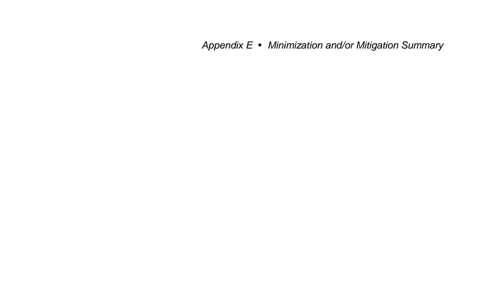

Page Intentionally Left Blank

Date: 12/9/2016

Date: 12/9/2016 Environmental Coordinator: Philip Vallejo Phone No: 559-445-6172

Phone No: 559-445-6172

#### ENVIRONMENTAL COMMITMENTS RECORD (ECR)

10-STA-132; 10-STA-99 PM 11.0/15.0; PM 15.7/17.5 EA 10-40350 ID 1000000424 SR 132 West Freeway/Expressway

| Task and Brief Description                                                                                                                                                                                                                                                                                                                                                                                                                                                                                                                                                                                                                                                                                                                                                                                                                                                                       | Responsible<br>Branch / Staff | Timing /<br>Phase | NSSP<br>Req. | Action Taken to<br>Comply with<br>Task | Task<br>Completed | Remarks | Environmental<br>Compliance |
|--------------------------------------------------------------------------------------------------------------------------------------------------------------------------------------------------------------------------------------------------------------------------------------------------------------------------------------------------------------------------------------------------------------------------------------------------------------------------------------------------------------------------------------------------------------------------------------------------------------------------------------------------------------------------------------------------------------------------------------------------------------------------------------------------------------------------------------------------------------------------------------------------|-------------------------------|-------------------|--------------|----------------------------------------|-------------------|---------|-----------------------------|
| Avoidance, Minimization, and/or Mitigation Measures                                                                                                                                                                                                                                                                                                                                                                                                                                                                                                                                                                                                                                                                                                                                                                                                                                              |                               |                   |              |                                        |                   |         |                             |
| FARM-1 The contractor would restrict all construction materials, tools, and vehicles within the right-of-way for the project.                                                                                                                                                                                                                                                                                                                                                                                                                                                                                                                                                                                                                                                                                                                                                                    |                               |                   |              |                                        |                   |         |                             |
| FARM-2 The contractor would re-construct irrigation ditches and install irrigation pipelines damaged during construction.                                                                                                                                                                                                                                                                                                                                                                                                                                                                                                                                                                                                                                                                                                                                                                        |                               |                   |              |                                        |                   |         |                             |
| FARM-3 During final design, the California Department of Transportation would coordinate with property owners and agricultural operators to incorporate design features to maintain property access and operation.                                                                                                                                                                                                                                                                                                                                                                                                                                                                                                                                                                                                                                                                               |                               |                   |              |                                        |                   |         |                             |
| FARM-4 The contractor would compensate for the loss or damage to crops resulting from construction activities.                                                                                                                                                                                                                                                                                                                                                                                                                                                                                                                                                                                                                                                                                                                                                                                   |                               |                   |              |                                        |                   |         |                             |
| Cl-1 For any person(s) whose real property interests may be impacted by the project, the acquisition of those property interests would comply fully with the Uniform Relocation Assistance and Real Property Acquisition Policies Act of 1970, as amended. The act is a federally mandated program that applies to all acquisitions of real property or displacements of persons resulting from federal or federally assisted programs or projects. It was created to provide for and ensure the fair and equitable treatment of all such persons (see Appendix D).                                                                                                                                                                                                                                                                                                                              |                               |                   |              |                                        |                   |         |                             |
| Also, the Fifth Amendment of the U.S. Constitution provides that private property may not be taken for a public use without payment of "just compensation." All impacted owners would be provided notification of the acquiring agency's intent to acquire an interest in their property, including a written offer letter of just compensation specifically describing those property interests. A right-of-way specialist would be assigned to each property owner to assist them with this process.                                                                                                                                                                                                                                                                                                                                                                                           |                               |                   |              |                                        |                   |         |                             |
| CI-2 All impacted owners would be provided notification of the acquiring agency's intent to acquire an interest in their property, including a written offer letter of just compensation specifically describing those property interests. A right-of-way specialist would be assigned to each property owner to assist them with this process.                                                                                                                                                                                                                                                                                                                                                                                                                                                                                                                                                  |                               |                   |              |                                        |                   |         |                             |
| CI-3 Caltrans would be responsible for assisting with relocations for individuals and businesses that are undergoing a difficult transition, consistent with the requirements of the Uniform Relocation Assistance and Real Property Acquisition Policies Act of 1970. Measures would be taken to ensure that nearby adequate, comparable housing for all displaced residents would be utilized before looking beyond the existing neighborhood.                                                                                                                                                                                                                                                                                                                                                                                                                                                 |                               |                   |              |                                        |                   |         |                             |
| Ct-4 The Project Engineer would ensure that design refinements are incorporated in the process to minimize impacts to existing land uses related to the temporary use and/or permanent acquisition of property.                                                                                                                                                                                                                                                                                                                                                                                                                                                                                                                                                                                                                                                                                  |                               |                   |              |                                        |                   |         |                             |
| CI-5 Prior to and during construction, the Project Engineer would ensure that the design refinements to minimize impacts to existing land uses related to temporary use and/or permanent acquisition of property are properly implemented by the contractor.                                                                                                                                                                                                                                                                                                                                                                                                                                                                                                                                                                                                                                     |                               |                   |              |                                        |                   |         |                             |
| VA-1 The City of Modesto street tree ordinance stipulates that trees removed within the City's right-of-way would be replaced in kind, if appropriate. The contractor would conform to local tree ordinances for construction projects. The ratios and location of replacement would be determined in coordination with the City of Modesto.                                                                                                                                                                                                                                                                                                                                                                                                                                                                                                                                                     |                               |                   |              |                                        |                   |         |                             |
| VA-2 Vegetation and trees removed by the contractor would be replaced in accordance with the California Department of Transportation's Project Development Procedures Manual, Chapter 29, which specifies policies for new highway planting, required mitigation planting, highway planting replacement, and highway planting revegetation. The policy specifies conditions under which planting is appropriate. Landscape policies developed as part of the Route 99 Corridor Enhancement Plan within Modesto dty limits would also be a guide for tree replacement and new highway planting. Replacement planting and new highway planting would occur as part of Phase 2. Contractor activities would include, but not be limited to, site grading and seeding, trimming trees and shrubs lightly damaged by construction, site clean-up, and replacement of trees, shrubs, and ground cover. |                               |                   |              |                                        |                   |         |                             |

| Task and Brief Description                                                                                                                                                                                                                                                                                                                                                                                                                                                                                                                                        | Responsible<br>Branch / Staff | Timing /<br>Phase | NSSP<br>Req. | Action Taken to<br>Comply with<br>Task | Task<br>Completed | Remarks | Environmental<br>Compliance |
|-------------------------------------------------------------------------------------------------------------------------------------------------------------------------------------------------------------------------------------------------------------------------------------------------------------------------------------------------------------------------------------------------------------------------------------------------------------------------------------------------------------------------------------------------------------------|-------------------------------|-------------------|--------------|----------------------------------------|-------------------|---------|-----------------------------|
| VA-3 To minimize glare from State Route 132 lighting, lamps that direct light toward the roadway would be used where required to minimize glare and light spillover.<br><br>Examples of these features include light shields or low level lighting to redirect light away from motorists, homes, businesses and the sky. If night-time construction is needed, causing a temporary degradation of visual quality, procedures would be taken to direct the light inward toward the construction site and minimize glare for motorists and residents near the site. |                               |                   |              |                                        |                   |         |                             |
| VA-4 The contractor would employ a common aesthetic theme to all proposed structures along the new alignment, as determined during final project design and in coordination with local stakeholders, to visually unify the highway's image with other Modesto structures (e.g., Needham Bridge and the proposed Pelandale Bridge) and to strengthen the landscape character of districts on either side of the highway.                                                                                                                                           |                               |                   |              |                                        |                   |         |                             |
| VA-5 The contractor would landscape the highway embankment to enhance homeowners' views of the proposed new alignment.                                                                                                                                                                                                                                                                                                                                                                                                                                            |                               |                   |              |                                        |                   |         |                             |
| VA-6 The contractor would replace trees near the relocated intersection of Kansas Avenue and North Dakota Avenue or modify intersection design to preserve trees in their current location.                                                                                                                                                                                                                                                                                                                                                                       |                               |                   |              |                                        |                   |         |                             |
| VA-7 The contractor would plant street trees at the property edge next to Elm Avenue and align the right-of-way fencing with the noise barriers, which would be set back from the property line.                                                                                                                                                                                                                                                                                                                                                                  |                               |                   |              |                                        |                   |         |                             |
| VA-8 The contractor would apply a corridor-wide aesthetic theme to proposed project elements (e.g., walls and structures), developed during final design, and implement a functional planting style that respects the visual context of the Agricultural Landscape Unit, which is characterized by orchards, crop fields, grass ditches, and farm Buildings.                                                                                                                                                                                                      |                               |                   |              |                                        |                   |         |                             |
| VA-9 The contractor would install roadway lighting features that direct light downward and away from adjacent residential properties or the night sky.                                                                                                                                                                                                                                                                                                                                                                                                            |                               |                   |              |                                        |                   |         |                             |
| VA-10 The contractor would direct light inward toward the construction site during nighttime construction.                                                                                                                                                                                                                                                                                                                                                                                                                                                        |                               |                   |              |                                        |                   |         |                             |
| HY-1 All drainage and hydrological improvements would be detailed in the project drainage plan, which would be approved prior to the start of project construction. The plan would include drainage features, where appropriate, such as new drainage inlets, gutters, roadside ditches, pump stations, storm drain pipes, and detention basins.                                                                                                                                                                                                                  |                               |                   |              |                                        |                   |         |                             |
| WQ-1 Because dewatering activities may be necessary, the Central Valley Regional Water Quality Control Board and Stanislaus County requirements for dewatering and discharge of non-stormwater would be followed.                                                                                                                                                                                                                                                                                                                                                 |                               |                   |              |                                        |                   |         |                             |
| WQ-2 The contractor would conduct groundwater and stormwater monitoring on and adjacent to the soil stockpiles until the proposed project is complete or the California Department of Toxic Substances Control and the Central Valley Regional Water Quality Control Board indicate that it is no longer necessary.                                                                                                                                                                                                                                               |                               |                   |              |                                        |                   |         |                             |
| PR-1 Special Provision 14-7.03 and 19-1.01A for paleontology mitigation would be included in the construction contract special provisions section to advise the construction contractor of the requirement to conduct paleontological salvage.                                                                                                                                                                                                                                                                                                                    |                               |                   |              |                                        |                   |         |                             |
| A qualified professional paleontologist would be retained to prepare and implement a final Paleontological Mitigation Plan prior to construction.                                                                                                                                                                                                                                                                                                                                                                                                                 |                               |                   |              |                                        |                   |         |                             |
| PR-2 The professional paleontologist would designate a paleontological monitor to be present during qualifying earthmoving activities, as described in the Paleontological Evaluation Report and Preliminary Paleontological Mitigation Plan.                                                                                                                                                                                                                                                                                                                     |                               |                   |              |                                        |                   |         |                             |
| PR-3 The professional paleontologist and paleontological monitor(s) would be notified by the Resident Engineer in advance of the start of construction activity and would attend any safety training programs for the proposed project.                                                                                                                                                                                                                                                                                                                           |                               |                   |              |                                        |                   |         |                             |
| PR-4 The full-time paleontological monitor would have at least 5 years of paleontological resources construction monitoring experience.                                                                                                                                                                                                                                                                                                                                                                                                                           |                               |                   |              |                                        |                   |         |                             |

#### Appendix E Minimization and/or Mitigation Summary

| Task and Brief Description                                                                                                                                                                                                                                                                                                                                                                                     | Responsible<br>Branch / Staff | Timing /<br>Phase | NSSP<br>Req. | Action Taken to<br>Comply with<br>Task | Task<br>Completed | Remarks | Environmental<br>Compliance |
|----------------------------------------------------------------------------------------------------------------------------------------------------------------------------------------------------------------------------------------------------------------------------------------------------------------------------------------------------------------------------------------------------------------|-------------------------------|-------------------|--------------|----------------------------------------|-------------------|---------|-----------------------------|
| PR-5 The proposed project paleontologist would meet with the Resident Engineer and construction contractor at a preconstruction meeting to develop an agreed-upon communication plan and provide for worker safety. All project personnel would receive a paleontological awareness training session prior to commencement of work.                                                                            |                               |                   |              |                                        |                   |         |                             |
| PR-6 If paleontological resources are discovered during earthmoving activities, the construction crew would immediately cease work within a 60-foot radius of the find, and immediately notify the Resident Engineer.                                                                                                                                                                                          |                               |                   |              |                                        |                   |         |                             |
| PR-7 For sediments containing microfossils (pollen, freshwater ostracods), the monitor would take bulk samples for off-site processing at a later time to recover any fossils.                                                                                                                                                                                                                                 |                               |                   |              |                                        |                   |         |                             |
| PR-8 Macro fossils (large enough to view with the unaided eye) could include tusks and other vertebrate remains. Some of these resources may be fragile and require hardening before moving, and may require encasing within a plaster jacket for later preparation and conservation in a laboratory.                                                                                                          |                               |                   |              |                                        |                   |         |                             |
| PR-9 Oriented samples must be preserved for paleomagnetic analysis. Samples of fine matrices would be obtained and stored for pollen analysis.                                                                                                                                                                                                                                                                 |                               |                   |              |                                        |                   |         |                             |
| PR-10 Recovered specimens would be prepared for identification (not exhibition) and stabilized.                                                                                                                                                                                                                                                                                                                |                               |                   |              |                                        |                   |         |                             |
| PR-11 Specimens would be identified by competent qualified specialists to a point of maximum specificity. Ideally, identification is of individual specimens to element, genus, and species.                                                                                                                                                                                                                   |                               |                   |              |                                        |                   |         |                             |
| PR-12 Where appropriate, specimens would be analyzed by stratigraphic occurrence, and by size, taxa, or taphonomic conditions. The results would be presented in a faunal list, a stratigraphic distribution of taxa, or evolutionary, ecological, or depositional deductions.                                                                                                                                 |                               |                   |              |                                        |                   |         |                             |
| PR-13 Adequate storage in a recognized repository institution for the recovered specimens would be required. Specimens would be cataloged and a complete list would be prepared of specimens introduced into the collections or a repository by the curator of the museum or university.                                                                                                                       |                               |                   |              |                                        |                   |         |                             |
| PR-14 In the event that paleontological resources are discovered, fossil specimens would be properly collected and sufficiently documented to be of scientific value.                                                                                                                                                                                                                                          |                               |                   |              |                                        |                   |         |                             |
| PR-15 A Paleontological Mitigation Report would be prepared by the project paleontologist, including a summary of the field and laboratory methods, site geology and stratigraphy, faunal list, and a brief statement of the significance and relationship of the site to similar fossil localities. Full copies of the final Paleontological Mitigation Report are deposited with the repository institution. |                               |                   |              |                                        |                   |         |                             |
| HAZ-1 As soon as access is acquired, but prior to construction, any Building structures that would be renovated or demolished would be investigated for asbestos, lead-based paint, and polychlorinated biphenyls by a certified consultant.                                                                                                                                                                   |                               |                   |              |                                        |                   |         |                             |
| HAZ-2 if analytical results indicate Building materials contain asbestos, the contractor would prepare an Asbestos Operations and Maintenance Plan in accordance with applicable regulations. The plan would address worker training and safety measures to be taken when disturbing asbestos-containing materials during abatement activities.                                                                |                               |                   |              |                                        |                   |         |                             |
| HAZ-3 The contractor would ensure that proper removal and disposal of asbestos-containing material is conducted by a licensed contractor registered with the California Occupational Safety and Health Administration for asbestos-related work, or by a licensed and certified asbestos abatement contractor.                                                                                                 |                               |                   |              |                                        |                   |         |                             |
| HAZ-4 If the analytical results indicate that lead-based paint and/or polychlorinated biphenyls are present, the contractor would ensure that demolition materials are handed and disposed of in accordance with applicable regulations.                                                                                                                                                                       |                               |                   |              |                                        |                   |         |                             |

| Task and Brief Description                                                                                                                                                                                                                                                                                                                                                                                                                                                                                                                                                                    | Responsible Branch / Staff | Timing / Phase | NSSP Req. | Action Taken to Comply with Task | Task Completed | Remarks | Environmental Compliance |
|-----------------------------------------------------------------------------------------------------------------------------------------------------------------------------------------------------------------------------------------------------------------------------------------------------------------------------------------------------------------------------------------------------------------------------------------------------------------------------------------------------------------------------------------------------------------------------------------------|----------------------------|----------------|-----------|----------------------------------|----------------|---------|--------------------------|
| HAZ-5 Prior to construction, the contractor would prepare a Materials Management Plan that identifies potential recognized environmental conditions, locations, extent of impact, proposed remediation work, waste management procedures, and avoidance measures, investigation measures and a contingency plan for addressing unforeseen conditions. Documentation of completed waste profiles, manifest forms, and bill-of-lading forms for proper transportation and disposal of materials offsite would be maintained by the contractor. The plan would include the following provisions: |                            |                |           |                                  |                |         |                          |
| Characterization and handling of contaminated soils requiring offsite disposal                                                                                                                                                                                                                                                                                                                                                                                                                                                                                                                |                            |                |           |                                  |                |         |                          |
| Soils to be stockpiled for further characterization                                                                                                                                                                                                                                                                                                                                                                                                                                                                                                                                           |                            |                |           |                                  |                |         |                          |
| Process for identifying soils with waste concentrations below regulatory thresholds that can be reused without restriction                                                                                                                                                                                                                                                                                                                                                                                                                                                                    |                            |                |           |                                  |                |         |                          |
| Process for identifying and handling wastewater requiring offsite disposal and/or treatment                                                                                                                                                                                                                                                                                                                                                                                                                                                                                                   |                            |                |           |                                  |                |         |                          |
| Procedures for handling asbestos-containing material discovered during construction activities                                                                                                                                                                                                                                                                                                                                                                                                                                                                                                |                            |                |           |                                  |                |         |                          |
| HAZ-6 Prior to initiating construction activities, the contractor would prepare a site-specific Health and Safety Plan that identifies key personnel and provides a summary risk assessment for workers, the community, and the environment. The Health and Safety Plan would include an Air Monitoring Plan and Emergency Response Plan.                                                                                                                                                                                                                                                     |                            |                |           |                                  |                |         |                          |
| HAZ-7 Prior to construction, the contractor would prepare a Sampling and Analysis Plan to identify and characterize potential recognized environmental conditions that may be encountered. The plan would provide for monitoring/screening during construction activities to provide safety controls in areas previously not identified. The plan would include:                                                                                                                                                                                                                              |                            |                |           |                                  |                |         |                          |
| Data quality objectives                                                                                                                                                                                                                                                                                                                                                                                                                                                                                                                                                                       |                            |                |           |                                  |                |         |                          |
| Sample collection procedures (e.g., field screening, borehole drilling/abatement, monitoring well construction, soil, groundwater, and decontamination)                                                                                                                                                                                                                                                                                                                                                                                                                                       |                            |                |           |                                  |                |         |                          |
| Quality control                                                                                                                                                                                                                                                                                                                                                                                                                                                                                                                                                                               |                            |                |           |                                  |                |         |                          |
| Quality assurance objectives (data)                                                                                                                                                                                                                                                                                                                                                                                                                                                                                                                                                           |                            |                |           |                                  |                |         |                          |
| HAZ-8 Prior to construction, the contractor would prepare a Spill Prevention Control and Countermeasures Plan to ensure that construction best management practices are adequate for site conditions and to prevent discharge of any sediment or pollutants into any storm drains, receiving waters, or drywells.                                                                                                                                                                                                                                                                             |                            |                |           |                                  |                |         |                          |
| HAZ-9 Prior to construction, the contractor would inspect all utility pole-mounted and pad-mounted electrical transformers within the project limits for leaks. Leaking transformers would be considered a potential polychrorinated biphenyl hazard (unless tested) and would be handled in accordance with applicable laws and regulations.                                                                                                                                                                                                                                                 |                            |                |           |                                  |                |         |                          |
| HAZ-10 The contractor would ensure that all wooden utility poles that are to be removed or relocated as part of the project, as well as the soils at the bases of the utility poles (unless documentation from the utility company indicates that creosote was not used), would be handled as treated wood waste in accordance with the California Department of Transportation's Standard Special Provision 14-010.                                                                                                                                                                          |                            |                |           |                                  |                |         |                          |
| HAZ-11 Before construction, the contractor would notify all utility companies to ensure that the locations of underground transmission lines and facilities are marked. In addition, Underground Service Alert would be contacted at least two working days before subsurface excavation.                                                                                                                                                                                                                                                                                                     |                            |                |           |                                  |                |         |                          |
| HAZ-12 The contractor would adhere to the requirements of San Joaquin Valley Air Pollution Control District and applicable National Emission Standards for Hazardous Air Pollutants during demolition/renovation activities. Any demolition or renovation of a Building structure would require notification and submittal fees to the San Joaquin Valley Air Pollution Control District at least 10 days before proceeding with the demolition work.                                                                                                                                         |                            |                |           |                                  |                |         |                          |

| Task and Brief Description                                                                                                                                                                                                                                                                                                                                                                                                                                                                                                                                                                                                                                                                                                                                                                                                                                                                                                                                                                                                                                                                                                                                                                                                                                                                                                                                                                                 | Responsible<br>Branch / Staff | Timing /<br>Phase | NSSP<br>Req. | Action Taken to<br>Comply with<br>Task | Task<br>Completed | Remarks | Environmental<br>Compliance |
|------------------------------------------------------------------------------------------------------------------------------------------------------------------------------------------------------------------------------------------------------------------------------------------------------------------------------------------------------------------------------------------------------------------------------------------------------------------------------------------------------------------------------------------------------------------------------------------------------------------------------------------------------------------------------------------------------------------------------------------------------------------------------------------------------------------------------------------------------------------------------------------------------------------------------------------------------------------------------------------------------------------------------------------------------------------------------------------------------------------------------------------------------------------------------------------------------------------------------------------------------------------------------------------------------------------------------------------------------------------------------------------------------------|-------------------------------|-------------------|--------------|----------------------------------------|-------------------|---------|-----------------------------|
| HAZ-13 The contractor would adhere to the procedures outlined in the California Department of Transportation's Unknown Hazards Procedures for Construction in the event that unknown hazardous contamination from above/below ground oil/motor vehicle fuel tanks and septic tanks is revealed or unknown hazardous waste/material is encountered during construction.                                                                                                                                                                                                                                                                                                                                                                                                                                                                                                                                                                                                                                                                                                                                                                                                                                                                                                                                                                                                                                     |                               |                   |              |                                        |                   |         |                             |
| HAZ-14 The contractor would prepare a Lead Compliance Plan to prevent or minimize worker exposure to lead from handling material containing serially deposited lead (California Code of Regulations, Title 8, and Section 1532.1). The plan would also be required for work performed on painted structures. The contractor would prepare a written, project-specific Excavation and Transportation Plan establishing procedures the contractor would use for excavating, stockpiling, transporting, and placing (or disposing) of material containing serially deposited lead and lead-based paint. The plan would conform to the California Department of Toxic Substances Control and California Occupational Safety and Health Administration regulations. For samples where lead levels exceed hazardous waste criteria, the excavated soil would be either managed or disposed of as a California hazardous waste or stockpiled and re-sampled to confirm waste classification and potential to recycle soil onsite. The appropriate Standard Special Provision would be included in the Plans, Specifications, and Estimate. Special handling, treatment, or disposal of serially deposited lead in soils during construction activities would be consistent with the July 1, 2016, Aerially Deposited Lead Agreement between California and the California Department of Toxic Substances Control. |                               |                   |              |                                        |                   |         |                             |
| SHAZ-1 Prior to any earthmoving or construction activities related to the soil stockpiles, a grading permit from the City of Modesto would be secured by the construction contractor. Additionally, prior to any earthmoving or construction activities related to the soil stockpiles, a Health and Safety Plan that addresses all hazards associated with the movement and disposition of stockpile soil to be included in the containment features would also be prepared by the construction contractor. The hazards associated with the movement and disposition of stockpile soil to be included in the Health and Safety Plan would be identified in the Remedial Design Implementation Plan that would be submitted to the California Department of Toxic Substances Control and the Regional Water Quality Control Board for review and approval. As described in Section 2.2.6, Air Quality, the contractor would comply with the San Joaquin Valley Air Pollution Control District Rule 9510. As described in Section 2.2.2, Water Quality, the contractor would prepare and implement construction site best management practices in accordance with the California Department of Transportation's Stormwater Management Plan and National Pollutant Discharge Elimination System Permit (Order No. 99-06-DWQ National Pollutant Discharge Elimination System Permit No. CAS000003).           |                               |                   |              |                                        |                   |         |                             |
| SHAZ-2 The contractor would remove all debris on or adjacent to the soil stockpiles prior to grading. The contractor would dispose of it accordance with regulations pertaining to the type of waste encountered.                                                                                                                                                                                                                                                                                                                                                                                                                                                                                                                                                                                                                                                                                                                                                                                                                                                                                                                                                                                                                                                                                                                                                                                          |                               |                   |              |                                        |                   |         |                             |
| SHAZ-3 If any vegetation grubbing is required, the contractor would minimize dust generation consistent with standard best management practices described in Section 2.2.6, Air Quality. The contractor would implement the California Department of Transportation's Standard Specifications control measures Section 14-9.02 (Air Pollution Control) and Section 14-9.03 (Dust Control). The contractor would apply water under Section 17 and dust palliative under Section 18.                                                                                                                                                                                                                                                                                                                                                                                                                                                                                                                                                                                                                                                                                                                                                                                                                                                                                                                         |                               |                   |              |                                        |                   |         |                             |
| SHAZ-4 The contractor would minimize reconfiguration of the soil stockpiles to the minimum extent possible to meet project design criteria for fill placement, thereby reducing the potential for stormwater and/or wind erosion and stormwater infiltration into the soil stockpiles.                                                                                                                                                                                                                                                                                                                                                                                                                                                                                                                                                                                                                                                                                                                                                                                                                                                                                                                                                                                                                                                                                                                     |                               |                   |              |                                        |                   |         |                             |
| SHAZ-5 Perimeter air quality monitoring would occur during any earthmoving or construction activities related to the soil stockpiles, including clearing and grubbing or other site grading activities performed by the construction contractor. Perimeter air quality monitoring would occur according to an Air Monitoring Plan that would describe monitoring locations, equipment, sampling and analysis methods, hazardous exposure threshold values, etc. All elements of the Air Monitoring Plan would be identified in the Remedial Design Implementation Plan that would be submitted to the California Department of Toxic Substances Control and the Regional Water Quality Control Board for review and approval. The contractor would provide monitoring results to the California Department of Toxic Substances Control for its review and approval. If the results of air monitoring demonstrate that dust control measures are effective and that there is no exposure to constituents of potential concern in the soil stockpiles via airborne dust, then the frequency of monitoring may be decreased with the California Department of Toxic Substances Control's approval.                                                                                                                                                                                                            |                               |                   |              |                                        |                   |         |                             |
| SHAZ-6 The contractor would submit requests to the California Department of Toxic Substances Control for approval prior to modifying procedures for soil excavation, relocation, dust control, air monitoring, or other field activities.                                                                                                                                                                                                                                                                                                                                                                                                                                                                                                                                                                                                                                                                                                                                                                                                                                                                                                                                                                                                                                                                                                                                                                  |                               |                   |              |                                        |                   |         |                             |

| Task and Brief Description                                                                                                                                                                                                                                                                                                                                                                                                                                                                                                                                                                                                                                                                                                                                                                                                                                                                                                                                                                                                                                                                                                                                                                                                                                                                                                                                                                                     | Responsible<br>Branch / Staff | Timing /<br>Phase | NSSP<br>Req. | Action Taken to<br>Comply with<br>Task | Task<br>Completed | Remarks | Environmental<br>Compliance |
|----------------------------------------------------------------------------------------------------------------------------------------------------------------------------------------------------------------------------------------------------------------------------------------------------------------------------------------------------------------------------------------------------------------------------------------------------------------------------------------------------------------------------------------------------------------------------------------------------------------------------------------------------------------------------------------------------------------------------------------------------------------------------------------------------------------------------------------------------------------------------------------------------------------------------------------------------------------------------------------------------------------------------------------------------------------------------------------------------------------------------------------------------------------------------------------------------------------------------------------------------------------------------------------------------------------------------------------------------------------------------------------------------------------|-------------------------------|-------------------|--------------|----------------------------------------|-------------------|---------|-----------------------------|
| SHAZ-7 The contractor would maintain detailed records related to movement, placement, and inspection of the stockpile soil.                                                                                                                                                                                                                                                                                                                                                                                                                                                                                                                                                                                                                                                                                                                                                                                                                                                                                                                                                                                                                                                                                                                                                                                                                                                                                    |                               |                   |              |                                        |                   |         |                             |
| SHAZ-8 As required by California Code of Regulations, Title 22, section 67391.1, the California Department of Transportation would prepare and record a land use covenant to restrict the types of land use that are allowed on the site. The land use covenant would identify that the proposed transportation land use is compatible and acceptable with respect to health risk. The land use covenant would be prepared in compliance with California Department of Toxic Substances Control policies and finalized and recorded after remedial measures are implemented and before the soil stockpile site is certified by the California Department of Toxic Substances Control as remediated.                                                                                                                                                                                                                                                                                                                                                                                                                                                                                                                                                                                                                                                                                                            |                               |                   |              |                                        |                   |         |                             |
| SHAZ-9 A groundwater and storm water quality monitoring program for the contained Caltrans Modesto Soil Stockpiles would be proposed and included in the Remedial Design Implementation Plan to be submitted to the California Department of Toxic Substances Control and the Regional Water Quality Control Board for review and approval. In addition to design specifications for construction of the containment features, the Remedial Design Implementation Plan would address water quality monitoring from the initial and final construction phases of the project. Until the groundwater and surface water quality monitoring program is approved, or if the no-Build alternative is selected, groundwater and storm water quality monitoring would continue as currently conducted in accordance with the 2006 and 2012 (amendment) sampling and analysis plans approved by the California Department of Toxic Substances Control and the Regional Water Quality Control Board.                                                                                                                                                                                                                                                                                                                                                                                                                     |                               |                   |              |                                        |                   |         |                             |
| SHAZ-10 The functionality and condition of each stockpile containment feature (pavement, retaining walls, abutments, vegetated soil cover, etc.) would be evaluated in accordance with an operation and maintenance plan established in accordance with an operation and maintenance agreement between the California Department of Transportation and the California Department of Toxic Substances Control and the California Regional Water Quality Control Board. The proposed operation and maintenance agreement would be included in the Remedial Design Implementation Plan that would be submitted to the California Department of Toxic Substances Control and the Regional Water Quality Control Board for review and approval. The operation and maintenance plan would address containment feature assessment, management, and reporting to ensure the ongoing integrity of the containment feature for the protection of human health and the environment. The operation and maintenance plan would address containment feature assessment for the initial and final construction phases of the project. If the no-Build alternative is selected, a separate California-initiated stockpile remediation project would be proposed and remedy selection document prepared under the oversight the California Department of Toxic Substances Control and the Regional Water Quality Control Board. |                               |                   |              |                                        |                   |         |                             |
| WET-1 Caltrans will consult with the Central Valley Regional Water Quality Board during the final design and permitting phase. If the seasonal wetland features are determined to be waters of the State, Caltrans will mitigate for their discharge and fill as directed by the Central Valley Regional Water Quality Board under the Porter Cologne Water Quality Control Act.                                                                                                                                                                                                                                                                                                                                                                                                                                                                                                                                                                                                                                                                                                                                                                                                                                                                                                                                                                                                                               |                               |                   |              |                                        |                   |         |                             |
| AS-1 Burrowing owl surveys would be conducted following the guidelines outlined in the California Department of Fish and Wildlife's 2012 Staff Report on Burrowing Owl Mitigation during the year prior to the initiation of construction. If burrowing owls are detected within the biological study area, the California Department of Fish and Wildlife would be consulted to determine specific avoidance and minimization measures appropriate for the site. Likely avoidance and minimization measures may include preconstruction surveys prior to ground disturbance, establishment of no-work buffer, and/or having a qualified biologist present to monitor an active nest during construction activities to ensure that no interference with the burrowing owl breeding activities would occur. Additional avoidance and minimization for permanent impacts to burrowing owl habitat could also include the preservation of surrounding foraging habitat, passive relocations, and off-site mitigation. Mitigation of nesting burrows and associated burrowing owl habitat may involve purchasing mitigation lands adjacent to the project or purchasing burrowing owl mitigation credits at an approved conservation bank in the region.                                                                                                                                                           |                               |                   |              |                                        |                   |         |                             |
| AS-2 Shrub and tree trimming and/or tree removal for the proposed project would be conducted outside the nesting season (generally between February 1 and August 31). If shrub and tree removal is scheduled to occur during the nesting season, a qualified wildlife biologist, familiar with the species and habitats in the study area, would conduct preconstruction surveys for nesting birds within suitable nesting habitat in the study area as described in AS-3.                                                                                                                                                                                                                                                                                                                                                                                                                                                                                                                                                                                                                                                                                                                                                                                                                                                                                                                                     |                               |                   |              |                                        |                   |         |                             |
| AS-3 Nesting bird surveys would be conducted prior to initiation of construction activities. If no active nests are detected during surveys, construction may proceed. If active nests are detected, then AS-4 would be implemented.                                                                                                                                                                                                                                                                                                                                                                                                                                                                                                                                                                                                                                                                                                                                                                                                                                                                                                                                                                                                                                                                                                                                                                           |                               |                   |              |                                        |                   |         |                             |

#### Appendix E Minimization and/or Mitigation Summary

| Task and Brief Description                                                                                                                                                                                                                                                                                                                                                                                                                                                                                                                                                                                                                                                                                                                                                                                                                                             | Responsible<br>Branch / Staff | Timing /<br>Phase | NSSP<br>Req. | Action Taken to<br>Comply with<br>Task | Task<br>Completed | Remarks | Environmental<br>Compliance |
|------------------------------------------------------------------------------------------------------------------------------------------------------------------------------------------------------------------------------------------------------------------------------------------------------------------------------------------------------------------------------------------------------------------------------------------------------------------------------------------------------------------------------------------------------------------------------------------------------------------------------------------------------------------------------------------------------------------------------------------------------------------------------------------------------------------------------------------------------------------------|-------------------------------|-------------------|--------------|----------------------------------------|-------------------|---------|-----------------------------|
| AS-4 A no-work buffer would be established around nests identified during preconstruction surveys. A 100-ft buffer would be established for migratory birds and a 300-ft buffer would be established for most raptors. In the case of burrowing owl nests and Swainson's hawk see AS-1 and TES-1 respectively. The extent of the no-work buffers would be determined by a wildlife biologist in consultation with California Department of Fish and Wildlife and would depend on the level of noise or construction disturbance, line of sight between the nest and the disturbance, ambient levels of noise and other disturbances, and other topographic or artificial barriers. The purpose of the buffer is to avoid disturbance or destruction of the nest until after the breeding season, or until a wildlife biologist determines that the young have fledged. |                               |                   |              |                                        |                   |         |                             |
| AS-6 The City of Modesto Street Tree Ordinance stipulates that trees removed within the City's right-of-way would be replaced in kind if appropriate. Contractor work would conform to local tree ordinances for construction projects. The ratios and location of replacement would be determined in coordination with the City of Modesto. The specific replacement would be determined during the permit review process.                                                                                                                                                                                                                                                                                                                                                                                                                                            |                               |                   |              |                                        |                   |         |                             |
| TES-1 Protocol-level surveys will be conducted within a 0.5-mile radius around the biological study area preceding the initiation of construction and would follow the Swainson's Hawk Technical Advisory Committee's 2000 Recommended Timing and Methodology for Swainson's Hawk Nesting Surveys in California's Central Valley. If an active Swainson's hawk nest is detected, minimization efforts would be coordinated with the California Department of Fish and Wildlife. Potential minimization measures would include establishing a 600 foot no-work buffer zone around an active nest, and/or having a qualified biologist present to monitor an active nest during construction activities to ensure that no interference with the hawks breeding activities would occur.                                                                                   |                               |                   |              |                                        |                   |         |                             |
| IS-1 To minimize the risk of introducing additional non-native species into the area, weed-free erosion control applications would be used. No dry-farmed straw would be used, and certified weed-free straw would be required where erosion control straw is to be used. In addition, hydro-seed mulch or any other erosion control application must also be certified weed-free. Any revegetation seed mix to be used would also be certified weed-free and contain native species appropriate for the project area.                                                                                                                                                                                                                                                                                                                                                 |                               |                   |              |                                        |                   |         |                             |
| IS-2 All off-road construction equipment would be inspected and cleaned of potential noxious weed sources (e.g., mud and vegetation) before entry into the project area to prevent noxious weed introduction. The contractor would employ cleaning methods (typically with the use of a high-pressure water hose) to ensure that equipment is free of noxious weeds.                                                                                                                                                                                                                                                                                                                                                                                                                                                                                                   |                               |                   |              |                                        |                   |         |                             |

Appendix E • Minimization and/or Mitigation Summary

Page Intentionally Left Blank

# **Appendix F** Cross-Sections and Engineering Drawings


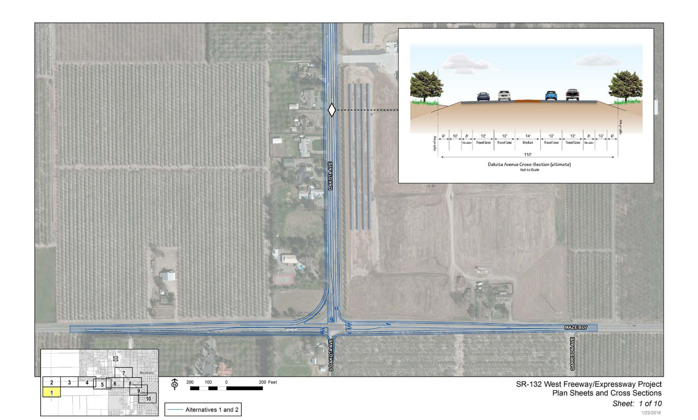

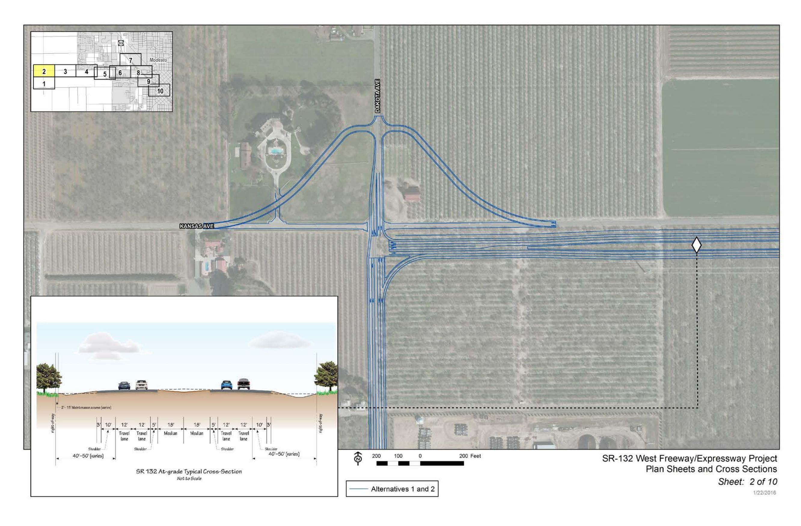

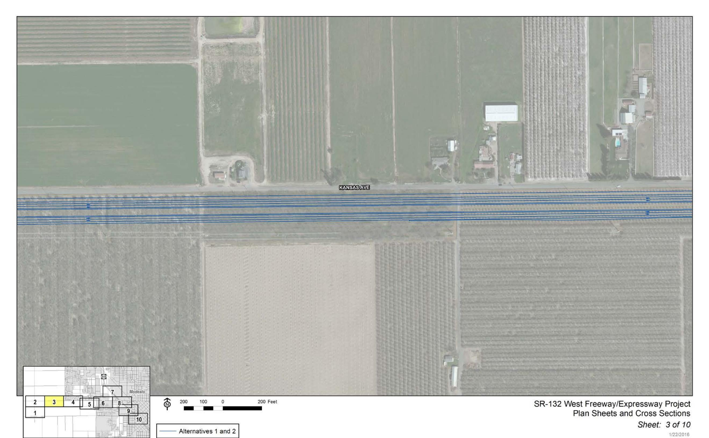

1/24

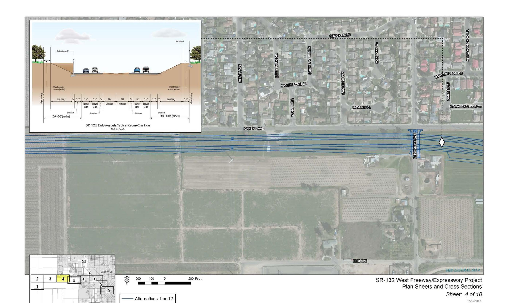

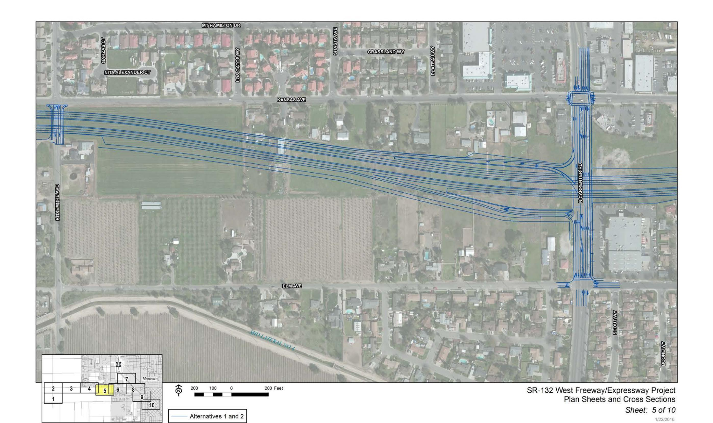

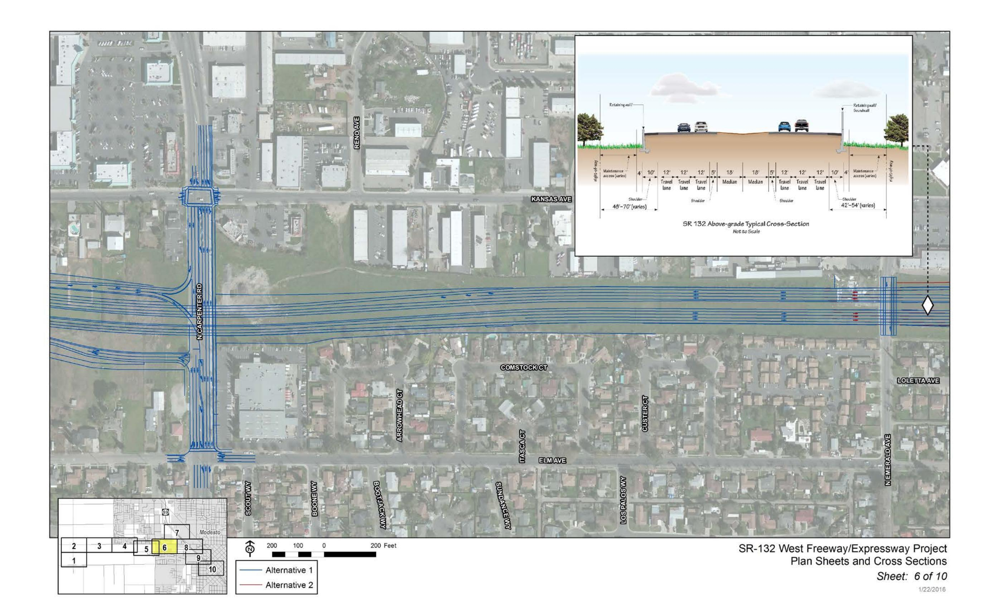

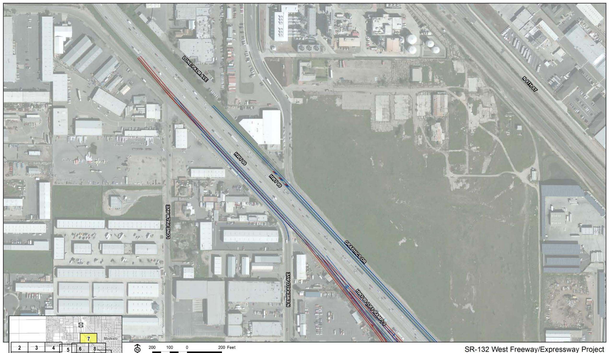

SR-132 West Freeway/Expressway Project Plan Sheets and Cross Sections

Sheet: 7 of 10 1/22/2016

Alternative 1

Alternative 2

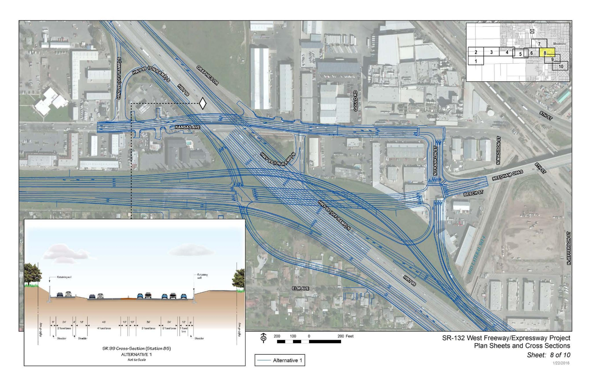

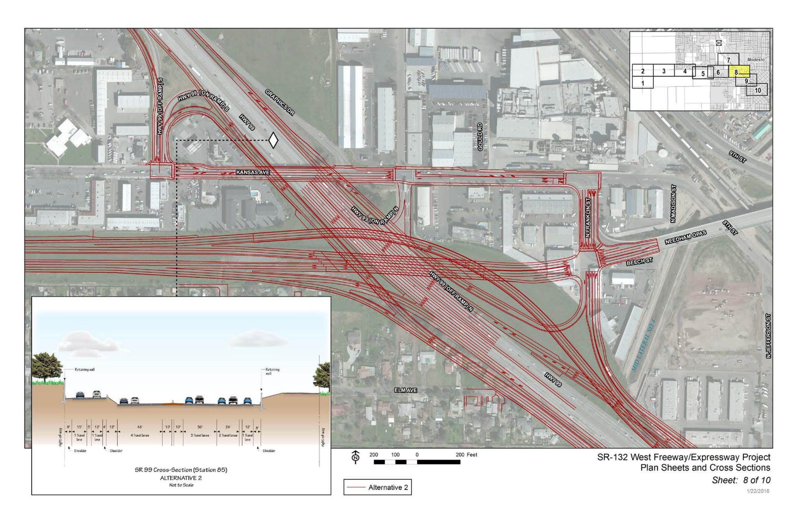

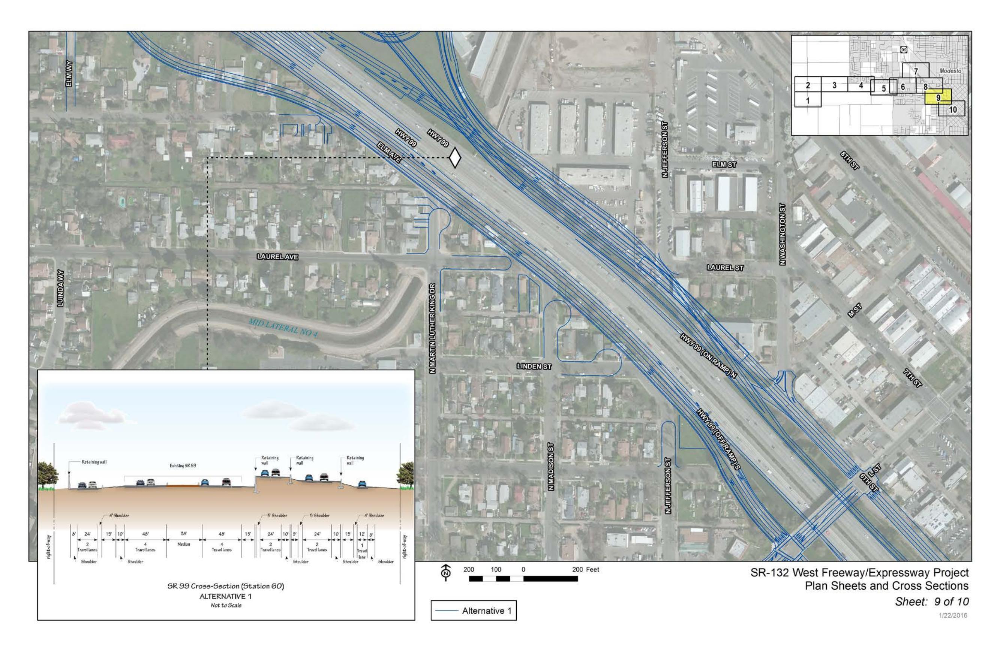

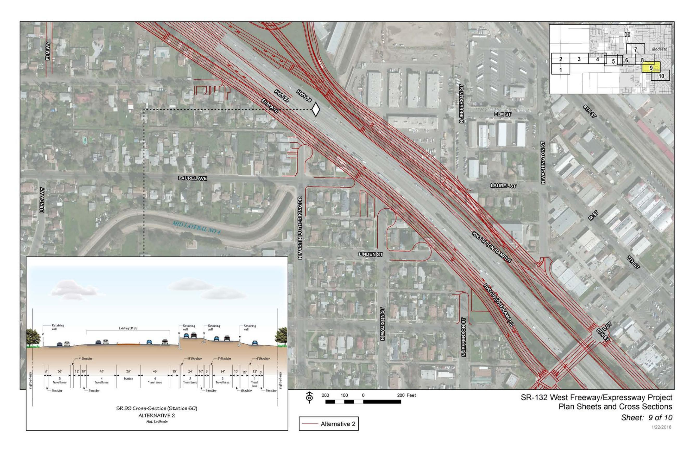

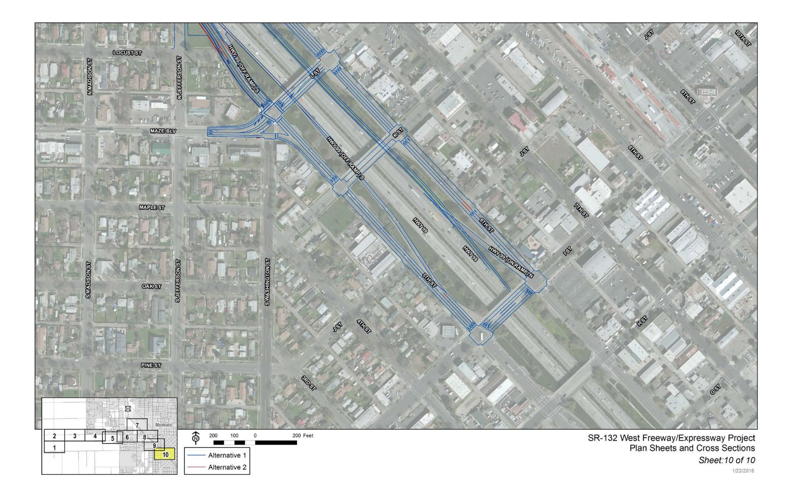

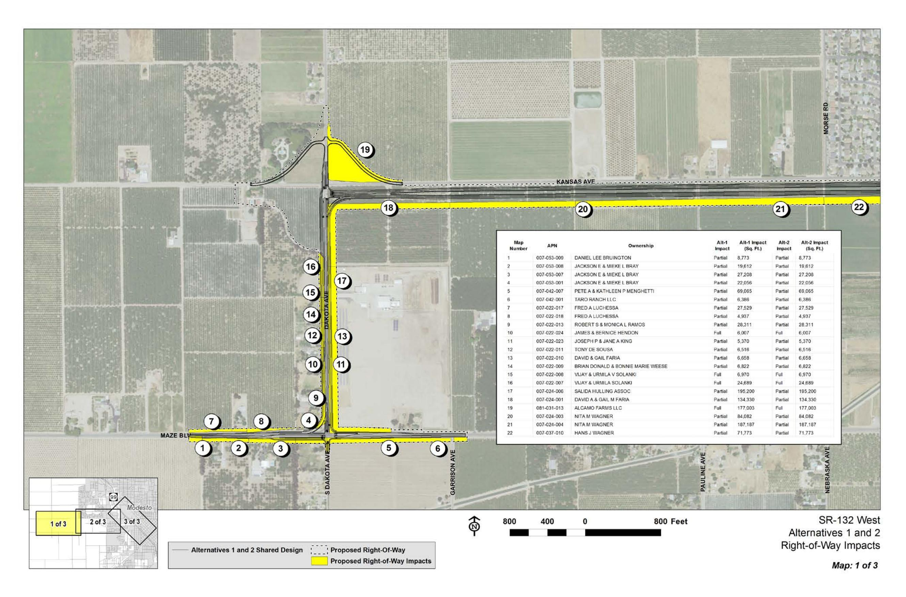

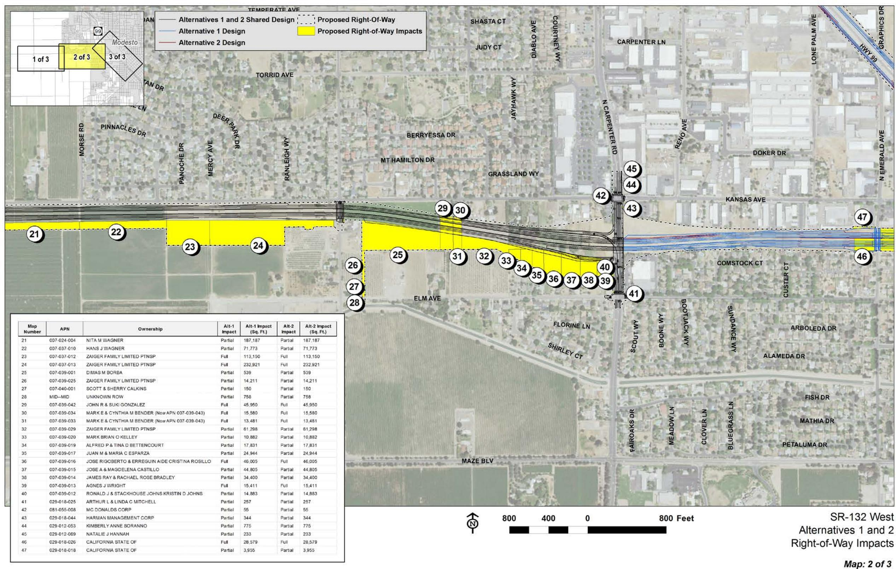

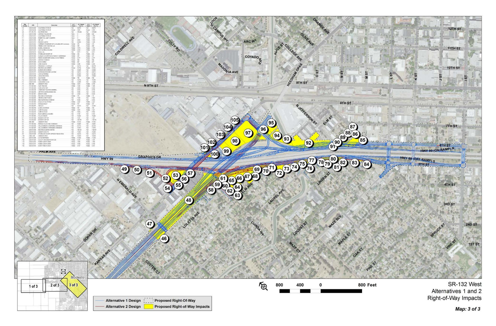

Page Intentionally Left Blank