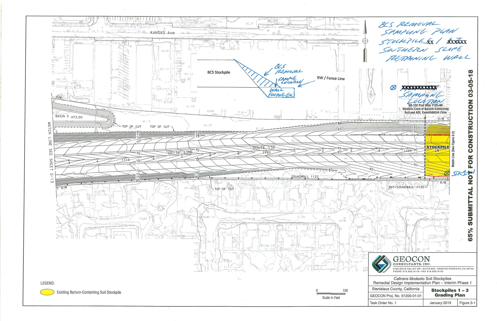
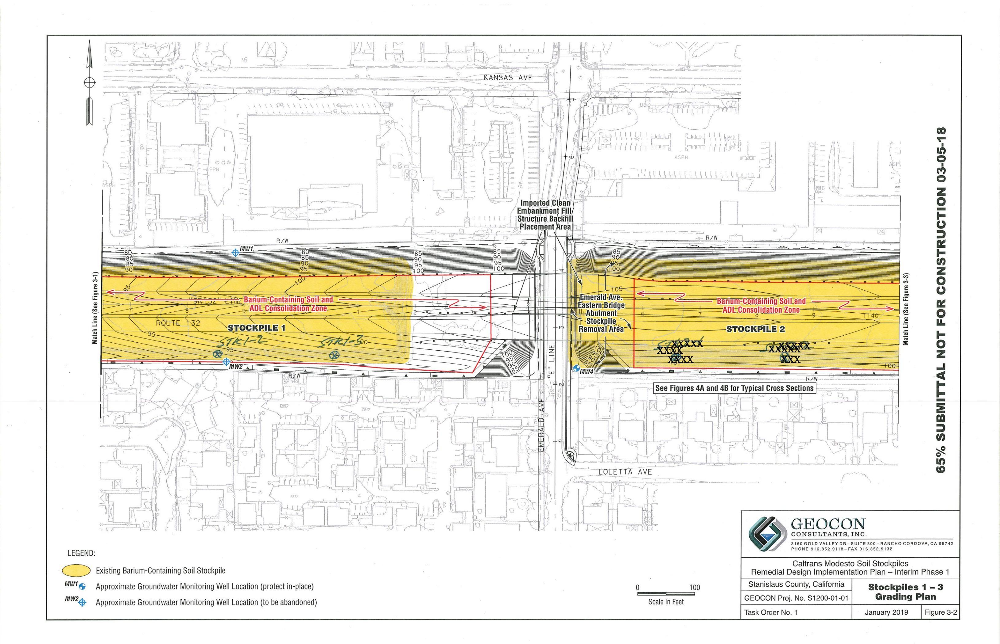

# **Technical Memorandum**

Date: April 6, 2020

To: Rick Demi, PE, Construction Manager

WSP/City of Modesto

From: John E. Juhrend, PE, CEG, Project Manager, Geocon

Subject: Stockpile 1 MSE Wall Footing Excavation Characterization Testing

State Route 132 Project, Modesto, California

This Technical Memorandum presents a summary of mechanically stabilized earth (MSE) wall footing excavation characterization testing performed following completed removal of barium containing soil (BCS) along the Stockpile 1 southerly slope within the State Route 132 right-of-way (see attached plan sheets). Stockpile 1 southerly slope BCS material was excavated and transported for placement as embankment fill within the designated Stockpile 1 fill containment zone.

We collected soil samples within the mid-point of the wall footing excavation in trenches STK1-1, STK1-2 and STK1-3 spaced at approximate 200-foot intervals. Discrete soil samples were collected from one-foot intervals to the maximum planned wall footing excavation depth of 5 feet. The soil samples were transported to Advanced Technology Laboratories (ATL) under chain of custody protocol. Each soil sample was analyzed for barium and lead following Environmental Protection Agency Test Method 6010B under expediated 24-hour turn-around time. The approximate soil sample locations are depicted on the attached plan sheets. A summary of the soil sample analytical data is on Table 1. A copy of the ATL laboratory report is attached.

Barium was detected in each of the 15 soil samples analyzed at concentrations ranging from 42 to 420 milligrams per kilogram (mg/kg), greater than the maximum site specific background value of 120 mg/kg, but less than the Remedial Design Implementation Plan (RDIP) removal threshold of 1,000 mg/kg based on groundwater quality protection. The calculated 95% upper confidence limit (UCL) and mean of the entire barium data set are 171.9 and 128.3 mg/kg, respectively (statistical summary attached). The San Francisco Bay Regional Water Quality Control Board's Environmental Screening Levels (ESLs) for barium are 3,000 mg/kg for construction workers, 15,000 mg/kg for residential land use, and 220,000 mg/kg for commercial land use.

Lead was detected in 14 of 15 soil samples analyzed at concentrations ranging from 1.1 to 6.7 mg/kg, within the range of the maximum site-specific background concentration of 3.8 mg/kg, and less than the RDIP removal threshold of 80 mg/kg based on residential land use.

Based on the data presented herein, the Stockpile 1 MSE wall footing material excavated along the southerly boundary of Stockpile 1 should be suitable for placement within the Stockpiles 1 and 2 fill containment zones, as general bridge embankment fill at the east end of Stockpile 1 and/or ends of Stockpile 2, or as Stockpile 1 and 2 capping material pending regulatory agency approval. This information will be included in the Removal Action Completion Report to be submitted following completion of the Stockpile 1 and 2 clean fill capping activities.

TABLE 1
SUMMARY OF STOCKPILE 1 MSE WALL FOOTING SOIL ANALYTICAL RESULTS - BARIUM AND LEAD
STATE ROUTE 132 CALTRANS MODESTO SOIL STOCKPILES
STANISLAUS COUNTY, CALIFORNIA

| SAMPLE ID                          | TOTAL BARIUM (mg/kg) | TOTAL LEAD (mg/kg) |
|------------------------------------|-------------------------|-----------------------|
| STK1-1-0                           | 95                      | 3.7                   |
| STK1-1-1                           | 83                      | 3.1                   |
| STK1-1-2                           | 80                      | 2.6                   |
| STK1-1-3                           | 130                     | 2.2                   |
| STK1-1-4                           | 42                      | <1.0                  |
| STK1-2-0                           | 240                     | 6.6                   |
| STK1-2-1                           | 140                     | 3.9                   |
| STK1-2-2                           | 97                      | 3.3                   |
| STK1-2-3                           | 81                      | 3                     |
| STK1-2-4                           | 75                      | 1.8                   |
| STK1-3-0                           | 420                     | 6.7                   |
| STK1-3-1                           | 120                     | 3.3                   |
| STK1-3-2                           | 130                     | 3.4                   |
| STK1-3-3                           | 120                     | 1.1                   |
| STK1-3-4                           | 71                      | 1.2                   |
| 95% UCL /Mean for all Data         | 171.9/128.3             | ---                   |
| Maximum Site-Specific Background   | 120                     | 3.8                   |
| BCS Removal Verification Threshold | 1,000                   | 80                    |

## Notes:

 $mg/kg = milligrams \ per \ kilogram$ 

< = less than reporting limit

--- = not calculated

BCS = barium containing soil

ELAP No.: 1838

CSDLAC No.: 10196 ORELAP No.: CA300003

April 06, 2020

John Juhrend Geocon Consultants, Inc. 3160 Gold Valley Drive, Suite 800 Rancho Cordova, CA 95742

Tel: (916) 508-1911 Fax:(916) 852-9132

Re: ATL Work Order Number: 2000840

Client Reference: SR132 Stockpile, S1908-01-01

Enclosed are the results for sample(s) received on April 03, 2020 by Advanced Technology Laboratories. The sample(s) are tested for the parameters as indicated on the enclosed chain of custody in accordance with applicable laboratory certifications. The laboratory results contained in this report specifically pertains to the sample(s) submitted.

Thank you for the opportunity to serve the needs of your company. If you have any questions, please feel free to contact me or your Project Manager.

Sincerely,

Dr. Reza Karimi

Laboratory Director

The cover letter and the case narrative are an integral part of this analytical report and its absence renders the report invalid. Test results contained within this data package meet the requirements of applicable state-specific certification programs. The report cannot be reproduced without written permission from the client and Advanced Technology Laboratories.

Geocon Consultants, Inc. Project Number: SR132 Stockpile, S1908-01-01

3160 Gold Valley Drive, Suite 800 Report To: John Juhrend Rancho Cordova, CA 95742 Reported: 04/06/2020

## **SUMMARY OF SAMPLES**

| Sample ID | Laboratory ID | Matrix | Date Sampled  | Date Received |
|-----------|---------------|--------|---------------|---------------|
| STKI-1-0  | 2000840-01    | Soil   | 4/02/20 11:31 | 4/03/20 6:56  |
| STKI-1-1  | 2000840-02    | Soil   | 4/02/20 11:30 | 4/03/20 6:56  |
| STKI-1-2  | 2000840-03    | Soil   | 4/02/20 11:29 | 4/03/20 6:56  |
| STKI-1-3  | 2000840-04    | Soil   | 4/02/20 11:28 | 4/03/20 6:56  |
| STKI-1-4  | 2000840-05    | Soil   | 4/02/20 11:27 | 4/03/20 6:56  |
| STKI-2-0  | 2000840-06    | Soil   | 4/02/20 11:21 | 4/03/20 6:56  |
| STKI-2-1  | 2000840-07    | Soil   | 4/02/20 11:20 | 4/03/20 6:56  |
| STKI-2-2  | 2000840-08    | Soil   | 4/02/20 11:19 | 4/03/20 6:56  |
| STKI-2-3  | 2000840-09    | Soil   | 4/02/20 11:18 | 4/03/20 6:56  |
| STKI-2-4  | 2000840-10    | Soil   | 4/02/20 11:17 | 4/03/20 6:56  |
| STKI-3-0  | 2000840-11    | Soil   | 4/02/20 11:07 | 4/03/20 6:56  |
| STKI-3-1  | 2000840-12    | Soil   | 4/02/20 11:06 | 4/03/20 6:56  |
| STKI-3-2  | 2000840-13    | Soil   | 4/02/20 11:05 | 4/03/20 6:56  |
| STKI-3-3  | 2000840-14    | Soil   | 4/02/20 11:04 | 4/03/20 6:56  |
| STKI-3-4  | 2000840-15    | Soil   | 4/02/20 11:03 | 4/03/20 6:56  |

Geocon Consultants, Inc. Project Number: SR132 Stockpile, S1908-01-01

3160 Gold Valley Drive, Suite 800 Report To: John Juhrend Rancho Cordova, CA 95742 Reported: 04/06/2020

Client Sample ID: STKI-1-0 Lab ID: 2000840-01

# **Total Metals by ICP-AES EPA 6010B**

| Analyte | Result (mg/kg) | PQL (mg/kg) | Dilution | Batch   | Prepared   | Date/Time Analyzed | Notes |
|---------|----------------|----------------|----------|---------|------------|-----------------------|-------|
| Barium  | 95             | 1.0            | 1        | B0D0063 | 04/03/2020 | 04/03/20 16:02        |       |
| Lead    | 3.7            | 1.0            | 1        | B0D0063 | 04/03/2020 | 04/03/20 16:02        |       |

Geocon Consultants, Inc. Project Number: SR132 Stockpile, S1908-01-01

3160 Gold Valley Drive, Suite 800 Report To: John Juhrend Rancho Cordova, CA 95742 Reported: 04/06/2020

Client Sample ID: STKI-1-1 Lab ID: 2000840-02

# **Total Metals by ICP-AES EPA 6010B**

| Analyte | Result (mg/kg) | PQL (mg/kg) | Dilution | Batch   | Prepared   | Date/Time Analyzed | Notes |
|---------|-------------------|----------------|----------|---------|------------|-----------------------|-------|
| Barium  | 83                | 1.0            | 1        | B0D0063 | 04/03/2020 | 04/03/20 16:12        |       |
| Lead    | 3.1               | 1.0            | 1        | B0D0063 | 04/03/2020 | 04/03/20 16:12        |       |

Geocon Consultants, Inc. Project Number: SR132 Stockpile, S1908-01-01

3160 Gold Valley Drive, Suite 800 Report To: John Juhrend Rancho Cordova, CA 95742 Reported: 04/06/2020

Client Sample ID: STKI-1-2 Lab ID: 2000840-03

# **Total Metals by ICP-AES EPA 6010B**

| Analyte | Result (mg/kg) | PQL (mg/kg) | Dilution | Batch   | Prepared   | Date/Time Analyzed | Notes |
|---------|-------------------|----------------|----------|---------|------------|-----------------------|-------|
| Barium  | 80                | 1.0            | 1        | B0D0063 | 04/03/2020 | 04/03/20 16:13        |       |
| Lead    | 2.6               | 1.0            | 1        | B0D0063 | 04/03/2020 | 04/03/20 16:13        |       |

Geocon Consultants, Inc. Project Number: SR132 Stockpile, S1908-01-01

3160 Gold Valley Drive, Suite 800 Report To: John Juhrend Rancho Cordova, CA 95742 Reported: 04/06/2020

Client Sample ID: STKI-1-3 Lab ID: 2000840-04

# **Total Metals by ICP-AES EPA 6010B**

| Analyte | Result (mg/kg) | PQL (mg/kg) | Dilution | Batch   | Prepared   | Date/Time Analyzed | Notes |
|---------|-------------------|----------------|----------|---------|------------|-----------------------|-------|
| Barium  | 130               | 1.0            | 1        | B0D0063 | 04/03/2020 | 04/03/20 16:15        |       |
| Lead    | 2.2               | 1.0            | 1        | B0D0063 | 04/03/2020 | 04/03/20 16:15        |       |

Geocon Consultants, Inc. Project Number: SR132 Stockpile, S1908-01-01

3160 Gold Valley Drive, Suite 800 Report To: John Juhrend Rancho Cordova, CA 95742 Reported: 04/06/2020

Client Sample ID: STKI-1-4 Lab ID: 2000840-05

# **Total Metals by ICP-AES EPA 6010B**

| Analyte | Result (mg/kg) | PQL (mg/kg) | Dilution | Batch   | Prepared   | Date/Time Analyzed | Notes |
|---------|-------------------|----------------|----------|---------|------------|-----------------------|-------|
| Barium  | 42                | 1.0            | 1        | B0D0063 | 04/03/2020 | 04/03/20 16:16        |       |
| Lead    | ND                | 1.0            | 1        | B0D0063 | 04/03/2020 | 04/03/20 16:16        |       |

Geocon Consultants, Inc. Project Number: SR132 Stockpile, S1908-01-01

3160 Gold Valley Drive, Suite 800 Report To: John Juhrend Rancho Cordova, CA 95742 Reported: 04/06/2020

Client Sample ID: STKI-2-0 Lab ID: 2000840-06

# **Total Metals by ICP-AES EPA 6010B**

| Analyte | Result (mg/kg) | PQL (mg/kg) | Dilution | Batch   | Prepared   | Date/Time Analyzed | Notes |
|---------|-------------------|----------------|----------|---------|------------|-----------------------|-------|
| Barium  | 240               | 1.0            | 1        | B0D0063 | 04/03/2020 | 04/03/20 16:18        |       |
| Lead    | 6.6               | 1.0            | 1        | B0D0063 | 04/03/2020 | 04/03/20 16:18        |       |

Geocon Consultants, Inc. Project Number: SR132 Stockpile, S1908-01-01

3160 Gold Valley Drive, Suite 800 Report To: John Juhrend Rancho Cordova, CA 95742 Reported: 04/06/2020

Client Sample ID: STKI-2-1 Lab ID: 2000840-07

# **Total Metals by ICP-AES EPA 6010B**

| Analyte | Result (mg/kg) | PQL (mg/kg) | Dilution | Batch   | Prepared   | Date/Time Analyzed | Notes |
|---------|-------------------|----------------|----------|---------|------------|-----------------------|-------|
| Barium  | 140               | 1.0            | 1        | B0D0063 | 04/03/2020 | 04/03/20 16:19        |       |
| Lead    | 3.9               | 1.0            | 1        | B0D0063 | 04/03/2020 | 04/03/20 16:19        |       |

Geocon Consultants, Inc. Project Number: SR132 Stockpile, S1908-01-01

3160 Gold Valley Drive, Suite 800 Report To: John Juhrend Rancho Cordova, CA 95742 Reported: 04/06/2020

Client Sample ID: STKI-2-2 Lab ID: 2000840-08

# **Total Metals by ICP-AES EPA 6010B**

| Analyte       | Result (mg/kg) | PQL (mg/kg) | Dilution | Batch   | Prepared   | Date/Time Analyzed | Notes |
|---------------|-------------------|----------------|----------|---------|------------|-----------------------|-------|
| <b>Barium</b> | <b>97</b>         | 1.0            | 1        | B0D0063 | 04/03/2020 | 04/03/20 16:21        |       |
| <b>Lead</b>   | <b>3.3</b>        | 1.0            | 1        | B0D0063 | 04/03/2020 | 04/03/20 16:21        |       |

Geocon Consultants, Inc. Project Number: SR132 Stockpile, S1908-01-01

3160 Gold Valley Drive, Suite 800 Report To: John Juhrend Rancho Cordova, CA 95742 Reported: 04/06/2020

Client Sample ID: STKI-2-3 Lab ID: 2000840-09

# **Total Metals by ICP-AES EPA 6010B**

| Analyte | Result (mg/kg) | PQL (mg/kg) | Dilution | Batch   | Prepared   | Date/Time Analyzed | Notes |
|---------|-------------------|----------------|----------|---------|------------|-----------------------|-------|
| Barium  | 81                | 1.0            | 1        | B0D0063 | 04/03/2020 | 04/03/20 16:22        |       |
| Lead    | 2.9               | 1.0            | 1        | B0D0063 | 04/03/2020 | 04/03/20 16:22        |       |

Geocon Consultants, Inc. Project Number: SR132 Stockpile, S1908-01-01

3160 Gold Valley Drive, Suite 800 Report To: John Juhrend Rancho Cordova, CA 95742 Reported: 04/06/2020

Client Sample ID: STKI-2-4 Lab ID: 2000840-10

# **Total Metals by ICP-AES EPA 6010B**

| Analyte | Result (mg/kg) | PQL (mg/kg) | Dilution | Batch   | Prepared   | Date/Time Analyzed | Notes |
|---------|-------------------|----------------|----------|---------|------------|-----------------------|-------|
| Barium  | 75                | 1.0            | 1        | B0D0063 | 04/03/2020 | 04/03/20 16:24        |       |
| Lead    | 1.8               | 1.0            | 1        | B0D0063 | 04/03/2020 | 04/03/20 16:24        |       |

Geocon Consultants, Inc. Project Number: SR132 Stockpile, S1908-01-01

3160 Gold Valley Drive, Suite 800 Report To: John Juhrend Rancho Cordova, CA 95742 Reported: 04/06/2020

Client Sample ID: STKI-3-0 Lab ID: 2000840-11

# **Total Metals by ICP-AES EPA 6010B**

| Analyte | Result (mg/kg) | PQL (mg/kg) | Dilution | Batch   | Prepared   | Date/Time Analyzed | Notes |
|---------|-------------------|----------------|----------|---------|------------|-----------------------|-------|
| Barium  | 420               | 1.0            | 1        | B0D0063 | 04/03/2020 | 04/03/20 16:25        |       |
| Lead    | 6.7               | 1.0            | 1        | B0D0063 | 04/03/2020 | 04/03/20 16:25        |       |

Geocon Consultants, Inc. Project Number: SR132 Stockpile, S1908-01-01

3160 Gold Valley Drive, Suite 800 Report To: John Juhrend Rancho Cordova, CA 95742 Reported: 04/06/2020

Client Sample ID: STKI-3-1 Lab ID: 2000840-12

# **Total Metals by ICP-AES EPA 6010B**

| Analyte | Result (mg/kg) | PQL (mg/kg) | Dilution | Batch   | Prepared   | Date/Time Analyzed | Notes |
|---------|-------------------|----------------|----------|---------|------------|-----------------------|-------|
| Barium  | 120               | 1.0            | 1        | B0D0063 | 04/03/2020 | 04/03/20 16:32        |       |
| Lead    | 3.3               | 1.0            | 1        | B0D0063 | 04/03/2020 | 04/03/20 16:32        |       |

Geocon Consultants, Inc. Project Number: SR132 Stockpile, S1908-01-01

3160 Gold Valley Drive, Suite 800 Report To: John Juhrend Rancho Cordova, CA 95742 Reported: 04/06/2020

Client Sample ID: STKI-3-2 Lab ID: 2000840-13

# **Total Metals by ICP-AES EPA 6010B**

| Analyte | Result (mg/kg) | PQL (mg/kg) | Dilution | Batch   | Prepared   | Date/Time Analyzed | Notes |
|---------|-------------------|----------------|----------|---------|------------|-----------------------|-------|
| Barium  | 130               | 1.0            | 1        | B0D0063 | 04/03/2020 | 04/03/20 16:33        |       |
| Lead    | 3.4               | 1.0            | 1        | B0D0063 | 04/03/2020 | 04/03/20 16:33        |       |

Geocon Consultants, Inc. Project Number: SR132 Stockpile, S1908-01-01

3160 Gold Valley Drive, Suite 800 Report To: John Juhrend Rancho Cordova, CA 95742 Reported: 04/06/2020

Client Sample ID: STKI-3-3 Lab ID: 2000840-14

# **Total Metals by ICP-AES EPA 6010B**

| Analyte | Result (mg/kg) | PQL (mg/kg) | Dilution | Batch   | Prepared   | Date/Time Analyzed | Notes |
|---------|-------------------|----------------|----------|---------|------------|-----------------------|-------|
| Barium  | 120               | 1.0            | 1        | B0D0063 | 04/03/2020 | 04/03/20 16:35        |       |
| Lead    | 1.1               | 1.0            | 1        | B0D0063 | 04/03/2020 | 04/03/20 16:35        |       |

Geocon Consultants, Inc. Project Number: SR132 Stockpile, S1908-01-01

3160 Gold Valley Drive, Suite 800 Report To: John Juhrend Rancho Cordova, CA 95742 Reported: 04/06/2020

Client Sample ID: STKI-3-4 Lab ID: 2000840-15

# **Total Metals by ICP-AES EPA 6010B**

| Analyte | Result (mg/kg) | PQL (mg/kg) | Dilution | Batch   | Prepared   | Date/Time Analyzed | Notes |
|---------|-------------------|----------------|----------|---------|------------|-----------------------|-------|
| Barium  | 71                | 1.0            | 1        | B0D0063 | 04/03/2020 | 04/03/20 16:36        |       |
| Lead    | 1.2               | 1.0            | 1        | B0D0063 | 04/03/2020 | 04/03/20 16:36        |       |

Geocon Consultants, Inc. Project Number: SR132 Stockpile, S1908-01-01

3160 Gold Valley Drive, Suite 800 Report To: John Juhrend Rancho Cordova, CA 95742 Reported: 04/06/2020

# **QUALITY CONTROL SECTION**

## Total Metals by ICP-AES EPA 6010B - Quality Control

| Analyte                         | Result (mg/kg) | PQL (mg/kg) | MDL (mg/kg)  | Spike Level | Source Result | % Rec         | % Rec Limits  | RPD  | RPD Limit | Notes |
|---------------------------------|----------------|----------------|--------------|----------------|------------------|---------------|------------------|------|--------------|-------|
| Batch B0D0063 - EPA 3050B_S     |                |                |              |                |                  |               |                  |      |              |       |
| Blank (B0D0063-BLK1)            |                |                |              |                | Prepared:        | : 4/3/2020 Ar | nalyzed: 4/3/202 | 0.0  |              |       |
| Barium                          | ND             | 1.0            | 0.12         |                |                  |               |                  |      |              |       |
| Lead                            | ND             | 1.0            | 0.18         |                |                  |               |                  |      |              |       |
| LCS (B0D0063-BS1)               |                |                |              |                | Prepared:        | : 4/3/2020 Ar | nalyzed: 4/3/202 | 0.0  |              |       |
| Barium                          | 21.8911        | 1.0            | 0.12         | 25.0000        |                  | 87.6          | 80 - 120         |      |              |       |
| Lead                            | 22.6859        | 1.0            | 0.18         | 25.0000        |                  | 90.7          | 80 - 120         |      |              |       |
| Matrix Spike (B0D0063-MS1)      |                | S              | ource: 20008 | 40-01          | Prepared:        | : 4/3/2020 Ar | nalyzed: 4/3/202 | 0.0  |              |       |
| Barium                          | 123.138        | 1.0            | 0.12         | 25.1256        | 95.3943          | 110           | 24 - 123         |      |              |       |
| Lead                            | 25.0256        | 1.0            | 0.18         | 25.1256        | 3.74768          | 84.7          | 33 - 121         |      |              |       |
| Matrix Spike Dup (B0D0063-MSD1) |                | S              | ource: 20008 | 40-01          | Prepared:        | : 4/3/2020 Ar | nalyzed: 4/3/202 | 0.0  |              |       |
| Barium                          | 120.061        | 1.0            | 0.12         | 25.0000        | 95.3943          | 98.7          | 24 - 123         | 2.53 | 20           |       |
| Lead                            | 25.5782        | 1.0            | 0.18         | 25.0000        | 3.74768          | 87.3          | 33 - 121         | 2.18 | 20           |       |

Geocon Consultants, Inc. Project Number: SR132 Stockpile, S1908-01-01

3160 Gold Valley Drive, Suite 800 Report To: John Juhrend Rancho Cordova, CA 95742 Reported: 04/06/2020

## **Notes and Definitions**

ND Analyte is not detected at or above the Practical Quantitation Limit (PQL). When client requests quantitation against MDL,

analyte is not detected at or above the Method Detection Limit (MDL)

PQL Practical Quantitation Limit

MDL Method Detection Limit

NR Not Reported

RPD Relative Percent Difference

CA2 CA-ELAP (CDPH)
OR1 OR-NELAP (OSPHL)

### Notes

(1) The reported MDL and PQL are based on prep ratio variation and analytical dilution.

(2) The suffix [2C] of specific analytes signifies that the reported result is taken from the instrument's second column.

(3) Results are wet unless otherwise specified.

| LOGY                   |              |
|------------------------|--------------|
| $\subseteq$            | S            |
| CHN                    | II           |
| <u> </u>               | _            |
| $\Xi$                  | $\simeq$     |
| E                      | 0            |
| All .                  | I            |
|                        | Y            |
| B A                    | K            |
|                        | LABORATORIES |
| 9                      | B            |
| CEL                    | A            |
| $\stackrel{\smile}{>}$ | 1            |
| ADVANG                 |              |

Tel: (562) 989-4045 • Fax: (562) 989-4040 3275 Walnut Ave., Signal Hill, CA 90755

# CHAIN OF CUSTODY RECORD

f
page
38

1
36
35
34
33
32
31
30
29
28
27
26
25
24
23
22
21
20
19
18
17
16
15
14
13
12
11
10
9
8
7
6
5
4
3
2
1
0

For Laboratory Use Only

ATLCOC Ver:20190413

| Method of Transport            | 
<input type="checkbox"/> Client
 
<input type="checkbox"/> FedEx
 
<input checked="" type="checkbox"/> GSO
 
- Other:
 | ATL | OnTrac |                          |                          |                                                    |                          |
|--------------------------------|---------------------------------------------------------------------------------------------------------------------------------------------|-----|--------|--------------------------|--------------------------|----------------------------------------------------|--------------------------|
| Sample Conditions Upon Receipt | Condition                                                                                                                                   | Y   | N      | Condition                | Y                        | N                                                  |                          |
| 1. CHILLED                     |                                                                                                                                             |     |        | <input type="checkbox"/> | <input type="checkbox"/> | <input type="checkbox"/> 5. # OF SAMPLES MATCH COC | <input type="checkbox"/> |
| 2. HEADSPACE (VOA)             |                                                                                                                                             |     |        | <input type="checkbox"/> | <input type="checkbox"/> | <input type="checkbox"/> 6. PRESERVED              | <input type="checkbox"/> |
| 3. CONTAINER INTACT            |                                                                                                                                             |     |        | <input type="checkbox"/> | <input type="checkbox"/> | <input type="checkbox"/> 7. COOLER TEMP, deg C:    | <input type="checkbox"/> |
| 4. SEALED                      |                                                                                                                                             |     |        | <input type="checkbox"/> | <input type="checkbox"/> |                                                    |                          |

The following are the results of the experiment:

- **Experiment 1:**

  - **Objective:** To measure the effect of temperature on reaction rate.
  - **Procedure:**
    1. Prepare solutions of reactants.
    2. Vary the temperature of the reaction mixture.
    3. Measure the time taken for the reaction to complete.
  - **Results:**
    - At 25°C, the reaction took 10 minutes.
    - At 50°C, the reaction took 5 minutes.
    - At 75°C, the reaction took 2.5 minutes.
  - **Conclusion:** Reaction rate increases with temperature.
- **Experiment 2:**

  - **Objective:** To determine the effect of catalyst concentration on reaction rate.
  - **Procedure:**
    1. Prepare solutions of reactants.
    2. Vary the concentration of the catalyst.
    3. Measure the time taken for the reaction to complete.
  - **Results:**
    - 0.1M catalyst: 8 minutes
    - 0.2M catalyst: 4 minutes
    - 0.3M catalyst: 2 minutes
  - **Conclusion:** Reaction rate increases with catalyst concentration.

**Overall Conclusion:** Both temperature and catalyst concentration significantly affect reaction rate. Increasing either leads to a faster reaction.

Instruction: Complete all shaded areas.

|         | ပိ  | Company:                                                                                                                                                                                                                                                                                                                                        |                                                                           | Address:                                                                                                                                                                                                                                                                                                                                                                                                                                                                                                                                                                                                                                                                                                                                                                                                                                                                                                                                                                                                                                                                                                                                                                                                                                                                                                                                                                                                                                                                                                                                                                                                                                                                                                                                                                                                                                                                                                                                                                                                                                                                                                                       | \$3                                                                                                                                                                                                                                                                                                                                                                                                            |           | Tel:                                                                                                                                                                                                                                                                                                                                                                                                                                                                                                                                                                | 916-88                                                                               | 88219110                                                                                                                                                                                                                                                                                                                                                                                                                                                                                                                                                                                                                                                                                                                                                                                                                                                                                                                                                                                                                                                                                                                                                                                                                                                                                                                                                                                                                                                                                                                                                                                                                                                                                                                                                                                                                                                                                                                                                                                                                                                                                                                       |
|---------|-----|-------------------------------------------------------------------------------------------------------------------------------------------------------------------------------------------------------------------------------------------------------------------------------------------------------------------------------------------------|---------------------------------------------------------------------------|--------------------------------------------------------------------------------------------------------------------------------------------------------------------------------------------------------------------------------------------------------------------------------------------------------------------------------------------------------------------------------------------------------------------------------------------------------------------------------------------------------------------------------------------------------------------------------------------------------------------------------------------------------------------------------------------------------------------------------------------------------------------------------------------------------------------------------------------------------------------------------------------------------------------------------------------------------------------------------------------------------------------------------------------------------------------------------------------------------------------------------------------------------------------------------------------------------------------------------------------------------------------------------------------------------------------------------------------------------------------------------------------------------------------------------------------------------------------------------------------------------------------------------------------------------------------------------------------------------------------------------------------------------------------------------------------------------------------------------------------------------------------------------------------------------------------------------------------------------------------------------------------------------------------------------------------------------------------------------------------------------------------------------------------------------------------------------------------------------------------------------|----------------------------------------------------------------------------------------------------------------------------------------------------------------------------------------------------------------------------------------------------------------------------------------------------------------------------------------------------------------------------------------------------------------|-----------|---------------------------------------------------------------------------------------------------------------------------------------------------------------------------------------------------------------------------------------------------------------------------------------------------------------------------------------------------------------------------------------------------------------------------------------------------------------------------------------------------------------------------------------------------------------------|--------------------------------------------------------------------------------------|--------------------------------------------------------------------------------------------------------------------------------------------------------------------------------------------------------------------------------------------------------------------------------------------------------------------------------------------------------------------------------------------------------------------------------------------------------------------------------------------------------------------------------------------------------------------------------------------------------------------------------------------------------------------------------------------------------------------------------------------------------------------------------------------------------------------------------------------------------------------------------------------------------------------------------------------------------------------------------------------------------------------------------------------------------------------------------------------------------------------------------------------------------------------------------------------------------------------------------------------------------------------------------------------------------------------------------------------------------------------------------------------------------------------------------------------------------------------------------------------------------------------------------------------------------------------------------------------------------------------------------------------------------------------------------------------------------------------------------------------------------------------------------------------------------------------------------------------------------------------------------------------------------------------------------------------------------------------------------------------------------------------------------------------------------------------------------------------------------------------------------|
|         |     | こから                                                                                                                                                                                                                                                                                                                                             | いらいのい                                                                     | City:                                                                                                                                                                                                                                                                                                                                                                                                                                                                                                                                                                                                                                                                                                                                                                                                                                                                                                                                                                                                                                                                                                                                                                                                                                                                                                                                                                                                                                                                                                                                                                                                                                                                                                                                                                                                                                                                                                                                                                                                                                                                                                                          |                                                                                                                                                                                                                                                                                                                                                                                                                | State: 04 | Zip: 95747 Fax:                                                                                                                                                                                                                                                                                                                                                                                                                                                                                                                                                     | 11                                                                                   | 9137                                                                                                                                                                                                                                                                                                                                                                                                                                                                                                                                                                                                                                                                                                                                                                                                                                                                                                                                                                                                                                                                                                                                                                                                                                                                                                                                                                                                                                                                                                                                                                                                                                                                                                                                                                                                                                                                                                                                                                                                                                                                                                                           |
| E B     |     |                                                                                                                                                                                                                                                                                                                                                 | SEND REPORT TO:                                                           | -                                                                                                                                                                                                                                                                                                                                                                                                                                                                                                                                                                                                                                                                                                                                                                                                                                                                                                                                                                                                                                                                                                                                                                                                                                                                                                                                                                                                                                                                                                                                                                                                                                                                                                                                                                                                                                                                                                                                                                                                                                                                                                                              | SEND INVOICE TO                                                                                                                                                                                                                                                                                                                                                                                                | 5         | 2 5                                                                                                                                                                                                                                                                                                                                                                                                                                                                                                                                                                 | , Long                                                                               | 100                                                                                                                                                                                                                                                                                                                                                                                                                                                                                                                                                                                                                                                                                                                                                                                                                                                                                                                                                                                                                                                                                                                                                                                                                                                                                                                                                                                                                                                                                                                                                                                                                                                                                                                                                                                                                                                                                                                                                                                                                                                                                                                            |
| IN C    |     | Attn: Joth                                                                                                                                                                                                                                                                                                                                      | JOHN JUHREND JUHRENIAGEBOUNG. OF                                          | JING BOM Attn:                                                                                                                                                                                                                                                                                                                                                                                                                                                                                                                                                                                                                                                                                                                                                                                                                                                                                                                                                                                                                                                                                                                                                                                                                                                                                                                                                                                                                                                                                                                                                                                                                                                                                                                                                                                                                                                                                                                                                                                                                                                                                                                 | >                                                                                                                                                                                                                                                                                                                                                                                                              | Em        |                                                                                                                                                                                                                                                                                                                                                                                                                                                                                                                                                                     | × Excel                                                                              | M.Routine                                                                                                                                                                                                                                                                                                                                                                                                                                                                                                                                                                                                                                                                                                                                                                                                                                                                                                                                                                                                                                                                                                                                                                                                                                                                                                                                                                                                                                                                                                                                                                                                                                                                                                                                                                                                                                                                                                                                                                                                                                                                                                                      |
| TSI     |     | Company: GEOCON                                                                                                                                                                                                                                                                                                                                 |                                                                           | Company:                                                                                                                                                                                                                                                                                                                                                                                                                                                                                                                                                                                                                                                                                                                                                                                                                                                                                                                                                                                                                                                                                                                                                                                                                                                                                                                                                                                                                                                                                                                                                                                                                                                                                                                                                                                                                                                                                                                                                                                                                                                                                                                       | Y: The I                                                                                                                                                                                                                                                                                                                                                                                                       |           |                                                                                                                                                                                                                                                                                                                                                                                                                                                                                                                                                                     | — D EDF                                                                              | □ Caltrans □ Legal                                                                                                                                                                                                                                                                                                                                                                                                                                                                                                                                                                                                                                                                                                                                                                                                                                                                                                                                                                                                                                                                                                                                                                                                                                                                                                                                                                                                                                                                                                                                                                                                                                                                                                                                                                                                                                                                                                                                                                                                                                                                                                          |
| 13      |     | Address: 3160 Golo VAI                                                                                                                                                                                                                                                                                                                          | -UEY                                                                      | Koc Address:                                                                                                                                                                                                                                                                                                                                                                                                                                                                                                                                                                                                                                                                                                                                                                                                                                                                                                                                                                                                                                                                                                                                                                                                                                                                                                                                                                                                                                                                                                                                                                                                                                                                                                                                                                                                                                                                                                                                                                                                                                                                                                                   | N                                                                                                                                                                                                                                                                                                                                                                                                              |           |                                                                                                                                                                                                                                                                                                                                                                                                                                                                                                                                                                     |                                                                                      | □ RWQCB                                                                                                                                                                                                                                                                                                                                                                                                                                                                                                                                                                                                                                                                                                                                                                                                                                                                                                                                                                                                                                                                                                                                                                                                                                                                                                                                                                                                                                                                                                                                                                                                                                                                                                                                                                                                                                                                                                                                                                                                                                                                                                                        |
|         | 5   | CITY: RANCHO CORDOVA                                                                                                                                                                                                                                                                                                                            | State:                                                                    | Zip: 95742 City:                                                                                                                                                                                                                                                                                                                                                                                                                                                                                                                                                                                                                                                                                                                                                                                                                                                                                                                                                                                                                                                                                                                                                                                                                                                                                                                                                                                                                                                                                                                                                                                                                                                                                                                                                                                                                                                                                                                                                                                                                                                                                                               |                                                                                                                                                                                                                                                                                                                                                                                                                | State:    | Zip:                                                                                                                                                                                                                                                                                                                                                                                                                                                                                                                                                                |                                                                                      |                                                                                                                                                                                                                                                                                                                                                                                                                                                                                                                                                                                                                                                                                                                                                                                                                                                                                                                                                                                                                                                                                                                                                                                                                                                                                                                                                                                                                                                                                                                                                                                                                                                                                                                                                                                                                                                                                                                                                                                                                                                                                                                                |
| <u></u> | Pro | Project Name:                                                                                                                                                                                                                                                                                                                                   | Quote #:                                                                  | Special Instructions/Comments:                                                                                                                                                                                                                                                                                                                                                                                                                                                                                                                                                                                                                                                                                                                                                                                                                                                                                                                                                                                                                                                                                                                                                                                                                                                                                                                                                                                                                                                                                                                                                                                                                                                                                                                                                                                                                                                                                                                                                                                                                                                                                                 | Requested Analysis                                                                                                                                                                                                                                                                                                                                                                                             | Analysis  | Sample Matrix                                                                                                                                                                                                                                                                                                                                                                                                                                                                                                                                                       | Container                                                                            |                                                                                                                                                                                                                                                                                                                                                                                                                                                                                                                                                                                                                                                                                                                                                                                                                                                                                                                                                                                                                                                                                                                                                                                                                                                                                                                                                                                                                                                                                                                                                                                                                                                                                                                                                                                                                                                                                                                                                                                                                                                                                                                                |
|         | 1 P | Project No.:                                                                                                                                                                                                                                                                                                                                    | 48 HR 7                                                                   | THE                                                                                                                                                                                                                                                                                                                                                                                                                                                                                                                                                                                                                                                                                                                                                                                                                                                                                                                                                                                                                                                                                                                                                                                                                                                                                                                                                                                                                                                                                                                                                                                                                                                                                                                                                                                                                                                                                                                                                                                                                                                                                                                            | (səbiɔi                                                                                                                                                                                                                                                                                                                                                                                                        | (2        |                                                                                                                                                                                                                                                                                                                                                                                                                                                                                                                                                                     | tavid                                                                                |                                                                                                                                                                                                                                                                                                                                                                                                                                                                                                                                                                                                                                                                                                                                                                                                                                                                                                                                                                                                                                                                                                                                                                                                                                                                                                                                                                                                                                                                                                                                                                                                                                                                                                                                                                                                                                                                                                                                                                                                                                                                                                                                |
|         | 4 6 | 2/908-01-0                                                                                                                                                                                                                                                                                                                                      | 6) po#: Antic. Pate                                                       | the solubles                                                                                                                                                                                                                                                                                                                                                                                                                                                                                                                                                                                                                                                                                                                                                                                                                                                                                                                                                                                                                                                                                                                                                                                                                                                                                                                                                                                                                                                                                                                                                                                                                                                                                                                                                                                                                                                                                                                                                                                                                                                                                                                   | ne Pest                                                                                                                                                                                                                                                                                                                                                                                                        | (9,       | / <u>/</u> ] əc                                                                                                                                                                                                                                                                                                                                                                                                                                                                                                                                                     | Liter; 4=                                                                            |                                                                                                                                                                                                                                                                                                                                                                                                                                                                                                                                                                                                                                                                                                                                                                                                                                                                                                                                                                                                                                                                                                                                                                                                                                                                                                                                                                                                                                                                                                                                                                                                                                                                                                                                                                                                                                                                                                                                                                                                                                                                                                                                |
|         | Sa  | D. WATTS                                                                                                                                                                                                                                                                                                                                        |                                                                           |                                                                                                                                                                                                                                                                                                                                                                                                                                                                                                                                                                                                                                                                                                                                                                                                                                                                                                                                                                                                                                                                                                                                                                                                                                                                                                                                                                                                                                                                                                                                                                                                                                                                                                                                                                                                                                                                                                                                                                                                                                                                                                                                | inoldoor                                                                                                                                                                                                                                                                                                                                                                                                       | ) (       |                                                                                                                                                                                                                                                                                                                                                                                                                                                                                                                                                                     | 2=VOA; 3= 7 = Canistr ass; Z=Plas                                              | : e=N=OH;                                                                                                                                                                                                                                                                                                                                                                                                                                                                                                                                                                                                                                                                                                                                                                                                                                                                                                                                                                                                                                                                                                                                                                                                                                                                                                                                                                                                                                                                                                                                                                                                                                                                                                                                                                                                                                                                                                                                                                                                                                                                                                                      |
| S       | M   | Laboratory ID                                                                                                                                                                                                                                                                                                                                   | Sample Description                                                        | and the second designation of the second designation of the second designation of the second designation of the second designation of the second designation of the second designation of the second designation of the second designation of the second designation of the second designation of the second designation of the second designation of the second designation of the second designation of the second designation of the second designation of the second designation of the second designation of the second designation of the second designation of the second designation of the second designation of the second designation of the second designation of the second designation of the second designation of the second designation of the second designation of the second designation of the second designation of the second designation of the second designation of the second designation of the second designation of the second designation of the second designation of the second designation of the second designation of the second designation of the second designation of the second designation of the second designation of the second designation of the second designation of the second designation of the second designation of the second designation of the second designation of the second designation of the second designation of the second designation of the second designation of the second designation of the second designation of the second designation of the second designation of the second designation of the second designation of the second designation of the second designation of the second designation of the second designation of the second designation of the second designation of the second designation of the second designation of the second designation of the second designation of the second designation of the second designation of the second designation of the second designation of the second designation of the second designation of the second designation of the second designation of the second designation of the second des | (GRO) (Orga (PCBs (PCBs                                                                                                                                                                                                                                                                                                                                                                               | 14:       | TAWQV                                                                                                                                                                                                                                                                                                                                                                                                                                                                                                                                                               | TTTY =Tube; =Tedlar;                                                           | S(aA)nS=                                                                                                                                                                                                                                                                                                                                                                                                                                                                                                                                                                                                                                                                                                                                                                                                                                                                                                                                                                                                                                                                                                                                                                                                                                                                                                                                                                                                                                                                                                                                                                                                                                                                                                                                                                                                                                                                                                                                                                                                                                                                                                                       |
| 47d     |     | (For Lab Use Only)                                                                                                                                                                                                                                                                                                                              | Sample ID / Location                                                      | Date Time                                                                                                                                                                                                                                                                                                                                                                                                                                                                                                                                                                                                                                                                                                                                                                                                                                                                                                                                                                                                                                                                                                                                                                                                                                                                                                                                                                                                                                                                                                                                                                                                                                                                                                                                                                                                                                                                                                                                                                                                                                                                                                                      | 8085 8087 8087 8012 8012 8012                                                                                                                                                                                                                                                                                                                                                                   | 37        | JIO                                                                                                                                                                                                                                                                                                                                                                                                                                                                                                                                                                 | Quai Type: 1                                                                      |                                                                                                                                                                                                                                                                                                                                                                                                                                                                                                                                                                                                                                                                                                                                                                                                                                                                                                                                                                                                                                                                                                                                                                                                                                                                                                                                                                                                                                                                                                                                                                                                                                                                                                                                                                                                                                                                                                                                                                                                                                                                                                                                |
| MA      |     | Scotteron                                                                                                                                                                                                                                                                                                                                       | \$TK1-1-0                                                                 | 1/211 oronfully                                                                                                                                                                                                                                                                                                                                                                                                                                                                                                                                                                                                                                                                                                                                                                                                                                                                                                                                                                                                                                                                                                                                                                                                                                                                                                                                                                                                                                                                                                                                                                                                                                                                                                                                                                                                                                                                                                                                                                                                                                                                                                                |                                                                                                                                                                                                                                                                                                                                                                                                                | ×         |                                                                                                                                                                                                                                                                                                                                                                                                                                                                                                                                                                     | 6                                                                                    | -                                                                                                                                                                                                                                                                                                                                                                                                                                                                                                                                                                                                                                                                                                                                                                                                                                                                                                                                                                                                                                                                                                                                                                                                                                                                                                                                                                                                                                                                                                                                                                                                                                                                                                                                                                                                                                                                                                                                                                                                                                                                                                                              |
| S .     | 2   | 77                                                                                                                                                                                                                                                                                                                                              | 1-/                                                                       | 1 1/30                                                                                                                                                                                                                                                                                                                                                                                                                                                                                                                                                                                                                                                                                                                                                                                                                                                                                                                                                                                                                                                                                                                                                                                                                                                                                                                                                                                                                                                                                                                                                                                                                                                                                                                                                                                                                                                                                                                                                                                                                                                                                                                         |                                                                                                                                                                                                                                                                                                                                                                                                                |           |                                                                                                                                                                                                                                                                                                                                                                                                                                                                                                                                                                     | 0 -                                                                                  |                                                                                                                                                                                                                                                                                                                                                                                                                                                                                                                                                                                                                                                                                                                                                                                                                                                                                                                                                                                                                                                                                                                                                                                                                                                                                                                                                                                                                                                                                                                                                                                                                                                                                                                                                                                                                                                                                                                                                                                                                                                                                                                                |
| TDE     | 3   |   シ                                                                                                                                                                                                                                                                                                                                          | 7-)                                                                       | Sell )                                                                                                                                                                                                                                                                                                                                                                                                                                                                                                                                                                                                                                                                                                                                                                                                                                                                                                                                                                                                                                                                                                                                                                                                                                                                                                                                                                                                                                                                                                                                                                                                                                                                                                                                                                                                                                                                                                                                                                                                                                                                                                                         |                                                                                                                                                                                                                                                                                                                                                                                                                |           |                                                                                                                                                                                                                                                                                                                                                                                                                                                                                                                                                                     |                                                                                      |                                                                                                                                                                                                                                                                                                                                                                                                                                                                                                                                                                                                                                                                                                                                                                                                                                                                                                                                                                                                                                                                                                                                                                                                                                                                                                                                                                                                                                                                                                                                                                                                                                                                                                                                                                                                                                                                                                                                                                                                                                                                                                                                |
| 10      | 4   | 64                                                                                                                                                                                                                                                                                                                                              | - 3                                                                       | 8211                                                                                                                                                                                                                                                                                                                                                                                                                                                                                                                                                                                                                                                                                                                                                                                                                                                                                                                                                                                                                                                                                                                                                                                                                                                                                                                                                                                                                                                                                                                                                                                                                                                                                                                                                                                                                                                                                                                                                                                                                                                                                                                           | 8                                                                                                                                                                                                                                                                                                                                                                                                              |           |                                                                                                                                                                                                                                                                                                                                                                                                                                                                                                                                                                     |                                                                                      |                                                                                                                                                                                                                                                                                                                                                                                                                                                                                                                                                                                                                                                                                                                                                                                                                                                                                                                                                                                                                                                                                                                                                                                                                                                                                                                                                                                                                                                                                                                                                                                                                                                                                                                                                                                                                                                                                                                                                                                                                                                                                                                                |
| 9 q     | 5   | B                                                                                                                                                                                                                                                                                                                                               | h- A                                                                      | MZM                                                                                                                                                                                                                                                                                                                                                                                                                                                                                                                                                                                                                                                                                                                                                                                                                                                                                                                                                                                                                                                                                                                                                                                                                                                                                                                                                                                                                                                                                                                                                                                                                                                                                                                                                                                                                                                                                                                                                                                                                                                                                                                            |                                                                                                                                                                                                                                                                                                                                                                                                                |           |                                                                                                                                                                                                                                                                                                                                                                                                                                                                                                                                                                     |                                                                                      | and the second second second second second second second second second second second second second second second second second second second second second second second second second second second second second second second second second second second second second second second second second second second second second second second second second second second second second second second second second second second second second second second second second second second second second second second second second second second second second second second second second second second second second second second second second second second second second second second second second second second second second second second second second second second second second second second second second second second second second second second second second second second second second second second second second second second second second second second second second second second second second second second second second second second second second second second second second second second second second second second second second second second second second second second second second second second second second second second second second second second second second second second second second second second second second second second second second second second second second second second second second second second second second second second second second second second second second second second second second second second second second second second second second second second second second second second second second second second second second second second second second second second second second second second second second second second second second second second second second second second second second second second second second second second second second second second second second second second second second second second second second second second second second second second second second second second s |
|         | 9   | 30                                                                                                                                                                                                                                                                                                                                              | 3TX1-2-0                                                                  | 112                                                                                                                                                                                                                                                                                                                                                                                                                                                                                                                                                                                                                                                                                                                                                                                                                                                                                                                                                                                                                                                                                                                                                                                                                                                                                                                                                                                                                                                                                                                                                                                                                                                                                                                                                                                                                                                                                                                                                                                                                                                                                                                            |                                                                                                                                                                                                                                                                                                                                                                                                                |           |                                                                                                                                                                                                                                                                                                                                                                                                                                                                                                                                                                     |                                                                                      |                                                                                                                                                                                                                                                                                                                                                                                                                                                                                                                                                                                                                                                                                                                                                                                                                                                                                                                                                                                                                                                                                                                                                                                                                                                                                                                                                                                                                                                                                                                                                                                                                                                                                                                                                                                                                                                                                                                                                                                                                                                                                                                                |
|         | 7   | 64                                                                                                                                                                                                                                                                                                                                              | 1 - 1                                                                     | 1120                                                                                                                                                                                                                                                                                                                                                                                                                                                                                                                                                                                                                                                                                                                                                                                                                                                                                                                                                                                                                                                                                                                                                                                                                                                                                                                                                                                                                                                                                                                                                                                                                                                                                                                                                                                                                                                                                                                                                                                                                                                                                                                           |                                                                                                                                                                                                                                                                                                                                                                                                                |           |                                                                                                                                                                                                                                                                                                                                                                                                                                                                                                                                                                     |                                                                                      |                                                                                                                                                                                                                                                                                                                                                                                                                                                                                                                                                                                                                                                                                                                                                                                                                                                                                                                                                                                                                                                                                                                                                                                                                                                                                                                                                                                                                                                                                                                                                                                                                                                                                                                                                                                                                                                                                                                                                                                                                                                                                                                                |
|         | ∞   | 25                                                                                                                                                                                                                                                                                                                                              | 2- >                                                                      | 6111                                                                                                                                                                                                                                                                                                                                                                                                                                                                                                                                                                                                                                                                                                                                                                                                                                                                                                                                                                                                                                                                                                                                                                                                                                                                                                                                                                                                                                                                                                                                                                                                                                                                                                                                                                                                                                                                                                                                                                                                                                                                                                                           |                                                                                                                                                                                                                                                                                                                                                                                                                |           |                                                                                                                                                                                                                                                                                                                                                                                                                                                                                                                                                                     |                                                                                      |                                                                                                                                                                                                                                                                                                                                                                                                                                                                                                                                                                                                                                                                                                                                                                                                                                                                                                                                                                                                                                                                                                                                                                                                                                                                                                                                                                                                                                                                                                                                                                                                                                                                                                                                                                                                                                                                                                                                                                                                                                                                                                                                |
|         | 6   | 3                                                                                                                                                                                                                                                                                                                                               | -3                                                                        | 1118                                                                                                                                                                                                                                                                                                                                                                                                                                                                                                                                                                                                                                                                                                                                                                                                                                                                                                                                                                                                                                                                                                                                                                                                                                                                                                                                                                                                                                                                                                                                                                                                                                                                                                                                                                                                                                                                                                                                                                                                                                                                                                                           |                                                                                                                                                                                                                                                                                                                                                                                                                |           |                                                                                                                                                                                                                                                                                                                                                                                                                                                                                                                                                                     |                                                                                      |                                                                                                                                                                                                                                                                                                                                                                                                                                                                                                                                                                                                                                                                                                                                                                                                                                                                                                                                                                                                                                                                                                                                                                                                                                                                                                                                                                                                                                                                                                                                                                                                                                                                                                                                                                                                                                                                                                                                                                                                                                                                                                                                |
|         | 10  | 0                                                                                                                                                                                                                                                                                                                                               | 7-4                                                                       | 1111 A                                                                                                                                                                                                                                                                                                                                                                                                                                                                                                                                                                                                                                                                                                                                                                                                                                                                                                                                                                                                                                                                                                                                                                                                                                                                                                                                                                                                                                                                                                                                                                                                                                                                                                                                                                                                                                                                                                                                                                                                                                                                                                                         |                                                                                                                                                                                                                                                                                                                                                                                                                | - F       | 4                                                                                                                                                                                                                                                                                                                                                                                                                                                                                                                                                                   | 7                                                                                    |                                                                                                                                                                                                                                                                                                                                                                                                                                                                                                                                                                                                                                                                                                                                                                                                                                                                                                                                                                                                                                                                                                                                                                                                                                                                                                                                                                                                                                                                                                                                                                                                                                                                                                                                                                                                                                                                                                                                                                                                                                                                                                                                |
| S M A   |     | ample receiving hours: 7:30 AM to 7:30 PM Monday - Friday; Sart amples submitted AFTER 5:00 PM are considered received the following turnaround time conditions apply:  TAI = 0. 300% Surcharge SAME BUSINESS DAY If received by TAI = 1: 100% Surcharge NEXT BUSINESS DAY (COB 5:00 PM)  TAI = 2: 50% Surcharge VDD BUSINESS DAY (COB 5:00 PM) | urday 8:00 AM, to 12:00 PM. Iowing business day at 8:00 AM, 9:00 AM | to the subcontract lab ask for quote.  G. Liquid and sold samples will be disposed of after 45 calendar days from will be disposed of after 14 calendar days after receipt of samples.  7. Electronic records maintained for five (5) years from report date.  8. Hand copy reports will be disposed of after 45 calendar days from report 9.5 storage and Report Fees.                                                                                                                                                                                                                                                                                                                                                                                                                                                                                                                                                                                                                                                                                                                                                                                                                                                                                                                                                                                                                                                                                                                                                                                                                                                                                                                                                                                                                                                                                                                                                                                                                                                                                                                                                        | to the subcontract lab ask for quote.  6. Liquid and sold samples will be disposed of after 45 calendar days from receipt of samples; air samples will be disposed of after 14 calendar days after receipt of samples.  7. Electronic records maintained for five (5) years from report date.  8. Hand copy reports will be disposed of after 45 calendar days from report date.  9. Storage and Report Feess. |           | regenerated/reformatted raport; 535 per reprocessed EDD.  O. Rush TUS/STIC.camples: add 2 days to analysis TM for extraction procedure.  11. Unanalyzed samples will incur a disposal fee of 55 per sample.  12. The bloodsolay will incur a disposal fee of 55 per sample.  12. The bloodsolay will reduciny select from all QC samples received the sample to spike for Matrix Spike/Matrix Spike (MS/MSQ) and to cost. However, if you want the bloodsory to additionally perform MS/MSQ on your sample, a charge will be assessed for the specific sample used. | 5. on procedure. d the sample to spike cou want the laborator d for the specific sam | for Matrix Spilke/ y to additionally ale used.                                                                                                                                                                                                                                                                                                                                                                                                                                                                                                                                                                                                                                                                                                                                                                                                                                                                                                                                                                                                                                                                                                                                                                                                                                                                                                                                                                                                                                                                                                                                                                                                                                                                                                                                                                                                                                                                                                                                                                                                                                                                           |

3. The following turnaround time conditions apply.

The following turnaround time conditions apply.

The 1: 100% Suchaing NATE BUSINESS DNY (COB 5:00 PM)

TM = 2: 50% Suchaing NEXT BUSINESS DNY (COB 5:00 PM)

TM = 3: 10% Suchaing NEXT BUSINESS DNY (COB 5:00 PM)

TM = 3: 10% Suchaing NEXT BUSINESS DNY (COB 5:00 PM)

TM = 3: 10% Suchaing NEXT BUSINESS DNY (COB 5:00 PM)

TM = 5: NO SURCHARGE STH BUSINESS DNY (COB 5:00 PM)

AN NESSEN SUCHAING STH BUSINESS DNY (COB 5:00 PM)

AN NESSEN SUCHAING STH BUSINESS DNY (COB 5:00 PM)

AN NESSEN SUCHAING STH BUSINESS DNY (COB 5:00 PM)

5. Subcontract TXT is 10 - 15 business days. Projects requiring shorter TXTs will incur a surcharge respective

2: 50% Surcharge 2ND BUSINESS DAY (COB 5:00 PM)
3: 30% Surcharge 3RD BUSINESS DAY (COB 5:00 PM)
4: 20% Surcharge 4TH BUSINESS DAY (COB 5:00 PM)

TAT = 4 : 20% Surcharge 4TH BUSINESS DAY (COB 5:00 PM)
TAT = 5 : NO SURCHARGE 5TH BUSINESS DAY (COB 5:00 PM)
Weekend, holiday, after-hours work -- ask for quote.

Relinquished by: (Signature and Printed Name)

6. Liquid and colid samples will be disposed of after 45 calendar days from receipt of samples, alr sampl will be disposed of after 14 calendar days after receipt of samples.

7. Electronic records maintained for five (5) years from report date.

8. Hard copy reports will be disposed of after 45 calendar days from report date.

9. Storage and feuport server.

1. Iquid & sipost lesers. Complimentary storage for forty-five (45) calendar days from receipt of samples; 52/sample/month if extended storage or hold is requested.

1. Art samples; Complimentary storage for refull calendar days from receipt of samples; 520 sampley/week if extended storage for requested.

5. Sto Sample/week if extended storage is requested.

1. Hard copy and regenerated reports/FDDs; \$17.50 per hard copy report requested; \$50.00 per

8. Hard copy reports will be disposed of after 45 calendar days from report date.
9. Storage and Report Fees.

Samples \$2/sample/month if "ex" storage or hold is requested.

All samples: Complimentary storage for ten (10) calendar days from receipt of samples.

20 calendar days if "ex" storage is required.

\$20/sample if extended storage is requested.
Hard copy and regenerated report/CDs: \$17.50 per hard copy report requested. \$50.00 per

As the authorized agent of the company above, I hereby purchase laboratory services from ATL as shown above and hereby guarantee payment as duoted.

above and hereby guarantee paym

Page 20 of 21

Relinquished by: (Signature and Printed Name)

Relinquished by: (Signature and Printed Name)

Pate: 20

Time: Date:

Time:
Received by: (Signature and
Time:
Received by: (Signature and

Received by: (Signature and Printed Name)
Received 497; (Signature and Printed Name) Received by: (Signature and Printed Name)

Received by: (Signature and Printed Na
Received by: (Signature and Printed Na

3 date: 20)

30 me

Printed Name <u> </u>

MATTS

The 20 of

| ATLCOC Ver:20190413     | 2                              |                           | 0                                       | T                                         |                              | T      | 0A/OC                    | Routine | o Caltrans          | □ RWQCB  |        |                      |                |                                        | rls                                                                                                                                                                                                                                                                                                                                                                                                                                                                                                                                                                                                                                                                                                                                                                                                                                                                                                                                                                                                                                                                                                                                                                                                                                                                                                                                                                                                                                                                                                                                                                                                                                                                                                                                                                                                                                                                                                                                                                                                                                                                                                                            | ewa                  | 4          |          |          | -   |                     | T        | I         |           |          |    | Spike/ anally                                                                                                                                                                                                                                                                                                                                                                                                                                                                                                                                                                                                                                                                                                                                                                                                                                                                                                                                                                                                                                                                                                                                                                                                                                                                                                                                                                                                                                                                                                                                                                                                                                                                                                                                                                                                                                                                                                                                                                                                                                                                                                                                                                  | ory ed.                                                                                                                                           |                                               |
|-------------------------|--------------------------------|---------------------------|-----------------------------------------|-------------------------------------------|------------------------------|--------|--------------------------|---------|---------------------|----------|--------|----------------------|----------------|----------------------------------------|--------------------------------------------------------------------------------------------------------------------------------------------------------------------------------------------------------------------------------------------------------------------------------------------------------------------------------------------------------------------------------------------------------------------------------------------------------------------------------------------------------------------------------------------------------------------------------------------------------------------------------------------------------------------------------------------------------------------------------------------------------------------------------------------------------------------------------------------------------------------------------------------------------------------------------------------------------------------------------------------------------------------------------------------------------------------------------------------------------------------------------------------------------------------------------------------------------------------------------------------------------------------------------------------------------------------------------------------------------------------------------------------------------------------------------------------------------------------------------------------------------------------------------------------------------------------------------------------------------------------------------------------------------------------------------------------------------------------------------------------------------------------------------------------------------------------------------------------------------------------------------------------------------------------------------------------------------------------------------------------------------------------------------------------------------------------------------------------------------------------------------|----------------------|------------|----------|----------|-----|---------------------|----------|-----------|-----------|----------|----|-----------------------------------------------------------------------------------------------------------------------------------------------------------------------------------------------------------------------------------------------------------------------------------------------------------------------------------------------------------------------------------------------------------------------------------------------------------------------------------------------------------------------------------------------------------------------------------------------------------------------------------------------------------------------------------------------------------------------------------------------------------------------------------------------------------------------------------------------------------------------------------------------------------------------------------------------------------------------------------------------------------------------------------------------------------------------------------------------------------------------------------------------------------------------------------------------------------------------------------------------------------------------------------------------------------------------------------------------------------------------------------------------------------------------------------------------------------------------------------------------------------------------------------------------------------------------------------------------------------------------------------------------------------------------------------------------------------------------------------------------------------------------------------------------------------------------------------------------------------------------------------------------------------------------------------------------------------------------------------------------------------------------------------------------------------------------------------------------------------------------------------------------------------------------------------|------------------------------------------------------------------------------------------------------------------------------------------------------|-----------------------------------------------|
| OC Ver:20               | 9                              | 5. # OF SAMPLES MATCH COC |                                         | deg C:                                    |                              | -      | OA/                      | RR      | □ Caltra □ Legal | 0 R      |        |                      | EOSSZAN=7      |                                        |                                                                                                                                                                                                                                                                                                                                                                                                                                                                                                                                                                                                                                                                                                                                                                                                                                                                                                                                                                                                                                                                                                                                                                                                                                                                                                                                                                                                                                                                                                                                                                                                                                                                                                                                                                                                                                                                                                                                                                                                                                                                                                                                |                      |            | -        | -        | -   | +                   | +        | +         | +         | +        | +  | Tregenerated/reformatted report, \$33 per reprocessed EDD.  10. Rush TCD/\$TLC samples: add 2 days to analysis ITA for extraction procedure.  11. Unanalyzed samples will incur a disposal fee of \$7 per sample.  12. The laboratory will randomly select from all QC samples received the sample to spike for Matrix Spike/Matrix Spike/publicise (MSMSMS) at no cost. However, if you want the laboratory to additionally perform MS/MSD on your sample, a charge will be assessed for the specific sample used.                                                                                                                                                                                                                                                                                                                                                                                                                                                                                                                                                                                                                                                                                                                                                                                                                                                                                                                                                                                                                                                                                                                                                                                                                                                                                                                                                                                                                                                                                                                                                                                                                                                               | As the authorized agent of the company above, I hereby purchase laboratory services from ATL as shown above and hereby guarantee payment as fluoted. |                                               |
| ATLCC                   | Condition                      | SAMPLES                   | RVED                                    | 7. COOLER TEMP, deg C:                    |                              |        |                          | -       | S                   | 1        |        | Container            | NO3; 3=H2SO4;  | iss; Z=Plas                            |                                                                                                                                                                                                                                                                                                                                                                                                                                                                                                                                                                                                                                                                                                                                                                                                                                                                                                                                                                                                                                                                                                                                                                                                                                                                                                                                                                                                                                                                                                                                                                                                                                                                                                                                                                                                                                                                                                                                                                                                                                                                                                                                |                      | -          | -        | +        | +   | 1                   |          | $\dagger$ | $\dagger$ | t        | +  | o spike fo boratory fic sampl                                                                                                                                                                                                                                                                                                                                                                                                                                                                                                                                                                                                                                                                                                                                                                                                                                                                                                                                                                                                                                                                                                                                                                                                                                                                                                                                                                                                                                                                                                                                                                                                                                                                                                                                                                                                                                                                                                                                                                                                                                                                                                                                               | nase la                                                                                                                                              | ture                                          |
|                         | nodo suc                       | 5. # OF                   |                                         | -                                         |                              |        | EDD                      | Excel   | n Eduis             |          |        | Cont                 | Uter; 4=Pint;  | J=E ;AOV=: T = Caniste              | Tube; 2                                                                                                                                                                                                                                                                                                                                                                                                                                                                                                                                                                                                                                                                                                                                                                                                                                                                                                                                                                                                                                                                                                                                                                                                                                                                                                                                                                                                                                                                                                                                                                                                                                                                                                                                                                                                                                                                                                                                                                                                                                                                                                                        | kbs: 1=              | 1 2        | 30,      | F        | F   | -                   | <b>D</b> | I         |           |          | I  | cedure.                                                                                                                                                                                                                                                                                                                                                                                                                                                                                                                                                                                                                                                                                                                                                                                                                                                                                                                                                                                                                                                                                                                                                                                                                                                                                                                                                                                                                                                                                                                                                                                                                                                                                                                                                                                                                                                                                                                                                                                                                                                                                                                                                                           |                                                                                                                                                      | 1 U Signature                              |
| Only                    | Sample Conditions Upon Receipt |                           |                                         |                                           |                              |        | h                        |         | T                   |          | T      | -                    | (TAT) ər       | miT br                                 | -                                                                                                                                                                                                                                                                                                                                                                                                                                                                                                                                                                                                                                                                                                                                                                                                                                                                                                                                                                                                                                                                                                                                                                                                                                                                                                                                                                                                                                                                                                                                                                                                                                                                                                                                                                                                                                                                                                                                                                                                                                                                                                                              | nrna                 |            | -        | -        |     | THE PERSON NAMED IN | <b>F</b> | +         | +         | +        | +  | DD wed the f you wa                                                                                                                                                                                                                                                                                                                                                                                                                                                                                                                                                                                                                                                                                                                                                                                                                                                                                                                                                                                                                                                                                                                                                                                                                                                                                                                                                                                                                                                                                                                                                                                                                                                                                                                                                                                                                                                                                                                                                                                                                                                                                                                                                               | ereby                                                                                                                                                | 3                                             |
| ory Use                 | Sample                         |                           | İ                                       |                                           | Tel:                         | Fax:   | RT TO                    |         |                     |          |        | ×                    |                |                                        |                                                                                                                                                                                                                                                                                                                                                                                                                                                                                                                                                                                                                                                                                                                                                                                                                                                                                                                                                                                                                                                                                                                                                                                                                                                                                                                                                                                                                                                                                                                                                                                                                                                                                                                                                                                                                                                                                                                                                                                                                                                                                                                                |                      | 100        |          | T        | 士   | 士                   | t        | $\pm$     | $\vdash$  | $\vdash$ |    | cessed E or extrac or extrac or extrac or extrac ovever, i be asses                                                                                                                                                                                                                                                                                                                                                                                                                                                                                                                                                                                                                                                                                                                                                                                                                                                                                                                                                                                                                                                                                                                                                                                                                                                                                                                                                                                                                                                                                                                                                                                                                                                                                                                                                                                                                                                                                                                                                                                                                                                                                                               | ve, i h                                                                                                                                              |                                               |
| For Laboratory Use Only | Condition                      |                           | 2. HEADSPACE (VOA)                      | 3. CONTAINER INTACT                       | ľ                            | 十      | REPO                     |         |                     |          |        | Sample Matrix        |                | -                                      | RETAN                                                                                                                                                                                                                                                                                                                                                                                                                                                                                                                                                                                                                                                                                                                                                                                                                                                                                                                                                                                                                                                                                                                                                                                                                                                                                                                                                                                                                                                                                                                                                                                                                                                                                                                                                                                                                                                                                                                                                                                                                                                                                                                          | VASTEV               | -          | $\vdash$ | +        | +   | +                   | +        | -         | +         | -        | +  | per repro ysls TAT I of \$7 pe QC samp cost, H arge will                                                                                                                                                                                                                                                                                                                                                                                                                                                                                                                                                                                                                                                                                                                                                                                                                                                                                                                                                                                                                                                                                                                                                                                                                                                                                                                                                                                                                                                                                                                                                                                                                                                                                                                                                                                                                                                                                                                                                                                                                                                                                                           | ny abo                                                                                                                                               |                                               |
| For                     | ŏ                              | 1. CHILLED                | HEADSP/                                 | 3. CONTAIN                                |                              |        | SEND                     |         |                     |          | Zip:   | mple                 |                | 83                                     | TAWQ                                                                                                                                                                                                                                                                                                                                                                                                                                                                                                                                                                                                                                                                                                                                                                                                                                                                                                                                                                                                                                                                                                                                                                                                                                                                                                                                                                                                                                                                                                                                                                                                                                                                                                                                                                                                                                                                                                                                                                                                                                                                                                                           | פרום                 | -          |          | +        | 1   | 1                   | 1        | -         | 二         | T        | 1  | ort; \$35 properties to analytic story to analytic story and from all from all story and story pole, a chapte, a chapte, a chapte, a chapte, a chapte, a chapte, a chapte, a chapte, a chapte, a chapte, a chapte, a chapte, a chapte, a chapte, a chapte, a chapte, a chapte, a chapte, a chapte, a chapte, a chapte, a chapte, a chapte, a chapte, a chapte, a chapte, a chapte, a chapte, a chapte, a chapte, a chapte, a chapte, a chapte, a chapte, a chapte, a chapte, a chapte, a chapte, a chapte, a chapte, a chapte, a chapte, a chapte, a chapte, a chapte, a chapte, a chapte, a chapte, a chapte, a chapte, a chapte, a chapte, a chapte, a chapte, a chapte, a chapte, a chapte, a chapte, a chapte, a chapte, a chapte, a chapte, a chapte, a chapte, a chapte, a chapte, a chapte, a chapte, a chapte, a chapte, a chapte, a chapte, a chapte, a chapte, a chapte, a chapte, a chapte, a chapte, a chapte, a chapte, a chapte, a chapte, a chapte, a chapte, a chapte, a chapte, a chapte, a chapte, a chapte, a chapte, a chapte, a chapte, a chapte, a chapte, a chapte, a chapte, a chapte, a chapte, a chapte, a chapte, a chapte, a chapte, a chapte, a chapte, a chapte, a chapte, a chapte, a chapte, a chapte, a chapte, a chapte, a chapte, a chapte, a chapte, a chapte, a chapte, a chapte, a chapte, a chapte, a chapte, a chapte, a chapte, a chapte, a chapte, a chapte, a chapte, a chapte, a chapte, a chapte, a chapte, a chapte, a chapte, a chapte, a chapte, a chapte, a chapte, a chapte, a chapte, a chapte, a chapte, a chapte, a chapte, a chapte, a chapte, a chapte, a chapte, a chapte, a chapte, a chapte, a chapte, a chapte, a chapte, a chapte, a chapte, a chapte, a chapte, a chapte, a chapte, a chapte, a chapte, a chapte, a chapte, a chapte, a chapte, a chapte, a chapte, a chapte, a chapte, a chapte, a chapte, a chapte, a chapte, a chapte, a chapte, a chapte, a chapte, a chapte, a chapte, a chapte, a chapte, a chapte, a chapte, a chapte, a chapte, a chapte, a chapte, a chapte, a chapte, a chapte, a chapte, a chapte, a chapte, a chapte, a chapte, a chap                                                   | ompar re and                                                                                                                                      | ,                                             |
| lt                      |                                | -                         | 7                                       | m   4                                     | 1                            | Zip:   | ☐ same as SEND REPORT TO |         |                     |          | Z      | Sa                   |                |                                        |                                                                                                                                                                                                                                                                                                                                                                                                                                                                                                                                                                                                                                                                                                                                                                                                                                                                                                                                                                                                                                                                                                                                                                                                                                                                                                                                                                                                                                                                                                                                                                                                                                                                                                                                                                                                                                                                                                                                                                                                                                                                                                                                | 710                  | -          |          |          | E   | ->                  |          |           |           |          |    | ntted reprinted reprinted significant a distribution and select and select and sour sam your sam                                                                                                                                                                                                                                                                                                                                                                                                                                                                                                                                                                                                                                                                                                                                                                                                                                                                                                                                                                                                                                                                                                                                                                                                                                                                                                                                                                                                                                                                                                                                                                                                                                                                                                                                                                                                                                                                                                                                                                                                                                                                                  | As the authorized agent of the company above, I hereby services from ATL as shown above and hereby guarantee                                         |                                               |
|                         | insport                        | D ATL                     | OnTrac                                  |                                           |                              |        | es 🗆                     | mail:   |                     | ,        | h      |                      |                |                                        |                                                                                                                                                                                                                                                                                                                                                                                                                                                                                                                                                                                                                                                                                                                                                                                                                                                                                                                                                                                                                                                                                                                                                                                                                                                                                                                                                                                                                                                                                                                                                                                                                                                                                                                                                                                                                                                                                                                                                                                                                                                                                                                                |                      | -          | $\vdash$ | +        | +   | +                   | +        | -         | $\vdash$  |          | -  | /reforma amples: a morphics frandom MSD on                                                                                                                                                                                                                                                                                                                                                                                                                                                                                                                                                                                                                                                                                                                                                                                                                                                                                                                                                                                                                                                                                                                                                                                                                                                                                                                                                                                                                                                                                                                                                                                                                                                                                                                                                                                                                                                                                                                                                                                                                                                                                                                            | ent of show                                                                                                                                       | 2                                             |
|                         | Method of Transport            |                           |                                         |                                           | and designation of the least |        |                          | ш       |                     |          | State: |                      |                |                                        | -                                                                                                                                                                                                                                                                                                                                                                                                                                                                                                                                                                                                                                                                                                                                                                                                                                                                                                                                                                                                                                                                                                                                                                                                                                                                                                                                                                                                                                                                                                                                                                                                                                                                                                                                                                                                                                                                                                                                                                                                                                                                                                                              |                      | -          | F        | -        | F   | F                   | F        | $\vdash$  | F         | F        | F  | nerated sySTLC seed sampled sampled sampled sampled sampled somm with spike orm MS,                                                                                                                                                                                                                                                                                                                                                                                                                                                                                                                                                                                                                                                                                                                                                                                                                                                                                                                                                                                                                                                                                                                                                                                                                                                                                                                                                                                                                                                                                                                                                                                                                                                                                                                                                                                                                                                                                                                                                                                                                                                                                            | red ag                                                                                                                                               | Printed Name                                  |
|                         | Metho                          | Client                    | FedEx                                   | Other:                                    |                              | State: |                          |         | /                   | -        | 5      |                      |                | ************************************** |                                                                                                                                                                                                                                                                                                                                                                                                                                                                                                                                                                                                                                                                                                                                                                                                                                                                                                                                                                                                                                                                                                                                                                                                                                                                                                                                                                                                                                                                                                                                                                                                                                                                                                                                                                                                                                                                                                                                                                                                                                                                                                                                |                      |            | 上        |          | T   | 士                   | #        |           |           | 上        |    | reggi Inanalyzi Mat Perf perf                                                                                                                                                                                                                                                                                                                                                                                                                                                                                                                                                                                                                                                                                                                                                                                                                                                                                                                                                                                                                                                                                                                                                                                                                                                                                                                                                                                                                                                                                                                                                                                                                                                                                                                                                                                                                                                                                                                                                                                                                                                                                                                                         | ithori; from /                                                                                                                                    | Printed                                       |
| Ш                       |                                |                           |                                         |                                           | 1                            |        |                          | /       |                     |          |        | ysis                 |                |                                        |                                                                                                                                                                                                                                                                                                                                                                                                                                                                                                                                                                                                                                                                                                                                                                                                                                                                                                                                                                                                                                                                                                                                                                                                                                                                                                                                                                                                                                                                                                                                                                                                                                                                                                                                                                                                                                                                                                                                                                                                                                                                                                                                |                      | $\vdash$   | $\vdash$ |          | +   | +                   | +        | $\vdash$  | -         | $\vdash$ | -  | 11                                                                                                                                                                                                                                                                                                                                                                                                                                                                                                                                                                                                                                                                                                                                                                                                                                                                                                                                                                                                                                                                                                                                                                                                                                                                                                                                                                                                                                                                                                                                                                                                                                                                                                                                                                                                                                                                                                                                                                                                                                                                                                                                                                                | the au                                                                                                                                               | 2                                             |
|                         |                                |                           |                                         |                                           |                              |        | id                       |         |                     |          | 1      | Requested Analysis   | (90)           | Dur.                                   | 172                                                                                                                                                                                                                                                                                                                                                                                                                                                                                                                                                                                                                                                                                                                                                                                                                                                                                                                                                                                                                                                                                                                                                                                                                                                                                                                                                                                                                                                                                                                                                                                                                                                                                                                                                                                                                                                                                                                                                                                                                                                                                                                            | 97                   | -          |          |          |     | -                   |          | F         |           | -        |    | to the subcontract lab ask for quote.  6. Liquid and solid samples will be disposed of after 45 calendar days from receipt of samples; air samples will be disposed of after 14 calendar days after receipt of samples.  7. Electronic records maintained for five (5) years from report date.  8. Had copy reports will be disposed of after 45 calendar days from report date.  9. Storage and Report Fees;  - Liquid & solid samples: Complimentary storage for forty-five (45) calendar days from receipt of samples: 52 camples/mouth if extended storage or hold is requested.  - Air samples: Complimentary storage for the (10) calendar days from receipt of samples;  5.20 samples cample foreated storage is requested.  - Hard copy and regenerated reports/EDDs: \$12.50 per hard copy report requested; \$50.00 per                                                                                                                                                                                                                                                                                                                                                                                                                                                                                                                                                                                                                                                                                                                                                                                                                                                                                                                                                                                                                                                                                                                                                                                                                                                                                                                                                 | As                                                                                                                                                   |                                               |
|                         | OF COSIOD! RECORD              |                           |                                         |                                           |                              |        | SEND INVOICE TO:         | (       | 20                  | -        |        | ested                | 1              |                                        |                                                                                                                                                                                                                                                                                                                                                                                                                                                                                                                                                                                                                                                                                                                                                                                                                                                                                                                                                                                                                                                                                                                                                                                                                                                                                                                                                                                                                                                                                                                                                                                                                                                                                                                                                                                                                                                                                                                                                                                                                                                                                                                                |                      |            |          |          | #   | 1                   |          | 二         |           |          |    | rract lab ask for quote.  spless will be disposed of after 4S calendar days from receipt of samples; air san soft after 14 calendar days after receipt of samples.  soft after 14 calendar days after receipt of samples.  mintained for five (S) years from report date.  fees:  samples complimentary storage for forty-five (4S) calendar days from receipt or mintel-fivorit Cromplimentary storage or forty-five (4S) calendar days from receipt or mintel-fivorit feetnedad storage or the (1D) calendar days from receipt of samples; seel feetneded storage for the (1D) calendar days from receipt of samples; seel feetneded storage is requested.                                                                                                                                                                                                                                                                                                                                                                                                                                                                                                                                                                                                                                                                                                                                                                                                                                                                                                                                                                                                                                                                                                                                                                                                                                                                                                                                                                                                                                                                                                                      | Time:                                                                                                                                                | \                                             |
|                         | 3                              |                           |                                         | .5                                        |                              | /      | D INV                    |         |                     | 1        |        | Redu                 | (sletals)      | S əltiT) (                             |                                                                                                                                                                                                                                                                                                                                                                                                                                                                                                                                                                                                                                                                                                                                                                                                                                                                                                                                                                                                                                                                                                                                                                                                                                                                                                                                                                                                                                                                                                                                                                                                                                                                                                                                                                                                                                                                                                                                                                                                                                                                                                                                | ST-01 0T09        |            |          | $\vdash$ |     | $\pm$               | $\perp$  |           | -         |          |    | to the subcontract lab ask for quote.  It and solid samples will be disposed of after 45 calendar days from receipt of samples; will be disposed of after 45 calendar days after receipt of samples.  Liconic records maintained for tive (5) years from report date.  age and kaport lees:  Liquid & solid samples: Complimentary storage for forty-five (45) calendar days from receipt as samples; \$2,5 amplef month if extended storage or hold is requested.  Mis samples: Complimentary storage for the 1(10) calendar days from receipt of samples; \$2,5 amplef month if extended storage to hold is requested.  Mis samples: Complimentary storage for the 1(10) calendar days from receipt of samples; \$2,5 amplef week if extended storage is requested.  Mis samples also sample such \$2,50.00 ample such \$2,50.00 ample such \$2,50.00 ample such \$2,50.00 ample such \$2,50.00 ample such \$2,50.00 ample such \$2,50.00 ample such \$2,50.00 ample such \$2,50.00 ample such \$2,50.00 ample such \$2,50.00 ample such \$2,50.00 ample such \$2,50.00 ample such \$2,50.00 ample such \$2,50.00 ample such \$2,50.00 ample such \$2,50.00 ample such \$2,50.00 ample such \$2,50.00 ample such \$2,50.00 ample such \$2,50.00 ample such \$2,50.00 ample such \$2,50.00 ample such \$2,50.00 ample such \$2,50.00 ample such \$2,50.00 ample such \$2,50.00 ample such \$2,50.00 ample such \$2,50.00 ample such \$2,50.00 ample such \$2,50.00 ample such \$2,50.00 ample such \$2,50.00 ample such \$2,50.00 ample such \$2,50.00 ample such \$2,50.00 ample such \$2,50.00 ample such \$2,50.00 ample such \$2,50.00 ample such \$2,50.00 ample such \$2,50.00 ample such \$2,50.00 ample such \$2,50.00 ample such \$2,50.00 ample such \$2,50.00 ample such \$2,50.00 ample such \$2,50.00 ample such \$2,50.00 ample such \$2,50.00 ample such \$2,50.00 ample such \$2,50.00 ample such \$2,50.00 ample such \$2,50.00 ample such \$2,50.00 ample such \$2,50.00 ample such \$2,50.00 ample such \$2,50.00 ample such \$2,50.00 ample such \$2,50.00 ample such \$2,50.00 ample such \$2,50.00 ample such \$2,50.00 ample such \$2,50.00 ample such \$ | Thine:                                                                                                                                               | Time:                                         |
| Ĺ                       |                                |                           |                                         | Instruction: Complete all shaded areas    | 1                            |        | SEN                      |         |                     |          |        |                      | (s             | -volatile                              |                                                                                                                                                                                                                                                                                                                                                                                                                                                                                                                                                                                                                                                                                                                                                                                                                                                                                                                                                                                                                                                                                                                                                                                                                                                                                                                                                                                                                                                                                                                                                                                                                                                                                                                                                                                                                                                                                                                                                                                                                                                                                                                                | ) 0728 ) 0728     | -          |          | F        | -   | F                   | F        | F         |           |          |    | S.\nint date.\nint date. calendar con receip                                                                                                                                                                                                                                                                                                                                                                                                                                                                                                                                                                                                                                                                                                                                                                                                                                                                                                                                                                                                                                                                                                                                                                                                                                                                                                                                                                                                                                                                                                                                                                                                                                                                                                                                                                                                                                                                                                                                                                                                                                                                                                                                      |                                                                                                                                                      | 3                                             |
|                         |                                | V                         |                                         | adec                                      |                              |        |                          | الما    |                     | 1        |        |                      | (səbiəttsəq ər | ninoldoor                              | Organ                                                                                                                                                                                                                                                                                                                                                                                                                                                                                                                                                                                                                                                                                                                                                                                                                                                                                                                                                                                                                                                                                                                                                                                                                                                                                                                                                                                                                                                                                                                                                                                                                                                                                                                                                                                                                                                                                                                                                                                                                                                                                                                          | ) I808               |            |          |          |     |                     |          |           |           |          |    | days fro f sample te. Tive (45) s request r days frr                                                                                                                                                                                                                                                                                                                                                                                                                                                                                                                                                                                                                                                                                                                                                                                                                                                                                                                                                                                                                                                                                                                                                                                                                                                                                                                                                                                                                                                                                                                                                                                                                                                                                                                                                                                                                                                                                                                                                                                                                                                                                                               | Date:                                                                                                                                                | Date:                                         |
| C                       |                                | 7                         |                                         | alls                                      |                              | d      | 4                        | U       |                     | 1        |        |                      |                |                                        | (GRO)                                                                                                                                                                                                                                                                                                                                                                                                                                                                                                                                                                                                                                                                                                                                                                                                                                                                                                                                                                                                                                                                                                                                                                                                                                                                                                                                                                                                                                                                                                                                                                                                                                                                                                                                                                                                                                                                                                                                                                                                                                                                                                                          | ) ST08 ) ST08     |            | -        |          |     |                     | +        |           |           |          |    | alendar ecelpt o eport da ar days fr or forty- or hold i calenda ed.                                                                                                                                                                                                                                                                                                                                                                                                                                                                                                                                                                                                                                                                                                                                                                                                                                                                                                                                                                                                                                                                                                                                                                                                                                                                                                                                                                                                                                                                                                                                                                                                                                                                                                                                                                                                                                                                                                                                                                                                                                                                                         | 200                                                                                                                                                  | 7 0                                           |
| t                       | 7                              | o                         |                                         | plete                                     | 1                            | 1      |                          |         |                     |          |        |                      | (səlti         | sloV) 4                                | 79 /                                                                                                                                                                                                                                                                                                                                                                                                                                                                                                                                                                                                                                                                                                                                                                                                                                                                                                                                                                                                                                                                                                                                                                                                                                                                                                                                                                                                                                                                                                                                                                                                                                                                                                                                                                                                                                                                                                                                                                                                                                                                                                                           | 0978                 | -          |          | -        |     |                     |          |           |           |          |    | sfter 45 c ys after r rs from 1 5 calenda storage 4 storage 2 storage 10) request                                                                                                                                                                                                                                                                                                                                                                                                                                                                                                                                                                                                                                                                                                                                                                                                                                                                                                                                                                                                                                                                                                                                                                                                                                                                                                                                                                                                                                                                                                                                                                                                                                                                                                                                                                                                                                                                                                                                                                                                                                                                            | 3                                                                                                                                                    |                                               |
| C                       | 70                             | 7 as                      |                                         | Com                                       | Address:                     | 1:     |                          | :       | Company:            | Address: |        | f 83                 | 10             | 2                                      |                                                                                                                                                                                                                                                                                                                                                                                                                                                                                                                                                                                                                                                                                                                                                                                                                                                                                                                                                                                                                                                                                                                                                                                                                                                                                                                                                                                                                                                                                                                                                                                                                                                                                                                                                                                                                                                                                                                                                                                                                                                                                                                                | Time                 | 60         | 0        | 105      | 40  | 60                  |          |           |           |          |    | to the subcontract lab ask for quote. d and solid samples will be disposed of after 45 cale will be disposed of after 14 calendar days after rec- voil to excord maintained for five [5] years from rep- copy reports will be disposed of after 45 calendar for opy reports will be disposed of after 45 calendar for any reports will be disposed of after 45 calendar for any disposed of after 45 calendar samples; 54/sample/montly response for ten (10) cal samples; 54/sample/montly storage for ten (10) cal \$250 samples/work if extended storage or \$250 samples/work if extended storage in ten (10) cal the control of the control of the control of the control of the control of the control of the control of the control of the control of the control of the control of the control of the control of the control of the control of the control of the control of the control of the control of the control of the control of the control of the control of the control of the control of the control of the control of the control of the control of the control of the control of the control of the control of the control of the control of the control of the control of the control of the control of the control of the control of the control of the control of the control of the control of the control of the control of the control of the control of the control of the control of the control of the control of the control of the control of the control of the control of the control of the control of the control of the control of the control of the control of the control of the control of the control of the control of the control of the control of the control of the control of the control of the control of the control of the control of the control of the control of the control of the control of the control of the control of the control of the control of the control of the control of the control of the control of the control of the control of the control of the control of the control of the control of the control of the control of the control of the co                                                      | me)                                                                                                                                                  | me)                                           |
| L                       |                                | Page                      |                                         | tion:                                     | Ad                           | City:  | V                        | Attn:   | Con                 | Ado      | City:  | ment                 | 14/2/2         | 3                                      |                                                                                                                                                                                                                                                                                                                                                                                                                                                                                                                                                                                                                                                                                                                                                                                                                                                                                                                                                                                                                                                                                                                                                                                                                                                                                                                                                                                                                                                                                                                                                                                                                                                                                                                                                                                                                                                                                                                                                                                                                                                                                                                                | Ľ                    | 1          |          |          |     |                     |          |           |           |          |    | ask for quote to display the state of the state of the state of after 4 complimentary countly fixed by the state of the state of the state of the state of the state of the state of the state of the state of the state of the state of the state of the state of the state of the state of the state of the state of the state of the state of the state of the state of the state of the state of the state of the state of the state of the state of the state of the state of the state of the state of the state of the state of the state of the state of the state of the state of the state of the state of the state of the state of the state of the state of the state of the state of the state of the state of the state of the state of the state of the state of the state of the state of the state of the state of the state of the state of the state of the state of the state of the state of the state of the state of the state of the state of the state of the state of the state of the state of the state of the state of the state of the state of the state of the state of the state of the state of the state of the state of the state of the state of the state of the state of the state of the state of the state of the state of the state of the state of the state of the state of the state of the state of the state of the state of the state of the state of the state of the state of the state of the state of the state of the state of the state of the state of the state of the state of the state of the state of the state of the state of the state of the state of the state of the state of the state of the state of the state of the state of the state of the state of the state of the state of the state of the state of the state of the state of the state of the state of the state of the state of the state of the state of the state of the state of the state of the state of the state of the state of the state of the state of the state of the state of the state of the state of the state of the state of the state of the state of the state of the st                                                    | and Printed Name)                                                                                                                                    | and Printed Name)                             |
| 0000                    | 7                              |                           |                                         | ıstruc                                    |                              |        |                          |         |                     |          | 1      | /Comments:           | 4 1.           | 3                                      | Contract of the last                                                                                                                                                                                                                                                                                                                                                                                                                                                                                                                                                                                                                                                                                                                                                                                                                                                                                                                                                                                                                                                                                                                                                                                                                                                                                                                                                                                                                                                                                                                                                                                                                                                                                                                                                                                                                                                                                                                                                                                                                                                                                                           | Date                 | 120        | -        |          |     |                     |          |           |           |          |    | rract lab ples will ed of afte naintaine vill be dis samples: samples/m omplime eek if ext                                                                                                                                                                                                                                                                                                                                                                                                                                                                                                                                                                                                                                                                                                                                                                                                                                                                                                                                                                                                                                                                                                                                                                                                                                                                                                                                                                                                                                                                                                                                                                                                                                                                                                                                                                                                                                                                                                                                                                                                                                                                |                                                                                                                                                      | and Prin                                      |
| S                       | Ī                              |                           |                                         | 7                                         |                              |        |                          |         |                     |          |        | tions                | 1              | 1                                      |                                                                                                                                                                                                                                                                                                                                                                                                                                                                                                                                                                                                                                                                                                                                                                                                                                                                                                                                                                                                                                                                                                                                                                                                                                                                                                                                                                                                                                                                                                                                                                                                                                                                                                                                                                                                                                                                                                                                                                                                                                                                                                                                | ۵                    | de         | 9        |          |     | 7                   |          |           |           |          |    | to the subcontract lab id and solid samples will be disposed of aftr voil be disposed of aftr chronic records maintain de copy reports will be disposed of age and Report Fees; Liquid & solid samples: Complime Aftr samples: Complime S-20 sample/week if cor. Hard copy and regener                                                                                                                                                                                                                                                                                                                                                                                                                                                                                                                                                                                                                                                                                                                                                                                                                                                                                                                                                                                                                                                                                                                                                                                                                                                                                                                                                                                                                                                                                                                                                                                                                                                                                                                                                                                                                                                                                            | 250 gnature                                                                                                                                       | gnature                                       |
|                         | Ē                              |                           |                                         |                                           |                              |        |                          |         |                     |          | Zip:   | Special Instructions | 1,00           | 1                                      | -                                                                                                                                                                                                                                                                                                                                                                                                                                                                                                                                                                                                                                                                                                                                                                                                                                                                                                                                                                                                                                                                                                                                                                                                                                                                                                                                                                                                                                                                                                                                                                                                                                                                                                                                                                                                                                                                                                                                                                                                                                                                                                                              |                      |            |          |          |     | -                   |          | 1 5       |           |          |    | to the will be ctronic racopy in a copy in a copy in a copy is sample sample. Air sac \$520 sa                                                                                                                                                                                                                                                                                                                                                                                                                                                                                                                                                                                                                                                                                                                                                                                                                                                                                                                                                                                                                                                                                                                                                                                                                                                                                                                                                                                                                                                                                                                                                                                                                                                                                                                                                                                                                                                                                                                                                                                                                                                                                    | Received by: (Signature and Printed Name)  7 0  Received by: (Signature and Printed Name)                                                            | Received by: (Signature                       |
| -                       |                                |                           |                                         |                                           |                              |        |                          |         |                     |          | Z      | ial In               | 7              |                                        | Sample Description                                                                                                                                                                                                                                                                                                                                                                                                                                                                                                                                                                                                                                                                                                                                                                                                                                                                                                                                                                                                                                                                                                                                                                                                                                                                                                                                                                                                                                                                                                                                                                                                                                                                                                                                                                                                                                                                                                                                                                                                                                                                                                             |                      |            |          |          |     | 25                  |          |           |           |          |    |                                                                                                                                                                                                                                                                                                                                                                                                                                                                                                                                                                                                                                                                                                                                                                                                                                                                                                                                                                                                                                                                                                                                                                                                                                                                                                                                                                                                                                                                                                                                                                                                                                                                                                                                                                                                                                                                                                                                                                                                                                                                                                                                                                                   | ceived                                                                                                                                               | ceived                                        |
|                         |                                |                           |                                         |                                           |                              |        | -lican                   | E III   |                     |          |        | Spec                 | 7              | 5                                      | Desci                                                                                                                                                                                                                                                                                                                                                                                                                                                                                                                                                                                                                                                                                                                                                                                                                                                                                                                                                                                                                                                                                                                                                                                                                                                                                                                                                                                                                                                                                                                                                                                                                                                                                                                                                                                                                                                                                                                                                                                                                                                                                                                          | _                    |            |          |          |     |                     |          |           |           |          |    | M.                                                                                                                                                                                                                                                                                                                                                                                                                                                                                                                                                                                                                                                                                                                                                                                                                                                                                                                                                                                                                                                                                                                                                                                                                                                                                                                                                                                                                                                                                                                                                                                                                                                                                                                                                                                                                                                                                                                                                                                                                                                                                                                                                                                | 20                                                                                                                                                   |                                               |
|                         |                                |                           |                                         |                                           |                              |        |                          |         |                     |          | State: | ,                    |                | 1                                      | mple                                                                                                                                                                                                                                                                                                                                                                                                                                                                                                                                                                                                                                                                                                                                                                                                                                                                                                                                                                                                                                                                                                                                                                                                                                                                                                                                                                                                                                                                                                                                                                                                                                                                                                                                                                                                                                                                                                                                                                                                                                                                                                                           | Sample ID / Location | 2          |          |          |     |                     |          |           |           |          |    | t 8:00 Au.                                                                                                                                                                                                                                                                                                                                                                                                                                                                                                                                                                                                                                                                                                                                                                                                                                                                                                                                                                                                                                                                                                                                                                                                                                                                                                                                                                                                                                                                                                                                                                                                                                                                                                                                                                                                                                                                                                                                                                                                                                                                                                                                                                        | Time                                                                                                                                                 | Time:                                         |
|                         |                                |                           |                                         |                                           |                              |        | :0                       |         |                     | /        | 15     |                      | , A            |                                        | Sai                                                                                                                                                                                                                                                                                                                                                                                                                                                                                                                                                                                                                                                                                                                                                                                                                                                                                                                                                                                                                                                                                                                                                                                                                                                                                                                                                                                                                                                                                                                                                                                                                                                                                                                                                                                                                                                                                                                                                                                                                                                                                                                            | / Loc                | 0          | -        | 7        | ~   | 7                   |          |           |           |          |    | A to 12:0                                                                                                                                                                                                                                                                                                                                                                                                                                                                                                                                                                                                                                                                                                                                                                                                                                                                                                                                                                                                                                                                                                                                                                                                                                                                                                                                                                                                                                                                                                                                                                                                                                                                                                                                                                                                                                                                                                                                                                                                                                                                                                                                                                         | 2010                                                                                                                                                 |                                               |
|                         |                                |                           |                                         |                                           |                              |        | SEND REPORT TO:          |         |                     |          |        | Quote #:             | PØ#:           |                                        | and the same of the same of the same of the same of the same of the same of the same of the same of the same of the same of the same of the same of the same of the same of the same of the same of the same of the same of the same of the same of the same of the same of the same of the same of the same of the same of the same of the same of the same of the same of the same of the same of the same of the same of the same of the same of the same of the same of the same of the same of the same of the same of the same of the same of the same of the same of the same of the same of the same of the same of the same of the same of the same of the same of the same of the same of the same of the same of the same of the same of the same of the same of the same of the same of the same of the same of the same of the same of the same of the same of the same of the same of the same of the same of the same of the same of the same of the same of the same of the same of the same of the same of the same of the same of the same of the same of the same of the same of the same of the same of the same of the same of the same of the same of the same of the same of the same of the same of the same of the same of the same of the same of the same of the same of the same of the same of the same of the same of the same of the same of the same of the same of the same of the same of the same of the same of the same of the same of the same of the same of the same of the same of the same of the same of the same of the same of the same of the same of the same of the same of the same of the same of the same of the same of the same of the same of the same of the same of the same of the same of the same of the same of the same of the same of the same of the same of the same of the same of the same of the same of the same of the same of the same of the same of the same of the same of the same of the same of the same of the same of the same of the same of the same of the same of the same of the same of the same of the same of the same of the same of th | ole ID               | 3          | 4        | 1        |     | 1                   | -        |           |           |          |    | 8:00 AN ag busin AM                                                                                                                                                                                                                                                                                                                                                                                                                                                                                                                                                                                                                                                                                                                                                                                                                                                                                                                                                                                                                                                                                                                                                                                                                                                                                                                                                                                                                                                                                                                                                                                                                                                                                                                                                                                                                                                                                                                                                                                                                                                                                                                                                         |                                                                                                                                                      |                                               |
|                         | )GY                            |                           | S                                       | 40                                        |                              |        | REP                      |         |                     |          | 7      | ğ                    | 1              |                                        |                                                                                                                                                                                                                                                                                                                                                                                                                                                                                                                                                                                                                                                                                                                                                                                                                                                                                                                                                                                                                                                                                                                                                                                                                                                                                                                                                                                                                                                                                                                                                                                                                                                                                                                                                                                                                                                                                                                                                                                                                                                                                                                                | Sam                  | 1          | 1        |          |     |                     |          |           |           |          |    | Saturday s followi s by 9:00 pwl) () () ()                                                                                                                                                                                                                                                                                                                                                                                                                                                                                                                                                                                                                                                                                                                                                                                                                                                                                                                                                                                                                                                                                                                                                                                                                                                                                                                                                                                                                                                                                                                                                                                                                                                                                                                                                                                                                                                                                                                                                                                                                                                                                                                      | Date:                                                                                                                                                | Date:                                         |
|                         | OLC                            |                           | 9075                                    | 9-40                                      |                              | /      | SEN                      |         |                     |          | 2      | 1                    |                |                                        |                                                                                                                                                                                                                                                                                                                                                                                                                                                                                                                                                                                                                                                                                                                                                                                                                                                                                                                                                                                                                                                                                                                                                                                                                                                                                                                                                                                                                                                                                                                                                                                                                                                                                                                                                                                                                                                                                                                                                                                                                                                                                                                                |                      | 7          |          | $\sim$   |     | 1                   |          |           |           |          |    | Friday; elved the received DB 5:00 PA 5:00 PA 5:00 PA 8:00 PA 8:00 PA                                                                                                                                                                                                                                                                                                                                                                                                                                                                                                                                                                                                                                                                                                                                                                                                                                                                                                                                                                                                                                                                                                                                                                                                                                                                                                                                                                                                                                                                                                                                                                                                                                                                                                                                                                                                                                                                                                                                                                                                                                                                                        |                                                                                                                                                      |                                               |
|                         | ŽΗ                             | 1 E S                     | CA                                      | 2) 98                                     |                              | /      |                          |         |                     |          |        | 115                  | 1 7            |                                        |                                                                                                                                                                                                                                                                                                                                                                                                                                                                                                                                                                                                                                                                                                                                                                                                                                                                                                                                                                                                                                                                                                                                                                                                                                                                                                                                                                                                                                                                                                                                                                                                                                                                                                                                                                                                                                                                                                                                                                                                                                                                                                                                |                      | N          |          |          |     |                     |          |           |           |          |    | Aonday - Aonday - SS Day if SS Day if SO DAY (CO AAY (COB AY (COB DAY (COB DAY (COB DAY (COB DAY (COB DAY (COB DAY (COB DAY (COB DAY (COB DAY (COB                                                                                                                                                                                                                                                                                                                                                                                                                                                                                                                                                                                                                                                                                                                                                                                                                                                                                                                                                                                                                                                                                                                                                                                                                                                                                                                                                                                                                                                                                                                                                                                                                                                                                                                                                                                                                                                                                                                                                                                                                                | ame)                                                                                                                                                 | ame)                                          |
|                         | TECHNOLOGY                     | TORIE                     | al Hill                                 | x: (56                                    |                              |        |                          | 1       | ),                  |          | /      | 1                    | 10-            | 4                                      |                                                                                                                                                                                                                                                                                                                                                                                                                                                                                                                                                                                                                                                                                                                                                                                                                                                                                                                                                                                                                                                                                                                                                                                                                                                                                                                                                                                                                                                                                                                                                                                                                                                                                                                                                                                                                                                                                                                                                                                                                                                                                                                                |                      | =          | 7        | 9        | I   | 12                  |          |           |           |          | -1 | ile receiving hours: 7:30 AM to 7:30 PM Monday - Friday; Saturday 8:00 les submitted AFTER 9:00 PM are considered received the following bu allowing the transcrude time conflictors apply:  7.74 = 0.3 0078, Surcharge NEXT BUSINESS DAY (COB 5:00 PM) 7.74 = 2.5 056 Sucharge NEXT BUSINESS DAY (COB 5:00 PM) 7.74 = 3.50% Sucharge NEXT BUSINESS DAY (COB 5:00 PM) 7.74 = 3.0% Surcharge APT BUSINESS DAY (COB 5:00 PM) 7.74 = 3.0% Surcharge 4TH BUSINESS DAY (COB 5:00 PM) 7.74 = 3.0% Surcharge 4TH BUSINESS DAY (COB 5:00 PM) 7.74 = 3.0% Surcharge 4TH BUSINESS DAY (COB 5:00 PM) 7.75 = 3.0% Surcharge 4TH BUSINESS DAY (COB 5:00 PM) 7.75 = 3.0% Surcharge 4TH BUSINESS DAY (COB 5:00 PM) 7.75 = 3.0% Surcharge 4TH BUSINESS DAY (COB 5:00 PM) 7.75 = 3.0% Surcharge 4TH BUSINESS DAY (COB 5:00 PM) 7.75 = 3.0% Surcharge 4TH BUSINESS DAY (COB 5:00 PM) 7.75 = 3.0% Surcharge 4TH BUSINESS DAY (COB 5:00 PM) 7.75 = 3.0% Surcharge 4TH BUSINESS DAY (COB 5:00 PM) 7.75 = 3.0% Surcharge 4TH BUSINESS DAY (COB 5:00 PM) 7.75 = 3.0% Surcharge 4TH BUSINESS DAY (COB 5:00 PM) 7.75 = 3.0% Surcharge 4TH BUSINESS DAY (COB 5:00 PM) 7.75 = 3.0% Surcharge 4TH BUSINESS DAY (COB 5:00 PM) 7.75 = 3.0% Surcharge 4TH BUSINESS DAY (COB 5:00 PM) 7.75 = 3.0% Surcharge 4TH BUSINESS DAY (COB 5:00 PM)                                                                                                                                                                                                                                                                                                                                                                                                                                                                                                                                                                                                                                                                                                                                                                                                                                                                        | inted Na                                                                                                                                             | inted Na                                      |
|                         |                                | A T                       | Sign                                    | ● Fa)                                     | 1                            |        | 1                        | U       |                     | /        |        | La                   |                | 17                                     | 2                                                                                                                                                                                                                                                                                                                                                                                                                                                                                                                                                                                                                                                                                                                                                                                                                                                                                                                                                                                                                                                                                                                                                                                                                                                                                                                                                                                                                                                                                                                                                                                                                                                                                                                                                                                                                                                                                                                                                                                                                                                                                                                              | <u> </u>             | 中          | 5        | 3        | 3   | 53                  | rdilho3  |           |           |          |    | AM to 7.  By PM ary  Condition  Condition  Condition  Condition  Condition  Condition  Condition  Condition  Condition  Condition  Condition  Condition  Condition  Condition  Condition  Condition  Condition  Condition  Condition  Condition  Condition  Condition  Condition  Condition  Condition  Condition  Condition  Condition  Condition  Condition  Condition  Condition  Condition  Condition  Condition  Condition  Condition  Condition  Condition  Condition  Condition  Condition  Condition  Condition  Condition  Condition  Condition  Condition  Condition  Condition  Condition  Condition  Condition  Condition  Condition  Condition  Condition  Condition  Condition  Condition  Condition  Condition  Condition  Condition  Condition  Condition  Condition  Condition  Condition  Condition  Condition  Condition  Condition  Condition  Condition  Condition  Condition  Condition  Condition  Condition  Condition  Condition  Condition  Condition  Condition  Condition  Condition  Condition  Condition  Condition  Condition  Condition  Condition  Condition  Condition  Condition  Condition  Condition  Condition  Condition  Condition  Condition  Condition  Condition  Condition  Condition  Condition  Condition  Condition  Condition  Condition  Condition  Condition  Condition  Condition  Condition  Condition  Condition  Condition  Condition  Condition  Condition  Condition  Condition  Condition  Condition  Condition  Condition  Condition  Condition  Condition  Condition  Condition  Condition  Condition  Condition  Condition  Condition  Condition  Condition  Condition  Condition  Condition  Condition  Condition  Condition  Condition  Condition  Condition  Condition  Condition  Condition  Condition  Condition  Condition  Condition  Condition  Condition  Condition  Condition  Condition  Condition  Condition  Condition  Condition  Condition  Condition  Condition  Condition  Condition  Condition  Condition  Condition  Condition  Condition  Condition  Condition  Condition  Condition  Condition  Condition  Condition  Condition  Condition  C                                                    | and Pri                                                                                                                                              | and Pri                                       |
| -                       | 9                              | O.R.                      | Ave.,                                   | 4045                                      |                              | \/     | 1                        | 7       |                     |          |        | T                    | 10-            | 3                                      | torv.                                                                                                                                                                                                                                                                                                                                                                                                                                                                                                                                                                                                                                                                                                                                                                                                                                                                                                                                                                                                                                                                                                                                                                                                                                                                                                                                                                                                                                                                                                                                                                                                                                                                                                                                                                                                                                                                                                                                                                                                                                                                                                                          | Use On               | 340        |          |          |     |                     | 603      |           |           |          |    | rrs: 7:30 bund tim burcharg iurcharge rrcharge rrcharge rcharge crcharge rcharge rcharge rcharge                                                                                                                                                                                                                                                                                                                                                                                                                                                                                                                                                                                                                                                                                                                                                                                                                                                                                                                                                                                                                                                                                                                                                                                                                                                                                                                                                                                                                                                                                                                                                                                                                                                                                                                                                                                                                                                                                                                                                                                                                                                    | gnature                                                                                                                                              | gnature                                       |
|                         | ED                             | ABORA                     | alnut                                   | -686                                      | 1:                           | V      | 1                        | /       |                     |          |        | 37                   | 0.8            | ·                                      | ahora                                                                                                                                                                                                                                                                                                                                                                                                                                                                                                                                                                                                                                                                                                                                                                                                                                                                                                                                                                                                                                                                                                                                                                                                                                                                                                                                                                                                                                                                                                                                                                                                                                                                                                                                                                                                                                                                                                                                                                                                                                                                                                                          | (For Lab Use Only)   | ACCOCHO-41 |          | _        | -   | _                   |          |           |           |          |    | ving hou mitted A g turnary : 300%: 100% S : 50% Su : 300% Su : 30% Su : 20% Su : 70% Su : 70% Su : 70% Su : 70% Su : 70% Su : 70% Su : 70% Su : 70% Su : 70% Su : 70% Su : 70% Su : 70% Su : 70% Su : 70% Su : 70% Su : 70% Su : 70% Su : 70% Su : 70% Su : 70% Su : 70% Su : 70% Su : 70% Su : 70% Su : 70% Su : 70% Su : 70% Su : 70% Su : 70% Su : 70% Su : 70% Su : 70% Su : 70% Su : 70% Su : 70% Su : 70% Su : 70% Su : 70% Su : 70% Su : 70% Su : 70% Su : 70% Su : 70% Su : 70% Su : 70% Su : 70% Su : 70% Su : 70% Su : 70% Su : 70% Su : 70% Su : 70% Su : 70% Su : 70% Su : 70% Su : 70% Su : 70% Su : 70% Su : 70% Su : 70% Su : 70% Su : 70% Su : 70% Su : 70% Su : 70% Su : 70% Su : 70% Su : 70% Su : 70% Su : 70% Su : 70% Su : 70% Su : 70% Su : 70% Su : 70% Su : 70% Su : 70% Su : 70% Su : 70% Su : 70% Su : 70% Su : 70% Su : 70% Su : 70% Su : 70% Su : 70% Su : 70% Su : 70% Su : 70% Su : 70% Su : 70% Su : 70% Su : 70% Su : 70% Su : 70% Su : 70% Su : 70% Su : 70% Su : 70% Su : 70% Su : 70% Su : 70% Su : 70% Su : 70% Su : 70% Su : 70% Su : 70% Su : 70% Su : 70% Su : 70% Su : 70% Su : 70% Su : 70% Su : 70% Su : 70% Su : 70% Su : 70% Su : 70% Su : 70% Su : 70% Su : 70% Su : 70% Su : 70% Su : 70% Su : 70% Su : 70% Su : 70% Su : 70% Su : 70% Su : 70% Su : 70% Su : 70% Su : 70% Su : 70% Su : 70% Su : 70% Su : 70% Su : 70% Su : 70% Su : 70% Su : 70% Su : 70% Su : 70% Su : 70% Su : 70% Su : 70% Su : 70% Su : 70% Su : 70% Su : 70% Su : 70% Su : 70% Su : 70% Su : 70% Su : 70% Su : 70% Su : 70% Su : 70% Su : 70% Su : 70% Su : 70% Su : 70% Su : 70% Su : 70% Su : 70% Su : 70% Su : 70% Su : 70% Su : 70% Su : 70% Su : 70% Su : 70% Su : 70% Su : 70% Su : 70% Su : 70% Su : 70% Su : 70% Su : 70% Su : 70% Su : 70% Su : 70% Su : 70% Su : 70% Su : 70% Su : 70% Su : 70% Su : 70% Su : 70% Su : 70% Su : 70% Su : 70% Su : 70% Su : 70% Su : 70% Su : 70% Su : 70% Su : 70% Su : 70% Su : 70% Su : 70% Su : 70% Su : 70% Su : 70% Su : 70% Su : 70% Su : 70% Su : 70% Su : 70% Su : 70% Su : 70% Su : 70% Su : 70% Su : 70% Su : 70% Su : 70% Su : 70% Su : 70% Su : 70                                                    | by: (Si                                                                                                                                              | by: (S                                        |
|                         | NO                             | T /                       | 3275 Walnut Ave., Signal Hill, CA 90755 | Tel: (562) 989-4045 • Fax: (562) 989-4040 | Company:                     | 1      |                          |         | Company:            | ress:    |        | Project Name         | Project No.:   | sampler:                               |                                                                                                                                                                                                                                                                                                                                                                                                                                                                                                                                                                                                                                                                                                                                                                                                                                                                                                                                                                                                                                                                                                                                                                                                                                                                                                                                                                                                                                                                                                                                                                                                                                                                                                                                                                                                                                                                                                                                                                                                                                                                                                                                | J —                  | B          |          |          |     |                     |          |           |           |          |    | 1. Sample receiving hours: 7:30 MM to 7:30 PM Monday - Friday; Saturday 8:00 AM to 12:00 PM. 2. Samples submitted AFTER 5:00 PM are considered received the following business day at 8:00 AM. 3. The following turnaround time conflictors apply: The 10:300% sucharge SMEK BUSINESS DAY (FOR 5:00 PM) TM = 1:100% Surcharge NEXT BUSINESS DAY (FOR 5:00 PM) TM = 3:100% Surcharge APD BUSINESS DAY (COB 5:00 PM) TM = 3:30% Surcharge APD BUSINESS DAY (COB 5:00 PM) TM = 3:00 Surcharge APD BUSINESS DAY (COB 5:00 PM) TM = 5:NO SURCHARGE SIM BUSINESS DAY (COB 5:00 PM) TM = 5:NO SURCHARGE SIM BUSINESS DAY (COB 5:00 PM) TM = 5:NO SURCHARGE SIM BUSINESS DAY (COB 5:00 PM) 5. Subcontract TMT is 10 - 15 business days. Projects requiring shorter TMTs will incur a surcharge respective                                                                                                                                                                                                                                                                                                                                                                                                                                                                                                                                                                                                                                                                                                                                                                                                                                                                                                                                                                                                                                                                                                                                                                                                                                                                                                                                                                                 | Relinquished by: [Signature and Printed Name] Relinquished by: [Signature and Printed Name]                                                          | Relinquished by: (Signature and Printed Name) |
|                         | ADVANCED                       |                           | 327                                     | Tel: (                                    | Con                          |        | Affin:                   |         | Com                 | Address  | City:  | Proj                 | Pro            | sam                                    | M                                                                                                                                                                                                                                                                                                                                                                                                                                                                                                                                                                                                                                                                                                                                                                                                                                                                                                                                                                                                                                                                                                                                                                                                                                                                                                                                                                                                                                                                                                                                                                                                                                                                                                                                                                                                                                                                                                                                                                                                                                                                                                                              | ЭТІ                  | 1          | 2        | 3        | 4   | 5                   | 9        | 7         | 00        | 6        | 10 | 1. Sami 3. The f 3. The f 4. Weel 5. Subcc                                                                                                                                                                                                                                                                                                                                                                                                                                                                                                                                                                                                                                                                                                                                                                                                                                                                                                                                                                                                                                                                                                                                                                                                                                                                                                                                                                                                                                                                                                                                                                                                                                                                                                                                                                                                                                                                                                                                                                                                                                                                                                                            | Reling                                                                                                                                               | Reling                                        |
|                         | V                              |                           |                                         |                                           |                              | - 1    | I E B                    | M O     | TSU                 | 10       |        |                      |                |                                        | S                                                                                                                                                                                                                                                                                                                                                                                                                                                                                                                                                                                                                                                                                                                                                                                                                                                                                                                                                                                                                                                                                                                                                                                                                                                                                                                                                                                                                                                                                                                                                                                                                                                                                                                                                                                                                                                                                                                                                                                                                                                                                                                              | 37c                  | I W A      | S        | LOE      | 110 | ЯЧ                  |          |           |           |          |    | S W W Pag                                                                                                                                                                                                                                                                                                                                                                                                                                                                                                                                                                                                                                                                                                                                                                                                                                                                                                                                                                                                                                                                                                                                                                                                                                                                                                                                                                                                                                                                                                                                                                                                                                                                                                                                                                                                                                                                                                                                                                                                                                                                                                                                                                         | e 21 of                                                                                                                                              | f 21                                          |

|    | Α         | В              | С            | D                                                                                                                                         | E                                              | F                                                                                     | G              | Н                                              | I                            | J                | K             | L     |  |  |  |
|----|-----------|----------------|--------------|-------------------------------------------------------------------------------------------------------------------------------------------|------------------------------------------------|---------------------------------------------------------------------------------------|----------------|------------------------------------------------|------------------------------|------------------|---------------|-------|--|--|--|
| 1  |           |                |              |                                                                                                                                           | UCL Statis                                     | Stics for Unc                                                                         | ensored Full   | Data Sets                                      |                              |                  |               |       |  |  |  |
| 2  |           | O - l -        | -4-40-4      |                                                                                                                                           |                                                |                                                                                       |                |                                                |                              |                  |               |       |  |  |  |
| 3  |           |                | cted Options |                                                                                                                                           | 1010000 44                                     | 20.00.414                                                                             |                |                                                |                              |                  |               |       |  |  |  |
| 4  | L         | ate/Time of Co |              | ProUCL 5.14                                                                                                                               |                                                | 26:36 AM                                                                              |                |                                                |                              |                  |               |       |  |  |  |
| 5  |           |                | From File    | WorkSheet.xl                                                                                                                              | IS                                             |                                                                                       |                |                                                |                              |                  |               |       |  |  |  |
| 6  |           |                | Il Precision | OFF                                                                                                                                       |                                                |                                                                                       |                |                                                |                              |                  |               |       |  |  |  |
| 7  | N         | Confidence     |              | 95%                                                                                                                                       |                                                |                                                                                       |                |                                                |                              |                  |               |       |  |  |  |
| 8  | Numbe     | r of Bootstrap | Operations   | 2000                                                                                                                                      |                                                |                                                                                       |                |                                                |                              |                  |               |       |  |  |  |
| 9  |           |                |              |                                                                                                                                           |                                                |                                                                                       |                |                                                |                              |                  |               |       |  |  |  |
| 10 | Barium Si | estistics      |              |                                                                                                                                           |                                                |                                                                                       |                |                                                |                              |                  |               |       |  |  |  |
| 11 | Darium S  | ausucs         |              |                                                                                                                                           |                                                |                                                                                       |                |                                                |                              |                  |               |       |  |  |  |
| 12 |           |                |              |                                                                                                                                           |                                                | General                                                                               | Statistics     |                                                |                              |                  |               |       |  |  |  |
| 13 |           |                | Total        | Number of Ob                                                                                                                              | servations                                     | 15                                                                                    | Otatiotics     |                                                | Numhe                        | r of Distinct Ol | hservations   | 13    |  |  |  |
| 14 |           |                | Total        | Trumber of Ob                                                                                                                             | 7301 Valions                                   | 10                                                                                    |                |                                                |                              | of Missing Ol    |               | 0     |  |  |  |
| 15 |           |                |              |                                                                                                                                           | Minimum                                        | 42                                                                                    |                |                                                | Number                       | Of Wilsoning Of  | Mean          | 128.3 |  |  |  |
| 16 |           |                |              |                                                                                                                                           | Maximum                                        | 420                                                                                   |                |                                                |                              |                  | Median        | 97    |  |  |  |
| 17 |           |                |              |                                                                                                                                           | SD                                             | 92.63                                                                                 |                |                                                |                              | Std. Fr          | ror of Mean   | 23.92 |  |  |  |
| 18 |           |                |              | Coefficient of                                                                                                                            |                                                | 0.722                                                                                 |                |                                                |                              |                  | Skewness      | 2.578 |  |  |  |
| 19 |           |                |              | - 2.2                                                                                                                                     |                                                |                                                                                       |                |                                                |                              |                  |               |       |  |  |  |
| 20 |           |                |              |                                                                                                                                           |                                                | Normal (                                                                              | GOF Test       |                                                |                              |                  |               |       |  |  |  |
| 21 |           |                | S            | hapiro Wilk Te                                                                                                                            | est Statistic                                  | 0.686                                                                                 |                |                                                | Shapiro Wi                   | lk GOF Test      |               |       |  |  |  |
| 23 |           |                | 5% SI        | napiro Wilk Cr                                                                                                                            | itical Value                                   | 0.881                                                                                 |                | Data No                                        | t Normal at !                | 5% Significand   | ce Level      |       |  |  |  |
| 24 |           |                |              | Lilliefors Te                                                                                                                             | est Statistic                                  | 0.316                                                                                 |                |                                                | Lilliefors                   | GOF Test         |               |       |  |  |  |
| 25 |           |                | 5            | % Lilliefors Cr                                                                                                                           | itical Value                                   | 0.22                                                                                  |                | Data No                                        | t Normal at                  | 5% Significand   | ce Level      |       |  |  |  |
| 26 |           |                |              |                                                                                                                                           | Data Not                                       | Normal at 5                                                                           | S% Significan  | ice Level                                      |                              |                  |               |       |  |  |  |
| 27 |           |                |              |                                                                                                                                           |                                                |                                                                                       |                |                                                |                              |                  |               |       |  |  |  |
| 28 |           |                |              |                                                                                                                                           | As                                             | suming Nor                                                                            | mal Distributi | on                                             |                              |                  |               |       |  |  |  |
| 29 |           |                | 95% No       | rmal UCL                                                                                                                                  |                                                |                                                                                       |                | 95%                                            | UCLs (Adju                   | sted for Skew    | vness)        |       |  |  |  |
| 30 |           |                |              | 95% Stude                                                                                                                                 | ent's-t UCL                                    | 170.4                                                                                 |                |                                                | 95% Adjuste                  | ed-CLT UCL (0    | Chen-1995)    | 184.6 |  |  |  |
| 31 |           |                |              |                                                                                                                                           |                                                |                                                                                       |                |                                                | 95% Modifi                   | ed-t UCL (Joh    | nson-1978)    | 173   |  |  |  |
| 32 |           |                |              |                                                                                                                                           |                                                |                                                                                       |                |                                                |                              |                  |               |       |  |  |  |
| 33 |           |                |              |                                                                                                                                           |                                                | tic 0.891 Anderson-Darling Gamma GOF Test                                             |                |                                                |                              |                  |               |       |  |  |  |
| 34 |           |                |              |                                                                                                                                           | est Statistic                                  | 0.891                                                                                 |                |                                                | _                            |                  |               |       |  |  |  |
| 35 |           |                |              | 5% A-D Cr                                                                                                                                 |                                                | 0.743                                                                                 | Da             |                                                |                              | ed at 5% Sign    |               | el    |  |  |  |
| 36 |           |                |              |                                                                                                                                           | est Statistic                                  | 0.232                                                                                 |                |                                                |                              | ov Gamma GC      |               |       |  |  |  |
| 37 |           |                |              |                                                                                                                                           | itical Value                                   | 0.223                                                                                 |                |                                                |                              | ed at 5% Sign    | niticance Lev | el    |  |  |  |
| 38 |           |                |              | Data                                                                                                                                      | a Not Gamr                                     | na Distribut                                                                          | ed at 5% Sig   | niticance Le                                   | evel                         |                  |               |       |  |  |  |
| 39 |           |                |              |                                                                                                                                           |                                                | Gamma                                                                                 | Statistics     |                                                |                              |                  |               |       |  |  |  |
| 40 |           |                |              | I.                                                                                                                                        | ( hat (MLE)                                    | 3.286                                                                                 | StauStics      |                                                | L.                           | star (bias corr  | acted MIEV    | 2.673 |  |  |  |
| 41 |           |                |              |                                                                                                                                           | hat (MLE)                                      | 39.04                                                                                 |                |                                                |                              | star (bias com   | ,             | 47.99 |  |  |  |
| 42 |           |                |              |                                                                                                                                           | hat (MLE)                                      | 98.57                                                                                 |                |                                                | i ileta                      | nu star (bias    | •             | 80.19 |  |  |  |
| 43 |           |                | ŊΛΙ          | E Mean (bias                                                                                                                              |                                                | 128.3                                                                                 |                |                                                |                              | MLE Sd (bias     | ·             | 78.45 |  |  |  |
| 44 |           |                | 1011         |                                                                                                                                           | 3011001001)                                    | .20.0                                                                                 |                |                                                | Approximate                  | Chi Square V     | •             | 60.56 |  |  |  |
| 45 |           |                | Adius        | ted Level of S                                                                                                                            | ignificance                                    | 0.0324                                                                                |                |                                                |                              | djusted Chi Sc   |               | 58.46 |  |  |  |
| 46 |           |                | ,            |                                                                                                                                           | 5                                              |                                                                                       |                |                                                | - "                          | , yz. y <b>y</b> | ,             |       |  |  |  |
| 47 |           |                |              |                                                                                                                                           | Ass                                            | suming Gan                                                                            | ma Distribut   | ion                                            |                              |                  |               |       |  |  |  |
| 48 |           | 95% Approxir   | mate Gamma   | UCL (use wh                                                                                                                               |                                                | Assuming Gamma Distribution >=50)) 169.9 95% Adjusted Gamma UCL (use when n<50) 175.9 |                |                                                |                              |                  |               |       |  |  |  |
| 49 |           | l. k           |              | (- >                                                                                                                                      | ,/                                             |                                                                                       |                |                                                |                              | - (              | /             |       |  |  |  |
| 50 |           |                |              |                                                                                                                                           |                                                |                                                                                       |                |                                                |                              |                  |               |       |  |  |  |
|    | A         | B              | C            | D                                                                                                                                         | E                                              | F                                                                                     | G              | H                                              | I                            | J                | K             | L     |  |  |  |
| 51 |           |                |              |                                                                                                                                           |                                                | Lognormal GOF Test                                                                    |                |                                                |                              |                  |               |       |  |  |  |
| 52 |           |                |              | Shapiro Wilk Test Statistic                                                                                                               |                                                | 0.918                                                                                 |                | Shapiro Wilk Lognormal GOF Test                |                              |                  |               |       |  |  |  |
| 53 |           |                |              | 5% Shapiro Wilk Critical Value                                                                                                            |                                                | 0.881                                                                                 |                | Data appear Lognormal at 5% Significance Level |                              |                  |               |       |  |  |  |
| 54 |           |                |              | Lilliefors Test Statistic                                                                                                                 |                                                | 0.191                                                                                 |                | Lilliefors Lognormal GOF Test                  |                              |                  |               |       |  |  |  |
| 55 |           |                |              | 5% Lilliefors Critical Value                                                                                                              |                                                | 0.22                                                                                  |                | Data appear Lognormal at 5% Significance Level |                              |                  |               |       |  |  |  |
| 56 |           |                |              | Data appear Lognormal at 5% Significance Level                                                                                            |                                                |                                                                                       |                |                                                |                              |                  |               |       |  |  |  |
| 57 |           |                |              |                                                                                                                                           |                                                |                                                                                       |                |                                                |                              |                  |               |       |  |  |  |
| 58 |           |                |              |                                                                                                                                           |                                                | Lognormal Statistics                                                                  |                |                                                |                              |                  |               |       |  |  |  |
| 59 |           |                |              | Minimum of Logged Data                                                                                                                    |                                                | 3.738                                                                                 |                | Mean of logged Data                            |                              | 4.694            |               |       |  |  |  |
| 60 |           |                |              | Maximum of Logged Data                                                                                                                    |                                                | 6.04                                                                                  |                | SD of logged Data                              |                              | 0.542            |               |       |  |  |  |
| 61 |           |                |              |                                                                                                                                           |                                                |                                                                                       |                |                                                |                              |                  |               |       |  |  |  |
| 62 |           |                |              |                                                                                                                                           | Assuming Lognormal Distribution                |                                                                                       |                |                                                |                              |                  |               |       |  |  |  |
| 63 |           |                |              | 95% H-UCL                                                                                                                                 |                                                | 171.9                                                                                 |                | 90% Chebyshev (MVUE) UCL                       |                              | 179.6            |               |       |  |  |  |
| 64 |           |                |              | 95% Chebyshev (MVUE) UCL                                                                                                                  |                                                | 204.2                                                                                 |                | 97.5% Chebyshev (MVUE) UCL                     |                              | 238.4            |               |       |  |  |  |
| 65 |           |                |              | 99% Chebyshev (MVUE) UCL                                                                                                                  |                                                | 305.5                                                                                 |                |                                                |                              |                  |               |       |  |  |  |
| 66 |           |                |              |                                                                                                                                           |                                                |                                                                                       |                |                                                |                              |                  |               |       |  |  |  |
| 67 |           |                |              |                                                                                                                                           | Nonparametric Distribution Free UCL Statistics |                                                                                       |                |                                                |                              |                  |               |       |  |  |  |
| 68 |           |                |              | Data appear to follow a Discernible Distribution at 5% Significance Level                                                                 |                                                |                                                                                       |                |                                                |                              |                  |               |       |  |  |  |
| 69 |           |                |              |                                                                                                                                           | Nonparametric Distribution Free UCLs           |                                                                                       |                |                                                |                              |                  |               |       |  |  |  |
| 70 |           |                |              |                                                                                                                                           | 95% CLT UCL                                    |                                                                                       | 167.6          |                                                | 95% Jackknife UCL            |                  | 170.4         |       |  |  |  |
| 71 |           |                |              |                                                                                                                                           | 95% Standard Bootstrap UCL                     |                                                                                       | 166.9          |                                                | 95% Bootstrap-t UCL          |                  | 238           |       |  |  |  |
| 72 |           |                |              |                                                                                                                                           | 95% Hall's Bootstrap UCL                       |                                                                                       | 367.6          |                                                | 95% Percentile Bootstrap UCL |                  | 171.9         |       |  |  |  |
| 73 |           |                |              |                                                                                                                                           | 95% BCA Bootstrap UCL                          |                                                                                       | 188.8          |                                                |                              |                  |               |       |  |  |  |
| 74 |           |                |              |                                                                                                                                           | 90% Chebyshev(Mean, Sd) UCL                    |                                                                                       | 200            |                                                | 95% Chebyshev(Mean, Sd) UCL  |                  | 232.5         |       |  |  |  |
| 75 |           |                |              |                                                                                                                                           | 97.5% Chebyshev(Mean, Sd) UCL                  |                                                                                       | 277.6          |                                                | 99% Chebyshev(Mean, Sd) UCL  |                  | 366.2         |       |  |  |  |
| 76 |           |                |              |                                                                                                                                           |                                                |                                                                                       |                |                                                |                              |                  |               |       |  |  |  |
| 77 |           |                |              |                                                                                                                                           |                                                |                                                                                       |                |                                                |                              |                  |               |       |  |  |  |
| 78 |           |                |              |                                                                                                                                           | Suggested UCL to Use                           |                                                                                       |                |                                                |                              |                  |               |       |  |  |  |
| 79 |           |                |              |                                                                                                                                           | 95% H-UCL                                      |                                                                                       | 171.9          |                                                |                              |                  |               |       |  |  |  |
| 80 |           |                |              |                                                                                                                                           |                                                |                                                                                       |                |                                                |                              |                  |               |       |  |  |  |
| 81 |           |                |              | Note: Suggestions regarding the selection of a 95% UCL are provided to help the user to select the most appropriate 95% UCL.              |                                                |                                                                                       |                |                                                |                              |                  |               |       |  |  |  |
| 82 |           |                |              | Recommendations are based upon data size, data distribution, and skewness.                                                                |                                                |                                                                                       |                |                                                |                              |                  |               |       |  |  |  |
| 83 |           |                |              | These recommendations are based upon the results of the simulation studies summarized in Singh, Maichle, and Lee (2006).                  |                                                |                                                                                       |                |                                                |                              |                  |               |       |  |  |  |
| 84 |           |                |              | However, simulations results will not cover all Real World data sets; for additional insight the user may want to consult a statistician. |                                                |                                                                                       |                |                                                |                              |                  |               |       |  |  |  |
| 85 |           |                |              | ProUCL computes and outputs H-statistic based UCLs for historical reasons only.                                                           |                                                |                                                                                       |                |                                                |                              |                  |               |       |  |  |  |
| 86 |           |                |              | H-statistic often results in unstable (both high and low) values of UCL95 as shown in examples in the Technical Guide.                    |                                                |                                                                                       |                |                                                |                              |                  |               |       |  |  |  |
| 87 |           |                |              | It is therefore recommended to avoid the use of H-statistic based 95% UCLs.                                                               |                                                |                                                                                       |                |                                                |                              |                  |               |       |  |  |  |
| 88 |           |                |              | Use of nonparametric methods are preferred to compute UCL95 for skewed data sets which do not follow a gamma distribution.                |                                                |                                                                                       |                |                                                |                              |                  |               |       |  |  |  |
| 89 |           |                |              |                                                                                                                                           |                                                |                                                                                       |                |                                                |                              |                  |               |       |  |  |  |
| 90 |           |                |              |                                                                                                                                           |                                                |                                                                                       |                |                                                |                              |                  |               |       |  |  |  |